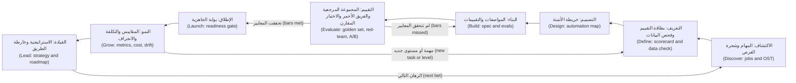
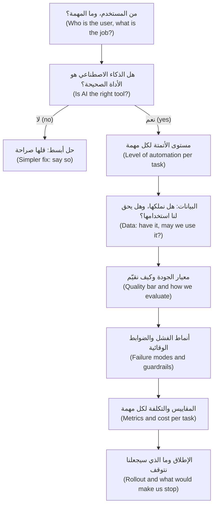

# الوحدة 10 — البطل: المشروع الختامي والامتحان التدريبي (Hero: capstone and practice exam)

*لقد تعرّفت على كل جزء من إدارة منتجات الذكاء الاصطناعي (AI product management) درسًا بعد درس. هذه الوحدة تعيد تجميعها معًا. في المشروع الختامي (capstone) تأخذ نجم أسيست (Najm Assist)، مساعد العملاء (customer assistant) في تطبيق الهاتف المحمول (mobile app) لبنك نجم (Najm Bank)، من فكرة غامضة (vague idea) إلى منتج يعمل على نطاق واسع (running at scale)، وتُنتج في الطريق وثيقة (artefact) واحدة من كل وحدة سابقة: موجز الفرصة (opportunity brief)، وبطاقة تقييم حالات الاستخدام (use-case scorecard)، وفحص جاهزية البيانات (data readiness check)، وخريطة الأتمتة (automation map)، والمواصفات مع التقييمات (spec with evals)، وقائمة التحقق من الإطلاق (launch checklist)، وشجرة المقاييس (metrics tree)، ونموذج التكلفة لكل مهمة (cost-per-task model)، وخارطة الطريق (roadmap). ثم ننتقل إليك أنت: كيف تعرض هذا العمل في المقابلات (interviews) وفي ملف الأعمال (portfolio)، وكيف تواصل النمو (keep growing) بوصفك مدير منتجات ذكاء اصطناعي (AI product manager) بعد انتهاء الدورة. وتُختتم الوحدة بامتحان تدريبي (practice exam) من 60 سؤالًا يغطي المراحل الثماني كلها (all eight stages).*

> **المراحل (Stages):** Discover إلى Lead — دورة الحياة كاملة (the whole lifecycle)، من البداية إلى النهاية (end to end)، على منتج واحد (one product) ثم في امتحان واحد (one exam).

---

# 10.1 — المشروع الختامي: خذ نجم أسيست من الفكرة إلى النطاق الواسع (Capstone: take Najm Assist from idea to scale)
*المستوى (Level): 🔴 متقدم (Advanced)* · *المتطلبات (Prerequisites): الوحدات 0–9 (Modules 0–9)* · *المرحلة (Stage): Discover, Define, Design, Build, Evaluate, Launch, Grow, Lead*

## ⚡ الدرس في دقيقة (In 60 seconds)
- يمرّ المشروع الختامي (capstone) بمنتج واحد، هو **نجم أسيست (Najm Assist)**، عبر المراحل الثماني كلها (all eight stages): Discover وDefine وDesign وBuild وEvaluate وLaunch وGrow وLead. وكل مرحلة تُنتج وثيقة واحدة (one artefact) تعلّمت صنعها من قبل.
- كل وثيقة تجيب عن **سؤال قرار (decision question)** («هل تستحق الحل؟ ⁦(worth solving?)⁩»، «كم من الاستقلالية؟ ⁦(how much autonomy?)⁩»، «هل هو جيد بما يكفي للإطلاق؟ ⁦(good enough to ship?)⁩»، «هل يُدرّ عائدًا؟ ⁦(does it pay?)⁩»). إذا لم تغيّر أي قرار (changes no decision)، فاحذفها (cut it).
- الوثائق مترابطة (Artefacts connect): مهمة من الاكتشاف (discovery job) تصبح مهمة تقييم (eval task)؛ ومعيار الجودة في المواصفات (spec quality bar) يصبح بوابة إطلاق (launch gate) ثم تنبيه مراقبة (monitoring alert). والروابط المقطوعة (Broken links) هي حيث تفشل منتجات الذكاء الاصطناعي (AI products fail).
- ينمو نجم أسيست على **درجات أتمتة (automation steps)** — الإجابة (answer)، ثم الإرشاد (guide)، ثم التنفيذ مع التأكيد (act with confirmation) (تجميد بطاقة (freeze a card))، ثم المهام الأعلى خطورة (higher-stakes tasks) (الاعتراضات على المعاملات (disputes)). وكل درجة تعيد فتح مراحل Define وDesign وEvaluate.
- إشارة القرار (Decision cue): قبل كل مرحلة، اكتب «ما الذي سيجعلنا نتوقف؟ ⁦(what would make us stop?)⁩». والخطة التي لا تتضمن معيار إيقاف (kill criterion) هي مجرد عرض ترويجي (pitch).
- أكبر فخ (Biggest trap): التعامل مع المشروع الختامي على أنه تمرين في كتابة الوثائق (document exercise). فالمهارة الحقيقية (The skill) هي الحكم بين الوثائق (judgement between artefacts).

## 🧭 لماذا يهم (Why it matters)
الشهر يناير (January). تعرض رانيا على الفريق شريحة واحدة (one slide): معظم مكالمات مركز الاتصال (contact-centre calls) في العام الماضي دارت حول عدد قليل من المواضيع (handful of topics) — إيقاف البطاقات (card blocks)، والمعاملات المعترض عليها (disputed transactions)، وحدود التحويل (transfer limits)، والرسوم (fees)، و«أين أموالي؟ (where is my money)». الرئيس التنفيذي (CEO) يريد مساعدًا داخل التطبيق (app assistant). يسأل خالد عمّا سيكلّفه وعمّا سيوفّره (cost and save). وتسأل ليلى عمّا يحدث عندما يعطي عميلًا من الاتحاد الأوروبي (EU customer) إجابة خاطئة عن الرسوم (wrong answer about fees). وتسأل سارة أين ستُخزَّن نصوص المحادثات (transcripts will be stored). ويسأل طارق عن زمن الاستجابة (latency)؛ وحصة عمّا يريده العملاء (what customers want).

فيصل يريد عرضًا توضيحيًا (demo) بحلول الخميس. رانيا: «العرض التوضيحي سهل (The demo is easy). الجزء الصعب هو القرارات التي تقع بين العرض التوضيحي ومنتج يأتمنه العملاء على أموالهم (a product customers trust with their money). لنتخذها بالترتيب (in order)، ولنكتب كل قرار منها (write each one down).»

للقرارات التي يتم تخطّيها (Skipped decisions) تكاليف علنية (public costs). في قضية *Moffatt v. Air Canada* (2024)، حمّلت هيئة قضائية (tribunal) شركة الطيران المسؤولية (held the airline responsible) عمّا قاله روبوت المحادثة (chatbot) الخاص بها لعميل بشأن أسعار تذاكر الحداد (bereavement fares). وروبوت محادثة التوصيل (delivery chatbot) لدى DPD شتم وانتقد الشركة بعد تحديث (after an update) في يناير 2024. وأعلنت Klarna في فبراير 2024 أن مساعدها يتولى حصة كبيرة من محادثات العملاء (large share of customer chats)، ثم قالت في 2025 إنها ستعيد مزيدًا من الخدمة البشرية (bring more human service back). كل حالة منها فشل يقع *بين* الوثائق (a failure *between* artefacts): مواصفات بلا قاعدة إسناد (spec without a grounding rule)، وتحديث بلا بوابة انحدار (update without a regression gate)، ومقياس تكلفة بلا ثقل موازن من الجودة (cost metric without a quality counterweight). والمشروع الختامي هو المكان الذي تتدرّب فيه على سدّ هذه الفجوات (closing those gaps).

## 📐 كيف يعمل (How it works)

### 🟢 الأساسيات (The essentials)

**المشروع الختامي (A capstone)** هنا هو مرور واحد من البداية إلى النهاية (end-to-end pass) عبر دورة الحياة (lifecycle) على منتج واحد، يُنتج مجموعة مترابطة من الوثائق (linked set of artefacts): **ملف المنتج (product dossier)**. تسلّمه رانيا إلى مدير منتج جديد (new PM) في يومه الأول؛ وتقرؤه ليلى عند بوابات الحوكمة (governance gates)؛ ويقرؤه خالد قبل اعتماد الميزانية (approving budget).

صفحة الملخص (summary page) في قسم 🏛️ أدناه تسرد الوثائق التسع (nine artefacts)، واحدة أو اثنتين لكل مرحلة (per stage)، وكل منها مربوطة بالدرس الذي علّمها (the lesson that taught it). ثلاث قواعد تجعل الملف يعمل (make the dossier work):

1. **كل وثيقة تذكر قرارها وأدلتها (Every artefact states its decision and its evidence)** («تجميد البطاقة أولًا (card freeze first): متكرر (frequent)، وقابل للتراجع عنه (reversible)، ومنخفض المخاطر (low-risk)»).
2. **كل وثيقة تسمّي مُدخَل الوثيقة التالية (Every artefact names the next one's input).** فأهم المهام في الموجز (brief's top jobs) تصبح شرائح في المجموعة المرجعية (golden-set slices)؛ ومعايير الجودة في المواصفات (spec's quality bars) تصبح بوابات إطلاق (launch gates).
3. **لكل مرحلة قاعدة إيقاف (Every stage has a stop rule).** إذا انطلقت (If it fires)، تعود مرحلة إلى الوراء (go back a stage) أو تقتل الفكرة (kill the idea). وهذا يعني أن العملية تعمل كما ينبغي (the process working).

جميع الأرقام أدناه توضيحية (illustrative).

**الاكتشاف (Discover).** تستمع حصة وفيصل إلى تسجيلات المكالمات (call recordings) (بموافقة سارة (Sara's approval))، ويقرآن مراجعات التطبيق (app reviews)، ويرافقان خمسة من موظفي مركز الاتصال (shadow five contact-centre agents). ويصوغان العمل وفق إطار **المهام المطلوب إنجازها (Jobs to be Done)** (كلايتون كريستنسن (Clayton Christensen)): «عندما أرى معاملة لا أتعرّف عليها (a transaction I don't recognise)، أريد أن أوقف مزيدًا من الضرر (stop further damage) وأستعيد أموالي (get my money back).» و**شجرة الفرص والحلول (Opportunity Solution Tree)** لديهما (تيريزا توريس (Teresa Torres)) فيها نتيجة واحدة (one outcome) (العملاء يحلّون احتياجاتهم الشائعة داخل التطبيق دون انتظار (resolve common needs in the app without waiting))، وأربع فرص (four opportunities) (المعاملات غير المعروفة (unknown transactions)، والبطاقات المفقودة (lost cards)، والرسوم المربكة (confusing fees)، وحدود التحويل (transfer limits))، وحلول مرشحة (candidate solutions) تحت كل فرصة. وبعضها فقط يحتاج إلى الذكاء الاصطناعي (Only some need AI): فصفحة رسوم أوضح (clearer fee page) تعالج جزءًا من الالتباس في الرسوم أفضل من أي روبوت محادثة (better than any chatbot).

**التعريف (Define).** تقيّم بطاقة التقييم (scorecard) كل مرشح من حيث القيمة (value) والجدوى التقنية (feasibility) والمخاطر (risk). الإجابة عن أسئلة الرسوم والسياسات (fee and policy questions) من وثائق البنك تحصل على درجة عالية في القيمة والجدوى التقنية، ومتوسطة في المخاطر (medium on risk) (فالإجابات الخاطئة عن الرسوم مكلفة (wrong fee answers are costly)، كما تعلّمت Air Canada). وتجميد البطاقة (Freezing a card) عالي القيمة ومنخفض المخاطر (high value, low risk)، لأنه قابل للتراجع عنه (reversible). والاعتراض على معاملة (Disputing a transaction) عالي القيمة لكنه أعلى مخاطرة (higher risk): فهو يبدأ عملية منظّمة رقابيًا (regulated process) لها مواعيد نهائية (deadlines). أما المشورة الاستثمارية المخصّصة (Personalised investment advice) فـ**تُقتل (killed)** (مخاطر عالية (high risk)، وقيمة غير واضحة (unclear value)، ومسألة ترخيص (licensing question))، ويُسجَّل السبب (the reason is recorded) حتى لا يُعاد فتحها كل ربع سنة (every quarter).

يسأل فحص جاهزية البيانات (data readiness check) عمّا إذا كان لدى البنك ما تحتاجه كل حالة استخدام (each use case): مجموعة نصوص حالية ومملوكة للرسوم والشروط (current, owned fee and terms corpus) (جزئيًا (partly) — توجد ثلاث نسخ من جدول الرسوم (fee schedule)، فيسمّي فريق عمر مالكًا واحدًا (one owner))؛ ومحادثات تاريخية للتقييم (historical conversations for evaluation) (نعم، بعد التنقيح وحجب البيانات (after redaction))؛ وواجهات برمجة البطاقات (card APIs) (نعم، يستخدمها التطبيق أصلًا). وتسجّل مذكرة حقوق البيانات (data rights note) التي أعدّتها سارة الأساس القانوني (lawful basis) بموجب قانون حماية خصوصية البيانات الشخصية في قطر (Qatar's PDPPL) (القانون رقم 13 لسنة 2016 (Law No. 13 of 2016)) واللائحة العامة لحماية البيانات (GDPR) للعملاء من الاتحاد الأوروبي، إضافة إلى مدة الاحتفاظ (retention). التفاصيل مكانها دورة *AI Governance: Zero to Hero*؛ أما مدير المنتج (PM) فيتأكد من وجود المذكرة قبل البناء (before build).

### 🟡 التعمق أكثر (Going deeper)

**التصميم (Design).** تبني حصة **خريطة الأتمتة (automation map)** مستخدمةً مستويات الأتمتة (levels of automation) (شيريدان وفيربلانك (Sheridan and Verplank)، 1978) ضمن مستويات المنتج الأربعة في الدورة (course's four product levels): الاقتراح (suggest)، والصياغة (draft)، والقرار (decide)، والتنفيذ (act).

| المهمة (Task) | المستوى عند الإطلاق (Level at launch) | السبب (Why) | شرط الانتقال إلى الأعلى (Condition to move up) |
|---|---|---|---|
| الإجابة عن أسئلة الرسوم والسياسات (Answer fee and policy questions) | اقتراح، مع المصادر (Suggest, with sources) | العميل يقرر ما يفعله (Customer decides what to do) | يبقى هنا (Stays here) |
| تغيير حد التحويل (Change a transfer limit) | صياغة: تعبئة مسبقة، والعميل يرسل (Draft: prefill, customer submits) | العميل يتحكم في حركة الأموال (Customer controls money movement) | معدل خطأ منخفض في التعبئة المسبقة (Low prefill error rate) لمدة ربع سنة |
| تجميد بطاقة (Freeze a card) | تنفيذ، مع التأكيد (Act, with confirmation) | متكرر، وعاجل، وقابل للتراجع بلمسة واحدة (Frequent, urgent, reversible in one tap) | في المستوى المستهدف أصلًا (Already at target) |
| فتح اعتراض (Open a dispute) | صياغة: العميل يؤكد، والموظف يراجع (Draft: customer confirms, agent reviews) | عملية منظّمة رقابيًا، ومواعيد نهائية، وأموال على المحك (Regulated process, deadlines, money at stake) | أدلة من التقييم والتدقيق (Eval and audit evidence)؛ وإعادة موافقة ليلى (Layla's re-approval) |

أنماط الثقة (trust patterns) مأخوذة من دليل **People + AI Guidebook** من Google ومن **Guidelines for Human-AI Interaction** من Microsoft (أمرشي وآخرون ⁦(Amershi et al.)⁩، 2019): صرّح بأنه ذكاء اصطناعي وبما يستطيع فعله (say it is an AI and what it can do)؛ واعرض المصادر (show sources)؛ واطلب التأكيد قبل أي إجراء (confirm before any action)؛ وأبقِ خيار «التحدث إلى شخص (talk to a person)» ظاهرًا؛ وعند عدم اليقين (when unsure)، سلّم المحادثة إلى إنسان مع إرفاق المحادثة (hand over with the conversation attached). وواجب الشفافية (transparency duty) لروبوتات المحادثة في قانون الذكاء الاصطناعي الأوروبي (EU AI Act) يشير إلى الاتجاه نفسه؛ وتؤكد ليلى التفاصيل.

**البناء (Build).** تحوّل المواصفات (spec) القرارات إلى متطلبات قابلة للاختبار (testable requirements):

- *قاعدة الإسناد (Grounding rule):* إجابات الرسوم والسياسات تأتي فقط من مجموعة النصوص المعتمدة (approved corpus) عبر الاسترجاع (retrieval) (التوليد المعزّز بالاسترجاع (RAG))؛ وإذا لم يُعثر على شيء ذي صلة (nothing relevant is found)، يقول المساعد ذلك ويعرض التحويل إلى شخص (offers a person). ولا يجوز أن يظهر أي رسم أو سعر أو حد (No fee, rate or limit) ما لم يكن موجودًا في مصدر مُسترجَع (retrieved source).
- *معايير الجودة على شكل تقييمات (Quality bars as evals):* على سبيل المثال، 95% من أسئلة الرسوم في المجموعة المرجعية (golden-set fee questions) صحيحة مع المصدر الصحيح (right source)، وصفر أرقام غير مُسندة (zero ungrounded numbers) في مجموعة الفريق الأحمر (red-team set)، و100% من الإجراءات مؤكَّدة (actions confirmed) (أرقام توضيحية (illustrative)؛ تضع دانة وفيصل المعايير الحقيقية (real bars) انطلاقًا من خط الأساس (baseline)).
- *الأدوات بوصفها سطحًا للمنتج (Tools as product surface):* عند الإطلاق يحصل المساعد على `get_card_status` و`freeze_card` ولا شيء غيرهما. وتُكتب أوصاف الأدوات (Tool descriptions) كما يُكتب نص واجهة المستخدم (UI copy)، لأن النموذج (model) يقرؤها ليقرر ما يفعله. أما كيفية ربط الأدوات (How tools are connected) (مثلًا عبر **Model Context Protocol**، الذي قدّمته Anthropic في نوفمبر 2024) فهو قرار طارق (Tariq's call).
- *ميزانيات زمن الاستجابة والتكلفة (Latency and cost budgets):* زمن مستهدف لأول رد (target time to first response) وسقف للتكلفة لكل محادثة (cost ceiling per conversation).

قبل ذلك، أجرى فيصل اختبار **Wizard of Oz** («ساحر أوز»: إنسان خلف نافذة المحادثة (a human behind the chat window)) ليتعلم كيف يصوغ العملاء احتياجاتهم (how customers phrase their needs)، ثم نموذجًا أوليًا رفيعًا للاسترجاع (thin retrieval prototype) على مجموعة النصوص الحقيقية (real corpus).

**التقييم (Evaluate).** لخطة التقييم (eval plan) التي وضعتها دانة ثلاث طبقات (three layers)، تطابق الوحدة 6 (Module 6):

1. **دون اتصال (Offline)**: مجموعة مرجعية (golden set) من محادثات حقيقية منقّحة (redacted real conversations)، مقسّمة إلى شرائح حسب المهمة (job) واللغة (language) (الإنجليزية والعربية (English and Arabic)) ودرجة الصعوبة (difficulty). ويقرأ تحليل الأخطاء (Error analysis) حالات الفشل يدويًا (reads failures by hand) قبل أن يعدّل أحد أي موجّه (tunes a prompt).
2. **المحكَّمة والعدائية (Judged and adversarial)**: **نموذج لغوي كبير حَكَمًا (LLM-as-judge)** يقيّم الإسناد (grounding) والنبرة (tone) على نطاق واسع (at scale)، مُعايَرًا مقابل مقيّمين بشريين (calibrated against human raters) لأن للحكّام تحيّزات معروفة (judges have known biases) (جنغ وآخرون ⁦(Zheng et al.)⁩، 2023). ويحاول فريق أحمر (red-team) تنفيذ حقن الموجّهات (prompt injection)، وتجاوز الحدود (limit overrides)، والتلاعب من نوع «سيارة بدولار واحد ("$1 car" manipulation)» الذي شوهد لدى وكيل سيارات Chevrolet في ديسمبر 2023، وأسئلة تستدرج المساعد إلى ذكر رسوم لا يجدها (baiting the assistant to state fees it cannot find).
3. **عبر الإنترنت (Online)**: إطلاق مرحلي (staged rollout) (الموظفون، ثم 1% و10% و50% من المستخدمين) مع **اختبار A/B (A/B test)** مقابل مركز المساعدة الحالي (existing help centre). واتباعًا لكوهافي وتانغ وشو (Kohavi, Tang and Xu)، يتفق الفريق مسبقًا (in advance) على **معيار التقييم الشامل (overall evaluation criterion)** ويضيف **مقاييس وقائية (guardrail metrics)** (الشكاوى (complaints)، ومعدل التحويل إلى إنسان (handoff rate)، وبلاغات الإجابات الخاطئة (wrong-answer reports)) قادرة على إيقاف الإطلاق بمفردها (stop the rollout on their own).

**الإطلاق (Launch).** لقائمة التحقق من الجاهزية (readiness checklist) أربع كتل (four blocks): *الجودة (quality)* (تحقُّق كل معيار في المواصفات على النسخة نفسها من النموذج والموجّه التي ستُطلق (exact model and prompt version shipping))، و*الضوابط الوقائية (guardrails)* (المرشحات مفعّلة (filters live)، والتأكيدات مختبَرة (confirmations tested)، ومفتاح إيقاف (kill switch) يعطّل الأدوات خلال دقائق (within minutes))، و*الحوكمة (governance)* (موافقة ليلى، ونتيجة تقييم الأثر على حماية البيانات (DPIA outcome) من سارة، واعتماد نص الإفصاح (disclosure text approved))، و*الدعم (support)* (موظفون مدرَّبون على التحويلات (agents trained on handoffs)، ومالك للحوادث مناوب (incident owner on call)). والتموضع (Positioning) متواضع (modest): «مساعدة سريعة للخدمات المصرفية اليومية (fast help for everyday banking)». ويعتمد التبنّي داخل البنك (Adoption inside the bank) على مركز الاتصال (contact centre): فإذا رأى الموظفون فيه تهديدًا (see a threat)، تتضرر التحويلات (handoffs suffer)، ولذلك تُشرك رانيا رئيسهم (involves their head) منذ مرحلة Discover فصاعدًا.

### 🔴 نظرة الخبير (Expert view)

**النمو (Grow).** تبدأ شجرة المقاييس (metrics tree) لدى فيصل من **مقياس نجم الشمال (North Star metric)** واحد: *احتياجات العملاء التي تُحل داخل التطبيق دون تواصل متكرر خلال سبعة أيام (customer needs resolved in the app without a repeat contact within seven days)*. فمعدل الاحتواء (Containment) (المحادثات التي لا تصل أبدًا إلى إنسان (chats that never reach a human)) يسهل تضخيمه (easy to inflate) بإخفاء خيار «التحدث إلى شخص (talk to a person)»؛ أما الحل دون تواصل متكرر (resolution without repeat contact) فلا. وتحته تقع فئات **HEART** (رودن وهتشنسون وفو (Rodden, Hutchinson and Fu)، 2010) — السعادة (happiness)، والتفاعل (engagement)، والتبنّي (adoption)، والاحتفاظ (retention)، ونجاح المهمة (task success) — ومقاييس الثقة (trust metrics): معدل التحويل إلى إنسان (handoff rate)، وبلاغات الإجابات الخاطئة (wrong-answer reports)، والشكاوى (complaints).

**نموذج التكلفة لكل مهمة (cost-per-task model)**: التكلفة لكل محادثة محلولة (cost per resolved conversation) = (تكلفة النموذج والاسترجاع لكل محادثة (model and retrieval cost per conversation) + تكلفة الأدوات والمنصة (tool and platform cost) + معدل التحويل إلى إنسان × تكلفة التواصل البشري (handoff rate × cost of a human contact) + الأعباء الإضافية للمراقبة (monitoring overhead)) ÷ معدل الحل (resolution rate). بأرقام توضيحية (illustrative numbers) — بضعة سنتات من تكلفة النموذج (a few cents of model cost)، وتواصل بشري يكلّف أضعاف ذلك (many times that)، ومعدل تحويل إلى إنسان يبلغ 25% — فإن التحويلات، لا النموذج، هي التي تهيمن (handoffs, not the model, dominate). لذلك فإن أفضل رافعة للنمو (best growth lever) هي تحسين الحل في أهم المهام (better resolution on the top jobs)، لا نموذج أرخص (not a cheaper model).

تعيد خطة المراقبة (monitoring plan) استخدام المواصفات (reuses the spec). تعمل مجموعة التقييمات (eval suite) كل ليلة (nightly) على عينات منقّحة من المحادثات الحية (sampled, redacted live conversations)؛ وتنطلق التنبيهات (alerts fire) عندما ينخفض الإسناد عن معيار الإطلاق (grounding falls below the launch bar)، أو ترتفع التحويلات في مهمة ما (handoffs rise on a job)، أو تظهر أنواع جديدة من الأسئلة (new question types) لا تغطيها المجموعة المرجعية (الانجراف (drift)، مثلًا بعد جدول رسوم جديد (new fee schedule)). وكل تغيير في النموذج أو الموجّه (model or prompt change) يُشغّل المجموعة الكاملة أولًا (runs the full suite first) — وهي بوابة الانحدار (regression gate) التي افتقدتها حالة DPD.

**القيادة (Lead).** تقول صفحة الاستراتيجية الواحدة (strategy one-pager) التي أعدّتها رانيا إن القابلية للدفاع (defensibility) لا تأتي من النموذج، الذي يستطيع المنافسون شراءه (competitors can buy)، بل من التكامل مع الأنظمة الأساسية (core-system integration)، ومجموعة نصوص حالية (current corpus)، ومحادثات مُصنَّفة (labelled conversations) تشحذ التقييمات (sharpen evals)، والثقة (trust). وخارطة الطريق (roadmap) مجموعة من **الرهانات (bets)** ذات بوابات أدلة (evidence gates)، لا تواريخ ميزات (not feature dates): «صياغة الاعتراضات (dispute drafting)، إذا تجاوز تقييم الربع الثاني المعيار (Q2 eval clears the bar) وأعادت ليلى الموافقة». ومجموعة تقييمات محايدة تجاه النموذج (model-agnostic eval suite) تجعل تبديل المزوّدين (switching providers) مجرد تشغيل تقييم (an eval run)، لا إعادة كتابة (not a rewrite). ويسمّي نموذج التشغيل (operating model) المالكين (owners): فيصل (المنتج والمقاييس (product and metrics))، ودانة (التقييم (evaluation))، وطارق (المنصة وزمن الاستجابة والتكلفة (platform, latency, cost))، ومركز الاتصال (التحويلات (handoffs))، ومكتب ليلى (أي انتقال إلى الأعلى في خريطة الأتمتة (any move up the automation map)). ويسري الذكاء الاصطناعي المسؤول (Responsible AI) في كل وثيقة بدلًا من أن يجلس في فصل أخير (final chapter).

**قرارات الحكم بين الوثائق (The judgement calls between artefacts).** ثلاث لحظات تُظهر الفرق بين مدير منتج بطل (hero PM) وكاتب وثائق (document writer):

- *التقييم يُخفق في بلوغ المعيار بقليل (The eval misses the bar by a little).* الإسناد في الرسوم (Fee grounding) يبلغ 92% مقابل معيار 95%؛ ويريد فيصل «إصلاحه لاحقًا (fix it later)». تحليل الأخطاء أولًا (Error analysis first): إذا تجمّعت الإخفاقات في نوع واحد من الرسوم (misses cluster in one fee type)، فأخرج ذلك النوع من النطاق (remove that type from scope) («دعني أوصلك بموظف (let me connect you)») وأطلق الباقي (launch the rest). تضييق النطاق (Narrowing scope) قرار منتج (product decision)؛ أما خفض المعيار بصمت (quietly lowering the bar) فليس كذلك.
- *اختبار A/B يفوز في التكلفة ويخسر في الثقة (The A/B test wins on cost, loses on trust).* المقياس الوقائي هو الذي يغلب (The guardrail wins)؛ حقّق قبل التوسّع (investigate before expanding).
- *قطاع الأعمال يريد مستوى الأتمتة التالي مبكرًا (The business wants the next automation level early).* يريد خالد اعتراضات مؤتمتة بالكامل (fully automated disputes). وتجيب رانيا بأن ذلك سيحدث عندما تتوافر الأدلة وإعادة الموافقة (when the evidence and re-approval exist)، وتوضح ما يتطلبه ذلك (shows what that takes).

## 🧰 الأدوات (The toolkit)
| الأداة أو الإطار (Tool or framework) | ما هو وماذا يفعل (What it is and does) | متى تلجأ إليه (When to reach for it) |
|---|---|---|
| **Product dossier** — ملف المنتج | وثائق مترابطة لمنتج واحد (Linked artefacts for one product)، تذكر كل منها القرار والأدلة وقاعدة الإيقاف (decision, evidence and stop rule) | من الفكرة إلى النطاق الواسع (Idea to scale)؛ وتهيئة مدير منتج جديد (onboarding a PM)؛ وبوابات الحوكمة (governance gates) |
| **Use-case scorecard** — بطاقة تقييم حالات الاستخدام | تقيّم المرشحين من حيث القيمة والجدوى التقنية والمخاطر (value, feasibility and risk)، مع معايير إيقاف صريحة (explicit kill criteria) | مرحلة Define: اختيار حالات الاستخدام الأولى (choosing the first use cases) وتسجيل ما قُتل (recording kills) |
| **Automation map** (استنادًا إلى شيريدان وفيربلانك (after Sheridan and Verplank)) — خريطة الأتمتة | تعيّن لكل مهمة مستوى (assigns each task a level) (اقتراح، صياغة، قرار، تنفيذ (suggest, draft, decide, act)) وشرطًا للانتقال إلى الأعلى (condition for moving up) | مرحلة Design: تحديد الاستقلالية لكل مهمة لا لكل منتج (autonomy per task, not per product) |
| **Golden set** — المجموعة المرجعية | مهام حقيقية مقسّمة إلى شرائح (Sliced real tasks) مع إجابات مرجعية (reference answers) | تحويل المواصفات إلى اختبارات (turning the spec into tests) وبوابات انحدار (regression gates) |
| **Launch readiness checklist** — قائمة التحقق من جاهزية الإطلاق | شروط الجودة والضوابط الوقائية والحوكمة والدعم (Quality, guardrail, governance and support conditions)، وكلها يجب أن تتحقق للإطلاق (all true to ship) | اجتماع قرار المضي أو عدم المضي (go or no-go meeting) |
| **Cost-per-task model** — نموذج التكلفة لكل مهمة | تكلفة خدمة مهمة واحدة محلولة (Cost to serve one resolved task)، بما في ذلك التحويلات إلى البشر (human handoffs) | التقديرات في مرحلة Define (Estimates in Define)، والأرقام الفعلية في مرحلة Grow (actuals in Grow) |

## 🏛️ عمليًا في بنك نجم (In practice at Najm Bank)
**ملف منتج نجم أسيست — صفحة الملخص (Najm Assist product dossier — summary page)** الذي أعدّه فيصل (الإصدار 1.0 (v1.0)، بمراجعة رانيا). كل صف مربوط بالوثيقة الكاملة (links to the full artefact).

| # | المرحلة (Stage) | الوثيقة (Artefact) | القرار المسجَّل (Decision recorded) | قاعدة الإيقاف (Stop rule) |
|---|---|---|---|---|
| 1 | Discover | موجز الفرصة + شجرة الفرص والحلول (Opportunity brief + OST) (2.1) | التركيز على أربع مهام (Focus on four jobs): المعاملات غير المعروفة (unknown transactions)، والبطاقات المفقودة (lost cards)، والرسوم (fees)، وحدود التحويل (transfer limits) | إذا كانت أهم المهام تحتاج إلى حكم بشري (need human judgement) في معظم الحالات، فلا تبنِ مساعدًا (do not build an assistant) |
| 2 | Define | بطاقة تقييم حالات الاستخدام (Use-case scorecard) (2.2، 2.3) | الإطلاق بإجابات الرسوم والسياسات وتجميد البطاقة (fee/policy answers and card freeze)؛ الاعتراضات لاحقًا (dispute later)؛ المشورة الاستثمارية قُتلت (investment advice killed) | أي مرشح يحصل على مخاطر عالية دون تخفيف (high risk with no mitigation) يُركن جانبًا (is parked) |
| 3 | Define | تقييم جاهزية البيانات + قسم الخصوصية وحقوق البيانات (Data Readiness Assessment + privacy and data rights section) (3.1، 3.3) | مالك واحد لجدول الرسوم (Single owner for fee schedule)؛ نصوص محادثات منقّحة للتقييم (redacted transcripts for eval)؛ تسجيل الأساس القانوني (lawful basis recorded) | لا إطلاق حتى يوجد مصدر رسوم حالي واحد (one current fee source) |
| 4 | Design | سجل قرار مستوى الأتمتة، ومواصفات تصميم الثقة، وكتالوج الإجراءات (Automation Level Decision Record, Trust Design Spec, Action Catalogue) (4.1–4.3) | اقتراح (Suggest) (للإجابات)، وتنفيذ مع التأكيد (act with confirmation) (للتجميد)، وصياغة (draft) (للاعتراضات) | العملاء يسيئون فهم التأكيد في الاختبار (misunderstand the confirmation in testing) ← إعادة التصميم (redesign) |
| 5 | Build | مواصفات منتج الذكاء الاصطناعي + ورقة السلوك (AI product spec + behaviour sheet) (5.1–5.3) | قاعدة الإسناد (Grounding rule)؛ قائمة أدوات مقصورة على أداتين (tool list limited to two)؛ ميزانيات زمن الاستجابة والتكلفة (latency and cost budgets) | معايير جودة لم تتفق عليها دانة وفيصل (Quality bars not agreed) ← لا اعتماد للبناء (no build sign-off) |
| 6 | Evaluate | خطة التقييم والفريق الأحمر، وموجز الإطلاق والتجربة (Evaluation and Red-Team Plan, rollout and experiment brief) (6.1–6.3) | مجموعة مرجعية حسب المهمة واللغة (Golden set by job and language)؛ الحَكَم مُعايَر (judge calibrated)؛ تم اجتياز الفريق الأحمر (red-team passed)؛ تصميم اختبار A/B مع معيار التقييم الشامل والمقاييس الوقائية (A/B design with OEC and guardrails) | أي معيار لم يتحقق (Any bar missed) ← تضييق النطاق أو الإصلاح (narrow scope or fix)؛ ولا خفض صامت أبدًا (never lower silently) |
| 7 | Launch | قائمة التحقق من جاهزية الإطلاق + خطة التبنّي (Launch Readiness Checklist + adoption plan) (7.1–7.3) | إطلاق مرحلي (Staged rollout)؛ الموظفون مدرَّبون (agents trained)؛ مفتاح الإيقاف مختبَر (kill switch tested) | أي بند لم يُؤشَّر عليه (Any unchecked item) ← لا إطلاق (no launch) |
| 8 | Grow | شجرة المقاييس، وورقة اقتصاديات الوحدة، وخطة المراقبة ودليل التشغيل (Metrics tree, unit economics sheet, monitoring plan and runbook) (8.1–8.3) | نجم الشمال (North Star) = الحل دون تواصل متكرر خلال 7 أيام (resolved without repeat contact in 7 days) | خرق مقياس وقائي (Guardrail breach) ← إيقاف الإطلاق مؤقتًا (pause rollout)؛ تنبيه انجراف (drift alert) ← مراجعة (review) |
| 9 | Lead | صفحة الاستراتيجية الواحدة، وخارطة طريق الرهانات، ونموذج التشغيل (Strategy one-pager, bets roadmap, operating model) (9.1–9.4) | القابلية للدفاع من التكامل ومجموعة النصوص والثقة (Defensibility from integration, corpus and trust)؛ الاعتراضات بوصفها الرهان التالي (disputes as next bet) | أدلة الرهان لم تتحقق عند بوابتها (Bet evidence not met by its gate) ← إسقاطه أو إعادة تحديد نطاقه (drop or re-scope) |

تعليق رانيا (Rania's comment): *«سيسأل المدققون (Auditors) عن الصفين 3 و7، وخالد عن الصف 8. أما الصف 1 فهو الذي سننساه (the one we'll forget) — راجعوه كل ستة أشهر (revisit it every six months).»*

## 🛠️ التمارين (Exercises)
- 🟢 اكتب ثلاثة صفوف من الملف بالكامل (three rows of the dossier in full) (مثلًا بطاقة التقييم مع خمسة مرشحين (scorecard with five candidates)، وخريطة الأتمتة مع ست مهام (automation map with six tasks)، وقائمة التحقق من الإطلاق (launch checklist)). *يكتمل عندما (Done when):* يذكر كل منها قراره وأدلته وقاعدة إيقافه (decision, evidence and stop rule)، ويسمّي المُدخَل الذي يمرّره (names the input it passes on).
- 🟡 اكتب ملخص الملف (dossier summary) لـ**التنبيهات الذكية (Smart Alerts)** أو **مساعد الموظفين التوليدي (Staff GenAI)**، صفًا لكل مرحلة (one row per stage). *يكتمل عندما (Done when):* تُملأ الصفوف التسعة كلها، ويختلف ثلاثة منها على الأقل في المضمون (differ in substance) عن نجم أسيست، مع سبب من جملة واحدة لكل منها (one-sentence reason) (تعلّم آلي تقليدي (classic ML)، أو أداة داخلية (internal tool)).
- 🔴 نفّذ المشروع الختامي كاملًا (Run the full capstone) على منتج من مؤسستك (your own organisation) أو على منتج عام (public product). اعرضه في 10 دقائق على زميل يؤدي دور خالد ثم ليلى ثم طارق بالتناوب (in turn). *يكتمل عندما (Done when):* تتسع كل وثيقة في صفحة واحدة (fits on one page)، وتكون الروابط صريحة (links are explicit)، وتكون قد كتبت إجابات عن أصعب ثلاثة أسئلة لديهم (three hardest questions)، وتغيّرت وثيقة واحدة على الأقل بسببها (changed because of them).

## ⚠️ أخطاء وفخاخ (Mistakes and traps)
- **البدء من مرحلة Build (Starting at Build).** العرض التوضيحي (demo) يجيب عن «هل نستطيع؟ ⁦(can we?)⁩»، لا عن «هل يجب؟ ⁦(should we?)⁩». ابدأ بالمهام وبطاقة التقييم (jobs and the scorecard).
- **وثائق لا تتحاور فيما بينها (Artefacts that do not talk to each other).** مجموعة تقييم تفتقد أهم المهام (eval set missing the top jobs)، أو مراقبة تتجاهل معايير الإطلاق (monitoring that ignores the launch bars)، تترك فجوات تعيش فيها الإخفاقات (gaps where failures live).
- **مستوى أتمتة واحد للمنتج كله (One automation level for the whole product).** عبارة «نجم أسيست وكيل (Najm Assist is an agent)» تُخفي حقيقة أن الإجابة والتجميد والاعتراض (answering, freezing and disputing) تحمل مخاطر مختلفة جدًا (very different risk). حدّد المستوى لكل مهمة (Set the level per task).
- **قياس الاحتواء بدلًا من الحل (Measuring containment instead of resolution).** الاحتواء (Containment) يكافئ إخفاء الخيار البشري (hiding the human option). استخدم نجم شمال (North Star) يعدّ المشكلات المحلولة فعلًا (problems actually solved)، مع مقاييس الثقة بوصفها مقاييس وقائية (trust metrics as guardrails).
- **لا قواعد إيقاف (No stop rules).** من دون شرط مكتوب للتوقف (written condition for stopping)، تحمل التكلفة الغارقة (sunk cost) المنتجات الضعيفة إلى الإطلاق. اكتب قاعدة الإيقاف قبل أن تبدأ المرحلة (before the stage starts).

## 🧾 الخلاصة (Recap)
- يأخذ المشروع الختامي (capstone) منتجًا واحدًا عبر المراحل الثماني كلها ويُنتج **ملف منتج (product dossier)** مترابطًا، بوثيقة واحدة لكل مرحلة (one artefact per stage).
- كل وثيقة تجيب عن سؤال قرار (decision question)، وتستشهد بالأدلة (cites evidence)، وتسمّي قاعدة إيقاف (stop rule)، وتغذّي الوثيقة التالية (feeds the next).
- معايير الجودة في المواصفات (Spec quality bars) تصبح بوابات إطلاق (launch gates) ثم تنبيهات مراقبة (monitoring alerts)؛ وهذه السلسلة (chain) هي ما يجعل تغيير منتج الذكاء الاصطناعي آمنًا (safe to change).
- انمُ على أساس نجم شمال (North Star) يعدّ الحل الحقيقي (real resolution)، ونموذج تكلفة لكل مهمة (cost-per-task model) يشمل البشر (includes humans).
- مهارة البطل (The hero skill) هي الحكم بين الوثائق (judgement between artefacts): ضيّق النطاق بدلًا من خفض معيار (narrow scope rather than lower a bar)، ودع المقاييس الوقائية تتغلب على المكاسب اللافتة (let guardrails beat headline wins)، ولا تنقل الاستقلالية إلا بناءً على الأدلة (move autonomy only on evidence).

## ✍️ اختبر نفسك (Check yourself)

**1. تبلغ درجة الإسناد (grounding score) لدى نجم أسيست في أسئلة الرسوم 92% مقابل معيار إطلاق (launch bar) قدره 95%. ويُظهر تحليل الأخطاء (Error analysis) أن معظم الإخفاقات تتعلق بنوع واحد من رسوم التحويل الدولي (international transfer fee). ماذا يجب أن يفعل فيصل؟**

- A. الإطلاق كما هو مخطط وإصلاح المشكلة في الإصدار التالي (next release)
- B. خفض المعيار إلى 90% (Lower the bar to 90%) لأن بقية النتائج قوية
- C. إخراج نوع الرسوم ذلك من نطاق المساعد (assistant's scope)، وتوجيه تلك الأسئلة إلى شخص (route those questions to a person)، وإطلاق الباقي إذا تحققت جميع المعايير الأخرى (all other bars are met)
- D. إلغاء الإطلاق وإعادة بدء الاكتشاف (restart discovery)

الإجابة

**C.** تضييق النطاق (Narrowing scope) يُبقي معيار الجودة سليمًا (keeps the quality bar intact). أما الإطلاق على أي حال (A) أو خفض المعيار (B) فيكسر الرابط بين المواصفات وبوابة الإطلاق (link between spec and launch gate)؛ وD رد فعل مبالغ فيه (overreacts) تجاه إخفاق ضيق ومفهوم (narrow, understood failure). (🔴 نظرة الخبير (Expert view): قرارات الحكم بين الوثائق (the judgement calls between artefacts).)

**2. أي مقياس نجم شمال (North Star metric) يناسب نجم أسيست أكثر من غيره؟**

- A. نسبة المحادثات التي لا تصل أبدًا إلى موظف بشري (never reach a human agent)
- B. عدد الرسائل المرسلة إلى المساعد شهريًا (messages sent to the assistant per month)
- C. احتياجات العملاء التي تُحل داخل التطبيق دون تواصل متكرر خلال سبعة أيام (without a repeat contact within seven days)
- D. متوسط تكلفة النموذج لكل محادثة (Average model cost per conversation)

الإجابة

**C.** فهو يقيس القيمة الحقيقية (real value) ولا يمكن رفعه بإخفاء الخيار البشري (hiding the human option). أما الاحتواء (Containment) (A) فقد يرتفع بينما تسوء الخدمة (service gets worse). وB وD مُدخلات لا نتائج (inputs, not outcomes). (🔴 نظرة الخبير (Expert view): Grow.)

**3. لماذا تضع خريطة الأتمتة (automation map) تجميد البطاقة عند مستوى «التنفيذ مع التأكيد (act with confirmation)» عند الإطلاق، بينما تضع فتح الاعتراض عند مستوى «الصياغة (draft)»؟**

- A. تجميد البطاقة يستخدم نموذجًا أرخص (cheaper model)
- B. تجميد البطاقة متكرر وعاجل ويسهل التراجع عنه (frequent, urgent and easily reversible)؛ أما الاعتراضات فتبدأ عملية منظّمة رقابيًا (regulated process) تكون فيها الأموال والمواعيد النهائية على المحك (money and deadlines at stake)
- C. لا يمكن تنفيذ الاعتراضات عبر واجهة برمجة تطبيقات (API)
- D. العملاء يفضّلون كتابة اعتراضاتهم بأنفسهم

الإجابة

**B.** يُحدَّد مستوى الأتمتة (Automation level) لكل مهمة (per task) حسب المخاطر وقابلية التراجع (risk and reversibility). فالتجميد يُلغى بلمسة واحدة (undone in one tap)؛ أما الاعتراض الذي يُعالَج بشكل سيئ (mishandled dispute) فقد يكلّف العميل مالًا. (🟡 التعمق أكثر (Going deeper): Design.)

**4. في اختبار A/B (A/B test)، تُظهر مجموعة المعالجة (treatment group) انخفاضًا بنسبة 18% في المكالمات إلى مركز الاتصال، لكن مع ارتفاع في الشكاوى التي تذكر المساعد (complaints mentioning the assistant)، وهو مقياس وقائي متفق عليه مسبقًا (pre-agreed guardrail metric). ما الخطوة التالية الصحيحة؟**

- A. التوسّع إلى 100% لأن التوفير في التكلفة كبير (cost saving is large)
- B. إيقاف التوسّع مؤقتًا (Pause the expansion) والتحقيق في الشكاوى قبل اتخاذ القرار
- C. إزالة الشكاوى من قائمة المقاييس الوقائية (guardrail list)
- D. التحوّل إلى نموذج أرخص لزيادة التوفير (increase the saving)

الإجابة

**B.** يمكن للمقاييس الوقائية (Guardrail metrics) أن توقف الإطلاق بمفردها (stop a rollout on their own)، مهما كان الرقم الرئيسي جيدًا (however good the headline) (كوهافي وتانغ وشو (Kohavi, Tang and Xu)). وA وC يُبطلان الغرض منها (defeat their purpose). (🟡 التعمق أكثر (Going deeper): Evaluate؛ 🔴 نظرة الخبير (Expert view).)

**5. يُظهر نموذج التكلفة لكل مهمة (cost-per-task model) لدى فيصل أن استدعاءات النموذج (model calls) تكلّف بضعة سنتات لكل محادثة، بينما يكلّف كل تحويل إلى إنسان (handoff to a human) أضعاف ذلك. ماذا يعني هذا لأولويات النمو (growth priorities)؟**

- A. التحوّل إلى نموذج أرخص هو الرافعة الرئيسية (main lever)
- B. تحسين الحل في أكثر المهام شيوعًا (Improving resolution on the most common jobs)، وهو ما يقلّل التحويلات، هو على الأرجح الرافعة الأكبر (biggest lever)
- C. إزالة خيار «التحدث إلى شخص (talk to a person)» ستخفض التكلفة بأمان (cut cost safely)
- D. التكلفة لا تهم بعد إطلاق المنتج (once the product has launched)

الإجابة

**B.** عندما تهيمن التحويلات على التكلفة (handoffs dominate cost)، فإن تحسين الحل في أهم المهام (better resolution on top jobs) هو ما يوفّر أكثر. أما النموذج الأرخص (A) فيقلّص الجزء الصغير (trims the small part)؛ وC يضرّ بالثقة (harms trust). (🔴 نظرة الخبير (Expert view): Grow.)

## 📚 المراجع (References)
- Teresa Torres, *Continuous Discovery Habits* (2021) — https://www.producttalk.org
- Marty Cagan, *Inspired* (2nd ed., 2017) — https://www.svpg.com
- Google PAIR, People + AI Guidebook — https://pair.withgoogle.com/guidebook
- Amershi et al., "Guidelines for Human-AI Interaction", CHI 2019 — https://www.microsoft.com/en-us/research/publication/guidelines-for-human-ai-interaction/
- Kohavi, Tang and Xu, *Trustworthy Online Controlled Experiments* (2020) — https://experimentguide.com
- Zheng et al., "Judging LLM-as-a-Judge with MT-Bench and Chatbot Arena" (2023) — https://arxiv.org/abs/2306.05685
- Rodden, Hutchinson and Fu, "Measuring the User Experience on a Large Scale: User-Centered Metrics for Web Applications", CHI 2010 — https://research.google/pubs/
- Model Context Protocol — https://modelcontextprotocol.io
- EU AI Act, Regulation (EU) 2024/1689 — https://eur-lex.europa.eu/eli/reg/2024/1689/oj

---

# 10.2 — مسيرة مدير منتجات الذكاء الاصطناعي: المقابلات وملف الأعمال والنمو (The AI PM career: interviews, portfolio and growth)
*المستوى (Level): 🔴 متقدم (Advanced)* · *المتطلبات (Prerequisites): 10.1* · *المرحلة (Stage): Lead*

## ⚡ الدرس في دقيقة (In 60 seconds)
- إدارة منتجات الذكاء الاصطناعي (AI product management) هي إدارة منتج (product management) أولًا. فالمحاورون (Interviewers) ما زالوا يختبرون حسّ المنتج (product sense) والتنفيذ (execution) والمقاييس (metrics) والقيادة (leadership)؛ أما جانب الذكاء الاصطناعي فيختبر ما إذا كنت تستطيع التفكير المنطقي في **السلوك الاحتمالي والبيانات والتقييم والتكلفة والثقة (probabilistic behaviour, data, evaluation, cost and trust)** حين تتخذ تلك القرارات.
- لا توجد وظيفة واحدة اسمها «مدير منتجات ذكاء اصطناعي (AI PM)». فالأدوار (Roles) تتراوح بين إضافة ميزات ذكاء اصطناعي إلى منتج قائم (adding AI features to an existing product)، وبناء منتجات أصيلة في الذكاء الاصطناعي (AI-native products)، وتشغيل منصات ذكاء اصطناعي داخلية (internal AI platforms). اعرف أيها تتقدّم إليه (which one you are applying for).
- أقوى إجابات المقابلات (strongest interview answers) تتبع بنية ظاهرة (visible structure): المستخدم والمهمة (user and job) ← هل الذكاء الاصطناعي هو الخيار الصحيح؟ ⁦(is AI right?)⁩ ← مستوى الأتمتة (level of automation) ← البيانات (data) ← معيار الجودة والتقييمات (quality bar and evals) ← أنماط الفشل والضوابط الوقائية (failure modes and guardrails) ← المقاييس والتكلفة (metrics and cost) ← الإطلاق (rollout). إنها الدورة كلها في فقرة واحدة (the course in one paragraph).
- ملف الأعمال (portfolio) يتفوّق على قائمة من الادعاءات (list of claims). فدراستا حالة أو ثلاث (Two or three case studies) تُظهر **القرار والأدلة والمفاضلة والنتيجة (decision, the evidence, the trade-off and the result)** — بما فيها حالة قتلت فيها شيئًا أو ضيّقته (killed or narrowed something) — تقول أكثر من أي شهادة (certificate).
- يأتي النمو (Growth) من الإطلاق (shipping) والقياس (measuring) وتدوين ما تعلّمته (writing down what you learned)، لا من متابعة كل إصدار نموذج (every model release). ابنِ عادة تعلّم (learning habit) تستطيع المحافظة عليها لسنوات.
- أكبر فخ (Biggest trap): الحديث عن النماذج (talking about models) بدلًا من المستخدمين والنتائج (users and outcomes). فعبارة «سأستخدم أحدث نموذج مع التوليد المعزّز بالاسترجاع ⁦(I'd use the latest model with RAG)⁩» ليست إجابة منتج (product answer).

## 🧭 لماذا يهم (Why it matters)
بعد ستة أشهر من إطلاق نجم أسيست (Najm Assist)، يتقدّم فيصل لوظيفة مدير منتجات ذكاء اصطناعي أول (senior AI PM role) في مساعد مذكرات الائتمان (Credit Memo Copilot). يقول لرانيا: «أنا أعرف المادة (I know the material)، لكن في سؤال تصميم مدته 30 دقيقة (30-minute design question) أبدأ بالنموذج وأضيع (start with the model and get lost).» تُجري رانيا مقابلة تجريبية (mock interview): «صمّم مساعدًا يساعد مديري العلاقات (relationship managers) على الاستعداد لاجتماعات العملاء (client meetings).» يفتتح فيصل بخطوط الاسترجاع (retrieval pipelines) وقوالب الموجّهات (prompt templates). توقفه رانيا بعد دقيقتين. «لم تخبرني من هو مدير العلاقة (RM)، ولا ما يفعله اليوم (what they do today)، ولا كيف سنعرف أن الحل يعمل (how we'd know it works).»

المرشحون الذين قرؤوا كثيرًا عن الذكاء الاصطناعي (Candidates who have read a lot about AI) غالبًا ما يجيبون كمهندسين قرؤوا عن المنتج (engineers who have read about product). أما مديرو التوظيف (Hiring managers) فيريدون العكس (the reverse): أشخاص منتج يفكرون بوضوح في ما يغيّره الذكاء الاصطناعي (product people who reason clearly about what AI changes). وفي الوقت نفسه توظّف رانيا نفسها مديري منتجات ذكاء اصطناعي (AI PMs)، وعليها أن تقرر شكل الأداء الجيد (what good looks like) من الجانب الآخر من الطاولة (other side of the table).

هذا الدرس عن الجانبين (both sides): كيف تُظهر ما تستطيع فعله (show what you can do)، وكيف تواصل التحسّن (keep getting better) بعد أن تحصل على الوظيفة.

## 📐 كيف يعمل (How it works)

### 🟢 الأساسيات (The essentials)

**ما أنواع أدوار مديري منتجات الذكاء الاصطناعي الموجودة (What kinds of AI PM roles exist).** تختلف المسميات (Titles) من شركة إلى أخرى، فاقرأ الوصف الوظيفي (job description) بدلًا من المسمى. في وقت كتابة هذا النص (At the time of writing) (2026)، تندرج معظم الأدوار في أربعة أشكال (four shapes):

| شكل الدور (Role shape) | ما تملكه (What you own) | ما الذي سيستقصونه (What they will probe) |
|---|---|---|
| مدير منتج لميزات الذكاء الاصطناعي (AI feature PM) | ميزات ذكاء اصطناعي داخل منتج قائم (AI features inside an existing product) (مثل الردود الذكية في تطبيق مصرفي (smart replies in a banking app)) | الدمج في سير العمل (Integration into workflows)، والتبنّي (adoption)، والجودة مقابل التكلفة (quality vs cost)، وعدم كسر ما يعمل (not breaking what works) |
| مدير منتج أصيل في الذكاء الاصطناعي (AI-native product PM) | منتج قيمته الأساسية هي الذكاء الاصطناعي (A product whose core value is the AI) (مثل نجم أسيست (Najm Assist) ومساعد مذكرات الائتمان (Credit Memo Copilot)) | التقييم (Evaluation)، وتصميم الثقة (trust design)، واقتصاديات الوحدة (unit economics)، وسرعة التكرار (iteration speed) |
| مدير منتج لمنصة الذكاء الاصطناعي (AI platform PM) | منصة داخلية تبني عليها الفرق الأخرى (Internal platform other teams build on): الوصول إلى النماذج (model access)، وأدوات التقييم (eval tooling)، والضوابط الوقائية (guardrails)، وبوابات الأدوات (tool gateways) | تجربة المطوّرين (Developer experience)، وإعادة الاستخدام (reuse)، والحوكمة المدمجة (governance built in)، وتوزيع التكاليف (cost allocation) |
| مدير منتج للبيانات والتعلّم الآلي (Data/ML PM) | النماذج التنبؤية والبيانات التي خلفها (Predictive models and the data behind them) (مثل التمويل الفوري للشركات الصغيرة (SME Instant Finance) والتنبيهات الذكية (Smart Alerts)) | مقاييس مثل الدقة (precision) والاستدعاء (recall)، وخطوط البيانات (data pipelines)، ومخاطر النماذج (model risk)، والتنظيم الرقابي (regulation) |

**ما الذي تختبره المقابلات (What interviews test).** تختلف الصيغ (Formats) من شركة إلى أخرى، لكن معظم سلاسل مقابلات مديري منتجات الذكاء الاصطناعي (AI PM loops) تمزج بين ما يلي:

1. **حسّ المنتج (Product sense)**: «صمّم ميزة ذكاء اصطناعي لـ X ⁦(design an AI feature for X)⁩». هل تجد المستخدم والمهمة قبل الحل (user and job before the solution)؟
2. **الطلاقة في الذكاء الاصطناعي (AI fluency)**: «الاسترجاع أم الضبط الدقيق؟ ⁦(retrieval or fine-tuning?)⁩»، «لماذا يختلق النموذج أشياء؟ ⁦(why does the model make things up?)⁩». إنها معرفة الوحدة 1 (Module 1 literacy)، لا عمق هندسي (not engineering depth).
3. **التقييم والمقاييس (Evaluation and metrics)**: «كيف ستعرف أنه جيد؟ ⁦(how would you know it's good?)⁩»، «ما مقياس نجم الشمال لديك؟ ⁦(what's your North Star?)⁩» (الوحدتان 6 و8 (Modules 6 and 8)).
4. **التنفيذ (Execution)**: «التقييم أدنى من المعيار والإطلاق الأسبوع المقبل ⁦(the eval is below the bar and launch is next week)⁩».
5. **الاستراتيجية (Strategy)**: «منافس يطلق الميزة نفسها على النموذج نفسه؛ فما خندقنا التنافسي؟ ⁦(a competitor ships the same feature on the same model; what's our moat?)⁩» (الوحدة 9 (Module 9)).
6. **السلوكية (Behavioural)**: مواقف سابقة (past situations)، تُروى وفق **STAR** (الموقف (situation)، والمهمة (task)، والإجراء (action)، والنتيجة (result)).
7. **دراسة حالة أو مهمة منزلية (Case or take-home)**، وأحيانًا نموذج أولي صغير مع تقرير مكتوب (small prototype with a write-up).

**بنية الإجابة (The answer structure).** في أي سؤال من نوع «صمّم منتج ذكاء اصطناعي (design an AI product)»، سِر على هذا المسار بصوت مرتفع (walk this path out loud):

لن يتسع لك الوقت للتعمق في كل خطوة (go deep on every step). قل البنية في جملة واحدة في البداية («سأبدأ بالمستخدم، وأتحقق من أن الذكاء الاصطناعي هو الأداة الصحيحة، ثم أغطي الأتمتة والبيانات والجودة والمخاطر والمقاييس والإطلاق (I'll start with the user, check AI is the right tool, then cover automation, data, quality, risks, metrics and rollout)»)، ثم اقضِ معظم الوقت حيث تكون المشكلة أصعب (where the problem is hardest). في مساعد مصرفي (banking assistant) يكون ذلك عادةً الثقة وأنماط الفشل (trust and failure modes)؛ وفي أداة داخلية (internal tool) يكون غالبًا التبنّي (adoption).

### 🟡 التعمق أكثر (Going deeper)

**الإجابة عن أسئلة الطلاقة في الذكاء الاصطناعي (Answering AI fluency questions).** يختبر المحاورون ما إذا كنت تستطيع اتخاذ قرارات منتج جيدة مع المهندسين (good product decisions with engineers)، لا ما إذا كنت تستطيع بناء نموذج (build a model). للإجابات الجيدة ثلاثة أجزاء: المفهوم بكلمات بسيطة (concept in plain words)، والمفاضلة التي يخلقها (trade-off it creates)، وقرار المنتج الذي يقوده (product decision it drives). على سبيل المثال:

> *«لماذا تهلوس النماذج اللغوية الكبيرة، وماذا ستفعل حيال ذلك؟ ⁦(Why do LLMs hallucinate, and what would you do about it?)⁩»* — «النموذج يولّد نصًا مرجّحًا (generates likely text)؛ وليس لديه فحص مدمج (built-in check) يتأكد من أن النص صحيح. لذلك، في أي أمر واقعي (anything factual)، سأُسند الإجابات إلى مصادرنا نحن عبر الاسترجاع (ground answers in our own sources with retrieval)، وأعرض تلك المصادر (show those sources)، وأجعل «لا أعرف (I don't know)» إجابة مسموحًا بها في المواصفات (allowed answer in the spec). ثم سأقيس الادعاءات غير المُسندة (ungrounded claims) في مجموعة التقييم (eval set) وأضع معيارًا قبل الإطلاق (set a bar before launch). وفي الحقائق عالية الخطورة (high-stakes facts) مثل الرسوم، سأحجب أيضًا أي رقم غير موجود في مصدر مُسترجَع (block any number that isn't in a retrieved source).»

الإجابات الضعيفة (Weak answers) تتوقف بعد الجملة الأولى، أو تقفز إلى اسم مزوّد (vendor name). وتجنّب ذكر أسعار اليوم (today's prices) أو أحجام نوافذ السياق (context window sizes) أو درجات المقاييس المعيارية (benchmark scores) على أنها حقائق؛ فهي تتغيّر شهريًا (change monthly)، والمحاور يريد المنهج (wants the method).

**أسئلة التقييم (Evaluation questions)** هي أكثر ما يميّز بين المرشحين (separate candidates most). الإجابة القوية تسمّي الطبقة غير المتصلة (offline layer) (مجموعة مرجعية (golden set) مقسّمة حسب المهام المهمة (sliced by the jobs that matter)، وتحليل الأخطاء (error analysis))، والطبقة القابلة للتوسّع (scalable layer) (نموذج لغوي كبير حَكَمًا (LLM-as-judge) مُعايَر مقابل البشر (calibrated against humans)، والفريق الأحمر (red-teaming))، والطبقة المتصلة (online layer) (إطلاق مرحلي (staged rollout)، واختبار A/B (A/B test) بمعيار متفق عليه (agreed criterion) ومقاييس وقائية (guardrail metrics)). وتسمية تحيّز واحد للحَكَم (one judge bias) (الموضع (position)، أو الإسهاب (verbosity)، أو تفضيل الذات (self-preference)) وكيف ستتحقق منه (how you would check it) يُظهر أنك قمت بالعمل فعلًا (you have done the work).

**أسئلة التنفيذ (Execution questions)** تكافئ قرارات الحكم (judgement calls) من الدرس 10.1: ضيّق النطاق بدلًا من خفض معيار (narrow scope instead of lowering a bar)؛ ودع مقياسًا وقائيًا يوقف الإطلاق (let a guardrail metric stop a rollout)؛ ولا ترتقِ سلّم الأتمتة (automation ladder) إلا بناءً على الأدلة (only on evidence). قل ما ستفعله، وما ستقوله لمالك الأعمال (business owner)، وما الذي سيغيّر رأيك (what would change your mind).

**الأسئلة السلوكية (Behavioural questions)** كثيرًا ما تسأل عن أمر سار على نحو خاطئ (something that went wrong)، أو خلاف مع الهندسة أو علم البيانات (disagreement with engineering or data science)، أو مرة قلت فيها لا (a time you said no). حضّر قصصًا ذات زاوية ذكاء اصطناعي (stories with an AI angle): نتيجة تقييم غيّرت خطة (eval result that changed a plan)، أو ميزة قتلتها (feature you killed). وكن دقيقًا بشأن دورك (precise about your role): فكلمة «نحن (we)» تُخفي ما فعلته أنت؛ وكلمة «أنا (I)» قد تبالغ في نسب عمل الفريق إليك (overclaim what the team did).

**ملف الأعمال (The portfolio).** ملف الأعمال (portfolio) هو دراستا حالة أو ثلاث قصيرة (two or three short case studies)، كل منها في صفحة أو صفحتين، إضافة إلى مواد داعمة اختيارية (optional supporting material) (نموذج أولي (prototype)، أو مجموعة تقييم (eval set)، أو تقرير منشور (published write-up)). ودراسة الحالة الجيدة (good case study) تتبع منطق الملف (dossier logic) من الدرس 10.1:

| القسم (Section) | ما تكتبه (What to write) | الفخ الذي يجب تجنّبه (Trap to avoid) |
|---|---|---|
| السياق (Context) | المستخدم، والمهمة، ولماذا كانت مهمة، ودورك (User, job, why it mattered, your role) | عبارة مبهمة مثل «بنينا منصة ذكاء اصطناعي (we built an AI platform)» |
| القرار (Decision) | قرار المنتج الرئيسي (key product decision) (النطاق (scope)، ومستوى الأتمتة (automation level)، والبناء مقابل الشراء (build vs buy)، والقتل (kill)) | سرد الميزات بدلًا من القرارات (Listing features instead of decisions) |
| الأدلة (Evidence) | الاكتشاف (Discovery)، ونتائج التقييم (eval results)، ونتائج التجارب (experiment outcomes) | أرقام مختلقة أو غير مُبلَّغ عنها (Invented or unreported numbers) |
| المفاضلة (Trade-off) | ما تخلّيت عنه ولماذا (What you gave up and why) | التظاهر بعدم وجود جانب سلبي (Pretending there was no downside) |
| النتيجة (Result) | ما حدث، بما في ذلك ما لم ينجح (including what didn't work) | قصص النجاح فقط (Only success stories) |
| الدرس (Lesson) | ما الذي كنت ستفعله بشكل مختلف (What you would do differently) | عبارة عامة مثل «التواصل هو المفتاح (communication is key)» |

**السرية أولًا (Confidentiality comes first).** لا تنشر أبدًا بيانات جهة عملك (employer's data)، أو مقاييسها الداخلية (internal metrics)، أو معلومات العملاء (customer information)، أو خططها غير المعلنة (unreleased plans). أعد كتابة دراسات الحالة بمستوى تفصيل تقبله جهة عملك (level of detail your employer would accept)، واستخدم الأرقام النسبية (relative numbers) («خفّضنا التحويلات إلى النصف تقريبًا في أهم مهمة (roughly halved handoffs on the top job)») فقط إذا سُمح لك بمشاركتها، أو استخدم مشروعًا عامًا أو شخصيًا (public or personal project) بدلًا من ذلك. والمشروع الختامي من الدرس 10.1 مطبّقًا على منتج عام (applied to a public product)، مع توضيح أنه تحليلك الخاص (clearly labelled as your own analysis)، قطعة ممتازة في ملف أعمال (fine portfolio piece) لشخص لم يُطلق بعد عملًا في الذكاء الاصطناعي (without shipped AI work yet).

**بناء الإثبات دون مسمى ذكاء اصطناعي (Building proof without an AI title).** تطوّع لتملّك التقييم (own evaluation) في ميزة ذكاء اصطناعي يبنيها فريقك؛ وأجرِ اختبار Wizard of Oz واكتب عنه (write it up)؛ وابنِ نموذجًا أوليًا صغيرًا (small prototype) مع مجموعة مرجعية (golden set) من 30 مهمة حقيقية (30 real tasks) وانشر ما علّمك إياه التقييم (what the eval taught you)؛ وتولَّ عمل جاهزية البيانات (data readiness) أو بوابات الحوكمة (governance-gate work) الذي لا يريده أحد. كل منها يمنحك قصة فيها قرار وأدلة (a story with a decision and evidence).

### 🔴 نظرة الخبير (Expert view)

**النمو من مدير منتج إلى قائد (Growing from PM to leader).** تتغيّر الوظيفة مع نموّك (The job changes as you grow). في البداية تملك ميزة ومقاييسها (a feature and its metrics). وبوصفك مدير منتج أول (senior PM) تملك منتجًا واستراتيجيته (a product and its strategy). وبوصفك قائدًا أو رئيسًا (lead or head) (دور رانيا (Rania's role)) تملك محفظة (a portfolio): أي الرهانات تُموَّل (which bets get funded)، وكيف تُشكَّل الفرق (how teams are shaped)، وكيف تقرر المؤسسة معنى «جيد بما يكفي (good enough)». وتكبر المهارات الخاصة بالذكاء الاصطناعي (AI-specific skills) معك:

| المستوى (Level) | المهارة الأساسية لمدير منتجات الذكاء الاصطناعي (Core AI PM skill) | الأدلة التي يمكنك عرضها (Evidence you can show) |
|---|---|---|
| مدير منتج (PM) | كتابة مواصفات تكون فيها التقييمات متطلبات (spec with evals as requirements)؛ وإجراء تحليل الأخطاء مع علم البيانات (error analysis with data science) | خطة تقييم (eval plan) وإطلاق كنت مالكه (a launch you owned) |
| مدير منتج أول (Senior PM) | وضع معايير الجودة ومستويات الأتمتة (quality bars and automation levels)؛ وتملّك اقتصاديات الوحدة (unit economics)؛ والتعامل مع تغيير النموذج (handle a model change) | ملف منتج (product dossier) ونموذج تكلفة لكل مهمة (cost-per-task model) قاد قرارًا (drove a decision) |
| قائد / مدير منتج مجموعة (Lead / Group PM) | وضع خارطة طريق من الرهانات (roadmap of bets)؛ وبناء ممارسة مشتركة للتقييم والضوابط الوقائية (shared eval and guardrail practice) عبر الفرق | خارطة طريق ببوابات أدلة (roadmap with evidence gates)؛ وقتل قُدته أنت (a kill you led) |
| رئيس منتجات الذكاء الاصطناعي (Head of AI Products) | نموذج التشغيل (Operating model)، والمواهب (talent)، والشراكة مع الحوكمة (governance partnership)، واستراتيجية المحفظة (portfolio strategy) | كيف تُطلق المؤسسة الذكاء الاصطناعي بأمان وبشكل متكرر (ships AI safely and repeatedly) |

**التوظيف بوصفك المحاور (Hiring as the interviewer).** تقيّم لجنة رانيا (Rania's panel) البنية نفسها من الجانب الآخر (انظر 🏛️)، إضافة إلى سؤال آخر: هل يستطيع المرشح تغيير رأيه بناءً على الأدلة (change their mind on evidence)؟ وهي تتجنب الأسئلة التافهة عن أسماء النماذج (trivia about model names)، التي تكافئ متابعة الأخبار (following the news) بدلًا من الحكم (judgement). ويحصل كل مرشح على الأسئلة الأساسية نفسها (same core questions)، ويقيّم أعضاء اللجنة كلٌّ على حدة (score independently) قبل المناقشة.

**مواكبة المستجدات دون مطاردة الضجيج (Staying current without chasing hype).** النماذج والأدوات والأسعار (Models, tools and prices) تتغيّر شهريًا؛ أما المنهج الأساسي (underlying method) فيتغيّر ببطء. وهذه عادة مستدامة (sustainable habit):

- *أسبوعيًا (Weekly):* اقرأ مصدرًا أوليًا أو اثنين (primary sources) (ملاحظات الإصدار (release notes)، أو ورقة بحثية (paper)، أو تحديثًا من جهة رقابية (regulator's update)) واسأل «هل يغيّر هذا أي قرار في ملفي؟ ⁦(does this change any decision in my dossier?)⁩». وفي العادة لا يغيّر شيئًا.
- *شهريًا (Monthly):* شغّل مجموعة التقييمات الخاصة بك (your own eval suite) على نموذج أو تقنية جديدة واحدة (one new model or technique). فمجموعتك المرجعية (golden set) تتفوّق على المقاييس المعيارية العامة (public benchmarks) بالنسبة إلى منتجك.
- *ربع سنويًا (Quarterly):* اكتب ملاحظة قصيرة (short note) عمّا علّمتك إياه بيانات منتجك (what your product's data taught you). فالكتابة تحوّل الخبرة إلى حكم يستطيع الآخرون استخدامه (turns experience into judgement others can use).
- *سنويًا (Yearly):* أعد قراءة الأسس (re-read the foundations) (كاغان (Cagan)، وتوريس (Torres)، وكوهافي (Kohavi)). فهي تزداد فائدة كلما أطلقت أكثر (the more you ship).

**الأخلاقيات بوصفها رصيدًا مهنيًا (Ethics as a career asset).** مدير المنتج الذي يستطيع أن يقول «ليس بعد (not yet)» مستندًا إلى الأدلة، كما فعلت رانيا في أتمتة الاعتراضات (dispute automation)، يكسب ثقة المخاطر والشؤون القانونية والإدارة التنفيذية (risk, legal and executives). وفي القطاع المصرفي الخليجي (Gulf banking)، هذه الثقة هي ما يجعل المنتجات الأكبر تحظى بالموافقة (gets bigger products approved). الحوكمة (Governance) تغطيها دورة *AI Governance: Zero to Hero*؛ أما دورك فهو كتابة قواعد الإيقاف والالتزام بها (writing stop rules and honouring them).

## 🧰 الأدوات (The toolkit)
| الأداة أو الإطار (Tool or framework) | ما هو وماذا يفعل (What it is and does) | متى تلجأ إليه (When to reach for it) |
|---|---|---|
| **AI product answer structure** — بنية إجابة منتج الذكاء الاصطناعي | المستخدم والمهمة (User and job) ← هل الذكاء الاصطناعي صحيح (is AI right) ← الأتمتة (automation) ← البيانات (data) ← الجودة والتقييمات (quality and evals) ← أنماط الفشل (failure modes) ← المقاييس والتكلفة (metrics and cost) ← الإطلاق (rollout) | أي سؤال مقابلة من نوع «صمّم منتج ذكاء اصطناعي (design an AI product)»، واجتماعات الانطلاق الحقيقية (real kick-off meetings) |
| **CIRCLES method** (لويس لين (Lewis Lin)، *Decode and Conquer*) — منهج CIRCLES | بنية عامة لمقابلات تصميم المنتج (general product-design interview structure)، من فهم الموقف والعميل (understanding the situation and customer) إلى المفاضلات والملخص (trade-offs and summary) | أسئلة حسّ المنتج (Product-sense questions)؛ ادمجه مع خطوات الذكاء الاصطناعي أعلاه (combine with the AI steps above) |
| **STAR** | الموقف والمهمة والإجراء والنتيجة (Situation, task, action, result): بنية للإجابات السلوكية (structure for behavioural answers) | الأسئلة السلوكية عن العمل السابق (Behavioural questions about past work) |
| **Portfolio case study** — دراسة حالة لملف الأعمال | صفحة أو صفحتان (One or two pages): السياق، والقرار، والأدلة، والمفاضلة، والنتيجة، والدرس (context, decision, evidence, trade-off, result, lesson) | طلبات التوظيف (Job applications)، وملفات الترقية (promotion cases)، والظهور الداخلي (internal visibility) |
| **Interview scorecard** — بطاقة تقييم المقابلة | معايير ثابتة (Fixed criteria) يقيّمها كل عضو في اللجنة على حدة (scored independently by each panel member) | عندما تكون أنت من يوظّف مديري منتجات الذكاء الاصطناعي (the one hiring AI PMs) |
| **Learning cadence** — إيقاع التعلّم | عادات أسبوعية وشهرية وربع سنوية وسنوية (Weekly, monthly, quarterly and yearly habits) مرتبطة بقرارات منتجك الخاصة (tied to your own product decisions) | مواكبة المستجدات دون مطاردة كل إصدار (Staying current without chasing every release) |

## 🏛️ عمليًا في بنك نجم (In practice at Najm Bank)
**بطاقة تقييم مقابلات مديري منتجات الذكاء الاصطناعي (AI PM interview scorecard)** لدى رانيا (المستخدمة لوظيفة مدير المنتج الأول لمساعد مذكرات الائتمان (senior Credit Memo Copilot role))، مع التقييم الذاتي لفيصل (Faisal's self-assessment) بعد مقابلته التجريبية (mock interview):

| المعيار (Criterion) | كيف يبدو الأداء «القوي» (What "strong" looks like) | فيصل (تجريبية) (Faisal (mock)) | الإجراء (Action) |
|---|---|---|---|
| المستخدم والمهمة أولًا (User and job first) | يسمّي مدير العلاقة (RM)، ومهمته في التحضير للاجتماع (meeting-prep job)، وألم اليوم (today's pain) قبل أي حل | ضعيف — افتتح بالبنية التقنية (Weak — opened with architecture) | التدرّب على الافتتاح بدقيقتين عن المستخدم والمهمة (2 minutes on user and job) |
| هل الذكاء الاصطناعي صحيح؟ ⁦(Is AI right?)⁩ | يتحقق من خيارات أبسط (simpler options) (القوالب (templates)، والبحث الأفضل (better search)) ويقول متى تتفوّق (when they win) | لم يُغطَّ (Not covered) | إضافة جملة واحدة إلى كل إجابة (one sentence to every answer) |
| مستوى الأتمتة (Automation level) | يضع مستوى لكل مهمة مع الأسباب (level per task with reasons) (صياغة الإحاطة (draft briefing): نعم؛ الإرسال إلى العميل (send to client): لا) | جيد (Good) | — |
| البيانات والحقوق (Data and rights) | يسمّي المصادر (sources)، والفجوات (gaps)، والموافقة (consent)، وسرية بيانات العملاء (confidentiality of client data) | جزئي — فاتته سرية العميل (Partial — missed client confidentiality) | مراجعة الدرس 3.3 (Review 3.3) |
| معيار الجودة والتقييمات (Quality bar and evals) | مجموعة مرجعية من إحاطات اجتماعات حقيقية (golden set of real meeting briefs)، ومعيار إسناد (grounding bar)، وعينة مراجعة من مديري العلاقات (RM review sample)، ومعايرة الحَكَم (judge calibration) | قوي — استخدم خبرته في نجم أسيست (Strong — used Najm Assist experience) | البدء بهذه القصة (Lead with this story) |
| أنماط الفشل (Failure modes) | أرقام خاطئة (Wrong figures)؛ وبيانات قديمة (stale data)؛ والاعتماد المفرط من مدير العلاقة (RM overreliance) | جزئي (Partial) | إضافة تحيّز الأتمتة (Add automation bias) |
| المقاييس والتكلفة (Metrics and cost) | نجم شمال (North Star) قائم على وقت مدير العلاقة الموفَّر مع الحفاظ على الجودة (RM time saved with quality held)؛ والتكلفة لكل إحاطة (cost per briefing) | ضعيف في التكلفة (Weak on cost) | بناء مسودة سريعة للتكلفة لكل مهمة (quick cost-per-task sketch) |
| الأدلة السلوكية (Behavioural evidence) | قصة وفق STAR فيها قرار وأدلة ودور صادق (decision, evidence and honest role) | جيد — قصة نطاق الرسوم 92% مقابل 95% (Good — the 92% vs 95% fee-scope story) | الاختصار إلى 90 ثانية (Tighten to 90 seconds) |

و**دراسة الحالة في صفحة واحدة لملف أعمال فيصل (Faisal's one-page portfolio case study)**، التي أعاد كتابتها مع رانيا لتفي بقواعد السرية في البنك (bank's confidentiality rules):

> **نجم أسيست: إطلاق مساعد مصرفي مُسند (Najm Assist: launching a grounded banking assistant) (دوري: مدير المنتج (my role: product manager)).** *السياق (Context):* كان العملاء ينتظرون على الهاتف من أجل احتياجات بسيطة (simple needs)؛ وكنت مالك الإصدار الأول للمساعد (assistant's first release). *القرار (Decision):* الإطلاق بإجابات الرسوم وتجميد البطاقة فقط (fee answers and card freeze only)، وإخراج نوع واحد من الرسوم من النطاق (remove one fee type from scope) عندما أخفق في بلوغ معيار الإسناد (missed the grounding bar)، بدلًا من تأجيل الإطلاق أو خفض المعيار (delaying launch or lowering the bar). *الأدلة (Evidence):* مجموعة مرجعية حسب المهمة واللغة (golden set by job and language)؛ وأظهر تحليل الأخطاء (error analysis) أن الإخفاقات تجمّعت في نوع واحد من الرسوم (misses clustered in one fee type). *المفاضلة (Trade-off):* العملاء الذين يطرحون ذلك السؤال ما زالوا ينتظرون شخصًا (still wait for a person). *النتيجة (Result):* أُطلق في موعده (launched on schedule) مع تحقق جميع المعايير (all bars met)؛ وأُضيف نوع الرسوم المستبعد (excluded fee type) في الإصدار التالي بعد إصلاح مجموعة النصوص (after the corpus was fixed). *الدرس (Lesson):* اتفق على معايير الجودة قبل البناء (agree the quality bars before build)، حتى يكون قرار الإطلاق فحصًا لا نقاشًا (a check, not a debate).

## 🛠️ التمارين (Exercises)
- 🟢 أجب عن هذا بصوت مرتفع في 15 دقيقة، مع تسجيل نفسك (recording yourself): «صمّم ميزة ذكاء اصطناعي تساعد عملاء الأعمال الصغيرة على فهم تدفقهم النقدي ⁦(Design an AI feature that helps small-business customers understand their cash flow.)⁩» استخدم بنية الإجابة ذات الخطوات الثماني (eight-step answer structure). *يكتمل عندما (Done when):* تستطيع إعادة تشغيل التسجيل (play back the recording) والإشارة إلى كل خطوة من الخطوات الثماني، ولا تتضمن أول دقيقتين لديك أي ذكر للنماذج أو التقنية (no mention of models or technology).
- 🟡 اكتب دراسة حالة واحدة لملف الأعمال (one portfolio case study) (صفحة واحدة) من عملك الخاص أو من مشروعك الختامي في الدرس 10.1 (your 10.1 capstone)، مستخدمًا الأقسام الستة في الجدول (six sections in the table). ثم اطلب من شخص أن يقرأها ويخبرك، في جملة واحدة، بالقرار الذي اتخذته (what decision you made). *يكتمل عندما (Done when):* تطابق جملته قرارك (their sentence matches your decision)، ويكون كل رقم إما حقيقيًا وقابلًا للمشاركة (real and shareable) أو محذوفًا (removed)، وتتضمن دراسة الحالة مفاضلة (includes a trade-off).
- 🔴 صمّم سلسلة مقابلات (interview loop) لتوظيف مدير منتجات ذكاء اصطناعي في مؤسستك (أو في بنك نجم (Najm Bank)): أربع مقابلات (four interviews)، والأسئلة لكل منها، وبطاقة تقييم (scorecard) من ستة معايير على الأقل (at least six criteria)، وكيف يبدو الأداء «القوي (strong)» و«الضعيف (weak)» في كل منها. أجرِ مقابلة واحدة مع زميل (Run one interview with a colleague). *يكتمل عندما (Done when):* يرتبط كل معيار بمهارة من إحدى وحدات الدورة (skill from a course module)، ويستطيع عضوان في اللجنة تقييم الإجابة نفسها كلٌّ على حدة (score the same answer independently)، وتكون قد عدّلت سؤالًا واحدًا على الأقل بعد التشغيل التجريبي (after the trial run).

## ⚠️ أخطاء وفخاخ (Mistakes and traps)
- **البدء بالنموذج (Leading with the model).** البدء بالبنية التقنية (architecture) أو باسم مزوّد (vendor name) يشير إلى اهتمام هندسي (engineering interest)، لا إلى حكم منتج (product judgement). ابدأ بالمستخدم والمهمة (user and the job).
- **عدم السؤال أبدًا عمّا إذا كان الذكاء الاصطناعي ضروريًا (Never asking whether AI is needed).** كثيرًا ما يزرع المحاورون مشكلات (plant problems) يتفوّق فيها حل أبسط (simpler fix wins). وقول ذلك، باختصار، يحصل على تقييم جيد (scores well).
- **ذكر أرقام اليوم على أنها حقائق (Quoting today's numbers as facts).** الأسعار ونوافذ السياق ودرجات المقاييس المعيارية (Prices, context windows and benchmark scores) تتغيّر. اشرح المنهج (Explain the method) وصِف أي رقم بأنه توضيحي (label any number as illustrative).
- **ملفات أعمال تُسرّب أو تبالغ في الادعاء (Portfolios that leak or overclaim).** نشر بيانات داخلية (internal data) أو تقديم عمل الفريق على أنه عملك (presenting team work as yours) قد يكلّفك أكثر من غياب دراسة حالة (missing case study). تحقّق من السرية (Check confidentiality) واذكر دورك بدقة (state your role precisely).
- **قصص النجاح فقط (Only success stories).** القتل أو النطاق المضيَّق (A kill or a narrowed scope)، إذا شُرح جيدًا، يُظهر الحكم أفضل من إطلاق «سار على نحو رائع (went great)».

## 🧾 الخلاصة (Recap)
- إدارة منتجات الذكاء الاصطناعي (AI PM) هي إدارة المنتج مضافًا إليها تفكير واضح (clear reasoning) في السلوك الاحتمالي والبيانات والتقييم والتكلفة والثقة (probabilistic behaviour, data, evaluation, cost and trust).
- اعرف شكل الدور الذي تتقدّم إليه (which role shape you are applying for): ميزات الذكاء الاصطناعي (AI feature)، أو منتج أصيل في الذكاء الاصطناعي (AI-native product)، أو منصة (platform)، أو بيانات وتعلّم آلي (data/ML).
- استخدم بنية إجابة ظاهرة (visible answer structure): المستخدم والمهمة، وهل الذكاء الاصطناعي صحيح، والأتمتة، والبيانات، والجودة والتقييمات، وأنماط الفشل، والمقاييس والتكلفة، والإطلاق (user and job, is AI right, automation, data, quality and evals, failure modes, metrics and cost, rollout).
- ابنِ ملف أعمال (portfolio) من دراستي حالة أو ثلاث صادقة (honest case studies) تُظهر القرارات والأدلة والمفاضلات (decisions, evidence and trade-offs)، ضمن حدود السرية (within confidentiality limits).
- انمُ بالإطلاق وتدوين ما تتعلمه (shipping and writing down what you learn)؛ وحافظ على إيقاع (cadence) يربط النماذج والتقنيات الجديدة بتقييماتك الخاصة (your own evals).

## ✍️ اختبر نفسك (Check yourself)

**1. في مقابلة، طُلب من فيصل أن «يصمّم مساعد ذكاء اصطناعي لمديري العلاقات الذين يستعدون لاجتماعات العملاء (design an AI assistant for relationship managers preparing for client meetings)». ما أفضل طريقة للبدء؟**

- A. وصف خط الاسترجاع (retrieval pipeline) والنموذج الذي سيُستخدم
- B. توضيح من هو مدير العلاقة (RM)، وما يفعله اليوم للتحضير (what they do to prepare today)، وأين يكمن الألم (where the pain is)، ثم التحقق مما إذا كان الذكاء الاصطناعي هو الأداة الصحيحة (right tool)
- C. ذكر حجم نافذة السياق (context window size) لأحدث النماذج
- D. اقتراح نموذج تسعير (pricing model) للمساعد

الإجابة

**B.** تبدأ الإجابات القوية (Strong answers) بالمستخدم والمهمة (user and the job)، ثم تتساءل عمّا إذا كان الذكاء الاصطناعي مناسبًا (whether AI fits). والبدء بالبنية التقنية (Leading with architecture) (A) هو الفخ الكلاسيكي (classic trap) الذي أوقفته رانيا في المقابلة التجريبية. وذكر أرقام اليوم (Quoting today's numbers) (C) هشّ وخارج عن الموضوع (fragile and off the point). (🟢 الأساسيات (The essentials): بنية الإجابة (the answer structure).)

**2. عند سؤالك «كيف ستعرف أن مساعدنا المصرفي جيد؟ ⁦(how would you know our banking assistant is good?)⁩»، أي إجابة تُظهر مهارة مدير منتجات الذكاء الاصطناعي (AI PM skill) على أفضل وجه؟**

- A. «سنتحقق من تقييمات العملاء بعد الإطلاق ⁦(We'd check customer ratings after launch.)⁩»
- B. «سنستخدم أفضل نموذج في لوحات الصدارة العامة ⁦(We'd use the best model on the public leaderboards.)⁩»
- C. «مجموعة مرجعية من مهام حقيقية (golden set of real tasks) مقسّمة حسب المهمة واللغة (sliced by job and language)، مع تحليل الأخطاء (error analysis)؛ ونموذج لغوي كبير حَكَم مُعايَر مقابل البشر (LLM judge calibrated against humans) إضافة إلى الفريق الأحمر (red-teaming)؛ ثم إطلاق مرحلي (staged rollout) بمعيار متفق عليه (agreed criterion) ومقاييس وقائية (guardrail metrics).»
- D. «سيُجري فريق الهندسة اختبارات الوحدات ⁦(Engineering would run unit tests.)⁩»

الإجابة

**C.** فهي تغطي طبقات التقييم غير المتصلة والقابلة للتوسّع والمتصلة (offline, scalable and online layers of evaluation). أما التقييمات وحدها (Ratings alone) (A) فتأتي متأخرة وتفوّت الأخطاء الصامتة (miss silent errors). والمقاييس المعيارية العامة (Public benchmarks) (B) لا تقيس مهام منتجك (your product's tasks). (🟡 التعمق أكثر (Going deeper): أسئلة التقييم (evaluation questions).)

**3. يريد فيصل نشر دراسة حالة لملف الأعمال (portfolio case study) عن نجم أسيست. أي نهج هو الصحيح؟**

- A. تضمين لقطات شاشة للوحة المعلومات الداخلية (internal dashboard screenshots) لإثبات النتائج
- B. وصف القرار والأدلة والمفاضلة والنتيجة (decision, evidence, trade-off and result) بمستوى تفصيل يقبله البنك (level of detail the bank accepts)، وذكر دوره بدقة (own role precisely)، وحذف الأرقام التي لا يُسمح له بمشاركتها (numbers he is not allowed to share)
- C. قول «أنا بنيت نجم أسيست ⁦(I built Najm Assist)⁩» للاختصار
- D. تضمين الأجزاء التي سارت على نحو جيد فقط (only the parts that went well)

الإجابة

**B.** السرية أولًا (Confidentiality comes first)، والإسناد الدقيق (precise attribution) يبني المصداقية (builds credibility). لقطات شاشة لوحات المعلومات الداخلية (A) تُعرّض البيانات لخطر التسريب (risk leaking data)؛ وعبارة «أنا بنيته (I built it)» (C) تبالغ في نسب عمل الفريق (overclaims a team's work)؛ وقصص النجاح وحدها (success-only stories) (D) تُخفي الحكم الذي يريد المحاورون رؤيته (the judgement interviewers want to see). (🟡 التعمق أكثر (Going deeper): ملف الأعمال (the portfolio).)

**4. إعلان وظيفي (job advert) يطلب مدير منتج ليتملّك «الوصول إلى النماذج وأدوات التقييم والضوابط الوقائية التي تستخدمها جميع فرق المنتج (model access, eval tooling and guardrails used by all product teams)». ما شكل هذا الدور (role shape)؟**

- A. مدير منتج لميزات الذكاء الاصطناعي (AI feature PM)
- B. مدير منتج أصيل في الذكاء الاصطناعي (AI-native product PM)
- C. مدير منتج لمنصة الذكاء الاصطناعي (AI platform PM)
- D. مدير منتج للبيانات والتعلّم الآلي (Data/ML PM)

الإجابة

**C.** المنصة الداخلية التي تبني عليها الفرق الأخرى (internal platform that other teams build on) هي دور منصة (platform role)، يُستقصى فيه عن تجربة المطوّرين (developer experience) وإعادة الاستخدام (reuse) والحوكمة المدمجة (built-in governance). أما مدير المنتج الأصيل في الذكاء الاصطناعي (AI-native product PM) (B) فيملك منتجًا موجّهًا للعملاء (customer-facing product) قيمته الأساسية هي الذكاء الاصطناعي. (🟢 الأساسيات (The essentials): أشكال الأدوار (role shapes).)

**5. صدر نموذج جديد أرخص (new, cheaper model). ماذا يجب أن يفعل مدير منتجات ذكاء اصطناعي يتبع إيقاع تعلّم مستدامًا (sustainable learning cadence)؟**

- A. تحويل بيئة الإنتاج إليه فورًا (Switch production to it immediately) لتوفير التكلفة
- B. تجاهله حتى يتبنّاه المنافسون (until competitors adopt it)
- C. تشغيل مجموعة التقييمات الخاصة بالمنتج عليه (Run the product's own eval suite against it) واتخاذ القرار بناءً على الجودة والتكلفة والمخاطر (quality, cost and risk) لمهام المنتج
- D. الاعتماد على درجاته في المقاييس المعيارية العامة (public benchmark scores)

الإجابة

**C.** مجموعتك المرجعية الخاصة (Your own golden set) هي أفضل دليل على ما إذا كان النموذج يعمل في مهامك (works for your tasks). أما التحويل الأعمى (Switching blindly) (A) فيتخطّى بوابة الانحدار (skips the regression gate)؛ والمقاييس المعيارية العامة (public benchmarks) (D) لا تقيس منتجك. (🔴 نظرة الخبير (Expert view): مواكبة المستجدات (staying current).)

## 📚 المراجع (References)
- دورة «من التخرّج إلى التوظيف (From Graduate to Hired)»، دورة المكتبة المهنية (career course): مسارات الأدوار (role paths)، ومعرض الأعمال (portfolio)، والسيرة الذاتية (CV)، والمقابلات (interviews)، والأيام التسعون الأولى (first 90 days): [../career/index.ar.html](../career/index.ar.html)
- Marty Cagan, *Inspired* (2nd ed., 2017) and *Empowered* (2020) — https://www.svpg.com
- Gayle Laakmann McDowell and Jackie Bavaro, *Cracking the PM Interview* (2013)
- Lewis C. Lin, *Decode and Conquer* (CIRCLES method)
- Teresa Torres, *Continuous Discovery Habits* (2021) — https://www.producttalk.org
- Kohavi, Tang and Xu, *Trustworthy Online Controlled Experiments* (2020) — https://experimentguide.com
- Chip Huyen, *AI Engineering* (O'Reilly, 2025) — https://www.oreilly.com
- Google PAIR, People + AI Guidebook — https://pair.withgoogle.com/guidebook
- Zheng et al., "Judging LLM-as-a-Judge with MT-Bench and Chatbot Arena" (2023) — https://arxiv.org/abs/2306.05685

---

# 10.3 — الامتحان التدريبي: 60 سؤالًا قائمًا على سيناريوهات (Practice exam: 60 scenario questions)
*المستوى (Level): 🔴 متقدم (Advanced)* · *المتطلبات (Prerequisites): الوحدات 0–9 (Modules 0–9)* · *المرحلة (Stage): Discover, Define, Design, Build, Evaluate, Launch, Grow, Lead*

## ⚡ الدرس في دقيقة (In 60 seconds)
- هذا **امتحان تدريبي من 60 سؤالًا (60-question practice exam)** يغطي الدورة كلها، مجمّعًا حسب مراحل دورة الحياة الثماني (eight lifecycle stages): الاكتشاف (Discover)، والتعريف (Define)، والتصميم (Design)، والبناء (Build)، والتقييم (Evaluate)، والإطلاق (Launch)، والنمو (Grow)، والقيادة (Lead) (7–8 أسئلة لكل مرحلة). ومعظم الأسئلة سيناريوهات قصيرة (short scenarios) في بنك نجم (Najm Bank) أو في شركة محايدة (neutral company).
- **امنح نفسك 90 دقيقة، في جلسة واحدة، دون ملاحظات (Give yourself 90 minutes, in one sitting, with no notes).** اكتب كل إجابة قبل أن تفتح كتلة الإجابة (answer block) الخاصة بها. ونتيجتك (score) هي عدد الإجابات الصحيحة.
- لكل سؤال إجابة واحدة هي الأفضل (one best answer). وستبدو عدة خيارات معقولة (reasonable). اختر الخيار الذي سيختاره مدير منتج ذكاء اصطناعي حريص (careful AI product manager) **أولًا (first)** أو **أكثر من غيره (most)**، بناءً على ما يقوله السيناريو بالضبط.
- تشرح كل إجابة لماذا الخيار الصحيح صحيح، ولماذا الخيار الخاطئ الأكثر إغراءً (most tempting wrong option) خاطئ. وتنتهي بالمرحلة والدرس الذي ينبغي مراجعته (the stage and the lesson to review)، مثل *(Evaluate · 6.1)*.
- **القاعدة التقريبية للدورة (Course rule of thumb):** 48 إجابة صحيحة أو أكثر (80%) تعني أن لديك حسّ المنتج (product judgement) الذي تهدف إليه هذه الدورة. هذا دليلنا الإرشادي (our guide)، لا معيار شهادة (certification standard). وهذه الدورة غير تابعة لأي جهة شهادات (certification body).

## 🧭 لماذا يهم (Why it matters)
أنهى فيصل الدورة في ثلاثة أسابيع وشعر بأنه مستعد. ثم سألته رانيا أربعة أسئلة سريعة في الممر: ما الذي سيقيسه أولًا (measure first) في نجم أسيست (Najm Assist)، ومتى سيوقف اختبار A/B (A/B test)، ومن يملك قرار (owns the decision) السماح للتمويل الفوري للشركات الصغيرة (SME Instant Finance) برفض طلب من تلقاء نفسه، وماذا يحدث لمساعد مذكرات الائتمان (Credit Memo Copilot) عندما يطرح مزوّد النموذج (model vendor) إصدارًا جديدًا. كان يعرف المصطلحات (the words) لكنه لم يعرف الإجابات. فمعرفة إطار عمل (framework) ليست مثل اللجوء إلى الإطار الصحيح عندما يُوصَف موقف في ثلاث جمل.

هذا ما يختبره هذا الامتحان. فالأسئلة ليست عن التعريفات (definitions). إنها تصف موقفًا (situation)، وغالبًا ما يكون فوضويًا (messy)، وتسأل ماذا ستفعل. وهي مكتوبة بحيث يجد القارئ الذي تصفّح على عجل (skimmed) إجابتين جذابتين، ويرى القارئ الذي فهم (understood) لماذا إحداهما خاطئة.

## 📐 كيف يعمل (How it works)
### 🟢 الأساسيات (The essentials)
للامتحان ثمانية أقسام (eight sections)، قسم لكل مرحلة من مراحل دورة الحياة (lifecycle stage). ويختبر كل سؤال درسًا واحدًا. ويبيّن الجدول التوزيع (the spread).

| المرحلة (Stage) | الأسئلة (Questions) | الدروس الرئيسية المختبَرة (Main lessons tested) |
|---|---|---|
| الاكتشاف (Discover) | 1–8 | 0.2، 1.1، 2.1، 2.2، 2.3 |
| التعريف (Define) | 9–15 | 1.3، 3.1، 3.3، 5.1 |
| التصميم (Design) | 16–23 | 4.1، 4.2، 4.3 |
| البناء (Build) | 24–30 | 1.2، 3.2، 5.2، 5.3 |
| التقييم (Evaluate) | 31–38 | 6.1، 6.2، 6.3 |
| الإطلاق (Launch) | 39–45 | 7.1، 7.2، 7.3 |
| النمو (Grow) | 46–53 | 8.1، 8.2، 8.3 |
| القيادة (Lead) | 54–60 | 9.1، 9.2، 9.3، 9.4، 10.2 |

### 🟡 التعمق أكثر (Going deeper)
اقرأ الجملة الأخيرة من كل سؤال أولًا. فهي تخبرك بما هو مطلوب: الخطوة *الأولى (first)*، أو الخيار *الأفضل (best)*، أو السبب *الأرجح (most likely)*، أو ما هو *الخطأ (wrong)*. ثم اقرأ السيناريو وضع خطًا تحت الحقائق المهمة (facts that matter): من هو المستخدم (who the user is)، وما الذي على المحك إذا أخطأ المنتج (what is at stake if the product is wrong)، وما البيانات الموجودة (what data exists)، وما الذي جُرِّب بالفعل (what has already been tried).

### 🔴 نظرة الخبير (Expert view)
تتبع الخيارات المضلِّلة (distractors) أنماطًا (patterns) صادفتها طوال الدورة. انتبه إلى الإجابة التي تقفز إلى التقنية قبل أن تتضح المشكلة (jumps to technology before the problem is clear)، والإجابة التي تقيس التكلفة لا الجودة (measures cost but not quality)، والإجابة التي تثق بنتيجة غير متصلة (offline score) كدليل على قيمة في العالم الحقيقي (real-world value)، والإجابة التي تسلّم قرارًا عالي المخاطر (high-stakes decision) لنموذج دون مسار بشري (no human path)، والإجابة التي تبدو شاملة (sounds thorough) لكنها تأتي بترتيب خاطئ (wrong order).

## 🧰 الأدوات (The toolkit)
| الأداة أو الإطار (Tool or framework) | ما هو وماذا يفعل (What it is and does) | متى تلجأ إليه (When to reach for it) |
|---|---|---|
| **Stage map** — خريطة المراحل | مراحل دورة الحياة الثماني (eight lifecycle stages) مستخدمةً عدسةً (lens) لكل سؤال | لتحديد موقع السيناريو (place a scenario) قبل اختيار الإجابة |
| **Error log** — سجل الأخطاء | قائمة بكل إجابة خاطئة أو مخمَّنة (wrong or guessed answer)، مع الدرس الذي ينبغي مراجعته والفخ الذي وقعت فيه (the trap you fell for) | فور تصحيح الامتحان (straight after marking the exam) |
| **Trap checklist** — قائمة تحقق الفخاخ | أنماط الخيارات المضلِّلة الخمسة (five distractor patterns) في «نظرة الخبير (Expert view)» أعلاه | عندما يبدو خياران صحيحين معًا (two options both look right) |

## 🏛️ عمليًا في بنك نجم (In practice at Najm Bank)
تُجري رانيا هذا الامتحان مع كل مدير منتج ذكاء اصطناعي جديد (new AI product manager) في شهره الأول. ولا تهتم كثيرًا بالنتيجة (score). بل تهتم بسجل الأخطاء (error log). ويستخدم الفريق قالبًا مشتركًا واحدًا (one shared template):

| # | إجابتي (My answer) | الصحيحة (Correct) | المرحلة · الدرس (Stage · lesson) | الفخ الذي وقعت فيه (Trap I fell for) | ما سأعيد قراءته (What I will re-read) |
|---|---|---|---|---|---|
| 12 | A | D | Define · 5.1 | القفز إلى التقنية (Jumped to technology) | 5.1 «التعمق أكثر (Going deeper)» |
| 37 | C | A | Evaluate · 6.3 | قراءة النتائج قبل التحقق من صلاحية الاختبار (Read results before checking the test was valid) | 6.3 عن عدم تطابق نسبة العينة (sample ratio mismatch) |

## 🛠️ التمارين (Exercises)
- 🟢 **أدِّ الامتحان (Sit the exam).** أجب عن الأسئلة الستين كلها في 90 دقيقة دون ملاحظات (without notes). *يكتمل عندما (Done when):* تكون لديك نتيجة (score) وإجابة مكتوبة لكل سؤال.
- 🟡 **ابنِ سجل أخطائك (Build your error log).** لكل إجابة خاطئة أو مخمَّنة (wrong or guessed answer)، املأ صفًا واحدًا من القالب أعلاه. *يكتمل عندما (Done when):* يسمّي كل صف فخًا (trap) وقسمًا لإعادة قراءته (section to re-read).
- 🔴 **اكتب أسئلتك الخاصة (Write your own).** لأضعف مرحلتين لديك (two weakest stages)، اكتب سؤالين جديدين قائمين على سيناريو (scenario questions) لكل منهما، في بنك نجم أو في مؤسستك، مع إجابة تشرح أفضل خيار مضلِّل (best distractor). *يكتمل عندما (Done when):* يجيب عنها زميل ويجد خيارًا مضلِّلًا مغريًا (distractor tempting) في واحد منها على الأقل.

## ⚠️ أخطاء وفخاخ (Mistakes and traps)
- **فتح الإجابات أثناء الحل (Opening answers as you go).** يحوّل ذلك الامتحان إلى تمرين قراءة (reading practice). اكتب إجاباتك كلها أولًا.
- **احتساب التخمينات المحظوظة معرفةً (Counting lucky guesses as knowledge).** علّم أي إجابة لم تكن متأكدًا منها على أنها خاطئة في سجل أخطائك (error log)، حتى لو كانت صحيحة.
- **اختيار الخيار الذي يبدو الأكمل (Picking the most complete-sounding option).** كثير من الأسئلة يسأل عمّا تفعله *أولًا (first)*. والخطة الكاملة (complete plan) غالبًا ما تكون الإجابة الخاطئة.
- **الإجابة عن الشركة التي تعرفها بدلًا من الشركة الموصوفة (Answering for the company you know instead of the one described).** استخدم الحقائق الواردة في السيناريو فقط (only the facts in the scenario).

## ✍️ الامتحان التدريبي (Practice exam)

### الاكتشاف (Discover)

**1. يقول خالد، رئيس الإقراض للأفراد (Head of Retail Lending)، لفيصل: «لدى جميع منافسينا ذكاء اصطناعي في تطبيقاتهم. ضع الذكاء الاصطناعي في رحلة الإقراض (lending journey) هذا الربع». ما الذي يجب أن يفعله فيصل أولًا؟**

- A. إعداد قائمة مختصرة (shortlist) بثلاثة مزوّدي نماذج (model vendors) وطلب عرض توضيحي (demo) من كل منهم على بيانات الإقراض
- B. رسم خريطة رحلة الإقراض (map the lending journey) مع العملاء والموظفين للعثور على المهام ونقاط الألم (jobs and pain points) التي يمكن أن يغيّر فيها الذكاء الاصطناعي نتيجةً (change an outcome)
- C. بناء روبوت محادثة (chatbot) لصفحة الإقراض، لأن روبوت المحادثة هو أسرع طريقة لإظهار الذكاء الاصطناعي للعملاء
- D. كتابة وثيقة متطلبات المنتج (PRD) لمساعد قروض ذكي (AI loan assistant) كي تبدأ الهندسة التقدير (estimating)

الإجابة

**B.** يبدأ الاكتشاف (Discovery) من المهمة التي يحاول المستخدم إنجازها (the job the user is trying to get done) ومن سير العمل (workflow) الذي تحدث فيه، لا من التقنية. ولا يمكنك الحكم على ما إذا كان الذكاء الاصطناعي مناسبًا (whether AI fits) إلا بعد أن تعرف أين يكمن الألم. والخيار A مغرٍ (tempting) لأنه يبدو تقدمًا (feels like progress)، لكن اختيار المزوّدين قبل معرفة المشكلة يعني أنك ستقيّمهم على المهام الخاطئة (wrong tasks). وكل من C وD يلتزم بحل لم يتحقق منه أحد (a solution nobody has validated). *(Discover · 2.1)*

**2. يقيّم فيصل ثلاث حالات استخدام مرشّحة (candidate use cases) على مقياس من 1 إلى 5 للقيمة التجارية فقط (business value only)، ويضع «الرفض بالذكاء الاصطناعي لتمويل فواتير الشركات الصغيرة (AI declines for SME invoice finance)» في المرتبة الأولى. تعيد رانيا بطاقة التقييم (scorecard). ما أفضل إصلاح؟**

- A. استبدال المقياس بمقياس من 1 إلى 10 كي تتضح الفروق
- B. الطلب من خالد تأكيد الترتيب (confirm the ranking)، لأنه يملك النتيجة التجارية (business outcome)
- C. الإبقاء على الترتيب مع إضافة ملاحظة بأن الفكرة الأولى تحتاج إلى اختبار إضافي (extra testing)
- D. تقييم كل حالة استخدام على القيمة والجدوى التقنية والمخاطر (value, feasibility and risk)، ومعاملة المخاطر المرتفعة جدًا بوصفها بوابة (gate) يجب حلّها قبل الترتيب

الإجابة

**D.** تحتاج بطاقة تقييم حالات الاستخدام (use-case scorecard) إلى ثلاث عدسات على الأقل: القيمة (value) (هل تستحق العناء)، والجدوى التقنية (feasibility) (هل لدينا البيانات والمهارات والتقنية)، والمخاطر (risk) (ما الضرر إذا أخطأت). ورفض الائتمان الآلي (automated credit declines) عالي القيمة لكنه عالي المخاطر أيضًا، لذا يجب تقييم المخاطر، ويمكنها وحدها أن توقف الفكرة (block the idea on its own). والخيار B مغرٍ لأن خالدًا يملك القيمة، لكن موافقته (sign-off) لا تضيف بُعدَي الجدوى التقنية والمخاطر المفقودين (missing feasibility and risk dimensions). أما A فيغيّر المقياس فقط. *(Discover · 2.2)*

**3. تُحدَّد رسوم التسوية المبكرة للقرض (early loan settlement) في بنك نجم بتعرفة منشورة (published tariff): معادلة ثابتة (fixed formula) تعتمد على الرصيد والمدة المتبقية (balance and remaining term). يقترح فريق ميزة قائمة على نموذج لغوي كبير (LLM feature) «تحسب الرسوم» عندما يسأل العملاء. ما أفضل توصية؟**

- A. حساب الرسوم بشيفرة عادية (ordinary code) من التعرفة، واستخدام الذكاء الاصطناعي في أقصى الأحوال لشرح النتيجة بلغة بسيطة (plain language)
- B. استخدام النموذج اللغوي الكبير (LLM) مع خفض درجة الحرارة (lower the temperature) كي يحسب بثبات
- C. الضبط الدقيق (fine-tune) لنموذج على حسابات الرسوم السابقة كي يتعلم المعادلة
- D. استخدام النموذج اللغوي الكبير وإضافة إخلاء مسؤولية (disclaimer) بأن الرسوم تقديرية (estimate)

الإجابة

**A.** عندما تكون الإجابة محدَّدة بالكامل بقاعدة معروفة (fully determined by a known rule)، يكون البرنامج الحتمي (deterministic software) أرخص وأسرع ودقيقًا وقابلًا للتدقيق (auditable). أما النموذج الاحتمالي (probabilistic model) فيضيف خطأً بلا مكسب. والخيار B مغرٍ، لكن خفض درجة الحرارة يقلّل العشوائية (reduces randomness)؛ ولا يجعل النموذج اللغوي آلة حاسبة موثوقة (reliable calculator). أما D فيدفع أخطاء النموذج إلى العميل في أمر يكون فيه رقم البنك ملزِمًا (binding). *(Discover · 2.3)*

**4. في شجرة الفرص والحلول (Opportunity Solution Tree) لتيريزا توريس (Teresa Torres)، كتبت حصة النتيجة (outcome) «زيادة حصة طلبات تمويل فواتير الشركات الصغيرة المكتملة في التطبيق (Increase the share of SME invoice-finance requests completed in the app)». ما الذي يجب أن يأتي تحتها مباشرة؟**

- A. قائمة بميزات الذكاء الاصطناعي (AI features) التي يمكن للفريق بناؤها
- B. التجارب (experiments) التي سيُجريها الفريق في هذه الدورة القصيرة (sprint)
- C. الفرص (Opportunities): احتياجات العملاء وآلامهم ورغباتهم (customer needs, pains and desires) المكتشفة في البحث، مثل «لا أعرف أي الفواتير مؤهلة (I don't know which invoices qualify)»
- D. خيارات النماذج (model options) التي يمكن للفريق استخدامها، مرتبةً حسب الدقة (accuracy)

الإجابة

**C.** تمتد الشجرة من النتيجة (outcome)، إلى الفرص (opportunities) (احتياجات وآلام وُجدت عبر البحث)، إلى الحلول (solutions)، إلى التجارب (experiments) التي تختبر تلك الحلول. وتقع الفرص بين النتيجة وأي حل كي لا يقفز الفريق من هدف مباشرةً إلى ميزة (from a goal straight to a feature). والخيار A هو الأكثر إغراءً لأن الميزات تبدو ملموسة (concrete)، لكن سردها مباشرةً تحت النتيجة يتخطى الخطوة التي تخبرك بالمشكلة التي تحلها كل ميزة (which problem each feature solves). *(Discover · 2.1)*

**5. يوشك فيصل على إجراء تجربة تجريبية (pilot) مدتها أربعة أسابيع لأداة ذكاء اصطناعي تقترح الخطوات التالية (suggests next steps) على مديري علاقات الشركات الصغيرة (SME relationship managers). تطلب منه رانيا إضافة شيء واحد إلى خطة التجربة (pilot plan) قبل بدئها. ما الأرجح أن يكون؟**

- A. قائمة بميزات إضافية تُضاف إذا نجحت التجربة
- B. مسودة بيان صحفي (press release draft)، كي يكون التسويق جاهزًا
- C. معايير الإيقاف (Kill criteria) المتفق عليها مسبقًا: النتيجة التي تتوقف الفكرة إذا جاءت دونها، مثل أن تُستخدم نسبة من الاقتراحات أقل من حصة محددة (a set share of suggestions)
- D. فترة تجريبية أطول، لأن أربعة أسابيع لا تكفي أبدًا للذكاء الاصطناعي

الإجابة

**C.** الاتفاق على شرط الإيقاف (stop condition) قبل وصول البيانات يحمي الفريق من تحريك المرمى (moving the goalposts) بعد أن يتعلّق بالفكرة. وإيقاف الأفكار الضعيفة مبكرًا (killing weak ideas early) هو ما يُبقي محفظة الذكاء الاصطناعي (AI portfolio) في حدود المقدور عليه (affordable). والخيار D مغرٍ، وأحيانًا تحتاج التجربة إلى وقت أطول، لكن تجربة أطول دون قاعدة قرار (decision rule) لا تفعل إلا تأجيل الجدال نفسه. *(Discover · 2.3)*

**6. يقارن خالد مساعد مذكرات الائتمان (Credit Memo Copilot) بنظام إنشاء القروض (loan origination system) في البنك: «دفعنا ثمن النظام مرة واحدة. فلماذا تكبر فاتورة المساعد كل شهر؟» ما أفضل تفسير؟**

- A. كل طلب ذكاء اصطناعي (AI request) يستهلك حوسبة أو رموزًا مدفوعة (paid compute or tokens)، لذا ترتفع التكلفة مع الاستخدام، بخلاف معظم البرمجيات التقليدية (traditional software) حيث يكاد الاستخدام الإضافي يكون مجانيًا
- B. المزوّد يبالغ في السعر (overcharging) وعلى المشتريات (procurement) إعادة التفاوض
- C. النموذج ما زال يتدرّب على بيانات نجم، وسيتوقف ذلك بعد عام
- D. برمجيات الذكاء الاصطناعي تكلّف دائمًا أكثر من البرمجيات التقليدية في المجموع

الإجابة

**A.** من السمات المميِّزة لمنتجات الذكاء الاصطناعي (defining feature of AI products)، وخاصة التوليدية منها، وجود تكلفة حدّية حقيقية لكل استخدام (real marginal cost per use): فكل استدعاء للنموذج (call to the model) يكلّف مالًا. ولهذا تحتاج منتجات الذكاء الاصطناعي إلى نموذج تكلفة لكل مهمة (cost-per-task model) وإلى تسعير يتتبّع الاستخدام (pricing that tracks usage). وقد يكون B صحيحًا أحيانًا، لكنه لا يفسّر النمط (pattern). والخيار C خاطئ: فاستدعاء النموذج لا يدرّبه عادةً. أما D فتعميم غير مدعوم (unsupported generalisation). *(Discover · 0.2)*

**7. يُظهر بحث حصة عن «مدرب ادخار (savings coach)» جديد في نجم أسيست (Najm Assist) أن العملاء يقولون إنهم يريدونه، لكن أيًا من العملاء الثمانية الذين قابلتهم لم يستخدم قط ميزة أهداف الادخار (savings goals feature) الحالية في البنك. أي من المخاطر الأربع الكبرى (four big risks) لمارتي كاغان (Marty Cagan) يثيره هذا الدليل أساسًا؟**

- A. مخاطر الجدوى التقنية (Feasibility risk)
- B. مخاطر سهولة الاستخدام (Usability risk)
- C. مخاطر الجدوى التجارية (Business viability risk)
- D. مخاطر القيمة (Value risk): هل سيختار العملاء فعلًا استخدامها

الإجابة

**D.** مخاطر كاغان الأربع هي القيمة (value) (هل سيستخدمونه أو يشترونه)، وسهولة الاستخدام (usability) (هل يستطيعون معرفة كيف)، والجدوى التقنية (feasibility) (هل نستطيع بناءه)، والجدوى التجارية (business viability) (هل ينجح للعمل، بما في ذلك القيود القانونية والمالية (legal and financial constraints)). وما يقول الناس إنهم يريدونه يختلف عمّا يفعلونه (what people say they want and what they do differ)، وهنا يوحي السلوك (behaviour) بأنهم قد لا يقدّرون الميزة. والخيار B مغرٍ لأن الميزة القديمة ربما كانت صعبة الاستخدام، لكن الدليل يتعلق بالطلب (demand)، لا بالصعوبة (difficulty). *(Discover · 2.1)*

**8. يريد فريق الاحتيال (fraud team) تحسين التنبيهات الذكية (Smart Alerts)، التي تُعلِّم معاملات البطاقات المشبوهة (suspicious card transactions) من بيانات منظَّمة (structured data): المبلغ، والتاجر، والموقع، والوقت. أي نهج هو الأنسب للبداية (best starting fit)؟**

- A. نموذج لغوي كبير (large language model) يقرأ كل معاملة ويكتب حكمًا (judgement)
- B. مصنِّف تعلّم آلي تقليدي (classic machine-learning classifier) مدرَّب على حالات احتيال سابقة موسومة (labelled past fraud cases)
- C. وكيل مستقل (autonomous agent) يحقق في كل معاملة باستخدام الأدوات
- D. نموذج صور توليدي (generative image model) يصوّر أنماط الإنفاق

الإجابة

**B.** تصنيف السجلات المنظَّمة (scoring structured records) إلى «احتيال» أو «ليس احتيالًا»، بحجم كبير وزمن استجابة منخفض (high volume and low latency)، هو ما يُجيده التعلّم الآلي الخاضع للإشراف التقليدي (classic supervised machine learning). وهو أرخص وأسرع لكل معاملة من النموذج اللغوي الكبير (LLM)، وقابل للقياس بالدقة (precision) والاستدعاء (recall). والخيار A مغرٍ لأن النماذج اللغوية الكبيرة جديدة ومرنة (flexible)، لكن توليد نص عن كل معاملة يضيف تكلفة وزمن استجابة (cost and latency) ولا يناسب مهمة تقييم كبيرة الحجم (high-volume scoring task). *(Discover · 1.1)*

### التعريف (Define)

**9. تقول المواصفات الأولى (first spec) التي كتبها فيصل لمساعد مذكرات الائتمان (Credit Memo Copilot): «يجب أن تكون مسودة المذكرة دقيقة ومفيدة (accurate and helpful)». تقول دانة إنها لا تستطيع البناء أو الاختبار وفقها. ما الذي يجب أن يحل محلها؟**

- A. معايير جودة قابلة للقياس (measurable quality bars) مرتبطة بتقييم (evaluation)، مثل «على المجموعة المرجعية (golden set) المكوّنة من 200 حالة سابقة، لا تتجاوز نسبة المسودات التي تحتوي رقمًا يختلف عن البيانات المالية المصدرية (source financials) معدلًا محددًا»
- B. وصف أطول لما تعنيه «الدقة» لمديري العلاقات (relationship managers)
- C. اشتراط استخدام النموذج الأدق على المقاييس المعيارية العامة (public benchmarks)
- D. عبارة تقول إن مديري العلاقات سيراجعون كل مسودة، لذا فالدقة مسؤوليتهم

الإجابة

**A.** في مواصفات الذكاء الاصطناعي (AI spec)، التقييمات هي المتطلبات (evals are the requirements): فكل توقّع للجودة (quality expectation) يحتاج إلى مقياس (metric)، ومجموعة بيانات يُقاس عليها (dataset)، وعتبة (threshold). وهذا يعطي دانة شيئًا تبني نحوه، ويعطي الفريق معيار إطلاق واضحًا (clear launch bar). والخيار C مغرٍ لأنه يبدو صارمًا (rigorous)، لكن المقاييس المعيارية العامة لا تقيس مهمتك على بياناتك (your task on your data). أما D فيخلط بين الضمانة (safeguard) والمتطلب (requirement). *(Define · 5.1)*

**10. تخطط دانة لتدريب التمويل الفوري للشركات الصغيرة (SME Instant Finance) على خمس سنوات من قرارات تمويل الفواتير السابقة (past invoice-finance decisions) ونتائج سدادها (repayment outcomes). ما أهم مشكلة في جاهزية البيانات (data-readiness problem) يجب طرحها؟**

- A. خمس سنوات بيانات أقل مما يلزم لأي نموذج
- B. يجب أولًا نقل البيانات إلى منصة سحابية (cloud platform) جديدة
- C. نتائج السداد موجودة فقط للطلبات التي وافق عليها البنك، لذا لا يتعلم النموذج شيئًا عن سلوك المتقدمين المرفوضين (rejected applicants) لو قُبلوا
- D. بيانات الفواتير منظَّمة (structured)، لذا لا يمكن للذكاء الاصطناعي استخدامها

الإجابة

**C.** هذه مشكلة وسوم (label problem) كلاسيكية في الإقراض: فالنتائج لا تُرصد إلا للمتقدمين المقبولين (approved applicants)، لذا فبيانات التدريب (training data) منحازة بعملية القرار القديمة (biased by the old decision process). ويجب أن يعرف الفريق ذلك ويخطط له قبل أن يعد بأداء معيّن (promising performance). والخيار A مغرٍ لأن المزيد من البيانات يساعد غالبًا، لكن لا توجد قاعدة تقول إن خمس سنوات قليلة؛ فكون البيانات مناسبة للغرض (fit for purpose) أهم من عمرها. أما D فخاطئ. *(Define · 3.1)*

**11. يجب أن يجيب مساعد مذكرات الائتمان عن أسئلة حول دليل سياسة الائتمان (credit policy manual) في نجم، الذي يُحدَّث عدة مرات في السنة، ويجب أن يبيّن القسم الذي جاءت منه كل إجابة. أي نهج من طيف البناء (build spectrum) هو الأنسب؟**

- A. تدريب نموذج جديد من الصفر (from scratch) على دليل السياسة
- B. التوليد المعزّز بالاسترجاع (Retrieval-augmented generation): استرجاع أقسام السياسة ذات الصلة وقت السؤال (at question time) وجعل النموذج يجيب منها، مع استشهادات (citations)
- C. الضبط الدقيق (Fine-tune) لنموذج على الدليل الحالي وإعادة الضبط الدقيق بعد كل تحديث
- D. وضع ملخص للدليل في موجّه النظام (system prompt)

الإجابة

**B.** يناسب التوليد المعزّز بالاسترجاع (RAG) المعرفةَ التي تتغير والإجاباتِ التي يجب أن تستشهد بالمصادر (cite sources): حدِّث المستندات فتتحدّث الإجابات، والمقاطع المسترجَعة (retrieved passages) تعطي الاستشهادات. والخيار C هو الخيار المضلِّل المغري (tempting distractor). فالضبط الدقيق (Fine-tuning) يشكّل أساسًا السلوك والأسلوب والتنسيق (behaviour, style and format)؛ وهو طريقة ضعيفة لإبقاء الحقائق محدَّثة (keep facts current)، ويجب تكراره مع كل تغيير، ولا يعطيك استشهادات. أما D فيُضيّع التفاصيل. *(Define · 1.3)*

**12. تسرد مواصفات فيصل لنجم أسيست (Najm Assist) كل ما يجب أن يفعله المساعد. في المراجعة، تسأل ليلى عمّا هو ناقص. ما أهم فجوة (gap)؟**

- A. قائمة بكل سؤال قد يطرحه العملاء
- B. اسم النموذج وإصداره (model name and version) المراد استخدامه
- C. العدد المستهدف من المحادثات اليومية (daily conversations)
- D. ما يجب ألا يفعله المساعد وكيف يجب أن يتصرف حينها: الموضوعات التي يعتذر عنها (topics it declines)، مثل المشورة الاستثمارية الشخصية (personalised investment advice)، ومتى وكيف يسلّم المحادثة إلى إنسان (hands over to a human)

الإجابة

**D.** يجب أن تعرّف مواصفات سلوك الذكاء الاصطناعي (AI behaviour spec) السلوكَ خارج النطاق (out-of-scope behaviour) والرفضَ (refusals) والتصعيدَ (escalation) بالعناية نفسها التي تعرّف بها المسار السعيد (happy path)، لأن النظام الاحتمالي (probabilistic system) سيتلقى طلبات لم تخطط لها. والخيار B مغرٍ لأن المهندسين يحتاجون إليه، لكن النموذج خيار تنفيذي (implementation choice) قد يتغير؛ أما السلوك الذي يجب أن يضمنه المنتج فهو المتطلب (requirement). والخيار A مستحيل الإكمال. *(Define · 5.1)*

**13. يقترح طارق استخدام سجلات محادثات (chat transcripts) نجم أسيست لعامين لتحسين إجابات المساعد. ما الذي يجب أن يفعله فيصل قبل استخدام أي سجل؟**

- A. إخفاء هوية السجلات (Anonymise the transcripts) بحذف أسماء العملاء، ثم المضي قدمًا
- B. التحقق مع سارة، مسؤولة حماية البيانات (Data Protection Officer)، مما إذا كان هذا الاستخدام الجديد متوافقًا مع الغرض الذي جُمعت البيانات من أجله (purpose the data was collected for) وله أساس قانوني (lawful basis)، وما التقليل (minimisation) المطلوب
- C. المضي قدمًا، لأن البنك يحتفظ بالبيانات بالفعل
- D. سؤال مزوّد النموذج (model vendor) عمّا إذا كان ذلك مسموحًا

الإجابة

**B.** الاحتفاظ بالبيانات لا يعني أنك تستطيع استخدامها لأي غرض. فإعادة استخدام محادثات العملاء لتحسين المنتج (product improvement) تثير أسئلة تقييد الغرض (purpose limitation) والأساس القانوني (lawful basis) وتقليل البيانات (minimisation) بموجب قوانين مثل GDPR وقانون حماية خصوصية البيانات الشخصية في قطر (Qatar's PDPPL)، ومدير المنتج (PM) مسؤول عن الحصول على هذه الإجابة قبل البناء. والخيار A مغرٍ، لكن حذف الأسماء نادرًا ما يكفي لإخفاء هوية المحادثات النصية الحرة (free-text chats)، التي كثيرًا ما تحتوي أرقام حسابات ومعرّفات أخرى (identifiers)؛ وهذا جزء مما يجب أن تقيّمه سارة. *(Define · 3.3)*

**14. في التنبيهات الذكية (Smart Alerts)، يكلّف الاحتيال الفائت (missed fraud) العميلَ مالًا وثقة، بينما يكلّف الإنذار الكاذب (false alarm) لحظة انزعاج، وإذا تكرر، إرهاق التنبيهات (alert fatigue). كيف يجب أن يتعامل فريق المنتج مع ذلك عند تعريف المنتج؟**

- A. معاملة التكلفة النسبية لكل نوع خطأ (relative cost of each error type) بوصفها قرار منتج (product decision)، وتوثيقها في المواصفات (spec)، واستخدامها لضبط عتبة التنبيه (alert threshold)
- B. ترك العتبة لفريق علم البيانات (data science team)، لأنها معامل تقني (technical parameter)
- C. تعظيم الدقة الإجمالية (overall accuracy)، التي توازن بين الخطأين تلقائيًا
- D. تقليل الإنذارات الكاذبة (false alarms) أولًا، لأن العملاء يشتكون منها أكثر

الإجابة

**A.** أي الخطأين أسوأ، وبكم، هو حكم تجاري وحكم يتعلق بالمستخدم (business and user judgement). ويجب أن يجعله مدير المنتج صريحًا (explicit) كي تعكسه العتبة (threshold). والخيار C هو المغري، لكن الدقة الإجمالية مضلِّلة عندما يكون الاحتيال نادرًا: فالنموذج الذي لا يطلق تنبيهًا أبدًا قد يكون «دقيقًا» جدًا وعديم الفائدة (highly "accurate" and useless). أما B فيسلّم مفاضلة منتج (product trade-off) إلى الفريق الأقل قدرة على أن يوازن وحده بين ضرر العميل والانزعاج. *(Define · 5.1)*

**15. يريد بنك نجم مساعدًا داخليًا (internal assistant)، هو مساعد الموظفين التوليدي (Staff GenAI)، لمساعدة الموظفين على صياغة الرسائل الإلكترونية وتلخيص المستندات والبحث في السياسات الداخلية. لا شيء فيه خاص بالعمل المصرفي. ما الخيار الافتراضي الأكثر حكمة (most sensible default)؟**

- A. تدريب نموذج مملوك (proprietary model) كي يمتلك البنك التقنية
- B. الضبط الدقيق لنموذج مفتوح الأوزان (open-weight model) قبل تقييم أي منتج موجود
- C. شراء منتج مؤسسي (enterprise product) أو ترخيصه بحيث يلبي متطلبات البنك الأمنية ومتطلبات البيانات (security and data requirements)، وتوجيه الجهد إلى التبنّي والتكامل (adoption and integration)
- D. البناء من الصفر كي يمكن بيع المساعد لاحقًا لبنوك أخرى

الإجابة

**C.** عندما تكون القدرة عامة (generic) وليست مصدرًا للميزة التنافسية (source of advantage)، يكون الشراء عادةً أسرع وأرخص، وينتقل عمل المنتج إلى الملاءمة والأمن والتبنّي والتكامل (fit, security, adoption and integration). ابنِ حيث تتميّز (Build where you differentiate). والخيار B مغرٍ لأنه يبدو طريقًا وسطًا (middle path)، لكنه يلتزم بجهد هندسي (engineering effort) قبل أن يتحقق أحد مما إذا كان منتج موجود يلبي الحاجة بالفعل. *(Define · 1.3)*

### التصميم (Design)

**16. أي مستوى من الأتمتة (level of automation) يناسب مساعد مذكرات الائتمان (Credit Memo Copilot) أكثر عند الإطلاق؟**

- A. التنفيذ (Act): يقدّم المساعد المذكرات إلى لجنة الائتمان (credit committee) تلقائيًا
- B. القرار (Decide): يوصي المساعد بالموافقة أو الرفض (approve or decline) ويسري القرار ما لم يعترض أحد
- C. الاقتراح (Suggest): يسرد المساعد الحقائق فقط، ويكتب مدير العلاقات (relationship manager) كل كلمة
- D. الصياغة (Draft): يُعدّ المساعد مذكرة يراجعها مدير العلاقات ويعدّلها ويوقّعها بوصفها مذكرته (reviews, edits and signs as their own)

الإجابة

**D.** توفّر الصياغة (Drafting) على مدير العلاقات وقت الكتابة الثقيلة (heavy writing) مع إبقاء شخص مسمّى ومُساءَل (named, accountable person) مسؤولًا عن مستند ائتماني عالي المخاطر (high-stakes credit document). والخياران A وB يزيلان الحكم البشري (human judgement) الذي تتطلبه قرارات الائتمان. والخيار C هو الخيار الحذر المغري (tempting cautious choice)، لكنه يتخلى عن معظم القيمة في حين أن تدفق صياغة ومراجعة (draft-and-review flow) جيد التصميم يستطيع إدارة المخاطر. *(Design · 4.1)*

**17. في الاختبارات المبكرة، يتوقع مديرو العلاقات أن يعرف مساعد مذكرات الائتمان عن اجتماعات مع العملاء لم تُدوَّن قط. ويفقدون الثقة عندما لا يعرف. أي تغيير في التصميم يعالج السبب؟**

- A. إضافة مزيد من الرسوم المتحركة (animations) أثناء توليد المسودة
- B. ضبط التوقعات من البداية (Set expectations at the start): بيان ما يستطيع المساعد رؤيته وما لا يستطيع، ومدى جودة أدائه، بوضوح، مثل «مسودات من ملف الائتمان والقوائم المالية فقط (Drafts from the credit file and financial statements only)»
- C. إخفاء قيود المساعد (limitations) كي لا ينفر المستخدمون
- D. جعل نبرة المساعد (tone) أكثر ثقة

الإجابة

**B.** تبدأ إرشادات مايكروسوفت للتفاعل بين الإنسان والذكاء الاصطناعي (Microsoft's Guidelines for Human-AI Interaction) بتوضيح ما يستطيع النظام فعله ومدى جودة فعله له. والتوقعات غير المتطابقة (Mismatched expectations) مشكلة تصميم، والحل هو ضبطها قبل أن يكوّن المستخدمون توقعاتهم الخاصة. والخيار D مغرٍ لأن النص الواثق يبدو جديرًا بالثقة (trustworthy)، لكن الثقة غير المستحَقة (confidence that is not earned) تجعل الإخفاق الحتمي أسوأ. *(Design · 4.2)*

**18. يسيء نجم أسيست (Najm Assist) أحيانًا فهم المعاملة التي يسأل عنها العميل. ما أهم نمط تعافٍ (recovery pattern) يجب تصميمه؟**

- A. الطلب من العميل تقييم الإجابة من 1 إلى 5
- B. الاعتذار وإنهاء المحادثة
- C. تسهيل التصحيح (Make correction easy): بيان المعاملة التي فهمها المساعد، والسماح للعميل باختيار المعاملة الصحيحة بنقرة واحدة (one tap)
- D. إعادة الإجابة نفسها بصياغة مختلفة

الإجابة

**C.** سيخطئ الذكاء الاصطناعي أحيانًا، لذا يجعل التصميم الجيد الأخطاء مرئية ورخيصة الإصلاح (visible and cheap to fix). وبيان تفسير المساعد (assistant's interpretation) ودعم التصحيح الفعّال (efficient correction) من الإرشادات الأساسية للتفاعل بين الإنسان والذكاء الاصطناعي (human-AI interaction guidelines). والخيار A مغرٍ لأنه يجمع التغذية الراجعة (feedback)، لكن التقييم لا يساعد العميل العالق الآن. *(Design · 4.2)*

**19. يتطوّر نجم أسيست ليصبح وكيلًا (agent). سيتمكن العملاء من قول «جمِّد بطاقتي (freeze my card)» أو «اعترض على هذه المعاملة (dispute this transaction)». ما أهم قاعدة تصميم لهذه الإجراءات؟**

- A. قبل أي إجراء ذي عواقب (consequential action)، بيان ما سيحدث بالضبط وطلب تأكيد صريح (explicit confirmation)، وتسهيل التراجع (undo) عن الإجراءات القابلة للعكس
- B. تنفيذ الإجراء فورًا، لأن السرعة هي غاية الوكيل
- C. السماح بالأسئلة فقط، لا بالإجراءات أبدًا، لإبقاء المخاطر عند الصفر
- D. الطلب من العميل تأكيد كل رسالة، بما في ذلك الأسئلة البسيطة

الإجابة

**A.** عندما يتصرف وكيل (agent) في حساب عميل، يجب أن يبقى العميل متحكمًا (stay in control): معاينة واضحة (clear preview)، وتأكيد للإجراءات ذات العواقب، وتراجع (undo) حيثما أمكن. وتجميد البطاقة أمر حرج زمنيًا (time-critical) أيضًا، لذا يجب أن يكون التأكيد سريعًا، لا عائقًا. والخيار C مغرٍ لكنه يتخلى عن قيمة الوكيل كليًا. أما D فيضيف احتكاكًا (friction) كبيرًا لدرجة أن الناس سيتوقفون عن قراءة الرسائل. *(Design · 4.3)*

**20. يسأل مديرو العلاقات كيف يمكنهم الوثوق برقم في مذكرة ائتمان مصاغة (drafted credit memo). ما أنفع تفسير (explanation) يُصمَّم لهذا المنتج؟**

- A. وصف تقني لكيفية عمل النموذج
- B. نسبة ثقة (confidence percentage) بجانب المذكرة كلها
- C. عبارة تقول إن النموذج عالي الدقة
- D. استشهاد (citation) على كل رقم وادعاء رئيسي، يربط بالموضع الدقيق في المستند المصدر (source document) الذي جاء منه

الإجابة

**D.** التفسيرات الجيدة تساعد المستخدم على أن يقرر هل يعتمد على المخرَج (rely on an output). وفي مستند مبني من مصادر، يكون أنفع تفسير رابطًا قابلًا للتتبّع (traceable link) من كل ادعاء إلى مصدره، كي يتحقق منه المراجع في ثوانٍ. والخيار B مغرٍ لأنه يبدو دقيقًا، لكن نتيجة واحدة للمذكرة كلها لا تخبر المراجع بالجزء الذي يجب التحقق منه، ودرجات ثقة النموذج (model confidence scores) كثيرًا ما تكون سيئة المعايرة (poorly calibrated). *(Design · 4.2)*

**21. بعد ثلاثة أشهر من الإطلاق، تلاحظ دانة أن مديري العلاقات يوافقون الآن على 98% من مسودات المساعد (Copilot drafts) دون أي تعديل، بما فيها مسودات تعرف أنها تحتوي أخطاء. ما أفضل استجابة تصميمية؟**

- A. لا شيء: القبول المرتفع يثبت أن المنتج يعمل
- B. إزالة المساعد، لأنه لا يمكن ائتمان المستخدمين عليه
- C. مواجهة انحياز الأتمتة (Counter automation bias): إبراز الأقسام منخفضة الثقة أو غير المتحقَّق منها (low-confidence or unverified sections)، واشتراط أن يؤكد المراجع الأرقام الرئيسية، وتتبّع معدلات التعديل (edit rates) على الحالات المعروفة الخطأ
- D. إضافة إخلاء مسؤولية (disclaimer) أسفل كل مذكرة

الإجابة

**C.** عندما يختم الناس على مخرجات الذكاء الاصطناعي دون تمحيص (rubber-stamp AI output)، تتوقف المراجعة البشرية (human review) التي يعتمد عليها المنتج عن العمل. هذا هو انحياز الأتمتة (automation bias). والإجابة التصميمية هي احتكاك موضوع في مكانه الصحيح (well-placed friction) على الأجزاء المهمة، لا احتكاك في كل مكان. والخيار A هو الخيار المضلِّل المغري: فمعدل القبول (acceptance rate) وحده لا يميّز المسودات الجيدة من غير المراجَعة، وهنا يوجد دليل على أن الأخطاء تمر. أما D فإخلاء مسؤولية، يتوقف الناس عن قراءته. *(Design · 4.1)*

**22. سأل عميل نجم أسيست السؤال نفسه عن تحويل محجوب (blocked transfer) ثلاث مرات وبدأ يشعر بالإحباط. ما الذي يجب أن يفعله التصميم؟**

- A. الاستمرار في تجربة صياغات جديدة حتى يرضى العميل
- B. عرض التسليم إلى موظف بشري (hand-over to a human agent)، وتمرير المحادثة وما جُرِّب كي لا يكرر العميل كلامه
- C. عرض رابط إلى صفحة الأسئلة الشائعة (FAQ page)
- D. إنهاء المحادثة والطلب من العميل الاتصال بمركز الاتصال (contact centre)

الإجابة

**B.** يحتاج المنتج الحواري (conversational product) إلى مسار واضح إلى شخص (clear path to a person)، يُطلَق بإشارات (signals) مثل التكرار أو الإحباط، ويجب أن يحمل التسليم السياق (hand-over must carry context). والخيار C مغرٍ لأنه رخيص، لكن العميل أظهر بالفعل أن إجابات الخدمة الذاتية (self-service answers) لا تحل مشكلته. أما D فيتخلى عن السياق ويجعل العميل يبدأ من جديد. *(Design · 4.3)*

**23. في قضية *Moffatt v. Air Canada* (2024)، حمّلت هيئة قضائية (tribunal) شركة الطيران المسؤولية عمّا قاله روبوت المحادثة (chatbot) في موقعها لعميل عن سياسة الأسعار (fare policy). ما الدرس التصميمي الرئيسي (main design lesson) لنجم أسيست؟**

- A. يجب أن تكون الإجابات عن السياسات والرسوم والالتزامات (policies, fees and commitments) مستندة إلى المصادر المعتمدة لدى البنك (grounded in the bank's approved sources)، ويجب ألا يرتجل المساعد شروطًا لا يستطيع دعمها
- B. يجب تجنب روبوتات المحادثة الموجهة للعملاء (customer-facing chatbots) في القطاعات المنظَّمة (regulated industries)
- C. إخلاء المسؤولية بأن روبوت المحادثة قد يخطئ يرفع المسؤولية عن الشركة
- D. يجب أن يحيل روبوت المحادثة كل سؤال إلى الموقع الإلكتروني

الإجابة

**A.** تُظهر القضية أن العملاء قد يعاملون ما يقوله المساعد على أنه كلام الشركة (the company speaking). وفي إجابات السياسات والرسوم، يجب أن يربط التصميم الردود بالمحتوى المعتمد (approved content) وأن يعتذر أو يصعّد (decline or escalate) حيث لا يستطيع ذلك. والخيار C مغرٍ، لكن القضية تُقرأ على نطاق واسع بوصفها تحذيرًا من أن الشركة لا تستطيع ببساطة التبرؤ مما يقوله روبوت المحادثة الخاص بها (disown what its own chatbot says). والخيار B رد فعل مبالغ فيه (overreacts)؛ أما D فيتخلى عن قيمة المنتج. *(Design · 4.3)*

### البناء (Build)

**24. قبل بناء نموذج ذكاء اصطناعي، يريد فيصل أن يختبر هل سيستخدم أصحاب الشركات الصغيرة (SME owners) «عرض سعر فوري (instant quote)» لتمويل الفواتير. ما أرخص اختبار موثوق (cheapest credible test)؟**

- A. بناء النموذج وإطلاقه لـ5% من العملاء
- B. إجراء استبيان (survey) يسأل أصحاب الشركات الصغيرة عمّا إذا كانوا يرغبون في عروض أسعار فورية
- C. اختبار «ساحر أوز» (Wizard of Oz test): يستخدم العملاء شاشة عرض أسعار تبدو حقيقية (real-looking quote screen) بينما يُعدّ موظفون مدرَّبون العروض خلفها
- D. سؤال دانة عن مدى الدقة التي يمكن أن يبلغها النموذج

الإجابة

**C.** يتيح لك النموذج الأولي بأسلوب ساحر أوز (Wizard of Oz prototype) مراقبة السلوك الحقيقي (real behaviour) عبر تجربة تبدو حقيقية (real-feeling experience) قبل أن تنفق على النموذج، فتتعلم عن القيمة أولًا (learn about value first). والخيار B مغرٍ لأنه رخيص أيضًا، لكنه يقيس النية المعلنة (stated intent)، التي كثيرًا ما تختلف عمّا يفعله الناس. أما A فينفق أكثر من غيره قبل تعلّم أي شيء عن الطلب (demand). *(Build · 5.2)*

**25. يغيّر مهندس جملة واحدة في موجّه النظام (system prompt) لمساعد مذكرات الائتمان (Credit Memo Copilot) لإصلاح مشكلة تنسيق (formatting issue) وينشرها (deploys) يوم جمعة. ويوم الاثنين، تخلو المسودات من قسم المخاطر (risk section). أي ممارسة كانت ستمنع ذلك؟**

- A. معاملة الموجّهات بوصفها شيفرة منتج (Treat prompts as product code): إدارة إصداراتها (version them)، ومراجعة التغييرات، وتشغيل حزمة التقييمات (eval suite) قبل إطلاق أي تغيير في الموجّه
- B. السماح لمدير المنتج (PM) وحده بتعديل الموجّهات
- C. عدم تغيير الموجّه أبدًا بعد الإطلاق
- D. كتابة موجّهات أطول كي تقل أهمية التغييرات الصغيرة

الإجابة

**A.** الموجّهات والسياق وأوصاف الأدوات (Prompts, context and tool descriptions) جزء من سطح المنتج (product surface). فتغييرات الصياغة الصغيرة قد تحرّك السلوك، لذا تحتاج إلى التحكم في الإصدارات (version control) والمراجعة واختبار الانحدار (regression testing) نفسها التي تحتاجها الشيفرة. والخيار B مغرٍ لأنه يضيف مالكًا (owner)، لكن شخصًا واحدًا يراجع بالعين لا يستطيع رؤية انحدار (regression) عبر مئات الحالات؛ أما حزمة التقييمات فتستطيع. والخيار C يجمّد المنتج. *(Build · 5.3)*

**26. في أول جلسة تخطيط لدورة العمل (sprint planning session) للتمويل الفوري للشركات الصغيرة (SME Instant Finance)، ما أثمن ما يمكن أن يقدمه فيصل لفريق علم البيانات (data science team) الذي تقوده دانة؟**

- A. قرار بشأن الخوارزمية (algorithm) التي ستُستخدم
- B. مطالبة بأن تكون دقة النموذج 99%
- C. تاريخ تسليم ثابت (fixed delivery date) للنموذج النهائي
- D. السياق التجاري (business context): القرار الذي يدعمه النموذج، والتكلفة النسبية لكل نوع خطأ (relative cost of each error type)، وحالات أمثلة حقيقية (real example cases)، والقيود مثل زمن الاستجابة (latency) وقابلية التفسير (explainability)

الإجابة

**D.** مدير المنتج الذي يعمل مع مهندسي التعلّم الآلي والذكاء الاصطناعي (ML and AI engineers) يضيف أكثر ما يضيف بتعريف المشكلة والرهانات والقيود (the problem, the stakes and the constraints)، ثم ترك الخبراء يختارون الطريقة (method). والخيار B مغرٍ لأنه يبدو معيار جودة واضحًا (clear quality bar)، لكن رقم دقة واحدًا (single accuracy number) لا صلة له بتكاليف الأخطاء أو بخط أساس (baseline) ليس ذا معنى ولا قابلًا للتحقيق عند الطلب. أما A فقرار علماء البيانات (the data scientists' call). *(Build · 5.2)*

**27. سيحصل وكيل (agent) نجم أسيست على أدوات (tools) لقراءة الأرصدة وتجميد البطاقات وتقديم الاعتراضات. يقترح طارق ربطه عبر حساب تكامل واحد (one integration account) بصلاحية كاملة على واجهة برمجة النظام المصرفي الأساسي (core banking API) «لإبقاء الأمور بسيطة». ما الذي يجب أن يدفع فيصل نحوه؟**

- A. صلاحية كاملة، لكن مع تسجيل إضافي (extra logging)
- B. أقل الصلاحيات (Least privilege): أدوات منفصلة وضيقة النطاق (narrowly scoped tools) لكل إجراء، تعمل فقط على حسابات العميل المسجَّل دخوله (signed-in customer's own accounts)، مع حدود لما يمكن لكل أداة فعله
- C. إزالة جميع الأدوات حتى يصبح النموذج مثاليًا
- D. ترك النموذج يختار استدعاءات واجهة البرمجة (API calls) التي يجريها وقت التشغيل (at run time)

الإجابة

**B.** تحدد الأدوات (Tools) ما يستطيع الوكيل فعله في العالم، لذا فهي سطح منتج (product surface) وحدّ أمني (security boundary). والأدوات الضيقة والموصوفة جيدًا تحدّ من الضرر الناتج عن خطأ النموذج أو عن حقن الموجّه (prompt injection). ومعايير مثل بروتوكول سياق النموذج (Model Context Protocol) تسهّل ربط الأدوات، لكنها لا تقرر ما هي الصلاحية المناسبة (what access is appropriate). والخيار A مغرٍ، لكن التسجيل (logging) يسجّل الضرر بدلًا من منعه. *(Build · 5.3)*

**28. لجعل مساعد مذكرات الائتمان «يعرف كل شيء»، يقترح مهندس وضع دليل سياسة الائتمان (credit policy manual) كاملًا، بصفحاته الستمئة، في كل طلب. ما المشكلة الرئيسية؟**

- A. يصبح كل طلب أبطأ وأغلى، وقد تفوّت النماذج تفاصيل مهمة مدفونة في سياقات طويلة جدًا (very long contexts)؛ واسترجاع الأقسام ذات الصلة (retrieving the relevant sections) أفضل عادةً
- B. هذا مستحيل، لأنه لا يوجد نموذج يقبل أكثر من بضع صفحات
- C. يجعل النموذج ينسى تدريبه
- D. لا توجد مشكلة، ما دامت نافذة السياق (context window) للنموذج كبيرة بما يكفي

الإجابة

**A.** السياق ليس مجانيًا (Context is not free). فالتكلفة وزمن الاستجابة (Cost and latency) يزدادان مع الرموز (tokens) التي ترسلها في كل طلب، وقد تنخفض جودة الإجابة (answer quality) عندما تكون التفصيلة المهمة جزءًا صغيرًا من مُدخل طويل جدًا. والخيار D هو الخيار المضلِّل المغري: فالاتساع في النافذة لا يعني أنه تصميم جيد. أما B فخاطئ؛ فنوافذ السياق تتفاوت بحسب النموذج وقد كبرت، وهذا بالضبط سبب أن السؤال هو المفاضلة (trade-off)، لا حدًّا صارمًا (hard limit). *(Build · 1.2)*

**29. يضبط طارق درجة حرارة (temperature) مساعد مذكرات الائتمان على قيمة منخفضة جدًا عندما يستخرج الأرقام من القوائم المالية (financial statements). ما الذي يحققه ذلك؟**

- A. يمنع النموذج من الهلوسة (hallucinating)
- B. يخفض تكلفة النموذج لكل طلب (cost per request)
- C. يجعل النموذج أكثر إبداعًا في ملخصاته
- D. يجعل المخرجات أكثر اتساقًا من تشغيل لآخر (more consistent from run to run)، وهذا يناسب الاستخراج (extraction)، لكنه لا يضمن صحتها

الإجابة

**D.** تتحكم درجة الحرارة (Temperature) في مقدار العشوائية الداخلة في اختيار كل رمز تالٍ (next token). ودرجة الحرارة المنخفضة تجعل المخرجات أكثر قابلية للتكرار (repeatable)، وهذا يناسب مهام الاستخراج، لكن النموذج قد يكون مخطئًا باتساق (consistently wrong). والخيار A هو الخيار المضلِّل المغري: فهو اعتقاد شائع (common belief)، لكن التحقق من المصدر (checking against the source) يظل مطلوبًا. أما B فخاطئ؛ فدرجة الحرارة لا تغيّر سعر الطلب. *(Build · 1.2)*

**30. يريد فيصل أن يتحسّن مساعد مذكرات الائتمان مع الوقت. أي إشارة (signal) يجب أن يصمم المنتج لالتقاطها أولًا؟**

- A. عدد مرات فتح المساعد يوميًا
- B. استبيان منبثق (pop-up survey) بعد كل مذكرة
- C. التعديلات (edits) التي يُجريها مديرو العلاقات على كل مسودة قبل توقيعها، مرتبطةً بالقسم وبالبيانات المصدرية (source data)
- D. طول كل مسودة

الإجابة

**C.** المنتج المتعلّم (learning product) يلتقط التغذية الراجعة (feedback) في المسار الطبيعي للعمل (normal course of work). والتعديلات التي يجريها الخبراء غنية ومحددة ومجانية الجمع (rich, specific and free to collect). فهي تُظهر ما كان خاطئًا وكيف يبدو الصواب، وتغذي تحليل الأخطاء (error analysis) والتقييمات المستقبلية (future evals). والخيار B مغرٍ لأنه يسأل مباشرة، لكن الاستبيانات بعد كل مهمة تُتجاهَل أو يُجاب عنها بلا اكتراث. أما A فيقيس الاستخدام (usage)، لا الجودة. *(Build · 3.2)*

### التقييم (Evaluate)

**31. تبني دانة مجموعة مرجعية (golden set) لتقييم مساعد مذكرات الائتمان (Credit Memo Copilot). أي نهج هو الأفضل؟**

- A. استخدام أحدث 200 مذكرة، أيًا كان محتواها
- B. اختيار مجموعة ثابتة من الحالات الحقيقية (fixed set of real cases) تمثّل المزيج الطبيعي (normal mix) إضافة إلى الحالات الصعبة المعروفة (known hard cases)، مع مخرجات متوقعة (expected outputs) يتحقق منها مسؤولو ائتمان ذوو خبرة
- C. الطلب من النموذج توليد حالات اختبار (test cases) وإجابات متوقعة
- D. استخدام أصعب الحالات فقط، كي تكون النتيجة متحفظة (conservative)

الإجابة

**B.** يجب أن تمثّل المجموعة المرجعية التوزيع الحقيقي (real distribution)، وتتضمن الحالات الطرفية (edge cases) المهمة، وتحتوي إجابات مرجعية موثوقة (trusted reference answers)، وتبقى ثابتة كي تكون النتائج قابلة للمقارنة عبر الزمن (comparable over time). والخيار A مغرٍ لأنه سهل وحديث، لكنه قد يفوّت حالات نادرة عالية المخاطر (rare, high-stakes cases) وليست فيه إجابات مرجعية متحقَّق منها. أما C فيخاطر بأن يقيّم النموذج نقاطه العمياء (blind spots) بنفسه. وD يعطي نتيجة لا تعكس الاستخدام الطبيعي (normal use). *(Evaluate · 6.1)*

**32. لدى نموذج التنبيهات الذكية (Smart Alerts) الجديد دقة (precision) قدرها 0.9 واستدعاء (recall) قدره 0.4 في الاحتيال. ماذا يعني ذلك؟**

- A. يكتشف 90% من الاحتيال، لكن 40% من تنبيهاته كاذبة
- B. دقته الإجمالية (accurate overall) 90%
- C. سيتلقى 40% من العملاء تنبيهًا
- D. عندما يطلق تنبيهًا يكون محقًا في الغالب، لكنه يفوّت نحو 60% من الاحتيال الفعلي (actual fraud)

الإجابة

**D.** الدقة (Precision) هي حصة التنبيهات التي تكون احتيالًا حقيقيًا (0.9). والاستدعاء (Recall) هو حصة الاحتيال الحقيقي التي تحصل على تنبيه (0.4)، لذا يمر نحو 60% من الاحتيال دون تعليم (unflagged). والخيار A هو الخلط الكلاسيكي بين الاثنين (classic mix-up). أما B فيخلط بين الدقة (precision) والدقة الإجمالية (accuracy). وقبول هذه المفاضلة (trade-off) من عدمه يعتمد على تكاليف الأخطاء (error costs) المعرَّفة للمنتج. *(Evaluate · 6.1)*

**33. يحصل المساعد (Copilot) على 81% في المجموعة المرجعية، دون معيار الإطلاق (launch bar) البالغ 90%. يقترح فيصل الانتقال إلى نموذج أكبر (bigger model). ما الذي يجب أن يفعله الفريق أولًا؟**

- A. تحليل الأخطاء (Error analysis): قراءة الحالات الفاشلة، وتجميعها حسب السبب (group them by cause)، وإصلاح أكبر مجموعة
- B. الانتقال إلى النموذج الأكبر وإعادة تشغيل التقييمات (re-run the evals)
- C. خفض معيار الإطلاق إلى 80%
- D. إضافة حالات إلى المجموعة المرجعية حتى ترتفع النتيجة

الإجابة

**A.** النتيجة الواحدة (single score) لا تقول ما الخطأ. وقراءة الإخفاقات وتصنيفها (categorising failures) كثيرًا ما تكشف أسبابًا لن يصلحها نموذج أكبر، مثل استرجاع (retrieval) يفوّت مستندًا، أو تعليمة في الموجّه (prompt instruction) يجري تجاهلها، أو مشكلة في تنسيق البيانات (data format problem). والخيار B مغرٍ وأحيانًا يكون صحيحًا، لكنك دون معرفة الأسباب تنفق المال على تخمين (a guess). أما C وD فيحرّكان الهدف (move the target) بدلًا من تحسين المنتج. *(Evaluate · 6.1)*

**34. تستخدم دانة نموذجًا لغويًا كبيرًا حَكَمًا (LLM as a judge) للمقارنة بين نسختين من مسودة مذكرة. وهو يفضّل المسودة المعروضة أولًا أكثر مما تفسّره الصدفة (chance). ماذا يجب أن تفعل؟**

- A. عرض النسخة الجديدة أولًا دائمًا
- B. استبدال الحَكَم بنموذج أكبر والتوقف عن التحقق
- C. تشغيل كل مقارنة مرتين مع تبديل الترتيب (order swapped)، واحتساب الأحكام المتسقة (consistent verdicts) فقط أو معاملة التعارضات بوصفها تعادلًا (ties)
- D. التوقف عن استخدام النموذج اللغوي حَكَمًا (LLM-as-judge) كليًا

الإجابة

**C.** انحياز الموضع (Position bias) أحد الانحيازات المعروفة للحكّام من النماذج اللغوية (known biases of LLM judges)، إلى جانب انحياز الإسهاب (verbosity bias) والتفضيل الذاتي (self-preference)، كما وُصف في أعمال مثل Zheng et al. (2023). وتبديل الترتيب يضبط هذا الانحياز (controls for it). والخيار D مغرٍ بوصفه خيارًا آمنًا، لكنه يرمي أداة قابلة للتوسّع (scalable tool) في حين أن للانحياز إصلاحًا معياريًا (standard fix). أما B فيفترض دون تحقق أن النموذج الأكبر خالٍ من الانحياز. *(Evaluate · 6.2)*

**35. قبل الوثوق بحَكَم من نموذج لغوي (LLM judge) لتقييم آلاف إجابات نجم أسيست (Najm Assist) كل أسبوع، ما أهم خطوة؟**

- A. كتابة موجّه حَكَم (judge prompt) مفصّل جدًا
- B. مقارنة درجات الحَكَم بتقييمات خبراء بشريين (expert human ratings) على عيّنة، وقياس مدى اتفاقهم (how often they agree)، والتحسين حتى يصبح الاتفاق مقبولًا
- C. استخدام النموذج نفسه الذي يولّد الإجابات، كي يفهمها الحَكَم
- D. تشغيل الحَكَم على عيّنة صغيرة والتحقق من أن الدرجات تبدو معقولة

الإجابة

**B.** الحَكَم من النماذج اللغوية (LLM judge) هو نفسه نموذج يجب تقييمه. ومعايرته مقابل الحكم البشري (calibrating it against human judgement)، باستخدام معايير تقييم واضحة (clear rubrics) وقياس الاتفاق (measuring agreement)، تخبرك هل لدرجاته أي معنى. والخيار A يساعد لكنه لا يثبت شيئًا وحده. والخيار D هو الخيار المضلِّل المغري: فعبارة «تبدو معقولة (looks reasonable)» ليست مقياسًا. أما C فيخاطر بانحياز التفضيل الذاتي (self-preference bias). *(Evaluate · 6.2)*

**36. قبل أن يتمكن نجم أسيست من اتخاذ إجراءات نيابةً عن العملاء، تطلب ليلى اختبار الفريق الأحمر (red-teaming). أي تمرين هو الأنسب؟**

- A. استبيان لرضا العملاء (customer satisfaction) عن النسخة التجريبية (beta)
- B. تشغيل المجموعة المرجعية مرة ثانية
- C. اختبار تحمّل (load test) للتحقق من أن النظام يتعامل مع ذروة الحركة (peak traffic)
- D. محاولة منظَّمة (structured attempt)، يقوم بها أشخاص كُلّفوا بلعب دور المهاجمين (act as attackers)، لجعل المساعد يخرق قواعده: حقن الموجّه (prompt injection)، وإساءة الاستخدام خارج الموضوع (off-topic misuse)، ومحاولة إطلاق إجراءات على الحساب الخطأ (wrong account)

الإجابة

**D.** اختبار الفريق الأحمر (Red-teaming) اختبار عدائي متعمَّد (deliberate adversarial testing) للعثور على إخفاقات لن يُظهرها التقييم العادي. وروبوت المحادثة لدى وكيل شيفروليه (Chevrolet dealer chatbot) الذي أُقنع بـ«الموافقة» على بيع سيارة بدولار واحد ($1) (Dec 2023) يُظهر كيف يبدو التلاعب غير المختبَر (untested manipulation) على الملأ. والخيار B مغرٍ لأنه تقييم، لكن المجموعة المرجعية تتحقق من السلوك المتوقع (expected behaviour) في الحالات العادية، لا مما يستطيع الخصم (adversary) أن يجعل النظام يفعله. *(Evaluate · 6.2)*

**37. في اختبار A/B (A/B test) لتصميم جديد لنجم أسيست، كانت الخطة تقسيمًا 50/50 (50/50 split)، لكن مجموعة المعالجة (treatment group) فيها عدد مستخدمين أقل بشكل ملحوظ من مجموعة الضبط (control). والمعالجة تتفوق على المقياس الرئيسي (main metric). ماذا يجب أن يفعل الفريق؟**

- A. التوقف والتحقيق في عدم التوازن (imbalance) قبل قراءة النتائج، لأن عدم تطابق نسبة العينة (sample ratio mismatch) يعني عادةً أن شيئًا معطّل في التوزيع أو التسجيل (assignment or logging)
- B. إطلاق المعالجة (Ship the treatment)، لأنها تتفوق
- C. إعادة ترجيح المجموعات إحصائيًا (Re-weight the groups statistically) والإبلاغ عن النتيجة
- D. تمديد الاختبار حتى تتساوى المجموعتان في الحجم

الإجابة

**A.** يعامل كوهافي وتانغ وشو (Kohavi, Tang and Xu) (*Trustworthy Online Controlled Experiments*, 2020) عدم تطابق نسبة العينة بوصفه تحذيرًا من أن التجربة نفسها غير جديرة بالثقة (not trustworthy)، مثلًا لأن بعض مستخدمي المعالجة تعطّل لديهم التطبيق فخرجوا (crashed out) أو لم يُسجَّلوا. والخيار B هو الخيار المضلِّل المغري، لكن الفوز في اختبار معطّل (broken test) ليس دليلًا. أما C وD فلا يعالجان السبب الأساسي (underlying cause). *(Evaluate · 6.3)*

**38. يُحسّن اختبارٌ لنموذج جديد للتنبيهات الذكية (Smart Alerts) المقياسَ الرئيسي (main metric)، وهو الاحتيال المكتشف لكل ألف عميل (fraud caught per thousand customers). لكن المقياس الوقائي (guardrail metric) المتفق عليه مسبقًا، وهو شكاوى العملاء من البطاقات المحجوبة (complaints about blocked cards)، ارتفع متجاوزًا حدّه. ما القرار الصحيح؟**

- A. الإطلاق، لأن المقياس الرئيسي تحسّن
- B. الإطلاق لنصف العملاء حلًّا وسطًا (compromise)
- C. عدم الإطلاق كما هو: فتجاوز المقياس الوقائي (breached guardrail) يعني أن التغيير يسبب ضررًا اتفق الفريق على عدم قبوله، لذا يجب التحقيق والتعديل
- D. استبدال المقياس الوقائي بمقياس لم يتحرك

الإجابة

**C.** توجد المقاييس الوقائية (Guardrail metrics) كي تمنع فوزًا في المقياس الرئيسي من إخفاء ضرر غير مقبول (unacceptable harm) في مكان آخر. والاتفاق عليها مسبقًا (in advance) هو ما يجعلها ملزِمة (binding). والخيار A مغرٍ لأن الهدف الرئيسي تحسّن، لكنه يتجاهل القاعدة التي وضعها الفريق. أما D فهو تحريك المرمى (moving the goalposts) بعد ظهور النتيجة. *(Evaluate · 6.3)*

### الإطلاق (Launch)

**39. يخطط فيصل لإطلاق التمويل الفوري للشركات الصغيرة (SME Instant Finance) للتجار الأفراد (sole traders) في الاتحاد الأوروبي (EU) الشهر المقبل. وقد اجتاز النموذج تقييماته (passed its evals). أي خطوة هي الأوضح غيابًا (most clearly missing)؟**

- A. حملة تسويقية (marketing campaign)
- B. جولة ثانية من التقييم غير المتصل (offline evaluation)
- C. خطة لقياس التبنّي (measure adoption)
- D. بوابة الحوكمة (governance gate): يجب أن يؤكد فريق ليلى مستوى المخاطر (risk tier) والضوابط المطلوبة (required controls)، لأن قرارات الائتمان المتعلقة بالأفراد قد تكون عالية المخاطر (high-risk) بموجب قانون الذكاء الاصطناعي الأوروبي (EU AI Act)

الإجابة

**D.** تشمل جاهزية الإطلاق (Launch readiness) الحوكمة (governance)، لا جودة النموذج فقط. فتقييم الجدارة الائتمانية للأشخاص الطبيعيين (Creditworthiness assessment of natural persons) مُدرج بوصفه عالي المخاطر بموجب قانون الذكاء الاصطناعي الأوروبي، والتاجر الفرد شخص طبيعي (natural person)، لذا يجب حسم التصنيف (classification) والتزاماته قبل الإطلاق. والخيار B مغرٍ لأن مزيدًا من الاختبار يبدو آمنًا، لكن التقييمات اجتيزت؛ والقطعة الناقصة هي الموافقة والضوابط (approval and controls). والتفاصيل مكانها دورة *AI Governance: Zero to Hero*. *(Launch · 7.1)*

**40. في يوم إطلاق نجم أسيست (Najm Assist)، أي استعداد تنساه فرق المنتج في أغلب الأحيان؟**

- A. البيان الصحفي (press release)
- B. جاهزية مركز الاتصال (Contact-centre readiness): نصوص (scripts) لأخطاء الذكاء الاصطناعي الشائعة، وطريقة لرؤية ما قاله المساعد للعميل، ومسار تصعيد واضح (clear escalation path)
- C. حفل إطلاق للفريق
- D. شعار جديد للمساعد

الإجابة

**B.** عندما يخطئ منتج ذكاء اصطناعي في شيء، يتصل العملاء. ويحتاج الموظفون (Agents) إلى رؤية المحادثة، ومعرفة كيف يصححونها، ومعرفة إلى أين يصعّدون. ودون ذلك، يتحول كل خطأ للذكاء الاصطناعي إلى شكوى بطيئة ومحبطة (slow, frustrating complaint). والخيار A مهم للتوعية (awareness)، لكنه لا يفعل شيئًا للتعامل مع المشكلات التي ستصل. *(Launch · 7.1)*

**41. بعد تحديث (update)، شتم روبوت المحادثة (customer chatbot) لدى شركة طرود عميلًا وانتقد الشركة، وانتشرت لقطات الشاشة على نطاق واسع (قضية DPD، Jan 2024). أي ضابط إطلاق (launch control) كان سيحدّ من الضرر بشكل أكثر مباشرة؟**

- A. طريقة مختبَرة لإيقاف ميزة الذكاء الاصطناعي بسرعة (switch the AI feature off quickly) أو الرجوع إلى وضع آمن (fall back to a safe mode)، واختبارات انحدار (regression tests) قبل كل تحديث
- B. سياسة خصوصية (privacy policy) أطول
- C. نموذج أغلى
- D. ميزانية تسويق أكبر لإصلاح العلامة التجارية (brand)

الإجابة

**A.** يحتاج كل إطلاق للذكاء الاصطناعي إلى مفتاح إيقاف (kill switch) أو بديل احتياطي (fallback) اختبره الفريق فعلًا، وتحتاج التحديثات إلى تقييم انحدار (regression evaluation) قبل الإصدار. ومعًا يقلّص هذان احتمال الإخفاق المحرج (embarrassing failure) ومدة بقائه كليهما. والخيار C مغرٍ لأن نموذجًا أقوى قد يتصرف بشكل أفضل، لكنه لا يُلغي الحاجة إلى اختبار التغييرات أو إلى الإيقاف السريع عندما يسوء شيء ما. *(Launch · 7.1)*

**42. يريد التسويق إطلاق مساعد مذكرات الائتمان (Credit Memo Copilot) داخليًا بعبارة «مذكرات ائتمان مثالية بنقرة واحدة (Perfect credit memos in one click)». ماذا يجب أن يفعل فيصل؟**

- A. الموافقة عليها، لأن الإطلاقات الداخلية (internal launches) لا تحتاج إلى صياغة دقيقة
- B. حذف أي ذكر للذكاء الاصطناعي
- C. إعادة كتابتها لتعد بما يفعله المنتج بموثوقية (what the product reliably does)، مثل «مسودة أولى في دقائق، مع مصادر لكل رقم، لتراجعها وتوقّعها (A first draft in minutes, with sources for every figure, for you to review and sign)»، والتحقق من كل ادعاء في العرض التوضيحي (demo)
- D. إضافة كلمة «تجريبي (beta)» إلى العبارة والإبقاء على الباقي

الإجابة

**C.** يضبط التموضع (Positioning) التوقعات، والتوقعات تقود الثقة. والمبالغة في الادعاء (Overclaiming) تدعو المستخدمين إلى التوقف عن التحقق، وقد يطغى خطأ علني في عرض توضيحي على القصة كلها، كما حدث مع الخطأ الواقعي (factual error) في العرض التوضيحي لإطلاق Bard من Google (Google's Bard launch demo) (Feb 2023). والخيار D مغرٍ، لكن وسم «تجريبي (beta)» لا يصلح وعدًا بالكمال (promise of perfection) ولا الرسالة الناقصة بأن على المستخدم المراجعة. *(Launch · 7.2)*

**43. تبيع شركة برمجيات محايدة (neutral software company) وكيل دعم بالذكاء الاصطناعي (AI support agent) لشركات أخرى. تكاليفها تزداد مع كل محادثة، وعملاؤها يهتمون بالمشكلات المحلولة (problems solved)، لا بالمقاعد (seats). أي إشارة تسعير (pricing signal) هي الأنسب؟**

- A. رسم ترخيص لمرة واحدة (one-time licence fee)
- B. سعر ثابت لكل مقعد موظف (per employee seat)
- C. مجاني إلى الأبد، يموّله الإعلان
- D. التسعير القائم على النتائج (Outcome-based pricing)، مثل سعر لكل محادثة محلولة (per resolved conversation)، مع قواعد واضحة لما يُعدّ محلولًا

الإجابة

**D.** يربط التسعير القائم على النتائج الإيرادَ (revenue) بالقيمة التي يراها العميل وبالتكلفة التي تنمو مع الاستخدام. وقد سعّرت Intercom وكيلها Fin لكل حل (per resolution) منذ عام 2023، وتبعها آخرون بنماذج لكل محادثة (per-conversation models)؛ والأسعار الدقيقة تتغير. والخيار B مغرٍ لأن التسعير بالمقعد (seat pricing) مألوف في البرمجيات، لكنه ينهار عندما يؤدي الذكاء الاصطناعي العمل الذي كانت المقاعد تمثّله، ولا يتتبع التكلفة لكل استخدام (per-use cost). *(Launch · 7.2)*

**44. بعد ثلاثة أشهر من إطلاق مساعد الموظفين التوليدي (Staff GenAI)، لا تستخدمه أسبوعيًا إلا نسبة صغيرة من الموظفين، ومعظمهم في تقنية المعلومات (IT). ما أفضل خطوة تالية؟**

- A. إرسال رسالة بريد إلكتروني لجميع الموظفين (all-staff email) لتذكيرهم بوجوده
- B. إيجاد مناصرين (champions) في كل إدارة، وجمع حالات استخدام ملموسة (concrete use cases) لمهامهم الحقيقية، وتدريب الناس داخل سير عملهم الخاص (inside their own workflows)
- C. جعل استخدامه إلزاميًا (mandatory)
- D. الانتقال إلى نموذج أفضل

الإجابة

**B.** تبنّي الذكاء الاصطناعي في المؤسسات (Enterprise AI adoption) مشكلة إدارة تغيير (change-management problem). فالناس يتبنّون أداة عندما يرون كيف تساعد في عملهم هم، كما يعرضه زملاء يثقون بهم. والخيار A مغرٍ لأنه سريع، لكن الوعي (awareness) نادرًا ما يكون العائق. أما C فيخلق امتثالًا دون قيمة (compliance without value). وD يفترض أن النموذج هو المشكلة دون دليل. *(Launch · 7.3)*

**45. قبل طرح مساعد مذكرات الائتمان لجميع مديري العلاقات (relationship managers)، أي خطوة تمكين (enablement step) هي الأهم؟**

- A. تدريبهم على ما يُحسنه المساعد وأين يُخفق (what the copilot does well and where it fails)، وتوضيح أنهم يظلون مسؤولين عن المذكرة التي يوقّعونها
- B. إعطاؤهم فيديو عن بنية النموذج (model's architecture)
- C. إرسال الكتيّب التسويقي للمزوّد (vendor's marketing brochure) إليهم
- D. الانتظار حتى يطلبوا التدريب

الإجابة

**A.** يحتاج مستخدمو منتج الصياغة والمراجعة (draft-and-review product) إلى معرفة أين يدققون بشدة (where to look hard) ومن المُساءَل (who is accountable). وهذه المعرفة هي ما يُبقي المراجعة البشرية ذات معنى (meaningful). والخيار B مغرٍ لأنه يبدو شاملًا، لكن فهم البنية (architecture) لا يخبر مدير العلاقات بالأقسام التي يجب أن يتحقق منها. *(Launch · 7.3)*

### النمو (Grow)

**46. تفيد شركة محايدة (neutral company) بأن مساعدها الذكي (AI assistant) يتولى الآن معظم محادثات العملاء وقد خفّض تكاليف الخدمة (service costs). ما الذي يجب أن يسأله مدير منتج حريص (careful PM) قبل أن يعدّ ذلك نجاحًا؟**

- A. كم رمزًا (tokens) يستخدم المساعد يوميًا
- B. هل لدى المنافسين أرقام مماثلة
- C. ما الذي حدث للجودة (quality): معدلات الحل (resolution rates)، والاتصالات المتكررة (repeat contacts)، والشكاوى، والرضا، مقارنةً بالمحادثات التي يتولاها البشر
- D. مدى سرعة ردّ المساعد

الإجابة

**C.** وفورات التكلفة (Cost savings) نصف الصورة فقط. فقد أعلنت Klarna في عام 2024 أن مساعدها يتولى حصة كبيرة من المحادثات، ثم قالت في عام 2025 إنها ستعيد مزيدًا من الخدمة البشرية (human service)، وهذا تذكير بقياس الجودة إلى جانب التكلفة (measure quality alongside cost). والخيار D مغرٍ لأن السرعة مهمة، لكن الإجابة السريعة التي لا تحل المشكلة لا تفعل سوى نقل الاتصال إلى مكان آخر. *(Grow · 8.1)*

**47. باستخدام إطار HEART من Google (Google's HEART framework)، أي مقياس هو مثال على فئة «نجاح المهمة (Task success)» لمساعد مذكرات الائتمان (Credit Memo Copilot)؟**

- A. حصة المسودات التي تصل إلى لجنة الائتمان (credit committee) دون أن يحتاج المراجع إلى إعادة كتابة قسم منها
- B. عدد مديري العلاقات الذين فتحوا المساعد هذا الشهر
- C. حصة المستخدمين الذين ما زالوا يستخدمونه بعد ثلاثة أشهر
- D. درجات استبيان الرضا (Satisfaction survey scores)

الإجابة

**A.** يغطي HEART (Rodden, Hutchinson and Fu, 2010) السعادة (Happiness)، والتفاعل (Engagement)، والتبنّي (Adoption)، والاحتفاظ (Retention)، ونجاح المهمة (Task success). ونجاح المهمة يتعلق بما إذا كان المستخدمون ينجزون ما جاؤوا لفعله، بكفاءة وبشكل صحيح (efficiently and correctly). والخيار B تبنٍّ (adoption)، وC احتفاظ (retention)، وD سعادة (happiness). والخيار B هو الأكثر إغراءً لأنه أسهل رقم يمكن الحصول عليه، لكنه لا يقول شيئًا عمّا إذا كان العمل قد أُنجز جيدًا. *(Grow · 8.1)*

**48. تطلب رانيا من فيصل اقتراح مقياس نجم الشمال (North Star metric) لمساعد مذكرات الائتمان. أيها الأفضل؟**

- A. عدد المسودات المولَّدة (drafts generated)
- B. الرموز المعالَجة شهريًا (Tokens processed per month)
- C. متوسط تقييم المستخدمين للمسودات (Average user rating)
- D. الساعات الموفَّرة لكل طلب ائتمان (Hours saved per credit application) مع جودة مذكرة عند المعيار المتفق عليه أو فوقه (at or above the agreed bar)

الإجابة

**D.** يجب أن يلتقط مقياس نجم الشمال القيمة المقدَّمة (value delivered) للمستخدمين وللعمل، وأن يقاوم التلاعب (resist gaming). وقرن الوقت الموفَّر (time saved) بشرط جودة (quality condition) يمنع السرعة على حساب مذكرات الائتمان الجيدة. والخيار A مغرٍ لأنه ينمو مع الاستخدام، لكن عدد المسودات المولَّدة قد يرتفع بينما تنخفض القيمة، مثلًا إذا أعاد الناس توليد المسودات السيئة مرارًا (regenerate bad drafts repeatedly). *(Grow · 8.1)*

**49. يقدّر طارق أن كل مذكرة من مساعد مذكرات الائتمان تحتاج إلى 5 استدعاءات للنموذج (model calls)، بمتوسط 8,000 رمز إدخال (input tokens) و1,000 رمز إخراج (output tokens) لكل منها. باستخدام أسعار توضيحية (illustrative prices) قدرها $3 لكل مليون رمز إدخال و$15 لكل مليون رمز إخراج، ما تكلفة النموذج لكل مذكرة (model cost per memo)؟**

- A. نحو $0.04
- B. نحو $0.20
- C. نحو $0.12
- D. نحو $1.95

الإجابة

**B.** الإدخال (Input): 5 × 8,000 = 40,000 رمز × $3 لكل مليون = $0.12. الإخراج (Output): 5 × 1,000 = 5,000 رمز × $15 لكل مليون = $0.075. المجموع ≈ $0.195. والخيار C هو الخيار المضلِّل المغري لأنه يحسب رموز الإدخال فقط (only input tokens). ونموذج التكلفة لكل مهمة (cost-per-task model) الحقيقي سيضيف أيضًا إعادات المحاولة (retries)، والاسترجاع (retrieval)، واستدعاءات الضوابط الوقائية (guardrail calls)، والبنية التحتية (infrastructure). والأسعار هنا توضيحية، لا أسعار السوق الحالية (current market rates). *(Grow · 8.2)*

**50. أضافت شركة برمجيات محايدة ميزة «ذكاء اصطناعي غير محدود (unlimited AI)» إلى اشتراكها الشهري الثابت (flat monthly subscription). والآن تكلّف مجموعة صغيرة من المستخدمين الكثيفين (heavy users) في خدمتها أكثر مما يدفعون. ما أفضل استجابة؟**

- A. إزالة ميزة الذكاء الاصطناعي للجميع
- B. رفع السعر لجميع العملاء بالمقدار نفسه
- C. إعادة تصميم التسعير ليعكس الاستخدام (reflects usage)، مثل حدود الاستخدام العادل (fair-use limits) في الخطة الأساسية وفئة مميزة (premium tier) أو تسعير قائم على الاستخدام (usage-based pricing) للاستخدام الكثيف
- D. تجاهل الأمر، لأن المستخدمين الكثيفين مجموعة صغيرة

الإجابة

**C.** عندما تكون لكل استخدام تكلفة حقيقية، قد يحوّل التسعير الثابت غير المحدود (flat unlimited pricing) أفضل مستخدميك إلى أقلهم ربحية (least profitable). والفئات أو الحدود أو التسعير القائم على الاستخدام (Tiers, limits or usage-based pricing) تحافظ على هوامش سليمة (healthy margins) مع ترك مجال للقيمة؛ فقد وضعت Duolingo مثلًا ميزاتها للذكاء الاصطناعي التوليدي (GenAI features) في فئة مميزة (Duolingo Max, 2023). والخيار B مغرٍ لأنه بسيط، لكنه يحمّل المستخدمين الخفيفين (light users) تكاليف المستخدمين الكثيفين وقد يدفعهم إلى الرحيل. *(Grow · 8.2)*

**51. بعد ستة أشهر من الإطلاق، انجرف معدل الموافقة (approval rate) في التمويل الفوري للشركات الصغيرة صعودًا بينما ضعف أداء السداد المبكر (early repayment performance). ولم يتغير شيء في النموذج. ما التفسير الأرجح، والاستجابة الصحيحة؟**

- A. تغيّر نوع المتقدمين أو الظروف الاقتصادية (economic conditions)، فلم تعد البيانات تطابق بيانات التدريب. يجب التحقيق في الانجراف (drift) في المدخلات والنتائج وإطلاق مراجعة أو إعادة تدريب (review or retraining)
- B. في النموذج خلل برمجي (software bug)؛ يجب الرجوع إلى إصدار أقدم (roll back)
- C. مديرو العلاقات يتجاوزون القرارات (overriding decisions)؛ يجب تقييد صلاحياتهم
- D. إنه تشويش عشوائي (random noise)؛ يجب الانتظار ستة أشهر أخرى

الإجابة

**A.** قد يتدهور النموذج (degrade) دون أي تغيير في الشيفرة عندما يتغير العالم الذي يقيّمه. ومراقبة توزيعات المدخلات (input distributions) والنتائج، ووجود مسار محدد للمراجعة وإعادة التدريب (defined review and retraining path)، جزء من تشغيل منتج ذكاء اصطناعي بعد الإطلاق. والخيار D مغرٍ لأن التشويش ممكن، لكن الانتظار ستة أشهر في الائتمان قد يكون مكلفًا. *(Grow · 8.3)*

**52. يعلن مزوّد النموذج (model vendor) الذي يقف خلف نجم أسيست أنه سيوقف (retire) إصدار النموذج الذي يستخدمه البنك وينقل العملاء إلى إصدار أحدث. ماذا يجب أن يفعل فيصل؟**

- A. افتراض أن الإصدار الأحدث أفضل والانتقال في تاريخ الإيقاف (retirement date)
- B. الطلب من المزوّد الإبقاء على الإصدار القديم إلى الأبد
- C. إعادة بناء المساعد من الصفر
- D. تشغيل حزمة التقييمات الكاملة (full eval suite) على الإصدار الجديد قبل الانتقال، ومقارنة النتائج على المجموعة المرجعية (golden set) وحالات المخاطر الرئيسية (key risk cases)، وإصلاح أي انحدارات (regressions) في الموجّهات أو الضوابط الوقائية (prompts or guardrails)

الإجابة

**D.** قد يغيّر إصدار نموذج جديد السلوك بطرق لن يُظهرها مقياس معياري عام (general benchmark) على مهمتك. وتقييم الانحدار على بياناتك (regression evaluation on your own data) هو الطريقة الوحيدة لتعرف. والخيار A هو الخيار المضلِّل المغري لأن النماذج الأحدث كثيرًا ما تكون أفضل في المتوسط (better on average)، لكن «الأفضل في المتوسط» قد يظل يكسر سلوكًا يعتمد عليه منتجك. *(Grow · 8.3)*

**53. في أسبوعيها الأولين، سجّلت ميزة رؤى الإنفاق (spending-insights feature) الجديدة في نجم أسيست استخدامًا أسبوعيًا مرتفعًا جدًا، ثم تراجع بثبات منذ ذلك الحين. إلى ماذا يجب أن ينظر فيصل لفهم الصورة الحقيقية؟**

- A. إجمالي الاستخدام منذ الإطلاق (Total usage since launch)، الذي ما زال مرتفعًا
- B. الاحتفاظ حسب فوج الإطلاق (Retention by launch cohort)، لمعرفة هل يعود من جرّبوها، وفيمَ يستخدمها المستخدمون العائدون
- C. عدد تنزيلات التطبيق (app downloads)
- D. متوسط زمن استجابة الميزة (average response time)

الإجابة

**B.** كثيرًا ما تعكس القفزات المبكرة (Early spikes) الفضول (curiosity) لا القيمة الدائمة (lasting value). هذا هو أثر الجِدّة (novelty effect). ويُظهر الاحتفاظ حسب الفوج (Cohort retention) هل أصبحت الميزة عادة (habit) لدى أي أحد، ولدى من. والخيار A مغرٍ لأنه يبدو جيدًا في التقرير، لكن الإجمالي التراكمي (cumulative total) يُخفي التراجع الذي تحتاج إلى فهمه. *(Grow · 8.1)*

### القيادة (Lead)

**54. يسأل مجلس إدارة نجم (Najm's board) عمّا سيحمي مساعد مذكرات الائتمان (Credit Memo Copilot) من النسخ، في حين يستطيع المنافسون شراء النماذج نفسها. ما أفضل إجابة؟**

- A. موجّهاتنا سرّية (Our prompts are secret)
- B. نستخدم أكبر نموذج متاح
- C. أطلقنا أولًا (We launched first)
- D. ميزتنا تأتي مما لا يستطيع الآخرون نسخه بسهولة: بياناتنا الائتمانية والتغذية الراجعة من تعديلات خبرائنا (feedback from our experts' edits)، والتكامل العميق في سير عمل الإقراض لدينا (deep integration into our lending workflow)، وثقة مديري العلاقات لدينا

الإجابة

**D.** عندما تكون النماذج متاحة على نطاق واسع، تأتي القابلية للدفاع (defensibility) من البيانات المملوكة (proprietary data)، وحلقات التغذية الراجعة (feedback loops) التي تحسّن المنتج مع الاستخدام، والتكامل في سير العمل (workflow integration)، والتوزيع (distribution). والخيار C مغرٍ لأن الأسبقية قد تساعد، لكنها وحدها نادرًا ما تدوم إذا كان المنتج سهل النسخ. أما A وB فيسهل على المنافسين مجاراتهما. *(Lead · 9.1)*

**55. تظهر نماذج جديدة كل بضعة أشهر، ويقلق طارق من أن خيارات الفريق ستتقادم سريعًا. أي مبدأ في خارطة الطريق (roadmap principle) يساعد أكثر؟**

- A. انتظار استقرار النماذج قبل بناء أي شيء
- B. الالتزام بمزوّد واحد لخمس سنوات لتجنب التقلّب (churn)
- C. التصميم بحيث يمكن تغيير النموذج (Design so the model can be changed): الإبقاء على طبقة رقيقة (thin layer) بين المنتج والنموذج، وامتلاك حزمة التقييمات (own the eval suite)، ومعاملة النموذج بوصفه مكوّنًا قابلًا للاستبدال (replaceable component)
- D. إعادة بناء المنتج في كل مرة يصدر فيها نموذج جديد

الإجابة

**C.** في ظل التغير السريع للنماذج (fast model change)، تكون الأصول الدائمة (durable assets) هي تقييماتك وبياناتك وتكاملك في سير العمل ومنطق منتجك (product logic). وإبقاء النموذج قابلًا للتبديل (swappable)، وتقييماتك الخاصة اختبارًا لأي تبديل، يتيح لك الاستفادة من التحسينات دون إعادة بناء. والخيار A مغرٍ بوصفه خيارًا حذرًا، لكن الانتظار يعني أنك لا تتعلم ولا تسلّم أبدًا. أما B فيحبسك لدى مزوّد (locks you in). *(Lead · 9.2)*

**56. تطلب رانيا من فيصل إعادة صياغة خارطة طريقه (roadmap) لاثني عشر شهرًا، التي تسرد عشر ميزات ذكاء اصطناعي بتواريخ تسليم ثابتة (fixed delivery dates). ما الذي تطلبه على الأرجح؟**

- A. مزيدًا من الميزات، لإظهار الطموح
- B. خارطة طريق مصاغة بوصفها رهانات (framed as bets): النتيجة التي يستهدفها كل رهان، وعدم اليقين الرئيسي (key uncertainty)، وكيف سيُختبر، والنقطة التي سيستمر عندها الفريق أو يغيّر أو يتوقف (continue, change or stop)
- C. تأخير التواريخ لإضافة هامش احتياطي (buffer)
- D. ميزة واحدة، لتقليل المخاطر

الإجابة

**B.** يحمل عمل الذكاء الاصطناعي عدم يقين حقيقيًا (real uncertainty) حول إمكانية بلوغ الجودة. وصياغة خارطة الطريق بوصفها رهانات مع نقاط أدلة (evidence points) وقواعد قرار (decision rules) أكثر صدقًا وتساعد الفريق على القرار أسرع. والخيار C مغرٍ لأنه يقلل خطر تفويت التواريخ، لكنه يُبقي على اليقين الزائف (false certainty) لقائمة الميزات والتواريخ (feature-and-date list). *(Lead · 9.2)*

**57. لدى بنك نجم الآن خمسة منتجات ذكاء اصطناعي. بنى كل فريق أدوات التقييم (evaluation tools) والضوابط الوقائية (guardrails) والوصول إلى النماذج (model access) الخاصة به، وتتفاوت التكاليف والجودة تفاوتًا كبيرًا. أي تغيير في نموذج التشغيل (operating model) هو الأنسب؟**

- A. فريق منصة ذكاء اصطناعي مشتركة (shared AI platform team) يوفّر وصولًا مشتركًا إلى النماذج، وأدوات التقييم (evaluation tooling)، والضوابط الوقائية، وتتبّع التكاليف (cost tracking)، مع احتفاظ فرق المنتج بملكية نتائج منتجاتها (product outcomes)
- B. دمج فرق المنتج الخمسة في فريق مركزي واحد (one central team)
- C. ترك كل فريق يستمر كما هو، لأن الاستقلالية (autonomy) تقود السرعة
- D. إسناد جميع منتجات الذكاء الاصطناعي إلى مزوّد واحد (Outsource)

الإجابة

**A.** مع تكاثر منتجات الذكاء الاصطناعي، تستحق الأجزاء التي يحتاجها كل فريق، مثل التقييمات والضوابط الوقائية والوصول إلى النماذج ورؤية التكاليف (cost visibility)، أن تُبنى مرة واحدة (worth building once). وتحتفظ فرق المنتج بالمسؤولية عن مستخدميها ونتائجها. والخيار B مغرٍ لأنه يعطي الاتساق (consistency)، لكن مركزة قرارات المنتج (centralising product decisions) تبطئ الفرق وتُبعد القرارات عن المستخدمين. أما C فيُبقي على الازدواجية (duplication) والجودة المتفاوتة. *(Lead · 9.3)*

**58. صُمّم التمويل الفوري للشركات الصغيرة (SME Instant Finance) ليرفض تلقائيًا بعض الطلبات من التجار الأفراد (sole traders) في الاتحاد الأوروبي، دون أي تدخل بشري (no human involvement). أي متطلب يجب أن يصمم له فيصل، بالعمل مع ليلى وسارة؟**

- A. يكفي إشعار في الشروط والأحكام (terms and conditions) الخاصة بالتطبيق
- B. يُسمح بالرفض فقط إذا كان النموذج أدق من البشر
- C. لا شيء، لأن تمويل الفواتير منتج للأعمال (business product)
- D. بموجب المادة 22 من GDPR (GDPR Article 22)، للناس حقوق تتعلق بالقرارات المؤتمتة بالكامل (solely automated decisions) ذات الآثار الكبيرة (significant effects)، بما في ذلك في حالات كثيرة الحق في الحصول على تدخل بشري (human intervention) والاعتراض على القرار (contest the decision)، لذا يحتاج المنتج إلى مسار مراجعة بشرية حقيقي (real human review path)

الإجابة

**D.** التاجر الفرد شخص طبيعي (natural person)، وقد يكون لرفض الائتمان أثر كبير عليه (significant effect). والمادة 22 من GDPR تقيّد القرارات المؤتمتة بالكامل من هذا النوع، وحيث يُسمح بها، تشترط ضمانات (safeguards) مثل التدخل البشري والحق في الاعتراض (right to contest). ودور مدير المنتج (PM's part) هو تصميم هذا المسار داخل المنتج. والخيار C هو الخيار المضلِّل المغري لأن المنتج موجّه للأعمال، لكن التجار الأفراد أفراد (individuals). والتفاصيل القانونية مكانها *AI Governance: Zero to Hero*. *(Lead · 9.4)*

**59. يريد خالد رفع حد الموافقة التلقائية (automatic approval limit) للتمويل الفوري للشركات الصغيرة بشكل حاد بعد ربع أول قوي. ما أفضل استجابة قيادية (leadership response)؟**

- A. الموافقة، لأن النتائج قوية
- B. رفض أي زيادة حتى يعمل النموذج خمس سنوات
- C. الزيادة على مراحل (in stages) مع سقوف للتعرض (exposure caps)، ومواصلة مراقبة النتائج والانجراف (outcomes and drift)، والاتفاق مسبقًا على ما سيُطلق التراجع (pull-back)
- D. ترك القرار لفريق علم البيانات

الإجابة

**C.** ربع جيد واحد لا يقول الكثير عن سلوك النموذج في ظروف مختلفة. والتوسع المرحلي مع حدود (Staged expansion with limits) يضع سقفًا للضرر إذا تغيّر العالم. فقد أُغلقت Zillow Offers تدريجيًا عام 2021 بعد أن أخطأت خوارزمية التسعير (pricing algorithm) لديها في تسعير المنازل على نطاق واسع (mispriced homes at scale)، مع شطب كبير للقيم (large write-downs). والخيار A مغرٍ لأن النتائج جيدة، لكنه يتحمّل كامل الجانب السلبي (full downside) لنموذج لم يُختبر في اقتصاد مختلف. *(Lead · 9.2)*

**60. في مقابلة لوظيفة مدير منتج ذكاء اصطناعي (AI product manager role)، يُطلب من فيصل التحدث عن مشروع في ملف أعماله (portfolio). أي إجابة ستُبهر أكثر؟**

- A. وصف مفصّل لبنية النموذج (model architecture) والموجّهات التي كتبها
- B. المشكلة والمستخدم (problem and user)، والقرار الذي اتخذه حول موضع ملاءمة الذكاء الاصطناعي (where AI fit)، وكيف عرّف الجودة وقاسها، ومفاضلة (trade-off) اختارها ولماذا، وما أظهرته النتائج، بما في ذلك ما لم ينجح
- C. عرض توضيحي حي (live demo) للمنتج يعمل جيدًا على مثال منتقى بعناية (hand-picked example)
- D. قائمة بكل أداة ذكاء اصطناعي استخدمها

الإجابة

**B.** يبحث مديرو التوظيف (Hiring managers) لوظائف مدير منتج الذكاء الاصطناعي عن حسّ المنتج (product judgement): تأطير المشكلة (problem framing)، والتقييم، والمفاضلات (trade-offs)، والتعلّم من النتائج. وعرض ما لم ينجح يُظهر الصدق والصرامة (honesty and rigour). والخيار C مغرٍ لأن العروض التوضيحية حيّة ومؤثرة (vivid)، لكن عرضًا مصقولًا (polished demo) على مثال مختار يُخفي بالضبط ما يُدفع لمدير منتج الذكاء الاصطناعي أجرٌ لفهمه. والفجوة بين العرض التوضيحي وسير العمل الحقيقي (gap between demo and real workflow) درس كثيرًا ما يُستخلص من IBM Watson Health، التي بيعت وحداتها عام 2022 بعد استثمار كبير. *(Lead · 10.2)*

## 🧾 الخلاصة (Recap)
- **54–60 إجابة صحيحة (correct):** ممتاز (excellent). أنت مستعد لقيادة منتج ذكاء اصطناعي من الفكرة إلى التوسع (from idea to scale). استخدم سجل الأخطاء (error log) لصقل الفجوات القليلة.
- **48–53 إجابة صحيحة (correct):** قوي (strong)، وعند القاعدة التقريبية لهذه الدورة (course's rule of thumb). أعد قراءة الدروس التي تقف خلف كل إجابة خاطئة.
- **36–47 إجابة صحيحة (correct):** أسس متينة مع فجوات (solid foundations with gaps). حدّد أضعف مرحلتين لديك (two weakest stages) في الجدول تحت «كيف يعمل (How it works)»، وأعد العمل على تلك الوحدات وأسئلة «اختبر نفسك (check-yourself)» فيها، ثم أعد الامتحان بعد أسبوع.
- **أقل من 36 (Below 36):** ارجع إلى الوحدات 2–9 (Modules 2–9) بالترتيب، وأنجز التمارين هذه المرة، وأدِّ المشروع الختامي (capstone) في 10.1 قبل المحاولة مجددًا.
- أيًا كانت نتيجتك، راجع كل سؤال خمّنت إجابته. فالتخمين المحظوظ (lucky guess) فجوة لم تكتشفها بعد.

## 📚 المراجع (References)
- Teresa Torres, *Continuous Discovery Habits* (2021) — https://www.producttalk.org/
- Marty Cagan, *Inspired* (2nd ed., 2017) — https://www.svpg.com/
- Ron Kohavi, Diane Tang and Ya Xu, *Trustworthy Online Controlled Experiments* (2020) — https://experimentguide.com/
- Saleema Amershi et al., "Guidelines for Human-AI Interaction", CHI 2019 — https://www.microsoft.com/en-us/research/publication/guidelines-for-human-ai-interaction/
- Google PAIR, People + AI Guidebook — https://pair.withgoogle.com/guidebook/
- Lianmin Zheng et al., "Judging LLM-as-a-Judge with MT-Bench and Chatbot Arena" (2023) — https://arxiv.org/abs/2306.05685
- Kerry Rodden, Hilary Hutchinson and Xin Fu, "Measuring the User Experience on a Large Scale: User-Centered Metrics for Web Applications", CHI 2010 — https://research.google/
- EU AI Act, Regulation (EU) 2024/1689 — https://eur-lex.europa.eu/eli/reg/2024/1689/oj
- GDPR, Regulation (EU) 2016/679 — https://eur-lex.europa.eu/eli/reg/2016/679/oj
