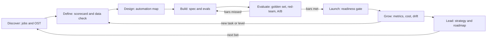
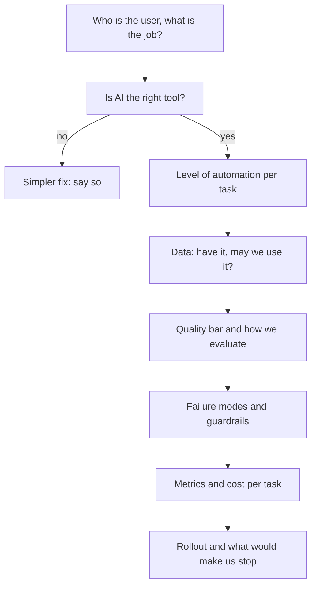

# Module 10 — Hero: capstone and practice exam

*You have met every part of AI product management one lesson at a time. This module puts them back together. In the capstone you take Najm Assist, the customer assistant in Najm Bank's mobile app, from a vague idea to a product running at scale, and you produce one artefact from every earlier module along the way: the opportunity brief, the use-case scorecard, the data readiness check, the automation map, the spec with evals, the launch checklist, the metrics tree, the cost-per-task model and the roadmap. Then we turn to you: how to show this work in interviews and a portfolio, and how to keep growing as an AI product manager after the course ends. The module closes with a 60-question practice exam across all eight stages.*

> **Stages:** Discover through Lead — the whole lifecycle, end to end, on one product and then in one exam.

---

# 10.1 — Capstone: take Najm Assist from idea to scale
*Level: 🔴 Advanced* · *Prerequisites: Modules 0–9* · *Stage: Discover, Define, Design, Build, Evaluate, Launch, Grow, Lead*

## ⚡ In 60 seconds
- The capstone walks one product, **Najm Assist**, through all eight stages: Discover, Define, Design, Build, Evaluate, Launch, Grow and Lead. Each stage produces one artefact you already learned to make.
- Each artefact answers a **decision question** ("worth solving?", "how much autonomy?", "good enough to ship?", "does it pay?"). If it changes no decision, cut it.
- Artefacts connect: a discovery job becomes an eval task; a spec quality bar becomes a launch gate and then a monitoring alert. Broken links are where AI products fail.
- Najm Assist grows in **automation steps** — answer, guide, act with confirmation (freeze a card), then higher-stakes tasks (disputes). Each step reopens Define, Design and Evaluate.
- Decision cue: before each stage, write down "what would make us stop?". A plan without a kill criterion is a pitch.
- Biggest trap: treating the capstone as a document exercise. The skill is the judgement between artefacts.

## 🧭 Why it matters
It is January. Rania shows the team one slide: most contact-centre calls last year were about a handful of topics — card blocks, disputed transactions, transfer limits, fees and "where is my money". The CEO wants an app assistant. Khalid asks what it will cost and save. Layla asks what happens when it gives an EU customer a wrong answer about fees. Sara asks where transcripts will be stored. Tariq asks about latency; Hessa, about what customers want.

Faisal wants a demo by Thursday. Rania: "The demo is easy. The hard part is the decisions between the demo and a product customers trust with their money. Let's make them in order, and write each one down."

Skipped decisions have public costs. In *Moffatt v. Air Canada* (2024), a tribunal held the airline responsible for what its chatbot told a customer about bereavement fares. DPD's delivery chatbot swore and criticised the company after an update in January 2024. Klarna announced in February 2024 that its assistant handled a large share of customer chats, and in 2025 said it would bring more human service back. Each is a failure *between* artefacts: a spec without a grounding rule, an update without a regression gate, a cost metric without a quality counterweight. The capstone is where you practise closing those gaps.

## 📐 How it works

### 🟢 The essentials

**A capstone** here is one end-to-end pass through the lifecycle on one product, producing a linked set of artefacts: a **product dossier**. Rania hands it to a new PM on day one; Layla reads it at governance gates; Khalid reads it before approving budget.

The summary page in 🏛️ below lists the nine artefacts, one or two per stage, each tied to the lesson that taught it. Three rules make the dossier work:

1. **Every artefact states its decision and its evidence** ("card freeze first: frequent, reversible, low-risk").
2. **Every artefact names the next one's input.** The brief's top jobs become golden-set slices; the spec's quality bars become launch gates.
3. **Every stage has a stop rule.** If it fires, you go back a stage or kill the idea. That is the process working.

All numbers below are illustrative.

**Discover.** Hessa and Faisal listen to call recordings (with Sara's approval), read app reviews and shadow five contact-centre agents. They frame the work as **Jobs to be Done** (Clayton Christensen): "when I see a transaction I don't recognise, I want to stop further damage and get my money back." Their **Opportunity Solution Tree** (Teresa Torres) has one outcome (customers resolve common needs in the app without waiting), four opportunities (unknown transactions, lost cards, confusing fees, transfer limits) and candidate solutions under each. Only some need AI: a clearer fee page fixes part of the fee confusion better than any chatbot.

**Define.** The scorecard rates each candidate on value, feasibility and risk. Answering fee and policy questions from the bank's documents scores high on value and feasibility, medium on risk (wrong fee answers are costly, as Air Canada learned). Freezing a card is high value, low risk, because it is reversible. Disputing a transaction is high value but higher risk: it starts a regulated process with deadlines. Personalised investment advice is **killed** (high risk, unclear value, a licensing question), and the reason is recorded so it is not reopened every quarter.

The data readiness check asks whether the bank has what each use case needs: a current, owned fee and terms corpus (partly — three versions of the fee schedule exist, so Omar's team names one owner); historical conversations for evaluation (yes, after redaction); and card APIs (yes, already used by the app). Sara's data rights note records the lawful basis under Qatar's PDPPL (Law No. 13 of 2016) and GDPR for EU customers, plus retention. Detail belongs to *AI Governance: Zero to Hero*; the PM makes sure the note exists before build.

### 🟡 Going deeper

**Design.** Hessa builds the **automation map** using the levels of automation (Sheridan and Verplank, 1978) in the course's four product levels: suggest, draft, decide, act.

| Task | Level at launch | Why | Condition to move up |
|---|---|---|---|
| Answer fee and policy questions | Suggest, with sources | Customer decides what to do | Stays here |
| Change a transfer limit | Draft: prefill, customer submits | Customer controls money movement | Low prefill error rate for a quarter |
| Freeze a card | Act, with confirmation | Frequent, urgent, reversible in one tap | Already at target |
| Open a dispute | Draft: customer confirms, agent reviews | Regulated process, deadlines, money at stake | Eval and audit evidence; Layla's re-approval |

The trust patterns come from Google's **People + AI Guidebook** and Microsoft's **Guidelines for Human-AI Interaction** (Amershi et al., 2019): say it is an AI and what it can do; show sources; confirm before any action; keep "talk to a person" visible; and when unsure, hand over with the conversation attached. The EU AI Act's transparency duty for chatbots points the same way; Layla confirms the details.

**Build.** The spec turns decisions into testable requirements:

- *Grounding rule:* fee and policy answers come only from the approved corpus via retrieval (RAG); if nothing relevant is found, the assistant says so and offers a person. No fee, rate or limit may appear unless it is in a retrieved source.
- *Quality bars as evals:* for example, 95% of golden-set fee questions correct with the right source, zero ungrounded numbers in the red-team set, 100% of actions confirmed (illustrative; Dana and Faisal set real bars from the baseline).
- *Tools as product surface:* at launch the assistant gets `get_card_status` and `freeze_card` and nothing else. Tool descriptions are written like UI copy, because the model reads them to decide what to do. How tools are connected (for example via the **Model Context Protocol**, introduced by Anthropic in November 2024) is Tariq's call.
- *Latency and cost budgets:* a target time to first response and a cost ceiling per conversation.

Before this, Faisal ran a **Wizard of Oz** test (a human behind the chat window) to learn how customers phrase their needs, then a thin retrieval prototype on the real corpus.

**Evaluate.** Dana's eval plan has three layers, matching Module 6:

1. **Offline**: a golden set of redacted real conversations, sliced by job, language (English and Arabic) and difficulty. Error analysis reads failures by hand before anyone tunes a prompt.
2. **Judged and adversarial**: an **LLM-as-judge** grades grounding and tone at scale, calibrated against human raters because judges have known biases (Zheng et al., 2023). A red-team tries prompt injection, limit overrides, the "$1 car" manipulation seen at a Chevrolet dealer in December 2023, and questions baiting the assistant to state fees it cannot find.
3. **Online**: a staged rollout (staff, then 1%, 10%, 50% of users) with an **A/B test** against the existing help centre. Following Kohavi, Tang and Xu, the team agrees the **overall evaluation criterion** in advance and adds **guardrail metrics** (complaints, handoff rate, wrong-answer reports) that can stop the rollout on their own.

**Launch.** The readiness checklist has four blocks: *quality* (every spec bar met on the exact model and prompt version shipping), *guardrails* (filters live, confirmations tested, a kill switch that disables tools within minutes), *governance* (Layla's approval, Sara's DPIA outcome, disclosure text approved) and *support* (agents trained on handoffs, an incident owner on call). Positioning is modest: "fast help for everyday banking". Adoption inside the bank depends on the contact centre: if agents see a threat, handoffs suffer, so Rania involves their head from Discover onwards.

### 🔴 Expert view

**Grow.** Faisal's metrics tree starts from one **North Star metric**: *customer needs resolved in the app without a repeat contact within seven days*. Containment (chats that never reach a human) is easy to inflate by hiding "talk to a person"; resolution without repeat contact is not. Beneath it sit the **HEART** categories (Rodden, Hutchinson and Fu, 2010) — happiness, engagement, adoption, retention, task success — and trust metrics: handoff rate, wrong-answer reports and complaints.

The **cost-per-task model**: cost per resolved conversation = (model and retrieval cost per conversation + tool and platform cost + handoff rate × cost of a human contact + monitoring overhead) ÷ resolution rate. With illustrative numbers — a few cents of model cost, a human contact costing many times that, a 25% handoff rate — handoffs, not the model, dominate. So the best growth lever is better resolution on the top jobs, not a cheaper model.

The monitoring plan reuses the spec. The eval suite runs nightly on sampled, redacted live conversations; alerts fire when grounding falls below the launch bar, handoffs rise on a job, or new question types appear that the golden set does not cover (drift, for example after a new fee schedule). Every model or prompt change runs the full suite first — the regression gate the DPD case lacked.

**Lead.** Rania's strategy one-pager says defensibility comes not from the model, which competitors can buy, but from core-system integration, a current corpus, labelled conversations that sharpen evals, and trust. The roadmap is a set of **bets** with evidence gates, not feature dates: "dispute drafting, if the Q2 eval clears the bar and Layla re-approves". A model-agnostic eval suite makes switching providers an eval run, not a rewrite. The operating model names owners: Faisal (product and metrics), Dana (evaluation), Tariq (platform, latency, cost), the contact centre (handoffs) and Layla's office (any move up the automation map). Responsible AI runs through every artefact rather than sitting in a final chapter.

**The judgement calls between artefacts.** Three moments show the difference between a hero PM and a document writer:

- *The eval misses the bar by a little.* Fee grounding is 92% against a 95% bar; Faisal wants to "fix it later". Error analysis first: if misses cluster in one fee type, remove that type from scope ("let me connect you") and launch the rest. Narrowing scope is a product decision; quietly lowering the bar is not.
- *The A/B test wins on cost, loses on trust.* The guardrail wins; investigate before expanding.
- *The business wants the next automation level early.* Khalid wants fully automated disputes. Rania answers that it will happen when the evidence and re-approval exist, and shows what that takes.

## 🧰 The toolkit
| Tool or framework | What it is and does | When to reach for it |
|---|---|---|
| **Product dossier** | Linked artefacts for one product, each stating decision, evidence and stop rule | Idea to scale; onboarding a PM; governance gates |
| **Use-case scorecard** | Scores candidates on value, feasibility and risk, with explicit kill criteria | Define: choosing the first use cases and recording kills |
| **Automation map** (after Sheridan and Verplank) | Assigns each task a level (suggest, draft, decide, act) and a condition for moving up | Design: deciding autonomy per task, not per product |
| **Golden set** | Sliced real tasks with reference answers | Turning the spec into tests and regression gates |
| **Launch readiness checklist** | Quality, guardrail, governance and support conditions, all true to ship | The go or no-go meeting |
| **Cost-per-task model** | Cost to serve one resolved task, including human handoffs | Estimates in Define, actuals in Grow |

## 🏛️ In practice at Najm Bank
Faisal's **Najm Assist product dossier — summary page** (v1.0, reviewed by Rania). Each row links to the full artefact.

| # | Stage | Artefact | Decision recorded | Stop rule |
|---|---|---|---|---|
| 1 | Discover | Opportunity brief + OST (2.1) | Focus on four jobs: unknown transactions, lost cards, fees, transfer limits | If top jobs need human judgement in most cases, do not build an assistant |
| 2 | Define | Use-case scorecard (2.2, 2.3) | Launch with fee/policy answers and card freeze; dispute later; investment advice killed | Any candidate scoring high risk with no mitigation is parked |
| 3 | Define | Data Readiness Assessment + privacy and data rights section (3.1, 3.3) | Single owner for fee schedule; redacted transcripts for eval; lawful basis recorded | No launch until one current fee source exists |
| 4 | Design | Automation Level Decision Record, Trust Design Spec, Action Catalogue (4.1–4.3) | Suggest (answers), act with confirmation (freeze), draft (disputes) | Customers misunderstand the confirmation in testing → redesign |
| 5 | Build | AI product spec + behaviour sheet (5.1–5.3) | Grounding rule; tool list limited to two; latency and cost budgets | Quality bars not agreed by Dana and Faisal → no build sign-off |
| 6 | Evaluate | Evaluation and Red-Team Plan, rollout and experiment brief (6.1–6.3) | Golden set by job and language; judge calibrated; red-team passed; A/B design with OEC and guardrails | Any bar missed → narrow scope or fix; never lower silently |
| 7 | Launch | Launch Readiness Checklist + adoption plan (7.1–7.3) | Staged rollout; agents trained; kill switch tested | Any unchecked item → no launch |
| 8 | Grow | Metrics tree, unit economics sheet, monitoring plan and runbook (8.1–8.3) | North Star = resolved without repeat contact in 7 days | Guardrail breach → pause rollout; drift alert → review |
| 9 | Lead | Strategy one-pager, bets roadmap, operating model (9.1–9.4) | Defensibility from integration, corpus and trust; disputes as next bet | Bet evidence not met by its gate → drop or re-scope |

Rania's comment: *"Auditors will ask about rows 3 and 7, Khalid about row 8. Row 1 is the one we'll forget — revisit it every six months."*

## 🛠️ Exercises
- 🟢 Write out three rows of the dossier in full (for example the scorecard with five candidates, the automation map with six tasks, the launch checklist). *Done when:* each states its decision, evidence and stop rule, and names the input it passes on.
- 🟡 Write the dossier summary for **Smart Alerts** or **Staff GenAI**, one row per stage. *Done when:* all nine rows are filled and at least three differ in substance from Najm Assist, each with a one-sentence reason (classic ML, or internal tool).
- 🔴 Run the full capstone on a product from your own organisation or a public product. Present it in 10 minutes to a colleague playing Khalid, Layla and Tariq in turn. *Done when:* each artefact fits on one page, the links are explicit, you have written answers to their three hardest questions and at least one artefact changed because of them.

## ⚠️ Mistakes and traps
- **Starting at Build.** A demo answers "can we?", not "should we?". Start with jobs and the scorecard.
- **Artefacts that do not talk to each other.** An eval set missing the top jobs, or monitoring that ignores the launch bars, leaves gaps where failures live.
- **One automation level for the whole product.** "Najm Assist is an agent" hides the fact that answering, freezing and disputing carry very different risk. Set the level per task.
- **Measuring containment instead of resolution.** Containment rewards hiding the human option. Use a North Star that counts problems actually solved, with trust metrics as guardrails.
- **No stop rules.** Without a written condition for stopping, sunk cost carries weak products into launch. Write the stop rule before the stage starts.

## 🧾 Recap
- The capstone takes one product through all eight stages and produces a linked **product dossier**, one artefact per stage.
- Each artefact answers a decision question, cites evidence, names a stop rule and feeds the next.
- Spec quality bars become launch gates and then monitoring alerts; that chain makes an AI product safe to change.
- Grow on a North Star that counts real resolution and a cost-per-task model that includes humans.
- The hero skill is judgement between artefacts: narrow scope rather than lower a bar, let guardrails beat headline wins, and move autonomy only on evidence.

## ✍️ Check yourself

**1. Najm Assist's grounding score on fee questions is 92% against a 95% launch bar. Error analysis shows most misses are about one type of international transfer fee. What should Faisal do?**

- A. Launch as planned and fix the issue in the next release
- B. Lower the bar to 90% because the rest of the results are strong
- C. Remove that fee type from the assistant's scope, route those questions to a person, and launch the rest if all other bars are met
- D. Cancel the launch and restart discovery

Answer

**C.** Narrowing scope keeps the quality bar intact. Launching anyway (A) or lowering the bar (B) breaks the link between spec and launch gate; D overreacts to a narrow, understood failure. (🔴 Expert view: the judgement calls between artefacts.)

**2. Which North Star metric best fits Najm Assist?**

- A. Share of chats that never reach a human agent
- B. Number of messages sent to the assistant per month
- C. Customer needs resolved in the app without a repeat contact within seven days
- D. Average model cost per conversation

Answer

**C.** It measures real value and cannot be raised by hiding the human option. Containment (A) can rise while service gets worse. B and D are inputs, not outcomes. (🔴 Expert view: Grow.)

**3. Why does the automation map set card freeze at "act with confirmation" at launch, but dispute opening at "draft"?**

- A. Card freeze uses a cheaper model
- B. Card freeze is frequent, urgent and easily reversible; disputes start a regulated process with money and deadlines at stake
- C. Disputes cannot be done through an API
- D. Customers prefer to write disputes themselves

Answer

**B.** Automation level is set per task by risk and reversibility. A freeze is undone in one tap; a mishandled dispute can cost the customer money. (🟡 Going deeper: Design.)

**4. In the A/B test, the treatment group shows 18% fewer calls to the contact centre but a rise in complaints mentioning the assistant, a pre-agreed guardrail metric. What is the right next step?**

- A. Expand to 100% because the cost saving is large
- B. Pause the expansion and investigate the complaints before deciding
- C. Remove complaints from the guardrail list
- D. Switch to a cheaper model to increase the saving

Answer

**B.** Guardrail metrics can stop a rollout on their own, however good the headline (Kohavi, Tang and Xu). A and C defeat their purpose. (🟡 Going deeper: Evaluate; 🔴 Expert view.)

**5. Faisal's cost-per-task model shows the model calls cost a few cents per conversation, while each handoff to a human costs many times more. What does this imply for growth priorities?**

- A. Switching to a cheaper model is the main lever
- B. Improving resolution on the most common jobs, which reduces handoffs, is likely the biggest lever
- C. Removing the "talk to a person" option will cut cost safely
- D. Cost does not matter once the product has launched

Answer

**B.** When handoffs dominate cost, better resolution on top jobs saves most. A cheaper model (A) trims the small part; C harms trust. (🔴 Expert view: Grow.)

## 📚 References
- Teresa Torres, *Continuous Discovery Habits* (2021) — https://www.producttalk.org
- Marty Cagan, *Inspired* (2nd ed., 2017) — https://www.svpg.com
- Google PAIR, People + AI Guidebook — https://pair.withgoogle.com/guidebook
- Amershi et al., "Guidelines for Human-AI Interaction", CHI 2019 — https://www.microsoft.com/en-us/research/publication/guidelines-for-human-ai-interaction/
- Kohavi, Tang and Xu, *Trustworthy Online Controlled Experiments* (2020) — https://experimentguide.com
- Zheng et al., "Judging LLM-as-a-Judge with MT-Bench and Chatbot Arena" (2023) — https://arxiv.org/abs/2306.05685
- Rodden, Hutchinson and Fu, "Measuring the User Experience on a Large Scale: User-Centered Metrics for Web Applications", CHI 2010 — https://research.google/pubs/
- Model Context Protocol — https://modelcontextprotocol.io
- EU AI Act, Regulation (EU) 2024/1689 — https://eur-lex.europa.eu/eli/reg/2024/1689/oj

---

# 10.2 — The AI PM career: interviews, portfolio and growth
*Level: 🔴 Advanced* · *Prerequisites: 10.1* · *Stage: Lead*

## ⚡ In 60 seconds
- AI product management is product management first. Interviewers still test product sense, execution, metrics and leadership; the AI part tests whether you can reason about **probabilistic behaviour, data, evaluation, cost and trust** when you make those calls.
- There is no single "AI PM" job. Roles range from adding AI features to an existing product, to building AI-native products, to running internal AI platforms. Know which one you are applying for.
- The strongest interview answers follow a visible structure: user and job → is AI right? → level of automation → data → quality bar and evals → failure modes and guardrails → metrics and cost → rollout. It is the course in one paragraph.
- A portfolio beats a list of claims. Two or three case studies that show a **decision, the evidence, the trade-off and the result** — including one where you killed or narrowed something — say more than any certificate.
- Growth comes from shipping, measuring and writing down what you learned, not from following every model release. Build a learning habit you can keep for years.
- Biggest trap: talking about models instead of users and outcomes. "I'd use the latest model with RAG" is not a product answer.

## 🧭 Why it matters
Six months after Najm Assist launched, Faisal applies for a senior AI PM role on the Credit Memo Copilot. "I know the material," he tells Rania, "but in a 30-minute design question I start with the model and get lost." Rania runs a mock interview: "Design an assistant that helps relationship managers prepare for client meetings." Faisal opens with retrieval pipelines and prompt templates. Rania stops him after two minutes. "You haven't told me who the RM is, what they do today or how we'd know it works."

Candidates who have read a lot about AI often answer like engineers who have read about product. Hiring managers want the reverse: product people who reason clearly about what AI changes. Meanwhile Rania is hiring AI PMs herself and must decide what good looks like from the other side of the table.

This lesson is about both sides: how to show what you can do, and how to keep getting better once you have the job.

## 📐 How it works

### 🟢 The essentials

**What kinds of AI PM roles exist.** Titles vary by company, so read the job description rather than the title. At the time of writing (2026), most roles fall into four shapes:

| Role shape | What you own | What they will probe |
|---|---|---|
| AI feature PM | AI features inside an existing product (e.g. smart replies in a banking app) | Integration into workflows, adoption, quality vs cost, not breaking what works |
| AI-native product PM | A product whose core value is the AI (e.g. Najm Assist, Credit Memo Copilot) | Evaluation, trust design, unit economics, iteration speed |
| AI platform PM | Internal platform other teams build on: model access, eval tooling, guardrails, tool gateways | Developer experience, reuse, governance built in, cost allocation |
| Data/ML PM | Predictive models and the data behind them (e.g. SME Instant Finance, Smart Alerts) | Metrics like precision and recall, data pipelines, model risk, regulation |

**What interviews test.** Formats differ by company, but most AI PM loops mix these:

1. **Product sense**: "design an AI feature for X". Do you find the user and job before the solution?
2. **AI fluency**: "retrieval or fine-tuning?", "why does the model make things up?". Module 1 literacy, not engineering depth.
3. **Evaluation and metrics**: "how would you know it's good?", "what's your North Star?" (Modules 6 and 8).
4. **Execution**: "the eval is below the bar and launch is next week".
5. **Strategy**: "a competitor ships the same feature on the same model; what's our moat?" (Module 9).
6. **Behavioural**: past situations, told with **STAR** (situation, task, action, result).
7. **Case or take-home**, sometimes a small prototype with a write-up.

**The answer structure.** For any "design an AI product" question, walk this path out loud:

You will not have time to go deep on every step. Say the structure in one sentence at the start ("I'll start with the user, check AI is the right tool, then cover automation, data, quality, risks, metrics and rollout"), then spend most time where the problem is hardest. For a banking assistant that is usually trust and failure modes; for an internal tool it is often adoption.

### 🟡 Going deeper

**Answering AI fluency questions.** Interviewers test whether you can make good product decisions with engineers, not whether you can build a model. Good answers have three parts: the concept in plain words, the trade-off it creates and the product decision it drives. For example:

> *"Why do LLMs hallucinate, and what would you do about it?"* — "The model generates likely text; it has no built-in check that the text is true. So for anything factual I'd ground answers in our own sources with retrieval, show those sources, and make 'I don't know' an allowed answer in the spec. Then I'd measure ungrounded claims in the eval set and set a bar before launch. For high-stakes facts like fees I'd also block any number that isn't in a retrieved source."

Weak answers stop after the first sentence, or jump to a vendor name. Avoid quoting today's prices, context window sizes or benchmark scores as facts; they change monthly, and the interviewer wants the method.

**Evaluation questions** separate candidates most. A strong answer names the offline layer (a golden set sliced by the jobs that matter, error analysis), the scalable layer (LLM-as-judge calibrated against humans, red-teaming) and the online layer (staged rollout, A/B test with an agreed criterion and guardrail metrics). Naming one judge bias (position, verbosity or self-preference) and how you would check it shows you have done the work.

**Execution questions** reward the judgement calls from 10.1: narrow scope instead of lowering a bar; let a guardrail metric stop a rollout; move up the automation ladder only on evidence. Say what you would do, what you would tell the business owner and what would change your mind.

**Behavioural questions** often ask about something that went wrong, a disagreement with engineering or data science, or a time you said no. Prepare stories with an AI angle: an eval result that changed a plan, a feature you killed. Be precise about your role: "we" hides what you did; "I" can overclaim what the team did.

**The portfolio.** A portfolio is two or three short case studies, each on one or two pages, plus optional supporting material (a prototype, an eval set, a published write-up). A good case study follows the dossier logic from 10.1:

| Section | What to write | Trap to avoid |
|---|---|---|
| Context | User, job, why it mattered, your role | Vague "we built an AI platform" |
| Decision | The key product decision (scope, automation level, build vs buy, kill) | Listing features instead of decisions |
| Evidence | Discovery, eval results, experiment outcomes | Invented or unreported numbers |
| Trade-off | What you gave up and why | Pretending there was no downside |
| Result | What happened, including what didn't work | Only success stories |
| Lesson | What you would do differently | Generic "communication is key" |

**Confidentiality comes first.** Never publish an employer's data, internal metrics, customer information or unreleased plans. Rewrite case studies at a level of detail your employer would accept, use relative numbers ("roughly halved handoffs on the top job") only if you are allowed to share them, or use a public or personal project instead. The capstone from 10.1 applied to a public product, clearly labelled as your own analysis, is a fine portfolio piece for someone without shipped AI work yet.

**Building proof without an AI title.** Volunteer to own evaluation on an AI feature your team is building; run a Wizard of Oz test and write it up; build a small prototype with a golden set of 30 real tasks and publish what the eval taught you; take the data readiness or governance-gate work nobody wants. Each gives you a story with a decision and evidence.

### 🔴 Expert view

**Growing from PM to leader.** The job changes as you grow. Early on you own a feature and its metrics. As a senior PM you own a product and its strategy. As a lead or head (Rania's role) you own a portfolio: which bets get funded, how teams are shaped, how the organisation decides what "good enough" means. The AI-specific skills scale with you:

| Level | Core AI PM skill | Evidence you can show |
|---|---|---|
| PM | Write a spec with evals as requirements; run error analysis with data science | An eval plan and a launch you owned |
| Senior PM | Set quality bars and automation levels; own unit economics; handle a model change | A product dossier and a cost-per-task model that drove a decision |
| Lead / Group PM | Set a roadmap of bets; build shared eval and guardrail practice across teams | A roadmap with evidence gates; a kill you led |
| Head of AI Products | Operating model, talent, governance partnership, portfolio strategy | How the organisation ships AI safely and repeatedly |

**Hiring as the interviewer.** Rania's panel scores the same structure from the other side (see 🏛️), plus one more question: can the candidate change their mind on evidence? She avoids trivia about model names, which rewards following the news rather than judgement. Every candidate gets the same core questions, and panellists score independently before discussing.

**Staying current without chasing hype.** Models, tools and prices change monthly; the underlying method changes slowly. A sustainable habit:

- *Weekly:* read one or two primary sources (release notes, a paper, a regulator's update) and ask "does this change any decision in my dossier?". Usually it does not.
- *Monthly:* run your own eval suite against one new model or technique. Your golden set beats public benchmarks for your product.
- *Quarterly:* write a short note on what your product's data taught you. Writing turns experience into judgement others can use.
- *Yearly:* re-read the foundations (Cagan, Torres, Kohavi). They get more useful the more you ship.

**Ethics as a career asset.** The PM who can say "not yet" with evidence, as Rania did on dispute automation, earns the trust of risk, legal and executives. In Gulf banking, that trust gets bigger products approved. Governance is covered in *AI Governance: Zero to Hero*; your part is writing stop rules and honouring them.

## 🧰 The toolkit
| Tool or framework | What it is and does | When to reach for it |
|---|---|---|
| **AI product answer structure** | User and job → is AI right → automation → data → quality and evals → failure modes → metrics and cost → rollout | Any "design an AI product" interview question, and real kick-off meetings |
| **CIRCLES method** (Lewis Lin, *Decode and Conquer*) | A general product-design interview structure, from understanding the situation and customer to trade-offs and summary | Product-sense questions; combine with the AI steps above |
| **STAR** | Situation, task, action, result: a structure for behavioural answers | Behavioural questions about past work |
| **Portfolio case study** | One or two pages: context, decision, evidence, trade-off, result, lesson | Job applications, promotion cases, internal visibility |
| **Interview scorecard** | Fixed criteria scored independently by each panel member | When you are the one hiring AI PMs |
| **Learning cadence** | Weekly, monthly, quarterly and yearly habits tied to your own product decisions | Staying current without chasing every release |

## 🏛️ In practice at Najm Bank
Rania's **AI PM interview scorecard** (used for the senior Credit Memo Copilot role), with Faisal's self-assessment after his mock interview:

| Criterion | What "strong" looks like | Faisal (mock) | Action |
|---|---|---|---|
| User and job first | Names the RM, their meeting-prep job and today's pain before any solution | Weak — opened with architecture | Practise opening with 2 minutes on user and job |
| Is AI right? | Checks simpler options (templates, better search) and says when they win | Not covered | Add one sentence to every answer |
| Automation level | Sets a level per task with reasons (draft briefing: yes; send to client: no) | Good | — |
| Data and rights | Names sources, gaps, consent and confidentiality of client data | Partial — missed client confidentiality | Review 3.3 |
| Quality bar and evals | Golden set of real meeting briefs, grounding bar, RM review sample, judge calibration | Strong — used Najm Assist experience | Lead with this story |
| Failure modes | Wrong figures; stale data; RM overreliance | Partial | Add automation bias |
| Metrics and cost | North Star on RM time saved with quality held; cost per briefing | Weak on cost | Build a quick cost-per-task sketch |
| Behavioural evidence | STAR story with a decision, evidence and honest role | Good — the 92% vs 95% fee-scope story | Tighten to 90 seconds |

And Faisal's **one-page portfolio case study**, rewritten with Rania to meet the bank's confidentiality rules:

> **Najm Assist: launching a grounded banking assistant (my role: product manager).** *Context:* customers waited on the phone for simple needs; I owned the assistant's first release. *Decision:* launch with fee answers and card freeze only, and remove one fee type from scope when it missed the grounding bar, instead of delaying launch or lowering the bar. *Evidence:* golden set by job and language; error analysis showed misses clustered in one fee type. *Trade-off:* customers asking that question still wait for a person. *Result:* launched on schedule with all bars met; the excluded fee type was added in the next release after the corpus was fixed. *Lesson:* agree the quality bars before build, so the launch decision is a check, not a debate.

## 🛠️ Exercises
- 🟢 Answer this out loud in 15 minutes, recording yourself: "Design an AI feature that helps small-business customers understand their cash flow." Use the eight-step answer structure. *Done when:* you can play back the recording and point to each of the eight steps, and your first two minutes contain no mention of models or technology.
- 🟡 Write one portfolio case study (one page) from your own work or from your 10.1 capstone, using the six sections in the table. Then ask someone to read it and tell you, in one sentence, what decision you made. *Done when:* their sentence matches your decision, every number is either real and shareable or removed, and the case study includes a trade-off.
- 🔴 Design an interview loop for hiring an AI PM at your organisation (or Najm Bank): four interviews, the questions for each, a scorecard with at least six criteria and what "strong" and "weak" look like for each. Run one interview with a colleague. *Done when:* each criterion links to a skill from a course module, two panel members could score the same answer independently, and you have revised at least one question after the trial run.

## ⚠️ Mistakes and traps
- **Leading with the model.** Starting with architecture or a vendor name signals engineering interest, not product judgement. Start with the user and the job.
- **Never asking whether AI is needed.** Interviewers often plant problems where a simpler fix wins. Saying so, briefly, scores well.
- **Quoting today's numbers as facts.** Prices, context windows and benchmark scores change. Explain the method and label any number as illustrative.
- **Portfolios that leak or overclaim.** Publishing internal data or presenting team work as yours can cost you more than a missing case study. Check confidentiality and state your role precisely.
- **Only success stories.** A kill or a narrowed scope, explained well, shows judgement better than a launch that "went great".

## 🧾 Recap
- AI PM is product management plus clear reasoning about probabilistic behaviour, data, evaluation, cost and trust.
- Know which role shape you are applying for: AI feature, AI-native product, platform or data/ML.
- Use a visible answer structure: user and job, is AI right, automation, data, quality and evals, failure modes, metrics and cost, rollout.
- Build a portfolio of two or three honest case studies that show decisions, evidence and trade-offs, within confidentiality limits.
- Grow by shipping and writing down what you learn; keep a cadence that ties new models and techniques to your own evals.

## ✍️ Check yourself

**1. In an interview, Faisal is asked to "design an AI assistant for relationship managers preparing for client meetings". What is the best way to begin?**

- A. Describe the retrieval pipeline and which model to use
- B. Clarify who the RM is, what they do to prepare today and where the pain is, then check whether AI is the right tool
- C. Quote the context window size of the latest models
- D. Propose a pricing model for the assistant

Answer

**B.** Strong answers start with the user and the job, then question whether AI fits. Leading with architecture (A) is the classic trap Rania stopped in the mock interview. Quoting today's numbers (C) is fragile and off the point. (🟢 The essentials: the answer structure.)

**2. Asked "how would you know our banking assistant is good?", which answer best shows AI PM skill?**

- A. "We'd check customer ratings after launch."
- B. "We'd use the best model on the public leaderboards."
- C. "A golden set of real tasks sliced by job and language, with error analysis; an LLM judge calibrated against humans plus red-teaming; then a staged rollout with an agreed criterion and guardrail metrics."
- D. "Engineering would run unit tests."

Answer

**C.** It covers the offline, scalable and online layers of evaluation. Ratings alone (A) come late and miss silent errors. Public benchmarks (B) do not measure your product's tasks. (🟡 Going deeper: evaluation questions.)

**3. Faisal wants to publish a portfolio case study about Najm Assist. Which approach is right?**

- A. Include the internal dashboard screenshots to prove the results
- B. Describe the decision, evidence, trade-off and result at a level of detail the bank accepts, state his own role precisely, and remove numbers he is not allowed to share
- C. Say "I built Najm Assist" to keep it short
- D. Include only the parts that went well

Answer

**B.** Confidentiality comes first, and precise attribution builds credibility. Screenshots of internal dashboards (A) risk leaking data; "I built it" (C) overclaims a team's work; success-only stories (D) hide the judgement interviewers want to see. (🟡 Going deeper: the portfolio.)

**4. A job advert asks for a PM to own "model access, eval tooling and guardrails used by all product teams". Which role shape is this?**

- A. AI feature PM
- B. AI-native product PM
- C. AI platform PM
- D. Data/ML PM

Answer

**C.** An internal platform that other teams build on is a platform role, probed on developer experience, reuse and built-in governance. An AI-native product PM (B) owns a customer-facing product whose core value is AI. (🟢 The essentials: role shapes.)

**5. A new, cheaper model is released. What should an AI PM following a sustainable learning cadence do?**

- A. Switch production to it immediately to save cost
- B. Ignore it until competitors adopt it
- C. Run the product's own eval suite against it and decide based on quality, cost and risk for the product's tasks
- D. Rely on its public benchmark scores

Answer

**C.** Your own golden set is the best guide to whether a model works for your tasks. Switching blindly (A) skips the regression gate; public benchmarks (D) do not measure your product. (🔴 Expert view: staying current.)

## 📚 References
- Marty Cagan, *Inspired* (2nd ed., 2017) and *Empowered* (2020) — https://www.svpg.com
- Gayle Laakmann McDowell and Jackie Bavaro, *Cracking the PM Interview* (2013)
- Lewis C. Lin, *Decode and Conquer* (CIRCLES method)
- Teresa Torres, *Continuous Discovery Habits* (2021) — https://www.producttalk.org
- Kohavi, Tang and Xu, *Trustworthy Online Controlled Experiments* (2020) — https://experimentguide.com
- Chip Huyen, *AI Engineering* (O'Reilly, 2025) — https://www.oreilly.com
- Google PAIR, People + AI Guidebook — https://pair.withgoogle.com/guidebook
- Zheng et al., "Judging LLM-as-a-Judge with MT-Bench and Chatbot Arena" (2023) — https://arxiv.org/abs/2306.05685

---

# 10.3 — Practice exam: 60 scenario questions
*Level: 🔴 Advanced* · *Prerequisites: Modules 0–9* · *Stage: Discover, Define, Design, Build, Evaluate, Launch, Grow, Lead*

## ⚡ In 60 seconds
- This is a **60-question practice exam** covering the whole course, grouped by the eight lifecycle stages: Discover, Define, Design, Build, Evaluate, Launch, Grow and Lead (7–8 questions each). Most questions are short scenarios at Najm Bank or a neutral company.
- **Give yourself 90 minutes, in one sitting, with no notes.** Write each answer down before you open its answer block. Your score is the number you got right.
- Every question has one best answer. Several options will sound reasonable. Pick the one a careful AI product manager would choose **first** or **most**, given exactly what the scenario says.
- Every answer explains why the right option is right and why the most tempting wrong option is wrong. It ends with the stage and the lesson to review, for example *(Evaluate · 6.1)*.
- **Course rule of thumb:** 48 or more correct (80%) means you have the product judgement this course aims for. This is our guide, not a certification standard. This course is not affiliated with any certification body.

## 🧭 Why it matters
Faisal finished the course in three weeks and felt ready. Then Rania asked him four quick questions in a corridor: what he would measure first on Najm Assist, when he would stop an A/B test, who owns the decision to let SME Instant Finance decline an application on its own, and what happens to the Credit Memo Copilot when the model vendor ships a new version. He knew the words but not the answers. Knowing a framework is not the same as reaching for the right one when a situation is described in three sentences.

That is what this exam tests. The questions are not about definitions. They describe a situation, often a messy one, and ask what you would do. They are written so that a reader who skimmed will find two answers attractive, and a reader who understood will see why one of them is wrong.

## 📐 How it works
### 🟢 The essentials
The exam has eight sections, one per lifecycle stage. Each question tests one lesson. The table shows the spread.

| Stage | Questions | Main lessons tested |
|---|---|---|
| Discover | 1–8 | 0.2, 1.1, 2.1, 2.2, 2.3 |
| Define | 9–15 | 1.3, 3.1, 3.3, 5.1 |
| Design | 16–23 | 4.1, 4.2, 4.3 |
| Build | 24–30 | 1.2, 3.2, 5.2, 5.3 |
| Evaluate | 31–38 | 6.1, 6.2, 6.3 |
| Launch | 39–45 | 7.1, 7.2, 7.3 |
| Grow | 46–53 | 8.1, 8.2, 8.3 |
| Lead | 54–60 | 9.1, 9.2, 9.3, 9.4, 10.2 |

### 🟡 Going deeper
Read the last sentence of each question first. It tells you what is being asked: the *first* step, the *best* option, the *most likely* cause, or what is *wrong*. Then read the scenario and underline the facts that matter: who the user is, what is at stake if the product is wrong, what data exists, and what has already been tried.

### 🔴 Expert view
The distractors follow patterns you have met throughout the course. Watch for the answer that jumps to technology before the problem is clear, the one that measures cost but not quality, the one that trusts an offline score as proof of real-world value, the one that hands a high-stakes decision to a model with no human path, and the one that sounds thorough but comes in the wrong order.

## 🧰 The toolkit
| Tool or framework | What it is and does | When to reach for it |
|---|---|---|
| **Stage map** | The eight lifecycle stages used as a lens on each question | To place a scenario before choosing an answer |
| **Error log** | A list of every wrong or guessed answer, with the lesson to review and the trap you fell for | Straight after marking the exam |
| **Trap checklist** | The five distractor patterns in "Expert view" above | When two options both look right |

## 🏛️ In practice at Najm Bank
Rania runs this exam with every new AI product manager in their first month. She does not care much about the score. She cares about the error log. The team uses one shared template:

| # | My answer | Correct | Stage · lesson | Trap I fell for | What I will re-read |
|---|---|---|---|---|---|
| 12 | A | D | Define · 5.1 | Jumped to technology | 5.1 "Going deeper" |
| 37 | C | A | Evaluate · 6.3 | Read results before checking the test was valid | 6.3 on sample ratio mismatch |

## 🛠️ Exercises
- 🟢 **Sit the exam.** Take all 60 questions in 90 minutes without notes. *Done when:* you have a score and an answer written down for every question.
- 🟡 **Build your error log.** For every wrong or guessed answer, fill in one row of the template above. *Done when:* each row names a trap and a section to re-read.
- 🔴 **Write your own.** For your two weakest stages, write two new scenario questions each, set at Najm Bank or your own organisation, with an answer that explains the best distractor. *Done when:* a colleague answers them and at least one finds a distractor tempting.

## ⚠️ Mistakes and traps
- **Opening answers as you go.** It turns an exam into reading practice. Write all your answers first.
- **Counting lucky guesses as knowledge.** Mark any answer you were not sure about as wrong in your error log, even if it was right.
- **Picking the most complete-sounding option.** Many questions ask what to do *first*. The complete plan is often the wrong answer.
- **Answering for the company you know instead of the one described.** Use only the facts in the scenario.

## ✍️ Practice exam

### Discover

**1. Khalid, Head of Retail Lending, tells Faisal: "Our competitors all have AI in their apps. Put AI in our lending journey this quarter." What should Faisal do first?**

- A. Shortlist three model vendors and ask each for a demo on lending data
- B. Map the lending journey with customers and staff to find the jobs and pain points where AI could change an outcome
- C. Build a chatbot for the lending page, since a chatbot is the fastest way to show AI to customers
- D. Write a PRD for an AI loan assistant so engineering can start estimating

Answer

**B.** Discovery starts from the job the user is trying to get done and the workflow where it happens, not from the technology. Only once you know where the pain is can you judge whether AI fits. A is tempting because it feels like progress, but choosing vendors before knowing the problem means you will evaluate them on the wrong tasks. C and D both commit to a solution nobody has validated. *(Discover · 2.1)*

**2. Faisal scores three candidate use cases on a 1–5 scale for business value only, and ranks "AI declines for SME invoice finance" first. Rania sends the scorecard back. What is the best fix?**

- A. Replace the scale with a 1–10 scale so the differences are clearer
- B. Ask Khalid to confirm the ranking, since he owns the business outcome
- C. Keep the ranking but add a note that the top idea needs extra testing
- D. Score each use case on value, feasibility and risk, and treat very high risk as a gate that must be resolved before ranking

Answer

**D.** A use-case scorecard needs at least three lenses: value (is it worth it), feasibility (do we have the data, skills and technology) and risk (what harm if it is wrong). Automated credit declines are high value but also high risk, so risk has to be scored and can block the idea on its own. B is tempting because Khalid owns the value, but his sign-off does not add the missing feasibility and risk dimensions. A only changes the scale. *(Discover · 2.2)*

**3. Najm Bank's fee for an early loan settlement is set by a published tariff: a fixed formula based on balance and remaining term. A team proposes an LLM feature that "works out the fee" when customers ask. What is the best recommendation?**

- A. Calculate the fee with ordinary code from the tariff, and use AI at most to explain the result in plain language
- B. Use the LLM, but lower the temperature so it calculates consistently
- C. Fine-tune a model on past fee calculations so it learns the formula
- D. Use the LLM and add a disclaimer that the fee is an estimate

Answer

**A.** When the answer is fully determined by a known rule, deterministic software is cheaper, faster, exact and auditable. A probabilistic model adds error for no gain. B is tempting, but lower temperature reduces randomness; it does not make a language model a reliable calculator. D pushes the model's errors onto the customer in a matter where the bank's number is binding. *(Discover · 2.3)*

**4. In Teresa Torres's Opportunity Solution Tree, Hessa has written the outcome "Increase the share of SME invoice-finance requests completed in the app". What should come directly beneath it?**

- A. A list of AI features the team could build
- B. The experiments the team will run this sprint
- C. Opportunities: customer needs, pains and desires discovered in research, such as "I don't know which invoices qualify"
- D. The model options the team could use, ranked by accuracy

Answer

**C.** The tree runs from outcome, to opportunities (needs and pains found through research), to solutions, to experiments that test those solutions. Opportunities sit between the outcome and any solution so the team does not jump from a goal straight to a feature. A is the most tempting because features feel concrete, but listing them directly under the outcome skips the step that tells you which problem each feature solves. *(Discover · 2.1)*

**5. Faisal is about to run a four-week pilot of an AI tool that suggests next steps to SME relationship managers. Rania asks him to add one thing to the pilot plan before it starts. What is it most likely to be?**

- A. A list of extra features to add if the pilot goes well
- B. A press release draft, so marketing is ready
- C. Kill criteria agreed in advance: the result below which the idea stops, for example fewer than a set share of suggestions being used
- D. A longer pilot period, since four weeks is never enough for AI

Answer

**C.** Agreeing the stop condition before the data arrives protects the team from moving the goalposts once they are attached to the idea. Killing weak ideas early is how an AI portfolio stays affordable. D is tempting, and sometimes a pilot needs to run longer, but a longer pilot without a decision rule only delays the same argument. *(Discover · 2.3)*

**6. Khalid compares the Credit Memo Copilot to the bank's loan origination system: "We paid for the system once. Why does the copilot's bill grow every month?" What is the best explanation?**

- A. Each AI request consumes paid compute or tokens, so cost rises with usage, unlike most traditional software where extra use is almost free
- B. The vendor is overcharging and procurement should renegotiate
- C. The model is still training on Najm's data, which will stop after a year
- D. AI software always costs more than traditional software in total

Answer

**A.** A defining feature of AI products, especially generative ones, is a real marginal cost per use: every call to the model costs money. That is why AI products need a cost-per-task model and pricing that tracks usage. B might sometimes be true, but it does not explain the pattern. C is wrong: calling a model does not usually train it. D is an unsupported generalisation. *(Discover · 0.2)*

**7. Hessa's research for a new "savings coach" in Najm Assist shows that customers say they want it, but none of the eight customers she interviewed has ever used the bank's existing savings goals feature. Which of Marty Cagan's four big risks does this evidence mainly raise?**

- A. Feasibility risk
- B. Usability risk
- C. Business viability risk
- D. Value risk: whether customers will actually choose to use it

Answer

**D.** Cagan's four risks are value (will they use or buy it), usability (can they figure out how), feasibility (can we build it) and business viability (does it work for the business, including legal and financial constraints). What people say they want and what they do differ, and here behaviour suggests they may not value the feature. B is tempting because the old feature may have been hard to use, but the evidence is about demand, not about difficulty. *(Discover · 2.1)*

**8. The fraud team wants to improve Smart Alerts, which flags suspicious card transactions from structured data: amount, merchant, location and time. Which approach is the best starting fit?**

- A. A large language model that reads each transaction and writes a judgement
- B. A classic machine-learning classifier trained on labelled past fraud cases
- C. An autonomous agent that investigates each transaction with tools
- D. A generative image model that visualises spending patterns

Answer

**B.** Scoring structured records into "fraud" or "not fraud", at high volume and low latency, is what classic supervised machine learning does well. It is cheaper and faster per transaction than an LLM and is measurable with precision and recall. A is tempting because LLMs are new and flexible, but generating text about every transaction adds cost and latency and does not suit a high-volume scoring task. *(Discover · 1.1)*

### Define

**9. Faisal's first spec for the Credit Memo Copilot says: "The draft memo should be accurate and helpful." Dana says she cannot build or test against it. What should replace it?**

- A. Measurable quality bars tied to an evaluation, for example "on the golden set of 200 past cases, no more than a set rate of drafts contain a figure that differs from the source financials"
- B. A longer description of what "accurate" means to relationship managers
- C. A requirement to use the most accurate model on public benchmarks
- D. A statement that relationship managers will check every draft, so accuracy is their responsibility

Answer

**A.** In an AI spec, evals are the requirements: each quality expectation needs a metric, a dataset it is measured on and a threshold. That gives Dana something to build towards and gives the team a clear launch bar. C is tempting because it sounds rigorous, but public benchmarks do not measure your task on your data. D confuses a safeguard with a requirement. *(Define · 5.1)*

**10. Dana plans to train SME Instant Finance on five years of past invoice-finance decisions and their repayment outcomes. What is the most important data-readiness problem to raise?**

- A. Five years is too little data for any model
- B. The data must first be moved to a new cloud platform
- C. Repayment outcomes exist only for requests the bank approved, so the model learns nothing about how rejected applicants would have behaved
- D. Invoice data is structured, so it cannot be used by AI

Answer

**C.** This is a classic label problem in lending: outcomes are only observed for approved applicants, so the training data is biased by the old decision process. The team has to know this and plan for it before promising performance. A is tempting because more data often helps, but there is no rule that five years is too little; whether the data is fit for purpose matters more than its age. D is false. *(Define · 3.1)*

**11. The Credit Memo Copilot must answer questions about Najm's credit policy manual, which is updated several times a year, and it must show which section each answer came from. Which approach from the build spectrum fits best?**

- A. Train a new model from scratch on the policy manual
- B. Retrieval-augmented generation: retrieve the relevant policy sections at question time and have the model answer from them, with citations
- C. Fine-tune a model on the current manual and fine-tune again after each update
- D. Put a summary of the manual in the system prompt

Answer

**B.** RAG suits knowledge that changes and answers that must cite sources: update the documents and the answers update, and the retrieved passages give the citations. C is the tempting distractor. Fine-tuning mainly shapes behaviour, style and format; it is a poor way to keep facts current, it has to be repeated with every change, and it does not give you citations. D loses the detail. *(Define · 1.3)*

**12. Faisal's spec for Najm Assist lists everything the assistant should do. In review, Layla asks what is missing. What is the most important gap?**

- A. A list of every question customers might ask
- B. The model name and version to use
- C. The target number of daily conversations
- D. What the assistant must not do and how it must behave then: topics it declines, such as personalised investment advice, and when and how it hands over to a human

Answer

**D.** An AI behaviour spec has to define out-of-scope behaviour, refusals and escalation as carefully as the happy path, because a probabilistic system will receive requests you did not plan for. B is tempting because engineers need it, but the model is an implementation choice that may change; the behaviour the product must guarantee is the requirement. A is impossible to complete. *(Define · 5.1)*

**13. Tariq suggests using two years of Najm Assist chat transcripts to improve the assistant's answers. What should Faisal do before any transcript is used?**

- A. Anonymise the transcripts by deleting customer names, then proceed
- B. Check with Sara, the Data Protection Officer, whether this new use is compatible with the purpose the data was collected for and has a lawful basis, and what minimisation is needed
- C. Proceed, because the bank already holds the data
- D. Ask the model vendor whether it is allowed

Answer

**B.** Holding data does not mean you may use it for any purpose. Reusing customer conversations for product improvement raises purpose limitation, lawful basis and minimisation questions under laws such as GDPR and Qatar's PDPPL, and the PM owns getting that answer before building. A is tempting, but deleting names is rarely enough to anonymise free-text chats, which often contain account numbers and other identifiers; that is part of what Sara should assess. *(Define · 3.3)*

**14. For Smart Alerts, a missed fraud costs the customer money and trust, while a false alarm costs a moment of annoyance and, if repeated, alert fatigue. How should the product team treat this when defining the product?**

- A. Treat the relative cost of each error type as a product decision, document it in the spec, and use it to set the alert threshold
- B. Leave the threshold to the data science team, since it is a technical parameter
- C. Maximise overall accuracy, which balances both errors automatically
- D. Minimise false alarms first, since customers complain about them most

Answer

**A.** Which error is worse, and by how much, is a business and user judgement. The PM should make it explicit so the threshold reflects it. C is the tempting one, but overall accuracy is misleading when fraud is rare: a model that never alerts can be highly "accurate" and useless. B hands a product trade-off to the team least placed to weigh customer harm against annoyance on their own. *(Define · 5.1)*

**15. Najm Bank wants an internal assistant, Staff GenAI, to help employees draft emails, summarise documents and search internal policies. Nothing about it is unique to banking. What is the most sensible default?**

- A. Train a proprietary model so the bank owns the technology
- B. Fine-tune an open-weight model before evaluating any existing product
- C. Buy or license an enterprise product that meets the bank's security and data requirements, and spend the effort on adoption and integration
- D. Build from scratch so the assistant can later be sold to other banks

Answer

**C.** When a capability is generic and not a source of advantage, buying is usually faster and cheaper, and the product work moves to fit, security, adoption and integration. Build where you differentiate. B is tempting because it sounds like a middle path, but it commits engineering effort before anyone has checked whether an existing product already meets the need. *(Define · 1.3)*

### Design

**16. Which level of automation fits the Credit Memo Copilot best at launch?**

- A. Act: the copilot submits memos to the credit committee automatically
- B. Decide: the copilot recommends approve or decline and the decision stands unless someone objects
- C. Suggest: the copilot only lists facts, and the relationship manager writes every word
- D. Draft: the copilot prepares a memo that the relationship manager reviews, edits and signs as their own

Answer

**D.** Drafting saves the relationship manager time on the heavy writing while keeping a named, accountable person in charge of a high-stakes credit document. A and B remove the human judgement that credit decisions require. C is the tempting cautious choice, but it gives up most of the value when a well-designed draft-and-review flow can manage the risk. *(Design · 4.1)*

**17. In early testing, relationship managers expect the Credit Memo Copilot to know about client meetings that were never written down. They lose trust when it cannot. Which design change addresses the cause?**

- A. Add more animations while the draft is generated
- B. Set expectations at the start: show clearly what the copilot can and cannot see and how well it performs, for example "Drafts from the credit file and financial statements only"
- C. Hide the copilot's limitations so users are not put off
- D. Make the copilot's tone more confident

Answer

**B.** Microsoft's Guidelines for Human-AI Interaction begin with making clear what the system can do and how well it can do it. Mismatched expectations are a design problem, and the fix is to set them before users form their own. D is tempting because confident text feels trustworthy, but confidence that is not earned makes the eventual failure worse. *(Design · 4.2)*

**18. Najm Assist sometimes misunderstands the transaction a customer is asking about. What is the most important recovery pattern to design in?**

- A. Ask the customer to rate the answer from 1 to 5
- B. Apologise and end the conversation
- C. Make correction easy: show which transaction the assistant understood, and let the customer pick the right one in one tap
- D. Retry the same answer with different wording

Answer

**C.** AI will be wrong sometimes, so good design makes errors visible and cheap to fix. Showing the assistant's interpretation and supporting efficient correction are core human-AI interaction guidelines. A is tempting because it collects feedback, but a rating does not help the customer who is stuck right now. *(Design · 4.2)*

**19. Najm Assist is growing into an agent. Customers will be able to say "freeze my card" or "dispute this transaction". What is the most important design rule for these actions?**

- A. Before any consequential action, show exactly what will happen and ask for explicit confirmation, and make reversible actions easy to undo
- B. Carry out the action immediately, since speed is the point of an agent
- C. Allow only questions, never actions, to keep the risk at zero
- D. Ask the customer to confirm every message, including simple questions

Answer

**A.** When an agent acts on a customer's account, the customer must stay in control: a clear preview, confirmation for actions with consequences, and an undo where possible. Freezing a card is also time-critical, so the confirmation should be fast, not a barrier. C is tempting but gives up the value of the agent entirely. D adds so much friction that people will stop reading the prompts. *(Design · 4.3)*

**20. Relationship managers ask how they can trust a figure in a drafted credit memo. What is the most useful explanation to design for this product?**

- A. A technical description of how the model works
- B. A confidence percentage next to the whole memo
- C. A statement that the model is highly accurate
- D. A citation on each key figure and claim, linking to the exact place in the source document it came from

Answer

**D.** Good explanations help the user decide whether to rely on an output. For a document built from sources, the most useful explanation is a traceable link from each claim to its source, so the reviewer can check it in seconds. B is tempting because it looks precise, but a single score for a whole memo does not tell the reviewer which part to check, and model confidence scores are often poorly calibrated. *(Design · 4.2)*

**21. Three months after launch, Dana notices that relationship managers now approve 98% of Copilot drafts with no edits, including drafts she knows contain errors. What is the best design response?**

- A. Nothing: high acceptance proves the product works
- B. Remove the copilot, since users cannot be trusted with it
- C. Counter automation bias: highlight low-confidence or unverified sections, require the reviewer to confirm key figures, and track edit rates on known-error cases
- D. Add a disclaimer at the bottom of each memo

Answer

**C.** When people rubber-stamp AI output, the human review the product relies on stops working. This is automation bias. The design answer is well-placed friction on the parts that matter, not friction everywhere. A is the tempting distractor: acceptance rate alone cannot tell good drafts apart from unchecked ones, and here there is evidence that errors are passing. D is a disclaimer, which people stop reading. *(Design · 4.1)*

**22. A customer has asked Najm Assist the same question about a blocked transfer three times and is getting frustrated. What should the design do?**

- A. Keep trying new wordings until the customer is satisfied
- B. Offer a hand-over to a human agent, and pass the conversation and what has been tried so the customer does not repeat themselves
- C. Show a link to the FAQ page
- D. End the chat and ask the customer to call the contact centre

Answer

**B.** A conversational product needs a clear path to a person, triggered by signals such as repetition or frustration, and the hand-over must carry context. C is tempting because it is cheap, but the customer has already shown the self-service answers are not solving their problem. D abandons the context and makes the customer start again. *(Design · 4.3)*

**23. In *Moffatt v. Air Canada* (2024), a tribunal held the airline responsible for what its website chatbot told a customer about a fare policy. What is the main design lesson for Najm Assist?**

- A. Answers about policies, fees and commitments must be grounded in the bank's approved sources, and the assistant must not improvise terms it cannot back up
- B. Customer-facing chatbots should be avoided in regulated industries
- C. A disclaimer that the chatbot may be wrong removes the company's responsibility
- D. The chatbot should refer every question to the website

Answer

**A.** The case shows that customers can treat what an assistant says as the company speaking. For policy and fee answers, the design must tie responses to approved content and decline or escalate where it cannot. C is tempting, but the case is widely read as a warning that a company cannot simply disown what its own chatbot says. B overreacts; D gives up the product's value. *(Design · 4.3)*

### Build

**24. Before building an AI model, Faisal wants to test whether SME owners would use an "instant quote" for invoice finance. What is the cheapest credible test?**

- A. Build the model and release it to 5% of customers
- B. Run a survey asking SME owners if they would like instant quotes
- C. A Wizard of Oz test: customers use a real-looking quote screen while trained staff produce the quotes behind it
- D. Ask Dana how accurate a model could be

Answer

**C.** A Wizard of Oz prototype lets you watch real behaviour with a real-feeling experience before you spend on the model, so you learn about value first. B is tempting because it is cheap too, but it measures stated intent, which often differs from what people do. A spends the most before learning anything about demand. *(Build · 5.2)*

**25. An engineer changes one sentence in the Credit Memo Copilot's system prompt to fix a formatting issue and deploys it on a Friday. On Monday, drafts are missing the risk section. What practice would have prevented this?**

- A. Treat prompts as product code: version them, review changes and run the eval suite before any prompt change is released
- B. Allow only the PM to edit prompts
- C. Never change a prompt after launch
- D. Write longer prompts so small changes matter less

Answer

**A.** Prompts, context and tool descriptions are part of the product surface. Small wording changes can shift behaviour, so they need the same version control, review and regression testing as code. B is tempting because it adds an owner, but one person reviewing by eye still cannot see a regression across hundreds of cases; the eval suite can. C freezes the product. *(Build · 5.3)*

**26. In the first sprint planning session for SME Instant Finance, what is the most valuable thing Faisal can bring to Dana's data science team?**

- A. A decision on which algorithm to use
- B. A demand that the model be 99% accurate
- C. A fixed delivery date for the final model
- D. The business context: the decision the model supports, the relative cost of each error type, real example cases, and the constraints such as latency and explainability

Answer

**D.** A PM working with ML and AI engineers adds most by defining the problem, the stakes and the constraints, and then letting the experts choose the method. B is tempting because it sounds like a clear quality bar, but a single accuracy number with no link to error costs or a baseline is neither meaningful nor achievable on demand. A is the data scientists' call. *(Build · 5.2)*

**27. Najm Assist's agent will get tools to read balances, freeze cards and file disputes. Tariq proposes connecting it through one integration account with full access to the core banking API "to keep things simple". What should Faisal push for?**

- A. Full access, but with extra logging
- B. Least privilege: separate, narrowly scoped tools for each action, acting only on the signed-in customer's own accounts, with limits on what each can do
- C. Remove all tools until the model is perfect
- D. Let the model choose which API calls to make at run time

Answer

**B.** Tools define what an agent can do in the world, so they are product surface and a security boundary. Narrow, well-described tools limit the damage from a model error or a prompt injection. Standards such as the Model Context Protocol make connecting tools easier, but they do not decide what access is appropriate. A is tempting, but logging records the damage rather than preventing it. *(Build · 5.3)*

**28. To make the Credit Memo Copilot "know everything", an engineer proposes putting the whole 600-page credit policy manual into every request. What is the main problem?**

- A. Every request becomes slower and more expensive, and models can miss relevant details buried in very long contexts; retrieving the relevant sections is usually better
- B. It is impossible, because no model accepts more than a few pages
- C. It makes the model forget its training
- D. There is no problem, as long as the model's context window is large enough

Answer

**A.** Context is not free. Cost and latency grow with the tokens you send on every request, and answer quality can drop when the relevant detail is a small part of a very long input. D is the tempting distractor: fitting in the window does not mean it is a good design. B is false; context windows vary by model and have grown, which is exactly why the trade-off, not a hard limit, is the question. *(Build · 1.2)*

**29. Tariq sets the Credit Memo Copilot's temperature very low when it extracts figures from financial statements. What does this achieve?**

- A. It stops the model from hallucinating
- B. It reduces the model's cost per request
- C. It makes the model more creative in its summaries
- D. It makes outputs more consistent from run to run, which suits extraction, but it does not guarantee they are correct

Answer

**D.** Temperature controls how much randomness goes into choosing each next token. Low temperature makes outputs more repeatable, which suits extraction tasks, but a model can be consistently wrong. A is the tempting distractor: it is a common belief, but checking against the source is still required. B is wrong; temperature does not change the price of a request. *(Build · 1.2)*

**30. Faisal wants the Credit Memo Copilot to get better over time. Which signal should he design the product to capture first?**

- A. The number of times the copilot is opened each day
- B. A pop-up survey after every memo
- C. The edits relationship managers make to each draft before they sign it, linked to the section and the source data
- D. The length of each draft

Answer

**C.** A learning product captures feedback in the normal course of work. The edits experts make are rich, specific and free to collect. They show what was wrong and what right looks like, and they feed error analysis and future evals. B is tempting because it asks directly, but surveys after every task get ignored or answered carelessly. A measures usage, not quality. *(Build · 3.2)*

### Evaluate

**31. Dana is building a golden set to evaluate the Credit Memo Copilot. Which approach is best?**

- A. Use the 200 most recent memos, whatever they contain
- B. Choose a fixed set of real cases that represents the normal mix plus known hard cases, with expected outputs checked by experienced credit officers
- C. Ask the model to generate test cases and expected answers
- D. Use only the hardest cases, so the score is conservative

Answer

**B.** A golden set should represent the real distribution, include the edge cases that matter, have trusted reference answers, and stay stable so scores are comparable over time. A is tempting because it is easy and recent, but it may miss rare, high-stakes cases and has no checked reference answers. C risks the model grading its own blind spots. D gives a score that does not reflect normal use. *(Evaluate · 6.1)*

**32. The new Smart Alerts model has a precision of 0.9 and a recall of 0.4 on fraud. What does this mean?**

- A. It catches 90% of fraud, but 40% of its alerts are false
- B. It is 90% accurate overall
- C. 40% of customers will receive an alert
- D. When it raises an alert it is usually right, but it misses about 60% of actual fraud

Answer

**D.** Precision is the share of alerts that are real fraud (0.9). Recall is the share of real fraud that gets an alert (0.4), so about 60% of fraud goes unflagged. A is the classic mix-up of the two. B confuses precision with accuracy. Whether this trade-off is acceptable depends on the error costs defined for the product. *(Evaluate · 6.1)*

**33. The Copilot scores 81% on the golden set, below the 90% launch bar. Faisal proposes switching to a bigger model. What should the team do first?**

- A. Error analysis: read the failing cases, group them by cause, and fix the largest group
- B. Switch to the bigger model and re-run the evals
- C. Lower the launch bar to 80%
- D. Add more cases to the golden set until the score rises

Answer

**A.** A single score does not say what is wrong. Reading and categorising failures often reveals causes a bigger model will not fix, such as retrieval missing a document, a prompt instruction being ignored, or a data format problem. B is tempting and sometimes right, but without knowing the causes you are spending money on a guess. C and D move the target instead of improving the product. *(Evaluate · 6.1)*

**34. Dana uses an LLM as a judge to compare two versions of a memo draft. It prefers whichever draft is shown first more often than chance would explain. What should she do?**

- A. Always show the new version first
- B. Replace the judge with a larger model and stop checking
- C. Run each comparison twice with the order swapped, and count only consistent verdicts or treat conflicts as ties
- D. Stop using LLM-as-judge entirely

Answer

**C.** Position bias is one of the known biases of LLM judges, along with verbosity bias and self-preference, described in work such as Zheng et al. (2023). Swapping the order controls for it. D is tempting as a safe choice, but it throws away a scalable tool when the bias has a standard fix. B assumes a bigger model is free of bias without checking. *(Evaluate · 6.2)*

**35. Before trusting an LLM judge to score thousands of Najm Assist answers each week, what is the most important step?**

- A. Write a very detailed judge prompt
- B. Compare the judge's scores with expert human ratings on a sample, measure how often they agree, and refine until agreement is acceptable
- C. Use the same model that generates the answers, so the judge understands them
- D. Run the judge on a small sample and check that the scores look reasonable

Answer

**B.** An LLM judge is itself a model that must be evaluated. Calibrating it against human judgement, using clear rubrics and measuring agreement, tells you whether its scores mean anything. A helps but proves nothing on its own. D is the tempting distractor: "looks reasonable" is not a measure. C risks self-preference bias. *(Evaluate · 6.2)*

**36. Before Najm Assist can take actions for customers, Layla asks for red-teaming. Which exercise fits best?**

- A. A survey of customer satisfaction with the beta
- B. Running the golden set a second time
- C. A load test to check the system handles peak traffic
- D. A structured attempt, by people briefed to act as attackers, to make the assistant break its rules: prompt injection, off-topic misuse, and trying to trigger actions on the wrong account

Answer

**D.** Red-teaming is deliberate adversarial testing to find failures that normal evaluation will not show. The Chevrolet dealer chatbot that was talked into "agreeing" to sell a car for $1 (Dec 2023) shows what untested manipulation looks like in public. B is tempting because it is an evaluation, but a golden set checks expected behaviour on normal cases, not what an adversary can make the system do. *(Evaluate · 6.2)*

**37. In an A/B test of a new Najm Assist design, the plan was a 50/50 split, but the treatment group has noticeably fewer users than control. The treatment is winning on the main metric. What should the team do?**

- A. Stop and investigate the imbalance before reading the results, because a sample ratio mismatch usually means something is broken in assignment or logging
- B. Ship the treatment, since it is winning
- C. Re-weight the groups statistically and report the result
- D. Extend the test until the groups are the same size

Answer

**A.** Kohavi, Tang and Xu (*Trustworthy Online Controlled Experiments*, 2020) treat sample ratio mismatch as a warning that the experiment itself is not trustworthy, for example because some treatment users crashed out or were not logged. B is the tempting distractor, but a win from a broken test is not evidence. C and D do not fix the underlying cause. *(Evaluate · 6.3)*

**38. A test of a new Smart Alerts model improves the main metric, fraud caught per thousand customers. The pre-agreed guardrail metric, customer complaints about blocked cards, has risen beyond its limit. What is the right call?**

- A. Ship, since the main metric improved
- B. Ship to half of customers as a compromise
- C. Do not ship as is: a breached guardrail means the change causes harm the team agreed not to accept, so investigate and adjust
- D. Replace the guardrail metric with one that did not move

Answer

**C.** Guardrail metrics exist to stop a win on the main metric from hiding unacceptable harm elsewhere. Agreeing them in advance is what makes them binding. A is tempting because the main goal improved, but it ignores the rule the team set. D is moving the goalposts after the result. *(Evaluate · 6.3)*

### Launch

**39. Faisal plans to launch SME Instant Finance to sole traders in the EU next month. The model has passed its evals. Which step is most clearly missing?**

- A. A marketing campaign
- B. A second round of offline evaluation
- C. A plan to measure adoption
- D. The governance gate: Layla's team must confirm the risk tier and required controls, since credit decisions about individuals can be high-risk under the EU AI Act

Answer

**D.** Launch readiness includes governance, not just model quality. Creditworthiness assessment of natural persons is listed as high-risk under the EU AI Act, and a sole trader is a natural person, so the classification and its obligations must be settled before launch. B is tempting because more testing feels safe, but the evals have passed; the missing piece is the approval and controls. The detail belongs to the *AI Governance: Zero to Hero* course. *(Launch · 7.1)*

**40. On launch day for Najm Assist, which preparation is most often forgotten by product teams?**

- A. The press release
- B. Contact-centre readiness: scripts for common AI errors, a way to see what the assistant told the customer, and a clear escalation path
- C. A launch party for the team
- D. A new logo for the assistant

Answer

**B.** When an AI product gets something wrong, customers call. Agents need to see the conversation, know how to correct it and know where to escalate. Without this, every AI error turns into a slow, frustrating complaint. A matters for awareness, but it does nothing to handle the problems that will arrive. *(Launch · 7.1)*

**41. After an update, a parcel company's customer chatbot swore at a customer and criticised the company, and screenshots spread widely (the DPD case, Jan 2024). What launch control would most directly have limited the damage?**

- A. A tested way to switch the AI feature off quickly or fall back to a safe mode, and regression tests before every update
- B. A longer privacy policy
- C. A more expensive model
- D. A larger marketing budget to repair the brand

Answer

**A.** Every AI launch needs a kill switch or fallback that the team has actually tested, and updates need regression evaluation before release. Together these shorten both the chance and the lifetime of an embarrassing failure. C is tempting because a stronger model may behave better, but it does not remove the need to test changes or to switch off quickly when something goes wrong. *(Launch · 7.1)*

**42. Marketing wants to launch the Credit Memo Copilot internally with the line "Perfect credit memos in one click." What should Faisal do?**

- A. Approve it, since internal launches do not need careful wording
- B. Remove all mention of AI
- C. Rewrite it to promise what the product reliably does, such as "A first draft in minutes, with sources for every figure, for you to review and sign", and check every claim in the demo
- D. Add "beta" to the line and keep the rest

Answer

**C.** Positioning sets expectations, and expectations drive trust. Overclaiming invites users to stop checking, and a public mistake in a demo can dominate the story, as with the factual error in Google's Bard launch demo (Feb 2023). D is tempting, but a "beta" label does not fix a promise of perfection or the missing message that the user must review. *(Launch · 7.2)*

**43. A neutral software company sells an AI support agent to other businesses. Its costs grow with every conversation, and its customers care about problems solved, not about seats. Which pricing signal fits best?**

- A. A one-time licence fee
- B. A fixed price per employee seat
- C. Free forever, funded by advertising
- D. Outcome-based pricing, such as a price per resolved conversation, with clear rules on what counts as resolved

Answer

**D.** Outcome-based pricing ties revenue to the value the customer sees and to the cost that grows with use. Intercom priced its Fin agent per resolution from 2023, and others followed with per-conversation models; exact prices change. B is tempting because seat pricing is familiar in software, but it breaks when AI does the work that seats used to represent, and it does not track per-use cost. *(Launch · 7.2)*

**44. Three months after Staff GenAI launched, only a small share of employees use it weekly, and most of them are in IT. What is the best next step?**

- A. Send an all-staff email reminding people it exists
- B. Find champions in each department, collect concrete use cases for their real tasks, and train people inside their own workflows
- C. Make its use mandatory
- D. Switch to a better model

Answer

**B.** Enterprise AI adoption is a change-management problem. People adopt a tool when they see how it helps with their own work, shown by colleagues they trust. A is tempting because it is quick, but awareness is rarely the barrier. C creates compliance without value. D assumes the model is the problem without evidence. *(Launch · 7.3)*

**45. Before rolling out the Credit Memo Copilot to all relationship managers, which enablement step matters most?**

- A. Train them on what the copilot does well and where it fails, and make clear that they remain responsible for the memo they sign
- B. Give them a video of the model's architecture
- C. Send them the vendor's marketing brochure
- D. Wait until they ask for training

Answer

**A.** Users of a draft-and-review product need to know where to look hard and who is accountable. That knowledge keeps the human review meaningful. B is tempting because it sounds thorough, but understanding the architecture does not tell a relationship manager which sections to check. *(Launch · 7.3)*

### Grow

**46. A neutral company reports that its AI assistant now handles most customer chats and has cut service costs. What should a careful PM ask before calling it a success?**

- A. How many tokens the assistant uses per day
- B. Whether competitors have similar numbers
- C. What happened to quality: resolution rates, repeat contacts, complaints and satisfaction, compared with human-handled chats
- D. How quickly the assistant replies

Answer

**C.** Cost savings are only half the picture. Klarna announced in 2024 that its assistant handled a large share of chats, and in 2025 said it would bring more human service back, which is a reminder to measure quality alongside cost. D is tempting because speed matters, but a fast answer that does not solve the problem only moves the contact elsewhere. *(Grow · 8.1)*

**47. Using Google's HEART framework, which metric is an example of the "Task success" category for the Credit Memo Copilot?**

- A. The share of drafts that reach the credit committee without the reviewer needing to rewrite a section
- B. The number of relationship managers who opened the copilot this month
- C. The share of users who still use it after three months
- D. Satisfaction survey scores

Answer

**A.** HEART (Rodden, Hutchinson and Fu, 2010) covers Happiness, Engagement, Adoption, Retention and Task success. Task success is about whether users complete what they came to do, efficiently and correctly. B is adoption, C is retention and D is happiness. B is the most tempting because it is the easiest number to get, but it says nothing about whether the work got done well. *(Grow · 8.1)*

**48. Rania asks Faisal to propose a North Star metric for the Credit Memo Copilot. Which is best?**

- A. Number of drafts generated
- B. Tokens processed per month
- C. Average user rating of drafts
- D. Hours saved per credit application with memo quality at or above the agreed bar

Answer

**D.** A North Star metric should capture the value delivered to users and the business, and resist gaming. Pairing time saved with a quality condition prevents speed at the expense of good credit memos. A is tempting because it grows with use, but drafts generated can rise while value falls, for example if people regenerate bad drafts repeatedly. *(Grow · 8.1)*

**49. Tariq estimates that each Credit Memo Copilot memo needs 5 model calls, each averaging 8,000 input tokens and 1,000 output tokens. Using illustrative prices of $3 per million input tokens and $15 per million output tokens, what is the model cost per memo?**

- A. About $0.04
- B. About $0.20
- C. About $0.12
- D. About $1.95

Answer

**B.** Input: 5 × 8,000 = 40,000 tokens × $3 per million = $0.12. Output: 5 × 1,000 = 5,000 tokens × $15 per million = $0.075. Total ≈ $0.195. C is the tempting distractor because it counts only input tokens. A real cost-per-task model would also add retries, retrieval, guardrail calls and infrastructure. The prices here are illustrative, not current market rates. *(Grow · 8.2)*

**50. A neutral software company added an "unlimited AI" feature to its flat monthly subscription. A small group of heavy users now costs more to serve than they pay. What is the best response?**

- A. Remove the AI feature for everyone
- B. Raise the price for all customers by the same amount
- C. Redesign pricing so it reflects usage, for example fair-use limits in the base plan and a premium tier or usage-based pricing for heavy use
- D. Ignore it, since heavy users are a small group

Answer

**C.** When each use has a real cost, flat unlimited pricing can turn your best users into your least profitable. Tiers, limits or usage-based pricing keep margins healthy while leaving room for value; Duolingo, for example, put its GenAI features in a premium tier (Duolingo Max, 2023). B is tempting because it is simple, but it charges light users for heavy users' costs and may push them away. *(Grow · 8.2)*

**51. Six months after launch, SME Instant Finance's approval rate has drifted up while its early repayment performance has weakened. Nothing in the model has changed. What is the most likely explanation, and the right response?**

- A. The kind of applicants or the economic conditions have shifted, so the data no longer matches training. Investigate drift in inputs and outcomes and trigger review or retraining
- B. The model has a software bug; roll back to an older version
- C. Relationship managers are overriding decisions; restrict their access
- D. It is random noise; wait another six months

Answer

**A.** A model can degrade without any code change when the world it scores changes. Monitoring input distributions and outcomes, and having a defined review and retraining path, is part of running an AI product after launch. D is tempting because noise is possible, but in credit, waiting six months could be expensive. *(Grow · 8.3)*

**52. The model vendor behind Najm Assist announces that it will retire the model version the bank uses and move customers to a newer one. What should Faisal do?**

- A. Assume the newer version is better and switch on the retirement date
- B. Ask the vendor to keep the old version forever
- C. Rebuild the assistant from scratch
- D. Run the full eval suite on the new version before switching, compare results on the golden set and key risk cases, and fix any regressions in prompts or guardrails

Answer

**D.** A new model version can change behaviour in ways a general benchmark will not show on your task. Regression evaluation on your own data is the only way to know. A is the tempting distractor because newer models are often better on average, but "better on average" can still break a behaviour your product depends on. *(Grow · 8.3)*

**53. In its first two weeks, Najm Assist's new spending-insights feature had very high weekly usage, which has since fallen steadily. What should Faisal look at to understand the real picture?**

- A. Total usage since launch, which is still high
- B. Retention by launch cohort, to see whether people who tried it keep coming back, and what the returning users use it for
- C. The number of app downloads
- D. The feature's average response time

Answer

**B.** Early spikes often reflect curiosity rather than lasting value. This is a novelty effect. Cohort retention shows whether the feature became a habit for anyone, and for whom. A is tempting because it looks good in a report, but a cumulative total hides the decline you need to understand. *(Grow · 8.1)*

### Lead

**54. Najm's board asks what will protect the Credit Memo Copilot from being copied, when competitors can buy the same models. What is the best answer?**

- A. Our prompts are secret
- B. We use the largest model available
- C. We launched first
- D. Our advantage comes from what others cannot easily copy: our credit data and feedback from our experts' edits, deep integration into our lending workflow, and the trust of our relationship managers

Answer

**D.** When models are widely available, defensibility comes from proprietary data, feedback loops that improve the product with use, workflow integration and distribution. C is tempting because being first can help, but on its own it rarely lasts if the product is easy to copy. A and B are easy for competitors to match. *(Lead · 9.1)*

**55. New models appear every few months, and Tariq worries that the team's choices will quickly go out of date. Which roadmap principle helps most?**

- A. Wait for the models to settle before building anything
- B. Commit to one vendor for five years to avoid churn
- C. Design so the model can be changed: keep a thin layer between the product and the model, own the eval suite, and treat the model as a replaceable component
- D. Rebuild the product each time a new model is released

Answer

**C.** Under fast model change, the durable assets are your evals, data, workflow integration and product logic. Keeping the model swappable, and your own evals as the test for any switch, lets you take improvements without rebuilding. A is tempting as a cautious choice, but waiting means you never learn or deliver. B locks you in. *(Lead · 9.2)*

**56. Rania asks Faisal to redo his 12-month roadmap, which lists ten AI features with fixed delivery dates. What is she most likely asking for?**

- A. More features, to show ambition
- B. A roadmap framed as bets: the outcome each bet targets, the key uncertainty, how it will be tested, and the point at which the team will continue, change or stop
- C. Dates moved later to add buffer
- D. A single feature, to reduce risk

Answer

**B.** AI work carries real uncertainty about whether quality can be reached. Framing the roadmap as bets with evidence points and decision rules is more honest and helps the team decide sooner. C is tempting because it reduces the risk of missing dates, but it keeps the false certainty of a feature-and-date list. *(Lead · 9.2)*

**57. Najm Bank now has five AI products. Each team built its own evaluation tools, guardrails and model access, and costs and quality vary widely. What operating model change fits best?**

- A. A shared AI platform team that provides common model access, evaluation tooling, guardrails and cost tracking, with product teams keeping ownership of their product outcomes
- B. Merge all five product teams into one central team
- C. Let each team continue as it is, since autonomy drives speed
- D. Outsource all AI products to one vendor

Answer

**A.** As AI products multiply, the parts every team needs, such as evals, guardrails, model access and cost visibility, are worth building once. Product teams keep responsibility for their users and outcomes. B is tempting because it gives consistency, but centralising product decisions slows teams and moves decisions away from the users. C keeps the duplication and uneven quality. *(Lead · 9.3)*

**58. SME Instant Finance is designed to automatically decline some applications from EU sole traders, with no human involvement. Which requirement must Faisal design for, working with Layla and Sara?**

- A. A notice in the app's terms and conditions is enough
- B. Declines are allowed only if the model is more accurate than humans
- C. Nothing, since invoice finance is a business product
- D. Under GDPR Article 22, people have rights around solely automated decisions with significant effects, including in many cases the right to obtain human intervention and to contest the decision, so the product needs a real human review path

Answer

**D.** A sole trader is a natural person, and a credit decline can have a significant effect on them. Article 22 of the GDPR restricts solely automated decisions of this kind and, where they are allowed, requires safeguards such as human intervention and the right to contest. The PM's part is to design that path into the product. C is the tempting distractor because the product is for businesses, but sole traders are individuals. The legal detail belongs in *AI Governance: Zero to Hero*. *(Lead · 9.4)*

**59. Khalid wants to raise SME Instant Finance's automatic approval limit sharply after a strong first quarter. What is the best leadership response?**

- A. Agree, since the results are strong
- B. Refuse any increase until the model has run for five years
- C. Increase in stages with exposure caps, keep monitoring outcomes and drift, and agree in advance what would trigger a pull-back
- D. Leave the decision to the data science team

Answer

**C.** One good quarter says little about how a model behaves under different conditions. Staged expansion with limits caps the damage if the world changes. Zillow Offers was wound down in 2021 after its pricing algorithm mispriced homes at scale, with large write-downs. A is tempting because the results are good, but it takes on the full downside of a model that has not been tested in a different economy. *(Lead · 9.2)*

**60. In an interview for an AI product manager role, Faisal is asked to talk about a project in his portfolio. Which answer will impress most?**

- A. A detailed description of the model architecture and the prompts he wrote
- B. The problem and user, the decision he made about where AI fit, how he defined and measured quality, a trade-off he chose and why, and what the results showed, including what did not work
- C. A live demo of the product working well on a hand-picked example
- D. A list of every AI tool he has used

Answer

**B.** Hiring managers for AI PM roles look for product judgement: problem framing, evaluation, trade-offs and learning from results. Showing what did not work demonstrates honesty and rigour. C is tempting because demos are vivid, but a polished demo on a chosen example hides exactly what an AI PM is paid to understand. The gap between demo and real workflow is one lesson often drawn from IBM Watson Health, whose units were sold in 2022 after a large investment. *(Lead · 10.2)*

## 🧾 Recap
- **54–60 correct:** excellent. You are ready to lead an AI product from idea to scale. Use the error log to polish the few gaps.
- **48–53 correct:** strong, and at this course's rule of thumb. Re-read the lessons behind every wrong answer.
- **36–47 correct:** solid foundations with gaps. Find your two weakest stages in the table under "How it works", re-work those modules and their check-yourself questions, then sit the exam again after a week.
- **Below 36:** go back through Modules 2–9 in order, doing the exercises this time, and take the capstone in 10.1 before trying again.
- Whatever your score, review every question you guessed. A lucky guess is a gap you have not found yet.

## 📚 References
- Teresa Torres, *Continuous Discovery Habits* (2021) — https://www.producttalk.org/
- Marty Cagan, *Inspired* (2nd ed., 2017) — https://www.svpg.com/
- Ron Kohavi, Diane Tang and Ya Xu, *Trustworthy Online Controlled Experiments* (2020) — https://experimentguide.com/
- Saleema Amershi et al., "Guidelines for Human-AI Interaction", CHI 2019 — https://www.microsoft.com/en-us/research/publication/guidelines-for-human-ai-interaction/
- Google PAIR, People + AI Guidebook — https://pair.withgoogle.com/guidebook/
- Lianmin Zheng et al., "Judging LLM-as-a-Judge with MT-Bench and Chatbot Arena" (2023) — https://arxiv.org/abs/2306.05685
- Kerry Rodden, Hilary Hutchinson and Xin Fu, "Measuring the User Experience on a Large Scale: User-Centered Metrics for Web Applications", CHI 2010 — https://research.google/
- EU AI Act, Regulation (EU) 2024/1689 — https://eur-lex.europa.eu/eli/reg/2024/1689/oj
- GDPR, Regulation (EU) 2016/679 — https://eur-lex.europa.eu/eli/reg/2016/679/oj
