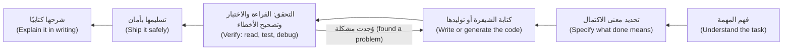
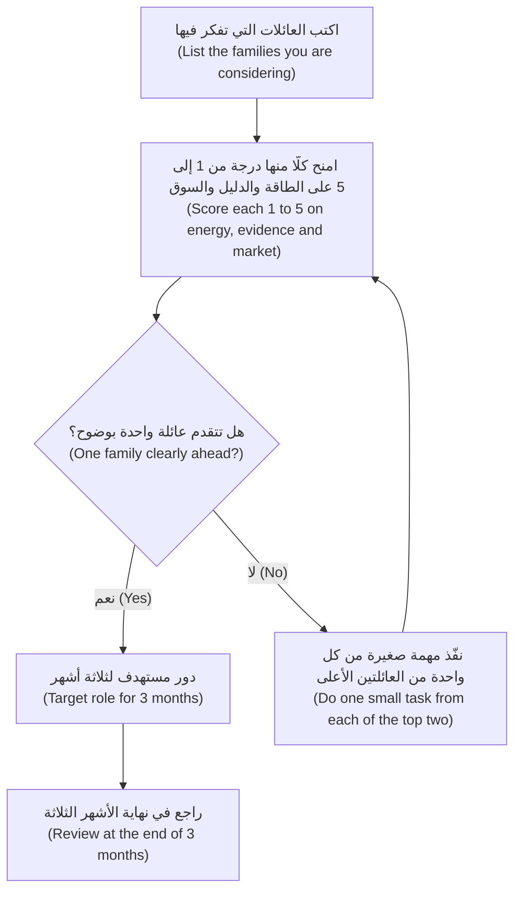
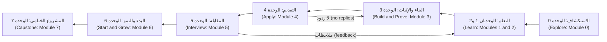

# الوحدة 0 — التوجيه (Orientation)

*قبل أن تكتب السيرة الذاتية (CV) أو تتدرّب على سؤال واحد من أسئلة المقابلات، تحتاج إلى ثلاثة أشياء: صورة صادقة (honest picture) عن السوق (market) الذي تدخله، وفكرة واضحة عمّا تتضمّنه كل وظيفة تقنية للمبتدئين (junior tech job) في العمل اليومي (day to day)، وخطة (plan) لاستخدام هذه الدورة والمكتبة (library) المحيطة بها. تقدّم لك هذه الوحدة الأشياء الثلاثة. تبدأ بما غيّره وكلاء البرمجة بالذكاء الاصطناعي (AI coding agents) في العمل على مستوى المبتدئين (entry-level)، وما لم يغيّروه. ثم ترسم خريطة الأدوار الرئيسية للمبتدئين (main junior roles) في البرمجيات (software) والذكاء الاصطناعي (AI) والبيانات (data) والمنصّات (platform) والأمن (security): ماذا يفعل أصحابها طوال اليوم، وماذا ينتجون، وما الذي يختبره أصحاب العمل (employers). وتنتهي بتقديم الخرّيجين الخمسة في برنامج نجم للخرّيجين التقنيين (Najm Tech Graduate Programme) الذين ستتابعهم عبر الدورة، وتبيّن كيف تحوّل الدورة إلى خطة ذات إجراءات أسبوعية (weekly actions). وبنهايتها سيكون لديك مسح للسوق (market scan)، واختيار أول للدور المستهدف (target-role choice)، وتدقيق أولي (starting audit) لمهاراتك.*

> **الخطوات (Steps):** Explore — رؤية السوق كما هو (seeing the market as it is)، واختيار اتجاه (choosing a direction)، وبناء العادات التي تحوّل الشهادة الجامعية إلى عرض وظيفي (turn a degree into an offer).

---

# 0.1 — سوق التقنية للمبتدئين في عصر الذكاء الاصطناعي (The entry-level tech market in the AI era): ما الذي تغيّر وما الذي لم يتغيّر (what changed and what didn't)
*المستوى (Level): 🟢 مبتدئ (Beginner)* · *المتطلبات (Prerequisites): لا يوجد (None)* · *الخطوة (Step): Explore*

## ⚡ الدرس في دقيقة (In 60 seconds)
- تتولّى وكلاء البرمجة بالذكاء الاصطناعي (AI coding agents) الآن كثيرًا من العمل الروتيني (routine work) الذي كان المبتدئون يتعلّمون عليه: الشيفرة النمطية المتكررة (boilerplate)، والميزات البسيطة (simple features)، والمسودات الأولى للاختبارات (first-draft tests)، وإصلاحات الأخطاء الصغيرة (small bug fixes).
- لم يتوقّف أصحاب العمل (employers) عن الحاجة إلى المبتدئين (juniors). لكنهم رفعوا المعيار (raised the bar) لما يجب أن يُظهره المبتدئ: أنك قادر على **تحديد العمل والتحقّق منه وتسليمه وشرحه (specify, verify, ship and explain)**، لا على إنتاج الشيفرة (produce code) فحسب.
- ما الذي لم يتغيّر (What did not change): قراءة الشيفرة وتصحيح أخطائها (reading and debugging code)، والأساسيات المتينة (solid fundamentals)، والكتابة الواضحة (clear writing)، والموثوقية والثقة (reliability and trust) ما زالت تحدّد من يُوظَّف ومن يُحتفظ به.
- مؤشّر القرار (Decision cue): اقرأ السوق بنفسك (read the market yourself). عشرة إعلانات وظائف حقيقية (ten real job ads) لدورك المستهدف (target role) تخبرك أكثر من أي عنوان إخباري (headline).
- الفخ الأكبر (Biggest trap): التفاعل مع العناوين الإخبارية (reacting to headlines)، إمّا بالذعر (panicking) («الذكاء الاصطناعي أخذ وظائف المبتدئين» ("AI took the junior jobs")) أو بتجاهل التغيير (ignoring the change) («شهادتي تكفي» ("my degree is enough")).

## 🧭 لماذا يهم (Why it matters)
نحن في أكتوبر. **عمر** (Omar)، خرّيج علوم الحاسوب (computer science graduate) بدرجات ممتازة (excellent grades) وسجل قوي في المسابقات البرمجية (strong contest record)، أرسل السيرة الذاتية (CV) نفسها إلى أكثر من خمسين إعلانًا وظيفيًا (postings) في أنحاء الخليج: رفضان آليّان (two automated rejections)، وصمت من الباقين. أمّا **ريم** (Reem)، التي بنت أربعة مشاريع جانبية (side projects) باستخدام وكلاء البرمجة بالذكاء الاصطناعي (AI coding agents)، فقد وصلت إلى المقابلة التقنية (technical interview) في شركة ناشئة للتقنية المالية (fintech startup) في الدوحة هي **سديم باي (Sadeem Pay)**. سألها المُقابِل (interviewer) لماذا تُعيد إحدى نقاط النهاية في واجهتها البرمجية (API endpoints) رمز الحالة 200 (200 status code) عند الفشل (on failure). لم تستطع الإجابة؛ فهي لم تقرأ تلك الشيفرة بعناية قط.

يحضر الاثنان جلسة تعريفية (information session) عن **برنامج نجم للخرّيجين التقنيين (Najm Tech Graduate Programme)**. يعرض **خالد** (Khalid)، مدير الهندسة (engineering manager) الذي يوظّف المبتدئين في بنك نجم (Najm Bank)، شريحة من عمودين: *ما الذي تغيّر (What changed)* و*ما الذي لم يتغيّر (What didn't)*. ويقول: «أنتم لا تدخلون سوقًا بلا وظائف (a market with no jobs). أنتم تدخلون سوقًا انتقل فيه الدليل المطلوب (the proof needed) للوظيفة نفسها إلى مكان آخر. تعلّموا إلى أين انتقل، واستعدّوا لذلك.»

العناوين الإخبارية (headlines) حقيقية بما يكفي. أفادت عدة تحليلات صدرت عام 2025 بضعف التوظيف (weaker hiring) للعاملين في بداية مسيرتهم المهنية (early-career workers) في المهن الأكثر تعرّضًا للذكاء الاصطناعي (occupations most exposed to AI). ومن أكثر هذه الدراسات تداولًا دراسة ⁦("Canaries in the Coal Mine?")⁩ لإريك برينيولفسون (Erik Brynjolfsson) وبهارات تشاندار (Bharat Chandar) وروي تشن (Ruyu Chen) في مختبر ستانفورد للاقتصاد الرقمي (Stanford Digital Economy Lab) (أغسطس 2025)، التي أفادت بتراجع نسبي في التوظيف (relative decline in employment) لأصغر العاملين سنًّا (youngest workers) في المهن المعرّضة للذكاء الاصطناعي (AI-exposed occupations)، ومنها تطوير البرمجيات (software development)، في حين كان حال العاملين الأكثر خبرة (more experienced workers) في المهن نفسها أفضل. يبيّن لك هذا الدرس كيف تقرأ مثل هذه الأدلة (evidence) بهدوء وتحوّلها إلى خطة (plan).

## 📐 كيف يعمل (How it works)

### 🟢 الأساسيات (The essentials)

**ما هي وظيفة «مستوى المبتدئين» (What an "entry-level" job is).** دور مستوى المبتدئين (entry-level) أو الدور المبتدئ (junior role) هو دور يتوقّع خبرة مهنية بدوام كامل (full-time professional experience) قليلة أو معدومة، تصل عادةً إلى نحو سنتين. ستراه تحت أسماء كثيرة: *مهندس خرّيج (graduate engineer)*، و*مطوّر مبتدئ (junior developer)*، و*مساعد (associate)*، و*Engineer I*، و*محلّل (analyst)*، و*متدرّب (trainee)*، أو مقعد في *برنامج للخرّيجين (graduate programme)* (وهو برنامج منظّم (structured scheme) مدته سنة أو سنتان، يتضمّن تناوبًا بين الأقسام (rotations) وتدريبًا (training)، وهو شائع في البنوك وشركات الطاقة والاتصالات (telecoms) والجهات الحكومية).

**ما الذي تغيّر (What changed).** هناك أربعة تحوّلات (shifts) هي الأهم بالنسبة إليك.

| التحوّل (Shift) | كيف يبدو (What it looks like) | ماذا يعني لك (What it means for you) |
|---|---|---|
| **البرمجة الروتينية أصبحت مُساعَدة (Routine coding is assisted)** | مساعدو البرمجة ووكلاؤها بالذكاء الاصطناعي (AI coding assistants and agents) (أدوات تكتب الشيفرة وتعدّلها وتشغّلها بناءً على تعليمات، مثل GitHub Copilot أو Cursor أو Claude Code) تصوغ مسودات الشيفرة النمطية (boilerplate) والميزات البسيطة (simple features) والاختبارات (tests) والإصلاحات الصغيرة (small fixes) | عبارة «أستطيع كتابة تطبيق CRUD» ("I can write a CRUD app") لم تعد دليلًا نادرًا (rare proof). أظهِر ما فعلته ولم تستطع الأداة فعله: القرارات (decisions)، والفحوص (checks)، والإصلاحات (fixes) |
| **التحقّق هو المهارة النادرة (Verification is the scarce skill)** | تستطيع الفرق (teams) إنتاج شيفرة أكثر مما تستطيع مراجعته بأمان (safely review) | يبحث أصحاب العمل عن مبتدئين يقرؤون الشيفرة قراءة نقدية (read code critically)، ويختبرونها، ويكتشفون الخطأ فيها، بما في ذلك الشيفرة المكتوبة بالذكاء الاصطناعي (AI-written code) |
| **طلبات أكثر لكل إعلان (More applications per posting)** | التقديم بنقرة واحدة (one-click applications) والسير الذاتية المكتوبة بالذكاء الاصطناعي (AI-written CVs) تجعل التقديم في كل مكان رخيصًا | الكمّ (volume) لا ينجح. ما ينجح هو الطلبات الموجّهة (targeted applications) والإحالات (referrals) والدليل الظاهر (visible proof) |
| **المقابلات تتغيّر (Interviews are changing)** | بعض أصحاب العمل يسمحون بأدوات الذكاء الاصطناعي (AI tools) أو يتوقّعونها في جولات معيّنة (certain rounds) ويمنعونها في غيرها؛ وأصبحت التمارين التي تطلب منك مراجعة طلب دمج معيب مولَّد بالذكاء الاصطناعي (flawed AI-generated pull request) أكثر شيوعًا | اسأل عن قواعد كل جولة (rules for every round)، وتدرّب على البرمجة دون مساعدة (coding without help) وعلى مراجعة الشيفرة نقديًا (reviewing code critically) كليهما |

**ما الذي لم يتغيّر (What did not change).** معظم ما كان يصنع مبتدئًا جيدًا (good junior) قبل عشر سنوات ما زال يصنعه:
- **الأساسيات (Fundamentals).** هياكل البيانات (data structures)، وكيف يعمل الويب (web) وقواعد البيانات (databases)، وكيف تفشل البرامج (how programs fail). لا يمكنك الحكم على مخرجات الذكاء الاصطناعي (AI output) من دونها.
- **قراءة الشيفرة وتصحيح أخطائها (Reading and debugging code).** معظم العمل المهني (professional work) يغيّر شيفرة موجودة (existing code).
- **التواصل (Communication).** وصف واضح لطلب الدمج (clear pull request description)، وسؤال جيد (good question)، وتحديث مكتوب قصير (short written update).
- **الموثوقية والثقة (Reliability and trust).** أن تفعل ما قلته، وأن تقول مبكرًا متى تعثّرت (when you are stuck)، وألّا تخفي خطأً أبدًا (never hiding a mistake).
- **الفرق تحتاج إلى كبار المهندسين في المستقبل (Teams need future seniors).** المؤسسات التي تتوقف عن توظيف المبتدئين ينتهي بها الأمر إلى نقص في كبار المهندسين (seniors)، وكثير منها يدرك ذلك.

**معيار المبتدئ الجديد في صورة واحدة (The new junior bar in one picture).** كانت الصورة القديمة للمبتدئ هي «شخص يحوّل مهمة واضحة إلى شيفرة» ("someone who turns a clear task into code"). أمّا الصورة الجديدة فهي «شخص يستطيع أن يحمل تغييرًا صغيرًا حتى نهايته، بأمان، بمساعدة الذكاء الاصطناعي أو من دونها» ("someone who can carry a small change all the way, safely, with or without AI help").

تستطيع أدوات الذكاء الاصطناعي (AI tools) تسريع المربّع C كثيرًا. أمّا أصحاب العمل فيوظّفون المبتدئين من أجل المربّعات المحيطة به. يتناول الدرس 1.2 كيف تبني باستخدام وكلاء البرمجة بالذكاء الاصطناعي (build with AI coding agents) دون أن تحملك هذه الوكلاء (without being carried by them)، ويتناول الدرس 1.3 الانتقال من «تعمل على حاسوبي المحمول» ("it runs on my laptop") إلى «تعمل للمستخدمين» ("it runs for users").

### 🟡 التعمق أكثر (Going deeper)

**اقرأ السوق بنفسك (Read the market yourself).** العناوين الإخبارية (headlines) تحسب متوسطات (average) على ملايين الوظائف في بلدان كثيرة. أمّا أنت فتتقدّم إلى نحو ثلاثين صاحب عمل (thirty employers) ربما، في مكان أو مكانين. أفضل دليل (best evidence) على سوقك هو إعلانات الوظائف (job ads) فيه. و**مسح السوق (market scan)** طريقة بسيطة:

1. اختر دورًا مستهدفًا واحدًا (one target role) (يساعدك الدرس 0.2) وموقعًا أو موقعين (locations).
2. اجمع عشرة إعلانات حالية (ten current ads) لوظائف المبتدئين أو الخرّيجين (junior or graduate positions) في ذلك الدور. استخدم ثلاثة مصادر على الأقل (at least three sources): صفحات الوظائف لدى أصحاب العمل (employer careers pages)، وموقع وظائف واحد (one job board)، وLinkedIn.
3. سجّل لكل إعلان: المسمّى (title)، ونوع صاحب العمل (employer type)، والخبرة المطلوبة (experience asked for)، والمهارات المطلوبة (required skills)، والمهارات «المرغوبة» ("nice to have")، وأي شيء عن أدوات الذكاء الاصطناعي (AI tools) أو الموقع (location) أو اللغة (language) أو الجنسية (nationality).
4. احسب عدد مرات ظهور كل مهارة. المهارات التي تظهر في سبعة إعلانات أو أكثر من العشرة هي **خط الأساس (baseline)** لديك؛ والمهارات التي تظهر في ثلاثة إلى ستة هي **المهارات المميِّزة (differentiators)**.
5. قارن القائمة بما تستطيع إثباته اليوم (what you can prove today). الفجوة (gap) هي خطتك الدراسية (study plan).

**كيف تقرأ الإعلان (How to read an ad).** إعلانات الوظائف قوائم أمنيات (wish lists) يكتبها أشخاص مشغولون، غالبًا من قوالب جاهزة (templates).
- عبارة «سنة إلى سنتين من الخبرة» ("1–2 years of experience") في إعلان للمبتدئين مرنة غالبًا (often flexible). إن كنت تستوفي معظم المتطلبات الأساسية (core requirements) ولديك دليل من مشاريع أو تدريب عملي (project or internship proof)، فتقدّم.
- المهارات المذكورة أولًا والمكرّرة في المسؤوليات (responsibilities) هي الأهم؛ أمّا قائمة الأدوات الطويلة في النهاية فهي عادةً قائمة أمنيات (wish list).
- كلمات مثل «يتولّى» ("own") و«من البداية إلى النهاية» ("end to end") و«بيئة الإنتاج» ("production") و«المناوبة» ("on-call") تعني أن الفريق يتوقّع من المبتدئين أن يسلّموا (ship)، لا أن يبرمجوا فقط.
- ذكر أدوات الذكاء الاصطناعي («التطوير بمساعدة الذكاء الاصطناعي» ("AI-assisted development")، و«واجهات النماذج اللغوية الكبيرة البرمجية» ("LLM APIs")) يبيّن كيف يعمل الفريق. وإن لم يذكر الإعلان شيئًا، فاسأل.

**استنتاجات ضعيفة مقابل استنتاجات قوية من الدليل نفسه (Weak vs strong conclusions from the same evidence).**

| استنتاج ضعيف (Weak conclusion) | استنتاج قوي (Strong conclusion) |
|---|---|
| «لا أحد يوظّف المبتدئين؛ عليّ أن أستسلم أو أدرس شهادة أخرى.» ⁦("Nobody is hiring juniors; I should give up or do another degree.")⁩ | «إعلانات أقل تذكر كلمة *مبتدئ (junior)* في مدينتي. لكن برامج الخرّيجين (graduate programmes) والشركات المتوسطة الحجم (mid-sized companies) ما زالت توظّف. سأستهدفها وأتقدّم مبكرًا في دورتها (early in their cycle).» |
| «الذكاء الاصطناعي يكتب الشيفرة الآن، إذن تعلّم البرمجة بلا فائدة.» ⁦("AI writes code now, so learning to code is pointless.")⁩ | «الذكاء الاصطناعي يصوغ مسودة الشيفرة (AI drafts code)، إذن عليّ أن أكون الشخص القادر على فحصها (check it). سأتدرّب على قراءة الشيفرة واختبارها ومراجعتها (reading, testing and reviewing code).» |
| «كل إعلان يطلب عشر أدوات؛ عليّ أن أتعلّمها كلها.» ⁦("Every ad asks for ten tools; I must learn all of them.")⁩ | «سبعة من عشرة إعلانات تطلب SQL وGit ومنصة سحابية واحدة (one cloud platform). سأثبت هذه الثلاث أولًا.» |

**قراءة الأبحاث دون المبالغة في تفسيرها (Reading research without over-reading it).** حين تصادف دراسة عن الذكاء الاصطناعي والوظائف (AI and jobs)، اطرح أربعة أسئلة:
- **بيانات من؟ ⁦(Whose data?)⁩** استخدمت دراسة ⁦("Canaries in the Coal Mine?")⁩ بيانات الرواتب الأمريكية (US payroll data). وقد لا تصف التوظيف في الدوحة أو دبي أو الرياض.
- **ارتباط أم سببية؟ ⁦(Correlation or cause?)⁩** تغيّر التوظيف في الوقت نفسه الذي انتشر فيه الذكاء الاصطناعي (AI adoption) لا يثبت أن الذكاء الاصطناعي هو السبب. فأسعار الفائدة (interest rates)، ونهاية طفرة التوظيف في زمن الجائحة (the end of the pandemic hiring boom)، وخفض الشركات للتكاليف (company cost-cutting) حدثت كلها في السنوات نفسها. والأوراق البحثية الجيدة تناقش هذا بنفسها؛ فاقرأ ذلك القسم.
- **أي وظائف؟ ⁦(Which jobs?)⁩** «المعرّضة للذكاء الاصطناعي» ("AI-exposed") مقياس (measure) يعرّفه الباحثون. اقرأ كيف عرّفوه.
- **ماذا يقولون إنه يساعد؟ ⁦(What do they say helps?)⁩** تفصل دراسات عدة بين الاستخدامات *الأتمتية (automating)* للذكاء الاصطناعي (الأداة تؤدّي المهمة) والاستخدامات *المعزِّزة (augmenting)* (الأداة تساعد الشخص على أدائها). ضع نفسك في الجانب المعزِّز (augmenting side): الشخص الذي يوجّه الأدوات ويفحصها (directs and checks the tools).

لا تكرّر أبدًا نسبة مئوية (percentage) لم تتحقّق منها في المصدر الأصلي (original source).

### 🔴 نظرة الخبير (Expert view)

**فكّر مثل الشخص الذي يدفع ثمن التوظيف (Think like the person paying for the hire).** مدير التوظيف (hiring manager) مثل خالد يوازن بين ثلاثة أمور حين يقرّر توظيف مبتدئ:
- **التكلفة (Cost):** الراتب (salary)، إضافةً إلى الوقت الذي يقضيه كبار المهندسين (senior engineers) في الإرشاد (mentoring) والمراجعة (reviewing). ووقت الإرشاد (mentoring time) هو غالبًا التكلفة الأكبر.
- **القيمة (Value):** العمل الذي سيؤدّيه المبتدئ هذا العام، والمهندس الكبير (senior) الذي سيصبحه بعد بضع سنوات.
- **المخاطرة (Risk):** احتمال أن يسلّم المبتدئ شيئًا غير متحقَّق منه (something unverified) إلى بيئة الإنتاج (production). وفي بنك، قد يعني ذلك أموالًا (money) أو بيانات عملاء (customer data) أو جهة رقابية (regulator).

تخفّض أدوات الذكاء الاصطناعي تكلفة المخرجات الروتينية (cost of routine output)، لكنها ترفع المخاطرة حين لا يستطيع مستخدمها فحصها. المبتدئون الذين يتميّزون (stand out) هم الذين **يخفّضون تكلفة الإرشاد (lower mentoring cost)** (أسئلة جيدة، كتابة واضحة، تعلّم سريع) و**يخفّضون المخاطرة (lower risk)** (يختبرون، ويتحقّقون، ويصرّحون حين لا يكونون متأكدين). وكل وحدة في هذه الدورة تعمل على أحد هذين الرافعين (levers).

**لسوق الخليج شكله الخاص (The Gulf market has its own shape).** قيّد أي ادّعاء عام (general claim) بما يناسب سوقك المحلي (local market):
- **برامج توطين القوى العاملة (Workforce nationalisation programmes)** تشكّل التوظيف: التقطير (Qatarization) في قطر، والتوطين الإماراتي (Emiratisation) (مع برنامج نافس (Nafis)) في الإمارات، والسعودة (Saudization) (نطاقات (Nitaqat)) في السعودية. ويدير كثير من أصحاب العمل الكبار برامج للخرّيجين (graduate programmes) للمواطنين (nationals). وإن لم تكن مواطنًا، فتوقّع أن تكون بعض الأدوار محجوزة (reserved)، واستهدف الأدوار غير المحجوزة. القواعد تتغيّر؛ فراجع المواقع الرسمية (official sites).
- **القطاعات الخاضعة للتنظيم من كبار أصحاب العمل (Regulated sectors are big employers).** المصارف (banking) والحكومة (government) والطاقة (energy) والاتصالات (telecoms) والصحة (health) تُقدّر الوعي بالأمن (security) وحماية البيانات (data protection) (مثل القانون القطري رقم 13 لسنة 2016 بشأن حماية خصوصية البيانات الشخصية (Qatar's Law No. 13 of 2016 on personal data privacy)) والحوكمة (governance).
- **التواصل التقني ثنائي اللغة (Bilingual technical communication)** بالعربية والإنجليزية ميزة (advantage) في الفرق التي تخدم العملاء المحليين (local customers) والجهات الرقابية (regulators).
- **قواعد التأشيرات والكفالة (Visa and sponsorship rules)** تختلف وتتغيّر. راجع القواعد الحالية (current rules) قبل أن تخطّط للانتقال.

**السوق يتحرّك؛ أمّا طريقتك فلا (The market moves; your method should not).** اقرأ الأدلة الحالية (current evidence)، واعرف ما يفحصه أصحاب العمل (what employers check for)، وابنِ الدليل عليه (build proof of it)، وكرّر ذلك كل ربع سنة (each quarter).

## 🧰 الأدوات (The toolkit)
| المورد أو الأداة أو النموذج (Resource, tool or template) | ما هو وماذا يفعل (What it is and does) | متى تلجأ إليه (When to reach for it) |
|---|---|---|
| **Market scan** — مسح السوق | جدول (table) يضم عشرة إعلانات وظائف حالية (ten current job ads) لدور واحد وموقع واحد، مع عدّ المهارات حسب تكرارها (skills counted by frequency) | في بداية بحثك عن عمل (at the start of your search)، ثم مرة أخرى كل ثلاثة أشهر (every three months) |
| **"Canaries in the Coal Mine?"** (برينيولفسون وتشاندار وتشن (Brynjolfsson, Chandar and Chen)، مختبر ستانفورد للاقتصاد الرقمي (Stanford Digital Economy Lab)، 2025) | دراسة واسعة الاستشهاد (widely cited study) عن توظيف العاملين في بداية مسيرتهم (early-career employment) في المهن المعرّضة للذكاء الاصطناعي (AI-exposed occupations)، تستند إلى بيانات الرواتب الأمريكية (US payroll data) | حين تريد فهم الأدلة وراء العناوين الإخبارية (evidence behind headlines)، وحدودها (its limits) |
| **Stack Overflow Developer Survey** — استبيان المطوّرين من Stack Overflow | استبيان سنوي كبير (large annual survey) للمطوّرين (developers)، يشمل كيف يستخدمون أدوات الذكاء الاصطناعي (AI tools) | لترى كيف يستخدم المطوّرون العاملون (working developers) أدوات الذكاء الاصطناعي فعلًا، وقت كتابة الدرس (at the time of writing) (2026) |
| **Official labour-market sources** — مصادر سوق العمل الرسمية (مثل دليل التوقعات المهنية من مكتب إحصاءات العمل الأمريكي (US BLS Occupational Outlook Handbook)، ومكاتب الإحصاء الوطنية (national statistics offices)) | أوصاف حكومية للمهن (government descriptions of occupations)، ومسارات الدخول المعتادة (typical entry routes)، والتوقعات (outlook) | حين تحتاج إلى رؤية رصينة موثّقة المصادر (sober, sourced view) لتوقعات دور ما |
| **Nationalisation programme sites** — مواقع برامج التوطين (مثل نافس (Nafis) في الإمارات) | معلومات رسمية (official information) عن برامج القوى العاملة الوطنية (national workforce programmes) وحوافزها (incentives) | إن كنت مواطنًا، أو لتفهم أي الأدوار محجوزة (reserved)، وقت كتابة الدرس (at the time of writing) (2026) |

## 🏛️ عمليًا في بنك نجم (In practice at Najm Bank)
في نهاية الجلسة التعريفية (information session)، يعطي خالد كل حاضر **نموذج مسح السوق (market scan template)** في صفحة واحدة، ويطلب منهم إعادته مكتملًا في ورشة العمل الأولى (first workshop). إليك جزءًا من نموذج عمر، لأدوار هندسة البرمجيات للمبتدئين (junior software engineering roles) في قطر والإمارات. أصحاب العمل خياليّون (fictional) أو عامّون (generic).

| # | المسمّى (Title) | نوع صاحب العمل (Employer type) | الخبرة المطلوبة (Experience asked) | المهارات المطلوبة (Required skills) | مرغوب (Nice to have) | أدوات الذكاء الاصطناعي المذكورة (AI tools mentioned) | ملاحظات (Notes) |
|---|---|---|---|---|---|---|---|
| 1 | مهندس برمجيات خرّيج (Graduate Software Engineer) | بنك نجم (Najm Bank) (برنامج للخرّيجين (graduate programme)) | خرّيج، 0 سنوات | Java أو Python، وSQL، وGit، وواجهات REST البرمجية (REST APIs) | أساسيات السحابة (cloud basics)، والاختبار (testing) | «الاستخدام المسؤول لمساعدي البرمجة بالذكاء الاصطناعي» ("Responsible use of AI coding assistants") | تناوب بين الأقسام (rotations)؛ نافذة تقديم محدّدة (fixed application window) |
| 2 | مهندس خلفيات مبتدئ (Junior Backend Engineer) | سديم باي (Sadeem Pay) (شركة ناشئة للتقنية المالية (fintech startup)) | 0–2 سنة | Python أو Go، وPostgreSQL، وDocker، وGit | المدفوعات (payments)، والتكامل والتسليم المستمرّان (CI/CD) | «نستخدم وكلاء الذكاء الاصطناعي يوميًا» ("We use AI agents daily") | مهمة منزلية (take-home task) ضمن العملية |
| 3 | Software Engineer I | شركة متعددة الجنسيات، مكتب إقليمي (Multinational, regional office) | 0–2 سنة | هياكل البيانات والخوارزميات (data structures and algorithms)، ولغة برمجة واحدة، وGit | الأنظمة الموزّعة (distributed systems) | غير مذكور (Not stated) | اختبار برمجة عبر الإنترنت أولًا (online coding test first) |
| 4 | مطوّر، الخدمات الرقمية (Developer, Digital Services) | جهة حكومية رقمية (Government digital agency) | خرّيج | JavaScript أو TypeScript، وأساسيات الويب (web basics)، وSQL | إتاحة الوصول (accessibility)، وواجهة عربية من اليمين إلى اليسار (Arabic UI, right-to-left) | غير مذكور (Not stated) | قد تكون بعض الأدوار محجوزة للمواطنين (reserved for nationals)؛ تحقّق من ذلك (check) |

**ملخّص عمر (Omar's summary) (أسفل النموذج):**

| البند (Item) | النتيجة (Finding) |
|---|---|
| خط الأساس (Baseline) (في 7 إعلانات أو أكثر من 10) | Git، وSQL، ولغة خلفيات واحدة (one backend language)، وواجهات REST البرمجية (REST APIs) |
| المهارات المميِّزة (Differentiators) (في 3–6 من 10) | Docker، والتكامل والتسليم المستمرّان (CI/CD)، وأساسيات السحابة (cloud basics)، والاختبار (testing)، والعربية |
| ما أستطيع إثباته اليوم (What I can prove today) | الخوارزميات (algorithms) (سجل المسابقات (contest record))، وJava، وPython |
| الفجوات (Gaps) | لم أنشر أي شيء قط (never deployed anything)؛ لا مشروع يجمع SQL وواجهة برمجية (API) واختبارات معًا؛ لا تكامل مستمر (no CI) |
| ثلاثة إجراءات هذا الشهر (Three actions this month) | واجهة برمجية صغيرة منشورة (small deployed API) مع اختبارات وتكامل مستمر (tests and CI)؛ وملف README يشرحها؛ والتقديم إلى برنامج نجم قبل الموعد النهائي (deadline) |

تعليق خالد: «فجوتك ليست في المعرفة (knowledge)؛ بل في الدليل على أنك تستطيع التسليم (proof that you can ship). راجع الدرس 1.3 ومواصفات المشاريع (project specs) في الدرس 3.1.»

## 🛠️ التمارين (Exercises)
- 🟢 اجمع عشرة إعلانات حالية (ten current ads) لدور مبتدئ واحد في موقع أو موقعين ستنتقل إليهما أو تعمل فيهما فعلًا، من ثلاثة مصادر على الأقل. املأ جدول مسح السوق (market scan table). *يكتمل عندما (Done when):* يضم جدولك عشرة صفوف وكل أعمدتها ممتلئة، ولكل صف رابط يعمل (working link) أو نسخة محفوظة (saved copy) من الإعلان.
- 🟡 من مسحك، اكتب مهارات خط الأساس (baseline) والمهارات المميِّزة (differentiator skills) مع عدد مرات ظهورها، ثم اكتب «موجزًا عن السوق» ("market brief") في نصف صفحة: ما الذي تطلبه الإعلانات، وما الذي فاجأك، وكيف تُذكر أدوات الذكاء الاصطناعي (AI tools)، وثلاثة إجراءات للشهر القادم. *يكتمل عندما (Done when):* يستطيع زميل في الدراسة قراءة موجزك وتسمية دورك المستهدف (target role)، وأكبر ثلاث فجوات لديك (top three gaps)، وأول إجراء لك (first action) دون أن يسألك.
- 🔴 أجرِ محادثتين استطلاعيتين قصيرتين (two short informational conversations) (15–20 دقيقة) مع أشخاص في دورك المستهدف، ويُفضّل أن يكون أحدهما ذا خبرة تقل عن ثلاث سنوات. اسأل كيف غيّرت أدوات الذكاء الاصطناعي سنتهم الأولى (first year)، وما الذي يجعل المبتدئ يتميّز (stand out) في فريقهم. يتناول الدرس 4.2 كيف تطلب ذلك. *يكتمل عندما (Done when):* تكون لديك ملاحظات من المحادثتين وقائمة بما أكّد مسحك أو ناقضه (confirmed or contradicted your scan)، مع تحديث خطتك الدراسية (study plan).

## ⚠️ أخطاء وفخاخ (Mistakes and traps)
- **التعامل مع العناوين الإخبارية على أنها سوقك (Treating headlines as your market).** المتوسطات الوطنية أو العالمية (national or global averages) قد لا تطابق مدينتك أو دورك. أجرِ مسح السوق (market scan) وثق به أكثر من العنوان الإخباري.
- **التقديم الجماعي بسيرة ذاتية واحدة (Mass-applying with one CV).** المزيد من الطلبات بالسيرة الذاتية العامّة نفسها (same generic CV) يعني عادةً مزيدًا من الصمت. الطلبات الأقل والموجّهة (fewer, targeted applications) المدعومة بالدليل (backed by proof) تنجح أكثر (الوحدة 4 (Module 4)).
- **قرار عدم تعلّم الأساسيات لأن الذكاء الاصطناعي يكتب الشيفرة (Deciding not to learn fundamentals because AI writes code).** لا يمكنك فحص ما لا تفهمه، والفحص (checking) هو ما يدفع أصحاب العمل للمبتدئين مقابله الآن.
- **إخفاء استخدامك للذكاء الاصطناعي، أو المبالغة فيه (Hiding your AI use, or overselling it).** كلاهما يضرّ بالثقة (damage trust). استخدم أدوات الذكاء الاصطناعي علنًا (openly) حيث يُسمح بها، وكن قادرًا على شرح كل سطر تقدّمه والتحقّق منه (explain and verify every line you submit).
- **الاستشهاد بأرقام لم تتحقّق منها (Quoting numbers you have not checked).** إحصائية خاطئة تُقال بثقة (confident wrong statistic) في مقابلة تضرّك أكثر من أن تقول: «قرأت أن توظيف العاملين في بداية مسيرتهم ضعف في الأدوار المعرّضة للذكاء الاصطناعي؛ ولم أتحقّق من الأرقام الخاصة بهذه المنطقة.» ⁦("I read that early-career hiring weakened in AI-exposed roles; I have not checked the figures for this region.")⁩

## 🧾 الخلاصة (Recap)
- تساعد وكلاء البرمجة بالذكاء الاصطناعي (AI coding agents) في البرمجة الروتينية (routine coding)، لذا انتقل معيار المبتدئ (junior bar) من «يكتب الشيفرة» ("writes code") إلى «يحدّد ويتحقّق ويسلّم ويشرح» ("specifies, verifies, ships and explains").
- الأساسيات (fundamentals)، وقراءة الشيفرة وتصحيح أخطائها (reading and debugging code)، والتواصل الواضح (clear communication)، والموثوقية (reliability) ما زالت تحدّد التوظيف.
- اقرأ سوقك بنفسك عبر مسح سوق من عشرة إعلانات (ten-ad market scan)؛ مهارات خط الأساس (baseline skills) تظهر في معظم الإعلانات، والمهارات المميِّزة (differentiators) في بعضها.
- يوازن مديرو التوظيف (hiring managers) بين التكلفة والقيمة والمخاطرة (cost, value and risk)؛ والمبتدئون الذين يخفّضون تكلفة الإرشاد والمخاطرة (lower mentoring cost and risk) يتميّزون.
- في الخليج، تشكّل برامج التوطين (nationalisation programmes) وبرامج الخرّيجين (graduate programmes) والقطاعات الخاضعة للتنظيم (regulated sectors) السوق؛ فراجع القواعد الحالية (current rules).

## ✍️ اختبر نفسك (Check yourself)

**1. أرسل عمر السيرة الذاتية (CV) نفسها إلى أكثر من خمسين إعلانًا وظيفيًا (postings) ولم يتلقَّ ردًّا يُذكر تقريبًا. بناءً على هذا الدرس، ماذا ينبغي أن يفعل أولًا؟**

- A. أن يتقدّم إلى مئة إعلان آخر هذا الشهر بالسيرة الذاتية نفسها، لأن معدّلات الاستجابة (response rates) منخفضة في كل مكان
- B. أن يمسح عشرة إعلانات (scan ten ads) لدور مستهدف واحد (one target role)، ثم يبني الدليل (build proof) على مهارات خط الأساس (baseline skills) التي تنقصه
- C. أن يبدأ دراسة الماجستير (master's degree)، لأن سوق المبتدئين (junior market) مغلق
- D. أن يضيف كل أداة ذُكرت في أي إعلان إلى قائمة المهارات في سيرته الذاتية، كي تطابقه مرشّحات الكلمات المفتاحية (keyword filters)

الإجابة

**B.** طريقة الدرس (the lesson's method) هي أن تقرأ سوقك بنفسك، وتجد الفجوة (gap) بين ما تطلبه الإعلانات وما تستطيع إثباته، وتسدّها بالدليل (close it with proof). الخيار A يكرّر ما لا ينجح؛ والخيار C يتفاعل مع العناوين الإخبارية (headlines) بدلًا من الأدلة (evidence)؛ والخيار D يدّعي مهارات لا يستطيع إثباتها. (القسم: 🟡 التعمق أكثر (Going deeper))

**2. وفقًا لهذا الدرس، أي مهارة أصبحت أكثر قيمة للمبتدئين (juniors) لأن أدوات الذكاء الاصطناعي (AI tools) تستطيع صياغة مسودات الشيفرة الروتينية (draft routine code)؟**

- A. كتابة الشيفرة بسرعة من الذاكرة (typing code quickly from memory)، دون الحاجة إلى البحث عن أي شيء
- B. حفظ قواعد الكتابة (syntax) للغات برمجة كثيرة
- C. إنتاج كميات كبيرة من الشيفرة العاملة (working code) في وقت قصير، لمجاراة أدوات الذكاء الاصطناعي
- D. التحقّق من الشيفرة (verifying code): قراءتها قراءة نقدية (reading it critically)، واختبارها، واكتشاف الأخطاء فيها

الإجابة

**D.** تستطيع الفرق إنتاج شيفرة أكثر مما تستطيع مراجعته بأمان (safely review)، لذا ففحص الشيفرة (checking code) هو المهارة النادرة (scarce skill). الخيارات A وB وC تصف مخرجات (output) أصبحت أدوات الذكاء الاصطناعي تجعلها رخيصة. (القسم: 🟢 الأساسيات (The essentials))

**3. يقول زميل لك في الدراسة: «أثبتت دراسة من ستانفورد أن الذكاء الاصطناعي دمّر وظائف المطوّرين المبتدئين في كل مكان.» ⁦("A Stanford study proved that AI destroyed junior developer jobs everywhere.")⁩ ما الرد الأدقّ (most accurate response)؟**

- A. «أفادت بتراجع نسبي (relative decline) للعاملين الشباب في الوظائف المعرّضة للذكاء الاصطناعي (AI-exposed jobs)، على بيانات أمريكية (US data)؛ وهذا وحده لا يثبت السببية (cause) ولا ينطبق بالضرورة على منطقتنا (our region).»
- B. «هذا صحيح، وبما أن الأدلة تشمل كل بلد وكل صاحب عمل، فعلينا جميعًا أن نتوقف الآن عن التقديم لأدوار المطوّرين (developer roles).»
- C. «تلك الدراسة مزيّفة (fake)؛ لم يكن للذكاء الاصطناعي أي أثر قابل للقياس (measurable effect) على التوظيف في أي مكان، لذا يمكننا تجاهلها بأمان والمضي قدمًا.»
- D. «في الواقع أثبتت العكس: توظيف المطوّرين المبتدئين (junior developer hiring) ازداد في كل مكان منذ ظهور أدوات البرمجة بالذكاء الاصطناعي (AI coding tools).»

الإجابة

**A.** أسئلة الدرس الأربعة هي: بيانات من (whose data)، وارتباط أم سببية (correlation or cause)، وأي وظائف (which jobs)، وماذا يساعد (what helps). الخيار B يبالغ في تفسير الأدلة (over-reads the evidence)؛ والخياران C وD يرفضانها أو يحرّفانها (dismiss or misstate it). (القسم: 🟡 التعمق أكثر (Going deeper))

**4. يوازن خالد بين التكلفة والقيمة والمخاطرة (cost, value and risk) عند توظيف مبتدئ. أي سلوك من المرشّح (candidate behaviour) يخفّض تكلفة الإرشاد (mentoring cost) والمخاطرة (risk) معًا؟**

- A. العمل وحده أسبوعًا كاملًا دون طرح أي أسئلة، ليبدو مستقلًا (independent)
- B. تقديم طلبات دمج كبيرة مولَّدة بالذكاء الاصطناعي (large AI-generated pull requests) بسرعة كي يرى الفريق إنتاجية عالية (high output) مبكرًا
- C. أوصاف واضحة للتغييرات (clear change descriptions)، وعمل مختبَر (tested work)، والإشارة إلى الشكوك مبكرًا (flagging doubts early)
- D. تجنّب أدوات الذكاء الاصطناعي تمامًا، حتى حيث يتوقّع الفريق استخدامها

الإجابة

**C.** الكتابة الواضحة (clear writing) والأسئلة الجيدة (good questions) تخفّض تكلفة الإرشاد؛ والاختبار (testing) والإشارة إلى عدم اليقين (flagging uncertainty) يخفّضان المخاطرة. الخيار A يخفي المشكلات حتى وقت متأخر؛ والخيار B يرفع تكلفة المراجعة (review cost) والمخاطرة؛ والخيار D يتجاهل طريقة عمل الفريق. (القسم: 🔴 نظرة الخبير (Expert view))

**5. إعلان للمبتدئين (junior ad) يناسب ريم جيدًا في ما عدا أنه يطلب «سنة إلى سنتين من الخبرة» ("1–2 years of experience"). لديها مشروعان كبيران (two substantial projects) وتدريب صيفي (summer internship). ماذا ينبغي أن تفعل؟**

- A. أن تتخطّاه، لأنها لا تستوفي الخبرة المذكورة وستضيّع وقت مسؤول التوظيف (recruiter)
- B. أن تتقدّم، لأن سطور الخبرة (experience lines) في إعلانات المبتدئين مرنة غالبًا (often flexible) حين يكون الدليل قويًا (proof is strong)
- C. أن تعدّل سيرتها الذاتية لتقول سنتين، محتسبةً التدريب والمشاريع الجانبية (side projects) عملًا بدوام كامل (full-time work)
- D. أن ترسل بريدًا إلى الشركة تشتكي فيه من أن الإعلان ليس للمبتدئين

الإجابة

**B.** الإعلانات قوائم أمنيات (wish lists)؛ واستيفاء معظم المتطلبات الأساسية (core requirements) مع الدليل يكفي عادةً للتقديم. الخيار A يضيّع فرصة جيدة؛ والخيار C غير أمين (dishonest) ويخالف قواعد النزاهة (integrity rules) في هذه الدورة؛ والخيار D لا يفيد أحدًا. (القسم: 🟡 التعمق أكثر (Going deeper))

## 📚 المراجع (References)
- Brynjolfsson, E., Chandar, B. and Chen, R., "Canaries in the Coal Mine? Six Facts about the Recent Employment Effects of Artificial Intelligence", Stanford Digital Economy Lab, 2025 — https://digitaleconomy.stanford.edu/
- استبيان المطوّرين من Stack Overflow (Stack Overflow Developer Survey) — https://survey.stackoverflow.co/
- مكتب إحصاءات العمل الأمريكي، دليل التوقعات المهنية (U.S. Bureau of Labor Statistics, Occupational Outlook Handbook) — https://www.bls.gov/ooh/
- المنتدى الاقتصادي العالمي، تقرير مستقبل الوظائف 2025 (World Economic Forum, The Future of Jobs Report 2025) — https://www.weforum.org/publications/the-future-of-jobs-report-2025/
- برنامج نافس الإماراتي (UAE Nafis programme) — https://www.nafis.gov.ae/
- [*تصميم الأنظمة لمبرمجي الحدس (System Design for Vibe Coders)*، الدرس 0.1 — «إنها تعمل» ليست خاصية من خصائص النظام ("It works" is not a property of a system)](../vibe/index.ar.html#l0-1)
- [*تصميم الأنظمة لمبرمجي الحدس (System Design for Vibe Coders)*، الدرس 9.1 — أنت المعماري الآن (You are the architect now)](../vibe/index.ar.html#l9-1)

---

# 0.2 — خريطة الأدوار (The roles map): ماذا يفعل المبتدئون في البرمجيات والذكاء الاصطناعي والبيانات والمنصّات والأمن طوال اليوم فعلًا (what software, AI, data, platform and security juniors actually do all day)
*المستوى (Level): 🟢 مبتدئ (Beginner)* · *المتطلبات (Prerequisites): 0.1* · *الخطوة (Step): Explore*

## ⚡ الدرس في دقيقة (In 60 seconds)
- عبارة «وظيفة تقنية» ("Tech job") تغطي عدة وظائف مختلفة. خمس عائلات (five families) توظّف معظم الخرّيجين: **البرمجيات والتطوير الشامل (software and full-stack)**، و**تطبيقات الذكاء الاصطناعي (AI application)**، و**البيانات (data)**، و**السحابة والمنصّات (cloud and platform)**، و**الأمن (security)**.
- لكل عائلة يوم عمل مختلف (different working day)، وتنتج أشياء مختلفة، وتُختبر بطريقة مختلفة في المقابلات (tested differently in interviews).
- المسمّيات الوظيفية (job titles) غير موثوقة. اقرأ المسؤوليات (responsibilities) واسأل: «ماذا سأنتج في أسبوع عادي؟» ⁦("what would I produce in a normal week?")⁩
- مؤشّر القرار (Decision cue): اختر **دورًا مستهدفًا (target role)** للأشهر الثلاثة القادمة باستخدام ثلاث عدسات (three lenses): أي عمل يمنحك الطاقة (energises you)، وأين لديك دليل (evidence) على أنك جيد فيه، وما الذي يوظّف سوقك المبتدئين من أجله (what your market hires juniors for).
- الفخ الأكبر (Biggest trap): التقديم لكل العائلات دفعة واحدة (applying to every family at once). السيرة الذاتية (CV) ومعرض الأعمال (portfolio) الموجّهان إلى كل شيء لا يقنعان أحدًا (convince no one).

## 🧭 لماذا يهم (Why it matters)
في أول ورشة عمل لخرّيجي نجم (first Najm graduate workshop)، يطلب خالد من كل حاضر أن يكتب دوره المستهدف (target role) على ورقة لاصقة (sticky note). تكتب **هدى** (Huda)، خرّيجة علوم البيانات (data science graduate)، «عالمة بيانات» ("data scientist"). ويكتب **يوسف** (Yousef)، خرّيج هندسة الحاسوب (computer engineering graduate) الذي قضى سنته الأخيرة في الأنظمة المدمجة (embedded systems) والشبكات (networks)، «مهندس برمجيات، أو ربما بيانات، أو سحابة» ("software engineer, or maybe data, or cloud"). ويكتب **محمد** (Mohammed)، خرّيج المعسكر التدريبي (bootcamp graduate) الذي يغيّر مساره المهني (switching careers)، «مطوّر شامل» ("full-stack developer").

يجمع خالد الأوراق ويطلب من **دانة** (Dana)، كبيرة علماء البيانات (lead data scientist) في نجم، أن تصف الشهر الماضي لفريقها. تشرح دانة أن معظمه ذهب في استخراج بيانات موثوقة (reliable data) من ثلاثة أنظمة مصدرية (source systems)، وإصلاح خط بيانات (pipeline) تعطّل حين غيّر أحد الأنظمة اسم عمود (column name)، والاتفاق مع فريق المخاطر (risk team) على المعنى الفعلي لـ«التعثّر» ("default"). وتقول: «درّبنا نموذجًا واحدًا (one model). معظم وقت المبتدئين لديّ ذهب إلى SQL وخطوط البيانات (data pipelines).» تبدو هدى متفاجئة: لم يكن شيء من مقرراتها الدراسية (coursework) يشبه ذلك.

أمّا ورقة يوسف فتُظهر مشكلة مختلفة. يقضي مسؤولو التوظيف (recruiters) ثوانيَ في النظرة الأولى (first look) على السيرة الذاتية، والسيرة التي تقول «مهتم بالبرمجيات والبيانات والسحابة» ("interested in software, data and cloud") تُقرأ على أنها «لم يحسم أمره بعد» ("not sure yet"). وقبل أن تتمكّن من بناء الدليل المناسب (the right proof)، تحتاج إلى معرفة ما يفعله كل دور فعلًا. وهذا الدرس يرسم تلك الخريطة (map).

## 📐 كيف يعمل (How it works)

### 🟢 الأساسيات (The essentials)

**العائلات الخمس (The five families).** في ما يلي ما يفعله المبتدئ في كل عائلة عادةً في أسبوع عادي (normal week). تختلف الفرق الحقيقية (real teams vary)، لكن هذه الأنماط (patterns) تصدق لدى معظم أصحاب العمل.

| العائلة (Family) | المسمّيات المعتادة للمبتدئين (Typical junior titles) | أسبوع عادي (A normal week) | ماذا ينتجون (What they produce) | مع من يعملون (Who they work with) |
|---|---|---|---|---|
| **البرمجيات والتطوير الشامل (Software and full-stack)** | مهندس برمجيات (software engineer)، أو مطوّر خلفيات (backend) أو واجهات أمامية (frontend) أو تطبيقات جوّال (mobile) أو مطوّر شامل (full-stack developer) | يتسلّم تذكرة عمل (ticket)، ويقرأ الشيفرة الموجودة (existing code)، ويُجري تغييرًا، ويكتب الاختبارات (tests)، ويفتح طلب دمج (pull request, PR)، ويستجيب للمراجعة (review)، ويصلح خطأً من بيئة الإنتاج (bug from production) | طلبات دمج (pull requests)، واختبارات، وميزات صغيرة (small features)، وإصلاحات أخطاء (bug fixes)، وملاحظات تصميم قصيرة (short design notes) | مهندسون آخرون، ومديرو المنتجات (product managers)، والمصمّمون (designers)، وضمان الجودة (QA) |
| **تطبيقات الذكاء الاصطناعي (AI application)** | مهندس ذكاء اصطناعي (AI engineer)، مهندس ذكاء اصطناعي تطبيقي (applied AI engineer)، مهندس نماذج لغوية كبيرة (LLM engineer)، مهندس برمجيات متخصّص في الذكاء الاصطناعي (software engineer, AI) | يبني ميزات فوق النماذج اللغوية الكبيرة (large language models, LLMs): التعليمات (prompts)، والاسترجاع (retrieval)، واستدعاءات الأدوات (tool calls)؛ ويكتب التقييمات (evaluations)؛ ويخفّض التكلفة والأخطاء؛ ويتعامل مع مخرجات النموذج الرديئة (bad model output) | ميزات تستخدم واجهات النماذج البرمجية (model APIs)، ومجموعات التقييم (evaluation sets)، وتغييرات في التعليمات والاسترجاع (prompt and retrieval changes)، وضوابط الحماية (guardrails) | مهندسو البرمجيات، ومديرو المنتجات، وعلماء البيانات (data scientists)، والأمن |
| **البيانات (Data)** | محلّل بيانات (data analyst)، مهندس بيانات (data engineer)، مهندس تحليلات (analytics engineer)، عالم بيانات (data scientist)، مهندس تعلّم آلي مبتدئ (junior ML engineer) | يكتب SQL، ويبني خطوط بيانات (pipelines) تنقل البيانات وتنظّفها أو يصلحها، ويعرّف المقاييس (metrics)، ويبني لوحات المعلومات (dashboards)، ويُجري التحليلات أو التجارب (analyses or experiments)، ويدرّب النماذج ويقيّمها أحيانًا | استعلامات (queries)، وخطوط بيانات (pipelines)، ونماذج بيانات (data models)، ولوحات معلومات (dashboards)، وتحليلات (analyses)، وتقييمات للنماذج (model evaluations) | فرق الأعمال (business teams)، والمهندسون، ومالكو البيانات (data owners)، والمخاطر والامتثال (risk and compliance) |
| **السحابة والمنصّات (Cloud and platform)** | مهندس سحابة (cloud engineer)، مهندس منصّات (platform engineer)، مهندس DevOps (DevOps engineer)، مهندس موثوقية المواقع (site reliability engineer, SRE) | يغيّر البنية التحتية عبر الشيفرة (change infrastructure through code)، ويحسّن خطوط البناء والنشر (build and deploy pipelines)، ويستجيب للتنبيهات (alerts)، ويساعد المطوّرين على التسليم (help developers ship)، ويضبط التكلفة (tune cost) | تغييرات البنية التحتية كشيفرة (infrastructure-as-code changes)، وخطوط CI/CD (CI/CD pipelines)، وأدلة التشغيل (runbooks)، ولوحات المعلومات، وملاحظات الحوادث (incident notes) | كل فرق الهندسة (every engineering team)، والأمن، والمورّدون (vendors) |
| **الأمن (Security)** | مهندس أمن التطبيقات (application security engineer)، محلّل أمني في مركز العمليات الأمنية (security analyst, SOC)، مهندس أمن السحابة (cloud security engineer) | يراجع الشيفرة والتصاميم بحثًا عن الثغرات الأمنية (security flaws)، ويفرز نتائج أدوات الفحص (triage scanner findings)، ويحقّق في التنبيهات (investigate alerts)، ويساعد الفرق على إصلاح المشكلات، ويكتب الإرشادات (guidance) | نتائج مع إصلاحاتها (findings with fixes)، ونماذج التهديد (threat models)، وقواعد الكشف (detection rules)، وأدلة الأمن (security guides) | المهندسون، والمخاطر، والتدقيق (audit)، وعمليات تقنية المعلومات (IT operations) |

**بعض المصطلحات (A few terms).** *التكامل والتسليم المستمرّان (CI/CD, continuous integration and continuous delivery)* هما الأتمتة (automation) التي تختبر الشيفرة وتسلّمها. و*البنية التحتية كشيفرة (Infrastructure as code)* تعني تعريف الخوادم (servers) والشبكات (networks) في ملفات تُراجع مثل الشيفرة. و*مركز العمليات الأمنية (SOC, security operations centre)* هو الفريق الذي يراقب الهجمات (attacks) ويستجيب لها. و*مهندس موثوقية المواقع (SRE)* هو مهندس يحافظ على موثوقية الأنظمة (keeps systems reliable) باستخدام البرمجيات، والأهداف المقيسة (measured targets)، ومناوبات الاستدعاء (on-call rotations).

**كيف تُختبر كل عائلة في المقابلات (How each family is tested in interviews).** المقابلة تعكس الوظيفة (the interview mirrors the job). ويتعمّق الدرسان 5.2 و5.3 أكثر.

| العائلة (Family) | ما يُختبر عادةً (Commonly tested) | الدليل الأكثر نفعًا (Proof that helps most) |
|---|---|---|
| البرمجيات والتطوير الشامل (Software and full-stack) | البرمجة (coding) (هياكل البيانات والخوارزميات (data structures and algorithms) في شركات التقنية الكبرى؛ ومهام عملية (practical tasks) في غيرها)، ومراجعة الشيفرة (code review)، وتصحيح الأخطاء (debugging)، وأساسيات تصميم الأنظمة (basic system design) | مشروع منشور (deployed project) مع اختبارات وتكامل مستمر (tests, CI) وملف README واضح |
| تطبيقات الذكاء الاصطناعي (AI application) | البرمجة، والبناء باستخدام واجهة برمجية لنموذج لغوي كبير (building with an LLM API)، وتقييم المخرجات (evaluating output)، والتعامل مع الفشل والتكلفة (handling failure and cost)، والوعي بحقن التعليمات (prompt injection awareness) | ميزة صغيرة قائمة على نموذج لغوي كبير (small LLM feature) مع مجموعة تقييم (evaluation set) وحالات فشل موثّقة (documented failure cases) |
| البيانات (Data) | SQL (دائمًا تقريبًا (almost always))، ونمذجة البيانات (data modelling)، ودراسة حالة أو تحليل (a case or analysis)، والإحصاء لعلوم البيانات (statistics for data science) | خط بيانات أو تحليل على بيانات عامة حقيقية (real public data)، مع SQL مختبَر (tested SQL) واستنتاج مكتوب (written conclusion) |
| السحابة والمنصّات (Cloud and platform) | Linux، والشبكات (networking)، وأساسيات مزوّد سحابي (a cloud provider's basics)، والحاويات (containers)، وسيناريوهات حلّ المشكلات (troubleshooting scenarios) | بنية تحتية معرّفة بالشيفرة (infrastructure defined in code)، وخط تسليم يعمل (working pipeline)، وتقرير حادثة أو دليل تشغيل مكتوب (written incident or runbook) |
| الأمن (Security) | ثغرات الويب (web vulnerabilities)، والمراجعة الآمنة للشيفرة (secure code review)، والشبكات، والأسئلة القائمة على السيناريوهات (scenario questions) | تقارير مكتوبة (write-ups) عن مختبرات مصرّح بها (authorised labs) أو تحديات «التقاط العلم» (capture-the-flag challenges)، ومراجعة آمنة لشيفرة مشروعك (secure code review of your own project) |

**نقاط دخول مجاورة (Adjacent entry points).** هناك وظائف أولى جيدة أخرى تجاور هذه العائلات: **مهندس ضمان الجودة وأتمتة الاختبارات (QA and test automation engineer)**، و**مهندس الدعم أو الحلول (support or solutions engineer)** (عمل تقني مع العملاء)، و**تقنية المعلومات والأنظمة المؤسسية (IT and enterprise systems)** (مثل إعداد منصّات المورّدين الكبيرة (large vendor platforms) التي تشغّلها البنوك)، و**مدير منتجات مساعد (associate product manager)**. كل منها مسيرة مهنية حقيقية (real career)، وكل منها قد يقود لاحقًا إلى العائلات الخمس.

### 🟡 التعمق أكثر (Going deeper)

**المسمّيات تكذب؛ والمسؤوليات لا تكذب (Titles lie; responsibilities don't).** المسمّى نفسه يعني عملًا مختلفًا لدى أصحاب عمل مختلفين. فـ«مهندس البرمجيات» ("software engineer") في سديم باي (Sadeem Pay) قد يبني واجهات الدفع البرمجية (payment APIs) من البداية إلى النهاية (end to end) وينشرها يوميًا. أمّا «مهندس البرمجيات» في بنك كبير فقد يقضي جزءًا كبيرًا من أسبوعه في دمج أنظمة المورّدين (integrating vendor systems)، أو كتابة التقارير (writing reports)، أو تغيير الإعدادات (configuration) تحت رقابة صارمة على التغيير (strict change control). وقد يكتب «عالم البيانات» ("data scientist") في الغالب SQL ولوحات معلومات (dashboards)؛ وقد يكتب «مهندس الذكاء الاصطناعي» ("AI engineer") في الغالب شيفرة خلفيات (backend code). اقرأ قسم المسؤوليات (responsibilities section) واسأل في أي مقابلة: *«ماذا سأنتج في أسبوع نموذجي خلال أشهري الثلاثة الأولى؟»* ⁦("What would I produce in a typical week in my first three months?")⁩

**إلى أين تقود الشهادات عادةً، وإلى أين يمكن أن تقود (Where degrees usually lead, and where they can).**

| الشهادة أو الخلفية (Degree or background) | الأهداف الأولى المعتادة (Usual first targets) | واقعي أيضًا مع دليل موجّه (Also realistic with targeted proof) |
|---|---|---|
| علوم الحاسوب (Computer science) | البرمجيات (software)، وتطبيقات الذكاء الاصطناعي (AI application) | هندسة البيانات (data engineering)، والمنصّات (platform)، والأمن (security) |
| علوم البيانات (Data science) | محلّل بيانات (data analyst)، وعالم بيانات (data scientist) | هندسة البيانات، وهندسة التحليلات (analytics engineering)، وتطبيقات الذكاء الاصطناعي |
| هندسة الحاسوب أو هندسة البرمجيات (Computer or software engineering) | البرمجيات، والأنظمة المدمجة (embedded)، والسحابة والمنصّات (cloud and platform) | الأمن، ولا سيما أمن الشبكات والسحابة (network and cloud) |
| معسكر تدريبي أو تعلّم ذاتي (Bootcamp or self-taught) | التطوير الشامل (full-stack)، والواجهات الأمامية (frontend)، وأتمتة ضمان الجودة (QA automation) | أي عائلة، مع دليل أقوى (stronger proof) يعوّض غياب الشهادة (make up for no degree) |

لا شيء من هذا قاعدة (rule). أصحاب العمل يوظّفون الدليل (employers hire proof). فخرّيج علوم البيانات الذي لديه خط بيانات مختبَر (tested pipeline) مرشّح جدير بالثقة (credible candidate) لهندسة البيانات؛ وخرّيج هندسة الحاسوب الذي شغّل عنقودًا صغيرًا (small cluster) وكتب دليل تشغيله (runbook) مرشّح جدير بالثقة للمنصّات (platform).

**كيف يغيّر الذكاء الاصطناعي كل عائلة (How AI changes each family).** كل العائلات تستخدم أدوات الذكاء الاصطناعي (AI tools) الآن، لكن الأثر يختلف:
- **البرمجيات (Software):** الوكلاء (agents) تصوغ مسودات كثير من الشيفرة الروتينية، لذا تزداد أهمية المراجعة (reviewing) والاختبار (testing) وحسن التقدير في التصميم (design judgement).
- **تطبيقات الذكاء الاصطناعي (AI application):** عائلة كاملة لم تكن موجودة تقريبًا للمبتدئين قبل بضع سنوات. تحتاج إلى مهارات البرمجيات المعتادة (normal software skills) إضافةً إلى التقييم والسلامة (evaluation and safety).
- **البيانات (Data):** يساعد الذكاء الاصطناعي في كتابة SQL والشيفرة، لكن الجزء الصعب ما زال معرفة ما إذا كانت البيانات والأرقام صحيحة (whether the data and the numbers are right).
- **السحابة والمنصّات (Cloud and platform):** يصوغ الذكاء الاصطناعي مسودات الإعدادات (configuration)، لكن تغييرًا خاطئًا (wrong change) قد يُسقط كل الخدمات (take down every service)، لذا تزداد أهمية المراجعة الدقيقة (careful review) والتراجع (rollback) والمراقبة (monitoring).
- **الأمن (Security):** الشيفرة المكتوبة بالذكاء الاصطناعي (AI-written code) وميزات الذكاء الاصطناعي (AI features) تخلق عملًا جديدًا (حقن التعليمات (prompt injection)، والشيفرة المولَّدة غير الآمنة (insecure generated code))، وفرق الأمن تستخدم الذكاء الاصطناعي في الفرز (triage).

**الاختيار بثلاث عدسات (Choosing with three lenses).** امنح كل عائلة تفكّر فيها درجة من 1 إلى 5 على كل عدسة:

1. **الطاقة (Energy):** أي عمل ستستمتع به في يوم ثلاثاء عادي (ordinary Tuesday)؟ بناء ميزات يراها المستخدمون (building features users see)، أم جعل الأرقام جديرة بالثقة (making numbers trustworthy)، أم إبقاء الأنظمة عاملة (keeping systems running)، أم اكتشاف كيف تنكسر الأشياء (finding how things break)؟
2. **الدليل (Evidence):** أين لديك دليل بالفعل، أو درجات (grades) أو مشاريع (projects) أو ملاحظات (feedback) توحي بأنك ستكون جيدًا؟
3. **السوق (Market):** كم إعلانًا للمبتدئين (junior ads) وجد مسح السوق (market scan) لديك (الدرس 0.1) لهذه العائلة في موقعك؟

الدور المستهدف (target role) قرار للأشهر الثلاثة القادمة، لا للعمر كله. فهو يخبرك بأي مسار دراسي (study path) تتبع (الوحدة 2 (Module 2))، وأي مشروع ختامي (capstone project) تبني (الدرس 3.1)، وأي إعلانات تتقدّم إليها (الوحدة 4 (Module 4)).

### 🔴 نظرة الخبير (Expert view)

**الشكل T يتفوّق على التشتّت (T-shaped beats scattered).** يحب أصحاب العمل المبتدئين ذوي *الشكل T (T-shaped)*: متعمّقون في مجال واحد (deep in one area) (الخط العمودي (the vertical bar)) مع معرفة عملية (working knowledge) بالمجالات المجاورة (الخط الأفقي (the horizontal bar)). فمهندس البرمجيات الذي يفهم أيضًا SQL والنشر (deployment) وأساسيات الأمن (basic security) أسهل في إلحاقه بفريق من آخر لا يعرف إلا إطار عمل واحدًا (one framework). و«الشكل T» ليس مثل «التقديم إلى كل شيء» ("applying to everything"): العمق (depth) هو ما يجعلك تُوظَّف، والاتساع (breadth) هو ما يجعلك مفيدًا في الأسبوع الثاني (week two).

**بعض الأدوار أسهل دخولًا من الباب المجاور (Some roles are easier to enter from next door).** في كثير من المؤسسات، توظّف فرق موثوقية المواقع (SRE) والمنصّات (platform) والأمن (security) عددًا أقل من الخرّيجين الجدد الخالصين (pure graduates) وعددًا أكبر من الأشخاص المنتقلين إليها من البرمجيات (software) أو عمليات تقنية المعلومات (IT operations) أو الشبكات (networking). هذا نمط (pattern)، لا قاعدة (rule)؛ فبرامج الخرّيجين (graduate programmes) وبعض مراكز العمليات الأمنية (security operations centres) توظّف الخرّيجين مباشرة. وإن وجد مسح السوق لديك إعلانات قليلة للمبتدئين في عائلة تحبها، فالطريق الواقعي (realistic route) هو أن تبدأ في دور مجاور (neighbouring role) وتنتقل بعد سنة أو سنتين، وتبني الدليل (building proof) في أثناء ذلك.

**أصحاب العمل الخاضعون للتنظيم يضيفون طبقة (Regulated employers add a layer).** في بنك مثل نجم، تعمل كل عائلة تحت الرقابة على التغيير (change control) (موافقات قبل تغييرات بيئة الإنتاج (approvals before production changes))، وسجلّات التدقيق (audit trails)، وقانون حماية البيانات (data protection law)، والسياسة الأمنية (security policy). والمبتدئون الذين يفهمون سبب وجود هذه الضوابط (controls)، ولا يعاملونها على أنها بيروقراطية يجب الالتفاف عليها (bureaucracy to get around)، يندمجون أسرع. وذِكر أنك تفهم الرقابة على التغيير أو حماية البيانات، باختصار ودقة (briefly and accurately)، إشارة حقيقية (real signal) في مقابلة لدى بنك.

**دورك الأول لا يحدّد مسيرتك المهنية (Your first role does not fix your career).** الانتقال بين العائلات (moves between families) في السنوات الأولى شائع: من محلّل بيانات (data analyst) إلى مهندس بيانات (data engineer)، ومن مهندس برمجيات (software engineer) إلى المنصّات (platform)، ومن ضمان الجودة (QA) إلى البرمجيات. وما ينتقل معك هو عادة تسليم عمل متحقَّق منه والكتابة عنه (the habit of shipping verified work and writing about it). ويعود الدرس 6.3 إلى النمو بعد وظيفتك الأولى (growth after your first job).

## 🧰 الأدوات (The toolkit)
| المورد أو الأداة أو النموذج (Resource, tool or template) | ما هو وماذا يفعل (What it is and does) | متى تلجأ إليه (When to reach for it) |
|---|---|---|
| **Role-fit scorecard** — بطاقة ملاءمة الدور | جدول يمنح كل عائلة أدوار (role family) درجة على الطاقة والدليل والسوق (energy, evidence and market)، وينتهي بدور مستهدف لثلاثة أشهر (three-month target role) | عند اختيار دورك المستهدف أو تغييره |
| **roadmap.sh** | خرائط تعلّم (learning roadmaps) يصونها المجتمع (community-maintained) لكثير من الأدوار التقنية (الخلفيات (backend)، وDevOps، والبيانات (data)، والذكاء الاصطناعي (AI)، وغيرها) | لترى قائمة المهارات المعتادة (typical skill list) لدور غير مألوف بنظرة واحدة (at a glance) |
| **O\*NET OnLine** | قاعدة بيانات وزارة العمل الأمريكية (US Department of Labor) للمهن (occupations) والمهام (tasks) والمهارات (skills) والأدوات (tools) | لمقارنة ما تتضمّنه المهن المختلفة، مهمةً بمهمة (task by task) |
| **NICE Workforce Framework for Cybersecurity** (NIST) — إطار NICE للقوى العاملة في الأمن السيبراني | إطار عام (public framework) يصف أدوار العمل في الأمن السيبراني (cybersecurity work roles) والمهام والمهارات التي يحتاجها كل منها | عند استكشاف أي دور أمني يناسبك |
| **Engineering career ladders** — سلالم المسار المهني الهندسي (مثل engineeringladders.com وprogression.fyi) | أوصاف منشورة للمستويات (published level descriptions) تبيّن ما يعنيه «مبتدئ» ("junior") و«متوسط المستوى» ("mid-level") في شركات حقيقية | لفهم ما هو متوقّع في كل مستوى وكيف تنمو الأدوار |
| **Informational conversation** — المحادثة الاستطلاعية | محادثة قصيرة وصادقة (short, honest conversation) مع شخص يؤدّي الدور، لمعرفة كيف يبدو أسبوعه | قبل الالتزام بدور مستهدف لم تره عن قرب (up close) |

## 🏛️ عمليًا في بنك نجم (In practice at Najm Bank)
بعد حديث دانة، يوزّع خالد **بطاقة ملاءمة الدور (role-fit scorecard)**. إليك بطاقة هدى، التي ملأتها بعد أسبوع من قراءة الإعلانات والتحدّث مع اثنين من فريق دانة.

| العائلة (Family) | الطاقة (Energy) (1–5) | الدليل (Evidence) (1–5) | السوق (Market) (1–5) | المجموع (Total) | ملاحظات (Notes) |
|---|---|---|---|---|---|
| عالم بيانات (Data scientist) | 4 | 4 | 2 | 10 | جيدة في النماذج (models) ودفاتر الملاحظات البرمجية (notebooks)؛ إعلانات قليلة للمبتدئين في الدوحة، ومعظمها يطلب سنتين فأكثر (2+ years) |
| مهندس بيانات (Data engineer) | 4 | 2 | 4 | 10 | استمتعت بإصلاح البيانات الفوضوية (messy data) في أطروحتي (thesis) أكثر من النمذجة (modelling)؛ SQL لديّ ضعيفة؛ إعلانات كثيرة من البنوك وشركات الاتصالات |
| محلّل بيانات (Data analyst) | 3 | 3 | 4 | 10 | إعلانات كثيرة؛ نمذجة أقل مما أريد |
| مهندس تطبيقات ذكاء اصطناعي (AI application engineer) | 3 | 2 | 3 | 8 | مثير للاهتمام، لكن مهاراتي البرمجية (software skills) ضعيفة |
| مهندس برمجيات (Software engineer) | 2 | 2 | 4 | 8 | ليس حيث تكمن طاقتي (not where my energy is) |

**كسر التعادل (Tie-break) (القسم الأخير من البطاقة):**

| السؤال (Question) | إجابة هدى (Huda's answer) |
|---|---|
| أي مهمة صغيرة من العائلات الأعلى جرّبتُ؟ ⁦(Which small task from the top families did I try?)⁩ | أعدت بناء تنظيف بيانات أطروحتي (thesis data cleaning) على شكل خط بيانات بـSQL (SQL pipeline) (مهندس بيانات)؛ وبنيت نموذجًا للتنبّؤ بتسرّب العملاء (churn model) على بيانات عامة (public data) (عالم بيانات) |
| أيّهما استمتعت به أكثر في يوم عادي؟ ⁦(Which did I enjoy more on an ordinary day?)⁩ | خط البيانات (the pipeline). أحببت جعل البيانات جديرة بالثقة (making the data trustworthy) |
| الدور المستهدف للأشهر الثلاثة القادمة (Target role for the next three months) | **مهندسة بيانات مبتدئة (Junior data engineer)**، مع أدوار محلّل البيانات (data analyst roles) هدفًا ثانيًا (second target) |
| ما لن أفعله في هذه الأشهر الثلاثة (What I will not do in these three months) | التقديم لأدوار هندسة البرمجيات (software engineering roles)؛ وبدء دورة جديدة في التعلّم الآلي (new ML course) |
| تاريخ المراجعة (Review date) | نهاية يناير |

ملاحظة دانة في الهامش: «اختيار جيد لهذا السوق. خلفيتك في النمذجة (modelling background) ستجعلك مهندسة بيانات أفضل، لأنك تعرفين الغرض من البيانات (what the data is for). مسارك الدراسي (study path) في الدرس 2.3.»

## 🛠️ التمارين (Exercises)
- 🟢 لكل عائلة من العائلات الخمس، اكتب جملتين بكلماتك الخاصة: ماذا ينتج المبتدئ في أسبوع عادي (normal week)، وكيف تُختبر تلك العائلة عادةً في المقابلات. *يكتمل عندما (Done when):* تستطيع شرح العائلات الخمس لصديق دون ملاحظات، وتطابق جملك الجداول في هذا الدرس.
- 🟡 أكمل بطاقة ملاءمة الدور (role-fit scorecard) لثلاث عائلات على الأقل، مستخدمًا مسح السوق (market scan) من الدرس 0.1 لعدسة السوق (market lens). *يكتمل عندما (Done when):* يكون لكل درجة سبب في سطر واحد (one-line reason)، ويكون لديك إمّا دور مستهدف واضح (clear target role) أو مهمة لكسر التعادل (tie-break task) لكل من العائلتين الأعلى.
- 🔴 نفّذ مهمة صغيرة حقيقية (small, real task) من كل من العائلتين الأعلى لديك (مثلًا: اكتب خمسة استعلامات SQL (SQL queries) على مجموعة بيانات عامة (public dataset) وانشر واجهة برمجية صغيرة جدًا (tiny API)؛ أو اكتب ملف Dockerfile وراجع شيفرتك بحثًا عن قائمة OWASP لأهم عشر مخاطر (OWASP Top 10)). ثم اكتب نصف صفحة عن أيّهما استمتعت به أكثر ولماذا، واختر دورك المستهدف. *يكتمل عندما (Done when):* تكون المهمتان في مستودع عام أو قابل للمشاركة (public or shareable repository)، ويكون دورك المختار وتاريخ المراجعة (review date) مكتوبين في بطاقتك.

## ⚠️ أخطاء وفخاخ (Mistakes and traps)
- **الاختيار بحسب المسمّى أو الضجّة (Choosing by title or hype).** «مهندس الذكاء الاصطناعي» ("AI engineer") يبدو مثيرًا؛ فاسأل عمّا يتضمّنه الأسبوع قبل أن تختاره. اختر بحسب العمل (the work)، لا بحسب التسمية (the label).
- **التقديم لكل العائلات (Applying to every family).** السيرة الذاتية الموجّهة إلى كل شيء تبدو غير مركّزة (unfocused). اختر دورًا مستهدفًا واحدًا (one target role) وخيارًا ثانيًا (one second choice) لثلاثة أشهر.
- **افتراض أن شهادتك تحدّد دورك (Assuming your degree decides your role).** أصحاب العمل يوظّفون الدليل (employers hire proof). إن كان العمل في عائلة أخرى يمنحك الطاقة، فابنِ الدليل عليه.
- **تجاهل نقاط الدخول المجاورة (Ignoring adjacent entry points).** أدوار ضمان الجودة (QA) وهندسة الدعم (support engineering) وتقنية المعلومات (IT) قد تكون وظائف أولى قوية (strong first jobs) وطرقًا إلى عائلات أخرى. فكّر فيها بجدية، ولا سيما حيث تندر إعلانات المبتدئين.
- **معاملة الدور المستهدف على أنه دائم (Treating a target role as permanent).** إنه قرار لثلاثة أشهر (three-month decision) مع تاريخ مراجعة (review date). الاختيار أفضل من انتظار اليقين (waiting for certainty).

## 🧾 الخلاصة (Recap)
- خمس عائلات توظّف معظم خرّيجي التقنية: البرمجيات (software)، وتطبيقات الذكاء الاصطناعي (AI application)، والبيانات (data)، والسحابة والمنصّات (cloud and platform)، والأمن (security)؛ ولكل منها أسبوع مختلف ومخرجات مختلفة (different outputs) ومقابلات مختلفة.
- تختلف المسمّيات (titles) بين أصحاب العمل؛ فاقرأ المسؤوليات (responsibilities) واسأل عمّا ستنتجه في أسبوع نموذجي (typical week).
- اختر دورًا مستهدفًا (target role) لثلاثة أشهر بثلاث عدسات: الطاقة والدليل والسوق (energy, evidence and market).
- كن على الشكل T (T-shaped): متعمّقًا في مجال واحد، مع معرفة عملية (working knowledge) بالمجالات المحيطة به.
- بعض الأدوار أسهل وصولًا من دور مجاور (neighbouring role)؛ ودورك الأول لا يحدّد مسيرتك المهنية (does not fix your career).

## ✍️ اختبر نفسك (Check yourself)

**1. تقول سيرة يوسف الذاتية (CV) إنه «مهتم بأدوار البرمجيات والبيانات والسحابة» ("interested in software, data and cloud roles"). ما المشكلة الرئيسية في ذلك؟**

- A. معظم أصحاب العمل لا يوظّفون هذا العام إلا لأدوار السحابة (cloud roles)، لذا فالأدوار الأخرى مساحة مهدرة
- B. خرّيجو هندسة الحاسوب (computer engineering graduates) غير مؤهّلين لأدوار البيانات (data roles)، لذا فهذا الجزء مضلّل
- C. تُقرأ على أنها غير مركّزة (unfocused)؛ ودور مستهدف واحد واضح (one clear target role) أكثر إقناعًا
- D. عليه أن يذكر العائلات الخمس كلها لا ثلاثًا فقط، ليصل إلى عدد أكبر من مسؤولي التوظيف (recruiters)

الإجابة

**C.** السيرة الذاتية الموجّهة إلى كل شيء لا تقنع أحدًا (convinces no one)؛ فاختر دورًا مستهدفًا (target role) لثلاثة أشهر. الخيار B خاطئ، لأن أصحاب العمل يوظّفون الدليل (employers hire proof)؛ والخياران A وD لا أساس لهما في الدرس. (القسمان: ⚡ الدرس في دقيقة (In 60 seconds) و🟡 التعمق أكثر (Going deeper))

**2. أي موضوع في المقابلات (interview topic) يُختبر لأدوار البيانات (data roles) بصرف النظر تقريبًا عن صاحب العمل؟**

- A. SQL
- B. إدارة Kubernetes (Kubernetes administration)
- C. تصميم تطبيقات الجوّال (mobile app design)
- D. تحديات «التقاط العلم» (capture-the-flag challenges)

الإجابة

**A.** يذكر جدول الدرس أن SQL تُختبر دائمًا تقريبًا (almost always tested) لأدوار البيانات. الخيار B ينتمي أكثر إلى السحابة والمنصّات (cloud and platform)، والخيار C إلى البرمجيات (software)، والخيار D إلى الأمن (security). (القسم: 🟢 الأساسيات (The essentials))

**3. صاحبا عمل يعلن كلاهما عن دور «مهندس برمجيات» ("Software Engineer"). ما أفضل طريقة لمعرفة ما إذا كانت الوظيفتان متشابهتين فعلًا؟**

- A. مقارنة المسمّيين الوظيفيين (job titles) ومستوى الأقدمية (seniority level) الذي يذكره كل إعلان في عنوانه
- B. مقارنة شعارَي الشركتين (logos) ومواقع مكاتبهما ومدى شهرة كل علامة تجارية (brand)
- C. افتراض أنهما الوظيفة نفسها، لأن أصحاب العمل يستخدمون مسمّيات موحّدة (standard titles) في القطاع كله
- D. قراءة المسؤوليات (responsibilities) والسؤال عمّا ستنتجه في أسبوع نموذجي (typical week)

الإجابة

**D.** المسمّيات غير موثوقة (titles are unreliable)؛ والمسؤوليات والمخرجات الأسبوعية (weekly output) هي التي تخبرك ما الوظيفة. الخياران A وC يثقان بالمسمّى؛ والخيار B لا يخبرك شيئًا عن العمل. (القسم: 🟡 التعمق أكثر (Going deeper))

**4. تمنح هدى دورَي عالم البيانات (data scientist) ومهندس البيانات (data engineer) الدرجة نفسها في بطاقة ملاءمة الدور (role-fit scorecard). ماذا يقترح الدرس أن تفعل؟**

- A. أن تتقدّم إلى الاثنين، وإلى أدوار هندسة البرمجيات (software engineering roles) أيضًا، لتعظيم فرصها في الحصول على عرض وظيفي (offer)
- B. أن تجرّب مهمة صغيرة حقيقية (small real task) من كل منهما، وترى أيّهما تستمتع به، ثم تختار مع تاريخ مراجعة (review date)
- C. أن تنتظر حتى تشعر باليقين التام بشأن مسيرتها المهنية الطويلة (long-term career) قبل أن تختار أي شيء
- D. أن تختار الدور ذا المسمّى الأكثر إبهارًا، لأن المسمّيات تشكّل نظرة مسؤولي التوظيف إليها

الإجابة

**B.** كسر التعادل (tie-break) في البطاقة هو مهمة صغيرة من كل عائلة من العائلات الأعلى، ثم قرار لثلاثة أشهر (three-month decision). الخيار A يشتّت دليلها (scatters her proof)؛ والخيار C يؤخّر دون أدلة جديدة؛ والخيار D يختار بحسب التسمية لا العمل (by label rather than work). (القسم: 🟡 التعمق أكثر (Going deeper))

**5. يحب يوسف هندسة المنصّات (platform engineering)، لكن مسح السوق (market scan) لديه يجد إعلانات قليلة جدًا للمبتدئين في المنصّات في مدينته. أي نهج يصفه الدرس بأنه واقعي (realistic)؟**

- A. أن يتخلّى عن هندسة المنصّات نهائيًا ويختار أي عائلة لديها أكبر عدد من الإعلانات
- B. أن يدّعي في سيرته الذاتية سنتين من الخبرة في المنصّات، محتسبًا مختبرات الشبكات في الجامعة (university networking labs)
- C. أن يبدأ في دور مجاور (neighbouring role)، مثل عمليات تقنية المعلومات (IT operations)، ويواصل بناء الدليل في المنصّات (platform proof)
- D. أن يتقدّم إلى أدوار المنصّات العليا (senior platform roles) فقط، لأن أدوار المبتدئين نادرة والمعيار واحد

الإجابة

**C.** كثيرًا ما تُدخَل بعض الأدوار من الباب المجاور (often entered from next door)، والانتقال بين العائلات شائع في السنوات الأولى. الخيار A يستسلم مبكرًا جدًا؛ والخيار B غير أمين (dishonest)؛ والخيار D يستهدف أدوارًا لا يستطيع الفوز بها بعد. (القسم: 🔴 نظرة الخبير (Expert view))

## 📚 المراجع (References)
- O\*NET OnLine، وزارة العمل الأمريكية (U.S. Department of Labor) — https://www.onetonline.org/
- مكتب إحصاءات العمل الأمريكي، دليل التوقعات المهنية (U.S. Bureau of Labor Statistics, Occupational Outlook Handbook) — https://www.bls.gov/ooh/
- NIST، مركز موارد إطار NICE (NICE Framework Resource Center) — https://www.nist.gov/itl/applied-cybersecurity/nice/nice-framework-resource-center
- roadmap.sh — https://roadmap.sh/
- سلالم الهندسة (Engineering Ladders) — https://www.engineeringladders.com/
- Progression.fyi (أطر مهنية منشورة (published career frameworks)) — https://www.progression.fyi/
- Google، كتاب هندسة موثوقية المواقع (Site Reliability Engineering book) (مجاني على الإنترنت (free online)) — https://sre.google/sre-book/table-of-contents/
- [*لبنات بناء البرمجيات كخدمة (SaaS Building Blocks)*، الدرس 0.1 — الـ80% التي لا يبيعها أحد: تشريح كل برمجية كخدمة (The 80% nobody sells: the anatomy of every SaaS)](../saas/index.ar.html#/0.1)
- [*الذكاء الاصطناعي الآمن وأمن التطبيقات (Secure AI & Application Security)*، الدرس 12.2 — المسيرة المهنية في الأمن: الأدوار والشهادات ومعرض الأعمال (The security career: roles, certifications and portfolio)](../secai/index.ar.html#/12.2)
- [*إدارة منتجات الذكاء الاصطناعي (AI Product Management)*، الدرس 10.2 — المسيرة المهنية لمدير منتجات الذكاء الاصطناعي: المقابلات ومعرض الأعمال والنمو (The AI PM career: interviews, portfolio and growth)](../aipm/index.ar.html#/10.2)
- [*هندسة البيانات والتحليلات: من الصفر إلى الاحتراف (Data Engineering & Analytics: Zero to Hero)*، الوحدة 1 — SQL ونمذجة البيانات (SQL and data modelling)](../data/index.ar.html#/1.1)
- [*السحابة وDevOps: من الصفر إلى الاحتراف (Cloud & DevOps: Zero to Hero)*، الوحدة 1 — الأسس (Foundations)](../cloud/index.ar.html#/1.1)
- [*تشغيل وكلاء الذكاء الاصطناعي في بيئة الإنتاج (Running AI Agents in Production)*، المستوى 2 — مهندس الوكلاء (Agent Engineer)](../agentic/learning-path.ar.html#level-2-agent-engineer)

---

# 0.3 — تعرّف على الدفعة، وكيف تستخدم هذه الدورة والمكتبة (Meet the cohort, and how to use this course and the library)
*المستوى (Level): 🟢 مبتدئ (Beginner)* · *المتطلبات (Prerequisites): 0.1، 0.2* · *الخطوة (Step): Explore, Learn*

## ⚡ الدرس في دقيقة (In 60 seconds)
- ستتابع خمسة خرّيجين في **برنامج نجم للخرّيجين التقنيين (Najm Tech Graduate Programme)** لدى **بنك نجم (Najm Bank)**، وهو بنك خليجي خيالي (fictional Gulf bank)، إضافةً إلى الأشخاص الذين يوظّفونهم ويرشدونهم (hire and mentor them).
- هذه الدورة لا تعيد تدريس الهندسة (does not re-teach engineering). إنها تخبرك **بما يفحصه أصحاب العمل (what employers check for)**، وترسلك إلى **الدروس المحدّدة (exact lessons)** في المكتبة (library) التي تبني كل مهارة، وتعلّمك مهارات البحث عن عمل (job-search skills) التي لا تغطيها أي دورة أخرى.
- تتبع الدورة ثماني خطوات (eight steps): **Explore, Learn, Build, Prove, Apply, Interview, Start, Grow** (الاستكشاف، والتعلّم، والبناء، والإثبات، والتقديم، والمقابلة، والبدء، والنمو). وكل درس موسوم بخطوته (tagged with its step).
- مؤشّر القرار (Decision cue): اختر كيف ستأخذ الدورة (المسار الكامل (the full path)، أو مسارًا موجّهًا (a targeted path)، أو بصفتك مرشدًا (as an adviser)) وحدّد ميزانية زمنية أسبوعية (weekly time budget) تستطيع الالتزام بها.
- الفخ الأكبر (Biggest trap): القراءة دون إنتاج (reading without producing). كل درس ينتهي بمُنتَج عملي (artefact)؛ احتفظ بها كلها في **مجلد مسيرتك المهنية (career folder)**.

## 🧭 لماذا يهم (Why it matters)
لدى محمد، الذي يغيّر مساره المهني بعد معسكر تدريبي (bootcamp career-switcher)، عادة لا يفخر بها. خلال العام الماضي بدأ ست دورات عبر الإنترنت (online courses) ولم ينهِ أيًّا منها. وفي كل مرة كان يشعر بالإنتاجية (felt productive) وهو يشاهد المقاطع المرئية، ثم تبدو دورة جديدة أكثر إلحاحًا. معرض أعماله (portfolio) جيد، لكن لم يره أحد، لأنه لم يصل قط إلى مرحلة «التقديم» ("apply").

في نهاية ورشة العمل الثانية (second workshop)، يُري خالد الدفعة (cohort) كيف يسير التعلّم في البرنامج. «الدورات ليست الهدف. الهدف هو العروض الوظيفية (offers)، وبعدها أن تكونوا جيدين في الوظيفة. ستنتجون كل أسبوع شيئًا: مسحًا للسوق (market scan)، أو بطاقة تقييم (scorecard)، أو مشروعًا (project)، أو بندًا في السيرة الذاتية (CV bullet)، أو رسالة تواصل (outreach message)، أو قصة للمقابلة (interview story). وإن مرّ أسبوع ولم تنتجوا شيئًا، فأخبروني، وسنصلح الخطة.» ويشير إلى المكتبة (library) على الشاشة: ثماني دورات أخرى تعلّم بالفعل مهارات الهندسة والبيانات والأمن والذكاء الاصطناعي بعمق (in depth). «لن تقرؤوها كلها. ستقرؤون الدروس التي يحتاجها دوركم المستهدف (target role)، وتثبتون كل واحد منها.»

يقدّم هذا الدرس الأشخاص الذين ستتابعهم، ويشرح كيف تتكامل الدورة والمكتبة (how the course and the library fit together)، ويساعدك على إعداد خطة (plan) ستكملها فعلًا.

## 📐 كيف يعمل (How it works)

### 🟢 الأساسيات (The essentials)

**بنك نجم خيالي (Najm Bank is fictional).** إنه بنك خليجي متوسط الحجم (mid-sized Gulf bank) مقرّه الرئيسي في الدوحة، وله عملاء في قطر والإمارات والاتحاد الأوروبي (EU)، وهو دراسة الحالة المستمرة (running case) عبر المكتبة كلها. وأي تشابه مع بنك حقيقي هو محض مصادفة (coincidence). وأصحاب العمل الآخرون في الدورة، مثل الشركة الناشئة للتقنية المالية (fintech startup) في الدوحة **سديم باي (Sadeem Pay)**، وشركة اتصالات إقليمية (regional telecom)، وجهة حكومية رقمية (government digital agency)، ومكتب إقليمي لشركة متعددة الجنسيات (multinational's regional office)، هم أيضًا خياليّون (fictional) أو عامّون (generic). ولا شيء في هذه الدورة يصف سياسة التوظيف الحقيقية (real hiring policy) لأي صاحب عمل.

**الدفعة (The cohort).** خمسة خرّيجين، لكل منهم نقاط قوة حقيقية (real strengths) ونقطة ضعف واقعية (realistic weakness) ستتعلّم منها:

| الشخص (Person) | الخلفية (Background) | نقطة القوة (Strength) | نقطة الضعف التي يجب إصلاحها (Weakness to fix) | يتّجه نحو (Heading toward) |
|---|---|---|---|---|
| **عمر (Omar)** | خرّيج علوم الحاسوب (computer science graduate) | الخوارزميات (algorithms)، وسجل المسابقات (contest record)، والدرجات القوية (strong grades) | لم ينشر أي شيء قط (has never deployed anything) | هندسة البرمجيات (software engineering) |
| **هدى (Huda)** | خرّيجة علوم البيانات (data science graduate) | دفاتر الملاحظات البرمجية (notebooks)، والإحصاء (statistics)، والنماذج (models) | SQL والعمل على بيانات بيئة الإنتاج (production data work) | هندسة البيانات (data engineering) |
| **يوسف (Yousef)** | خرّيج هندسة الحاسوب (computer engineering graduate) | الأنظمة المدمجة (embedded systems)، والشبكات (networks)، وLinux | غير مركّز (unfocused)؛ غير متأكد من الدور | هندسة السحابة والمنصّات (cloud and platform engineering) |
| **ريم (Reem)** | خرّيجة علوم الحاسوب (computer science graduate) | تبني بسرعة باستخدام وكلاء البرمجة بالذكاء الاصطناعي (AI coding agents)؛ أربعة مشاريع جانبية (side projects) | لا تستطيع دائمًا شرح شيفرتها (explain her own code) | هندسة تطبيقات الذكاء الاصطناعي (AI application engineering) |
| **محمد (Mohammed)** | خرّيج معسكر تدريبي (bootcamp graduate)، يغيّر مساره المهني (career-switcher) | معرض أعمال قوي (strong portfolio)، وخبرة عمل سابقة (previous work experience) | لا شهادة في المجال (no degree in the field)؛ لا يكمل البحث عن عمل أبدًا (never finishes the job search) | التطوير الشامل (full-stack development) |

**جانب التوظيف (The hiring side).** خمسة أشخاص في بنك نجم سيرشدونهم ويختبرونهم ويتحدّونهم أحيانًا:
- **خالد (Khalid)**، مدير الهندسة (Engineering Manager)، يوظّف المبتدئين (hires juniors) وهو مرشدك (mentor) طوال الدورة.
- **عائشة (Aisha)**، رئيسة استقطاب المواهب (Talent Acquisition lead) (مسؤولة توظيف (recruiter))، تشرح الفرز (screening) والسير الذاتية (CVs) والعروض الوظيفية (offers).
- **طارق (Tariq)**، القائد الهندسي (engineering lead)، يدير المقابلات التقنية (technical interviews).
- **دانة (Dana)**، كبيرة علماء البيانات (lead data scientist)، تُجري المقابلات مع مرشّحي البيانات (data candidates).
- **سالم (Salem)**، رئيس هندسة المنصّات (Head of Platform Engineering)، يُجري المقابلات مع مرشّحي السحابة (cloud candidates).

سترى الدفعة أيضًا تتقدّم في أماكن أخرى، لتتمكّن من مقارنة برنامج الخرّيجين في بنك (a bank's graduate programme) بشركة ناشئة (startup)، وشركة اتصالات (telecom)، والقطاع العام (public sector)، وشركة متعددة الجنسيات (multinational).

**الخطوات الثماني والوحدات (The eight steps and the modules).**

الأسهم المتّجهة إلى الخلف (arrows going backwards) مهمّة. إن لم تتلقَّ طلباتك ردودًا (no replies)، فالحلّ عادةً دليل أفضل (better proof) (الوحدة 3 (Module 3))، لا مزيد من الطلبات. وإن كشفت المقابلات فجوة (gap)، فارجع لتتعلّمها. ويحوّل المشروع الختامي (capstone) في الدرس 7.1 الدورة كلها إلى خطة من 12 أسبوعًا (12-week plan) من التدقيق إلى العرض الوظيفي (from audit to offer)، والدرس 7.2 حزمة مقابلات تدريبية (practice interview pack).

**كيف يسير كل درس (How every lesson works).** لكل درس الأجزاء العشرة نفسها (same ten parts): ⚡ الدرس في دقيقة (In 60 seconds)، و🧭 لماذا يهم (Why it matters)، و📐 كيف يعمل (How it works) (مع 🟢 الأساسيات (essentials)، و🟡 التعمق أكثر (going deeper)، و🔴 نظرة الخبير (expert view))، و🧰 الأدوات (The toolkit)، و🏛️ عمليًا في بنك نجم (In practice at Najm Bank)، و🛠️ التمارين (Exercises)، و⚠️ أخطاء وفخاخ (Mistakes and traps)، و🧾 الخلاصة (Recap)، و✍️ اختبر نفسك (Check yourself)، و📚 المراجع (References). ويعرض قسم 🏛️ دائمًا مُنتَجًا عمليًا (artefact) تستطيع نسخه وتكييفه (copy and adapt).

### 🟡 التعمق أكثر (Going deeper)

**هذه الدورة هي الباب الأمامي للمكتبة (This course is the front door to the library).** المكتبة تعلّم بالفعل معظم الهندسة بعمق. أمّا هذه الدورة فتعلّم *منظور التوظيف (hiring view)* لكل مهارة (كيف يبدو «الجيد بما يكفي لمبتدئ» ("good enough for a junior")، وكيف يُختبر، وكيف تثبته) وتربطك بالدرس الذي يبنيه. والدورات التي ستُرسَل إليها:

| الدورة (Course) | ماذا تعلّم (What it teaches) | الأكثر فائدة لـ (Most useful for) |
|---|---|---|
| [*تصميم الأنظمة لمبرمجي الحدس (System Design for Vibe Coders)*، الدرس F.1 — ماذا يحدث حين تفتح موقعًا إلكترونيًا (What happens when you open a website)](../vibe/index.ar.html#lF-1) | هندسة بيئة الإنتاج (production engineering) لمن يبنون باستخدام وكلاء الذكاء الاصطناعي (AI agents): النشر (deploys)، والبيانات (data)، والتخزين المؤقت (caching)، والأمن (security)، وقابلية المراقبة (observability)، وتوجيه الوكلاء (directing agents) | الجميع، ولا سيما البرمجيات (software) وتطبيقات الذكاء الاصطناعي (AI application) |
| [*لبنات بناء البرمجيات كخدمة (SaaS Building Blocks)*، الدرس 0.1 — الـ80% التي لا يبيعها أحد: تشريح كل برمجية كخدمة (The 80% nobody sells: the anatomy of every SaaS)](../saas/index.ar.html#/0.1) | المكوّنات (components) التي يشترك فيها كل منتج برمجي (المصادقة (auth)، والفوترة (billing)، والبريد الإلكتروني (email)، والمهام الخلفية (jobs)، والبحث (search))، مع شيفرة مفتوحة المصدر (open-source code) للقراءة | البرمجيات والتطوير الشامل (software and full-stack) |
| [*الذكاء الاصطناعي الآمن وأمن التطبيقات (Secure AI & Application Security)*، الدرس 0.1 — ما أمن التطبيقات والذكاء الاصطناعي: الأصول والمهاجمون والمخاطر (What application and AI security is: assets, attackers and risk)](../secai/index.ar.html#/0.1) | أمن التطبيقات والسحابة والذكاء الاصطناعي (application, cloud and AI security) من نمذجة التهديدات (threat modelling) إلى الاستجابة للحوادث (incident response) | الأمن (security)، وأساسيات الأمن لكل مهندس (every engineer's security basics) |
| [*إدارة منتجات الذكاء الاصطناعي (AI Product Management)*، الدرس 0.1 — ما إدارة منتجات الذكاء الاصطناعي، وما ليست (What AI product management is, and what it is not)](../aipm/index.ar.html#/0.1) | كيف تُختار منتجات الذكاء الاصطناعي (AI products) وتُحدَّد مواصفاتها وتُقيَّم وتُطلق (chosen, specified, evaluated and launched) | مهندسو تطبيقات الذكاء الاصطناعي (AI application engineers)، والمهندسون ذوو العقلية المنتجية (product-minded engineers) |
| [*حوكمة الذكاء الاصطناعي (AI Governance)*، الدرس 0.1 — ما حوكمة الذكاء الاصطناعي، وما الذي تثبته شهادة AIGP (What AI governance is, and what the AIGP proves)](../aigp/index.ar.html#/0.1) | المخاطر (risk) والقانون (law) والمعايير (standards) لأنظمة الذكاء الاصطناعي (AI systems) | كل من يعمل على الذكاء الاصطناعي في القطاعات الخاضعة للتنظيم (regulated sectors) |
| [*تشغيل وكلاء الذكاء الاصطناعي في بيئة الإنتاج (Running AI Agents in Production)*، المستوى 0 — الإلمام (Literate)](../agentic/learning-path.ar.html#level-0-literate) | مسار متدرّج المستويات (levelled path) من الإلمام بالذكاء الاصطناعي (AI literacy) إلى تشغيل الوكلاء في بيئة الإنتاج (running agents in production) | مهندسو تطبيقات الذكاء الاصطناعي (AI application engineers) |
| [*هندسة البيانات والتحليلات: من الصفر إلى الاحتراف (Data Engineering & Analytics: Zero to Hero)*، الوحدة 1 — SQL ونمذجة البيانات (SQL and data modelling)](../data/index.ar.html#/1.1) | SQL، وخطوط البيانات (pipelines)، والجودة (quality)، والتحليلات (analytics)، والتعلّم الآلي في بيئة الإنتاج (ML in production) | أدوار البيانات (data roles) |
| [*السحابة وDevOps: من الصفر إلى الاحتراف (Cloud & DevOps: Zero to Hero)*، الوحدة 1 — الأسس (Foundations)](../cloud/index.ar.html#/1.1) | Linux، والسحابة (cloud)، والحاويات (containers)، والبنية التحتية كشيفرة (infrastructure as code)، والتكامل والتسليم المستمرّان (CI/CD)، والموثوقية (reliability) | السحابة والمنصّات (cloud and platform)، وأساسيات النشر لكل مهندس (every engineer's deployment basics) |

لا تحتاج إليها كلها. تمنح الوحدة 2 (Module 2) كل دور **جدول مسار دراسي (study path table)**: المهارات التي يحتاجها ذلك الدور، والدرس الذي يعلّم كل مهارة، والدليل (proof) الذي يُظهرها.

**ثلاث طرق لأخذ هذه الدورة (Three ways to take this course).**

| المسار (Path) | لمن يناسب (Who it suits) | كيف (How) |
|---|---|---|
| **المسار الكامل (Full path)** | طلاب السنة الأخيرة (final-year students) والخرّيجون الذين يبدؤون من الصفر | الوحدات من 0 إلى 7 بالترتيب، بنحو 6–10 ساعات أسبوعيًا، مع خطة المشروع الختامي (capstone plan) في الدرس 7.1 عمودًا فقريًا (backbone) |
| **المسار الموجّه (Targeted path)** | الخرّيجون الذين يتقدّمون بالفعل، ولديهم حاجة عاجلة واحدة (one urgent need) | أنجز الدرسين 0.1 و0.2، ثم انتقل إلى الوحدة التي تحتاجها (مثلًا الوحدة 5 (Module 5) إن كانت لديك مقابلات الأسبوع القادم)، ثم عُد |
| **مسار المرشد (Adviser path)** | مرشدو مراكز التوجيه المهني (career-centre advisers)، والمحاضرون (lecturers)، ومديرو التوظيف (hiring managers) | استخدم مُنتَجات قسم 🏛️ (artefacts) أوراقَ عمل (worksheets)، والتمارين (exercises) واجبات (assignments)، والدرس 7.2 بنكًا للمقابلات التجريبية (mock interview bank) |

**مجلد المسيرة المهنية (The career folder).** أنشئ مجلدًا واحدًا (مستودعًا خاصًا (private repository) أو مجلدًا سحابيًا (cloud folder)) واحفظ فيه كل مُنتَج عملي (artefact)، مسمًّى بحسب الدرس: `0.1-market-scan`، و`0.2-role-fit-scorecard`، و`0.3-starting-audit`، وهكذا. وبنهاية الدورة سيضم دورك المستهدف (target role)، وخطتك الدراسية (study plan)، ومواصفات مشاريعك (project specs)، وسيرتك الذاتية (CV)، ورسائل التواصل (outreach messages)، وبنك القصص (story bank)، وخطة الأيام التسعين (90-day plan). وهو أيضًا دليل التقدّم (evidence of progress) الذي تستطيع عرضه على مرشد (mentor).

**التقييمات الذاتية (Self-assessments).** لعدة دورات في المكتبة صفحة تقييم ذاتي (self-assessment page)، مثل [التقييم الذاتي لدورة *تصميم الأنظمة لمبرمجي الحدس (System Design for Vibe Coders)*](../vibe/assessment.ar.html) و[التقييم الذاتي لدورة *الذكاء الاصطناعي الآمن وأمن التطبيقات (Secure AI & Application Security)*](../secai/assessment.ar.html). استخدمها لتعرف أين تقف قبل المسار الدراسي (study path) وبعده.

### 🔴 نظرة الخبير (Expert view)

**استخدام الذكاء الاصطناعي بأمانة في أثناء التعلّم (Using AI honestly while you learn).** مساعدو الذكاء الاصطناعي (AI assistants) معلّمون ممتازون (excellent tutors) وبنّاؤون سريعون (fast builders)، وعليك أن تستخدمهم. لكن التعلّم (learning) والإثبات (proving) أمران مختلفان. ثلاث قواعد (three rules) تتبعها هذه الدورة في كل أجزائها:
1. **تعلّم بالذكاء الاصطناعي، وأثبِت دون إخفائه (Learn with AI, prove without hiding it).** اطلب من المساعد أن يشرح لك، ويختبرك (quiz you)، ويراجع شيفرتك (review your code). وحين تعرض عملك على صاحب عمل، كن مستعدًا لشرح كل سطر (explain every line) والإفصاح عن المواضع التي ساعد فيها الذكاء الاصطناعي إن كان ذلك مهمًا.
2. **لا تختلق أبدًا (Never fabricate).** لا خبرة مخترعة (invented experience)، ولا مسمّيات مضخّمة (inflated titles)، ولا مشاريع منسوخة (copied projects)، ولا ذكاء اصطناعي يخوض المقابلة عنك (AI sitting an interview for you). فإضافةً إلى أن ذلك غير أمين (dishonest)، فهو هشّ (fragile): سؤال متابعة واحد (single follow-up question) يكشفه، وفي القطاعات الخاضعة للتنظيم (regulated sectors) يشيع التحقّق من الخلفية والمراجع (background and reference checks).
3. **تحقّق من كل شيء (Verify everything).** تعامل مع مخرجات الذكاء الاصطناعي (AI output)، بما فيها نصائحه المهنية (AI career advice)، على أنها مسودة يجب فحصها (draft to check). فالرواتب (salaries) ومواعيد البرامج النهائية (programme deadlines) وقواعد التأشيرات (visa rules) خصوصًا تتغيّر؛ فتأكّد منها من المصدر (at the source).

وقصة ريم عبر الدورة تدور حول هذا بالضبط. فهي ليست مخطئة في البناء باستخدام الوكلاء (build with agents)؛ بل مخطئة في عدم فهم ما بنوه. والدرس 1.2 هو حيث تُصلح ذلك.

**الخطط تفشل بسبب الوقت لا الدافعية (Plans fail on time, not motivation).** لم تكن مشكلة محمد يومًا في الدافعية (motivation)؛ بل في أن لا شيء مما فعله انتهى بطلب توظيف (application). عادتان تُصلحان ذلك:
- **ميزانية أسبوعية ثابتة (A fixed weekly budget).** حدّد ساعاتك الآن وضعها في تقويمك (calendar). خطة من ست ساعات أسبوعيًا تلتزم بها أفضل من عشرين تتخلّى عنها.
- **كل أسبوع ينتهي بمُنتَج عملي (Every week ends in an artefact).** إن لم تنتج شيئًا تستطيع عرضه على أحد، فقد ذهب الأسبوع في الاستهلاك (consumption)، لا في التقدّم (progress).

**للمرشدين ومديري التوظيف (For advisers and hiring managers).** مفردات الدورة (the course's vocabulary) (الدور المستهدف (target role)، ومهارات خط الأساس والمهارات المميِّزة (baseline and differentiator skills)، والدليل (proof)، وبنك القصص (story bank)) مصمّمة لتكون مشتركة (meant to be shared). يستطيع المرشدون (advisers) استخدام بطاقة التقييم (scorecard) والتدقيق (audit) نفسيهما مع كل طالب؛ ويستطيع مديرو التوظيف (hiring managers) استخدام جداول الأدوار (role tables) ومعايير التقييم (rubrics) لشرح ما يبحثون عنه. واللغة المشتركة (shared language) تقصّر المسافة بين الحرم الجامعي والفريق (between campus and team).

## 🧰 الأدوات (The toolkit)
| المورد أو الأداة أو النموذج (Resource, tool or template) | ما هو وماذا يفعل (What it is and does) | متى تلجأ إليه (When to reach for it) |
|---|---|---|
| **Career folder** — مجلد المسيرة المهنية | مجلد خاص أو مستودع واحد (one private folder or repository) يضم كل مُنتَج عملي (artefact) من الدورة، مسمًّى بحسب الدرس | من اليوم؛ أضف إليه كل أسبوع |
| **Starting audit** — التدقيق الأولي | لمحة من صفحة واحدة (one-page snapshot) عن دورك المستهدف (target role)، ودليلك الحالي (current proof)، والفجوات (gaps)، والساعات الأسبوعية (weekly hours)، والإجراءات الأولى (first actions) | في بداية الدورة، ومرة أخرى في نهاية كل وحدة |
| **Study path table** — جدول المسار الدراسي | لكل دور (per role): كل مهارة، ودرس المكتبة (library lesson) الذي يعلّمها، والدليل الذي يُظهرها (يُبنى في الوحدة 2 (Module 2)) | عند تقرير ما تتعلّمه بعد ذلك وبأي ترتيب |
| **Library self-assessments** — التقييمات الذاتية في المكتبة | صفحات فحص ذاتي (self-check pages) في عدة دورات من المكتبة | قبل المسار الدراسي وبعده، لترى التقدّم الحقيقي (real progress) |
| **Weekly review** — المراجعة الأسبوعية | فحص أسبوعي مدّته 15 دقيقة (15-minute weekly check): ماذا أنتجت، وما الذي أعاقني، وما التالي | كل أسبوع، في اليوم نفسه |
| **Brag document** — وثيقة الإنجازات | قائمة متجدّدة (running list) بما بنيته وأصلحته وتعلّمته وساعدت فيه، مع روابط | من اليوم؛ فهي تغذّي سيرتك الذاتية (CV) ومقابلاتك، ولاحقًا تقييمات أدائك (performance reviews) |

## 🏛️ عمليًا في بنك نجم (In practice at Najm Bank)
يطلب خالد من كل عضو في الدفعة إكمال **تدقيق أولي (starting audit)** والاحتفاظ به صفحةً أولى في مجلد مسيرته المهنية (career folder). إليك تدقيق ريم.

| القسم (Section) | إجابة ريم (Reem's answer) |
|---|---|
| **الدور المستهدف (Target role) (من بطاقة 0.2 (from the 0.2 scorecard))** | مهندسة تطبيقات ذكاء اصطناعي مبتدئة (Junior AI application engineer)؛ الخيار الثاني: مطوّرة شاملة مبتدئة (junior full-stack developer) |
| **المسار عبر هذه الدورة (Path through this course)** | المسار الكامل (full path)، مع قفزة مبكرة إلى الوحدة 5 (Module 5) من أجل مقابلة في سديم باي (Sadeem Pay) بعد ثلاثة أسابيع |
| **الميزانية الزمنية الأسبوعية (Weekly time budget)** | 8 ساعات: مساء الأحد والثلاثاء، وصباح السبت |
| **ما أستطيع إثباته اليوم (What I can prove today)** | أربعة مشاريع جانبية منشورة (deployed side projects) بُنيت باستخدام وكلاء البرمجة بالذكاء الاصطناعي (AI coding agents)؛ أحدها له مستخدمون (has users) (أداة لجدولة مجموعات الدراسة (study-group scheduler)) |
| **ما لا أستطيع إثباته بعد (What I cannot prove yet)** | أنني أفهم شيفرتي: لا اختبارات (no tests)، ولا قرارات تصميم مكتوبة (no written design decisions)، ولم أستطع شرح خيار في معالجة الأخطاء (error-handling choice) في مقابلة |
| **أكبر ثلاث فجوات (Top three gaps) (من مسح السوق لديّ (from my market scan))** | الاختبار وتصحيح الأخطاء (testing and debugging)؛ وتقييم مخرجات النماذج اللغوية الكبيرة (evaluating LLM output)؛ وشرح شيفرتي وقراراتي كتابيًا (explaining my code and decisions in writing) |
| **أول الدروس للدراسة (First lessons to study)** | الدرس 1.1 (خط أساس المبتدئ (junior baseline))، والدرس 1.2 (البناء باستخدام وكلاء الذكاء الاصطناعي دون أن يحملوك (building with AI agents without being carried))، ثم مسار تطبيقات الذكاء الاصطناعي (AI application path) في الدرس 2.2 |
| **أول مُنتَج عملي مستحق (First artefact due)** | شرح تفصيلي (walkthrough) لشيفرة أداة الجدولة مع إضافة اختبارات لأهم ثلاث دوال (three most important functions)، بنهاية الأسبوع الثاني |
| **ملاحظة النزاهة (Integrity note)** | في المقابلات سأقول إنني بنيت باستخدام وكلاء الذكاء الاصطناعي، وأُظهر أنني أستطيع شرح ما كتبوه واختباره |
| **تاريخ المراجعة (Review date)** | نهاية الوحدة 2 (Module 2) |

تعليق خالد: «ملاحظة النزاهة (integrity note) هي أهم سطر. السرعة مع الوكلاء مفيدة لنا. أمّا السرعة *مع* القدرة على شرح ما بُني فهي ما نوظّف من أجله.»

أمّا تدقيق محمد، على النقيض، فيحدّد ميزانيته الأسبوعية بخمس ساعات، ويضع في أعلاه قاعدة واحدة: *«لا دورة جديدة حتى أرسل خمسة طلبات موجّهة (five targeted applications).»* ⁦("No new course until I have sent five targeted applications.")⁩

## 🛠️ التمارين (Exercises)
- 🟢 أنشئ مجلد مسيرتك المهنية (career folder) واحفظ فيه مسح السوق (market scan) (الدرس 0.1) وبطاقة ملاءمة الدور (role-fit scorecard) (الدرس 0.2)، مسمّاةً بحسب الدرس. *يكتمل عندما (Done when):* يكون المجلد موجودًا وفيه الملفان، وتستطيع مشاركة رابط إليه مع مرشد (mentor).
- 🟡 أكمل تدقيقك الأولي (starting audit) باستخدام النموذج أعلاه، بما في ذلك ميزانية زمنية أسبوعية (weekly time budget) موضوعة في تقويمك. *يكتمل عندما (Done when):* يكون كل صف ممتلئًا، والفترات الزمنية (time blocks) في تقويمك للأسابيع الأربعة القادمة، ولأول مُنتَج عملي لديك (first artefact) تاريخ استحقاق (due date).
- 🔴 افتح المكتبة (library)، وابحث لدورك المستهدف عن درس واحد في دورة أخرى يعلّم كل فجوة من أكبر ثلاث فجوات لديك. اقرأ أولها، ونفّذ أحد تمارينه أو مهمة صغيرة قائمة عليه. ابدأ وثيقة إنجازاتك (brag document) بما فعلته. *يكتمل عندما (Done when):* يضم تدقيقك ثلاثة روابط عاملة إلى المكتبة (three working library links) مطابقة لفجواتك، ويكون تمرين واحد مكتملًا ومحفوظًا، وتحتوي وثيقة إنجازاتك على أول مدخل (first entry).

## ⚠️ أخطاء وفخاخ (Mistakes and traps)
- **قراءة كل دورة في المكتبة (Reading every course in the library).** لا تحتاج إلا إلى الدروس التي يتطلّبها دورك المستهدف. اتبع المسار الدراسي (study path) في الوحدة 2 (Module 2).
- **الاستهلاك دون إنتاج (Consuming without producing).** المقاطع المرئية والقراءة تبدو تقدّمًا (feel like progress). اجعل كل أسبوع ينتهي بمُنتَج عملي (artefact) في مجلد مسيرتك المهنية.
- **ميزانية زمنية غير واقعية (An unrealistic time budget).** عشرون ساعة مخطّطة أسبوعيًا تنهار عادةً إلى صفر. اختر ساعات تستطيع الالتزام بها، واحمِها.
- **معاملة بنك نجم على أنه حقيقي (Treating Najm Bank as real).** إنه دراسة حالة تعليمية خيالية (fictional teaching case). ابحث في برامج أصحاب العمل الحقيقيين ومواعيدهم النهائية وسياساتهم مباشرة (directly).
- **استخدام الذكاء الاصطناعي للتزييف بدلًا من التعلّم (Using AI to fake rather than to learn).** استخدم المساعدين للشرح والاختبار والمراجعة (explain, quiz and review)؛ ولا تستخدمهم أبدًا لاختلاق الخبرة (fabricate experience) أو لخوض المقابلات عنك.
- **تخطّي التدقيق الأولي (Skipping the starting audit).** من دون خط أساس (baseline)، لا تستطيع رؤية التقدّم، ولا يستطيع المرشد ذلك أيضًا.

## 🧾 الخلاصة (Recap)
- ستتابع عمر وهدى ويوسف وريم ومحمد عبر برنامج نجم للخرّيجين التقنيين (Najm Tech Graduate Programme)؛ وبنك نجم (Najm Bank) وأصحاب العمل الآخرون خياليّون (fictional).
- تعلّم هذه الدورة منظور التوظيف (hiring view) ومهارات البحث عن عمل (job-search skills)، وتربطك بدروس المكتبة (library lessons) من أجل الهندسة.
- ثماني خطوات (Explore, Learn, Build, Prove, Apply, Interview, Start, Grow) تقابل الوحدات من 0 إلى 7؛ والرجوع خطوة إلى الوراء أمر طبيعي (going back a step is normal).
- اختر مسارًا كاملًا (full) أو موجّهًا (targeted) أو مسار المرشد (adviser)، وميزانية زمنية أسبوعية (weekly time budget) تستطيع الالتزام بها.
- احتفظ بكل مُنتَج عملي (artefact) في مجلد المسيرة المهنية (career folder)، وابدأ وثيقة إنجازات (brag document)، واستخدم الذكاء الاصطناعي للتعلّم (to learn)، لا للتزييف أبدًا (never to fake).

## ✍️ اختبر نفسك (Check yourself)

**1. أي عبارة عن بنك نجم (Najm Bank) صحيحة؟**

- A. إنه بنك خليجي خيالي (fictional Gulf bank) يُستخدم دراسةَ حالة تعليمية (teaching case) عبر المكتبة
- B. إنه بنك حقيقي، ومواعيد برنامج الخرّيجين (graduate programme deadlines) لديه تنطبق عليك
- C. إنه شركة ناشئة حقيقية للتقنية المالية (real fintech startup) في الدوحة تتشارك مع مؤلّفي المكتبة
- D. إنه جهة حكومية (government agency) تضع قواعد التوظيف في قطر

الإجابة

**A.** بنك نجم خيالي، ومقرّه الرئيسي في الدوحة في القصة، ويُستخدم عبر المكتبة. الخيارات B وC وD تعامله على أنه حقيقي؛ فابحث في أصحاب العمل الحقيقيين مباشرة. (القسم: 🟢 الأساسيات (The essentials))

**2. لدى ريم مقابلة في سديم باي (Sadeem Pay) بعد ثلاثة أسابيع، لكنها لم تنهِ إلا الوحدة 0. ماذا يقترح الدرس؟**

- A. أن تلغي المقابلة حتى تنهي كل وحدات الدورة بالترتيب
- B. أن تقرأ كل دورات المكتبة أولًا، ثم تقرّر ما إذا كانت مستعدّة للمقابلة
- C. أن تتخطّى المقابلة وتركّز على بناء مزيد من المشاريع الجانبية (side projects) باستخدام وكلاء البرمجة بالذكاء الاصطناعي (AI coding agents)
- D. أن تستخدم المسار الموجّه (targeted path): تنتقل إلى وحدة المقابلات (interview module)، ثم تعود

الإجابة

**D.** المسار الموجّه مخصّص للخرّيجين الذين لديهم حاجة عاجلة واحدة (one urgent need). الخياران A وC يضيّعان فرصة حقيقية؛ والخيار B هو فخّ «قراءة كل شيء» ("read everything"). (القسم: 🟡 التعمق أكثر (Going deeper))

**3. بدأ محمد ست دورات ولم ينهِ أيًّا منها، ولم يتقدّم إلى أي مكان. أي عادة من هذا الدرس تعالج مشكلته بأكثر الطرق مباشرة؟**

- A. أن يبدأ دورة سابعة ذات تقييمات أفضل وشهادة أكثر تنظيمًا في نهايتها
- B. أن يخطّط لعشرين ساعة دراسة أسبوعيًا كي ينهي الدورات الست كلها أسرع
- C. مُنتَجات عملية أسبوعية (weekly artefacts)، إضافةً إلى قاعدة: لا دورة جديدة حتى تُرسَل خمسة طلبات موجّهة (five targeted applications)
- D. أن ينتظر حتى يصبح معرض أعماله (portfolio) مثاليًا تمامًا قبل أن يتقدّم إلى أي صاحب عمل

الإجابة

**C.** الخطط تفشل بسبب الوقت والمخرجات (time and output)، لا الدافعية (motivation)؛ والمُنتَجات العملية الأسبوعية وقاعدة «التقديم أولًا» (apply-first rule) تدفعانه إلى الأمام. الخيار A يكرّر النمط نفسه؛ والخيار B ميزانية غير واقعية (unrealistic budget)؛ والخيار D يؤجّل التقديم إلى أجل غير مسمّى. (القسم: 🔴 نظرة الخبير (Expert view))

**4. وفقًا لتصميم هذه الدورة (this course's design)، كيف تتعامل مع مهارة مثل كتابة الاختبارات (writing tests) أو نشر تطبيق (deploying an app)؟**

- A. تعيد تدريس كل مهارة كاملة، من المبادئ الأولى (first principles)، في كل درس تكون فيه ذات صلة
- B. تبيّن ما يفحصه أصحاب العمل (what employers check) وكيف تثبته، ثم تربطك بدرس المكتبة (library lesson)
- C. تتجاهل المهارات الهندسية (engineering skills) تمامًا ولا تغطي إلا السير الذاتية والطلبات والمقابلات
- D. توصي بدورة خارجية مدفوعة (paid external course) أو شهادة (certification) لكل مهارة، يختارها المؤلّفون

الإجابة

**B.** الدورة هي الباب الأمامي للمكتبة (front door to the library): منظور التوظيف (hiring view) هنا، والعمق (depth) هناك. الخيار A يكرّر المكتبة؛ والخيار C يُغفل نصف الدورة؛ والخيار D ليس طريقة عمل الدورة. (القسم: 🟡 التعمق أكثر (Going deeper))

**5. تطلب ريم من مساعد ذكاء اصطناعي (AI assistant) توليد الشيفرة لمشروع معرض أعمالها (portfolio project). أي استخدام يتّسق مع قواعد النزاهة (integrity rules) في هذه الدورة؟**

- A. تقديم المشروع على أنه عملها الخاص دون مساعدة (her own unaided work) ورفض مناقشة كيف بُني أي جزء منه
- B. استخدام أداة ذكاء اصطناعي للإجابة عنها في أثناء مقابلة تقنية مباشرة (live technical interview)، دون إخبار المُقابِل (interviewer) أو مسؤول التوظيف (recruiter)
- C. نسخ مشروع مشابه لخرّيج آخر من GitHub وتغيير الاسم والألوان
- D. البناء باستخدام الوكيل (agent)، ثم اختباره وتوثيقه (testing and documenting) كي تستطيع شرحه والإفصاح عن مساعدة الذكاء الاصطناعي (disclose AI help)

الإجابة

**D.** القاعدة هي أن تتعلّم وتبني بالذكاء الاصطناعي علنًا (openly)، وأن تكون قادرًا على شرح كل ما تقدّمه والتحقّق منه (explain and verify). الخيار A يحرّف حقيقة العمل (misrepresents the work)؛ والخيار B يجعل الذكاء الاصطناعي يخوض المقابلة (AI sit the interview)؛ والخيار C انتحال (plagiarism). (القسم: 🔴 نظرة الخبير (Expert view))

## 📚 المراجع (References)
- [*تصميم الأنظمة لمبرمجي الحدس (System Design for Vibe Coders)*، الدرس F.4 — تعرّف على وكيلك: كيف توجّه بنّاءً لا تستطيع مراقبته (Meet your agent: how to direct a builder you can't watch)](../vibe/index.ar.html#lF-4)
- [*تصميم الأنظمة لمبرمجي الحدس (System Design for Vibe Coders)*، الدرس 9.4 — التحقّق قبل الإكمال (Verification before completion)](../vibe/index.ar.html#l9-4)
- [*حوكمة الذكاء الاصطناعي (AI Governance)*، الدرس 0.3 — تعرّف على بنك نجم: جرد للذكاء الاصطناعي من اليوم الأول (Meet Najm Bank: an AI inventory from day one)](../aigp/index.ar.html#/0.3)
- [*الذكاء الاصطناعي الآمن وأمن التطبيقات (Secure AI & Application Security)*، الدرس 0.3 — تعرّف على فريق الأمن في بنك نجم، وكيف تستخدم هذه الدورة (Meet Najm Bank's security team, and how to use this course)](../secai/index.ar.html#/0.3)
- [*تشغيل وكلاء الذكاء الاصطناعي في بيئة الإنتاج (Running AI Agents in Production)*، مسار التعلّم (learning path)](../agentic/learning-path.ar.html)
- [التقييم الذاتي لدورة *تصميم الأنظمة لمبرمجي الحدس (System Design for Vibe Coders)*](../vibe/assessment.ar.html)
- استبيان المطوّرين من Stack Overflow (Stack Overflow Developer Survey) — https://survey.stackoverflow.co/
- roadmap.sh — https://roadmap.sh/
