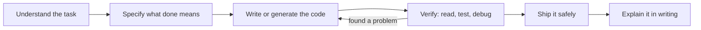
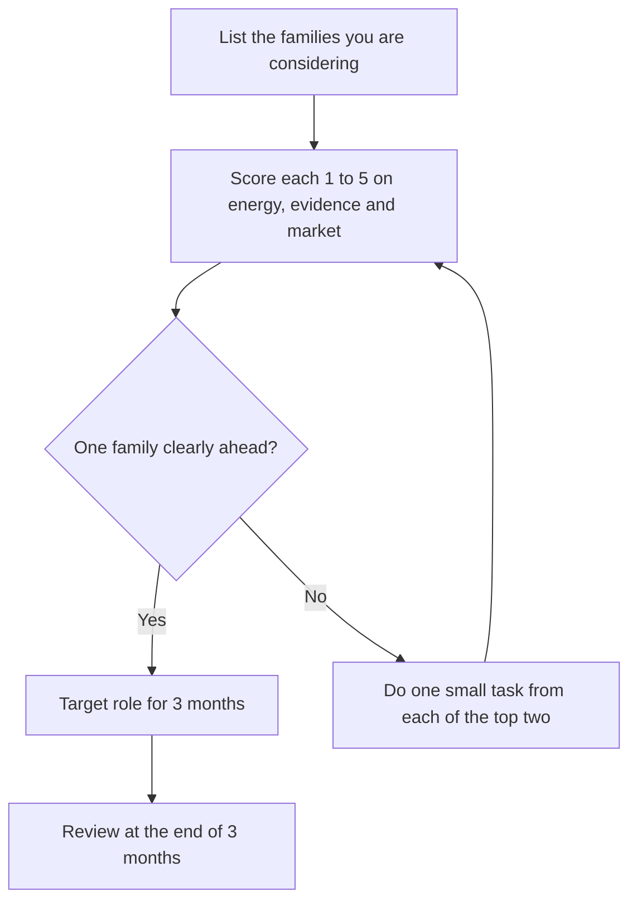
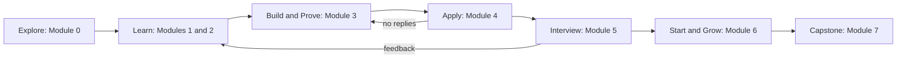

# Module 0 — Orientation

*Before you write a CV or practise a single interview question, you need three things: an honest picture of the market you are entering, a clear idea of what each kind of junior tech job involves day to day, and a plan for using this course and the library around it. This module gives you all three. It starts with what AI coding agents have changed about entry-level work, and what they have not changed. It then maps the main junior roles in software, AI, data, platform and security: what people in them do all day, what they produce, and what employers test for. It ends by introducing the five graduates of the Najm Tech Graduate Programme you will follow through the course, and shows how to turn the course into a plan with weekly actions. By the end you will have a market scan, a first target-role choice and a starting audit of your own skills.*

> **Steps:** Explore — seeing the market as it is, choosing a direction, and setting up the habits that turn a degree into an offer.

---

# 0.1 — The entry-level tech market in the AI era: what changed and what didn't
*Level: 🟢 Beginner* · *Prerequisites: None* · *Step: Explore*

## ⚡ In 60 seconds
- AI coding agents now do much of the routine work that juniors used to learn on: boilerplate, simple features, first-draft tests, small bug fixes.
- Employers have not stopped needing juniors. They have raised the bar for what a junior must show: that you can **specify, verify, ship and explain** work, not only produce code.
- What did not change: reading and debugging code, solid fundamentals, clear writing, reliability and trust still decide who gets hired and who gets kept.
- Decision cue: read the market yourself. Ten real job ads for your target role tell you more than any headline.
- Biggest trap: reacting to headlines, either panicking ("AI took the junior jobs") or ignoring the change ("my degree is enough").

## 🧭 Why it matters
It is October. **Omar**, a computer science graduate with excellent grades and a strong contest record, has sent the same CV to more than fifty postings across the Gulf: two automated rejections, silence from the rest. **Reem**, who has built four side projects with AI coding agents, reached a technical interview at a Doha fintech startup, **Sadeem Pay**. The interviewer asked why one of her API endpoints returned a 200 status code on failure. She could not say; she had never read that code closely.

Both come to an information session for the **Najm Tech Graduate Programme**. **Khalid**, the engineering manager who hires juniors at Najm Bank, shows a slide with two columns: *What changed* and *What didn't*. "You are not entering a market with no jobs," he says. "You are entering one where the proof needed for the same job has moved. Learn where it moved to, and prepare for that."

The headlines are real enough. Several 2025 analyses reported weaker hiring for early-career workers in occupations most exposed to AI. One widely discussed study, "Canaries in the Coal Mine?" by Erik Brynjolfsson, Bharat Chandar and Ruyu Chen at the Stanford Digital Economy Lab (August 2025), reported a relative decline in employment for the youngest workers in AI-exposed occupations, including software development, while more experienced workers in the same occupations fared better. This lesson shows you how to read such evidence calmly and turn it into a plan.

## 📐 How it works

### 🟢 The essentials

**What an "entry-level" job is.** An entry-level or junior role is one that expects little or no full-time professional experience, usually up to about two years. You will see it under many names: *graduate engineer*, *junior developer*, *associate*, *Engineer I*, *analyst*, *trainee*, or a place on a *graduate programme* (a structured one- or two-year scheme with rotations and training, common at banks, energy companies, telecoms and governments).

**What changed.** Four shifts matter most for you.

| Shift | What it looks like | What it means for you |
|---|---|---|
| **Routine coding is assisted** | AI coding assistants and agents (tools that write, edit and run code from instructions, such as GitHub Copilot, Cursor or Claude Code) draft boilerplate, simple features, tests and small fixes | "I can write a CRUD app" is no longer rare proof. Show what you did that the tool could not: the decisions, the checks, the fixes |
| **Verification is the scarce skill** | Teams can produce more code than they can safely review | Employers look for juniors who read code critically, test it and catch what is wrong, including in AI-written code |
| **More applications per posting** | One-click applications and AI-written CVs make it cheap to apply everywhere | Volume does not work. Targeted applications, referrals and visible proof do |
| **Interviews are changing** | Some employers allow or expect AI tools in certain rounds and ban them in others; exercises that ask you to review a flawed AI-generated pull request are becoming more common | Ask the rules for every round, and practise both coding without help and reviewing code critically |

**What did not change.** Most of what made a good junior ten years ago still does:
- **Fundamentals.** Data structures, how the web and databases work, how programs fail. You cannot judge AI output without them.
- **Reading and debugging code.** Most professional work changes existing code.
- **Communication.** A clear pull request description, a good question, a short written update.
- **Reliability and trust.** Doing what you said, saying early when you are stuck, never hiding a mistake.
- **Teams need future seniors.** Organisations that stop hiring juniors eventually run short of seniors, and many know it.

**The new junior bar in one picture.** The old picture of a junior was "someone who turns a clear task into code". The new one is "someone who can carry a small change all the way, safely, with or without AI help".

AI tools can speed up box C a great deal. Employers hire juniors for the boxes around it. Lesson 1.2 covers how to build with AI coding agents without being carried by them, and lesson 1.3 covers the step from "it runs on my laptop" to "it runs for users".

### 🟡 Going deeper

**Read the market yourself.** Headlines average over millions of jobs in many countries. You are applying to perhaps thirty employers in one or two places. The best evidence about your market is the job ads in it. A **market scan** is a simple method:

1. Pick one target role (lesson 0.2 helps) and one or two locations.
2. Collect ten current ads for junior or graduate positions in that role. Use at least three sources: employer careers pages, one job board, and LinkedIn.
3. For each ad, record the title, employer type, experience asked for, required skills, "nice to have" skills, and anything about AI tools, location, language or nationality.
4. Count how often each skill appears. Skills in seven or more of ten ads are your **baseline**; skills in three to six are **differentiators**.
5. Compare the list with what you can prove today. The gap is your study plan.

**How to read an ad.** Job ads are wish lists written by busy people, often from templates.
- "1–2 years of experience" on a junior ad is often flexible. If you meet most core requirements and have project or internship proof, apply.
- Skills named first and repeated in the responsibilities matter most; a long tool list at the end is usually a wish list.
- Words like "own", "end to end", "production" and "on-call" mean the team expects juniors to ship, not only to code.
- Mentions of AI tools ("AI-assisted development", "LLM APIs") show how the team works. If an ad says nothing, ask.

**Weak vs strong conclusions from the same evidence.**

| Weak conclusion | Strong conclusion |
|---|---|
| "Nobody is hiring juniors; I should give up or do another degree." | "Fewer postings say *junior* in my city. Graduate programmes and mid-sized companies still hire. I will target those and apply early in their cycle." |
| "AI writes code now, so learning to code is pointless." | "AI drafts code, so I need to be the person who can check it. I will practise reading, testing and reviewing code." |
| "Every ad asks for ten tools; I must learn all of them." | "Seven of ten ads ask for SQL, Git and one cloud platform. I will prove those three first." |

**Reading research without over-reading it.** When you meet a study about AI and jobs, ask four questions:
- **Whose data?** "Canaries in the Coal Mine?" used US payroll data. It may not describe hiring in Doha, Dubai or Riyadh.
- **Correlation or cause?** A change in hiring at the same time as AI adoption does not prove that AI caused it. Interest rates, the end of the pandemic hiring boom and company cost-cutting happened in the same years. Good papers discuss this themselves; read that section.
- **Which jobs?** "AI-exposed" is a measure defined by the researchers. Read how they defined it.
- **What do they say helps?** Several studies separate *automating* uses of AI (the tool does the task) from *augmenting* uses (the tool helps a person do it). Position yourself on the augmenting side: the person who directs and checks the tools.

Never repeat a percentage you have not checked in the original source.

### 🔴 Expert view

**Think like the person paying for the hire.** A hiring manager like Khalid weighs three things when deciding whether to hire a junior:
- **Cost:** salary, plus the time senior engineers spend mentoring and reviewing. Mentoring time is often the bigger cost.
- **Value:** the work the junior will do this year, and the senior they will become in a few years.
- **Risk:** the chance the junior ships something unverified into production. In a bank, that can mean money, customer data or a regulator.

AI tools lower the cost of routine output but raise the risk when the person using them cannot check it. The juniors who stand out **lower mentoring cost** (good questions, clear writing, fast learning) and **lower risk** (they test, verify and say when unsure). Every module of this course works on one of those two levers.

**The Gulf market has its own shape.** Hedge any general claim against your local market:
- **Workforce nationalisation programmes** shape hiring: Qatarization in Qatar, Emiratisation (with the Nafis programme) in the UAE, and Saudization (Nitaqat) in Saudi Arabia. Many large employers run graduate programmes for nationals. If you are not a national, expect some roles to be reserved and target those that are not. Rules change; check official sites.
- **Regulated sectors are big employers.** Banking, government, energy, telecoms and health value security, data protection (for example Qatar's Law No. 13 of 2016 on personal data privacy) and governance awareness.
- **Bilingual technical communication** in Arabic and English is an advantage in teams serving local customers and regulators.
- **Visa and sponsorship rules** vary and change. Check current rules before you plan a move.

**The market moves; your method should not.** Read current evidence, find what employers check for, build proof of it, and repeat each quarter.

## 🧰 The toolkit
| Resource, tool or template | What it is and does | When to reach for it |
|---|---|---|
| **Market scan** | A table of ten current job ads for one role and location, with skills counted by frequency | At the start of your search, then again every three months |
| **"Canaries in the Coal Mine?"** (Brynjolfsson, Chandar and Chen, Stanford Digital Economy Lab, 2025) | A widely cited study of early-career employment in AI-exposed occupations, based on US payroll data | When you want to understand the evidence behind headlines, and its limits |
| **Stack Overflow Developer Survey** | A large annual survey of developers, including how they use AI tools | To see how working developers actually use AI tools, at the time of writing (2026) |
| **Official labour-market sources** (e.g. US BLS Occupational Outlook Handbook, national statistics offices) | Government descriptions of occupations, typical entry routes and outlook | When you need a sober, sourced view of a role's outlook |
| **Nationalisation programme sites** (e.g. Nafis in the UAE) | Official information on national workforce programmes and their incentives | If you are a national, or to understand which roles are reserved, at the time of writing (2026) |

## 🏛️ In practice at Najm Bank
At the end of the information session, Khalid gives every attendee a one-page **market scan template** and asks them to bring it back completed to the first workshop. Here is part of Omar's, for junior software engineering roles in Qatar and the UAE. The employers are fictional or generic.

| # | Title | Employer type | Experience asked | Required skills | Nice to have | AI tools mentioned | Notes |
|---|---|---|---|---|---|---|---|
| 1 | Graduate Software Engineer | Najm Bank (graduate programme) | Graduate, 0 years | Java or Python, SQL, Git, REST APIs | Cloud basics, testing | "Responsible use of AI coding assistants" | Rotations; fixed application window |
| 2 | Junior Backend Engineer | Sadeem Pay (fintech startup) | 0–2 years | Python or Go, PostgreSQL, Docker, Git | Payments, CI/CD | "We use AI agents daily" | Take-home task in process |
| 3 | Software Engineer I | Multinational, regional office | 0–2 years | Data structures and algorithms, one language, Git | Distributed systems | Not stated | Online coding test first |
| 4 | Developer, Digital Services | Government digital agency | Graduate | JavaScript or TypeScript, web basics, SQL | Accessibility, Arabic UI (right-to-left) | Not stated | Some roles may be reserved for nationals; check |

**Omar's summary (bottom of the template):**

| Item | Finding |
|---|---|
| Baseline (in 7+ of 10 ads) | Git, SQL, one backend language, REST APIs |
| Differentiators (in 3–6 of 10) | Docker, CI/CD, cloud basics, testing, Arabic |
| What I can prove today | Algorithms (contest record), Java, Python |
| Gaps | Never deployed anything; no project with SQL, an API and tests together; no CI |
| Three actions this month | One small deployed API with tests and CI; a README that explains it; apply to Najm's programme before the deadline |

Khalid's comment: "Your gap is not knowledge; it is proof that you can ship. See lesson 1.3 and the project specs in lesson 3.1."

## 🛠️ Exercises
- 🟢 Collect ten current ads for one junior role in one or two locations you would really move to or work in, from at least three sources. Fill in the market scan table. *Done when:* your table has ten rows with every column filled, and each row has a working link or a saved copy of the ad.
- 🟡 From your scan, list your baseline and differentiator skills with their counts, then write a half-page "market brief": what the ads ask for, what surprised you, how AI tools are mentioned, and three actions for the next month. *Done when:* a classmate can read your brief and name your target role, your top three gaps and your first action without asking you.
- 🔴 Hold two short informational conversations (15–20 minutes) with people in your target role, ideally one with under three years' experience. Ask how AI tools changed their first year and what makes a junior stand out on their team. Lesson 4.2 covers how to ask. *Done when:* you have notes from both and a list of what confirmed or contradicted your scan, with your study plan updated.

## ⚠️ Mistakes and traps
- **Treating headlines as your market.** National or global averages may not match your city or role. Do the market scan and trust it over the headline.
- **Mass-applying with one CV.** More applications with the same generic CV usually means more silence. Fewer, targeted applications backed by proof work better (Module 4).
- **Deciding not to learn fundamentals because AI writes code.** You cannot check what you do not understand, and checking is what employers pay juniors for now.
- **Hiding your AI use, or overselling it.** Both damage trust. Use AI tools openly where allowed, and be able to explain and verify every line you submit.
- **Quoting numbers you have not checked.** A confident wrong statistic in an interview hurts you more than saying "I read that early-career hiring weakened in AI-exposed roles; I have not checked the figures for this region."

## 🧾 Recap
- AI coding agents assist with routine coding, so the junior bar has moved from "writes code" to "specifies, verifies, ships and explains".
- Fundamentals, reading and debugging code, clear communication and reliability still decide hiring.
- Read your own market with a ten-ad market scan; baseline skills appear in most ads, differentiators in some.
- Hiring managers weigh cost, value and risk; juniors who lower mentoring cost and risk stand out.
- In the Gulf, nationalisation programmes, graduate programmes and regulated sectors shape the market; check current rules.

## ✍️ Check yourself

**1. Omar has sent the same CV to more than fifty postings and heard almost nothing back. Based on this lesson, what should he do first?**

- A. Apply to a hundred more postings this month with the same CV, since response rates are low everywhere
- B. Scan ten ads for one target role, then build proof of the baseline skills he lacks
- C. Start a master's degree, because the junior market is closed
- D. Add every tool named in any of the ads to his CV's skills list, so keyword filters match him

Answer

**B.** The lesson's method is to read your own market, find the gap between what ads ask for and what you can prove, and close it with proof. A repeats what is not working; C reacts to headlines rather than evidence; D claims skills he cannot prove. (🟡 Going deeper.)

**2. According to this lesson, which skill has become more valuable for juniors because AI tools can draft routine code?**

- A. Typing code quickly from memory, without needing to look anything up
- B. Memorising the syntax of many languages
- C. Producing large amounts of working code in a short time, to keep pace with AI tools
- D. Verifying code: reading it critically, testing it and catching errors

Answer

**D.** Teams can produce more code than they can safely review, so checking code is the scarce skill. A, B and C describe output that AI tools now make cheap. (🟢 The essentials.)

**3. A classmate says: "A Stanford study proved that AI destroyed junior developer jobs everywhere." What is the most accurate response?**

- A. "It reported a relative decline for young workers in AI-exposed jobs, on US data; alone, that proves neither cause nor our region."
- B. "That's right, and since the evidence covers every country and every employer, we should all stop applying for developer roles now."
- C. "That study is fake; AI has had no measurable effect on hiring anywhere, so we can safely ignore it and carry on."
- D. "It actually proved the opposite: junior developer hiring has grown everywhere since AI coding tools arrived."

Answer

**A.** The lesson's four questions are whose data, correlation or cause, which jobs, and what helps. B over-reads the evidence; C and D dismiss or misstate it. (🟡 Going deeper.)

**4. Khalid weighs cost, value and risk when hiring a junior. Which candidate behaviour lowers both mentoring cost and risk?**

- A. Working alone for a whole week without asking any questions, so that he looks independent
- B. Submitting large AI-generated pull requests quickly so the team sees high output early on
- C. Clear change descriptions, tested work, and flagging doubts early
- D. Avoiding AI tools entirely, even where the team expects them to be used

Answer

**C.** Clear writing and good questions lower mentoring cost; testing and flagging uncertainty lower risk. A hides problems until late; B raises review cost and risk; D ignores how the team works. (🔴 Expert view.)

**5. A junior ad that otherwise fits Reem well asks for "1–2 years of experience". She has two substantial projects and a summer internship. What should she do?**

- A. Skip it, because she does not meet the stated experience and would waste the recruiter's time
- B. Apply, since experience lines on junior ads are often flexible when proof is strong
- C. Change her CV to say two years, counting the internship and side projects as full-time work
- D. Email the company to complain that the ad is not junior

Answer

**B.** Ads are wish lists; meeting most core requirements with proof is usually enough to apply. A gives up a good chance; C is dishonest and against this course's integrity rules; D helps no one. (🟡 Going deeper.)

## 📚 References
- Brynjolfsson, E., Chandar, B. and Chen, R., "Canaries in the Coal Mine? Six Facts about the Recent Employment Effects of Artificial Intelligence", Stanford Digital Economy Lab, 2025 — https://digitaleconomy.stanford.edu/
- Stack Overflow Developer Survey — https://survey.stackoverflow.co/
- U.S. Bureau of Labor Statistics, Occupational Outlook Handbook — https://www.bls.gov/ooh/
- World Economic Forum, The Future of Jobs Report 2025 — https://www.weforum.org/publications/the-future-of-jobs-report-2025/
- UAE Nafis programme — https://www.nafis.gov.ae/
- [*System Design for Vibe Coders*, lesson 0.1 — "It works" is not a property of a system](../vibe/index.en.html#l0-1)
- [*System Design for Vibe Coders*, lesson 9.1 — You are the architect now](../vibe/index.en.html#l9-1)

---

# 0.2 — The roles map: what software, AI, data, platform and security juniors actually do all day
*Level: 🟢 Beginner* · *Prerequisites: 0.1* · *Step: Explore*

## ⚡ In 60 seconds
- "Tech job" covers several different jobs. Five families hire most graduates: **software and full-stack**, **AI application**, **data**, **cloud and platform**, and **security**.
- Each family has a different working day, produces different things, and is tested differently in interviews.
- Job titles are unreliable. Read the responsibilities and ask "what would I produce in a normal week?"
- Decision cue: choose a **target role** for the next three months using three lenses: what work energises you, what you have evidence you are good at, and what your market hires juniors for.
- Biggest trap: applying to every family at once. A CV and portfolio aimed at everything convince no one.

## 🧭 Why it matters
At the first Najm graduate workshop, Khalid asks each attendee to write their target role on a sticky note. **Huda**, a data science graduate, writes "data scientist". **Yousef**, a computer engineering graduate who spent his final year on embedded systems and networks, writes "software engineer, or maybe data, or cloud". **Mohammed**, a bootcamp graduate switching careers, writes "full-stack developer".

Khalid collects the notes and asks **Dana**, Najm's lead data scientist, to describe her team's last month. Dana explains that most of it went into getting reliable data out of three source systems, fixing a pipeline that broke when one system changed a column name, and agreeing with the risk team what a "default" actually means. "We trained one model," she says. "Most of my juniors' time went into SQL and data pipelines." Huda looks surprised: none of her coursework looked like that.

Yousef's note shows a different problem. Recruiters spend seconds on a first look at a CV, and a CV that says "interested in software, data and cloud" reads as "not sure yet". Before you can build the right proof, you need to know what each role actually does. This lesson draws that map.

## 📐 How it works

### 🟢 The essentials

**The five families.** Below is what a junior in each family typically does in a normal week. Real teams vary, but these patterns hold at most employers.

| Family | Typical junior titles | A normal week | What they produce | Who they work with |
|---|---|---|---|---|
| **Software and full-stack** | Software engineer, backend, frontend, mobile or full-stack developer | Pick up a ticket, read the existing code, make a change, write tests, open a pull request, respond to review, fix a bug from production | Pull requests, tests, small features, bug fixes, short design notes | Other engineers, product managers, designers, QA |
| **AI application** | AI engineer, applied AI engineer, LLM engineer, software engineer (AI) | Build features on top of large language models (LLMs): prompts, retrieval, tool calls; write evaluations; reduce cost and errors; handle bad model output | Features using model APIs, evaluation sets, prompt and retrieval changes, guardrails | Software engineers, product managers, data scientists, security |
| **Data** | Data analyst, data engineer, analytics engineer, data scientist, junior ML engineer | Write SQL, build or fix pipelines that move and clean data, define metrics, build dashboards, run analyses or experiments, sometimes train and evaluate models | Queries, pipelines, data models, dashboards, analyses, model evaluations | Business teams, engineers, data owners, risk and compliance |
| **Cloud and platform** | Cloud engineer, platform engineer, DevOps engineer, site reliability engineer (SRE) | Change infrastructure through code, improve build and deploy pipelines, respond to alerts, help developers ship, tune cost | Infrastructure-as-code changes, CI/CD pipelines, runbooks, dashboards, incident notes | Every engineering team, security, vendors |
| **Security** | Application security engineer, security analyst (SOC), cloud security engineer | Review code and designs for security flaws, triage scanner findings, investigate alerts, help teams fix issues, write guidance | Findings with fixes, threat models, detection rules, security guides | Engineers, risk, audit, IT operations |

**A few terms.** *CI/CD* (continuous integration and continuous delivery) is the automation that tests and ships code. *Infrastructure as code* means defining servers and networks in files that are reviewed like code. A *SOC* (security operations centre) is the team that watches for and responds to attacks. An *SRE* is an engineer who keeps systems reliable using software, measured targets and on-call rotations.

**How each family is tested in interviews.** The interview mirrors the job. Lessons 5.2 and 5.3 go deeper.

| Family | Commonly tested | Proof that helps most |
|---|---|---|
| Software and full-stack | Coding (data structures and algorithms at larger tech firms; practical tasks elsewhere), code review, debugging, basic system design | A deployed project with tests, CI and a clear README |
| AI application | Coding, building with an LLM API, evaluating output, handling failure and cost, prompt injection awareness | A small LLM feature with an evaluation set and documented failure cases |
| Data | SQL (almost always), data modelling, a case or analysis, statistics for data science | A pipeline or analysis on real public data, with tested SQL and a written conclusion |
| Cloud and platform | Linux, networking, a cloud provider's basics, containers, troubleshooting scenarios | Infrastructure defined in code, a working pipeline, a written incident or runbook |
| Security | Web vulnerabilities, secure code review, networking, scenario questions | Write-ups of authorised labs or capture-the-flag challenges, a secure code review of your own project |

**Adjacent entry points.** Other good first jobs sit next to these families: **QA and test automation engineer**, **support or solutions engineer** (technical work with customers), **IT and enterprise systems** (for example, configuring the large vendor platforms banks run), and **associate product manager**. Each is a real career, and each can lead into the five families later.

### 🟡 Going deeper

**Titles lie; responsibilities don't.** The same title means different work at different employers. A "software engineer" at Sadeem Pay may build payment APIs end to end and deploy them daily. A "software engineer" at a large bank may spend much of the week integrating vendor systems, writing reports or changing configuration under strict change control. A "data scientist" may mostly write SQL and dashboards; an "AI engineer" may mostly write backend code. Read the responsibilities section and ask, in any interview: *"What would I produce in a typical week in my first three months?"*

**Where degrees usually lead, and where they can.**

| Degree or background | Usual first targets | Also realistic with targeted proof |
|---|---|---|
| Computer science | Software, AI application | Data engineering, platform, security |
| Data science | Data analyst, data scientist | Data engineering, analytics engineering, AI application |
| Computer or software engineering | Software, embedded, cloud and platform | Security, especially network and cloud |
| Bootcamp or self-taught | Full-stack, frontend, QA automation | Any family, with stronger proof to make up for no degree |

None of these is a rule. Employers hire proof. A data science graduate with a tested pipeline is a credible data engineering candidate; a computer engineering graduate who has run a small cluster and written its runbook is a credible platform candidate.

**How AI changes each family.** Every family now uses AI tools, but the effect differs:
- **Software:** agents draft much routine code, so reviewing, testing and design judgement count more.
- **AI application:** a whole family that barely existed for juniors a few years ago. It needs normal software skills plus evaluation and safety.
- **Data:** AI helps write SQL and code, but the hard part is still knowing whether the data and the numbers are right.
- **Cloud and platform:** AI drafts configuration, but a wrong change can take down every service, so careful review, rollback and monitoring matter more.
- **Security:** AI-written code and AI features create new work (prompt injection, insecure generated code), and security teams use AI to triage.

**Choosing with three lenses.** Score each family you are considering from 1 to 5 on each lens:

1. **Energy:** which work would you enjoy on an ordinary Tuesday? Building features users see, making numbers trustworthy, keeping systems running, or finding how things break?
2. **Evidence:** where do you already have proof, or grades, projects or feedback that suggest you would be good?
3. **Market:** how many junior ads did your market scan (lesson 0.1) find for this family in your location?

A target role is a decision for the next three months, not for life. It tells you which study path to follow (Module 2), which capstone project to build (lesson 3.1) and which ads to apply to (Module 4).

### 🔴 Expert view

**T-shaped beats scattered.** Employers like juniors who are *T-shaped*: deep in one area (the vertical bar) with working knowledge of the areas next to it (the horizontal bar). A software engineer who also understands SQL, deployment and basic security is easier to place on a team than one who knows only one framework. "T-shaped" is not the same as "applying to everything": the depth is what gets you hired, the breadth is what makes you useful in week two.

**Some roles are easier to enter from next door.** In many organisations, SRE, platform and security teams hire fewer pure graduates and more people moving across from software, IT operations or networking. That is a pattern, not a rule; graduate programmes and some security operations centres do hire graduates directly. If your market scan finds few junior ads in a family you love, a realistic route is to start in a neighbouring role and move after a year or two, building proof as you go.

**Regulated employers add a layer.** At a bank like Najm, every family works under change control (approvals before production changes), audit trails, data protection law and security policy. Juniors who understand why those controls exist, and do not treat them as bureaucracy to get around, fit in faster. Mentioning that you understand change control or data protection, briefly and accurately, is a real signal in a bank interview.

**Your first role does not fix your career.** Moves between families in the first few years are common: data analyst to data engineer, software engineer to platform, QA to software. What carries across is the habit of shipping verified work and writing about it. Lesson 6.3 returns to growth after your first job.

## 🧰 The toolkit
| Resource, tool or template | What it is and does | When to reach for it |
|---|---|---|
| **Role-fit scorecard** | A table scoring each role family on energy, evidence and market, ending in a three-month target role | When choosing or changing your target role |
| **roadmap.sh** | Community-maintained learning roadmaps for many tech roles (backend, DevOps, data, AI and more) | To see the typical skill list of an unfamiliar role at a glance |
| **O\*NET OnLine** | The US Department of Labor's database of occupations, tasks, skills and tools | To compare what different occupations involve, task by task |
| **NICE Workforce Framework for Cybersecurity** (NIST) | A public framework describing cybersecurity work roles and the tasks and skills each needs | When exploring which security role fits you |
| **Engineering career ladders** (e.g. engineeringladders.com, progression.fyi) | Published level descriptions showing what "junior" and "mid-level" mean at real companies | To understand what is expected at each level and how roles grow |
| **Informational conversation** | A short, honest conversation with someone doing the role, to learn what their week is like | Before committing to a target role you have not seen up close |

## 🏛️ In practice at Najm Bank
After Dana's talk, Khalid hands out the **role-fit scorecard**. Here is Huda's, filled in after a week of reading ads and talking to two of Dana's team.

| Family | Energy (1–5) | Evidence (1–5) | Market (1–5) | Total | Notes |
|---|---|---|---|---|---|
| Data scientist | 4 | 4 | 2 | 10 | Good at models and notebooks; few junior ads in Doha, most want 2+ years |
| Data engineer | 4 | 2 | 4 | 10 | Enjoyed fixing the messy data in my thesis more than the modelling; SQL weak; many bank and telecom ads |
| Data analyst | 3 | 3 | 4 | 10 | Many ads; less modelling than I want |
| AI application engineer | 3 | 2 | 3 | 8 | Interesting, but my software skills are thin |
| Software engineer | 2 | 2 | 4 | 8 | Not where my energy is |

**Tie-break (the scorecard's last section):**

| Question | Huda's answer |
|---|---|
| Which small task from the top families did I try? | Rebuilt my thesis data cleaning as a SQL pipeline (data engineer); built a churn model on public data (data scientist) |
| Which did I enjoy more on an ordinary day? | The pipeline. I liked making the data trustworthy |
| Target role for the next three months | **Junior data engineer**, with data analyst roles as a second target |
| What I will not do in these three months | Apply to software engineering roles; start a new ML course |
| Review date | End of January |

Dana's note in the margin: "Good choice for this market. Your modelling background will make you a better data engineer, because you know what the data is for. Your study path is in lesson 2.3."

## 🛠️ Exercises
- 🟢 For each of the five families, write two sentences in your own words: what a junior produces in a normal week, and how that family is usually tested in interviews. *Done when:* you can explain all five to a friend without notes, and your sentences match the tables in this lesson.
- 🟡 Complete the role-fit scorecard for at least three families, using your market scan from lesson 0.1 for the market lens. *Done when:* every score has a one-line reason, and you have either a clear target role or a tie-break task for each of your top two families.
- 🔴 Do one small, real task from each of your top two families (for example, write five SQL queries on a public dataset and deploy a tiny API; or write a Dockerfile and review your own code for the OWASP Top 10). Then write half a page on which you enjoyed more and why, and choose your target role. *Done when:* both tasks are in a public or shareable repository, and your chosen role and review date are written in your scorecard.

## ⚠️ Mistakes and traps
- **Choosing by title or hype.** "AI engineer" sounds exciting; ask what the week contains before you choose it. Choose by the work, not the label.
- **Applying to every family.** A CV aimed at everything looks unfocused. Pick one target role and one second choice for three months.
- **Assuming your degree decides your role.** Employers hire proof. If the work in another family energises you, build proof for it.
- **Ignoring adjacent entry points.** QA, support engineering and IT roles can be strong first jobs and routes into other families. Consider them seriously, especially where junior ads are scarce.
- **Treating a target role as permanent.** It is a three-month decision with a review date. Choosing is better than waiting for certainty.

## 🧾 Recap
- Five families hire most tech graduates: software, AI application, data, cloud and platform, and security; each has a different week, different outputs and different interviews.
- Titles vary between employers; read responsibilities and ask what you would produce in a typical week.
- Choose a target role for three months with three lenses: energy, evidence and market.
- Be T-shaped: deep in one area, working knowledge of the areas around it.
- Some roles are easier to reach from a neighbouring role; your first role does not fix your career.

## ✍️ Check yourself

**1. Yousef's CV says he is "interested in software, data and cloud roles". What is the main problem with this?**

- A. Most employers are only hiring for cloud roles this year, so the other two are wasted space
- B. Computer engineering graduates are not eligible for data roles, so that part is misleading
- C. It reads as unfocused; one clear target role convinces more
- D. He should list all five families, not three, to reach more recruiters

Answer

**C.** A CV aimed at everything convinces no one; choose a target role for three months. B is false, since employers hire proof; A and D have no basis in the lesson. (⚡ In 60 seconds and 🟡 Going deeper.)

**2. Which interview topic is tested for data roles almost regardless of employer?**

- A. SQL
- B. Kubernetes administration
- C. Mobile app design
- D. Capture-the-flag challenges

Answer

**A.** The lesson's table lists SQL as almost always tested for data roles. B belongs more to cloud and platform, C to software, D to security. (🟢 The essentials.)

**3. Two employers both advertise a "Software Engineer" role. What is the best way to find out whether the jobs are really similar?**

- A. Compare the two job titles and the seniority level each ad states in its heading
- B. Compare the companies' logos, office locations and how well known each brand is
- C. Assume they are the same job, since employers use standard titles across the industry
- D. Read the responsibilities and ask what you would produce in a typical week

Answer

**D.** Titles are unreliable; the responsibilities and the weekly output tell you what the job is. A and C trust the title; B tells you nothing about the work. (🟡 Going deeper.)

**4. Huda scores data scientist and data engineer equally on her role-fit scorecard. What does the lesson suggest she do?**

- A. Apply to both, and to software engineering roles as well, to maximise her chances of an offer
- B. Try a small real task from each, see which she enjoys, then choose with a review date
- C. Wait until she feels completely certain about her long-term career before choosing anything
- D. Choose the role with the more impressive title, since titles shape how recruiters see her

Answer

**B.** The scorecard's tie-break is a small task from each top family, then a three-month decision. A scatters her proof; C delays without new evidence; D chooses by label rather than work. (🟡 Going deeper.)

**5. Yousef loves platform engineering, but his market scan finds very few junior platform ads in his city. Which approach does the lesson describe as realistic?**

- A. Give up on platform engineering permanently and pick whichever family has the most ads
- B. Claim two years of platform experience on his CV, counting his university networking labs
- C. Start in a neighbouring role, such as IT operations, and keep building platform proof
- D. Apply only to senior platform roles, since junior ones are rare and the bar is the same

Answer

**C.** Some roles are often entered from next door, and moves between families are common in the first years. A gives up too early; B is dishonest; D targets roles he cannot win yet. (🔴 Expert view.)

## 📚 References
- O\*NET OnLine, U.S. Department of Labor — https://www.onetonline.org/
- U.S. Bureau of Labor Statistics, Occupational Outlook Handbook — https://www.bls.gov/ooh/
- NIST, NICE Framework Resource Center — https://www.nist.gov/itl/applied-cybersecurity/nice/nice-framework-resource-center
- roadmap.sh — https://roadmap.sh/
- Engineering Ladders — https://www.engineeringladders.com/
- Progression.fyi (published career frameworks) — https://www.progression.fyi/
- Google, Site Reliability Engineering book (free online) — https://sre.google/sre-book/table-of-contents/
- [*SaaS Building Blocks*, lesson 0.1 — The 80% nobody sells: the anatomy of every SaaS](../saas/index.html#/0.1)
- [*Secure AI & Application Security*, lesson 12.2 — The security career: roles, certifications and portfolio](../secai/index.html#/12.2)
- [*AI Product Management*, lesson 10.2 — The AI PM career: interviews, portfolio and growth](../aipm/index.html#/10.2)
- [*Data Engineering & Analytics: Zero to Hero*, Module 1 — SQL and data modelling](../data/index.html#/1.1)
- [*Cloud & DevOps: Zero to Hero*, Module 1 — Foundations](../cloud/index.html#/1.1)
- [*Running AI Agents in Production*, Level 2 — Agent Engineer](../agentic/learning-path.html#level-2-agent-engineer)

---

# 0.3 — Meet the cohort, and how to use this course and the library
*Level: 🟢 Beginner* · *Prerequisites: 0.1, 0.2* · *Step: Explore, Learn*

## ⚡ In 60 seconds
- You will follow five graduates in the **Najm Tech Graduate Programme** at **Najm Bank**, a fictional Gulf bank, plus the people who hire and mentor them.
- This course does not re-teach engineering. It tells you **what employers check for**, sends you to the **exact lessons** in the library that build each skill, and teaches the job-search skills no other course covers.
- The course follows eight steps: **Explore, Learn, Build, Prove, Apply, Interview, Start, Grow**. Every lesson is tagged with its step.
- Decision cue: choose how you will take the course (the full path, a targeted path, or as an adviser) and set a weekly time budget you can keep.
- Biggest trap: reading without producing. Every lesson ends in an artefact; keep them all in one **career folder**.

## 🧭 Why it matters
Mohammed, the bootcamp career-switcher, has a habit he is not proud of. Over the past year he has started six online courses and finished none. Each time, he felt productive while watching videos, then a new course looked more urgent. His portfolio is good, but nobody has seen it, because he never got to the "apply" part.

At the end of the second workshop, Khalid shows the cohort how the programme's learning works. "Courses are not the goal. Offers are, and after that, being good at the job. Each week you will produce something: a market scan, a scorecard, a project, a CV bullet, an outreach message, an interview story. If a week passes and you produced nothing, tell me, and we will fix the plan." He points at the library on the screen: eight other courses that already teach the engineering, data, security and AI skills in depth. "You will not read all of them. You will read the lessons your target role needs, and prove each one."

This lesson introduces the people you will follow, explains how the course and the library fit together, and helps you set up a plan you will actually finish.

## 📐 How it works

### 🟢 The essentials

**Najm Bank is fictional.** It is a mid-sized Gulf bank headquartered in Doha, with customers in Qatar, the UAE and the EU, and it is the running case across this whole library. Any resemblance to a real bank is a coincidence. Other employers in the course, such as the Doha fintech startup **Sadeem Pay**, a regional telecom, a government digital agency and a multinational's regional office, are fictional or generic too. Nothing in this course describes the real hiring policy of any employer.

**The cohort.** Five graduates, each with real strengths and a realistic weakness you will learn from:

| Person | Background | Strength | Weakness to fix | Heading toward |
|---|---|---|---|---|
| **Omar** | Computer science graduate | Algorithms, contest record, strong grades | Has never deployed anything | Software engineering |
| **Huda** | Data science graduate | Notebooks, statistics, models | SQL and production data work | Data engineering |
| **Yousef** | Computer engineering graduate | Embedded systems, networks, Linux | Unfocused; not sure which role | Cloud and platform engineering |
| **Reem** | Computer science graduate | Builds fast with AI coding agents; four side projects | Cannot always explain her own code | AI application engineering |
| **Mohammed** | Bootcamp graduate, career-switcher | Strong portfolio, previous work experience | No degree in the field; never finishes the job search | Full-stack development |

**The hiring side.** Five people at Najm Bank who will guide, test and sometimes challenge them:
- **Khalid**, Engineering Manager, hires juniors and is your mentor through the course.
- **Aisha**, Talent Acquisition lead (a recruiter), explains screening, CVs and offers.
- **Tariq**, engineering lead, runs technical interviews.
- **Dana**, lead data scientist, interviews data candidates.
- **Salem**, Head of Platform Engineering, interviews cloud candidates.

You will also see the cohort apply elsewhere, so you can compare a bank's graduate programme with a startup, a telecom, the public sector and a multinational.

**The eight steps and the modules.**

The arrows going backwards matter. If applications get no replies, the fix is usually better proof (Module 3), not more applications. If interviews reveal a gap, you go back to learn it. The capstone in lesson 7.1 turns the whole course into a 12-week plan from audit to offer, and lesson 7.2 is a practice interview pack.

**How every lesson works.** Every lesson has the same ten parts: ⚡ In 60 seconds, 🧭 Why it matters, 📐 How it works (with 🟢 essentials, 🟡 going deeper and 🔴 expert view), 🧰 The toolkit, 🏛️ In practice at Najm Bank, 🛠️ Exercises, ⚠️ Mistakes and traps, 🧾 Recap, ✍️ Check yourself and 📚 References. The 🏛️ section always shows an artefact you can copy and adapt.

### 🟡 Going deeper

**This course is the front door to the library.** The library already teaches most of the engineering in depth. This course teaches the *hiring view* of each skill (what "good enough for a junior" looks like, how it is tested, how to prove it) and links you to the lesson that builds it. The courses you will be sent to:

| Course | What it teaches | Most useful for |
|---|---|---|
| [*System Design for Vibe Coders*, lesson F.1 — What happens when you open a website](../vibe/index.en.html#lF-1) | Production engineering for people who build with AI agents: deploys, data, caching, security, observability, directing agents | Everyone, especially software and AI application |
| [*SaaS Building Blocks*, lesson 0.1 — The 80% nobody sells: the anatomy of every SaaS](../saas/index.html#/0.1) | The components every software product shares (auth, billing, email, jobs, search), with open-source code to read | Software and full-stack |
| [*Secure AI & Application Security*, lesson 0.1 — What application and AI security is: assets, attackers and risk](../secai/index.html#/0.1) | Application, cloud and AI security from threat modelling to incident response | Security, and every engineer's security basics |
| [*AI Product Management*, lesson 0.1 — What AI product management is, and what it is not](../aipm/index.html#/0.1) | How AI products are chosen, specified, evaluated and launched | AI application engineers, product-minded engineers |
| [*AI Governance*, lesson 0.1 — What AI governance is, and what the AIGP proves](../aigp/index.html#/0.1) | Risk, law and standards for AI systems | Anyone working on AI in regulated sectors |
| [*Running AI Agents in Production*, Level 0 — Literate](../agentic/learning-path.html#level-0-literate) | A levelled path from AI literacy to running agents in production | AI application engineers |
| [*Data Engineering & Analytics: Zero to Hero*, Module 1 — SQL and data modelling](../data/index.html#/1.1) | SQL, pipelines, quality, analytics and ML in production | Data roles |
| [*Cloud & DevOps: Zero to Hero*, Module 1 — Foundations](../cloud/index.html#/1.1) | Linux, cloud, containers, infrastructure as code, CI/CD, reliability | Cloud and platform, and every engineer's deployment basics |

You do not need all of them. Module 2 gives each role a **study path table**: the skills that role needs, the lesson that teaches each one, and the proof that shows it.

**Three ways to take this course.**

| Path | Who it suits | How |
|---|---|---|
| **Full path** | Final-year students and graduates starting from zero | Modules 0 to 7 in order, about 6–10 hours a week, with the capstone plan in lesson 7.1 as the backbone |
| **Targeted path** | Graduates already applying, with one urgent need | Do lessons 0.1 and 0.2, then jump to the module you need (for example Module 5 if you have interviews next week), then come back |
| **Adviser path** | Career-centre advisers, lecturers and hiring managers | Use the 🏛️ artefacts as worksheets, the exercises as assignments and lesson 7.2 as a mock interview bank |

**The career folder.** Create one folder (a private repository or a cloud folder) and save every artefact in it, named by lesson: `0.1-market-scan`, `0.2-role-fit-scorecard`, `0.3-starting-audit`, and so on. By the end of the course it holds your target role, study plan, project specs, CV, outreach messages, story bank and 90-day plan. It is also the evidence of progress you can show a mentor.

**Self-assessments.** Several library courses have a self-assessment page, for example [the *System Design for Vibe Coders* self-assessment](../vibe/assessment.html) and [the *Secure AI & Application Security* self-assessment](../secai/assessment.html). Use them to check where you stand before and after a study path.

### 🔴 Expert view

**Using AI honestly while you learn.** AI assistants are excellent tutors and fast builders, and you should use them. But learning and proving are different things. Three rules this course follows throughout:
1. **Learn with AI, prove without hiding it.** Ask the assistant to explain, quiz you and review your code. When you show work to an employer, be ready to explain every line and say where AI helped if it matters.
2. **Never fabricate.** No invented experience, inflated titles, copied projects or AI sitting an interview for you. Apart from being dishonest, it is fragile: a single follow-up question exposes it, and in regulated sectors background and reference checks are common.
3. **Verify everything.** Treat AI output, including AI career advice, as a draft to check. Salaries, programme deadlines and visa rules in particular change; confirm them at the source.

Reem's story across the course is about exactly this. She is not wrong to build with agents; she is wrong not to understand what they built. Lesson 1.2 is where she fixes it.

**Plans fail on time, not motivation.** Mohammed's problem was never motivation; it was that nothing he did ended in an application. Two habits fix that:
- **A fixed weekly budget.** Decide your hours now and put them in your calendar. A plan of six hours a week you keep beats twenty you abandon.
- **Every week ends in an artefact.** If you did not produce something you could show someone, the week went to consumption, not progress.

**For advisers and hiring managers.** The course's vocabulary (target role, baseline and differentiator skills, proof, story bank) is meant to be shared. Advisers can use the same scorecard and audit with every student; hiring managers can use the role tables and rubrics to explain what they look for. A shared language shortens the distance between campus and team.

## 🧰 The toolkit
| Resource, tool or template | What it is and does | When to reach for it |
|---|---|---|
| **Career folder** | One private folder or repository holding every artefact from the course, named by lesson | From today; add to it every week |
| **Starting audit** | A one-page snapshot of your target role, current proof, gaps, weekly hours and first actions | At the start of the course, and again at the end of each module |
| **Study path table** | Per role: each skill, the library lesson that teaches it, and the proof that shows it (built in Module 2) | When deciding what to learn next and in what order |
| **Library self-assessments** | Self-check pages in several library courses | Before and after a study path, to see real progress |
| **Weekly review** | A 15-minute weekly check: what did I produce, what blocked me, what is next | Every week, on the same day |
| **Brag document** | A running list of what you built, fixed, learned and helped with, with links | From today; it feeds your CV, interviews and later your performance reviews |

## 🏛️ In practice at Najm Bank
Khalid asks every member of the cohort to complete a **starting audit** and keep it as the first page of their career folder. Here is Reem's.

| Section | Reem's answer |
|---|---|
| **Target role (from the 0.2 scorecard)** | Junior AI application engineer; second choice: junior full-stack developer |
| **Path through this course** | Full path, with an early jump to Module 5 for a Sadeem Pay interview in three weeks |
| **Weekly time budget** | 8 hours: Sunday and Tuesday evenings, Saturday morning |
| **What I can prove today** | Four deployed side projects built with AI coding agents; one has users (a study-group scheduler) |
| **What I cannot prove yet** | That I understand my code: no tests, no written design decisions, could not explain an error-handling choice in an interview |
| **Top three gaps (from my market scan)** | Testing and debugging; evaluating LLM output; explaining my code and decisions in writing |
| **First lessons to study** | Lesson 1.1 (junior baseline), lesson 1.2 (building with AI agents without being carried), then the AI application path in lesson 2.2 |
| **First artefact due** | A walkthrough of my scheduler's code with tests added for the three most important functions, by the end of week 2 |
| **Integrity note** | In interviews I will say that I built with AI agents, and show that I can explain and test what they wrote |
| **Review date** | End of Module 2 |

Khalid's comment: "The integrity note is the most important line. Being fast with agents is useful to us. Being fast *and* able to explain it is what we hire."

Mohammed's audit, by contrast, puts his weekly budget at five hours and lists one rule at the top: *"No new course until I have sent five targeted applications."*

## 🛠️ Exercises
- 🟢 Create your career folder and save your market scan (lesson 0.1) and role-fit scorecard (lesson 0.2) in it, named by lesson. *Done when:* the folder exists with both files, and you could share a link to it with a mentor.
- 🟡 Complete your starting audit using the template above, including a weekly time budget placed in your calendar. *Done when:* every row is filled, the time blocks are in your calendar for the next four weeks, and your first artefact has a due date.
- 🔴 Open the library and, for your target role, find one lesson in another course that teaches each of your top three gaps. Read the first of them, and do one of its exercises or a small task based on it. Start your brag document with what you did. *Done when:* your audit lists three working library links matched to your gaps, one exercise is complete and saved, and your brag document has its first entry.

## ⚠️ Mistakes and traps
- **Reading every course in the library.** You only need the lessons your target role requires. Follow the study path in Module 2.
- **Consuming without producing.** Videos and reading feel like progress. Make every week end in an artefact in your career folder.
- **An unrealistic time budget.** Twenty planned hours a week usually collapse into zero. Choose hours you can keep, and protect them.
- **Treating Najm Bank as real.** It is a fictional teaching case. Research real employers' programmes, deadlines and policies directly.
- **Using AI to fake rather than to learn.** Use assistants to explain, quiz and review; never to fabricate experience or do interviews for you.
- **Skipping the starting audit.** Without a baseline, you cannot see progress, and neither can a mentor.

## 🧾 Recap
- You will follow Omar, Huda, Yousef, Reem and Mohammed through the Najm Tech Graduate Programme; Najm Bank and the other employers are fictional.
- This course teaches the hiring view and the job-search skills, and links to library lessons for the engineering.
- Eight steps (Explore, Learn, Build, Prove, Apply, Interview, Start, Grow) map onto Modules 0 to 7; going back a step is normal.
- Choose a full, targeted or adviser path and a weekly time budget you can keep.
- Keep every artefact in a career folder, start a brag document, and use AI to learn, never to fake.

## ✍️ Check yourself

**1. Which statement about Najm Bank is correct?**

- A. It is a fictional Gulf bank used as a teaching case across the library
- B. It is a real bank, and its graduate programme deadlines apply to you
- C. It is a real fintech startup in Doha that partners with the library's authors
- D. It is a government agency that sets hiring rules for Qatar

Answer

**A.** Najm Bank is fictional, headquartered in Doha in the story, and used across the library. B, C and D treat it as real; research real employers directly. (🟢 The essentials.)

**2. Reem has an interview at Sadeem Pay in three weeks but has only finished Module 0. What does the lesson suggest?**

- A. Cancel the interview until she has finished every module of the course in order
- B. Read all the library courses first, then decide whether she is ready to interview
- C. Skip the interview and focus on building more side projects with AI coding agents
- D. Use the targeted path: jump to the interview module, then come back

Answer

**D.** The targeted path is for graduates with one urgent need. A and C waste a real opportunity; B is the "read everything" trap. (🟡 Going deeper.)

**3. Mohammed has started six courses and finished none, and has not applied anywhere. Which habit from this lesson addresses his problem most directly?**

- A. Starting a seventh course with better reviews and a more structured certificate at the end
- B. Planning twenty hours of study a week so that he can finish all six courses faster
- C. Weekly artefacts, plus a rule: no new course until five targeted applications go out
- D. Waiting until his portfolio is completely perfect before he applies to any employer

Answer

**C.** Plans fail on time and output, not motivation; weekly artefacts and an apply-first rule move him forward. A repeats the pattern; B is an unrealistic budget; D delays applying indefinitely. (🔴 Expert view.)

**4. According to this course's design, how does it handle a skill like writing tests or deploying an app?**

- A. It re-teaches each skill in full, from first principles, in every lesson where it is relevant
- B. It shows what employers check and how to prove it, then links to the library lesson
- C. It ignores engineering skills entirely and covers only CVs, applications and interviews
- D. It recommends a paid external course or certification for each skill, chosen by the authors

Answer

**B.** The course is the front door to the library: hiring view here, depth there. A duplicates the library; C misses half the course; D is not how the course works. (🟡 Going deeper.)

**5. Reem asks an AI assistant to generate the code for her portfolio project. Which use is consistent with this course's integrity rules?**

- A. Presenting the project as her own unaided work and refusing to discuss how any of it was built
- B. Using an AI tool to answer for her during a live technical interview, without telling the interviewer or the recruiter
- C. Copying another graduate's similar project from GitHub and changing the name and the colours
- D. Building with the agent, then testing and documenting it so she can explain it and disclose AI help

Answer

**D.** The rule is to learn and build with AI openly, and be able to explain and verify everything you submit. A misrepresents the work; B has AI sit the interview; C is plagiarism. (🔴 Expert view.)

## 📚 References
- [*System Design for Vibe Coders*, lesson F.4 — Meet your agent: how to direct a builder you can't watch](../vibe/index.en.html#lF-4)
- [*System Design for Vibe Coders*, lesson 9.4 — Verification before completion](../vibe/index.en.html#l9-4)
- [*AI Governance*, lesson 0.3 — Meet Najm Bank: an AI inventory from day one](../aigp/index.html#/0.3)
- [*Secure AI & Application Security*, lesson 0.3 — Meet Najm Bank's security team, and how to use this course](../secai/index.html#/0.3)
- [*Running AI Agents in Production*, learning path](../agentic/learning-path.html)
- [*System Design for Vibe Coders* self-assessment](../vibe/assessment.html)
- Stack Overflow Developer Survey — https://survey.stackoverflow.co/
- roadmap.sh — https://roadmap.sh/
