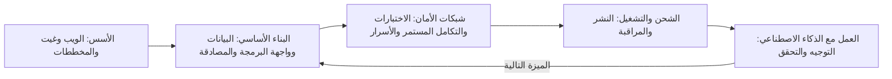

# الوحدة 2 — مسارات الأدوار عبر المكتبة

*سمّت الوحدة 1 المهارات التي يتحقق منها كل صاحب عمل (employer). وتحوّل هذه الوحدة تلك المهارات إلى أربعة مسارات (four routes)، مسار لكل عائلة من أدوار مستوى المبتدئين (entry-level roles): هندسة البرمجيات والهندسة الشاملة (software and full-stack engineering)، وهندسة تطبيقات الذكاء الاصطناعي (AI application engineering)، والبيانات (data) بفروعها: الهندسة والتحليل والعلوم (engineering, analysis and science)، ثم الحوسبة السحابية والمنصات وDevOps والأمن (cloud, platform, DevOps and security). يؤدي كل درس ثلاث مهام. فهو يبيّن ما يُؤتمن عليه المبتدئ (junior) في ذلك الدور، وكيف يبدو مستوى «جيد بما يكفي للتوظيف» (good enough to hire). ويقدّم جدول المسار الدراسي (study-path table): كل مهارة يحتاجها الدور، والدرس المحدد في هذه المكتبة الذي يعلّمها، والدليل (proof) الذي يستطيع صاحب العمل التحقق منه. ويساعدك على ترتيب تلك المهارات ترتيبًا تُنهيه في أسابيع لا في سنوات. هذه خريطة المكتبة (map of the library). لست بحاجة إلى دراسة كل المقررات؛ بل تحتاج إلى الدروس الصحيحة (right lessons)، من خمسة عشر إلى خمسة وعشرين درسًا، لدورك المستهدف (target role)، بالترتيب الصحيح، وكلٌّ منها ينتهي بدليل. نتابع عمر وهو يتعلم أن أربعمئة لغز محلول (four hundred solved puzzles) ليست تطبيقًا منشورًا (deployed app)، وريم وهي تكتشف أن عرض الذكاء الاصطناعي التجريبي (AI demo) ليس منتج ذكاء اصطناعي (AI product)، وهدى وهي تكتشف هندسة البيانات (data engineering)، ويوسف وهو يتبيّن كيف يدخل مهندس الحاسوب (computer engineer) إلى عمل المنصات (platform work). أما محمد، خرّيج المعسكر التدريبي (bootcamp graduate)، فيُظهر أن المسار الجيد (good path) أهم من الشارة (badge) التي بدأت بها.*

> **الخطوات (Steps):** Explore, Learn — اختر دورًا مستهدفًا واحدًا (one target role)، ثم ادرس فقط ما يتحقق منه ذلك الدور، بترتيب يُنتج الدليل (produces proof).

---

# 2.1 — مهندس البرمجيات والمهندس الشامل (Software and full-stack engineer)
*المستوى (Level): 🟢 مبتدئ (Beginner)* · *المتطلبات (Prerequisites): 0.2، 1.1، 1.3* · *الخطوة (Step): Explore, Learn*

## ⚡ الدرس في دقيقة (In 60 seconds)
- يُؤتمن مهندس البرمجيات المبتدئ (junior software engineer) على أخذ تغيير صغير موصوف جيدًا (small, well-described change)، وبنائه مع الاختبارات (tests)، وإخضاعه للمراجعة (reviewed)، وشحنه بأمان (ship it safely)، وشرح ما يفعله. وفي عام 2026 يعني ذلك غالبًا توجيه وكيل البرمجة بالذكاء الاصطناعي (AI coding agent) والتحقق من عمله.
- معيار التوظيف (hiring bar) هو **حزمة تقنية واحدة بعمق يكفي للشحن (one stack, deep enough to ship)**: لغة واحدة، وHTTP وواجهات البرمجة (APIs)، وقاعدة بيانات علائقية واحدة (relational database)، والاختبارات، وGit، والنشر (deploy) والمراقبة الأساسية (basic monitoring). وليس «كل إطار عمل في إعلان الوظيفة» (every framework on the job ad).
- يربط جدول المسار الدراسي (study-path table) كل مهارة بدرس في المكتبة وبدليل (proof)، في خمس مراحل (five stages). أدّها بالترتيب.
- إشارة القرار (Decision cue): تحتار بين إطار عمل جديد (new framework) ونشر ما بنيته؟ انشر. يتحقق أصحاب العمل من «يستطيع الشحن» (can ship)، لا من «سمع عنه» (has heard of).
- أكبر فخ (Biggest trap): معاملة التدرب على الخوارزميات (algorithm practice) على أنه التحضير كله. إنه يساعد في بعض الفرز الأولي (screens)؛ لكنه لا يُثبت أنك تستطيع أداء الوظيفة.

## 🧭 لماذا يهم (Why it matters)
حلّ عمر أكثر من أربعمئة مسألة تدريبية (practice problems) على منصة تحكيم إلكترونية (online judge)، وتتصدر سيرته الذاتية (CV) هذا الرقم وقائمة من إحدى عشرة تقنية. يتقدم إلى برنامج نجم للخرّيجين التقنيين (Najm Tech Graduate Programme) وإلى سديم باي (Sadeem Pay)، وهي شركة ناشئة في التقنية المالية (fintech startup) في الدوحة. تطلب المهمة المنزلية (take-home) في سديم باي واجهة برمجة صغيرة (small API) مع قاعدة بيانات (database) واختبارات (tests) وملف README. يكتب عمر المنطق (logic) في أمسية واحدة، ثم يخسر يومين في اتصالات قاعدة البيانات (database connections) ومتغيرات البيئة (environment variables) وملف Dockerfile منسوخ. ويسلّم شيفرة لا تعمل إلا على حاسوبه المحمول، من دون اختبارات.

في مركز التقييم (assessment centre) لدى نجم، يطرح خالد (مدير الهندسة، Engineering Manager) سؤالًا واحدًا: «أرني شيئًا بنيته واستخدمه شخص آخر» ⦃(Show me something you built that someone else has used.)⦄. لا يملك عمر ما يعرضه. ليس ضعيفًا. لقد تدرّب بجدّ على جزء واحد من الوظيفة (one part of the job) ولم يمارس البقية قط.

أما محمد، خرّيج المعسكر التدريبي (bootcamp graduate)، فهو النقيض. يضم معرض أعماله (portfolio) تطبيق حجوزات منشورًا (deployed booking app) مع اختبارات، وشارة تكامل مستمر (CI badge)، وملف README يشرح خطأً واحدًا في بيئة الإنتاج (production bug) أصلحه. ملاحظة خالد تقول: «شحن فعلًا؛ اختبِر الأساسيات» (has shipped; probe fundamentals)، وهي فجوة أسهل بكثير في سدّها. يمنح هذا الدرس عمر، ويمنحك، الطريق الذي وجده محمد بالصدفة (by accident).

## 📐 كيف يعمل (How it works)

### 🟢 الأساسيات (The essentials)

**ما هو الدور (What the role is).** على مستوى المبتدئين (entry level)، تشترك وظائف البرمجيات في حلقة واحدة (one loop): التقط تذكرة صغيرة (small ticket)، واقرأ من الشيفرة الموجودة (existing code) ما يكفي لتعرف أين يقع التغيير، ونفّذ التغيير (غالبًا بمساعدة وكيل ذكاء اصطناعي يصوغ أجزاءً منه، AI agent drafting parts)، واكتب اختبارات تُثبته، وافتح طلب دمج (pull request, PR) واستجب للمراجعة (respond to review)، ثم اشحنه وتحقق من أنه يعمل. يبني مهندسو **الواجهة الخلفية (Backend)** واجهات البرمجة (APIs) ومنطق الأعمال (business logic) وقواعد البيانات. ويبني مهندسو **الواجهة الأمامية (Frontend)** ما يعمل في المتصفح (browser). ويؤدي مهندسو **الحزمة الشاملة (Full-stack)** الأمرين بعمق أقل، وهذا شائع في الشركات الناشئة (startups) مثل سديم باي (Sadeem Pay). ويبني مهندسو **الأجهزة المحمولة (Mobile)** تطبيقات iOS أو Android أو التطبيقات متعددة المنصات (cross-platform apps).

**معيار المبتدئ (The junior bar).** يغطي الدرس 1.1 خط الأساس (baseline) ويغطي الدرس 1.3 التفكير الإنتاجي (production thinking). في هذا الدور، يعني «جيد بما يكفي للتوظيف» (good enough to hire):

| المجال (Area) | جيد بما يكفي لمبتدئ (Good enough for a junior) | غير متوقع بعد (Not expected yet) |
|---|---|---|
| اللغة (Language) | لغة واحدة بطلاقة (fluently)، مع أدواتها القياسية (standard tools) | ثلاث لغات على مستوى خبير (expert level) |
| أساسيات الويب (Web basics) | تستطيع شرح مسار الطلب (request's path) واستخدام رموز الحالة (status codes) والترويسات (headers) وJSON استخدامًا صحيحًا | كتابة خادم HTTP خاص بك (your own HTTP server) |
| البيانات (Data) | تستطيع تصميم مخطط صغير (small schema)، وكتابة عمليات الربط (joins)، وإضافة فهرس (index)، وتشغيل ترحيل (migration) | التجزئة (sharding) وإعدادات النسخ المتماثل (replication setups) |
| الاختبار (Testing) | اختبارات الوحدة والتكامل (unit and integration tests) لشيفرتك؛ وتعرف ما يُثبته الاختبار | استراتيجية اختبار كاملة (full testing strategy) لنظام كبير |
| الشحن (Shipping) | نشرت شيئًا حقيقيًا (deployed something real)، والأسرار (secrets) خارج الشيفرة، وتعرف كيف تتراجع (roll back) | تصميم منصة إصدارات (release platform) |
| أدوات الذكاء الاصطناعي (AI tools) | تستطيع توجيه وكيل برمجة (coding agent) والتقاط أخطائه قبل المراجعة | بناء منصات الوكلاء (agent platforms) |

**جدول المسار الدراسي (The study-path table).** عمود الدليل (proof column) هو الأهم: رابط يستطيع المُقابِل (interviewer) فتحه يتفوق على مقرر تقول إنك أنهيته.

| المرحلة (Stage) | المهارة (Skill) | أين تتعلمها (Where to learn it) | الدليل الذي يُثبتها (Proof that shows it) |
|---|---|---|---|
| 1. الأسس (Foundations) | كيف يعمل الويب (How the web works): DNS وHTTP والخوادم (servers) | [*تصميم الأنظمة للمبرمجين بالحدس (System Design for Vibe Coders)*، الدرس F.1 — ماذا يحدث عندما تفتح موقعًا (What happens when you open a website)](../vibe/index.ar.html#lF-1) · [*تصميم الأنظمة للمبرمجين بالحدس (System Design for Vibe Coders)*، الدرس F.2 — ما هو الخادم فعلًا (What a server actually is)](../vibe/index.ar.html#lF-2) | تستطيع شرح مسار الطلب (request's path) على السبّورة في خمس دقائق |
| 1. الأسس (Foundations) | Git والمستودعات (repos) والنشر (deploys) | [*تصميم الأنظمة للمبرمجين بالحدس (System Design for Vibe Coders)*، الدرس F.3 — الإصدارات والمستودعات والنشر (Versions, repos, and deploys)](../vibe/index.ar.html#lF-3) | مستودع عام (public repo) بسجل نظيف من الإيداعات الصغيرة (small commits) |
| 1. الأسس (Foundations) | رسم النظام قبل البرمجة (Drawing the system before coding) | [*تصميم الأنظمة للمبرمجين بالحدس (System Design for Vibe Coders)*، الدرس 1.1 — ارسم الصناديق قبل أن يكتب الوكيل الشيفرة (Draw the boxes before the agent writes the code)](../vibe/index.ar.html#l1-1) · [*تصميم الأنظمة للمبرمجين بالحدس (System Design for Vibe Coders)*، الدرس 1.2 — رحلة الطلب (The request's journey)](../vibe/index.ar.html#l1-2) | مخطط معماري (architecture diagram) في ملف README |
| 2. البناء الأساسي (Core build) | طبقة البيانات (data layer): المخطط (schema) وORM والترحيلات (migrations) | [*لبنات بناء SaaS (SaaS Building Blocks)*، الدرس 2.1 — طبقة البيانات (The data layer)](../saas/index.ar.html#/2.1) | ملفات الترحيل (migration files) في مستودعك، وبيانات أولية (seed data) يستطيع المراجع تحميلها |
| 2. البناء الأساسي (Core build) | الاستعلامات والفهارس (Queries and indexes) | [*تصميم الأنظمة للمبرمجين بالحدس (System Design for Vibe Coders)*، الدرس 2.5 — الفهارس والاستعلامات ومجموعة العمل (Indexes, queries, and the working set)](../vibe/index.ar.html#l2-5) | استعلام بطيء (slow query) واحد وجدته وأصلحته، مع التوقيتات قبل وبعد (before and after timings) |
| 2. البناء الأساسي (Core build) | التزامن والكتابات الصحيحة (Concurrency and correct writes) | [*تصميم الأنظمة للمبرمجين بالحدس (System Design for Vibe Coders)*، الدرس 2.6 — نقرتان في آن واحد (Two clicks at once)](../vibe/index.ar.html#l2-6) | اختبار يُثبت أن الإرسال المزدوج (double-submit) لا يُنشئ سجلّين |
| 2. البناء الأساسي (Core build) | تصميم واجهات البرمجة (API design) | [*تصميم الأنظمة للمبرمجين بالحدس (System Design for Vibe Coders)*، الدرس 6.6 — تصميم واجهة برمجة يصمد أمام عملائه (API design that survives its clients)](../vibe/index.ar.html#l6-6) | ملف OpenAPI أو نقاط نهاية موثّقة (documented endpoints) مع صيغ الأخطاء (error formats) |
| 2. البناء الأساسي (Core build) | المصادقة والتفويض (Authentication and authorisation) | [*لبنات بناء SaaS (SaaS Building Blocks)*، الدرس 1.1 — المصادقة (Authentication)](../saas/index.ar.html#/1.1) · [*لبنات بناء SaaS (SaaS Building Blocks)*، الدرس 1.3 — التفويض (Authorization)](../saas/index.ar.html#/1.3) | اختبار يُظهر أن المستخدم A لا يستطيع قراءة بيانات المستخدم B (user A cannot read user B's data) |
| 3. شبكات الأمان (Safety nets) | الاختبارات بوصفها المواصفة (Tests as the spec) | [*تصميم الأنظمة للمبرمجين بالحدس (System Design for Vibe Coders)*، الدرس 8.2 — الاختبارات بوصفها المواصفة التي لا يستطيع الوكيل تجاهلها (Tests as the spec the agent can't ignore)](../vibe/index.ar.html#l8-2) | مجموعة اختبارات (test suite) تعمل بأمر واحد |
| 3. شبكات الأمان (Safety nets) | التكامل المستمر (Continuous integration) | [*تصميم الأنظمة للمبرمجين بالحدس (System Design for Vibe Coders)*، الدرس 8.3 — الفحص المسبق في CI واختبار الراعي الكذّاب (CI preflight and the boy-who-cried-wolf check)](../vibe/index.ar.html#l8-3) | شارة CI خضراء (green CI badge)، وطلب دمج (pull request) التقط فيه CI شيئًا |
| 3. شبكات الأمان (Safety nets) | الأسرار وثغرات الويب الشائعة (Secrets and common web flaws) | [*تصميم الأنظمة للمبرمجين بالحدس (System Design for Vibe Coders)*، الدرس 5.7 — الأسرار والإعدادات (Secrets and configuration)](../vibe/index.ar.html#l5-7) · [*تصميم الأنظمة للمبرمجين بالحدس (System Design for Vibe Coders)*، الدرس 5.6 — قائمة OWASP Top 10 مطبّقة على تطبيق حقيقي (The OWASP Top 10, mapped to a real app)](../vibe/index.ar.html#l5-6) | لا أسرار في السجل (No secrets in history)؛ وملاحظة أمنية قصيرة (short security note) في README |
| 4. الشحن والتشغيل (Ship and operate) | النشر والتراجع (Deploying and rolling back) | [*تصميم الأنظمة للمبرمجين بالحدس (System Design for Vibe Coders)*، الدرس 4.1 — الشحن نظام بحد ذاته (Shipping is a system)](../vibe/index.ar.html#l4-1) · [*تصميم الأنظمة للمبرمجين بالحدس (System Design for Vibe Coders)*، الدرس 4.4 — التراجع وبيئة التجهيز وبوابات الإصدار (Rollback, staging, and release gates)](../vibe/index.ar.html#l4-4) | رابط حيّ (live URL)، وخطوة تراجع مكتوبة (written rollback step) جرّبتها فعلًا |
| 4. الشحن والتشغيل (Ship and operate) | الأخطاء والمراقبة (Errors and monitoring) | [*تصميم الأنظمة للمبرمجين بالحدس (System Design for Vibe Coders)*، الدرس 1.3 — عيون اليوم الأول (Day-one eyes)](../vibe/index.ar.html#l1-3) · [*تصميم الأنظمة للمبرمجين بالحدس (System Design for Vibe Coders)*، الدرس 7.2 — الأخطاء والسجلات وأرضية الضجيج (Errors, logs, and the noise floor)](../vibe/index.ar.html#l7-2) | أداة تتبّع أخطاء موصولة (error tracker connected)؛ وخطأ واحد وجدته من خلالها |
| 5. العمل مع الذكاء الاصطناعي (Work with AI) | توجيه الوكيل والتحقق منه (Directing and verifying an agent) | [*تصميم الأنظمة للمبرمجين بالحدس (System Design for Vibe Coders)*، الدرس 9.4 — التحقق قبل الإكمال (Verification before completion)](../vibe/index.ar.html#l9-4) · [*تصميم الأنظمة للمبرمجين بالحدس (System Design for Vibe Coders)*، الدرس 9.7 — تدقيق الشيفرة ومراجعتها بسرعة الوكيل (Code audit and review at agent speed)](../vibe/index.ar.html#l9-7) | طلب دمج (pull request) تشرح فيه ما أخطأ فيه الوكيل وكيف التقطته |

يحوّل الدرس 3.1 هذه الأدلة إلى مشروع ختامي واحد (one capstone project) بدلًا من خمسة عشر عرضًا تجريبيًا صغيرًا (small demos).

### 🟡 التعمق أكثر (Going deeper)

**الترتيب أهم من الكمية (Order matters more than volume).** تعطي كل مرحلة المرحلةَ التالية شيئًا تعمل عليه.

إن قفزت إلى المرحلة 5 فستُنتج شيفرة بسرعة لكنك لن تستطيع الحكم عليها (cannot judge it). وإن بقيت في المرحلة 1 أشهرًا فلن يكون لديك ما تعرضه. استهدف نحو أسبوعين لكل مرحلة، تنتهي كلٌّ منها بدليلها (its proof). والسهم العائد هو حلقة العمل الحقيقية (real working loop): كل ميزة (feature) تمر بالبناء وشبكات الأمان والشحن من جديد.

**كيف تغيّر التنويعات الجدول (How the variants change the table).** تنطبق الصفوف الأساسية (core rows) على كل أدوار البرمجيات. ويضيف كل تنويع (variant) بضعة صفوف فوقها:

| التنويع (Variant) | أضف هذه (Add these) | الدليل المضاف (Proof to add) |
|---|---|---|
| الواجهة الخلفية (Backend) | التخزين المؤقت (Caching): [*تصميم الأنظمة للمبرمجين بالحدس (System Design for Vibe Coders)*، الدرس 3.1 — لماذا يموت الصواب في التخزين المؤقت (Why caching is where correctness goes to die)](../vibe/index.ar.html#l3-1)؛ والطوابير (queues): [*تصميم الأنظمة للمبرمجين بالحدس (System Design for Vibe Coders)*، الدرس 10.2 — الطوابير والعمل غير المتزامن (Queues and asynchronous work)](../vibe/index.ar.html#l10-2) | نتيجة اختبار حمل (load test result) مع عنق زجاجة (bottleneck) واحد وجدته وشرحته |
| الواجهة الأمامية (Frontend) | هيكل التطبيق (The app shell): [*لبنات بناء SaaS (SaaS Building Blocks)*، الدرس 6.1 — هيكل التطبيق (The app shell)](../saas/index.ar.html#/6.1)؛ والتخطيطات من اليمين إلى اليسار (right-to-left layouts): [*تصميم الأنظمة للمبرمجين بالحدس (System Design for Vibe Coders)*، الدرس 11.2 — التدويل والاتجاه من اليمين إلى اليسار (Internationalization and RTL)](../vibe/index.ar.html#l11-2) | واجهة مستخدم سهلة الوصول ومتجاوبة (accessible, responsive UI) تعمل بالعربية والإنجليزية |
| الحزمة الشاملة (Full-stack) | كلا ما سبق، بقدر أخف (Both of the above, lighter) | ميزة واحدة مبنية من الطرف إلى الطرف (end to end)، من النموذج (form) إلى قاعدة البيانات |
| الأجهزة المحمولة (Mobile) | [*تصميم الأنظمة للمبرمجين بالحدس (System Design for Vibe Coders)*، الدرس 6.1 — مشكلة أسطول العملاء (The client fleet problem)](../vibe/index.ar.html#l6-1)؛ [*تصميم الأنظمة للمبرمجين بالحدس (System Design for Vibe Coders)*، الدرس 6.2 — التحديثات عبر الهواء وفخ التراجع (Over-the-air updates and the revert trap)](../vibe/index.ar.html#l6-2) | تطبيق في متجر (store) أو في مسار اختبار (test track)، مع ملاحظة عن كيفية تعاملك مع إصدارات التطبيق القديمة (old app versions) |

في دول الخليج (GCC)، كثيرًا ما يكون دعم العربية والاتجاه من اليمين إلى اليسار (Arabic and right-to-left support) متطلبًا حقيقيًا (real requirement) في البنوك والخدمات الحكومية وشركات الاتصالات، وقليل من الخرّيجين بنوه.

**كيف يوزن أصحاب العمل الجدول (How employers weight the table).** وقت كتابة هذا النص (2026)، هذه الأنماط شائعة لكنها ليست عامة (common but not universal):

- **شركات التقنية الكبرى (Large tech companies)** ما زالت غالبًا تفرز مبكرًا بمسائل هياكل البيانات والخوارزميات (data-structures-and-algorithms problems)؛ وتدرّب عمر يساعد هنا، بوصفه مرحلة واحدة من عدة مراحل (الدرس 5.2).
- **البنوك وأصحاب العمل الخاضعون للتنظيم (Banks and regulated employers)**، مثل نجم، يعطون وزنًا لشبكات الأمان (safety nets) والأمن: الاختبارات، وانضباط المراجعة (review discipline)، والأسرار، وسجلات التدقيق (audit trails).
- **الشركات الناشئة (Startups)**، مثل سديم باي، تعطي وزنًا للشحن بقليل من المساعدة (shipping with little help)؛ والمهام المنزلية (take-homes) والبرمجة الثنائية (pair programming) شائعة.
- **الجهات الحكومية الرقمية (Government digital agencies)** تعطي غالبًا وزنًا لسهولة الوصول (accessibility)، ودعم العربية (Arabic support)، والأمن، والتوثيق (documentation).

اقرأ ثلاثة إعلانات حقيقية (three real ads) لنوع صاحب العمل المستهدف، وقدّم الصفوف المشتركة بينها. لا تطارد كل كلمة مفتاحية (keyword) في إعلان واحد.

### 🔴 نظرة الخبير (Expert view)

**على شكل حرف T، لا قائمة (T-shaped, not a list).** يبحث مديرو التوظيف (hiring managers) مثل خالد عن وعي أساسي عبر الحزمة كلها (basic awareness across the stack) ومجال واحد من العمق الحقيقي (one area of real depth)، مثل «أستطيع أن أشرح لماذا صار استعلامي أسرع بعد ذلك الفهرس» (I can explain why my query got faster after that index) أو «كيف يتعامل تطبيقي بالضبط مع الإرسال المزدوج» (exactly how my app handles a double-submit). قصة عميقة واحدة (One deep story) تتفوق على عشر قصص سطحية، لأنها تتيح للمُقابِل اختبار طريقة تفكيرك.

**ما الذي غيّره الذكاء الاصطناعي في هذا الدور (What AI changed in this role).** تؤدي وكلاء الذكاء الاصطناعي (AI agents) الآن كثيرًا من الكتابة (typing) التي كان يؤديها المبتدئون، وقد أفادت عدة تحليلات في 2025 بضعف التوظيف للعاملين في بداية مسيرتهم (early-career workers) في المهن المعرّضة للذكاء الاصطناعي (AI-exposed occupations). وما لم يتغير هو الحاجة إلى من يقرر ماذا يُبنى، ويتحقق من صحته، ويشغّله (operates it). والصفوف التي زادت أهميتها هي تلك التي تكون الوكلاء أقل موثوقية فيها: قراءة الشيفرة غير المألوفة (unfamiliar code)، وكتابة اختبارات ترمّز القاعدة الحقيقية (encode the real rule)، والمراجعة بحثًا عن الناقص (reviewing for what is missing)، والنشر والمتابعة (deploying and watching). لهذا تأتي مرحلة «العمل مع الذكاء الاصطناعي» (Work with AI) أخيرًا: تحتاج إلى المراحل السابقة كي تستطيع الحكم على مخرجات الوكيل (agent's output) أصلًا.

**كثافة الإشارة (Signal density).** يجب أن تترك كل ساعة دراسة شيئًا يستطيع صاحب العمل التحقق منه. قارن بين خطتين لأسبوع واحد:

- *ضعيفة (Weak):* «شاهد مقررًا من 12 ساعة عن إطار عمل» (12-hour framework course).
- *قوية (Strong):* «أضف المصادقة (authentication) إلى تطبيق الحجوزات؛ واختبر أن المستخدم A لا يرى حجوزات المستخدم B؛ وانشر؛ واكتب قسمًا قصيرًا في README عن كيفية عمل الجلسات (sessions)».

الخطة الثانية تترك ثلاثة أدلة خلفها (three proofs): إيداعًا (commit)، واختبارًا (test)، وفقرة (paragraph).

## 🧰 الأدوات (The toolkit)
| المورد أو الأداة أو النموذج (Resource, tool or template) | ما هو وماذا يفعل (What it is and does) | متى تلجأ إليه (When to reach for it) |
|---|---|---|
| **Study-path table** — جدول المسار الدراسي | جدول يربط المهارة ← رابط الدرس ← الدليل (skill → lesson link → proof)، مع عمود للحالة (status column)، تحتفظ به في ملاحظاتك أو مستودعك | في البداية، لاختيار ما تدرسه؛ وأسبوعيًا، لتتبّع الدليل (track proof) |
| **Gap list** — قائمة الفجوات | مهارات من إعلانات وظائف حقيقية (real job ads) لا يغطيها دليلك بعد | بعد قراءة إعلانات الوظائف؛ وقبل اختيار المرحلة التالية |
| **MDN Web Docs** (Mozilla) — وثائق الويب من MDN | مرجع وأدلة مجانية (free reference and guides) لـ HTTP وHTML وCSS وJavaScript | كلما احتجت إلى التعريف الموثوق (reliable definition) لمفهوم من مفاهيم الويب |
| **PostgreSQL documentation** — وثائق PostgreSQL | الدليل الرسمي (official manual) لقاعدة بيانات علائقية مفتوحة المصدر (open-source relational database) واسعة الاستخدام | تعلّم المخططات (schemas) والفهارس (indexes) والمعاملات (transactions) و`EXPLAIN` |
| **OpenAPI Specification** — مواصفة OpenAPI | صيغة قياسية قابلة للقراءة آليًا (standard, machine-readable format) لوصف واجهات HTTP البرمجية | توثيق واجهة البرمجة في معرض أعمالك (portfolio API) كي يستطيع المراجع تجربتها |
| **GitHub Actions** | تكامل مستمر (CI) مدمج في GitHub؛ وGitLab CI وغيرهما يعملان أيضًا | تشغيل اختباراتك مع كل دفع (every push) |

## 🏛️ عمليًا في بنك نجم (In practice at Najm Bank)
يطلب خالد من كل خرّيج في مسار البرمجيات (software-track graduate) أن يحتفظ بجدول مسار دراسي شخصي (personal study-path table) للأسابيع الثمانية التي تسبق بدء التناوبات (rotations). هذا جدول عمر بعد مراجعة واحدة؛ لم يُبقِ فيه إلا الصفوف التي لم يكن يستطيع إثباتها بعد.

**المسار الدراسي لعمر: مسار الواجهة الخلفية، ثمانية أسابيع (Omar's study path: backend track, eight weeks)**

| الأسبوع (Week) | فجوة المهارة (Skill gap) | الدرس أو الدروس (Lesson(s)) | الدليل الذي سيُنتجه (Proof he will produce) | الحالة (Status) |
|---|---|---|---|---|
| 1 | لم يرسم نظامًا قط (Has never drawn a system) | [*تصميم الأنظمة للمبرمجين بالحدس (System Design for Vibe Coders)*، الدرس F.2](../vibe/index.ar.html#lF-2) · [*تصميم الأنظمة للمبرمجين بالحدس (System Design for Vibe Coders)*، الدرس 1.1](../vibe/index.ar.html#l1-1) | مخطط لواجهة الحجوزات البرمجية (booking API) في README | منجز (Done) |
| 2 | لا خبرة في قواعد البيانات تتجاوز المقررات الجامعية (beyond coursework) | [*لبنات بناء SaaS (SaaS Building Blocks)*، الدرس 2.1](../saas/index.ar.html#/2.1) · [*تصميم الأنظمة للمبرمجين بالحدس (System Design for Vibe Coders)*، الدرس 2.5](../vibe/index.ar.html#l2-5) | مخطط (schema) مع ترحيلات (migrations)؛ وفهرس واحد مبرَّر بمخرجات `EXPLAIN` | منجز (Done) |
| 3 | تصميم واجهات البرمجة (API design) | [*تصميم الأنظمة للمبرمجين بالحدس (System Design for Vibe Coders)*، الدرس 6.6](../vibe/index.ar.html#l6-6) | نقاط نهاية موثّقة (documented endpoints) باستجابات أخطاء متسقة (consistent error responses) | قيد التنفيذ (In progress) |
| 4 | التفويض (Authorisation) | [*لبنات بناء SaaS (SaaS Building Blocks)*، الدرس 1.3](../saas/index.ar.html#/1.3) | اختبار: المستخدم A لا يستطيع قراءة حجز المستخدم B (user A cannot read user B's booking) | لم يبدأ (Not started) |
| 5 | الاختبارات والتكامل المستمر (Tests and CI) | [*تصميم الأنظمة للمبرمجين بالحدس (System Design for Vibe Coders)*، الدرس 8.2](../vibe/index.ar.html#l8-2) · [*تصميم الأنظمة للمبرمجين بالحدس (System Design for Vibe Coders)*، الدرس 8.3](../vibe/index.ar.html#l8-3) | CI يعمل على كل طلب دمج (every pull request)؛ وشارة (badge) في README | لم يبدأ (Not started) |
| 6 | النشر (Deploying) | [*تصميم الأنظمة للمبرمجين بالحدس (System Design for Vibe Coders)*، الدرس 4.1](../vibe/index.ar.html#l4-1) · [*تصميم الأنظمة للمبرمجين بالحدس (System Design for Vibe Coders)*، الدرس 4.4](../vibe/index.ar.html#l4-4) | رابط حيّ (live URL)؛ وتراجع (rollback) مكتوب ومُتدرَّب عليه مرة واحدة | لم يبدأ (Not started) |
| 7 | المراقبة (Monitoring) | [*تصميم الأنظمة للمبرمجين بالحدس (System Design for Vibe Coders)*، الدرس 1.3](../vibe/index.ar.html#l1-3) · [*تصميم الأنظمة للمبرمجين بالحدس (System Design for Vibe Coders)*، الدرس 7.2](../vibe/index.ar.html#l7-2) | أداة تتبّع الأخطاء (error tracker) وفحص التوافر (uptime check) موصولان | لم يبدأ (Not started) |
| 8 | العمل مع وكيل (Working with an agent) | [*تصميم الأنظمة للمبرمجين بالحدس (System Design for Vibe Coders)*، الدرس 9.4](../vibe/index.ar.html#l9-4) · [*تصميم الأنظمة للمبرمجين بالحدس (System Design for Vibe Coders)*، الدرس 9.7](../vibe/index.ar.html#l9-7) | ميزة واحدة مبنية مع وكيل؛ ووصف طلب الدمج (PR description) يسرد ما صحّحه | لم يبدأ (Not started) |

قواعد خالد الثلاث للجدول (Khalid's three rules):

1. **مشروع واحد، لا ثمانية (One project, not eight).** كل دليل يذهب إلى واجهة الحجوزات البرمجية نفسها (same booking API).
2. **الدليل قبل «منجز» (Proof before "Done").** يكتمل الصف عندما يوجد الرابط، لا عندما يُقرأ الدرس.
3. **ضع سقفًا للخوارزميات (Cap the algorithms).** ثلاثون دقيقة يوميًا للتدرب على المسائل (problem practice)، لا أكثر.

## 🛠️ التمارين (Exercises)
- 🟢 انسخ جدول المسار الدراسي (study-path table) وعلّم كل صف بـ«أستطيع إثباته الآن» (can prove now) أو «أعرفه لكن لا أستطيع إثباته» (know but cannot prove) أو «جديد عليّ» (new to me). *يكتمل عندما (Done when):* يكون كل صف معلّمًا، ولكل صف «أستطيع إثباته الآن» رابط يعمل (working link).
- 🟡 اجمع ثلاثة إعلانات وظائف حقيقية (real job ads) لأدوار برمجيات للمبتدئين (junior software roles) لدى نوع صاحب العمل المستهدف. ظلّل المهارات التي تظهر في إعلانين على الأقل. أضف الصفوف الناقصة إلى جدولك، واكتب قائمة فجوات (gap list) بأهم خمسة صفوف لا تستطيع إثباتها بعد. *يكتمل عندما (Done when):* يستطيع زميل (peer) قراءة قائمة فجواتك ومعرفة الإعلان الذي جاء منه كل بند.
- 🔴 حوّل جدولك إلى خطة من ثمانية أسابيع (eight-week plan) مثل خطة عمر: مشروع واحد، ودليل واحد كل أسبوع، بترتيب المراحل (stage order). اختر تنويعك (variant) وأضف صفوفه الإضافية. *يكتمل عندما (Done when):* تتسع الخطة لصفحة واحدة، ويسمّي كل أسبوع رابط درس ودليلًا، ويكون مرشد (mentor) أو زميل قد راجعها وسجّلتَ تغييرًا واحدًا اقترحه.

## ⚠️ أخطاء وفخاخ (Mistakes and traps)
- **الخوارزميات بوصفها الخطة كلها (Algorithms as the whole plan).** التدرب على المسائل يساعد في بعض الفرز الأولي (screens). ضع له سقفًا، وأمضِ معظم وقتك في مشروع تستطيع نشره وشرحه.
- **جمع أطر العمل (Framework collecting).** تعلّم بدلًا من ذلك حزمة تقنية واحدة (one stack) جيدًا بما يكفي للشحن.
- **«منجز» بلا رابط ("Done" without a link).** إن لم تستطع توجيه المُقابِل إليه، فهو لا يُحتسب بعد. احتفظ بعمود للدليل (proof column)، واملأه.
- **الثقة بالاختبارات التي كتبها الوكيل (Trusting agent-written tests).** كثيرًا ما تختبر الشيء الخطأ. اقرأ كل اختبار.
- **تجاهل السوق المحلي (Ignoring the local market).** في دول الخليج (GCC)، دعم العربية (Arabic support) والوعي الأمني (security awareness) ميزتان حقيقيتان. ابنِ إحداهما في مشروعك.

## 🧾 الخلاصة (Recap)
- يُؤتمن مهندس البرمجيات المبتدئ (junior software engineer) على تغييرات صغيرة تُختبر وتُراجع وتُشحن وتُشرح.
- المعيار (bar) هو حزمة تقنية واحدة بعمق يكفي للشحن (one stack deep enough to ship)، لا أدوات كثيرة.
- يربط جدول المسار الدراسي (study-path table) كل مهارة بدرس وبدليل، في خمس مراحل.
- مشروع واحد ينمو (One growing project)، مع دليل كل أسبوع، يتفوق على عروض تجريبية صغيرة كثيرة (many small demos).

## ✍️ اختبر نفسك (Check yourself)

**1. حلّ عمر أكثر من أربعمئة مسألة تدريبية (practice problems) لكنه لم ينشر تطبيقًا قط (never deployed an app). لديه ثمانية أسابيع قبل التقديم. ما أفضل استخدام لمعظم ذلك الوقت؟**

- A. أن يحلّ أربعمئة مسألة أخرى كي تبرز مهاراته في الخوارزميات (algorithm skills) أكثر
- B. أن يتعلم ثلاثة أطر عمل جديدة رائجة (popular new frameworks) كي تطابق سيرته الذاتية كلمات مفتاحية أكثر في الإعلانات (job-ad keywords)
- C. أن يشحن مشروعًا واحدًا مُختبَرًا (tested project) عبر المراحل، مع الإبقاء على فترة تدريب يومية قصيرة (short daily practice slot)
- D. أن يقرأ كل درس في المكتبة ويجمع شهادة إتمام (completion certificate) لكل منها

الإجابة

**C.** فجوته هي الشحن (shipping)، لا الألغاز (puzzles)؛ ومشروع واحد منشور ومُختبَر يسدّها، والتدرب المحدود بسقف (capped practice) يُبقيه جاهزًا للفرز الأولي (screens). الخيار A يعمّق نقطة قوة قائمة؛ والخيار B يضيف اتساعًا بلا دليل (breadth without proof). (🔴 نظرة الخبير (Expert view) و🏛️ عمليًا (In practice).)

**2. في جدول المسار الدراسي (study-path table)، ما الذي يجعل عمود «الدليل» (proof) أهم من عمود «أين تتعلمها» (where to learn it)؟**

- A. الدروس إضافات اختيارية (optional extras)، لذا لا يهم أصحاب العمل أبدًا أين تعلّمت المهارة
- B. يستطيع المُقابِل (interviewer) فتح الدليل والتحقق منه؛ أما الدرس الذي قرأته فلا يمكن التحقق منه
- C. أنظمة تتبّع المتقدّمين (applicant-tracking systems) تفحص السير الذاتية بحثًا عن روابط الأدلة وترفض ما يخلو منها
- D. عمود أدلة قوي يتيح لك تخطي مراحل المقابلة التقنية (technical interview stages) بالكامل

الإجابة

**B.** يتحقق أصحاب العمل من الأدلة التي يستطيعون رؤيتها (evidence they can see). الخيار A خاطئ لأن الدروس تبني المهارة؛ والخياران C وD غير صحيحين. (🟢 الأساسيات (The essentials).)

**3. يتقدم محمد لدور في الواجهة الأمامية (frontend role) لدى جهة حكومية رقمية إقليمية (regional government digital agency). أي إضافة إلى معرض أعماله (portfolio) هي الأرجح أن تبرز؟**

- A. واجهة ثنائية اللغة بالعربية والإنجليزية (bilingual Arabic and English interface) بتخطيط من اليمين إلى اليسار (right-to-left layout) وسهولة وصول أساسية (basic accessibility)
- B. واجهة خلفية ثانية (second backend) للتطبيق نفسه، مُعاد كتابتها بلغة برمجة مختلفة
- C. عنقود Kubernetes (Kubernetes cluster) مع توسّع تلقائي (autoscaling) لاستضافة موقع معرض أعماله الثابت الصغير (small static portfolio site)
- D. قائمة أطول وأكثر تفصيلًا بمكتبات JavaScript في قسم المهارات (skills section) من سيرته الذاتية

الإجابة

**A.** دعم العربية وسهولة الوصول (Arabic support and accessibility) متطلبات حقيقية للخدمات العامة الإقليمية (regional public services) ونادرة في معارض أعمال الخرّيجين. الخياران B وC لا يطابقان الدور؛ والخيار D قائمة، لا دليل (a list, not proof). (🟡 التعمق أكثر (Going deeper).)

**4. لماذا يضع المسار الدراسي (study path) مرحلة «العمل مع الذكاء الاصطناعي» (Work with AI) أخيرة، لا أولى؟**

- A. لأن معظم أصحاب العمل ما زالوا يحظرون أدوات البرمجة بالذكاء الاصطناعي (AI coding tools) في العمل الهندسي اليومي
- B. لأن وكلاء البرمجة (coding agents) لا يمكن استخدامهم بأمان إلا بعد نشر التطبيق
- C. لأن توجيه الوكلاء (directing agents) هو المهارة الأقل أهمية لأصحاب العمل على مستوى المبتدئين
- D. لأنك تحتاج إلى المراحل السابقة كي تحكم على صحة مخرجات الوكيل (agent's output)

الإجابة

**D.** يعتمد توجيه الوكيل جيدًا على معرفة شكل التصميم الجيد للبيانات (good data design) والاختبارات وعمليات النشر. الخيار A خاطئ (السياسات تتفاوت، policies vary)؛ والخيار C خاطئ، لأن التحقق (verification) ازدادت أهميته. (🟡 التعمق أكثر (Going deeper) و🔴 نظرة الخبير (Expert view).)

**5. تسأل ريم كيف تقرر أي صفوف جدول المسار الدراسي تقدّم لشركة ناشئة (startup) مثل سديم باي مقابل بنك (bank) مثل نجم. ما أفضل نصيحة؟**

- A. قدّم الصفوف نفسها للاثنين، لأن كل أصحاب العمل يتحققون من المهارات نفسها بالطريقة نفسها
- B. وازن الصفوف وفق الإعلانات الحقيقية (real ads): الشحن (shipping) للشركة الناشئة، وشبكات الأمان والأمن (safety nets and security) للبنك
- C. قدّم الأدوات الأحدث أيًّا كانت، لأن كل صاحب عمل يريد أحدث التقنيات (latest technology)
- D. تخطَّ الصفوف الأساسية المشتركة (shared core rows) وادرس صفوف التنويعات (variant rows) فقط لكل صاحب عمل

الإجابة

**B.** الأساس مشترك لكن التركيز يختلف (emphasis differs)، والإعلانات الحقيقية تُظهر أين. الخيار A يتجاهل ذلك؛ والخيار C يطارد الجِدّة (chases novelty)؛ والخيار D يزيل القاعدة المشتركة (shared base). (🟡 التعمق أكثر (Going deeper).)

## 📚 المراجع (References)
- وثائق الويب من MDN (MDN Web Docs) من Mozilla — https://developer.mozilla.org/
- وثائق Git (Git documentation) — https://git-scm.com/doc
- وثائق PostgreSQL (PostgreSQL documentation) — https://www.postgresql.org/docs/
- مبادرة OpenAPI (OpenAPI Initiative) — https://www.openapis.org/
- قائمة OWASP Top 10 — https://owasp.org/www-project-top-ten/
- تطبيق العوامل الاثني عشر (The Twelve-Factor App) — https://12factor.net/
- وثائق GitHub Actions (GitHub Actions documentation) — https://docs.github.com/en/actions

---
