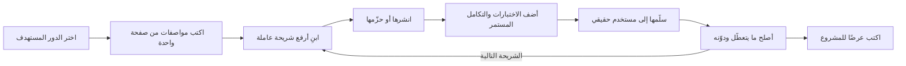
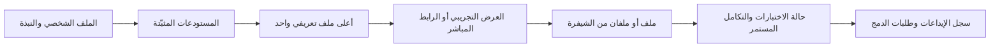
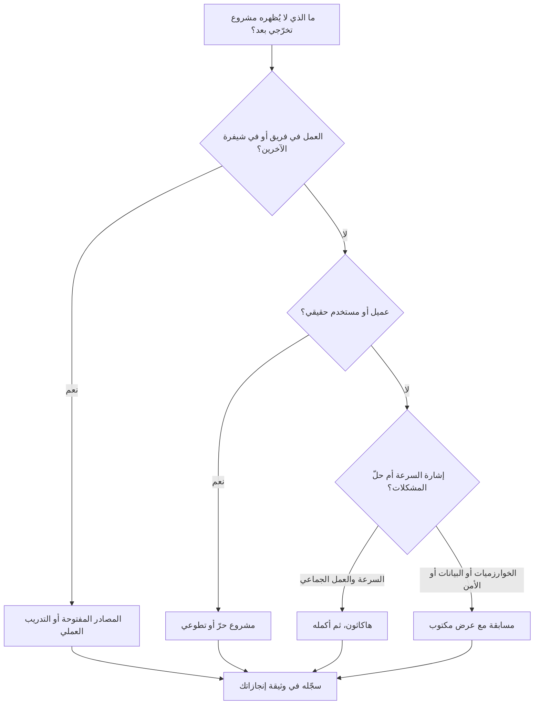

# الوحدة 3 — الإثبات (Proof): معرض الأعمال (portfolio)

*الشهادة الجامعية (degree) تقول إنك درست. وقائمة لغات البرمجة (list of languages) تقول إنك كنت حاضرًا في القاعة. ولا هذه ولا تلك تخبر صاحب العمل (employer) بأنك قادر على أداء الوظيفة، وحين تستطيع وكلاء البرمجة بالذكاء الاصطناعي (AI coding agents) إنتاج تطبيق تجريبي أنيق (tidy demo app) في فترة ما بعد الظهر (in an afternoon)، فإن تطبيقًا تجريبيًا أنيقًا لا يثبت إلا القليل جدًا (proves very little). أما ما يثبت فهو الإثبات (proof): عمل يستطيع شخص غريب (stranger) أن يفتحه ويشغّله ويسائله ويثق به في دقائق معدودة (in a few minutes). تحوّل هذه الوحدة المهارات (skills) التي اكتسبتها في الوحدتين 1 و2 إلى هذا الإثبات. تبدأ بالمشروع الأهم على الإطلاق: مشروع التخرّج التطبيقي (capstone) المبني لدورك المستهدف (target role) وفق معيار الإنتاج (production bar)، مع مواصفات جاهزة (ready-made spec) لكل مسار دور (role path). ثم تبيّن كيف تعرض عملك حتى يراه فعلًا المراجع المشغول (busy reviewer): ملفك الشخصي على GitHub (GitHub profile)، وملف README يجيب عن أسئلة المراجع بترتيبها (in order)، وكتابات قصيرة عن قراراتك (short write-ups of your decisions). وتنتهي بالخبرة التي يمكنك اكتسابها قبل وظيفتك الأولى (before your first job): التدريب العملي (internships)، والمصادر المفتوحة (open source)، والعمل الحر (freelance) والتطوعي (volunteer work)، والهاكاثونات (hackathons) والمسابقات (competitions). ستتابع دفعة بنك نجم (Najm Bank cohort) بينما يستبدل عمر 23 مستودعًا لمقررات دراسية (course repositories) بخدمة واحدة تصمد أمام شخصين يحجزان آخر موعد (last slot) في اللحظة نفسها، وتعيد ريم كتابة ملف README لم تستطع الدفاع عنه (a README she could not defend)، ويحوّل محمد مسيرته المهنية السابقة (previous career) إلى دليل (evidence) بدلًا من اعتذار.*

> **الخطوات (Steps):** Build, Prove — تحويل ما تستطيع فعله إلى دليل (evidence) يستطيع شخص غريب (stranger) أن يفتحه ويشغّله ويتحقق منه في دقائق.

---

# 3.1 — مشاريع تثبت أنك قادر على أداء الوظيفة (Projects that prove you can do the job): مواصفات مشروع تخرّج واحد لكل دور (one capstone spec per role)
*المستوى (Level): 🟡 متوسط (Intermediate)* · *المتطلبات (Prerequisites): 1.1، 1.3، 2.1، 2.2، 2.3، 2.4* · *الخطوة (Step): Build, Prove*

## ⚡ الدرس في دقيقة (In 60 seconds)
- يجيب **مشروع الإثبات (proof project)** عن سؤال واحد لدى المراجع (reviewer): «هل يستطيع هذا الشخص أداء عمل الدور بمستوى المبتدئ (junior) من دون أن يحمله أحد؟» ⁦("Can this person do the work of the role, at junior level, without being carried?")⁩. ولا تستطيع نسخة من درس تعليمي (tutorial clone) أن تجيب عنه مهما كانت مصقولة (polished).
- القاعدة الأهم (the rule that matters most): **مشروع تخرّج عميق واحد يتفوّق على عشرة مستودعات سطحية (one deep capstone beats ten shallow repositories).** والعمق (depth) يعني: مستخدمًا حقيقيًا (real user)، ونطاقًا صغيرًا (small scope)، ونظامًا يعمل (running system)، واختبارات (tests)، وقرارات مكتوبة (written decisions)، ودليلًا على أنك شغّلته وأدرته (evidence that you operated it).
- اختر مشروع التخرّج (capstone) المناسب **لدورك المستهدف (your target role)** (من الدرس 2.1 إلى الدرس 2.4). فإثبات مهندس البيانات (data engineer) لا يشبه في شيء إثبات مطوّر الواجهات الأمامية (front-end developer).
- إشارة القرار (decision cue): قبل كتابة الشيفرة (before coding)، اكتب **السؤال الصعب الوحيد (one hard question)** الذي يجب أن يجيب عنه مشروعك جيدًا، مثل: «ماذا يحدث عندما يحجز شخصان آخر موعد في اللحظة نفسها؟ ⁦(what happens when two people book the last slot at once?)⁩». إن لم يكن هناك سؤال صعب، فما زال المشروع درسًا تعليميًا (tutorial).
- أكبر فخ (biggest trap): نشر شيفرة بناها الوكيل (agent-built code) لا تستطيع شرحها. يختار المراجعون ملفًا واحدًا ويسألون: «لماذا بهذه الطريقة؟ ⁦(why this way?)⁩». وإجابتك هي الإثبات (the proof).

## 🧭 لماذا يهم (Why it matters)
في مراجعة تجريبية لمعرض الأعمال (mock portfolio review)، يفتح خالد، مدير الهندسة (engineering manager) الذي يوظّف المبتدئين (juniors) في برنامج نجم للخرّيجين التقنيين (Najm Tech Graduate Programme)، حساب عمر على GitHub: 23 مستودعًا (repositories) من حلول LeetCode، وواجبات مقررات (course assignments)، وتطبيق مهام من درس تعليمي (tutorial to-do app)، ونسخة متفرّعة لم تُلمس (untouched fork). وبعد دقيقة يقول بلطف: «كل ما هنا يخبرني بأنك قادر على إنهاء مقرر دراسي (finish a course). ولا شيء يخبرني بأنك قادر على أداء الوظيفة (do the job). لا أجد شيئًا واحدًا يعمل (one thing that runs)، ولا اختبارًا واحدًا (one test)، ولا قرارًا واحدًا اتخذته بنفسك (one decision you made yourself)».

أما ريم فلديها المشكلة المعاكسة: اثنا عشر تطبيقًا حسن المظهر (twelve good-looking apps) بُنيت بسرعة باستخدام وكلاء البرمجة بالذكاء الاصطناعي (AI coding agents). يسألها خالد عمّا يمنع مستخدمًا في تطبيقها لتقسيم المصاريف (expense-splitting app) من قراءة مصاريف مستخدم آخر. تفتح ريم الشيفرة (code) وتدرك أنها تقرؤها للمرة الأولى (for the first time). فريق خالد يستخدم أدوات الذكاء الاصطناعي (AI tools) كل يوم؛ وفكرته أضيق من ذلك: «إن وظّفتك، فأنا أثق بأنك ستتحقق مما كتبه الوكيل (check what the agent wrote). أريني أنك قادرة على ذلك».

ومحمد، المتحوّل مهنيًا (career-switcher) القادم من معسكر تدريبي (bootcamp)، لديه ثلاثة مشاريع. أحدها نظام لحجز الحصص (class-booking system) للنادي الرياضي (gym) الذي كان يعمل فيه، استخدمه عشرون عضوًا لمدة شهرين، مع اختبارات (tests) وملاحظة قصيرة عن خلل الحجز المزدوج (double-booking bug) الذي أصلحه. يقضي خالد عشر دقائق عليه ثم يطلب سيرته الذاتية (CV).

## 📐 كيف يعمل (How it works)

### 🟢 الأساسيات (The essentials)

**ما يحاول المراجع معرفته (What a reviewer is trying to learn).** لدى المراجع (reviewer) وقت محدود وسؤال واحد: هل يُظهر هذا الشخص الإشارات (signals) التي يحتاجها الدور؟ وفي معظم أدوار المبتدئين (junior roles) تكون هذه الإشارات هي الأساس (baseline) من الدرس 1.1، والاستخدام الأمين لأدوات الذكاء الاصطناعي (honest use of AI tools) من الدرس 1.2، والتفكير الإنتاجي (production thinking) من الدرس 1.3. ومشروع الإثبات (proof project) مصمَّم لإظهار هذه الإشارات حيث يستطيع شخص غريب (stranger) التحقق منها.

**سُلّم الإثبات (The proof ladder).** تقع المشاريع على سُلّم (ladder). وكل درجة (rung) دليل أقوى من الدرجة التي تحتها.

| الدرجة (Rung) | ما هي (What it is) | ما الذي تثبته (What it proves) |
|---|---|---|
| 1. متابعة درس تعليمي (Tutorial follow-along) | كتبتَ ما كتبه الفيديو (what the video typed) | أنك أنهيت الفيديو (finished the video) |
| 2. درس تعليمي مع ميزة خاصة بك (Tutorial plus your own feature) | وسّعته بشيء غير موجود في الدرس التعليمي (not in the tutorial) | أنك قادر على تعديل شيفرة لم تصمّمها (change code you did not design) |
| 3. مشروعك الخاص (Your own project) | مشكلتك، وتصميمك، وشيفرتك (your problem, your design, your code) | أنك قادر على اتخاذ القرارات (make decisions) |
| 4. منشور وقابل لإعادة الإنتاج (Deployed and reproducible) | يستطيع أي شخص فتحه، أو تشغيله بأمر واحد (one command) | أنك قادر على الإطلاق (ship)، لا على الكتابة فقط (not only write) |
| 5. يستخدمه شخص آخر (Used by someone else) | مستخدم حقيقي مسمّى (named real user)، ولو كان مجموعة صغيرة (small group) | أنه يحلّ مشكلة (solves a problem) ويصمد أمام المدخلات الحقيقية (survives real input) |
| 6. مُشغَّل عبر الزمن (Operated over time) | أخطاء اكتُشفت أثناء الاستخدام (bugs found in use) وأُصلحت ووُثّقت؛ وتغييرات أُطلقت بأمان (changes released safely) | أنه يمكن ائتمانك على نظام قيد التشغيل (trusted with a running system) |

بلوغ الدرجة 5 أو 6 بمشروع واحد يميّزك عن غيرك (sets you apart).

**العلامات الست لمشروع الإثبات (The six marks of a proof project).** استخدمها قائمة تحقق (checklist):
1. **مشكلة حقيقية ومستخدم مسمّى (A real problem and a named user).** «طلاب قسمي الذين ينتظرون مواعيد المختبر (Students in my department waiting for lab slots)»، لا «تطبيق حجز (a booking app)».
2. **نطاق صغير (A small scope).** سير عمل أساسي واحد (one core workflow) منجز كما ينبغي. يمكنك إضافة الميزات (features) لاحقًا؛ لكنك لا تستطيع إضافة العمق (depth) لاحقًا من دون إعادة الكتابة (rewriting).
3. **إنه يعمل (It runs).** رابط مباشر (live link)، أو أمر واحد (single command) مثل `docker compose up` يعمل على جهاز نظيف (clean machine).
4. **الاختبارات والتكامل المستمر (Tests and continuous integration, CI).** تعمل الاختبارات الآلية (automated tests) مع كل دفع (push)، والشارة (badge) خضراء لسبب حقيقي.
5. **قرارات مكتوبة (Decisions written down).** لماذا قاعدة البيانات هذه (why this database)، ولماذا هذه البنية (why this structure)، وما الذي اخترت ألا تفعله (what you chose not to do). يبيّن الدرس 3.2 الطريقة.
6. **دليل على التشغيل (Evidence of operation).** متتبّع أخطاء (error tracker)، وسجلّ لخلل اكتشفته وأصلحته (a log of a bug you found and fixed)، وسجلّ تغييرات (changelog)، وتراجع تدرّبت عليه (a rollback you practised).

وهناك شرط واحد يعلو العلامات الست كلها: **أن تستطيع شرح كل سطر (you can explain every line)**، بما في ذلك الأسطر التي كتبها وكيل ذكاء اصطناعي (AI agent).

**اختيار المشكلة (Choosing the problem).** المشكلات الجيدة تأتي من حياتك ومجتمعك (your own life and community) (نادٍ، أو مشروع عائلي (family business)، أو قسم جامعي)، أو من مجموعة بيانات عامة (public dataset) تهمّك، أو من منظمة تتطوّع فيها (organisation you volunteer for) (الدرس 3.3). أما الخيارات الضعيفة فهي التي رآها المراجعون مرات كثيرة: قوائم المهام (to-do lists)، وتطبيقات الطقس (weather apps)، ونسخ مواقع البثّ (streaming-site clones)، ومجموعة بيانات تايتانيك (Titanic dataset)، والأرقام المكتوبة بخط اليد (handwritten digits). هي مناسبة للتعلّم، ضعيفة كإثبات (fine for learning, weak as proof): لا مستخدم حقيقي (no real user)، ولا سؤال صعب (no hard question)، وإجابة جاهزة يستطيع أي شخص نسخها (a finished answer anyone can copy).

**حلقة البناء (The build loop).** ابنِ أولًا شريحة رفيعة عاملة (thin, working slice) وضعها أمام شخص ما، ثم عمّقها (deepen it).



### 🟡 التعمق أكثر (Going deeper)

**مواصفات مشروع تخرّج واحد لكل دور (One capstone spec per role).** فيما يلي خمس مواصفات (specs)، واحدة لكل مسار دور (role path) من الوحدة 2. غيّر المجال (domain) إلى شيء يهمّك؛ وحافظ على المعيار (keep the bar).

**مهندس البرمجيات والمهندس الشامل (Software and full-stack engineer) — خدمة حجز لمنظمة صغيرة (a booking service for a small organisation)**
- *النطاق (Scope):* عيادة (clinic) أو نادٍ رياضي (gym) أو مختبر جامعي (university lab) بمواعيد محدودة (limited slots)؛ تسجيل دخول (login)، ودورا العضو والمسؤول (member and admin roles)، والحجز والإلغاء (book and cancel)، وتأكيد بالبريد الإلكتروني (email confirmation).
- *معيار الإنتاج (Production bar):* قاعدة بيانات علائقية (relational database) مع ترحيلات (migrations)، واختبارات لقواعد الحجز (tests for the booking rules)، وتكامل مستمر (CI)، ونشر (deployed) مع متتبّع أخطاء (error tracker) وفحص توافر (uptime check)، ولا أسرار في المستودع (no secrets in the repository).
- *السؤال الصعب (Hard question):* «شخصان يضغطان زر "احجز" ('Book') لآخر موعد في اللحظة نفسها. ماذا يحدث؟ ⁦(What happens?)⁩».
- *مسار المكتبة (Library path):* [*تصميم الأنظمة للمبرمجين بالحدس (System Design for Vibe Coders)*، الدرس 2.6 — نقرتان في وقت واحد: حالات التسابق والمعاملات والكتابات متساوية الأثر (Two clicks at once: races, transactions, and idempotent writes)](../vibe/index.ar.html#l2-6)؛ [*لبنات بناء البرمجيات كخدمة (SaaS Building Blocks)*، الدرس 2.1 — طبقة البيانات: Postgres وأدوات ORM والترحيلات والبيانات الأولية (The data layer: Postgres, ORMs, migrations and seeds)](../saas/index.ar.html#/2.1).

**مهندس تطبيقات الذكاء الاصطناعي (AI application engineer) — مساعد للإجابة عن الأسئلة من مستندات يحق لك استخدامها (a question-answering assistant over documents you may use)**
- *النطاق (Scope):* مجموعة نصوص عامة ومسموح باستخدامها (public, permitted text set)، مثل اللوائح المنشورة لجامعتك (published regulations) أو توثيق مشروع مفتوح المصدر (open-source project's documentation)؛ إجابات مع روابط إلى المصادر (links to sources)، وعبارة «لا أعرف ('I don't know')» حين لا تكون الإجابة موجودة.
- *معيار الإنتاج (Production bar):* **مجموعة ذهبية (golden set)** من 50 سؤالًا حقيقيًا على الأقل تُقيَّم مع كل تغيير (scored on every change)، ومعدل رفض مَقيس (measured refusal rate) على الأسئلة الخارجة عن النطاق (out-of-scope questions)، وتسجيل التكلفة وزمن الاستجابة لكل استعلام (logged cost and response time per query)، ودفاع مُختبَر ضد التعليمات المخبّأة داخل المستندات (tested defence against instructions hidden inside documents).
- *السؤال الصعب (Hard question):* «كيف تعرف أن تغيير الموجّه (prompt change) جعله أفضل، لا مختلفًا فحسب؟ ⁦(made it better and not just different?)⁩».
- *مسار المكتبة (Library path):* [*إدارة منتجات الذكاء الاصطناعي: من الصفر إلى الاحتراف (AI Product Management: Zero to Hero)*، الدرس 6.1 — جودة يمكنك قياسها: المقاييس والمجموعات الذهبية وتحليل الأخطاء (Quality you can measure: metrics, golden sets and error analysis)](../aipm/index.ar.html#/6.1)؛ [*أمن الذكاء الاصطناعي وأمن التطبيقات: من الصفر إلى الاحتراف (Secure AI & Application Security: Zero to Hero)*، الدرس 8.2 — حقن الموجّهات وكسر القيود، المباشر وغير المباشر (Prompt injection and jailbreaks, direct and indirect)](../secai/index.ar.html#/8.2).

**مهندس البيانات أو محلّل البيانات أو عالم البيانات (Data engineer, analyst or data scientist) — خط بيانات يجيب عن أسئلة حقيقية (a pipeline that answers real questions)**
- *النطاق (Scope):* مصدر بيانات مفتوحة عام يُحدَّث بانتظام (regularly updated public open-data source) (النقل، أو الطقس، أو الأسعار)؛ استيعاب مُجدول (scheduled ingestion)، وتحويلات مُختبَرة (tested transformations)، ولوحة معلومات (dashboard) تجيب عن ثلاثة أسئلة محددة. ويضيف علماء البيانات (data scientists) نموذجًا (model)، وخط أساس بسيطًا يجب التفوّق عليه (simple baseline to beat)، ومهمة دفعية (batch job) تقيّم البيانات الجديدة.
- *معيار الإنتاج (Production bar):* إعادة تشغيل آمنة من دون تكرار (safe reruns without duplicates)، وفحوص جودة بيانات تفشل بصوت عالٍ (data-quality checks that fail loudly)، ونتائج النموذج مقارنةً بخط الأساس مكتوبة (model results against the baseline written down).
- *السؤال الصعب (Hard question):* «وصل ملف الأمس مرتين، ووصل ملف اليوم متأخرًا. ماذا تُظهر لوحة معلوماتك؟ ⁦(What does your dashboard show?)⁩».
- *مسار المكتبة (Library path):* [*هندسة البيانات والتحليلات: من الصفر إلى الاحتراف (Data Engineering & Analytics: Zero to Hero)*، الوحدة 2 — الاستيعاب وخطوط البيانات (Ingestion and pipelines)](../data/index.ar.html#/2.1)؛ [*هندسة البيانات والتحليلات: من الصفر إلى الاحتراف (Data Engineering & Analytics: Zero to Hero)*، الوحدة 3 — التحويل والجودة (Transformation and quality)](../data/index.ar.html#/3.2).

**مهندس السحابة أو المنصّات أو DevOps (Cloud, platform or DevOps engineer) — شغّل تطبيقًا كما ينبغي (run an app properly)**
- *النطاق (Scope):* خذ تطبيقًا صغيرًا (small application) (تطبيقك، أو تطبيقًا مفتوح المصدر) وضعه في حاوية (containerise it)، وعرّف بنيته التحتية كشيفرة (infrastructure as code)، وابنِ خط نشر (pipeline) ينشر إلى بيئة التجهيز (staging) ثم إلى الإنتاج (production).
- *معيار الإنتاج (Production bar):* مراقبة (monitoring) مع هدف مستوى خدمة مكتوب واحد (one written service-level objective, SLO)، ودليل تشغيل (runbook)، وتراجع تدرّبت عليه (practised rollback)، وتقرير «يوم اختبار» ('game day' write-up) عن شيء عطّلته عمدًا (broke on purpose)، وملاحظة عن التكلفة (cost note) مع تفعيل تنبيهات الميزانية (budget alerts).
- *السؤال الصعب (Hard question):* «الإصدار الجديد (new release) يفشل لدى بعض المستخدمين. اشرح لي ما تفعله في الدقائق العشر التالية ⁦(Walk me through the next ten minutes.)⁩».
- *مسار المكتبة (Library path):* [*السحابة وDevOps: من الصفر إلى الاحتراف (Cloud & DevOps: Zero to Hero)*، الوحدة 4 — التكامل والنشر المستمران والإصدارات (CI/CD and releases)](../cloud/index.ar.html#/4.1)؛ [*تصميم الأنظمة للمبرمجين بالحدس (System Design for Vibe Coders)*، الدرس 4.4 — التراجع وبيئة التجهيز وبوابات الإصدار (Rollback, staging, and release gates)](../vibe/index.ar.html#l4-4).

**مهندس الأمن (Security engineer) — أمّن تطبيقًا من طرف إلى طرف (secure an application end to end)**
- *النطاق (Scope):* تطبيقك الخاص، أو أحد المشاريع السابقة: نموذج تهديدات (threat model) مع مخطط تدفق البيانات (data-flow diagram)، واختبارات التحكم في الوصول (access-control tests)، وخط نشر (pipeline) فيه فحص الأسرار (secret scanning) والتحليل الساكن (static analysis) وفحوص الاعتماديات (dependency checks).
- *معيار الإنتاج (Production bar):* لكل نتيجة (finding) درجة خطورة (severity)، وإصلاح أو قرار مسجّل (fix or recorded decision)، واختبار يمنع عودتها (test that stops it returning). تدرّب على الهجمات (practise attacks) على أنظمتك الخاصة فقط أو على تطبيق تدريبي (training app) مثل **OWASP Juice Shop**، ولا تفعل ذلك أبدًا على أي شيء لا تملك إذنًا مكتوبًا باختباره (written permission to test).
- *السؤال الصعب (Hard question):* «أيّ نتيجة ستصلحها أولًا، ولماذا هي بالذات؟ ⁦(Which finding would you fix first, and why that one?)⁩».
- *مسار المكتبة (Library path):* [*أمن الذكاء الاصطناعي وأمن التطبيقات: من الصفر إلى الاحتراف (Secure AI & Application Security: Zero to Hero)*، الدرس 1.1 — نمذجة التهديدات: تدفقات البيانات وحدود الثقة وSTRIDE (Threat modelling: data flows, trust boundaries and STRIDE)](../secai/index.ar.html#/1.1)؛ [*أمن الذكاء الاصطناعي وأمن التطبيقات: من الصفر إلى الاحتراف (Secure AI & Application Security: Zero to Hero)*، الدرس 6.3 — تأمين الشيفرة المولّدة بالذكاء الاصطناعي: أين تخطئ وكلاء البرمجة (Securing AI-generated code: what coding agents get wrong)](../secai/index.ar.html#/6.3).

**الوقت والتكلفة والبيانات (Time, cost and data).** يستغرق مشروع تخرّج بهذا المعيار عدة أسابيع من العمل بدوام جزئي (several weeks of part-time work)، لا عطلة نهاية أسبوع واحدة (not a weekend)؛ ويضعه الدرس 7.1 ضمن خطة من 12 أسبوعًا (12-week plan). تتغيّر الفئات المجانية (free tiers) والأرصدة الطلابية (student credits)، وبعض المشاريع تراكم فواتير حقيقية (real bills): تحقّق من الشروط الحالية (current terms) (2026)، وفعّل تنبيهات الميزانية (budget alerts) من اليوم الأول، ودوّن طريقة إزالة كل شيء (tear everything down). استخدم بيانات عامة أو مسموحًا بها أو اصطناعية (public, permitted or synthetic data)، ولا تستخدم أبدًا سجلات حقيقية لعملاء أو مرضى أو طلاب (real customer, patient or student records). وإن أعطاك مستخدمون حقيقيون بيانات شخصية (personal data)، فاجمع الحد الأدنى (collect the minimum) واحذفها حين لا تعود بحاجة إليها (delete it when you no longer need it). يلاحظ أصحاب العمل في القطاعات الخاضعة للتنظيم (regulated sectors) هذه العادة (this habit)؛ وفي قطر، يُعدّ القانون رقم 13 لسنة 2016 بشأن حماية البيانات الشخصية (Law No. 13 of 2016 on personal data protection) سببًا وجيهًا لإظهارها مبكرًا.

### 🔴 نظرة الخبير (Expert view)

**كثافة القرارات (Decision density).** في معرض الأعمال القوي قرارات *حقيقية* كثيرة (many real decisions) يستطيع المراجع مساءلتها. أما تطبيق المهام (to-do app) فلا يكاد يحوي أيًّا منها. وفي خدمة الحجز التي أعاد عمر بناءها قرارات كثيرة: قيد (constraint) مقابل قفل (lock) لمنع الحجوزات المزدوجة (double bookings)، وماذا يحدث حين يتعطّل البريد الإلكتروني (email is down)، وكم من الوقت تُحفظ الحجوزات الملغاة (cancelled bookings). وكل واحد منها موضوع مقابلة (interview topic) أعددتَه مسبقًا.

**الاتساع حول العمق (Breadth around depth).** الشكل الجيد هو مشروع تخرّج واحد (one capstone) مع قطعة أو قطعتين أصغر تُظهران التنوّع (show range)، مثل مساهمة في مشروع مفتوح المصدر (open-source contribution) (الدرس 3.3).

**البناء بوكلاء الذكاء الاصطناعي، علنًا (Building with AI agents, in the open).** استخدام وكلاء البرمجة بالذكاء الاصطناعي (AI coding agents) أمر طبيعي؛ أما إخفاؤه فليس كذلك. يريد المراجعون حُكمك (your judgement): المواصفات التي أعطيتها للوكيل (the spec you gave the agent)، والاختبارات التي تحققت من عمله (the tests that checked its work)، والأخطاء التي اكتشفتها (the bugs you caught). وقسم قصير بعنوان «كيف بُني هذا ('How this was built')» (الدرس 3.2) يذكر الأجزاء التي ساعد فيها الوكيل (agent-assisted) وكيف تحققت منها (how you verified them) أفضل من التظاهر بأنك كتبت كل شيء بنفسك. انظر [*تصميم الأنظمة للمبرمجين بالحدس (System Design for Vibe Coders)*، الدرس 9.4 — التحقق قبل الإنجاز (Verification before completion)](../vibe/index.ar.html#l9-4).

**المشاريع الجماعية (Team projects).** المشروع الجماعي (group project) إثبات قوي إن كنت دقيقًا في تحديد دورك (precise about your part): «بنيتُ مهمة التسوية (reconciliation job) واختباراتها؛ وبنى زملائي الواجهة الأمامية (front end)» عبارة صادقة ويمكن التحقق منها في سجل الإيداعات (commit history).

**الميزة المحلية (Local advantage).** في سوق الخليج (Gulf market)، يبرز التعامل السليم مع النص العربي (Arabic text) والتخطيط من اليمين إلى اليسار (right-to-left layout)، أو العناية على الطريقة المصرفية (banking-style care) بحماية البيانات (data protection) وسجلات التدقيق (audit trails). انظر [*تصميم الأنظمة للمبرمجين بالحدس (System Design for Vibe Coders)*، الدرس 11.2 — التدويل والكتابة من اليمين إلى اليسار (Internationalization and RTL)](../vibe/index.ar.html#l11-2).

## 🧰 الأدوات (The toolkit)
| المورد أو الأداة أو النموذج (Resource, tool or template) | ما هو وماذا يفعل (What it is and does) | متى تلجأ إليه (When to reach for it) |
|---|---|---|
| **Proof project spec** (مواصفات مشروع الإثبات، صفحة واحدة (one page)) | مستند قصير (short document): المشكلة (problem)، والمستخدم (user)، والشريحة الرفيعة (thin slice)، ومعيار الإنتاج (production bar)، والسؤال الصعب (hard question)، والبيانات (data)، والجدول الزمني (timeline) | قبل كتابة أي شيفرة (before writing any code)؛ وحين يبدأ النطاق بالتضخّم (scope starts to grow) |
| **The Twelve-Factor App** (تطبيق العوامل الاثني عشر، من مؤلفين في Heroku (Heroku authors)) | دليل قصير كلاسيكي (classic short guide) لبناء تطبيقات تُنشَر وتُهيّأ بسلاسة (deploy and configure cleanly) | عند إعداد التهيئة (configuration) والسجلات (logs) والنشر (deployment) لمشروع تخرّج ويب (web capstone) |
| **OWASP Juice Shop** | تطبيق ويب ضعيف عمدًا (deliberately vulnerable web application) للتدرّب الأمني القانوني (legal security practice) | مشاريع التخرّج الأمنية (security capstones) وتعلّم الهجمات على جهازك الخاص (on your own machine) |
| **Public open-data portals** (بوابات البيانات المفتوحة العامة) | مواقع حكومية وبلدية ولمنظمات دولية (government, city and international-organisation sites) تنشر مجموعات بيانات مع ترخيص (with a licence) | العثور على بيانات حقيقية ومسموح بها (real, permitted data) لمشاريع البيانات والذكاء الاصطناعي |
| **Golden set** (المجموعة الذهبية) | قائمة ثابتة من المدخلات مع المخرجات المتوقعة (fixed list of inputs with expected outputs)، تُقيَّم مع كل تغيير (scored on every change) | أي مشروع تخرّج في الذكاء الاصطناعي أو تعلّم الآلة (AI or ML capstone) حيث لا تُعدّ عبارة «يبدو أفضل ('it seems better')» دليلًا |
| **Error tracker** (متتبّع الأخطاء، مثل Sentry (for example Sentry)) | خدمة تسجّل الأخطاء من تطبيقك قيد التشغيل مع سياقها (records errors from your running app with context) | من أول نشر (first deploy) لأي مشروع يواجه المستخدمين (user-facing project) |
| **Budget alerts** (تنبيهات الميزانية) | تنبيهات فوترة سحابية (cloud billing alerts) تحذّرك قبل أن يتجاوز الإنفاق حدًّا معيّنًا (before spending passes a limit) | في اليوم الذي تنشئ فيه أي حساب سحابي (cloud account) |

## 🏛️ عمليًا في بنك نجم (In practice at Najm Bank)
يطلب برنامج نجم للخرّيجين التقنيين (Najm Tech Graduate Programme) من المرشحين (candidates) في المرحلة التقنية (technical stage) إحضار مشروع واحد مع **مواصفات مشروع الإثبات (Proof project spec)** في صفحة واحدة. ويستخدمها خالد لإعداد الأسئلة (prepare questions). وهذه مواصفات عمر، بعد أن أعاد كتابتها إثر المراجعة (rewritten after his review).

| الحقل (Field) | إجابة عمر (Omar's answer) |
|---|---|
| الدور المستهدف (Target role) | مهندس برمجيات (Software engineer) (الدرس 2.1) |
| المشكلة والمستخدم (Problem and user) | يحجز مختبر الإلكترونيات (electronics lab) في جامعتي 12 طاولة عمل (workbenches) على ورقة، فيقع الطلاب في الحجز المزدوج (double-book). المستخدمون: مشرف المختبر (lab supervisor) ونحو 60 طالبًا في السنة الأخيرة (final-year students). |
| أرفع شريحة (Thinnest slice) | يسجّل الطلاب الدخول ببريدهم الجامعي (university email)، ويرون الطاولات المتاحة للأسبوع (free benches for the week)، ويحجزون موعدًا واحدًا مدته ساعتان (one two-hour slot)، ويلغونه. |
| معيار الإنتاج (Production bar) | PostgreSQL مع ترحيلات (migrations)؛ وقيد تفرّد (unique constraint) على الطاولة والموعد؛ واختبارات لقواعد الحجز (tests for booking rules)؛ وتكامل مستمر مع كل دفع (CI on every push)؛ ونشر مع تتبّع الأخطاء (error tracking) وفحص التوافر (uptime check)؛ والأسرار في متغيرات البيئة (secrets in environment variables). |
| السؤال الصعب (The hard question) | طالبان يحجزان آخر طاولة في اللحظة نفسها. الإجابة: قيد في قاعدة البيانات (database constraint)، ورسالة واضحة «حُجز للتو ('just taken')». مُختبَر باختبار تزامني (concurrent test). |
| البيانات (Data) | الاسم، والبريد الجامعي، والحجوزات (name, university email, bookings). تُحذف الحجوزات التي يزيد عمرها على فصل دراسي واحد آليًا (deleted automatically). لا بيانات شخصية أخرى (no other personal data). |
| خارج النطاق (Out of scope) | المدفوعات (payments)، وتطبيق الجوال (mobile app)، والحجوزات المتكررة (recurring bookings). |
| المساعدة بالذكاء الاصطناعي (AI assistance) | استُخدم الوكيل (agent) للهيكلة الأولية (scaffolding) والنماذج (forms)؛ أما منطق الحجز والاختبارات (booking logic and tests) فكتبتها وراجعتها بنفسي؛ واكتُشف خطآن من أخطاء الوكيل (two agent bugs) وأُصلحا، وهما مذكوران في ملف README. |
| الدليل (Evidence) | رابط مباشر (live link)، والمستودع (repository)، وسجل التكامل المستمر (CI history)، وملاحظة حادثة واحدة (one incident note)، وفيديو عرض مدته ثلاث دقائق (three-minute demo video). |
| الجدول الزمني (Timeline) | الأسبوعان 1–2: الشريحة الرفيعة تعمل مباشرة (thin slice live)؛ الأسبوعان 3–4: الاختبارات والتكامل المستمر والمراقبة (tests, CI, monitoring)؛ الأسبوعان 5–6: استخدام حقيقي من المختبر (real use by the lab) وإصلاحات. |

حُكم خالد: «الآن لديّ ستة أشياء أسألك عنها، وأنت تعرف إجاباتها (Now I have six things to ask you, and you know the answers)».

## 🛠️ التمارين (Exercises)
- 🟢 أعطِ كل مستودع عام (public repository) درجةً من 1 إلى 6 على سُلّم الإثبات (proof ladder). *يكتمل عندما (Done when):* يكون لديك جدول بالمستودعات ودرجاتها، مع مستودع واحد (أو فكرة جديدة واحدة) محدَّد بدائرة بوصفه مشروع تخرّجك (capstone).
- 🟡 املأ مواصفات مشروع الإثبات (Proof project spec) أعلاه لدورك المستهدف (target role)، مستعينًا بمواصفات مشروع التخرّج المطابقة (matching capstone spec) من قسم 🟡 التعمق أكثر (Going deeper). *يكتمل عندما (Done when):* يستطيع زميل أو مرشد (peer or mentor) قراءة المواصفات في دقيقتين وإخبارك بما تبنيه، ولمن، وما الذي سيكون صعبًا فيه (what will be hard about it).
- 🔴 أطلق أرفع شريحة (ship the thinnest slice) من مشروع تخرّجك، قابلة للوصول أو لإعادة الإنتاج بأمر واحد (reachable or reproducible with one command)، مع اختبار واحد على الأقل في التكامل المستمر (at least one test in CI) ومستخدم حقيقي (real user) جرّبها. *يكتمل عندما (Done when):* يعمل الرابط المباشر أو الإعداد بأمر واحد (one-command setup) على جهاز شخص آخر، ويكون التكامل المستمر أخضر (CI is green)، وتكون قد دوّنت شيئًا واحدًا فعله مستخدمك الأول (first user) ولم تتوقّعه.

## ⚠️ أخطاء وفخاخ (Mistakes and traps)
- **الكمّ على حساب العمق (Quantity over depth).** عشرون مستودعًا سطحيًا (shallow repositories) تخفي أفضل أعمالك. ابنِ مشروع تخرّج عميقًا واحدًا (one deep capstone) وثبّته (pin it)؛ وأرشف البقية أو ألغِ تثبيتها (archive or unpin the rest).
- **اختيار التقنيات أولًا (Picking the stack first).** إطار عمل رائج (fashionable framework) بلا مشكلة يعطيك عرضًا تجريبيًا بلا مستخدم (demo with no user). اكتب المواصفات (write the spec)، ثم اختر أبسط مجموعة تقنيات تلبّيها (simplest stack that meets it).
- **إطلاق ما لا تستطيع شرحه (Shipping what you cannot explain).** يسهّل وكلاء الذكاء الاصطناعي (AI agents) البناء بما يتجاوز فهمك (build past your understanding). اقرأ كل جزء واختبره (read and test every part)، وكن مستعدًا لشرح أي ملف.
- **استخدام بيانات شخصية حقيقية (Using real personal data).** لا مكان لسجلات العملاء أو المرضى (customer or patient records) في معرض الأعمال (portfolio) أبدًا. استخدم بيانات عامة أو مسموحًا بها أو اصطناعية (public, permitted or synthetic data).
- **عدم الإنهاء أبدًا (Never finishing).** مشروع تخرّج منجز بنسبة 80% ولم يُنشر قط (never deployed) يثبت أقل من مشروع أصغر يعمل (a smaller one that runs). قلّص النطاق (cut scope) حتى يُطلق، ثم عمّقه (then deepen).

## 🧾 الخلاصة (Recap)
- يُظهر مشروع الإثبات (proof project) إشارات دورك المستهدف (signals of your target role) حيث يستطيع شخص غريب التحقق منها؛ ولا تستطيع نسخ الدروس التعليمية (tutorial clones) ذلك.
- اصعد سُلّم الإثبات (proof ladder): مشروعك الخاص (your own project)، منشورًا (deployed)، يستخدمه شخص حقيقي (used by a real person)، ومُشغَّلًا عبر الزمن (operated over time).
- استخدم العلامات الست (six marks)، وكن قادرًا على شرح كل سطر (explain every line)، بما في ذلك ما كتبه الوكيل (what an agent wrote).
- لكل دور مشروع تخرّج مختلف (different capstone)؛ فاربط مشروعك بسؤال صعب (hard question) تستطيع الإجابة عنه جيدًا.
- استخدم وكلاء الذكاء الاصطناعي علنًا (use AI agents openly)، وأظهر كيف تحققت من عملهم (how you verified their work)، واستخدم بيانات آمنة (safe data).

## ✍️ اختبر نفسك (Check yourself)

**1. لدى عمر 23 مستودعًا (repositories): واجبات مقررات (course assignments) وحلول LeetCode وتطبيقات من دروس تعليمية (tutorial apps). ولديه أربعة أسابيع قبل أن يُفتح باب التقديم (applications open). ما الذي ينبغي أن يفعله أولًا؟**

- A. يضيف حلًّا على LeetCode كل يوم حتى يُظهر ملفه نشاطًا منتظمًا (steady activity)
- B. يختار مشروع تخرّج واحدًا (one capstone) لدوره، ويحدّد في المواصفات سؤالًا صعبًا (spec a hard question)، ويطلق شريحة رفيعة (ship a thin slice)
- C. يحذف كل مستودع قديم حتى لا يبقى ظاهرًا إلا أفضل مشاريع مقرراته (best course projects)
- D. ينقل أفضل ثلاثة تطبيقات من الدروس التعليمية إلى إطار عمل أحدث (newer framework) ويثبّتها (pin them)

<details><summary>الإجابة</summary>

**B.** مشروع عميق واحد للدور المستهدف (one deep project for the target role) هو أقوى إثبات يستطيع بناءه في هذا الوقت. يضيف A نشاطًا (activity) من دون إشارات وظيفية (job signals)؛ وC غير ضروري، إذ يكفي إلغاء التثبيت (unpinning)؛ ويبقى D في أسفل سُلّم الإثبات (low on the proof ladder). (🟢 الأساسيات (The essentials)؛ 🔴 نظرة الخبير (Expert view).)

</details>

**2. أيّ مشروع يقع في أعلى سُلّم الإثبات (proof ladder)؟**

- A. نسخة مصقولة من موقع بثّ (polished streaming-site clone) بتصميم مخصّص (custom design)، بُنيت باتباع دورة فيديو شهيرة (popular video course)
- B. تطبيق مهام من درس تعليمي (tutorial to-do app) موسَّع بالوضع الداكن (dark mode) والتخزين دون اتصال (offline storage) اللذين لم يغطّهما الدرس
- C. مصنِّف صور أصلي ودقيق (original, accurate image classifier)، دُرِّب وقُيِّم في دفتر (notebook) لم يُشغَّل خارجه قط
- D. أداة حجز (booking tool) استخدمها عشرون عضوًا في نادٍ رياضي لمدة شهرين، مع ملاحظة عن خلل اكتُشف وأُصلح (bug found and fixed)

<details><summary>الإجابة</summary>

**D.** إنه منشور (deployed)، ويستخدمه أشخاص حقيقيون (used by real people)، ومُشغَّل عبر الزمن (operated over time)، أي الدرجة 6 (rung 6). أما C فمشروع أصلي (original project) (الدرجة 3) لكنه لم يعمل لأحد قط (never ran for anyone)؛ وB هو الدرجة 2 وA الدرجة 1، مهما كان مصقولًا (however polished). (🟢 الأساسيات (The essentials).)

</details>

**3. تبني هدى مشروع تخرّج في البيانات (data capstone). أيّ «سؤال صعب (hard question)» يناسب دور البيانات (data role) أكثر؟**

- A. «أيّ مكتبة رسوم بيانية (chart library) تجعل لوحة معلوماتي تبدو الأحدث في نظر المراجعين؟»
- B. «كم صفًّا (rows) يستطيع دفتري تحميله في الذاكرة (into memory) قبل أن تنفد ذاكرة حاسوبي المحمول؟»
- C. «وصل ملف الأمس مرتين، ووصل ملف اليوم متأخرًا. ماذا تُظهر لوحة معلوماتي (dashboard)؟»
- D. «هل أستطيع إضافة صفحة تسجيل دخول (login page) وحسابات مستخدمين (user accounts) إلى لوحة المعلومات قبل أن أتقدّم؟»

<details><summary>الإجابة</summary>

**C.** إعادة التشغيل (reruns) والتكرار (duplicates) والبيانات المتأخرة (late data) مشكلات يومية في خطوط البيانات (everyday pipeline problems)، والتعامل معها هو الإثبات الذي يبحث عنه من يجري مقابلات البيانات (data interviewers). أما A وD فشكليّان (cosmetic) هنا؛ وB حدٌّ للحاسوب المحمول (laptop limit)، لا سؤال إنتاجي (production question). (🟡 التعمق أكثر (Going deeper).)

</details>

**4. بنت ريم معظم مشروع تخرّجها بوكيل برمجة بالذكاء الاصطناعي (AI coding agent). ما أفضل طريقة لعرضه؟**

- A. ألا تقول شيئًا عن الوكيل، لأن المراجعين قد يفترضون أنها لا تفهم الشيفرة
- B. أن تضيف قسم «كيف بُني هذا ("How this was built")» يوضّح ما فعله الوكيل وكيف تحققت منه؛ وأن تعرف كل ملف
- C. أن تزيل كل جزء كتبه الوكيل وتعيد بناءه يدويًا (rebuild it by hand)، حتى يكون المشروع كله من عملها دون مساعدة (unaided work)
- D. أن تذكر الوكيل مؤلفًا مشاركًا (co-author) في ملف README ولا تقول شيئًا آخر عن طريقة التحقق من الشيفرة

<details><summary>الإجابة</summary>

**B.** الإفصاح الصادق (honest disclosure) مع دليل التحقق (evidence of verification) هو ما يريده المراجعون. أما A فتضليل (misrepresentation) ينكشف مع أول سؤال تقني. وC إضاعة للوقت؛ فالتحقق من الشيفرة (verifying the code) أهم من هوية من كتبها (who typed it). وD يفصح عن الأداة (discloses the tool) لكنه لا يُظهر شيئًا من التحقق الذي يختبره المراجع (none of the verification the reviewer is testing for). (🔴 نظرة الخبير (Expert view).)

</details>

**5. يريد يوسف إظهار مهارات السحابة والمنصّات (cloud and platform skills). أيّ مشروع تخرّج يناسبه أكثر؟**

- A. تطبيق صغير يُشغَّل بالبنية التحتية كشيفرة (infrastructure as code)، ونشر على مراحل (staged deploys)، وهدف مستوى خدمة (SLO)، وتمرين تراجع (rollback drill)، وملاحظة عن التكلفة (cost note)
- B. ثلاث شهادات سحابية بمستوى مشارك (associate-level cloud certifications) في ملفه، من دون أي مشروع يستخدم ما تغطيه
- C. سلسلة تدوينات مفصّلة (detailed blog series) تقارن خدمات الحوسبة والتخزين والشبكات (compute, storage and network services) لدى كبار مزوّدي السحابة
- D. موقع معرض أعمال مصقول للواجهة الأمامية (polished front-end portfolio site) على منصة استضافة مجانية (free hosting platform)، بنطاق مخصّص (custom domain) وHTTPS

<details><summary>الإجابة</summary>

**A.** يُظهر العمل اليومي لمهندس المنصّات (platform engineer's daily work): النشر الآمن (deploying safely)، والمراقبة (observing)، والتحكم في التكلفة (controlling cost). أما B فإشارة إضافية مفيدة (useful extra signal) لكنها ليست إثباتًا على تشغيل أي شيء؛ وC وD يُظهران مهارات أخرى (other skills). (🟡 التعمق أكثر (Going deeper).)

</details>

## 📚 المراجع (References)
- The Twelve-Factor App — https://12factor.net/
- OWASP Juice Shop — https://owasp.org/www-project-juice-shop/
- توثيق GitHub Actions (GitHub Actions documentation) — https://docs.github.com/en/actions
- [*تصميم الأنظمة للمبرمجين بالحدس (System Design for Vibe Coders)*، الدرس 2.6 — نقرتان في وقت واحد: حالات التسابق والمعاملات والكتابات متساوية الأثر (Two clicks at once: races, transactions, and idempotent writes)](../vibe/index.ar.html#l2-6)
- [*تصميم الأنظمة للمبرمجين بالحدس (System Design for Vibe Coders)*، الدرس 9.4 — التحقق قبل الإنجاز (Verification before completion)](../vibe/index.ar.html#l9-4)

---

# 3.2 — ملفك على GitHub وملفات README والكتابة عن عملك (Your GitHub, READMEs and writing about your work)
*المستوى (Level): 🟡 متوسط (Intermediate)* · *المتطلبات (Prerequisites): 1.1، 3.1* · *الخطوة (Step): Prove*

## ⚡ الدرس في دقيقة (In 60 seconds)
- لا يقرأ المراجعون (reviewers) شيفرتك أولًا. بل يتصفّحون ملفك الشخصي (skim your profile) سريعًا، ويفتحون مستودعًا مثبّتًا واحدًا (one pinned repository)، ويقرؤون أعلى ملف README الخاص به (top of its README)، ثم ينظرون في ملف أو ملفين. **صمّم من أجل التصفّح السريع (Design for the skim).**
- القاعدة الأهم (the rule that matters most): يجيب ملف README عن أسئلة المراجع **بالترتيب الذي يطرحها به (in the order they ask them)**: ما هذا (what is it)، وهل يعمل (does it work)، وكيف بُني (how is it built)، ولماذا هذه الاختيارات (why these choices)، وماذا تعلّمت (what did you learn).
- إن **سجل الإيداعات والاختبارات والقرارات المكتوبة (commit history, tests and written decisions)** دليل أيضًا. فرسائل مثل "fix" و"fix2" و"final" تروي قصة؛ وكذلك يرويها طلب دمج (pull request) نظيف بوصف واضح (clear description).
- إشارة القرار (decision cue): سلّم مستودعك إلى شخص لم يره قط (someone who has never seen it). إن لم يستطع أن يقول ما يفعله وأن يشغّله خلال خمس دقائق (within five minutes)، فملف README لم يكتمل بعد.
- أكبر فخ (biggest trap): سرّ مُودَع في المستودع (committed secret)، مثل مفتاح API (API key) في ملف `.env`. حذف الملف لا يكفي؛ يجب إبطال المفتاح واستبداله (revoked and replaced).

## 🧭 لماذا يهم (Why it matters)
يستعدّ طارق، قائد الهندسة (engineering lead) الذي يدير المقابلات التقنية (technical interviews) في بنك نجم (Najm Bank)، لمقابلة ريم. مشروع تخرّجها المثبّت (pinned capstone)، وهو مساعد لتخطيط الدراسة (study-planner assistant)، له ملف README من أربعة أسطر: اسم المشروع، وعبارة "Built with Next.js, Supabase, Tailwind and an AI agent"، و`npm install && npm run dev`. لا وصف (no description)، ولا لقطة شاشة (no screenshot)، ولا رابط مباشر (no live link). وفي السجل (history) 140 إيداعًا (commits) أُجريت في يومين، معظمها بعنوان "update" أو "fix". وفي إيداع مبكر (early commit) يوجد ملف `.env` فيه مفتاح API حقيقي (real API key).

ما زال طارق قادرًا على مقابلة ريم، لكنه يدخل الآن محمّلًا بالشكوك (doubts) بدلًا من الأسئلة (questions). ولدى هدى نسخة أهدأ من المشكلة نفسها: ثلاثة دفاتر ممتازة (excellent notebooks) بلا ملف README على الإطلاق، وخلايا (cells) لا تعمل إلا بترتيب معيّن، ومجموعة بيانات (dataset) تُحمَّل من مسار على حاسوبها المحمول الخاص (path on her own laptop). ودانة، عالمة البيانات الرئيسية (lead data scientist)، لا تستطيع تشغيل أيٍّ منها.

ليست أيٌّ من المشكلتين مشكلة مهارة (about skill). كلتاهما تتعلق بالعرض والنظافة (presentation and hygiene)، وهو ما تقرؤه فرق التوظيف (hiring teams) بوصفه إشارات (signals) على سلوكك في فريق حقيقي (real team)، حيث يجب على الآخرين قراءة عملك وتشغيله والثقة به (read, run and trust your work). يجعل هذا الدرس عملك سهل الرؤية وآمن المشاركة (easy to see and safe to share).

## 📐 كيف يعمل (How it works)

### 🟢 الأساسيات (The essentials)

**كيف يتصفّح المراجع (How a reviewer skims).** يتبع مسؤولو التوظيف والمهندسون والمديرون (recruiters, engineers and managers) عادةً المسار نفسه (same path)، ويتوقفون حالما يفقدون الثقة أو يجدون ما يحتاجونه:



كل خطوة موضع تكسبهم فيه أو تخسرهم (a place to win or lose them). اجعل الخطوات الثلاث الأولى بلا أي عناء (effortless).

**ملفك الشخصي (Your profile).** على GitHub (أو GitLab، أو أينما كانت شيفرتك (wherever your code lives)):
- اسم واضح (clear name) ونبذة من سطر واحد (one-line bio) تسمّي دورك المستهدف (target role): "Graduate software engineer. Building reliable web services. Doha." («مهندس برمجيات خرّيج. أبني خدمات ويب موثوقة. الدوحة.»)
- **ثبّت (Pin)** من أربعة إلى ستة مستودعات، ومشروع التخرّج أولًا (capstone first) (الدرس 3.1). ألغِ تثبيت الواجبات الدراسية (coursework) التي تطمره أو أرشفها (unpin or archive).
- اختياريًا، **ملف README للملف الشخصي (profile README)**: على GitHub، هو مستودع عام (public repository) يحمل اسم المستخدم نفسه (same name as your username) ويظهر ملف README الخاص به في أعلى ملفك الشخصي. ثلاثة أسطر أو أربعة تكفي: ماذا تبني (what you build)، ورابط مشروع تخرّجك (capstone link)، وكيف يُتواصل معك (how to contact you).
- رابط إلى ملفك على LinkedIn أو موقعك الشخصي (personal site) (الدرس 4.2).

**ملف README يجيب عن أسئلة المراجع (A README that answers the reviewer).** نسختان ضعيفة وقوية (weak and strong versions) للمشروع نفسه:

```markdown
<!-- Weak -->
# study-planner
Built with Next.js, Supabase, Tailwind and an AI agent.
npm install && npm run dev
```

```markdown
<!-- Strong (top section) -->
# Study Planner: turns a course syllabus into a weekly plan
Final-year students paste a syllabus; the app proposes a week-by-week plan
and reminds them before deadlines. Used by 14 classmates for one semester.

Live demo: <link>  ·  3-minute video: <link>  ·  CI: passing

### How it works
<architecture diagram: browser, API, database, model provider, email>

### Run it locally
cp .env.example .env   # add your own keys
docker compose up      # app on http://localhost:3000
make test              # 42 tests, about 20 seconds
```

تجيب النسخة القوية (strong version) عن «ما هذا، ولمن، وهل يعمل، وهل أستطيع تشغيله (what is it, for whom, does it work, can I run it)» قبل أن يمرّر المراجع الصفحة إلى الأسفل (before the reviewer scrolls).

**الأقسام بالترتيب (The sections, in order).** استخدم هذا بوصفه **قالب README للمشروع (Project README template)**:
1. **العنوان ووصف من سطر واحد (Title and one-line description)**، والمشكلة أولًا (problem first).
2. **لمن هو والمشكلة التي يحلّها (Who it is for and the problem it solves).**
3. **العرض التجريبي (Demo)**: رابط مباشر (live link)، أو لقطات شاشة (screenshots) أو صورة GIF قصيرة، وفيديو مدته دقيقتان إلى ثلاث.
4. **كيف يعمل (How it works)**: مخطط معماري بسيط (simple architecture diagram) وفقرة. انظر [*تصميم الأنظمة للمبرمجين بالحدس (System Design for Vibe Coders)*، الدرس 1.1 — ارسم الصناديق قبل أن يكتب الوكيل الشيفرة (Draw the boxes before the agent writes the code)](../vibe/index.ar.html#l1-1).
5. **شغّله محليًا (Run it locally)**: أوامر تعمل على جهاز نظيف (clean machine)، مع ملف `.env.example` فيه قيم بديلة (placeholder values).
6. **الاختبارات والجودة (Tests and quality)**: كيف تُشغَّل الاختبارات، وما الذي تغطيه، وحالة التكامل المستمر (CI status).
7. **القرارات والمفاضلات (Decisions and trade-offs)**: من ثلاثة إلى خمسة اختيارات وأسبابها، مع روابط إلى سجلات القرارات (decision records).
8. **كيف بُني هذا (How this was built)**: الأجزاء التي ساعد فيها الذكاء الاصطناعي (AI-assisted) وكيف تحققت منها (how you verified them).
9. **القيود المعروفة والخطوات التالية (Known limitations and next steps)**: صادقة ومحددة (honest and specific).
10. **الترخيص (Licence).**

**الأسرار: الخطأ الوحيد غير الشكلي (Secrets: the one mistake that is not cosmetic).** يمكن أن تعثر الماسحات الآلية (automated scanners) على مفتاح مُودَع في مستودع عام (key committed to a public repository) بعد وقت قصير من دفعه (soon after it is pushed). إن حدث ذلك:
1. **أبطل المفتاح أو بدّله أولًا (Revoke or rotate the key first)**، لدى المزوّد (at the provider). فهذا ما يوقف إساءة الاستخدام فعلًا (stops misuse).
2. ثم نظّف السجل (clean the history) إن أردت، وافحص الاستخدام والفوترة (usage and billing) بحثًا عن أي شيء لم تفعله أنت.
3. امنع التكرار (prevent a repeat): ضع `.env` في `.gitignore`، وأودِع ملف `.env.example`، وأضف ماسحًا للأسرار (secret scanner) مثل **gitleaks** بوصفه خطّاف ما قبل الإيداع (pre-commit hook).

انظر [*تصميم الأنظمة للمبرمجين بالحدس (System Design for Vibe Coders)*، الدرس 5.7 — الأسرار والتهيئة: مفاتيح المملكة (Secrets and configuration: the keys to the kingdom)](../vibe/index.ar.html#l5-7) و[*أمن الذكاء الاصطناعي وأمن التطبيقات: من الصفر إلى الاحتراف (Secure AI & Application Security: Zero to Hero)*، الدرس 5.2 — إدارة الأسرار: المفاتيح والرموز وأين تتسرّب (Secrets management: keys, tokens and where they leak)](../secai/index.ar.html#/5.2).

### 🟡 التعمق أكثر (Going deeper)

**سجل الإيداعات بوصفه دليلًا (Commit history as evidence).** نادرًا ما يقرأ المراجعون كل إيداع (every commit)، لكنهم يلقون نظرة على السجل (glance at the history)، وهو يخبرهم كيف تعمل. فالإيداعات الصغيرة (small commits) ذات الرسائل الواضحة (clear messages) توحي بشخص قادر على العمل في قاعدة شيفرة فريق (team's codebase).

| ضعيف (Weak) | قوي (Strong) |
|---|---|
| `update` | `feat(booking): reject bookings for slots in the past` |
| `fix` | `fix(auth): expire sessions after 30 minutes of inactivity` |
| `final final 2` | `test(booking): add concurrent booking test for last slot` |
| `stuff` | `docs: add ADR 003 on choosing a unique constraint over locks` |

يتبع العمود القوي (strong column) **الإيداعات الاصطلاحية (Conventional Commits)**، وهي اصطلاح واسع الاستخدام (widely used convention) يتكوّن من نوع (type) (`feat`، `fix`، `docs`، `test`، `refactor`)، ونطاق اختياري (optional scope)، ووصف قصير (short description). لست مضطرًا إلى اعتماده، لكن وجود اصطلاح متّسق ما (some consistent convention) يساعد.

حتى حين تعمل وحدك، افتح **طلبات دمج (pull requests)** على فرعك الرئيسي (main branch) للتغييرات المهمة (meaningful changes): وصفًا لما تغيّر ولماذا (what changed and why)، وتشغيل التكامل المستمر (CI run)، وملاحظة عن طريقة اختبارك له (how you tested it). والمراجع الذي يفتح ثلاثة منها يرى بالضبط كيف سيكون العمل معك (what working with you would look like). وإن كنت تستخدم وكلاء الذكاء الاصطناعي (AI agents)، فطلب الدمج هو المكان الطبيعي لتدوين ما أنتجه الوكيل وما تحققت منه (what the agent produced and what you checked).

**سجلات القرارات المعمارية (Architecture decision records).** **سجل القرار المعماري (architecture decision record, ADR)** ملف قصير (short file)، يوضع غالبًا في `docs/adr/`، يسجّل قرارًا واحدًا (one decision): السياق (context)، والقرار (decision)، وعواقبه (consequences). ويُنسب هذا الشكل عادةً إلى مايكل نايغارد (Michael Nygard). يقع سجل القرار 003 (ADR 003) لدى عمر في نحو 150 كلمة: كانت الحجوزات المزدوجة (double bookings) ممكنة؛ والخيارات كانت فحصًا على مستوى التطبيق (application-level check)، أو قفلًا في قاعدة البيانات (database lock)، أو قيد تفرّد (unique constraint)؛ واختار القيد لأنه يصمد حتى لو وصل طلبان في اللحظة نفسها (two requests arrive at once)؛ والثمن رسالة خطأ أقل ودًّا (less friendly error)، عولجت في الواجهة (handled in the interface). وفي المقابلة (interview)، يصبح هذا الملف إجابة مدتها خمس دقائق تدرّب عليها مسبقًا (already rehearsed).

**الدفاتر ومشاريع البيانات (Notebooks and data projects).** لهدى ولكل مرشح في مجال البيانات (data candidate):
- اجعل **إعادة التشغيل وتنفيذ الكل (Restart and run all)** ينجح من بداية نظيفة (clean start).
- ثبّت إصدارات الاعتماديات (pin dependencies) في `requirements.txt` أو في ملف بيئة (environment file).
- اشرح كيف يُحصل على البيانات (how to get the data): نص تنزيل (download script)، أو رابط إلى المصدر العام (public source) وترخيصه (licence)، أو عيّنة صغيرة (small sample) مُودَعة في المستودع. لا تودِع أبدًا بيانات شخصية أو سرية (personal or confidential data).
- ضع الاستنتاج (conclusion) في الأعلى بكلمات بسيطة (plain words)، مع الرسم البياني الرئيسي (key chart)، قبل الشيفرة.
- انقل المنطق القابل لإعادة الاستخدام (reusable logic) من الخلايا إلى دوال أو وحدات مع اختبارات (functions or modules with tests)، وهي الخطوة الأولى نحو خط بيانات (pipeline). انظر [*هندسة البيانات والتحليلات: من الصفر إلى الاحتراف (Data Engineering & Analytics: Zero to Hero)*، الوحدة 5 — علم البيانات وتعلّم الآلة في الإنتاج (Data science and ML in production)](../data/index.ar.html#/5.1).

**الكتابة عن عملك (Writing about your work).** يصل **عرض المشروع المكتوب (project write-up)** القصير (دراسة حالة (case study) أو تدوينة (blog post)) إلى أشخاص لن يفتحوا مستودعك أبدًا، ومنهم مسؤولو التوظيف (recruiters). وهذا شكل مفيد (useful shape) في 600 إلى 1,200 كلمة:
1. المشكلة ومن كان يعانيها (the problem and who had it).
2. القيود (constraints): الوقت، والمال، والبيانات، ومهاراتك.
3. ما بنيته (what you built)، مع مخطط واحد (one diagram).
4. ما الذي تعطّل، وكيف اكتشفته وأصلحته (what broke, and how you found and fixed it). وهذا هو الجزء الأكثر قراءة (most-read part).
5. ما قِسته، مع ظروف القياس (what you measured, with the conditions). عبارة "Search fell from about 2 seconds to under 200 ms on my laptop with one million synthetic rows" («انخفض زمن البحث من نحو ثانيتين إلى أقل من 200 ملّي ثانية على حاسوبي المحمول مع مليون صف اصطناعي») صادقة؛ أما "blazing fast" («سريع كالبرق») فليست كذلك.
6. ما كنت ستفعله بشكل مختلف (what you would do differently).

انشره على موقع شخصي (personal site)، أو منصة تدوين للمطوّرين (developer blogging platform)، أو بوصفه مقالًا على LinkedIn (LinkedIn article) (الدرس 4.2)، وضع رابطه في ملف README. وفي سوق الخليج (Gulf market)، يُظهر ملخص عربي قصير (short Arabic summary) بجانب العرض المكتوب بالإنجليزية تواصلًا تقنيًا ثنائي اللغة (bilingual technical communication)، وهو ما يقدّره كثير من أصحاب العمل.

**التراخيص (Licences).** من دون ملف ترخيص (licence file)، لا يملك الآخرون حقًا واضحًا في إعادة استخدام شيفرتك (clear right to reuse your code). اختر ترخيصًا شائعًا مفتوح المصدر (common open-source licence) بمساعدة **Choose a License** إن أردت السماح بإعادة الاستخدام، واحترم تراخيص كل ما تستخدمه، بما في ذلك مجموعات البيانات (datasets) ومخرجات النماذج (model outputs) حيث تنطبق الشروط.

### 🔴 نظرة الخبير (Expert view)

**مخطط المساهمات ليس درجة تقييم (The contribution graph is not a score).** شبكة المربعات الخضراء (grid of green squares) في ملف GitHub الشخصي تحصي النشاط لا الجودة (counts activity, not quality). ويعرف المراجعون ذوو الخبرة (experienced reviewers) أنه يمكن التلاعب بها (can be gamed) وأن كثيرًا من العمل الحقيقي يجري في مستودعات خاصة (private repositories). لا تصطنع إيداعات (manufacture commits) لملئها. فالمراجع الذي يرى 300 إيداع في مساء واحد بعنوان "update" يتعلّم شيئًا، لكنه ليس ما كنت تأمله (learns something, just not what you hoped).

**الكتابة هي جوهر العمل (Writing is the job).** يقضي المهندسون جزءًا كبيرًا من وقتهم في الكتابة (writing): أوصاف طلبات الدمج (pull request descriptions)، ومستندات التصميم (design documents)، وملاحظات الحوادث (incident notes)، والتذاكر (tickets)، والرسائل إلى الزملاء. ومعرض الأعمال (portfolio) الذي يحوي كتابة واضحة (clear writing) يتنبّأ بأنك ستحسن ذلك. ويساعد أيضًا في المقابلات، لأن تدوين القرار (writing a decision down) يجبرك على فهمه. وجدت ريم أن كتابة قسم «كيف بُني هذا ("How this was built")» كانت أسرع طريقة (fastest way) لاكتشاف أجزاء شيفرتها التي لم تكن قادرة على شرحها بعد.

**أرقام صادقة وحجم صادق (Honest numbers and honest scale).** لا تضخّم أبدًا أعداد المستخدمين أو حجم الحركة أو النتائج (users, traffic or results). عبارة "Used by 14 classmates" («يستخدمه 14 زميلًا») ذات مصداقية ويمكن التحقق منها (credible and checkable)؛ أما "used by thousands" («يستخدمه الآلاف») فتستدعي سؤالًا لا تستطيع الإجابة عنه. اذكر ظروف أي قياس (conditions of any measurement)، وقل ما الذي لم تختبره (what you did not test).

**العمل الذي لا تستطيع عرضه (Work you cannot show).** شيفرة التدريب العملي والعمل الحر (internship and freelance code) غالبًا ما تكون ملكًا لشخص آخر. لا تنشرها من دون إذن مكتوب (written permission). بدلًا من ذلك، صِف المشكلة ودورك والنتيجة (the problem, your part and the outcome) في عرض مكتوب خالٍ من التفاصيل السرية (without confidential details)، أو أعد بناء نسخة صغيرة عامة (small, generic version) من التقنية على بيانات عامة (public data) وصرّح بذلك.

**سهل الوصول وسهل القراءة (Accessible and readable).** استخدم لغة بسيطة (plain language)، وعناوين (headings)، ونصًا بديلًا للصور (alt text on images)، ومخططات يُفهم معناها نصًّا أيضًا (diagrams that also make sense as text). فكثير من المراجعين يقرؤون على الهاتف بين الاجتماعات (on a phone between meetings).

## 🧰 الأدوات (The toolkit)
| المورد أو الأداة أو النموذج (Resource, tool or template) | ما هو وماذا يفعل (What it is and does) | متى تلجأ إليه (When to reach for it) |
|---|---|---|
| **GitHub profile README** (ملف README للملف الشخصي على GitHub) | ملف README من مستودع يحمل اسم المستخدم (repository named after your username)، يُعرض في أعلى ملفك الشخصي | عند إعداد ملفك الشخصي؛ ولتوجيه المراجعين إلى مشروع تخرّجك (capstone) |
| **Project README template** (قالب README للمشروع) | الأقسام العشرة أعلاه (ten sections above)، بالترتيب الذي يسأل به المراجعون (in the order reviewers ask) | كل مستودع مثبّت (every pinned repository) |
| **Conventional Commits** (الإيداعات الاصطلاحية) | اصطلاح خفيف لرسائل الإيداع (lightweight convention for commit messages): النوع (type)، والنطاق الاختياري (optional scope)، والوصف (description) | ابتداءً من إيداعك التالي في أي مشروع من مشاريع معرض الأعمال (portfolio project) |
| **Architecture decision record (ADR)** (سجل القرار المعماري) | ملف قصير يسجّل قرارًا واحدًا (recording one decision): السياق، والقرار، والعواقب (context, decision, consequences) | كل اختيار مهم (significant choice) في مشروع تخرّجك |
| **Mermaid** | مخططات نصية (text-based diagrams) تُعرض على GitHub وكثير من مواقع التوثيق (documentation sites) | مخططات المعمارية والتدفق (architecture and flow diagrams) التي تعيش بجانب الشيفرة |
| **gitleaks** | ماسح مفتوح المصدر (open-source scanner) يعثر على الأسرار في الملفات وفي سجل git (secrets in files and git history) | خطّاف ما قبل الإيداع (pre-commit hook)، وفحص واحد لسجلك الكامل (full history) اليوم |
| **Choose a License** | دليل تديره GitHub (GitHub-run guide) لتراخيص المصادر المفتوحة الشائعة (common open-source licences) | قبل أن تجعل أي مستودع عامًا (make a repository public) |

## 🏛️ عمليًا في بنك نجم (In practice at Najm Bank)
يستخدم خالد وطارق **معيار تقييم لمراجعة معرض الأعمال (portfolio review rubric)** مدته 10 دقائق قبل مقابلات الخرّيجين (graduate interviews). ويشاركانه مع المرشحين مسبقًا (in advance)، لأن البرنامج يريد أن يرى أفضل أعمال الناس (people's best work)، لا أن يوقعهم في الخطأ (not to catch them out).

| المعيار (Criterion) | 0 | 1 | 2 |
|---|---|---|---|
| الوضوح (Clarity) | لا يمكن معرفة ما يفعله (cannot tell what it does) | واضح بعد قراءة الشيفرة (clear after reading code) | واضح من أول ثلاثة أسطر في ملف README (first three lines of the README) |
| التشغيل (Runs) | تعذّر تشغيله (could not run it) | عمل بعد جهد أو إصلاحات (ran with effort or fixes) | نجح الرابط المباشر أو الأمر الواحد (live link or one command worked) |
| الاختبارات والتكامل المستمر (Tests and CI) | لا شيء (none) | بعض الاختبارات، ليست في التكامل المستمر (some tests, not in CI) | اختبارات ذات معنى تعمل في التكامل المستمر (meaningful tests running in CI) |
| القرارات (Decisions) | لا شيء مكتوب (none written) | مذكورة في ملف README (mentioned in the README) | المفاضلات مشروحة (trade-offs explained)، مع سجلات قرارات (ADRs) أو عرض مكتوب (write-up) |
| السجل (History) | إيداعات جماعية ضخمة (bulk dumps)، و"update" | مختلط (mixed) | إيداعات صغيرة، ورسائل واضحة، وبعض طلبات الدمج (small commits, clear messages, some pull requests) |
| الذكاء الاصطناعي والنزاهة (AI and integrity) | غير مُفصَح عنه، ولا يستطيع الشرح (undisclosed, cannot explain) | مُفصَح عنه، ومشروح جزئيًا (disclosed, partly explained) | مُفصَح عنه، مع دليل على التحقق (disclosed, with verification evidence) |
| النظافة (Hygiene) | أسرار أو بيانات شخصية مُودَعة (secrets or personal data committed) | مشكلات بسيطة (minor issues) | نظيف، و`.env.example`، وترخيص (clean, licence) |

حصل مشروع تخرّج ريم على 3 من 14 قبل إعادة الكتابة (before her rewrite). فبدّلت المفتاح المسرَّب أولًا (rotated the leaked key first)، ثم أعادت كتابة ملف README بترتيب القالب (template order)، وسجّلت عرضًا تجريبيًا مدته ثلاث دقائق (three-minute demo)، وأضافت سجل قرار (ADR) عن طريقة تخزين الجلسات (how sessions are stored)، وكتبت قسم «كيف بُني هذا ("How this was built")» يعدّد خطأين كتبهما الوكيل (two agent-written bugs) واكتشفتهما، وفتحت تغييراتها الثلاثة التالية بوصفها طلبات دمج (pull requests). المراجعة الثانية (second review): 12 من 14. وتغيّرت ملاحظات طارق للمقابلة (interview notes) من «تحقّق مما إذا كانت هي من كتب هذا ("check whether she wrote this")» إلى «اسألها عن سجل القرار 002 ⁦("ask about ADR 002.")⁩».

## 🛠️ التمارين (Exercises)
- 🟢 أصلح ملفك الشخصي (fix your profile): نبذة من سطر واحد (one-line bio) تسمّي دورك المستهدف، ومن أربعة إلى ستة مستودعات مثبّتة (pinned repositories) ومشروع تخرّجك أولها، والواجبات الدراسية ملغى تثبيتها أو مؤرشفة (unpinned or archived)، وملف README للملف الشخصي (profile README) من ثلاثة أسطر. *يكتمل عندما (Done when):* يستطيع صديق فتح ملفك الشخصي، وفي غضون 30 ثانية (within 30 seconds)، تسمية دورك المستهدف والنقر وصولًا إلى مشروع تخرّجك.
- 🟡 أعد كتابة ملف README لمشروع تخرّجك باستخدام القالب ذي الأقسام العشرة (ten-section template)، مع `.env.example` وقسم «شغّله محليًا ("Run it locally")» يعمل فعلًا. ثم أجرِ اختبار الدقائق الخمس (five-minute test) مع شخص لم يره قط. *يكتمل عندما (Done when):* يستطيع أن يقول ما يفعله ويشغّله (أو يفتح العرض المباشر (live demo)) خلال خمس دقائق من دون أن يسألك شيئًا (without asking you anything)، وتكون قد منحته 10 درجات أو أكثر على معيار تقييم نجم (Najm rubric).
- 🔴 شغّل gitleaks على السجل الكامل (full history) لكل مستودع عام، وبدّل أي شيء يعثر عليه (rotate anything it finds). ثم اكتب سجل قرار معماري واحدًا (one ADR) لأهم قرار في مشروع تخرّجك، وعرضًا مكتوبًا للمشروع (project write-up) من 600 إلى 1,200 كلمة، منشورًا ومرتبطًا من ملف README. *يكتمل عندما (Done when):* يُظهر تقرير الفحص (scan report) عدم وجود أسرار سارية (no live secrets)، ويكون سجل القرار في `docs/adr/`، ويكون العرض المكتوب منشورًا على الإنترنت مع قسم «ما الذي تعطّل ("what broke")».

## ⚠️ أخطاء وفخاخ (Mistakes and traps)
- **ملف README يعدّد مجموعة التقنيات ولا شيء غيرها (A README that lists the tech stack and nothing else).** يريد المراجعون المشكلة (problem)، والمستخدم (user)، والدليل على أنه يعمل (proof it works). ابدأ بها؛ ومجموعة التقنيات (stack) تأتي في الأسفل.
- **حذف إيداع المفتاح المسرَّب والمضيّ قُدمًا (Deleting a leaked key's commit and moving on).** ربما نُسخ المفتاح بالفعل. أبطله أو بدّله لدى المزوّد أولًا (revoke or rotate it at the provider first)، ثم نظّف وأضف ماسحًا (add a scanner).
- **التلاعب بالمربعات الخضراء (Gaming the green squares).** النشاط المزيّف (fake activity) يسهل كشفه ولا يقول شيئًا عن المهارة. دع العمل الحقيقي المنتظم (real, steady work) يظهر.
- **الادعاءات المضخّمة (Inflated claims).** عبارة "Used by thousands" («يستخدمه الآلاف») أو أرقام السرعة بلا ظروف قياس (unconditioned speed numbers) تنهار أمام سؤال واحد. استخدم أرقامًا يمكن التحقق منها (checkable numbers) مع ظروفها.
- **نشر شيفرة صاحب عمل أو عميل (Publishing an employer's or client's code).** هذا يكسر الثقة (breaks trust) وربما العقود (contracts) أيضًا. احصل على إذن مكتوب (written permission)، أو اكتب عن العمل من دون الشيفرة.

## 🧾 الخلاصة (Recap)
- صمّم من أجل التصفّح السريع (design for the skim): الملف الشخصي (profile)، والمستودعات المثبّتة (pinned repositories)، وأعلى ملف README.
- رتّب أقسام README كما يسأل المراجعون (the way reviewers ask): ما هو، ولمن، وهل يعمل، وكيف يُشغَّل، وكيف بُني، ولماذا هذه الاختيارات، وكيف استُخدم الذكاء الاصطناعي (how AI was used)، والقيود (limits).
- الإيداعات وطلبات الدمج وسجلات القرارات والعروض المكتوبة (commits, pull requests, ADRs and write-ups) دليل على طريقة عملك مع الآخرين.
- الأسرار في السجل (secrets in history) حادثة أمنية (security incident): بدّل أولًا (rotate first)، ثم نظّف وامنع (clean and prevent).
- اكتب بصدق عن الحجم والنتائج والمساعدة بالذكاء الاصطناعي (scale, results and AI assistance)؛ ولا تنشر أبدًا عملًا لا يحق لك مشاركته (not yours to share).

## ✍️ اختبر نفسك (Check yourself)

**1. تجد ريم مفتاح API (API key) في إيداع مبكر (early commit) في مستودعها العام. ما الذي ينبغي أن تفعله أولًا؟**

- A. تحذف ملف `.env` في إيداع جديد وتضيف `.env` إلى `.gitignore`
- B. تجعل المستودع خاصًّا (private) فورًا حتى لا يرى أي زائر جديد المفتاح
- C. تبطل المفتاح أو تبدّله لدى المزوّد (revoke or rotate the key at the provider)، ثم تفحص الاستخدام وتنظّف
- D. تعيد كتابة سجل git (rewrite the git history) بأداة تنظيف حتى يختفي المفتاح من كل إيداع

<details><summary>الإجابة</summary>

**C.** حين يصبح المفتاح عامًا مرة، فربما نُسخ بالفعل؛ ولا يوقف إساءة الاستخدام إلا إبطاله (only revoking it stops misuse). أما A وB وD فتخفي المفتاح عن الزوار المستقبليين (future visitors) لكنها تترك المفتاح القديم ساريًا (leave the old key working). وتنظيف السجل (cleaning the history) خطوة ثانية جيدة. (🟢 الأساسيات (The essentials).)

</details>

**2. أيّ افتتاحية لملف README تخدم على أفضل وجه مراجعًا يتصفّح بين الاجتماعات (skimming between meetings)؟**

- A. المشكلة والمستخدم في سطر واحد، وجملة عن الاستخدام الحقيقي (real use)، ثم روابط العرض التجريبي والفيديو والتكامل المستمر (demo, video and CI links)
- B. قائمة كاملة بأطر العمل والمكتبات والخدمات السحابية المستخدمة (frameworks, libraries and cloud services) مع إصداراتها
- C. قصة شخصية (personal story) عن سبب تعلّم المؤلف البرمجة وما يعنيه المشروع له
- D. أوامر التثبيت والتشغيل فقط (install and run commands)، حتى يبدأ المراجع المشروع بأسرع ما يمكن

<details><summary>الإجابة</summary>

**A.** يجيب عن «ما هذا، ولمن، وهل يعمل (what is it, for whom, does it work)» أولًا. أما B وD فمفيدان في الأسفل (useful lower down)؛ وC مكانه في موضع آخر، إن كان له موضع أصلًا. (🟢 الأساسيات (The essentials).)

</details>

**3. لا تعمل دفاتر هدى (notebooks) إلا إذا نُفِّذت الخلايا (cells) بترتيب معيّن (particular order)، وهي تحمّل البيانات من حاسوبها المحمول. أيّ إصلاح هو الأهم (which fix matters most) لمراجعة مثل دانة؟**

- A. إضافة مزيد من الرسوم البيانية وجدول ملخّص (summary table) حتى يسهل رؤية الاستنتاجات بنظرة واحدة
- B. تحويل الدفاتر إلى عرض شرائح (slide deck) يأخذ دانة في جولة عبر النتائج
- C. إعادة تسمية الدفاتر وترقيمها حتى يتضح ترتيب التشغيل المقصود (intended running order)
- D. جعل «إعادة التشغيل وتنفيذ الكل ("Restart and run all")» يعمل، وتثبيت إصدارات الاعتماديات (pin dependencies)، وشرح طريقة الحصول على البيانات

<details><summary>الإجابة</summary>

**D.** يجب أن يستطيع المراجع إعادة إنتاج العمل (reproduce the work)؛ وهذا هو الحد الأدنى للثقة (minimum for trust) في مشروع بيانات. أما A وB فيغيّران العرض (presentation)، لا قابلية العمل للتشغيل؛ وC يصف المشكلة دون أن يصلحها (labels the problem without fixing it)، إذ تظل الخلايا معتمدة على الترتيب وتظل البيانات على حاسوبها المحمول. (🟡 التعمق أكثر (Going deeper).)

</details>

**4. يريد عمر أن يبيّن سبب استخدامه قيد تفرّد في قاعدة البيانات (unique database constraint) لمنع الحجوزات المزدوجة. ما أفضل مكان لتسجيل ذلك؟**

- A. تعليق طويل (long comment) فوق كل استعلام حجز (booking query)، يشرح القيد في كل مرة
- B. سجل قرار معماري قصير (short ADR) فيه السياق والقرار والعواقب، مع رابط إليه من ملف README
- C. رسالة إيداع (commit message) على الترحيل (migration) الذي يضيفه، تقول "add unique constraint"
- D. لا مكان في المستودع؛ سيشرح المنطق في المقابلة إن سُئل

<details><summary>الإجابة</summary>

**B.** سجل القرار المعماري (ADR) موجز، وسهل العثور عليه (findable)، ويصبح إجابة مقابلة جرى التدرّب عليها (rehearsed interview answer). أما A فيبعثره (scatters it)؛ وC يسجّل «ماذا (what)» لا «لماذا (why)»؛ وD يضيّع فرصة لإظهار حُسن التقدير (show judgement) قبل المقابلة. (🟡 التعمق أكثر (Going deeper).)

</details>

**5. بنى محمد أداة تقارير (reporting tool) خلال عمل حرّ (freelance job). والعميل (client) يملك الشيفرة. كيف ينبغي أن يستخدمها في معرض أعماله؟**

- A. ينشر الشيفرة على GitHub الخاص به، لأنه كتب كل سطر فيها بنفسه
- B. يستبعدها تمامًا من معرض أعماله وسيرته الذاتية (CV)، لأنه لا يستطيع عرض أي جزء من الشيفرة
- C. من دون إذن مكتوب (written permission)، يصف دوره والنتيجة، أو يعيد بناء نسخة عامة (generic version)
- D. ينشرها باسم مشروع مختلف، بعد إزالة اسم العميل وشعاره وهويته التجارية (branding)

<details><summary>الإجابة</summary>

**C.** يحافظ على الدليل (keeps the evidence) مع احترام ملكية العميل (client's ownership). أما A وD فيكسران الثقة وربما العقد (break trust and possibly the contract)؛ وB يهدر خبرة حقيقية (real experience) يستطيع وصفها بصدق. (🔴 نظرة الخبير (Expert view).)

</details>

## 📚 المراجع (References)
- توثيق GitHub، إدارة ملف README للملف الشخصي (GitHub Docs, Managing your profile README) — https://docs.github.com/en/account-and-profile
- Make a README — https://www.makeareadme.com/
- Conventional Commits — https://www.conventionalcommits.org/
- سجلات القرارات المعمارية، منظمة ADR على GitHub (Architecture decision records, ADR GitHub organisation) — https://adr.github.io/
- توثيق Mermaid (Mermaid documentation) — https://mermaid.js.org/
- gitleaks — https://github.com/gitleaks/gitleaks
- Choose a License — https://choosealicense.com/
- [*تصميم الأنظمة للمبرمجين بالحدس (System Design for Vibe Coders)*، الدرس 5.7 — الأسرار والتهيئة: مفاتيح المملكة (Secrets and configuration: the keys to the kingdom)](../vibe/index.ar.html#l5-7)

---

# 3.3 — الخبرة قبل وظيفتك الأولى (Experience before your first job): التدريب العملي والمصادر المفتوحة والعمل الحر والهاكاثونات والمسابقات (internships, open source, freelancing, hackathons and competitions)
*المستوى (Level): 🟡 متوسط (Intermediate)* · *المتطلبات (Prerequisites): 3.1، 3.2* · *الخطوة (Step): Build, Prove*

## ⚡ الدرس في دقيقة (In 60 seconds)
- عبارة «مستوى المبتدئين، مع اشتراط سنة خبرة واحدة ("Entry-level, one year of experience required")» محبطة لكنها شائعة. يمكنك اكتساب خبرة حقيقية (real experience) قبل وظيفتك الأولى: **التدريب العملي (internships)، والمساهمات في المصادر المفتوحة (open-source contributions)، والعمل الحر أو التطوعي (freelance or volunteer work)، والهاكاثونات (hackathons)، والمسابقات (competitions)، والبحث (research) والتدريس (teaching).**
- القاعدة الأهم (the rule that matters most): تُحتسب الخبرة حين **يعتمد شخص آخر على عملك (someone else depended on your work)**: مشرف مشروع (maintainer) دمجه، أو عميل (client) استخدمه، أو فريق أطلقه (team shipped it)، أو حَكَم قيّمه (judge scored it).
- كل طريق (route) يثبت شيئًا مختلفًا. اختر وفق الإشارة التي تنقصك (signal you lack) وقيودك (constraints) (الوقت، والمال، والموقع).
- إشارة القرار (decision cue): إن لم تستطع فعل إلا شيء واحد في الأسابيع الثمانية القادمة (in the next eight weeks)، فاختر الطريق الذي يضيف إشارة لا يُظهرها مشروع تخرّجك (capstone) (الدرس 3.1) بالفعل.
- أكبر فخ (biggest trap): الكمّ قليل الجهد (low-effort volume). فإغراق مشاريع المصادر المفتوحة (spamming open-source projects) بطلبات دمج تافهة أو مولّدة بالذكاء الاصطناعي (trivial or AI-generated pull requests)، أو جمع شهادات الهاكاثونات (hackathon certificates) عن عروض تجريبية غير مكتملة (unfinished demos)، قد يضرّ أكثر مما ينفع.

## 🧭 لماذا يهم (Why it matters)
يجد محمد وظيفة مطوّر مبتدئ (junior developer role) في سديم باي (Sadeem Pay)، وهي شركة ناشئة في التقنية المالية (fintech startup) في الدوحة، تطلب «سنة إلى سنتين من الخبرة ("one to two years of experience")». فيكاد يتجاوزها. فليست لديه شهادة في هذا المجال (no degree in the field) ولا وظيفة مطوّر في سيرته الذاتية (CV)، ويرى سنواته الثماني في إدارة نادٍ رياضي (managing a gym) فجوة عليه تبريرها (gap to explain). أما خالد، الذي يراجع سيرته الذاتية في جلسة إرشاد (mentoring session)، فيخالفه الرأي: «بنيتَ نظام حجز (booking system) استخدمه عشرون عضوًا، وأدرتَ العمليات (ran operations)، وتعاملتَ مع عملاء حقيقيين (real customers). هذه خبرة. كل ما في الأمر أنك لم تكتبها بوصفها خبرة (You just haven't written it as experience)».

ولدى هدى القلق المعاكس. لديها شهادة قوية (strong degree) لكنها لم تعمل قط إلا وحدها على الواجبات الدراسية (coursework) ودفاتر Kaggle (Kaggle notebooks). وتريد إثباتًا على أنها قادرة على العمل في قاعدة شيفرة شخص آخر (someone else's codebase)، وتلقّي المراجعة (take review)، وإنهاء الأشياء مع فريق (finish things with a team). ويريد يوسف دليلًا لأدوار السحابة (cloud roles) لكنه لا يملك مالًا لفاتورة سحابية كبيرة (large cloud bill). كلٌّ منهم يحتاج إلى خبرة، وكلٌّ منهم يحتاج إلى طريق مختلف إليها (a different route). وهذا الدرس هو الخريطة (the map).

## 📐 كيف يعمل (How it works)

### 🟢 الأساسيات (The essentials)

**ما تعنيه «الخبرة» لفريق التوظيف (What "experience" means to a hiring team).** خلف اشتراط الخبرة (experience requirement)، يريد فريق التوظيف (hiring team) عادةً دليلًا على أنك عملت مع شيفرة الآخرين وتوقعاتهم (other people's code and other people's expectations)؛ وتلقّيت ملاحظات (feedback) وعملت بها؛ وأنهيت شيئًا اعتمد عليه أحد (something someone relied on)؛ وتصرّفت بمهنية حين ساءت الأمور (behaved professionally when things went wrong). والوظيفة المدفوعة (paid job) إحدى طرق إظهار ذلك، لا الطريقة الوحيدة. ويتعامل كثير من الفرق مع اشتراطات مثل «سنة إلى سنتين ("one to two years")» بوصفها دليلًا إرشاديًا لا قاعدة صارمة (a guide rather than a hard rule)، فإن كنت تطابق معظم الإعلان (match most of an advert) وتستطيع إظهار هذا الدليل، فتقدّم (apply) (يغطي الدرس 4.3 أين وكيف).

**الطرق في لمحة (The routes at a glance).**

| الطريق (Route) | ما يثبته على أفضل وجه (What it proves best) | التكلفة المعتادة (Typical cost) | كيف تُظهره (How to show it) |
|---|---|---|---|
| **التدريب العملي (Internship)** | العمل داخل فريق حقيقي، بعملية حقيقية (real team, with real process) | الوقت؛ وأحيانًا الانتقال إلى مكان آخر (relocation) | بند في السيرة الذاتية (CV entry)، وتزكية من المدير (manager reference)، وعرض مكتوب خالٍ من التفاصيل السرية (write-up without confidential details) |
| **المساهمة في المصادر المفتوحة (Open-source contribution)** | قراءة قاعدة شيفرة كبيرة غير مألوفة (large unfamiliar codebase)، وتلقّي مراجعة الشيفرة (code review)، والتعاون العلني (public collaboration) | الوقت فقط (time only) | روابط إلى طلبات دمج مدموجة (merged pull requests) ونقاشات القضايا (issue discussions) |
| **مشروع حرّ أو تطوعي (Freelance or volunteer project)** | العمل مع عميل حقيقي (real client): تحديد النطاق (scoping)، والمواعيد النهائية (deadlines)، والتسليم (handover) | الوقت؛ وبعض الأعمال الإدارية (some admin) | تزكية من العميل (client reference)، ونظام يعمل مباشرة (live system)، ودراسة حالة (case study) |
| **الهاكاثون (Hackathon)** | السرعة (speed)، والعمل الجماعي (teamwork)، وتحديد النطاق تحت الضغط (scoping under pressure) | عطلة نهاية أسبوع (a weekend) | مشروع مكتمل ومنشور (finished, deployed project) ودورك المحدد فيه (your specific part) |
| **المسابقة (Competition)** (الخوارزميات، والبيانات، والأمن (algorithms, data, security)) | حلّ المشكلات ضمن قواعد وحدود زمنية (problem-solving under rules and time limits) | الوقت | الترتيب أو النتائج (ranking or results)، مع عرض مكتوب لطريقتك (write-up of your approach) |
| **مساعد بحث أو تدريس (Research or teaching assistant)** | العمق (depth)، والصرامة (rigour)، وشرح الأفكار للآخرين (explaining ideas to others) | الوقت؛ وغالبًا ما يكون مدفوعًا (often paid) | تزكية من المشرف (supervisor reference)، وورقة بحثية (paper)، ومواد المقرر (course materials) |
| **المسيرة المهنية السابقة (Previous career)** | العادات المهنية (professional habits)، والمعرفة بالمجال (domain knowledge)، والتعامل مع العملاء (dealing with customers) | مكتسبة بالفعل (already earned) | بنود في السيرة الذاتية مكتوبة بوصفها نتائج (CV entries written as outcomes)، مرتبطة بالعمل التقني (linked to technical work) |

**اختيار طريقك (Choosing your route).** ابدأ من الإشارة التي تنقصك (signal you are missing)، ثم افحص قيودك (check your constraints):



**احتفظ بوثيقة إنجازات (Keep a brag document).** **وثيقة الإنجازات (brag document)** قائمة خاصة متجدّدة (private running list) بما فعلته، مع التواريخ والروابط والنتائج (dates, links and outcomes). حدّثها أسبوعيًا (update it weekly). وحين تكتب سيرتك الذاتية (CV) (الدرس 4.1) أو تُعدّ قصص المقابلات (interview stories) (الدرس 5.1)، ستستقي منها بدلًا من ذاكرتك. ويبدو البند الواحد هكذا:

```text
2026-09-14  Open source: fixed date parsing for Arabic month names in <library>.
            Issue #<n>, PR #<n> merged after two rounds of review.
            Learned: the project's test fixtures; how to write a failing test first.
            Proof: <link to merged PR>
```

### 🟡 التعمق أكثر (Going deeper)

**التدريب العملي (Internships).** التدريب العملي هو الطريق الأكثر مباشرة، لأنه مصمَّم بوصفه تجربة أولية للطرفين (trial run for both sides).
- *التوقيت (Timing):* كثيرًا ما يوظّف كبار أصحاب العمل (large employers) قبل بدء التدريب العملي بأشهر عديدة (many months before). افحص صفحة الوظائف (careers page) لدى كل صاحب عمل مبكرًا في العام الدراسي (early in the academic year)، واطلب من مركز الخدمات المهنية في جامعتك (university career centre) تقويمه (calendar).
- *أين (Where):* تدير البنوك (banks)، وشركات الطاقة (energy companies)، وشركات الاتصالات (telecoms)، والجهات الحكومية (government agencies)، والمكاتب الإقليمية للشركات متعددة الجنسيات (multinationals' regional offices) برامج تدريب عملي وبرامج للخرّيجين (graduate programmes) في أنحاء الخليج؛ أما الشركات الناشئة (startups) فتوظّف المتدرّبين بشكل أقل رسمية، وغالبًا عبر شبكات العلاقات (through networks) (الدرس 4.2). وبعض البرامج مرتبط بخطط توطين القوى العاملة (workforce nationalisation schemes) مثل التقطير (Qatarization) في قطر أو التوطين الإماراتي (Emiratisation) في الإمارات، وقد تكون مفتوحة للمواطنين فقط (open only to citizens) أو لها قواعدها الخاصة.
- *إن كنت طالبًا أو خرّيجًا دوليًا (If you are an international student or graduate):* تختلف قواعد العمل أثناء الدراسة وبعدها (rules on working during and after study) من بلد إلى آخر وتتغيّر. تحقّق من القواعد الحالية مع جامعتك ومع المصادر الحكومية الرسمية (official government sources) قبل أن تتقدّم.
- *اجعله يُحتسب (Making it count):* اتفق على مشروع ذي نتيجة مرئية (project with a visible result)، واطلب ملاحظات في منتصف المدة (feedback halfway through)، واكتب وثيقة إنجازاتك أسبوعيًا، واسأل في النهاية ما إذا كان مديرك سيقبل أن يكون مُزكّيًا لك (act as a reference).

**المصادر المفتوحة (Open source).** المساهمة في مشروع مفتوح المصدر قائم (existing open-source project) هي أفضل طريق لإظهار أنك قادر على العمل في قاعدة شيفرة لم تصمّمها (codebase you did not design)، مع أشخاص لم تلتقهم قط. وهذا مسار معقول (sensible path):
1. اختر مشروعًا **تستخدمه بالفعل (you already use)**، فيه نشاط حديث (recent activity) ومشرفون متجاوبون (responsive maintainers).
2. اقرأ ملف `CONTRIBUTING` الخاص به، ومدوّنة السلوك (code of conduct)، وأي **سياسة بشأن المساهمات المولّدة بالذكاء الاصطناعي (policy on AI-generated contributions)**. فلدى بعض المشاريع الآن قواعد صريحة (explicit rules).
3. ابدأ صغيرًا (start small): أعد إنتاج خلل مُبلَّغ عنه (reproduce a reported bug)، أو حسّن التوثيق (improve documentation)، أو أضف اختبارًا ناقصًا (add a missing test). وتشير تسميات مثل "good first issue" («قضية أولى جيدة») إلى مهام خصّصها المشرفون للقادمين الجدد (newcomers).
4. علّق على القضية (comment on the issue) قبل أن تبدأ، حتى لا يعمل شخصان على الشيء نفسه.
5. افتح طلب دمج صغيرًا ومركّزًا (small, focused pull request) يتبع أسلوب المشروع (project's style)، ويشرح التغيير، ويتضمن اختبارًا.
6. استجب للمراجعة بأدب وسرعة (politely and quickly). فمحادثة المراجعة نفسها دليل (the review conversation itself is evidence).

يدفع **Google Summer of Code** (صيف البرمجة من Google) للمساهمين (pays contributors) مقابل العمل على مشروع مع منظمة مصادر مفتوحة ومرشد (mentor)؛ وقد اتسعت شروط الأهلية (eligibility) في السنوات الأخيرة، فتحقّق من القواعد الحالية. ويقدّم **Outreachy** تدريبًا عمليًا مدفوعًا عن بُعد في المصادر المفتوحة (paid, remote open-source internships) لمن يواجهون نقص التمثيل أو التحيّز المنهجي (under-representation or systemic bias) في قطاع التقنية. ويشجّع **Hacktoberfest**، الذي يُقام كل أكتوبر (run each October)، على المساهمات؛ وبعد أن أبلغ المشرفون عن سيل من طلبات الدمج منخفضة الجودة (floods of low-quality pull requests) في عام 2020، غيّر المنظمون القواعد بحيث تختار المشاريع المشاركة طوعًا (projects opt in). فاتخذ من هذا التاريخ تحذيرًا (treat that history as a warning).

**العمل الحر والتطوعي (Freelance and volunteer work).** بناء شيء لعميل حقيقي (real client)، مثل مشروع تجاري صغير (small business)، أو جمعية خيرية (charity)، أو لجنة مسجد (mosque committee)، أو قسم جامعي (university department)، يثبت ما لا يستطيع أي مقرر إثباته: تحويل طلب مبهم (vague request) إلى برمجيات عاملة (working software) والوفاء بالوعد (keeping a promise). توجد منصات للعمل الحر المدفوع (paid freelance marketplaces)، لكن العمل بمستوى المبتدئين (entry-level work) عليها شديد التنافس وقت كتابة هذا النص (2026)، لذلك تكون العلاقات الشخصية والتطوع (personal networks and volunteering) في الغالب بداية أسرع. احمِ نفسك والعميل:
- **اكتب النطاق (Write down the scope)**: ما الذي ستسلّمه (what you will deliver)، ومتى، وما الخارج عن النطاق (out of scope)، ومن يملك الشيفرة (who owns the code)، وماذا يحدث بعد التسليم (after handover).
- **اجعل تشغيل النظام بسيطًا (Keep the system simple to run).** فضّل الخدمات المُدارة (managed services) التي يستطيع العميل الاستمرار في دفع اشتراكها من دونك.
- **لا تتعامل مع بيانات البطاقات بنفسك (Do not handle card details yourself).** استخدم صفحة الدفع المستضافة (hosted checkout) لدى مزوّد دفع راسخ (established payment provider).
- **تعامل مع البيانات الشخصية بجدية (Treat personal data seriously).** اجمع الحد الأدنى (collect the minimum)، وأمّنه، واتفقوا على من يتحمّل المسؤولية (who is responsible). في قطر، ينطبق القانون رقم 13 لسنة 2016 بشأن حماية البيانات الشخصية (Law No. 13 of 2016 on personal data protection) على معالجة البيانات الشخصية (processing personal data)؛ وتوجد قوانين مماثلة في أنحاء المنطقة وفي الاتحاد الأوروبي (EU).
- **اطلب الإذن (Ask permission)** قبل أن تعرض العمل علنًا (الدرس 3.2).

**الهاكاثونات (Hackathons).** الهاكاثونات جيدة للسرعة (speed) والعمل الجماعي (teamwork) والتعرّف إلى الناس، ومنهم مهندسو الجهات الراعية (sponsors' engineers) الذين يوظّفون أحيانًا. ونقطة ضعفها أن كثيرًا من المشاريع يُهجر ليلة الأحد (abandoned on Sunday night). وتأتي القيمة مما تفعله بعد ذلك (what you do next): أكمل الميزة الأساسية (core feature)، وانشرها (deploy it)، وأضف اختبارات وملف README، واكتب عرضًا لدورك (write up your part). واقرأ قواعد الفعالية بشأن ملكية الشيفرة (who owns the code)، خصوصًا في الفعاليات التي ترعاها الشركات (corporate-sponsored events). تُدرج Major League Hacking (MLH) كثيرًا من هاكاثونات الطلاب (student hackathons)؛ كما تنظّمها في الخليج الجامعات والبنوك وشركات الاتصالات وبرامج الابتكار الحكومية (government innovation programmes).

**المسابقات (Competitions).**
- *الخوارزميات (Algorithms):* تبني مسابقات مثل **ICPC** (المسابقة الدولية للبرمجة الجامعية (International Collegiate Programming Contest)) ومواقع التحكيم الإلكترونية (online judges) مهارة حلّ المشكلات (problem-solving) التي تختبرها مقابلات هياكل البيانات والخوارزميات (data-structures-and-algorithms interviews) (الدرس 5.2). والترتيب الإقليمي (regional ranking) إشارة معترف بها (recognised signal) لأدوار البرمجيات.
- *البيانات (Data):* تعلّم مسابقات **Kaggle** النمذجة في ظل مقياس واضح (modelling under a clear metric). ويقدّر المراجعون عرضًا مكتوبًا صادقًا لطريقتك (honest write-up of your approach)، بما في ذلك ما لم ينجح، أكثر من موقعك في لوحة المتصدّرين (leaderboard position). واقرنها بعادات خطوط البيانات (pipeline habits) من الدرس 3.1.
- *الأمن (Security):* تبني مسابقات التقاط العلم (capture-the-flag, CTF)، مثل **picoCTF** المناسبة للمبتدئين (beginner-friendly)، مهارات عملية (practical skills)؛ ويُدرج موقع CTFtime الفعاليات. ولا تهاجم أبدًا إلا الأنظمة التي توفّرها المسابقة (systems the contest provides). أما برامج الإفصاح المسؤول ومكافآت الثغرات (responsible-disclosure and bug-bounty programmes) فخطوة لاحقة، ضمن نطاقها المنشور حصرًا (strictly within their published scope)؛ انظر [*أمن الذكاء الاصطناعي وأمن التطبيقات: من الصفر إلى الاحتراف (Secure AI & Application Security: Zero to Hero)*، الدرس 10.3 — إدارة الثغرات والإفصاح عنها ومكافآت الثغرات (Vulnerability management, disclosure and bug bounties)](../secai/index.ar.html#/10.3).

**البحث والتدريس (Research and teaching).** تُظهر وظائف مساعد البحث (research assistant posts) العمق والصرامة (depth and rigour)، وهي مفيدة خصوصًا لأدوار علم البيانات والذكاء الاصطناعي (data science and AI roles)؛ والورقة القصيرة أو الملصق العلمي (short paper or poster) إثبات قوي. ويُظهر عمل مساعد التدريس (teaching assistant work) أنك قادر على شرح الأفكار (explain ideas)، وهو ما يختبره من يجرون المقابلات باستمرار. وكلاهما يأتي مع مشرف (supervisor) يمكن أن يكون مُزكّيًا لك (act as a reference).

### 🔴 نظرة الخبير (Expert view)

**المسيرة المهنية السابقة خبرة (A previous career is experience).** كثيرًا ما يُخفي المتحوّلون مهنيًا (career-switchers) ماضيهم. وقد شملت سنوات محمد الثماني في النادي الرياضي جدولة الموظفين (scheduling staff)، ومعالجة الشكاوى (handling complaints)، وتشغيل نظام مكتب الاستقبال (front desk system)، وهذا كله معرفة بالمجال (domain knowledge)، وتعاطف مع العملاء (customer empathy)، وانضباط تشغيلي (operational discipline). وحين تُكتب بوصفها نتائج (written as outcomes) وتُربط بنظام الحجز الخاص به، تصبح السبب الذي قد يجعل فريقًا يختاره على خرّيج بلا تاريخ عمل (no work history). وينطبق الأمر نفسه على محاسب ينتقل إلى البيانات (accountant moving into data) أو فنّي شبكات ينتقل إلى السحابة (network technician moving into cloud).

**العمق على حساب الشارات (Depth over badges).** طلب دمج مدموج واحد مع محادثة مراجعة حقيقية (one merged pull request with a real review conversation) يتفوّق على عشرين إصلاحًا لأخطاء مطبعية (typo fixes). ومشروع هاكاثون مكتمل واحد يتفوّق على خمس شهادات مشاركة (participation certificates). وقد اشتكى المشرفون علنًا من المساهمات الجماعية قليلة الجهد (bulk, low-effort contributions)، ومنها طلبات الدمج المولّدة بالذكاء الاصطناعي (AI-generated pull requests). استخدم أدوات الذكاء الاصطناعي (AI tools) لمساعدتك على فهم قاعدة الشيفرة (understand a codebase)، ثم لا تقدّم إلا تغييرات اختبرتها وتستطيع الدفاع عنها سطرًا سطرًا (defend line by line).

**اجمع الطرق في قصة واحدة (Combine routes into one story).** أقوى الملفات في بداية المسيرة المهنية (strongest early-career profiles) تربط خبراتها بعضها ببعض. تساهم هدى بإصلاح (contributes a fix) في مكتبة مفتوحة المصدر لجودة البيانات (open-source data-quality library) تستخدمها في خط بيانات مشروع تخرّجها (capstone pipeline)، وتكتب عرضًا عن الاثنين. ويتطوّع يوسف لنقل موقع جمعية جامعته (university society's website) إلى منصة حاويات (container platform) مع خط نشر (pipeline) ومراقبة (monitoring) وملاحظة عن التكلفة (cost note)، فيكون ذلك في الوقت نفسه مشروع تخرّجه. فيرى المراجع اتجاهًا واحدًا (one direction)، لا نشاطًا متناثرًا (scattered activity).

**طرق رخيصة إلى الخبرة السحابية (Cheap routes to cloud experience).** لا تتطلب الخبرة السحابية (cloud experience) فاتورة كبيرة. فالفئات المجانية (free tiers)، والأرصدة الطلابية (student credits)، وعناقيد Kubernetes المحلية على حاسوب محمول (local Kubernetes clusters on a laptop)، ومختبر منزلي من أجهزة قديمة (homelab of old machines) يمكن أن تغطي معظم المهارات بمستوى المبتدئين (junior-level skills)، شريطة أن تفعّل تنبيهات الميزانية (budget alerts) وتزيل الموارد بعد الانتهاء (tear things down). انظر [*السحابة وDevOps: من الصفر إلى الاحتراف (Cloud & DevOps: Zero to Hero)*، الوحدة 1 — الأسس (Foundations)](../cloud/index.ar.html#/1.2).

## 🧰 الأدوات (The toolkit)
| المورد أو الأداة أو النموذج (Resource, tool or template) | ما هو وماذا يفعل (What it is and does) | متى تلجأ إليه (When to reach for it) |
|---|---|---|
| **Brag document** (وثيقة الإنجازات) | قائمة خاصة مؤرّخة (private, dated list) بما فعلته، مع الروابط والنتائج (links and outcomes) | أسبوعيًا، بدءًا من اليوم؛ وقبل كل تحديث للسيرة الذاتية (CV update) وكل مقابلة |
| **"good first issue" label** (تسمية «قضية أولى جيدة») | تسمية (label) يستخدمها كثير من مشاريع المصادر المفتوحة لتمييز المهام المناسبة للقادمين الجدد (tasks suited to newcomers) | العثور على مساهمة أولى (first contribution) في مشروع تستخدمه |
| **Google Summer of Code** | برنامج يدفع للمساهمين (pays contributors) مقابل العمل على مشاريع مفتوحة المصدر مع مرشدين (with mentors) | خبرة منظَّمة مع إرشاد في المصادر المفتوحة (structured, mentored open-source experience)؛ تحقّق من شروط الأهلية الحالية (current eligibility) |
| **Outreachy** | تدريب عملي مدفوع عن بُعد في المصادر المفتوحة (paid, remote open-source internships) لمن يعانون نقص التمثيل في قطاع التقنية (under-represented in tech) | إن كنت مؤهّلًا (eligible) وتريد تدريبًا عمليًا مع إرشاد (mentored internship) |
| **Kaggle** | مسابقات علم البيانات (data science competitions)، ومجموعات البيانات (datasets)، والدفاتر المشتركة (shared notebooks) | التدرّب على النمذجة في ظل مقياس واضح (modelling under a clear metric)؛ ومعارض أعمال البيانات (data portfolios) |
| **ICPC** | المسابقة الدولية للبرمجة الجامعية (International Collegiate Programming Contest)، مع جولات إقليمية (regional rounds) | حلّ المشكلات الخوارزمية (algorithmic problem-solving) بنتيجة معترف بها (recognised result) |
| **picoCTF** | مسابقة أمنية مجانية من نوع التقاط العلم (free capture-the-flag security competition) مناسبة للمبتدئين | بدء التدرّب الأمني بشكل قانوني (starting security practice legally) |
| **Freelance scope agreement** (اتفاقية نطاق العمل الحر) | اتفاقية مكتوبة من صفحة واحدة (one-page written agreement) للمخرجات والمواعيد والملكية والتسليم (deliverables, dates, ownership and handover) | قبل أي مشروع حرّ أو تطوعي (freelance or volunteer project) |

## 🏛️ عمليًا في بنك نجم (In practice at Najm Bank)
في جلسة الإرشاد الثانية (second mentoring session) للبرنامج، يملأ كل عضو في الدفعة (cohort member) **خطة خبرة (experience plan)**: الإشارة الناقصة من معرض أعماله (signal missing from their portfolio)، والطريق (route)، والخطوة الأولى (first step)، والإثبات المتوقع بحلول الأسبوع 8 (proof expected by week 8).

| الخرّيج (Graduate) | الإشارة الناقصة (Missing signal) | الطريق (Route) | الخطوة الأولى هذا الأسبوع (First step this week) | الإثبات بحلول الأسبوع 8 (Proof by week 8) |
|---|---|---|---|---|
| عمر | العمل في قاعدة شيفرة شخص آخر (someone else's codebase) | المصادر المفتوحة (open source): إطار الويب (web framework) الذي يستخدمه مشروع تخرّجه | قراءة CONTRIBUTING؛ وإعادة إنتاج خلل مفتوح واحد (reproduce one open bug) | طلب دمج مدموج واحد مع مراجعة (one merged pull request with review)، مع عرض مكتوب |
| هدى | عمل بيانات إنتاجي مع فريق (production data work with a team) | مكتبة مفتوحة المصدر لجودة البيانات (open source data-quality library)، مع لوحة معلومات تطوعية لجمعية خيرية (volunteer dashboard for a charity) | الاتفاق على النطاق كتابةً مع الجمعية (agree scope in writing) | إصلاح مدموج (merged fix)؛ ولوحة معلومات قيد الاستخدام (dashboard in use)؛ ودراسة حالة (case study) |
| يوسف | تشغيل البنية التحتية السحابية (operating cloud infrastructure) | تطوّع (volunteer): نقل موقع جمعية جامعية (university society website migration) | تفعيل تنبيهات الميزانية (budget alerts on)؛ وكتابة خطة النقل (migration plan) | موقع يعمل مع خط نشر ومراقبة وملاحظة تكلفة (running site with pipeline, monitoring, cost note) |
| ريم | شرح شيفرتها والدفاع عنها تحت المراجعة (explaining and defending her code under review) | المصادر المفتوحة في إطار ذكاء اصطناعي (AI framework) تستخدمه، بتغييرات صغيرة فقط (small changes only) | قراءة سياسة المشروع بشأن المساهمات بالذكاء الاصطناعي (AI contribution policy) | طلبا دمج مدموجان (two merged pull requests) تستطيع شرحهما سطرًا سطرًا |
| محمد | تحويل مسيرة مهنية سابقة إلى دليل (turning a previous career into evidence) | المسيرة المهنية السابقة (previous career)، مع عمل حرّ لعيادة محلية (freelance job for a local clinic) | إعادة كتابة خبرة النادي الرياضي بوصفها نتائج (as outcomes) في وثيقة إنجازاته | بنود في السيرة الذاتية بالنتائج (CV entries with outcomes)؛ وتزكية من العميل (client reference) |

قاعدة خالد للجلسة: «طريق واحد لكلٍّ منكم، يُنجَز كما ينبغي. سنفحص الروابط في الأسبوع 8 (One route each, done properly. We will check the links in week 8)».

## 🛠️ التمارين (Exercises)
- 🟢 ابدأ وثيقة إنجازات (brag document) واملأها بكل ما هو ذو صلة من العامين الماضيين: الواجبات الدراسية التي قدتها (coursework you led)، والمشاريع، والوظائف (أيّ وظائف)، والتطوع (volunteering)، والمسابقات. اكتب كل بند بوصفه ما فعلته، والنتيجة (outcome)، ورابطًا حيثما وُجد. *يكتمل عندما (Done when):* تحوي الوثيقة ثمانية بنود مؤرّخة على الأقل (eight dated entries)، ولثلاثة منها على الأقل رابط أو شخص مسمّى يستطيع تأكيدها (named person who could confirm them).
- 🟡 قدّم أول مساهمة لك في المصادر المفتوحة (first open-source contribution): اختر مشروعًا تستخدمه، واقرأ سياساته بشأن المساهمة والذكاء الاصطناعي (contribution and AI policies)، وابحث عن قضية مناسبة (suitable issue)، وعلّق عليها، وافتح طلب دمج صغيرًا (small pull request) مع اختبار أو تغيير في التوثيق. *يكتمل عندما (Done when):* يكون طلب الدمج مفتوحًا بوصف واضح (clear description)، ومرتبطًا بقضيته، ومسجّلًا في وثيقة إنجازاتك (الدمج أفضل، لكن الفتح يُحتسب (merged is better, but open counts)).
- 🔴 املأ صفّ خطة الخبرة (experience plan row) الخاص بك باستخدام جدول نجم (Najm table)، ثم نفّذه: مساهمة مدموجة (merged contribution)، أو مشروع مكتمل لعميل أو تطوعي مع نطاق مكتوب وتزكية (written scope and a reference)، أو مشاركة في مسابقة مع عرض مكتوب منشور (published write-up). *يكتمل عندما (Done when):* يستطيع زميل النقر على رابط إثباتك (proof link) والتأكد مما فعلته ومن اعتمد عليه (who relied on it).

## ⚠️ أخطاء وفخاخ (Mistakes and traps)
- **تجاوز الإعلانات التي تطلب سنة أو سنتين من الخبرة (Skipping adverts that ask for one or two years of experience).** إن كنت تطابق معظم الإعلان ولديك دليل على عمل حقيقي (evidence of real work)، فتقدّم.
- **إغراق مشاريع المصادر المفتوحة (Spamming open-source projects).** تهدر طلبات الدمج التافهة أو المولّدة بالذكاء الاصطناعي وقت المشرفين (waste maintainers' time) وقد تؤدي إلى حظرك (get you blocked). قدّم مساهمات قليلة، ومُختبَرة، ومركّزة (few, tested, focused contributions).
- **العمل الحر من دون نطاق مكتوب (Freelancing without a written scope).** تتحوّل الاتفاقات الشفهية (verbal agreements) إلى تغييرات لا تنتهي وعمل غير مدفوع (unpaid work). اكتب أولًا المخرجات والمواعيد والملكية والتسليم (deliverables, dates, ownership and handover).
- **هجر مشاريع الهاكاثون (Abandoning hackathon projects).** العرض التجريبي الذي لم يعمل إلا يوم الأحد (only worked on Sunday) لا يثبت إلا القليل. أكمل مشروع هاكاثون واحدًا وانشره واكتب عنه (finish, deploy and write up).
- **إخفاء مسيرة مهنية سابقة (Hiding a previous career).** الخبرة المهنية خارج قطاع التقنية (professional experience outside tech) تظل خبرة. اكتبها بوصفها نتائج (as outcomes) واربطها بعملك التقني.

## 🧾 الخلاصة (Recap)
- الخبرة تعني أن شخصًا ما اعتمد على عملك (someone relied on your work)؛ ويمكنك اكتسابها قبل وظيفتك الأولى.
- كل طريق يثبت إشارة مختلفة (each route proves a different signal).
- اختر الطريق الذي يضيف إشارة يفتقر إليها مشروع تخرّجك (signal your capstone lacks)، ضمن قيودك (within your constraints).
- افعل أشياء أقل ولكن كما ينبغي (do fewer things properly): مدموجة ومُراجَعة (merged and reviewed)، ومكتملة ومنشورة (finished and deployed)، ومكتوب عنها (written up).
- سجّل كل شيء في وثيقة إنجازات (brag document)؛ فهي تغذّي سيرتك الذاتية وقصص مقابلاتك (CV and interview stories).

## ✍️ اختبر نفسك (Check yourself)

**1. يُظهر مشروع تخرّج هدى نمذجة قوية (strong modelling)، لكنها لم تعمل قط إلا وحدها. أيّ طريق يضيف الإشارة التي تنقصها بأكثر الطرق مباشرة (most directly)؟**

- A. المشاركة في ثلاث مسابقات Kaggle أخرى لرفع ترتيبها (ranking)
- B. المساهمة بإصلاح خضع للمراجعة (reviewed fix) في مكتبة مفتوحة المصدر تستخدمها
- C. جمع شهادات إلكترونية (online certificates) في العمل الجماعي والمنهجية الرشيقة وإدارة المشاريع (teamwork, agile and project management)
- D. إضافة مزيد من الرسوم البيانية وملخص مصقول (polished summary) إلى دفاترها الحالية

<details><summary>الإجابة</summary>

**B.** تُظهر المساهمة في المصادر المفتوحة (open-source contribution) أنها قادرة على العمل في قاعدة شيفرة شخص آخر والعمل بالمراجعة (act on review). أما A فيضيف مزيدًا من النمذجة الفردية (solo modelling)، وهي الإشارة التي تملكها بالفعل؛ وC وD لا يُظهران العمل الجماعي (teamwork). (🟢 الأساسيات (The essentials).)

</details>

**2. يرى محمد وظيفة مبتدئ (junior role) في سديم باي (Sadeem Pay) تطلب «سنة إلى سنتين من الخبرة ("one to two years of experience")». وهو يطابق معظم المتطلبات الأخرى ولديه نظام حجز (booking system) يستخدمه أعضاء حقيقيون. ما الذي ينبغي أن يفعله؟**

- A. يتجاوزها، ويتقدّم مجددًا حين يمضي عامين كاملين في وظيفة مطوّر مدفوعة (paid developer job)
- B. يتقدّم، لكن يحذف مسيرته في النادي الرياضي من السيرة الذاتية حتى تبدو ملفًا تقنيًا بحتًا (purely technical profile)
- C. يتقدّم، ويصف نظام الحجز بأنه سنتان من التطوير الحرّ (two years of freelance development)
- D. يتقدّم، ويكتب عمله في عمليات النادي الرياضي (gym operations work) ونظام الحجز بوصفها نتائج مع أدلة (outcomes with evidence)

<details><summary>الإجابة</summary>

**D.** الاشتراطات غالبًا ما تكون دليلًا إرشاديًا (often a guide)، ودليله حقيقي. أما A فيتخلّى عن فرصة معقولة (reasonable chance)؛ وB يخفي خبرة ذات صلة (relevant experience)؛ وC تلفيق (fabrication)، وهو ما لا توصي به هذه الدورة أبدًا (this course never recommends)، ويميل إلى الانكشاف في عمليات التحقق أو المقابلات (checks or interviews). (🟢 الأساسيات (The essentials)؛ 🔴 نظرة الخبير (Expert view).)

</details>

**3. يوافق يوسف على إعادة بناء موقع التبرعات (donation website) لجمعية خيرية مجانًا. أيّ خطوة هي الأهم قبل أن يبدأ؟**

- A. اختيار أحدث إطار عمل (newest framework) حتى تحصل الجمعية على موقع حديث يدوم لسنوات
- B. بناؤه بسرعة على حسابه السحابي الشخصي (personal cloud account) وتسليم بيانات الدخول (login) لاحقًا
- C. كتابة النطاق والمواعيد والملكية والتسليم (scope, dates, ownership and handover)، واستخدام صفحة دفع مستضافة (hosted checkout) للبطاقات
- D. تصميم قاعدة البيانات لجمع أكبر قدر ممكن من بيانات المتبرعين (donor data) من أجل ميزات مستقبلية

<details><summary>الإجابة</summary>

**C.** النطاق المكتوب (written scope) يحمي الطرفين، وصفحة الدفع المستضافة تُبقي بيانات البطاقات بعيدًا عن شيفرته (keeps card data away from his code). أما B فيربط الجمعية بحسابه الشخصي، بلا تسليم حقيقي (no real handover)؛ وD يخالف مبادئ تقليل البيانات (data-minimisation principles)؛ وA لا علاقة له باحتياجات العميل (irrelevant to the client's needs). (🟡 التعمق أكثر (Going deeper).)

</details>

**4. تخطط ريم لاستخدام وكيل ذكاء اصطناعي (AI agent) لفتح عشرين طلب دمج صغيرًا في مشاريع مفتوحة المصدر شهيرة خلال أسبوع واحد (in one week). ما أفضل نصيحة (best advice)؟**

- A. أن تقرأ سياسات المساهمة والذكاء الاصطناعي (contribution and AI policies) لكل مشروع؛ وأن تقدّم تغييرات قليلة مُختبَرة تستطيع شرحها
- B. أن تمضي قُدمًا، لأن العدد الكبير من طلبات الدمج (high volume of pull requests) يُظهر للمراجعين الحماس والالتزام
- C. أن تساهم فقط في المشاريع التي ليست لديها سياسة مساهمة (contribution policy) على الإطلاق، حتى لا توجد قواعد تُخرَق
- D. أن تفتح طلبات الدمج من دون اختبارات في البداية (without tests at first)، لإبقاء كل تغيير صغيرًا على المشرفين

<details><summary>الإجابة</summary>

**A.** يقدّر المشرفون العمل المركّز والمُختبَر (focused, tested work)، ولدى كثير منهم قواعد بشأن المساهمات المولّدة بالذكاء الاصطناعي (AI-generated contributions). أما B فيخاطر بأن يُرى إغراقًا (seen as spam)؛ وC يتجنّب المشاريع التي ينبغي أن تتعلّم من قواعدها (projects whose rules she should learn from)؛ وD يخلق مزيدًا من العمل على المشرفين لا أقل (more work for maintainers, not less). (🟡 التعمق أكثر (Going deeper)؛ 🔴 نظرة الخبير (Expert view).)

</details>

**5. فاز فريق عمر بالمركز الثاني في هاكاثون نهاية أسبوع (weekend hackathon). وقد عمل العرض التجريبي (demo) مرة واحدة مساء الأحد. كيف يحصل على أكبر قيمة منه؟**

- A. يُدرج «وصيف الهاكاثون ("hackathon runner-up")» في سيرته الذاتية وينتقل إلى الفعالية التالية ما دامت التجربة حاضرة في ذهنه
- B. يُكمل الميزة الأساسية (core feature)، وينشرها، ويضيف اختبارات وملف README، ويكتب عرضًا لدوره
- C. يثبّت المستودع كما كان تمامًا عند الموعد النهائي (at the deadline)، حتى يرى المراجعون عمل الفعالية الحقيقي
- D. يتفرّع من الشيفرة (fork the code) ويقدّمها بوصفها مشروعًا فرديًا (solo project)، لأنه كتب معظم المنطق الأساسي

<details><summary>الإجابة</summary>

**B.** الإكمال والكتابة (finishing and writing up) يحوّلان عرضًا تجريبيًا من عطلة نهاية أسبوع (weekend demo) إلى إثبات (proof). أما A وC فيتركان عرضًا تجريبيًا غير مكتمل (unfinished demo) بوصفه الدليل الوحيد؛ وD يحرّف جهدًا جماعيًا (misrepresents a team effort)؛ وإن واصل المشروع، فعليه أن يتبع قواعد الفعالية (event rules)، ويتفق مع زملائه، ويحفظ لهم حقّهم في الإسناد (keep their credit). (🟡 التعمق أكثر (Going deeper).)

</details>

## 📚 المراجع (References)
- أدلة المصادر المفتوحة، كيف تساهم في المصادر المفتوحة (Open Source Guides, How to Contribute to Open Source) — https://opensource.guide/how-to-contribute/
- Google Summer of Code — https://summerofcode.withgoogle.com/
- Outreachy — https://www.outreachy.org/
- Hacktoberfest — https://hacktoberfest.com/
- Major League Hacking — https://mlh.io/
- ICPC — https://icpc.global/
- Kaggle — https://www.kaggle.com/
- picoCTF — https://picoctf.org/
- CTFtime — https://ctftime.org/
- [*أمن الذكاء الاصطناعي وأمن التطبيقات: من الصفر إلى الاحتراف (Secure AI & Application Security: Zero to Hero)*، الدرس 10.3 — إدارة الثغرات والإفصاح عنها ومكافآت الثغرات (Vulnerability management, disclosure and bug bounties)](../secai/index.ar.html#/10.3)
