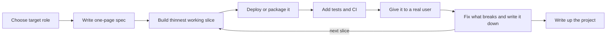
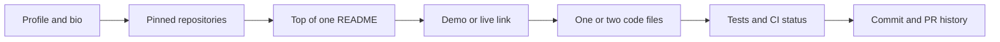
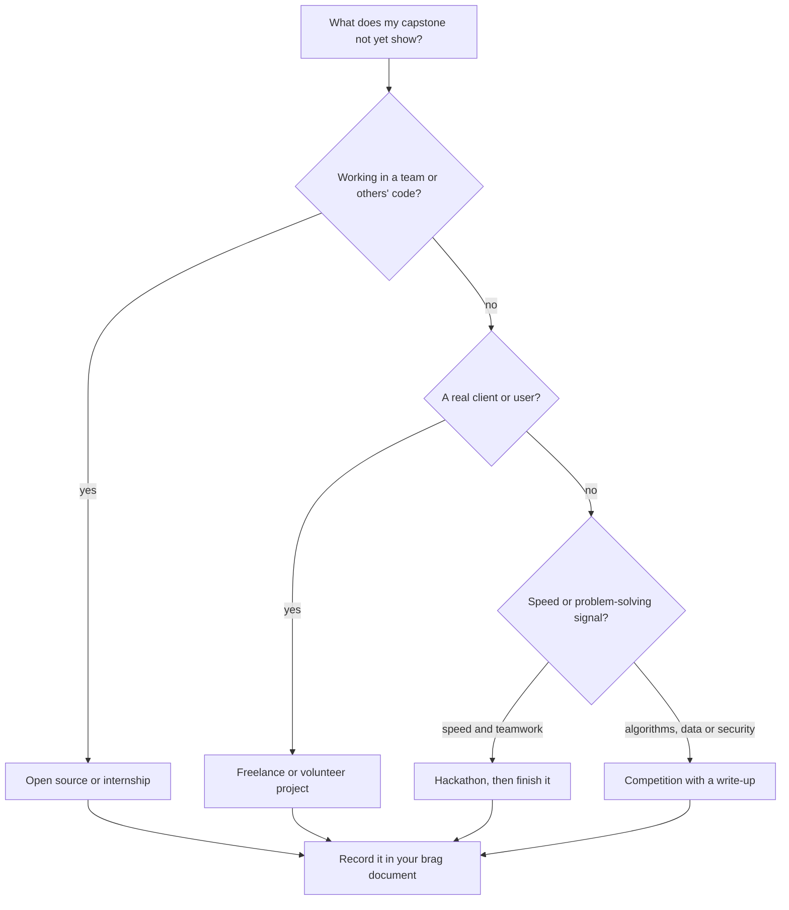

# Module 3 — Proof: the portfolio

*A degree says you studied. A list of languages says you were in the room. Neither tells an employer that you can do the job, and when AI coding agents can produce a tidy demo app in an afternoon, a tidy demo app proves very little. Proof does: work a stranger can open, run, question and trust in a few minutes. This module turns the skills from Modules 1 and 2 into that proof. It starts with the one project that matters most, a capstone built for your target role to a production bar, with a ready-made spec for each role path. It then shows how to present your work so a busy reviewer actually sees it: your GitHub profile, a README that answers the reviewer's questions in order, and short write-ups of your decisions. It ends with experience you can earn before your first job: internships, open source, freelance and volunteer work, hackathons and competitions. You will follow the Najm Bank cohort as Omar swaps 23 course repositories for one service that survives two people booking the last slot, Reem rewrites a README she could not defend, and Mohammed turns his previous career into evidence instead of an apology.*

> **Steps:** Build, Prove — turning what you can do into evidence a stranger can open, run and check in minutes.

---

# 3.1 — Projects that prove you can do the job: one capstone spec per role
*Level: 🟡 Intermediate* · *Prerequisites: 1.1, 1.3, 2.1, 2.2, 2.3, 2.4* · *Step: Build, Prove*

## ⚡ In 60 seconds
- A **proof project** answers one reviewer question: "Can this person do the work of the role, at junior level, without being carried?" A tutorial clone cannot, however polished.
- The rule that matters most: **one deep capstone beats ten shallow repositories.** Depth means a real user, a small scope, a running system, tests, written decisions and evidence that you operated it.
- Pick the capstone for **your target role** (lesson 2.1 to lesson 2.4). A data engineer's proof looks nothing like a front-end developer's.
- Decision cue: before coding, write the **one hard question** your project must answer well, such as "what happens when two people book the last slot at once?" No hard question means it is still a tutorial.
- Biggest trap: shipping agent-built code you cannot explain. Reviewers pick one file and ask "why this way?" Your answer is the proof.

## 🧭 Why it matters
In a mock portfolio review, Khalid, the engineering manager who hires juniors for the Najm Tech Graduate Programme, opens Omar's GitHub: 23 repositories of LeetCode solutions, course assignments, a tutorial to-do app and an untouched fork. After about a minute he says, kindly: "Everything here tells me you can finish a course. Nothing tells me you can do the job. I can't find one thing that runs, one test, or one decision you made yourself."

Reem has the opposite problem: twelve good-looking apps built quickly with AI coding agents. Khalid asks what stops one user of her expense-splitting app from reading another's expenses. Reem opens the code and realises she is reading it for the first time. Khalid's team uses AI tools every day; his point is narrower: "If I hire you, I am trusting you to check what the agent wrote. Show me that you can."

Mohammed, the bootcamp career-switcher, has three projects. One is a class-booking system for the gym where he used to work, used by twenty members for two months, with tests and a short note on a double-booking bug he fixed. Khalid spends ten minutes on it and asks for his CV. That contrast is this lesson.

## 📐 How it works

### 🟢 The essentials

**What a reviewer is trying to learn.** A reviewer has limited time and one question: does this person show the signals the role needs? For most junior roles those are the baseline from lesson 1.1, honest use of AI tools from lesson 1.2 and production thinking from lesson 1.3. A proof project is designed to show those signals where a stranger can check them.

**The proof ladder.** Projects sit on a ladder. Each rung is stronger evidence than the one below.

| Rung | What it is | What it proves |
|---|---|---|
| 1. Tutorial follow-along | You typed what the video typed | That you finished the video |
| 2. Tutorial plus your own feature | You extended it with something not in the tutorial | That you can change code you did not design |
| 3. Your own project | Your problem, your design, your code | That you can make decisions |
| 4. Deployed and reproducible | Anyone can open it, or run it with one command | That you can ship, not only write |
| 5. Used by someone else | A named real user, even a small group | That it solves a problem and survives real input |
| 6. Operated over time | Bugs found in use, fixed, written up; changes released safely | That you can be trusted with a running system |

Many graduate portfolios stop at rung 2 or 3. Reaching rung 5 or 6 with one project sets you apart.

**The six marks of a proof project.** Use these as a checklist:
1. **A real problem and a named user.** "Students in my department waiting for lab slots", not "a booking app".
2. **A small scope.** One core workflow done properly. You can add features later; you cannot add depth later without rewriting.
3. **It runs.** A live link, or a single command such as `docker compose up` that works on a clean machine.
4. **Tests and continuous integration (CI).** Automated tests run on every push, and the badge is green for a reason.
5. **Decisions written down.** Why this database, why this structure, what you chose not to do. Lesson 3.2 shows how.
6. **Evidence of operation.** An error tracker, a log of a bug you found and fixed, a changelog, a rollback you practised.

And one condition that sits over all six: **you can explain every line**, including the lines an AI agent wrote.

**Choosing the problem.** Good problems come from your own life and community (a club, a family business, a department), a public dataset you care about, or an organisation you volunteer for (lesson 3.3). Weak choices are the ones reviewers have seen many times: to-do lists, weather apps, streaming-site clones, the Titanic dataset, handwritten digits. Fine for learning, weak as proof: no real user, no hard question, and a finished answer anyone can copy.

**The build loop.** Build a thin, working slice first and put it in front of someone, then deepen it.



### 🟡 Going deeper

**One capstone spec per role.** Below are five specs, one per role path from Module 2. Change the domain to something you care about; keep the bar.

**Software and full-stack engineer — a booking service for a small organisation**
- *Scope:* a clinic, gym or university lab with limited slots; login, member and admin roles, book and cancel, email confirmation.
- *Production bar:* a relational database with migrations, tests for the booking rules, CI, deployed with an error tracker and uptime check, no secrets in the repository.
- *Hard question:* "Two people press 'Book' for the last slot at the same moment. What happens?"
- *Library path:* [*System Design for Vibe Coders*, lesson 2.6 — Two clicks at once: races, transactions, and idempotent writes](../vibe/index.en.html#l2-6); [*SaaS Building Blocks*, lesson 2.1 — The data layer: Postgres, ORMs, migrations and seeds](../saas/index.html#/2.1).

**AI application engineer — a question-answering assistant over documents you may use**
- *Scope:* a public, permitted text set, such as your university's published regulations or an open-source project's documentation; answers with links to sources, and "I don't know" when the answer is not there.
- *Production bar:* a **golden set** of at least 50 real questions scored on every change, a measured refusal rate on out-of-scope questions, logged cost and response time per query, a tested defence against instructions hidden inside documents.
- *Hard question:* "How do you know a prompt change made it better and not just different?"
- *Library path:* [*AI Product Management: Zero to Hero*, lesson 6.1 — Quality you can measure: metrics, golden sets and error analysis](../aipm/index.html#/6.1); [*Secure AI & Application Security: Zero to Hero*, lesson 8.2 — Prompt injection and jailbreaks, direct and indirect](../secai/index.html#/8.2).

**Data engineer, analyst or data scientist — a pipeline that answers real questions**
- *Scope:* a regularly updated public open-data source (transport, weather, prices); scheduled ingestion, tested transformations, a dashboard that answers three specific questions. Data scientists add a model, a simple baseline to beat and a batch job that scores new data.
- *Production bar:* safe reruns without duplicates, data-quality checks that fail loudly, model results against the baseline written down.
- *Hard question:* "Yesterday's file arrived twice and today's arrived late. What does your dashboard show?"
- *Library path:* [*Data Engineering & Analytics: Zero to Hero*, Module 2 — Ingestion and pipelines](../data/index.html#/2.1); [*Data Engineering & Analytics: Zero to Hero*, Module 3 — Transformation and quality](../data/index.html#/3.2).

**Cloud, platform or DevOps engineer — run an app properly**
- *Scope:* take a small application (yours, or an open-source one) and containerise it, define its infrastructure as code, and build a pipeline that deploys to staging, then production.
- *Production bar:* monitoring with one written service-level objective (SLO), a runbook, a practised rollback, a "game day" write-up of something you broke on purpose, and a cost note with budget alerts on.
- *Hard question:* "The new release is failing for some users. Walk me through the next ten minutes."
- *Library path:* [*Cloud & DevOps: Zero to Hero*, Module 4 — CI/CD and releases](../cloud/index.html#/4.1); [*System Design for Vibe Coders*, lesson 4.4 — Rollback, staging, and release gates](../vibe/index.en.html#l4-4).

**Security engineer — secure an application end to end**
- *Scope:* your own application, or one of the projects above: a threat model with a data-flow diagram, access-control tests, and a pipeline with secret scanning, static analysis and dependency checks.
- *Production bar:* every finding has a severity, a fix or recorded decision, and a test that stops it returning. Practise attacks only on your own systems or a training app such as **OWASP Juice Shop**, never on anything you lack written permission to test.
- *Hard question:* "Which finding would you fix first, and why that one?"
- *Library path:* [*Secure AI & Application Security: Zero to Hero*, lesson 1.1 — Threat modelling: data flows, trust boundaries and STRIDE](../secai/index.html#/1.1); [*Secure AI & Application Security: Zero to Hero*, lesson 6.3 — Securing AI-generated code: what coding agents get wrong](../secai/index.html#/6.3).

**Time, cost and data.** A capstone at this bar takes several weeks of part-time work, not a weekend; lesson 7.1 places it inside a 12-week plan. Free tiers and student credits change, and some projects run up real bills, so check current terms (2026), switch on budget alerts on day one and write down how to tear everything down. Use public, permitted or synthetic data, never real customer, patient or student records. If real users give you personal data, collect the minimum and delete it when you no longer need it. Employers in regulated sectors notice this habit; in Qatar, Law No. 13 of 2016 on personal data protection is a good reason to show it early.

### 🔴 Expert view

**Decision density.** A strong portfolio has many *real* decisions a reviewer can question. A to-do app has almost none. Omar's rebuilt booking service has many: a constraint versus a lock against double bookings, what happens when email is down, how long to keep cancelled bookings. Each is an interview topic you have already prepared.

**Breadth around depth.** A good shape is one capstone plus one or two smaller pieces that show range, such as an open-source contribution (lesson 3.3).

**Building with AI agents, in the open.** Using AI coding agents is normal; hiding it is not. Reviewers want your judgement: the spec you gave the agent, the tests that checked its work, the bugs you caught. A short "How this was built" section (lesson 3.2) saying which parts were agent-assisted and how you verified them beats pretending you typed everything. See [*System Design for Vibe Coders*, lesson 9.4 — Verification before completion](../vibe/index.en.html#l9-4).

**Team projects.** A group project is strong proof if you are precise about your part: "Built the reconciliation job and its tests; teammates built the front end" is honest and checkable in the commit history.

**Local advantage.** In the Gulf market, proper handling of Arabic text and right-to-left layout, or banking-style care for data protection and audit trails, stands out because many portfolios ignore both. See [*System Design for Vibe Coders*, lesson 11.2 — Internationalization and RTL](../vibe/index.en.html#l11-2).

## 🧰 The toolkit
| Resource, tool or template | What it is and does | When to reach for it |
|---|---|---|
| **Project spec (one page)** | A short document: problem, user, thin slice, production bar, hard question, data, timeline | Before writing any code; when scope starts to grow |
| **The Twelve-Factor App** (Heroku authors) | A classic short guide to building apps that deploy and configure cleanly | Setting up configuration, logs and deployment for a web capstone |
| **OWASP Juice Shop** | A deliberately vulnerable web application for legal security practice | Security capstones and learning attacks on your own machine |
| **Public open-data portals** | Government, city and international-organisation sites that publish datasets with a licence | Finding real, permitted data for data and AI projects |
| **Golden set** | A fixed list of inputs with expected outputs, scored on every change | Any AI or ML capstone where "it seems better" is not evidence |
| **Error tracker** (for example Sentry) | A service that records errors from your running app with context | From the first deploy of any user-facing project |
| **Budget alerts** | Cloud billing alerts that warn you before spending passes a limit | The day you create any cloud account |

## 🏛️ In practice at Najm Bank
The Najm Tech Graduate Programme asks candidates at the technical stage to bring one project with a one-page **Proof project spec**. Khalid uses it to prepare questions. Here is Omar's, rewritten after his review.

| Field | Omar's answer |
|---|---|
| Target role | Software engineer (lesson 2.1) |
| Problem and user | My university's electronics lab books 12 workbenches on a paper sheet, and students double-book. Users: the lab supervisor and about 60 final-year students. |
| Thinnest slice | Students log in with university email, see free benches for the week, book one two-hour slot, cancel it. |
| Production bar | PostgreSQL with migrations; unique constraint on bench and slot; tests for booking rules; CI on every push; deployed with error tracking and an uptime check; secrets in environment variables. |
| The hard question | Two students book the last bench at the same moment. Answer: a database constraint, and a clear "just taken" message. Tested with a concurrent test. |
| Data | Name, university email, bookings. Bookings older than one semester deleted automatically. No other personal data. |
| Out of scope | Payments, mobile app, recurring bookings. |
| AI assistance | Agent used for scaffolding and forms; booking logic and tests written and reviewed by me; two agent bugs found and fixed, listed in the README. |
| Evidence | Live link, repository, CI history, one incident note, three-minute demo video. |
| Timeline | Weeks 1–2 thin slice live; weeks 3–4 tests, CI, monitoring; weeks 5–6 real use by the lab and fixes. |

Khalid's verdict: "Now I have six things to ask you, and you know the answers."

## 🛠️ Exercises
- 🟢 Audit your current repositories against the proof ladder. Give each one a rung from 1 to 6 and mark the single best candidate for a capstone. *Done when:* you have a table of every public repository with its rung, and one repository (or one new idea) circled as your capstone.
- 🟡 Fill in the Proof project spec above for your target role, using the matching capstone spec from 🟡 Going deeper. *Done when:* a peer or mentor can read the spec in two minutes and tell you what you are building, for whom, and what will be hard about it.
- 🔴 Ship the thinnest slice of your capstone, reachable or reproducible with one command, with at least one test in CI and a real user who has tried it. *Done when:* the live link or one-command setup works on someone else's machine, CI is green, and you have written down one thing your first user did that you did not expect.

## ⚠️ Mistakes and traps
- **Quantity over depth.** Twenty shallow repositories hide your best work. Build one deep capstone and pin it; archive or unpin the rest.
- **Picking the stack first.** A fashionable framework without a problem gives a demo with no user. Write the spec, then pick the simplest stack that meets it.
- **Shipping what you cannot explain.** AI agents make it easy to build past your understanding. Read and test every part, and be ready to explain any file.
- **Using real personal data.** Real customer or patient records in a project are a serious mistake. Use public, permitted or synthetic data.
- **Never finishing.** A capstone that is 80% done and never deployed proves less than a smaller one that runs. Cut scope until it ships, then deepen.

## 🧾 Recap
- A proof project shows the signals of your target role where a stranger can check them; tutorial clones cannot.
- Climb the proof ladder: your own project, deployed, used by a real person, operated over time.
- Use the six marks, and be able to explain every line, including what an agent wrote.
- Each role has a different capstone; anchor yours on a hard question you can answer well.
- Use AI agents openly, show how you verified their work, and use safe data.

## ✍️ Check yourself

**1. Omar has 23 repositories: course assignments, LeetCode solutions and tutorial apps. He has four weeks before applications open. What should he do first?**

- A. Add a LeetCode solution every day so his profile shows steady activity
- B. Pick one capstone for his role, spec it around a hard question and ship a thin slice
- C. Delete every old repository so that only his best course projects remain
- D. Port his three best tutorial apps to a newer framework and pin them

<details><summary>Answer</summary>

**B.** One deep project for the target role is the strongest proof he can build in the time. A adds activity without job signals; C is unnecessary, as unpinning is enough; D stays low on the proof ladder. (🟢 The essentials; 🔴 Expert view.)

</details>

**2. Which project sits highest on the proof ladder?**

- A. A polished streaming-site clone with a custom design, built by following a popular video course
- B. A tutorial to-do app extended with dark mode and offline storage the tutorial did not cover
- C. An original, accurate image classifier, trained and evaluated in a notebook never run outside it
- D. A booking tool twenty gym members used for two months, with a note on a bug found and fixed

<details><summary>Answer</summary>

**D.** It is deployed, used by real people and operated over time, which is rung 6. C is an original project (rung 3) but never ran for anyone; B is rung 2 and A rung 1, however polished. (🟢 The essentials.)

</details>

**3. Huda is building a data capstone. Which "hard question" best fits the data role?**

- A. "Which chart library looks the most modern?"
- B. "How many rows can my notebook load?"
- C. "Yesterday's file arrived twice and today's arrived late. What does my dashboard show?"
- D. "Can I add a login page?"

<details><summary>Answer</summary>

**C.** Reruns, duplicates and late data are everyday pipeline problems, and handling them is the proof data interviewers look for. A and D are cosmetic here; B is a laptop limit, not a production question. (🟡 Going deeper.)

</details>

**4. Reem built most of her capstone with an AI coding agent. What is the best way to present it?**

- A. Say nothing about the agent, since reviewers may assume she does not understand the code
- B. Add a "How this was built" section on what the agent did and how she checked it, and know every file
- C. Remove every agent-written part and rebuild it by hand, so the project is her unaided work
- D. List the agent as a co-author in the README and say nothing more about how the code was checked

<details><summary>Answer</summary>

**B.** Honest disclosure plus evidence of verification is what reviewers want. A is a misrepresentation that unravels in the first technical question. C wastes time; verifying the code matters more than who typed it. D discloses the tool but shows none of the verification the reviewer is testing for. (🔴 Expert view.)

</details>

**5. Yousef wants to show cloud and platform skills. Which capstone fits best?**

- A. A small app he runs with infrastructure as code, staged deploys, an SLO, a practised rollback and a cost note
- B. Three associate-level cloud certifications on his profile, with no project that uses what they cover
- C. A detailed blog series comparing the compute, storage and network services of the main cloud providers
- D. A polished front-end portfolio site on a free hosting platform, with a custom domain and HTTPS

<details><summary>Answer</summary>

**A.** It shows a platform engineer's daily work: deploying safely, observing, controlling cost. B is a useful extra signal but not proof of operating anything; C and D show other skills. (🟡 Going deeper.)

</details>

## 📚 References
- The Twelve-Factor App — https://12factor.net/
- OWASP Juice Shop — https://owasp.org/www-project-juice-shop/
- GitHub Actions documentation — https://docs.github.com/en/actions
- [*System Design for Vibe Coders*, lesson 2.6 — Two clicks at once: races, transactions, and idempotent writes](../vibe/index.en.html#l2-6)
- [*System Design for Vibe Coders*, lesson 9.4 — Verification before completion](../vibe/index.en.html#l9-4)

---

# 3.2 — Your GitHub, READMEs and writing about your work
*Level: 🟡 Intermediate* · *Prerequisites: 1.1, 3.1* · *Step: Prove*

## ⚡ In 60 seconds
- Reviewers do not read your code first. They skim your profile, open one pinned repository, read the top of its README and then look at one or two files. **Design for the skim.**
- The rule that matters most: a README answers the reviewer's questions **in the order they ask them**: what is it, does it work, how is it built, why these choices, what did you learn.
- Your **commit history, tests and written decisions** are evidence too. "fix", "fix2", "final" tells a story; so does a clean pull request with a clear description.
- Decision cue: hand your repository to someone who has never seen it. If they cannot say what it does and run it within five minutes, the README is not done.
- Biggest trap: a committed secret, such as an API key in a `.env` file. Deleting the file is not enough; the key must be revoked and replaced.

## 🧭 Why it matters
Tariq, the engineering lead who runs technical interviews at Najm Bank, is preparing for Reem's interview. Her pinned capstone, a study-planner assistant, has a README of four lines: the project name, "Built with Next.js, Supabase, Tailwind and an AI agent", and `npm install && npm run dev`. There is no description, no screenshot and no live link. The history has 140 commits made in two days, most called "update" or "fix". And in an early commit there is a `.env` file with a real API key.

Tariq can still interview Reem, but he now walks in with doubts instead of questions. Huda has a quieter version of the same problem: three excellent notebooks with no README at all, cells that only run in a certain order, and a dataset loaded from a path on her own laptop. Dana, the lead data scientist, cannot run any of them.

Neither problem is about skill. Both are about presentation and hygiene, which hiring teams read as signals of how you will behave on a real team, where other people must read, run and trust your work. This lesson makes your work easy to see and safe to share.

## 📐 How it works

### 🟢 The essentials

**How a reviewer skims.** Recruiters, engineers and managers usually follow the same path, and stop as soon as they lose confidence or find what they need:



Each step is a place to win or lose them. Make the first three effortless.

**Your profile.** On GitHub (or GitLab, or wherever your code lives):
- A clear name and a one-line bio that names your target role: "Graduate software engineer. Building reliable web services. Doha."
- **Pin** four to six repositories, capstone first (lesson 3.1). Unpin or archive coursework that buries it.
- Optionally, a **profile README**: on GitHub, a public repository with the same name as your username whose README appears at the top of your profile. Three or four lines are enough: what you build, your capstone link, how to contact you.
- A link to your LinkedIn profile or personal site (lesson 4.2).

**A README that answers the reviewer.** Weak and strong versions of the same project:

```markdown
<!-- Weak -->
# study-planner
Built with Next.js, Supabase, Tailwind and an AI agent.
npm install && npm run dev
```

```markdown
<!-- Strong (top section) -->
# Study Planner: turns a course syllabus into a weekly plan
Final-year students paste a syllabus; the app proposes a week-by-week plan
and reminds them before deadlines. Used by 14 classmates for one semester.

Live demo: <link>  ·  3-minute video: <link>  ·  CI: passing

### How it works
<architecture diagram: browser, API, database, model provider, email>

### Run it locally
cp .env.example .env   # add your own keys
docker compose up      # app on http://localhost:3000
make test              # 42 tests, about 20 seconds
```

The strong version answers "what is it, for whom, does it work, can I run it" before the reviewer scrolls.

**The sections, in order.** Use this as your **Project README template**:
1. **Title and one-line description**, problem first.
2. **Who it is for and the problem it solves.**
3. **Demo**: live link, screenshots or a short GIF, a video of two to three minutes.
4. **How it works**: a simple architecture diagram and a paragraph. See [*System Design for Vibe Coders*, lesson 1.1 — Draw the boxes before the agent writes the code](../vibe/index.en.html#l1-1).
5. **Run it locally**: commands that work on a clean machine, plus an `.env.example` with placeholder values.
6. **Tests and quality**: how to run tests, what they cover, the CI status.
7. **Decisions and trade-offs**: three to five choices and why, linked to decision records.
8. **How this was built**: which parts were AI-assisted and how you verified them.
9. **Known limitations and next steps**: honest and specific.
10. **Licence.**

**Secrets: the one mistake that is not cosmetic.** A key committed to a public repository can be found by automated scanners soon after it is pushed. If it happens:
1. **Revoke or rotate the key first**, at the provider. That is what actually stops misuse.
2. Then clean the history if you want to, and check usage and billing for anything you did not do.
3. Prevent a repeat: put `.env` in `.gitignore`, commit an `.env.example`, and add a secret scanner such as **gitleaks** as a pre-commit hook.

See [*System Design for Vibe Coders*, lesson 5.7 — Secrets and configuration: the keys to the kingdom](../vibe/index.en.html#l5-7) and [*Secure AI & Application Security: Zero to Hero*, lesson 5.2 — Secrets management: keys, tokens and where they leak](../secai/index.html#/5.2).

### 🟡 Going deeper

**Commit history as evidence.** Reviewers rarely read every commit, but they do glance at the history, and it tells them how you work. Small commits with clear messages suggest someone who can work in a team's codebase.

| Weak | Strong |
|---|---|
| `update` | `feat(booking): reject bookings for slots in the past` |
| `fix` | `fix(auth): expire sessions after 30 minutes of inactivity` |
| `final final 2` | `test(booking): add concurrent booking test for last slot` |
| `stuff` | `docs: add ADR 003 on choosing a unique constraint over locks` |

The strong column follows **Conventional Commits**, a widely used convention of a type (`feat`, `fix`, `docs`, `test`, `refactor`), an optional scope and a short description. You do not have to adopt it, but some consistent convention helps.

Even when working alone, open **pull requests** against your own main branch for meaningful changes: a description of what changed and why, the CI run, and a note on how you tested it. A reviewer who opens three of these sees exactly what working with you would look like. If you use AI agents, the pull request is the natural place to note what the agent produced and what you checked.

**Architecture decision records.** An **architecture decision record (ADR)** is a short file, often in `docs/adr/`, that records one decision: the context, the decision, and its consequences. The format is usually credited to Michael Nygard. Omar's ADR 003 is about 150 words: double bookings were possible; options were an application-level check, a database lock or a unique constraint; he chose the constraint because it holds even if two requests arrive at once; the cost is a less friendly error, handled in the interface. In an interview, that file becomes a five-minute answer he has already rehearsed.

**Notebooks and data projects.** For Huda and every data candidate:
- Make **Restart and run all** succeed from a clean start.
- Pin dependencies in `requirements.txt` or an environment file.
- Explain how to get the data: a download script, a link to the public source and its licence, or a small sample committed to the repository. Never commit personal or confidential data.
- Put the conclusion at the top in plain words, with the key chart, before the code.
- Move reusable logic out of cells into functions or modules with tests, which is the first step toward a pipeline. See [*Data Engineering & Analytics: Zero to Hero*, Module 5 — Data science and ML in production](../data/index.html#/5.1).

**Writing about your work.** A short **project write-up** (a case study or blog post) reaches people who will never open your repository, including recruiters. A useful shape, 600 to 1,200 words:
1. The problem and who had it.
2. The constraints: time, money, data, your skills.
3. What you built, with one diagram.
4. What broke, and how you found and fixed it. This is the most-read part.
5. What you measured, with the conditions. "Search fell from about 2 seconds to under 200 ms on my laptop with one million synthetic rows" is honest; "blazing fast" is not.
6. What you would do differently.

Publish it on a personal site, a developer blogging platform or as a LinkedIn article (lesson 4.2), and link it from the README. In the Gulf market, a short Arabic summary next to the English write-up shows bilingual technical communication, which many employers value.

**Licences.** Without a licence file, others have no clear right to reuse your code. Pick a common open-source licence with **Choose a License** if you want reuse, and respect the licences of everything you use, including datasets and model outputs where terms apply.

### 🔴 Expert view

**The contribution graph is not a score.** The grid of green squares on a GitHub profile counts activity, not quality. Experienced reviewers know it can be gamed and that much real work happens in private repositories. Do not manufacture commits to fill it. A reviewer who sees 300 commits in one evening called "update" learns something, just not what you hoped.

**Writing is the job.** Engineers spend a large share of their time writing: pull request descriptions, design documents, incident notes, tickets, messages to colleagues. A portfolio that contains clear writing predicts that you will do this well. It also helps in interviews, because writing a decision down forces you to understand it. Reem found that writing the "How this was built" section was the fastest way to discover which parts of her code she could not yet explain.

**Honest numbers and honest scale.** Never inflate users, traffic or results. "Used by 14 classmates" is credible and checkable; "used by thousands" invites a question you cannot answer. State the conditions of any measurement, and say what you did not test.

**Work you cannot show.** Internship and freelance code often belongs to someone else. Do not publish it without written permission. Instead, describe the problem, your part and the outcome in a write-up without confidential details, or rebuild a small, generic version of the technique on public data and say so.

**Accessible and readable.** Use plain language, headings, alt text on images and diagrams that also make sense as text. Many reviewers read on a phone between meetings.

## 🧰 The toolkit
| Resource, tool or template | What it is and does | When to reach for it |
|---|---|---|
| **GitHub profile README** | A README from a repository named after your username, shown at the top of your profile | Setting up your profile; pointing reviewers to your capstone |
| **Project README template** | The ten sections above, in the order reviewers ask | Every pinned repository |
| **Conventional Commits** | A lightweight convention for commit messages: type, optional scope, description | From your next commit on any portfolio project |
| **Architecture decision record (ADR)** | A short file recording one decision: context, decision, consequences | Each significant choice in your capstone |
| **Mermaid** | Text-based diagrams that render on GitHub and many documentation sites | Architecture and flow diagrams that live next to the code |
| **gitleaks** | Open-source scanner that finds secrets in files and git history | A pre-commit hook, and one scan of your full history today |
| **Choose a License** | A GitHub-run guide to common open-source licences | Before you make a repository public |

## 🏛️ In practice at Najm Bank
Khalid and Tariq use a 10-minute **portfolio review rubric** before graduate interviews. They share it with candidates in advance, because the programme wants to see people's best work, not to catch them out.

| Criterion | 0 | 1 | 2 |
|---|---|---|---|
| Clarity | Cannot tell what it does | Clear after reading code | Clear from the first three lines of the README |
| Runs | Could not run it | Ran with effort or fixes | Live link or one command worked |
| Tests and CI | None | Some tests, not in CI | Meaningful tests running in CI |
| Decisions | None written | Mentioned in the README | Trade-offs explained, with ADRs or a write-up |
| History | Bulk dumps, "update" | Mixed | Small commits, clear messages, some pull requests |
| AI and integrity | Undisclosed, cannot explain | Disclosed, partly explained | Disclosed, with verification evidence |
| Hygiene | Secrets or personal data committed | Minor issues | Clean, `.env.example`, licence |

Reem's capstone scored 3 of 14 before her rewrite. She rotated the leaked key first, then rewrote the README in the template order, recorded a three-minute demo, added an ADR on how sessions are stored, wrote a "How this was built" section listing two agent-written bugs she had found, and opened her next three changes as pull requests. Second review: 12 of 14. Tariq's interview notes changed from "check whether she wrote this" to "ask about ADR 002."

## 🛠️ Exercises
- 🟢 Fix your profile: a one-line bio naming your target role, four to six pinned repositories with your capstone first, coursework unpinned or archived, and a three-line profile README. *Done when:* a friend can open your profile and, within 30 seconds, name your target role and click through to your capstone.
- 🟡 Rewrite your capstone README using the ten-section template, with an `.env.example` and a working "Run it locally" section. Then run the five-minute test with someone who has never seen it. *Done when:* they can say what it does and get it running (or open the live demo) within five minutes without asking you anything, and you scored it 10 or more on the Najm rubric.
- 🔴 Run gitleaks over the full history of every public repository and rotate anything it finds. Then write one ADR for your capstone's most important decision and a 600 to 1,200-word project write-up, published and linked from the README. *Done when:* the scan report shows no live secrets, the ADR is in `docs/adr/`, and the write-up is online with a "what broke" section.

## ⚠️ Mistakes and traps
- **A README that lists the tech stack and nothing else.** Reviewers want the problem, the user and proof it works. Lead with those; the stack goes lower down.
- **Deleting a leaked key's commit and moving on.** The key may already be copied. Revoke or rotate it at the provider first, then clean up and add a scanner.
- **Gaming the green squares.** Fake activity is easy to spot and says nothing about skill. Let real, steady work show.
- **Inflated claims.** "Used by thousands" or unconditioned speed numbers collapse under one question. Use checkable numbers with their conditions.
- **Publishing an employer's or client's code.** That breaks trust and possibly contracts. Get written permission, or write about the work without the code.

## 🧾 Recap
- Design for the skim: profile, pinned repositories, the top of the README.
- Order README sections the way reviewers ask: what, for whom, does it work, how to run it, how it is built, why these choices, how AI was used, limits.
- Commits, pull requests, ADRs and write-ups are evidence of how you work with others.
- Secrets in history are a security incident: rotate first, then clean and prevent.
- Write honestly about scale, results and AI assistance; never publish work that is not yours to share.

## ✍️ Check yourself

**1. Reem finds an API key in an early commit of her public repository. What should she do first?**

- A. Delete the `.env` file in a new commit and add `.env` to `.gitignore`
- B. Make the repository private at once so that no new visitors can see the key
- C. Revoke or rotate the key at the provider, then check usage and clean up
- D. Rewrite the git history with a cleaning tool so the key disappears from every commit

<details><summary>Answer</summary>

**C.** Once a key has been public it may already be copied; only revoking it stops misuse. A, B and D hide the key from future visitors but leave the old key working. Cleaning the history is a fine second step. (🟢 The essentials.)

</details>

**2. Which README opening best serves a reviewer skimming between meetings?**

- A. The problem and user in one line, a sentence on real use, then demo, video and CI links
- B. A complete list of the frameworks, libraries and cloud services used, with their versions
- C. A personal story of why the author learned to code and what the project means to them
- D. Only the install and run commands, so a reviewer can start the project as fast as possible

<details><summary>Answer</summary>

**A.** It answers "what is it, for whom, does it work" first. B and D are useful lower down; C belongs elsewhere, if anywhere. (🟢 The essentials.)

</details>

**3. Huda's notebooks only run if cells are executed in a particular order and load data from her laptop. Which fix matters most for a reviewer like Dana?**

- A. Add more charts and a summary table so the conclusions are easier to see
- B. Convert the notebooks into a slide deck that walks Dana through the results
- C. Rename and number the notebooks so the intended running order is obvious
- D. Make "Restart and run all" work, pin dependencies and explain how to get the data

<details><summary>Answer</summary>

**D.** A reviewer must be able to reproduce the work; that is the minimum for trust in a data project. A and B change presentation, not whether the work runs; C labels the problem without fixing it, since the cells still depend on order and the data still lives on her laptop. (🟡 Going deeper.)

</details>

**4. Omar wants to show why he used a unique database constraint to prevent double bookings. What is the best place to record it?**

- A. A long comment above every booking query, explaining the constraint each time
- B. A short ADR with the context, decision and consequences, linked from the README
- C. A commit message on the migration that adds it, saying "add unique constraint"
- D. Nowhere in the repository; he will explain the reasoning in the interview if asked

<details><summary>Answer</summary>

**B.** An ADR is brief, findable and becomes a rehearsed interview answer. A scatters it; C records what, not why; D wastes a chance to show judgement before the interview. (🟡 Going deeper.)

</details>

**5. Mohammed built a reporting tool during a freelance job. The client owns the code. How should he use it in his portfolio?**

- A. Publish the code on his GitHub, since he wrote every line of it himself
- B. Leave it out of his portfolio and CV entirely, because he cannot show the code
- C. Unless the client agrees in writing, describe his part and the outcome, or rebuild a generic version
- D. Publish it under a different project name, with the client's name and branding removed

<details><summary>Answer</summary>

**C.** It keeps the evidence while respecting the client's ownership. A and D break trust and possibly the contract; B throws away real experience he can describe honestly. (🔴 Expert view.)

</details>

## 📚 References
- GitHub Docs, Managing your profile README — https://docs.github.com/en/account-and-profile
- Make a README — https://www.makeareadme.com/
- Conventional Commits — https://www.conventionalcommits.org/
- Architecture decision records (ADR GitHub organisation) — https://adr.github.io/
- Mermaid documentation — https://mermaid.js.org/
- gitleaks — https://github.com/gitleaks/gitleaks
- Choose a License — https://choosealicense.com/
- [*System Design for Vibe Coders*, lesson 5.7 — Secrets and configuration: the keys to the kingdom](../vibe/index.en.html#l5-7)

---

# 3.3 — Experience before your first job: internships, open source, freelancing, hackathons and competitions
*Level: 🟡 Intermediate* · *Prerequisites: 3.1, 3.2* · *Step: Build, Prove*

## ⚡ In 60 seconds
- "Entry-level, one year of experience required" is frustrating but common. You can earn real experience before your first job: **internships, open-source contributions, freelance or volunteer work, hackathons, competitions, research and teaching.**
- The rule that matters most: experience counts when **someone else depended on your work**: a maintainer merged it, a client used it, a team shipped it, a judge scored it.
- Each route proves something different. Choose by the signal you lack and your constraints (time, money, location).
- Decision cue: if you can only do one thing in the next eight weeks, pick the route that adds a signal your capstone (lesson 3.1) does not already show.
- Biggest trap: low-effort volume. Spamming open-source projects with trivial or AI-generated pull requests, or collecting hackathon certificates for unfinished demos, can hurt more than it helps.

## 🧭 Why it matters
Mohammed finds a junior developer role at Sadeem Pay, a Doha fintech startup, that asks for "one to two years of experience". He nearly skips it. He has no degree in the field and no developer job on his CV, and he thinks of his eight years managing a gym as a gap to explain. Khalid, reviewing his CV in a mentoring session, disagrees: "You built a booking system that twenty members used, you ran operations, and you dealt with real customers. That is experience. You just haven't written it as experience."

Huda has the opposite worry. She has a strong degree but has only ever worked alone on coursework and Kaggle notebooks. She wants proof that she can work in someone else's codebase, take review and finish things with a team. Yousef wants evidence for cloud roles but has no money for a large cloud bill. Each of them needs experience, and each needs a different route to it. This lesson is the map.

## 📐 How it works

### 🟢 The essentials

**What "experience" means to a hiring team.** Behind an experience requirement, a hiring team usually wants evidence that you have worked with other people's code and other people's expectations; you have received feedback and acted on it; you have finished something someone relied on; you have behaved professionally when things went wrong. A paid job is one way to show that, not the only one. Many teams treat requirements like "one to two years" as a guide rather than a hard rule, so if you match most of an advert and can show this evidence, apply (lesson 4.3 covers where and how).

**The routes at a glance.**

| Route | What it proves best | Typical cost | How to show it |
|---|---|---|---|
| **Internship** | Working inside a real team, with real process | Time; sometimes relocation | CV entry, manager reference, a write-up without confidential details |
| **Open-source contribution** | Reading a large unfamiliar codebase, taking code review, public collaboration | Time only | Links to merged pull requests and issue discussions |
| **Freelance or volunteer project** | Working with a real client: scoping, deadlines, handover | Time; some admin | Client reference, live system, case study |
| **Hackathon** | Speed, teamwork, scoping under pressure | A weekend | Finished, deployed project and your specific part |
| **Competition** (algorithms, data, security) | Problem-solving under rules and time limits | Time | Ranking or results, plus a write-up of your approach |
| **Research or teaching assistant** | Depth, rigour, explaining ideas to others | Time; often paid | Supervisor reference, paper, course materials |
| **Previous career** | Professional habits, domain knowledge, dealing with customers | Already earned | CV entries written as outcomes, linked to technical work |

**Choosing your route.** Start from the signal you are missing, then check your constraints:



**Keep a brag document.** A **brag document** is a private running list of what you did, with dates, links and outcomes. Update it weekly. When you write your CV (lesson 4.1) or prepare interview stories (lesson 5.1), you will draw from it instead of your memory. One entry looks like this:

```text
2026-09-14  Open source: fixed date parsing for Arabic month names in <library>.
            Issue #<n>, PR #<n> merged after two rounds of review.
            Learned: the project's test fixtures; how to write a failing test first.
            Proof: <link to merged PR>
```

### 🟡 Going deeper

**Internships.** Internships are the most direct route, because they are designed as a trial run for both sides.
- *Timing:* large employers often recruit many months before the internship starts. Check each employer's careers page early in the academic year, and ask your university career centre for its calendar.
- *Where:* banks, energy companies, telecoms, government agencies and multinationals' regional offices run internships and graduate programmes across the Gulf; startups hire interns less formally, often through networks (lesson 4.2). Some programmes are tied to workforce nationalisation schemes such as Qatarization in Qatar or Emiratisation in the UAE, and may be open only to citizens or have their own rules.
- *If you are an international student or graduate:* the rules on working during and after study vary by country and change. Check current rules with your university and official government sources before you apply.
- *Making it count:* agree a project with a visible result, ask for feedback halfway through, write your brag document weekly, and ask at the end whether your manager will act as a reference.

**Open source.** Contributing to an existing open-source project is the best route for showing you can work in a codebase you did not design, with people you have never met. A sensible path:
1. Pick a project **you already use**, with recent activity and responsive maintainers.
2. Read its `CONTRIBUTING` file, code of conduct and any **policy on AI-generated contributions**. Some projects now have explicit rules.
3. Start small: reproduce a reported bug, improve documentation, add a missing test. Labels such as "good first issue" mark tasks maintainers have set aside for newcomers.
4. Comment on the issue before you start, so two people do not do the same work.
5. Open a small, focused pull request that follows the project's style, explains the change and includes a test.
6. Respond to review politely and quickly. The review conversation itself is evidence.

Structured programmes can help. **Google Summer of Code** pays contributors to work on a project with an open-source organisation and a mentor; its eligibility has widened in recent years, so check the current rules. **Outreachy** offers paid, remote open-source internships for people who face under-representation or systemic bias in tech. **Hacktoberfest**, run each October, encourages contributions; after maintainers reported floods of low-quality pull requests in 2020, the organisers changed the rules so that projects opt in. Treat that history as a warning.

**Freelance and volunteer work.** Building something for a real client, such as a small business, a charity, a mosque committee or a university department, proves what no course can: turning a vague request into working software and keeping a promise. Paid freelance marketplaces exist, but entry-level work there is very competitive at the time of writing (2026), so personal networks and volunteering are often the faster start. Protect yourself and the client:
- **Write down the scope**: what you will deliver, by when, what is out of scope, who owns the code, and what happens after handover.
- **Keep the system simple to run.** Prefer managed services the client can keep paying for without you.
- **Do not handle card details yourself.** Use an established payment provider's hosted checkout.
- **Treat personal data seriously.** Collect the minimum, secure it and agree who is responsible. In Qatar, Law No. 13 of 2016 on personal data protection applies to processing personal data; similar laws exist across the region and in the EU.
- **Ask permission** before you show the work publicly (lesson 3.2).

**Hackathons.** Hackathons are good for speed, teamwork and meeting people, including sponsors' engineers who sometimes hire. Their weakness is that many projects are abandoned on Sunday night. The value comes from what you do next: finish the core feature, deploy it, add tests and a README, and write up your part. Read the event's rules on who owns the code, especially at corporate-sponsored events. Major League Hacking (MLH) lists many student hackathons; universities, banks, telecoms and government innovation programmes in the Gulf also run them.

**Competitions.**
- *Algorithms:* contests such as the **ICPC** (International Collegiate Programming Contest) and online judges build the problem-solving that data-structures-and-algorithms interviews test (lesson 5.2). A regional ranking is a recognised signal for software roles.
- *Data:* **Kaggle** competitions teach modelling under a clear metric. Reviewers value an honest write-up of your approach, including what did not work, more than a leaderboard position. Pair it with the pipeline habits from lesson 3.1.
- *Security:* capture-the-flag (CTF) contests, such as the beginner-friendly **picoCTF**, build practical skills; CTFtime lists events. Only ever attack systems the contest provides. Responsible-disclosure and bug-bounty programmes are a later step, strictly within their published scope; see [*Secure AI & Application Security: Zero to Hero*, lesson 10.3 — Vulnerability management, disclosure and bug bounties](../secai/index.html#/10.3).

**Research and teaching.** Research assistant posts show depth and rigour, and are especially useful for data science and AI roles; a short paper or poster is strong proof. Teaching assistant work shows you can explain ideas, which interviewers test constantly. Both come with a supervisor who can act as a reference.

### 🔴 Expert view

**A previous career is experience.** Career-switchers often hide their past. Mohammed's eight years at the gym included scheduling staff, handling complaints and running the front desk system, which is domain knowledge, customer empathy and operational discipline. Written as outcomes and linked to his booking system, it becomes the reason a team might choose him over a graduate with no work history. The same applies to an accountant moving into data or a network technician moving into cloud.

**Depth over badges.** One merged pull request with a real review conversation beats twenty typo fixes. One finished hackathon project beats five participation certificates. Reviewers increasingly see bulk, low-effort contributions, including AI-generated pull requests to open-source projects, which maintainers have publicly complained about. Use AI tools to help you understand a codebase, then submit only changes you have tested and can defend line by line.

**Combine routes into one story.** The strongest early-career profiles connect their experience. Huda contributes a fix to an open-source data-quality library she uses in her capstone pipeline, and writes up both. Yousef volunteers to move his university society's website to a container platform with a pipeline, monitoring and a cost note, which doubles as his capstone. A reviewer sees one direction, not scattered activity.

**Cheap routes to cloud experience.** Cloud experience does not require a big bill. Free tiers, student credits, local Kubernetes clusters on a laptop and a homelab of old machines can cover most junior-level skills, provided you switch on budget alerts and tear things down. See [*Cloud & DevOps: Zero to Hero*, Module 1 — Foundations](../cloud/index.html#/1.2).

## 🧰 The toolkit
| Resource, tool or template | What it is and does | When to reach for it |
|---|---|---|
| **Brag document** | A private, dated list of what you did, with links and outcomes | Weekly, from today; before every CV update and interview |
| **"good first issue" label** | A label many open-source projects use to mark tasks suited to newcomers | Finding a first contribution in a project you use |
| **Google Summer of Code** | A programme that pays contributors to work on open-source projects with mentors | Structured, mentored open-source experience; check current eligibility |
| **Outreachy** | Paid, remote open-source internships for people under-represented in tech | If you are eligible and want a mentored internship |
| **Kaggle** | Data science competitions, datasets and shared notebooks | Practising modelling under a clear metric; data portfolios |
| **ICPC** | The International Collegiate Programming Contest, with regional rounds | Algorithmic problem-solving with a recognised result |
| **picoCTF** | A free, beginner-friendly capture-the-flag security competition | Starting security practice legally |
| **Freelance scope agreement** | A one-page written agreement of deliverables, dates, ownership and handover | Before any freelance or volunteer project |

## 🏛️ In practice at Najm Bank
In the programme's second mentoring session, each cohort member fills in an **experience plan**: the signal missing from their portfolio, the route, the first step and the proof expected by week 8.

| Graduate | Missing signal | Route | First step this week | Proof by week 8 |
|---|---|---|---|---|
| Omar | Working in someone else's codebase | Open source: the web framework his capstone uses | Read CONTRIBUTING; reproduce one open bug | One merged pull request with review, written up |
| Huda | Production data work with a team | Open source data-quality library, plus a volunteer dashboard for a charity | Agree scope in writing with the charity | Merged fix; dashboard in use; case study |
| Yousef | Operating cloud infrastructure | Volunteer: university society website migration | Budget alerts on; write the migration plan | Running site with pipeline, monitoring, cost note |
| Reem | Explaining and defending her code under review | Open source in an AI framework she uses, small changes only | Read the project's AI contribution policy | Two merged pull requests she can explain line by line |
| Mohammed | Turning a previous career into evidence | Previous career, plus a freelance job for a local clinic | Rewrite gym experience as outcomes in his brag document | CV entries with outcomes; client reference |

Khalid's rule for the session: "One route each, done properly. We will check the links in week 8."

## 🛠️ Exercises
- 🟢 Start a brag document and fill it with everything relevant from the last two years: coursework you led, projects, jobs (any jobs), volunteering, competitions. Write each as what you did, the outcome and a link where one exists. *Done when:* the document has at least eight dated entries, and at least three have a link or a named person who could confirm them.
- 🟡 Make your first open-source contribution: choose a project you use, read its contribution and AI policies, find a suitable issue, comment, and open a small pull request with a test or documentation change. *Done when:* the pull request is open with a clear description, linked to its issue, and recorded in your brag document (merged is better, but open counts).
- 🔴 Fill in your own experience plan row using the Najm table, then deliver it: a merged contribution, a finished client or volunteer project with a written scope and a reference, or a competition entry with a published write-up. *Done when:* a peer can click your proof link and confirm what you did and who relied on it.

## ⚠️ Mistakes and traps
- **Skipping adverts that ask for one or two years of experience.** If you match most of the advert and have evidence of real work, apply.
- **Spamming open-source projects.** Trivial or AI-generated pull requests waste maintainers' time and can get you blocked. Make few, tested, focused contributions.
- **Freelancing without a written scope.** Verbal agreements turn into endless changes and unpaid work. Write down deliverables, dates, ownership and handover first.
- **Abandoning hackathon projects.** A demo that only worked on Sunday proves little. Finish, deploy and write up one hackathon project.
- **Hiding a previous career.** Professional experience outside tech is still experience. Write it as outcomes and connect it to your technical work.

## 🧾 Recap
- Experience means someone relied on your work; you can earn it before your first job.
- Each route proves a different signal.
- Choose the route that adds a signal your capstone lacks, within your constraints.
- Do fewer things properly: merged and reviewed, finished and deployed, written up.
- Record everything in a brag document; it feeds your CV and interview stories.

## ✍️ Check yourself

**1. Huda's capstone shows strong modelling, but she has only ever worked alone. Which route adds the signal she lacks most directly?**

- A. Entering three more Kaggle competitions to push her ranking higher
- B. Contributing a reviewed fix to an open-source library she uses
- C. Collecting online certificates in teamwork, agile and project management
- D. Adding more charts and a polished summary to her existing notebooks

<details><summary>Answer</summary>

**B.** An open-source contribution shows she can work in someone else's codebase and act on review. A adds more solo modelling, the signal she already has; C and D do not show teamwork. (🟢 The essentials.)

</details>

**2. Mohammed sees a Sadeem Pay junior role asking for "one to two years of experience". He matches most other requirements and has a booking system used by real members. What should he do?**

- A. Skip it, and apply again once he has two full years in a paid developer job
- B. Apply, but leave his gym career off the CV so it reads as a purely technical profile
- C. Apply, and describe the booking system as two years of freelance development
- D. Apply, writing his gym operations work and booking system as outcomes with evidence

<details><summary>Answer</summary>

**D.** Requirements are often a guide, and his evidence is real. A gives up a reasonable chance; B hides relevant experience; C is fabrication, which this course never recommends and which tends to unravel in checks or interviews. (🟢 The essentials; 🔴 Expert view.)

</details>

**3. Yousef agrees to rebuild a charity's donation website for free. Which step matters most before he starts?**

- A. Choosing the newest framework so the charity gets a modern site that lasts for years
- B. Building it quickly on his personal cloud account and handing over the login later
- C. Writing down scope, dates, ownership and handover, and using a hosted checkout for cards
- D. Designing the database to collect as much donor data as possible for future features

<details><summary>Answer</summary>

**C.** A written scope protects both sides, and a hosted checkout keeps card data away from his code. B ties the charity to his personal account, with no real handover; D breaks data-minimisation principles; A is irrelevant to the client's needs. (🟡 Going deeper.)

</details>

**4. Reem plans to use an AI agent to open twenty small pull requests to popular open-source projects in one week. What is the best advice?**

- A. Read each project's contribution and AI policies; make a few focused, tested changes she can explain
- B. Go ahead, since a high volume of pull requests shows energy and commitment to reviewers
- C. Contribute only to projects that have no contribution policy, so there are no rules to break
- D. Open the pull requests without tests at first, to keep each change small for maintainers

<details><summary>Answer</summary>

**A.** Maintainers value focused, tested work and many have rules on AI-generated contributions. B risks being seen as spam; C avoids the projects whose rules she should learn from; D creates more work for maintainers, not less. (🟡 Going deeper; 🔴 Expert view.)

</details>

**5. Omar's team won second place at a weekend hackathon. The demo worked once on Sunday evening. How does he get the most value from it?**

- A. List "hackathon runner-up" on his CV and move on to the next event while it is fresh
- B. Finish the core feature, deploy it, add tests and a README, and write up his part
- C. Pin the repository exactly as it was at the deadline, so reviewers see the real event work
- D. Fork the code and present it as a solo project, since he wrote most of the core logic

<details><summary>Answer</summary>

**B.** Finishing and writing up turns a weekend demo into proof. A and C leave an unfinished demo as the only evidence; D misrepresents a team effort; if he continues the project, he should follow the event rules, agree it with his teammates and keep their credit. (🟡 Going deeper.)

</details>

## 📚 References
- Open Source Guides, How to Contribute to Open Source — https://opensource.guide/how-to-contribute/
- Google Summer of Code — https://summerofcode.withgoogle.com/
- Outreachy — https://www.outreachy.org/
- Hacktoberfest — https://hacktoberfest.com/
- Major League Hacking — https://mlh.io/
- ICPC — https://icpc.global/
- Kaggle — https://www.kaggle.com/
- picoCTF — https://picoctf.org/
- CTFtime — https://ctftime.org/
- [*Secure AI & Application Security: Zero to Hero*, lesson 10.3 — Vulnerability management, disclosure and bug bounties](../secai/index.html#/10.3)
