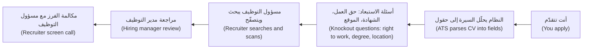
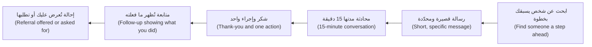
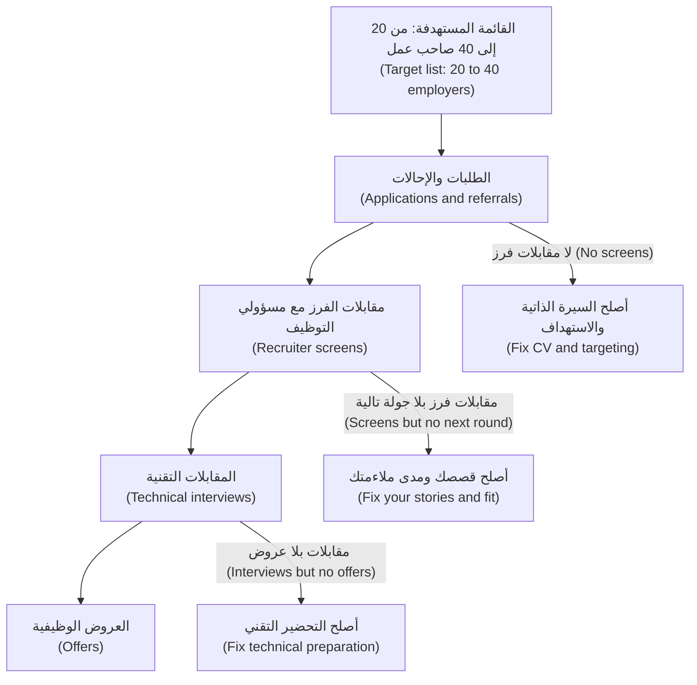

# الوحدة 4 — أن يراك أصحاب العمل (Getting seen)

*قد تملك المهارات (skills) والدليل (proof) ثم لا يصلك أي ردّ. فبين معرض أعمالك (portfolio) والمقابلة (interview) تقف ثلاثة مرشِّحات (filters): برنامج يقرأ سيرتك الذاتية (CV)، ومسؤول توظيف (recruiter) يتصفّحها في ثوانٍ، والحقيقة البسيطة أن مدير التوظيف (hiring manager) لا يستطيع مقابلة شخص لم يسمع به قط. تتناول هذه الوحدة كيف تعبر المرشِّحات الثلاثة بأمانة (honestly). يحوّل الدرس 4.1 دليلك إلى سيرة ذاتية تُحلَّل آليًا بسلاسة (parses cleanly) وتُقرأ جيدًا في نظرة سريعة (quick scan). ويبيّن الدرس 4.2 كيف تبني شبكة علاقات صغيرة وحقيقية (small, real network) وتطلب الإحالات (referrals) دون أن تشعر بأنك تستجدي. ويرسم الدرس 4.3 خريطة المصادر الفعلية لوظائف مستوى المبتدئين (entry-level jobs)، من برامج الخرّيجين (graduate programmes) والشركات الناشئة (startups) إلى القطاع العام (public sector) وبرامج التوطين (nationalisation programmes) في دول الخليج (GCC)، وكيف تدير بحثًا أسبوعيًا (weekly search) تستطيع الاستمرار فيه لأشهر. سترى السيرة الذاتية الأولى لعمر تخفق في الفرز (screen) لدى بنك نجم (Najm Bank)، وهدى تحوّل لقاء قهوة (coffee chat) إلى إحالة (referral) في هندسة البيانات (data engineering)، ويوسف ومحمد يبنيان قوائم مستهدفة (target lists) تناسب ظروفًا مختلفة جدًا، فيما تشرح عائشة، رئيسة استقطاب المواهب (Talent Acquisition lead) في نجم، ما يراه جانب التوظيف (hiring side) فعلًا.*

> **الخطوات (Steps):** Apply, Prove — تحويل الدليل الذي بنيته إلى طلبات توظيف (applications) يفتحها أشخاص حقيقيون ويقرؤونها ويتصرّفون بناءً عليها.

---

# 4.1 — سيرة ذاتية تجتاز نظام تتبّع المتقدّمين والفحص البشري في ست ثوانٍ (A CV that survives the applicant-tracking system and the six-second human scan)
*المستوى (Level): 🟡 متوسط (Intermediate)* · *المتطلبات (Prerequisites): 3.1، 3.2* · *الخطوة (Step): Apply, Prove*

## ⚡ الدرس في دقيقة (In 60 seconds)
- لسيرتك الذاتية (CV) قارئان قبل أن يقابلك أحد: **نظام تتبّع المتقدّمين (applicant-tracking system, ATS)**، وهو البرنامج الذي يخزّن الطلبات ويحلّلها (parses)، و**مسؤول التوظيف (recruiter)** الذي يتصفّح النتيجة بسرعة.
- صمّم للقارئين بالخيارات نفسها: عمود واحد (one column)، وعناوين قياسية (standard headings)، ونص حقيقي (real text) لا صور، وصيغ ملفات شائعة (common file formats)، وكلمات إعلان الوظيفة (job ad) نفسها حيثما تصفك بصدق.
- كل نقطة (bullet) يجب أن تُظهر **ماذا فعلت، وبأي أدوات، وما الذي تغيّر (what you did, with what, and what changed)** — أدلة لا صفات (evidence, not adjectives). عبارتا "مسؤول عن (Responsible for)" و"شغوف بـ (passionate about)" لا تقولان شيئًا.
- ضع أقوى أدلتك في الثلث العلوي (top third): الدور المستهدف (target role)، ومشروعين أو ثلاثة مع روابطها (linked projects)، ومهارات الإعلان (the ad's skills).
- مؤشر القرار (Decision cue): سيرة ذاتية أساسية واحدة لكل دور مستهدف (one base CV per target role) من الوحدة 2، ثم جولة تخصيص (tailoring pass) صغيرة وصادقة لكل طلب.
- أكبر فخ (Biggest trap): التحسين من أجل (optimising for) أداة "درجة ATS (ATS score)" أو حشو الكلمات المفتاحية (stuffing keywords). فهذا لا يساعد بشكل موثوق، والنتيجة يقرؤها إنسان.

## 🧭 لماذا يهم (Why it matters)
يتقدّم عمر إلى برنامج نجم للخرّيجين التقنيين (Najm Tech Graduate Programme) بالسيرة الذاتية التي أنتجها قالب جامعته (university's template): عمودان (two columns)، وصورة شخصية (photo)، ومخطط أعمدة للمهارات (skills bar chart) ("Python ●●●●○")، واسمه داخل مربع نص (text box)، وقسم "المشاريع (Projects)" يسرد عناوين مقرّرات (course titles) بلا روابط. لا يسمع شيئًا طوال ثلاثة أسابيع. وحين يسأل خالد، مدير الهندسة (Engineering Manager)، عائشة عن الأمر لاحقًا، تفتح سجلّ عمر في نظام تتبّع المتقدّمين (ATS) لدى نجم. يُظهر الملف المحلَّل (parsed profile) اسمه في الحقل الخطأ (wrong field)، وقسم مهاراته فارغًا (لأن المخطط كان صورة)، وتواريخ مشاريعه مدموجة بعنوان جامعته. ومن بين مئات طلبات الخرّيجين (graduate applications)، ذهب ملف عمر نصف الفارغ إلى كومة "ربما لاحقًا (maybe later)".

لم يكن في سيرة عمر شيء كاذب؛ لكن لا البرنامج ولا الشخص الذي يتصفّحها استطاع أن يجد الدليل (proof). لا يدور هذا الدرس حول حيل "التغلّب على ATS (beating the ATS)"؛ بل حول جعل الأدلة الصادقة (true evidence) سهلة القراءة، للآلات وللبشر المتعبين (tired humans).

## 📐 كيف يعمل (How it works)

### 🟢 الأساسيات (The essentials)

**ما الذي يحدث لسيرتك بعد أن تنقر "تقدّم" (What happens to your CV after you click Apply).** لدى معظم أصحاب العمل المتوسطين والكبار (mid-sized and large employers)، تصل الطلبات إلى **نظام تتبّع المتقدّمين (applicant-tracking system)**: برنامج مثل Workday أو Greenhouse أو Lever أو SAP SuccessFactors يخزّن المرشّحين (candidates)، ويحلّل السير الذاتية إلى حقول (parses CVs into fields) (الاسم، ووسائل التواصل، والتعليم، والخبرة، والمهارات)، ويتيح لمسؤولي التوظيف البحث (search) والتصفية (filter) ونقل الأشخاص عبر المراحل (stages). أما الشركات الناشئة الصغيرة (small startups) فقد تكتفي بصندوق بريد (inbox) أو جدول بيانات (spreadsheet).

هنا نقطتان مهمتان. أولًا، **قد يفشل التحليل الآلي بصمت (parsing can fail quietly).** فالنص داخل الصور (images) ومربعات النص (text boxes) والترويسات والتذييلات (headers and footers) والجداول (tables) والتخطيطات متعددة الأعمدة (multi-column layouts) كثيرًا ما يُقرأ بترتيب خاطئ أو يضيع. أنت لا ترى النتيجة المحلَّلة (parsed result)، لكن مسؤول التوظيف يراها غالبًا. ثانيًا، **معظم التصفية يقوم بها أشخاص بمساعدة البحث (most filtering is done by people, helped by search).** يبحث مسؤولو التوظيف عن مصطلحات ("Python"، "SQL"، "Kubernetes")، ويطبّقون أسئلة الاستبعاد (knockout questions) في نموذج الطلب (مثل حق العمل (right to work) أو شهادة مطلوبة (required degree))، ثم يتصفّحون. لا تصدّق الادعاءات بأن نظام تتبّع بعينه يرفض السير الذاتية تلقائيًا لسبب بعينه؛ فالإعدادات (configurations) تختلف من صاحب عمل إلى آخر. لكن افترض أنه إذا تعذّر العثور على مهاراتك بالبحث ورؤيتها في التصفّح، فهي غير موجودة بالنسبة إلى هذا الطلب.

**التصفّح في ست ثوانٍ (The six-second scan).** أفادت دراسة شهيرة لتتبّع حركة العين (eye-tracking study) أجراها موقع الوظائف Ladders (عام 2012، وحُدّثت عام 2018) بأن مسؤولي التوظيف لا يقضون سوى ثوانٍ قليلة في التصفّح الأولي (initial scan) للسيرة الذاتية. تعامل مع الرقم الدقيق بمرونة؛ فهي دراسة شركة واحدة. في تلك النظرة الأولى، يتحقّق القارئ: ما الدور الذي يستهدفه هذا الشخص، وهل يطابق أكثر عمله صلة (most relevant work) الوظيفة، وهل يوجد رابط إلى دليل (link to proof)؟ وإن لم يجد ذلك، ينتقل إلى غيره.

**التخطيط الذي يناسب القارئين (The layout that works for both readers).**

| اختر (Choose) | تجنّب (Avoid) | لماذا (Why) |
|---|---|---|
| عمود واحد من الأعلى إلى الأسفل (One column, top to bottom) | عمودان أو ثلاثة، وأشرطة جانبية (sidebars) | المحلّلات (parsers) كثيرًا ما تقرأ عبر الأعمدة فتخلط الأسطر |
| عناوين قياسية (Standard headings): الملخّص (Summary)، الخبرة (Experience)، المشاريع (Projects)، التعليم (Education)، المهارات (Skills) | عناوين إبداعية (Creative headings) ("رحلتي (My journey)"، "ما أقدّمه (What I bring)") | المحلّلات ومسؤولو التوظيف يبحثون عن التسميات المعتادة (usual labels) |
| نص حقيقي في المتن (Real text in the body) | المهارات في صورة أيقونات أو أشرطة أو مخططات أو صور (icons, bars, charts or images) | الصور لا يمكن البحث فيها؛ و"4 من 5 نقاط (4 of 5 dots)" لا تعني شيئًا |
| بيانات التواصل في المتن (Contact details in the body) | الاسم والبريد الإلكتروني في الترويسة أو التذييل (header or footer) | بعض المحلّلات تتخطّى الترويسات والتذييلات |
| ملف PDF مُصدَّر من محرّر نصوص (text editor)، أو .docx إن طلبه النموذج | ملفات PDF ممسوحة ضوئيًا (Scanned PDFs)، وتصديرات أدوات التصميم (design-tool exports) التي تحوّل النص إلى أشكال | يجب أن يكون النص قابلًا للتحديد (selectable) كي يُحلَّل |
| صفحة واحدة لمعظم الخرّيجين (One page for most graduates)؛ وصفحتان إن كانت لديك خبرة حقيقية (real experience) | ثلاث صفحات من المقرّرات الدراسية (coursework) | الطول ليس دليلًا (Length is not evidence) |
| خط بسيط مقروء (plain, readable font) بحجم 10–12 نقطة | خطوط صغيرة جدًا لحشر المزيد | البشر يتصفّحون (skim)؛ والنص الصغير يُتخطّى |

اختبار ذاتي سريع (quick self-test): افتح ملف PDF، وحدّد الكل، وانسخه والصقه في ملف نصي عادي (plain text file). إن كان الترتيب خاطئًا أو كانت كلمات مفقودة، فسيتعثّر المحلّل (parser) أيضًا.

**البنية من الأعلى إلى الأسفل (The structure, top to bottom).**
1. **الاسم ووسائل التواصل (Name and contact):** الاسم، والمدينة والدولة، والهاتف، وبريد إلكتروني مهني (professional email)، ورابط LinkedIn، ورابط GitHub أو معرض الأعمال (portfolio URL). اجعل الروابط قابلة للنقر (clickable) وقصيرة.
2. **العنوان التعريفي أو الملخّص (Headline or summary) (سطران):** الدور الذي تريده وأقوى أدلتك (strongest evidence). "مهندس برمجيات خرّيج (Graduate software engineer). بنيت ونشرت واجهة برمجية لمطابقة المدفوعات (payments-reconciliation API) مع اختبارات (tests) وتكامل مستمر (CI) ومراقبة (monitoring)؛ متمكّن في الخوارزميات (algorithms) وPython."
3. **المشاريع (Projects)** (لمعظم الخرّيجين، فوق الخبرة (Experience)): من اثنين إلى أربعة، لكلٍّ منها رابط، والتقنيات المستخدمة (stack)، ونقطتان أو ثلاث عن النتائج (result bullets). هذه هي المشاريع التي حدّدت مواصفاتها في الدرس 3.1 ووثّقتها في الدرس 3.2.
4. **الخبرة (Experience):** التدريب العملي (internships)، والوظائف بدوام جزئي (part-time jobs)، والعمل الحر (freelance work)، وأدوار مساعد التدريس (teaching assistant roles)، والمساهمات مفتوحة المصدر (open-source contributions) (الدرس 3.3). والوظائف غير التقنية (non-tech jobs) تُحتسب حين تُظهر النقاط تحمّل مسؤولية (responsibility).
5. **التعليم (Education):** الشهادة (degree)، والجامعة، وتاريخ التخرّج (graduation date)؛ والمعدّل (grade) إن كان مفيدًا؛ وسطر قصير عن "المقرّرات ذات الصلة (relevant coursework)" فقط إن كان يرتبط بالوظيفة.
6. **المهارات (Skills):** مجمّعة وصادقة (grouped and honest) — اللغات (Languages)، وأطر العمل (Frameworks)، والبيانات (Data)، والسحابة والأدوات (Cloud and tools). ولا تذكر إلا ما يمكن أن تُسأل عنه.
7. **اختياري (Optional):** الشهادات المهنية (certifications)، والجوائز (awards)، واللغات (languages) (العربية والإنجليزية، مع المستوى).

### 🟡 التعمق أكثر (Going deeper)

**النقاط: أدلة لا صفات (Bullets: evidence, not adjectives).** تجيب النقطة الجيدة عن ثلاثة أسئلة: ماذا فعلت، وكيف (بأي أدوات أو أساليب)، وما الذي تغيّر نتيجة لذلك. وقد نشر لازلو بوك (Laszlo Bock)، الرئيس السابق لعمليات الموارد البشرية (head of people operations) في Google، صيغة من ذلك هي "أنجزتُ X، مقيسًا بـ Y، عبر القيام بـ Z (accomplished X, as measured by Y, by doing Z)". ليست كل نقطة بحاجة إلى رقم؛ لكن كل نقطة بحاجة إلى نتيجة (outcome).

| ضعيفة (Weak) | قوية (Strong) |
|---|---|
| مسؤول عن الواجهة الخلفية (backend) لمشروع جماعي (group project). | بنيت واجهة REST البرمجية (REST API) لمشروع مقرّر من 4 أشخاص (Python، FastAPI، PostgreSQL)؛ وكتبت 38 اختبارًا (tests) وخط معالجة GitHub Actions (GitHub Actions pipeline) يمنع الدمج (blocked merges) عند الفشل. |
| شغوف بالبيانات وتعلّم الآلة (machine learning). | حوّلت تجهيز بيانات التدريب (training data prep) لنموذج التنبؤ بتسرّب العملاء (churn model) من دفتر يدوي (manual notebook) إلى خط معالجة SQL مجدول (scheduled SQL pipeline)؛ ووثّقت فحوصات البيانات (data checks) التي اكتشفت تغييرين في المخطّط (schema changes). |
| استخدمت أدوات الذكاء الاصطناعي (AI tools) لبناء تطبيق. | بنيت تطبيق أسئلة وأجوبة على المستندات (document Q&A app) باستخدام واجهة برمجية لنموذج لغوي كبير (LLM API) واسترجاع (retrieval)؛ وصمّمت مجموعة تقييم (evaluation set) من 50 سؤالًا ورفعت الإجابات الصحيحة من 31 إلى 42 بتغيير التقطيع (chunking). |
| على دراية بالسحابة (Familiar with cloud). | نشرت مشروع تخرّجي (capstone) على خدمة حاويات مُدارة (managed container service) باستخدام البنية التحتية كشيفرة (infrastructure as code) (Terraform)؛ وأضفت تنبيهات للجاهزية والأخطاء (uptime and error alerts). |

يجب أن تكون الأرقام في العمود القوي أرقامك الحقيقية أنت. وإن لم تقِس شيئًا، فاذكر كيف تحقّقت (how you verified it) ("اختُبر باستخدام… (tested with…)"، "استخدمه 12 من زملائي في تجربة أولية (used by 12 classmates in a pilot)"). لا تخترع مقياسًا (metric) أبدًا؛ فالمحاورون يسألون عن كل رقم.

**الكلمات المفتاحية: عكسٌ صادق (Keywords: honest mirroring).** اقرأ إعلان الوظيفة (job ad) ودوّن أسماءه الملموسة (concrete nouns): اللغات، والأدوات، والممارسات ("مراجعة الشيفرة (code review)"، "اختبار الوحدات (unit testing)"، "REST APIs"، "SQL"، "CI/CD"). وحيثما يصف مصطلح ما بصدق شيئًا فعلته، استخدم صياغة الإعلان نفسها (the ad's exact wording) — إن قال الإعلان "PostgreSQL" فاكتب "PostgreSQL"، لا "Postgres" فقط؛ وإن قال "التكامل المستمر (continuous integration)" فأدرجه مرة واحدة. هذا يساعد البحث (search) ويساعد الإنسان على مطابقتك بالإعلان. لا تُدرج مهارة لا تستطيع مناقشتها، ولا تُخفِ الكلمات المفتاحية أبدًا بنص أبيض (white text) أو خطوط صغيرة جدًا: فمسؤولو التوظيف يرون النص المحلَّل (parsed text)، ويبدو على حقيقته.

**أدوات "درجة ATS" ("ATS score" tools).** المواقع التي تقيّم سيرتك مقابل إعلان ما يمكنها أن تنبّه إلى كلمات مفتاحية ناقصة (missing keywords)، لكنها لا ترى إعدادات صاحب العمل (employer's configuration) ولا حكم مسؤول التوظيف (recruiter's judgement). استخدمها قائمةَ تحقّق (checklist)، لا هدفًا (target) أبدًا.

**التخصيص دون إعادة كتابة (Tailoring without rewriting).** احتفظ بـ **سيرة ذاتية أساسية لكل دور مستهدف (base CV per target role)** (اختيار الدور الذي قمت به في الوحدة 2). ولكل طلب، اقضِ من خمس عشرة إلى عشرين دقيقة: عدّل العنوان التعريفي (headline)، وضع المشروع الأكثر صلة أولًا، واستبدل نقطتين أو ثلاثًا لتعكس الإعلان، وراجع سطر المهارات (skills line). وضع اسم الشركة والتاريخ في اسم الملف (file name).

**عرض العمل المُنجَز بمساعدة الذكاء الاصطناعي بأمانة (Showing AI-assisted work honestly).** يعرف أصحاب العمل أن الخرّيجين يبنون باستخدام وكلاء البرمجة بالذكاء الاصطناعي (AI coding agents)؛ وكثيرون منهم يتوقّعون ذلك. ما يتحقّقون منه هو هل وجّهت العمل وتحقّقت منه (directed and verified the work). اكتب نقاطًا تُظهر دورك: "صمّمت نموذج البيانات وعقد الواجهة البرمجية (data model and API contract)، واستخدمت وكيل برمجة بالذكاء الاصطناعي (AI coding agent) للتنفيذ، وكتبت مجموعة الاختبارات (test suite) وراجعت كل تغيير". كانت مسوّدة ريم الأولى تقول "بنيت تطبيق ذكاء اصطناعي متكاملًا (full-stack AI app) في أسبوعين"؛ أما نسختها النهائية فذكرت ما صمّمته وما تحقّقت منه، وهو بالضبط ما سأل عنه طارق في مقابلتها. ويبني الدرس 1.2 المهارة الكامنة وراء هذه النقطة.

### 🔴 نظرة الخبير (Expert view)

**اكتب للقارئ الذي يقرّر، لا لمن يُصفّي فقط (Write for the reader who decides, not only the one who filters).** عائشة، مسؤولة التوظيف (recruiter)، تتحقّق من المطابقة (match) والأساسيات (basics)؛ أما خالد، مدير التوظيف (hiring manager)، فيبحث عن حسن التقدير (judgement): اختبارات (tests) ونشر (deployment)، وملف README يشرح المفاضلات (trade-offs)، وخلل (bug) اكتشفته أو تراجع (rollback) خطّطت له. ونقطة واحدة تُظهر التفكير الإنتاجي (production thinking) (الدرس 1.3) كثيرًا ما تتفوّق على خمس نقاط تسرد أطر العمل (frameworks).

**الأعراف الإقليمية والقطاعية (Regional and sector norms).** تختلف أعراف السيرة الذاتية (CV conventions). ففي أجزاء من دول الخليج (GCC)، كثيرًا ما تطلب نماذج التقديم (application forms) الجنسية (nationality) وحالة التأشيرة أو الإقامة (visa or residency status)، لأن برامج التوطين (nationalisation programmes) وقواعد الكفالة (sponsorship rules) تؤثّر في الأهلية (eligibility)؛ فأجب بدقة. والصور الشخصية وتاريخ الميلاد والحالة الاجتماعية (Photos, date of birth and marital status) شائعة في بعض الأسواق وغير محبّذة في أخرى؛ فاتّبع تعليمات صاحب العمل. وإن تقدّمت بالعربية والإنجليزية معًا، فاجعل النسختين متّسقتين (consistent) — التواريخ نفسها والمسمّيات نفسها — واطلب من قارئ متمكّن مراجعة العربية التقنية (technical Arabic). ولدى أصحاب العمل الخاضعين للتنظيم (regulated employers) كالبنوك، فإن سطرًا يُظهر العناية بحماية البيانات (data-protection care) في مشروع ("أزلت البيانات الشخصية من السجلات (removed personal data from logs)") دليل حقيقي (real evidence)؛ ويبني ذلك [*أمن الذكاء الاصطناعي وأمن التطبيقات (Secure AI & Application Security)*، الدرس 5.3 — حماية البيانات الشخصية: التقليل، والتسجيل، وهندسة الخصوصية (Protecting personal data: minimisation, logging and privacy engineering)](../secai/index.ar.html#/5.3).

**الفجوات والتحوّلات والمسارات غير التقليدية (Gaps, switches and non-traditional paths).** لدى محمد، المتحوّل مهنيًا من معسكر تدريبي (bootcamp career-switcher)، ست سنوات في الخدمات اللوجستية (logistics). أخفتها سيرته الأولى؛ أما الثانية فاستثمرتها: "أتمتة تقارير المخزون الأسبوعية باستخدام Python وSQL، بدلًا من عملية يدوية بجداول البيانات (Automated weekly stock reports with Python and SQL, replacing a manual spreadsheet process)" تقع تحت الخبرة (Experience). وسنة الانقطاع (gap year) أو المسؤولية العائلية (family responsibility) أو الخدمة العسكرية (military service) يمكن أن تكون سطرًا صادقًا واحدًا. لا تخترع مسمّيات وظيفية (titles) أبدًا — فالتحقّق من المراجع (reference checks) موجود، وأي تعارض يكلّفك العرض الوظيفي (offer).

**السيرة الذاتية فهرسٌ للدليل (The CV is an index to proof).** كل ادعاء مهم ينبغي أن يكون على بُعد نقرة واحدة من الدليل (one click from evidence): المستودع (repo)، والعرض التجريبي (demo)، والتقرير المكتوب (write-up) من الدرس 3.2. ومدير التوظيف الذي يجد ملف README واضحًا وشارة اختبارات (test badge) يكون قد بدأ تقييم مهندس.

## 🧰 الأدوات (The toolkit)
| المورد أو الأداة أو النموذج (Resource, tool or template) | ما هو وماذا يفعل (What it is and does) | متى تلجأ إليه (When to reach for it) |
|---|---|---|
| **Applicant-tracking system (ATS)** — نظام تتبّع المتقدّمين (مثل Workday وGreenhouse وLever وSAP SuccessFactors) | برنامج يخزّن الطلبات (applications)، ويحلّل السير الذاتية إلى حقول (parses CVs into fields)، ويتيح لمسؤولي التوظيف البحث ونقل المرشّحين عبر المراحل (stages) | لفهم سبب أهمية التخطيط (layout) والصياغة (wording)؛ ولقراءة بوابة التقديم (application portal) لدى صاحب العمل |
| **Plain-text paste test** — اختبار اللصق في نص عادي | انسخ كل النص من ملف PDF إلى ملف نصي عادي (plain text file) وتحقّق من الترتيب والاكتمال (order and completeness) | قبل كل إرسال أول لتخطيط سيرة ذاتية جديد (new CV layout) |
| **XYZ bullet formula** — صيغة النقاط XYZ (نشرها لازلو بوك (Laszlo Bock)) | "أنجزتُ X، مقيسًا بـ Y، عبر القيام بـ Z (Accomplished X, as measured by Y, by doing Z)" — نمط لنقاط قائمة على الأدلة (evidence-based bullets) | عند إعادة كتابة أي نقطة تبدأ بـ "مسؤول عن (Responsible for)" |
| **Base CV per role** — سيرة ذاتية أساسية لكل دور | سيرة ذاتية رئيسية واحدة تُصان (maintained master CV) لكل دور مستهدف (target role)، تُخصَّص لكل طلب | عند التقدّم إلى أكثر من عائلة أدوار (role family) |
| **Job-ad keyword list** — قائمة الكلمات المفتاحية لإعلان الوظيفة | الأسماء والعبارات الملموسة (concrete nouns and phrases) في الإعلان، مطابَقة مع خبرتك الحقيقية (true experience) | في جولة التخصيص ذات الخمس عشرة دقيقة (15-minute tailoring pass) قبل كل طلب |
| **University career service CV review** — مراجعة السيرة الذاتية لدى خدمات التوظيف الجامعية | مراجعات مجانية (free reviews) وقوالب (templates) ومقابلات فرز تجريبية (mock screens) من مكتب التوظيف (careers office) في جامعتك | قبل إرسال طلباتك العشرة الأولى |
| **Application log** — سجلّ الطلبات | جدول بيانات (spreadsheet) بالجهات التي تقدّمت إليها، ونسخة السيرة الذاتية (CV version)، والتاريخ، وجهة الاتصال (contact)، والحالة (status) | من أول طلب تقدّمه فصاعدًا (انظر الدرس 4.3) |

## 🏛️ عمليًا في بنك نجم (In practice at Najm Bank)
تشارك عائشة قائمة التحقّق (checklist) التي يستخدمها فريقها في الفرز الأول (first pass) لطلبات الخرّيجين (graduate applications)، ويعيد عمر كتابة سيرته الذاتية وفقًا لها. (عملية نجم خيالية وتوضيحية (fictional and illustrative)؛ وكل صاحب عمل يضبط إعداداته الخاصة.)

**برنامج نجم للخرّيجين التقنيين (Najm Tech Graduate Programme) — قائمة التحقّق للفرز الأول للسيرة الذاتية (first-pass CV checklist) (لمسؤول التوظيف (recruiter))**

| الفحص (Check) | شكل النجاح (Pass looks like) | عمر، النسخة 1 (Omar v1) | عمر، النسخة 2 (Omar v2) |
|---|---|---|---|
| حُلِّلت بسلاسة (Parsed cleanly) | الاسم ووسائل التواصل والتعليم والمهارات في الحقول الصحيحة (right fields) | لا: ضاعت المهارات، والاسم في غير موضعه | نعم |
| الدور المستهدف واضح في الثلث العلوي (Target role clear in the top third) | العنوان التعريفي (Headline) يسمّي المسار (track) (برمجيات، بيانات، منصّات (platform)، ذكاء اصطناعي) | لا يوجد عنوان تعريفي | "مهندس برمجيات خرّيج (Graduate software engineer)…" |
| يستوفي معايير الاستبعاد (Meets knockout criteria) | شهادة أو ما يعادلها (Degree or equivalent)؛ والإجابة عن حق العمل (right to work) في النموذج | نعم | نعم |
| مشروع واحد على الأقل مع رابط ودليل (At least one linked project with evidence) | رابط مستودع أو عرض تجريبي (Repo or demo link)؛ واختبارات أو نشر أو نتيجة مقيسة (measured result) | عناوين مقرّرات فقط (Course titles only) | مشروعان مع روابطهما (Two linked projects) |
| المهارات تطابق المسار (Skills match the track) | المهارات الأساسية في الإعلان (Ad's core skills) موجودة ومدعومة بنقطة | مخطط أعمدة (Bar chart)، لا يمكن البحث فيه | نص مجمّع (Grouped text)، وكل مهارة مستخدمة في نقطة |
| مقروءة في مرور واحد (Readable in one pass) | عمود واحد، وصفحة واحدة، ولا جدران من النص (walls of text) | عمودان، ومكتظّة (dense) | عمود واحد، وصفحة واحدة |

**قسم المشاريع لدى عمر، قبل وبعد (Omar's projects section, before and after)**

قبل (Before):
> **المشاريع (Projects):** مشروع هياكل البيانات (Data Structures Project)؛ مشروع نظم قواعد البيانات (Database Systems Project)؛ مشروع التخرّج (تطبيق مصرفي) (Graduation Project (Banking App))

بعد (After):
> **واجهة المطابقة البرمجية (Reconciliation API)** — github.com/omar-example/recon-api · Python, FastAPI, PostgreSQL, Docker
> - بنيت واجهة برمجية (API) تطابق أسطر كشف الحساب البنكي (bank-statement lines) مع قيود دفتر الأستاذ (ledger entries)؛ وتعالج المدفوعات المكرّرة والجزئية (duplicate and partial payments) بعمليات كتابة متساوية الأثر (idempotent writes).
> - كتبت 52 اختبار وحدة وتكامل (unit and integration tests)؛ وتمنع GitHub Actions الدمج عند الفشل (blocks merges on failure)؛ ونشرت على خدمة حاويات مُدارة (managed container service) مع فحص سلامة (health check) وتنبيهات للأخطاء (error alerts).
> - وثّقت مفاضلات التصميم (design trade-offs) وخطة تراجع (rollback plan) في ملف README؛ واستخدمت وكيل برمجة بالذكاء الاصطناعي (AI coding agent) للهيكلة الأولية (scaffolding) وراجعت كل تغيير.
>
> **مخطِّط المسارات (الخوارزميات) (Route planner (algorithms))** — github.com/omar-example/route-planner · C++, Python
> - نفّذت خوارزميتَي A* وDijkstra على مخطط مدينة (city graph) من 200,000 حافة (edge)؛ وحلّلت الأداء (profiled) وخفّضت زمن الاستعلام (query time) بالانتقال إلى كومة ثنائية (binary heap).

(روابط افتراضية (Placeholder links).) وصلت النسخة الثانية من سيرة عمر إلى كومة مراجعة خالد (Khalid's review pile) في دفعة القبول التالية (next intake).

## 🛠️ التمارين (Exercises)
- 🟢 طبّق اختبار اللصق في نص عادي (plain-text paste test) وقائمة تحقّق عائشة (Aisha's checklist) على سيرتك الحالية. أصلح كل إخفاق. *يكتمل عندما (Done when):* يُقرأ النص الملصوق بالترتيب الصحيح دون أي نقص، ويكون كل صف في قائمة التحقّق ناجحًا (pass).
- 🟡 أعد كتابة أضعف خمس نقاط لديك بنمط "ماذا، وكيف، وما الذي تغيّر (what, how, what changed)"، مستخدمًا الحقائق والأرقام الحقيقية فقط. *يكتمل عندما (Done when):* يستطيع زميل (peer) قراءة كل نقطة بصوت عالٍ وطرح سؤال متابعة محدّد (specific follow-up question) واحد تستطيع الإجابة عنه من الذاكرة.
- 🔴 اختر إعلانَي وظيفة حقيقيين (two real job ads) في دورك المستهدف، وابنِ قائمة كلمات مفتاحية (keyword list) لكلٍّ منهما، وأنتج نسختين مخصّصتين (tailored versions) من سيرتك الأساسية (base CV) في أقل من 20 دقيقة لكلٍّ منهما. *يكتمل عندما (Done when):* يوجد الملفّان واسم الشركة والتاريخ في اسميهما، وكل كلمة مفتاحية أدرجتها من الإعلان مدعومة بنقطة، وكل كلمة مفتاحية تركتها هي مما لا تستطيع ادعاءه بصدق.

## ⚠️ أخطاء وفخاخ (Mistakes and traps)
- **قوالب المصمّمين (Designer templates).** الأعمدة والأيقونات وأشرطة المهارات (skill bars) تبدو جميلة لكنها تُحلَّل بشكل سيئ (parse badly). استخدم تخطيطًا بسيطًا بعمود واحد (plain one-column layout) واصرف جهدك على المحتوى.
- **سرد المهام بدل النتائج (Listing duties instead of results).** عبارة "عملت على الواجهة الأمامية (Worked on the frontend)" مهمة (duty). قل ماذا بنيت، وكيف، وكيف عرفت أنه يعمل.
- **حشو الكلمات المفتاحية والنص المخفي (Keyword stuffing and hidden text).** مسؤولو التوظيف يرون النص المحلَّل (parsed text). اعكس الإعلان فقط حيث يكون ذلك صحيحًا.
- **الأرقام المختلقة أو المسمّيات المضخّمة (Invented numbers or inflated titles).** كل رقم ومسمّى سيُسأل عنه أو يُتحقّق منه. استخدم مقاييس حقيقية (real measures) أو صِف طريقة تحقّقك (verification) بدلًا من ذلك.
- **قوائم المقرّرات بوصفها مشاريع (Course lists as projects).** عنوان المقرّر ليس دليلًا (not evidence). ضع رابطًا إلى المستودع (repo) والعرض التجريبي (demo) وملف README.
- **سيرة ذاتية واحدة لكل الأدوار (One CV for every role).** إعلان هندسة البيانات (data-engineering ad) وإعلان الواجهة الأمامية (front-end ad) يريدان ثلثًا علويًا (top thirds) مختلفًا. احتفظ بسيرة أساسية لكل دور (base CV per role) وخصّصها بإيجاز.

## 🧾 الخلاصة (Recap)
- نظام تتبّع المتقدّمين (ATS) يحلّل ويخزّن؛ والأشخاص يبحثون ويصفّون ويقرّرون. اكتب بحيث يستطيع كلاهما العثور على أدلتك (evidence).
- عمود واحد (One column)، وعناوين قياسية (standard headings)، ونص حقيقي (real text)، وروابط قابلة للنقر (clickable links). واختبر باللصق في نص عادي (plain-text paste).
- النقاط (Bullets) تُظهر ماذا فعلت، وكيف، وما الذي تغيّر — بأرقام حقيقية أو تحقّق حقيقي (real verification).
- اعكس صياغة إعلان الوظيفة (job ad's wording) فقط حيث تكون صحيحة؛ ولا تجعل "درجة ATS (ATS score)" هدفًا.
- اعرض العمل المُنجَز بمساعدة الذكاء الاصطناعي (AI-assisted work) بأمانة: ما الذي صمّمته ووجّهته وتحقّقت منه.
- سيرتك الذاتية فهرس للدليل (index to proof): كل ادعاء رئيسي على بُعد نقرة من مستودع (repo) أو عرض تجريبي (demo) أو تقرير مكتوب (write-up).

## ✍️ اختبر نفسك (Check yourself)

**1. عرضت سيرة عمر مهاراته في مخطط أعمدة من النقاط (bar chart of dots)، وجاء قسم المهارات في ملفه المحلَّل في نظام تتبّع المتقدّمين (parsed ATS profile) فارغًا. ما السبب الأرجح؟**

- A. رفضه نظام تتبّع المتقدّمين (ATS) تلقائيًا لأنه سرد مهارات قليلة جدًا
- B. لم تطابق شهادته (degree) سؤال الاستبعاد (knockout question) في البرنامج
- C. كانت المهارات صورًا (images) لا نصًا، فلم يستطع المحلّل (parser) قراءتها
- D. استبعد مرشِّح البحث (search filter) لدى مسؤول التوظيف كل طلبات PDF

الإجابة

**C.** النص داخل الصور والأيقونات والمخططات (images, icons and charts) لا يمكن في العادة تحليله أو البحث فيه. يفترض الخيار A قاعدة رفض تلقائي (automatic rejection rule) يحذّرك الدرس من افتراضها؛ ولا شيء في السيناريو يشير إلى B أو D. (🟢 الأساسيات (The essentials).)

**2. أي نقطة هي الأقوى لطلب خرّيج في هندسة البيانات (graduate data-engineering application)؟**

- A. نقلت تجهيز بيانات نموذج تسرّب العملاء (churn model's data prep) من دفتر (notebook) إلى خط معالجة SQL مجدول (scheduled SQL pipeline) مع فحوصات اكتشفت تغييرين في المخطّط (schema changes).
- B. شغوف بالبيانات، وسريع التعلّم (fast learner)، ومتحمّس دائمًا لاكتساب أدوات ومنصّات وتقنيات جديدة.
- C. مسؤول عن مجموعة من مهام تجهيز البيانات وتحليلها (data preparation and analysis tasks) في مشروع فريق من أربعة أشخاص.
- D. خبير (Expert) في SQL وPython وSpark وAirflow وdbt وKafka وSnowflake ومنصّات البيانات السحابية الحديثة (modern cloud data platforms).

الإجابة

**A.** إنها تقول ماذا أُنجز، وكيف، وما الذي تغيّر. الخيار D مغرٍ لأنه مليء بالكلمات المفتاحية (keywords)، لكنه قائمة غير مدعومة (unsupported list)، وكلمة "خبير (expert)" تستدعي أسئلة قد لا يصمد أمامها خرّيج. أما B وC فلا يقدّمان أي دليل (evidence). (🟡 التعمق أكثر (Going deeper).)

**3. يمنح موقع مجاني سيرةَ هدى "درجة ATS (ATS score)" قدرها 54% مقابل إعلان وظيفة. ماذا ينبغي أن تفعل؟**

- A. تضيف كل كلمة مفتاحية ناقصة (missing keyword) بنص أبيض (white text) كي ترتفع الدرجة دون تغيير التخطيط
- B. تواصل إعادة كتابة السيرة حتى تمنحها الأداة أكثر من 90% لهذا الإعلان
- C. تتجاهل إعلان الوظيفة تمامًا وترسل سيرتها العامة غير المخصّصة (generic, untailored CV) بدلًا من ذلك
- D. تعامل قائمة المصطلحات الناقصة (missing-terms list) كقائمة تحقّق (checklist) وتضيف المصطلحات الصحيحة فقط

الإجابة

**D.** أدوات التقييم (Score tools) لا ترى إعدادات صاحب العمل (employer's configuration) ولا حكم مسؤول التوظيف (recruiter's judgement)، لكن قائمة الكلمات المفتاحية الناقصة قد تكون تذكيرًا مفيدًا. الخيار A خادع (deceptive) ومرئي في النص المحلَّل (parsed text)؛ والخيار B يجعل درجة غير موثوقة (unreliable score) هي الهدف. (🟡 التعمق أكثر (Going deeper).)

**4. بنت ريم معظم مشروعها باستخدام وكيل برمجة بالذكاء الاصطناعي (AI coding agent). أي نقطة في السيرة الذاتية تعكس ذلك بأمانة وقوة؟**

- A. بنيت تطبيق ذكاء اصطناعي متكاملًا (full-stack AI app) في أسبوعين باستخدام أحدث أدوات الذكاء الاصطناعي ونماذجه وأطر عمله.
- B. صمّمت نموذج البيانات والواجهة البرمجية (data model and API)، واستخدمت وكيل ذكاء اصطناعي (AI agent) للتنفيذ، وكتبت الاختبارات وراجعت كل تغيير.
- C. تحذف المشروع من السيرة الذاتية تمامًا، لأن وكيل البرمجة بالذكاء الاصطناعي كتب جزءًا كبيرًا من الشيفرة.
- D. كتبت كل الأسطر العشرين ألفًا (20,000 lines) في التطبيق بمفردي على مدى فصل جامعي واحد.

الإجابة

**B.** إنها تُظهر ما وجّهته ريم وما تحقّقت منه (directed and verified)، وهو ما سيستقصيه المحاورون (interviewers). الخيار A يخفي دورها ويستدعي أسئلة لا تستطيع الإجابة عنها؛ والخيار D يحرّف العمل (misrepresents the work)؛ والخيار C يهدر دليلًا حقيقيًا (real proof). (🟡 التعمق أكثر (Going deeper).)

**5. محمد خرّيج معسكر تدريبي (bootcamp graduate) لديه ست سنوات في الخدمات اللوجستية (logistics). ماذا ينبغي أن تفعل سيرته الذاتية بسنوات الخدمات اللوجستية؟**

- A. تحذفها، كي تبدو السيرة تقنية بحتة (purely technical) وتختفي سنوات الخدمات اللوجستية
- B. تغيّر مسمّى الوظيفة إلى "مهندس برمجيات (Software Engineer)"، لأنه كتب بعض نصوص Python البرمجية (Python scripts) هناك
- C. تُبقيها، مع نقاط صادقة تُظهر العمل القابل للنقل (transferable work) مثل تقاريره المؤتمتة (automated reporting)
- D. تنقلها إلى صفحة ثانية (second page) بخط صغير (small print)، حيث يُستبعد أن ينظر مسؤولو التوظيف (recruiters)

الإجابة

**C.** الخبرة الحقيقية مع نقاط ذات صلة دليلٌ (evidence)، وإخفاء السنوات يخلق فجوة غير مبرّرة (unexplained gap). والخيار B مسمّى مضخّم (inflated title) يمكن أن يكشفه التحقّق من المراجع (reference check). (🔴 نظرة الخبير (Expert view).)

## 📚 المراجع (References)
- Workday Recruiting — https://www.workday.com/
- Greenhouse — https://www.greenhouse.com/
- Lever — https://www.lever.co/
- SAP SuccessFactors — https://www.sap.com/products/hcm.html
- خدمات الإرشاد المهني والتطوير الوظيفي في MIT (MIT Career Advising & Professional Development) (السير الذاتية وخطابات التقديم (resumes and cover letters)) — https://capd.mit.edu/
- مكتب الخدمات المهنية في هارفارد (Harvard Office of Career Services) (السير الذاتية (resumes and CVs)) — https://ocs.fas.harvard.edu/
- Ladders (ناشر دراسة تتبّع حركة العين لدى مسؤولي التوظيف (recruiter eye-tracking study)) — https://www.theladders.com/
- لازلو بوك (Laszlo Bock)، *Work Rules!* (Twelve، 2015)؛ وقد ظهرت صيغته X-Y-Z أول مرة في مقالاته على LinkedIn عام 2014 حول السير الذاتية (résumés)
- الدرس 3.1 (مواصفات مشروع التخرّج لكل دور (capstone specs per role))، والدرس 3.2 (GitHub وملفات README)، والدرس 1.2 (البناء باستخدام وكلاء البرمجة بالذكاء الاصطناعي (building with AI coding agents))

---

# 4.2 — LinkedIn وبناء العلاقات المهنية والإحالات دون إحراج (LinkedIn, networking and referrals without awkwardness)
*المستوى (Level): 🟡 متوسط (Intermediate)* · *المتطلبات (Prerequisites): 3.2، 4.1* · *الخطوة (Step): Apply*

## ⚡ الدرس في دقيقة (In 60 seconds)
- كثير من الوظائف تُشغَل عبر أشخاص يعرفون المرشّح (candidate) مسبقًا أو سمعوا عنه. و**الإحالة (referral)** — أي أن يقدّم موظف اسمك — تجعل في العادة طلبك (application) يُقرأ من قِبل إنسان.
- بناء العلاقات المهنية (networking) ليس تملّقًا (schmoozing). إنه **محادثات مفيدة ومحدّدة (useful, specific conversations)** مع أشخاص يسبقونك بخطوة أو خطوتين، إضافة إلى عرض عملك حيث يمكنهم رؤيته.
- **ملفك على LinkedIn (LinkedIn profile)** سيرة ذاتية ثانية (second CV) يجدها الناس بأنفسهم؛ فاجعل العنوان التعريفي (headline) وقسم النبذة (About section) والروابط المميّزة (Featured links) تقوم بالعمل.
- اطرح أسئلة صغيرة وواضحة وسهلة الإجابة. عبارة "هل يمكنني أن أسألك ثلاثة أسئلة عن فريق البيانات؟ ⁦(Can I ask you three questions about the data team?)⁩" تنجح؛ أما "هل يمكنك أن تجد لي وظيفة؟ ⁦(Can you get me a job?)⁩" فلا.
- مؤشر القرار (Decision cue): لا تطلب أبدًا إحالة (referral) من شخص غريب في الرسالة الأولى (first message). اطلب النصيحة (advice)؛ ولا تطلب الإحالة إلا بعد أن يعرف عملك.
- أكبر فخ (Biggest trap): الإرسال الجماعي (mass-sending) لطلب التواصل نفسه (connection request) إلى مئات الأشخاص. فهذا يهدر أفضل جهات اتصالك (best contacts) وقد يصنّفك مُرسِلًا للرسائل المزعجة (spam).

## 🧭 لماذا يهم (Why it matters)
أرسلت هدى 40 طلبًا لأدوار علم البيانات (data-science roles) خلال شهرين وحصلت على مقابلة فرز (screen) واحدة. كانت دفاترها (notebooks) جيدة، لكن مهارتها في SQL ضعيفة، وكانت سيرتها الذاتية (CV) تقول "عالمة بيانات (data scientist)" لوظائف تريد في معظمها محلّلين (analysts) ومهندسين (engineers). ثم، في أمسية لخرّيجي الجامعة (university alumni evening)، قضت عشر دقائق مع مهندس بيانات (data engineer) في بنك نجم (Najm Bank) شرح لها ما يفعله فريقه طوال اليوم: خطوط معالجة البيانات (pipelines)، وجودة البيانات (data quality)، وSQL، ومزيد من SQL. تابعت معه في اليوم التالي برسالة شكر (thank-you) وسؤال واحد. وبعد أسبوعين أرسلت له رابطًا إلى مشروع خط معالجة صغير (small pipeline project) بنته بعد حديثهما (اتجاهها الجديد من الدرس 2.3). فردّ قائلًا: "هذا هو نوع العمل الذي نحتاجه — هل تريدين أن أرسله إلى دانة؟ ⁦(This is the kind of thing we need — do you want me to send it to Dana?)⁩" كانت دانة، كبيرة علماء البيانات (lead data scientist) في نجم، عضوًا في لجنة التوظيف (hiring panel) لهندسة البيانات. ووصل طلب هدى مرفقًا بملاحظة من موظف رأى عملها.

لا شيء في هذه القصة حيلة (trick). سألت هدى سؤالًا حقيقيًا، وأصغت، وتصرّفت بناءً على الإجابة، وأظهرت النتيجة. هذه هي المهارة كلها، ويمكن تعلّمها (learnable) حتى لو كنت تجد الحديث مع الغرباء مزعجًا.

## 📐 كيف يعمل (How it works)

### 🟢 الأساسيات (The essentials)

**لماذا تهم الإحالات (Why referrals matter).** مدير التوظيف (hiring manager) الذي لديه شاغر واحد (one opening) ومئات المتقدّمين يبحث عن أسباب للثقة بشخص ما. وزميل يقول "لقد رأيت عمل هذا الشخص (I have seen this person's work)" هو أحد هذه الأسباب. يدير كثير من أصحاب العمل برامج إحالة رسمية (formal referral programmes)؛ ويعتمد آخرون على التعريفات غير الرسمية (informal introductions). الإحالة لا تتخطّى المقابلات (does not skip interviews)، ولا تنقذ طلبًا ضعيفًا (weak application)، لكنها في العادة تجعل طلبك يُقرأ من قِبل شخص بدل أن يبقى في طابور الانتظار (queue). وقد وجدت الأدبيات البحثية حول البحث عن عمل (research literature on job search) منذ زمن أن العلاقات الشخصية (personal contacts) مهمة، وأن "الروابط الضعيفة (weak ties)" — أي المعارف لا الأصدقاء المقرّبين — هي غالبًا ما تحمل أكثر المعلومات الجديدة عن الشواغر (openings) (وورقة مارك غرانوفيتر (Mark Granovetter) لعام 1973 "قوة الروابط الضعيفة (The Strength of Weak Ties)" هي المرجع الكلاسيكي). وقد أفادت دراسة كبيرة عام 2022 لتجارب ميزة "أشخاص قد تعرفهم (People You May Know)" على LinkedIn (راجكومار وزملاؤه (Rajkumar and colleagues)، *Science*) بأن الروابط الضعيفة باعتدال (moderately weak ties) كانت الأكثر فائدة للتنقّل الوظيفي (job mobility) — لذا فإن الخرّيج (alumnus) الذي التقيته مرة في فعالية يستحق رسالة مدروسة (thoughtful message).

**من هم في شبكتك أصلًا (Who is in your network already).** أشخاص أكثر مما تظن:
- **زملاء الدراسة والخرّيجون (Classmates and alumni)** من جامعتك أو معسكرك التدريبي (bootcamp) — لا سيما خرّيجو السنوات الاثنتين إلى الخمس الأخيرة الذين صاروا الآن مبتدئين (juniors) أو في المستوى المتوسط (mid-levels).
- **المحاضرون ومساعدو التدريس ومشرفو المشاريع (Lecturers, teaching assistants and project supervisors).**
- **زملاء التدريب العملي ومديروه (Internship colleagues and managers)** (الدرس 3.3).
- **مشرفو المشاريع مفتوحة المصدر والمراجِعون (Open-source maintainers and reviewers)** الذين رأوا طلبات الدمج (pull requests) الخاصة بك.
- **منظّمو الهاكاثونات والمسابقات ومرشدوها ومحكّموها (Hackathon and competition organisers, mentors and judges).**
- **المجموعات المجتمعية (Community groups):** لقاءات المطوّرين المحلية (local developer meetups)، ومجموعات المستخدمين (user groups) للغة برمجة أو مزوّد سحابي (cloud provider)، ومجتمعات البيانات والذكاء الاصطناعي (data and AI communities)، ومجموعات النساء في التقنية (women-in-tech groups)، والأندية الجامعية (university clubs).
- **معارف العائلة والأصدقاء (Family and friends' contacts)** — فمن يعمل في تقنية المعلومات (IT) في بنك أو شركة اتصالات (telecom) يمكنه أن يشرح لك كيف يجري التوظيف هناك.

**ملفك على LinkedIn، قسمًا قسمًا (Your LinkedIn profile, section by section).** من يسمعون اسمك سيبحثون عنك. LinkedIn ليس المكان الوحيد، لكنه في دول الخليج (GCC) وفي معظم التوظيف لدى الشركات (corporate hiring) أول مكان يتحقّق منه مسؤولو التوظيف (recruiters). (أسماء الميزات وخياراتها تتغيّر؛ فراجع صفحات المساعدة (help pages) في LinkedIn لمعرفة الحالية منها.)

| القسم (Section) | ضعيف (Weak) | قوي (Strong) |
|---|---|---|
| الصورة (Photo) | لا صورة، أو صورة حفلة مقصوصة (cropped party photo) | صورة واضحة وبسيطة وحديثة للرأس والكتفين (head-and-shoulders photo) |
| العنوان التعريفي (Headline) | "طالب في جامعة X (Student at X University)" | "مهندس بيانات خرّيج · SQL، Python، Airflow · أبني خطوط معالجة مع فحوصات جودة البيانات (Graduate data engineer · SQL, Python, Airflow · building pipelines with data-quality checks)" |
| النبذة (About) | فقرة عن الشغف (passion) | ثلاث فقرات قصيرة: ما تفعله، وأفضل مشروعين لديك مع روابطهما، والأدوار التي تبحث عنها وأين |
| المميّز (Featured) | فارغ | روابط إلى أفضل مستودعاتك (best repo)، أو تقرير مكتوب عن مشروع (project write-up)، أو عرض تجريبي (demo) |
| الخبرة والمشاريع (Experience and projects) | المسمّيات فقط (Titles only) | النقاط القائمة على الأدلة (evidence-based bullets) نفسها الموجودة في سيرتك الذاتية (الدرس 4.1) |
| المهارات (Skills) | 50 مهارة | من 10 إلى 15 مهارة تطابق دورك المستهدف (target role) ويدعمها عملك |
| متاح للعمل (Open to work) | شعار (Banner) يُعرض للجميع دون تفكير | اختر عن قصد (deliberately)؛ فـ LinkedIn يتيح لك الإشارة إلى مسؤولي التوظيف فقط أو إلى الجميع |

اجعله متّسقًا (consistent) مع سيرتك الذاتية: التواريخ نفسها والمسمّيات نفسها. وإن كنت ثنائي اللغة (bilingual)، فإن LinkedIn يدعم ملفًا بلغة ثانية (profile in a second language)؛ وقد تساعد نسخة عربية (Arabic version) مع أصحاب العمل الإقليميين (regional employers)، لكن احرص على دقّة النسختين.

### 🟡 التعمق أكثر (Going deeper)

**المحادثة الاستطلاعية (The informational conversation).** الحركة الجوهرية في بناء العلاقات المهنية (networking) محادثة قصيرة — من 15 إلى 20 دقيقة، عبر مكالمة فيديو (video call) أو هاتف أو لقاء قهوة — تسأل فيها شخصًا عن عمله. إنها ليست مقابلة (interview) ولا طلب وظيفة (job request). أنت تتعلّم ما يفعله فريقه، وما يبحثون عنه في المبتدئين (juniors)، وما ينبغي أن تتعلّمه بعد ذلك. والناس عمومًا يحبّون الحديث عن عملهم حين تكون الأسئلة محدّدة (specific) والوقت قصيرًا.

**كتابة الرسالة الأولى (Writing the first message).** اجعلها أقل من 100 كلمة. قل من أنت، ولماذا هذا الشخص تحديدًا، وما الذي تطلبه — مع طريقة سهلة للرفض (easy way to say no).

ضعيفة (Weak):
> مرحبًا، أنا خرّيج جديد (fresh graduate) أبحث عن فرص. أرجو أن تحيلني (refer me) إلى أي وظيفة شاغرة في شركتك. مرفقة سيرتي الذاتية (CV).

قوية (Strong):
> مرحبًا فيصل — أنا هدى، خرّيجة علم البيانات (data science graduate) من [الجامعة]. شاهدت محاضرتك عن فحوصات جودة البيانات (data-quality checks) في [اللقاء] الشهر الماضي. أنا أتّجه نحو هندسة البيانات (data engineering)، وسأقدّر 15 دقيقة لأسألك كيف يقرّر فريقك ما يختبره في خط معالجة البيانات (pipeline). أي وقت خلال الأسبوعين القادمين يناسبني؛ ولا بأس إن كنت مشغولًا جدًا.

النسخة القوية محدّدة (specific) (محاضرته، موضوعه)، وصغيرة (small) (15 دقيقة، وموضوع واحد)، وسهلة الرفض (easy to decline). إنها تطلب نصيحة (advice) لا وظيفة.

**أسئلة تنجح في المحادثة (Questions that work in the conversation).**
- "كيف يبدو الأسبوع العادي لمبتدئ (junior) في فريقك؟"
- "ما الذي يميّز المبتدئين (juniors) الذين ينجحون في سنتهم الأولى (do well in their first year) عن الذين يتعثّرون (struggle)؟"
- "لو كنت مكاني، ما المهارة الواحدة (one skill) التي كنت ستعمل عليها في الشهر القادم؟"
- "كيف يستخدم فريقك أدوات البرمجة بالذكاء الاصطناعي (AI coding tools)، وما الذي تتوقّع أن يستطيع المبتدئون التحقّق منه بأنفسهم؟"
- "هل هناك شخص آخر (anyone else) تظن أن عليّ التحدّث إليه؟"

أدِّ واجبك المنزلي (homework) أولًا كي لا تسأل عمّا يقوله موقع الشركة أصلًا. دوّن الملاحظات (Take notes). وأنهِ المحادثة في موعدها (End on time).

**المتابعة هي ما يُحدث الفرق (The follow-up is where it counts).** أرسل رسالة شكر (thank-you) في اليوم نفسه، تذكر فيها شيئًا واحدًا ستفعله بسبب المحادثة. ثم افعله. وبعد أسبوعين إلى أربعة، أرسل تحديثًا قصيرًا (short update) مع رابط: "اقترحتَ أن أضيف فحوصات للبيانات (data checks) إلى خط المعالجة — هذا ما بنيته (here's what I built)." هذه هي الخطوة التي يتخطّاها معظم الناس، وهي ما يحوّل معرفة عابرة (acquaintance) إلى شخص سيزكّيك (vouch for you).

**طلب الإحالة (Asking for a referral).** لا تطلبها إلا من شخص رأى عملك أو يعرفك، واجعل الأمر سهلًا:
> شكرًا مجددًا على النصيحة بشأن خطوط المعالجة (pipelines). نشر بنك نجم للتو وظيفة مهندس بيانات خرّيج (Graduate Data Engineer) [الرابط]. أظن أن مشروع خط المعالجة الذي بنيته يناسب ما وصفته. هل يريحك أن تحيلني (referring me)؟ أرفقت سيرتي الذاتية (CV) وملخّصًا من سطرين (two-line summary) يمكنك تمريره. لا بأس إطلاقًا إن لم يكن ذلك ممكنًا.

أعطه رابط الوظيفة (job link) وسيرتك الذاتية وملخّصًا قصيرًا يستطيع لصقه. وتقبّل الرفض ("no") بلطف؛ فقد لا يعرف عملك بما يكفي، أو قد تقيّد شركته الإحالات (restrict referrals).

### 🔴 نظرة الخبير (Expert view)

**أن تكون مرئيًا دون أن تصبح مؤثّرًا (Being visible without becoming an influencer).** لا تحتاج إلى علامة شخصية (personal brand). تحتاج إلى أثر صغير من العمل (small trail of work) يستطيع الناس العثور عليه. خيارات عملية:
- اكتب منشورًا قصيرًا (short post) حين تنهي مشروعًا: المشكلة، وقرار واحد اتّخذته، وشيء واحد سار على نحو خاطئ، ورابط (يتناول الدرس 3.2 الكتابة عن عملك (writing about your work)).
- علّق تعليقًا مفيدًا (Comment usefully) على منشورات مهندسين في مجالك المستهدف (target field) — سؤال حقيقي أو إضافة صغيرة، لا "منشور رائع! ⁦(Great post!)⁩".
- أجب عن أسئلة في مجتمع تعرفه جيدًا (منتدى مقرّر (course forum)، أو مجموعة دردشة لقاء (meetup's chat group)).
- قدّم محاضرة خاطفة (lightning talk) مدتها خمس دقائق في نادٍ طلابي (student club) أو لقاء عن مشروع.

مرة في الشهر تكفي. الاستمرارية على مدى أشهر (Consistency over months) تتفوّق على سيل من المنشورات في أسبوع واحد.

**بناء العلاقات للانطوائيين ولمن لا معارف لهم (Networking for introverts and for people with no contacts).** إن بدت لك الرسائل الباردة (cold messages) مستحيلة، فابدأ حيث تكون المحادثة جزءًا من النشاط أصلًا: تطوّع (volunteer) في لقاء أو هاكاثون (hackathon) (فالمنظّمون يلتقون الجميع)، أو ساهم في مشروع مفتوح المصدر (open-source project) (فالمراجِعون (reviewers) يتعرّفون إليك من خلال طلبات الدمج (pull requests))، أو انضم إلى مجموعة دراسة (study group) لشهادة مهنية (certification). محمد، الذي لم يكن يعرف أحدًا في مجال التقنية بعد تركه الخدمات اللوجستية (logistics)، بدأ بالمساعدة في تنظيم لقاء شهري لـ Python (monthly Python meetup)؛ وفي غضون ثلاثة أشهر كان يعرف معظم الحضور المنتظمين، واثنان منهم يعملان في الشركات الناشئة (startups) التي أراد الانضمام إليها.

**الثقافة واللياقة في المنطقة (Culture and courtesy in the region).** في كثير من دول الخليج (GCC)، للعلاقات والتعريفات الشخصية (personal introductions) وزن، وكثيرًا ما يذهب التعريف الدافئ (warm introduction) من معارف مشتركين (mutual contact) أبعد من رسالة باردة (cold message). استخدم اللغة التي يستخدمها الشخص؛ وحيِّه بما يليق؛ واحترم أيام العمل وساعاته (working days and hours) (فعطلة نهاية الأسبوع (weekend) تختلف من دولة إلى أخرى وقد تغيّرت في السنوات الأخيرة، فتحقّق). وكن حذرًا مع العلاقات العائلية والمجتمعية (family and community connections): طلب النصيحة أو التعريف أمر طبيعي؛ أما أن تطلب من أحد تجاوز عملية التوظيف (bypass a hiring process) أو تزكية عمل لم يره، فهذا يضعه في موقف صعب، وقد يخالف لدى أصحاب العمل الخاضعين للتنظيم (regulated employers) قواعد تضارب المصالح (conflict-of-interest rules) لديهم.

**ما لا ينبغي فعله (What not to do).**
- لا تستخدم أدوات الأتمتة (automation tools) التي ترسل طلبات التواصل أو الرسائل بالجملة (in bulk)؛ فهي تخالف شروط معظم المنصّات (platforms' terms) وتحرق سمعتك (reputation).
- لا تراسل مسؤولي التوظيف والمهندسين في الشركة نفسها بالنص المنسوخ الملصوق نفسه (copy-pasted text)؛ فهم يتحدّثون مع بعضهم.
- لا تطلب من أداة ذكاء اصطناعي (AI tool) كتابة رسالة ترسلها بعد ذلك دون قراءتها. صُغ مسوّدتك بمساعدة إن شئت، لكن يجب أن تبدو كل رسالة بصوتك (sound like you) وأن تحتوي حقائق لا يعرفها سواك.
- لا تبالغ في وصف علاقة ("طلب مني خالد أن أتقدّم (Khalid told me to apply)") حين كانت مجرد تبادل من سطرين.

## 🧰 الأدوات (The toolkit)
| المورد أو الأداة أو النموذج (Resource, tool or template) | ما هو وماذا يفعل (What it is and does) | متى تلجأ إليه (When to reach for it) |
|---|---|---|
| **LinkedIn** | شبكة مهنية ومنصّة وظائف (Professional network and job platform)؛ يعمل ملفك فيها سيرةً ذاتية عامة (public CV) يبحث فيها مسؤولو التوظيف | إعداد الملف (Profile set-up) الآن؛ واستخدام أسبوعي خلال بحثك |
| **Informational conversation** — المحادثة الاستطلاعية | دردشة من 15 إلى 20 دقيقة للتعرّف على عمل شخص ما، لا لطلب وظيفة | عند استكشاف دور أو فريق أو شركة قبل التقدّم |
| **Outreach message template** — نموذج رسالة التواصل | أقل من 100 كلمة: من أنت، ولماذا هو، وطلب صغير ومحدّد (small specific ask)، وطريقة سهلة للرفض | عند كل تواصل أول مع شخص لا تعرفه |
| **Referral request template** — نموذج طلب الإحالة | رابط الوظيفة، والسيرة الذاتية، وملخّص من سطرين (two-line summary) يمكنه تمريره، ومخرج لبق (graceful exit) | فقط مع أشخاص يعرفونك أو يعرفون عملك |
| **Network tracker** — متتبّع الشبكة | جدول بسيط (simple sheet): الاسم، ومكان اللقاء، والتاريخ، والموضوع، والإجراء التالي (next action)، وتاريخ المتابعة (follow-up date) | من محادثتك الأولى؛ وراجعه أسبوعيًا |
| **Meetup.com** والمجموعات المجتمعية (and community groups) | قوائم بلقاءات المطوّرين والبيانات والسحابة والذكاء الاصطناعي المحلية (local developer, data, cloud and AI meetups) | للعثور على أشخاص قريبين منك؛ والتطوّع للقاء المنظّمين |
| **University alumni network** — شبكة خرّيجي الجامعة | دليل الخرّيجين (Alumni directory)، وبرامج الإرشاد (mentoring schemes)، والفعاليات التي تنظّمها جامعتك | للعثور على خرّيجين يسبقونك بسنتين إلى خمس سنوات |

## 🏛️ عمليًا في بنك نجم (In practice at Najm Bank)
يطلب خالد من كل عضو في الدفعة (cohort) أن يحتفظ بـ **متتبّع للشبكة (network tracker)** مدة أربعة أسابيع وأن يحضره إلى جلسة الإرشاد (mentoring session). إليك جزءًا من متتبّع هدى، يليه الملخّص الذي أرسلته مع طلب الإحالة (referral request).

**متتبّع شبكة هدى (مقتطف) (Huda's network tracker (extract))**

| الاسم والدور (Name and role) | أين التقينا (Where we met) | التاريخ (Date) | ما تعلّمته (What I learned) | الإجراء الذي اتّخذته (My action) | المتابعة (Follow-up) |
|---|---|---|---|---|---|
| فيصل، مهندس بيانات (data engineer)، بنك نجم | أمسية الخرّيجين (Alumni evening) | الأسبوع 1 | الفريق يقضي معظم وقته في خطوط المعالجة (pipelines) وجودة البيانات (data quality)؛ وSQL يُختبر في المقابلات | بناء خط معالجة صغير مع فحوصات للبيانات (data checks)؛ وتمرين يومي على SQL | الأسبوع 4: أرسلت رابط المستودع (repo link) — فعرض إحالة |
| لينا، محلّلة (analyst)، شركة اتصالات إقليمية (regional telecom) | LinkedIn، بعد منشورها عن لوحات المعلومات (dashboards) | الأسبوع 2 | يُطلب من المحلّلين هناك عرض النتائج على المديرين بالعربية والإنجليزية | إضافة ملخّص ثنائي اللغة (bilingual summary) إلى مشروع لوحة المعلومات الخاص بي | الأسبوع 5: أرسلت تحديثًا |
| د. سمير، المشرف على مشروع تخرّجي (capstone supervisor) | الجامعة | الأسبوع 2 | اقترح اثنين من الخرّيجين في أدوار البيانات (data roles) | مراسلة كليهما | الأسبوع 3: أُجريت مكالمة واحدة |
| مشرف مشروع مفتوح المصدر (Open-source maintainer)، مكتبة للتحقّق من البيانات (data-validation library) | مسألة (issue) على GitHub | الأسبوع 3 | وجّهني إلى "مسألة أولى جيدة (good first issue)" | فتحت طلب دمج للتوثيق (docs pull request) | الأسبوع 4: دُمج (merged) |

**الملخّص القابل للتمرير (The forwardable summary)**

> هدى [اسم العائلة] — خرّيجة علم البيانات (data science). بنت خط معالجة دفعيًا (batch pipeline) يحمّل بيانات النقل العام (public transport data) إلى PostgreSQL مع تشغيلات مجدولة (scheduled runs) وفحوصات لجودة البيانات (data-quality checks) اكتشفت تغييرين في المخطّط (schema changes)؛ المستودع (repo): [الرابط]. متمكّنة في Python والإحصاء (statistics)، وتركّز الآن على SQL وهندسة البيانات (data engineering). تتقدّم إلى: مهندس بيانات خرّيج (Graduate Data Engineer)، برنامج نجم للخرّيجين التقنيين (Najm Tech Graduate Programme) [الرابط].

مرّره فيصل بسطر واحد: "التقيت هدى في أمسية الخرّيجين؛ أخذت بنصيحتي وبنت هذا (Met Huda at the alumni evening; she took my advice and built this)." فدعتها دانة إلى الجولة التقنية (technical round).

## 🛠️ التمارين (Exercises)
- 🟢 أعد كتابة عنوانك التعريفي (headline) وقسم النبذة (About section) والروابط المميّزة (Featured links) على LinkedIn باستخدام الجدول أعلاه، مع إبقائها متّسقة مع سيرتك الذاتية (CV). *يكتمل عندما (Done when):* يستطيع زميل دراسة قراءة عنوانك التعريفي وقسم النبذة فقط وتحديد دورك المستهدف (target role) وأفضل مشاريعك.
- 🟡 اكتب وأرسل ثلاث رسائل تواصل (outreach messages) إلى أشخاص يسبقونك بخطوة أو خطوتين في دورك المستهدف، كلٌّ منها أقل من 100 كلمة ويذكر شيئًا محدّدًا عنهم. *يكتمل عندما (Done when):* تُسجَّل الرسائل الثلاث وأي ردود عليها في متتبّع شبكتك (network tracker)، مع تاريخ متابعة (follow-up date) لكلٍّ منها.
- 🔴 أجرِ محادثة استطلاعية (informational conversation) واحدة، وتصرّف بناءً على نصيحة واحدة، وأرسل متابعة (follow-up) مع رابط إلى ما فعلته. *يكتمل عندما (Done when):* يُظهر متتبّعك المحادثة، والإجراء، ورسالة المتابعة مع رابط يعمل إلى النتيجة.

## ⚠️ أخطاء وفخاخ (Mistakes and traps)
- **طلب وظيفة أو إحالة في الرسالة الأولى (Asking for a job or referral in the first message).** هذا يحرج الناس. اطلب النصيحة (advice) أولًا؛ واطلب الإحالة حين يعرفون عملك.
- **الرسائل الطويلة والمبهمة (Long, vague messages).** عبارة "أودّ أن أستفيد من خبرتك (I'd love to pick your brain)" ليست سؤالًا. اطلب 15 دقيقة حول موضوع محدّد واحد.
- **غياب المتابعة (No follow-up).** المحادثة الواحدة تُنسى في أسبوع. اشكرهم، وتصرّف، وأرسل تحديثًا مع دليل (proof).
- **التواصل الجماعي المؤتمت (Mass, automated outreach).** يخالف شروط المنصّات (platform terms) ويجعلك مُتجاهَلًا. رسائل أقل ومحدّدة تنجح أكثر.
- **ملف على LinkedIn يخالف سيرتك الذاتية (A LinkedIn profile that disagrees with your CV).** اختلاف التواريخ أو المسمّيات يثير الشكوك. اجعلهما متّسقين (consistent).
- **استخدام العلاقات العائلية لتجاوز الإجراءات (Using family connections to skip process).** اطلب النصيحة والتعريفات (introductions)، لا خدمات (favours) تعرّض وظيفة أحدهم للخطر.

## 🧾 الخلاصة (Recap)
- الإحالات (Referrals) والتعريفات (introductions) تجعل الطلبات تُقرأ من قِبل أشخاص؛ لكنها لا تحلّ محلّ المقابلات (interviews).
- تبدأ شبكتك (network) بزملاء الدراسة، والخرّيجين، والمحاضرين، والزملاء، ومشرفي المشاريع مفتوحة المصدر (maintainers)، والمجموعات المجتمعية (community groups).
- LinkedIn سيرة ذاتية عامة (public CV): عنوان تعريفي واضح (clear headline)، وقسم نبذة قصير (short About section)، وروابط مميّزة (Featured links) إلى عملك.
- اطلب نصيحة صغيرة ومحدّدة (small, specific advice)؛ وتابع بما فعلته؛ ولا تطلب الإحالات إلا ممّن يعرفون عملك.
- كن مرئيًا (visible) من خلال عملك، شهريًا وباستمرار (monthly and consistently)، لا من خلال الكمّ (volume).

## ✍️ اختبر نفسك (Check yourself)

**1. يريد يوسف العمل في هندسة المنصّات (platform engineering) لدى شركة اتصالات إقليمية (regional telecom). وجد على LinkedIn مهندسًا هناك لم يلتقه قط. أي رسالة أولى هي الأفضل؟**

- A. "مرحبًا، أنا خرّيج هندسة حاسوب (computer engineering graduate). أرجو أن تحيلني إلى أي دور منصّات شاغر (open platform role) في شركتك؛ مرفقة سيرتي الذاتية وكشف درجاتي (transcript) لمراجعتك."
- B. "استمتعت بمنشورك عن نقل عمليات البناء إلى الحاويات (moving builds to containers). أنا خرّيج هندسة حاسوب أتّجه إلى عمل المنصّات (platform work) — هل يمكنني أن أطرح عليك أسئلة لمدة 15 دقيقة حول كيفية إدارة فريقك للتكامل المستمر (CI)؟ لا بأس إن لم يكن ذلك ممكنًا."
- C. "مرحبًا! أنا خرّيج حديث (recent graduate) وأودّ أن أستفيد من خبرتك (pick your brain) في وقت ما حول مسيرتك المهنية (career journey)، وكيف هو العمل في شركتك، والقطاع عمومًا — أخبرني بما يناسبك."
- D. لا رسالة على الإطلاق: فقط سيرته الذاتية الكاملة وخطاب تقديم (cover letter) مرفقان بطلب التواصل (connection request)، كي يرى المهندس خلفيّته.

الإجابة

**B.** إنها محدّدة وصغيرة وسهلة الرفض (specific, small and easy to decline)، وتطلب نصيحة (advice) لا وظيفة. الخيار A يطلب إحالة (referral) من غريب؛ والخيار C مبهم (vague) ولا يعطي الشخص شيئًا ملموسًا يوافق عليه. (🟡 التعمق أكثر (Going deeper).)

**2. بعد محادثة مفيدة مع مهندس بيانات (data engineer) في نجم، ماذا ينبغي أن تفعل هدى بعد ذلك لتجعل الإحالة (referral) أرجح ما يمكن؟**

- A. تنتظر بهدوء (Wait quietly) أن يتواصل معها متى شغرت وظيفة مناسبة (suitable job) في فريقه
- B. ترسل إليه أحدث سيرة ذاتية (latest CV) لها بالبريد الإلكتروني كل أسبوع (every week) حتى يظهر دور يناسبها
- C. تطلب منه فورًا (straight away)، ما دام يتذكّرها، أن يحيلها (refer her) إلى أي دور
- D. تشكره في اليوم نفسه، وتعمل بنصيحته (act on his advice)، ثم ترسل تحديثًا (update) مع رابط إلى عملها

الإجابة

**D.** العمل بالنصيحة وإظهار النتيجة يمنحانه دليلًا (evidence) يزكّيها بناءً عليه. الخيار C يطلب قبل أن يرى عملها؛ والخيار B ضغط (pressure) دون معلومات جديدة. (🟡 التعمق أكثر (Going deeper).)

**3. لماذا تساعد الإحالة (referral) الطلبَ في العادة؟**

- A. إنها إشارة ثقة (trust signal) من شخص يعرف عمل المرشّح، فيقرأ الطلبَ شخصٌ ما
- B. إنها تتيح للمرشّح تخطّي المقابلات التقنية (technical interviews) والانتقال مباشرة إلى الجولة النهائية (final round)
- C. إنها تضمن عرضًا وظيفيًا (offer) ما دام الموظف الذي أحال المرشّح في منصب رفيع (senior)
- D. إنها تحلّ محلّ السيرة الذاتية (CV)، لأن ملاحظة المُحيل (referrer's note) تصف المرشّح أصلًا

الإجابة

**A.** الإحالة إشارة ثقة (trust signal) تجعل طلبك يُقرأ؛ لكنها لا تتخطّى المقابلات ولا تضمن شيئًا، ولهذا فإن B وC خاطئان. (🟢 الأساسيات (The essentials).)

**4. محمد، المتحوّل مهنيًا (career-switcher)، لا يعرف أحدًا في مجال التقنية ويجد الرسائل الباردة (cold messages) صعبة جدًا. أي نهج من الدرس يناسبه أكثر؟**

- A. يستخدم أداة أتمتة (automation tool) لإرسال 300 طلب تواصل (connection requests) إلى مهندسين في الشركات المستهدفة
- B. ينتظر حتى يحصل على أول وظيفة تقنية (first tech job) له قبل أن يبدأ بناء أي شبكة (building any network) على الإطلاق
- C. يتطوّع (Volunteer) في لقاء محلي (local meetup) أو يساهم في مشاريع مفتوحة المصدر (open source)، حيث تحدث المحادثات بشكل طبيعي
- D. يطلب من أقارب لديهم معارف (relatives with contacts) أن يوظّفوه في شركاتهم دون مقابلة (without an interview)

الإجابة

**C.** التطوّع والمساهمة يبنيان العلاقات من خلال عمل مشترك (shared work). الخيار A يخالف شروط المنصّات (platform terms) ويضرّ بسمعته؛ والخيار D يطلب من أحدهم تجاوز الإجراءات (bypass process). (🔴 نظرة الخبير (Expert view).)

**5. يقول العنوان التعريفي (headline) لريم على LinkedIn "طالبة في جامعة X (Student at X University)". ما أفضل تحسين؟**

- A. "خرّيجة شغوفة ومجتهدة، متحمّسة للتعلّم والنمو في فريق تقني سريع الإيقاع (Passionate, hard-working graduate, eager to learn and grow in a fast-paced technology team)"
- B. "مهندسة تطبيقات ذكاء اصطناعي (خرّيجة) · تطبيقات نماذج لغوية كبيرة مع الاسترجاع والتقييم · Python (AI application engineer (graduate) · LLM apps with retrieval and evaluation · Python)"
- C. حذف العنوان التعريفي (headline) تمامًا، كي يركّز مسؤولو التوظيف (recruiters) على مشاريعها وخبرتها (projects and experience) بدلًا منه
- D. قائمة بكل المهارات الخمسين التي استخدمتها يومًا، كي يعثر عليها كل بحث لمسؤولي التوظيف (recruiter search)

الإجابة

**B.** إنه يسمّي دورها المستهدف (target role) والدليل (evidence) الذي يدعمه، فيعرف القارئ في سطر واحد ما تفعله. الخيار A يستخدم صفات (adjectives) بلا دليل؛ والخيار D يشتّت تركيزها (dilutes her focus). (🟢 الأساسيات (The essentials).)

## 📚 المراجع (References)
- مركز مساعدة LinkedIn (LinkedIn Help Center) (الملفات الشخصية، وميزة Open to Work، وقسم Featured) — https://www.linkedin.com/help/linkedin
- Mark S. Granovetter، "The Strength of Weak Ties" (قوة الروابط الضعيفة)، *American Journal of Sociology* 78(6)، 1973 — https://www.jstor.org/stable/2776392
- Karthik Rajkumar وGuillaume Saint-Jacques وIavor Bojinov وErik Brynjolfsson وSinan Aral، "A causal test of the strength of weak ties" (اختبار سببي لقوة الروابط الضعيفة)، *Science* 377(6612)، 2022 — https://www.science.org/doi/10.1126/science.abl4476
- Meetup — https://www.meetup.com/
- خدمات الإرشاد المهني والتطوير الوظيفي في MIT (MIT Career Advising & Professional Development) (بناء العلاقات المهنية والمقابلات الاستطلاعية (networking and informational interviews)) — https://capd.mit.edu/
- مكتب الخدمات المهنية في هارفارد (Harvard Office of Career Services) (بناء العلاقات المهنية (networking)) — https://ocs.fas.harvard.edu/
- توثيق GitHub (GitHub Docs)، المساهمة في المشاريع مفتوحة المصدر (contributing to open-source projects) — https://docs.github.com/en/get-started/exploring-projects-on-github/finding-ways-to-contribute-to-open-source-on-github
- الدرس 3.2 (الكتابة عن عملك (writing about your work))، والدرس 3.3 (المصادر المفتوحة والتدريب العملي (open source and internships))، والدرس 4.1 (نقاط السيرة الذاتية (CV bullets))

---

# 4.3 — أين توجد الوظائف: برامج الخرّيجين، ومواقع الوظائف، والشركات الناشئة، والقطاع العام، وسوق الخليج (Where the jobs are: graduate programmes, job boards, startups, the public sector and the GCC market)
*المستوى (Level): 🟡 متوسط (Intermediate)* · *المتطلبات (Prerequisites): 0.2، 4.1، 4.2* · *الخطوة (Step): Explore, Apply*

## ⚡ الدرس في دقيقة (In 60 seconds)
- تأتي وظائف مستوى المبتدئين (entry-level jobs) من قنوات (channels) عدّة لكلٍّ منها مواعيدها وقواعدها: **برامج الخرّيجين (graduate programmes)**، و**إعلانات الوظائف المباشرة (direct job ads)**، و**الشركات الناشئة (startups)**، و**القطاع العام والبرامج الوطنية (public sector and national programmes)**، و**مسؤولو التوظيف الخارجيون (recruiters)**، و**الإحالات (referrals)**.
- كثيرًا ما توظّف برامج الخرّيجين قبل التخرّج بأشهر، وفق دفعات قبول ثابتة (fixed intakes)؛ والشركات الناشئة توظّف حين تحتاج إلى شخص؛ ومواقع الوظائف (job boards) مستمرة. اعرف على أي ساعة (clock) تسير كل جهة مستهدفة.
- في دول الخليج (GCC)، تحدّد **برامج توطين القوى العاملة (workforce nationalisation programmes)** (التقطير (Qatarization)، والتوطين الإماراتي (Emiratisation) وبرنامج نافس (Nafis)، والسعودة (Saudization) وبرنامج نطاقات (Nitaqat)) من يُوظَّف وفي أي أدوار. اعرف موقعك وابحث عن البرامج المصمّمة لك.
- ابنِ **قائمة مستهدفة من 20 إلى 40 صاحب عمل (target list of 20–40 employers)** عبر القنوات، لا مئات الطلبات العشوائية (random applications).
- مؤشر القرار (Decision cue): اصرف ساعاتك الأسبوعية حيث تناسب أدلتك (evidence) أكثر، وقِس مسار طلباتك (pipeline) كل أسبوع.
- أكبر فخ (Biggest trap): التقدّم عبر موقع وظائف كبير واحد فقط والحكم على نفسك من خلال الصمت (silence).

## 🧭 لماذا يهم (Why it matters)
قضى يوسف شهره الأول بعد التخرّج يتقدّم إلى كل إعلان "مهندس DevOps (DevOps engineer)" على موقع وظائف واحد، ومعظمها يطلب خبرة من ثلاث إلى خمس سنوات. لم يسمع شيئًا وبدأ يظن أنه غير قابل للتوظيف (unemployable). وحين التقى سالم، رئيس هندسة المنصّات (Head of Platform Engineering) في نجم، في معرض للتوظيف (careers fair)، طرح عليه سالم سؤالًا بسيطًا: "أين تتقدّم؟ ⁦(Where are you applying?)⁩" كان يوسف قد فاتته نافذة التقديم (application window) لبرنامج نجم للخرّيجين التقنيين (Najm Tech Graduate Programme) بأسبوعين، ولم ينظر قط في برنامج الخرّيجين (graduate scheme) لدى شركة الاتصالات الإقليمية، ولم يكن يعلم أن جهة حكومية رقمية (government digital agency) توظّف مبتدئين (juniors) عبر برنامج وطني (national programme)، ولم يتواصل مع شركتَي الاستشارات السحابية (cloud consultancies) في الدوحة اللتين تستقبلان الخرّيجين مهندسين مبتدئين (junior engineers).

أما مشكلة محمد فكانت مختلفة. فبصفته متحوّلًا مهنيًا (career-switcher) بلا شهادة في الحوسبة (computing degree)، استبعدته متطلبات الشهادة (degree requirements) في عدد من برامج الخرّيجين. وكان طريقه الشركات الناشئة (startups) والشركات الأصغر (smaller firms) التي تحكم على معرض الأعمال (portfolio) لا على الشهادات — ومنها سديم باي (Sadeem Pay)، شركة التقنية المالية (fintech) في الدوحة. السوق نفسه، وخريطتان مختلفتان. يساعدك هذا الدرس على رسم خريطتك.

## 📐 كيف يعمل (How it works)

### 🟢 الأساسيات (The essentials)

**القنوات الست (The six channels).**

| القناة (Channel) | ما هي (What it is) | التوقيت (Timing) | الأنسب لـ (Best for) | انتبه إلى (Watch out for) |
|---|---|---|---|---|
| **برامج الخرّيجين (Graduate programmes)** | برامج منظّمة (Structured schemes) مدتها سنة إلى سنتين في البنوك وشركات الطاقة والاتصالات والاستشارات وشركات التقنية الكبرى؛ مع تدوير بين الفرق (rotations)، وتدريب، ودفعة (cohort) | دفعات قبول ثابتة (Fixed intakes)؛ وكثيرًا ما يُفتح التقديم قبل تاريخ البدء بأشهر عديدة | طلاب السنة النهائية (Final-year students) والخرّيجون الجدد الذين يستوفون معايير الشهادة والتاريخ | فوات النافذة (Missing the window)؛ وأهلية صارمة (strict eligibility) تتعلّق بالشهادة أو سنة التخرّج أو الجنسية |
| **إعلانات الوظائف المباشرة (Direct job ads)** | أدوار مبتدئ (Junior) أو مساعد (associate) أو "مهندس I (engineer I)" على صفحات الوظائف في مواقع الشركات (company careers pages) ومواقع الوظائف | مستمرة (Continuous) | أي شخص لديه أدلة مطابقة (matching evidence) | إعلانات بعنوان "مبتدئ (junior)" تطلب سنوات من الخبرة؛ ومنافسة عالية (high competition) |
| **الشركات الناشئة والمتوسعة (Startups and scale-ups)** | شركات صغيرة توظّف لاحتياجات محدّدة (specific needs) | حين تحصل على تمويل (funded) وحين تنشأ الحاجة | البنّاؤون (Builders) أصحاب معرض أعمال قوي (strong portfolio)؛ والمتحوّلون مهنيًا (career-switchers) | تدريب أقل وغموض أكبر (ambiguity)؛ فتحقّق من تمويل الشركة واستقرارها (funding and stability) |
| **القطاع العام والبرامج الوطنية (Public sector and national programmes)** | الجهات الحكومية (Government entities)، والوكالات الرقمية (digital agencies)، والشركات شبه الحكومية (semi-government companies)، وبرامج التنمية الوطنية (national development programmes) | غالبًا سنوية أو قائمة على حملات (campaign-based)؛ وإجراءات رسمية (formal processes) | المواطنون (Nationals) في البرامج المصمّمة لهم؛ وغيرهم حيث تكون الأدوار مفتوحة | جداول زمنية أطول (Longer timelines)؛ وقواعد الأهلية (eligibility rules) |
| **مسؤولو التوظيف الخارجيون والوكالات (Recruiters and agencies)** | مسؤولو توظيف خارجيون (External recruiters) يشغلون أدوارًا لصالح عملائهم | مستمرة (Continuous) | أدوار التعاقد (Contract) والأدوار المتوسطة؛ وبعض أدوار المبتدئين | يدفع لهم صاحب العمل؛ وأنت لست عميلهم. لا تدفع أبدًا لمسؤول توظيف (Never pay a recruiter) كي يجد لك وظيفة |
| **الإحالات والمجتمع (Referrals and community)** | تعريفات (Introductions) عبر أشخاص يعرفون عملك (الدرس 4.2) | مستمرة (Continuous) | الجميع | يستغرق بناؤها أسابيع؛ فابدأ مبكرًا (start early) |

**أين تجد الإعلانات (Where to find ads).** صفحات الوظائف في مواقع الشركات (Company careers pages) هي المصدر الأكثر موثوقية. أما المجمّعات (Aggregators) ومواقع الوظائف فتوسّع نطاق الوصول (reach): LinkedIn Jobs مستخدم على نطاق واسع في المنطقة؛ وBayt.com وGulfTalent وNaukrigulf مواقع وظائف خليجية عريقة (long-established GCC job boards)؛ وWellfound (المعروف سابقًا بـ AngelList Talent) يسرد أدوار الشركات الناشئة دوليًا. ومنصّات التوظيف الحكومية والوطنية (Government and national employment platforms) التي تديرها وزارات العمل (labour ministries) تسرد أدوار القطاع العام والبرامج الوطنية. وكثيرًا ما يملك مكتب التوظيف (careers office) في جامعتك شراكات مع أصحاب العمل (employer partnerships) ومعارض لا تظهر أبدًا على المواقع العامة. هذه أمثلة لا توصيات (examples, not endorsements)؛ فتحقّق من النطاق الحالي (current scope) لكلٍّ منها.

**قراءة إعلان وظيفة للمبتدئين (Reading a junior job ad).** الإعلانات قوائم أمنيات (wish lists) يكتبها أشخاص مشغولون. افصل **المتطلبات الأساسية (must-haves)** (الشهادة إن كانت قاعدة صارمة (hard rule)، وحق العمل (right to work)، واللغة أو الأداة الجوهرية (core language or tool)) عن **المتطلبات المستحبّة (nice-to-haves)**. إن استوفيت المتطلبات الأساسية ونصيبًا جيدًا من البقية، ولديك دليل (proof) على ما تدّعيه، فتقدّم. وعبارة "خبرة سنتين (Two years' experience)" في إعلان للمبتدئين تشمل أحيانًا التدريب العملي (internships) والمشاريع الكبيرة (substantial projects)؛ وأحيانًا لا تشملها. وإن لم تكن متأكدًا، فاسأل مسؤول التوظيف (recruiter) أو أحد معارفك. لا تتقدّم إلى أدوار تريد بوضوح شخصًا متمرّسًا (senior)؛ فذلك الوقت يُصرف على نحو أفضل في مكان آخر.

### 🟡 التعمق أكثر (Going deeper)

**برامج الخرّيجين: كيف لا تفوتك (Graduate programmes: how to not miss them).** كثير من أصحاب العمل الكبار في القطاع المصرفي والطاقة والاتصالات والاستشارات يديرون برامج للخرّيجين أو برامج "تطوير (development)" وفق دورة سنوية (yearly cycle). والمراحل المعتادة (Typical stages) هي: طلب إلكتروني (online application)، واختبارات إلكترونية (online tests) (عددية أو منطقية أو برمجية (numerical, logical or coding))، ومقابلة بالفيديو أو الهاتف، ويوم تقييم (assessment day) فيه تمارين جماعية (group exercises) ومقابلات، ثم عرض وظيفي (offer) لتاريخ بدء بعد أشهر. ضع تقويمًا (calendar) في سنتك النهائية: سجّل البرامج المستهدفة، ودوّن متى فُتح التقديم في العام الماضي (من موقع الشركة، أو مكتب التوظيف، أو المتقدّمين السابقين (past applicants))، واضبط تذكيرات (reminders) قبل ذلك بشهر. بعض البرامج مخصّصة لجنسيات بعينها (specific nationalities) أو لنوافذ الخرّيجين الجدد (recent-graduate windows)؛ فاقرأ شروط الأهلية (eligibility) أولًا.

في نجم، تشرح عائشة دورة برنامج نجم للخرّيجين التقنيين (Najm Tech Graduate Programme) الخيالي: يُفتح التقديم مرة في السنة، تليه اختبارات إلكترونية في البرمجة والاستدلال (online coding and reasoning tests)، ثم مقابلة تقنية (technical interview) مع طارق أو دانة أو سالم بحسب المسار (track)، ثم يوم تقييم (assessment day). وتُرسَل العروض قبل بدء شهر سبتمبر بأشهر. تقول لخالد: "كان ملف يوسف جيدًا. لكنه وصل بعد إغلاق النافذة ⁦(Yousef's profile was fine. He just arrived after the window closed.)⁩"

**سوق الخليج: ما الذي يشكّل التوظيف (The GCC market: what shapes hiring).** أربع قوى (Four forces) مهمة للخرّيجين في المنطقة:
- **توطين القوى العاملة (Workforce nationalisation).** لكل دولة خليجية سياسات لرفع نسبة المواطنين في وظائف القطاع الخاص (private-sector jobs): التقطير (Qatarization) في قطر، والتوطين الإماراتي (Emiratisation) في الإمارات (مع برنامج نافس (Nafis) الذي يدعم الإماراتيين في مسيراتهم المهنية بالقطاع الخاص)، والسعودة (Saudization) في السعودية (مع نظام تصنيف نطاقات (Nitaqat classification system))، وبرامج مماثلة في عُمان والكويت والبحرين. وهي تحدّد الأدوار المحجوزة (reserved) أو المستهدفة (targeted) أو المدعومة (supported)، وتموّل التدريب وبرامج الخرّيجين للمواطنين. والقواعد والمستهدفات (Rules and targets) تتغيّر؛ فاقرأ الصفحات الرسمية الحالية (current official pages) بدل الاعتماد على منشورات المنتديات (forum posts).
- **أصحاب العمل الكبار الخاضعون للتنظيم (Large regulated employers).** البنوك وشركات الطاقة والاتصالات والجهات الحكومية والرعاية الصحية (healthcare) من كبار موظِّفي خرّيجي التقنية. وهم يقدّرون الوعي بالأمن وحماية البيانات والحوكمة (security, data protection and governance awareness) — ومن ذلك مثلًا قانون حماية خصوصية البيانات الشخصية (personal data protection law) في قطر (القانون رقم 13 لسنة 2016 (Law No. 13 of 2016)) — ويتحرّكون بحذر أكبر من الشركات الناشئة. و[*أمن الذكاء الاصطناعي وأمن التطبيقات (Secure AI & Application Security)*، الدرس 11.2 — التنظيمات التي تمسّ الأمن: GDPR وPDPPL وقانون الذكاء الاصطناعي الأوروبي وقواعد القطاع المالي (Regulation that touches security: GDPR, PDPPL, the EU AI Act and financial-sector rules)](../secai/index.ar.html#/11.2) هو المكان المناسب لبناء هذا الوعي.
- **منظومات متنامية للشركات الناشئة والاقتصاد الرقمي (Growing startup and digital ecosystems).** المراكز والحاضنات المدعومة حكوميًا (Government-backed hubs and incubators) (مثل واحة قطر للعلوم والتكنولوجيا (Qatar Science & Technology Park) في الدوحة وHub71 في أبوظبي) ونشاط التقنية المالية الإقليمي (regional fintech activity) تخلق أدوارًا للمبتدئين في شركات أصغر. وهذه تتغيّر بسرعة؛ فتحقّق من البرامج الحالية.
- **اللغة (Language).** التواصل التقني ثنائي اللغة بالعربية والإنجليزية (Bilingual Arabic and English technical communication) — كتابة ملاحظة حادثة (incident note) واضحة أو شرح لوحة معلومات (dashboard) لمدير بأيٍّ من اللغتين — ميزة حقيقية (real advantage) في كثير من الأدوار.

**إن لم تكن من مواطني الدولة التي تتقدّم فيها (If you are not a national of the country you are applying in).** قواعد التأشيرة والكفالة (Visa and sponsorship rules) تختلف من دولة إلى أخرى وتتغيّر؛ فتحقّق من القواعد الحالية في المواقع الحكومية الرسمية (official government sites) ولدى صاحب العمل. وكن صادقًا في نماذج التقديم بشأن وضعك (status). بعض برامج الخرّيجين مفتوحة للجميع؛ وأخرى مقيّدة (restricted). والمكاتب الإقليمية للشركات متعددة الجنسيات (Multinationals' regional offices) والشركات الناشئة وشركات الاستشارات كثيرًا ما تكون أكثر انفتاحًا على التوظيف الدولي (international hiring)، لكن ذلك يتفاوت كثيرًا. لا تدفع أبدًا لأي شخص مقابل وظيفة أو تأشيرة "مضمونة (guaranteed)" — فهذه عملية احتيال شائعة (common scam).

**قائمتك المستهدفة (Your target list).** بدل مئات الطلبات العشوائية، ابنِ قائمة من 20 إلى 40 صاحب عمل يناسبون دورك ووضعك، عبر ثلاث قنوات على الأقل. ولكلٍّ منهم دوّن: لماذا يناسبك (why it fits)، والقناة (channel) (برنامج خرّيجين، أو تقديم مباشر (direct)، أو إحالة)، والتوقيت (timing)، وجهة اتصال (contact) إن وُجدت، والحالة (status). واهدف إلى مزيج (mix): بعض أصحاب العمل "الطموحين (reach)"، ومعظمهم "واقعيون (realistic)"، وبعضهم حيث تكون أدلتك قوية بوضوح.

### 🔴 نظرة الخبير (Expert view)

**أدِر البحث كمسار أسبوعي (Run the search as a weekly pipeline).** البحث عن عمل قمع (funnel) يمكنك قياسه. تتبّع كل أسبوع: الطلبات المرسلة (applications sent)، والمحادثات التي أجريتها (conversations held)، ومقابلات الفرز (screens)، والمقابلات (interviews)، والعروض (offers). والنِّسب (ratios) تخبرك بما يجب إصلاحه.

إن لم تُثمر طلبات كثيرة أي مقابلات فرز (screens)، فالمشكلة في العادة في السيرة الذاتية (CV) أو الاستهداف (targeting) أو القناة (channel) (الدرس 4.1) — لا فيك أنت كشخص. وإن لم تقُد مقابلات الفرز إلى شيء، فتدرّب على طريقة حديثك عن عملك (الدرس 5.1). وإن وصلت إلى الجولات النهائية (final rounds) ولم تحصل على عروض، فانظر في التحضير التقني (technical preparation) في الوحدة 5. غيّر شيئًا واحدًا في كل مرة (one thing at a time) وراقب الأسبوعين أو الثلاثة التالية.

**إيقاع أسبوعي مستدام (A sustainable weekly rhythm).** قد يستغرق البحث عن الوظيفة الأولى أشهرًا، وسوق مستوى المبتدئين (entry-level market) أصعب مما كان قبل بضع سنوات (الدرس 0.1). خطّط للتحمّل (endurance). وهذا إيقاع ينجح مع كثير من الخرّيجين، بنحو 15 إلى 25 ساعة أسبوعيًا إلى جانب الدراسة أو عمل آخر:
- 40% لبناء الدليل وتحسينه (building and improving proof) (المشاريع، والمهارات من مسارك الدراسي (study path) في الوحدة 2)؛
- 30% للطلبات المستهدفة (targeted applications)، كلٌّ منها مخصّص (tailored) (الدرس 4.1)؛
- 20% لبناء العلاقات المهنية (networking) والمتابعات (follow-ups) (الدرس 4.2)؛
- 10% لمراجعة مسار طلباتك (reviewing your pipeline) والتخطيط للأسبوع التالي.

واصل البناء خلال البحث: فمشروع جديد أو طلب دمج مدموج (merged pull request) يمنحك أخبارًا تشاركها مع معارفك ويبقي مهاراتك حادّة.

**الاختيار بين المسارات (Choosing between paths).** لكل قناة مفاضلات (trade-offs) في سنتيك الأوليين. برامج الخرّيجين (Graduate programmes) تمنح البنية (structure) والتدريب والدفعة (cohort)، لكنها قد تدوّرك بين فرق لم تخترها. والشركات الناشئة (Startups) تمنح الاتساع (breadth) والمسؤولية السريعة (fast responsibility)، لكن مع إرشاد (mentoring) أقل ومخاطرة أكبر. والقطاع العام (public sector) يمنح الاستقرار (stability)، وللمواطنين دعمًا قويًا، لكن مع تغيّر تقني أبطأ أحيانًا. لا يوجد "المسار الصحيح (the right one)"؛ فاختر المسار الذي تناسبك مفاضلاته، وتذكّر أن الوظيفة الأولى بداية لا حكم مؤبّد (a start, not a life sentence) (الدرس 6.3). ويمكن أن تساعدك النصائح المهنية الخاصة بالأدوار (Role-specific career advice) في الدورات الشقيقة (sister courses) — مثل [*إدارة منتجات الذكاء الاصطناعي (AI Product Management)*، الدرس 10.2 — المسيرة المهنية لمدير منتجات الذكاء الاصطناعي: المقابلات ومعرض الأعمال والنمو (The AI PM career: interviews, portfolio and growth)](../aipm/index.ar.html#/10.2) و[*أمن الذكاء الاصطناعي وأمن التطبيقات (Secure AI & Application Security)*، الدرس 12.2 — المسيرة المهنية في الأمن: الأدوار والشهادات المهنية ومعرض الأعمال (The security career: roles, certifications and portfolio)](../secai/index.ar.html#/12.2) — وكذلك [*السحابة وDevOps: من الصفر إلى الاحتراف (Cloud & DevOps: Zero to Hero)*، الوحدة 7 — مشروع التخرّج، والمسيرة المهنية في السحابة، والامتحان التدريبي (Capstone, cloud career and practice exam)](../cloud/index.ar.html#/7.1) ليوسف، و[*هندسة البيانات والتحليلات: من الصفر إلى الاحتراف (Data Engineering & Analytics: Zero to Hero)*، الوحدة 7 — مشروع التخرّج، والمسيرة المهنية في البيانات، والامتحان التدريبي (Capstone, data career and practice exam)](../data/index.ar.html#/7.1) لهدى.

**عمليات الاحتيال والعلامات التحذيرية (Scams and red flags).** كن حذرًا من: طلبات الدفع (requests for payment) مقابل التقديم أو التدريب أو تأمين تأشيرة؛ و"المقابلات" التي تُجرى فقط عبر تطبيقات الدردشة (chat apps) دون بريد إلكتروني أو موقع للشركة؛ والعروض المقدّمة دون أي مقابلة (offers made without any interview)؛ وطلبات البيانات المصرفية أو نسخ الهوية (bank details or ID copies) قبل خطاب العرض (offer letter)؛ و"الوظائف" التي تطلب منك استلام أموال أو بضائع وتحويلها (receive and forward money or goods). تحقّق من الموقع الرسمي للشركة (company's official site)، وإن ساورك الشك، فتواصل مع الشركة عبر بيانات الاتصال المنشورة (published contact details).

## 🧰 الأدوات (The toolkit)
| المورد أو الأداة أو النموذج (Resource, tool or template) | ما هو وماذا يفعل (What it is and does) | متى تلجأ إليه (When to reach for it) |
|---|---|---|
| **Target employer list** — قائمة أصحاب العمل المستهدفين | من 20 إلى 40 صاحب عمل عبر القنوات (across channels)، مع مدى الملاءمة (fit) والتوقيت وجهة الاتصال والحالة | قبل طلبك الأول؛ وراجعها شهريًا |
| **Graduate programme calendar** — تقويم برامج الخرّيجين | تواريخ فتح التقديم في البرامج المستهدفة في الدورة الماضية (last cycle)، مع تذكيرات قبلها بشهر | في السنة الدراسية النهائية والسنة التي تلي التخرّج |
| **Application log** — سجلّ الطلبات | لكل طلب: التاريخ، والدور، والقناة، ونسخة السيرة الذاتية (CV version)، وجهة الاتصال، والحالة، والخطوة التالية (next step) | لكل طلب، بدءًا من الأول |
| **Weekly pipeline review** — المراجعة الأسبوعية لمسار الطلبات | عُدّ الطلبات ومقابلات الفرز والمقابلات والعروض؛ وحدّد المرحلة المتعثّرة (stage that is failing) | كل أسبوع، 30 دقيقة |
| **Company careers pages** — صفحات الوظائف في مواقع الشركات | قوائم الوظائف الخاصة بأصحاب العمل أنفسهم (Employers' own job listings)، وغالبًا ما تكون الأحدث | لكل صاحب عمل مستهدف، قبل أي موقع وظائف |
| **Regional job boards** — مواقع الوظائف الإقليمية (مثل LinkedIn Jobs وBayt.com وGulfTalent وNaukrigulf وWellfound) | قوائم مجمّعة (Aggregated listings) من أصحاب عمل متعدّدين | لاكتشاف أصحاب عمل تضيفهم إلى قائمتك المستهدفة |
| **Nationalisation programme portals** — بوابات برامج التوطين (مثل نافس (Nafis) في الإمارات؛ ومواقع وزارات العمل (labour-ministry sites) في قطر والسعودية) | معلومات رسمية (Official information) عن البرامج والأهلية والدعم المقدّم للمواطنين | إن كنت مواطنًا، فقبل التخطيط لبحثك؛ وإلا ففهم السوق |
| **University careers office** — مكتب التوظيف الجامعي | شراكات مع أصحاب العمل (Employer partnerships)، ومعارض، ومراجعات للسيرة الذاتية، وجهات اتصال من الخرّيجين (alumni contacts) | طوال سنتك النهائية وما بعدها |

## 🏛️ عمليًا في بنك نجم (In practice at Najm Bank)
بعد معرض التوظيف (careers fair)، يطلب سالم من يوسف أن يعيد بناء بحثه في صورة قائمة مستهدفة (target list) ومسار أسبوعي (weekly pipeline). إليك مقتطفًا من قائمة يوسف، ومسار طلباته بعد ستة أسابيع. (كل أصحاب العمل خياليون أو عامّون (fictional or generic).)

**قائمة يوسف المستهدفة (مقتطف) (Yousef's target list (extract)) — الدور المستهدف (target role): مهندس سحابة أو منصّات خرّيج (graduate cloud or platform engineer)**

| صاحب العمل (Employer) | القناة (Channel) | لماذا يناسب (Why it fits) | التوقيت (Timing) | جهة الاتصال (Contact) | الحالة (Status) |
|---|---|---|---|---|---|
| بنك نجم، برنامج الخرّيجين التقنيين (Tech Graduate Programme) (مسار المنصّات (platform track)) | برنامج خرّيجين (Graduate programme) | مسار المنصّات؛ وخلفيته في الشبكات (networking background) مقدّرة | فاتته هذه الدورة؛ وضُبط تذكير في التقويم (calendar reminder) للفتح التالي | سالم (معرض التوظيف (careers fair)) | ينتظر النافذة التالية؛ وسيرسل تحديثًا عن مشروع (project update) في الشهر الثالث |
| شركة اتصالات إقليمية، برنامج خرّيجين (graduate scheme) | برنامج خرّيجين (Graduate programme) | تركيز على الشبكات والبنية التحتية (Networks and infrastructure focus) | مفتوح الآن (Open now) | خرّيج يعمل في عمليات الشبكات (network operations) | تقدّم؛ وأنجز الاختبار الإلكتروني (online test) |
| جهة حكومية رقمية (Government digital agency) | القطاع العام (Public sector) | أدوار سحابية للمبتدئين (Junior cloud roles)؛ وشركاء في برنامج وطني (national programme partners) | حملة مستمرة (Rolling campaign) | جناح في معرض التوظيف (Careers fair stand) | تقدّم (Applied) |
| شركة الاستشارات السحابية A في الدوحة (Doha cloud consultancy A) | مباشر، شركة صغيرة (Direct, small firm) | توظّف مبتدئين لدعم عمليات الترحيل إلى السحابة (cloud migrations) | مستمرة (Continuous) | منظّم لقاء (Meetup organiser) يعمل هناك | طلب إحالة (Referral requested) |
| سديم باي (Sadeem Pay) | شركة ناشئة (Startup) | تحتاج مساعدة في CI/CD والحاويات (containers) | مستمرة (Continuous) | لا أحد بعد | حُجزت دردشة استطلاعية (Informational chat booked) |
| مكتب إقليمي لشركة متعددة الجنسيات (Multinational regional office) | إعلان مباشر (Direct ad) | دور مهندس سحابة مساعد (Associate cloud engineer role) | نُشر هذا الشهر | لا أحد | تقدّم بالنسخة الثالثة المخصّصة من السيرة الذاتية (tailored CV v3) |

**مسار طلبات يوسف بعد ستة أسابيع (Yousef's pipeline after six weeks)**

| الأسبوع (Week) | الطلبات (Applications) | المحادثات (Conversations) | مقابلات الفرز (Screens) | المقابلات (Interviews) | العروض (Offers) | التغيير الذي أجراه (Change made) |
|---|---|---|---|---|---|---|
| 1–2 | 14 | 1 | 0 | 0 | 0 | أعاد بناء السيرة الذاتية وفق الدرس 4.1؛ واستبعد إعلانات المستوى المتمرّس (senior-level ads) |
| 3–4 | 8 | 4 | 2 | 0 | 0 | أضاف مشروع Terraform والتكامل المستمر (CI) إلى أعلى السيرة الذاتية |
| 5–6 | 6 | 3 | 2 | 1 | 0 | تدرّب على قصص STAR (STAR stories) (الدرس 5.1) |

طلبات أقل وأحسن توجيهًا (better aimed) أثمرت مقابلات فرز أكثر. وتعليق سالم: "الآن يمكنك أن ترى على أي مرحلة يجب أن تعمل ⁦(Now you can see which stage to work on.)⁩"

## 🛠️ التمارين (Exercises)
- 🟢 ابنِ قائمتك المستهدفة (target list) من 20 صاحب عمل على الأقل عبر ثلاث قنوات (channels) على الأقل، مع ملء عمود "لماذا يناسب (why it fits)" لكلٍّ منهم. *يكتمل عندما (Done when):* توجد القائمة، ولكل صف قناة وسبب، ولا يأتي أكثر من نصفها من قناة واحدة.
- 🟡 أعدّ تقويم برامج الخرّيجين (graduate programme calendar) للأشهر الاثني عشر القادمة لخمسة برامج على الأقل، مستعينًا بصفحات الشركات الرسمية أو بمكتب التوظيف (careers office). *يكتمل عندما (Done when):* يكون لكل برنامج رابط مصدر (source link)، وشهر فتح التقديم في الدورة الماضية أو "غير معروف — سألت مكتب التوظيف (unknown — asked careers office)"، وتذكير مضبوط قبله بشهر.
- 🔴 أدِر بحثك كمسار (pipeline) لمدة أربعة أسابيع: سجّل كل طلب ومحادثة، وراجع أسبوعيًا، وأجرِ تغييرًا واحدًا بناءً على الأرقام. *يكتمل عندما (Done when):* يُظهر سجلّك أربع مراجعات أسبوعية (weekly reviews)، تسمّي كلٌّ منها المرحلة الأضعف (weakest stage) والتغيير الواحد الذي أجريته.

## ⚠️ أخطاء وفخاخ (Mistakes and traps)
- **قناة واحدة فقط (One channel only).** الاقتصار على مواقع الوظائف يعني منافسة عالية (high competition) وملاحظات قليلة (little feedback). امزج بين برامج الخرّيجين والطلبات المباشرة (direct applications) والشركات الناشئة والإحالات.
- **فوات نوافذ برامج الخرّيجين (Missing graduate programme windows).** كثير منها يوظّف قبل تاريخ البدء بوقت طويل. ابنِ تقويمًا (calendar) في سنتك النهائية.
- **التقدّم إلى كل شيء (Applying to everything).** مئات الطلبات غير المستهدفة (untargeted applications) تُنتج الصمت والإنهاك (burnout). قائمة مستهدفة وسير ذاتية مخصّصة (tailored CVs) تنجح أكثر.
- **تجاهل الأهلية (Ignoring eligibility).** قواعد الجنسية والشهادة وسنة التخرّج (Nationality, degree and graduation-year rules) حقيقية. اقرأها أولًا واصرف ساعاتك حيث تكون مؤهّلًا.
- **الحكم على نفسك من خلال الصمت (Judging yourself by silence).** الصمت بيانات (data) عن سيرتك الذاتية أو استهدافك أو قناتك. استخدم مسار الطلبات (pipeline) لتعرف أي مرحلة تحتاج إلى إصلاح.
- **الدفع مقابل الوظائف أو التأشيرات (Paying for jobs or visas).** أصحاب العمل الشرعيون (Legitimate employers) لا يتقاضون منك مالًا لتوظيفك. تحقّق عبر القنوات الرسمية (official channels).

## 🧾 الخلاصة (Recap)
- تأتي وظائف مستوى المبتدئين (Entry-level jobs) عبر برامج الخرّيجين، والإعلانات المباشرة (direct ads)، والشركات الناشئة، والقطاع العام، ومسؤولي التوظيف الخارجيين (recruiters)، والإحالات — ولكلٍّ منها توقيته الخاص (its own timing).
- تسير برامج الخرّيجين (Graduate programmes) وفق دورات ثابتة (fixed cycles)؛ فابنِ تقويمًا مبكرًا.
- في دول الخليج (GCC)، تشكّل برامج التوطين (nationalisation programmes)، وأصحاب العمل الكبار الخاضعون للتنظيم (large regulated employers)، ومراكز الشركات الناشئة المتنامية (growing startup hubs)، والتواصل ثنائي اللغة (bilingual communication) ملامحَ التوظيف؛ فتحقّق من القواعد الرسمية الحالية (current official rules).
- ابنِ قائمة مستهدفة من 20 إلى 40 صاحب عمل (target list of 20–40 employers) عبر القنوات؛ وخصّص كل طلب.
- أدِر البحث كمسار أسبوعي (weekly pipeline) وأصلح المرحلة الأضعف (weakest stage)، تغييرًا واحدًا في كل مرة.

## ✍️ اختبر نفسك (Check yourself)

**1. تقدّم يوسف إلى 60 إعلانًا لهندسة المنصّات (platform-engineering ads) على موقع وظائف واحد في شهر ولم يحصل على أي مقابلة فرز (screens). ما الذي تقترح رؤية المسار (pipeline view) أن يصلحه أولًا؟**

- A. أسلوبه في المقابلات (interview technique)، لأنه سيحتاج إليه في الجولات التقنية اللاحقة
- B. توقّعاته للراتب (salary expectations)، التي قد تُنفّر أصحاب العمل قبل أن يردّوا
- C. تفاوضه على العرض (offer negotiation)، كي تكون العروض التي سيتلقّاها في النهاية أقوى
- D. سيرته الذاتية واستهدافه وقنواته (CV, targeting and channels)، لأن الطلبات لا تتحوّل إلى مقابلات فرز

الإجابة

**D.** حين لا تُثمر الطلبات أي مقابلات فرز، تكون المشكلة في مرحلة سابقة (upstream): السيرة الذاتية أو الاستهداف أو القناة. أما A وC فينطبقان على مراحل لاحقة لم يصل إليها بعد. (🔴 نظرة الخبير (Expert view).)

**2. يريد عمر الانضمام إلى برنامج خرّيجين (graduate programme) في بنك يبدأ في سبتمبر القادم. متى ينبغي أن يبدأ الاستعداد للتقديم؟**

- A. بعد أن يتخرّج (After he graduates)، حين يكون لديه وقت فراغ أكبر (more free time) للتركيز على الطلبات (applications) كما ينبغي
- B. الآن: يعرف متى فُتح التقديم في الدورة الماضية (last cycle) ويضبط تذكيرًا قبل ذلك بوقت كافٍ
- C. في أغسطس، قبل بدء سبتمبر ببضعة أسابيع، حين تتشكّل الدفعة الجديدة (new cohort)
- D. فقط حين يتواصل معه مسؤول توظيف (recruiter) من البنك مباشرة بشأن البرنامج

الإجابة

**B.** تسير برامج الخرّيجين وفق دفعات قبول ثابتة (fixed intakes) وكثيرًا ما توظّف قبل بدئها بوقت طويل. أما A وC فيعرّضانه لخطر فوات النافذة (missing the window)، كما حدث ليوسف. (🟡 التعمق أكثر (Going deeper).)

**3. لدى محمد معرض أعمال قوي (strong portfolio) لكن بلا شهادة في الحوسبة (computing degree)، وعدد من برامج الخرّيجين يشترطها. أي جزء من السوق يناسبه أولًا؟**

- A. الشركات الناشئة والشركات الأصغر التي تحكم على معارض الأعمال، إضافة إلى الإحالات من عمله المجتمعي (community work)
- B. برامج الخرّيجين التي تشترط الشهادة (degree-requiring graduate programmes) فقط، على أمل أن يستثنيه (make an exception) كلٌّ منها
- C. وكالة تتقاضى منه رسومًا (fee) لكنها تعده بوظيفة مضمونة (guaranteed job) خلال ثلاثة أشهر
- D. إيقاف بحثه كله حتى يُكمل شهادة في الحوسبة بدوام جزئي (part-time)

الإجابة

**A.** القنوات التي تزن الدليل أكثر من المؤهّلات (proof over credentials) تناسب أدلته. الخيار B يتجاهل الأهلية (eligibility)؛ والخيار C علامة تحذيرية (red flag) على احتيال. (🟢 الأساسيات (The essentials).)

**4. أي عبارة عن برامج توطين القوى العاملة (workforce nationalisation programmes) في دول الخليج دقيقة ومتحفّظة على نحو جيد (well hedged)؟**

- A. يجب على كل شركة خاصة (private company) في الخليج الآن ألا توظّف إلا المواطنين (nationals) في جميع الأدوار التقنية (technology roles)
- B. أُلغيت تدريجيًا (phased out) قبل بضع سنوات ولم يعد لها أي أثر حقيقي في التوظيف التقني
- C. التقطير (Qatarization) والتوطين الإماراتي (Emiratisation) والسعودة (Saudization) تشكّل التوظيف وتدعم المواطنين؛ والقواعد تتغيّر، فتحقّق من المصادر الرسمية (official sources)
- D. تنطبق على الوزارات الحكومية (government ministries) فقط ولا أثر لها في أصحاب العمل في القطاع الخاص (private-sector employers)

الإجابة

**C.** إنها حقيقية، وتشكّل التوظيف في القطاعين الخاص والعام، وتفاصيلها تتغيّر. أما A وD فيبالغان في نطاقها أو يخطئان في وصفه (overstate or misstate their scope). (🟡 التعمق أكثر (Going deeper).)

**5. تتلقّى ريم رسالة عبر تطبيق دردشة (chat-app message) تعرض عليها وظيفة في هندسة الذكاء الاصطناعي (AI engineering) في الخارج، دون مقابلة، إن دفعت أولًا "رسوم معالجة التأشيرة (visa processing fee)". ماذا ينبغي أن تفعل؟**

- A. تدفع الرسوم (Pay the fee) بسرعة، لأن العروض الجيدة في الخارج (good offers abroad) تنتهي بسرعة والمبلغ صغير
- B. ترسل نسخة من جواز سفرها (copy of her passport) كي يبدأوا معالجة التأشيرة (visa processing) فورًا
- C. تتفاوض لخفض الرسوم (Negotiate the fee down) قبل الدفع، وتطلب منهم إيصالًا (receipt) لسجلّاتها
- D. تعامل الأمر على أنه احتيال محتمل (likely scam) وتتحقّق من الشركة عبر موقعها الرسمي وبيانات الاتصال الخاصة بها

الإجابة

**D.** طلبات الدفع، وغياب المقابلة، والتواصل عبر الدردشة فقط علامات تحذيرية كلاسيكية (classic red flags). والخيارات A وB وC كلها تسلّم المال أو البيانات الشخصية (personal data) لطرف غير موثّق (unverified party). (🔴 نظرة الخبير (Expert view).)

## 📚 المراجع (References)
- وزارة العمل في قطر (Qatar Ministry of Labour) — https://www.mol.gov.qa/
- نافس (Nafis) (برنامج المواهب الإماراتية (UAE Emirati talent programme)) — https://www.nafis.gov.ae/
- البوابة الرسمية لحكومة الإمارات (UAE Government portal)، التوطين (Emiratisation) — https://u.ae/
- وزارة الموارد البشرية والتنمية الاجتماعية السعودية (Saudi Ministry of Human Resources and Social Development) (نطاقات والسعودة (Nitaqat and Saudization)) — https://www.hrsd.gov.sa/
- القانون القطري رقم 13 لسنة 2016 بشأن حماية خصوصية البيانات الشخصية (Qatar Law No. 13 of 2016 on Personal Data Privacy Protection)، عبر بوابة الميزان (Al Meezan) (البوابة القانونية القطرية (Qatar legal portal)) — https://www.almeezan.qa/
- واحة قطر للعلوم والتكنولوجيا (Qatar Science & Technology Park) — https://qstp.org.qa/
- Hub71 — https://www.hub71.com/
- LinkedIn Jobs — https://www.linkedin.com/jobs/
- Bayt.com — https://www.bayt.com/
- GulfTalent — https://www.gulftalent.com/
- Naukrigulf — https://www.naukrigulf.com/
- Wellfound — https://wellfound.com/
- لجنة التجارة الفيدرالية الأمريكية (US Federal Trade Commission)، عمليات الاحتيال الوظيفي (job scams) — https://consumer.ftc.gov/articles/job-scams
- [*أمن الذكاء الاصطناعي وأمن التطبيقات (Secure AI & Application Security)*، الدرس 11.2 — التنظيمات التي تمسّ الأمن: GDPR وPDPPL وقانون الذكاء الاصطناعي الأوروبي وقواعد القطاع المالي (Regulation that touches security: GDPR, PDPPL, the EU AI Act and financial-sector rules)](../secai/index.ar.html#/11.2)
- [*إدارة منتجات الذكاء الاصطناعي (AI Product Management)*، الدرس 10.2 — المسيرة المهنية لمدير منتجات الذكاء الاصطناعي: المقابلات ومعرض الأعمال والنمو (The AI PM career: interviews, portfolio and growth)](../aipm/index.ar.html#/10.2)
- [*أمن الذكاء الاصطناعي وأمن التطبيقات (Secure AI & Application Security)*، الدرس 12.2 — المسيرة المهنية في الأمن: الأدوار والشهادات المهنية ومعرض الأعمال (The security career: roles, certifications and portfolio)](../secai/index.ar.html#/12.2)
