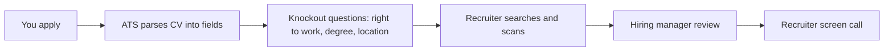
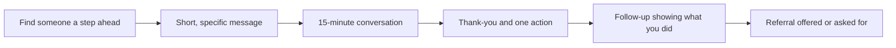
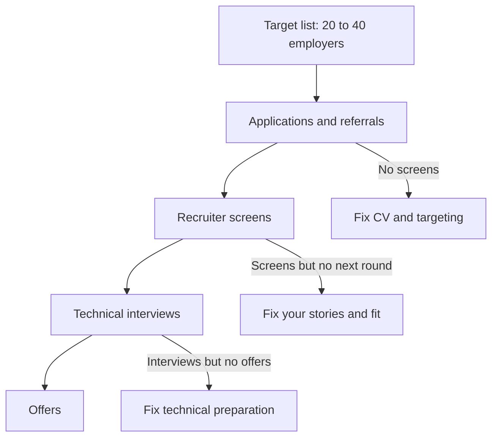

# Module 4 — Getting seen

*You can have the skills and the proof and still hear nothing back. Between your portfolio and an interview stand three filters: software that reads your CV, a recruiter who skims it in seconds, and the plain fact that a hiring manager cannot interview someone they have never heard of. This module is about getting through all three honestly. Lesson 4.1 turns your proof into a CV that parses cleanly and reads well in a quick scan. Lesson 4.2 shows how to build a small, real network and ask for referrals without feeling like a beggar. Lesson 4.3 maps where entry-level jobs actually come from, from graduate programmes and startups to the public sector and the GCC's nationalisation programmes, and how to run a weekly search you can keep up for months. You will watch Omar's first CV fail a screen at Najm Bank, Huda turn a coffee chat into a data-engineering referral, and Yousef and Mohammed build target lists that fit very different situations, with Aisha, Najm's Talent Acquisition lead, explaining what the hiring side actually sees.*

> **Steps:** Apply, Prove — turning the proof you built into applications that real people open, read and act on.

---

# 4.1 — A CV that survives the applicant-tracking system and the six-second human scan
*Level: 🟡 Intermediate* · *Prerequisites: 3.1, 3.2* · *Step: Apply, Prove*

## ⚡ In 60 seconds
- Your CV has two readers before anyone interviews you: an **applicant-tracking system (ATS)**, the software that stores and parses applications, and a **recruiter** who scans the result quickly.
- Design for both with the same choices: one column, standard headings, real text (not images), common file formats, and the job ad's own words where they truthfully describe you.
- Every bullet should show **what you did, with what, and what changed** — evidence, not adjectives. "Responsible for" and "passionate about" say nothing.
- Put your strongest proof in the top third: target role, two or three linked projects, the ad's skills.
- Decision cue: one base CV per target role from Module 2, then a small, honest tailoring pass per application.
- Biggest trap: optimising for an "ATS score" tool or stuffing keywords. It does not reliably help, and a human reads the result.

## 🧭 Why it matters
Omar applies to the Najm Tech Graduate Programme with the CV his university's template produced: two columns, a photo, a skills bar chart ("Python ●●●●○"), his name in a text box, and a "Projects" section listing course titles with no links. He hears nothing for three weeks. When Khalid, the Engineering Manager, asks Aisha about it later, she opens Omar's record in Najm's ATS. The parsed profile shows his name in the wrong field, his skills section empty (the bar chart was an image) and his project dates merged with his university's address. Among several hundred graduate applications, Omar's half-empty profile went to the "maybe later" pile.

Nothing in Omar's CV was false; neither the software nor the person scanning it could find the proof. This lesson is not about tricks for "beating the ATS"; it is about making true evidence easy to read, by machines and by tired humans.

## 📐 How it works

### 🟢 The essentials

**What happens to your CV after you click Apply.** At most mid-sized and large employers, applications land in an **applicant-tracking system**: software such as Workday, Greenhouse, Lever or SAP SuccessFactors that stores candidates, parses CVs into fields (name, contact, education, experience, skills), and lets recruiters search, filter and move people through stages. Small startups may just use an inbox or a spreadsheet.

Two points matter here. First, **parsing can fail quietly.** Text inside images, text boxes, headers and footers, tables and multi-column layouts is often read in the wrong order or lost. You do not see the parsed result, but the recruiter often does. Second, **most filtering is done by people, helped by search.** Recruiters search for terms ("Python", "SQL", "Kubernetes"), apply the application form's knockout questions (for example right to work or a required degree) and then scan. Do not believe claims that a specific ATS automatically rejects CVs for a specific reason; configurations differ by employer. Do assume that if your skills cannot be found by a search and seen in a scan, they do not exist for this application.

**The six-second scan.** A widely quoted eye-tracking study by the job site Ladders (2012, updated 2018) reported that recruiters spend only a few seconds on an initial scan of a CV. Treat the exact number loosely; it is one company's study. In that first look, a reader checks: what role is this person aiming at, does their most relevant work match the job, and is there a link to proof? If not, they move on.

**The layout that works for both readers.**

| Choose | Avoid | Why |
|---|---|---|
| One column, top to bottom | Two or three columns, sidebars | Parsers often read across columns and scramble lines |
| Standard headings: Summary, Experience, Projects, Education, Skills | Creative headings ("My journey", "What I bring") | Parsers and recruiters look for the usual labels |
| Real text in the body | Skills as icons, bars, charts or images | Images cannot be searched; "4 of 5 dots" means nothing |
| Contact details in the body | Name and email in the header or footer | Some parsers skip headers and footers |
| PDF exported from a text editor, or .docx if the form asks | Scanned PDFs, design-tool exports with text as shapes | Text must be selectable to be parsed |
| One page for most graduates; two if you have real experience | Three pages of coursework | Length is not evidence |
| A plain, readable font, 10–12 pt | Tiny fonts to squeeze more in | Humans skim; small text gets skipped |

A quick self-test: open your PDF, select all, copy and paste into a plain text file. If the order is wrong or words are missing, a parser will struggle too.

**The structure, top to bottom.**
1. **Name and contact:** name, city and country, phone, a professional email, LinkedIn URL, GitHub or portfolio URL. Make links clickable and short.
2. **Headline or summary (two lines):** the role you want and your strongest evidence. "Graduate software engineer. Built and deployed a payments-reconciliation API with tests, CI and monitoring; strong in algorithms and Python."
3. **Projects** (for most graduates, above Experience): two to four, each with a link, the stack and two or three result bullets. These are the projects you specified in lesson 3.1 and documented in lesson 3.2.
4. **Experience:** internships, part-time jobs, freelance work, teaching assistant roles, open-source contributions (lesson 3.3). Non-tech jobs count when the bullets show responsibility.
5. **Education:** degree, university, graduation date; grade if it helps; a short "relevant coursework" line only if it maps to the job.
6. **Skills:** grouped and honest — Languages, Frameworks, Data, Cloud and tools. Only things you could be questioned on.
7. **Optional:** certifications, awards, languages (Arabic and English, with level).

### 🟡 Going deeper

**Bullets: evidence, not adjectives.** A good bullet answers three questions: what did you do, how (with what tools or methods), and what changed as a result. Laszlo Bock, Google's former head of people operations, popularised a version of this as "accomplished X, as measured by Y, by doing Z". Not every bullet needs a number; every bullet needs an outcome.

| Weak | Strong |
|---|---|
| Responsible for the backend of a group project. | Built the REST API for a 4-person course project (Python, FastAPI, PostgreSQL); wrote 38 tests and a GitHub Actions pipeline that blocked merges on failure. |
| Passionate about data and machine learning. | Cut a churn model's training data prep from a manual notebook to a scheduled SQL pipeline; documented data checks that caught 2 schema changes. |
| Used AI tools to build an app. | Built a document Q&A app with an LLM API and retrieval; designed a 50-question evaluation set and raised correct answers from 31 to 42 by changing chunking. |
| Familiar with cloud. | Deployed my capstone to a managed container service with infrastructure as code (Terraform); added uptime and error alerts. |

The numbers in the strong column must be your own real numbers. If you did not measure anything, say how you verified it ("tested with…", "used by 12 classmates in a pilot"). Never invent a metric; interviewers ask about every number.

**Keywords: honest mirroring.** Read the job ad and list its concrete nouns: languages, tools, practices ("code review", "unit testing", "REST APIs", "SQL", "CI/CD"). Where a term truthfully describes something you did, use the ad's exact wording — if the ad says "PostgreSQL", write "PostgreSQL", not only "Postgres"; if it says "continuous integration", include it once. That helps search and helps the human match you to the ad. Do not list a skill you cannot discuss, and never hide keywords in white text or tiny fonts: recruiters see the parsed text, and it looks like what it is.

**"ATS score" tools.** Sites that score your CV against an ad can flag missing keywords, but cannot see the employer's configuration or the recruiter's judgement. Use them as a checklist, never as a target.

**Tailoring without rewriting.** Keep one **base CV per target role** (the role choice you made in Module 2). For each application spend fifteen to twenty minutes: adjust the headline, put the most relevant project first, swap two or three bullets to mirror the ad, and check the skills line. Put the company and date in the file name.

**Showing AI-assisted work honestly.** Employers know graduates build with AI coding agents; many expect it. What they check is whether you directed and verified the work. Write bullets that show your part: "designed the data model and API contract, used an AI coding agent for implementation, wrote the test suite and reviewed every change". Reem's first draft said "Built a full-stack AI app in 2 weeks"; her final one said what she designed and verified, which is exactly what Tariq asked about in her interview. Lesson 1.2 builds the skill behind that bullet.

### 🔴 Expert view

**Write for the reader who decides, not only the one who filters.** Aisha, the recruiter, checks match and basics; Khalid, the hiring manager, looks for judgement: tests and a deployment, a README that explains trade-offs, a bug you found or a rollback you planned. One bullet showing production thinking (lesson 1.3) often beats five listing frameworks.

**Regional and sector norms.** CV conventions vary. In parts of the GCC, application forms often ask for nationality and visa or residency status, because nationalisation programmes and sponsorship rules affect eligibility; answer accurately. Photos, date of birth and marital status are common in some markets and discouraged in others; follow the employer's instructions. If you apply in both Arabic and English, keep the two versions consistent — same dates, same titles — and have a fluent reader check the technical Arabic. For regulated employers such as banks, a line showing data-protection care in a project ("removed personal data from logs") is real evidence; [*Secure AI & Application Security*, lesson 5.3 — Protecting personal data: minimisation, logging and privacy engineering](../secai/index.html#/5.3) builds it.

**Gaps, switches and non-traditional paths.** Mohammed, the bootcamp career-switcher, has six years in logistics. His first CV hid them; his second used them: "Automated weekly stock reports with Python and SQL, replacing a manual spreadsheet process" sits under Experience. A gap year, family responsibility or military service can be one honest line. Never invent titles — reference checks exist, and a mismatch costs you the offer.

**The CV is an index to proof.** Every important claim should be one click from evidence: the repo, the demo, the write-up from lesson 3.2. A hiring manager who finds a clear README and a test badge has started evaluating an engineer.

## 🧰 The toolkit
| Resource, tool or template | What it is and does | When to reach for it |
|---|---|---|
| **Applicant-tracking system (ATS)** (e.g. Workday, Greenhouse, Lever, SAP SuccessFactors) | Software that stores applications, parses CVs into fields and lets recruiters search and move candidates through stages | Understanding why layout and wording matter; reading an employer's application portal |
| **Plain-text paste test** | Copy all text from your PDF into a plain text file and check order and completeness | Before every first submission of a new CV layout |
| **XYZ bullet formula** (popularised by Laszlo Bock) | "Accomplished X, as measured by Y, by doing Z" — a pattern for evidence-based bullets | Rewriting any bullet that starts with "Responsible for" |
| **Base CV per role** | One maintained master CV for each target role, tailored per application | Applying to more than one role family |
| **Job-ad keyword list** | The ad's concrete nouns and phrases, matched against your true experience | The 15-minute tailoring pass before each application |
| **University career service CV review** | Free reviews, templates and mock screens from your university's careers office | Before sending your first ten applications |
| **Application log** | A spreadsheet of where you applied, which CV version, date, contact and status | From your first application onward (see lesson 4.3) |

## 🏛️ In practice at Najm Bank
Aisha shares the checklist her team uses in the first pass of graduate applications, and Omar rewrites his CV against it. (Najm's process is fictional and illustrative; every employer configures its own.)

**Najm Tech Graduate Programme — first-pass CV checklist (recruiter)**

| Check | Pass looks like | Omar v1 | Omar v2 |
|---|---|---|---|
| Parsed cleanly | Name, contact, education and skills in the right fields | No: skills lost, name misplaced | Yes |
| Target role clear in the top third | Headline names the track (software, data, platform, AI) | No headline | "Graduate software engineer…" |
| Meets knockout criteria | Degree or equivalent; right to work answered on the form | Yes | Yes |
| At least one linked project with evidence | Repo or demo link; tests, deployment or measured result | Course titles only | Two linked projects |
| Skills match the track | Ad's core skills present and supported by a bullet | Bar chart, unsearchable | Grouped text, each skill used in a bullet |
| Readable in one pass | One column, one page, no walls of text | Two columns, dense | One column, one page |

**Omar's projects section, before and after**

Before:
> **Projects:** Data Structures Project; Database Systems Project; Graduation Project (Banking App)

After:
> **Reconciliation API** — github.com/omar-example/recon-api · Python, FastAPI, PostgreSQL, Docker
> - Built an API that matches bank-statement lines to ledger entries; handles duplicate and partial payments with idempotent writes.
> - Wrote 52 unit and integration tests; GitHub Actions blocks merges on failure; deployed to a managed container service with a health check and error alerts.
> - Documented design trade-offs and a rollback plan in the README; used an AI coding agent for scaffolding and reviewed every change.
>
> **Route planner (algorithms)** — github.com/omar-example/route-planner · C++, Python
> - Implemented A* and Dijkstra on a 200,000-edge city graph; profiled and cut query time by switching to a binary heap.

(Placeholder links.) Omar's v2 reached Khalid's review pile in the next intake.

## 🛠️ Exercises
- 🟢 Run the plain-text paste test and Aisha's checklist on your current CV. Fix every failure. *Done when:* the pasted text reads in the right order with nothing missing, and every row of the checklist is a pass.
- 🟡 Rewrite five of your weakest bullets with the "what, how, what changed" pattern, using only real facts and numbers. *Done when:* a peer can read each bullet aloud and ask one specific follow-up question that you can answer from memory.
- 🔴 Pick two real job ads in your target role, build a keyword list for each, and produce two tailored versions of your base CV in under 20 minutes each. *Done when:* both files exist with the company and date in their names, every ad keyword you included is supported by a bullet, and every keyword you left out is one you cannot honestly claim.

## ⚠️ Mistakes and traps
- **Designer templates.** Columns, icons and skill bars look good and parse badly. Use a plain one-column layout and spend the effort on content.
- **Listing duties instead of results.** "Worked on the frontend" is a duty. Say what you built, how, and how you knew it worked.
- **Keyword stuffing and hidden text.** Recruiters see the parsed text. Mirror the ad only where it is true.
- **Invented numbers or inflated titles.** Every number and title will be questioned or checked. Use real measures or describe your verification instead.
- **Course lists as projects.** A course title is not evidence. Link to the repo, the demo and the README.
- **One CV for every role.** A data-engineering ad and a front-end ad want different top thirds. Keep a base CV per role and tailor briefly.

## 🧾 Recap
- An ATS parses and stores; people search, filter and decide. Write so both can find your evidence.
- One column, standard headings, real text and clickable links. Test with a plain-text paste.
- Bullets show what you did, how, and what changed — with real numbers or real verification.
- Mirror the job ad's wording only where it is true; ignore "ATS score" as a target.
- Show AI-assisted work honestly: what you designed, directed and verified.
- Your CV is an index to proof: every key claim one click from a repo, demo or write-up.

## ✍️ Check yourself

**1. Omar's CV showed his skills as a bar chart of dots, and his parsed ATS profile had an empty skills section. What is the most likely cause?**

- A. The ATS automatically rejected him for listing too few skills
- B. His degree did not match the programme's knockout question
- C. The skills were images, not text, so the parser could not read them
- D. The recruiter's search filter excluded every PDF application

Answer

**C.** Text in images, icons and charts usually cannot be parsed or searched. A assumes an automatic rejection rule the lesson warns you not to assume; nothing in the scenario points to B or D. (🟢 The essentials.)

**2. Which bullet is strongest for a graduate data-engineering application?**

- A. Moved a churn model's data prep from a notebook to a scheduled SQL pipeline with checks that caught two schema changes.
- B. Passionate about data, a fast learner and always eager to pick up new tools, platforms and technologies.
- C. Responsible for a range of data preparation and analysis tasks in a four-person team project.
- D. Expert in SQL, Python, Spark, Airflow, dbt, Kafka, Snowflake and modern cloud data platforms.

Answer

**A.** It says what was done, how, and what changed. D is tempting because it is full of keywords, but it is an unsupported list, and "expert" invites questions a graduate may not survive. B and C give no evidence. (🟡 Going deeper.)

**3. A free website gives Huda's CV an "ATS score" of 54% against a job ad. What should she do?**

- A. Add every missing keyword in white text so the score rises without changing the layout
- B. Keep rewriting the CV until the tool scores it above 90% for this ad
- C. Ignore the job ad completely and send her generic, untailored CV instead
- D. Treat the missing-terms list as a checklist and add only the terms that are true

Answer

**D.** Score tools do not see the employer's configuration or the recruiter's judgement, but a missing-keyword list can be a useful reminder. A is deceptive and visible in the parsed text; B treats an unreliable score as the target. (🟡 Going deeper.)

**4. Reem built most of her project with an AI coding agent. Which CV bullet best reflects that honestly and strongly?**

- A. Built a full-stack AI app in two weeks using the latest AI tools, models and frameworks.
- B. Designed the data model and API, used an AI agent to implement, wrote the tests and reviewed every change.
- C. Leave the project off the CV entirely, because an AI coding agent wrote much of the code.
- D. Wrote all 20,000 lines of the application single-handedly over one university semester.

Answer

**B.** It shows what Reem directed and verified, which is what interviewers will probe. A hides her role and invites questions she cannot answer; D misrepresents the work; C throws away real proof. (🟡 Going deeper.)

**5. Mohammed is a bootcamp graduate with six years in logistics. What should his CV do with the logistics years?**

- A. Remove them, so the CV looks purely technical and the logistics years disappear
- B. Retitle the job "Software Engineer", because he wrote some Python scripts there
- C. Keep them, with honest bullets showing transferable work such as his automated reporting
- D. Move them to a second page in small print, where recruiters are unlikely to look

Answer

**C.** Real experience with relevant bullets is evidence, and hiding years creates an unexplained gap. B is an inflated title that a reference check can expose. (🔴 Expert view.)

## 📚 References
- Workday Recruiting — https://www.workday.com/
- Greenhouse — https://www.greenhouse.com/
- Lever — https://www.lever.co/
- SAP SuccessFactors — https://www.sap.com/products/hcm.html
- MIT Career Advising & Professional Development (resumes and cover letters) — https://capd.mit.edu/
- Harvard Office of Career Services (resumes and CVs) — https://ocs.fas.harvard.edu/
- Ladders (publisher of the recruiter eye-tracking study) — https://www.theladders.com/
- Laszlo Bock, *Work Rules!* (Twelve, 2015); his X-Y-Z formula first appeared in his 2014 LinkedIn articles on résumés
- Lesson 3.1 (capstone specs per role), lesson 3.2 (GitHub and READMEs), lesson 1.2 (building with AI coding agents)

---

# 4.2 — LinkedIn, networking and referrals without awkwardness
*Level: 🟡 Intermediate* · *Prerequisites: 3.2, 4.1* · *Step: Apply*

## ⚡ In 60 seconds
- Many jobs are filled through people who already know, or were told about, the candidate. A **referral** — an employee putting your name forward — usually gets your application read by a human.
- Networking is not schmoozing. It is **useful, specific conversations** with people a step or two ahead of you, plus showing your work where they can see it.
- Your **LinkedIn profile** is a second CV that people find on their own; make the headline, About section and Featured links do the work.
- Ask small, clear, easy-to-answer questions. "Can I ask you three questions about the data team?" works; "Can you get me a job?" does not.
- Decision cue: never ask a stranger for a referral in the first message. Ask for advice; ask for a referral only after they know your work.
- Biggest trap: mass-sending the same connection request to hundreds of people. It wastes your best contacts and can mark you as spam.

## 🧭 Why it matters
Huda sent 40 applications for data-science roles in two months and got one screen. Her notebooks were good, but her SQL was weak and her CV said "data scientist" for jobs that mostly wanted analysts and engineers. Then, at a university alumni evening, she spent ten minutes with a Najm Bank data engineer who explained what his team does all day: pipelines, data quality, SQL, more SQL. She followed up the next day with a thank-you and one question. Two weeks later she sent him a link to a small pipeline project she had built after their chat (her new direction from lesson 2.3). He replied, "This is the kind of thing we need — do you want me to send it to Dana?" Dana, Najm's lead data scientist, sat on the data-engineering hiring panel. Huda's application arrived with a note from an employee who had seen her work.

Nothing in that story is a trick. Huda asked a real question, listened, acted on the answer, and showed the result. That is the whole skill, and it is learnable even if you find talking to strangers uncomfortable.

## 📐 How it works

### 🟢 The essentials

**Why referrals matter.** A hiring manager with one opening and hundreds of applicants is looking for reasons to trust someone. A colleague saying "I have seen this person's work" is such a reason. Many employers run formal referral programmes; others rely on informal introductions. A referral does not skip interviews, and it does not save a weak application, but it usually gets yours read by a person rather than left in a queue. The research literature on job search has long found that personal contacts matter, and often "weak ties" — acquaintances rather than close friends — carry the most new information about openings (Mark Granovetter's 1973 paper "The Strength of Weak Ties" is the classic reference). A large 2022 study of LinkedIn's "People You May Know" experiments (Rajkumar and colleagues, *Science*) reported that moderately weak ties were the most helpful for job mobility — so the alumnus you met once at an event is worth a thoughtful message.

**Who is in your network already.** More people than you think:
- **Classmates and alumni** of your university or bootcamp — especially graduates from the last two to five years who are now juniors or mid-levels.
- **Lecturers, teaching assistants and project supervisors.**
- **Internship colleagues and managers** (lesson 3.3).
- **Open-source maintainers and reviewers** who have seen your pull requests.
- **Hackathon and competition organisers, mentors and judges.**
- **Community groups:** local developer meetups, user groups for a language or cloud provider, data and AI communities, women-in-tech groups, university clubs.
- **Family and friends' contacts** — someone who works in IT at a bank or a telecom can explain how hiring works there.

**Your LinkedIn profile, section by section.** People who hear your name will look you up. LinkedIn is not the only place, but in the GCC and in most corporate hiring it is the first one recruiters check. (Feature names and options change; check LinkedIn's help pages for the current ones.)

| Section | Weak | Strong |
|---|---|---|
| Photo | None, or a cropped party photo | A clear, plain, recent head-and-shoulders photo |
| Headline | "Student at X University" | "Graduate data engineer · SQL, Python, Airflow · building pipelines with data-quality checks" |
| About | A paragraph about passion | Three short paragraphs: what you do, your two best projects with links, what roles you are looking for and where |
| Featured | Empty | Links to your best repo, project write-up or demo |
| Experience and projects | Titles only | The same evidence-based bullets as your CV (lesson 4.1) |
| Skills | 50 skills | 10–15 that match your target role and are supported by your work |
| Open to work | Banner shown to everyone without thought | Choose deliberately; LinkedIn lets you signal to recruiters only or to everyone |

Keep it consistent with your CV: same dates, same titles. If you are bilingual, LinkedIn supports a profile in a second language; an Arabic version can help with regional employers, but keep both accurate.

### 🟡 Going deeper

**The informational conversation.** The core move of networking is a short conversation — 15 to 20 minutes, by video call, phone or coffee — where you ask someone about their work. It is not an interview and not a job request. You are learning what their team does, what they look for in juniors, and what you should learn next. People generally like talking about their work when the questions are specific and the time is short.

**Writing the first message.** Keep it under 100 words. Say who you are, why them in particular, and what you are asking for — with an easy way to say no.

Weak:
> Hi, I'm a fresh graduate looking for opportunities. Please refer me to any open position at your company. Attached is my CV.

Strong:
> Hi Faisal — I'm Huda, a data science graduate from [university]. I saw your talk on data-quality checks at the [meetup] last month. I'm moving toward data engineering and would value 15 minutes to ask how your team decides what to test in a pipeline. Any time in the next two weeks works for me; and no worries if you're too busy.

The strong version is specific (his talk, his topic), small (15 minutes, one theme) and easy to decline. It asks for advice, not a job.

**Questions that work in the conversation.**
- "What does a normal week look like for a junior on your team?"
- "What separates the juniors who do well in their first year from the ones who struggle?"
- "If you were me, which one skill would you work on in the next month?"
- "How does your team use AI coding tools, and what do you expect juniors to be able to check themselves?"
- "Is there anyone else you think I should talk to?"

Do your homework first so you do not ask what the company website already says. Take notes. End on time.

**The follow-up is where it counts.** Send a thank-you the same day, naming one thing you will do because of the conversation. Then do it. Two to four weeks later, send a short update with a link: "You suggested I add data checks to my pipeline — here's what I built." This is the step most people skip, and it is what turns an acquaintance into someone who will vouch for you.

**Asking for a referral.** Ask only someone who has seen your work or knows you, and make it easy:
> Thanks again for the advice on pipelines. Najm has just posted a Graduate Data Engineer role [link]. I think my pipeline project fits what you described. Would you be comfortable referring me? I've attached my CV and a two-line summary you could forward. Completely fine if not.

Give them the job link, your CV and a short summary they can paste. Accept a "no" graciously; they may not know your work well enough, or their company may restrict referrals.

### 🔴 Expert view

**Being visible without becoming an influencer.** You do not need a personal brand. You need a small trail of work that people can find. Practical options:
- Write a short post when you finish a project: the problem, one decision you made, one thing that went wrong, and a link (lesson 3.2 covers writing about your work).
- Comment usefully on posts by engineers in your target field — a real question or a small addition, not "Great post!".
- Answer questions in a community you know well (a course forum, a meetup's chat group).
- Give a five-minute lightning talk at a student club or meetup about a project.

Once a month is enough. Consistency over months beats a burst of posts in one week.

**Networking for introverts and for people with no contacts.** If cold messages feel impossible, start where conversation is built in: volunteer at a meetup or hackathon (organisers meet everyone), contribute to an open-source project (reviewers get to know you through your pull requests), or join a study group for a certification. Mohammed, who knew nobody in tech after leaving logistics, started by helping organise a monthly Python meetup; within three months he knew most of the regular attendees, two of whom worked at the startups he wanted to join.

**Culture and courtesy in the region.** In much of the GCC, relationships and personal introductions carry weight, and a warm introduction from a mutual contact often goes further than a cold message. Use the language your contact uses; greet appropriately; respect working days and hours (the weekend differs by country and has changed in recent years, so check). Be careful with family and community connections: asking for advice or an introduction is normal; asking someone to bypass a hiring process or vouch for work they have not seen puts them in a difficult position and, in regulated employers, may breach their conflict-of-interest rules.

**What not to do.**
- Do not use automation tools that send connection requests or messages in bulk; they breach most platforms' terms and burn your reputation.
- Do not message recruiters and engineers at the same company with the same copy-pasted text; they talk to each other.
- Do not ask an AI tool to write a message you then send unread. Draft with help if you like, but every message must sound like you and contain facts only you know.
- Do not exaggerate a connection ("Khalid told me to apply") when it was a two-line exchange.

## 🧰 The toolkit
| Resource, tool or template | What it is and does | When to reach for it |
|---|---|---|
| **LinkedIn** | Professional network and job platform; your profile acts as a public CV that recruiters search | Profile set-up now; weekly use during your search |
| **Informational conversation** | A 15–20 minute chat to learn about someone's work, not to ask for a job | Exploring a role, team or company before applying |
| **Outreach message template** | Under 100 words: who you are, why them, a small specific ask, an easy way to say no | Every first contact with someone you do not know |
| **Referral request template** | Job link, CV, a two-line summary they can forward, and a graceful exit | Only with people who know you or your work |
| **Network tracker** | A simple sheet: name, where met, date, topic, next action, follow-up date | From your first conversation; review weekly |
| **Meetup.com** and community groups | Listings for local developer, data, cloud and AI meetups | Finding people near you; volunteering to meet organisers |
| **University alumni network** | Alumni directory, mentoring schemes and events run by your university | Finding graduates two to five years ahead of you |

## 🏛️ In practice at Najm Bank
Khalid asks each member of the cohort to keep a **network tracker** for four weeks and to bring it to their mentoring session. Here is part of Huda's, followed by the summary she sent with her referral request.

**Huda's network tracker (extract)**

| Name and role | Where we met | Date | What I learned | My action | Follow-up |
|---|---|---|---|---|---|
| Faisal, data engineer, Najm Bank | Alumni evening | Week 1 | Team spends most time on pipelines and data quality; SQL is tested in interviews | Build a small pipeline with data checks; daily SQL practice | Week 4: sent repo link — he offered a referral |
| Lina, analyst, regional telecom | LinkedIn, after her post on dashboards | Week 2 | Analysts there are asked to present findings to managers in Arabic and English | Add a bilingual summary to my dashboard project | Week 5: sent update |
| Dr. Samir, my capstone supervisor | University | Week 2 | Suggested two alumni in data roles | Message both | Week 3: one call done |
| Open-source maintainer, data-validation library | GitHub issue | Week 3 | Pointed me to a "good first issue" | Opened a docs pull request | Week 4: merged |

**The forwardable summary**

> Huda [surname] — graduate in data science. Built a batch pipeline that loads public transport data into PostgreSQL with scheduled runs and data-quality checks that caught two schema changes; repo: [link]. Strong in Python and statistics, now focused on SQL and data engineering. Applying for: Graduate Data Engineer, Najm Tech Graduate Programme [link].

Faisal forwarded it with one line: "Met Huda at the alumni evening; she took my advice and built this." Dana invited her to the technical round.

## 🛠️ Exercises
- 🟢 Rewrite your LinkedIn headline, About section and Featured links using the table above, keeping them consistent with your CV. *Done when:* a classmate can read only your headline and About section and state your target role and your best project.
- 🟡 Write and send three outreach messages to people one or two steps ahead of you in your target role, each under 100 words and each mentioning something specific about them. *Done when:* the three messages and any replies are logged in your network tracker, with a follow-up date for each.
- 🔴 Hold one informational conversation, act on one piece of advice, and send a follow-up with a link to what you did. *Done when:* your tracker shows the conversation, the action, and the follow-up message with a working link to the result.

## ⚠️ Mistakes and traps
- **Asking for a job or referral in the first message.** It puts people on the spot. Ask for advice first; ask for a referral once they know your work.
- **Long, vague messages.** "I'd love to pick your brain" is not a question. Ask for 15 minutes on one specific topic.
- **No follow-up.** One conversation is forgotten in a week. Thank them, act, and send an update with proof.
- **Mass, automated outreach.** It breaches platform terms and gets you ignored. Fewer, specific messages work better.
- **A LinkedIn profile that disagrees with your CV.** Different dates or titles raise doubts. Keep them consistent.
- **Using family connections to skip process.** Ask for advice and introductions, not favours that put someone's job at risk.

## 🧾 Recap
- Referrals and introductions get applications read by people; they do not replace interviews.
- Your network starts with classmates, alumni, lecturers, colleagues, maintainers and community groups.
- LinkedIn is a public CV: a clear headline, a short About section and Featured links to your work.
- Ask for small, specific advice; follow up with what you did; ask for referrals only from people who know your work.
- Be visible through your work, monthly and consistently, not through volume.

## ✍️ Check yourself

**1. Yousef wants to work in platform engineering at a regional telecom. He finds an engineer there on LinkedIn whom he has never met. Which first message is best?**

- A. "Hello, I am a computer engineering graduate. Please refer me for any open platform role at your company; my CV and transcript are attached for your review."
- B. "I enjoyed your post on moving builds to containers. I'm a computer engineering graduate moving into platform work — could I ask you 15 minutes of questions on how your team runs CI? No worries if not."
- C. "Hi! I'm a recent graduate and I'd love to pick your brain sometime about your career journey, what it's like at your company and the industry in general — let me know what suits you."
- D. No message at all: just his full CV and a cover letter attached to the connection request, so the engineer can see his background.

Answer

**B.** It is specific, small and easy to decline, and asks for advice rather than a job. A asks a stranger for a referral; C is vague and gives the person nothing concrete to say yes to. (🟡 Going deeper.)

**2. After a helpful conversation with a Najm data engineer, what should Huda do next to make a referral most likely?**

- A. Wait quietly for him to contact her whenever a suitable job opens on his team
- B. Email him her latest CV every week until a role that suits her appears
- C. Ask him straight away, while he still remembers her, to refer her to any role
- D. Thank him that day, act on his advice, then send an update linking to her work

Answer

**D.** Acting on advice and showing the result gives him evidence to vouch for. C asks before he has seen her work; B is pressure without new information. (🟡 Going deeper.)

**3. Why does a referral usually help an application?**

- A. It is a trust signal from someone who knows the candidate's work, so a person reads it
- B. It lets the candidate skip the technical interviews and go straight to the final round
- C. It guarantees an offer as long as the employee who referred the candidate is senior
- D. It replaces the CV, because the referrer's note already describes the candidate

Answer

**A.** A referral is a trust signal that gets you read; it does not skip interviews or guarantee anything, which is why B and C are wrong. (🟢 The essentials.)

**4. Mohammed, a career-switcher, knows nobody in tech and finds cold messages very hard. Which approach from the lesson fits him best?**

- A. Use an automation tool to send 300 connection requests to engineers at target firms
- B. Wait until he has his first tech job before he starts building any network at all
- C. Volunteer at a local meetup or contribute to open source, where conversations happen naturally
- D. Ask relatives with contacts to get him hired at their companies without an interview

Answer

**C.** Volunteering and contributing build relationships through shared work. A breaches platform terms and harms his reputation; D asks someone to bypass process. (🔴 Expert view.)

**5. Reem's LinkedIn headline reads "Student at X University". What is the best improvement?**

- A. "Passionate, hard-working graduate, eager to learn and grow in a fast-paced technology team"
- B. "AI application engineer (graduate) · LLM apps with retrieval and evaluation · Python"
- C. Remove the headline entirely, so recruiters focus on her projects and experience instead
- D. A list of all 50 skills she has ever used, so that every recruiter search will find her

Answer

**B.** It names her target role and the evidence behind it, so a reader knows in one line what she does. A uses adjectives with no evidence; D dilutes her focus. (🟢 The essentials.)

## 📚 References
- LinkedIn Help Center (profiles, Open to Work, Featured section) — https://www.linkedin.com/help/linkedin
- Mark S. Granovetter, "The Strength of Weak Ties", *American Journal of Sociology* 78(6), 1973 — https://www.jstor.org/stable/2776392
- Karthik Rajkumar, Guillaume Saint-Jacques, Iavor Bojinov, Erik Brynjolfsson and Sinan Aral, "A causal test of the strength of weak ties", *Science* 377(6612), 2022 — https://www.science.org/doi/10.1126/science.abl4476
- Meetup — https://www.meetup.com/
- MIT Career Advising & Professional Development (networking and informational interviews) — https://capd.mit.edu/
- Harvard Office of Career Services (networking) — https://ocs.fas.harvard.edu/
- GitHub Docs, contributing to open-source projects — https://docs.github.com/en/get-started/exploring-projects-on-github/finding-ways-to-contribute-to-open-source-on-github
- Lesson 3.2 (writing about your work), lesson 3.3 (open source and internships), lesson 4.1 (CV bullets)

---

# 4.3 — Where the jobs are: graduate programmes, job boards, startups, the public sector and the GCC market
*Level: 🟡 Intermediate* · *Prerequisites: 0.2, 4.1, 4.2* · *Step: Explore, Apply*

## ⚡ In 60 seconds
- Entry-level jobs come from several channels with different calendars and rules: **graduate programmes**, **direct job ads**, **startups**, the **public sector and national programmes**, **recruiters**, and **referrals**.
- Graduate programmes often recruit months before graduation, on fixed intakes; startups hire when they need someone; job boards are continuous. Know which clock each target runs on.
- In the GCC, **workforce nationalisation programmes** (Qatarization, Emiratisation and Nafis, Saudization and Nitaqat) shape who is hired for which roles. Know where you stand and look for the programmes built for you.
- Build a **target list of 20–40 employers** across channels, not hundreds of random applications.
- Decision cue: spend your weekly hours where your evidence fits best, and measure your pipeline every week.
- Biggest trap: applying only through one big job board and judging yourself by silence.

## 🧭 Why it matters
Yousef spent his first month after graduating applying to every "DevOps engineer" ad on one job board, most asking for three to five years' experience. He heard nothing and started to think he was unemployable. When he met Salem, Najm's Head of Platform Engineering, at a careers fair, Salem asked a simple question: "Where are you applying?" Yousef had missed the Najm Tech Graduate Programme's application window by two weeks, had never looked at the regional telecom's graduate scheme, did not know a government digital agency was hiring juniors through a national programme, and had not contacted the two cloud consultancies in Doha that take on graduates as junior engineers.

Mohammed's problem was different. As a career-switcher without a computing degree, several graduate programmes' degree requirements ruled him out. His path was startups and smaller firms that judge portfolios rather than degrees — Sadeem Pay, the Doha fintech, among them. Same market, two different maps. This lesson helps you draw yours.

## 📐 How it works

### 🟢 The essentials

**The six channels.**

| Channel | What it is | Timing | Best for | Watch out for |
|---|---|---|---|---|
| **Graduate programmes** | Structured one- to two-year schemes at banks, energy companies, telecoms, consultancies and large tech firms; rotations, training, a cohort | Fixed intakes; applications often open many months before the start date | Final-year students and recent graduates who meet the degree and date criteria | Missing the window; strict eligibility on degree, graduation year or nationality |
| **Direct job ads** | Junior, associate or "engineer I" roles on company careers pages and job boards | Continuous | Anyone with matching evidence | Ads titled "junior" that ask for years of experience; high competition |
| **Startups and scale-ups** | Small companies hiring for specific needs | When funded and when the need arises | Builders with a strong portfolio; career-switchers | Less training, more ambiguity; check the company's funding and stability |
| **Public sector and national programmes** | Government entities, digital agencies, semi-government companies, national development programmes | Often annual or campaign-based; formal processes | Nationals in programmes designed for them; others where roles are open | Longer timelines; eligibility rules |
| **Recruiters and agencies** | External recruiters filling roles for clients | Continuous | Contract and mid-size roles; some junior roles | They are paid by the employer; you are not their client. Never pay a recruiter to get you a job |
| **Referrals and community** | Introductions through people who know your work (lesson 4.2) | Continuous | Everyone | Takes weeks to build; start early |

**Where to find ads.** Company careers pages are the most reliable source. Aggregators and boards add reach: LinkedIn Jobs is widely used in the region; Bayt.com, GulfTalent and Naukrigulf are long-established GCC job boards; Wellfound (formerly AngelList Talent) lists startup roles internationally. Government and national employment platforms run by labour ministries list public and national-programme roles. Your university's careers office often has employer partnerships and fairs that never appear on public boards. These are examples, not endorsements; check each one's current scope.

**Reading a junior job ad.** Ads are wish lists written by busy people. Separate the **must-haves** (the degree if it is a hard rule, right to work, the core language or tool) from the **nice-to-haves**. If you meet the must-haves and a good share of the rest, and you have proof for what you claim, apply. "Two years' experience" in a junior ad sometimes includes internships and substantial projects; it sometimes does not. If unsure, ask the recruiter or a contact. Do not apply to roles that clearly want a senior; that time is better spent elsewhere.

### 🟡 Going deeper

**Graduate programmes: how to not miss them.** Many large employers in banking, energy, telecoms and consulting run graduate or "development" programmes on a yearly cycle. Typical stages are an online application, online tests (numerical, logical or coding), a video or phone interview, an assessment day with group exercises and interviews, then an offer for a start date months later. Make a calendar in your final year: list target programmes, note when applications opened last year (from the company site, your careers office or past applicants) and set reminders a month before. Some programmes are for specific nationalities or recent-graduate windows; read the eligibility first.

At Najm, Aisha explains the fictional Najm Tech Graduate Programme's cycle: applications open once a year, online coding and reasoning tests follow, then a technical interview with Tariq, Dana or Salem depending on the track, and an assessment day. Offers go out months before the September start. "Yousef's profile was fine," she tells Khalid. "He just arrived after the window closed."

**The GCC market: what shapes hiring.** Four forces matter for graduates in the region:
- **Workforce nationalisation.** Each GCC country has policies to raise the share of citizens in private-sector jobs: Qatarization in Qatar, Emiratisation in the UAE (with the Nafis programme supporting Emiratis in private-sector careers), Saudization in Saudi Arabia (with the Nitaqat classification system), and similar programmes in Oman, Kuwait and Bahrain. They shape which roles are reserved, targeted or supported, and they fund training and graduate programmes for nationals. Rules and targets change; read the current official pages rather than relying on forum posts.
- **Large regulated employers.** Banks, energy companies, telecoms, government entities and healthcare are major employers of tech graduates. They value security, data protection and governance awareness — for example Qatar's personal data protection law (Law No. 13 of 2016) — and they move more carefully than startups. [*Secure AI & Application Security*, lesson 11.2 — Regulation that touches security: GDPR, PDPPL, the EU AI Act and financial-sector rules](../secai/index.html#/11.2) is the place to build that awareness.
- **Growing startup and digital ecosystems.** Government-backed hubs and incubators (for example Qatar Science & Technology Park in Doha and Hub71 in Abu Dhabi) and regional fintech activity create junior roles at smaller firms. These change quickly; check current programmes.
- **Language.** Bilingual Arabic and English technical communication — writing a clear incident note or explaining a dashboard to a manager in either language — is a real advantage for many roles.

**If you are not a national of the country you are applying in.** Visa and sponsorship rules vary by country and change; check current rules on official government sites and with the employer. Be honest on application forms about your status. Some graduate programmes are open to all; others are restricted. Multinationals' regional offices, startups and consultancies are often more open to international hiring, but this varies widely. Never pay anyone for a "guaranteed" job or visa — that is a common scam.

**Your target list.** Instead of hundreds of random applications, build a list of 20 to 40 employers that fit your role and situation, across at least three channels. For each, note: why it fits, the channel (graduate programme, direct, referral), timing, a contact if you have one, and the status. Aim for a mix: a few "reach" employers, most "realistic" ones, and some where your evidence is clearly strong.

### 🔴 Expert view

**Run the search as a weekly pipeline.** A job search is a funnel you can measure. Track, each week: applications sent, conversations held, screens, interviews, and offers. The ratios tell you what to fix.

If many applications produce no screens, the problem is usually the CV, the targeting or the channel (lesson 4.1) — not you as a person. If screens do not lead anywhere, practise how you talk about your work (lesson 5.1). If you reach final rounds and do not get offers, look at the technical preparation in Module 5. Change one thing at a time and watch the next two or three weeks.

**A sustainable weekly rhythm.** A first job search can take months, and the entry-level market is harder than a few years ago (lesson 0.1). Plan for endurance. A rhythm that works for many graduates, roughly 15–25 hours a week alongside study or other work:
- 40% building and improving proof (projects, skills from your Module 2 study path);
- 30% targeted applications, each tailored (lesson 4.1);
- 20% networking and follow-ups (lesson 4.2);
- 10% reviewing your pipeline and planning next week.

Keep building during the search: a new project or merged pull request gives you news for contacts and keeps your skills sharp.

**Choosing between paths.** Each channel has trade-offs for your first two years. Graduate programmes give structure, training and a cohort, but may rotate you through teams you did not choose. Startups give breadth and fast responsibility, but less mentoring and more risk. The public sector gives stability and, for nationals, strong support, but sometimes slower technical change. None is "the right one"; pick the one whose trade-offs suit you, and remember that a first job is a start, not a life sentence (lesson 6.3). Role-specific career advice in sister courses — for example [*AI Product Management*, lesson 10.2 — The AI PM career: interviews, portfolio and growth](../aipm/index.html#/10.2) and [*Secure AI & Application Security*, lesson 12.2 — The security career: roles, certifications and portfolio](../secai/index.html#/12.2) — can help, as can [*Cloud & DevOps: Zero to Hero*, Module 7 — Capstone, cloud career and practice exam](../cloud/index.html#/7.1) for Yousef, and [*Data Engineering & Analytics: Zero to Hero*, Module 7 — Capstone, data career and practice exam](../data/index.html#/7.1) for Huda.

**Scams and red flags.** Be careful with: requests for payment to apply, train or secure a visa; "interviews" held only over chat apps with no company email or website; offers made without any interview; requests for bank details or ID copies before an offer letter; and "jobs" that ask you to receive and forward money or goods. Check the company's official site and, if in doubt, contact the company through its published contact details.

## 🧰 The toolkit
| Resource, tool or template | What it is and does | When to reach for it |
|---|---|---|
| **Target employer list** | 20–40 employers across channels, with fit, timing, contact and status | Before your first application; review monthly |
| **Graduate programme calendar** | Dates when target programmes opened last cycle, with reminders a month earlier | Final year of study and the year after graduating |
| **Application log** | Per application: date, role, channel, CV version, contact, status, next step | Every application, from the first |
| **Weekly pipeline review** | Count applications, screens, interviews and offers; find the stage that is failing | Every week, 30 minutes |
| **Company careers pages** | Employers' own job listings, often the most up to date | Every target employer, before any board |
| **Regional job boards** (e.g. LinkedIn Jobs, Bayt.com, GulfTalent, Naukrigulf, Wellfound) | Aggregated listings across employers | Discovering employers to add to your target list |
| **Nationalisation programme portals** (e.g. Nafis in the UAE; labour-ministry sites in Qatar and Saudi Arabia) | Official information on programmes, eligibility and support for nationals | If you are a national, before planning your search; otherwise to understand the market |
| **University careers office** | Employer partnerships, fairs, CV reviews and alumni contacts | Throughout your final year and after |

## 🏛️ In practice at Najm Bank
After the careers fair, Salem asks Yousef to rebuild his search as a target list and a weekly pipeline. Here is an extract of Yousef's list, and his pipeline after six weeks. (All employers are fictional or generic.)

**Yousef's target list (extract) — target role: graduate cloud or platform engineer**

| Employer | Channel | Why it fits | Timing | Contact | Status |
|---|---|---|---|---|---|
| Najm Bank, Tech Graduate Programme (platform track) | Graduate programme | Platform track; networking background valued | Missed this cycle; calendar reminder set for next opening | Salem (careers fair) | Waiting for next window; sending a project update in month 3 |
| Regional telecom, graduate scheme | Graduate programme | Networks and infrastructure focus | Open now | Alumnus in network operations | Applied; online test done |
| Government digital agency | Public sector | Junior cloud roles; national programme partners | Rolling campaign | Careers fair stand | Applied |
| Doha cloud consultancy A | Direct, small firm | Hires juniors to support cloud migrations | Continuous | Meetup organiser works there | Referral requested |
| Sadeem Pay | Startup | Needs CI/CD and container help | Continuous | None yet | Informational chat booked |
| Multinational regional office | Direct ad | Associate cloud engineer role | Posted this month | None | Applied, tailored CV v3 |

**Yousef's pipeline after six weeks**

| Week | Applications | Conversations | Screens | Interviews | Offers | Change made |
|---|---|---|---|---|---|---|
| 1–2 | 14 | 1 | 0 | 0 | 0 | Rebuilt CV per lesson 4.1; cut senior-level ads |
| 3–4 | 8 | 4 | 2 | 0 | 0 | Added Terraform and CI project to the top of CV |
| 5–6 | 6 | 3 | 2 | 1 | 0 | Practised STAR stories (lesson 5.1) |

Fewer applications, better aimed, produced more screens. Salem's comment: "Now you can see which stage to work on."

## 🛠️ Exercises
- 🟢 Build your target list of at least 20 employers across at least three channels, with the "why it fits" column filled in for each. *Done when:* the list exists, every row has a channel and a reason, and no more than half come from one channel.
- 🟡 Make your graduate programme calendar for the next 12 months for at least five programmes, using official company pages or your careers office. *Done when:* each programme has a source link, last cycle's opening month or "unknown — asked careers office", and a reminder set a month earlier.
- 🔴 Run your search as a pipeline for four weeks: log every application and conversation, review weekly, and make one change based on the numbers. *Done when:* your log shows four weekly reviews, each naming the weakest stage and the one change you made.

## ⚠️ Mistakes and traps
- **One channel only.** Job boards alone mean high competition and little feedback. Mix graduate programmes, direct applications, startups and referrals.
- **Missing graduate programme windows.** Many recruit long before the start date. Build a calendar in your final year.
- **Applying to everything.** Hundreds of untargeted applications produce silence and burnout. A target list and tailored CVs work better.
- **Ignoring eligibility.** Nationality, degree and graduation-year rules are real. Read them first and put your hours where you are eligible.
- **Judging yourself by silence.** Silence is data about your CV, targeting or channel. Use the pipeline to find which stage to fix.
- **Paying for jobs or visas.** Legitimate employers do not charge you to be hired. Verify through official channels.

## 🧾 Recap
- Entry-level jobs come through graduate programmes, direct ads, startups, the public sector, recruiters and referrals — each with its own timing.
- Graduate programmes run on fixed cycles; build a calendar early.
- In the GCC, nationalisation programmes, large regulated employers, growing startup hubs and bilingual communication shape hiring; check current official rules.
- Build a target list of 20–40 employers across channels; tailor each application.
- Run the search as a weekly pipeline and fix the weakest stage, one change at a time.

## ✍️ Check yourself

**1. Yousef applied to 60 platform-engineering ads on one job board in a month and got no screens. What does the pipeline view suggest he fix first?**

- A. His interview technique, since he will need it for the later technical rounds
- B. His salary expectations, which may be putting employers off before they reply
- C. His offer negotiation, so the offers he eventually receives are stronger
- D. His CV, targeting and channels, since applications are not becoming screens

Answer

**D.** When applications produce no screens, the problem is upstream: CV, targeting or channel. A and C apply to later stages he has not reached. (🔴 Expert view.)

**2. Omar wants to join a bank's graduate programme that starts next September. When should he start preparing to apply?**

- A. After he graduates, when he has more free time to focus on applications properly
- B. Now: find when applications opened last cycle and set a reminder well before then
- C. In August, a few weeks before the September start, when the new cohort forms
- D. Only when a recruiter from the bank contacts him directly about the programme

Answer

**B.** Graduate programmes run on fixed intakes and often recruit long before they start. A and C risk missing the window, as Yousef did. (🟡 Going deeper.)

**3. Mohammed has a strong portfolio but no computing degree, and several graduate programmes require one. Which part of the market fits him best first?**

- A. Startups and smaller firms that judge portfolios, plus referrals from his community work
- B. Only degree-requiring graduate programmes, hoping each will make an exception for him
- C. An agency that charges him a fee but promises a guaranteed job within three months
- D. Pausing his whole search until he has completed a computing degree part-time

Answer

**A.** Channels that weigh proof over credentials suit his evidence. B ignores eligibility; C is a red flag for a scam. (🟢 The essentials.)

**4. Which statement about GCC workforce nationalisation programmes is accurate and well hedged?**

- A. Every private company in the GCC must now hire only nationals for all technology roles
- B. They were phased out some years ago and no longer have any real effect on tech hiring
- C. Qatarization, Emiratisation and Saudization shape hiring and support nationals; rules change, so check official sources
- D. They apply only to government ministries and have no effect on private-sector employers

Answer

**C.** They are real, they shape private- and public-sector hiring, and their details change. A and D overstate or misstate their scope. (🟡 Going deeper.)

**5. Reem receives a chat-app message offering her an AI engineering job abroad, with no interview, if she pays a "visa processing fee" first. What should she do?**

- A. Pay the fee quickly, since good offers abroad expire fast and the amount is small
- B. Send a copy of her passport so they can begin the visa processing straight away
- C. Negotiate the fee down before paying, and ask them for a receipt for her records
- D. Treat it as a likely scam and verify the company via its official site and contacts

Answer

**D.** Payment requests, no interview and chat-only contact are classic red flags. A, B and C all hand money or personal data to an unverified party. (🔴 Expert view.)

## 📚 References
- Qatar Ministry of Labour — https://www.mol.gov.qa/
- Nafis (UAE Emirati talent programme) — https://www.nafis.gov.ae/
- UAE Government portal, Emiratisation — https://u.ae/
- Saudi Ministry of Human Resources and Social Development (Nitaqat and Saudization) — https://www.hrsd.gov.sa/
- Qatar Law No. 13 of 2016 on Personal Data Privacy Protection, via Al Meezan (Qatar legal portal) — https://www.almeezan.qa/
- Qatar Science & Technology Park — https://qstp.org.qa/
- Hub71 — https://www.hub71.com/
- LinkedIn Jobs — https://www.linkedin.com/jobs/
- Bayt.com — https://www.bayt.com/
- GulfTalent — https://www.gulftalent.com/
- Naukrigulf — https://www.naukrigulf.com/
- Wellfound — https://wellfound.com/
- US Federal Trade Commission, job scams — https://consumer.ftc.gov/articles/job-scams
- [*Secure AI & Application Security*, lesson 11.2 — Regulation that touches security: GDPR, PDPPL, the EU AI Act and financial-sector rules](../secai/index.html#/11.2)
- [*AI Product Management*, lesson 10.2 — The AI PM career: interviews, portfolio and growth](../aipm/index.html#/10.2)
- [*Secure AI & Application Security*, lesson 12.2 — The security career: roles, certifications and portfolio](../secai/index.html#/12.2)
