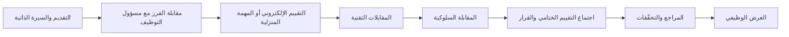
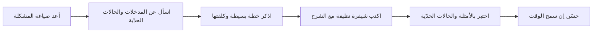
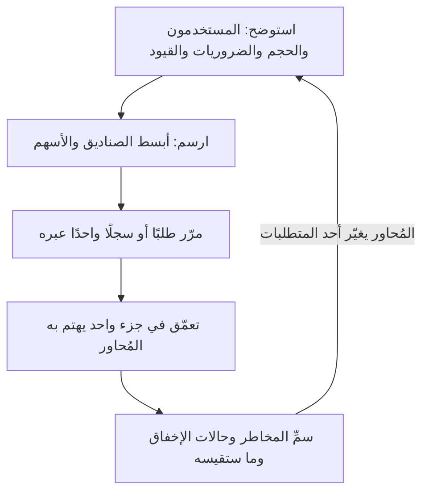

# الوحدة 5 — المقابلات (Interviews)

*المقابلة (interview) ليست امتحانًا تجتازه بالذكاء في يومه. إنها مجموعة من الفحوص (checks) صمّمها صاحب العمل (employer)، وغالبًا بعناية، للإجابة عن بضعة أسئلة: هل يستطيع هذا الشخص أداء العمل، وهل سيتعلّم، وهل سيثق به الفريق؟ تُريك هذه الوحدة تلك الفحوص من الداخل. تبدأ بجولات التوظيف كاملةً (hiring loop)، ومقابلة الفرز مع مسؤول التوظيف (recruiter screen)، والمقابلة السلوكية (behavioural interview)، حيث تحوّل مشاريعك وأخطاءك إلى رصيد من القصص الصادقة (bank of honest stories). ثم تتناول المقابلات التقنية (technical interviews) كما تُدار اليوم: اختبارات فرز الخوارزميات (algorithm screens)، والبرمجة المباشرة (live coding)، والمهام المنزلية (take-home tasks)، وتمرينًا أحدث هو مراجعة طلب دمج (pull request) كتبه وكيل ذكاء اصطناعي (AI agent). وتنتهي بنقاشات التصميم (design conversations) التي يواجهها المبتدئون (juniors) الآن أكثر مما يتوقعون: تصميم نظام صغير (small system design)، أو حالة بيانات أو SQL (data or SQL case)، أو سؤال عن تقييم تعلّم الآلة (machine-learning evaluation question)، أو شرح متدرّج لاستكشاف أعطال السحابة (cloud troubleshooting walk-through). ستتابع جولات المقابلات في برنامج نجم للخرّيجين التقنيين (Najm Tech Graduate Programme) بينما تفرز عائشة الدفعة (cohort)، ويدير طارق الجولات التقنية (technical rounds)، وتختبر دانة وسالم مرشّحي البيانات والمنصّات (data and platform candidates). يتعلّم عمر أن الخوارزمية الصحيحة التي تُقال في صمت تنال درجة أقل مما ظنّ، وتضطر ريم إلى شرح شيفرة لم تكتبها سطرًا بسطر، وتكتشف هدى أن عبارة "سأستخدم XGBoost" ("I would use XGBoost") ليست تصميمًا.*

> **الخطوات (Steps):** Interview — أن تعرف ما تفحصه كل جولة (round)، وتُعدّ لها أدلة صادقة (honest evidence)، وتُظهر تفكيرك بصوت مسموع (out loud).

---

# 5.1 — جولات التوظيف، ومقابلة الفرز مع مسؤول التوظيف، والمقابلات السلوكية (STAR)
*المستوى (Level): 🟡 متوسط (Intermediate)* · *المتطلبات (Prerequisites): 1.1، 3.1، 4.1* · *الخطوة (Step): Interview*

## ⚡ الدرس في دقيقة (In 60 seconds)
- **جولات التوظيف (hiring loop)** هي التسلسل الكامل للخطوات من التقديم (application) إلى العرض الوظيفي (offer): الفرز (screen)، والتقييمات (assessments)، والمقابلات (interviews)، واجتماع التقييم الختامي (debrief)، والمراجع (references). كل خطوة تفحص شيئًا محددًا؛ اعرف ما هو، واستعدّ له.
- **مقابلة الفرز مع مسؤول التوظيف (recruiter screen)** تفحص الملاءمة للدور (fit with the role)، والأمور اللوجستية (logistics) (الموقع، وتاريخ البدء، وحق العمل (right to work)، وتوقعات الراتب (salary expectations))، وما إذا كنت تستطيع التعبير عن نفسك بوضوح. إنها مقابلة حقيقية، لا مجرد إجراء شكلي (formality).
- **المقابلات السلوكية (behavioural interviews)** تسأل عن السلوك الماضي (past behaviour) ("حدّثني عن موقف…" ("Tell me about a time…"))، لأنه أفضل دليل يملكه المُحاور (interviewer) على السلوك المستقبلي. أجب باستخدام **STAR**: الموقف (Situation)، والمهمة (Task)، والإجراء (Action)، والنتيجة (Result).
- ابنِ **رصيد القصص (story bank)** قبل أن تتقدّم: من 8 إلى 10 قصص حقيقية من المشاريع والتدريب الميداني (internships) والدراسة والعمل، وكل قصة موسومة بالمهارات التي تُظهرها (tagged with the skills it shows).
- إشارة القرار (Decision cue): قبل كل جولة، اسأل مسؤول التوظيف (recruiter) عمّا تفحصه، وكم تستغرق، وهل يُسمح بأدوات الذكاء الاصطناعي (AI tools).
- الفخ الأكبر (Biggest trap): قصص تملؤها "نحن" ("we") في كل مكان، بلا إجراء واضح خاص بك، وبلا نتيجة. لا يستطيع المُحاور أن يمنح درجة لما لم تقله.

## 🧭 لماذا يهم (Why it matters)
محمد، المتحوّل مهنيًا عبر معسكر تدريبي (bootcamp career-switcher)، يجتاز التقييم الإلكتروني (online assessment) في نجم بسهولة. معرض أعماله (portfolio) قوي، وهو متمكّن من البرمجة. ثم تتصل به عائشة (قائدة استقطاب المواهب (Talent Acquisition lead)) لمقابلة فرز (screen) مدتها 30 دقيقة. تسأله: "لماذا نجم، ولماذا هذا البرنامج؟" ⁦("Why Najm, and why this programme?")⁩. يتحدث أربع دقائق عن حبّه للبناء، ولا يذكر البنك أبدًا، ويذكر راتبًا رآه في منتدى لبلد آخر. لاحقًا يسأله خالد (مدير الهندسة (Engineering Manager)): "حدّثني عن موقف اختلفت فيه مع زميل في الفريق" ⁦("Tell me about a time you disagreed with a teammate.")⁩. يقول محمد: "عادةً كنا نتفق على الأمور. أنا سهل التعامل" ⁦("We usually agreed on things. I am easy to work with.")⁩. فيكتب خالد "لا دليل" ("no evidence") أمام كفاءة العمل الجماعي (teamwork competency).

محمد يستطيع أداء العمل؛ لكنه لم يُظهر ذلك بالصيغة (format) التي تستخدمها جولات التوظيف (loop). الجولات غير التقنية (non-technical rounds) ليست "ليّنة" (soft). فهي كثيرًا ما تحسم الاختيار بين مرشّحين بدرجات تقنية متقاربة (similar technical scores)، وهي الأسهل في الاستعداد، لأن الأسئلة متوقَّعة (predictable) والإجابات تأتي من حياتك أنت.

## 📐 كيف يعمل (How it works)

### 🟢 الأساسيات (The essentials)

**جولات التوظيف (The hiring loop).** يسمّي أصحاب العمل الخطوات بأسماء مختلفة، لكن معظم جولات مستوى المبتدئين (entry-level loops) تبدو هكذا:



| الخطوة (Step) | ما تفحصه (What it checks) | من يديرها عادةً (Who usually runs it) | كيف تستعد (How to prepare) |
|---|---|---|---|
| التقديم والسيرة الذاتية (Application and CV) | التطابق الأساسي مع الدور (Basic match to the role) | نظام تتبّع المتقدّمين (applicant-tracking system) ومسؤول توظيف (recruiter) (4.1) | فصّل سيرتك الذاتية (Tailor your CV) على الإعلان |
| مقابلة الفرز مع مسؤول التوظيف (Recruiter screen) | الدافع (Motivation)، والأمور اللوجستية (logistics)، والتواصل (communication)، والملاءمة التقريبية (rough fit) | مسؤول توظيف أو شريك استقطاب مواهب (talent-acquisition partner) | تعريف بنفسك في 60 ثانية (60-second introduction)، وإجابة "لماذا صاحب العمل هذا" ("why this employer")، وأمورك اللوجستية جاهزة |
| التقييم الإلكتروني (Online assessment) | أساسيات البرمجة أو الاستدلال (Coding or reasoning basics)، على نطاق واسع (at scale) | منصّة آلية (automated platform) | تدرّب بتوقيت (Timed practice) على النوع نفسه من المنصّات |
| المقابلات التقنية (Technical interviews) | حل المشكلات (Problem solving)، وجودة الشيفرة (code quality)، والاستدلال بصوت مسموع (reasoning out loud) | مهندسون (Engineers) (5.2، 5.3) | تدرّب مع شخص (Practice with a person)، لا وحدك فقط |
| المقابلة السلوكية (Behavioural interview) | كيف تعمل مع الآخرين، وتتعلّم، وتتعامل مع الانتكاسات (handle setbacks) | مدير (manager) أو مهندس أول (senior engineer) | رصيد القصص (story bank) وطريقة STAR |
| اجتماع التقييم الختامي (Debrief) | يقارن المُحاورون الأدلة المكتوبة (written evidence) بمعيار التقييم (rubric) | لجنة المقابلة (interview panel) ومدير التوظيف (hiring manager) | لا شيء في اليوم نفسه؛ أدلتك مكتوبة سلفًا |
| المراجع والتحقّقات (References and checks) | أن ما قلته صحيح (That what you said is true) | الموارد البشرية (HR)، وأحيانًا طرف ثالث (third party) | أخبر من يزكّونك (referees) مسبقًا؛ ولا تبالغ في أي شيء أبدًا (never inflate anything) |

أمران أهم مما يبدوان. أولًا، يكتب معظم المُحاورين ملاحظاتهم وفق **معيار تقييم (rubric)**، وهو قائمة بالكفاءات (competencies) مع وصف للإجابات الضعيفة والمقبولة والقوية (weak, acceptable and strong answers)؛ وفي اجتماع التقييم الختامي (debrief) لا يُحتسب إلا ما دوّنوه. ثانيًا، كثيرًا ما تُقيم برامج الخرّيجين (graduate programmes) **مراكز التقييم (assessment centres)**: يومًا من التمارين مثل مهمة جماعية (group task) وعرض تقديمي (presentation) ومقابلات، تُراقَب فيه وأنت تفعل الأشياء، لا وأنت تتحدث عنها فقط.

**مقابلة الفرز مع مسؤول التوظيف (The recruiter screen).** توقّع من 15 إلى 45 دقيقة، وهذه الأسئلة:
- "حدّثني عن نفسك" ⁦("Tell me about yourself.")⁩ نحو 60 ثانية: من أنت الآن، وماذا بنيت، وماذا تريد بعد ذلك، ولماذا هذا الدور (who you are now, what you have built, what you want next, why this role).
- "لماذا نحن؟ لماذا هذا الدور؟" ⁦("Why us? Why this role?")⁩ اذكر شيئًا محددًا: التناوبات (rotations) في البرنامج، أو منتجًا (product)، أو القطاع (sector). اقرأ صفحة الوظائف (careers page) أولًا.
- "ما توقعاتك للراتب؟" ⁦("What are your salary expectations?")⁩ إن استطعت، فاطلب النطاق (range) أولًا: "هل يمكنك مشاركة النطاق المرصود لهذا الدور؟" ⁦("Could you share the range budgeted for this role?")⁩ وإن اضطررت لذكر رقم، فاذكر نطاقًا مدروسًا (researched range) لذلك البلد وذلك الدور (يشرح الدرس 6.1 كيف تبحث عنه). لا تذكر أبدًا رقمًا من سوق أخرى (another market).
- الأمور اللوجستية (Logistics): تاريخ البدء (start date)، والموقع (location)، وحق العمل (right to work). في دول الخليج (GCC) تختلف قواعد التأشيرات والكفالة (visa and sponsorship rules) من بلد إلى آخر وتتغيّر؛ أجب بصدق وتحقّق من القواعد الحالية (current rules).
- "هل لديك أسئلة لي؟" ⁦("Do you have questions for me?")⁩ الجواب دائمًا نعم: اسأل عن الخطوات التالية (next steps)، والجدول الزمني (timeline)، وما تفحصه الجولة التالية.

**طريقة STAR.** للإجابة السلوكية (behavioural answer) أربعة أجزاء:
- **الموقف (Situation):** السياق (context) في جملة أو جملتين.
- **المهمة (Task):** ما كنتَ *أنت* مسؤولًا عنه (responsible for)، أو المشكلة التي كان عليك حلّها.
- **الإجراء (Action):** ما فعلتَه *أنت*، خطوة بخطوة (step by step). هذا معظم الإجابة، نحو نصف الوقت (around half the time).
- **النتيجة (Result):** ما حدث، مع الدليل (evidence) إن وُجد، وما تعلّمته.

يسأل خالد هدى: "حدّثني عن موقف وجدتِ فيه مشكلة في عملك أنتِ" ⁦("Tell me about a time you found a problem in your own work.")⁩

> **إجابة ضعيفة (Weak):** "في مشروع التخرّج (final-year project) بنينا نموذجًا للتنبؤ بتسرّب العملاء (churn model). كانت هناك بعض مشكلات البيانات (data issues) لكننا أصلحناها وكان النموذج جيدًا في النهاية. تعلّمت الكثير عن جودة البيانات (data quality)."

> **إجابة قوية (Strong (STAR)):** "**الموقف (Situation):** في مشروع التخرّج (final-year project)، ضمن فريق من ثلاثة، كنا نتنبأ بعملاء الاتصالات الذين سيُلغون اشتراكهم (telecom customers would cancel). **المهمة (Task):** كنت مسؤولة عن النموذج والتقييم (I owned the model and the evaluation). **الإجراء (Action):** حقق نموذجي الأول درجة عالية جدًا على مجموعة الاختبار (test set)، وهذا أثار شكّي. فحصت أي السمات (features) كانت الأهم، فوجدت أن إحداها حقل يُعبّأ *بعد* أن يكون العميل قد ألغى فعلًا، أي إن النموذج كان يرى الإجابة. أزلته، وأعدت تقسيم البيانات حسب التاريخ (re-split the data by date) بدلًا من التقسيم العشوائي (at random) بحيث تأتي مجموعة الاختبار بعد فترة التدريب (training period)، وكتبت ملاحظة قصيرة للفريق أشرح فيها السبب. **النتيجة (Result):** انخفضت الدرجة إلى مستوى أكثر واقعية (more realistic level)، لكن مشرفنا قال إنه أول مشروع في ذلك العام يكتشف تسرّب البيانات (leakage) بنفسه. ومنذ ذلك الحين أفحص توقيت السمات (feature timing) قبل أن أثق بأي درجة."

للإجابة القوية مالك واحد ("أنا" ("I"))، وإجراءات محددة (specific actions)، ونتيجة صادقة (honest result)، ودرس دائم (lasting lesson)، في نحو 90 ثانية. لم تخترع نسبة مئوية؛ وإن كنت لا تتذكر رقمًا، فصِف النتيجة بالكلمات (describe the result in words).

### 🟡 التعمق أكثر (Going deeper)

**ما الذي تسأل عنه الأسئلة السلوكية حقًا (What behavioural questions are really asking).** يربط المُحاورون الأسئلة بالكفاءات (map questions to competencies). إذا عرفت الكفاءة، عرفت أي قصة تختار.

| السؤال الذي تسمعه (Question you hear) | الكفاءة وراءه (Competency behind it) | ما تُظهره الإجابة القوية (What a strong answer shows) |
|---|---|---|
| "حدّثني عن موقف اختلفت فيه مع أحد" ⁦("Tell me about a time you disagreed with someone.")⁩ | التعاون (Collaboration)، والتواصل (communication) | أثرتَ الأمر باحترام (raised it respectfully)، واستمعت، واستخدمت الأدلة (used evidence)، وقبلت النتيجة أو غيّرتها |
| "حدّثني عن خطأ ارتكبته" ⁦("Tell me about a mistake you made.")⁩ | تحمّل المسؤولية (Ownership)، والتعلّم (learning) | اعترفت به سريعًا (admitted it fast)، وأصلحته، وغيّرت شيئًا كي لا يتكرر (would not recur) |
| "حدّثني عن شيء تعلّمته بسرعة" ⁦("Tell me about something you learned quickly.")⁩ | القدرة على التعلّم (Learning ability) | منهجية (A method): كيف تعلّمت، لا مجرد أنك تعلّمت |
| "حدّثني عن موقف كان لديك فيه عمل أكثر من اللازم" ⁦("Tell me about a time you had too much to do.")⁩ | تحديد الأولويات (Prioritisation) | اخترت ما يهم، وقلت لا أو أعدت التفاوض (renegotiated)، وأبلغت الناس مبكرًا (told people early) |
| "حدّثني عن مشروع تفخر به" ⁦("Tell me about a project you are proud of.")⁩ | تحمّل المسؤولية (Ownership)، والعمق (depth) | دورك أنت، وأصعب قرار (hardest decision)، والمفاضلة (trade-off) التي أجريتها |
| "حدّثني عن موقف استخدمت فيه أدوات الذكاء الاصطناعي في عملك" ⁦("Tell me about a time you used AI tools in your work.")⁩ | حسن التقدير (Judgement)، والنزاهة (integrity) | أين ساعد الذكاء الاصطناعي، وكيف تحققت من مخرجاته (checked its output)، وأين لم تستخدمه ولماذا |

الصف الأخير شائع على نحو متزايد وقت كتابة هذا النص (2026). تُعدّ ريم له بعناية: فهي لا تُخفي استخدامها للوكيل (agent use) ولا تبالغ فيه (overclaims). كتب الوكيل معظم النسخة الأولى من تطبيقها لتتبّع المصروفات (expense tracker)؛ فوجدت أنه خزّن رموز الجلسة (session tokens) في التخزين المحلي للمتصفح (browser local storage)، وتشرح لماذا كان ذلك خطرًا (risk)، وكيف أصلحته وأضافت اختبارًا (added a test). هذا هو حسن التقدير (judgement) الذي يريده أصحاب العمل ممن يعمل مع الوكلاء (agents) (1.2).

**رصيد القصص (The story bank).** أعدّ من 8 إلى 10 قصص قوية (strong stories)، لا إجابات عن 50 سؤالًا، ووجّه كل قصة نحو عدة أسئلة. الرصيد الجيد يغطي:
- مشكلة تقنية حللتها (technical problem you solved) (تصحيح الأخطاء (debugging)، أو الأداء (performance)، أو قرار تصميمي (design decision))؛
- خطأ أو إخفاقًا (mistake or failure) وما غيّرته بعده؛
- خلافًا أو نزاعًا (disagreement or conflict)؛
- العمل الجماعي في مشروع جماعي (teamwork in a group project)، خصوصًا حين لم يكن أحدهم يساهم (not contributing)؛
- تعلّم شيء جديد بسرعة (learning something new fast)؛
- موقفًا ساعدت فيه شخصًا آخر (helped someone else)؛
- موعدًا نهائيًا تحت الضغط (deadline under pressure)؛
- استخدام أدوات الذكاء الاصطناعي بمسؤولية (using AI tools responsibly)؛
- موقفًا تجاوزت فيه المطلوب (went beyond the brief).

المصادر (Sources): مشروعك الختامي (capstone) ومشاريع معرض أعمالك (portfolio projects) (3.1)، والتدريب الميداني والوظائف الجزئية (internships and part-time jobs) (3.3)، والهاكاثونات (hackathons)، والتطوع (volunteering)، وحتى وظيفة غير تقنية (non-technical job)، ما دامت إجراءاتك واضحة.

**"نحن" مقابل "أنا" ("We" versus "I").** لا يستطيع المُحاورون توظيف فريقك. قل "نحن" ("we") للسياق و"أنا" ("I") لإجراءاتك؛ وإن كان زميل هو من أنجز الجزء الذكي (clever part)، فقل ذلك وتحدّث عن جزئك.

**أسئلة تطرحها عليهم (Questions to ask them).** الختام بأسئلة جيدة جزء من التقييم (part of the evaluation). اسأل: "على ماذا يعمل الخرّيج الجديد في أشهره الثلاثة الأولى؟" ⁦("What does a new graduate work on in their first three months?")⁩ أو "كيف يستخدم الفريق أدوات البرمجة بالذكاء الاصطناعي، وما القواعد؟" ⁦("How does the team use AI coding tools, and what are the rules?")⁩ وتجنّب الأسئلة التي تجيب عنها صفحة الوظائف (careers page) أصلًا.

### 🔴 نظرة الخبير (Expert view)

**كيف يمنحك المُحاورون الدرجات (How interviewers score you).** يستخدم كثير من أصحاب العمل الكبار **المقابلات المنظَّمة (structured interviews)**: يتلقى كل مرشّح الأسئلة نفسها، ويُقيَّم وفق معيار التقييم نفسه (same rubric). ووجدت أبحاث التوظيف (hiring research) منذ زمن أنها أقدر على التنبؤ (more predictive) من الأحاديث غير المنظَّمة (unstructured chats). يُصغي المُحاور إلى أدلة يستطيع تدوينها أمام كفاءات مسمّاة (named competencies)، فسهّل عليه ذلك: الموقف باختصار، والإجراءات صريحة (actions explicit)، والنتيجة مذكورة، ثم توقّف.

يبدو سطر نموذجي من معيار التقييم (typical rubric line)، بصورة مبسّطة، هكذا:

| الكفاءة (Competency) | 1 — ضعيف (Weak) | 2 — متفاوت (Mixed) | 3 — قوي (Strong) |
|---|---|---|---|
| تحمّل المسؤولية (Ownership) | يلوم الآخرين أو الظروف (Blames others or the situation)؛ إجراءات مبهمة (vague actions) | يتحمّل بعض المسؤولية (Takes some responsibility)؛ إجراءات عامة (actions general) | إجراءات شخصية واضحة (Clear personal actions)، يعترف بدوره، ويتابع حتى النهاية (follows through) |
| التعلّم (Learning) | لا تأمّل (No reflection) | يتأمّل لكن لم يتغيّر شيء (Reflects but nothing changed) | تغيير محدد في طريقة عمله بعد ذلك (Specific change in how they work afterwards) |

**أسئلة المتابعة هي الاختبار الحقيقي (Follow-up questions are the real test).** المُحاور الجيد يتعمّق: "ما الذي غيّرته في التقسيم بالضبط؟" ⁦("What exactly did you change in the split?")⁩، "ما الذي كنت ستفعله بشكل مختلف؟" ⁦("What would you do differently?")⁩ القصص المختلقة أو المبالَغ فيها (Invented or exaggerated stories) تنهار هنا، وتكشف تحقّقات الخلفية (background checks) في القطاعات المنظَّمة (regulated sectors) مثل البنوك المزيد: أسباب عملية، تتجاوز الأخلاق، لئلا تختلق شيئًا أبدًا (never to fabricate).

**مقابلات قيم الشركة (Company values interviews).** ينشر بعض أصحاب العمل قيمًا أو مبادئ (values or principles) ويبنون عليها أسئلتهم؛ ومبادئ القيادة لدى Amazon (Amazon's Leadership Principles) مثال علني معروف. اقرأها ووسِم قصصك بها (tag your stories to them). وينشر برنامج نجم للخرّيجين ثلاثًا: *امتلك النتيجة (own the outcome)*، و*احمِ العميل (protect the customer)*، و*تعلّم علنًا (learn in public)*.

**السياق ثنائي اللغة (Bilingual context).** في دول الخليج (GCC) قد تُجرى المقابلات بالإنجليزية أو العربية أو كلتيهما. تدرّب على أهم قصصك باللغتين إن كان صاحب العمل ثنائي اللغة (bilingual)؛ والمصطلحات التقنية (technical terms) تبقى عادةً بالإنجليزية. وقد تسأل البرامج الحكومية وبرامج التنمية الوطنية (Government and national development programmes) عن دافعك لخدمة القطاع (motivation to serve the sector)؛ أجب بصدق وتحديد.

**النزاهة في عصر الذكاء الاصطناعي (Integrity in the AI era).** الأدوات التي تستمع إلى المقابلة وتقترح إجابات في الوقت الحقيقي (suggest answers in real time) غشٌّ (cheating) في أي جولة لا يُسمح فيها بالذكاء الاصطناعي، وتكشفها أسئلة المتابعة (follow-up questions)، والجولات النهائية الحضورية (in-person final rounds)، وتحقّقات المراجع (reference checks). وإن لم تكن متأكدًا، فاسأل مسؤول التوظيف كتابيًا (in writing).

## 🧰 الأدوات (The toolkit)
| المورد أو الأداة أو النموذج (Resource, tool or template) | ما هو وماذا يفعل (What it is and does) | متى تلجأ إليه (When to reach for it) |
|---|---|---|
| **STAR method** — طريقة STAR | الموقف (Situation)، والمهمة (Task)، والإجراء (Action)، والنتيجة (Result): بنية من أربعة أجزاء للإجابات السلوكية (behavioural answers) | كل سؤال سلوكي؛ عند صياغة رصيد قصصك (story bank) |
| **Story bank** — رصيد القصص | جدول من 8 إلى 10 قصص حقيقية، كلٌّ منها موسومة بالكفاءات (tagged with competencies) ومعها ملاحظات STAR | يُبنى مرة واحدة قبل التقديم؛ ويُراجَع قبل كل مقابلة |
| **Brag document** — سجلّ الإنجازات | سجلّ متجدد (running log) لما فعلته، والقرارات التي اتخذتها، والأدلة (روابط، وملاحظات (feedback)) | يُحدَّث أسبوعيًا من الآن فصاعدًا؛ وهو المادة الخام (raw material) للقصص ونقاط السيرة الذاتية (CV bullets) |
| **60-second introduction** — التعريف بنفسك في 60 ثانية | إجابة شفهية قصيرة عن "حدّثني عن نفسك" ("Tell me about yourself"): الآن، وما بنيته، والخطوة التالية، ولماذا أنت (now, built, next, why you) | مقابلات الفرز مع مسؤولي التوظيف (recruiter screens)، ومكالمات بناء العلاقات المهنية (networking calls)، والدقيقة الأولى من كل مقابلة |
| **Employer values page** — صفحة قيم صاحب العمل | القيم أو المبادئ أو الكفاءات التي ينشرها صاحب العمل على موقع الوظائف (careers site) | وسم قصصك قبل الجولة السلوكية (behavioural round) |
| **Mock interview with a peer** — مقابلة تجريبية مع زميل | جولة تدريبية يطرح فيها صديق أسئلة من قائمة ويمنح الدرجات وفق معيار تقييم (scores with a rubric) | قبل المقابلات الحقيقية بأسبوع إلى أسبوعين؛ وبعد كل جولة لم تنجح فيها (failed round) |

## 🏛️ عمليًا في بنك نجم (In practice at Najm Bank)
تشارك عائشة **جولات المقابلات في برنامج نجم للخرّيجين التقنيين (Najm Tech Graduate Programme interview loop)** مع كل مرشّح يجتاز الفرز (screen)، ويعطي خالد الدفعة (cohort) **نموذج رصيد القصص (story bank template)**. وكلاهما معروض هنا (البرنامج وتفاصيله خيالية (fictional)).

**الجزء A: جولات المقابلات كما ترسلها عائشة إلى المرشّحين (Part A: the loop, as Aisha sends it to candidates)**

| الجولة (Round) | المدة (Length) | ما تفحصه (What it checks) | هل يُسمح بأدوات الذكاء الاصطناعي؟ ⁦(AI tools allowed?)⁩ |
|---|---|---|---|
| مقابلة الفرز مع مسؤول التوظيف (Recruiter screen) (عائشة) | 30 دقيقة | الدافع (Motivation)، والأمور اللوجستية (logistics)، والتواصل (communication) | لا ينطبق (Not applicable) |
| التقييم البرمجي الإلكتروني (Online coding assessment) | 75 دقيقة | أساسيات البرمجة والاستدلال (Programming basics and reasoning) | لا (No) |
| المقابلة التقنية 1 (Technical interview 1) (طارق أو مهندس أول (senior engineer)) | 60 دقيقة | البرمجة المباشرة (Live coding) والاستدلال بصوت مسموع (reasoning out loud) | لا (No) |
| المقابلة التقنية 2، حسب المسار (Technical interview 2, by track) | 60 دقيقة | مراجعة الشيفرة (Code review) لطلب دمج كتبه الذكاء الاصطناعي (AI-written pull request) (البرمجيات والذكاء الاصطناعي)، أو حالة بيانات (data case) (دانة)، أو استكشاف أعطال المنصّة (platform troubleshooting) (سالم) | نعم، مساعد المرشّح نفسه (the candidate's own assistant)، مع مشاركة الشاشة (screen shared) |
| المقابلة السلوكية (Behavioural interview) (خالد) | 45 دقيقة | تحمّل المسؤولية (Ownership)، والتعلّم، والتعاون (collaboration)، وقيم نجم (Najm's values) | لا ينطبق (Not applicable) |
| اجتماع التقييم الختامي (Debrief) | — | تمنح اللجنة (Panel) كل كفاءة درجة من 1 إلى 3 وفق معيار التقييم (rubric) | — |

**الجزء B: نموذج رصيد القصص (أول صفّين لدى ريم) (Part B: the story bank template (Reem's first two rows))**

| # | القصة (عنوان من سطر واحد) (Story (one-line title)) | الكفاءات (Competencies) | الموقف / المهمة (S / T) | الإجراء (ما فعلتُه *أنا*) (A (what *I* did)) | النتيجة (الدليل) (R (evidence)) | تناسب أسئلة عن (Fits questions about) |
|---|---|---|---|---|---|---|
| 1 | الوكيل خزّن الرموز بطريقة غير آمنة (stored tokens insecurely) في تطبيق المصروفات الخاص بي | حسن التقدير (Judgement)، وتحمّل المسؤولية (ownership)، واستخدام الذكاء الاصطناعي (AI use) | مشروع جانبي فردي (Solo side project)؛ كنت مسؤولة عنه من البداية إلى النهاية (end to end) | قرأت شيفرة المصادقة (auth code) التي كتبها الوكيل؛ وجدت الرموز في التخزين المحلي (local storage)؛ بحثت في الخطر؛ انتقلت إلى ملفات تعريف الارتباط من نوع HTTP-only (HTTP-only cookies)؛ أضفت اختبارًا | اختبار في المستودع (Test in repo)؛ قسم في README بعنوان "ما الذي غيّرته بعد المراجعة" ("What I changed after review") | الأخطاء (Mistakes)؛ استخدام الذكاء الاصطناعي (AI use)؛ التعلّم (learning) |
| 2 | زميل في المشروع الجماعي توقّف عن المساهمة (stopped contributing) | التعاون (Collaboration) | تطبيق ويب لفريق من أربعة (Four-person web app)؛ كنت أنسّق قائمة المهام (backlog) | تحدثت معه على انفراد (privately)؛ علمت أن لديه ظرفًا عائليًا (family issue)؛ أعدت توزيع المهام (re-split tasks)؛ أبلغت المشرف مبكرًا بموافقته | سُلِّم في الموعد (Delivered on time)؛ وقيّم تقييم الأقران (peer review) الفريق تقييمًا عاليًا | النزاع (Conflict)؛ العمل الجماعي (teamwork)؛ الضغط (pressure) |

قاعدة خالد للدفعة (Khalid's rule for the cohort): يجب أن يكون لكل قصة رابط أو شخص يستطيع تأكيدها (a link or a person who could confirm it).

## 🛠️ التمارين (Exercises)
- 🟢 اكتب تعريفك بنفسك في 60 ثانية (60-second introduction) وسجّله لدور محدد تستهدفه. استمع إليه واحذف كل ما لا يجيب عن "الآن، وما بنيته، والخطوة التالية، ولماذا أنت" ("now, built, next, why you"). *يكتمل عندما (Done when):* يكون طول التسجيل بين 50 و75 ثانية، ويسمّي صاحب العمل أو الدور بالتحديد.
- 🟡 ابنِ رصيد قصصك (story bank): ثماني قصص على الأقل بصيغة الجزء B (Part B format)، تغطي المجالات التسعة في 🟡 التعمق أكثر (Going deeper) (قد تغطي قصة واحدة مجالين). *يكتمل عندما (Done when):* يحتوي كل صف على إجراء شخصي (personal action)، ونتيجة، ومُتحقِّق (verifier) (رابط أو شخص)، ويكون لكل كفاءة في جدول 🟡 قصة.
- 🔴 أجرِ مقابلتين سلوكيتين تجريبيتين (mock behavioural interviews) مع زميل باستخدام ستة أسئلة من هذا الدرس. يمنحك الزميل درجة من 1 إلى 3 في تحمّل المسؤولية (ownership) والتعلّم (learning) والتعاون (collaboration) باستخدام معيار التقييم في 🔴 (🔴 rubric)، ويطرح سؤالَي متابعة (follow-up questions) على الأقل لكل قصة. *يكتمل عندما (Done when):* تكون لديك ورقتا الدرجات (score sheets)، وقد أعدت كتابة القصتين الأقل درجة بعد إصلاح نقطة الضعف.

## ⚠️ أخطاء وفخاخ (Mistakes and traps)
- **التعامل مع مقابلة الفرز كإجراء شكلي (Treating the recruiter screen as a formality).** إنها تستبعد كثيرًا من المرشّحين. أعدّ تعريفك بنفسك، وإجابة "لماذا نحن" ("why us")، وأمورك اللوجستية (logistics) بجدية الجولة التقنية نفسها.
- **"نحن" من البداية إلى النهاية ("We" all the way through).** لا يستطيع المُحاور منح فريقك درجة. استخدم "نحن" ("we") للسياق و"أنا" ("I") للإجراءات.
- **لا نتيجة، أو نتيجة مختلقة (No result, or an invented one).** لا تتوقف عند الإجراء، ولا تخترع رقمًا. صِف النتيجة بصدق (outcome honestly)، بالكلمات إن لم تكن لديك أرقام دقيقة (exact figures).
- **افتراض قواعد الذكاء الاصطناعي (Assuming the AI rules).** تختلف القواعد بين أصحاب العمل وبين الجولات. اسأل كتابيًا (in writing) قبل كل جولة.

## 🧾 الخلاصة (Recap)
- جولات التوظيف (hiring loop) سلسلة من الفحوص (series of checks)؛ اسأل عمّا تفحصه كل جولة واستعدّ له.
- ترتبط الأسئلة السلوكية (Behavioural questions) بالكفاءات (competencies). أجب بطريقة STAR، مع تخصيص نصف الوقت لإجراءاتك أنت.
- أعدّ رصيدًا من 8 إلى 10 قصص حقيقية قابلة للتحقق (true, verifiable stories) ووجّهها نحو أسئلة كثيرة.
- يمنح المُحاورون الدرجات عادةً وفق معيار تقييم (rubric) ويتعمّقون بأسئلة المتابعة (follow-ups)، لذا تفوز الأدلة المحددة والصادقة (specific, honest evidence).

## ✍️ اختبر نفسك (Check yourself)

**1. يُسأل محمد: "حدّثني عن موقف اختلفت فيه مع زميل في الفريق" ⁦("Tell me about a time you disagreed with a teammate.")⁩ أي إجابة ستنال أعلى درجة في معيار تقييم التعاون (collaboration rubric)؟**

- A. "عادةً كنا نتفق على الأمور، فلم يظهر النزاع حقًا. أنا سهل التعامل" ⁦("We usually agreed on things, so conflict never really came up. I am easy to work with.")⁩
- B. قصة مدتها 90 ثانية عن خلاف حقيقي واحد (one real disagreement): أدلته، واقتراحه، والنتيجة
- C. سرد مدته خمس دقائق للمشروع كله، من الاجتماع الأول إلى العرض النهائي (final demo)
- D. "سأستمع بعناية، وأبقى هادئًا، وأبحث عن حل وسط (compromise) يقبله الطرفان" ⁦("I would listen carefully, stay calm and look for a compromise both sides could accept.")⁩

<details><summary>الإجابة</summary>

**B.** إنها حدث ماضٍ محدد (specific past event) بإجراءاته هو ونتيجة، وهذا ما يمنحه معيار التقييم الدرجات؛ أما C فتدفن هذا الدليل في التفاصيل. وD مغرية لكنها افتراضية (hypothetical) ("سأفعل" ("I would"))، فلا تقدّم دليلًا على السلوك الماضي (past behaviour)؛ وA لا تقدّم أي دليل إطلاقًا. (🟢 الأساسيات (The essentials).)

</details>

**2. في مقابلة الفرز مع مسؤول التوظيف (recruiter screen)، تسأل عائشة يوسف عن توقعاته للراتب (salary expectations). لم يبحث في النطاق (range). ما أفضل ردّ؟**

- A. أن يذكر أعلى رقم رآه على الإنترنت، من أي بلد، ليرسّخ نقطة ارتكاز عالية (anchor high)
- B. أن يرفض مناقشة الأجر (pay) تمامًا حتى يحصل على عرض مكتوب (written offer)
- C. أن يقول إنه سيقبل أي شيء يعرضه البنك، ليبدو مرنًا (flexible)
- D. أن يطلب النطاق المرصود (budgeted range) ويعرض العودة بنطاق مدروس (researched one)

<details><summary>الإجابة</summary>

**D.** طلب النطاق أولًا أمر طبيعي ويمنحه معلومات حقيقية؛ والنطاق المدروس للسوق الصحيحة (right market) ذو مصداقية (credible). أما A فترتكز على السوق الخطأ (wrong market) وقد تُنهي العملية. (🟢 الأساسيات (The essentials).)

</details>

**3. ماذا يعني حرف "A" في STAR، وكم ينبغي أن يأخذ من الإجابة؟**

- A. الإجراء (Action): ما فعلتَه أنت شخصيًا، نحو نصف الإجابة (around half the answer)
- B. الإنجاز (Achievement): أفضل نتيجة حققتها، معظم الإجابة (most of the answer)
- C. التحليل (Analysis): ما كان على الفريق فعله، سطر ختامي قصير (short closing line)
- D. النهج (Approach): المنهجية العامة التي استخدمها فريقك، جملة واحدة (one sentence)

<details><summary>الإجابة</summary>

**A.** الإجراءات التي اتخذتها هي الدليل الذي يمنحه المُحاور الدرجات، لذا تستحق معظم الوقت. وD تصف الفريق، لا أنت. (🟢 الأساسيات (The essentials).)

</details>

**4. تُسأل ريم: "حدّثني عن موقف استخدمتِ فيه أدوات الذكاء الاصطناعي في عملك" ⁦("Tell me about a time you used AI tools in your work.")⁩ أي نهج هو الأفضل؟**

- A. أن تقول إنها لا تستخدم أدوات الذكاء الاصطناعي أبدًا، كي لا تبدو معتمدة عليها (dependent on them)
- B. أن تقول إن الوكيل (agent) بنى كل شيء وإنها اكتفت بتصفّحه (skimmed it) قبل الإطلاق (shipping)
- C. أن تصف أين ساعدها، والعيب (flaw) الذي اكتشفته، وكيف أصلحته واختبرته (fixed and tested it)
- D. أن تتحدث عن اتجاهات الذكاء الاصطناعي في الصناعة (AI trends in the industry) بدلًا من مشاريعها هي

<details><summary>الإجابة</summary>

**C.** إنها تُظهر إفصاحًا صادقًا (honest disclosure) وحسن تقدير (judgement): التحقق من مخرجات الذكاء الاصطناعي (verifying AI output) وتحمّل مسؤولية النتيجة. أما A فغير صادقة وتنهار أمام أسئلة المتابعة (follow-up questions)؛ وB لا تُظهر حسن تقدير. (🟡 التعمق أكثر (Going deeper).)

</details>

**5. لماذا تهمّ أسئلة المتابعة مثل "ما الذي غيّرته بالضبط؟" ⁦("What exactly did you change?")⁩ إلى هذا الحد في المقابلة السلوكية المنظَّمة (structured behavioural interview)؟**

- A. تتيح للمُحاور ملء الوقت (fill the time) حين ينهي المرشّح إجابته مبكرًا
- B. تختبر ما إذا كانت القصة حقيقية وما إذا كان العمل حقًا عمل المرشّح نفسه (truly the candidate's own)
- C. تُستخدم غالبًا بعد أن يكون المُحاور قد قرر رفض أحدهم (reject someone)
- D. تفحص أساسًا قواعد اللغة (grammar) لدى المرشّح وطلاقته في الإنجليزية (fluency in English)

<details><summary>الإجابة</summary>

**B.** تسبر أسئلة المتابعة (Follow-ups) العمق والأصالة (depth and authenticity)، وهما الدليل الذي يُدوَّن في معيار التقييم (rubric)؛ والقصة المبالَغ فيها (exaggerated story) تنهار أمامها. وهذا سبب عملي لئلا تختلق شيئًا أبدًا (never to fabricate). (🔴 نظرة الخبير (Expert view).)

</details>

## 📚 المراجع (References)
- MIT Career Advising & Professional Development (الإرشاد المهني والتطوير المهني في MIT) — https://capd.mit.edu/
- Tech Interview Handbook (behavioural interview section) — دليل المقابلات التقنية (قسم المقابلة السلوكية) — https://www.techinterviewhandbook.org/
- Google، كيف نوظّف (How we hire) — https://www.google.com/about/careers/applications/how-we-hire/
- Amazon، مبادئ القيادة (Leadership Principles) — https://www.amazon.jobs/content/en/our-workplace/leadership-principles
- Julia Evans، "احصل على تقدير لعملك: اكتب سجلّ إنجازات" ("Get your work recognized: write a brag document") — https://jvns.ca/blog/brag-documents/
- [*إدارة منتجات الذكاء الاصطناعي: من الصفر إلى الاحتراف (AI Product Management: Zero to Hero)*، الدرس 10.2 — المسار المهني لمدير منتجات الذكاء الاصطناعي: المقابلات ومعرض الأعمال والنمو (The AI PM career: interviews, portfolio and growth)](../aipm/index.ar.html#/10.2)
- [*أمن الذكاء الاصطناعي والتطبيقات: من الصفر إلى الاحتراف (Secure AI & Application Security: Zero to Hero)*، الدرس 12.2 — المسار المهني في الأمن: الأدوار والشهادات ومعرض الأعمال (The security career: roles, certifications and portfolio)](../secai/index.ar.html#/12.2)

---

# 5.2 — المقابلات التقنية اليوم: الخوارزميات، والبرمجة المباشرة، والمهام المنزلية، ومراجعة الشيفرة التي كتبها الذكاء الاصطناعي
*المستوى (Level): 🟡 متوسط (Intermediate)* · *المتطلبات (Prerequisites): 1.1، 1.2، 5.1* · *الخطوة (Step): Interview*

## ⚡ الدرس في دقيقة (In 60 seconds)
- تأتي الجولات التقنية (Technical rounds) في أربع صيغ شائعة: **اختبارات فرز الخوارزميات (algorithm screens)** (هياكل البيانات والخوارزميات (data structures and algorithms)، وغالبًا على منصّة)، و**البرمجة المباشرة (live coding)** (بناء شيء صغير بينما يراقبك مُحاور)، و**المهام المنزلية (take-home tasks)** (مشروع صغير في وقتك الخاص)، و**مراجعة الشيفرة (code review)**، وهي على نحو متزايد مراجعة لطلب دمج (pull request) كتبه وكيل ذكاء اصطناعي (AI agent).
- في كل صيغة يمنح المُحاور الدرجات على **استدلالك وتواصلك وتحقّقك (reasoning, communication and verification)**، لا على مجرد تشغيل الشيفرة. فكّر بصوت مسموع (Think out loud).
- تختلف قواعد أدوات الذكاء الاصطناعي (AI-tool rules) حسب صاحب العمل وحسب الجولة. كثير من أصحاب العمل يسمحون بأدوات الذكاء الاصطناعي أو يتوقعونها في بعض الجولات ويحظرونها في غيرها. اسأل قبل كل جولة، والتزم بالجواب حرفيًا.
- إشارة القرار (Decision cue): قبل كتابة الشيفرة، أعد صياغة المشكلة (restate the problem)، واسأل عن المدخلات والحالات الحدّية (inputs and edge cases)، واذكر خطتك. وقبل أن تقول "انتهيت" ("done")، اختبرها.
- الفخ الأكبر (Biggest trap): البرمجة في صمت (silent coding). الإجابة الصحيحة التي لا تستطيع شرحها تنال درجة أقل من إجابة شبه صحيحة استدللت عليها بوضوح (reasoned through clearly).

## 🧭 لماذا يهم (Why it matters)
عمر هو أقوى طالب في الخوارزميات (algorithm student) في الدفعة (cohort). في جولة البرمجة المباشرة (live-coding round) مع طارق، يسمع المشكلة، ويقول "حسنًا" ("OK")، ويكتب 25 دقيقة في صمت. حلّه صحيح. لكن ملاحظات طارق تقول: "حل صحيح. لا أسئلة توضيحية (No clarifying questions). لم يختبر (Did not test). لم يستطع قول ما يحدث مع مُدخل فارغ (empty input) حتى سُئل. التواصل (Communication): 1 من 3."

في الأسبوع نفسه، تحصل ريم على جولة مراجعة الذكاء الاصطناعي (AI-review round). يعطيها طارق طلب دمج قصيرًا (short pull request) كتبه وكيل لنقطة نهاية لتحويل الأموال (funds-transfer endpoint) ويقول: "هل ستدمجين هذا؟" ⁦("Would you merge this?")⁩ هي معتادة على الوكلاء (agents)؛ تتصفّحه وتقول إنه يبدو سليمًا لأن الاختبارات تنجح (the tests pass). يشير طارق إلى سطر واحد، فتدرك أن استعلام SQL (SQL query) مبني من سلسلة نصية (string) فيها مُدخلات المستخدم (user input). ولم تكتشف أيضًا غياب فحص الملكية (missing ownership check).

كلا المرشّحَين يستطيع البرمجة. لكن أيًّا منهما لم يُظهر ما يوظّف طارق من أجله: شخصًا يمكن ائتمانه على الشيفرة (trusted with code)، سواء كتبها إنسان أو آلة. هذا ما تفحصه الجولات التقنية الآن.

## 📐 كيف يعمل (How it works)

### 🟢 الأساسيات (The essentials)

**الصيغ الأربع (The four formats).**

| الصيغة (Format) | كيف تبدو (What it looks like) | ما تفحصه (What it checks) | أين تشيع (Where it is common) |
|---|---|---|---|
| اختبار فرز الخوارزميات (Algorithm screen) | مشكلة أو مشكلتان على منصّة مثل HackerRank أو Codility، بتوقيت (timed)، وغالبًا آلية (automated) | هياكل البيانات (Data structures)، والتعقيد (complexity)، والصحة تحت ضغط الوقت (correctness under time pressure) | ما زالت شائعة في شركات التقنية الكبرى (large tech firms) وبرامج الخرّيجين ذات الأعداد الكبيرة (high-volume graduate programmes)؛ وأقل شيوعًا في الشركات الأصغر |
| البرمجة المباشرة (Live coding) | من 45 إلى 60 دقيقة مع مهندس، في محرّر مشترك (shared editor) أو في بيئتك الخاصة (your own environment) | حل المشكلات (Problem solving)، والتواصل (communication)، وعادات الاختبار (testing habits) | شائعة جدًا لدى أصحاب العمل |
| المهمة المنزلية (Take-home task) | مشروع صغير في ساعات أو أيام، ثم نقاش حوله | جودة الشيفرة (Code quality)، والبنية (structure)، والاختبارات (tests)، وملف README، وحسن التقدير (judgement) | شائعة في الشركات الناشئة (startups) وشركات المنتجات (product companies) |
| مراجعة الشيفرة (Code review) | قراءة طلب دمج (pull request) والتعليق عليه، وغالبًا يكون مكتوبًا بوكيل ذكاء اصطناعي (AI agent) | قراءة الشيفرة (Reading code)، ورصد الأخطاء والمخاطر (spotting bugs and risks)، وشرح الأولويات (explaining priorities) | اتجاه متنامٍ (growing trend) وقت كتابة هذا النص (2026)؛ وتتفاوت صيغته كثيرًا |

قد تصادف أيضًا **البرمجة الثنائية (pair programming)** (أنت ومهندس تعملان معًا على شيفرة شبه حقيقية (real-ish code)) و**جولات تصحيح الأخطاء (debugging rounds)** (هذا اختبار فاشل (failing test)، جد الخطأ). وكلتاهما تكافئ العادات نفسها التي تكافئها البرمجة المباشرة (live coding).

**منهجية لأي مشكلة برمجية (A method for any coding problem).** استخدم الخطوات الخمس نفسها في كل مرة، بصوت مسموع (out loud):



1. **أعد الصياغة (Restate).** "إذن أحصل على قائمة بالمعاملات (transactions) ويجب أن أُرجع معرّفات (IDs) أي معاملات تبدو مكرّرة (duplicates)، أي الحساب نفسه والمبلغ نفسه خلال 60 ثانية. هل هذا صحيح؟" ⁦("So I get a list of transactions and must return the IDs of any that look like duplicates, meaning the same account and amount within 60 seconds. Is that right?")⁩
2. **استوضح (Clarify).** اسأل عن الحجم (size)، والترتيب (sorting)، والمُدخل الفارغ (empty input)، والتعادلات (ties)، والبيانات غير الصالحة (invalid data). "هل القائمة مرتّبة حسب الوقت؟ هل يمكن أن تكون المبالغ سالبة؟ ما أقصى حجم للقائمة؟" ⁦("Is the list sorted by time? Can amounts be negative? How large can the list be?")⁩
3. **خطّط (Plan).** اذكر أولًا نهجًا بسيطًا يعمل (simple working approach)، مع كلفته بـ**ترميز Big-O (Big-O notation)** (كيف ينمو زمن التشغيل (running time) مع حجم المُدخل (input size)). "طريقة بسيطة تقارن كل زوج (every pair): هذا O(n²). وإذا كانت القائمة مرتّبة حسب الوقت، يمكنني التجميع حسب الحساب والمبلغ (group by account and amount) ومقارنة كل عنصر بالعنصر السابق فقط: O(n log n) بسبب الترتيب، أو O(n) إن كانت مرتّبة أصلًا."
4. **برمِج (Code).** استخدم أسماء واضحة (clear names). اشرح القرارات (Narrate decisions)، لا ضغطات المفاتيح (keystrokes).
5. **اختبر (Test).** امشِ عبر مثال عادي (normal example)، ثم عبر الحالات الحدّية (edge cases): قائمة فارغة، وعنصر واحد، وعنصران تفصل بينهما 60 ثانية بالضبط.

إليك إجابة نظيفة (clean answer) لتلك المشكلة بلغة Python:

```python
from collections import defaultdict

def find_duplicates(transactions, window_seconds=60):
    """transactions: list of dicts with id, account, amount, ts (seconds).
    Returns IDs of transactions that repeat an earlier one with the
    same account and amount within window_seconds."""
    last_seen = {}                        # (account, amount) -> last timestamp
    duplicates = []
    for tx in sorted(transactions, key=lambda t: t["ts"]):
        key = (tx["account"], tx["amount"])
        if key in last_seen and tx["ts"] - last_seen[key] <= window_seconds:
            duplicates.append(tx["id"])
        last_seen[key] = tx["ts"]
    return duplicates

assert find_duplicates([]) == []
assert find_duplicates([{"id": 1, "account": "A", "amount": 50, "ts": 0},
                        {"id": 2, "account": "A", "amount": 50, "ts": 60}]) == [2]
```

عبارات التحقق السريعة (quick asserts) في النهاية أثمن مما تبدو: فهي تُري المُحاور أنك تختبر دون أن يُطلب منك. ومن أسئلة المتابعة الجيدة (good follow-up) التي تطرحها بنفسك: "تمثيل المال بأعداد صحيحة بأصغر وحدة (integers in the smallest unit) (الفلس أو السنت (fils or cents)) أكثر أمانًا من الأعداد العشرية (floats)؛ وقد افترضت هنا أعدادًا صحيحة."

**حين تتعثّر (Getting stuck).** الجميع يتعثّر. قل ما تفكّر فيه: "أنا عالق في كيفية التعامل مع النافذة (window) حين تكون هناك ثلاثة تكرارات. دعني أجرّب مثالًا صغيرًا يدويًا (small example by hand)." كثيرًا ما يعطي المُحاورون تلميحات (hints)؛ وتلقّي التلميح بشكل جيد إشارة إيجابية (positive signal).

**قواعد الذكاء الاصطناعي (AI rules).** اسأل مسؤول التوظيف (recruiter) قبل كل جولة: "هل يُسمح بمساعدات الذكاء الاصطناعي (AI assistants) في هذه الجولة، وإن كان كذلك، فأيها وكيف ينبغي أن أشارك شاشتي؟" ⁦("Are AI assistants allowed in this round, and if so, which ones and how should I share my screen?")⁩ إذا كانت محظورة (banned)، فلا تستخدمها، بما في ذلك الأدوات التي تعمل بشكل خفي (run invisibly). وإذا كانت مسموحة، فاستخدمها علنًا (openly) واستمر في الشرح.

### 🟡 التعمق أكثر (Going deeper)

**الاستعداد لاختبارات فرز الخوارزميات دون إضاعة أشهر (Preparing for algorithm screens without wasting months).** تختبر اختبارات فرز الخوارزميات (Algorithm screens) مجموعة صغيرة نسبيًا من الأنماط (patterns). والخطة المركّزة (focused plan) تتفوّق على حل مئات المشكلات العشوائية بلا هدف (grinding hundreds of random problems):

| النمط (Pattern) | مشكلات نموذجية (Typical problems) |
|---|---|
| المصفوفات وجداول التجزئة (Arrays and hash maps) | إيجاد الأزواج (Find pairs)، وعدّ التكرارات (count frequencies)، واكتشاف المكرّرات (detect duplicates) |
| المؤشران والنافذة المنزلقة (Two pointers and sliding window) | أطول سلسلة جزئية بخاصية معيّنة (Longest substring with a property)، ودمج القوائم المرتّبة (merge sorted lists) |
| المكدّسات والطوابير (Stacks and queues) | الأقواس الصالحة (Valid brackets)، والعنصر الأكبر التالي (next greater element) |
| الأشجار والرسوم البيانية (Trees and graphs) (BFS، DFS) | الاجتياز حسب المستوى (Level order traversal)، وعدد الجزر (number of islands)، وأقصر مسار في رسم بياني غير موزون (shortest path in an unweighted graph) |
| الترتيب والبحث الثنائي (Sorting and binary search) | البحث في مصفوفة مرتّبة (Search in a sorted array)، وأول نسخة سيئة (first bad version) |
| الأكوام (Heaps) | أعلى k عنصر (Top k items)، ودمج k قائمة مرتّبة (merge k sorted lists) |
| البرمجة الديناميكية الأساسية (Basic dynamic programming) | صعود الدرج (Climbing stairs)، وصرف العملات (coin change) |

القوائم المنتقاة للمشكلات المعروفة (Curated lists of well-known problems) (مثل قائمة "Blind 75" وقوائم NeetCode) تجمع المشكلات حسب هذه الأنماط. تدرّب باللغة نفسها التي ستستخدمها في المقابلة، مع مؤقّت (timer)، وقل استدلالك بصوت مسموع حتى وأنت وحدك. بعد كل مشكلة، اكتب سطرًا واحدًا عن النمط الذي استخدمته. وتحقّق مما إذا كان أصحاب العمل الذين تستهدفهم يستخدمون اختبارات فرز الخوارزميات أصلًا؛ فكثير من الشركات الأصغر والشركات الناشئة (startups) وفرق القطاع العام (public-sector teams) لا تستخدمها، وقد يكون من الأفضل أن تقضي وقتك في مشروع على غرار المهام المنزلية (take-home-style project).

**المهام المنزلية (Take-home tasks).** تعامل معها كمشاريع إنتاجية صغيرة (small production projects) (1.3). يقرأ المُحاورون عادةً:
- **ملف README أولًا (The README first).** كيف يُشغَّل، وماذا بنيت، وما الذي تخطّيته ولماذا، وكيف ستوسّعه.
- **الاختبارات (Tests).** بضعة اختبارات ذات معنى (meaningful tests) أفضل من لا شيء. اختبر المنطق الأساسي (core logic) وحالة حدّية واحدة (one edge case).
- **البنية والتسمية (Structure and naming).** دوال صغيرة (Small functions)، وأسماء واضحة، ولا شيفرة ميتة (no dead code).
- **سجلّ الإيداعات (Commit history).** الإيداعات الصغيرة ذات الرسائل الواضحة (Small commits with clear messages) تروي قصة؛ والإيداع العملاق الواحد لا يروي شيئًا.
- **الصدق بشأن الذكاء الاصطناعي (Honesty about AI).** إذا كانت أدوات الذكاء الاصطناعي مسموحة، فاذكر أين استخدمتها، كما يطلب صاحب العمل. وتوقّع مقابلة متابعة (follow-up interview) تعدّل فيها شيفرتك مباشرةً (change your own code live). إن لم تستطع شرح سطر، فسيظهر ذلك.

احترم الحدّ الزمني (time limit). إذا قال التكليف (brief) "نحو أربع ساعات" ("about four hours")، فقد تشير تحفة استغرقت يومين إلى ضعف في تقدير النطاق (poor judgement about scope). اكتب المفاضلات (trade-offs) في README بدلًا من ذلك.

**مراجعة طلب دمج كتبه الذكاء الاصطناعي (Reviewing an AI-written pull request).** في هذا التمرين تحصل على فرق التغييرات (diff) (الأسطر المضافة والمحذوفة) ووصف قصير، ويُطلب منك أن تقول هل ستوافق عليه (approve it). ترتيب مفيد للمراجعة (useful review order):

1. **افهم القصد (Understand intent).** ماذا ينبغي أن يفعل هذا التغيير؟ هل تفعل الشيفرة ذلك؟
2. **الصحة (Correctness).** الأخطاء المنطقية (Logic errors)، والحالات الحدّية (edge cases)، والأنواع الخاطئة (wrong types)، ومعالجة الأخطاء (error handling).
3. **الأمن (Security).** مُدخلات غير موثوقة (Untrusted input) تصل إلى الاستعلامات أو الأوامر (queries or commands)، وغياب فحوص التفويض (missing authorisation checks)، والأسرار (secrets)، والبيانات الحساسة في السجلات (sensitive data in logs).
4. **الاختبارات (Tests).** هل تختبر السلوك (behaviour)، أم فقط أن الشيفرة تعمل؟ هل تغطي حالات الإخفاق (failure cases)؟
5. **قابلية الصيانة (Maintainability).** الأسماء، والتكرار (duplication)، والتعقيد غير الضروري (unnecessary complexity)، واستدعاءات مكتبات مختلقة (invented library calls).
6. **حدّد الأولويات (Prioritise).** قل أي المشكلات تمنع الدمج (block merging) وأيها مجرد اقتراحات (suggestions).

تُدرّس المكتبة هذه المهارة بعمق في [*تصميم الأنظمة للمبرمجين بالحدس (System Design for Vibe Coders)*، الدرس 9.7 — تدقيق الشيفرة ومراجعتها بسرعة الوكيل (Code audit and review at agent speed)](../vibe/index.ar.html#l9-7) و[*أمن الذكاء الاصطناعي والتطبيقات: من الصفر إلى الاحتراف (Secure AI & Application Security: Zero to Hero)*، الدرس 6.3 — تأمين الشيفرة المولَّدة بالذكاء الاصطناعي: ما يخطئ فيه وكلاء البرمجة (Securing AI-generated code: what coding agents get wrong)](../secai/index.ar.html#/6.3).

### 🔴 نظرة الخبير (Expert view)

**كيف تبدو الإشارة القوية في كل صيغة (What a strong signal looks like in each format).** كثيرًا ما يمنح المُحاورون الدرجات على أربعة أبعاد (four dimensions): حل المشكلات (problem solving)، والبرمجة (coding)، والتحقّق (verification)، والتواصل (communication). المرشّحون الأقوياء يُظهرون الأربعة معًا: يطرحون سؤالًا توضيحيًا حادًا (sharp clarifying question)، ويذكرون حلًا بسيطًا قبل التحسين (before optimising)، ويكتبون شيفرة مقروءة (readable code)، ويجدون خطأهم بأنفسهم عبر اختبار (find their own bug with a test)، ويُبقون المُحاور على اطلاع طوال الوقت.

**العمل مع الذكاء الاصطناعي في جولة تسمح به (Working with AI in an allowed round).** حين يُسمح بأدوات الذكاء الاصطناعي، يراقب المُحاور كيف توجّهها وتتحقق منها (direct and check them)، لا سرعة ظهور النص. الممارسة الجيدة (Good practice):
- اكتب الخطة والاختبارات الأساسية (key tests) بنفسك قبل كتابة الأوامر للمساعد (before prompting).
- أعطِ المساعد (assistant) طلبًا ضيقًا ومحددًا (narrow, specific request).
- اقرأ كل سطر يُنتجه، بصوت مسموع حيث يفيد. ارفض ما هو خاطئ أو أصلحه (Reject or fix).
- شغّل الاختبارات (Run the tests). وأشِر إلى أي شيء لا تثق به.

نهج ريم المحسَّن في جولة تجريبية لاحقة (later mock round): تطلب من الوكيل صياغة نقطة النهاية (draft the endpoint)، ثم تقول: "قبل أن أشغّل هذا، أتحقق من ثلاثة أشياء: معالجة المُدخلات (input handling)، ومن يُسمح له باستدعائها (who is allowed to call it)، وهل يغطي الاختبار مسار الإخفاق (failure path)." تلك الجملة وحدها تغيّر طريقة تقييم الجولة. والمهارات التي وراءها تُدرَّس في [*تصميم الأنظمة للمبرمجين بالحدس (System Design for Vibe Coders)*، الدرس 9.4 — التحقق قبل الإنجاز (Verification before completion)](../vibe/index.ar.html#l9-4).

**الحديث عن التعقيد بلا خوف (Complexity talk without fear).** لا تحتاج إلى براهين (proofs). تحتاج إلى أن تقول، عن حلك، كيف ينمو الوقت والذاكرة (time and memory) مع حجم المُدخل، وما المفاضلة (trade-off) التي أجريتها. عبارة "يستخدم هذا ذاكرة إضافية للقاموس (dictionary) لتجنّب مقارنة كل زوج" ("This uses extra memory for the dictionary to avoid comparing every pair") إجابة كاملة على مستوى المبتدئين (junior level).

## 🧰 الأدوات (The toolkit)
| المورد أو الأداة أو النموذج (Resource, tool or template) | ما هو وماذا يفعل (What it is and does) | متى تلجأ إليه (When to reach for it) |
|---|---|---|
| **LeetCode** | بنك كبير من مشكلات الخوارزميات (algorithm problems) مع مُقيِّم إلكتروني (online judge) ونقاشات | التدرّب على أنماط الخوارزميات (algorithm patterns) حين يستخدم أصحاب العمل المستهدفون اختبارات فرز الخوارزميات (algorithm screens) |
| **HackerRank** | موقع للتدرّب على البرمجة يستخدمه أيضًا كثير من أصحاب العمل لإجراء التقييمات الإلكترونية (online assessments) | التعوّد على بيئة التقييم (assessment environment) قبل اختبار بتوقيت (timed test) |
| **NeetCode** (Navdeep Singh) | قوائم مشكلات مجانية وشروحات بالفيديو مجمّعة حسب النمط (grouped by pattern) | بناء خطة دراسة منظَّمة (structured study plan) بدلًا من التدرّب العشوائي (random practice) |
| **Tech Interview Handbook** (Yangshun Tay) | دليل مجاني يغطي مقابلات البرمجة (coding interviews)، والجولات السلوكية (behavioural rounds)، وخطط الدراسة (study plans) | تخطيط الجدول الزمني لاستعدادك (preparation timeline) وقوائم التحقق (checklists) |
| **Cracking the Coding Interview** (Gayle Laakmann McDowell) | كتاب واسع الاستخدام في الاستعداد لمقابلات الخوارزميات (algorithm interview preparation) | تعلّم كيف تُدار مقابلات الخوارزميات والتدرّب على المشكلات الكلاسيكية (classic problems) |
| **Pull request review checklist** — قائمة التحقق لمراجعة طلبات الدمج | القصد (Intent)، والصحة (correctness)، والأمن (security)، والاختبارات (tests)، وقابلية الصيانة (maintainability)، والأولوية (priority) | كل جولة مراجعة شيفرة (code-review round) وكل تغيير كتبه وكيل (agent-written change) تراجعه |
| **Five-step problem method** — منهجية الخطوات الخمس لحل المشكلات | أعد الصياغة (Restate)، استوضح (clarify)، خطّط (plan)، برمِج (code)، اختبر (test)، بصوت مسموع (out loud) | كل جولة برمجة مباشرة (live-coding) وكل جولة خوارزميات |
| **Mock interview with a peer** — مقابلة تجريبية مع زميل | جولة تدريبية يطرح فيها صديق أسئلة من قائمة ويمنح الدرجات وفق معيار تقييم (scores with a rubric) | أسبوعيًا في الشهر الذي يسبق الجولات التقنية (technical rounds) |

## 🏛️ عمليًا في بنك نجم (In practice at Najm Bank)
يستخدم طارق معيار تقييم ثابتًا (fixed rubric) وتمرينًا ثابتًا (fixed exercise) لجولة مراجعة الذكاء الاصطناعي (AI-review round) في نجم. يرى المرشّحون طلب الدمج هذا، مبسّطًا هنا. عنوانه "إضافة نقطة نهاية لتحويل الأموال بين حسابات العميل" ("Add endpoint to transfer money between a customer's accounts")، والوصف الذي كتبه وكيل البرمجة (coding agent) يقول فقط: "ينفّذ التحويل. كل الاختبارات تنجح" ⁦("Implements transfer. All tests pass.")⁩

```python
@app.post("/transfers")
def transfer(req):
    src = req.json["from_account"]
    dst = req.json["to_account"]
    amount = float(req.json["amount"])
    db.execute(f"UPDATE accounts SET balance = balance - {amount} WHERE id = '{src}'")
    db.execute(f"UPDATE accounts SET balance = balance + {amount} WHERE id = '{dst}'")
    log.info(f"Transfer {req.json}")
    return {"status": "ok"}

def test_transfer(client):
    resp = client.post("/transfers", json={"from_account": "A1", "to_account": "A2", "amount": "10"})
    assert resp.status_code == 200
```

**ما يجده المرشّح القوي، مرتّبًا حسب الأولوية (What a strong candidate finds, in priority order)**

| # | المشكلة (Issue) | لماذا تهم (Why it matters) | هل تمنع الدمج؟ ⁦(Blocks merge?)⁩ |
|---|---|---|---|
| 1 | استعلام SQL مبني من سلاسل نصية فيها مُدخلات المستخدم (SQL built from strings with user input) | حقن SQL (SQL injection) | نعم (Yes) |
| 2 | لا فحص لملكية المستدعي للحساب المصدر (No check that the caller owns the source account) | يستطيع أي شخص نقل أموال أي شخص (Anyone could move anyone's money) | نعم (Yes) |
| 3 | التحديثان ليسا داخل معاملة واحدة (not in one transaction) | إخفاق بينهما يخلق أموالًا أو يُتلفها (creates or destroys money) | نعم (Yes) |
| 4 | لا فحص للمبالغ السالبة أو الصفرية (negative or zero amounts)، ولا لكفاية الرصيد (sufficient balance) | التحويل السالب (Negative transfer) يسحب المال في الاتجاه المعاكس | نعم (Yes) |
| 5 | تمثيل المال بنوع `float` | أخطاء التقريب (Rounding errors)؛ استخدم أعدادًا صحيحة بأصغر وحدة (integers in the smallest unit) أو نوعًا عشريًا (decimal type) | نعم (Yes) |
| 6 | يسجّل الطلب كاملًا (Logs the full request) | قد يكتب بيانات شخصية أو بيانات حسابات (personal or account data) في السجلات | ينبغي إصلاحها (Should fix) |
| 7 | الاختبار يفحص رمز الحالة (status code) فقط | لا يثبت شيئًا عن الأرصدة أو حالات الإخفاق (balances or failure cases) | ينبغي إصلاحها (Should fix) |

**معيار التقييم لدى طارق (من 1 إلى 3 لكل سطر) (Tariq's scoring rubric (1–3 per line))**

| البُعد (Dimension) | 1 | 3 |
|---|---|---|
| إيجاد المشكلات (Finding issues) | يجد مشكلة أو مشكلتين سطحيتين (surface issues) | يجد معظم المشكلات من 1 إلى 5 دون تلميح (unprompted) |
| تحديد الأولويات (Prioritising) | يسرد كل شيء بوزن متساوٍ (equal weight) | يفصل المشكلات المانعة (blockers) عن الاقتراحات (suggestions) ويشرح السبب |
| الشرح (Explaining) | يسمّي المشكلات بلا أسباب (without reasons) | يشرح الخطر بلغة بسيطة (plain language) ويقترح إصلاحًا (proposes a fix) |
| التحقّق (Verification) | يثق بعبارة "كل الاختبارات تنجح" ("all tests pass") | يقرأ الاختبار ويسأل ماذا يثبت فعلًا (what it actually proves) |
| التعاون (Collaboration) | مستخفّ بالكاتب (Dismissive of the author) | يكتب تعليقات يستطيع الكاتب العمل بها (comments the author could act on) |

محاولة ريم الثانية، بعد شهر في جولة تجريبية (mock round) مع خالد، تجد المشكلات من 1 إلى 5 وتقول: "لن أدمج هذا، وسأضيف اختبارًا يثبت أن المستخدم لا يستطيع التحويل من حساب لا يملكه" ⁦("I would not merge this, and I would add a test that a user cannot transfer from an account they do not own.")⁩ يمنحها خالد 3 في تحديد الأولويات (prioritising) والتحقّق (verification).

## 🛠️ التمارين (Exercises)
- 🟢 حلّ ثلاث مشكلات من نمط واحد في جدول 🟡، كلٌّ منها في أقل من 40 دقيقة، وأنت تسجّل نفسك تقول الخطوات الخمس بصوت مسموع (five steps out loud). *يكتمل عندما (Done when):* تكون لديك ثلاثة تسجيلات، ويتضمن كلٌّ منها سؤالًا توضيحيًا (clarifying question) واختبارًا واحدًا على الأقل لحالة حدّية (edge-case test).
- 🟡 أنجز مهمة على غرار المهام المنزلية (take-home-style task) في أربع ساعات: أداة سطر أوامر صغيرة (small command-line tool) أو واجهة برمجة تطبيقات (API) من اختيارك، مع اختبارات وملف README يذكر ما تخطّيته ولماذا. *يكتمل عندما (Done when):* يستطيع زميل استنساخها (clone it) وتشغيلها وتشغيل اختباراتها من README وحده، ويحتوي README على قسم "المفاضلات" ("Trade-offs").
- 🔴 راجع طلب الدمج الخاص بنجم أعلاه كتابيًا قبل قراءة الجدول، ثم قارن قائمتك به. بعد ذلك، اطلب من مساعد برمجة بالذكاء الاصطناعي (AI coding assistant) كتابة ميزة صغيرة (small feature) في أحد مشاريعك وراجع طلب الدمج الخاص بها بترتيب الخطوات الست (six-step order). *يكتمل عندما (Done when):* تكون لديك مراجعتان مكتوبتان تفصلان المشكلات المانعة (blockers) عن الاقتراحات (suggestions)، واختبار واحد على الأقل أضفته بسبب المراجعة.

## ⚠️ أخطاء وفخاخ (Mistakes and traps)
- **البرمجة في صمت (Coding in silence).** لا يستطيع المُحاور منح الدرجات على تفكير لا يسمعه. اشرح القرارات (Narrate decisions) واطرح الأسئلة.
- **القفز إلى الحل الذكي (Jumping to the clever solution).** اذكر أولًا نهجًا بسيطًا يعمل (simple working approach)، ثم حسّنه. الحل البسيط المكتمل يتفوّق على الحل الذكي غير المكتمل.
- **قول "انتهيت" دون اختبار (Saying "done" without testing).** امشِ عبر مثال وحالة حدّية (edge case) في كل مرة.
- **الثقة بعبارة "كل الاختبارات تنجح" (Trusting "all tests pass").** اقرأ ما تفحصه الاختبارات. كثير من الاختبارات التي يكتبها الذكاء الاصطناعي (AI-written tests) لا تثبت إلا أن الشيفرة تعمل.
- **استخدام الذكاء الاصطناعي حيث يُحظر، أو إخفاؤه حيث يُسمح (Using AI where it is banned, or hiding it where it is allowed).** اسأل عن القواعد، والتزم بها، وكن صريحًا بشأن استخدامك.
- **حل مئات المشكلات لصاحب عمل لا يستخدمها (Grinding hundreds of problems for an employer that does not use them).** اعرف الصيغة (format) أولًا واستعدّ لها.

## 🧾 الخلاصة (Recap)
- تأتي الجولات التقنية (Technical rounds) في صورة اختبارات فرز الخوارزميات (algorithm screens)، والبرمجة المباشرة (live coding)، والمهام المنزلية (take-homes)، ومراجعة الشيفرة (code review)، وهي على نحو متزايد مراجعة لشيفرة كتبها الذكاء الاصطناعي (AI-written code).
- استخدم الخطوات الخمس في كل مرة: أعد الصياغة (restate)، استوضح (clarify)، خطّط (plan)، برمِج (code)، اختبر (test)، بصوت مسموع (out loud).
- استعدّ للخوارزميات حسب النمط (by pattern)، وبالقدر الذي يتطلبه أصحاب العمل المستهدفون فقط.
- تعامل مع المهام المنزلية كمشاريع إنتاجية صغيرة (small production projects) مع README واختبارات ومفاضلات صادقة (honest trade-offs).
- في جولة المراجعة (review round)، جد ثغرات الصحة والأمن والاختبارات (correctness, security and test gaps) ورتّبها حسب الأولوية؛ ولا تثق أبدًا باختبار ناجح (passing test) لم تقرأه.

## ✍️ اختبر نفسك (Check yourself)

**1. ينهي عمر حلًا صحيحًا في صمت ويقول "انتهيت" ("done"). أي عادة ستحسّن درجته أكثر من غيرها؟**

- A. الكتابة بسرعة أكبر ليبقى لديه وقت لمحاولة مشكلة ثانية (second problem)
- B. الانتقال إلى هيكل بيانات أكثر تقدّمًا (more advanced data structure) لإظهار العمق
- C. إعادة الصياغة (Restating)، واستيضاح الحالات الحدّية (clarifying edge cases)، والشرح (narrating)، والاختبار قبل قول "انتهيت"
- D. حفظ مزيد من المشكلات ليرصد النمط (spots the pattern) أسرع

<details><summary>الإجابة</summary>

**C.** يمنح المُحاورون الدرجات على الاستدلال والتواصل والتحقّق (reasoning, communication and verification) إلى جانب الصحة (correctness). قد تساعد B أو D في المشكلات الأصعب، لكنهما لا تعالجان الإشارات الغائبة (missing signals). (🟢 الأساسيات (The essentials).)

</details>

**2. قبل جولة تقنية، لا يعرف يوسف هل يُسمح بمساعدات الذكاء الاصطناعي (AI assistants). ماذا ينبغي أن يفعل؟**

- A. أن يسأل مسؤول التوظيف كتابيًا (in writing) عمّا تسمح به تلك الجولة، ويلتزم به
- B. أن يستخدم واحدًا بهدوء (quietly)، لأن معظم الشركات يبدو أنها تسمح بها الآن
- C. أن يفترض أنها محظورة (banned) في كل جولة، فلا داعي للسؤال
- D. أن ينتظر ويسأل المُحاور في منتصف الجولة نفسها (halfway through the round)

<details><summary>الإجابة</summary>

**A.** تختلف القواعد حسب صاحب العمل وحسب الجولة، لذا فالسؤال مسبقًا هو الطريق الآمن الوحيد (only safe course). أما B فتخاطر بأن تُعامَل كغش (cheating)؛ وقد تتركه C غير مستعد لجولة تتوقع استخدام الذكاء الاصطناعي (expects AI use). (🟢 الأساسيات (The essentials).)

</details>

**3. في جولة المراجعة لدى نجم، أي مشكلة في طلب دمج التحويل (transfer pull request) هي أخطر مشكلة مانعة (most serious blocker)؟**

- A. أسماء المتغيرات (variable names) قصيرة وتخالف دليل أسلوب الفريق (style guide)
- B. الاختبار يفحص رمز الحالة (status code) فقط، لا الأرصدة (balances)
- C. جسم الطلب كاملًا (full request body) يُكتب في سجل التطبيق (application log)
- D. مُدخلات المستخدم تُلصق في استعلام SQL (SQL query)، مما يسمح بالحقن (injection)

<details><summary>الإجابة</summary>

**D.** يتيح الحقن (Injection) للمهاجم (attacker) تغيير الاستعلام نفسه، وفي نقطة نهاية تنقل الأموال (money-moving endpoint) هذا أمر حرج (critical). B وC مشكلتان حقيقيتان لكنهما أقل خطورة؛ وA مسألة أسلوب (style point). (🏛️ عمليًا في بنك نجم (In practice at Najm Bank).)

</details>

**4. تحصل هدى على مهمة منزلية (take-home task) بوقت مقترح نحو أربع ساعات. أي نهج هو الأفضل؟**

- A. أن تقضي عطلة نهاية الأسبوع كلها في إضافة ميزات إضافية (extra features) لإبهار المراجِع
- B. أن تبقى قريبة من الحد الزمني (time limit)، وتختبر الجوهر (test the core)، وتشرح المفاضلات (trade-offs) في README
- C. أن تتخطّى الاختبارات (Skip the tests) لتنجز ميزات أكثر في الوقت المتاح
- D. أن تسلّم دون README، لأن الشيفرة الجيدة ينبغي أن تتحدث عن نفسها (speak for itself)

<details><summary>الإجابة</summary>

**B.** يقرأ المراجِعون README والاختبارات أولًا، ويقدّرون حسن التقدير في النطاق (judgement about scope). وقد تشير A إلى ضعف في تحديد النطاق (poor scoping)، والتسليم الموسَّع (extended submission) ليس ما طُلب. (🟡 التعمق أكثر (Going deeper).)

</details>

**5. في جولة يُسمح فيها بأدوات الذكاء الاصطناعي، ما الذي يراقبه طارق أساسًا؟**

- A. كيف توجّه ريم المساعد (directs the assistant) وتتحقق من كل سطر يُنتجه
- B. مدى سرعة توليد المساعد لحل كامل يعمل (complete, working solution)
- C. أي علامة تجارية للمساعد (assistant brand) وأي خطة مدفوعة (paid plan) اختارت استخدامها
- D. هل تستطيع الإنهاء دون أن تكتب أي شيفرة بنفسها إطلاقًا

<details><summary>الإجابة</summary>

**A.** تختبر جولات الذكاء الاصطناعي المسموح (Allowed-AI rounds) حسن التقدير والتحقّق (judgement and verification): خطتها واختباراتها الخاصة، والأوامر الضيقة (narrow prompts)، وقراءة كل سطر، وتشغيل الاختبارات. وB مغرية، لكن السرعة بلا تحقّق (speed without checking) هي بالضبط ما صُمّمت الجولة لاكتشافه. (🔴 نظرة الخبير (Expert view).)

</details>

## 📚 المراجع (References)
- LeetCode — https://leetcode.com/
- HackerRank — https://www.hackerrank.com/
- NeetCode — https://neetcode.io/
- Tech Interview Handbook (دليل المقابلات التقنية) — https://www.techinterviewhandbook.org/
- Gayle Laakmann McDowell، *Cracking the Coding Interview*، الطبعة السادسة (6th edition) (CareerCup، 2015)
- interviewing.io (مقابلات تدريبية وأدلة مقابلات منشورة (practice interviews and published interview guides)) — https://interviewing.io/
- Google Engineering Practices، إرشادات مراجعة الشيفرة (code review guidelines) — https://google.github.io/eng-practices/review/
- [*تصميم الأنظمة للمبرمجين بالحدس (System Design for Vibe Coders)*، الدرس 9.7 — تدقيق الشيفرة ومراجعتها بسرعة الوكيل (Code audit and review at agent speed)](../vibe/index.ar.html#l9-7)
- [*تصميم الأنظمة للمبرمجين بالحدس (System Design for Vibe Coders)*، الدرس 8.2 — الاختبارات بوصفها المواصفات التي لا يستطيع الوكيل تجاهلها (Tests as the spec the agent can't ignore)](../vibe/index.ar.html#l8-2)
- [*أمن الذكاء الاصطناعي والتطبيقات: من الصفر إلى الاحتراف (Secure AI & Application Security: Zero to Hero)*، الدرس 2.1 — الحقن: حقن SQL والأوامر والقوالب (Injection: SQL, command and template injection)](../secai/index.ar.html#/2.1)

---

# 5.3 — مقابلات تصميم الأنظمة والبيانات وتعلّم الآلة للمبتدئين
*المستوى (Level): 🟡 متوسط (Intermediate)* · *المتطلبات (Prerequisites): 1.3، 5.2* · *الخطوة (Step): Interview*

## ⚡ الدرس في دقيقة (In 60 seconds)
- يواجه المبتدئون (Juniors) على نحو متزايد **جولات على نمط التصميم (design-style rounds)**: تصميم نظام صغير (small system design)، أو حالة SQL أو نمذجة بيانات (SQL or data-modelling case)، أو سؤال عن تقييم تعلّم الآلة (machine-learning evaluation question)، أو شرح متدرّج لاستكشاف أعطال السحابة (cloud troubleshooting walk-through). التوقعات أقل منها للخبراء (seniors)، لكن المنهجية واحدة.
- يفحص المُحاور هل **تسأل عن المتطلبات (ask about requirements)، وتختار مكوّنات بسيطة لأسباب واضحة (simple components for clear reasons)، وتسمّي المفاضلات وحالات الإخفاق (trade-offs and failure cases)**. لا أحد يتوقع منك أن تصمّم منصّة عالمية (global platform) وحدك.
- استخدم بنية واحدة لكل سؤال تصميم: **استوضح (clarify)، ارسم مخططًا (sketch)، مرّر طلبًا عبره (walk a request through it)، ثم تعمّق في جزء واحد وسمِّ المخاطر (deepen one part and name the risks).**
- إشارة القرار (Decision cue): حين لا تكون متأكدًا، اختر أبسط تصميم يلبّي المتطلبات المذكورة (simplest design that meets the stated requirements)، وقل ما الذي سيجعلك تغيّره.
- الفخ الأكبر (Biggest trap): ذكر تقنيات رائجة (fashionable technologies) ("Kafka، Kubernetes، الخدمات المصغّرة (microservices)") دون قول المشكلة التي تحلّها كلٌّ منها. كل صندوق (box) يحتاج إلى سبب.

## 🧭 لماذا يهم (Why it matters)
جولة هدى الثانية مع دانة، كبيرة علماء البيانات (lead data scientist) في نجم. تسأل دانة: "نريد تمييز معاملات البطاقات (card transactions) التي قد تكون احتيالًا (fraud). كيف ستتناولين ذلك؟" ⁦("How would you approach it?")⁩ تجيب هدى فورًا: "سأستخدم XGBoost، وأضبط المعاملات الفائقة (tune the hyperparameters)، وأرفع الدقة (accuracy) إلى أعلى حد ممكن." تسأل دانة: "ما نسبة المعاملات الاحتيالية؟" ⁦("What share of transactions are fraud?")⁩ لا تعرف هدى. "إذن ماذا تخبرنا دقة 99%؟" ⁦("Then what does 99% accuracy tell us?")⁩ تدرك هدى، بعد فوات الأوان، أنه إذا كان الاحتيال نادرًا (rare)، فإن نموذجًا لا يميّز أي شيء إطلاقًا سينال دقة عالية جدًا. ملاحظات دانة: "قوية في أسماء النماذج (model names). لم تسأل عن المشكلة، ولا البيانات، ولا كلفة الأخطاء (cost of errors)."

يوسف، في جولة المنصّات (platform round) مع سالم، يُسأل: "تطبيق الويب الداخلي (internal web app) لدينا يُرجع فجأة أخطاء لبعض المستخدمين. اشرح لي خطوة بخطوة ما الذي ستفحصه" ⁦("Walk me through what you would check.")⁩ يعرف يوسف الشبكات (networks) جيدًا، فيمشي عبرها بمنهجية (methodically): DNS، ثم فحوص السلامة في موزّع الأحمال (load balancer health checks)، ثم عمليات النشر الأخيرة (recent deploys)، ثم السجلات (logs). ويسأل عمّا تغيّر مؤخرًا. ملاحظات سالم إيجابية، رغم أن يوسف لم يشغّل Kubernetes في بيئة الإنتاج (production) قط.

الفرق في المنهجية (method)، لا في المعرفة (knowledge). يمنحك هذا الدرس المنهجية لكل نوع من جولات التصميم (design round)، ويوجّهك إلى دروس المكتبة (library lessons) التي تبني المعرفة الكامنة وراءها.

## 📐 كيف يعمل (How it works)

### 🟢 الأساسيات (The essentials)

**البنية الشاملة (The universal structure).** كل جولة تصميم، أيًا كان مجالها (domain)، تكافئ الحركات الأربع نفسها (four moves):



1. **استوضح (Clarify).** من يستخدمه؟ ماذا يجب أن يفعل، وما الذي خارج النطاق (out of scope)؟ كم الحِمل أو البيانات (load or data) تقريبًا؟ هل هناك قيود صارمة (hard constraints)، مثل التنظيم (regulation) أو زمن الاستجابة (latency) أو الكلفة (cost)؟ اكتب الإجابات حيث يستطيع المُحاور رؤيتها.
2. **ارسم مخططًا (Sketch).** ارسم أبسط تصميم يعمل (simplest design that works): العميل (client)، وخادم التطبيق (application server)، وقاعدة البيانات (database)، وما يلزم فقط غير ذلك. انظر [*تصميم الأنظمة للمبرمجين بالحدس (System Design for Vibe Coders)*، الدرس 1.1 — ارسم الصناديق قبل أن يكتب الوكيل الشيفرة (Draw the boxes before the agent writes the code)](../vibe/index.ar.html#l1-1).
3. **مرّره عبر النظام (Walk it through).** تتبّع طلبًا واحدًا (one request) من المستخدم إلى قاعدة البيانات وعودةً. هذا يكشف الأجزاء الناقصة (missing pieces) بسرعة. ويعلّم [*تصميم الأنظمة للمبرمجين بالحدس (System Design for Vibe Coders)*، الدرس 1.2 — رحلة الطلب (The request's journey)](../vibe/index.ar.html#l1-2) هذا بالضبط.
4. **تعمّق وحدّد المخاطر (Deepen and risk).** سيضغط المُحاور على مجال واحد: "ماذا لو زادت حركة المرور (traffic) عشر مرات؟" ⁦("What if this gets ten times more traffic?")⁩ أو "ماذا لو تعطّل مزوّد البريد الإلكتروني (email provider)؟" ⁦("What if the email provider is down?")⁩ قل ما الذي ينكسر، وما الذي ستغيّره، وما الذي ستراقبه (monitor).

**ما يُتوقع من المبتدئين معرفته وما لا يُتوقع (What juniors are and are not expected to know).**

| متوقع على مستوى المبتدئين (Expected at junior level) | غير متوقع على مستوى المبتدئين (Not expected at junior level) |
|---|---|
| ما يفعله كلٌّ من العميل (client)، والخادم (server)، وقاعدة البيانات (database)، وذاكرة التخزين المؤقت (cache)، والطابور (queue)، وموزّع الأحمال (load balancer) | تصميم قاعدة بيانات موزّعة عالميًا (globally distributed database) |
| الجداول العلائقية (Relational tables)، والمفاتيح (keys)، ومتى يفيد الفهرس (index) | ضبط عنقود قاعدة بيانات (database cluster) من الذاكرة |
| لماذا لا تنفّذ عملًا بطيئًا داخل طلب ويب (slow work inside a web request) (استخدم طابورًا) | خوارزميات الإجماع (consensus algorithms) بالتفصيل |
| التفكير الأساسي في الإخفاق (Basic failure thinking): ماذا لو تعطّل هذا الصندوق؟ ⁦(what if this box is down?)⁩ | أرقام السعة الدقيقة (Exact capacity numbers) من الذاكرة |
| أساسيات الأمن (Security basics): المصادقة (authentication)، والتفويض (authorisation)، والأسرار (secrets)، والتحقق من المُدخلات (input validation) | نموذج تهديدات كامل (full threat model) تحت ضغط الوقت |
| قول "لا أعرف، لكن إليك كيف سأعرف" ("I don't know, but here is how I would find out") | التظاهر بالمعرفة (Pretending to know) |

**أرقام تقريبية، موسومة بوصفها افتراضات (Rough numbers, labelled as assumptions).** قد يطلب منك المُحاورون تقدير الحِمل (estimate load). ضع افتراضات مُقرَّبة (round assumptions) بصوت مسموع وأبقِ الحساب بسيطًا. "لنفترض 100,000 عميل نشط، وكلٌّ منهم يتلقى نحو خمسة تنبيهات (alerts) يوميًا. هذا 500,000 تنبيه يوميًا. في اليوم نحو 86,400 ثانية، أي قرابة ستة في الثانية في المتوسط، وأكثر في الذروة (peak). يستطيع خادم واحد التعامل مع ذلك؛ الجزء الصعب هو الموثوقية (reliability)، لا الحجم (scale)." الأرقام افتراضاتك أنت، لا حقائق، وقول ذلك جزء من الإجابة الجيدة.

### 🟡 التعمق أكثر (Going deeper)

**تصميم الأنظمة لمرشّحي البرمجيات والذكاء الاصطناعي (System design for software and AI candidates).** سؤال التصميم للمبتدئين لدى طارق في نجم: "صمّم الخدمة التي ترسل للعملاء تنبيهًا حين تحدث معاملة بطاقة" ⁦("Design the service that sends customers an alert when a card transaction happens.")⁩ الإجابة القوية للمبتدئ تغطي:
- **استوضح (Clarify):** إشعار فوري (push)، أم رسالة SMS، أم بريد إلكتروني؟ ما السرعة المطلوبة لوصول التنبيهات؟ هل يستطيع العميل إيقافها؟ هل يجب إرسال كل تنبيه مرة واحدة بالضبط (exactly once)؟
- **ارسم مخططًا (Sketch):** ينشر نظام البطاقات حدث "وقعت معاملة" ("transaction happened" event) في **طابور (queue)** (قائمة بعناصر عمل (work items) يأخذها العمّال واحدًا تلو الآخر)؛ و**عامل (worker)** يقرأ الأحداث، ويبحث عن تفضيلات العميل (customer's preferences) في قاعدة البيانات، ويستدعي مزوّد الإشعارات الفورية أو SMS (push or SMS provider).
- **مرّره عبر النظام (Walk):** معاملة واحدة من نظام البطاقات عبر الطابور، والعامل، والبحث عن التفضيلات (preference lookup)، والمزوّد، حتى هاتف العميل.
- **المخاطر (Risks):** تعطّل مزوّد SMS (أعد المحاولة مع تباطؤ تدريجي (retry with back-off)، ثم نبّه مهندسًا)؛ معالجة الحدث نفسه مرتين (خزّن سجلًا للتنبيهات المرسلة مفتاحه معرّف المعاملة (keyed by transaction ID) كي لا ترسل إعادة المحاولة مرتين، وهذا ما يُسمّى **عدم التأثر بالتكرار (idempotency)**)؛ البيانات الشخصية في السجلات (سجّل المعرّفات (log IDs)، لا أرقام البطاقات (card numbers)).

وراء كل فكرة درس في المكتبة: [*تصميم الأنظمة للمبرمجين بالحدس (System Design for Vibe Coders)*، الدرس 10.2 — الطوابير والعمل غير المتزامن (Queues and asynchronous work)](../vibe/index.ar.html#l10-2)، و[*تصميم الأنظمة للمبرمجين بالحدس (System Design for Vibe Coders)*، الدرس 2.6 — نقرتان في آن واحد: حالات السباق والمعاملات والكتابات غير المتأثرة بالتكرار (Two clicks at once: races, transactions, and idempotent writes)](../vibe/index.ar.html#l2-6)، و[*لبنات بناء SaaS (SaaS Building Blocks)*، الدرس 4.2 — الإشعارات: داخل التطبيق، والفورية، وSlack، وSMS — والتفضيلات (Notifications: in-app, push, Slack, SMS — and preferences)](../saas/index.ar.html#/4.2). ولأدوار تطبيقات الذكاء الاصطناعي (AI application roles)، توقّع صيغة مختلفة مثل "صمّم روبوت محادثة (chatbot) يجيب عن الأسئلة من وثائق سياساتنا (policy documents)"؛ وتنطبق البنية نفسها، مضافًا إليها الاسترجاع (retrieval)، والتقييم (evaluation)، وخطر حقن الأوامر (prompt-injection risk)، وهي مشروحة في [*أمن الذكاء الاصطناعي والتطبيقات: من الصفر إلى الاحتراف (Secure AI & Application Security: Zero to Hero)*، الدرس 9.3 — تأمين الاسترجاع (RAG): حدود البيانات والتحكم في الوصول (Securing retrieval (RAG): data boundaries and access control)](../secai/index.ar.html#/9.3).

**جولات البيانات للمحلّلين ومهندسي البيانات (Data rounds for analysts and data engineers).** تستخدم دانة وفريقها ثلاثة أنواع من الأسئلة:
- **SQL مباشرة (SQL live).** اكتب استعلامًا (query) على مخطط صغير (small schema)، غالبًا مع عمليات الربط (joins)، والتجميع (grouping)، ودوال النوافذ (window functions). مثال: "لكل عميل، جد أكبر معاملة له في الشهر الماضي" ⁦("For each customer, find their largest transaction last month.")⁩ اذكر الحُبيبية (grain) (ما الذي يمثّله الصف الواحد (what one row means)) قبل الكتابة؛ وهنا، الشهر الماضي هو سبتمبر 2026.

```sql
SELECT customer_id, transaction_id, amount
FROM (
  SELECT customer_id, transaction_id, amount,
         ROW_NUMBER() OVER (PARTITION BY customer_id ORDER BY amount DESC) AS rn
  FROM transactions
  WHERE txn_date >= DATE '2026-09-01' AND txn_date < DATE '2026-10-01'
) ranked
WHERE rn = 1;
```

  ويسأل المرشّح القوي أيضًا: "ماذا يحدث مع التعادلات (ties)؟ هل ينبغي احتساب المبالغ المستردّة (refunds)؟" ⁦("What should happen with ties? Should refunds count?")⁩
- **نمذجة البيانات (Data modelling).** "صمّم جداول لبرنامج نقاط الولاء (loyalty-points programme)." سمِّ الكيانات (entities)، والمفاتيح (keys)، والعلاقات (relationships)، وقل ما الذي سيكون جدول حقائق (fact) وما الذي سيكون بُعدًا (dimension) في نموذج التقارير (reporting model). انظر [*هندسة البيانات والتحليلات: من الصفر إلى الاحتراف (Data Engineering & Analytics: Zero to Hero)*، الوحدة 1 — SQL ونمذجة البيانات (SQL and data modelling)](../data/index.ar.html#/1.2).
- **خطوط المعالجة والمقاييس (Pipelines and metrics).** "كيف ستحمّل بيانات البطاقات اليومية إلى مستودع البيانات (warehouse) وتتحقق من صحتها؟" ⁦("How would you load daily card data into the warehouse and check it is right?")⁩ أو "انخفضت عمليات التسجيل (sign-ups) في تطبيق الجوال 20% هذا الأسبوع. كيف تحقّق في ذلك؟" ⁦("Mobile app sign-ups dropped 20% this week. How do you investigate?")⁩ افحص البيانات أولًا (هل تعطّل التتبّع (tracking)؟)، ثم قسّم إلى شرائح (segment) (المنصّة، والبلد، وإصدار التطبيق (app version))، ثم ابحث عن التغييرات (إصدار جديد (release)، أو انتهاء حملة (campaign ending)). والمقاييس والتجارب (Metrics and experiments) مشروحة في [*هندسة البيانات والتحليلات: من الصفر إلى الاحتراف (Data Engineering & Analytics: Zero to Hero)*، الوحدة 4 — التحليلات (Analytics)](../data/index.ar.html#/4.1).

**جولات تعلّم الآلة لعلماء البيانات ومهندسي تعلّم الآلة (ML rounds for data scientists and ML engineers).** أسئلة المبتدئين الشائعة تدور حول **صياغة المشكلة والتقييم (framing and evaluation)**، لا حول النماذج الغريبة (exotic models):
- ما الذي نتنبأ به بالضبط، ولمن، وما الإجراء الذي يلي التنبؤ (action follows a prediction)؟
- ما البيانات التي لدينا، وهل أيٌّ منها لا يتوفّر إلا بعد وقوع الحدث (تسرّب البيانات (leakage))؟
- كيف نقسّم بيانات التدريب والاختبار (split train and test data)؟ في المشكلات الزمنية (time-based problems) مثل الاحتيال، قسّم حسب الوقت (split by time).
- أي مقياس (metric) يطابق كلفة الأخطاء (cost of errors)؟ مع الأحداث النادرة (rare events)، تكون **الدقة (accuracy)** مضلِّلة. استخدم **الدقة الإيجابية (precision)** (من الحالات التي ميّزناها، كم منها كان احتيالًا فعلًا) و**الاستدعاء (recall)** (من كل حالات الاحتيال الحقيقية، كم منها اكتشفنا)، وناقش العتبة (threshold) مع جهة العمل (business).
- كيف سنراقبه بعد الإطلاق (after launch) لرصد **الانجراف (drift)** (تغيّر البيانات أو السلوك مع الوقت)؟

وراء هذه الأسئلة [*هندسة البيانات والتحليلات: من الصفر إلى الاحتراف (Data Engineering & Analytics: Zero to Hero)*، الوحدة 5 — علم البيانات وتعلّم الآلة في بيئة الإنتاج (Data science and ML in production)](../data/index.ar.html#/5.2) و[*إدارة منتجات الذكاء الاصطناعي: من الصفر إلى الاحتراف (AI Product Management: Zero to Hero)*، الدرس 6.1 — جودة يمكنك قياسها: المقاييس والمجموعات الذهبية وتحليل الأخطاء (Quality you can measure: metrics, golden sets and error analysis)](../aipm/index.ar.html#/6.1).

**جولات السحابة والمنصّات (Cloud and platform rounds).** أسئلة سالم عادةً أسئلة استكشاف أعطال (troubleshooting) أو شروح متدرّجة من نوع "اشرح كيف يعمل هذا" ("explain how this works"):
- "ماذا يحدث حين يكتب أحدهم عنوان موقعنا ويضغط Enter؟" ⁦("What happens when someone types our web address and presses Enter?")⁩ (DNS، وTLS، وموزّع الأحمال (load balancer)، والتطبيق (application)، وقاعدة البيانات (database)، والاستجابة (response).) انظر [*تصميم الأنظمة للمبرمجين بالحدس (System Design for Vibe Coders)*، الدرس F.1 — ماذا يحدث حين تفتح موقعًا إلكترونيًا (What happens when you open a website)](../vibe/index.ar.html#lF-1).
- "خادم بطيء. ماذا تفحص؟" ⁦("A server is slow. What do you check?")⁩ (المعالج (CPU)، والذاكرة (memory)، والقرص (disk)، والشبكة (network)، والتغييرات الأخيرة (recent changes)، والسجلات (logs).)
- "كيف ستنشر هذا التطبيق بأمان؟" ⁦("How would you deploy this app safely?")⁩ (ابنِ مرة واحدة (Build once)، واختبر، وانشر إلى بيئة التجهيز (staging)، وطبّق تدريجيًا (roll out gradually)، وكن مستعدًا للتراجع (roll back).) انظر [*تصميم الأنظمة للمبرمجين بالحدس (System Design for Vibe Coders)*، الدرس 4.4 — التراجع، وبيئة التجهيز، وبوابات الإصدار (Rollback, staging, and release gates)](../vibe/index.ar.html#l4-4) و[*السحابة وDevOps: من الصفر إلى الاحتراف (Cloud & DevOps: Zero to Hero)*، الوحدة 4 — CI/CD والإصدارات (CI/CD and releases)](../cloud/index.ar.html#/4.1).

### 🔴 نظرة الخبير (Expert view)

**المفاضلات هي الإجابة (Trade-offs are the answer).** يُصغي المُحاورون إلى كلمة "لأن" ("because"). عبارة "سأستخدم قاعدة بيانات علائقية (relational database) *لأن* التحويلات تحتاج إلى معاملات (transactions) وللبيانات علاقات واضحة" تنال درجة أعلى من "سأستخدم Postgres" ("I would use Postgres"). وحين تسمّي خيارًا، سمِّ البديل الذي رفضته (alternative you rejected) والسبب. وعبارة "يضيف الطابور (queue) جزءًا متحركًا إضافيًا (extra moving part)، لكنه يعني أن مزوّد SMS بطيئًا لا يستطيع إبطاء مدفوعات البطاقات (card payments)" إجابة مبتدئ تبدو كإجابة خبير (sounds senior).

**الوعي بالقطاعات المنظَّمة (Regulated-sector awareness).** في مقابلات البنوك والحكومة والصحة في دول الخليج (GCC)، اذكر حماية البيانات (data protection) والتحكم في الوصول (access control) بشكل طبيعي، دون محاضرة: تقليل البيانات الشخصية إلى الحد الأدنى (personal data minimised) وإبقاؤها خارج السجلات، وتقييد الوصول حسب الدور (access limited by role)، وسجلات تدقيق (audit records) للإجراءات الحساسة، والوعي بأن قوانين مثل قانون حماية البيانات الشخصية في قطر (Qatar's personal data protection law) (القانون رقم 13 لسنة 2016 (Law No. 13 of 2016)) تنطبق. جملة واحدة في اللحظة المناسبة تُظهر أنك تفهم السياق الذي ستعمل فيه.

**استخدام معرض أعمالك حالةً للتصميم (Using your portfolio as the design case).** يبدأ كثير من المُحاورين بعبارة "اشرح لي معمارية (architecture) مشروع في سيرتك الذاتية" ⁦("Walk me through the architecture of a project on your CV.")⁩. هذه جولة تصميم على أرضك (on home ground). أعدّ مخططًا واحدًا (one diagram) لمشروعك الختامي (capstone) (3.1) وكن مستعدًا للإجابة: لماذا هذه المكوّنات، وما الذي يتعطّل أولًا تحت الحِمل (fails first under load)، وما الذي ستغيّره بعد التجربة (with hindsight)، وما الذي كتبه وكيل ذكاء اصطناعي (AI agent) مقابل ما صمّمته أنت. تُعدّ ريم هذا بالضبط لتطبيقها للأسئلة عن المستندات (document-question app) وتجد أنه أسهل جولة لديها، لأن كل إجابة شيء فعلته بنفسها.

**قول "لا أعرف" بشكل جيد (Saying "I don't know" well).** "لم أستخدم Kubernetes في بيئة الإنتاج. فهمي أنه يجدول الحاويات (schedules containers) عبر الأجهزة ويعيد تشغيل الحاويات المتعطلة (restarts failed ones). في هذا التصميم سأبدأ بخدمة حاويات مُدارة (managed container service)، وأودّ أن أتعلّم كيف يشغّله الفريق." هذا صادق، ويُظهر الاستدلال (reasoning)، ويُبقي المحادثة مستمرة.

## 🧰 الأدوات (The toolkit)
| المورد أو الأداة أو النموذج (Resource, tool or template) | ما هو وماذا يفعل (What it is and does) | متى تلجأ إليه (When to reach for it) |
|---|---|---|
| **Four-move design structure** — بنية التصميم ذات الحركات الأربع | استوضح (Clarify)، ارسم مخططًا (sketch)، مرّر طلبًا عبره (walk a request through)، تعمّق وسمِّ المخاطر (deepen and name risks) | كل سؤال تصميم أنظمة (system design) أو بيانات أو تصميم تعلّم الآلة (ML design) |
| **System Design Primer** (Donne Martin) | مجموعة مجانية مفتوحة المصدر (open-source) من مفاهيم تصميم الأنظمة وأسئلة نموذجية (example questions) | تعلّم مفردات المكوّنات والمفاضلات (vocabulary of components and trade-offs) |
| **Designing Data-Intensive Applications** (Martin Kleppmann, O'Reilly) | كتاب يحظى باحترام واسع عن كيفية عمل قواعد البيانات والنسخ المتماثل (replication) وأنظمة البيانات (data systems) | تعميق الفهم بعد الأساسيات؛ لأدوار هندسة البيانات (data engineering) والواجهة الخلفية (backend) |
| **Designing Machine Learning Systems** (Chip Huyen, O'Reilly, 2022) | كتاب عن بناء أنظمة تعلّم الآلة وتقييمها وتشغيلها في بيئة الإنتاج (in production) | الاستعداد لجولات التصميم لمهندسي تعلّم الآلة (ML engineer) وعلماء البيانات (data scientist) |
| **StrataScratch** | موقع تدريب فيه أسئلة مقابلات في SQL وعلم البيانات (data-science interview questions) | التدرّب على حالات SQL والبيانات بتوقيت (timed SQL and data cases) |
| **Machine Learning Interviews Book** (Chip Huyen) | كتاب مجاني على الإنترنت عن صيغ مقابلات تعلّم الآلة وأسئلتها (ML interview formats and questions) | فهم ما تغطيه جولات مقابلات تعلّم الآلة |
| **Portfolio architecture diagram** — مخطط معمارية معرض الأعمال | مخطط واحد واضح لمشروعك الختامي (capstone) مع جملة لكل مكوّن تشرح سبب وجوده | أسئلة "اشرح لي مشروعك" ("Walk me through your project") |

## 🏛️ عمليًا في بنك نجم (In practice at Najm Bank)
يتفق طارق ودانة وسالم على **معيار تقييم واحد لجولة التصميم للمبتدئين (junior design-round rubric)** كي يُقيَّم المرشّحون في المسارات المختلفة (different tracks) على السلوكيات نفسها. يُمنح كل سطر درجة من 1 إلى 3.

| البُعد (Dimension) | 1 — ضعيف (Weak) | 3 — قوي (Strong) | مثال البرمجيات (Software example) (طارق) | مثال البيانات وتعلّم الآلة (Data and ML example) (دانة) | مثال المنصّات (Platform example) (سالم) |
|---|---|---|---|---|---|
| يستوضح المشكلة (Clarifies the problem) | يبدأ التصميم فورًا (Starts designing immediately) | يسأل عن المستخدمين والحجم والضروريات والقيود (users, scale, must-haves and constraints)، ويدوّنها | "هل يجب أن تصل التنبيهات خلال ثوانٍ؟" ⁦("Must alerts arrive within seconds?")⁩ | "ما مدى ندرة الاحتيال، وكم تكلّف الحالة الفائتة (missed case)؟" ⁦("How rare is fraud, and what does a missed case cost?")⁩ | "هل هم كل المستخدمين أم بعضهم؟ ما الذي تغيّر اليوم؟" ⁦("Is it all users or some? What changed today?")⁩ |
| تصميم بسيط ومبرَّر (Simple, justified design) | يسرد التقنيات بلا أسباب (Lists technologies without reasons) | أبسط تصميم يعمل؛ ولكل مكوّن "لأن" ("because") | طابور (Queue) كي لا يستطيع مزوّد SMS إبطاء المدفوعات | التقسيم حسب الوقت (Split by time) لأن أنماط الاحتيال (fraud patterns) تتغيّر | فحص عمليات النشر الأخيرة (recent deploys) أولًا لأن كثيرًا من الانقطاعات (outages) تلي تغييرًا |
| يمرّره عبر النظام (Walks it through) | مخطط ثابت فقط (Static diagram only) | يتتبّع طلبًا أو سجلًا واحدًا من البداية إلى النهاية (end to end) | من المعاملة إلى الهاتف (Transaction to phone) | من المعاملة الخام (Raw transaction) إلى تنبيه مُقيَّم ومُراجَع (scored, reviewed alert) | من المتصفح إلى DNS إلى موزّع الأحمال (load balancer) إلى التطبيق إلى قاعدة البيانات |
| الإخفاق والمخاطر (Failure and risk) | يفترض أن كل شيء يعمل (Assumes everything works) | يسمّي ما ينكسر، وكيف يُكتشف، وكيف يُتعافى منه (how to recover) | التنبيهات المكرّرة (Duplicate alerts)، وانقطاع المزوّد (provider outage) | تسرّب البيانات (Leakage)، والانجراف (drift)، واختيار العتبة (threshold choice) | خطة التراجع (Rollback plan)، وفحوص السلامة (health checks) |
| الوعي بالسياق (Context awareness) | يتجاهل التنظيم والبيانات (Ignores regulation and data) | يذكر البيانات الشخصية والوصول والتدقيق (personal data, access and audit) حيث يلزم | أرقام البطاقات ليست في السجلات (Card numbers not in logs) | الوصول إلى بيانات العملاء مقيّد حسب الدور (limited by role) | وصول بأقل الصلاحيات (Least-privilege access) إلى بيئة الإنتاج |
| الصدق والتعلّم (Honesty and learning) | يخادع (Bluffs) | يقول ما لا يعرفه وكيف سيعرفه | "لم أستخدم Kafka؛ وطابور مُدار بسيط (simple managed queue) يكفي هنا" ("I haven't used Kafka; a simple managed queue would do here") | "سأتحقق مع فريق الاحتيال (fraud team) من كيفية إنشاء التصنيفات (labels)" ("I'd check with the fraud team how labels are created") | "سأقرأ دليل التشغيل (runbook) قبل لمس بيئة الإنتاج" ("I'd read the runbook before touching production") |

**إجابة هدى المعاد كتابتها (Huda's rewritten answer)**، بعد شهر في جولة تجريبية (mock) مع دانة: "قبل اختيار نموذج، هل يمكنني أن أسأل عن مدى ندرة الاحتيال وما الذي يحدث بعد التمييز (after a flag)؟ إذا كان المحلّلون (analysts) يراجعون الحالات المميَّزة، فسأضبط النموذج على دقة إيجابية (precision) يستطيعون التعامل معها مع إبقاء الاستدعاء (recall) أعلى ما يمكن. سأقسّم بيانات التدريب والاختبار حسب الوقت (by time)، وأتحقق من أنه لا توجد سمة (feature) لا تُعرف إلا بعد استرداد المبلغ (chargeback)، وأبدأ بخط أساس بسيط قابل للتفسير (simple, explainable baseline) مثل الانحدار اللوجستي (logistic regression)، وبعدها فقط أجرّب التعزيز التدرّجي (gradient boosting). وبعد الإطلاق، سأراقب معدّلات التمييز (flag rates) والدقة الإيجابية أسبوعيًا لرصد الانجراف (drift)." تمنحها دانة 3 في الاستيضاح (clarifying) والتصميم (design) والمخاطر (risk).

## 🛠️ التمارين (Exercises)
- 🟢 خذ مشروعًا واحدًا من معرض أعمالك (portfolio) وارسم معماريته (architecture) صناديقَ وأسهمًا (boxes and arrows)، مع جملة لكل صندوق تقول لماذا هو موجود، وجملة عمّا سيتعطّل أولًا (what would fail first). *يكتمل عندما (Done when):* يكون المخطط في ملف README في مستودعك (repository README)، ويستطيع زميل أن يشرح لك نظامك منه.
- 🟡 اختر سؤال التصميم الخاص بمسارك (track) (البرمجيات: خدمة تنبيهات المعاملات (transaction-alert service)؛ البيانات: جداول نقاط الولاء (loyalty-points tables) واستعلام SQL واحد عليها؛ تعلّم الآلة: خطة تقييم تمييز الاحتيال (fraud-flag evaluation plan)؛ المنصّات: الشرح المتدرّج لـ"أخطاء لبعض المستخدمين" ("errors for some users")). أجب عنه بصوت مسموع لمدة 30 دقيقة مع زميل، متّبعًا الحركات الأربع (four moves). *يكتمل عندما (Done when):* يكون الزميل قد منحك الدرجات بمعيار تقييم نجم (Najm rubric)، وتكون قد دوّنت السطرين الأقل درجة وما ستدرسه لكلٍّ منهما، مع رابط من المكتبة (library link).
- 🔴 أجرِ جولة تصميم تجريبية كاملة (full mock design round) مع مهندس عامل (working engineer) أو عالم بيانات أو طالب متقدّم (senior student)، على سؤال يختاره هو. اطلب منه تغيير أحد المتطلبات (change a requirement) في منتصف الجولة. *يكتمل عندما (Done when):* تكون لديك ملاحظاته المكتوبة (written feedback) وفق معيار التقييم، وإجابة منقّحة (revised answer) تتعامل مع المتطلب المتغيّر وتسمّي حالتَي إخفاق (failure cases) على الأقل.

## ⚠️ أخطاء وفخاخ (Mistakes and traps)
- **التصميم قبل السؤال (Designing before asking).** استوضح المستخدمين والحجم والقيود (users, scale and constraints) أولًا؛ فالمُحاور كثيرًا ما يُخفي المتطلب الأساسي (key requirement) في الإجابة عن سؤالك الأول.
- **التباهي بأسماء التقنيات (Technology name-dropping).** كل مكوّن يحتاج إلى سبب. "لأن" ("Because") هي أثمن كلمة في جولة التصميم.
- **البناء الزائد (Over-building).** الخدمات المصغّرة (Microservices) وKubernetes وثلاث قواعد بيانات لأداة داخلية صغيرة (small internal tool) تشير إلى ضعف في حسن التقدير (poor judgement). ابدأ ببساطة، ثم قل ما الذي سيجعلك تتوسّع (scale).
- **الدقة مع الأحداث النادرة (Accuracy on rare events).** في الاحتيال أو العيوب (defects) أو تسرّب العملاء (churn)، تكون الدقة (accuracy) مضلِّلة. تحدّث عن الدقة الإيجابية (precision) والاستدعاء (recall) وكلفة كل خطأ (cost of each error).
- **تجاهل الإخفاق (Ignoring failure).** اسأل نفسك "ماذا لو تعطّل هذا الصندوق؟" ⁦("what if this box is down?")⁩ لكل مكوّن قبل أن يسألك المُحاور.

## 🧾 الخلاصة (Recap)
- يواجه المبتدئون الآن جولات تصميم (design rounds) لأدوار البرمجيات والذكاء الاصطناعي والبيانات وتعلّم الآلة والمنصّات؛ والتوقعات أقل منها للخبراء (seniors)، لكن المنهجية واحدة.
- استخدم الحركات الأربع (four moves): استوضح (clarify)، ارسم مخططًا (sketch)، مرّر طلبًا واحدًا عبره (walk one request through)، ثم تعمّق وسمِّ المخاطر (deepen and name risks).
- في جولات البيانات وتعلّم الآلة، حدّد الحُبيبية (grain)، والهدف (target)، والتقسيم (split)، والمقياس (metric) الذي يطابق كلفة الأخطاء.
- مشروعك الخاص في معرض أعمالك (portfolio project) هو أفضل حالة تصميم أعددتها (best-prepared design case).

## ✍️ اختبر نفسك (Check yourself)

**1. يطلب طارق من عمر تصميم خدمة تنبيهات المعاملات (transaction-alert service). ماذا ينبغي أن يفعل عمر أولًا؟**

- A. أن يرسم تصميمًا فيه Kafka وKubernetes والخدمات المصغّرة (microservices) لإظهار سعة معرفته (show range)
- B. أن يختار لغة برمجة وإطار عمل (programming language and framework) للعامل (worker)
- C. أن يقدّر الفاتورة السحابية الشهرية (monthly cloud bill) للخدمة كلها
- D. أن يسأل عن القنوات (channels)، والسرعة (speed)، وإمكانية إلغاء الاشتراك (opt-outs)، والحجم (volume)، والتكرارات (duplicates)

<details><summary>الإجابة</summary>

**D.** استيضاح المتطلبات (Clarifying requirements) يسبق أي تصميم؛ فالإجابات تشكّل كل ما عداها. وA تباهٍ بأسماء التقنيات بلا أسباب (technology name-dropping without reasons). (🟢 الأساسيات (The essentials).)

</details>

**2. تخبر دانة هدى بأن الاحتيال نادر جدًا. لماذا تُعدّ الدقة (accuracy) مقياسًا ضعيفًا هنا؟**

- A. لا يمكن حساب الدقة حين تأتي التصنيفات (labels) من بلاغات الاحتيال (fraud reports)
- B. النموذج الذي لا يميّز الاحتيال أبدًا سينال مع ذلك دقة عالية جدًا (very high accuracy)
- C. الدقة مقياس لمشكلات الانحدار (regression problems)، لا التصنيف (classification)
- D. تحظر الجهات التنظيمية المصرفية (Banking regulators) استخدام الدقة مقياسًا للنماذج

<details><summary>الإجابة</summary>

**B.** مع الأحداث النادرة (rare events)، يكون التنبؤ بـ"ليس احتيالًا" ("not fraud") لكل شيء صحيحًا في كل الحالات تقريبًا، لكنه عديم الفائدة. وتقيس الدقة الإيجابية (Precision) والاستدعاء (recall) جودة الحالات المميَّزة (flagged-case quality) والاحتيال الذي اكتُشف. (🟡 التعمق أكثر (Going deeper).)

</details>

**3. في تصميم التنبيهات، قد يعالج العامل (worker) حدث المعاملة نفسه مرتين بعد إعادة المحاولة (retry). ما الإجابة المعيارية على مستوى المبتدئين (standard junior-level answer)؟**

- A. أن يتجاهل ذلك، لأن الأحداث المكرّرة (duplicate events) نادرة عمليًا
- B. أن يزيل إعادة المحاولة تمامًا (Remove retries completely) كي يُعالَج كل حدث مرة واحدة فقط
- C. أن يسجّل التنبيهات المرسلة حسب معرّف المعاملة (transaction ID) ويتخطّى أي تنبيه أُرسل سابقًا
- D. أن يرسل كل تنبيه مرتين كي يتأكد من وصول واحد على الأقل إلى العميل

<details><summary>الإجابة</summary>

**C.** هذا يجعل الإرسال غير متأثر بالتكرار (idempotent): العملية المكرّرة آمنة. أما B فتستبدل التكرارات بتنبيهات مفقودة (lost alerts) كلما أخفق المزوّد. (🟡 التعمق أكثر (Going deeper).)

</details>

**4. يسأل سالم يوسف عن Kubernetes، الذي لم يستخدمه قط في بيئة الإنتاج (production). ما أفضل ردّ؟**

- A. أن يعترف بذلك، ويشرح ما يفهمه عن وظيفته، ويستدل انطلاقًا من ذلك (reason from there)
- B. أن يدّعي بعض الخبرة في بيئة الإنتاج (production experience) كي يبقى منافسًا
- C. أن يرفض الإجابة، لأنها خارج خلفيته (outside his background)
- D. أن يوجّه المحادثة إلى الشبكات (networking)، التي يعرفها أفضل بكثير

<details><summary>الإجابة</summary>

**A.** الإجابات الصادقة المستدَلّة (Honest, reasoned answers) تنال درجة جيدة في سطر "الصدق والتعلّم" ("honesty and learning")؛ أما الخداع (bluffing) فينهار أمام أسئلة المتابعة (follow-up questions). وD تتهرّب من السؤال بدلًا من الاستدلال عليه. (🔴 نظرة الخبير (Expert view).)

</details>

**5. أي عبارة هي أقوى تبرير تصميمي (strongest design justification) في مقابلة للمبتدئين؟**

- A. "سأستخدم Postgres لأنها أكثر قواعد البيانات شعبية الآن" ⁦("I would use Postgres because it is the most popular database right now.")⁩
- B. "سأستخدم الخدمات المصغّرة لأن أكبر شركات التقنية تستخدمها" ⁦("I would use microservices because the biggest tech companies use them.")⁩
- C. "طابور، لأن مزوّد SMS البطيء يجب ألّا يُبطئ مدفوعات البطاقات" ⁦("A queue, because a slow SMS provider must not slow card payments.")⁩
- D. "سأستخدم أحدث قاعدة بيانات قرأت عنها، لأنها الأفضل في التوسّع" ⁦("I would use the newest database I have read about, because it scales best.")⁩

<details><summary>الإجابة</summary>

**C.** إنها تسمّي المكوّن (component)، والمشكلة التي يحلّها، والمفاضلة (trade-off). أما A وB وD فتستند إلى الشعبية أو الحداثة (popularity or novelty) بدلًا من متطلب (requirement). (🔴 نظرة الخبير (Expert view).)

</details>

## 📚 المراجع (References)
- Donne Martin، System Design Primer (مدخل إلى تصميم الأنظمة) — https://github.com/donnemartin/system-design-primer
- Martin Kleppmann، *Designing Data-Intensive Applications* (O'Reilly) — https://dataintensive.net/
- Chip Huyen، *Designing Machine Learning Systems* (O'Reilly، 2022) — https://huyenchip.com/
- Chip Huyen، Machine Learning Interviews Book (كتاب مقابلات تعلّم الآلة) — https://huyenchip.com/ml-interviews-book/
- Google for Developers، قواعد تعلّم الآلة (Rules of Machine Learning) — https://developers.google.com/machine-learning/guides/rules-of-ml
- StrataScratch — https://www.stratascratch.com/
- قطر، القانون رقم 13 لسنة 2016 بشأن حماية خصوصية البيانات الشخصية (Law No. 13 of 2016 on Personal Data Privacy Protection) — بوابة الميزان القانونية القطرية (Al Meezan Qatar Legal Portal)، https://www.almeezan.qa/
- [*تصميم الأنظمة للمبرمجين بالحدس (System Design for Vibe Coders)*، الدرس 10.2 — الطوابير والعمل غير المتزامن (Queues and asynchronous work)](../vibe/index.ar.html#l10-2)
- [*هندسة البيانات والتحليلات: من الصفر إلى الاحتراف (Data Engineering & Analytics: Zero to Hero)*، الوحدة 1 — SQL ونمذجة البيانات (SQL and data modelling)](../data/index.ar.html#/1.1)
- [*السحابة وDevOps: من الصفر إلى الاحتراف (Cloud & DevOps: Zero to Hero)*، الوحدة 5 — قابلية المراقبة والموثوقية (Observability and reliability)](../cloud/index.ar.html#/5.1)
