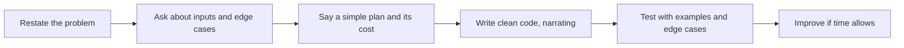
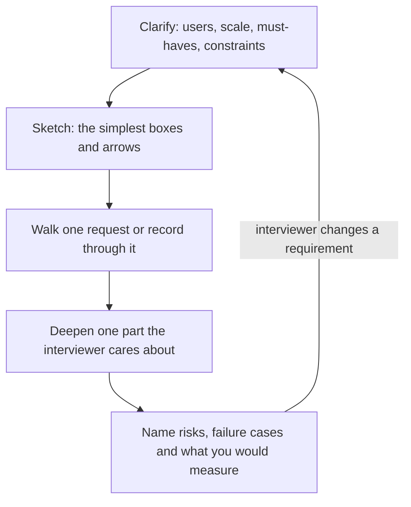

# Module 5 — Interviews

*An interview is not an exam you pass by being clever on the day. It is a set of checks an employer has designed, often carefully, to answer a few questions: can this person do the work, will they learn, and will the team trust them? This module shows you those checks from the inside. It starts with the whole hiring loop, the recruiter screen and the behavioural interview, where you turn your projects and mistakes into a bank of honest stories. It then covers technical interviews as they are run today: algorithm screens, live coding, take-home tasks, and a newer exercise, reviewing a pull request an AI agent wrote. It ends with the design conversations juniors now meet more often than they expect: a small system design, a data or SQL case, a machine-learning evaluation question, or a cloud troubleshooting walk-through. You will follow the Najm Tech Graduate Programme's interview loop as Aisha screens the cohort, Tariq runs the technical rounds, and Dana and Salem probe data and platform candidates. Omar learns that a correct algorithm said in silence scores lower than he thought, Reem has to explain code she did not write line by line, and Huda finds that "I would use XGBoost" is not a design.*

> **Steps:** Interview — knowing what each round checks, preparing honest evidence for it, and showing your thinking out loud.

---

# 5.1 — The hiring loop, the recruiter screen and behavioural interviews (STAR)
*Level: 🟡 Intermediate* · *Prerequisites: 1.1, 3.1, 4.1* · *Step: Interview*

## ⚡ In 60 seconds
- A **hiring loop** is the full sequence of steps from application to offer: screen, assessments, interviews, debrief and references. Each step checks something specific; learn what, and prepare for that.
- The **recruiter screen** checks fit with the role, logistics (location, start date, right to work, salary expectations) and whether you can explain yourself clearly. It is a real interview, not a formality.
- **Behavioural interviews** ask about past behaviour ("Tell me about a time…") because it is the best evidence an interviewer has of future behaviour. Answer with **STAR**: Situation, Task, Action, Result.
- Build a **story bank** before you apply: 8–10 true stories from projects, internships, study and work, each tagged with the skills it shows.
- Decision cue: before every round, ask the recruiter what it checks, how long it is, and whether AI tools are allowed.
- Biggest trap: stories with "we" everywhere, no clear action of your own, and no result. The interviewer cannot score what you did not say.

## 🧭 Why it matters
Mohammed, the bootcamp career-switcher, gets through Najm's online assessment easily. His portfolio is strong and he is fluent in code. Then Aisha (Talent Acquisition lead) calls him for a 30-minute screen. She asks, "Why Najm, and why this programme?" He talks for four minutes about loving to build things, never mentions the bank, and quotes a salary he saw on a forum for a different country. Later, Khalid (Engineering Manager) asks, "Tell me about a time you disagreed with a teammate." Mohammed says, "We usually agreed on things. I am easy to work with." Khalid writes "no evidence" against the teamwork competency.

Mohammed can do the job; he did not show it in the format the loop uses. The non-technical rounds are not soft. They often decide between candidates with similar technical scores, and they are the easiest to prepare for, because the questions are predictable and the answers come from your own life.

## 📐 How it works

### 🟢 The essentials

**The hiring loop.** Different employers name the steps differently, but most entry-level loops look like this:


| Step | What it checks | Who usually runs it | How to prepare |
|---|---|---|---|
| Application and CV | Basic match to the role | An applicant-tracking system and a recruiter (4.1) | Tailor your CV to the advert |
| Recruiter screen | Motivation, logistics, communication, rough fit | A recruiter or talent-acquisition partner | A 60-second introduction, "why this employer", your logistics ready |
| Online assessment | Coding or reasoning basics, at scale | An automated platform | Timed practice on the same kind of platform |
| Technical interviews | Problem solving, code quality, reasoning out loud | Engineers (5.2, 5.3) | Practice with a person, not just alone |
| Behavioural interview | How you work with others, learn, handle setbacks | A manager or senior engineer | A story bank and STAR |
| Debrief | Interviewers compare written evidence against a rubric | The interview panel and hiring manager | Nothing on the day; your evidence is already written down |
| References and checks | That what you said is true | HR, sometimes a third party | Tell your referees in advance; never inflate anything |

Two things matter more than they look. First, most interviewers write notes against a **rubric**, a list of competencies with weak, acceptable and strong answers described; in the debrief, only what they wrote down counts. Second, graduate programmes often run **assessment centres**: a day of exercises such as a group task, a presentation and interviews, where you are observed doing things, not just talking about them.

**The recruiter screen.** Expect 15–45 minutes and these questions:
- "Tell me about yourself." About 60 seconds: who you are now, what you have built, what you want next, why this role.
- "Why us? Why this role?" Mention something specific: the programme's rotations, a product, the sector. Read the careers page first.
- "What are your salary expectations?" If you can, ask for the range first: "Could you share the range budgeted for this role?" If you must give a number, give a researched range for that country and role (6.1 covers how to research it). Never quote a figure from another market.
- Logistics: start date, location, right to work. In the GCC, visa and sponsorship rules vary by country and change; answer honestly and check current rules.
- "Do you have questions for me?" Always yes: ask about next steps, timeline and what the next round checks.

**STAR.** A behavioural answer has four parts:
- **Situation:** the context in one or two sentences.
- **Task:** what *you* were responsible for, or the problem you had to solve.
- **Action:** what *you* did, step by step. This is most of the answer, around half the time.
- **Result:** what happened, with evidence if you have it, and what you learned.

Khalid asks Huda, "Tell me about a time you found a problem in your own work."

> **Weak:** "In my final-year project we built a churn model. There were some data issues but we fixed them and the model was good in the end. I learned a lot about data quality."

> **Strong (STAR):** "**Situation:** In my final-year project, a team of three, we predicted which telecom customers would cancel. **Task:** I owned the model and the evaluation. **Action:** My first model scored very high on the test set, which made me suspicious. I checked which features mattered most and found one was a field set *after* a customer had already cancelled, so the model was seeing the answer. I removed it, re-split the data by date instead of at random so the test set came after the training period, and wrote a short note for the team on why. **Result:** The score dropped to a more realistic level, but our supervisor said it was the first project that year to catch leakage on its own. Since then I check feature timing before I trust any score."

The strong answer has one owner ("I"), specific actions, an honest result and a lasting lesson, in about 90 seconds. She did not invent a percentage; if you do not remember a number, describe the result in words.

### 🟡 Going deeper

**What behavioural questions are really asking.** Interviewers map questions to competencies. If you know the competency, you know which story to pick.

| Question you hear | Competency behind it | What a strong answer shows |
|---|---|---|
| "Tell me about a time you disagreed with someone." | Collaboration, communication | You raised it respectfully, listened, used evidence, and accepted or changed the outcome |
| "Tell me about a mistake you made." | Ownership, learning | You admitted it fast, fixed it, and changed something so it would not recur |
| "Tell me about something you learned quickly." | Learning ability | A method: how you learned, not just that you did |
| "Tell me about a time you had too much to do." | Prioritisation | You chose what mattered, said no or renegotiated, and told people early |
| "Tell me about a project you are proud of." | Ownership, depth | Your part, the hardest decision, and the trade-off you made |
| "Tell me about a time you used AI tools in your work." | Judgement, integrity | Where AI helped, how you checked its output, where you did not use it and why |

The last row is increasingly common at the time of writing (2026). Reem prepares it carefully: she neither hides nor overclaims her agent use. The agent wrote most of the first version of her expense tracker; she found it stored session tokens in browser local storage, explains why that was a risk, and how she fixed it and added a test. That is the judgement employers want from someone who works with agents (1.2).

**The story bank.** Prepare 8–10 strong stories, not answers to 50 questions, and point each story at several questions. A good bank covers:
- a technical problem you solved (debugging, performance, a design decision);
- a mistake or failure and what you changed;
- a disagreement or conflict;
- teamwork in a group project, especially when someone was not contributing;
- learning something new fast;
- a time you helped someone else;
- a deadline under pressure;
- using AI tools responsibly;
- a time you went beyond the brief.

Sources: your capstone and portfolio projects (3.1), internships and part-time jobs (3.3), hackathons, volunteering, even a non-technical job, as long as your actions are clear.

**"We" versus "I".** Interviewers cannot hire your team. Say "we" for context and "I" for your actions; if a teammate did the clever part, say so and talk about yours.

**Questions to ask them.** Ending with good questions is part of the evaluation. Ask "What does a new graduate work on in their first three months?" or "How does the team use AI coding tools, and what are the rules?" Avoid questions the careers page already answers.

### 🔴 Expert view

**How interviewers score you.** Many larger employers use **structured interviews**: every candidate gets the same questions, scored against the same rubric. Hiring research has long found them more predictive than unstructured chats. The interviewer is listening for evidence they can write down against named competencies, so make it easy: situation briefly, actions explicit, result stated, then stop.

A typical rubric line, simplified, looks like this:

| Competency | 1 — Weak | 2 — Mixed | 3 — Strong |
|---|---|---|---|
| Ownership | Blames others or the situation; vague actions | Takes some responsibility; actions general | Clear personal actions, admits own part, follows through |
| Learning | No reflection | Reflects but nothing changed | Specific change in how they work afterwards |

**Follow-up questions are the real test.** A good interviewer digs: "What exactly did you change in the split?", "What would you do differently?" Invented or exaggerated stories fall apart here, and background checks in regulated sectors such as banking catch more: practical reasons, beyond ethics, never to fabricate.

**Company values interviews.** Some employers publish values or principles and build questions on them; Amazon's Leadership Principles are a well-known public example. Read them and tag your stories to them. Najm's graduate programme publishes three: *own the outcome*, *protect the customer*, *learn in public*.

**Bilingual context.** In the GCC, interviews may run in English, Arabic or both. Practise your top stories in both languages if the employer is bilingual; technical terms usually stay in English. Government and national development programmes may ask about your motivation to serve the sector; answer sincerely and specifically.

**Integrity in the AI era.** Tools that listen to an interview and suggest answers in real time are cheating in any round where AI is not allowed, and follow-up questions, in-person final rounds and reference checks expose them. If unsure, ask the recruiter in writing.

## 🧰 The toolkit
| Resource, tool or template | What it is and does | When to reach for it |
|---|---|---|
| **STAR method** | Situation, Task, Action, Result: a four-part structure for behavioural answers | Every behavioural question; drafting your story bank |
| **Story bank** | A table of 8–10 true stories, each tagged with competencies and STAR notes | Built once before applying; reviewed before each interview |
| **Brag document** | A running log of what you did, decisions you made and evidence (links, feedback) | Kept weekly from now on; the raw material for stories and CV bullets |
| **60-second introduction** | A short spoken answer to "Tell me about yourself": now, built, next, why you | Recruiter screens, networking calls and the first minute of every interview |
| **Employer values page** | The values, principles or competencies an employer publishes on its careers site | Tagging your stories before a behavioural round |
| **Mock interview with a peer** | A practice round where a friend asks questions from a list and scores with a rubric | One to two weeks before real interviews; after every failed round |

## 🏛️ In practice at Najm Bank
Aisha shares the **Najm Tech Graduate Programme interview loop** with every candidate who passes the screen, and Khalid gives the cohort a **story bank template**. Both are reproduced here (the programme and its details are fictional).

**Part A: the loop, as Aisha sends it to candidates**

| Round | Length | What it checks | AI tools allowed? |
|---|---|---|---|
| Recruiter screen (Aisha) | 30 min | Motivation, logistics, communication | Not applicable |
| Online coding assessment | 75 min | Programming basics and reasoning | No |
| Technical interview 1 (Tariq or a senior engineer) | 60 min | Live coding and reasoning out loud | No |
| Technical interview 2, by track | 60 min | Code review of an AI-written pull request (software and AI), data case (Dana), or platform troubleshooting (Salem) | Yes, the candidate's own assistant, screen shared |
| Behavioural interview (Khalid) | 45 min | Ownership, learning, collaboration, Najm's values | Not applicable |
| Debrief | — | Panel scores each competency 1–3 against the rubric | — |

**Part B: the story bank template (Reem's first two rows)**

| # | Story (one-line title) | Competencies | S / T | A (what *I* did) | R (evidence) | Fits questions about |
|---|---|---|---|---|---|---|
| 1 | Agent stored tokens insecurely in my expense app | Judgement, ownership, AI use | Solo side project; I owned it end to end | Read the auth code the agent wrote; found tokens in local storage; researched the risk; moved to HTTP-only cookies; added a test | Test in repo; README section "What I changed after review" | Mistakes; AI use; learning |
| 2 | Group project teammate stopped contributing | Collaboration | Four-person web app; I coordinated the backlog | Spoke to him privately; learned he had a family issue; re-split tasks; told the supervisor early with his agreement | Delivered on time; peer review rated the team highly | Conflict; teamwork; pressure |

Khalid's rule for the cohort: every story must have a link or a person who could confirm it.

## 🛠️ Exercises
- 🟢 Write and record your 60-second introduction for one specific role you are targeting. Play it back and cut anything that does not answer "now, built, next, why you". *Done when:* the recording is 50–75 seconds long and names the employer or role specifically.
- 🟡 Build your story bank: at least eight stories in the Part B format, covering the nine areas in 🟡 Going deeper (one story may cover two). *Done when:* every row has a personal action, a result and a verifier (a link or a person), and every competency in the 🟡 table has a story.
- 🔴 Run two mock behavioural interviews with a peer using six questions from this lesson. The peer scores you 1–3 on ownership, learning and collaboration using the 🔴 rubric, and asks at least two follow-up questions per story. *Done when:* you have both score sheets, and you have rewritten the two lowest-scoring stories with the weakness fixed.

## ⚠️ Mistakes and traps
- **Treating the recruiter screen as a formality.** It filters many candidates. Prepare your introduction, "why us" and logistics as seriously as a technical round.
- **"We" all the way through.** The interviewer cannot score your team. Use "we" for context and "I" for actions.
- **No result, or an invented one.** Do not stop at the action, and do not make up a number. Describe the outcome honestly, in words if you lack exact figures.
- **Assuming the AI rules.** Rules differ between employers and between rounds. Ask, in writing, before every round.

## 🧾 Recap
- A hiring loop is a series of checks; ask what each round checks and prepare for that.
- Behavioural questions map to competencies. Answer with STAR, with half the time on your own actions.
- Prepare a bank of 8–10 true, verifiable stories and point them at many questions.
- Interviewers usually score against a rubric and dig with follow-ups, so specific, honest evidence wins.

## ✍️ Check yourself

**1. Mohammed is asked, "Tell me about a time you disagreed with a teammate." Which answer will score best on a collaboration rubric?**

- A. "We usually agreed on things, so conflict never really came up. I am easy to work with."
- B. A 90-second story of one real disagreement: his evidence, his proposal and the outcome
- C. A five-minute account of the whole project, from the first meeting to the final demo
- D. "I would listen carefully, stay calm and look for a compromise both sides could accept."

<details><summary>Answer</summary>

**B.** It is a specific past event with his own actions and a result, which is what the rubric scores; C buries that evidence in detail. D is tempting but hypothetical ("I would"), so it gives no evidence of past behaviour; A gives none at all. (🟢 The essentials.)

</details>

**2. In a recruiter screen, Aisha asks Yousef for his salary expectations. He has not researched the range. What is the best response?**

- A. Quote the highest figure he has seen online, from any country, to anchor high
- B. Refuse to discuss pay at all until he has a written offer
- C. Say he will accept whatever the bank offers, to seem flexible
- D. Ask for the budgeted range and offer to return with a researched one

<details><summary>Answer</summary>

**D.** Asking for the range first is normal and gives him real information; a researched range for the right market is credible. A anchors on the wrong market and can end the process. (🟢 The essentials.)

</details>

**3. What does the "A" in STAR stand for, and how much of the answer should it take?**

- A. Action: what you personally did, around half the answer
- B. Achievement: the best result you got, most of the answer
- C. Analysis: what the team should have done, a short closing line
- D. Approach: the general method your team used, one sentence

<details><summary>Answer</summary>

**A.** The actions you took are the evidence the interviewer scores, so they deserve the most time. D describes the team, not you. (🟢 The essentials.)

</details>

**4. Reem is asked, "Tell me about a time you used AI tools in your work." Which approach is best?**

- A. Say she never uses AI tools, so she does not seem dependent on them
- B. Say the agent built everything and she only skimmed it before shipping
- C. Describe where it helped, the flaw she caught, and how she fixed and tested it
- D. Talk about AI trends in the industry rather than about her own projects

<details><summary>Answer</summary>

**C.** It shows honest disclosure and judgement: verifying AI output and owning the result. A is dishonest and falls apart under follow-up questions; B shows no judgement. (🟡 Going deeper.)

</details>

**5. Why do follow-up questions such as "What exactly did you change?" matter so much in a structured behavioural interview?**

- A. They let the interviewer fill the time when a candidate finishes an answer early
- B. They test whether the story is real and the work truly the candidate's own
- C. They are mostly used once the interviewer has already decided to reject someone
- D. They mainly check the candidate's grammar and fluency in English

<details><summary>Answer</summary>

**B.** Follow-ups probe depth and authenticity, the evidence written into the rubric; an exaggerated story collapses under them. That is one practical reason never to fabricate. (🔴 Expert view.)

</details>

## 📚 References
- MIT Career Advising & Professional Development — https://capd.mit.edu/
- Tech Interview Handbook (behavioural interview section) — https://www.techinterviewhandbook.org/
- Google, How we hire — https://www.google.com/about/careers/applications/how-we-hire/
- Amazon, Leadership Principles — https://www.amazon.jobs/content/en/our-workplace/leadership-principles
- Julia Evans, "Get your work recognized: write a brag document" — https://jvns.ca/blog/brag-documents/
- [*AI Product Management: Zero to Hero*, lesson 10.2 — The AI PM career: interviews, portfolio and growth](../aipm/index.html#/10.2)
- [*Secure AI & Application Security: Zero to Hero*, lesson 12.2 — The security career: roles, certifications and portfolio](../secai/index.html#/12.2)

---

# 5.2 — Technical interviews today: algorithms, live coding, take-homes and reviewing AI-written code
*Level: 🟡 Intermediate* · *Prerequisites: 1.1, 1.2, 5.1* · *Step: Interview*

## ⚡ In 60 seconds
- Technical rounds come in four common formats: **algorithm screens** (data structures and algorithms, often on a platform), **live coding** (building something small with an interviewer watching), **take-home tasks** (a small project in your own time), and **code review**, increasingly of a pull request written by an AI agent.
- In every format the interviewer scores your **reasoning, communication and verification**, not just whether the code runs. Think out loud.
- AI-tool rules differ by employer and by round. Many employers allow or expect AI tools in some rounds and ban them in others. Ask before every round, and follow the answer exactly.
- Decision cue: before writing code, restate the problem, ask about inputs and edge cases, and state your plan. Before saying "done", test it.
- Biggest trap: silent coding. A correct answer you cannot explain scores lower than a nearly correct one you reasoned through clearly.

## 🧭 Why it matters
Omar is the strongest algorithm student in the cohort. In Tariq's live-coding round, he hears the problem, says "OK", and types for 25 minutes in silence. His solution is correct. Tariq's notes say: "Correct solution. No clarifying questions. Did not test. Could not say what happens with an empty input until asked. Communication: 1 of 3."

The same week, Reem gets the AI-review round. Tariq gives her a short pull request an agent wrote for a funds-transfer endpoint and says, "Would you merge this?" She is used to agents; she skims it and says it looks fine because the tests pass. Tariq points to one line, and she realises the SQL query is built from a string with user input in it. She did not catch the missing ownership check either.

Both candidates can code. Neither showed what Tariq is hiring for: someone who can be trusted with code, whether a person or a machine wrote it. That is what technical rounds check now.

## 📐 How it works

### 🟢 The essentials

**The four formats.**

| Format | What it looks like | What it checks | Where it is common |
|---|---|---|---|
| Algorithm screen | One or two problems on a platform such as HackerRank or Codility, timed, often automated | Data structures, complexity, correctness under time pressure | Still common at large tech firms and high-volume graduate programmes; less so at smaller firms |
| Live coding | 45–60 minutes with an engineer, in a shared editor or your own environment | Problem solving, communication, testing habits | Very common across employers |
| Take-home task | A small project in hours or days, then a discussion of it | Code quality, structure, tests, README, judgement | Common at startups and product companies |
| Code review | Read a pull request and comment on it, often one written by an AI agent | Reading code, spotting bugs and risks, explaining priorities | A growing trend at the time of writing (2026); format varies widely |

You may also meet **pair programming** (you and an engineer working together on real-ish code) and **debugging rounds** (here is a failing test, find the bug). Both reward the same habits as live coding.

**A method for any coding problem.** Use the same five steps every time, out loud:



1. **Restate.** "So I get a list of transactions and must return the IDs of any that look like duplicates, meaning the same account and amount within 60 seconds. Is that right?"
2. **Clarify.** Ask about size, sorting, empty input, ties, and invalid data. "Is the list sorted by time? Can amounts be negative? How large can the list be?"
3. **Plan.** Say a simple working approach first, with its cost in **Big-O notation** (how running time grows with input size). "A simple way compares every pair: that is O(n²). If the list is sorted by time, I can group by account and amount and compare each item only with the previous one: O(n log n) because of the sort, or O(n) if it is already sorted."
4. **Code.** Use clear names. Narrate decisions, not keystrokes.
5. **Test.** Walk through a normal example, then edge cases: empty list, one item, two items exactly 60 seconds apart.

Here is a clean answer for that problem in Python:

```python
from collections import defaultdict

def find_duplicates(transactions, window_seconds=60):
    """transactions: list of dicts with id, account, amount, ts (seconds).
    Returns IDs of transactions that repeat an earlier one with the
    same account and amount within window_seconds."""
    last_seen = {}                        # (account, amount) -> last timestamp
    duplicates = []
    for tx in sorted(transactions, key=lambda t: t["ts"]):
        key = (tx["account"], tx["amount"])
        if key in last_seen and tx["ts"] - last_seen[key] <= window_seconds:
            duplicates.append(tx["id"])
        last_seen[key] = tx["ts"]
    return duplicates

assert find_duplicates([]) == []
assert find_duplicates([{"id": 1, "account": "A", "amount": 50, "ts": 0},
                        {"id": 2, "account": "A", "amount": 50, "ts": 60}]) == [2]
```

The quick asserts at the end are worth more than they look: they show the interviewer you test without being told. A good follow-up to raise yourself: "Money as integers in the smallest unit (fils or cents) would be safer than floats; I assumed integers here."

**Getting stuck.** Everyone does. Say what you are thinking: "I am stuck on how to handle the window when there are three repeats. Let me try a small example by hand." Interviewers often give hints; taking a hint well is a positive signal.

**AI rules.** Ask the recruiter before each round: "Are AI assistants allowed in this round, and if so, which ones and how should I share my screen?" If they are banned, do not use them, including tools that run invisibly. If they are allowed, use them openly and keep explaining.

### 🟡 Going deeper

**Preparing for algorithm screens without wasting months.** Algorithm screens test a fairly small set of patterns. A focused plan beats grinding hundreds of random problems:

| Pattern | Typical problems |
|---|---|
| Arrays and hash maps | Find pairs, count frequencies, detect duplicates |
| Two pointers and sliding window | Longest substring with a property, merge sorted lists |
| Stacks and queues | Valid brackets, next greater element |
| Trees and graphs (BFS, DFS) | Level order traversal, number of islands, shortest path in an unweighted graph |
| Sorting and binary search | Search in a sorted array, first bad version |
| Heaps | Top k items, merge k sorted lists |
| Basic dynamic programming | Climbing stairs, coin change |

Curated lists of well-known problems (for example the "Blind 75" and the NeetCode lists) group problems by these patterns. Practise in the same language you will use in the interview, with a timer, and say your reasoning out loud even when alone. After each problem, write one line on the pattern it used. Check whether the employers you target use algorithm screens at all; many smaller companies, startups and public-sector teams do not, and your time may be better spent on a take-home-style project.

**Take-home tasks.** Treat them as small production projects (1.3). Interviewers usually read:
- **The README first.** How to run it, what you built, what you skipped and why, how you would extend it.
- **Tests.** A few meaningful tests beat none. Test the core logic and one edge case.
- **Structure and naming.** Small functions, clear names, no dead code.
- **Commit history.** Small commits with clear messages tell a story; one giant commit tells nothing.
- **Honesty about AI.** If AI tools were allowed, say where you used them, as the employer asks. Expect a follow-up interview where you change your own code live. If you cannot explain a line, it will show.

Respect the time limit. If the brief says "about four hours", a two-day masterpiece may signal poor judgement about scope. Write the trade-offs in the README instead.

**Reviewing an AI-written pull request.** In this exercise you get a diff (the lines added and removed) and a short description, and you are asked whether you would approve it. A useful review order:

1. **Understand intent.** What should this change do? Does the code do that?
2. **Correctness.** Logic errors, edge cases, wrong types, error handling.
3. **Security.** Untrusted input reaching queries or commands, missing authorisation checks, secrets, sensitive data in logs.
4. **Tests.** Do they test the behaviour, or only that the code runs? Do they cover the failure cases?
5. **Maintainability.** Names, duplication, unnecessary complexity, invented library calls.
6. **Prioritise.** Say which issues block merging and which are suggestions.

The library teaches this skill in depth in [*System Design for Vibe Coders*, lesson 9.7 — Code audit and review at agent speed](../vibe/index.en.html#l9-7) and [*Secure AI & Application Security: Zero to Hero*, lesson 6.3 — Securing AI-generated code: what coding agents get wrong](../secai/index.html#/6.3).

### 🔴 Expert view

**What a strong signal looks like in each format.** Interviewers often score four dimensions: problem solving, coding, verification and communication. Strong candidates show all four at once: they ask a sharp clarifying question, state a simple solution before optimising, write readable code, find their own bug with a test, and keep the interviewer informed throughout.

**Working with AI in an allowed round.** When AI tools are allowed, the interviewer is watching how you direct and check them, not how fast text appears. Good practice:
- Write the plan and the key tests yourself before prompting.
- Give the assistant a narrow, specific request.
- Read every line it produces, out loud where useful. Reject or fix what is wrong.
- Run the tests. Point out anything you do not trust.

Reem's improved approach in a later mock round: she asks the agent to draft the endpoint, then says, "Before I run this, I am checking three things: input handling, who is allowed to call it, and whether the test covers the failure path." That sentence alone changes how the round is scored. The skills behind it are taught in [*System Design for Vibe Coders*, lesson 9.4 — Verification before completion](../vibe/index.en.html#l9-4).

**Complexity talk without fear.** You do not need proofs. You need to say, for your solution, how time and memory grow with input size, and what trade-off you made. "This uses extra memory for the dictionary to avoid comparing every pair" is a complete answer at junior level.

## 🧰 The toolkit
| Resource, tool or template | What it is and does | When to reach for it |
|---|---|---|
| **LeetCode** | A large bank of algorithm problems with an online judge and discussions | Practising algorithm patterns when your target employers use algorithm screens |
| **HackerRank** | A coding practice site that many employers also use to run online assessments | Getting used to the assessment environment before a timed test |
| **NeetCode** (Navdeep Singh) | Free problem lists and video explanations grouped by pattern | Building a structured study plan instead of random practice |
| **Tech Interview Handbook** (Yangshun Tay) | A free guide covering coding interviews, behavioural rounds and study plans | Planning your preparation timeline and checklists |
| **Cracking the Coding Interview** (Gayle Laakmann McDowell) | A widely used book on algorithm interview preparation | Learning how algorithm interviews are run and practising classic problems |
| **Pull request review checklist** | Intent, correctness, security, tests, maintainability, priority | Every code-review round and every agent-written change you review |
| **Five-step problem method** | Restate, clarify, plan, code, test, out loud | Every live-coding and algorithm round |
| **Mock interview with a peer** | A practice round where a friend asks questions from a list and scores with a rubric | Weekly in the month before technical rounds |

## 🏛️ In practice at Najm Bank
Tariq uses a fixed rubric and a fixed exercise for Najm's AI-review round. Candidates see this pull request, simplified here. Its title is "Add endpoint to transfer money between a customer's accounts", and the description the coding agent wrote says only "Implements transfer. All tests pass."

```python
@app.post("/transfers")
def transfer(req):
    src = req.json["from_account"]
    dst = req.json["to_account"]
    amount = float(req.json["amount"])
    db.execute(f"UPDATE accounts SET balance = balance - {amount} WHERE id = '{src}'")
    db.execute(f"UPDATE accounts SET balance = balance + {amount} WHERE id = '{dst}'")
    log.info(f"Transfer {req.json}")
    return {"status": "ok"}

def test_transfer(client):
    resp = client.post("/transfers", json={"from_account": "A1", "to_account": "A2", "amount": "10"})
    assert resp.status_code == 200
```

**What a strong candidate finds, in priority order**

| # | Issue | Why it matters | Blocks merge? |
|---|---|---|---|
| 1 | SQL built from strings with user input | SQL injection | Yes |
| 2 | No check that the caller owns the source account | Anyone could move anyone's money | Yes |
| 3 | The two updates are not in one transaction | A failure between them creates or destroys money | Yes |
| 4 | No check for negative or zero amounts, or for sufficient balance | Negative transfer pulls money the other way | Yes |
| 5 | Money as `float` | Rounding errors; use integers in the smallest unit or a decimal type | Yes |
| 6 | Logs the full request | May write personal or account data to logs | Should fix |
| 7 | The test checks only the status code | Proves nothing about balances or failure cases | Should fix |

**Tariq's scoring rubric (1–3 per line)**

| Dimension | 1 | 3 |
|---|---|---|
| Finding issues | Finds one or two surface issues | Finds most of 1–5 unprompted |
| Prioritising | Lists everything with equal weight | Separates blockers from suggestions and explains why |
| Explaining | Names issues without reasons | Explains the risk in plain language and proposes a fix |
| Verification | Trusts "all tests pass" | Reads the test and asks what it actually proves |
| Collaboration | Dismissive of the author | Writes comments the author could act on |

Reem's second attempt, a month later in a mock round with Khalid, finds issues 1–5 and says, "I would not merge this, and I would add a test that a user cannot transfer from an account they do not own." Khalid scores her 3 on prioritising and verification.

## 🛠️ Exercises
- 🟢 Solve three problems from one pattern in the 🟡 table, each in under 40 minutes, while recording yourself saying the five steps out loud. *Done when:* you have three recordings and each one includes a clarifying question and at least one edge-case test.
- 🟡 Do a take-home-style task in four hours: a small command-line tool or API of your choice with tests and a README that states what you skipped and why. *Done when:* a peer can clone it, run it and the tests from the README alone, and the README has a "Trade-offs" section.
- 🔴 Review the Najm pull request above in writing before reading the table, then compare your list with it. Next, ask an AI coding assistant to write a small feature in one of your own projects and review its pull request with the six-step order. *Done when:* you have two written reviews with blockers separated from suggestions, and at least one test you added because of the review.

## ⚠️ Mistakes and traps
- **Coding in silence.** The interviewer cannot score thinking they cannot hear. Narrate decisions and ask questions.
- **Jumping to the clever solution.** State a simple working approach first, then improve it. A finished simple solution beats an unfinished clever one.
- **Saying "done" without testing.** Walk through an example and an edge case every time.
- **Trusting "all tests pass".** Read what the tests check. Many AI-written tests prove only that code runs.
- **Using AI where it is banned, or hiding it where it is allowed.** Ask the rules, follow them, and be open about your use.
- **Grinding hundreds of problems for an employer that does not use them.** Find out the format first and prepare for that.

## 🧾 Recap
- Technical rounds come as algorithm screens, live coding, take-homes and code review, increasingly of AI-written code.
- Use the five steps every time: restate, clarify, plan, code, test, out loud.
- Prepare algorithms by pattern, and only as much as your target employers require.
- Treat take-homes as small production projects with a README, tests and honest trade-offs.
- In a review round, find and prioritise correctness, security and test gaps; never trust a passing test you have not read.

## ✍️ Check yourself

**1. Omar finishes a correct solution in silence and says "done". Which habit would most improve his score?**

- A. Typing faster so he has time left to attempt a second problem
- B. Switching to a more advanced data structure to show depth
- C. Restating, clarifying edge cases, narrating and testing before "done"
- D. Memorising more problems so he spots the pattern sooner

<details><summary>Answer</summary>

**C.** Interviewers score reasoning, communication and verification as well as correctness. B or D might help with harder problems, but they do not fix the missing signals. (🟢 The essentials.)

</details>

**2. Before a technical round, Yousef is unsure whether AI assistants are allowed. What should he do?**

- A. Ask the recruiter in writing what that round allows, and follow it
- B. Use one quietly, since most companies seem to allow them now
- C. Assume they are banned in every round, so there is no need to ask
- D. Wait and ask the interviewer halfway through the round itself

<details><summary>Answer</summary>

**A.** Rules differ by employer and by round, so asking in advance is the only safe course. B risks being treated as cheating; C may leave him unprepared for a round that expects AI use. (🟢 The essentials.)

</details>

**3. In Najm's review round, which issue in the transfer pull request is the most serious blocker?**

- A. The variable names are short and break the team's style guide
- B. The test checks only the status code, not the balances
- C. The full request body is written to the application log
- D. User input is pasted into the SQL query, allowing injection

<details><summary>Answer</summary>

**D.** Injection lets an attacker change the query itself, and in a money-moving endpoint that is critical. B and C are real issues but less severe; A is a style point. (🏛️ In practice at Najm Bank.)

</details>

**4. Huda gets a take-home task with a suggested time of about four hours. Which approach is best?**

- A. Spend the whole weekend adding extra features to impress the reviewer
- B. Keep near the time limit, test the core, and explain trade-offs in a README
- C. Skip the tests so she can finish more features in the time
- D. Submit without a README, since good code should speak for itself

<details><summary>Answer</summary>

**B.** Reviewers read the README and tests first and value judgement about scope. A can signal poor scoping, and an extended submission is not what was asked for. (🟡 Going deeper.)

</details>

**5. In a round where AI tools are allowed, what is Tariq mainly watching?**

- A. How Reem directs the assistant and checks every line it produces
- B. How quickly the assistant generates a complete, working solution
- C. Which assistant brand and paid plan she has chosen to use
- D. Whether she can finish without writing any code herself at all

<details><summary>Answer</summary>

**A.** Allowed-AI rounds test judgement and verification: her own plan and tests, narrow prompts, reading every line and running the tests. B is tempting, but speed without checking is exactly what the round is designed to catch. (🔴 Expert view.)

</details>

## 📚 References
- LeetCode — https://leetcode.com/
- HackerRank — https://www.hackerrank.com/
- NeetCode — https://neetcode.io/
- Tech Interview Handbook — https://www.techinterviewhandbook.org/
- Gayle Laakmann McDowell, *Cracking the Coding Interview*, 6th edition (CareerCup, 2015)
- interviewing.io (practice interviews and published interview guides) — https://interviewing.io/
- Google Engineering Practices, code review guidelines — https://google.github.io/eng-practices/review/
- [*System Design for Vibe Coders*, lesson 9.7 — Code audit and review at agent speed](../vibe/index.en.html#l9-7)
- [*System Design for Vibe Coders*, lesson 8.2 — Tests as the spec the agent can't ignore](../vibe/index.en.html#l8-2)
- [*Secure AI & Application Security: Zero to Hero*, lesson 2.1 — Injection: SQL, command and template injection](../secai/index.html#/2.1)

---

# 5.3 — System design, data and ML interviews for juniors
*Level: 🟡 Intermediate* · *Prerequisites: 1.3, 5.2* · *Step: Interview*

## ⚡ In 60 seconds
- Juniors increasingly meet **design-style rounds**: a small system design, a SQL or data-modelling case, a machine-learning evaluation question, or a cloud troubleshooting walk-through. Expectations are lower than for seniors, but the method is the same.
- The interviewer is checking whether you **ask about requirements, choose simple components for clear reasons, and name trade-offs and failure cases**. Nobody expects you to design a global platform alone.
- Use one structure for every design question: **clarify, sketch, walk a request through it, then deepen one part and name the risks.**
- Decision cue: when you are unsure, choose the simplest design that meets the stated requirements, and say what would make you change it.
- Biggest trap: naming fashionable technologies ("Kafka, Kubernetes, microservices") without saying what problem each solves. Every box needs a reason.

## 🧭 Why it matters
Huda's second round is with Dana, Najm's lead data scientist. Dana asks: "We want to flag card transactions that might be fraud. How would you approach it?" Huda answers at once: "I would use XGBoost, tune the hyperparameters and get the accuracy as high as possible." Dana asks, "What share of transactions are fraud?" Huda does not know. "Then what does 99% accuracy tell us?" Huda realises, too late, that if fraud is rare, a model that flags nothing at all would score very high accuracy. Dana's notes: "Strong on model names. Did not ask about the problem, the data or the cost of errors."

Yousef, in Salem's platform round, gets "Our internal web app is suddenly returning errors to some users. Walk me through what you would check." He knows networks well and walks through it methodically: DNS, then the load balancer health checks, then recent deploys, then the logs. He asks what changed recently. Salem's notes are positive, even though Yousef has never run Kubernetes in production.

The difference is method, not knowledge. This lesson gives you the method for each type of design round, and points you to the library lessons that build the knowledge behind it.

## 📐 How it works

### 🟢 The essentials

**The universal structure.** Every design round, whatever the domain, rewards the same four moves:



1. **Clarify.** Who uses it? What must it do and what is out of scope? How much load or data, roughly? Any hard constraints, such as regulation, latency or cost? Write the answers down where the interviewer can see them.
2. **Sketch.** Draw the simplest design that works: client, application server, database, and only what else is needed. See [*System Design for Vibe Coders*, lesson 1.1 — Draw the boxes before the agent writes the code](../vibe/index.en.html#l1-1).
3. **Walk it through.** Follow one request from the user to the database and back. This catches missing pieces fast. [*System Design for Vibe Coders*, lesson 1.2 — The request's journey](../vibe/index.en.html#l1-2) teaches exactly this.
4. **Deepen and risk.** The interviewer will push on one area: "What if this gets ten times more traffic?" or "What if the email provider is down?" Say what breaks, what you would change, and what you would monitor.

**What juniors are and are not expected to know.**

| Expected at junior level | Not expected at junior level |
|---|---|
| What a client, server, database, cache, queue and load balancer each do | Designing a globally distributed database |
| Relational tables, keys and when an index helps | Tuning a database cluster from memory |
| Why you would not do slow work inside a web request (use a queue) | Detailed consensus algorithms |
| Basic failure thinking: what if this box is down? | Exact capacity numbers from memory |
| Security basics: authentication, authorisation, secrets, input validation | A full threat model under time pressure |
| Saying "I don't know, but here is how I would find out" | Pretending to know |

**Rough numbers, labelled as assumptions.** Interviewers may ask you to estimate load. Make round assumptions out loud and keep the arithmetic simple. "Assume 100,000 active customers, and each gets about five alerts a day. That is 500,000 alerts a day. A day has about 86,400 seconds, so roughly six per second on average, more at peak. One server can handle that; the hard part is reliability, not scale." The numbers are your assumptions, not facts, and saying so is part of a good answer.

### 🟡 Going deeper

**System design for software and AI candidates.** Tariq's junior design question at Najm: "Design the service that sends customers an alert when a card transaction happens." A strong junior answer covers:
- **Clarify:** push, SMS or email? How fast must alerts arrive? Can a customer turn them off? Must every alert be sent exactly once?
- **Sketch:** the card system publishes a "transaction happened" event to a **queue** (a list of work items that workers take one at a time); a **worker** reads events, looks up the customer's preferences in the database, and calls the push or SMS provider.
- **Walk:** one transaction from the card system through the queue, worker, preference lookup, provider and the customer's phone.
- **Risks:** the SMS provider is down (retry with back-off, then alert an engineer); the same event processed twice (store a sent-alert record keyed by transaction ID so a retry does not send twice, which is called **idempotency**); personal data in logs (log IDs, not card numbers).

Each idea has a library lesson behind it: [*System Design for Vibe Coders*, lesson 10.2 — Queues and asynchronous work](../vibe/index.en.html#l10-2), [*System Design for Vibe Coders*, lesson 2.6 — Two clicks at once: races, transactions, and idempotent writes](../vibe/index.en.html#l2-6) and [*SaaS Building Blocks*, lesson 4.2 — Notifications: in-app, push, Slack, SMS — and preferences](../saas/index.html#/4.2). For AI application roles, expect a variant such as "design a chatbot that answers questions from our policy documents"; the same structure applies, plus retrieval, evaluation and prompt-injection risk, covered in [*Secure AI & Application Security: Zero to Hero*, lesson 9.3 — Securing retrieval (RAG): data boundaries and access control](../secai/index.html#/9.3).

**Data rounds for analysts and data engineers.** Dana and her team use three kinds of question:
- **SQL live.** Write a query against a small schema, often with joins, grouping and window functions. Example: "For each customer, find their largest transaction last month." State the grain (what one row means) before writing; here, last month is September 2026.

```sql
SELECT customer_id, transaction_id, amount
FROM (
  SELECT customer_id, transaction_id, amount,
         ROW_NUMBER() OVER (PARTITION BY customer_id ORDER BY amount DESC) AS rn
  FROM transactions
  WHERE txn_date >= DATE '2026-09-01' AND txn_date < DATE '2026-10-01'
) ranked
WHERE rn = 1;
```

  A strong candidate also asks: "What should happen with ties? Should refunds count?"
- **Data modelling.** "Design tables for a loyalty-points programme." Name the entities, keys and relationships, and say what a fact and a dimension would be in a reporting model. See [*Data Engineering & Analytics: Zero to Hero*, Module 1 — SQL and data modelling](../data/index.html#/1.2).
- **Pipelines and metrics.** "How would you load daily card data into the warehouse and check it is right?" or "Mobile app sign-ups dropped 20% this week. How do you investigate?" Check data first (did tracking break?), then segment (platform, country, app version), then look for changes (a release, a campaign ending). Metrics and experiments are covered in [*Data Engineering & Analytics: Zero to Hero*, Module 4 — Analytics](../data/index.html#/4.1).

**ML rounds for data scientists and ML engineers.** The common junior questions are about **framing and evaluation**, not exotic models:
- What exactly are we predicting, for whom, and what action follows a prediction?
- What data do we have, and is any of it available only after the event (leakage)?
- How do we split train and test data? For time-based problems such as fraud, split by time.
- Which metric matches the cost of errors? With rare events, **accuracy** misleads. Use **precision** (of the cases we flagged, how many were truly fraud) and **recall** (of all true fraud, how many we caught), and discuss the threshold with the business.
- How will we monitor it after launch for **drift** (the data or behaviour changing over time)?

Behind these sit [*Data Engineering & Analytics: Zero to Hero*, Module 5 — Data science and ML in production](../data/index.html#/5.2) and [*AI Product Management: Zero to Hero*, lesson 6.1 — Quality you can measure: metrics, golden sets and error analysis](../aipm/index.html#/6.1).

**Cloud and platform rounds.** Salem's questions are usually troubleshooting or "explain how this works" walks:
- "What happens when someone types our web address and presses Enter?" (DNS, TLS, load balancer, application, database, response.) See [*System Design for Vibe Coders*, lesson F.1 — What happens when you open a website](../vibe/index.en.html#lF-1).
- "A server is slow. What do you check?" (CPU, memory, disk, network, recent changes, logs.)
- "How would you deploy this app safely?" (Build once, test, deploy to staging, roll out gradually, be ready to roll back.) See [*System Design for Vibe Coders*, lesson 4.4 — Rollback, staging, and release gates](../vibe/index.en.html#l4-4) and [*Cloud & DevOps: Zero to Hero*, Module 4 — CI/CD and releases](../cloud/index.html#/4.1).

### 🔴 Expert view

**Trade-offs are the answer.** Interviewers listen for the word "because". "I would use a relational database *because* transfers need transactions and the data has clear relationships" scores higher than "I would use Postgres". When you name an option, name the alternative you rejected and why. "A queue adds an extra moving part, but it means a slow SMS provider cannot slow down card payments" is a junior answer that sounds senior.

**Regulated-sector awareness.** In GCC banking, government and health interviews, mention data protection and access control naturally, without lecturing: personal data minimised and kept out of logs, access limited by role, audit records for sensitive actions, and awareness that laws such as Qatar's personal data protection law (Law No. 13 of 2016) apply. One sentence at the right moment shows you understand the context you would be working in.

**Using your portfolio as the design case.** Many interviewers start with "Walk me through the architecture of a project on your CV." This is a design round on home ground. Prepare one diagram of your capstone (3.1) and be ready to answer: why these components, what fails first under load, what you would change with hindsight, and what an AI agent wrote versus what you designed. Reem prepares exactly this for her document-question app and finds it is the easiest round she has, because every answer is something she did.

**Saying "I don't know" well.** "I haven't used Kubernetes in production. My understanding is that it schedules containers across machines and restarts failed ones. For this design I would start with a managed container service, and I'd want to learn how the team runs it." That is honest, shows reasoning, and keeps the conversation moving.

## 🧰 The toolkit
| Resource, tool or template | What it is and does | When to reach for it |
|---|---|---|
| **Four-move design structure** | Clarify, sketch, walk a request through, deepen and name risks | Every system design, data or ML design question |
| **System Design Primer** (Donne Martin) | A free, open-source collection of system design concepts and example questions | Learning the vocabulary of components and trade-offs |
| **Designing Data-Intensive Applications** (Martin Kleppmann, O'Reilly) | A widely respected book on how databases, replication and data systems work | Deepening understanding after the basics; data engineering and backend roles |
| **Designing Machine Learning Systems** (Chip Huyen, O'Reilly, 2022) | A book on building, evaluating and operating ML systems in production | Preparing for ML engineer and data scientist design rounds |
| **StrataScratch** | A practice site with SQL and data-science interview questions | Practising timed SQL and data cases |
| **Machine Learning Interviews Book** (Chip Huyen) | A free online book about ML interview formats and questions | Understanding what ML interview rounds cover |
| **Portfolio architecture diagram** | One clear diagram of your capstone with a sentence per component explaining why | "Walk me through your project" questions |

## 🏛️ In practice at Najm Bank
Tariq, Dana and Salem agree on one **junior design-round rubric** so that candidates on different tracks are scored on the same behaviours. Each line is scored 1–3.

| Dimension | 1 — Weak | 3 — Strong | Software example (Tariq) | Data and ML example (Dana) | Platform example (Salem) |
|---|---|---|---|---|---|
| Clarifies the problem | Starts designing immediately | Asks about users, scale, must-haves and constraints, and writes them down | "Must alerts arrive within seconds?" | "How rare is fraud, and what does a missed case cost?" | "Is it all users or some? What changed today?" |
| Simple, justified design | Lists technologies without reasons | Simplest design that works; every component has a "because" | Queue so the SMS provider cannot slow payments | Split by time because fraud patterns change | Check recent deploys first because many outages follow a change |
| Walks it through | Static diagram only | Follows one request or record end to end | Transaction to phone | Raw transaction to a scored, reviewed alert | Browser to DNS to load balancer to app to database |
| Failure and risk | Assumes everything works | Names what breaks, how to detect it, how to recover | Duplicate alerts, provider outage | Leakage, drift, threshold choice | Rollback plan, health checks |
| Context awareness | Ignores regulation and data | Mentions personal data, access and audit where relevant | Card numbers not in logs | Customer data access limited by role | Least-privilege access to production |
| Honesty and learning | Bluffs | Says what they do not know and how they would find out | "I haven't used Kafka; a simple managed queue would do here" | "I'd check with the fraud team how labels are created" | "I'd read the runbook before touching production" |

**Huda's rewritten answer**, one month later in a mock with Dana: "Before choosing a model, can I ask how rare fraud is and what happens after a flag? If analysts review flagged cases, I'd tune for a precision they can handle while keeping recall as high as possible. I'd split train and test data by time, check that no feature is only known after a chargeback, start with a simple, explainable baseline like logistic regression, and only then try gradient boosting. After launch, I'd monitor flag rates and precision weekly for drift." Dana scores her 3 on clarifying, design and risk.

## 🛠️ Exercises
- 🟢 Take one project from your portfolio and draw its architecture as boxes and arrows, with one sentence per box saying why it is there and one sentence on what would fail first. *Done when:* the diagram is in your repository README and a peer can explain your system back to you from it.
- 🟡 Pick the design question for your track (software: the transaction-alert service; data: the loyalty-points tables and one SQL query against them; ML: the fraud-flag evaluation plan; platform: the "errors for some users" walk-through). Answer it out loud for 30 minutes with a peer, following the four moves. *Done when:* the peer has scored you with the Najm rubric and you have written down the two lowest-scoring lines and what you will study for each, with a library link.
- 🔴 Run a full mock design round with a working engineer, data scientist or senior student, on a question they choose. Ask them to change a requirement halfway through. *Done when:* you have their written feedback against the rubric, and you have a revised answer that handles the changed requirement and names at least two failure cases.

## ⚠️ Mistakes and traps
- **Designing before asking.** Clarify users, scale and constraints first; the interviewer often hides the key requirement in the answer to your first question.
- **Technology name-dropping.** Every component needs a reason. "Because" is the most valuable word in a design round.
- **Over-building.** Microservices, Kubernetes and three databases for a small internal tool signal poor judgement. Start simple, then say what would make you scale.
- **Accuracy on rare events.** For fraud, defects or churn, accuracy misleads. Talk about precision, recall and the cost of each error.
- **Ignoring failure.** Ask yourself "what if this box is down?" for each component before the interviewer does.

## 🧾 Recap
- Juniors now meet design rounds for software, AI, data, ML and platform roles; expectations are lower than for seniors, but the method is the same.
- Use four moves: clarify, sketch, walk one request through, then deepen and name risks.
- In data and ML rounds, define the grain, the target, the split and the metric that matches the cost of errors.
- Your own portfolio project is the best-prepared design case you have.

## ✍️ Check yourself

**1. Tariq asks Omar to design the transaction-alert service. What should Omar do first?**

- A. Draw a design with Kafka, Kubernetes and microservices to show range
- B. Choose a programming language and framework for the worker
- C. Estimate the monthly cloud bill for the whole service
- D. Ask about channels, speed, opt-outs, volume and duplicates

<details><summary>Answer</summary>

**D.** Clarifying requirements comes before any design; the answers shape everything else. A is technology name-dropping without reasons. (🟢 The essentials.)

</details>

**2. Dana tells Huda that fraud is very rare. Why is accuracy a poor metric here?**

- A. Accuracy cannot be calculated when labels come from fraud reports
- B. A model that never flags fraud would still score very high accuracy
- C. Accuracy is a metric for regression problems, not classification
- D. Banking regulators prohibit accuracy as a model metric

<details><summary>Answer</summary>

**B.** With rare events, predicting "not fraud" for everything is almost always right, yet useless. Precision and recall measure flagged-case quality and fraud caught. (🟡 Going deeper.)

</details>

**3. In the alert design, the worker might process the same transaction event twice after a retry. What is the standard junior-level answer?**

- A. Ignore it, because duplicate events are rare in practice
- B. Remove retries completely so each event is handled only once
- C. Record sent alerts by transaction ID and skip any already sent
- D. Send every alert twice so the customer is sure to get one

<details><summary>Answer</summary>

**C.** This makes sending idempotent: a repeated operation is safe. B trades duplicates for lost alerts whenever the provider fails. (🟡 Going deeper.)

</details>

**4. Salem asks Yousef about Kubernetes, which he has never used in production. What is the best response?**

- A. Admit it, explain what he understands it does, and reason from there
- B. Claim some production experience so that he stays competitive
- C. Decline to answer, since it is outside his background
- D. Steer the conversation to networking, which he knows much better

<details><summary>Answer</summary>

**A.** Honest, reasoned answers score well on the "honesty and learning" line; bluffing collapses under follow-up questions. D avoids the question rather than reasoning about it. (🔴 Expert view.)

</details>

**5. Which statement is the strongest design justification in a junior interview?**

- A. "I would use Postgres because it is the most popular database right now."
- B. "I would use microservices because the biggest tech companies use them."
- C. "A queue, because a slow SMS provider must not slow card payments."
- D. "I would use the newest database I have read about, because it scales best."

<details><summary>Answer</summary>

**C.** It names the component, the problem it solves and the trade-off. A, B and D cite popularity or novelty rather than a requirement. (🔴 Expert view.)

</details>

## 📚 References
- Donne Martin, System Design Primer — https://github.com/donnemartin/system-design-primer
- Martin Kleppmann, *Designing Data-Intensive Applications* (O'Reilly) — https://dataintensive.net/
- Chip Huyen, *Designing Machine Learning Systems* (O'Reilly, 2022) — https://huyenchip.com/
- Chip Huyen, Machine Learning Interviews Book — https://huyenchip.com/ml-interviews-book/
- Google for Developers, Rules of Machine Learning — https://developers.google.com/machine-learning/guides/rules-of-ml
- StrataScratch — https://www.stratascratch.com/
- Qatar, Law No. 13 of 2016 on Personal Data Privacy Protection — Al Meezan Qatar Legal Portal, https://www.almeezan.qa/
- [*System Design for Vibe Coders*, lesson 10.2 — Queues and asynchronous work](../vibe/index.en.html#l10-2)
- [*Data Engineering & Analytics: Zero to Hero*, Module 1 — SQL and data modelling](../data/index.html#/1.1)
- [*Cloud & DevOps: Zero to Hero*, Module 5 — Observability and reliability](../cloud/index.html#/5.1)
