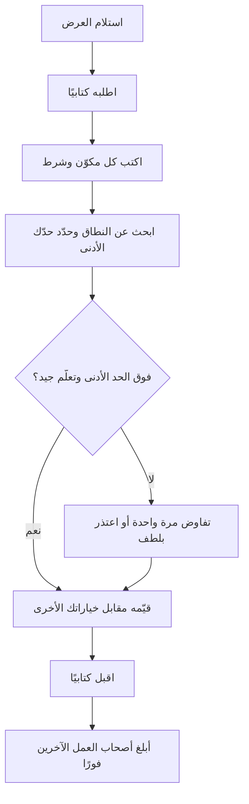

# الوحدة 6 — العرض الوظيفي والأيام التسعون الأولى (Offer and the first 90 days)

*الحصول على العرض الوظيفي (offer) ليس خط النهاية (finish line)، بل هو اللحظة التي تبدأ فيها اختياراتك بالتراكم (start to compound). تتناول هذه الوحدة القرارات الثلاثة التي تشكّل سنتيك الأوليين: أيّ عرض تقبل وبأي شروط (on what terms)؛ وكيف تبدأ بحيث يأتمنك فريقك على عمل حقيقي (real work) خلال 90 يومًا؛ وكيف تنمو من شخص تُسند إليه مهام (tasks) إلى شخص تُسند إليه مشكلات (problems). يوازن عمر بين عرض مكتوب (written offer) من برنامج الخرّيجين (graduate programme) في بنك نجم (Najm Bank)، وعرض من شركة ناشئة (startup) يتضمّن حصة ملكية (equity) ومهلة 48 ساعة (48-hour deadline). وفي أسبوعها الثاني، توشك ريم أن تلصق شيفرة داخلية (internal code) في أداة ذكاء اصطناعي شخصية (personal AI tool)، فتتعلّم كيف يُسلِّم فريق خاضع للتنظيم (regulated team) عمله. أما يوسف، في شهره التاسع، فيسمع أنه "قوي تقنيًا لكنه يفاجئ الناس" ("technically strong but surprises people")، فيحوّل هذه الملاحظات (feedback) إلى خطة نموّ (growth plan). لا تظهر هنا أي أرقام رواتب (salary figures). ستتعلّم كيف تجد الأرقام الحالية (current numbers)، وتقرأ الحزمة كاملة (the whole package)، وتتخذ قرارًا تستطيع الدفاع عنه (a decision you can defend).*

> **الخطوات (Steps):** Apply, Start, Grow — تحويل العرض الوظيفي (offer) إلى قرار جيد (good decision)، وبداية قوية (strong start)، ومسار واضح (visible path) نحو المستوى المتوسط (mid-level).

---

# 6.1 — العروض الوظيفية: المقارنة والتفاوض وحسن الاختيار
*المستوى (Level): 🔴 متقدم (Advanced)* · *المتطلبات (Prerequisites): 4.3، 5.1* · *الخطوة (Step): Apply, Start*

## ⚡ الدرس في دقيقة (In 60 seconds)
- **العرض الوظيفي (offer)** هو حزمة (package) (الراتب (pay)، والبدلات (allowances)، والمزايا (benefits)، وحصة الملكية (equity))، وشروط تعاقدية (contract terms) (فترة التجربة (probation)، وفترة الإشعار (notice)، والتزامات الخدمة (bonds)، وبنود الملكية الفكرية (intellectual-property clauses))، ووظيفة (job) (الفريق (team)، والمرشد (mentor)، والتعلّم (learning)).
- **احصل على كل عرض كتابيًا قبل أن تقرّر أي شيء (Get every offer in writing before you decide anything).** عبارة شفهية مثل "يسعدنا انضمامك إلينا" ("we'd love to have you") ليست عرضًا وظيفيًا.
- قارن **إجمالي المكافآت (total compensation)** و**التعلّم الذي ستحصل عليه في السنتين الأوليين (learning you will get in the first two years)**. لمعظم الخرّيجين، الثاني أهمّ من فرق صغير في الأول.
- تفاوض بأدب (politely)، ومرة واحدة (once)، مع أسباب (reasons) ومعلومات حقيقية (real information)، وعلى الحزمة كلها (the whole package). لا تختلق أبدًا عرضًا منافسًا (competing offer).
- إشارة القرار (Decision cue): ⁦("Which offer gives me the best learning and support, above a pay floor I have calculated and can live on?")⁩ "أيّ عرض يمنحني أفضل تعلّم ودعم، فوق حدّ أدنى للأجر (pay floor) حسبتُه وأستطيع العيش به؟"
- الفخ الأكبر (Biggest trap): القبول على عجل بسبب مهلة متفجّرة (exploding deadline)، أو قبول عرض ثم الاستمرار خفيةً في عرضه على جهات أخرى (shop it around).

## 🧭 لماذا يهم (Why it matters)
لدى عمر عرضان وظيفيان في الأسبوع نفسه. أرسل **برنامج نجم للخرّيجين التقنيين (Najm Tech Graduate Programme)** عرضًا مكتوبًا (written offer): نطاق رواتب ثابت للخرّيجين (fixed graduate salary band)، وبدلَي سكن ومواصلات (housing and transport allowances)، وثلاث تناوبات (rotations) مدة كلٍّ منها ستة أشهر، ومرشدًا محددًا بالاسم (named mentor) هو خالد. أما **سديم باي (Sadeem Pay)**، وهي شركة ناشئة في التقنية المالية (fintech startup) في الدوحة، فقدّمت عرضًا شفهيًا (verbal offer) في مكالمة. ذكر المؤسّس (founder) "راتبًا أساسيًا أعلى" ("higher base") و"خيارات أسهم" ("stock options")، ويريد ردًا خلال 48 ساعة. غريزة عمر الأولى أن يأخذ الرقم الذي يبدو أكبر؛ وغريزته الثانية أن يراسل نجم طالبًا "مالًا أكثر" ("more money")، دون مبلغ أو سبب.

رأت عائشة، قائدة استقطاب المواهب (talent acquisition lead) في نجم، هذا مرات كثيرة. فالخرّيجون الذين يقارنون حزمة مكتوبة (written package) بوعد شفهي (verbal promise) كثيرًا ما يكتشفون الشروط الحقيقية (real terms) عند التوقيع فقط: فترة التجربة (probation)، وفترة الإشعار (notice)، وبند ملكية فكرية (intellectual-property clause) يشمل مشاريعهم الجانبية (side projects)، أو خيارات (options) لا يمكن بيعها لسنوات. وآخرون يُفسدون علاقة جيدة بالضغط الشديد على أمر لا يستطيع صاحب العمل (employer) تغييره، مثل نطاق رواتب موحّد للدفعة (cohort-wide graduate band). وتحتاج هدى (التي تنتظر نجم وفي يدها عرض من شركة اتصالات (telecom offer)) ومحمد (الذي يظنّ أن خرّيج المعسكر التدريبي (bootcamp graduate) لا يحق له طرح الأسئلة) المهارة نفسها: أن يقرأ العرض كاملًا (read the whole offer)، ويبحث عن النطاق (research the range)، ويسأل بوضوح (ask clearly)، ويختار بطريقة يستطيع الدفاع عنها بعد عام.

## 📐 كيف يعمل (How it works)

### 🟢 الأساسيات (The essentials)

**تشريح العرض الوظيفي (The anatomy of an offer).** قبل مقارنة أي شيء، اكتب قائمة بما يحتويه كل عرض. في دول الخليج (GCC)، كثيرًا ما تُقسَّم الحزم (packages) إلى عدة أجزاء، لذا قد يكون "الراتب الأساسي" ("base salary") وحده مضلِّلًا (mislead).

| المكوّن (Component) | ما هو (What it is) | أسئلة تطرحها (Questions to ask) |
|---|---|---|
| **الراتب الأساسي (Base salary)** | أجر شهري ثابت (Fixed monthly pay) | شهري أم سنوي (Monthly or annual)؟ متى يُراجَع (When is it reviewed)؟ |
| **البدلات (Allowances)** | السكن والمواصلات (Housing, transport) وغيرها، وهي شائعة في حزم الخليج (GCC packages) | نقدية أم عينية (Cash or provided)؟ هل تُحتسب في مكافأة نهاية الخدمة (end-of-service) أو المكافأة (bonus)؟ |
| **المكافأة (Bonus)** | أجر متغيّر (Variable pay) مرتبط بالأداء (performance) | ما المستهدف (Target)؟ هل تُحتسب بالتناسب (Pro-rated) في السنة الأولى؟ هل هي مضمونة (Guaranteed)؟ |
| **حصة الملكية (Equity)** | أسهم (Shares) أو خيارات (options)، في الشركات الناشئة (startups) غالبًا | النوع (Type)، والعدد (number)، وسعر التنفيذ (strike price)، والاستحقاق التدريجي (vesting)؟ (انظر 🟡.) |
| **المزايا (Benefits)** | التأمين الصحي (Health insurance)، والإجازات (leave)، وتذاكر السفر إلى الوطن (flights home)، والمعاش أو التأمينات الاجتماعية (pension or social insurance) | من المشمول (Who is covered)، ومن متى (from when)؟ |
| **مكافأة نهاية الخدمة (End-of-service benefit)** | مبلغ يُدفع عند ترك العمل (payment on leaving)، تحدّده قوانين العمل الخليجية (GCC labour laws) | كيف تُحسب (How is it calculated)؟ تحقّق من القواعد الحالية لوزارة العمل (labour ministry's current rules). |
| **فترة التجربة (Probation)** | فترة اختبار (trial period) يسهل فيها إنهاء العقد (easier termination) على الطرفين | كم مدتها (How long)؟ ما الإشعار المطبَّق خلالها (What notice applies during it)؟ |
| **فترة الإشعار (Notice period)** | المدة التي يجب أن تمنحها، وتُمنح لك، قبل المغادرة (before leaving) | هل هي نفسها للطرفين (Same for both sides)؟ |
| **التزام التدريب أو اتفاقية الخدمة (Training bond or service agreement)** | التزام بالبقاء (commitment to stay) بعد أن يموّل صاحب العمل تدريبًا أو دراسة | كم مدته (How long)؟ ماذا تردّ إن غادرت مبكرًا (What is repaid if you leave early)؟ |
| **الموقع والتأشيرة وتاريخ البدء (Location, visa and start date)** | مكان عملك، وقواعد العمل الهجين (hybrid rules)، وكفالة الإقامة (residency sponsorship) | ما المستندات المطلوبة (Which documents)، مثل شهادات الدرجة العلمية المصدَّقة (attested degree certificates)؟ |

**كتابيًا، ثم القرار (Written, then decided).** العرض الشفهي (verbal offer) يدلّ على جدّية صاحب العمل؛ أما المكتوب (written one) فيبيّن ما يلتزم به. قل شكرًا واسأل: ⁦("Could you send the offer in writing, with the full package and contract terms, so I can review it properly?")⁩ "هل يمكنكم إرسال العرض كتابيًا، مع الحزمة كاملة وشروط العقد، كي أراجعه كما ينبغي؟" هذا طلب عادي (normal request).

**الشروط (Conditions).** كثير من العروض **مشروطة (conditional)** بالمراجع (references)، أو التحقّق من الخلفية (background checks)، أو تصديق الشهادة (degree attestation)، أو الفحوص الطبية (medical checks)، أو تصريح العمل (work permit). وإلى أن تُستوفى الشروط (conditions clear)، لا تستقِل من عملك ولا ترفض عروضًا أخرى.

**البحث عن النطاق (Researching the range).** لا يمكنك الحكم على عرض دون أن تعرف ما تدفعه الأدوار المماثلة (similar roles). وقت كتابة هذا الدرس (2026)، المصادر الجيدة هي:
- **مسؤولو التوظيف (Recruiters)**، بمن فيهم مسؤول التوظيف لدى صاحب العمل نفسه: ⁦("What is the range for this role?")⁩ "ما النطاق لهذا الدور؟"
- **إعلانات الوظائف التي تنشر النطاقات (Job adverts that publish ranges)**، وهي أقل شيوعًا في الخليج، وإن كان بعض أصحاب العمل والمنصّات (platforms) يعرضونها.
- **أدلة الرواتب الإقليمية (Regional salary guides)** الصادرة عن شركات التوظيف (recruitment firms)؛ لاحظ السنة والمنهجية (the year and method).
- **الأقران (Peers)** الذين يسبقونك بسنة أو سنتين، ومركز التوجيه المهني في جامعتك (university career centre)، وشبكات الخرّيجين (alumni networks) (الدرس 4.2).
- **المواقع المعتمدة على مساهمات المستخدمين (Crowd-sourced sites)** مثل Levels.fyi أو Glassdoor. بيانات مستوى المبتدئين (entry-level) الخليجية فيها شحيحة (thin)؛ فتعامل معها كإشارة تقريبية (rough signal).

دوّن نطاقًا (range) من عدة مصادر، لا رقمًا واحدًا. ثم احسب **حدّك الأدنى (floor)**: أدنى حزمة إجمالية (lowest total package) تغطي تكاليفك الحقيقية (real costs) (الإيجار، والمواصلات، والالتزامات العائلية (family commitments)، والادّخار (savings)) في تلك المدينة. ما دون الحد الأدنى يعني "تفاوض" ("negotiate") أو "لا" ("no").

**قارن التعلّم، لا المال فقط (Compare learning, not just money).** سنتاك الأوليان تبنيان المهارات التي يدفع مقابلها كل عرض لاحق (every later offer). اسأل: هل سيكون لي مرشد (mentor) لديه وقت لي؟ هل سأسلّم عملًا حقيقيًا (ship real work) مع مراجعة الشيفرة (code review)؟ هل يوجد تدريب منظّم (structured training)؟ ما مدى استقرار الفريق (team stable)؟ هل يبني العمل الدور الذي اخترته في الوحدة 2 (Module 2)؟

### 🟡 التعمق أكثر (Going deeper)

**عملية قرار يمكنك شرحها لاحقًا (A decision process you can explain later).**

**التفاوض بصدق (Negotiation, honestly).** التفاوض (negotiation) محادثة للوصول إلى شروط يقبلها الطرفان (terms both sides accept)، لا معركة. ثلاث أفكار تساعد:
- **BATNA**، أي أفضل بديل للاتفاق المتفاوض عليه (best alternative to a negotiated agreement)، وهو مصطلح من كتاب فيشر ويوري (Fisher and Ury) *Getting to Yes*. الـBATNA الخاص بك هو ما ستفعله إن فشل هذا العرض: عرض آخر (another offer)، أو مواصلة البحث (continuing your search)، أو مزيد من الدراسة (further study). الـBATNA الحقيقي يمنحك ثقة هادئة (calm confidence)؛ أما المتخيَّل فيغريك بالخداع (bluff).
- **المصالح لا المواقف (Interests, not positions).** "أريد 20% أكثر" ("I want 20% more") موقف (position). أما "تكاليف سكني أعلى مما يفترضه البدل" ("My housing costs are higher than the allowance assumes") فهي مصلحة (interest). وكثيرًا ما يستطيع أصحاب العمل تلبية المصلحة بطريقة أخرى.
- **وسّع الحزمة (Expand the package).** إن كان الراتب الأساسي (base) ثابتًا، فقد لا تكون الأشياء الأخرى كذلك: تاريخ البدء (start date)، ومكافأة التوقيع (signing bonus)، والانتقال (relocation)، وميزانية للشهادات المهنية (certification budget)، والفريق الذي تنضمّ إليه، أو مراجعة أولى للراتب (first salary review) في وقت أبكر.

**ما الذي يمكن للخرّيجين التفاوض عليه (What is negotiable for graduates).** كثيرًا ما تدفع برامج الخرّيجين الكبيرة (large graduate programmes)، ومنها برنامج نجم، نطاقًا موحّدًا للدفعة (cohort-wide band) كي يُعامَل الخرّيجون بالتساوي؛ والضغط الشديد على الراتب الأساسي هناك يُهدر حسن النية (wastes goodwill). أما الشركات الناشئة والشركات الأصغر (smaller firms) فلديها عادةً مرونة أكبر (more flexibility). وقد يُعيَّن المتحوّلون مهنيًا (career-switchers) مثل محمد على نطاق المبتدئين (junior band) بدلًا من نطاق الخرّيجين (graduate one). والطريقة الوحيدة لمعرفة ذلك هي أن تسأل، بأدب، مرة واحدة.

**رسائل التفاوض الضعيفة مقابل القوية (Weak vs strong negotiation messages).**

ضعيفة (Weak):
> مرحبًا، شكرًا على العرض. كنت آمل في مال أكثر. هل يمكنكم تقديم أفضل من ذلك؟ لديّ عروض أخرى.

قوية (Strong) (يوسف، ردًا على عرض نجم في مسار المنصّات (platform-track offer)):
> شكرًا لكم على العرض. أنا متحمّس لفريق المنصّات (platform team) وللعمل مع سالم. بعد مراجعة الحزمة، أودّ السؤال عن أمرين. أولًا، يشير بحثي مع مسؤولي التوظيف والأقران إلى أن نطاق الأدوار المبتدئة المماثلة (similar junior roles) في الدوحة أعلى قليلًا من الراتب الأساسي في العرض. هل توجد مرونة (flexibility) في ذلك؟ ثانيًا، إن كان الراتب الأساسي محددًا بنطاق البرنامج (programme band)، فهل تنظرون في دعم شهادة سحابية بمستوى مشارك (associate-level cloud certification) في السنة الأولى؟ يمكنني إعطاؤكم ردّي بحلول يوم الخميس.

الصيغة القوية تُظهر الاهتمام (interest)، وتسأل بتحديد (specifically)، وتقدّم سببًا (reason)، وتعرض بديلًا (alternative)، وتحدّد جدولًا زمنيًا (timeline)، بلا تهديدات ولا اختلاقات (without threats or inventions).

**العروض المنافسة والمهل (Competing offers and deadlines).** إن كان لديك عرض آخر فعلًا، فيمكنك قول ذلك: ⁦("I have another written offer with a deadline of Sunday. Najm is my first choice. Is there any way to speed up your decision?")⁩ "لديّ عرض مكتوب آخر ينتهي موعده يوم الأحد. نجم هو خياري الأول. هل توجد طريقة لتسريع قراركم؟" لا تدّعِ أبدًا عرضًا ليس لديك؛ فيمكن التحقّق منه. وفي حالة **العرض المتفجّر (exploding offer)** (مهلة قصيرة جدًا)، اطلب وقتًا أطول: ⁦("This is an important decision. Could I have until Monday?")⁩ "هذا قرار مهم. هل يمكن أن تمهلوني حتى يوم الاثنين؟" يوافق كثير من أصحاب العمل. وإن لم يتزحزحوا إطلاقًا، فهذا يخبرك بشيء عن الطريقة التي قد يعاملونك بها لاحقًا.

**حصة الملكية في الشركات الناشئة بكلمات بسيطة (Startup equity in plain words).**
- **الأسهم (Shares)** ملكية جزئية للشركة (part-ownership of the company). و**الخيارات (Options)** هي الحق في شراء أسهم لاحقًا بسعر ثابت يُسمّى **سعر التنفيذ (strike price)**.
- **الاستحقاق التدريجي (Vesting)** يعني أنك تكسب حصة الملكية بمرور الوقت (earn the equity over time). النمط الشائع (common pattern) هو استحقاق على عدة سنوات مع **فترة حدّ أدنى (cliff)** (لا يُستحق شيء حتى، مثلًا، اكتمال سنتك الأولى)، لكن الشروط تختلف. اقرأ خطتك (Read your plan).
- **التخفيف (Dilution)**: كل جولة تمويل جديدة (new funding round) تُصدر أسهمًا جديدة، فتتقلّص نسبتك (your percentage) عادةً.
- **السيولة (Liquidity)**: لا يمكنك البيع عادةً إلا إذا استُحوذ على الشركة (is bought)، أو أُدرجت في سوق للأوراق المالية (lists on a stock exchange)، أو نفّذت إعادة شراء (buy-back). وكثير من الشركات الناشئة لا تصل إلى أيٍّ من ذلك أبدًا.

القاعدة العملية (The practical rule): لأغراض الميزانية (for budgeting)، قيّم حصة الملكية في المرحلة المبكرة (early-stage equity) بصفر، وقارن النقد (cash) بحدّك الأدنى (floor).

### 🔴 نظرة الخبير (Expert view)

**اقرأ العقد، لا الخطاب فقط (Read the contract, not only the letter).** خطاب العرض (offer letter) يلخّص؛ أما العقد (contract) فهو المُلزِم (binds). ابحث عن:
- **بنود الملكية الفكرية (Intellectual-property (IP) clauses).** كثير من العقود تنقل إلى صاحب العمل ما تبتكره أثناء عملك لديه (what you create while employed)، وأحيانًا حتى خارج ساعات العمل (outside working hours). إن كانت لديك مشاريع مفتوحة المصدر (open-source projects) أو معرض أعمال (portfolio) (الوحدة 3)، فاطلب استثناءً مكتوبًا (written carve-out) للمشاريع القائمة والشخصية (existing and personal projects) التي لا تستخدم وقت الشركة أو معدّاتها أو معلوماتها.
- **بنود عدم المنافسة وعدم الاستقطاب (Non-compete and non-solicitation clauses).** قد تقيّد المكان الذي تعمل فيه لاحقًا. ومدى قابليتها للتنفيذ (How enforceable they are) يعتمد على البلد والصياغة (the wording). اسأل عمّا تعنيه عمليًا (in practice).
- **التزامات الخدمة واستردادات المبالغ (Bonds and clawbacks).** قد يلزم ردّ تكاليف الدراسة المموّلة (Sponsored study) والشهادات المهنية (certifications) والانتقال (relocation) إن غادرت مبكرًا (leave early). وهي عادلة حين تكون واضحة؛ فاعرف المبلغ والمدة.
- **سياسات السرية والاستخدام المقبول (Confidentiality and acceptable-use policies)**، بما فيها قواعد أدوات الذكاء الاصطناعي (AI-tool rules) (الدرس 6.2).

لأي شيء غير مألوف (unusual)، راجع إرشادات وزارة العمل (labour ministry's guidance) في بلد العمل، واطلب من الموارد البشرية (HR) أن تشرح، واطلب مشورة مستقلة (independent advice) إن كانت المخاطر عالية (stakes are high). قواعد العمل والتأشيرات والكفالة (Labour, visa and sponsorship rules) تختلف وتتغيّر؛ فتحقّق من القواعد الحالية (current rules)، لا من تجربة صديق. وبالنسبة للمواطنين (nationals)، قد تتضمّن العروض التي تشكّلها برامج التوطين (nationalisation programmes) (التقطير (Qatarization)، والتوطين الإماراتي (Emiratisation)، والسعودة (Saudization)) مسارًا تطويريًا (development track)، أو دراسة مموّلة (sponsored study)، أو اتفاقية خدمة (service agreement)؛ فقارنها كأي عرض آخر.

**الاختيار بنزاهة (Choosing with integrity).** بمجرد أن تقبل كتابيًا (accept in writing)، يتوقّف صاحب العمل عن إجراء المقابلات، ويبلغ المرشّحين الآخرين بالرفض، ويبدأ في ترتيب حاسوبك المحمول (laptop) وصلاحيات الوصول (access) والتأشيرة (visa). لا تنسحب بعد القبول (Withdraw after acceptance) إلا لأسباب جدّية (serious reasons)، ومبكرًا وبصدق، عبر الهاتف ثم البريد الإلكتروني. وبمجرد قبولك، أبلغ بلطف كل صاحب عمل آخر لا تزال في إجراءاته (still in process)؛ فمسؤول التوظيف (recruiter) الذي تعتذر له اليوم قد يوظّفك بعد ثلاث سنوات.

**حين يكون الاختيار متقاربًا (When the choice is close)،** اختر المدير الأفضل والتعلّم الأفضل (the better manager and learning). اطلب مكالمة مدتها 20 دقيقة مع شخص انضمّ قبل سنة أو سنتين؛ فما يقوله عن مراجعة الشيفرة (code review) والإرشاد (mentorship) والأخطاء (mistakes) أثمن من فجوة صغيرة في الأجر (small pay gap).

## 🧰 الأدوات (The toolkit)
| المورد أو الأداة أو النموذج (Resource, tool or template) | ما هو وماذا يفعل (What it is and does) | متى تلجأ إليه (When to reach for it) |
|---|---|---|
| **Offer comparison sheet** — ورقة مقارنة العروض | جدول يضع كل مكوّن (component) وشرط (term) وعامل تعلّم (learning factor) جنبًا إلى جنب (side by side)، مع أوزان (weights) | بمجرد أن يصبح لديك أكثر من عرض، أو عرض واحد وبديل حقيقي (real alternative) |
| **Total compensation** — إجمالي المكافآت | الراتب الأساسي (Base) مضافًا إليه البدلات والمكافأة وحصة الملكية وقيمة المزايا (value of benefits)، على مدى عام | عند مقارنة حزم ذات هياكل مختلفة (structured differently) |
| **BATNA** (Fisher and Ury, *Getting to Yes*) — أفضل بديل للاتفاق المتفاوض عليه | أفضل بديل لديك (best alternative) إن لم تتمّ هذه الصفقة (deal) | قبل أي تفاوض، لتعرف إلى أي مدى يمكنك المضيّ بهدوء (calmly) |
| **Salary guides from recruitment firms** — أدلة الرواتب من شركات التوظيف | استبيانات أجور إقليمية سنوية (Annual regional pay surveys) حسب الدور والمستوى (by role and level) | عند تحديد نطاق مدروس (researched range)؛ لاحظ دائمًا السنة والمنهجية (the year and method) |
| **Levels.fyi** | بيانات مكافآت يساهم بها المستخدمون (Crowd-sourced compensation data)، وهي الأقوى لشركات التقنية الكبيرة (large tech firms) | إشارة تقريبية (rough signal) لأدوار الشركات متعددة الجنسيات (multinational roles)؛ وشحيحة لأدوار الخرّيجين في الخليج (GCC graduate roles) |
| **Labour ministry guidance** (e.g. Qatar's Ministry of Labour, the UAE's MOHRE) — إرشادات وزارة العمل (مثل وزارة العمل في قطر، ووزارة الموارد البشرية والتوطين (MOHRE) في الإمارات) | القواعد الرسمية (Official rules) للعقود وفترة التجربة والإشعار ومكافأة نهاية الخدمة (end-of-service benefits) | عند التحقّق من شرط في العقد لا تفهمه |
| **Negotiation email template** — نموذج بريد التفاوض | الشكر (Thanks)، والاهتمام (interest)، وطلب محدد مع سبب (specific ask with a reason)، وبديل (alternative)، وجدول زمني (timeline) | أي تفاوض مكتوب (written negotiation) |

## 🏛️ عمليًا في بنك نجم (In practice at Najm Bank)
تشارك عائشة **ورقة مقارنة العروض (offer comparison sheet)** التي يقدّمها فريق الخرّيجين في نجم لكل مرشّح يطلب مساعدة في اتخاذ القرار. يملؤها عمر. المبالغ عناصر نائبة (placeholders)؛ استخدم أرقامك الحقيقية (real figures).

**الجزء A: الوقائع (Part A: the facts)**

| البند (Item) | برنامج نجم للخرّيجين التقنيين (Najm Tech Graduate Programme) | سديم باي (Sadeem Pay) (شركة ناشئة (startup)) |
|---|---|---|
| حالة العرض (Offer status) | مكتوب (Written)، مشروط بتصديق الشهادة (degree attestation) والتحقّق من الخلفية (background check) | شفهي (Verbal)؛ طُلبت النسخة المكتوبة في اليوم 1، ووصلت في اليوم 3 |
| الراتب الأساسي (شهري) (Base salary (monthly)) | [الراتب الأساسي في نجم (Najm base)] | [الراتب الأساسي في سديم (Sadeem base)]، أعلى من نجم |
| البدلات (Allowances) | سكن ومواصلات (Housing and transport)، نقدًا (cash) | لا يوجد؛ "مشمولة في الراتب الأساسي" ("included in base") |
| المكافأة (Bonus) | سنوية، تقديرية (discretionary)، بالتناسب (pro-rated) في السنة 1 | غير مذكورة (None stated) |
| حصة الملكية (Equity) | لا يوجد | خيارات (Options)؛ استحقاق على 4 سنوات (4-year vesting)، مع فترة حدّ أدنى سنة واحدة (1-year cliff)؛ سعر التنفيذ (strike price) لم يُذكر بعد |
| التأمين الصحي (Health insurance) | للموظف؛ وللعائلة بعد فترة التجربة (after probation) | للموظف فقط (Employee only) |
| فترة التجربة / الإشعار (Probation / notice) | [حسب العقد (Per contract)] / [حسب العقد (per contract)] | [حسب العقد (Per contract)] / [حسب العقد (per contract)] |
| التزام الخدمة (Bond) | لا يوجد للبرنامج؛ التزام للشهادة المهنية (certification bond) إن كانت مموّلة (sponsored) | لا يوجد |
| بند الملكية الفكرية (IP clause) | قياسي (Standard)؛ تمّت الموافقة عند الطلب على استثناء (carve-out) للمشاريع الشخصية المُدرجة (listed personal projects) | واسع (Broad)، يشمل "كل الاختراعات" ("all inventions")؛ طُلب استثناء (carve-out requested) |
| التعلّم (Learning) | 3 تناوبات (rotations)، ومرشد (mentor) (خالد)، وتدريب للدفعة (cohort training)، ومراجعة شيفرة على كل طلب دمج (code review on every PR) | فريق صغير، وملكية واسعة للمسؤوليات (broad ownership)، بلا إرشاد رسمي (no formal mentoring)؛ يراجع المدير التقني (CTO) طلبات الدمج (PRs) "عندما يتسنّى ذلك" ("when possible") |

**الجزء B: التقييم بالدرجات (Part B: the scoring)** (أوزان اختارها عمر قبل التقييم، لتجنّب إمالة النتيجة (tilting the result))

| العامل (Factor) | الوزن (Weight) | نجم (Najm) (1–5) | سديم (Sadeem) (1–5) |
|---|---|---|---|
| إجمالي النقد مقابل الحد الأدنى (Cash total vs floor) | 25% | 4 | 4 |
| التعلّم والإرشاد (Learning and mentorship) | 30% | 5 | 3 |
| تسليم حقيقي للمستخدمين (Real shipping to users) | 15% | 3 | 5 |
| الاستقرار والمزايا (Stability and benefits) | 15% | 5 | 2 |
| الملاءمة مع الدور المستهدف (مهندس برمجيات) (Fit with target role (software engineer)) | 15% | 4 | 4 |
| **الدرجة المرجّحة (Weighted score)** | 100% | **4.30** | **3.55** |

**الجزء C: ملاحظة القرار (Part C: the decision note)** (ثلاث جمل يكتبها عمر لنفسه في المستقبل (for his future self))
> أختار نجم لأن الإرشاد (mentorship) ومراجعة الشيفرة (code review) سيبنيان مهارات النشر (deployment) وبيئة الإنتاج (production) التي تنقصني (الدرس 1.3)، والنقد (cash) أعلى من حدّي الأدنى (floor). حصة الملكية في الشركة الناشئة قيمتها مجهولة (unknown value) وقد قيّمتها بصفر. سأشكر سديم باي هاتفيًا اليوم، وأؤكّد ذلك بالبريد الإلكتروني، وأسأل إن كان بإمكاني البقاء على تواصل (stay in touch).

## 🛠️ التمارين (Exercises)
- 🟢 خذ خطاب عرض (offer letter) حقيقيًا أو نموذجيًا، واكتب قائمة بكل مكوّن وشرط (every component and term) من جدول التشريح (anatomy table) في 🟢 الأساسيات (The essentials). علّم كلًا منها بـ"مذكور" ("stated") أو "غير واضح" ("unclear") أو "مفقود" ("missing"). *يكتمل عندما (Done when):* تكون لديك قائمة من صفحة واحدة، ومجموعة مكتوبة من خمسة أسئلة على الأقل سترسلها إلى صاحب العمل.
- 🟡 ابحث عن النطاق (range) لدور مستهدف واحد (one target role) في مدينة واحدة مستخدمًا ثلاثة مصادر مختلفة على الأقل، واحسب حدّك الأدنى الشخصي (personal floor) من ميزانية شهرية (monthly budget). *يكتمل عندما (Done when):* يستطيع زميل (peer) أن يرى مصادرك وتواريخها، والنطاق الذي خلصت إليه، وحساب حدّك الأدنى، وأن يتتبّع كيف انتقلت من أحدها إلى الآخر.
- 🔴 اكتب بريد تفاوض (negotiation email) لسيناريو يكون فيه الراتب الأساسي (base salary) ثابتًا بنطاق الخرّيجين (graduate band) لكن لديك مصلحة حقيقية واحدة (one genuine interest) (مثلًا تاريخ بدء لاحق (later start date)، أو ميزانية للشهادات المهنية (certification budget)، أو تكلفة انتقال (relocation cost)). ثم مثّل الموقف (role-play it) مع زميل يؤدي دور مسؤول التوظيف (recruiter)، وعليه أن يرفض طلبك الأول. *يكتمل عندما (Done when):* يحتوي بريدك على الشكر، والاهتمام، وطلب محدد مع سبب (specific ask with a reason)، وبديل، وموعد نهائي (deadline)؛ وينتهي تمثيل الأدوار بنتيجة واضحة (clear outcome) يستطيع كلاكما تدوينها.

## ⚠️ أخطاء وفخاخ (Mistakes and traps)
- **القرار بناءً على رقم شفهي (Deciding on a verbal number).** اطلب العرض المكتوب أولًا؛ فالمفاجآت تختبئ في الشروط (surprises hide in the terms).
- **مقارنة الرواتب الأساسية فقط (Comparing base salaries only).** قارن إجمالي المكافآت (total compensation)، ثم التعلّم (learning).
- **الخداع بشأن عروض منافسة (Bluffing about competing offers).** لا تذكر إلا العروض الحقيقية، وبدقة (accurately).
- **تقييم حصة الملكية في الشركات الناشئة كأنها نقد (Valuing startup equity as cash).** قيّم الخيارات في المرحلة المبكرة (early-stage options) بصفر؛ واسأل عن الاستحقاق التدريجي (vesting) وسعر التنفيذ (strike price) والتخفيف (dilution).
- **توقيع بند ملكية فكرية يبتلع معرض أعمالك (Signing an IP clause that swallows your portfolio).** اطلب استثناءً مكتوبًا (written carve-out) للمشاريع القائمة والشخصية (existing and personal projects).
- **القبول ثم مواصلة التسوّق (Accepting, then still shopping around).** بمجرد أن تقبل، أوقف الإجراءات الأخرى (stop other processes) وأبلغ أصحاب العمل المعنيين.

## 🧾 الخلاصة (Recap)
- العرض الوظيفي (offer) حزمة (package) وعقد (contract) ووظيفة (job). احصل عليه كتابيًا (in writing) واكتب قائمة بكل أجزائه.
- ابحث عن نطاق (range) من عدة مصادر، واحسب حدّك الأدنى (floor) قبل أن تقارن.
- بالنسبة للخرّيجين، كثيرًا ما يكون التعلّم والإرشاد (mentorship) والتسليم الحقيقي (real shipping) أهمّ من فرق صغير في الأجر (small pay difference).
- تفاوض مرة واحدة، بأدب، بالمصالح (interests) والمعلومات الحقيقية. ووسّع الحزمة (Expand the package) حين يكون الراتب الأساسي ثابتًا.
- اقرأ العقد (الملكية الفكرية (IP)، وعدم المنافسة (non-compete)، والتزامات الخدمة (bonds)، وفترة التجربة (probation)، والإشعار (notice))، وراجع إرشادات العمل الرسمية (official labour guidance)، واختر بنزاهة (with integrity).

## ✍️ اختبر نفسك (Check yourself)

**1. يتلقّى عمر عرضًا شفهيًا (verbal offer) من سديم باي (Sadeem Pay) بمهلة 48 ساعة (48-hour deadline). ما أول ما ينبغي أن يفعله؟**

- A. أن يقبل فورًا في المكالمة، ثم يطلب التفاصيل المكتوبة (written details) بعد ذلك
- B. أن يطلب العرض كاملًا كتابيًا (full offer in writing)، ويسأل إن كان يمكن تمديد المهلة (deadline can move)
- C. أن يخبر نجم بأن لديه عرضًا أفضل، ويطلب منهم تجاوزه (beat it) اليوم
- D. أن يترك المهلة تنقضي، ويردّ الأسبوع القادم بعد أن يفكّر

الإجابة

**B.** لا يستطيع مقارنة رقم شفهي (verbal number) بحزمة مكتوبة (written package)، وطلب الوقت بأدب أمر عادي. A يُلزمه بشروط لم يرها (unseen terms)؛ وC ادّعاء لا يستطيع إثباته (a claim he cannot support)؛ وD قد يُفقده العرض دون أن يطلب وقتًا أصلًا. (🟢 الأساسيات (The essentials)؛ 🟡 التعمق أكثر (Going deeper).)

**2. يدفع برنامج الخرّيجين (graduate programme) في نجم لكل خرّيجي الدفعة (cohort) النطاق نفسه (same band). يريد يوسف حزمة أفضل. ما النهج الأكثر فاعلية؟**

- A. أن يسأل مرة واحدة، بأدب، عن المرونة (flexibility)، ويقترح بديلًا مثل دعم الشهادة المهنية (certification support)
- B. أن يصرّ على راتب أساسي أعلى (higher base) ويرفض التوقيع حتى يُرفع النطاق له
- C. أن يذكر عرضًا أعلى من شركة متعددة الجنسيات (multinational) ليس لديه فعلًا
- D. أن يقبل دون أن يسأل شيئًا، لأن الخرّيجين لا يُسمح لهم بالتفاوض (not allowed to negotiate)

الإجابة

**A.** حين يكون الراتب الأساسي محددًا بنطاق (fixed by a band)، فإن توسيع الحزمة (expanding the package) يلبّي مصالحه (interests) دون إهدار حسن النية (goodwill). B يضغط على ما لا يستطيع صاحب العمل تغييره؛ وC غير نزيه (dishonest)؛ وD يتخلّى عن خيار يملكه بحق (legitimately). (🟡 التعمق أكثر (Going deeper).)

**3. تعرض شركة ناشئة (startup) على ريم خيارات (options) باستحقاق تدريجي على أربع سنوات (four-year vesting) وفترة حدّ أدنى سنة واحدة (one-year cliff). كيف ينبغي أن تقيّمها عند مقارنتها بحدّها الأدنى (floor)؟**

- A. بأي قيمة قدّرها المؤسّس (founder estimated) في مكالمة العرض
- B. بسعر التنفيذ (strike price) مضروبًا في عدد الخيارات الممنوحة (options granted)
- C. بآخر تقييم تمويلي (last funding valuation) مضروبًا في نسبة حصتها (percentage stake)
- D. بصفر لأغراض الميزانية (for budgeting)، بعد التحقّق من الاستحقاق التدريجي (vesting) وسعر التنفيذ والتخفيف (dilution)

الإجابة

**D.** أي قيمة مستقبلية مكسب إضافي (bonus). فالخيارات في المرحلة المبكرة (Early-stage options) لا يمكن بيعها عادةً لسنوات، وقد تتعرّض للتخفيف (diluted)، وقد لا تساوي شيئًا أبدًا. A وC يعتمدان على تقديرات (estimates) لا تستطيع أن تدفع بها الإيجار؛ وB هو تكلفة شراء الأسهم (cost of buying the shares)، لا قيمتها. (🟡 التعمق أكثر (Going deeper).)

**4. ينقل عقد محمد إلى صاحب العمل "كل الاختراعات التي تتمّ خلال مدة التوظيف" ("all inventions made during the term of employment"). وهو يتولّى صيانة مكتبة مفتوحة المصدر (open-source library) منذ أيام المعسكر التدريبي (bootcamp). ماذا ينبغي أن يفعل؟**

- A. أن يوقّع كما هو مكتوب، لأن بنودًا كهذه لا تُطبَّق أبدًا عمليًا (never enforced in practice)
- B. أن يحذف مكتبته مفتوحة المصدر أو ينقلها (transfer) قبل يومه الأول
- C. أن يطلب استثناءً مكتوبًا (written carve-out) يُدرج مشاريعه الشخصية القائمة (existing personal projects)
- D. أن يرفض العرض، لأنه لا يوجد صاحب عمل سيغيّر الصياغة (change the wording)

الإجابة

**C.** الاستثناء (carve-out) للمشاريع القائمة والشخصية يحمي معرض أعماله (portfolio)، وهو طلب شائع ومعقول (common, reasonable request). A افتراض لا يستطيع الاعتماد عليه (assumption he cannot rely on)؛ وB وD خسائر غير ضرورية (unnecessary losses). (🔴 نظرة الخبير (Expert view).)

**5. تقبل هدى كتابيًا (in writing) عرض شركة الاتصالات الإقليمية (regional telecom). وبعد أسبوعين، يقدّم لها مسار البيانات (data track) في نجم عرضًا. أيّ ردّ يعكس هذا الدرس على أفضل وجه؟**

- A. أن تقبل عرض نجم أيضًا، ثم تختار لاحقًا أيّ تاريخ بدء (start date) يناسبها أكثر
- B. أن تقبل نجم ولا تحضر ببساطة إلى شركة الاتصالات في أول يوم عمل لها
- C. أن تعدّ قبولها المكتوب (written acceptance) غير مُلزِم بشيء (carrying no obligations) حتى تبدأ فعلًا
- D. أن تفي بكلمتها (Keep her word) ما لم يكن السبب جدّيًا (serious)؛ وإن كان كذلك، فلتبلغ شركة الاتصالات مبكرًا هاتفيًا

الإجابة

**D.** بمجرد قبولها، تتوقّف شركة الاتصالات عن التوظيف وتستعدّ لقدومها، لذا لا تنسحب إلا لأسباب جدّية، ومبكرًا وبصدق. وكان ينبغي أيضًا أن تُبلغ نجم حينها بأنها خرجت من الإجراءات (out of the process). A وB يُضرّان بالثقة (damage trust)؛ وC غير صحيح (false). (🔴 نظرة الخبير (Expert view).)

## 📚 المراجع (References)
- Fisher, R., Ury, W. and Patton, B., *Getting to Yes: Negotiating Agreement Without Giving In*, Penguin (revised editions) — فيشر ويوري وباتون، كتاب «الوصول إلى نعم» (طبعات منقّحة (revised editions))
- Program on Negotiation, Harvard Law School — برنامج التفاوض (Program on Negotiation)، كلية الحقوق بجامعة هارفارد — https://www.pon.harvard.edu/
- Qatar Ministry of Labour — وزارة العمل في قطر — https://www.mol.gov.qa/
- UAE Ministry of Human Resources and Emiratisation (MOHRE) — وزارة الموارد البشرية والتوطين في الإمارات — https://www.mohre.gov.ae/
- Levels.fyi — https://www.levels.fyi/
- Glassdoor — https://www.glassdoor.com/

---

