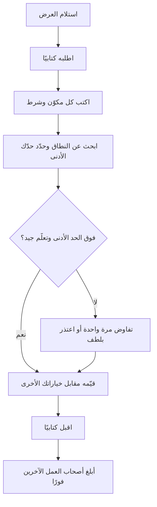
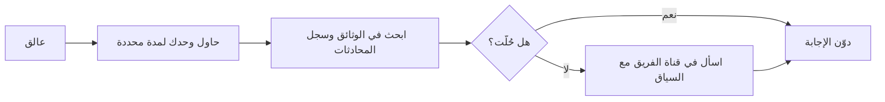
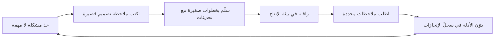

# الوحدة 6 — العرض الوظيفي والأيام التسعون الأولى (Offer and the first 90 days)

*الحصول على العرض الوظيفي (offer) ليس خط النهاية (finish line)، بل هو اللحظة التي تبدأ فيها اختياراتك بالتراكم (start to compound). تتناول هذه الوحدة القرارات الثلاثة التي تشكّل سنتيك الأوليين: أيّ عرض تقبل وبأي شروط (on what terms)؛ وكيف تبدأ بحيث يأتمنك فريقك على عمل حقيقي (real work) خلال 90 يومًا؛ وكيف تنمو من شخص تُسند إليه مهام (tasks) إلى شخص تُسند إليه مشكلات (problems). يوازن عمر بين عرض مكتوب (written offer) من برنامج الخرّيجين (graduate programme) في بنك نجم (Najm Bank)، وعرض من شركة ناشئة (startup) يتضمّن حصة ملكية (equity) ومهلة 48 ساعة (48-hour deadline). وفي أسبوعها الثاني، توشك ريم أن تلصق شيفرة داخلية (internal code) في أداة ذكاء اصطناعي شخصية (personal AI tool)، فتتعلّم كيف يُسلِّم فريق خاضع للتنظيم (regulated team) عمله. أما يوسف، في شهره التاسع، فيسمع أنه "قوي تقنيًا لكنه يفاجئ الناس" ("technically strong but surprises people")، فيحوّل هذه الملاحظات (feedback) إلى خطة نموّ (growth plan). لا تظهر هنا أي أرقام رواتب (salary figures). ستتعلّم كيف تجد الأرقام الحالية (current numbers)، وتقرأ الحزمة كاملة (the whole package)، وتتخذ قرارًا تستطيع الدفاع عنه (a decision you can defend).*

> **الخطوات (Steps):** Apply, Start, Grow — تحويل العرض الوظيفي (offer) إلى قرار جيد (good decision)، وبداية قوية (strong start)، ومسار واضح (visible path) نحو المستوى المتوسط (mid-level).

---

# 6.1 — العروض الوظيفية: المقارنة والتفاوض وحسن الاختيار
*المستوى (Level): 🔴 متقدم (Advanced)* · *المتطلبات (Prerequisites): 4.3، 5.1* · *الخطوة (Step): Apply, Start*

## ⚡ الدرس في دقيقة (In 60 seconds)
- **العرض الوظيفي (offer)** هو حزمة (package) (الراتب (pay)، والبدلات (allowances)، والمزايا (benefits)، وحصة الملكية (equity))، وشروط تعاقدية (contract terms) (فترة التجربة (probation)، وفترة الإشعار (notice)، والتزامات الخدمة (bonds)، وبنود الملكية الفكرية (intellectual-property clauses))، ووظيفة (job) (الفريق (team)، والمرشد (mentor)، والتعلّم (learning)).
- **احصل على كل عرض كتابيًا قبل أن تقرّر أي شيء (Get every offer in writing before you decide anything).** عبارة شفهية مثل "يسعدنا انضمامك إلينا" ("we'd love to have you") ليست عرضًا وظيفيًا.
- قارن **إجمالي المكافآت (total compensation)** و**التعلّم الذي ستحصل عليه في السنتين الأوليين (learning you will get in the first two years)**. لمعظم الخرّيجين، الثاني أهمّ من فرق صغير في الأول.
- تفاوض بأدب (politely)، ومرة واحدة (once)، مع أسباب (reasons) ومعلومات حقيقية (real information)، وعلى الحزمة كلها (the whole package). لا تختلق أبدًا عرضًا منافسًا (competing offer).
- إشارة القرار (Decision cue): ⁦("Which offer gives me the best learning and support, above a pay floor I have calculated and can live on?")⁩ "أيّ عرض يمنحني أفضل تعلّم ودعم، فوق حدّ أدنى للأجر (pay floor) حسبتُه وأستطيع العيش به؟"
- الفخ الأكبر (Biggest trap): القبول على عجل بسبب مهلة متفجّرة (exploding deadline)، أو قبول عرض ثم الاستمرار خفيةً في عرضه على جهات أخرى (shop it around).

## 🧭 لماذا يهم (Why it matters)
لدى عمر عرضان وظيفيان في الأسبوع نفسه. أرسل **برنامج نجم للخرّيجين التقنيين (Najm Tech Graduate Programme)** عرضًا مكتوبًا (written offer): نطاق رواتب ثابت للخرّيجين (fixed graduate salary band)، وبدلَي سكن ومواصلات (housing and transport allowances)، وثلاث تناوبات (rotations) مدة كلٍّ منها ستة أشهر، ومرشدًا محددًا بالاسم (named mentor) هو خالد. أما **سديم باي (Sadeem Pay)**، وهي شركة ناشئة في التقنية المالية (fintech startup) في الدوحة، فقدّمت عرضًا شفهيًا (verbal offer) في مكالمة. ذكر المؤسّس (founder) "راتبًا أساسيًا أعلى" ("higher base") و"خيارات أسهم" ("stock options")، ويريد ردًا خلال 48 ساعة. غريزة عمر الأولى أن يأخذ الرقم الذي يبدو أكبر؛ وغريزته الثانية أن يراسل نجم طالبًا "مالًا أكثر" ("more money")، دون مبلغ أو سبب.

رأت عائشة، قائدة استقطاب المواهب (talent acquisition lead) في نجم، هذا مرات كثيرة. فالخرّيجون الذين يقارنون حزمة مكتوبة (written package) بوعد شفهي (verbal promise) كثيرًا ما يكتشفون الشروط الحقيقية (real terms) عند التوقيع فقط: فترة التجربة (probation)، وفترة الإشعار (notice)، وبند ملكية فكرية (intellectual-property clause) يشمل مشاريعهم الجانبية (side projects)، أو خيارات (options) لا يمكن بيعها لسنوات. وآخرون يُفسدون علاقة جيدة بالضغط الشديد على أمر لا يستطيع صاحب العمل (employer) تغييره، مثل نطاق رواتب موحّد للدفعة (cohort-wide graduate band). وتحتاج هدى (التي تنتظر نجم وفي يدها عرض من شركة اتصالات (telecom offer)) ومحمد (الذي يظنّ أن خرّيج المعسكر التدريبي (bootcamp graduate) لا يحق له طرح الأسئلة) المهارة نفسها: أن يقرأ العرض كاملًا (read the whole offer)، ويبحث عن النطاق (research the range)، ويسأل بوضوح (ask clearly)، ويختار بطريقة يستطيع الدفاع عنها بعد عام.

## 📐 كيف يعمل (How it works)

### 🟢 الأساسيات (The essentials)

**تشريح العرض الوظيفي (The anatomy of an offer).** قبل مقارنة أي شيء، اكتب قائمة بما يحتويه كل عرض. في دول الخليج (GCC)، كثيرًا ما تُقسَّم الحزم (packages) إلى عدة أجزاء، لذا قد يكون "الراتب الأساسي" ("base salary") وحده مضلِّلًا (mislead).

| المكوّن (Component) | ما هو (What it is) | أسئلة تطرحها (Questions to ask) |
|---|---|---|
| **الراتب الأساسي (Base salary)** | أجر شهري ثابت (Fixed monthly pay) | شهري أم سنوي (Monthly or annual)؟ متى يُراجَع (When is it reviewed)؟ |
| **البدلات (Allowances)** | السكن والمواصلات (Housing, transport) وغيرها، وهي شائعة في حزم الخليج (GCC packages) | نقدية أم عينية (Cash or provided)؟ هل تُحتسب في مكافأة نهاية الخدمة (end-of-service) أو المكافأة (bonus)؟ |
| **المكافأة (Bonus)** | أجر متغيّر (Variable pay) مرتبط بالأداء (performance) | ما المستهدف (Target)؟ هل تُحتسب بالتناسب (Pro-rated) في السنة الأولى؟ هل هي مضمونة (Guaranteed)؟ |
| **حصة الملكية (Equity)** | أسهم (Shares) أو خيارات (options)، في الشركات الناشئة (startups) غالبًا | النوع (Type)، والعدد (number)، وسعر التنفيذ (strike price)، والاستحقاق التدريجي (vesting)؟ (انظر 🟡.) |
| **المزايا (Benefits)** | التأمين الصحي (Health insurance)، والإجازات (leave)، وتذاكر السفر إلى الوطن (flights home)، والمعاش أو التأمينات الاجتماعية (pension or social insurance) | من المشمول (Who is covered)، ومن متى (from when)؟ |
| **مكافأة نهاية الخدمة (End-of-service benefit)** | مبلغ يُدفع عند ترك العمل (payment on leaving)، تحدّده قوانين العمل الخليجية (GCC labour laws) | كيف تُحسب (How is it calculated)؟ تحقّق من القواعد الحالية لوزارة العمل (labour ministry's current rules). |
| **فترة التجربة (Probation)** | فترة اختبار (trial period) يسهل فيها إنهاء العقد (easier termination) على الطرفين | كم مدتها (How long)؟ ما الإشعار المطبَّق خلالها (What notice applies during it)؟ |
| **فترة الإشعار (Notice period)** | المدة التي يجب أن تمنحها، وتُمنح لك، قبل المغادرة (before leaving) | هل هي نفسها للطرفين (Same for both sides)؟ |
| **التزام التدريب أو اتفاقية الخدمة (Training bond or service agreement)** | التزام بالبقاء (commitment to stay) بعد أن يموّل صاحب العمل تدريبًا أو دراسة | كم مدته (How long)؟ ماذا تردّ إن غادرت مبكرًا (What is repaid if you leave early)؟ |
| **الموقع والتأشيرة وتاريخ البدء (Location, visa and start date)** | مكان عملك، وقواعد العمل الهجين (hybrid rules)، وكفالة الإقامة (residency sponsorship) | ما المستندات المطلوبة (Which documents)، مثل شهادات الدرجة العلمية المصدَّقة (attested degree certificates)؟ |

**كتابيًا، ثم القرار (Written, then decided).** العرض الشفهي (verbal offer) يدلّ على جدّية صاحب العمل؛ أما المكتوب (written one) فيبيّن ما يلتزم به. قل شكرًا واسأل: ⁦("Could you send the offer in writing, with the full package and contract terms, so I can review it properly?")⁩ "هل يمكنكم إرسال العرض كتابيًا، مع الحزمة كاملة وشروط العقد، كي أراجعه كما ينبغي؟" هذا طلب عادي (normal request).

**الشروط (Conditions).** كثير من العروض **مشروطة (conditional)** بالمراجع (references)، أو التحقّق من الخلفية (background checks)، أو تصديق الشهادة (degree attestation)، أو الفحوص الطبية (medical checks)، أو تصريح العمل (work permit). وإلى أن تُستوفى الشروط (conditions clear)، لا تستقِل من عملك ولا ترفض عروضًا أخرى.

**البحث عن النطاق (Researching the range).** لا يمكنك الحكم على عرض دون أن تعرف ما تدفعه الأدوار المماثلة (similar roles). وقت كتابة هذا الدرس (2026)، المصادر الجيدة هي:
- **مسؤولو التوظيف (Recruiters)**، بمن فيهم مسؤول التوظيف لدى صاحب العمل نفسه: ⁦("What is the range for this role?")⁩ "ما النطاق لهذا الدور؟"
- **إعلانات الوظائف التي تنشر النطاقات (Job adverts that publish ranges)**، وهي أقل شيوعًا في الخليج، وإن كان بعض أصحاب العمل والمنصّات (platforms) يعرضونها.
- **أدلة الرواتب الإقليمية (Regional salary guides)** الصادرة عن شركات التوظيف (recruitment firms)؛ لاحظ السنة والمنهجية (the year and method).
- **الأقران (Peers)** الذين يسبقونك بسنة أو سنتين، ومركز التوجيه المهني في جامعتك (university career centre)، وشبكات الخرّيجين (alumni networks) (الدرس 4.2).
- **المواقع المعتمدة على مساهمات المستخدمين (Crowd-sourced sites)** مثل Levels.fyi أو Glassdoor. بيانات مستوى المبتدئين (entry-level) الخليجية فيها شحيحة (thin)؛ فتعامل معها كإشارة تقريبية (rough signal).

دوّن نطاقًا (range) من عدة مصادر، لا رقمًا واحدًا. ثم احسب **حدّك الأدنى (floor)**: أدنى حزمة إجمالية (lowest total package) تغطي تكاليفك الحقيقية (real costs) (الإيجار، والمواصلات، والالتزامات العائلية (family commitments)، والادّخار (savings)) في تلك المدينة. ما دون الحد الأدنى يعني "تفاوض" ("negotiate") أو "لا" ("no").

**قارن التعلّم، لا المال فقط (Compare learning, not just money).** سنتاك الأوليان تبنيان المهارات التي يدفع مقابلها كل عرض لاحق (every later offer). اسأل: هل سيكون لي مرشد (mentor) لديه وقت لي؟ هل سأسلّم عملًا حقيقيًا (ship real work) مع مراجعة الشيفرة (code review)؟ هل يوجد تدريب منظّم (structured training)؟ ما مدى استقرار الفريق (team stable)؟ هل يبني العمل الدور الذي اخترته في الوحدة 2 (Module 2)؟

### 🟡 التعمق أكثر (Going deeper)

**عملية قرار يمكنك شرحها لاحقًا (A decision process you can explain later).**

**التفاوض بصدق (Negotiation, honestly).** التفاوض (negotiation) محادثة للوصول إلى شروط يقبلها الطرفان (terms both sides accept)، لا معركة. ثلاث أفكار تساعد:
- **BATNA**، أي أفضل بديل للاتفاق المتفاوض عليه (best alternative to a negotiated agreement)، وهو مصطلح من كتاب فيشر ويوري (Fisher and Ury) *Getting to Yes*. الـBATNA الخاص بك هو ما ستفعله إن فشل هذا العرض: عرض آخر (another offer)، أو مواصلة البحث (continuing your search)، أو مزيد من الدراسة (further study). الـBATNA الحقيقي يمنحك ثقة هادئة (calm confidence)؛ أما المتخيَّل فيغريك بالخداع (bluff).
- **المصالح لا المواقف (Interests, not positions).** "أريد 20% أكثر" ("I want 20% more") موقف (position). أما "تكاليف سكني أعلى مما يفترضه البدل" ("My housing costs are higher than the allowance assumes") فهي مصلحة (interest). وكثيرًا ما يستطيع أصحاب العمل تلبية المصلحة بطريقة أخرى.
- **وسّع الحزمة (Expand the package).** إن كان الراتب الأساسي (base) ثابتًا، فقد لا تكون الأشياء الأخرى كذلك: تاريخ البدء (start date)، ومكافأة التوقيع (signing bonus)، والانتقال (relocation)، وميزانية للشهادات المهنية (certification budget)، والفريق الذي تنضمّ إليه، أو مراجعة أولى للراتب (first salary review) في وقت أبكر.

**ما الذي يمكن للخرّيجين التفاوض عليه (What is negotiable for graduates).** كثيرًا ما تدفع برامج الخرّيجين الكبيرة (large graduate programmes)، ومنها برنامج نجم، نطاقًا موحّدًا للدفعة (cohort-wide band) كي يُعامَل الخرّيجون بالتساوي؛ والضغط الشديد على الراتب الأساسي هناك يُهدر حسن النية (wastes goodwill). أما الشركات الناشئة والشركات الأصغر (smaller firms) فلديها عادةً مرونة أكبر (more flexibility). وقد يُعيَّن المتحوّلون مهنيًا (career-switchers) مثل محمد على نطاق المبتدئين (junior band) بدلًا من نطاق الخرّيجين (graduate one). والطريقة الوحيدة لمعرفة ذلك هي أن تسأل، بأدب، مرة واحدة.

**رسائل التفاوض الضعيفة مقابل القوية (Weak vs strong negotiation messages).**

ضعيفة (Weak):
> مرحبًا، شكرًا على العرض. كنت آمل في مال أكثر. هل يمكنكم تقديم أفضل من ذلك؟ لديّ عروض أخرى.

قوية (Strong) (يوسف، ردًا على عرض نجم في مسار المنصّات (platform-track offer)):
> شكرًا لكم على العرض. أنا متحمّس لفريق المنصّات (platform team) وللعمل مع سالم. بعد مراجعة الحزمة، أودّ السؤال عن أمرين. أولًا، يشير بحثي مع مسؤولي التوظيف والأقران إلى أن نطاق الأدوار المبتدئة المماثلة (similar junior roles) في الدوحة أعلى قليلًا من الراتب الأساسي في العرض. هل توجد مرونة (flexibility) في ذلك؟ ثانيًا، إن كان الراتب الأساسي محددًا بنطاق البرنامج (programme band)، فهل تنظرون في دعم شهادة سحابية بمستوى مشارك (associate-level cloud certification) في السنة الأولى؟ يمكنني إعطاؤكم ردّي بحلول يوم الخميس.

الصيغة القوية تُظهر الاهتمام (interest)، وتسأل بتحديد (specifically)، وتقدّم سببًا (reason)، وتعرض بديلًا (alternative)، وتحدّد جدولًا زمنيًا (timeline)، بلا تهديدات ولا اختلاقات (without threats or inventions).

**العروض المنافسة والمهل (Competing offers and deadlines).** إن كان لديك عرض آخر فعلًا، فيمكنك قول ذلك: ⁦("I have another written offer with a deadline of Sunday. Najm is my first choice. Is there any way to speed up your decision?")⁩ "لديّ عرض مكتوب آخر ينتهي موعده يوم الأحد. نجم هو خياري الأول. هل توجد طريقة لتسريع قراركم؟" لا تدّعِ أبدًا عرضًا ليس لديك؛ فيمكن التحقّق منه. وفي حالة **العرض المتفجّر (exploding offer)** (مهلة قصيرة جدًا)، اطلب وقتًا أطول: ⁦("This is an important decision. Could I have until Monday?")⁩ "هذا قرار مهم. هل يمكن أن تمهلوني حتى يوم الاثنين؟" يوافق كثير من أصحاب العمل. وإن لم يتزحزحوا إطلاقًا، فهذا يخبرك بشيء عن الطريقة التي قد يعاملونك بها لاحقًا.

**حصة الملكية في الشركات الناشئة بكلمات بسيطة (Startup equity in plain words).**
- **الأسهم (Shares)** ملكية جزئية للشركة (part-ownership of the company). و**الخيارات (Options)** هي الحق في شراء أسهم لاحقًا بسعر ثابت يُسمّى **سعر التنفيذ (strike price)**.
- **الاستحقاق التدريجي (Vesting)** يعني أنك تكسب حصة الملكية بمرور الوقت (earn the equity over time). النمط الشائع (common pattern) هو استحقاق على عدة سنوات مع **فترة حدّ أدنى (cliff)** (لا يُستحق شيء حتى، مثلًا، اكتمال سنتك الأولى)، لكن الشروط تختلف. اقرأ خطتك (Read your plan).
- **التخفيف (Dilution)**: كل جولة تمويل جديدة (new funding round) تُصدر أسهمًا جديدة، فتتقلّص نسبتك (your percentage) عادةً.
- **السيولة (Liquidity)**: لا يمكنك البيع عادةً إلا إذا استُحوذ على الشركة (is bought)، أو أُدرجت في سوق للأوراق المالية (lists on a stock exchange)، أو نفّذت إعادة شراء (buy-back). وكثير من الشركات الناشئة لا تصل إلى أيٍّ من ذلك أبدًا.

القاعدة العملية (The practical rule): لأغراض الميزانية (for budgeting)، قيّم حصة الملكية في المرحلة المبكرة (early-stage equity) بصفر، وقارن النقد (cash) بحدّك الأدنى (floor).

### 🔴 نظرة الخبير (Expert view)

**اقرأ العقد، لا الخطاب فقط (Read the contract, not only the letter).** خطاب العرض (offer letter) يلخّص؛ أما العقد (contract) فهو المُلزِم (binds). ابحث عن:
- **بنود الملكية الفكرية (Intellectual-property (IP) clauses).** كثير من العقود تنقل إلى صاحب العمل ما تبتكره أثناء عملك لديه (what you create while employed)، وأحيانًا حتى خارج ساعات العمل (outside working hours). إن كانت لديك مشاريع مفتوحة المصدر (open-source projects) أو معرض أعمال (portfolio) (الوحدة 3)، فاطلب استثناءً مكتوبًا (written carve-out) للمشاريع القائمة والشخصية (existing and personal projects) التي لا تستخدم وقت الشركة أو معدّاتها أو معلوماتها.
- **بنود عدم المنافسة وعدم الاستقطاب (Non-compete and non-solicitation clauses).** قد تقيّد المكان الذي تعمل فيه لاحقًا. ومدى قابليتها للتنفيذ (How enforceable they are) يعتمد على البلد والصياغة (the wording). اسأل عمّا تعنيه عمليًا (in practice).
- **التزامات الخدمة واستردادات المبالغ (Bonds and clawbacks).** قد يلزم ردّ تكاليف الدراسة المموّلة (Sponsored study) والشهادات المهنية (certifications) والانتقال (relocation) إن غادرت مبكرًا (leave early). وهي عادلة حين تكون واضحة؛ فاعرف المبلغ والمدة.
- **سياسات السرية والاستخدام المقبول (Confidentiality and acceptable-use policies)**، بما فيها قواعد أدوات الذكاء الاصطناعي (AI-tool rules) (الدرس 6.2).

لأي شيء غير مألوف (unusual)، راجع إرشادات وزارة العمل (labour ministry's guidance) في بلد العمل، واطلب من الموارد البشرية (HR) أن تشرح، واطلب مشورة مستقلة (independent advice) إن كانت المخاطر عالية (stakes are high). قواعد العمل والتأشيرات والكفالة (Labour, visa and sponsorship rules) تختلف وتتغيّر؛ فتحقّق من القواعد الحالية (current rules)، لا من تجربة صديق. وبالنسبة للمواطنين (nationals)، قد تتضمّن العروض التي تشكّلها برامج التوطين (nationalisation programmes) (التقطير (Qatarization)، والتوطين الإماراتي (Emiratisation)، والسعودة (Saudization)) مسارًا تطويريًا (development track)، أو دراسة مموّلة (sponsored study)، أو اتفاقية خدمة (service agreement)؛ فقارنها كأي عرض آخر.

**الاختيار بنزاهة (Choosing with integrity).** بمجرد أن تقبل كتابيًا (accept in writing)، يتوقّف صاحب العمل عن إجراء المقابلات، ويبلغ المرشّحين الآخرين بالرفض، ويبدأ في ترتيب حاسوبك المحمول (laptop) وصلاحيات الوصول (access) والتأشيرة (visa). لا تنسحب بعد القبول (Withdraw after acceptance) إلا لأسباب جدّية (serious reasons)، ومبكرًا وبصدق، عبر الهاتف ثم البريد الإلكتروني. وبمجرد قبولك، أبلغ بلطف كل صاحب عمل آخر لا تزال في إجراءاته (still in process)؛ فمسؤول التوظيف (recruiter) الذي تعتذر له اليوم قد يوظّفك بعد ثلاث سنوات.

**حين يكون الاختيار متقاربًا (When the choice is close)،** اختر المدير الأفضل والتعلّم الأفضل (the better manager and learning). اطلب مكالمة مدتها 20 دقيقة مع شخص انضمّ قبل سنة أو سنتين؛ فما يقوله عن مراجعة الشيفرة (code review) والإرشاد (mentorship) والأخطاء (mistakes) أثمن من فجوة صغيرة في الأجر (small pay gap).

## 🧰 الأدوات (The toolkit)
| المورد أو الأداة أو النموذج (Resource, tool or template) | ما هو وماذا يفعل (What it is and does) | متى تلجأ إليه (When to reach for it) |
|---|---|---|
| **Offer comparison sheet** — ورقة مقارنة العروض | جدول يضع كل مكوّن (component) وشرط (term) وعامل تعلّم (learning factor) جنبًا إلى جنب (side by side)، مع أوزان (weights) | بمجرد أن يصبح لديك أكثر من عرض، أو عرض واحد وبديل حقيقي (real alternative) |
| **Total compensation** — إجمالي المكافآت | الراتب الأساسي (Base) مضافًا إليه البدلات والمكافأة وحصة الملكية وقيمة المزايا (value of benefits)، على مدى عام | عند مقارنة حزم ذات هياكل مختلفة (structured differently) |
| **BATNA** (Fisher and Ury, *Getting to Yes*) — أفضل بديل للاتفاق المتفاوض عليه | أفضل بديل لديك (best alternative) إن لم تتمّ هذه الصفقة (deal) | قبل أي تفاوض، لتعرف إلى أي مدى يمكنك المضيّ بهدوء (calmly) |
| **Salary guides from recruitment firms** — أدلة الرواتب من شركات التوظيف | استبيانات أجور إقليمية سنوية (Annual regional pay surveys) حسب الدور والمستوى (by role and level) | عند تحديد نطاق مدروس (researched range)؛ لاحظ دائمًا السنة والمنهجية (the year and method) |
| **Levels.fyi** | بيانات مكافآت يساهم بها المستخدمون (Crowd-sourced compensation data)، وهي الأقوى لشركات التقنية الكبيرة (large tech firms) | إشارة تقريبية (rough signal) لأدوار الشركات متعددة الجنسيات (multinational roles)؛ وشحيحة لأدوار الخرّيجين في الخليج (GCC graduate roles) |
| **Labour ministry guidance** (e.g. Qatar's Ministry of Labour, the UAE's MOHRE) — إرشادات وزارة العمل (مثل وزارة العمل في قطر، ووزارة الموارد البشرية والتوطين (MOHRE) في الإمارات) | القواعد الرسمية (Official rules) للعقود وفترة التجربة والإشعار ومكافأة نهاية الخدمة (end-of-service benefits) | عند التحقّق من شرط في العقد لا تفهمه |
| **Negotiation email template** — نموذج بريد التفاوض | الشكر (Thanks)، والاهتمام (interest)، وطلب محدد مع سبب (specific ask with a reason)، وبديل (alternative)، وجدول زمني (timeline) | أي تفاوض مكتوب (written negotiation) |

## 🏛️ عمليًا في بنك نجم (In practice at Najm Bank)
تشارك عائشة **ورقة مقارنة العروض (offer comparison sheet)** التي يقدّمها فريق الخرّيجين في نجم لكل مرشّح يطلب مساعدة في اتخاذ القرار. يملؤها عمر. المبالغ عناصر نائبة (placeholders)؛ استخدم أرقامك الحقيقية (real figures).

**الجزء A: الوقائع (Part A: the facts)**

| البند (Item) | برنامج نجم للخرّيجين التقنيين (Najm Tech Graduate Programme) | سديم باي (Sadeem Pay) (شركة ناشئة (startup)) |
|---|---|---|
| حالة العرض (Offer status) | مكتوب (Written)، مشروط بتصديق الشهادة (degree attestation) والتحقّق من الخلفية (background check) | شفهي (Verbal)؛ طُلبت النسخة المكتوبة في اليوم 1، ووصلت في اليوم 3 |
| الراتب الأساسي (شهري) (Base salary (monthly)) | [الراتب الأساسي في نجم (Najm base)] | [الراتب الأساسي في سديم (Sadeem base)]، أعلى من نجم |
| البدلات (Allowances) | سكن ومواصلات (Housing and transport)، نقدًا (cash) | لا يوجد؛ "مشمولة في الراتب الأساسي" ("included in base") |
| المكافأة (Bonus) | سنوية، تقديرية (discretionary)، بالتناسب (pro-rated) في السنة 1 | غير مذكورة (None stated) |
| حصة الملكية (Equity) | لا يوجد | خيارات (Options)؛ استحقاق على 4 سنوات (4-year vesting)، مع فترة حدّ أدنى سنة واحدة (1-year cliff)؛ سعر التنفيذ (strike price) لم يُذكر بعد |
| التأمين الصحي (Health insurance) | للموظف؛ وللعائلة بعد فترة التجربة (after probation) | للموظف فقط (Employee only) |
| فترة التجربة / الإشعار (Probation / notice) | [حسب العقد (Per contract)] / [حسب العقد (per contract)] | [حسب العقد (Per contract)] / [حسب العقد (per contract)] |
| التزام الخدمة (Bond) | لا يوجد للبرنامج؛ التزام للشهادة المهنية (certification bond) إن كانت مموّلة (sponsored) | لا يوجد |
| بند الملكية الفكرية (IP clause) | قياسي (Standard)؛ تمّت الموافقة عند الطلب على استثناء (carve-out) للمشاريع الشخصية المُدرجة (listed personal projects) | واسع (Broad)، يشمل "كل الاختراعات" ("all inventions")؛ طُلب استثناء (carve-out requested) |
| التعلّم (Learning) | 3 تناوبات (rotations)، ومرشد (mentor) (خالد)، وتدريب للدفعة (cohort training)، ومراجعة شيفرة على كل طلب دمج (code review on every PR) | فريق صغير، وملكية واسعة للمسؤوليات (broad ownership)، بلا إرشاد رسمي (no formal mentoring)؛ يراجع المدير التقني (CTO) طلبات الدمج (PRs) "عندما يتسنّى ذلك" ("when possible") |

**الجزء B: التقييم بالدرجات (Part B: the scoring)** (أوزان اختارها عمر قبل التقييم، لتجنّب إمالة النتيجة (tilting the result))

| العامل (Factor) | الوزن (Weight) | نجم (Najm) (1–5) | سديم (Sadeem) (1–5) |
|---|---|---|---|
| إجمالي النقد مقابل الحد الأدنى (Cash total vs floor) | 25% | 4 | 4 |
| التعلّم والإرشاد (Learning and mentorship) | 30% | 5 | 3 |
| تسليم حقيقي للمستخدمين (Real shipping to users) | 15% | 3 | 5 |
| الاستقرار والمزايا (Stability and benefits) | 15% | 5 | 2 |
| الملاءمة مع الدور المستهدف (مهندس برمجيات) (Fit with target role (software engineer)) | 15% | 4 | 4 |
| **الدرجة المرجّحة (Weighted score)** | 100% | **4.30** | **3.55** |

**الجزء C: ملاحظة القرار (Part C: the decision note)** (ثلاث جمل يكتبها عمر لنفسه في المستقبل (for his future self))
> أختار نجم لأن الإرشاد (mentorship) ومراجعة الشيفرة (code review) سيبنيان مهارات النشر (deployment) وبيئة الإنتاج (production) التي تنقصني (الدرس 1.3)، والنقد (cash) أعلى من حدّي الأدنى (floor). حصة الملكية في الشركة الناشئة قيمتها مجهولة (unknown value) وقد قيّمتها بصفر. سأشكر سديم باي هاتفيًا اليوم، وأؤكّد ذلك بالبريد الإلكتروني، وأسأل إن كان بإمكاني البقاء على تواصل (stay in touch).

## 🛠️ التمارين (Exercises)
- 🟢 خذ خطاب عرض (offer letter) حقيقيًا أو نموذجيًا، واكتب قائمة بكل مكوّن وشرط (every component and term) من جدول التشريح (anatomy table) في 🟢 الأساسيات (The essentials). علّم كلًا منها بـ"مذكور" ("stated") أو "غير واضح" ("unclear") أو "مفقود" ("missing"). *يكتمل عندما (Done when):* تكون لديك قائمة من صفحة واحدة، ومجموعة مكتوبة من خمسة أسئلة على الأقل سترسلها إلى صاحب العمل.
- 🟡 ابحث عن النطاق (range) لدور مستهدف واحد (one target role) في مدينة واحدة مستخدمًا ثلاثة مصادر مختلفة على الأقل، واحسب حدّك الأدنى الشخصي (personal floor) من ميزانية شهرية (monthly budget). *يكتمل عندما (Done when):* يستطيع زميل (peer) أن يرى مصادرك وتواريخها، والنطاق الذي خلصت إليه، وحساب حدّك الأدنى، وأن يتتبّع كيف انتقلت من أحدها إلى الآخر.
- 🔴 اكتب بريد تفاوض (negotiation email) لسيناريو يكون فيه الراتب الأساسي (base salary) ثابتًا بنطاق الخرّيجين (graduate band) لكن لديك مصلحة حقيقية واحدة (one genuine interest) (مثلًا تاريخ بدء لاحق (later start date)، أو ميزانية للشهادات المهنية (certification budget)، أو تكلفة انتقال (relocation cost)). ثم مثّل الموقف (role-play it) مع زميل يؤدي دور مسؤول التوظيف (recruiter)، وعليه أن يرفض طلبك الأول. *يكتمل عندما (Done when):* يحتوي بريدك على الشكر، والاهتمام، وطلب محدد مع سبب (specific ask with a reason)، وبديل، وموعد نهائي (deadline)؛ وينتهي تمثيل الأدوار بنتيجة واضحة (clear outcome) يستطيع كلاكما تدوينها.

## ⚠️ أخطاء وفخاخ (Mistakes and traps)
- **القرار بناءً على رقم شفهي (Deciding on a verbal number).** اطلب العرض المكتوب أولًا؛ فالمفاجآت تختبئ في الشروط (surprises hide in the terms).
- **مقارنة الرواتب الأساسية فقط (Comparing base salaries only).** قارن إجمالي المكافآت (total compensation)، ثم التعلّم (learning).
- **الخداع بشأن عروض منافسة (Bluffing about competing offers).** لا تذكر إلا العروض الحقيقية، وبدقة (accurately).
- **تقييم حصة الملكية في الشركات الناشئة كأنها نقد (Valuing startup equity as cash).** قيّم الخيارات في المرحلة المبكرة (early-stage options) بصفر؛ واسأل عن الاستحقاق التدريجي (vesting) وسعر التنفيذ (strike price) والتخفيف (dilution).
- **توقيع بند ملكية فكرية يبتلع معرض أعمالك (Signing an IP clause that swallows your portfolio).** اطلب استثناءً مكتوبًا (written carve-out) للمشاريع القائمة والشخصية (existing and personal projects).
- **القبول ثم مواصلة التسوّق (Accepting, then still shopping around).** بمجرد أن تقبل، أوقف الإجراءات الأخرى (stop other processes) وأبلغ أصحاب العمل المعنيين.

## 🧾 الخلاصة (Recap)
- العرض الوظيفي (offer) حزمة (package) وعقد (contract) ووظيفة (job). احصل عليه كتابيًا (in writing) واكتب قائمة بكل أجزائه.
- ابحث عن نطاق (range) من عدة مصادر، واحسب حدّك الأدنى (floor) قبل أن تقارن.
- بالنسبة للخرّيجين، كثيرًا ما يكون التعلّم والإرشاد (mentorship) والتسليم الحقيقي (real shipping) أهمّ من فرق صغير في الأجر (small pay difference).
- تفاوض مرة واحدة، بأدب، بالمصالح (interests) والمعلومات الحقيقية. ووسّع الحزمة (Expand the package) حين يكون الراتب الأساسي ثابتًا.
- اقرأ العقد (الملكية الفكرية (IP)، وعدم المنافسة (non-compete)، والتزامات الخدمة (bonds)، وفترة التجربة (probation)، والإشعار (notice))، وراجع إرشادات العمل الرسمية (official labour guidance)، واختر بنزاهة (with integrity).

## ✍️ اختبر نفسك (Check yourself)

**1. يتلقّى عمر عرضًا شفهيًا (verbal offer) من سديم باي (Sadeem Pay) بمهلة 48 ساعة (48-hour deadline). ما أول ما ينبغي أن يفعله؟**

- A. أن يقبل فورًا في المكالمة، ثم يطلب التفاصيل المكتوبة (written details) بعد ذلك
- B. أن يطلب العرض كاملًا كتابيًا (full offer in writing)، ويسأل إن كان يمكن تمديد المهلة (deadline can move)
- C. أن يخبر نجم بأن لديه عرضًا أفضل، ويطلب منهم تجاوزه (beat it) اليوم
- D. أن يترك المهلة تنقضي، ويردّ الأسبوع القادم بعد أن يفكّر

الإجابة

**B.** لا يستطيع مقارنة رقم شفهي (verbal number) بحزمة مكتوبة (written package)، وطلب الوقت بأدب أمر عادي. A يُلزمه بشروط لم يرها (unseen terms)؛ وC ادّعاء لا يستطيع إثباته (a claim he cannot support)؛ وD قد يُفقده العرض دون أن يطلب وقتًا أصلًا. (🟢 الأساسيات (The essentials)؛ 🟡 التعمق أكثر (Going deeper).)

**2. يدفع برنامج الخرّيجين (graduate programme) في نجم لكل خرّيجي الدفعة (cohort) النطاق نفسه (same band). يريد يوسف حزمة أفضل. ما النهج الأكثر فاعلية؟**

- A. أن يسأل مرة واحدة، بأدب، عن المرونة (flexibility)، ويقترح بديلًا مثل دعم الشهادة المهنية (certification support)
- B. أن يصرّ على راتب أساسي أعلى (higher base) ويرفض التوقيع حتى يُرفع النطاق له
- C. أن يذكر عرضًا أعلى من شركة متعددة الجنسيات (multinational) ليس لديه فعلًا
- D. أن يقبل دون أن يسأل شيئًا، لأن الخرّيجين لا يُسمح لهم بالتفاوض (not allowed to negotiate)

الإجابة

**A.** حين يكون الراتب الأساسي محددًا بنطاق (fixed by a band)، فإن توسيع الحزمة (expanding the package) يلبّي مصالحه (interests) دون إهدار حسن النية (goodwill). B يضغط على ما لا يستطيع صاحب العمل تغييره؛ وC غير نزيه (dishonest)؛ وD يتخلّى عن خيار يملكه بحق (legitimately). (🟡 التعمق أكثر (Going deeper).)

**3. تعرض شركة ناشئة (startup) على ريم خيارات (options) باستحقاق تدريجي على أربع سنوات (four-year vesting) وفترة حدّ أدنى سنة واحدة (one-year cliff). كيف ينبغي أن تقيّمها عند مقارنتها بحدّها الأدنى (floor)؟**

- A. بأي قيمة قدّرها المؤسّس (founder estimated) في مكالمة العرض
- B. بسعر التنفيذ (strike price) مضروبًا في عدد الخيارات الممنوحة (options granted)
- C. بآخر تقييم تمويلي (last funding valuation) مضروبًا في نسبة حصتها (percentage stake)
- D. بصفر لأغراض الميزانية (for budgeting)، بعد التحقّق من الاستحقاق التدريجي (vesting) وسعر التنفيذ والتخفيف (dilution)

الإجابة

**D.** أي قيمة مستقبلية مكسب إضافي (bonus). فالخيارات في المرحلة المبكرة (Early-stage options) لا يمكن بيعها عادةً لسنوات، وقد تتعرّض للتخفيف (diluted)، وقد لا تساوي شيئًا أبدًا. A وC يعتمدان على تقديرات (estimates) لا تستطيع أن تدفع بها الإيجار؛ وB هو تكلفة شراء الأسهم (cost of buying the shares)، لا قيمتها. (🟡 التعمق أكثر (Going deeper).)

**4. ينقل عقد محمد إلى صاحب العمل "كل الاختراعات التي تتمّ خلال مدة التوظيف" ("all inventions made during the term of employment"). وهو يتولّى صيانة مكتبة مفتوحة المصدر (open-source library) منذ أيام المعسكر التدريبي (bootcamp). ماذا ينبغي أن يفعل؟**

- A. أن يوقّع كما هو مكتوب، لأن بنودًا كهذه لا تُطبَّق أبدًا عمليًا (never enforced in practice)
- B. أن يحذف مكتبته مفتوحة المصدر أو ينقلها (transfer) قبل يومه الأول
- C. أن يطلب استثناءً مكتوبًا (written carve-out) يُدرج مشاريعه الشخصية القائمة (existing personal projects)
- D. أن يرفض العرض، لأنه لا يوجد صاحب عمل سيغيّر الصياغة (change the wording)

الإجابة

**C.** الاستثناء (carve-out) للمشاريع القائمة والشخصية يحمي معرض أعماله (portfolio)، وهو طلب شائع ومعقول (common, reasonable request). A افتراض لا يستطيع الاعتماد عليه (assumption he cannot rely on)؛ وB وD خسائر غير ضرورية (unnecessary losses). (🔴 نظرة الخبير (Expert view).)

**5. تقبل هدى كتابيًا (in writing) عرض شركة الاتصالات الإقليمية (regional telecom). وبعد أسبوعين، يقدّم لها مسار البيانات (data track) في نجم عرضًا. أيّ ردّ يعكس هذا الدرس على أفضل وجه؟**

- A. أن تقبل عرض نجم أيضًا، ثم تختار لاحقًا أيّ تاريخ بدء (start date) يناسبها أكثر
- B. أن تقبل نجم ولا تحضر ببساطة إلى شركة الاتصالات في أول يوم عمل لها
- C. أن تعدّ قبولها المكتوب (written acceptance) غير مُلزِم بشيء (carrying no obligations) حتى تبدأ فعلًا
- D. أن تفي بكلمتها (Keep her word) ما لم يكن السبب جدّيًا (serious)؛ وإن كان كذلك، فلتبلغ شركة الاتصالات مبكرًا هاتفيًا

الإجابة

**D.** بمجرد قبولها، تتوقّف شركة الاتصالات عن التوظيف وتستعدّ لقدومها، لذا لا تنسحب إلا لأسباب جدّية، ومبكرًا وبصدق. وكان ينبغي أيضًا أن تُبلغ نجم حينها بأنها خرجت من الإجراءات (out of the process). A وB يُضرّان بالثقة (damage trust)؛ وC غير صحيح (false). (🔴 نظرة الخبير (Expert view).)

## 📚 المراجع (References)
- Fisher, R., Ury, W. and Patton, B., *Getting to Yes: Negotiating Agreement Without Giving In*, Penguin (revised editions) — فيشر ويوري وباتون، كتاب «الوصول إلى نعم» (طبعات منقّحة (revised editions))
- Program on Negotiation, Harvard Law School — برنامج التفاوض (Program on Negotiation)، كلية الحقوق بجامعة هارفارد — https://www.pon.harvard.edu/
- Qatar Ministry of Labour — وزارة العمل في قطر — https://www.mol.gov.qa/
- UAE Ministry of Human Resources and Emiratisation (MOHRE) — وزارة الموارد البشرية والتوطين في الإمارات — https://www.mohre.gov.ae/
- Levels.fyi — https://www.levels.fyi/
- Glassdoor — https://www.glassdoor.com/

---

# 6.2 — أيامك التسعون الأولى: التهيئة الوظيفية، وأول طلب دمج، وطرح الأسئلة الجيدة
*المستوى (Level): 🔴 متقدم (Advanced)* · *المتطلبات (Prerequisites): 1.1، 1.2، 6.1* · *الخطوة (Step): Start*

## ⚡ الدرس في دقيقة (In 60 seconds)
- لأيامك التسعين الأولى ثلاث مهام: أن **تتعلّم (learn)** النظام والناس وكيف يُسلَّم العمل (how work ships)؛ وأن **تساهم (contribute)** بتغييرات صغيرة وآمنة (small, safe changes) مبكرًا؛ وأن **تبني الثقة (build trust)** بأنك أهل لأن يُسند إليك المزيد.
- استهدف **طلب دمج أول صغيرًا (small first pull request)** في أسبوعك الأول أو الثاني. فهو يثبت أن بيئة عملك (setup) تعمل، ويعلّمك عملية المراجعة والإصدار (review and release process) لدى الفريق.
- **اطرح أسئلة جيدة (Ask good questions)**: حاول لمدة محددة (fixed time)، ودوّن ما جرّبته، ثم اسأل في المكان الصحيح مع السياق (context). الصمت (Silence)، لا الجهل (ignorance)، هو أكثر إخفاقات المبتدئين شيوعًا (most common junior failure).
- لا تستخدم إلا **أدوات الذكاء الاصطناعي وقواعد البيانات التي وافق عليها صاحب العمل (AI tools and data rules your employer has approved)**. لا تلصق أبدًا شيفرة داخلية (internal code) أو بيانات عملاء (customer data) في حساب شخصي (personal account).
- إشارة القرار (Decision cue): في الأسبوع الأول، اسأل مديرك: ⁦("What would success look like for me at 30, 60 and 90 days?")⁩ "كيف سيبدو النجاح بالنسبة لي عند 30 و60 و90 يومًا؟" ودوّن الإجابة.
- الفخ الأكبر (Biggest trap): أن تختفي أسبوعين ثم تفتح طلب دمج ضخمًا (huge pull request) لم يطلبه أحد.

## 🧭 لماذا يهم (Why it matters)
إنه الأسبوع الثاني لريم في فريق تطبيقات الذكاء الاصطناعي (AI application squad) في نجم. أول تذكرة (ticket) لها هي إضافة حقل (field) إلى واجهة برمجة داخلية (internal API) تخدم مساعد دعم العملاء (customer-support assistant). وهي معتادة على البناء بسرعة باستخدام وكلاء البرمجة بالذكاء الاصطناعي (AI coding agents) في مشاريعها الخاصة، لذا تفتح حسابها الشخصي للذكاء الاصطناعي (personal AI account) وتبدأ لصق شيفرة الخدمة (service's code) فيه. يلاحظ ذلك رفيقها في الفريق (buddy)، وهو مهندس من المستوى المتوسط (mid-level engineer)، في الوقت المناسب ويوقفها. فلدى نجم، مثل معظم البنوك، أداة ذكاء اصطناعي معتمدة (approved AI tool) تعمل بموجب اتفاقية البنك (bank's agreement) وضوابط البيانات (data controls) لديه. ولصق شيفرة داخلية في حساب شخصي قد يخالف سياسة الاستخدام المقبول (acceptable-use policy) في البنك وقواعد التعامل مع البيانات (data-handling rules). لم تكن ريم سيئة النية (malicious)؛ ببساطة لم تكن قد قرأت السياسة التي كانت في حزمة التهيئة (onboarding pack) الخاصة بها.

وفي طابق آخر، أمضى عمر تسعة أيام يعيد بصمت كتابة وحدة برمجية (module) "لجعلها أنظف" ("to make it cleaner"). أول طلب دمج (pull request) له بطول 1,200 سطر، ويغيّر سلوكًا (behaviour) لم يطلب منه أحد تغييره، وبلا اختبارات (tests). لا يستطيع طارق مراجعته بأمان (review it safely)، فيُغلق. يشعر عمر بالحرج. ومع ذلك، يرى خالد أنه لم يحدث خطأ جسيم: فكلاهما خطأ عادي في الشهر الأول (normal first-month mistakes). المهم هو ما يفعلانه بعد ذلك. هذا الدرس هو دليل العمل (playbook) الذي يتمنّى خالد أن يصل به كل خرّيج.

## 📐 كيف يعمل (How it works)

### 🟢 الأساسيات (The essentials)

**ما تتضمّنه التهيئة الوظيفية عادةً (What onboarding usually includes).** توقّع معظم ما يلي في الأسبوعين الأولين. وإن نقص شيء، فاسأل.
- **صلاحيات الوصول (Access)**: الحاسوب المحمول (laptop)، والحسابات (accounts)، ونظام التحكّم بالشيفرة المصدرية (source control)، ونظام التذاكر (ticketing)، والمحادثة (chat)، والتوثيق (documentation). في الشركات الخاضعة للتنظيم (regulated firms) مثل البنوك، تحتاج بعض الصلاحيات إلى موافقات (approvals) وقد تستغرق أيامًا. وكثيرًا ما يكون الوصول إلى بيئة الإنتاج (Production access) مقيّدًا للمبتدئين (restricted for juniors)، وهذا أمر طبيعي.
- **التدريب الإلزامي (Mandatory training)**: أمن المعلومات (information security)، وحماية البيانات (data protection)، وفي البنوك غالبًا وحدات مكافحة غسل الأموال (anti-money-laundering) ومدوّنة السلوك (code-of-conduct). أنجزها مبكرًا؛ فقد يعتمد الوصول إلى بعض الأنظمة عليها.
- **السياسات (Policies)**: الاستخدام المقبول (acceptable use)، وتصنيف البيانات (data classification) (ما هو عام (public)، أو داخلي (internal)، أو سرّي (confidential)، أو مقيّد (restricted))، وقواعد أدوات الذكاء الاصطناعي (rules for AI tools). اقرأها؛ فهي تخبرك بما يجب ألا تفعله أبدًا.
- **الناس (People)**: مديرك، ورفيقك في الفريق (buddy) أو مرشدك (mentor)، وفريقك، والفرق التي تعتمد عليها (الأمن (security)، والعمليات (operations)، والبيانات (data)، والمنتج (product)).
- **بيئة التطوير (The development environment)**: أن تجعل الشيفرة تُبنى وتعمل وتجتاز الاختبارات (build, run and pass tests) على جهازك.

**خطة 30-60-90 (The 30-60-90 plan).** إطار بسيط (simple frame) تتفق عليه مع مديرك:

| المرحلة (Phase) | التركيز (Focus) | النتائج المعتادة (Typical outcomes) |
|---|---|---|
| الأيام 1–30: **تعلّم (Learn)** | الإعداد (Set up)، والقراءة، والإصغاء، وتسليم شيء صغير (ship something small) | بيئة العمل تعمل (Environment working)؛ دُمج أول طلب دمج صغير (first small PR merged)؛ تستطيع شرح ما يفعله نظام الفريق ومن يستخدمه |
| الأيام 31–60: **ساهم (Contribute)** | تولّي تذاكر عادية (normal tickets) مع الدعم | دُمجت عدة طلبات دمج (Several PRs merged)؛ أُصلح خلل واحد من البداية إلى النهاية (end to end)؛ تستطيع التنقّل في قاعدة الشيفرة (codebase) وحدك |
| الأيام 61–90: **امتلك (Own)** | تولّي ميزة صغيرة (small feature) أو مجال صغير | ميزة سُلّمت وروقبت في بيئة الإنتاج (shipped and watched in production)؛ راجعت طلبات دمج الآخرين (reviewed others' PRs)؛ حسّنت وثيقة أو عملية واحدة (one document or process) |

**طلب الدمج الأول (The first pull request).** **طلب الدمج (pull request, PR)** تغيير مقترح (proposed change) يراجعه الآخرون قبل دمجه (merged). ينبغي أن يكون طلبك الأول صغيرًا وآمنًا (small and safe). مرشّحات جيدة (Good candidates):
- إصلاح شيء في دليل الإعداد (setup guide) الذي اتّبعته للتو. فأنت الشخص الوحيد الذي رآه بعيون جديدة (fresh eyes) هذا العام.
- خلل (bug) أو تذكرة (ticket) صغيرة ومحددة جيدًا يختارها لك مديرك.
- اختبار مفقود (missing test) لسلوك قائم (existing behaviour).

طلبات الدمج الأولى الصغيرة تعلّمك المسار الكامل (whole path) الذي يقطعه أي تغيير: الفرع (branch)، والإيداع (commit)، وفحوص التكامل المستمر (CI checks)، والمراجعة (review)، والدمج (merge)، والنشر (deploy). وهذا المسار نظام بحد ذاته (a system in itself)؛ انظر [*تصميم الأنظمة للمبرمجين بالحدس (System Design for Vibe Coders)*، الدرس 4.1 — الشحن نظام بحد ذاته (Shipping is a system)](../vibe/index.ar.html#l4-1).

**وصف جيد لطلب الدمج (A good PR description).**

ضعيف (Weak):
> أصلحت أشياء (fixed stuff)

قوي (Strong):
> **ماذا (What):** يضيف `preferred_language` إلى استجابة `/support/profile` كي يتمكّن المساعد من الرد بالعربية أو الإنجليزية.
> **لماذا (Why):** التذكرة SUP-412. المساعد حاليًا يخمّن اللغة من إعدادات لغة المتصفح (browser locale).
> **كيف (How):** عمود جديد يقبل القيمة الفارغة (New nullable column) مع ترحيل (migration)؛ قيمته الافتراضية null؛ ولا تُعيده واجهة البرمجة (API) إلا عند تعيينه.
> **الاختبار (Tested):** اختبارات وحدة (Unit tests) للمُسلسِل (serializer)؛ شغّلت الترحيل على قاعدة بيانات اختبار محلية (local test database) ببيانات اصطناعية (synthetic data)؛ استدعيت نقطة النهاية (endpoint) يدويًا (لقطة الشاشة مرفقة (screenshot attached)).
> **مساعدة الذكاء الاصطناعي (AI assistance):** صغت مسودة الترحيل باستخدام مساعد البرمجة المعتمد (approved coding assistant)؛ راجعت كل سطر وكتبت الاختبارات بنفسي.
> **المخاطر (Risk):** منخفضة (Low)؛ حقل إضافي (additive field)، ولا يتعطّل أي عميل قائم (no existing clients break).

الصيغة القوية تخبر المراجِع (reviewer) بماذا، ولماذا، وكيف، وكيف اختُبر (what, why, how and how it was tested)، وهي صادقة بشأن مساعدة الذكاء الاصطناعي (AI help). كتابتها تستغرق خمس دقائق، وتوفّر على المراجِع عشرين.

**طرح الأسئلة الجيدة (Asking good questions).** يُتوقّع من المبتدئين (Juniors) أن يطرحوا الأسئلة. والفرق تخسر من الوقت بسبب مبتدئين عالقين في صمت (stuck in silence) أكثر مما تخسره بسبب مبتدئين يسألون. السؤال الجيد (A good question):
1. يذكر هدفك (States your goal) ⁦("I'm trying to run the integration tests locally")⁩ "أحاول تشغيل اختبارات التكامل (integration tests) محليًا".
2. يقدّم السياق (Gives context) ⁦("on the `support-api` repo, main branch, after following the setup guide")⁩ "على المستودع، الفرع الرئيسي (main branch)، بعد اتّباع دليل الإعداد (setup guide)".
3. يذكر ما جرّبته (Says what you tried) ⁦("I reset the database container and checked the env file; the error persists")⁩ "أعدت تعيين حاوية قاعدة البيانات (database container) وتحقّقت من ملف البيئة (env file)؛ والخطأ مستمر".
4. يعرض الدليل (Shows the evidence) (الخطأ بنصّه الدقيق (exact error)، كنص (as text)).
5. يسأل عن شيء محدد (Asks something specific) ⁦("Is there a step missing for the test database, or have I misconfigured something?")⁩ "هل توجد خطوة ناقصة لقاعدة بيانات الاختبار (test database)، أم أنني أخطأت في إعداد شيء ما (misconfigured)؟"

المدة التي تحاول فيها وحدك تعتمد على الفريق. كثير من الفرق تستخدم قاعدة تقريبية (rule of thumb) بين 15 دقيقة وساعة. اسأل مديرك عمّا يفضّله. واسأل في القناة المشتركة للفريق (team's shared channel) بدلًا من رسالة خاصة (private message) حين تستطيع، كي تفيد الإجابةُ الشخصَ التالي (the next person). ثم أضفها إلى التوثيق (documentation).

### 🟡 التعمق أكثر (Going deeper)

**قراءة قاعدة شيفرة غير مألوفة (Reading an unfamiliar codebase).** لن تفهم النظام كله في 90 يومًا، ولا أحد يتوقّع منك ذلك. اعمل من الخارج إلى الداخل (from the outside in):
- **شغّله (Run it).** استخدم المنتج كما يستخدمه المستخدم.
- **تتبّع طلبًا واحدًا (Trace one request)** من واجهة المستخدم (user interface) إلى قاعدة البيانات (database) وبالعكس. دوّن كل خدمة (service) يعبرها؛ انظر [*تصميم الأنظمة للمبرمجين بالحدس (System Design for Vibe Coders)*، الدرس 1.2 — رحلة الطلب (The request's journey)](../vibe/index.ar.html#l1-2).
- **اقرأ الاختبارات (Read the tests).** فهي تُظهر ما يُفترض أن تفعله الشيفرة.
- **استخدم السجل (Use history).** يُظهر `git log` و`git blame` على ملف محيّر (confusing file) لماذا تغيّر ومن تسأل.
- **ارسم الصناديق (Draw the boxes)** وتحقّق من رسمك مع رفيقك في الفريق (buddy).

لقواعد الشيفرة الكبيرة (large codebases)، يقدّم [*لبنات بناء SaaS (SaaS Building Blocks)*، الدرس 0.2 — كيف تقرأ قاعدة شيفرة مفتوحة المصدر عملاقة دون أن تغرق (How to read a giant open-source codebase without drowning)](../saas/index.ar.html#/0.2) منهجًا (method) ينجح بالقدر نفسه داخل الشركة.

**أدوات الذكاء الاصطناعي في العمل (AI tools at work).** كل ما في الدرس 1.2 لا يزال ساريًا، مضافًا إليه ثلاث قواعد لبيئة العمل (workplace rules):
- **الأدوات المعتمدة فقط (Approved tools only).** استخدم الأدوات والحسابات التي اعتمدها صاحب عملك، بموجب اتفاقيات البيانات (data agreements) لديه. وإن كانت السياسة غير واضحة (policy is unclear)، فاسأل قبل أن تستخدم أي شيء.
- **تصنيف البيانات ينطبق على الموجّهات (Data classification applies to prompts).** الموجّه (prompt) بيانات تغادر جهازك (data leaving your machine). والشيفرة الداخلية (Internal code) وبيانات العملاء (customer data) والأسرار (secrets) يجب ألا تذهب إلى أي مكان لا تسمح به السياسة.
- **أنت تملك ما تقدّمه (You own what you submit).** سيسألك المراجِع (reviewer) لماذا يوجد سطر ما. وعبارة "الوكيل كتبه" ("The agent wrote it") ليست إجابة. اقرأ [*تصميم الأنظمة للمبرمجين بالحدس (System Design for Vibe Coders)*، الدرس 9.8 — نظرة الحوكمة: أنت تملك ما يشحنه وكيلك (The governance glance: you own what your agent ships)](../vibe/index.ar.html#l9-8).

**التعامل مع تعليقات المراجعة (Handling review comments).** مراجعة الشيفرة (Code review) هي طريقة الفريق في التعليم (how a team teaches). ردّ على كل تعليق (Reply to every comment): نفّذ التغيير، أو اشرح بأدب لماذا لا، أو اطرح سؤالًا. لا تأخذ التعليقات على محمل شخصي (personally)؛ فهي عن الشيفرة. وحين يظهر التعليق نفسه مرتين، أضفه إلى قائمة التحقّق الشخصية (personal checklist) لديك كي لا يظهر مرة ثالثة. وتعلّم مراجعة شيفرة الآخرين (review others' code) جزء من العمل أيضًا، حتى وأنت مبتدئ (junior). فكثيرًا ما ستلاحظ أسماء غير واضحة (unclear names)، أو اختبارات مفقودة (missing tests)، أو توثيقًا محيّرًا (confusing documentation). انظر [*تصميم الأنظمة للمبرمجين بالحدس (System Design for Vibe Coders)*، الدرس 9.7 — تدقيق الشيفرة ومراجعتها بسرعة الوكيل (Code audit and review at agent speed)](../vibe/index.ar.html#l9-7).

**مديرك واجتماعاتكما الثنائية (Your manager and your 1:1s).** **الاجتماع الثنائي (1:1)** اجتماع خاص منتظم (regular private meeting) مع مديرك. احتفظ بوثيقة مشتركة (shared document) فيها جدول أعمال متجدد (running agenda): ما أنجزته، وأين أنت عالق، وما تريد ملاحظات (feedback) عليه، وأي شيء يقلقك. وفي الأسبوع الأول، اسأل:
- ⁦("What does success look like for me at 30, 60 and 90 days?")⁩ "كيف يبدو النجاح بالنسبة لي عند 30 و60 و90 يومًا؟"
- ⁦("How do you prefer I ask for help, and how long should I try alone first?")⁩ "كيف تفضّل أن أطلب المساعدة، وكم ينبغي أن أحاول وحدي أولًا؟"
- ⁦("How will I get feedback, and when is my probation review?")⁩ "كيف سأحصل على الملاحظات، ومتى مراجعة فترة التجربة (probation review) الخاصة بي؟"

**ابدأ سجل عمل الآن (Start a work log now).** سطر واحد في اليوم: ما سلّمته (shipped)، أو تعلّمته (learned)، أو أزلت عنه العوائق (unblocked). بعد ثلاثة أشهر يصبح الدليل (evidence) لمراجعة فترة التجربة (probation review)؛ وبعد عام، لأول حديث عن الترقية (first promotion conversation) (الدرس 6.3).

### 🔴 نظرة الخبير (Expert view)

**تعلّم كيف يُقاس أداء الفريق (Learn how the team is measured).** لكل فريق بضعة أشياء يُحكم عليه بها: وقت التشغيل (uptime)، وتواتر الإصدارات (release frequency)، وعدد الحوادث (incident count)، وجودة النموذج (model quality)، والتذاكر المُغلقة (tickets closed)، وملاحظات التدقيق (audit findings). اسأل ما هي. العمل الذي يحرّك تلك الأرقام يُلاحَظ (is noticed). أما العمل الذي لا يحرّكها، مهما كان بارعًا (however clever)، فغالبًا لا يُلاحَظ.

**تعلّم المجال، لا الشيفرة فقط (Learn the domain, not only the code).** في البنك، مصطلحات مثل "KYC" (اعرف عميلك (know your customer))، و"التسوية" ("settlement")، و"استرداد المدفوعات" ("chargeback")، أو "مبدأ العينين الأربع" ("four-eyes principle") (يجب أن يوافق شخصان على الإجراءات الحساسة (sensitive actions)) لها أهمية إطار العمل (framework) نفسه. احتفظ بمسرد مصطلحات (glossary). المبتدئ الذي يفهم لماذا يوجد ضابط رقابي (control) يطرح أسئلة أفضل من مبتدئ لا يراه إلا عائقًا (friction).

**التسليم في البيئات الخاضعة للتنظيم أبطأ لأسباب وجيهة (Regulated delivery is slower for good reasons).** موافقات التغيير (Change approvals)، والفصل بين المهام (segregation of duties) (من يكتب التغيير ليس من يوافق على نقله إلى بيئة الإنتاج)، ومسارات التدقيق (audit trails)، والوصول المقيّد إلى بيئة الإنتاج (restricted production access)، قد تبدو بيروقراطية (bureaucratic). لكنها موجودة لأن أخطاء البنك تؤذي العملاء وتستقطب انتباه الجهات الرقابية (attract regulators). تعلّمها، واقترح تحسينات عبر القناة الصحيحة (proper channel) بمجرد أن تفهمها.

**المناوبة والحوادث (On-call and incidents).** لن تنضمّ عادةً إلى جدول مناوبة (on-call rotation) في أيامك التسعين الأولى، لكن يمكنك **مرافقة (shadow)** مناوبة: تشاهد كيف تُعالَج التنبيهات (alerts)، وتقرأ مراجعات الحوادث السابقة (past incident reviews)، وتتعلّم أدلة التشغيل (runbooks). الأفكار موجودة في [*السحابة وDevOps: من الصفر إلى الاحتراف (Cloud & DevOps: Zero to Hero)*، الوحدة 5 — قابلية المراقبة والموثوقية (Observability and reliability)](../cloud/index.ar.html#/5.2).

**حين تكسر شيئًا (When you break something).** على الأرجح سيحدث ذلك. أبلغ عنه فورًا (Report it immediately)، وقل ما فعلته وما تراه، وساعد في إصلاحه. لا تُخفِه، ولا تحاول التراجع عنه خفيةً (quietly try to undo it). الفرق الجيدة تُجري مراجعات **بلا لوم (blameless)**: تُصلح النظام الذي سمح بمرور الخطأ (fix the system that let the mistake through) بدلًا من لوم الشخص. وسرعتك وصدقك في تلك الحادثة الأولى يشكّلان سمعتك (reputation) أكثر من الخطأ نفسه.

**إشارات على أنك تُحسن الأداء في اليوم 90 (Signals you are doing well at day 90).** تستطيع شرح نظام الفريق ومستخدميه. طلبات الدمج (PRs) الخاصة بك صغيرة ومُختبرة (small, tested) وتحتاج جولات مراجعة أقل (fewer review rounds). تطرح أسئلة "أين" ("where is") أقل وأسئلة "لماذا" ("why") أكثر. يلجأ إليك الناس في الشيء الذي تعلّمته أولًا. حسّنت وثيقة واحدة على الأقل. ولا يفاجأ مديرك بأي شيء تفعله.

## 🧰 الأدوات (The toolkit)
| المورد أو الأداة أو النموذج (Resource, tool or template) | ما هو وماذا يفعل (What it is and does) | متى تلجأ إليه (When to reach for it) |
|---|---|---|
| **30-60-90 day plan** — خطة الأيام التسعين الأولى (30-60-90) | خطة من صفحة واحدة لنتائج التعلّم والمساهمة والامتلاك (learn, contribute and own outcomes)، يُتّفق عليها مع مديرك | الأسبوع الأول؛ وراجعها في كل اجتماع ثنائي (1:1) |
| **Pull request template** — نموذج طلب الدمج | وصف يتضمّن ماذا، ولماذا، وكيف، والاختبار، ومساعدة الذكاء الاصطناعي، والمخاطر (what, why, how, tested, AI assistance and risk) | كل طلب دمج (PR)؛ كثير من المستودعات (repositories) تحتفظ بنموذج في `.github/` |
| **Conventional Commits** — الإيداعات الاصطلاحية | اصطلاح تسمية (naming convention) لرسائل الإيداع (commit messages) (`feat:`، `fix:`، `docs:`) | حين يستخدمه الفريق، أو لإبقاء سجلّك الخاص مقروءًا (readable) |
| **Google engineering practices: code review** — ممارسات Google الهندسية: مراجعة الشيفرة | دليل Google المنشور للمراجِعين والمؤلفين (reviewers and authors) | لتعلّم ما يبحث عنه المراجِعون وكيف تستجيب |
| **Question template** — نموذج السؤال | الهدف (Goal)، والسياق (context)، وما جرّبته (what I tried)، والدليل (evidence)، والسؤال المحدد (specific question) | في كل مرة تبقى فيها عالقًا بعد تجاوز حدّك الزمني (time limit) |
| **1:1 agenda doc** — وثيقة جدول أعمال الاجتماع الثنائي | وثيقة مشتركة متجددة (shared running document) لاجتماعاتك مع مديرك | من أول اجتماع ثنائي فصاعدًا |
| **Brag document** (Julia Evans) — سجلّ الإنجازات | قائمة متجددة (running list) بعملك وتعلّمك وأثرك (impact) | ابدأها في الأسبوع الأول؛ واستخدمها في كل مراجعة (review) |

## 🏛️ عمليًا في بنك نجم (In practice at Najm Bank)
بعد الحادثة الوشيكة (near-miss)، تعيد ريم كتابة خطتها مع رفيقها في الفريق (buddy) وخالد. هذا نموذج **خطة 30-60-90 (30-60-90 plan)** الذي يقدّمه نجم الآن لكل خرّيج، معبّأً بخطتها.

| الأيام (Days) | التعلّم (Learn) | المساهمة (Contribute) | الدليل بحلول النهاية (Evidence by the end) |
|---|---|---|---|
| 1–30 | إكمال تدريب الأمن وحماية البيانات واستخدام الذكاء الاصطناعي (security, data protection and AI-use training)؛ قراءة سياسات الاستخدام المقبول وأدوات الذكاء الاصطناعي (acceptable-use and AI-tool policies)؛ تتبّع طلب واحد للمساعد من البداية إلى النهاية (end to end)؛ تعلّم عملية الإصدار (release process) | إصلاح خطأين في دليل الإعداد (setup guide) (طلب الدمج 1 (PR 1))؛ تسليم حقل `preferred_language` للتذكرة SUP-412 (طلب الدمج 2 (PR 2)) | شهادات التدريب (Training certificates)؛ دُمج طلبا الدمج كلاهما؛ مخطط لمسار طلبات المساعد (assistant's request path)، راجعه رفيقها في الفريق |
| 31–60 | قراءة آخر ثلاث مراجعات حوادث (incident reviews)؛ مرافقة أسبوع مناوبة واحد (shadow one on-call week)؛ تعلّم كيف تُقيَّم جودة المساعد (assistant's quality is evaluated) | تولّي تذاكر عادية (normal tickets)؛ إضافة حالة تقييم (evaluation case) للردود العربية؛ مراجعة طلبَي دمج لرفيقها في الفريق | 6+ طلبات دمج مدموجة (merged PRs)، لكلٍّ منها اختبارات وملاحظة عن مساعدة الذكاء الاصطناعي (AI-assistance note)؛ تعليقات مراجعة (review comments) على طلبات دمج الآخرين |
| 61–90 | تعلّم مسار الموافقة على التغيير (change-approval path) لإصدارات بيئة الإنتاج (production releases) | امتلاك "لغة الرد" ("reply language") من البداية إلى النهاية: ملاحظة تصميم (design note)، والبناء (build)، والإصدار (release)، ومراجعة لوحات المتابعة (dashboards) بعد أسبوع | الميزة تعمل (Feature live)؛ ملاحظة تصميم من صفحة واحدة؛ لقطة شاشة للوحة المتابعة (dashboard screenshot)؛ ملخّص قصير (short write-up) لقناة الفريق |
| دائمًا (Always) | اجتماع ثنائي أسبوعي (Weekly 1:1) مع خالد باستخدام جدول الأعمال المشترك (shared agenda)؛ سجل عمل يومي من سطر واحد (one-line daily work log) | السؤال في قناة الفريق بعد 30 دقيقة من التعثّر، باستخدام نموذج السؤال (question template) | سجل العمل جاهز لمراجعة فترة التجربة (probation review) |

**قائمة التحقّق لطلبات الدمج للخرّيجين (PR checklist for graduates)** في نجم (مثبّتة في قناة الفريق (pinned in the squad's channel)):
- [ ] أقل من نحو 300 سطر متغيّر (changed lines)، أو مقسّم إلى أجزاء (split into parts)
- [ ] تذكرة مرتبطة (Linked ticket)؛ ووصف يتضمّن ماذا، ولماذا، وكيف، والاختبار، والمخاطر (what, why, how, tested, risk)
- [ ] اختبارات مضافة أو محدّثة (Tests added or updated)، وتنجح محليًا وفي التكامل المستمر (passing locally and in CI)
- [ ] الإفصاح عن مساعدة الذكاء الاصطناعي (AI assistance disclosed)؛ وشرح كل سطر عند الطلب
- [ ] لا أسرار (secrets)، ولا بيانات عملاء (customer data)، ولا عناوين URL داخلية (internal URLs) في الشيفرة أو السجلات (logs) أو لقطات الشاشة (screenshots)
- [ ] الرد على كل تعليقات المراجِع (Reviewer comments all answered) قبل طلب المراجعة مجددًا (re-requesting review)

## 🛠️ التمارين (Exercises)
- 🟢 اكتب خطة 30-60-90 (30-60-90 plan) لدور تستهدفه (أو للوظيفة التي بدأتها للتو) باستخدام الجدول في "عمليًا في بنك نجم" ("In practice at Najm Bank"). *يكتمل عندما (Done when):* يحتوي كل صف على بند تعلّم (learn item) واحد على الأقل، وبند مساهمة (contribute item) واحد، ودليل (evidence) يستطيع المدير التحقّق منه.
- 🟡 اختر مشروعًا مفتوح المصدر (open-source project) لم تستخدمه قط. شغّله محليًا (running locally)، وتتبّع طلبًا أو أمرًا واحدًا (one request or command) عبر الشيفرة، وافتح (أو جهّز) طلب دمج صغيرًا للتوثيق (small documentation PR) يُصلح شيئًا في تعليمات الإعداد (setup instructions) الخاصة به. *يكتمل عندما (Done when):* يكون لديك مخطط (diagram) للمسار الذي تتبّعته، وطلب دمج (أو فرع جاهز (ready branch)) بوصف كامل بالصيغة الواردة في 🟢 الأساسيات (The essentials).
- 🔴 خذ مشكلة حقيقية واحدة واجهتك في الشهر الماضي واكتبها سؤالًا باستخدام النموذج الخماسي (five-part template)، ثم أعد كتابة أحد أوصاف طلبات الدمج القديمة (old PR descriptions) بالصيغة القوية (strong format). اطلب من زميل (peer) تقييم الاثنين قبل التعديل وبعده. *يكتمل عندما (Done when):* يستطيع الزميل الإجابة عن ⁦("what was tried?")⁩ "ماذا جُرّب؟" و⁦("how was this tested?")⁩ "كيف اختُبر هذا؟" من النسختين المُعاد كتابتهما وحدهما.

## ⚠️ أخطاء وفخاخ (Mistakes and traps)
- **الصمت (Going quiet).** أيام من الكفاح الصامت (silent struggle) تبدو كأنها بلا تقدّم. استخدم حدًا زمنيًا (time limit)، ثم اسأل مع السياق.
- **طلب الدمج الأول الانفجاري (The big-bang first PR).** إعادات الكتابة الكبيرة غير المطلوبة (Large, unrequested rewrites) لا يمكن مراجعتها بأمان. سلّم تغييرات صغيرة متّفقًا عليها (small, agreed changes) أولًا.
- **حسابات الذكاء الاصطناعي الشخصية مع شيفرة الشركة (Personal AI accounts with company code).** قد يخالف ذلك السياسة وقواعد البيانات (policy and data rules). لا تستخدم إلا الأدوات المعتمدة (approved tools)، واسأل حين لا تكون متأكدًا.
- **إخفاء خطأ (Hiding a mistake).** أبلغ عنه فورًا، وساعد في إصلاحه، وتعلّم من المراجعة.
- **معاملة الضوابط كعقبات (Treating controls as obstacles).** في الشركات الخاضعة للتنظيم (regulated firms)، تحمي الموافقات (approvals) والفصل بين المهام (segregation of duties) العملاء. تعلّم لماذا وُجدت قبل أن تحاول تغييرها.
- **عدم السؤال عن شكل النجاح (Not asking what success looks like).** بلا أهداف متّفق عليها (agreed goals)، ستحكم أنت ومديرك على أيامك التسعين الأولى بمعايير مختلفة (different standards).

## 🧾 الخلاصة (Recap)
- الأيام التسعون الأولى للتعلّم (learning)، والمساهمات الصغيرة (small contributions)، وبناء الثقة (building trust)، بهذا الترتيب.
- اتفق على خطة 30-60-90 (30-60-90 plan) في الأسبوع الأول، وراجعها في اجتماعاتك الثنائية (1:1s).
- اجعل طلب الدمج الأول (first PR) صغيرًا وآمنًا؛ واكتب أوصافًا تقول ماذا، ولماذا، وكيف، وكيف اختُبر، وكيف ساعد الذكاء الاصطناعي.
- اطرح أسئلة جيدة (good questions): حاول لمدة محددة، ثم اسأل في القناة المشتركة (shared channel) مع الهدف والسياق والمحاولات والدليل وسؤال محدد.
- اتّبع سياسات الذكاء الاصطناعي والبيانات (AI and data policies) لدى صاحب العمل بدقة، وأبلغ عن الأخطاء بسرعة، واحتفظ بسجل عمل (work log) من اليوم الأول.

## ✍️ اختبر نفسك (Check yourself)

**1. في أسبوعها الثاني، تريد ريم مساعدة من مساعد برمجة بالذكاء الاصطناعي (AI coding assistant) في واجهة برمجة داخلية (internal API). ماذا ينبغي أن تفعل؟**

- A. أن تستخدم حسابها الشخصي للذكاء الاصطناعي (personal AI account)، لأن نموذجه أقدر (more capable)
- B. أن تحذف التعليقات (comments) من الشيفرة، ثم تلصقها في أي أداة
- C. أن تستخدم أداة الذكاء الاصطناعي المعتمدة من البنك (bank's approved AI tool)، وتسأل إن كانت السياسة غير واضحة
- D. أن تتجنّب كل أدوات الذكاء الاصطناعي تمامًا حتى تنتهي سنتها الأولى

الإجابة

**C.** الأدوات المعتمدة (Approved tools) تعمل بموجب اتفاقيات البيانات (data agreements) وسياسات صاحب العمل. A وB لا يزالان يرسلان شيفرة داخلية (internal code) إلى حيث قد لا تسمح السياسة؛ وD غير ضروري حيث توجد أداة معتمدة. (🟡 التعمق أكثر (Going deeper).)

**2. أيّ مما يلي هو أفضل طلب دمج أول (first pull request) لخرّيج جديد؟**

- A. إعادة هيكلة (refactor) بطول 1,200 سطر لوحدة برمجية "يمكن أن تكون أنظف" ("could be cleaner")
- B. إصلاح في دليل الإعداد (setup guide) الذي اتّبعه للتو
- C. ترقية كل الاعتماديات (dependency) في المستودع (repository) دفعة واحدة
- D. ميزة جديدة (new feature) قد يحبّها المستخدمون، بُنيت دون تذكرة (ticket)

الإجابة

**B.** فهو صغير وآمن ومفيد (small, safe and useful)، ويعلّم المسار الكامل من الفرع إلى النشر (from branch to deploy). A وC وD كبيرة أو محفوفة بالمخاطر (risky) أو غير مطلوبة (unrequested)، مما يجعل مراجعتها صعبة. (🟢 الأساسيات (The essentials).)

**3. ظلّ عمر عالقًا 40 دقيقة في اختبار محلي فاشل (failing local test). أيّ رسالة هي الأفضل؟**

- A. في قناة الفريق (team channel): ⁦("The integration tests are broken on my laptop again. Can anyone help?")⁩ "اختبارات التكامل معطّلة على حاسوبي مجددًا. هل يستطيع أحد المساعدة؟"
- B. رسالة خاصة (private message) إلى طارق: ⁦("Are you free at some point today? I have a quick question.")⁩ "هل أنت متفرّغ في وقت ما اليوم؟ لديّ سؤال سريع."
- C. لا شيء بعد؛ سيواصل المحاولة وحده حتى نهاية الأسبوع
- D. في قناة الفريق: الهدف (goal)، والمستودع والفرع (repo and branch)، وما جرّبه، والخطأ بنصّه الدقيق (exact error)، وسؤال محدد (specific question)

الإجابة

**D.** فهي تتبع النموذج الخماسي (five-part template)، وتُنشر حيث تفيد الإجابة الآخرين. A في المكان الصحيح لكنها لا تقدّم سياقًا (context)؛ وB تفرض جولة ذهاب وإياب ثانية (second round trip) ولا تفيد أحدًا غيره؛ وC هي الصمت الذي يكلّف الفرق أكثر من غيره. (🟢 الأساسيات (The essentials).)

**4. في اليوم 50، تشغّل هدى استعلامًا (query) يُبطئ قاعدة بيانات تقارير مشتركة (shared reporting database) لمدة ساعة. ماذا ينبغي أن تفعل؟**

- A. أن تبلغ عنه فورًا مع ما شغّلته، وتساعد في إصلاحه، وتشارك في المراجعة بلا لوم (blameless review)
- B. أن تلغي الاستعلام ولا تقول شيئًا، لأن البطء (slowdown) قد توقّف بالفعل
- C. أن تنتظر بهدوء لترى إن كان أحد في الفريق سيلاحظ البطء
- D. أن تخبر الفريق بأن قاعدة البيانات أصغر من اللازم (under-sized) وكان ينبغي أن تتحمّل ذلك

الإجابة

**A.** السرعة والصدق (Speed and honesty) في الحادثة الأولى يبنيان الثقة؛ والمراجعات بلا لوم (blameless reviews) تُصلح النظام. B وC يُخفيان معلومات يحتاجها الآخرون؛ وD تتهرّب من المسؤولية (avoids responsibility). (🔴 نظرة الخبير (Expert view).)

**5. أيّ سؤال ينبغي أن يطرحه الخرّيج الجديد على مديره في الأسبوع الأول؟**

- A. ⁦("How soon after probation can I expect my first promotion?")⁩ "بعد كم من انتهاء فترة التجربة يمكنني توقّع ترقيتي الأولى؟"
- B. ⁦("What does success look like for me at 30, 60 and 90 days?")⁩ "كيف يبدو النجاح بالنسبة لي عند 30 و60 و90 يومًا؟"
- C. ⁦("Which of the mandatory training modules can I safely skip?")⁩ "أيّ وحدات التدريب الإلزامي (mandatory training) يمكنني تخطّيها بأمان؟"
- D. ⁦("Could I have production access today so I can move faster?")⁩ "هل يمكن أن أحصل على صلاحية الوصول إلى بيئة الإنتاج (production access) اليوم كي أتقدّم أسرع؟"

الإجابة

**B.** فهو يضع توقعات مشتركة (shared expectations) للفترة التي سيُحكم عليك فيها. A سابق لأوانه (premature)؛ وC يتجاهل متطلبات كثيرًا ما تكون شرطًا للحصول على الصلاحيات (gate access)؛ وD يتجاهل القيود المعتادة (normal restrictions) في الشركات الخاضعة للتنظيم (regulated firms). (🟡 التعمق أكثر (Going deeper).)

## 📚 المراجع (References)
- Google, Engineering Practices Documentation: code review — توثيق Google للممارسات الهندسية: مراجعة الشيفرة — https://google.github.io/eng-practices/
- GitHub Docs, About pull requests — توثيق GitHub: حول طلبات الدمج — https://docs.github.com/en/pull-requests
- Conventional Commits — الإيداعات الاصطلاحية — https://www.conventionalcommits.org/
- Julia Evans, "Get your work recognized: write a brag document" — جوليا إيفانز، "احصل على التقدير لعملك: اكتب سجلّ إنجازات" — https://jvns.ca/blog/brag-documents/
- Watkins, M., *The First 90 Days*, Harvard Business Review Press (updated and expanded edition, 2013) — واتكينز، كتاب «الأيام التسعون الأولى» (طبعة محدّثة وموسّعة، 2013)
- Google SRE book, "Postmortem Culture: Learning from Failure" — كتاب SRE من Google، "ثقافة المراجعة اللاحقة: التعلّم من الإخفاق" — https://sre.google/sre-book/postmortem-culture/
- [*تصميم الأنظمة للمبرمجين بالحدس (System Design for Vibe Coders)*، الدرس 4.1 — الشحن نظام بحد ذاته (Shipping is a system)](../vibe/index.ar.html#l4-1)
- [*لبنات بناء SaaS (SaaS Building Blocks)*، الدرس 0.2 — كيف تقرأ قاعدة شيفرة مفتوحة المصدر عملاقة دون أن تغرق (How to read a giant open-source codebase without drowning)](../saas/index.ar.html#/0.2)

---

# 6.3 — النموّ من المستوى المبتدئ إلى المتوسط: الملاحظات، وامتلاك المسؤولية، والتعلّم المستمر
*المستوى (Level): 🔴 متقدم (Advanced)* · *المتطلبات (Prerequisites): 6.2* · *الخطوة (Step): Grow*

## ⚡ الدرس في دقيقة (In 60 seconds)
- الانتقال من المبتدئ (junior) إلى **المستوى المتوسط (mid-level)** يتعلّق في الغالب بـ**النطاق والاستقلالية (scope and independence)**: المبتدئ تُسند إليه مهام محددة جيدًا (well-defined tasks)؛ أما مهندس المستوى المتوسط فتُسند إليه مشكلة (problem) فيحوّلها إلى مهام، ويسلّمها (ships them)، ويدير النتيجة (runs the result).
- يصف معظم أصحاب العمل ذلك في **سلّم مهني (career ladder)** (أو إطار (framework)). احصل على السلّم الخاص بجهتك، واقرأ المستوى التالي (next level)، واجمع الأدلة (evidence) مقابله.
- **الملاحظات (Feedback)** هي أسرع طريق إلى الأعلى. اطلبها بتحديد (specifically) وكثيرًا، وتلقّها دون دفاع (without defending)، وأظهر ما غيّرته.
- **امتلاك المسؤولية (Ownership)** يعني الاهتمام بما يحدث بعد الدمج (after the merge): الإصدار (release)، والمراقبة (monitoring)، والحوادث (incidents)، والتوثيق (documentation)، والأشخاص الذين يستخدمونه.
- إشارة القرار (Decision cue): ⁦("What is one thing at the next level I am not yet doing, and what is the smallest real piece of work that would let me do it?")⁩ "ما الشيء الواحد في المستوى التالي الذي لا أفعله بعد، وما أصغر عمل حقيقي (smallest real piece of work) يتيح لي فعله؟"
- الفخ الأكبر (Biggest trap): مطاردة الدورات (courses) أو الشهادات (certificates) أو تغيير المسمّى الوظيفي (title change) بدلًا من عمل أكبر ومرئي ومُسلَّم (bigger, visible, shipped work).

## 🧭 لماذا يهم (Why it matters)
أمضى يوسف تسعة أشهر في فريق المنصّات (platform team) في نجم تحت إشراف سالم. تقول مراجعة منتصف العام (mid-year review) إنه "قوي تقنيًا" ("technically strong") والأسرع في الفريق في مشكلات Linux والشبكات (networking). وتقول أيضًا إنه "يفاجئ الناس" ("surprises people"). فقد غيّر خط بناء مشتركًا (shared build pipeline) بعد ظهر يوم خميس، آخر يوم عمل في الأسبوع، دون أن يُبلغ الفريقين (squads) اللذين يعتمدان عليه، فتأخّر إصدار (release was delayed). أصلحه بسرعة، لكن قائدَي فريقين (team leads) يطلبان الآن من سالم أن يتحقّق من تغييراته. يشعر يوسف بالأذى؛ فقد ظنّ أن المراجعة ستتحدّث عن الترقية (promotion).

وفي الوقت نفسه، يسأل عمر خالدًا مباشرةً: ⁦("What do I need to do to be promoted?")⁩ "ماذا عليّ أن أفعل لأُرقّى؟" يفتح خالد السلّم الهندسي (engineering ladder) في نجم ويشير إلى سطر واحد في وصف المستوى المتوسط (mid-level description): ⁦("Breaks down ambiguous problems, keeps stakeholders informed, and owns outcomes after release.")⁩ "يفكّك المشكلات الغامضة (ambiguous problems)، ويُبقي أصحاب المصلحة (stakeholders) على اطّلاع، ويمتلك النتائج بعد الإصدار (owns outcomes after release)." لم تُسند إلى عمر مشكلة غامضة قط، لأنه لم يطلب واحدة قط.

تُظهر القصتان الشيء نفسه. بعد السنة الأولى، تتوقّف المهارة التقنية وحدها (technical skill alone) عن أن تكون العامل المُقيِّد (the limit). ما يدفعك إلى الأمام هو النطاق (scope)، والتواصل (communication)، والموثوقية (reliability)، والأدلة (evidence). ووكلاء البرمجة بالذكاء الاصطناعي (AI coding agents) يزيدون هذا صحةً لا العكس: فحين يستطيع الوكيل كتابة كثير من الشيفرة الروتينية (routine code)، تنتقل قيمة الإنسان نحو الحكم (judgement)، والتحقّق (verification)، وامتلاك النظام بأكمله (ownership of the whole system).

## 📐 كيف يعمل (How it works)

### 🟢 الأساسيات (The essentials)

**السلالم المهنية (Career ladders).** **السلّم المهني (career ladder)** (ويُسمّى أيضًا الإطار المهني (career framework) أو دليل المستويات (levelling guide)) يصف المتوقَّع في كل مستوى، عادةً عبر عدة أبعاد (dimensions). تنشر شركات كثيرة سلالمها، وتجمع مجموعات (collections) مثل Progression.fyi أمثلة منها. والسلّم الذي يُعتدّ به هو سلّم صاحب عملك، فاطلبه من مديرك. الأبعاد المعتادة (Typical dimensions)، وكيف يختلف المبتدئ عن المتوسط:

| البُعد (Dimension) | المبتدئ (Junior) | المستوى المتوسط (Mid-level) |
|---|---|---|
| **النطاق (Scope)** | مهمة أو تذكرة محددة جيدًا (well-defined task or ticket) | ميزة أو مشكلة تحتاج إلى تقسيمها إلى مهام (breaking into tasks) |
| **الاستقلالية (Independence)** | يحتاج توجيهًا منتظمًا (regular guidance)؛ يسأل حين يتعثّر | يعمل وحده في الغالب؛ يعرف متى يصعّد (when to escalate) |
| **الجودة التقنية (Technical quality)** | الشيفرة تعمل وتجتاز المراجعة بعد بضع جولات (some rounds) | الشيفرة مُختبرة ومقروءة ومصمّمة للتغيير (designed for change)؛ جولات مراجعة قليلة |
| **العمليات (Operations)** | يسلّم وينتقل إلى غيرها (Ships and moves on) | يراقب الإصدار (Watches the release)، ويُصلح ما ينكسر، ويحسّن المراقبة (improves monitoring) |
| **التواصل (Communication)** | يقدّم تحديثات عند الطلب (Updates when asked) | يقدّم تحديثات استباقية (proactively)؛ يكتب ملاحظات تصميم قصيرة (short design notes)؛ ينبّه إلى المخاطر مبكرًا (flags risks early) |
| **الفريق (Team)** | يتعلّم من الآخرين | يراجع شيفرة الآخرين (Reviews others' code)؛ يساعد الخرّيجين الأحدث (newer graduates) |

المدة التي يستغرقها الانتقال تختلف كثيرًا حسب صاحب العمل والدور والشخص. لا تحكم على نفسك برقم يذكره شخص ما على الإنترنت. احكم على نفسك بالسلّم وبأدلتك (the ladder and your evidence).

**الملاحظات: اطلب، وتلقَّ، وتصرّف (Feedback: ask, receive, act).**
- **اطلب بتحديد (Ask specifically).** سؤال "أي ملاحظات؟" ("Any feedback?") يحصد عادةً "كل شيء جيد" ("all good"). بدلًا من ذلك اسأل: ⁦("In the pipeline change last week, what is one thing I could have done better in how I communicated it?")⁩ "في تغيير خط البناء (pipeline change) الأسبوع الماضي، ما الشيء الواحد الذي كان بإمكاني تحسينه في طريقة إبلاغي عنه؟"
- **تلقَّ دون دفاع (Receive without defending).** قل شكرًا. اطرح سؤالًا توضيحيًا (clarifying question) إن لزم. لا تشرح لماذا هم مخطئون، على الأقل ليس في تلك اللحظة.
- **تصرّف وأظهر ذلك (Act and show it).** غيّر سلوكًا واحدًا (one behaviour)، ثم اذكره لاحقًا: ⁦("After your feedback I now post pipeline changes in both squads' channels two days ahead. Is that working?")⁩ "بعد ملاحظاتك، صرت أنشر تغييرات خط البناء في قناتَي الفريقين قبل يومين. هل هذا مُجدٍ؟"

من الهياكل البسيطة لتقديم الملاحظات وفهمها نموذج **SBI**، من مركز القيادة الإبداعية (Center for Creative Leadership): **الموقف (Situation)** (متى وأين)، و**السلوك (Behaviour)** (ما لوحظ، لا أحكام على الشخصية (judgements about character))، و**الأثر (Impact)** (ما الذي سبّبه). ملاحظات يوسف بصيغة SBI (SBI form): "بعد ظهر يوم الخميس (S) غيّرت خط البناء المشترك (shared pipeline) دون إشعار (B)، فتأخّر إصدار فريق المدفوعات (payments squad's release) يومًا (I)." حين تُصاغ هكذا، تصبح عن فعل يستطيع تغييره (an action he can change)، لا عن هويته.

**اجعل عملك مرئيًا (Make your work visible).** مديرك لا يرى كل ما تفعله. احتفظ بـ**سجلّ الإنجازات (brag document)** الذي بدأته في الدرس 6.2: العمل المُسلَّم (shipped work)، والمشكلات المحلولة، والأشخاص الذين ساعدتهم، والأشياء التي تعلّمتها، مع الروابط (links). وقبل كل مراجعة، حوّله إلى ملخّص من صفحة واحدة (one-page summary) منظّم حسب أبعاد السلّم (ladder's dimensions).

### 🟡 التعمق أكثر (Going deeper)

**امتلاك المسؤولية عمليًا (Ownership in practice).** أن تمتلك شيئًا يعني أنك الشخص الذي يعرف حالته (knows its state) ويهتم بنتيجته (cares about its outcome). وبالنسبة لمبتدئ يتقدّم، يبدو ذلك عادةً هكذا:
- **قبل البناء (Before building):** **ملاحظة تصميم (design note)** قصيرة (صفحة أو صفحتان) فيها المشكلة (problem)، والخيارات (options)، والاختيار وسببه (the choice and why)، والمخاطر (risks). شاركها قبل أن تكتب الشيفرة. تُدرَّس هذه العادات في [*تصميم الأنظمة للمبرمجين بالحدس (System Design for Vibe Coders)*، الدرس 1.1 — ارسم الصناديق قبل أن يكتب الوكيل الشيفرة (Draw the boxes before the agent writes the code)](../vibe/index.ar.html#l1-1).
- **أثناء البناء (While building):** طلبات دمج صغيرة (small PRs)، وتحديثات منتظمة (regular updates)، وإنذار مبكر (early warning) حين ستفوّت موعدًا. عبارة ⁦("I'm two days behind because the API docs were wrong; here's my new estimate")⁩ "أنا متأخر يومين لأن توثيق واجهة البرمجة (API docs) كان خاطئًا؛ وهذا تقديري الجديد (new estimate)" هي سلوك المستوى المتوسط (mid-level behaviour).
- **بعد الإصدار (After release):** راقب لوحات المتابعة (dashboards)، واقرأ الأخطاء (errors)، وأصلح ما ينكسر، وحدّث دليل التشغيل (runbook). انظر [*السحابة وDevOps: من الصفر إلى الاحتراف (Cloud & DevOps: Zero to Hero)*، الوحدة 5 — قابلية المراقبة والموثوقية (Observability and reliability)](../cloud/index.ar.html#/5.3) للحوادث والمراجعات (incidents and reviews).
- **الإبلاغ عن التغيير (Communicating change):** أي شيء يؤثّر في فرق أخرى (خط بناء مشترك (shared pipeline)، أو واجهة برمجة (API)، أو مخطط بيانات (schema)) يحصل على إشعار مسبق (advance notice) في قناتها، وخطة تراجع (rollback plan)، وجهة اتصال محددة بالاسم (named contact). وهذا بالضبط ما فات يوسف.

**المراجعات بلا لوم وسمعتك (Blameless reviews and your reputation).** حين يسوء أمر تمتلكه، شارك في المراجعة بانفتاح (openly). **المراجعة اللاحقة بلا لوم (blameless postmortem)** تبحث عن الظروف التي سمحت بالإخفاق (conditions that allowed the failure) (لا توجد عملية إشعار لخطوط البناء المشتركة، ولا توجد بيئة اختبار لخط البناء) بدلًا من شخص تلومه. واقتراح إصلاح للنظام (fix to the system)، لا لتغييرك فقط، من أوضح إشارات الحكم على مستوى المتوسط (mid-level judgement).

**تعلّم مستمر يتراكم (Continuous learning that compounds).** تعلّم في الغالب من خلال العمل (through work)، واستخدم الدورات لسدّ فجوات محددة (specific gaps).
- **اختر هدف عمق واحدًا وهدف اتساع واحدًا لكل نصف سنة (Pick one depth and one breadth goal per half-year).** العمق (Depth) في دورك (مثلًا، عمليات Kubernetes ‏(Kubernetes operations) ليوسف)؛ والاتساع (breadth) في مجال مجاور (neighbouring area) (مثلًا، أساسيات الأمن (security basics) لعمل المنصّات).
- **اربط كل هدف بعمل حقيقي (Tie each goal to real work).** "تعلّم Kubernetes" ("Learn Kubernetes") هدف مبهم (vague). أما "انقل موقع التوثيق الداخلي (internal docs site) إلى العنقود (cluster)، مع المراقبة، بحلول يونيو" فهو هدف.
- **استخدم المكتبة لسدّ فجوات محددة (Use the library for targeted gaps).** المنصّات والسحابة (Platform and cloud): [*السحابة وDevOps: من الصفر إلى الاحتراف (Cloud & DevOps: Zero to Hero)*، الوحدة 7 — مشروع التخرّج، والمسيرة المهنية في السحابة، والامتحان التدريبي (Capstone, cloud career and practice exam)](../cloud/index.ar.html#/7.1). البيانات (Data): [*هندسة البيانات والتحليلات: من الصفر إلى الاحتراف (Data Engineering & Analytics: Zero to Hero)*، الوحدة 7 — مشروع التخرّج، والمسيرة المهنية في البيانات، والامتحان التدريبي (Capstone, data career and practice exam)](../data/index.ar.html#/7.1). الأمن (Security): [*أمن الذكاء الاصطناعي والتطبيقات (Secure AI & Application Security)*، الدرس 12.2 — المسار المهني في الأمن: الأدوار والشهادات ومعرض الأعمال (The security career: roles, certifications and portfolio)](../secai/index.ar.html#/12.2). منتجات الذكاء الاصطناعي (AI products): [*إدارة منتجات الذكاء الاصطناعي (AI Product Management)*، الدرس 10.2 — المسار المهني لمدير منتجات الذكاء الاصطناعي: المقابلات ومعرض الأعمال والنمو (The AI PM career: interviews, portfolio and growth)](../aipm/index.ar.html#/10.2). وكلاء الذكاء الاصطناعي في بيئة الإنتاج (AI agents in production): [*تشغيل وكلاء الذكاء الاصطناعي في بيئة الإنتاج (Running AI Agents in Production)*، المستوى 3 — مهندس بيئة الإنتاج (Level 3 — Production Engineer)](../agentic/learning-path.ar.html#level-3-production-engineer).
- **الشهادات المهنية (Certifications)** (مستويات المشارك السحابية (cloud associate levels)، وCKA أو CKAD، وSecurity+ وغيرها) قد تساعد في بعض الأدوار، ويقدّرها بعض أصحاب العمل، لكنها مكمّل للعمل المُسلَّم (supplement to shipped work)، لا بديل عنه (not a substitute). الأسماء والإصدارات تتغيّر؛ فتحقّق من الحالية منها.

**توجيه وكلاء الذكاء الاصطناعي صار جزءًا من السلّم (Directing AI agents is now part of the ladder).** مع تولّي الوكلاء مزيدًا من البرمجة الروتينية (routine coding)، تقدّر الفرق على نحو متزايد الأشخاص القادرين على تحديد العمل بوضوح (specify work clearly)، والتحقّق من المخرجات (verify output)، وامتلاك النظام الذي تعمل فيه الشيفرة. والنسخة المتوسطة المستوى (mid-level version) من الدرس 1.2 هي رؤية المعماري (architect's view) في [*تصميم الأنظمة للمبرمجين بالحدس (System Design for Vibe Coders)*، الدرس 9.1 — أنت المعماري الآن (You are the architect now)](../vibe/index.ar.html#l9-1).

### 🔴 نظرة الخبير (Expert view)

**كيف تجري الترقيات عادةً (How promotions usually work).** تختلف التفاصيل، لكن في كثير من المؤسسات يعرض مديرك قضيتك مع الأدلة (makes a case with evidence)، وتقارن مجموعة من المديرين القضايا عبر الفرق (وكثيرًا ما يُسمّى ذلك **المعايرة (calibration)**). ما يترتّب على ذلك (Implications):
- يحتاج مديرك إلى أدلة مكتوبة (written evidence) يستطيع تكرارها في غرفة لست فيها. وسجلّ إنجازاتك (brag document) وملاحظات التصميم (design notes) توفّرها.
- كثير من المؤسسات تتوقّع أن تؤدي عمل المستوى التالي (next level's work) باستمرار (consistently) قبل أن تُرقّى إليه. اسأل مديرك إن كانت مؤسستك كذلك.
- دورات الترقية (Promotion cycles) كثيرًا ما تكون ثابتة (مرة أو مرتين في السنة). اسأل متى تكون، وأجرِ الحديث قبلها بأشهر، لا قبلها بأسبوع.

**مساعدة الدفعة التالية (Helping the next cohort).** حين يصل الخرّيجون التالون، تكون أنت الشخص الذي انضمّ مؤخرًا. تطوّع لتكون رفيقًا في الفريق (buddy). حدّث دليل الإعداد (setup guide). أدِر جلسة قصيرة عمّا تمنّيت لو عرفته. هذا يُظهر أثرًا على مستوى الفريق (team-level impact)، وهو من أوضح إشارات المستوى المتوسط (mid-level signals)، وتكلفته قليلة.

**البقاء، أو الانتقال داخليًا، أو المغادرة (Staying, moving internally or leaving).** بعد سنة أو سنتين قد تتساءل إن كان عليك البقاء. أسئلة مفيدة (Useful questions):
- هل ما زلت أتعلّم شيئًا جديدًا كل شهر؟
- هل توجد هنا مشكلة من المستوى التالي (next-level problem) أستطيع امتلاكها؟
- هل يدعم مديري نموّي، بملاحظات محددة (specific feedback) وفرص (opportunities)؟
- هل سيمنحني انتقال داخلي (internal move) (فريق آخر، أو مسار آخر (another track)) ما أريده بمخاطرة أقل؟

إن كانت الإجابات "لا" في الغالب، فقد يكون الانتقال صائبًا. وإن كانت "نعم" في الغالب، فالمغادرة من أجل زيادة صغيرة في الأجر (small pay increase) كثيرًا ما تكلّف من التعلّم أكثر مما تكسب. غادر بشكل لائق (Leave well): قدّم إشعارًا مناسبًا (proper notice)، وسلّم عملك بنظافة (hand over cleanly)، واشكر الناس. وبالنسبة لمواطني دول الخليج (GCC nationals) في برامج التطوير (development programmes)، تحقّق من أي اتفاقية خدمة (service agreement) قبل أن تقرّر.

**وتيرة مستدامة (Sustainable pace).** النموّ عملية تمتدّ سنوات (multi-year process). العمل كل مساء لتبدو سريعًا في الشهر التاسع قد يوصلك إلى الاحتراق الوظيفي (burn you out) بحلول الشهر الثامن عشر. احمِ نومك وراحتك، وأخبر مديرك مبكرًا إن كان عبء العمل (workload) غير مستدام. فإخباره جزء من امتلاك مسؤولية عملك (owning your work)، لا ضعف (not a weakness).

## 🧰 الأدوات (The toolkit)
| المورد أو الأداة أو النموذج (Resource, tool or template) | ما هو وماذا يفعل (What it is and does) | متى تلجأ إليه (When to reach for it) |
|---|---|---|
| **Career ladder** (e.g. examples collected on Progression.fyi) — السلّم المهني (مثل الأمثلة المجموعة على Progression.fyi) | توقّعات كل مستوى (Level-by-level expectations) عبر أبعاد مثل النطاق (scope) والجودة (quality) والتواصل (communication) | من الشهر الثالث؛ وقبل كل مراجعة وحديث عن الترقية (promotion conversation) |
| **Brag document** (Julia Evans) — سجلّ الإنجازات | قائمة متجددة (running list) بعملك وتعلّمك وأثرك (impact) | أسبوعيًا؛ ويُلخَّص قبل كل مراجعة |
| **SBI feedback model** (Center for Creative Leadership) — نموذج SBI للملاحظات (مركز القيادة الإبداعية) | الموقف (Situation)، والسلوك (Behaviour)، والأثر (Impact): طريقة لتقديم الملاحظات وفهمها | عند طلب الملاحظات وتلقّيها وتقديمها |
| **Design note** — ملاحظة التصميم | صفحة أو صفحتان: المشكلة (problem)، والخيارات (options)، والقرار (decision)، والمخاطر (risks) | قبل أي تغيير يستغرق أكثر من بضعة أيام أو يؤثّر في فرق أخرى |
| **Blameless postmortem** — المراجعة اللاحقة بلا لوم | مراجعة حادثة (incident review) تُصلح الظروف لا الأشخاص (fixes conditions, not people) | بعد أي حادثة تتعلّق بعملك |
| **Individual development plan (IDP)** — خطة التطوير الفردي | خطة نصف سنوية (half-yearly plan) لأهداف العمق والاتساع (depth and breadth goals)، كلٌّ منها مرتبط بعمل حقيقي | يُتّفق عليها مع مديرك مرتين في السنة |
| **1:1 agenda doc** — وثيقة جدول أعمال الاجتماع الثنائي | وثيقة مشتركة متجددة (shared running document) لاجتماعاتك مع مديرك | كل اجتماع ثنائي (1:1)؛ وهي تحفظ الملاحظات والإجراءات المتّفق عليها (agreed actions) |

## 🏛️ عمليًا في بنك نجم (In practice at Najm Bank)
بعد المراجعة، يبني يوسف وسالم **خطة نموّه (growth plan)** مقابل السلّم الهندسي (engineering ladder) في نجم. يحتفظ نجم بها في وثيقة جدول أعمال الاجتماع الثنائي المشتركة (shared 1:1 agenda doc) ويراجعها شهريًا.

**الجزء A: التقييم الذاتي مقابل السلّم (Part A: ladder self-assessment) (من مبتدئ إلى مهندس، مسار المنصّات (Junior → Engineer, platform track))**

| البُعد (Dimension) | توقّع المستوى التالي (Next-level expectation) | أين يقف يوسف (Where Yousef is) | الأدلة حتى الآن (Evidence so far) | الفجوة والإجراء التالي (Gap and next action) |
|---|---|---|---|---|
| النطاق (Scope) | يمتلك مشكلة من البداية إلى النهاية (Owns a problem end to end) | يمتلك المهام جيدًا (Owns tasks well) | أصلح 14 إخفاقًا في البناء (build failures)؛ أتمتة تنظيف المشغّلات (automated runner clean-up) | امتلاك مشكلة "ذاكرة البناء المؤقتة" ("build cache") للربع الثالث (Q3) |
| الجودة التقنية (Technical quality) | يصمّم للتغيير؛ جولات مراجعة قليلة (few review rounds) | قوي (Strong) | طلبات دمج خط البناء (Pipeline PRs) دُمجت في جولة أو جولتين (1–2 rounds) | الاستمرار؛ كتابة اختبارات لسكربتات خط البناء (pipeline scripts) |
| العمليات (Operations) | يراقب الإصدارات؛ يحسّن المراقبة (improves monitoring) | جيد (Good) | أضاف تنبيهًا لمساحة القرص (disk-space alert) كشف مشكلتين | إضافة لوحة متابعة لصحة خط البناء (pipeline-health dashboard) |
| التواصل (Communication) | استباقي (Proactive)؛ ينبّه إلى المخاطر مبكرًا | **فجوة (Gap)** | تغيير خط البناء بعد ظهر الخميس دون إشعار (without notice) | قاعدة إشعار التغيير (Change-notice rule) (أدناه)؛ ملاحظة تصميم (design note) لعمل الذاكرة المؤقتة |
| الفريق (Team) | يراجع أعمال الآخرين؛ يساعد الأحدث (helps newer people) | في البداية (Starting) | 6 مراجعات هذا الربع | رفيق (Buddy) لخرّيج واحد في الدفعة التالية (next cohort) |

**الجزء B: قاعدة إشعار التغيير التي يقترحها يوسف على الفريق (Part B: the change-notice rule Yousef proposes to the team)** (إصلاحه للنظام (his fix to the system)، المنبثق من المراجعة بلا لوم (blameless review))
- أي تغيير في خط بناء مشترك (shared pipeline) يُنشر في قنوات الفرق المتأثرة (affected squads' channels) قبل يومَي عمل (two working days) على الأقل، مع ماذا، ولماذا، وخطة التراجع (rollback plan)، وجهة اتصال محددة بالاسم (named contact).
- لا تغييرات في خطوط البناء المشتركة بعد ظهر الخميس (after Thursday noon)، باستثناء إصلاحات الحوادث (fixes for incidents).
- يُضاف إلى نموذج طلب الدمج (PR template) في مستودع خط البناء (pipeline repository) حقل ⁦("Who is affected and have they been told?")⁩ "من المتأثر، وهل أُبلغوا؟".

**الجزء C: خطة التطوير الفردي لستة أشهر (Part C: the six-month individual development plan)**

| الهدف (Goal) | النوع (Type) | مرتبط بـ (Tied to) | يكتمل عندما (Done when) |
|---|---|---|---|
| عمليات Kubernetes ‏(Kubernetes operations) | عمق (Depth) | نقل موقع التوثيق الداخلي (internal docs site) إلى العنقود (cluster) | الموقع يعمل على العنقود مع المراقبة (monitoring) ودليل تشغيل (runbook)؛ ويعتمده سالم (signs off) |
| أساسيات الأمن للمنصّات (Security basics for platform) | اتساع (Breadth) | مراجعة طريقة التعامل مع الأسرار (secrets handling) في خط البناء | ملخّص قصير للنتائج (Short write-up of findings) يُشارَك مع فريق الأمن (security team) |
| كتابة التصميم (Design writing) | مهارة (Skill) | مشروع ذاكرة البناء المؤقتة (Build-cache project) | ملاحظة تصميم يراجعها الفريقان المتأثران (both affected squads) قبل بدء البناء |

## 🛠️ التمارين (Exercises)
- 🟢 ابحث عن سلّم مهني منشور (published career ladder) (لصاحب عملك، أو من Progression.fyi) لدورك المستهدف. انسخ وصفَي المستوى المبتدئ والمستوى التالي (junior and next-level descriptions) في جدول من عمودين، وأبرز ثلاثة فروق (three differences) بكلماتك الخاصة. *يكتمل عندما (Done when):* يكون لديك الجدول مع مصدره وثلاثة فروق مُبرزة، كلٌّ منها جملة واحدة.
- 🟡 اطلب من شخصين (مدير، أو مرشد، أو محاضر، أو زميل في الفريق، أو شريك في مشروع) ملاحظات محددة (specific feedback) على عمل حديث لك، باستخدام سؤال يسمّي الموقف (names the situation). اكتب كل إجابة بصيغة SBI ‏(SBI form)، واختر سلوكًا واحدًا لتغييره. *يكتمل عندما (Done when):* تكون لديك ملاحظتان بصيغة SBI، وتغيير واحد مختار، وتاريخ تتحقّق فيه مع الشخص نفسه إن كان التغيير قد نجح.
- 🔴 ابنِ خطة نموّك الخاصة (growth plan) باستخدام الأجزاء الثلاثة في "عمليًا في بنك نجم" ("In practice at Najm Bank"): تقييم ذاتي مقابل السلّم (ladder self-assessment) مع الأدلة، وقاعدة أو تحسين عملية (process improvement) واحد يمكنك اقتراحه، وخطة تطوير لستة أشهر (six-month development plan) بأهداف عمق واتساع مرتبطة بعمل حقيقي. *يكتمل عندما (Done when):* يكون كل "يكتمل عندما" ("Done when") في خطتك شيئًا يستطيع شخص آخر التحقّق منه، وقد راجعها مرشد (mentor).

## ⚠️ أخطاء وفخاخ (Mistakes and traps)
- **انتظار أن يلاحظك أحد (Waiting to be noticed).** المديرون لا يرون كل شيء. احتفظ بسجلّ إنجازات (brag document) وحوّله إلى أدلة مقابل السلّم (evidence against the ladder).
- **جمع الشهادات بدلًا من النطاق (Collecting certificates instead of scope).** الشهادات المهنية (Certifications) تكمّل العمل المُسلَّم ولا تحلّ محلّه. اطلب مشكلة أكبر (bigger problem).
- **الدفاع في مواجهة الملاحظات (Defending against feedback).** قل شكرًا، واستوضح، وغيّر شيئًا واحدًا، وأظهر التغيير.
- **امتلاك الشيفرة لا النتائج (Owning code but not outcomes).** راقب الإصدارات (Watch releases)، وأصلح ما ينكسر، وأخبر الأشخاص الذين يتأثّرون بتغييرك، قبل أن تُجريه.
- **السؤال عن الترقية قبل الدورة بأسبوع (Asking about promotion the week before the cycle).** اطلب السلّم والجدول الزمني (timeline) قبلها بأشهر، واتفق على الأدلة المطلوبة.
- **الاحتراق الوظيفي لتبدو سريعًا (Burning out to look fast).** النموّ يستغرق سنوات. قل مبكرًا حين يكون عبء العمل (workload) غير مستدام.

## 🧾 الخلاصة (Recap)
- الانتقال من المبتدئ إلى المتوسط (Junior to mid-level) هو في الغالب تغيّر في النطاق (scope) والاستقلالية (independence) والتواصل (communication)، يُقاس مقابل سلّم مهني (career ladder).
- اطلب ملاحظات محددة (specific feedback)، وتلقَّها بهدوء، وتصرّف بناءً عليها وأظهر التغيير؛ ونموذج SBI يُبقيها متعلّقة بالأفعال (about actions).
- امتلك النتائج (Own outcomes): ملاحظات تصميم (design notes) قبل، وتحديثات صغيرة أثناء، ومراقبة (monitoring) بعد، وإشعار لكل من يتأثّر.
- تعلّم من خلال العمل الحقيقي (real work)؛ واستخدم الدورات والشهادات لسدّ فجوات محددة (specific gaps)، لا بديلًا عن النطاق.
- اجعل أدلتك مرئية (visible)، وافهم كيف تجري الترقيات (promotions) لدى صاحب عملك، وحافظ على وتيرة مستدامة (sustainable pace).

## ✍️ اختبر نفسك (Check yourself)

**1. أيّ وصف يحدّد على أفضل وجه الانتقال من المبتدئ (junior) إلى المستوى المتوسط (mid-level)؟**

- A. كتابة الشيفرة أسرع من أي شخص آخر في الفريق، مع أخطاء (bugs) أقل
- B. حيازة شهادات سحابية وأمنية (cloud and security certifications) أكثر من المبتدئين الآخرين
- C. أن تُسند إليك مشكلة لا مهمة (a problem, not a task)، وأن تمتلكها حتى النتيجة (through to the result)
- D. أن تكون قد عملت في الشركة نفسها سنتين كاملتين على الأقل

الإجابة

**C.** النطاق (Scope) والاستقلالية (independence) وامتلاك المسؤولية (ownership) هي الفروق الجوهرية في معظم السلالم. A وB عن السرعة والمؤهلات (credentials)، لا عن النطاق؛ وD هو مدة الخدمة (time served)، التي لا تقيسها السلالم مباشرةً. (🟢 الأساسيات (The essentials).)

**2. تقول مراجعة يوسف إنه "يفاجئ الناس" ("surprises people") بعد أن غيّر خط بناء مشتركًا (shared pipeline) دون إشعار. ما أفضل استجابة؟**

- A. أن يشرح لسالم أن التغيير كان صحيحًا تقنيًا (technically correct)، فالملاحظات إذن غير عادلة
- B. أن يشكر سالم، ويتبنّى عادة الإشعار بالتغيير (change-notice habit)، ويقترح قاعدة للفريق تمنع التكرار
- C. أن يتوقّف عن إجراء أي تغييرات على خطوط البناء المشتركة، كي لا يُفاجأ أحد مجددًا
- D. أن يطلب من سالم النقل (transfer) إلى فريق تُقدَّر فيه سرعته أكثر

الإجابة

**B.** يتلقّى الملاحظات، ويغيّر سلوكه، ويُصلح النظام، وهذه إشارة على المستوى المتوسط (mid-level signal). A يدافع بدلًا من أن يتعلّم؛ وC وD يتجنّبان المشكلة بدلًا من حلّها. (🟢 الأساسيات (The essentials)؛ 🟡 التعمق أكثر (Going deeper).)

**3. يسأل عمر كيف يُظهر أنه مستعد للترقية (ready for promotion). أيّ مما يلي الأكثر فائدة؟**

- A. سجلّ إنجازات (brag document) مربوط بالسلّم (mapped to the ladder)، يربط العمل المُسلَّم بالملاحظات التي تصرّف بناءً عليها
- B. قائمة بكل دورة إلكترونية (online course) وشهادة أكملها هذا العام
- C. رسالة مباشرة إلى رئيس الهندسة (head of engineering) يطلب فيها ترقيته في هذه الدورة
- D. العمل حتى وقت متأخر كل مساء لمدة شهر كي يلاحظ الناس جهده

الإجابة

**A.** في كثير من المؤسسات يعرض المدير القضية بالأدلة في المعايرة (calibration)، ويحتاج إلى أدلة مكتوبة مقابل السلّم. B مُدخلات لا أثر (input, not impact)؛ وC يتجاوز العملية (skips the process)؛ وD يخاطر بالاحتراق الوظيفي (risks burnout) وليس دليلًا. (🔴 نظرة الخبير (Expert view).)

**4. تريد هدى تعلّم هندسة البيانات (data engineering) بعمق أكبر. أيّ هدف يناسب هذا الدرس على أفضل وجه؟**

- A. ⁦("Learn data engineering properly at some point this year")⁩ "أن أتعلّم هندسة البيانات كما ينبغي في وقت ما هذا العام"
- B. ⁦("Watch every video in a data engineering course by the end of June")⁩ "أن أشاهد كل فيديو في دورة هندسة بيانات بحلول نهاية يونيو"
- C. ⁦("Pass three cloud data certifications before the June review cycle")⁩ "أن أجتاز ثلاث شهادات بيانات سحابية قبل دورة المراجعة في يونيو"
- D. ⁦("Move the weekly churn report into a tested, monitored pipeline by June")⁩ "أن أنقل تقرير التسرّب الأسبوعي (weekly churn report) إلى خط بيانات مُختبر ومُراقَب (tested, monitored pipeline) بحلول يونيو"

الإجابة

**D.** فهو محدد (specific)، ومرتبط بعمل حقيقي (tied to real work)، وقابل للتحقّق (checkable). A مبهم (vague)؛ وB وC يقيسان النشاط (activity) أو المؤهلات بدلًا من العمل المُسلَّم (shipped work). (🟡 التعمق أكثر (Going deeper).)

**5. تقول ملاحظة لمحمد: ⁦("On Tuesday's release you merged without waiting for the second review, and an untested migration reached staging.")⁩ "في إصدار يوم الثلاثاء دمجت دون انتظار المراجعة الثانية، فوصل ترحيل غير مُختبر (untested migration) إلى بيئة التجهيز (staging)." أيّ نموذج هذا، ولماذا هو مفيد؟**

- A. STAR؛ فهو يبني قصة عن إنجاز سابق (past achievement) لمقابلة عمل
- B. SBI؛ فهو يسمّي موقفًا (situation)، وسلوكًا قابلًا للملاحظة (observable behaviour)، وأثره (impact)
- C. BATNA؛ فهو يعرض أفضل بدائله (best alternatives) إن ساء الموقف
- D. مراجعة لاحقة بلا لوم (blameless postmortem)؛ فهي تزيل أي مسؤولية فردية (individual responsibility)

الإجابة

**B.** يُبقي SBI الملاحظات ملموسة وقابلة للتغيير (concrete and changeable): فهي عن فعل يستطيع تغييره، لا عن شخصيته. A لإجابات المقابلات (interview answers) (الدرس 5.1)؛ وC مفهوم تفاوضي (negotiation concept) (الدرس 6.1)؛ وD مراجعة حادثة تُصلح الظروف، وليست طريقة لصياغة ملاحظات فردية (one-to-one feedback). (🟢 الأساسيات (The essentials).)

## 📚 المراجع (References)
- Progression.fyi, a collection of published career frameworks — مجموعة من الأطر المهنية المنشورة (published career frameworks) — https://www.progression.fyi/
- Center for Creative Leadership, the Situation-Behavior-Impact feedback model — مركز القيادة الإبداعية، نموذج الموقف والسلوك والأثر للملاحظات — https://www.ccl.org/
- Julia Evans, "Get your work recognized: write a brag document" — جوليا إيفانز، "احصل على التقدير لعملك: اكتب سجلّ إنجازات" — https://jvns.ca/blog/brag-documents/
- Google SRE book, "Postmortem Culture: Learning from Failure" — كتاب SRE من Google، "ثقافة المراجعة اللاحقة: التعلّم من الإخفاق" — https://sre.google/sre-book/postmortem-culture/
- Fournier, C., *The Manager's Path*, O'Reilly Media, 2017 — فورنييه، كتاب «مسار المدير»
- Larson, W., *Staff Engineer: Leadership Beyond the Management Track* — لارسون، كتاب «المهندس الأول: القيادة خارج مسار الإدارة» — https://staffeng.com/
- [*تصميم الأنظمة للمبرمجين بالحدس (System Design for Vibe Coders)*، الدرس 9.1 — أنت المعماري الآن (You are the architect now)](../vibe/index.ar.html#l9-1)
- [*أمن الذكاء الاصطناعي والتطبيقات (Secure AI & Application Security)*، الدرس 12.2 — المسار المهني في الأمن: الأدوار والشهادات ومعرض الأعمال (The security career: roles, certifications and portfolio)](../secai/index.ar.html#/12.2)
