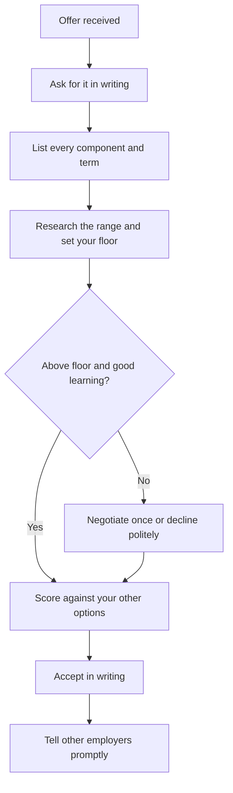
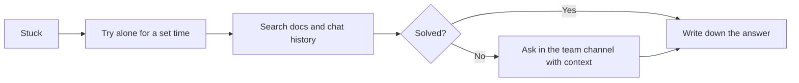
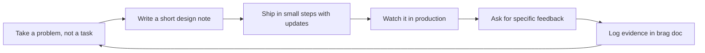

# Module 6 — Offer and the first 90 days

*Getting the offer is not the finish line. It is the moment when your choices start to compound. This module covers the three decisions that shape your first two years: which offer to accept and on what terms; how to start, so that within 90 days your team trusts you with real work; and how to grow from someone who is given tasks to someone who is given problems. Omar weighs a written graduate-programme offer from Najm Bank against a startup offer with equity and a 48-hour deadline. Reem, in her second week, nearly pastes internal code into a personal AI tool and learns how a regulated team ships. Yousef, at month nine, hears that he is "technically strong but surprises people", and turns that feedback into a growth plan. No salary figures appear here. You will learn how to find the current numbers, read the whole package and make a decision you can defend.*

> **Steps:** Apply, Start, Grow — turning an offer into a good decision, a strong start and a visible path to mid-level.

---

# 6.1 — Offers: comparing, negotiating and choosing well
*Level: 🔴 Advanced* · *Prerequisites: 4.3, 5.1* · *Step: Apply, Start*

## ⚡ In 60 seconds
- An **offer** is a package (pay, allowances, benefits, equity), contract terms (probation, notice, bonds, intellectual-property clauses) and a job (team, mentor, learning).
- **Get every offer in writing before you decide anything.** A verbal "we'd love to have you" is not an offer.
- Compare **total compensation** and the **learning you will get in the first two years**. For most graduates the second matters more than a small difference in the first.
- Negotiate politely, once, with reasons and real information, about the whole package. Never invent a competing offer.
- Decision cue: "Which offer gives me the best learning and support, above a pay floor I have calculated and can live on?"
- Biggest trap: accepting in a rush because of an exploding deadline, or accepting one offer and quietly continuing to shop it around.

## 🧭 Why it matters
Omar has two offers in the same week. The **Najm Tech Graduate Programme** has sent a written offer: a fixed graduate salary band, housing and transport allowances, three six-month rotations and a named mentor (Khalid). **Sadeem Pay**, a Doha fintech startup, has made a verbal offer on a call. The founder mentioned a "higher base" and "stock options" and wants an answer within 48 hours. Omar's first instinct is to take the bigger-sounding number; his second is to email Najm asking for "more money", with no amount or reason.

Aisha, Najm's talent acquisition lead, has seen this many times. Graduates who compare a written package with a verbal promise often discover the real terms only at signing: probation, notice, an intellectual-property clause covering their side projects, or options that cannot be sold for years. Others damage a good relationship by pushing hard on something the employer cannot change, such as a cohort-wide graduate band. Huda (waiting on Najm while holding a telecom offer) and Mohammed (who thinks a bootcamp graduate has no right to ask questions) need the same skill: read the whole offer, research the range, ask clearly, and choose in a way they can defend a year later.

## 📐 How it works

### 🟢 The essentials

**The anatomy of an offer.** Before comparing anything, list what each offer contains. In the GCC, packages are often split into several parts, so a "base salary" alone can mislead.

| Component | What it is | Questions to ask |
|---|---|---|
| **Base salary** | Fixed monthly pay | Monthly or annual? When is it reviewed? |
| **Allowances** | Housing, transport and others, common in GCC packages | Cash or provided? Do they count towards end-of-service or bonus? |
| **Bonus** | Variable pay linked to performance | Target? Pro-rated in year one? Guaranteed? |
| **Equity** | Shares or options, mostly at startups | Type, number, strike price, vesting? (See 🟡.) |
| **Benefits** | Health insurance, leave, flights home, pension or social insurance | Who is covered, from when? |
| **End-of-service benefit** | A payment on leaving, set by GCC labour laws | How is it calculated? Check the labour ministry's current rules. |
| **Probation** | A trial period with easier termination on both sides | How long? What notice applies during it? |
| **Notice period** | How long you must give, and receive, before leaving | Same for both sides? |
| **Training bond or service agreement** | A commitment to stay after the employer funds training or study | How long? What is repaid if you leave early? |
| **Location, visa and start date** | Where you work, hybrid rules, residency sponsorship | Which documents, e.g. attested degree certificates? |

**Written, then decided.** A verbal offer shows the employer is serious; a written one shows what they commit to. Say thank you and ask: "Could you send the offer in writing, with the full package and contract terms, so I can review it properly?" This is a normal request.

**Conditions.** Many offers are **conditional** on references, background checks, degree attestation, medical checks or a work permit; banks often run more checks than startups. Until conditions clear, do not resign or turn down other offers.

**Researching the range.** You cannot judge an offer without knowing what similar roles pay. At the time of writing (2026), good sources are:
- **Recruiters**, including the employer's own: "What is the range for this role?"
- **Job adverts that publish ranges**, less common in the GCC, though some employers and platforms show them.
- **Regional salary guides** from recruitment firms; note the year and method.
- **Peers** one or two years ahead of you, your university career centre and alumni networks (lesson 4.2).
- **Crowd-sourced sites** such as Levels.fyi or Glassdoor. GCC entry-level data there is thin; treat it as a rough signal.

Write down a range from several sources, not one number. Then calculate your **floor**: the lowest total package that covers your real costs (rent, transport, family commitments, savings) in that city. Below the floor means "negotiate" or "no".

**Compare learning, not just money.** Your first two years build the skills every later offer pays for. Ask: Will I have a mentor with time for me? Will I ship real work with code review? Is there structured training? How stable is the team? Does the work build the role I chose in Module 2?

### 🟡 Going deeper

**A decision process you can explain later.**

**Negotiation, honestly.** Negotiation is a conversation to find terms both sides accept, not a fight. Three ideas help:
- **BATNA** (best alternative to a negotiated agreement), a term from Fisher and Ury's *Getting to Yes*. Your BATNA is what you will do if this offer fails: another offer, continuing your search, further study. A real BATNA gives calm confidence; an imaginary one tempts you to bluff.
- **Interests, not positions.** "I want 20% more" is a position. "My housing costs are higher than the allowance assumes" is an interest. Employers can often meet an interest in a different way.
- **Expand the package.** If the base is fixed, other things may not be: start date, signing bonus, relocation, a certification budget, the team you join, or an earlier first salary review.

**What is negotiable for graduates.** Large graduate programmes, including Najm's, often pay a cohort-wide band so graduates are treated equally; pushing hard on base there wastes goodwill. Startups and smaller firms usually have more flexibility. Career-switchers like Mohammed may be hired on a junior band rather than a graduate one. The only way to know is to ask, politely, once.

**Weak vs strong negotiation messages.**

Weak:
> Hi, thanks for the offer. I was hoping for more money. Can you do better? I have other offers.

Strong (Yousef, replying to Najm's platform-track offer):
> Thank you for the offer. I'm excited about the platform team and about working with Salem. Having reviewed the package, I'd like to ask about two things. First, my research with recruiters and peers suggests a range for similar junior roles in Doha that sits slightly above the base in the offer. Is there flexibility there? Second, if the base is fixed by the programme band, would you consider support for an associate-level cloud certification in the first year? I can give you my answer by Thursday.

The strong version shows interest, asks specifically, gives a reason, offers an alternative and sets a timeline, without threats or inventions.

**Competing offers and deadlines.** If you genuinely have another offer, you may say so: "I have another written offer with a deadline of Sunday. Najm is my first choice. Is there any way to speed up your decision?" Never claim an offer you do not have; it can be checked. For an **exploding offer** (a very short deadline), ask for more time: "This is an important decision. Could I have until Monday?" Many employers agree. If they will not move at all, that tells you something about how they may treat you later.

**Startup equity in plain words.**
- **Shares** are part-ownership of the company. **Options** are the right to buy shares later at a fixed **strike price**.
- **Vesting** means you earn the equity over time. A common pattern is several years of vesting with a **cliff** (nothing vests until, for example, your first year is complete), but terms vary. Read your plan.
- **Dilution**: each new funding round issues new shares, so your percentage usually shrinks.
- **Liquidity**: you can usually sell only if the company is bought, lists on a stock exchange, or runs a buy-back. Many startups never reach any of these.

The practical rule: for budgeting, value early-stage equity at zero and compare the cash against your floor.

### 🔴 Expert view

**Read the contract, not only the letter.** The offer letter summarises; the contract binds. Look for:
- **Intellectual-property (IP) clauses.** Many contracts assign to the employer what you create while employed, sometimes even outside working hours. If you have open-source projects or a portfolio (Module 3), ask for a written carve-out for existing and personal projects that use no company time, equipment or information.
- **Non-compete and non-solicitation clauses.** They may limit where you work next. How enforceable they are depends on the country and the wording. Ask what they mean in practice.
- **Bonds and clawbacks.** Sponsored study, certifications and relocation may need repaying if you leave early. Fair when clear; know the amount and period.
- **Confidentiality and acceptable-use policies**, including AI-tool rules (lesson 6.2).

For anything unusual, check the labour ministry's guidance in the country of work, ask HR to explain, and take independent advice if the stakes are high. Labour, visa and sponsorship rules vary and change; check current rules, not a friend's experience. For nationals, offers shaped by nationalisation programmes (Qatarization, Emiratisation, Saudization) may include a development track, sponsored study or a service agreement; compare them on learning, mentorship, real work and commitments like any offer.

**Choosing with integrity.** Once you accept in writing, the employer stops interviewing, tells other candidates no, and starts arranging your laptop, access and visa. Withdraw after acceptance only for serious reasons, early and honestly, by phone then email. As soon as you accept, kindly tell every other employer still in process; the recruiter you decline today may hire you in three years.

**When the choice is close,** choose the better manager and learning. Ask for a 20-minute call with someone who joined a year or two ago; what they say about code review, mentorship and mistakes is worth more than a small pay gap.

## 🧰 The toolkit
| Resource, tool or template | What it is and does | When to reach for it |
|---|---|---|
| **Offer comparison sheet** | A table with every component, term and learning factor, side by side, with weights | As soon as you have more than one offer, or one offer and a real alternative |
| **Total compensation** | Base plus allowances, bonus, equity and the value of benefits, over a year | Comparing packages that are structured differently |
| **BATNA** (Fisher and Ury, *Getting to Yes*) | Your best alternative if this deal does not happen | Before any negotiation, to know how far you can calmly go |
| **Salary guides from recruitment firms** | Annual regional pay surveys by role and level | Setting a researched range; always note the year and method |
| **Levels.fyi** | Crowd-sourced compensation data, strongest for large tech firms | A rough signal for multinational roles; thin for GCC graduate roles |
| **Labour ministry guidance** (e.g. Qatar's Ministry of Labour, the UAE's MOHRE) | Official rules on contracts, probation, notice and end-of-service benefits | Checking a contract term you do not understand |
| **Negotiation email template** | Thanks, interest, specific ask with a reason, an alternative, a timeline | Any written negotiation |

## 🏛️ In practice at Najm Bank
Aisha shares the **offer comparison sheet** Najm's graduate team gives every candidate who asks for help deciding, even when the other offer is from a competitor. Omar fills it in. Amounts are left as placeholders here: Omar uses his real figures, and you should use yours.

**Part A: the facts**

| Item | Najm Tech Graduate Programme | Sadeem Pay (startup) |
|---|---|---|
| Offer status | Written, conditional on degree attestation and background check | Verbal; written version requested on day 1, received on day 3 |
| Base salary (monthly) | [Najm base] | [Sadeem base], higher than Najm's |
| Allowances | Housing and transport, cash | None; "included in base" |
| Bonus | Annual, discretionary, pro-rated in year 1 | None stated |
| Equity | None | Options; 4-year vesting, 1-year cliff; strike price not yet stated |
| Health insurance | Employee; family after probation | Employee only |
| Probation / notice | [Per contract] / [per contract] | [Per contract] / [per contract] |
| Bond | None for the programme; a certification bond if sponsored | None |
| IP clause | Standard; carve-out for listed personal projects agreed on request | Broad, includes "all inventions"; carve-out requested |
| Learning | 3 rotations, mentor (Khalid), cohort training, code review on every PR | Small team, broad ownership, no formal mentoring; CTO reviews PRs "when possible" |

**Part B: the scoring** (weights chosen by Omar before scoring, to avoid tilting the result)

| Factor | Weight | Najm (1–5) | Sadeem (1–5) |
|---|---|---|---|
| Cash total vs floor | 25% | 4 | 4 |
| Learning and mentorship | 30% | 5 | 3 |
| Real shipping to users | 15% | 3 | 5 |
| Stability and benefits | 15% | 5 | 2 |
| Fit with target role (software engineer) | 15% | 4 | 4 |
| **Weighted score** | 100% | **4.30** | **3.55** |

**Part C: the decision note** (three sentences Omar writes for his future self)
> I am choosing Najm because the mentorship and code review will build the deployment and production skills I lack (lesson 1.3), and the cash is above my floor. The startup's equity has unknown value and I valued it at zero. I will thank Sadeem Pay by phone today, confirm by email, and ask if I may stay in touch.

## 🛠️ Exercises
- 🟢 Take a real or sample offer letter (your career centre may have anonymised examples) and list every component and term from the anatomy table in 🟢 The essentials. Mark each as "stated", "unclear" or "missing". *Done when:* you have a one-page list and a written set of at least five questions you would send to the employer.
- 🟡 Research the range for one target role in one city using at least three different sources, and calculate your personal floor from a monthly budget. *Done when:* a peer can see your sources, their dates, the range you concluded and your floor calculation, and can follow how you got from one to the other.
- 🔴 Write a negotiation email for a scenario in which the base salary is fixed by a graduate band but you have one genuine interest (for example a later start date, a certification budget or a relocation cost). Then role-play it with a peer acting as the recruiter, who must say no to your first ask. *Done when:* your email contains thanks, interest, a specific ask with a reason, an alternative and a deadline; and the role-play ended with a clear outcome both of you could write down.

## ⚠️ Mistakes and traps
- **Deciding on a verbal number.** Ask for the written offer first; surprises hide in the terms.
- **Comparing base salaries only.** Compare total compensation, then learning.
- **Bluffing about competing offers.** Mention only real offers, accurately.
- **Valuing startup equity as cash.** Value early-stage options at zero; ask about vesting, strike price and dilution.
- **Signing an IP clause that swallows your portfolio.** Ask for a written carve-out for existing and personal projects.
- **Accepting, then still shopping around.** Once you accept, stop other processes and tell those employers.

## 🧾 Recap
- An offer is a package, a contract and a job. Get it in writing and list every part.
- Research a range from several sources and calculate your floor before you compare.
- For graduates, learning, mentorship and real shipping often matter more than a small pay difference.
- Negotiate once, politely, with interests and real information. Expand the package when the base is fixed.
- Read the contract (IP, non-compete, bonds, probation, notice), check official labour guidance, and choose with integrity.

## ✍️ Check yourself

**1. Omar receives a verbal offer from Sadeem Pay with a 48-hour deadline. What should he do first?**

- A. Accept at once on the call, then ask for the written details afterwards
- B. Ask for the full offer in writing and whether the deadline can move
- C. Tell Najm he has a better offer and ask them to beat it today
- D. Let the deadline pass and reply next week once he has thought

Answer

**B.** He cannot compare a verbal number with a written package, and a polite request for time is normal. A commits him to terms he has not seen; C makes a claim he cannot yet support with a written offer; D risks losing an offer he may want without even asking for time. (🟢 The essentials; 🟡 Going deeper.)

**2. Najm's graduate programme pays every graduate in the cohort the same band. Yousef wants a better package. What is the most effective approach?**

- A. Ask once, politely, about flexibility, and suggest an alternative like certification support
- B. Insist on a higher base and refuse to sign until the band is raised for him
- C. Mention a higher offer from a multinational that he does not actually have
- D. Accept without asking anything, because graduates are not allowed to negotiate

Answer

**A.** When the base is fixed by a band, expanding the package addresses his interests without wasting goodwill. B pushes on what the employer cannot change; C is dishonest; D gives up an option he legitimately has. (🟡 Going deeper.)

**3. A startup offers Reem options with four-year vesting and a one-year cliff. How should she value them when comparing against her floor?**

- A. At whatever value the founder estimated on the offer call
- B. At the strike price multiplied by the number of options granted
- C. At the last funding valuation multiplied by her percentage stake
- D. At zero for budgeting, after checking vesting, strike price and dilution

Answer

**D.** Any future value is a bonus. Early-stage options usually cannot be sold for years, may be diluted and may never be worth anything. A and C rely on estimates she cannot use to pay rent; B is the cost of buying the shares, not their value. (🟡 Going deeper.)

**4. Mohammed's contract assigns to the employer "all inventions made during the term of employment". He maintains an open-source library from his bootcamp days. What should he do?**

- A. Sign as written, since clauses like this are never enforced in practice
- B. Delete or transfer his open-source library before his first day
- C. Ask for a written carve-out listing his existing personal projects
- D. Turn down the offer, because no employer will change the wording

Answer

**C.** A carve-out covering existing and personal projects that use no company time, equipment or information protects his portfolio and is a common, reasonable request. A is an assumption he cannot rely on; B and D are unnecessary losses. (🔴 Expert view.)

**5. Huda accepts the regional telecom's offer in writing. Two weeks later Najm's data track makes her an offer. Which response best reflects this lesson?**

- A. Accept Najm's offer too, then pick whichever start date suits her best
- B. Accept Najm and simply not turn up at the telecom on her first day
- C. Treat her written acceptance as carrying no obligations until she starts
- D. Honour the acceptance unless the reason is serious; if so, tell the telecom early, by phone then email

Answer

**D.** After acceptance, the other employer stops recruiting and starts preparing for you, so withdrawing is only for serious reasons, done early and honestly. She should also have told Najm, as soon as she accepted, that she was no longer in process. A and B damage trust and reputation; C is false. (🔴 Expert view.)

## 📚 References
- Fisher, R., Ury, W. and Patton, B., *Getting to Yes: Negotiating Agreement Without Giving In*, Penguin (revised editions)
- Program on Negotiation, Harvard Law School — https://www.pon.harvard.edu/
- Qatar Ministry of Labour — https://www.mol.gov.qa/
- UAE Ministry of Human Resources and Emiratisation (MOHRE) — https://www.mohre.gov.ae/
- Levels.fyi — https://www.levels.fyi/
- Glassdoor — https://www.glassdoor.com/

---

# 6.2 — Your first 90 days: onboarding, the first pull request and asking good questions
*Level: 🔴 Advanced* · *Prerequisites: 1.1, 1.2, 6.1* · *Step: Start*

## ⚡ In 60 seconds
- Your first 90 days have three jobs: **learn** the system, the people and how work ships; **contribute** small, safe changes early; **build trust** that you can be given more.
- Aim for a **small first pull request** in your first week or two. It proves your setup works and teaches you the team's review and release process.
- **Ask good questions**: try for a fixed time, write down what you tried, then ask in the right place with context. Silence is the most common junior failure, not ignorance.
- Use only the **AI tools and data rules your employer has approved**. Never paste internal code or customer data into a personal account.
- Decision cue: in week one, ask your manager "What would success look like for me at 30, 60 and 90 days?" and write the answer down.
- Biggest trap: disappearing for two weeks and then opening a huge pull request nobody asked for.

## 🧭 Why it matters
It is Reem's second week in Najm's AI application squad. Her first ticket is to add a field to an internal API that serves the customer-support assistant. She is used to building fast with AI coding agents on her own projects, so she opens her personal AI account and starts pasting the service's code into it. Her buddy, a mid-level engineer, sees it in time and stops her. Najm, like most banks, has an approved AI tool that runs under the bank's agreement and data controls. Pasting internal code into a personal account could breach the bank's acceptable-use policy and its data-handling rules. Reem was not malicious. She simply had not read the policy that was in her onboarding pack.

On another floor, Omar has spent nine days silently rewriting a module "to make it cleaner". His first pull request is 1,200 lines, changes behaviour nobody asked him to change, and has no tests. Tariq cannot review it safely, and it is closed. Omar is embarrassed. Yet Khalid's view is that nothing has gone badly wrong: both are normal first-month mistakes. What matters is what they do next. This lesson is the playbook Khalid wishes every graduate arrived with.

## 📐 How it works

### 🟢 The essentials

**What onboarding usually includes.** Expect most of these in the first two weeks. If something is missing, ask.
- **Access**: laptop, accounts, source control, ticketing, chat, documentation. In regulated firms such as banks, some access needs approvals and can take days. Production access is often restricted for juniors, and that is normal.
- **Mandatory training**: information security, data protection, and in banks often anti-money-laundering and code-of-conduct modules. Do them early; access to some systems may depend on them.
- **Policies**: acceptable use, data classification (what is public, internal, confidential or restricted), and the rules for AI tools. Read them. They tell you what you must never do.
- **People**: your manager, a buddy or mentor, your team, and the teams you depend on (security, operations, data, product).
- **The development environment**: getting the code to build, run and pass tests on your machine.

**The 30-60-90 plan.** A simple frame agreed with your manager:

| Phase | Focus | Typical outcomes |
|---|---|---|
| Days 1–30: **Learn** | Set up, read, listen, ship something small | Environment working; first small PR merged; can explain what the team's system does and who uses it |
| Days 31–60: **Contribute** | Take normal tickets with support | Several PRs merged; one bug fixed end to end; can find your way round the codebase alone |
| Days 61–90: **Own** | Take a small feature or area | A feature shipped and watched in production; you have reviewed others' PRs; you have improved one document or process |

**The first pull request.** A **pull request** (PR) is a proposed change that others review before it is merged. Your first one should be small and safe. Good candidates:
- Fix something in the setup guide you just followed. You are the only person who has seen it with fresh eyes this year.
- A small, well-defined bug or ticket your manager picks for you.
- A missing test for existing behaviour.

Small first PRs teach you the whole path a change takes: branch, commit, CI checks, review, merge, deploy. That path is a system in itself; see [*System Design for Vibe Coders*, lesson 4.1 — Shipping is a system](../vibe/index.en.html#l4-1).

**A good PR description.**

Weak:
> fixed stuff

Strong:
> **What:** Adds `preferred_language` to the `/support/profile` response so the assistant can reply in Arabic or English.
> **Why:** Ticket SUP-412. The assistant currently guesses from the browser locale.
> **How:** New nullable column with a migration; defaults to null; the API returns it only when set.
> **Tested:** Unit tests for the serializer; ran the migration on a local test database with synthetic data; called the endpoint manually (screenshot attached).
> **AI assistance:** Drafted the migration with the approved coding assistant; I reviewed every line and wrote the tests myself.
> **Risk:** Low; additive field, no existing clients break.

The strong version tells the reviewer what, why, how and how it was tested, and is honest about AI help. It takes five minutes to write and saves the reviewer twenty.

**Asking good questions.** Juniors are expected to ask questions. Teams lose more time to juniors stuck in silence than to juniors who ask. A good question:
1. States your goal ("I'm trying to run the integration tests locally").
2. Gives context ("on the `support-api` repo, main branch, after following the setup guide").
3. Says what you tried ("I reset the database container and checked the env file; the error persists").
4. Shows the evidence (the exact error, as text).
5. Asks something specific ("Is there a step missing for the test database, or have I misconfigured something?").

How long to try alone depends on the team. Many use a rule of thumb between 15 minutes and an hour. Ask your manager what they prefer. Ask in the team's shared channel rather than a private message when you can, so the answer helps the next person. Then add it to the documentation.

### 🟡 Going deeper

**Reading an unfamiliar codebase.** You will not understand the whole system in 90 days; nobody expects you to. Work from the outside in:
- **Run it.** Use the product as a user would.
- **Trace one request** from the user interface to the database and back. Note each service it crosses; see [*System Design for Vibe Coders*, lesson 1.2 — The request's journey](../vibe/index.en.html#l1-2).
- **Read the tests.** They show what the code is supposed to do.
- **Use history.** `git log` and `git blame` on a confusing file show why it changed and who to ask.
- **Draw the boxes** and check your drawing with your buddy.

For large codebases, [*SaaS Building Blocks*, lesson 0.2 — How to read a giant open-source codebase without drowning](../saas/index.html#/0.2) gives a method that works just as well inside a company.

**AI tools at work.** Everything from lesson 1.2 still applies, plus three workplace rules:
- **Approved tools only.** Use the tools and accounts your employer has approved, under its data agreements. If the policy is unclear, ask before you use anything.
- **Data classification applies to prompts.** A prompt is data leaving your machine. Internal code, customer data and secrets must not go anywhere the policy does not allow.
- **You own what you submit.** A reviewer will ask why a line is there. "The agent wrote it" is not an answer. Read [*System Design for Vibe Coders*, lesson 9.8 — The governance glance: you own what your agent ships](../vibe/index.en.html#l9-8).

**Handling review comments.** Code review is how a team teaches. Reply to every comment: make the change, or explain politely why not, or ask a question. Do not take comments personally; they are about the code. When the same comment appears twice, add it to your personal checklist so it does not appear a third time. Learning to review others' code is also part of the job, even as a junior. You will often spot unclear names, missing tests or confusing documentation. See [*System Design for Vibe Coders*, lesson 9.7 — Code audit and review at agent speed](../vibe/index.en.html#l9-7).

**Your manager and your 1:1s.** A **1:1** is a regular private meeting with your manager. Keep a shared document with a running agenda: what you did, where you are stuck, what you want feedback on, and anything worrying you. In the first week, ask:
- "What does success look like for me at 30, 60 and 90 days?"
- "How do you prefer I ask for help, and how long should I try alone first?"
- "How will I get feedback, and when is my probation review?"

**Start a work log now.** One line a day: what you shipped, learned or unblocked. In three months it becomes the evidence for your probation review; in a year, for your first promotion conversation (lesson 6.3).

### 🔴 Expert view

**Learn how the team is measured.** Every team has a few things it is judged on: uptime, release frequency, incident count, model quality, tickets closed, audit findings. Ask what they are. Work that moves those numbers is noticed. Work that does not, however clever, often is not.

**Learn the domain, not only the code.** At a bank, words like "KYC" (know your customer), "settlement", "chargeback" or "four-eyes principle" (two people must approve sensitive actions) matter as much as the framework. Keep a glossary. A junior who understands why a control exists asks better questions than one who only sees it as friction.

**Regulated delivery is slower for good reasons.** Change approvals, segregation of duties (the person who writes a change is not the one who approves it into production), audit trails and restricted production access can feel bureaucratic. They exist because a bank's mistakes hurt customers and attract regulators. Learn them, and suggest improvements through the proper channel once you understand them.

**On-call and incidents.** You will not usually join an on-call rotation in your first 90 days, but you can **shadow** one: watch how alerts are handled, read past incident reviews, and learn the runbooks. The ideas are in [*Cloud & DevOps: Zero to Hero*, Module 5 — Observability and reliability](../cloud/index.html#/5.2).

**When you break something.** You probably will. Report it immediately, say what you did and what you see, and help fix it. Do not hide it or quietly try to undo it. Good teams run **blameless** reviews: they fix the system that let the mistake through rather than blaming the person. Your speed and honesty in that first incident shape your reputation more than the mistake itself.

**Signals you are doing well at day 90.** You can explain the team's system and its users. Your PRs are small, tested and need fewer review rounds. You ask fewer "where is" questions and more "why" questions. People come to you for the thing you learned first. You have improved at least one document. Your manager is not surprised by anything you do.

## 🧰 The toolkit
| Resource, tool or template | What it is and does | When to reach for it |
|---|---|---|
| **30-60-90 day plan** | A one-page plan of learn, contribute and own outcomes, agreed with your manager | Week one; review it at each 1:1 |
| **Pull request template** | A description with what, why, how, tested, AI assistance and risk | Every PR; many repositories hold one in `.github/` |
| **Conventional Commits** | A naming convention for commit messages (`feat:`, `fix:`, `docs:`) | When the team uses it, or to keep your own history readable |
| **Google engineering practices: code review** | Google's published guide for reviewers and authors | Learning what reviewers look for and how to respond |
| **Question template** | Goal, context, what I tried, evidence, specific question | Every time you are stuck past your time limit |
| **1:1 agenda doc** | A shared running document for meetings with your manager | From the first 1:1 onward |
| **Brag document** (Julia Evans) | A running list of your work, learning and impact | Start in week one; use it at every review |

## 🏛️ In practice at Najm Bank
After the near-miss, Reem rewrites her plan with her buddy and Khalid. This is the **30-60-90 plan** template Najm now gives every graduate, filled in with hers.

| Days | Learn | Contribute | Evidence by the end |
|---|---|---|---|
| 1–30 | Complete security, data protection and AI-use training; read the acceptable-use and AI-tool policies; trace one assistant request end to end; learn the release process | Fix two errors in the setup guide (PR 1); ship SUP-412 `preferred_language` field (PR 2) | Training certificates; both PRs merged; a diagram of the assistant's request path, reviewed by her buddy |
| 31–60 | Read the last three incident reviews; shadow one on-call week; learn how the assistant's quality is evaluated | Take normal tickets; add an evaluation case for Arabic replies; review two of her buddy's PRs | 6+ merged PRs, each with tests and an AI-assistance note; review comments left on others' PRs |
| 61–90 | Learn the change-approval path for production releases | Own "reply language" end to end: design note, build, release, check the dashboards a week after | Feature live; one-page design note; dashboard screenshot; a short write-up for the team channel |
| Always | Weekly 1:1 with Khalid using the shared agenda; one-line daily work log | Ask in the team channel after 30 minutes stuck, using the question template | Work log ready for the probation review |

Najm's **PR checklist for graduates** (pinned in the squad's channel):
- [ ] Under about 300 changed lines, or split into parts
- [ ] Linked ticket; description with what, why, how, tested, risk
- [ ] Tests added or updated, and passing locally and in CI
- [ ] AI assistance disclosed; every line explained if asked
- [ ] No secrets, customer data or internal URLs in code, logs or screenshots
- [ ] Reviewer comments all answered before re-requesting review

## 🛠️ Exercises
- 🟢 Write a 30-60-90 plan for a role you are targeting (or the job you have just started) using the table in "In practice at Najm Bank". *Done when:* each row has at least one learn item, one contribute item and evidence a manager could check.
- 🟡 Pick an open-source project you have never used. Get it running locally, trace one request or command through the code, and open (or prepare) a small documentation PR fixing something in its setup instructions. *Done when:* you have a diagram of the path you traced and a PR (or a ready branch) with a full description in the format from 🟢 The essentials.
- 🔴 Take one real problem you hit in the last month and write it up as a question using the five-part template, then rewrite one of your old PR descriptions in the strong format. Ask a peer to rate both before and after. *Done when:* the peer can answer "what was tried?" and "how was this tested?" from your rewritten versions alone.

## ⚠️ Mistakes and traps
- **Going quiet.** Days of silent struggle look like no progress. Use a time limit, then ask with context.
- **The big-bang first PR.** Large, unrequested rewrites cannot be reviewed safely. Ship small, agreed changes first.
- **Personal AI accounts with company code.** It may breach policy and data rules. Use only approved tools, and ask when unsure.
- **Hiding a mistake.** Report it at once, help fix it, and learn from the review.
- **Treating controls as obstacles.** In regulated firms, approvals and segregation of duties protect customers. Learn why they exist before trying to change them.
- **Not asking what success looks like.** Without agreed goals, you and your manager will judge your first 90 days by different standards.

## 🧾 Recap
- The first 90 days are for learning, small contributions and building trust, in that order.
- Agree a 30-60-90 plan in week one and review it in your 1:1s.
- Make your first PR small and safe; write descriptions that say what, why, how, how tested, and how AI helped.
- Ask good questions: try for a set time, then ask in the shared channel with goal, context, attempts, evidence and a specific question.
- Follow the employer's AI and data policies exactly, report mistakes quickly, and keep a work log from day one.

## ✍️ Check yourself

**1. In her second week, Reem wants help from an AI coding assistant on an internal API. What should she do?**

- A. Use her personal AI account, since its model is more capable
- B. Strip the comments from the code, then paste it into any tool
- C. Use the bank's approved AI tool, and ask if the policy is unclear
- D. Avoid every AI tool completely until her first year is finished

Answer

**C.** Approved tools run under the employer's data agreements and policies. A and B still send internal code where policy may not allow it; D is unnecessary where an approved tool exists. (🟡 Going deeper.)

**2. Which is the best first pull request for a new graduate?**

- A. A 1,200-line refactor of a module that "could be cleaner"
- B. A fix to the setup guide they have just followed
- C. Upgrading every dependency in the repository at once
- D. A new feature users might like, built without a ticket

Answer

**B.** It is small, safe and useful, and it teaches the full path from branch to deploy. A, C and D are large, risky or unrequested, which makes them hard to review. (🟢 The essentials.)

**3. Omar has been stuck on a failing local test for 40 minutes. Which message is best?**

- A. In the team channel: "The integration tests are broken on my laptop again. Can anyone help?"
- B. A private message to Tariq: "Are you free at some point today? I have a quick question."
- C. Nothing yet; he will keep trying alone until the end of the week
- D. In the team channel: goal, repo and branch, what he tried, the exact error, a specific question

Answer

**D.** It follows the five-part template and is posted where the answer helps others. A is in the right place but gives no context; B forces a second round trip and helps nobody else; C is the silence that costs teams most. (🟢 The essentials.)

**4. On day 50, Huda runs a query that slows a shared reporting database for an hour. What should she do?**

- A. Report it at once with what she ran, help fix it, and join the blameless review
- B. Cancel the query and say nothing, since the slowdown has already stopped
- C. Wait quietly to see whether anyone on the team notices the slowdown
- D. Tell the team the database is under-sized and should have coped with it

Answer

**A.** Speed and honesty in a first incident build trust; blameless reviews fix the system. B and C hide information others need; D avoids responsibility. (🔴 Expert view.)

**5. Which question should a new graduate ask their manager in the first week?**

- A. "How soon after probation can I expect my first promotion?"
- B. "What does success look like for me at 30, 60 and 90 days?"
- C. "Which of the mandatory training modules can I safely skip?"
- D. "Could I have production access today so I can move faster?"

Answer

**B.** It sets shared expectations for the period you will be judged on. A is premature; C ignores requirements that often gate access; D ignores normal restrictions in regulated firms. (🟡 Going deeper.)

## 📚 References
- Google, Engineering Practices Documentation: code review — https://google.github.io/eng-practices/
- GitHub Docs, About pull requests — https://docs.github.com/en/pull-requests
- Conventional Commits — https://www.conventionalcommits.org/
- Julia Evans, "Get your work recognized: write a brag document" — https://jvns.ca/blog/brag-documents/
- Watkins, M., *The First 90 Days*, Harvard Business Review Press (updated and expanded edition, 2013)
- Google SRE book, "Postmortem Culture: Learning from Failure" — https://sre.google/sre-book/postmortem-culture/
- [*System Design for Vibe Coders*, lesson 4.1 — Shipping is a system](../vibe/index.en.html#l4-1)
- [*SaaS Building Blocks*, lesson 0.2 — How to read a giant open-source codebase without drowning](../saas/index.html#/0.2)

---

# 6.3 — Growing from junior to mid-level: feedback, ownership and continuous learning
*Level: 🔴 Advanced* · *Prerequisites: 6.2* · *Step: Grow*

## ⚡ In 60 seconds
- The step from junior to **mid-level** is mostly about **scope and independence**: a junior is given well-defined tasks; a mid-level engineer is given a problem and turns it into tasks, ships them and runs the result.
- Most employers describe this in a **career ladder** (or framework). Get yours, read the next level, and collect evidence against it.
- **Feedback** is the fastest route up. Ask for it specifically and often, receive it without defending, and show what you changed.
- **Ownership** means caring about what happens after the merge: release, monitoring, incidents, documentation and the people who use it.
- Decision cue: "What is one thing at the next level I am not yet doing, and what is the smallest real piece of work that would let me do it?"
- Biggest trap: chasing courses, certificates or a title change instead of bigger, visible, shipped work.

## 🧭 Why it matters
Yousef is nine months into Najm's platform team under Salem. His mid-year review says he is "technically strong" and the fastest in the team at Linux and networking problems. It also says he "surprises people". He changed a shared build pipeline on a Thursday afternoon, the last working day of the week, without telling the two squads that depend on it, and a release was delayed. He fixed it quickly, but two team leads now ask Salem to check his changes. Yousef is hurt. He thought the review would talk about promotion.

At the same time, Omar asks Khalid directly: "What do I need to do to be promoted?" Khalid opens Najm's engineering ladder and points to one line under the mid-level description: "Breaks down ambiguous problems, keeps stakeholders informed, and owns outcomes after release." Omar has never been given an ambiguous problem, because he has never asked for one.

Both stories show the same thing. After the first year, technical skill alone stops being the limit. What moves you forward is scope, communication, reliability and evidence. AI coding agents make this more true, not less: when an agent can write much of the routine code, the human's value moves towards judgement, verification and ownership of the whole system.

## 📐 How it works

### 🟢 The essentials

**Career ladders.** A **career ladder** (also called a career framework or levelling guide) describes what is expected at each level, usually along several dimensions. Many companies publish theirs, and collections such as Progression.fyi gather examples. Your employer's ladder is the one that counts, so ask your manager for it. Typical dimensions, and how juniors and mid-levels differ:

| Dimension | Junior | Mid-level |
|---|---|---|
| **Scope** | A well-defined task or ticket | A feature or problem that needs breaking into tasks |
| **Independence** | Needs regular guidance; asks when stuck | Works mostly alone; knows when to escalate |
| **Technical quality** | Code works and passes review after some rounds | Code is tested, readable and designed for change; few review rounds |
| **Operations** | Ships and moves on | Watches the release, fixes what breaks, improves monitoring |
| **Communication** | Updates when asked | Updates proactively; writes short design notes; flags risks early |
| **Team** | Learns from others | Reviews others' code; helps newer graduates |

How long the move takes varies widely by employer, role and person. Do not judge yourself by a number someone mentions online. Judge yourself by the ladder and your evidence.

**Feedback: ask, receive, act.**
- **Ask specifically.** "Any feedback?" usually gets "all good". Instead ask: "In the pipeline change last week, what is one thing I could have done better in how I communicated it?"
- **Receive without defending.** Say thank you. Ask a clarifying question if needed. Do not explain why they are wrong, at least not in that moment.
- **Act and show it.** Change one behaviour, then mention it later: "After your feedback I now post pipeline changes in both squads' channels two days ahead. Is that working?"

A simple structure for giving and understanding feedback is **SBI**, from the Center for Creative Leadership: **Situation** (when and where), **Behaviour** (what was observed, not judgements about character), **Impact** (what it caused). Yousef's feedback in SBI form: "On Thursday afternoon (S) you changed the shared pipeline without notice (B), and the payments squad's release slipped by a day (I)." Put like that, it is about an action he can change, not about who he is.

**Make your work visible.** Your manager does not see everything you do. Keep the **brag document** you started in lesson 6.2: shipped work, problems solved, people helped, things learned, with links. Before every review, turn it into a one-page summary organised by the ladder's dimensions.

### 🟡 Going deeper

**Ownership in practice.** Owning something means you are the person who knows its state and cares about its outcome. For a junior moving up, that usually looks like:
- **Before building:** a short **design note** (one or two pages) with the problem, options, the choice and why, and risks. Share it before you write code. The habits are taught in [*System Design for Vibe Coders*, lesson 1.1 — Draw the boxes before the agent writes the code](../vibe/index.en.html#l1-1).
- **While building:** small PRs, regular updates, and early warning when you will miss a date. "I'm two days behind because the API docs were wrong; here's my new estimate" is mid-level behaviour.
- **After release:** watch the dashboards, read the errors, fix what breaks, and update the runbook. See [*Cloud & DevOps: Zero to Hero*, Module 5 — Observability and reliability](../cloud/index.html#/5.3) for incidents and reviews.
- **Communicating change:** anything that affects other teams (a shared pipeline, an API, a schema) gets advance notice in their channel, a rollback plan and a named contact. This is exactly what Yousef missed.

**Blameless reviews and your reputation.** When something you own goes wrong, take part openly in the review. A **blameless postmortem** looks for the conditions that allowed the failure (no notice process for shared pipelines, no test environment for the pipeline) rather than a person to blame. Proposing the fix to the system, not just to your change, is one of the clearest signals of mid-level judgement.

**Continuous learning that compounds.** Learn mostly through work, and use courses to fill specific gaps.
- **Pick one depth and one breadth goal per half-year.** Depth in your role (for example, Kubernetes operations for Yousef); breadth in a neighbouring area (for example, security basics for platform work).
- **Tie each goal to real work.** "Learn Kubernetes" is vague. "Move the internal docs site to the cluster, with monitoring, by June" is a goal.
- **Use the library for targeted gaps.** Platform and cloud: [*Cloud & DevOps: Zero to Hero*, Module 7 — Capstone, cloud career and practice exam](../cloud/index.html#/7.1). Data: [*Data Engineering & Analytics: Zero to Hero*, Module 7 — Capstone, data career and practice exam](../data/index.html#/7.1). Security: [*Secure AI & Application Security*, lesson 12.2 — The security career: roles, certifications and portfolio](../secai/index.html#/12.2). AI products: [*AI Product Management*, lesson 10.2 — The AI PM career: interviews, portfolio and growth](../aipm/index.html#/10.2). AI agents in production: [*Running AI Agents in Production*, Level 3 — Production Engineer](../agentic/learning-path.html#level-3-production-engineer).
- **Certifications** (cloud associate levels, CKA or CKAD, Security+ and others) can help in some roles and some employers value them, but they are a supplement to shipped work, not a substitute. Names and versions change; check the current ones.

**Directing AI agents is now part of the ladder.** As agents take more of the routine coding, teams increasingly value people who can specify work clearly, verify output, and own the system the code runs in. The mid-level version of lesson 1.2 is the architect's view in [*System Design for Vibe Coders*, lesson 9.1 — You are the architect now](../vibe/index.en.html#l9-1).

### 🔴 Expert view

**How promotions usually work.** Details vary, but in many organisations your manager makes a case with evidence, and a group of managers compares cases across teams (often called **calibration**). Implications:
- Your manager needs written evidence they can repeat in a room you are not in. Your brag document and design notes provide it.
- Many organisations expect you to be doing the next level's work consistently before you are promoted to it. Ask your manager whether yours does.
- Promotion cycles are often fixed (once or twice a year). Ask when they are, and have the conversation months before, not the week before.

**Helping the next cohort.** By the time the next graduates arrive, you are the person who joined most recently. Offer to be a buddy. Update the setup guide. Run a short session on what you wish you had known. This shows team-level impact, one of the clearest mid-level signals, and costs little.

**Staying, moving internally or leaving.** After a year or two you may wonder whether to stay. Useful questions:
- Am I still learning something new every month?
- Is there a next-level problem here I could own?
- Does my manager support my growth, with specific feedback and opportunities?
- Would an internal move (another team, another track) give me what I want with less risk?

If the answers are mostly no, moving may be right. If they are mostly yes, leaving for a small pay increase often costs more learning than it gains. Leave well: give proper notice, hand over cleanly, and thank people. For GCC nationals on development programmes, check any service agreement before deciding.

**Sustainable pace.** Growth is a multi-year process. Working every evening to look fast in month nine can burn you out by month eighteen. Protect sleep and rest, and tell your manager early if the workload is not sustainable. Telling them is part of owning your work, not a weakness.

## 🧰 The toolkit
| Resource, tool or template | What it is and does | When to reach for it |
|---|---|---|
| **Career ladder** (e.g. examples collected on Progression.fyi) | Level-by-level expectations across dimensions such as scope, quality and communication | From month three; before every review and promotion conversation |
| **Brag document** (Julia Evans) | A running list of your work, learning and impact | Weekly; summarised before every review |
| **SBI feedback model** (Center for Creative Leadership) | Situation, Behaviour, Impact: a way to give and understand feedback | Asking for, receiving and giving feedback |
| **Design note** | One or two pages: problem, options, decision, risks | Before any change that takes more than a few days or affects other teams |
| **Blameless postmortem** | An incident review that fixes conditions, not people | After any incident involving your work |
| **Individual development plan (IDP)** | A half-yearly plan of depth and breadth goals, each tied to real work | Agreed with your manager twice a year |
| **1:1 agenda doc** | A shared running document for meetings with your manager | Every 1:1; it holds feedback and agreed actions |

## 🏛️ In practice at Najm Bank
After the review, Yousef and Salem build his **growth plan** against Najm's engineering ladder. Najm keeps it in the shared 1:1 agenda doc and reviews it monthly.

**Part A: ladder self-assessment (Junior → Engineer, platform track)**

| Dimension | Next-level expectation | Where Yousef is | Evidence so far | Gap and next action |
|---|---|---|---|---|
| Scope | Owns a problem end to end | Owns tasks well | Fixed 14 build failures; automated runner clean-up | Own the "build cache" problem for Q3 |
| Technical quality | Designs for change; few review rounds | Strong | Pipeline PRs merged in 1–2 rounds | Keep; write tests for pipeline scripts |
| Operations | Watches releases; improves monitoring | Good | Added disk-space alert that caught 2 issues | Add a pipeline-health dashboard |
| Communication | Proactive; flags risk early | **Gap** | Friday pipeline change without notice | Change-notice rule (below); design note for the cache work |
| Team | Reviews others; helps newer people | Starting | 6 reviews this quarter | Buddy for one graduate in the next cohort |

**Part B: the change-notice rule Yousef proposes to the team** (his fix to the system, from the blameless review)
- Any change to a shared pipeline is posted in the affected squads' channels at least two working days ahead, with what, why, rollback plan and a named contact.
- No shared-pipeline changes after Thursday noon, except fixes for incidents.
- The pipeline repository's PR template gains a "Who is affected and have they been told?" field.

**Part C: the six-month individual development plan**

| Goal | Type | Tied to | Done when |
|---|---|---|---|
| Kubernetes operations | Depth | Moving the internal docs site to the cluster | Site running on the cluster with monitoring and a runbook; Salem signs off |
| Security basics for platform | Breadth | Reviewing pipeline secrets handling | Short write-up of findings shared with the security team |
| Design writing | Skill | Build-cache project | Design note reviewed by both affected squads before build starts |

## 🛠️ Exercises
- 🟢 Find a published career ladder (your employer's, or one from Progression.fyi) for your target role. Copy the junior and next-level descriptions into a two-column table and highlight three differences in your own words. *Done when:* you have the table with its source and three highlighted differences, each one sentence long.
- 🟡 Ask two people (a manager, mentor, lecturer, teammate or project partner) for specific feedback on a recent piece of work, using a question that names the situation. Write each answer in SBI form and choose one behaviour to change. *Done when:* you have two SBI-formatted notes, one chosen change, and a date by which you will check with the same person whether it worked.
- 🔴 Build your own growth plan using the three parts in "In practice at Najm Bank": a ladder self-assessment with evidence, one rule or process improvement you could propose, and a six-month development plan with depth and breadth goals tied to real work. *Done when:* every "Done when" in your plan is something another person could check, and a mentor has reviewed it.

## ⚠️ Mistakes and traps
- **Waiting to be noticed.** Managers do not see everything. Keep a brag document and turn it into evidence against the ladder.
- **Collecting certificates instead of scope.** Certifications supplement shipped work; they do not replace it. Ask for a bigger problem.
- **Defending against feedback.** Say thank you, clarify, change one thing, and show the change.
- **Owning code but not outcomes.** Watch releases, fix what breaks, and tell the people your change affects, before you make it.
- **Asking about promotion the week before the cycle.** Ask for the ladder and the timeline months ahead, and agree what evidence is needed.
- **Burning out to look fast.** Growth takes years. Say early when the workload is not sustainable.

## 🧾 Recap
- Junior to mid-level is mostly a change in scope, independence and communication, measured against a career ladder.
- Ask for specific feedback, receive it calmly, act on it and show the change; SBI keeps it about actions.
- Own outcomes: design notes before, small updates during, monitoring after, and notice for anyone affected.
- Learn through real work; use courses and certifications to fill specific gaps, not as a substitute for scope.
- Make your evidence visible, understand how promotions work at your employer, and keep a sustainable pace.

## ✍️ Check yourself

**1. Which description best marks the move from junior to mid-level?**

- A. Writing code faster than anyone else on the team, with fewer bugs
- B. Holding more cloud and security certifications than the other juniors
- C. Being given a problem, not a task, and owning it through to the result
- D. Having worked at the same company for at least two full years

Answer

**C.** Scope, independence and ownership are the core differences in most ladders. A and B are about speed and credentials, not scope; D is time served, which ladders do not measure directly. (🟢 The essentials.)

**2. Yousef's review says he "surprises people" after he changed a shared pipeline without notice. What is the best response?**

- A. Explain to Salem that the change was technically correct, so the feedback is unfair
- B. Thank Salem, adopt a change-notice habit and propose a team rule to prevent a repeat
- C. Stop making any changes to shared pipelines, so that nobody is surprised again
- D. Ask Salem for a transfer to a team where his speed will be better appreciated

Answer

**B.** He receives the feedback, changes his behaviour and fixes the system, which is a mid-level signal. A defends instead of learning; C and D avoid the problem rather than solving it. (🟢 The essentials; 🟡 Going deeper.)

**3. Omar asks how to show he is ready for promotion. Which is most useful?**

- A. A brag document mapped to the ladder, linking shipped work and feedback acted on
- B. A list of every online course and certificate he has completed this year
- C. A direct message to the head of engineering asking to be promoted this cycle
- D. Working late every evening for a month so that people notice his effort

Answer

**A.** In many organisations a manager makes the case with evidence in calibration, and needs written evidence against the ladder. B is input, not impact; C skips the process; D risks burnout and is not evidence. (🔴 Expert view.)

**4. Huda wants to learn data engineering in more depth. Which goal fits this lesson best?**

- A. "Learn data engineering properly at some point this year"
- B. "Watch every video in a data engineering course by the end of June"
- C. "Pass three cloud data certifications before the June review cycle"
- D. "Move the weekly churn report from a notebook to a tested, monitored pipeline by June"

Answer

**D.** It is specific, tied to real work and checkable. A is vague; B and C measure activity or credentials rather than shipped work. (🟡 Going deeper.)

**5. Feedback to Mohammed says: "On Tuesday's release you merged without waiting for the second review, and an untested migration reached staging." Which model is this, and why is it useful?**

- A. STAR; it structures a story about a past achievement for an interview
- B. SBI; it names a situation, an observable behaviour and its impact
- C. BATNA; it sets out his best alternatives if the situation goes badly
- D. A blameless postmortem; it removes any individual responsibility

Answer

**B.** SBI keeps feedback concrete and changeable: it is about an action he can change, not about his character. A is for interview answers (lesson 5.1); C is a negotiation concept (lesson 6.1); D is an incident review that fixes conditions, and it is not a way to frame one-to-one feedback. (🟢 The essentials.)

## 📚 References
- Progression.fyi, a collection of published career frameworks — https://www.progression.fyi/
- Center for Creative Leadership, the Situation-Behavior-Impact feedback model — https://www.ccl.org/
- Julia Evans, "Get your work recognized: write a brag document" — https://jvns.ca/blog/brag-documents/
- Google SRE book, "Postmortem Culture: Learning from Failure" — https://sre.google/sre-book/postmortem-culture/
- Fournier, C., *The Manager's Path*, O'Reilly Media, 2017
- Larson, W., *Staff Engineer: Leadership Beyond the Management Track* — https://staffeng.com/
- [*System Design for Vibe Coders*, lesson 9.1 — You are the architect now](../vibe/index.en.html#l9-1)
- [*Secure AI & Application Security*, lesson 12.2 — The security career: roles, certifications and portfolio](../secai/index.html#/12.2)
