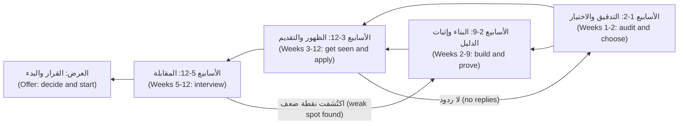

# الوحدة 7 — البطل (Hero): المشروع الختامي والتدريب (capstone and practice)

*تجمع هذه الوحدة الدورة كلّها في خطة واحدة (one plan) تستطيع تنفيذها فعلًا. لقد اخترت دورًا مستهدفًا (target role)، ورسمت فجواتك (mapped your gaps) مقارنةً بما يتحقّق منه أصحاب العمل (employers)، وبنيت الدليل (built proof)، وكتبت السيرة الذاتية (CV)، وتدرّبت على المقابلات (practised interviews)، وتعلّمت كيف تعمل العروض الوظيفية (offers) والوظائف الأولى (first jobs). كلٌّ منها وحده درس منفصل (separate lessons). لكن حين تُجمع بالترتيب الصحيح (in the right order)، مع إيقاع أسبوعي (weekly rhythm) وتتبّع صادق (honest tracking)، تصبح بحثًا عن عمل (job search). يحوّل المشروع الختامي (capstone) كل شيء إلى خطة جاهزية وظيفية من 12 أسبوعًا (12-week job-readiness plan)، من تدقيق المهارات (skills audit) في الأسبوع الأول إلى قرار العرض (offer decision) في النهاية، ويبيّن كيف تعدّلها حين يقول الدليل (evidence) إن شيئًا ما لا ينجح. ستتابع دفعة (cohort) برنامج نجم للخرّيجين التقنيين (Najm Tech Graduate Programme) بينما يطلب خالد (Khalid) من كلٍّ منهم أن يكتب خطته قبل أن تُفتح نافذة التقديم (application window): عمر (Omar)، الذي «يستعدّ» ("preparing") منذ أشهر دون أن يتقدّم بطلب، وريم (Reem)، التي تقدّمت إلى كل مكان بسيرة ذاتية واحدة (one CV)، وهدى (Huda) ويوسف (Yousef) ومحمد (Mohammed)، ولكلٍّ منهم قيد مختلف (different constraint). وتنتهي الوحدة بحزمة تدريب على المقابلات (practice interview pack) من 40 سؤالًا تغطّي كل الوحدات.*

> **الخطوات (Steps):** Apply, Interview — تحويل كل ما تعلّمته إلى خطة واحدة تنفّذها أسبوعًا بأسبوع (one plan you run week by week)، والتمرّن على القرارات التي توصلك إلى التوظيف (rehearsing the decisions that get you hired).

---

# 7.1 — المشروع الختامي (Capstone): خطة جاهزيتك الوظيفية في 12 أسبوعًا (your 12-week job-readiness plan)، من التدقيق إلى العرض (from audit to offer)
*المستوى (Level): 🔴 متقدم (Advanced)* · *المتطلبات (Prerequisites): 0.2، 3.1، 4.1، 5.1، 6.1* · *الخطوة (Step): Build, Apply*

## ⚡ الدرس في دقيقة (In 60 seconds)
- البحث عن عمل (job search) مشروع (project): **التدقيق، والبناء وإثبات الدليل، والتقديم، والمقابلة، والقرار (audit, build and prove, apply, interview, decide)**، بمراحل متداخلة (overlapping phases) ومراجعة أسبوعية (weekly review).
- القاعدة الأهم (The rule that matters most): **ابدأ التقديم قبل أن تشعر بأنك جاهز (start applying before you feel ready)**. الدليل (proof) والطلبات (applications) والتدرّب على المقابلات (interview practice) يحسّن بعضها بعضًا، لذا تسير بالتوازي (in parallel) ابتداءً من الأسبوع 4 أو 5 تقريبًا.
- تتبّع مسارًا صغيرًا للطلبات (small pipeline): الطلبات (applications)، والردود (replies)، والمقابلات الأولية (screens)، والجولات التقنية (technical rounds)، والجولات النهائية (finals)، والعروض (offers). والموضع الذي يخرج فيه الناس من مسارك (where people drop out of your pipeline) يخبرك بما يجب إصلاحه تاليًا.
- مؤشّر القرار (Decision cue): في الأسابيع 4 و8 و12، قارن الدليل (evidence) بالخطة (plan) وغيّر شيئًا واحدًا عن قصد (change one thing on purpose): الهدف (target)، أو السيرة الذاتية (CV)، أو المشروع (project)، أو التدرّب على المقابلات (interview practice).
- الفخ الأكبر (Biggest trap): الاستعداد إلى ما لا نهاية (preparing forever) لأن التقديم يبدو محفوفًا بالمخاطر (applying feels risky). الاستعداد دون طلبات لا يُنتج أي تغذية راجعة (produces no feedback).

## 🧭 لماذا يهم (Why it matters)
يلتقي خالد (Khalid) بالدفعة (cohort) قبل اثني عشر أسبوعًا من إغلاق نافذة التقديم (application window) في برنامج نجم للخرّيجين التقنيين (Najm Tech Graduate Programme). ويسأل كلًّا منهم: «ماذا فعلت الأسبوع الماضي لتحصل على وظيفة، وكيف تعرف أن ذلك نجح؟» ⁦("What did you do last week to get hired, and how do you know it worked?")⁩

حلّ عمر (Omar) قائمة طويلة من مسائل الخوارزميات (algorithm problems) وأنهى دورتين عبر الإنترنت (online courses)، لكنه لم يتقدّم إلى أي مكان: «لست جاهزًا لتصميم الأنظمة بعد» ⁦("I'm not ready for system design yet.")⁩. وأرسلت ريم (Reem) سيرة ذاتية واحدة (one CV) إلى عشرات الإعلانات الوظيفية (postings) ولم يصلها ردّ من أيٍّ منها تقريبًا؛ ولأنها لا تحتفظ بسجلّ (no record)، لا تستطيع أن تقول لماذا. وتواصل هدى (Huda) تلميع مشاريع الدفاتر التفاعلية (notebook projects) بينما يطلب كل إعلان تقرؤه SQL وخطوط معالجة البيانات (pipelines). ويعمل يوسف (Yousef) بدوام كامل (full time) ولديه نحو ثماني ساعات في الأسبوع (eight hours a week). أمّا محمد (Mohammed) فلديه معرض أعمال (portfolio) قوي، لكنه يصادف باستمرار إعلانات تشترط شهادة في التخصّص (degree in the field).

لا ينقص أيًّا منهم الجهد (effort). ما ينقصهم خطة (plan) تحوّل الجهد إلى دليل (turns effort into evidence)، والدليل إلى قرارات (evidence into decisions). قاعدة خالد (Khalid's rule): «بحلول الخميس، أرسلوا إليّ خطة من صفحة واحدة لاثني عشر أسبوعًا (one-page 12-week plan). لكل أسبوع مُخرَج (deliverable) يستطيع شخص آخر التحقّق منه، ولكل أسبوع رابع قرار (decision).» يشرح هذا الدرس كيف يكتبونها، والمُنتَج (artefact) الذي تخرج به هو خطتك أنت.

## 📐 كيف يعمل (How it works)

### 🟢 الأساسيات (The essentials)

**المراحل الخمس (The five phases).** تصبح كل وحدة سابقة مرحلةً (phase). وهي تتداخل عن قصد (overlap on purpose): تواصل البناء (keep building) بينما تتقدّم بالطلبات، وتواصل التدرّب على المقابلات (practising interviews) بينما تنتظر الردود (replies).

| المرحلة (Phase) | الأسابيع (Weeks) | مُخرَج يستطيع شخص ما التحقّق منه (Deliverable someone could check) | الدروس (Lessons) |
|---|---|---|---|
| **1. التدقيق والاختيار (Audit and choose)** | 1–2 | الدور المستهدف (target role) ودور بديل واحد (one fallback)؛ تدقيق المهارات (skills audit)؛ قائمة الفجوات (gap list)؛ جدول المسار الدراسي (study path table) | 0.2، 1.1–1.3، مسارك في 2.1–2.4 (your path in 2.1–2.4) |
| **2. البناء وإثبات الدليل (Build and prove)** | 2–9 | مشروع ختامي واحد (one capstone project) لذلك الدور، قابل للتشغيل أو منشور (runnable or deployed)، مع ملف README يستطيع غريب أن يتبعه (a stranger can follow) | 3.1، 3.2، 3.3 |
| **3. الظهور أمام أصحاب العمل (Get seen)** | 3–12 | سيرة ذاتية رئيسية (master CV) ونسخ مُكيَّفة (tailored versions)؛ قائمة الأهداف (target list)؛ طلبات مُكيَّفة (tailored applications) كل أسبوع | 4.1، 4.2، 4.3 |
| **4. المقابلة (Interview)** | 5–12 | بنك قصص (story bank) من 8–10 قصص؛ ملاحظات المقابلات التجريبية (mock-interview notes)؛ قائمة بنقاط الضعف المتكرّرة (recurring weak spots) | 5.1–5.3، 7.2 |
| **5. القرار والبدء (Decide and start)** | العروض (Offers) | مقارنة العروض (offer comparison)؛ خطة الأيام التسعين الأولى (30-60-90 plan) | 6.1، 6.2، 6.3 |

تبدأ المرحلة 3 قبل أن يكتمل المشروع لأن المحادثات (conversations) تحتاج إلى وقت لتؤتي ثمارها (take time to pay off)؛ وتبدأ المرحلة 4 في الأسبوع 5 لأن المقابلات قد تأتي مبكرًا (interviews can arrive early).



الأسهم الراجعة (backward arrows) هي بيت القصيد (the point): المقابلات تكشف فجوات (reveal gaps) تعود إلى مرحلة البناء (back into the build)، والصمت (silence) يعيدك في العادة إلى التدقيق (back to the audit).

**إيقاع أسبوعي تستطيع الالتزام به (A weekly rhythm you can keep).** يجب أن تصمد الخطة (plan must survive) في أسبوع عادي (an ordinary week). حدّد ساعاتك الحقيقية (your real hours) أولًا، ثم قسّمها. تقسيم أوّلي معقول (reasonable starting split): نحو النصف للبناء والتعلّم (building and learning)، ونحو الربع للتقديم وبناء العلاقات المهنية (applying and networking) (تكييف الطلبات (tailoring)، والطلبات (applications)، ورسالة (a message) أو طلب إحالة (a referral request))، ونحو الربع للتدرّب على المقابلات (interview practice) (مقابلة تجريبية واحدة (one mock)، وبعض المسائل بصيغة الجهات التي تستهدفها (in your targets' format)، وقصص تتدرّب على روايتها بصوت عالٍ (stories rehearsed aloud))، و30 دقيقة للمراجعة الأسبوعية (weekly review). وإن لم يكن لديك سوى ثماني ساعات في الأسبوع، كما هو حال يوسف (Yousef)، فحافظ على النِّسَب (keep the proportions) وقلّص النطاق (shrink the scope): مشروع واحد (one project)، وقائمة أهداف أقصر (shorter target list)، ومقابلة تجريبية كل أسبوعين (a mock every other week).

**جدول التتبّع (The tracker).** احتفظ بجدول واحد (one table)، في جدول بيانات (spreadsheet) أو ملف ملاحظات (notes file)، فيه صفّ واحد لكل طلب (one row per application):

| صاحب العمل (Employer) | الدور (Role) | المصدر (Source) | مُكيَّف؟ ⁦(Tailored?)⁩ | إحالة؟ ⁦(Referral?)⁩ | المرحلة (Stage) | الإجراء التالي وتاريخه (Next action and date) |
|---|---|---|---|---|---|---|
| سديم باي (Sadeem Pay) | مهندس واجهات خلفية مبتدئ (Junior backend engineer) | زميل فريق في هاكاثون (Hackathon teammate) | نعم (Yes) | نعم (Yes) | تقدّمتُ، الأسبوع 5 (Applied, week 5) | المتابعة بعد أسبوع إن لم يصل ردّ (Follow up after one week if no reply) |

بعد بضعة أسابيع، يُظهر عمودا **المصدر (source)** و**الإحالة (referral)** أيّ القنوات (channels) تُنتج ردودًا لك أنت، وهذا أفضل من أي نصيحة عامة (beats any general advice).

### 🟡 التعمق أكثر (Going deeper)

**اقرأ مسار طلباتك، لا مزاجك (Read your funnel, not your mood).** التغذية الراجعة (feedback) في البحث عن عمل ضعيفة ومتأخّرة ومشوّشة (weak, delayed and noisy)، والرفض (rejection) يبدو أمرًا شخصيًا (feels personal). يحوّلها جدول التتبّع (tracker) إلى تشخيص (diagnosis). انظر أين تتوقّف الطلبات عن التقدّم (where applications stop moving):

| أين تتوقّف (Where it stops) | السبب الأرجح (Most likely cause) | ما الذي تغيّره أولًا (What to change first) | الدرس (Lesson) |
|---|---|---|---|
| ردود قليلة أو معدومة (Few or no replies) | استهداف بعيد جدًا عن دليلك (targeting too far from your proof)، أو سيرة ذاتية غير مُكيَّفة (untailored CV)، أو الاكتفاء بالقنوات الباردة (cold channels only) | ضيّق الهدف (narrow the target)، وكيّف السيرة لكل إعلان (tailor to each posting)، وأضف الإحالات (add referrals) | 4.1–4.3 |
| مقابلات أولية، لكن لا جولات تقنية (Screens, but no technical rounds) | إجابة غير واضحة عن «من أنا ولماذا هذا الدور» ("who I am and why this role")؛ أو أمور لوجستية (logistics) مثل موعد التفرّغ (availability) أو تصريح العمل (work authorisation) | أعد كتابة تقديمك لنفسك في دقيقتين (two-minute introduction)؛ وجهّز إجابات لوجستية واضحة (clear logistics answers) | 5.1 |
| جولات تقنية، لكن لا جولات نهائية (Technical rounds, but no finals) | فجوة مهارية حقيقية (real skill gap) أو صيغة غير مألوفة (unfamiliar format) (البرمجة الحيّة (live coding)، أو المهمة المنزلية (take-home)، أو مراجعة شيفرة مكتوبة بالذكاء الاصطناعي (reviewing AI-written code)) | تدرّب على الصيغة نفسها بالضبط (practise the exact format)؛ وعُد إلى قائمة الفجوات (gap list) | 5.2، 5.3 |
| جولات نهائية، لكن لا عروض (Finals, but no offers) | الإجابات السلوكية (behavioural answers)، أو طريقة شرحك للقرارات والأخطاء (how you explain decisions and mistakes) | قوِّ قصصك بالنتائج والدروس (results and lessons)؛ وأجرِ مقابلة تجريبية مع شخص أقدم منك (mock with someone senior) | 5.1 |

لا تبحث عن معدّل ردود «طبيعي» ("normal" reply rate)؛ فالمعدّلات تختلف حسب السوق والدور والموسم (market, role and season). قارن نفسك بأسابيعك السابقة أنت (your own previous weeks).

**كيّف الخطة مع قيدك (Adapt the plan to your constraint).** لكل عضو في الدفعة (cohort member) قيد واحد (one constraint) يشكّل خطته أكثر من أي شيء آخر.

| الشخص (Person) | القيد (Constraint) | كيف تتغيّر الخطة (How the plan changes) |
|---|---|---|
| **عمر (Omar)** | يُفرط في الاستعداد (over-prepares)؛ ولم ينشر أي مشروع قط (has never deployed) | يتقدّم بالطلبات من الأسبوع 3؛ ويجب أن يكون مشروعه الختامي (capstone) منشورًا ومراقَبًا (deployed and monitored)، لأن هذه فجوته (his gap)، لا الخوارزميات (algorithms) |
| **ريم (Reem)** | لا تستطيع دائمًا شرح شيفرتها المبنية بالذكاء الاصطناعي (AI-built code) | طلبات أقل ومُكيَّفة (fewer, tailored applications)؛ ويحصل كل ملف README على قسم «ما الذي تحقّقتُ منه» ("what I verified")؛ وكل أسبوع تشرح أحد ملفاتها بصوت عالٍ (explains one of her files aloud) |
| **هدى (Huda)** | ضعف في SQL وفي بيئة الإنتاج (weak SQL and production) | تعيد توجيه هدفها (retargets) إلى هندسة البيانات (data engineering)؛ وتُخصَّص الأسابيع 2–6 لـ SQL ولخط معالجة بيانات واحد (one pipeline) |
| **يوسف (Yousef)** | ثماني ساعات في الأسبوع (eight hours a week) | مشروع واحد للبنية التحتية بوصفها شيفرة (one infrastructure-as-code project)، وقائمة أهداف قصيرة (short target list)؛ وشهادة سحابية (cloud certification) فقط إن طلبتها الإعلانات التي يستهدفها |
| **محمد (Mohammed)** | لا يحمل شهادة في التخصّص (no degree in the field) | يستهدف أصحاب العمل الذين يعلنون معايير قائمة على المهارات (skills-based criteria)؛ ويعتمد على الإحالات (leans on referrals)؛ ويقرأ قواعد الأهلية (eligibility rules) لكل برنامج أولًا |

**اختر المشروع الختامي من مسار دورك (Pick the capstone from your role path).** اختر مشروعًا يثبت الوظيفة المستهدفة (proves the target job) (يقدّم الدرس 3.1 مواصفات (spec) لكل دور)، وتعلّم ما يحتاج إليه من المكتبة (library):
- البرمجيات (Software): انشر وتحقّق (ship and verify) باستخدام [*تصميم الأنظمة لمبرمجي الحدس (System Design for Vibe Coders)*، الدرس F.5 — صفحتك الحيّة الأولى، مع الدليل (Your first live page — with proof)](../vibe/index.ar.html#lF-5)، ثم أضف [*تصميم الأنظمة لمبرمجي الحدس (System Design for Vibe Coders)*، الدرس 4.4 — التراجع وبيئة التجهيز وبوابات الإصدار (Rollback, staging, and release gates)](../vibe/index.ar.html#l4-4).
- تطبيقات الذكاء الاصطناعي (AI applications): [*تصميم الأنظمة لمبرمجي الحدس (System Design for Vibe Coders)*، الدرس 8.2 — الاختبارات بوصفها المواصفات التي لا يستطيع الوكيل تجاهلها (Tests as the spec the agent can't ignore)](../vibe/index.ar.html#l8-2) و[*إدارة منتجات الذكاء الاصطناعي (AI Product Management)*، الدرس 6.1 — جودة تستطيع قياسها: المقاييس والمجموعات الذهبية وتحليل الأخطاء (Quality you can measure: metrics, golden sets and error analysis)](../aipm/index.ar.html#/6.1).
- البيانات (Data): [*هندسة البيانات والتحليلات (Data Engineering & Analytics)*، الوحدة 1](../data/index.ar.html#/1.1) لـ SQL والنمذجة (modelling)، ثم خط معالجة بيانات (pipeline) من [*هندسة البيانات والتحليلات (Data Engineering & Analytics)*، الوحدة 2](../data/index.ar.html#/2.1).
- السحابة والمنصّات (Cloud and platform): البنية التحتية بوصفها شيفرة (infrastructure as code) من [*السحابة وDevOps (Cloud & DevOps)*، الوحدة 3](../cloud/index.ar.html#/3.1)، تُنشر عبر خط نشر (shipped through a pipeline) من [*السحابة وDevOps (Cloud & DevOps)*، الوحدة 4](../cloud/index.ar.html#/4.1).
- الأمن (Security): أضف [*الذكاء الاصطناعي الآمن وأمن التطبيقات (Secure AI & Application Security)*، الدرس 1.1 — نمذجة التهديدات: تدفّقات البيانات وحدود الثقة وSTRIDE (Threat modelling: data flows, trust boundaries and STRIDE)](../secai/index.ar.html#/1.1) إلى أيّ مشروع تبنيه.

أجرِ تقييمًا ذاتيًا (self-assessment)، مثل [التقييم الذاتي لدورة *تصميم الأنظمة لمبرمجي الحدس (System Design for Vibe Coders)* (self-assessment)](../vibe/assessment.ar.html)، في الأسبوعين 1 و8.

**النزاهة جزء من الخطة (Integrity is part of the plan).** تحت ضغط المواعيد النهائية (deadline pressure)، تُغري الطرق المختصرة (shortcuts tempt): مشروع من درس تعليمي (tutorial project) يُقدَّم على أنه أصلي (original)، أو مهمة منزلية مكتوبة بالذكاء الاصطناعي (AI-written take-home) لا تستطيع شرحها، أو مسمّى وظيفي مُبالَغ فيه (stretched title). وكلها تنهار حين يتعيّن عليك شرح عملك والبناء عليه (explain and extend your work). أفصح عن مساعدة الذكاء الاصطناعي (disclose AI assistance) حيث يُطلب منك ذلك، وكن قادرًا على شرح كل سطر تقدّمه والتحقّق منه (explain and verify every line you submit).

### 🔴 نظرة الخبير (Expert view)

**تعامل مع الخطة على أنها تجارب (Treat the plan as experiments).** كل كتلة من أربعة أسابيع (four-week block) تختبر فرضية مكتوبة (written hypothesis)، مثل: «بهذا الهدف وهذه السيرة الذاتية وهذا المشروع، سأحصل على مقابلات تقنية» ⁦("With this target, CV and project, I will get technical interviews.")⁩. وعند نقطة المراجعة (checkpoint)، قرّر بناءً على الدليل (decide with the evidence):

| نقطة المراجعة (Checkpoint) | السؤال (Question) | إن كانت الإجابة نعم (If yes) | إن كانت الإجابة لا (If no) |
|---|---|---|---|
| **الأسبوع 4 (Week 4)** | هل المشروع يسير وفق الخطة (on track)، وهل تُنتج السيرة الذاتية المُكيَّفة (tailored CV) ردودًا أو محادثات (replies or conversations)؟ | حافظ على الهدف (keep the target) | غيّر شيئًا واحدًا (change one thing): الهدف (target)، أو القسم العلوي من السيرة الذاتية (CV's top section)، أو القناة (channel) (أضف الإحالات (add referrals)) |
| **الأسبوع 8 (Week 8)** | هل تصل إلى الجولات التقنية (technical rounds)، والمشروع منشور ويعمل (project live)؟ | انقل الساعات نحو التدرّب على المقابلات (shift hours toward interview practice) | عُد إلى جدول مسار الطلبات (funnel table)؛ وفكّر في دورك البديل (fallback role) |
| **الأسبوع 12 (Week 12)** | هل لديك عروض (offers) أو جولات نهائية (finals) أو مسار طلبات ممتلئ (full pipeline)؟ | قرّر وابدأ (decide and start) (6.1، 6.2) | اكتب خطة الأسابيع الاثني عشر التالية (next 12-week plan) ممّا تعلّمته |

تغيير متغيّر واحد في كل مرة (changing one variable at a time) هو الطريقة الوحيدة التي تجعل عيّنة صغيرة ومشوّشة (small, noisy sample) تخبرك بشيء.

**حزمة الأدلة (The evidence pack).** بحلول الأسبوع 9، يجب أن تستطيع إرسال رابط واحد (one link) يُظهر ما يتحقّق منه مدير التوظيف (hiring manager) في دورك: المشروع (project)، وملف README الخاص به مع قراراتك (your decisions) وما تحقّقت منه (what you verified)، وسيرتك الذاتية (CV)، وملاحظة قصيرة عن كيفية استخدامك أدوات الذكاء الاصطناعي (how you used AI tools). يسمّيها خالد (Khalid) «الصفحة التي أقرؤها قبل المقابلة» ("the page I read before the interview").

**الأسبوع 12 نقطة مراجعة، لا موعد نهائي (Week 12 is a checkpoint, not a deadline).** الجداول الزمنية للتوظيف (hiring timelines) خارجة عن سيطرتك، وقد أُفيد بأن التوظيف في بداية المسيرة المهنية (early-career hiring) أضعف في المهن المعرّضة للذكاء الاصطناعي (AI-exposed occupations) (برينيولفسون وتشاندار وتشن (Brynjolfsson, Chandar and Chen)، 2025)؛ والبحث الطويل (long search) ليس حكمًا عليك (not a verdict on you). كثير من برامج الخرّيجين (graduate programmes) توظّف وفق دورة سنوية (annual cycle)، وقد يتحرّك أصحاب العمل الكبار (large employers) أبطأ من الشركات الناشئة (startups)؛ فتحقّق من مواعيد كل صاحب عمل (each employer's dates). واستمرّ بعد الأسبوع 12 بمستوى تستطيع الاستمرار عليه (sustainable level): بضعة طلبات مُكيَّفة في الأسبوع (a few tailored applications a week)، ومقابلة تجريبية واحدة (one mock)، وتحسين واحد للمشروع (one project improvement).

**اعتنِ بمدرج الإقلاع (Look after the runway).** قبل الأسبوع الأول، اكتب عدد الأسابيع التي تستطيع تحمّل كلفة البحث خلالها (how many weeks you can afford to search)، وأي قيود تتعلّق بالتأشيرة أو الكفالة (visa or sponsorship constraints) (تحقّق من القواعد الحالية (check the current rules))، ومتى توظّف الجهات التي تستهدفها (when your targets recruit). هذه الحقائق تحدّد ما إذا كنت ستقبل دورًا انتقاليًا (bridge role)، مثل عقد مؤقّت (contract) أو تدريب (internship) أو وظيفة في مسارك البديل (fallback track)، بينما تواصل البحث.

## 🧰 الأدوات (The toolkit)
| المورد أو الأداة أو النموذج (Resource, tool or template) | ما هو وماذا يفعل (What it is and does) | متى تلجأ إليه (When to reach for it) |
|---|---|---|
| **12-week job-readiness plan** — خطة الجاهزية الوظيفية في 12 أسبوعًا | صفحة واحدة (one page): الهدف والبديل (target and fallback)، والمُخرَجات الأسبوعية (weekly deliverables)، ونقاط المراجعة (checkpoints) في الأسابيع 4 و8 و12 | الأسبوع 1، ثم تُراجَع عند كل نقطة مراجعة (revised at each checkpoint) |
| **Skills audit** — تدقيق المهارات | مهاراتك مُقيَّمة بدرجات (scored) مقارنةً بإعلانات وظائف حقيقية (real postings)، مع دليل (evidence) لكل درجة | الأسبوعان 1–2، ومرة أخرى في الأسبوع 8 |
| **Study path table** — جدول المسار الدراسي | المهارات التي يحتاج إليها دورك (skills your role needs)، والدروس التي تبنيها (lessons that build them)، والدليل الذي يُظهرها (proof that shows them) (الوحدة 2) | عند اختيار ما تتعلّمه في المرحلة 2 (choosing what to learn in phase 2) |
| **Application log** — سجلّ الطلبات | جدول تتبّعك (your tracker): صفّ لكل طلب (one row per application)، مع المصدر (source) والتكييف (tailoring) والإحالة (referral) والمرحلة (stage) والإجراء التالي (next action) | مع كل طلب (every application) وفي كل مراجعة أسبوعية (every weekly review) |
| **Story bank** — بنك القصص | 8–10 قصص حقيقية بأسلوب STAR (true STAR stories) (الموقف، والمهمة، والإجراء، والنتيجة (Situation, Task, Action, Result))، كما في الدرس 5.1 | من الأسبوع 5، قبل أول مقابلة أولية (before the first screen) |
| **Brag document** — مستند الإنجازات | قائمة متجدّدة (running list) بما بنيته وأصلحته وتعلّمته (built, fixed and learned)، مع روابط (links) | أسبوعيًا (weekly)؛ فهو يغذّي السيرة الذاتية (feeds the CV) وقصصك (your stories) |
| **Mock interview with a peer** — مقابلة تجريبية مع زميل | جولة تدريبية (practice round) مع زميل أو مرشد أو مركز التوظيف المهني (peer, mentor or career centre)، بصيغة الجهات التي تستهدفها (in your targets' format) ومُقيَّمة وفق معايير تقييم (scored with a rubric) | أسبوعيًا من الأسبوع 5 (weekly from week 5) |
| **Weekly review** — المراجعة الأسبوعية | 30 دقيقة: حدّث جدول التتبّع (update the tracker)، ودوّن درسًا واحدًا (note one lesson)، وحدّد ثلاث أولويات (set three priorities) | في الوقت نفسه كل أسبوع (same time every week) |

## 🏛️ عمليًا في بنك نجم (In practice at Najm Bank)
خطة هدى (Huda's plan)، كما أرسلتها إلى خالد (Khalid). أظهر تدقيقها (her audit) أن كل إعلان تقريبًا أرادته كان يطلب SQL وخطوط معالجة البيانات (pipelines)، فأعادت توجيه هدفها (retargeted) إلى هندسة البيانات (data engineering)، مع إبقاء علم البيانات (data science) دورًا بديلًا (fallback).

**خطة هدى للجاهزية الوظيفية في 12 أسبوعًا (Huda's 12-week job-readiness plan) (16 ساعة في الأسبوع (16 hours a week))**

| الأسبوع (Week) | المُخرَج (Deliverable) (قابل للتحقّق (checkable)) | الدروس (Lessons) |
|---|---|---|
| 1 | الهدف (Target): مهندسة بيانات مبتدئة (junior data engineer) في بنوك الخليج وشركات التقنية المالية (Gulf banks and fintechs)؛ البديل (fallback): عالمة بيانات (data scientist). تدقيق المهارات (skills audit) من 15 إعلانًا وظيفيًا (15 postings) | 0.2، 2.3 |
| 2 | جدول المسار الدراسي (study path table)؛ مواصفات من صفحة واحدة (one-page spec) لخط معالجة بيانات المعاملات (transactions pipeline) على بيانات عامة (public data) | 2.3، 3.1 |
| 3 | تمارين SQL مكتوبة ومشروحة (SQL exercises written up)؛ نموذج البيانات للمشروع (data model for the project)؛ السيرة الذاتية الرئيسية (master CV) | [*هندسة البيانات والتحليلات (Data Engineering & Analytics)*، الوحدة 1](../data/index.ar.html#/1.1)، 4.1 |
| 4 | **نقطة مراجعة (Checkpoint).** يعمل خط المعالجة من البداية إلى النهاية وفق جدول زمني (runs end to end on a schedule)؛ قائمة الأهداف (target list)؛ أول 3 طلبات مُكيَّفة (first 3 tailored applications) | 4.3 |
| 5 | فحوص جودة البيانات التي تفشل بوضوح (data-quality checks that fail loudly)؛ النسخة الأولى من بنك القصص (story bank v1)؛ أول طلب إحالة (first referral request) | [*هندسة البيانات والتحليلات (Data Engineering & Analytics)*، الوحدة 3 — جودة البيانات (data quality)](../data/index.ar.html#/3.2)، 4.2، 5.1 |
| 6 | ملف README مع مخطّط وقرارات (diagram and decisions)؛ تحديث LinkedIn (LinkedIn updated)؛ 4 طلبات (4 applications) | 3.2، 4.2 |
| 7 | مقابلتان تجريبيتان في SQL (two SQL mocks) ومقابلة تجريبية في نمذجة البيانات (one data-modelling mock) مع الزملاء (with peers)؛ 4 طلبات (4 applications) | 5.2، 5.3 |
| 8 | **نقطة مراجعة (Checkpoint).** مراجعة مسار الطلبات (funnel review)؛ إعادة تقييم التدقيق (audit re-scored) | 7.1 |
| 9 | حزمة الأدلة (evidence pack): رابط واحد فيه المشروع وملف README والسيرة الذاتية وملاحظة عن استخدام الذكاء الاصطناعي (project, README, CV and an AI-use note) | 3.2 |
| 10–11 | حزمة التدريب من الدرس 7.2 (practice pack from 7.2)؛ التمرّن على أضعف قصّتين (rehearse the two weakest stories)؛ المتابعات (follow-ups) | 5.1، 7.2 |
| 12 | **نقطة مراجعة (Checkpoint).** مقارنة العروض (offer comparison)، أو خطة الأسابيع الاثني عشر التالية (next 12-week plan) | 6.1 |

**نموذج مراجعتها الأسبوعية (Her weekly review template)** (ملاحظة واحدة، خمسة أسطر (one note, five lines)):

```text
Week: 6        Hours planned / actual: 16 / 13
Shipped: README with diagram; 4 tailored applications
Funnel this week: 4 applied, 1 reply (Sadeem Pay recruiter), 0 screens done yet
One thing I learned: postings from banks mention data governance; add a section on it to my README
Next week's top three: SQL mock x2; data-modelling mock; book Sadeem Pay screen
```

في الأسبوع 8، أظهر جدول تتبّعها (her tracker) أن الطلبات التي جاءت بعد إحالة أو محادثة (after a referral or conversation) حصلت على ردود، وأن الطلبات الباردة (cold ones) لم تحصل عليها في الغالب. فأبقت على هدفها (kept her target) ونقلت الساعات من الطلبات الباردة إلى المحادثات (moved hours from cold applications to conversations): متغيّر واحد، غُيِّر بناءً على الدليل (one variable, changed on evidence).

## 🛠️ التمارين (Exercises)
- 🟢 اكتب بيان دورك المستهدف (target-role statement) (الدور، والقطاع، والموقع، ودور بديل واحد (role, sector, location, one fallback))، وتدقيقًا للمهارات (skills audit) من عشرة إعلانات وظيفية حقيقية على الأقل (at least ten real postings)، مع تقييم كل مهارة بدليل (scoring each skill with evidence). *يكتمل عندما (Done when):* يكون لكل مهارة في الجدول درجة وملاحظة دليل (a score and an evidence note)، ويستطيع زميل (peer) أن يسمّي أهم ثلاث فجوات لديك (your top three gaps) دون أن يسألك.
- 🟡 اكتب خطتك لاثني عشر أسبوعًا في صفحة واحدة (one-page 12-week plan) على نموذج هدى (on Huda's model): مُخرَج قابل للتحقّق (checkable deliverable) كل أسبوع، وميزانية ساعات حقيقية (real hours budget)، وثلاث نقاط مراجعة (three checkpoints) في صورة قرارات «إن كانت الإجابة نعم / إن كانت لا» ("if yes / if no"). وأعِدّ جدول التتبّع (set up your tracker). *يكتمل عندما (Done when):* يستطيع زميل (peer) التحقّق من كل مُخرَج عبر ملف أو رابط أو صفّ في جدول التتبّع (a file, link or tracker row)، ويحتوي جدول التتبّع على صفوفه الخمسة الأولى (first five rows).
- 🔴 نفّذ خطتك أربعة أسابيع (run your plan for four weeks)، ثم اكتب نقطة مراجعة الأسبوع 4 (week-4 checkpoint): الفرضية (hypothesis)، ودليل مسار الطلبات (funnel evidence)، والمتغيّر الواحد الذي ستغيّره ولماذا (the one variable you will change and why). واطلب من مرشد أو مستشار مهني (mentor or career adviser) مراجعتها. *يكتمل عندما (Done when):* تكون لديك أربع مراجعات أسبوعية (four weekly reviews)، وجدول تتبّع محدَّث (updated tracker)، وملاحظة نقطة مراجعة مؤرَّخة (dated checkpoint note) تسمّي تغييرًا واحدًا بالضبط ودليله (exactly one change and its evidence).

## ⚠️ أخطاء وفخاخ (Mistakes and traps)
- **الاستعداد إلى ما لا نهاية (Preparing forever).** «دورة واحدة أخرى» ("One more course") لا تُنتج أي تغذية راجعة (produces no feedback). ابدأ التقديم بين الأسبوعين 3 و5 (by week 3 to 5)، ودع المقابلات تُظهر لك ما تتعلّمه تاليًا (let interviews show what to learn next).
- **رشّ سيرة ذاتية واحدة في كل مكان (Spraying one CV everywhere).** الكمّ غير المُكيَّف (untailored volume) دون جدول تتبّع (no tracker) لا يعلّمك شيئًا. أرسل طلبات أقل ومُكيَّفة (fewer, tailored applications) وسجّل النتائج (record results).
- **تغيير كل شيء دفعة واحدة (Changing everything at once).** عندها لا يمكن تفسير النتيجة التالية (the next result cannot be interpreted). غيّر متغيّرًا واحدًا في كل نقطة مراجعة (one variable per checkpoint).
- **خطة تتجاهل أسبوعك الحقيقي (A plan that ignores your real week).** خطة من 40 ساعة (40-hour plan) لشخص لديه 8 ساعات فراغ (8 free hours) تفشل بحلول الأسبوع الثاني (fails by week two). ضع ميزانية لساعاتك الحقيقية (budget real hours)، ثم قلّص النطاق (cut scope).
- **التعامل مع الأسبوع 12 كموعد نهائي (Treating week 12 as a deadline).** إنه نقطة مراجعة (checkpoint)؛ استمرّ بإيقاع تستطيع المحافظة عليه (sustainable rhythm) أو اقبل دورًا انتقاليًا معقولًا (sensible bridge role).
- **الطرق المختصرة التي تمسّ النزاهة تحت الضغط (Integrity shortcuts under pressure).** المشاريع المنسوخة (copied projects)، والمسمّيات الوظيفية المضخَّمة (inflated titles)، والعمل المكتوب بالذكاء الاصطناعي الذي لا تستطيع شرحه (AI-written work you cannot explain) تنهار في المقابلات (collapse in interviews). ابنِ النسخة الصادقة (build the honest version).

## 🧾 الخلاصة (Recap)
- البحث عن عمل (job search) مشروع بمراحل متداخلة (project with overlapping phases): التدقيق (audit)، والبناء وإثبات الدليل (build and prove)، والظهور أمام أصحاب العمل (get seen)، والمقابلة (interview)، والقرار (decide). ابدأ التقديم مبكرًا (start applying early).
- الإيقاع الأسبوعي (weekly rhythm) مع ميزانية ساعات حقيقية (real hours budget) وجدول تتبّع (tracker) ومراجعة من 30 دقيقة (30-minute review) يُبقي الخطة حيّة (keeps the plan alive).
- اقرأ مسار طلباتك لتشخّص المشكلة (read your funnel to diagnose): غياب الردود (no replies) يشير إلى الاستهداف والسيرة الذاتية (targeting and CV)؛ وتعثّر الجولات التقنية (stalled technical rounds) يشير إلى المهارات والصيغة (skills and format)؛ وتعثّر الجولات النهائية (stalled finals) يشير إلى القصص والملاءمة (stories and fit).
- نقاط المراجعة (checkpoints) في الأسابيع 4 و8 و12 تغيّر متغيّرًا واحدًا في كل مرة (one variable at a time)، بناءً على الدليل (based on evidence).
- الأسبوع 12 نقطة مراجعة، لا حكم نهائي (a checkpoint, not a verdict). خطّط لمدرج الإقلاع (plan your runway)، وحافظ على نزاهتك (keep your integrity)، وواصل (keep going).

## ✍️ اختبر نفسك (Check yourself)

**1. قضى عمر (Omar) عشرة أسابيع في التدرّب على الخوارزميات (algorithm practice) وأنهى دورتين عبر الإنترنت (two online courses)، ولم يتقدّم إلى أي مكان لأنه لا يشعر بأنه جاهز (does not feel ready). ما أفضل خطوة تالية في خطته (best next step for his plan)؟**

- A. أن ينهي دورة ثالثة عبر الإنترنت (third online course) أولًا، كي يشعر بأنه مستعدّ تمامًا (fully prepared) حين تُطرح أسئلة تصميم الأنظمة (system-design questions)
- B. أن يبدأ الطلبات المُكيَّفة (tailored applications) الآن بينما يبني مشروعًا منشورًا (deployed project)، وأن يراجع النتائج أسبوعيًا (review the results weekly)
- C. أن يرسل سيرته الذاتية الحالية غير المُكيَّفة (current, untailored CV) إلى أكبر عدد ممكن من الإعلانات (postings) هذا الأسبوع ليزيد فرصه إلى أقصى حدّ (maximise his chances)
- D. أن ينتظر دورة برامج الخرّيجين في العام المقبل (next year's graduate-programme cycle) كي يتوفّر له وقت أطول للاستعداد كما يجب (prepare properly)

<details><summary>الإجابة</summary>

**B.** التقديم (applying) يُنتج تغذية راجعة (feedback) لا يستطيع الاستعداد (preparation) إنتاجها، وفجوته الحقيقية (real gap) هي النشر (deployment)، لا الخوارزميات (algorithms). أمّا C فيستبدل فخًّا بفخ آخر هو الكمّ غير المُكيَّف (untailored volume)؛ وA وD يُبقيانه في الاستعداد إلى ما لا نهاية (preparing forever). (🟢 الأساسيات (The essentials).)

</details>

**2. بعد شهر، يُظهر جدول تتبّع ريم (Reem's tracker) طلبات كثيرة (many applications)، وبضع مقابلات أولية مع مسؤولي التوظيف (a few recruiter screens)، ولا جولات تقنية (no technical rounds) بعد أيٍّ منها. وفقًا لجدول مسار الطلبات (funnel table)، إلامَ يجب أن تنظر أولًا (look at first)؟**

- A. تدرّبها على الخوارزميات (algorithm practice)، لأن المهارة التقنية (technical skill) هي عادةً ما يعيق الخرّيجين (blocks graduates) في هذه المرحلة
- B. صورة ملفّها الشخصي على GitHub (GitHub profile picture) وصورة الغلاف على LinkedIn (LinkedIn banner)، كي يكوّن مسؤولو التوظيف (recruiters) انطباعًا أوّل أفضل (better first impression)
- C. نشر مشروع معرض أعمالها (portfolio project's deployment)، كي يستطيع مُجري المقابلة الأولية (screener) النقر على رابط حيّ (live link) أثناء المكالمة
- D. تقديمها لنفسها وقصة «لماذا هذا الدور» (introduction and why-this-role story)، إضافةً إلى إجابات واضحة عن موعد التفرّغ (availability) وتصريح العمل (work authorisation)

<details><summary>الإجابة</summary>

**D.** المقابلات الأولية التي لا تؤدّي إلى شيء (screens that go nowhere) تشير إلى طريقة تقديمها لنفسها (how she presents herself) وإلى الأمور اللوجستية (logistics). أمّا A فيناسب الإخفاق في الجولات التقنية (failing technical rounds)، وهي لا تصل إليها أصلًا. (🟡 التعمق أكثر (Going deeper).)

</details>

**3. عند نقطة مراجعة الأسبوع 4 (week-4 checkpoint)، لم يتلقَّ يوسف (Yousef) أي ردّ على اثني عشر طلبًا باردًا (twelve cold applications). ويريد أن يغيّر دوره المستهدف (target role)، ويعيد كتابة سيرته الذاتية كلها (rewrite his whole CV)، ويبدأ مشروعًا جديدًا (new project)، وينتقل إلى مواقع وظائف أخرى (different job boards)، وكل ذلك هذا الأسبوع. بماذا يجب أن ينصحه خالد (Khalid)؟**

- A. أن يغيّر متغيّرًا واحدًا (change one variable)، مثل القسم العلوي من السيرة الذاتية (CV's top section) أو إضافة الإحالات (adding referrals)، وأن يُبقي الباقي ثابتًا (hold the rest steady)
- B. أن يجري التغييرات الأربعة كلها هذا الأسبوع، لأن اثني عشر طلبًا بلا ردّ (twelve silent applications) تُظهر أن الخطة فشلت بوضوح (clearly failed)
- C. ألّا يغيّر شيئًا على الإطلاق، لأن أربعة أسابيع وقت مبكر جدًا (far too early) للحكم على أي شيء في البحث عن عمل
- D. أن يتوقّف عن التقديم (stop applying) حتى ينتهي المشروع الجديد، كي يكون كل طلب لاحق أقوى (every later application is stronger)

<details><summary>الإجابة</summary>

**A.** مع عيّنة صغيرة ومشوّشة (small, noisy sample)، لا يمكن التعلّم إلا من تغيير واحد في كل مرة (one change at a time). أمّا B فيجعل النتائج التالية غير قابلة للقراءة (makes the next results unreadable)؛ وC يتجاهل الدليل (ignores evidence)؛ وD هو فخ الاستعداد إلى ما لا نهاية (preparing-forever trap). (🔴 نظرة الخبير (Expert view).)

</details>

**4. لدى يوسف (Yousef) نحو ثماني ساعات في الأسبوع (eight hours a week) إلى جانب وظيفة بدوام كامل (full-time job). أيّ خطة هي الأكثر واقعية (most realistic)؟**

- A. الخطة نفسها التي يتّبعها الباحث عن عمل بدوام كامل (full-time searcher)، مضغوطة في أمسياته وعطلات نهاية الأسبوع (evenings and weekends) حتى تنتهي
- B. تأجيل البحث كله (postponing the whole search) حتى يستطيع تحمّل ترك وظيفته (afford to leave his job) والبحث بدوام كامل
- C. النِّسَب نفسها بنطاق أصغر (same proportions, smaller scope): مشروع واحد (one project)، وقائمة أهداف قصيرة (short target list)، ومقابلة تجريبية كل أسبوعين (a mock every other week)
- D. التدرّب على المقابلات فقط (interview practice only)، لأن وظيفته الحالية تثبت أصلًا المهارات التي يريدها أصحاب العمل (proves the skills employers want)

<details><summary>الإجابة</summary>

**C.** ضع ميزانية لساعاتك الحقيقية (budget real hours)، ثم قلّص النطاق مع الحفاظ على التوازن (cut scope while keeping the balance). أمّا A فيفشل بحلول الأسبوع الثاني (fails by week two)؛ وB وD يُسقطان مراحل تحتاج إليها الخطة (drop phases the plan needs). (🟢 الأساسيات (The essentials).)

</details>

**5. نحن في الأسبوع 12. لدى محمد (Mohammed) مقابلتان في الجولة النهائية (two final-round interviews) لا تزالان جاريتين، لكن لا عرض حتى الآن (no offer yet). بماذا يوصي الدرس (What does the lesson recommend)؟**

- A. أن يعدّ الخطة فاشلة (treat the plan as failed) ويبدأ من جديد بدور مستهدف جديد (new target role)، لأن اثني عشر أسبوعًا لم تُنتج عرضًا
- B. أن يعامل الأسبوع 12 كنقطة مراجعة (treat week 12 as a checkpoint): يخطّط للأسابيع الاثني عشر التالية (plan the next 12 weeks) ويحافظ على إيقاع ثابت (steady rhythm) بينما تجري الجولات النهائية (while the finals run)
- C. أن يوقف كل نشاط آخر في البحث عن عمل (stop all other job-search activity) وينتظر ببساطة حتى يردّ صاحبا العمل في الجولة النهائية (final-round employers)
- D. أن يقبل أول دور انتقالي (first bridge role) يظهر، أيًّا كان، كي ينتهي البحث أخيرًا

<details><summary>الإجابة</summary>

**B.** الجداول الزمنية (timelines) خارجة عن سيطرته، وجولتان نهائيتان (two finals) تُظهران أن الخطة تنجح (the plan is working). أمّا A فيسيء قراءة الدليل (misreads the evidence)؛ وC يتركه بلا شيء إن رفضه كلاهما (if both say no)؛ وD يتجاهل تخطيطه لمدرج الإقلاع (ignores his runway planning). (🔴 نظرة الخبير (Expert view).)

</details>

## 📚 المراجع (References)
- برينيولفسون وتشاندار وتشن ⁦(Brynjolfsson, E., Chandar, B. and Chen, R.)⁩، ⁦"Canaries in the Coal Mine? Six Facts about the Recent Employment Effects of Artificial Intelligence"⁩، مختبر ستانفورد للاقتصاد الرقمي (Stanford Digital Economy Lab)، أغسطس 2025 — https://digitaleconomy.stanford.edu/
- توثيق GitHub (GitHub Docs)، حول ملفات README (About READMEs) — https://docs.github.com/en/repositories/managing-your-repositorys-settings-and-features/customizing-your-repository/about-readmes
- [التقييم الذاتي لدورة *تصميم الأنظمة لمبرمجي الحدس (System Design for Vibe Coders)*](../vibe/assessment.ar.html)
- [*الذكاء الاصطناعي الآمن وأمن التطبيقات (Secure AI & Application Security)*، الدرس 12.2 — المسيرة المهنية في الأمن: الأدوار والشهادات ومعرض الأعمال (The security career: roles, certifications and portfolio)](../secai/index.ar.html#/12.2)
- [*إدارة منتجات الذكاء الاصطناعي (AI Product Management)*، الدرس 10.2 — المسيرة المهنية لمدير منتجات الذكاء الاصطناعي: المقابلات ومعرض الأعمال والنمو (The AI PM career: interviews, portfolio and growth)](../aipm/index.ar.html#/10.2)

---

# 7.2 — حزمة المقابلات التدريبية (Practice interview pack): 40 سؤالًا قائمًا على سيناريوهات (40 scenario questions)
*المستوى (Level): 🔴 متقدم (Advanced)* · *المتطلبات (Prerequisites): 7.1* · *الخطوة (Step): Interview*

## ⚡ الدرس في دقيقة (In 60 seconds)
- هذه حزمة تدريبية (practice pack) من 40 سؤالًا تغطي كل الوحدات، من قراءة سوق العمل (reading the market) إلى النمو بعد سنتك الأولى (growing after your first year). معظم الأسئلة سيناريوهات (scenarios) مع أفراد الدفعة (the cohort): أي مشروع تبني، وأي بند في السيرة الذاتية (CV bullet) أقوى، وكيف تجيب، وأي عرض وظيفي (offer) تقبل، وماذا تفعل في أسبوعك الثاني (week two).
- أجب عنها في جلسة واحدة (one sitting) مدتها نحو 60 دقيقة، دون ملاحظات (no notes) ودون مساعد ذكاء اصطناعي (no AI assistant). اختر إجابتك قبل أن تفتح الإجابة المخفية (the hidden one).
- تنتهي كل إجابة بوسم (tag) مثل *(Interview · 5.1)*: خطوة البحث عن عمل (the step of the job search)، ثم الدرس الذي تعود إليه (the lesson to go back to).
- صحّح لنفسك (score yourself)، ثم جمّع أخطاءك حسب الخطوة (group your misses by step). تكتّل الأخطاء (a cluster of misses) يشير إلى الجزء من خطتك الذي يجب إصلاحه تاليًا، تمامًا كالقمع (the funnel) في الدرس 7.1.
- أكبر فخ (biggest trap): قراءة الإجابات أولًا (reading the answers first). التعرّف على الإجابة الصحيحة (recognising a right answer) أسهل بكثير من اختيارها، ولا يخبرك بشيء عن أدائك في جولة حقيقية (a real round).

## 🧭 لماذا يهم (Why it matters)
في الأسبوع العاشر من خطتها ذات الاثني عشر أسبوعًا (12-week plan)، تملك هدى بنك قصص (story bank) ومسار ترشيحات نشطًا (live pipeline) وجولتين تقنيتين محجوزتين (two technical rounds booked). ما لا تعرفه هو مواضع ضعفها المتبقية (where she is still weak). يعطي خالد الدفعة (the cohort) هذه الحزمة مساء يوم أحد بقاعدة واحدة (one rule): "أجيبوا أولًا، ثم انظروا. ثم أرسلوا لي سجل المراجعة (review log)، لا درجتكم (your score)."

يحصل عمر على 34 من 40 ويشعر بالرضا حتى يجمّع أخطاءه (groups his misses): خمسة من الأخطاء الستة أسئلة من خطوتي التقديم والبدء (Apply and Start questions)، عن العروض الوظيفية (offers) والإحالات (referrals) وأسابيعه الأولى في الوظيفة (first weeks in a job). كانت إجاباته في الخوارزميات والتصميم (algorithm and design answers) شبه مثالية؛ أما حكمه (judgement) على كل ما يحيط بالمقابلة (everything around the interview) فلم يكن كذلك. تخطئ ريم في أسئلة أقل مما توقعت، لكنها تعلّم أربعًا من إجاباتها الصحيحة على أنها تخمينات (guesses)، وكلها عن التحقق من الشيفرة التي يكتبها الذكاء الاصطناعي (verifying AI-written code). صار كلاهما يعرف ما يجب أن يتدرب عليه في الأسبوعين الأخيرين قبل الجولات النهائية (finals). وهذا هو الغرض من الحزمة: ليست درجة (not a grade)، بل خريطة لما يجب إصلاحه (a map of what to fix).

## 📐 كيف يعمل (How it works)

### 🟢 الأساسيات (The essentials)
**طريقة أدائها (How to take it).** اضبط مؤقتًا (timer) على 60 دقيقة. أغلق ملاحظاتك وأي مساعد ذكاء اصطناعي (AI assistant). لكل سؤال، اختر خيارًا واحدًا (one option) واكتبه، مع علامة ثقة سريعة (quick confidence mark): *متأكد (sure)* أو *تخمين (guess)*. وبعد ذلك فقط افتح الإجابة. في المقابلة تجيب قبل أن ترى التغذية الراجعة (feedback)؛ فتدرّب بالطريقة نفسها.

**كيف تعمل الأسئلة (How the questions work).** لكل سؤال إجابة واحدة هي الأفضل (one best answer). الخيارات الخاطئة واقعية (realistic)، من النوع الذي يفعله الخرّيج القلق (anxious graduate) فعلًا: التقديم في كل مكان بسيرة ذاتية واحدة (applying everywhere with one CV)، والادعاء بمعرفة Kubernetes (bluffing about Kubernetes)، وقبول عرض شفهي (accepting a verbal offer). تشرح الإجابات لماذا يكون الخيار المغري (the tempting option) خاطئًا، إلى جانب سبب صحة الخيار الصحيح.

### 🟡 التعمق أكثر (Going deeper)
**طريقة المراجعة (How to review).** احتفظ بسجل مراجعة (review log) فيه صف واحد لكل سؤال أخطأت فيه، أو أصبت فيه بالتخمين (got right by guessing). سجّل إجابتك، والإجابة الصحيحة، وسبب اختيارك (why you chose yours)، والدرس المذكور في الوسم (the lesson in the tag). ثم جمّع الصفوف حسب الخطوة (group the rows by step):

| تتكتّل الأخطاء في (Misses cluster in) | ما يعنيه ذلك عادةً (What it usually means) | إلى أين تذهب (Where to go) |
|---|---|---|
| الاستكشاف والتعلّم (Explore, Learn) | تصوّرك للأدوار (the roles) أو لخط الأساس المطلوب من المبتدئ (the junior baseline) غير واضح | الوحدات 0–2 (Modules 0–2) |
| البناء والإثبات (Build, Prove) | تعرف المهارات لكن لا تعرف ما يُعدّ إثباتًا (what counts as proof) | الوحدة 3 (Module 3) |
| التقديم (Apply) | السيرة الذاتية (CV) أو شبكة العلاقات (network) أو القنوات (channels) أو العروض الوظيفية (offers) | الوحدة 4، الدرس 6.1 (Module 4, lesson 6.1) |
| المقابلة (Interview) | الصيغة (format) أو البنية (structure) أو الصدق تحت الضغط (honesty under pressure) | الوحدة 5 (Module 5) |
| البدء والنمو (Start, Grow) | الأيام التسعون الأولى (the first 90 days) وما بعدها | الدرسان 6.2 و6.3 (Lessons 6.2 and 6.3) |

الإجابات الصحيحة المعلَّمة بـ *تخمين (guess)* تُحسب أخطاءً (count as misses). ثم أعد قراءة قسم الدرس الذي يسمّيه الوسم (the lesson section the tag names) وأعد حلّ أحد تمارينه (redo one of its exercises). إعادة القراءة وحدها لا تكفي (rereading alone is not enough).

### 🔴 نظرة الخبير (Expert view)
**استخدمها مقابلةً تجريبية (Use it as a mock interview).** اطلب من زميل (a peer) أن يقرأ عشرة أسئلة بصوت عالٍ (aloud) دون الخيارات (without the options). أجب بكلماتك الخاصة، ثم قل ما *لن* تفعله (what you would *not* do) ولماذا. هذا أقرب إلى الجولة الحقيقية (a real round)، حيث لا يعرض عليك أحد أربعة خيارات. وبعد أسبوعين، أعد الحزمة كاملة بترتيب مختلف (in a different order)؛ فالدرجة التي ترتفع فقط لأنك تتذكر الحروف (remember the letters) لا تعني شيئًا.

**للمرشدين المهنيين ومديري التوظيف (For advisers and hiring managers).** تصلح الحزمة بنكَ أسئلة مشتركًا (shared question bank). يمكن للمرشدين (advisers) تكليف الطلاب بها بعد خطة المشروع الختامي (capstone plan)؛ ويمكن لمديري التوظيف (hiring managers) استخدام السيناريوهات أسئلةَ متابعة (follow-up prompts) في الجولات السلوكية (behavioural rounds). غيّر الأسماء وجهة العمل (the employer)، وأبقِ على المعضلة (keep the dilemma).

## 🧰 الأدوات (The toolkit)
| المورد أو الأداة أو النموذج (Resource, tool or template) | ما هو وماذا يفعل (What it is and does) | متى تلجأ إليه (When to reach for it) |
|---|---|---|
| **Practice exam review log** — سجل مراجعة الامتحان التدريبي | صف واحد لكل سؤال أخطأت فيه أو خمّنته (missed or guessed question): إجابتك، والإجابة الصحيحة، والسبب (why)، والدرس الذي تراجعه (the lesson to review)، وإجراء واحد (one action) | مباشرة بعد أداء الحزمة، ومرة أخرى بعد إعادتها (after the retake) |
| **Mock interview with a peer** — مقابلة تجريبية مع زميل | جولة تدريبية (practice round) يطرح فيها صديق أسئلة من قائمة ويقيّم بمعيار تقييم (scores with a rubric) | عند قراءة السيناريوهات بصوت عالٍ دون الخيارات، في الأسبوعين 10–11 من خطتك (weeks 10–11 of your plan) |
| **Story bank** — بنك القصص | ‏8–10 قصص حقيقية بطريقة STAR (true STAR stories)، كل منها موسوم بالكفاءات التي تُظهرها (tagged with the competencies it shows) | عندما يذكّرك سيناريو بقصة لم تدوّنها بعد |

## 🏛️ عمليًا في بنك نجم (In practice at Najm Bank)
سجل المراجعة (review log) الخاص بعمر، وهي الصفوف التي طلب خالد أن يحضرها إلى اجتماعهما الثنائي (1:1):

| السؤال (Q) | إجابتي (My answer) | الصحيحة (Correct) | متأكد أم تخمين (Sure or guess) | لماذا اخترت إجابتي (Why I chose mine) | الدرس (Lesson) | الإجراء (Action) |
|---|---|---|---|---|---|---|
| 13 | B | D | متأكد (Sure) | ظننت أن السيرة الذاتية وحدها تكفي (a CV alone was enough) | 4.2 | أكتب ملخصًا من سطرين قابلًا لإعادة التوجيه (forwardable two-line summary) لمشروعي الختامي (capstone) |
| 14 | B | A | متأكد (Sure) | ظننت أن العرض المكتوب نهائي (a written offer was final) | 6.1 | أعيد قراءة قسم "الشروط (Conditions)"؛ وأدرج الشروط الواردة في عرض نجم (my Najm offer) |
| 29 | C | D | تخمين (Guess) | رأيت الموافقات عائقًا (approvals as friction) | 6.2 | أقرأ دليل نجم لاعتماد التغييرات (change-approval guide) قبل دورتي التدريبية (rotation) |
| 32 | A | B | متأكد (Sure) | وثقت بموقع رواتب واحد (one salary website) | 6.1 | أسأل اثنين من الخريجين السابقين (alumni) ومسؤول توظيف (recruiter) عن النطاق (the range) |

تعليق خالد: "إجاباتك التقنية (technical answers) جاهزة. اقضِ هذا الأسبوع على الصفين 13 و14: فهما يتعلقان بطريقة تعاملك مع الناس والوعود (people and promises)، وهذا ما تختبره الجولة النهائية (the final round)."

## 🛠️ التمارين (Exercises)
- 🟢 أدِّ الحزمة كاملة في جلسة واحدة مدتها 60 دقيقة (one 60-minute sitting)، دون ملاحظات أو أدوات ذكاء اصطناعي (AI tools)، معلّمًا كل إجابة بـ *متأكد (sure)* أو *تخمين (guess)*. *يكتمل عندما (Done when):* تكون لديك درجة من 40 (a score out of 40) وعدد تخميناتك (a count of your guesses)، وكلاهما مكتوب في ملف مسيرتك المهنية (career folder).
- 🟡 ابنِ سجل المراجعة (review log) لكل سؤال أخطأت فيه أو خمّنته، وجمّع الصفوف حسب الخطوة (by step)، وأعد حل تمرين واحد من الدرس الذي يقف وراء أكبر تكتّل لديك (your biggest cluster). *يكتمل عندما (Done when):* يسمّي كل صف درسًا وإجراءً (a lesson and an action)، ويستوفي التمرين المُعاد سطر *يكتمل عندما (Done when)* الخاص به.
- 🔴 أدِر عشرة أسئلة مقابلةً تجريبية شفهية (spoken mock interview) مع زميل، دون الخيارات، ثم أعد الحزمة كاملة بعد أسبوعين بترتيب مختلف (in a different order). *يكتمل عندما (Done when):* يكون الزميل قد قيّم إجاباتك الشفهية من 1 إلى 3 (scored your spoken answers 1–3)، وتُظهر إعادتك أخطاءً أقل في الخطوة التي تكتّلت فيها محاولتك الأولى.

## ⚠️ أخطاء وفخاخ (Mistakes and traps)
- **استراق النظر إلى الإجابات (Peeking at the answers).** التعرّف يوهمك بالمعرفة (recognition feels like knowledge). التزم بإجابة أولًا (commit to an answer first)، في كل مرة.
- **الاكتفاء بعدّ الدرجة (Counting only the score).** التخمين الصحيح خطأ متنكّر (a right guess is a miss in disguise). علّم درجة ثقتك (mark confidence) وسجّل التخمينات (log the guesses).
- **إعادة القراءة دون تطبيق (Rereading without doing).** عد إلى الدرس، ثم أدِّ أحد تمارينه أو حدّث أحد مُخرجاتك (update an artefact).
- **حفظ الحروف (Memorising letters).** أعد الحزمة بترتيب مختلف، وأجب بصوت عالٍ دون خيارات (aloud without options).
- **معاملة الحزمة كأنها المقابلة (Treating the pack as the interview).** الجولات الحقيقية فيها أسئلة متابعة (follow-up questions). استخدم الحزمة لاكتشاف نقاط الضعف (weak spots)، ثم تدرّب عليها مع شخص.

## ✍️ الامتحان التدريبي (Practice exam)

**1. يجد مسح السوق (market scan) الذي أجراه يوسف لعشرة إعلانات لوظائف منصات للمبتدئين (junior platform ads) أن Git ورد في تسعة إعلانات وDocker في أربعة. كيف ينبغي أن يقرأ هذه الأعداد (read those counts)؟**

- A. كلاهما مهارة أساسية (baseline skills)، لأن كلًّا منهما يظهر في أكثر من ثلاثة من الإعلانات العشرة
- B. Git مهارة أساسية (baseline skill) وDocker عامل تمييز (differentiator)، لذا يُثبت Git أولًا ثم Docker
- C. كلاهما عامل تمييز (differentiators)، لأن أيًّا منهما لا يظهر في كل إعلان جمعه
- D. Docker هو الأساس الحقيقي (the real baseline)، لأن الأدوات الأحدث تهم أصحاب العمل دائمًا أكثر من القديمة

<details><summary>الإجابة</summary>

**B.** المهارات الواردة في سبعة إعلانات أو أكثر من عشرة هي الأساس (the baseline)؛ والواردة في ثلاثة إلى ستة هي عوامل التمييز (differentiators). يسيء A وC تطبيق العتبات (misapply the thresholds)؛ ويستبدل D بالدليل تخمينًا عمّا هو رائج (what is fashionable). *(Explore · 0.1)*

</details>

**2. تجد هدى إعلانًا بعنوان "عالم بيانات (Data Scientist)". المهام (duties) هي كتابة تقارير SQL (SQL reports)، وصيانة لوحات المعلومات (dashboards)، والإجابة عن أسئلة شبكة الفروع (the branch network). كيف ينبغي أن تتعامل معه؟**

- A. على أنه دور عالم بيانات (data scientist role)، لأن المسمى هو ما سيظهر في سيرتها الذاتية لاحقًا
- B. على أنه دور تطبيقات ذكاء اصطناعي (AI application role)، لأن لوحات المعلومات الحديثة تُبنى بالنماذج (models) بشكل متزايد
- C. على أنه دور هندسة برمجيات (software engineering role)، لأن تقارير SQL ولوحات المعلومات نوع من الشيفرة (a kind of code)
- D. على أنه أقرب إلى دور محلل بيانات (data analyst role)، بالحكم من مهامه المدرجة (listed duties) لا من مسماه

<details><summary>الإجابة</summary>

**D.** تختلف المسميات (titles) بين أصحاب العمل؛ أما المهام فتصف الأسبوع الحقيقي (the real week)، وهذه مهام محلل (analyst duties). يثق A بالتسمية (trusts the label)؛ ويمطّ B وC المهام لتناسب عائلة أدوار (a family) لا تصفها. *(Explore · 0.2)*

</details>

**3. تبدأ عائشة مقابلة الفرز مع مسؤول التوظيف (recruiter screen) لعمر بعبارة "حدثني عن نفسك" ⁦("Tell me about yourself.")⁩. أي إجابة تناسب شكل الدقيقة الواحدة الذي يقدمه الدرس (the lesson's 60-second shape) أكثر؟**

- A. خرّيج (Graduate)؛ بنى ونشر واجهة برمجية للحجز (booking API) مع اختبارات (tests)؛ يريد عملًا في الواجهة الخلفية (backend work)؛ تجذبه دورات نجم التدريبية (Najm's rotations)
- B. استعراض لشهادته الجامعية (degree) مدته خمس دقائق، سنة بسنة، ينتهي بدرجات سنته الأخيرة (final-year grades) وسجله في المسابقات (contest record)
- C. قائمة بالتقنيات الإحدى عشرة (eleven technologies) في سيرته الذاتية، كي تطابقه مع الإعلان (the advert) بسرعة
- D. "كل شيء موجود في سيرتي الذاتية. هل هناك شيء محدد فيها تودّين أن أشرحه أكثر؟"

<details><summary>الإجابة</summary>

**A.** يغطي التعريف بالنفس (the introduction) من أنت الآن، وماذا بنيت، وماذا تريد تاليًا، ولماذا هذه الجهة (why this employer)، في نحو دقيقة. يطول B وC دون أن يقولا لماذا هذا الدور (why this role)؛ ويهدر D السؤال الوحيد الذي تطرحه كل مقابلة فرز (every screen). *(Interview · 5.1)*

</details>

**4. كان مولّد التقارير (report generator) لدى محمد يعمل الأسبوع الماضي ويفشل اليوم. بينهما 30 إيداعًا صغيرًا (small commits)، واختبار واحد يعيد إنتاج الفشل (reproduces the failure). ما أسرع طريقة موثوقة (fastest reliable way) لإيجاد السبب؟**

- A. قراءة كل فرق (diff) منذ الأسبوع الماضي من البداية، بالترتيب، حتى يبدو شيء مريبًا
- B. التراجع عن (revert) الإيداعات الثلاثين كلها، ثم إعادة تطبيقها واحدًا تلو الآخر يدويًا وإعادة تشغيل التطبيق في كل مرة
- C. تشغيل `git bisect` على الإيداعات الثلاثين، باستخدام الاختبار الفاشل (the failing test) لتعليم كل إيداع بأنه سليم أو معيب (good or bad)
- D. إعادة كتابة المولّد من الصفر (from scratch)، لأن تتبع السبب عبر السجل (history) سيستغرق وقتًا طويلًا

<details><summary>الإجابة</summary>

**C.** يجري `git bisect` بحثًا ثنائيًا (binary-searches) في السجل، والإيداعات الصغيرة تعني أنه يشير إلى بضعة أسطر. B نسخة يدوية بطيئة (slow manual version) من الفكرة نفسها؛ وA تخمين (guesswork)؛ وD يتخلص من الدليل (throws away the evidence) وقد يعيد الخلل (the bug). *(Learn · 1.1)*

</details>

**5. لدى ريم تسعة مستودعات مثبّتة (pinned repositories): ستة واجبات دراسية (course assignments)، ودرسان تعليميان قديمان (old tutorials)، ومشروعها الختامي (capstone) في المرتبة السادسة من القائمة. سيقضي المراجع (a reviewer) نحو دقيقة على ملفها الشخصي (profile). ما الذي ينبغي أن تغيّره أولًا؟**

- A. إضافة مزيد من المستودعات، كي يبدو ملفها الشخصي نشطًا وواسعًا (active and broad) قدر الإمكان للمراجعين
- B. ملء مخطط المساهمات (contribution graph) بإيداعات صغيرة، كي يبدو الملف مشغولًا كل يوم
- C. تثبيت أربعة إلى ستة مستودعات (pin four to six repositories)، المشروع الختامي أولًا، وإلغاء تثبيت الواجبات والدروس القديمة
- D. جعل كل مستودع خاصًا (private) عدا المشروع الختامي، وحذف ملفات README من البقية

<details><summary>الإجابة</summary>

**C.** يتصفح المراجعون (reviewers skim) الملف الشخصي، ثم المستودعات المثبتة، ثم ملف README واحدًا، لذا يجب أن يكون المشروع الختامي أول ما يرونه. يتلاعب B بمخطط (games a graph) يتجاهله المراجعون المتمرسون؛ ويدفن A وD العمل أو يخفيانه (bury or hide work) دون فائدة. *(Prove · 3.2)*

</details>

**6. في أسبوعه الأول في نجم، لا يعرف يوسف كم ينبغي أن يحاول وحده (try alone) قبل طلب المساعدة (asking for help). لم يخبره أحد. ماذا ينبغي أن يفعل؟**

- A. أن يسأل سالم في أول اجتماع ثنائي (first 1:1) بينهما عن المدة التي يحاول فيها وحده قبل السؤال، لأن الفرق تختلف (teams differ)
- B. ألا يسأل أبدًا خلال فترة التجربة (probation)، كي يبدو مستقلًا وكفؤًا (independent and capable) أمام الفريق
- C. أن يسأل فورًا كلما فشل أي شيء، لأن كل دقيقة عالقًا (stuck) فيها وقت مهدر
- D. أن يراسل أكبر المهندسين خبرة (the most senior engineer) على انفراد في كل مرة، لأن كبار المهندسين يجيبون أسرع

<details><summary>الإجابة</summary>

**A.** الفرق تختلف، لذا اسأل عن تفضيل المدير (the manager's preference)، ثم استخدم ذلك الحد الزمني (time limit) وقالب السؤال (the question template). B هو الصمت الذي يكلّف الفرق أكثر من غيره (the silence that costs teams most)؛ وC يتخطى المحاولة أولًا (skips trying first)؛ وD يرسل الأسئلة إلى حيث لا تفيد الإجابة أحدًا آخر. *(Start · 6.2)*

</details>

**7. أمام ريم ستة أسابيع قبل التقديم على أدوار تطبيقات الذكاء الاصطناعي للمبتدئين (junior AI application roles). أي خطة تطابق أفضل مطابقة مستوى المبتدئ المطلوب (the junior bar) لهذا الدور؟**

- A. تدريب نموذج لغوي صغير خاص بها من الصفر (train her own small language model from scratch) على بيانات عامة، لإظهار معرفة عميقة بالنماذج
- B. بناء منصة متعددة الوكلاء (multi-agent platform) بعشرة وكلاء متعاونين، لإظهار قدرتها على العمل بمستوى كبار المهندسين (senior level)
- C. جمع شهادات (certificates) من خمسة أطر ذكاء اصطناعي (AI frameworks)، كي تطابق سيرتها الذاتية أكبر عدد ممكن من الإعلانات
- D. ميزة RAG واحدة تستطيع شرحها (one RAG feature she can explain)، مع مجموعة مرجعية من 30 حالة (30-case golden set)، واختبارات حقن (injection tests)، وتكلفة لكل طلب (per-request cost)

<details><summary>الإجابة</summary>

**D.** هذا هو مستوى المبتدئ المطلوب (the junior bar): بناء ميزة واحدة تفهمها وتقييمها وتأمينها وحساب تكلفتها (building, evaluating, securing and costing). أما A وB فهما "غير متوقعين بعد (not expected yet)" على مستوى المبتدئ؛ وC يضيف ادعاءات لا أدلة (claims, not proof). *(Learn · 2.2)*

</details>

**8. يحتفظ يوسف بسيرة ذاتية أساسية واحدة (one base CV) لأدوار المنصات (platform roles). إعلان جديد لوظيفة منصات للخريجين يشدد على البنية التحتية كشيفرة (infrastructure as code) والمراقبة (monitoring). كيف ينبغي أن يكيّف سيرته الذاتية (tailor his CV) له؟**

- A. إعادة بناء السيرة الذاتية كلها من الصفر حول هذا الإعلان، وإعادة كتابة كل قسم بكلمات صاحب العمل نفسها
- B. قضاء نحو 15 دقيقة: عنوان رئيسي جديد (new headline)، ومشروع Terraform أولًا، واستبدال بندين أو ثلاثة (two or three bullets swapped) لتطابق الإعلان
- C. إرسال السيرة الأساسية دون تغيير، لأن الوقت المصروف على التكييف أنفع لإرسال طلبات أكثر ذلك الأسبوع
- D. إضافة كل أداة يذكرها الإعلان إلى سطر المهارات (skills line)، بما فيها أداتان لم يستخدمهما قط، كي يطابقه المحلّل الآلي (the parser)

<details><summary>الإجابة</summary>

**B.** تبدأ جولة التكييف (tailoring pass) في الدرس من سيرة ذاتية أساسية واحدة لكل دور مستهدف (one base CV per target role) وتستغرق خمس عشرة إلى عشرين دقيقة: عدّل العنوان الرئيسي (headline)، وضع المشروع الأكثر صلة أولًا (most relevant project first)، واستبدل بندين أو ثلاثة لتعكس الإعلان (mirror the ad)، وتحقق من سطر المهارات (skills line). A يصرف ساعات على إعادة بناء ما يعمل أصلًا؛ وC يتخطى الخطوة التي تطابقه مع الإعلان؛ وD يدرج مهارات لا يستطيع مناقشتها (skills he cannot discuss). *(Apply · 4.1)*

</details>

**9. في استعراض لمشروع (project walk-through)، يسأل طارق محمدًا: "ماذا ستفعل لو كان لتطبيقك مستخدمون أكثر بألف مرة؟" ⁦("What would you do if your app had a thousand times more users?")⁩ أي إجابة تُظهر التفكير بمنطق بيئة الإنتاج (production thinking) على مستوى المبتدئ؟**

- A. قياس أين يذهب الوقت (measure where the time goes)، والأرجح أنه في الاستعلامات (queries)؛ وتجربة الفهارس (indexes) أو التخزين المؤقت (caching) قبل إضافة خوادم (adding servers)
- B. نقل التطبيق كله إلى Kubernetes وتقسيمه إلى خدمات مصغّرة (microservices) قبل قياس أي شيء على الإطلاق
- C. شراء أكبر خادم قاعدة بيانات (database server) يبيعه مزوّده، كي لا يكون الحِمل (load) مشكلة أبدًا
- D. إعادة كتابة التطبيق بلغة برمجة أسرع (faster programming language)، لأن سرعة اللغة هي التي تحدد قابلية التوسع (scale)

<details><summary>الإجابة</summary>

**A.** إنها إجابة محددة ومتناسبة (specific, proportionate) وتنطلق من الدليل (starts from evidence). B هي إجابة "استخدم Kubernetes (use Kubernetes)" التي يصفها الدرس بالضعيفة؛ وC وD ينفقان المال أو الجهد قبل معرفة عنق الزجاجة (the bottleneck). *(Learn · 1.3)*

</details>

**10. بعد عشرين دقيقة من جولة البرمجة الحية (live-coding round)، تعلق هدى في كيفية التعامل مع ثلاث معاملات متكررة (repeated transactions) داخل نافذة زمنية واحدة (one time window). ماذا ينبغي أن تفعل؟**

- A. أن تصمت وتواصل الكتابة (go quiet and keep typing)، كي لا يلاحظ المحاوِر (the interviewer) أنها عالقة
- B. أن تحذف شيفرتها وتبدأ نهجًا مختلفًا أذكى (a different, cleverer approach) دون أن تقول لماذا
- C. أن تخبر المحاوِر بأن المسألة غير عادلة (unfair) وتطلب الانتقال إلى سؤال آخر
- D. أن تقول ما تفكر فيه (say what she is thinking)، وتجرّب مثالًا صغيرًا يدويًا (a small example by hand)، وتتقبل أي تلميح (hint) بشكل حسن

<details><summary>الإجابة</summary>

**D.** الجميع يعلقون؛ والتفكير بصوت عالٍ (narrating)، وحل مثال يدويًا، وحسن استخدام التلميح كلها إشارات إيجابية (positive signals). A يخفي طريقة تفكيرها (hides her reasoning)؛ وB يتخلى عن التقدم بصمت (abandons progress silently)؛ وC ينهي الجولة بشكل سيئ. *(Interview · 5.2)*

</details>

**11. يُظهر متتبّع هدى (Huda's tracker) أربع جولات تقنية (technical rounds) في شهر، كلها تمارين SQL حية (live SQL exercises)، ولا دعوات إلى جولات نهائية (final-round invitations). وفقًا لجدول القمع (the funnel table)، ما الذي ينبغي أن تغيّره أولًا؟**

- A. إعادة كتابة سيرتها الذاتية وقائمة الجهات المستهدفة (target list)، لأن المراحل المبكرة من بحثها (early stages of her search) تفشل
- B. التدرّب على مقابلات SQL حية تجريبية مؤقّتة (timed live SQL mocks) بالصيغة نفسها تمامًا، ثم العودة إلى قائمة الفجوات (gap list)
- C. إعادة التوجه نحو هندسة البرمجيات (retarget to software engineering)، حيث تظن أن المقابلات أسهل
- D. التوقف عن التقديم لمدة شهر وإنهاء مشروعين جديدين لمعرض الأعمال (portfolio projects) قبل المحاولة مجددًا

<details><summary>الإجابة</summary>

**B.** الجولات التقنية دون جولات نهائية تشير إلى فجوة مهارية (skill gap) أو صيغة غير مألوفة (unfamiliar format)، لذا تتدرب على الصيغة نفسها تمامًا. A يصلح مراحل تعمل جيدًا؛ وC وD يغيّران أكثر بكثير مما يدعمه الدليل (the evidence supports). *(Apply · 7.1)*

</details>

**12. يجب أن يختار محمد مشروعًا ختاميًا (capstone) واحدًا لدور مطوّر متكامل (full-stack role). أي فكرة هي الأقوى بوصفها إثباتًا (as proof)؟**

- A. نسخة مقلّدة من موقع بث موسيقي (music-streaming site clone) أعاد بناءها من دورة فيديو (video course)، بنظام ألوان خاص به
- B. لوحة معلومات للطقس (weather dashboard) على واجهة برمجية عامة (public API)، بأيقونات متحركة وعرض توقعات لخمسة أيام
- C. حجز الملاعب (pitch booking) لناديه القديم لكرة القدم، حيث قد يحجز قائدان آخر موعد متاح (the last slot) في الوقت نفسه
- D. تطبيق قائمة مهام (to-do list app) بالسحب والإفلات (drag and drop)، وست سمات ألوان (colour themes)، وتصميم مصقول للهاتف (mobile layout)

<details><summary>الإجابة</summary>

**C.** فيه مستخدم حقيقي (a real user) هو النادي، ونطاق صغير (small scope)، وسؤال صعب يمكن للمحاوِر التعمق فيه (a hard question an interviewer can probe): ماذا يحدث عندما يحجز شخصان آخر موعد في اللحظة نفسها. أما A وB وD فأفكار رآها المراجعون مرات كثيرة، بلا مستخدم حقيقي ولا سؤال صعب. *(Build · 3.1)*

</details>

**13. بعد ثلاثة أسابيع من لقاء مهني (meetup)، ردّ مهندس من سديم باي (Sadeem Pay) بحرارة على تحديث ريم الذي يضم رابطًا إلى نتائج تقييمها (evaluation results). والآن تعلن سديم باي عن وظيفة للمبتدئين (junior role). ما أفضل طلب إحالة (referral request)؟**

- A. أن تطلب منه إخبار مدير التوظيف (hiring manager) بأنهما صديقان قديمان، كي يؤخذ طلبها بجدية أكبر
- B. أن ترسل سيرتها الذاتية دون رسالة، واثقة بأنه سيفهم ما تريده أن يفعل بها
- C. أن تطلب منه أن يؤكد للفريق أنها قوية في الواجهة الخلفية (backend work)، وهو ما لم يره
- D. أن ترسل رابط الوظيفة وسيرتها الذاتية وملخصًا من سطرين لإعادة توجيهه (a two-line summary to forward)، وطريقة سهلة للرفض (an easy way to say no)

<details><summary>الإجابة</summary>

**D.** لقد رأى عملها، وهي تجعل الإحالة سهلة واختيارية (easy and optional). A يبالغ في العلاقة (exaggerates the connection)؛ وB يتركه يخمّن؛ وC يطلب منه أن يشهد لعمل لم يره (vouch for work he has not seen). *(Apply · 4.2)*

</details>

**14. العرض المكتوب (written offer) من نجم لعمر مشروط بتصديق الشهادة (degree attestation) والتحقق من الخلفية (background check). ولديه أيضًا جولة نهائية (final round) لدى شركة اتصالات الأسبوع المقبل. ماذا ينبغي أن يفعل الآن؟**

- A. أن يُبقي عملية شركة الاتصالات مفتوحة، وألا يستقيل أو يرفض حتى تُستوفى الشروط (the conditions clear)
- B. أن يلغي الجولة النهائية (final round) لدى شركة الاتصالات اليوم، لأن العرض المكتوب (written offer) يعني أن الوظيفة صارت مؤكدة (the job is now certain)
- C. أن يستقيل فورًا من وظيفته بدوام جزئي (part-time job)، كي يبدأ في نجم متى طلبوا
- D. أن يخبر شركة الاتصالات بأنه قبل عرضًا في مكان آخر (accepted elsewhere)، توفيرًا لوقت الجميع في هذه الأثناء

<details><summary>الإجابة</summary>

**A.** إلى أن تُستوفى الشروط، لا يكون العرض نهائيًا (the offer is not final)، لذا لا ينبغي أن يستقيل أو يرفض خيارات أخرى. B وC يتصرفان كأن العرض غير مشروط (unconditional)؛ وD غير صحيح، لأنه لم يقبل أي شيء. *(Apply · 6.1)*

</details>

**15. في تمرين SQL (SQL exercise)، تطلب دانة من هدى أحدث معاملة (most recent transaction) لكل عميل. أي نهج صحيح؟**

- A. `GROUP BY customer_id` مع `MAX(amount)`، لأن أكبر مبلغ (the largest amount) هو الأحدث عادةً
- B. `ROW_NUMBER()` مقسّمًا حسب العميل (partitioned by customer)، ومرتبًا حسب الوقت تنازليًا (ordered by time descending)، مع الإبقاء على الصف 1 لكل عميل
- C. `SELECT DISTINCT customer_id` من جدول المعاملات (transactions)، مرتبًا حسب وقت المعاملة تنازليًا
- D. ترتيب الجدول كله حسب وقت المعاملة تنازليًا، ثم أخذ `LIMIT 1` للإجابة

<details><summary>الإجابة</summary>

**B.** دالة النافذة (window function) ترتّب الصفوف داخل كل عميل، وهذا بالضبط "الأحدث لكل عميل (latest per customer)". A يجيب عن سؤال مختلف؛ وC يفقد المعاملة نفسها (loses the transaction itself)؛ وD يعيد صفًا واحدًا للجدول كله. *(Learn · 2.3)*

</details>

**16. في مراجعة الأسبوع السادس (six-week check-in)، يطلب خالد من يوسف أن يعرض ما أنتجه. ملاحظاته ومسوداته (notes and drafts) مبعثرة بين حاسوبه المحمول وهاتفه وبريده الإلكتروني، ولا يستطيع إيجاد معظمها. أي عادة من الدورة (habit from the course) تعالج هذا بأكثر شكل مباشر؟**

- A. كتابة ملخص من الذاكرة (a summary from memory) في الليلة السابقة لكل مراجعة، كي يرى خالد أبرز النقاط (the highlights)
- B. إرسال شهادات الدورات (course certificates) وساعات الدراسة (study hours) إلى خالد دليلًا على الجهد الذي بذله
- C. ملف مسيرة مهنية واحد (one career folder) يضم كل المُخرجات (every artefact)، كلٌّ منها مسمى باسم الدرس، مثل `0.3-starting-audit`
- D. حفظ الملاحظات في أي مكان متاح وجمعها في معرض أعمال (portfolio) واحد في نهاية الدورة

<details><summary>الإجابة</summary>

**C.** يضم ملف المسيرة المهنية (career folder) المُخرَج من كل درس، مسمى باسم الدرس، وهو دليل التقدم (evidence of progress) الذي يستطيع المرشد (a mentor) التحقق منه. A يقدم ملخصًا بدل العمل؛ وB يُظهر المُدخلات لا المُخرجات (input, not output)؛ وD يؤجل الدليل حتى يفوت أوان نفعه. *(Explore · 0.3)*

</details>

**17. في جولة بيانات (data round)، تقول دانة: "انخفضت التسجيلات عبر الهاتف (mobile sign-ups) بنسبة 20% هذا الأسبوع. كيف ستحققين في ذلك؟" ⁦("Mobile sign-ups dropped 20% this week. How would you investigate?")⁩ ماذا ينبغي أن تقول هدى أولًا؟**

- A. التحقق أولًا من أن التتبّع (tracking) ما زال يعمل، ثم التقسيم (segment) حسب المنصة والبلد وإصدار التطبيق (app version)
- B. بناء نموذج للتنبؤ بالتسجيلات (a model to predict sign-ups) كي يرى الفريق العوامل التي تفسر الانخفاض
- C. إبلاغ المديرين بالانخفاض فورًا على أنه تراجع حقيقي في اهتمام العملاء (customer interest) هذا الأسبوع
- D. إجراء اختبار A/B (A/B test) لصفحة تسجيل جديدة لاستعادة كل العملاء الذين توقفوا عن التسجيل

<details><summary>الإجابة</summary>

**A.** تحقق من البيانات أولًا (check the data first) — هل تعطّل التتبع ⁦(did tracking break?)⁩ —، ثم قسّم، ثم ابحث عن تغييرات مثل إصدار جديد (a release) أو انتهاء حملة (the end of a campaign). B وD يقفزان إلى الحلول (jump to solutions)؛ وC يبلّغ عن رقم لم يتحقق منه أحد. *(Interview · 5.3)*

</details>

**18. يطلب محمد من وكيل (an agent) إصلاح خلل تحقق واحد (one validation bug). يُصلح الفرق (the diff) الخلل، و"يرتّب (tidies)" أيضًا خمسة ملفات لا علاقة لها بالأمر. ماذا ينبغي أن يفعل؟**

- A. أن يدمج (merge) كل شيء، لأن الشيفرة الأكثر ترتيبًا أفضل، وملخص الوكيل (the agent's summary) يقول إن الاختبارات تنجح
- B. أن يطلب من الوكيل ترتيب بقية المستودع (the repository) أيضًا، كي يكون الأسلوب (style) متسقًا
- C. أن يدمجه، ثم يذكر التغييرات الإضافية في طلب الدمج (pull request) بعد دمجه
- D. أن يُبقي على الإصلاح المطلوب فقط (the requested fix)، ويرفض التغييرات غير المطلوبة (unasked changes)، ويشغّل الاختبارات بنفسه

<details><summary>الإجابة</summary>

**D.** التغييرات الواسعة أكثر من اللازم (over-broad changes) إخفاق شائع لدى الوكلاء (a common agent failure)؛ وقراءة قائمة الملفات كاملة (the full file list) ورفض التغييرات غير المطلوبة يُبقيان التغيير قابلًا للمراجعة (reviewable). A يثق بالملخص؛ وB يوسّع المشكلة؛ وC يُفصح بعد تحمّل المخاطرة (discloses after the risk is taken). *(Learn · 1.2)*

</details>

**19. تضم قائمة هدى المستهدفة (target list) 35 جهة عمل، وُجدت كلها على لوحة وظائف واحدة (one job board). ما التغيير الأكثر فائدة؟**

- A. إضافة 100 جهة أخرى من اللوحة نفسها (the same board)، لأن القائمة الأكبر تعني فرصًا أكثر (more chances)
- B. الإبقاء على القائمة وإرسال سيرتها الذاتية العامة (generic CV) إليها كلها هذا الأسبوع، توفيرًا لوقت التكييف (tailoring time)
- C. المزج بين برامج الخريجين (graduate programmes) وصفحات الوظائف (careers pages) والإحالات (referrals)، بثلاث قنوات على الأقل (at least three channels)
- D. تضييق القائمة إلى العلامات الخمس الأشهر (best-known brands) فقط، لأنها توظف أكبر عدد من الخريجين

<details><summary>الإجابة</summary>

**C.** القائمة المستهدفة الموزعة على قنوات متعددة تتجنب فخ اللوحة الواحدة (the one-board trap) بما فيه من منافسة عالية (high competition) وتغذية راجعة قليلة (little feedback). A وB يضيفان كمًّا دون استهداف (volume without targeting)؛ وD يُبقي فقط على الجهات صعبة المنال (reach employers). *(Apply · 4.3)*

</details>

**20. يريد عمر أن يصل إلى المستوى المتوسط (mid-level). يقول السلّم الوظيفي (the ladder) إن أصحاب المستوى المتوسط "يفكّكون المشكلات الغامضة (break down ambiguous problems)"، لكنه لم يتلقَّ يومًا إلا تذاكر واضحة (clear tickets). ما أفضل خطوة تالية (next step)؟**

- A. انتظار دورة الترقيات التالية (promotion cycle) على أمل أن يلاحظ خالد عدد التذاكر التي أغلقها
- B. أن يطلب من خالد مشكلة صغيرة غامضة (a small, ambiguous problem)، ويكتب مذكرة تصميم (design note)، ثم يطلقها (ship) ويراقبها
- C. الحصول على شهادة في المعمارية (architecture certificate) أولًا، كي يُظهر ملفه الشخصي أنه جاهز لأعمال التصميم
- D. التطوع لكل تذكرة واضحة في قائمة المهام المتراكمة (the backlog)، لإثبات قدرته على تحمّل ضعف عبء العمل

<details><summary>الإجابة</summary>

**B.** مؤشر القرار (the decision cue) هو أصغر عمل حقيقي (the smallest real piece of work) يتيح له أداء عمل المستوى التالي (next-level work)، مع دليل. A ينتظر أن يُلاحَظ (waits to be noticed)؛ وC مُدخل لا نطاق (input, not scope)؛ وD يخاطر بالاحتراق الوظيفي (burnout) ويبقى عملًا على تذاكر واضحة، لا غموضًا (not ambiguity). *(Grow · 6.3)*

</details>

**21. يريد يوسف خبرة سحابية (cloud experience) لسيرته الذاتية، لكنه لا يستطيع تحمّل فاتورة سحابية كبيرة (a large cloud bill). أي خطة تناسب الدرس؟**

- A. الانتظار حتى يدفع صاحب عمل تكلفة حسابه السحابي (cloud account) قبل أن يبني أي شيء على الإطلاق
- B. بناء بيئات كبيرة (large environments) على حساب شخصي وحذفها عندما تصل الفاتورة
- C. تخطي العمل التطبيقي (hands-on work) والاعتماد على شهادة سحابية (cloud certification) لإظهار المهارات بدلًا منه
- D. استخدام الفئات المجانية (free tiers) أو أرصدة الطلاب (student credits) أو عنقود محلي (local cluster)، مع تنبيهات الميزانية (budget alerts) والهدم بعد الاستخدام (teardown)

<details><summary>الإجابة</summary>

**D.** تغطي المسارات الرخيصة (cheap routes) معظم مهارات المبتدئين ما دامت تنبيهات الميزانية مفعّلة والبيئات تُهدم بعد الاستخدام (torn down). B يخاطر بفاتورة مفاجئة (a surprise bill)؛ وA وC يتركانه دون إثبات يعمل فعليًا (no running proof). *(Build · 3.3)*

</details>

**22. تقول قصة هدى عن مشروع جماعي (team project) "نحن (we)" في كل جملة. يسألها خالد: "ماذا فعلتِ أنتِ؟" ⁦("What did you do?")⁩ كيف ينبغي أن تصلح القصة؟**

- A. أن تستخدم "نحن (we)" للسياق (context)، و"أنا (I)" لأفعالها هي (her own actions)، وأن تنسب إلى زملائها أجزاءهم (credit her teammates' parts)
- B. أن تحوّل كل "نحن (we)" إلى "أنا (I)"، بما في ذلك الأجزاء التي أنجزها زملاؤها فعلًا (her teammates actually did)
- C. أن تواصل قول "نحن"، لأن الحديث عن نفسها يبدو تكبّرًا (sounds arrogant) في المقابلة
- D. أن تستبدل القصة بإجابة افتراضية (hypothetical answer) عمّا ستفعله في المرة القادمة

<details><summary>الإجابة</summary>

**A.** لا يستطيع المحاورون توظيف فريقها (cannot hire her team)، لذا يجب أن تكون أفعالها صريحة (explicit)، ونسبة الفضل لأصحابه بصدق (honest credit to others) تُبقي القصة صادقة. B ينسب عمل الآخرين لنفسه (claims others' work)؛ وC يخفي دليلها (hides her evidence)؛ وD لا يقدم دليلًا على سلوك سابق (past behaviour). *(Interview · 5.1)*

</details>

**23. يستخدم مسار النشر التدريبي (practice deploy pipeline) لدى يوسف مفتاح المسؤول الشخصي (personal admin key) الخاص به، الذي يستطيع تغيير أي شيء في الحساب. ماذا ستطلب منه قائمة سالم لإعادة البناء (Salem's rebuild checklist)؟**

- A. الإبقاء على مفتاح المسؤول، لكن تخزينه في ملف نصي (text file) خارج المستودع على حاسوبه المحمول
- B. مشاركة مفتاح المسؤول مع صديق، كي يتمكن شخص آخر من النشر (deploy) إذا لم يكن متاحًا
- C. منح مسار النشر دورًا خاصًا به (its own role) يستطيع نشر هذه الخدمة الواحدة (this one service) ولا شيء غيرها
- D. إزالة مسار النشر والنشر يدويًا من وحدة التحكم (the console)، كي لا يلزم أي مفتاح

<details><summary>الإجابة</summary>

**C.** أقل الصلاحيات (least privilege) يعني أن دور مسار النشر يستطيع نشر هذه الخدمة ولا شيء غيرها، دون مفاتيح شخصية طويلة الأمد (long-lived personal keys). A وB يُبقيان مفتاحًا واسع الصلاحيات (over-broad key) قيد الاستخدام؛ وD يفقد المراجعة والسجل (the review and record) اللذين يوفرهما مسار النشر. *(Learn · 2.4)*

</details>

**24. يقول إعلان لدور للمبتدئين إن الفريق "يمتلك الخدمات من طرف إلى طرف، في بيئة الإنتاج، مع جدول مناوبات (owns services end to end, in production, with an on-call rota)". ما الذي تخبر به هذه الصياغة عمر على الأرجح؟**

- A. أن الدور في الحقيقة دور لكبار المهندسين (a senior one)، لذا لا ينبغي للخريج التقديم عليه أصلًا
- B. أن المبتدئين يُتوقع منهم أن يطلقوا أعمالهم ويشغّلوها (ship and operate their own work)، لا أن يكتبوها فقط
- C. أن الفريق لا يستخدم أدوات البرمجة بالذكاء الاصطناعي (AI coding tools)، لذا سيكتب كل سطر بنفسه
- D. أن الكلمات نص جاهز (boilerplate) من قالب (template)، لذا يمكن تجاهلها بأمان

<details><summary>الإجابة</summary>

**B.** كلمات "يمتلك (own)" و"من طرف إلى طرف (end to end)" و"بيئة الإنتاج (production)" و"المناوبة (on-call)" تشير إلى أن الفريق يتوقع من المبتدئين الإطلاق (to ship)، ما يجعل فجوة النشر (deployment gap) لدى عمر مهمة. A يبالغ في قراءة الصياغة (over-reads the wording)؛ وC وD يقرآن فيه أشياء لا يقولها الإعلان. *(Explore · 0.1)*

</details>

**25. يُصلح عمر خللًا كانت فيه المبالغ المستردة (refunds) تُقرَّب في الاتجاه الخاطئ (rounded the wrong way). ماذا ينبغي أن يضيف قبل فتح طلب الدمج (pull request)؟**

- A. اختبار انحدار (regression test) للتقريب يفشل قبل الإصلاح وينجح بعده
- B. تعليقًا في الشيفرة (code comment) يطلب من المراجعين التحقق من التقريب يدويًا حين يتسع وقتهم
- C. ملاحظة في ملف README تقول إن خلل التقريب أُصلح ولا ينبغي أن يعود
- D. لا شيء آخر، لأنه اختبره يدويًا (tested it manually) والمبلغ المسترد يبدو الآن صحيحًا على الشاشة

<details><summary>الإجابة</summary>

**A.** كل إصلاح لخلل يأتي مع اختبار كان سيكتشفه (a test that would have caught it): فهو يُثبت الإصلاح ويمنع الخلل من العودة (stops the bug returning). B وC يعتمدان على تذكّر الناس (people remembering)؛ وD هو "اختبرته يدويًا (I tested it manually)". *(Learn · 1.1)*

</details>

**26. عند نقطة التحقق في الأسبوع الثامن (week-8 checkpoint)، كان المشروع الختامي (capstone) لعمر منشورًا وحيًّا (live)، ووصل إلى جولات تقنية (technical rounds) لدى ثلاث جهات عمل. ماذا يقترح جدول نقاط التحقق (the checkpoint table)؟**

- A. تغيير دوره المستهدف (target role)، لأنه لم يصله أي عرض بعد ثمانية أسابيع من البحث
- B. إعادة بناء المشروع الختامي بإطار عمل أحدث (a newer framework) قبل أن يرسل أي طلبات أخرى
- C. التوقف عن التقديم (stop applying) ريثما ينتظر نتائج الجولات التقنية الثلاث (the three technical rounds)
- D. الإبقاء على الهدف (keep the target) وتحويل مزيد من ساعاته الأسبوعية (weekly hours) نحو التدرب على المقابلات (interview practice)

<details><summary>الإجابة</summary>

**D.** في الأسبوع الثامن، تعني الجولات التقنية مع مشروع منشور أن الخطة تعمل (the plan is working)، لذا تنتقل الساعات نحو التدرب على المقابلات. A وB يغيّران ما يدعمه الدليل؛ وC يُفرغ مسار ترشيحاته (empties his pipeline). *(Apply · 7.1)*

</details>

**27. يقول التقرير المكتوب عن مشروع ريم (project write-up) إن ميزة البحث لديها "سريعة بشكل مذهل (blazing fast)". ماذا ينبغي أن تكتب بدلًا من ذلك؟**

- A. "سريعة للغاية (extremely fast)، وأسرع من معظم التطبيقات المشابهة (similar apps) في السوق اليوم"
- B. زمنًا مقيسًا (a measured time) مع شروطه (its conditions)، مثل حجم البيانات (data size) والجهاز (the machine)
- C. لا شيء عن السرعة، لأن الأرقام في التقرير تستدعي أسئلة صعبة
- D. "يستخدمها آلاف الناس كل يوم (used by thousands of people every day)، ويقولون جميعًا إنها سريعة جدًا"

<details><summary>الإجابة</summary>

**B.** الأرقام الصادقة (honest numbers) تذكر شروطها، ويستطيع المحاوِر مناقشتها. A ما زال غامضًا (still vague)؛ وD يختلق حجم استخدام (invents scale)؛ وC يتخلى عن نتيجة حقيقية (a real result). *(Prove · 3.2)*

</details>

**28. تضم قائمة عمر المستهدفة (target list) بنكًا وشركة ناشئة (a startup) وجهة حكومية للتحول الرقمي (government digital agency). لا تستخدم أي منها اختبارات فرز خوارزمية (algorithm screens)؛ واثنتان تكلّفان بمهام منزلية (take-home tasks). كيف ينبغي أن يستعد؟**

- A. أن يحل بإصرار مئتي مسألة خوارزمية أخرى (grind two hundred more algorithm problems)، لأن كل جهة تستخدمها عاجلًا أم آجلًا
- B. ألا يُعدّ شيئًا محددًا، لأن سجله في المسابقات (contest record) يُثبت بالفعل أنه يبرمج جيدًا
- C. أن يضع حدًا للتدرب على الخوارزميات (cap algorithm practice) وينفّذ مشروعًا مؤقّتًا بأسلوب المهمة المنزلية (timed take-home-style project) مع README واختبارات
- D. أن يطلب من كل جهة استبدال مهمتها المنزلية بجولة خوارزميات (algorithm round) تناسبه أكثر

<details><summary>الإجابة</summary>

**C.** اعرف الصيغة أولًا (find out the format first) واستعد لها؛ فالمهام المنزلية تكافئ ملف README والاختبارات والمفاضلات الصادقة (honest trade-offs). A يجتهد لاختبارات فرز لا تستخدمها الجهات المستهدفة؛ وB وD يتجاهلان الصيغة. *(Interview · 5.2)*

</details>

**29. في الأسبوع الخامس، يجب أن يوافق مهندس ثانٍ (a second engineer) على تغيير صغير أجرته ريم قبل أن يصل إلى بيئة الإنتاج (production). تجد ذلك بطيئًا. ما أفضل استجابة؟**

- A. أن تطلب من زميلها المرافق (her buddy) مشاركة بيانات اعتماده للإنتاج (production credentials)، كي تنشر التغيير بنفسها
- B. أن تجمع التغييرات العشرة التالية في إصدار واحد (one release)، كي لا تنتظر الموافقة إلا مرة واحدة
- C. أن تشتكي في قناة الفريق (team channel) من أن إجراء الموافقة بيروقراطية عفا عليها الزمن (outdated bureaucracy)
- D. أن تتعلم لماذا يوجد الفصل بين المهام (segregation of duties)، وتتبعه، وتقترح تحسينات لاحقًا

<details><summary>الإجابة</summary>

**D.** في الشركات الخاضعة للتنظيم (regulated firms)، تحمي الضوابط (controls) مثل الفصل بين المهام العملاءَ؛ تعلّم لماذا توجد، ثم اقترح التحسينات عبر القناة المناسبة (the proper channel). A يكسر الضابط (breaks the control)؛ وB يجعل مراجعة التغييرات أصعب؛ وC يعامل وسيلة حماية (a protection) كأنها عائق (friction). *(Start · 6.2)*

</details>

**30. يلصق محمد نص سيرته الذاتية المبنية على قالب مصمَّم (designer-template CV) في ملف نصي عادي (plain text file). مهاراته مفقودة، ومسمياته الوظيفية (job titles) تظهر بجوار تواريخ خاطئة. ماذا ينبغي أن يفعل؟**

- A. أن ينتقل إلى تخطيط بعمود واحد ونص فقط (one-column, text-only layout)، ثم يعيد اختبار اللصق كنص عادي (plain-text paste test)
- B. أن يُبقي على القالب (the template)، لأن مسؤولي التوظيف (recruiters) يرون دائمًا التصميم الأصلي (the original design) لا النص
- C. أن يضيف مهاراته مرة ثانية بنص أبيض صغير (small white text)، كي يجدها المحلّل الآلي (the parser)
- D. أن يحوّل السيرة الذاتية إلى صورة (an image)، كي لا يتمكن أي محلّل من بعثرة تخطيطها

<details><summary>الإجابة</summary>

**A.** إذا كان النص الملصوق مبعثرًا (scrambled)، فسيواجه المحلّل الآلي صعوبة أيضًا؛ والتخطيط البسيط بعمود واحد (plain one-column layout) يعالج ذلك. B خاطئ، لأن مسؤولي التوظيف يرون غالبًا النص المحلَّل (the parsed text)؛ وC نص مخفي (hidden text) سيرونه؛ وD يجعل السيرة الذاتية غير قابلة للبحث (unsearchable). *(Apply · 4.1)*

</details>

**31. لدى عمر أسبوع واحد من وقت الدراسة على مسار البرمجيات (software path) الخاص به. أي خطة تترك أكبر قدر من الإثبات (the most proof) يستطيع صاحب العمل التحقق منه؟**

- A. مشاهدة دورة لإطار عمل (framework course) مدتها اثنتا عشرة ساعة من أولها إلى آخرها وتدوين ملاحظات عن كل فيديو
- B. القراءة عن خمسة أطر عمل جديدة (five new frameworks) كي يدرجها كلها في سيرته الذاتية بنهاية الأسبوع
- C. إضافة تسجيل الدخول (login)، واختبار أن المستخدم A لا يرى حجوزات المستخدم B (user A cannot see user B's bookings)، ونشره، ثم توثيقه (document it)
- D. حل خمسين مسألة خوارزمية أخرى، لأن عدد المسائل التي حلّها هو الرقم الوارد في سيرته الذاتية

<details><summary>الإجابة</summary>

**C.** كثافة الإشارة (signal density): يترك الأسبوع وراءه إيداعًا (a commit) واختبارًا (a test) وفقرة (a paragraph). A وB مُدخلات بلا شيء يُعرض (input with nothing to show)؛ وD يعمّق نقطة قوة (deepens a strength) بدل سد فجوته في الإطلاق (his shipping gap). *(Learn · 2.1)*

</details>

**32. لدى محمد عرض من شركة ناشئة (startup offer)، ووجد رقمًا واحدًا للراتب على موقع قائم على مساهمات المستخدمين (crowd-sourced site). كيف ينبغي أن يحكم على عدالة المبلغ النقدي (whether the cash is fair)؟**

- A. أن يثق بالرقم الواحد، لأن المواقع القائمة على مساهمات المستخدمين دقيقة لأدوار الخريجين (graduate roles)
- B. أن يبني نطاقًا (a range) من مصادر عدة (several sources)، ثم يقارن العرض بالحد الأدنى لتكاليفه الفعلية (his real-cost floor)
- C. أن يطلب من المؤسس (the founder) مطابقة أعلى رقم يجده على الإنترنت من أي بلد
- D. أن يقبل أي مبلغ يُعرض، لأن المنتقلين من مسارات مهنية أخرى (career-switchers) لا يحق لهم طرح أي أسئلة

<details><summary>الإجابة</summary>

**B.** النطاق المأخوذ من مسؤولي التوظيف (recruiters) وأدلة الرواتب المؤرخة (dated salary guides) والأقران (peers)، مقارنًا بحد أدنى مبني على تكاليفه الفعلية، يجعل المقارنة قابلة للدفاع عنها (defensible). A يثق ببيانات شحيحة (thin data)؛ وC يستخدم السوق الخطأ (the wrong market)؛ وD يتخلى عن سؤال مشروع (a legitimate question). *(Apply · 6.1)*

</details>

**33. ينتهي التدريب العملي (internship) لهدى الذي امتد ثلاثة أشهر لدى شركة اتصالات الأسبوع المقبل. ما الذي سيجعله أكثر نفعًا في بحثها عن عمل؟**

- A. أن تطلب من مديرها (her manager) أن يكون مرجعًا لها (a reference)، وأن تكتب عنه تقريرًا (write it up) يستبعد التفاصيل السرية (confidential details)
- B. أن تنشر كل شيفرة تدريبها (all her internship code) على GitHub، لأنها كتبت كل سطر بنفسها
- C. أن تدرجه في سيرتها الذاتية بمسمى "مهندسة بيانات (Data Engineer)"، لأنها أدّت عملًا هندسيًا
- D. أن تحذفه من سيرتها الذاتية (leave it off her CV)، لأن ثلاثة أشهر مدة أقصر بكثير من أن تُعدّ خبرة حقيقية (real experience)

<details><summary>الإجابة</summary>

**A.** المرجع (a reference) والتقرير المكتوب الذي يستبعد التفاصيل السرية يحوّلان التدريب إلى دليل (evidence). B ينشر شيفرة يملكها صاحب العمل (code the employer owns)؛ وC يضخّم مسمى (inflates a title) سيكشفه التحقق من المراجع (a reference check)؛ وD يتخلى عن خبرة حقيقية. *(Build · 3.3)*

</details>

**34. يطلب طارق من ريم تقدير الحِمل (estimate the load) على خدمة تنبيهات البطاقات (card-alert service). وهي لا تعرف الأرقام الحقيقية. ما أفضل نهج؟**

- A. أن ترفض التقدير (refuse to estimate)، لأن أي رقم تعطيه دون بيانات حقيقية (real data) سيكون خاطئًا
- B. أن تذكر رقمًا كبيرًا بثقة (quote a large figure confidently)، كي يبدو التصميم كله (the whole design) طموحًا بالقدر المناسب
- C. أن تطلب من طارق أرقام الإنتاج الدقيقة (exact production figures) وتنتظر حتى يقدّمها كلها
- D. أن تذكر افتراضات تقريبية بصوت عالٍ (state round assumptions out loud)، وتُجري حسابات بسيطة (simple sums)، وتقول ما تعنيه النتيجة (what the result implies)

<details><summary>الإجابة</summary>

**D.** الافتراضات التقريبية المعلَّمة على أنها افتراضات (labelled as assumptions)، مع حساب بسيط (simple arithmetic) واستنتاج (a conclusion)، هي ما تبحث عنه الجولة. A وC يعطّلان المحادثة (stall the conversation)؛ وB يخادع برقم (bluffs a number) لا تستطيع الدفاع عنه. *(Interview · 5.3)*

</details>

**35. تريد ريم من وكيل (an agent) إضافة خطوة تحويل عملات (currency-conversion step) إلى تطبيق المصروفات (expense app) الخاص بها. أي طلب يُبقيها صاحبة القرار (keeps her in charge)؟**

- A. "أضف تحويل العملات (currency conversion) إلى التطبيق وتأكد من أن كل شيء يعمل كما ينبغي في النهاية."
- B. "أعد كتابة الواجهة الخلفية (backend) لدعم كل العملات، ثم حدّث أي اختبارات تبدأ بالفشل (tests that start failing)."
- C. "قرّب إلى منزلتين عشريتين (round to 2 places)، وأعطِ خطأً عند غياب الأسعار (error on missing rates)، وأبقِ الاختبارات الحالية (existing tests)؛ وأرني حالات الاختبار (test cases) أولًا."
- D. "افعل ما تراه الأفضل بشأن العملات (whatever you think is best for currencies)، ثم أعطني ملخصًا قصيرًا (short summary) بعد ذلك."

<details><summary>الإجابة</summary>

**C.** مهمة صغيرة محددة (a small, specified task) مع حالات اختبار تُعتمد أولًا (test cases approved first) تعني أنها هي من تقرر معنى "صحيح (correct)". B يدعو إلى إضعاف الاختبارات (invites weakened tests)؛ وA وD يسلّمان حكمها إلى الوكيل (hand her judgement to the agent). *(Learn · 1.2)*

</details>

**36. يسأل عمر هل ينبغي أن يتعلم ستة أطر عمل (six frameworks) كي يبدو قابلًا للتوظيف (employable) في كل عائلة أدوار (every role family). ماذا تقترح فكرة الشكل T (the T-shaped idea)؟**

- A. تعلّم الستة كلها إلى مستوى أساسي (basic level)، لأن الاتساع عبر العائلات (breadth across families) هو ما يوظِّف المبتدئين
- B. التعمق في عائلة أدوار واحدة أولًا (go deep in one role family first)، مع الاحتفاظ بمعرفة عملية (working knowledge) بالمجالات المجاورة لها
- C. تعلّم الخوارزميات (algorithms) فقط بعمق، لأن أطر العمل (frameworks) تتغير أسرع من أن تستحق التعلم
- D. التقديم على كل العائلات (every family) دفعة واحدة بالسيرة الذاتية نفسها (the same CV)، ثم التخصص (specialise) بعد أول عرض

<details><summary>الإجابة</summary>

**B.** العمق (depth) يُكسبك الوظيفة، والاتساع (breadth) يجعلك مفيدًا في الأسبوع الثاني (week two). A مشتت (scattered)؛ وC يتجاهل ما تحتاجه الوظيفة؛ وD هو فخ "التقديم على كل العائلات (applying to every family)". *(Explore · 0.2)*

</details>

**37. يجد يوسف برنامجًا للخريجين (graduate programme) تقول صفحة الأهلية (eligibility page) فيه إنه مخصص لمواطني البلد المضيف (nationals of the host country). وهو ليس منهم. ماذا ينبغي أن يفعل؟**

- A. أن يقدّم على أي حال ويترك سؤال الجنسية (nationality question) فارغًا، على أمل ألا يُتحقق منه
- B. أن يدفع لوكيل (an agent) يعده بمقعد مضمون (guaranteed place) في البرنامج مقابل رسوم
- C. أن يستنتج أنه لا توجد جهة عمل (no employer) في ذلك البلد ستنظر في طلبه، ويتوقف عن البحث هناك
- D. أن يحترم القاعدة (respect the rule) ويستهدف الأدوار المتاحة له؛ وأن يتحقق من القواعد في المصادر الرسمية (official sources)

<details><summary>الإجابة</summary>

**D.** قواعد الأهلية (eligibility rules) حقيقية، لذا يضع ساعاته حيث يكون مؤهلًا ويتحقق من القواعد الحالية في المواقع الرسمية (official sites). A غير أمين في نموذج (dishonest on a form)؛ وB احتيال تقليدي (a classic scam)؛ وC يعمّم أكثر من اللازم (over-generalises) انطلاقًا من برنامج واحد. *(Apply · 4.3)*

</details>

**38. بعد ثمانية عشر شهرًا في نجم، تتلقى هدى عرضًا خارجيًا (an outside offer) بزيادة صغيرة في الراتب (small pay rise). ما زالت تتعلم كل شهر، وأمامها مشكلة من المستوى التالي (a next-level problem) متاحة لها. ماذا يقترح الدرس؟**

- A. قد يكون البقاء أحكم (staying may be wiser)، لأن الزيادة الصغيرة قد تكلّفها من التعلم أكثر مما تكسبها
- B. أن تغادر فورًا (leave at once)، لأن أي زيادة في الراتب (any pay rise) تفوق كل عامل آخر في مرحلتها
- C. أن تقبل العرض، ثم تطلب من نجم مطابقته (match it) قبل أن تقرر أيهما تُبقي
- D. أن تتوقف عن تعلم أشياء جديدة حاليًا، لأن العرض الخارجي (the outside offer) يُظهر أنها جاهزة بالفعل

<details><summary>الإجابة</summary>

**A.** إذا كانت ما تزال تتعلم ولديها مشكلة من المستوى التالي تتولاها (to own)، فإن المغادرة مقابل زيادة صغيرة تكلّف غالبًا من التعلم أكثر مما تكسب. B يتجاهل الأسئلة التي يطرحها الدرس؛ وC يقبل بسوء نية (in bad faith)؛ وD يسيء فهم ما يعنيه العرض. *(Grow · 6.3)*

</details>

**39. عند نقطة التحقق في الأسبوع الثامن (week-8 checkpoint)، يُظهر متتبّع ريم (tracker) ردودًا على كل طلب تقريبًا جاء بعد إحالة (a referral) أو محادثة (a conversation)، وعلى ما يكاد يكون لا شيء من طلباتها الباردة (cold ones). ما الذي ينبغي أن تغيّره؟**

- A. أن تعيد كتابة سيرتها الذاتية، وتعيد الاستهداف (retarget)، وتبدأ مشروعًا جديدًا، كل ذلك هذا الأسبوع، لتسريع الأمور
- B. أن تُبقي على هدفها (keep her target) وتنقل الساعات من الطلبات الباردة (cold applications) إلى محادثات الإحالة (referral conversations)
- C. أن توقف كل بناء للعلاقات المهنية (networking)، لأن الطلبات الباردة هي القناة الوحيدة التي تتحكم فيها
- D. أن تضاعف عدد الطلبات الباردة، لأن الكمّ (volume) سيأتي بالردود في النهاية

<details><summary>الإجابة</summary>

**B.** يُظهر عمودا المصدر والإحالة (the source and referral columns) أي قناة تنجح معها، لذا تغيّر متغيرًا واحدًا (one variable) بناءً على هذا الدليل. A يغيّر كل شيء دفعة واحدة؛ وC وD يتجاهلان ما يُظهره المتتبّع. *(Apply · 7.1)*

</details>

**40. بعد مقابلته لدور المنصات (platform interview)، ينجذب يوسف إلى الأمن (security). ماذا ينبغي أن يكون أول إثبات أمني (first security proof) له؟**

- A. فحص الموقع العام (public website) لشركة محلية لمعرفة نقاط الضعف (weaknesses) التي يستطيع إيجادها
- B. قائمة بشهادات الأمن (security certifications) التي يخطط لنيلها، مضافة إلى ملفه على LinkedIn
- C. نموذج تهديدات (a threat model) لمشروع يملكه، يكتبه بعد إنهاء المرحلة 1 من مسار المنصات (platform stage 1)
- D. اختبار صفحة تسجيل الدخول لبنك (a bank's login page) برفق، ما دام لا شيء ينكسر أو يتباطأ بشكل ظاهر

<details><summary>الإجابة</summary>

**C.** يبدأ مسار الأمن (the security path) بنمذجة التهديدات (threat modelling) لنظام تملكه، بعد أسس المنصات (the platform foundations). A وD يختبران أنظمة دون إذن (without permission)، وهو ما قد يكون غير قانوني (illegal) ويُعدّ علامة تحذير في التوظيف (a hiring red flag)؛ وB خطة لا إثبات (a plan, not proof). *(Learn · 2.4)*

</details>

## 🧾 الخلاصة (Recap)
- تضم الحزمة 40 سؤالًا قائمًا على سيناريوهات (scenario questions) عبر كل الوحدات؛ وكل إجابة تسمّي خطوة (a step) والدرس الذي تراجعه (the lesson to review).
- أدِّها بتوقيت محدد (timed)، دون ملاحظات أو أدوات ذكاء اصطناعي (AI tools)، والتزم بإجابة (commit to an answer) قبل أن تفتح الإجابة المخفية.
- علّم درجة ثقتك (mark confidence)، وعامل التخمينات الصحيحة (right guesses) على أنها أخطاء (misses).
- جمّع أخطاءك حسب الخطوة (group your misses by step) لتعرف ما تصلحه تاليًا، ثم أدِّ تمرين الدرس (the lesson's exercise) بدل الاكتفاء بإعادة قراءته.
- أعدها بترتيب مختلف (in a different order) وتدرّب بصوت عالٍ دون خيارات (aloud without options)، لأن الجولات الحقيقية (real rounds) لا خيارات فيها، وفيها كثير من أسئلة المتابعة (follow-up questions).

## 📚 المراجع (References)
- دليل المقابلات التقنية (Tech Interview Handbook) — https://www.techinterviewhandbook.org/
- الإرشاد المهني والتطوير المهني في MIT (MIT Career Advising & Professional Development)، التحضير للمقابلات (interview preparation) — https://capd.mit.edu/
- ممارسات الهندسة في Google (Google Engineering Practices)، إرشادات مراجعة الشيفرة (code review guidelines) — https://google.github.io/eng-practices/review/
- [التقييم الذاتي (self-assessment) لدورة *System Design for Vibe Coders*](../vibe/assessment.ar.html)
- [التقييم الذاتي (self-assessment) لدورة *Secure AI & Application Security*](../secai/assessment.ar.html)
- [دورة *Data Engineering & Analytics: Zero to Hero*، الوحدة 7 — المشروع الختامي، والمسيرة المهنية في البيانات، والامتحان التدريبي (Capstone, data career and practice exam)](../data/index.ar.html#/7.1)
- [دورة *Cloud & DevOps: Zero to Hero*، الوحدة 7 — المشروع الختامي، والمسيرة المهنية السحابية، والامتحان التدريبي (Capstone, cloud career and practice exam)](../cloud/index.ar.html#/7.1)
- [دورة *AI Product Management*، الدرس 10.2 — المسيرة المهنية لمدير منتجات الذكاء الاصطناعي: المقابلات ومعرض الأعمال والنمو (The AI PM career: interviews, portfolio and growth)](../aipm/index.ar.html#/10.2)
- [دورة *Secure AI & Application Security*، الدرس 12.2 — المسيرة المهنية في الأمن: الأدوار والشهادات ومعرض الأعمال (The security career: roles, certifications and portfolio)](../secai/index.ar.html#/12.2)
