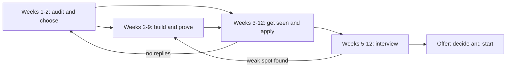

# Module 7 — Hero: capstone and practice

*This module pulls the whole course into one plan you can actually run. You have chosen a target role, mapped your gaps against what employers check, built proof, written a CV, practised interviews and learned how offers and first jobs work. On their own, these are separate lessons. Put together in the right order, with a weekly rhythm and honest tracking, they become a job search. The capstone turns everything into a 12-week job-readiness plan, from a skills audit in week one to an offer decision at the end, and shows how to adjust it when the evidence says something is not working. You will follow the Najm Tech Graduate Programme cohort as Khalid asks each of them to write their plan before the application window opens: Omar, who has been "preparing" for months without applying, Reem, who has applied everywhere with one CV, Huda, Yousef and Mohammed, each with a different constraint. The module ends with a 40-question practice interview pack that covers every module.*

> **Steps:** Apply, Interview — turning everything you have learned into one plan you run week by week, and rehearsing the decisions that get you hired.

---

# 7.1 — Capstone: your 12-week job-readiness plan, from audit to offer
*Level: 🔴 Advanced* · *Prerequisites: 0.2, 3.1, 4.1, 5.1, 6.1* · *Step: Build, Apply*

## ⚡ In 60 seconds
- A job search is a project: **audit, build and prove, apply, interview, decide**, with overlapping phases and a weekly review.
- The rule that matters most: **start applying before you feel ready**. Proof, applications and interview practice improve each other, so they run in parallel from around week 4 or 5.
- Track a small pipeline (applications, replies, screens, technical rounds, finals, offers). Where people drop out of your pipeline tells you what to fix next.
- Decision cue: at weeks 4, 8 and 12, compare the evidence with the plan and change one thing on purpose: the target, the CV, the project or the interview practice.
- Biggest trap: preparing forever because applying feels risky. Preparation without applications produces no feedback.

## 🧭 Why it matters
Khalid meets the cohort twelve weeks before the Najm Tech Graduate Programme's application window closes. He asks each of them: "What did you do last week to get hired, and how do you know it worked?"

Omar has solved a long list of algorithm problems and finished two online courses, but has not applied anywhere: "I'm not ready for system design yet." Reem has sent one CV to dozens of postings and heard back from almost none; with no record, she cannot say why. Huda keeps polishing notebook projects while every posting she reads asks for SQL and pipelines. Yousef works full time and has about eight hours a week. Mohammed has a strong portfolio but keeps meeting postings that ask for a degree in the field.

None of them lacks effort. They lack a plan that turns effort into evidence, and evidence into decisions. Khalid's rule: "By Thursday, send me a one-page 12-week plan. Every week has a deliverable someone else could check, and every fourth week has a decision." This lesson is how they write it, and the artefact you leave with is your own plan.

## 📐 How it works

### 🟢 The essentials

**The five phases.** Every earlier module becomes a phase. They overlap on purpose: you keep building while you apply, and you keep practising interviews while you wait for replies.

| Phase | Weeks | Deliverable someone could check | Lessons |
|---|---|---|---|
| **1. Audit and choose** | 1–2 | Target role and one fallback; skills audit; gap list; study path table | 0.2, 1.1–1.3, your path in 2.1–2.4 |
| **2. Build and prove** | 2–9 | One capstone project for that role, runnable or deployed, with a README a stranger can follow | 3.1, 3.2, 3.3 |
| **3. Get seen** | 3–12 | Master CV and tailored versions; target list; tailored applications every week | 4.1, 4.2, 4.3 |
| **4. Interview** | 5–12 | Story bank of 8–10 stories; mock-interview notes; a list of recurring weak spots | 5.1–5.3, 7.2 |
| **5. Decide and start** | Offers | Offer comparison; a 30-60-90 plan | 6.1, 6.2, 6.3 |

Phase 3 starts before the project is finished because conversations take time to pay off; phase 4 starts in week 5 because interviews can arrive early.



The backward arrows are the point: interviews reveal gaps that go back into the build, and silence usually sends you back to the audit.

**A weekly rhythm you can keep.** A plan must survive an ordinary week. Decide your real hours first, then split them. A reasonable starting split: about half on building and learning, about a quarter on applying and networking (tailoring, applications, a message or a referral request), about a quarter on interview practice (one mock, a few problems in your targets' format, stories rehearsed aloud), and 30 minutes on a weekly review. If you have only eight hours a week, as Yousef does, keep the proportions and shrink the scope: one project, a shorter target list, a mock every other week.

**The tracker.** Keep one table, in a spreadsheet or a notes file, with one row per application:

| Employer | Role | Source | Tailored? | Referral? | Stage | Next action and date |
|---|---|---|---|---|---|---|
| Sadeem Pay | Junior backend engineer | Hackathon teammate | Yes | Yes | Applied, week 5 | Follow up after one week if no reply |

After a few weeks, the **source** and **referral** columns show which channels produce replies for you, which beats any general advice.

### 🟡 Going deeper

**Read your funnel, not your mood.** Job-search feedback is weak, delayed and noisy, and rejection feels personal. The tracker turns it into a diagnosis. Look at where applications stop moving:

| Where it stops | Most likely cause | What to change first | Lesson |
|---|---|---|---|
| Few or no replies | Targeting too far from your proof, an untailored CV, cold channels only | Narrow the target, tailor to each posting, add referrals | 4.1–4.3 |
| Screens, but no technical rounds | An unclear "who I am and why this role"; logistics such as availability or work authorisation | Rewrite your two-minute introduction; prepare clear logistics answers | 5.1 |
| Technical rounds, but no finals | A real skill gap or an unfamiliar format (live coding, take-home, reviewing AI-written code) | Practise the exact format; return to the gap list | 5.2, 5.3 |
| Finals, but no offers | Behavioural answers, or how you explain decisions and mistakes | Strengthen stories with results and lessons; mock with someone senior | 5.1 |

Do not hunt for a "normal" reply rate; rates vary by market, role and season. Compare yourself with your own previous weeks.

**Adapt the plan to your constraint.** Each cohort member has one constraint that shapes the plan more than anything else.

| Person | Constraint | How the plan changes |
|---|---|---|
| **Omar** | Over-prepares; has never deployed | Applies from week 3; his capstone must be deployed and monitored, because that is his gap, not algorithms |
| **Reem** | Cannot always explain her AI-built code | Fewer, tailored applications; every README gets a "what I verified" section; weekly, she explains one of her files aloud |
| **Huda** | Weak SQL and production | Retargets to data engineering; weeks 2–6 go to SQL and one pipeline |
| **Yousef** | Eight hours a week | One infrastructure-as-code project, a short target list; a cloud certification only if his postings ask for one |
| **Mohammed** | No degree in the field | Targets employers that state skills-based criteria; leans on referrals; reads each programme's eligibility rules first |

**Pick the capstone from your role path.** Choose a project that proves the target job (lesson 3.1 has a spec per role) and learn what it needs from the library:
- Software: ship and verify with [*System Design for Vibe Coders*, lesson F.5 — Your first live page — with proof](../vibe/index.en.html#lF-5), then add [*System Design for Vibe Coders*, lesson 4.4 — Rollback, staging, and release gates](../vibe/index.en.html#l4-4).
- AI applications: [*System Design for Vibe Coders*, lesson 8.2 — Tests as the spec the agent can't ignore](../vibe/index.en.html#l8-2) and [*AI Product Management*, lesson 6.1 — Quality you can measure: metrics, golden sets and error analysis](../aipm/index.html#/6.1).
- Data: [*Data Engineering & Analytics*, Module 1](../data/index.html#/1.1) for SQL and modelling, then a pipeline from [*Data Engineering & Analytics*, Module 2](../data/index.html#/2.1).
- Cloud and platform: infrastructure as code from [*Cloud & DevOps*, Module 3](../cloud/index.html#/3.1), shipped through a pipeline from [*Cloud & DevOps*, Module 4](../cloud/index.html#/4.1).
- Security: add [*Secure AI & Application Security*, lesson 1.1 — Threat modelling: data flows, trust boundaries and STRIDE](../secai/index.html#/1.1) to whichever project you build.

Take a self-assessment, such as [the *System Design for Vibe Coders* self-assessment](../vibe/assessment.html), in weeks 1 and 8.

**Integrity is part of the plan.** Under deadline pressure, shortcuts tempt: a tutorial project presented as original, an AI-written take-home you cannot explain, a stretched title. They collapse when you must explain and extend your work. Disclose AI assistance where asked, and be able to explain and verify every line you submit.

### 🔴 Expert view

**Treat the plan as experiments.** Each four-week block tests a written hypothesis, such as "With this target, CV and project, I will get technical interviews." At the checkpoint, decide with the evidence:

| Checkpoint | Question | If yes | If no |
|---|---|---|---|
| **Week 4** | Is the project on track, and is the tailored CV producing replies or conversations? | Keep the target | Change one thing: the target, the CV's top section, or the channel (add referrals) |
| **Week 8** | Are you reaching technical rounds, with the project live? | Shift hours toward interview practice | Return to the funnel table; consider your fallback role |
| **Week 12** | Do you have offers, finals or a full pipeline? | Decide and start (6.1, 6.2) | Write the next 12-week plan from what you learned |

Changing one variable at a time is the only way a small, noisy sample can tell you anything.

**The evidence pack.** By week 9, you should be able to send one link that shows what a hiring manager checks for in your role: the project, its README with your decisions and what you verified, your CV, and a short note on how you used AI tools. Khalid calls it "the page I read before the interview".

**Week 12 is a checkpoint, not a deadline.** Hiring timelines are outside your control, and early-career hiring has been reported as weaker in AI-exposed occupations (Brynjolfsson, Chandar and Chen, 2025); a long search is not a verdict on you. Many graduate programmes recruit on an annual cycle, and large employers can move slower than startups; check each employer's dates. Continue past week 12 at a sustainable level: a few tailored applications a week, one mock, one project improvement.

**Look after the runway.** Before week one, write down how many weeks you can afford to search, any visa or sponsorship constraints (check the current rules), and when your targets recruit. These facts decide whether you take a bridge role, such as a contract, an internship or a job in your fallback track, while you keep going.

## 🧰 The toolkit
| Resource, tool or template | What it is and does | When to reach for it |
|---|---|---|
| **12-week job-readiness plan** | One page: target and fallback, weekly deliverables, checkpoints at weeks 4, 8 and 12 | Week 1, then revised at each checkpoint |
| **Skills audit** | Your skills scored against real postings, with evidence for each score | Weeks 1–2, and again at week 8 |
| **Study path table** | Skills your role needs, the lessons that build them, the proof that shows them (Module 2) | Choosing what to learn in phase 2 |
| **Application log** | Your tracker: one row per application, with source, tailoring, referral, stage and next action | Every application and every weekly review |
| **Story bank** | 8–10 true STAR stories (Situation, Task, Action, Result), as in lesson 5.1 | From week 5, before the first screen |
| **Brag document** | A running list of what you built, fixed and learned, with links | Weekly; it feeds the CV and your stories |
| **Mock interview with a peer** | A practice round with a peer, mentor or career centre, in your targets' format and scored with a rubric | Weekly from week 5 |
| **Weekly review** | 30 minutes: update the tracker, note one lesson, set three priorities | Same time every week |

## 🏛️ In practice at Najm Bank
Huda's plan, as she sent it to Khalid. Her audit showed that nearly every posting she wanted asked for SQL and pipelines, so she retargeted to data engineering, keeping data science as her fallback.

**Huda's 12-week job-readiness plan (16 hours a week)**

| Week | Deliverable (checkable) | Lessons |
|---|---|---|
| 1 | Target: junior data engineer at Gulf banks and fintechs; fallback: data scientist. Skills audit from 15 postings | 0.2, 2.3 |
| 2 | Study path table; one-page spec for a transactions pipeline on public data | 2.3, 3.1 |
| 3 | SQL exercises written up; data model for the project; master CV | [*Data Engineering & Analytics*, Module 1](../data/index.html#/1.1), 4.1 |
| 4 | **Checkpoint.** Pipeline runs end to end on a schedule; target list; first 3 tailored applications | 4.3 |
| 5 | Data-quality checks that fail loudly; story bank v1; first referral request | [*Data Engineering & Analytics*, Module 3 — data quality](../data/index.html#/3.2), 4.2, 5.1 |
| 6 | README with diagram and decisions; LinkedIn updated; 4 applications | 3.2, 4.2 |
| 7 | Two SQL mocks and one data-modelling mock with peers; 4 applications | 5.2, 5.3 |
| 8 | **Checkpoint.** Funnel review; audit re-scored | 7.1 |
| 9 | Evidence pack: one link with project, README, CV and an AI-use note | 3.2 |
| 10–11 | Practice pack from 7.2; rehearse the two weakest stories; follow-ups | 5.1, 7.2 |
| 12 | **Checkpoint.** Offer comparison, or the next 12-week plan | 6.1 |

**Her weekly review template** (one note, five lines):

```text
Week: 6        Hours planned / actual: 16 / 13
Shipped: README with diagram; 4 tailored applications
Funnel this week: 4 applied, 1 reply (Sadeem Pay recruiter), 0 screens done yet
One thing I learned: postings from banks mention data governance; add a section on it to my README
Next week's top three: SQL mock x2; data-modelling mock; book Sadeem Pay screen
```

At week 8, her tracker showed that applications after a referral or conversation got replies, and cold ones mostly did not. She kept her target and moved hours from cold applications to conversations: one variable, changed on evidence.

## 🛠️ Exercises
- 🟢 Write your target-role statement (role, sector, location, one fallback) and a skills audit from at least ten real postings, scoring each skill with evidence. *Done when:* every skill in the table has a score and an evidence note, and a peer can name your top three gaps without asking you.
- 🟡 Write your one-page 12-week plan on Huda's model: a checkable deliverable every week, a real hours budget, and three checkpoints as "if yes / if no" decisions. Set up your tracker. *Done when:* a peer can check every deliverable by a file, link or tracker row, and the tracker has its first five rows.
- 🔴 Run your plan for four weeks, then write the week-4 checkpoint: hypothesis, funnel evidence, the one variable you will change and why. Ask a mentor or career adviser to review it. *Done when:* you have four weekly reviews, an updated tracker and a dated checkpoint note naming exactly one change and its evidence.

## ⚠️ Mistakes and traps
- **Preparing forever.** "One more course" produces no feedback. Start applying by week 3 to 5 and let interviews show what to learn next.
- **Spraying one CV everywhere.** Untailored volume with no tracker teaches nothing. Send fewer, tailored applications and record results.
- **Changing everything at once.** Then the next result cannot be interpreted. Change one variable per checkpoint.
- **A plan that ignores your real week.** A 40-hour plan for someone with 8 free hours fails by week two. Budget real hours, then cut scope.
- **Treating week 12 as a deadline.** It is a checkpoint; continue at a sustainable rhythm or take a sensible bridge role.
- **Integrity shortcuts under pressure.** Copied projects, inflated titles and AI-written work you cannot explain collapse in interviews. Build the honest version.

## 🧾 Recap
- A job search is a project with overlapping phases: audit, build and prove, get seen, interview, decide. Start applying early.
- A weekly rhythm with a real hours budget, a tracker and a 30-minute review keeps the plan alive.
- Read your funnel to diagnose: no replies points to targeting and CV; stalled technical rounds point to skills and format; stalled finals point to stories and fit.
- Checkpoints at weeks 4, 8 and 12 change one variable at a time, based on evidence.
- Week 12 is a checkpoint, not a verdict. Plan your runway, keep your integrity, and keep going.

## ✍️ Check yourself

**1. Omar has spent ten weeks on algorithm practice and two online courses, and has not applied anywhere because he does not feel ready. What is the best next step for his plan?**

- A. Finish a third online course first, so that he feels fully prepared when system-design questions come up
- B. Start tailored applications now while building a deployed project, and review the results weekly
- C. Send his current, untailored CV to as many postings as possible this week to maximise his chances
- D. Wait for next year's graduate-programme cycle so that he has more time to prepare properly

<details><summary>Answer</summary>

**B.** Applying produces feedback that preparation cannot, and his real gap is deployment, not algorithms. C swaps one trap for untailored volume; A and D keep him preparing forever. (🟢 The essentials.)

</details>

**2. A month later, Reem's tracker shows many applications, a few recruiter screens, and no technical rounds after any of them. According to the funnel table, what should she look at first?**

- A. Her algorithm practice, because technical skill is usually what blocks graduates at this stage
- B. Her GitHub profile picture and LinkedIn banner, so that recruiters form a better first impression
- C. Her portfolio project's deployment, so that the screener can click a live link during the call
- D. Her introduction and why-this-role story, plus clear answers on availability and work authorisation

<details><summary>Answer</summary>

**D.** Screens that go nowhere point to how she presents herself and to logistics. A would fit failing technical rounds, which she is not reaching. (🟡 Going deeper.)

</details>

**3. At his week-4 checkpoint, Yousef has had no replies to twelve cold applications. He wants to change his target role, rewrite his whole CV, start a new project and switch to different job boards, all this week. What should Khalid advise?**

- A. Change one variable, such as the CV's top section or adding referrals, and hold the rest steady
- B. Make all four changes this week, because twelve silent applications show the plan has clearly failed
- C. Change nothing at all, because four weeks is far too early to judge anything about a search
- D. Stop applying until the new project is finished, so that every later application is stronger

<details><summary>Answer</summary>

**A.** With a small, noisy sample, only one change at a time can be learned from. B makes the next results unreadable; C ignores evidence; D is the preparing-forever trap. (🔴 Expert view.)

</details>

**4. Yousef has about eight hours a week alongside a full-time job. Which plan is most realistic?**

- A. The same plan as a full-time searcher, squeezed into his evenings and weekends until it is done
- B. Postponing the whole search until he can afford to leave his job and search full time
- C. The same proportions, smaller scope: one project, a short target list, a mock every other week
- D. Interview practice only, because his current job already proves the skills employers want

<details><summary>Answer</summary>

**C.** Budget real hours, then cut scope while keeping the balance. A fails by week two; B and D drop phases the plan needs. (🟢 The essentials.)

</details>

**5. It is week 12. Mohammed has two final-round interviews in progress but no offer yet. What does the lesson recommend?**

- A. Treat the plan as failed and start again with a new target role, since twelve weeks produced no offer
- B. Treat week 12 as a checkpoint: plan the next 12 weeks and keep a steady rhythm while the finals run
- C. Stop all other job-search activity and simply wait until both final-round employers reply
- D. Accept the first bridge role that appears, whatever it is, so that the search can finally end

<details><summary>Answer</summary>

**B.** Timelines are outside his control, and two finals show the plan is working. A misreads the evidence; C leaves him with nothing if both say no; D ignores his runway planning. (🔴 Expert view.)

</details>

## 📚 References
- Brynjolfsson, E., Chandar, B. and Chen, R., "Canaries in the Coal Mine? Six Facts about the Recent Employment Effects of Artificial Intelligence", Stanford Digital Economy Lab, August 2025 — https://digitaleconomy.stanford.edu/
- GitHub Docs, About READMEs — https://docs.github.com/en/repositories/managing-your-repositorys-settings-and-features/customizing-your-repository/about-readmes
- [*System Design for Vibe Coders* self-assessment](../vibe/assessment.html)
- [*Secure AI & Application Security*, lesson 12.2 — The security career: roles, certifications and portfolio](../secai/index.html#/12.2)
- [*AI Product Management*, lesson 10.2 — The AI PM career: interviews, portfolio and growth](../aipm/index.html#/10.2)

---

# 7.2 — Practice interview pack: 40 scenario questions
*Level: 🔴 Advanced* · *Prerequisites: 7.1* · *Step: Interview*

## ⚡ In 60 seconds
- This is a 40-question practice pack covering every module, from reading the market to growing after your first year. Most questions are scenarios with the cohort: which project to build, which CV bullet is stronger, how to answer, which offer to take, what to do in week two.
- Take it in one sitting of about 60 minutes, with no notes and no AI assistant. Choose your answer before you open the hidden one.
- Each answer ends with a tag such as *(Interview · 5.1)*: the step of the job search, then the lesson to go back to.
- Score yourself, then group your misses by step. A cluster of misses points to the part of your plan to fix next, just like the funnel in lesson 7.1.
- Biggest trap: reading the answers first. Recognising a right answer is much easier than choosing it, and it tells you nothing about how you would do in a real round.

## 🧭 Why it matters
In week 10 of her 12-week plan, Huda has a story bank, a live pipeline and two technical rounds booked. What she does not know is where she is still weak. Khalid gives the cohort this pack on a Sunday evening with one rule: "Answer first, then look. Then send me your review log, not your score."

Omar scores 34 out of 40 and is pleased until he groups his misses: five of the six are Apply and Start questions, about offers, referrals and his first weeks in a job. His algorithm and design answers were nearly perfect; his judgement about everything around the interview was not. Reem misses fewer questions than she expected, but marks four of her correct answers as guesses, all about verifying AI-written code. Both now know what to practise in the last two weeks before their finals. That is the point of the pack: not a grade, but a map of what to fix.

## 📐 How it works

### 🟢 The essentials
**How to take it.** Set a timer for 60 minutes. Close your notes and any AI assistant. For each question, pick one option and write it down, with a quick confidence mark: *sure* or *guess*. Only then open the answer. In an interview you answer before you see the feedback; practise the same way.

**How the questions work.** Each has one best answer. The wrong options are realistic, the kind of thing an anxious graduate really does: applying everywhere with one CV, bluffing about Kubernetes, accepting a verbal offer. The answers explain why the tempting option is wrong as well as why the right one is right.

### 🟡 Going deeper
**How to review.** Keep a review log with one row per question you missed, or got right by guessing. Record your answer, the correct one, why you chose yours, and the lesson in the tag. Then group the rows by step:

| Misses cluster in | What it usually means | Where to go |
|---|---|---|
| Explore, Learn | Your picture of the roles or the junior baseline is fuzzy | Modules 0–2 |
| Build, Prove | You know the skills but not what counts as proof | Module 3 |
| Apply | CV, network, channels or offers | Module 4, lesson 6.1 |
| Interview | Format, structure or honesty under pressure | Module 5 |
| Start, Grow | The first 90 days and after | Lessons 6.2 and 6.3 |

Right answers marked *guess* count as misses. Then reread the lesson section the tag names and redo one of its exercises. Rereading alone is not enough.

### 🔴 Expert view
**Use it as a mock interview.** Ask a peer to read ten questions aloud without the options. Answer in your own words, then say what you would *not* do and why. That is closer to a real round, where nobody offers four choices. Two weeks later, retake the whole pack in a different order; a score that only rises because you remember the letters means nothing.

**For advisers and hiring managers.** The pack works as a shared question bank. Advisers can set it after the capstone plan; hiring managers can use the scenarios as follow-up prompts in behavioural rounds. Change the names and the employer, and keep the dilemma.

## 🧰 The toolkit
| Resource, tool or template | What it is and does | When to reach for it |
|---|---|---|
| **Practice exam review log** | One row per missed or guessed question: your answer, the correct one, why, the lesson to review and one action | Straight after taking the pack, and again after the retake |
| **Mock interview with a peer** | A practice round where a friend asks questions from a list and scores with a rubric | Reading the scenarios aloud without the options, in weeks 10–11 of your plan |
| **Story bank** | 8–10 true STAR stories, each tagged with the competencies it shows | When a scenario reminds you of a story you have not yet written down |

## 🏛️ In practice at Najm Bank
Omar's review log, the rows Khalid asked him to bring to their 1:1:

| Q | My answer | Correct | Sure or guess | Why I chose mine | Lesson | Action |
|---|---|---|---|---|---|---|
| 13 | B | D | Sure | Thought a CV alone was enough | 4.2 | Write a forwardable two-line summary of my capstone |
| 14 | B | A | Sure | Thought a written offer was final | 6.1 | Reread "Conditions"; list the conditions on my Najm offer |
| 29 | C | D | Guess | Saw approvals as friction | 6.2 | Read Najm's change-approval guide before my rotation |
| 32 | A | B | Sure | Trusted one salary website | 6.1 | Ask two alumni and a recruiter about the range |

Khalid's comment: "Your technical answers are ready. Spend this week on rows 13 and 14: they are about how you handle people and promises, and that is what the final round checks."

## 🛠️ Exercises
- 🟢 Take the full pack in one 60-minute sitting, without notes or AI tools, marking each answer *sure* or *guess*. *Done when:* you have a score out of 40 and a count of your guesses, both written in your career folder.
- 🟡 Build your review log for every missed or guessed question, group the rows by step, and redo one exercise from the lesson behind your biggest cluster. *Done when:* every row names a lesson and an action, and the redone exercise meets its own *Done when* line.
- 🔴 Run ten questions as a spoken mock interview with a peer, without the options, then retake the whole pack two weeks later in a different order. *Done when:* the peer has scored your spoken answers 1–3, and your retake shows fewer misses in the step where your first attempt clustered.

## ⚠️ Mistakes and traps
- **Peeking at the answers.** Recognition feels like knowledge. Commit to an answer first, every time.
- **Counting only the score.** A right guess is a miss in disguise. Mark confidence and log the guesses.
- **Rereading without doing.** Go back to the lesson, then do one of its exercises or update an artefact.
- **Memorising letters.** Retake in a different order, and answer aloud without options.
- **Treating the pack as the interview.** Real rounds have follow-up questions. Use the pack to find weak spots, then practise those with a person.

## ✍️ Practice exam

**1. Yousef's market scan of ten junior platform ads finds Git in nine ads and Docker in four. How should he read those counts?**

- A. Both are baseline skills, because each of them appears in more than three of the ten ads
- B. Git is a baseline skill and Docker a differentiator, so he proves Git first
- C. Both are differentiators, since neither of them appears in every single ad he collected
- D. Docker is the real baseline, because newer tools always matter more to employers than old ones

<details><summary>Answer</summary>

**B.** Skills in seven or more of ten ads are the baseline; skills in three to six are differentiators. A and C misapply the thresholds; D swaps evidence for a guess about what is fashionable. *(Explore · 0.1)*

</details>

**2. Huda finds an ad titled "Data Scientist". The duties are writing SQL reports, maintaining dashboards and answering questions from the branch network. How should she treat it?**

- A. As a data scientist role, because the title is what will appear on her CV later on
- B. As an AI application role, since modern dashboards are increasingly built with models
- C. As a software engineering role, because SQL reports and dashboards are a kind of code
- D. As closer to a data analyst job; judge it by its duties, then decide

<details><summary>Answer</summary>

**D.** Titles vary between employers; the duties describe the real week, and these are analyst duties. A trusts the label; B and C stretch the duties to fit a family they do not describe. *(Explore · 0.2)*

</details>

**3. Aisha opens Omar's recruiter screen with "Tell me about yourself." Which answer fits the lesson's 60-second shape best?**

- A. Graduate; deployed a booking API with tests; wants backend work; drawn by Najm's rotations
- B. A five-minute walk through his degree, year by year, ending with his final-year grades and contest record
- C. A list of the eleven technologies on his CV, so that she can match him to the advert quickly
- D. "It's all on my CV. Is there anything specific on it that you would like me to explain further?"

<details><summary>Answer</summary>

**A.** The introduction covers who you are now, what you built, what you want next and why this employer, in about a minute. B and C run long without saying why this role; D wastes the one question every screen asks. *(Interview · 5.1)*

</details>

**4. Mohammed's report generator worked last week and fails today. There are 30 small commits in between, and one test reproduces the failure. What is the fastest reliable way to find the cause?**

- A. Read every diff since last week from the top, in order, until something looks suspicious
- B. Revert all 30 commits, then re-apply them one at a time by hand and rerun the app each time
- C. Run `git bisect`, using the failing test to mark each commit good or bad
- D. Rewrite the generator from scratch, since tracing the cause through history would take too long

<details><summary>Answer</summary>

**C.** `git bisect` binary-searches history, and small commits mean it points to a few lines. B is a slow manual version of the same idea; A is guesswork; D throws away the evidence and may bring the bug back. *(Learn · 1.1)*

</details>

**5. Reem has nine pinned repositories: six course assignments, two old tutorials and, sixth in the list, her capstone. A reviewer will spend about a minute on her profile. What should she change first?**

- A. Add more repositories, so that her profile looks as active and broad as possible to reviewers
- B. Fill the contribution graph with frequent small commits, so the profile looks busy every day
- C. Pin four to six repositories with the capstone first, and unpin the coursework
- D. Make every repository private except the capstone, and delete the README files from the rest

<details><summary>Answer</summary>

**C.** Reviewers skim the profile, then the pinned repositories, then one README, so the capstone must be the first thing they see. B games a graph experienced reviewers ignore; A and D bury or hide work for no gain. *(Prove · 3.2)*

</details>

**6. In his first week at Najm, Yousef is unsure how long he should try alone before asking for help. Nobody has told him. What should he do?**

- A. Ask Salem in their first 1:1 how long he should try alone before asking
- B. Never ask during probation, so that he looks independent and capable to the team
- C. Ask immediately whenever anything fails, because every minute stuck is wasted time
- D. Message the most senior engineer privately each time, since seniors answer fastest

<details><summary>Answer</summary>

**A.** Teams differ, so ask the manager's preference, then use that time limit and the question template. B is the silence that costs teams most; C skips trying first; D sends questions where the answer helps nobody else. *(Start · 6.2)*

</details>

**7. Reem has six weeks before applying for junior AI application roles. Which plan best matches the junior bar for that role?**

- A. Train her own small language model from scratch on public data, to show deep model knowledge
- B. Build a multi-agent platform with ten cooperating agents, to show she can work at a senior level
- C. Collect certificates from five AI frameworks, so that her CV matches as many adverts as possible
- D. One RAG feature she can explain, a 30-case golden set, injection tests and cost per request

<details><summary>Answer</summary>

**D.** That is the junior bar: building, evaluating, securing and costing one feature she understands. A and B are "not expected yet" at junior level; C adds claims, not proof. *(Learn · 2.2)*

</details>

**8. Yousef keeps one base CV for platform roles. A new graduate platform ad stresses infrastructure as code and monitoring. How should he tailor his CV for it?**

- A. Rebuild the whole CV from scratch around this ad, rewriting every section in the employer's own wording
- B. Spend about 15 minutes: new headline, his Terraform project first, two or three bullets swapped to match
- C. Send the base CV unchanged, since time spent tailoring is better used sending more applications that week
- D. Add every tool the ad names to his skills line, including two he has never used, so the parser matches him

<details><summary>Answer</summary>

**B.** The lesson's tailoring pass starts from one base CV per target role and takes fifteen to twenty minutes: adjust the headline, put the most relevant project first, swap two or three bullets to mirror the ad and check the skills line. A spends hours rebuilding what already works; C skips the step that matches him to the ad; D lists skills he cannot discuss. *(Apply · 4.1)*

</details>

**9. In a project walk-through, Tariq asks Mohammed: "What would you do if your app had a thousand times more users?" Which answer shows production thinking at junior level?**

- A. Measure where the time goes, likely queries; try indexes or caching before adding servers
- B. Move the whole app onto Kubernetes and split it into microservices before measuring anything at all
- C. Buy the largest database server his provider sells, so that load can never be a problem
- D. Rewrite the app in a faster programming language, since language speed decides scale

<details><summary>Answer</summary>

**A.** It is specific, proportionate and starts from evidence. B is the "use Kubernetes" answer the lesson calls weak; C and D spend money or effort before knowing the bottleneck. *(Learn · 1.3)*

</details>

**10. Twenty minutes into a live-coding round, Huda is stuck on how to handle three repeated transactions inside one time window. What should she do?**

- A. Go quiet and keep typing, so the interviewer does not notice that she is stuck
- B. Delete her code and start a different, cleverer approach without saying why
- C. Tell the interviewer the problem is unfair and ask to move on to another question
- D. Say what she is thinking, try a small example by hand, and take any hint well

<details><summary>Answer</summary>

**D.** Everyone gets stuck; narrating, working an example by hand and using a hint well are positive signals. A hides her reasoning; B abandons progress silently; C ends the round badly. *(Interview · 5.2)*

</details>

**11. Huda's tracker shows four technical rounds in a month, all live SQL exercises, and no final-round invitations. According to the funnel table, what should she change first?**

- A. Rewrite her CV and target list, since the early stages of her search are failing
- B. Practise timed SQL mocks in that format and go back to her gap list
- C. Retarget to software engineering, where she suspects interviews will be easier
- D. Stop applying for a month and finish two new portfolio projects before trying again

<details><summary>Answer</summary>

**B.** Technical rounds without finals point to a skill gap or an unfamiliar format, so she practises the exact format. A fixes stages that are working; C and D change far more than the evidence supports. *(Apply · 7.1)*

</details>

**12. Mohammed must choose one capstone for a full-stack role. Which idea is strongest as proof?**

- A. A music-streaming site clone rebuilt from a video course, with his own colour scheme
- B. A weather dashboard on a public API, with animated icons and a five-day forecast view
- C. Pitch booking for his old football club, where two captains may grab the last slot
- D. A to-do list app with drag and drop, six colour themes and a polished mobile layout

<details><summary>Answer</summary>

**C.** It has a real user (the club), a small scope and a hard question an interviewer can probe: what happens when two people book the last slot at once. A, B and D are ideas reviewers have seen many times, with no real user and no hard question. *(Build · 3.1)*

</details>

**13. Three weeks after a meetup, a Sadeem Pay engineer replied warmly to Reem's update linking her evaluation results. Now Sadeem Pay posts a junior role. What is the best referral request?**

- A. Ask him to tell the hiring manager they are old friends, so her application is taken more seriously
- B. Send her CV with no message, trusting that he will understand what she wants him to do with it
- C. Ask him to promise the team she is strong at backend work, which he has not seen
- D. Send the job link, her CV and a two-line summary to forward, and an easy way to say no

<details><summary>Answer</summary>

**D.** He has seen her work, and she makes the referral easy and optional. A exaggerates the connection; B leaves him guessing; C asks him to vouch for work he has not seen. *(Apply · 4.2)*

</details>

**14. Najm's written offer to Omar is conditional on degree attestation and a background check. He also has a final round at a telecom next week. What should he do now?**

- A. Keep the telecom process open, and wait to resign or decline until conditions clear
- B. Cancel the telecom final today, because a written offer means the job is now certain
- C. Resign from his part-time job at once, so that he can start at Najm whenever they ask
- D. Tell the telecom he has accepted elsewhere, to save everyone's time in the meantime

<details><summary>Answer</summary>

**A.** Until the conditions clear, the offer is not final, so he should not resign or turn down other options. B and C act as if it were unconditional; D is untrue, since he has not accepted anything. *(Apply · 6.1)*

</details>

**15. In a SQL exercise, Dana asks Huda for each customer's most recent transaction. Which approach is correct?**

- A. `GROUP BY customer_id` with `MAX(amount)`, since the largest amount is usually the latest one
- B. `ROW_NUMBER()` per customer, ordered by time descending, keeping row 1
- C. `SELECT DISTINCT customer_id` from transactions, ordered by transaction time descending
- D. Order the whole table by transaction time descending, then take `LIMIT 1` for the answer

<details><summary>Answer</summary>

**B.** A window function ranks rows within each customer, which is exactly "latest per customer". A answers a different question; C loses the transaction itself; D returns one row for the whole table. *(Learn · 2.3)*

</details>

**16. At his six-week check-in, Khalid asks Yousef to show what he has produced. His notes and drafts are scattered across his laptop, phone and email, and he cannot find most of them. Which habit from the course fixes this most directly?**

- A. Writing a summary from memory the night before each check-in, so Khalid sees the highlights
- B. Sending Khalid his course certificates and study hours as evidence of the effort he has put in
- C. One career folder holding every artefact, named by lesson, such as `0.3-starting-audit`
- D. Keeping notes wherever is handy and collecting them into one portfolio at the end of the course

<details><summary>Answer</summary>

**C.** The career folder holds the artefact from every lesson, named by lesson, and is the evidence of progress a mentor can check. A gives a summary instead of the work; B shows input, not output; D delays the evidence until it is too late to help. *(Explore · 0.3)*

</details>

**17. In a data round, Dana says: "Mobile sign-ups dropped 20% this week. How would you investigate?" What should Huda say first?**

- A. Check that tracking still works, then segment by platform, country and app version
- B. Build a model to predict sign-ups so the team can see which factors explain the drop
- C. Report the drop to managers at once as a real decline in customer interest this week
- D. Run an A/B test of a new sign-up page to win back the customers who stopped signing up

<details><summary>Answer</summary>

**A.** Check the data first (did tracking break?), then segment, then look for changes such as a release or the end of a campaign. B and D jump to solutions; C reports a number nobody has checked. *(Interview · 5.3)*

</details>

**18. Mohammed asks an agent to fix one validation bug. The diff fixes it and also "tidies" five unrelated files. What should he do?**

- A. Merge it all, since tidier code is better and the agent's summary says the tests pass
- B. Ask the agent to tidy the rest of the repository too, so that the style is consistent
- C. Merge it, then mention the extra changes in the pull request after it has been merged
- D. Keep only the requested fix, rejecting unasked changes, and run the tests himself

<details><summary>Answer</summary>

**D.** Over-broad changes are a common agent failure; reading the full file list and rejecting unrequested changes keeps the change reviewable. A trusts the summary; B widens the problem; C discloses after the risk is taken. *(Learn · 1.2)*

</details>

**19. Huda's target list has 35 employers, all found on one job board. What is the most useful change?**

- A. Add 100 more employers from the same board, since a bigger list means more chances
- B. Keep the list but send her generic CV to all of them this week, to save tailoring time
- C. Mix in graduate programmes, careers pages and referrals: at least three channels
- D. Narrow the list to only the five best-known brands, since they hire the most graduates

<details><summary>Answer</summary>

**C.** A target list spread across channels avoids the one-board trap of high competition and little feedback. A and B add volume without targeting; D keeps only reach employers. *(Apply · 4.3)*

</details>

**20. Omar wants to reach mid-level. The ladder says mid-levels "break down ambiguous problems", but he has only ever had clear tickets. What is the best next step?**

- A. Wait for the next promotion cycle and hope Khalid notices how many tickets he closed
- B. Ask Khalid for a small, ambiguous problem; write a design note; ship it and watch it
- C. Earn an architecture certificate first, so his profile shows he is ready for design work
- D. Volunteer for every clear ticket in the backlog, to prove he can handle twice the workload

<details><summary>Answer</summary>

**B.** The decision cue is the smallest real piece of work that lets him do next-level work, with evidence. A waits to be noticed; C is input, not scope; D risks burnout and is still clear-ticket work, not ambiguity. *(Grow · 6.3)*

</details>

**21. Yousef wants cloud experience for his CV but cannot afford a large cloud bill. Which plan fits the lesson?**

- A. Wait until an employer pays for his cloud account before he builds anything at all
- B. Build large environments on a personal account and delete them when the bill arrives
- C. Skip hands-on work and rely on a cloud certification to show the skills instead
- D. Use free tiers, student credits or a local cluster, with budget alerts and teardown

<details><summary>Answer</summary>

**D.** Cheap routes cover most junior skills when budget alerts are on and environments are torn down. B risks a surprise bill; A and C leave him with no running proof. *(Build · 3.3)*

</details>

**22. Huda's story about a team project says "we" in every sentence. Khalid asks, "What did you do?" How should she fix the story?**

- A. "We" for context, "I" for her actions, and credit her teammates' parts
- B. Change every "we" to "I", including the parts her teammates actually did
- C. Keep saying "we", because talking about herself sounds arrogant in an interview
- D. Replace the story with a hypothetical answer about what she would do next time

<details><summary>Answer</summary>

**A.** Interviewers cannot hire her team, so her own actions must be explicit, and honest credit to others keeps the story true. B claims others' work; C hides her evidence; D gives no evidence of past behaviour. *(Interview · 5.1)*

</details>

**23. Yousef's practice deploy pipeline uses his personal admin key, which can change anything in the account. What would Salem's rebuild checklist ask him to do?**

- A. Keep the admin key, but store it in a text file outside the repository on his laptop
- B. Share the admin key with a friend, so someone else can deploy if he is not available
- C. Give the pipeline a role that can deploy this service and nothing else
- D. Remove the pipeline and deploy by hand from the console, so no key is needed at all

<details><summary>Answer</summary>

**C.** Least privilege means the pipeline's role can deploy this service and nothing else, with no long-lived personal keys. A and B keep an over-broad key in use; D loses the review and record a pipeline creates. *(Learn · 2.4)*

</details>

**24. An ad for a junior role says the team "owns services end to end, in production, with an on-call rota". What does that wording most likely tell Omar?**

- A. The role is really a senior one, so a graduate should not apply to it at all
- B. Juniors are expected to ship and operate their work, not only write code
- C. The team does not use AI coding tools, so he will write every line himself
- D. The words are boilerplate from a template, so they can safely be ignored

<details><summary>Answer</summary>

**B.** "Own", "end to end", "production" and "on-call" signal that the team expects juniors to ship, which makes Omar's deployment gap matter. A over-reads the wording; C and D read in things the ad does not say. *(Explore · 0.1)*

</details>

**25. Omar fixes a bug where refunds were rounded the wrong way. What should he add before opening the pull request?**

- A. A regression test that fails before the fix and passes after it
- B. A code comment asking reviewers to check the rounding by hand when they have time
- C. A note in the README saying the rounding bug is fixed and should not come back
- D. Nothing more, since he tested it manually and the refund now looks right on screen

<details><summary>Answer</summary>

**A.** Every bug fix comes with a test that would have caught it: it proves the fix and stops the bug returning. B and C rely on people remembering; D is "I tested it manually". *(Learn · 1.1)*

</details>

**26. At his week-8 checkpoint, Omar's capstone is live and he has reached technical rounds at three employers. What does the checkpoint table suggest?**

- A. Change his target role, because no offer has arrived yet after eight weeks of searching
- B. Rebuild the capstone in a newer framework before he sends any more applications
- C. Stop applying while he waits to hear back from the three technical rounds
- D. Keep the target and shift more weekly hours toward interview practice

<details><summary>Answer</summary>

**D.** At week 8, technical rounds with the project live mean the plan is working, so hours move toward interview practice. A and B change what the evidence supports; C empties his pipeline. *(Apply · 7.1)*

</details>

**27. Reem's project write-up says her search feature is "blazing fast". What should she write instead?**

- A. "Extremely fast, and faster than most similar apps on the market today"
- B. A measured time with its conditions, such as data size and machine
- C. Nothing about speed, since numbers in a write-up invite difficult questions
- D. "Used by thousands of people every day, who all say it is very fast"

<details><summary>Answer</summary>

**B.** Honest numbers state their conditions, and an interviewer can discuss them. A is still vague; D invents scale; C throws away a real result. *(Prove · 3.2)*

</details>

**28. Omar's target list is a bank, a startup and a government digital agency. None of them uses algorithm screens; two set take-home tasks. How should he prepare?**

- A. Grind two hundred more algorithm problems, since every employer uses them sooner or later
- B. Prepare nothing specific, because his contest record already proves he can code well
- C. Cap algorithm practice and do a timed take-home-style project with a README and tests
- D. Ask each employer to replace its take-home with an algorithm round that suits him better

<details><summary>Answer</summary>

**C.** Find out the format first and prepare for that; take-homes reward a README, tests and honest trade-offs. A grinds for screens his targets do not use; B and D ignore the format. *(Interview · 5.2)*

</details>

**29. In week five, Reem's small change must be approved by a second engineer before it reaches production. She finds this slow. What is the best response?**

- A. Ask her buddy to share his production credentials, so she can deploy the change herself
- B. Bundle the next ten changes into one release, so she only has to wait for approval once
- C. Complain in the team channel that the approval process is outdated bureaucracy
- D. Learn why segregation of duties exists, follow it, and suggest improvements later

<details><summary>Answer</summary>

**D.** In regulated firms, controls such as segregation of duties protect customers; learn why they exist, then suggest improvements through the proper channel. A breaks the control; B makes changes harder to review; C treats a protection as friction. *(Start · 6.2)*

</details>

**30. Mohammed pastes the text of his designer-template CV into a plain text file. His skills are missing and his job titles appear next to the wrong dates. What should he do?**

- A. Move to a one-column, text-only layout and run the paste test again
- B. Keep the template, since recruiters always see the original design rather than the text
- C. Add his skills a second time in small white text, so that the parser can find them
- D. Convert the CV into an image, so that its layout cannot be scrambled by any parser

<details><summary>Answer</summary>

**A.** If the pasted text is scrambled, a parser will struggle too; a plain one-column layout fixes it. B is false, since recruiters often see the parsed text; C is hidden text they will see; D makes the CV unsearchable. *(Apply · 4.1)*

</details>

**31. Omar has one week of study time on his software path. Which plan leaves the most proof an employer could check?**

- A. Watch a twelve-hour framework course from start to finish and take notes on every video
- B. Read about five new frameworks so he can list them all on his CV by the end of the week
- C. Add login, test that user A cannot see user B's bookings, deploy, document it
- D. Solve fifty more algorithm problems, since his problem count is the number on his CV

<details><summary>Answer</summary>

**C.** Signal density: the week leaves a commit, a test and a paragraph behind. A and B are input with nothing to show; D deepens a strength instead of closing his shipping gap. *(Learn · 2.1)*

</details>

**32. Mohammed has a startup offer and has found one salary figure on a crowd-sourced site. How should he judge whether the cash is fair?**

- A. Trust the one figure, since crowd-sourced sites are accurate for GCC graduate roles
- B. Build a range from several sources, then check the offer against his own floor
- C. Ask the founder to match the highest figure he can find online from any country
- D. Accept whatever is offered, since career-switchers have no right to ask questions

<details><summary>Answer</summary>

**B.** A range from recruiters, dated salary guides and peers, compared with a floor based on his real costs, makes the comparison defensible. A trusts thin data; C uses the wrong market; D gives up a legitimate question. *(Apply · 6.1)*

</details>

**33. Huda's three-month internship at a telecom ends next week. What will make it count most in her search?**

- A. Ask her manager to be a reference and write it up without confidential details
- B. Publish all the code she wrote on her GitHub, since she wrote every line of it herself during the internship
- C. List the internship on her CV with the title "Data Engineer", since she did engineering work
- D. Leave it off her CV, because three months is too short to count as real experience

<details><summary>Answer</summary>

**A.** A reference and a write-up that keeps confidential details out turn the internship into evidence. B publishes code the employer owns; C inflates a title a reference check would expose; D throws away real experience. *(Build · 3.3)*

</details>

**34. Tariq asks Reem to estimate the load on the card-alert service. She does not know the real numbers. What is the best approach?**

- A. Refuse to estimate, because any number she gives without real data would be wrong
- B. Quote a large figure confidently, so that the design sounds suitably ambitious
- C. Ask Tariq for the exact production figures and wait until he provides them all
- D. State round assumptions aloud, do simple sums, and say what the result implies

<details><summary>Answer</summary>

**D.** Round assumptions, labelled as assumptions, with simple arithmetic and a conclusion are what the round looks for. A and C stall the conversation; B bluffs a number she cannot defend. *(Interview · 5.3)*

</details>

**35. Reem wants an agent to add a currency-conversion step to her expense app. Which request keeps her in charge?**

- A. "Add currency conversion to the app and make sure everything works properly at the end."
- B. "Rewrite the backend to support every currency, and update any tests that start failing."
- C. "Round to 2 places, error on missing rates, keep existing tests; show test cases first."
- D. "Do whatever you think is best for currencies, then give me a short summary afterwards."

<details><summary>Answer</summary>

**C.** A small, specified task with test cases approved first means she decides what "correct" means. B invites weakened tests; A and D hand her judgement to the agent. *(Learn · 1.2)*

</details>

**36. Omar asks whether he should learn six frameworks to look employable in every role family. What does the T-shaped idea suggest?**

- A. Learn all six to a basic level, since breadth across families is what gets juniors hired
- B. Go deep in one area, with working knowledge of the areas next to it
- C. Learn only algorithms in depth, because frameworks change too quickly to be worth learning
- D. Apply to every family at once with the same CV, then specialise after the first offer

<details><summary>Answer</summary>

**B.** Depth gets you hired and breadth makes you useful in week two. A is scattered; C ignores what the job needs; D is the "applying to every family" trap. *(Explore · 0.2)*

</details>

**37. Yousef finds a graduate programme whose eligibility page says it is for nationals of the host country. He is not one. What should he do?**

- A. Apply anyway and leave the nationality question blank, hoping it is not checked
- B. Pay an agent who promises a guaranteed place in the programme for a fee
- C. Conclude that no employer in that country will consider him, and stop searching there
- D. Respect the rule and target roles open to him; check rules on official sources

<details><summary>Answer</summary>

**D.** Eligibility rules are real, so he puts his hours where he is eligible and checks current rules on official sites. A is dishonest on a form; B is a classic scam; C over-generalises from one programme. *(Apply · 4.3)*

</details>

**38. After eighteen months at Najm, Huda gets an outside offer with a small pay rise. She is still learning every month, and a next-level problem is open to her. What does the lesson suggest?**

- A. Staying may be wiser: a small rise can cost more learning than it gains
- B. Leave at once, because any pay rise outweighs every other factor at her stage
- C. Accept the offer, then ask Najm to match it before she decides which one to keep
- D. Stop learning new things for now, since the outside offer shows she is already ready

<details><summary>Answer</summary>

**A.** If she is still learning and has a next-level problem to own, leaving for a small rise often costs more learning than it gains. B ignores the questions the lesson asks; C accepts in bad faith; D misreads what the offer means. *(Grow · 6.3)*

</details>

**39. At her week-8 checkpoint, Reem's tracker shows replies to almost every application that followed a referral or a conversation, and to almost none of her cold ones. What should she change?**

- A. Rewrite her CV, retarget, and start a new project, all this week, to speed things up
- B. Keep the target and move hours from cold applications to conversations
- C. Stop all networking, since cold applications are the only channel she controls
- D. Double the number of cold applications, since volume will eventually produce replies

<details><summary>Answer</summary>

**B.** The source and referral columns show which channel works for her, so she changes one variable on that evidence. A changes everything at once; C and D ignore what the tracker shows. *(Apply · 7.1)*

</details>

**40. After his platform interview, Yousef is drawn to security. What should his first security proof be?**

- A. Scanning a local company's public website to see which weaknesses he can find
- B. A list of security certifications he plans to take, added to his LinkedIn profile
- C. A threat model of one of his own projects, after platform stage 1
- D. Testing a bank's login page gently, as long as nothing visibly breaks or slows down

<details><summary>Answer</summary>

**C.** The security path starts with threat modelling a system you own, after the platform foundations. A and D test systems without permission, which can be illegal and is a hiring red flag; B is a plan, not proof. *(Learn · 2.4)*

</details>

## 🧾 Recap
- The pack has 40 scenario questions across every module; each answer names a step and the lesson to review.
- Take it timed, without notes or AI tools, and commit to an answer before you open the hidden one.
- Mark confidence, and treat right guesses as misses.
- Group your misses by step to find what to fix next, then do the lesson's exercise rather than only rereading it.
- Retake it in a different order and practise aloud without options, because real rounds have no options and plenty of follow-up questions.

## 📚 References
- Tech Interview Handbook — https://www.techinterviewhandbook.org/
- MIT Career Advising & Professional Development (interview preparation) — https://capd.mit.edu/
- Google Engineering Practices, code review guidelines — https://google.github.io/eng-practices/review/
- [*System Design for Vibe Coders* self-assessment](../vibe/assessment.html)
- [*Secure AI & Application Security* self-assessment](../secai/assessment.html)
- [*Data Engineering & Analytics: Zero to Hero*, Module 7 — Capstone, data career and practice exam](../data/index.html#/7.1)
- [*Cloud & DevOps: Zero to Hero*, Module 7 — Capstone, cloud career and practice exam](../cloud/index.html#/7.1)
- [*AI Product Management*, lesson 10.2 — The AI PM career: interviews, portfolio and growth](../aipm/index.html#/10.2)
- [*Secure AI & Application Security*, lesson 12.2 — The security career: roles, certifications and portfolio](../secai/index.html#/12.2)
