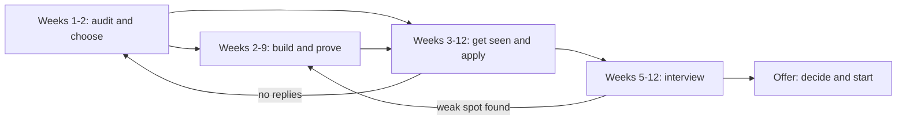

# Module 7 — Hero: capstone and practice

*This module pulls the whole course into one plan you can actually run. You have chosen a target role, mapped your gaps against what employers check, built proof, written a CV, practised interviews and learned how offers and first jobs work. On their own, these are separate lessons. Put together in the right order, with a weekly rhythm and honest tracking, they become a job search. The capstone turns everything into a 12-week job-readiness plan, from a skills audit in week one to an offer decision at the end, and shows how to adjust it when the evidence says something is not working. You will follow the Najm Tech Graduate Programme cohort as Khalid asks each of them to write their plan before the application window opens: Omar, who has been "preparing" for months without applying, Reem, who has applied everywhere with one CV, Huda, Yousef and Mohammed, each with a different constraint. The module ends with a 40-question practice interview pack that covers every module.*

> **Steps:** Apply, Interview — turning everything you have learned into one plan you run week by week, and rehearsing the decisions that get you hired.

---

# 7.1 — Capstone: your 12-week job-readiness plan, from audit to offer
*Level: 🔴 Advanced* · *Prerequisites: 0.2, 3.1, 4.1, 5.1, 6.1* · *Step: Build, Apply*

## ⚡ In 60 seconds
- A job search is a project: **audit, build and prove, apply, interview, decide**, with overlapping phases and a weekly review.
- The rule that matters most: **start applying before you feel ready**. Proof, applications and interview practice improve each other, so they run in parallel from around week 4 or 5.
- Track a small pipeline (applications, replies, screens, technical rounds, finals, offers). Where people drop out of your pipeline tells you what to fix next.
- Decision cue: at weeks 4, 8 and 12, compare the evidence with the plan and change one thing on purpose: the target, the CV, the project or the interview practice.
- Biggest trap: preparing forever because applying feels risky. Preparation without applications produces no feedback.

## 🧭 Why it matters
Khalid meets the cohort twelve weeks before the Najm Tech Graduate Programme's application window closes. He asks each of them: "What did you do last week to get hired, and how do you know it worked?"

Omar has solved a long list of algorithm problems and finished two online courses, but has not applied anywhere: "I'm not ready for system design yet." Reem has sent one CV to dozens of postings and heard back from almost none; with no record, she cannot say why. Huda keeps polishing notebook projects while every posting she reads asks for SQL and pipelines. Yousef works full time and has about eight hours a week. Mohammed has a strong portfolio but keeps meeting postings that ask for a degree in the field.

None of them lacks effort. They lack a plan that turns effort into evidence, and evidence into decisions. Khalid's rule: "By Thursday, send me a one-page 12-week plan. Every week has a deliverable someone else could check, and every fourth week has a decision." This lesson is how they write it, and the artefact you leave with is your own plan.

## 📐 How it works

### 🟢 The essentials

**The five phases.** Every earlier module becomes a phase. They overlap on purpose: you keep building while you apply, and you keep practising interviews while you wait for replies.

| Phase | Weeks | Deliverable someone could check | Lessons |
|---|---|---|---|
| **1. Audit and choose** | 1–2 | Target role and one fallback; skills audit; gap list; study path table | 0.2, 1.1–1.3, your path in 2.1–2.4 |
| **2. Build and prove** | 2–9 | One capstone project for that role, runnable or deployed, with a README a stranger can follow | 3.1, 3.2, 3.3 |
| **3. Get seen** | 3–12 | Master CV and tailored versions; target list; tailored applications every week | 4.1, 4.2, 4.3 |
| **4. Interview** | 5–12 | Story bank of 8–10 stories; mock-interview notes; a list of recurring weak spots | 5.1–5.3, 7.2 |
| **5. Decide and start** | Offers | Offer comparison; a 30-60-90 plan | 6.1, 6.2, 6.3 |

Phase 3 starts before the project is finished because conversations take time to pay off; phase 4 starts in week 5 because interviews can arrive early.



The backward arrows are the point: interviews reveal gaps that go back into the build, and silence usually sends you back to the audit.

**A weekly rhythm you can keep.** A plan must survive an ordinary week. Decide your real hours first, then split them. A reasonable starting split: about half on building and learning, about a quarter on applying and networking (tailoring, applications, a message or a referral request), about a quarter on interview practice (one mock, a few problems in your targets' format, stories rehearsed aloud), and 30 minutes on a weekly review. If you have only eight hours a week, as Yousef does, keep the proportions and shrink the scope: one project, a shorter target list, a mock every other week.

**The tracker.** Keep one table, in a spreadsheet or a notes file, with one row per application:

| Employer | Role | Source | Tailored? | Referral? | Stage | Next action and date |
|---|---|---|---|---|---|---|
| Sadeem Pay | Junior backend engineer | Hackathon teammate | Yes | Yes | Applied, week 5 | Follow up after one week if no reply |

After a few weeks, the **source** and **referral** columns show which channels produce replies for you, which beats any general advice.

### 🟡 Going deeper

**Read your funnel, not your mood.** Job-search feedback is weak, delayed and noisy, and rejection feels personal. The tracker turns it into a diagnosis. Look at where applications stop moving:

| Where it stops | Most likely cause | What to change first | Lesson |
|---|---|---|---|
| Few or no replies | Targeting too far from your proof, an untailored CV, cold channels only | Narrow the target, tailor to each posting, add referrals | 4.1–4.3 |
| Screens, but no technical rounds | An unclear "who I am and why this role"; logistics such as availability or work authorisation | Rewrite your two-minute introduction; prepare clear logistics answers | 5.1 |
| Technical rounds, but no finals | A real skill gap or an unfamiliar format (live coding, take-home, reviewing AI-written code) | Practise the exact format; return to the gap list | 5.2, 5.3 |
| Finals, but no offers | Behavioural answers, or how you explain decisions and mistakes | Strengthen stories with results and lessons; mock with someone senior | 5.1 |

Do not hunt for a "normal" reply rate; rates vary by market, role and season. Compare yourself with your own previous weeks.

**Adapt the plan to your constraint.** Each cohort member has one constraint that shapes the plan more than anything else.

| Person | Constraint | How the plan changes |
|---|---|---|
| **Omar** | Over-prepares; has never deployed | Applies from week 3; his capstone must be deployed and monitored, because that is his gap, not algorithms |
| **Reem** | Cannot always explain her AI-built code | Fewer, tailored applications; every README gets a "what I verified" section; weekly, she explains one of her files aloud |
| **Huda** | Weak SQL and production | Retargets to data engineering; weeks 2–6 go to SQL and one pipeline |
| **Yousef** | Eight hours a week | One infrastructure-as-code project, a short target list; a cloud certification only if his postings ask for one |
| **Mohammed** | No degree in the field | Targets employers that state skills-based criteria; leans on referrals; reads each programme's eligibility rules first |

**Pick the capstone from your role path.** Choose a project that proves the target job (lesson 3.1 has a spec per role) and learn what it needs from the library:
- Software: ship and verify with [*System Design for Vibe Coders*, lesson F.5 — Your first live page — with proof](../vibe/index.en.html#lF-5), then add [*System Design for Vibe Coders*, lesson 4.4 — Rollback, staging, and release gates](../vibe/index.en.html#l4-4).
- AI applications: [*System Design for Vibe Coders*, lesson 8.2 — Tests as the spec the agent can't ignore](../vibe/index.en.html#l8-2) and [*AI Product Management*, lesson 6.1 — Quality you can measure: metrics, golden sets and error analysis](../aipm/index.html#/6.1).
- Data: [*Data Engineering & Analytics*, Module 1](../data/index.html#/1.1) for SQL and modelling, then a pipeline from [*Data Engineering & Analytics*, Module 2](../data/index.html#/2.1).
- Cloud and platform: infrastructure as code from [*Cloud & DevOps*, Module 3](../cloud/index.html#/3.1), shipped through a pipeline from [*Cloud & DevOps*, Module 4](../cloud/index.html#/4.1).
- Security: add [*Secure AI & Application Security*, lesson 1.1 — Threat modelling: data flows, trust boundaries and STRIDE](../secai/index.html#/1.1) to whichever project you build.

Take a self-assessment, such as [the *System Design for Vibe Coders* self-assessment](../vibe/assessment.html), in weeks 1 and 8.

**Integrity is part of the plan.** Under deadline pressure, shortcuts tempt: a tutorial project presented as original, an AI-written take-home you cannot explain, a stretched title. They collapse when you must explain and extend your work. Disclose AI assistance where asked, and be able to explain and verify every line you submit.

### 🔴 Expert view

**Treat the plan as experiments.** Each four-week block tests a written hypothesis, such as "With this target, CV and project, I will get technical interviews." At the checkpoint, decide with the evidence:

| Checkpoint | Question | If yes | If no |
|---|---|---|---|
| **Week 4** | Is the project on track, and is the tailored CV producing replies or conversations? | Keep the target | Change one thing: the target, the CV's top section, or the channel (add referrals) |
| **Week 8** | Are you reaching technical rounds, with the project live? | Shift hours toward interview practice | Return to the funnel table; consider your fallback role |
| **Week 12** | Do you have offers, finals or a full pipeline? | Decide and start (6.1, 6.2) | Write the next 12-week plan from what you learned |

Changing one variable at a time is the only way a small, noisy sample can tell you anything.

**The evidence pack.** By week 9, you should be able to send one link that shows what a hiring manager checks for in your role: the project, its README with your decisions and what you verified, your CV, and a short note on how you used AI tools. Khalid calls it "the page I read before the interview".

**Week 12 is a checkpoint, not a deadline.** Hiring timelines are outside your control, and early-career hiring has been reported as weaker in AI-exposed occupations (Brynjolfsson, Chandar and Chen, 2025); a long search is not a verdict on you. Many graduate programmes recruit on an annual cycle, and large employers can move slower than startups; check each employer's dates. Continue past week 12 at a sustainable level: a few tailored applications a week, one mock, one project improvement.

**Look after the runway.** Before week one, write down how many weeks you can afford to search, any visa or sponsorship constraints (check the current rules), and when your targets recruit. These facts decide whether you take a bridge role, such as a contract, an internship or a job in your fallback track, while you keep going.

## 🧰 The toolkit
| Resource, tool or template | What it is and does | When to reach for it |
|---|---|---|
| **12-week job-readiness plan** | One page: target and fallback, weekly deliverables, checkpoints at weeks 4, 8 and 12 | Week 1, then revised at each checkpoint |
| **Skills audit** | Your skills scored against real postings, with evidence for each score | Weeks 1–2, and again at week 8 |
| **Study path table** | Skills your role needs, the lessons that build them, the proof that shows them (Module 2) | Choosing what to learn in phase 2 |
| **Application log** | Your tracker: one row per application, with source, tailoring, referral, stage and next action | Every application and every weekly review |
| **Story bank** | 8–10 true STAR stories (Situation, Task, Action, Result), as in lesson 5.1 | From week 5, before the first screen |
| **Brag document** | A running list of what you built, fixed and learned, with links | Weekly; it feeds the CV and your stories |
| **Mock interview with a peer** | A practice round with a peer, mentor or career centre, in your targets' format and scored with a rubric | Weekly from week 5 |
| **Weekly review** | 30 minutes: update the tracker, note one lesson, set three priorities | Same time every week |

## 🏛️ In practice at Najm Bank
Huda's plan, as she sent it to Khalid. Her audit showed that nearly every posting she wanted asked for SQL and pipelines, so she retargeted to data engineering, keeping data science as her fallback.

**Huda's 12-week job-readiness plan (16 hours a week)**

| Week | Deliverable (checkable) | Lessons |
|---|---|---|
| 1 | Target: junior data engineer at Gulf banks and fintechs; fallback: data scientist. Skills audit from 15 postings | 0.2, 2.3 |
| 2 | Study path table; one-page spec for a transactions pipeline on public data | 2.3, 3.1 |
| 3 | SQL exercises written up; data model for the project; master CV | [*Data Engineering & Analytics*, Module 1](../data/index.html#/1.1), 4.1 |
| 4 | **Checkpoint.** Pipeline runs end to end on a schedule; target list; first 3 tailored applications | 4.3 |
| 5 | Data-quality checks that fail loudly; story bank v1; first referral request | [*Data Engineering & Analytics*, Module 3 — data quality](../data/index.html#/3.2), 4.2, 5.1 |
| 6 | README with diagram and decisions; LinkedIn updated; 4 applications | 3.2, 4.2 |
| 7 | Two SQL mocks and one data-modelling mock with peers; 4 applications | 5.2, 5.3 |
| 8 | **Checkpoint.** Funnel review; audit re-scored | 7.1 |
| 9 | Evidence pack: one link with project, README, CV and an AI-use note | 3.2 |
| 10–11 | Practice pack from 7.2; rehearse the two weakest stories; follow-ups | 5.1, 7.2 |
| 12 | **Checkpoint.** Offer comparison, or the next 12-week plan | 6.1 |

**Her weekly review template** (one note, five lines):

```text
Week: 6        Hours planned / actual: 16 / 13
Shipped: README with diagram; 4 tailored applications
Funnel this week: 4 applied, 1 reply (Sadeem Pay recruiter), 0 screens done yet
One thing I learned: postings from banks mention data governance; add a section on it to my README
Next week's top three: SQL mock x2; data-modelling mock; book Sadeem Pay screen
```

At week 8, her tracker showed that applications after a referral or conversation got replies, and cold ones mostly did not. She kept her target and moved hours from cold applications to conversations: one variable, changed on evidence.

## 🛠️ Exercises
- 🟢 Write your target-role statement (role, sector, location, one fallback) and a skills audit from at least ten real postings, scoring each skill with evidence. *Done when:* every skill in the table has a score and an evidence note, and a peer can name your top three gaps without asking you.
- 🟡 Write your one-page 12-week plan on Huda's model: a checkable deliverable every week, a real hours budget, and three checkpoints as "if yes / if no" decisions. Set up your tracker. *Done when:* a peer can check every deliverable by a file, link or tracker row, and the tracker has its first five rows.
- 🔴 Run your plan for four weeks, then write the week-4 checkpoint: hypothesis, funnel evidence, the one variable you will change and why. Ask a mentor or career adviser to review it. *Done when:* you have four weekly reviews, an updated tracker and a dated checkpoint note naming exactly one change and its evidence.

## ⚠️ Mistakes and traps
- **Preparing forever.** "One more course" produces no feedback. Start applying by week 3 to 5 and let interviews show what to learn next.
- **Spraying one CV everywhere.** Untailored volume with no tracker teaches nothing. Send fewer, tailored applications and record results.
- **Changing everything at once.** Then the next result cannot be interpreted. Change one variable per checkpoint.
- **A plan that ignores your real week.** A 40-hour plan for someone with 8 free hours fails by week two. Budget real hours, then cut scope.
- **Treating week 12 as a deadline.** It is a checkpoint; continue at a sustainable rhythm or take a sensible bridge role.
- **Integrity shortcuts under pressure.** Copied projects, inflated titles and AI-written work you cannot explain collapse in interviews. Build the honest version.

## 🧾 Recap
- A job search is a project with overlapping phases: audit, build and prove, get seen, interview, decide. Start applying early.
- A weekly rhythm with a real hours budget, a tracker and a 30-minute review keeps the plan alive.
- Read your funnel to diagnose: no replies points to targeting and CV; stalled technical rounds point to skills and format; stalled finals point to stories and fit.
- Checkpoints at weeks 4, 8 and 12 change one variable at a time, based on evidence.
- Week 12 is a checkpoint, not a verdict. Plan your runway, keep your integrity, and keep going.

## ✍️ Check yourself

**1. Omar has spent ten weeks on algorithm practice and two online courses, and has not applied anywhere because he does not feel ready. What is the best next step for his plan?**

- A. Finish a third online course first, so that he feels fully prepared when system-design questions come up
- B. Start tailored applications now while building a deployed project, and review the results weekly
- C. Send his current, untailored CV to as many postings as possible this week to maximise his chances
- D. Wait for next year's graduate-programme cycle so that he has more time to prepare properly

<details><summary>Answer</summary>

**B.** Applying produces feedback that preparation cannot, and his real gap is deployment, not algorithms. C swaps one trap for untailored volume; A and D keep him preparing forever. (🟢 The essentials.)

</details>

**2. A month later, Reem's tracker shows many applications, a few recruiter screens, and no technical rounds after any of them. According to the funnel table, what should she look at first?**

- A. Her algorithm practice, because technical skill is usually what blocks graduates at this stage
- B. Her GitHub profile picture and LinkedIn banner, so that recruiters form a better first impression
- C. Her portfolio project's deployment, so that the screener can click a live link during the call
- D. Her introduction and why-this-role story, plus clear answers on availability and work authorisation

<details><summary>Answer</summary>

**D.** Screens that go nowhere point to how she presents herself and to logistics. A would fit failing technical rounds, which she is not reaching. (🟡 Going deeper.)

</details>

**3. At his week-4 checkpoint, Yousef has had no replies to twelve cold applications. He wants to change his target role, rewrite his whole CV, start a new project and switch to different job boards, all this week. What should Khalid advise?**

- A. Change one variable, such as the CV's top section or adding referrals, and hold the rest steady
- B. Make all four changes this week, because twelve silent applications show the plan has clearly failed
- C. Change nothing at all, because four weeks is far too early to judge anything about a search
- D. Stop applying until the new project is finished, so that every later application is stronger

<details><summary>Answer</summary>

**A.** With a small, noisy sample, only one change at a time can be learned from. B makes the next results unreadable; C ignores evidence; D is the preparing-forever trap. (🔴 Expert view.)

</details>

**4. Yousef has about eight hours a week alongside a full-time job. Which plan is most realistic?**

- A. The same plan as a full-time searcher, squeezed into his evenings and weekends until it is done
- B. Postponing the whole search until he can afford to leave his job and search full time
- C. The same proportions, smaller scope: one project, a short target list, a mock every other week
- D. Interview practice only, because his current job already proves the skills employers want

<details><summary>Answer</summary>

**C.** Budget real hours, then cut scope while keeping the balance. A fails by week two; B and D drop phases the plan needs. (🟢 The essentials.)

</details>

**5. It is week 12. Mohammed has two final-round interviews in progress but no offer yet. What does the lesson recommend?**

- A. Treat the plan as failed and start again with a new target role, since twelve weeks produced no offer
- B. Treat week 12 as a checkpoint: plan the next 12 weeks and keep a steady rhythm while the finals run
- C. Stop all other job-search activity and simply wait until both final-round employers reply
- D. Accept the first bridge role that appears, whatever it is, so that the search can finally end

<details><summary>Answer</summary>

**B.** Timelines are outside his control, and two finals show the plan is working. A misreads the evidence; C leaves him with nothing if both say no; D ignores his runway planning. (🔴 Expert view.)

</details>

## 📚 References
- Brynjolfsson, E., Chandar, B. and Chen, R., "Canaries in the Coal Mine? Six Facts about the Recent Employment Effects of Artificial Intelligence", Stanford Digital Economy Lab, August 2025 — https://digitaleconomy.stanford.edu/
- GitHub Docs, About READMEs — https://docs.github.com/en/repositories/managing-your-repositorys-settings-and-features/customizing-your-repository/about-readmes
- [*System Design for Vibe Coders* self-assessment](../vibe/assessment.html)
- [*Secure AI & Application Security*, lesson 12.2 — The security career: roles, certifications and portfolio](../secai/index.html#/12.2)
- [*AI Product Management*, lesson 10.2 — The AI PM career: interviews, portfolio and growth](../aipm/index.html#/10.2)
