<!-- Generated by scripts/build-cloud.mjs from cloud/README.ar.md and cloud/modules/*.ar.md. Do not edit by hand. -->
<!-- cloud-source: 76af55d829550264 -->

<div dir="rtl">

# السحابة وDevOps من الصفر إلى الاحتراف — الدورة كاملة

*8 وحدات · 24 درسًا · 132 أداة وممارسة وخدمة · من الصفر إلى الاحتراف*

**أطلِق الخدمة (ship it)، وشغّلها (run it)، وحافظ على سلامتها (keep it healthy). دورة مجانية ثنائية اللغة (bilingual course) تأخذك من الصفر إلى مهندس واثق في السحابة (cloud engineer) أو المنصات (platform engineer) أو DevOps أو موثوقية المواقع (site-reliability engineer).**

## ما هذه الدورة (What this is)

كتابة الشيفرة (code) ليست إلا البداية. لا بد أن يتولى أحدٌ بناءها (build) واختبارها (test) وتحزيمها (package). ثم عليه أن ينشرها بأمان (deploy safely)، ويراقبها (watch)، ويوسّعها (scale)، ويتحمّل تكلفتها (pay for it)، وأن يستيقظ حين تتعطل (breaks). وهذا الشخص يحتاج على نحو متزايد إلى معرفة Linux، والشبكات (networks)، والحاويات (containers)، وKubernetes، والبنية التحتية بوصفها شيفرة (infrastructure as code)، وخطوط التسليم (pipelines)، وقابلية المراقبة (observability)، والتكلفة (cost)، وكذلك كيفية تشغيل نماذج الذكاء الاصطناعي (AI models) في بيئة الإنتاج (production).

تُعلّم هذه الدورة ذلك العمل بأسلوب محايد تجاه مزوّدي السحابة (cloud-neutral) وتطبيقي عملي (hands-on):
- أساسيات Linux والشبكات (networking) والسحابة (cloud fundamentals)، والهوية في السحابة (identity in the cloud).
- الحاويات (containers) وKubernetes.
- البنية التحتية بوصفها شيفرة (infrastructure as code) وGitOps.
- التكامل المستمر (continuous integration) والإطلاقات الآمنة (safe releases).
- القياس عن بُعد (telemetry)، وأهداف مستوى الخدمة (SLOs)، ومناوبة (on-call) يستطيع الناس تحمّلها، والحوادث بلا لوم (blameless incidents).
- التوسّع (scaling) والتعافي من الكوارث (disaster recovery)، وتكلفة السحابة (cloud cost) أو FinOps.
- تشغيل أحمال الذكاء الاصطناعي (AI workloads) على وحدات معالجة الرسومات (GPUs) وخلف بوابات النماذج اللغوية (LLM gateways).

كل تمرين (exercise) يعمل محليًا (locally) أو على الفئة المجانية (free tier). وهي مكتوبة لخرّيجي هندسة الحاسوب (computer engineering) وعلوم الحاسوب (computer science) والبيانات (data)، وللمطوّرين (developers) الذين يريدون امتلاك ما يُطلقونه (own what they ship)، وللفِرق التي تنقل الأنظمة إلى السحابة (moving systems to the cloud) في البنوك والجهات الحكومية (government bodies) والمؤسسات (enterprises).

## كيف يعمل كل درس (How every lesson works)

لكل درس الأجزاء العشرة نفسها (ten parts)، فتعرف دائمًا أين أنت:

| الجزء (Part) | ما تحصل عليه (What you get) |
|---|---|
| ⚡ **الدرس في دقيقة (In 60 seconds)** | الدرس في خمس نقاط (five bullets): ما هو، والقاعدة الأهم (the rule that matters most)، وإشارة القرار (decision cue)، والفخ الأكبر (biggest trap). |
| 🧭 **لماذا يهم (Why it matters)** | موقف في بنك نجم (Najm Bank)، أو انقطاع عام موثّق جيدًا (well-documented public outage)، يجعل الموضوع أمرًا لا مفرّ منه. |
| 📐 **كيف يعمل (How it works)** | الأفكار متدرّجة كسُلّم (climbing a ladder): 🟢 *الأساسيات (The essentials)* ← 🟡 *التعمق أكثر (Going deeper)* ← 🔴 *نظرة الخبير (Expert view)*، مع الإعدادات الخطرة (risky configurations) والمُحصّنة (hardened configurations) جنبًا إلى جنب. |
| 🧰 **الأدوات (The toolkit)** | الأدوات (tools) والممارسات (practices) والخدمات (services) ذات الصلة: ما يفعله كلٌّ منها ومتى تلجأ إليه (when to reach for it). |
| 🏛️ **عمليًا في بنك نجم (In practice at Najm Bank)** | الأثر البرمجي (artefact) الذي ينتجه الدرس: ملف Dockerfile مُحصّن (hardened)، أو ملف بيان (manifest)، أو خط تسليم (pipeline)، أو قائمة تحقق للإطلاق (release checklist)، أو هدف مستوى الخدمة (SLO)، أو دليل تشغيل (runbook)، أو مراجعة ما بعد الحادثة (postmortem)، أو تقرير تكلفة (cost report). |
| 🛠️ **التمارين (Exercises)** | ثلاثة تمارين متدرّجة (graded exercises) (🟢 🟡 🔴)، لكلٍّ منها معايير «يكتمل عندما (done when)». |
| ⚠️ **أخطاء وفخاخ (Mistakes and traps)** | ما يسوء في الممارسة الفعلية (in practice)، وما ينبغي فعله بدلًا منه (instead). |
| 🧾 **الخلاصة (Recap)** | الدروس المستفادة (takeaways) الجديرة بالتذكّر. |
| ✍️ **اختبر نفسك (Check yourself)** | خمسة أسئلة، معظمها سيناريوهات (scenarios)، مع إجابات مخفية (hidden answers) وشروح (explanations). |
| 📚 **المراجع (References)** | التوثيق الرسمي (official documentation)، وكتب SRE، وأبحاث DORA، ومراجعات ما بعد الحوادث العامة (public postmortems). |

كل درس موسوم بـ**مرحلة التسليم (delivery phase)** الخاصة به: Plan أو Code أو Build أو Test أو Release أو Deploy أو Operate أو Monitor. ويجمع [فهرس الأدوات (toolkit catalogue)](#appendix-the-repo-catalog) كل أداة (tool) وممارسة (practice) في مكان واحد.

## الحالة المستمرة: فريق المنصات في بنك نجم (The running case: Najm Bank's platform team)

تتابع الدورة فريق **هندسة المنصات وهندسة موثوقية المواقع (Platform Engineering & SRE)** في **بنك نجم (Najm Bank)**، وهو البنك الخليجي الخيالي (fictional Gulf bank) المستخدم في هذه المكتبة كلها. ينقل الفريق واجهة برمجة تطبيق نجم للهاتف (Najm Mobile API) وخدمة المدفوعات (payments service) إلى سحابة مُدارة (managed cloud)، ويبني منصة المطوّرين الداخلية (internal developer platform)، ويشغّل بوابة النماذج اللغوية (LLM gateway) نجم أسيست (Najm Assist). **سالم**، رئيس هندسة المنصات (Head of Platform Engineering)، هو مرشدك (mentor). و**يوسف**، مهندس منصات (platform engineer) حديث التخرّج (new graduate)، يتعلّم إلى جانبك.

## الطريق من الصفر إلى الاحتراف (The path from zero to hero)

| المرحلة (Stage) | الوحدات (Modules) | ستكون قادرًا على… (You will be able to…) |
|---|---|---|
| 🟢 **الأسس (Foundations)** | 0–1 | شرح الطريق إلى بيئة الإنتاج (path to production)، والعمل بثقة في Linux والشبكات (networks)، والتفكير المنهجي في الخدمات السحابية (cloud services) والهوية (identity). |
| 🟡 **الممارس (Practitioner)** | 2–5 | تحويل الخدمات إلى حاويات (containerise) وتشغيلها على Kubernetes، وإدارة البنية التحتية بوصفها شيفرة (infrastructure as code)، وبناء خطوط التسليم (pipelines) والإطلاقات الآمنة (safe releases)، وتحديد أهداف مستوى الخدمة (SLOs) والتنبيهات (alerts) وممارسات الحوادث (incident practice). |
| 🔴 **المحترف (Hero)** | 6–7 | توسيع الأنظمة (scale) واستعادتها (recover)، وضبط تكلفة السحابة (cloud cost)، وتشغيل أحمال الذكاء الاصطناعي (AI workloads)، ونقل خدمة من مستودع فارغ (empty repo) إلى بيئة الإنتاج (production)، واجتياز امتحان تدريبي (practice exam) من 60 سؤالًا. |

## الدورات المرافقة (Companion courses)

حين يتناول درسٌ الأمن (security)، أو النشر لغير المبرمجين (deploys for non-coders)، أو تشغيل SaaS (SaaS operations)، أو منصات البيانات (data platforms)، أو تشغيل الوكلاء (agent operations)، فإنه يحيل إلى الدورة المرافقة (companion course) بدلًا من تكرارها: *Secure AI & Application Security*، و*System Design for Vibe Coders*، و*SaaS Building Blocks*، و*Running AI Agents in Production*، و*Data Engineering & Analytics*، و*From Graduate to Hired*.

## لغتان (Two languages)

كل درس متاح بالإنجليزية والعربية. وفي النسخة العربية (Arabic edition) تحمل المصطلحات التقنية (technical terms) اسمها الإنجليزي بين قوسين، مثل «البنية التحتية بوصفها شيفرة (infrastructure as code)»، لأن الأدوات (tools) والتوثيق (documentation) وإعلانات الوظائف (job ads) التي ستتعامل معها مكتوبة بالإنجليزية.

## إلى أين بعد ذلك (Where to go next)

افتح خريطة الدورة (course map)، أو ابدأ بالدرس 0.1.

<a id="contents"></a>

## المحتويات

- **[الوحدة 0 — التوجيه (Orientation)](#m0)**
  - [0.1 — ما هي السحابة (cloud) وDevOps وهندسة المنصات (platform engineering) وهندسة موثوقية المواقع (SRE)](#l0-1) · 🟢 مبتدئ
  - [0.2 — المسار إلى الإنتاج (The path to production): من الإيداع (commit) إلى العميل (customer)، وكل ما قد ينكسر في الطريق (everything that can break on the way)](#l0-2) · 🟢 مبتدئ
  - [0.3 — تعرّف على فريق المنصة في بنك نجم (Meet Najm Bank's platform team)، وكيف تستخدم هذه الدورة (how to use this course)](#l0-3) · 🟢 مبتدئ
- **[الوحدة 1 — الأسس (Foundations)](#m1)**
  - [1.1 — لينكس وسطر الأوامر وأساسيات الشبكات (Linux, the shell and networking essentials): العمليات والملفات والمنافذ وDNS وHTTP وTLS (processes, files, ports, DNS, HTTP and TLS)](#l1-1) · 🟢 مبتدئ
  - [1.2 — أساسيات السحابة (Cloud fundamentals): المناطق ومناطق التوافر والحوسبة والتخزين والخدمات المُدارة والمسؤولية المشتركة (regions, zones, compute, storage, managed services and shared responsibility)](#l1-2) · 🟢 مبتدئ
  - [1.3 — الهوية والوصول في السحابة (Identity and access in the cloud): المستخدمون والأدوار والسياسات وهوية أحمال العمل (users, roles, policies and workload identity)](#l1-3) · 🟢 مبتدئ
- **[الوحدة 2 — الحاويات (Containers) و Kubernetes](#m2)**
  - [2.1 — الحاويات على الوجه الصحيح (Containers done right): الصور (images) والطبقات (layers) وملفات Dockerfile والسجلات (registries)](#l2-1) · 🟡 متوسط
  - [2.2 — أساسيات Kubernetes (Kubernetes fundamentals): الحجيرات (pods) وعمليات النشر (deployments) والخدمات (services) وطريقة تفكير العنقود (how the cluster thinks)](#l2-2) · 🟡 متوسط
  - [2.3 — Kubernetes عمليًا (Kubernetes in practice): الإعدادات (config) والأسرار (secrets) ومجسّات الصحة (health probes) والتوسّع التلقائي (autoscaling) و Helm](#l2-3) · 🟡 متوسط
- **[الوحدة 3 — البنية التحتية بوصفها شيفرة (Infrastructure as code)](#m3)**
  - [3.1 — البنية التحتية بوصفها شيفرة باستخدام Terraform/OpenTofu: الحالة والوحدات والخطط (state, modules and plans)](#l3-1) · 🟡 متوسط
  - [3.2 — البيئات وGitOps: ترقية التغييرات من بيئة التطوير إلى الإنتاج (promoting changes from dev to production)](#l3-2) · 🟡 متوسط
  - [3.3 — السياسة بوصفها شيفرة والانحراف والحواجز الواقية (Policy as code, drift and guardrails)](#l3-3) · 🟡 متوسط
- **[الوحدة 4 — التكامل والتسليم المستمران (CI/CD) والإطلاقات الآمنة (safe releases)](#m4)**
  - [4.1 — التكامل المستمر (continuous integration): خطوط التسليم والاختبارات والآثار البرمجية والتغذية الراجعة السريعة](#l4-1) · 🟡 متوسط
  - [4.2 — استراتيجيات الإطلاق (release strategies): المتدرّج والأزرق والأخضر والكناري وأعلام الميزات والتراجع](#l4-2) · 🟡 متوسط
  - [4.3 — تأمين خط التسليم (securing the pipeline): الأسرار والآثار البرمجية الموقّعة وعمليات النشر بأقل الصلاحيات](#l4-3) · 🟡 متوسط
- **[الوحدة 5 — قابلية المراقبة والموثوقية (Observability and reliability)](#m5)**
  - [5.1 — القياس عن بُعد: السجلات والمقاييس والتتبّعات وOpenTelemetry (Telemetry: logs, metrics, traces and OpenTelemetry)](#l5-1) · 🟡 متوسط
  - [5.2 — أهداف مستوى الخدمة وميزانيات الأخطاء والتنبيه ومناوبةٌ يستطيع الناس تحمّلها (SLOs, error budgets, alerting and on-call that people can sustain)](#l5-2) · 🟡 متوسط
  - [5.3 — الحوادث ومراجعات ما بعد الحادثة الخالية من اللوم (Incidents and blameless postmortems)](#l5-3) · 🟡 متوسط
- **[الوحدة 6 — التوسّع والتكلفة والبنية التحتية للذكاء الاصطناعي (Scale, cost and AI infrastructure)](#m6)**
  - [6.1 — التوسّع والمرونة: التوسّع التلقائي وتعدّد المناطق والنسخ الاحتياطية والتعافي من الكوارث (Scaling and resilience: autoscaling, multi-zone, backups and disaster recovery)](#l6-1) · 🔴 متقدم
  - [6.2 — FinOps: فهم تكلفة السحابة وتوزيعها وخفضها (FinOps: understanding, allocating and cutting cloud cost)](#l6-2) · 🔴 متقدم
  - [6.3 — تشغيل أعباء عمل الذكاء الاصطناعي: وحدات معالجة الرسوميات وتقديم النماذج وبوابات النماذج اللغوية وتكلفتها (Running AI workloads: GPUs, model serving, LLM gateways and their cost)](#l6-3) · 🔴 متقدم
- **[الوحدة 7 — الاحتراف: المشروع الختامي والامتحان التدريبي (Hero: capstone and practice exam)](#m7)**
  - [7.1 — المشروع الختامي: خذ خدمةً جديدة في نجم من مستودعٍ فارغ إلى الإنتاج مع هدف مستوى خدمة (Capstone: take a new Najm service from empty repo to production with an SLO)](#l7-1) · 🔴 متقدم
  - [7.2 — المسار المهني في السحابة: الأدوار والشهادات والمقابلات وملف الأعمال (The cloud career: roles, certifications, interviews and a portfolio)](#l7-2) · 🔴 متقدم
  - [7.3 — الامتحان التدريبي: 60 سؤالًا قائمًا على السيناريوهات (Practice exam: 60 scenario questions)](#l7-3) · 🔴 متقدم
- **[الملحق — دليل الأدوات (Toolkit)](#appendix-the-repo-catalog)**

---

<a id="m0"></a>

# الوحدة 0 — التوجيه (Orientation)

*قبل أن تلمس حاوية (container) أو عنقودًا (cluster)، تحتاج إلى خريطة (map). تمنحك هذه الوحدة ثلاثة أشياء. أولها المفردات (vocabulary): ما المعنى الفعلي لكل من "السحابة (cloud)" و"DevOps" و"هندسة المنصات (platform engineering)" و"هندسة موثوقية المواقع (site reliability engineering)"، وكيف تتداخل، وما الذي يتحمّل كل منها مسؤوليته (responsible for). وثانيها المسار (path) الذي يقطعه كل تغيير من إيداع المطوّر (developer's commit) إلى هاتف العميل (customer's phone)، والمواضع على امتداد هذا المسار التي تنكسر فيها الأمور (things break). فبعض هذه الأعطال كلّف شركات حقيقية مئات الملايين، أو أخرج جزءًا كبيرًا من الإنترنت عن الخدمة (offline) لساعات. وثالثها الأشخاص الذين ستعمل معهم طوال الدورة: فريق هندسة المنصات وهندسة موثوقية المواقع (Platform Engineering & SRE team) في بنك نجم (Najm Bank)، الذين ينقلون واجهة برمجة تطبيق نجم للهاتف (Najm Mobile API) وخدمة المدفوعات (payments service) من مركز بيانات (data centre) إلى سحابة مُدارة (managed cloud)، ويبنون منصة (platform) ستستخدمها فرق التطبيقات (app teams) في البنك كل يوم. ستُنهي الوحدة ومعك مختبر محلي يعمل (working local lab) وخطة واضحة لطريقة الدراسة (how to study).*

> **المراحل (Phases):** Plan، Release، Deploy — خريطة حلقة التسليم الكاملة (whole delivery loop)، والمفردات (vocabulary) اللازمة للحديث عنها.

<a id="l0-1"></a>

## 0.1 — ما هي السحابة (cloud) وDevOps وهندسة المنصات (platform engineering) وهندسة موثوقية المواقع (SRE)

*المستوى: 🟢 مبتدئ* · *المتطلبات: لا يوجد (none)* · *المرحلة (Phase): Plan*

### ⚡ الدرس في دقيقة (In 60 seconds)
- **السحابة (cloud)** طريقة للحصول على الحوسبة (computing): تستأجر الخوادم (servers) والتخزين (storage) والشبكات (networks) والخدمات المُدارة (managed services) عند الطلب (on demand)، عبر واجهة برمجة تطبيقات (API)، وتدفع مقابل ما تستخدمه (pay for what you use). إنها ليست "حاسوب شخص آخر (someone else's computer)" بقدر ما هي *أتمتة (automation)* شخص آخر.
- **DevOps** طريقة عمل (way of working): الأشخاص الذين يبنون البرمجيات (build software) يشاركون أيضًا في شحنها (shipping) وتشغيلها (running)، مدعومين بالأتمتة (automation) والتغذية الراجعة السريعة (fast feedback). إنها ثقافة (culture) ومجموعة ممارسات (set of practices)، وليست مسمّى وظيفيًا (job title) ولا أداة (tool).
- **هندسة المنصات (platform engineering)** تبني *منتجًا داخليًا (internal product)*، هو منصة المطوّرين الداخلية (internal developer platform)، كي تتمكن فرق التطبيقات (app teams) من الشحن بأمان (ship safely) دون أن تصبح خبيرة في كل ما يقع تحتها (everything underneath).
- **هندسة موثوقية المواقع (site reliability engineering, SRE)** تتعامل مع الموثوقية (reliability) بوصفها مسألة هندسية بالأرقام (engineering problem with numbers): أهداف مستوى الخدمة (service level objectives)، وميزانيات الأخطاء (error budgets)، وحدّ أقصى للعمل اليدوي المتكرر (manual, repetitive work).
- إشارة القرار (Decision cue): عندما يقول أحدهم "نحتاج إلى DevOps (we need DevOps)"، اسأله أي مشكلة يقصد: إطلاقات بطيئة (slow releases)، أم إطلاقات غير آمنة (unsafe releases)، أم خدمات غير موثوقة (unreliable services)، أم فرق تغرق في البنية التحتية (teams drowning in infrastructure). فكلٌّ منها يشير إلى علاج مختلف (different fix).
- الفخ الأكبر (Biggest trap): إعادة تسمية فريق العمليات القديم (old operations team) إلى "DevOps"، وشراء أداة (buying a tool)، وتوقّع أن يتغير أي شيء.

### 🧭 لماذا يهم (Why it matters)
ينضم يوسف إلى فريق هندسة المنصات وهندسة موثوقية المواقع (Platform Engineering & SRE team) في بنك نجم مباشرةً بعد شهادته في هندسة الحاسوب (computer-engineering degree). وفي أسبوعه الأول يسمع أربع كلمات تُستخدم كأنها تعني الشيء نفسه. تقول شريحة مدير تقنية المعلومات (CIO's slide) إن البنك "يتجه إلى السحابة (going cloud)". ويطلب فريق تطبيقات (app team) "مهندس DevOps (a DevOps engineer)" لإصلاح خط التسليم (pipeline) لديه. ويتحدث سالم، رئيس هندسة المنصات (Head of Platform Engineering)، عن "المنصة (the platform)" كأنها منتج (product) له عملاء (customers). وترفض مها، قائدة هندسة موثوقية المواقع (SRE lead)، الموافقة على إطلاق (launch) لأن "الخدمة ليس لها هدف مستوى خدمة (the service has no SLO)".

يوم الخميس يُطلب من يوسف أن يمنح فريق واجهة برمجة تطبيق نجم للهاتف (Najm Mobile API) "صلاحية DevOps (DevOps access)" على حساب السحابة الجديد (new cloud account)، فيمنح كل مطوّر صلاحيات مدير كاملة (full administrator rights). لا ينكسر شيء، لكن نورة، رئيسة أمن التطبيقات والذكاء الاصطناعي (Head of Application & AI Security)، تكتشف ذلك في مراجعة الصلاحيات التالية (next access review).

كان السبب الجذري (root cause) هو المفردات (vocabulary). فـ DevOps تعني المسؤولية المشتركة (shared responsibility)، لا صلاحيات المستخدم الخارق المشتركة (shared superuser rights)، وفريق المنصة (platform team) يمنح فرق التطبيقات (app teams) *طريقًا ممهّدًا آمنًا (safe paved road)*، لا مفاتيح كل شيء (keys to everything). يمنحك هذا الدرس الكلمات.

### 📐 كيف يعمل (How it works)

#### 🟢 الأساسيات (The essentials)

**الحوسبة السحابية (Cloud computing).** التعريف الأكثر استشهادًا (most widely cited definition) يأتي من المعهد الوطني الأمريكي للمعايير والتقنية (US National Institute of Standards and Technology)، في الوثيقة NIST SP 800-145 (2011). وهو يسرد خمس خصائص أساسية (five essential characteristics):

| الخاصية (Characteristic) | بكلمات بسيطة (In plain words) | لماذا تغيّر طريقة عملك (Why it changes how you work) |
|---|---|---|
| الخدمة الذاتية عند الطلب (On-demand self-service) | تُنشئ خادمًا (server) أو قاعدة بيانات (database) بنفسك، في دقائق، دون تذكرة (ticket) إلى إنسان | تصبح البنية التحتية (infrastructure) شيئًا يمكن للشيفرة (code) إنشاؤه (الوحدة 3) |
| الوصول الواسع عبر الشبكة (Broad network access) | يُوصَل إلى كل شيء عبر الشبكة (network) من خلال واجهات قياسية (standard interfaces) | لكل خدمة واجهة برمجة تطبيقات (API)، لذا يمكن أتمتة (automated) كل شيء |
| تجميع الموارد (Resource pooling) | يتشارك المزوّد (provider) مجمّعات كبيرة من العتاد (large pools of hardware) بين عملاء كثيرين | لا تختار الجهاز المادي (physical machine)؛ بل تختار منطقة (region) ومنطقة توافر (zone) (1.2) |
| المرونة السريعة (Rapid elasticity) | يمكن للسعة (capacity) أن تكبر وتصغر بسرعة، وأحيانًا تلقائيًا (automatically) | يمكنك التوسّع مع الطلب (scale with demand) بدل الشراء لتغطية الذروة (buying for the peak) (6.1) |
| الخدمة المقيسة (Measured service) | يُقاس الاستخدام (usage is metered) ويُفوتر (billed) | تصبح التكلفة (cost) خاصية هندسية (engineering property) يمكنك رؤيتها وتغييرها (6.2) |

ويصف NIST أيضًا ثلاثة **نماذج خدمة (service models)**. في **IaaS** (البنية التحتية بوصفها خدمة (infrastructure as a service)) تستأجر أجهزة افتراضية (virtual machines) وأقراصًا (disks) وشبكات (networks) وتدير نظام التشغيل (operating system) بنفسك. وفي **PaaS** (المنصة بوصفها خدمة (platform as a service)) تسلّم شيفرتك (code) أو حاويتك (container) فيشغّلها المزوّد (provider). وفي **SaaS** (البرمجيات بوصفها خدمة (software as a service)) تستخدم ببساطة تطبيقًا جاهزًا (finished application)، مثل البريد الإلكتروني (email). ومنذ ذلك الحين أصبح نموذج **الحوسبة بلا خوادم (serverless)** شائعًا: تقدّم دوالًا (functions) أو حاويات (containers)، ويشغّلها المزوّد فقط عند وصول الطلبات (when requests arrive)، وتدفع مقابل الاستخدام (pay per use). ويسرد NIST كذلك نماذج النشر (deployment models): السحابة **العامة (public)** (مزوّدون مشتركون مثل AWS وMicrosoft Azure وGoogle Cloud)، والسحابة **الخاصة (private)** (الأتمتة نفسها داخل مركز بياناتك (data centre))، وسحابة **المجتمع (community)** (تتشاركها مجموعة من المؤسسات)، والسحابة **الهجينة (hybrid)** (مزيج، مثل أعباء عمل نجم السحابية (Najm's cloud workloads) المتصلة بنظامها المصرفي الأساسي المحلي (on-premises core banking system)).

**DevOps.** نشأت الكلمة من مؤتمرات "DevOpsDays" التي بدأت عام 2009. لكن الفكرة التي تسمّيها أقدم من ذلك: الجدار (wall) بين "المطوّرين الذين يغيّرون الأشياء (developers who change things)" و"أفراد العمليات الذين يحافظون على استقرار الأشياء (operations people who keep things stable)" يسبب إطلاقات بطيئة ومؤلمة (slow, painful releases)، لأن كل طرف يُقاس على الهدف المعاكس (opposite goal). يزيل DevOps هذا الجدار. فالفرق تملك خدمتها (own their service) من الشيفرة إلى الإنتاج (from code to production). وتؤتمت البناء والاختبار والنشر (build, test and deploy)، وتقيس مدى جودة تسليم النظام بأكمله (how well the whole system delivers).

يأتي الدليل الأكثر استشهادًا (most widely cited evidence) على ما ينجح من برنامج أبحاث **DORA** (DevOps Research and Assessment)، الملخَّص في كتاب *Accelerate* لنيكول فورسغرين (Nicole Forsgren) وجيز هَمبل (Jez Humble) وجين كيم (Gene Kim) (2018). ولا تزال مقاييسه الأربعة الرئيسة (four key metrics) نقطة الانطلاق القياسية (standard starting point):

| المقياس (Metric) | ما الذي يقيسه (What it measures) | النوع (Kind) |
|---|---|---|
| تكرار النشر (Deployment frequency) | كم مرة تشحن إلى الإنتاج (ship to production) | السرعة (Speed) |
| مهلة التغييرات (Lead time for changes) | الوقت من الإيداع (commit) إلى تشغيل ذلك الإيداع في الإنتاج (running in production) | السرعة (Speed) |
| معدل فشل التغييرات (Change failure rate) | نسبة عمليات النشر (deployments) التي تسبب عطلًا (failure) يحتاج إلى إصلاح (fix) أو تراجع (rollback) | الاستقرار (Stability) |
| زمن استعادة الخدمة (Time to restore service) | المدة اللازمة للتعافي (recover) عندما يتعطل الإنتاج (production fails) | الاستقرار (Stability) |

أنفع ما توصّل إليه البحث (most useful finding) أن السرعة والاستقرار (speed and stability) *ليسا* مقايضة (trade-off). فالفرق الأفضل أداءً (best-performing teams) أسرع وأكثر استقرارًا في آنٍ واحد، لأن التغييرات الصغيرة المتكررة المؤتمتة (small, frequent, automated changes) أسهل في الاختبار (easier to test)، وأسهل في الفهم (easier to understand)، وأسهل في التراجع عنها (easier to undo). وقد أضافت تقارير DORA اللاحقة مقياسًا للموثوقية (reliability measure) وحسّنت بعض الأسماء والتعريفات؛ راجع dora.dev لمعرفة المجموعة الحالية (current set) وقت قراءتك هذا.

**هندسة موثوقية المواقع (Site reliability engineering).** بدأت SRE في Google ووُصفت علنًا في كتاب *Site Reliability Engineering* (2016) وكتاب *The Site Reliability Workbook* (2018). أفكارها المحورية (central ideas):
- **مؤشر مستوى الخدمة (service level indicator, SLI)** قياسٌ لما يختبره المستخدمون (what users experience)، مثل "نسبة طلبات واجهة برمجة التطبيقات (API requests) التي تنجح في أقل من 300 ملّي ثانية (milliseconds)".
- **هدف مستوى الخدمة (service level objective, SLO)** هو الهدف (target) لذلك المؤشر عبر نافذة زمنية (window)، مثل "99.9% على مدى 28 يومًا".
- **ميزانية الأخطاء (error budget)** هي ما يتبقى: 100% ناقص هدف مستوى الخدمة (SLO). إن كنت ضمن الميزانية (inside the budget)، فاشحن (ship). وإن استنفدتها (spent it)، فأبطئ (slow down) وأصلح الموثوقية (fix reliability). وهذا يحوّل الجدل بين "اشحن أسرع (ship faster)" و"كن حذرًا (be careful)" إلى رقم متفق عليه مسبقًا (number agreed in advance) (5.2).
- **العمل الرتيب (toil)** هو العمل اليدوي المتكرر (manual, repetitive work) الذي يكبر مع حجم الخدمة (scales with the size of the service) ولا يضيف قيمة دائمة (no lasting value)، مثل إعادة تشغيل مهمة عالقة (stuck job) يدويًا كل ليلة. ويصف كتاب SRE من Google إبقاء العمل التشغيلي (operational work) عند نصف وقت مهندس SRE تقريبًا على الأكثر، كي يذهب الباقي إلى التخلص منه هندسيًا (engineering it away).
- **مراجعات ما بعد الحادثة الخالية من اللوم (blameless postmortems)** تبحث عمّا في النظام (in the system) سمح بوقوع الخطأ (allowed a mistake)، لا عمّن يجب معاقبته (who to punish) (5.3).

**هندسة المنصات (Platform engineering).** تبدو عبارة "أنت تبنيه، وأنت تشغّله (You build it, you run it)" جيدة، لكن مطالبة كل فريق تطبيقات (app team) بإتقان Kubernetes والشبكات (networking) والهوية (identity) وخطوط التسليم (pipelines) وقابلية المراقبة (observability) والتكلفة (cost) عبءٌ معرفي (cognitive load) مفرط. وهندسة المنصات (platform engineering) هي الجواب عن ذلك. فيبني فريق المنصة (platform team) **منصة المطوّرين الداخلية (internal developer platform, IDP)**: مجموعة من أدوات الخدمة الذاتية (self-service tools) والقوالب (templates) والطرق الممهّدة (paved roads) (وتُسمّى غالبًا **المسارات الذهبية (golden paths)**) التي تجعل الطريق الآمن هو الطريق السهل (make the safe way the easy way). ويسمّي كتاب *Team Topologies* لماثيو سكلتون (Matthew Skelton) ومانويل باييس (Manuel Pais) (2019) هذا "فريق منصة (platform team)" يخدم فرق المنتجات "المحاذية للتدفق (stream-aligned)". وقد نشرت مؤسسة CNCF (Cloud Native Computing Foundation) ورقة بيضاء (white paper) تصف ما توفّره المنصات (what platforms provide)؛ راجع cncf.io للاطلاع على النسخة الحالية (current version).

#### 🟡 التعمق أكثر (Going deeper)

**كيف تتكامل الأفكار الأربع (How the four ideas fit together).** إنها ليست متنافسة (not competing)؛ بل تقع في طبقات مختلفة (different layers).

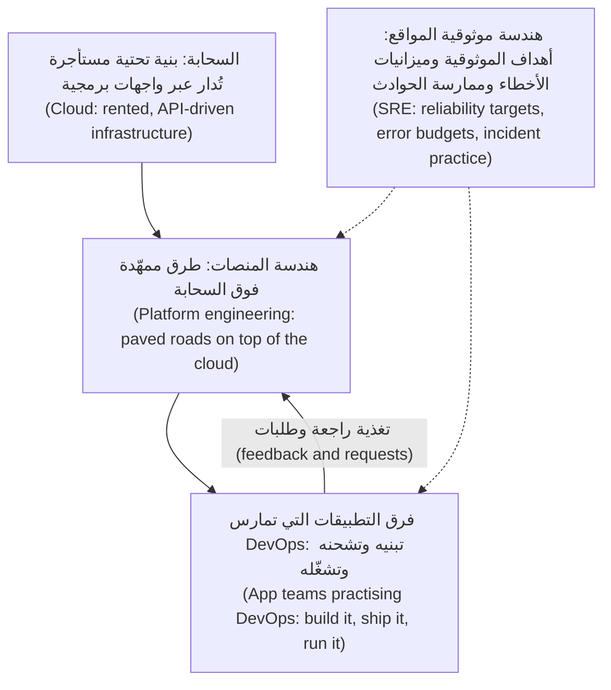

توفّر السحابة (cloud) القدرة الخام (raw capability). ويحوّلها فريق المنصة (platform team) إلى عدد صغير من الخيارات الآمنة المدعومة (safe, supported choices). وتستخدم فرق التطبيقات (app teams) هذه الخيارات لتسلّم كثيرًا (deliver often) وتملك خدماتها (own their services). أما ممارسات SRE فتمتد عبر الاثنين (cut across both): فهي تقرر مدى الموثوقية التي تحتاجها كل خدمة (how reliable each service needs to be)، وتُلزم الجميع بها (hold everyone to it).

**من يفعل ماذا (Who does what).** تختلف المسمّيات (titles) بين الشركات، لذا تعلّم *المسؤوليات (responsibilities)*، لا التسميات (labels):

| الدور (Role) | السؤال الرئيس الذي يجيب عنه (Main question they answer) | العمل المعتاد (Typical work) |
|---|---|---|
| مهندس السحابة (Cloud engineer) | "كيف نستخدم خدمات المزوّد جيدًا وبأمان؟ ⁦(How do we use the provider's services well and safely?)⁩" | الحسابات (accounts)، والشبكات (networks)، والهوية (identity)، والخدمات المُدارة (managed services)، ومناطق الهبوط (landing zones) |
| مهندس DevOps (DevOps engineer) | "كيف تنتقل الشيفرة من الإيداع إلى الإنتاج بسرعة وأمان؟ ⁦(How does code get from a commit to production quickly and safely?)⁩" | خطوط التسليم (pipelines)، وأدوات البناء (build tooling)، وأتمتة الإطلاق (release automation)، والبيئات (environments). وغالبًا مزيج من الصفوف الثلاثة الأخرى |
| مهندس المنصات (Platform engineer) | "ما الذي ينبغي أن يحصل عليه كل فريق مجانًا كي لا يعيد بناءه؟ ⁦(What should every team get for free so they do not rebuild it?)⁩" | القوالب (templates)، ومنصة Kubernetes، وGitOps، وبوابة المطوّرين (developer portal)، والخدمة الذاتية (self-service) |
| مهندس موثوقية المواقع (Site reliability engineer) | "هل الخدمة موثوقة بما يكفي، وكيف نعرف ذلك؟ ⁦(Is the service reliable enough, and how do we know?)⁩" | أهداف مستوى الخدمة (SLOs)، والتنبيه (alerting)، والمناوبة (on-call)، والحوادث (incidents)، والسعة (capacity)، وإزالة العمل الرتيب (removing toil) |

في الشركة الصغيرة (small company) يؤدي شخص واحد الأدوار الأربعة. وفي بنك نجم هم أشخاص منفصلون يجلسون في فريق واحد (one team).

**لماذا يكون "فريق DevOps" غالبًا نمطًا مضادًا (Why "DevOps team" is often an anti-pattern).** إذا أنشأت شركة "فريق DevOps (DevOps team)" يتلقى التذاكر (tickets) من المطوّرين وينشر (deploys) نيابةً عنهم، فقد أعادت بناء الجدار (rebuilt the wall) باسم جديد. والاختبار بسيط (the test is simple): هل يستطيع فريق التطبيقات (app team) شحن تغيير إلى الإنتاج (ship a change to production)، بأمان، دون تقديم تذكرة (filing a ticket) وانتظار شخص (waiting for a person)؟ إن لم يكن كذلك، فلديك تسليم يدوي بين فريقين (handoff)، لا DevOps. ومهمة فريق المنصة (platform team's job) هي إزالة هذا التسليم (remove the handoff)، لا أن يصبح هو التسليم.

**تطبيق العوامل الاثني عشر (The Twelve-Factor App).** منهجية قصيرة (short methodology) نشرها مهندسون في Heroku تصف خدمات تعمل جيدًا على المنصات السحابية (cloud platforms): الإعدادات في البيئة لا في الشيفرة (configuration in the environment, not in code)؛ والعمليات عديمة الحالة (stateless processes)؛ وبدء التشغيل السريع والإيقاف الرشيق (fast startup and graceful shutdown)؛ والبناء والإطلاق والتشغيل بوصفها مراحل منفصلة (build, release and run as separate stages). ستلتقي هذه الأفكار مجددًا في الوحدتين 2 و4.

#### 🔴 نظرة الخبير (Expert view)

**قِس النتائج لا التبنّي (Measure outcomes, not adoption).** عبارة "نقلنا 80 خدمة إلى Kubernetes" نشاطٌ (activity). أما "انخفضت مهلة التغييرات (lead time) من ثلاثة أسابيع إلى يوم واحد، ولم يرتفع معدل فشل التغييرات (change failure rate)" فهي نتيجة (outcome). يرفع سالم إلى مدير تقنية المعلومات (CIO) مقاييس DORA (DORA metrics) ومدى تحقيق أهداف مستوى الخدمة (SLO attainment)، لا أعداد الأدوات (tool counts). والمنصة التي لا يستخدمها أحد طوعًا (voluntarily) قد فشلت: تعامل معها بوصفها منتجًا (product) له مستخدمون (users) وخارطة طريق (roadmap) ومقاييس تبنٍّ (adoption metrics).

**الموثوقية قرار منتج (Reliability is a product decision).** نسبة 100% هي الهدف الخطأ (wrong target) لكل شيء تقريبًا. فكل "تسعة (nine)" إضافية تكلّف أكثر، ولا يستطيع المستخدمون التمييز بين 99.99% و99.999% حين تتعطل شبكة هاتفهم المحمول (mobile network) نفسها أكثر من ذلك. فهدف مستوى الخدمة (SLO) الصحيح يأتي مما يحتاجه المستخدمون (what users need): مرتفع لخدمة المدفوعات (payments service)، وأدنى بكثير لأداة تقارير داخلية (internal reporting tool).

**التنظيم يشكّل المنصة (Regulation shapes the platform).** بالنسبة إلى بنك، ليست السحابة (cloud) مجرد خيار هندسي (engineering choice). فالجهات التنظيمية المالية في دول الخليج (GCC financial regulators)، ومنها مصرف قطر المركزي (Qatar Central Bank)، تنشر توقعاتها بشأن الإسناد الخارجي السحابي (cloud outsourcing) وإقامة البيانات (data residency) والمرونة (resilience). وفي الاتحاد الأوروبي (EU)، يضع قانون المرونة التشغيلية الرقمية (Digital Operational Resilience Act) (DORA، اللائحة (EU) 2022/2554، المطبَّقة اعتبارًا من يناير 2025) قواعد بشأن مخاطر تقنية المعلومات والاتصالات (ICT risk)، والإبلاغ عن الحوادث (incident reporting)، واختبار المرونة (resilience testing)، ومخاطر الأطراف الثالثة (third-party risk) (ومنها السحابة) للكيانات المالية (financial entities). لاحظ تشابه الاسمين (name clash): *DORA* اللائحة الأوروبية و*DORA* برنامج أبحاث DevOps لا علاقة بينهما (unrelated). تبقى هذه الدورة في الجانب الهندسي (engineering)؛ أما القواعد فراجع [*أمن الذكاء الاصطناعي والتطبيقات (Secure AI & Application Security)*، الدرس 11.2 — التنظيم الذي يمسّ الأمن (Regulation that touches security)](../secai/index.ar.html#/11.2).

### 🧰 الأدوات (The toolkit)
| الأداة أو الممارسة أو الخدمة (Tool, practice or service) | ما هي وماذا تفعل (What it is and does) | متى تلجأ إليها (When to reach for it) |
|---|---|---|
| **DORA metrics** — مقاييس DORA | أربعة مقاييس لأداء التسليم (delivery performance): تكرار النشر (deployment frequency)، ومهلة التغييرات (lead time for changes)، ومعدل فشل التغييرات (change failure rate)، وزمن استعادة الخدمة (time to restore service) | تحديد خط أساس (baseline) قبل أي تغيير، والإبلاغ عن التقدم (reporting progress) بالنتائج (outcomes) لا بالأدوات (tools) |
| **Service level objective** — هدف مستوى الخدمة | هدف (target) لقياس يواجه المستخدم (user-facing measurement) عبر نافذة زمنية (time window) | تحديد مدى الموثوقية التي يجب أن تتمتع بها الخدمة (how reliable a service must be)، ومتى تُبطئ الإطلاقات (slow down releases) |
| **Error budget** — ميزانية الأخطاء | مقدار عدم الموثوقية (unreliability) الذي يسمح به هدف مستوى الخدمة (SLO) | حسم سؤال "نشحن أم نثبّت الاستقرار؟ ⁦(ship or stabilise?)⁩" برقم متفق عليه مسبقًا (agreed in advance) |
| **Internal developer platform** — منصة المطوّرين الداخلية | أدوات خدمة ذاتية (self-service tools) وقوالب (templates) وطرق ممهّدة (paved roads) تستخدمها فرق التطبيقات (app teams) لبناء الخدمات وتشغيلها | حين تكرر فرق كثيرة عمل البنية التحتية نفسه (same infrastructure work)، أو يؤديه كل منها بطريقة مختلفة |
| **Backstage** — مفتوح المصدر (open source)، من CNCF | بوابة مطوّرين (developer portal): فهرس البرمجيات (software catalogue) والقوالب (templates) والتوثيق (documentation) في مكان واحد | منح فرق التطبيقات (app teams) بابًا أماميًا واحدًا (one front door) إلى المنصة (platform) |
| **Twelve-Factor App** — تطبيق العوامل الاثني عشر | منهجية قصيرة (short methodology) لبناء خدمات تعمل جيدًا على المنصات السحابية (cloud platforms) | مراجعة ما إذا كانت الخدمة جاهزة للحوسبة في حاويات (ready to be containerised) والتوسّع (scaled) |
| **Well-Architected frameworks** — أطر البنية الجيدة (AWS وAzure وGoogle Cloud) | إرشادات الممارسات الجيدة المنظّمة (structured good-practice guidance) لدى كل مزوّد، مرتّبة في ركائز (pillars) | مراجعة تصميم (design) مقابل قائمة تحقق (checklist) قبل تشغيله فعليًا (goes live) |

### 🏛️ عمليًا في بنك نجم (In practice at Najm Bank)
بعد حادثة "صلاحية DevOps (DevOps access)"، يطلب سالم من يوسف صياغة **خريطة المسؤوليات (responsibility map)** للفريق: صفحة واحدة تبيّن من يملك ماذا (who owns what) مع انتقال الخدمات إلى السحابة (cloud). وتُنشر على بوابة المطوّرين الداخلية (internal developer portal).

**هندسة المنصات وهندسة موثوقية المواقع في نجم (Najm Platform Engineering & SRE) — خريطة المسؤوليات (responsibility map) الإصدار 1 (v1)**

| المجال (Area) | يملكه فريق المنصة (Platform team owns) | تملكه فرق التطبيقات (App teams own) | تملكه هندسة موثوقية المواقع (SRE) (مها) | الأمن (Security) (نورة) |
|---|---|---|---|---|
| حسابات السحابة والشبكات والهوية (Cloud accounts, networks, identity) | منطقة الهبوط (landing zone)، وتخطيط الشبكة (network layout)، والأدوار (roles) لكل فريق | طلب الأدوار التي تحتاجها خدمتها (requesting the roles their service needs) | — | تعتمد تصميم الأدوار (approves role design)، وتجري مراجعات الصلاحيات (access reviews) |
| عناقيد Kubernetes (Kubernetes clusters) | دورة حياة العنقود (cluster lifecycle)، والترقيات (upgrades)، والإضافات المشتركة (shared add-ons) | مساحات أسمائها (namespaces)، وملفات التعريف (manifests)، وطلبات الموارد (resource requests) | مراجعات السعة (capacity reviews) | خط الأساس لسياسات العنقود (cluster policy baseline) |
| خطوط التسليم والمسارات الذهبية (Pipelines and golden paths) | القوالب (templates)، والمشغّلات المشتركة (shared runners)، وبنية مستودع GitOps (GitOps repo structure) | خط تسليم خدمتها (pipeline)، واختباراتها (tests)، وخيارات الإطلاق (release choices) | بوابات الإطلاق المرتبطة بميزانيات الأخطاء (release gates tied to error budgets) | ضوابط سلسلة التوريد (supply-chain controls) |
| قابلية المراقبة (Observability) | منظومة القياس عن بُعد (telemetry stack)، وقوالب لوحات المتابعة (dashboards templates) | تجهيز شيفرتها بأدوات القياس (instrumenting their code)، ولوحات متابعة الخدمة (service dashboards) | تعريفات أهداف مستوى الخدمة (SLO definitions) مع فرق التطبيقات، ومعايير التنبيه (alert standards) | متطلبات التسجيل الأمني (security logging requirements) |
| المناوبة والحوادث (On-call and incidents) | جدول مناوبة المنصة (platform on-call rota) | جدول مناوبة الخدمة (service on-call rota) | عملية الحوادث (incident process)، ومراجعات ما بعد الحادثة (postmortem reviews) | تصعيد الحوادث الأمنية (security incident escalation) (جاسم) |
| التكلفة (Cost) | لوحات متابعة التكلفة (cost dashboards) وقواعد الوسم (tagging rules) | إنفاق خدمتها (their service's spend) وتكلفة الوحدة (unit cost) | — | — |

**القواعد المصاحبة لها (Rules that come with it):**
- لا يحصل أحد على صلاحيات مدير دائمة (standing administrator rights) في الإنتاج (production). فالصلاحيات المرفوعة (elevated access) محدودة زمنيًا (time-limited)، ومعتمدة (approved)، ومسجّلة (logged) (1.3).
- "صلاحية DevOps (DevOps access)" ليست نوع طلب (request type). فالطلبات تسمّي الإجراء والمورد (name the action and the resource): "النشر (deploy) إلى مساحة الأسماء (namespace) `mobile-api` في بيئة التجهيز (staging)".
- يقيس فريق المنصة (platform team) نجاحه بمقاييس DORA لفرق التطبيقات (app-team DORA metrics) وبتبنّي المسارات الذهبية (adoption of the golden paths)، ويرفعها إلى سالم شهريًا (monthly).
- تتلقى منى من الإدارة المالية (Finance) لوحة متابعة التكلفة (cost dashboard) شهريًا، ولها جهة اتصال مسمّاة (named contact) في كل فريق تطبيقات.

### 🛠️ التمارين (Exercises)
- 🟢 اكتب تعريفًا من فقرة واحدة (one-paragraph definition)، بكلماتك الخاصة، للسحابة (cloud) وDevOps وهندسة المنصات (platform engineering) وهندسة موثوقية المواقع (SRE)، ثم جملة واحدة عن علاقة كل منها بالبقية. ضمّنه خصائص السحابة الخمس لدى NIST (NIST's five cloud characteristics) ومقاييس DORA الأربعة (four DORA metrics). *يكتمل عندما (Done when):* يستطيع صديق لا يعمل في التقنية (not in tech) قراءته وأن يشرح لك بدوره الفرق بين DevOps وSRE.
- 🟡 ابحث عن خمسة إعلانات وظائف حقيقية (real job postings) لأدوار السحابة (cloud) أو DevOps أو المنصات (platform) أو SRE في منطقتك، وطابق مسؤوليات كل منها مع جدول "من يفعل ماذا (who does what)". *يكتمل عندما (Done when):* يُظهر جدولٌ أيّ الأدوار الأربعة يطلبه كل إعلان فعلًا (really asks for)، مع جملة واحدة عمّا فاجأك.
- 🔴 خذ مشروعًا تملكه وله سجل git (git history) (مشروعًا شخصيًا أو مستودعًا عامًا مفتوح المصدر (public open-source repository)). قدّر مقاييس DORA الخاصة به (DORA metrics) للأشهر الثلاثة الأخيرة: تكرار النشر أو الإطلاق (deployment or release frequency) من الوسوم (tags) أو الإصدارات (releases)، ومهلة التغييرات (lead time) من تاريخ الإيداع (commit date) إلى تاريخ الإطلاق (release date)، ومعدل فشل التغييرات (change failure rate) من عمليات الإرجاع (reverts) أو إصدارات الإصلاح العاجل (hotfix releases)، وزمن الاستعادة (time to restore) من الفجوة بين إطلاق سيئ (bad release) والإصلاح أو الإرجاع (fix or revert) الذي تلاه (استخدم الطوابع الزمنية للمشكلات (issue timestamps) إن توفرت لديك). *يكتمل عندما (Done when):* تكون لديك الأرقام الأربعة، والأوامر (commands) أو الاستعلامات (queries) التي استخدمتها للحصول عليها، وملاحظة عن الرقم الذي كان أصعب في القياس بأمانة (hardest to measure honestly) ولماذا.

### ⚠️ أخطاء وفخاخ (Mistakes and traps)
- **إعادة تسمية العمليات إلى "DevOps" (Renaming ops to "DevOps").** طابور التذاكر (ticket queue) باسم جديد يظل تسليمًا يدويًا بين فريقين (handoff). قِس ما إذا كانت الفرق تستطيع الشحن (ship) دون انتظار شخص (waiting on a person).
- **التعامل مع DevOps بوصفه شراء أداة (Treating DevOps as a tool purchase).** لا توجد أداة تصلح نموذج ملكية معطوبًا (broken ownership model). ابدأ بمن يملك ماذا (who owns what)، ثم أتمت (automate).
- **بناء منصة لم يطلبها أحد (Building a platform nobody asked for).** تحدّث إلى فرق التطبيقات (app teams) أولًا. المنصة منتج (a platform is a product)؛ وإذا تجنّبتها الفرق فقد فشلت.
- **مساواة "صلاحية DevOps" بصلاحيات المدير (Equating "DevOps access" with administrator rights).** المسؤولية المشتركة (shared responsibility) لا تعني مستخدمًا خارقًا مشتركًا (shared superuser). امنح صلاحيات محددة ومحدودة زمنيًا (specific, time-limited permissions).

### 🧾 الخلاصة (Recap)
- السحابة (cloud) بنية تحتية عند الطلب (on-demand)، تُدار عبر واجهات برمجة التطبيقات (API-driven)، ومقيسة (metered)؛ وخصائصها الخمس لدى NIST تفسّر لماذا تصبح الأتمتة (automation) والتكلفة (cost) شأنين هندسيين (engineering concerns).
- DevOps هو الملكية المشتركة (shared ownership) مضافًا إليها الأتمتة (automation)، ويُقاس بمقاييس DORA الأربعة (four DORA metrics)؛ والسرعة والاستقرار (speed and stability) يتحسّنان معًا.
- تجعل SRE الموثوقية (reliability) رقمًا: مؤشرات مستوى الخدمة (SLIs) وأهداف مستوى الخدمة (SLOs) وميزانيات الأخطاء (error budgets)، إضافة إلى سقف للعمل الرتيب (cap on toil) ومراجعات ما بعد الحادثة الخالية من اللوم (blameless postmortems).
- تبني هندسة المنصات (platform engineering) منتجًا داخليًا (internal product)، هو الطريق الممهّد (paved road)، كي تتحرك فرق التطبيقات (app teams) بسرعة دون إتقان كل طبقة (mastering every layer).
- تعلّم المسؤوليات لا المسمّيات (responsibilities, not titles). فالسؤال دائمًا: "من يملك هذا، وهل يستطيع التصرف دون انتظار؟ ⁦(who owns this, and can they act without waiting?)⁩"

### ✍️ اختبر نفسك (Check yourself)

**1. يطلب فريق تطبيقات (app team) في بنك نجم من يوسف "صلاحية DevOps (DevOps access)" كي ينشر تغييراته بنفسه (deploy their own changes). ما أفضل استجابة (best response)؟**

- A. منح كل مطوّر في الفريق صلاحيات مدير (administrator rights) على حساب السحابة (cloud account)، لأن DevOps يعني المسؤولية المشتركة (shared responsibility)
- B. سؤالهم عن الإجراءات (actions) التي يحتاجونها وعلى أي موارد (resources)، ومنح دور محدد (specific role)، مثل النشر إلى مساحة أسمائهم الخاصة (own namespace) في بيئة التجهيز (staging)
- C. الرفض، لأن فريق المنصة (platform team) وحده يحق له النشر (deploy)
- D. إنشاء طابور تذاكر (ticket queue) كي ينشر فريق المنصة (platform team) نيابةً عنهم

<details><summary>الإجابة</summary>

**B.** يعني DevOps أن الفرق تستطيع الشحن (ship) دون تسليم يدوي بين فريقين (handoff)، ولكن بصلاحيات محددة وفق مبدأ أقل الصلاحيات (least-privilege permissions). أما A فيخلط بين الملكية المشتركة (shared ownership) وصلاحيات المستخدم الخارق المشتركة (shared superuser rights). وC وD يعيدان بناء الجدار (rebuild the wall) بين البناء والتشغيل (building and running). (🟡 التعمق أكثر (Going deeper)؛ 🏛️ عمليًا (In practice).)

</details>

**2. أيٌّ مما يلي ليس (NOT) أحد مقاييس DORA الأربعة الرئيسة (four key metrics)؟**

- A. تكرار النشر (Deployment frequency)
- B. مهلة التغييرات (Lead time for changes)
- C. معدل فشل التغييرات (Change failure rate)
- D. عدد الخوادم المُدارة لكل مهندس (Number of servers managed per engineer)

<details><summary>الإجابة</summary>

**D.** المقاييس الأربعة الرئيسة (four keys) هي تكرار النشر (deployment frequency)، ومهلة التغييرات (lead time for changes)، ومعدل فشل التغييرات (change failure rate)، وزمن استعادة الخدمة (time to restore service). أما عدد الخوادم لكل مهندس (servers per engineer) فيقيس النشاط (activity)، لا نتائج التسليم (delivery outcomes). (🟢 الأساسيات (The essentials).)

</details>

**3. لخدمة المدفوعات (payments service) هدف مستوى خدمة (SLO) قدره 99.95% من التحويلات الناجحة (successful transfers) على مدى 28 يومًا. وفي منتصف النافذة (halfway through the window)، استهلكت الحوادث (incidents) كامل ميزانية الأخطاء (error budget) تقريبًا. بماذا توحي ممارسة SRE (SRE practice)؟**

- A. إبطاء إطلاقات الميزات الخطرة (risky feature releases) وتوجيه الجهد إلى الموثوقية (reliability) حتى تتعافى الميزانية (budget recovers)
- B. رفع هدف مستوى الخدمة (SLO) إلى 99.99% كي يأخذ الفريق الموثوقية بجدية أكبر
- C. المضيّ كما هو مخطط والنظر مجددًا عند إعادة ضبط نافذة الـ 28 يومًا (window resets)
- D. خفض هدف مستوى الخدمة (SLO) بهدوء كي تبدو الميزانية المتبقية (remaining budget) سليمة مجددًا

<details><summary>الإجابة</summary>

**A.** ميزانية الأخطاء (error budget) هي الإشارة المتفق عليها (agreed signal) لسؤال "نشحن أم نثبّت الاستقرار (ship or stabilise)". وحين تُستنفد، يأخذ عمل الموثوقية (reliability work) الأولوية. أما B فيزيد المشكلة سوءًا؛ وD يُبطل الغاية من الاتفاق على الهدف مسبقًا (agreeing the target in advance). (🟢 الأساسيات (The essentials).)

</details>

**4. أنشأت شركة "فريق DevOps (DevOps team)" يتلقى التذاكر (tickets) من المطوّرين ويشغّل عمليات النشر (deployments) الخاصة بهم يدويًا (by hand). ما المشكلة الرئيسة (main problem)؟**

- A. الفريق أصغر من أن يتعامل مع حجم التذاكر (volume of tickets) الذي سيتلقاه
- B. يجب إعادة تسمية الفريق إلى "SRE" كي يتضح غرضه للجميع
- C. لقد أعاد بناء التسليم اليدوي (handoff) بين البناء والتشغيل (building and running) الذي يزيله DevOps
- D. في البنك، يجب أن تتم عمليات النشر (deployments) يدويًا كي يتحقق شخص من كل واحدة منها

<details><summary>الإجابة</summary>

**C.** اختبار DevOps (test of DevOps) هو ما إذا كان الفريق يستطيع الشحن بأمان (ship safely) دون انتظار شخص آخر. وطابور التذاكر (ticket queue) تسليم يدوي (handoff)، أيًّا كان اسمه. أما A فيعالج العَرَض (treats the symptom)؛ وB يغيّر التسمية فقط (only changes the label)؛ وD خاطئ، لأن الأتمتة (automation) تجعل عمليات النشر أكثر أمانًا (safer) وأكثر قابلية للتدقيق (more auditable). (🟡 التعمق أكثر (Going deeper).)

</details>

**5. يريد سالم أن يُثبت لمدير تقنية المعلومات (CIO) أن منصة المطوّرين الداخلية (internal developer platform) الجديدة تعمل. أي دليل هو الأقوى (strongest evidence)؟**

- A. قائمة بكل أداة (tool) تتضمنها المنصة الآن، مع حالة الترخيص والدعم (licence and support status) لكل منها
- B. مهلة التغييرات (lead time) ومعدل الفشل (failure rate) لفرق التطبيقات قبل تبنّي المسارات الذهبية (golden paths) وبعده، والتبنّي الطوعي (voluntary adoption)
- C. عدد عناقيد Kubernetes (Kubernetes clusters) ومساحات الأسماء (namespaces) التي تعمل الآن، مقارنة بالربع الماضي (last quarter)
- D. نمو فريق المنصة (platform team) وعدد التذاكر (tickets) التي أغلقها هذا الربع

<details><summary>الإجابة</summary>

**B.** المنصة منتج (a platform is a product)؛ وهي تنجح حين يحقق مستخدموها نتائج أفضل (better outcomes) ويختارون استخدامها. أما A وC وD فتقيس المدخلات والنشاط (inputs and activity). (🔴 نظرة الخبير (Expert view).)

</details>

### 📚 المراجع (References)
- NIST SP 800-145، تعريف NIST للحوسبة السحابية (The NIST Definition of Cloud Computing) — https://csrc.nist.gov/pubs/sp/800/145/final
- برنامج أبحاث DORA (DORA research programme) — https://dora.dev/
- Google، كتابا Site Reliability Engineering وThe Site Reliability Workbook (متاحان مجانًا على الإنترنت (free online)) — https://sre.google/books/
- CNCF، الورقة البيضاء عن المنصات (Platforms white paper) (TAG App Delivery) — https://www.cncf.io/
- توثيق Backstage (Backstage documentation) — https://backstage.io/docs/
- تطبيق العوامل الاثني عشر (The Twelve-Factor App) — https://12factor.net/
- إطار AWS للبنية الجيدة (AWS Well-Architected Framework) — https://aws.amazon.com/architecture/well-architected/
- إطار Microsoft Azure للبنية الجيدة (Microsoft Azure Well-Architected Framework) — https://learn.microsoft.com/azure/well-architected/
- إطار Google Cloud للبنية الجيدة (Google Cloud Well-Architected Framework) (المعروف سابقًا بإطار Google Cloud المعماري (formerly the Google Cloud Architecture Framework)) — https://cloud.google.com/architecture/framework
- اللائحة (EU) 2022/2554 (قانون المرونة التشغيلية الرقمية (Digital Operational Resilience Act)) — https://eur-lex.europa.eu/eli/reg/2022/2554/oj

<a id="l0-2"></a>

## 0.2 — المسار إلى الإنتاج (The path to production): من الإيداع (commit) إلى العميل (customer)، وكل ما قد ينكسر في الطريق (everything that can break on the way)

*المستوى: 🟢 مبتدئ* · *المتطلبات: 0.1* · *المرحلة (Phase): Release, Deploy*

### ⚡ الدرس في دقيقة (In 60 seconds)
- كل تغيير يقطع **المسار إلى الإنتاج (path to production)** نفسه: الإيداع (commit)، والبناء (build)، والاختبار (test)، والتحزيم (package)، والتخزين (store)، والنشر (deploy)، والإطلاق للمستخدمين (release to users)، والمراقبة (observe). وكل خطوة إما تلتقط المشكلات (catches problems) وإما تسمح بمرورها (lets them through).
- القاعدة الأهم (most important rule): **ابنِ مرة واحدة، ورقِّ الأثر البرمجي نفسه (build once, promote the same artefact)**. فالشيء الذي اختبرته يجب أن يكون، بايتًا ببايت (byte-for-byte)، هو الشيء الذي تشغّله في الإنتاج (production).
- **النشر (deploying)** (وضع الشيفرة الجديدة على الخوادم (putting new code on servers)) و**الإطلاق (releasing)** (السماح للمستخدمين بالوصول إليها (letting users reach it)) خطوتان مختلفتان. والفصل بينهما أساس الطرح الآمن (safe rollout).
- إشارة القرار (Decision cue): قبل شحن أي شيء (shipping anything)، اسأل: "إن كان هذا خاطئًا، فكم مستخدمًا سيراه، وبأي سرعة سنعرف، وبأي سرعة نستطيع التراجع؟ ⁦(if this is wrong, how many users will see it, how fast will we know, and how fast can we roll back?)⁩"
- الفخ الأكبر (Biggest trap): خطوات تُنفَّذ يدويًا (steps done by hand)، وبطريقة مختلفة في كل مرة. فمعظم الانقطاعات الشهيرة (famous outages) تعود إلى خطوة يدوية (manual step)، أو فحص مُتخطّى (skipped check)، أو تغيير وصل إلى الجميع دفعة واحدة (reached everyone at once).

### 🧭 لماذا يهم (Why it matters)
في 1 أغسطس 2012، نشرت شركة Knight Capital، وهي شركة تداول أمريكية كبيرة (large US trading firm)، شيفرة تداول جديدة (new trading code) على خوادمها (servers). ووفقًا لأمر هيئة الأوراق المالية والبورصات الأمريكية (US Securities and Exchange Commission's order) الصادر عام 2013، نُسخت الشيفرة الجديدة يدويًا (copied by hand) إلى الخوادم، وفات أحدُ الخوادم الثمانية (one of the eight servers was missed). وكان ذلك الخادم لا يزال يحمل شيفرة قديمة غير مستخدمة (old, unused code). فأعاد علمٌ (flag) أعادت الشيفرة الجديدة استخدامه تشغيلَ الشيفرة القديمة. وفي نحو 45 دقيقة أرسلت الشركة ملايين الأوامر غير المقصودة (unintended orders) وخسرت أكثر من 460 مليون دولار أمريكي. لم يكن هناك نشر مؤتمت (automated deployment)، ولا فحص يتأكد من أن جميع الخوادم تشغّل الإصدار نفسه (same version)، ولا طريقة سريعة للإيقاف (fast way to stop).

وبعد اثني عشر عامًا، في 19 يوليو 2024، دفعت CrowdStrike تحديث محتوى معيبًا (faulty content update) لمستشعرها الأمني Falcon (Falcon security sensor). فأسقط أجهزة Windows التي تلقّته (crashed Windows machines)؛ وقدّرت Microsoft لاحقًا أن نحو 8.5 مليون جهاز تأثّر بذلك. وتوقفت شركات طيران ومستشفيات وبنوك. والتزمت مراجعة CrowdStrike الخاصة (CrowdStrike's own review) بطرح مرحلي (staged rollouts) لمثل هذه التحديثات، كي يصل التغيير السيئ (bad change) إلى مجموعة صغيرة أولًا (small group first).

يستخدم سالم الحالتين في يوم يوسف الأول. "كانت كلتاهما إخفاقًا في *المسار إلى الإنتاج (path-to-production failures)*: خطوة يدوية سارت على نحو خاطئ (manual step that went wrong)، وتغيير أُرسل إلى الجميع دفعة واحدة (change sent to everyone at once)." يرسم هذا الدرس خريطة ذلك المسار؛ وكل وحدة لاحقة تقرّب العدسة (zooms in) على جزء منه.

### 📐 كيف يعمل (How it works)

#### 🟢 الأساسيات (The essentials)

**المراحل (The stages).** أيًّا كانت الأدوات (tools)، يمرّ التغيير على واجهة برمجة تطبيق نجم للهاتف (Najm Mobile API) بهذه الخطوات:

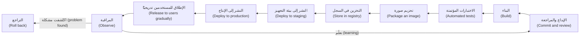

| المرحلة (Stage) | ما الذي يحدث (What happens) | ما الذي ينبغي أن تلتقطه (What it should catch) | أين تغطيها هذه الدورة (Where this course covers it) |
|---|---|---|---|
| الإيداع والمراجعة (Commit and review) | يدفع مطوّر (developer pushes) تغييرًا؛ ويراجعه زميل في طلب سحب (pull request) | الأخطاء المنطقية (logic errors)، والتغييرات الخطرة (risky changes)، والاختبارات المفقودة (missing tests) | 4.1 |
| البناء (Build) | تُصرَّف الشيفرة (code is compiled) وتُجلب الاعتماديات (dependencies are fetched) | الشيفرة التي لا تُصرَّف (does not compile)؛ والاعتماديات المعطوبة (broken dependencies) | 4.1 |
| الاختبارات المؤتمتة (Automated tests) | تعمل اختبارات الوحدة (unit) والتكامل (integration) وغيرها | التراجعات الوظيفية (regressions)، والعقود المكسورة (broken contracts) | 4.1 |
| التحزيم (Package) | تُحزَّم الخدمة في صورة حاوية (container image) | الصور التي لا تبدأ (images that do not start)؛ والصور المتضخمة أو غير الآمنة (bloated or insecure images) | 2.1 |
| التخزين (Store) | تُدفع الصورة إلى سجل (registry) بمعرّف فريد (unique identifier) | العبث (tampering)، والارتباك بشأن "أي إصدار هذا؟ ⁦(which version is this?)⁩" | 2.1، 4.3 |
| النشر (Deploy) | تُطرح الصورة (rolled out) في بيئة (environment) بواسطة الأتمتة (automation) | أخطاء الإعدادات (configuration errors)، وفشل بدء التشغيل (failed startup)، وفحوص الصحة السيئة (bad health checks) | 2.2، 3.2 |
| الإطلاق (Release) | يُمنح المستخدمون الإصدار الجديد تدريجيًا (gradually) | المشكلات التي لا تُظهرها إلا الحركة الحقيقية (only real traffic shows) | 4.2 |
| المراقبة (Observe) | يُظهر القياس عن بُعد (telemetry) ما إذا كان المستخدمون يُخدَمون جيدًا (well served) | الأخطاء (errors)، والبطء (slowness)، واستهلاك هدف مستوى الخدمة (SLO burn) | 5.1، 5.2 |

**خط التسليم (pipeline)** هو الأتمتة (automation) التي تشغّل هذه الخطوات. و**التكامل المستمر (continuous integration, CI)** يعني أن الجميع يدمجون تغييرات صغيرة (merges small changes) في الفرع الرئيس (main branch) كثيرًا، وأن كل دمج (merge) يُبنى ويُختبر تلقائيًا (built and tested automatically). و**التسليم المستمر (continuous delivery, CD)** يعني أن كل تغيير يجتاز الفحوص جاهز للنشر بضغطة زر (ready to deploy at the push of a button). أما **النشر المستمر (continuous deployment)** فيخطو خطوة أبعد: كل تغيير ناجح يُنشر تلقائيًا (deployed automatically).

**ابنِ مرة واحدة، ورقِّ الأثر البرمجي نفسه (Build once, promote the same artefact).** **الأثر البرمجي (artefact)** هو مخرَج البناء (output of a build)، وهو عندنا عادةً صورة حاوية (container image). ابنِه مرة واحدة، وامنحه هوية فريدة (unique identity) (تجزئة الإيداع (commit hash) في وسمه (tag)، وبصمة محتواه (content digest))، وانقل الصورة *نفسها* من بيئة التجهيز (staging) إلى الإنتاج (production). فإن أعدت البناء للإنتاج (rebuild for production)، فأنت تشحن شيئًا لم تختبره قط (never tested): فقد تكون إحدى الاعتماديات (dependency) قد تغيّرت، وقد يختلف أحد خيارات البناء (build flag).

خط تسليم (pipeline) بسيط في GitHub Actions يختبر الشيفرة (tests the code) ويبني صورة واحدة موسومة بإيداعها (tagged with its commit):

```yaml
# .github/workflows/ci.yml — a starting point, hardened in Module 4
name: ci
on:
  pull_request:
  push:
    branches: [main]
permissions:
  contents: read          # least privilege: this job only reads the code
jobs:
  test-and-build:
    runs-on: ubuntu-latest
    steps:
      - uses: actions/checkout@v4   # in production pipelines, pin to a full commit SHA (4.3)
      - name: Run tests
        run: make test          # replace with your project's test command
      - name: Build one image, named after the commit
        run: docker build -t najm-mobile-api:${{ github.sha }} .
```

**البيئات (Environments).** تمرّ التغييرات عبر سلسلة من **البيئات (environments)**: نسخ منفصلة من النظام (separate copies of the system). ومن المجموعات الشائعة: التطوير (development)، والتجهيز (staging) (أقرب ما يمكن إلى الإنتاج (as close to production as possible))، والإنتاج (production). وينبغي ألا تختلف البيئات إلا في الإعدادات (configuration) (عناوين قواعد البيانات (database addresses)، والأحجام (sizes)، وأعلام الميزات (feature flags))، ولا تختلف أبدًا في الشيفرة (code). ويُبيّن الدرس 3.2 كيف تُرقّى التغييرات بينها (promote changes) باستخدام GitOps.

**النشر ليس إطلاقًا (Deploy is not release).** أن *تنشر (deploy)* يعني أن تضع الإصدار الجديد على الخوادم (servers). وأن *تطلق (release)* يعني أن تسمح للمستخدمين بالوصول إليه. يمكنك نشر شيفرة فيها ميزة جديدة مُطفأة بواسطة **علم ميزة (feature flag)**، ثم تشغيلها لـ 1% من المستخدمين. ويمكنك نشر إصدار جديد بجانب القديم وإرسال 5% من الحركة (traffic) إليه، وهذا هو **الكناري (canary)**. والفصل بين الخطوتين يعني أن التغيير السيئ (bad change) يصل إلى قلة من المستخدمين، لا إليهم جميعًا. وهذا بالضبط درس تحديث CrowdStrike (CrowdStrike update).

#### 🟡 التعمق أكثر (Going deeper)

**ما الذي ينكسر، مرحلة بمرحلة (What breaks, stage by stage).** كل انقطاع علني (public outage) يعلّمنا شيئًا عن مرحلة واحدة. وإليك حالات موثّقة جيدًا (well-documented cases)، مع الضابط (control) الذي كان سيحدّ من كل منها:

| الحالة (Case) | ما الذي حدث (What happened) (التقارير العلنية (public reports)) | المرحلة التي فشلت (Stage that failed) | الضابط (Control) |
|---|---|---|---|
| Knight Capital، 2012 | فات النشرُ اليدوي (manual deploy) خادمًا من ثمانية؛ فأُعيد تفعيل الشيفرة القديمة (old code reactivated) | النشر (Deploy) | عمليات نشر مؤتمتة ومتطابقة (automated, identical deploys)؛ وفحوص الإصدار على كل خادم (version checks on every server)؛ ومفتاح إيقاف طارئ (kill switch) |
| AWS S3، us-east-1، فبراير 2017 | أثناء تصحيح الأخطاء (debugging)، كُتب أمرٌ مُعدّ لإزالة عدد صغير من الخوادم بشكل خاطئ (mistyped) فأزال عددًا أكبر بكثير | التشغيل (Operate) | أدوات تحدّ من مقدار ما يستطيع أمر واحد إزالته (how much one command can remove)، ومن سرعة ذلك |
| GitLab.com، يناير 2017 | حذف مهندس دليل قاعدة بيانات إنتاجية (production database directory) عن طريق الخطأ؛ وتبيّن أن عدة طرق نسخ احتياطي (backup methods) لا تعمل؛ وفُقدت ساعات من البيانات | التشغيل والتعافي (Operate, Recover) | استعادات مُختبرة (tested restores)، لا مجرد نسخ احتياطية؛ وفصل واضح لطرفيات الإنتاج (production terminals) |
| Facebook، أكتوبر 2021 | فصل أمرُ صيانة (maintenance command) الشبكة الأساسية (backbone)؛ ثم سحبت خوادم DNS مساراتها (withdrew their routes)؛ وتوقفت الخدمات والأدوات الداخلية لساعات | النشر والتشغيل (Deploy, Operate) | أدوات تدقيق (audit tools) تمنع التغييرات الخطرة (dangerous changes)؛ ووصول خارج النطاق (out-of-band access) للتعافي |
| CrowdStrike، يوليو 2024 | ذهب تحديث محتوى معيب (faulty content update) إلى جميع مستشعرات Windows (Windows sensors) دفعة واحدة فأسقطها | الإطلاق (Release) | طرح مرحلي إلى مجموعة صغيرة أولًا (staged rollout to a small group first)؛ وإيقاف تلقائي عند الأخطاء (automatic halt on errors) |

يبرز نمطان (two patterns). معظمها كان أفعالًا بشرية عادية (ordinary human actions) لم يحمِ المسارُ منها، لا أخطاء برمجية غريبة (exotic bugs). وجاء الضرر من *نطاق الأثر (blast radius)* (عدد المستخدمين الذين يمكن أن يصلهم تغيير واحد) ومن *زمن الاكتشاف والتراجع (time to detect and undo)*. والهندسة الجيدة (good engineering) تقلّص كليهما.

**الأسئلة الثلاثة لكل مرحلة (The three questions per stage).** لكل مرحلة في مسارك، اسأل:
1. **ما الذي قد يسوء هنا؟ ⁦(What can go wrong here?)⁩** اختبار فاشل (failed test)، أو اعتمادية مصابة بثغرة (vulnerable dependency)، أو قيمة إعدادات خاطئة (wrong configuration value)، أو خادم لم يصله التحديث قط (never got the update).
2. **ما الذي يلتقطه تلقائيًا؟ ⁦(What catches it, automatically?)⁩** اختبار (test)، أو فحص (scan)، أو فحص صحة (health check)، أو مقياس كناري (canary metric)، أو تنبيه (alert).
3. **كيف نتراجع عنه، وكم يستغرق ذلك؟ ⁦(How do we undo it, and how long does that take?)⁩** إرجاع الإيداع (revert the commit)، أو إعادة نشر الصورة السابقة (redeploy the previous image)، أو إطفاء علم الميزة (flip a feature flag off)، أو الاستعادة من النسخة الاحتياطية (restore from backup).

إن كان جواب السؤال 2 هو "شخصٌ يتذكر أن ينظر (a person remembers to look)"، فتلك هي مهمة الأتمتة التالية لديك (next automation task).

**التراجع خير من تصحيح الأخطاء في الإنتاج (Rollback beats debugging in production).** حين يسوء إطلاق (release goes wrong)، استعِد الخدمة أولًا (restore service first). ومع صورة غير قابلة للتغيير (immutable image)، يعني التراجع (rolling back) إعادة نشر الصورة السابقة (redeploying the previous image)، وهو أمر يستغرق دقائق. ابحث عن السبب الجذري (root cause) بعد ذلك، والمستخدمون في أمان. ولهذا فإن مقياس DORA هو "زمن *استعادة* الخدمة (time to restore service)"، لا "زمن الإصلاح (time to fix)".

**ليس كل تغيير شيفرة (Not every change is code).** فالإعدادات (configuration)، والبنية التحتية (infrastructure)، وتغييرات المخطط (schema changes)، وتبديل الأعلام (flag flips)، وتحديثات محتوى أدوات الأمن (security-tool content updates) تصل إلى الإنتاج (production) أيضًا، وعددٌ من الانقطاعات أعلاه (several outages above) لم يكن نشرًا لتطبيقات (application deploys) أصلًا. تعامل مع *كل* تغيير في الإنتاج بالطريقة نفسها: مُراجَعًا (reviewed)، ومُصدَّرًا بإصدار (versioned)، ومؤتمتًا (automated)، ومرحليًا (staged)، وقابلًا للتراجع (reversible).

#### 🔴 نظرة الخبير (Expert view)

**مهلة التغييرات خريطةٌ لانتظارك (Lead time is a map of your waiting).** حين قاس نجم مهلة التغييرات (lead time) لواجهة الهاتف (Mobile API) في مركز البيانات (data centre)، كان معظمها انتظارًا (waiting): لمجلس اعتماد التغييرات (change-approval board)، أو لنافذة إطلاق (release window)، أو لشخص يشغّل نصًا برمجيًا (run a script). فالمهلة الأقصر تأتي دائمًا تقريبًا من إزالة الطوابير والتسليمات اليدوية (removing queues and handoffs)، لا من حواسيب أسرع (faster computers). ارسم خريطة المواضع التي *ينتظر (waits)* فيها التغيير، لا فقط المواضع التي *يعمل (works)* فيها.

**الدفعات الصغيرة إجراء أمان (Small batches are a safety measure).** يصعب تشخيص إطلاق فاشل (failed release) يحوي 200 تغيير؛ أما إطلاق فاشل يحوي تغييرًا واحدًا فيشير مباشرة إلى سببه. وتبدو عمليات النشر الصغيرة المتكررة (frequent small deploys) خطرة، لكن أبحاث DORA (DORA research) وجدت أن الفرق التي تنشر أكثر تفشل أيضًا أقل (fail less) وتتعافى أسرع (recover faster).

**ضبط التغيير في بنك خاضع للتنظيم (Change control in a regulated bank).** استخدمت البنوك تقليديًا مجالس استشارية للتغيير (change-advisory boards) تعتمد كل إطلاق يدويًا (approve each release by hand). لكن خط تسليم مبنيًّا جيدًا (well-built pipeline) يستطيع أن يقدّم دليلًا *أفضل (better evidence)* من اجتماع: طلب سحب مُراجَع (reviewed pull request)، ونتائج الاختبارات (test results)، وأثرًا برمجيًا موقّعًا (signed artefact)، وسجل نشر مؤتمتًا (automated deployment record) لكل تغيير. فالمدققون (auditors) يحتاجون إلى أن تكون التغييرات مضبوطة (controlled) ومُختبرة (tested) وقابلة للتتبّع (traceable). واستراتيجية سالم هي أن يجعل خط التسليم ينتج ذلك الدليل (produce that evidence)، كي تتدفق التغييرات منخفضة المخاطر (low-risk changes) دون مجلس، بينما تظل التغييرات عالية المخاطر (high-risk ones) تحظى بمراجعة بشرية (human review).

**الأمن يسير في المسار نفسه (Security travels the same path).** كل مرحلة هي أيضًا موضع يستطيع فيه مهاجم (attacker) إدخال شيء ما: اعتمادية خبيثة (malicious dependency) وقت البناء، أو صورة مُبدَّلة (swapped image) في السجل (registry)، أو بيانات اعتماد مسروقة (stolen credentials) في خط التسليم (pipeline). يؤمّن الدرس 4.3 خط التسليم؛ وللصورة الكاملة لسلسلة التوريد (supply-chain)، راجع [*أمن الذكاء الاصطناعي والتطبيقات (Secure AI & Application Security)*، الدرس 6.2 — سلسلة توريد البرمجيات: الاعتماديات وقوائم مكونات البرمجيات وSLSA والتوقيع (The software supply chain: dependencies, SBOMs, SLSA and signing)](../secai/index.ar.html#/6.2). وللرحلة نفسها مرويّةً لمن يبنون باستخدام وكلاء الذكاء الاصطناعي (AI agents) ولا يكتبون الشيفرة يدويًا، راجع [*تصميم الأنظمة لمبرمجي الفايب (System Design for Vibe Coders)*، الدرس 4.1 — الشحن منظومة (Shipping is a system)](../vibe/index.ar.html#l4-1).

### 🧰 الأدوات (The toolkit)
| الأداة أو الممارسة أو الخدمة (Tool, practice or service) | ما هي وماذا تفعل (What it is and does) | متى تلجأ إليها (When to reach for it) |
|---|---|---|
| **GitHub Actions** — خدمة CI/CD من GitHub | خدمة تكامل وتسليم مستمرين (CI/CD) مدمجة في GitHub تشغّل سير عمل (workflows) عند أحداث مثل الدفع (push) أو طلب السحب (pull request) | أتمتة البناء والاختبار والتحزيم (build, test and packaging) للشيفرة المستضافة على GitHub؛ وGitLab CI وJenkins بديلان شائعان (common alternatives) |
| **Build once, promote** — ابنِ مرة واحدة ورقِّ | ممارسة بناء أثر برمجي واحد غير قابل للتغيير (one immutable artefact) ونقل هذا الأثر نفسه عبر كل بيئة (every environment) | دائمًا؛ فإعادة البناء لكل بيئة (rebuilding per environment) تشحن شيفرة غير مُختبرة (untested code) |
| **Container registry** — سجل الحاويات | مخزن لصور الحاويات (container images)، لكل منها وسم (tag) وبصمة محتوى (content digest) | الاحتفاظ بالأثر البرمجي الواحد (single artefact) الذي تنشره كل بيئة |
| **Feature flag** — علم الميزة | مفتاح وقت التشغيل (runtime switch) يشغّل ميزة أو يطفئها دون عملية نشر (without a deployment) | فصل النشر عن الإطلاق (separating deploy from release)؛ و"إطفاء" فوري (instant "off") لميزة سيئة |
| **Canary release** — الإطلاق الكناري | إرسال حصة صغيرة من الحركة (small share of traffic) إلى إصدار جديد ومقارنته بالقديم | أي تغيير قد تكسره الحركة الحقيقية (real traffic)؛ ويُغطّى بالكامل في 4.2 |
| **Rollback** — التراجع | إعادة الإنتاج إلى آخر إصدار معروف بأنه سليم (last known-good version)، عادةً بإعادة نشر الأثر البرمجي السابق (redeploying the previous artefact) | الاستجابة الأولى لإطلاق سيئ (bad release): استعِد الخدمة (restore service)، ثم حقّق (investigate) |

### 🏛️ عمليًا في بنك نجم (In practice at Najm Bank)
يطلب سالم من يوسف إعداد **خريطة المسار إلى الإنتاج (path-to-production map)** لواجهة برمجة تطبيق نجم للهاتف (Najm Mobile API)، كما تعمل اليوم في مركز البيانات (data centre) وكما ينبغي أن تعمل بعد الانتقال إلى السحابة (cloud move). وتصبح هذه الخريطة قائمة الأعمال المتراكمة (backlog) لعملية الترحيل (migration) بأكملها.

**واجهة برمجة تطبيق نجم للهاتف (Najm Mobile API) — خريطة المسار إلى الإنتاج (path-to-production map) (الحالة المستهدفة (target state)، الإصدار 1 (v1))**

| المرحلة (Stage) | ما الذي قد يسوء (What can go wrong) | الالتقاط المؤتمت (Automated catch) | التراجع (Undo) | المالك (Owner) |
|---|---|---|---|---|
| الإيداع والمراجعة (Commit and review) | تغيير غير مُراجَع أو خطر (unreviewed or risky change) | حماية الفرع (branch protection): موافقة واحدة، واثنتان للشيفرة المتعلقة بالمدفوعات (payment-related code) | إرجاع الإيداع (revert the commit) | فريق التطبيقات (App team) |
| البناء والاختبار (Build and test) | تراجع وظيفي (regression)، أو اعتمادية معطوبة (broken dependency) | اختبارات الوحدة والتكامل (unit and integration tests)؛ وفحص الاعتماديات (dependency scan) | حجب طلب السحب (pull request blocked) | فريق التطبيقات (App team) |
| التحزيم (Package) | الصورة تختلف عمّا اختُبر؛ أو تعمل بصلاحيات الجذر (runs as root) | صورة واحدة لكل إيداع (one image per commit)، موسومة بتجزئة الإيداع (commit hash)؛ وفحص عدم التشغيل بصلاحيات الجذر (non-root check) | التخلص من الصورة؛ والإصلاح وإعادة البناء عبر خط التسليم كاملًا (full pipeline) | المسار الذهبي للمنصة (Platform golden path) |
| التخزين (Store) | صورة خاطئة أو عُبث بها (wrong or tampered image) | يحتفظ السجل بالبصمات (registry keeps digests)؛ والصورة موقّعة (image signed) (4.3) | النشر ببصمة آخر صورة سليمة (deploy by digest of last good image) | المنصة (Platform) |
| النشر إلى التجهيز (Deploy to staging) | خطأ في الإعدادات (configuration error)؛ أو فشل الصورة في البدء (fails to start) | مسابير الصحة (health probes)؛ واختبارات الدخان (smoke tests) | تراجع تلقائي عن الطرح (automatic rollback of the rollout) | GitOps لدى المنصة (Platform GitOps) |
| النشر إلى الإنتاج (Deploy to production) | مثل التجهيز، لكن على نطاق واسع (at scale) | بصمة الصورة نفسها كما في التجهيز (same image digest as staging)؛ وتحديث متدرّج (rolling update) مع فحوص الصحة | إعادة نشر البصمة السابقة (redeploy previous digest) (الهدف: أقل من 10 دقائق) | فريق التطبيقات مع المنصة (App team with platform) |
| الإطلاق (Release) | خلل لا تُظهره إلا الحركة الحقيقية (bug only real traffic shows) | كناري (canary) بنسبة 5%، يُقارن على معدل الأخطاء (error rate) وزمن الاستجابة (latency) | إعادة توجيه الحركة إلى الإصدار السابق (shift traffic back)؛ وإطفاء العلم (flag off) | فريق التطبيقات (App team) |
| المراقبة (Observe) | المستخدمون يتضررون دون أن يلاحظ أحد (users hurt without anyone noticing) | تنبيهات معدل استهلاك هدف مستوى الخدمة (SLO burn-rate alerts) (5.2) | عملية الحوادث (incident process) (5.3) | هندسة موثوقية المواقع (SRE)، مها |

**مقاييس DORA الأساسية (Baseline DORA metrics)** (يملأ الفريق الأرقام الحقيقية للربع الماضي (last quarter's real numbers)؛ وتُحدَّد الأهداف (targets) مع مها):

| المقياس (Metric) | اليوم (Today) | الهدف بعد الترحيل (Target after migration) |
|---|---|---|
| تكرار النشر (Deployment frequency) | ___ | ___ |
| مهلة التغييرات (Lead time for changes) | ___ | ___ |
| معدل فشل التغييرات (Change failure rate) | ___ | ___ |
| زمن استعادة الخدمة (Time to restore service) | ___ | ___ |

**قاعدة أُضيفت إلى معيار الفريق (Rule added to the team standard):** أي مرحلة يقول عمود "الالتقاط المؤتمت (automated catch)" فيها "شخص يتحقق (a person checks)" هي بند في قائمة الأعمال المتراكمة (backlog item) له مالك (owner) وتاريخ (date).

### 🛠️ التمارين (Exercises)
- 🟢 اختر موقعًا إلكترونيًا تستخدمه. شغّل `dig +short example.com` و`curl -sI https://example.com` (مع النطاق الحقيقي (real domain)) ودوّن عناوين IP (IP addresses)، وحالة HTTP (HTTP status)، والترويسات (headers) مثل `cache-control`. ثم اكتب المراحل الخمس التي سيمرّ بها تغيير قبل أن يظهر على ذلك الموقع. *يكتمل عندما (Done when):* يكون المخرَج (output) محفوظًا، وتسمّي كل مرحلة من مراحلك الخمس شيئًا واحدًا قد يسوء (could go wrong).
- 🟡 ارسم خريطة المسار إلى الإنتاج (path-to-production map) لمشروع خاص بك (أو لمشروع صغير مفتوح المصدر (open-source project) تعرفه)، مستخدمًا الأعمدة نفسها في خريطة نجم. *يكتمل عندما (Done when):* يكون لكل مرحلة "التقاط مؤتمت (automated catch)" و"تراجع (undo)"، وتكون قد علّمت بلون مختلف كل موضع يكون فيه الجواب حاليًا "شخص يتذكر (a person remembers)".
- 🔴 في مستودع عام (public repository) على حسابك الخاص في GitHub، أنشئ خدمة ويب صغيرة جدًا (tiny web service) فيها اختبار واحد (one test) وملف Dockerfile، وأضف سير عمل التكامل المستمر (CI workflow) من هذا الدرس. ادفع تغييرًا يكسر الاختبار (breaks the test) وتأكد من أن خط التسليم يفشل (pipeline fails). ثم أصلحه، ودع خط التسليم يبني الصورة (build the image)، وابنِ الإيداع نفسه (same commit) وشغّله محليًا باستخدام `docker run`. *يكتمل عندما (Done when):* تستطيع أن تُظهر تشغيلًا فاشلًا (failed run)، وتشغيلًا ناجحًا (passing run)، ووسم الصورة (image tag) مطابقًا لتجزئة الإيداع (commit hash) الذي نجح.

### ⚠️ أخطاء وفخاخ (Mistakes and traps)
- **إعادة البناء لكل بيئة (Rebuilding for each environment).** ينتهي بك الأمر إلى شحن شيفرة لم تختبرها قط (code you never tested). ابنِ مرة واحدة ورقِّ الصورة نفسها (promote the same image)، المعرَّفة ببصمتها (identified by its digest).
- **خطوات الإنتاج اليدوية (Manual production steps).** كل أمر يُشغَّل يدويًا (hand-run command) فرصةٌ لتكرار الخادم المنسيّ لدى Knight Capital (Knight Capital's missed server). أتمته (automate it)، أو على الأقل اكتبه نصًا برمجيًا (script it) وراجع النص.
- **الإطلاق للجميع دفعة واحدة (Releasing to everyone at once).** عندها يصل التغيير السيئ (bad change) إلى كل مستخدم قبل أن يلاحظ أحد. افصل النشر عن الإطلاق (separate deploy from release) واطرح تدريجيًا (roll out gradually).
- **اعتبار تغييرات الإعدادات والبنية التحتية "ليست نشرًا" (Treating config and infrastructure changes as "not a deploy").** عدة انقطاعات شهيرة (famous outages) نتجت عن هذه بالضبط. مرّر كل تغيير في الإنتاج عبر المسار نفسه (same path).
- **نسخ احتياطية لم يستعِدها أحد (Backups nobody has restored).** أظهرت حادثة GitLab عام 2017 نسخًا احتياطية لم تكن تعمل بصمت (silently did not work). لا تُحتسب النسخة الاحتياطية (backup) إلا بعد اختبار الاستعادة (restore has been tested) (6.1).

### 🧾 الخلاصة (Recap)
- يقطع كل تغيير مراحل الإيداع (commit)، والبناء (build)، والاختبار (test)، والتحزيم (package)، والتخزين (store)، والنشر (deploy)، والإطلاق (release)، والمراقبة (observe)؛ ويجب على كل مرحلة أن تلتقط شيئًا (catch something) وأن تكون قابلة للتراجع (undoable).
- ابنِ مرة واحدة ورقِّ الأثر البرمجي نفسه غير القابل للتغيير (same immutable artefact)؛ ولا تُعِد البناء للإنتاج أبدًا (never rebuild for production).
- النشر والإطلاق مختلفان (deploy and release are different)؛ والفصل بينهما باستخدام الكناري (canaries) وأعلام الميزات (feature flags) يقلّص نطاق الأثر (blast radius).
- معظم الانقطاعات الشهيرة (famous outages) كانت إخفاقات في المسار (path failures): خطوة يدوية (manual step)، أو فحص مفقود (missing check)، أو تغيير أُرسل إلى الجميع دفعة واحدة.
- استعِد أولًا وحقّق لاحقًا (restore first, investigate later)؛ والتغييرات الصغيرة المتكررة (small, frequent changes) أكثر أمانًا من الكبيرة النادرة (large, rare ones).

### ✍️ اختبر نفسك (Check yourself)

**1. يقترح يوسف بناء صورة واجهة برمجة تطبيق نجم للهاتف (Najm Mobile API image) مجددًا للإنتاج (production)، "كي تلتقط أحدث التصحيحات الأمنية (latest security patches)"، بعد اختبار بناء مختلف في بيئة التجهيز (staging). ما المشكلة؟**

- A. تستغرق عمليات البناء للإنتاج (production builds) وقتًا أطول، فتفوت نافذة الإطلاق (release window)
- B. يرفض السجل (registry) صورة ثانية مبنية من الإيداع نفسه (same commit)
- C. سيشغّل الإنتاج صورة لم تُختبر قط (never tested)؛ وينبغي أن تمرّ التصحيحات (patches) عبر خط التسليم كاملًا (full pipeline)
- D. لا مشكلة، ما دامت الصورتان مبنيتين من تجزئة الإيداع نفسها (same commit hash)

<details><summary>الإجابة</summary>

**C.** قد تجلب إعادة البناء (rebuild) إصدارات اعتماديات مختلفة (different dependency versions) أو تستخدم إعدادات مختلفة (different settings)، فيختلف الأثر البرمجي المُختبر (tested artefact) عن الأثر البرمجي المشحون (shipped artefact). وD هو المُشتِّت المغري (tempting distractor): فالإيداع نفسه لا يضمن الصورة نفسها (same image). وينبغي أن تتدفق التصحيحات عبر خط التسليم بأكمله (whole pipeline). (🟢 الأساسيات (The essentials).)

</details>

**2. ما الفرق بين النشر (deploying) والإطلاق (releasing)؟**

- A. النشر يضع الإصدار الجديد على الخوادم (on servers)؛ والإطلاق يسمح للمستخدمين بالوصول إليه (lets users reach it)
- B. هما اسمان للخطوة نفسها (same step)، تستخدمهما أدوات مختلفة
- C. الإطلاق هو اجتماع الموافقة (approval meeting) الذي يجب أن يُعقد قبل النشر
- D. النشر يخص شيفرة التطبيق (application code)؛ والإطلاق يخص البنية التحتية (infrastructure)

<details><summary>الإجابة</summary>

**A.** يمكن أن يكون الإطلاق (releasing) تدريجيًا (gradual) (كناري (canary)) أو يُبدَّل بعلم ميزة (feature flag). والفصل بين الاثنين يتيح لك النشر بأمان (deploy safely)، ثم تعريض التغيير لحصة صغيرة من المستخدمين أولًا (small share of users first). (🟢 الأساسيات (The essentials).)

</details>

**3. وفقًا لأمر هيئة الأوراق المالية والبورصات الأمريكية (SEC's order)، أي إخفاق كان في صميم خسائر Knight Capital عام 2012؟**

- A. انقطاع لدى مزوّد الاستضافة (hosting provider) ترك الأوامر عالقة في طابور (stuck in a queue)
- B. قاعدة بيانات إنتاجية (production database) حُذفت عن طريق الخطأ، مع نسخ احتياطية (backups) لم تكن تعمل
- C. تحديث معيب لمستشعر أمني (faulty security-sensor update) أُرسل إلى جميع أجهزتها دفعة واحدة
- D. نشر يدوي (manual deployment) فات خادمًا واحدًا، حيث أيقظ علمٌ أُعيد استخدامه (reused flag) الشيفرة القديمة (old code)

<details><summary>الإجابة</summary>

**D.** نُسخت الشيفرة الجديدة يدويًا (copied by hand) وفات خادم من ثمانية. أما B فيصف GitLab عام 2017، وC يصف CrowdStrike عام 2024. (🧭 لماذا يهم (Why it matters)؛ 🟡 التعمق أكثر (Going deeper).)

</details>

**4. يرفع إصدار جديد من واجهة برمجة تطبيق نجم للهاتف (Najm Mobile API) معدلَ الأخطاء (error rate) بحدة بعد عشر دقائق من الطرح (rollout). يريد طارق أن يجد الخلل (find the bug) قبل فعل أي شيء. بماذا ينبغي أن تنصح مها؟**

- A. إبقاء الإطلاق قيد التشغيل كي يتمكن الفريق من إعادة إنتاج الخلل (reproduce the bug) بالحركة الحقيقية (real traffic)
- B. التراجع إلى الصورة السابقة (roll back to the previous image) لاستعادة الخدمة (restore service)، ثم إيجاد السبب الجذري (root cause)
- C. كتابة إصلاح سريع (quick fix) ونشره مباشرة إلى الإنتاج، مع تخطّي الاختبارات (skipping the tests)
- D. إعادة تشغيل جميع الخوادم في العنقود (cluster) ومراقبة ما إذا كانت الأخطاء ستختفي

<details><summary>الإجابة</summary>

**B.** الهدف الأول هو استعادة الخدمة (restore service)؛ ومع الصور غير القابلة للتغيير (immutable images)، تستغرق إعادة نشر الإصدار السابق (redeploying the previous version) دقائق. أما A فيُبقي المستخدمين على إطلاق معطوب (broken release)؛ وC يتخطى الفحوص ذاتها التي تحمي المستخدمين؛ وD يخفي العَرَض (hides the symptom) دون إزالة الإصدار السيئ (bad version). (🟡 التعمق أكثر (Going deeper).)

</details>

**5. يقيس نجم مهلة تغييرات (lead time) قدرها ثلاثة أسابيع لواجهة الهاتف (Mobile API). ويستغرق البناء والاختبار (building and testing) نحو 40 دقيقة. ما الطريقة الأرجح لتقليص مهلة التغييرات؟**

- A. شراء خوادم بناء أسرع (faster build servers) كي يتقلص تشغيل البناء والاختبار الذي يستغرق 40 دقيقة
- B. حذف أبطأ الاختبارات (slowest tests) كي تصل التغييرات إلى بيئة التجهيز (staging) أسرع
- C. إزالة الطوابير (queues) التي تنتظر فيها التغييرات، مع الإبقاء على دليل الضبط (evidence of control)
- D. النشر بتكرار أقل، في دفعات أكبر (bigger batches)، لتقليل عدد الموافقات (approvals)

<details><summary>الإجابة</summary>

**C.** حين يستغرق العمل دقائق بينما تبلغ مهلة التغييرات أسابيع، يكون الوقت مُنفَقًا في الانتظار (spent waiting). والموافقات اليدوية (manual approvals) ونوافذ الإطلاق (release windows) طوابير نموذجية (typical queues). أما A فيسرّع خطوة ليست هي عنق الزجاجة (not the bottleneck)؛ وB يُضعف الأمان (weakens safety) مقابل مكسب ضئيل؛ وD يزيد المخاطر (increases risk). (🔴 نظرة الخبير (Expert view).)

</details>

### 📚 المراجع (References)
- هيئة الأوراق المالية والبورصات الأمريكية (US SEC)، In the Matter of Knight Capital Americas LLC (2013) — https://www.sec.gov/litigation/admin/2013/34-70694.pdf
- AWS، ملخص انقطاع خدمة Amazon S3 في منطقة فرجينيا الشمالية (Summary of the Amazon S3 Service Disruption in the Northern Virginia (US-EAST-1) Region) — https://aws.amazon.com/message/41926/
- GitLab، مراجعة ما بعد حادثة انقطاع قاعدة البيانات في 31 يناير (Postmortem of database outage of January 31) — https://about.gitlab.com/blog/
- Meta Engineering، مزيد من التفاصيل عن انقطاع 4 أكتوبر (More details about the October 4 outage) — https://engineering.fb.com/
- CrowdStrike، مركز المعالجة والإرشاد بشأن تحديث محتوى Falcon (Falcon content update remediation and guidance hub) — https://www.crowdstrike.com/
- برنامج أبحاث DORA (DORA research programme) — https://dora.dev/
- توثيق GitHub Actions (GitHub Actions documentation) — https://docs.github.com/actions
- تطبيق العوامل الاثني عشر (The Twelve-Factor App) — https://12factor.net/

<a id="l0-3"></a>

## 0.3 — تعرّف على فريق المنصة في بنك نجم (Meet Najm Bank's platform team)، وكيف تستخدم هذه الدورة (how to use this course)

*المستوى: 🟢 مبتدئ* · *المتطلبات: 0.1، 0.2* · *المرحلة (Phase): Plan*

### ⚡ الدرس في دقيقة (In 60 seconds)
- **بنك نجم (Najm Bank)** بنك خليجي متوسط الحجم خيالي (fictional mid-sized Gulf bank) يعمل في قطر والإمارات والاتحاد الأوروبي (EU). ستتابع فريق **هندسة المنصات وهندسة موثوقية المواقع (Platform Engineering & SRE)** فيه عبر ترحيل سحابي بملامح واقعية (real-shaped cloud migration).
- يشغّل الفريق خمسة أنظمة (five systems) ستلقاها في كل وحدة: **واجهة برمجة تطبيق نجم للهاتف (Najm Mobile API)**، و**خدمة المدفوعات (payments service)**، و**نجم أسيست (Najm Assist)** (مساعد قائم على نموذج لغوي كبير (LLM assistant))، و**منصة المطوّرين الداخلية (internal developer platform)**، ونظام **الخدمات المصرفية الأساسية في مركز البيانات (data-centre core banking)** الذي يبقى محليًا (on-premises).
- لكل درس الأجزاء العشرة نفسها (same ten parts)، ويتدرج من 🟢 الأساسيات (essentials) إلى 🔴 نظرة الخبير (expert view)، وينتج **أثرًا (artefact)** قابلًا لإعادة الاستخدام (reusable).
- تتدرّب على **مختبر محلي (local lab)**: Docker، وعنقود Kubernetes محلي (local Kubernetes cluster) (kind أو k3d أو minikube)، وOpenTofu أو Terraform، وGit، وGitHub Actions. لا شيء في هذه الدورة يتطلب الدفع لمزوّد سحابي (paying a cloud provider).
- إشارة القرار (Decision cue): إن استخدمت فئة مجانية سحابية (cloud free tier)، **فاضبط تنبيه ميزانية (budget alert) قبل أن تُنشئ أي شيء**.
- الفخ الأكبر (Biggest trap): القراءة دون تطبيق (reading without doing). فمهارات العمليات (operations skills) تعيش في يديك، لا في ملاحظاتك (not your notes).

### 🧭 لماذا يهم (Why it matters)
وظّف سالم خرّيجَين (two graduates) كل عام خلال السنوات الثلاث الماضية. والذين تعثّروا لم يكونوا أضعف المبرمجين (weakest programmers). بل كانوا الذين قرأوا كل وثيقة ولم يكسروا شيئًا عن قصد (never broke anything on purpose). لم يروا قط حجيرة (pod) تدخل في حلقة انهيار متكرر (crash-loop)، ولا خطة Terraform (Terraform plan) تريد تدمير قاعدة بيانات (destroy a database)، ولا تنبيهًا (alert) انطلق في الثالثة فجرًا بلا سبب. أما الذين ازدهروا فكان لديهم مختبر في المنزل (lab at home) ارتكبوا فيه تلك الأخطاء بتكلفة زهيدة (cheaply).

هكذا تعمل هذه الدورة. ستلقى الأشخاص والأنظمة والمشكلات أنفسها (same people, systems and problems) في كل درس. وستنتج آثارًا (artefacts) يحتفظ بها فريق منصة حقيقي (real platform team). وستشغّل كل تمرين على جهازك الخاص أو على فئة مجانية (free tier)، كي تقع الأخطاء المكلفة (expensive mistakes) في مختبرك لا في الإنتاج (production). يعرّفك هذا الدرس بالفريق والأنظمة، ويشرح كيف بُنيت الدورة (how the course is built)، ويُشغّل مختبرك (gets your lab running).

### 📐 كيف يعمل (How it works)

#### 🟢 الأساسيات (The essentials)

**بنك نجم، ولماذا بنك (Najm Bank, and why a bank).** بنك نجم خيالي (fictional). وهو البنك نفسه المستخدم في الدورات الأخرى لهذه المكتبة (library's other courses)، لذا تروي دورات الأمن والحوكمة والمنتج (security, governance and product courses) كلها أجزاءً من قصة واحدة. والبنك حالة تعليمية جيدة (good teaching case) لأن المخاطر واضحة (stakes are clear). فالعملاء يتوقعون أن يعمل التطبيق في كل الأوقات؛ والتحويل (transfer) يجب ألا يضيع أبدًا ولا يُرسل مرتين (lost or sent twice)؛ والجهات التنظيمية (regulators) تتوقع دليلًا على أن الأنظمة مضبوطة وقابلة للاستعادة (controlled and recoverable). فإن استطعت تشغيل الأنظمة جيدًا لبنك، فإنك تستطيع تشغيلها جيدًا في أي مكان تقريبًا.

**الوضع (The situation).** يشغّل نجم معظم أنظمته في مركز بياناته الخاص (own data centre). وهو ينقل الخدمات التي تواجه العملاء (customer-facing services) إلى سحابة عامة مُدارة (managed public cloud)، بينما يبقى نظام الخدمات المصرفية الأساسية (core banking system) محليًا (on-premises) ومتصلًا عبر روابط خاصة (private links): أي إعداد **هجين (hybrid)**. وفي الوقت نفسه، يبني فريق سالم **منصة المطوّرين الداخلية (internal developer platform)** كي تتمكن فرق التطبيقات (app teams) في البنك من الشحن (ship) دون أن يصبح كل منها خبيرًا في البنية التحتية (infrastructure experts).

**الأنظمة (The systems).**

| النظام (System) | ما هو (What it is) | لماذا يهم في هذه الدورة (Why it matters in this course) |
|---|---|---|
| **واجهة برمجة تطبيق نجم للهاتف (Najm Mobile API)** | واجهة برمجة التطبيقات العامة (public API) خلف تطبيق الخدمات المصرفية للأفراد (retail banking app). حاويات (containers) على خدمة Kubernetes مُدارة (managed Kubernetes service)، وقاعدة بيانات PostgreSQL مُدارة، وتخزين كائنات (object storage)، وشبكة توصيل محتوى (CDN) وجدار حماية لتطبيقات الويب (web application firewall, WAF) على الحافة (at the edge) | المثال الرئيس للحاويات (containers)، وKubernetes، والإطلاقات (releases)، وقابلية المراقبة (observability) |
| **خدمة المدفوعات (Payments service)** | تنقل أموال العملاء. يجب ألا تُضيّع تحويلًا ولا تكرّره (lose or duplicate a transfer)؛ ولها أهداف صارمة لوقت التشغيل والتعافي (strict uptime and recovery targets) | المثال لأهداف مستوى الخدمة (SLOs)، والإطلاقات الآمنة (safe releases)، والنسخ الاحتياطي (backups)، والتعافي من الكوارث (disaster recovery) |
| **نجم أسيست (Najm Assist)** | مساعد البنك القائم على نموذج لغوي كبير (LLM assistant). تُوجّه **بوابة النماذج اللغوية (LLM gateway)** الطلبات إلى واجهات نماذج مستضافة (hosted model APIs) وإلى نموذج صغير مستضاف ذاتيًا (small self-hosted model) على وحدات معالجة الرسوميات (GPUs) | المثال لأعباء عمل الذكاء الاصطناعي (AI workloads)، وسعة وحدات معالجة الرسوميات (GPU capacity)، وتكلفة الرموز (token cost) |
| **منصة المطوّرين الداخلية (Internal developer platform)** | قوالب المسار الذهبي (golden-path templates)، وخطوط التسليم CI/CD (CI/CD pipelines)، ومستودع GitOps (GitOps repository)، ومنظومة قابلية المراقبة (observability stack)، ولوحات متابعة التكلفة (cost dashboards) | ما يبنيه فريق المنصة (platform team) ويشغّله بوصفه منتجًا (as a product) |
| **الخدمات المصرفية الأساسية (محليًا) (Core banking (on-premises))** | نظام السجلات القديم (legacy system of record) الذي يبقى في مركز البيانات (data centre) | المثال للشبكات الهجينة (hybrid networking) والاعتماديات التي لا تستطيع تغييرها (dependencies you cannot change) |

**الأشخاص (The people).**

| الشخص (Person) | الدور (Role) | ما الذي يهمه (What they care about) |
|---|---|---|
| **سالم (Salem)** | رئيس هندسة المنصات (Head of Platform Engineering)؛ مرشدك (your mentor) | النتائج لا الأدوات (outcomes, not tools)؛ ومنصة تريد فرق التطبيقات استخدامها فعلًا |
| **يوسف (Yousef)** | مهندس منصات حديث التخرج (new graduate platform engineer)؛ زميلك (your peer) | التعلّم بسرعة (learning fast). يرتكب الأخطاء التي ينبغي أن تتجنبها |
| **مها (Maha)** | قائدة هندسة موثوقية المواقع (SRE lead) | أهداف مستوى الخدمة (SLOs)، ومناوبة (on-call) يستطيع الناس الاستمرار فيها، والحوادث (incidents) ومراجعات ما بعد الحادثة (postmortems) |
| **طارق (Tariq)** | القائد الهندسي لفرق التطبيقات (engineering lead for the app teams) | شحن الميزات بسرعة (shipping features quickly) دون الاستيقاظ ليلًا |
| **نورة (Noura)** | رئيسة أمن التطبيقات والذكاء الاصطناعي (Head of Application & AI Security) | أقل الصلاحيات (least privilege)، وسلسلة التوريد (supply chain)، وإعدادات السحابة (cloud configuration) |
| **جاسم (Jassim)** | قائد مركز العمليات الأمنية والاستجابة للحوادث (SOC and incident response lead) | اكتشاف الحوادث الأمنية والاستجابة لها (detecting and responding to security incidents) |
| **حمد (Hamad)** | الرئيس التنفيذي لأمن المعلومات (CISO) | المخاطر على البنك (risk to the bank)، والجهات التنظيمية (regulators)، والأدلة (evidence) |
| **منى (Mona)** | محللة FinOps في الإدارة المالية (FinOps analyst in Finance) | كم تكلّف السحابة (what the cloud costs)، ومن ينفق، وهل يستحق الأمر ذلك (worth it) |

قد تعرف بالفعل طارق ونورة وجاسم وحمد من دورة *أمن الذكاء الاصطناعي والتطبيقات (Secure AI & Application Security)*. وهنا ترى الأحداث نفسها من جانب المنصة (platform side).

**كيف بُني كل درس (How every lesson is built).** لكل درس الأجزاء العشرة نفسها، بالترتيب نفسه: ⚡ الدرس في دقيقة (In 60 seconds)، و🧭 لماذا يهم (Why it matters)، و📐 كيف يعمل (How it works)، و🧰 الأدوات (The toolkit)، و🏛️ عمليًا في بنك نجم (In practice at Najm Bank)، و🛠️ التمارين (Exercises)، و⚠️ أخطاء وفخاخ (Mistakes and traps)، و🧾 الخلاصة (Recap)، و✍️ اختبر نفسك (Check yourself)، و📚 المراجع (References). ويتسلّق قسم "كيف يعمل (How it works)" سُلّمًا (climbs a ladder): 🟢 *الأساسيات (The essentials)* (ما يحتاجه الجميع)، و🟡 *التعمق أكثر (Going deeper)* (ما يحتاجه الممارس (practitioner))، و🔴 *نظرة الخبير (Expert view)* (ما يزنه المهندس الأول (senior engineer)). ويحمل كل درس **وسم مرحلة (phase tag)** من حلقة التسليم (delivery loop) التي قُدّمت في الدرس 0.2: Plan أو Code أو Build أو Test أو Release أو Deploy أو Operate أو Monitor.

#### 🟡 التعمق أكثر (Going deeper)

**المسار عبر الدورة (The route through the course).**

| المرحلة (Stage) | الوحدات (Modules) | ما الذي ستستطيع فعله (What you will be able to do) |
|---|---|---|
| 🟢 الأسس (Foundations) | 0 التوجيه (Orientation)، 1 الأسس (Foundations) | شرح المسار إلى الإنتاج (path to production)؛ والعمل في Linux والشبكات (networks)؛ والتفكير المنهجي في الخدمات السحابية (cloud services) والهوية (identity) |
| 🟡 الممارس (Practitioner) | 2 الحاويات وKubernetes (Containers and Kubernetes)، 3 البنية التحتية بوصفها شيفرة (Infrastructure as code)، 4 التكامل والتسليم المستمران والإطلاقات الآمنة (CI/CD and safe releases)، 5 قابلية المراقبة والموثوقية (Observability and reliability) | وضع الخدمات في حاويات (containerise) وتشغيلها على Kubernetes، وإدارة البنية التحتية بوصفها شيفرة (infrastructure as code) وGitOps، وبناء خطوط التسليم (pipelines) والإطلاقات الآمنة (safe releases)، وضبط أهداف مستوى الخدمة (SLOs) والتنبيهات (alerts) وممارسة الحوادث (incident practice) |
| 🔴 البطل (Hero) | 6 التوسّع والتكلفة والبنية التحتية للذكاء الاصطناعي (Scale, cost and AI infrastructure)، 7 المشروع الختامي والامتحان التدريبي (Capstone and practice exam) | توسيع الأنظمة واستعادتها (scale and recover systems)، وضبط التكلفة (control cost)، وتشغيل أعباء عمل الذكاء الاصطناعي (AI workloads)، ونقل خدمة من مستودع فارغ إلى الإنتاج (from empty repo to production)، واجتياز امتحان تدريبي (practice exam) من 60 سؤالًا |

**ثلاث طرق للدراسة (Three ways to study).**
- **من البداية إلى النهاية (Straight through).** الأفضل إن كنت جديدًا. فكل وحدة تبني على التي قبلها؛ والمتطلبات المسبقة للدروس (lesson prerequisites) مدرجة تحت كل عنوان.
- **حسب الدور (By role).** تستهدف هندسة موثوقية المواقع (SRE)؟ أعطِ الأولوية للوحدات 1 و2 و5 والدرس 6.1. هندسة المنصات (platform engineering)؟ الوحدات 2 و3 و4، ثم المشروع الختامي (capstone). هندسة السحابة (cloud engineering)؟ الوحدة 1، والوحدة 3، والدرسان 6.1 و6.2. واقرأ مع ذلك الوحدة 0 وقسم ⚡ في كل درس.
- **حسب المشكلة (By problem).** تواجه مشكلة حقيقية في العمل، مثل التنبيهات المزعجة (noisy alerts) أو فاتورة سحابية مفاجئة (surprising cloud bill)؟ انتقل إلى الدرس، واقرأ أثر قسم 🏛️ (🏛️ artefact)، ثم عُد لسدّ الثغرات (fill gaps).

**مختبرك (Your lab).** تحتاج إلى حاسوب يستطيع تشغيل Docker (ذاكرة 8 GB حدٌّ أدنى مريح (comfortable minimum) لعنقود Kubernetes محلي صغير (small local Kubernetes cluster)؛ راجع متطلبات كل أداة الخاصة (each tool's own requirements)) وإلى هذه الأدوات المجانية (free tools):

| الأداة (Tool) | فيمَ تستخدمها (What you use it for) | أول استخدام في (First used in) |
|---|---|---|
| Git وحساب GitHub (Git and a GitHub account) | التحكم في الإصدارات (version control)، وطلبات السحب (pull requests)، وGitHub Actions | 0.2 |
| Docker (Docker Desktop، أو Docker Engine على Linux) | بناء الحاويات وتشغيلها (building and running containers) | 2.1 |
| kind أو k3d أو minikube | عنقود Kubernetes (Kubernetes cluster) على جهازك الخاص | 2.2 |
| kubectl وHelm | التخاطب مع Kubernetes (talking to Kubernetes)؛ وتثبيت التطبيقات المحزّمة (installing packaged applications) | 2.2، 2.3 |
| OpenTofu أو Terraform | البنية التحتية بوصفها شيفرة (infrastructure as code) | 3.1 |
| Prometheus وGrafana وOpenTelemetry | القياس عن بُعد (telemetry) ولوحات المتابعة (dashboards)، مثبّتة في عنقودك المحلي (local cluster) | 5.1 |
| Argo CD | عمليات نشر GitOps (GitOps deployments) في عنقودك المحلي | 3.2 |

ثبّت كلًّا منها من موقعه الرسمي (official site)؛ فخطوات التثبيت (installation steps) تتغير، لذا اتبع التوثيق الحالي (current docs) بدل نسخ الأوامر من تدوينة قديمة (old blog post). وحين تُثبَّت، تحقق منها:

```bash
# Check your lab tools. Each should print a version, not an error.
git --version
docker version
kind version          # or: k3d version / minikube version
kubectl version --client
helm version
tofu version          # or: terraform version
```

ثم أنشئ أول عنقود محلي لك (first local cluster) وألقِ نظرة عليه:

```bash
# Create a local Kubernetes cluster called najm-lab, look at it, then delete it
kind create cluster --name najm-lab
kubectl get nodes
kubectl get pods --all-namespaces
kind delete cluster --name najm-lab
```

إذا أظهر `kubectl get nodes` عقدة واحدة (one node) بالحالة `Ready`، فمختبرك يعمل (your lab works).

**حسابات السحابة، بأمان (Cloud accounts, safely).** معظم التمارين لا تلمس سحابة حقيقية (real cloud) أبدًا. وقليل من التمارين الاختيارية (optional ones) يستخدم الفئة المجانية (free tier) لدى أحد المزوّدين. قبل أن تُنشئ أي مورد (resource) في أي حساب سحابي (cloud account):
1. استخدم حسابًا يخصّك أنت. ولا تتدرّب أبدًا على حساب صاحب العمل (employer's account) دون إذن كتابي (written permission).
2. فعّل المصادقة متعددة العوامل (multi-factor authentication) للمستخدم الرئيس للحساب (الجذر) (main (root) user)، وأدِّ عملك اليومي بوصفك مستخدمًا منفصلًا أقل صلاحيات (separate, less-privileged user) (1.3).
3. أنشئ **تنبيه ميزانية (budget alert)** عند مبلغ صغير كي تتلقى بريدًا إلكترونيًا قبل أن يتضخم الإنفاق (spending grows). فللفئات المجانية (free tiers) حدود (limits) تختلف باختلاف المزوّد وتتغير مع الوقت؛ اقرأ صفحة الفئة المجانية الحالية لدى المزوّد (provider's current free-tier page) بدل الاعتماد على هذه الدورة.
4. احذف ما تُنشئه عند انتهاء التمرين (delete what you create).

#### 🔴 نظرة الخبير (Expert view)

**الآثار هي ملف أعمالك (Artefacts are your portfolio).** قسم 🏛️ في كل درس وثيقة حقيقية (real document): خريطة مسؤوليات (responsibility map)، أو ملف Dockerfile مُقوّى (hardened Dockerfile)، أو واجهة وحدة بنية تحتية بوصفها شيفرة (IaC module interface)، أو قائمة تحقق للإطلاق (release checklist)، أو هدف مستوى خدمة (SLO)، أو دليل تشغيل للحوادث (incident runbook)، أو مراجعة ما بعد الحادثة (postmortem)، أو تقرير تكلفة (cost report). وإن أعدت بناء كل منها لمشروع مختبرك الخاص (own lab project) واحتفظت بها في مستودع عام (public repository)، فستُنهي الدورة ومعك ملف أعمال (portfolio) يُظهر كيف تفكر (how you think)، لا فقط أي الأدوات سمعت بها. يحوّله الدرس 7.2 إلى طلبات توظيف (job applications)؛ أما البحث عن العمل نفسه (job search) فراجع [*من التخرج إلى التوظيف (From Graduate to Hired)*، الدرس 2.4 — مهندس السحابة والمنصات وDevOps والأمن (Cloud, platform, DevOps and security engineer)](../career/index.ar.html#/2.4) (تلك الدورة قيد الكتابة الآن (being written now)).

**استخدم الدورات المرافقة (Use the companion courses).** تبقى هذه الدورة في قرار العمليات (operations decision). وحيث تتعمق دورة أخرى في المكتبة (library) أكثر، يشير إليها الدرس في سطر واحد:
- أمن السحابة والحاويات وخطوط التسليم (Security of cloud, containers and pipelines): [*أمن الذكاء الاصطناعي والتطبيقات (Secure AI & Application Security)*، الدرس 7.1 — أمن السحابة: المسؤولية المشتركة وإدارة الهوية والوصول والإعدادات الخاطئة (Cloud security: shared responsibility, IAM and misconfiguration)](../secai/index.ar.html#/7.1).
- النشر والبيئات من جانب باني البرمجيات بوصفها خدمة (Deployment and environments from the SaaS-builder's side): [*لبنات بناء SaaS (SaaS Building Blocks)*، الدرس 7.4 — النشر والبيئات وSaaS القابلة للاستضافة الذاتية (Deployment, environments and self-hostable SaaS)](../saas/index.ar.html#/7.4).
- كيف تنتقل البرمجيات، مشروحًا لمن يبنون باستخدام وكلاء الذكاء الاصطناعي (How software moves, explained for people who build with AI agents): [*تصميم الأنظمة لمبرمجي الفايب (System Design for Vibe Coders)*، الدرس F.3 — الإصدارات والمستودعات وعمليات النشر (Versions, repos, and deploys)](../vibe/index.ar.html#lF-3).
- تشغيل وكلاء الذكاء الاصطناعي في الإنتاج (Operating AI agents in production): [*تشغيل وكلاء الذكاء الاصطناعي في الإنتاج (Running AI Agents in Production)*، المستوى 3 — مهندس الإنتاج (Level 3 — Production Engineer)](../agentic/learning-path.ar.html#level-3-production-engineer).

**كن صادقًا بشأن ما يتغير (Be honest about what changes).** الخدمات السحابية (cloud services)، وإصدارات الأدوات (tool versions)، والأسعار (prices)، وحدود الفئات المجانية (free-tier limits) تتغير باستمرار. لا تذكر هذه الدورة الإصدارات إلا حيث تكون متأكدة، وتقول "وقت كتابة هذه السطور (2026) (at the time of writing (2026))" حيث تتحرك الأمور، ولا تقتبس أبدًا سعرًا (price) أو حصة (quota). وحين تعمل، افعل الشيء نفسه. فعادة المهندس الأول (senior engineer's habit) هي مراجعة التوثيق الحالي للمزوّد (provider's current documentation) قبل الاعتماد على رقم.

### 🧰 الأدوات (The toolkit)
| الأداة أو الممارسة أو الخدمة (Tool, practice or service) | ما هي وماذا تفعل (What it is and does) | متى تلجأ إليها (When to reach for it) |
|---|---|---|
| **Docker** — منصة الحاويات | تبني الحاويات وتشغّلها (builds and runs containers) على جهازك | من الوحدة 2 فصاعدًا، وفي تمرين الدرس 0.2 |
| **kind** — Kubernetes داخل Docker (Kubernetes in Docker) | تشغّل عنقود Kubernetes (Kubernetes cluster) داخل حاويات Docker؛ وk3d وminikube بديلان (alternatives) | أي تمرين على Kubernetes، دون الدفع مقابل عنقود سحابي (cloud cluster) |
| **OpenTofu** — من Linux Foundation | أداة مفتوحة المصدر للبنية التحتية بوصفها شيفرة (open-source infrastructure-as-code tool)، متفرعة (forked) من Terraform؛ وTerraform من HashiCorp تُستخدم بالطريقة نفسها | الوحدة 3 والمشروع الختامي (capstone) |
| **GitHub Actions** — سير عمل CI/CD | سير عمل للتكامل والتسليم المستمرين (CI/CD workflows) يعمل عند الدفع (pushes) وطلبات السحب (pull requests) | خطوط تسليم مختبرك (lab pipelines) من الدرس 0.2 إلى المشروع الختامي |
| **Budget alert** — تنبيه الميزانية | إعداد لدى المزوّد (provider setting) يُخطرك حين يتجاوز الإنفاق مبلغًا تختاره | قبل إنشاء أي شيء في أي حساب سحابي (cloud account) |
| **Lab journal** — دفتر المختبر | مستودع (repository) تحتفظ فيه بالأوامر (commands) والمخرجات (outputs) والأخطاء (mistakes) والآثار (artefacts) من كل درس | كل درس؛ ويصبح ملف أعمالك (portfolio) |

### 🏛️ عمليًا في بنك نجم (In practice at Najm Bank)
يُكمل كل منضمّ جديد (new joiner) إلى فريق سالم **قائمة التحقق للتهيئة (onboarding checklist)** في أول أسبوعين. وهذه نسخة يوسف كما ملأها:

**هندسة المنصات وهندسة موثوقية المواقع في نجم (Najm Platform Engineering & SRE) — قائمة التحقق لتهيئة المنضمّ الجديد (new joiner onboarding checklist)**

| البند (Item) | يكتمل عندما (Done when) | المالك (Owner) |
|---|---|---|
| قراءة خريطة المسؤوليات (responsibility map) (الدرس 0.1) | تستطيع أن تقول من يملك العناقيد (clusters) وخطوط التسليم (pipelines) وأهداف مستوى الخدمة (SLOs) والتكلفة (cost) | المنضمّ الجديد (New joiner) |
| قراءة خريطة المسار إلى الإنتاج لواجهة الهاتف (Mobile API path-to-production map) (الدرس 0.2) | تستطيع تسمية طريقة التراجع (undo) لكل مرحلة | المنضمّ الجديد (New joiner) |
| جاهزية المختبر (Lab ready) | تطبع جميع أدوات المختبر إصداراتها (print versions)؛ ويبلغ عنقود kind محلي (local kind cluster) الحالة `Ready` | المنضمّ الجديد (New joiner) |
| طلب الصلاحيات (Access requested) | أدوار مسمّاة (named roles) لبيئة التجهيز (staging) فقط؛ ولا صلاحية على الإنتاج (no production access) في الشهر الأول | المنضمّ الجديد، باعتماد سالم (approved by Salem) |
| المناوبة الظلّية (Shadow on-call) | أسبوع واحد في مرافقة جدول مناوبة مها (shadowing Maha's rota)، دون جهاز استدعاء خاص بك (no pager of your own) | مها (Maha) |
| التغيير الأول (First change) | طلب سحب صغير واحد (one small pull request) إلى قوالب المسار الذهبي (golden-path templates)، يُدمج عبر خط التسليم المعتاد (normal pipeline) | المنضمّ الجديد، بمراجعة مهندس منصات (reviewed by a platform engineer) |
| التعرّف على الجيران (Meet the neighbours) | 30 دقيقة مع كل من طارق (فرق التطبيقات (app teams)) ونورة (الأمن (security)) ومنى (FinOps) | المنضمّ الجديد (New joiner) |
| بطاقات الخدمات (Service cards) | بطاقة من صفحة واحدة (one-page card) لكل نظام من الأنظمة الخمسة: الغرض (purpose)، والمالك (owner)، والاعتماديات (dependencies)، وهدف مستوى الخدمة (SLO) (أو "لم يُحدَّد بعد (not yet defined)") | المنضمّ الجديد (New joiner) |

**قالب بطاقة الخدمة (Service card template)** (الذي كتبه يوسف لخدمة المدفوعات (payments service)):

| الحقل (Field) | القيمة (Value) |
|---|---|
| الخدمة (Service) | خدمة المدفوعات (Payments service) |
| الفريق المالك (Owning team) | فرقة المدفوعات (Payments squad) (ضمن نطاق طارق)؛ مع دعم المنصة (platform support) من فريق سالم |
| الغرض (Purpose) | تقبل تحويلات العملاء (customer transfers) وتتحقق منها وتنفّذها |
| تعتمد على (Depends on) | الخدمات المصرفية الأساسية (core banking) (محليًا (on-premises)، عبر رابط خاص (private link))، وقاعدة بيانات PostgreSQL مُدارة (managed database)، وطابور رسائل (message queue) |
| تستخدمها (Used by) | واجهة برمجة تطبيق نجم للهاتف (Najm Mobile API) |
| يجب ألا (Must never) | تُضيّع تحويلًا ولا تنفّذه مرتين (lose a transfer or execute one twice) |
| هدف مستوى الخدمة (SLO) | مسودة مع مها (Draft with Maha) (الوحدة 5) |
| أهداف التعافي (Recovery targets) | RTO وRPO قيد الاتفاق (to be agreed) (6.1) |
| دليل التشغيل (Runbook) | رابط (Link) (سيُكتب لاحقًا (to be written)) |

### 🛠️ التمارين (Exercises)
- 🟢 ثبّت أدوات المختبر (lab tools) وشغّل فحص الإصدارات (version check) من هذا الدرس. *يكتمل عندما (Done when):* يطبع كل أمر إصدارًا (prints a version)، وتكون قد حفظت المخرَج في ملف اسمه `lab-check.txt` في مستودع Git جديد (new Git repository) سيكون دفتر مختبرك (lab journal).
- 🟡 أنشئ عنقود kind محليًا (local kind cluster)، وشغّل `kubectl get nodes` و`kubectl get pods --all-namespaces`، ودوّن الغرض من كل حجيرة نظام (system pod) تراها (ابحث عنها في توثيق Kubernetes (Kubernetes documentation)). ثم احذف العنقود. *يكتمل عندما (Done when):* يحوي دفتر مختبرك المخرجات وشرحًا من سطر واحد لكل حجيرة نظام، ولا يُظهر `kind get clusters` شيئًا متبقيًا قيد التشغيل. وإن فتحت أيضًا حساب فئة مجانية سحابية (cloud free-tier account)، فإن شرط *الاكتمال (Done when)* يشمل تنبيه ميزانية (budget alert) اختبرته بقراءة إعداداته مجددًا (reading its settings back).
- 🔴 اكتب بطاقة خدمة (service card)، مستخدمًا قالب نجم، لخدمة حقيقية تستخدمها أو تصونها (مشروعًا شخصيًا، أو نظامًا جامعيًا تعرفه جيدًا، أو نشرًا تجريبيًا (demo deployment) لمشروع مفتوح المصدر). ثم اكتب خطة دراسة شخصية (personal study plan): أي مسار عبر الدورة (من البداية إلى النهاية (straight through)، أو حسب الدور (by role)، أو حسب المشكلة (by problem))، وأي الدروس وبأي ترتيب، وكم ساعة في الأسبوع. *يكتمل عندما (Done when):* لا تحوي بطاقة الخدمة حقولًا فارغة (no empty fields) (استخدم "غير معروف (unknown)" بأمانة حيث يلزم)، وتسرد الخطة كل درس ستؤديه مع أسبوع مستهدف (target week).

### ⚠️ أخطاء وفخاخ (Mistakes and traps)
- **القراءة دون تطبيق (Reading without doing).** لا يمكنك أن تتعلم تصحيح حجيرة في حلقة انهيار متكرر (crash-looping pod) من فقرة. أدِّ كل تمرين، واكسر الأشياء عن قصد (break things on purpose).
- **التدرّب على حساب صاحب العمل (Practising on an employer's account).** هذا محفوف بالمخاطر وقد يخالف السياسة (breach policy). استخدم مختبرك المحلي الخاص (own local lab) أو حساب الفئة المجانية الخاص بك (own free-tier account).
- **غياب تنبيه الميزانية (No budget alert).** قد يظل مورد منسيّ (forgotten resource) يعمل لأسابيع. اضبط التنبيه أولًا، واحذف ما تُنشئه.
- **نسخ أوامر التثبيت من تدوينات قديمة (Copying install commands from old posts).** الأدوات تتغير. ثبّت من التوثيق الرسمي (official documentation).
- **تخطّي الوحدتين 0 و1 لأن "أعرف Linux" (Skipping Module 0 and 1 because "I know Linux").** تفترض الوحدات اللاحقة المفردات والعادات (vocabulary and the habits) من هنا. تصفّحهما على الأقل (skim them)، وأدِّ تمارين 🔴.
- **عدم الاحتفاظ بملاحظات (Keeping no notes).** بعد ستة أشهر لن تتذكر كيف أصلحت المشكلة. احتفظ بدفتر مختبر (lab journal) في Git.

### 🧾 الخلاصة (Recap)
- بنك نجم خيالي (fictional)؛ وفريق هندسة المنصات وهندسة موثوقية المواقع (Platform Engineering & SRE team) فيه، وأنظمته الخمسة (five systems)، وشخصياته (cast) تمتد عبر كل درس.
- لكل درس عشرة أجزاء (ten parts)، ويتدرج من 🟢 إلى 🔴، ويحمل وسم مرحلة (phase tag)، وينتج أثرًا قابلًا لإعادة الاستخدام (reusable artefact).
- مختبرك محلي ومجاني (local and free): Git، وDocker، وkind أو ما يشبهه، وkubectl، وHelm، وOpenTofu أو Terraform، وGitHub Actions.
- لا تستخدم إلا حساباتك الخاصة (your own accounts)، واضبط تنبيه ميزانية (budget alert) قبل إنشاء أي شيء، واحذف ما تُنشئه.
- احتفظ بدفتر مختبر (lab journal)؛ فآثارك (artefacts) تصبح ملف أعمالك (portfolio).

### ✍️ اختبر نفسك (Check yourself)

**1. أي أنظمة نجم هو المثال الرئيس في الدورة لوحدات معالجة الرسوميات (GPUs) وبوابات النماذج اللغوية (LLM gateways) وتكلفة الرموز (token cost)؟**

- A. خدمة المدفوعات (payments service)
- B. الخدمات المصرفية الأساسية (core banking)
- C. منصة المطوّرين الداخلية (internal developer platform)
- D. نجم أسيست (Najm Assist)

<details><summary>الإجابة</summary>

**D.** يوجّه نجم أسيست (Najm Assist) الطلبات عبر بوابة النماذج اللغوية (LLM gateway) إلى نماذج مستضافة (hosted models) وإلى نموذج صغير مستضاف ذاتيًا (small self-hosted model) على وحدات معالجة الرسوميات (GPUs). أما خدمة المدفوعات (payments service) فهي المثال الرئيس لأهداف مستوى الخدمة (SLOs) والتعافي (recovery). (🟢 الأساسيات (The essentials).)

</details>

**2. تريد أن تتدرّب على تمرين اختياري (optional exercise) على الفئة المجانية (free tier) لدى مزوّد سحابي (cloud provider). ماذا ينبغي أن تفعل قبل إنشاء أي مورد (resource)؟**

- A. قراءة التمرين مرتين وتدوين كل مورد سيُنشئه
- B. استخدام حسابك الخاص (own account)، وتفعيل المصادقة متعددة العوامل (multi-factor authentication)، وضبط تنبيه ميزانية (budget alert)
- C. استخدام حساب صاحب العمل التجريبي (employer's sandbox account)، لأنه ليس إنتاجًا (not production)
- D. لا شيء؛ فحسابات الفئة المجانية (free-tier accounts) لا يمكن تحميلها أي رسوم مقابل ما تُنشئه

<details><summary>الإجابة</summary>

**B.** للفئات المجانية (free tiers) حدود (limits)، وقد يكلّف مورد منسيّ (forgotten resource) مالًا. وC هو المُشتِّت المغري (tempting distractor): فحساب صاحب العمل يحتاج إلى إذن كتابي (written permission)، أيًّا كان اسمه. أما A فمعقول لكنه لا يضع سقفًا للإنفاق (does not cap spending)؛ وD خاطئ. (🟡 التعمق أكثر (Going deeper).)

</details>

**3. يُظهر فحص مختبر يوسف (lab check) أن `kind create cluster` نجح، وأن `kubectl get nodes` يسرد عقدة واحدة (one node) بالحالة `Ready`. ماذا يخبره ذلك؟**

- A. مختبره المحلي يعمل (local lab works) ويستطيع البدء بتمارين Kubernetes
- B. لديه الآن عنقود (cluster) جاهز لاستضافة أعباء عمل إنتاجية (production workloads)
- C. أنشأ عنقودًا مُدارًا (managed cluster) في حسابه السحابي (cloud account)
- D. Docker غير مثبّت، لذا استخدم kind بيئة تشغيل مدمجة (built-in runtime)

<details><summary>الإجابة</summary>

**A.** يشغّل kind عنقود Kubernetes (Kubernetes cluster) داخل Docker على جهازه الخاص، وهذا بالضبط ما يحتاجه المختبر. وهو ليس جاهزًا للإنتاج (not production-ready) (B) وليس في السحابة (not in the cloud) (C)؛ ويحتاج kind إلى بيئة تشغيل حاويات (container runtime) مثل Docker كي يعمل أصلًا (D). (🟡 التعمق أكثر (Going deeper).)

</details>

**4. قارئ يستهدف دورًا في هندسة موثوقية المواقع (site reliability engineering role) ولديه وقت محدود. أي مسار عبر الدورة (route through the course) يقترحه هذا الدرس؟**

- A. الانتقال مباشرة إلى الوحدة 7 والامتحان التدريبي (practice exam)، ثم سدّ الثغرات من هناك
- B. قراءة قسم ⚡ فقط في كل درس وتخطّي التمارين (skip the exercises)
- C. الوحدة 0، ثم الوحدات 1 و2 و5 والدرس 6.1، إضافة إلى كل قسم ⚡
- D. تخطّي الوحدتين 0 و1 والبدء بالحاويات (containers) في الوحدة 2

<details><summary>الإجابة</summary>

**C.** يركّز المسار حسب الدور (by-role route) لهندسة موثوقية المواقع (SRE) على الأسس (foundations)، وKubernetes، وقابلية المراقبة (observability)، والمرونة (resilience)، مع الاستمرار في قراءة الوحدة 0 وكل قسم ⚡. أما D فيتخطى المفردات (vocabulary) التي تعتمد عليها الوحدات اللاحقة. (🟡 التعمق أكثر (Going deeper).)

</details>

**5. يكتب يوسف بطاقة خدمة (service card) لخدمة المدفوعات (payments service) لكن لا يوجد بعد هدف مستوى خدمة متفق عليه (agreed SLO). ماذا ينبغي أن يضع في ذلك الحقل؟**

- A. 100%، لأن المدفوعات يجب أن تعمل دائمًا لكل عميل
- B. ترك الحقل فارغًا (blank) حتى يتوفر لمها وقت للاتفاق على رقم
- C. نسخ هدف مستوى الخدمة لواجهة الهاتف (Mobile API's SLO)، لأن المدفوعات تُستدعى عبرها
- D. "مسودة مع مها (Draft with Maha)"، مع تعليمه بأنه لم يُحدَّد بعد (not yet defined)

<details><summary>الإجابة</summary>

**D.** عبارة "لم يُحدَّد بعد (not yet defined)" الصادقة مع مالك (owner) تجعل الثغرة مرئية وقابلة للإصلاح (visible and fixable). أما A فليس هدفًا قابلًا للاستخدام (not a usable target) (راجع الدرس 0.1)؛ وB يخفي الثغرة (hides the gap)؛ وC ينسخ هدفًا وُضع لخدمة مختلفة ذات احتياجات مختلفة (different needs). (🏛️ عمليًا (In practice).)

</details>

### 📚 المراجع (References)
- توثيق Docker (Docker documentation) — https://docs.docker.com/
- توثيق kind (kind documentation) — https://kind.sigs.k8s.io/
- توثيق Kubernetes (Kubernetes documentation) — https://kubernetes.io/docs/
- توثيق Helm (Helm documentation) — https://helm.sh/docs/
- توثيق OpenTofu (OpenTofu documentation) — https://opentofu.org/docs/
- توثيق Terraform (Terraform documentation) — https://developer.hashicorp.com/terraform/docs
- توثيق GitHub Actions (GitHub Actions documentation) — https://docs.github.com/actions
- AWS Budgets — https://docs.aws.amazon.com/cost-management/latest/userguide/budgets-managing-costs.html
- ميزانيات Microsoft Cost Management (Microsoft Cost Management budgets) — https://learn.microsoft.com/azure/cost-management-billing/costs/tutorial-acm-create-budgets
- ميزانيات الفوترة في Google Cloud (Google Cloud Billing budgets) — https://cloud.google.com/billing/docs/how-to/budgets

---

<a id="m1"></a>

# الوحدة 1 — الأسس (Foundations)

*كل خدمة سحابية (cloud service) ومنصة حاويات (container platform) وخط تسليم (pipeline) ستقابلها في هذه الدورة تقوم على ثلاث أفكار أقدم: جهاز لينكس (Linux machine) يشغّل عمليات (processes)، وشبكة (network) تنقل الحزم (packets) بين الأسماء والمنافذ (names and ports)، وقرار بشأن من يُسمح له بفعل ماذا (who is allowed to do what). عندما يتعطّل شيء في بيئة الإنتاج (production)، يكون السبب عادةً في إحدى هذه الطبقات الثلاث (three layers)، مهما بدت الحزمة التقنية (stack) فوقها حديثة. تمنحك هذه الوحدة المعرفة العملية (working knowledge) التي يعتمد عليها مهندسو المنصات (platform engineers) كل يوم. تبدأ بسطر الأوامر (the shell) وبالمسار الشبكي (network path) الذي يسلكه الطلب (request)، من DNS إلى TLS إلى HTTP، وكيف تعرف أي قفزة (hop) فشلت. ثم تشرح ما يبيعه مزوّد السحابة (cloud provider) فعلًا: المناطق والمناطق الفرعية (regions and zones)، والحوسبة (compute)، والتخزين (storage)، والخدمات المُدارة (managed services)، ونموذج المسؤولية المشتركة (shared responsibility model) الذي يحدد أي الأعطال (failures) تقع على عاتقك. وتنتهي بالهوية والوصول (identity and access)، أي مستوى التحكم في السحابة (the control plane of the cloud)، حيث يمكن لسياسة واحدة مفرطة الاتساع (one over-broad policy) أو مفتاح واحد مُسرَّب (one leaked key) أن يهدم كل ما عداه. تتابع يوسف، الخريج الجديد في فريق هندسة المنصات وهندسة موثوقية المواقع (Platform Engineering & SRE team) في بنك نجم (Najm Bank)، وهو يلاحق بلاغًا بأن «التطبيق متوقف» (the app is down) يتبيّن أنه شهادة منتهية الصلاحية (expired certificate)، ويساعد سالم على تحديد مكان واجهة برمجة تطبيق نجم للهاتف (Najm Mobile API) في السحابة، ويتعلّم لماذا يجب التخلّص من مفتاح النشر (deploy key) الذي لصقه في خط تسليم (pipeline).*

> **المراحل (Phases):** Plan, Deploy, Operate — الجهاز (the machine) والشبكة (the network) والسحابة (the cloud) والهويات (the identities) التي يُبنى عليها كل ما يأتي لاحقًا في الدورة.

<a id="l1-1"></a>

## 1.1 — لينكس وسطر الأوامر وأساسيات الشبكات (Linux, the shell and networking essentials): العمليات والملفات والمنافذ وDNS وHTTP وTLS (processes, files, ports, DNS, HTTP and TLS)

*المستوى: 🟢 مبتدئ* · *المتطلبات: 0.1، 0.2* · *المرحلة (Phase): Operate, Monitor*

### ⚡ الدرس في دقيقة (In 60 seconds)
- تعمل الغالبية العظمى من الخوادم (servers) والحاويات (containers) والدوال السحابية (cloud functions) على **لينكس (Linux)** في الأساس. تحتاج إلى مجموعة صغيرة من مهارات سطر الأوامر (shell skills): العمليات (processes)، والسجلات (logs)، والملفات والصلاحيات (files and permissions)، والمنافذ المُنصِتة (listening ports).
- يعبر الطلب (request) المتّجه إلى `api.najm.example` سلسلة ثابتة من القفزات (a fixed chain of hops): يحوّل **نظام أسماء النطاقات (DNS)** الاسم إلى عنوان (address)، ويفتح **بروتوكول التحكم بالنقل (TCP)** اتصالًا (connection) بمنفذ (port)، ويُثبت **أمن طبقة النقل (TLS)** هوية الخادم (server's identity) ويشفّر حركة البيانات (encrypts the traffic)، ويحمل **بروتوكول نقل النص التشعبي (HTTP)** الطلب والاستجابة (the request and the response).
- القاعدة الأهم (the most important rule): حين يُقال «إنه متوقف» (it's down)، **امشِ على السلسلة بالترتيب (walk the chain in order)** واختبر كل قفزة بأداتها الخاصة (its own tool) (`dig`، ثم `nc` أو `curl`، ثم `openssl`، ثم `curl -v`) بدلًا من التخمين (instead of guessing).
- إشارة القرار (decision cue): تخبرك **فئة حالة HTTP (HTTP status class)** أين تبحث. الرمز 4xx يعني أن الطلب رُفض (the request was refused)؛ والرمز 5xx يعني أن خادمًا فشل (a server failed)؛ والرمز 502 أو 504 الصادر عن موازن الأحمال (load balancer) يعني أن المشكلة *خلفه* (behind it).
- أكبر فخ (biggest trap): إعادة تشغيل الأشياء (restarting things) قبل أن تعرف أي قفزة فشلت. إعادة التشغيل تُتلف الأدلة (destroys evidence) ولا يمكنها إصلاح DNS أو جدار حماية (firewall) أو شهادة (certificate).

### 🧭 لماذا يهم (Why it matters)
في ثاني يوم اثنين يقضيه يوسف في العمل (Yousef's second Monday)، يُبلغ مركز الاتصال (contact centre) أن تطبيق نجم للأفراد (Najm retail app) «لا يفتح» (won't load). كل الحجيرات (pods) تعمل، وسجلات التطبيق (application logs) لا تُظهر أي أخطاء. يعيد يوسف تشغيل النشر (restarts the deployment) على أي حال؛ فلا يتغير شيء. تكتب مها، قائدة فريق هندسة موثوقية المواقع (SRE lead)، أمرًا واحدًا: `curl -v https://api.najm.example/health`. يتوقف عند مصافحة TLS (TLS handshake) برسالة `certificate has expired`. كانت شهادة الحافة (edge certificate) تُجدَّد يدويًا (renewed by hand) مرة في السنة، وكان الشخص الذي يتولى ذلك قد انتقل إلى فريق آخر. كان التطبيق سليمًا (healthy) طوال الوقت؛ كل ما في الأمر أن العملاء لم يستطيعوا الوصول إليه (could not reach it).

كانت إعادة تشغيل الحجيرات (restarting pods) تخمينًا (a guess). أما `curl -v` الذي نفّذته مها فقد اختبر قفزة محددة واحدة (one specific hop). هذه هي العادة (the habit) التي يبنيها هذا الدرس: اعرف القفزات التي يعبرها الطلب، واعرف الأداة التي تختبر كلًّا منها، وامشِ عليها بالترتيب (walk them in order).

تُظهر حالات الانقطاع العامة الكبرى (big public outages) البنية نفسها. في 4 أكتوبر 2021، تعذّر الوصول إلى Facebook وInstagram وWhatsApp لنحو ست ساعات. وفقًا لمنشورات Meta الهندسية العامة (public engineering posts)، فإن أمرًا صدر أثناء صيانة الشبكة الأساسية (backbone maintenance) فصل مراكز بياناتها (data centres)، ثم سحبت خوادم DNS لديها مساراتها (withdrew their routes) من الإنترنت. توقفت أسماء Facebook عن التحليل (stopped resolving)، وكانت الأدوات الداخلية (internal tools) التي يحتاجها المهندسون تعتمد على الشبكة نفسها. كانت الخوادم سليمة؛ لكن المسار إليها (the path to them) اختفى.

### 📐 كيف يعمل (How it works)

#### 🟢 الأساسيات (The essentials)

**سطر الأوامر (The shell).** سطر الأوامر (عادةً `bash` أو `zsh`) واجهة نصية (text interface) لنظام التشغيل (operating system). ستستخدمه على الخوادم (servers)، وداخل الحاويات (inside containers)، وفي مهام التكامل المستمر (CI jobs)، وعلى حاسوبك المحمول (laptop).

**العمليات (Processes).** **العملية (process)** برنامج قيد التشغيل (a running program). لكل عملية **مُعرِّف عملية (process ID, PID)**، ومالك (owner) هو مستخدم (a user)، وعملية أم (parent process). على خادم لينكس حديث (modern Linux server)، تكون العملية الأولى (PID 1) عادةً **systemd**، الذي يشغّل الخدمات ويشرف عليها (starts and supervises services). أما داخل الحاوية (inside a container)، فالعملية PID 1 هي تطبيقك نفسه (your application itself)، وهذا مهم للنقطة التالية.

تتخاطب مع العمليات عبر **الإشارات (signals)**. أهم إشارتين:
- **SIGTERM** (الإشارة 15) تطلب من العملية أن تتوقف (asks a process to stop). الخدمة المكتوبة جيدًا (well-written service) تُنهي طلباتها الجارية (in-flight requests)، وتغلق اتصالات قاعدة البيانات (database connections)، ثم تخرج (exits).
- **SIGKILL** (الإشارة 9) تُنهي العملية فورًا (ends the process immediately). لا يُنظَّف شيء (nothing is cleaned up)؛ وتضيع الطلبات الجارية (requests in flight are lost).

يرسل Kubernetes الإشارة SIGTERM عندما يوقف حجيرة (stops a pod)، وينتظر مهلة سماح (grace period) مدتها 30 ثانية افتراضيًا (by default)، ثم يرسل SIGKILL؛ لذلك فإن الخدمة التي تتجاهل SIGTERM (ignores SIGTERM) تُسقط طلبات مع كل عملية نشر (drops requests on every deploy) (الدرس 2.3).

**الملفات والصلاحيات (Files and permissions).** لكل ملف مالك (owner) ومجموعة (group) وثلاث مجموعات صلاحيات (three permission sets) هي المالك والمجموعة والآخرون (owner, group, others)، ولكلٍّ منها القراءة (read) (`r`) والكتابة (write) (`w`) والتنفيذ (execute) (`x`). يعرضها الأمر `ls -l`:

```text
-rw-r----- 1 najm-api najm-api 1204 Oct  2 08:01 /etc/najm-api/config.yaml
```

يستطيع المالك القراءة والكتابة، وتستطيع المجموعة القراءة، والآخرون لا شيء: أي `640` بالصيغة الرقمية (numeric form). ينبغي أن يكون المفتاح الخاص (private key) بصلاحيات `600` (للمالك فقط، owner only)؛ والصلاحية `644` المقروءة للجميع (world-readable) خاطئة لأي شيء سرّي (anything secret).

**الأوامر اليومية (The everyday commands).** تعلّم هذه أولًا:

```bash
ps aux | grep najm-api          # running processes, and their users
systemctl status najm-api       # is the service up, and since when
journalctl -u najm-api --since "10 min ago"   # recent logs
ss -tlnp                        # listening TCP ports and their processes
df -h ; free -h                 # disk and memory: full disks break many services
kill -TERM <pid>                # ask a process to stop cleanly
```

**العناوين والمنافذ (Addresses and ports).** لكل جهاز على الشبكة **عنوان IP (IP address)**: يبدو عنوان IPv4 هكذا `10.20.1.15`، وعنوان IPv6 هكذا `2001:db8::15`. **المنفذ (port)** رقم من 0 إلى 65535 يحدد خدمة واحدة (identifies one service) على ذلك الجهاز: 443 لبروتوكول HTTPS، و22 لـ SSH، و5432 لـ PostgreSQL. العنوان مع المنفذ (an address plus a port) يحددان خدمة واحدة على جهاز واحد.

يجب أن **ترتبط (bind)** الخدمة بعنوان كي تستقبل حركة البيانات (receive traffic). العنوان `127.0.0.1` (عنوان الاسترجاع، loopback) يعني «لا يتصل إلا البرامج على هذا الجهاز نفسه» (only programs on this same machine may connect)؛ والعنوان `0.0.0.0` يعني «كل واجهات الشبكة» (every network interface). داخل الحاوية، يشير `127.0.0.1` إلى الحاوية نفسها، فالخدمة المرتبطة به لا يمكن الوصول إليها من الخارج (unreachable from outside): وهو خلل كلاسيكي من نوع «يعمل محليًا، لا يعمل في الحاوية» (works locally, not in the container).

**بروتوكولا TCP وUDP (TCP and UDP).** يوفر **TCP** اتصالًا موثوقًا ومرتّبًا (a reliable, ordered connection) يُفتح بمصافحة (handshake) قبل أن تتدفق البيانات؛ وتستخدمه HTTP/1.1 وHTTP/2 وقواعد البيانات (databases) وSSH. أما **UDP** فيرسل حزمًا (packets) بلا اتصال ولا ضمان (no connection or guarantee)؛ وتستخدمه معظم استعلامات DNS (DNS queries)، وكذلك QUIC، وهو بروتوكول النقل (the transport) الذي يقوم عليه HTTP/3.

**مسار طلب واحد (The path of one request).** عندما يستدعي تطبيق نجم (the Najm app) العنوان `https://api.najm.example/v1/accounts`، يحدث ما يلي:

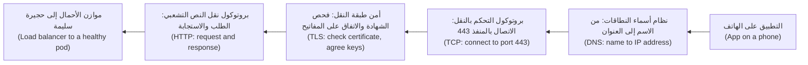

**نظام أسماء النطاقات (DNS).** يحوّل **نظام أسماء النطاقات (Domain Name System)** الأسماء إلى عناوين (turns names into addresses). أنواع السجلات (record types) التي ستستخدمها أكثر من غيرها:

| السجل (Record) | يربط (Maps) | مثال استخدام (Example use) |
|---|---|---|
| **A** | اسم إلى عنوان IPv4 (Name to an IPv4 address) | `api.najm.example` إلى عنوان IPv4 لموازن الأحمال (load balancer) |
| **AAAA** | اسم إلى عنوان IPv6 (Name to an IPv6 address) | الأمر نفسه، لعملاء IPv6 (IPv6 clients) |
| **CNAME** | اسم إلى اسم آخر (Name to another name) | `api.najm.example` إلى الاسم الذي يمنحك إياه موازن أحمال سحابي (cloud load balancer) أو شبكة توصيل محتوى (CDN) |
| **TXT** | اسم إلى نص حر (Name to free text) | إثبات ملكية النطاق (proving domain ownership) لهيئة شهادات (certificate authority) أو لمزوّد بريد إلكتروني (email provider) |

لكل سجل **مدة بقاء (TTL, time to live)**: أي عدد الثواني التي يجوز فيها للمحلِّلات (resolvers) تخزين الإجابة مؤقتًا (cache the answer). مع TTL قيمته 3600، قد يستغرق التغيير ساعة كي يصل إلى الجميع. قبل ترحيل مخطط له (planned migration)، اخفض قيمة TTL (lower the TTL) قبل الموعد بمدة TTL قديمة واحدة على الأقل (at least one old TTL period in advance)؛ ثم ارفعها مجددًا بعد ذلك.

**فئات حالة HTTP (HTTP status classes).** يخبرك الرقم الأول من رمز الحالة (status code) على من يقع اللوم (who to blame):

| الفئة (Class) | المعنى (Meaning) | أمثلة نموذجية (Typical examples) |
|---|---|---|
| 2xx | نجاح (Success) | 200 OK، 201 Created |
| 3xx | اذهب إلى مكان آخر (Go elsewhere) | 301 أو 308 إعادة توجيه دائمة (permanent redirect) |
| 4xx | رُفض طلب العميل (The client's request was refused) | 401 غير مُصادَق (not authenticated)، 403 غير مسموح (not allowed)، 404 غير موجود (not found)، 429 طلبات كثيرة جدًا (too many requests) |
| 5xx | فشل جانب الخادم (The server side failed) | 500 خطأ في التطبيق (application error)، 502 بوابة سيئة (bad gateway)، 503 غير متاح (unavailable)، 504 انتهاء مهلة البوابة (gateway timeout) |

الرمز **502** أو **504** الذي يعيده موازن أحمال (load balancer) أو وكيل (proxy) يعني عادةً أن *الشيء الذي خلفه* (the thing behind it) فشل أو لم يُجب في الوقت المحدد (did not answer in time). انظر إلى الخلفية (the backend)، لا إلى موازن الأحمال.

**أمن طبقة النقل (TLS).** يشفّر **أمن طبقة النقل (Transport Layer Security)** حركة البيانات ويُثبت هوية الخادم (proves the server's identity). يقدّم الخادم **شهادة (certificate)**: وهي بيان موقَّع (a signed statement) يقول «هذا المفتاح العام (public key) يخص `api.najm.example`، وهو صالح من هذا التاريخ إلى ذاك»، تُصدره **هيئة شهادات (certificate authority, CA)** يثق بها العميل مسبقًا، غالبًا عبر شهادة وسيطة أو أكثر (intermediate certificates) تشكّل **السلسلة (chain)**. إذا فشل الاسم أو التواريخ أو السلسلة في فحوص العميل (the client's checks)، يتوقف الاتصال قبل إرسال أي HTTP، ولهذا لم يرَ يوسف شيئًا في سجلات التطبيق (application logs). الإصدار TLS 1.3 (RFC 8446) هو الحالي؛ وما زال TLS 1.2 شائعًا. أما التفاصيل التشفيرية (cryptographic detail) فمكانها [*أمن الذكاء الاصطناعي والتطبيقات (Secure AI & Application Security)*، الدرس 5.1 — التشفير للبنّائين (Cryptography for builders): TLS والتجزئة والتشفير والمفاتيح (TLS, hashing, encryption and keys)](../secai/index.ar.html#/5.1)؛ أما هنا فيعنينا تشغيله (operating it).

#### 🟡 التعمق أكثر (Going deeper)

**المشي على السلسلة (Walking the chain).** حين يقول أحدهم «إنه متوقف» (it's down)، اختبر كل قفزة بالترتيب (test each hop in order) وتوقّف عند أول قفزة تفشل (the first one that fails):

```bash
# 1. DNS: does the name resolve, and to what?
dig +short api.najm.example A
dig api.najm.example            # full answer, including the TTL

# 2. TCP: can we open a connection to the port?
nc -vz api.najm.example 443

# 3. TLS: what certificate is presented, for which name, valid until when?
openssl s_client -connect api.najm.example:443 -servername api.najm.example </dev/null 2>/dev/null \
  | openssl x509 -noout -subject -issuer -dates

# 4. HTTP: what does the server answer?
curl -sv https://api.najm.example/health -o /dev/null
```

غالبًا ما يغطي `curl -v` وحده الخطوات الأربع كلها؛ تعلّم قراءة مخرجاته (read its output) سطرًا سطرًا.

**قراءة النتيجة (Reading the result).**

| العَرَض (Symptom) | القفزة التي فشلت (Hop that failed) | الأسباب المعتادة (Usual causes) |
|---|---|---|
| `NXDOMAIN` أو لا إجابة من `dig` | DNS | سجل مفقود أو محذوف (record missing or deleted)، منطقة خاطئة (wrong zone)، انتهاء تسجيل النطاق (expired domain registration) |
| `Connection refused` | TCP | لا شيء يُنصت على ذلك المنفذ (nothing listening on that port)، أو خدمة مرتبطة بـ `127.0.0.1` (service bound to) |
| يتعلّق الاتصال ثم تنتهي مهلته (connection hangs, then times out) | الشبكة (Network) | جدار حماية (firewall) أو مجموعة أمان (security group) تُسقط الحزم (drops the packets)، مسار خاطئ (wrong route)، شبكة فرعية خاطئة (wrong subnet) |
| `certificate has expired` أو عدم تطابق الاسم (name mismatch) | TLS | فشل التجديد (renewal failed)، شهادة خاطئة على المُنصِت (wrong certificate on the listener)، غياب SNI (missing SNI) |
| 502 أو 504 من موازن الأحمال (from the load balancer) | خلف موازن الأحمال (Behind the load balancer) | لا خلفيات سليمة (no healthy backends)، انتهاء مهلة الخلفية (backend timeout)، فشل فحص السلامة (failing health check) |
| 401 أو 403 | التطبيق أو البوابة (Application or gateway) | رمز منتهي الصلاحية (expired token)، صلاحية مفقودة (missing permission)، قاعدة جدار حماية تطبيقات الويب (WAF rule) |

*الرفض (Refused)* يعني أن جهازًا أجاب ولا شيء يُنصت (nothing is listening)؛ أي أن المسار يعمل (the path works). أما *انتهاء المهلة (timeout)* فيعني عادةً أن شيئًا ما أسقط الحزم بصمت (silently dropped the packets)، وهو في الغالب قاعدة جدار حماية (firewall rule).

**إشارة اسم الخادم (SNI).** كثيرًا ما يخدم موازن أحمال واحد أسماء كثيرة على عنوان واحد (many names on one address)؛ فيسمّي العميل المضيف الذي يريده في مصافحة TLS (TLS handshake) عبر **إشارة اسم الخادم (Server Name Indication)** كي تُختار الشهادة الصحيحة (the right certificate). ومن هنا الخيار `-servername` أعلاه: من دونه قد ترى شهادة افتراضية (default certificate) فتستنتج استنتاجًا خاطئًا (draw the wrong conclusion).

**موازنات الأحمال من الطبقة 4 والطبقة 7 (Layer 4 and layer 7 load balancers).** يمرّر موازن الأحمال من **الطبقة 4 (layer 4, L4)** اتصالات TCP أو UDP دون قراءة HTTP بداخلها: سريع ومستقل عن البروتوكول (fast and protocol-agnostic). أما موازن الأحمال من **الطبقة 7 (layer 7, L7)** فيفهم HTTP: فهو يُنهي TLS (terminates TLS)، ويوجّه حسب المضيف أو المسار (routes by host or path) (`/v1/payments` إلى خدمة، و`/v1/cards` إلى أخرى)، ويعيد صفحات أخطاء خاصة به (its own error pages). تقع واجهة برمجة تطبيق نجم للهاتف (Najm Mobile API) خلف موازن أحمال L7، لذا فإن 502 هناك يعني أن الخلفية أساءت التصرف (the backend misbehaved).

**الخدمات مع systemd (Services with systemd).** على الجهاز الافتراضي (VM)، يحدد **ملف الوحدة (unit file)** في systemd كيف تعمل الخدمة: الأمر (the command)، والمستخدم الذي تعمل باسمه (the user it runs as) — وليس الجذر (root) أبدًا إلا عند الضرورة — وهل يُعاد تشغيلها عند الفشل (restart it on failure) (`Restart=on-failure`). في الحاويات، تحلّ بيئة التشغيل (the runtime) وKubernetes محل systemd، لكن الأفكار تنتقل كما هي: عملية خاضعة للإشراف (a supervised process)، وسياسة إعادة تشغيل (a restart policy)، ومستخدم غير جذري (a non-root user).

**العناوين الخاصة (Private addresses).** يحجز RFC 1918 ثلاثة نطاقات IPv4 للشبكات الخاصة (private networks): `10.0.0.0/8` و`172.16.0.0/12` و`192.168.0.0/16`. اللاحقة `/16` هي ترميز **CIDR (CIDR notation)**: أول 16 بتًا تسمّي الشبكة (name the network)، فيضم `10.20.0.0/16` عدد 65,536 عنوانًا، ويضم `10.20.1.0/24` عدد 256 عنوانًا. يستخدم الدرس 1.2 هذه النطاقات لتخطيط الشبكات السحابية (plan cloud networks).

#### 🔴 نظرة الخبير (Expert view)

**أتمِت الشهادات، ثم أطلق التنبيهات على أي حال (Automate certificates, then alert anyway).** التجديد السنوي اليدوي (manual yearly renewal) انقطاعٌ موقوتٌ ينتظر موعده (an outage on a timer). استخدم **ACME** (RFC 8555)، وهو البروتوكول (the protocol) الذي يقوم عليه Let's Encrypt، أو مدير الشهادات لدى مزوّدك (your provider's certificate manager)، وفي Kubernetes متحكّمًا (controller) مثل cert-manager. وقد اتفق منتدى CA/Browser Forum على تقصير الحد الأقصى لعمر الشهادات العامة (maximum public certificate lifetimes) على مراحل خلال السنوات المقبلة (تحقّق من الحد الحالي، check the current limit)، مما يجعل التجديد اليدوي غير عملي (unworkable). ومع ذلك أطلق تنبيهًا (alert) قبل انتهاء الصلاحية بـ 14 يومًا مثلًا: فالأتمتة تفشل بصمت (automation fails quietly) عندما يتغير DNS أو الصلاحيات (permissions).

**نظام DNS تبعيةٌ لكل شيء (DNS is a dependency of everything).** قد تعتمد أدوات المراقبة (monitoring) وأدوات النشر (deploy tools) ومحادثة الحوادث (incident chat) لديك على نظام DNS والشبكة نفسيهما اللذين تحاول إصلاحهما، كما أظهر انقطاع Facebook عام 2021. احتفظ بقائمة «خارج النطاق» (out-of-band) لكيفية الوصول إلى لوحات التحكم (consoles) وأدلة التشغيل (runbooks) وبعضكم بعضًا إذا توقفت أسماؤكم عن التحليل (stop resolving).

**افحص من الخارج (Probe from outside).** تُظهر لوحات المعلومات (dashboards) داخل العنقود (cluster) حجيرات سليمة (healthy pods)، لا ما إذا كان العملاء قادرين على الوصول إليها. أما **الفحص الاصطناعي (synthetic check)** — وهو طلب مُجدوَل (a scheduled request) من خارج شبكتك، ويُفضَّل من عدة أماكن — فيختبر السلسلة كاملة من جهة العميل (from the customer's side)، وكان سيكتشف شهادة نجم المنتهية قبل أن يكتشفها مركز الاتصال. يبني الدرس 5.2 هذا الفحص.

**اختبر من حيث يوجد العميل (Test from where the client is).** قد يختلف المحلِّل (resolver) أو الوكيل (proxy) أو مسار الشبكة الافتراضية الخاصة (VPN route) على حاسوبك عن تلك التي لدى العميل.

### 🧰 الأدوات (The toolkit)
| الأداة أو الممارسة أو الخدمة (Tool, practice or service) | ما هي وماذا تفعل (What it is and does) | متى تلجأ إليها (When to reach for it) |
|---|---|---|
| **curl** | عميل HTTP لسطر الأوامر (command-line HTTP client)؛ يعرض الخيار `-v` نظام DNS والاتصال وTLS وHTTP في تشغيل واحد (in one run) | أول اختبار لأي بلاغ «إنه متوقف» (it's down report)؛ فحوص السلامة (health checks)؛ النصوص البرمجية (scripts) |
| **dig** | يستعلم DNS ويعرض السجلات (records) وقيم TTL وأي خادم أجاب (which server answered) | فحص سجل بعد تغيير (after a change)؛ تشخيص فشل التحليل (diagnosing resolution failures) |
| **openssl s_client** | يفتح اتصال TLS ويعرض سلسلة الشهادات المقدَّمة (presented certificate chain) | فحص أسماء الشهادات (certificate names) وجهات إصدارها (issuers) وتواريخ انتهائها (expiry dates) |
| **ss** | يسرد المقابس (lists sockets): المنافذ المُنصِتة (listening ports) والعمليات التي تملكها | حالة «رُفض الاتصال» (Connection refused)؛ فحص العنوان الذي ترتبط به الخدمة (bound to) |
| **ACME** (RFC 8555) | بروتوكول للإصدار والتجديد التلقائيين للشهادات (automatic certificate issuance and renewal) | كل شهادة عامة (every public certificate)؛ لا تجدّد يدويًا أبدًا (never renew by hand) |
| **Synthetic check** | الفحص الاصطناعي: طلب مُجدوَل (a scheduled request) إلى خدمتك من خارج شبكتك (from outside your network) | اكتشاف أعطال DNS وTLS والحافة (edge failures) التي تفوّتها لوحات المعلومات الداخلية (internal dashboards) |

### 🏛️ عمليًا في بنك نجم (In practice at Najm Bank)
بعد حادثة الشهادة (certificate incident)، تطلب مها من يوسف كتابة **دليل تشغيل الاستجابة الأولى (first-response runbook)** للفريق لحالة «تعذّر الوصول إلى واجهة برمجة تطبيق نجم للهاتف» (the Najm Mobile API is unreachable). يوضع الدليل بجوار التنبيه (next to the alert)، فيتبع المناوب (whoever is on call) الخطوات نفسها.

**دليل التشغيل RB-001: تعذّر الوصول إلى واجهة برمجة تطبيق نجم للهاتف — امشِ على السلسلة (Najm Mobile API unreachable — walk the chain)**

| الخطوة (Step) | الأمر (Command) — من خارج الشبكة أولًا، ثم من حجيرة (from outside the network first, then from a pod) | النتيجة السليمة (Healthy result) | إن فشلت، افحص (If it fails, check) |
|---|---|---|---|
| 1. نظام أسماء النطاقات (DNS) | `dig +short api.najm.example` | اسم شبكة توصيل المحتوى (CDN) أو موازن الأحمال (load balancer) | سجل تغييرات DNS (DNS change log)؛ تسجيل النطاق (domain registration) |
| 2. بروتوكول التحكم بالنقل (TCP) | `nc -vz api.najm.example 443` | `succeeded` | حالة الحافة أو جدار حماية تطبيقات الويب (edge or WAF status)؛ تغييرات جدار الحماية (firewall changes) |
| 3. أمن طبقة النقل (TLS) | `openssl s_client ... \| openssl x509 -noout -dates -subject` | الاسم الصحيح (right name)؛ انتهاء الصلاحية بعد أكثر من 14 يومًا (expiry over 14 days away) | مدير الشهادات (certificate manager)؛ سجلات تجديد ACME (ACME renewal logs) |
| 4. بروتوكول نقل النص التشعبي (HTTP) | `curl -sv https://api.najm.example/health` | `200` | 502 أو 504: جاهزية الخلفية (backend readiness)؛ 403: قواعد جدار حماية تطبيقات الويب (WAF rules)؛ 5xx: سجلات التطبيق (app logs) |
| 5. الخلفية (Backend) | `kubectl get pods -n mobile-api`، ثم السجلات (then logs) | كلها جاهزة (all ready) | عمليات النشر الأخيرة (recent deploys): تراجَع أولًا، وحقّق ثانيًا (roll back first, investigate second) |

**قواعد مرفقة بدليل التشغيل (Rules attached to the runbook):**
- انشر أول قفزة فاشلة (the first failing hop) ومخرجاتها الدقيقة (exact output) في قناة الحادثة (incident channel) قبل تغيير أي شيء؛ ولا تُعِد تشغيل أحمال العمل (do not restart workloads) حتى تشير الخطوة 4 إلى الخلفية (points at the backend).
- متابعات هذه الحادثة (follow-ups from this incident): تجديد ACME لكل شهادة (ACME renewal for every certificate)، وتنبيه قبل انتهاء الصلاحية بـ 14 يومًا (an alert 14 days before expiry)، وفحص اصطناعي خارجي (external synthetic check) على `/health` كل دقيقة من موقعين (from two locations).

### 🛠️ التمارين (Exercises)
تُنفَّذ جميع التمارين على جهازك الخاص (your own machine) باستخدام Docker وطرفية (terminal).

- 🟢 نفّذ `curl -v https://example.com` وصنّف كل سطر من المخرجات (label each line of output) على أنه DNS أو TCP أو TLS أو HTTP. ثم استخدم `dig` و`openssl s_client` لتدوين قيمة TTL للسجل (the record's TTL) وجهة إصدار الشهادة وتاريخ انتهائها (the certificate's issuer and expiry date). *يكتمل عندما (Done when):* تستطيع أن تشير إلى موضع نجاح كل قفزة (where each hop succeeded) وأن تقول متى تنتهي صلاحية الشهادة.
- 🟡 اكتب خادم HTTP صغيرًا (a tiny HTTP server) يُنصت على `127.0.0.1:8080`، وشغّله بالأمر `docker run -p 8080:8080`، وحاول الوصول إليه من جهازك المضيف (from your host). شخّص المشكلة بالأمر `ss -tlnp` داخل الحاوية، وأصلح عنوان الربط (fix the bind address)، وتحقّق. ثم اجعله يسجّل «shutting down» عند استقبال SIGTERM (log on SIGTERM) وتحقّق من أن `docker stop` يُظهر الرسالة. *يكتمل عندما (Done when):* يُصلَح السلوكان كلاهما (both behaviours are fixed) وتستطيع شرح كل فشل في جملتين.
- 🔴 اكتب `walk-the-chain.sh <hostname>`: ينفّذ الاختبارات الأربعة بالترتيب (the four tests in order)، ويطبع PASS أو FAIL لكل قفزة (per hop) مع التفصيل الأساسي (the key detail) — العنوان (address)، وانتهاء صلاحية الشهادة (certificate expiry)، وحالة HTTP (HTTP status) — ويخرج برمز غير صفري (exit non-zero) عند أول فشل (at the first failure). اختبره على موقع يعمل (a working site)، واسم غير موجود (a non-existent name)، ومنفذ محلي مغلق (a closed local port)، وشهادة منتهية الصلاحية (an expired certificate) — يستضيف badssl.com مواقع اختبار معطوبة عمدًا (deliberately broken test sites). *يكتمل عندما (Done when):* يتوقف كل فشل عند القفزة الصحيحة (the right hop) برسالة واضحة (a clear message).

### ⚠️ أخطاء وفخاخ (Mistakes and traps)
- **إعادة التشغيل قبل التشخيص (Restarting before diagnosing).** امشِ على السلسلة أولًا (walk the chain first)؛ ولا تُعِد التشغيل إلا حين تشير الأدلة إلى العملية (the evidence points at the process).
- **الربط بالمضيف المحلي داخل الحاوية (Binding to localhost in a container).** يتعذّر الوصول إلى الخدمة من الخارج (unreachable from outside). اربطها بـ `0.0.0.0` (أو بالواجهة المحددة التي تقصدها، the specific interface you mean) ودع سياسة الشبكة (network policy) تقرر من يحق له الاتصال.
- **تجديد الشهادات يدويًا (Renewing certificates by hand).** ينسى أحدهم فيُظلم الموقع (the site goes dark). أتمِت باستخدام ACME (automate with ACME) وأطلق تنبيهًا قبل انتهاء الصلاحية (alert before expiry).
- **تجاهل SIGTERM (Ignoring SIGTERM).** كل عملية نشر تُسقط طلبات (every deploy drops requests). توقّف عن قبول عمل جديد (stop taking new work)، وأنهِ الطلبات الحالية (finish current requests)، ثم اخرج (then exit).
- **تشغيل الخدمات بصلاحيات الجذر (Running services as root).** يتحوّل خلل واحد (one bug) إلى سيطرة كاملة على الجهاز (full control of the machine). شغّلها باسم مستخدم مخصّص (a dedicated user) لا يملك إلا الملفات التي يحتاجها.

### 🧾 الخلاصة (Recap)
- لينكس وسطر الأوامر هما أرضية كل منصة (the floor of every platform): العمليات (processes)، والإشارات (signals)، والصلاحيات (permissions)، والخدمات (services)، والسجلات (logs).
- يعبر الطلب DNS ثم TCP ثم TLS ثم HTTP بالترتيب (in order)؛ ولكل قفزة اختبارها الخاص (its own test).
- «الرفض» (Refused) يعني أن لا شيء يُنصت (nothing is listening)؛ وانتهاء المهلة (a timeout) يعني عادةً أن شيئًا يُسقط الحزم (dropping packets).
- تشير فئات حالة HTTP (HTTP status classes) إلى الجانب المذنب (the guilty side)؛ والرمز 502 أو 504 عند موازن الأحمال يشير إلى ما خلفه (points behind it).
- أتمِت الشهادات (automate certificates)، وأطلق التنبيه قبل انتهاء الصلاحية (alert before expiry)، وافحص من الخارج (probe from outside).

### ✍️ اختبر نفسك (Check yourself)

**1. يُبلغ العملاء أن تطبيق نجم لا يفتح (will not load). جميع الحجيرات تعمل (all pods are running) وسجلات التطبيق (application logs) لا تُظهر أخطاء. ماذا ينبغي أن يفعل يوسف أولًا (first)؟**

- A. يعيد تشغيل النشر (restart the deployment) لمسح أي حالة سيئة في الذاكرة (bad in-memory state)
- B. ينفّذ `curl -v` على نقطة فحص السلامة (health endpoint) من الخارج ويجد القفزة الفاشلة (the failing hop)
- C. يوسّع النشر (scale the deployment up) كي تتقاسم نسخ متماثلة أكثر (more replicas) الحمل
- D. يتراجع (roll back) عن آخر عملية نشر إلى آخر إصدار معروف السلامة (last known-good version)

<details><summary>الإجابة</summary>

**B.** الحجيرات السليمة مع سجلات فارغة توحي بأن الطلبات لا تصل إلى التطبيق أصلًا (never reach the application)، فاختبر السلسلة من جهة العميل (from the customer's side). أما A وC وD فتغيّر الأشياء دون دليل (without evidence). (🟡 التعمق أكثر، Going deeper).

</details>

**2. تعمل خدمة جيدًا على حاسوب مطوّر (developer's laptop). داخل حاوية، يفشل `curl` من الجهاز المضيف فورًا (fails at once) — رفض أو إعادة تعيين (refused or reset) — ويُظهر `ss -tlnp` داخل الحاوية أنها تُنصت على `127.0.0.1:8080`. ما الخطأ؟**

- A. جدار حماية (firewall) داخل صورة الحاوية (container image) يحجب حركة البيانات الواردة (inbound traffic) على المنفذ 8080
- B. شهادة TLS المقدَّمة (TLS certificate presented) لا تطابق اسم المضيف المطلوب (requested host name)
- C. لا يستطيع DNS الداخلي في Docker (Docker's internal DNS) تحليل اسم الحاوية
- D. تُنصت الخدمة على عنوان الاسترجاع (listens on loopback)، فلا يمكن الوصول إليها إلا من داخل الحاوية

<details><summary>الإجابة</summary>

**D.** العنوان `127.0.0.1` داخل الحاوية هو الحاوية نفسها. اربط الخدمة بـ `0.0.0.0`. جدار الحماية (A) يسبب عادةً انتهاء مهلة (timeout)، لا فشلًا فوريًا (immediate failure)، والطلب لا يصل إلى TLS (B) ولا يحتاج إلى DNS (C). (🟢 الأساسيات، The essentials).

</details>

**3. سينقل الفريق `api.najm.example` إلى موازن أحمال جديد (new load balancer) يوم الثلاثاء المقبل. قيمة TTL للسجل 86,400 ثانية (يوم واحد). ماذا ينبغي أن يفعلوا؟**

- A. خفض TTL إلى دقائق (lower the TTL to minutes) قبل يوم أو أكثر، ثم التبديل (switch)، ثم رفعها مجددًا
- B. تغيير السجل يوم الثلاثاء؛ فقيمة TTL لا تؤثر إلا في العملاء الذين لم يسألوا من قبل (never asked before)
- C. حذف السجل القديم أولًا، وانتظار مسح ذاكرات التخزين المؤقت (caches to clear)، ثم إنشاء السجل الجديد
- D. رفع TTL مسبقًا (raise the TTL beforehand) كي تبقى الإجابة الجديدة مخزّنة مؤقتًا مدة أطول بعد وصولها

<details><summary>الإجابة</summary>

**A.** تحتفظ ذاكرات التخزين المؤقت (caches) بالإجابة القديمة مدة تصل إلى TTL، لذا فإن خفضها مسبقًا يجعل التبديل ينتشر سريعًا (propagate quickly). يتجاهل B التخزين المؤقت (ignores caching)؛ ويسبب C فشل التحليل (resolution failures)؛ ويزيد D الأمر سوءًا. (🟢 الأساسيات، The essentials).

</details>

**4. يعيد موازن الأحمال L7 (L7 load balancer) الواقع أمام واجهة برمجة تطبيق نجم للهاتف الرمز 504 Gateway Timeout. من أين ينبغي أن يبدأ التحقيق (the investigation)؟**

- A. سجلات DNS للواجهة (DNS records for the API)
- B. شهادة TLS على موازن الأحمال (TLS certificate on the load balancer)
- C. الخلفيات خلف موازن الأحمال (backends behind the load balancer): سلامتها (health) وجاهزيتها (readiness) وأزمنة استجابتها (response times)
- D. شبكة الهاتف المحمول لدى العميل (customer's mobile network)

<details><summary>الإجابة</summary>

**C.** كي يعيد موازن الأحمال 504 أصلًا، لا بد أن DNS (A) وTLS (B) وشبكة العميل (D) قد عملت؛ فالخلفية لم تُجب في الوقت المحدد (did not answer in time). (🟢 الأساسيات، The essentials).

</details>

**5. يوقف Kubernetes حجيرة أثناء عملية نشر (during a deploy). ماذا يحدث، وماذا يجب أن يفعل التطبيق؟**

- A. يرسل SIGKILL فورًا (immediately)، فلا يحظى التطبيق بفرصة للتنظيف (clean up)
- B. يرسل SIGTERM، ثم SIGKILL بعد مهلة سماح (grace period)؛ وعلى التطبيق تصريف العمل الجاري (drain in-flight work) ثم الخروج
- C. يرسل SIGHUP، وعلى التطبيق إعادة تحميل إعداداته (reload its configuration) ومواصلة الخدمة
- D. يحذف صورة الحاوية (container image)، فيجب على التطبيق أولًا حفظ حالته على القرص المحلي (local disk)

<details><summary>الإجابة</summary>

**B.** الإشارة SIGTERM هي الطلب المهذّب (the polite request)؛ وتليها SIGKILL بعد مهلة السماح (30 ثانية افتراضيًا، by default). تجاهل SIGTERM يُسقط طلبات مع كل عملية نشر (drops requests on every deploy). (🟢 الأساسيات، The essentials).

</details>

### 📚 المراجع (References)
- RFC 8446، بروتوكول أمن طبقة النقل الإصدار 1.3 (The Transport Layer Security (TLS) Protocol Version 1.3) — https://www.rfc-editor.org/rfc/rfc8446
- RFC 9110، دلالات HTTP (HTTP Semantics) — https://www.rfc-editor.org/rfc/rfc9110
- RFC 1035، أسماء النطاقات: التنفيذ والمواصفات (Domain Names: Implementation and Specification) — https://www.rfc-editor.org/rfc/rfc1035
- RFC 1918، تخصيص العناوين للإنترنتات الخاصة (Address Allocation for Private Internets) — https://www.rfc-editor.org/rfc/rfc1918
- RFC 8555، بيئة الإدارة الآلية للشهادات (Automatic Certificate Management Environment, ACME) — https://www.rfc-editor.org/rfc/rfc8555
- صفحات دليل لينكس (Linux man pages) (signal، ss، systemd.service) — https://man7.org/linux/man-pages/
- توثيق systemd (systemd documentation) — https://systemd.io/
- Kubernetes، دورة حياة الحجيرة وإنهاؤها (Pod lifecycle and termination) — https://kubernetes.io/docs/concepts/workloads/pods/pod-lifecycle/
- Meta Engineering، «مزيد من التفاصيل حول انقطاع 4 أكتوبر» (More details about the October 4 outage) — https://engineering.fb.com/2021/10/05/networking-traffic/outage-details/
- للتوسّع (Going further): [*تصميم الأنظمة لمبرمجي الحدس (System Design for Vibe Coders)*، الدرس F.1 — ماذا يحدث عندما تفتح موقعًا إلكترونيًا (What happens when you open a website)](../vibe/index.ar.html#lF-1) و[*تصميم الأنظمة لمبرمجي الحدس (System Design for Vibe Coders)*، الدرس 11.1 — النطاقات وDNS وTLS (Domains, DNS, and TLS)](../vibe/index.ar.html#l11-1)

<a id="l1-2"></a>

## 1.2 — أساسيات السحابة (Cloud fundamentals): المناطق ومناطق التوافر والحوسبة والتخزين والخدمات المُدارة والمسؤولية المشتركة (regions, zones, compute, storage, managed services and shared responsibility)

*المستوى: 🟢 مبتدئ* · *المتطلبات: 1.1* · *المرحلة (Phase): Plan, Deploy*

### ⚡ الدرس في دقيقة (In 60 seconds)
- يؤجّرك مزوّد السحابة (cloud provider) قدرة حوسبة عند الطلب (computing on demand)، عبر واجهة برمجة تطبيقات (through an API)، بفوترة حسب الاستخدام (billed by use). تبيع **AWS** و**Microsoft Azure** و**Google Cloud** لبنات بناء متشابهة (similar building blocks) بأسماء مختلفة.
- التخطيط المادي (the physical layout) هو أول قرار تصميمي (the first design decision): **المنطقة (region)** مساحة جغرافية (a geographic area)؛ و**منطقة التوافر (availability zone)** مركز بيانات منفصل أو أكثر (one or more separate data centres) داخلها. وزّع بيئة الإنتاج (spread production) على **منطقتَي توافر على الأقل (at least two zones)**؛ ولا تفكّر في منطقة ثانية (a second region) إلا لسبب واضح يتعلق بالتعافي أو بمكان إقامة البيانات (a clear recovery or residency reason).
- اختر **الخدمة الأكثر إدارةً (the most managed service)** التي تلبّي احتياجاتك: فأنت تدفع لتسليم الترقيع (patching) والنسخ الاحتياطي (backups) وتجاوز الفشل (failover) لغيرك.
- يأتي التخزين (storage) في ثلاثة أشكال: **الكائنات (object)** — ملفات بمفتاح عبر HTTP (files by key over HTTP)، و**الكتل (block)** — قرص لجهاز واحد (a disk for one machine)، و**الملفات (file)** — مجلد شبكي مشترك (a shared network folder). اختر حسب نمط الوصول (by access pattern)، لا حسب العادة (not habit).
- يقول **نموذج المسؤولية المشتركة (shared responsibility model)** إن المزوّد يؤمّن السحابة (secures the cloud) وأنت تؤمّن ما تضعه فيها (what you put in it). الإعدادات (configuration) والهوية (identity) والبيانات (data) مسؤوليتك دائمًا.
- أكبر فخ (biggest trap): اعتبار «إنه في السحابة» (it's in the cloud) مرادفًا لـ«إنه مرن» (it's resilient). النشر في منطقة توافر واحدة (single-zone deployment) بلا نسخ احتياطية مُختبَرة (no tested backups) يفشل تمامًا كما كان يفشل الخادم الواحد (a single server).

### 🧭 لماذا يهم (Why it matters)
قرّر بنك نجم (Najm Bank) نقل واجهة برمجة تطبيق نجم للهاتف (Najm Mobile API) خارج مركز بياناته (data centre). يطلب سالم من يوسف صياغة مذكرة التموضع (placement note): أي منطقة (which region)، وكم منطقة توافر (how many zones)، وأي خدمات (which services)، وما الذي يبقى نجم مالكًا له (what Najm still owns) بعد أن يشغّل المزوّد العتاد (the hardware). تسرد المسودة الأولى ليوسف «عنقود Kubernetes وجهاز افتراضي لـ PostgreSQL» (a Kubernetes cluster and a PostgreSQL VM) في منطقة توافر واحدة، لأن هذه هي الطريقة التي كان يعمل بها في المقر (on-premises). يعيدها سالم مع ثلاثة أسئلة: «ماذا يحدث عندما تمر منطقة التوافر تلك بيوم سيئ (a bad day)؟ من يرقّع قاعدة البيانات تلك (who patches that database)؟ وأي من الجهات التنظيمية (regulators) للبنك تحتاج إلى معرفة مكان بيانات العملاء (where customer data sits)؟»

في 28 فبراير 2017، تعطّلت خدمة Amazon S3 في منطقة US-EAST-1 (شمال فرجينيا، Northern Virginia) لعدة ساعات. وفقًا للملخّص العام من AWS (AWS's public summary)، أُدخل أمر يُقصد به إزالة عدد صغير من الخوادم بمُدخل خاطئ (a wrong input)، فأزال مجموعة أكبر بكثير، منها خوادم كانت تعتمد عليها أنظمة S3 الفرعية الأساسية (core S3 subsystems). وتعطّلت معها خدمات كثيرة كانت تحفظ بياناتها في تلك المنطقة الوحيدة. لم يكن الدرس «تجنّب السحابة» (avoid the cloud)، بل كان: اعرف أي منطقة وأي خدمات تعتمد عليها، واعرف ما الذي يفشل معًا (what fails together)، وصمّم لذلك عن قصد (design for it on purpose).

### 📐 كيف يعمل (How it works)

#### 🟢 الأساسيات (The essentials)

**ما معنى «السحابة» (What "cloud" means).** يسرد تعريف NIST (SP 800-145، 2011): الخدمة الذاتية عند الطلب (on-demand self-service)، والوصول الواسع عبر الشبكة (broad network access)، وتجميع الموارد (resource pooling)، والمرونة السريعة (rapid elasticity)، والخدمة المُقاسة (measured service). عمليًا: تطلب من واجهة برمجة تطبيقات (API) خادمًا (server) أو قاعدة بيانات (database) أو حاوية تخزين (bucket)، فيوجد خلال دقائق، وتدفع حتى تحذفه. ولأن كل شيء استدعاء لواجهة برمجة تطبيقات (an API call)، يديره الدرس 3.1 بوصفه شيفرة (as code).

**نماذج الخدمة (Service models).** تختلف النماذج في مقدار الحزمة التقنية (the stack) الذي تشغّله أنت:

| النموذج (Model) | ما تحصل عليه (You get) | ما تظل تديره (You still manage) | مثال من نجم (Najm example) |
|---|---|---|---|
| **IaaS** (البنية التحتية بوصفها خدمة، infrastructure as a service) | أجهزة افتراضية (virtual machines)، وأقراص (disks)، وشبكات (networks) | نظام التشغيل (operating system)، والترقيع (patching)، وبيئة التشغيل (runtime)، والتطبيق (application)، والبيانات (data) | جهاز افتراضي (VM) لمهمة دفعية قديمة (legacy batch job) |
| **PaaS** (المنصة بوصفها خدمة، platform as a service) | بيئة تشغيل أو خدمة مُدارة (a managed runtime or service): قاعدة بيانات، ومستوى تحكم Kubernetes (Kubernetes control plane)، ومنصة تطبيقات (app platform) | الإعدادات (configuration)، والتطبيق، والبيانات، والوصول (access) | PostgreSQL مُدار (managed PostgreSQL) لواجهة برمجة تطبيق نجم للهاتف |
| **Serverless** (الحوسبة بلا خوادم) | شيفرة أو حاويات تعمل لكل طلب أو حدث (per request or event)؛ لا خوادم ظاهرة (no servers to see)؛ فوترة حسب الاستخدام (billed per use) | الشيفرة (code)، والإعدادات، والصلاحيات (permissions)، والبيانات | دالة (function) تغيّر حجم صور الشيكات المرفوعة (uploaded cheque images) |
| **SaaS** (البرمجيات بوصفها خدمة، software as a service) | تطبيق جاهز (a finished application) | المستخدمون (users)، والإعدادات، والبيانات | أدوات البريد الإلكتروني والتذاكر (email and ticketing tools) في البنك |

**المناطق ومناطق التوافر (Regions and zones).** **المنطقة (region)** مساحة جغرافية منفصلة (a separate geographic area) تضم مراكز بيانات المزوّد. **منطقة التوافر (availability zone, AZ)** — وتسميها Google ببساطة «zones» — مركز بيانات واحد أو أكثر داخل المنطقة، له طاقته (power) وتبريده (cooling) وشبكته (networking) المستقلة، ومتصل بمناطق التوافر الأخرى بروابط خاصة سريعة (fast private links). صُمّمت مناطق التوافر بحيث تفشل إحداها دون الأخرى (one can fail without the others). لا توفّر كل منطقة عدة مناطق توافر، ولا تتوفر كل خدمة في كل منطقة؛ راجع قائمة المناطق الحالية لكل مزوّد (each provider's current region list).

يتوقف اختيار المنطقة (region choice) على **زمن الاستجابة (latency)** للمستخدمين، و**مكان إقامة البيانات (data residency)** — أي حيث تشترط الجهات التنظيمية أو العقود بقاء البيانات (where regulators or contracts require data to stay) — و**توفر الخدمات (service availability)**، و**التكلفة (cost)** التي تختلف من منطقة إلى أخرى. يشغّل المزوّدون الثلاثة الكبار (all three major providers) مناطق في الخليج (Gulf regions) وقت كتابة هذا النص (2026)؛ تحقّق من الخدمات التي يوفّرها كلٌّ منهم.

**الحوسبة (Compute).** ثلاثة أشكال رئيسية (three main shapes):
- **الأجهزة الافتراضية (Virtual machines)** (AWS EC2، Azure Virtual Machines، Google Compute Engine): تختار حجمًا (a size) — المعالج والذاكرة (CPU, memory) — وصورة (an image) وشبكة (a network)؛ وتدير نظام التشغيل (you manage the operating system).
- **Kubernetes المُدار (Managed Kubernetes)** (Amazon EKS، Azure AKS، Google GKE): يشغّل المزوّد مستوى التحكم في Kubernetes (Kubernetes control plane)؛ وتشغّل أنت الحاويات على العُقد العاملة (worker nodes)، التي قد تكون هي نفسها مُدارة. تغطي الوحدة 2 هذا الموضوع.
- **الدوال والحاويات بلا خوادم (Serverless functions and containers)** (AWS Lambda، Azure Functions، Google Cloud Run): تسلّم الشيفرة أو حاوية؛ وتتولى المنصة توسيعها (the platform scales it)، بما في ذلك التقليص إلى الصفر (including to zero).

**التخزين (Storage).** اختر حسب طريقة الوصول إلى البيانات (how the data is accessed):

| النوع (Type) | ما هو (What it is) | مناسب لـ (Good for) | غير مناسب لـ (Not for) |
|---|---|---|---|
| **تخزين الكائنات (Object storage)** (S3، Azure Blob Storage، Google Cloud Storage) | ملفات («كائنات»، objects) في حاوية تخزين (bucket)، يُشار إليها بمفتاح (addressed by key) عبر واجهة HTTP (HTTP API) | المستندات (documents)، وكشوف الحساب (statements)، والنسخ الاحتياطية (backups)، والسجلات (logs)، وبحيرات البيانات (data lakes) | قواعد البيانات (databases)؛ الملفات المعدَّلة في مكانها (files edited in place) |
| **تخزين الكتل (Block storage)** (EBS، Azure Managed Disks، Persistent Disk) | قرص افتراضي (a virtual disk) مُلحق بجهاز افتراضي (attached to a VM)، عادةً في منطقة توافر واحدة | قواعد البيانات التي تشغّلها بنفسك (databases you run yourself)؛ أقراص الإقلاع (boot disks) | المشاركة بين الأجهزة (sharing between machines) |
| **تخزين الملفات (File storage)** (EFS، Azure Files، Filestore) | نظام ملفات شبكي مشترك (shared network file system) — NFS أو SMB — تركّبه أجهزة كثيرة (many machines mount) | التطبيقات القديمة (legacy apps) التي تحتاج مجلدًا مشتركًا (shared folder) | قواعد البيانات عالية الأداء (high-performance databases) |

تخزين الكائنات (object storage) هو الخيار الافتراضي (the default) لأي شيء هو ملف: يتوسّع دون تخطيط للسعة (without capacity planning) ويخزّن البيانات بتكرار (redundantly). تحقّق دائمًا من إعدادات الوصول (access settings) بدلًا من افتراض أنه خاص (assuming it is private).

**قواعد البيانات المُدارة (Managed databases).** تشغّل لك خدمة قاعدة البيانات المُدارة (managed database service) — مثل Amazon RDS وAzure Database for PostgreSQL وGoogle Cloud SQL وغيرها — محرك قاعدة البيانات (database engine): فهي تثبّت الرقع (installs patches)، وتأخذ نسخًا احتياطية آلية (automated backups)، ويمكنها الإبقاء على **نسخة متماثلة احتياطية (standby replica)** في منطقة توافر أخرى تتولى المهمة تلقائيًا إذا فشلت النسخة الأساسية (the primary). يظل عليك اختيار الحجم (size)، والإعدادات (configuration)، ومدة الاحتفاظ بالنسخ الاحتياطية (backup retention)، ومن يمكنه الاتصال (who can connect).

**المسؤولية المشتركة (Shared responsibility).** المزوّد مسؤول عن أمن السحابة *ذاتها* (security *of* the cloud): المباني (buildings)، والعتاد (hardware)، وطبقة المحاكاة الافتراضية (virtualisation layer)، وبرمجيات الخدمات المُدارة (managed service software). وأنت مسؤول عن الأمن *داخل* السحابة (security *in* the cloud): ما تُعدّه (what you configure)، ومن تمنحه الوصول (who you give access to)، وبياناتك (your data). ويتحرك الخط الفاصل (the line moves) مع نموذج الخدمة (service model):

| الطبقة (Layer) | جهاز افتراضي IaaS (IaaS VM) | قاعدة بيانات أو Kubernetes مُدار (Managed database or Kubernetes) | بلا خوادم (Serverless) | SaaS |
|---|---|---|---|---|
| البيانات وتصنيفها والوصول إليها (Data, its classification and access) | أنت (You) | أنت (You) | أنت (You) | أنت (You) |
| الهويات والصلاحيات (Identities and permissions) | أنت (You) | أنت (You) | أنت (You) | أنت (You) |
| شيفرة التطبيق (Application code) | أنت (You) | أنت (You) | أنت (You) | المزوّد (Provider) |
| إعدادات الشبكة — من يمكنه الوصول إليها (Network configuration, who can reach it) | أنت (You) | أنت (You) | أنت في الغالب (Mostly you) | المزوّد (Provider) |
| نظام التشغيل والترقيع (Operating system and patching) | أنت (You) | المزوّد لمستوى التحكم (Provider, control plane)؛ ومشتركة للعقد العاملة (shared for worker nodes) | المزوّد (Provider) | المزوّد (Provider) |
| العتاد ومراكز البيانات (Hardware and data centres) | المزوّد (Provider) | المزوّد (Provider) | المزوّد (Provider) | المزوّد (Provider) |

انظر إلى الصفّين العلويين (the top two rows): البيانات والهوية تبقيان لديك أيًّا كان ما تشتريه. كثير من اختراقات السحابة واسعة الانتشار (widely reported cloud breaches) جاءت من إعدادات في جانب العميل (customer-side configuration)، مثل حاوية تخزين جُعلت عامة (a storage bucket made public) أو مفتاح تسرّب (a key that leaked)، لا من عتاد المزوّد. التفاصيل الأمنية في [*أمن الذكاء الاصطناعي والتطبيقات (Secure AI & Application Security)*، الدرس 7.1 — أمن السحابة (Cloud security): المسؤولية المشتركة وIAM وسوء الإعداد (shared responsibility, IAM and misconfiguration)](../secai/index.ar.html#/7.1).

#### 🟡 التعمق أكثر (Going deeper)

**الشبكات السحابية (Cloud networking).** يتيح لك كل مزوّد إنشاء شبكة خاصة (private network): **سحابة افتراضية خاصة (VPC, virtual private cloud)** على AWS وGoogle Cloud، و**شبكة افتراضية (virtual network, VNet)** على Azure. وتنشئ بداخلها **شبكات فرعية (subnets)**، وهي نطاقات من العناوين الخاصة (ranges of private addresses) مثل `10.20.1.0/24`:
- **الشبكة الفرعية العامة (public subnet)** لها مسار إلى الإنترنت (a route to the internet)؛ ويمكن أن تحمل الموارد فيها عناوين عامة (public addresses). لا تضع فيها إلا ما يجب أن يواجه الإنترنت (must face the internet)، وهو عادةً موازنات الأحمال (load balancers).
- **الشبكة الفرعية الخاصة (private subnet)** ليس لها مسار وارد من الإنترنت (no inbound route from the internet). تعيش هنا خوادم التطبيقات (application servers) وعقد Kubernetes (Kubernetes nodes) وقواعد البيانات (databases).
- **بوابة ترجمة عناوين الشبكة (NAT gateway)** تتيح للموارد في الشبكات الفرعية الخاصة إجراء اتصالات *صادرة* (*outbound* connections) — لتنزيل التحديثات (download updates) أو استدعاء واجهة برمجة تطبيقات خارجية (call an external API) — دون أن يمكن الوصول إليها من الخارج.
- **مجموعات الأمان (Security groups)** في AWS، و**مجموعات أمان الشبكة (network security groups)** في Azure، و**قواعد جدار الحماية (firewall rules)** في Google Cloud تقرر أي حركة بيانات يمكنها الوصول إلى أي مورد (which traffic may reach which resource)، حسب العنوان والمنفذ (by address and port).

في AWS وAzure تنتمي السحابة الافتراضية الخاصة (VPC) أو الشبكة الافتراضية (VNet) إلى منطقة واحدة (one region)، بينما السحابة الافتراضية الخاصة في Google Cloud عالمية (global)، بشبكات فرعية إقليمية (regional subnets).

**تموضع أول (A first placement).** هذا هو الشكل الذي يريده سالم لواجهة برمجة تطبيق نجم للهاتف:

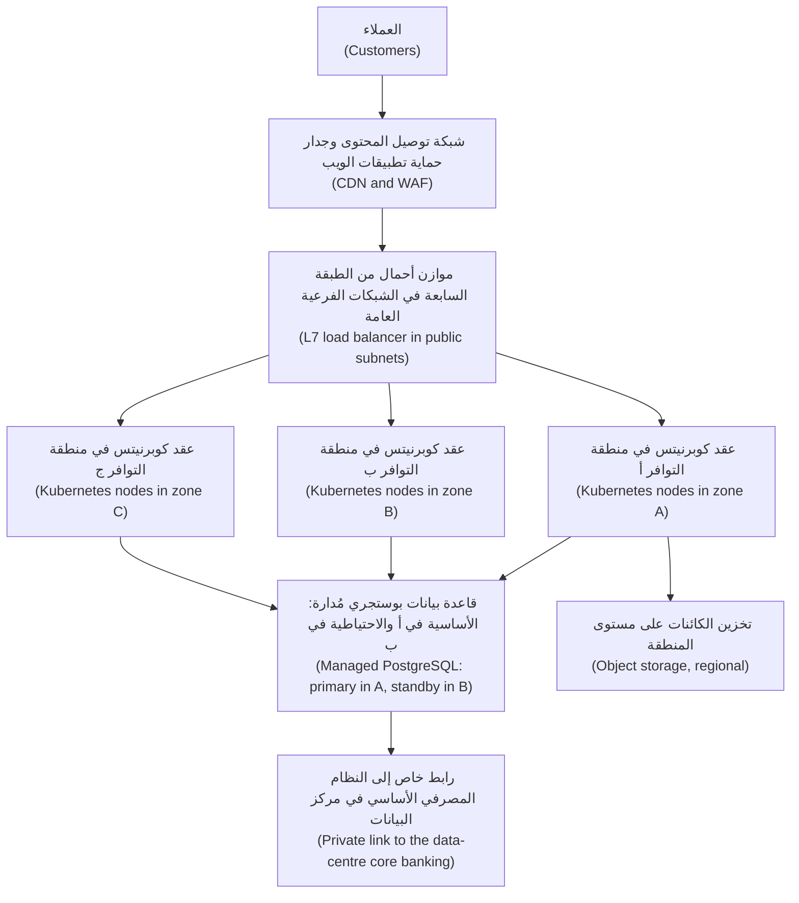

كل طبقة (every tier) تمتد عبر مناطق التوافر (spans zones)، والحافة وحدها (only the edge) تواجه الإنترنت، وقاعدة البيانات تتجاوز الفشل تلقائيًا (fails over automatically).

**الاتصال الهجين (Hybrid connectivity).** يبقى النظام المصرفي الأساسي (core banking) لدى نجم في المقر (on-premises)، لذا يجب أن تصل السحابة إلى مركز البيانات بشكل خاص (privately): إما عبر **شبكة افتراضية خاصة من موقع إلى موقع (site-to-site VPN)** فوق الإنترنت — سريعة الإعداد ومشفّرة ومحدودة بالإنترنت (quick, encrypted, internet-limited) — أو عبر **اتصال خاص مخصّص (dedicated private connection)** (AWS Direct Connect، Azure ExpressRoute، Google Cloud Interconnect)، وهو أبطأ في الترتيب لكنه أكثر قابلية للتنبؤ (more predictable). كثيرًا ما تستخدم البنوك رابطًا مخصّصًا مع شبكة افتراضية خاصة احتياطية (a VPN as backup). خطّط لنطاقات العناوين مبكرًا (plan address ranges early): إذا تداخل النطاق `10.20.0.0/16` للسحابة الافتراضية الخاصة مع شبكة في مركز البيانات (overlaps a data-centre network)، يتعطّل التوجيه (routing breaks).

**المقابلات بين المزوّدين (Provider equivalents).** المفاهيم تنتقل (the concepts transfer)؛ أما الأسماء فلا (the names do not):

| المفهوم (Concept) | AWS | Microsoft Azure | Google Cloud |
|---|---|---|---|
| الجهاز الافتراضي (Virtual machine) | EC2 | Virtual Machines | Compute Engine |
| Kubernetes المُدار (Managed Kubernetes) | EKS | AKS | GKE |
| تخزين الكائنات (Object storage) | S3 | Blob Storage | Cloud Storage |
| الشبكة الخاصة (Private network) | VPC | Virtual Network | VPC |
| PostgreSQL المُدار (Managed PostgreSQL) | RDS / Aurora | Azure Database for PostgreSQL | Cloud SQL / AlloyDB |
| الهوية والوصول (Identity and access) | IAM | Microsoft Entra ID وAzure RBAC | Cloud IAM |
| الرابط الخاص إلى المقر (Private link to on-premises) | Direct Connect | ExpressRoute | Cloud Interconnect |

**المُدار مقابل التشغيل الذاتي (Managed versus self-run).** القاعدة الافتراضية لدى نجم (Najm's default) هي «استخدم الخدمة المُدارة ما لم يوجد سبب مكتوب لعدم ذلك» (use the managed service unless there is a written reason not to). تشغيل PostgreSQL ذاتيًا على أجهزة افتراضية (self-running PostgreSQL on VMs) يعني أن فريقك يملك الترقيع (patching)، والتكرار (replication)، وتجاوز الفشل (failover)، والنسخ الاحتياطي (backups)، واختبارات الاستعادة (restore tests). أما الخدمة المُدارة فتتولى معظم ذلك، مقابل ثمن ومع تحكم أقل (less control) — فليست كل إضافة أو إعداد متاحًا (not every extension or setting). الأسباب الوجيهة للتشغيل الذاتي (valid reasons to self-run): ميزة مفقودة (a missing feature)، أو قابلية النقل (portability)، أو احتياجات أداء محددة (specific performance needs)؛ اكتب السبب (write the reason down).

#### 🔴 نظرة الخبير (Expert view)

**صمّم وفق نطاقات الفشل (Design for failure domains).** **نطاق الفشل (failure domain)** هو مجموعة الأشياء التي تفشل معًا (the set of things that fail together): خادم، أو منطقة توافر، أو منطقة، أو مزوّد، أو حساب (a server, a zone, a region, a provider, an account). يغطي النشر متعدد مناطق التوافر (multi-zone) الأعطال المادية الشائعة (common physical failures) بتكلفة زهيدة، وهو الخيار الافتراضي للإنتاج (the production default). أما النشر متعدد المناطق (multi-region) فيضيف تعقيدًا أكبر بكثير: بيانات تُكرَّر عبر المسافة (data replicated across distance)، وتجاوز فشل يُقرَّر ويُتمرَّن عليه (failover decided and rehearsed). اختره حين يتطلبه هدف تعافٍ (a recovery target) أو جهة تنظيمية (a regulator)، لا بوصفه ردّ فعل تلقائيًا (not as a reflex)؛ ويحوّل الدرس 6.1 ذلك إلى أهداف RTO وRPO (RTO and RPO targets). ولا يحمي أي تصميم لمناطق التوافر من نشر سيئ (a bad deploy)، أو دفع إعدادات سيئ (a bad configuration push)، أو شهادة منتهية الصلاحية (an expired certificate): فمعظم الانقطاعات تغييرات، لا أعطال عتاد (most outages are changes, not hardware).

**التنظيم يشكّل المعمارية (Regulation shapes architecture).** تضع الجهات التنظيمية المالية في دول مجلس التعاون الخليجي (GCC financial regulators)، مثل مصرف قطر المركزي (Qatar Central Bank)، توقعات بشأن الإسناد السحابي (cloud outsourcing) وبشأن الأماكن التي يجوز فيها تخزين بيانات العملاء ومعالجتها (stored and processed)؛ اقرأ القواعد الحالية (the current rules) مع فريق الامتثال (compliance team). وفي الاتحاد الأوروبي، يُلزم قانون المرونة التشغيلية الرقمية (Digital Operational Resilience Act, DORA)، أي اللائحة (EU) 2022/2554 السارية اعتبارًا من يناير 2025، الكيانات المالية (financial entities) بإدارة مخاطر تقنية المعلومات والاتصالات (manage ICT risk)، والإبلاغ عن الحوادث الكبرى (report major incidents)، واختبار المرونة (test resilience)، وإدارة مزوّدي تقنية المعلومات والاتصالات من الأطراف الثالثة (third-party ICT providers)، بما في ذلك السحابة، مع خطط خروج (exit plans). لذلك يجب أن تذكر ملاحظاتك المعمارية (architecture notes) كيف ستغادر مزوّدًا (how you would leave a provider).

**مراجعات المعمارية الجيدة (Well-architected reviews).** تنشر كلٌّ من AWS وAzure وGoogle Cloud إطار عمل Well-Architected Framework، الذي ينظّم المراجعات حول الموثوقية (reliability) والأمن (security) والتكلفة (cost) والعمليات (operations) والأداء (performance). استخدم أحدها قائمةَ تحقق (as a checklist) لأي خدمة إنتاج جديدة (new production service).

**التكلفة مُدخل تصميمي (Cost is a design input).** الخدمات المُدارة (managed services)، وحركة البيانات بين مناطق التوافر (cross-zone traffic)، والبيانات الخارجة من السحابة (**egress**، خروج البيانات) كلها تكلّف مالًا، وتختلف الأسعار حسب المنطقة وعبر الزمن. استخدم حاسبة المزوّد (the provider's calculator) وصفحات الأسعار الحالية (current pricing pages)، لا الذاكرة أبدًا (never memory)، واضبط تنبيه ميزانية (a budget alert) أولًا (الدرس 6.2).

### 🧰 الأدوات (The toolkit)
| الأداة أو الممارسة أو الخدمة (Tool, practice or service) | ما هي وماذا تفعل (What it is and does) | متى تلجأ إليها (When to reach for it) |
|---|---|---|
| **Availability zone** | منطقة التوافر: موقع مركز بيانات معزول (an isolated data-centre location) داخل منطقة (within a region) | توزيع كل طبقة إنتاج (every production tier) على منطقتين على الأقل (at least two) |
| **Managed database** | قاعدة البيانات المُدارة: محرك قاعدة بيانات يشغّله المزوّد (run by the provider)، مع النسخ الاحتياطي (backups) والترقيع (patching) ونسخة احتياطية اختيارية عبر مناطق التوافر (optional cross-zone standby) | الخيار الافتراضي لقواعد بيانات التطبيقات (the default for application databases) |
| **Object storage** | تخزين الكائنات: حاويات تخزين (buckets) لملفات يُشار إليها بمفتاح عبر HTTP (addressed by key over HTTP)، مخزّنة بتكرار (stored redundantly) | المستندات (documents)، والنسخ الاحتياطية (backups)، والسجلات (logs)، والأصول الثابتة (static assets)، وبحيرات البيانات (data lakes) |
| **VPC** | السحابة الافتراضية الخاصة: شبكة خاصة (a private network) بشبكات فرعية (subnets) ومسارات (routes) وقواعد جدار حماية (firewall rules)، وتُسمى VNet على Azure | كل نشر سحابي (every cloud deployment)؛ خطّط لنطاقات العناوين أولًا (plan address ranges first) |
| **NAT gateway** | بوابة ترجمة عناوين الشبكة: وصول صادر فقط إلى الإنترنت (outbound-only internet access) للشبكات الفرعية الخاصة (private subnets) | أحمال العمل الخاصة (private workloads) التي يجب أن تتصل بالخارج (call out) دون أن يُتصل بها من الخارج أبدًا (never be called in) |
| **Shared responsibility model** | نموذج المسؤولية المشتركة: تقسيم واجبات الأمن (the split of security duties) بين المزوّد والعميل (between provider and customer) حسب نموذج الخدمة (by service model) | كل مراجعة معمارية (every architecture review) وكل تقييم إسناد (every outsourcing assessment) |
| **Well-Architected Framework** (AWS, Azure, Google Cloud) | إطار المعمارية الجيدة: أسئلة مراجعة منظّمة (structured review questions) للموثوقية والأمن والتكلفة والعمليات (reliability, security, cost and operations) | مراجعة تصميم إنتاج جديد (reviewing a new production design) |
| **Budget alert** | تنبيه الميزانية: إشعار (a notification) حين يتجاوز الإنفاق حدًّا معيّنًا (spending passes a threshold) | قبل إنشاء أي مورد في أي حساب (before creating any resource in any account) |

### 🏛️ عمليًا في بنك نجم (In practice at Najm Bank)
تصبح المسودة الثانية ليوسف، بعد مراجعة سالم، قالبَ الفريق (the team's template) لكل عملية ترحيل (every migration).

**مذكرة التموضع PN-01: واجهة برمجة تطبيق نجم للهاتف (Placement note PN-01: Najm Mobile API)**

| القسم (Section) | القرار (Decision) | السبب (Reason) |
|---|---|---|
| المنطقة (Region) | منطقة خليجية واحدة لدى المزوّد المختار (one Gulf region of the chosen provider)، توفّر ثلاث مناطق توافر على الأقل وجميع الخدمات المطلوبة (all required services) | زمن الاستجابة للعملاء (latency to customers)؛ مكان إقامة البيانات (data residency) مؤكَّد مع إدارة الامتثال (Compliance) |
| مناطق التوافر (Zones) | ثلاث مناطق توافر لعقد Kubernetes (Kubernetes nodes)؛ والنسخة الأساسية والاحتياطية لقاعدة البيانات (database primary and standby) في منطقتين مختلفتين | الصمود أمام فشل منطقة توافر واحدة (survive one zone failing) دون تدخل يدوي (without manual action) |
| الحوسبة (Compute) | Kubernetes المُدار (managed Kubernetes)؛ والعقد العاملة (worker nodes) في شبكات فرعية خاصة (private subnets) | الحاويات معيار قائم أصلًا (containers already standard)؛ والمزوّد يشغّل مستوى التحكم (the control plane) |
| قاعدة البيانات (Database) | PostgreSQL مُدار (managed PostgreSQL) مع نسخة احتياطية عبر مناطق التوافر (cross-zone standby)، ونسخ احتياطي آلي (automated backups)، وتشفير البيانات المخزّنة (encryption at rest) | يزيل عبء الترقيع وتجاوز الفشل (removes patching and failover toil)؛ وتُختبر استعادة النسخ الاحتياطية فصليًا (restore-tested quarterly) |
| الملفات (Files) | تخزين الكائنات (object storage) لكشوف الحساب والملفات المرفوعة (statements and uploads)؛ خاص (private)؛ مع تفعيل الإصدارات (versioning on) | يتوسّع دون تخطيط للسعة (scales without capacity planning)؛ والإصدارات تحمي من الكتابة فوق الملفات (protects against overwrites) |
| الحافة (Edge) | شبكة توصيل المحتوى وجدار حماية تطبيقات الويب (CDN and WAF)، ثم موازن أحمال L7 (L7 load balancer) في شبكات فرعية عامة (public subnets) | الحافة وحدها تواجه الإنترنت (only the edge faces the internet) |
| الهجين (Hybrid) | رابط خاص مخصّص إلى مركز البيانات (dedicated private link)، مع شبكة افتراضية خاصة احتياطية (VPN as backup)؛ وخطة عناوين متفق عليها مع فريق الشبكات (address plan agreed with Network team) | يبقى النظام المصرفي الأساسي في المقر (core banking stays on-premises) |
| المنطقة الثانية (Second region) | ليس الآن (not now)؛ تُنسخ النسخ الاحتياطية إلى منطقة ثانية (backups copied to a second region)؛ ويُعاد النظر مع أهداف التعافي من الكوارث في الدرس 6.1 (DR targets) | التعقيد غير مبرَّر بعد (complexity not yet justified) |
| الخروج (Exit) | الحاويات وPostgreSQL والبنية التحتية بوصفها شيفرة (IaC) تُبقي الترحيل ممكنًا (keep migration feasible)؛ وتُراجَع خطة الخروج سنويًا (exit plan reviewed yearly) | توقعات مخاطر الأطراف الثالثة في DORA الأوروبي (EU DORA third-party risk expectations) |

**المسؤولية المشتركة لهذه الخدمة (Shared responsibility for this service)**

| ما يملكه نجم (Najm owns) | ما يملكه المزوّد (The provider owns) |
|---|---|
| تصنيف البيانات (data classification)، وسياسة المفاتيح (key policy)، ومدة الاحتفاظ بالنسخ الاحتياطية (backup retention)، واختبارات الاستعادة (restore tests) | الأمن المادي (physical security)، والعتاد (hardware)، والمشرف الافتراضي (hypervisor) |
| أدوار IAM والوصول (IAM roles and access) (الدرس 1.3)؛ وقواعد الشبكة وجدار حماية تطبيقات الويب والتعرّض (network, WAF and exposure rules) | مستوى تحكم Kubernetes (Kubernetes control plane)، وترقيع محرك قاعدة البيانات وتجاوز فشله (database engine patching and failover) |
| صور العقد العاملة (worker node images) — ما لم تكن مُدارة بالكامل (unless fully managed) — والشيفرة (code)، والصور (images)، والإعدادات (configuration) | متانة تخزين الكائنات (object storage durability)؛ والبنية التحتية للمناطق ومناطق التوافر (region and zone infrastructure) |

### 🛠️ التمارين (Exercises)
إن استخدمت حسابًا سحابيًا (a cloud account)، فاستخدم حسابك الخاص من الفئة المجانية (free-tier account) و**اضبط تنبيه ميزانية قبل إنشاء أي شيء (set a budget alert before creating anything)**. احذف كل شيء عند الانتهاء (delete everything when you finish).

- 🟢 من قائمة المناطق الحالية (current region list) لكل مزوّد رئيسي، دوّن المناطق الخليجية (Gulf regions)، وعدد مناطق التوافر في كلٍّ منها (how many zones)، وما إذا كان Kubernetes المُدار وPostgreSQL المُدار متوفرَين هناك. *يكتمل عندما (Done when):* يكون لديك جدول صغير (a small table) مع تاريخ تحقّقك (the date you checked).
- 🟡 ارسم سحابة افتراضية خاصة (draw a VPC) لتطبيق من طبقتين (two-tier app): نطاق العناوين (address range)، وشبكات فرعية عامة وخاصة (public and private subnets) في منطقتَي توافر، وبوابة NAT (NAT gateway)، وموازن أحمال (load balancer)، وقواعد جدار حماية بين الطبقات (firewall rules between tiers) — المصدر والمنفذ (source and port). تجنّب `10.0.0.0/16`، الذي يستخدمه مركز بيانات افتراضي (an imaginary data centre) أصلًا. *يكتمل عندما (Done when):* يحمل كل سهم منفذًا (every arrow has a port) ولكل شبكة فرعية نطاق ومنطقة توافر (a range and a zone).
- 🔴 اكتب مذكرة تموضع بتنسيق PN-01 (in the PN-01 format) لخدمة من اختيارك — مثل بوابة نزاعات البطاقات (card-dispute portal) الخيالية لدى نجم — مع جدول المسؤولية المشتركة (shared responsibility table)، وسبب كل اختيار بين المُدار والتشغيل الذاتي (managed-versus-self-run choice)، وما الذي سيستدعي منطقة ثانية (what would trigger a second region). *يكتمل عندما (Done when):* يستطيع زميل أن يجيب عن «ماذا يحدث عندما تفشل منطقة توافر واحدة؟» (what happens when one zone fails) و«من يرقّع قاعدة البيانات؟» (who patches the database) من مذكرتك وحدها.

### ⚠️ أخطاء وفخاخ (Mistakes and traps)
- **نقل تخطيط مركز البيانات كما هو (Lifting the data centre layout as is).** جهاز افتراضي واحد لكل دور في منطقة توافر واحدة (one VM per role in one zone) يجلب هشاشة مركز البيانات (the data centre's fragility). وزّع عبر مناطق التوافر (spread across zones)؛ واستخدم الخدمات المُدارة (use managed services).
- **«المزوّد يتولى الأمن» (The provider handles security).** جزءه فقط (only its part). الهوية (identity) والإعدادات (configuration) والتعرّض الشبكي (network exposure) والبيانات (data) مسؤوليتك في كل نموذج خدمة (on every service model).
- **تداخل نطاقات العناوين (Overlapping address ranges).** اختر نطاقات العناوين السحابية مع فريق الشبكات (with the network team) قبل البناء، وإلا فسيفشل التوجيه الهجين (hybrid routing) لاحقًا.
- **التعدد الإقليمي بردّ فعل تلقائي (Multi-region by reflex).** ابدأ بتعدد مناطق التوافر (start multi-zone)؛ وأضف منطقة حين تتطلب ذلك أهداف التعافي (recovery targets) أو التنظيم (regulation).

### 🧾 الخلاصة (Recap)
- السحابة حوسبة عند الطلب عبر واجهة برمجة تطبيقات (computing on demand through an API)؛ ويبيع المزوّدون الثلاثة الكبار (the big three) لبنات متشابهة بأسماء مختلفة.
- المناطق (regions) جغرافية؛ ومناطق التوافر (zones) مواقع معزولة داخل المنطقة. وتمتد بيئة الإنتاج على منطقتَي توافر على الأقل (at least two zones).
- فضّل الخدمات المُدارة (prefer managed services)؛ واختر تخزين الكائنات أو الكتل أو الملفات (object, block or file storage) حسب نمط الوصول (by access pattern).
- شبكات فرعية خاصة لأحمال العمل (private subnets for workloads)، وشبكات فرعية عامة للحافة فقط (public subnets only for the edge)، وNAT للحركة الصادرة (NAT for outbound traffic)، وخطة عناوين متفق عليها مبكرًا (an address plan agreed early).
- في ظل المسؤولية المشتركة (under shared responsibility)، البيانات والهوية والإعدادات مسؤوليتك دائمًا (always yours).

### ✍️ اختبر نفسك (Check yourself)

**1. تضع المسودة الأولى ليوسف جميع عقد Kubernetes وقاعدة البيانات في منطقة توافر واحدة (one availability zone). ما الخطر الرئيسي (the main risk)؟**

- A. يفرض المزوّد رسومًا إضافية (charges a premium) على إبقاء كل مورد في منطقة توافر واحدة
- B. سيرى العملاء البعيدون عن المنطقة زمن استجابة أعلى (higher latency) في كل طلب
- C. فشل منطقة توافر واحدة (one zone failure) يُسقط الخدمة كلها، دون شيء يُتجاوَز إليه الفشل (nothing to fail over to)
- D. يرفض Kubernetes المُدار إنشاء عنقود (create a cluster) تتشارك عقده منطقة توافر واحدة

<details><summary>الإجابة</summary>

**C.** وُجدت مناطق التوافر كي تفشل إحداها دون الأخرى (one can fail without the others)؛ واستخدام منطقة واحدة يهدر ذلك. زمن الاستجابة (B) يعتمد على المنطقة (depends on region)، لا على عدد مناطق التوافر؛ وD خاطئ. (🟢 الأساسيات، The essentials).

</details>

**2. يحتاج نجم إلى تخزين كشوف حساب شهرية بصيغة PDF (monthly PDF statements) لملايين العملاء، تُكتب مرة واحدة (written once) وتُنزَّل أحيانًا (downloaded occasionally). أي تخزين هو الأنسب؟**

- A. تخزين الكائنات (object storage)، خاص (private)، مع تفعيل الإصدارات (versioning enabled)
- B. وحدات تخزين كتل (block storage volumes) مُلحقة بجهاز افتراضي واحد كبير (a single large VM)
- C. نظام ملفات شبكي مشترك (shared network file system) تركّبه كل حجيرة (mounted by every pod)
- D. صفوف ثنائية (binary rows) في قاعدة بيانات التطبيق PostgreSQL

<details><summary>الإجابة</summary>

**A.** الملفات التي تُكتب مرة وتُجلب عبر HTTP (write-once files fetched over HTTP) هي بالضبط ما وُجد تخزين الكائنات من أجله. تخزين الكتل (B) يربطها بجهاز واحد (ties them to one machine)؛ والمشاركة الملفية (a file share) (C) تضيف تكلفة؛ والملفات في قاعدة البيانات (D) تُضخّمها (bloat it). (🟢 الأساسيات، The essentials).

</details>

**3. في ظل نموذج المسؤولية المشتركة (shared responsibility model)، أيٌّ مما يلي يبقى نجم مسؤولًا عنه حتى عند استخدام خدمة PostgreSQL مُدارة (managed PostgreSQL service)؟**

- A. ترقيع محرك قاعدة البيانات (patching the database engine) عند صدور إصلاحات أمنية (security fixes)
- B. استبدال الأقراص المعطوبة (replacing failed disks) في مركز بيانات المزوّد
- C. تشغيل المشرف الافتراضي (hypervisor) الذي تحتها وتحديثه بأمان
- D. تحديد من وأي شبكات يمكنها الاتصال بقاعدة البيانات (who and which networks may connect)

<details><summary>الإجابة</summary>

**D.** الوصول والإعدادات (access and configuration) تبقى لدى العميل في كل نموذج. A من مهام المزوّد في الخدمة المُدارة؛ وB وC من مهامه دائمًا. (🟢 الأساسيات، The essentials).

</details>

**4. يجب أن تستدعي حجيرات التطبيق (application pods) في الشبكات الفرعية الخاصة (private subnets) واجهة برمجة تطبيقات خارجية لتقييم الاحتيال (external fraud-scoring API)، لكن يجب ألا تقبل أبدًا اتصالات من الإنترنت. ما الذي يحقق لها ذلك؟**

- A. نقل الحجيرات إلى شبكة فرعية عامة (public subnet)
- B. بوابة NAT للحركة الصادرة (NAT gateway for outbound traffic)
- C. شبكة توصيل محتوى (CDN) أمام الحجيرات
- D. منح كل حجيرة عنوان IP عامًا (public IP address)

<details><summary>الإجابة</summary>

**B.** تتيح NAT الاتصالات الصادرة (outbound connections) دون جعل الحجيرات قابلة للوصول (reachable). أما A وD فتكشفانها (expose them)؛ وشبكة توصيل المحتوى (C) تتعامل مع الحركة الواردة (inbound traffic)، لا مع الاستدعاءات الصادرة (outbound calls). (🟡 التعمق أكثر، Going deeper).

</details>

**5. يطلب مدير منتج (product manager) تشغيل واجهة برمجة تطبيق نجم للهاتف في منطقتين «من باب الاحتياط» (to be safe). ما أفضل ردّ أولي (the best first response)؟**

- A. الموافقة؛ فمنطقتان أكثر أمانًا من واحدة دائمًا، أيًّا كانت التكلفة (whatever the cost)
- B. الرفض (refuse)؛ فالبنك لا يحتاج أبدًا إلى أكثر من منطقة واحدة (never needs more than one region) إذا استخدم ثلاث مناطق توافر (three zones)
- C. السؤال عن الفشل وهدف التعافي (which failure and recovery target) الذي يجب تلبيته، ثم التصميم وفقه
- D. اقتراح الانتقال إلى مزوّد تكون منطقته الواحدة أكثر موثوقية (more reliable)

<details><summary>الإجابة</summary>

**C.** يضيف التعدد الإقليمي (multi-region) تعقيدًا وتكلفة كبيرين (major complexity and cost)، فيجب أن يلبّي حاجة معلنة للتعافي أو حاجة تنظيمية (a stated recovery or regulatory need)؛ وحتى ذلك الحين، يكون الخيار الافتراضي تعدد مناطق التوافر مع نسخ احتياطية عبر المناطق (multi-zone with cross-region backup copies). A ردّ فعل تلقائي (a reflex)؛ وB يتجاهل المتطلبات الحقيقية (ignores real requirements)؛ وD لا يجيب عن السؤال (misses the question). (🔴 نظرة الخبير، Expert view).

</details>

### 📚 المراجع (References)
- NIST SP 800-145، تعريف NIST للحوسبة السحابية (The NIST Definition of Cloud Computing) — https://csrc.nist.gov/pubs/sp/800/145/final
- AWS، نموذج المسؤولية المشتركة (Shared Responsibility Model) — https://aws.amazon.com/compliance/shared-responsibility-model/
- Microsoft، المسؤولية المشتركة في السحابة (Shared responsibility in the cloud) — https://learn.microsoft.com/azure/security/fundamentals/shared-responsibility
- توثيق Google Cloud (Google Cloud documentation) — https://cloud.google.com/docs
- توثيق AWS (AWS documentation) — https://docs.aws.amazon.com/
- توثيق Microsoft Azure (Microsoft Azure documentation) — https://learn.microsoft.com/azure/
- AWS، ملخّص تعطّل خدمة Amazon S3 في منطقة شمال فرجينيا (Summary of the Amazon S3 Service Disruption in the Northern Virginia (US-EAST-1) Region) — https://aws.amazon.com/message/41926/
- AWS Well-Architected — https://aws.amazon.com/architecture/well-architected/
- اللائحة (EU) 2022/2554، قانون المرونة التشغيلية الرقمية (Regulation (EU) 2022/2554, Digital Operational Resilience Act) — https://eur-lex.europa.eu/eli/reg/2022/2554/oj
- للتوسّع (Going further): [*لبنات بناء البرمجيات بوصفها خدمة (SaaS Building Blocks)*، الدرس 2.2 — رفع الملفات وتخزين الكائنات (File uploads and object storage)](../saas/index.ar.html#/2.2) و[*تصميم الأنظمة لمبرمجي الحدس (System Design for Vibe Coders)*، الدرس 10.1 — الخدمات عديمة الحالة وموازنة الأحمال (Stateless services and load balancing)](../vibe/index.ar.html#l10-1)

<a id="l1-3"></a>

## 1.3 — الهوية والوصول في السحابة (Identity and access in the cloud): المستخدمون والأدوار والسياسات وهوية أحمال العمل (users, roles, policies and workload identity)

*المستوى: 🟢 مبتدئ* · *المتطلبات: 1.2* · *المرحلة (Phase): Plan, Deploy*

### ⚡ الدرس في دقيقة (In 60 seconds)
- في السحابة، كل إجراء استدعاءٌ لواجهة برمجة تطبيقات (every action is an API call)، وكل استدعاء يُفحص مقابل **إدارة الهوية والوصول (identity and access management, IAM)**: *من* يستدعي (**الجهة الفاعلة**، the **principal**)، و*ماذا* يريد أن يفعل (**الإجراء**، the **action**)، على *أي* **مورد (resource)**، وتحت أي **شروط (conditions)**.
- ينبغي أن يسجّل الأشخاص الدخول (sign in) عبر مزوّد الهوية في الشركة (the company's identity provider) باستخدام **تسجيل الدخول الموحّد والمصادقة متعددة العوامل (single sign-on and MFA)**، وأن يحصلوا على الوصول عبر **الأدوار (roles)**، لا عبر مفاتيح شخصية طويلة العمر (personal long-lived keys) أبدًا.
- ينبغي أن تحصل البرمجيات على **هوية أحمال العمل (workload identity)**: تمنح المنصة الجهاز الافتراضي (VM) أو الحجيرة (pod) أو مهمة التكامل المستمر (CI job) بيانات اعتماد قصيرة العمر (short-lived credentials) تلقائيًا. وينبغي أن يستخدم خط التسليم (pipeline) **اتحاد الهوية عبر OIDC (OIDC federation)**، لا مفتاح وصول مخزّنًا (a stored access key).
- القاعدة الأهم (the rule that matters most): **أقل الصلاحيات (least privilege)**. امنح أصغر مجموعة من الإجراءات (the smallest set of actions)، على أضيق الموارد (the narrowest resources)، لأقصر مدة (the shortest time)، وابدأ من لا شيء (start from nothing).
- إشارة القرار (decision cue): قبل أن تنشئ أي بيانات اعتماد (any credential)، اسأل ⁦(can the platform issue this identity instead?)⁩ «هل تستطيع المنصة إصدار هذه الهوية بدلًا من ذلك؟».
- أكبر فخ (biggest trap): مفتاح طويل العمر بصلاحيات واسعة (a long-lived key with broad rights)، يُنسخ إلى مستودع (a repository) أو سرّ في خط تسليم (a pipeline secret) أو حاسوب محمول. يعمل إلى الأبد (works forever)، لكل من يعثر عليه.

### 🧭 لماذا يهم (Why it matters)
يحتاج يوسف إلى أن يدفع خط التكامل المستمر (CI pipeline) لواجهة برمجة تطبيق نجم للهاتف الصور (push images) ويحدّث العنقود (update the cluster). أسرع طريق وجده: إنشاء مستخدم سحابي (cloud user) باسم `ci-deployer`، وإرفاق سياسة المسؤول المدمجة لدى المزوّد (the provider's built-in administrator policy) «فقط ليعمل الأمر» (just to get it working)، وتوليد مفتاح وصول (access key) ولصقه في إعدادات أسرار خط التسليم (the pipeline's secret settings). نجح من المحاولة الأولى. وبعد أسبوعين، يُجري فريق نورة فحص الأسرار الدوري (regular secret scan) فيجد المفتاح نفسه في سجل تصحيح (debug log) طبعته إحدى خطوات خط التسليم وأرفقه أحدهم بقضية عامة (a public issue). المفتاح لا تنتهي صلاحيته أبدًا (never expires)، ويستطيع فعل أي شيء في حساب الإنتاج (production account)، وإلى أن تُفحص سجلات التدقيق (audit logs)، لا أحد يعرف من غيره قد استخدمه.

يرشد سالم يوسف خلال عملية التنظيف (clean-up): إبطال المفتاح (revoke the key)، ومراجعة مسار التدقيق (audit trail) لكل استدعاء أُجري به، وإعادة بناء خط التسليم دون أي مفتاح مخزّن إطلاقًا (no stored key at all). يقول سالم: «في السحابة، الهوية هي محيطك الأمني (identity is your perimeter). جدار الحماية (a firewall) لا يفيد حين يحمل المهاجم مفتاحًا صالحًا لواجهة برمجة التطبيقات (a valid key to the API).» يبني هذا الدرس هويات ضيّقة (narrow) وقصيرة العمر (short-lived) تُصدرها المنصة (issued by the platform)، بحيث يكون التسرّب مستحيلًا أو غير ضار (impossible or harmless).

### 📐 كيف يعمل (How it works)

#### 🟢 الأساسيات (The essentials)

**المصادقة والتفويض (Authentication and authorisation).** **المصادقة (Authentication)** تُثبت من أنت (proves who you are): كلمة مرور مع مصادقة متعددة العوامل (a password plus MFA)، أو شهادة (a certificate)، أو رمز موقَّع (a signed token). أما **التفويض (Authorisation)** فيقرر ما يحق لك فعله (what you may do) بعد أن تُعرف. يتولى IAM السحابي (Cloud IAM) الأمرين لكل استدعاء لواجهة برمجة التطبيقات: فلوحة التحكم (the console) وسطر الأوامر (the command line) وTerraform وتطبيقك كلها تستدعي واجهات برمجة التطبيقات نفسها (the same APIs).

**الجهات الفاعلة (Principals).** الجهة الفاعلة (principal) هي أي شيء يستطيع إجراء استدعاء (make a call):
- **المستخدمون البشريون (Human users)**، ويُفضَّل أن يكونوا متّحدين (federated) من مزوّد الهوية في الشركة (the company's identity provider) — مثل Microsoft Entra ID أو Okta أو Google Workspace — عبر تسجيل الدخول الموحّد (single sign-on).
- **المجموعات (Groups)**، وهي تجمّعات من المستخدمين (collections of users)، كي تمنح الوصول مرة واحدة إلى «payments-engineers» بدلًا من 20 فردًا.
- **هويات أحمال العمل (Workload identities)**، للبرمجيات: **أدوار IAM (IAM roles)** في AWS، و**الهويات المُدارة (managed identities)** وكيانات الخدمة (service principals) في Azure، و**حسابات الخدمة (service accounts)** في Google Cloud.

**الأدوار والسياسات (Roles and policies).** تُكتب الصلاحيات (permissions) في **سياسات (policies)**. تسرد السياسة الإجراءات (actions) — مثل «قراءة الكائنات» (read objects) — والموارد التي تنطبق عليها (the resources they apply to) — مثل «هذه الحاوية» (this bucket) — والأثر (an effect)، أي السماح أو الرفض (allow or deny)، وأحيانًا مع شروط (conditions) مثل «من هذه الشبكة فقط» (only from this network) أو «فقط إذا استُخدمت المصادقة متعددة العوامل» (only if MFA was used). ترفق السياسات بالهويات (attach policies to identities)، أو تربط الهويات بأدوار على مورد (bind identities to roles on a resource). وتختلف الأسماء من مزوّد إلى آخر:

| المفهوم (Concept) | AWS | Microsoft Azure | Google Cloud |
|---|---|---|---|
| هوية الأشخاص (Identity for people) | مستخدمو IAM Identity Center ومجموعاته، متّحدة (users and groups, federated) | مستخدمو Microsoft Entra ID ومجموعاته (users and groups) | حسابات Google أو هويات متّحدة، ومجموعات (Google accounts or federated identities, groups) |
| هوية البرمجيات (Identity for software) | دور IAM (IAM role) | هوية مُدارة، كيان خدمة (Managed identity, service principal) | حساب خدمة (Service account) |
| كيف يُمنح الوصول (How access is granted) | سياسات مُرفقة بالهويات أو الموارد (policies attached to identities or resources) | تعيين دور (role assignment): جهة فاعلة + دور + نطاق (principal + role + scope) | ربط سياسة سماح (allow policy binding): جهة فاعلة + دور على مورد (principal + role on a resource) |
| الافتراضي (Default) | الرفض ما لم يُسمح (deny unless allowed)؛ والرفض الصريح يغلب دائمًا (an explicit deny always wins) | لا وصول دون تعيين (no access without an assignment) | لا وصول دون ربط (no access without a binding) |

النموذج واحد في كل مكان (the model is the same everywhere): **لا شيء مسموح حتى يسمح به شيء (nothing is allowed until something allows it)**.

**أقل الصلاحيات عمليًا (Least privilege, in practice).** قارن بين سياستين لخدمة كشوف الحساب في نجم (the Najm statements service)، التي لا تحتاج إلا إلى قراءة ملفات كشوف الحساب (read statement files) من حاوية تخزين واحدة (one bucket):

سياسة خطرة (Risky): أي إجراء على أي مورد (any action on any resource)، في الحساب كله (in the whole account).

```json
{
  "Version": "2012-10-17",
  "Statement": [{ "Effect": "Allow", "Action": "*", "Resource": "*" }]
}
```

سياسة مُحصَّنة (Hardened): قراءة الكائنات من بادئة واحدة في حاوية تخزين واحدة (one bucket prefix)، ولا شيء غير ذلك (nothing else).

```json
{
  "Version": "2012-10-17",
  "Statement": [{
    "Effect": "Allow",
    "Action": "s3:GetObject",
    "Resource": "arn:aws:s3:::najm-statements-prod/statements/*"
  }]
}
```

الفكرة نفسها لدى المزوّدَين الآخرَين (the other two providers):

```bash
# Azure: give a managed identity read access to blobs in one storage account only
az role assignment create \
  --assignee <managed-identity-principal-id> \
  --role "Storage Blob Data Reader" \
  --scope /subscriptions/<sub-id>/resourceGroups/rg-statements/providers/Microsoft.Storage/storageAccounts/najmstatementsprod

# Google Cloud: let one service account read objects in one bucket only
gcloud storage buckets add-iam-policy-binding gs://najm-statements-prod \
  --member="serviceAccount:statements@<project-id>.iam.gserviceaccount.com" \
  --role="roles/storage.objectViewer"
```

كل منحٍ (each grant) يسمّي هوية واحدة (one identity)، ودورًا ضيّقًا واحدًا (one narrow role)، وموردًا واحدًا (one resource).

**الأشخاص: تسجيل الدخول الموحّد والمصادقة متعددة العوامل والأدوار (People: SSO, MFA and roles).** لا يحصل المهندسون على كلمات مرور سحابية منفصلة (separate cloud passwords) ولا على مفاتيح شخصية (personal keys). يسجّلون الدخول عبر مزوّد الهوية في الشركة مع المصادقة متعددة العوامل (with MFA) ويتقمّصون دورًا (assume a role) للمهمة: القراءة فقط افتراضيًا (read-only by default)، وصلاحيات النشر في البيئات غير الإنتاجية (deploy rights in non-production)، والكتابة في الإنتاج (production writes) فقط عبر خط التسليم أو عبر رفع صلاحيات معتمَد ومسجَّل ومحدود المدة (an approved, logged, time-limited elevation). وعندما يغادر شخص ما، يُزيل تعطيل حساب واحد (disabling one account) وصوله السحابي في كل مكان.

**البرمجيات: لا مفاتيح مخزّنة (Software: no stored keys).** يمكن لحمل عمل يعمل على السحابة (a workload running on the cloud) الحصول على بيانات الاعتماد من المنصة نفسها (from the platform itself):
- يحصل الجهاز الافتراضي (VM) على **دور مثيل (instance role)** في AWS، أو **هوية مُدارة (managed identity)** في Azure، أو **حساب خدمة مُرفق (attached service account)** في Google Cloud. وتجلب مجموعة أدوات تطوير البرمجيات (SDK) في التطبيق بيانات اعتماد قصيرة العمر (short-lived credentials) من نقطة بيانات وصفية محلية (local metadata endpoint) وتجدّدها تلقائيًا (refreshes them automatically).
- تحصل حجيرة Kubernetes (Kubernetes pod) على هويتها الخاصة (its own identity)، المربوطة من **حساب الخدمة (service account)** الخاص بها في Kubernetes إلى هوية سحابية (a cloud identity) — التفاصيل أدناه.
- تستخدم مهمة التكامل المستمر خارج السحابة (a CI job outside the cloud) **اتحاد الهوية عبر OIDC (OIDC federation)** لاستبدال رمز موقَّع (exchange a signed token) ببيانات اعتماد سحابية قصيرة العمر.

في كل الحالات لا يوجد سرّ يُنسخ أو يُدوَّر أو يتسرّب (no secret to copy, rotate or leak). وتلتقط مجموعات أدوات التطوير السحابية (the cloud SDKs) بيانات الاعتماد هذه افتراضيًا (by default)، فلا تتغير شيفرة التطبيق (application code does not change).

#### 🟡 التعمق أكثر (Going deeper)

**كيف يعمل اتحاد الهوية عبر OIDC في التكامل المستمر (How OIDC federation for CI works).** OpenID Connect (OIDC) طبقة هوية (an identity layer) فوق OAuth 2.0. يمكن لمنصة تكامل مستمر (CI platform) مثل GitHub Actions أن تُصدر لكل مهمة **رمز هوية (ID token)** موقَّعًا يصف المهمة (describing the job): أي مستودع (which repository)، وأي فرع أو بيئة (which branch or environment)، وأي سير عمل (which workflow). ويُهيَّأ مزوّد السحابة للثقة بتلك الجهة المُصدِرة (to trust that issuer) ولاستبدال الرموز المطابقة (matching tokens) ببيانات اعتماد قصيرة العمر لدور واحد محدد (one specific role).

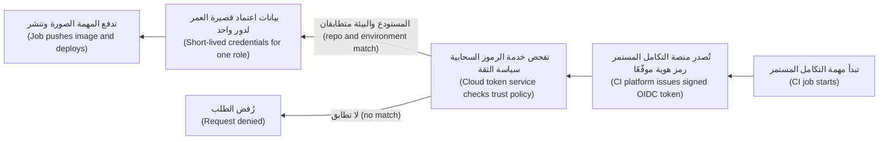

في AWS، تحدد **سياسة الثقة (trust policy)** الخاصة بالدور أي الرموز يجوز لها تقمّصه (which tokens may assume it). لاحظ الشرط (note the condition): لا تتأهل إلا بيئة `production` في مستودع واحد (one repository).

```json
{
  "Version": "2012-10-17",
  "Statement": [{
    "Effect": "Allow",
    "Principal": { "Federated": "arn:aws:iam::111122223333:oidc-provider/token.actions.githubusercontent.com" },
    "Action": "sts:AssumeRoleWithWebIdentity",
    "Condition": {
      "StringEquals": {
        "token.actions.githubusercontent.com:aud": "sts.amazonaws.com",
        "token.actions.githubusercontent.com:sub": "repo:najm-bank/mobile-api:environment:production"
      }
    }
  }]
}
```

يطلب سير العمل (the workflow) رمزًا ويتقمّص الدور (assumes the role)؛ ولا يُخزَّن أي سرّ في أي مكان (no secret is stored anywhere):

```yaml
permissions:
  id-token: write      # allow this job to request an OIDC token
  contents: read
jobs:
  deploy:
    runs-on: ubuntu-latest
    environment: production
    steps:
      # Check the action's current major version; pin to a full commit SHA in production (lesson 4.3)
      - uses: aws-actions/configure-aws-credentials@v4
        with:
          role-to-assume: arn:aws:iam::111122223333:role/najm-mobile-api-deploy
          aws-region: <region>
```

يدعم Azure — عبر اتحاد هوية أحمال العمل (workload identity federation) على تسجيل تطبيق (app registration) أو هوية مُدارة يعيّنها المستخدم (user-assigned managed identity) — وGoogle Cloud — عبر Workload Identity Federation — النمطَ نفسه (the same pattern). والخطأ الأكثر شيوعًا (the most common mistake) شرط ثقة فضفاض جدًا (a trust condition that is too loose)، مثل أي مستودع في المؤسسة (any repository in the organisation) أو أي فرع (any branch): عندها تستطيع شيفرة غير مُراجَعة (unreviewed code) النشر إلى الإنتاج.

**هوية أحمال العمل في Kubernetes (Workload identity in Kubernetes).** ينبغي ألا تتشارك الحجيرات هوية العقدة (the node's identity)، وإلا حصلت كل حجيرة على العقدة على كل صلاحية تحتاجها أي حجيرة. تربط كل خدمة Kubernetes مُدارة (managed Kubernetes service) حساب خدمة Kubernetes (Kubernetes service account) بهوية سحابية (a cloud identity): في Amazon EKS عبر IAM Roles for Service Accounts (IRSA) أو EKS Pod Identity؛ وفي AKS عبر Microsoft Entra Workload ID؛ وفي GKE عبر Workload Identity Federation for GKE. مع IRSA مثلًا، يكون الربط تعليقًا توضيحيًا (an annotation):

```yaml
apiVersion: v1
kind: ServiceAccount
metadata:
  name: statements-reader
  namespace: mobile-api
  annotations:
    eks.amazonaws.com/role-arn: arn:aws:iam::111122223333:role/najm-statements-reader
```

الحجيرة التي تعمل بـ `serviceAccountName: statements-reader` تحصل على بيانات اعتماد لذلك الدور فقط (for that role only). أما الحجيرات الأخرى في العنقود (other pods in the cluster) فلا.

**كيف تتجمّع السياسات (How policies combine).** في AWS، يُرفض الطلب افتراضيًا (denied by default)؛ ولا يُسمح به إلا إذا سمحت به سياسة ما ولم ترفضه أي سياسة رفضًا صريحًا (explicitly denies it). ويمكن للحواجز الحامية على مستوى المؤسسة (organisation-wide guardrails) — **سياسات التحكم بالخدمات (service control policies)** في AWS Organizations — و**حدود الصلاحيات (permissions boundaries)** أن تضع سقفًا (cap) لما يمكن لأي هوية في الحساب فعله، حتى لو منحتها سياسةٌ أكثر. أما Azure RBAC فتراكمي (additive) عبر تعيينات الأدوار (role assignments) على نطاقات مجموعة الإدارة (management group) والاشتراك (subscription) ومجموعة الموارد (resource group) والمورد (resource)، مع التوريث نزولًا (inheritance downwards). وتُورَّث سياسات السماح (allow policies) في Google Cloud نزولًا عبر تسلسل المؤسسة والمجلد والمشروع والمورد (organisation, folder, project and resource hierarchy)، كما يوفّر Google Cloud سياسات رفض (deny policies). والقاعدة للثلاثة جميعًا: **امنح على أضيق نطاق يفي بالغرض (grant at the narrowest scope that works)**؛ فالمنح العالي في التسلسل الهرمي (a grant high in the hierarchy) يتدفق إلى كل ما تحته.

**مسارات التدقيق (Audit trails).** يسجّل كل مزوّد استدعاءات واجهة برمجة التطبيقات (records API calls): AWS CloudTrail، وAzure Activity Log (إضافة إلى سجلات تسجيل الدخول في Microsoft Entra، Microsoft Entra sign-in logs)، وGoogle Cloud Audit Logs. وهي تجيب عن سؤال «من فعل ماذا، ومتى، ومن أين» (who did what, when, from where). تأكد من أنها مفعّلة لكل الحسابات (switched on for all accounts)، ومُرسَلة إلى مكان مركزي (a central place) لا يستطيع الأشخاص الخاضعون للتدقيق تغييره (the people being audited cannot change)، ومحفوظة طوال المدة التي تتطلبها السياسة (as long as policy requires). بهذه الطريقة تمكّن فريق نورة من إعادة بناء ما فعله مفتاح يوسف المسرَّب (reconstruct what the leaked key had done).

#### 🔴 نظرة الخبير (Expert view)

**بنية الحسابات والمشاريع قرار وصول (Account and project structure is an access decision).** افصل الإنتاج عن البيئات غير الإنتاجية (separate production from non-production) عند أقوى حد يوفّره المزوّد (the provider's strongest boundary): حسابات AWS (AWS accounts)، أو اشتراكات Azure (Azure subscriptions)، أو مشاريع Google Cloud (Google Cloud projects). عندها لا يستطيع خطأ في التطوير (a development mistake) أن يمس بيانات الإنتاج، ويمكن أن تكون حواجز الإنتاج الحامية (production guardrails) أكثر صرامة.

**اعثر على الوصول غير المستخدم وأزله (Find and remove unused access).** الصلاحيات تتراكم (permissions accumulate). تُظهر أدوات مثل AWS IAM Access Analyzer ومراجعات الوصول في Microsoft Entra (Microsoft Entra access reviews) ومُوصي IAM في Google Cloud (Google Cloud's IAM recommender) الصلاحيات غير المستخدمة (unused permissions) والموارد المشتركة خارجيًا (externally shared resources). راجع الوصول بانتظام (review access regularly)، وعندما ينتقل شخص بين الفرق — «المنضم والمنتقل والمغادر» (joiner, mover, leaver) — أزل وصوله القديم في اليوم نفسه (the same day).

**احمِ نقطة البيانات الوصفية (Protect the metadata endpoint).** تأتي بيانات اعتماد أحمال العمل (workload credentials) من نقطة بيانات وصفية (a metadata endpoint) يمكن الوصول إليها من داخل الجهاز. وخلل في التطبيق يسمح لمهاجم بجعل الخادم يجلب عنوانًا اعتباطيًا (fetch an arbitrary URL) — أي تزوير الطلبات من جانب الخادم (server-side request forgery, SSRF) — قد يكشف بيانات الاعتماد تلك. اشترط النسخة المُحصَّنة من نقطة النهاية (the hardened version of the endpoint) حيثما توفرت — IMDSv2 في AWS، التي تتطلب رمز جلسة (a session token) — وأبقِ أدوار أحمال العمل ضيّقة (keep workload roles narrow)، واحجب وصول الحجيرات إلى نقطة البيانات الوصفية للعقدة (block pod access to the node's metadata endpoint) حيث تملك الحجيرات هوياتها الخاصة. انظر [*أمن الذكاء الاصطناعي والتطبيقات (Secure AI & Application Security)*، الدرس 2.3 — فخاخ جانب الخادم (Server-side traps): SSRF ورفع الملفات واجتياز المسارات وإلغاء التسلسل (SSRF, file uploads, path traversal and deserialisation)](../secai/index.ar.html#/2.3).

**وصول كسر الزجاج (Break-glass access).** إذا تعطّل مزوّد الهوية (the identity provider is down) أثناء حادثة (during an incident)، فما زال المهندسون يحتاجون إلى طريقة للدخول (a way in): بضعة حسابات طوارئ (a few emergency accounts) بمصادقة متعددة العوامل قوية (strong MFA)، وبيانات اعتماد محروسة (guarded credentials)، وكل استخدام لها ينبّه فريق الأمن (alerting security) ويُراجَع. اختبرها كما تختبر النسخة الاحتياطية (test them like a backup).

**أين تبقى الأسرار (Where secrets remain).** بعض الأشياء ما زالت تحتاج إلى أسرار (still need secrets): مفتاح واجهة برمجة تطبيقات لطرف ثالث (a third-party API key)، أو كلمة مرور قاعدة بيانات لنظام لا يدعم تسجيل الدخول القائم على الهوية (identity-based login). احفظها في مدير أسرار (a secrets manager)، واجلبها وقت التشغيل (at runtime) باستخدام هوية أحمال العمل، ودوّرها (rotate them)، ولا تطبعها في السجلات أبدًا (never print them in logs). المعالجة الكاملة في [*أمن الذكاء الاصطناعي والتطبيقات (Secure AI & Application Security)*، الدرس 5.2 — إدارة الأسرار (Secrets management): المفاتيح والرموز وأين تتسرّب (keys, tokens and where they leak)](../secai/index.ar.html#/5.2)؛ ويطبّقها الدرس 4.3 من هذه الدورة على خطوط التسليم (pipelines).

### 🧰 الأدوات (The toolkit)
| الأداة أو الممارسة أو الخدمة (Tool, practice or service) | ما هي وماذا تفعل (What it is and does) | متى تلجأ إليها (When to reach for it) |
|---|---|---|
| **Least privilege** | أقل الصلاحيات: امنح فقط الإجراءات والموارد المطلوبة (only the actions and resources needed)، على أضيق نطاق (at the narrowest scope)، لأقصر مدة (for the shortest time) | كل منح (every grant)، وكل مراجعة (every review) |
| **Single sign-on with MFA** | تسجيل الدخول الموحّد مع المصادقة متعددة العوامل: يسجّل الأشخاص الدخول عبر مزوّد الهوية في الشركة (the company identity provider)، بعامل ثانٍ (a second factor) | كل وصول بشري (all human access) إلى لوحات التحكم وأدوات سطر الأوامر (consoles and command-line tools) |
| **Workload identity** | هوية أحمال العمل: تُصدر المنصة بيانات اعتماد قصيرة العمر (short-lived credentials) لجهاز افتراضي أو حجيرة أو دالة تلقائيًا (automatically) | أي برمجيات تستدعي واجهات برمجة التطبيقات السحابية (cloud APIs) |
| **OIDC federation for CI** | اتحاد الهوية عبر OIDC للتكامل المستمر: تستبدل مهام التكامل المستمر رمز مهمة موقَّعًا (a signed job token) ببيانات اعتماد سحابية قصيرة العمر | كل خط تسليم ينشر إلى السحابة (every pipeline that deploys to the cloud)؛ ويحلّ محل المفاتيح المخزّنة (replaces stored keys) |
| **Audit logs** (CloudTrail, Azure Activity Log, Cloud Audit Logs) | سجلات التدقيق: سجل لكل استدعاء لواجهة برمجة التطبيقات (every API call): من، وماذا، ومتى، ومن أين (who, what, when, from where) | التحقيقات (investigations)، ومراجعات الوصول (access reviews)، والأدلة التنظيمية (regulatory evidence) |
| **Access analyser** (IAM Access Analyzer, Entra access reviews, IAM recommender) | محلّل الوصول: يجد الصلاحيات غير المستخدمة (unused permissions) والموارد المشتركة خارج المؤسسة (shared outside the organisation) | مراجعات الوصول الفصلية (quarterly access reviews)؛ وقبل منح المزيد (before granting more) |
| **Break-glass account** | حساب كسر الزجاج: وصول طارئ (emergency access) حين يفشل تسجيل الدخول المعتاد (normal sign-in fails)، محروس بإحكام (tightly guarded) وينبّه عند الاستخدام (alerting on use) | الجاهزية للحوادث (incident readiness)؛ ويُختبر وفق جدول (tested on a schedule) |

### 🏛️ عمليًا في بنك نجم (In practice at Najm Bank)
بعد المفتاح المسرَّب (the leaked key)، يتفق سالم ونورة على **معيار الوصول السحابي في نجم، الإصدار 1 (Najm Cloud Access Standard v1)**. ويكتب يوسف نموذج الوصول (the access model) لواجهة برمجة تطبيق نجم للهاتف بوصفه أول مثال تطبيقي عليه (its first worked example).

**الجزء A: القواعد (Part A: rules)**
1. لا مفاتيح وصول سحابية طويلة العمر (no long-lived cloud access keys) للأشخاص أو لخطوط التسليم. تحتاج الاستثناءات (exceptions) إلى موافقة نورة الكتابية (written approval) وتاريخ انتهاء (an expiry date).
2. يسجّل الأشخاص الدخول عبر مزوّد الهوية في نجم (Najm's identity provider) مع المصادقة متعددة العوامل ويتقمّصون أدوار المهام (task roles)؛ ووصول الكتابة في الإنتاج للأشخاص (production write access for people) محدود المدة ومعتمَد ومسجَّل (time-limited, approved and logged).
3. لكل حمل عمل هويته الخاصة (every workload has its own identity)؛ ولا مشاركة بين الخدمات (no sharing between services)؛ ولا أدوار على مستوى العقدة لحجيرات التطبيقات (no node-level roles for application pods).
4. يعيش الإنتاج والبيئات غير الإنتاجية في حسابات أو اشتراكات أو مشاريع منفصلة (separate accounts or subscriptions or projects).
5. سجلات التدقيق (audit logs) مفعّلة في كل مكان، ومُرسَلة إلى مخزن مركزي (a central store) لا يستطيع فريق المنصة تعديله (cannot alter)، ومحفوظة وفق سياسة البنك (per bank policy).
6. يُراجَع الوصول فصليًا (reviewed quarterly)؛ وتُزال الصلاحيات غير المستخدمة الأقدم من 90 يومًا (unused permissions older than 90 days).

**الجزء B: نموذج الوصول لواجهة برمجة تطبيق نجم للهاتف (Part B: access model for the Najm Mobile API)**

| الهوية (Identity) | النوع (Type) | ما يمكنها فعله (Can do) | أين (Where) | كيف تحصل على بيانات الاعتماد (How it gets credentials) |
|---|---|---|---|---|
| `mobile-api-ci-build` | دور تكامل مستمر (CI role) | دفع الصور (push images) إلى مستودع السجل (registry repository) لهذه الخدمة | السجل المشترك (shared registry) | عبر OIDC، فقط من الفرع المحمي (protected branch) `main` في `mobile-api` |
| `mobile-api-deploy-prod` | دور تكامل مستمر (CI role) | تحديث موارد هذه الخدمة في عنقود الإنتاج (production cluster) | الإنتاج (Production) | عبر OIDC، فقط من بيئة `production` في `mobile-api`، التي تتطلب موافقة (requires approval) |
| `statements-reader` | حمل عمل (Workload) | قراءة الكائنات (read objects) تحت `statements/` في حاوية تخزين كشوف الحساب الإنتاجية (production statements bucket) | الإنتاج (Production) | حساب خدمة Kubernetes مربوط بدور سحابي (Kubernetes service account mapped to a cloud role) |
| `mobile-api-db-app` | حمل عمل (Workload) | الاتصال بقاعدة بيانات التطبيق (application database) بوصفه مستخدم التطبيق (application user) | الإنتاج (Production) | هوية أحمال العمل لجلب رمز قصير العمر أو سرّ مُدوَّر (a short-lived token or a rotated secret) |
| `platform-engineer` | أشخاص (People) | القراءة فقط في الإنتاج (read-only on production)؛ وصلاحيات كاملة في التطوير (full rights in development) | الكل (All) | تسجيل الدخول الموحّد والمصادقة متعددة العوامل (SSO and MFA) |
| `platform-oncall-elevated` | أشخاص (People) | تغييرات في الإنتاج لمدة أربع ساعات (production changes for four hours) | الإنتاج (Production) | تسجيل الدخول الموحّد والمصادقة متعددة العوامل، بموافقة قائد المناوبة (approved by the on-call lead)، ومسجَّل (logged) |
| `breakglass-01`، `breakglass-02` | طوارئ (Emergency) | مسؤول (Administrator) | الكل (All) | مصادقة متعددة العوامل بالعتاد (hardware MFA)، وبيانات اعتماد يحتفظ بها مكتب كبير مسؤولي أمن المعلومات (CISO's office)، وكل استخدام ينبّه مركز العمليات الأمنية لدى جاسم (Jassim's SOC) |

### 🛠️ التمارين (Exercises)
استخدم حسابك الخاص من الفئة المجانية (free-tier account) مع **ضبط تنبيه الميزانية أولًا (budget alert set first)**، أو توثيق المزوّدين ومحاكيات السياسات (policy simulators). لا تتدرّب أبدًا على حساب جهة عملك دون إذن (without permission).

- 🟢 خذ السياسة الخطرة `"Action": "*"` أعلاه واكتب نسخة أقل الصلاحيات (the least-privilege version) لخدمة يجب أن تقرأ وتكتب الكائنات (read and write objects) تحت بادئة واحدة في حاوية تخزين واحدة (one prefix of one bucket) ولا شيء غير ذلك. ثم اكتب المقابل في Azure أو Google Cloud بوصفه تعيين دور أو ربطًا (a role assignment or binding). *يكتمل عندما (Done when):* يسمّي كل منح هوية واحدة (one identity)، وإجراءات محددة أو دورًا مدمجًا ضيّقًا (specific actions or a narrow built-in role)، ونطاق مورد واحدًا (a single resource scope).
- 🟡 في مستودع GitHub شخصي (personal GitHub repository)، ابنِ سير عمل (a workflow) يستخدم OIDC للحصول على بيانات اعتماد قصيرة العمر من حسابك السحابي المجاني وينفّذ أمرًا واحدًا للقراءة فقط (one read-only command) — مثل سرد حاوية تخزين واحدة (listing one bucket). قيّد شرط الثقة (restrict the trust condition) بفرع أو بيئة واحدة. ثم ادفع فرعًا غير مسموح به (a branch that is not allowed) وتأكد من رفضه (confirm it is denied). *يكتمل عندما (Done when):* لا يُخزَّن أي سرّ في إعدادات المستودع (no secret is stored in the repository settings)، وتنجح المهمة المسموح بها، ويفشل الفرع الآخر عند خطوة بيانات الاعتماد (at the credential step).
- 🔴 اكتب نموذج الوصول (the access model) لخدمة خيالية في نجم من اختيارك بتنسيق الجزء B (in the Part B format)، يغطي البناء والنشر ووقت التشغيل والوصول البشري (build, deploy, runtime and human access)، إضافة إلى كسر الزجاج (break-glass). لكل صف، اذكر ما يستطيع المهاجم فعله لو تسرّبت بيانات اعتماد تلك الهوية (if that identity's credentials leaked). *يكتمل عندما (Done when):* لا يقول أي صف «كل شيء» (everything)، ويكون نطاق الضرر (blast radius) لكل صف خدمة واحدة وبيئة واحدة (one service and one environment).

### ⚠️ أخطاء وفخاخ (Mistakes and traps)
- **صلاحيات المسؤول «فقط ليعمل الأمر» (Administrator "just to get it working").** تبقى دائمًا (it always stays). ابدأ من لا شيء (start from nothing) وأضف الصلاحيات التي تُظهر رسائل الخطأ والسجلات (the error messages and logs) أنك تحتاجها.
- **المفاتيح طويلة العمر في خطوط التسليم (Long-lived keys in pipelines).** تتسرّب عبر السجلات والتفريعات والحواسيب المحمولة (logs, forks and laptops)، ولا تنتهي صلاحيتها أبدًا. استخدم اتحاد الهوية عبر OIDC (use OIDC federation).
- **شروط الثقة الفضفاضة (Loose trust conditions).** الثقة بكل مستودع أو فرع (trusting every repository or branch) تتيح لأي طلب سحب (any pull request) النشر إلى الإنتاج. طابِق المستودع والبيئة بالضبط (match the exact repository and environment).
- **حجيرات تستخدم هوية العقدة (Pods using the node's identity).** تحصل كل حجيرة على كل صلاحية (every pod gets every permission). امنح كل حمل عمل هويته الخاصة (its own identity).
- **المنح في أعلى التسلسل الهرمي (Granting high in the hierarchy).** الدور على مستوى المؤسسة أو الاشتراك (at the organisation or subscription level) يتدفق إلى كل ما تحته. امنح على أضيق نطاق (at the narrowest scope).
- **سجلات تدقيق معطّلة، أو قابلة للتعديل من الخاضعين للتدقيق (Audit logs off, or editable by the people being audited).** لا يمكنك التحقيق فيما لم تسجّله (what you did not record). اجعلها مركزية واحمِها (centralise and protect them).

### 🧾 الخلاصة (Recap)
- يفحص IAM كل استدعاء لواجهة برمجة التطبيقات: الجهة الفاعلة والإجراء والمورد والشروط (principal, action, resource, conditions)؛ وكل شيء مرفوض حتى يُسمح به (everything is denied until allowed).
- يستخدم الأشخاص تسجيل الدخول الموحّد والمصادقة متعددة العوامل وأدوار المهام (SSO, MFA and task roles)؛ وتستخدم البرمجيات هوية أحمال العمل (workload identity)؛ وتستخدم خطوط التسليم اتحاد الهوية عبر OIDC (OIDC federation).
- أقل الصلاحيات (least privilege) تعني إجراءات ضيّقة، وموارد ضيّقة، ونطاقًا ضيّقًا، وأعمارًا قصيرة (narrow actions, narrow resources, narrow scope and short lifetimes).
- افصل الإنتاج بالحساب أو الاشتراك أو المشروع (by account, subscription or project)، واحفظ سجلات التدقيق حيث لا يستطيع أحد تعديلها (where no one can edit them).
- راجع الوصول غير المستخدم وأزله (review and remove unused access)، واحمِ نقاط البيانات الوصفية (protect metadata endpoints)، واحتفظ بحسابات كسر زجاج مُختبَرة (tested break-glass accounts).

### ✍️ اختبر نفسك (Check yourself)

**1. يستخدم خط التسليم لدى يوسف مفتاح وصول مخزّنًا (a stored access key) بصلاحيات المسؤول (administrator rights). ما الذي ينبغي أن يحلّ محله؟**

- A. مفتاح المسؤول نفسه، يُدوَّر كل 90 يومًا (rotated every 90 days) بواسطة مهمة مُجدوَلة (a scheduled job)
- B. مفتاح وصول شخصي (a personal access key) من حساب سالم، لأن المصادقة متعددة العوامل مفعّلة فيه
- C. مفتاح بصلاحيات أقل (fewer rights)، محفوظ في سرّ مشفّر في خط التسليم (an encrypted pipeline secret)
- D. اتحاد الهوية عبر OIDC الذي يُصدر بيانات اعتماد قصيرة العمر (short-lived credentials) لدور نشر ضيّق (a narrow deploy role)

<details><summary>الإجابة</summary>

**D.** يُزيل اتحاد الهوية (federation) السرّ المخزّن كليًا (removes the stored secret entirely) ويحدّ مما تستطيع المهمة فعله. أما A وC فتُبقيان سرًّا طويل العمر قابلًا للتسرّب (a long-lived secret that can leak)؛ وB يربط خط التسليم بشخص (ties a pipeline to a person) ويظل يخزّن مفتاحًا. (🟡 التعمق أكثر، Going deeper).

</details>

**2. شرط الثقة عبر OIDC (OIDC trust condition) لأحد الأدوار يسمح لأي مستودع في مؤسسة `najm-bank` بتقمّص دور النشر في الإنتاج (the production deploy role). ما الخطر؟**

- A. لا خطر (none)، لأن كل مستودع في المؤسسة يخص البنك (every repository in the organisation belongs to the bank)
- B. يستطيع سير العمل في أي مستودع (any repository's workflow)، حتى على فرع غير مُراجَع (an unreviewed branch)، الحصول على بيانات اعتماد النشر
- C. ستنتهي صلاحية الرموز الصادرة (issued tokens) قبل أن تكتمل عمليات النشر الطويلة
- D. تتباطأ عمليات النشر في الإنتاج لأن كل مستودع يصطف في طابور (queues) للحصول على الدور

<details><summary>الإجابة</summary>

**B.** سياسة الثقة (the trust policy) هي البوابة (the gate)؛ والشرط الفضفاض يُمرّر أي مهمة مطابقة. طابِق المستودع بالضبط والبيئة المحمية (the protected environment). (🟡 التعمق أكثر، Going deeper).

</details>

**3. تحتاج عدة حجيرات على عقدة Kubernetes واحدة (the same Kubernetes node) إلى صلاحيات سحابية مختلفة. ما التصميم الصحيح (the right design)؟**

- A. منح العقدة دورًا واحدًا (give the node one role) يحمل كل صلاحية تحتاجها أي من حجيراتها (every permission any of its pods needs)
- B. تخزين مفتاح وصول مختلف في متغيرات البيئة (environment variables) لكل حجيرة
- C. ربط حساب الخدمة لكل حجيرة (each pod's service account) بهوية سحابية ضيّقة خاصة بها (its own narrow cloud identity)
- D. تشغيل كل حجيرة على جهاز افتراضي مخصّص لها (dedicated VM) بدور مثيل خاص (its own instance role)

<details><summary>الإجابة</summary>

**C.** تمنح هوية أحمال العمل (workload identity) كل حجيرة صلاحياتها فقط، دون مفاتيح مخزّنة (no stored keys). A تمنح كل حجيرة كل صلاحية؛ وB تعيد الأسرار طويلة العمر (reintroduces long-lived secrets)؛ وD مكلف وغير ضروري (expensive and unnecessary). (🟡 التعمق أكثر، Going deeper).

</details>

**4. مُنح مهندس دورًا قويًا (a powerful role) في قمة تسلسل مجموعات الإدارة في Azure (the Azure management group hierarchy) كي يُصلح حساب تخزين واحدًا (one storage account). لماذا يُعد هذا مشكلة؟**

- A. تُورَّث المنح نزولًا (grants inherit downwards) إلى كل اشتراك ومورد تحتها
- B. يتجاهل Azure تعيينات الأدوار (role assignments) المُجراة على مستوى مجموعة الإدارة
- C. لا يمكن إزالة تعيينات الأدوار على ذلك النطاق (at that scope) بعد إنشائها
- D. لا يهم الأمر إلا إذا لم تكن المصادقة متعددة العوامل (MFA) مفعّلة في حساب المهندس (the engineer's account)

<details><summary>الإجابة</summary>

**A.** النطاق جزء من أقل الصلاحيات (scope is part of least privilege)؛ امنح على حساب التخزين أو مجموعة موارده (its resource group). B وC خاطئتان؛ وD يخلط المصادقة بالتفويض (confuses authentication with authorisation). (🟡 التعمق أكثر، Going deeper).

</details>

**5. أثناء حادثة كبرى (a major incident)، يكون مزوّد الهوية في نجم غير متاح (unavailable) ولا يستطيع المهندسون تسجيل الدخول إلى لوحة التحكم السحابية (the cloud console). ما الذي ينبغي أن يكون قائمًا مسبقًا (already in place)؟**

- A. كلمة مرور مسؤول مشتركة (a shared administrator password)، مدوّنة في ويكي الفريق (team wiki) للطوارئ
- B. مفاتيح وصول مسؤول طويلة العمر (long-lived administrator access keys) مخزّنة على حاسوب كل مهندس
- C. إجراء موثّق (a documented procedure) لتعطيل المصادقة متعددة العوامل للجميع أثناء الحوادث
- D. بضعة حسابات كسر زجاج مُختبَرة (tested break-glass accounts) بمصادقة متعددة العوامل قوية وتنبيهات عند كل استخدام (alerts on every use)

<details><summary>الإجابة</summary>

**D.** وصول كسر الزجاج (break-glass access) مخطَّط ومحمي ومراقَب ومُختبَر (planned, protected, monitored and tested). أما A وB وC فتخلق نقاط ضعف دائمة (permanent weaknesses) من أجل حدث نادر (a rare event). (🔴 نظرة الخبير، Expert view).

</details>

### 📚 المراجع (References)
- دليل مستخدم إدارة الهوية والوصول في AWS (AWS Identity and Access Management User Guide) — https://docs.aws.amazon.com/IAM/latest/UserGuide/
- نظرة عامة على التحكم بالوصول القائم على الأدوار في Azure (Azure role-based access control overview) — https://learn.microsoft.com/azure/role-based-access-control/overview
- نظرة عامة على IAM في Google Cloud (Google Cloud IAM overview) — https://cloud.google.com/iam/docs/overview
- توثيق GitHub Actions، التحصين الأمني باستخدام OpenID Connect (security hardening with OpenID Connect) — https://docs.github.com/en/actions
- Kubernetes، حسابات الخدمة (Service Accounts) — https://kubernetes.io/docs/concepts/security/service-accounts/
- مواصفات OpenID Connect (OpenID Connect specifications) — https://openid.net/developers/specs/
- للتوسّع (Going further): [*أمن الذكاء الاصطناعي والتطبيقات (Secure AI & Application Security)*، الدرس 7.1 — أمن السحابة (Cloud security): المسؤولية المشتركة وIAM وسوء الإعداد (shared responsibility, IAM and misconfiguration)](../secai/index.ar.html#/7.1)، و[*أمن الذكاء الاصطناعي والتطبيقات (Secure AI & Application Security)*، الدرس 3.2 — OAuth 2.0 وOpenID Connect ومزالق الرموز (OAuth 2.0, OpenID Connect and token pitfalls)](../secai/index.ar.html#/3.2)، و[*لبنات بناء البرمجيات بوصفها خدمة (SaaS Building Blocks)*، الدرس 1.4 — هوية المؤسسات (Enterprise identity): SSO وSAML وOIDC وSCIM](../saas/index.ar.html#/1.4)

---

<a id="m2"></a>

# الوحدة 2 — الحاويات (Containers) و Kubernetes

*كل خدمة تقريبًا ينقلها بنك نجم (Najm Bank) خارج مركز بياناته (data centre) تغادره على هيئة حاوية (container) وتستقر على Kubernetes. تعلّمك هذه الوحدة كليهما بما يكفي لتشغيلهما في بيئة الإنتاج (production). تبدأ بصورة الحاوية (container image): ما الصورة (image) حقًّا، وكيف تعمل الطبقات (layers) والتخزين المؤقت (caching)، وكيف تكتب ملف Dockerfile صغيرًا وسريع البناء (fast to build) وآمنًا افتراضيًا (safe by default)، ولماذا تكون بصمة السجل (registry digest)، لا الوسم (tag)، هي الشيء الذي تنشره (deploy). ثم تفتح باب Kubernetes: الكائنات (objects) التي ستستخدمها يوميًا (الحجيرات (pods)، وعمليات النشر (deployments)، والخدمات (services)، ومساحات الأسماء (namespaces))، وحلقات التحكم (control loops) التي تُبقي الواقع مطابقًا لما أعلنته (declared)، وكيف تشخّص (debug) حجيرة لا تقلع. وتنتهي بما يفصل العرض التجريبي (demo) عن حِمل العمل الإنتاجي (production workload): الإعدادات (configuration) والأسرار (secrets)، ومجسّات الصحة (health probes)، وطلبات الموارد وحدودها (resource requests and limits)، والتوسّع التلقائي (autoscaling)، والإيقاف الرشيق (graceful shutdown)، والتحزيم (packaging) باستخدام Helm. ستتابع يوسف (Yousef) وأول ملف Dockerfile يكتبه لـ واجهة برمجة تطبيق نجم للهاتف (Najm Mobile API) يشحن الشيفرة الخاطئة إلى بيئة التجهيز (staging)، وهو يتعلّم لماذا يظل العنقود (cluster) "يتراجع عن" إصلاحاته، وبينما تشرح له مها (Maha) انقطاعًا في خدمة المدفوعات (Payments outage) سببه فحص صحة (health check) واحد سيئ الاختيار.*

> **المراحل (Phases):** Build, Deploy, Operate — تحزيم البرمجيات في صور (images) يمكنك الوثوق بها، وتشغيلها على عنقود (cluster) يعالج نفسه (heals itself)، وضبط إعداداتها بحيث يساعد هذا التعافي ولا يضرّ.

<a id="l2-1"></a>

## 2.1 — الحاويات على الوجه الصحيح (Containers done right): الصور (images) والطبقات (layers) وملفات Dockerfile والسجلات (registries)

*المستوى: 🟡 متوسط* · *المتطلبات: 1.1، 1.2* · *المرحلة (Phase): Build, Deploy*

### ⚡ الدرس في دقيقة (In 60 seconds)
- **الحاوية (container)** عملية (process) عادية في Linux تعزلها النواة (kernel) (فلها رؤيتها الخاصة للملفات والعمليات والشبكة) وتقيّدها (في المعالج CPU والذاكرة memory). أما **صورة الحاوية (container image)** فهي الحزمة المخصّصة للقراءة فقط (read-only package) من الملفات والإعدادات التي تبدأ منها العملية.
- الصورة كومة من **الطبقات (layers)**، كل منها ناتج خطوة بناء (build step) واحدة. رتّب ملف Dockerfile بحيث تأتي الأشياء نادرة التغيّر أولًا؛ عندئذ تعيد ذاكرة البناء المؤقتة (build cache) استخدامها، فيستغرق البناء ثوانيَ لا دقائق.
- صور الإنتاج (production images) **صغيرة، ولا تعمل بصلاحيات الجذر، وخالية من الأسرار (small, non-root and secret-free)**: استخدم **البناء متعدد المراحل (multi-stage build)** لتترك المترجمات (compilers) وأدوات البناء (build tools) خلفك، واضبط `USER`، ولا تنسخ بيانات الاعتماد (credentials) إلى أي طبقة أبدًا.
- **الوسوم تتحرّك؛ أما البصمات فلا (Tags move; digests do not).** يمكن الكتابة فوق `mobile-api:1.4.2`؛ أما `mobile-api@sha256:…` فيعني دائمًا البايتات نفسها (same bytes). ابنِ مرة واحدة (build once)، ثم رقِّ (promote) تلك البصمة (digest) بعينها وانشرها.
- إشارة القرار (Decision cue): إن لم تستطع أن تقول أي إيداع (commit) وأي صورة أساس (base image) أنتجا الصورة العاملة في الإنتاج، فعملية البناء لديك لم تكتمل.
- أكبر فخ (Biggest trap): `FROM something:latest`، مع التشغيل بصلاحيات الجذر (run as root)، ونسخ المستودع (repository) كله (بما فيه `.env`) إلى الداخل.

### 🧭 لماذا يهم (Why it matters)
أولى مهام يوسف في فريق المنصة (platform team) هي تحويل **واجهة برمجة تطبيق نجم للهاتف (Najm Mobile API)** إلى حاوية (containerise)، وهي خدمة Python التي تقف خلف تطبيق التجزئة (retail app). بحلول الخميس صارت تعمل. حجم الصورة (image) 1.3 GB، وتُبنى في تسع دقائق مع كل إيداع (commit)، وتبدأ من `python:latest`. يرصد الماسح (scanner) مئات الثغرات (vulnerabilities)، معظمها في مترجمات (compilers) لا تستخدمها الواجهة أبدًا. ثم يبلّغ طارق (Tariq) أن بيئة التجهيز (staging) "عادت إليها علّة تسجيل الدخول القديمة (old login bug)": فقد دفع خطّا تسليم (two pipelines) بناءين مختلفين إلى الوسم نفسه (same tag)، `mobile-api:staging`، بفارق دقائق، فسحب العنقود (cluster) أيهما رآه أخيرًا. وأخيرًا تجد نورة (Noura) كلمة مرور قاعدة بيانات اختبار (test database password) داخل طبقة من طبقات الصورة (image layer): فقد نسخ `COPY . .` ملف `.env` محليًا، وحذفُه في خطوة لاحقة لم يُزِله من الطبقة الأسبق.

يُريه سالم (Salem) حالة علنية للسبب الجذري نفسه (same root cause) على نطاق أكبر. في أغسطس 2012 نشرت شركة Knight Capital شيفرة تداول (trading code) جديدة يدويًا؛ ووفقًا لأمر هيئة الأوراق المالية الأمريكية (US SEC's order)، لم يتلقّها خادم واحد من ثمانية خوادم (servers)، فأيقظ علَمٌ مُعاد استخدامه (reused flag) منطقًا قديمًا (old logic) هناك، وخسرت الشركة أكثر من 460 مليون دولار في نحو 45 دقيقة. يقول سالم: "لا نملك ترف التساؤل عن الشيفرة التي تعمل. الصورة (image) هي وسيلتنا للكفّ عن التساؤل. لكن بشرط أن نبنيها مرة واحدة (build it once)، ونسمّيها ببصمتها (digest)، وننشر تلك بالضبط."

يحوّل هذا الدرس صورة يوسف التي أعدّها يوم الخميس إلى الصورة القياسية للبنك (bank's standard one).

### 📐 كيف يعمل (How it works)

#### 🟢 الأساسيات (The essentials)

**ما الحاوية حقًّا (What a container really is).** على Linux، الحاوية (container) عملية (process) عادية طُبّقت عليها ميزتان من ميزات النواة (kernel features). تمنحها **مساحات الأسماء (Namespaces)** رؤيتها الخاصة للنظام: قائمة عملياتها الخاصة (process list) (فهي ترى نفسها العملية رقم 1 (process 1))، وواجهات الشبكة (network interfaces) الخاصة بها، واسم المضيف (hostname) الخاص بها، وشجرة ملفاتها (file tree) الخاصة. وتحدّ **مجموعات التحكم (Control groups, cgroups)** من مقدار ما يمكنها استخدامه من المعالج (CPU) والذاكرة (memory). وخلافًا لـ **الآلة الافتراضية (virtual machine, VM)**، لا توجد داخلها نواة ضيف (guest kernel): فالحاويات تقلع بسرعة إقلاع العملية، وكلها تتشارك نواة المضيف (host's kernel)، مما يجعل الحاوية أيضًا حدًّا أمنيًا أضعف (weaker security boundary) من الآلة الافتراضية (الدرس 2.3 يغطّي التحصين (hardening)).

**ما الصورة (What an image is).** الصورة (image) هي نظام الملفات الابتدائي (starting file system) مع البيانات الوصفية (metadata) (الأمر command، والمستخدم user، والبيئة environment). وتوحّدها **مبادرة الحاويات المفتوحة (Open Container Initiative, OCI)** في ثلاث مواصفات (specifications) (الصورة image، ووقت التشغيل runtime، والتوزيع distribution)، بحيث تعمل الصورة المبنية بـ Docker على containerd أو CRI-O أو Podman أو أي عنقود Kubernetes.

تتكوّن الصورة (An image is made of):
- **الطبقات (Layers)**: أرشيفات مضغوطة (compressed archives) لتغييرات نظام الملفات (file-system changes)، واحدة لكل خطوة بناء (build step) تغيّر الملفات. تُكدَّس لتكوّن شجرة الملفات النهائية (final file tree).
- **إعداد (config)**: الأمر (command)، والمستخدم (user)، ومجلد العمل (working directory)، والمنافذ المكشوفة (exposed ports)، والبيئة (environment).
- **بيان (manifest)**: قائمة تشير إلى الإعداد (config) والطبقات (layers) عبر **بصمتها (digest)**، أي تجزئة SHA-256 لمحتواها (SHA-256 hash of their content).
- وللصور متعددة المعماريات (multi-architecture images)، **فهرس (index)** يشير إلى بيان (manifest) واحد لكل معمارية معالج (CPU architecture) (مثل `amd64` و `arm64`).

ولأن كل شيء يُعنوَن بالتجزئة (addressed by hash)، تتغيّر بصمة الصورة نفسها (image's own digest) إذا تغيّر بايت واحد في أي مكان. وهذا ما يجعل البصمات جديرة بالثقة (trustworthy).

**ملف Dockerfile (The Dockerfile).** ملف Dockerfile هو الوصفة (recipe). تُنفَّذ كل تعليمة (instruction) بالترتيب:

```dockerfile
# Risky: Yousef's first version
FROM python:latest
COPY . /app
WORKDIR /app
RUN pip install -r requirements.txt
CMD python main.py
```

خمس مشكلات في خمسة أسطر. الوسم `latest` يتغيّر من تحتك. و `COPY . /app` يرسل كل شيء، بما فيه `.git` و `.env`. ونسخ الشيفرة (code) *قبل* تثبيت الاعتماديات (installing dependencies) يجعل `pip install` يُعاد تشغيله مع كل تغيير في الشيفرة (code change). وصورة `python` الكاملة تحمل مترجمات (compilers) لا تستخدمها الواجهة أبدًا. والعملية تعمل بصلاحيات الجذر (runs as root).

**الطبقات وذاكرة البناء المؤقتة (Layers and the build cache).** يخزّن الباني (builder) كل خطوة مؤقتًا (caches). فإذا لم تتغيّر مُدخلات الخطوة (step's inputs) (التعليمة نفسها، ومحتوى الملفات في حالة `COPY`) وكانت كل خطوة قبلها مخزّنة مؤقتًا (cached)، أُعيد استخدام الطبقة المخزّنة (cached layer). وبمجرد أن تُخطئ خطوة واحدة الذاكرة المؤقتة (misses)، يُعاد بناء كل خطوة بعدها. لذا ضع الأشياء المستقرة (stable things) أولًا والمتقلّبة (volatile things) أخيرًا:

```dockerfile
COPY requirements.txt .          # changes rarely
RUN pip install -r requirements.txt
COPY src/ ./src/                 # changes on every commit
```

الآن لا يعيد تغيير الشيفرة (code change) بناء سوى الطبقة الأخيرة (last layer).

**السجلات (Registries).** **السجل (registry)** يخزّن الصور ويقدّمها (stores and serves images) (مثل Docker Hub، أو GitHub Container Registry، أو السجل الخاص بكل سحابة (cloud)). يدفع (pushes) التكامل المستمر (CI)، ويسحب (pulls) العنقود (cluster).

| الحاجة (Need) | AWS | Microsoft Azure | Google Cloud |
|---|---|---|---|
| سجل صور خاص (Private image registry) | Amazon ECR | Azure Container Registry | Artifact Registry |
| السحب دون كلمات مرور مخزّنة (Pull without stored passwords) | دور IAM على العقدة أو الحجيرة (IAM role on the node or pod) | الهوية المُدارة (Managed identity) | حساب الخدمة / هوية حِمل العمل (Service account / workload identity) |

**الوسوم والبصمات (Tags and digests).** **الوسم (tag)** (`1.4.2`، `staging`، `latest`) مؤشّر سهل على البشر (human-friendly pointer) يستطيع أي شخص يملك صلاحية الدفع (push rights) تحريكه إلى صورة أخرى. أما **البصمة (digest)** (`sha256:…`) فهي تجزئة البيان (hash of the manifest) ولا يمكن أن تشير إلى أي شيء آخر أبدًا. انشر بالبصمة (deploy by digest)، أو بوسم ثابت غير قابل للتغيير (immutable tag) يرفض سجلّك الكتابة فوقه.

```shell
# Same name, pinned to exact bytes
docker pull registry.example.com/najm/mobile-api@sha256:<64-hex-digest>
```

#### 🟡 التعمق أكثر (Going deeper)

**البناء متعدد المراحل (Multi-stage builds).** يستخدم **البناء متعدد المراحل (multi-stage build)** عدة أسطر `FROM` في ملف Dockerfile واحد. تحوي المراحل المبكرة (early stages) المترجمات وأدوات البناء (compilers and build tools)؛ أما المرحلة النهائية (final stage) فلا تنسخ إلا النتيجة. إليك النسخة المحصّنة (hardened version) من ملف يوسف:

```dockerfile
# syntax=docker/dockerfile:1
# Hardened: two stages, pinned base, non-root, no secrets
ARG PY_BASE=python:3.12-slim@sha256:<pinned-digest>

FROM ${PY_BASE} AS build
WORKDIR /app
RUN python -m venv /opt/venv
ENV PATH="/opt/venv/bin:$PATH"
COPY requirements.txt .
RUN --mount=type=cache,target=/root/.cache/pip \
    pip install --require-hashes -r requirements.txt
COPY src/ ./src/

FROM ${PY_BASE} AS runtime
RUN useradd --uid 10001 --no-create-home --shell /usr/sbin/nologin app
WORKDIR /app
COPY --from=build /opt/venv /opt/venv
COPY --from=build /app/src ./src
ENV PATH="/opt/venv/bin:$PATH" PYTHONUNBUFFERED=1
USER 10001
EXPOSE 8080
CMD ["python", "-m", "src.main"]
```

ما الذي يكسبه كل اختيار (What each choice buys):
- **صورة أساس مثبّتة بالبصمة (Pinned base by digest).** لا تتغيّر صورة الأساس (base) إلا حين يرفع أحدهم إصدارها (bumps it)، ويُفضَّل عبر طلب سحب آلي مُختبَر (tested bot pull request) (من Renovate أو Dependabot).
- **`--require-hashes`.** أي حزمة مُتلاعَب بها أو مُستبدَلة (tampered or substituted package) تُفشل البناء (fails the build).
- **تركيب الذاكرة المؤقتة (Cache mount).** يعيد BuildKit (باني Docker الحديث (modern Docker builder)) استخدام ذاكرة التنزيل المؤقتة لـ pip (pip's download cache) دون وضعها في طبقة (layer).
- **مستخدم `USER` رقمي بلا صلاحيات جذر (Numeric non-root).** يستطيع Kubernetes التحقق من `runAsNonRoot` مقابل مستخدم رقمي (numeric user)؛ أما الاسم فلا يستطيع التحقق منه.
- **صيغة التنفيذ (Exec-form) لـ `CMD`** (مصفوفة JSON (JSON array)). يصبح البرنامج العملية رقم 1 (process 1) ويتلقّى إشارة الإيقاف (stop signal) مباشرة. أما في صيغة الصدفة (shell form) فالصدفة (shell) هي العملية رقم 1 وقد لا تمرّر `SIGTERM`، فيُقتل التطبيق قسرًا (killed hard) بدلًا من أن يتوقّف بنظافة (shutting down cleanly). وإن لزم الأمر، أضف عملية تهيئة صغيرة (tiny init) مثل `tini`.

**ملف `.dockerignore`** يُبقي الملفات خارج **سياق البناء (build context)**، أي المجلد المُرسَل إلى الباني (builder):

```text
.git
.env
*.pem
tests/
node_modules/
__pycache__/
```

وإن احتاج البناء فعلًا إلى بيانات اعتماد (credential) (لفهرس حزم خاص (private package index) مثلًا)، فمرّرها بوصفها **سرّ بناء (build secret)**، يُركَّب (mounted) لخطوة واحدة ولا يُكتب في أي طبقة (layer) أبدًا:

```dockerfile
RUN --mount=type=secret,id=pip_conf,target=/etc/pip.conf \
    pip install --require-hashes -r requirements.txt
```

**اختيار صورة الأساس (Choosing a base image).** صور الأساس الأصغر (smaller bases) تعني حزمًا أقل (fewer packages)، وثغرات أقل تحتاج إلى فرز (fewer vulnerabilities to triage)، وسحبًا أسرع (faster pulls).

| نوع صورة الأساس (Base type) | مثال (Example) | المفاضلة (Trade-off) |
|---|---|---|
| توزيعة كاملة (Full distribution) | `python:3.12` | سهلة التشخيص (easy to debug)؛ كبيرة؛ حزم كثيرة غير مستخدمة (many unused packages) |
| توزيعة نحيفة (Slim distribution) | `python:3.12-slim` | خيار افتراضي جيد (good default)؛ ما زالت فيها صدفة (shell) ومدير حزم (package manager) |
| مبنية على Alpine (Alpine-based) | `python:3.12-alpine` | صغيرة جدًا؛ تستخدم musl بدلًا من glibc، لذا تفتقر بعض حزم Python إلى عجلات مبنية مسبقًا (prebuilt wheels) ويجب ترجمتها (must compile) |
| بلا توزيعة / دنيا (Distroless / minimal) | صور Google عديمة التوزيعة (Google's distroless images)، وصور دنيا على طراز Chainguard (Chainguard-style minimal images) | بلا صدفة (shell) ولا مدير حزم؛ أصغر سطح هجوم (smallest attack surface)؛ أصعب في التشخيص التفاعلي (harder to debug interactively) |
| `scratch` | صورة فارغة (Empty image) | للملفات التنفيذية الساكنة (static binaries) فقط (غالبًا Go أو Rust) |

اعتمد صورة أساس أو اثنتين لكل لغة (per language)، ورقّعها مركزيًا (patch them centrally)، وأعد البناء (rebuild) حين تتغيّر.

**ابنِ مرة واحدة ورقِّ البصمة (Build once, promote the digest).** يبني خط التسليم (pipeline) الصورة مرة واحدة فقط على الفرع الرئيسي (main branch)، ويدفعها (pushes it)، ويسجّل البصمة (records the digest)، ثم تشغّل كل بيئة (environment) (التطوير dev، والاختبار test، والتجهيز staging، والإنتاج production) تلك البصمة. الترقية (promotion) تغيّر الإعدادات (configuration)، لا الصورة أبدًا. وإعادة بناء "الإيداع نفسه (the same commit)" للإنتاج هي الطريقة التي تتباعد بها بيئتا التجهيز والإنتاج بصمت (quietly diverge). يؤتمت الدرس 3.2 هذه الترقية عبر GitOps، ويبني الدرس 4.1 خط التسليم. ونظرة غير المبرمجين (non-coder view) إلى الفكرة نفسها موجودة في [*تصميم الأنظمة لمبرمجي الحدس (System Design for Vibe Coders)*، الدرس 4.5 — تحقّق من الأثر البرمجي لا من المصدر (Verify the artifact, not the source)](../vibe/index.ar.html#l4-5).

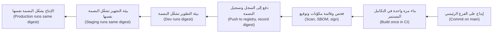

**الملصقات لإمكانية التتبّع (Labels for traceability).** اختم ملصقات OCI القياسية (standard OCI labels) `org.opencontainers.image.revision` (الإيداع (the commit)) و `org.opencontainers.image.source` (المستودع (the repository)) في كل صورة، حتى يستطيع أي شخص أن يجيب عن سؤال "من أين جاءت هذه؟ ⁦(where did this come from?)⁩"

#### 🔴 نظرة الخبير (Expert view)

**قابلية إعادة الإنتاج ليست هي التثبيت (Reproducible is not the same as pinned).** يزيل التثبيت (pinning) أكبر مصادر الانحراف (drift)، لكن الطوابع الزمنية (timestamps) وترتيب الملفات (file ordering) قد يظلان يغيّران بصمة إعادة البناء (digest of a rebuild). تهدف معظم الفرق إلى أن تكون الصورة "قابلة لإعادة البناء وقابلة للتتبّع (rebuildable and traceable)"، وتضيف **المصدرية (provenance)**: سجلًّا موقّعًا (signed record) يُنتجه نظام البناء (build system)، يبيّن أي مصدر (source) وأي باني (builder) وأي مُدخلات (inputs) أنشأت البصمة. ومع **قائمة مكوّنات البرمجيات (SBOM, software bill of materials)** و**توقيع (signature)** للصورة يُتحقَّق منه وقت النشر (deploy time)، تكتمل قصة سلسلة التوريد (supply-chain story) التي يدرّسها بتعمّق [*أمن الذكاء الاصطناعي وأمن التطبيقات (Secure AI & Application Security)*، الدرس 6.2 — سلسلة توريد البرمجيات: الاعتماديات وقوائم المكوّنات و SLSA والتوقيع (The software supply chain: dependencies, SBOMs, SLSA and signing)](../secai/index.ar.html#/6.2)؛ ويوصلها الدرس 4.3 بخط تسليم نجم (Najm's pipeline).

**الفحص وحلقة الترقيع (Scanning and the patch loop).** تسرد الماسحات (scanners) مثل Trivy و Grype الثغرات المعروفة (known vulnerabilities) في حزم الصورة. تُنشر ثغرات جديدة يوميًا ضد صور لم تتغيّر (unchanged images)، لذا افحص في خط التسليم (scan in the pipeline) (واحجب (block) عند ظهور نتائج حرجة جديدة (new critical findings) لها إصلاح)، وأعد فحص الصور العاملة (rescan running images) وفق جدول (on a schedule)، وأعد البناء بإيقاع منتظم (rebuild on a cadence) حتى حين لا تتغيّر الشيفرة.

**البناء متعدد المعماريات (Multi-architecture builds).** قد تختلف الحواسيب المحمولة (laptops) عن عقد السحابة (cloud nodes) (Arm أو x86). يبني الأمر `docker buildx build --platform linux/amd64,linux/arm64 --push` كلتيهما ويدفع فهرسًا (index)؛ اختبر على المعمارية التي تشغّل عليها (the architecture you run on).

**عمليات السجل (Registry operations).** عامل السجل (registry) بوصفه بنية تحتية إنتاجية (production infrastructure): **ثبات الوسوم (tag immutability)** في مستودعات الإصدارات (release repositories)؛ و**ذاكرات السحب المؤقتة أو المرايا (pull-through caches or mirrors)** للصور العامة (public images)، حتى لا تستطيع حدود المعدّل (rate limits) في سجل عام أو انقطاعه (outage) إيقاف عمليات النشر لديك (يحدّ Docker Hub من عمليات السحب المجهولة (anonymous) وعمليات الفئة المجانية (free-tier pulls)؛ تحقّق من حدوده الحالية)؛ ووضعه في المنطقة (region) نفسها التي فيها العنقود؛ و**قواعد الاحتفاظ (retention rules)** التي لا تحذف أبدًا أي شيء منشور حاليًا (currently deployed).

**الحاوية ليست آلة افتراضية (The container is not a VM).** شغّل عملية رئيسية واحدة لكل حاوية (one main process per container)، واكتب السجلات (log) إلى المخرج القياسي (standard output)، واحفظ الحالة (state) خارجها، وتوقّع أن تُقتل وتُستبدل في أي وقت (killed and replaced at any time). يفترض Kubernetes أفكار تطبيق العوامل الاثني عشر (Twelve-Factor App) هذه.

### 🧰 الأدوات (The toolkit)
| الأداة أو الممارسة أو الخدمة (Tool, practice or service) | ما هي وماذا تفعل (What it is and does) | متى تلجأ إليها (When to reach for it) |
|---|---|---|
| **Docker** (مع BuildKit) | يبني صور OCI ويشغّلها ويدفعها (builds, runs and pushes)؛ ويضيف BuildKit تركيبات الذاكرة المؤقتة والأسرار (cache and secret mounts) والمراحل المتوازية (parallel stages) | التطوير المحلي (local development) وبناء الصور في التكامل المستمر (CI image builds) |
| **Multi-stage build** — البناء متعدد المراحل | عدة مراحل `FROM` في ملف Dockerfile واحد؛ لا تُشحن إلا المرحلة النهائية (final stage) | كل صورة مُترجَمة (compiled) أو كثيفة الاعتماديات (dependency-heavy) |
| **.dockerignore** | يستبعد الملفات من سياق البناء (build context) | كل مستودع (repository) فيه Dockerfile، منذ اليوم الأول (from day one) |
| **Image digest** — بصمة الصورة | تجزئة محتوى (content hash) تسمّي بايتات الصورة بالضبط (exact image bytes) | كل بيان نشر (deployment manifest) وكل سجلّ ترقية (promotion record) |
| **Container registry** — سجل الحاويات (ECR، ACR، Artifact Registry، GHCR) | يخزّن الصور ويقدّمها، مع التحكم في الوصول (access control) وثبات الوسوم (tag immutability) | الاحتفاظ بصور الإصدارات (release images) قريبًا من العنقود (cluster) |
| **Trivy** | ماسح مفتوح المصدر (open-source scanner) للثغرات (vulnerabilities) والإعدادات الخاطئة (misconfigurations) في الصور والملفات | في التكامل المستمر (CI) مع كل بناء، ووفق جدول (on a schedule) على الصور العاملة |
| **hadolint** | مدقّق (linter) يفحص ملفات Dockerfile مقابل الممارسات الجيدة (good practice) | قبل الإيداع (pre-commit) وفي طلبات السحب (pull requests) |

### 🏛️ عمليًا في بنك نجم (In practice at Najm Bank)
يطلب سالم من يوسف أن يحوّل إصلاحاته إلى **معيار نجم لصور الحاويات، الإصدار 1 (Najm Container Image Standard v1)**، الذي يجب على كل فريق استيفاؤه قبل أن يُسمح لصورة بالعمل في عنقود مشترك (shared cluster). وملف Dockerfile المحصّن (hardened Dockerfile) أعلاه هو مثاله المرجعي (reference example) للغة Python.

| # | القاعدة (Rule) | يتحقّق منها (Checked by) | السبب (Why) |
|---|---|---|---|
| 1 | صورة أساس (base image) من القائمة المعتمدة (approved list)، مثبّتة بالبصمة (pinned by digest) | سياسة خط التسليم (pipeline policy) | نقطة بداية معروفة ومرقّعة (known, patched starting point)؛ لا تغييرات مفاجئة (no surprise changes) |
| 2 | بناء متعدد المراحل (multi-stage build)؛ لا مترجمات ولا أدوات بناء (no compilers or build tools) في المرحلة النهائية؛ الصدفة (shell) ومدير الحزم (package manager) فقط عبر صورة أساس نحيفة معتمدة (approved slim base) | hadolint مع المراجعة (review) | سطح هجوم أصغر (smaller attack surface) وسحب أسرع (faster pulls) |
| 3 | تعمل بمستخدم رقمي بلا صلاحيات جذر (numeric non-root user) (UID 10000 أو أعلى) | فحص خط التسليم لإعدادات الصورة (image config)؛ قبول العنقود (cluster admission) في الدرس 2.3 | يحدّ من الضرر إذا اختُرق التطبيق (if the app is compromised) |
| 4 | لا أسرار في أي طبقة (no secrets in any layer)؛ ملف `.dockerignore` موجود؛ أسرار البناء (build secrets) عبر تركيبات الأسرار (secret mounts) | فحص الأسرار (secret scanning) في الصورة والمستودع | الطبقات دائمة وتُنسخ إلى كل مكان (permanent and copied everywhere) |
| 5 | صيغة التنفيذ (exec-form) لـ `CMD`/`ENTRYPOINT`؛ التطبيق يعالج `SIGTERM` | المراجعة؛ اختبار الإيقاف (shutdown test) في التكامل المستمر (CI) | إيقاف نظيف (clean shutdown) أثناء النشر (deploys) والتوسّع (scaling) |
| 6 | عملية رئيسية واحدة (one main process)؛ السجلات إلى stdout/stderr؛ لا حالة (no state) داخل الحاوية | المراجعة (review) | قد يقتلها العنقود ويستبدلها في أي وقت (kill and replace it at any time) |
| 7 | ملصقات OCI (OCI labels) للمصدر (source) والمراجعة (revision) | خط التسليم (pipeline) | تتبّع أي صورة عاملة إلى إيداعها (trace to its commit) |
| 8 | تُبنى مرة واحدة على الفرع الرئيسي (built once on main)؛ وتُدفع إلى مستودع الإصدارات (release repository) بوسوم ثابتة (immutable tags)؛ وتُنشر بالبصمة (deployed by digest) | فحوص خط التسليم و GitOps | كل بيئة تشغّل البايتات نفسها (same bytes) |
| 9 | مفحوصة (scanned): لا ثغرة حرجة جديدة لها إصلاح متاح (new critical vulnerability with an available fix)؛ قائمة المكوّنات (SBOM) والتوقيع (signature) مرفقان | بوابة خط التسليم (pipeline gate) | أدلة سلسلة التوريد (supply-chain evidence) لفريق نورة |
| 10 | يُعاد بناؤها شهريًا على الأقل (rebuilt at least monthly)، أو ضمن المهلة التي يحددها فريق الأمن (security team's deadline) حين يكون لصورة الأساس إصلاح حرج (critical fix) | خط تسليم مُجدوَل (scheduled pipeline) | الشيفرة غير المتغيّرة تشيخ هي الأخرى (unchanged code still ages) |

**الاستثناءات (Exceptions)** تُرفع إلى سالم مع سبب (reason) وتاريخ انتهاء (expiry date). صارت صورة واجهة الهاتف (Mobile API image) الآن 160 MB بدلًا من 1.3 GB (وهذا رقم نجم لهذه الخدمة وحدها؛ أرقامك ستختلف)، وتسجّل بيئتا التجهيز (staging) والإنتاج (production) البصمة نفسها (same digest).

### 🛠️ التمارين (Exercises)
اعمل محليًا (work locally) باستخدام Docker أو أداة متوافقة (compatible tool). لا تدفع (push) إلا إلى سجل (registry) تملكه، مثل حساب شخصي مجاني (free personal account).

- 🟢 خذ أي تطبيق ويب صغير (small web app) لديك (أو برنامج "hello world" بلغتك)، واكتب ملف Dockerfile ساذجًا (naive) يحوي `FROM <lang>:latest` و `COPY . .`، وابنِه، ثم أعد كتابته بصورة أساس نحيفة مثبّتة (pinned slim base)، وملف `.dockerignore`، ونسخ ملفات الاعتماديات (dependency files) قبل المصدر (source)، ومستخدم `USER` بلا صلاحيات جذر (non-root)، وصيغة تنفيذ (exec-form) لـ `CMD`. قارن الأحجام (sizes) باستخدام `docker images` والطبقات (layers) باستخدام `docker history`. *يكتمل عندما (Done when):* يكون لديك الملفان، وفرق الحجم (size difference)، ودليل على أن تغيير سطر واحد من المصدر لا يعيد بناء سوى الطبقات الأخيرة (last layers).
- 🟡 حوّل صورتك إلى بناء متعدد المراحل (multi-stage build) وافحص النسختين بـ Trivy. ابنِ النسخة الساذجة (naive version) مع سرّ مزيّف (fake secret) في `.env`، ثم اعثر عليه بتصدير الصورة (exporting the image) (`docker save`) والبحث في طبقاتها. *يكتمل عندما (Done when):* تستطيع إظهار السرّ في الصورة الساذجة، وغيابه عن الصورة المحصّنة (hardened one)، وعدد الثغرات (vulnerability counts) في كلتيهما.
- 🔴 ابنِ صورتك لـ `linux/amd64` و `linux/arm64` باستخدام `docker buildx`، وادفعها إلى سجلّك مع ملصقات مراجعة OCI (OCI revision labels)، واكتب ملاحظة نشر (deploy note) من سطرين لا تشير إليها إلا بالبصمة (by digest). ثم ادفع بناءً مختلفًا (different build) إلى الوسم نفسه (same tag). *يكتمل عندما (Done when):* يُظهر `docker buildx imagetools inspect` المعماريتين (both architectures)، وتظل البصمة تسحب الصورة الأصلية (original image) بعد أن تحرّك الوسم (tag moved).

### ⚠️ أخطاء وفخاخ (Mistakes and traps)
- **استخدام `latest` أو غيره من الوسوم المتحرّكة (moving tags) في الإنتاج.** قد تعطي عمليتا سحب (two pulls) للاسم نفسه شيفرة مختلفة. انشر بالبصمة (deploy by digest)، واستخدم وسومًا ثابتة (immutable tags) في مستودع الإصدارات (release repository).
- **الأسرار في الطبقات (Secrets in layers).** إن `COPY . .` مع ملف `.env`، أو `ENV DB_PASSWORD=…`، يسرّب بيانات اعتماد (credential) إلى كل نسخة من الصورة. استخدم `.dockerignore`، وتركيبات أسرار البناء (build secret mounts)، وأسرار وقت التشغيل (runtime secrets) (الدرس 2.3).
- **إعادة البناء لكل بيئة (Rebuilding per environment).** "بناء الإنتاج (production build)" أثر برمجي مختلف (different artefact). رقِّ البصمة (promote the digest).
- **التشغيل بصلاحيات الجذر "لأنها داخل حاوية" (Running as root "because it's in a container").** الحاويات تتشارك نواة المضيف (host kernel). اضبط مستخدم `USER` رقميًا بلا صلاحيات جذر (numeric non-root).
- **الفحص مرة واحدة (Scanning once).** تظهر ثغرات جديدة (new vulnerabilities) في صور لم تتغيّر. أعد فحص الصور العاملة (rescan running images) وأعد البناء وفق جدول (rebuild on a schedule).

### 🧾 الخلاصة (Recap)
- الحاوية (container) عملية Linux معزولة ومقيّدة الموارد (isolated, resource-limited Linux process)؛ والصورة (image) نقطة بدايتها الطبقية (layered starting point) المتوافقة مع معيار OCI.
- رتّب خطوات Dockerfile من المستقر إلى المتقلّب (from stable to volatile) كي تعمل الذاكرة المؤقتة (cache)؛ واترك أدوات البناء (build tools) خلفك عبر البناء متعدد المراحل (multi-stage builds).
- صور الإنتاج صغيرة ومثبّتة (pinned) وبلا صلاحيات جذر (non-root) وخالية من الأسرار (secret-free)، ولها ملصقات (labels) تتبّعها إلى إيداع (commit).
- الوسوم (tags) مؤشّرات يمكن أن تتحرّك؛ والبصمات (digests) تجزئات محتوى (content hashes) لا تتحرّك. ابنِ مرة واحدة وانشر البصمة في كل مكان (deploy the digest everywhere).
- الفحص (scanning)، وقوائم المكوّنات (SBOMs)، والتوقيع (signing)، وإعادة البناء المُجدوَلة (scheduled rebuilds) تُبقي الصور جديرة بالثقة (trustworthy) بعد شحنها.

### ✍️ اختبر نفسك (Check yourself)

**1. يحذف يوسف `.env` باستخدام `RUN rm .env` مباشرة بعد `COPY . .`. لماذا يظل السرّ (secret) مكشوفًا؟**

- A. يُتجاهَل الأمر `rm` بصمت (silently ignored) داخل بناء Docker (Docker build)
- B. ما زالت طبقة `COPY` تحوي الملف؛ وطبقة `rm` اللاحقة تخفيه فقط (only hides it)
- C. تستعيد ذاكرة البناء المؤقتة (build cache) الملفات المحذوفة (deleted files) من البناء السابق (previous build) مع كل إعادة بناء
- D. الملفات في مجلد العمل (working directory) مرئية دائمًا لأي شخص يشغّل `docker ps`

<details><summary>الإجابة</summary>

**B.** الحذف لا يفعل سوى حجب الملف (masks the file) في العرض النهائي (final view)؛ وأي شخص يملك الصورة يستطيع استخراج الطبقة الأسبق (extract the earlier layer). أما A و C فخاطئتان، و D تخلط بين الحاويات العاملة (running containers) ومحتويات الصورة (image contents). أبقِ الملف خارجًا باستخدام `.dockerignore`. (🟡 التعمق أكثر (Going deeper).)

</details>

**2. يقول طارق إن بيئة التجهيز (staging) تشغّل بناءً قديمًا (old build) مع أن خط التسليم (pipeline) دفع `mobile-api:staging` قبل ساعة. وهناك خطّا تسليم يدفعان كلاهما إلى ذلك الوسم (tag). ما الإصلاح الأمتن (most robust fix)؟**

- A. اطلب من الفريقين تنسيق عمليات الدفع (coordinate their pushes) في قناة دردشة مشتركة (shared chat channel)
- B. اضبط العنقود (cluster) ليسحب الوسم `staging` أكثر (pull more often)، مع كل بدء تشغيل لحجيرة (pod start)
- C. أعد تسمية الوسم (rename the tag) إلى `staging-v2` حتى ينفصل عن القديم (separate from the old one)
- D. انشر البصمة (digest) التي سجّلها خط التسليم؛ واجعل وسوم الإصدارات ثابتة (release tags immutable)

<details><summary>الإجابة</summary>

**D.** البصمة (digest) تسمّي بايتات بعينها (exact bytes) ولا يمكن تحريكها. أما A فتعتمد على البشر، و B ما زالت تتسابق (still races)، و C لا تفعل سوى إنشاء وسم آخر قابل للتغيير (mutable tag). (🟢 الأساسيات (The essentials).)

</details>

**3. كل إيداع (commit) في واجهة الهاتف (Mobile API) يعيد بناء كل الاعتماديات (dependencies)، مستغرقًا تسع دقائق. وملف Dockerfile ينسخ شجرة المصدر كاملة (whole source tree) ثم يشغّل `pip install`. أي تغيير يساعد أكثر؟**

- A. انسخ `requirements.txt` وثبّته قبل نسخ المصدر (source)
- B. انتقل إلى صورة الأساس `latest` كي تكون طبقة الأساس (base layer) مخزّنة مؤقتًا دائمًا
- C. امنح آلة البناء (build machine) مزيدًا من أنوية المعالج (CPU cores) وقرصًا أسرع
- D. اجمع كل خطوات البناء في سطر `RUN` واحد طويل لتقليل الطبقات (cut layers)

<details><summary>الإجابة</summary>

**A.** تنكسر الذاكرة المؤقتة (cache breaks) من أول خطوة متغيّرة فصاعدًا، لذا تأتي ملفات الاعتماديات المستقرة (stable dependency files) أولًا. أما B فتجعل البناء غير متوقَّع (unpredictable)، و C تعالج العَرَض (treats the symptom)، و D تُبطل التخزين المؤقت (defeats caching). (🟢 الأساسيات (The essentials).)

</details>

**4. لماذا يستخدم ملف Dockerfile المحصّن صيغة التنفيذ (exec-form) `CMD ["python", "-m", "src.main"]` بدلًا من `CMD python -m src.main`؟**

- A. صيغة التنفيذ تتخطّى طبقة الصدفة (shell layer)، مما يجعل الصورة النهائية أصغر بشكل ملحوظ
- B. صيغة الصدفة (shell form) غير مسموح بها في المرحلة النهائية (final stage) من البناء متعدد المراحل (multi-stage build)
- C. يصبح التطبيق العملية رقم 1 (process 1) ويتلقّى `SIGTERM` مباشرة، فيستطيع التوقّف بنظافة (stop cleanly)
- D. صيغة التنفيذ تجعل العملية تعمل تلقائيًا بالمستخدم غير الجذري (non-root user)

<details><summary>الإجابة</summary>

**C.** في صيغة الصدفة (shell form) تكون الصدفة هي العملية رقم 1 وقد لا تمرّر إشارة الإيقاف (stop signal)، فيُقتل التطبيق بعد انقضاء مهلة السماح (grace period). أما A و B و D فخاطئة: الحجم (size)، ودعم المراحل المتعددة (multi-stage support)، والمستخدم (user) لا علاقة لها بصيغة `CMD`. (🟡 التعمق أكثر (Going deeper).)

</details>

**5. تسأل منى (Mona) من قسم المالية (Finance) لماذا يعيد فريق المنصة (platform team) بناء الصور شهريًا حتى حين لا تتغيّر شيفرة التطبيق (application code). ما أفضل إجابة؟**

- A. كل إعادة بناء (rebuild) تضغط الطبقات (compresses the layers) أكثر، فتصغر الصور بمرور الوقت (smaller over time)
- B. تُكتشف ثغرات جديدة (new vulnerabilities) في صور الأساس غير المتغيّرة؛ وإعادة البناء تلتقط الرقع (pick up the patches)
- C. تحذف سجلات الحاويات (container registries) افتراضيًا أي صورة يزيد عمرها على شهر
- D. يرفض Kubernetes تشغيل الصور (start images) التي يزيد عمرها على شهر (older than one month)

<details><summary>الإجابة</summary>

**B.** الصور غير المتغيّرة تشيخ (unchanged images age) مع نشر ثغرات جديدة ضد محتوياتها. أما A فليست صحيحة عمومًا، و C و D تصفان قواعد لا وجود لها افتراضيًا (do not exist by default) (فالاحتفاظ (retention) أمر تضبطه أنت). (🔴 نظرة الخبير (Expert view).)

</details>

### 📚 المراجع (References)
- مواصفات مبادرة الحاويات المفتوحة (Open Container Initiative specifications) — https://opencontainers.org/
- توثيق Docker: مرجع Dockerfile (Dockerfile reference) — https://docs.docker.com/reference/dockerfile/
- توثيق Docker: البناء متعدد المراحل (multi-stage builds) — https://docs.docker.com/build/building/multi-stage/
- توثيق Docker: ذاكرة البناء المؤقتة (build cache) — https://docs.docker.com/build/cache/
- توثيق Docker: أسرار البناء (build secrets) — https://docs.docker.com/build/building/secrets/
- توثيق Kubernetes: الصور (images) — https://kubernetes.io/docs/concepts/containers/images/
- تطبيق العوامل الاثني عشر (The Twelve-Factor App) — https://12factor.net/
- هيئة الأوراق المالية الأمريكية (US SEC)، أمر Knight Capital Americas LLC (2013) — https://www.sec.gov/litigation/admin/2013/34-70694.pdf
- توثيق Trivy (Trivy documentation) — https://trivy.dev/

<a id="l2-2"></a>

## 2.2 — أساسيات Kubernetes (Kubernetes fundamentals): الحجيرات (pods) وعمليات النشر (deployments) والخدمات (services) وطريقة تفكير العنقود (how the cluster thinks)

*المستوى: 🟡 متوسط* · *المتطلبات: 1.1، 1.2، 2.1* · *المرحلة (Phase): Deploy, Operate*

### ⚡ الدرس في دقيقة (In 60 seconds)
- **Kubernetes** نظام يشغّل الحاويات (containers) عبر مجموعة من الآلات (**العنقود (cluster)**) ويُبقيها عاملة. تخبره بما تريد؛ فيعمل باستمرار ليجعل الواقع مطابقًا له (make reality match).
- الفكرة الجوهرية هي **الحالة المرغوبة والمواءمة (desired state and reconciliation)**: تعلن الكائنات (declare objects) بلغة YAML، ويخزّنها خادم واجهة البرمجة (API server)، و**المتحكّمات (controllers)** تدور في حلقة لا تنتهي (loop forever) تقارن "المُعلَن (declared)" بـ "الفعلي (actual)" وتصلح الفرق.
- الكائنات اليومية (everyday objects): **الحجيرة (Pod)** (حاوية أو أكثر تُجدوَل معًا (scheduled together))، و**عملية النشر (Deployment)** (تُبقي N من الحجيرات المتطابقة عاملة وتطرح الإصدارات الجديدة (rolls out new versions))، و**الخدمة (Service)** (اسم وعنوان ثابتان (stable name and address) أمام حجيرات متغيّرة)، و**مساحة الأسماء (Namespace)** (مجلد للكائنات والوصول (access) والحصص (quotas)).
- **الملصقات والمحدِّدات (Labels and selectors)** هي الغراء الرابط (the glue): تجد عملية النشر حجيراتها، وتجد الخدمة وجهة إرسال حركة المرور (traffic)، بمطابقة الملصقات وحدها (purely by matching labels).
- إشارة القرار (Decision cue): لا تصلح الأشياء يدويًا داخل العنقود أبدًا (never fix things by hand). غيّر الحالة المُعلنة (declared state) (ملف YAML في Git) ودع المتحكّمات تتقارب (converge).
- أكبر فخ (Biggest trap): معاملة الحجيرات معاملة الخوادم (treating pods like servers). الحجيرات قابلة للاستغناء (disposable)؛ وأي شيء تغيّره داخل إحداها، أو أي حجيرة تنشئها يدويًا، يزول في المرة التالية التي تُستبدل فيها (replaced).

### 🧭 لماذا يهم (Why it matters)
في مركز البيانات (data centre)، كانت واجهة برمجة تطبيق نجم للهاتف (Najm Mobile API) تعمل على أربع آلات افتراضية (virtual machines) تُرعى يدويًا (hand-tended). وحين تتعطّل إحداها ليلًا، كان يُستدعى مشغّل (operator was paged) فيعيد تشغيلها؛ وكان التعافي (recovery) يستغرق ما يستغرقه شخص كي يستيقظ.

في أسبوعه الثاني، ينشر يوسف الواجهة على عنقود Kubernetes المُدار الجديد (new managed Kubernetes cluster). يحذف حجيرة (pod) تسيء التصرّف، وبعد ثوانٍ تظهر حجيرة جديدة باسم مختلف. يصلح إعدادًا (setting) باستخدام `kubectl edit`؛ وفي صباح اليوم التالي تكون أداة GitOps (الدرس 3.2) قد أعادت القيمة القديمة (old value). وتعطّلت عقدة (node) في المنطقة B ليلًا دون أن تستدعي أحدًا: فقد أُعيد إنشاء حجيراتها في مكان آخر قبل أن يلاحظ أحد.

يقول له سالم: "الثلاثة كلها الميزة نفسها (same feature). العنقود (cluster) مجموعة من حلقات التحكم (control loops) التي تظل تدفع الواقع نحو ما كتبناه. اعمل مع الحلقات وستتولّى نوباتك الليلية (night shifts). واعمل ضدها وستُبطل عملك (undo you)."

### 📐 كيف يعمل (How it works)

#### 🟢 الأساسيات (The essentials)

**أجزاء العنقود (The cluster's parts).** للعنقود (cluster) **مستوى تحكم (control plane)** (الدماغ) و**عقد عاملة (worker nodes)** (الآلات التي تشغّل حاوياتك). وفي الخدمات المُدارة (managed services) (Amazon EKS، و Azure Kubernetes Service، و Google Kubernetes Engine)، يشغّل المزوّد (provider) مستوى التحكم ولا ترى أنت غالبًا إلا العقد (nodes).

| المكوّن (Component) | أين (Where) | ماذا يفعل (What it does) |
|---|---|---|
| **kube-apiserver** | مستوى التحكم (Control plane) | الباب الأمامي (front door): كل شيء يخاطب العنقود عبر واجهة برمجته (API) |
| **etcd** | مستوى التحكم (Control plane) | مخزن مفتاح-قيمة (key-value store) يحفظ كل الكائنات المُعلنة (declared objects) وحالتها (status) |
| **Scheduler** — المُجدوِل | مستوى التحكم (Control plane) | يختار عقدة (node) لكل حجيرة جديدة، بناءً على طلبات مواردها (resource requests) وقواعدها (rules) |
| **Controller manager** — مدير المتحكّمات | مستوى التحكم (Control plane) | يشغّل حلقات التحكم المدمجة (built-in control loops) (عمليات النشر deployments، ومجموعات النسخ replica sets، والعقد nodes، ونقاط النهاية endpoints وغيرها) |
| **kubelet** | كل عقدة (Every node) | وكيل (agent) يشغّل الحجيرات المُسندة إلى عقدته ويفحص صحتها (health-checks) |
| **Container runtime** — بيئة تشغيل الحاويات | كل عقدة (Every node) | تشغّل الحاويات (containerd أو CRI-O) |
| **kube-proxy** (أو إضافة CNI تحلّ محلّه (CNI plugin that replaces it)) | كل عقدة (Every node) | يبرمج شبكة العقدة (node's networking) كي تصل عناوين الخدمات (Service addresses) إلى الحجيرات الصحيحة |

**الحالة المرغوبة والمواءمة (Desired state and reconciliation).** أنت لا تقول لـ Kubernetes "شغّل ثلاث حاويات (start three containers)". بل تقدّم كائنًا (object) يقول "يجب أن تكون هناك ثلاث (there should be three)". فيلاحظ متحكّم (controller) الفجوة (gap) بين ثلاث مطلوبة وصفر عاملة، ويتصرّف. وإذا تعطّلت عقدة (node dies) وأخذت معها حجيرة، تعود الفجوة للظهور ويتصرّف المتحكّم مجددًا. تُسمّى تلك الحلقة **المواءمة (reconciliation)**، وهي تفسّر مفاجآت يوسف الثلاث كلها.

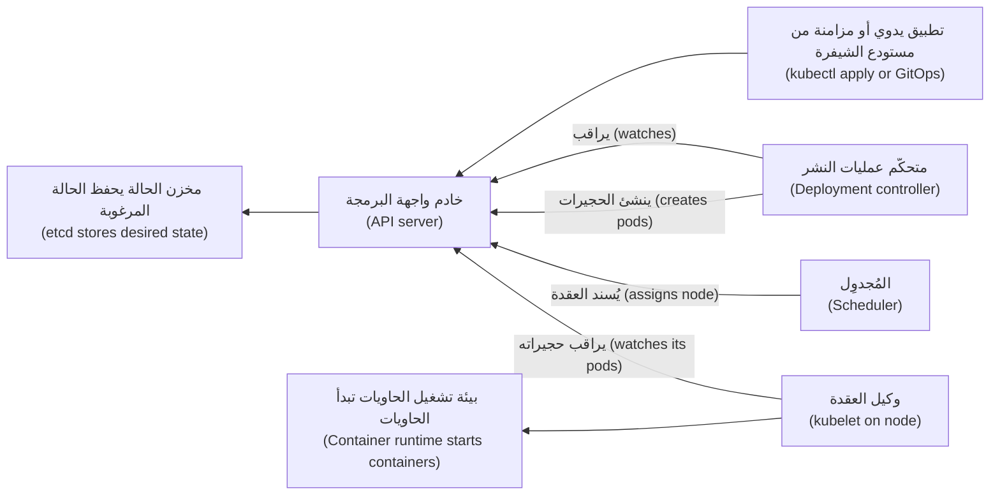

المتحكّمات (controllers) والمُجدوِل (scheduler) وعناصر kubelet، كلٌّ منها يراقب خادم واجهة البرمجة (watches the API server) ويكتب النتائج إليه؛ ولا يتخاطب بعضها مع بعض مباشرة أبدًا (never talk to each other directly).

**الحجيرات (Pods).** **الحجيرة (Pod)** أصغر شيء يشغّله Kubernetes: حاوية أو أكثر تتشارك عنوان شبكة (network address) واحدًا، وتكون دائمًا على العقدة نفسها (same node). والحجيرات **عابرة (ephemeral)**: فالبدائل (replacements) تحصل على أسماء وعناوين IP جديدة، ولا تنشئ أبدًا حجيرة مباشرة لحِمل عمل حقيقي (real workload).

**عمليات النشر ومجموعات النسخ (Deployments and ReplicaSets).** تعلن **عملية النشر (Deployment)** "شغّل N نسخة من قالب الحجيرة هذا (pod template)". وهي تدير **مجموعة نسخ (ReplicaSet)** تتولّى العدّ (counting)؛ وحين تغيّر القالب (template) (مثل بصمة صورة جديدة (new image digest))، تنشئ عملية النشر مجموعة نسخ جديدة وتنقل الحجيرات من القديمة إلى الجديدة تدريجيًا (gradually). ذلك هو **التحديث المتدحرج (rolling update)**.

**الخدمات (Services).** لأن عناوين الحجيرات (pod addresses) تتغيّر باستمرار، تحتاج البرمجيات الأخرى إلى عنوان ثابت (stable address). تمنح **الخدمة (Service)** مجموعة من الحجيرات عنوان IP افتراضيًا ثابتًا (stable virtual IP) واسم DNS (DNS name)، مثل `mobile-api.mobile.svc.cluster.local`، وتوزّع الاتصالات (spreads connections) على أي حجيرات تطابق محدِّدها (selector) حاليًا وتكون جاهزة (ready).

| نوع الخدمة (Service type) | يمكن الوصول إليها من (Reachable from) | الاستخدام المعتاد (Typical use) |
|---|---|---|
| `ClusterIP` (الافتراضي (default)) | داخل العنقود فقط (inside the cluster only) | حركة المرور من خدمة إلى خدمة (service-to-service traffic) |
| `NodePort` | منفذ (port) على كل عقدة | نادرًا ما يُستخدم مباشرة؛ لبنة بناء (building block) للأنواع الأخرى |
| `LoadBalancer` | من الخارج، عبر موازن أحمال سحابي (cloud load balancer) ينشئه المزوّد | كشف خدمة (exposing a service) عند الطبقة 4 (layer 4) (TCP) |

ولتوجيه HTTP (HTTP routing) حسب اسم المضيف والمسار (host name and path) (الطبقة 7 (layer 7))، استخدم **Ingress** أو **Gateway API** الأحدث، الذي بلغ الإتاحة العامة (general availability) (v1.0) في أكتوبر 2023. وكلاهما يحتاج إلى متحكّم (controller) مثبّت في العنقود ليؤدي العمل الفعلي.

**الملصقات والمحدِّدات (Labels and selectors).** **الملصق (label)** وسم مفتاح-قيمة (key-value tag) على كائن، مثل `app.kubernetes.io/name: mobile-api`. و**المحدِّد (selector)** استعلام (query) على الملصقات. تجد عمليات النشر حجيراتها بالمحدِّد (by selector)؛ وتجد الخدمات نقاط نهايتها (endpoints) بالمحدِّد. وإذا لم تتطابق الملصقات، فلا شيء يتّصل ولا تظهر رسالة خطأ (no error message)، بل لا حركة مرور (no traffic) فحسب.

**مساحات الأسماء (Namespaces).** **مساحة الأسماء (Namespace)** تجمع الكائنات. يمنح بنك نجم كل فريق أو نظام مساحته الخاصة (`mobile`، `payments`، `assist`، ولا `default` أبدًا) مع قواعد الوصول (access rules) والحصص (quotas) وسياسات الشبكة (network policies) الخاصة بها. ومساحة الأسماء وحدها ليست حدًّا أمنيًا قويًا (strong security boundary).

#### 🟡 التعمق أكثر (Going deeper)

**عملية نشر وخدمة صحيحتان في حدّهما الأدنى (A minimal, correct Deployment and Service).**

```yaml
apiVersion: apps/v1
kind: Deployment
metadata:
  name: mobile-api
  namespace: mobile
  labels:
    app.kubernetes.io/name: mobile-api
spec:
  replicas: 3
  revisionHistoryLimit: 5
  selector:
    matchLabels:
      app.kubernetes.io/name: mobile-api
  strategy:
    type: RollingUpdate
    rollingUpdate:
      maxSurge: 1          # at most one extra pod during a rollout
      maxUnavailable: 0    # never drop below 3 ready pods
  template:
    metadata:
      labels:
        app.kubernetes.io/name: mobile-api
    spec:
      containers:
        - name: api
          image: registry.example.com/najm/mobile-api@sha256:<digest-from-pipeline>
          ports:
            - name: http
              containerPort: 8080
```

```yaml
apiVersion: v1
kind: Service
metadata:
  name: mobile-api
  namespace: mobile
spec:
  type: ClusterIP
  selector:
    app.kubernetes.io/name: mobile-api
  ports:
    - name: http
      port: 80
      targetPort: http
```

يظهر الملصق نفسه (same label) ثلاث مرات: محدِّد عملية النشر (Deployment selector)، وقالب الحجيرة (pod template)، ومحدِّد الخدمة (Service selector). ويضيف الدرس 2.3 المجسّات (probes) والموارد (resources) وإعدادات الأمان (security settings) التي يحتاجها الإنتاج.

**تصريحي لا أمري (Declarative, not imperative).** يغيّر `kubectl run` و `kubectl edit` العنقود الحيّ (live cluster) مباشرة؛ أما `kubectl apply -f` فيقدّم ملفات تصف الحالة المرغوبة (desired state). ومع GitOps، يكون Git مصدر الحقيقة الوحيد (only source of truth) وتُعكس التعديلات اليدوية (manual edits are reverted)، مما يزيل مشكلة "أحدهم غيّر شيئًا في الثالثة فجرًا ⁦(someone changed something at 3 a.m.)⁩".

**كيف يمضي التحديث المتدحرج (How a rolling update proceeds).** مع الإعدادات أعلاه، يبدأ Kubernetes حجيرة جديدة واحدة (`maxSurge: 1`)، وينتظر حتى تصبح **جاهزة (ready)**، ويزيل حجيرة قديمة واحدة، ويكرّر. وإذا لم تصبح الحجيرات الجديدة جاهزة أبدًا، يتعثّر الطرح (rollout stalls) بدلًا من إسقاط الخدمة؛ وبعد `progressDeadlineSeconds` (600 ثانية افتراضيًا) تُبلغ عملية النشر أنها فشلت في التقدّم (failed to progress). وكلتا القيمتين (both values) افتراضيتهما 25% حين لا تضبطهما.

```shell
kubectl -n mobile rollout status deployment/mobile-api   # watch progress
kubectl -n mobile rollout history deployment/mobile-api  # list revisions
kubectl -n mobile rollout undo deployment/mobile-api     # emergency rollback
```

في منصة GitOps، يُعدّ `rollout undo` حركة كسر الزجاج (break-glass move): اعكس التغيير في Git أيضًا (revert the change in Git)، وإلا أعاد المُوائِم (reconciler) طرحه إلى الأمام (roll it forward). ويغطّي الدرس 4.2 استراتيجيات الكناري (canary) والأزرق والأخضر (blue-green) المبنية فوق هذا.

**قراءة حالة الحجيرة (Reading a pod's status).** معظم التشخيص في الأسبوع الأول (first-week debugging) هو قراءة هذه الحالات:

| ما تراه (You see) | ما يعنيه عادةً (It usually means) | أين تنظر (Look at) |
|---|---|---|
| `Pending` | لا يجد المُجدوِل (scheduler) عقدة: لا يكفي المعالج (CPU) أو الذاكرة (memory)، أو قواعد لا تستوفيها أي عقدة | `kubectl describe pod` ← الأحداث (Events) |
| `ImagePullBackOff` / `ErrImagePull` | اسم صورة أو بصمة خاطئة (wrong image name or digest)، أو صلاحية سجل مفقودة (missing registry permission)، أو سجل يتعذّر الوصول إليه (registry unreachable) | الأحداث (Events)؛ صلاحية العقدة للسحب (node's permission to pull) |
| `CrashLoopBackOff` | الحاوية تبدأ وتخرج مرارًا وتكرارًا؛ و Kubernetes ينتظر مدة أطول بين عمليات إعادة التشغيل (restarts) | `kubectl logs <pod> --previous` |
| `OOMKilled` (في الحالة الأخيرة (in last state)) | استخدمت الحاوية ذاكرة أكثر من حدّها (memory limit) | حد الذاكرة والاستخدام الحقيقي (real usage) (الدرس 2.3) |
| `Running` لكن `0/1` جاهزة (ready) | العملية تعمل لكنها تفشل في فحص الجاهزية (readiness check)، فلا تتلقّى أي حركة مرور | مجسّ الجاهزية (readiness probe) وسجلات التطبيق (app logs) |

فرز من خمسة أوامر (five-command triage) يغطّي معظم الحالات:

```shell
kubectl -n mobile get pods -o wide             # states, restarts, nodes
kubectl -n mobile describe pod <pod>           # events at the bottom
kubectl -n mobile logs <pod> --previous        # logs of the crashed container
kubectl -n mobile get endpointslices -l kubernetes.io/service-name=mobile-api
kubectl -n mobile get events --sort-by=.lastTimestamp
```

يجيب الأمر الرابع عن سؤال "هل لخدمتي أي حجيرات خلفها؟ ⁦(does my Service have any pods behind it?)⁩" والقائمة الفارغة تعني عدم تطابق في الملصقات (label mismatch) أو عدم وجود حجيرات جاهزة (no ready pods).

**أنواع أحمال العمل الأخرى (Other workload types).** إلى جانب عمليات النشر (Deployments) للخدمات عديمة الحالة (stateless services): **StatefulSet** (أسماء وتخزين ثابتان لكل حجيرة (stable names and storage per pod))، و**DaemonSet** (حجيرة واحدة لكل عقدة (one pod per node)، للوكلاء (agents))، و**Job**/**CronJob** (تعمل حتى الاكتمال (run to completion)). ويُبقي بنك نجم قواعد البيانات (databases) على الخدمة المُدارة لدى المزوّد (provider's managed service) بدلًا من StatefulSets.

#### 🔴 نظرة الخبير (Expert view)

**التوزيع عبر نطاقات الأعطال (Spread across failure domains).** لا تنفع ثلاث نسخ (three replicas) إذا وضعها المُجدوِل (scheduler) كلها على عقدة واحدة، أو في منطقة توافر (availability zone) واحدة تتعطّل بعد ذلك. تُخبر **قيود توزيع الطوبولوجيا (Topology spread constraints)** المُجدوِل بأن يوازن الحجيرات (balance pods):

```yaml
      topologySpreadConstraints:
        - maxSkew: 1
          topologyKey: topology.kubernetes.io/zone
          whenUnsatisfiable: DoNotSchedule
          labelSelector:
            matchLabels:
              app.kubernetes.io/name: mobile-api
```

يوضع هذا في `spec` قالب الحجيرة (pod template)، مقترنًا بمجمّعات عقد (node pools) في عدة مناطق (zones) (الدرس 6.1). وتمنع **ميزانية تعطيل الحجيرات (PodDisruptionBudget)** (الدرس 2.3) أعمال الصيانة (maintenance) من إزالة عدد كبير من الحجيرات دفعة واحدة.

**كل شيء كائن في واجهة البرمجة (Everything is an API object).** يمكنك إضافة أنواع كائنات خاصة بك (**الموارد المخصّصة (custom resources)**) ومتحكّمات (controllers) خاصة بك (**المشغّلات (operators)**)؛ وهكذا يعمل Argo CD و cert-manager. وكل إضافة (add-on) من هذا النوع اعتمادية (dependency) يجب على فريق المنصة (platform team) ترقيتها ومراقبتها (upgrade and watch).

**الترقيات عمل دائم (Upgrades are a standing job).** يشحن مشروع Kubernetes نحو ثلاثة إصدارات فرعية (minor releases) سنويًا، ويدعم كلًّا منها قرابة أربعة عشر شهرًا؛ وينشر المزوّدون المُدارون (managed providers) نوافذهم الخاصة (own windows) (تحقّق من مزوّدك). اقرأ ملاحظات الإهمال (deprecation notes) واختبر الترقيات في البيئات غير الإنتاجية (non-production) أولًا؛ فواجهات البرمجة المُزالة (removed APIs) هي السبب المعتاد للأعطال (breakage).

**كم من Kubernetes ينبغي أن تشغّل؟ ⁦(How much Kubernetes should you run?)⁩** يستحق Kubernetes تعقيده (earns its complexity) حين تتشارك خدمات وفرق وبيئات كثيرة منصة واحدة. أما لخدمة صغيرة واحدة، فقد تكون خدمة الحاويات عديمة الخوادم (serverless container service) أو المنصة كخدمة (PaaS) القرار الأفضل. اختار بنك نجم Kubernetes المُدار (managed Kubernetes) لأنه يشغّل عشرات الخدمات ويريد طريقة واحدة لنشرها. وصورة OCI نفسها تعمل على كل هذه، فيبقى الخيار قابلًا للعكس (reversible).

| المفهوم (Concept) | AWS | Microsoft Azure | Google Cloud |
|---|---|---|---|
| Kubernetes المُدار (Managed Kubernetes) | Amazon EKS | Azure Kubernetes Service (AKS) | Google Kubernetes Engine (GKE) |
| الحاويات عديمة الخوادم (Serverless containers) | Amazon ECS على AWS Fargate | Azure Container Apps | Cloud Run |

### 🧰 الأدوات (The toolkit)
| الأداة أو الممارسة أو الخدمة (Tool, practice or service) | ما هي وماذا تفعل (What it is and does) | متى تلجأ إليها (When to reach for it) |
|---|---|---|
| **kubectl** | عميل سطر الأوامر (command-line client) لواجهة برمجة Kubernetes | تطبيق البيانات (applying manifests)، وفحص الحالة (inspecting state)، والتشخيص (debugging) |
| **kind** (Kubernetes داخل Docker (Kubernetes in Docker)) | يشغّل عنقودًا كاملًا على هيئة حاويات على حاسوبك المحمول (laptop) | التعلّم، والاختبار المحلي (local testing)، واختبارات البيانات (tests of manifests) في التكامل المستمر (CI) |
| **k3d** | يشغّل توزيعة k3s الخفيفة (lightweight k3s distribution) داخل Docker | عنقود محلي سريع (fast local cluster) ذو بصمة موارد صغيرة (small footprint) |
| **Deployment** — عملية النشر | تُبقي N من الحجيرات المتطابقة عاملة وتطرح التغييرات (rolls out changes) | كل خدمة عديمة الحالة (stateless service) |
| **Service** — الخدمة | عنوان IP افتراضي ثابت واسم DNS (stable virtual IP and DNS name) أمام الحجيرات المطابقة | أي حجيرة تتلقّى حركة مرور (receives traffic) |
| **Gateway API** | واجهة برمجة Kubernetes الموجّهة بالأدوار (role-oriented API) لتوجيه HTTP و TCP إلى داخل العنقود | تصاميم الدخول الجديدة (new ingress designs)؛ استبدال إعدادات Ingress الأقدم |
| **Topology spread constraints** — قيود توزيع الطوبولوجيا | قواعد للمُجدوِل (scheduler rules) توازن الحجيرات عبر المناطق (zones) أو العقد (nodes) | كل حِمل عمل إنتاجي (production workload) له أكثر من نسخة واحدة (more than one replica) |

### 🏛️ عمليًا في بنك نجم (In practice at Najm Bank)
يكتب يوسف **خط الأساس لبيانات أحمال العمل في نجم (Najm workload manifest baseline)**: الحدّ الأدنى الذي يجب أن تحويه كل عملية نشر (Deployment) قبل دمجها في مستودع GitOps (GitOps repository)، إضافة إلى بطاقة فرز (triage card) لجدول المناوبة (on-call rota).

**الجزء A: مطلوب في كل عملية نشر (Part A: required on every Deployment)**

| الحقل (Field) | قاعدة نجم (Najm rule) | السبب (Reason) |
|---|---|---|
| `metadata.namespace` | مساحة أسماء الفريق (team's namespace)؛ ولا `default` أبدًا | الوصول (access) والحصص (quotas) وتوزيع التكلفة (cost allocation) حسب الفريق |
| الملصقات (Labels) | `app.kubernetes.io/name`، `app.kubernetes.io/part-of`، `najm.example/team`، `najm.example/cost-centre` | المحدِّدات (selectors) ولوحات المتابعة (dashboards) وتقارير التكلفة (cost reports) (الدرس 6.2) |
| `spec.replicas` | 3 أو أكثر في الإنتاج (أو حدّ أدنى للمُوسِّع التلقائي (autoscaler minimum) قدره 3) | النجاة من تعطّل عقدة أو منطقة (survive a node or zone failure) |
| `image` | مسار السجل (registry path) مع البصمة (digest) من خط التسليم | البايتات التي اختُبرت بالضبط (exactly the bytes that were tested) (الدرس 2.1) |
| `strategy.rollingUpdate` | `maxUnavailable: 0`، `maxSurge: 1` (أو 25%) | لا فقدان للسعة (no capacity loss) أثناء النشر |
| `topologySpreadConstraints` | عبر `topology.kubernetes.io/zone` | النجاة من تعطّل منطقة (survive a zone failure) |
| المجسّات والموارد وسياق الأمان (Probes, resources, security context) | كما في قائمة تحقق الدرس 2.3 (lesson 2.3 checklist) | ليست جاهزة للإنتاج (not production-ready) من دونها |
| مسار التغيير (Change path) | طلب سحب في Git فقط (Git pull request only)؛ لا `kubectl edit` في الإنتاج | مصدر حقيقة واحد (one source of truth)؛ سجل تدقيق كامل (full audit trail) |

**الجزء B: بطاقة فرز المناوبة ("الحجيرة لا تعمل") (Part B: on-call triage card ("the pod will not work"))**

| الخطوة (Step) | الأمر (Command) | إن رأيت… (If you see…) | فعندئذ (Then) |
|---|---|---|---|
| 1 | `kubectl get pods -o wide` | `Pending` | افحص الأحداث (events) بحثًا عن "Insufficient cpu/memory"؛ وافحص سعة مجمّع العقد (node pool capacity) |
| 2 | `kubectl describe pod` | `ImagePullBackOff` | تحقّق من أن البصمة (digest) موجودة؛ وافحص صلاحية العقدة على السجل (node's registry permission) |
| 3 | `kubectl logs --previous` | `CrashLoopBackOff` | اقرأ الخطأ الأخير (last error)؛ وتحقّق من أن الإعدادات (config) والأسرار (secrets) رُكّبت (mounted) |
| 4 | `kubectl get endpointslices` | لا نقاط نهاية (No endpoints) | قارن محدِّد الخدمة (Service selector) بملصقات الحجيرات (pod labels)؛ وافحص الجاهزية (readiness) |
| 5 | `kubectl rollout history` | بدأت المشكلة مع طرح (Problem began with a rollout) | اعكس الإيداع في Git (revert the commit in Git)؛ ولا تستخدم `rollout undo` لكسر الزجاج (break-glass) إلا بموافقة مها |

### 🛠️ التمارين (Exercises)
استخدم عنقودًا محليًا (local cluster): ثبّت kind أو k3d، وأنشئ عنقودًا باستخدام `kind create cluster` أو `k3d cluster create`.

- 🟢 انشر عملية النشر (Deployment) والخدمة (Service) من هذا الدرس (واستخدم أي صورة ويب عامة صغيرة (small public web image) تثق بها، مثبّتة بالبصمة (pinned by digest)، بدلًا من واجهة الهاتف). احذف حجيرة واحدة وراقب باستخدام `kubectl get pods -w` ظهور بديل (replacement). *يكتمل عندما (Done when):* تستطيع أن تشرح، في جملتين، أي متحكّم (controller) أعاد إنشاء الحجيرة ولماذا تغيّر اسمها.
- 🟡 اكسر الخدمة عمدًا (break the Service on purpose) بتغيير ملصق قالب الحجيرة (pod template label) دون تحديث محدِّد الخدمة (Service selector). استخدم بطاقة الفرز (triage card) لتجد العطل من الأعراض وحدها (from the symptoms alone). ثم انشر بصمة صورة (image digest) غير موجودة وشخّص النتيجة. *يكتمل عندما (Done when):* يكون لديك مُخرَج الأمر الدقيق (exact command output) الذي أشار إلى كل سبب، ويكون كلاهما قد أُصلح عبر ملفات YAML لديك، لا عبر `kubectl edit`.
- 🔴 أنشئ عنقود kind بثلاث عقد عاملة (three worker nodes)، وضع عليها ملصقات المناطق `a` و `b` و `c` باستخدام `topology.kubernetes.io/zone`، وانشر ست نسخ (six replicas) مع قيد توزيع الطوبولوجيا (topology spread constraint). أفرغ عقدة واحدة (drain one node) باستخدام `kubectl drain` وراقب ما يحدث. *يكتمل عندما (Done when):* تستطيع أن تُظهر توزّع الحجيرات بواقع اثنتين لكل منطقة (two per zone) قبل الإفراغ، وتشرح أين ذهبت بعده، وتشرح لماذا ترك `DoNotSchedule` بعض الحجيرات في حالة `Pending` إن حدث ذلك.

### ⚠️ أخطاء وفخاخ (Mistakes and traps)
- **تعديل العنقود الحيّ (Editing the live cluster).** يُحدث `kubectl edit` في الإنتاج انحرافًا (drift) تعكسه المزامنة التالية (next sync)، أو ما هو أسوأ، انحرافًا لا يعلم به أحد. غيّر Git؛ ودع المُوائِم (reconciler) يطبّقه.
- **إنشاء حجيرات مجرّدة (Creating bare pods).** الحجيرة التي لا يملكها متحكّم (not owned by a controller) لا يُعاد إنشاؤها حين تتعطّل عقدتها. استخدم عملية نشر (Deployment) (أو Job، أو StatefulSet، أو DaemonSet).
- **عدم تطابق الملصقات (Label mismatches).** الخدمة التي لا يطابق محدِّدها شيئًا لا تُنتج خطأً (no error)، بل غياب حركة المرور فقط (only no traffic). استخدم اصطلاح ملصقات واحدًا (one label convention) وافحص نقاط النهاية (endpoints).
- **كل النسخ في مكان واحد (All replicas in one place).** ثلاث حجيرات على عقدة واحدة تعطي وهم التكرار (illusion of redundancy). أضف قيود توزيع الطوبولوجيا (topology spread constraints) ومجمّعات عقد متعددة المناطق (multi-zone node pools).
- **نسيان أن التراجع يكون في Git أيضًا (Forgetting the rollback is in Git too).** إن `rollout undo` الذي لا ينعكس في Git يُعيد GitOps طرحه إلى الأمام (rolled forward again).

### 🧾 الخلاصة (Recap)
- يشغّل Kubernetes الحاويات عبر عنقود (cluster) ويُبقيها عاملة من خلال حلقات تحكم (control loops) تواءم الحالة الفعلية (actual state) مع الحالة المُعلنة (declared state).
- مستوى التحكم (control plane) (خادم واجهة البرمجة API server، و etcd، والمُجدوِل scheduler، والمتحكّمات controllers) يقرّر؛ وعناصر kubelet وبيئات تشغيل الحاويات (container runtimes) على العقد تنفّذ.
- الحجيرات (pods) قابلة للاستغناء (disposable)؛ وعمليات النشر (Deployments) تُبقي N منها عاملة وتطرح الإصدارات الجديدة؛ والخدمات (Services) تمنحها عنوانًا ثابتًا (stable address)؛ والملصقات والمحدِّدات (labels and selectors) تربط ذلك كله.
- غيّر الحالة المُعلنة في Git، ولا تغيّر الكائنات الحيّة (live objects) أبدًا؛ واقرأ حالات الحجيرات (pod states) والأحداث (events) للتشخيص.
- وزّع النسخ عبر المناطق (spread replicas across zones)، وخطّط لترقيات منتظمة (regular upgrades)، ولا تعتمد Kubernetes إلا حيث يغطّي تعقيده كلفته (complexity pays for itself).

### ✍️ اختبر نفسك (Check yourself)

**1. يحذف يوسف حجيرة (pod) سيئة التصرّف من واجهة الهاتف (Mobile API)، فتظهر حجيرة جديدة خلال ثوانٍ باسم مختلف. ما الذي تسبّب في ذلك؟**

- A. أعاد kubelet على العقدة (node) تشغيل الحجيرة نفسها (restarted the same pod) بعد حذفها
- B. أعادت الخدمة (Service) إنشاء الحجيرة كي تحتفظ بنقطة نهاية (endpoint) واحدة على الأقل
- C. رأى متحكّم مجموعة النسخ (ReplicaSet controller) عددًا أقل من اللازم من الحجيرات فأنشأ بديلًا
- D. استعاد etcd كائن الحجيرة المحذوف من أحدث نسخة احتياطية (most recent backup)

<details><summary>الإجابة</summary>

**C.** المواءمة (reconciliation): يقارن المتحكّم النسخ المرغوبة (desired replicas) بالفعلية (actual) ويسدّ الفجوة. A خاطئة لأن kubelet يعيد تشغيل الحاويات داخل حجيرة قائمة (existing pod)، فتحتفظ باسمها؛ أما الحجيرة المحذوفة فقد زالت. و B خاطئة لأن الخدمات توجّه حركة المرور (route traffic) ولا تنشئ حجيرات أبدًا. و D تسيء فهم دور etcd بوصفه مخزنًا للحالة (store of state). (🟢 الأساسيات (The essentials).)

</details>

**2. ينشر فريق جديد خدمة. حجيراتها في حالة `Running` وجاهزة (ready)، لكن كل طلب إلى الخدمة (Service) تنتهي مهلته (times out)، وليس للخدمة نقاط نهاية (endpoints). ما السبب الأرجح؟**

- A. محدِّد الخدمة (Service selector) لا يطابق ملصقات الحجيرات (pod labels)
- B. بصمة الصورة (image digest) في قالب الحجيرة (pod template) خاطئة
- C. الحجيرات تتجاوز حدّ ذاكرتها (memory limit) باستمرار
- D. لم يجد المُجدوِل (scheduler) عقدة فيها متّسع (node with room)

<details><summary>الإجابة</summary>

**A.** الحجيرات الجاهزة بلا نقاط نهاية تشير إلى عدم تطابق في الملصقات (label mismatch). أما B فكانت ستُظهر `ImagePullBackOff`، و C كانت ستُظهر عمليات إعادة تشغيل `OOMKilled`، و D كانت ستترك الحجيرات في حالة `Pending`، لا عاملة. (🟡 التعمق أكثر (Going deeper).)

</details>

**3. أثناء إطلاق (release)، لا تصبح حجيرات واجهة الهاتف الجديدة جاهزة أبدًا. تستخدم عملية النشر `maxUnavailable: 0` و `maxSurge: 1`. ماذا يحدث للعملاء؟**

- A. تُحذف كل الحجيرات القديمة (old pods) دفعة واحدة (at once)، وتتوقّف الواجهة (API goes down) حتى يتصرّف أحدهم
- B. يكتشف Kubernetes الفشل ويتراجع تلقائيًا (automatically rolls back) إلى الإصدار السابق
- C. تُقسَّم حركة المرور بالتساوي (traffic is split evenly)، فيصل نحو نصف الطلبات إلى الحجيرات المعطوبة (broken pods)
- D. يتعثّر الطرح (rollout stalls)، وتواصل الحجيرات القديمة الخدمة، ويُبلَّغ عنه بأنه لا يتقدّم (not progressing)

<details><summary>الإجابة</summary>

**D.** لا تُزال أي حجيرة قديمة حتى تصبح حجيرة جديدة جاهزة، والحجيرات غير الجاهزة (unready pods) لا تتلقّى حركة مرور من الخدمة. و B هي المُشتِّت المُغري (tempting distractor): فعملية النشر العادية (plain Deployment) لا تتراجع من تلقاء نفسها؛ بل يجب أن تفعل ذلك أنت، أو أداة مثل متحكّم التسليم التدريجي (progressive-delivery controller). (🟡 التعمق أكثر (Going deeper).)

</details>

**4. تلاحظ مها أن نسخ خدمة المدفوعات (Payments replicas) الثلاث كلها على عقد في منطقة التوافر (availability zone) نفسها. أي تغيير يعالج هذا بأكثر الطرق مباشرة؟**

- A. زِد النسخ (replicas) من 3 إلى 6 كي يقلّ أثر تعطّل منطقة واحدة (single zone failure)
- B. أضف قيد توزيع طوبولوجيا حسب المنطقة (zone topology spread constraint)، مع مجمّعات عقد (node pools) في عدة مناطق
- C. انقل المدفوعات إلى مساحة أسماء مخصّصة لها (dedicated namespace) بحصة منفصلة (separate quota)
- D. غيّر نوع خدمة المدفوعات (Payments Service type) إلى `LoadBalancer` عبر المناطق (across zones)

<details><summary>الإجابة</summary>

**B.** قيود التوزيع (spread constraints) تخبر المُجدوِل بأن يوازن عبر المناطق، وهذا لا ينجح إلا إذا وُجدت عقد في عدة مناطق. أما A فقد تضع الست كلها في منطقة واحدة؛ و C و D لا تؤثّران في التوزيع (placement). (🔴 نظرة الخبير (Expert view).)

</details>

**5. يصلح يوسف إعدادًا إنتاجيًا (production setting) باستخدام `kubectl edit`. وفي صباح اليوم التالي تعود القيمة القديمة. لماذا، وماذا ينبغي أن يفعل؟**

- A. أعاد GitOps ما يعلنه Git؛ وينبغي أن يغيّره عبر طلب سحب (pull request)
- B. يعكس Kubernetes كل تغيير يدوي (manual change) بعد 24 ساعة؛ وينبغي أن يعيد تطبيقه يوميًا (re-apply it daily)
- C. خزّن kubelet الإعداد القديم مؤقتًا (cached the old setting) طوال الليل؛ وينبغي أن يُفرغ العقدة ويعيد تشغيلها (drain and restart the node)
- D. فقد etcd التغيير أثناء الضغط (compaction)؛ وينبغي أن يطلب من المزوّد استعادة etcd

<details><summary>الإجابة</summary>

**A.** مع GitOps، يكون Git مصدر الحقيقة (source of truth)، والتعديلات اليدوية (manual edits) انحراف (drift) يُصحَّح. أما B و C و D فتصف سلوكيات لا وجود لها (behaviours that do not exist). (🟡 التعمق أكثر (Going deeper).)

</details>

### 📚 المراجع (References)
- توثيق Kubernetes: مكوّنات العنقود (cluster components) — https://kubernetes.io/docs/concepts/overview/components/
- توثيق Kubernetes: المتحكّمات (controllers) — https://kubernetes.io/docs/concepts/architecture/controller/
- توثيق Kubernetes: عمليات النشر (Deployments) — https://kubernetes.io/docs/concepts/workloads/controllers/deployment/
- توثيق Kubernetes: الخدمات (Services) — https://kubernetes.io/docs/concepts/services-networking/service/
- توثيق Kubernetes: قيود توزيع طوبولوجيا الحجيرات (pod topology spread constraints) — https://kubernetes.io/docs/concepts/scheduling-eviction/topology-spread-constraints/
- توثيق Kubernetes: الملصقات الموصى بها (recommended labels) — https://kubernetes.io/docs/concepts/overview/working-with-objects/common-labels/
- دورة إصدارات Kubernetes وتفاوت الإصدارات (Kubernetes release cycle and version skew) — https://kubernetes.io/releases/
- Gateway API — https://gateway-api.sigs.k8s.io/
- kind — https://kind.sigs.k8s.io/
- توثيق Amazon EKS (Amazon EKS documentation) — https://docs.aws.amazon.com/eks/
- توثيق Azure Kubernetes Service (Azure Kubernetes Service documentation) — https://learn.microsoft.com/azure/aks/
- توثيق Google Kubernetes Engine (Google Kubernetes Engine documentation) — https://cloud.google.com/kubernetes-engine/docs

<a id="l2-3"></a>

## 2.3 — Kubernetes عمليًا (Kubernetes in practice): الإعدادات (config) والأسرار (secrets) ومجسّات الصحة (health probes) والتوسّع التلقائي (autoscaling) و Helm

*المستوى: 🟡 متوسط* · *المتطلبات: 2.1، 2.2* · *المرحلة (Phase): Deploy, Operate*

### ⚡ الدرس في دقيقة (In 60 seconds)
- البيان (manifest) الذي "يعمل" ليس جاهزًا للإنتاج (production-ready). يضيف الإنتاج **الإعدادات الخارجية (external configuration)**، و**الأسرار الآمنة (safe secrets)**، و**مجسّات الصحة (health probes)**، و**الطلبات والحدود (requests and limits)**، و**التوسّع التلقائي (autoscaling)**، و**الإيقاف الرشيق (graceful shutdown)**، و**سياق الأمان (security context)**.
- تحمل **خرائط الإعدادات (ConfigMaps)** الإعدادات العادية (ordinary settings)؛ وتحمل **الأسرار (Secrets)** الحسّاسة منها. وسرّ Kubernetes (Kubernetes Secret) افتراضيًا **مُرمَّز بـ base64 فقط، وليس مشفّرًا (base64-encoded, not encrypted)**: فعّل التشفير أثناء التخزين (encryption at rest)، وقيّد من يستطيع قراءته، وفضّل المزامنة من مدير أسرار خارجي (external secrets manager).
- **الجاهزية (Readiness)** تقرّر ما إذا كانت الحجيرة تتلقّى حركة مرور (gets traffic)؛ و**الحيوية (liveness)** تقرّر ما إذا كانت تُعاد تشغيلها (gets restarted)؛ و**البدء (startup)** يحمي التطبيقات بطيئة الإقلاع (slow starters). ويجب أن تفحص الحيوية العملية نفسها فقط (only the process itself)، ولا تفحص أبدًا قاعدة بيانات أو خدمة أخرى.
- **الطلبات (Requests)** تحجز السعة (reserve capacity) وتقود الجدولة (scheduling) والتوسّع التلقائي؛ و**الحدود (limits)** تسقّف الاستخدام (cap usage) (المعالج فوق الحد يُخنَق (throttled)، والذاكرة فوق الحد تُقتل (killed)).
- إشارة القرار (Decision cue): قبل الإطلاق الفعلي (go-live)، مُرَّ على قائمة تحقق الجاهزية للإنتاج (production-readiness checklist)؛ فأي سطر فارغ انقطاع معروف ينتظر أن يقع (known outage waiting to happen).
- أكبر فخ (Biggest trap): مجسّ حيوية (liveness probe) يعتمد على شيء خارج الحجيرة، فيحوّل تعثّرًا قصيرًا في قاعدة البيانات (short database blip) إلى عاصفة إعادة تشغيل على مستوى العنقود (cluster-wide restart storm).

### 🧭 لماذا يهم (Why it matters)
في صباح يوم ثلاثاء، تنتقل قاعدة بيانات PostgreSQL المُدارة (managed PostgreSQL database) التي تقف خلف **خدمة المدفوعات (Payments service)** إلى نسختها الاحتياطية (fails over to its standby)، في تعثّر (blip) يدوم نحو ثلاثين ثانية. كان ينبغي أن تُرجع المدفوعات أخطاءً (errors) لفترة وجيزة ثم تتعافى (recovered). لكنها بدلًا من ذلك توقّفت إحدى عشرة دقيقة.

تكشف مراجعة ما بعد الحادثة (postmortem) التي أجرتها مها (الدرس 5.3) مع يوسف السلسلة (the chain). كان مجسّ الحيوية (liveness probe) يستدعي `/health`، الذي يستعلم قاعدة البيانات، فأعاد kubelet أثناء الانتقال (failover) تشغيل كل الحجيرات دفعة واحدة. احتاجت الحجيرات المُعاد تشغيلها أربعين ثانية لتسخن (warm up)، ولم تكن لها مهلة إقلاع (startup allowance)، ففشلت في فحص الحيوية مجددًا وأُعيد تشغيلها مجددًا. وفي الأثناء، رأى المُوسِّع التلقائي (autoscaler) قفزة المعالج (CPU spike) فأضاف حجيرات، كلٌّ منها يفتح اتصالات أكثر (more connections) بقاعدة بيانات عادت للتوّ، حتى بلغت حدّ اتصالاتها (connection limit). وكل إعداد شارك في ذلك كان المقصود منه أن يجعل الخدمة *أكثر* موثوقية (more reliable).

وفي الأسبوع نفسه، يجد فريق نورة بيان سرّ (Secret manifest) في Git فيه السطر `password: cGFzc3dvcmQ=`. ظنّ المطوّر أنه مشفّر (encrypted). وهو يُفكّ (decodes) إلى "password" بأمر واحد.

### 📐 كيف يعمل (How it works)

#### 🟢 الأساسيات (The essentials)

**الإعدادات خارج الصورة (Configuration outside the image).** البصمة نفسها (same digest) تعمل في كل مكان (الدرس 2.1)، لذا تُقدَّم الإعدادات الخاصة بكل بيئة (per-environment settings) وقت التشغيل (at runtime). تحمل **خريطة الإعدادات (ConfigMap)** إعدادات غير حسّاسة (non-sensitive settings) أو ملفات إعداد (config files)، تُستهلك بوصفها متغيّرات بيئة (environment variables) أو ملفات مُركَّبة (mounted files).

```yaml
apiVersion: v1
kind: ConfigMap
metadata:
  name: mobile-api-config
  namespace: mobile
data:
  LOG_LEVEL: "info"
  PAYMENTS_URL: "http://payments.payments.svc.cluster.local"
```

تُقرأ متغيّرات البيئة (environment variables) عند بدء الحاوية فقط (only at container start)، لذا لا تصل خريطة الإعدادات المُعدَّلة إلى الحجيرات العاملة حتى يُعاد تشغيلها؛ أما الملفات المُركَّبة (mounted files) فتتحدّث بعد تأخير (after a delay)، لكنها لا تفيد إلا إذا أعاد التطبيق قراءتها (rereads them). والإصلاح المعتاد (usual fix) هو طرح عملية النشر من جديد (roll the Deployment) كلما تغيّرت إعداداتها (يستطيع Helm أتمتة ذلك، كما سيأتي أدناه).

**الأسرار: ما هي وما ليست (Secrets: what they are and are not).** **السرّ (Secret)** يشبه خريطة الإعدادات لكنه لكلمات المرور (passwords) والرموز (tokens) والمفاتيح (keys)، مع تحكّم وصول منفصل (separate access control)، غير أن قيمه **مُرمَّزة بـ base64 (base64-encoded)** فقط، وهو ترميز قابل للعكس (reversible encoding)، وليس تشفيرًا (not encryption):

```shell
echo 'cGFzc3dvcmQ=' | base64 --decode     # prints: password
```

لذا فالسرّ آمن بقدر ثلاثة أمور يجب أن تضبطها (three things you must set up) فحسب:
1. **التشفير أثناء التخزين (Encryption at rest)** لمخزن بيانات العنقود (cluster's data store). تختلف الخدمات المُدارة (managed services)؛ ويقدّم كثير منها التشفير المغلّف (envelope encryption) بمفتاح KMS السحابي الخاص بك (cloud KMS key). تحقّق مما تفعله خدمتك افتراضيًا (by default).
2. **التحكم في الوصول (Access control, RBAC).** أي شخص يستطيع تنفيذ `get` أو `list` على الأسرار في مساحة أسماء (namespace)، أو إنشاء حجيرات هناك تُركّبها (mount them)، يستطيع قراءتها. أبقِ تلك القائمة قصيرة (keep that list short).
3. **لا تضعها أبدًا في Git على هيئة بيانات أسرار صريحة (Never in Git as plain Secret manifests).** احفظ القيمة في مدير أسرار (secrets manager) (AWS Secrets Manager، أو Azure Key Vault، أو Google Secret Manager، أو HashiCorp Vault) وزامِنها إلى الداخل (sync it in) باستخدام **External Secrets Operator** أو **Secrets Store CSI Driver**؛ أما الأسرار التي يجب أن تعيش في Git فتُشفَّر أولًا (encrypted first) (Sealed Secrets، SOPS).

تتيح **هوية حِمل العمل (Workload identity)** (الدرس 1.3) لأداة المزامنة (sync tool) أن تصادق (authenticate) دون مفتاح مخزّن (stored key). والمزيد في [*أمن الذكاء الاصطناعي وأمن التطبيقات (Secure AI & Application Security)*، الدرس 5.2 — إدارة الأسرار: المفاتيح والرموز وأين تتسرّب (Secrets management: keys, tokens and where they leak)](../secai/index.ar.html#/5.2).

**مجسّات الصحة (Health probes).** يستطيع kubelet فحص كل حاوية بثلاث طرق:

| المجسّ (Probe) | السؤال الذي يجيب عنه (Question it answers) | ما يحدث عند الفشل (What happens on failure) |
|---|---|---|
| **الجاهزية (Readiness)** | "هل تستطيع هذه الحجيرة خدمة حركة المرور الآن؟ ⁦(Can this pod serve traffic right now?)⁩" | تُزال الحجيرة من نقاط نهاية الخدمة (Service endpoints)؛ ولا يُعاد تشغيلها (*not* restarted) |
| **الحيوية (Liveness)** | "هل هذه العملية عالقة بما يتجاوز الإصلاح؟ ⁦(Is this process stuck beyond repair?)⁩" | يُعاد تشغيل الحاوية (container is restarted) |
| **البدء (Startup)** | "هل انتهى التطبيق من الإقلاع؟ ⁦(Has the app finished starting?)⁩" | يُرجأ فحصا الحيوية والجاهزية (held off) حتى ينجح؛ وإن لم ينجح أبدًا، يُعاد تشغيل الحاوية |

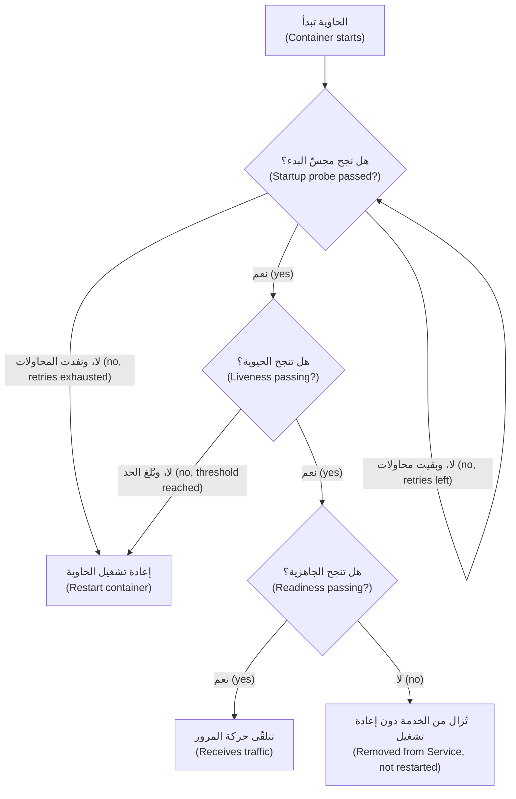

القاعدة التي كانت ستنقذ المدفوعات (Payments): **الحيوية تفحص العملية نفسها فقط (liveness checks only the process itself)** (هل تستجيب، أم أنها في حالة جمود (deadlocked)؟). فإعادة تشغيل التطبيق لا تُصلح قاعدة بيانات. أما **الجاهزية (Readiness)** فقد تراعي الاعتماديات الصلبة (hard dependencies)، لكن إن أصبحت كل حجيرة غير جاهزة دفعة واحدة، يتلقّى المستدعون (callers) أخطاء اتصال (connection errors) بدلًا من استجابة واضحة (clear response). وكثيرًا ما يكون الأفضل أن تبقى جاهزًا وتُرجع خطأً سريعًا وواضحًا (fast, clear error) (مع قاطع دائرة (circuit breaker)) ما دامت الاعتمادية متوقّفة.

**الطلبات والحدود (Requests and limits).** ينبغي لكل حاوية أن تعلن:
- **الطلبات (Requests)**: المعالج (CPU) والذاكرة (memory) المحجوزان لها. لا يضع المُجدوِل (scheduler) الحجيرات إلا حيث تتّسع الطلبات، ويقيس المُوسِّع التلقائي (autoscaler) الاستخدام (utilisation) نسبةً مئوية من الطلب (percentage of the request).
- **الحدود (Limits)**: السقف (the ceiling). فوق حدّ المعالج (CPU limit) **تُخنَق (throttled)** الحاوية (أي تُبطَّأ)؛ وفوق حدّ الذاكرة (memory limit) **تُقتل (killed)** (`OOMKilled`) ويُعاد تشغيلها.

يُقاس المعالج (CPU) بالأنوية أو أجزاء الألف من النواة (cores or millicores) (`250m` ربع نواة)؛ والذاكرة (memory) بالبايتات (bytes) (`512Mi`).

#### 🟡 التعمق أكثر (Going deeper)

**مواصفة الحجيرة الإنتاجية (The production pod spec).** إليك حاوية واجهة الهاتف (Mobile API) من الدرس 2.2 مع إضافة الأساسيات (essentials):

```yaml
    spec:
      terminationGracePeriodSeconds: 30
      securityContext:
        runAsNonRoot: true
        seccompProfile:
          type: RuntimeDefault
      containers:
        - name: api
          image: registry.example.com/najm/mobile-api@sha256:<digest-from-pipeline>
          ports:
            - name: http
              containerPort: 8080
          envFrom:
            - configMapRef:
                name: mobile-api-config
          env:
            - name: DB_PASSWORD
              valueFrom:
                secretKeyRef:
                  name: mobile-api-db     # synced from the secrets manager
                  key: password
          resources:
            requests:
              cpu: 250m
              memory: 384Mi
            limits:
              memory: 384Mi                 # memory limit equal to request
          startupProbe:
            httpGet: { path: /healthz/live, port: http }
            periodSeconds: 5
            failureThreshold: 24            # up to 2 minutes to start
          livenessProbe:
            httpGet: { path: /healthz/live, port: http }   # process only
            periodSeconds: 10
            failureThreshold: 3
          readinessProbe:
            httpGet: { path: /healthz/ready, port: http }
            periodSeconds: 5
            failureThreshold: 2
          securityContext:
            allowPrivilegeEscalation: false
            readOnlyRootFilesystem: true
            capabilities:
              drop: ["ALL"]
```

خيارات تستحق الشرح (Choices worth explaining):
- **حدّ الذاكرة يساوي الطلب (Memory limit equals request).** لا يمكن خنق الذاكرة (cannot be throttled)، بل قتلها فقط، لذا فإن الإفراط في التزام الذاكرة (overcommitting) يسبّب عمليات قتل مفاجئة (surprise kills) حين ينشغل الجيران (neighbours).
- **لا حدّ للمعالج هنا (No CPU limit here).** خيار مختلَف عليه (debated choice): قد تخنق حدود المعالج (CPU limits) خدمة حسّاسة لزمن الاستجابة (latency-sensitive service) حتى حين تكون العقدة خاملة (idle). تضبط فرق كثيرة طلبات المعالج (CPU requests) في كل مكان، والحدود فقط حيث تلزم العدالة الصارمة (hard fairness)؛ قِس الخنق (measure throttling) (الدرس 5.1) وقرّر لكل خدمة على حدة (per service).
- **سياق الأمان (Security context).** بلا صلاحيات جذر (non-root)، وبلا تصعيد صلاحيات (no privilege escalation)، وبلا قدرات Linux (no Linux capabilities)، ونظام ملفات جذري للقراءة فقط (read-only root file system) (ركّب `emptyDir` حيث يجب أن يكتب التطبيق)، وملف seccomp الافتراضي (default seccomp profile). وكلها عدا نظام الملفات المخصّص للقراءة فقط يتطلّبها معيار أمان الحجيرات (Pod Security Standard) **المقيَّد (restricted)** الذي يفرضه بنك نجم على كل مساحة أسماء (per namespace) بالملصق `pod-security.kubernetes.io/enforce: restricted`. والمزيد في [*أمن الذكاء الاصطناعي وأمن التطبيقات (Secure AI & Application Security)*، الدرس 7.2 — الحاويات و Kubernetes والبنية التحتية بوصفها شيفرة (Containers, Kubernetes and infrastructure as code)](../secai/index.ar.html#/7.2).

**جودة الخدمة (Quality of service).** تحدّد الطلبات والحدود أيضًا أولوية إخلاء (eviction priority) كل حجيرة تحت ضغط الذاكرة (memory pressure): **BestEffort** (لم يُضبط شيء؛ تُخلى أولًا (evicted first))، و**Burstable**، و**Guaranteed** (الطلبات تساوي الحدود للمعالج والذاكرة في كل حاوية؛ تُخلى أخيرًا (evicted last)). ومواصفة واجهة الهاتف أعلاه بلا حدّ للمعالج، لذا فهي Burstable؛ أما المدفوعات (Payments) فتضبط أيضًا حدود المعالج مساوية للطلبات وتعمل بفئة Guaranteed.

**الإيقاف الرشيق (Graceful shutdown).** تُوقَف الحجيرات مع كل نشر (deploy)، وكل تقليص (scale-down)، وكل ترقية عقدة (node upgrade). عند الحذف، يبدأ Kubernetes إزالة الحجيرة من نقاط نهاية الخدمة (Service endpoints)، ويشغّل في الوقت نفسه أي خطّاف `preStop` (hook) ثم يرسل `SIGTERM`. تستغرق إزالة نقطة النهاية (endpoint removal) لحظة كي تنتشر (propagate)، لذا فالحجيرة التي تخرج فورًا (exits instantly) تُسقط الطلبات التي ما زالت تصل. والإصلاح: عند `SIGTERM`، توقّف عن قبول عمل جديد (stop accepting new work)، وأنهِ الطلبات الجارية (finish in-flight requests)، واخرج ضمن `terminationGracePeriodSeconds` (30 ثانية افتراضيًا)، وبعدها يأتي `SIGKILL`. وتتيح وقفة `preStop` قصيرة (short pause) اكتمال إزالة نقطة النهاية أولًا؛ وتقدّم إصدارات Kubernetes الأحدث إجراء نوم مدمجًا (built-in sleep action) لهذا الغرض (تحقّق من إصدارك). وبالنسبة إلى المدفوعات، يعني ذلك أيضًا عدم الإقرار أبدًا بتحويل (never acknowledging a transfer) لم يُثبَّت (committed).

**التوسّع التلقائي باستخدام Horizontal Pod Autoscaler (Autoscaling with the Horizontal Pod Autoscaler).** يضبط **المُوسِّع الأفقي التلقائي للحجيرات (HorizontalPodAutoscaler, HPA)** عدد النسخ (replicas) ليُبقي مقياسًا (metric) قريبًا من هدف (target). وهو يحتاج إلى metrics-server (أو خط مقاييس آخر (metrics pipeline)) وإلى طلبات المعالج (CPU requests):

```yaml
apiVersion: autoscaling/v2
kind: HorizontalPodAutoscaler
metadata:
  name: mobile-api
  namespace: mobile
spec:
  scaleTargetRef:
    apiVersion: apps/v1
    kind: Deployment
    name: mobile-api
  minReplicas: 3
  maxReplicas: 20
  metrics:
    - type: Resource
      resource:
        name: cpu
        target:
          type: Utilization
          averageUtilization: 70
```

صيغته الجوهرية (core formula) هي `desiredReplicas = ceil(currentReplicas × currentValue / targetValue)`. ست حجيرات عند 105% من طلب المعالج (CPU request)، مقابل هدف 70%، تعطي `ceil(6 × 105 / 70) = 9`. وافتراضيًا لا يقلّص (scales down) إلا بعد نافذة استقرار (stabilisation window) مدتها خمس دقائق، لتجنّب التذبذب (flapping). ومع HPA، أزِل `replicas` من عملية النشر في Git، وإلا ستتصارع كل مزامنة (each sync) مع المُوسِّع التلقائي.

تحذيران (two cautions). أولًا، **توسّع بناءً على عنق الزجاجة الحقيقي (scale on the real bottleneck).** إذا كانت اتصالات قاعدة البيانات (database connections) هي الحد، فإن مزيدًا من الحجيرات يجعل الأمر أسوأ: سقّف `maxReplicas` بحيث يبقى حاصل ضرب الحجيرات في حجم المجمّع (pods × pool size) تحت حدّ قاعدة البيانات، أو توسّع بناءً على معدّل الطلبات (request rate) أو طول الطابور (queue length) (يدعم KEDA مصادر كثيرة من هذا النوع). ثانيًا، الحجيرات الجديدة تحتاج إلى متّسع؛ فـ **Cluster Autoscaler** أو Karpenter يضيف عقدًا (adds nodes) حين تكون الحجيرات في حالة `Pending` (الدرس 6.1).

**ميزانيات تعطيل الحجيرات (PodDisruptionBudgets).** تحدّ **ميزانية تعطيل الحجيرات (PodDisruptionBudget, PDB)** من عدد الحجيرات التي يجوز لعمليات التعطيل الطوعية (voluntary disruptions)، مثل إفراغ العقد (node drains)، أن تُسقطها دفعة واحدة:

```yaml
apiVersion: policy/v1
kind: PodDisruptionBudget
metadata:
  name: mobile-api
  namespace: mobile
spec:
  minAvailable: 2
  selector:
    matchLabels:
      app.kubernetes.io/name: mobile-api
```

وهي لا تغطّي أعطال العقد المفاجئة (node crashes)، والميزانية التي تسمح بصفر عمليات تعطيل (zero disruptions) تحجب ترقيات العقد (blocks node upgrades).

#### 🔴 نظرة الخبير (Expert view)

**التحزيم باستخدام Helm (Packaging with Helm).** صارت الخدمة الواحدة تحتاج الآن إلى Deployment و Service و ConfigMap و HPA و PDB وغيرها، يختلف كلٌّ منها قليلًا بحسب البيئة (per environment). يحزّمها **Helm** في **مخطط (chart)**: قوالب (templates) مع قيم افتراضية في `values.yaml`، تعلوها ملفات قيم خاصة بكل بيئة (per-environment values files). ظلّ Helm 3 المعيار لسنوات، وصدر Helm 4 في أواخر 2025؛ تحقّق من الإصدار الرئيسي (major version) الذي تتوقّعه أدواتك.

```shell
helm lint ./charts/mobile-api
helm template mobile-api ./charts/mobile-api -f values-prod.yaml > rendered.yaml   # inspect before applying
helm upgrade --install mobile-api ./charts/mobile-api -n mobile -f values-prod.yaml --wait
helm rollback mobile-api 3 -n mobile
```

ثمة نمط معروف (well-known pattern) يعيد طرح الحجيرات (rolls pods) حين تتغيّر خريطة إعداداتها (ConfigMap)، عبر تجزئة (hash) في تعليق توضيحي للحجيرة (pod annotation):

```yaml
  template:
    metadata:
      annotations:
        checksum/config: {{ include (print $.Template.BasePath "/configmap.yaml") . | sha256sum }}
```

في بنك نجم، لا يشغّل التكامل المستمر (CI) أبدًا `helm upgrade` على الإنتاج: بل يُصيِّر (renders) Argo CD المخطط من مستودع GitOps ويطبّقه (الدرس 3.2)، فتكون التغييرات قابلة للمراجعة (reviewable) ويُصحَّح الانحراف (drift is corrected). أما **Kustomize**، المدمج في `kubectl` (`kubectl apply -k`)، فبديل بلا قوالب (template-free alternative) يقوم على الطبقات المتراكبة (overlays).

**مخطط المسار الذهبي (The golden-path chart).** تحوّل فرق المنصات (platform teams) هذا الدرس إلى مخطط مشترك (shared chart)، فيكتب فريق المنتج (product team) عشرين سطرًا من القيم (values) ويحصل افتراضيًا على المجسّات (probes)، وسياق الأمان (security context)، والتوزيع (spread)، و PDB، والملصقات (labels) بشكل صحيح. أبقِ قيمه قليلة وذات رأي واضح (small and opinionated)، وإلا صار واجهة برمجة Kubernetes ثانية (second Kubernetes API).

**الحواجز الوقائية تتفوّق على المراجعات (Guardrails beat reviews).** تستطيع سياسات القبول (admission policies) (Kyverno، و OPA Gatekeeper) رفض عملية نشر بلا طلبات (no requests)، أو بوسم `latest`، أو بمستخدم جذر (root user) قبل أن تصل إلى العنقود (الدرس 3.3).

**اضبط بناءً على الأدلة (Tune from evidence).** حدّد الطلبات الأولية (initial requests) من اختبارات الحِمل (load tests)، ثم عدّلها بناءً على الاستخدام الحقيقي (real usage): فالاستخدام الأدنى بكثير من الطلب يهدر المال (wastes money) (الدرس 6.2)؛ والخنق المتكرّر (often throttled) أو الاقتراب من حدّ الذاكرة خطر على زمن الاستجابة أو خطر نفاد الذاكرة (latency or OOM risk). ويستطيع Vertical Pod Autoscaler أن يوصي بالقيم (recommend values)، لكن لا تدعه يتصرّف تلقائيًا على المقياس (metric) نفسه الذي يتوسّع بناءً عليه HPA.

### 🧰 الأدوات (The toolkit)
| الأداة أو الممارسة أو الخدمة (Tool, practice or service) | ما هي وماذا تفعل (What it is and does) | متى تلجأ إليها (When to reach for it) |
|---|---|---|
| **Helm** | مدير حزم (package manager) لـ Kubernetes: مخططات بقوالب (templated charts) مع قيم لكل بيئة (per-environment values) | تحزيم خدماتك؛ تثبيت برمجيات الأطراف الثالثة (third-party software) |
| **Kustomize** | طبقات متراكبة بلا قوالب (template-free overlays) فوق YAML عادي، مدمجة في kubectl | الفروق الصغيرة بين البيئات (small per-environment differences) في بياناتك الخاصة |
| **Horizontal Pod Autoscaler** — المُوسِّع الأفقي التلقائي للحجيرات | يضبط أعداد النسخ (replica counts) ليُبقي مقياسًا قريبًا من هدف (near a target) | الخدمات عديمة الحالة (stateless services) ذات الحِمل المتغيّر (load that varies) |
| **KEDA** | توسّع تلقائي مدفوع بالأحداث (event-driven autoscaling) بناءً على طول الطابور (queue length) ومعدّل الطلبات (request rate) ومقاييس خارجية أخرى | حين لا يكون المعالج هو عنق الزجاجة الحقيقي (real bottleneck)؛ توسيع العمّال (scaling workers) |
| **External Secrets Operator** | يزامن الأسرار من مدير أسرار سحابي (cloud secrets manager) أو Vault إلى أسرار Kubernetes (Kubernetes Secrets) | كل عنقود إنتاجي (production cluster) يحتاج إلى أسرار |
| **PodDisruptionBudget** — ميزانية تعطيل الحجيرات | تحدّ من عمليات التعطيل الطوعية (voluntary disruptions) لحِمل عمل (workload) | كل حِمل عمل إنتاجي له أكثر من نسخة واحدة (more than one replica) |
| **Pod Security Standards** — معايير أمان الحجيرات | ملفات تعريف مدمجة (built-in profiles): متميّز (privileged)، وأساسي (baseline)، ومقيَّد (restricted)، تُفرض لكل مساحة أسماء (per namespace) | وضع حدّ أدنى افتراضي للأمان (default security floor) لكل أحمال العمل |

### 🏛️ عمليًا في بنك نجم (In practice at Najm Bank)
بعد مراجعة ما بعد الحادثة (postmortem)، تنشر مها وسالم **قائمة تحقق نجم للجاهزية الإنتاجية لأحمال عمل Kubernetes (Najm production-readiness checklist for Kubernetes workloads)**. لا تُرقّى أي خدمة إلى الإنتاج حتى يُجاب عن كل سطر؛ ومخطط المسار الذهبي (golden-path chart) يملأ معظمها افتراضيًا.

| المجال (Area) | المتطلّب (Requirement) | المدفوعات قبل (Payments before) | المدفوعات بعد (Payments after) |
|---|---|---|---|
| الصورة (Image) | بصمة (digest) من خط التسليم؛ تستوفي معيار صور الحاويات (container image standard) (الدرس 2.1) | نعم (Yes) | نعم (Yes) |
| الإعدادات (Config) | كل فروق البيئات (environment differences) في خرائط الإعدادات (ConfigMaps) أو ملفات القيم (values files)؛ والحجيرات تُعاد طرحًا عند تغيّر الإعدادات (pods roll on config change) | جزئيًا (Partly) | نعم، بتعليق المجموع الاختباري (checksum annotation) |
| الأسرار (Secrets) | تُزامَن عبر External Secrets Operator؛ لا شيء منها في Git؛ تشفير أثناء التخزين (encryption at rest)؛ صلاحية القراءة مقيّدة (read access limited) | بيان سرّ في Git (Secret manifest in Git) | أُصلح؛ وبُدِّلت بيانات الاعتماد (credential rotated) |
| الحيوية (Liveness) | تفحص العملية فقط (checks only the process)؛ بلا استدعاءات للاعتماديات (no dependency calls) | كانت تستدعي قاعدة البيانات (called the database) | `/healthz/live`، العملية فقط (process only) |
| الجاهزية (Readiness) | تعكس القدرة على الخدمة (ability to serve)؛ والسلوك حين تتوقّف اعتمادية موثَّق (documented) | مطابقة للحيوية (same as liveness) | `/healthz/ready`، مع قاطع دائرة (circuit breaker) |
| البدء (Startup) | مجسّ البدء (startup probe) يغطّي أسوأ زمن إقلاع (worst-case start time) مع هامش (margin) | لا شيء (None) | 24 × 5 s |
| الموارد (Resources) | طلبات المعالج والذاكرة مضبوطة؛ حدّ الذاكرة يساوي الطلب؛ لوحات متابعة للخنق والذاكرة (throttling and memory dashboards) موجودة | بلا طلبات (No requests) | مضبوطة من اختبار الحِمل (set from load test) |
| التوسّع التلقائي (Autoscaling) | HPA بحدّ أدنى ≥ 3؛ و `maxReplicas` × حجم مجمّع الاتصالات (connection pool size) أقل من حدّ اتصالات قاعدة البيانات | قائم على المعالج، بحد أقصى 40 (CPU-based, max 40) | حد أقصى 12، توسّع بناءً على معدّل الطلبات (scale on request rate) |
| التعطيل (Disruption) | ميزانية التعطيل (PDB) تسمح بتعطيل واحد على الأقل؛ توزيع عبر ثلاث مناطق (three zones) | لا شيء (None) | `maxUnavailable: 1` |
| الإيقاف (Shutdown) | يعالج `SIGTERM`؛ يُفرغ العمل الجاري (drains in-flight work) ضمن مهلة السماح (grace period)؛ وقفة `preStop` قصيرة | كانت تخرج فورًا (exited instantly) | تُفرغ؛ مهلة سماح 45 s للتحويلات الطويلة (long transfers) |
| الأمان (Security) | مساحة الأسماء تفرض معيار أمان الحجيرات المقيَّد (restricted Pod Security Standard) | أساسي (Baseline) | مقيَّد (Restricted) |
| الملكية (Ownership) | الفريق (team)، وجدول المناوبة (on-call rota)، ودليل التشغيل (runbook)، وهدف مستوى الخدمة (SLO) مربوطة (الدرس 5.2) | الفريق فقط (Team only) | مكتملة (Complete) |

يملك فريق نورة سطري الأسرار (Secrets) والأمان (Security)؛ وتتولّى منى مراجعة سطر الموارد (Resources) فصليًا (quarterly) مقابل الاستخدام الحقيقي (real usage).

### 🛠️ التمارين (Exercises)
استخدم عنقود kind أو k3d محليًا. وللتوسّع التلقائي (autoscaling)، ثبّت metrics-server (يحتاج على kind إلى الخيار الموثّق (documented flag) الخاص بشهادات kubelet المحلية (local kubelet certificates)).

- 🟢 أضف خريطة إعدادات (ConfigMap) وسرًّا (Secret) إلى عملية النشر من الدرس 2.2. فُكّ ترميز السرّ (decode the Secret) من `kubectl get secret -o yaml`، ثم غيّر خريطة الإعدادات ولاحظ أن متغيّرات البيئة (environment variables) في الحجيرات العاملة لا تتغيّر حتى إعادة التشغيل. *يكتمل عندما (Done when):* تستطيع إظهار السرّ المفكوك وتسمية الضوابط الثلاثة (three controls) التي تحميه فعلًا.
- 🟡 اكتب تطبيق HTTP صغيرًا فيه نقطتا النهاية `/healthz/live` و `/healthz/ready` ومفتاح (switch) يجعل "الجاهزية (ready)" تفشل. انشره بالمجسّات الثلاثة (all three probes)، واقلب المفتاح، وأظهر الحجيرة وهي تغادر نقاط النهاية (leaving the endpoints) دون إعادة تشغيل. ثم وجّه الحيوية (liveness) إلى اعتمادية (dependency)، وأوقف الاعتمادية، وسجّل عاصفة إعادة التشغيل (restart storm). *يكتمل عندما (Done when):* يكون لديك مُخرَجات `kubectl get pods` ونقاط النهاية للحالتين، وفقرة تشرح الفرق.
- 🔴 حزّم تطبيقك على هيئة مخطط Helm (Helm chart) بقيم لـ `dev` و `prod`، وتعليق مجموع اختباري (checksum annotation)، و HPA، و PDB، وسياق أمان مقيَّد (restricted security context)، وضع ملصقًا على مساحة الأسماء لفرض معيار أمان الحجيرات المقيَّد (restricted Pod Security Standard). ولّد حِملًا (generate load) وراقب HPA وهو يتوسّع ثم يتقلّص (scale out and back). *يكتمل عندما (Done when):* يُصيِّر `helm template` المخطط بلا أخطاء (renders cleanly) للبيئتين، وتُظهر أحداث HPA توسّعًا (scale-up) ثم تقلّصًا لاحقًا (scale-down)، وتُرفض حجيرة اختبار تعمل بصلاحيات الجذر (runs as root) من قِبل مساحة الأسماء.

### ⚠️ أخطاء وفخاخ (Mistakes and traps)
- **مجسّات حيوية تستدعي الاعتماديات (Liveness probes that call dependencies).** تعثّر في قاعدة البيانات (database blip) يعيد تشغيل كل حجيرة دفعة واحدة. الحيوية تفحص العملية فقط؛ وعالج فشل الاعتماديات (dependency failure) في الجاهزية (readiness) أو داخل التطبيق.
- **لا مجسّ بدء للتطبيقات بطيئة الإقلاع (No startup probe for slow starters).** تقتل الحيوية التطبيق قبل أن ينتهي من الإقلاع، إلى ما لا نهاية (forever). أضف مجسّ بدء (startup probe) بحجم أسوأ زمن إقلاع (worst-case start).
- **معاملة base64 على أنه تشفير (Treating base64 as encryption).** كل من يملك ملف YAML يملك السرّ. استخدم مدير أسرار (secrets manager)، والتشفير أثناء التخزين (encryption at rest)، والتحكم المحكم في الوصول (tight RBAC)؛ ولا تودِع (commit) أبدًا بيانات أسرار صريحة (plain Secret manifests).
- **غياب الطلبات، أو طلبات خاطئة كليًا (No requests, or wildly wrong ones).** يرصّ المُجدوِل (scheduler) الحجيرات دون بصيرة (packs blindly) ولا يستطيع HPA حساب الاستخدام (compute utilisation)؛ والطلبات المضخّمة (oversized requests) تهدر المال. اضبطها بناءً على القياس (from measurement).
- **التوسّع التلقائي على الشيء الخطأ (Autoscaling the wrong thing).** توسّع بناءً على القيد الحقيقي (real constraint) وسقّف النسخ (cap replicas) مقابل حدود الأنظمة اللاحقة (downstream limits).
- **الخروج فورًا عند `SIGTERM` (Exiting instantly).** تُسقَط الطلبات الجارية (requests in flight) مع كل نشر. أفرِغ ضمن مهلة السماح (grace period)، مع وقفة `preStop` قصيرة.

### 🧾 الخلاصة (Recap)
- أبقِ الإعدادات (configuration) خارج الصورة في خرائط الإعدادات (ConfigMaps) أو ملفات القيم (values files)، وأعد طرح الحجيرات (roll pods) حين تتغيّر.
- أسرار Kubernetes (Kubernetes Secrets) مُرمَّزة بـ base64 وليست مشفّرة؛ أضف التشفير أثناء التخزين (encryption at rest)، والتحكم في الوصول (RBAC)، ومدير أسرار خارجيًا (external secrets manager) مع هوية حِمل العمل (workload identity).
- الجاهزية (readiness) تتحكّم في حركة المرور، والحيوية (liveness) تتحكّم في إعادة التشغيل، والبدء (startup) يحمي الإقلاع البطيء؛ والحيوية لا تعتمد أبدًا على أنظمة أخرى.
- الطلبات (requests) تقود الجدولة والتوسّع التلقائي؛ والحدود (limits) تسقّف الاستخدام؛ والإيقاف الرشيق (graceful shutdown) وميزانيات التعطيل (PDBs) تجعل عمليات النشر والترقيات غير مرئية للمستخدمين (invisible to users).
- حزّم باستخدام Helm أو Kustomize، وصيِّر (render) عبر GitOps، وحوّل قائمة تحقق الجاهزية للإنتاج (production-readiness checklist) إلى إعدادات افتراضية (defaults) وسياسات قبول (admission policies).

### ✍️ اختبر نفسك (Check yourself)

**1. أثناء انتقال قاعدة البيانات إلى النسخة الاحتياطية (database failover) لمدة 30 ثانية، يُعاد تشغيل كل حجيرة من حجيرات المدفوعات مرارًا. أي تصميم للمجسّات (probe design) تسبّب في ذلك؟**

- A. مجسّ جاهزية (readiness probe) يفحص فقط أن العملية تستجيب
- B. مجسّ بدء (startup probe) بعتبة فشل طويلة (long failure threshold) للإقلاع البطيء
- C. ميزانية تعطيل حجيرات (PodDisruptionBudget) بقيمة `minAvailable: 2` على المدفوعات
- D. مجسّ حيوية (liveness probe) يستعلم قاعدة البيانات

<details><summary>الإجابة</summary>

**D.** فشل الحيوية يعيد تشغيل الحاويات، لذا فإن ربطها باعتمادية (tying it to a dependency) يعيد تشغيل كل حجيرة كلما تعثّرت تلك الاعتمادية. أما A و B فهما التصميمان السليمان (healthy designs)، و C تحدّ من عمليات التعطيل الطوعية (voluntary disruptions)، لا من إعادة التشغيل. (🟢 الأساسيات (The essentials).)

</details>

**2. يقول مطوّر إن كلمة مرور قاعدة البيانات في بيان السرّ (Secret manifest) الخاص به آمنة للإيداع (safe to commit) لأن "Kubernetes يشفّر الأسرار (Kubernetes encrypts Secrets)". ما الرد الصحيح؟**

- A. هو محق؛ فخادم واجهة البرمجة (API server) يشفّر قيم الأسرار قبل أن تصل إلى Git
- B. ترميز base64 ليس تشفيرًا (not encryption)؛ استخدم مدير أسرار (secrets manager) وزامِن القيمة إلى الداخل
- C. ينبغي أن يحفظها في خريطة إعدادات (ConfigMap) بدلًا من ذلك، فقواعد الوصول فيها أشد (stricter access rules)
- D. ينبغي أن يرمّز القيمة بـ base64 مرتين (base64-encode the value twice) كي لا يسهل فكّها (decoded easily)

<details><summary>الإجابة</summary>

**B.** يستطيع أي شخص عكس base64 (reversible by anyone)؛ وفعّل أيضًا التشفير أثناء التخزين (encryption at rest) وقيّد صلاحية القراءة (limit read access). أما A فهي سوء الفهم نفسه (the misconception itself)، و C أسوأ لأن خرائط الإعدادات مخصّصة للبيانات غير الحسّاسة (non-sensitive data)، و D ما زالت مجرد ترميز (just an encoding). (🟢 الأساسيات (The essentials).)

</details>

**3. يستهدف HPA الخاص بواجهة الهاتف استخدامًا للمعالج (CPU utilisation) بنسبة 70%. ست حجيرات تبلغ في المتوسط 105% من طلب المعالج (CPU request). كم نسخة سيطلب HPA تقريبًا؟**

- A. 6
- B. 7
- C. 9
- D. 20

<details><summary>الإجابة</summary>

**C.** `ceil(6 × 105 / 70) = ceil(9) = 9`. أما B فتقلّل التقدير (underestimates)، و D لن تُبلغ إلا إذا وصل حِمل أعلى بكثير إلى `maxReplicas`. (🟡 التعمق أكثر (Going deeper).)

</details>

**4. مع كل عملية نشر، تُرجع واجهة الهاتف دفعة صغيرة من أخطاء الاتصال (connection errors)، مع أن إعدادات التحديث المتدحرج (rolling-update settings) لا تقلّل السعة أبدًا. ما الإصلاح الأرجح؟**

- A. عند `SIGTERM`، أنهِ الطلبات الجارية (in-flight requests)، بعد وقفة `preStop` قصيرة
- B. أزِل مجسّ الجاهزية (readiness probe) كي تتلقّى الحجيرات الجديدة حركة المرور أسرع
- C. ارفع حدّ الذاكرة (memory limit) كي لا تُقتل الحجيرات القديمة (old pods) أثناء الطرح (rollout)
- D. زِد `revisionHistoryLimit` كي يحتفظ الطرح (rollout) بمزيد من الحجيرات القديمة (old pods)

<details><summary>الإجابة</summary>

**A.** ما زالت الحجيرات القديمة تتلقّى طلبات لفترة وجيزة أثناء مغادرتها نقاط النهاية (leaving the endpoints)؛ والإفراغ الرشيق (graceful drain) يصلح ذلك. أما B فترسل حركة المرور إلى حجيرات غير جاهزة (unready pods)، و C تعالج عطلًا مختلفًا (different failure)، و D لا تفعل سوى الاحتفاظ بمزيد من مجموعات النسخ القديمة (old ReplicaSets). (🟡 التعمق أكثر (Going deeper).)

</details>

**5. حجم مجمّع الاتصالات (connection-pool size) في المدفوعات 20 لكل حجيرة، وقاعدة البيانات تقبل 300 اتصال على الأكثر، بعضها محجوز للإدارة (reserved for administration). تحت الحِمل، يظل HPA يضيف حجيرات وترفض قاعدة البيانات الاتصالات. ما الذي ينبغي أن تغيّره مها أولًا؟**

- A. أزِل HPA وشغّل 40 نسخة ثابتة (fixed replicas) كي تكون السعة متاحة دائمًا
- B. ارفع حدود المعالج (CPU limits) للحجيرات كي تعالج كل حجيرة طلبات أكثر
- C. سقّف `maxReplicas` بحيث يبقى حاصل ضرب النسخ في حجم المجمّع (replicas × pool size) تحت الحد
- D. اجعل مجسّ الحيوية (liveness probe) يفحص قاعدة البيانات كي تُعاد تشغيل الحجيرات المعطوبة

<details><summary>الإجابة</summary>

**C.** يجب أن يحترم التوسّع التلقائي حدود الأنظمة اللاحقة (downstream limits)؛ ثم توسّع بناءً على مقياس يعكس عنق الزجاجة الحقيقي (real bottleneck). أما A فتجعل الحِمل الزائد دائمًا (overload permanent)، و B لا تغيّر عدد الاتصالات (connection count)، و D تضيف عاصفة إعادة تشغيل (restart storm). (🟡 التعمق أكثر (Going deeper).)

</details>

### 📚 المراجع (References)
- توثيق Kubernetes: خرائط الإعدادات (ConfigMaps) — https://kubernetes.io/docs/concepts/configuration/configmap/
- توثيق Kubernetes: الأسرار، والممارسات الجيدة للأسرار (Secrets, and good practices for Secrets) — https://kubernetes.io/docs/concepts/configuration/secret/
- توثيق Kubernetes: تشفير البيانات السرّية أثناء التخزين (encrypting confidential data at rest) — https://kubernetes.io/docs/tasks/administer-cluster/encrypt-data/
- توثيق Kubernetes: مجسّات الحيوية والجاهزية والبدء (liveness, readiness and startup probes) — https://kubernetes.io/docs/tasks/configure-pod-container/configure-liveness-readiness-startup-probes/
- توثيق Kubernetes: إدارة الموارد للحجيرات والحاويات (resource management for pods and containers) — https://kubernetes.io/docs/concepts/configuration/manage-resources-containers/
- توثيق Kubernetes: التوسّع الأفقي التلقائي للحجيرات (Horizontal Pod Autoscaling) — https://kubernetes.io/docs/tasks/run-application/horizontal-pod-autoscale/
- توثيق Kubernetes: دورة حياة الحجيرة وإنهاؤها (pod lifecycle and termination) — https://kubernetes.io/docs/concepts/workloads/pods/pod-lifecycle/
- توثيق Kubernetes: معايير أمان الحجيرات (Pod Security Standards) — https://kubernetes.io/docs/concepts/security/pod-security-standards/
- توثيق Helm (Helm documentation) — https://helm.sh/docs/
- External Secrets Operator — https://external-secrets.io/
- KEDA — https://keda.sh/

---

<a id="m3"></a>

# الوحدة 3 — البنية التحتية بوصفها شيفرة (Infrastructure as code)

*الحساب السحابي (cloud account) الذي يغيّره الناس بالنقر (by clicking) نظامٌ لا يستطيع أحد أن يصفه وصفًا كاملًا أو يراجعه أو يعيد بناءه. وهذه الوحدة تحوّل البنية التحتية (infrastructure) لبنك نجم (Najm Bank) إلى شيفرة (code): ملفات في Git تقول ما الذي ينبغي أن يوجد، وأداة تستنتج كيف تصل إليه، ومراجعة (review) قبل أن يتغيّر أي شيء. تبدأ الوحدة بـ Terraform وOpenTofu، وهما أوسع الأدوات من هذا النوع استخدامًا: كيف تعمل الحالة (state) والخطط (plans) والوحدات البرمجية (modules)، ولماذا يكون ملف الحالة (state file) أكثر ملف حساسيةً يملكه فريق المنصة (platform team). ثم تنتقل من بيئة واحدة (one environment) إلى بيئات كثيرة (many)، مستخدمةً GitOps لترقية (promote) التغيير نفسه من بيئة التطوير (dev) إلى بيئة ما قبل الإنتاج (staging) إلى الإنتاج (production) عبر طلب سحب (pull request)، بينما يسحب Argo CD أو Flux النتيجة إلى العناقيد (clusters). وتنتهي بالضوابط (controls) التي تُبقي كل ذلك آمنًا على نطاق واسع (at scale): السياسة بوصفها شيفرة (policy as code) التي تفحص كل تغيير آليًا، واكتشاف الانحراف (drift detection) الذي يلاحظ متى لم يعد الواقع مطابقًا للشيفرة، والحواجز الواقية (guardrails) التي تجعل المسار الآمن (safe path) هو المسار السهل. ستتابع يوسف بينما تكاد إعادة تسمية (rename) من كلمة واحدة في طلب سحب (pull request) أن تستبدل قاعدة بيانات إنتاجية (production database)، وسالم وهو يصمّم مسار الترقية (promotion path) لـ واجهة برمجة تطبيق نجم للهاتف (Najm Mobile API)، ومها وهي تكتشف لماذا كفّت بيئة ما قبل الإنتاج (staging) والإنتاج (production) عن التصرّف بالطريقة نفسها.*

> **المراحل (Phases):** Code, Release, Deploy, Operate — وصف البنية التحتية (describing infrastructure) في ملفات قابلة للمراجعة (reviewable files)، وترقية التغييرات عبر البيئات (promoting changes through environments) بطلبات السحب (pull request)، وإبقاء ما يعمل متّسقًا مع ما اعتُمد (keeping what runs in line with what was approved).

<a id="l3-1"></a>

## 3.1 — البنية التحتية بوصفها شيفرة باستخدام Terraform/OpenTofu: الحالة والوحدات والخطط (state, modules and plans)

*المستوى: 🟡 متوسط* · *المتطلبات: 1.2، 1.3* · *المرحلة (Phase): Code, Deploy*

### ⚡ الدرس في دقيقة (In 60 seconds)
- تعني **البنية التحتية بوصفها شيفرة (infrastructure as code, IaC)** وصفَ الخوادم (servers) والشبكات (networks) وقواعد البيانات (databases) والصلاحيات (permissions) في ملفات نصية (text files) تطبّقها أداةٌ نيابةً عنك. تُراجَع الملفات (reviewed)، وتُدار إصداراتها (versioned)، ويمكن تكرارها (repeatable)؛ وتصبح وحدة التحكم (console) للقراءة فقط (read-only) في العمل اليومي (day-to-day work).
- إن **Terraform** وفرعه مفتوح المصدر (open-source fork) **OpenTofu** أداتان *تصريحيتان (declarative)*: تكتب الحالة النهائية (end state) التي تريدها، فتستنتج الأداة أيّ استدعاءات إنشاء وتحديث وحذف (create, update and delete calls) عليها أن تنفّذ.
- تتذكّر الأداة ما تديره في **ملف الحالة (state file)**. احفظ الحالة (state) عن بُعد (remote)، ومقفلة (locked)، ومشفّرة (encrypted)، ومضبوطة الوصول بإحكام (tightly access-controlled)، لأنها قد تحتوي على أسرار (secrets)، وفقدانها يعني أن تفقد تتبّع ما تملكه (losing track of what you own).
- **اقرأ الخطة دائمًا (Always read the plan).** عبارتا "must be replaced" أو "destroy" بجوار قاعدة بيانات (database) هما أهم سطرين ستراهما طوال الأسبوع.
- غلّف الأنماط المتكررة (repeated patterns) في **وحدات برمجية (modules)** ذات واجهات صغيرة مُتحقَّق منها (small, validated interfaces)؛ وثبّت إصدارات (pin versions) الوحدات والمزوّدات (module and provider).
- الفخ الأكبر (Biggest trap): تنفيذ `apply` من حاسوب محمول (laptop) ببيانات اعتماد واسعة (broad credentials). عمليات التطبيق في الإنتاج (production applies) تجري في خط تسليم (pipeline)، انطلاقًا من خطة محفوظة سبقت مراجعتها (reviewed, saved plan).

### 🧭 لماذا يهم (Why it matters)
تبدو أول تذكرة (ticket) يتسلّمها يوسف صغيرة: إعادة تسمية قاعدة بيانات المدفوعات (Payments database) من `payments-db` إلى `najm-payments-prod` لتوافق معيار التسمية (naming standard). يعدّل سطرًا واحدًا ويطلب موافقة سريعة (quick approval). تفتح مها الخطة (plan) التي أرفقها خط التسليم (pipeline) بطلب السحب (pull request):

```text
  # module.payments_db.aws_db_instance.this must be replaced
-/+ resource "aws_db_instance" "this" {
      ~ identifier = "payments-db" -> "najm-payments-prod" # forces replacement
      ...
Plan: 1 to add, 0 to change, 1 to destroy.
```

مع إصدار مزوّد AWS (AWS provider version) الذي يثبّته الفريق، لا يمكن تغيير المعرّف (identifier) في مكانه (in place) (إصدارات المزوّد الأحدث (newer provider releases) تستطيع إعادة تسميته في مكانه؛ والخطة (plan) وحدها تخبرك بأيّهما لديك)، لذا كانت الأداة ستحذف قاعدة بيانات المدفوعات الإنتاجية (production payments database) وتنشئ قاعدة فارغة (empty one). كانت الشيفرة صحيحة (valid)، وقالت الخطة بالضبط ما سيحدث؛ والسؤال الوحيد كان هل سيقرؤها أحد. تمنع مها الدمج (blocks the merge). وفي عصر ذلك اليوم يضيف سالم قاعدتين: كل قاعدة بيانات إنتاجية (production database) تحمل `prevent_destroy`، ولا يُدمج أي طلب سحب للإنتاج (production pull request) حتى يؤكد مراجعٌ (reviewer) سطرَ ملخّص الخطة (plan summary line).

أما لماذا تحتاج عمليات النشر (deploys) إلى بوابات (gates) أصلًا فيتناوله [*تصميم الأنظمة لمبرمجي الحدس (System Design for Vibe Coders)*، الدرس 4.4 — التراجع وبيئة ما قبل الإنتاج وبوابات الإطلاق (Rollback, staging, and release gates)](../vibe/index.ar.html#l4-4)؛ وهنا تتعلّم كيف تُبنى البنية التحتية (infrastructure) التي تحتها وكيف تُغيَّر.

### 📐 كيف يعمل (How it works)
#### 🟢 الأساسيات (The essentials)
**لماذا الشيفرة بدل النقرات (Why code instead of clicks).** قاعدة البيانات (database) التي تُنشأ في وحدة تحكم ويب (web console) لا تترك سجلًا قابلًا للمراجعة (reviewable record). لا يستطيع أحد مراجعة التغيير مسبقًا (beforehand)، ولا تكراره بدقة في بيئة أخرى (another environment)، ولا إعادة بنائه بعد كارثة (disaster). والبنية التحتية بوصفها شيفرة (IaC) تعالج الثلاثة كلها: لكل تغيير في Git مؤلِّف (author) ومراجِع (reviewer) وتاريخ (history)؛ والملفات نفسها تبني بيئة التطوير (dev) وبيئة ما قبل الإنتاج (staging) والإنتاج (production)؛ وبعد عطل إقليمي (regional failure) يكون وصف كل ما تحتاجه موجودًا في مستودع (repository).

**التصريحي مقابل الأمري (Declarative versus imperative).** السكربت *الأمري (imperative)* يسرد خطوات ("أنشئ شبكة، ثم قاعدة بيانات")؛ شغّله مرتين وقد تحصل على قاعدتي بيانات. أما الأداة *التصريحية (declarative)* فتقارن وصف الحالة النهائية (end state) بما هو موجود؛ شغّلها مرتين فلا يفعل التشغيل الثاني شيئًا. هذه الخاصية هي **عدم التأثر بالتكرار (idempotence)**، وهي ما يجعل إعادة تشغيل البنية التحتية بوصفها شيفرة (IaC) آمنة (safe to rerun).

**Terraform وOpenTofu.** تستخدم أداة **Terraform**، من إنتاج HashiCorp، لغة تهيئة (configuration language) تُسمّى **HCL** (HashiCorp Configuration Language). وفي أغسطس 2023 نقلت HashiCorp أداة Terraform من رخصة مفتوحة المصدر (open-source licence) إلى رخصة المصدر التجاري (Business Source License, BSL). فاشتقّ المجتمع (community) آخر إصدار مفتوح المصدر (forked the last open-source version) باسم **OpenTofu**، وهو مشروع تابع لـ Linux Foundation (قُبل في بيئة الاحتضان CNCF sandbox عام 2025). وتبقى الأداتان متقاربتين: لغة HCL نفسها، والمزوّدات (providers) نفسها، ومعظم الأوامر (commands) نفسها (`terraform` مقابل `tofu`)، وإن كانت بعض الميزات (features) تختلف الآن، فراجع التوثيق (docs) الخاص بأداتك وإصدارها. ينطبق هذا الدرس على كلتيهما؛ وتستخدم التمارين (exercises) OpenTofu لأنه مفتوح المصدر.

اللبنات الأساسية (main building blocks):

| المفهوم (Concept) | ما هو (What it is) | مثال (Example) |
|---|---|---|
| **المزوّد (Provider)** | إضافة (plugin) تتخاطب مع واجهة برمجة تطبيقات (API) واحدة: سحابة (cloud)، أو Kubernetes، أو Docker، أو GitHub | `hashicorp/aws`، `hashicorp/azurerm`، `hashicorp/google`، `kreuzwerker/docker` |
| **المورد (Resource)** | شيء واحد تنشئه الأداة وتديره | شبكة (network)، قاعدة بيانات (database)، حاوية تخزين (bucket)، حاوية (container) |
| **مصدر البيانات (Data source)** | شيء يُقرأ ولكن لا يُدار (read but not managed) | معرّف شبكة فريق آخر (another team's network ID) |
| **المتغيّر (Variable)** | مُدخل (input) إلى التهيئة (configuration) | `environment = "prod"` |
| **المُخرج (Output)** | قيمة تكشفها التهيئة (a value the configuration exposes) | اسم مضيف الاتصال (connection hostname) لقاعدة البيانات |
| **الوحدة البرمجية (Module)** | مجلد قابل لإعادة الاستخدام (reusable folder) من الموارد له مُدخلات ومُخرجات (inputs and outputs) | `modules/postgres` |
| **الحالة (State)** | سجلّ الأداة لأيّ الكائنات الحقيقية (real objects) تديرها | `terraform.tfstate` |

تهيئة مصغّرة (minimal configuration) يمكنك تشغيلها محليًا (locally) باستخدام مزوّد Docker (Docker provider)، دون حاجة إلى حساب سحابي (cloud account):

```hcl
terraform {
  required_providers {
    docker = {
      source  = "kreuzwerker/docker"
      version = "~> 3.0" # allow any 3.x release, never a surprise 4.0
    }
  }
}

provider "docker" {}

resource "docker_image" "web" {
  name         = "nginx:1.27-alpine"
  keep_locally = true
}

resource "docker_container" "web" {
  name  = "najm-hello"
  image = docker_image.web.image_id
  ports {
    internal = 80
    external = 8080
  }
}
```

**سير العمل (The workflow).** أربعة أوامر (commands) تحمل كل شيء تقريبًا:

```shell
tofu init                 # download providers and modules, connect to the state backend
tofu plan -out=tfplan     # compare code, state and reality; save the proposed changes
tofu show tfplan          # read the plan (a human does this)
tofu apply tfplan         # apply exactly the saved plan, nothing else
```

يكتب `init` أيضًا **ملف قفل الاعتماديات (dependency lock file)**، وهو `.terraform.lock.hcl`، بإصدارات المزوّدات الدقيقة (exact provider versions) ومجاميعها الاختبارية (checksums). أودِعه في المستودع (Commit it).

**قراءة الخطة (Reading a plan).** يبدأ سطر كل مورد (resource) برمز (symbol): `+` إنشاء (create)، و`-` حذف (destroy)، و`~` تحديث في المكان (update in place)، و`-/+` حذف ثم إنشاء بديل (destroy and create a replacement). اقرأ سطر الملخّص (summary line) أولًا ("Plan: 2 to add, 1 to change, 0 to destroy.")، ثم كل `-` و`-/+`. والتغييرات التي لا يمكن إجراؤها في المكان (cannot be made in place) تُعلَّم بـ `# forces replacement`.

#### 🟡 التعمق أكثر (Going deeper)
**الحالة: ذاكرة الأداة (State: the tool's memory).** يربط ملف **الحالة (state)** الشيفرة بالواقع (links code to reality): فهو يقابل `module.payments_db.aws_db_instance.this` بمعرّف قاعدة بيانات حقيقي (real database ID) ويخزّن آخر سماتها المعروفة (last known attributes). ومن دونه لا تستطيع الأداة التمييز بين "قاعدة بياناتي، وتحتاج إلى تغيير" و"قاعدة بيانات شخص آخر".

ثلاث حقائق تحدّد كيف تتعامل معه:
- **قد يحتوي على أسرار بنص صريح (secrets in plain text).** إذا كانت لمورد (resource) سمة كلمة مرور (password attribute)، فإن قيمتها تنتهي في الحالة (state)، حتى لو كان المتغيّر (variable) مُعلَّمًا بـ `sensitive` (فهذه العلامة تخفيها فقط من مُخرجات الشاشة (screen output)). عامِل ملف الحالة (state file) كما تعامل مخزن بيانات الاعتماد (credential store). وقد أضاف OpenTofu تشفيرًا اختياريًا للحالة من جهة العميل (optional client-side encryption of state)؛ وأيًّا كانت الأداة التي تستخدمها، شفّر أيضًا وسيط التخزين (storage) الذي توجد فيه. والأفضل من ذلك أن تتجنّب تمرير الأسرار (secrets) عبر البنية التحتية بوصفها شيفرة (IaC) أصلًا: دع قاعدة البيانات تولّد كلمة مرور المسؤول (admin password) داخل مدير أسرار (secrets manager) ([*أمن الذكاء الاصطناعي والتطبيقات (Secure AI & Application Security)*، الدرس 5.2 — إدارة الأسرار: المفاتيح والرموز وأين تتسرّب (Secrets management: keys, tokens and where they leak)](../secai/index.ar.html#/5.2)).
- **قد يُفسده شخصان يطبّقان في الوقت نفسه (Two people applying at once can corrupt it).** يمنع **القفل (lock)** تشغيلًا ثانيًا ما دام تشغيلٌ آخر قيد التنفيذ (in progress).
- **الملف المحلي على حاسوب محمول نقطة إخفاق وحيدة (single point of failure).** إن فقدته نسيت الأداة كل ما تديره.

لذلك تعيش حالة الإنتاج (production state) في **واجهة تخزين خلفية بعيدة (remote backend)** مزوّدة بالقفل (locking) والتشفير (encryption) وإدارة الإصدارات (versioning) ووصول ضيّق (narrow access):

```hcl
terraform {
  backend "s3" {
    bucket       = "najm-tfstate-prod"           # versioning and encryption enabled on the bucket
    key          = "mobile-api/database.tfstate" # one state per component
    region       = "<your-region>"
    encrypt      = true
    use_lockfile = true # S3-native locking in recent versions; older setups use a DynamoDB table
  }
}
```

تستخدم Azure الواجهة الخلفية `azurerm`، وتستخدم Google Cloud الواجهة الخلفية `gcs`؛ وتخزّن الخدمات المستضافة (hosted services) مثل HCP Terraform الحالةَ (state) نيابةً عنك. راجع توثيق أداتك (tool's documentation) لمعرفة الخيارات الحالية (current options).

**الوحدات البرمجية: منتج فريق المنصة (Modules: the platform team's product).** **الوحدة البرمجية (module)** مجلد من الموارد (folder of resources) تكون المتغيّرات (variables) مُدخلاته والمُخرجات (outputs) نتائجه. لا يريد بنك نجم (Najm Bank) أربعين إعدادًا مختلفًا قليلًا لـ PostgreSQL؛ بل يريد إعدادًا واحدًا يكون افتراضيًا (by default) مدعومًا بنسخ احتياطية (backed up)، ومشفّرًا (encrypted)، وخاصًا (private)، ومراقَبًا (monitored)، تستهلكه الفرق (teams) كما تستهلك مكتبة (library):

```hcl
module "orders_db" {
  source = "git::https://git.najm.example/platform/tf-modules.git//postgres?ref=v1.4.0" # pinned tag

  name           = "orders"
  environment    = "prod"
  size           = "medium"
  data_class     = "confidential"
  backup_days    = 35
  owner          = "team-orders"
}
```

الوحدات البرمجية الجيدة (Good modules) لها واجهة صغيرة (small interface)، وقيم افتراضية ذات رأي واضح (opinionated defaults)، وكتل `validation` على المتغيّرات (variables) تُفشل مبكرًا (fail early) برسالة واضحة (clear message) (مثلًا، يجب أن تكون `environment` إما `dev` أو `staging` أو `prod`). والوحدة البرمجية التي تكشف كل وسيطات المزوّد (every provider argument) ليست سوى المزوّد نفسه مع خطوات إضافية (the provider with extra steps).

**حماية ما يجب ألّا يموت (Protecting what must not die).** في الموارد ذات الحالة (stateful resources)، اطلب من الأداة أن ترفض الحذف (refuse destruction):

```hcl
resource "aws_db_instance" "this" {
  # ...
  deletion_protection = true # the cloud API refuses deletes too
  lifecycle {
    prevent_destroy = true   # the IaC tool refuses any plan that would destroy this
  }
}
```

يوقف `prevent_destroy` الخطة السيئة (bad plan)؛ أما حماية الحذف (deletion protection) لدى المزوّد فتوقف أيضًا من يعمل في وحدة التحكم (console) أو في أداة أخرى (another tool).

**من يشغّل `apply` (Who runs apply).** في بنك نجم (Najm Bank) لا أحد يطبّق على الإنتاج (applies production) من حاسوب محمول (laptop). ينشر خط التسليم (pipeline) الخطة (plan) على كل طلب سحب (pull request)؛ وبعد الموافقة (approval) والدمج (merge) يطبّق *تلك الخطة المحفوظة (that saved plan)* بدور قصير العمر (short-lived role) يُحصل عليه عبر اتحاد الهوية OIDC (OIDC federation)، لا بمفاتيح مخزّنة (stored keys) (1.3). أما `apply` جديد بعد ساعة فسيحسب خطة جديدة (new plan) لم يراجعها أحد.

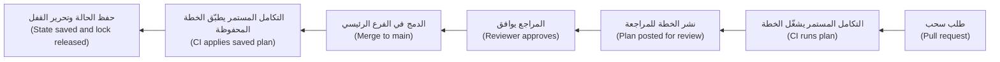

#### 🔴 نظرة الخبير (Expert view)
**نطاق الضرر وحدود الحالة (Blast radius and state boundaries).** حالة واحدة عملاقة (one giant state) للبنك كله تجعل كل خطة (plan) بطيئة، وكل تطبيق (apply) يُقفل الباب على الجميع (lock everyone out)، وكل خطأ قادرًا على المساس بكل شيء. قسّم الحالة حسب المكوّن والمالك (by component and owner): أسس الشبكة (network foundations)، وعنقود Kubernetes (Kubernetes cluster)، ومخازن بيانات كل تطبيق (each application's data stores)، وDNS. ومرّر القيم بين الحالات (between states) عبر مُخرجات (outputs) تقرؤها مصادر البيانات (data sources)، أو عبر مخزن معاملات (parameter store).

**إعادة الهيكلة دون حذف (Refactoring without destroying).** نقل مورد (resource) إلى وحدة برمجية (module) يغيّر عنوانه (address)، وعادةً سترى الأداة "حُذف العنوان القديم، وأُنشئ العنوان الجديد". أما كتلة `moved` فتخبرها بأن الكائن (object) صار له ببساطة اسم جديد:

```hcl
moved {
  from = aws_db_instance.payments
  to   = module.payments_db.aws_db_instance.this
}
```

وبالمثل، تُدخل كتل `import` الموارد الموجودة المبنية يدويًا (existing, hand-built resources) تحت الإدارة (under management)، وتوقف كتل `removed` إدارة مورد ما دون حذفه (without deleting it). وتُراجَع هذه في الخطة (reviewed in the plan) مثل كل شيء آخر، بخلاف أمرَي سطر الأوامر (command-line) `state mv` و`state rm` اللذين يغيّران الحالة (state) دون أي مراجعة (no review). تحقّق من أن إصدارك يدعم كل كتلة (supports each block).

**انضباط الإصدارات (Versioning discipline).** ثبّت إصدار الأداة (Pin the tool version) (`required_version` وفي التكامل المستمر (CI))، والمزوّدات (providers) (القيود (constraints) مع ملف القفل (lock file))، والوحدات البرمجية (modules) (وسم (tag)، لا فرعًا متحرّكًا (moving branch) أبدًا). رقِّ (Upgrade) واحدًا في كل مرة، في بيئة التطوير (dev) أولًا: فترقية مزوّد (provider upgrade) تغيّر قيمة افتراضية (default) قد تُنتج خطة مليئة بتحديثات لم يطلبها أحد.

**البدائل (Alternatives).** تستخدم **Pulumi** لغات عامة الأغراض (general-purpose languages) مثل TypeScript أو Python أو Go، مع نموذج الحالة والخطة (state-and-plan model) نفسه. أما **AWS CloudFormation** و**Azure Bicep** فأصيلتان في سحابتيهما (native to their clouds) (وقد تغيّر العرض الأصيل (native offering) لدى Google Cloud مع الوقت؛ راجع توثيقه)؛ وكثيرًا ما تدعمان الخدمات الجديدة أولًا (support new services first). يغطي Terraform وOpenTofu مزوّدات كثيرة (many providers) بسير عمل واحد (one workflow)، وهذا يناسب بنكًا يشغّل Kubernetes وDNS وشبكة توصيل محتوى (CDN) وGitHub وسحابة (cloud) معًا. والمفاهيم (concepts) هنا تنتقل إليها جميعًا.

**وكلاء البرمجة بالذكاء الاصطناعي والبنية التحتية بوصفها شيفرة (AI coding agents and IaC).** يكتب الوكلاء (Agents) شيفرة HCL بسرعة، وقد "يصلحون" خطأً بتوسيع مجموعة أمان (widening a security group) أو بإضافة صلاحية شاملة (wildcard permission). الخطة (plan) والماسحات (scanners) والسياسات (policies) (3.3) هي التي تقرّر، لا ثقة الوكيل (agent's confidence). ويغطي [*أمن الذكاء الاصطناعي والتطبيقات (Secure AI & Application Security)*، الدرس 7.2 — الحاويات وKubernetes والبنية التحتية بوصفها شيفرة (Containers, Kubernetes and infrastructure as code)](../secai/index.ar.html#/7.2) الفحوص الأمنية (security checks) بتعمّق.

### 🧰 الأدوات (The toolkit)
| الأداة أو الممارسة أو الخدمة (Tool, practice or service) | ما هي وماذا تفعل (What it is and does) | متى تلجأ إليها (When to reach for it) |
|---|---|---|
| **OpenTofu** (Linux Foundation) | أداة بنية تحتية بوصفها شيفرة تصريحية مفتوحة المصدر (open-source declarative IaC tool) مشتقّة من Terraform؛ HCL والمزوّدات (providers) والحالة (state) والخطط (plans) | الخيار الافتراضي (default choice) لأعمال IaC الجديدة مفتوحة المصدر ولتمارين هذه الدورة (this course's exercises) |
| **Terraform** (HashiCorp) | الأداة الأصلية (original) للبنية التحتية بوصفها شيفرة القائمة على HCL، تخضع لرخصة BSL منذ أغسطس 2023، ولها خدمة مستضافة (hosted service) هي HCP Terraform | حيث تكون مؤسستك قد اعتمدتها معيارًا (standardised on it) أو تستخدم ميزاتها المستضافة (hosted features) |
| **Remote state with locking** — الحالة البعيدة مع القفل | تخزين حالة مشترك ومشفّر ومُدار الإصدارات (shared, encrypted, versioned state storage) يمنع عمليات التطبيق المتزامنة (concurrent applies) | أي تهيئة (configuration) يلمسها أكثر من شخص واحد أو خط تسليم (pipeline) واحد |
| **IaC module** — وحدة البنية التحتية البرمجية | مجلد قابل لإعادة الاستخدام (reusable folder) من الموارد بواجهة صغيرة مُتحقَّق منها (small, validated interface) وقيم افتراضية آمنة (safe defaults) | أي نمط يُبنى أكثر من مرتين: قواعد البيانات (databases)، وحاويات التخزين (buckets)، والعناقيد (clusters)، والشبكات (networks) |
| **Pulumi** | البنية التحتية بوصفها شيفرة بلغات عامة الأغراض (general-purpose languages) مع نموذج الخطة والحالة (plan-and-state model) نفسه | الفرق التي تفضّل لغات حقيقية (real languages) للبنية التحتية |

### 🏛️ عمليًا في بنك نجم (In practice at Najm Bank)
يطلب سالم من يوسف أن يكتب الواجهة (interface) لأول وحدة برمجية من نوع المسار الذهبي (golden-path module) في المنصة، كي تستطيع فرق التطبيقات (app teams) طلب قاعدة بيانات بملء ستة أسطر. هذا هو **معيار نجم للوحدات البرمجية للبنية التحتية (Najm IaC module standard): `postgres` v1**.

**الجزء أ: الواجهة (Part A: interface)**

| المُدخل (Input) | النوع والقيم المسموحة (Type and allowed values) | القيمة الافتراضية (Default) | لماذا هو مُدخل (Why it is an input) |
|---|---|---|---|
| `name` | سلسلة نصية (string)، أحرف صغيرة وشَرطات (lowercase letters and hyphens)، من 3 إلى 30 حرفًا | لا يوجد (مطلوب (required)) | يبني المعرّف (identifier) `najm-<name>-<environment>` |
| `environment` | `dev` أو `staging` أو `prod` | لا يوجد (مطلوب (required)) | يحدّد حدود الحجم (size limits) والنسخ الاحتياطية (backups) والحماية (protection) |
| `size` | `small` أو `medium` أو `large` | `small` | يقابل فئة مثيل (instance class) لكل سحابة؛ لا تختار الفرق أنواع المثيلات الخام (raw instance types) أبدًا |
| `data_class` | `internal` أو `confidential` أو `restricted` | `confidential` | التصنيف المقيَّد (Restricted) يفرض مفاتيح يديرها العميل (customer-managed keys) وتسجيلًا إضافيًا (extra logging) |
| `backup_days` | رقم (number)، من 7 إلى 35 | 7 في بيئة التطوير (dev)، و35 في الإنتاج (prod) | هدف التعافي (recovery target)؛ محدود بالحد الأقصى لدى المزوّد (provider's maximum) |
| `owner` | المعرّف المختصر للفريق (team slug) | لا يوجد (مطلوب (required)) | يصبح الوسم (tag) `owner` للتنبيهات (alerts) وتقارير التكلفة (cost reports) (6.2) |

| المُخرج (Output) | الاستخدام (Use) |
|---|---|
| `endpoint` | اسم مضيف خاص (private hostname) لتهيئة التطبيق (application's configuration) |
| `secret_ref` | اسم مدخل مدير الأسرار (secrets-manager entry) الذي يحفظ بيانات الاعتماد المولّدة (generated credentials)؛ وليس كلمة المرور نفسها أبدًا |
| `dashboard_url` | رابط إلى لوحة المتابعة القياسية (standard dashboard) لقاعدة البيانات |

**الجزء ب: ما تثبّته الوحدة البرمجية ولا يمكن تهيئته (Part B: fixed by the module, not configurable)**
- شبكات خاصة فقط (Private networking only)؛ لا نقطة نهاية عامة (public endpoint) أبدًا.
- التشفير أثناء التخزين (encryption at rest) وTLS أثناء النقل (in transit) مُفعَّلان.
- حماية الحذف (Deletion protection) و`prevent_destroy` في `staging` و`prod`.
- بيانات اعتماد المسؤول (Admin credentials) تولّدها السحابة (cloud) وتُخزَّن في مدير الأسرار (secrets manager)؛ ولا يمرّ أيٌّ منها عبر المتغيّرات (variables).
- الوسوم القياسية (Standard tags): `owner`، و`environment`، و`data-class`، و`cost-centre`، و`managed-by = opentofu`.

**الجزء ج: قواعد الحالة والتطبيق (Part C: state and apply rules)**
- حالة واحدة لكل مكوّن (One state per component) (`<team>/<service>/<component>.tfstate`)، وحاوية تخزين خلفية (backend bucket) واحدة لكل بيئة (per environment)؛ إدارة الإصدارات (versioning) والتشفير (encryption) مُفعَّلان؛ والوصول (access) مقصور على دور خط التسليم (pipeline role) ومهندسَين اثنين مسمَّيين لكسر الزجاج (two named break-glass engineers).
- عمليات التطبيق في الإنتاج (Production applies) تجري فقط من خط التسليم (pipeline)، ومن خطة محفوظة (saved plan)، بموافقة فريق المنصة (platform team) والفريق المالك (owning team).
- أي `destroy` أو `must be replaced` على مورد ذي حالة (stateful resource) يحتاج إلى موافقة مها أو سالم.

### 🛠️ التمارين (Exercises)
تعمل الثلاثة كلها على جهازك (your own machine) باستخدام Docker وOpenTofu. وإن اخترت بدلًا من ذلك الفئة المجانية (free tier) لدى سحابة ما، فاضبط تنبيه ميزانية (budget alert) قبل إنشاء أي شيء.

- 🟢 استخدم تهيئة Docker (Docker configuration) من 🟢 الأساسيات (The essentials). شغّل `init` و`plan -out=tfplan` و`apply tfplan`، وتحقّق من الصفحة على المنفذ (port) 8080، ثم غيّر المنفذ الخارجي (external port) واقرأ الخطة الجديدة (new plan). وأخيرًا شغّل `plan` مرة أخرى دون تغيير أي شيء. *يكتمل عندما (Done when):* تستطيع الإشارة إلى السطر الذي يقول هل ستُحدَّث الحاوية في مكانها (updated in place) أم ستُستبدل (replaced)، وتُبلغ الخطة الأخيرة بعدم وجود تغييرات (no changes).
- 🟡 حوّل التهيئة (configuration) إلى وحدة برمجية (module) `modules/web` بمُدخلات مُتحقَّق منها (validated inputs) هي `name` و`port` و`image_tag`، واستدعِها مرتين لتشغيل حاويتين (two containers). استخدم كتلة `moved` للحاوية الأصلية (original container). *يكتمل عندما (Done when):* يفشل منفذ غير صالح (invalid port) عند `plan` برسالة الخطأ التي كتبتها، وتُظهر خطة إعادة الهيكلة (refactor plan) نقلًا (move) دون أي حذف (zero destroys).
- 🔴 شغّل مخزن كائنات متوافقًا مع S3 (S3-compatible object store) محليًا في Docker (MinIO أو بديلًا عنه؛ تحقّق من رخصته الحالية (current licence) وصوره (images))، واستخدمه واجهة تخزين خلفية بعيدة مقفلة (locked remote backend). ابدأ عمليتي تطبيق (two applies) في الوقت نفسه من طرفيتين (two terminals). ثم أضف `prevent_destroy` إلى إحدى الحاويتين وغيّر اسمها، وهو ما يفرض الاستبدال (forces replacement). *يكتمل عندما (Done when):* يُرفض التطبيق الثاني بسبب القفل (lock)، وتُرفض خطة الاستبدال المفروض (forced-replacement plan) بخطأ `prevent_destroy`، ولا يوجد ملف حالة (state file) في مجلد العمل (working directory).

### ⚠️ أخطاء وفخاخ (Mistakes and traps)
- **تصفّح الخطة على عجل (Skimming the plan).** اقرأ سطر الملخّص (summary line) وكل `-` و`-/+` قبل الموافقة. اجعل خط التسليم (pipeline) ينشر الخطة داخل طلب السحب (pull request) كي لا يستطيع المراجعون (reviewers) تجاوزها.
- **الحالة في Git أو على حاسوب محمول (State in Git or on a laptop).** قد تحمل الحالة (state) أسرارًا (secrets)، وهي الخريطة الوحيدة لما تملكه. استخدم واجهة تخزين خلفية (backend) بعيدة ومقفلة ومشفّرة ومُدارة الإصدارات (remote, locked, encrypted, versioned) بوصول ضيّق (narrow access).
- **تشغيل `apply` جديد بدل الخطة التي رُوجعت (Running a fresh apply instead of the reviewed plan).** ربما تغيّر الواقع (reality) في الأثناء. طبّق ملف الخطة المحفوظ (saved plan file)، أو أعد التخطيط وأعد المراجعة (re-plan and re-review).
- **وحدات برمجية ومزوّدات غير مثبّتة الإصدار (Unpinned modules and providers).** إنها تغيّر بنيتك التحتية (infrastructure) دون تغيير في الشيفرة (code change). ثبّت الإصدارات (Pin versions) وأودِع ملف القفل (lock file).
- **جراحة الحالة في الثانية فجرًا ⁦(State surgery at 2 a.m.)⁩.** أمر `state rm` غير المراجَع (unreviewed) يُفقدك تتبّع موارد حقيقية (real resources). استخدم كتل `moved` و`import` و`removed` في طلب سحب (pull request).

### 🧾 الخلاصة (Recap)
- تحوّل البنية التحتية بوصفها شيفرة (IaC) البنية التحتية إلى شيفرة مُراجَعة ومُدارة الإصدارات وقابلة للتكرار (reviewed, versioned, repeatable code)؛ والأدوات التصريحية (declarative tools) مثل Terraform وOpenTofu تحسب التغييرات نيابةً عنك.
- تربط الحالة (state) الشيفرة بالموارد الحقيقية (real resources). احفظها بعيدة ومقفلة ومشفّرة ومضبوطة الوصول (remote, locked, encrypted and access-controlled)، وقسّمها حسب المكوّن (by component) للحدّ من نطاق الضرر (blast radius).
- الخطة (plan) هي شبكة الأمان (safety net): احفظها، وراجعها في طلب السحب (pull request)، وطبّق تلك الخطة بعينها من خط تسليم (pipeline) ببيانات اعتماد قصيرة العمر (short-lived credentials).
- الوحدات البرمجية (Modules) هي منتج فريق المنصة (platform team's product): واجهات صغيرة مُتحقَّق منها (small validated interfaces)، وقيم افتراضية آمنة (safe defaults)، وإصدارات مثبّتة (pinned versions).
- احمِ الموارد ذات الحالة (stateful resources) بـ `prevent_destroy` وبحماية الحذف (deletion protection) لدى المزوّد، وأعد الهيكلة (refactor) بكتل `moved` و`import` و`removed`.

### ✍️ اختبر نفسك (Check yourself)

**1. يعيد يوسف تسمية معرّف (identifier) قاعدة بيانات المدفوعات الإنتاجية (production payments database) في شيفرة Terraform. تُظهر الخطة (plan) `-/+` و`# forces replacement` لقاعدة البيانات. ماذا سيحدث إذا طُبّقت هذه الخطة؟**

- A. تُعاد تسمية قاعدة البيانات في مكانها (renamed in place) دون أي توقف (no downtime)
- B. تُحذف قاعدة البيانات وتُستبدل بقاعدة جديدة فارغة (new, empty one)
- C. لا شيء، لأن Terraform لا يحذف قواعد البيانات أبدًا (never deletes databases)
- D. يُحدَّث ملف الحالة (state file) فقط، وتبقى قاعدة البيانات الحقيقية (real database) دون مساس

<details><summary>الإجابة</summary>

**B.** تعني `-/+` الحذف ثم إنشاء بديل (destroy and then create a replacement)، ويقول التعليق (comment) أيّ سمة (attribute) تفرض ذلك. الخيار A هو ما افترضه يوسف؛ والخيار C خاطئ ما لم تُضبط `prevent_destroy` أو حماية الحذف (deletion protection). (🟢 الأساسيات (The essentials)، و🧭 لماذا يهم (Why it matters).)

</details>

**2. لماذا يجب تخزين ملف الحالة (state file) لـ Terraform أو OpenTofu في واجهة تخزين خلفية (backend) مقفلة ومشفّرة ومضبوطة الوصول (locked, encrypted, access-controlled) بدل إيداعه في Git؟**

- A. لا يستطيع Git تخزين ملفات أكبر من ميغابايت واحد (larger than one megabyte)، وملفات الحالة (state files) كثيرًا ما تتجاوز ذلك
- B. لا تُحتاج ملفات الحالة (state files) إلا أثناء التطبيق الأول (first apply)
- C. ترفض المزوّدات (providers) العمل إذا كانت الحالة في مستودع (repository)
- D. قد تحمل الحالة أسرارًا بنص صريح (plain-text secrets)، وقد تُفسدها عمليات الكتابة المتزامنة غير المقفلة (unlocked concurrent writes)

<details><summary>الإجابة</summary>

**D.** تنتهي السمات الحساسة (sensitive attributes) في الحالة (state) بصرف النظر عن العلامة `sensitive`، والقفل (locking) يمنع تشغيلين من الكتابة في آن واحد. الخيار B خاطئ: فالحالة مطلوبة في كل تشغيل (every run). (🟡 التعمق أكثر (Going deeper).)

</details>

**3. يشغّل خط تسليم (pipeline) الأمر `plan` عند فتح طلب سحب (pull request). يُوافَق على طلب السحب ويُدمج بعد ثلاث ساعات، ثم يشغّل خط التسليم `apply` جديدًا (fresh) دون خطة محفوظة (saved plan). ما الخطر؟**

- A. إنه يعيد التخطيط (re-plans) مقابل الشيفرة والواقع الحاليين (current code and reality)، لذا قد يطبّق تغييرات غير مُراجَعة (unreviewed changes)
- B. لا يوجد خطر (no risk)، لأن `apply` يكرّر دائمًا أحدث خطة (most recent plan) شغّلها خط التسليم (pipeline)
- C. سيفشل التطبيق (apply will fail)، لأن كل خطة تنتهي صلاحيتها (every plan expires) بعد ساعة من تشغيل `plan`
- D. سيُحذف ملف الحالة (state file)

<details><summary>الإجابة</summary>

**A.** التطبيق الجديد (fresh apply) يحسب خطة جديدة. وحفظ الخطة باستخدام `-out` ثم تطبيق ذلك الملف يعني أن التغييرات المُراجَعة هي التغييرات المطبَّقة (the reviewed changes are the applied changes). الخيار B هو سوء الفهم الشائع (common misunderstanding). (🟡 التعمق أكثر (Going deeper).)

</details>

**4. يريد سالم أن تنشئ فرق التطبيقات (app teams) قواعد بيانات PostgreSQL تكون دائمًا خاصة ومشفّرة ومدعومة بنسخ احتياطية (private, encrypted and backed up). أيّ تصميم يحقّق ذلك على أفضل وجه؟**

- A. صفحة ويكي (wiki page) تسرد الإعدادات الموصى بها (recommended settings)، مرتبطة من دليل الإعداد (onboarding guide) لكل فريق
- B. وحدة برمجية (module) تكشف كل وسيطات المزوّد (every provider argument) متغيّراتٍ كي تحظى الفرق بمرونة كاملة (full flexibility)
- C. وحدة برمجية بواجهة صغيرة مُتحقَّق منها (small validated interface) وإعدادات الأمان مثبّتة داخلها (safety settings fixed inside it)
- D. منح كل فريق صلاحية المسؤول (administrator access) على وحدة التحكم السحابية (cloud console)

<details><summary>الإجابة</summary>

**C.** تثبيت القيم الافتراضية الآمنة (safe defaults) داخل الوحدة البرمجية يجعل التهيئة الصحيحة (right configuration) هي الوحيدة المتاحة. الخيار B يعيد إنتاج عدم الاتساق (inconsistency) الذي ينبغي للوحدة أن تزيله؛ والخيار A يعتمد على أن يقرأه الجميع ويتّبعوه. (🟡 التعمق أكثر (Going deeper)، و🏛️ عمليًا (In practice).)

</details>

**5. ينقل فريق المنصة (platform team) مورد قاعدة بيانات موجودًا (existing database resource) إلى وحدة برمجية جديدة (new module). تُظهر الخطة حذف العنوان القديم (old address) وإنشاء عنوان جديد. ما الإصلاح الأكثر أمانًا (safest fix)؟**

- A. طبّقها في ساعة هادئة (quiet hour) واستعد من النسخة الاحتياطية (restore from backup) بعد ذلك
- B. أضف كتلة `moved` من العنوان القديم (old address) إلى العنوان الجديد (new address)
- C. احذف ملف الحالة (state file) وشغّل `import` من سطر الأوامر (command line) لكل مورد
- D. انسخ شيفرة الوحدة البرمجية (module code) عائدًا إلى التهيئة الجذرية (root configuration) بصورة دائمة

<details><summary>الإجابة</summary>

**B.** تسجّل كتلة `moved` إعادة التسمية تصريحيًا (records the rename declaratively) وتُراجَع في الخطة. الخيار A يسبّب انقطاعًا (outage) وفقدانًا للبيانات (data loss)؛ والخيار C جراحة حالة (state surgery) خطرة غير مُراجَعة. (🔴 نظرة الخبير (Expert view).)

</details>

### 📚 المراجع (References)
- توثيق OpenTofu (OpenTofu documentation) — https://opentofu.org/docs/
- توثيق Terraform (Terraform documentation) — https://developer.hashicorp.com/terraform/docs
- لغة Terraform: الحالة (Terraform language: state) — https://developer.hashicorp.com/terraform/language/state
- لغة Terraform: الوحدات البرمجية (Terraform language: modules) — https://developer.hashicorp.com/terraform/language/modules
- HashiCorp، الأسئلة الشائعة حول الترخيص (licensing FAQ) (رخصة المصدر التجاري (Business Source License)) — https://www.hashicorp.com/
- Linux Foundation، مشروع OpenTofu (OpenTofu project) — https://opentofu.org/
- توثيق Pulumi (Pulumi documentation) — https://www.pulumi.com/docs/

<a id="l3-2"></a>

## 3.2 — البيئات وGitOps: ترقية التغييرات من بيئة التطوير إلى الإنتاج (promoting changes from dev to production)

*المستوى: 🟡 متوسط* · *المتطلبات: 2.2، 2.3، 3.1* · *المرحلة (Phase): Release, Deploy*

### ⚡ الدرس في دقيقة (In 60 seconds)
- **البيئة (environment)** (التطوير (dev)، وما قبل الإنتاج (staging)، والإنتاج (production)) نسخة كاملة من النظام (full copy of the system) لغرض محدّد. ينبغي ألّا تختلف البيئات إلا في التهيئة والحجم (configuration and scale)، ولا تختلف أبدًا في الشيفرة أو البنية (code or structure).
- **ابنِ مرة واحدة، ورقِّ الأثر البرمجي نفسه (Build once, promote the same artefact).** بصمة الصورة (image digest) نفسها التي اختُبرت في بيئة ما قبل الإنتاج (staging) هي التي تصل إلى الإنتاج (production)؛ ولا يُعاد بناء شيء على طول الطريق.
- تعني **GitOps** أن الحالة المرغوبة (desired state) لكل بيئة تعيش في Git، وأن وكيلًا (agent) داخل المنصة يسحبها ويجعل الواقع مطابقًا لها باستمرار (continuously makes reality match). مبادئه الأربعة (four principles): تصريحي (declarative)، ومُدار الإصدارات وغير قابل للتغيير (versioned and immutable)، ويُسحب آليًا (pulled automatically)، ويُوفَّق باستمرار (continuously reconciled).
- **الترقية (promotion)** طلب سحب (pull request) يغيّر قيمة واحدة (عادةً بصمة صورة (image digest)) في مجلد البيئة التالية (next environment's folder). راجِع، وادمج، ويتولّى **Argo CD** أو **Flux** الباقي؛ أما **التراجع (rollback)** فهو `git revert`.
- إشارة القرار (Decision cue): إن لم تستطع الإجابة عن سؤال "ما الذي يعمل في الإنتاج بالضبط، ومن وافق عليه؟" من Git وحده، فأنت لا تمارس GitOps بعد.
- الفخ الأكبر (The biggest trap): فروع طويلة العمر لكل بيئة (long-lived branches per environment)، وتعديلات يدوية (hand edits) بـ `kubectl` تكتب فوقها المزامنة التالية (next sync) بصمت، أو لا يلاحظها أحد أبدًا.

### 🧭 لماذا يهم (Why it matters)
في 1 أغسطس 2012 نشرت Knight Capital، وهي شركة أمريكية كبيرة لصناعة السوق (market-making firm)، شيفرة تداول جديدة (new trading code) على خوادمها. ووفقًا لأمر هيئة الأوراق المالية والبورصات الأمريكية (US Securities and Exchange Commission's order) في القضية، نسخ فنّيٌّ (technician) الشيفرة الجديدة إلى سبعة من الخوادم الثمانية ولم ينسخها إلى الثامن، ولم يلاحظ أحد. وأعاد الإصدار الجديد (new release) استخدام علامة (flag) شغّلت على الخادم الثامن شيفرةً قديمة متروكة منذ زمن طويل (old, long-unused code). فأرسل ذلك الخادم ملايين الأوامر غير المقصودة (unintended orders) خلال نحو 45 دقيقة، وخسرت الشركة قرابة 460 مليون دولار، وفقًا للهيئة (SEC). كان النشر يدويًا (manual deployment)، ولم يكن هناك فحص آلي (automated check) يتحقّق من أن كل خادم يشغّل الإصدار نفسه (same version)، ولم يراجع شخص ثانٍ (second person) النتيجة.

لدى بنك نجم (Najm Bank) نسخة أصغر من المشكلة نفسها. تحقّق مها في سبب استمرار خلل مهلة (timeout bug) أُصلح في بيئة ما قبل الإنتاج (staging) في الظهور في الإنتاج (production). فالإنتاج يشغّل صورة (image) من الالتزام (commit) نفسه لكنها أُعيد بناؤها بعد يومين بصورة أساس (base image) أحدث، كما أن أحدهم رفع حجم مجمّع الاتصالات (connection-pool size) باستخدام `kubectl edit` أثناء حادثة (incident) الشهر الماضي. ولا شيء في Git يسجّل أيًّا من الاختلافين، فلم تعد بيئة ما قبل الإنتاج تتنبّأ بسلوك الإنتاج (staging no longer predicts production).

يمنح هذا الدرس الفريق قاعدة واحدة (one rule) وآلية واحدة (one mechanism). القاعدة: الأثر البرمجي (artefact) نفسه ينتقل عبر كل بيئة، ولا تختلف إلا التهيئة (configuration). والآلية: GitOps، حيث يكون Git السجلّ الوحيد (single record) لما ينبغي أن يعمل وأين، ويجعل متحكّمٌ (controller) ذلك واقعًا ويُبلغ عن أي اختلاف (difference).

### 📐 كيف يعمل (How it works)
#### 🟢 الأساسيات (The essentials)
**لماذا البيئات (Why environments).** تحتاج إلى مكان تجرّب فيه التغييرات ليس هو الإنتاج (production). يستخدم بنك نجم (Najm Bank) ثلاث بيئات:

| البيئة (Environment) | الغرض (Purpose) | البيانات (Data) | من ينشر (Who deploys) |
|---|---|---|---|
| **dev** — التطوير | دمج التغييرات وتجربتها بسرعة (Integrate and try changes quickly) | بيانات اختبار اصطناعية (Synthetic test data) | آليًا عند كل دمج (Automatic on every merge) |
| **staging** — ما قبل الإنتاج | بروفة نهائية (Final rehearsal) بتهيئة وحجم شبيهين بالإنتاج (production-like configuration and scale) | بيانات مُقنَّعة أو اصطناعية (Masked or synthetic data)، ولا بيانات عملاء حقيقية (real customer data) أبدًا دون موافقة | طلب سحب للترقية (Promotion pull request)، بموافقة الفريق (team approval) |
| **prod** — الإنتاج | العملاء (Customers) | بيانات حقيقية (Real data) | طلب سحب للترقية (Promotion pull request)، بموافقة الفريق والمنصة (team and platform approval) |

**تكافؤ البيئات (Environment parity).** يسمّي منهج التطبيق ذي العوامل الاثني عشر (Twelve-Factor App) ذلك "تكافؤ التطوير والإنتاج (dev/prod parity)": أبقِ البيئات متشابهة قدر الإمكان. ولا يُسمح بالاختلافات إلا حيث تكون مقصودة ومكتوبة (deliberate and written down): أعداد النسخ المتماثلة (replica counts)، وأحجام المثيلات (instance sizes)، وأسماء النطاقات (domain names)، وبيانات الاعتماد (credentials)، وإعدادات أعلام الميزات (feature-flag settings). أما اختلاف الشيفرة، أو الصور (images)، أو إصدارات Kubernetes، أو تخطيطات الشبكة (network layouts)، فيجعل نتائج بيئة ما قبل الإنتاج (staging results) بلا معنى.

**ابنِ مرة واحدة، ورقِّ الأثر البرمجي (Build once, promote the artefact).** يبني التكامل المستمر (CI) صورة الحاوية (container image) مرة واحدة، من التزام (commit) واحد، ويدفعها (pushes) إلى السجل (registry). وتُعرَّف الصورة ببصمتها (**digest**)، وهي تجزئة SHA-256 (SHA-256 hash) لمحتواها مثل `sha256:4f1c…`، لا بوسم (tag) مثل `v2.3` أو `latest`، لأن الوسم يمكن نقله إلى صورة مختلفة أما البصمة فلا (2.1). ثم تشغّل كل بيئة تلك البصمة. أما إعادة البناء للإنتاج (Rebuilding for production)، كما في حالة مها، فتُنتج أثرًا برمجيًا مختلفًا (different artefact) لم يختبره أحد.

**ما هو GitOps (What GitOps is).** يحدّد مشروع OpenGitOps، التابع لـ CNCF، أربعة مبادئ (four principles):
- **تصريحي (Declarative)**: تُوصَف الحالة المرغوبة (desired state) للنظام، ولا تُكتب في سكربت (not scripted).
- **مُدار الإصدارات وغير قابل للتغيير (Versioned and immutable)**: يُخزَّن ذلك الوصف بطريقة تحفظ التاريخ الكامل (full history) ولا يمكن تغييرها بصمت (cannot be silently changed)، وهذا يعني عمليًا Git.
- **يُسحب آليًا (Pulled automatically)**: تجلب وكلاء برمجية (software agents) الحالة المرغوبة من المصدر (source)؛ ولا يدفع أحد التغييرات إلى العنقود (cluster) يدويًا.
- **يُوفَّق باستمرار (Continuously reconciled)**: تواصل الوكلاء مقارنة الحالة الفعلية (actual state) بالحالة المرغوبة (desired state) وتعمل على سدّ أي فجوة (close any gap).

أشهر متحكّمَي GitOps (GitOps controllers) لـ Kubernetes هما **Argo CD** و**Flux**، وكلاهما مشروع متخرّج (graduated) في CNCF. يعمل كلٌّ منهما داخل العنقود (inside the cluster)، ويراقب مستودع Git (Git repository)، ويطبّق ما يجده.

**الدفع مقابل السحب (Push versus pull).** في خط تسليم *الدفع (push)* التقليدي، يحمل التكامل المستمر (CI) بيانات اعتماد العنقود (cluster credentials) ويشغّل `kubectl apply` أو `helm upgrade` في النهاية. أما في GitOps القائم على *السحب (pull)*، فلا يلمس التكامل المستمر العنقود أبدًا: إنه يحدّث Git فقط. والمتحكّم (controller) داخل العنقود هو الذي يسحب. وهذا يعني بيانات اعتماد قوية (powerful credentials) أقل خارج العنقود، ومسار تدقيق كاملًا (full audit trail) في Git، وتصحيحًا آليًا (automatic correction) حين يغيّر أحدهم العنقود يدويًا.

```mermaid
flowchart RL
    A["التزام في مستودع التطبيق<br/>(Commit to app repo)"] --> B["التكامل المستمر يبني الصورة ويختبرها<br/>(CI builds and tests image)"]
    B --> C["السجل يخزّن الصورة ببصمتها<br/>(Registry stores image by digest)"]
    C --> D["طلب سحب يرفع البصمة في مجلد التطوير<br/>(PR bumps digest in dev folder)"]
    D --> E["أرغو سي دي يزامن بيئة التطوير<br/>(Argo CD syncs dev)"]
    E --> F["طلب سحب يرقّي البصمة إلى ما قبل الإنتاج<br/>(PR promotes digest to staging)"]
    F --> G["أرغو سي دي يزامن بيئة ما قبل الإنتاج<br/>(Argo CD syncs staging)"]
    G --> H["طلب سحب معتمد يرقّي إلى الإنتاج<br/>(Approved PR promotes to prod)"]
    H --> I["أرغو سي دي يزامن بيئة الإنتاج<br/>(Argo CD syncs prod)"]
```

#### 🟡 التعمق أكثر (Going deeper)
**مستودعان (Two repositories).** يفصل بنك نجم (Najm Bank) شيفرة مصدر التطبيق (application source code) عن تهيئة البيئات (environment configuration):
- يحفظ **مستودع التطبيق (app repo)** شيفرة واجهة الهاتف (Mobile API) وملف Dockerfile والاختبارات (tests)؛ ويبني التكامل المستمر (CI) الصور (images) منه؛
- ويحفظ **مستودع GitOps (GitOps repo)** ما يعمل وأين (what runs where): بيانات Kubernetes الوصفية (Kubernetes manifests) أو قيم Helm (Helm values) لكل بيئة.

وعندئذ لا تُطلق تغييرات التهيئة (configuration changes) أي عمليات بناء (builds)، ويمكن أن تختلف صلاحيات الوصول (access)، ويكون تاريخ GitOps (GitOps history) سجلًا نظيفًا لعمليات النشر (clean log of deployments).

**مجلدات لا فروع لكل بيئة (Folders, not branches, per environment).** يحتفظ تصميم مبكر شائع (common early design) بفرع `dev` وفرع `staging` وفرع `prod` ويدمج بينها. ويوصي كثير من الممارسين (practitioners) بعدم ذلك: فعمليات الدمج (merges) تحمل معها تغييرات لا علاقة لها، والفروع تتباعد (drift apart)، والاختلافات بين البيئات تختبئ في تاريخ Git (Git history) بدل أن تكون ظاهرة في الملفات. يستخدم بنك نجم فرعًا واحدًا `main` ومجلدًا واحدًا لكل بيئة (one folder per environment)، مبنيًّا بأداة **Kustomize**، وهي أداة مدمجة في `kubectl` تضع رقعًا صغيرة (small patches) طبقاتٍ فوق قاعدة مشتركة (shared base):

```text
gitops/
  apps/mobile-api/
    base/                 # Deployment, Service, probes: shared by all environments
      deployment.yaml
      service.yaml
      kustomization.yaml
    overlays/
      dev/kustomization.yaml
      staging/kustomization.yaml
      prod/kustomization.yaml
      prod/replicas.yaml
```

ولا تذكر طبقة الإنتاج (production overlay) إلا ما يختلف:

```yaml
apiVersion: kustomize.config.k8s.io/v1beta1
kind: Kustomization
resources:
  - ../../base
images:
  - name: registry.najm.example/mobile-api
    digest: sha256:4f1c0e…   # the promoted artefact; set by the promotion PR
patches:
  - path: replicas.yaml       # 6 replicas in prod, 2 in staging
```

وإن كانت خدماتك تستخدم Helm بدلًا من ذلك (2.3)، فالنمط نفسه (same pattern) يبقى قائمًا: مخطّط (chart) واحد، وملف قيم (values file) واحد لكل بيئة، وبصمة الصورة (image digest) في ملف القيم.

**الترقية طلب سحب (Promotion is a pull request).** ترقية واجهة الهاتف (Mobile API) من بيئة ما قبل الإنتاج (staging) إلى الإنتاج (production) تعني نسخ بصمة واحدة (one digest) من `overlays/staging` إلى `overlays/prod`. ويفتح سكربت صغير أو روبوت (small script or bot) طلب السحب ذلك آليًا بعد اجتياز فحوص بيئة ما قبل الإنتاج (staging checks). يُظهر طلب السحب بالضبط ما يتغيّر، وتفرض قواعد CODEOWNERS (CODEOWNERS rules) الموافقين المناسبين (right approvers)، ويكون الدمج (merging) هو قرار الإطلاق (release decision). ويمكن لأدوات مثل Argo CD Image Updater وأتمتة الصور في Flux (Flux's image automation) أن تكتب رفع البصمة في بيئة التطوير (dev bump) نيابةً عنك؛ أما ترقيات الإنتاج (production promotions) فأبقِها طلبات سحب صريحة مُراجَعة (explicit, reviewed pull requests).

**إخبار Argo CD بما يراقبه (Telling Argo CD what to watch).** يشير كائن `Application` في Argo CD إلى مجلد (folder) وعنقود (cluster):

```yaml
apiVersion: argoproj.io/v1alpha1
kind: Application
metadata:
  name: mobile-api-prod
  namespace: argocd
spec:
  project: retail
  source:
    repoURL: https://git.najm.example/platform/gitops.git
    targetRevision: main
    path: apps/mobile-api/overlays/prod
  destination:
    server: https://kubernetes.default.svc
    namespace: mobile-api
  syncPolicy:
    automated:
      prune: true     # delete objects removed from Git
      selfHeal: true  # undo manual changes made in the cluster
```

يزيل `prune` الكائنات (objects) التي حُذفت من Git؛ ويعيد `selfHeal` التعديلات اليدوية (hand edits) إلى ما كانت عليه. ومع تفعيل الاثنين، كان `kubectl edit` الذي وجدته مها سيُلغى خلال دقائق، وسيظهر في الأثناء بحالة "OutOfSync". ويعبّر Flux عن الفكرة نفسها بكائنَي `GitRepository` و`Kustomization`.

**التراجع (Rollback).** لأن كل عملية نشر (deployment) التزامٌ (commit)، فإن التراجع (rolling back) هو `git revert` لطلب سحب الترقية (promotion pull request): تعود البصمة القديمة (old digest)، ويُزامِن المتحكّم (controller syncs)، ويسجّل التاريخ (history) من تراجع ولماذا. التراجع عن *الشيفرة (code)* سهل؛ أما التراجع عن *مخطّط قاعدة البيانات (database schema)* فليس كذلك، ولذا تتبع تغييرات المخطّط (schema changes) نمط التوسيع ثم التقليص (expand-and-contract pattern) الذي يُغطّى مع استراتيجيات الإطلاق (release strategies) (4.2).

**الأسرار في GitOps (Secrets in GitOps).** يجب ألّا يحتوي مستودع GitOps (GitOps repo) على أسرار صريحة (plain secrets)، وكائنات Secrets في Kubernetes مُرمَّزة بـ base64 فقط (only base64-encoded)، وليست مشفّرة (not encrypted) (2.3). الأنماط الشائعة (Common patterns): **External Secrets Operator**، الذي يزامن القيم من مدير أسرار سحابي (cloud secrets manager) إلى العنقود (cluster)، مع وجود مرجع (reference) فقط في Git؛ و**Sealed Secrets** أو **SOPS**، اللذان يخزّنان قيمًا مشفّرة (encrypted values) في Git لا يستطيع فكّ تشفيرها إلا العنقود. يستخدم بنك نجم (Najm Bank) مراجع إلى مدير الأسرار (secrets manager) الخاص به؛ انظر [*أمن الذكاء الاصطناعي والتطبيقات (Secure AI & Application Security)*، الدرس 5.2 — إدارة الأسرار: المفاتيح والرموز وأين تتسرّب (Secrets management: keys, tokens and where they leak)](../secai/index.ar.html#/5.2).

#### 🔴 نظرة الخبير (Expert view)
**بيئات للبنية التحتية أيضًا (Environments for infrastructure, too).** تتولّى متحكّمات GitOps (GitOps controllers) ما يعمل *داخل (inside)* Kubernetes. أما العناقيد (clusters) وقواعد البيانات (databases) والشبكات (networks) التي تحتها فتُدار بـ OpenTofu (3.1)، وتنطبق القواعد نفسها: مجلد واحد لكل بيئة (one folder per environment) يستدعي إصدارات الوحدات البرمجية نفسها (same module versions)، فيكون الفرق بين بيئة ما قبل الإنتاج (staging) والإنتاج (production) قائمةً قصيرة مقروءة من المُدخلات (short, readable list of inputs). تتيح **مساحات العمل (workspaces)** في Terraform لتهيئة واحدة (one configuration) أن تحتفظ بعدة حالات (several states)، لكنها تخفي البيئة التي أنت فيها خلف إعداد في سطر الأوامر (command-line setting) وتجعل التطبيق على البيئة الخاطئة (apply to the wrong one) سهلًا؛ أما المجلدات والواجهات الخلفية (backends) وبيانات الاعتماد (credentials) المنفصلة لكل بيئة فأوضح. وتستخدم بعض الفرق أغلفة (wrappers) مثل Terragrunt، أو متحكّمات تشغّل البنية التحتية بوصفها شيفرة (IaC) عبر GitOps (متحكّم Tofu المجتمعي (community Tofu Controller) لـ Flux، وCrossplane)؛ قيّمها بعناية مقابل خط التسليم الأبسط (simpler pipeline) في 3.1.

**حسابات منفصلة، لا مجرد فضاءات أسماء (Separate accounts, not just namespaces).** ضع الإنتاج (production) في حسابه السحابي الخاص (own cloud account) (AWS)، أو اشتراكه (subscription) (Azure)، أو مشروعه (project) (Google Cloud)، بحدود هوية خاصة به (own identity boundaries). خط تسليم بيئة التطوير (dev pipeline) الذي لا تستطيع بيانات اعتماده (credentials) حتى رؤية الإنتاج لا يمكنه أن يكسره.

**الترتيب والاعتماديات (Ordering and dependencies).** نادرًا ما تقتصر الترقيات الحقيقية (real promotions) على خدمة واحدة. تتيح موجات المزامنة (sync waves) في Argo CD و`dependsOn` في Flux ترتيب الموارد (order resources)، مثل تغيير تهيئة (configuration change) قبل كائن Deployment الذي يحتاجه. ويولّد **ApplicationSet** في Argo CD كائن `Application` واحدًا لكل بيئة أو عنقود من قالب (template)، وهذا يُبقي خمسين عنقودًا متّسقة (consistent). أبقِ التغييرات العابرة للخدمات (cross-service changes) متوافقة مع الإصدارات السابقة (backward compatible) كي يمكن ترقية كل خدمة وحدها؛ فالترقيات المترابطة (coupled promotions) علامة على عيب في التصميم (design smell).

**البيانات الوصفية المُصيَّرة (Rendered manifests).** حين يُصيِّر Helm أو Kustomize النتيجة على نحو مختلف عمّا توقّعت، لا يُظهر الفرق (diff) في طلب السحب (pull request) إلا تغيير المُدخل (input change). وتُصيِّر بعض الفرق ملف YAML النهائي (final YAML) في التكامل المستمر (CI) وتودِعه (أو تنشر الفرق المُصيَّر (rendered diff) في طلب السحب) كي يرى المراجعون (reviewers) بالضبط ما سيتلقّاه العنقود. يكلّف ذلك بعض الضجيج في المستودع (repository noise) ويشتري الوضوح (clarity).

**التنظيم (Regulation).** بالنسبة إلى بنك، يكون تاريخ GitOps (GitOps history) دليلًا (evidence): من وافق على أيّ تغيير في الإنتاج، ومتى، وما الذي نُشر بالضبط. ويتوقّع قانون المرونة التشغيلية الرقمية الأوروبي (EU DORA)، الذي يسري على الكيانات المالية (financial entities) في الاتحاد الأوروبي منذ يناير 2025، إدارةً موثّقة لتغييرات تقنية المعلومات والاتصالات (documented ICT change management)؛ كما تضع الجهات التنظيمية في دول الخليج (GCC regulators) مثل مصرف قطر المركزي (Qatar Central Bank) توقّعات بشأن ضبط التغيير (change control) واستخدام السحابة (cloud use). راجع النصوص الحالية (current texts) مع فريق الامتثال (compliance team) بدل الاعتماد على الملخّصات (summaries).

### 🧰 الأدوات (The toolkit)
| الأداة أو الممارسة أو الخدمة (Tool, practice or service) | ما هي وماذا تفعل (What it is and does) | متى تلجأ إليها (When to reach for it) |
|---|---|---|
| **Argo CD** (متخرّج في CNCF (CNCF graduated)) | متحكّم GitOps (GitOps controller) لـ Kubernetes بواجهة ويب (web UI)، وحالة مزامنة (sync status)، وعرض للفروق (diff view)، وموجات مزامنة (sync waves)، وApplicationSets | الفرق التي تريد حالة مزامنة مرئية (visible sync status) وواجهة مستخدم (UI)؛ وعناقيد كثيرة من قوالب (many clusters from templates) |
| **Flux** (متخرّج في CNCF (CNCF graduated)) | مجموعة أدوات من متحكّمات GitOps (toolkit of GitOps controllers) لـ Kubernetes (مصادر Git (Git sources)، وKustomize، وHelm، وأتمتة الصور (image automation)) | الفرق التي تفضّل نهجًا قابلًا للتركيب (composable approach) يقوده سطر الأوامر والموارد المخصّصة (CLI- and CRD-driven) |
| **Kustomize** | يضع رقعًا خاصة بكل بيئة (environment-specific patches) طبقاتٍ فوق بيانات Kubernetes الوصفية المشتركة (shared Kubernetes manifests)؛ مدمج في `kubectl` | مجلد واحد لكل بيئة (one folder per environment) باختلافات قليلة مقروءة (minimal, readable differences) |
| **Helm** | يحزم بيانات Kubernetes الوصفية (Kubernetes manifests) في مخطّطات (charts) مع ملفات قيم (values files) | الخدمات المحزومة أصلًا في مخطّطات (already packaged as charts)؛ ملف قيم واحد لكل بيئة |
| **Promotion pull request** — طلب سحب الترقية | تغيير مُراجَع (reviewed change) ينسخ بصمة صورة (image digest) من مجلد بيئة إلى التالية | كل خطوة نحو الإنتاج (every move towards production)؛ قرار الإطلاق (release decision) |
| **External Secrets Operator** | يزامن الأسرار (syncs secrets) من مدير أسرار سحابي (cloud secrets manager) إلى Kubernetes، ولا يُبقي في Git إلا المراجع (references) | أي إعداد GitOps (GitOps setup) يحتاج إلى أسرار (secrets) |

### 🏛️ عمليًا في بنك نجم (In practice at Najm Bank)
يكتب سالم **سياسة نجم للبيئات والترقية، الإصدار 1 (Najm Environment and Promotion Policy v1)**، بدءًا بـ واجهة برمجة تطبيق نجم للهاتف (Najm Mobile API).

**الجزء أ: البيئات (Part A: environments)**

| | التطوير (dev) | ما قبل الإنتاج (staging) | الإنتاج (prod) |
|---|---|---|---|
| الحدّ السحابي (Cloud boundary) | حساب مشترك لغير الإنتاج (Shared non-prod account) | حساب خاص (Own account) | حساب خاص بهوية منفصلة (Own account, separate identity) |
| العنقود (Cluster) | عنقود تطوير مشترك (Shared dev cluster) | عنقود ما قبل الإنتاج (Staging cluster)، بإصدار Kubernetes الفرعي نفسه (same Kubernetes minor version) للإنتاج | عنقود الإنتاج (Prod cluster)، متعدّد المناطق (multi-zone) |
| البيانات (Data) | اصطناعية (Synthetic) | اصطناعية أو مُقنَّعة (Synthetic or masked) | حقيقية (Real) |
| الاختلافات المسموحة عن الإنتاج (Allowed differences from prod) | النسخ المتماثلة (Replicas)، والأحجام (sizes)، والنطاق (domain)، وبيانات الاعتماد (credentials)، والأعلام (flags) | النسخ المتماثلة (Replicas)، والنطاق (domain)، وبيانات الاعتماد (credentials) | — |
| مزامنة Argo CD (Argo CD sync) | آلية، مع الحذف والإصلاح الذاتي (Automated, prune and self-heal) | آلية، مع الحذف والإصلاح الذاتي (Automated, prune and self-heal) | آلية، مع الحذف والإصلاح الذاتي (Automated, prune and self-heal)؛ والتغييرات فقط عبر طلب سحب معتمد (approved PR) |
| من يستطيع الدمج (Who can merge) | أي عضو في الفريق (Any team member) | قائد الفريق (Team lead) | قائد الفريق ومهندس المنصة (Team lead and platform engineer)؛ وتحتاج المدفوعات (Payments) أيضًا إلى مها |

**الجزء ب: قواعد الترقية (Part B: promotion rules)**
1. يبني التكامل المستمر (CI) صورة واحدة لكل التزام (one image per commit)، ويوقّعها (signs it) (4.3)، ويسجّل بصمتها (digest). ولا تعيد أي بيئة البناء (No environment rebuilds).
2. الدمج في `main` بمستودع التطبيق (app repo) يفتح طلب سحب آليًا من روبوت (bot pull request) يضبط البصمة في `overlays/dev`؛ ويُدمج آليًا إذا اجتازت الفحوص (checks pass).
3. الترقية إلى بيئة ما قبل الإنتاج (staging) والإنتاج (prod) تنسخ البصمة *نفسها (same)*، عبر طلب سحب (pull request)، بعد اجتياز فحوص البيئة السابقة (previous environment's checks) (اختبارات الدخان (smoke tests)، واستهلاك هدف مستوى الخدمة (SLO burn) ضمن الحدود لمدة 30 دقيقة).
4. تجري ترقيات الإنتاج (Production promotions) في نافذة الإطلاق المتّفق عليها (agreed release window)؛ وخارجها يستطيع قائد الحادثة (incident commander) الموافقة على ترقية طارئة (emergency promotion)، تُسجَّل في طلب السحب.
5. التراجع (Rollback) هو إلغاء (revert) طلب سحب الترقية. ولا أحد يشغّل `kubectl edit` أو `kubectl apply` أو `helm upgrade` على بيئة ما قبل الإنتاج أو الإنتاج.
6. كسر الزجاج (Break-glass): أثناء حادثة من الدرجة الأولى (Sev-1)، يجوز لمهندس مسمّى (named engineer) أن يغيّر الإنتاج يدويًا بموافقة قائد الحادثة (incident commander's approval)؛ ويُكتب التغيير عائدًا إلى Git خلال يوم عمل واحد (one working day)، وإلا ألغته المزامنة التالية (next sync).

**الجزء ج: فحص التكافؤ الأسبوعي (Part C: the weekly parity check).** يشغّل جدول المناوبة (on-call rota) الخاص بمها سكربتًا قصيرًا كل يوم اثنين يقارن (diffs) بين `overlays/staging` و`overlays/prod` ويسرد أي اختلاف غير موجود في جدول الاختلافات المسموحة (allowed table) أعلاه. وتتحوّل الاختلافات غير المفسَّرة (Unexplained differences) إلى تذاكر (tickets).

### 🛠️ التمارين (Exercises)
شغّل هذه التمارين على عنقود محلي (local cluster) (kind أو k3d) مع مستودع Git تملكه، مثل مستودع GitHub مجاني (free GitHub repository).

- 🟢 أنشئ `base/` و`overlays/dev` و`overlays/prod` لكائن Deployment ويب صغير (small web Deployment)، بحيث يستخدم الإنتاج (prod) ثلاث نسخ متماثلة (three replicas) والتطوير (dev) نسخة واحدة. صيِّر الاثنين (Render both) باستخدام `kubectl kustomize`. *يكتمل عندما (Done when):* تكون الاختلافات الوحيدة بين المُخرجَين المُصيَّرين (two rendered outputs) هي التي قصدتها، وتستطيع سردها.
- 🟡 ثبّت Argo CD على عنقود kind، وأنشئ كائنَي `Application` (فضاءا أسماء (namespaces) للتطوير والإنتاج) يشيران إلى طبقاتك (overlays)، مع مزامنة آلية (automated sync) وحذف (prune) وإصلاح ذاتي (self-heal). غيّر بصمة صورة (image digest) في بيئة التطوير عبر طلب سحب (pull request)، ثم رقِّها إلى الإنتاج بطلب سحب ثانٍ. وأخيرًا شغّل `kubectl scale` يدويًا على كائن Deployment في الإنتاج. *يكتمل عندما (Done when):* تكون الترقيتان (both promotions) ظاهرتين بوصفهما التزامات (commits)، ويُلغى التحجيم اليدوي (manual scale) آليًا، وتستطيع إظهار حالة "OutOfSync" التي رأيتها قبل أن يُصلَح.
- 🔴 أضف سير عمل للتكامل المستمر (CI workflow) (لا بأس بـ GitHub Actions) إلى مستودع تطبيق (app repo) يبني صورة (image)، ويدفعها إلى سجل (registry) تتحكّم فيه، ويفتح طلب سحب في مستودع GitOps (GitOps repo) يضبط البصمة الجديدة (new digest) في `overlays/dev`. ثم تراجَع عن ترقية سيئة (bad promotion) باستخدام `git revert`. *يكتمل عندما (Done when):* يؤدي التزام شيفرة (code commit) إلى نشر في بيئة التطوير (dev deployment) دون أن يلمس أي إنسان العنقود (cluster)، ويُشار إلى الصورة ببصمتها (by digest) لا بوسمها (tag)، ويكون التراجع (rollback) التزام إلغاء واحدًا (single revert commit).

### ⚠️ أخطاء وفخاخ (Mistakes and traps)
- **إعادة البناء لكل بيئة (Rebuilding per environment).** الصورة المُعاد بناؤها (rebuilt image) أثر برمجي مختلف غير مُختبَر (different, untested artefact). ابنِ مرة واحدة، وأشِر بالبصمة (reference by digest)، ورقِّ البصمة (promote the digest).
- **فرع لكل بيئة (A branch per environment).** الفروع تتباعد (Branches drift) وتخفي الاختلافات في التاريخ (history). استخدم فرعًا واحدًا مع مجلد لكل بيئة (folder per environment).
- **التعديلات اليدوية في العنقود (Hand edits in the cluster).** أمر `kubectl edit` أثناء حادثة (incident) يُحدث انحرافًا (drift) لا يتذكّره أحد. فعّل الإصلاح الذاتي (self-heal) واكتب تغييرات كسر الزجاج (break-glass changes) عائدًا إلى Git.
- **أسرار صريحة في مستودع GitOps (Plain secrets in the GitOps repo).** ترميز Base64 ليس تشفيرًا (not encryption). خزّن مراجع (references) (External Secrets) أو قيمًا مشفّرة (encrypted values) (Sealed Secrets، SOPS).
- **بيئة ما قبل إنتاج "شبه" إنتاجية (Staging that is "almost" production).** اختلاف إصدارات Kubernetes أو تخطيطات الشبكة (network layouts) أو الصور (images) يجعل اختبارات بيئة ما قبل الإنتاج مضلِّلة (misleading). احتفظ بقائمة مكتوبة بالاختلافات المسموحة (written list of allowed differences) وافحصها.
- **تكامل مستمر ببيانات اعتماد مسؤول العنقود (CI with cluster-admin credentials).** في GitOps القائم على السحب (pull-based GitOps)، يكتب التكامل المستمر (CI) إلى Git فقط؛ والمتحكّم (controller) داخل العنقود هو الذي ينشر.

### 🧾 الخلاصة (Recap)
- لا تختلف البيئات (Environments) إلا في تهيئة مقصودة موثّقة (deliberate, documented configuration)؛ أما الشيفرة والصورة (code and image) فهما نفسهما.
- ابنِ مرة واحدة ورقِّ بصمة الصورة نفسها (same image digest) من التطوير (dev) إلى ما قبل الإنتاج (staging) إلى الإنتاج (production).
- GitOps: حالة مرغوبة (desired state) مُصرَّح بها ومُدارة الإصدارات في Git (declared and versioned in Git)، تُسحب آليًا (pulled automatically) ويوفّقها باستمرار (continuously reconciled) متحكّمٌ مثل Argo CD أو Flux.
- الترقية والتراجع (Promotion and rollback) طلبات سحب وعمليات إلغاء (pull requests and reverts)، فيكون Git هو سجلّ ما يعمل وأين ومن وافق عليه.
- أبقِ الأسرار (secrets) خارج Git، والإنتاج (production) في حسابه الخاص (own account)، والتعديلات اليدوية (hand edits) نادرة ومعتمدة ومكتوبة عائدًا (rare, approved and written back).

### ✍️ اختبر نفسك (Check yourself)

**1. تكتشف مها أن الإنتاج (production) يشغّل صورة (image) مبنية من الالتزام (commit) نفسه الذي بُنيت منه صورة بيئة ما قبل الإنتاج (staging)، لكنها أُعيد بناؤها بعد يومين. لماذا تُعدّ هذه مشكلة؟**

- A. ليست مشكلة، لأن الالتزام نفسه (same commit) يُنتج دائمًا صورة مطابقة (identical image)
- B. يجب ألّا يُعاد بناء صور الإنتاج إلا في نافذة الإطلاق المعتمدة (approved release window) في عطلة نهاية الأسبوع
- C. قد تسحب إعادة البناء (rebuild) صور أساس (base images) أو اعتماديات (dependencies) مختلفة: أثر برمجي غير مُختبَر (untested artefact)
- D. لا يمكن تخزين الصور المُعاد بناؤها (Rebuilt images) في السجل (registry) نفسه الذي فيه البناء الأصلي

<details><summary>الإجابة</summary>

**C.** المصدر نفسه (same source) قد يُنتج صورًا مختلفة مع مرور الوقت. ابنِ مرة واحدة ورقِّ البصمة نفسها (same digest). الخيار A هو الافتراض المغري (tempting assumption) الذي يصحّحه الدرس. (🟢 الأساسيات (The essentials)، و🧭 لماذا يهم (Why it matters).)

</details>

**2. أيٌّ مما يلي أحد مبادئ OpenGitOps الأربعة (four OpenGitOps principles)؟**

- A. تسحب الوكلاء (agents) الحالة المرغوبة (desired state) آليًا وتوفّقها باستمرار (continuously reconciled)
- B. يجب أن تحمل خطوط التكامل المستمر (CI pipelines) بيانات اعتماد مسؤول العنقود (cluster-admin credentials)
- C. يجب أن يكون لكل بيئة فرع Git خاص طويل العمر (own long-lived Git branch)، يُدمج بالترتيب
- D. يجب أن يوافق مجلس استشاري للتغيير (change advisory board) أولًا على كل نشر في الإنتاج (production deployment)

<details><summary>الإجابة</summary>

**A.** المبادئ هي: تصريحي (declarative)، ومُدار الإصدارات وغير قابل للتغيير (versioned and immutable)، ويُسحب آليًا (pulled automatically)، ويُوفَّق باستمرار (continuously reconciled). الخيار B نقيض GitOps القائم على السحب (pull-based GitOps)؛ والخيار C نمط يوصي كثيرون بعدم اتّباعه؛ والخيار D خيار تنظيمي (organisational choice)، لا مبدأ من مبادئ GitOps. (🟢 الأساسيات (The essentials).)

</details>

**3. أثناء حادثة (incident)، يرفع مهندس عدد النسخ المتماثلة في الإنتاج (production replica count) باستخدام `kubectl scale`. لدى Argo CD مزامنة آلية (automated sync) مع `selfHeal: true`. ماذا يحدث بعد ذلك، وماذا ينبغي للفريق أن يفعل؟**

- A. يسجّل Argo CD القيمة الجديدة (new value) في Git آليًا (automatically)، فلا حاجة إلى أي شيء آخر
- B. يحذف Argo CD كائن Deployment بالكامل (deletes the Deployment entirely)
- C. يبقى التغيير إلى الأبد (stays forever) لأن Argo CD لا يراقب إلا Git (only watches Git)
- D. يعيده Argo CD ليطابق Git (reverts it to match Git)؛ والتغيير المطلوب (needed change) يمرّ عبر طلب سحب (pull request)

<details><summary>الإجابة</summary>

**D.** الإصلاح الذاتي (Self-heal) يجعل العنقود (cluster) مطابقًا لـ Git، فتُلغى التغييرات اليدوية (manual changes). والإصلاح هو تغيير الحالة المرغوبة (desired state) في Git. الخيار A خاطئ: المتحكّمات (controllers) لا تكتب عائدةً إلى Git. (🟡 التعمق أكثر (Going deeper).)

</details>

**4. تسبّب ترقية واجهة برمجة تطبيق نجم للهاتف (Najm Mobile API) إلى الإنتاج أخطاءً. ما طريقة GitOps للتراجع (GitOps way to roll back)؟**

- A. شغّل `helm rollback` مباشرة على عنقود الإنتاج (production cluster)، ثم أخبر الفريق في المحادثة (chat)
- B. ألغِ طلب سحب الترقية (Revert the promotion pull request) كي تعود البصمة السابقة (previous digest) وتُزامَن
- C. أعد بناء الإصدار السابق من المصدر (Rebuild the previous version from source) وادفعه مجددًا تحت الوسم نفسه (same tag)
- D. احذف فضاء الأسماء (namespace) وأعد نشر الإصدار القديم من حاسوب محمول (laptop)

<details><summary>الإجابة</summary>

**B.** الإلغاء (revert) يستعيد الحالة المرغوبة السابقة (previous desired state) ويسجّل من تراجع ولماذا. الخيار A ينجح لفترة وجيزة لكن المتحكّم (controller) سيزامن Git مجددًا والتغيير غير مسجّل (unrecorded)؛ والخيار C يعيد بناء أثر برمجي غير مُختبَر (untested artefact). (🟡 التعمق أكثر (Going deeper).)

</details>

**5. يقترح يوسف تهيئة Terraform واحدة (one Terraform configuration) بمساحات عمل (workspaces) تُسمّى dev وstaging وprod، تُختار من سطر الأوامر (command line). ما مصدر القلق الرئيسي (main concern)؟**

- A. لا تدعم أيّ واجهة تخزين خلفية بعيدة (remote backend) مساحات العمل، لذا يجب أن تبقى الحالة محلية (local)
- B. تُجبر مساحات العمل كل البيئات على مشاركة ملف حالة واحد (one state file)، فيُقفلها كل تطبيق (apply) جميعًا
- C. البيئة المستهدفة (target environment) مخفية في إعداد سطر أوامر (command-line setting)، ما يسهّل التطبيق الخاطئ (wrong applies)
- D. لا تعمل مساحات العمل إلا مع مزوّدات Kubernetes (Kubernetes providers)، لا مع قواعد البيانات أو الشبكات السحابية

<details><summary>الإجابة</summary>

**C.** تحتفظ مساحات العمل (Workspaces) بحالات منفصلة (separate states) لكنها تجعل البيئة المستهدفة ضمنية (implicit). أما المجلدات لكل بيئة (folders per environment) بواجهتها الخلفية (backend) وبيانات اعتمادها (credentials) الخاصة فتجعل الهدف مرئيًا (visible) وتحدّ مما يمكن أن يطاله الخطأ. الخيار B خاطئ: لكل مساحة عمل حالتها الخاصة (own state). (🔴 نظرة الخبير (Expert view).)

</details>

### 📚 المراجع (References)
- مبادئ OpenGitOps (OpenGitOps principles) — https://opengitops.dev/
- توثيق Argo CD (Argo CD documentation) — https://argo-cd.readthedocs.io/
- توثيق Flux (Flux documentation) — https://fluxcd.io/flux/
- توثيق Kustomize (Kustomize documentation) (Kubernetes) — https://kubernetes.io/docs/tasks/manage-kubernetes-objects/kustomization/
- التطبيق ذو العوامل الاثني عشر (The Twelve-Factor App)، العامل العاشر: تكافؤ التطوير والإنتاج (X. Dev/prod parity) — https://12factor.net/dev-prod-parity
- هيئة الأوراق المالية والبورصات الأمريكية (US SEC)، الأمر في قضية Knight Capital Americas LLC (order in the matter of Knight Capital Americas LLC) (2013) — https://www.sec.gov/
- External Secrets Operator — https://external-secrets.io/
- مشاريع CNCF (CNCF projects) — https://www.cncf.io/projects/

<a id="l3-3"></a>

## 3.3 — السياسة بوصفها شيفرة والانحراف والحواجز الواقية (Policy as code, drift and guardrails)

*المستوى: 🟡 متوسط* · *المتطلبات: 3.1، 3.2* · *المرحلة (Phase): Test, Operate*

### ⚡ الدرس في دقيقة (In 60 seconds)
- تكتب **السياسة بوصفها شيفرة (policy as code)** قواعد مثل "لا قاعدة بيانات مفتوحة على الإنترنت (no database open to the internet)" أو "لكل مورد وسم مالك (every resource has an owner tag)" في صورة شيفرة تفحصها أداة آليًا، عند كل تغيير، وبالطريقة نفسها في كل مرة.
- افحص على طبقات (Check in layers): في **طلب السحب (pull request)** (ماسحات البنية التحتية بوصفها شيفرة (IaC scanners))، وفي **وقت التخطيط (plan time)** (سياسات على الخطة (policies on the plan))، وعند **القبول (admission)** في Kubernetes (Kyverno، OPA Gatekeeper)، وعلى مستوى **المؤسسة (organisation)** في السحابة، و**أثناء التشغيل (at runtime)** (رصد الانحراف والتهيئة (drift and configuration monitoring)).
- **الانحراف (Drift)** هو أي اختلاف بين الشيفرة وما يعمل فعلًا (what really runs). اكتشفه وفق جدول زمني (on a schedule)، ثم إما أن تعيد الواقع إلى الشيفرة (revert reality to the code) أو تحدّث الشيفرة لتطابقه (update the code to match)، ولا تتركه أبدًا دون تفسير (unexplained).
- فضّل **الحواجز الواقية (guardrails)** التي لا تمنع إلا ما هو خطر حقًّا (truly dangerous) وتشرح كيف تصلحه، على البوابات (gates) التي تمنع كل شيء وتعلّم الناس الالتفاف عليها (bypass them).
- اطرح السياسات الجديدة (new policies) في وضع التحذير (warn mode)، وقِس، ثم افرضها (enforce). ولكل استثناء (exception) مالك (owner) وسبب (reason) وتاريخ انتهاء (expiry date).
- الفخ الأكبر (The biggest trap): سياسة لا يستطيع أحد اختبارها أو فهمها أو الحصول على استثناء منها. فينتهي بها الأمر إلى التعطيل (disabled).

### 🧭 لماذا يهم (Why it matters)
في 28 فبراير 2017 تعطّلت خدمة Amazon S3 في منطقة شرق الولايات المتحدة (فرجينيا الشمالية) (US East (Northern Virginia) region) لعدة ساعات. ويشرح الملخّص العلني (public summary) من AWS أن مهندسًا، باتّباعه دليل تشغيل معتمدًا (established playbook)، شغّل أمرًا يُقصد به إزالة عدد صغير من الخوادم من نظام فرعي للفوترة (billing subsystem)، وأُدخل أحد المُدخلات خطأً (entered incorrectly). فأُزيلت مجموعة أكبر بكثير من الخوادم، بينها خوادم تدعم أنظمة فرعية حرجة أخرى (other critical S3 subsystems) في S3، احتاجت بعدها إلى إعادة تشغيل كاملة (full restart). وفشلت معها خدمات كثيرة تعتمد على S3. ولم تكن استجابة AWS أن تطلب من المهندسين الكتابة بعناية أكبر. بل غيّروا الأداة (changed the tool) لتزيل السعة (capacity) ببطء أكبر وترفض إنزال أي نظام فرعي إلى ما دون الحد الأدنى من السعة المطلوبة (minimum required capacity).

سيخطئ الناس والوكلاء (People and agents)؛ وينبغي للنظام أن يجعل الأخطاء الخطرة (dangerous ones) مستحيلة أو صاخبة (impossible or loud). لقد اكتُشفت إعادة تسمية يوسف لقاعدة البيانات في الدرس 3.1 لأن مها قرأت الخطة (plan)؛ ويسأل سالم عمّا يحدث في اليوم الذي يكون فيه المراجع (reviewer) متعبًا. وقد وجد فريق نورة للتو قاعدة بيانات اختبار (test database) تسمح قاعدة الشبكة (network rule) فيها بحركة المرور من أي مكان (traffic from anywhere)، أُنشئت قبل أشهر في وحدة التحكم (console)، ولم تكن في الشيفرة قط. ولم يلاحظ شيءٌ ذلك، لأن لا شيء كان يقارن الواقع بالشيفرة (compared reality with the code).

### 📐 كيف يعمل (How it works)
#### 🟢 الأساسيات (The essentials)
**من قوائم التحقق إلى الشيفرة (From checklists to code).** المعيار المكتوب في ملف PDF ("يجب ألّا تكون قواعد البيانات قابلة للوصول العام (publicly reachable)") يعتمد على تذكّر الناس له. أما **السياسة بوصفها شيفرة (policy as code)** فتحوّل القاعدة إلى برنامج يأخذ تغييرًا مقترحًا (proposed change) ويُعيد "سماح (allow)" أو "رفض، لأن… ⁦(deny, because…)⁩"، عند كل تغيير، في ثوانٍ، وبالطريقة نفسها للجميع. والقاعدة نفسها تُراجَع وتُدار إصداراتها (reviewed and versioned) مثل أي شيفرة أخرى.

**أين تعمل السياسات (Where policies run).** لا يرى فحص واحد (single check) كل شيء، ولذلك يفحص بنك نجم (Najm Bank) عند عدة نقاط:

| الطبقة (Layer) | ما تراه (What it sees) | أدوات على سبيل المثال (Example tools) | قاعدة على سبيل المثال (Example rule) |
|---|---|---|---|
| **طلب السحب (Pull request)** | ملفات البنية التحتية بوصفها شيفرة والبيانات الوصفية (IaC and manifest files) | Checkov، Trivy، KICS | لا حاوية تخزين (storage bucket) ذات وصول عام (public access) |
| **وقت التخطيط (Plan time)** | الخطة المحسوبة (computed plan): ما الذي سيتغيّر فعلًا | Conftest مع OPA، وميزات السياسات في HCP Terraform (HCP Terraform's policy features) | لا خطة تحذف قاعدة بيانات إنتاجية (production database)؛ ولا منفذ قاعدة بيانات (database port) مفتوح على 0.0.0.0/0 |
| **القبول في Kubernetes (Kubernetes admission)** | كل كائن (object) يُرسَل إلى خادم واجهة برمجة التطبيقات (API server) في العنقود | Kyverno، OPA Gatekeeper، ValidatingAdmissionPolicy | الصور (Images) من سجل البنك (bank's registry) فقط، مثبّتة بالبصمة (pinned by digest) |
| **المؤسسة السحابية (Cloud organisation)** | كل استدعاء لواجهة برمجة التطبيقات (API call) في حساب ما، أيًّا كانت الأداة التي أجرته | سياسات التحكم بالخدمات في AWS (AWS Service Control Policies)، وAzure Policy، وسياسة المؤسسة في Google Cloud (Google Cloud Organization Policy) | لا موارد خارج المناطق المعتمدة (approved regions) |
| **وقت التشغيل (Runtime)** | ما هو موجود فعلًا الآن | اكتشاف الانحراف المجدوَل (Scheduled drift detection)، وحالة مزامنة Argo CD (Argo CD sync status)، وخدمات رصد التهيئة السحابية (cloud configuration-monitoring services) | التنبيه (Alert) عندما يختلف الواقع عن الشيفرة |

كلما جرى الفحص أبكر، كان الإصلاح أرخص (the cheaper the fix). وكلما جرى متأخرًا، التقط أكثر (the more it catches)، بما في ذلك التغييرات التي لم تمرّ قط عبر خط التسليم (pipeline).

```mermaid
flowchart RL
    A["تغيير في طلب سحب<br/>(Change in a PR)"] --> B["فحص البنية التحتية بوصفها شيفرة<br/>(IaC scan)"]
    B --> C["سياسة وقت التخطيط<br/>(Plan-time policy)"]
    C --> D["التطبيق أو المزامنة<br/>(Apply or sync)"]
    D --> E["سياسات القبول والمؤسسة<br/>(Admission and org policies)"]
    E --> F["الموارد العاملة<br/>(Running resources)"]
    F --> G["فحص الانحراف المجدول<br/>(Scheduled drift check)"]
    G -->|"وُجد اختلاف (difference found)"| H["الإرجاع أو تحديث الشيفرة<br/>(Revert or update code)"]
```

**ما هو الانحراف (What drift is).** **الانحراف (Drift)** هو أي اختلاف بين الحالة المُصرَّح بها في الشيفرة (state declared in code) والحالة الحقيقية (real state). وهو ينشأ من تغييرات وحدة التحكم (console changes) ("ClickOps")، والتعديلات اليدوية أثناء الحوادث (hand edits during incidents)، والأدوات الأخرى التي تلمس الموارد نفسها، والموارد التي تُنشأ خارج البنية التحتية بوصفها شيفرة كليًا (outside IaC entirely). وهو خطر لأن إعادة البناء من الشيفرة (rebuilding from code) لم تعد تمنحك النظام نفسه، ولأن التطبيق التالي (next apply) قد يلغي بصمت إصلاحًا مقصودًا (deliberate fix)، ولأن الإعداد المنحرف (drifted setting) قد يكون الثغرة التي يستغلّها مهاجم (attacker).

**الحواجز الواقية مقابل البوابات (Guardrails versus gates).** **البوابة (gate)** توقف كل شيء حتى يوافق أحدهم. أما **الحاجز الواقي (guardrail)** فيدع الناس يتحرّكون بسرعة ولا يوقف إلا الحالات الخطرة (dangerous cases)، مع رسالة تقول كيف تصلحها. وتفضّل هندسة المنصات (platform engineering) الحواجز الواقية: فالمسار الآمن (safe path) (الوحدة البرمجية `postgres` من 3.1، وطلب سحب الترقية (promotion pull request) من 3.2) ينبغي أن يكون أيضًا المسار الأسهل (easiest path)، والسياسات (policies) تلتقط ما يسقط عنه.

#### 🟡 التعمق أكثر (Going deeper)
**سياسة وقت التخطيط باستخدام OPA وConftest (Plan-time policy with OPA and Conftest).** **Open Policy Agent (OPA)** محرّك سياسات عام الأغراض (general-purpose policy engine)، وهو مشروع متخرّج (graduated) في CNCF، بلغة سياسات (policy language) تُسمّى **Rego**. ويشغّل **Conftest** سياسات Rego على ملفات منظّمة (structured files) مثل JSON أو YAML. ويستطيع Terraform وOpenTofu تصدير خطة محفوظة (saved plan) بصيغة JSON، فتستطيع كتابة قواعد حول ما سيتغيّر (what will change)، لا حول ما تقوله الملفات فحسب:

```shell
tofu plan -out=tfplan
tofu show -json tfplan > tfplan.json
conftest test tfplan.json --policy policy/
```

قاعدة تمنع فتح PostgreSQL على الإنترنت كله (the whole internet) (مثال من AWS؛ والفكرة نفسها تنطبق على مجموعات أمان الشبكة في Azure (Azure network security groups) أو قواعد جدار الحماية في Google Cloud (Google Cloud firewall rules)):

```rego
package main

import rego.v1

deny contains msg if {
  some rc in input.resource_changes
  rc.type == "aws_security_group_rule"
  rc.change.after.type == "ingress"
  "0.0.0.0/0" in rc.change.after.cidr_blocks
  rc.change.after.from_port <= 5432
  rc.change.after.to_port >= 5432
  msg := sprintf("%s opens PostgreSQL to the internet; use the private endpoint from the postgres module", [rc.address])
}

deny contains msg if {
  some rc in input.resource_changes
  "delete" in rc.change.actions
  rc.type in {"aws_db_instance", "aws_rds_cluster"}
  msg := sprintf("%s would be deleted; deleting a database needs a platform-lead approved exception", [rc.address])
}
```

كل رسالة تقول ما الخطأ *وكذلك (and)* ما العمل. تغيّرت صياغة Rego (Rego syntax) بين إصدارات OPA؛ و`import rego.v1` يجعل هذا صالحًا على إصدارات 0.x بدءًا من 0.59 وعلى OPA 1.x. وقد تستخدم شيفرة AWS الأحدث `aws_vpc_security_group_ingress_rule`، الذي يحتاج إلى قاعدة خاصة به (its own rule).

**السياسات شيفرة، فاختبرها (Policies are code, so test them).** لدى OPA مشغّل اختبارات مدمج (built-in test runner) (`opa test`)، ويستطيع Conftest أيضًا تشغيل حالات اختبار (test cases). احتفظ لكل قاعدة بمثال واحد على الأقل يجب أن يُرفض (must be denied) ومثال يجب أن يُسمح به (must be allowed). فالسياسة غير المختبرة (policy without tests) ستمنع يومًا ما كل عمليات النشر (every deployment)، أو لن تمنع أيًّا منها.

**سياسات القبول في Kubernetes (Admission policies in Kubernetes).** حتى مع خطوط تسليم مثالية (perfect pipelines)، يظل بوسع أحدهم تشغيل `kubectl apply`. يفحص **متحكّم القبول (admission controller)** كل كائن (object) يتلقّاه خادم واجهة برمجة التطبيقات (API server) ويستطيع رفضه. يكتب **Kyverno** السياسات بلغة YAML الخاصة بـ Kubernetes (Kubernetes YAML)؛ ويستخدم **OPA Gatekeeper** لغة Rego؛ ويوفّر Kubernetes نفسه الآن **ValidatingAdmissionPolicy**، باستخدام لغة التعبيرات CEL (CEL expression language)، التي أصبحت متاحة للعموم (generally available) في Kubernetes 1.30. قاعدة Kyverno تشترط تثبيت الصور بالبصمة (images pinned by digest):

```yaml
apiVersion: kyverno.io/v1
kind: ClusterPolicy
metadata:
  name: require-image-digest
spec:
  validationFailureAction: Audit   # start in Audit, move to Enforce after review
  rules:
    - name: images-pinned-by-digest
      match:
        any:
          - resources:
              kinds: ["Pod"]
      validate:
        message: "Pin images by digest (image@sha256:...), as the promotion pipeline does."
        pattern:
          spec:
            containers:
              - image: "*@sha256:*"
```

تتّجه إصدارات Kyverno الحديثة (Recent Kyverno versions) إلى نقل إجراء الإخفاق (failure action) إلى كل قاعدة على حدة؛ تحقّق من أسماء الحقول (field names) في إصدارك.

**اكتشاف الانحراف (Detecting drift).** في البنية التحتية بوصفها شيفرة (IaC)، أبسط كاشف (simplest detector) هو خطة مجدوَلة (scheduled plan) ينبغي ألّا تُظهر شيئًا:

```shell
tofu plan -detailed-exitcode -input=false
# exit code 0: no changes, code and reality match
# exit code 2: changes pending: drift, or merged code that was never applied
# exit code 1: error
```

يشغّل بنك نجم (Najm Bank) هذا كل ليلة (nightly) لكل حالة (every state) ببيانات اعتماد للقراءة فقط (read-only credentials) ويفتح تذكرة (ticket) عند رمز الخروج (exit code) 2. ويُظهر `plan -refresh-only` ما تغيّر في الواقع فقط، وهذا يساعدك على فهم الانحراف (understand drift) قبل التصرّف. وفي Kubernetes، يُبلغ Argo CD وFlux عن الانحراف بحالة "OutOfSync"، ويستطيع الإصلاح الذاتي (self-heal) إلغاءه. كما تلتقط خدمات رصد التهيئة السحابية (cloud configuration-monitoring services) (مثل AWS Config، وامتثال Azure Policy (Azure Policy compliance)، وGoogle Cloud Security Command Center) الموارد التي لم تعرف عنها البنية التحتية بوصفها شيفرة قط.

**الاستجابة للانحراف (Responding to drift).** كل بند انحراف (drift item) يحصل على إحدى إجابتين:
- **الإرجاع (Revert)**: كانت الشيفرة محقّة؛ طبّقها مجددًا واكتشف من غيّر الواقع ولماذا.
- **التبنّي (Adopt)**: كان التغيير محقًّا (غالبًا إصلاح حادثة (incident fix))؛ حدّث الشيفرة عبر طلب سحب (pull request) كي تتطابق الشيفرة والواقع، ثم أغلق التذكرة (close the ticket).

لا تترك الانحراف أبدًا بوصفه "معروفًا (known)". وإن كانت سمة (attribute) ما تتغيّر خارج البنية التحتية بوصفها شيفرة على نحو مشروع (legitimately)، مثل عدد النسخ المتماثلة (replica count) الذي يديره موسِّع تلقائي (autoscaler)، فصرّح بذلك صراحةً باستخدام `lifecycle { ignore_changes = [...] }` لتلك السمة وحدها، مع تعليق (comment) يشرح السبب.

#### 🔴 نظرة الخبير (Expert view)
**طرح سياسة دون تمرّد (Rolling out a policy without a revolt).** ابدأ في وضع التحذير أو التدقيق (warn or audit mode)، وقِس ما سيفشل، وأصلحه أو استثنِه (fix or exempt it)، وأعلن تاريخًا (announce a date)، ثم افرض (enforce). انشر كل سياسة بمعرّف (ID)، وسبب (reason)، ومثال ممتثل (compliant example)، ومالك (owner). وتتبّع عدد مرات انطلاق كل سياسة (how often each fires)، وعدد مرات انطلاقها خطأً: فالإيجابيات الكاذبة (false positives) تعلّم الناس تجاهل كل سياسة.

**الاستثناءات جزء من التصميم (Exceptions are part of the design).** تحتاج الأنظمة الحقيقية إلى استثناءات (exceptions): جهاز مورّد (vendor appliance) يجب أن يستخدم منفذًا (port) بعينه، أو عملية ترحيل (migration) تحذف قاعدة بيانات على نحو مشروع. اجعل مسار الاستثناء (exception path) صريحًا: ملف استثناءات (exception file) في مستودع السياسات (policy repo)، يوافق عليه مالك السياسة (policy owner)، مع سبب (reason) وتاريخ انتهاء (expiry date)، وتقرؤه السياسة. والاستثناءات المنتهية (Expired exceptions) تُفشل البناء (fail the build). وهذا أفضل من الفحوص المعطّلة (disabled checks) أو صلاحية المسؤول (admin access).

**الحواجز الواقية على مستوى المؤسسة (Organisation-level guardrails).** تنطبق سياسات التحكم بالخدمات في AWS (AWS Service Control Policies)، وAzure Policy على مستوى مجموعة الإدارة (management-group level)، وسياسات المؤسسة في Google Cloud (Google Cloud Organization Policies) على كل حساب أو مشروع تحتها، أيًّا كان من يُجري الاستدعاء. استخدمها لقائمة قصيرة من الأمور غير القابلة للتفاوض (non-negotiables) (المناطق المعتمدة لإقامة البيانات (approved regions for data residency)، وتسجيل التدقيق مُفعَّل دائمًا (audit logging always on)، ولا تخزين عام افتراضيًا (no public storage by default))؛ فهي صعبة التصحيح (hard to debug) وتؤثّر في الجميع.

**كسر الزجاج على الوجه الصحيح (Break-glass, done properly).** سيأتي يوم يتعطّل فيه خط التسليم (pipeline) ويتعيّن على أحدهم تغيير الإنتاج يدويًا. خطّط لذلك: أدوار كسر زجاج مسمّاة (named break-glass roles)، وبيانات اعتماد مخزّنة على حدة (separately stored credentials)، واستخدام يستدعي (pages) قائد هندسة موثوقية المواقع (SRE lead) والأمن (security)، وتذكرة إلزامية (mandatory ticket)، واكتشاف انحراف (drift detection) يُعلِّم التغيير حتى يصبح في الشيفرة. خطّط لمسار الطوارئ (emergency path) قبل الطوارئ.

**السياسة والتنظيم (Policy and regulation).** تترك السياسة بوصفها شيفرة (Policy as code) أدلّة (evidence) يقدّرها المدقّقون (auditors): القاعدة، وتاريخها، وكل تقييم (evaluation) واستثناء (exception). وهذا يدعم توقّعات إدارة التغيير (change-management expectations) مثل توقّعات قانون EU DORA ومتطلبات الجهات التنظيمية الخليجية للسحابة (GCC regulators' cloud requirements)؛ راجع النصوص الحالية مع فريق الامتثال (compliance). أما أيّ أخطاء التهيئة (misconfigurations) أهم فيتناوله [*أمن الذكاء الاصطناعي والتطبيقات (Secure AI & Application Security)*، الدرس 7.1 — أمن السحابة: المسؤولية المشتركة وإدارة الهوية والوصول وأخطاء التهيئة (Cloud security: shared responsibility, IAM and misconfiguration)](../secai/index.ar.html#/7.1) و[*أمن الذكاء الاصطناعي والتطبيقات (Secure AI & Application Security)*، الدرس 7.2 — الحاويات وKubernetes والبنية التحتية بوصفها شيفرة (Containers, Kubernetes and infrastructure as code)](../secai/index.ar.html#/7.2).

### 🧰 الأدوات (The toolkit)
| الأداة أو الممارسة أو الخدمة (Tool, practice or service) | ما هي وماذا تفعل (What it is and does) | متى تلجأ إليها (When to reach for it) |
|---|---|---|
| **Open Policy Agent** (OPA، متخرّج في CNCF (CNCF graduated)) | محرّك سياسات عام الأغراض (general-purpose policy engine) بلغة Rego؛ يستطيع تقييم أي مُدخل JSON (any JSON input) | سياسات البنية التحتية بوصفها شيفرة في وقت التخطيط (plan-time IaC policies)، وتفويض واجهات برمجة التطبيقات (API authorisation)، ولغة سياسات واحدة (one policy language) عبر أنظمة كثيرة |
| **Conftest** | يشغّل سياسات Rego على ملفات التهيئة (configuration files) وملف JSON للخطة (plan JSON) في التكامل المستمر (CI) | فحص خطط OpenTofu أو Terraform وبيانات Kubernetes الوصفية (Kubernetes manifests) في خط تسليم (pipeline) |
| **Kyverno** (CNCF) | محرّك قبول وسياسات أصيل في Kubernetes (Kubernetes-native admission and policy engine)؛ تُكتب السياسات بلغة YAML | فرض قواعد العنقود (cluster rules) مثل السجل (registry) وتثبيت البصمة (digest pinning) وحدود الموارد (resource limits) |
| **ValidatingAdmissionPolicy** (Kubernetes) | فحوص قبول مدمجة (built-in admission checks) مكتوبة بلغة CEL، دون حاجة إلى متحكّم إضافي (extra controller) | قواعد تحقّق بسيطة (simple validation rules) حين لا تريد مكوّنات إضافية (extra components) |
| **IaC scanner** (e.g. Checkov, Trivy, KICS) — ماسح البنية التحتية بوصفها شيفرة | فحوص ثابتة (static checks) على ملفات البنية التحتية بوصفها شيفرة والبيانات الوصفية (manifests) بحثًا عن أخطاء تهيئة معروفة (known misconfigurations) | كل طلب سحب (pull request) يلمس البنية التحتية |
| **Scheduled drift detection** — اكتشاف الانحراف المجدوَل | تشغيل ليلي لـ `plan -detailed-exitcode` لكل حالة (per state)، إضافةً إلى حالة مزامنة GitOps (GitOps sync status) | كل بيئة مُدارة (managed environment)؛ تذاكر (tickets) لأي اختلاف غير مفسَّر (unexplained difference) |
| **Organisation guardrails** (AWS SCPs, Azure Policy, Google Cloud Organization Policy) — الحواجز الواقية للمؤسسة | قواعد تُفرض على كل استدعاء لواجهة برمجة التطبيقات (every API call) داخل تسلسل هرمي للحسابات (account hierarchy) | قائمة قصيرة من القواعد غير القابلة للتفاوض (non-negotiable rules) مثل المناطق المعتمدة (approved regions) وتسجيل التدقيق (audit logging) |

### 🏛️ عمليًا في بنك نجم (In practice at Najm Bank)
ينشر سالم ونورة **دليل نجم للحواجز الواقية للمنصة، الإصدار 1 (Najm Platform Guardrail Catalogue v1)**. لكل حاجز واقٍ (guardrail) معرّف (ID)، ومكان تشغيله (where it runs)، ووضعه (mode)، ومسار الاستثناء (exception route) الخاص به.

**الجزء أ: الحواجز الواقية (Part A: guardrails)**

| المعرّف (ID) | القاعدة (Rule) | أين تعمل (Where it runs) | الوضع (Mode) | مسار الاستثناء (Exception route) |
|---|---|---|---|---|
| G-01 | الموارد في المناطق المعتمدة فقط (Resources only in approved regions) | سياسة المؤسسة (Organisation policy) | فرض (Enforce) | حمد (كبير مسؤولي أمن المعلومات (CISO)) والامتثال (compliance)، كتابيًا (written) |
| G-02 | لا منفذ قاعدة بيانات (database port) مفتوح على 0.0.0.0/0 | Conftest في وقت التخطيط (Plan-time Conftest)؛ فحص البنية التحتية بوصفها شيفرة (IaC scan) | فرض (Enforce) | لا يوجد (None) |
| G-03 | لا حذف أو استبدال (delete or replace) لمورد ذي حالة (stateful resource) في الإنتاج دون موافقة (approval) | Conftest في وقت التخطيط (Plan-time Conftest) | فرض (Enforce) | سالم أو مها، لكل تغيير (per change)، وينتهي بعد تطبيق واحد (expires after one apply) |
| G-04 | الوسوم المطلوبة (Required tags): `owner`، `environment`، `data-class`، `cost-centre` | Conftest في وقت التخطيط (Plan-time Conftest) | تحذير حتى نهاية الربع، ثم فرض (Warn until end of quarter, then enforce) | فريق المنصة (Platform team)، 30 يومًا |
| G-05 | الصور من سجل البنك (bank registry)، مثبّتة بالبصمة (pinned by digest) | قبول Kyverno (Kyverno admission) | فرض في الإنتاج، وتدقيق في التطوير (Enforce in prod, audit in dev) | فريق المنصة (Platform team)، 14 يومًا |
| G-06 | طلبات المعالج والذاكرة (CPU and memory requests) مضبوطة على كل حاوية (container) | قبول Kyverno (Kyverno admission) | فرض (Enforce) | لا يوجد (None) |
| G-07 | لا يمكن تعطيل تسجيل التدقيق (Audit logging cannot be disabled) | سياسة المؤسسة (Organisation policy) | فرض (Enforce) | لا يوجد (None) |
| G-08 | لا انحراف غير مفسَّر (No unexplained drift) | خطة ليلية لكل حالة (Nightly plan per state)؛ حالة مزامنة Argo CD (Argo CD sync status) | تذكرة خلال يوم عمل واحد (Ticket within one working day) | الحلّ بالإرجاع أو التبنّي (Resolve by revert or adopt) |

**الجزء ب: دليل تشغيل الانحراف (Part B: the drift runbook)**
1. تجد المهمة الليلية (nightly job) رمز الخروج (exit code) 2 وتفتح تذكرة (ticket) مرفقًا بها مُخرج الخطة (plan output).
2. يفحص الفريق المالك (owning team) سجلّ التدقيق السحابي (cloud audit log) لمعرفة من غيّر ماذا، ومتى.
3. قرِّر: **الإرجاع (revert)** (طبّق الشيفرة) أو **التبنّي (adopt)** (طلب سحب لتغيير الشيفرة). وسجّل القرار في التذكرة.
4. إن أُجري التغيير خارج كسر الزجاج (outside break-glass)، فأضف ملاحظة قصيرة إلى مراجعة المنصة الأسبوعية (weekly platform review)؛ فالانحراف المتكرّر على المورد نفسه (repeated drift on the same resource) يعني أن حاجزًا واقيًا أو وحدة برمجية مفقودة (a guardrail or module is missing).

**الجزء ج: قواعد مستودع السياسات (Part C: policy repository rules).** لكل سياسة اختبارات (tests) لحالة مسموحة (allowed) واحدة على الأقل وحالة مرفوضة (denied) واحدة؛ وتمرّ التغييرات على السياسات عبر طلبات سحب (pull requests) يراجعها فريق المنصة (platform team)، ويراجعها فريق نورة أيضًا في القواعد الأمنية (security rules)؛ وتعيش الاستثناءات (exceptions) في `exceptions.yaml` مع المالك (owner) والسبب (reason) وتاريخ الانتهاء (expiry)، والمدخلات المنتهية (expired entries) تُفشل البناء (fail the build).

### 🛠️ التمارين (Exercises)
شغّل هذه التمارين محليًا (locally) باستخدام OpenTofu وConftest وعنقود kind أو k3d.

- 🟢 باستخدام تهيئة مزوّد Docker (Docker-provider configuration) من الدرس 3.1، شغّل `plan -detailed-exitcode` ولاحظ رمز الخروج (exit code). ثم أوقف الحاوية أو أعد تسميتها يدويًا باستخدام واجهة سطر أوامر Docker (Docker CLI) وشغّله مجددًا. *يكتمل عندما (Done when):* ترى رمز الخروج 0 قبل ذلك و2 بعده، وتستطيع أن تشرح من مُخرج الخطة (plan output) ما الذي تقترح الأداة إعادته.
- 🟡 اكتب سياسة Conftest (Conftest policy) على ملف JSON للخطة (plan JSON) تمنع أي `docker_container` يكشف منفذًا خارجيًا (external port) أقل من 1024، وأخرى تمنع أي وسم صورة (image tag) `latest`. واكتب اختبارات (tests) للاثنتين. *يكتمل عندما (Done when):* يفشل `conftest test` على خطة تخالف كل قاعدة برسالة تقول كيف تصلحها، وينجح على خطة ممتثلة (compliant plan)، وتنجح اختبارات سياستك (policy tests).
- 🔴 ثبّت Kyverno على عنقود محلي (local cluster) وطبّق سياسة تشترط تثبيت الصور بالبصمة (images pinned by digest)، أولًا في وضع التدقيق (Audit)، ثم في وضع الفرض (Enforce). انشر حجيرة (pod) بالوسم (by tag) وأخرى بالبصمة (by digest) في كل وضع، واقرأ تقارير السياسة (policy reports). ثم أضف استثناءً (exception) لفضاء أسماء (namespace) واحد مع ملاحظة انتهاء (expiry note) في مستودعك. *يكتمل عندما (Done when):* يُبلَّغ عن الحجيرة الموسومة (tagged pod) في وضع التدقيق، وتُرفض في وضع الفرض برسالتك، وتعمل الحجيرة المثبّتة بالبصمة (digest-pinned pod)، ويكون استثناؤك محصورًا في فضاء أسماء واحد (scoped to one namespace) وموثّقًا (documented).

### ⚠️ أخطاء وفخاخ (Mistakes and traps)
- **فحص واحد عند نقطة واحدة (One check, at one point).** فحص طلب السحب (pull-request scan) يفوته تغييرات وحدة التحكم (console changes)؛ وسياسة المؤسسة (organisation policy) يفوتها Kubernetes. اجعل الفحوص طبقات (Layer the checks).
- **الفرض من اليوم الأول (Enforcing on day one).** السياسة الجديدة التي تكسر كل خط تسليم (pipeline) تُعطَّل. دقّق أولًا (Audit first)، وأصلح أو استثنِ، ثم افرض في تاريخ معلَن (announced date).
- **رسائل لا تقول إلا "مرفوض" (Messages that only say "denied").** يحتاج الناس إلى معرفة كيف يصلحون الأمر. كل رسالة سياسة (policy message) تسمّي المشكلة والبديل الممتثل (compliant alternative).
- **استثناءات بلا تاريخ انتهاء (Exceptions with no expiry).** تصبح ثغرات دائمة (permanent holes). امنح كلًّا منها مالكًا (owner) وسببًا (reason) وتاريخ نهاية (end date) يفرضه البناء (build).
- **تجاهل الانحراف أو "إصلاحه" بتطبيق أعمى (Ignoring drift or "fixing" it with a blind apply).** قد يلغي التطبيق (apply) إصلاحًا مقصودًا لحادثة (deliberate incident fix). تحقّق أولًا، ثم أرجِع أو تبنَّ (revert or adopt)، وسجّل أيّهما.
- **سياسات غير مختبرة (Untested policies).** خطأ مطبعي (typo) قد يسمح بكل شيء أو يمنع كل شيء. احتفظ بحالات اختبار مسموحة ومرفوضة (allowed and denied test cases) لكل قاعدة.

### 🧾 الخلاصة (Recap)
- تحوّل السياسة بوصفها شيفرة (Policy as code) المعايير المكتوبة (written standards) إلى فحوص آلية ومُدارة الإصدارات وقابلة للاختبار (automated, versioned, testable checks) عند كل تغيير.
- اجعل الفحوص طبقات (Layer the checks): طلب السحب (pull request)، ووقت التخطيط (plan time)، والقبول في Kubernetes (Kubernetes admission)، والمؤسسة السحابية (cloud organisation)، ووقت التشغيل (runtime).
- الانحراف (Drift) هو أي فجوة بين الشيفرة والواقع (gap between code and reality)؛ اكتشفه وفق جدول زمني (on a schedule) وعالج كل بند بالإرجاع أو التبنّي (revert or adopt).
- الحواجز الواقية (Guardrails) لا تمنع إلا الخطر الحقيقي (real danger)، وتشرح الإصلاح، وتُطرح في وضع التدقيق أولًا (audit mode first)، ولها مسار استثناء صريح ينتهي (explicit, expiring exception path).
- خطّط لوصول كسر الزجاج (break-glass access) قبل أن تحتاج إليه، ودع اكتشاف الانحراف (drift detection) يعيد تغييرات الطوارئ (emergency changes) إلى الشيفرة.

### ✍️ اختبر نفسك (Check yourself)

**1. كانت استجابة AWS لانقطاع S3 في فبراير 2017 (February 2017 S3 outage)، الذي سبّبه أمر كُتب خطأً (mistyped command)، في الأساس:**

- A. اشتراط أن يفحص مهندس ثانٍ (second engineer) كل أمر ويؤكّده قبل تشغيله
- B. التوقّف عن استخدام أدلّة التشغيل المكتوبة (written playbooks) وترك المهندسين يقرّرون الخطوات أثناء العمليات (during operations)
- C. نقل S3 نهائيًا إلى منطقة أخرى (another region) فيها خدمات معتمدة أقل
- D. تغيير الأداة (Change the tool) لتزيل السعة (capacity) ببطء، ولا تنزل أبدًا دون الحد الأدنى لنظام فرعي (subsystem's minimum)

<details><summary>الإجابة</summary>

**D.** الدرس هو بناء الحواجز الواقية داخل الأدوات (build guardrails into tools)، كي لا يتحوّل الخطأ إلى كارثة (disaster). الخيار A يعتمد على أن يكون الناس مثاليين، وهي المشكلة التي تحلّها الحواجز الواقية. (🧭 لماذا يهم (Why it matters).)

</details>

**2. يجد فريق نورة قاعدة بيانات اختبار (test database) تسمح قاعدة الشبكة (network rule) فيها بحركة المرور من أي مكان. أُنشئت في وحدة التحكم (console) ولم تظهر في أي طلب سحب (pull request). أيّ طبقة فحص (layer of checking) كان يمكن أن تلتقطها؟**

- A. ماسح بنية تحتية بوصفها شيفرة (IaC scanner) يعمل آليًا على كل طلب سحب للبنية التحتية في التكامل المستمر (CI)
- B. سياسات المؤسسة (Organisation policies) ورصد التهيئة في وقت التشغيل (runtime configuration monitoring)، اللذان يريان كل تغيير
- C. سياسة قبول Kyverno (Kyverno admission policy) في عنقود Kubernetes الإنتاجي (production Kubernetes cluster)
- D. مراجعة شيفرة دقيقة (careful code review) لمستودع التطبيق (application repository)

<details><summary>الإجابة</summary>

**B.** التغييرات التي تُجرى خارج خط التسليم (outside the pipeline) لا تراها إلا الضوابط (controls) المفروضة على واجهة برمجة التطبيقات السحابية نفسها (cloud API itself) أو على الموارد العاملة (running resources). الخياران A وD لا يريان إلا الشيفرة؛ والخيار C لا يرى إلا كائنات Kubernetes (Kubernetes objects). (🟢 الأساسيات (The essentials).)

</details>

**3. تشغّل مهمة الانحراف الليلية (nightly drift job) الأمر `tofu plan -detailed-exitcode` لحالة قاعدة بيانات المدفوعات (Payments database state) وتحصل على رمز الخروج (exit code) 2. ماذا يعني هذا، وما أول ما ينبغي للفريق فعله؟**

- A. انحراف (Drift) أو شيفرة مدموجة غير مطبَّقة (unapplied merged code)؛ تحقّق، ثم أرجِع أو تبنَّ (revert or adopt)
- B. فشلت الخطة بخطأ (error)، فأعد تشغيلها مع تفعيل تسجيل أكثر تفصيلًا (more verbose logging)
- C. كل شيء متطابق (everything matches)، فلا حاجة إلى أي إجراء (no action) حتى تشغيل الغد (tomorrow's run)
- D. شغّل `apply` فورًا (immediately) لتكتب فوق (overwrite) كل ما تغيّر في الواقع منذ التشغيل الأخير (last run)

<details><summary>الإجابة</summary>

**A.** رمز الخروج 2 يعني أن هناك تغييرات معلّقة (changes are pending). والخيار D قد يلغي إصلاحًا مقصودًا لحادثة (deliberate incident fix)؛ تحقّق أولًا، ثم أرجِع أو تبنَّ. الخيار B هو رمز الخروج 1، والخيار C هو رمز الخروج 0. (🟡 التعمق أكثر (Going deeper).)

</details>

**4. يريد سالم اشتراط تثبيت الصور بالبصمة (images pinned by digest) في كل عنقود (cluster). كثير من أعباء العمل القائمة (existing workloads) تستخدم الوسوم (tags). ما أفضل طريقة للطرح (best rollout)؟**

- A. الفرض فورًا (Enforce immediately) في كل عنقود كي تتعلّم كل الفرق القاعدة بسرعة
- B. إعلان القاعدة بالبريد الإلكتروني (by email) لكل الفرق وعدم فرضها
- C. التدقيق أولًا (Audit first)، وإصلاح أعباء العمل القائمة أو استثناؤها، وإعلان تاريخ، ثم الفرض
- D. تعطيل التحكم بالقبول (admission control) والاعتماد على مراجعة شيفرة دقيقة (careful code review) بدلًا منه

<details><summary>الإجابة</summary>

**C.** التدقيق أولًا (Audit first) يتيح لك إيجاد المخالفات القائمة (existing violations) وإصلاحها دون كسر عمليات النشر (deployments). الخيار A يكسر خطوط تسليم كثيرة ويستدعي الالتفاف (invites bypassing)؛ والخيار B لا أثر له. (🔴 نظرة الخبير (Expert view).)

</details>

**5. يحتاج جهاز مورّد (vendor appliance) في بنك نجم (Najm Bank) على نحو مشروع إلى قاعدة يرفضها دليل الحواجز الواقية (guardrail catalogue) عادةً. ما الطريقة الصحيحة للسماح بها؟**

- A. تعطيل السياسة (Disable the policy) للجميع حتى ينتهي مشروع المورّد (vendor project) العام المقبل أو بعده
- B. منح فريق المورّد صلاحية المسؤول (administrator access) كي يتجاوزوا خط التسليم (pipeline)
- C. إجراء التغيير يدويًا في وحدة التحكم (console) وتجاهل تنبيهات الانحراف (drift alerts) التي يسبّبها
- D. إضافة استثناء محصور (scoped exception) بمالك وسبب وتاريخ انتهاء (owner, reason and expiry) يفرضه البناء (build)

<details><summary>الإجابة</summary>

**D.** الاستثناءات الصريحة المحصورة المنتهية (Explicit, scoped, expiring exceptions) تُبقي الحاجز الواقي (guardrail) قائمًا للجميع غيرهم وتحفظ دليلًا على القرار (evidence of the decision). أما الخيارات A وB وC فكلها تزيل الحماية على نطاق أوسع بكثير مما يلزم ولا تترك سجلًا نظيفًا (clean record). (🔴 نظرة الخبير (Expert view)، و🏛️ عمليًا (In practice).)

</details>

### 📚 المراجع (References)
- توثيق Open Policy Agent (Open Policy Agent documentation) — https://www.openpolicyagent.org/docs/
- Conftest — https://www.conftest.dev/
- توثيق Kyverno (Kyverno documentation) — https://kyverno.io/docs/
- Kubernetes، سياسة القبول التحقّقية (Validating Admission Policy) — https://kubernetes.io/docs/reference/access-authn-authz/validating-admission-policy/
- OpenTofu، أمر plan (plan command) — https://opentofu.org/docs/cli/commands/plan/
- Terraform، اكتشاف الانحراف ووضع التحديث فقط (detecting drift and refresh-only mode) — https://developer.hashicorp.com/terraform/docs
- AWS، ملخّص تعطّل خدمة Amazon S3 في منطقة فرجينيا الشمالية (summary of the Amazon S3 service disruption in the Northern Virginia (US-EAST-1) region) — https://aws.amazon.com/message/41926/
- AWS Organizations، سياسات التحكم بالخدمات (service control policies) — https://docs.aws.amazon.com/organizations/
- توثيق Azure Policy (Azure Policy documentation) — https://learn.microsoft.com/azure/governance/policy/
- Google Cloud، خدمة سياسات المؤسسة (Organization Policy Service) — https://cloud.google.com/resource-manager/docs

---

<a id="m4"></a>

# الوحدة 4 — التكامل والتسليم المستمران (CI/CD) والإطلاقات الآمنة (safe releases)

*منحت الوحدتان 2 و3 فريقَ هندسة المنصات (Platform Engineering team) في بنك نجم (Najm Bank) الحاويات (containers) والعناقيد (clusters) والبنية التحتية الموصوفة بوصفها شيفرة (infrastructure described as code). والآن يحتاج الفريق إلى طريقة آمنة وقابلة للتكرار (safe, repeatable way) لنقل التغيير (change) من إيداع المطوّر (developer's commit) إلى هاتف العميل (customer's phone)، مرات كثيرة في الأسبوع. وهذا هو عمل التكامل والتسليم المستمرين (CI/CD). تبدأ هذه الوحدة بالتكامل المستمر (continuous integration): خطوط تسليم (pipelines) تبني أثرًا برمجيًا واحدًا (one artefact)، وتختبره على طبقات (test it in layers)، وتجيب عن سؤال ⁦("is this change safe to merge?")⁩ أي "هل هذا التغيير آمن للدمج؟" في دقائق. ثم تتناول استراتيجيات الإطلاق (release strategies): النشر المتدرّج (rolling) والأزرق والأخضر (blue-green) والكناري (canary)، وأعلام الميزات (feature flags) التي تفصل نشر الشيفرة (deploying code) عن إطلاق الميزة (releasing a feature)، والتراجع (rollback) الذي يجب أن تتمرّن عليه قبل أن تحتاج إليه. وتنتهي بمعاملة خط التسليم (pipeline) على حقيقته: نظام ذو صلاحيات مميّزة (privileged system) قادر على تغيير بيئة الإنتاج (production)، فلا مفاتيح طويلة العمر (no long-lived keys)، وآثار برمجية موقّعة (signed artefacts)، وعمليات نشر بأقل الصلاحيات (least-privilege deploys). ستتابع يوسف وهو يحوّل خط تسليم مدته 48 دقيقة إلى خط مدته 9 دقائق، ومها وهي تمنح خدمة المدفوعات (Payments service) أول إطلاق كناري مؤتمت (automated canary) لها، ونورة وسالم والفريق يزيلون آخر مفتاح سحابي (cloud key) من إعدادات التكامل المستمر (CI settings).*

> **المراحل (Phases):** Build, Test, Release, Deploy — تحويل كل إيداع (commit) إلى أثر برمجي واحد موثوق (one trusted artefact)، ثم وضعه أمام العملاء شيئًا فشيئًا (a little at a time)، مع طريق للعودة (a way back).

<a id="l4-1"></a>

## 4.1 — التكامل المستمر (continuous integration): خطوط التسليم والاختبارات والآثار البرمجية والتغذية الراجعة السريعة

*المستوى: 🟡 متوسط* · *المتطلبات: 2.1، 3.2* · *المرحلة (Phase): Build, Test*

### ⚡ الدرس في دقيقة (In 60 seconds)
- **التكامل المستمر (continuous integration, CI)** يعني أن يدمج الجميع تغييرات صغيرة (small changes) في الفرع الرئيسي (main branch) كثيرًا، مرة يوميًا على الأقل (at least daily)، وأن يُبنى كل تغيير ويُختبر آليًا (built and tested automatically) قبل دمجه وبعده.
- مهمة خط التسليم (pipeline) أن يجيب عن سؤال واحد بسرعة وأمانة (quickly and honestly): ⁦("Is this change safe to merge?")⁩ أي "هل هذا التغيير آمن للدمج؟". والإجابة البطيئة (slow answer)، أو الإجابة التي لا يثق بها الناس (an answer people do not trust)، تجعل التكامل المستمر (CI) بلا جدوى.
- **ابنِ مرة واحدة، ورقِّ الأثر البرمجي نفسه (Build once, promote the same artefact).** ابنِ صورة الحاوية (container image) مرة واحدة، وعرّفها ببصمتها (identify it by its digest)، وانشر تلك الصورة نفسها تمامًا (that exact image) إلى بيئات التطوير (dev) والتجهيز (staging) والإنتاج (production). لا تُعِد البناء لكل بيئة أبدًا (never rebuild per environment).
- اختبر على طبقات (test in layers) وفق **هرم الاختبارات (test pyramid)**: كثير من اختبارات الوحدة السريعة (fast unit tests)، وعدد أقل من اختبارات التكامل (integration tests)، وحفنة من الاختبارات الشاملة من الطرف إلى الطرف (end-to-end tests).
- إشارة القرار (Decision cue): أبقِ فحص الدمج (merge check) تحت عشر دقائق تقريبًا. وعندما يطول، استخدم التخزين المؤقت (cache) والتوازي (parallelise) وانقل الحزم البطيئة (slow suites) إلى ما بعد الدمج (after the merge) قبل أن تضيف عتادًا (hardware) أكثر.
- الفخ الأكبر (Biggest trap): الاختبارات المتقلّبة (flaky tests). فالاختبار الذي يفشل عشوائيًا (fails at random) يعلّم الفريق أن يضغط "أعد التشغيل (re-run)" وأن يتجاهل عمليات البناء الحمراء (red builds).

### 🧭 لماذا يهم (Why it matters)
ينضم يوسف إلى فريق المنصة (platform team) في بنك نجم (Najm Bank) وسط شكوى. فخط تسليم واجهة برمجة تطبيق نجم للهاتف (Najm Mobile API) يستغرق 48 دقيقة. ولأن الانتظار مؤلم، يجمع المطوّرون عمل أسبوع كامل في طلب سحب (pull request) واحد كبير. فتستغرق المراجعات (reviews) أيامًا، وتتعارض عمليات الدمج (merges conflict)، وعندما يتعطّل شيء لا يستطيع أحد أن يحدّد أيّ الإيداعات الأربعين (40 commits) سبّبه. وتفشل ثلاثة اختبارات شاملة (end-to-end tests) في نحو تشغيل واحد من كل خمسة (one run in five) دون سبب واضح، فصارت عادة الفريق ⁦("re-run until green")⁩ أي "أعد التشغيل حتى يخضرّ".

ثم وقعت حادثة (incident). تغيير اجتاز بيئة التجهيز (staging) يوم الخميس. ويوم الجمعة **أعادت** مهمة الإنتاج (production job) **بناء** الصورة (rebuilds the image) من الإيداع نفسه. وكان وسم الصورة الأساسية (base image tag) `latest` قد تحرّك خلال الليل، وتغيّرت مكتبة نظام (system library)، ففشلت واجهة البرمجة (API) في الإقلاع في الإنتاج. لقد اختبرت بيئة التجهيز صورةً لم تصل إلى الإنتاج قط. ونجح التراجع (rollback)، لكن مراجعة ما بعد الحادثة (post-incident review) (5.3) سجّلت حقيقة قاسية: ⁦("what we tested is not what we shipped.")⁩ أي "ما اختبرناه ليس ما شحنّاه".

يكلّف سالم يوسف بالمهمة: "اجعل خط التسليم (pipeline) شيئًا يثق به الناس. سريعًا بما يكفي كي لا يجمع أحد عمله في دفعات (batches work)، وأمينًا بما يكفي كي يعني البناء الأحمر (red build) شيئًا، وأن يكون الأثر البرمجي الذي نختبره هو الأثر البرمجي الذي نشحنه (the artefact we test is the artefact we ship)". وهذا هو موضوع هذا الدرس.

### 📐 كيف يعمل (How it works)

#### 🟢 الأساسيات (The essentials)

**ثلاثة مصطلحات يُخلط بينها (Three terms that get mixed up).**

| المصطلح (Term) | المعنى (Meaning) | السؤال الذي يجيب عنه (The question it answers) |
|---|---|---|
| **التكامل المستمر (Continuous integration)** | تغييرات صغيرة (small changes) تُدمج في الفرع الرئيسي (main) كثيرًا؛ ويُبنى كلٌّ منها ويُختبر آليًا (built and tested automatically) | ⁦(Is this change safe to merge?)⁩ هل هذا التغيير آمن للدمج؟ |
| **التسليم المستمر (Continuous delivery)** | كل تغيير يجتاز خط التسليم (passes the pipeline) *يمكن* أن يذهب إلى الإنتاج (production) بضغطة زر (at the push of a button) | ⁦(Could we release this right now?)⁩ هل يمكننا إطلاق هذا الآن؟ |
| **النشر المستمر (Continuous deployment)** | كل تغيير يجتاز يذهب إلى الإنتاج آليًا (automatically)، دون أي خطوة بشرية (no human step) | (لا أحد يسأل؛ يُشحن فحسب) (Nobody asks; it just ships) |

تمارس معظم البنوك، ومنها نجم، التسليم المستمر (continuous delivery): فخط التسليم (pipeline) يجعل كل تغيير قابلًا للإطلاق (releasable)، وقرار إطلاق (release decision) (مؤتمت أحيانًا، وبشري أحيانًا) يضعه قيد التشغيل (puts it live). وتأتي هذه الأفكار من كتاب جيز هامبل وديفيد فارلي (Jez Humble and David Farley) *Continuous Delivery* (2010)، وقد ربط كتاب *Accelerate* (فورسغرين وهامبل وكيم، Forsgren, Humble and Kim، 2018) هذه الممارسات بأداء التسليم (delivery performance).

**التطوير القائم على الجذع (Trunk-based development).** يعمل المطوّرون على فروع قصيرة العمر (short-lived branches)، يوم أو يومان على الأكثر، ويدمجون في فرع مشترك واحد (one shared branch)، هو `main` عادةً، كثيرًا. أما فروع الميزات طويلة العمر (long-lived feature branches) فتؤدي إلى عمليات دمج مؤلمة (painful merges) ومفاجآت متأخرة (late surprises). ويُخفى العمل غير المكتمل (unfinished work) خلف **علم ميزة (feature flag)** (الدرس 4.2) بدلًا من إبقائه على فرع لأسابيع.

**ما خط التسليم؟ (What a pipeline is).** **خط التسليم (pipeline)** تسلسل مؤتمت (automated sequence) من **المراحل (stages)**، كلٌّ منها مكوّن من **مهام (jobs)** تعمل على أجهزة تُسمّى **المشغّلات (runners)** (أو الوكلاء، agents). ويُطلَق بحدث (triggered by an event): فتح طلب سحب (pull request opened)، أو دفع إيداع (commit pushed) إلى `main`، أو إنشاء وسم (tag created)، أو جدول زمني (schedule). ويعيش تعريف خط التسليم (pipeline definition) في المستودع (repository) بوصفه شيفرة (as code)، فيُراجَع ويُدار إصداره (reviewed and versioned) مثل كل شيء آخر. المراحل النموذجية (Typical stages):

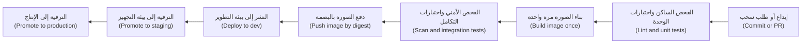

كل ما يقع يسار مرحلة "الدفع (Push)" يعمل على كل طلب سحب (every pull request) ويجب أن يكون سريعًا. أما عمليات الترقية (promotions) على اليمين فتنقل الصورة *نفسها* (the *same* image) عبر البيئات (environments)، كما وُصف في الدرس 3.2.

**الآثار البرمجية (Artefacts).** **الأثر البرمجي (artefact)** هو مُخرَج عملية البناء (output of a build) الذي تحتفظ به وتنشره: وهو هنا صورة حاوية OCI (OCI container image) (الدرس 2.1)؛ وفي مواضع أخرى ملف JAR (JAR file)، أو حزمة Python wheel (Python wheel)، أو حزمة موقع ساكن (static site bundle). قاعدتان (Two rules):
1. **ابنِ مرة واحدة (Build once).** ابنِ الأثر البرمجي في مهمة واحدة (one job)، وخزّنه في سجل (registry)، واجعل كل مرحلة لاحقة تسحبه (pull it). لا تشغّل `docker build` مرة أخرى للتجهيز (staging) أو الإنتاج (production) أبدًا.
2. **عرّفه تعريفًا ثابتًا (Identify it immutably).** الوسم (tag) مثل `v1.4.2` أو `latest` يمكن نقله إلى صورة مختلفة. أما **البصمة (digest)** (`sha256:...`، وهي تجزئة (hash) لمحتوى الصورة) فلا يمكن. وسِم الصور بمعرّف الإيداع (commit SHA) من أجل البشر، لكن انشر بالبصمة (deploy by digest).

الإعدادات التي تختلف بين البيئات (configuration that differs between environments) (مضيف قاعدة البيانات (database host)، والقيم الافتراضية لأعلام الميزات (feature flag defaults)، وأعداد النسخ المتماثلة (replica counts)) تُحقن وقت النشر (injected at deploy time) عبر متغيرات البيئة (environment variables) أو ConfigMaps أو طبقة GitOps الفوقية (GitOps overlay) (الدرسان 2.3 و3.2)، ولا تُخبز في الصورة أبدًا (never baked into the image). وهذا هو العامل الثالث (factor III) من منهجية التطبيق ذي العوامل الاثني عشر (Twelve-Factor App): خزّن الإعدادات في البيئة (store config in the environment). ويروي [*تصميم الأنظمة لمبرمجي الحدس (System Design for Vibe Coders)*، الدرس 4.5 — تحقّق من الأثر البرمجي لا من المصدر (Verify the artifact, not the source)](../vibe/index.ar.html#l4-5) هذه القصة للبنّائين الأفراد (solo builders).

**خط تسليم مصغّر في GitHub Actions (A minimal pipeline in GitHub Actions).** نستخدم GitHub Actions هنا لأنه واسع الانتشار (widely used) ومجاني للمستودعات العامة (free for public repositories)؛ وتشترك GitLab CI/CD وJenkins وAzure Pipelines في المفاهيم نفسها (share the concepts).

```yaml
# .github/workflows/ci.yml
name: ci
on:
  pull_request:
  push:
    branches: [main]

permissions:
  contents: read            # least privilege by default (lesson 4.3)

concurrency:
  group: ci-${{ github.ref }}
  cancel-in-progress: ${{ github.event_name == 'pull_request' }}  # cancel outdated PR runs, never main builds

jobs:
  test:
    runs-on: ubuntu-latest
    timeout-minutes: 15
    steps:
      - uses: actions/checkout@v4   # pin to a full commit SHA in real use (lesson 4.3)
      - run: make lint
      - run: make test-unit

  build:
    needs: test
    runs-on: ubuntu-latest
    timeout-minutes: 20
    steps:
      - uses: actions/checkout@v4
      - uses: docker/setup-buildx-action@v3
      - uses: docker/build-push-action@v6
        with:
          context: .
          push: false
          tags: mobile-api:${{ github.sha }}
          cache-from: type=gha
          cache-to: type=gha,mode=max
```

لاحظ الإعدادات الافتراضية (defaults): صلاحيات للقراءة فقط (read-only permissions)، ومهلات زمنية للمهام (job timeouts)، وإلغاء تشغيلات طلبات السحب القديمة (cancelling outdated PR runs) (ولا تُلغى تشغيلات `main` أبدًا: فكل إيداع مدموج (merged commit) يجب أن يُنتج أثره البرمجي).

**هرم الاختبارات (The test pyramid).** ليست كل الاختبارات متساوية في الكلفة (not all tests cost the same). ينصّ الهرم، الذي روّج له مايك كون (Mike Cohn)، على أن يكون لديك كثير من الاختبارات الرخيصة (cheap tests) في القاعدة وقليل من الاختبارات المكلفة (expensive ones) في القمة.

| الطبقة (Layer) | ما الذي تفحصه (What it checks) | السرعة (Speed) | العدد (How many) | أين تعمل (Where it runs) |
|---|---|---|---|---|
| **الفحوص الساكنة (Static checks)** | التنسيق (formatting)، والفحص الساكن (lint)، وفحوص الأنواع (type checks)، والتحقق من البنية التحتية بوصفها شيفرة (IaC validation) | ثوانٍ (Seconds) | كل ملف (Every file) | كل طلب سحب (Every PR) |
| **اختبارات الوحدة (Unit tests)** | دالة أو صنف واحد (one function or class)، دون شبكة أو قاعدة بيانات (no network or database) | أجزاء من الثانية لكلٍّ منها (Milliseconds each) | الآلاف (Thousands) | كل طلب سحب (Every PR) |
| **اختبارات التكامل (Integration tests)** | الخدمة مع اعتماديات حقيقية (real dependencies): حاوية PostgreSQL (PostgreSQL container)، وشبكة دفع مزيّفة (fake payment network) | ثوانٍ لكلٍّ منها (Seconds each) | المئات (Hundreds) | كل طلب سحب، بالتوازي (Every PR, in parallel) |
| **اختبارات العقود (Contract tests)** | أن واجهة البرمجة (API) ما زالت تطابق ما يتوقعه عملاؤها (what its clients expect) | ثوانٍ (Seconds) | واحد لكل مستهلك (One per consumer) | كل طلب سحب (Every PR) |
| **الاختبارات الشاملة (End-to-end tests)** | رحلة مستخدم كاملة (full user journey) عبر الخدمات المنشورة (deployed services) | دقائق لكلٍّ منها (Minutes each) | حفنة (A handful) | بعد النشر إلى التطوير أو التجهيز (After deploy to dev or staging) |

والهرم المقلوب (inverted pyramid)، بمئات من اختبارات المتصفّح البطيئة الهشّة (slow, brittle browser tests) وقليل من اختبارات الوحدة، سبب شائع لخط تسليم مدته 48 دقيقة (48-minute pipeline).

#### 🟡 التعمق أكثر (Going deeper)

**تسريع خط التسليم (Making the pipeline fast).** يقيس يوسف قبل أن يغيّر أي شيء (measures before changing anything). فتتوزّع الدقائق الـ48 على تنزيل الاعتماديات (dependency downloads) (7)، وبناء الصورة دون تخزين مؤقت (image build without cache) (11)، واختبارات الوحدة المشغّلة تسلسليًا (unit tests run serially) (9)، واختبارات التكامل (integration tests) (8)، والاختبارات الشاملة على كل طلب سحب (end-to-end tests on every PR) (13). والإصلاحات، مرتبة حسب قيمتها (in order of value):

- **خزّن الاعتماديات مؤقتًا (Cache dependencies).** استعِد ذاكرة التخزين المؤقت لمدير الحزم (package manager's cache) بمفتاح مبني على تجزئة ملف القفل (keyed on the lock file hash)؛ ولدى معظم أنظمة التكامل المستمر إجراء تخزين مؤقت مدمج (built-in cache action).
- **رتّب ملف Dockerfile للاستفادة من التخزين المؤقت للطبقات (Order the Dockerfile for layer caching)** (الدرس 2.1): انسخ بيان الاعتماديات (dependency manifest) وثبّت الاعتماديات *قبل* نسخ الشيفرة المصدرية (source code)، كي لا يُبطل تغيير الشيفرة طبقة الاعتماديات (invalidate the dependency layer). واستخدم ذاكرة تخزين مؤقت بعيدة للبناء (remote build cache) (`cache-from`/`cache-to`) كي تتمكن المشغّلات المؤقتة (ephemeral runners) من إعادة استخدام الطبقات (reuse layers).
- **وازِ (Parallelise).** قسّم الاختبارات إلى أجزاء (shards) عبر عدة مهام (several jobs)، أو استخدم مصفوفة (matrix) (مثلًا عدة إصدارات من Python أو Node) فقط حيث تضيف تغطية حقيقية (real coverage).
- **شغّل ما تغيّر فقط (Run only what changed).** في المستودع الأحادي (monorepo)، تتخطى مرشّحات المسارات (path filters) (`on.pull_request.paths`) خطوط التسليم للخدمات التي لم تُمسّ (untouched services). وكن حذرًا: فتغيير مكتبة مشتركة (shared library change) يجب أن يظل يُطلق خطوط التسليم للخدمات المعتمدة عليها (its dependants).
- **انقل الحزم البطيئة إلى ما بعد الدمج (Move slow suites after the merge).** تعمل الاختبارات الشاملة (end-to-end tests) على بيئة التطوير (dev environment) بعد الدمج ووفق جدول زمني (on a schedule)؛ فهي تحجب *الترقية (promotion)* لا *الدمج (merging)*.

النتيجة (The result): الفحص الساكن واختبارات الوحدة في 3 دقائق، والبناء واختبارات التكامل في 6، أي فحص دمج (merge check) مدته 9 دقائق، مع اختبارات شاملة تحرس الترقية إلى التجهيز (gating promotion to staging).

**الاختبارات المتقلّبة (Flaky tests).** **الاختبار المتقلّب (flaky test)** ينجح ويفشل على الشيفرة نفسها (same code). ومن أسبابه افتراضات التوقيت (timing assumptions) (`sleep(2)` والأمل)، وبيانات الاختبار المشتركة (shared test data)، والاعتماد على ترتيب الاختبارات (test order dependence)، واستدعاءات الشبكة الحقيقية (real network calls) والساعات (clocks). السياسة في نجم (Policy at Najm):
1. الاختبار الذي يفشل ثم ينجح عند إعادة المحاولة (on retry)، على الإيداع نفسه (same commit)، يُعلَّم آليًا بأنه مشتبه في تقلّبه (suspected flaky).
2. يُوضع الاختبار المتقلّب **في الحجر (quarantined)**: يُنقل إلى مهمة غير حاجبة (non-blocking job)، مع تذكرة (ticket) ومالك (owner)، ويُصلَح أو يُحذف خلال مدة متفق عليها (within an agreed time).
3. لا يُسمح بـ"إعادة المحاولة حتى يخضرّ (retry until green)" الآلية على خط التسليم كله (whole pipeline). فهي تخفي أخطاء متقطعة حقيقية (real intermittent bugs)، ومنها حالات التسابق (race conditions) التي ستحدث في الإنتاج أيضًا.

**طوابير الدمج (Merge queues).** حين يدمج كثيرون في `main`، قد ينجح طلبا سحب (two pull requests) كلٌّ على حدة ثم يتعطلان معًا (break together). أما **طابور الدمج (merge queue)** (طابور الدمج في GitHub (GitHub merge queue)، وقطارات الدمج في GitLab (GitLab merge trains) وميزات مشابهة) فيختبر كل طلب سحب فوق طلبات السحب التي تسبقه (on top of the PRs ahead of it) قبل الدمج، فيبقى `main` أخضر (stays green).

**توسيم الأثر البرمجي (Labelling the artefact).** سجّل مصدر الصورة (where the image came from)، كي يستطيع أي شخص تتبّع حجيرة عاملة (running pod) رجوعًا إلى إيداع (back to a commit). وتعليقات صور OCI (OCI image annotations) مثل `org.opencontainers.image.revision` (معرّف الإيداع، commit SHA) و`org.opencontainers.image.source` (عنوان المستودع، repository URL) مفاتيح قياسية (standard keys). ويحوّل الدرس 4.3 هذا إلى **مصدرية (provenance)** موقّعة.

**ما يفحصه خط التسليم إلى جانب الاختبارات (What the pipeline checks besides tests).** خط التكامل المستمر (CI pipeline) هو أيضًا موطن الفحوص المؤتمتة الرخيصة (cheap automated checks): فحص الأسرار (secret scanning)، وفحص ثغرات الاعتماديات (dependency vulnerability scanning, SCA)، والتحليل الأمني الساكن (static security analysis, SAST)، والفحص الساكن لملفات Dockerfile والبنية التحتية بوصفها شيفرة (Dockerfile and IaC linting)، وفحوص السياسات (policy checks) من الدرس 3.3. لا تحجب إلا على النتائج الجديدة عالية الثقة (new, high-confidence findings)، وإلا تعلّم المطوّرون تجاهل البوابة (ignore the gate). ويشرح [*أمن الذكاء الاصطناعي وأمن التطبيقات (Secure AI & Application Security)*، الدرس 6.1 — دورة حياة تطوير آمنة (A secure development life cycle)](../secai/index.ar.html#/6.1) كيفية ضبط هذه الماسحات (tune these scanners).

#### 🔴 نظرة الخبير (Expert view)

**قِس النتيجة لا خط التسليم (Measure the outcome, not the pipeline).** يتتبّع برنامج أبحاث DORA (DORA research programme) أربعة مقاييس تسليم رئيسية (four key delivery measures): **تكرار النشر (deployment frequency)**، و**المهلة الزمنية للتغييرات (lead time for changes)** (من الإيداع إلى الإنتاج)، و**معدل فشل التغييرات (change failure rate)**، و**زمن استعادة الخدمة (time to restore service)**. وقد أضافت DORA منذ ذلك الحين مقياسًا للموثوقية (reliability measure) وحسّنت بعض الأسماء (على سبيل المثال، تتحدث التقارير الحديثة عن زمن التعافي من النشر الفاشل (failed deployment recovery time))؛ راجع dora.dev للاطلاع على التعريفات الحالية. يحسّن خط التسليم السريع المهلة الزمنية (lead time)؛ وتخفّض الاختبارات الجديرة بالثقة (trustworthy tests) معدل فشل التغييرات. راقب الاثنين معًا: فالتسريع بحذف الاختبارات (speeding up by deleting tests) لا يفعل سوى نقل الكلفة إلى الحوادث (moves the cost into incidents).

**خط التسليم منتَج (The pipeline is a product).** في نجم، لا يكتب كل فريق منتج (product team) خط تسليمه الخاص. بل ينشر فريق المنصة **مسارًا ذهبيًا (golden path)**: سير عمل قابلًا لإعادة الاستخدام (reusable workflow) (في GitHub Actions، سير عمل يُستدعى بـ `uses: najm-bank/platform-workflows/.github/workflows/service-ci.yml@<version>`) يتولى البناء والفحص والاختبار والتوقيع والدفع (build, scan, test, sign and push) بالطريقة المعتمدة (approved way). وتمرّر الفرق بضعة مدخلات (a few inputs). وحين يحسّن فريق المنصة التخزين المؤقت (caching) أو يضيف ماسحًا (scanner)، تحصل عليه كل خدمة. أدِر إصداره (version it)، واحتفظ بسجل للتغييرات (changelog)، وقِس معدل التبنّي (adoption) وأزمنة البناء (build times).

**عمليات البناء القابلة لإعادة الإنتاج والمحكمة (Reproducible and hermetic builds).** يستخدم البناء **المحكم (hermetic)** مدخلات مُعلنة ومثبّتة فقط (only declared, pinned inputs): صورة أساسية بالبصمة (base image by digest)، واعتماديات عبر ملف قفل مع تجزئات (dependencies by lock file with hashes)، وسلسلة أدوات مثبّتة (pinned toolchain)، ودون وصول غير مُعلن إلى الشبكة (no undeclared network access). أما عمليات البناء **القابلة لإعادة الإنتاج (reproducible)** بالكامل بتًا ببت (bit-for-bit) فصعبة لصور الحاويات (الطوابع الزمنية (timestamps)، وترتيب الملفات (file ordering))، لكن المدخلات المحكمة وحدها تزيل حادثة الجمعة (Friday incident): فلا يستطيع وسم `latest` متحرك أن يتسلّل.

**زمن التغذية الراجعة ميزانية تصميم (Feedback time is a design budget).** انشر هدفًا (Publish a target) (هدف نجم أدناه). وأي فحص جديد قد يكسره يجب أن يحلّ محل شيء آخر (replace something)، أو يعمل بالتوازي (run in parallel)، أو يعمل بعد الدمج (run after the merge).

### 🧰 الأدوات (The toolkit)
| الأداة أو الممارسة أو الخدمة (Tool, practice or service) | ما هي وماذا تفعل (What it is and does) | متى تلجأ إليها (When to reach for it) |
|---|---|---|
| **GitHub Actions** | تكامل وتسليم مستمران (CI/CD) مدمجان في GitHub؛ وسير العمل (workflows) مكتوبة بصيغة YAML في المستودع، وتعمل على مشغّلات مستضافة أو مستضافة ذاتيًا (hosted or self-hosted runners) | حين تكون الشيفرة على GitHub أصلًا؛ وللتمرّن المجاني على المستودعات العامة (public repositories) |
| **GitLab CI/CD** | تكامل وتسليم مستمران (CI/CD) مدمجان في GitLab؛ وخطوط التسليم (pipelines) معرّفة في `.gitlab-ci.yml` | حين تكون الشيفرة على GitLab، بما في ذلك التثبيتات المُدارة ذاتيًا (self-managed installations) |
| **Jenkins** | خادم أتمتة مفتوح المصدر عريق (long-standing open-source automation server) بمنظومة إضافات كبيرة (large plugin ecosystem) | البيئات القائمة (existing estates)؛ وحين يجب تشغيل كل شيء داخل المقر (on-premises) |
| **Trunk-based development** — التطوير القائم على الجذع | فروع قصيرة العمر (short-lived branches) تُدمج في فرع رئيسي واحد (one main branch) مرة يوميًا على الأقل | دائمًا، بوصفه نموذج التفريع الافتراضي (default branching model) للتكامل المستمر |
| **Build once, promote** — ابنِ مرة واحدة ورقِّ | بناء واحد يُنتج أثرًا برمجيًا واحدًا ثابتًا (one immutable artefact) ينتقل عبر كل بيئة | كل خدمة؛ فهو يزيل مشكلة ⁦("tested is not shipped")⁩ أي "ما اختُبر ليس ما شُحن" |
| **Test pyramid** — هرم الاختبارات | كثير من اختبارات الوحدة (unit tests)، وأقل من اختبارات التكامل (integration tests)، وقليل من الاختبارات الشاملة (end-to-end tests) | تصميم حزمة اختبارات (designing a test suite) أو تشخيص خط تسليم بطيء (diagnosing a slow pipeline) |
| **Merge queue** — طابور الدمج | يختبر كل طلب سحب (PR) مقابل طلبات السحب التي تسبقه قبل الدمج | المستودعات المزدحمة (busy repositories) حيث يظل `main` يتعطل بعد عمليات دمج "خضراء" ("green" merges) |
| **Golden path** — المسار الذهبي | خط تسليم قابل لإعادة الاستخدام (reusable pipeline) يصونه فريق المنصة (platform-maintained)، تتبنّاه الفرق بدلًا من كتابة خطوطها الخاصة | أكثر من حفنة من الخدمات بعمليات بناء متشابهة (similar builds) |

### 🏛️ عمليًا في بنك نجم (In practice at Najm Bank)
ينشر يوسف وسالم **معيار التكامل المستمر للمسار الذهبي في نجم، الإصدار 1 (Najm Golden-Path CI Standard v1)**، مُنفَّذًا بوصفه سير عمل قابلًا لإعادة الاستخدام (reusable workflow). وكل خدمة جديدة تبدأ به.

**الجزء أ: المراحل والبوابات وميزانيات الزمن (Part A: stages, gates and time budgets)**

| المرحلة (Stage) | تعمل على (Runs on) | تحجب (Blocks) | ميزانية الزمن (Time budget) (p95) |
|---|---|---|---|
| الفحص الساكن والتنسيق وفحص الأنواع والتحقق من البنية التحتية بوصفها شيفرة (Lint, format, type check, IaC validate) | كل طلب سحب (Every PR) | الدمج (Merge) | دقيقتان (2 min) |
| اختبارات الوحدة (Unit tests) (مقسّمة إلى أجزاء، sharded) | كل طلب سحب (Every PR) | الدمج (Merge) | 4 دقائق (4 min) |
| فحص الأسرار وSCA وSAST (النتائج العالية الجديدة فقط، new high findings only) | كل طلب سحب (Every PR) | الدمج (Merge) | 3 دقائق، بالتوازي (3 min, in parallel) |
| بناء الصورة مرة واحدة، مع ذاكرة تخزين مؤقت بعيدة (Build image once, with remote cache) | كل طلب سحب (Every PR) | الدمج (Merge) | 4 دقائق (4 min) |
| اختبارات التكامل والعقود (Integration and contract tests) (PostgreSQL في حاوية) | كل طلب سحب (Every PR) | الدمج (Merge) | 5 دقائق، بالتوازي (5 min, in parallel) |
| دفع الصورة بالبصمة، وتسجيل معرّف الإيداع والمصدر (Push image by digest, record commit SHA and source) | الدمج في `main` (Merge to main) | — | دقيقتان (2 min) |
| النشر إلى بيئة التطوير وتشغيل اختبارات الدخان الشاملة (Deploy to dev and run end-to-end smoke tests) | الدمج في `main` (Merge to main) | الترقية إلى التجهيز (Promotion to staging) | 10 دقائق (10 min) |
| الحزمة الشاملة الكاملة (Full end-to-end suite) | كل بضع ساعات وقبل الإنتاج (Every few hours and before production) | الترقية إلى الإنتاج (Promotion to production) | 30 دقيقة (30 min) |

الهدف العام لفحص الدمج (Overall merge-check target): أن تنتهي 95% من فحوص طلبات السحب (PR checks) خلال 10 دقائق.

**الجزء ب: القواعد (Part B: rules)**
1. تُبنى الصور مرة واحدة لكل إيداع (once per commit) وتُنشر بالبصمة (deployed by digest). وخط التسليم الذي يشغّل `docker build` في مهمة نشر (deploy job) يرسب في مراجعة المنصة (platform review).
2. تُثبَّت الصور الأساسية (base images) وسلاسل الأدوات (toolchains) بالبصمة أو بالإصدار الدقيق (exact version)؛ ويقترح روبوت (bot) التحديثات بوصفها طلبات سحب عادية (ordinary pull requests).
3. لكل مهمة مهلة زمنية (timeout). ويكون الافتراضي لسير العمل صلاحيات القراءة فقط (read-only permissions).
4. توضع الاختبارات المتقلّبة (flaky tests) في الحجر (quarantined) خلال يوم عمل واحد، مع مالك وتذكرة. ولا إعادة محاولة آلية لخط التسليم كله (no whole-pipeline auto-retry).
5. تعرض لوحة كل خدمة (service's dashboard) المهلة الزمنية (lead time)، وتكرار النشر (deployment frequency)، ومعدل فشل التغييرات (change failure rate)، ومدة فحص طلب السحب (PR-check duration).

**الجزء ج: واجهة سير العمل القابل لإعادة الاستخدام (Part C: the reusable workflow's interface)**

```yaml
# In the service repository
jobs:
  ci:
    uses: najm-bank/platform-workflows/.github/workflows/service-ci.yml@v3   # pin by SHA in real use
    with:
      service-name: mobile-api
      dockerfile: ./Dockerfile
      integration-services: postgres
      test-shards: 4
```

### 🛠️ التمارين (Exercises)
استخدم حسابك الخاص على GitHub (your own GitHub account) ومستودعًا عامًا للتمرين (public practice repository)؛ ولا تستخدم مستودع جهة عملك (employer's repository) دون إذن أبدًا.

- 🟢 خذ تطبيقًا صغيرًا لك (بأي لغة) وأضف إليه سير عمل للتكامل المستمر (CI workflow) يشغّل الفحص الساكن واختبارات الوحدة (lint and unit tests) على كل طلب سحب، مع صلاحيات القراءة فقط (read-only permissions)، ومهلة زمنية للمهمة (job timeout)، وإلغاء التشغيلات القديمة (cancellation of outdated runs). افتح طلب سحب فيه اختبار فاشل عمدًا (deliberately failing test). *يكتمل عندما (Done when):* يُظهر طلب السحب فحصًا أحمر (red check) يسمّي الاختبار الفاشل، ويحوّله إصلاح الاختبار إلى الأخضر.
- 🟡 أضف إلى خط التسليم بناءً للحاوية (container build) مع التخزين المؤقت للطبقات (layer caching). أعد ترتيب ملف Dockerfile بحيث تُثبَّت الاعتماديات قبل نسخ الشيفرة المصدرية. سجّل زمن البناء قبل التغيير وبعده لتعديل شيفرة من سطر واحد (one-line code change). *يكتمل عندما (Done when):* يكون لديك التوقيتان، ويعيد بناءٌ ثانٍ بعد تغيير في المصدر فقط (source-only change) استخدام طبقة الاعتماديات (يُظهر السجل خطوات مخزّنة مؤقتًا، cached steps).
- 🔴 نفّذ مبدأ "ابنِ مرة واحدة، ورقِّ (build once, promote)": عند الدمج في `main`، ادفع الصورة إلى سجل (registry) (يصلح GitHub Container Registry لمستودع عام)، وأخرِج بصمتها (output its digest)، واجعل مهمة ثانية تنشر تلك البصمة إلى عنقود kind محلي (local kind cluster) أو تحدّث بيانًا (manifest) في مجلد GitOps (GitOps folder). أضف اختبارًا يفشل إذا احتوت أي مهمة نشر على أمر `docker build`. *يكتمل عندما (Done when):* تطابق البصمة العاملة في عنقودك (`kubectl get pod -o jsonpath='{.items[*].status.containerStatuses[*].imageID}'`) البصمة التي طبعتها مهمة البناء (build job).

### ⚠️ أخطاء وفخاخ (Mistakes and traps)
- **إعادة البناء لكل بيئة (Rebuilding per environment).** تختبر بيئة التجهيز صورة ويشغّل الإنتاج صورة أخرى. ابنِ مرة واحدة، وانشر بالبصمة (deploy by digest)، واحقن الإعدادات وقت النشر (inject configuration at deploy time).
- **⁦("Re-run until green")⁩ أي "أعد التشغيل حتى يخضرّ".** فهي تخفي الاختبارات المتقلّبة (flaky tests) وحالات التسابق الحقيقية (real race conditions). ضع الاختبارات المتقلّبة في الحجر (quarantine) مع مالك وموعد نهائي (owner and a deadline)؛ ولا تُعِد محاولة خطوط التسليم كاملة آليًا أبدًا.
- **الهرم المقلوب (An inverted pyramid).** مئات الاختبارات الشاملة (end-to-end tests) على كل طلب سحب تجعل التكامل المستمر بطيئًا وهشًا (slow and brittle). ادفع الفحوص إلى أسفل الهرم (push checks down the pyramid)؛ وشغّل الحزم الشاملة بعد الدمج.
- **فروع الميزات طويلة العمر (Long-lived feature branches).** تحوّل التكامل (integration) إلى أزمة أسبوعية (weekly crisis). ادمج تغييرات صغيرة يوميًا، وأخفِ العمل غير المكتمل خلف الأعلام (behind flags).
- **المدخلات غير المثبّتة (Unpinned inputs).** إن `FROM node:latest` أو الأدوات غير المثبّتة (unpinned tools) تجعل البناء الأخضر بالأمس بلا معنى اليوم. ثبّت بالبصمة أو بالإصدار الدقيق (pin by digest or exact version) وحدّث عن قصد (update deliberately).

### 🧾 الخلاصة (Recap)
- يجيب التكامل المستمر (CI) عن سؤال ⁦("is this change safe to merge?")⁩ أي "هل هذا التغيير آمن للدمج؟"؛ ويُبقي التسليم المستمر (continuous delivery) كل تغيير ناجح قابلًا للإطلاق (releasable)؛ ويطلقه النشر المستمر (continuous deployment) آليًا.
- يجعل التطوير القائم على الجذع (trunk-based development) وعمليات الدمج الصغيرة المتكررة (small, frequent merges) التكامل أمرًا روتينيًا (routine) لا محفوفًا بالمخاطر (risky).
- ابنِ أثرًا برمجيًا واحدًا ثابتًا (one immutable artefact)، وعرّفه بالبصمة (by digest)، ورقِّ الأثر نفسه عبر كل بيئة.
- شكّل الاختبارات هرمًا (shape tests as a pyramid)، وأبقِ فحص الدمج سريعًا بالتخزين المؤقت (caching) والتوازي (parallelism) ونقل الحزم البطيئة إلى ما بعد الدمج.
- عامِل الاختبارات المتقلّبة بوصفها عيوبًا (defects)، وخط التسليم بوصفه منتجًا (product)، ومقاييس DORA (DORA measures) بوصفها بطاقة الأداء (scorecard).

### ✍️ اختبر نفسك (Check yourself)

**1. اجتازت بيئة التجهيز (staging) الاختبار يوم الخميس، لكن نشر الإنتاج (production deploy) فشل يوم الجمعة لأن الصورة تصرّفت بشكل مختلف. كانت مهمة الإنتاج (production job) قد أعادت بناء الصورة من الإيداع نفسه (same commit). ما التغيير الذي يمنع هذه الفئة من الإخفاقات (class of failure)؟**

- A. تشغيل اختبارات التجهيز (staging tests) مرة أخرى داخل مهمة الإنتاج
- B. البناء مرة واحدة ونشر الصورة نفسها بالبصمة في كل مكان (build once and deploy the same image by digest everywhere)
- C. استخدام الوسم `latest` في كل مكان كي تتطابق كل البيئات
- D. إضافة خطوة موافقة يدوية (manual approval step) قبل كل نشر إلى الإنتاج

<details><summary>الإجابة</summary>

**B.** البناء مرة واحدة والنشر بالبصمة (building once and deploying by digest) يضمنان أن يشغّل الإنتاج بالضبط ما اختُبر. أما C فتزيد الأمر سوءًا، لأن `latest` يتحرك؛ وD تضيف إنسانًا (adds a human) لكنها لا تضمن الأثر البرمجي نفسه (same artefact). (🟢 الأساسيات، The essentials).

</details>

**2. يستغرق فحص طلب السحب (PR check) لواجهة برمجة تطبيق نجم للهاتف (Najm Mobile API) 48 دقيقة، منها 13 دقيقة للاختبارات الشاملة (end-to-end tests). ما أفضل خطوة أولى (best first move)؟**

- A. حذف الاختبارات الشاملة، لأن اختبارات الوحدة (unit tests) تغطي المنطق
- B. شراء مشغّلات أكبر (larger runners) وإبقاء كل شيء على حاله
- C. تشغيل الاختبارات الشاملة بعد الدمج (after the merge)، بحيث تحرس الترقية (gating promotion) بدلًا من الدمج
- D. مطالبة المطوّرين بفتح طلبات سحب أقل عددًا وأكبر حجمًا (fewer, larger pull requests)

<details><summary>الإجابة</summary>

**C.** ما زالت الاختبارات تحمي الإنتاج، لكنها لم تعد تبطئ كل دمج. أما A فتفقد الحماية (loses protection)؛ وB مكلفة وتُبقي البنية دون تغيير (leaves the structure unchanged)؛ وD تشجّع التجميع في دفعات (batching) الذي سبّب المشكلة. (🟡 التعمق أكثر، Going deeper).

</details>

**3. أيّ العبارات التالية تصف التسليم المستمر (continuous delivery) على أفضل وجه؟**

- A. كل تغيير ناجح قابل للإطلاق (releasable)؛ وقرار إطلاق (release decision) يضعه قيد التشغيل
- B. كل تغيير يذهب إلى الإنتاج آليًا دون أي خطوة بشرية (no human step)
- C. يدمج المطوّرون فروعهم في الفرع الرئيسي (main) مرة واحدة أسبوعيًا على الأقل
- D. يبني خط التسليم كل التغييرات ويختبرها مرة كل ليلة (once a night)

<details><summary>الإجابة</summary>

**A.** أما B فهي النشر المستمر (continuous deployment). وC تصف تكاملًا غير متكرر (infrequent integration)، وD بناء ليلي (nightly build) وليست تكاملًا مستمرًا (not CI). (🟢 الأساسيات، The essentials).

</details>

**4. اختبار في خدمة المدفوعات (Payments service) يفشل في نحو تشغيل واحد من كل عشرة (one run in ten) وينجح عند إعادة تشغيله على الإيداع نفسه. ماذا تتطلب سياسة نجم (Najm's policy)؟**

- A. تفعيل إعادة المحاولة الآلية (automatic retries) على خط التسليم كله كي لا تُحجب عمليات الدمج
- B. حذف الاختبار فورًا والاعتماد على بقية الحزمة (remaining suite)
- C. إبقاؤه حاجبًا (blocking)، وإعادة تشغيل خط التسليم كلما فشل
- D. وضعه في الحجر (quarantine) في مهمة غير حاجبة (non-blocking job)، مع مالك وموعد نهائي

<details><summary>الإجابة</summary>

**D.** يُبقي الحجر (quarantine) إشارة الدمج (merge signal) جديرة بالثقة بينما يبحث أحدهم عن السبب، الذي قد يكون حالة تسابق حقيقية (real race condition). أما A فتخفي المشكلات؛ وB قد تحذف تغطية مفيدة (useful coverage) دون فهمها؛ وC تعلّم الناس تجاهل عمليات البناء الحمراء (red builds). (🟡 التعمق أكثر، Going deeper).

</details>

**5. يريد سالم أن يعرف هل تحسينات التكامل المستمر (CI improvements) تجعل التسليم أفضل إجمالًا (better overall)، لا أسرع فحسب. أيّ زوج من المقاييس (pair of measures) ينبغي أن يراقبه معًا؟**

- A. عدد خطوط التسليم (number of pipelines) وعدد المشغّلات (number of runners)
- B. أسطر الشيفرة (lines of code) وعدد الاختبارات (test count)
- C. المهلة الزمنية للتغييرات (lead time for changes) ومعدل فشل التغييرات (change failure rate)
- D. معدل إصابة ذاكرة البناء المؤقتة (build cache hit rate) وحجم الصورة (image size)

<details><summary>الإجابة</summary>

**C.** تُظهر المهلة الزمنية (lead time) السرعة، ويُظهر معدل فشل التغييرات (change failure rate) هل السرعة آمنة؛ ومراقبة أحدهما وحده قد تضلّل (can mislead). أما الخيارات الأخرى فأدوات تشخيص مفيدة (useful diagnostics)، لا نتائج (not outcomes). (🔴 نظرة الخبير، Expert view).

</details>

### 📚 المراجع (References)
- أبحاث DORA ومقاييسها (DORA research and metrics) — https://dora.dev/
- توثيق GitHub Actions (GitHub Actions documentation) — https://docs.github.com/en/actions
- GitHub، إدارة طابور الدمج (managing a merge queue) — https://docs.github.com/en/repositories/configuring-branches-and-merges-in-your-repository/configuring-pull-request-merges/managing-a-merge-queue
- توثيق GitLab CI/CD (GitLab CI/CD documentation) — https://docs.gitlab.com/ee/ci/
- توثيق Jenkins (Jenkins documentation) — https://www.jenkins.io/doc/
- Docker، ذاكرة البناء المؤقتة (build cache) — https://docs.docker.com/build/cache/
- مواصفة صور OCI، التعليقات التوضيحية (OCI image specification, annotations) — https://github.com/opencontainers/image-spec/blob/main/annotations.md
- التطبيق ذو العوامل الاثني عشر (The Twelve-Factor App) — https://12factor.net/
- التطوير القائم على الجذع (Trunk-based development) — https://trunkbaseddevelopment.com/

<a id="l4-2"></a>

## 4.2 — استراتيجيات الإطلاق (release strategies): المتدرّج والأزرق والأخضر والكناري وأعلام الميزات والتراجع

*المستوى: 🟡 متوسط* · *المتطلبات: 2.2، 2.3، 4.1* · *المرحلة (Phase): Release, Deploy*

### ⚡ الدرس في دقيقة (In 60 seconds)
- **النشر (Deploying)** يضع الشيفرة الجديدة على الخوادم (servers)؛ و**الإطلاق (releasing)** يتيح للمستخدمين الوصول إليها. والفصل بين الاثنين، بأعلام الميزات (feature flags) والتحويل التدريجي لحركة المرور (progressive traffic shifting)، هو جوهر التسليم الآمن (core of safe delivery).
- الاستراتيجيات الرئيسية هي **إعادة الإنشاء (recreate)**، و**المتدرّج (rolling)**، و**الأزرق والأخضر (blue-green)**، و**الكناري (canary)**، و**الظل (shadow)**؛ وكلٌّ منها يوازن بين الكلفة والسرعة ونطاق الضرر (blast radius) بطريقة مختلفة.
- اختر حسب نطاق الضرر (blast radius) وحسب سرعة اكتشافك للمشكلة (how quickly you can detect a problem). فالخدمات عالية المخاطر (high-risk services) مثل المدفوعات (Payments) تحصل على إطلاق كناري مع تحليل آلي (automatic analysis)؛ أما الأدوات الداخلية (internal tools) فيمكن نشرها نشرًا متدرّجًا (can roll).
- كل إطلاق يحتاج إلى تراجع مُتمرَّن عليه (rehearsed rollback)، ويجب أن تعمل قاعدة البيانات مع الإصدار القديم والجديد في الوقت نفسه (both the old and the new version at the same time).
- الفخ الأكبر (Biggest trap): شحن تغيير إلى الجميع دفعة واحدة (to everyone at once) لأنه ⁦("it's only configuration")⁩ أي "مجرد إعدادات". فالإعدادات والمحتوى شيفرة (configuration and content are code)؛ فأطلقهما على مراحل أيضًا (stage them too).

### 🧭 لماذا يهم (Why it matters)
في 19 يوليو 2024، دفعت CrowdStrike تحديثًا لإعدادات المحتوى (content configuration update) لمستشعرها Falcon (Falcon sensor) إلى أجهزة Windows. وتسبّب عيب في ذلك التحديث في انهيار الأجهزة المتأثرة (crashed affected machines)، وقدّرت Microsoft أن نحو 8.5 مليون جهاز Windows قد تأثر، فتوقفت رحلات جوية وتعطلت مستشفيات وبنوك. وقالت مراجعة CrowdStrike نفسها إن هذا النوع من المحتوى لم يكن يُطرح على مراحل (had not been rolled out in stages). ومن بين التزاماتها بعد ذلك نشرٌ مرحلي (staged deployment) لهذا النوع من المحتوى، مع مجموعات كناري أولًا (canary groups first) وتحكّم العملاء في التوقيت (customer control over timing). فالتغيير الذي يصل إلى الجميع دفعة واحدة يمكن أن يفشل لدى الجميع دفعة واحدة (can fail for everyone at once).

وفي نجم، لدى مها مثال أقرب. ففي الربع الماضي، غيّر إصدار جديد من **خدمة المدفوعات (Payments service)** طريقة قراءته لحقل العملة (currency field). وانتشر النشر (deployment rolled) عبر كل الحجيرات (all pods) في أربع دقائق. فارتفعت معدلات الخطأ (error rates) في نحو 3% من التحويلات (transfers) (تلك التي بعملة واحدة) وبقيت تحت عتبة التنبيه القديمة (old alert threshold) مدة 40 دقيقة. وبحلول ذلك الوقت كانت كل حجيرة تشغّل الشيفرة الجديدة، واستغرق التراجع غير المُتمرَّن عليه (unpractised rollback) 15 دقيقة أخرى.

هدف مها (Maha's goal): أن يصل إطلاق المدفوعات التالي إلى 5% من حركة المرور (traffic) أولًا، وأن يُحكم عليه بالأرقام (judged by numbers)، وأن يتراجع من تلقاء نفسه (rolls back on its own) إذا ساءت.

### 📐 كيف يعمل (How it works)

#### 🟢 الأساسيات (The essentials)

**النشر ليس إطلاقًا (Deploy is not release).** **تحويل حركة المرور (Traffic shifting)** (المتدرّج والأزرق والأخضر والكناري) يتحكم في أيّ *إصدار (version)* يتلقى الطلبات (requests)؛ و**أعلام الميزات (feature flags)** تتحكم في أيّ *سلوك (behaviour)* يراه المستخدمون داخل إصدار واحد.

وبالاثنين معًا، يمكنك النشر يوم الثلاثاء، وتفعيل الميزة للموظفين (staff) يوم الأربعاء ولـ5% من العملاء يوم الخميس، وإيقافها في ثوانٍ (switch it off in seconds).

**الاستراتيجيات (The strategies).**

| الاستراتيجية (Strategy) | كيف تعمل (How it works) | التراجع (Rollback) | الكلفة الإضافية (Extra cost) | مناسبة لـ (Good for) |
|---|---|---|---|---|
| **إعادة الإنشاء (Recreate)** | أوقف كل النسخ القديمة (old instances)، ثم شغّل الجديدة | إعادة نشر الإصدار القديم (redeploy old version) | لا شيء، لكنها تسبّب توقفًا عن الخدمة (causes downtime) | المهام الدفعية (batch jobs)؛ وبيئات التطوير (dev environments)؛ والإصدارات التي لا يمكن تشغيلها جنبًا إلى جنب (side by side) |
| **التحديث المتدرّج (Rolling update)** | استبدل النسخ بضعًا بعد بضع (a few at a time)؛ وتنضم الجديدة حين تصبح جاهزة (when ready) | تراجع بالطريقة نفسها، بضعًا بعد بضع | قدر قليل من السعة الاحتياطية (spare capacity) | معظم الخدمات عديمة الحالة (stateless services)؛ والافتراضي في Kubernetes (the Kubernetes default) |
| **الأزرق والأخضر (Blue-green)** | شغّل الإصدار الجديد (الأخضر، green) بجانب القديم (الأزرق، blue) بالحجم الكامل (at full size)؛ وحوّل كل حركة المرور دفعة واحدة (switch all traffic at once) | أعِد حركة المرور إلى الأزرق، في ثوانٍ | ضعف السعة (double capacity) أثناء الإطلاق | انتقال سريع ونظيف (fast, clean cut-over)؛ وتحقق سهل قبل التحويل (easy verification before switching) |
| **الكناري (Canary)** | أرسل حصة صغيرة من حركة المرور الحقيقية (small share of real traffic) إلى الإصدار الجديد، وقارن مقاييسه (compare its metrics)، ثم زِدها خطوة بخطوة (step by step) | أرسل كل حركة المرور عائدةً إلى الإصدار المستقر (stable version) | بضع نسخ إضافية مع المقاييس (a few extra instances plus metrics) | الخدمات عالية المخاطر (high-risk services)؛ وقواعد المستخدمين الكبيرة (large user bases) |
| **الظل (Shadow)** (النسخ المرآوي، mirroring) | انسخ الطلبات الحية (live requests) إلى الإصدار الجديد وتجاهل استجاباته (discard its responses) | لا شيء للتراجع عنه؛ فالمستخدمون لم يروه قط | سعة إضافية (extra capacity)؛ والحذر من الآثار الجانبية (care with side effects) | اختبار أداء إعادة كتابة (rewrite) أو صحتها على حركة مرور حقيقية (real traffic) |

يجب ألا تُطلق حركة مرور الظل (shadow traffic) أي آثار جانبية حقيقية (real side effects) أبدًا، مثل تحويل منسوخ مرآويًا (mirrored transfer) ينقل المال مرتين. استخدمها على مسارات القراءة (read paths) أو مع آثار جانبية مستبدلة بأخرى وهمية (side effects stubbed out).

**التحديثات المتدرّجة في Kubernetes (Rolling updates in Kubernetes).** يستبدل كائن Deployment (الدرس 2.2) الحجيرات (pods) وفق إعدادين، ولا يرسل حركة المرور إلى حجيرة جديدة إلا بعد أن يجتاز **مسبار الجاهزية (readiness probe)** الخاص بها (الدرس 2.3):

```yaml
apiVersion: apps/v1
kind: Deployment
metadata:
  name: mobile-api
spec:
  replicas: 10
  selector:
    matchLabels: { app: mobile-api }
  strategy:
    type: RollingUpdate
    rollingUpdate:
      maxSurge: 2          # up to 2 extra pods during the rollout
      maxUnavailable: 0    # never drop below 10 ready pods
  minReadySeconds: 20      # a new pod must stay ready 20s before it counts
  progressDeadlineSeconds: 600
  template:
    metadata:
      labels: { app: mobile-api }
    spec:
      containers:
        - name: api
          image: registry.najm.internal/mobile-api@sha256:<digest>
          readinessProbe:
            httpGet: { path: /ready, port: 8080 }
            periodSeconds: 5
```

يوقف التحديث المتدرّج (rolling update) الحجيرات التي *لا تصبح جاهزة أبدًا (never become ready)*، لا الحجيرات التي تبدأ بشكل سليم ثم تُعيد إجابات خاطئة (return wrong answers)، كما فعلت خدمة المدفوعات. وذلك يحتاج إلى كناري ومقاييس (a canary and metrics).

**التراجع، بطريقتين (Rollback, two ways).** في إعداد قائم على الدفع (push-based setup)، يعيد الأمر `kubectl rollout undo deployment/mobile-api` إلى مجموعة النسخ المتماثلة السابقة (previous ReplicaSet). أما في إعداد GitOps (GitOps setup) (الدرس 3.2)، فمستودع Git هو الحقيقة (the Git repository is the truth): ومع تفعيل المزامنة الآلية (automated sync) والإصلاح الذاتي (self-heal)، سرعان ما يعكس المتحكم (controller) أي تراجع يدوي عبر `kubectl` (manual rollback). فالتراجع هنا هو `git revert` للإيداع الذي غيّر بصمة الصورة (image digest)، ثم يطبّقه المتحكم. قرّر أي النموذجين تستخدم، واكتب دليل التشغيل (runbook) بما يطابقه.

**التراجع أم المضي قدمًا؟ ⁦(Roll back or roll forward?)⁩** **التراجع (Rolling back)** يعيدك إلى آخر إصدار معروف بأنه سليم (last known good version). و**المضي قدمًا (Rolling forward)** يشحن إصلاحًا جديدًا (new fix). اجعل التراجع خيارك الافتراضي حين يتضرر العملاء (when customers are hurting): فهو أسرع ومُختبر سلفًا (already tested). ولا تمضِ قدمًا إلا حين يكون التراجع مستحيلًا (مثلًا بعد تغيير في البيانات لا رجعة فيه، irreversible data change) أو حين يكون الإصلاح تافهًا ومفهومًا جيدًا (trivial and well understood).

#### 🟡 التعمق أكثر (Going deeper)

**التحليل الآلي للكناري (Automated canary analysis).** لا يكون الكناري جيدًا إلا بقدر جودة المقارنة التي تقف خلفه (the comparison behind it). وأدوات مثل **Argo Rollouts** و**Flagger** توسّع Kubernetes باستراتيجيات الكناري والأزرق والأخضر، وتحوّل حركة المرور عبر شبكة خدمات (service mesh) أو تنفيذ لواجهة Gateway API (Gateway API implementation) أو متحكم دخول (ingress controller)، وتستعلم عن المقاييس (query metrics) لتقرّر هل تستمر. وهذا مخطط تقريبي (sketch) لتصميم مها باستخدام Argo Rollouts:

```yaml
apiVersion: argoproj.io/v1alpha1
kind: Rollout
metadata:
  name: payments
spec:
  replicas: 12
  strategy:
    canary:
      canaryMetadata:
        labels: { track: canary }   # lets the query below select canary pods
      stableMetadata:
        labels: { track: stable }
      steps:
        - setWeight: 5
        - pause: { duration: 10m }
        - analysis:
            templates:
              - templateName: payments-success-rate
        - setWeight: 25
        - pause: { duration: 10m }
        - analysis:
            templates:
              - templateName: payments-success-rate
        - setWeight: 50
        - pause: { duration: 10m }
  # selector and pod template as in a Deployment
---
apiVersion: argoproj.io/v1alpha1
kind: AnalysisTemplate
metadata:
  name: payments-success-rate
spec:
  metrics:
    - name: success-rate
      interval: 1m
      count: 5
      failureLimit: 1
      successCondition: result[0] >= 0.995
      provider:
        prometheus:
          address: http://prometheus.monitoring:9090
          query: |
            sum(rate(http_requests_total{app="payments",track="canary",code!~"5.."}[5m]))
            /
            sum(rate(http_requests_total{app="payments",track="canary"}[5m]))
```

إذا أخطأ معدل نجاح الكناري (canary's success rate) العتبة (threshold) أكثر من مرة، يُجهَض الطرح (the rollout aborts) وتعود حركة المرور إلى الإصدار المستقر (stable)، دون إيقاظ أحد ليقرّر (with nobody woken to decide). ومن دون موجّه لحركة المرور (traffic router)، تُقرَّب الأوزان (weights) بعدد الحجيرات (pod count) (فـ5% من 12 نسخة متماثلة تساوي حجيرة واحدة، أي نحو 8%)؛ أما إضافة شبكة الخدمات أو Gateway API (mesh or Gateway API plugin) فتعطي تقسيمات دقيقة (exact splits). وأسماء الحقول (field names) تتغير بين الإصدارات؛ فراجع التوثيق الخاص بإصدارك.

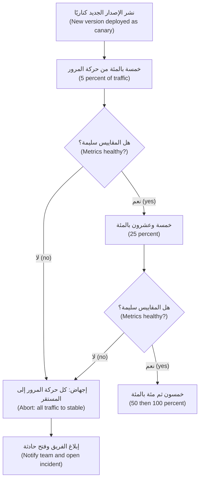

**اختيار ما يقيسه الكناري (Choosing what the canary measures).** استخدم الإشارات نفسها التي تستخدمها أهداف مستوى الخدمة (SLOs) لديك (الدرس 5.2): معدل الخطأ (error rate)، وزمن الاستجابة عند مئين مرتفع (latency at a high percentile) مثل p99، وإشارة أعمال (business signal) حيثما أمكن (للمدفوعات: نسبة التحويلات التي تبلغ حالة "مُسوّاة" (settled)). قارن الكناري بالمستقر *في الوقت نفسه (at the same time)*، لا بالأسبوع الماضي. واجعل الكناري كبيرًا بما يكفي (large enough): فعند 1% من خدمة هادئة (quiet service)، قد تحوي عشر دقائق طلبات أقل من أن يُحكم بها (too few requests to judge).

**أعلام الميزات (Feature flags).** **علم الميزة (feature flag)** (مفتاح تبديل الميزة، feature toggle) مفتاح وقت التشغيل (runtime switch) يغيّر السلوك دون نشر (without a deploy). ويسمّي تصنيف بيت هودجسون (Pete Hodgson's taxonomy) الواسع الاستشهاد أربعة أنواع:

| النوع (Kind) | الغرض (Purpose) | العمر (Lifetime) | مثال من نجم (Najm example) |
|---|---|---|---|
| **علم الإطلاق (Release flag)** | إخفاء الميزات غير المكتملة أو الجديدة حتى تجهز (until ready) | من أيام إلى أسابيع، ثم يُحذف (then delete) | شاشة تجميد البطاقة الجديدة (new card-freeze screen) |
| **علم العمليات / مفتاح الإيقاف (Ops flag / kill switch)** | إيقاف مسار مكلف أو خطِر (expensive or risky path) تحت الحمل (under load) أو أثناء حادثة (during an incident) | طويل العمر، وموثّق (long-lived, documented) | تعطيل رفع المستندات (document upload) في نجم أسيست (Najm Assist) إذا كانت بوابة النماذج (model gateway) تعاني |
| **علم التجربة (Experiment flag)** | اختبار A/B (A/B test) لنسختين (two variants) | طول مدة التجربة (length of the experiment) | مساران للتسجيل (two onboarding flows) |
| **علم الصلاحية (Permission flag)** | تفعيل ميزات لمستخدمين أو مستأجرين معيّنين (certain users or tenants) | طويل العمر (long-lived) | ميزات تجريبية (beta features) للموظفين فقط |

يعرّف **OpenFeature**، وهو مشروع ضمن CNCF (CNCF project)، واجهة برمجة محايدة تجاه الموردين (vendor-neutral API) لتقييم الأعلام (evaluating flags)، كي لا تعتمد شيفرة التطبيق على مورد أعلام واحد (one flag vendor). و*إدارة* الأعلام (flag *management*) (من يستطيع تغيير أيّ علم، وبأي موافقة (approval) وسجل تدقيق (audit trail)) لا تقل أهمية عن تقييمها (flag evaluation)، خصوصًا في بنك. ويقارن [*لبنات بناء البرمجيات كخدمة (SaaS Building Blocks)*، الدرس 6.3 — أعلام الميزات والتجارب (Feature flags and experiments)](../saas/index.ar.html#/6.3) خدمات الأعلام (flag services) بتعمّق.

**الأعلام شيفرة قصيرة العمر (Flags are code with a short life).** في عام 2012 نشرت شركة التداول الأمريكية نايت كابيتال (Knight Capital) شيفرة جديدة على ثمانية خوادم، لكن وفقًا لأمر هيئة الأوراق المالية والبورصات الأمريكية (SEC's order)، لم يتلقَّها أحد الخوادم. وأعاد الإطلاق استخدام علم قديم (reused an old flag)، فأيقظ على ذلك الخادم منطقًا متقاعدًا منذ زمن طويل (long-retired logic) أرسل ملايين الأوامر (millions of orders) في نحو 45 دقيقة. ويصف الأمر خسائر تزيد على 460 مليون دولار أمريكي. درسان (Two lessons): لا تُعِد استخدام اسم علم لمعنى جديد أبدًا (never reuse a flag name for a new meaning)، وتحقّق من أن كل نسخة (every instance) تشغّل الإصدار الذي تظن أنها تشغّله.

**قواعد البيانات: التوسيع والتقليص (Databases: expand and contract).** أثناء أي إطلاق متدرّج أو كناري أو أزرق وأخضر، يعمل الإصداران القديم والجديد *في الوقت نفسه (at the same time)* على قاعدة البيانات نفسها. فيجب أن يعمل أي تغيير في المخطط (schema change) مع كليهما. ونمط **التوسيع والتقليص (expand and contract)** (ويُسمّى أيضًا التغيير المتوازي، parallel change) يفعل ذلك على خطوات:
1. **التوسيع (Expand):** أضف العمود أو الجدول الجديد (new column or table)؛ فتتجاهله الشيفرة القديمة.
2. **الترحيل (Migrate):** انشر شيفرة تكتب في القديم والجديد معًا (writes both old and new)، واملأ الصفوف الموجودة بأثر رجعي (backfill existing rows)، ثم حوّل القراءات إلى العمود الجديد (switch reads to the new column).
3. **التقليص (Contract):** حين لا يعود أي إصدار عامل يقرأ العمود القديم، احذفه في إطلاق لاحق (in a later release).

لا تُعِد تسمية عمود أو تحذفه أبدًا (never rename or drop a column) في الإطلاق نفسه الذي توقفت فيه الشيفرة عن استخدامه. فهذه القاعدة الواحدة تجعل التراجع ممكنًا (makes rollback possible).

#### 🔴 نظرة الخبير (Expert view)

**الحلقات والمناطق (Rings and regions).** تُطلق المنصات الكبيرة على **حلقات (rings)** مع فترة مراقبة (soak time) بينها؛ وتصف التزامات CrowdStrike الفكرة نفسها. وحلقات نجم: الموظفون (staff)، ثم 5% من حركة مرور قطر، ثم قطر كلها، ثم الإمارات، ثم الاتحاد الأوروبي. وكل حلقة تحدّ من نطاق ضرر (blast radius) الخطأ التالي.

**التراجع الآلي عند استنزاف هدف مستوى الخدمة (Automatic rollback on SLO burn).** يلتقط التحليل أثناء الطرح (analysis during the rollout) الإخفاقات الواضحة (obvious failures). أما الدقيقة منها (subtle ones)، مثل خطأ العملة في المدفوعات عند 3% من حركة المرور، فتحتاج إلى مراقبة أطول (longer watch). فبعد اكتمال الإطلاق، قارن **معدل استنزاف ميزانية الأخطاء (error budget burn rate)** (الدرس 5.2) خلال الساعة أو الساعتين التاليتين بمعدل الإصدار السابق. والاستنزاف المستمر الذي يفوق المعتاد بكثير (sustained burn far above normal) ينبغي أن يُطلق تراجعًا آليًا (automatic rollback)، أو على الأقل نداءً (page) يسمّي الإطلاق.

**الدفعات الصغيرة تتفوق على التجميد (Small batches beat freezes).** تتفاعل منظمات كثيرة مع الإطلاقات السيئة بمجالس التغيير (change boards) وفترات تجميد طويلة (long freezes)؛ وقد وجدت أبحاث DORA أن الموافقة الخارجية الثقيلة (heavyweight external approval) تميل إلى إبطاء التسليم دون تحسين الاستقرار (without improving stability). وتحتفظ نجم بتجميد قصير (short freeze) حول فترات الذروة (peak periods) مثل يوم صرف الرواتب (salary day) والعيد (Eid)، لكن دفاعها الرئيسي هو الإطلاقات الصغيرة المتكررة المؤتمتة القابلة للمراقبة (small, frequent, automated, observable releases) مع مراجعة الأقران (peer review). وما زالت الجهات التنظيمية (regulators) تتوقع أدلة على ضبط التغيير (change-control evidence)؛ فقانون DORA الأوروبي (EU DORA)، على سبيل المثال، يشترط إدارة تغييرات تقنية المعلومات والاتصالات (ICT change management) ضمن إطار مخاطر تقنية المعلومات والاتصالات (ICT risk framework). وخط التسليم الذي يسجّل من وافق على ماذا، وأيّ كناري جرى، وماذا قاس، هو ذلك الدليل. ويغطي [*أمن الذكاء الاصطناعي وأمن التطبيقات (Secure AI & Application Security)*، الدرس 11.2 — التنظيم الذي يمسّ الأمن (Regulation that touches security)](../secai/index.ar.html#/11.2) قواعد القطاع المالي (financial-sector rules).

### 🧰 الأدوات (The toolkit)
| الأداة أو الممارسة أو الخدمة (Tool, practice or service) | ما هي وماذا تفعل (What it is and does) | متى تلجأ إليها (When to reach for it) |
|---|---|---|
| **Rolling update** — التحديث المتدرّج | استراتيجية Deployment في Kubernetes (Kubernetes Deployment strategy) تستبدل الحجيرات تدريجيًا (replaces pods gradually)، مشروطة بالجاهزية (gated by readiness) | الافتراضي للخدمات عديمة الحالة (stateless services) |
| **Blue-green deployment** — النشر الأزرق والأخضر | بيئتان كاملتان (two full environments)؛ تتحوّل حركة المرور دفعة واحدة، وتعود بالسرعة نفسها | الانتقالات السريعة النظيفة (fast clean cut-overs)؛ وحين تستطيع تحمّل ضعف السعة (double capacity) لفترة وجيزة |
| **Canary release** — الإطلاق الكناري | حصة صغيرة من حركة المرور إلى الإصدار الجديد، يُحكم عليها بالمقاييس (judged by metrics) قبل الزيادة | الخدمات عالية المخاطر (high-risk services) مثل المدفوعات؛ وأي شيء له مستخدمون كثيرون |
| **Argo Rollouts** (CNCF، جزء من مشروع Argo) | متحكم Kubernetes (Kubernetes controller) يضيف الكناري والأزرق والأخضر مع التحليل الآلي (automated analysis) | التسليم التدريجي (progressive delivery) مع Argo CD |
| **Flagger** (جزء من مشروع Flux) | مشغّل Kubernetes (Kubernetes operator) يؤتمت الكناري واختبارات A/B والأزرق والأخضر مع فحوص المقاييس (metric checks) | التسليم التدريجي (progressive delivery) مع Flux أو شبكة خدمات (service mesh) |
| **OpenFeature** (CNCF) | واجهة برمجة ومجموعات تطوير برمجيات محايدة تجاه الموردين (vendor-neutral API and SDKs) لتقييم أعلام الميزات | استخدام الأعلام دون ربط الشيفرة بمورد واحد (without locking code to one vendor) |
| **Feature flag** — علم الميزة | مفتاح وقت التشغيل (runtime switch) يغيّر السلوك دون نشر | فصل النشر عن الإطلاق (separating deploy from release)؛ ومفاتيح الإيقاف (kill switches) |
| **Expand and contract** — التوسيع والتقليص | تغييرات المخطط وواجهات البرمجة (schema and API changes) على خطوات متوافقة مع الإصدارات السابقة (backward-compatible steps) | أي تغيير في قاعدة بيانات أو واجهة برمجة يستخدمها أكثر من إصدار واحد |

### 🏛️ عمليًا في بنك نجم (In practice at Najm Bank)
ينشر سالم ومها **معيار الإطلاق في نجم، الإصدار 1 (Najm Release Standard v1)**: استراتيجية لكل فئة خدمات (strategy per service tier) وقائمة فحص للإطلاق (release checklist).

**الجزء أ: الاستراتيجية حسب الفئة (Part A: strategy by tier)**

| الفئة (Tier) | الخدمات (Services) | الاستراتيجية (Strategy) | التحليل الآلي (Automatic analysis) | هدف التراجع (Rollback target) |
|---|---|---|---|---|
| 1 | خدمة المدفوعات (Payments service)، وتسجيل الدخول (login) | كناري 5% ← 25% ← 50% ← 100%، عشر دقائق لكل خطوة (10 minutes per step)؛ وحلقات حسب الدولة (rings by country) | معدل النجاح (success rate) ≥ 99.5%، وزمن الاستجابة p99 (p99 latency) ضمن 20% من المستقر، ونسبة التحويلات المُسوّاة (settled-transfer ratio) | أقل من 5 دقائق، آلي (automatic) |
| 2 | واجهة برمجة تطبيق نجم للهاتف (Najm Mobile API)، وبوابة نجم أسيست (Najm Assist gateway) | كناري 10% ← 50% ← 100% | معدل الخطأ (error rate) وزمن الاستجابة p99 | أقل من 10 دقائق، آلي |
| 3 | الأدوات الداخلية (internal tools)، والمهام الدفعية (batch jobs) | تحديث متدرّج مع بوابات الجاهزية (rolling update with readiness gates) | سلامة الطرح فقط (rollout health only) | أقل من 30 دقيقة، يدوي (manual) |

العتبات (thresholds) هي خيارات نجم الخاصة، تُحدَّد انطلاقًا من هدف مستوى الخدمة (SLO) لكل خدمة (الدرس 5.2)، وتُراجَع بعد كل حادثة (incident).

**الجزء ب: قائمة فحص الإطلاق (الفئة 1) (Part B: release checklist (tier 1))**

| الفحص (Check) | الدليل (Evidence) |
|---|---|
| الصورة هي البصمة (digest) التي بناها التكامل المستمر واختبرها (الدرس 4.1) وهي موقّعة (signed) (الدرس 4.3) | رابط تشغيل خط التسليم (pipeline run link)؛ والتحقق من التوقيع عند القبول (signature verified at admission) |
| تغييرات المخطط (schema changes) في هذا الإطلاق توسيع فقط (expand-only) | ملف الترحيل (migration file) مُراجَع؛ ولا يوجد `DROP` أو `RENAME` |
| السلوك الجديد خلف علم إطلاق (release flag)، معطّل افتراضيًا (default off) | اسم العلم، والمالك، وتاريخ الإزالة (removal date) |
| لا يُعاد استخدام أي اسم علم (no flag name is reused) | فحص سجل الأعلام (flag registry check) |
| قالب تحليل الكناري (canary analysis template) يطابق هدف مستوى الخدمة الحالي للخدمة | إصدار القالب (template version) |
| التمرّن على التراجع في بيئة التجهيز (rollback rehearsed on staging) هذا الربع | التاريخ والنتيجة |
| ليس ضمن نافذة تجميد (freeze window)؛ والمناوبة (on-call) على علم | تقويم الإطلاقات (release calendar)؛ ورسالة في قناة الإطلاقات (release channel message) |

**الجزء ج: دليل تشغيل التراجع (GitOps) (Part C: rollback runbook (GitOps))**
1. إذا أُجهض التحليل (analysis has aborted)، فتأكد من أن حركة المرور 100% على الإصدار المستقر (stable). وإن لم تكن، فأجهض الطرح يدويًا (abort the rollout manually).
2. نفّذ `git revert` للإيداع في مستودع GitOps (GitOps repo) الذي غيّر بصمة الصورة (image digest)؛ فيطبّقه Argo CD.
3. إذا كان علمٌ متورطًا (a flag was involved)، فأوقفه أولًا؛ فذلك أسرع من أي تراجع.
4. انشر الإصدار والوقت والعَرَض والإجراء (version, time, symptom and action) في قناة الحادثة (incident channel)؛ وافتح مراجعة ما بعد الحادثة (postmortem) إذا تأثر العملاء (الدرس 5.3).

### 🛠️ التمارين (Exercises)
نفّذ هذه التمارين على عنقود kind أو k3d محلي (local kind or k3d cluster).

- 🟢 انشر تطبيق ويب صغيرًا (small web app) بوصفه Deployment بأربع نسخ متماثلة (4 replicas)، ومسبار جاهزية (readiness probe)، و`maxSurge: 1`، و`maxUnavailable: 0`، وانتظار `preStop` قصير كي تُصرَّف نقاط النهاية (endpoints drain) قبل توقف الحجيرات. حدّث الصورة وراقب `kubectl rollout status`. ثم تراجع باستخدام `kubectl rollout undo`. *يكتمل عندما (Done when):* تُظهر حلقةٌ من طلبات `curl` على الخدمة (Service) أثناء التحديث والتراجع كليهما عدم وجود أي طلب فاشل (no failed requests).
- 🟡 انشر إصدارًا لا يجتاز مسبار جاهزيته أبدًا (readiness probe never passes). لاحظ ما يفعله التحديث المتدرّج وما يبلّغ عنه `progressDeadlineSeconds`. ثم انشر إصدارًا يبدأ بشكل سليم لكنه يُعيد HTTP 500 على نقطة نهاية واحدة (one endpoint). *يكتمل عندما (Done when):* تستطيع أن تشرح في ثلاث جمل لماذا أُوقف الإصدار السيئ الأول ولم يُوقف الثاني، وما الذي كان سيوقف الثاني.
- 🔴 ثبّت Argo Rollouts وPrometheus في عنقودك. حوّل Deployment إلى Rollout مع كناري (10% ← 50% ← 100%) وقالب AnalysisTemplate على معدل النجاح (success rate). أطلق إصدارًا يُعيد أخطاء على 20% من الطلبات. *يكتمل عندما (Done when):* يُجهض الطرح من تلقاء نفسه (aborts by itself)، وتعود حركة المرور إلى المستقر، وتستطيع عرض تشغيل التحليل الفاشل (failed analysis run).

### ⚠️ أخطاء وفخاخ (Mistakes and traps)
- **معاملة الإعدادات والمحتوى على أنها ⁦("not a release")⁩ أي "ليست إطلاقًا" (Treating configuration and content as "not a release").** فدفعة إعدادات أو محتوى سيئة (bad config or content push) قد تكسر كل شيء دفعة واحدة. أطلقها على مراحل عبر الحلقات نفسها (same rings).
- **كناري دون تحليل حقيقي (Canary without real analysis).** إنسان يلقي نظرة على لوحة (dashboard) لدقيقتين ليس تحليلًا. عرّف المقاييس والعتبات والمدة في الشيفرة (in code).
- **كسر قاعدة البيانات في الإطلاق نفسه (Breaking the database in the same release).** حذف عمود أو إعادة تسميته مع تغيير الشيفرة يجعل التراجع مستحيلًا. وسّع، ثم رحّل، ثم قلّص في إطلاق لاحق (expand, migrate, then contract in a later release).
- **أعلام لا تُحذف أبدًا (Never-deleted flags).** تتراكم الأعلام القديمة في تركيبات غير مُختبرة (untested combinations)، والأسماء المعاد استخدامها قد توقظ شيفرة ميتة (wake up dead code)، كما حدث في نايت كابيتال (Knight Capital). امنح كل علم إطلاق مالكًا وتاريخ إزالة (owner and a removal date).
- **تراجع غير مُتمرَّن عليه (An unrehearsed rollback).** التراجع أثناء حادثة هو أسوأ وقت لاكتشاف أنه لا يعمل. تمرّن عليه في بيئة التجهيز (staging) كل ربع سنة.

### 🧾 الخلاصة (Recap)
- افصل النشر عن الإطلاق (separate deploy from release): تحويل حركة المرور (traffic shifting) يختار الإصدار؛ وأعلام الميزات (feature flags) تختار السلوك.
- توقف التحديثات المتدرّجة (rolling updates) الحجيرات التي لا تصبح جاهزة أبدًا؛ ويوقف الكناري مع التحليل الآلي (canaries with automated analysis) الإصدارات التي تعمل لكنها تتصرف بشكل سيئ (behave badly).
- اختر الاستراتيجية حسب فئة المخاطر (risk tier): الكناري للمدفوعات وتسجيل الدخول، والمتدرّج للأدوات الداخلية.
- يعمل الإصداران القديم والجديد معًا، لذا تتغير قواعد البيانات وواجهات البرمجة بالتوسيع والتقليص (expand and contract).
- يجب أن يكون التراجع سريعًا ومُتمرَّنًا عليه ومنفّذًا بطريقة GitOps (the GitOps way).

### ✍️ اختبر نفسك (Check yourself)

**1. إصدار جديد من المدفوعات يبدأ بشكل طبيعي ويجتاز مسبار جاهزيته (readiness probe)، لكنه يُفشل التحويلات بعملة واحدة، أي نحو 3% من حركة المرور. أيّ استراتيجية كانت على الأرجح ستحدّ من الأثر (limited the impact)؟**

- A. تحديث متدرّج (rolling update) بقيمة `maxSurge` أكبر
- B. نشر بإعادة الإنشاء (recreate deployment)، كي لا تختلط الإصدارات أبدًا
- C. كناري يُحكم عليه آليًا بمعدل النجاح (canary judged automatically on success rate)
- D. قيمة `progressDeadlineSeconds` أطول على Deployment

<details><summary>الإجابة</summary>

**C.** الحجيرات سليمة بمعيار المسبار (by the probe's standard)، فلا يلتقط العطل إلا مقارنة مقاييس على حركة مرور حقيقية (metric comparison on real traffic)، والكناري يحدّ ممّن يتعرّضون له (limits who is exposed). أما A وB وD فلا تستجيب إلا للحجيرات التي تفشل في الإقلاع أو في أن تصبح جاهزة. (🟡 التعمق أكثر، Going deeper).

</details>

**2. يريد يوسف إعادة تسمية عمود (rename a column) في قاعدة بيانات المدفوعات في الإطلاق نفسه الذي يحدّث الشيفرة لتستخدم الاسم الجديد. بماذا ينبغي أن تنصح مها؟**

- A. لا بأس، ما دام الأزرق والأخضر (blue-green) يحوّل كل حركة المرور دفعة واحدة
- B. أضف العمود الجديد واملأه بأثر رجعي (add and backfill)؛ واحذف القديم لاحقًا
- C. نفّذ ذلك ليلًا، خلال نافذة حركة مرور منخفضة (low-traffic window)
- D. اختبره أولًا بحركة مرور الظل (shadow traffic)، ثم أطلقه كالمعتاد

<details><summary>الإجابة</summary>

**B.** يُبقي التوسيع والتقليص (expand and contract) الإصدارين القديم والجديد يعملان معًا، فيبقى التراجع ممكنًا. أما الأزرق والأخضر (A) فما زال يشغّل الإصدارين على قاعدة بيانات واحدة، والتراجع سيصطدم بالعمود المعاد تسميته (renamed column). (🟡 التعمق أكثر، Going deeper).

</details>

**3. تنشر نجم باستخدام Argo CD، مع تفعيل المزامنة الآلية (automated sync) والإصلاح الذاتي (self-heal). أثناء حادثة، يشغّل مهندس `kubectl rollout undo`، وبعد عشر دقائق يعود الإصدار السيئ. لماذا؟**

- A. أعاد Argo CD مزامنة العنقود (re-synced the cluster) مع الإصدار المُعلن في Git
- B. إن `kubectl rollout undo` مؤقت وتنتهي صلاحيته بعد مدة محددة
- C. فشل مسبار الجاهزية للإصدار القديم، فمضى Kubernetes قدمًا (rolled forward)
- D. أعاد Horizontal Pod Autoscaler إنشاء الحجيرات من قالبه الخاص (its own template)

<details><summary>الإجابة</summary>

**A.** في GitOps، يكون Git مصدر الحقيقة (source of truth)، فتراجع باستخدام `git revert` لتغيير البصمة (digest change). أما الخيارات الأخرى فلا تعيد إصدارًا قديمًا من الصورة. (🟢 الأساسيات، The essentials).

</details>

**4. أيّ استخدام لحركة مرور الظل (shadow traffic) (المنسوخة مرآويًا، mirrored) آمن لخدمة المدفوعات؟**

- A. نسخ طلبات التحويل مرآويًا إلى الإصدار الجديد مع تفعيل التسوية الحقيقية (real settlement enabled)
- B. نسخ كل الطلبات مرآويًا وإعادة أيّ استجابة تصل أولًا (whichever response arrives first)
- C. استخدام حركة مرور الظل بدلًا من أي اختبارات مؤتمتة (automated tests)
- D. نسخ طلبات القراءة فقط (read-only requests) مرآويًا، أو الطلبات ذات الآثار الجانبية المستبدلة بأخرى وهمية (side effects stubbed out)

<details><summary>الإجابة</summary>

**D.** تُتجاهل استجابات الظل (shadow responses are discarded)، لذا يجب ألا يُحدث الإصدار الجديد آثارًا حقيقية (real effects). أما A فستنقل المال مرتين؛ وB ليست ظلًا (not shadowing)؛ وC تسيء استخدامه (misuses it). (🟢 الأساسيات، The essentials).

</details>

**5. بعد حادثة CrowdStrike في يوليو 2024، بأيّ ممارسة إطلاق (release practice) التزم المورد (vendor) لهذا النوع من تحديثات المحتوى (content update)؟**

- A. إيقاف تحديثات المحتوى وشحن إطلاقات المستشعر الكاملة (full sensor releases) فقط
- B. نشر مرحلي (staged deployment) عبر مجموعات كناري (canary groups)، مع تحكّم العملاء في التوقيت
- C. إطلاق تحديثات المحتوى مرة واحدة فقط كل ربع سنة، بعد تجميد (freeze)
- D. مطالبة كل عميل بتثبيت كل تحديث يدويًا (by hand)

<details><summary>الإجابة</summary>

**B.** تحدّ عمليات الطرح المرحلية (staged rollouts) من نطاق ضرر (blast radius) التحديث السيئ، وهي الفكرة نفسها التي تقوم عليها الحلقات (rings) والكناري. أما الخيارات الأخرى فليست ما وُصف، وستترك العملاء دون تحديثات الحماية (protection updates). (🧭 لماذا يهم، Why it matters، 🔴 نظرة الخبير، Expert view).

</details>

### 📚 المراجع (References)
- Kubernetes، كائنات Deployment والتحديثات المتدرّجة (Deployments and rolling updates) — https://kubernetes.io/docs/concepts/workloads/controllers/deployment/
- توثيق Argo Rollouts (Argo Rollouts documentation) — https://argo-rollouts.readthedocs.io/
- توثيق Flagger (Flagger documentation) — https://docs.flagger.app/
- OpenFeature — https://openfeature.dev/
- موقع مارتن فاولر، مفاتيح تبديل الميزات (Martin Fowler's site, Feature Toggles) (بيت هودجسون، Pete Hodgson) — https://martinfowler.com/articles/feature-toggles.html
- CrowdStrike، معلومات حادثة Channel File 291 وتحليل السبب الجذري (incident information and root cause analysis) — https://www.crowdstrike.com/
- هيئة الأوراق المالية والبورصات الأمريكية (US SEC)، الإجراء الإداري ضد Knight Capital Americas LLC (administrative proceeding) (2013) — https://www.sec.gov/
- كتاب Google SRE، فصل هندسة الإطلاق (chapter on release engineering) — https://sre.google/sre-book/release-engineering/
- أبحاث DORA (DORA research) — https://dora.dev/

<a id="l4-3"></a>

## 4.3 — تأمين خط التسليم (securing the pipeline): الأسرار والآثار البرمجية الموقّعة وعمليات النشر بأقل الصلاحيات

*المستوى: 🟡 متوسط* · *المتطلبات: 1.3، 3.2، 4.1* · *المرحلة (Phase): Build, Deploy*

### ⚡ الدرس في دقيقة (In 60 seconds)
- يستطيع خط التكامل والتسليم المستمرين (CI/CD pipeline) تغيير الإنتاج (production)، لذا فهو من أكثر الأنظمة التي تشغّلها امتيازًا (most privileged systems). والمهاجمون (attackers) يعرفون ذلك؛ فاحمِه كما تحمي الإنتاج (protect it like production).
- **لا مفاتيح سحابية طويلة العمر في التكامل المستمر (No long-lived cloud keys in CI).** استخدم **اتحاد هوية أعباء العمل عبر OIDC (OIDC workload identity federation)**: تحصل كل مهمة (job) على رمز قصير العمر (short-lived token)، ولا تثق به السحابة (cloud) إلا لمستودع أو فرع أو بيئة محددة (specific repository, branch or environment).
- **أقل الصلاحيات في كل مكان (Least privilege everywhere):** صلاحيات رمز افتراضية للقراءة فقط (read-only default token permissions)، وإجراءات الأطراف الثالثة (third-party actions) مثبّتة على معرّف إيداع كامل (full commit SHA)، وهوية منفصلة لكل مهمة (separate identity for each job)، وعمليات نشر إلى الإنتاج تحرسها بيئة محمية (protected environment).
- **وقّع ما تبنيه وتحقّق قبل أن تشغّل (Sign what you build and verify before you run):** وقّع الصور بالبصمة (sign images by digest)، وأرفق المصدرية (provenance) وقائمة مكوّنات البرمجيات (SBOM)، ودع العنقود (cluster) لا يقبل إلا الصور الموقّعة من سير عمل الإطلاق (release workflow) الخاص بك.
- فضّل **عمليات النشر القائمة على السحب (pull-based deploys)** (GitOps): فلا يحمل التكامل المستمر أبدًا بيانات اعتماد العنقود (cluster credentials)؛ بل يسحب متحكمٌ (controller) داخل العنقود التغييرات المعتمدة (approved changes).
- الفخ الأكبر (Biggest trap): معاملة خط التسليم على أنه ⁦("just tooling")⁩ أي "مجرد أدوات"، لا يملكه أحد ولا يدقّقه أحد (owned by nobody and audited by nobody).

### 🧭 لماذا يهم (Why it matters)
حادثتان علنيتان (two public incidents) تُظهران السبب. ففي أبريل 2021، كشفت Codecov أن مهاجمًا عدّل سكربت Bash Uploader (Bash Uploader script) الخاص بها، الذي كان كثير من العملاء يشغّلونه داخل خطوط التكامل المستمر (CI pipelines) لديهم. وأرسل السكربت المعدّل متغيرات البيئة (environment variables) لتلك المهام، التي كثيرًا ما تضمنت بيانات اعتماد (credentials) ورموزًا (tokens)، إلى خادم يتحكم فيه المهاجم. وفي مارس 2025، اختُرق إجراء GitHub (GitHub Action) الشائع `tj-actions/changed-files` (CVE-2025-30066): إذ وُجّهت أوسام إصداراته (version tags) إلى إيداع خبيث (malicious commit) طبع أسرار التكامل المستمر (CI secrets) في سجلات البناء (build logs)، حيث يستطيع أي شخص قراءتها في المستودعات العامة (public repositories). فالفرق التي أشارت إلى الإجراء بوسم (by a tag) شغّلت الشيفرة الخبيثة دون تغيير سطر واحد؛ أما الفرق التي ثبّتته على معرّف إيداع كامل (full commit SHA) فلم تفعل.

وفي نجم، يُعدّ يوسف خط تسليم لخدمة داخلية جديدة (new internal service). والنشر يحتاج إلى وصول سحابي (cloud access)، فينشئ مفتاح وصول سحابي (cloud access key) لمستخدم بصلاحيات المسؤول (administrator rights)، ويخزّنه سرًّا في المستودع (repository secret)، ويضيف إجراءً من طرف ثالث (third-party action) وجده على الإنترنت ⁦("makes deploys easier")⁩ أي "يجعل النشر أسهل". فيعمل من المحاولة الأولى. وتلاحظه نورة (رئيسة أمن التطبيقات والذكاء الاصطناعي، Head of Application & AI Security) في المراجعة: مفتاح واحد، لا تنتهي صلاحيته أبدًا (never expiring)، يمنح تحكمًا كاملًا بالحساب السحابي (full control of the cloud account)، ومتاح لكل سير عمل في المستودع، وقطعة من شيفرة مجهولة (unknown code) تستطيع قراءته.

يحوّل سالم المراجعة إلى مشروع: "بحلول نهاية الربع، لا يوجد أي مفتاح سحابي طويل العمر (long-lived cloud key) في أي خط تسليم في نجم، ويرفض العنقود (cluster refuses) أي صورة لم يوقّعها سير عمل الإطلاق (release workflow) لدينا".

### 📐 كيف يعمل (How it works)

#### 🟢 الأساسيات (The essentials)

**نمذجة التهديدات لخط التسليم (Threat-model the pipeline).** فكّر فيما يستطيع المهاجم فعله في كل خطوة من الإيداع (commit) إلى الإنتاج (production):

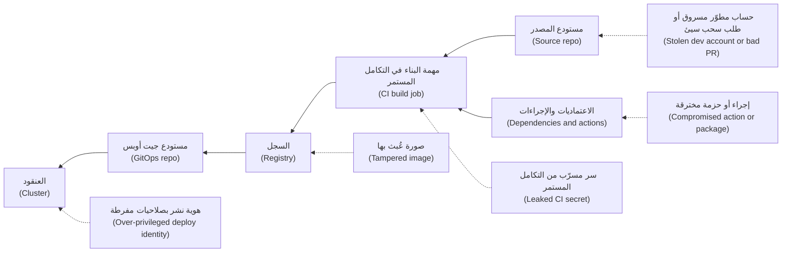

لكل سهم ضابط (control): حماية الفروع والمراجعة (branch protection and review) على المصدر؛ واعتماديات وإجراءات مثبّتة ومفحوصة (pinned, vetted dependencies and actions)؛ وبيانات اعتماد قصيرة العمر (short-lived credentials) للبناء؛ وتواقيع على الصورة (signatures on the image)؛ ومسار نشر ضيق (narrow deploy path) إلى العنقود. ويصف إطار SLSA (مستويات سلسلة التوريد للآثار البرمجية، Supply-chain Levels for Software Artifacts) هذه التهديدات بالتفصيل. ويغطي [*أمن الذكاء الاصطناعي وأمن التطبيقات (Secure AI & Application Security)*، الدرس 6.2 — سلسلة توريد البرمجيات (The software supply chain)](../secai/index.ar.html#/6.2) الاعتماديات وقوائم مكوّنات البرمجيات (SBOMs) وSLSA من الجانب الأمني (from the security side)؛ ويبقى هذا الدرس على كيفية بناء فريق المنصة لخط التسليم وتشغيله.

**الأسرار: كلما قلّت كان أفضل (Secrets: the fewer, the better).** أفضل سر هو السر غير الموجود (one that does not exist). وترتيب الأفضلية (order of preference):
1. **الهوية الاتحادية (Federated identity) (بلا سر، no secret).** تثبت مهمة التكامل المستمر هويتها برمز OIDC قصير العمر (short-lived OIDC token) تُصدره منصة التكامل المستمر (CI platform)؛ وتستبدله السحابة ببيانات اعتماد مؤقتة (temporary credentials) (الدرس 1.3).
2. **أسرار قصيرة العمر من مدير أسرار (short-lived secrets from a secrets manager)**، تُجلب وقت التشغيل (fetched at run time) بهوية اتحادية (federated identity).
3. **أسرار مخزّنة في التكامل المستمر (Stored CI secrets)**، فقط حيث لا يصلح شيء آخر، مقصورة على بيئة واحدة (scoped to one environment)، ومُدوَّرة وفق جدول (rotated on a schedule)، ولا تُطبع أبدًا (never printed).

**الاتحاد عبر OIDC من GitHub Actions (OIDC federation from GitHub Actions).** يطلب سير العمل رمز هوية (ID token)، ولا يثق دور السحابة (cloud role) إلا بالرموز التي تطابق مطالباتها (claims) الشروط. وهذه مهمة إطلاق (release job) تدفع الصورة:

```yaml
permissions:
  contents: read             # workflow default: read-only

jobs:
  push-image:
    runs-on: ubuntu-latest
    environment: production   # protected: required reviewers, main branch only
    permissions:
      contents: read
      id-token: write         # only this job may request an OIDC token
    steps:
      - uses: aws-actions/configure-aws-credentials@v4   # pin by SHA in real use
        with:
          role-to-assume: arn:aws:iam::111122223333:role/mobile-api-ci-push
          aws-region: me-central-1
```

وهذا شرط الثقة (trust condition) على جانب السحابة (يظهر هنا AWS IAM؛ وصيغة الموضوع (subject format) هي صيغة GitHub):

```json
"Condition": {
  "StringEquals": {
    "token.actions.githubusercontent.com:aud": "sts.amazonaws.com",
    "token.actions.githubusercontent.com:sub": "repo:najm-bank/mobile-api:environment:production"
  }
}
```

المهمة في مستودع آخر، أو المهمة التي لا تعمل في بيئة `production`، تحصل على رمز بموضوع مختلف (different subject)، فلا تستطيع تولّي الدور (assume the role). ولأن الموضوع يسمّي البيئة لا الفرع (names the environment, not the branch)، فاقصر تلك البيئة على `main` في إعدادات فروع النشر (deployment-branch settings) الخاصة بها. وتدعم السحب الكبرى الثلاث (three major clouds) الفكرة نفسها:

| السحابة (Cloud) | الميزة (Feature) | جانب التكامل المستمر (CI side) |
|---|---|---|
| AWS | مزوّد هوية OIDC في IAM (IAM OIDC identity provider) ودور بسياسة ثقة (role with a trust policy) | `aws-actions/configure-aws-credentials` |
| Microsoft Azure | اتحاد هوية أعباء العمل (workload identity federation): بيانات اعتماد اتحادية (federated credential) على تسجيل تطبيق (app registration) أو هوية مُدارة (managed identity) في Entra ID | `azure/login` |
| Google Cloud | اتحاد هوية أعباء العمل (Workload Identity Federation) مع مجمّع هويات أعباء العمل (workload identity pool) ومزوّد (provider) | `google-github-actions/auth` |

**رمز التكامل المستمر الخاص (The CI's own token).** يمنح GitHub كل سير عمل رمزًا `GITHUB_TOKEN`. اضبط `permissions: contents: read` في أعلى كل سير عمل، وامنح المزيد لكل مهمة على حدة فقط عند الحاجة (`packages: write` للدفع إلى سجل GitHub، و`id-token: write` لـOIDC). ويمكن لإعداد على مستوى المنظمة (organisation-level setting) أن يجعل القراءة فقط هي الافتراضي (read-only the default).

**إجراءات الأطراف الثالثة وإضافاتها تعمل بأسرارك (Third-party actions and plugins run with your secrets).** الوسم (tag) مثل `@v4` يمكن أن ينقله من يتحكم في مستودع الإجراء؛ أما معرّف الإيداع الكامل (full commit SHA) فلا.

```yaml
# Risky: the tag can be repointed to different code
- uses: some-org/deploy-helper@v2

# Hardened: an immutable commit, with the tag as a comment for humans
- uses: some-org/deploy-helper@<full-40-character-commit-sha>   # v2.3.1
```

استخدم روبوت اعتماديات (dependency bot) ليقترح تحديثات المعرّفات بوصفها طلبات سحب مُراجَعة (reviewed pull requests)، واحتفظ بقائمة سماح (allow-list) للإجراءات المعتمدة على مستوى المنظمة. وينطبق الأمر نفسه على إضافات Jenkins (Jenkins plugins)، وتضمينات GitLab CI (GitLab CI includes)، وصور الحاويات الأساسية (container base images).

**الشيفرة غير الموثوقة في طلبات السحب (Untrusted code in pull requests).** يحوي طلب السحب القادم من نسخة مشتقة (fork) شيفرة لم تراجعها. فلا تشغّلها أبدًا والأسرار متاحة (with secrets available). وعلى GitHub، يعمل المُطلِق `pull_request_target` في سياق المستودع الأساسي (context of the base repository)، مع وصول إلى أسراره؛ وسحب شيفرة طلب السحب وتشغيلها في ذلك السياق طريقة معروفة لتسريب الأسرار (well-known way to leak secrets). استخدم المُطلِق العادي `pull_request` للشيفرة غير الموثوقة (untrusted code).

#### 🟡 التعمق أكثر (Going deeper)

**توقيع الآثار البرمجية والتحقق منها (Signing and verifying artefacts).** يثبت التوقيع (signature) *مَن* أنتج الأثر البرمجي وأنه لم يتغير منذ ذلك الحين. و**Sigstore** مشروع مفتوح المصدر (open-source project) (تحت مظلة OpenSSF) تقوم أداته **cosign** بتوقيع صور الحاويات (container images). وفي التوقيع **بلا مفاتيح (keyless)**، تُربط هوية OIDC لمهمة التكامل المستمر بشهادة قصيرة العمر (short-lived certificate)، ويُسجَّل التوقيع في سجل شفافية عام (public transparency log) (Rekor)، فلا يوجد مفتاح توقيع طويل العمر (long-lived signing key) يمكن سرقته أو تدويره.

```bash
# In the release workflow, after pushing; the identity comes from the job's OIDC token
cosign sign --yes registry.najm.internal/mobile-api@sha256:<digest>

# Before deploy, or at admission: accept only Najm's release workflow on main
cosign verify \
  --certificate-identity "https://github.com/najm-bank/mobile-api/.github/workflows/release.yml@refs/heads/main" \
  --certificate-oidc-issuer "https://token.actions.githubusercontent.com" \
  registry.najm.internal/mobile-api@sha256:<digest>
```

وقّع **البصمة (digest)**، لا الوسم أبدًا. فالتوقيع على وسم لا يعني شيئًا بمجرد أن يتحرك الوسم (once the tag moves).

**المصدرية وقوائم مكوّنات البرمجيات (Provenance and SBOMs).** **المصدرية (Provenance)** بيان موقّع (signed statement) بكيفية بناء الأثر البرمجي: أيّ إيداع مصدري (source commit)، وأيّ سير عمل، وأيّ بانٍ (builder)، وأيّ مدخلات (inputs). ويعرّف **SLSA** مستويات بناء (build levels) (في SLSA v1.0، من Build L1 إلى L3) حسب مدى جدارة تلك المصدرية بالثقة؛ ففي المستوى L3 يعمل البناء على منصة مُحصّنة (hardened platform) لا تستطيع خطوات البناء نفسها العبث بها. و**قائمة مكوّنات البرمجيات (SBOM)** (software bill of materials) تسرد المكوّنات داخل الصورة، فتستطيع الإجابة عن سؤال ⁦("are we affected?")⁩ أي "هل نحن متأثرون؟" حين تظهر الثغرة الحرجة التالية (next critical vulnerability). ويستطيع إجراء البناء والدفع من Docker (Docker's build-push action) إرفاق المصدرية وقائمة المكوّنات بوصفهما شهادات (attestations)، ويقدّم GitHub شهادات الآثار البرمجية (artifact attestations)؛ وفي وقت كتابة هذا الدرس (2026)، راجع توثيق كل أداة للاطلاع على الخيارات الدقيقة.

**تحقّق عند الباب: ضبط القبول (Verify at the door: admission control).** يضيع التوقيع سدى إن لم يتحقق منه شيء. و**متحكم القبول (admission controller)** في Kubernetes يفحص كل حجيرة جديدة قبل إنشائها. ومحرّكات السياسات (policy engines) مثل **Kyverno** (قواعد التحقق من الصور، image verification rules) أو **policy-controller** من Sigstore تستطيع رفض أي صورة غير موقّعة من الهوية المتوقعة (expected identity)، أو تفتقر إلى المصدرية. واجمع ذلك مع حواجز السياسات بوصفها شيفرة (policy-as-code guardrails) من الدرس 3.3: الصور بالبصمة فقط، ومن السجل الداخلي (internal registry) فقط. وابدأ الطرح بوضع التدقيق (audit mode) أولًا، ثم الإنفاذ (enforce)، بدءًا بنطاق أسماء واحد (one namespace).

**عمليات النشر بأقل الصلاحيات: الدفع مقابل السحب (Least-privilege deploys: push versus pull).**

| النموذج (Model) | كيف يعمل (How it works) | أين تعيش بيانات اعتماد الإنتاج (Where production credentials live) | المخاطرة (Risk) |
|---|---|---|---|
| **الدفع (Push)** | تشغّل مهمة التكامل المستمر `kubectl apply` أو `helm upgrade` على العنقود | في التكامل المستمر، لكل خط تسليم ينشر (for every pipeline that deploys) | خط التسليم المخترق (compromised pipeline) يستطيع تغيير العنقود مباشرة |
| **السحب (Pull) (GitOps)** | يدفع التكامل المستمر صورة موقّعة ويفتح تغييرًا في مستودع GitOps؛ ويطبّقه متحكم داخل العنقود (Argo CD، Flux) | داخل العنقود فقط (inside the cluster only) | لا وصول للتكامل المستمر إلى العنقود (CI has no cluster access)؛ وتمر التغييرات عبر مراجعة Git (Git review) |

تستخدم نجم السحب (Najm uses pull). فهوية التكامل المستمر (CI identity) تستطيع دفع الصور إلى مستودع سجل واحد (one registry repository) وفتح طلبات سحب إلى مستودع GitOps. ولا تستطيع لمس العنقود أو موارد سحابية أخرى (other cloud resources). وصلاحيات Argo CD الخاصة مقصورة حسب المشروع (scoped by project) على نطاقات الأسماء (namespaces) التي يملكها كل فريق.

**قسّم الهويات حسب المهمة (Split identities by job).** هوية تكامل مستمر واحدة قوية لكل شيء نقطة فشل واحدة (single point of failure). امنح أدوارًا منفصلة لمهام منفصلة (separate roles to separate jobs): مهمة بناء (build job) تستطيع قراءة الاعتماديات والدفع إلى مسار سجل التجهيز (staging registry path)؛ ومهمة إطلاق (release job)، على `main` فقط وفي البيئة المحمية فقط، تستطيع الترقية والتوقيع (promote and sign)؛ ومهمة **تخطيط (plan)** للبنية التحتية بوصول للقراءة فقط (read-only access)؛ ومهمة **تطبيق (apply)** لا تعمل إلا بعد الموافقة (after approval) (الدرس 3.1).

#### 🔴 نظرة الخبير (Expert view)

**المشغّلات بنية تحتية إنتاجية (Runners are production infrastructure).** المشغّلات المستضافة (hosted runners) جديدة لكل مهمة. أما **المشغّلات المستضافة ذاتيًا (self-hosted runners)**، التي تحتاجها نجم للوصول إلى الشبكات الخاصة (private networks)، فليست كذلك، ما لم تجعلها كذلك. فالمشغّل الدائم (persistent runner) قد يحتفظ بملفات أو بيانات اعتماد أو برمجيات خبيثة (malware) من مهمة إلى التالية. استخدم **المشغّلات المؤقتة (ephemeral runners)** (مهمة واحدة، ثم تُدمَّر)، مثل حجيرات المشغّلات ذات التوسّع التلقائي على Kubernetes (autoscaled runner pods on Kubernetes)؛ ولا تربط المشغّلات المستضافة ذاتيًا بالمستودعات العامة أبدًا؛ وقيّد حركة الخروج الشبكية (network egress) لديها؛ وافصل مجموعات المشغّلات (runner groups) للإنتاج عن غير الإنتاج.

**الفصل بين المهام دون إبطاء (Separation of duties without slowing down).** يجب على البنوك أن تُثبت أن شخصًا واحدًا لا يستطيع وحده أن يكتب تغييرًا ويشحنه (write and ship a change on their own). وعمليًا: فروع محمية (protected branches) تشترط مراجعًا واحدًا على الأقل ليس هو المؤلف (not the author)؛ وملفات **CODEOWNERS** بحيث تحتاج تغييرات تعريفات خطوط التسليم (pipeline definitions) والبنية التحتية بوصفها شيفرة (IaC) ومستودع GitOps إلى موافقة فريق المنصة أو الأمن (platform or security approval)؛ وبيئات محمية (protected environments) تحتاج فيها الترقية إلى الإنتاج إلى مراجع؛ وإيداعات موقّعة (signed commits) حيث تبرّر المخاطرة الاحتكاك (friction). وعندها يصبح خط التسليم دليل ضبط التغيير (change-control evidence) الذي تطلبه الجهات التنظيمية (regulators)، بدلًا من تذكرة منفصلة (separate ticket).

**كسر الزجاج والتدقيق (Break-glass and audit).** أحيانًا يجب على البشر التصرف مباشرة على الإنتاج. فخطّط لذلك: دور **كسر الزجاج (break-glass)** يتطلب عاملًا ثانيًا قويًا (strong second factor)، ويرسل تنبيهًا إلى مركز العمليات الأمنية (SOC) (فريق جاسم، Jassim's team)، وتنتهي صلاحيته خلال ساعات (expires within hours)، ويُراجَع بعد ذلك. وأرسل سجلات تدقيق التكامل المستمر (CI audit logs) وسجلات تدقيق السحابة (cloud audit logs) وحالات الرفض من متحكم القبول (admission-controller denials) إلى منصة المراقبة الأمنية (security monitoring platform)، ونبّه على الأحداث غير المعتادة (unusual events) مثل مشغّل مستضاف ذاتيًا جديد، أو تغيير في حماية الفروع (branch protection)، أو نشر إلى الإنتاج خارج خط التسليم (outside the pipeline).

**الأسرار تتسرّب مع ذلك؛ فخطّط للتدوير (Secrets still leak; plan for rotation).** حتى مع الاتحاد (federation)، تبقى بعض الأسرار: كلمات مرور قواعد البيانات (database passwords)، ومفاتيح واجهات برمجة الأطراف الثالثة (third-party API keys) لمزوّدي النماذج (model providers) في نجم أسيست (Najm Assist). خزّنها في مدير أسرار (secrets manager) واحقنها وقت التشغيل (inject them at run time) (الدرس 2.3)، مع فحص الأسرار (secret scanning) عند كل دفع ودليل تشغيل للتدوير (rotation runbook) مُختبر مسبقًا. ويتعمّق [*أمن الذكاء الاصطناعي وأمن التطبيقات (Secure AI & Application Security)*، الدرس 5.2 — إدارة الأسرار (Secrets management)](../secai/index.ar.html#/5.2) أكثر، ويغطي [*أمن الذكاء الاصطناعي وأمن التطبيقات (Secure AI & Application Security)*، الدرس 7.2 — الحاويات وKubernetes والبنية التحتية بوصفها شيفرة (Containers, Kubernetes and infrastructure as code)](../secai/index.ar.html#/7.2) تحصين العناقيد (cluster hardening).

### 🧰 الأدوات (The toolkit)
| الأداة أو الممارسة أو الخدمة (Tool, practice or service) | ما هي وماذا تفعل (What it is and does) | متى تلجأ إليها (When to reach for it) |
|---|---|---|
| **OIDC workload identity federation** — اتحاد هوية أعباء العمل عبر OIDC | تستبدل مهام التكامل المستمر رمز هوية قصير العمر (short-lived identity token) ببيانات اعتماد سحابية مؤقتة (temporary cloud credentials)؛ دون مفاتيح مخزّنة (no stored keys) | كل خط تسليم يلمس حسابًا سحابيًا (cloud account) |
| **Protected environments** — البيئات المحمية | أهداف نشر (deployment targets) بمراجعين إلزاميين (required reviewers) وقيود على الفروع (branch restrictions) وأسرار خاصة بها | حراسة الترقية إلى الإنتاج (gating promotion to production) |
| **SHA pinning** — التثبيت بمعرّف الإيداع | الإشارة إلى إجراءات الأطراف الثالثة وإضافاتها وصورها بإيداع أو بصمة ثابتة (immutable commit or digest) | كل اعتمادية خارجية (external dependency) لخط التسليم |
| **cosign** (Sigstore) | يوقّع صور الحاويات ويتحقق منها، بما في ذلك التوقيع بلا مفاتيح عبر OIDC (keyless signing with OIDC) | توقيع صور الإطلاق (release images)؛ والتحقق قبل النشر |
| **SLSA** (OpenSSF) | إطار لتهديدات سلسلة التوريد (supply-chain threats) ومستويات البناء (build levels) الخاصة بالمصدرية | وضع أهداف لسلامة البناء (build integrity) |
| **SBOM** — قائمة مكوّنات البرمجيات | قائمة بالمكوّنات داخل الأثر البرمجي، بصيغة SPDX أو CycloneDX | الإجابة عن سؤال ⁦("are we affected?")⁩ أي "هل نحن متأثرون؟" للثغرات الجديدة (new vulnerabilities) |
| **Kyverno** (CNCF) | محرّك سياسات Kubernetes (Kubernetes policy engine)، بما في ذلك التحقق من توقيع الصور عند القبول (image signature verification at admission) | قبول الصور الموقّعة المعتمدة فقط (signed, approved images) |
| **Ephemeral runners** — المشغّلات المؤقتة | مشغّلات تكامل مستمر تُنشأ لمهمة واحدة ثم تُدمَّر (created for one job and then destroyed) | أي مشغّل مستضاف ذاتيًا، خصوصًا مع وصول شبكي إلى الإنتاج (network access to production) |

### 🏛️ عمليًا في بنك نجم (In practice at Najm Bank)
ينشر سالم ونورة **خط الأساس لأمن خطوط التسليم في نجم، الإصدار 1 (Najm Pipeline Security Baseline v1)**. ويُقيَّم كل مستودع مقابله على لوحة (dashboard)؛ ويجب أن تستوفيه خدمات الفئة 1 (tier-1 services) كاملًا بحلول نهاية الربع.

| # | الضابط (Control) | كيف يُنفَّذ (How it is enforced) | الدليل (Evidence) |
|---|---|---|---|
| P1 | لا مفاتيح سحابية طويلة العمر في التكامل المستمر (No long-lived cloud keys in CI) | الوصول السحابي فقط عبر أدوار OIDC (OIDC roles) مقصورة على المستودع والبيئة؛ وفحص مجدول (scheduled scan) لأسماء أسرار التكامل المستمر وأعمار المفاتيح السحابية (cloud key ages) | صفر مفاتيح وصول نشطة (zero active access keys) لمستخدمي التكامل المستمر |
| P2 | رمز افتراضي للقراءة فقط (Read-only default token) | إعداد على مستوى المنظمة (organisation setting)؛ وتعلن سير العمل الصلاحيات لكل مهمة (per-job permissions) | فحص سياسات (policy check) على كل ملف سير عمل |
| P3 | إجراءات الأطراف الثالثة مثبّتة على معرّف كامل (full SHA) من قائمة سماح (allow-list) | قائمة سماح على مستوى المنظمة؛ وفاحص ساكن (linter) لملفات سير العمل؛ وتحديثات بالروبوت (bot updates) | تقرير الفاحص الساكن (linter report) |
| P4 | لا أسرار لطلبات السحب غير الموثوقة (No secrets for untrusted PRs) | حظر `pull_request_target` إلا في القوالب المُراجَعة (reviewed templates) | تقرير الفاحص الساكن (linter report) |
| P5 | صور موقّعة بالبصمة مع المصدرية وقائمة المكوّنات (Images signed by digest with provenance and SBOM) | سير عمل الإطلاق للمسار الذهبي (golden-path release workflow) (الدرس 4.1) | التوقيع والشهادات (attestations) في السجل |
| P6 | لا يقبل العنقود إلا الصور الموقّعة من `release.yml` على `main` | سياسة Kyverno (Kyverno policy)، مُنفَّذة في نطاقات أسماء الإنتاج (production namespaces) | سجل رفض القبول (admission deny log) |
| P7 | عمليات نشر قائمة على السحب (Pull-based deploys) | لا يملك التكامل المستمر بيانات اعتماد العنقود (no cluster credentials)؛ ويطبّق Argo CD من مستودع GitOps | مراجعة ارتباطات أدوار العنقود (cluster role bindings review) |
| P8 | الفصل بين المهام (Separation of duties) | حماية الفروع (branch protection)، وCODEOWNERS على سير العمل والبنية التحتية بوصفها شيفرة ومستودع GitOps؛ وبيئة إنتاج محمية (protected production environment) | تصدير الإعدادات (settings export)، شهريًا |
| P9 | مشغّلات مؤقتة ومعزولة (Ephemeral, segregated runners) | مشغّلات مستضافة ذاتيًا بوصفها حجيرات لمهمة واحدة (one-job pods)؛ ومجموعات منفصلة للإنتاج | جرد المشغّلات (runner inventory) |
| P10 | وصول كسر الزجاج (Break-glass access) | دور محدود زمنيًا (time-limited role)، ومصادقة متعددة العوامل (MFA)، وتنبيه لمركز العمليات الأمنية (SOC alert)، ومراجعة بعد الاستخدام (post-use review) | سجل الوصول وسجل المراجعة (access log and review record) |

الإصلاح لخط تسليم يوسف (The fix for Yousef's pipeline): يُحذف مفتاح المسؤول (admin key)؛ ويتولى سير العمل دورًا لا يستطيع إلا الدفع إلى `registry.najm.internal/internal-tool/*`؛ ويُزال إجراء النشر من الطرف الثالث (third-party deploy action)، لأن إيداعًا في مستودع GitOps يحلّ محله.

### 🛠️ التمارين (Exercises)
استخدم حسابك الخاص على GitHub، وإن استخدمت سحابة، فحسابًا من الفئة المجانية (free-tier account) بعد ضبط تنبيه ميزانية (budget alert) أولًا.

- 🟢 دقّق سير العمل في أحد مستودعاتك (audit one of your own repositories' workflows): أضف `permissions: contents: read` في الأعلى، وامنح صلاحيات إضافية لكل مهمة فقط حيث تلزم، وثبّت كل إجراء من طرف ثالث على معرّف إيداع كامل (full commit SHA) مع الإصدار بوصفه تعليقًا (as a comment). *يكتمل عندما (Done when):* يشير كل سطر `uses:` إلى معرّف من 40 حرفًا (40-character SHA) ويعلن كل سير عمل صلاحياته.
- 🟡 ابنِ صورة في GitHub Actions، وادفعها إلى GitHub Container Registry، ووقّعها بتوقيع cosign بلا مفاتيح (cosign keyless signing) (تحتاج المهمة إلى `id-token: write`). ثم تحقّق منها محليًا باستخدام `cosign verify`، مستخدمًا هوية سير العمل والمُصدِر الدقيقين (exact workflow identity and issuer). *يكتمل عندما (Done when):* ينجح التحقق بالهوية الصحيحة، ويفشل حين تغيّر الهوية إلى فرع مختلف (different branch).
- 🔴 في عنقود kind محلي، ثبّت Kyverno واكتب سياسة لا تقبل الصور من سجلك إلا إذا كانت موقّعة بهوية سير عملك (workflow identity). ابدأ بوضع التدقيق (audit mode)، ثم الإنفاذ (enforce). جرّب تشغيل صورة غير موقّعة وأخرى موقّعة. أو بديلًا عن ذلك، اضبط اتحاد OIDC (OIDC federation) من GitHub Actions إلى حساب سحابي من الفئة المجانية مع شرط ثقة (trust condition) على مستودعك وبيئتك. *يكتمل عندما (Done when):* تُرفض الصورة غير الموقّعة برسالة سياسة واضحة (clear policy message) وتعمل الموقّعة؛ أو، في خيار السحابة، تحصل مهمة في البيئة المسمّاة على بيانات اعتماد وتُرفض مهمة على فرع آخر.

### ⚠️ أخطاء وفخاخ (Mistakes and traps)
- **مفاتيح مسؤول طويلة العمر في أسرار التكامل المستمر (Long-lived admin keys in CI secrets).** تسريب واحد يمنح تحكمًا سحابيًا كاملًا (full cloud control). استخدم اتحاد OIDC (OIDC federation) بأدوار ضيقة النطاق لكل مهمة (narrowly scoped roles per job).
- **الثقة بالأوسام (Trusting tags).** الأوسام على الإجراءات والإضافات والصور يمكن أن تتحرك. ثبّت بمعرّف الإيداع أو البصمة (pin by commit SHA or digest) وحدّث عبر طلبات سحب مُراجَعة من الروبوت (reviewed bot PRs).
- **التوقيع دون تحقق (Signing without verifying).** التواقيع التي لا يفحصها أحد زينة (decoration). أنفِذ التحقق عند القبول (enforce verification at admission)، بدءًا بوضع التدقيق.
- **تشغيل شيفرة النسخ المشتقة مع الأسرار (Running fork code with secrets).** إن `pull_request_target` مع سحب شيفرة طلب السحب يكشف الأسرار. أبقِ الشيفرة غير الموثوقة بعيدة عن السياقات ذات الامتيازات (privileged contexts).
- **المشغّلات المستضافة ذاتيًا الدائمة (Persistent self-hosted runners).** قد تترك المهام وراءها بيانات اعتماد أو برمجيات خبيثة للمهمة التالية. اجعل المشغّلات مؤقتة (ephemeral) واعزل الإنتاج (segregate production).
- **تكامل مستمر بصلاحيات مسؤول العنقود (CI with cluster-admin).** خط التسليم القائم على الدفع (push-based pipeline) الذي يحمل بيانات اعتماد العنقود طريق مباشر إلى الإنتاج. فضّل GitOps القائم على السحب (pull-based GitOps).

### 🧾 الخلاصة (Recap)
- خط التسليم نظام إنتاج ذو امتيازات (privileged production system)؛ فاعمل على نمذجة التهديدات (threat-model) لكل خطوة من الإيداع إلى العنقود.
- استبدل المفاتيح السحابية المخزّنة (stored cloud keys) باتحاد OIDC مقصور على المستودع والبيئة؛ واجعل كل الرموز للقراءة فقط افتراضيًا (default all tokens to read-only).
- ثبّت إجراءات الأطراف الثالثة والصور تثبيتًا ثابتًا (immutably)؛ ولا تكشف الأسرار أبدًا لطلبات السحب غير الموثوقة (untrusted pull requests).
- وقّع الصور بالبصمة، وأرفق المصدرية (provenance) وقائمة مكوّنات البرمجيات (SBOM)، ولا تقبل إلا الصور المُتحقَّق منها (verified images).
- انشر بالسحب عبر GitOps (deploy by pull through GitOps)، وقسّم الهويات حسب المهمة، واستخدم المشغّلات المؤقتة، واحتفظ بوصول كسر زجاج مُدقَّق (audited break-glass access).

### ✍️ اختبر نفسك (Check yourself)

**1. يخزّن سير عمل يوسف مفتاح مسؤول سحابي لا تنتهي صلاحيته أبدًا (never-expiring cloud admin key) بوصفه سرًّا في المستودع (repository secret). ما الذي ينبغي أن يحلّ محله؟**

- A. مفتاح المسؤول نفسه، مع تدويره آليًا (rotated automatically) كل 90 يومًا
- B. مفتاح لمستخدم أقل امتيازًا (less privileged user)، مخزّن في مستودع مختلف
- C. المفتاح مرمَّزًا بـbase64 (base64-encoded) في ملف سير العمل، كي لا يكون نصًّا صريحًا (plain text)
- D. اتحاد OIDC (OIDC federation)، مع دور لا يثق إلا بهذا المستودع وهذه البيئة

<details><summary>الإجابة</summary>

**D.** يزيل الاتحاد (federation) السر طويل العمر كليًا ويربط الوصول بمستودع وبيئة محددين. أما A وB فما زالتا تتركان مفتاحًا قابلًا للسرقة (stealable key)؛ وC ليست تشفيرًا (encryption) على الإطلاق. (🟢 الأساسيات، The essentials).

</details>

**2. في مارس 2025، شغّلت الفرق التي أشارت إلى `tj-actions/changed-files` بوسم إصدار (version tag) شيفرة خبيثة. أيّ ممارسة حمت الفرق التي لم تتأثر؟**

- A. تثبيت الإجراء على معرّف إيداع كامل (pinning the action to a full commit SHA)
- B. استخدام أحدث وسم إصدار للإجراء دائمًا (newest version tag)
- C. تشغيل سير العمل على مشغّل مستضاف ذاتيًا (self-hosted runner)
- D. ضبط مهلة زمنية قصيرة (short timeout) لكل مهمة

<details><summary>الإجابة</summary>

**A.** نقل المهاجم الأوسام (moved the tags)؛ أما معرّف الإيداع المثبّت (pinned commit SHA) فلا يمكن نقله. وB تتبع الوسم المنقول؛ وC وD لا تغيّران الشيفرة التي تعمل. (🧭 لماذا يهم، Why it matters، 🟢 الأساسيات، The essentials).

</details>

**3. توقّع نجم كل صورة، لكنها تجد صورة غير موقّعة (unsigned image) تعمل في الإنتاج. ما الذي ينقص؟**

- A. شهادات توقيع أطول عمرًا (longer-lived signing certificates)، كي تبقى التواقيع صالحة
- B. فحوص القبول (admission checks) مقابل هوية سير عمل الإطلاق (release workflow's identity)
- C. التوقيع بالوسم بدلًا من البصمة، كي تشمل التحديثات
- D. قائمة مكوّنات برمجيات (SBOM) أكثر تفصيلًا مرفقة بكل صورة

<details><summary>الإجابة</summary>

**B.** لا يحميك التوقيع إلا إذا كان هناك شيء، مثل سياسة Kyverno (Kyverno policy)، يرفض الصور غير الموقّعة أو الموقّعة خطأً (wrongly signed). أما C فستُضعف التوقيع، لأن الأوسام يمكن أن تتحرك؛ وA وD لا توقفان صورة غير موقّعة. (🟡 التعمق أكثر، Going deeper).

</details>

**4. لماذا تفضّل نجم عمليات نشر GitOps القائمة على السحب (pull-based GitOps deploys) على مهام التكامل المستمر التي تشغّل `kubectl apply`؟**

- A. عمليات النشر القائمة على السحب تصل إلى الإنتاج دائمًا أسرع من مهام التكامل المستمر
- B. لا يستطيع `kubectl apply` تحديث Deployment موجود
- C. لا يحمل التكامل المستمر بيانات اعتماد العنقود (cluster credentials)؛ ولا يصل إليه إلا تغييرات Git المُراجَعة (reviewed Git changes)
- D. يتيح GitOps للفرق تخطي مراجعة الشيفرة (skip code review) على تغييرات النشر

<details><summary>الإجابة</summary>

**C.** لا يستطيع خط التسليم المخترق (compromised pipeline) تغيير العنقود مباشرة، وتصبح مراجعة Git سجل التغيير (change record). أما D فعكس الحقيقة؛ وA وB خاطئتان. (🟡 التعمق أكثر، Going deeper).

</details>

**5. تحتاج نجم إلى مشغّلات مستضافة ذاتيًا (self-hosted runners) تستطيع الوصول إلى الشبكات الخاصة. أيّ إعداد هو الأكثر أمانًا (safest)؟**

- A. مشغّلات مؤقتة لمهمة واحدة (ephemeral one-job runners)، معزولة حسب البيئة، وبعيدة عن المستودعات العامة
- B. مشغّل واحد طويل العمر تتشاركه كل المستودعات، من أجل السرعة
- C. مشغّلات مستضافة ذاتيًا مربوطة بمستودعات عامة كي يتمكن المجتمع (community) من الاختبار
- D. مشغّل دائم (persistent runner) ببيانات اعتماد مسؤول العنقود (cluster-admin credentials) مخزّنة مؤقتًا على القرص

<details><summary>الإجابة</summary>

**A.** تمنع المشغّلات المؤقتة المعزولة (ephemeral, segregated runners) أي مهمة من ترك بيانات اعتماد أو برمجيات خبيثة للمهمة التالية. أما B وC وD فكلٌّ منها يمنح المهاجم موطئ قدم دائمًا (lasting foothold). (🔴 نظرة الخبير، Expert view).

</details>

### 📚 المراجع (References)
- GitHub، التحصين الأمني باستخدام OpenID Connect (security hardening with OpenID Connect) — https://docs.github.com/en/actions/security-for-github-actions/security-hardening-your-deployments/about-security-hardening-with-openid-connect
- GitHub، التحصين الأمني لـGitHub Actions (security hardening for GitHub Actions) — https://docs.github.com/en/actions/security-for-github-actions/security-guides/security-hardening-for-github-actions
- GitHub، إدارة بيئات النشر (managing environments for deployment) — https://docs.github.com/en/actions/managing-workflow-runs-and-deployments/managing-deployments/managing-environments-for-deployment
- AWS IAM، مزوّدو هوية OIDC (OIDC identity providers) — https://docs.aws.amazon.com/IAM/latest/UserGuide/id_roles_providers_create_oidc.html
- Microsoft Entra، اتحاد هوية أعباء العمل (workload identity federation) — https://learn.microsoft.com/en-us/entra/workload-id/workload-identity-federation
- Google Cloud، اتحاد هوية أعباء العمل (Workload Identity Federation) — https://cloud.google.com/iam/docs/workload-identity-federation
- توثيق Sigstore (Sigstore documentation) (cosign، Rekor) — https://docs.sigstore.dev/
- مواصفة SLSA (SLSA specification) — https://slsa.dev/
- Kyverno، التحقق من الصور (verify images) — https://kyverno.io/docs/
- توثيق Argo CD (Argo CD documentation) — https://argo-cd.readthedocs.io/
- NVD، الثغرة CVE-2025-30066 (tj-actions/changed-files) — https://nvd.nist.gov/vuln/detail/CVE-2025-30066
- Codecov، تحديث أمني لـBash Uploader (Bash Uploader security update) (أبريل 2021) — https://about.codecov.io/security-update/

---

<a id="m5"></a>

# الوحدة 5 — قابلية المراقبة والموثوقية (Observability and reliability)

*إطلاق خدمةٍ (Shipping a service) هو بداية حياتها لا نهايتها (the start of its life, not the end). وبعد ذلك يحسم سؤالان ما إذا كان العملاء سيثقون بها (whether customers trust it): هل تستطيع أن ترى ما تفعله (can you see what it is doing)، وهل تعرف مقدار الموثوقية التي تحتاجها (how reliable it needs to be)؟ تجيب هذه الوحدة عن السؤالين كليهما. فهي تبدأ بالقياس عن بُعد (telemetry): السجلات (logs) والمقاييس (metrics) والتتبّعات (traces) التي تُصدرها الخدمة (a service emits)، وOpenTelemetry، المعيار المفتوح (the open standard) الذي يتيح لك جمعها مرةً واحدة وإرسالها إلى أي مكان (collect them once and send them anywhere). ثم تحوّل هذا القياس عن بُعد إلى قرارات موثوقية (reliability decisions) بأهداف مستوى الخدمة (service level objectives, SLOs)، وميزانيات الأخطاء (error budgets)، وتنبيهاتٍ لا تنطلق إلا حين يتألم المستخدمون (alerts that fire only when users are hurting)، وجدول مناوبة (on-call rota) يستطيع الناس التعايش معه (people can live with). وتنتهي بالحوادث (incidents): كيف تديرها بهدوء (how to run one calmly)، وكيف تكتب مراجعة ما بعد الحادثة الخالية من اللوم (blameless postmortem) التي تجعل الحادثة التالية أقل احتمالًا (makes the next one less likely). ستتابع فريق هندسة المنصات وهندسة موثوقية المواقع (Platform Engineering & SRE team) في بنك نجم (Najm Bank) بينما يطارد يوسف شكوى تحويلٍ بطيء (slow-transfer complaint) عبر ثلاثة أنظمة (across three systems) دون شيءٍ سوى ملفات سجلاتٍ متناثرة (scattered log files)، وتستبدل مها 140 تنبيهًا مزعجًا (140 noisy alerts) بأربعةٍ مهمة (four that matter)، ويدير الفريق حادثة مدفوعات (payments incident) سببها تغيير إعدادات من سطرٍ واحد (one-line configuration change)، ثم يتعلّم منها.*

> **المراحل (Phases):** Operate, Monitor — رؤية ما يفعله الإنتاج حقًّا (seeing what production is really doing)، وتقرير مقدار الموثوقية المطلوبة منه (deciding how reliable it must be)، والاستجابة جيدًا حين لا يكون كذلك (responding well when it is not).

<a id="l5-1"></a>

## 5.1 — القياس عن بُعد: السجلات والمقاييس والتتبّعات وOpenTelemetry (Telemetry: logs, metrics, traces and OpenTelemetry)

*المستوى: 🟡 متوسط* · *المتطلبات: 2.2، 4.1* · *المرحلة (Phase): Monitor*

### ⚡ الدرس في دقيقة (In 60 seconds)
- **القياس عن بُعد (Telemetry)** هو البيانات التي يُصدرها نظامٌ عاملٌ عن نفسه (the data a running system emits about itself). والإشارات الرئيسية الثلاث (three main signals) هي **السجلات (logs)**، أي الأحداث مع التفاصيل (events, with detail)، و**المقاييس (metrics)**، أي أرقامٌ عبر الزمن (numbers over time) رخيصة الحفظ والتنبيه عليها (cheap to keep and alert on)، و**التتبّعات (traces)**، أي مسار طلبٍ واحد عبر الخدمات (the path of one request across services). أمّا **الملفات التعريفية للأداء (Profiles)**، أي أين يذهب المعالج والذاكرة داخل الشيفرة (where CPU and memory go inside the code)، فهي إشارةٌ رابعة ما زالت تنضج (a fourth signal that is still maturing).
- **قابلية المراقبة (Observability)** هي القدرة على الإجابة عن أسئلةٍ جديدة حول الإنتاج (answer new questions about production) من ذلك القياس عن بُعد، دون إطلاق شيفرةٍ جديدة لمعرفة الجواب (without shipping new code to find out).
- **OpenTelemetry** (OTel) هو المعيار المفتوح المحايد تجاه المورّدين (open, vendor-neutral standard) لإنتاج القياس عن بُعد ونقله (producing and moving telemetry). جهّز القياس مرةً واحدة (Instrument once) باستخدام OTel، ثم أرسل البيانات إلى أي واجهة خلفية تختارها (whichever back end you choose): Prometheus أو Grafana أو خدمة المراقبة لدى مزوّد سحابي (a cloud provider's monitoring service) أو أداةٍ تجارية (a commercial tool).
- القاعدة الأهم (The rule that matters most): كل إشارة تحمل **السياق (context)** نفسه، أي الخدمة والبيئة والإصدار ومعرّف التتبّع (service, environment, version, trace ID)، حتى تستطيع الانتقال من تنبيهٍ إلى تتبّعٍ إلى سطر السجل (jump from an alert to a trace to the log line).
- مؤشر القرار (Decision cue): المقاييس تخبرك *بأنّ* شيئًا ما خاطئ (*that* something is wrong)، والتتبّعات تخبرك *أين* (*where*)، والسجلات تخبرك *لماذا* (*why*).
- أكبر فخ (Biggest trap): الوسوم عالية التعدّدية (high-cardinality labels)، مثل معرّف العميل ورقم الحساب (customer ID, account number)، على المقاييس. فهي تضاعف السلاسل الزمنية (multiply time series) حتى يصبح نظام المراقبة بطيئًا أو مكلفًا أو ينهار (slow, expensive or falls over).

### 🧭 لماذا يهم (Why it matters)
في عصر يوم خميس (On a Thursday afternoon)، يحيل مركز الاتصال (contact centre) شكوى إلى هندسة المنصات (Platform Engineering): التحويلات في تطبيق نجم للهاتف (Najm Mobile app) «تدور طويلًا» ("spin for ages") قبل أن تنجح. يفتح يوسف لوحة المتابعة (dashboard): المعالج (CPU) سليم، ومتوسط زمن الاستجابة (average response time) لواجهة برمجة تطبيق نجم للهاتف (Najm Mobile API) هو 180 مللي ثانية. ثم يقضي ساعتين في قراءة ملفات السجلات (log files) من حجيرات الواجهة (API pods) وخدمة المدفوعات (Payments service) ومحوّل الأنظمة المصرفية الأساسية (core banking adapter) في مركز البيانات (data centre). كلٌّ منها يسجّل بصيغةٍ مختلفة (a different format)، دون معرّف طلبٍ مشترك (common request ID)، فلا يستطيع أن يعرف أيّ سطرٍ بطيء ينتمي إلى أيّ تحويل (which slow line belongs to which transfer).

يجلس سالم معه. يقول: «المتوسط يُخفي الذيل ⁦(The average hides the tail.)⁩ إذا استغرق تحويلٌ واحد من كل مئة ثماني ثوانٍ (one transfer in a hundred takes eight seconds)، فسيبدو المتوسط سليمًا مع ذلك (the average still looks healthy). ولا تستطيع تتبّع طلبٍ واحد عبر ثلاثة أنظمة (follow one request across three systems) لأن لا شيء يربطها معًا (nothing ties them together)». والحل هو تجهيز المسار بالقياس (instrument the path) بحيث يحمل كل طلبٍ معرّف تتبّع (trace ID) من الواجهة، مرورًا بالمدفوعات (through Payments)، عبر الرابط الهجين (across the hybrid link) إلى الأنظمة المصرفية الأساسية (core banking)، وتسجيل زمن الاستجابة (latency) بوصفه توزيعًا لا متوسطًا (as a distribution, not an average).

بعد يومين من تجهيز الفريق للمسار بالقياس، يُظهر تتبّعٌ الجوابَ في صورةٍ واحدة (in one picture): 7.4 ثانية من تحويلٍ بطيء تُقضى في انتظار اتصالٍ بقاعدة البيانات (waiting for a database connection) داخل المدفوعات، والأنظمة المصرفية الأساسية سريعة. ولولا القياس عن بُعد (Without telemetry)، لألقى الفريق اللوم على مركز البيانات (blamed the data centre). ولا يمكنك أن تضع هدف موثوقية (set a reliability target) أو تنبّه عليه (alert on it) أو تدير حادثةً (run an incident) ببياناتٍ لا تملكها (on data you do not have).

### 📐 كيف يعمل (How it works)
#### 🟢 الأساسيات (The essentials)
**المراقبة مقابل قابلية المراقبة (Monitoring vs observability).** **المراقبة (Monitoring)** تترقّب الأعطال التي توقّعتها (watches for failures you predicted): «نبّه إذا تجاوز معدل الأخطاء 1%» ("alert if the error rate goes above 1%"). أمّا **قابلية المراقبة (Observability)** فتتيح لك التحقيق في أعطالٍ لم تتوقّعها (investigate failures you did not predict): «لماذا يرى مستخدمو Android على أحدث إصدارٍ من التطبيق وحدهم تحويلاتٍ بطيئة منذ 14:05؟» ⁦("why are only Android users on the newest app version seeing slow transfers since 14:05?")⁩ تحتاج إلى الاثنين (You need both).

**الإشارات الثلاث (The three signals).**

| الإشارة (Signal) | ما هي (What it is) | نقطة القوة (Strength) | نقطة الضعف (Weakness) | مثال من نجم (Najm example) |
|---|---|---|---|---|
| **السجلات (Logs)** | سجلاتٌ مختومة بالوقت لأحداثٍ منفصلة (Timestamped records of discrete events)، ويُفضَّل أن تكون مُهيكلة (ideally structured)، أي أزواج مفتاح وقيمة بصيغة JSON (JSON key-value pairs) | تفاصيل غنية (Rich detail)؛ «لماذا» (the "why") | مكلفة عند الحجم الكبير (Expensive at volume)؛ يصعب تجميعها (hard to aggregate) | `transfer rejected: insufficient funds` |
| **المقاييس (Metrics)** | قياساتٌ رقمية مجمّعة عبر الزمن (Numeric measurements aggregated over time): العدّادات (counters) والمقاييس اللحظية (gauges) والمدرّجات التكرارية (histograms) | رخيصة (Cheap)؛ سريعة الاستعلام (fast to query)؛ أساس التنبيهات ولوحات المتابعة (the basis of alerts and dashboards) | لا تفاصيل لكل طلب (No per-request detail) | الطلبات في الثانية (Requests per second)، ومعدل الأخطاء (error rate)، وتوزيع زمن الاستجابة (latency distribution) |
| **التتبّعات (Traces)** | رحلة طلبٍ واحد (The journey of one request)، مكوّنة من **امتدادات (spans)**، أي عملياتٍ مؤقّتة (timed operations)، يربطها معرّف تتبّعٍ مشترك (shared trace ID) | تُظهر أين يذهب الوقت عبر الخدمات (Shows where time goes across services) | تُؤخذ منها عيّنات عادةً (Usually sampled)؛ تحتاج إلى تجهيزٍ بالقياس في كل قفزة (needs instrumentation in every hop) | الواجهة ← المدفوعات ← محوّل الأنظمة المصرفية الأساسية، مع التوقيتات (API → Payments → core banking adapter, with timings) |

**السجلات المُهيكلة (Structured logs).** ينبغي أن يكون سطر السجل (log line) سجلًّا تقرؤه الآلة (machine-readable record)، لا جملةً (not a sentence). قارن:

```text
# Risky: free text, no context, personal data
2026-03-12 14:05:11 Transfer failed for Ahmed Al-Kuwari acct 1234567890 after timeout
```

```json
{"ts":"2026-03-12T14:05:11.482Z","level":"error","service.name":"payments",
 "deployment.environment":"prod","service.version":"2.14.0",
 "event":"transfer.failed","reason":"db_pool_timeout","duration_ms":8012,
 "trace_id":"4bf92f3577b34da6a3ce929d0e0e4736","span_id":"00f067aa0ba902b7"}
```

يمكن عدّ النسخة المحصّنة (The hardened version can be counted)، وهي تحمل معرّف التتبّع (trace ID) ولا تحتوي على اسمٍ أو رقم حساب (no name or account number). أمّا ما يجب ألّا يدخل السجلات أبدًا (What must never go into logs) فيُغطّى في [*أمن الذكاء الاصطناعي وأمن التطبيقات (Secure AI & Application Security)*، الدرس 5.3 — حماية البيانات الشخصية: تقليل البيانات والتسجيل وهندسة الخصوصية (Protecting personal data: minimisation, logging and privacy engineering)](../secai/index.ar.html#/5.3).

**أنواع المقاييس (Metric types).** **العدّاد (counter)** لا يزداد إلا صعودًا (only goes up)، مثل إجمالي الطلبات وإجمالي الأخطاء (total requests, total errors)؛ وتنظر إلى معدل تغيّره (rate of change). و**المقياس اللحظي (gauge)** يصعد وينزل (goes up and down)، مثل عمق الطابور والذاكرة المستخدمة والاتصالات المفتوحة (queue depth, memory in use, open connections). و**المدرّج التكراري (histogram)** يعدّ المشاهدات في دلاء (counts observations into buckets)، أي كم طلبًا استغرق أقل من 100 مللي ثانية، وأقل من 250 مللي ثانية، وأقل من ثانية، وهكذا (how many requests took under 100 ms, under 250 ms, under 1 s and so on)، ما يتيح لك حساب المئينات لاحقًا (calculate percentiles later).

**المئينات لا المتوسطات (Percentiles, not averages).** زمن الاستجابة عند **المئين 99 (p99)** هو القيمة التي يكون 99% من الطلبات أسرع منها (the value that 99% of requests are faster than). فإذا كان الوسيط (median) 150 مللي ثانية والمئين 99 (p99) ست ثوانٍ، فإن طلبًا واحدًا من كل مئة بطيءٌ إلى حدٍّ مؤلم (painfully slow). المتوسطات تُخفي بالضبط المستخدمين الذين يشتكون (hide exactly the users who complain)، لذا سجّل زمن الاستجابة بوصفه مدرّجاتٍ تكرارية (record latency as histograms) وراقب p50 وp95 وp99.

**ماذا تقيس أولًا (What to measure first).** ثلاث قوائم تحقّق معروفة (Three well-known checklists):
- **الإشارات الذهبية الأربع (The four golden signals)**، من كتاب Google *هندسة موثوقية المواقع (Site Reliability Engineering)*: زمن الاستجابة (latency) وحجم الحركة (traffic) والأخطاء (errors) والتشبّع (saturation)، أي مدى «امتلاء» الخدمة (how "full" the service is).
- **RED** للخدمات المدفوعة بالطلبات (request-driven services): **R**ate، أي المعدل أو الطلبات في الثانية (requests per second)، و**E**rrors، أي الأخطاء أو الطلبات الفاشلة في الثانية (failed requests per second)، و**D**uration، أي المدة أو توزيع زمن الاستجابة (latency distribution). استخدمها لواجهة برمجة تطبيق نجم للهاتف (Najm Mobile API) وللمدفوعات (Payments).
- **USE** للموارد (for resources): **U**tilisation، أي الاستخدام، و**S**aturation، أي التشبّع، و**E**rrors، أي الأخطاء، لكل معالج أو قرص أو رابط شبكي أو مجمّع اتصالات (each CPU, disk, network link or connection pool). استخدمها للعُقد (nodes) وقواعد البيانات (databases) والرابط الهجين إلى مركز البيانات (the hybrid link to the data centre).

#### 🟡 التعمق أكثر (Going deeper)
**OpenTelemetry في فقرةٍ واحدة (OpenTelemetry in one paragraph).** OpenTelemetry مشروعٌ تابع لـ CNCF (a CNCF project)، تكوّن عام 2019 بدمج مشروعين سابقين (by merging two earlier projects)، هما OpenTracing وOpenCensus. وهو يوفّر: **واجهة برمجة وحزم تطوير (API and SDKs)** للغاتٍ كثيرة (for many languages)، لإنشاء الامتدادات والمقاييس والسجلات في شيفرتك (create spans, metrics and logs in your code)؛ و**التجهيز التلقائي بالقياس دون شيفرة (automatic (zero-code) instrumentation)** للأطر والمكتبات الشائعة (common frameworks and libraries)، بحيث تُصدر خوادم HTTP وعملاء HTTP ومشغّلات قواعد البيانات (HTTP servers, HTTP clients and database drivers) امتداداتٍ دون تغيير الشيفرة (without code changes)؛ و**OTLP**، أي بروتوكول OpenTelemetry (OpenTelemetry Protocol) لإرسال القياس عن بُعد؛ و**الاصطلاحات الدلالية (semantic conventions)**، أي أسماء سماتٍ معيارية (standard attribute names) مثل `service.name` و`http.request.method` و`http.route` و`http.response.status_code`؛ و**المجمِّع (Collector)**، وهو عمليةٌ منفصلة (a separate process) تستقبل القياس عن بُعد وتعالجه وتصدّره (receives, processes and exports telemetry). وفي وقت كتابة هذا الدرس، أي عام 2026 (At the time of writing (2026))، فإن مواصفات التتبّعات والمقاييس مستقرة (the trace and metric specifications are stable)، ودعم السجلات (log support) مستقر في حزم تطوير بعض اللغات (some language SDKs) وما زال ينضج في غيرها (still maturing in others)، والملفات التعريفية للأداء (profiles) ما زالت قيد التطوير (still in development). راجع صفحة الحالة (status page) للغتك قبل الاعتماد على إشارةٍ ما (before relying on a signal).

**كيف يعبر التتبّع الخدمات (How a trace crosses services).** حين تستدعي واجهة برمجة تطبيق نجم للهاتف (Najm Mobile API) خدمةَ المدفوعات عبر HTTP، تضيف حزمة تطوير OTel (OTel SDK) ترويسة `traceparent` بصيغة سياق التتبّع من W3C (W3C Trace Context format): الإصدار (a version)، ومعرّف التتبّع المكوّن من 32 محرفًا ست عشريًّا (the 32-hex-character trace ID)، ومعرّف الامتداد المستدعي المكوّن من 16 محرفًا ست عشريًّا (the 16-hex-character ID of the calling span)، والأعلام (flags)، بما فيها ما إذا كان التتبّع مأخوذًا ضمن العيّنة (whether the trace is sampled).

```text
traceparent: 00-4bf92f3577b34da6a3ce929d0e0e4736-00f067aa0ba902b7-01
```

تقرأ المدفوعات الترويسة (reads the header) وتنشئ امتداداتها بوصفها أبناءً لذلك الامتداد (creates its spans as children of that span). والقفزة التي تُسقط الترويسة (A hop that drops the header)، مثل وكيلٍ قديم (an old proxy) أو محوّل الأنظمة المصرفية الأساسية (core banking adapter)، تكسر التتبّع إلى قطع (breaks the trace into pieces)، ولهذا جهّزت نجم المحوّل بالقياس أولًا (instrumented the adapter first).

**إضافة سياق الأعمال إلى امتداد (Adding business context to a span).** يمنحك التجهيز التلقائي بالقياس (Automatic instrumentation) امتدادات HTTP وقواعد البيانات (HTTP and database spans)؛ فأضف امتداداتٍ يدوية (manual spans) حيث يعيش منطق الأعمال (where the business logic lives):

```python
from opentelemetry import trace

tracer = trace.get_tracer("najm.payments")

def reserve_funds(transfer):
    with tracer.start_as_current_span("reserve_funds") as span:
        span.set_attribute("payment.rail", transfer.rail)        # e.g. "domestic"
        span.set_attribute("payment.amount_band", transfer.band)  # "small", not the amount
        return ledger.reserve(transfer)
```

اجعل السمات منخفضة المخاطر (Keep attributes low-risk): شريحةً لا المبلغ (a band, not the amount)؛ ومسار دفعٍ لا رقم الحساب (a rail, not the account number).

**خط معالجة المجمِّع (The Collector pipeline).** ترسل التطبيقات OTLP إلى مجمِّعٍ قريب (a nearby Collector)، وغالبًا ما يكون DaemonSet، أي واحدًا لكل عقدة Kubernetes (one per Kubernetes node)، إضافةً إلى مجمِّعٍ مركزي بدور «البوابة» (a central "gateway" Collector). ويقوم المجمِّع بالتجميع على دفعات والإثراء والتصفية والتوجيه (batches, enriches, filters and routes):

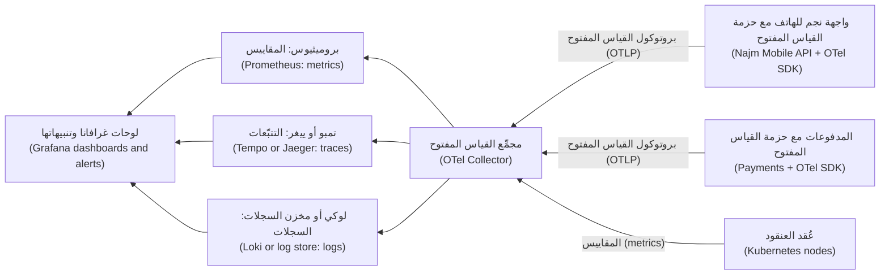

إعدادٌ أدنى للمجمِّع (A minimal Collector configuration) لمختبرٍ محلي (for a local lab):

```yaml
receivers:
  otlp:
    protocols:
      grpc:
        endpoint: 0.0.0.0:4317
      http:
        endpoint: 0.0.0.0:4318
processors:
  memory_limiter:          # protect the Collector itself; put it first
    check_interval: 1s
    limit_percentage: 80
    spike_limit_percentage: 20
  attributes/scrub:        # defence in depth: drop fields that must never leave the app
    actions:
      - key: enduser.id
        action: delete
  batch: {}
exporters:
  otlp/tempo:
    endpoint: tempo:4317
    tls:
      insecure: true       # local lab only; use TLS in any shared environment
  prometheus:
    endpoint: 0.0.0.0:8889 # Prometheus scrapes the Collector here
  debug: {}                # prints logs to the Collector's output in the lab
service:
  pipelines:
    traces:  {receivers: [otlp], processors: [memory_limiter, attributes/scrub, batch], exporters: [otlp/tempo]}
    metrics: {receivers: [otlp], processors: [memory_limiter, batch], exporters: [prometheus]}
    logs:    {receivers: [otlp], processors: [memory_limiter, attributes/scrub, batch], exporters: [debug]}
```

ولأن التطبيقات لا تتحدث إلا OTLP مع المجمِّع (only speak OTLP to the Collector)، تستطيع نجم تغيير الواجهات الخلفية (change back ends) بتغيير المجمِّع (by changing the Collector)، لا كل خدمة (not every service).

**Prometheus ولغة PromQL (Prometheus and PromQL).** يستخدم **Prometheus**، وهو مشروعٌ متخرّج في CNCF (a CNCF graduated project)، **نموذج السحب (pull model)**: فهو **يكشط (scrapes)** نقطة نهاية HTTP (HTTP endpoint) هي `/metrics` لدى كل هدف (on each target) على فتراتٍ منتظمة (at a regular interval) ويخزّن النتائج بوصفها سلاسل زمنية (time series)، تُعرَّف كلٌّ منها باسم مقياس (metric name) و**وسوم (labels)**، أي أزواج مفتاح وقيمة (key-value pairs). وتستعلم عنه بلغة **PromQL**. وتبدو مقاييس RED (RED metrics) لواجهة برمجة تطبيق نجم للهاتف (Najm Mobile API) هكذا:

```promql
# Rate: requests per second over the last 5 minutes
sum(rate(http_requests_total{job="najm-mobile-api"}[5m]))

# Errors: share of requests that returned 5xx
sum(rate(http_requests_total{job="najm-mobile-api", code=~"5.."}[5m]))
  /
sum(rate(http_requests_total{job="najm-mobile-api"}[5m]))

# Duration: p99 latency from a histogram
histogram_quantile(
  0.99,
  sum by (le) (rate(http_request_duration_seconds_bucket{job="najm-mobile-api"}[5m])))
```

تختلف أسماء المقاييس (Metric names vary) باختلاف مكتبة التجهيز بالقياس (instrumentation library)؛ فمقياس خادم HTTP في OTel (OTel's HTTP server metric)، مثلًا، يصبح `http_server_request_duration_seconds` بعد تصديره إلى Prometheus (once exported to Prometheus). تحقّق مما تُصدره خدماتك فعلًا (what your services actually emit) قبل أن تنسخ استعلامًا (before you copy a query). ثم يحوّل **Grafana** هذه الاستعلامات إلى لوحات متابعة وتنبيهات (dashboards and alerts).

**المكافئات السحابية (Cloud equivalents).** لدى كل مزوّدٍ رئيسي (major provider) منظومة مراقبة مُدارة (managed monitoring stack): Amazon CloudWatch وAWS X-Ray، وAzure Monitor مع Application Insights، وGoogle Cloud Observability. ويتغيّر دعمها لبيانات OTLP وPrometheus (support for OTLP and Prometheus data) وميزاتها وتسعيرها (features and pricing)؛ فراجع التوثيق الحالي (check current documentation).

#### 🔴 نظرة الخبير (Expert view)
**التعدّدية هي محرّك التكلفة (Cardinality is the cost driver).** كل تركيبةٍ فريدة من قيم الوسوم (Every unique combination of label values) هي سلسلة زمنية منفصلة (a separate time series). فالمقياس `http_requests_total` مع الوسوم `route` (40 قيمة) و`code` (10) و`pod` (30) يصل إلى 12,000 سلسلة (up to 12,000 series)، وهذا لا بأس به (which is fine). أضِف `customer_id` (مليونا قيمة) وتكون قد أنشأت مليارات السلاسل المحتملة (billions of potential series). القواعد التي تتبعها نجم (Rules Najm follows): الوسوم على المقاييس تأتي من مجموعاتٍ صغيرة محدودة (small, bounded sets)، مثل قالب المسار وفئة الحالة والمنطقة والإصدار (route template, status class, region, version)؛ والمعرّفات (identifiers) مكانها الامتدادات والسجلات (on spans and in logs)، لا المقاييس أبدًا (never on metrics).

**أخذ عيّنات من التتبّعات (Sampling traces).** تتبّع كل طلب (Tracing every request) مكلفٌ على نطاقٍ واسع (expensive at scale). **أخذ العيّنات من الرأس (Head sampling)** يقرّر عند بداية الطلب (at the start of a request)، كأن يحتفظ بـ 10% عشوائيًّا (keep 10% at random)، وهو رخيص لكنه قد يتخلّص من التتبّع البطيء الوحيد الذي تحتاجه (throw away the one slow trace you need). أمّا **أخذ العيّنات من الذيل (Tail sampling)**، الذي يجري في مجمِّعٍ بعد اكتمال التتبّع (in a Collector after the trace completes)، فيحتفظ بالتتبّعات حسب النتيجة (by outcome): كل الأخطاء (all errors)، وكل الطلبات الأبطأ من ثانيتين (all requests slower than 2 s)، إضافةً إلى حصةٍ عشوائية صغيرة من الباقي (a small random share of the rest). تحتفظ نجم بـ 100% من تتبّعات الأخطاء والتتبّعات البطيئة للمدفوعات (Payments error and slow traces)، وبعيّنةٍ صغيرة من السليمة (a small sample of healthy ones). ويتطلّب أخذ العيّنات من الذيل أن تصل كل امتدادات التتبّع إلى نسخة المجمِّع نفسها (all spans of a trace to reach the same Collector instance)، وهذا يحدّد طريقة نشرك للبوابة (shapes how you deploy the gateway).

**الشواهد والربط (Exemplars and correlation).** **الشاهد (exemplar)** هو معرّف تتبّعٍ مُلحَق بدلوٍ في مدرّجٍ تكراري (a trace ID attached to a histogram bucket). انقر النقطة في دلوٍ بطيء (Click the dot in a slow bucket) على لوحة زمن استجابة في Grafana (Grafana latency panel) لتفتح تتبّعًا بطيئًا حقيقيًّا (a real slow trace)، ثم اتبع معرّف تتبّعه إلى السجلات (follow its trace ID to the logs): دقيقتان بدل ساعتين من البحث بـ grep (two minutes instead of two hours of grepping).

**للقياس عن بُعد ميزانية (Telemetry has a budget).** تسجيل التصحيح في الإنتاج (Debug logging in production)، والوسوم غير المحدودة (unbounded labels)، والتتبّع بنسبة 100% (100% tracing)، كلها قد تجعل قابلية المراقبة بندًا كبيرًا في فاتورة السحابة (a large line on the cloud bill). اضبط مدة الاحتفاظ لكل إشارة (Set retention by signal)، واتبع في السجلات قواعد البنك للسجلات الرسمية والخصوصية (the bank's records and privacy rules). أمّا سجلات التدقيق والأمن (Audit and security logs) فهي تيّارٌ منفصل (a separate stream) له متطلبات احتفاظ وسلامة خاصة به (its own retention and integrity requirements)؛ انظر [*أمن الذكاء الاصطناعي وأمن التطبيقات (Secure AI & Application Security)*، الدرس 10.1 — التسجيل والمراقبة وهندسة الكشف (Logging, monitoring and detection engineering)](../secai/index.ar.html#/10.1).

**جهّز المنصة بالقياس، لا كل فريقٍ على حدة (Instrument the platform, not each team).** ضع القياس عن بُعد على المسار الذهبي (Put telemetry on the golden path): يأتي قالب الخدمة (service template) مزوّدًا بحزمة تطوير OTel (OTel SDK)، والتجهيز التلقائي بالقياس (automatic instrumentation)، ومسجّلٍ (logger) يضيف `trace_id`، ولوحة RED افتراضية (default RED dashboard)، فتكون كل خدمةٍ جديدة قابلةً للمراقبة من يومها الأول (observable on day one).

ولرؤية غير المهندس (the non-engineer's view) لسبب تضليل لوحات المتابعة (why dashboards mislead)، انظر [*تصميم الأنظمة لمبرمجي الحدس (System Design for Vibe Coders)*، الدرس 7.1 — لوحة المتابعة التي تكذب والمقياس الذي لا يكذب (The dashboard that lies and the metric that doesn't)](../vibe/index.ar.html#l7-1)؛ ولقابلية المراقبة بوصفها مكوّنًا في البرمجيات كخدمة (observability as a SaaS component)، انظر [*لبنات بناء البرمجيات كخدمة (SaaS Building Blocks)*، الدرس 7.2 — قابلية المراقبة: السجلات والأخطاء والمقاييس والتتبّعات (Observability: logs, errors, metrics and traces)](../saas/index.ar.html#/7.2).

### 🧰 الأدوات (The toolkit)
| الأداة أو الممارسة أو الخدمة (Tool, practice or service) | ما هي وماذا تفعل (What it is and does) | متى تلجأ إليها (When to reach for it) |
|---|---|---|
| **OpenTelemetry** (CNCF) | واجهات برمجة وحزم تطوير محايدة تجاه المورّدين (Vendor-neutral APIs, SDKs)، وتجهيزٌ تلقائي بالقياس (automatic instrumentation)، واصطلاحات دلالية (semantic conventions)، وبروتوكول OTLP (OTLP protocol) للتتبّعات والمقاييس والسجلات | كل خدمةٍ جديدة (Every new service)؛ الطريقة الافتراضية للتجهيز بالقياس في نجم (the default way to instrument at Najm) |
| **OpenTelemetry Collector** | عمليةٌ تستقبل القياس عن بُعد وتعالجه، أي تجمّعه على دفعات وتنظّفه وتأخذ منه عيّنات (batch, scrub, sample)، وتصدّره إلى واجهةٍ خلفية أو أكثر (one or more back ends) | بين التطبيقات والواجهات الخلفية (Between applications and back ends)، كي لا تتحدث الخدمات مع مورّدٍ مباشرةً أبدًا (services never talk to a vendor directly) |
| **Prometheus** (CNCF) | قاعدة بيانات سلاسل زمنية قائمة على السحب (Pull-based time-series database) مع لغة الاستعلام PromQL (PromQL query language) وقواعد التنبيه (alert rules) | مقاييس أحمال عمل Kubernetes (Metrics for Kubernetes workloads) ولوحات RED/USE (RED/USE dashboards) |
| **Grafana** | لوحات متابعة وتنبيه (Dashboards and alerting) فوق مصادر بياناتٍ كثيرة (many data sources)، منها Prometheus وLoki وTempo | مكانٌ واحد لرؤية المقاييس والسجلات والتتبّعات جنبًا إلى جنب (One place to see metrics, logs and traces side by side) |
| **Jaeger** (CNCF) أو **Grafana Tempo** | تخزين التتبّعات والبحث فيها (Trace storage and search) | متابعة طلبٍ واحد عبر الخدمات (Following one request across services)؛ العثور على القفزة البطيئة (finding the slow hop) |
| **RED and USE methods** | قوائم تحقّق (Checklists): المعدل والأخطاء والمدة (Rate, Errors, Duration) للخدمات؛ والاستخدام والتشبّع والأخطاء (Utilisation, Saturation, Errors) للموارد | تقرير ما يوضع على أول لوحة متابعة لخدمةٍ ما (Deciding what to put on a service's first dashboard) |

### 🏛️ عمليًا في بنك نجم (In practice at Najm Bank)
**الأثر البرمجي (Artefact): معيار القياس عن بُعد في نجم، الإصدار الأول (the Najm telemetry standard (v1))، وهو جزءٌ من قالب المسار الذهبي (part of the golden-path template).**

| المجال (Area) | المعيار (Standard) |
|---|---|
| سمات المورد (Resource attributes) | كل إشارةٍ تحمل `service.name` و`service.version` و`deployment.environment` و`cloud.region` و`k8s.namespace.name` |
| السجلات (Logs) | JSON إلى المخرج القياسي (JSON to stdout)؛ الحقول (fields) `ts` و`level` و`service.name` و`event` و`trace_id` و`span_id`؛ لا أسماء ولا أرقام حسابات ولا أرقام بطاقات ولا رموز مميزة ولا مدخلات نصية حرّة من العملاء (no names, account numbers, card numbers, tokens or free-text customer input) |
| المقاييس (Metrics) | RED لكل نقطة نهاية HTTP وgRPC (every HTTP and gRPC endpoint)، بوصفها مدرّجاتٍ تكرارية (as histograms)، مع زمن الاستجابة بالثواني (latency in seconds)؛ وUSE لمجمّعات الاتصالات والطوابير والرابط الهجين (connection pools, queues and the hybrid link)؛ والوسوم من مجموعاتٍ محدودة فقط (labels from bounded sets only) |
| التتبّعات (Traces) | تجهيز OTel التلقائي بالقياس (OTel automatic instrumentation) إضافةً إلى امتداداتٍ يدوية لخطوات الأعمال (manual spans for business steps) (`reserve_funds`، `post_to_core`)؛ وتمرير ترويسة `traceparent` بصيغة W3C عبر كل قفزة (propagated through every hop)، بما فيها محوّل الأنظمة المصرفية الأساسية (including the core banking adapter) |
| أخذ العيّنات (Sampling) | أخذ العيّنات من الذيل (Tail sampling) عند مجمِّع البوابة (gateway Collector): الاحتفاظ بكل تتبّعات الأخطاء (all error traces) والتتبّعات الأبطأ من ثانيتين (traces slower than 2 s)؛ وأخذ عيّنات من التتبّعات السليمة (sample healthy traces) بمعدلٍ منخفض يُحدَّد لكل خدمة (a low rate set per service) |
| النقل (Transport) | ترسل التطبيقات OTLP إلى مجمِّع العقدة فقط (only to the node Collector)؛ ولا يتحدث مع الواجهات الخلفية إلا مجمِّع البوابة (only the gateway Collector talks to back ends) |
| لوحات المتابعة (Dashboards) | تحصل كل خدمةٍ على لوحة RED مولَّدة (a generated RED dashboard) فيها p50/p95/p99، ونسبة الأخطاء (error ratio)، ورابطٌ إلى دليل التشغيل الخاص بها (a link to its runbook) |
| الاحتفاظ (Retention) | يُحدَّد لكل إشارة (Set per signal) ويُتّفق عليه مع الأمن والامتثال (agreed with Security and Compliance)؛ وسجلات التدقيق (audit logs) تيّارٌ منفصل يملكه مركز العمليات الأمنية (a separate stream owned by the SOC) |
| المراجعة (Review) | لا تنتقل خدمةٌ إلى الإنتاج (cannot go to production) حتى تجتاز فحص «الدقائق الخمس الأولى» ("first five minutes" check): مهندسٌ لم يرها قط (an engineer who has never seen it) يستطيع أن يجد معدل أخطائها (its error rate) وp99 الخاص بها وتتبّعًا فاشلًا واحدًا (one failed trace) في أقل من خمس دقائق (in under five minutes) |

### 🛠️ التمارين (Exercises)
تعمل التمارين الثلاثة كلها محليًّا (run locally) باستخدام Docker أو عنقود kind/k3d (a kind/k3d cluster). لا توجّهها إلى أنظمة جهة عملٍ (an employer's systems) دون إذن (without permission).

- 🟢 شغّل تطبيق ويب صغيرًا خاصًّا بك (a small web app of your own)، أو تطبيقًا تجريبيًّا من OpenTelemetry (an OpenTelemetry demo app)، مع Prometheus وGrafana في Docker Compose. ابنِ لوحة RED (Build a RED dashboard): الطلبات في الثانية (requests per second)، ونسبة أخطاء 5xx (5xx ratio)، وزمن الاستجابة p50/p95/p99 من مدرّجٍ تكراري (from a histogram). *يكتمل عندما (Done when):* تستطيع جعل التطبيق بطيئًا (make the app slow)، بإضافة توقّفٍ مؤقت إلى مسارٍ واحد (add a sleep to one route)، وتشاهد p99 يرتفع بينما لا يكاد المتوسط يتحرك (the average barely moves)، وتستطيع شرح الفرق في جملتين (explain the difference in two sentences).
- 🟡 أضِف التجهيز التلقائي بالقياس من OpenTelemetry (OpenTelemetry automatic instrumentation) إلى خدمتين صغيرتين تستدعي فيهما الخدمة A الخدمة B عبر HTTP (service A calls service B over HTTP). أرسل التتبّعات عبر مجمِّع OTel (OTel Collector) إلى Jaeger أو Tempo، واكتب سجلات JSON مُهيكلة (structured JSON logs) تتضمّن `trace_id`. *يكتمل عندما (Done when):* تستطيع فتح تتبّعٍ واحد يُظهر امتداداتٍ من الخدمتين كلتيهما (spans from both services)، وإيجاد أسطر سجل ذلك التتبّع (that trace's log lines) بالبحث عن معرّف تتبّعه (by searching for its trace ID).
- 🔴 وسّع مختبر 🟡 بأخذ العيّنات من الذيل (tail sampling) في المجمِّع: احتفظ بكل تتبّع خطأ (every error trace) وكل تتبّعٍ أبطأ من ثانية واحدة (slower than one second)، إضافةً إلى عيّنةٍ بنسبة 5% من الباقي (a 5% sample of the rest). أضِف مدرّجًا تكراريًّا لزمن الاستجابة مُفعَّلًا فيه الشواهد (an exemplar-enabled latency histogram) ولوحةً في Grafana (a Grafana panel). ثم أضِف وسمًا عشوائيًّا لمعرّف المستخدم (a random user ID label) إلى مقياسٍ واحد وقِس كيف يزداد عدد السلاسل (how the series count grows). *يكتمل عندما (Done when):* يفتح النقر على شاهدٍ بطيء (clicking a slow exemplar) تتبّعًا بطيئًا حقيقيًّا، ويثبت أن سياسة أخذ العيّنات لديك (your sampling policy) تحتفظ بخطأٍ مفتعَل (keep a forced error)، وتكون قد كتبت ملاحظةً من فقرةٍ واحدة (a one-paragraph note) عن التعدّدية التي قستها (the cardinality you measured) وكيف أزلتها (how you removed it).

### ⚠️ أخطاء وفخاخ (Mistakes and traps)
- **التنبيه على المتوسطات والإبلاغ عنها (Alerting on and reporting averages).** المتوسطات تُخفي الذيل البطيء (hide the slow tail) الذي يشعر به العملاء. سجّل المدرّجات التكرارية (Record histograms)؛ وانظر إلى p95 وp99.
- **الوسوم غير المحدودة على المقاييس (Unbounded labels on metrics).** معرّفات العملاء أو معرّفات الطلبات أو عناوين URL الكاملة (Customer IDs, request IDs or full URLs) بوصفها وسومًا قد تضاعف السلاسل حتى يفشل نظام المراقبة (until the monitoring system fails). استخدم قوالب المسارات والوسوم المحدودة (route templates and bounded labels)؛ وضع المعرّفات على الامتدادات والسجلات (on spans and logs).
- **تسجيل البيانات الشخصية والأسرار «لأغراض التصحيح» (Logging personal data and secrets "for debugging").** السجلات تُنسخ وتُحفظ ويقرؤها كثيرون (copied, retained and widely read). سجّل الأحداث والأسباب لا الأشخاص (Log events and reasons, not people)؛ ونظّف البيانات عند المجمِّع (scrub at the Collector) بوصفه خط دفاعٍ ثانيًا (a second line of defence).
- **سياق تتبّعٍ مكسور (Broken trace context).** قفزةٌ واحدة تُسقط `traceparent`، مثل محوّلٍ قديم (a legacy adapter) أو طابور رسائل (a message queue) أو وكيلٍ (a proxy)، تقسم كل تتبّع (splits every trace). اختبر التمرير من طرفٍ إلى طرف (Test propagation end to end)، بما في ذلك المسارات غير المتزامنة (including asynchronous paths).

### 🧾 الخلاصة (Recap)
- السجلات تعطي التفاصيل (Logs give detail)، والمقاييس تعطي مجاميع رخيصة وتنبيهات (cheap aggregates and alerts)، والتتبّعات تُظهر أين يذهب الوقت عبر الخدمات (where time goes across services)؛ والملفات التعريفية للأداء (profiles) إشارةٌ رابعة ناشئة (an emerging fourth signal).
- السياق المشترك (Shared context)، أي الخدمة والإصدار والبيئة ومعرّف التتبّع (service, version, environment, trace ID)، هو ما يتيح لك التنقل بين الإشارات (jump between signals).
- استخدم RED للخدمات وUSE للموارد والإشارات الذهبية الأربع (the four golden signals) للتحقق المتقاطع (as a cross-check)؛ وقِس زمن الاستجابة بوصفه مدرّجاتٍ تكرارية ومئينات (histograms and percentiles).
- يوحّد OpenTelemetry التجهيز بالقياس والنقل (standardises instrumentation and transport)؛ ويفصل المجمِّع الخدمات عن الواجهات الخلفية (decouples services from back ends)، وهو المكان الذي تجمّع فيه على دفعات وتنظّف وتأخذ العيّنات (batch, scrub and sample).
- التعدّدية والاحتفاظ وأخذ العيّنات (Cardinality, retention and sampling) تحدّد تكلفة قابلية المراقبة (decide what observability costs)؛ صمّمها ولا تكتشفها في الفاتورة (design them, do not discover them on the bill).

### ✍️ اختبر نفسك (Check yourself)

**1. تُظهر لوحة متابعة واجهة برمجة تطبيق نجم للهاتف (Najm Mobile API dashboard) متوسط زمن استجابة (average latency) قدره 180 مللي ثانية، لكن العملاء يشتكون من أن بعض التحويلات تستغرق ثوانيَ كثيرة (some transfers take many seconds). إلامَ ينبغي أن ينظر يوسف أولًا؟**

- A. استخدام المعالج (CPU utilisation) في حجيرات الواجهة (API pods)
- B. زمن الاستجابة عند p95 وp99 من مدرّجٍ تكراري لمدة الطلبات (request-duration histogram)
- C. العدد الإجمالي لأسطر السجل في الدقيقة (total number of log lines per minute)
- D. متوسط زمن الاستجابة عبر نافذةٍ أطول (a longer window)، مثل 24 ساعة

<details><summary>الإجابة</summary>

**B.** المئينات من مدرّجٍ تكراري (Percentiles from a histogram) تكشف الذيل البطيء الذي يخفيه المتوسط (the slow tail that an average hides). والمتوسط الأطول (A longer average) (D) يخفيه أكثر؛ وقد يكون المعالج (CPU) (A) طبيعيًّا بينما تنتظر الطلبات مجمّع اتصالات (requests wait on a connection pool). (🟢 الأساسيات (The essentials).)

</details>

**2. يريد مطوّرٌ إضافة الوسم `customer_id` إلى المقياس `http_requests_total` كي يرى فريق الدعم (support) معدل طلبات كل عميل (each customer's request rate). ما الردّ الأفضل؟**

- A. اقبله، لأن الوسوم رخيصة والمزيد منها يفيد دائمًا (labels are cheap and more of them always help)
- B. اقبله في الإنتاج فقط (in production only)، حيث يحتاجه الدعم فعلًا
- C. اقبله بعد تجزئة معرّف العميل (after hashing the customer ID)، كي لا تُخزَّن بياناتٌ شخصية (no personal data is stored)
- D. ارفضه: القيم غير المحدودة تضاعف السلاسل (unbounded values multiply series)؛ استخدم الامتدادات أو السجلات بدلًا منه (use spans or logs instead)

<details><summary>الإجابة</summary>

**D.** كل قيمة وسمٍ فريدة تنشئ سلسلةً جديدة (Each unique label value creates a new series)؛ وملايين العملاء تجعل نظام المقاييس بطيئًا ومكلفًا (slow and costly). والتجزئة (Hashing) (C) تُبقي التعدّدية نفسها تمامًا (exactly the same cardinality). المعرّفات مكانها الامتدادات والسجلات (Identifiers belong on spans and logs)، ضمن قواعد الخصوصية (within privacy rules). (🔴 نظرة الخبير (Expert view).)

</details>

**3. تتوقف التتبّعات القادمة من واجهة برمجة تطبيق نجم للهاتف (Najm Mobile API) عند محوّل الأنظمة المصرفية الأساسية (core banking adapter)، ويبدأ تتبّعٌ جديد على الجانب الآخر (a new trace starts on the other side). ما السبب الأرجح؟**

- A. المحوّل لا يمرّر (does not propagate) ترويسة `traceparent` بصيغة W3C
- B. يكشط Prometheus المحوّل ببطءٍ شديد (scraping the adapter too slowly)
- C. السجلات ليست بصيغة JSON (not in JSON)
- D. أخذ العيّنات من الرأس (Head sampling) مضبوطٌ على 100%

<details><summary>الإجابة</summary>

**A.** يبقى التتبّع موصولًا (A trace stays joined) فقط إذا مرّرت كل قفزةٍ سياق التتبّع (every hop forwards the trace context). أمّا فترة الكشط (Scrape interval) (B) وصيغة السجل (log format) (C) فلا تؤثران في ربط التتبّعات (trace linking)؛ وأخذ عيّنات من كل شيء (sampling everything) (D) لن يقسم التتبّعات. (🟡 التعمق أكثر (Going deeper).)

</details>

**4. لماذا توجّه نجم كل القياس عن بُعد للتطبيقات (all application telemetry) عبر مجمِّعات OpenTelemetry (OpenTelemetry Collectors) بدل أن ترسل كل خدمةٍ البيانات مباشرةً إلى واجهتها الخلفية (straight to its back end)؟**

- A. لأن Prometheus لا يملك أي طريقة لكشط المقاييس من التطبيقات مباشرةً (scrape metrics from applications directly)
- B. لأن بيانات OTLP لا يستقبلها إلا مجمِّع، ولا تستقبلها واجهةٌ خلفية أبدًا (only be received by a Collector, never by a back end)
- C. لأنه يمركز التجميع على دفعات والتنظيف وأخذ العيّنات (centralises batching, scrubbing and sampling)، ويفصل الخدمات عن الواجهات الخلفية (decouples services from back ends)
- D. لأن المجمِّع هو المخزن طويل الأمد (the long-term store) الذي تستعلم منه لوحات المتابعة عن التاريخ (for history)

<details><summary>الإجابة</summary>

**C.** يفصل المجمِّع الخدمات عن الواجهات الخلفية ويمركز المعالجة (centralises processing). يستطيع Prometheus كشط التطبيقات مباشرةً (A)، ويمكن أن تذهب OTLP مباشرةً إلى واجهةٍ خلفية تقبلها (a back end that accepts it) (B)، والمجمِّع خط معالجة لا مخزن (a pipeline, not a store) (D). (🟡 التعمق أكثر (Going deeper).)

</details>

**5. تريد نجم إبقاء تكاليف التتبّع منخفضة (keep tracing costs down) دون خسارة التتبّعات التي يحتاجها المهندسون أثناء الحوادث (during incidents). أيّ نهجٍ هو الأنسب؟**

- A. أخذ العيّنات من الرأس بنسبة 1% (Head sampling at 1%) لكل خدمة، يُقرَّر عند بدء كل طلب
- B. أخذ العيّنات من الذيل (Tail sampling): الاحتفاظ بكل تتبّعات الأخطاء والتتبّعات البطيئة (all error and slow traces)، إضافةً إلى قليلٍ من السليمة (a few healthy ones)
- C. إيقاف التتبّع كليًّا (Turn tracing off entirely) والاعتماد على السجلات المُهيكلة مع معرّفات التتبّع (structured logs with trace IDs)
- D. الاحتفاظ بكل تتبّع، لكن حذفها كلها تلقائيًّا بعد ساعة واحدة (delete all of them automatically after one hour)

<details><summary>الإجابة</summary>

**B.** أخذ العيّنات من الذيل يقرّر بعد معرفة النتيجة (decides after the outcome is known)، فتُحفظ الأخطاء النادرة والطلبات البطيئة (the rare errors and slow requests are kept). أمّا أخذ العيّنات العشوائي من الرأس (Random head sampling) (A) فسيتخلّص منها عادةً؛ وC وD يُضيّعان الدليل الذي تحتاجه (lose the evidence you need). (🔴 نظرة الخبير (Expert view).)

</details>

### 📚 المراجع (References)
- توثيق OpenTelemetry (OpenTelemetry documentation) — https://opentelemetry.io/docs/
- مجمِّع OpenTelemetry (OpenTelemetry Collector) — https://opentelemetry.io/docs/collector/
- الاصطلاحات الدلالية في OpenTelemetry (OpenTelemetry semantic conventions) — https://opentelemetry.io/docs/specs/semconv/
- سياق التتبّع من W3C (W3C Trace Context) — https://www.w3.org/TR/trace-context/
- توثيق Prometheus (Prometheus documentation) — https://prometheus.io/docs/introduction/overview/
- Prometheus، تسمية المقاييس والوسوم (metric and label naming) — https://prometheus.io/docs/practices/naming/
- توثيق Grafana (Grafana documentation) — https://grafana.com/docs/
- توثيق Jaeger (Jaeger documentation) — https://www.jaegertracing.io/docs/
- Google، *هندسة موثوقية المواقع (Site Reliability Engineering)*، «مراقبة الأنظمة الموزّعة» ("Monitoring Distributed Systems") — https://sre.google/sre-book/monitoring-distributed-systems/
- مشاريع CNCF (CNCF projects) — https://www.cncf.io/projects/

<a id="l5-2"></a>

## 5.2 — أهداف مستوى الخدمة وميزانيات الأخطاء والتنبيه ومناوبةٌ يستطيع الناس تحمّلها (SLOs, error budgets, alerting and on-call that people can sustain)

*المستوى: 🟡 متوسط* · *المتطلبات: 5.1* · *المرحلة (Phase): Operate, Monitor*

### ⚡ الدرس في دقيقة (In 60 seconds)
- **مؤشر مستوى الخدمة (service level indicator, SLI)** يقيس ما يختبره المستخدمون (what users experience)، مثل «نسبة طلبات التحويل التي تنجح في أقل من ثانيتين» ("the share of transfer requests that succeed in under 2 seconds"). و**هدف مستوى الخدمة (service level objective, SLO)** هو الهدف المحدّد له عبر نافذةٍ زمنية (the target for it over a window)، مثل 99.9% عبر 30 يومًا. أمّا **اتفاقية مستوى الخدمة (service level agreement, SLA)** فهي عقدٌ له عواقب (a contract with consequences)، وينبغي أن تكون أكثر تساهلًا من هدف مستوى الخدمة (looser than the SLO).
- **ميزانية الأخطاء (error budget)** هي ما يسمح هدف مستوى الخدمة بفشله (what the SLO allows to fail): 100% ناقص الهدف (100% minus the target). وهي تحوّل سؤال «ما مقدار الموثوقية؟» ⁦("how reliable?")⁩ إلى قرارٍ رقمي مشترك (a shared, numeric decision) بين المنتج والعمليات (between product and operations): أنفِق الميزانية على التغيير (spend the budget on change)، أو أبطئ حين تنفد (slow down when it runs out).
- لا تستدعِ إنسانًا (Page a human) إلا من أجل **أعراضٍ يشعر بها المستخدمون (symptoms users feel)** وتحتاج إلى تصرّفٍ الآن (need action now). نبّه على سرعة احتراق ميزانية الأخطاء (how fast the error budget is burning)، لا على وصول المعالج إلى 80% (not on CPU at 80%).
- **التنبيهات متعددة النوافذ ومتعددة معدلات الاحتراق (Multi-window, multi-burn-rate alerts)**، المأخوذة من *كتاب عمل هندسة موثوقية المواقع (The Site Reliability Workbook)*، تلتقط الانقطاعات السريعة بسرعة (catch fast outages quickly) والتسرّبات البطيئة بموثوقية (slow leaks reliably)، مع قليلٍ من الإنذارات الكاذبة (few false alarms).
- لا تكون المناوبة (On-call) مستدامة (sustainable) إلا إذا كانت الاستدعاءات نادرة (pages are rare)، وقابلةً للتصرّف (actionable)، ومرتبطةً بدليل تشغيل (linked to a runbook)، وتتبعها إصلاحاتٌ تزيل السبب (followed up with fixes that remove the cause).
- أكبر فخ (Biggest trap): استهداف 100% (aiming for 100%). فهو مستحيل (impossible)، ويعطّل كل تغيير (blocks every change)، وهواتف المستخدمين وشبكاتهم نفسها أقل موثوقيةً من ذلك على أي حال (less reliable than that anyway).

### 🧭 لماذا يهم (Why it matters)
ترث مها جدول المناوبة (on-call rota) لواجهة برمجة تطبيق نجم للهاتف (Najm Mobile API) وخدمة المدفوعات (Payments service). وفي أسبوعها الأول تعدّ 140 قاعدة تنبيه (140 alert rules). وفي ليلةٍ واحدة يُستدعى يوسف إحدى عشرة مرة (paged eleven times) بسبب ارتفاع استخدام المعالج (high CPU) وإعادة تشغيل الحجيرات (pod restarts) وتحذيرات الأقراص (disk warnings). لم يحتج أيٌّ منها إلى تصرّف (None needed action). وفي الساعة 04:10 تبدأ مشكلةٌ حقيقية (a real problem): تفشل حصةٌ من التحويلات (a share of transfers fails) لأن شهادةً على محوّل الأنظمة المصرفية الأساسية (a certificate on the core banking adapter) انتهت صلاحيتها (has expired). فيقرّ يوسف، وهو نصف نائم (half-asleep)، بذلك التنبيه مع غيره (acknowledges that alert with the others)، ويلاحظ العملاء المشكلة قبل أن يلاحظها الفريق (customers notice before the team does).

هذا هو **إرهاق التنبيهات (alert fatigue)**: حين يكون معظم الاستدعاءات ضجيجًا (most pages are noise)، يتعلّم الناس تجاهل الاستدعاءات (ignore pages)، ثم يفوّتون الحقيقي منها (miss the real one). ويبدأ حلّ مها بسؤالٍ مختلف (a different question): «ماذا يحتاج العميل من خدمة المدفوعات، وما مقدار الفشل الذي يحتمله قبل أن يصبح ذلك مهمًّا؟» ⁦("What does a customer need from the Payments service, and how much failure can they tolerate before it matters?")⁩ تصبح الإجابات أهدافًا لمستوى الخدمة (The answers become SLOs). ولا تأتي الاستدعاءات إلا من احتراق أهداف مستوى الخدمة (Pages come only from SLO burn). وكل ما عدا ذلك يصبح تذكرة عمل (a ticket)، أو بندًا في لوحة متابعة (a dashboard entry)، أو يُحذف (is deleted).

وتحسم أهداف مستوى الخدمة أيضًا جدالًا قديمًا (settle an old argument): فرق طارق تريد السرعة (want speed)، وفريق مها يريد الاستقرار (wants stability). ومع ميزانية الأخطاء (With an error budget) يتفق الطرفان مسبقًا (both agree in advance): ما دامت الميزانية باقية، أطلِق (while budget remains, ship)؛ وحين تُستنفد، يأتي عمل الموثوقية أولًا (when it is spent, reliability work comes first). والجهات التنظيمية (Regulators) تهتم أيضًا: فقانون المرونة التشغيلية الرقمية في الاتحاد الأوروبي (the EU's Digital Operational Resilience Act, DORA)، المطبّق على الكيانات المالية منذ يناير 2025 (applicable to financial entities from January 2025)، والجهات التنظيمية الخليجية (GCC regulators) تتوقع من البنوك أن تفهم مرونة خدماتها المهمة وتختبرها (understand and test the resilience of important services)؛ وهدف مستوى الخدمة المقيس (a measured SLO) جزءٌ من هذا الدليل (part of that evidence).

### 📐 كيف يعمل (How it works)
#### 🟢 الأساسيات (The essentials)
**من المستخدمين إلى الأرقام (From users to numbers).** ابدأ برحلة مستخدم (Start with a **user journey**)، لا بمكوّن (not a component): «يرسل العميل تحويلًا ويرى النتيجة» ("a customer sends a transfer and sees the result"). ثم اختر مؤشرات مستوى الخدمة (choose SLIs) التي تصف تجربةً جيدة لها (describe a good experience of it):

| نوع المؤشر (SLI type) | التعريف (Definition) | مثال من المدفوعات (Payments example) |
|---|---|---|
| **التوافر (Availability)** | الطلبات الجيدة ÷ الطلبات الصالحة (Good requests ÷ valid requests) | طلبات التحويل التي تعيد نتيجةً ليست 5xx (return a non-5xx result) ÷ كل طلبات التحويل (all transfer requests)، باستثناء أخطاء العميل مثل المدخلات غير الصالحة (excluding client errors such as invalid input) |
| **زمن الاستجابة (Latency)** | الطلبات الأسرع من عتبةٍ معيّنة ÷ الطلبات الصالحة (Requests faster than a threshold ÷ valid requests) | طلبات التحويل المكتملة في أقل من ثانيتين (completed in under 2 s) ÷ كل طلبات التحويل |
| **الصحة (Correctness)** | النتائج الصحيحة ÷ النتائج (Correct outcomes ÷ outcomes) | التحويلات المرحَّلة مرةً واحدة بالضبط (posted exactly once) والمطابَقة مع الأنظمة المصرفية الأساسية (reconciled with core banking) ÷ كل التحويلات |

عبّر عن مؤشرات مستوى الخدمة بوصفها أحداثًا جيدة ÷ أحداثًا صالحة (good events ÷ valid events): فهي سهلة الحساب من العدّادات (easy to compute from counters) وقابلة للمقارنة بين الخدمات (comparable across services).

**هدف مستوى الخدمة واتفاقية مستوى الخدمة والنافذة (SLO, SLA and the window).** يضيف هدف مستوى الخدمة هدفًا ونافذةً (a target and a window): «99.9% من طلبات التحويل تنجح، مقيسةً عبر 30 يومًا متحركة» ⁦("99.9% of transfer requests succeed, measured over a rolling 30 days.")⁩. و**النافذة المتحركة (rolling window)** تنظر دائمًا إلى آخر 30 يومًا (always looks at the last 30 days)، فيبقى اليوم السيئ ظاهرًا مدة شهر (a bad day stays visible for a month). أمّا **اتفاقية مستوى الخدمة (SLA)** فهي وعدٌ خارجي بعقوبات (an external promise with penalties)، يُحدَّد أدنى من هدف مستوى الخدمة الداخلي (set below the internal SLO).

**حساب ميزانية الأخطاء (Error budget arithmetic).** الميزانية هي 100% ناقص هدف مستوى الخدمة (100% minus the SLO).

| هدف مستوى الخدمة (SLO) | ميزانية الأخطاء (Error budget) | الوقت «السيئ» المسموح إذا تعطّلت الخدمة كليًّا، لكل 30 يومًا (Allowed "bad" time if fully down, per 30 days) | الطلبات السيئة المسموحة لكل 10 ملايين (Bad requests allowed per 10 million) |
|---|---|---|---|
| 99% | 1% | 7.2 ساعة (hours) | 100,000 |
| 99.5% | 0.5% | 3.6 ساعة (hours) | 50,000 |
| 99.9% | 0.1% | 43.2 دقيقة (minutes) | 10,000 |
| 99.99% | 0.01% | نحو 4.3 دقيقة (about 4.3 minutes) | 1,000 |

كل «تسعة» إضافية (Each extra "nine") تقلّص الميزانية عشر مرات (cuts the budget by ten)، وتكلّف عادةً أكثر بكثير في التكرار الاحتياطي (redundancy) وسرعة الإطلاق (release speed) وجهد المناوبة (on-call effort). اختر الهدف بناءً على حاجات المستخدمين لا الطموح (from user needs, not ambition). تحصل المدفوعات على توافرٍ بنسبة 99.9% (99.9% availability) وعلى 99% من التحويلات في أقل من ثانيتين (99% of transfers under 2 s)؛ وتحصل بوابة المطوّرين الداخلية (the internal developer portal) على 99%.

**نبّه على الأعراض لا الأسباب (Alert on symptoms, not causes).** **العَرَض (symptom)** شيءٌ يشعر به المستخدمون (something users feel): أخطاء أو بطء أو نتائج خاطئة (errors, slowness, wrong results). و**السبب (cause)** شيءٌ قد يؤدي إليه (something that might lead to it): ارتفاع استخدام المعالج (high CPU)، أو إعادة تشغيل حجيرة (a pod restart)، أو طابور ممتلئ (a full queue). الأسباب مفيدة في لوحات المتابعة وتذاكر العمل (useful on dashboards and in tickets). أمّا الاستدعاء فيكون على الأعراض (Page on symptoms)، لأن كثيرًا من الأسباب لا يؤذي المستخدمين أبدًا (many causes never hurt users)، ولأن بعض الأعطال التي تواجه المستخدمين (user-facing failures) لها أسبابٌ لم تتوقعها (causes you did not predict).

**ثلاثة أنواع من الاستجابة (Three kinds of response).**
- **الاستدعاء (Page)**: يجب أن يتصرّف إنسانٌ الآن، في أي ساعة (a human must act now, at any hour). للأعراض التي تهدّد هدف مستوى الخدمة فقط (Only SLO-threatening symptoms).
- **تذكرة العمل (Ticket)**: يجب أن يتصرّف أحدٌ خلال أيام العمل (within working days). احتراقٌ بطيء للميزانية (Slow budget burn)، أو شهادةٌ تنتهي صلاحيتها بعد 14 يومًا (a certificate expiring in 14 days)، أو قرصٌ يمتلئ على مدى أسابيع (a disk filling over weeks).
- **السجل أو لوحة المتابعة فقط (Log or dashboard only)**: معلوماتٌ للتحقيقات (information for investigations). دون إشعار (No notification).

#### 🟡 التعمق أكثر (Going deeper)
**معدل الاحتراق (Burn rate).** **معدل الاحتراق (burn rate)** هو سرعة استهلاكك لميزانية الأخطاء (how fast you are using the error budget)، منسوبةً إلى المعدل الذي يستهلكها كلها بالضبط خلال نافذة هدف مستوى الخدمة (the rate that would use exactly all of it in the SLO window). معدل احتراقٍ قدره 1 يعني أنك ستنهي الأيام الثلاثين دون أي ميزانية متبقية (with zero budget left). ومعدل احتراقٍ قدره 14.4 يعني أن ميزانية الثلاثين يومًا كلها ستذهب في نحو يومين (gone in about two days). ولهدف مستوى خدمة قدره 99.9%، تكون الميزانية 0.1%، فتكون نسبة أخطاء (error ratio) قدرها 1.44% معدل احتراقٍ قدره 14.4.

**لماذا تفشل تنبيهات العتبة البسيطة (Why simple threshold alerts fail).** «استدعِ إذا تجاوزت نسبة الأخطاء 0.1% لمدة 5 دقائق» ("Page if the error ratio is above 0.1% for 5 minutes") ينطلق على ومضاتٍ قصيرة (fires on short blips) بالكاد تمسّ الميزانية. و«استدعِ إذا تجاوزت النسبة على مدى 30 يومًا 0.1%» ("Page if the 30-day ratio is above 0.1%") ينطلق متأخرًا بأيام (fires days late). ويعالج *كتاب عمل هندسة موثوقية المواقع (The Site Reliability Workbook)*، في فصل «التنبيه على أهداف مستوى الخدمة» (chapter "Alerting on SLOs")، هذه الخيارات ويوصي بتنبيهات **متعددة النوافذ ومتعددة معدلات الاحتراق (multi-window, multi-burn-rate)**. فالنافذة الطويلة (A long window) تُظهر أن الاحتراق كبير (the burn is significant)؛ والنافذة القصيرة (a short window) تؤكد أنه ما زال يحدث (it is still happening)، فيتوقف التنبيه أيضًا بعد التعافي بوقتٍ قصير (stops soon after recovery).

| الخطورة (Severity) | معدل الاحتراق (Burn rate) | النافذة الطويلة (Long window) | النافذة القصيرة (Short window) | الميزانية المستهلكة إذا استمر طوال النافذة الطويلة (Budget used if it continues for the long window) |
|---|---|---|---|---|
| استدعاء (Page) | 14.4 | ساعة واحدة (1 hour) | 5 دقائق (5 minutes) | 2% |
| استدعاء (Page) | 6 | 6 ساعات (6 hours) | 30 دقيقة (30 minutes) | 5% |
| تذكرة عمل (Ticket) | 1 | 3 أيام (3 days) | 6 ساعات (6 hours) | 10% |

هذه هي القيم الابتدائية المقترحة في كتاب العمل (the Workbook's suggested starting values) لنافذة 30 يومًا (for a 30-day window). اضبطها ببياناتك الخاصة (Tune them with your own data).

**التنبيه بوصفه شيفرة (The alert as code).** أولًا، تحسب قواعد التسجيل (recording rules) نسبة الأخطاء عبر عدة نوافذ (over several windows)، وتولّدها نجم من ملف هدف مستوى الخدمة (generates these from the SLO file):

```yaml
groups:
  - name: payments-slo-recordings
    rules:
      - record: slo:payments_errors:ratio_rate5m
        expr: |
          sum(rate(http_requests_total{job="payments", route="/transfers", code=~"5.."}[5m]))
          /
          sum(rate(http_requests_total{job="payments", route="/transfers"}[5m]))
      - record: slo:payments_errors:ratio_rate1h
        expr: |
          sum(rate(http_requests_total{job="payments", route="/transfers", code=~"5.."}[1h]))
          /
          sum(rate(http_requests_total{job="payments", route="/transfers"}[1h]))
      # ... the same for 30m, 6h and 3d
```

ثم لا تستدعي قاعدة التنبيه (the alerting rule) إلا حين تحترق النافذتان الطويلة والقصيرة كلتاهما بسرعة (both the long and short windows burn fast):

```yaml
  - name: payments-slo-alerts
    rules:
      - alert: PaymentsErrorBudgetFastBurn
        expr: |
          (slo:payments_errors:ratio_rate1h > 14.4 * 0.001
            and slo:payments_errors:ratio_rate5m > 14.4 * 0.001)
          or
          (slo:payments_errors:ratio_rate6h > 6 * 0.001
            and slo:payments_errors:ratio_rate30m > 6 * 0.001)
        labels:
          severity: page
          service: payments
        annotations:
          summary: "Payments is burning its 30-day error budget fast"
          runbook_url: "https://runbooks.najm.example/payments/error-budget-burn"
          dashboard: "https://grafana.najm.example/d/payments-slo"
```

قارن بالقاعدة التي كانت لدى يوسف من قبل (the rule Yousef had before):

```yaml
# Risky: a cause, not a symptom; pages at 3 a.m.; no runbook
- alert: HighCPU
  expr: avg(rate(container_cpu_usage_seconds_total{namespace="payments"}[5m])) > 0.8
  labels:
    severity: page
```

تولّد أدواتٌ مفتوحة المصدر (Open-source tools) مثل **Sloth** و**Pyrra** قواعد التسجيل والتنبيه هذه (these recording and alerting rules) من تعريفٍ قصير لهدف مستوى الخدمة (a short SLO definition)، ويعرّف مشروع **OpenSLO** صيغة ملفٍ لأهداف مستوى الخدمة محايدةً تجاه المورّدين (a vendor-neutral SLO file format).

**التوجيه والتجميع والإسكات (Routing, grouping and silences).** يقيّم Prometheus القواعد (evaluates rules)؛ ويقرّر **Alertmanager** (أو تنبيهات Grafana (Grafana alerting)) من يُبلَّغ (who is told). فهو **يجمّع (groups)** التنبيهات المترابطة في إشعارٍ واحد (into one notification)، و**يكبت (inhibits)** التنبيهات الأدنى حين ينطلق تنبيهٌ أعلى (lower alerts when a higher one is firing)، فلا تستدعِ بشأن 30 خطأ حجيرة حين يكون العنقود كله معطّلًا (do not page about 30 pod errors when the whole cluster is down)، و**يوجّه (routes)** حسب الوسوم (by labels)، فيذهب `service: payments` إلى جدول مناوبة المدفوعات (the Payments rota)، ويدعم **الإسكات (silences)** أثناء الصيانة المخطط لها (during planned maintenance).

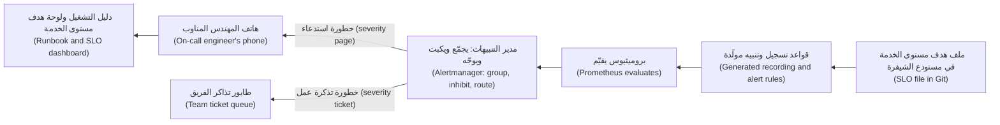

**سياسة ميزانية الأخطاء (The error budget policy).** هدف مستوى الخدمة الذي لا عواقب له (An SLO without consequences) ليس سوى رسمٍ بياني (just a chart). سياسة نجم، التي اتفق عليها سالم ومها وطارق (agreed by Salem, Maha and Tariq):
- الميزانية سليمة (Budget healthy): تُطلق الفرق بوتيرتها المعتادة (ship at their normal pace).
- الميزانية المتبقية أقل من 25% (Budget below 25% remaining): تحتاج الإطلاقات إلى تلك الخدمة مراجعةً من هندسة موثوقية المواقع (need an SRE review)؛ وتتضمّن دورة العمل القصيرة التالية (the next sprint) بند الموثوقية الأعلى أولوية (the top reliability item).
- الميزانية مستنفدة (Budget exhausted): لا يُطلق إلى تلك الخدمة إلا الإصلاحات وعمل الموثوقية (only fixes and reliability work ship) حتى تتعافى النافذة المتحركة (until the rolling window recovers)، ما لم يوقّع رئيس المنصة ومالك المنتج استثناءً (unless the Head of Platform and the product owner sign an exception).
- الحادثة المفردة (A single incident) التي تستهلك أكثر من 20% من الميزانية تحصل على مراجعة ما بعد الحادثة (gets a postmortem) (الدرس 5.3).

ويمكن لإشارة الاحتراق نفسها (The same burn signal) أن تقود الأتمتة (drive automation): فإطلاقٌ كناري (a canary release) يستطيع التراجع من تلقاء نفسه (roll itself back) حين تتدهور مؤشرات مستوى الخدمة الخاصة به (when its SLIs degrade) (الدرس 4.2).

#### 🔴 نظرة الخبير (Expert view)
**المناوبة المستدامة (Sustainable on-call).** يتعامل كتاب Google *هندسة موثوقية المواقع (Site Reliability Engineering)* مع عبء المناوبة (on-call load) بوصفه شيئًا يُقاس ويُسقَّف (something to measure and cap)، ومع **العمل الروتيني الشاق (toil)**، أي العمل اليدوي المتكرر القابل للأتمتة الذي يكبر مع الخدمة ولا قيمة دائمة له (manual, repetitive, automatable work that grows with the service and has no lasting value)، بوصفه شيئًا يُقلَّص عمدًا (something to reduce deliberately). الممارسات التي تتبنّاها نجم (Practices Najm adopts):
- **حجم جدول المناوبة والتسليم (Rota size and hand-offs).** عددٌ كافٍ من الأشخاص بحيث لا يكون كل مهندس مناوبًا إلا نحو أسبوع واحد من عدة أسابيع على الأكثر (at most about one week in several)، مع تسليمٍ مكتوب عند كل تغيير مناوبة (a written hand-off at every shift change). وجداول «تتبّع الشمس» (Follow-the-sun rotas)، حيث يمتد الفريق عبر مناطق زمنية (a team spans time zones)، تزيل معظم الاستدعاءات الليلية (remove most night pages).
- **كل استدعاء قابل للتصرّف وله دليل تشغيل (Every page is actionable and has a runbook).** إذا لم يكن المستجيب قادرًا على فعل أي شيء (If the responder cannot do anything)، فلا ينبغي أن يكون استدعاءً. و**دليل التشغيل (runbook)** يقول ما يعنيه التنبيه (what the alert means)، وكيف تتأكد من الأثر على المستخدمين (how to confirm user impact)، والإجراءات الأولى الآمنة (safe first actions)، أي التراجع أو التحويل إلى البديل أو التوسّع الأفقي (roll back, fail over, scale out)، وإلى من تصعّد (who to escalate to).
- **قِس جدول المناوبة (Measure the rota).** الاستدعاءات لكل مناوبة (Pages per shift)، والاستدعاءات خارج ساعات العمل (pages outside working hours)، والوقت حتى الإقرار (time to acknowledge)، وحصة الاستدعاءات التي احتاجت إلى تصرّف (share of pages that needed action). والتنبيهات التي انطلقت دون حاجةٍ إلى تصرّف تُضبط أو تُحذف خلال الأسبوع (tuned or deleted within the week).
- **سدِّد العبء (Pay back the load).** يحصل المهندسون على وقت تعافٍ محمي (protected recovery time) بعد ليلةٍ ثقيلة (after a heavy night)؛ والاستدعاءات المتكررة (recurring pages) تصبح بنودًا مملوكة في قائمة الأعمال (owned backlog items).
- **المهندسون الجدد يرافقون أولًا (New engineers shadow first).** يرافق يوسف مها (Yousef shadows Maha) لدورتي مناوبة (for two rotations) قبل أن يحمل جهاز الاستدعاء وحده (before carrying the pager alone).

**اختيار مؤشرات مستوى الخدمة حيث تقيسها (Choosing SLIs where you measure them).** مقاييس جانب الخادم (Server-side metrics) تفوّت الأعطال التي تحدث قبل أن يصل الطلب إليك (failures that happen before the request reaches you)، مثل DNS وشبكة توصيل المحتوى (the CDN) وجدار حماية تطبيقات الويب (the WAF) وموازن الأحمال (the load balancer). تقيس نجم مؤشر توافر المدفوعات (the Payments availability SLI) عند موازن الأحمال (at the load balancer) وتضيف **مسابير اصطناعية (synthetic probes)**: تحويلاتٌ مكتوبة نصيًّا بين حسابات اختبار (scripted transfers between test accounts) كل دقيقة من خارج السحابة (from outside the cloud)، وهي تلتقط أيضًا الأعطال عند الحافة (failures at the edge). 

**التبعيات وأهداف مستوى الخدمة المركّبة (Dependencies and composite SLOs).** إذا كانت المدفوعات تعتمد تسلسليًّا على ثلاث خدمات (depends serially on three services) تحقق كلٌّ منها 99.9%، فقد يكون توافرها هي (its own availability) أدنى من أيٍّ منها. تحقّق مما يجب أن تحققه كل تبعية (what each dependency must achieve)، وصمّم للفشل (design for failure) حيث لا تتّسق الأرقام (where the numbers do not add up): المهلات الزمنية (timeouts)، وإعادة المحاولة مع التراجع التدريجي (retries with backoff)، ومفاتيح عدم التكرار (idempotency keys) كي لا تكرّر إعادة المحاولة تحويلًا أبدًا (so retries never duplicate a transfer)، والتدهور اللطيف (graceful degradation)، أي إظهار «التحويل قيد المعالجة» بدل الفشل (show "transfer pending" rather than failing).

**أهداف مستوى الخدمة للعمل غير المتزامن وعمل الذكاء الاصطناعي (SLOs for asynchronous and AI work).** للطابور (For a queue)، قِس «الرسائل المعالَجة خلال N دقيقة» ("messages processed within N minutes"). ولنجم أسيست (Najm Assist)، قِس الوقت حتى أول رمز (time to first token) إلى جانب الوقت الكلي (total time)؛ وتشغيل وكلاء الذكاء الاصطناعي (operating AI agents) مغطّى في [*تشغيل وكلاء الذكاء الاصطناعي في الإنتاج (Running AI Agents in Production)*، المستوى 3 — مهندس الإنتاج (Production Engineer)](../agentic/learning-path.ar.html#level-3-production-engineer).

ولمدخلٍ ألطف (a gentler introduction) إلى منظومات المراقبة ونظافة التنبيهات (monitoring stacks and alert hygiene)، انظر [*تصميم الأنظمة لمبرمجي الحدس (System Design for Vibe Coders)*، الدرس 7.6 — منظومة المراقبة لديك: Sentry وفحوص التوافر والمقاييس والتنبيهات (Your monitoring stack: Sentry, uptime checks, metrics, and alerts)](../vibe/index.ar.html#l7-6).

### 🧰 الأدوات (The toolkit)
| الأداة أو الممارسة أو الخدمة (Tool, practice or service) | ما هي وماذا تفعل (What it is and does) | متى تلجأ إليها (When to reach for it) |
|---|---|---|
| **Service level objective (SLO)** — هدف مستوى الخدمة | هدفٌ لمؤشرٍ متمحور حول المستخدم (a user-centred indicator) عبر نافذةٍ زمنية، مكتوبٌ ومتّفقٌ عليه (written down and agreed) | كل خدمة إنتاج لها مستخدمون (Every production service with users)، بدءًا بأهم الرحلات (starting with the most important journeys) |
| **Error budget** — ميزانية الأخطاء | مقدار الفشل الذي يسمح به هدف مستوى الخدمة (The amount of failure an SLO allows)، إضافةً إلى سياسةٍ لما يحدث مع إنفاقه (a policy for what happens as it is spent) | الموازنة بين سرعة الإطلاق والموثوقية بالأرقام لا بالآراء (Balancing release speed against reliability with numbers, not opinions) |
| **Multi-window, multi-burn-rate alerting** (SRE Workbook) — التنبيه متعدد النوافذ ومعدلات الاحتراق | يستدعي حين يكون احتراق الميزانية كبيرًا عبر نافذةٍ طويلة (significant over a long window) وما زال يحدث في نافذةٍ قصيرة (still happening in a short one) | استبدال الاستدعاءات القائمة على العتبات والأسباب (Replacing threshold and cause-based pages) |
| **Alertmanager** (Prometheus) | يجمّع التنبيهات ويكبتها ويوجّهها ويُسكتها (Groups, inhibits, routes and silences alerts) | إرسال التنبيه الصحيح إلى جدول المناوبة الصحيح، مرةً واحدة (Sending the right alert to the right rota, once) |
| **Sloth** / **Pyrra** | مولّداتٌ مفتوحة المصدر (Open-source generators) لقواعد تسجيل أهداف مستوى الخدمة وتنبيهها في Prometheus (Prometheus SLO recording and alert rules) من مواصفةٍ قصيرة (a short spec) | إبقاء أهداف مستوى الخدمة بوصفها شيفرة (Keeping SLOs as code) بدل PromQL المكتوبة يدويًّا (hand-written PromQL) |
| **Runbook** — دليل التشغيل | دليلٌ قصير مرتبط (A short, linked guide): ما يعنيه التنبيه، وكيف تتحقق من الأثر، والإجراءات الأولى الآمنة، والتصعيد (what the alert means, how to check impact, safe first actions, escalation) | يُرفق بكل تنبيه استدعاء (Attached to every paging alert) |

### 🏛️ عمليًا في بنك نجم (In practice at Najm Bank)
**الأثر البرمجي (Artefact): وثيقة هدف مستوى الخدمة لخدمة المدفوعات، الإصدار الأول (the Payments service SLO document (v1))، المخزّنة في Git بجوار الخدمة (stored in Git next to the service).**

| الحقل (Field) | القيمة (Value) |
|---|---|
| الخدمة والمالك (Service and owner) | خدمة المدفوعات (Payments service) · فرقة المدفوعات (Payments squad)، ضمن نطاق طارق (Tariq's area) · شريكة هندسة موثوقية المواقع (SRE partner): مها |
| رحلة المستخدم (User journey) | عميل أفراد (A retail customer) يقدّم تحويلًا في نجم للهاتف (Najm Mobile) ويتلقى نتيجةً نهائية (a definitive result) |
| المؤشر 1: التوافر (SLI 1: availability) | طلبات التحويل عند موازن الأحمال (at the load balancer) التي لا تعيد 5xx ولا تنتهي مهلتها (not returning 5xx or timing out) ÷ طلبات التحويل الصالحة (valid transfer requests)، باستثناء أخطاء التحقق 4xx (excluding 4xx validation errors) |
| الهدف 1 (SLO 1) | 99.9% عبر 30 يومًا متحركة (over a rolling 30 days) |
| المؤشر 2: زمن الاستجابة (SLI 2: latency) | طلبات التحويل المكتملة في أقل من ثانيتين (completed in under 2 s) ÷ طلبات التحويل الصالحة |
| الهدف 2 (SLO 2) | 99% عبر 30 يومًا متحركة (over a rolling 30 days) |
| المؤشر 3: الصحة (SLI 3: correctness) | التحويلات المرحَّلة مرةً واحدة بالضبط (posted exactly once)، كما تُظهر المطابقة اليومية مع الأنظمة المصرفية الأساسية (daily reconciliation with core banking) ÷ كل التحويلات؛ وأي عدم تطابق يفتح حادثة (any mismatch opens an incident) |
| مصادر البيانات (Data sources) | مقاييس موازن الأحمال (Load balancer metrics)؛ المدرّجات التكرارية من OTel (OTel histograms)؛ مسبار تحويلٍ اصطناعي (synthetic transfer probe) كل دقيقة من خارج السحابة؛ مهمة المطابقة (reconciliation job) |
| التنبيهات (Alerts) | استدعاء (Page): معدل احتراق (burn rate) قدره 14.4 (ساعة و5 دقائق) أو 6 (6 ساعات و30 دقيقة). تذكرة عمل (Ticket): معدل احتراق قدره 1 (3 أيام و6 ساعات). عدم تطابق المطابقة (Reconciliation mismatch): استدعاء |
| سياسة ميزانية الأخطاء (Error budget policy) | كما في 🟡 التعمق أكثر (As in Going deeper)؛ والاستثناءات يوقّعها سالم ومالك المنتج (exceptions signed by Salem and the product owner) |
| التبعيات (Dependencies) | PostgreSQL المُدارة (Managed PostgreSQL)، ومحوّل الأنظمة المصرفية الأساسية (core banking adapter)، والرابط الهجين (hybrid link)؛ ولكلٍّ منها هدف مستوى خدمة خاص به (its own SLO)، يُراجَع مقابل هذا الهدف (reviewed against this one) |
| ما لا يشمله (Not covered) | اتفاقية مستوى الخدمة بصيغة العملاء (The SLA in customer terms) وعتبات الإبلاغ التنظيمي (regulatory reporting thresholds)؛ تملكها إدارة المخاطر والامتثال (owned by Risk and Compliance) |
| المراجعة (Review) | شهريًّا مع طارق ومها (Monthly with Tariq and Maha): الميزانية المتبقية (budget left)، والحوادث (incidents)، وجودة التنبيهات (alert quality)، أي الاستدعاءات في الأسبوع وحصة القابلة للتصرّف منها (pages per week, share actionable) |

### 🛠️ التمارين (Exercises)
- 🟢 لخدمةٍ واحدة تعرفها (one service you know)، سواء مشروعك الخاص أو موقع ويب عام تستخدمه (your own project or a public website you use)، اكتب ثلاثة مؤشرات لمستوى الخدمة بوصفها نسب أحداثٍ جيدة ÷ أحداثٍ صالحة (good-event ÷ valid-event ratios)، واختر هدف مستوى خدمة لكلٍّ منها، واحسب ميزانية الأخطاء بالدقائق وبالطلبات (in minutes and in requests) لنافذة 30 يومًا. *يكتمل عندما (Done when):* يحدّد كل مؤشر بالضبط أيّ الأحداث تُعدّ جيدة وسيئة ومستثناة (good, bad and excluded)، وتستطيع تبرير كل هدف في جملةٍ واحدة عن المستخدمين (justify each target in one sentence about users).
- 🟡 في مختبر Prometheus المحلي لديك من الدرس 5.1 (your local Prometheus lab from lesson 5.1)، اكتب قواعد تسجيل (recording rules) وتنبيهًا متعدد النوافذ ومتعدد معدلات الاحتراق (multi-window, multi-burn-rate alert) لهدف توافرٍ قدره 99.9% (a 99.9% availability SLO)، موجَّهًا عبر Alertmanager. احقن أخطاءً مرتين (Inject errors twice): دفقةً مدتها دقيقة واحدة بنسبة أخطاء 10% (a one-minute burst at a 10% error ratio)، ثم نسبة أخطاء ثابتة قدرها 10% (a steady 10% error ratio). *يكتمل عندما (Done when):* لا تُطلق الدفقة استدعاءً (the burst does not page)، وتُطلق الأخطاء الثابتة استدعاءً خلال نحو عشر دقائق (within about ten minutes)، فاستنتج السبب من نافذة الساعة الواحدة (work out why from the 1-hour window)، ويتوقف التنبيه بعد إزالتك للأخطاء (the alert stops after you remove the errors).
- 🔴 خذ أي مجموعة تنبيهات تستطيع الوصول إليها قانونيًّا (any alert set you can access legally)، كمشروعك الخاص، أو القواعد المنشورة لمشروعٍ مفتوح المصدر (an open-source project's published rules)، أو عيّنة من درسٍ تعليمي في المراقبة (a sample from a monitoring tutorial)، ودقّقها (audit it): صنّف كل تنبيه بوصفه استدعاءً أو تذكرة عمل أو حذفًا (page, ticket or delete)، وأعد كتابة الاستدعاءات القائمة على الأسباب (cause-based pages) بوصفها تنبيهات احتراقٍ لهدف مستوى الخدمة (SLO burn alerts)، واكتب دليل تشغيلٍ واحدًا (one runbook)، وصُغ مسودة سياسة ميزانية أخطاء (draft an error budget policy). *يكتمل عندما (Done when):* يكون لديك جدول قبل وبعد (a before/after table) فيه سببٌ لكل تغيير (a reason for every change)، وسياسة من صفحةٍ واحدة يستطيع مالك منتجٍ أن يوقّعها (a one-page policy that a product owner could sign).

### ⚠️ أخطاء وفخاخ (Mistakes and traps)
- **أهداف 100% أو «أكبر عدد ممكن من التسعات» (Targets of 100% or "as many nines as possible").** إنها تعطّل كل تغيير (block every change) وتكلّف أكثر بكثير مما يلاحظه المستخدمون (cost far more than users notice). اختر أدنى هدفٍ يرضى عنه المستخدمون (the lowest target users are happy with).
- **مؤشرات مستوى الخدمة التي تقيس الخادم لا المستخدم (SLIs that measure the server, not the user).** المعالج وسلامة الحجيرات (CPU and pod health) ليست تجارب (are not experiences). قِس نجاح الرحلات الحقيقية وزمن استجابتها (success and latency of real journeys)، بأقرب ما تستطيع إلى المستخدم (as close to the user as you can).
- **الاستدعاء على الأسباب (Paging on causes).** المعالج والذاكرة وإعادة التشغيل وتحذيرات الأقراص (CPU, memory, restarts and disk warnings) توقظ الناس بلا طائل (wake people for nothing). ضعها في لوحات المتابعة أو تذاكر العمل (on dashboards or tickets)؛ واستدعِ على احتراق الميزانية (page on budget burn).
- **أهداف مستوى الخدمة بلا سياسة (SLOs without a policy).** إذا لم يكن نفاد الميزانية يغيّر شيئًا (If running out of budget changes nothing)، فلن يثق أحدٌ بهدف مستوى الخدمة ولن يستخدمه. اتفقوا على السياسة قبل أول شهرٍ سيئ (before the first bad month).
- **تنبيهاتٌ بلا أدلة تشغيل، وجدول مناوبة مُهمَل (Alerts without runbooks, and an ignored rota).** الاستدعاء الذي لا خطوة تالية له (A page with no next step) يهدر الدقائق الأولى من الحادثة (the first minutes of an incident). اربط دليل تشغيل بكل استدعاء (Link a runbook to every page)؛ وأصلح التنبيه الأكثر ضجيجًا أسبوعيًّا (fix the noisiest alert weekly).

### 🧾 الخلاصة (Recap)
- تقيس مؤشرات مستوى الخدمة (SLIs) تجربة المستخدم بوصفها أحداثًا جيدة ÷ صالحة (good ÷ valid events)؛ وتضع أهداف مستوى الخدمة (SLOs) هدفًا عبر نافذة (a target over a window)؛ واتفاقيات مستوى الخدمة (SLAs) وعودٌ خارجية أكثر تساهلًا (looser external promises).
- ميزانية الأخطاء (The error budget)، أي 100% ناقص هدف مستوى الخدمة (100% minus the SLO)، أداةٌ مشتركة لتقرير متى تُطلق ومتى تُصلح (when to ship and when to fix).
- لا تستدعِ إلا على الأعراض التي تواجه المستخدمين وتحتاج إلى تصرّفٍ الآن (user-facing symptoms that need action now)؛ واستخدم تذاكر العمل ولوحات المتابعة لكل ما عدا ذلك (tickets and dashboards for everything else).
- التنبيهات متعددة النوافذ ومتعددة معدلات الاحتراق (Multi-window, multi-burn-rate alerts) تكشف الاحتراق السريع والبطيء للميزانية (fast and slow budget burn) وتتجاهل الومضات (ignoring blips).
- يجمّع Alertmanager ويكبت ويوجّه (groups, inhibits and routes)؛ ولكل استدعاءٍ دليل تشغيل ومالك (a runbook and an owner).
- المناوبة المستدامة (Sustainable on-call) تُقاس وتُهندَس (is measured and engineered): استدعاءاتٌ قليلة قابلة للتصرّف (few, actionable pages)، وتعافٍ محمي (protected recovery)، وإصلاحٌ أسبوعي للتنبيه الأكثر ضجيجًا (a weekly fix of the noisiest alerts).

### ✍️ اختبر نفسك (Check yourself)

**1. لخدمة المدفوعات (Payments service) هدف توافرٍ (availability SLO) قدره 99.9% عبر 30 يومًا. ما مقدار التعطّل الكلي (total downtime) الذي يسمح به ذلك تقريبًا، إذا فشل كل طلبٍ أثناء التعطّل (if every request fails while it is down)؟**

- A. نحو 4 دقائق (About 4 minutes)
- B. نحو 7 ساعات (About 7 hours)
- C. نحو 43 دقيقة (About 43 minutes)
- D. نحو يومٍ واحد (About 1 day)

<details><summary>الإجابة</summary>

**C.** 0.1% من 30 يومًا (43,200 دقيقة) تساوي 43.2 دقيقة. ونحو 4 دقائق هي ميزانية 99.99% (A)؛ ونحو 7 ساعات هي ميزانية 99% (B). (🟢 الأساسيات (The essentials).)

</details>

**2. تجد مها أن جدول المناوبة يُستدعى عدة مرات في الليلة (paged several times a night) بسبب «المعالج فوق 80%» ("CPU above 80%") على حجيرات المدفوعات (payment pods)، ولا يحتاج الأمر إلى أي تصرّف أبدًا. ماذا ينبغي أن تفعل؟**

- A. أنزِل المعالج إلى لوحة متابعة أو تذكرة عمل (Demote CPU to a dashboard or ticket)؛ ولا تستدعِ إلا على احتراق هدف مستوى خدمة المدفوعات (Payments SLO burn)
- B. ارفع العتبة إلى 90% (Raise the threshold to 90%) وأبقِه استدعاءً، لتقليل العدد (to cut the volume)
- C. أضِف مهندسًا ثانيًا إلى جدول المناوبة (Add a second engineer to the rota) كي يُتقاسم العبء الليلي (the night-time load is shared)
- D. اكتم قناة الاستدعاء ليلًا (Mute the paging channel at night) وراجع التنبيهات كل صباح

<details><summary>الإجابة</summary>

**A.** المعالج سببٌ لا عَرَض (CPU is a cause, not a symptom)؛ والاستدعاء عليه يولّد إرهاق التنبيهات (creates alert fatigue). ورفع العتبة (Raising the threshold) (B) يُبقي استدعاءً قائمًا على سبب؛ وزيادة الأشخاص (more people) (C) توزّع الضجيج (spreads the noise)؛ والكتم (muting) (D) يُخفي الاستدعاءات الحقيقية أيضًا. (🟢 الأساسيات (The essentials).)

</details>

**3. لهدف مستوى خدمة قدره 99.9%، نسبة الأخطاء (error ratio) خلال الساعة الأخيرة 1.5% وخلال الدقائق الخمس الأخيرة 1.6%. ماذا يعني ذلك وفق قاعدة التنبيه في هذا الدرس (under the alert rule in this lesson)؟**

- A. لا شيء بعد، لأن نسبة الأخطاء على مدى 30 يومًا (the 30-day error ratio) لم تتجاوز 0.1%
- B. تذكرة عمل (A ticket)، لأن معدل الاحتراق أعلى من 1 بقليل فقط ويمكنه الانتظار (only slightly above 1 and can wait)
- C. لا شيء، لأن النافذة القصيرة أعلى من النافذة الطويلة (the short window is higher than the long window)
- D. استدعاء (A page)، لأن النافذتين كلتيهما تتجاوزان 14.4 × 0.1% = 1.44%

<details><summary>الإجابة</summary>

**D.** النافذتان كلتاهما تتجاوزان عتبة 14.4× (the 14.4× threshold)، فالميزانية تحترق بسرعة وما زالت تحترق (burning fast and still burning): وهذا شرط استدعاء الاحتراق السريع (the fast-burn page condition). وانتظار نسبة الثلاثين يومًا (A) سيستدعي متأخرًا جدًّا (page far too late)؛ ومعدل احتراقٍ فوق 14 ليس «أعلى من 1 بقليل» ("slightly above 1") (B). (🟡 التعمق أكثر (Going deeper).)

</details>

**4. استهلكت فرقة طارق ميزانية أخطاء المدفوعات كلها (the whole Payments error budget) في منتصف النافذة (halfway through the window)، وتريد إطلاق ميزةٍ جديدة غدًا (release a new feature tomorrow). ماذا يحدث وفق سياسة نجم (Under Najm's policy)؟**

- A. يُطلقون كالمعتاد، لأن الميزانية تُعاد ضبطها في أول الشهر القادم (the budget resets on the first of next month)
- B. لا يُطلق إلا الإصلاحات وعمل الموثوقية (Only fixes and reliability work ship)، ما لم يُوقَّع استثناء (unless an exception is signed)
- C. يُخفَّض هدف مستوى الخدمة لهذا الشهر (The SLO target is lowered for this month) كي تُطلق الميزة
- D. يتولى فريق مها كل إطلاقات المدفوعات بشكلٍ دائم (takes over all Payments releases permanently) بدلًا من الفرقة

<details><summary>الإجابة</summary>

**B.** سياسة ميزانية الأخطاء (The error budget policy)، المتفق عليها مسبقًا (agreed in advance)، تحسم هذا دون نزاع (without a fight)؛ ويستطيع سالم ومالك المنتج توقيع استثناء (sign an exception). النافذة المتحركة لا تُعاد ضبطها في تاريخٍ معيّن (A rolling window does not reset on a date) (A)؛ وخفض هدف مستوى الخدمة لتناسب إطلاقًا ما (lowering the SLO to suit a release) (C) يُبطل غرضه (defeats its purpose). (🟡 التعمق أكثر (Going deeper).)

</details>

**5. يُقاس مؤشر توافر المدفوعات (The Payments availability SLI) من مقاييس جانب الخادم فقط (server-side metrics only). وأثناء خطأٍ في إعداد شبكة توصيل المحتوى (a CDN misconfiguration)، لا يستطيع كثير من العملاء الوصول إلى الواجهة، ومع ذلك تبقى لوحة هدف مستوى الخدمة خضراء (the SLO dashboard stays green). أيّ تغييرٍ يعالج هذه النقطة العمياء على أفضل وجه (best fixes this blind spot)؟**

- A. خفض هدف مستوى الخدمة (Lower the SLO target) كي تبقى مشكلات الحافة القصيرة ضمن الميزانية (short edge problems stay within budget)
- B. إضافة مزيدٍ من تنبيهات المعالج والذاكرة (more CPU and memory alerts) على حجيرات الواجهة خلف شبكة توصيل المحتوى
- C. إضافة مسابير تحويلٍ اصطناعية من خارج السحابة (synthetic transfer probes from outside the cloud) ومؤشراتٍ على مستوى الحافة (edge-level SLIs)
- D. زيادة فترة الكشط في Prometheus (Increase the Prometheus scrape interval) كي تظهر فجواتٌ أقل (fewer gaps appear)

<details><summary>الإجابة</summary>

**C.** الطلبات التي لا تصل إلى الخادم أبدًا (Requests that never reach the server) لا تظهر في مقاييس الخادم؛ أمّا المسابير الخارجية والقياس عند الحافة (external probes and edge measurement) فتراها. والخيارات الأخرى لا ترصد الأعطال التي تقع قبل الخادم (do not observe failures before the server). (🔴 نظرة الخبير (Expert view).)

</details>

### 📚 المراجع (References)
- Google، *هندسة موثوقية المواقع (Site Reliability Engineering)*، «أهداف مستوى الخدمة» ("Service Level Objectives") — https://sre.google/sre-book/service-level-objectives/
- Google، *هندسة موثوقية المواقع (Site Reliability Engineering)*، «القضاء على العمل الروتيني الشاق» ("Eliminating Toil") — https://sre.google/sre-book/eliminating-toil/
- Google، *هندسة موثوقية المواقع (Site Reliability Engineering)*، «أن تكون مناوبًا» ("Being On-Call") — https://sre.google/sre-book/being-on-call/
- Google، *كتاب عمل هندسة موثوقية المواقع (The Site Reliability Workbook)*، «التنبيه على أهداف مستوى الخدمة» ("Alerting on SLOs") — https://sre.google/workbook/alerting-on-slos/
- Google، *كتاب عمل هندسة موثوقية المواقع (The Site Reliability Workbook)*، «تطبيق أهداف مستوى الخدمة» ("Implementing SLOs") — https://sre.google/workbook/implementing-slos/
- Prometheus، قواعد التنبيه (alerting rules) — https://prometheus.io/docs/prometheus/latest/configuration/alerting_rules/
- Prometheus، Alertmanager — https://prometheus.io/docs/alerting/latest/alertmanager/
- مواصفة OpenSLO (OpenSLO specification) — https://github.com/OpenSLO/OpenSLO
- اللائحة (EU) 2022/2554 (DORA) (Regulation (EU) 2022/2554 (DORA)) — https://eur-lex.europa.eu/eli/reg/2022/2554/oj

<a id="l5-3"></a>

## 5.3 — الحوادث ومراجعات ما بعد الحادثة الخالية من اللوم (Incidents and blameless postmortems)

*المستوى: 🟡 متوسط* · *المتطلبات: 5.1، 5.2* · *المرحلة (Phase): Operate*

### ⚡ الدرس في دقيقة (In 60 seconds)
- **الحادثة (incident)** حدثٌ غير مخطط له (an unplanned event) يؤذي المستخدمين أو الأعمال، أو يهدّد بإيذائهم (hurts, or threatens to hurt, users or the business)، ويحتاج إلى استجابةٍ منسّقة (a coordinated response). إعلان الحادثة مبكرًا رخيص (Declaring one early is cheap)؛ وإعلانها متأخرًا مكلف (declaring one late is expensive).
- أدِر الحوادث بـ **أدوارٍ (roles)** واضحة: **قائد الحادثة (incident commander)** الذي ينسّق ويقرّر (coordinates and decides)، و**قائد العمليات (operations lead)** الذي يغيّر الأنظمة (changes systems)، و**قائد الاتصالات (communications lead)** الذي يُبقي الناس على اطلاع (keeps people informed)، و**المدوّن (scribe)** الذي يسجّل الخط الزمني (records the timeline).
- **خفّف الضرر أولًا، وحقّق لاحقًا (Mitigate first, investigate later).** تراجَع (Roll back)، أو حوّل إلى البديل (fail over)، أو أطفئ علَم ميزة (turn off a feature flag)، أو تخلّص من جزءٍ من الحمل (shed load) لإيقاف الضرر (to stop the harm)؛ واعثر على السبب الجذري (root cause) بعد أن يصبح العملاء في أمان (once customers are safe).
- **مراجعة ما بعد الحادثة الخالية من اللوم (blameless postmortem)** تسأل كيف سمح النظام لتصرّف شخصٍ معقول بأن يسبّب ضررًا (how the system allowed a reasonable person's action to cause harm)، لا من يُلام (not who to blame). اللوم يُخفي المعلومات (Blame hides information)؛ والتعلّم يحتاج إليها (learning needs it).
- لا تكتمل مراجعة ما بعد الحادثة (A postmortem is finished) إلا حين يكون لـ **بنود العمل (action items)** فيها مالكون وتواريخ استحقاق (owners and due dates)، وتُتابَع حتى إنجازها (tracked to completion).
- أكبر فخ (Biggest trap): «الخطأ البشري» ("human error") بوصفه السبب الجذري (as the root cause). إنه المكان الذي ينبغي أن يبدأ منه التحقيق (where an investigation should start)، لا حيث ينتهي (not where it ends).

### 🧭 لماذا يهم (Why it matters)
في الساعة 10:52 من صباح يوم عمل (on a weekday morning)، يستدعي تنبيه الاحتراق السريع (the fast-burn alert) من الدرس 5.2 يوسفَ: ميزانية أخطاء المدفوعات (the Payments error budget) تحترق بعشرات أضعاف المعدل المستدام (dozens of times the sustainable rate). طلبات التحويل تنتهي مهلتها (Transfer requests are timing out). يبدأ يوسف التصحيح وحده (starts debugging alone). وبعد عشر دقائق، تكون فرقة طارق تصحّح أيضًا في محادثةٍ مختلفة (in a different chat)، ومركز الاتصال (the contact centre) يسأل عمّا يقوله للعملاء، ولا أحد يعرف من المسؤول (nobody knows who is in charge). ومهندسان على وشك إعادة تشغيل قاعدة البيانات في الوقت نفسه (restart the database at the same time).

تنضم مها، فتعلن حادثةً من مستوى SEV2 (declares a SEV2 incident)، وتتولى دور قائدة الحادثة (incident commander)، وتعطي كل شخصٍ مهمة (gives everyone a job). وبعد ثلاث عشرة دقيقة، يتراجع الفريق (rolls back) عن تغيير إعداداتٍ (configuration change) نُشر الساعة 10:40، فتتوقف الأخطاء. ويتبيّن أن السبب سطرٌ واحد (one line): تغييرٌ مقصود للتطوير فقط (a change meant only for development)، أُجري في ملف قيم Helm (Helm values file) مشترك بين كل البيئات (shared by all environments)، خفّض مجمّع اتصالات قاعدة بيانات المدفوعات (the Payments database connection pool) من 50 إلى 5، ثم رُقّي إلى الإنتاج (promoted to production) مع دفعةٍ من التغييرات غير المترابطة (a batch of unrelated changes). لم يتكرر أي تحويل (No transfer was duplicated)، لأن كل إعادة محاولة حملت مفتاح عدم تكرار (every retry carried an idempotency key). ورأى نحو 3,100 عميل تحويلاتٍ فاشلة أو بطيئة (failed or slow transfers) مدة 37 دقيقة.

كان يوسف قد وافق على طلب السحب (approved the pull request) الذي حمل التغيير، ويتوقع أن يُلام (expects to be blamed). لكن مراجعة ما بعد الحادثة (the postmortem) تسأل بدلًا من ذلك: لماذا أمكن لقيمة تطويرٍ أن تصل إلى الإنتاج (why a development value could reach production)، ولماذا لم يُظهر خط التسليم (the pipeline) فروقات الإعدادات الفعلية (the diff of the effective configuration)، ولماذا استغرق التنبيه اثنتي عشرة دقيقة ليجمع الأشخاص المناسبين (bring the right people together). وبنود العمل (The action items) تُصلح هذه الأمور.

### 📐 كيف يعمل (How it works)
#### 🟢 الأساسيات (The essentials)
**متى تُعلن الحادثة (When to declare).** أعلن حادثةً حين يصحّ أيٌّ مما يلي (when any of these is true): المستخدمون متأثرون الآن (users are affected now)؛ أو تنبيه احتراقٍ سريع لهدف مستوى الخدمة ينطلق (an SLO fast-burn alert is firing)؛ أو تحتاج إلى أكثر من فريقٍ واحد لإصلاحها (more than one team to fix it)؛ أو لست متأكدًا مما إذا كانت خطيرة (unsure whether it is serious). الإنذار الكاذب يكلّف دقائق (A false alarm costs minutes)؛ والإعلان المتأخر يكلّف ساعات (a late declaration costs hours). اجعل الإعلان سهلًا (Make declaring easy): أمرٌ واحد في المحادثة أو زرٌّ واحد (one chat command or button) يفتح قناة حادثة (opens an incident channel) ويستدعي جدول مناوبة قادة الحوادث (pages the incident commander rota).

**مستويات الخطورة (Severity levels).** تحدّد الخطورة (Severity) عدد الأشخاص المشاركين (how many people are involved)، وعدد مرات التواصل (how often you communicate)، ومن يجب إبلاغه (who must be told). مقياس نجم (Najm's scale):

| الخطورة (Severity) | المعنى (Meaning) | أمثلة (Examples) | الاستجابة (Response) |
|---|---|---|---|
| **SEV1** | خدمةٌ حرجة معطّلة أو بياناتٌ معرّضة للخطر لعددٍ كبير من العملاء (Critical service down or data at risk for many customers) | المدفوعات غير متاحة (Payments unavailable)؛ اشتباهٌ في تلف بيانات أو اختراق (suspected data corruption or breach) | قائد حادثة من جدول المناوبة الأقدم (IC from the senior rota)، وإبلاغ الإدارة التنفيذية ومسؤول التواصل مع الجهة التنظيمية (executive and regulator liaison informed)، وتحديثات كل 30 دقيقة (updates every 30 minutes) |
| **SEV2** | تدهورٌ كبير لحصةٍ معتبرة من العملاء (Major degradation for a significant share of customers) | تحويلاتٌ تفشل لحصةٍ من المستخدمين (Transfers failing for a share of users)؛ واجهة برمجة تطبيق نجم للهاتف بطيئة جدًّا (Najm Mobile API very slow) | قائد حادثة من جدول مناوبة هندسة موثوقية المواقع (IC from the SRE rota)، وإبلاغ مالك المنتج (product owner informed)، وتحديثات كل 30–60 دقيقة |
| **SEV3** | أثرٌ محدود أو يوجد حلٌّ بديل (Limited impact or a workaround exists) | ميزةٌ واحدة غير حرجة معطّلة (One non-critical feature broken)؛ البوابة الداخلية معطّلة (internal portal down) | يتولاها الفريق المالك (Owning team handles it)؛ ومراجعة ما بعد الحادثة اختيارية (postmortem optional) |
| **SEV4** | لا أثر حاليًّا على المستخدمين، لكن ثمة خطر (No current user impact, but risk) | فشلت نسخةٌ متماثلة (A replica failed)؛ شهادةٌ تنتهي صلاحيتها بعد 3 أيام (a certificate expires in 3 days) | تذكرة عمل (Ticket)؛ تُعالج في ساعات العمل (handled in working hours) |

عند الشك، اختر الخطورة الأعلى (When in doubt, choose the higher severity)؛ إذ تستطيع خفضها لاحقًا (you can downgrade later).

**الأدوار (The roles).** النموذج مقتبس من أنظمة قيادة الحوادث في خدمات الطوارئ (adapted from emergency services' incident command systems):
- **قائد الحادثة (Incident commander, IC).** يملك الحادثة (Owns the incident). يحافظ على الصورة الكبيرة (Keeps the big picture)، ويوزّع العمل (assigns work)، ويقرّر (decides)، مثل: هل نتراجع الآن؟ هل نصعّد؟ ⁦(roll back now? escalate?)⁩، ويعلن النهاية (declares the end). قائد الحادثة **لا** يصحّح الأخطاء (does **not** debug)؛ ففي اللحظة التي يفعل فيها ذلك، لا يبقى أحدٌ ينسّق (nobody is coordinating).
- **قائد العمليات (Operations lead).** يقود العمل العملي على الأنظمة (Leads the hands-on work on systems)، مع خبراء الموضوع (subject-matter experts). ولا يُجري تغييراتٍ على الإنتاج إلا الأشخاص الذين يسمّيهم قائد العمليات (Only people the operations lead names make changes to production).
- **قائد الاتصالات (Communications lead).** يكتب التحديثات الداخلية وفق جدولٍ ثابت (on a fixed schedule)، ويعمل مع مركز الاتصال والفرق التي تتعامل مع العملاء (customer-facing teams) على ما يُقال للعملاء (what customers are told).
- **المدوّن (Scribe).** يسجّل خطًّا زمنيًّا مختومًا بالوقت (a timestamped timeline): ما شوهد وما تقرّر وما تغيّر (what was seen, decided and changed). وفي الحادثة الصغيرة قد يتولى قائد الحادثة ذلك بمساعدة أدوات المحادثة (with help from chat tooling).

**دورة الحياة (The lifecycle).**

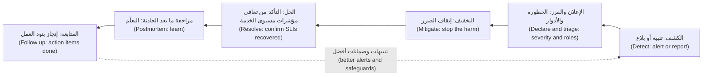

**خفّف الضرر أولًا (Mitigate first).** الإجراء الآمن الأسرع الذي يوقف الضرر عن المستخدمين (The fastest safe action that stops user harm) يأتي قبل الفهم (comes before understanding). التخفيفات المعتادة (Typical mitigations)، بترتيب الأفضلية تقريبًا (in rough order of preference): **التراجع (roll back)** عن أحدث تغيير (the most recent change)، فعمليات النشر وتغييرات الإعدادات (deployments and configuration changes) تسبّب حصةً كبيرة من الحوادث، ولذلك فإن «ما الذي تغيّر؟» ⁦("what changed?")⁩ هو السؤال الأول (the first question)؛ و**إطفاء علَم الميزة (turn off a feature flag)**؛ و**التحويل إلى البديل (fail over)** إلى منطقةٍ سليمة أو نسخةٍ متماثلة سليمة (a healthy zone or replica)؛ و**التوسّع الأفقي (scale out)** أو **التخلّص من جزءٍ من الحمل (shed load)**، أي رفض الحركة منخفضة الأولوية لحماية المدفوعات (reject low-priority traffic to protect payments). احفظ الأدلة قبل أن تُتلفها (Keep evidence before you destroy it): التقط السجلات أو تفريغ الذاكرة (a heap dump) أو الإعدادات السيئة (the bad configuration) قبل إعادة تشغيل الأشياء، إذا كان ذلك يستغرق ثوانيَ لا دقائق (if it takes seconds rather than minutes).

#### 🟡 التعمق أكثر (Going deeper)
**التحديث الجيد (A good update)** له شكلٌ ثابت سهل المسح بالعين (a fixed, scannable shape):

```text
[SEV2 · Payments · Update 3 · 11:30]
Impact: ~8% of transfer requests failing or slow since 10:41. No duplicate transfers.
Current status: Mitigated. Config rolled back at 11:17; error ratio back to normal since 11:18.
Next steps: Monitoring for 30 min before resolving. Investigating why the change reached prod.
Next update: 12:00 or sooner if anything changes.
IC: Maha · Ops: Tariq · Comms: Salem · Scribe: Yousef
```

قل ما تعرفه (Say what you know)، وما لا تعرفه (what you do not know)، ومتى ستتحدث في المرة القادمة (when you will speak next). ولا تخمّن سببًا أبدًا في رسالةٍ موجّهة إلى العملاء (Never guess a cause in a customer-facing message).

**عادات التنسيق (Coordination habits).** قناة حادثة واحدة، ومكالمة جسر واحدة، وقائد حادثة واحد (One incident channel, one bridge call, one IC). أعلِن التغييرات قبل إجرائها (Announce changes before making them): «طارق: أتراجع الآن عن payments-config إلى المراجعة 41» ⁦("Tariq: rolling back payments-config to revision 41 now")⁩. وسلِّم دور قائد الحادثة صراحةً (Hand over the IC role explicitly) عند تغيّر المناوبات (when shifts change) أو حين تتجاوز الحادثة طاقة شخصٍ واحد (outlasts one person's energy): «مها تسلّم قيادة الحادثة إلى سالم الساعة 13:00؛ سالم، أكّد» ⁦("Maha handing IC to Salem at 13:00; Salem, confirm.")⁩ 

**حين تكون الحادثة حادثةً أمنية أيضًا (When an incident is also a security incident).** إذا ظهرت أي علامة على وجود مهاجم (any sign of an attacker)، مثل وصولٍ غير متوقع (unexpected access) أو بياناتٍ تغادر (data leaving) أو أثرٍ برمجي عُبث به (a tampered artefact)، فأشرِك مركز العمليات الأمنية لدى جاسم (Jassim's SOC) فورًا. فالحوادث الأمنية تغيّر القواعد (Security incidents change the rules): احفظ الأدلة (preserve evidence)، ولا تنبّه المهاجم (do not tip off the attacker)، واتبع خطة الاستجابة للحوادث الأمنية (the security incident response plan)، بواجباتها القانونية والتنظيمية (with its legal and regulatory duties). وتُدرَّس هذه العملية في [*أمن الذكاء الاصطناعي وأمن التطبيقات (Secure AI & Application Security)*، الدرس 10.2 — الاستجابة للحوادث: الاستعداد والكشف والاحتواء والتعافي والتعلّم (Incident response: prepare, detect, contain, recover, learn)](../secai/index.ar.html#/10.2).

**الإبلاغ التنظيمي (Regulatory reporting).** على الكيانات المالية واجبات إبلاغٍ عن الحوادث (incident reporting duties). فبموجب قانون DORA في الاتحاد الأوروبي (Under the EU's DORA)، يجب على الشركات تصنيف الحوادث المتعلقة بتقنية المعلومات والاتصالات (classify ICT-related incidents) والإبلاغ عن الكبرى منها إلى السلطة المختصة (report major ones to their competent authority) ضمن مهلٍ محددة (within set deadlines)؛ كما تضع الجهات التنظيمية الخليجية (GCC regulators)، ومنها مصرف قطر المركزي (the Qatar Central Bank)، توقعاتٍ للإبلاغ عن الحوادث وإخفاقات الإسناد الخارجي (reporting incidents and outsourcing failures). وتملك إدارة المخاطر والامتثال (Risk and Compliance) المعايير والمهل (Criteria and timelines)؛ أمّا واجب الهندسة (engineering's duty) فهو تزويدها بحقائق دقيقة بسرعة (accurate facts fast)، أي وقت البدء والخدمات والعملاء والمعاملات المتأثرة وأثر البيانات (start time, services, customers and transactions affected, data impact)، وهذا سببٌ إضافي للاحتفاظ بخطٍّ زمني من الدقيقة الأولى (keep a timeline from minute one).

**مراجعة ما بعد الحادثة الخالية من اللوم (The blameless postmortem).** **مراجعة ما بعد الحادثة (postmortem)**، وتُسمّى أيضًا المراجعة اللاحقة للحادثة (post-incident review)، تحليلٌ مكتوب للحادثة (a written analysis of an incident): ما الذي حدث (what happened)، وأثره (its impact)، ولماذا حدث (why it happened)، وكيف سارت الاستجابة (how the response went)، وما الذي سيتغيّر (what will change). و**الخالية من اللوم (Blameless)** تعني أنها تفترض أن الجميع تصرّفوا بشكلٍ معقول بالنظر إلى ما كانوا يعرفونه حينها (acted reasonably given what they knew at the time)، وتبحث عن الظروف التي جعلت التصرّف الضار سهلًا والتصرّف الآمن صعبًا (made the harmful action easy and the safe action hard). والغاية عملية (The point is practical): إذا خاف الناس من اللوم، أخفوا التفاصيل (hide details)، ودون التفاصيل لا تستطيع إصلاح النظام (you cannot fix the system).

الخلوّ من اللوم لا يعني أن لا أحد مساءل (Blameless does not mean nobody is accountable). فالفرق مساءلة عن إنجاز بنود العمل (accountable for completing action items)؛ والقادة مساءلون عن جعل قول الحقيقة آمنًا (making it safe to tell the truth).

**من «الخطأ البشري» إلى العوامل المساهمة (From "human error" to contributing factors).** «وافق يوسف على تغييرٍ سيئ» ("Yousef approved a bad change") صحيحٌ وعديم الفائدة (true and useless). اطرح أسئلةً أفضل (Ask better questions):
- كيف كان الأمر منطقيًّا في حينه؟ ⁦(How did it make sense at the time?)⁩ (أظهرت الفروقات سطرًا واحدًا في ملفٍ اسمه `values-shared.yaml`، وبدا غير ضار (looked harmless).)
- ما الذي جعل الخطأ سهلًا؟ ⁦(What made the error easy?)⁩ (قيمٌ مشتركة لكل البيئات (Shared values for all environments)؛ ولا فروقات مُصيَّرة لإعدادات الإنتاج في خط التسليم (no rendered diff of the production configuration in the pipeline).)
- ما الذي جعل الكشف بطيئًا؟ ⁦(What made detection slow?)⁩ (استدعى التنبيه شخصًا واحدًا (paged one person) ولم يجمع شيءٌ الفريق المناسب (nothing gathered the right team).)
- ما الذي حدّ من الضرر؟ ⁦(What limited the damage?)⁩ (مفاتيح عدم التكرار (Idempotency keys)، ومسار تراجعٍ سريع (a fast rollback path).)

للأعطال المعقدة عادةً عدة **عوامل مساهمة (contributing factors)** بدل سببٍ جذري واحد (rather than one root cause). اذكرها كلها (List them all)؛ وأصلح الأكثر تأثيرًا منها (fix the ones with the most leverage).

#### 🔴 نظرة الخبير (Expert view)
**مثالٌ علني: انقطاع Amazon S3 في فبراير 2017 (A public example: the Amazon S3 outage of February 2017).** نشرت AWS ملخصًا (published a summary) لتعطّلٍ أصاب S3 في منطقتها us-east-1 (its us-east-1 region). فقد شغّل مهندسٌ مخوَّل (An authorised engineer)، متّبعًا دليل إجراءاتٍ معتمدًا (following an established playbook)، أمرًا مقصودًا لإزالة عددٍ صغير من الخوادم من نظامٍ فرعي في S3 (remove a small number of servers from an S3 subsystem)؛ فأُدخل أحد المدخلات بشكلٍ خاطئ (one input was entered incorrectly) وأُزيلت مجموعةٌ أكبر بكثير (a much larger set was removed). وركّزت استجابة AWS على الأداة لا على الشخص (focused on the tool rather than the person): فقد غيّرت الأداة لتزيل السعة ببطءٍ أكبر (remove capacity more slowly) وترفض النزول تحت حدٍّ أدنى آمن (refuse to go below a safe minimum). وأشار الملخص أيضًا إلى أن لوحة الحالة الخاصة بـ AWS (AWS's own status dashboard) كانت تعتمد على S3، فلم تستطع إظهار الانقطاع في البداية (could not show the outage at first). والدروس لنجم (The lessons for Najm): ابنِ حواجز حماية في الأدوات الخطرة (build guardrails into dangerous tools)، وتأكد من أن أدوات الحوادث لديك لا تعتمد على الشيء الذي يفشل (your incident tooling does not depend on the thing that is failing).

**مثالٌ ثانٍ: GitLab، يناير 2017 (A second example: GitLab, January 2017).** أثناء جهدٍ في وقتٍ متأخر من الليل لإصلاح تكرار قاعدة البيانات (fix database replication)، حذف مهندسٌ بياناتٍ على قاعدة البيانات الرئيسية بدل النسخة المتماثلة (on the primary database instead of the replica). ثم وجدت مراجعة ما بعد الحادثة العلنية لدى GitLab (GitLab's public postmortem) أن عددًا من آليات النسخ الاحتياطي والتكرار لديها (several of its backup and replication mechanisms) لم تكن تعمل كما هو متوقع (not working as expected)، وفُقدت بيانات إنتاج لنحو ست ساعات (about six hours of production data was lost). والدروس (The lessons): النسخة الاحتياطية التي لم تستعِدها أملٌ لا نسخة احتياطية (a backup you have not restored is a hope, not a backup)، والدرس 6.1 يغطي اختبار الاستعادة (recovery testing)، والأشخاص المتعبون الذين يؤدون عملًا يدويًّا خطرًا ليلًا (tired people doing risky manual work at night) يحتاجون إلى أدواتٍ تجعل التصرّف الآمن سهلًا (tooling that makes the safe action easy).

**بنود عملٍ تغيّر الأشياء (Action items that change things).** البنود الضعيفة (Weak items)، مثل «كن أكثر حذرًا» ("be more careful") و«أضِف مزيدًا من المراقبة» ("add more monitoring")، لا تصمد حتى دورة العمل القصيرة التالية (do not survive the next sprint). أمّا البنود القوية (Strong items) فهي محددة، ومملوكة، ومؤرّخة، وتغيّر النظام (specific, owned, dated and change the system):

| ضعيف (Weak) | قوي (Strong) |
|---|---|
| كن أكثر حذرًا مع تغييرات الإعدادات (Be more careful with config changes) | قسّم `values-shared.yaml` إلى ملفاتٍ لكل بيئة (per-environment files)؛ ويفشل التكامل المستمر (CI fails) إذا تغيّرت قيمةٌ إنتاجية دون مراجعةٍ موسومة للإنتاج (without a production-labelled review) (المالك (owner): يوسف، الاستحقاق (due): أسبوعان) |
| حسّن المراقبة (Improve monitoring) | أضِف لوحة USE (a USE panel) وتنبيهًا بمستوى تذكرة عمل (a ticket-level alert) لتشبّع مجمّع اتصالات قاعدة بيانات المدفوعات فوق 80% (Payments DB pool saturation above 80%) (المالك (owner): مها، الاستحقاق (due): أسبوع واحد) |
| تواصل بسرعة أكبر (Communicate faster) | استدعاءات الاحتراق السريع للمدفوعات (Fast-burn pages for Payments) تستدعي أيضًا جدول مناوبة قادة الحوادث (also page the IC rota) وتُنشئ قناة الحادثة تلقائيًّا (auto-create the incident channel) (المالك (owner): فريق المنصة لدى سالم (Salem's platform team)، الاستحقاق (due): 3 أسابيع) |

أعطِ الأولوية للبنود التي **تمنع (prevent)** التكرار، ثم التي **تكشف (detect)** بسرعة أكبر، ثم التي **تستجيب (respond)** بسرعة أكبر. تابعها في قائمة الأعمال العادية (the normal backlog) وراجعها أسبوعيًّا (review them weekly).

**قياس الاستجابة للحوادث (Measuring incident response).** تتابع الفرق أزمنةً مثل **الوقت حتى الكشف (time to detect)**، و**الوقت حتى الإقرار (time to acknowledge)**، و**الوقت حتى الاستعادة (time to restore)**. ويستخدم بحث DORA (DORA's research) الوقت حتى استعادة الخدمة (time to restore service)، الذي نُقّح في تقارير لاحقة (refined in later reports)، بوصفه مقياس تسليمٍ رئيسيًّا (a key delivery metric). تعامل مع هذه الأرقام بحذر (with care): فالحوادث قليلة ومختلفة جدًّا (few and very different)، لذا تضلّل المتوسطات على مدى ربع سنة (averages over a quarter mislead). انظر إلى الاتجاهات (trends) والتوزيع (the distribution) والقصة وراء أطولها (the story behind the longest ones).

**تدرّب قبل أن يكون الأمر حقيقيًّا (Practise before it is real).** **أيام التمرين (Game days)** تمارين مخطط لها (planned exercises) يستجيب فيها الفريق لحادثةٍ محاكاة (a simulated incident) في بيئة اختبار (a test environment): تحويل قاعدة بيانات إلى البديل (a database failover)، أو فقدان منطقة (a lost zone)، أو شهادة منتهية الصلاحية (an expired certificate). وهي تختبر أدلة التشغيل والأدوار والأدوات (runbooks, roles and tooling)، وتدرّب الأشخاص الجدد مثل يوسف بأمان (train new people like Yousef safely). وهندسة الفوضى (Chaos engineering) توسّع ذلك (الدرس 6.1). وتُجري نجم يومًا واحدًا كل ربع سنة (one each quarter)، بعضها بالاشتراك مع مركز العمليات الأمنية لدى جاسم (jointly with Jassim's SOC).

### 🧰 الأدوات (The toolkit)
| الأداة أو الممارسة أو الخدمة (Tool, practice or service) | ما هي وماذا تفعل (What it is and does) | متى تلجأ إليها (When to reach for it) |
|---|---|---|
| **Incident commander** — قائد الحادثة | الشخص الوحيد الذي ينسّق الاستجابة (The single person who coordinates the response)، ويوزّع الأدوار (assigns roles)، ويتخذ القرارات (makes decisions)؛ ولا يصحّح الأخطاء (does not debug) | كل حادثةٍ مُعلنة (Every declared incident)، منذ الدقائق الأولى (from the first minutes) |
| **Severity levels** — مستويات الخطورة | مقياسٌ مشترك (A shared scale) يحدّد من يشارك، وعدد مرات التواصل، ومن يجب إبلاغه (who is involved, how often to communicate and who must be told) | إعلان الحوادث وتصعيدها باتساق (Declaring and escalating incidents consistently) |
| **Blameless postmortem** (Google SRE) — مراجعة ما بعد الحادثة الخالية من اللوم | مراجعةٌ مكتوبة (A written review) تبحث عن العوامل المساهمة في النظام (contributing factors in the system)، لا عن أشخاصٍ يُلامون (not people to blame) | بعد كل حادثة SEV1 وSEV2 (After every SEV1 and SEV2)، وأي حادثة استهلكت حصةً كبيرة من ميزانية الأخطاء (a large share of the error budget) |
| **Status page** — صفحة الحالة | صفحةٌ عامة أو داخلية (A public or internal page) تُظهر حالة الخدمة الحالية وتحديثات الحوادث (current service status and incident updates)، مستضافةٌ بشكلٍ مستقل عن الخدمات التي تبلّغ عنها (hosted independently of the services it reports on) | الحوادث التي تمسّ العملاء (Customer-facing incidents)؛ إبقاء مركز الاتصال على اطلاع (keeping the contact centre informed) |
| **Game day** — يوم التمرين | حادثةٌ محاكاة مخطط لها في بيئةٍ آمنة (A planned, simulated incident in a safe environment) لاختبار أدلة التشغيل والأدوار والأدوات (to test runbooks, roles and tooling) | كل ربع سنة (Quarterly)، وقبل أن تبدأ خدمةٌ جديدة أو جدول مناوبة جديد العمل (before a new service or rota goes live) |

### 🏛️ عمليًا في بنك نجم (In practice at Najm Bank)
**الأثر البرمجي (Artefact): مراجعة ما بعد الحادثة لحادثة مجمّع اتصالات المدفوعات (the postmortem for the Payments connection-pool incident)، مختصرةً (abridged)، باستخدام قالب نجم (using Najm's template).**

| القسم (Section) | المحتوى (Content) |
|---|---|
| العنوان والحالة (Title and status) | PM-2026-014 · تحويلات المدفوعات تفشل بعد تغيير إعدادات (Payments transfers failing after configuration change) · SEV2 · نهائية (Final) |
| الملخص (Summary) | خفّض تغييرٌ في قيم Helm المشتركة (A shared Helm values change) مجمّع اتصالات قاعدة بيانات المدفوعات (the Payments database connection pool) من 50 إلى 5 في الإنتاج. فاصطفّت التحويلات بانتظار الاتصالات (Transfers queued for connections) وانتهت مهلتها (timed out). وأعاد التراجع عن الإعدادات (Rolling back the configuration) الخدمة (restored service). |
| الأثر (Impact) | 10:41–11:18 (37 دقيقة). نحو 8% من طلبات التحويل فشلت أو استغرقت أكثر من ثانيتين (failed or took over 2 s)؛ ونحو 3,100 عميل متأثر. لا تحويلات مكرّرة أو مفقودة (No duplicated or lost transfers)، وقد تحقّقت المطابقة من ذلك (verified by reconciliation). واستُهلك نحو 5–10% من ميزانية أخطاء التوافر للمدفوعات على مدى 30 يومًا (of the 30-day Payments availability error budget)، تبعًا لحجم الحركة في تلك الساعة (depending on traffic at that hour) وعدد الطلبات التي فشلت بدل أن تكون بطيئة (how many requests failed rather than ran slow). |
| الكشف (Detection) | استدعاء احتراقٍ سريع لهدف مستوى الخدمة (Fast-burn SLO page) الساعة 10:52 (بعد 11 دقيقة من البدء (11 minutes after onset)). وبدأت بلاغات مركز الاتصال (Contact centre reports) الساعة 10:49. |
| الخط الزمني (مقتطف) (Timeline (extract)) | 10:40 ترقية الإعدادات (config promoted) · 10:41 بدء الأخطاء (errors begin) · 10:52 استدعاء يوسف (page to Yousef) · 11:04 إعلان SEV2، ومها قائدة الحادثة (SEV2 declared, Maha IC) · 11:12 سؤال «ما الذي تغيّر؟» يشير إلى الإعدادات ("what changed?" points to config) · 11:17 التراجع (rollback) · 11:18 عودة الأخطاء إلى طبيعتها (errors normal) · 11:48 الحل (resolved) |
| العوامل المساهمة (Contributing factors) | ملف قيم واحد مشترك بين كل البيئات (One values file shared by all environments)؛ أظهر خط التسليم فروقات المصدر لا فروقات الإنتاج المُصيَّرة (the source diff, not the rendered production diff)؛ لا تنبيه على تشبّع المجمّع (no alert on pool saturation)؛ لم يصل الاستدعاء إلى جدول مناوبة قادة الحوادث (page did not reach the IC rota)؛ خلطت الترقية الجماعية تغييراتٍ غير مترابطة (batch promotion mixed unrelated changes) |
| ما سار جيدًا (What went well) | منعت مفاتيح عدم التكرار التحويلات المكرّرة (Idempotency keys prevented duplicate transfers)؛ واستغرق التراجع أمرًا واحدًا (rollback took one command)؛ وأبقت تحديثات قائد الاتصالات مركزَ الاتصال متّسقًا (kept the contact centre aligned) |
| أين حالفنا الحظ (Where we got lucky) | وقعت الحادثة في ساعات العمل ومها متصلة (in business hours with Maha online) |
| بنود العمل (Action items) | ملفات قيمٍ لكل بيئة وفحصٌ للفروقات المُصيَّرة في التكامل المستمر (Per-environment values files and a rendered-diff check in CI) (يوسف، أسبوعان، منع (prevent)) · تنبيه تشبّع المجمّع بوصفه تذكرة عمل (Pool saturation alert as a ticket) (مها، أسبوع واحد، كشف (detect)) · استدعاءات الاحتراق السريع تستدعي أيضًا جدول مناوبة قادة الحوادث (Fast-burn pages also page the IC rota) (فريق المنصة، 3 أسابيع، استجابة (respond)) · ترقية مجموعة تغييراتٍ واحدة في كل مرة إلى المدفوعات (Promote one change set at a time to Payments) (طارق، أسبوعان، منع (prevent)) |
| المراجعة (Review) | عُرضت في مراجعة العمليات الأسبوعية (the weekly operations review)؛ وتُتابع بنود العمل حتى الإغلاق (tracked to closure)؛ وشوركت الحقائق مع إدارة المخاطر والامتثال لسجل الحوادث (facts shared with Risk and Compliance for the incident register) |

### 🛠️ التمارين (Exercises)
- 🟢 اقرأ ملخص AWS عن انقطاع S3 في فبراير 2017 (the AWS S3 February 2017 summary) أو مراجعة ما بعد الحادثة لدى GitLab في يناير 2017 (GitLab's January 2017 postmortem). اكتب ملخصًا من نصف صفحة (a half-page summary) بقالب نجم (in Najm's template): الأثر والخط الزمني والعوامل المساهمة وثلاثة بنود عمل (impact, timeline, contributing factors and three action items). *يكتمل عندما (Done when):* لا يكون أيٌّ من عواملك المساهمة «خطأً بشريًّا» ("human error")، ويغيّر كل بند عمل نظامًا أو أداة (changes a system or tool).
- 🟡 أدِر تمرينًا مكتبيًّا (a tabletop exercise) مدته 45 دقيقة مع صديقين أو ثلاثة أو زملاء دراسة (friends or classmates). استخدم سيناريو مثل «زمن استجابة واجهة برمجة تطبيق نجم للهاتف يتضاعف ثلاث مرات بعد نشر» ("Najm Mobile API latency triples after a deploy"). وزّع أدوار قائد الحادثة والعمليات والاتصالات والمدوّن (Assign IC, operations, communications and scribe)؛ ويكشف «مدير اللعبة» ("game master") حقائق جديدة كل بضع دقائق. *يكتمل عندما (Done when):* يكون لديك خطٌّ زمني مختوم بالوقت (a timestamped timeline)، وثلاثة تحديثات حالة بالصيغة أعلاه (three status updates in the format above)، وقائمة بما أبطأكم (a list of what slowed you down).
- 🔴 في مختبر kind أو k3d المحلي لديك (your local kind or k3d lab) مع منظومة قابلية المراقبة من الدرسين 5.1 و5.2 (the observability stack from lessons 5.1 and 5.2)، أدِر يوم تمرين (run a game day): انشر تغييرًا يسبّب احتراقًا سريعًا لهدف مستوى الخدمة (an SLO fast burn)، مثل مجمّع اتصالاتٍ صغيرٍ جدًّا أو تأخيرٍ محقون (a tiny connection pool or an injected delay)، واستجب بالأدوار (respond with roles)، وخفّف الضرر بالتراجع (mitigate by rollback)، واكتب مراجعة ما بعد الحادثة كاملةً خاليةً من اللوم (a full blameless postmortem). *يكتمل عندما (Done when):* يكون التنبيه قد استدعى كما صُمّم (paged as designed)، والتراجع مسجّلًا في الخط الزمني (recorded in the timeline)، ولمراجعة ما بعد الحادثة ثلاثة بنود عمل على الأقل مملوكة ومؤرّخة (at least three owned, dated action items) موزّعة بين المنع والكشف والاستجابة (split across prevent, detect and respond).

### ⚠️ أخطاء وفخاخ (Mistakes and traps)
- **التصحيح قبل الإعلان (Debugging before declaring).** عشرة أشخاص يحقّقون في خمس محادثات (Ten people investigating in five chats) ليست استجابة (not a response). أعلِن مبكرًا (Declare early)، وسمِّ قائد حادثة (name an IC)، ثم حقّق (then investigate).
- **قائد الحادثة الذي يصحّح الأخطاء (The IC who debugs).** حين يضيع المنسّق في الطرفية (lost in a terminal)، لا يبقى أحدٌ يراقب الصورة الكبيرة (watching the big picture). يفوّض قائد الحادثة العمل العملي (delegates hands-on work).
- **البحث عن السبب الجذري بينما ما زال العملاء يواجهون الفشل (Looking for the root cause while customers are still failing).** تراجَع، أو حوّل إلى البديل، أو أطفئ العلَم أولًا (Roll back, fail over or turn the flag off first)؛ وحقّق بعد ذلك (investigate after).
- **«الخطأ البشري» بوصفه الخلاصة ("Human error" as the conclusion).** إنه يوقف التعلّم (stops learning) ويعلّم الناس إخفاء الأخطاء (teaches people to hide mistakes). اسأل عمّا جعل الخطأ سهلًا والكشف بطيئًا (what made the error easy and detection slow).
- **بنود عملٍ لا تُغلق أبدًا (Action items that never close).** مراجعة ما بعد الحادثة التي فيها «كن أكثر حذرًا» ("be more careful") أو بنودٌ غير متابَعة (untracked items) لا تغيّر شيئًا. اجعل البنود محددة ومملوكة ومؤرّخة ومُراجَعة (specific, owned, dated and reviewed).

### 🧾 الخلاصة (Recap)
- أعلِن الحوادث مبكرًا (Declare incidents early)، وحدّد خطورةً (set a severity)، وعيّن قائد حادثة وقائد عمليات وقائد اتصالات ومدوّنًا (an incident commander, operations lead, communications lead and scribe).
- أوقف الضرر أولًا (Stop the harm first): تراجَع، أو اقلب العلَم، أو حوّل إلى البديل، أو تخلّص من جزءٍ من الحمل (roll back, flip a flag, fail over or shed load)؛ واحفظ الأدلة حيث يكون ذلك رخيصًا (preserve evidence where it is cheap).
- تواصل وفق جدولٍ ثابت (on a fixed schedule) بالأثر والحالة والخطوات التالية وموعد التحديث القادم (impact, status, next steps and next update time)؛ ووجّه الحوادث الأمنية إلى مركز العمليات الأمنية (route security incidents to the SOC).
- مراجعات ما بعد الحادثة الخالية من اللوم (Blameless postmortems) تبحث عن العوامل المساهمة في النظام (contributing factors in the system) لأن اللوم يُخفي الحقائق التي تحتاجها (blame hides the facts you need).
- بنود العمل القوية (Strong action items) محددة ومملوكة ومؤرّخة ومتابَعة (specific, owned, dated and tracked)؛ امنع، ثم اكشف، ثم استجب بسرعة أكبر (prevent, then detect, then respond faster).
- تدرّب بأيام التمرين والتمارين المكتبية (game days and tabletop exercises) حتى لا تكون الحادثة الحقيقية الأولى هي البروفة الأولى (the first real incident is not the first rehearsal).

### ✍️ اختبر نفسك (Check yourself)

**1. بعد خمس عشرة دقيقة من انقطاع واجهة برمجة تطبيق نجم للهاتف (a Najm Mobile API outage)، يصحّح ثلاثة مهندسين في محادثاتٍ منفصلة (separate chats)، ولا يعرف مركز الاتصال ماذا يقول للعملاء. ما الذي ينبغي أن يحدث أولًا؟**

- A. يتولى المهندس الأقدم كل التصحيح بنفسه (The most senior engineer takes over all of the debugging personally)
- B. يوقف الجميع التغييرات حتى يُفهم السبب الجذري تمامًا (until the root cause is fully understood)
- C. يتفق الفريق على الأدوار لاحقًا، في مراجعة ما بعد الحادثة (agrees roles later, in the postmortem)، حين تهدأ الأمور
- D. أعلِن حادثةً، وسمِّ قائد حادثة، ووزّع الأدوار (Declare an incident, name an incident commander and assign roles)

<details><summary>الإجابة</summary>

**D.** الأدوار ونقطة تنسيقٍ واحدة (Roles and one point of coordination) تحوّل الجهد المتوازي إلى استجابة (turn parallel effort into a response). أمّا مهندسٌ أقدم يصحّح (A senior engineer debugging) (A) فلا يترك أحدًا ينسّق؛ وانتظار السبب الجذري (waiting for the root cause) (B) يؤخّر التخفيف (delays mitigation). (🟢 الأساسيات (The essentials).)

</details>

**2. بدأت أخطاء المدفوعات بعد دقيقتين من ترقية تغيير إعدادات (a configuration change was promoted). والسبب لم يتأكد بعد (not yet confirmed). ما الخطوة التالية الأفضل؟**

- A. واصل التحقيق حتى يثبت السبب الجذري بدقة (until the exact root cause is proven)
- B. تراجَع عن تغيير الإعدادات لإيقاف الضرر، ثم حقّق (Roll back the configuration change to stop the harm, then investigate)
- C. أعِد تشغيل قاعدة البيانات لمسح أي حالةٍ سيئة (Restart the database to clear any bad state)
- D. انشر رسالةً للعملاء تقول إن قاعدة البيانات فشلت (Post a customer message saying the database has failed)

<details><summary>الإجابة</summary>

**B.** التغييرات الحديثة هي السبب الأرجح (Recent changes are the most likely cause) والتراجع سريعٌ وآمن (fast and safe)؛ خفّف الضرر أولًا (mitigate first). إعادة تشغيل قاعدة البيانات (C) تخاطر بمزيدٍ من الضرر وتُتلف الأدلة (risks more harm and destroys evidence)؛ وتخمين سببٍ علنًا (guessing a cause publicly) (D) خطأٌ في التواصل (a communication error). (🟢 الأساسيات (The essentials).)

</details>

**3. تذكر مسودة مراجعة ما بعد الحادثة (A draft postmortem) أن السبب الجذري هو «وافق يوسف على طلب سحبٍ بقيمةٍ خاطئة» ("Yousef approved a pull request with a wrong value"). ماذا ينبغي أن تطلب مها بدلًا من ذلك؟**

- A. العوامل المساهمة (Contributing factors)، مثل كيف وصلت قيمة تطوير إلى الإنتاج دون أن يلاحظها أحد (how a dev value reached production unnoticed)
- B. إنذارًا كتابيًّا ليوسف (A written warning for Yousef)، يُسجَّل في ملف أدائه (in his performance file)
- C. إزالة يوسف من قائمة الموافقين (approvers list) على مستودعات المدفوعات (Payments repositories)
- D. إغلاق مراجعة ما بعد الحادثة مبكرًا (Closing the postmortem early)، لأن السبب واضحٌ أصلًا

<details><summary>الإجابة</summary>

**A.** التحليل الخالي من اللوم (Blameless analysis) يسأل عمّا جعل الخطأ سهلًا والكشف بطيئًا، ما يُنتج إصلاحاتٍ تمنع التكرار (fixes that prevent recurrence). أمّا العقاب (Punishment) (B، C) فيعلّم الناس إخفاء المعلومات (hide information) ويُبقي الفخ في مكانه (leaves the trap in place). (🟡 التعمق أكثر (Going deeper).)

</details>

**4. أيّ بند عملٍ في مراجعة ما بعد الحادثة هو الأقوى (strongest)؟**

- A. ينبغي أن يحرص الجميع أكثر عند تعديل الإعدادات مستقبلًا (Everyone should take more care when editing configuration in future)
- B. تحسين مراقبة خدمة المدفوعات عبر كل البيئات (Improve monitoring of the Payments service across all environments)
- C. ملفات قيمٍ لكل بيئة إضافةً إلى فحصٍ في التكامل المستمر (Per-environment values files plus a CI check)؛ المالك يوسف، والاستحقاق خلال أسبوعين (owner Yousef, due in two weeks)
- D. مناقشة ممارسات الإعدادات مع كل المهندسين في الاجتماع العام القادم (at the next all-hands)

<details><summary>الإجابة</summary>

**C.** إنه محدد ومملوك ومؤرّخ (specific, owned, dated) ويغيّر النظام بحيث لا يتكرر الخطأ بالطريقة نفسها (cannot recur the same way). أمّا A وB وD فغامضة وغير متابَعة (vague and untracked). (🔴 نظرة الخبير (Expert view).)

</details>

**5. أثناء تعطّل S3 في فبراير 2017 (the February 2017 S3 disruption)، لم تستطع لوحة الحالة الخاصة بـ AWS (AWS's own status dashboard) إظهار المشكلة في البداية. ما الدرس الذي تأخذه نجم من ذلك؟**

- A. صفحات الحالة غير مفيدة أثناء الحوادث ويمكن الاستغناء عنها (Status pages are not useful during incidents and can be dropped)
- B. شغّل كل خدمة في منطقةٍ سحابية واحدة (a single cloud region) لإبقاء الأمور بسيطة
- C. لا تدع أي مهندسٍ يشغّل أوامر على أنظمة الإنتاج أبدًا (Never let any engineer run commands against production systems)
- D. استضِف أدوات الحوادث بشكلٍ مستقل عن الأنظمة التي تبلّغ عنها (Host incident tooling independently of the systems it reports on)

<details><summary>الإجابة</summary>

**D.** كانت اللوحة تعتمد على S3، ففشلت معه (it failed with it)؛ ويجب أن تصمد أدوات الحوادث (incident tooling)، مثل صفحة الحالة والاستدعاء (the status page and paging)، أمام العطل الذي تبلّغ عنه (survive the failure it reports). أمّا حظر كل أوامر الإنتاج (Banning all production commands) (C) فغير عملي (unworkable)؛ وكان إصلاح AWS حواجز حماية في الأداة (guardrails in the tool). (🔴 نظرة الخبير (Expert view).)

</details>

### 📚 المراجع (References)
- Google، *هندسة موثوقية المواقع (Site Reliability Engineering)*، «إدارة الحوادث» ("Managing Incidents") — https://sre.google/sre-book/managing-incidents/
- Google، *هندسة موثوقية المواقع (Site Reliability Engineering)*، «ثقافة مراجعة ما بعد الحادثة: التعلّم من الفشل» ("Postmortem Culture: Learning from Failure") — https://sre.google/sre-book/postmortem-culture/
- Google، *كتاب عمل هندسة موثوقية المواقع (The Site Reliability Workbook)*، «الاستجابة للحوادث» ("Incident Response") — https://sre.google/workbook/incident-response/
- Google، *كتاب عمل هندسة موثوقية المواقع (The Site Reliability Workbook)*، «ثقافة مراجعة ما بعد الحادثة» ("Postmortem Culture") — https://sre.google/workbook/postmortem-culture/
- AWS، ملخص تعطّل خدمة Amazon S3 في منطقة شمال فرجينيا (US-EAST-1) (Summary of the Amazon S3 Service Disruption in the Northern Virginia (US-EAST-1) Region) — https://aws.amazon.com/message/41926/
- GitLab، مراجعة ما بعد الحادثة لانقطاع قاعدة البيانات في 31 يناير (Postmortem of database outage of January 31) — https://about.gitlab.com/blog/
- أبحاث DORA (DORA research) — https://dora.dev/
- اللائحة (EU) 2022/2554 (DORA) (Regulation (EU) 2022/2554 (DORA)) — https://eur-lex.europa.eu/eli/reg/2022/2554/oj

---

<a id="m6"></a>

# الوحدة 6 — التوسّع والتكلفة والبنية التحتية للذكاء الاصطناعي (Scale, cost and AI infrastructure)

*إيصال خدمةٍ إلى الإنتاج (Getting a service to production) هو نصف المهمة (half the job). أمّا النصف الآخر فهو إبقاؤها عاملةً (keeping it up) حين تتضاعف حركة المرور ثلاث مرات (when traffic triples)، وحين تتعطّل منطقة توافر (when a zone fails) أو تُحذف قاعدة بيانات خطأً (a database is deleted by mistake)، مع إبقاء الفاتورة تحت السيطرة (keeping the bill under control) أثناء ذلك، وتشغيل أحدث أعباء العمل وأكثرها شراهةً على الإطلاق (the newest and hungriest workload of all): النماذج اللغوية الكبيرة (large language models) على وحدات معالجة الرسوميات (GPUs). تغطي هذه الوحدة القرارات الثلاثة التي تميّز مهندس المنصات (platform engineer) عن شخصٍ لا يستطيع سوى النشر (someone who can only deploy). أولًا، التوسّع والمرونة (scaling and resilience): التوسّع التلقائي (autoscaling) على مستوى الحجيرة والعقدة (at the pod and node level)، والتوزّع عبر مناطق التوافر (spreading across availability zones)، ونُسخٌ احتياطية استعدتها فعلًا (backups you have actually restored)، وأهداف التعافي من الكوارث (disaster recovery targets)، أي RTO وRPO، التي وقّع عليها قطاع الأعمال (that the business signed). ثانيًا، FinOps: رؤية أين يذهب المال (seeing where the money goes)، وإعطاء كل تكلفةٍ مالكًا (giving every cost an owner)، وخفض الهدر دون خفض الموثوقية (cutting waste without cutting reliability). ثالثًا، البنية التحتية للذكاء الاصطناعي (AI infrastructure): وحدات معالجة الرسوميات (GPUs)، وتقديم النماذج (model serving)، وبوابات النماذج اللغوية (LLM gateways)، والتكلفة لكل رمز (the cost per token). ستتابع فريق هندسة المنصات وهندسة موثوقية المواقع (Platform Engineering & SRE team) في بنك نجم (Najm Bank) بينما تدير مها أول اختبارٍ كامل للتعافي من الكوارث (the first full disaster recovery test) لخدمة المدفوعات (Payments service)، وتسأل منى من الإدارة المالية (from Finance) لماذا نمت فاتورة السحابة (cloud bill) أسرع من قاعدة العملاء (customer base)، ويتعيّن على سالم أن يقرّر كيف ينبغي لنجم أسيست (Najm Assist) أن يقدّم نماذجه (serve its models) دون أن يحرق ميزانية وحدات معالجة الرسوميات (GPU budget) في شهرٍ واحد.*

> **المراحل (Phases):** Operate, Monitor — إبقاء الإنتاج عاملًا (keeping production up)، وميسور التكلفة (affordable)، وجاهزًا لأعباء عمل الذكاء الاصطناعي (ready for AI workloads) بعد أن يصبح حيًّا (once it is live)، وإثبات ذلك بالاختبارات والأرقام (proving it with tests and numbers) لا بالأمل (rather than hope).

<a id="l6-1"></a>

## 6.1 — التوسّع والمرونة: التوسّع التلقائي وتعدّد المناطق والنسخ الاحتياطية والتعافي من الكوارث (Scaling and resilience: autoscaling, multi-zone, backups and disaster recovery)

*المستوى: 🔴 متقدم* · *المتطلبات: 2.3، 3.2، 5.2* · *المرحلة (Phase): Operate*

### ⚡ الدرس في دقيقة (In 60 seconds)
- **التوسّع (Scaling)** يتعامل مع حملٍ أكبر (handles more load)؛ و**المرونة (resilience)** تصمد أمام الأعطال (survives failure)، عبر التكرار الاحتياطي (redundancy) والنسخ الاحتياطية (backups) وخطط التعافي (recovery plans).
- توسّع تلقائيًّا على طبقات (Autoscale in layers): **المُوسِّع التلقائي الأفقي للحجيرات (Horizontal Pod Autoscaler)** يضيف حجيرات (adds pods)، و**المُوسِّع التلقائي للعقد (node autoscaler)** يضيف آلاتٍ لتلك الحجيرات (adds machines for those pods)، و**قاعدة البيانات (database)** لا تتوسّع تلقائيًّا في العادة أصلًا (usually does not autoscale at all)، لذا تكون غالبًا هي الحدّ الحقيقي (the real limit).
- وزّع كل خدمةٍ إنتاجية (every production service) على **منطقتين أو ثلاث من مناطق التوافر (two or three availability zones)** على الأقل، وافرض ذلك بقيود توزيع الطوبولوجيا (topology spread constraints) وميزانيات تعطيل الحجيرات (PodDisruptionBudgets).
- أهداف التعافي (Recovery targets) قراراتٌ تجارية (business decisions): **RTO** (كم من الوقت يُسمح لك بالتوقف، how long you may be down) و**RPO** (كم من البيانات يُسمح لك بفقدانه، how much data you may lose). دوّنها لكل خدمة (Write them down per service)، ثم اختر أرخص تصميمٍ يحقّقها (the cheapest design that meets them).
- مؤشر القرار (Decision cue): النسخة الاحتياطية التي لم تستعدها أملٌ لا نسخة احتياطية (a backup you have not restored is a hope, not a backup). جدوِل اختبارات الاستعادة (Schedule restore tests) وقِس زمنها مقابل RTO (time them against the RTO).
- أكبر فخ (Biggest trap): معاملة تعدّد المناطق (multi-zone) على أنه تعافٍ من الكوارث (disaster recovery). مناطق التوافر تصمد أمام تعطّل مركز بيانات (a data-centre failure)، لا أمام نشرٍ سيئ (a bad deploy) أو جدولٍ محذوف (a deleted table) أو برمجية فدية (ransomware)، لأن أضرارها تتكرّر في كل مكان خلال ثوانٍ (whose damage replicates everywhere in seconds).

### 🧭 لماذا يهم (Why it matters)
في 31 يناير 2017، نفّذ مهندسٌ في GitLab كان يصلح مشكلة تكرار (fixing a replication problem) أمرَ حذف (a delete command) على ما ظنّ أنها قاعدة البيانات الثانوية (the secondary database). لكنها كانت الأساسية (the primary). وتصف مراجعة ما بعد الحادثة العلنية (public postmortem) لدى GitLab كيف أن أيًّا من أساليب النسخ الاحتياطي والتكرار (backup and replication methods) التي اعتمد عليها الفريق لم يعمل كما هو متوقّع (worked as expected)؛ فتعافوا من نسخةٍ في بيئة التجهيز (a staging copy) عمرها نحو ست ساعات، وفقدوا قرابة ست ساعات من بيانات الإنتاج (production data). لم يكن أحدٌ قد استعاد نسخةً احتياطية من البداية إلى النهاية (restored a backup end to end)، لذا لم يكن أحدٌ يعلم أن النسخ الاحتياطية معطّلة (the backups were broken).

انتقلت خدمة المدفوعات (Payments service) للتوّ إلى السحابة (cloud)، ويسأل حمد (CISO) ووظيفة المخاطر (the risk function) سالمًا: «لو تعطّلت المنطقة الأساسية (the primary region) عصر اليوم، أو حذف أحدهم قاعدة بيانات المدفوعات (payments database)، فكم سيمضي من الوقت قبل أن يتمكّن العملاء من إرسال الأموال مجددًا (send money again)، وكم تحويلًا سنفقد ⁦(how many transfers would we lose?)⁩». ويتوقّع قانون المرونة التشغيلية الرقمية (Digital Operational Resilience Act, DORA) في الاتحاد الأوروبي، المطبَّق على الكيانات المالية (financial entities) منذ 17 يناير 2025، أن يُظهر كيانُ البنك في الاتحاد الأوروبي (the bank's EU entity) ترتيباتٍ مختبَرة للنسخ الاحتياطي والاستعادة والاستمرارية (tested backup, restoration and continuity arrangements)، كما تضع الجهات التنظيمية الخليجية (GCC regulators) مثل مصرف قطر المركزي (Qatar Central Bank) توقّعاتها الخاصة للاستمرارية والإسناد الخارجي (continuity and outsourcing expectations) (تحقّق من النصوص الحالية مع فريق المخاطر، check current texts with risk). و«نحن نستخدم تعدّد مناطق التوافر» ("We use multi-AZ") ليست إجابة. يبني هذا الدرس إجابةً حقيقية: أهدافًا (targets)، وتصميمًا (design)، والاختبار الذي يثبتها (the test that proves them).

### 📐 كيف يعمل (How it works)

#### 🟢 الأساسيات (The essentials)

**التوسّع: الرأسي والأفقي (Scaling: vertical and horizontal).** *التوسّع الرأسي (Vertical scaling)* يمنح الخادم مزيدًا من المعالج أو الذاكرة (more CPU or memory). وهو بسيط لكن له سقف (has a ceiling) ويعني عادةً إعادة تشغيل (a restart). أمّا *التوسّع الأفقي (Horizontal scaling)* فيضيف نسخًا أكثر من الخدمة (more copies of a service) خلف موازن أحمال (behind a load balancer). وسقفه أعلى بكثير (a much higher ceiling)، لكنه لا يعمل إلا إذا كانت الخدمة **عديمة الحالة (stateless)**: لا بيانات جلسات (no session data) ولا ملفات مرفوعة (uploads) ولا ذاكرات تخزين مؤقت (caches) محفوظة على القرص المحلي أو في الذاكرة (on the local disk or in memory) تحتاجها نسخةٌ أخرى (another copy would need). فالحالة (State) تذهب إلى قاعدة بيانات (a database) أو خدمة تخزين مؤقت (a cache service) أو تخزين الكائنات (object storage). ولرؤية غير المبرمج (the non-coder view)، انظر [*تصميم الأنظمة لمبرمجي الحدس (System Design for Vibe Coders)*، الدرس 10.1 — الخدمات عديمة الحالة وموازنة الأحمال (Stateless services and load balancing)](../vibe/index.ar.html#l10-1).

**يحدث التوسّع التلقائي في Kubernetes على طبقات (Autoscaling in Kubernetes happens in layers).**

| الطبقة (Layer) | ما الذي يتوسّع (What scales) | ما الذي يطلقه (Triggered by) | انتبه إلى (Watch out for) |
|---|---|---|---|
| **المُوسِّع التلقائي الأفقي للحجيرات (Horizontal Pod Autoscaler, HPA)** | عدد نسخ الحجيرات المتماثلة (Number of pod replicas) | استخدام المعالج أو الذاكرة مقابل الطلبات (CPU or memory utilisation against requests)، أو مقاييس مخصّصة (custom metrics) | يحتاج إلى طلبات موارد معقولة (sensible resource requests) (2.3)؛ يستجيب خلال عشرات الثواني (in tens of seconds)، لا فورًا (not instantly) |
| **المُوسِّع التلقائي للعقد (Node autoscaler)** (Cluster Autoscaler، Karpenter) | عدد العقد العاملة (Number of worker nodes) | حجيراتٌ عالقة في `Pending` لأن أي عقدةٍ لا تتّسع لها (because no node has room) | قد تستغرق العقدة الجديدة دقائق (can take minutes)؛ احتفظ ببعض الهامش (keep some headroom) |
| **المُوسِّع التلقائي الرأسي للحجيرات (Vertical Pod Autoscaler, VPA)** | طلبات المعالج والذاكرة لكل حجيرة (CPU and memory requests of each pod) | الاستخدام المرصود عبر الزمن (Observed usage over time) | لا تدع HPA وVPA يعملان على مقياس المعالج أو الذاكرة نفسه (the same CPU or memory metric) |
| **التوسّع المدفوع بالأحداث (Event-driven scaling)** (KEDA) | النسخ المتماثلة، نزولًا حتى الصفر (Replicas, down to zero) | طول الطابور (Queue length)، وتأخّر التدفّق (stream lag)، والجداول الزمنية (schedules) | التوسّع إلى الصفر (Scale-to-zero) يعني بدءًا باردًا (a cold start) |

مُوسِّعٌ تلقائي أفقي أساسي (A basic HPA) لواجهة برمجة تطبيق نجم للهاتف (Najm Mobile API):

```yaml
apiVersion: autoscaling/v2
kind: HorizontalPodAutoscaler
metadata:
  name: mobile-api
  namespace: mobile
spec:
  scaleTargetRef:
    apiVersion: apps/v1
    kind: Deployment
    name: mobile-api
  minReplicas: 6          # two per zone, never fewer
  maxReplicas: 30         # a ceiling the database can survive
  metrics:
    - type: Resource
      resource:
        name: cpu
        target:
          type: Utilization
          averageUtilization: 65   # percent of the CPU *request*
  behavior:
    scaleDown:
      stabilizationWindowSeconds: 300   # the default, made explicit: no flapping
```

رقمان هنا يعتمدان على الحكم التقديري لا على القيم الافتراضية (Two numbers are judgement, not defaults). فالقيمة `minReplicas: 6` تُبقي حجيرتين في كل منطقة توافر (two pods per zone) حتى في الليل. والقيمة `maxReplicas: 30` تحمي قاعدة البيانات (protects the database): كل حجيرةٍ تفتح اتصالات (every pod opens connections)، والمُوسِّع التلقائي غير المحدود (an unbounded autoscaler) قد يحوّل ذروة حركة مرور (a traffic spike) إلى انقطاعٍ في قاعدة البيانات (a database outage).

**مناطق التوافر (Availability zones).** *منطقة التوافر (availability zone, AZ)* هي مركز بياناتٍ واحد أو أكثر (one or more data centres) داخل منطقة (inside a region)، لها كهرباء وتبريد وشبكات منفصلة (separate power, cooling and networking) (1.2). شغّل الإنتاج في منطقتين على الأقل (Run production in at least two zones)، ويُفضَّل ثلاث (ideally three)، خلف موازن أحمال إقليمي (a regional load balancer). وتقدّم قواعد البيانات المُدارة (Managed databases) خيار *تعدّد مناطق التوافر (multi-AZ)*: نسخةً احتياطية جاهزة (a standby) في منطقةٍ أخرى تتولّى العمل تلقائيًّا (takes over automatically).

**أهداف التعافي (Recovery targets).**
- **RTO (هدف زمن التعافي، recovery time objective):** أطول مدةٍ يُسمح فيها بأن تكون الخدمة غير متاحة (the longest the service may be unavailable) بعد كارثة (after a disaster) قبل أن يصبح الضرر غير مقبول (before the harm is unacceptable).
- **RPO (هدف نقطة التعافي، recovery point objective):** أقصى قدرٍ من البيانات، مقيسًا بالزمن (measured in time)، يُسمح لك بفقدانه (you may lose). فـRPO مقداره 5 دقائق يعني أنه بعد التعافي (after recovery) قد تفتقد ما يصل إلى آخر 5 دقائق من عمليات الكتابة (the last 5 minutes of writes).

يحدّدها مالك العمل (The business owner) مع فريق المخاطر (with risk)، لأن الأهداف الأشدّ تكلّف أكثر (tighter targets cost more)؛ ويسعّر فريق المنصة كل خيار (the platform team prices each option) ويثبت النتيجة (proves the result).

**النسخ الاحتياطية (Backups).** من خطوط الأساس المفيدة (A useful baseline) **قاعدة 3-2-1 (3-2-1 rule)**: ثلاث نسخ (three copies)، على نوعين من التخزين (two kinds of storage)، إحداها خارج الموقع (one off-site) (في السحابة: حسابٌ ومنطقة أخريان، another account and region). وأضِف قاعدتين: نسخةٌ واحدة على الأقل **غير قابلة للتغيير (immutable)** (مقفلة ضد التغيير أو الحذف حتى تنتهي مدة الاحتفاظ، locked against change or deletion until retention ends، مثلًا بقفل الكائنات (object lock))، كي لا يستطيع نصٌّ برمجي سيئ (a bad script) أو مهاجمٌ يملك صلاحيات المدير (attacker with admin rights) محوها، و**كل نسخةٍ احتياطية تُختبر استعادتها (every backup is restore-tested)** وفق جدول (on a schedule). انظر أيضًا [*تصميم الأنظمة لمبرمجي الحدس (System Design for Vibe Coders)*، الدرس 2.3 — النسخ الاحتياطية: ماذا، لا هل فقط (Backups: what, not just whether)](../vibe/index.ar.html#l2-3).

#### 🟡 التعمق أكثر (Going deeper)

**جعل Kubernetes يتوزّع عبر مناطق التوافر (Making Kubernetes spread across zones).** تشغيل العقد في ثلاث مناطق (Running nodes in three zones) لا يضمن أن تستقر حجيراتك في ثلاث مناطق (your pods land in three zones)؛ فقد يكدّسها المُجدوِل (the scheduler may pack them) في منطقةٍ واحدة. اطلب التوزيع صراحةً (Ask for spreading explicitly)، واحمِ النسخ المتماثلة أثناء الصيانة (protect replicas during maintenance):

```yaml
# In the Deployment's pod template
topologySpreadConstraints:
  - maxSkew: 1
    topologyKey: topology.kubernetes.io/zone
    whenUnsatisfiable: DoNotSchedule
    labelSelector:
      matchLabels: { app: mobile-api }
---
apiVersion: policy/v1
kind: PodDisruptionBudget
metadata:
  name: mobile-api
  namespace: mobile
spec:
  minAvailable: 4         # node drains may never take us below 4 pods
  selector:
    matchLabels: { app: mobile-api }
```

**ميزانية تعطيل الحجيرات (PodDisruptionBudget, PDB)** تحدّ من التعطيلات *الطوعية (voluntary)* مثل ترقيات العقد وتفريغها (node upgrades and drains). لكنها لا تمنع تعطّل منطقة توافر (does not stop a zone failing)، ولهذا تحتاج أيضًا إلى سعةٍ احتياطية (spare capacity): إذا كنت تحتاج إلى 4 حجيرات لخدمة حمل الذروة (to serve peak load)، فشغّل 6 على الأقل عبر ثلاث مناطق، بحيث يبقى 4 حتى عند فقدان منطقةٍ واحدة (losing one zone still leaves 4).

**التوسّع ينقل عنق الزجاجة (Scaling moves the bottleneck).** حين تتوسّع واجهة الهاتف (Mobile API) من 6 إلى 30 حجيرة، تنفد اتصالات قاعدة البيانات (database connections) أولًا في العادة، ثم معالج قاعدة البيانات (database CPU)، ثم يبدأ الرابط مع الأنظمة المصرفية الأساسية (the core banking link) بتجاوز المهلة (timing out). خطّط لذلك (Plan for it) بمجمِّع اتصالات (a connection pooler) مثل PgBouncer، وبمهلٍ زمنية وقواطع دوائر (timeouts and circuit breakers) على الاستدعاءات إلى النظام الأساسي (calls to the core)، وبالتخلّص من الحمل (load shedding) (استجابة 503 سريعة مع `Retry-After` للطلبات منخفضة الأولوية، for low-priority requests). واختبر الحمل (Load-test) لتجد أول عنق زجاجة (the first bottleneck) قبل أن يجده العملاء.

**استراتيجيات التعافي من الكوارث (Disaster recovery strategies).** السلّم الشائع (The common ladder)، المسمّى في الورقة البيضاء للتعافي من الكوارث لدى AWS (the AWS disaster recovery whitepaper) والمستخدم لدى مختلف المزوّدين (used across providers)، يوازن بين التكلفة والسرعة (trades cost against speed):

| الاستراتيجية (Strategy) | ما الذي يعمل في منطقة التعافي (What runs in the recovery region) | RTO / RPO النموذجيان (Typical RTO / RPO) | التكلفة النسبية (Relative cost) |
|---|---|---|---|
| **النسخ الاحتياطي والاستعادة (Backup and restore)** | لا شيء (Nothing)؛ تُنسخ النسخ الاحتياطية إلى هناك (backups are copied there) | ساعات / ساعات (Hours / hours) | الأدنى (Lowest) |
| **الشعلة التجريبية (Pilot light)** | البيانات مكرّرة (Data replicated)؛ البنية التحتية الأساسية معرَّفة لكن مقلَّصة إلى الصفر أو الحدّ الأدنى (defined but scaled to zero or minimal) | من عشرات الدقائق إلى ساعات / دقائق (Tens of minutes to hours / minutes) | منخفضة (Low) |
| **الاستعداد الدافئ (Warm standby)** | نسخةٌ عاملة أصغر من المنظومة كلها (A smaller, working copy of the whole stack) | دقائق / من ثوانٍ إلى دقائق (Minutes / seconds to minutes) | متوسطة (Medium) |
| **تعدّد المواقع نشط-نشط (Multi-site active-active)** | سعةٌ كاملة تخدم حركة المرور في المنطقتين كلتيهما (Full capacity serving traffic in both regions) | قرابة الصفر / قرابة الصفر (Near zero / near zero)، إذا سمح تصميم البيانات بذلك (if the data design allows) | الأعلى، والأصعب بناءً (Highest, and the hardest to build) |

أرقام RTO وRPO هذه تقريبية (rough)؛ فلا يُعتدّ إلا بنتيجتك المقيسة (only your measured result counts). والبنية التحتية بوصفها شيفرة (infrastructure as code) (الوحدة 3، Module 3) تجعل الشعلة التجريبية والاستعداد الدافئ في المتناول (affordable): فمنطقة التعافي (the recovery region) لا تبعد سوى `tofu apply` ومزامنة GitOps (a GitOps sync)، لا نسخةً مبنية يدويًّا تنحرف (not a hand-built copy that drifts).

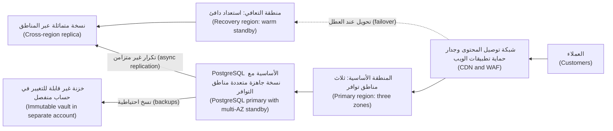

**لماذا يصعب النشط-النشط (Why active-active is hard).** بالنسبة إلى الخدمات عديمة الحالة (stateless services)، الأمر في معظمه توجيه (mostly routing). أمّا البيانات (For data)، فمنطقتان تقبلان الكتابة على الرصيد نفسه (two regions accepting writes to the same balance) قد تتعارضان (can conflict)، والتكرار المتزامن عبر المناطق (synchronous cross-region replication) يضيف زمن الذهاب والإياب بين المناطق (the inter-region round trip) إلى كل عملية كتابة. والنمط الشائع (A common pattern) هو تشغيل الحافة عديمة الحالة بنمط نشط-نشط (the stateless edge active-active) ونظام السجل بنمط نشط-خامل (the system of record active-passive). وفي خدمة المدفوعات (Payments service)، تحمل كل عملية دفع **مفتاح عدم التكرار (idempotency key)**، بحيث يجد الطلبُ المعادُ بعد التحويل عند العطل (a request retried after failover) السجلَّ الموجود (the existing record) بدلًا من إنشاء تحويلٍ ثانٍ (a second transfer).

**التكرار غير المتزامن يحدّد RPO لديك (Asynchronous replication sets your RPO).** النسخة المتماثلة عبر المناطق (A cross-region replica) تتأخّر عادةً عن الأساسية بثوانٍ أو أكثر (lags the primary by seconds or more)، وذلك التأخّر *هو* RPO لديك (that lag *is* your RPO) في كارثةٍ إقليمية (in a regional disaster). راقبه (Monitor it) (5.1) ونبّه حين يتجاوز RPO (alert when it exceeds the RPO).

#### 🔴 نظرة الخبير (Expert view)

**افصل أنماط العطل (Separate the failure modes).** الكوارث المختلفة تحتاج إلى دفاعاتٍ مختلفة (Different disasters need different defences):

| العطل (Failure) | هل يساعد تعدّد مناطق التوافر؟ ⁦(Multi-AZ helps?)⁩ | هل تساعد النسخة المتماثلة عبر المناطق؟ ⁦(Cross-region replica helps?)⁩ | هل تساعد النسخة الاحتياطية لنقطة زمنية؟ ⁦(Point-in-time backup helps?)⁩ |
|---|---|---|---|
| منطقة توافر واحدة تفقد الكهرباء (One zone loses power) | نعم (Yes) | نعم (Yes) | ببطء (Slowly) |
| المنطقة كلها متدهورة (Whole region degraded) | لا (No) | نعم (Yes) | نعم، ببطء (Yes, slowly) |
| ترحيلٌ سيئ يُفسد البيانات (Bad migration corrupts data) | لا، فالفساد يتكرّر (No, corruption replicates) | لا، فالفساد يتكرّر (No, corruption replicates) | نعم: استعِد إلى ما قبله مباشرةً (Yes: restore to just before) |
| برمجية فدية أو مديرٌ مارق يحذف البيانات (Ransomware or a rogue admin deletes data) | لا (No) | لا (No) | فقط إذا كانت النسخة الاحتياطية غير قابلة للتغيير وفي حسابٍ منفصل (Only if the backup is immutable and in a separate account) |

الصفّان الأخيران هما سبب أن التكرار ليس نسخًا احتياطيًّا (why replication is not backup). و**الاستعادة إلى نقطة زمنية (Point-in-time recovery, PITR)**، التي تقدّمها خدمات PostgreSQL المُدارة (managed PostgreSQL services) بالاحتفاظ بنسخٍ احتياطية أساسية (base backups) إضافةً إلى سجل الكتابة المسبقة (write-ahead log)، تتيح لك الاستعادة إلى ثانيةٍ تختارها قبل التغيير السيئ (a chosen second before the bad change). اعرف نافذة الاحتفاظ لديك (your retention window) وكم تستغرق فعلًا استعادةُ بياناتٍ بحجم بياناتك (how long a restore of your data size really takes).

**الثبات الساكن ومسار التعافي (Static stability and the recovery path).** النظام *الثابت سكونيًّا (statically stable)* يواصل العمل دون حاجةٍ إلى التغيير أثناء العطل (without needing to change during the failure)، مثلًا لأن السعة مُجهَّزة مسبقًا في كل منطقة توافر (capacity is already provisioned in each zone) بدلًا من إطلاقها في منتصف الانقطاع (launched mid-outage). وتحقّق أيضًا من أن مسار التعافي (the recovery path) لا يعتمد على ما تعطّل (does not depend on what failed). ففي انقطاع Facebook في أكتوبر 2021، فصل تغييرٌ في الشبكة الأساسية (a backbone change) مراكز البيانات، وسحبت خوادم DNS مسارات BGP الخاصة بها (withdrew their BGP routes)؛ وتشير تدوينة Facebook الهندسية (Facebook's engineering post) إلى أن الأدوات الداخلية اللازمة للإصلاح (the internal tools needed for the fix) تأثّرت هي أيضًا. اسأل (Ask): إذا زالت منطقتنا الأساسية (if our primary region is gone)، فهل تبقى أدلة التشغيل (runbooks)، ومستودع GitOps (the GitOps repo)، ومشغّلات CI (the CI runners)، والأسرار (the secrets)، وحسابات كسر الزجاج (break-glass accounts) في المتناول (still reachable)؟

**هندسة الفوضى وأيام اللعب (Chaos engineering and game days).** تُجري هندسة الفوضى (Chaos engineering) تجارب مضبوطة (controlled experiments) تحقن الأعطال (inject failure) (إنهاء حجيرات، kill pods؛ تفريغ منطقة توافر، drain a zone؛ إضافة تأخير، add latency) للتحقّق من أن النظام يتصرّف كما هو متوقّع (behaves as predicted). ابدأ صغيرًا (Start small) وفي غير الإنتاج (in non-production)؛ وصُغ فرضية (state a hypothesis) («إذا فُرِّغت منطقة توافر واحدة، تبقى واجهة الهاتف ضمن هدف مستوى الخدمة الخاص بها»، "if one zone is drained, the Mobile API stays within its SLO")؛ وقيّد نطاق الأثر (limit the blast radius)؛ واحتفظ بمفتاح إيقاف (keep an abort switch). و**يوم اللعب (game day)** تمرينٌ مُجدوَل (a scheduled rehearsal) لسيناريو كامل (a full scenario)، مثل التحويل الإقليمي عند العطل (a regional failover)، مع فريق المناوبة (the on-call team)، ومها قائدةً للحادثة (incident commander)، ومراقبين يقيسون زمن كل خطوة (observers timing each step). ويتوقّع قانون DORA الأوروبي اختبار المرونة (expects resilience testing)؛ وأيام اللعب تُنتج الأدلة (game days produce the evidence).

### 🧰 الأدوات (The toolkit)
| الأداة أو الممارسة أو الخدمة (Tool, practice or service) | ما هي وماذا تفعل (What it is and does) | متى تلجأ إليها (When to reach for it) |
|---|---|---|
| **Horizontal Pod Autoscaler** (Kubernetes) — المُوسِّع التلقائي الأفقي للحجيرات | يغيّر عدد النسخ المتماثلة لعبء عمل (Changes the replica count of a workload) بناءً على المعالج أو الذاكرة أو مقاييس مخصّصة (CPU, memory or custom metrics) | الخدمات عديمة الحالة ذات الحمل المتغيّر (Stateless services with variable load)، مع حدٍّ أدنى وأقصى مختارين (with a chosen min and max) |
| **Cluster Autoscaler** / **Karpenter** | يضيفان العقد ويزيلانها (Add and remove nodes) حين يتعذّر جدولة الحجيرات أو تكون العقد خاملة (when pods cannot be scheduled or nodes are idle) | أي عنقودٍ يتغيّر حمله (Any cluster whose load varies)؛ اقرنهما بـHPA (pair with HPA) |
| **KEDA** (CNCF) | توسّعٌ تلقائي مدفوع بالأحداث (Event-driven autoscaling) من الطوابير والتدفّقات والجداول الزمنية (from queues, streams and schedules)، بما في ذلك إلى الصفر (including to zero) | العمّال الذين يفرّغون الطوابير (Workers that drain queues)؛ المهام الدُّفعية (batch jobs)؛ التوسّع إلى الصفر للخدمات الخاملة (scale-to-zero for idle services) |
| **PodDisruptionBudget** — ميزانية تعطيل الحجيرات | تحدّد سقفًا لعدد النسخ المتماثلة التي يجوز للتعطيلات الطوعية إزالتها دفعةً واحدة (Caps how many replicas voluntary disruptions may remove at once) | كل نشرٍ إنتاجي (Every production Deployment) فيه أكثر من نسخةٍ متماثلة واحدة (more than one replica) |
| **Point-in-time recovery** — الاستعادة إلى نقطة زمنية | استعادة قاعدة بيانات إلى لحظةٍ مختارة (Restore a database to a chosen moment) باستخدام النسخ الاحتياطية الأساسية والسجلات (using base backups plus logs) | التعافي من الترحيلات السيئة والحذف العرَضي (Recovering from bad migrations and accidental deletes) |
| **Immutable backup vault** — خزنة نسخ احتياطية غير قابلة للتغيير | نسخٌ احتياطية مقفلة ضد التغيير أو الحذف حتى تنتهي مدة الاحتفاظ (Backups locked against change or deletion until retention ends)، في حسابٍ منفصل (in a separate account) | الدفاع ضد برمجيات الفدية وبيانات اعتماد المدير المخترقة (Defence against ransomware and compromised admin credentials) |
| **Game day** — يوم اللعب | تمرينٌ مُتدرَّب عليه ومُوقَّت لسيناريو عطل (A rehearsed, timed exercise of a failure scenario) مع فريق المناوبة الحقيقي (with the real on-call team) | إثبات RTO وRPO (Proving RTO and RPO) قبل أن يطلب ذلك مدقّقٌ أو كارثة (before an auditor or a disaster asks) |

### 🏛️ عمليًا في بنك نجم (In practice at Najm Bank)
يُعدّ فريق مها **خطة اختبار للتعافي من الكوارث (DR test plan)** لخدمة المدفوعات (Payments service). وتعيش في مستودع المنصة (the platform repo) بجوار دليل التشغيل الذي تختبره (next to the runbook it tests).

| الحقل (Field) | خدمة المدفوعات (Payments service) |
|---|---|
| المالك وصاحب القرار (Owner and decision-maker) | مالك الخدمة (Service owner): قائد هندسة المدفوعات (Payments engineering lead). من يعلن الكارثة (Declares disaster): قائد الحادثة (incident commander) مع سالم |
| الأهداف المتّفق عليها (Agreed targets) | RTO وRPO كما وقّع عليهما مالك العمل وفريق المخاطر (as signed by the business owner and risk) (مسجّلان مع التاريخ والمعتمِدين، recorded with the date and approvers) |
| التصميم (Design) | ثلاث مناطق توافر في المنطقة الأساسية (Three zones in the primary region)؛ PostgreSQL مُدارة متعدّدة مناطق التوافر (managed PostgreSQL multi-AZ)؛ نسخة متماثلة غير متزامنة عبر المناطق (asynchronous cross-region replica)؛ منظومة استعداد دافئ (warm standby stack) في منطقة التعافي من وحدات OpenTofu ومستودع GitOps نفسيهما (from the same OpenTofu modules and GitOps repo) |
| النسخ الاحتياطية (Backups) | لقطاتٌ يومية (Daily snapshots) إضافةً إلى PITR؛ نسخٌ في حساب نسخ احتياطي ومنطقة منفصلين (in a separate backup account and region) مع قفل الخزنة (with vault lock)؛ الاحتفاظ وفق سياسة السجلات (retention per records policy) |
| السيناريوهات المختبَرة هذا الربع (Scenarios tested this quarter) | 1. تفريغ منطقة توافر في الإنتاج (Zone drain in production) خلال حركة مرور منخفضة (during low traffic). 2. استعادة PITR لقاعدة بيانات المدفوعات (PITR restore of the payments database) إلى نسخةٍ مؤقتة (to a scratch instance). 3. تحويلٌ إقليمي كامل عند العطل (Full regional failover) في بيئة التجهيز (in the staging environment) |
| الخطوات والتوقيتات (Steps and timings) | الكشف (Detect)، والإعلان (declare)، وترقية النسخة المتماثلة (promote replica)، وتحويل حركة المرور (switch traffic)، وتوسيع الاستعداد (scale standby)، واختبار الدخان (smoke-test)، وإعادة الفتح (reopen)؛ مع قياس زمن كل خطوة (each step timed) |
| معايير النجاح (Success criteria) | RTO وRPO المقيسان ضمن الأهداف (Measured RTO and RPO within targets)؛ صفر تحويلاتٍ مؤكَّدة مكرّرة أو مفقودة (zero duplicated or lost confirmed transfers) (مطابَقةً مع دفتر الأستاذ في الأنظمة المصرفية الأساسية، reconciled against the core banking ledger) |
| الأدلة (Evidence) | الخط الزمني (Timeline)، ولوحات المتابعة (dashboards)، وتقرير المطابقة (reconciliation report)؛ تُحفظ في سجل اختبار المرونة (filed for the resilience testing record) |
| المتابعات (Follow-ups) | كل ثغرةٍ تصبح تذكرة (Each gap becomes a ticket) لها مالكٌ وتاريخ (with an owner and a date)؛ والاختبار التالي يعيد فحصها (the next test re-checks it) |

وجد التشغيل الأول ثلاث ثغرات (three gaps) لم تكتشفها أي مراجعة تصميم (no design review had caught): تنبيه تأخّر النسخة المتماثلة (the replica-lag alert) كان يذهب إلى لوحة متابعة لا يراقبها أحد (a dashboard nobody watched)، وسجل DNS للمدفوعات (the payments DNS record) كانت له مدة صلاحية (TTL) أطول بكثير مما يسمح به RTO، ودور كسر الزجاج (the break-glass role) لحساب التعافي (for the recovery account) كان يحتاج إلى جهاز مصادقة متعدّدة العوامل جديد (a new MFA device).

### 🛠️ التمارين (Exercises)
- 🟢 **شاهد مُوسِّعًا تلقائيًّا وهو يعمل (Watch an autoscaler work).** على عنقودٍ محلي من kind أو k3d (a local kind or k3d cluster) مع خادم المقاييس (the metrics server)، انشر حاوية ويب صغيرة (a small web container) لها طلبات معالج (CPU requests) ومُوسِّعًا تلقائيًّا أفقيًّا (HPA) (الحدّ الأدنى 2، min 2؛ الحدّ الأقصى 8، max 8؛ الهدف 50% من المعالج، target 50% CPU). وولّد حملًا من حجيرةٍ أخرى (Generate load from another pod) وراقب `kubectl get hpa -w`. *يكتمل عندما (Done when):* تكون لديك لقطة شاشة أو سجل (a screenshot or log) يُظهر النسخ المتماثلة ترتفع تحت الحمل (replicas rising under load) وتنخفض بعد نافذة الاستقرار (falling after the stabilisation window)، وجملةٌ واحدة تشرح لماذا كان التقليص أبطأ من التوسيع (why scale-down was slower than scale-up).
- 🟡 **توزّع عبر مناطق التوافر واصمد أمام التفريغ (Spread across zones and survive a drain).** أنشئ عنقود kind فيه أربع عقد عاملة (four worker nodes) ووسِمها (label them) بقيم `topology.kubernetes.io/zone` هي `a` و`b` و`c` (تحصل منطقةٌ واحدة على عقدتين، one zone gets two nodes). انشر ست نسخ متماثلة (six replicas) مع قيد توزيع الطوبولوجيا (a topology spread constraint) وميزانية تعطيل (PDB) قيمتها `minAvailable: 4`. فرّغ كل عقدةٍ في منطقة توافر واحدة (Drain every node in one zone) باستخدام `kubectl drain`. وتوقّع أن تبقى الحجيرات المُخلاة (the evicted pods) في حالة `Pending`: فالمنطقة المفرَّغة ما زالت تُحتسب في قيد التوزيع (the drained zone still counts for the spread constraint). *يكتمل عندما (Done when):* تكون الحجيرات قد توزّعت حجيرتين في كل منطقة (two per zone)، واحترم التفريغ ميزانية التعطيل (the drain respected the PDB)، وظلّت الخدمة تجيب طوال الوقت (kept answering throughout)، وتستطيع تفسير الحجيرات العالقة في `Pending`.
- 🔴 **اكتب اختبار استعادة ونفّذه (Write and run a restore test).** شغّل PostgreSQL في Docker مع أرشفة سجل الكتابة المسبقة (WAL archiving) أو نسخٍ احتياطية منتظمة باستخدام `pg_dump` (regular pg_dump backups). أدخِل صفوفًا مختومة بالوقت (Insert timestamped rows)، ثم احذف جدولًا «عن طريق الخطأ» ("accidentally" drop a table)، ثم استعِد إلى حاويةٍ ثانية (restore into a second container). اكتب خطة اختبار تعافٍ من الكوارث من صفحةٍ واحدة (a one-page DR test plan) بالصيغة أعلاه (in the format above)، مع RTO وRPO تختارهما. *يكتمل عندما (Done when):* تكون قد قست زمن الاستعادة الفعلي وفقدان البيانات (the actual restore time and data loss)، وقارنتهما بأهدافك (compared them with your targets)، وأدرجت تغييرين على الأقل من شأنهما سدّ أي ثغرة (close any gap).

### ⚠️ أخطاء وفخاخ (Mistakes and traps)
- **تسمية التكرار نسخًا احتياطيًّا (Calling replication a backup).** النسخ المتماثلة تنسخ عمليات الحذف والفساد فورًا (copy deletions and corruption instantly). احتفظ أيضًا بنسخٍ احتياطية لنقطة زمنية وغير قابلة للتغيير (point-in-time and immutable backups) في حسابٍ منفصل (in a separate account).
- **عدم الاستعادة أبدًا (Never restoring).** النسخ الاحتياطية غير المختبَرة (Untested backups) تخذلك حين تحتاج إليها (fail when you need them)، كما تعلّمت GitLab. جدوِل اختبارات الاستعادة (Schedule restore tests) وقِس زمنها (time them).
- **التوسّع التلقائي غير المحدود (Unbounded autoscaling).** مُوسِّعٌ تلقائي أفقي (An HPA) بقيمة `maxReplicas` ضخمة قد يستنفد اتصالات قاعدة البيانات (exhaust database connections) أو حصّةً لدى خدمةٍ تابعة (a downstream quota). اضبط السقف بحسب ما تحتمله التبعيات (Set the ceiling from what the dependencies can take).
- **مسار تعافٍ يعتمد على المنطقة المتعطّلة (A recovery path that depends on the failed region).** أبقِ أدلة التشغيل (runbooks)، والبنية التحتية بوصفها شيفرة (IaC)، وCI، والأسرار (secrets)، ووصول كسر الزجاج (break-glass access) في المتناول من خارجها (reachable from outside it).
- **أهدافٌ لم يوقّع عليها أحد (Targets nobody signed).** RTO اختاره فريق المنصة وحده (the platform team picked alone) سيُطعن فيه بعد الحادثة (will be challenged after the incident). احصل على توقيع مالك العمل وفريق المخاطر عليها (Get the business owner and risk to sign them).

### 🧾 الخلاصة (Recap)
- التوسّع يضيف سعة (Scaling adds capacity)؛ والمرونة تصمد أمام الأعطال (resilience survives failure). وسّع الحجيرات والعقد تلقائيًّا على طبقات (Autoscale pods and nodes in layers)، مع حدودٍ دنيا وسقوفٍ مختارة عن قصد (floors and ceilings chosen on purpose).
- شغّل الإنتاج عبر منطقتين أو ثلاث من مناطق التوافر (two or three zones)، مفروضًا بقيود التوزيع (spread constraints) وميزانيات التعطيل (PDBs) والسعة الاحتياطية (spare capacity).
- RTO وRPO قراران تجاريان (business decisions)؛ واستراتيجية التعافي من الكوارث (the DR strategy) هي أرخص تصميمٍ يحقّقهما (the cheapest design that meets them).
- مناطق التوافر والنسخ المتماثلة (Zones and replicas) لا تحمي من التغييرات السيئة أو الحذف (bad changes or deletion)؛ بل تحمي منها النسخ الاحتياطية لنقطة زمنية وغير القابلة للتغيير وفي حسابٍ منفصل (point-in-time and immutable, separate-account backups).
- لا يُعتدّ إلا بالتعافي المختبَر (Only tested recovery counts): تمارين الاستعادة (restore drills)، وأيام اللعب (game days)، والتحويلات عند العطل المُوقَّتة (timed failovers) تُنتج الأدلة التي تحتاجها الجهات التنظيمية والتنفيذيون (regulators and executives).

### ✍️ اختبر نفسك (Check yourself)

**1. تعمل واجهة برمجة تطبيق نجم للهاتف (Najm Mobile API) بست حجيرات عبر ثلاث مناطق توافر، وتحتاج إلى 4 للتعامل مع حمل الذروة (to handle peak load). أيّ تغييرٍ يضمن على أفضل وجه أن فقدان منطقة واحدة لا يُثقل الخدمة (does not overload the service)؟**

- A. رفع قيمة `maxReplicas` في المُوسِّع التلقائي الأفقي (HPA) إلى 100 كي تحلّ حجيراتٌ جديدة محلّ المفقودة (new pods replace lost ones)
- B. الإبقاء على 6 حجيرات مع قيد توزيعٍ على مناطق التوافر (a zone spread constraint)، حجيرتين في كل منطقة
- C. إضافة ميزانية تعطيل حجيرات (PodDisruptionBudget) بقيمة `minAvailable: 6` على النشر (Deployment)
- D. نقل كل الحجيرات إلى أكبر منطقة توافر (the largest zone) لتقليل حركة المرور بين المناطق (cross-zone traffic)

<details><summary>الإجابة</summary>

**B.** حجيرتان في كل منطقة تعني أن تعطّل منطقة (a zone failure) لا يزيل إلا اثنتين، فتبقى الأربع المطلوبة. ولا يساعد A إلا بعد وصول حجيرات وعقد جديدة (after new pods and nodes arrive)؛ وC يغطي التعطيلات الطوعية (voluntary disruptions) لا تعطّل المناطق، وسيمنع التفريغ (would block drains)؛ وD يُنشئ نقطة عطلٍ وحيدة (a single point of failure). (🟡 التعمق أكثر (Going deeper).)

</details>

**2. يُجري مطوّرٌ ترحيلًا (a migration) يُفسد جدول `transfers` بصمت (silently corrupts). قاعدة البيانات متعدّدة مناطق التوافر (multi-AZ) ولها نسخة متماثلة عبر المناطق (a cross-region replica). ما الذي يستعيد البيانات (recovers the data)؟**

- A. التحويل عند العطل إلى النسخة الجاهزة متعددة مناطق التوافر (Failing over to the multi-AZ standby) في منطقةٍ أخرى
- B. ترقية النسخة المتماثلة عبر المناطق (Promoting the cross-region replica) في منطقة التعافي
- C. إعادة تشغيل قاعدة البيانات (Restarting the database)
- D. استعادةٌ إلى نقطة زمنية (A point-in-time restore) إلى ما قبل الترحيل مباشرةً

<details><summary>الإجابة</summary>

**D.** يصل الفساد (Corruption) إلى النسخة الجاهزة والنسخة المتماثلة خلال ثوانٍ، لذا يعطيك A وB البيانات السيئة نفسها (the same bad data). ولا يعود إلى ما قبل التغيير إلا نسخةٌ احتياطية لنقطة زمنية (a point-in-time backup). (🔴 نظرة الخبير (Expert view)، جدول أنماط العطل (the failure-mode table).)

</details>

**3. من الذي ينبغي أن يحدّد RPO لخدمة المدفوعات (Payments service)؟**

- A. مالك العمل مع فريق المخاطر (The business owner with risk)، بعد أن يحسب فريق المنصة تكلفة الخيارات (once the platform team costs options)
- B. فريق المنصة وحده (The platform team alone)، لأنه يبني البنية التحتية ويشغّلها
- C. مزوّد السحابة (The cloud provider)، عبر اتفاقية مستوى الخدمة (SLA) في شروط خدمته
- D. لا أحد (Nobody)، لأن RPO يساوي صفرًا دائمًا لنظام مدفوعات

<details><summary>الإجابة</summary>

**A.** يعبّر RPO عن مقدار الخسارة الذي يقبله قطاع الأعمال (how much loss the business accepts)، والأهداف الأشدّ تكلّف أكثر (tighter targets cost more). وB يُنشئ أهدافًا لن يدافع عنها أحد لاحقًا (targets nobody will defend later)؛ واتفاقية مستوى الخدمة لدى المزوّد (a provider SLA) (C) تغطي خدمته لا تعافيك (covers its service, not your recovery)؛ وD أمنيةٌ لا تصميم (a wish, not a design). (🟢 الأساسيات (The essentials).)

</details>

**4. يُظهر اختبار التعافي من الكوارث الذي أجرته مها (Maha's DR test) أن النسخة المتماثلة عبر المناطق تتأخّر عادةً بضع ثوانٍ (usually lags by a few seconds)، لكنها بلغت مرةً 40 دقيقة أثناء مهمةٍ دُفعية (during a batch job). وRPO المتّفق عليه (The agreed RPO) هو 5 دقائق. ما القراءة الصحيحة (the right reading)؟**

- A. RPO متحقّق (The RPO is met)، لأن التأخّر المعتاد ثوانٍ قليلة فقط
- B. RPO لا ينطبق إلا على تعطّل مناطق التوافر (zone failures)، لا على الأعطال الإقليمية (regional ones)
- C. كان RPO الحقيقي حينها 40 دقيقة (The real RPO then was 40 minutes)؛ نبّه على التأخّر وأصلح السبب (alert on lag and fix the cause)
- D. انتقل الآن إلى التكرار المتزامن عبر المناطق (synchronous cross-region replication)، دون قياس زمن الاستجابة (without measuring latency)

<details><summary>الإجابة</summary>

**C.** مع التكرار غير المتزامن (asynchronous replication)، التأخّر لحظة الكارثة (the lag at the moment of disaster) هو البيانات التي تفقدها. وA يتجاهل أسوأ الحالات (ignores the worst case)؛ وB خاطئ؛ وD يضيف زمن الذهاب والإياب بين المناطق (the inter-region round trip) إلى كل عملية كتابة ويحتاج إلى تحليلٍ أولًا (needs analysis first). (🟡 التعمق أكثر (Going deeper).)

</details>

**5. أيّ عبارةٍ عن هندسة الفوضى (chaos engineering) هي الأدق؟**

- A. تعني كسر الإنتاج عشوائيًّا (breaking production at random)، بأكبر قدرٍ ممكن من التكرار
- B. اختبارٌ مضبوط لفرضيةٍ مُعلَنة (A controlled test of a stated hypothesis)، مع مفتاح إيقاف (an abort switch)
- C. حين تُجرى بانتظام، تحلّ محلّ استعادة النسخ الاحتياطية واختبارات التعافي من الكوارث (replaces backup restores and DR tests)
- D. لا تفيد إلا الشركات التي تشغّل آلاف الخدمات (thousands of services)

<details><summary>الإجابة</summary>

**B.** تختبر هندسة الفوضى تنبؤًا مُعلَنًا تحت السيطرة (a stated prediction under control). وA تهوّر (recklessness)؛ وC خاطئ، لأنها تكمّل تمارين الاستعادة (complements restore drills)؛ وحتى تفريغٌ صغير لمنطقة توافر يعلّم الكثير (even a small zone drain teaches a lot)، لذا D خاطئ. (🔴 نظرة الخبير (Expert view).)

</details>

### 📚 المراجع (References)
- Kubernetes: التوسّع التلقائي الأفقي للحجيرات (Horizontal Pod Autoscaling) — https://kubernetes.io/docs/tasks/run-application/horizontal-pod-autoscale/
- Kubernetes: قيود توزيع طوبولوجيا الحجيرات (Pod topology spread constraints) — https://kubernetes.io/docs/concepts/scheduling-eviction/topology-spread-constraints/
- Kubernetes: تحديد ميزانية تعطيل (Specifying a disruption budget) — https://kubernetes.io/docs/tasks/run-application/configure-pdb/
- توثيق KEDA (KEDA documentation) — https://keda.sh/docs/
- توثيق Karpenter (Karpenter documentation) — https://karpenter.sh/docs/
- الورقة البيضاء من AWS: التعافي من الكوارث لأعباء العمل على AWS (AWS whitepaper: Disaster recovery of workloads on AWS) — https://docs.aws.amazon.com/whitepapers/latest/disaster-recovery-workloads-on-aws/disaster-recovery-workloads-on-aws.html
- إطار Azure المُحكَم البنيان، الموثوقية (Azure Well-Architected Framework, reliability) — https://learn.microsoft.com/azure/well-architected/
- إطار بنية Google Cloud (Google Cloud Architecture Framework) — https://cloud.google.com/architecture/framework
- GitLab: مراجعة ما بعد حادثة انقطاع قاعدة البيانات في 31 يناير (Postmortem of database outage of January 31) (2017) — https://about.gitlab.com/blog/
- كتب Google في هندسة موثوقية المواقع (Google SRE books) (سلامة البيانات، data integrity؛ إدارة الحالة الحرجة، managing critical state) — https://sre.google/books/
- اللائحة (EU) 2022/2554 بشأن المرونة التشغيلية الرقمية (Regulation (EU) 2022/2554 on digital operational resilience, DORA) — https://eur-lex.europa.eu/eli/reg/2022/2554/oj
- تعمّق أكثر في ضوابط أمن السحابة (Deeper on cloud security controls): [*أمن الذكاء الاصطناعي وأمن التطبيقات (Secure AI & Application Security)*، الدرس 7.1 — أمن السحابة: المسؤولية المشتركة وإدارة الهوية والوصول وسوء الإعداد (Cloud security: shared responsibility, IAM and misconfiguration)](../secai/index.ar.html#/7.1)

<a id="l6-2"></a>

## 6.2 — FinOps: فهم تكلفة السحابة وتوزيعها وخفضها (FinOps: understanding, allocating and cutting cloud cost)

*المستوى: 🔴 متقدم* · *المتطلبات: 1.2، 3.1، 6.1* · *المرحلة (Phase): Operate, Monitor*

### ⚡ الدرس في دقيقة (In 60 seconds)
- **FinOps** هي ممارسة جعل الهندسة والمالية وقطاع الأعمال (engineering, finance and the business) يتقاسمون المسؤولية عن الإنفاق السحابي (share responsibility for cloud spending)، بحيث تصبح التكلفة إشارةً هندسية مثل زمن الاستجابة (an engineering signal like latency)، لا مفاجأةً في نهاية الشهر (not a month-end surprise).
- يعمل إطار مؤسسة FinOps (The FinOps Foundation framework) في حلقةٍ من ثلاث مراحل (a loop of three phases): **الإعلام (Inform)** (رؤية التكلفة وتوزيعها، see and allocate cost)، و**التحسين (Optimise)** (تقليل الهدر والحصول على أسعار أفضل، reduce waste and get better rates)، و**التشغيل (Operate)** (جعلها روتينية ولها مالك، make it routine and owned).
- لا يمكنك خفض ما لا تستطيع نسبته (You cannot cut what you cannot attribute). ابدأ بـ**الوسم والتوزيع (tagging and allocation)**: لكل موردٍ مالكٌ وخدمةٌ وبيئة (an owner, a service and an environment).
- اخفض الاستخدام قبل شراء الخصومات (Cut usage before you buy discounts): احذف الموارد الخاملة (delete idle resources)، وعدّل الأحجام لتناسب الحاجة (rightsize)، ووسّع تلقائيًّا (autoscale)، وجدوِل البيئات غير الإنتاجية (schedule non-production)، ثم التزم بـ**السعة المحجوزة أو خطط التوفير (reserved capacity or savings plans)** للقاعدة الثابتة (for the steady base)، واستخدم سعة **السوق الفورية (spot)** فقط للعمل الذي يحتمل المقاطعة (work that can be interrupted).
- مؤشر القرار (Decision cue): احكم على التكلفة لكل وحدةٍ من القيمة التجارية (cost per unit of business value) (التكلفة لكل ألف استدعاء للواجهة، cost per thousand API calls؛ لكل عملية دفع، per payment؛ لكل عميلٍ نشط، per active customer)، لا على إجمالي الفاتورة وحده (not the total bill alone).
- أكبر فخ (Biggest trap): خفض التكاليف الذي يزيل المرونة بهدوء (cost-cutting that quietly removes resilience)، مثل التخلّي عن منطقة التوافر الثانية (dropping the second zone) أو عن نسخ النسخ الاحتياطية (the backup copies) التي بُنيت في 6.1 لتوفير المال.

### 🧭 لماذا يهم (Why it matters)
بعد ستة أشهر من انتقال الخدمات الأولى إلى السحابة، تُحضر منى، محلّلة FinOps في الإدارة المالية (the FinOps analyst in Finance)، رسمًا بيانيًّا (a chart) إلى سالم. لقد نمت فاتورة السحابة الشهرية لنجم (Najm's monthly cloud bill) أسرع بكثير من عدد عملاء الهاتف النشطين (the number of active mobile customers). وأسئلتها منصفة (Her questions are fair): «على ماذا ندفع؟ من يملكه؟ هل هذا النمو نموٌّ جيد؟» ⁦("What are we paying for? Who owns it? Is the growth good growth?")⁩ لا يستطيع سالم الإجابة من وحدة التحكم (from the console). فحصّةٌ كبيرة من الإنفاق غير موسومة (A large share of the spend is untagged). وهناك بندٌ اسمه «نقل البيانات» ("data transfer") لم يضع له أحدٌ ميزانية (nobody budgeted for). وثلاث عقد بوحدات معالجة رسوميات (Three GPU nodes) أُنشئت لتجربةٍ في نجم أسيست (a Najm Assist experiment) تعمل كل ساعةٍ من كل يوم منذ هاكاثون (since a hackathon). وعناقيد التطوير (The development clusters) تعمل بكامل حجمها (at full size) طوال عطلة نهاية الأسبوع.

لا تستطيع الإدارة المالية إصلاح هذا وحدها (Finance cannot fix this alone). ففي السحابة، كل مهندسٍ يدمج تغييرًا في OpenTofu (merges an OpenTofu change) أو يرفع سقف مُوسِّعٍ تلقائي أفقي (raises an HPA ceiling) يتّخذ قرار إنفاق (is making a spending decision)، وغالبًا دون أن يرى السعر (without seeing the price). لقد انتهى نموذج مركز البيانات القديم (The old data-centre model)، حيث كانت المشتريات (procurement) توافق على العتاد قبل أشهر (approved hardware months ahead). وFinOps تعيد إشارة التكلفة (puts the cost signal back) إلى حيث تُتّخذ القرارات (where decisions are made): في طلب الدمج (the pull request)، ولوحة المتابعة (the dashboard)، وقائمة المهام المتراكمة لدى الفريق نفسه (the team's own backlog). يمنحك هذا الدرس لغة منى (Mona's language)، وآليات التوزيع (the mechanics of allocation)، وترتيبًا لخفض التكلفة دون الإضرار بالموثوقية (an order for cutting cost without harming reliability). ولمعالجةٍ أخفّ موجّهة إلى الفرق الصغيرة (a lighter treatment aimed at small teams)، انظر [*تصميم الأنظمة لمبرمجي الحدس (System Design for Vibe Coders)*، الدرس 11.4 — هندسة التكلفة (Cost engineering)](../vibe/index.ar.html#l11-4).

### 📐 كيف يعمل (How it works)

#### 🟢 الأساسيات (The essentials)

**إطار مؤسسة FinOps (The FinOps Foundation framework).** تنشر مؤسسة FinOps (The FinOps Foundation)، وهي جزءٌ من مؤسسة Linux (part of the Linux Foundation)، إطار FinOps (the FinOps Framework). وفي وقت كتابة هذا النص (At the time of writing) (2026)، يصف الإطار مبادئ (principles)، وشخصيات (personas) (الهندسة، engineering؛ المالية، finance؛ القيادة، leadership؛ المشتريات، procurement؛ المنتج، product)، وقدرات (capabilities)، ودورةً من ثلاث مراحل (a cycle of three phases). ومن المبادئ أن الفرق بحاجةٍ إلى التعاون (teams need to collaborate)، وأن القيمة التجارية تقود القرارات التقنية (business value drives technology decisions)، وأن الجميع يتحمّل ملكية استخدامه للسحابة (everyone takes ownership of their cloud usage)، وأن بيانات التكلفة ينبغي أن تكون متاحةً وفي وقتها (accessible and timely)، وأن FinOps يُمكّنها فريقٌ مركزي (enabled by a central team)، وأن على الفرق الاستفادة من نموذج التكلفة المتغيّرة في السحابة (the cloud's variable cost model). تحقّق من موقع finops.org للصياغة الحالية (for the current wording).

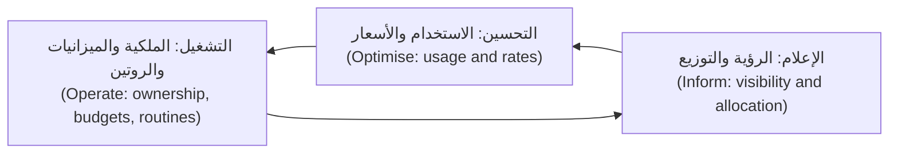

**كيف يعمل تسعير السحابة، من حيث المفاهيم (How cloud pricing works, in concepts).** لا تذكر سعرًا من الذاكرة أبدًا (Never quote a price from memory)؛ فالأسعار تختلف بحسب المنطقة وتتغيّر (differ by region and change). أمّا الشكل فثابت (The shape is stable):
- **الحوسبة (Compute)** تُحتسب بالزمن (billed by time) (بالثانية أو الساعة، بحسب الخدمة، per second or hour, depending on service) وبالحجم (and size). والمثيل الكبير الخامل (A large instance idling) يكلّف ما يكلّفه المثيل المشغول (costs the same as a busy one).
- **التخزين (Storage)** يُحتسب بالكمية المخزّنة شهريًّا (by amount stored per month)، مع فئات (with tiers): التخزين الكثير الوصول (frequently accessed storage) يكلّف أكثر لكل غيغابايت من فئات الأرشفة (archive tiers)، التي تفرض رسومًا أعلى على القراءة منها (charge more to read back).
- **الطلبات والعمليات (Requests and operations)**: كثيرٌ من الخدمات المُدارة (managed services) تفرض رسومًا لكل استدعاء واجهة برمجة (per API call)، أو لكل مليون طلب (per million requests)، أو لكل قراءة وكتابة (per read and write).
- **نقل البيانات إلى الخارج (Data transfer (egress))**: نقل البيانات *إلى خارج* المزوّد نحو الإنترنت (moving data *out* of a provider to the internet) يكلّف مالًا في العادة، وكذلك حركة المرور بين المناطق (traffic between regions)، ولدى بعض المزوّدين، بين مناطق التوافر (between zones). وكثيرًا ما تفرض بوابات NAT المُدارة (Managed NAT gateways) رسومًا لكل غيغابايت تتمّ معالجته (per gigabyte processed). تحقّق من صفحات التسعير الحالية لدى مزوّدك (your provider's current pricing pages)، لأن الخروج (egress) كثيرًا ما يفاجئ الفرق.
- **علاوات الخدمات المُدارة (Managed service premiums)**: قاعدة البيانات المُدارة (a managed database) تكلّف أكثر من الآلة الافتراضية التي تحتها (the virtual machine underneath)، وتشتري لك التحديثات الأمنية والنسخ الاحتياطية والتحويل عند العطل (patching, backups and failover). وهذه عادةً مقايضةٌ جيدة (a good trade)؛ فقط اعرف أنك تجريها.

**التوزيع: الوسوم والتسميات (Allocation: tags and labels).** يتيح لك كل مزوّد إرفاق بياناتٍ وصفية على شكل مفتاح وقيمة (key-value metadata) بالموارد: *الوسوم (tags)* في AWS وAzure، و*التسميات (labels)* في Google Cloud. وتحدّد سياسة توزيع التكلفة (A cost allocation policy) مجموعةً صغيرة إلزامية (a small, mandatory set):

| المفتاح (Key) | قيمة مثال (Example value) | لماذا (Why) |
|---|---|---|
| `owner` | `team-payments` | شخصٌ تسأله (Someone to ask)، وشخصٌ يرى الفاتورة (someone who sees the bill) |
| `service` | `payments-api` | التكلفة لكل خدمة ولكل وحدة (Cost per service and per unit) |
| `environment` | `prod`، `staging`، `dev` | هدر البيئات غير الإنتاجية (Non-production waste) هو عادةً الهدف الأول (the first target) |
| `cost-centre` | رمز مالي (finance code) | الاسترداد المالي أو العرض المالي لقطاع الأعمال (Chargeback or showback to the business) |
| `data-classification` | `confidential` | مشترك مع الأمن (Shared with security)؛ ليس مفتاح تكلفة لكنه يُفرض بالطريقة نفسها (not a cost key but enforced the same way) |

يجب عادةً تفعيل الوسوم لتقارير الفوترة (Tags must usually be activated for billing reports) (مثلًا، وسوم توزيع التكلفة في AWS، AWS cost allocation tags)، وهي في الغالب لا تسري إلا من لحظة ضبطها (apply only from when they are set) (والملء الرجعي، حيث يُتاح، محدود، backfill, where offered, is limited)، لذا ابدأ مبكرًا (start early). افرضها في البنية التحتية بوصفها شيفرة (infrastructure as code) (3.1) وبالسياسة بوصفها شيفرة (policy as code) (3.3): الخطة التي تُنشئ موردًا غير موسوم (a plan that creates an untagged resource) تفشل في الفحص (fails the check).

**العرض المالي والاسترداد المالي (Showback and chargeback).** *العرض المالي (Showback)* يُري كل فريقٍ ما أنفقه (shows each team what it spent)؛ أمّا *الاسترداد المالي (chargeback)* فينقل التكلفة فعلًا إلى ميزانية الفريق (actually moves the cost to the team's budget). ابدأ بالعرض المالي (Start with showback): فالهدف الأول هو الوعي (awareness)، لا المحاسبة (not accounting).

#### 🟡 التعمق أكثر (Going deeper)

**التكاليف المشتركة وKubernetes (Shared costs and Kubernetes).** تعمل الوسوم جيدًا لقاعدة بياناتٍ يملكها فريقٌ واحد (a database owned by one team). لكنها تفشل في عنقود Kubernetes مشترك (a shared Kubernetes cluster) تعمل فيه عشرون خدمة على العقد نفسها (on the same nodes). وزّع العناقيد المشتركة (Allocate shared clusters) بحسب ما *يحجزه* كل عبء عمل (what each workload *reserves*) (طلبات المعالج والذاكرة الخاصة به، its CPU and memory requests) أو ما *يستخدمه* (or *uses*)، أيّهما أعلى (whichever is higher)، لكل نطاق أسماء (per namespace). وأدواتٌ مثل **OpenCost** (مشروع من CNCF، a CNCF project) تقرأ بيانات موارد العنقود (the cluster's resource data) وأسعار المزوّد (the provider's prices) لتُنتج التكلفة لكل نطاق أسماء وتسمية وعبء عمل (cost per namespace, label and workload). قرّر علنًا كيف يُقسَم ما يتبقّى (Decide openly how to split what is left over): السعة الخاملة (idle capacity)، ومستوى التحكم (the control plane)، ومنظومة قابلية المراقبة (the observability stack)، والشبكات المشتركة (shared networking). والقاعدة الشائعة (A common rule) هي توزيعها بالتناسب مع التكلفة المباشرة لكل فريق (in proportion to each team's direct cost)، وإظهار السعة الخاملة بندًا مستقلًّا (show idle capacity as its own line) كي يملك فريق المنصة كفاءة التعبئة (so the platform team owns packing efficiency).

الطلبات مهمة هنا (Requests matter here). فالفريق الذي يطلب 4 معالجات لكل حجيرة (requests 4 CPUs per pod) ويستخدم 0.3 يدفع، في توزيعٍ عادل (in a fair allocation)، ثمن 4. وهذا هو الحافز الصحيح (the right incentive): فالطلب المُفرط (over-requesting) يحجب تلك السعة عن الجميع (blocks that capacity from everyone else).

**مواصفة FOCUS (The FOCUS specification).** لتصدير الفوترة لدى كل مزوّد (Each provider's billing export) أعمدته وأسماؤه الخاصة. و**المواصفة المفتوحة لتكلفة FinOps واستخدامها (FinOps Open Cost and Usage Specification, FOCUS)**، من مؤسسة FinOps، تعرّف صيغةً مشتركة لبيانات الفوترة (a common format for billing data)، ويقدّم المزوّدون الكبار (the major providers) تصديراتٍ بصيغة FOCUS (FOCUS-formatted exports) في وقت كتابة هذا النص (2026؛ تحقّق من الإصدار الذي يدعمه كلٌّ منهم، check which version each supports). وإذا شغّلت نجم أعباء عملٍ في أكثر من سحابة (in more than one cloud)، فإن FOCUS يجعل مجموعة بيانات تكلفة واحدة ممكنة (one cost dataset possible).

**حسّن الاستخدام أولًا، ثم الأسعار (Optimise usage first, then rates).** تحسين الاستخدام (Usage optimisation) يعني أن تدفع مقابل أقل (paying for less)؛ وتحسين الأسعار (rate optimisation) يعني أن تدفع أقل مقابل الشيء نفسه (paying less for the same thing). ابدأ بالاستخدام (Do usage first)، لأن الالتزام بخصمٍ على سعةٍ كان ينبغي أن تحذفها (committing to a discount for capacity you should have deleted) يثبّت الهدر (locks in the waste).

| الترتيب (Order) | الرافعة (Lever) | الإجراء النموذجي (Typical action) | الخطر الذي يجب مراقبته (Risk to watch) |
|---|---|---|---|
| 1 | **إزالة الخامل (Remove idle)** | احذف الأقراص غير المرتبطة (unattached volumes)، واللقطات القديمة خارج مدة الاحتفاظ (old snapshots outside retention)، وموازنات الأحمال الخاملة (idle load balancers)، وعقد وحدات معالجة الرسوميات المنسية (forgotten GPU nodes) | تأكّد من المالك (Confirm the owner)؛ واحتفظ بما تتطلبه سياسة الاحتفاظ (what retention policy requires) |
| 2 | **الجدولة (Schedule)** | قلّص عناقيد التطوير والاختبار (Scale dev and test clusters down) ليلًا وفي عطلات نهاية الأسبوع | الفرق في مناطق زمنية أخرى (Teams in other time zones)؛ المهام الدُّفعية (batch jobs) |
| 3 | **تعديل الحجم (Rightsize)** | خفّض أحجام المثيلات وطلبات الحجيرات (Lower instance sizes and pod requests) لتطابق الاستخدام المرصود (observed use) | اترك هامشًا (Leave headroom)؛ راقب زمن استجابة الذيل والذاكرة (tail latency and memory) |
| 4 | **التوسّع التلقائي (Autoscale)** | مُوسِّع تلقائي أفقي (HPA) وتوسّع تلقائي للعقد (node autoscaling) كي تتبع السعة الطلب (capacity follows demand) (6.1) | حدودٌ دنيا للمرونة (Floors for resilience)؛ سرعة التوسيع (scale-up speed) |
| 5 | **دورة حياة التخزين (Storage lifecycle)** | انقل السجلات والكائنات القديمة إلى فئاتٍ أرخص (cheaper tiers)؛ وأنهِ صلاحيتها وفق السياسة (expire them per policy) | تكلفة الاسترجاع وتأخيره من فئات الأرشفة (Retrieval cost and delay from archive tiers) |
| 6 | **البنية (Architecture)** | قلّل حركة المرور بين مناطق التوافر والخروج (Cut cross-zone and egress traffic)، وخزّن مؤقتًا في شبكة توصيل المحتوى (cache at the CDN)، واستخدم نقاط النهاية الخاصة (use private endpoints) | لا يكون ذلك أبدًا على حساب تكرار مناطق التوافر (Never at the cost of zone redundancy) |
| 7 | **الالتزامات (Commitments)** | المثيلات المحجوزة (Reserved instances)، وخطط التوفير (savings plans)، وخصومات الاستخدام الملتزم به (committed use discounts) للقاعدة الثابتة (for the steady base) | الإفراط في الالتزام (Over-commitment) إذا انخفض الاستخدام |
| 8 | **سعة السوق الفورية (Spot capacity)** | مثيلاتٌ قابلة للمقاطعة (Interruptible instances) للمهام الدُّفعية (batch)، ومشغّلات CI (CI runners)، والذروات عديمة الحالة (stateless burst) | المقاطعات بإشعارٍ قصير (Interruptions at short notice) |

**الالتزامات والسوق الفورية، بوصفها مفاهيم (Commitments and spot, as concepts).** يقدّم المزوّدون الثلاثة جميعًا خصوماتٍ مقابل الالتزام بمستوى استخدام (committing to a level of use) لسنةٍ أو ثلاث سنوات: المثيلات المحجوزة وخطط التوفير في AWS (AWS Reserved Instances and Savings Plans)، والحجوزات وخطة توفير الحوسبة في Azure (Azure Reservations and Azure savings plan for compute)، وخصومات الاستخدام الملتزم به في Google Cloud (Google Cloud committed use discounts). التزم بالحدّ الأدنى الذي أنت واثقٌ من استخدامه (Commit to the floor you are confident you will use)، لا بالذروة (not the peak). وسعة **السوق الفورية (Spot)** (AWS Spot Instances، Azure Spot Virtual Machines، Google Cloud Spot VMs) هي سعةٌ فائضة تُباع بخصم (spare capacity sold at a discount) يستطيع المزوّد استعادتها بإشعارٍ قصير (can reclaim with short notice)؛ تحقّق من مدة الإشعار الحالية لدى كل مزوّد (each provider's current notice period). استخدمها للعمل الذي يحتمل المقاطعة (work that tolerates interruption): مشغّلات CI (CI runners)، والمهام الدُّفعية (batch jobs)، والنسخ المتماثلة عديمة الحالة فوق الحدّ الأدنى (stateless replicas above the floor). ولا تضع عليها أبدًا النسخة الوحيدة من قاعدة بيانات المدفوعات (the only copy of the Payments database).

#### 🔴 نظرة الخبير (Expert view)

**اقتصاديات الوحدة (Unit economics).** ارتفاع إجمالي الفاتورة (The total bill going up) ليس خبرًا سيئًا إذا كان قطاع الأعمال ينمو أسرع (if the business is growing faster). والرقم المهم (The number that matters) هو **تكلفة الوحدة (unit cost)**: التكلفة مقسومةً على محرّكٍ تجاري (cost divided by a business driver).

```text
Cost per 1,000 Mobile API requests = (allocated Mobile API cost for the month)
                                     / (requests served in the month / 1,000)
Cost per successful payment        = (allocated Payments service cost)
                                     / (payments completed)
Cost per Najm Assist conversation  = (gateway + model API + GPU cost)
                                     / (conversations)
```

تتضمّن التكلفة الموزَّعة (The allocated cost) حصّة الخدمة من التكاليف المشتركة (the service's share of shared costs). ارسم تكلفة الوحدة شهريًّا (Plot unit cost monthly). فإذا ارتفعت بينما ترتفع حركة المرور (while traffic rises)، فلديك عدم كفاءة في التوسّع (a scaling inefficiency)؛ وإذا ارتفعت بينما حركة المرور ثابتة (while traffic is flat)، فابحث عن هدرٍ أو تغيّرٍ في التسعير (waste or a pricing change). كما تجعل تكاليف الوحدة المقايضات الهندسية ملموسة (make engineering trade-offs concrete): فتغيير تخزينٍ مؤقت (a caching change) يخفض التكلفة لكل ألف طلب بمقدار الخُمس (by a fifth) يسهل شرحه لمنى وللقيادة (to Mona and to leadership). وتستخدم فرق المنتج الفكرة نفسها عند التسعير (Product teams use the same idea when pricing)؛ انظر [*إدارة منتجات الذكاء الاصطناعي (AI Product Management)*، الدرس 8.2 — اقتصاديات الوحدة: تكلفة الخدمة ونماذج التسعير والهوامش (Unit economics: cost to serve, pricing models and margins)](../aipm/index.ar.html#/8.2).

**التكلفة في طلب الدمج (Cost in the pull request).** أرخص لحظةٍ لتجنّب الهدر (The cheapest moment to avoid waste) هي قبل أن يُنشأ (before it is created). وأدواتٌ مثل **Infracost** تقدّر التغيّر الشهري في التكلفة (the monthly cost change) لخطة OpenTofu أو Terraform (of an OpenTofu or Terraform plan) وتنشره تعليقًا على طلب الدمج (a pull-request comment). اجمعها مع سياسة (Combine it with a policy): التغييرات التي تتجاوز عتبةً (changes above a threshold) تحتاج إلى مراجعٍ ثانٍ من الفريق المالك (a second reviewer from the owning team)، لا إلى طابور موافقات مالية (not a finance approval queue). يحتفظ المهندسون بسرعتهم (Engineers keep their speed)؛ وتصبح القرارات الكبيرة مرئية (large decisions become visible).

**الميزانيات وكشف الشذوذ (Budgets and anomaly detection).** يحصل كل حسابٍ أو اشتراك (Every account or subscription) على ميزانيةٍ مع تنبيهاتٍ إلى مالكه (a budget with alerts to its owner)، وتنبّه ميزات كشف شذوذ التكلفة لدى المزوّدين (the providers' cost anomaly detection features) على الارتفاعات المفاجئة (sudden spikes) (مثلًا، مهمةٌ خارجة عن السيطرة، a runaway job؛ أو تصدير سجلاتٍ سيئ الإعداد، a misconfigured log export). عامِل شذوذ التكلفة كتنبيهٍ تشغيلي (Treat a cost anomaly like an operational alert): وجّهه إلى الفريق المالك (route it to the owning team)، مع دليل تشغيل (with a runbook). ولو كان ذلك قائمًا لاكتُشفت عقد وحدات معالجة الرسوميات المنسية من الهاكاثون (The forgotten hackathon GPU nodes) خلال أيام، لا أشهر.

**لا تقايض على المرونة (Do not trade away resilience).** أخطر تخفيضات التكلفة (The most dangerous cost cuts) تبدو معقولة في جدول بيانات (look reasonable in a spreadsheet): منطقة توافر واحدة بدلًا من ثلاث (one zone instead of three)، ونسخةٌ جاهزة أصغر (a smaller standby)، ومدة احتفاظ أقصر بالنسخ الاحتياطية (shorter backup retention)، ولا نسخ عبر المناطق (no cross-region copy). وكلٌّ من هذه يغيّر RTO وRPO المتّفق عليهما في 6.1. والقاعدة في نجم (Rule at Najm): أي تغييرٍ في التكلفة يمسّ التكرار الاحتياطي أو النسخ الاحتياطية أو التعافي (redundancy, backups or recovery) يجب أن يوافق عليه مالك الخدمة وهندسة موثوقية المواقع (the service owner and SRE)، وأن تُحدَّث خطة اختبار التعافي من الكوارث (the DR test plan updated). فالتكلفة والموثوقية قرارٌ واحد لا قراران (Cost and reliability are one decision, not two).

### 🧰 الأدوات (The toolkit)
| الأداة أو الممارسة أو الخدمة (Tool, practice or service) | ما هي وماذا تفعل (What it is and does) | متى تلجأ إليها (When to reach for it) |
|---|---|---|
| **FinOps Framework** (FinOps Foundation) — إطار FinOps | المبادئ (Principles)، والشخصيات (personas)، والقدرات (capabilities)، ودورة الإعلام والتحسين والتشغيل (the Inform, Optimise, Operate cycle) | إنشاء ممارسةٍ للتكلفة (Setting up a cost practice) والاتفاق على الأدوار مع المالية (agreeing roles with finance) |
| **Cost allocation tags** — وسوم توزيع التكلفة | بياناتٌ وصفية إلزامية (Mandatory metadata) (المالك، الخدمة، البيئة؛ owner, service, environment) تستطيع الفوترة التجميع بحسبها (that billing can group by) | اليوم الأول لأي حساب سحابي (Day one of any cloud account)؛ تُفرض بالسياسة بوصفها شيفرة (enforced by policy as code) |
| **FOCUS** (FinOps Foundation) | صيغةٌ مشتركة محايدة تجاه المزوّدين لبيانات الفوترة (A common, provider-neutral format for billing data) | دمج بيانات التكلفة من أكثر من سحابة أو أداة (Combining cost data from more than one cloud or tool) |
| **OpenCost** (CNCF) | توزيع تكلفة مفتوح المصدر لـKubernetes (Open-source cost allocation for Kubernetes) بحسب نطاق الأسماء والتسمية وعبء العمل (by namespace, label and workload) | العرض المالي للعناقيد المشتركة (Showback for shared clusters) |
| **Infracost** | يقدّر تغيّر التكلفة لخطة بنية تحتية بوصفها شيفرة (Estimates the cost change of an IaC plan) ويعلّق على طلب الدمج (comments on the pull request) | اكتشاف التغييرات المكلفة قبل دمجها (Catching expensive changes before they merge) |
| **Provider cost tools** (AWS Cost Explorer، Azure Cost Management، Google Cloud Billing reports) — أدوات التكلفة لدى المزوّدين | تحليل الفوترة الأصلي (Native billing analysis)، والميزانيات (budgets)، وتنبيهات الشذوذ (anomaly alerts) | الرؤية اليومية (Daily visibility)؛ ميزانيات لكل حسابٍ ومالك (budgets per account and owner) |
| **Commitment discounts** (خطط التوفير، savings plans؛ الحجوزات، reservations؛ خصومات الاستخدام الملتزم به، committed use discounts) — خصومات الالتزام | أسعارٌ أقل مقابل استخدامٍ ملتزم به (Lower rates in return for committed use) لسنةٍ أو ثلاث سنوات | بعد تحسين الاستخدام (After usage optimisation)، للخط الأساسي الثابت (for the steady baseline) |
| **Spot capacity** — سعة السوق الفورية | سعةٌ فائضة مخفَّضة (Discounted spare capacity) يمكن استعادتها بإشعارٍ قصير (can be reclaimed at short notice) | مشغّلات CI (CI runners)، والمهام الدُّفعية (batch)، والذروات عديمة الحالة فوق الحدّ الأدنى (stateless burst above the floor) |

### 🏛️ عمليًا في بنك نجم (In practice at Najm Bank)
تتّفق منى وسالم على **تقرير شهري لتكلفة السحابة (monthly cloud cost report)**، يُولَّد من تصدير FOCUS (the FOCUS export) وOpenCost، ويُراجَع في اجتماعٍ مدته 30 دقيقة مع كل قائد فريق (with each team lead).

| القسم (Section) | المحتوى للشهر (Content for the month) |
|---|---|
| العنوان الرئيسي (Headline) | إجمالي الإنفاق مقابل الميزانية ومقابل الشهر الماضي (Total spend vs budget and vs last month)؛ حصّة الإنفاق الموزَّعة على مالك (share of spend allocated to an owner) (الهدف: كلّه تقريبًا، target: nearly all) |
| تكاليف الوحدة (Unit costs) | التكلفة لكل 1,000 طلب لواجهة الهاتف (Cost per 1,000 Mobile API requests)؛ التكلفة لكل عملية دفع ناجحة (cost per successful payment)؛ التكلفة لكل محادثة في نجم أسيست (cost per Najm Assist conversation)؛ الاتجاه على مدى ستة أشهر (trend over six months) |
| بحسب الفريق والخدمة (By team and service) | جدول العرض المالي (Showback table): التكلفة المباشرة (direct cost)، وحصّة التكاليف المشتركة (share of shared costs)، والتغيّر (change)، وتفسير المالك في سطرٍ واحد (the owner's one-line explanation) |
| الهدر المكتشَف (Waste found) | الموارد الخاملة (Idle resources)، وأعباء العمل المُفرطة الحجم (oversized workloads) (الطلبات مقابل الاستخدام، requests vs use)، والإنفاق غير الموسوم (untagged spend)، مع المالكين وتواريخ الاستحقاق (with owners and due dates) |
| الالتزامات (Commitments) | تغطية خطط التوفير أو الحجوزات واستخدامها (Coverage and utilisation of savings plans or reservations)؛ التجديدات القادمة (renewals coming up) |
| حالات الشذوذ (Anomalies) | الارتفاعات المكتشَفة (Spikes detected)، والسبب (cause)، والإصلاح (fix) |
| فحص المرونة (Resilience check) | أي تخفيضٍ مقترح يمسّ مناطق التوافر أو النسخ الاحتياطية أو التعافي من الكوارث (Any proposed cut that affects zones, backups or DR)، مع حالة موافقة هندسة موثوقية المواقع (with SRE sign-off status) |
| القرارات (Decisions) | ما الذي نغيّره الشهر المقبل (What we change next month)، ومن يملكه (who owns it) |

إجراءات التقرير الأول (The first report's actions): فُرضت سياسة الوسوم في خط تسليم OpenTofu (tag policy enforced in the OpenTofu pipeline) (الخطط غير الموسومة تفشل، untagged plans fail)، وحُذفت عقد وحدات معالجة الرسوميات الثلاث من الهاكاثون (the three hackathon GPU nodes deleted) بعد التأكد مع فريق نجم أسيست (after confirming with the Najm Assist team)، وقُلّصت عناقيد التطوير خارج ساعات العمل (development clusters scaled down outside working hours)، وتُتبّع بند «نقل البيانات» الكبير (the large "data transfer" line) إلى حجيرات واجهة الهاتف (Mobile API pods) التي تستدعي تخزين الكائنات (calling object storage) عبر بوابة NAT (through a NAT gateway) بدلًا من نقطة نهاية خاصة (instead of a private endpoint). واقترح يوسف أيضًا تقليص قاعدة بيانات المدفوعات إلى منطقة توافر واحدة (reducing the Payments database to single-zone) «لتوفير الكثير» ("to save a lot")؛ فأشارت مها إلى خطة اختبار التعافي من الكوارث من 6.1 (the DR test plan from 6.1)، وأُسقطت الفكرة (the idea was dropped).

### 🛠️ التمارين (Exercises)
- 🟢 **صمّم سياسة وسوم (Design a tagging policy).** اكتب سياسة وسوم (a tagging policy) لشركةٍ خيالية لديها ثلاثة فرق وثلاث بيئات (three teams and three environments): المفاتيح الإلزامية (the mandatory keys)، والقيم المسموح بها (allowed values)، ومن يملك الفرض (who owns enforcement)، وماذا يحدث للموارد غير الموسومة (what happens to untagged resources). أضِف قاعدة سياسة بوصفها شيفرة (a policy-as-code rule) (مثلًا، فحص Conftest أو OPA على خطة OpenTofu بصيغة JSON، a Conftest or OPA check against an OpenTofu plan in JSON) تفشل حين يغيب `owner` أو `environment`. *يكتمل عندما (Done when):* تفشل القاعدة على خطةٍ فيها موردٌ غير موسوم (a plan with an untagged resource) وتنجح حين تُضاف الوسوم (passes when tags are added).
- 🟡 **وزّع عنقودًا مشتركًا (Allocate a shared cluster).** ثبّت OpenCost وPrometheus الذي يحتاجه على عنقود kind محلي (a local kind cluster) (بتسعيرٍ افتراضي أو مخصّص، default or custom pricing) وانشر أعباء عمل في ثلاثة نطاقات أسماء (three namespaces) بطلباتٍ مختلفة عمدًا (deliberately different requests). قارن الطلبات بالاستخدام الفعلي (Compare requests with actual use) لكل نطاق أسماء. *يكتمل عندما (Done when):* يكون لديك جدول للتكلفة بحسب نطاق الأسماء (a table of cost by namespace)، وحدّدت عبء العمل الأكثر إفراطًا في الطلب (the most over-requested workload)، واقترحت طلباتٍ جديدة (proposed new requests) مع تبريرٍ قصير للهامش الذي أبقيته (a short justification for the headroom you kept).
- 🔴 **ابنِ نموذجًا لتكلفة الوحدة (Build a unit-cost model).** باستخدام حسابٍ في الفئة المجانية (a free-tier account) مع ضبط تنبيه ميزانية أولًا (with a budget alert set first)، أو جدول بيانات بأرقام عيّنة مختلقة لكنها موسومة بوضوح (a spreadsheet with made-up but labelled sample numbers)، ابنِ نموذجًا شهريًّا لواجهة برمجة صغيرة (a monthly model for a small API): الحوسبة الموزَّعة (allocated compute)، وقاعدة البيانات (database)، والتخزين (storage)، والنقل (transfer)، والطلبات المخدومة (requests served). احسب التكلفة لكل 1,000 طلب (cost per 1,000 requests) لثلاثة سيناريوهات: الحالي (current)، وبعد تعديل الحجم (rightsized)، وبعد تعديل الحجم مع التزامٍ على الخط الأساسي (rightsized plus a commitment on the baseline). *يكتمل عندما (Done when):* يُظهر النموذج تكلفة الوحدة لكل سيناريو (unit cost for each scenario)، ويذكر كل افتراض (states every assumption)، ويحدّد التغيير الذي ستجريه أولًا ولماذا (which change you would make first and why).

### ⚠️ أخطاء وفخاخ (Mistakes and traps)
- **شراء الالتزامات قبل التنظيف (Buying commitments before cleaning up).** الخصومات على الهدر (Discounts on waste) تثبّت الهدر لسنوات (lock the waste in for years). أزِل الخامل وجدوِل وعدّل الحجم أولًا (Remove idle, schedule and rightsize first).
- **الوسم لاحقًا (Tagging later).** التاريخ غير الموسوم (Untagged history) لا يمكن توزيعه جيدًا. افرض الوسوم في البنية التحتية بوصفها شيفرة (Enforce tags in IaC) منذ المورد الأول (from the first resource).
- **FinOps للمالية فقط (Finance-only FinOps).** جدول بيانات شهري من المالية (A monthly spreadsheet from finance) لا يغيّر شيئًا إذا لم يره المهندسون أبدًا (if engineers never see it). ضع التكلفة في طلبات الدمج ولوحات المتابعة ومراجعات الفرق (Put cost in pull requests, dashboards and team reviews).
- **تجاهل نقل البيانات (Ignoring data transfer).** الخروج (Egress)، وحركة المرور بين مناطق التوافر (cross-zone traffic)، ومعالجة NAT (NAT processing) قد تصبح بندًا كبيرًا (a large line). تحقّق من صفحات التسعير (Check pricing pages) وصمّم مسارات حركة المرور واضعًا إياها في الحسبان (design traffic paths with them in mind).
- **خفض المرونة لتوفير المال (Cutting resilience to save money).** منطقة توافر واحدة (One zone)، ونسخٌ جاهزة أصغر (smaller standbys)، ومدة احتفاظ أقصر (shorter retention) تغيّر RTO وRPO لديك. وجّه هذه التغييرات عبر مالك الخدمة وهندسة موثوقية المواقع (through the service owner and SRE).
- **الحكم على الإجمالي لا على الوحدة (Judging the total, not the unit).** قد تكون الفاتورة المتنامية صحية (A growing bill can be healthy). تتبّع التكلفة لكل وحدةٍ تجارية (Track cost per business unit) لتميّز النمو من الهدر (to tell growth from waste).

### 🧾 الخلاصة (Recap)
- تجعل FinOps الهندسة والمالية وقطاع الأعمال يملكون تكلفة السحابة معًا (jointly own cloud cost)، عبر دورة الإعلام والتحسين والتشغيل (the Inform, Optimise and Operate cycle).
- التوزيع أولًا (Allocation comes first): وسومٌ إلزامية تُفرض في البنية التحتية بوصفها شيفرة (mandatory tags enforced in IaC)، وتوزيعٌ قائم على الطلبات للعناقيد المشتركة في Kubernetes (request-based allocation for shared Kubernetes clusters)، والعرض المالي قبل الاسترداد المالي (showback before chargeback).
- حسّن الاستخدام (Optimise usage) (الخامل، idle؛ الجداول، schedules؛ تعديل الحجم، rightsizing؛ التوسّع التلقائي، autoscaling؛ دورة الحياة، lifecycle؛ البنية، architecture) قبل الأسعار (before rates) (الالتزامات، commitments؛ السوق الفورية، spot).
- تكلفة الوحدة (Unit cost)، مثل التكلفة لكل عملية دفع أو لكل ألف طلب (cost per payment or per thousand requests)، هي المقياس الذي يربط الإنفاق بالقيمة (connects spend to value).
- التكلفة والمرونة قرارٌ واحد (Cost and resilience are one decision): لا يجوز لأي خفضٍ في التكلفة أن يُضعف بصمت (silently weaken) RTO وRPO المتّفق عليهما مع قطاع الأعمال.

### ✍️ اختبر نفسك (Check yourself)

**1. تجد منى أن حصّةً كبيرة من الإنفاق السحابي لنجم (Najm's cloud spend) لا يمكن نسبتها إلى أي فريق (cannot be attributed to any team). ماذا ينبغي أن يفعل سالم أولًا؟**

- A. شراء خطة توفيرٍ لثلاث سنوات (a three-year savings plan) لخفض الإجمالي بسرعة
- B. أن يطلب من المالية تقسيم التكلفة غير المنسوبة (the unattributed cost) بالتساوي على كل الفرق
- C. فرض الوسوم إلزاميًّا (Mandate tags)، وتطبيقها في خط تسليم OpenTofu (the OpenTofu pipeline)، وملاحقة المالكين (chase owners)
- D. نقل كل أعباء العمل إلى مثيلات السوق الفورية (spot instances) قبل توزيع أي شيء

<details><summary>الإجابة</summary>

**C.** لا يمكنك التحسين أو محاسبة أحد (optimise or hold anyone accountable) دون توزيع، والفرض في البنية التحتية بوصفها شيفرة (enforcement in IaC) يمنع تكرار المشكلة (stops the problem recurring). وA يلتزم بالمال قبل أن تعرف ما هو الهدر (commits money before you know what is waste)؛ وB يخفي المشكلة (hides the problem)؛ وD يعرّض الموثوقية للخطر (risks reliability) ولا يفسّر الإنفاق. (🟢 الأساسيات (The essentials).)

</details>

**2. يطلب فريقٌ 4 معالجات لكل حجيرة (requests 4 CPUs per pod) لكنه يستخدم نحو 0.3 في المتوسط. في عنقودٍ مشترك (In a shared cluster)، كيف ينبغي توزيع تكلفته، ولماذا؟**

- A. بحسب الأعلى بين الطلبات والاستخدام (By the higher of requests and use): يدفع ثمن الأربعة المحجوزة (the 4 reserved)
- B. بحسب الاستخدام الفعلي فقط (By actual use only)، لأن بقية الطلب ظلّت غير مستخدمة
- C. لا تُوزَّع إطلاقًا، لأن العناقيد المشتركة لا يمكن تقسيمها بين الفرق
- D. بالتساوي بين كل الفرق التي تشغّل أعباء عمل على العنقود

<details><summary>الإجابة</summary>

**A.** الطلبات تحجز سعةً لا يستطيع أحدٌ آخر الجدولة عليها (Requests reserve capacity that no one else can schedule onto)، لذا فإن احتساب ثمنها يعطي الحافز الصحيح (the right incentive). وB يكافئ الإفراط في الطلب (rewards over-requesting)؛ وC خاطئ، لأن أدواتٍ مثل OpenCost توزّع بحسب نطاق الأسماء (allocate by namespace)؛ وD يُزيل المساءلة (removes accountability). (🟡 التعمق أكثر (Going deeper).)

</details>

**3. أيّ ترتيبٍ لخطوات التحسين (order of optimisation steps) هو الأكثر منطقية؟**

- A. شراء الالتزامات أولًا (Buy commitments first)، ثم تعديل الحجم، ثم حذف الموارد الخاملة
- B. نقل كل شيء إلى مثيلات السوق الفورية أولًا (Move everything to spot instances first)، ثم إضافة الالتزامات بعد ذلك
- C. تعديل الحجم فقط (Rightsize only)، لأن الالتزامات لا تستحق أبدًا التقيّد بها (never worth the lock-in)
- D. إزالة الخامل (Remove idle)، والجدولة (schedule)، وتعديل الحجم (rightsize)، ثم الالتزام للقاعدة الثابتة (commit for the steady base)

<details><summary>الإجابة</summary>

**D.** تحسين الاستخدام أولًا (Usage optimisation first) يعني أن الالتزام لا يغطي إلا السعة التي ستستخدمها فعلًا. وA يثبّت الهدر (locks in waste)؛ وB يعرّض أعباء العمل التي لا تحتمل المقاطعة للخطر (puts interruption-intolerant workloads at risk)؛ وC يترك وفوراتٍ حقيقية على خطٍّ أساسي ثابت دون استغلال (leaves real savings on a steady baseline unused). (🟡 التعمق أكثر (Going deeper).)

</details>

**4. يقترح يوسف تشغيل قاعدة بيانات المدفوعات في منطقة توافر واحدة (in a single zone) لخفض تكلفتها. ما أفضل ردّ؟**

- A. الموافقة عليه، لأن خفض التكلفة هو الأولوية هذا الربع (the priority this quarter)
- B. معاملته على أنه تغييرٌ في المرونة (a resilience change) يقرّره مالك الخدمة وهندسة موثوقية المواقع (the service owner and SRE)
- C. الموافقة عليه بهدوء (Approve it quietly) وإبقاء فريق المخاطر خارج القرار (leave risk out of the decision)
- D. الموافقة عليه ما دام Infracost يُظهر توفيرًا شهريًّا واضحًا (a clear monthly saving)

<details><summary>الإجابة</summary>

**B.** إزالة تكرار مناطق التوافر (Removing zone redundancy) تغيّر RTO وRPO اللذين وقّع عليهما قطاع الأعمال، لذا يقرّر مالك الخدمة وهندسة موثوقية المواقع، وعلى الأرجح سيرفضان (will very likely refuse). وA وD لا ينظران إلا إلى المال (look only at money)؛ وC يقوّض الحوكمة (undermines governance). (🔴 نظرة الخبير (Expert view).)

</details>

**5. ارتفع إجمالي فاتورة السحابة لنجم (Najm's total cloud bill) هذا الربع بينما نما العملاء أسرع. وانخفضت التكلفة لكل عملية دفع ناجحة (Cost per successful payment). كيف ينبغي لمنى أن تقرأ هذا؟**

- A. على أنه مشكلة (As a problem)، لأن إجمالي الفاتورة ارتفع هذا الربع
- B. على أنه دليلٌ على أنه لا حاجة إلى أي عمل تحسين في أي مكان (no optimisation work is needed anywhere)
- C. على أنه نموٌّ صحي (As healthy growth)، مع الاستمرار في فحص قائمة الهدر (the waste list)
- D. على أنه خطأ فوترة محتمل (a likely billing error) يُرفع إلى المزوّد

<details><summary>الإجابة</summary>

**C.** انخفاض تكلفة الوحدة مع ارتفاع الحجم (Falling unit cost with rising volume) يعني أن الخدمة تتوسّع بكفاءة (scales efficiently). وA يحكم بالإجمالي وحده (judges by the total alone)؛ وB يبالغ (overreaches)، لأن خدماتٍ أخرى وموارد خاملة قد تظل تهدر المال؛ وD لا أساس له (has no basis). (🔴 نظرة الخبير (Expert view).)

</details>

### 📚 المراجع (References)
- مؤسسة FinOps: إطار FinOps (FinOps Foundation: FinOps Framework) — https://www.finops.org/framework/
- المواصفة المفتوحة لتكلفة FinOps واستخدامها (FinOps Open Cost and Usage Specification, FOCUS) — https://focus.finops.org/
- توثيق OpenCost (OpenCost documentation) — https://www.opencost.io/docs/
- توثيق Infracost (Infracost documentation) — https://www.infracost.io/docs/
- الإدارة المالية السحابية في AWS وتوثيق إدارة التكلفة (AWS Cloud Financial Management and cost management documentation) — https://docs.aws.amazon.com/cost-management/
- توثيق Microsoft Cost Management (Microsoft Cost Management documentation) — https://learn.microsoft.com/azure/cost-management-billing/
- توثيق Google Cloud Billing (Google Cloud Billing documentation) — https://cloud.google.com/billing/docs
- Kubernetes: إدارة الموارد للحجيرات والحاويات (Resource management for pods and containers) — https://kubernetes.io/docs/concepts/configuration/manage-resources-containers/
- رؤيةٌ أخفّ للفرق الصغيرة (Lighter view for small teams): [*تصميم الأنظمة لمبرمجي الحدس (System Design for Vibe Coders)*، الدرس 11.4 — هندسة التكلفة (Cost engineering)](../vibe/index.ar.html#l11-4)

<a id="l6-3"></a>

## 6.3 — تشغيل أعباء عمل الذكاء الاصطناعي: وحدات معالجة الرسوميات وتقديم النماذج وبوابات النماذج اللغوية وتكلفتها (Running AI workloads: GPUs, model serving, LLM gateways and their cost)

*المستوى: 🔴 متقدم* · *المتطلبات: 2.3، 5.1، 6.2* · *المرحلة (Phase): Deploy, Operate*

### ⚡ الدرس في دقيقة (In 60 seconds)
- تحتاج أعباء عمل الذكاء الاصطناعي (AI workloads) إلى **وحدات معالجة رسوميات (GPUs)** نادرة ومكلفة (scarce, expensive)، وتحمّل ملفات نماذج كبيرة قبل التقديم (load large model files before serving)، وتتوسّع تكلفتها مع **الرموز (tokens)**، لا مع الطلبات (not requests).
- استدعِ **واجهة برمجة نماذج مُدارة (managed model API)** (ادفع لكل رمز، pay per token؛ دون وحدات معالجة رسوميات تشغّلها، no GPUs to run) أو **استضِف ذاتيًّا (self-host)** نموذجًا مفتوح الأوزان (an open-weight model) بمحرّك تقديم (a serving engine) مثل **vLLM**. ومعظم المؤسسات، ومنها نجم، تستخدم الاثنين (use both).
- ضع **بوابة نماذج لغوية (LLM gateway)** أمام كل نموذج: مكانٌ واحد (one place) للمصادقة (authentication)، والتوجيه (routing)، وحدود المعدّل والميزانيات (rate limits and budgets)، والبدائل الاحتياطية (fallbacks)، والتخزين المؤقت (caching)، والتسجيل (logging)، وتتبّع التكلفة لكل فريق (cost tracking per team).
- قِس ما يشعر به المستخدمون (Measure what users feel): **الوقت حتى أول رمز (time to first token)**، والوقت لكل رمز مُخرَج (time per output token)، والرموز في الثانية (tokens per second)، ومعدل الأخطاء (error rate)، إضافةً إلى استخدام وحدة معالجة الرسوميات وذاكرتها (GPU utilisation and memory).
- مؤشر القرار (Decision cue): استضِف ذاتيًّا حين يكون الحجم ثابتًا (when volume is steady) أو تتطلّب ذلك إقامة البيانات والتحكم (residency and control demand it)، وفقط إذا استطعت إبقاء وحدات معالجة الرسوميات مشغولة (keep the GPUs busy). فوحدات معالجة الرسوميات الخاملة (Idle GPUs) هي أغلى خطأ في هذه الوحدة (this module's most expensive mistake).
- أكبر فخ (Biggest trap): كل فريقٍ يستدعي واجهات برمجة النماذج مباشرةً بمفتاحه الخاص (calling model APIs directly with its own key)، فلا أحد يعرف التكلفة (the cost) ولا تدفّقات البيانات (the data flows) ولا الخطة حين يتعطّل مزوّد (the plan when a provider fails).

### 🧭 لماذا يهم (Why it matters)
بدأ نجم أسيست (Najm Assist) تجربةً أولية (a pilot) استدعت فيها ثلاثة فرق واجهة برمجة نماذج مستضافة (a hosted model API) مباشرةً، كلٌّ بمفتاحه الخاص (each with its own key). ثم، في شهرٍ واحد، تعرّض مزوّدٌ لانقطاعٍ جزئي (a partial outage) فتعطّل المساعد معه (the assistant failed with it)، لأنه لم يكن هناك بديلٌ احتياطي (no fallback)؛ وأظهر تقرير التكلفة الذي أعدّته منى في 6.2 (Mona's cost report from 6.2) إنفاقًا على النماذج يرتفع أسبوعيًّا (model spend rising weekly) دون طريقةٍ لمعرفة أي فريقٍ يقف وراءه (which team drove it)؛ وسألت نورة أيّ بيانات العملاء ذهبت إلى أيّ مزوّد (which customer data went to which provider) وأين سُجّلت (where it was logged). ولم يستطع أحدٌ الإجابة إجابةً كاملة (completely).

في الأثناء، أراد فريق علم البيانات (the data science team) أن يستضيف ذاتيًّا نموذجًا صغيرًا مفتوح الأوزان (a small open-weight model) لمهمة تصنيف (a classification task) يجب أن تبقى بياناتها في المنطقة التي اختارتها نجم (in Najm's chosen region). فشغّله يوسف في حاوية على عقدة بوحدة معالجة رسوميات (in a container on a GPU node) بالإعدادات الافتراضية (with default settings)، وأفاد بأنه «بطيء، ووحدة معالجة الرسوميات عند 15%» ("slow and the GPU sits at 15%"). ويجب على سالم الآن أن يقرّر ما الذي يمرّ عبر واجهات البرمجة المُدارة (managed APIs)، وما الذي يُستضاف ذاتيًّا (self-hosted)، وكيف يُتحكَّم في الاثنين (how both are controlled)، وكم تكلّف كل محادثة (what each conversation costs). ولتشغيل الوكلاء المبنيّين على هذه النماذج (operating agents built on these models)، انظر [*تشغيل وكلاء الذكاء الاصطناعي في الإنتاج (Running AI Agents in Production)*، المستوى 3 — مهندس الإنتاج (Production Engineer)](../agentic/learning-path.ar.html#level-3-production-engineer).

### 📐 كيف يعمل (How it works)

#### 🟢 الأساسيات (The essentials)

**لماذا وحدات معالجة الرسوميات (Why GPUs).** تشغيل نموذج (Running a model) (*الاستدلال، inference*) هو في معظمه عمليات ضرب مصفوفات كبيرة (large matrix multiplications) على *أوزانه (weights)*، أي مليارات الأرقام التي تعلّمها في التدريب (the billions of numbers learned in training)، وهي عملياتٌ تنفّذها وحدات معالجة الرسوميات بالتوازي (in parallel) أسرع بكثير من المعالجات المركزية (far faster than CPUs). والحدّ المعتاد (The usual limit) هو **ذاكرة وحدة معالجة الرسوميات (GPU memory)**: يجب أن تتّسع للأوزان (the weights must fit)، إضافةً إلى ذاكرة عمل لكل محادثة تُخدم (working memory for every conversation served).

قاعدةٌ تقريبية للأوزان (A rough rule for the weights): الذاكرة ≈ عدد المعاملات × البايتات لكل معامل (memory ≈ number of parameters × bytes per parameter). فالنموذج ذو 8 مليارات معامل (A model with 8 billion parameters) المخزّن بدقة 16 بت (stored in 16-bit precision) (2 بايت لكلٍّ منها) يحتاج إلى نحو 16 GB للأوزان وحدها؛ وبدقة 8 بت (in 8-bit)، نحو 8 GB؛ وبدقة 4 بت (in 4-bit)، نحو 4 GB. أضِف مساحةً لـ**ذاكرة KV المؤقتة (KV cache)** (أدناه) ولمحرّك التقديم (the serving engine). وهذا الحساب السريع (This quick arithmetic) يخبرك ما إذا كان نموذجٌ يتّسع في وحدة معالجة رسوميات معيّنة (whether a model fits a given GPU).

**واجهة برمجة مُدارة أم استضافة ذاتية؟ ⁦(Managed API or self-hosted?)⁩**

| السؤال (Question) | واجهة برمجة نماذج مُدارة (Managed model API) | نموذج مفتوح الأوزان مستضاف ذاتيًّا (Self-hosted open-weight model) |
|---|---|---|
| من يشغّل وحدات معالجة الرسوميات (Who runs the GPUs) | المزوّد (The provider) | أنت (You) |
| كيف تدفع (How you pay) | لكل رمز مُدخَل ومُخرَج (Per input and output token) | مقابل وقت وحدة معالجة الرسوميات، مشغولةً أو خاملة (For GPU time, busy or idle) |
| اختيار النموذج (Model choice) | نماذج المزوّد، وغالبًا الأكثر قدرة (The provider's models, often the most capable) | النماذج مفتوحة الأوزان المرخّص لك باستخدامها (Open-weight models you are licensed to use) |
| مسار البيانات (Data path) | تذهب البيانات إلى المزوّد (Data goes to the provider) وفق شروطه وخيارات مناطقه (under its terms and region options) | تبقى البيانات في بيئتك (Data stays in your environment) |
| الجهد (Effort) | منخفض (Low): مفتاح واجهة برمجة وعميل (an API key and a client) | مرتفع (High): المشغّلات (drivers)، ومحرّك التقديم (serving engine)، والتوسّع (scaling)، والترقيات (upgrades) |
| الأفضل لـ (Best for) | الحجم المتغيّر أو المنخفض (Variable or low volume)؛ القدرات الرائدة (frontier capability)؛ البدء السريع (fast start) | الحجم المرتفع الثابت (Steady high volume)؛ احتياجات الإقامة أو التحكم (residency or control needs)؛ النماذج الصغيرة المتخصّصة (small specialised models) |

لا أحد منهما خالٍ من المخاطر (Neither is free of risk). فواجهات البرمجة المُدارة تثير أسئلةً عن الأطراف الثالثة ونقل البيانات (third-party and data-transfer questions) (يعامل قانون DORA الأوروبي مزوّدي تقنية المعلومات والاتصالات بوصفهم مخاطر أطراف ثالثة، EU DORA treats ICT providers as third-party risk؛ وللجهات التنظيمية الخليجية توقّعاتٌ للإسناد الخارجي، GCC regulators have outsourcing expectations). أمّا الاستضافة الذاتية (Self-hosting) فتجلب تكلفة وحدات معالجة الرسوميات (GPU cost)، وندرتها (scarcity)، وخدمةً حرجة أخرى يجب تشغيلها (another critical service to run).

**الرموز هي وحدة التكلفة (Tokens are the unit of cost).** تقرأ النماذج وتكتب *رموزًا (tokens)*، أي أجزاءً من الكلمات (pieces of words)، وتفرض واجهات البرمجة المُدارة رسومًا لكل رمز (charge per token)، عادةً بأسعارٍ مختلفة للإدخال والإخراج (different rates for input and output). لذا تعتمد التكلفة على طول الموجّه (prompt length) (التعليمات، instructions؛ والسجل، history؛ والمستندات المسترجعة، retrieved documents) وطول الإجابة (answer length): فالميزة التي تحشو عشرين مستندًا في كل موجّه (stuffs twenty documents into every prompt) تكلّف أكثر بكثير من ميزةٍ تسترجع ثلاثة. تحقّق من صفحات التسعير الحالية (Check current pricing pages)؛ ولا تُدرج الأسعار في الشيفرة بشكلٍ ثابت أبدًا (never hard-code prices).

**بوابة نماذج لغوية (An LLM gateway).** البوابة (A gateway) خدمةٌ بين تطبيقاتك وكل نموذج (between your applications and every model)، مُدارًا كان أو مستضافًا ذاتيًّا. تستدعي التطبيقات نقطة نهاية داخلية واحدة (one internal endpoint)؛ وتتولّى البوابة الباقي (the gateway does the rest).

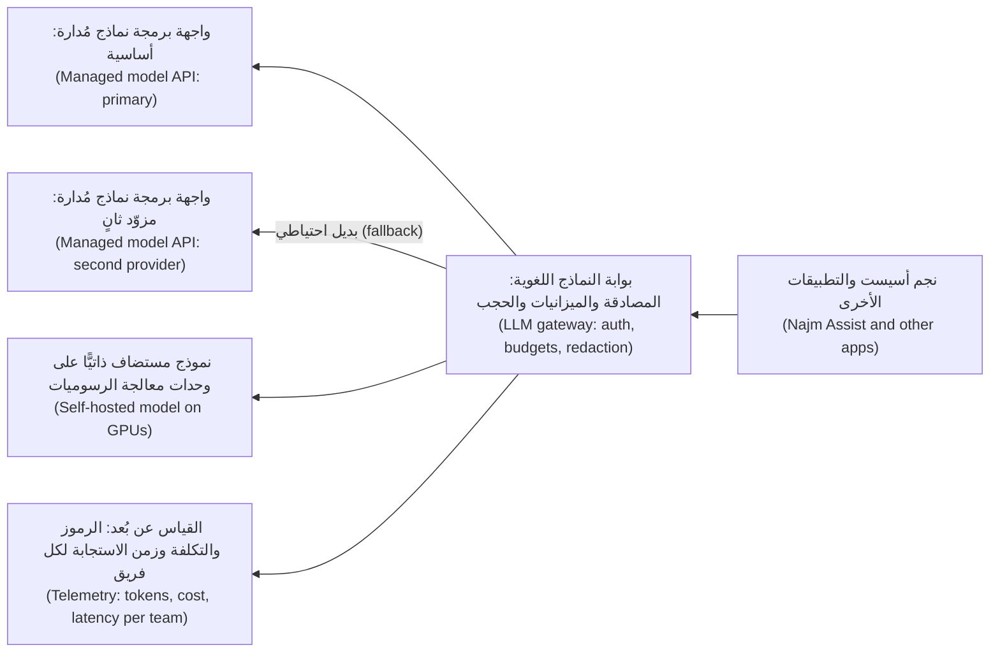

#### 🟡 التعمق أكثر (Going deeper)

**ما الذي ينبغي أن تفعله البوابة (What a gateway should do).**

| الوظيفة (Function) | لماذا تهم (Why it matters) |
|---|---|
| **المصادقة (Authentication)** | تستخدم التطبيقات هوية عبء العمل (workload identity) (1.3)؛ ومفاتيح المزوّدين لا تعيش إلا في البوابة (provider keys live only in the gateway) |
| **التوجيه (Routing)** | أرسل كل حالة استخدام إلى النموذج المعتمَد (Send each use case to the approved model)؛ ووجّه بحسب تصنيف البيانات (route by data classification) (البيانات السرّية إلى النموذج المستضاف ذاتيًّا داخل المنطقة فقط، confidential data only to the in-region self-hosted model، مثلًا) |
| **حدود المعدّل والميزانيات (Rate limits and budgets)** | لكل فريقٍ ولكل ميزة (Per team and per feature)، بالرموز والمال (in tokens and money)، كي لا تستطيع حلقةٌ خارجة عن السيطرة (one runaway loop) إنفاق ميزانية الشهر |
| **البدائل الاحتياطية وإعادة المحاولة (Fallbacks and retries)** | أعِد المحاولة مع تراجعٍ تدريجي (Retry with backoff)، ثم انتقل إلى نموذجٍ بديل معتمَد سبق اختبار جودته (an approved model already tested for quality) |
| **التخزين المؤقت (Caching)** | التخزين المؤقت للتطابق التام (Exact-match caching) يوفّر التكلفة؛ أمّا التخزين المؤقت الدلالي (semantic caching) (إعادة استخدام إجاباتٍ لموجّهاتٍ *مشابهة*، reusing answers to *similar* prompts) فيجب ألّا يعطي أبدًا عميلًا إجابةَ عميلٍ آخر (must never give one customer another's answer) |
| **الحجب والسياسة (Redaction and policy)** | أخفِ البيانات الشخصية التي لا تحتاجها حالة الاستخدام (Mask personal data that a use case does not need)؛ وافرض فحوص الإدخال والإخراج المتّفق عليها مع الأمن (input and output checks agreed with security) |
| **القياس عن بُعد (Telemetry)** | الرموز الداخلة والخارجة (Tokens in and out)، والتكلفة (cost)، وزمن الاستجابة (latency)، والنموذج (model)، والفريق (team)، والميزة (feature) في كل استدعاء، تُصدَّر باستخدام OpenTelemetry (5.1) |

توجد بواباتٌ مفتوحة المصدر (Open-source gateways) (مثل LiteLLM وEnvoy AI Gateway في وقت كتابة هذا النص، at the time of writing)، وبوابات لدى المزوّدين وأخرى تجارية (provider and commercial ones)؛ وتشغّل نجم بوابةً على منصتها (runs one on its platform) كي تعيش قواعد التوجيه في مستودع GitOps (routing rules live in the GitOps repo). والبوابة بنيةٌ تحتية حرجة (critical infrastructure): شغّلها على مناطق توافر متعدّدة (multi-zone) مع هدف مستوى خدمة (with an SLO)، كما في 6.1. أمّا الضوابط الأمنية لمدخلات النماذج ومخرجاتها (Security controls for model inputs and outputs) فتتعمّق فيها [*أمن الذكاء الاصطناعي وأمن التطبيقات (Secure AI & Application Security)*، الدرس 9.1 — الحواجز الوقائية ومعالجة المخرجات: لا تثق أبدًا بمخرجات النموذج (Guardrails and output handling: never trust model output)](../secai/index.ar.html#/9.1).

**وحدات معالجة الرسوميات في Kubernetes (GPUs in Kubernetes).** تحتاج العقد المزوّدة بوحدات معالجة رسوميات (Nodes with GPUs) إلى مشغّل المورّد (the vendor's driver) و*إضافة جهاز (device plugin)*، تعلن عن وحدات معالجة الرسوميات لـKubernetes بوصفها موردًا (advertises GPUs to Kubernetes as a resource) (لدى NVIDIA، `nvidia.com/gpu`). وتطلب الحجيرات وحداتٍ كاملة في حدودها (Pods request whole GPUs in their limits). أبقِ عقد وحدات معالجة الرسوميات في مجمّع عقد منفصل (a separate node pool) مع **وصمة (taint)**، كي لا يستقر هناك إلا أعباء العمل التي تتحمّلها (workloads that tolerate it) (وتحتاج إلى وحدة معالجة رسوميات):

```yaml
apiVersion: apps/v1
kind: Deployment
metadata:
  name: assist-classifier
  namespace: assist
spec:
  replicas: 2
  selector:
    matchLabels: { app: assist-classifier }
  template:
    metadata:
      labels: { app: assist-classifier }
    spec:
      nodeSelector:
        pool: gpu
      tolerations:
        - key: "gpu"
          operator: "Exists"
          effect: "NoSchedule"
      containers:
        - name: server
          image: registry.najm.example/assist/vllm-server@sha256:<digest>   # pinned by digest
          args: ["--model", "/models/classifier", "--max-model-len", "8192"]
          resources:
            limits:
              nvidia.com/gpu: 1
          readinessProbe:            # model loading takes time; do not send traffic early
            httpGet: { path: /health, port: 8000 }
            periodSeconds: 10
          securityContext:
            runAsNonRoot: true
            allowPrivilegeEscalation: false
```

يمكن لأعباء العمل الصغيرة (Small workloads) أن تتشارك وحدة معالجة رسوميات بالتقسيم الزمني (time-slicing)، أو، على بعض وحدات NVIDIA لمراكز البيانات (some NVIDIA data-centre GPUs)، بتقنية وحدة معالجة الرسوميات متعدّدة المثيلات (Multi-Instance GPU, MIG)، التي تقسم الوحدة إلى شرائح معزولة (isolated slices). وتقدّم واجهة برمجة التخصيص الديناميكي للموارد (Dynamic Resource Allocation API) في Kubernetes طلبات أجهزة أكثر مرونة (more flexible device requests)؛ تحقّق من حالتها في إصدارك (check its status in your version).

**محرّكات التقديم (Serving engines).** تشغيل نموذج بنصٍّ برمجي بسيط (with a plain script) يخدم طلبًا واحدًا في كل مرة (one request at a time) ويترك وحدة معالجة الرسوميات خاملةً في معظم الوقت (mostly idle)، وهو ما رآه يوسف. ومحرّكات التقديم تعالج ذلك:
- **vLLM** محرّكٌ مفتوح المصدر (an open-source engine) معروف بـ*الانتباه المُقسَّم إلى صفحات (PagedAttention)*، الذي يدير ذاكرة KV المؤقتة في صفحات (manages KV-cache memory in pages)، و*التجميع المستمر (continuous batching)*، الذي يضيف الطلبات الجديدة إلى الدفعة الجارية (adds new requests to the running batch) كلما انتهت أخرى. ويكشف واجهة برمجة HTTP متوافقة مع OpenAI (an OpenAI-compatible HTTP API).
- **NVIDIA Triton Inference Server** يقدّم نماذج من أطر عمل متعدّدة (models from several frameworks) مع التجميع الديناميكي (dynamic batching)؛ تحقّق من التسمية الحالية لدى NVIDIA (NVIDIA's current naming) له.
- **KServe** طبقة تقديم نماذج أصلية في Kubernetes (a Kubernetes-native model-serving layer) تدير عمليات نشر النماذج (model deployments) والتوسّع التلقائي (autoscaling) والإطلاقات التدريجية (rollouts)، ويمكنها تشغيل محرّكاتٍ مثل vLLM تحتها (underneath).

**المفاهيم وراء السرعة (The concepts behind the speed).**
- **التجميع (Batching):** خدمة محادثاتٍ كثيرة في آنٍ واحد (serving many conversations at once) ترفع الإنتاجية كثيرًا (raises throughput a lot)، على حساب بعض زمن الاستجابة لكل طلب (at some cost to each request's latency)؛ والتجميع المستمر (continuous batching) يُبقي الانتظار قصيرًا.
- **ذاكرة KV المؤقتة (KV cache):** أثناء التوليد (while generating)، يحتفظ النموذج بنتائج وسيطة (intermediate results) (المفاتيح والقيم، keys and values) لكل رمزٍ سابق (for every earlier token) كي لا يعيد حسابها. وتكبر الذاكرة المؤقتة مع طول السياق (with context length) ومع عدد المحادثات المتزامنة (the number of concurrent conversations)، وكثيرًا ما تكون هي ما يحدّ من عدد المستخدمين الذين تستطيع وحدة معالجة رسوميات واحدة خدمتهم (how many users one GPU can serve). وفي vLLM، يحدّد `--max-model-len` سقف السياق لكل طلب (caps the context per request)، ويحدّد `--gpu-memory-utilization` سقف حصّة المحرّك من ذاكرة وحدة معالجة الرسوميات (caps the engine's share of GPU memory).
- **التكميم (Quantisation):** تخزين الأوزان بـ8 أو 4 بت بدلًا من 16 (storing weights in 8 or 4 bits instead of 16) يقلّل الذاكرة (cuts memory) ويرفع السرعة غالبًا (often raises speed)، مع بعض فقدان الجودة (some quality loss) الذي يجب أن تقيسه على مجموعة التقييم الخاصة بك (on your own evaluation set).

#### 🔴 نظرة الخبير (Expert view)

**المقاييس المهمة (Metrics that matter).** مقاييس RED الكلاسيكية (Classic RED metrics) (5.1) لا تكفي. تتبّع، لكل نموذجٍ ومسار (per model and route):

| المقياس (Metric) | ما الذي يخبرك به (What it tells you) |
|---|---|
| **الوقت حتى أول رمز (Time to first token, TTFT)** | كم ينتظر المستخدم قبل أن يبدأ النص (How long the user waits before text starts)؛ ويهيمن عليه الانتظار في الطابور ومعالجة الموجّه (dominated by queueing and processing the prompt) |
| **الوقت لكل رمز مُخرَج (Time per output token)** (زمن الاستجابة بين الرموز، inter-token latency) | مدى سلاسة تدفّق النص (How smoothly text streams) |
| **الرموز في الثانية (Tokens per second)** لكل وحدة معالجة رسوميات (per GPU) | الإنتاجية (Throughput)؛ رقم كفاءة التكلفة (the cost-efficiency number) |
| **عمق الطابور والطلبات الجارية (Queue depth and running requests)** | التشبّع (Saturation)؛ أفضل إشارة توسّع تلقائي للنماذج المستضافة ذاتيًّا (the best autoscaling signal for self-hosted models) |
| **استخدام ذاكرة KV المؤقتة (KV-cache usage)** | مدى قربك من رفض الطلبات أو استباقها (rejecting or pre-empting requests) |
| **استخدام وحدة معالجة الرسوميات وذاكرتها (GPU utilisation and memory)** (مثلًا من مُصدِّر DCGM لدى NVIDIA، NVIDIA's DCGM exporter) | ما إذا كنت تدفع مقابل عتادٍ خامل (paying for idle hardware) |
| **الرموز والتكلفة لكل فريقٍ وميزة (Tokens and cost per team and feature)** | من البوابة (From the gateway)؛ يغذّي تقرير FinOps في 6.2 (feeds the FinOps report in 6.2) |

لدى OpenTelemetry اصطلاحاتٌ دلالية لاستدعاءات الذكاء الاصطناعي التوليدي (semantic conventions for generative AI calls) (النموذج، model؛ وأعداد الرموز، token counts؛ وغير ذلك)؛ وكانت لا تزال تتطوّر (still evolving) في وقت كتابة هذا النص، لذا ثبّت الإصدار الذي تستخدمه (pin the version you use).

وقد يكون هدف مستوى الخدمة (An SLO) لنجم أسيست: 99% من المحادثات تحصل على أول رمز (a first token) خلال عددٍ مستهدف من الثواني (a target number of seconds)، مقيسًا عند البوابة (measured at the gateway) على مدى 28 يومًا، مع تحديد الهدف من القياس (set from measurement)، لا من معيار أداء لدى المورّد (not a vendor benchmark).

**توسيع النماذج المستضافة ذاتيًّا (Scaling self-hosted models).** المعالج إشارةٌ خاطئة (CPU is the wrong signal)؛ وسّع بحسب عمق الطابور أو الطلبات الجارية (scale on queue depth or running requests) (مثلًا باستخدام KEDA يقرأ مقياسًا من Prometheus، with KEDA reading a Prometheus metric). والبدء البارد بطيء (Cold starts are slow): قد تحتاج نسخةٌ متماثلة جديدة إلى عقدة وحدة معالجة رسوميات جديدة (a new GPU node)، وإلى الصورة (the image)، وإلى ملف نموذج من غيغابايتات كثيرة (a model file of many gigabytes). احتفظ بحدٍّ أدنى دافئ من النسخ المتماثلة (a warm floor of replicas) في ساعات العمل، واسحب الصور مسبقًا (pre-pull images)، وأبقِ ملفات النماذج على تخزينٍ سريع قريب (fast nearby storage)، وتحكّم في حركة المرور بفحوص الجاهزية (gate traffic with readiness probes). ولا توسّع إلى الصفر (Scale to zero) إلا حيث تكون الاستجابة الأولى الطويلة مقبولة (a long first response is acceptable).

**نقطة التعادل للاستضافة الذاتية (The self-hosting break-even).** قارن، للجودة نفسها على مجموعة التقييم الخاصة بك (for the same quality on your evaluation set):

```text
Managed cost per month  = Σ (input tokens × input rate + output tokens × output rate)
Self-hosted per month   = GPU node hours × node rate (busy or idle)
                        + engineering and on-call time
                        + storage, network, observability
Self-hosted cost per 1M tokens = self-hosted per month / (tokens served / 1,000,000)
```

تنخفض تكلفة الاستضافة الذاتية لكل رمز (The self-hosted cost per token) كلما ارتفع الاستخدام (as utilisation rises)؛ وعند الاستخدام المنخفض (at low utilisation) تكون عادةً أسوأ من واجهة البرمجة المُدارة. أعِد الحساب حين تتغيّر الأسعار (Redo the sum when prices change). وقد يصعب الحصول على سعة وحدات معالجة الرسوميات عند الطلب (GPU capacity can be hard to obtain on demand)، لذا احجز سعةً لنموذجٍ مستضاف ذاتيًّا حرج (reserve capacity for a critical self-hosted model) أو احتفظ ببديلٍ احتياطي مُدار (keep a managed fallback).

**سلامة الإطلاق للنماذج (Release safety for models).** تغيير إصدار النموذج (Changing the model version)، أو التكميم (quantisation)، أو موجّه النظام (system prompt) يغيّر الإجابات، لذا فهو إطلاق (a release). أطلقه بنمط الكناري عند البوابة (Canary it at the gateway) (4.2): أرسل حصّةً صغيرة من حركة المرور (a small share of traffic)، وقارن نتائج التقييم (evaluation results)، والملاحظات (feedback)، وزمن الاستجابة (latency)، والتكلفة (cost)، ثم رقِّ أو تراجع (promote or roll back). ثبّت إصدارات النماذج حيث يسمح المزوّدون (Pin model versions where providers allow)؛ فالاسم المستعار الذي ينتقل بصمت إلى نموذجٍ أحدث (an alias that silently moves to a newer model) هو نشرٌ لم تتمّ مراجعته (an unreviewed deploy).

### 🧰 الأدوات (The toolkit)
| الأداة أو الممارسة أو الخدمة (Tool, practice or service) | ما هي وماذا تفعل (What it is and does) | متى تلجأ إليها (When to reach for it) |
|---|---|---|
| **LLM gateway** — بوابة النماذج اللغوية | نقطة دخولٍ واحدة مضبوطة إلى كل النماذج (One controlled entry point to all models): المصادقة (auth)، والتوجيه (routing)، والميزانيات (budgets)، والبدائل الاحتياطية (fallbacks)، والتخزين المؤقت (caching)، والقياس عن بُعد (telemetry) | قبل أن يبدأ الفريق الثاني باستدعاء النماذج (Before the second team starts calling models)؛ ودائمًا في بنك (always in a bank) |
| **vLLM** | محرّك تقديم نماذج لغوية مفتوح المصدر (Open-source LLM serving engine) مع PagedAttention، والتجميع المستمر (continuous batching)، وواجهة برمجة متوافقة مع OpenAI (an OpenAI-compatible API) | الاستضافة الذاتية للنماذج اللغوية مفتوحة الأوزان بكفاءة (Self-hosting open-weight LLMs efficiently) |
| **NVIDIA Triton Inference Server** | خادم استدلال متعدّد أطر العمل (Multi-framework inference server) مع التجميع الديناميكي (dynamic batching) | تقديم أنواعٍ كثيرة من النماذج (Serving many model types)، بما فيها نماذج غير لغوية (non-LLM models)، على وحدات NVIDIA |
| **KServe** | طبقة تقديم نماذج أصلية في Kubernetes (Kubernetes-native model-serving layer) مع التوسّع التلقائي والإطلاقات التدريجية (autoscaling and rollouts) | توحيد عمليات نشر النماذج على المنصة (Standardising model deployments on the platform) |
| **NVIDIA device plugin** and **DCGM exporter** — إضافة جهاز NVIDIA ومُصدِّر DCGM | كشف وحدات معالجة الرسوميات لـKubernetes بوصفها موردًا (Expose GPUs to Kubernetes as a resource)؛ وتصدير مقاييس وحدات معالجة الرسوميات إلى Prometheus (export GPU metrics to Prometheus) | أي عنقودٍ فيه عقد بوحدات NVIDIA (Any cluster with NVIDIA GPU nodes) |
| **KEDA** (CNCF) | توسّعٌ تلقائي مدفوع بالأحداث (Event-driven autoscaling) من الطوابير والتدفّقات والمقاييس (from queues, streams and metrics) | توسيع خوادم النماذج بحسب عمق الطابور بدلًا من المعالج (Scaling model servers on queue depth instead of CPU) |
| **OpenTelemetry** GenAI conventions — اصطلاحات الذكاء الاصطناعي التوليدي | سماتٌ قياسية لاستدعاءات النماذج وأعداد الرموز وزمن الاستجابة (Standard attributes for model calls, token counts and latency) | بيانات تكلفة وزمن استجابة متّسقة (Consistent cost and latency data) عبر النماذج والفرق (across models and teams) |

### 🏛️ عمليًا في بنك نجم (In practice at Najm Bank)
يكتب فريق سالم **قرار التقديم وسياسة البوابة لنجم أسيست (Najm Assist serving decision and gateway policy)**، ويراجعه مع نورة ومها ومنى، ويُخزَّن في مستودع GitOps (the GitOps repo) بجوار إعدادات البوابة (beside the gateway configuration).

| القسم (Section) | القرار (Decision) |
|---|---|
| حالات الاستخدام والمسارات (Use cases and routes) | المحادثة مع العملاء (Customer chat): واجهة برمجة مُدارة في منطقة معتمَدة (managed API in an approved region)، مع نموذجٍ معتمَد ثانٍ بديلًا احتياطيًّا (second approved model as fallback). التصنيف السرّي (Confidential classification): نموذج مستضاف ذاتيًّا في المنطقة الأساسية لنجم فقط (self-hosted model in Najm's primary region only). التلخيص الداخلي (Internal summarisation): فئة مُدارة أرخص (cheaper managed tier) |
| قواعد البيانات (Data rules) | التصنيف يحدّد المسار (Classification decides the route)؛ والبيانات الشخصية غير اللازمة تُخفى عند البوابة (unneeded personal data masked at the gateway)؛ ومدة الاحتفاظ بالسجلات متّفق عليها مع الأمن والخصوصية (log retention agreed with security and privacy) |
| الوصول (Access) | هوية عبء العمل إلى البوابة (Workload identity to the gateway)؛ ومفاتيح المزوّدين في مدير أسرارها فقط (provider keys only in its secrets manager)، مع تدويرها (rotated)؛ والاستدعاءات المباشرة للمزوّدين محظورة بسياسة الخروج (direct provider calls blocked by egress policy) |
| الميزانيات (Budgets) | ميزانية رموزٍ ومال لكل فريقٍ وميزة (Token and money budget per team and feature)، مع مالك (with an owner)؛ تنبيهٌ عند حصّةٍ محدّدة (alert at a set share)، وإيقافٌ صارم للميزات غير الحرجة (hard stop for non-critical features) |
| الموثوقية (Reliability) | بوابة على مناطق توافر متعدّدة (Gateway multi-zone) مع هدف مستوى خدمة للتوافر والوقت حتى أول رمز (an SLO on availability and time to first token)؛ واختبار البديل الاحتياطي شهريًّا (fallback tested monthly)؛ ونموذج مستضاف ذاتيًّا بحدٍّ أدنى دافئ من النسخ المتماثلة (a warm floor of replicas) خلال ساعات العمل |
| السعة (Capacity) | مجمّع عقد وحدات معالجة الرسوميات موصوم (GPU node pool tainted) ويتوسّع تلقائيًّا بحسب عمق الطابور (autoscaled on queue depth)؛ ومراجعة استخدام وحدات معالجة الرسوميات والرموز في الثانية أسبوعيًّا (reviewed weekly)؛ وإعادة حساب نقطة التعادل كل ربع (break-even re-calculated each quarter) بالأسعار الحالية |
| ضبط التغيير (Change control) | تغييرات النموذج أو التكميم أو الموجّه (Model, quantisation or prompt changes) تمرّ عبر التقييم (evaluation) وإطلاق كناري عند البوابة (a canary at the gateway)؛ وإصدارات النماذج مثبّتة (model versions pinned) |
| التقارير (Reporting) | التكلفة لكل محادثة ولكل فريق (Cost per conversation and per team) في تقرير منى الشهري من 6.2 (Mona's monthly report from 6.2) |

يعمل مصنّف يوسف (Yousef's classifier) الآن على vLLM مع التجميع المستمر (continuous batching) ونموذجٍ مكمَّم بـ8 بت (an 8-bit quantised model) اجتاز مجموعة التقييم (passed the evaluation set)، واستوعب مسار البديل الاحتياطي (the fallback route) انقطاع المزوّد التالي (the next provider outage) مع ارتفاعٍ قصير في زمن الاستجابة (a brief rise in latency).

### 🛠️ التمارين (Exercises)
- 🟢 **حدّد حجم نموذج (Size a model).** اختر ثلاثة نماذج مفتوحة الأوزان بأحجامٍ مختلفة (three open-weight models of different sizes). احسب ذاكرة الأوزان (weight memory) بدقة 16 و8 و4 بت (at 16-, 8- and 4-bit)، وقرّر أيّها يتّسع في حجم ذاكرة وحدة معالجة رسوميات تسمّيه (a GPU memory size you name)، تاركًا الربع لذاكرة KV المؤقتة والمحرّك (leaving a quarter for the KV cache and engine). *يكتمل عندما (Done when):* يكون لديك جدولٌ بتسعة تقديرات للذاكرة (nine memory estimates) مع إظهار الحساب (with the arithmetic shown)، وقرار ملاءمة من سطرٍ واحد لكل نموذج (a one-line fit decision for each model).
- 🟡 **شغّل بوابةً محليًّا (Run a gateway locally).** شغّل نموذجًا مفتوحًا صغيرًا محليًّا (a small open model locally) (المعالج المركزي يكفي، CPU is fine) خلف واجهة برمجة متوافقة مع OpenAI (an OpenAI-compatible API)، وضع أمامه بوابة نماذج لغوية مفتوحة المصدر (an open-source LLM gateway) في Docker مع مسارين (two routes)، وحدّ معدّلٍ لكل مفتاح (a per-key rate limit)، وبديلٍ احتياطي إلى نموذجٍ محلي ثانٍ (a fallback to a second local model). *يكتمل عندما (Done when):* تستطيع إظهار طلبٍ خدمه المسار الأساسي (served by the primary route)، وطلبٍ رفضه حدّ المعدّل (rejected by the rate limit)، وطلبٍ ينتقل إلى البديل حين توقف النموذج الأساسي (falls back when you stop the primary model)، مع سجلات البوابة أو مقاييسها التي تُظهر الرموز لكل طلب (tokens per request).
- 🔴 **اكتب نقطة تعادل وقرار تقديم (Write a break-even and serving decision).** لمساعدٍ خيالي (a fictional assistant) يتعامل مع عددٍ محدّد من المحادثات يوميًّا (a stated number of conversations per day) بمتوسطات محدّدة لرموز الإدخال والإخراج (stated average input and output tokens)، استخدم الأسعار العامة الحالية (current public prices) من واجهة برمجة مُدارة واحدة ونوع مثيل وحدة معالجة رسوميات واحد (one GPU instance type) (سجّل التاريخ والمصدر، record the date and source) لحساب التكلفة الشهرية بالطريقتين (monthly cost both ways) عند استخدام وحدة معالجة الرسوميات بنسبة 20% و50% و80% (at 20%, 50% and 80% GPU utilisation). أضِف وقت الهندسة افتراضًا مُعلَنًا (Add engineering time as a stated assumption). *يكتمل عندما (Done when):* يكون لديك قرارٌ من صفحةٍ واحدة (a one-page decision) بصيغة جدول نجم (in the format of the Najm table)، مع نسبة الاستخدام التي تتعادل عندها الاستضافة الذاتية (the utilisation at which self-hosting breaks even) والأسباب غير المتعلقة بالتكلفة (the non-cost reasons) (البيانات، data؛ التحكم، control؛ الموثوقية، reliability) التي قد تغيّر اختيارك.

### ⚠️ أخطاء وفخاخ (Mistakes and traps)
- **استدعاءاتٌ مباشرة بمفاتيح متناثرة (Direct calls with scattered keys).** أن يحمل كل فريقٍ مفتاح مزوّدٍ خاصًّا به (Every team holding its own provider key) يعني لا رؤية للتكلفة (no cost view)، ولا بديل احتياطي (no fallback)، وتدفّقات بيانات مجهولة (unknown data flows). وجّه كل شيء عبر بوابةٍ واحدة (Route everything through one gateway) واحظر الخروج المباشر (block direct egress).
- **وحدات معالجة الرسوميات الخاملة (Idle GPUs).** عقدة وحدة معالجة رسوميات تشغّل نموذجًا لا يستدعيه أحد (a model nobody calls) تكلّف ما تكلّفه عقدةٌ مشغولة. وسّع بحسب عمق الطابور (Scale on queue depth)، وجدوِل البيئات غير الإنتاجية (schedule non-production)، وراجع الاستخدام أسبوعيًّا (review utilisation weekly).
- **التقديم دون محرّك تقديم (Serving without a serving engine).** النص البرمجي البسيط (A plain script) يعالج طلبًا واحدًا في كل مرة. استخدم محرّكًا بتجميعٍ مستمر (an engine with continuous batching) وقِس الرموز في الثانية (measure tokens per second).
- **التكميم أو تبديل النماذج دون تقييم (Quantising or switching models without evaluation).** الأصغر والأرخص قد يكون أسوأ (Smaller and cheaper can be worse). شغّل مجموعة التقييم وإطلاق كناري (your evaluation set and a canary) قبل الترقية (before promoting).
- **التخزين المؤقت الدلالي غير الآمن (Unsafe semantic caching).** إعادة استخدام إجاباتٍ لموجّهاتٍ «مشابهة» ("similar" prompts) قد تُسرّب بيانات عميلٍ إلى آخر (leak one customer's data to another). لا تخزّن مؤقتًا إلا الإجابات غير الشخصية (non-personal answers)، أو اجعل نطاق الذاكرة المؤقتة لكل مستخدم (scope caches per user).

### 🧾 الخلاصة (Recap)
- أعباء عمل الذكاء الاصطناعي مقيّدة بذاكرة وحدة معالجة الرسوميات (bound by GPU memory) ومسعّرة بالرموز (priced by tokens)؛ حدّد أحجام النماذج بحسابٍ بسيط (size models with simple arithmetic) وتتبّع التكلفة لكل محادثة (track cost per conversation).
- تمنح بوابة النماذج اللغوية (An LLM gateway) مكانًا واحدًا للمصادقة (auth)، والتوجيه بحسب فئة البيانات (routing by data class)، والميزانيات (budgets)، والبدائل الاحتياطية (fallbacks)، والتخزين المؤقت (caching)، والحجب (redaction)، والقياس عن بُعد (telemetry)؛ شغّلها بوصفها بنيةً تحتية حرجة (critical infrastructure).
- قدّم النماذج المستضافة ذاتيًّا بمحرّكٍ مثل vLLM أو Triton أو KServe، باستخدام التجميع (batching)، وحدود ذاكرة KV المؤقتة (KV-cache limits)، والتكميم المُقيَّم (evaluated quantisation)، ووسّع بحسب عمق الطابور (scale on queue depth).
- عامِل كل تغييرٍ في النموذج أو الموجّه أو التكميم بوصفه إطلاقًا (Treat every model, prompt or quantisation change as a release): قيّم (evaluate)، وأطلق بنمط الكناري (canary)، وثبّت الإصدارات (pin versions)، وتراجع عند الحاجة (roll back if needed).

### ✍️ اختبر نفسك (Check yourself)

**1. يشغّل يوسف نموذجًا مستضافًا ذاتيًّا بنصٍّ برمجي بسيط بلغة Python (a simple Python script) على عقدة وحدة معالجة رسوميات. زمن الاستجابة مرتفع (Latency is high) واستخدام وحدة معالجة الرسوميات نحو 15%. ما الإصلاح الأرجح (the most likely fix)؟**

- A. نقل النص البرمجي نفسه إلى وحدة معالجة رسوميات أكبر بذاكرةٍ أكثر (a larger GPU with more memory)
- B. إضافة مُوسِّع تلقائي أفقي (HPA) يوسّع الحجيرات بحسب استخدامها للمعالج (on their CPU utilisation)
- C. الانتقال فورًا إلى واجهة برمجة مُدارة (Switch to a managed API immediately) والتخلّي عن وحدة معالجة الرسوميات
- D. تقديمه بمحرّكٍ للتجميع المستمر (a continuous-batching engine) مثل vLLM

<details><summary>الإجابة</summary>

**D.** النص البرمجي الذي يعالج طلبًا واحدًا في كل مرة (A one-request-at-a-time script) يترك وحدة معالجة الرسوميات خاملة؛ والتجميع (batching) يخدم طلباتٍ كثيرة معًا. وA يشتري مزيدًا من العتاد الخامل (buys more idle hardware)؛ وB يوسّع بحسب الإشارة الخاطئة (scales on the wrong signal)؛ وC لا يفسّر الهدر (does not explain the waste). (🟡 التعمق أكثر (Going deeper).)

</details>

**2. ما مقدار ذاكرة وحدة معالجة الرسوميات (GPU memory) التي تحتاجها تقريبًا أوزان نموذجٍ ذي 8 مليارات معامل (an 8-billion-parameter model) بدقة 4 بت (at 4-bit precision)؟**

- A. نحو 32 GB، لأن كل معامل يحتاج إلى أربعة بايتات (four bytes)
- B. نحو 4 GB، إضافةً إلى مساحةٍ لذاكرة KV المؤقتة (plus room for the KV cache)
- C. نحو 8 GB، دون حاجةٍ إلى مساحةٍ إضافية للتقديم (no extra room needed for serving)
- D. لا يمكن تقديرها دون سؤال المورّد (without asking the vendor)

<details><summary>الإجابة</summary>

**B.** 8 مليارات معامل × نصف بايت ≈ 4 GB، والتقديم يحتاج أيضًا إلى ذاكرةٍ لذاكرة KV المؤقتة وللمحرّك (KV-cache and engine memory). وA هو الحجم بدقة 32 بت (the 32-bit size)؛ وC هو الحجم بدقة 8 بت ويتجاهل ذاكرة KV المؤقتة؛ وD خاطئ لأن الحساب بسيط (the arithmetic is simple). (🟢 الأساسيات (The essentials).)

</details>

**3. يتعرّض مزوّد نماذج لانقطاعٍ جزئي (a partial outage) فيتعطّل نجم أسيست كليًّا. أيّ تغييرٍ يمنع هذا مباشرةً في المرة القادمة؟**

- A. أن تطلب من المزوّد اتفاقية مستوى خدمة أقوى (a stronger SLA) في العقد التالي
- B. إضافة نسخٍ متماثلة أكثر من واجهة المحادثة الأمامية (the chat front end) في كل منطقة توافر
- C. مسار في البوابة (A gateway route) مع إعادة المحاولة (retries) ونموذج بديل احتياطي مُختبَر (a tested fallback model)
- D. تخزين كل إجابة مؤقتًا إلى الأبد (Caching every answer forever) كي يُستدعى المزوّد نادرًا

<details><summary>الإجابة</summary>

**C.** البديل الاحتياطي في البوابة (A gateway fallback) يُبقي الميزة عاملةً حين يتعطّل مزوّدٌ واحد. وA لا يغيّر شيئًا أثناء الانقطاع (changes nothing during an outage)؛ وB يوسّع الطبقة الخاطئة (scales the wrong layer)؛ وD يقدّم إجاباتٍ قديمة (serves stale answers) ويخاطر بالتسرّب (risks leakage). (🟡 التعمق أكثر (Going deeper).)

</details>

**4. متى تكون الاستضافة الذاتية لنموذجٍ مفتوح الأوزان (self-hosting an open-weight model) منطقيةً أكثر في العادة؟**

- A. حين يُبقي الحجم الثابت وحدات معالجة الرسوميات مشغولة (When steady volume keeps GPUs busy)، أو تتطلّب الإقامة ذلك (or residency requires it)
- B. دائمًا، لأن ساعات وحدات معالجة الرسوميات أرخص من الدفع مقابل الرموز (cheaper than paying for tokens)
- C. لأداةٍ داخلية منخفضة الحركة (a low-traffic internal tool) لا تُستخدم إلا بضع مرات يوميًّا
- D. فقط حين لا تقدّم أي واجهة برمجة مُدارة نموذجًا بجودةٍ مماثلة (a model of similar quality)

<details><summary>الإجابة</summary>

**A.** تؤتي الاستضافة الذاتية ثمارها (Self-hosting pays off) مع الاستخدام المرتفع (high utilisation) أو المتطلبات غير المتعلقة بالتكلفة (non-cost requirements). وB يتجاهل تكلفة الخمول ووقت الهندسة (ignores idle cost and engineering time)؛ وC يترك وحدات معالجة الرسوميات خاملة؛ وD يتجاهل الإقامة والتحكم والاستخدام (residency, control and utilisation). (🔴 نظرة الخبير (Expert view).)

</details>

**5. أيّ مقياس هو أفضل إشارة توسّع تلقائي (the best autoscaling signal) لخادم نماذج لغوية مستضاف ذاتيًّا (a self-hosted LLM server)؟**

- A. استخدام المعالج في العقد (Node CPU utilisation) بمتوسطه عبر مجمّع وحدات معالجة الرسوميات
- B. عدد الحجيرات التي تقدّم النموذج حاليًّا (The number of pods currently serving the model)
- C. استخدام القرص على العقد التي تحمل ملفات النماذج (Disk usage on the nodes that hold model files)
- D. عمق الطابور أو الطلبات الجارية عند المحرّك (Queue depth or running requests at the engine)

<details><summary>الإجابة</summary>

**D.** يُظهر عمق الطابور (Queue depth) الطلب المنتظر لوحدة معالجة الرسوميات (demand waiting for the GPU). وA لا يقول الكثير عن حمل وحدة معالجة الرسوميات (says little about GPU load)؛ وB هو الشيء الذي يُوسَّع، لا إشارة (the thing being scaled, not a signal)؛ وC لا علاقة له بحمل الطلبات (unrelated to request load). (🔴 نظرة الخبير (Expert view).)

</details>

### 📚 المراجع (References)
- Kubernetes: جدولة وحدات معالجة الرسوميات (Schedule GPUs) — https://kubernetes.io/docs/tasks/manage-gpus/scheduling-gpus/
- Kubernetes: الوصمات والتحمّلات (Taints and tolerations) — https://kubernetes.io/docs/concepts/scheduling-eviction/taint-and-toleration/
- توثيق vLLM (vLLM documentation) — https://docs.vllm.ai/
- توثيق NVIDIA Triton Inference Server (NVIDIA Triton Inference Server documentation) — https://docs.nvidia.com/deeplearning/triton-inference-server/
- توثيق KServe (KServe documentation) — https://kserve.github.io/website/
- إضافة جهاز NVIDIA لـKubernetes (NVIDIA device plugin for Kubernetes) — https://github.com/NVIDIA/k8s-device-plugin
- توثيق KEDA (KEDA documentation) — https://keda.sh/docs/
- الاصطلاحات الدلالية في OpenTelemetry للذكاء الاصطناعي التوليدي (OpenTelemetry semantic conventions for generative AI) — https://opentelemetry.io/docs/specs/semconv/gen-ai/
- مؤسسة FinOps (FinOps Foundation) (بما في ذلك عمل FinOps للذكاء الاصطناعي، including FinOps for AI work) — https://www.finops.org/
- أمن تطبيقات النماذج اللغوية الكبيرة (Security for LLM applications): [*أمن الذكاء الاصطناعي وأمن التطبيقات (Secure AI & Application Security)*، الدرس 8.1 — سطح الهجوم في الذكاء الاصطناعي: قائمة OWASP لأعلى 10 مخاطر لتطبيقات النماذج اللغوية الكبيرة وMITRE ATLAS (The AI attack surface: OWASP Top 10 for LLM Applications and MITRE ATLAS)](../secai/index.ar.html#/8.1)
- تشغيل الوكلاء في الإنتاج (Operating agents in production): [*تشغيل وكلاء الذكاء الاصطناعي في الإنتاج (Running AI Agents in Production)*، المستوى 3 — مهندس الإنتاج (Production Engineer)](../agentic/learning-path.ar.html#level-3-production-engineer)

---

<a id="m7"></a>

# الوحدة 7 — الاحتراف: المشروع الختامي والامتحان التدريبي (Hero: capstone and practice exam)

*لقد تعلّمت السحابة وDevOps (cloud and DevOps) طبقةً بعد طبقة (one layer at a time): سطر الأوامر والشبكة (the shell and the network)، والهوية (identity)، والحاويات (containers)، وKubernetes، والبنية التحتية بوصفها شيفرة (infrastructure as code)، وخطوط التسليم (pipelines)، والإطلاقات (releases)، والقياس عن بُعد (telemetry)، وأهداف مستوى الخدمة (SLOs)، والحوادث (incidents)، والتوسّع (scaling)، والتكلفة (cost)، وأعباء عمل الذكاء الاصطناعي (AI workloads). وهذه الوحدة تعيد جمع الطبقات معًا (puts the layers back together). ففي المشروع الختامي (capstone) تأخذ خدمةً جديدة كليًّا في بنك نجم (a brand-new Najm Bank service)، هي ضوابط البطاقات (Card Controls)، من مستودعٍ فارغ (an empty repository) إلى الإنتاج (production) مع هدف مستوى خدمة موقَّع (a signed SLO)، معيدًا استخدام أثرٍ برمجي (artefact) من كل وحدةٍ سابقة (every earlier module)، وتربطها جميعًا في ملف جاهزية للإنتاج (production readiness file) واحد يستطيع سالم ومها ونورة اعتماده (approve). ثم ننتقل إليك أنت (we turn to you): الأدوار (roles) التي يتكوّن منها عمل السحابة والمنصات وDevOps وهندسة موثوقية المواقع (cloud, platform, DevOps and SRE work)، وكيف تختار الشهادات (certifications) من مزوّدي السحابة (cloud providers) ومؤسسة Linux (the Linux Foundation) وغيرها دون أن تتحكّم بك (without being ruled by them)، وما الذي تختبره المقابلات فعلًا (what interviews actually test)، وكيف تبني ملف أعمال (portfolio) يُثبت أنك تستطيع تشغيل البرمجيات (run software)، لا مجرد كتابتها (not just write it). وتُختتم الوحدة بامتحانٍ تدريبي (practice exam) من 60 سؤالًا يغطي المراحل الثماني جميعها (all eight phases).*

> **المراحل (Phases):** من Plan إلى Monitor (Plan through Monitor) — حلقة التسليم كاملةً (the whole delivery loop)، من طرفها إلى طرفها (end to end)، على خدمةٍ واحدة (on one service) ثم في امتحانٍ واحد (in one exam).

<a id="l7-1"></a>

## 7.1 — المشروع الختامي: خذ خدمةً جديدة في نجم من مستودعٍ فارغ إلى الإنتاج مع هدف مستوى خدمة (Capstone: take a new Najm service from empty repo to production with an SLO)

*المستوى: 🔴 متقدم* · *المتطلبات: الوحدات 0–6 (Modules 0–6)* · *المرحلة (Phase): Deploy, Operate*

### ⚡ الدرس في دقيقة (In 60 seconds)
- يأخذ المشروع الختامي (capstone) خدمة **ضوابط البطاقات (Card Controls)**، وهي خدمةٌ جديدة في نجم لتجميد البطاقات (freezing cards) وتعيين الحدود (setting limits)، من مستودعٍ فارغ (an empty repository) إلى الإنتاج (production) عبر المراحل الثماني جميعها (all eight phases).
- المُخرَج (The output) هو **ملف الجاهزية للإنتاج (production readiness file)**: أدلةٌ مترابطة (linked evidence) على أن الخدمة يمكن بناؤها وإطلاقها ومراقبتها واستعادتها وتحمّل تكلفتها (built, released, observed, recovered and paid for)، مع مالكٍ لكل جزء (an owner for each part).
- العمود الفقري (The spine) هو **أثرٌ برمجي واحد وبيئاتٌ متعددة (one artefact, many environments)**: ابنِ صورة الحاوية (container image) مرةً واحدة، ووقّعها (sign it)، ورقِّ البصمة نفسها (promote the same digest) من التطوير (dev) إلى التجهيز (staging) إلى الإنتاج (production) عبر Git.
- هدف مستوى الخدمة (The SLO) يأتي أولًا لا أخيرًا (comes first, not last). فهو يحدّد التنبيهات (the alerts)، وبوابات الإطلاق (the release gates)، وعدد النسخ المتماثلة (the replica count)، وأهداف النسخ الاحتياطي (the backup targets)، وجدول المناوبة (the on-call rota).
- مؤشر القرار (Decision cue): قبل كل بوابة (before each gate)، اسأل «لو فشلت هذه الخطوة بصمت في الثانية فجرًا ⁦(if this step failed silently at 2 a.m.)⁩، فكيف سنعرف (how would we know)، وكيف سنتراجع عنها (how would we undo it)؟».
- أكبر فخ (Biggest trap): قائمة تحقق للجاهزية (a readiness checklist) تُعلَّم من الذاكرة (ticked from memory). كل بندٍ يحتاج إلى دليل (Every item needs evidence)، والتراجع والاستعادة ومفاتيح الإيقاف الطارئ (rollback, restore and kill switches) تحتاج إلى تمرينٍ موقوت (a timed drill).

### 🧭 لماذا يهم (Why it matters)
يأتي طارق بطلبٍ إلى فريق المنصات (the platform team). يريد فريق البطاقات (the cards team) **خدمة ضوابط البطاقات (Card Controls service)**: يجمّد العملاء البطاقة (customers freeze a card)، ويحظرون الاستخدام عبر الإنترنت أو خارج البلاد (block online or overseas use)، ويعيّنون حدًّا يوميًّا (set a daily limit) من تطبيق نجم للهاتف (Najm Mobile app). ويتحقّق معالج البطاقات (The card processor) من هذه الضوابط أثناء التفويض (during authorisation)، لذا فإن الإجابة الخاطئة (a wrong answer) إمّا تمنع عميلًا عند نقطة الدفع (blocks a customer at a till) وإمّا تمرّر بطاقةً مسروقة (lets a stolen card through). ويريدها قطاع الأعمال (The business) حيّةً خلال ربع سنة واحد (live in one quarter).

يُسند سالم المهمة إلى يوسف، مع مها شريكةً في هندسة موثوقية المواقع (SRE partner). كانت خطة يوسف الأولى (Yousef's first plan): نسخ مستودعٍ قديم (copy an old repository)، ودفع صورةٍ موسومة بـ`latest` (push an image tagged latest)، وتطبيق ملفات البيان يدويًّا (apply manifests by hand)، و«إضافة المراقبة بعد الإطلاق (add monitoring after launch)». فيطرح سالم ثلاثة أسئلة: «ما هدف مستوى الخدمة (What is the SLO)؟ كيف تتراجع في أقل من خمس دقائق (How do you roll back in under five minutes)؟ ماذا يحدث إن تعطّلت منطقة توافر قاعدة البيانات (if the database zone fails) خلال ذروة يوم صرف الرواتب (a payday peak)؟». ولم تكن لدى يوسف إجاباتٌ بعد.

والتاريخ العام (Public history) يبيّن لماذا تهمّ هذه الأسئلة. ففي أغسطس 2012 نشرت شركة Knight Capital شيفرةً جديدة (deployed new code) على خوادمها، لكن خادمًا واحدًا احتفظ بشيفرةٍ قديمة (kept old code) خلف علَمٍ أُعيد استخدامه (behind a reused flag)؛ وبحسب الأمر اللاحق الصادر عن هيئة الأوراق المالية الأمريكية (the US SEC's later order)، خسرت الشركة مئات الملايين من الدولارات (hundreds of millions of dollars) في أقل من ساعة (in under an hour). وفي يناير 2017 فقدت GitLab ساعاتٍ من بيانات الإنتاج (hours of production data) بعد حذف مجلد قاعدة بيانات (a database directory was deleted) أثناء حادثة (during an incident)، وتبيّن أن عدة طرق للنسخ الاحتياطي (several backup methods) لا تعمل (مراجعة ما بعد الحادثة العامة لـGitLab، GitLab's public postmortem). وكانت كلٌّ منهما خطوةً مفقودة وغير مختبرة (a missing, untested step) على الطريق إلى الإنتاج (on the path to production). وهذا الدرس يبني الطريق كله مرةً واحدة، وبالشكل الصحيح (once, properly).

### 📐 كيف يعمل (How it works)

#### 🟢 الأساسيات (The essentials)

**الخدمة في فقرةٍ واحدة (The service, in one paragraph).** ضوابط البطاقات (Card Controls) واجهةُ برمجة HTTP صغيرة (a small HTTP API) لها قاعدة بيانات PostgreSQL مُدارة خاصة بها (its own managed PostgreSQL database). تستدعيها واجهة برمجة تطبيق نجم للهاتف (Najm Mobile API) لتغيير الضوابط (to change controls)؛ ويستدعيها تكامل معالج البطاقات (the card processor's integration) لقراءتها أثناء التفويض (during authorisation). وتعمل على عنقود Kubernetes المُدار (managed Kubernetes cluster) الخاص بالبنك عبر منطقتي توافر (two availability zones). ولا تخزّن إلا مرجعًا داخليًّا للبطاقة (an internal card reference)، ولا تخزّن أبدًا أرقام البطاقات (never card numbers)، وهو ما تؤكّده نورة في مراجعة التصميم (design review).

**ملف الجاهزية للإنتاج (The production readiness file).** **مراجعة الجاهزية للإنتاج (production readiness review, PRR)** فحصٌ منظَّم قبل الإطلاق (a structured pre-launch check) للتأكد من أن الخدمة يمكن تشغيلها بأمان (can be operated safely)؛ وتصف كتب SRE من Google هذه الممارسة (Google's SRE books describe the practice). ومراجعة نجم (Najm's PRR) مجلدٌ من الآثار البرمجية المترابطة (a folder of linked artefacts) تحت صفحة ملخّص واحدة (a one-page summary) (انظر 🏛️ أدناه)، ولها ثلاث قواعد (three rules):
1. **لكل ادّعاءٍ دليل (Every claim has evidence)** يستطيع المراجع فتحه (a reviewer can open)، لا «نعم، تم (yes, done)».
2. **كل تغييرٍ خطِر يمكن التراجع عنه (Every risky change can be undone)** بطريقةٍ موثّقة وموقوتة (a documented, timed method).
3. **كل تنبيهٍ يرتبط بهدف مستوى خدمة أو بدليل تشغيل (Every alert maps to an SLO or a runbook).** والتنبيه الذي لا يقابله إجراء ضجيج (An alert with no action is noise).

**المراحل الثماني (The eight phases).** تعيد كل مرحلةٍ استخدام أثرٍ برمجي من وحدةٍ سابقة (reuses an artefact from an earlier module)؛ وصفحة الملخّص (the summary page) في 🏛️ أدناه تربط كلًّا منها بدليله ودرسه (maps each to its evidence and lesson). وكل الأرقام في هذا الدرس توضيحية (All numbers in this lesson are illustrative).

**ابدأ بهدف مستوى الخدمة (Start with the SLO).** تتفق مها ومالك منتج البطاقات (the cards product owner) على رحلات المستخدم المهمة (the user journeys that matter)، ويكتبان **مؤشرات مستوى الخدمة (SLIs)** (service level indicators: قياساتٌ للأحداث الجيدة على الأحداث الصالحة، measurements of good events over valid events) و**أهداف مستوى الخدمة (SLOs)** (أهدافٌ لها على مدى نافذةٍ زمنية، targets for them over a window):

| الرحلة (Journey) | مؤشر مستوى الخدمة (SLI) | هدف مستوى الخدمة (SLO) (نافذة 28 يومًا، 28-day window) |
|---|---|---|
| قراءة الضوابط أثناء التفويض (Read controls during authorisation) | نسبة طلبات القراءة (Share of read requests) التي يُجاب عنها بنجاح خلال 100 ms عند موازن الأحمال (answered successfully within 100 ms at the load balancer) | 99.95% |
| العميل يغيّر ضابطًا (Customer changes a control) | نسبة طلبات الكتابة التي تنجح خلال 500 ms (Share of write requests that succeed within 500 ms) | 99.9% |
| الحداثة (Freshness) | نسبة تغييرات الضوابط التي تظهر للقراءات خلال ثانيتين (Share of control changes visible to reads within 2 seconds) | 99.9% |

هدف القراءة (The read SLO) أشدّ (tighter) لأن فشل القراءة (a failed read) قد يمنع عملية شراء حقيقية (block a real purchase). ومع 99.95% على مدى 28 يومًا، تكون **ميزانية الأخطاء (error budget)** هي 0.05% من طلبات القراءة (of read requests). وهي تحدّد سياسة الإطلاق (the release policy): ما دامت الميزانية متبقية (while budget remains)، يُطلق الفريق (the team ships)؛ وبمجرد استنفادها (once it is spent)، لا يُطلق إلا إصلاحات الموثوقية (only reliability fixes ship).

**الطريق (The path).** كل صندوقٍ بوابةٌ تترك دليلًا (Each box is a gate that leaves evidence):

```mermaid
flowchart RL
    R["مستودع فارغ من القالب<br/>(Empty repo from template)"] --> CI["التكامل المستمر: اختبار وفحص وبناء مرة واحدة<br/>(CI: test, scan, build once)"]
    CI --> IMG["صورة موقّعة بالبصمة<br/>(Signed image by digest)"]
    IMG --> DEV["النشر من المستودع: بيئة التطوير<br/>(GitOps: dev)"]
    DEV --> STG["النشر من المستودع: بيئة التجهيز واختبار الحمل<br/>(GitOps: staging and load test)"]
    STG --> PRR["مراجعة الجاهزية<br/>(Readiness review)"]
    PRR --> CAN["إطلاق كناري في الإنتاج<br/>(Canary in production)"]
    CAN -->|"هدف مستوى الخدمة سليم (SLO healthy)"| FULL["الطرح الكامل<br/>(Full rollout)"]
    CAN -->|"معدل الاستهلاك مرتفع (burn rate high)"| RB["تراجع تلقائي<br/>(Automatic rollback)"]
```

#### 🟡 التعمق أكثر (Going deeper)

**الشيفرة: ابدأ من المسار الذهبي (Code: start from the golden path).** لا ينسخ يوسف مستودعًا قديمًا (does not copy an old repository). بل يُنشئ الخدمة من قالب المنصة (the platform's template)، الذي يحتوي مسبقًا على ملف Dockerfile، وسير عمل للتكامل المستمر (CI workflow)، ومخطط Helm (Helm chart)، وإعداد OpenTelemetry (OpenTelemetry setup)، وملف `CODEOWNERS`، ومدخلٍ في فهرس البوابة (a portal catalogue entry). وتأتي الإعدادات (Configuration) من متغيرات البيئة (environment variables)، ولا تُدمَج أبدًا في الصورة (never baked into the image) (قاعدة الإعدادات في منهجية التطبيق ذي العوامل الاثني عشر، the Twelve-Factor App's config rule)، فتعمل صورةٌ واحدة في كل مكان (one image runs everywhere). وتعرض الخدمة المسار `/healthz/live` (العملية حيّة، the process is alive) والمسار `/healthz/ready` (تستطيع الوصول إلى قاعدة بياناتها وهي جاهزة لحركة المرور، it can reach its database and is ready for traffic)، وهما يصبحان مِجسّي الحيوية والجاهزية (the liveness and readiness probes) من الدرس 2.3.

**البناء: مرةً واحدة، بالبصمة، وموقَّعًا (Build: once, by digest, signed).** يبني التكامل المستمر (CI) الصورة مرةً واحدة لكل إيداع (once per commit)، ويدفعها (pushes it)، ويسجّل بصمتها (records its digest)، ثم يولّد قائمة مكونات البرمجيات (SBOM) ويوقّع تلك البصمة باستخدام cosign (signs that digest with cosign). وتشير البيئات اللاحقة (Later environments) إلى البصمة نفسها (reference the same digest) ولا تعيد البناء أبدًا (never rebuild). ويصل التكامل المستمر إلى السحابة عبر **اتحاد هوية أعباء العمل (workload identity federation)** (OIDC)، فلا يوجد مفتاحٌ طويل العمر (no long-lived key) في المستودع (1.3، 4.3):

```yaml
# .github/workflows/ci.yml (excerpt)
permissions:
  contents: read
  id-token: write        # lets the job request a short-lived OIDC token
jobs:
  build:
    runs-on: ubuntu-latest
    steps:
      - uses: actions/checkout@v4      # pin actions to a full commit SHA in real use
      - run: make test                  # unit and contract tests
      - run: make image                 # multi-stage, non-root build
      - run: make push sbom sign        # push, then SBOM and cosign signature on the digest
      - run: make bump-dev              # opens a PR to the GitOps repo with the new digest
```

**النشر: البنية التحتية والتطبيق، كلاهما من Git (Deploy: infrastructure and app, both from Git).** قاعدة البيانات (The database) والنسخ الاحتياطية (backups) ودور السحابة (cloud role) وقواعد الشبكة (network rules) هي استدعاءٌ واحد لوحدة OpenTofu (one OpenTofu module call)، يُراجَع بأمر `tofu plan` على طلب الدمج (on the pull request) (3.1). وفحوص السياسات (Policy checks) (3.3) ترفض قاعدة بيانات بلا تشفير أثناء التخزين (without encryption at rest) أو حماية من الحذف (deletion protection) أو مدة احتفاظ بالنسخ الاحتياطية (backup retention). أمّا جانب Kubernetes (The Kubernetes side) فيقيم في مستودع GitOps (the GitOps repository)، بمجلدٍ لكل بيئة (one folder per environment)، ويُوفّقه Argo CD (reconciled by Argo CD):

```yaml
apiVersion: argoproj.io/v1alpha1
kind: Application
metadata:
  name: card-controls-prod
  namespace: argocd
spec:
  project: cards
  source:
    repoURL: https://git.example.com/najm/gitops.git
    targetRevision: main
    path: apps/card-controls/overlays/prod
  destination:
    server: https://kubernetes.default.svc
    namespace: card-controls
  syncPolicy:
    automated:
      prune: true
      selfHeal: true     # reverts manual edits in the cluster back to Git
```

الترقية إلى الإنتاج (Promotion to production) طلبُ دمج (a pull request) يغيّر سطرًا واحدًا (changing one line)، هو بصمة الصورة (the image digest) في طبقة `prod` (the prod overlay)، ويعتمده فريق البطاقات وفريق المنصة (approved by the cards team and platform). والتراجع (Rollback) هو التراجع عن ذلك الإيداع (reverting that commit).

**الإطلاق: كناري مع حارس (Release: canary with a guard).** يرسل الطرح (The rollout) حصةً صغيرة من حركة المرور (a small share of traffic) إلى النسخة الجديدة (the new version)، ويقارن أخطاءها وزمن استجابتها (its errors and latency) بالنسخة المستقرة (the stable version)، ويتوسّع خطوةً بخطوة (widens step by step) (4.2). وتُؤتمِت أداةُ تحكّم (A controller) مثل Argo Rollouts أو Flagger عملية التحليل (automates the analysis)؛ فإن تجاوز الكناري عتباتٍ مبنية على هدف مستوى الخدمة (breaches SLO-based thresholds)، يُلغي الطرح (it aborts) وتعود حركة المرور إلى النسخة المستقرة (traffic returns to the stable version). والسلوك الجديد (New behaviour)، مثل «حظر الاستخدام خارج البلاد (block overseas use)»، يقع خلف علَم ميزة (behind a feature flag) لكي يمكن إيقافه دون نشر (switched off without a deploy). وتحديث المحتوى لـCrowdStrike Falcon في يوليو 2024 (The CrowdStrike Falcon content update of July 2024)، الذي أسقط أجهزة Windows حول العالم (crashed Windows hosts worldwide)، يبيّن ما يحدث حين يصل تغييرٌ إلى الجميع دفعةً واحدة (when a change reaches everyone at once).

**المراقبة: تنبيهاتٌ من الميزانية (Monitor: alerts from the budget).** تُصدر الخدمة تتبّعات OpenTelemetry (OpenTelemetry traces) ومقاييس RED (RED metrics) (المعدل والأخطاء والمدة، rate, errors, duration). وتكتب مها **تنبيهات متعددة النوافذ ومتعددة معدلات الاستهلاك (multi-window, multi-burn-rate alerts)** من كتاب SRE التطبيقي (the SRE Workbook): استدعِ المناوب (page) حين تُستهلك الميزانية بسرعة (the budget burns fast) على نافذةٍ طويلة وأخرى قصيرة معًا (over both a long and a short window)؛ وافتح تذكرة (open a ticket) حين تُستهلك ببطء (burns slowly). وهذا تنبيه الاستهلاك السريع (fast-burn page) لهدف القراءة:

```yaml
# Prometheus alert rule (excerpt): 14.4x burn over 1h, confirmed over 5m.
# Recording rules (not shown) compute the read error ratio over each window.
- alert: CardControlsReadFastBurn
  expr: |
    card_controls:read_error_ratio:rate1h > (14.4 * 0.0005)
    and
    card_controls:read_error_ratio:rate5m > (14.4 * 0.0005)
  labels:
    severity: page
  annotations:
    runbook: https://runbooks.example.com/card-controls/read-errors
```

المعامل 14.4 (The factor 14.4) يعني أن الميزانية ستنفد في نحو يومين (would be gone in about two days) بهذا المعدل (at this rate)؛ والنافذة القصيرة (the short window) توقف الاستدعاء (stops the page) بمجرد انتهاء الاستهلاك (once the burn has ended). وكل استدعاءٍ يرتبط بدليل تشغيل (Every page links to a runbook).

**التشغيل: أثبت التعافي (Operate: prove recovery).** بالاتفاق مع قطاع الأعمال (With the business)، تحدّد مها **RPO** (فقدان البيانات المقبول، tolerable data loss) بخمس دقائق و**RTO** (زمن التعافي المقبول، tolerable recovery time) بثلاثين دقيقة لتعطّل منطقة توافر (for a zone failure). وتعمل قاعدة البيانات مع نسخةٍ احتياطية جاهزة (a standby) في منطقة توافرٍ ثانية (a second zone) ومع الاستعادة إلى نقطةٍ زمنية (point-in-time recovery). ثم يستعيدون في بيئة التجهيز (in staging) نسخة الليلة الماضية الاحتياطية (last night's backup) إلى مثيلٍ جديد (a new instance)، ويعيدون التشغيل حتى وقتٍ مختار (replay to a chosen time) ويقيسون الزمن (time it). والنسخة الاحتياطية التي لم تُستعَد قط أملٌ لا ضابط (A backup that has never been restored is a hope, not a control).

#### 🔴 نظرة الخبير (Expert view)

**قرارات المعمارية، مكتوبةً (The architecture decisions, written down).** يطلب سالم **سجلات قرارات المعمارية (architecture decision records, ADRs)**: صفحةٌ واحدة لكل قرار (one page per decision) تتضمن السياق والخيارات والاختيار والعواقب (context, options, choice and consequences). وهذه ثلاثةٌ من سجلات ضوابط البطاقات (Three of Card Controls' ADRs):

| القرار (Decision) | الاختيار (Choice) | السبب (Why) | أعِد النظر حين (Revisit when) |
|---|---|---|---|
| مسار القراءة أثناء التفويض (Read path during authorisation) | التقديم من الخدمة مع ذاكرة تخزين مؤقت قصيرة في الذاكرة (Serve from the service with a short in-memory cache)، لا عنقود تخزين مؤقت منفصل (not a separate cache cluster) | أجزاءٌ متحركة أقل (Fewer moving parts)؛ وهدف الحداثة يسمح بثانيتين (the freshness SLO allows 2 seconds) | يصبح هدف زمن استجابة القراءة معرّضًا للخطر تحت الذروة (Read latency SLO is at risk under peak) |
| تعدّد مناطق التوافر أم تعدّد المناطق (Multi-zone or multi-region) | تعدّد مناطق التوافر في منطقةٍ واحدة الآن (Multi-zone in one region now) | يحقّق RTO لتعطّل منطقة التوافر (Meets the RTO for zone failure)؛ وتعدّد المناطق يضاعف التكلفة والتعقيد (multi-region doubles cost and complexity) | يشترط المنظِّم أو قطاع الأعمال RTO على مستوى المنطقة (Regulator or business requires a region-level RTO) |
| نمط الفشل إن تعطّلت الخدمة (Failure mode if the service is down) | يطبّق معالج البطاقات سلوكًا افتراضيًّا موثّقًا (The card processor applies a documented default) متفقًا عليه مع فريقي البطاقات والمخاطر (agreed with the cards and risk teams) | «السماح للجميع» أو «الرفض للجميع» الأعمى (A blind "allow all" or "deny all") قرارٌ تجاري لا تقني (a business decision, not a technical one) | بعد كل حادثة تمسّ هذا المسار (After every incident touching this path) |

الصف الثالث (The third row) هو ما تتخطاه معظم الفرق (the one most teams skip): فما يفعله المستدعي حين تفشل تبعيةٌ ما (what a caller does when a dependency fails) قرارُ تصميم (a design decision) يجب أن يوقّع عليه المنتج والمخاطر والأمن (product, risk and security must sign).

**السعة والتكلفة قبل الإطلاق (Capacity and cost before launch).** يُجري يوسف اختبار حمل (load-tests) على بيئة التجهيز بضعف ذروة يوم الرواتب المتوقعة (at twice the expected payday peak)، ويضبط طلبات المعالج والذاكرة (CPU and memory requests) من الاستخدام المقيس (from measured usage)، ويمنح المُوسِّع التلقائي الأفقي للحجيرات (Horizontal Pod Autoscaler) حدًّا أدنى من أربع نسخ متماثلة (a floor of four replicas) موزّعة على منطقتي توافر (spread across two zones) بقيد توزيع الطوبولوجيا (by a topology spread constraint)، بحيث يُبقي فقدانُ منطقة توافر نسختين (losing a zone leaves two)، وهو ما يكفي للذروة المقيسة (enough for the measured peak). وتطلب منى **تكلفة الوحدة (unit cost)** (التكلفة الشهرية من الموارد الموسومة مقسومةً على الطلبات الشهرية، monthly cost from tagged resources divided by monthly requests، 6.2)، معروضةً بجوار هدف مستوى الخدمة (shown next to the SLO)، كي يكون التغيير «الأرخص» الذي يستهلك الميزانية (a "cheaper" change that burns budget)، أو «الأكثر أمانًا» الذي يضاعف التكلفة ثلاث مرات (a "safer" one that triples cost)، مرئيًّا للطرفين (visible to both sides).

**التنظيم دون تخمين (Regulation without guesswork).** أدلة التشغيل (The runbooks) وسجلات الحوادث (incident records) واختبارات التعافي (recovery tests) تغذّي أيضًا أدلة المرونة التشغيلية (operational resilience evidence): لائحة DORA الأوروبية (EU DORA) (المطبَّقة منذ يناير 2025، applied from January 2025) للكيان الأوروبي (for the EU entity)، وتوقعات الجهات التنظيمية في قطر والإمارات (the Qatari and UAE regulators) بشأن السحابة والإسناد الخارجي (cloud and outsourcing expectations). لا تخمّن أرقام البنود (Do not guess clause numbers)؛ اسأل فريق المخاطر والامتثال عمّا يحتاجون إليه (ask risk and compliance what they need) ([*أمن الذكاء الاصطناعي وأمن التطبيقات (Secure AI & Application Security)*، الدرس 11.2 — التنظيمات التي تمسّ الأمن (Regulation that touches security)](../secai/index.ar.html#/11.2)).

**يوم المحاكاة (The game day).** قبل الإطلاق، تُدير مها **يوم محاكاة (game day)** مدته ساعتان، تحقن فيه أعطالًا في بيئة التجهيز (injecting failures in staging) للتدرّب على الاستجابة (to practise the response):
1. انشر كناري يُرجع أخطاءً في 5% من القراءات (Deploy a canary that returns errors on 5% of reads). *المتوقّع (Expected):* يُلغي التحليل الطرح تلقائيًّا (analysis aborts the rollout automatically).
2. اعزل عقد منطقة توافر واحدة واحذف حجيراتها (Cordon one zone's nodes and delete its pods). *المتوقّع (Expected):* يصمد هدف القراءة (the read SLO holds)؛ وتبدأ حجيراتٌ بديلة في منطقة التوافر الأخرى (replacement pods start in the other zone).
3. نفّذ تجاوز فشل قاعدة البيانات (Fail over the database). *المتوقّع (Expected):* تتوقف الكتابات لفترةٍ وجيزة (writes pause briefly)، ثم تُستأنف ضمن الزمن المتفق عليه (resume within the agreed time).
4. ألغِ بيانات اعتماد قاعدة البيانات الخاصة بالخدمة (Revoke the service's database credentials). *المتوقّع (Expected):* يفشل فحص الجاهزية (readiness fails)، ويُطلَق الاستدعاء (the page fires) ويرتبط بدليل التشغيل الصحيح (links to the right runbook).

وجد يوم المحاكاة الأول ثغرتين (The first game day found two gaps): دليل تشغيل بيانات الاعتماد (the credentials runbook) كان يشير إلى سرٍّ أُعيدت تسميته (a renamed secret)، وتجاوز الفشل (failover) استغرق وقتًا أطول مما افترضه RTO لأن مجمّع الاتصالات (the connection pool) لم يُعِد الاتصال (did not reconnect). وتحوّلت كلتاهما إلى إصلاحات وفحوص انحدار (fixes and regression checks).

### 🧰 الأدوات (The toolkit)
| الأداة أو الممارسة أو الخدمة (Tool, practice or service) | ما هي وماذا تفعل (What it is and does) | متى تلجأ إليها (When to reach for it) |
|---|---|---|
| **Production readiness review** — مراجعة الجاهزية للإنتاج | فحصٌ منظَّم قائم على الأدلة (Structured, evidence-based check) للتأكد من أن الخدمة يمكن تشغيلها بأمان قبل الإطلاق (can be operated safely before launch) | كل خدمةٍ جديدة (Every new service) أو تغييرٍ كبير في المعمارية (major architecture change) |
| **Architecture decision record** — سجل قرار المعمارية | سجلٌّ من صفحةٍ واحدة لقرارٍ وخياراته وعواقبه (One-page record of a decision, its options and its consequences) | أي اختيارٍ سيسأل عنه أحدٌ لاحقًا «لماذا؟» ⁦(Any choice someone will later ask "why?" about)⁩ |
| **Argo CD** | أداة تحكّم GitOps (GitOps controller) تُبقي العناقيد متزامنةً مع مستودع Git (keeps clusters in sync with a Git repository) | ترقية الأثر البرمجي نفسه عبر البيئات بطلب دمج (Promoting the same artefact through environments by pull request) |
| **Canary release** — الإطلاق الكناري | إرسال حصةٍ صغيرة من حركة المرور إلى نسخةٍ جديدة (Sending a small share of traffic to a new version) والتوسيع فقط إن كانت سليمة (widening only if it is healthy) | كل طرحٍ في الإنتاج لخدمةٍ يواجهها المستخدم (Every production rollout of a user-facing service) |
| **Error budget** — ميزانية الأخطاء | نسبة الإخفاقات التي يسمح بها هدف مستوى الخدمة على مدى نافذته (The share of failures the SLO allows over its window) | ضبط سياسة الإطلاق وعتبات التنبيه (Setting release policy and alert thresholds) |
| **Burn-rate alert** — تنبيه معدل الاستهلاك | تنبيهٌ على سرعة استهلاك ميزانية الأخطاء (Alert on how fast the error budget is being consumed)، على نافذةٍ طويلة وأخرى قصيرة (over a long and a short window) | استدعاء المناوب على خطر هدف مستوى الخدمة (Paging on SLO risk) بدلًا من مقاييس الموارد الخام (instead of on raw resource metrics) |
| **Game day** — يوم المحاكاة | تمرينٌ مخطَّط يحقن الأعطال (Planned exercise that injects failures) لاختبار الأنظمة وأدلة التشغيل والأشخاص (to test systems, runbooks and people) | قبل الإطلاق، ثم بانتظام وبعد كل تغييرٍ كبير (Before launch, then regularly and after major change) |

### 🏛️ عمليًا في بنك نجم (In practice at Najm Bank)
**ملف الجاهزية للإنتاج لخدمة ضوابط البطاقات: صفحة الملخّص (Card Controls production readiness file: summary page)** (الإصدار 1.0، v1.0؛ المالك (owner) يوسف؛ المراجعون (reviewers): مها لهندسة موثوقية المواقع (for SRE)، ونورة للأمن (for security)، ومنى للتكلفة (for cost)؛ اعتمده (approved by) سالم).

| المرحلة (Phase) | الدليل (الدرس) (Evidence (lesson)) | القرار المسجَّل (Decision recorded) | تُجتاز البوابة حين (Gate passed when) |
|---|---|---|---|
| Plan | موجز الخدمة (Service brief)، ووثيقة هدف مستوى الخدمة (SLO document)، وأربعة سجلات قرارات معمارية (four ADRs) (5.2) | هدف القراءة 99.95% (Read SLO 99.95%)، وهدف الكتابة 99.9% (write SLO 99.9%)؛ تعدّد مناطق التوافر (multi-zone) | يوقّع مالك المنتج ومها على هدف مستوى الخدمة (Product owner and Maha sign the SLO) |
| Code | مستودع من القالب (Repo from template)؛ ومدخل في الفهرس (catalogue entry)؛ والمالكون (owners) (0.1) | الإعدادات من البيئة فقط (Config only from environment) | فحوص القالب خضراء (Template checks green) |
| Build | بصمة الصورة (Image digest)، وقائمة مكونات البرمجيات (SBOM)، والتوقيع (signature) (2.1، 4.3) | تشغيل بغير صلاحيات الجذر (Non-root)، وصورة أساس مثبّتة (pinned base image) | يُتحقَّق من التوقيع عند القبول (Signature verified at admission) |
| Test | تشغيل التكامل المستمر (CI run)، واختبارات العقود مع واجهة الهاتف (contract tests with Mobile API)، وفحوص السياسات (policy checks) (3.3، 4.1) | لا وصول مباشر إلى قاعدة البيانات من الخدمات الأخرى (No direct database access from other services) | كل البوابات خضراء على الفرع الرئيسي (All gates green on main) |
| Release | إعدادات تحليل الكناري (Canary analysis config)؛ وقائمة الأعلام (flag list) (4.2) | الإلغاء عند تجاوز أخطاء القراءة معدّل الميزانية (Abort on read errors above budget rate) | اختُبر الإلغاء في بيئة التجهيز (Abort tested in staging) |
| Deploy | خطة OpenTofu (OpenTofu plan)، وتطبيق Argo CD (Argo CD app)، وترقية بموافقتين (two-approval promotion) (3.1، 3.2) | التراجع هو التراجع عن إيداعٍ واحد (Rollback is a revert of one commit) | قِيس زمن التراجع فكان أقل من خمس دقائق (Revert timed under five minutes) |
| Operate | أدلة التشغيل (Runbooks)، وجدول المناوبة (rota)، وتقرير تمرين الاستعادة (restore drill report) (5.3، 6.1) | RPO خمس دقائق وRTO ثلاثون دقيقة لفقدان منطقة توافر (RPO 5 min, RTO 30 min for zone loss) | حقّق تمرين الاستعادة الهدفين كليهما (Restore drill met both targets) |
| Monitor | لوحة هدف مستوى الخدمة (SLO dashboard)، وتنبيهات معدل الاستهلاك (burn-rate alerts)، والتكلفة لكل طلب (cost per request) (5.1، 5.2، 6.2) | الاستدعاء فقط عند استهلاك هدف مستوى الخدمة (Pages only on SLO burn) | أُطلق كل تنبيه مرةً في اختبار (Each alert fired once in a test) |

### 🛠️ التمارين (Exercises)
- 🟢 اكتب وثيقة هدف مستوى الخدمة (Write the SLO document) لخدمةٍ صغيرة خاصة بك (for a small service of your own) (لنقل، مُقصِّر روابط، say, a URL shortener): مؤشرا مستوى خدمة (two SLIs)، وهدفٌ لكلٍّ منهما على مدى 28 يومًا (an SLO for each over 28 days)، وميزانية الأخطاء بعدد الطلبات (the error budget in requests) عند مستوى حركة مرور مفترض (at an assumed traffic level)، وسياسة الإطلاق حين تنفد (the release policy when it runs out). *يكتمل عندما (Done when):* يستطيع زميلٌ أن يقول ما الذي سيستدعي أحدًا (what would page someone) وما الذي سيجمّد الإطلاقات (what would freeze releases)، دون أن يسألك.
- 🟡 على حاسوبك المحمول (On your laptop)، خذ تلك الخدمة من مستودعٍ فارغ (from an empty repo) إلى عنقود kind أو k3d محلي (a local kind or k3d cluster): ملف Dockerfile متعدد المراحل وبغير صلاحيات الجذر (multi-stage non-root Dockerfile)، وسير عمل GitHub Actions يبني مرةً واحدة ويسجّل البصمة (builds once and records the digest)، وArgo CD يزامن من مجلد Git تملكه (syncing from a Git folder you own). *يكتمل عندما (Done when):* يؤدي تغيير البصمة في Git إلى تقدّم العنقود (rolls the cluster forward)، ويؤدي التراجع عن الإيداع إلى إرجاعه (reverting the commit rolls it back)، وتكون قد قست زمن الحالتين (timed both).
- 🔴 أضِف Prometheus وGrafana إلى عنقودك المحلي، وعرّف هدف مستوى خدمة واحدًا (define one SLO) مع تنبيهات استهلاك سريع وبطيء (fast-burn and slow-burn alerts)، ثم أدِر يوم محاكاة مدته ساعة (a one-hour game day) بثلاثة أعطال محقونة (three injected failures) (إطلاقٌ سيئ، a bad release؛ وحجيرةٌ مقتولة، a killed pod؛ وإعداداتٌ معطوبة، a broken config). استخدم فقط الأجهزة والحسابات التي تملكها (Use only machines and accounts you own)؛ وعلى حساب الفئة المجانية (on a free-tier account)، اضبط تنبيه ميزانية أولًا (set a budget alert first). *يكتمل عندما (Done when):* يُكتشف كل عطلٍ بتنبيه أو بالكناري (detected by an alert or the canary)، ويكون لكلٍّ منها خطوةٌ في دليل التشغيل نجحت (a runbook step that worked)، ويسرد تقريرك ثغرتين على الأقل أصلحتهما (at least two gaps you fixed).

### ⚠️ أخطاء وفخاخ (Mistakes and traps)
- **هدف مستوى الخدمة بعد الإطلاق (SLO after launch).** من دونه لا يستطيع أحدٌ أن يقول أيّ التنبيهات مهمة (which alerts matter) أو متى يتوقف الإطلاق (when to stop shipping). اتفق عليه في مرحلة Plan (in the Plan phase) مع مالك المنتج (the product owner).
- **إعادة البناء لكل بيئة (Rebuilding per environment).** إعادة البناء في التجهيز أو الإنتاج (A rebuild in staging or production) تُنتج أثرًا برمجيًّا مختلفًا (a different artefact) عن الذي اختبرته. ابنِ مرةً واحدة ورقِّ البصمة (Build once and promote the digest).
- **التعديلات اليدوية في العنقود (Hand edits in the cluster).** تنحرف عن Git (They drift from Git) وتختفي عند المزامنة التالية (vanish on the next sync). غيّر Git؛ ودع أداة التحكّم توفّق الحالة (let the controller reconcile).
- **نسخ احتياطية وتراجعات غير مختبرة (Untested backups and rollbacks).** تُظهر مراجعة ما بعد الحادثة لـGitLab عام 2017 (GitLab's 2017 postmortem) نسخًا احتياطية غير مختبرة تفشل معًا (untested backups failing together). تمرّن على الاستعادة والتراجع (Drill restore and rollback)، وقِس زمنهما (time them).
- **تنبيهات على الأسباب لا على الأعراض (Alerts on causes, not symptoms).** استدعاء المناوب عند بلوغ المعالج 80% (Paging on CPU at 80%) يوقظ الناس لأمورٍ لا يشعر بها العملاء أبدًا (things customers never feel). استدعِ على استهلاك هدف مستوى الخدمة (Page on SLO burn).
- **ترك نمط الفشل دون قرار (Leaving the failure mode undecided).** قرِّر ووقّع مسبقًا (Decide and sign in advance) ما يفعله المستدعون حين تتعطّل الخدمة (what callers do when the service is down).

### 🧾 الخلاصة (Recap)
- هدف مستوى الخدمة (The SLO)، المتفق عليه أولًا (agreed first)، يقود التنبيهات وسياسة الإطلاق والسعة وأهداف التعافي (drives the alerts, release policy, capacity and recovery targets).
- صورةٌ واحدة موقّعة (One signed image)، يُشار إليها بالبصمة (referenced by digest)، تنتقل عبر البيئات بطلب دمج (moves through environments by pull request)؛ والتراجع هو التراجع عن إيداع (rollback is a revert).
- تحليل الكناري (Canary analysis) وأعلام الميزات (feature flags) وتنبيهات معدل الاستهلاك (burn-rate alerts) تحوّل ميزانية الأخطاء إلى حواجز حماية تلقائية (automatic guardrails).
- التعافي وأنماط الفشل والتكلفة (Recovery, failure modes and cost) تُصمَّم ويُتمرَّن عليها قبل الإطلاق (designed and drilled before launch).

### ✍️ اختبر نفسك (Check yourself)

**1. خط التسليم في بيئة التجهيز لدى يوسف (Yousef's staging pipeline) يعيد بناء صورة الحاوية من إيداع Git نفسه (rebuilds the container image from the same Git commit) قبل النشر إلى الإنتاج «للاحتياط (to be safe)». ما المشكلة؟**

- A. إعادة البناء أبطأ (Rebuilding is slower)، وهذا يضرّ بزمن التسليم (lead time) لكنه غير ضارٍّ فيما عدا ذلك
- B. لم يعد الإنتاج يشغّل الأثر البرمجي المختبَر (Production no longer runs the tested artefact)؛ رقِّ البصمة نفسها (promote the same digest)
- C. إعادة البناء مطلوبة للإنتاج (required for production) لأن صور التجهيز غير موقّعة (staging images are unsigned)
- D. لا مشكلة ما دام البناءان يستخدمان إيداع Git نفسه (as long as both builds use the same Git commit)

<details><summary>الإجابة</summary>

**B.** قد تلتقط إعادة البناء طبقات أساس أو تبعياتٍ مختلفة (different base layers or dependencies)، فيشغّل الإنتاج شيئًا لم يختبره أحد (something nobody tested). والخيار D مغرٍ، لكن الإيداع نفسه (the same commit) لا يضمن الأثر البرمجي نفسه (the same artefact). (🟡 التعمق أكثر (Going deeper).)

</details>

**2. هدف القراءة لخدمة ضوابط البطاقات (The Card Controls read SLO) هو 99.95% على مدى 28 يومًا. ما الذي تخبر به ميزانية الأخطاء (the error budget) الفريق؟**

- A. كم مهندسًا يجب أن يكون في المناوبة (on call) خلال كل أسبوع من النافذة
- B. أقصى زمن استجابة (The maximum latency) مسموح به لأي طلب قراءة منفرد (any single read request)
- C. كم يُسمح أن تكلّف الخدمة كل شهر (How much the service is allowed to cost each month)
- D. كم قراءةً يمكن أن تفشل (How many reads may fail) قبل أن يتقدّم عمل الموثوقية على الإطلاقات (before reliability work takes priority over releases)

<details><summary>الإجابة</summary>

**D.** ميزانية الأخطاء (The error budget) هي نسبة 0.05% من الطلبات التي يسمح هدف مستوى الخدمة بفشلها (the SLO allows to fail)؛ وما دامت متبقية يُطلق الفريق (the team ships)؛ وحين تُستنفد يأتي عمل الموثوقية أولًا (reliability work comes first). ولا تقول شيئًا مباشرًا عن التوظيف أو التكلفة أو زمن استجابة طلبٍ منفرد (staffing, cost or a single request's latency). (🟢 الأساسيات (The essentials).)

</details>

**3. خلال يوم المحاكاة (During the game day)، يُرجع الكناري أخطاءً في 5% من القراءات (the canary returns errors on 5% of reads). ماذا يجب أن يحدث إن كان الإطلاق مُعدًّا كما يصفه هذا الدرس (set up as this lesson describes)؟**

- A. يُلغي التحليل الطرح (Analysis aborts the rollout) وتعود حركة المرور إلى النسخة المستقرة (the stable version)
- B. تُستدعى مها (Maha is paged) وتعدّل كائن Deployment في العنقود يدويًّا (edits the Deployment in the cluster by hand) للتراجع
- C. يستمر الطرح (The rollout continues)، لأن 95% من القراءات ما زالت تنجح وهذا قريبٌ من الهدف (close to target)
- D. يعيد يوسف بناء الصورة بإصلاح (rebuilds the image with a fix) ويدفعها مباشرةً إلى الإنتاج (pushes it straight to production)

<details><summary>الإجابة</summary>

**A.** التحليل المرتبط بهدف مستوى الخدمة (Analysis tied to the SLO) يُلغي تلقائيًّا (aborts automatically). أمّا التعديلات اليدوية في العنقود (Manual cluster edits) (B) فتنحرف عن Git؛ والاستمرار (continuing) (C) سيستهلك الميزانية أسرع بكثير مما هو مسموح (far faster than allowed)؛ والدفع المباشر (pushing directly) (D) يتخطى كل بوابة (skips every gate). (🟡 التعمق أكثر (Going deeper).)

</details>

**4. أيّ بندٍ ينتمي إلى سجل قرار معمارية (an architecture decision record) بدلًا من أن يكون في دليل تشغيل فقط (rather than only in a runbook)؟**

- A. الأمر الدقيق لإعادة تشغيل حجيرة عالقة في حلقة انهيار (a pod that is stuck in a crash loop)
- B. جدول المناوبة وجهات التصعيد (The on-call rota and escalation contacts) لأسبوع الإطلاق
- C. ما يفعله المعالج حين تتعطّل ضوابط البطاقات (What the processor does when Card Controls is down)، ومن وافق على ذلك (who agreed it)
- D. رابط لوحة Grafana (The URL of the Grafana dashboard) التي تعرض هدف القراءة

<details><summary>الإجابة</summary>

**C.** نمط الفشل (The failure mode) قرارٌ تجاري وقرار مخاطر (a business and risk decision) له خيارات وعواقب (options and consequences)، وهذا ما يسجّله سجل قرار المعمارية (what an ADR records). أمّا البقية فتفاصيل تشغيلية (operational details) لأدلة التشغيل وصفحات جداول المناوبة (runbooks and rota pages). (🔴 نظرة الخبير (Expert view).)

</details>

**5. يسأل سالم كيف يعرف الفريق أن RTO البالغ 30 دقيقة لفقدان منطقة توافر (the 30-minute RTO for zone loss) واقعي (realistic). ما أفضل دليل (the best evidence)؟**

- A. توثيق المزوّد يقول إن تجاوز فشل قاعدة البيانات عبر مناطق التوافر تلقائي (database failover across zones is automatic)
- B. تقرير تمرين مؤرَّخ (A dated drill report) يتضمن الأزمنة المقيسة لتجاوز الفشل والاستعادة (the measured failover and restore times)
- C. النسخ الاحتياطية الآلية لقاعدة البيانات مفعّلة (Automated database backups are enabled) في وحدة OpenTofu الخاصة بالخدمة
- D. نجح فحص السياسة الذي يشترط مدة احتفاظ بالنسخ الاحتياطية (a backup retention period) على طلب الدمج

<details><summary>الإجابة</summary>

**B.** وحده التمرين الموقوت (Only a timed drill) يُظهر أن التعافي يعمل ضمن الهدف (recovery works within the target)؛ فقد وجد يوم المحاكاة مشكلةً في مجمّع الاتصالات (a connection-pool issue) لم تكن أي إعداداتٍ لتكشفها (no configuration would reveal). أمّا A وC وD فتُظهر إعدادات لا نتائج (settings, not outcomes). (🟡 التعمق أكثر (Going deeper)، 🔴 نظرة الخبير (Expert view).)

</details>

### 📚 المراجع (References)
- Google، كتاب *هندسة موثوقية المواقع (Site Reliability Engineering)* (2016) و*كتاب هندسة موثوقية المواقع التطبيقي (The Site Reliability Workbook)* (2018)، بما في ذلك أهداف مستوى الخدمة (SLOs) والتنبيه على أهداف مستوى الخدمة (alerting on SLOs) ومراجعات الإطلاق (launch reviews) — https://sre.google/books/
- منهجية التطبيق ذي العوامل الاثني عشر (The Twelve-Factor App) — https://12factor.net
- مبادئ OpenGitOps (OpenGitOps principles) — https://opengitops.dev
- توثيق Argo CD (Argo CD documentation) — https://argo-cd.readthedocs.io
- توثيق Argo Rollouts (Argo Rollouts documentation) — https://argoproj.github.io/rollouts/
- توثيق OpenTofu (OpenTofu documentation) — https://opentofu.org/docs/
- توثيق OpenTelemetry (OpenTelemetry documentation) — https://opentelemetry.io/docs/
- قواعد التنبيه في Prometheus (Prometheus alerting rules) — https://prometheus.io/docs/prometheus/latest/configuration/alerting_rules/
- توثيق GitHub، التحصين الأمني باستخدام OpenID Connect (GitHub Docs, security hardening with OpenID Connect) — https://docs.github.com/en/actions/security-for-github-actions/security-hardening-your-deployments/about-security-hardening-with-openid-connect
- GitLab، مراجعة ما بعد الحادثة لانقطاع قاعدة البيانات في 31 يناير 2017 (postmortem of the database outage of January 31, 2017) — https://about.gitlab.com/blog/
- هيئة الأوراق المالية الأمريكية (US SEC)، الأمر في قضية Knight Capital Americas LLC (order in the matter of Knight Capital Americas LLC) (2013) — https://www.sec.gov
- اللائحة (EU) 2022/2554 بشأن المرونة التشغيلية الرقمية للقطاع المالي (Regulation (EU) 2022/2554 on digital operational resilience for the financial sector) (DORA) — https://eur-lex.europa.eu/eli/reg/2022/2554/oj

<a id="l7-2"></a>

## 7.2 — المسار المهني في السحابة: الأدوار والشهادات والمقابلات وملف الأعمال (The cloud career: roles, certifications, interviews and a portfolio)

*المستوى: 🔴 متقدم* · *المتطلبات: 7.1* · *المرحلة (Phase): Plan*

### ⚡ الدرس في دقيقة (In 60 seconds)
- «السحابة (Cloud)» عدة وظائف (several jobs): السحابة (cloud)، وDevOps، والمنصات (platform)، وموثوقية المواقع (site reliability, SRE)، وأمن السحابة (cloud security)، وFinOps، والبنية التحتية للذكاء الاصطناعي (AI infrastructure). تتشارك الأساسيات (They share foundations) لكنها تملك أشياء مختلفة (own different things). اختر دورًا مستهدفًا أولًا (Pick a target role first).
- الشهادات إشارةٌ لا برهان (Certifications are a signal, not proof). ومصادرها الرئيسية (The main sources) هي مزوّدو السحابة الثلاثة (the three cloud providers) (**AWS** و**Microsoft** و**Google Cloud**)، و**مؤسسة Linux وCNCF (Linux Foundation and CNCF)** لـKubernetes، و**HashiCorp** لـTerraform، و**مؤسسة FinOps (FinOps Foundation)**. الأسماء والرموز والمحتوى تتغيّر (Names, codes and content change)، لذا راجع الصفحة الحالية للجهة المُصدِرة (check the issuer's current page).
- **ملف أعمالٍ من الأدلة (A portfolio of evidence)** يتفوّق على قائمة الشارات (beats a list of badges): خدمةٌ أوصلتها إلى «الإنتاج (production)» على حاسوبك المحمول أو الفئة المجانية (on your own laptop or free tier)، مع هدف مستوى خدمة (an SLO) وخط تسليم (a pipeline) ودليل تشغيل (a runbook) ومراجعة ما بعد حادثة (a postmortem) لشيءٍ كسرته عمدًا (something you broke on purpose).
- تختبر المقابلات منهجية استكشاف الأعطال (troubleshooting method) أكثر من الاستذكار (more than recall): حجيرةٌ معطوبة (a broken pod)، وتصميمٌ يجب جعله قابلًا للنشر (a design to make deployable)، وحادثةٌ عليك قيادتها (an incident to lead).
- مؤشر القرار (Decision cue): اختر الشهادة بحسب الدور المستهدف والطلب المحلي (by target role and local demand)، واقرنها بأثرٍ برمجي بنيته أثناء الدراسة (an artefact you built while studying).
- أكبر فخ (Biggest trap): ترك حساب الفئة المجانية دون تنبيه ميزانية (a free-tier account without a budget alert)، أو وضع معمارية صاحب العمل أو مفاتيحه أو حوادثه (an employer's architecture, keys or incidents) في مستودعٍ عام (a public repository).

### 🧭 لماذا يهم (Why it matters)
بعد ستة أشهر من التحاقه (Six months after joining)، يسأل يوسف سالمًا: «هل أنال شهادة Kubernetes (a Kubernetes certification) أم شهادة مهندس معمارية سحابية (a cloud architect one)؟ وهل هندسة المنصات (platform engineering) مسارٌ مهني حقيقي (a real career)، أم مجرد DevOps بعد إعادة تسميتها (just DevOps renamed)؟». لديه خدمةٌ واحدة في الإنتاج (one service in production) ولا خطة (no plan).

ولدى سالم المشكلة المقابلة (the mirror problem). فهو يوظّف مهندسَي منصات (two platform engineers) ومهندس موثوقية مواقع واحدًا (one SRE) للانتقال من مركز البيانات (the move from the data centre). كثيرٌ من السير الذاتية (Many CVs) تسرد عدة شهادات سحابية (several cloud certificates)؛ والأقل منها يُظهر شيئًا يستطيع قراءته أو تشغيله (anything he can read or run). مرشّحةٌ واحدة (One candidate) بشهادةٍ واحدة من المستوى المشارك (a single associate-level certificate) أرفقت رابط مستودع (linked a repository): واجهة برمجة صغيرة (a small API) منشورة إلى عنقود kind محلي (a local kind cluster) عبر GitHub Actions وArgo CD، وهدف مستوى خدمة مع تنبيهات معدل الاستهلاك (an SLO with burn-rate alerts)، ومراجعة ما بعد حادثة من صفحتين (a two-page postmortem) لعطلٍ تسبّبت فيه عمدًا في يوم محاكاة (a failure she caused deliberately in a game day). يدعوها سالم أولًا (Salem invites her first).

ومع ذلك ما زالت الشهادات مهمة (Certificates still matter). فإعلانات الوظائف (Job adverts) في بنوك الخليج والجهات الحكومية وشركات الاستشارات (Gulf banks, government bodies and consultancies) كثيرًا ما تسرد شهادات سحابية بأسمائها (named cloud certifications) على أنها مطلوبة أو مفضّلة (as required or preferred)، وهي تساعدك على اجتياز الفرز الأول (pass the first filter). أمّا المقابلة (The interview)، ثم جهاز الاستدعاء (the pager)، فيختبران ما إذا كنت تستطيع أداء العمل (whether you can do the work). وللبحث الأوسع عن وظيفة (For the wider job search) (السير الذاتية والطلبات والعروض، CVs, applications, offers)، انظر [*من التخرّج إلى التوظيف (From Graduate to Hired)*، الدرس 2.4 — مهندس السحابة والمنصات وDevOps والأمن (Cloud, platform, DevOps and security engineer)](../career/index.ar.html#/2.4).

### 📐 كيف يعمل (How it works)

#### 🟢 الأساسيات (The essentials)

**خريطة الأدوار (The role map).** تختلف المسمّيات من مؤسسة لأخرى (Titles vary by organisation)، فاقرأ الوصف الوظيفي لا المسمّى (read the job description, not the title). وفي وقت كتابة هذا الدرس (At the time of writing) (2026)، تبدو الأدوار الأقرب إلى هذه الدورة (the roles closest to this course) هكذا:

| الدور (Role) | ما يملكه يومًا بيوم (Owns, day to day) | وحدات الدورة التي يُركَّز عليها (Course modules to emphasise) |
|---|---|---|
| مهندس السحابة (Cloud engineer) | الحسابات السحابية والشبكات والهوية والخدمات المُدارة (Cloud accounts, networks, identity, managed services)؛ ومناطق الهبوط والترحيلات (landing zones and migrations) | 1، 3، 6 |
| مهندس DevOps (DevOps engineer) | خطوط التكامل والتسليم المستمرين (CI/CD pipelines)، وأدوات البناء (build tooling)، وأتمتة الإطلاق (release automation)، ودعم المطوّرين (developer support) | 2، 3، 4 |
| مهندس المنصات (Platform engineer) | منصة المطوّرين الداخلية (The internal developer platform): المسارات الذهبية (golden paths)، وKubernetes، وGitOps، والخدمة الذاتية (self-service) | 2، 3، 4، 7.1 |
| مهندس موثوقية المواقع (Site reliability engineer) | أهداف مستوى الخدمة (SLOs)، والتنبيه (alerting)، والمناوبة (on-call)، والحوادث (incidents)، والسعة (capacity)، وإزالة العمل الرتيب بالشيفرة (removing toil with code) | 5، 6، 7.1 |
| مهندس أمن السحابة (Cloud security engineer) | إدارة الهوية والوصول (IAM)، والسياسات بوصفها شيفرة (policy as code)، وضوابط أعباء العمل والشبكة (workload and network controls)، وسلسلة التوريد (supply chain) | 1.3، 3.3، 4.3، إضافةً إلى دورة الأمن (plus the security course) |
| ممارس FinOps (FinOps practitioner) | رؤية التكلفة (Cost visibility)، وتوزيعها (allocation)، وتحسينها (optimisation)، واقتصاديات الوحدة مع الإدارة المالية (unit economics with Finance) | 6.2 |
| مهندس البنية التحتية للذكاء الاصطناعي أو MLOps (AI infrastructure or MLOps engineer) | وحدات معالجة الرسوميات (GPUs)، وتقديم النماذج (model serving)، وبوابات النماذج اللغوية (LLM gateways)، وموثوقيتها وتكلفتها (their reliability and cost) | 6.3، 5، 6.1 |

«هندسة المنصات (Platform engineering)» ليست مجرد DevOps بعد إعادة تسميتها (not just DevOps renamed). فـDevOps ثقافةٌ ومجموعة ممارسات (a culture and set of practices) يتشاركها كل من يبني البرمجيات ويشغّلها (everyone who builds and runs software)؛ أمّا هندسة المنصات فهي فريقٌ يبني منتجًا داخليًّا (a team building an internal product)، هو المنصة (the platform)، لكي تتبع الفرق الأخرى تلك الممارسات دون إعادة اختراعها (without reinventing them). وهندسة موثوقية المواقع (SRE) تشغّل الإنتاج (runs production) مع معاملة الموثوقية بوصفها هندسة (reliability treated as engineering)، بميزانياتٍ صريحة (with explicit budgets). في الشركة الناشئة (In a start-up) يؤدي شخصٌ واحد الأدوار الثلاثة (one person does all three)؛ وفي نجم هي فرقٌ منفصلة (separate teams).

**من أين يأتي الناس (Where people come from).** ينتقل المطوّرون (Developers) إلى عمل المنصات وموثوقية المواقع (platform and SRE work)، ومديرو الأنظمة والشبكات (system and network administrators) إلى هندسة السحابة (cloud engineering)، ومهندسو البيانات (data engineers) إلى MLOps. وعادةً ما يدخل الخرّيجون (Graduates usually enter) بوصفهم مهندسين مبتدئين في السحابة أو DevOps أو المنصات (junior cloud, DevOps or platform engineers). والخبرة السابقة ميزة (Earlier experience is an asset): فالمطوّر السابق (a former developer) يعرف لماذا يُتجاوَز خط التسليم البطيء (why a slow pipeline gets bypassed).

**الشهادات باختصار (Certifications, in brief).** هذه الدورة غير منتسبة إلى أي جهة مُصدِرة (not affiliated with any issuer) ولا تُعدّك لامتحانٍ بعينه (does not prepare you for a specific exam). والجدول توجيهٌ عام (general orientation). فأسماء الامتحانات ورموزها ومستوياتها وأسعارها وصيغها وقواعد تجديدها (Exam names, codes, levels, prices, formats and renewal rules) تتغيّر، والمزوّدون يُوقفون امتحاناتٍ ويستبدلونها (providers retire and replace exams)، لذا راجع الصفحة الحالية لكل جهة مُصدِرة (check each issuer's current page) قبل أن تخطّط.

| الجهة المُصدِرة (Issuer) | أنواع الاعتماد (Kinds of credential) (أمثلة في وقت الكتابة، examples at the time of writing، 2026) | الملاءمة النموذجية (Typical fit) |
|---|---|---|
| **AWS** | المستوى التأسيسي (Foundational) (Cloud Practitioner)، والمستوى المشارك (associate) (مثلًا Solutions Architect والإدارة من نمط SysOps، SysOps-style administration)، والمستويان الاحترافي والتخصصي (professional and specialty levels) | الأدوار في المؤسسات العاملة على AWS (Roles in organisations running on AWS) |
| **Microsoft** | الأساسيات (Fundamentals) (Azure Fundamentals)، والمستوى المشارك القائم على الدور (role-based associate) (مثلًا Azure Administrator)، ومستوى الخبير (expert levels) | المؤسسات العاملة على Azure (Organisations on Azure)؛ شائعة في الشركات الكبرى والجهات الحكومية (common in enterprises and government) |
| **Google Cloud** | المستوى التأسيسي (Foundational) (Cloud Digital Leader)، والمشارك (associate) (Associate Cloud Engineer)، والاحترافي (professional) (مثلًا Cloud Architect وCloud DevOps Engineer) | المؤسسات العاملة على Google Cloud (Organisations on Google Cloud)؛ والفرق كثيفة البيانات (data-heavy teams) |
| **Linux Foundation and CNCF** | شهادات Kubernetes (Kubernetes certifications): KCNA (مشارك، قائم على المعرفة، associate, knowledge-based)، وCKAD (مطوّر تطبيقات، application developer)، وCKA (مدير، administrator)، وCKS (الأمن، security)؛ والعملية منها قائمة على الأداء (the hands-on ones are performance-based) | أدوار المنصات وموثوقية المواقع على أي سحابة (Platform and SRE roles on any cloud) |
| **HashiCorp** | Terraform Associate | الأدوار كثيفة البنية التحتية بوصفها شيفرة (IaC-heavy roles)؛ والمفاهيم تنتقل إلى OpenTofu (the concepts transfer to OpenTofu) |
| **FinOps Foundation** | FinOps Certified Practitioner ومستويات أعلى (and further levels) | أدوار FinOps (FinOps roles)؛ والمهندسون الذين يعملون عن قرب مع الإدارة المالية (engineers who work closely with Finance) |

نمطان يساعدان (Two patterns help). **شهادات المزوّدين (Provider certificates)** تُثبت أنك تعرف خدمات سحابةٍ واحدة (one cloud's services)؛ فاختر السحابة التي يشغّلها أصحاب العمل المستهدفون (the cloud your target employers run). و**الشهادات المحايدة تجاه المورّدين (Vendor-neutral certificates)**، مثل شهادات Kubernetes، تنتقل عبر السحابات (transfer across clouds)، وصيغتها **القائمة على الأداء (performance-based)** (تحلّ مهامّ في بيئةٍ حيّة، you solve tasks in a live environment، بدلًا من الإجابة عن أسئلة الاختيار من متعدد، rather than answering multiple-choice questions) أقرب إلى العمل الحقيقي (closer to the real job). وكثيرٌ من الاعتمادات تنتهي صلاحيتها بعد بضع سنوات (expire after a few years) ويجب تجديدها (must be renewed)؛ فخصّص وقتًا لذلك (budget time for that).

#### 🟡 التعمق أكثر (Going deeper)

**اختيار الشهادة عن قصد (Choosing a certification deliberately).** امنح كل اعتمادٍ مرشّح (each candidate credential) درجةً من 1 إلى 3 على خمسة أسئلة (five questions):
1. **ملاءمة الدور (Role fit).** هل يطابق الدور الذي تريده خلال سنتين إلى ثلاث (in two to three years)؟
2. **طلب السوق (Market demand).** هل يذكره أصحاب العمل في سوقك (Do employers in your market name it)؟ اقرأ عشرة إعلانات وظائف حالية واحسب (Read ten current job adverts and count).
3. **عملي أم قائم على المعرفة (Practical or knowledge-based)؟** الامتحانات العملية (Practical exams) تُظهر أنك تستطيع أداء المهمة (you can do the task)؛ وامتحانات المعرفة (knowledge exams) تُظهر الاتساع (breadth).
4. **التكلفة الكاملة (Full cost).** التدريب والامتحان وإعادة المحاولات والتجديد ووقتك (Training, exam, retakes, renewal and your time).
5. **الرعاية (Sponsorship).** كثيرٌ من أصحاب العمل (Many employers)، ومنهم نجم، يموّلون الشهادات المرتبطة بخطة تطوير (fund certifications tied to a development plan).

وبالنسبة إلى يوسف، وهو مهندس منصات (a platform engineer) في بنكٍ يشغّل Kubernetes على سحابةٍ واحدة (runs Kubernetes on one cloud)، تشير الدرجات (the scores point) إلى اعتماد عملي لمدير Kubernetes (a hands-on Kubernetes administrator credential) الآن، ثم اعتماد المستوى المشارك (associate-level credential) من مزوّد السحابة الذي يعتمده البنك بعد ذلك. أمّا اعتماد مهندس المعمارية الاحترافي (A professional architect credential) فيناسب لاحقًا، حين يصمّم عبر فرقٍ كثيرة (designs across many teams).

**ادرس بالبناء (Study by building).** اختم كل أسبوع دراسة بشيءٍ يعمل (End every study week with something running). فامتحان السحابة التأسيسي (A foundational cloud exam) يقترن بإعداد حساب الفئة المجانية إعدادًا صحيحًا (setting up a free-tier account properly) (تنبيه الميزانية أولًا، budget alert first؛ والمصادقة متعددة العوامل للمستخدم المدير، MFA on the admin user؛ ولا مفاتيح طويلة العمر، no long-lived keys)؛ وامتحان Kubernetes يقترن بكسر عنقود kind الخاص بك وإصلاحه (breaking and fixing your own kind cluster)؛ وامتحان Terraform يقترن بوحدة OpenTofu (an OpenTofu module) ذات حالة بعيدة (remote state) وخطة في التكامل المستمر (a plan in CI). استخدم حساباتك وأجهزتك فقط (Use only your own accounts and machines).

**ملف الأعمال (The portfolio).** ملف أعمال السحابة (A cloud portfolio) مجموعةٌ صغيرة من الآثار البرمجية (a small set of artefacts) يستطيع الآخرون قراءتها وتشغيلها (others can read and run)، يُظهر كلٌّ منها حسن التقدير إلى جانب المهارة (judgement as well as skill). وهذه بنودٌ جيدة (Good items)، كلها قانونية (all legal) وكلها على موارد تملكها (on resources you own):
- **خدمة مشروع ختامي (A capstone service)**، مثل 7.1 على نطاقٍ صغير (at small scale): ملف Dockerfile متعدد المراحل (multi-stage Dockerfile)، وتكامل مستمر يبني مرةً واحدة (CI that builds once)، وGitOps إلى kind أو k3d، وهدف مستوى خدمة مع تنبيهات معدل الاستهلاك (an SLO and burn-rate alerts)، وملف README يعمل خلال عشر دقائق (runs in ten minutes).
- **وحدة بنية تحتية بوصفها شيفرة (An IaC module)** بواجهةٍ واضحة (a clear interface)، وأمثلة واختبارات وفحص سياسات (examples, tests and a policy check).
- **تقرير يوم محاكاة ومراجعة ما بعد الحادثة (A game-day report and postmortem)**: ما كسرته عمدًا (what you broke on purpose)، وما اكتشفه (what detected it)، وما غيّرته (what you changed). بلا لوم (Blameless)، مع جدولٍ زمني (with a timeline).
- **مذكرة تكلفة (A cost note)**: تقديرٌ من حاسبة الأسعار لدى المزوّد (an estimate from the provider's pricing calculator)، مع ذكر الافتراضات وتأريخها (with assumptions stated and dated).
- **مساهمات مفتوحة المصدر (Open-source contributions)**: إصلاحٌ لمخطط Helm (a Helm chart fix) أو تحسينٌ للتوثيق (a documentation improvement) في مشروعٍ من CNCF (to a CNCF project).
- **الكتابة (Writing)**: مقالٌ يشرح قرارًا واحدًا جيدًا (a post that explains one decision well)، مثل «لماذا يُلغي الكناري لديّ الطرح بناءً على معدل الاستهلاك لا على المعالج (why my canary aborts on burn rate, not on CPU)».

وكل دراسة حالة (Each case study) تتبع شكلًا واحدًا (one shape): السياق، والقرار، والدليل، والمفاضلة، والدرس (context, decision, evidence, trade-off, lesson). فعبارة «اخترت تعدّد مناطق التوافر على تعدّد المناطق لأن RTO سمح بذلك وتعدّد المناطق ضاعف الأجزاء المتحركة (I chose multi-zone over multi-region because the RTO allowed it and multi-region doubled the moving parts)» تُظهر أكثر من «نشرتُ إلى Kubernetes (I deployed to Kubernetes)».

**ما لا يدخل ملف الأعمال أبدًا (What never goes in a portfolio).** مخططات صاحب عملك (Your employer's diagrams)، وأسماء مضيفيه (hostnames)، ومعرّفات حساباته (account IDs)، وحوادثه (incidents)، وسجلاته (logs)، أو بيانات عملائه (customer data)، أو أي شيء في تاريخه سرّ (anything with a secret in its history). افحص المستودعات العامة بحثًا عن الأسرار أولًا (Scan public repositories for secrets first)؛ فحذف ملف لا يزيله من تاريخ Git (deleting a file does not remove it from Git history)، والمفتاح المسرَّب يجب إلغاؤه (a leaked key must be revoked). ولعرض عملٍ من وظيفتك (To show work from your job)، أعِد بناء النمط في مختبرك الخاص (rebuild the pattern in your own lab) واستأذن صاحب العمل قبل ذكر اسمه (ask your employer before naming them).

**حلقة المقابلات (The interview loop).** تمزج حلقات مقابلات السحابة والمنصات عادةً (Cloud and platform loops commonly mix):
- **الأساسيات (Fundamentals)**: عمليات Linux وصلاحياته (Linux processes and permissions)، و«ماذا يحدث حين تفتح رابطًا ("what happens when you open a URL")»، وأدوار IAM مقابل المستخدمين (IAM roles versus users).
- **استكشاف الأعطال (Troubleshooting)**: نظامٌ معطوب (a broken system)، مثل حجيرة في حالة `CrashLoopBackOff` (a pod in CrashLoopBackOff) أو خدمة تُرجع أخطاء 502 (a service returning 502s). ويراقب المحاورون منهجيتك أكثر من إجابتك (Interviewers watch your method more than your answer).
- **العمل التطبيقي (Hands-on)**: اكتب ملف Dockerfile، أو أصلح خط تسليم (fix a pipeline)، أو اقرأ خطة Terraform (read a Terraform plan)، أو اكتب استعلام PromQL (write a PromQL query).
- **تصميم الأنظمة (System design)**: صمّم خدمةً بحيث تكون قابلة للنشر والمراقبة والاستعادة (deployable, observable and recoverable). انظر [*من التخرّج إلى التوظيف (From Graduate to Hired)*، الدرس 5.3 — مقابلات تصميم الأنظمة والبيانات وتعلّم الآلة للمبتدئين (System design, data and ML interviews for juniors)](../career/index.ar.html#/5.3).
- **سيناريو حادثة (Incident scenario)** («هذا التنبيه يُطلَق في الثانية فجرًا ⁦("this alert fires at 2 a.m.")⁩») وأسئلة **سلوكية (behavioural)**، يُجاب عنها بطريقة **STAR** (الموقف، والمهمة، والإجراء، والنتيجة؛ situation, task, action, result).

سؤالٌ نموذجي في استكشاف الأعطال (A typical troubleshooting question)، وكيف تبدو الإجابة القوية (what a strong answer sounds like):

```text
Q: After a deploy, the new pods show CrashLoopBackOff. What do you do?

Strong answer, out loud, in order:
1. Limit the damage: is the rollout paused or old pods still serving? If users
   are affected, roll back first (revert the GitOps commit), then investigate.
2. kubectl describe pod <name>    -> events: image pull? OOMKilled? probe failures?
3. kubectl logs <name> --previous -> the crashed container's last output
4. Compare with the last good release: config, secrets, image digest, limits.
5. Fix forward or keep the rollback; add a test or check so it cannot recur.
```

الترتيب مهم (The order matters): استعِد الخدمة (restore service)، ثم شخّص (then diagnose)، ثم امنع التكرار (then prevent). وهي السلسلة نفسها (the same chain) في 7.1 و5.3.

#### 🔴 نظرة الخبير (Expert view)

**كيف تنمو الوظيفة (How the job grows).**

| المستوى (Level) | النطاق (Scope) | الدليل الذي يُظهره (Evidence that shows it) |
|---|---|---|
| مهندس مبتدئ (Junior engineer) | ينجز مهامّ محدّدة جيدًا (Delivers well-defined tasks)؛ وينضم إلى المناوبة مع زميلٍ مرافق (joins on-call with a buddy) | خطوط تسليم ووحدات وأدلة تشغيل تعمل (Pipelines, modules and runbooks that work)؛ وتقارير مكتوبة بوضوح (clear write-ups) |
| مهندس (Engineer) | يملك مكوّنًا (Owns a component)؛ ويناوب باستقلالية (on-call independently) | خدمةٌ أُوصلت إلى الإنتاج (A service taken to production)، مثل 7.1 |
| مهندس أول (Senior engineer) | يملك مجالًا مثل قابلية المراقبة أو GitOps (Owns a domain such as observability or GitOps)؛ ويضع أنماطًا قابلة لإعادة الاستخدام (sets reusable patterns) | مسارٌ ذهبي تستخدمه فرقٌ كثيرة (A golden path many teams use)؛ وحوادث قِيدت جيدًا (incidents led well) |
| مهندس رئيسي أو أول رئيسي (Staff or principal) | يشكّل المعمارية والمعايير عبر فرقٍ كثيرة (Shapes architecture and standards across many teams) | قرارات منصة اعتُمدت على مستوى البنك (Platform decisions adopted bank-wide)؛ وأشخاصٌ نمَوا على يديه (people grown) |
| رئيس المنصات أو موثوقية المواقع (Head of platform or SRE) | الاستراتيجية والميزانية والتوظيف ونتائج الموثوقية والتكلفة (Strategy, budget, hiring, reliability and cost outcomes) | تسليمٌ أسرع وأكثر أمانًا بشكلٍ قابل للقياس (Measurably faster, safer delivery) (مقاييس على نمط DORA، DORA-style metrics) بتكلفةٍ معروفة (at a known cost) |

في كل خطوة (At each step) ينتقل العمل من أداء المهامّ (from doing tasks) إلى جعل النتائج الجيدة هي الافتراض لدى فرقٍ كثيرة (to making good outcomes the default for many teams). وعمل المنصات وظيفة منتج (Platform work is a product job): ففريق سالم يقيس التبنّي ورضا المطوّرين (adoption and developer satisfaction)، لا وقت التشغيل فقط (not just uptime).

**على شكل حرف T، لا على شكل أداة (T-shaped, not tool-shaped).** الأدوات تتغيّر (Tools change)؛ أمّا Linux والشبكات وأنماط الفشل وحسن التقدير التشغيلي (networking, failure modes and operational judgement) فتتغيّر ببطء (change slowly). ومن يفهم لماذا يوجد مِجسّ الجاهزية (why a readiness probe exists) يستطيع تعلّم أي منسِّق (can learn any orchestrator). تعمّق في مجالٍ واحد (Go deep in one area) (Kubernetes، أو قابلية المراقبة (observability)، أو البنية التحتية بوصفها شيفرة (IaC)، أو FinOps) على أساسٍ عريض (on broad foundations). والبنية التحتية للذكاء الاصطناعي (AI infrastructure) كذلك: وحدات معالجة الرسوميات (GPUs) وبوابات النماذج اللغوية (LLM gateways) جديدة، لكن السعة وزمن الاستجابة والتكلفة والفشل (capacity, latency, cost and failure) أسئلةٌ قديمة (old questions). ويتعمّق [*تشغيل وكلاء الذكاء الاصطناعي في الإنتاج (Running AI Agents in Production)* — المستوى 3، مهندس الإنتاج (Level 3, Production Engineer)](../agentic/learning-path.ar.html#level-3-production-engineer) أكثر في تشغيل الوكلاء (operating agents)، ويغطي [*أمن الذكاء الاصطناعي وأمن التطبيقات (Secure AI & Application Security)*، الدرس 12.2 — المسار المهني في الأمن: الأدوار والشهادات وملف الأعمال (The security career: roles, certifications and portfolio)](../secai/index.ar.html#/12.2) مسار أمن السحابة (the cloud security path).

**مواكبة الجديد دون ضجيج (Staying current without the noise).**
- *أسبوعيًّا (Weekly):* تصفّح ملاحظات الإصدار (release notes) لدى مزوّدك ولدى Kubernetes بحثًا عن حالات الإيقاف التدريجي (deprecations) التي تؤثّر فيك.
- *شهريًّا (Monthly):* اقرأ مصدرًا أوليًّا واحدًا (one primary source)، مثل مراجعة ما بعد حادثة عامة (a public postmortem)، وجرّب شيئًا واحدًا في مختبرك (try one thing in your lab).
- *سنويًّا (Yearly):* أعِد النظر في دورك المستهدف ودرجات الشهادات وملف أعمالك (your target role, certification scores and portfolio).

تنشر DORA أبحاثًا عن أداء تسليم البرمجيات (research on software delivery performance)؛ فاقرأ التقرير الحالي (the current report) بدلًا من تكرار الأرقام القديمة (rather than repeating old figures).

**التوظيف من الجهة الأخرى (Hiring from the other side).** لا يفرز سالم على أساس الشهادات وحدها (does not filter on certificates alone)، إذ سيُقصي ذلك مهندسين أقوياء علّموا أنفسهم بأنفسهم (strong self-taught engineers). فكل مرشّح يحصل على المهمة العملية نفسها (the same practical task)، ويضع أعضاء اللجنة درجاتهم مستقلّين قبل النقاش (panellists score independently before discussing). ويبحث أيضًا عمّا لا تُظهره أي شهادة (what no certificate shows): هل يقول المرشّح «لا أعرف، وهكذا سأكتشف ذلك ("I don't know, here is how I would find out")» بدلًا من التخمين (instead of guessing)؟

**الاستدامة (Sustainability).** أدوار موثوقية المواقع والمنصات تتضمن المناوبة (SRE and platform roles include on-call). والفرق الجيدة (Good teams) تضع حدًّا أقصى للاستدعاءات في كل نوبة (cap pages per shift)، وتدفع مقابل المناوبة أو تعوّض عنها (pay or compensate for on-call)، وتُجري مراجعات ما بعد الحوادث بلا لوم (run blameless postmortems)، وتحمي الوقت المخصّص لتقليل العمل الرتيب (protect time for toil reduction) (5.2). اسأل عن هذه الأمور في المقابلات (Ask about these in interviews)؛ فالإجابات تخبرك كيف يعمل الفريق حقًّا (how the team really works).

### 🧰 الأدوات (The toolkit)
| الأداة أو الممارسة أو الخدمة (Tool, practice or service) | ما هي وماذا تفعل (What it is and does) | متى تلجأ إليها (When to reach for it) |
|---|---|---|
| **Role map** — خريطة الأدوار | جدولٌ بأدوار السحابة (Table of cloud roles)، وما يملكه كلٌّ منها (what each owns) والمهارات التي يحتاجها (which skills it needs) | اختيار دورٍ مستهدف (Choosing a target role)؛ وقراءة إعلانات الوظائف (reading job adverts) |
| **Certification decision matrix** — مصفوفة قرار الشهادات | تمنح الاعتمادات درجاتٍ على ملاءمة الدور والطلب والطابع العملي والتكلفة والرعاية (Scores credentials on role fit, demand, practicality, cost and sponsorship) | قبل الالتزام بالوقت والمال لشهادة (Before committing time and money to a certification) |
| **Performance-based exam** — الامتحان القائم على الأداء | امتحانٌ تحلّ فيه مهامّ في بيئةٍ حيّة (Exam where you solve tasks in a live environment) | حين تريد اعتمادًا هو الأقرب إلى العمل الحقيقي (closest to real work)، مثل إدارة Kubernetes (Kubernetes administration) |
| **kind** | يشغّل عنقود Kubernetes محليًّا في حاويات Docker (Runs a local Kubernetes cluster in Docker containers) | بناء عنقود ملف الأعمال وكسره (Building and breaking a portfolio cluster) دون تكلفة سحابية (at no cloud cost) |
| **Budget alert** — تنبيه الميزانية | تنبيه فوترة سحابية عند عتبةٍ تحدّدها (Cloud billing alert at a threshold you set) | قبل إنشاء أي شيء في حساب الفئة المجانية أو الحساب الشخصي (in a free-tier or personal account) |
| **Portfolio case study** — دراسة حالة لملف الأعمال | صفحةٌ أو صفحتان (One or two pages): السياق، والقرار، والدليل، والمفاضلة، والدرس (context, decision, evidence, trade-off, lesson) | طلبات التوظيف، وملفات الترقية، والظهور الداخلي (Applications, promotion cases, internal visibility) |
| **STAR** | الموقف، والمهمة، والإجراء، والنتيجة (Situation, task, action, result): بنيةٌ للإجابات السلوكية (a structure for behavioural answers) | أسئلة المقابلات السلوكية (Behavioural interview questions) |

### 🏛️ عمليًا في بنك نجم (In practice at Najm Bank)
**بطاقة تقييم مقابلة مهندس المنصات (platform engineer interview scorecard)** لدى سالم، المستخدمة مع كل مرشّح (used for every candidate):

| المعيار (Criterion) | كيف يبدو الأداء «القوي» (What "strong" looks like) | يُقيَّم عبر (Assessed by) |
|---|---|---|
| الأساسيات (Foundations) | يشرح DNS وTLS وموازنة الأحمال (load balancing) وIAM ببساطة وبشكلٍ صحيح (plainly and correctly) | المقابلة التقنية (Technical interview) |
| استكشاف الأعطال (Troubleshooting) | يستعيد الخدمة أولًا (Restores service first)، ثم يشخّص بمنهجيةٍ واضحة (then diagnoses with a clear method)؛ ويقول ما الذي سيفحصه تاليًا (says what they would check next) | تمرين عنقود معطوب مدته 30 دقيقة (30-minute broken-cluster exercise) |
| التسليم (Delivery) | يبني مرةً واحدة (Builds once)، ويرقّي بالبصمة (promotes by digest)، ويشرح التراجع (explains rollback)؛ ويقرأ خطة Terraform أو OpenTofu (reads a Terraform or OpenTofu plan) | مهمة عملية (Hands-on task) |
| الموثوقية (Reliability) | يكتب مؤشر مستوى خدمة وهدفًا له لخدمةٍ ما (Writes an SLI and SLO for a service) ويشرح أيّ تنبيهٍ يستدعي المناوب (explains which alert pages) | نقاش تصميم (Design discussion) |
| التصميم (Design) | يجعل الخدمة قابلة للنشر والمراقبة والاستعادة (deployable, observable and recoverable)؛ ويسمّي المفاضلات وأنماط الفشل (names trade-offs and failure modes) | تمرين تصميم مدته 45 دقيقة (45-minute design exercise) |
| دليل العمل (Evidence of work) | بنود ملف الأعمال مشروحةٌ بعمق (Portfolio items explained in depth)، ضمن حدود السرية (within confidentiality) | نقاش ملف الأعمال (Portfolio discussion) |
| التعاون والتعلّم (Collaboration and learning) | لغةٌ بلا لوم (Blameless language)؛ ويغيّر رأيه عند ظهور دليلٍ جديد (changes view on new evidence) | الأسئلة السلوكية (Behavioural questions) (STAR) |

### 🛠️ التمارين (Exercises)
- 🟢 اختر دورًا مستهدفًا من خريطة الأدوار (Choose a target role from the role map) واجمع خمسة إعلانات وظائف حالية له في سوقك (five current job adverts for it in your market). *يكتمل عندما (Done when):* يكون لديك جدولٌ بالمهارات والأدوات والشهادات التي تطلبها (the skills, tools and certifications they ask for)، وكل شهادةٍ متحقَّقٌ منها مقابل الصفحة الرسمية الحالية للجهة المُصدِرة (checked against the issuer's current official page)، وفقرةٌ تسمّي دورك المستهدف وأكبر ثلاث ثغرات لديك (your top three gaps).
- 🟡 حوّل تمرينك في 7.1 إلى مستودع ملف أعمال عام (a public portfolio repository): ملف README يعمل خلال عشر دقائق (runs in ten minutes)، ومخطط معمارية (architecture diagram)، ووثيقة هدف مستوى الخدمة (SLO document)، ومراجعة ما بعد حادثة ليوم محاكاة (a game-day postmortem)، ومذكرة تكلفة مؤرّخة بافتراضات مذكورة (a dated cost note with stated assumptions). افحصه بحثًا عن الأسرار قبل النشر (Scan it for secrets before publishing). *يكتمل عندما (Done when):* يستنسخه زميل (a peer clones it)، ويشغّله محليًّا من ملف README وحده (from the README alone)، ويستطيع ذكر قرار التصميم الرئيسي لديك (your key design decision) بعد عشر دقائق من القراءة.
- 🔴 أدِر حلقة مقابلات تجريبية (Run a mock interview loop) مع زميل: تمرين عنقود معطوب (a broken-cluster exercise) على عنقود kind الخاص بك (أحدكما يكسر والآخر يصلح، one breaks, the other fixes)، وتصميمٌ مدته 45 دقيقة لـ«خدمة إشعارات يجب ألا ترسل نسخًا مكرّرة (a notification service that must not send duplicates)»، وسؤالان سلوكيان (two behavioural questions). تبادلا الأدوار (Swap roles) وقيّما ببطاقة التقييم أعلاه (score with the scorecard above). *يكتمل عندما (Done when):* يكون كلا المقيّمَين قد قيّما مستقلّين قبل المقارنة (rated independently before comparing)، وسمّيت أضعف معيارٍ لديك (your weakest criterion)، ولديك خطةٌ مؤرّخة لتحسينه (a dated plan to improve it).

### ⚠️ أخطاء وفخاخ (Mistakes and traps)
- **جمع الشارات بدلًا من الأدلة (Collecting badges instead of evidence).** اقرن كل شهادة بشيءٍ بنيته وكسرته وأصلحته (something you built, broke and fixed).
- **لا تنبيه ميزانية على حساب التدريب (No budget alert on a practice account).** مثيل GPU منسيّ (A forgotten GPU instance) أو موازن أحمال (load balancer) قد يُفوتَر لأسابيع (can bill for weeks). اضبط تنبيه ميزانية أولًا (Set a budget alert first) وأزِل الموارد بعد كل جلسة (tear down after each session).
- **التسريب في ملف الأعمال (Leaking in the portfolio).** مخططات صاحب العمل أو معرّفات الحسابات أو السجلات أو المفاتيح (Employer diagrams, account IDs, logs or keys) في مستودعٍ عام قد تكلّفك أكثر بكثير من فجوةٍ في سيرتك الذاتية (a gap on your CV). أعِد بناء الأنماط في مختبرك الخاص (Rebuild patterns in your own lab).
- **الثقة بمعلومات المنتديات عن الامتحانات (Trusting forum facts about exams).** رموز الامتحانات ومحتواها وقواعد تجديدها تتغيّر (Exam codes, content and renewal rules change)، والامتحانات تُوقف (exams are retired). اقرأ الصفحات الحالية للجهة المُصدِرة (Read the issuer's current pages).
- **التخمين في المقابلات (Guessing in interviews).** الإجابات الخاطئة الواثقة (Confident wrong answers) خلال سؤال حادثة أسوأ من «سأفحص X تاليًا ("I would check X next")». أظهِر منهجيتك (Show your method).

### 🧾 الخلاصة (Recap)
- عمل السحابة عائلةٌ من الأدوار (a family of roles): السحابة، وDevOps، والمنصات، وموثوقية المواقع، وأمن السحابة، وFinOps، والبنية التحتية للذكاء الاصطناعي (cloud, DevOps, platform, SRE, cloud security, FinOps and AI infrastructure). اختر هدفًا (Choose a target) قبل اختيار الدورات أو الشهادات.
- اعتمادات المزوّدين وKubernetes وTerraform وFinOps (Provider, Kubernetes, Terraform and FinOps credentials) لها تركيزاتٌ مختلفة (different focuses)؛ تحقّق من التفاصيل الحالية من المصدر (check current details at the source) واختر بمصفوفة قرار (with a decision matrix).
- ملف الأعمال الذي يمكنك تشغيله (A portfolio you can run)، مع هدف مستوى خدمة وخط تسليم ودليل تشغيل ومراجعة ما بعد حادثة (an SLO, pipeline, runbook and postmortem)، يُظهر حسن تقديرٍ لا تُظهره الشهادات (judgement that certificates cannot).
- تختبر المقابلات الأساسيات (foundations)، ومنهجية استكشاف الأعطال (troubleshooting method)، والمهارة العملية (hands-on skill)، والتصميم لقابلية التشغيل (design for operability)، والحوادث (incidents)، والسلوك (behaviour)؛ وسلسلة «استعِد، شخّص، امنع (restore, diagnose, prevent)» تجيب عن معظمها (answers most).
- انمُ على شكل حرف T (Grow T-shaped): عميقًا في مجالٍ واحد على أساسٍ عريض (deep in one area on broad foundations)، مع عادةٍ ثابتة في التعلّم والكتابة (a steady habit of learning and writing).

### ✍️ اختبر نفسك (Check yourself)

**1. يعمل يوسف في فريق المنصات في نجم (Najm's platform team)، الذي يشغّل Kubernetes على سحابةٍ واحدة (on one cloud). أيّ خطة شهادات تناسب دوره أكثر في العام المقبل (best fits his role for the next year)؟**

- A. شهادة مهندس معمارية من المستوى الاحترافي (A professional-level architect certification) على سحابةٍ لا يستخدمها البنك
- B. أكبر عددٍ ممكن من الشهادات التأسيسية (As many foundational certificates as possible)، عبر السحابات الكبرى الثلاث (across all three major clouds)
- C. اعتماد عملي لمدير Kubernetes (A hands-on Kubernetes administrator credential)، ثم اعتماد المستوى المشارك من سحابة البنك (the bank's cloud associate one)
- D. لا شهادات إطلاقًا (No certifications at all)، لأن ملف الأعمال من الآثار البرمجية وحده ما يهم أصحاب العمل (only a portfolio of artefacts matters to employers)

<details><summary>الإجابة</summary>

**C.** يحصل على درجاتٍ عالية في ملاءمة الدور والطلب والطابع العملي (role fit, demand and practicality)؛ واقتران كلٍّ منهما بأثرٍ برمجي (pairing each with an artefact) يضيف دليلًا (adds evidence). أمّا B فاتساعٌ بلا عمق (breadth without depth)؛ وA لا يناسب الدور ولا صاحب العمل (fits neither role nor employer)؛ وD يتجاهل أن الإعلانات كثيرًا ما تذكر الشهادات (adverts often name certifications). (🟡 التعمق أكثر (Going deeper).)

</details>

**2. في مقابلة استكشاف أعطال (In a troubleshooting interview)، الحجيرات الجديدة في حالة CrashLoopBackOff بعد نشر (after a deploy) والعملاء يرون أخطاء (customers are seeing errors). ما الذي يجب أن تفعله الإجابة القوية أولًا (What should a strong answer do first)؟**

- A. استعادة الخدمة بالتراجع عن إيداع GitOps (Restore service by reverting the GitOps commit)، ثم التشخيص (then diagnose)
- B. قراءة الشيفرة المصدرية للتطبيق سطرًا سطرًا (Read the application source code line by line) للعثور على الخلل
- C. زيادة حدّ الذاكرة على كائن Deployment (Increase the memory limit on the Deployment) وإعادة النشر فورًا (redeploy straight away)
- D. حذف مساحة الأسماء (Delete the namespace) وإعادة إنشاء كل ما فيها من الصفر (from scratch)

<details><summary>الإجابة</summary>

**A.** استعِد، شخّص (describe، ثم السجلات السابقة، then previous logs)، امنع (Restore, diagnose, prevent). أمّا C فيخمّن سببًا قبل النظر في الأحداث (guesses a cause before looking at events)، وB بطيء بينما المستخدمون متأثرون (slow while users are affected)، وD يُتلف الأدلة (destroys evidence) وقد يسبّب انقطاعًا أكبر (a bigger outage). (🟡 التعمق أكثر (Going deeper).)

</details>

**3. ما الذي يميّز هندسة المنصات عن DevOps على أفضل وجه (best distinguishes platform engineering from DevOps)، كما يصفهما هذا الدرس؟**

- A. هندسة المنصات تحلّ محلّ DevOps (replaces DevOps) وتجعل ممارساتها وثقافتها متقادمة (obsolete)
- B. DevOps تتعلّق فقط بأدوات التكامل والتسليم المستمرين (only about CI/CD tools)، بينما هندسة المنصات تتعلّق فقط بتشغيل Kubernetes (only about running Kubernetes)
- C. هما الوظيفة نفسها (the same job)، أُعيدت تسميتها لتبدو جديدة في إعلانات الوظائف (renamed to sound new in job adverts)
- D. DevOps ثقافة (a culture)؛ وفرق المنصات تبني منتجًا داخليًّا يجعلها سهلة (build an internal product that makes it easy)

<details><summary>الإجابة</summary>

**D.** المنصة منتجٌ داخلي (an internal product) يجعل الممارسة الجيدة هي المسار السهل (makes good practice the easy path). أمّا C فهو التصوّر الخاطئ الشائع (the common misconception) الذي يعالجه الدرس؛ وA وB يُسيئان وصف كليهما (misdescribe both). (🟢 الأساسيات (The essentials).)

</details>

**4. تريد مرشّحةٌ أن تعرض مراجعة ما بعد حادثة ليوم محاكاة (the game-day postmortem) كتبتها لدى صاحب عملها الحالي في ملف أعمالها العام (her public portfolio). ماذا عليها أن تفعل؟**

- A. تنشرها كما كُتبت (Publish it as written)، لأن الحادثة حُلّت والدروس مفيدة (the incident is resolved and the lessons are useful)
- B. تعيد بناءها في مختبرها الخاص (Rebuild it in her own lab) وتستأذن قبل ذكر اسم صاحب عملها (ask before naming her employer)
- C. تنشرها بعد حذف اسم البنك (with the bank's name removed) مع إبقاء المخططات والسجلات كما هي (the diagrams and logs intact)
- D. تحتفظ بها في مستودعٍ خاص (a private repository) وترسل الرابط إلى كل مسؤول توظيف (every recruiter)

<details><summary>الإجابة</summary>

**B.** معمارية صاحب العمل وسجلاته وحوادثه (Employer architecture, logs and incidents) تبقى سرية (stay confidential) ما لم يوافق صاحب العمل (unless the employer approves). أمّا C فما زال يسرّب تفاصيل داخلية (still leaks internal detail)؛ وD يشاركها على أي حال (shares it anyway). وإعادة البناء في المختبر (A lab rebuild) تحتفظ بالتعلّم دون المخاطرة (keeps the learning without the risk). (🟡 التعمق أكثر (Going deeper).)

</details>

**5. قبل التدرّب لشهادة سحابية (practising for a cloud certification) على حساب شخصي في الفئة المجانية (a personal free-tier account)، ما الذي يجب على المتعلّم فعله أولًا؟**

- A. إنشاء مفتاح وصول طويل العمر (a long-lived access key) للراحة عند كتابة النصوص البرمجية من الحاسوب المحمول (for convenience when scripting from a laptop)
- B. استخدام المستخدم الجذر للحساب في كل شيء (the account's root user for everything) لتجنّب أخطاء الصلاحيات (permission errors)
- C. ضبط تنبيه ميزانية (Set a budget alert) وتفعيل المصادقة متعددة العوامل للمستخدم المدير (turn on MFA for the admin user)
- D. لا شيء، لأن حسابات الفئة المجانية لا يمكن أن تولّد رسومًا من أي نوع (cannot generate charges of any kind)

<details><summary>الإجابة</summary>

**C.** للفئات المجانية حدود (Free tiers have limits)، والموارد خارجها يمكن أن تُفوتَر حتى تُحذف (can bill until deleted). تنبيه الميزانية والمصادقة متعددة العوامل (A budget alert and MFA) يأتيان أولًا، وتُزال الموارد بعد كل جلسة (torn down after each session). أمّا A وB فيُنشئان مخاطر أمنية (create security risks)؛ وD خاطئ (is false). (🟡 التعمق أكثر (Going deeper)، ⚠️ أخطاء وفخاخ (Mistakes and traps).)

</details>

### 📚 المراجع (References)
- شهادات AWS (AWS Certification) — https://aws.amazon.com/certification/
- Microsoft Learn، الاعتمادات والشهادات (credentials and certifications) — https://learn.microsoft.com/credentials/
- شهادات Google Cloud (Google Cloud certification) — https://cloud.google.com/learn/certification
- التدريب والشهادات من مؤسسة Linux (Linux Foundation Training and Certification) (KCNA، CKA، CKAD، CKS) — https://training.linuxfoundation.org
- نظرة عامة على شهادات CNCF (CNCF certification overview) — https://www.cncf.io/training/certification/
- شهادات HashiCorp (HashiCorp certifications) — https://developer.hashicorp.com/certifications
- مؤسسة FinOps، التدريب والشهادات (FinOps Foundation, training and certification) — https://www.finops.org
- Google، كتاب *هندسة موثوقية المواقع (Site Reliability Engineering)* (2016) و*كتاب هندسة موثوقية المواقع التطبيقي (The Site Reliability Workbook)* (2018) — https://sre.google/books/
- برنامج أبحاث DORA (DORA research program) — https://dora.dev
- kind (Kubernetes in Docker) — https://kind.sigs.k8s.io
- توثيق Kubernetes: تصحيح أخطاء الحجيرات (Kubernetes documentation: debugging pods) — https://kubernetes.io/docs/tasks/debug/

<a id="l7-3"></a>

## 7.3 — الامتحان التدريبي: 60 سؤالًا قائمًا على السيناريوهات (Practice exam: 60 scenario questions)

*المستوى: 🔴 متقدم* · *المتطلبات: 7.1، 7.2* · *المرحلة (Phase): Plan*

### ⚡ الدرس في دقيقة (In 60 seconds)
- هذا امتحان تدريبي (practice exam) من 60 سؤالًا يغطي كل درس من 0.1 إلى 7.2 والمراحل الثماني جميعها لحلقة التسليم (all eight phases of the delivery loop). معظم الأسئلة سيناريوهات (scenarios) تدور في بنك نجم (Najm Bank). والأسئلة مختلطة (mixed)، كما في امتحان حقيقي (as in a real exam)، بدلًا من تجميعها حسب الوحدة (grouped by module).
- أدِّه في جلسة واحدة (in one sitting) مدتها نحو 90 دقيقة، دون كتاب (closed book)، ودون مختبر ولا بحث (no lab and no search). اكتب كل إجابة وضع عليها علامة «متأكد (sure)» أو «تخمين (guess)» قبل أن تفتح أي إجابة.
- تنتهي كل إجابة بالمرحلة والدرس الواجب مراجعته (the phase and the lesson to review)، مثل *(Deploy · 4.2)*. إجاباتك الخاطئة هي خطة دراستك (Your wrong answers are a study plan).
- قراءة مقترحة لنتيجتك (Suggested reading of your score) (وهي دليل المقرر نفسه (the course's own guide)، لا معيار شهادة (not a certification standard)): 48 إجابة صحيحة أو أكثر تعني أنك جاهز للمضي قدمًا (ready to move on)؛ ومن 36 إلى 47 تعني راجع الدروس التي أخطأت فيها (review the lessons you missed)؛ وأقل من 36 تعني أعِد العمل على الوحدات (work through the modules again) مع أداء التمارين (doing the exercises).
- إشارة القرار (Decision cue): لكل خطأ (for each miss)، اكتب لماذا أغراك الخيار الخاطئ (why the wrong option tempted you). ذلك السبب هو العادة التي ينبغي إصلاحها (the habit to fix).
- أكبر فخ (Biggest trap): التحقق من كل إجابة أولًا بأول (checking each answer as you go)، أو إعادة الامتحان في اليوم التالي (retaking the exam the next day). فكلاهما يقيس الذاكرة لا الحكم (memory, not judgement).

### 🧭 لماذا يهم (Why it matters)
قبل أن يحمل يوسف جهاز الاستدعاء (carries the pager) وحده، يطلب منه سالم أن يؤدي هذا الامتحان. يقول سالم: «إن جدول المناوبة لدينا (Our on-call rota) والمقابلات ومراجعات الجاهزية (readiness reviews) لا تطلب منك تعريف الحجيرة (to define a pod). بل تعطيك عَرَضًا (a symptom) في الثانية فجرًا، أو خطة تريد تدمير قاعدة بيانات (a plan that wants to destroy a database)، أو فاتورة نمت أسرع من العملاء (a bill that grew faster than the customers)، وتسألك ماذا تفعل بعد ذلك (what you do next)». يحقق يوسف نتيجة جيدة في Kubernetes وسيئة في التكلفة والحوادث (cost and incidents)، وهذا يطابق أشهره الستة الأولى: فقد نشر كثيرًا (he has deployed plenty)، لكنه لم يقرأ قط تقرير تكلفة (a cost report) ولم يُدِر حادثة (run an incident).

وهذا هو الغرض من امتحان السيناريوهات (scenario exam). يعطيك كل سؤال نوع الموقف الذي درّبك عليه المقرر، ويقدّم معظمها إجابة تبدو معقولة لكنها خاطئة (sounds reasonable but is wrong)، لأن أخطاء الإنتاج (production mistakes) تبدو معقولة أيضًا. والنتيجة أقل أهمية من نمط الأخطاء (the pattern of misses)، وكل خطأ يشير إلى الدرس الذي يصلحه (the lesson that fixes it).

### 📐 كيف يعمل (How it works)

#### 🟢 الأساسيات (The essentials)
**هيّئ الظروف (Set the conditions).** اختر 90 دقيقة هادئة (a quiet 90 minutes). جهّز ورقة أو ملفًا نصيًا (a text file) فيه الأرقام من 1 إلى 60. لا تفتح المقرر ولا طرفية (a terminal) ولا محرك بحث (a search engine). وإن لم تعرف إجابة، فاختر الخيار الذي ستعمل به في العمل (the option you would act on at work) وضع عليه علامة «تخمين (guess)».

**جولة واحدة، ثم ثانية (One pass, then a second).** أجب عن كل سؤال بالترتيب (in order) دون أن تفتح أي إجابة. ثم عُد إلى الأسئلة التي علّمتها (the questions you flagged) وقرّر من جديد. لا تغيّر إجابة إلا إذا استطعت أن تسمّي الحقيقة أو المبدأ (the fact or principle) الذي غيّر رأيك.

**علّم الإجابة ودرجة ثقتك (Mark the answer and your confidence).** بجانب كل رقم، اكتب الحرف و«متأكد (sure)» أو «تخمين (guess)». التخمين الصحيح (A correct guess) فجوة لم تكتشفها بعد (a gap you have not found yet)؛ أما «المتأكد» الخاطئ (a wrong "sure") فهو أثمن نتيجة في الامتحان (the most valuable result in the exam)، لأنه قناعة ستعمل بها في الإنتاج (a belief you would act on in production).

**ثم صحّح، دفعة واحدة (Then check, all at once).** افتح الإجابات، وقيّم نفسك (score yourself)، وانسخ المرحلة والدرس (the phase and lesson) من كل سؤال أخطأت فيه أو خمّنته.

#### 🟡 التعمق أكثر (Going deeper)
**راجع حسب النمط لا حسب السؤال (Review by pattern, not by question).** ضع أخطاءك في جدول حسب المرحلة وحسب الدرس (by phase and by lesson). ثلاثة أخطاء في درس واحد تعني درسًا ينبغي إعادة قراءته (a lesson to reread). والأخطاء الموزعة على مرحلة واحدة تعني عادة ينبغي بناؤها (a habit to build)، مثل قراءة كل خطة (reading every plan) (Deploy) أو الاستدعاء على الأعراض فقط (paging only on symptoms) (Monitor).

| المرحلة (Phase) | الأسئلة في هذا الامتحان (Questions in this exam) |
|---|---|
| Plan | 1، 8، 10، 14، 16، 17، 24، 31، 33، 39، 40، 41، 52 |
| Code | 4، 27، 57 |
| Build | 3، 21، 50 |
| Test | 5، 20، 28 |
| Release | 9، 12، 13، 46، 55 |
| Deploy | 18، 19، 26، 32، 35، 36، 44، 48، 49، 58، 60 |
| Operate | 2، 7، 11، 22، 23، 25، 30، 34، 38، 42، 43، 45، 47، 53، 54، 59 |
| Monitor | 6، 15، 29، 37، 51، 56 |

**سمِّ نوع الخطأ (Name the kind of error).** لكل خطأ (For each miss)، اختر سببًا واحدًا (one cause):
- **لم أكن أعرف (Did not know)**: كانت الحقيقة أو الفكرة غائبة (the fact or idea was missing). أعِد قراءة قسم الدرس (the lesson section) الذي تشير إليه الإجابة.
- **أسأت القراءة (Misread)**: كنت تعرفها لكنك فوّتّ كلمة مثل «أولًا (first)» أو «الأفضل (best)» أو «الأرجح (most likely)». تمهّل عند نص السؤال (the question stem).
- **أُغريت (Tempted)**: اخترت خيارًا يبدو مسؤولًا (sounds responsible) لكنه يفشل في السيناريو (fails the scenario)، مثل «أضف موافقة يدوية (add a manual approval)» أو «أعِد تشغيله (restart it)». هذه هي الأخطاء الأهم في العمل (the misses that matter most at work).

**أغلق الحلقة بيديك (Close the loop with your hands).** لأضعف درسين لديك (your two weakest lessons)، أعِد أداء تمرين 🟢 أو 🟡 من الدرس في مختبرك (in your lab). قراءة الشرح تصلح الإجابة (fixes the answer)؛ وأداء التمرين يصلح الحكم (fixes the judgement).

#### 🔴 نظرة الخبير (Expert view)
**أعِد الامتحان لاحقًا لا قريبًا (Retake later, not sooner).** انتظر أسبوعين على الأقل (at least two weeks)، ثم أدِّ الامتحان مرة أخرى دون تحضير (cold). وإن ظللت تخطئ في سؤال، فإن الشرح لم يرسخ (the explanation did not stick)؛ فعُد إلى الدرس وتمرينه (the lesson and its exercise).

**اشرح، لا تتعرّف (Explain, don't recognise).** لكل سؤال، قل بصوت عالٍ (say aloud) لماذا الإجابة الصحيحة صحيحة ولماذا كل مُشتِّت (each distractor) خاطئ. إن استطعت فعل ذلك للخيارات الأربعة جميعها، فستستطيع التعامل مع الفكرة نفسها في مقابلة أو حادثة (in an interview or an incident)، حيث لا أحد يقدّم لك خيارات (where nobody offers you options).

**اكتب أسئلتك بنفسك (Write your own questions).** أقوى اختبار للفهم (The strongest test of understanding) هو كتابة سؤال سيناريو منصف (a fair scenario question) بإجابة واحدة يمكن الدفاع عنها (one defensible answer) وثلاث إجابات مغرية وخاطئة (three tempting, wrong ones). اكتب سؤالًا لكل درس من أضعف وحدة لديك (your weakest module) وتبادلها مع زميل (swap with a peer).

**اعرف ما ليس عليه هذا الامتحان (Know what this exam is not).** فهو غير تابع لأي شهادة (not affiliated with any certification) ولا يحاكي تنسيق امتحان أي مزوّد أو محتواه (any provider's exam format or content) (الدرس 7.2). استخدمه لتجد فجواتك (to find your gaps)؛ واستخدم الأدلة الرسمية للجهة المانحة (the issuer's own guides) للاستعداد لشهادة بعينها (a specific certificate).

### 🧰 الأدوات (The toolkit)
| الأداة أو الممارسة أو الخدمة (Tool, practice or service) | ما هي وماذا تفعل (What it is and does) | متى تلجأ إليها (When to reach for it) |
|---|---|---|
| **Confidence marking** — تعليم الثقة | كتابة «متأكد (sure)» أو «تخمين (guess)» بجانب كل إجابة قبل التصحيح (before checking) | كل امتحان تدريبي (Every practice exam)؛ فهو يكشف التخمينات المحظوظة واليقين الزائف (lucky guesses and false certainty) |
| **Miss log** — سجل الأخطاء | جدول بكل إجابة خاطئة أو مخمَّنة (each wrong or guessed answer) مع مرحلتها ودرسها ونوع الخطأ (phase, lesson and type of error) | مباشرة بعد التقييم (Straight after scoring)؛ فيصبح خطة دراستك (your study plan) |
| **Spaced retake** — الإعادة المتباعدة | أداء الامتحان نفسه مرة أخرى بعد فاصل (after a gap) أسبوعين أو أكثر | للتحقق من أن المراجعة أصلحت الفجوة (review fixed the gap)، لا الإجابة فحسب (not just the answer) |

### 🏛️ عمليًا في بنك نجم (In practice at Najm Bank)
يستخدم سالم الامتحان مدخلًا واحدًا (one input) إلى **الجاهزية للمناوبة (on-call readiness)**، إلى جانب مرافقة مناوبة مها (shadowing Maha's rota) ويوم تمرين واحد (one game day). تُناقَش النتيجة ولا تُحفظ في الأدراج (discussed, not filed). وهذا **سجل الأخطاء (miss log)** الخاص بيوسف كما ملأه:

| السؤال (Question) | المرحلة · الدرس (Phase · lesson) | إجابتي (درجة الثقة) (My answer (confidence)) | نوع الخطأ (Type of error) | الإجراء والتاريخ (Action and date) |
|---|---|---|---|---|
| 15 | Monitor · 6.2 | A (متأكد (sure)) | أُغريت (Tempted): أزلت بوابة NAT (removed the NAT) دون التفكير في التعرّض (exposure) | أعِد قراءة 6.2 🟡؛ تتبّع مسار حركة مرور واحدًا (trace one traffic path) في تقرير تكلفة المختبر (lab cost report) |
| 22 | Operate · 5.3 | A (تخمين (guess)) | لم أكن أعرف قاعدة قائد الحادثة (Did not know the IC rule) | أعِد قراءة 5.3 🟢؛ أدِّ دور المدوِّن (act as scribe) في تمرين المحاكاة المكتبية القادم (the next tabletop) |
| 35 | Deploy · 3.2 | C (متأكد (sure)) | أُغريت (Tempted): أطفأت الإصلاح الذاتي (turned off self-heal) | أعِد قراءة سياسة الترقية (the promotion policy)؛ اكتب تغييرًا يدويًا واحدًا عائدًا إلى Git (write back one hand change) في المختبر |

**قاعدة الجاهزية (Readiness rule):** لا يُترك أي درس فيه خطآن أو أكثر (two or more misses) دون إجراء مراجعة مؤرَّخ (a dated review action)، ويعيد يوسف الامتحان قبل أول مناوبة منفردة له (his first solo shift).

### 🛠️ التمارين (Exercises)
- 🟢 أدِّ الامتحان في جلسة واحدة (in one sitting) وفق الظروف المذكورة أعلاه، مع تعليم كل إجابة بـ«متأكد (sure)» أو «تخمين (guess)». *يكتمل عندما (Done when):* تكون لديك نتيجة من 60 (a score out of 60) وقائمة بكل سؤال أخطأت فيه أو خمّنته مع مرحلته ودرسه (its phase and lesson).
- 🟡 ابنِ سجل أخطائك (Build your miss log) مع نوع كل خطأ، وأعِد قراءة أقسام الدروس (the lesson sections) لكل خطأ، وأعِد أداء تمرين واحد من كلٍّ من أضعف درسين لديك (your two weakest lessons) في مختبرك. *يكتمل عندما (Done when):* يكون لكل خطأ سبب من سطر واحد وإجراء (a one-line cause and an action)، ولديك مخرجات التمرينين المُعادين (the output of the two redone exercises).
- 🔴 اكتب خمسة أسئلة سيناريو جديدة (five new scenario questions) بتنسيق هذا الامتحان لأضعف مرحلة لديك (your weakest phase)، لكلٍّ منها إجابة واحدة يمكن الدفاع عنها (one defensible answer)، وثلاثة مُشتِّتات مغرية (three tempting distractors)، وشرح ينتهي بمرحلته ودرسه. تبادلها مع زميل (Swap them with a peer)، ثم أعِد هذا الامتحان بعد أسبوعين على الأقل. *يكتمل عندما (Done when):* يكون زميلك قد أجاب عن أسئلتك ونقدها (answered and critiqued your questions)، ولا تتضمن إعادتك أي سؤال أخطأت فيه في المرتين (no question you missed both times).

### ⚠️ أخطاء وفخاخ (Mistakes and traps)
- **التحقق من الإجابات أولًا بأول (Checking answers as you go).** تتعلم إجابة سؤال واحد وتفقد مقياس البقية (lose the measure of the rest). أجب عن الأسئلة الستين كلها، ثم صحّح.
- **الاكتفاء بعدّ النتيجة (Counting only the score).** النتيجة الجيدة مع تخمينات كثيرة تخفي فجوات (hides gaps). راجع التخمينات كأنها أخطاء (as if they were misses).
- **إعادة القراءة بدل الممارسة (Rereading instead of practising).** الشرح يخبرك بالإجابة؛ أما تمرين المختبر (the lab exercise) فيبني الحكم (builds the judgement). أعِد أداء التمارين لأضعف دروسك.
- **الإعادة مبكرًا جدًا (Retaking too soon).** في اليوم التالي تتذكر الحروف لا الأفكار (letters, not ideas). انتظر أسبوعين على الأقل.
- **معاملة هذا الامتحان كمحاكاة لامتحان شهادة (Treating this as a certification mock).** لامتحانات المزوّدين وKubernetes نطاقها وتنسيقها الخاص (their own scope and format). استخدم أدلتها الرسمية (their official guides) لذلك (الدرس 7.2).

### ✍️ الامتحان التدريبي (Practice exam)

**1. كل ليلة يعيد مهندس في فريق مها تشغيل مهمة مطابقة عالقة (a stuck reconciliation job) يدويًا (by hand). يستغرق ذلك عشر دقائق، ويزداد العمل كلما انتقلت خدمات أكثر إلى السحابة (as more services move to the cloud). كيف تصنّف ممارسة هندسة موثوقية المواقع (SRE practice) هذا العمل، وما الذي يترتب على ذلك؟**

- A. عمل تشغيلي عادي (Normal operations work) للمناوبة (for on-call)، لذا ينبغي ببساطة إضافته إلى دليل جدول المناوبة (the rota handbook)
- B. عمل شاق متكرر (Toil): عمل يدوي متكرر ينمو مع الحجم (manual, repetitive work that grows with scale)، يُحدّ ثم يُزال بالأتمتة (to cap and then automate away)
- C. خطر أمني (A security risk) يجب أن يذهب إلى فريق نورة قبل فعل أي شيء آخر
- D. عمل منتج (Product work)، لذا ينبغي لفريق التطبيق إضافته إلى خارطة طريق الميزات (feature roadmap) للعام القادم

<details><summary>الإجابة</summary>

**B.** العمل الشاق المتكرر (Toil) عمل يدوي متكرر ينمو مع الخدمة (grows with the service) ولا يترك شيئًا ذا قيمة دائمة (nothing of lasting value). تضع SRE له حدًّا (caps it) (يقترح كتاب SRE من Google إبقاء العمل التشغيلي (operational work) عند نحو نصف وقت مهندس SRE) وتزيله بالأتمتة (automates it away). يُغري A لأن العمل تشغيلي، لكن كتابته في دليل تجعله دائمًا (makes it permanent) بدل إزالته. *(Plan · 0.1)*

</details>

**2. أثناء انقطاع (During an outage)، يعيد `dig` العنوان الصحيح لـ `api.najm.example`، لكن `nc -vz api.najm.example 443` يتعلّق (hangs) مدة طويلة ثم تنتهي مهلته (times out). أي قفزة فشلت (Which hop failed)، وأين ينبغي أن يبحث يوسف؟**

- A. TLS: ربما انتهت صلاحية الشهادة على المستمع (the certificate on the listener has probably expired) ويلزم تجديدها الآن
- B. DNS: مدة بقاء السجل (the record's TTL) طويلة جدًا، فلا يزال العملاء يحتفظون بإجابة قديمة مخزّنة مؤقتًا (an old cached answer)
- C. التطبيق (The application): خطأ 5xx في الحجيرات (in the pods) يغلق كل اتصال فورًا
- D. مسار الشبكة (The network path): جدار حماية أو مجموعة أمان (a firewall or security group) تُسقط الحزم بصمت (silently dropping the packets)

<details><summary>الإجابة</summary>

**D.** الاتصال الذي يتعلّق ثم تنتهي مهلته (A connection that hangs and then times out) يعني عادةً أن شيئًا يُسقط الحزم بصمت، وهو عادةً قاعدة جدار حماية أو مجموعة أمان (a firewall rule or security group)؛ أما «رُفض الاتصال (connection refused)» فيعني أن لا شيء يستمع (nothing is listening). يأتي TLS (A) وHTTP (C) بعد TCP، لذا لا يمكن اختبارهما بعد (cannot be tested yet)، وقد أعاد DNS (B) العنوان الصحيح بالفعل. *(Operate · 1.1)*

</details>

**3. يجب أن يُنزّل بناء (build) واجهة برمجة تطبيق نجم للهاتف (Najm Mobile API) حزمًا من فهرس حزم خاص (a private package index) يحتاج إلى بيانات اعتماد (a credential). ما الطريقة الآمنة لإعطاء البناء بيانات الاعتماد هذه؟**

- A. ركّبها سرًّا للبناء (Mount it as a build secret) لخطوة `RUN` التي تحتاجها، فلا تحويها أي طبقة (no layer has it)
- B. عيّنها بـ `ENV` في ملف Dockerfile كي يقرأها `pip` أثناء البناء
- C. انسخ ملف `pip.conf` إلى الداخل (Copy a file in)، ونفّذ التثبيت (run the install)، ثم احذف الملف في الخطوة التالية (in the next step)
- D. ادمجها في الصورة الأساسية المعتمدة (Bake it into the approved base image) كي يعيد كل فريق استخدامها بسهولة (so that every team can reuse it easily)

<details><summary>الإجابة</summary>

**A.** تركيب السر (A secret mount) متاح لخطوة واحدة ولا يُكتب أبدًا في طبقة (never written to a layer). يُخزَّن `ENV` (B) في إعدادات الصورة (the image's configuration)؛ وحذف ملف منسوخ في خطوة لاحقة (C) يخفيه فقط (only hides it)، لأن الطبقة السابقة لا تزال تحويه (the earlier layer still holds it)؛ وينشر D بيانات الاعتماد إلى كل صورة مبنية على تلك القاعدة (every image built on that base). *(Build · 2.1)*

</details>

**4. لم يغيّر أحد شيفرة الشبكات (networking code) في نجم، ومع ذلك تقترح خطة هذا الأسبوع (this week's plan) تحديثات لأربعين موردًا (forty resources). تسمح الإعدادات بأي إصدار مزوّد (any provider version) `>= 5.0`، وملف قفل الاعتماديات (the dependency lock file) غير مُودَع (not committed). ما السبب الأرجح (the most likely cause)، وما الإصلاح؟**

- A. غيّر أحدهم كل مورد في وحدة التحكم (in the console) ليلًا؛ تراجع عنها كلها دفعة واحدة بتطبيق جديد (a fresh apply)
- B. ملف الحالة تالف (The state file is corrupt)؛ احذفه واستورد كل مورد من جديد (import every resource again) من سطر الأوامر
- C. جلب الأمر init مزوّدًا أحدث بقيم افتراضية متغيّرة (a newer provider with changed defaults)؛ ثبّت الإصدار وأودِع ملف القفل (pin the version and commit the lock file)
- D. الخطط ليست حتمية (Plans are not deterministic)، لذا أعِد تشغيل الخطة حتى لا تُظهر أي تغييرات قبل التطبيق

<details><summary>الإجابة</summary>

**C.** دون قيد إصدار (a version constraint) وملف قفل مُودَع (a committed lock file)، قد يلتقط `init` مزوّدًا أحدث تُنتج قيمه الافتراضية المتغيّرة خطةً مليئة بتحديثات لم يطلبها أحد. ثبّت المزوّدين (Pin providers)، وأودِع `.terraform.lock.hcl` وحدّث عن قصد (upgrade deliberately)، في بيئة التطوير أولًا (in dev first). يُغري A، لكن الانحراف (drift) على أربعين موردًا دفعة واحدة غير مرجّح، وقد يلغي التطبيق الأعمى (a blind apply) إصلاحات متعمَّدة؛ أما B فجراحة حالة خطرة (dangerous state surgery). *(Code · 3.1)*

</details>

**5. في مستودع نشط (a busy repository) لدى نجم، يجتاز طلبا سحب (two pull requests) كل الفحوصات كلٌّ على حدة (each pass all checks on their own) ويُدمجان خلال دقائق من بعضهما. ثم يتحوّل `main` إلى الأحمر (turns red). ما الذي يمنع ذلك؟**

- A. أن يُطلب من المطوّرين إعلان كل دمج (announce each merge) في محادثة الفريق وانتظار بعضهم بعضًا
- B. إعادة تشغيل خط التسليم (Re-running the pipeline) على `main` حتى ينجح، ثم الانتقال إلى التغيير التالي
- C. طابور دمج (A merge queue) يختبر كل طلب سحب فوق الطلبات التي تسبقه في الطابور (on top of those queued ahead of it) قبل الدمج
- D. فروع ميزات أطول عمرًا (Longer-lived feature branches)، كي يصل عدد أقل من عمليات الدمج إلى `main` كل يوم

<details><summary>الإجابة</summary>

**C.** يختبر طابور الدمج (A merge queue) (أو قطار الدمج (merge train)) كل طلب سحب مع الطلبات التي سبقته في الطابور، فيبقى `main` أخضر. يعتمد A على الناس (relies on people)؛ وB هو «أعِد التشغيل حتى يخضرّ (re-run until green)»، الذي يخفي الإخفاقات الحقيقية (hides real failures)؛ ويعيد D التكامل المؤلم المتأخر (the painful, late integration) الذي وُجد التكامل المستمر (CI) لإزالته. *(Test · 4.1)*

</details>

**6. يجب أن يبني يوسف أول لوحة متابعة (a first dashboard) لمجمّع اتصالات قاعدة بيانات المدفوعات (the Payments database connection pool) وللرابط الهجين (the hybrid link) إلى مركز البيانات. أي قائمة تحقق (checklist) تناسب هذه الموارد أكثر؟**

- A. USE: الاستخدام والتشبّع والأخطاء (utilisation, saturation and errors) لموارد مثل المجمّعات والروابط (pools and links)
- B. RED: معدل الطلبات والأخطاء والمدة (request rate, errors and duration) لكل نقطة نهاية (endpoint) في كل خدمة
- C. DORA: تكرار النشر، ومهلة التسليم، ومعدل فشل التغييرات، والوقت اللازم للاستعادة (deployment frequency, lead time, change failure rate and time to restore)
- D. متوسط زمن الاستجابة (The average latency) لواجهة Mobile API، لأنها تقع أمامهما كليهما

<details><summary>الإجابة</summary>

**A.** USE هي قائمة التحقق للموارد (the checklist for resources) مثل مجمّعات الاتصالات والطوابير والأقراص وروابط الشبكة (connection pools, queues, disks and network links). تناسب RED (B) الخدمات المدفوعة بالطلبات (request-driven services) مثل الواجهة نفسها؛ وتقيس DORA (C) التسليم لا الموارد (delivery, not resources)؛ ويخفي المتوسط (D) الذيل البطيء (the slow tail) ولا يقول شيئًا عن التشبّع (saturation). *(Monitor · 5.1)*

</details>

**7. تعتمد خطة التحويل الإقليمي عند العطل (regional failover plan) التي وضعتها مها للمدفوعات (Payments) على أدلة تشغيل (runbooks) في ويكي، ومشغّلات CI (CI runners)، ومخزن الأسرار (the secrets store)، وكلها تعمل في المنطقة الأساسية (the primary region) فقط. ما نقطة الضعف؟**

- A. لا شيء، لأن منطقة احتياطية دافئة (a warm standby region) تحمل بالفعل نسخة أصغر من مكدّس التطبيق (the application stack)
- B. ينبغي أن تستخدم الخطة النسخ الاحتياطي والاستعادة (backup and restore) بدلًا من ذلك، لأنها أرخص استراتيجية متاحة (the cheapest strategy available)
- C. ينبغي حفظ أدلة التشغيل على الورق (kept on paper) بدلًا من ذلك، لأن الويكي لا يُعتمد عليه أبدًا (never reliable) أثناء الحوادث (during incidents)
- D. مسار التعافي (The recovery path) يعتمد على المنطقة نفسها التي فشلت، فلا يمكن تشغيله عند الحاجة (when needed)

<details><summary>الإجابة</summary>

**D.** إن ذهبت المنطقة الأساسية (the primary region)، ذهبت معها أدلة التشغيل والمشغّلات والأسرار اللازمة للتحويل عند العطل (to fail over). وقد أظهر انقطاع Facebook في أكتوبر 2021 النمط نفسه (the same pattern): فالأدوات اللازمة للإصلاح تأثرت هي أيضًا. يُغري A، لكن منطقة احتياطية لا تستطيع الوصول إليها أو تشغيلها لا تفيد؛ ويغيّر B أهداف التعافي (the recovery targets) لا نقطة الضعف. *(Operate · 6.1)*

</details>

**8. خلال مراجعة الجاهزية (readiness review) لضوابط البطاقات (Card Controls)، تجد مها تنبيه استدعاء (a paging alert) اسمه `CardControlsPodRestarted` دون دليل تشغيل (no runbook) ودون ربط بهدف مستوى خدمة (no link to an SLO). وفق قواعد مراجعة الجاهزية، ما الذي ينبغي أن يحدث؟**

- A. أبقِه استدعاءً (Keep it as a page)، لأن أي إعادة تشغيل لحجيرة في خدمة جديدة تستحق نظرة بشرية ليلًا
- B. اجعله تذكرة أو عنصرًا في لوحة متابعة (a ticket or dashboard item)، أو احذفه، لأنه لا يرتبط بأي SLO أو دليل تشغيل
- C. أضف مهندسًا ثانيًا إلى جدول المناوبة (the rota) كي تُوزَّع الاستدعاءات الإضافية بإنصاف
- D. أبقِه استدعاءً، لكن ارفع عتبته (raise its threshold) كي لا ينطلق إلا بعد ثلاث إعادات تشغيل في الساعة

<details><summary>الإجابة</summary>

**B.** في مراجعة الجاهزية للإنتاج (production readiness review)، يرتبط كل تنبيه بهدف مستوى خدمة (SLO) أو دليل تشغيل (runbook)؛ والتنبيه الذي لا إجراء له ضجيج (noise). لا تستدعي ضوابط البطاقات (Card Controls) إلا عند استهلاك SLO (SLO burn). يُبقي A وD استدعاءً قائمًا على السبب (a cause-based page) يوقظ الناس لأشياء قد لا يشعر بها العملاء أبدًا؛ ويوزّع C الضجيج بدل إزالته. *(Plan · 7.1)*

</details>

**9. يريد فريق الحافة (The edge team) دفع مجموعة قواعد WAF جديدة (a new WAF rule set) إلى كل مناطق نجم دفعة واحدة (at once)، بحجة أنها «إعدادات، لا نشر (it's configuration, not a deploy)». ماذا تقول رؤية المسار إلى الإنتاج (the path-to-production view)؟**

- A. هم محقّون: يمكن لتغييرات الإعدادات (configuration changes) تخطّي خط التسليم لأنها لا تحوي شيفرة تطبيق (no application code)
- B. ادفعها ليلًا، حين تكون الحركة منخفضة (when traffic is low)، كي يلاحظ عدد أقل من العملاء أي مشكلة
- C. اطلب من فريق الأمن الموافقة عليها بالبريد الإلكتروني، فهي تحلّ محلّ بيئة التجهيز (replaces staging) لتغييرات القواعد
- D. عاملها كأي تغيير إنتاجي (any production change): مُراجَع، مُرقَّم الإصدار، مُرحَّل، وسهل العكس (reviewed, versioned, staged and easy to reverse)

<details><summary>الإجابة</summary>

**D.** تصل تغييرات الإعدادات والبنية التحتية والمحتوى (Configuration, infrastructure and content changes) إلى الإنتاج أيضًا؛ فتحديث محتوى CrowdStrike (the CrowdStrike content update) في يوليو 2024 وأمر الصيانة لدى Facebook (Facebook's maintenance command) في 2021 لم يكونا عمليات نشر تطبيقات (application deploys). كل تغيير إنتاجي يمرّ بالمسار نفسه المُراجَع والمُرحَّل والقابل للعكس (reviewed, staged and reversible path). أما B فلا يزال يرسله إلى كل مكان دفعة واحدة، فقط في ساعة أهدأ. *(Release · 0.2)*

</details>

**10. يخطّط يوسف لسحابة VPC الجديدة على أنها `10.0.0.0/16`. يقول فريق الشبكات إن مركز البيانات يستخدم `10.0.0.0/16` بالفعل، وإن نجم سيربط الاثنين برابط خاص (a private link). ما المشكلة؟**

- A. يرفض مزوّدو السحابة (Cloud providers) إنشاء VPC في النطاق `10.0.0.0/8`، فلا يمكن تطبيق الخطة
- B. النطاقات المتداخلة تكسر التوجيه (Overlapping ranges break routing)، لأن الموجّهات لا تستطيع معرفة أي جانب يملك العنوان (which side owns an address)
- C. النطاق `/16` يحوي عناوين أقل من اللازم لعنقود Kubernetes مُدار (a managed Kubernetes cluster) عبر ثلاث مناطق توافر
- D. لا مشكلة، لأن الرابط الخاص يترجم كل عنوان تلقائيًا (translates every address automatically)

<details><summary>الإجابة</summary>

**B.** حين توجد العناوين نفسها على الجانبين (on both sides)، لا تستطيع الموجّهات (routers) معرفة إلى أين ترسل الحركة، فينكسر التوجيه الهجين (hybrid routing breaks). اتفق على نطاقات العناوين (address ranges) مع فريق الشبكات قبل البناء. النطاق `10.0.0.0/8` نطاق خاص عادي (a normal private range) (فـA خاطئ)، و`/16` يحوي 65,536 عنوانًا (C). *(Plan · 1.2)*

</details>

**11. بعد إطلاق (After a release)، تبقى حجيرتان جديدتان لواجهة Mobile API في حالة `Pending`. يُظهر `kubectl describe pod` الحدث "0/6 nodes are available: Insufficient cpu". ما الذي يجري؟**

- A. ملخّص الصورة (The image digest) غير موجود في السجل (registry)، فلا يستطيع kubelet سحبها
- B. تبدأ الحاوية ثم تنهار (The container starts and crashes)، وKubernetes يتراجع (backing off) بين إعادات التشغيل
- C. لا يستطيع المُجدوِل وضعهما (The scheduler cannot place them): لا عقدة فيها ما يكفي من المعالج غير المحجوز (unrequested CPU) للطلبات
- D. مسبار الجاهزية يفشل (The readiness probe is failing)، فأزالت الخدمة (Service) الحجيرات من نقاط نهايتها (its endpoints)

<details><summary>الإجابة</summary>

**C.** تعني `Pending` أن المُجدوِل (the scheduler) لا يستطيع وضع الحجيرة؛ وهنا لا توجد عقدة فيها متّسع لطلب المعالج (CPU request) الخاص بها. افحص سعة مجمّع العقد (node pool capacity) والموسّع التلقائي للعقد (the node autoscaler)، وما إذا كانت الطلبات معقولة. كان A سيُظهر `ImagePullBackOff`، وB `CrashLoopBackOff`، ولا ينطبق D إلا على الحجيرات التي تعمل بالفعل (already running). *(Operate · 2.2)*

</details>

**12. يبدو تغيير من سطر واحد في ملف قيم Helm مشترك (a shared Helm values file) غير ضارّ في طلب السحب (pull request) لكنه يغيّر سلوك الإنتاج (production behaviour). ما الذي يساعد المراجعين على رؤية ما سيتلقاه العنقود فعلًا (what the cluster will actually receive)؟**

- A. صيِّر ملفات التعريف (Render the manifests) في CI وانشر الفرق المُصيَّر (the rendered diff) في طلب السحب نفسه
- B. اشترط ثلاثة موافقين بدل واحد (three approvers instead of one) على كل طلب سحب في مستودع GitOps
- C. دع Argo CD يطبّق التغيير على الإنتاج أولًا، ثم راجع عرض الفرق (its diff view) بعد ذلك
- D. انقل ملف القيم إلى مستودع التطبيق (the application repository)، بجانب الشيفرة المصدرية للخدمة

<details><summary>الإجابة</summary>

**A.** حين يُصيِّر Helm أو Kustomize بشكل مختلف عن المتوقع (renders differently than expected)، يُظهر فرق المصدر (the source diff) تغيير المُدخل فقط؛ أما التصيير في CI (rendering in CI) فيُظهر الأثر (the effect). وقد بدأت حادثة مجمّع الاتصالات للمدفوعات (The Payments connection-pool incident) في 5.3 بهذه الطريقة تمامًا. يضيف B مراجعين لا يزالون يرون الفرق المضلّل نفسه (the same misleading diff)؛ ويراجع C بعد وقوع الضرر (after the harm). *(Release · 3.2)*

</details>

**13. يتلقى تصدير كشوف الحساب الداخلي (internal statements export) في نجم بضعة طلبات في الدقيقة (a few requests per minute). يرسل إليه إطلاق كناري (A canary) 1% من الحركة لعشر دقائق، فلا يرى أي أخطاء (zero errors) ويُرقّي (promotes). ما الخطأ في هذا التحليل؟**

- A. وصل إلى الكناري عدد قليل جدًا من الطلبات في عشر دقائق (Too few requests) فلا يعني انعدام الأخطاء شيئًا
- B. يجب أن يقارن الكناري مقاييسه بأرقام الأسبوع الماضي (last week's figures)، لا بالإصدار المستقر (the stable version)
- C. لا تعمل إطلاقات الكناري إلا مع شبكة خدمات (a service mesh)، فلم يكن تقسيم الحركة (the traffic split) حقيقيًا أصلًا
- D. لا شيء؛ انعدام الأخطاء في عشر دقائق يثبت أن الإصدار الجديد آمن للترقية (safe to promote)

<details><summary>الإجابة</summary>

**A.** عند 1% من خدمة هادئة (a quiet service)، قد لا تحوي عشر دقائق أي طلبات تقريبًا، فـ«انعدام الأخطاء (zero errors)» لا يثبت شيئًا. استخدم حصة أكبر (a larger share)، أو خطوة أطول (a longer step)، أو، لأداة داخلية منخفضة المخاطر (a low-risk internal tool)، تحديثًا متدرّجًا (a rolling update). أما B فمعكوس (backwards): قارن الكناري والمستقر في الوقت نفسه (at the same time)؛ وC خاطئ، إذ يمكن تقريب الأوزان بعدد الحجيرات (weights can be approximated by pod count). *(Release · 4.2)*

</details>

**14. تريد المبيعات (Sales) أن تَعِد عملاء الشركات (corporate clients) بتوافر تعاقدي (a contractual availability) قدره 99.95% للمدفوعات (Payments)، التي يبلغ هدف مستوى خدمتها الداخلي (internal SLO) 99.9%. بماذا ينبغي أن تنصح مها؟**

- A. الموافقة، لأن العقد سيدفع الفريق إلى موثوقية (a reliability) لم يكن ليبلغها بغير ذلك
- B. الموافقة، ورفع SLO الداخلي إلى 99.95% يوم توقيع العقد (on the day the contract is signed)
- C. اجعل اتفاقية مستوى الخدمة (SLA) أكثر تساهلًا من SLO البالغ 99.9%، لا أشد أبدًا، لترك هامش قبل الإخلال (a margin before a breach)
- D. ارفض أي SLA، لأن البنوك لا يُسمح لها بتقديم وعود بالتوافر (availability promises)

<details><summary>الإجابة</summary>

**C.** اتفاقية مستوى الخدمة (An SLA) وعد خارجي له عواقب (an external promise with consequences)، لذا تقع دون SLO الداخلي، تاركةً هامشًا للتصرف قبل الإخلال بالعقد (before the contract is breached). يَعِد A بأكثر مما صُمّمت الخدمة لتقديمه؛ ويغيّر B هدف SLO لسبب تجاري (for a sales reason) لا لحاجة المستخدم (a user need)، فيخفض ميزانية الأخطاء (error budget) إلى النصف (من 0.1% إلى 0.05%) ولا يزال لا يترك هامشًا تحت العقد. *(Plan · 5.2)*

</details>

**15. يُظهر تقرير منى بندًا كبيرًا ومتناميًا باسم «نقل البيانات (data transfer)». يتتبّعه يوسف إلى حجيرات Mobile API في شبكات فرعية خاصة (private subnets) تقرأ من تخزين الكائنات (object storage) عبر بوابة NAT (a NAT gateway). ما أفضل إصلاح؟**

- A. انقل الحجيرات إلى شبكات فرعية عامة (public subnets) كي تصل إلى تخزين الكائنات دون بوابة NAT
- B. صِل إلى تخزين الكائنات عبر نقطة نهاية خاصة (a private endpoint)، فتتجاوز الحركة بوابة NAT
- C. اشترِ التزامًا لثلاث سنوات (a three-year commitment) أولًا، كي يُخصم بند النقل فورًا
- D. أزل منطقة التوافر الثانية (the second availability zone)، كي تعبر الحركة حدود مناطق أقل (fewer zone boundaries)

<details><summary>الإجابة</summary>

**B.** كثيرًا ما تُحتسب رسوم بوابات NAT المُدارة (Managed NAT gateways) لكل غيغابايت معالَج (per gigabyte processed)؛ وتُبقي نقطة النهاية الخاصة (a private endpoint) الحركة بعيدًا عن NAT وداخل شبكة المزوّد (inside the provider's network) (تحقّق من الأسعار الحالية لمزوّدك). يعرّض A الحجيرات للإنترنت (exposes the pods to the internet)؛ ويشتري C خصمًا قبل إزالة الهدر (before removing waste)؛ ويتخلى D عن المرونة التي وقّع عليها قطاع الأعمال (resilience the business signed). *(Monitor · 6.2)*

</details>

**16. أثناء تجهيز مستودع ملف أعماله العام (his public portfolio repository)، يلاحظ يوسف أن إيداعًا قديمًا (an old commit) يحوي مفتاح وصول سحابي (a cloud access key) لحساب مختبره الشخصي. فيحذف الملف في إيداع جديد. هل هذا كافٍ؟**

- A. نعم، لأن الملف لم يعد يظهر في أي مكان على الفرع الرئيسي للمستودع (the repository's main branch)
- B. نعم، ما دام المستودع يبقى خاصًا (stays private) حتى طلب التوظيف التالي
- C. لا؛ ينبغي أيضًا إعادة تسمية الملف كي لا تتعرّف عليه ماسحات الأسرار (secret scanners)
- D. لا؛ لا يزال سجل Git (Git history) يحويه، فألغِ المفتاح وافحص المستودع قبل النشر (revoke the key and scan before publishing)

<details><summary>الإجابة</summary>

**D.** حذف ملف لا يزيله من سجل Git (Git history)، وأي شخص يستنسخ المستودع (clones the repository) يستطيع استعادته. يجب إلغاء المفتاح المسرَّب (A leaked key must be revoked)؛ ثم افحص المستودع قبل أن يصبح عامًا (before it goes public). أما A فهو سوء الفهم الشائع (the common misunderstanding)؛ ويخفي C المشكلة عن الأدوات المصمّمة لاكتشافها. *(Plan · 7.2)*

</details>

**17. في أسبوعه الأول، يطلب خرّيج جديد (a new graduate) في فريق سالم صلاحية مسؤول الإنتاج (production administrator access) «ليتعلّم أسرع (to learn faster)». ماذا تعطيه قائمة تحقق الانضمام (onboarding checklist) في نجم بدلًا من ذلك؟**

- A. صلاحية مسؤول الإنتاج (Production administrator access) لمدة شهر، يراجعها سالم في نهايته (reviewed by Salem at the end of it)
- B. أدوارًا مسمّاة في بيئة التجهيز فقط (Named roles in staging only)، ولا وصول إلى الإنتاج (no production access)، وأسبوعًا من مرافقة المناوبة (shadowing on-call)
- C. صلاحية قراءة بيانات اعتماد حساب كسر الزجاج (the break-glass account credentials)، ليرى كيف تعمل
- D. لا وصول إلى السحابة إطلاقًا حتى يجتاز امتحان شهادة مزوّد سحابي (a cloud provider certification exam)

<details><summary>الإجابة</summary>

**B.** تمنح قائمة التحقق أدوارًا مسمّاة لبيئة التجهيز فقط (named roles for staging only)، ولا وصول إلى الإنتاج في الشهر الأول، وأسبوعًا من مرافقة جدول مناوبة مها دون جهاز استدعاء (without a pager). يعطي A صلاحيات مسؤول دائمة (standing administrator rights)، وهي ما لا يحصل عليه أحد؛ ويكشف C أكثر بيانات الاعتماد حساسية (the most sensitive credentials)؛ ويعيق D التعلّم العملي (the hands-on learning) الذي يعتمد عليه المقرر. *(Plan · 0.3)*

</details>

**18. يتيح خلل في Mobile API لمهاجم أن يجعل الخادم يجلب أي عنوان URL يختاره (fetch any URL they choose). تقلق نورة بشأن بيانات الاعتماد السحابية المتاحة على العقدة (the cloud credentials available on the node). أي الضوابط تقلّل هذا الخطر؟**

- A. اشترط نقطة نهاية البيانات الوصفية المحصّنة (the hardened metadata endpoint)، وأبقِ الأدوار ضيقة (keep roles narrow)، وامنع وصول الحجيرات إليها
- B. دوّر مفتاح وصول العقدة (Rotate the node's access key) كل 90 يومًا واحفظه في Kubernetes Secret
- C. انقل الواجهة إلى شبكة فرعية عامة (a public subnet) كي لا يعود الوصول إلى نقطة نهاية البيانات الوصفية ممكنًا
- D. فعّل المصادقة متعددة العوامل (MFA) لكل مهندس، لأن المهاجمين يحتاجون إلى MFA للوصول إلى نقطة نهاية البيانات الوصفية

<details><summary>الإجابة</summary>

**A.** هذا تزوير الطلبات من جهة الخادم (server-side request forgery, SSRF): يستخدم المهاجم الخادم للوصول إلى نقطة نهاية البيانات الوصفية (the metadata endpoint) التي توزّع بيانات اعتماد أعباء العمل (workload credentials). اشترط نقطة النهاية المحصّنة حيث تتوفر (IMDSv2 على AWS)، وأبقِ كل دور ضيقًا (keep each role narrow)، وامنع وصول الحجيرات إلى نقطة نهاية العقدة حيث تملك الحجيرات هوياتها الخاصة (their own identities). يُبقي B مفتاحًا طويل العمر (a long-lived key)؛ ويعرّض C الواجهة للإنترنت ويترك نقطة نهاية البيانات الوصفية قابلة للوصول من الجهاز؛ ويخلط D بين تسجيل دخول البشر (human sign-in) وبيانات اعتماد أعباء العمل. *(Deploy · 1.3)*

</details>

**19. يغيّر يوسف `LOG_LEVEL` في ConfigMap الخاص بـMobile API عبر GitOps. بعد ساعة، لا تزال الحجيرات العاملة تسجّل بالمستوى القديم (log at the old level). ما الإصلاح المعياري (the standard fix)؟**

- A. احذف ConfigMap وأعِد إنشاءه كي يدفع Kubernetes القيم الجديدة إلى الحاويات العاملة (running containers)
- B. انقل الإعداد إلى Secret، الذي يُعاد تحميله في الحاويات العاملة تلقائيًا (reloads automatically)
- C. انتظر أكثر، لأن متغيرات البيئة (environment variables) تُحدَّث من ConfigMap كل بضع ساعات
- D. دوّر الحجيرات مع كل تغيير في الإعدادات (Roll the pods on every config change)، مثلًا بتعليق توضيحي لمجموع اختباري لـConfigMap (a ConfigMap checksum annotation)

<details><summary>الإجابة</summary>

**D.** لا تُقرأ متغيرات البيئة (Environment variables) إلا عند بدء الحاوية (when a container starts)، لذا تحتاج القيم المتغيّرة إلى طرح (a rollout)؛ ووضع مجموع اختباري لـConfigMap في تعليق توضيحي للحجيرة (a pod annotation) يجعل كل تغيير في الإعدادات يدوّر الحجيرات. يصف A وC سلوكًا غير موجود (behaviour that does not exist)؛ ويسيء B استخدام الأسرار (misuses Secrets)، التي لها سلوك وقت البدء نفسه (the same start-time behaviour) لمتغيرات البيئة. *(Deploy · 2.3)*

</details>

**20. يعدّل مهندس منصات (A platform engineer) سياسة Conftest (a Conftest policy) لإصلاح خطأ مطبعي (a typo). في الصباح التالي، يفشل كل خط تسليم للبنية التحتية (every infrastructure pipeline) في البنك على خطط ممتثلة (compliant plans). أي ممارسة كانت ستكتشف هذا قبل الدمج (before the merge)؟**

- A. طرح كل تغيير في السياسات مباشرةً في وضع الإنفاذ (enforce mode) كي تظهر الأخطاء بسرعة
- B. السماح لكل فريق بتعطيل السياسات محليًا (disable policies locally) كلما حجبت أحد خطوط تسليمه
- C. اختبارات في CI بمثال مسموح وآخر مرفوض (an allowed and a denied example) لكل قاعدة في السياسة
- D. مراجعة كل السياسات مرة في السنة، ضمن التدقيق السنوي للبنك (the bank's annual audit)

<details><summary>الإجابة</summary>

**C.** السياسات شيفرة (Policies are code)؛ ومع مثال واحد على الأقل يجب أن ينجح وآخر يجب أن يفشل لكل قاعدة (اختبارات `opa test` أو Conftest في CI)، يفشل التعديل المعطوب في اختباراته الخاصة (fails its own tests) قبل أن يستطيع حجب أي أحد. ينشر A خطأً غير مختبَر (an untested mistake) إلى كل خطوط التسليم دفعة واحدة؛ ويطفئ B الحواجز الواقية (guardrails) فريقًا تلو الآخر؛ ويكتشف D المشكلة متأخرًا بأشهر (months too late). *(Test · 3.3)*

</details>

**21. يفتح مساهم (A contributor) طلب سحب من نسخة متفرّعة (from a fork). يسحب سير عمل (A workflow) يُطلَق بـ `pull_request_target` شيفرة طلب السحب ويشغّل اختباراتها. لماذا تحجب نورة هذا؟**

- A. لا يستطيع `pull_request_target` سحب الشيفرة من النسخ المتفرّعة، فلا تعمل الاختبارات فعليًا أبدًا
- B. تعمل الاختبارات على مشغّلات تستضيفها GitHub (GitHub-hosted runners)، مشتركة مع عملاء آخرين وبطيئة
- C. تعمل شيفرة النسخة المتفرّعة غير المُراجَعة (The fork's unreviewed code) في سياق المستودع الأساسي (the base repository's context)، مع أسراره
- D. يجب دائمًا دمج طلبات السحب من النسخ المتفرّعة أولًا واختبارها على `main` بعد ذلك

<details><summary>الإجابة</summary>

**C.** يعمل `pull_request_target` في سياق المستودع الأساسي (in the context of the base repository)، مع وصول إلى أسراره (access to its secrets)؛ وتشغيل شيفرة النسخة المتفرّعة هناك طريقة معروفة لتسريبها (a well-known way to leak them). استخدم المُطلِق العادي `pull_request` للشيفرة غير الموثوقة (untrusted code). A خاطئ؛ وB يتعلق بالسرعة لا بالخطر الأمني (the security risk)؛ ويدمج D شيفرة غير مختبَرة وغير مُراجَعة. *(Build · 4.3)*

</details>

**22. بعد أربعين دقيقة من حادثة SEV2 (a SEV2)، فتح قائد الحادثة (the incident commander) طرفية ويقرأ سجلات المدفوعات (Payments logs)، ولم يصدر أي تحديث (no update has gone out) منذ إعلان الحادثة. ما الذي ينبغي أن يحدث؟**

- A. لا شيء؛ ينبغي للقائد الخبير (an experienced commander) أن يصحّح الأخطاء (debug)، لأنه أعرف الناس بالنظام
- B. يتوقف كل العمل (All work pauses) حتى ينتهي القائد من قراءة السجلات ويقرّر (finished reading the logs and decided)
- C. يكتب مركز الاتصال (The contact centre) تحديثاته الخاصة للعملاء حتى تهدأ الأمور
- D. يسلّم قائد الحادثة (The IC) التصحيح إلى قائد العمليات (the operations lead) ويعود إلى التنسيق (coordinating)

<details><summary>الإجابة</summary>

**D.** قائد الحادثة (The incident commander) ينسّق ويوزّع العمل ويقرّر (coordinates, assigns work and decides)؛ وفي اللحظة التي يبدأ فيها التصحيح بنفسه، لا يراقب أحد الصورة الكبيرة (the big picture) ولا يُبقي التحديثات في موعدها (on schedule). قائد العمليات (The operations lead) يملك العمل العملي (hands-on work). أما A فهو الخطأ المغري الذي يحذّر منه الدرس؛ ويوقف B الاستجابة على شخص واحد (stalls the response on one person)؛ ويخاطر C بإخبار العملاء بتخمينات (being told guesses). *(Operate · 5.3)*

</details>

**23. لخفض الإنفاق على النماذج (To cut model spend)، يقترح فريق التخزين المؤقت الدلالي (semantic caching) في بوابة النماذج اللغوية (LLM gateway) لمحادثة العملاء (customer chat) في نجم أسيست (Najm Assist)، بإعادة استخدام إجابات المطالبات المتشابهة (answers to similar prompts) عبر كل المستخدمين. ما الخطر الرئيسي؟**

- A. قد يتلقى عميل إجابة مخزّنة مؤقتًا (a cached answer) مبنية من بيانات عميل آخر (another customer's data)
- B. يرفع التخزين المؤقت الدلالي دائمًا تكلفة الرموز (token cost)، لأن كل مطالبة تُعالَج مرتين
- C. لا يمكن أن تقع ذاكرات التخزين المؤقت في بوابة، بل داخل منصة مزوّد النموذج (the model provider's platform) فقط
- D. الإجابات المخزّنة مؤقتًا أبطأ من الاستدعاءات الجديدة، فيسوء الوقت حتى أول رمز (time to first token)

<details><summary>الإجابة</summary>

**A.** إعادة استخدام إجابات المطالبات «المتشابهة (similar)» عبر المستخدمين قد تسرّب تفاصيل عميل إلى آخر (leak one customer's details to another). خزّن مؤقتًا الإجابات غير الشخصية فقط (Cache only non-personal answers)، أو اجعل ذاكرات التخزين المؤقت لكل مستخدم على حدة (scope caches per user). B وC وD خاطئة: التخزين المؤقت في البوابة طريقة معيارية لتوفير التكلفة والوقت (a standard way to save cost and time). *(Operate · 6.3)*

</details>

**24. يطلب مدير من سالم أن يضبط كل خدمة في نجم، بما فيها أداة التقارير الداخلية (the internal reporting tool)، على SLO بنسبة 99.99% «كي نبدو جادّين (so we look serious)». ما أفضل رد؟**

- A. الموافقة، لأن الأهداف الأعلى تجعل الخدمات دائمًا أكثر موثوقية دون تكلفة إضافية (at no extra cost)
- B. اضبط كل SLO وفق ما يحتاجه مستخدموه (from what its users need): مرتفعًا للمدفوعات، وأدنى للأدوات الداخلية
- C. استخدم 100% لكل شيء بدلًا من ذلك، لأن أي هدف أدنى اعتراف بالفشل أمام الجهات التنظيمية (admits failure to regulators)
- D. تخطَّ أهداف SLO للأدوات الداخلية كليًا، لأن أحدًا داخل البنك لا يقيسها

<details><summary>الإجابة</summary>

**B.** الموثوقية قرار منتج (Reliability is a product decision): كل تسعة إضافية (each extra nine) تكلّف أكثر في التكرار الاحتياطي وسرعة الإطلاق وجهد المناوبة (redundancy, release speed and on-call effort)، ولا يستطيع المستخدمون تمييز الفرق فيما يتجاوز حاجتهم. يتجاهل A تلك التكلفة؛ وC مستحيل ويحجب كل تغيير (blocks every change)؛ ويزيل D الإشارة (the signal) التي تخبر فريق المنصة متى تحتاج الأداة الداخلية إلى عمل. *(Plan · 0.1)*

</details>

**25. يشغّل يوسف `openssl s_client -connect api.najm.example:443` دون `-servername` فيرى شهادة لاسم مضيف مختلف (a different host name). لا يبلغ العملاء عن أي أخطاء TLS (no TLS errors). ما التفسير الأرجح؟**

- A. انتهت صلاحية الشهادة على موازن الأحمال (the load balancer) ويجب تجديدها فورًا
- B. يوجّه DNS `api.najm.example` إلى موازن الأحمال الخطأ لدى بعض المحلِّلات (some resolvers)
- C. تقدّم حجيرات الخلفية (The backend pods) شهاداتها الموقّعة ذاتيًا (self-signed certificates) للعملاء
- D. دون SNI، يعيد موازن الأحمال شهادته الافتراضية (its default certificate) لاسم آخر

<details><summary>الإجابة</summary>

**D.** كثيرًا ما يخدم موازن أحمال واحد أسماء كثيرة (many names)؛ ويسمّي العميل المضيف الذي يريده بإشارة اسم الخادم (Server Name Indication)، ودونها قد يقدّم الخادم شهادة افتراضية (a default certificate). أعِد التشغيل بـ `-servername api.najm.example`. كانت A وB وC ستظهر أخطاءً لدى العملاء (as errors for customers)، الذين ترسل برامجهم العميلة SNI فعلًا (whose clients do send SNI). *(Operate · 1.1)*

</details>

**26. ذات صباح، لا يستطيع العنقود بدء حجيرات جديدة، لأن سحب الصور الأساسية العامة (pulls of public base images) من Docker Hub يخضع لتحديد المعدل (being rate-limited). ما الذي يمنع هذا من حجب عمليات النشر مستقبلًا؟**

- A. اضبط كل Deployment على `imagePullPolicy: Always` كي يُعاد محاولة السحب أكثر
- B. استخدم الوسم `latest` للصور العامة، كي يكون لدى العنقود نسخة مخزّنة مؤقتًا دائمًا
- C. قدّم الصور الأساسية العامة من ذاكرة سحب وسيطة أو مرآة (a pull-through cache or mirror) في سجل نجم الخاص
- D. اطلب من كل فريق بناء الصور على حواسيبه المحمولة (build images on their laptops) ونسخها مباشرة إلى العقد (copy them directly onto the nodes)

<details><summary>الإجابة</summary>

**C.** عامِل السجل (registry) بوصفه بنية تحتية إنتاجية (production infrastructure): فذاكرة السحب الوسيطة أو المرآة (A pull-through cache or mirror) تعني أن حدود سجل عام أو انقطاعه (a public registry's limits or outage) لا يمكن أن توقف عمليات نشرك. يُكثر A عمليات السحب لا يقلّلها؛ ويضيف B وسمًا متحركًا (a moving tag) ولا يصلح شيئًا؛ ويتجاوز D خط التسليم والسجل كليًا. *(Deploy · 2.1)*

</details>

**27. يعلّم زميل متغيّر كلمة مرور قاعدة البيانات (the database password variable) بـ `sensitive = true` ويقول إن ملف الحالة (the state file) صار الآن آمنًا للمشاركة مع مجموعة الهندسة كلها. ما الخطأ؟**

- A. لا شيء؛ العَلَم `sensitive` يشفّر القيمة داخل ملف الحالة بمفتاح المزوّد (with the provider's key)
- B. قد تبقى القيمة في الحالة نصًا صريحًا (in plain text)؛ العَلَم يخفي المخرجات فقط (only hides output)
- C. يتجاهل OpenTofu العَلَم، ولا يدعم القيم الحساسة إلا في خدمات الحالة المستضافة (hosted state services)
- D. لا يمكن للمتغيرات الحساسة أن تحمل كلمات مرور، بل رموزًا وشهادات فقط (only tokens and certificates)

<details><summary>الإجابة</summary>

**B.** لا يفعل `sensitive` سوى إخفاء القيمة من مخرجات الشاشة (screen output)؛ أما سمات الموارد (resource attributes) فتنتهي في الحالة. أبقِ الحالة مخزّنة عن بُعد ومشفّرة ومضبوطة بإحكام (remote, encrypted and tightly controlled)، والأفضل أن تدع قاعدة البيانات تولّد كلمة مرورها في مدير أسرار (a secrets manager) كي لا تمرّ أبدًا عبر البنية التحتية بوصفها شيفرة (IaC). أما A فهو سوء الفهم الذي لدى الزميل. *(Code · 3.1)*

</details>

**28. في المستودع الأحادي (monorepo) لنجم، يضيف يوسف مرشّحات مسارات (path filters) كي لا يعمل خط تسليم كل خدمة إلا حين يتغيّر مجلدها الخاص. ما الذي يجب أن يتأكد منه؟**

- A. أن تغييرًا في المكتبة المشتركة (the shared library) لا يزال يُطلق كل خدمة تعتمد عليها
- B. أن تستثني المرشّحات مجلد المكتبة المشتركة، لأن لا فريق خدمة واحدًا يملكها
- C. أن كل طلب سحب لا يزال يشغّل مجموعة الاختبارات الشاملة كاملة (the full end-to-end suite)، كي لا يفوت شيء
- D. أن كل خدمة تحتفظ بنسختها الخاصة من الشيفرة المشتركة، كي تبقى المرشّحات بسيطة

<details><summary>الإجابة</summary>

**A.** تشغيل ما تغيّر فقط (Running only what changed) يسرّع CI، لكن تغييرًا في مكتبة مشتركة قد يكسر كل خدمة تعتمد عليها (every service that depends on it)، لذا يجب أن تظل خطوط تسليمها تعمل. B هو بالضبط الفجوة التي تتيح لتغيير مشترك أن يكسر التابعين دون أن يُرى (break dependants unseen)؛ ويعيد C أبطأ مجموعة اختبارات (the slowest suite) إلى كل طلب سحب، بينما ينقل الدرس الاختبارات الشاملة (end-to-end tests) إلى ما بعد الدمج؛ وينشئ D نسخًا تتباعد (copies that drift apart). *(Test · 4.1)*

</details>

**29. تُظهر لوحة زمن الاستجابة (A latency panel) في Grafana للمدفوعات ارتفاعًا مفاجئًا (a spike) في أبطأ دلو في المدرّج التكراري (the slowest histogram bucket). تريد مها فتح طلب بطيء حقيقي (one real slow request) من هناك بنقرة واحدة. ما الذي يجعل هذا ممكنًا؟**

- A. النماذج الشاهدة (Exemplars)، التي ترفق معرّفات التتبّع (trace IDs) من طلبات حقيقية بدلاء المدرّج التكراري
- B. فاصل جمع أطول (A longer scrape interval)، كي يحتفظ Prometheus بعينات خام أكثر لكل سلسلة (per series)
- C. وسم `customer_id` على مدرّج زمن الاستجابة، كي تكون لكل عميل سلسلة
- D. تحويل اللوحة من p99 إلى المتوسط (the average)، الذي يسهل ربطه بالسجلات

<details><summary>الإجابة</summary>

**A.** يرفق النموذج الشاهد (An exemplar) معرّف تتبّع بدلو في المدرّج التكراري، فتستطيع القفز من الدلو البطيء إلى تتبّع حقيقي (a real trace) ثم، عبر معرّف التتبّع، إلى سجلاته (its logs). ينشئ C عددية غير محدودة (unbounded cardinality)؛ وB معكوس، إذ يحتفظ الفاصل الأطول بعينات أقل (fewer samples)؛ ويخفي D الذيل البطيء (the slow tail). *(Monitor · 5.1)*

</details>

**30. يسأل حمد ما الذي سيحمي بيانات المدفوعات (Payments data) إن حصل مهاجم على صلاحيات مسؤول السحابة (cloud administrator rights) في حساب الإنتاج (the production account) وحذف كل شيء هناك. أي تصميم يجيبه؟**

- A. نسخة احتياطية جاهزة متعددة مناطق التوافر (A multi-AZ standby)، لأنها في منطقة غير منطقة قاعدة البيانات الأساسية
- B. نسخ احتياطية غير قابلة للتعديل في حساب منفصل (Immutable backups in a separate account)، بعيدًا عن متناول مسؤولي الإنتاج
- C. نسخة قراءة متماثلة عبر المناطق (A cross-region read replica) تنسخ كل كتابة خلال ثوانٍ
- D. لقطات يومية (Daily snapshots) مخزّنة في الحساب نفسه، مع فترة احتفاظ أطول (a longer retention period)

<details><summary>الإجابة</summary>

**B.** وحدها النسخ الاحتياطية التي لا يمكن تغييرها أو حذفها قبل انتهاء فترة الاحتفاظ (before retention ends)، والمحفوظة خارج الحساب المخترَق (outside the compromised account)، تنجو من مهاجم أو مسؤول متمرّد (a rogue administrator). ينسخ A وC عمليات الحذف خلال ثوانٍ، فالتكرار ليس نسخًا احتياطيًا (replication is not backup)؛ ويقع D في متناول المهاجم (within the attacker's reach). *(Operate · 6.1)*

</details>

**31. لضوابط البطاقات (Card Controls)، تضبط مها هدف SLO للقراءة (the read SLO) عند 99.95% وهدف SLO للكتابة (the write SLO) عند 99.9%. لماذا يكون هدف القراءة هو الأشد؟**

- A. القراءات أرخص في التقديم (cheaper to serve)، لذا لا يكلّف الهدف الأعلى البنك شيئًا إضافيًا على الإطلاق
- B. يعيد تطبيق الهاتف محاولة الكتابات تلقائيًا (retried automatically)، فلا تُرى إخفاقاتها أبدًا
- C. قد توقف قراءة فاشلة أثناء تفويض البطاقة (during card authorisation) عملية شراء العميل عند الصندوق (at the till)
- D. تشترط الجهات التنظيمية (Regulators) أن تحمل مسارات القراءة تسعة واحدة أكثر بالضبط من مسارات الكتابة

<details><summary>الإجابة</summary>

**C.** يقرأ معالج البطاقات (The card processor) الضوابط أثناء التفويض (during authorisation)، لذا قد توقف قراءة فاشلة عميلًا عند الصندوق؛ أما الكتابة الفاشلة فتعني أن العميل يعيد محاولة إعداد في التطبيق. تتبع أهداف SLO ما يحتاجه المستخدمون من كل رحلة (from each journey). A خاطئ، لأن كل تسعة إضافية تكلّف أكثر؛ ويخترع D قاعدة (invents a rule). *(Plan · 7.1)*

</details>

**32. في خريطة المسار إلى الإنتاج (path-to-production map) التي وضعها يوسف لخدمة جديدة مرحلة «النشر إلى بيئة التجهيز (Deploy to staging)» يكون الالتقاط الآلي فيها (whose automated catch) هو «يفحص طارق الحجيرات بعد كل نشر (Tariq checks the pods after each deploy)». ماذا تقول قاعدة نجم؟**

- A. هذا مقبول، لأن مشكلات بيئة التجهيز (staging problems) لا تصل أبدًا إلى العملاء مباشرة
- B. أزل المرحلة، لأن الفحص اليدوي (a manual check) يعني أنها لا تضيف قيمة إلى المسار
- C. اطلب من طارق كتابة ما يفحصه، وأبقِ الخطوة اليدوية (the manual step) بشكل دائم
- D. اجعلها عنصرًا في قائمة الأعمال المؤجلة (a backlog item)، له مالك وتاريخ (an owner and a date)، لأتمتة فحص طارق

<details><summary>الإجابة</summary>

**D.** أي مرحلة يكون التقاطها «شخص يفحص (a person checks)» تصبح عنصرًا في قائمة الأعمال المؤجلة له مالك وتاريخ؛ وإن كانت الإجابة عن «ما الذي يلتقطها آليًا؟ (what catches it automatically)» هي شخص يتذكّر، فتلك هي مهمة الأتمتة التالية (the next automation task). يوثّق C الخطوة اليدوية لكنه يُبقي نقطة الضعف؛ ويتخلّص B من حماية المرحلة (the stage's protection). *(Deploy · 0.2)*

</details>

**33. يحتاج تطبيق تقارير قديم (A legacy reporting app) في نجم، ينتقل إلى أجهزة افتراضية سحابية (cloud VMs)، إلى مجلد واحد تركّبه عدة أجهزة وتكتب فيه في الوقت نفسه (at the same time). أي نوع تخزين يناسب؟**

- A. التخزين الكتلي (Block storage)، مع قرص افتراضي واحد (one virtual disk) مُلحَق بكل الأجهزة الافتراضية في الوقت نفسه
- B. تخزين الكائنات (Object storage)، مركّبًا على كل جهاز افتراضي كأنه قرص محلي عادي (an ordinary local disk)
- C. تخزين الملفات (File storage): نظام ملفات NFS أو SMB مشترك (a shared NFS or SMB file system) تركّبه أجهزة افتراضية كثيرة معًا
- D. جدول في قاعدة بيانات PostgreSQL المُدارة، يخزّن كل ملف صفًّا (as a row)

<details><summary>الإجابة</summary>

**C.** تخزين الملفات (File storage) (EFS وAzure Files وFilestore) نظام ملفات NFS أو SMB مشترك تركّبه أجهزة كثيرة، وهذا بالضبط ما تتطلبه التطبيقات القديمة التي تحتاج إلى مجلد مشترك (a shared folder). التخزين الكتلي (Block storage) (A) قرص يُلحَق عادة بجهاز واحد في كل مرة (one machine at a time)؛ ويُوصَل إلى تخزين الكائنات (object storage) (B) بالمفتاح عبر HTTP (by key over HTTP)، ولا يُعدَّل في مكانه (not edited in place)؛ ويضخّم D قاعدة البيانات (bloats the database). *(Plan · 1.2)*

</details>

**34. لتصحيح سريع (To debug quickly)، بدأ مهندس حجيرة لـMobile API بـ `kubectl run` بدل استخدام Deployment. ليلًا، فشلت عقدتها (its node failed). في الصباح اختفت الحجيرة ولم يحلّ محلها شيء (nothing replaced it). لماذا؟**

- A. لم يكن هناك متحكّم (No controller) مثل ReplicaSet يملك الحجيرة، فلم يُعِد إنشاءها شيء
- B. حذفت الخدمة (The Service) الحجيرة لأنها لم تكن لها نقاط نهاية مطابقة (matching endpoints) ليلًا
- C. كان ينبغي أن يعيد kubelet على عقدة سليمة (a healthy node) تشغيلها، فالعنقود معطوب
- D. تنتهي صلاحية الحجيرات المُنشأة بـ `kubectl run` تلقائيًا (expire automatically) بعد اثنتي عشرة ساعة

<details><summary>الإجابة</summary>

**A.** الحجيرة المجرّدة (A bare pod) لا متحكّم يراقبها (no controller watching it)، لذا حين تموت عقدتها لا يلاحظ أحد الفجوة. كان ReplicaSet الخاص بـDeployment سيُنشئ بديلًا (a replacement) على عقدة أخرى. الخدمات (Services) لا تُنشئ الحجيرات ولا تحذفها أبدًا (B)؛ وkubelet لا يعيد تشغيل الحاويات إلا على عقدته الخاصة (only on its own node) (C). *(Operate · 2.2)*

</details>

**35. أثناء حادثة SEV1 (a SEV1)، وبموافقة قائد الحادثة (the incident commander's approval)، يرفع مهندس حجم مجمّع اتصالات المدفوعات (the Payments connection-pool size) يدويًا في الإنتاج. وفق سياسة الترقية (promotion policy) في نجم، ما الذي يجب أن يحدث بعد ذلك؟**

- A. لا شيء أكثر؛ موافقة قائد الحادثة تجعل التغيير اليدوي (the hand change) دائمًا
- B. اكتبه عائدًا إلى Git (Write it back to Git) خلال يوم عمل واحد وإلا فإن المزامنة التالية (the next sync) ستعيده بصمت
- C. أطفئ الإصلاح الذاتي (self-heal) في تطبيق Argo CD للإنتاج حتى الإطلاق التالي
- D. سجّله في مراجعة ما بعد الحادثة (the postmortem) فقط، لأن Git للتغييرات المخطّطة لا للحوادث

<details><summary>الإجابة</summary>

**B.** تغييرات كسر الزجاج (Break-glass changes) مسموحة، لكن يجب كتابتها عائدةً إلى Git خلال يوم عمل واحد، وإلا أعادها المتحكّم (the controller will revert them) ولن يعرف أحد لماذا تغيّرت القيمة. يُغري C أثناء الحادثة، لكنه يطفئ تصحيح الانحراف (drift correction) لكل شيء آخر. *(Deploy · 3.2)*

</details>

**36. شغّل إطلاق للمدفوعات (A Payments release) ترحيل بيانات (a data migration) لا يمكن التراجع عنه، وفي الشيفرة الجديدة الآن خلل طفيف (a minor bug) في تقرير واحد. متى يكون المضي قدمًا بإصلاح (rolling forward) هو القرار الصحيح بدل التراجع (rolling back)؟**

- A. دائمًا؛ المضي قدمًا أسرع من التراجع لأنه يتخطى خط التسليم (skips the pipeline)
- B. أبدًا؛ التراجع ممكن دائمًا ما دامت الصورة القديمة (the old image) لا تزال في السجل
- C. فقط خلال نافذة التجميد (a freeze window)، حين يحجب تقويم التغييرات (the change calendar) كل تراجع
- D. حين يكون التراجع مستحيلًا (When rollback is impossible)، كما هنا، أو يكون الإصلاح صغيرًا ومفهومًا جيدًا (small and well understood)

<details><summary>الإجابة</summary>

**D.** اجعل التراجع (rolling back) خيارك الافتراضي حين يتضرر العملاء، لأنه أسرع ومختبَر بالفعل (already tested)؛ وامضِ قدمًا (roll forward) حين يكون التراجع مستحيلًا، كما بعد تغيير بيانات لا رجعة فيه (an irreversible data change)، أو حين يكون الإصلاح تافهًا (trivial). يُغري B، لكن الصورة القديمة لا فائدة منها إن لم تعد البيانات تطابق ما تتوقعه؛ ويتخطى A الفحوصات التي تحمي المستخدمين. *(Deploy · 4.2)*

</details>

**37. يفشل مجمّع عقد (A node pool)، فيتلقى هاتف المناوبة (the on-call phone) ثلاثين تنبيهًا منفصلًا، واحدًا لكل حجيرة متأثرة، إلى جانب تنبيه تعطّل العنقود (the cluster-down alert). أي ميزات Alertmanager تعالج هذا؟**

- A. الإسكات (Silences)، مضبوطًا بشكل دائم لكل تنبيه على مستوى الحجيرة (pod-level alert) في العنقود
- B. الكبح (Inhibition) أثناء انطلاق تنبيه تعطّل العنقود، إضافة إلى تجميع التنبيهات المترابطة (grouping of related alerts)
- C. عتبة أعلى (A higher threshold) على كل تنبيه، كي لا ينطلق منها إلا واحد
- D. توجيه كل تنبيه حجيرة إلى فريق الأمن بدل جدول المناوبة (the on-call rota)

<details><summary>الإجابة</summary>

**B.** يكبح الكبح (Inhibition) التنبيهات ذات المستوى الأدنى أثناء انطلاق تنبيه أعلى، ويجمّع التجميع (grouping) التنبيهات المترابطة في إشعار واحد (one notification). أما الإسكات الدائم (Permanent silences) (A) فسيخفي مشكلات حقيقية لاحقًا؛ ويُضعف C كل تنبيه (blunts every alert)؛ ويرسل D الضجيج إلى الفريق الخطأ. *(Monitor · 5.2)*

</details>

**38. تسأل منى أين يمكن لسعة spot القابلة للمقاطعة (spot (interruptible) capacity) أن توفّر المال بأمان في نجم. أي عبء عمل (workload) هو الأنسب؟**

- A. النسخة الأساسية الوحيدة (The only primary instance) من قاعدة بيانات المدفوعات التي تخدم حركة حيّة (live traffic)
- B. الحد الأدنى الدافئ (The warm floor) من نسخ نجم أسيست المستضافة ذاتيًا (self-hosted Najm Assist replicas) العاملة في ساعات العمل
- C. بوابة النماذج اللغوية المشتركة (The shared LLM gateway)، التي تعتمد عليها حركة النماذج لكل فريق
- D. مشغّلات CI والمهام الدُّفعية (CI runners and batch jobs) التي يمكنها ببساطة إعادة المحاولة إن استُعيدت عقدة (if a node is reclaimed)

<details><summary>الإجابة</summary>

**D.** يمكن استعادة سعة spot (Spot capacity) بإشعار قصير (at short notice)، لذا تناسب العمل الذي يتحمّل المقاطعة (work that tolerates interruption): مشغّلات CI، والمهام الدُّفعية، والنسخ عديمة الحالة فوق الحد الأدنى (stateless replicas above the floor). أما A وB وC فهي الحدود الدنيا والمسارات الحرجة (the floors and critical paths) التي يجب ألا تختفي دون إنذار. *(Operate · 6.2)*

</details>

**39. تخبر خرّيجة (A graduate) سالمًا أنها تستمتع بتعريف أهداف SLO (defining SLOs)، وكتابة التنبيهات، وقيادة الحوادث، وإزالة العمل المتكرر بالأتمتة (automating away repetitive work). أي دور في خريطة أدوار المقرر (the course's role map) يناسبها أكثر؟**

- A. مهندسة موثوقية المواقع (Site reliability engineer)، تملك أهداف SLO والحوادث وإزالة العمل الشاق المتكرر (removing toil)
- B. ممارسة FinOps (FinOps practitioner)، تعمل مع الإدارة المالية على التكلفة واقتصاديات الوحدة (unit economics)
- C. مهندسة سحابة (Cloud engineer)، تملك مناطق الهبوط والحسابات وعمليات الترحيل (landing zones, accounts and migrations)
- D. مهندسة DevOps (DevOps engineer)، تملك أدوات البناء وأتمتة الإطلاق (build tooling and release automation)

<details><summary>الإجابة</summary>

**A.** تملك SRE أهداف SLO والتنبيه والمناوبة والحوادث والسعة وإزالة العمل الشاق المتكرر بالشيفرة (removing toil with code). تتشارك الأدوار الأخرى الأسس (share foundations) لكنها تملك أشياء مختلفة: التكلفة (B)، والحسابات والشبكات (C)، وخطوط التسليم وأدوات الإطلاق (D). المسمّيات الوظيفية تختلف (Titles vary)، لذا اقرأ الوصف الوظيفي (the job description) لا المسمّى. *(Plan · 7.2)*

</details>

**40. يفشل أمر تثبيت للمختبر (A lab install command) منسوخ من تدوينة عمرها ثلاث سنوات على حاسوب يوسف المحمول. بماذا يوصي المقرر؟**

- A. واصل تجربة إصدارات أقدم من الأداة (older versions of the tool) حتى يُثبَّت أحدها بذلك الأمر
- B. اطلب من زميل ملفاته التنفيذية (their binaries) وانسخها عبر وحدة USB
- C. ثبّت من التوثيق الرسمي الحالي للأداة (the tool's current official documentation)، لا من التدوينات القديمة
- D. تخطَّ تلك الأداة (Skip that tool) وتابع التمارين التي لا تحتاجها (the exercises that do not need it)

<details><summary>الإجابة</summary>

**C.** الأدوات تتغيّر (Tools change)، لذا ثبّت من الموقع الرسمي (the official site) واتبع التوثيق الحالي (the current docs) بدل التدوينات القديمة. يتركك A على إصدار قديم (an outdated version)؛ وينسخ B ملفات تنفيذية مجهولة المصدر (of unknown origin)؛ ويتخطى D الممارسة العملية (the hands-on practice) التي يعتمد عليها المقرر. *(Plan · 0.3)*

</details>

**41. ينتقل يوسف من فريق المنصة (the platform team) إلى فريق المدفوعات (the payments squad). بعد ثلاثة أشهر لا يزال قادرًا على تغيير أسس الشبكة المشتركة (the shared network foundations). أي ممارسة فشلت؟**

- A. المصادقة متعددة العوامل (MFA)، لأن عاملًا ثانيًا (a second factor) كان سيمنعه من استخدام الدور القديم
- B. وصول كسر الزجاج (Break-glass access)، الذي كان ينبغي استخدامه لتغييرات الشبكة بدلًا من ذلك
- C. التشفير أثناء التخزين (Encryption at rest)، لأن إعدادات الشبكة لا ينبغي أن تكون قابلة للقراءة
- D. المنضمّ والمنتقل والمغادر (Joiner-mover-leaver): كان ينبغي إزالة الوصول القديم يوم انتقاله

<details><summary>الإجابة</summary>

**D.** الصلاحيات تتراكم (Permissions accumulate)، لذا حين ينتقل شخص بين الفرق يُزال الوصول القديم في اليوم نفسه، وتلتقط مراجعات الوصول الدورية (regular access reviews) ما يفلت. يخلط A بين المصادقة والتفويض (authentication with authorisation)؛ وكسر الزجاج (B) للطوارئ لا للعمل اليومي؛ وC لا علاقة له بمن يستطيع تغيير الأشياء. *(Plan · 1.3)*

</details>

**42. يرتفع زمن الاستجابة p99 (p99 latency) لواجهة Mobile API أثناء الدفقات (during bursts) مع أن عقدها خاملة في معظمها. تُظهر المقاييس أن الحاويات تُخنق بشدة (being throttled heavily) مقابل حد المعالج (CPU limit) الخاص بها. ما الإصلاح المعقول الذي ينبغي تقييمه؟**

- A. اخفض حد الذاكرة (the memory limit) كي تُقتل الحاوية ويُعاد تشغيلها أسرع
- B. احذف مسبار الجاهزية (the readiness probe)، لأن المسابير تستهلك معالجًا تحتاجه الطلبات
- C. ارفع حد المعالج أو أزله مع إبقاء طلبات المعالج مضبوطة (keeping CPU requests set)، ثم قِس (then measure)
- D. اضبط حد المعالج أدنى بكثير من الطلب كي توزَّع الحجيرات بشكل أكثر توازنًا

<details><summary>الإجابة</summary>

**C.** فوق حد المعالج (Above its CPU limit) تُخنق الحاوية حتى حين يكون لدى العقدة معالج فائض (spare CPU)، وهذا يضر الخدمات الحساسة لزمن الاستجابة (latency-sensitive services). تضبط فرق كثيرة طلبات المعالج في كل مكان والحدود فقط حيث يلزم إنصاف صارم (hard fairness)؛ قِس وقرّر لكل خدمة. يسبّب A عمليات قتل بسبب نفاد الذاكرة (OOM kills)؛ ويرسل B الحركة إلى حجيرات غير جاهزة (unready pods)؛ وD ليس إعدادًا صالحًا (not a valid setting)، لأن الحد لا يمكن أن يكون أدنى من الطلب. *(Operate · 2.3)*

</details>

**43. يشترط الامتثال (Compliance) ألا تُخزَّن بيانات العملاء الخاصة بكيان نجم في قطر (Najm's Qatar entity) أبدًا خارج المناطق المعتمدة (approved regions)، أيًّا كانت الأداة أو الشخص الذي يُنشئ المورد. أين ينبغي إنفاذ هذه القاعدة أولًا؟**

- A. حاجز واقٍ على مستوى المؤسسة (An organisation-level guardrail) للمناطق المعتمدة، لكل حساب
- B. سياسة قبول Kyverno (A Kyverno admission policy) في كل عنقود Kubernetes للإنتاج
- C. فقرة في دليل الانضمام (the onboarding guide) يجب أن يوقّعها كل مهندس
- D. قاعدة Conftest تُطبَّق على خطط OpenTofu في خط تسليم البنية التحتية (the infrastructure pipeline) فقط

<details><summary>الإجابة</summary>

**A.** تنطبق سياسات المؤسسة (Organisation policies) (AWS SCPs وAzure Policy وGoogle Cloud Organization Policy) على كل استدعاء API (every API call) في الحسابات التي تحتها، بما في ذلك النقرات في وحدة التحكم (console clicks). D فحص مبكر مفيد (a useful early check) لكنه يفوّت التغييرات التي تتم خارج خط التسليم؛ ولا يرى B إلا كائنات Kubernetes (Kubernetes objects)؛ ويعتمد C على الذاكرة. *(Operate · 3.3)*

</details>

**44. يثق دور النشر للإنتاج (The production deploy role) بالرموز (tokens) التي يكون موضوعها (whose subject) هو `repo:najm-bank/mobile-api:environment:production`. ما الذي يجب ضبطه أيضًا كي لا يستطيع فرع ميزة (a feature branch) استخدام ذلك الدور؟**

- A. لا شيء، لأن الموضوع يسمّي الفرع `main` ضمنيًا (implicitly)
- B. قيّد البيئة `production` كي لا يستطيع النشر إليها إلا `main`
- C. أضف مفتاح وصول طويل العمر (a long-lived access key) بوصفه بيانات اعتماد احتياطية في أسرار المستودع (repository secrets)
- D. وسّع صلاحيات الدور (Broaden the role's permissions) كي يحصل فرع الميزة على نطاقه الخاص

<details><summary>الإجابة</summary>

**B.** يسمّي الموضوع البيئة لا الفرع (the environment, not the branch)، لذا يجب أن تسمح البيئة نفسها بـ`main` فقط (مع مراجعين مطلوبين (required reviewers)). أما A فهو الافتراض المغري (the tempting assumption)؛ ويعيد C المفتاح المخزَّن الذي يزيله الاتحاد (federation)؛ ويوسّع D ما يمكن أن يفعله أي تسريب (what any leak could do). *(Deploy · 4.3)*

</details>

**45. أثناء التخفيف من بطء في المدفوعات (mitigating a Payments slowdown)، يرى الفريق عنوان IP مجهولًا (an unknown IP address) ينزّل كميات كبيرة من البيانات من حاوية تخزين (a storage bucket). ما الذي يتغيّر في الاستجابة (the response)؟**

- A. استدعِ مركز العمليات الأمنية (SOC) التابع لجاسم، واحفظ الأدلة (preserve evidence) وتجنّب تنبيه المهاجم
- B. احذف الحاوية فورًا كي لا يستطيع المهاجم تنزيل مزيد من البيانات
- C. انشر عنوان IP الخاص بالمهاجم في التحديث التالي لصفحة حالة العملاء (customer status page)
- D. واصل التعامل معها كحادثة موثوقية عادية (a normal reliability incident) واذكرها في مراجعة ما بعد الحادثة

<details><summary>الإجابة</summary>

**A.** أي علامة على وجود مهاجم تجعلها حادثة أمنية (a security incident): أشرك مركز العمليات الأمنية (SOC) فورًا، واحفظ الأدلة، وتجنّب تنبيه المهاجم (tipping off the attacker)، واتبع خطة الاستجابة الأمنية (the security response plan) بواجباتها القانونية والتنظيمية (legal and regulatory duties). يدمّر B الأدلة وقد يضر العمل؛ وينبّه C المهاجم؛ ويؤخّر D الأشخاص الذين ينبغي أن يقودوا. *(Operate · 5.3)*

</details>

**46. يستدعي نجم أسيست (Najm Assist) نموذج مزوّد عبر اسم مستعار (an alias) ينقله المزوّد بصمت إلى إصدار نموذج أحدث (a newer model version). لماذا يعدّ سالم هذا مشكلة؟**

- A. النماذج الأحدث تكلّف دائمًا أكثر لكل رمز (per token) من الإصدارات التي تحلّ محلها
- B. إنه إطلاق غير مُراجَع (an unreviewed release)؛ ثبّت إصدارات النماذج (pin model versions) وأطلق أي تغيير بأسلوب الكناري (canary any change)
- C. لا تستطيع البوابة التوجيه إلى الأسماء المستعارة، لذا يفشل الآن كل طلب
- D. تتجاوز الأسماء المستعارة الميزانيات لكل فريق (per-team budgets)، فيتوقف تتبّع التكلفة

<details><summary>الإجابة</summary>

**B.** تغيير النموذج يغيّر الإجابات (A model change alters answers)، فهو إطلاق (a release): ثبّت إصدارات النماذج حيث يسمح المزوّد، وأطلق أي تغيير بأسلوب الكناري في البوابة (canary any change at the gateway) مقابل مجموعة التقييم (evaluation set) وزمن الاستجابة والتكلفة. A وC وD ليست صحيحة عمومًا؛ فالخطر الحقيقي هو تغيّر السلوك دون مراجعة (behaviour changing without review). *(Release · 6.3)*

</details>

**47. يجد يوسف المفتاح الخاص لـTLS (the TLS private key) الخاص بـMobile API على جهاز افتراضي بصلاحيات `-rw-r--r--` (644). ماذا ينبغي أن تكون، ولماذا؟**

- A. 777، كي تستطيع الخدمة قراءته دائمًا، أيًّا كان المستخدم الذي تعمل به
- B. 644 لا بأس بها، لأن الجذر (root) وحده يستطيع تسجيل الدخول إلى الجهاز الافتراضي على أي حال
- C. 755، كي تستطيع الخدمة أيضًا تنفيذ الملف (execute the file) عند الحاجة
- D. 600: وصول للمالك فقط (owner-only access)، لأن 644 تتيح لكل مستخدم محلي (every local user) قراءته

<details><summary>الإجابة</summary>

**D.** ينبغي ألا يكون المفتاح الخاص (A private key) قابلًا للقراءة إلا لمالكه، أي المستخدم المخصّص للخدمة (the service's dedicated user). تجعله 644 قابلًا للقراءة للجميع (world-readable)، و777 (A) تجعله أيضًا قابلًا للكتابة من أي أحد؛ والمفتاح لا يُنفَّذ أبدًا (C). يفترض B أن لا أحد غيره يستطيع تشغيل شيفرة على الجهاز، وهذا ما يمكن لخلل تطبيقي واحد (a single application bug) أن يدحضه. *(Operate · 1.1)*

</details>

**48. يحدّث طلب سحب للترقية (A promotion pull request) ملخّص صورة Mobile API (the Mobile API digest) في طبقة الإنتاج (the prod overlay). تُظهر الحجيرات الجديدة `ImagePullBackOff`. أي سببين ينبغي أن يفحصهما يوسف أولًا؟**

- A. مسبار حيوية فاشل (A failing liveness probe)، أو حاوية تتجاوز حد ذاكرتها
- B. عدم تطابق محدِّد الخدمة (A Service selector mismatch)، أو غياب قاعدة توزيع الطوبولوجيا (topology spread rule)
- C. ملخّص صورة خاطئ أو مفقود (A wrong or missing image digest)، أو غياب صلاحية السحب من السجل (registry pull permission)
- D. موسّع HPA عند حده الأقصى، أو ميزانية تعطيل حجيرات (PodDisruptionBudget) تحجب الطرح

<details><summary>الإجابة</summary>

**C.** تعني `ImagePullBackOff` أن الصورة لا يمكن سحبها (cannot be pulled): ملخّص خاطئ أو مفقود، أو غياب صلاحية السجل للعقدة أو الحجيرة، أو سجل لا يمكن الوصول إليه (an unreachable registry). يسبّب A إعادات تشغيل و`OOMKilled`؛ ويؤثر B في الحركة والتوزيع (traffic and placement) لا في السحب؛ ويؤثر D في التوسّع والتفريغ (scaling and drains). *(Deploy · 2.2)*

</details>

**49. أُنشئت حاوية تخزين (A storage bucket) يدويًا في وحدة التحكم العام الماضي. يريد سالم أن يديرها OpenTofu دون إعادة إنشائها (without recreating it). ما الطريقة المُراجَعة (the reviewed way) لفعل ذلك؟**

- A. احذف الحاوية (Delete the bucket) ودع OpenTofu يُنشئ واحدة جديدة بالاسم نفسه (with the same name)
- B. شغّل `state rm`، ثم عدّل ملف الحالة يدويًا لإضافة معرّف الحاوية (the bucket's ID)
- C. كتلة `import` للحاوية، تُراجَع في الخطة (reviewed in the plan) كسائر التغييرات
- D. اتركها غير مُدارة، لأن الحاويات المبنية يدويًا لا يمكن أبدًا إخضاعها للبنية التحتية بوصفها شيفرة (IaC)

<details><summary>الإجابة</summary>

**C.** تُخضع كتلة `import` موردًا موجودًا للإدارة (brings an existing resource under management) وتظهر في الخطة كأي تغيير آخر، فتُراجَع. يُضيّع A البيانات (loses the data)؛ وB جراحة حالة غير مُراجَعة (unreviewed state surgery)؛ وD خاطئ ويترك الحاوية خارج كشف الانحراف والسياسات (drift detection and policy). *(Deploy · 3.1)*

</details>

**50. يلغي سير عمل CI (CI workflow) لدى نجم التشغيلات القديمة (outdated runs) لطلبات السحب لكنه لا يلغيها أبدًا لعمليات الدفع (pushes) إلى `main`. لماذا الفرق؟**

- A. التشغيلات على `main` مجانية على المشغّلات المستضافة (hosted runners)، فلن يوفّر إلغاؤها شيئًا
- B. لا تسمح GitHub Actions بإلغاء تشغيل سير عمل أطلقه دفع (triggered by a push)
- C. إلغاء تشغيلات `main` سيجعل خط التسليم أبطأ لطلبات السحب إجمالًا (overall)
- D. يجب أن يبني كل إيداع على `main` أثره البرمجي الخاص ويسجّله (build and record its own artefact) لأجل الترقيات (promotions)

<details><summary>الإجابة</summary>

**D.** تشغيل طلب السحب القديم (An outdated pull request run) عمل مُهدَر (wasted work)، لكن كل إيداع على `main` يجب أن يبني أثره البرمجي (artefact) الخاص ويسجّله، كي يكون للترقيات والتراجعات اللاحقة (later promotions and rollbacks) شيء تشير إليه. ليست A وB وC هي السبب، وB خاطئ. *(Build · 4.1)*

</details>

**51. يضيف مطوّر سطر السجل (the log line) `Transfer failed for Ahmed Al-Kuwari acct 1234567890 after timeout`. ماذا ينبغي أن يطلب المراجع (the reviewer)؟**

- A. أبقِه، لكن اخفضه إلى مستوى `debug` كي لا يظهر إلا في بيئة التطوير (in development)
- B. حقولًا منظّمة للحدث والسبب ومعرّف التتبّع (Structured fields for event, reason and trace ID)؛ بلا اسم ولا رقم حساب
- C. أبقِ النص، لكن شفّر ملف السجل كاملًا على القرص (encrypt the whole log file on disk) في نهاية كل يوم
- D. أزل السطر، لأن التحويلات الفاشلة (failed transfers) ينبغي ألا تُسجَّل في أي مكان أبدًا

<details><summary>الإجابة</summary>

**B.** يمكن عدّ سطر السجل المنظّم (A structured log line) وربطه عبر معرّف التتبّع (correlated through its trace ID)، والسجلات تدوّن الأحداث والأسباب لا الأشخاص (events and reasons, not people): لا أسماء ولا أرقام حسابات ولا رموز (no names, account numbers or tokens). لا يزال A يشحن البيانات كلما فُعّل مستوى debug (whenever debug is on)؛ ويتركها C مقروءة لكل من يقرأ السجلات؛ ويتخلّص D من حدث مهم (an important event). *(Monitor · 5.1)*

</details>

**52. لخدمة داخلية، يوقّع قطاع الأعمال على RTO قدره ساعة تقريبًا وRPO قدره بضع دقائق، ويريد أدنى تكلفة تحققهما (the lowest cost that meets them). أي استراتيجية للتعافي من الكوارث (DR strategy) تناسب أكثر؟**

- A. الشعلة التجريبية (Pilot light): بيانات تُنسخ باستمرار (data replicated continuously)، وحد أدنى من البنية التحتية جاهز
- B. نشط-نشط متعدد المواقع (Multi-site active-active)، بسعة كاملة تخدم في المنطقتين
- C. النسخ الاحتياطي والاستعادة فقط (Backup and restore only)، مع نسخ ليلية تُرسل إلى منطقة التعافي (the recovery region)
- D. لا تعافي من الكوارث على الإطلاق، لأن تعدّد مناطق التوافر (multi-AZ) يحمي بالفعل من فقدان منطقة

<details><summary>الإجابة</summary>

**A.** تنسخ الشعلة التجريبية (Pilot light) البيانات باستمرار (RPO بالدقائق) وتُبقي البقية معرّفة في البنية التحتية بوصفها شيفرة (defined in IaC) لكن بحدها الأدنى، فيمكن توسيعها خلال عشرات الدقائق إلى ساعات (within tens of minutes to hours). تعني النسخ الاحتياطية الليلية (Nightly backups) (C) ساعات من البيانات المفقودة؛ ويحقق النشط-نشط (active-active) (B) الأهداف بأعلى تكلفة؛ ولا تنجو مناطق التوافر من عطل إقليمي (a regional failure) (D). هذه الأرقام تقريبية (rough)؛ ولا يثبت أرقامك إلا اختبار مؤقَّت (a timed test). *(Plan · 6.1)*

</details>

**53. تتعلّق ترقية عقدة (A node upgrade) في عنقود المنصة لأن عمليات التفريغ (drains) لا تنتهي أبدًا. يجد يوسف ميزانية تعطيل حجيرات (PodDisruptionBudget) على خدمة بنسختين متماثلتين (a two-replica service) مع `minAvailable: 2`. ما الذي يجري؟**

- A. تحمي PDB الحجيرات من عطل منطقة توافر (a zone failure)، وهذا بالضبط غرضها
- B. لا تسمح PDB بأي تعطيلات طوعية (zero voluntary disruptions)، فينتظر كل تفريغ عقدة إلى الأبد
- C. نفدت سعة الموسّع التلقائي للعقد (The node autoscaler is out of capacity) ولا يستطيع إضافة عقد بديلة للتفريغ
- D. مسابير الحيوية للحجيرات (The pods' liveness probes) تفشل، فيرفض kubelet إخلاءها (evict them)

<details><summary>الإجابة</summary>

**B.** مع نسختين متماثلتين و`minAvailable: 2`، لا يمكن أبدًا إخلاء أي حجيرة طوعًا (evicted voluntarily)، فيُحجب كل تفريغ. اسمح بتعطيل واحد على الأقل (at least one disruption)، مثلًا `maxUnavailable: 1`. A خاطئ: تغطي PDB التعطيلات الطوعية (voluntary disruptions) مثل التفريغ، لا أعطال المناطق أو العقد. *(Operate · 2.3)*

</details>

**54. كل ليلة، تعلّم مهمة الانحراف (the drift job) السعة المرغوبة (the desired capacity) لمجموعة توسّع تلقائي لأجهزة افتراضية (a VM autoscaling group)، لأن الموسّع التلقائي يغيّرها خلال النهار. كيف ينبغي للفريق التعامل مع هذا؟**

- A. `ignore_changes` على تلك السمة وحدها (that one attribute only)، مع تعليق يشرح السبب
- B. طبّق الشيفرة كل ليلة (Apply the code every night) كي تعود المجموعة إلى القيمة المكتوبة في Git (the value written in Git)
- C. أطفئ مهمة الانحراف لملف الحالة كله، لأنها لا تنتج إلا ضجيجًا (only produces noise)
- D. عطّل الموسّع التلقائي (Disable the autoscaler) كي لا تختلف السعة أبدًا عن الشيفرة (never differs from the code)

<details><summary>الإجابة</summary>

**A.** حين تتغيّر سمة بشكل مشروع خارج البنية التحتية بوصفها شيفرة (legitimately changes outside IaC)، صرّح بذلك صراحةً بـ `lifecycle { ignore_changes = [...] }` لتلك السمة وحدها، مع تعليق يشرح السبب. يحارب B الموسّع التلقائي كل ليلة (fights the autoscaler)؛ ويخفي C الانحراف الحقيقي (real drift) في كل شيء آخر؛ ويتخلّص D من المرونة (elasticity). *(Operate · 3.3)*

</details>

**55. أثناء بطء في بوابة النماذج (a model-gateway slowdown)، تجرّ ميزة رفع المستندات (document-upload feature) في نجم أسيست المساعدَ كله إلى الأسفل. أي نوع من أعلام الميزات (feature flag) يتيح للفريق إطفاء ذلك المسار وحده؟**

- A. علم إطلاق (A release flag)، يُحذف بعد بضعة أسابيع من إطلاق الميزة
- B. علم تجربة (An experiment flag)، يقسم المستخدمين إلى متغيّرين لاختبار A/B (an A/B test)
- C. علم تشغيلي (An ops flag)، أو مفتاح إيقاف (kill switch)، يطفئ مسارًا خطرًا أثناء الحوادث
- D. علم صلاحيات (A permission flag)، يقصر الميزات التجريبية (beta features) على الموظفين ومستأجرين مختارين (selected tenants)

<details><summary>الإجابة</summary>

**C.** الأعلام التشغيلية (Ops flags) مفاتيح طويلة العمر وموثّقة (long-lived, documented switches) تطفئ مسارًا مكلفًا أو خطرًا تحت الحمل أو أثناء حادثة، وتبديل العلم أسرع من أي تراجع (faster than any rollback). أعلام الإطلاق (Release flags) (A) قصيرة العمر؛ وتخدم أعلام التجربة (B) والصلاحيات (D) أغراضًا أخرى. *(Release · 4.2)*

</details>

**56. يكتشف فحص (A check) أن شهادة محوّل الأنظمة المصرفية الأساسية (the core banking adapter's certificate) تنتهي صلاحيتها بعد 14 يومًا. كيف ينبغي أن يُبلَّغ الناس بذلك؟**

- A. استدعِ مهندس المناوبة (Page the on-call engineer) فورًا، في أي ساعة، حتى تُجدَّد
- B. لا ترسل شيئًا؛ التجديد مؤتمت (renewal is automated)، لذا تنبيهات انتهاء الصلاحية مجرد ضجيج
- C. اعرضها على لوحة متابعة فقط (on a dashboard only)، دون إشعار أحد
- D. افتح تذكرة (Open a ticket) للفريق المالك كي يجدّدها خلال أيام العمل (within working days)

<details><summary>الإجابة</summary>

**D.** ما يحتاج إلى إجراء خلال أيام العمل، لا الآن، هو تذكرة (a ticket). يوقظ A الناس لمشكلة أُنذر بها قبل أسبوعين (two weeks of warning)؛ ويتجاهل B حقيقة أن الأتمتة تفشل بصمت (automation fails quietly)؛ ويتركها C حتى تصبح استدعاء الساعة 04:10 (the 04:10 page) من الدرس 5.2. *(Monitor · 5.2)*

</details>

**57. يريد سالم أن يرى المهندسون تكلفة تغيير في البنية التحتية (the cost of an infrastructure change) قبل دمجه، دون إنشاء طابور موافقات مالية (a finance approval queue). ما الأنسب؟**

- A. جدول بيانات شهري (A monthly spreadsheet) من الإدارة المالية يُظهر إنفاق كل فريق بعد وقوعه (after the fact)
- B. قاعدة تشترط أن يحصل كل طلب سحب للبنية التحتية على موافقة (a sign-off) من منى
- C. مراجعة ربع سنوية لفاتورة السحابة (A quarterly review of the cloud bill) بحضور كل قادة الفرق ومدير تقنية المعلومات (the CIO)
- D. تقدير تكلفة للخطة (A cost estimate of the plan) على طلب السحب، مع عتبة لمراجعة ثانية (a threshold for a second review)

<details><summary>الإجابة</summary>

**D.** تقدّر أدوات مثل Infracost التغيّر الشهري في تكلفة الخطة (the monthly cost change of a plan) وتعلّق على طلب السحب؛ وتحتاج التغييرات التي تتجاوز عتبة (above a threshold) إلى مراجع ثانٍ من الفريق المالك (the owning team). B هو الطابور المالي (the finance queue) الذي يريد سالم تجنّبه؛ ويصل A وC بعد إنفاق المال. *(Code · 6.2)*

</details>

**58. يستخدم خط تسليم البنية التحتية (infrastructure pipeline) في نجم دورًا سحابيًا قويًا واحدًا (one powerful cloud role) لكلٍّ من `tofu plan` على كل طلب سحب و`tofu apply` بعد الدمج. بماذا يوصي خط الأساس لخطوط التسليم (the pipeline baseline)؟**

- A. أبقِ دورًا واحدًا، لكن دوّر بيانات اعتماده كل أسبوع للحد من التعرّض (to limit exposure)
- B. أدوار منفصلة (Separate roles): للقراءة فقط للخطة (read-only for plan)، وللكتابة للتطبيق بعد الموافقة فقط (write for apply only after approval)
- C. امنح مهمة الخطة (the plan job) صلاحية كتابة أيضًا، كي تستطيع الخطط تحديث كل مورد
- D. شغّل المهمتين من حاسوب مهندس المحمول (an engineer's laptop)، حيث الدور محمي أفضل (better protected)

<details><summary>الإجابة</summary>

**B.** افصل الهويات حسب المهمة (Split identities by job): مهمة خطة لا تفعل سوى القراءة، ومهمة تطبيق لا تعمل إلا بعد الموافقة، من بيئة محمية (a protected environment)، مع OIDC. الدور القوي الواحد نقطة فشل وحيدة (a single point of failure)، متاحة لكل طلب سحب. يُبقي A الدور ذا الصلاحيات المفرطة (the over-privileged role)؛ ويسلّم C صلاحية الكتابة لكل طلب سحب، مع أن الخطة لا تحتاج إلا إلى القراءة؛ ويزيل D ضوابط خط التسليم (the pipeline's controls). *(Deploy · 4.3)*

</details>

**59. أخطاء المدفوعات (Payments errors) في ازدياد، لكن الأثر غير واضح (the impact is unclear): ربما بضعة عملاء، وربما كثيرون. مهندس المناوبة غير متأكد هل يصنّفها SEV2 أم SEV3. ماذا تقول إرشادات نجم (Najm's guidance)؟**

- A. اختر الخطورة الأعلى الآن (the higher severity)؛ يمكن خفضها لاحقًا (downgraded later) إن كانت أصغر
- B. اختر الخطورة الأدنى، لتجنّب إثارة قلق المسؤولين التنفيذيين (alarming executives) دون دليل
- C. انتظر حتى يُقاس الأثر بالكامل (the impact is fully measured) قبل تحديد أي خطورة (setting any severity)
- D. تخطَّ مستويات الخطورة (severity levels) للمدفوعات، لأن كل حادثة مدفوعات هي SEV1

<details><summary>الإجابة</summary>

**A.** عند الشك (When in doubt)، اختر الخطورة الأعلى؛ يمكنك خفضها لاحقًا. الإنذار الكاذب (A false alarm) يكلّف دقائق، بينما الإعلان المتأخر (a late declaration) يكلّف ساعات. يؤخّر B وC الاستجابة التي قد تحتاجها الحادثة؛ ويزيل D المقياس الذي يحدد من يُشرَك (the scale that decides who is involved). *(Operate · 5.3)*

</details>

**60. يتعامل نجم أسيست (Najm Assist) مع محادثة العملاء العامة (general customer chat) ومع مهمة تصنيف (a classification task) على بيانات سرية (confidential data) يجب أن تبقى في المنطقة التي اختارها نجم. كيف ينبغي للبوابة أن تتعامل مع الاثنتين؟**

- A. أرسل الاثنتين إلى واجهة API المُدارة (the managed API) ذات الجودة الأفضل، ولا تحجب شيئًا (mask nothing)
- B. دع كل فريق تطبيق يختار نموذجه الخاص ويستدعيه بمفتاحه الخاص (with its own key)
- C. وجّه حسب فئة البيانات (Route by data class): البيانات السرية إلى النموذج المستضاف ذاتيًا داخل المنطقة (the in-region self-hosted model)
- D. أرسل الاثنتين إلى النموذج المستضاف ذاتيًا، وأطفئ واجهة API المُدارة كليًا

<details><summary>الإجابة</summary>

**C.** توجّه البوابة كل حالة استخدام (each use case) حسب تصنيف البيانات (data classification): العمل السري إلى النموذج المستضاف ذاتيًا في منطقة نجم، ومحادثة العملاء إلى واجهة API مُدارة معتمدة مع بديل احتياطي (with a fallback). يتجاهل A متطلبات بقاء البيانات في المنطقة (residency)؛ ويعيد B المفاتيح المبعثرة وتدفقات البيانات المجهولة (scattered keys and unknown data flows)؛ ويتخلّى D عن قدرات تحتاجها حالة استخدام المحادثة. *(Deploy · 6.3)*

</details>

### 🧾 الخلاصة (Recap)
- أدِّ الامتحان مرة واحدة، في جلسة واحدة (in one sitting)، دون كتاب (closed book)، مع تعليم كل إجابة بـ«متأكد (sure)» أو «تخمين (guess)» قبل التحقق من أي منها.
- كل إجابة تسمّي مرحلة ودرسًا (a phase and a lesson)؛ وأخطاؤك، مجمّعة حسب المرحلة والدرس، هي خطة دراستك (your study plan).
- صنّف كل خطأ بـ«لم أكن أعرف (did not know)» أو «أسأت القراءة (misread)» أو «أُغريت (tempted)»، واعمل بأقصى جهد على الأخطاء المغرية (the tempting ones).
- أصلح الفجوات بتمارين الدرس في مختبرك (with the lesson's exercises in your lab)، لا بإعادة قراءة الشرح فقط.
- أعِد الامتحان بعد أسبوعين على الأقل (after at least two weeks)؛ والسؤال الذي تخطئ فيه مرتين يعيدك إلى درسه.

### 📚 المراجع (References)
- Google، *Site Reliability Engineering* (2016) و*The Site Reliability Workbook* (2018) — كتابا هندسة موثوقية المواقع — https://sre.google/books/
- برنامج أبحاث DORA (DORA research programme) — https://dora.dev/
- توثيق Kubernetes (Kubernetes documentation) — https://kubernetes.io/docs/
- توثيق Docker (Docker documentation) — https://docs.docker.com/
- توثيق OpenTofu (OpenTofu documentation) — https://opentofu.org/docs/
- توثيق Argo CD (Argo CD documentation) — https://argo-cd.readthedocs.io/
- توثيق GitHub Actions (GitHub Actions documentation) — https://docs.github.com/actions
- توثيق OpenTelemetry (OpenTelemetry documentation) — https://opentelemetry.io/docs/
- توثيق Prometheus (Prometheus documentation) — https://prometheus.io/docs/introduction/overview/
- مؤسسة FinOps، إطار عمل FinOps (FinOps Foundation, FinOps Framework) — https://www.finops.org/framework/
- مشاريع CNCF (CNCF projects) — https://www.cncf.io/projects/
- اللائحة (الاتحاد الأوروبي) 2022/2554 (قانون المرونة التشغيلية الرقمية) (Regulation (EU) 2022/2554 (Digital Operational Resilience Act)) — https://eur-lex.europa.eu/eli/reg/2022/2554/oj

---

<a id="appendix-the-repo-catalog"></a>

# الملحق — دليل الأدوات (Toolkit)

# دليل الأدوات (Toolkit)

كل أداة وممارسة وخدمة تدرّسها دورة **السحابة وDevOps من الصفر إلى الاحتراف**، وعددها 132، مجمّعة حسب الدرس الذي يدرّسها،
مع ما تفعله ومتى تلجأ إليها.

## الوحدة 0 — التوجيه (Orientation)

### 0.1 — ما هي السحابة (cloud) وDevOps وهندسة المنصات (platform engineering) وهندسة موثوقية المواقع (SRE)

| الأداة أو الممارسة أو الخدمة | ما هي وماذا تفعل | متى تلجأ إليها |
|---|---|---|
| **DORA metrics** — مقاييس DORA | أربعة مقاييس لأداء التسليم (delivery performance): تكرار النشر (deployment frequency)، ومهلة التغييرات (lead time for changes)، ومعدل فشل التغييرات (change failure rate)، وزمن استعادة الخدمة (time to restore service) | تحديد خط أساس (baseline) قبل أي تغيير، والإبلاغ عن التقدم (reporting progress) بالنتائج (outcomes) لا بالأدوات (tools) |
| **Service level objective** — هدف مستوى الخدمة | هدف (target) لقياس يواجه المستخدم (user-facing measurement) عبر نافذة زمنية (time window) | تحديد مدى الموثوقية التي يجب أن تتمتع بها الخدمة (how reliable a service must be)، ومتى تُبطئ الإطلاقات (slow down releases) |
| **Error budget** — ميزانية الأخطاء | مقدار عدم الموثوقية (unreliability) الذي يسمح به هدف مستوى الخدمة (SLO) | حسم سؤال "نشحن أم نثبّت الاستقرار؟ ⁦(ship or stabilise?)⁩" برقم متفق عليه مسبقًا (agreed in advance) |
| **Internal developer platform** — منصة المطوّرين الداخلية | أدوات خدمة ذاتية (self-service tools) وقوالب (templates) وطرق ممهّدة (paved roads) تستخدمها فرق التطبيقات (app teams) لبناء الخدمات وتشغيلها | حين تكرر فرق كثيرة عمل البنية التحتية نفسه (same infrastructure work)، أو يؤديه كل منها بطريقة مختلفة |
| **Backstage** — مفتوح المصدر (open source)، من CNCF | بوابة مطوّرين (developer portal): فهرس البرمجيات (software catalogue) والقوالب (templates) والتوثيق (documentation) في مكان واحد | منح فرق التطبيقات (app teams) بابًا أماميًا واحدًا (one front door) إلى المنصة (platform) |
| **Twelve-Factor App** — تطبيق العوامل الاثني عشر | منهجية قصيرة (short methodology) لبناء خدمات تعمل جيدًا على المنصات السحابية (cloud platforms) | مراجعة ما إذا كانت الخدمة جاهزة للحوسبة في حاويات (ready to be containerised) والتوسّع (scaled) |
| **Well-Architected frameworks** — أطر البنية الجيدة (AWS وAzure وGoogle Cloud) | إرشادات الممارسات الجيدة المنظّمة (structured good-practice guidance) لدى كل مزوّد، مرتّبة في ركائز (pillars) | مراجعة تصميم (design) مقابل قائمة تحقق (checklist) قبل تشغيله فعليًا (goes live) |

### 0.2 — المسار إلى الإنتاج (The path to production): من الإيداع (commit) إلى العميل (customer)، وكل ما قد ينكسر في الطريق (everything that can break on the way)

| الأداة أو الممارسة أو الخدمة | ما هي وماذا تفعل | متى تلجأ إليها |
|---|---|---|
| **GitHub Actions** — خدمة CI/CD من GitHub | خدمة تكامل وتسليم مستمرين (CI/CD) مدمجة في GitHub تشغّل سير عمل (workflows) عند أحداث مثل الدفع (push) أو طلب السحب (pull request) | أتمتة البناء والاختبار والتحزيم (build, test and packaging) للشيفرة المستضافة على GitHub؛ وGitLab CI وJenkins بديلان شائعان (common alternatives) |
| **Build once, promote** — ابنِ مرة واحدة ورقِّ | ممارسة بناء أثر برمجي واحد غير قابل للتغيير (one immutable artefact) ونقل هذا الأثر نفسه عبر كل بيئة (every environment) | دائمًا؛ فإعادة البناء لكل بيئة (rebuilding per environment) تشحن شيفرة غير مُختبرة (untested code) |
| **Container registry** — سجل الحاويات | مخزن لصور الحاويات (container images)، لكل منها وسم (tag) وبصمة محتوى (content digest) | الاحتفاظ بالأثر البرمجي الواحد (single artefact) الذي تنشره كل بيئة |
| **Feature flag** — علم الميزة | مفتاح وقت التشغيل (runtime switch) يشغّل ميزة أو يطفئها دون عملية نشر (without a deployment) | فصل النشر عن الإطلاق (separating deploy from release)؛ و"إطفاء" فوري (instant "off") لميزة سيئة |
| **Canary release** — الإطلاق الكناري | إرسال حصة صغيرة من الحركة (small share of traffic) إلى إصدار جديد ومقارنته بالقديم | أي تغيير قد تكسره الحركة الحقيقية (real traffic)؛ ويُغطّى بالكامل في 4.2 |
| **Rollback** — التراجع | إعادة الإنتاج إلى آخر إصدار معروف بأنه سليم (last known-good version)، عادةً بإعادة نشر الأثر البرمجي السابق (redeploying the previous artefact) | الاستجابة الأولى لإطلاق سيئ (bad release): استعِد الخدمة (restore service)، ثم حقّق (investigate) |

### 0.3 — تعرّف على فريق المنصة في بنك نجم (Meet Najm Bank's platform team)، وكيف تستخدم هذه الدورة (how to use this course)

| الأداة أو الممارسة أو الخدمة | ما هي وماذا تفعل | متى تلجأ إليها |
|---|---|---|
| **Docker** — منصة الحاويات | تبني الحاويات وتشغّلها (builds and runs containers) على جهازك | من الوحدة 2 فصاعدًا، وفي تمرين الدرس 0.2 |
| **kind** — Kubernetes داخل Docker (Kubernetes in Docker) | تشغّل عنقود Kubernetes (Kubernetes cluster) داخل حاويات Docker؛ وk3d وminikube بديلان (alternatives) | أي تمرين على Kubernetes، دون الدفع مقابل عنقود سحابي (cloud cluster) |
| **OpenTofu** — من Linux Foundation | أداة مفتوحة المصدر للبنية التحتية بوصفها شيفرة (open-source infrastructure-as-code tool)، متفرعة (forked) من Terraform؛ وTerraform من HashiCorp تُستخدم بالطريقة نفسها | الوحدة 3 والمشروع الختامي (capstone) |
| **GitHub Actions** — سير عمل CI/CD | سير عمل للتكامل والتسليم المستمرين (CI/CD workflows) يعمل عند الدفع (pushes) وطلبات السحب (pull requests) | خطوط تسليم مختبرك (lab pipelines) من الدرس 0.2 إلى المشروع الختامي |
| **Budget alert** — تنبيه الميزانية | إعداد لدى المزوّد (provider setting) يُخطرك حين يتجاوز الإنفاق مبلغًا تختاره | قبل إنشاء أي شيء في أي حساب سحابي (cloud account) |
| **Lab journal** — دفتر المختبر | مستودع (repository) تحتفظ فيه بالأوامر (commands) والمخرجات (outputs) والأخطاء (mistakes) والآثار (artefacts) من كل درس | كل درس؛ ويصبح ملف أعمالك (portfolio) |

## الوحدة 1 — الأسس (Foundations)

### 1.1 — لينكس وسطر الأوامر وأساسيات الشبكات (Linux, the shell and networking essentials): العمليات والملفات والمنافذ وDNS وHTTP وTLS (processes, files, ports, DNS, HTTP and TLS)

| الأداة أو الممارسة أو الخدمة | ما هي وماذا تفعل | متى تلجأ إليها |
|---|---|---|
| **curl** | عميل HTTP لسطر الأوامر (command-line HTTP client)؛ يعرض الخيار `-v` نظام DNS والاتصال وTLS وHTTP في تشغيل واحد (in one run) | أول اختبار لأي بلاغ «إنه متوقف» (it's down report)؛ فحوص السلامة (health checks)؛ النصوص البرمجية (scripts) |
| **dig** | يستعلم DNS ويعرض السجلات (records) وقيم TTL وأي خادم أجاب (which server answered) | فحص سجل بعد تغيير (after a change)؛ تشخيص فشل التحليل (diagnosing resolution failures) |
| **openssl s_client** | يفتح اتصال TLS ويعرض سلسلة الشهادات المقدَّمة (presented certificate chain) | فحص أسماء الشهادات (certificate names) وجهات إصدارها (issuers) وتواريخ انتهائها (expiry dates) |
| **ss** | يسرد المقابس (lists sockets): المنافذ المُنصِتة (listening ports) والعمليات التي تملكها | حالة «رُفض الاتصال» (Connection refused)؛ فحص العنوان الذي ترتبط به الخدمة (bound to) |
| **ACME** (RFC 8555) | بروتوكول للإصدار والتجديد التلقائيين للشهادات (automatic certificate issuance and renewal) | كل شهادة عامة (every public certificate)؛ لا تجدّد يدويًا أبدًا (never renew by hand) |
| **Synthetic check** | الفحص الاصطناعي: طلب مُجدوَل (a scheduled request) إلى خدمتك من خارج شبكتك (from outside your network) | اكتشاف أعطال DNS وTLS والحافة (edge failures) التي تفوّتها لوحات المعلومات الداخلية (internal dashboards) |

### 1.2 — أساسيات السحابة (Cloud fundamentals): المناطق ومناطق التوافر والحوسبة والتخزين والخدمات المُدارة والمسؤولية المشتركة (regions, zones, compute, storage, managed services and shared responsibility)

| الأداة أو الممارسة أو الخدمة | ما هي وماذا تفعل | متى تلجأ إليها |
|---|---|---|
| **Availability zone** | منطقة التوافر: موقع مركز بيانات معزول (an isolated data-centre location) داخل منطقة (within a region) | توزيع كل طبقة إنتاج (every production tier) على منطقتين على الأقل (at least two) |
| **Managed database** | قاعدة البيانات المُدارة: محرك قاعدة بيانات يشغّله المزوّد (run by the provider)، مع النسخ الاحتياطي (backups) والترقيع (patching) ونسخة احتياطية اختيارية عبر مناطق التوافر (optional cross-zone standby) | الخيار الافتراضي لقواعد بيانات التطبيقات (the default for application databases) |
| **Object storage** | تخزين الكائنات: حاويات تخزين (buckets) لملفات يُشار إليها بمفتاح عبر HTTP (addressed by key over HTTP)، مخزّنة بتكرار (stored redundantly) | المستندات (documents)، والنسخ الاحتياطية (backups)، والسجلات (logs)، والأصول الثابتة (static assets)، وبحيرات البيانات (data lakes) |
| **VPC** | السحابة الافتراضية الخاصة: شبكة خاصة (a private network) بشبكات فرعية (subnets) ومسارات (routes) وقواعد جدار حماية (firewall rules)، وتُسمى VNet على Azure | كل نشر سحابي (every cloud deployment)؛ خطّط لنطاقات العناوين أولًا (plan address ranges first) |
| **NAT gateway** | بوابة ترجمة عناوين الشبكة: وصول صادر فقط إلى الإنترنت (outbound-only internet access) للشبكات الفرعية الخاصة (private subnets) | أحمال العمل الخاصة (private workloads) التي يجب أن تتصل بالخارج (call out) دون أن يُتصل بها من الخارج أبدًا (never be called in) |
| **Shared responsibility model** | نموذج المسؤولية المشتركة: تقسيم واجبات الأمن (the split of security duties) بين المزوّد والعميل (between provider and customer) حسب نموذج الخدمة (by service model) | كل مراجعة معمارية (every architecture review) وكل تقييم إسناد (every outsourcing assessment) |
| **Well-Architected Framework** (AWS, Azure, Google Cloud) | إطار المعمارية الجيدة: أسئلة مراجعة منظّمة (structured review questions) للموثوقية والأمن والتكلفة والعمليات (reliability, security, cost and operations) | مراجعة تصميم إنتاج جديد (reviewing a new production design) |
| **Budget alert** | تنبيه الميزانية: إشعار (a notification) حين يتجاوز الإنفاق حدًّا معيّنًا (spending passes a threshold) | قبل إنشاء أي مورد في أي حساب (before creating any resource in any account) |

### 1.3 — الهوية والوصول في السحابة (Identity and access in the cloud): المستخدمون والأدوار والسياسات وهوية أحمال العمل (users, roles, policies and workload identity)

| الأداة أو الممارسة أو الخدمة | ما هي وماذا تفعل | متى تلجأ إليها |
|---|---|---|
| **Least privilege** | أقل الصلاحيات: امنح فقط الإجراءات والموارد المطلوبة (only the actions and resources needed)، على أضيق نطاق (at the narrowest scope)، لأقصر مدة (for the shortest time) | كل منح (every grant)، وكل مراجعة (every review) |
| **Single sign-on with MFA** | تسجيل الدخول الموحّد مع المصادقة متعددة العوامل: يسجّل الأشخاص الدخول عبر مزوّد الهوية في الشركة (the company identity provider)، بعامل ثانٍ (a second factor) | كل وصول بشري (all human access) إلى لوحات التحكم وأدوات سطر الأوامر (consoles and command-line tools) |
| **Workload identity** | هوية أحمال العمل: تُصدر المنصة بيانات اعتماد قصيرة العمر (short-lived credentials) لجهاز افتراضي أو حجيرة أو دالة تلقائيًا (automatically) | أي برمجيات تستدعي واجهات برمجة التطبيقات السحابية (cloud APIs) |
| **OIDC federation for CI** | اتحاد الهوية عبر OIDC للتكامل المستمر: تستبدل مهام التكامل المستمر رمز مهمة موقَّعًا (a signed job token) ببيانات اعتماد سحابية قصيرة العمر | كل خط تسليم ينشر إلى السحابة (every pipeline that deploys to the cloud)؛ ويحلّ محل المفاتيح المخزّنة (replaces stored keys) |
| **Audit logs** (CloudTrail, Azure Activity Log, Cloud Audit Logs) | سجلات التدقيق: سجل لكل استدعاء لواجهة برمجة التطبيقات (every API call): من، وماذا، ومتى، ومن أين (who, what, when, from where) | التحقيقات (investigations)، ومراجعات الوصول (access reviews)، والأدلة التنظيمية (regulatory evidence) |
| **Access analyser** (IAM Access Analyzer, Entra access reviews, IAM recommender) | محلّل الوصول: يجد الصلاحيات غير المستخدمة (unused permissions) والموارد المشتركة خارج المؤسسة (shared outside the organisation) | مراجعات الوصول الفصلية (quarterly access reviews)؛ وقبل منح المزيد (before granting more) |
| **Break-glass account** | حساب كسر الزجاج: وصول طارئ (emergency access) حين يفشل تسجيل الدخول المعتاد (normal sign-in fails)، محروس بإحكام (tightly guarded) وينبّه عند الاستخدام (alerting on use) | الجاهزية للحوادث (incident readiness)؛ ويُختبر وفق جدول (tested on a schedule) |

## الوحدة 2 — الحاويات (Containers) و Kubernetes

### 2.1 — الحاويات على الوجه الصحيح (Containers done right): الصور (images) والطبقات (layers) وملفات Dockerfile والسجلات (registries)

| الأداة أو الممارسة أو الخدمة | ما هي وماذا تفعل | متى تلجأ إليها |
|---|---|---|
| **Docker** (مع BuildKit) | يبني صور OCI ويشغّلها ويدفعها (builds, runs and pushes)؛ ويضيف BuildKit تركيبات الذاكرة المؤقتة والأسرار (cache and secret mounts) والمراحل المتوازية (parallel stages) | التطوير المحلي (local development) وبناء الصور في التكامل المستمر (CI image builds) |
| **Multi-stage build** — البناء متعدد المراحل | عدة مراحل `FROM` في ملف Dockerfile واحد؛ لا تُشحن إلا المرحلة النهائية (final stage) | كل صورة مُترجَمة (compiled) أو كثيفة الاعتماديات (dependency-heavy) |
| **.dockerignore** | يستبعد الملفات من سياق البناء (build context) | كل مستودع (repository) فيه Dockerfile، منذ اليوم الأول (from day one) |
| **Image digest** — بصمة الصورة | تجزئة محتوى (content hash) تسمّي بايتات الصورة بالضبط (exact image bytes) | كل بيان نشر (deployment manifest) وكل سجلّ ترقية (promotion record) |
| **Container registry** — سجل الحاويات (ECR، ACR، Artifact Registry، GHCR) | يخزّن الصور ويقدّمها، مع التحكم في الوصول (access control) وثبات الوسوم (tag immutability) | الاحتفاظ بصور الإصدارات (release images) قريبًا من العنقود (cluster) |
| **Trivy** | ماسح مفتوح المصدر (open-source scanner) للثغرات (vulnerabilities) والإعدادات الخاطئة (misconfigurations) في الصور والملفات | في التكامل المستمر (CI) مع كل بناء، ووفق جدول (on a schedule) على الصور العاملة |
| **hadolint** | مدقّق (linter) يفحص ملفات Dockerfile مقابل الممارسات الجيدة (good practice) | قبل الإيداع (pre-commit) وفي طلبات السحب (pull requests) |

### 2.2 — أساسيات Kubernetes (Kubernetes fundamentals): الحجيرات (pods) وعمليات النشر (deployments) والخدمات (services) وطريقة تفكير العنقود (how the cluster thinks)

| الأداة أو الممارسة أو الخدمة | ما هي وماذا تفعل | متى تلجأ إليها |
|---|---|---|
| **kubectl** | عميل سطر الأوامر (command-line client) لواجهة برمجة Kubernetes | تطبيق البيانات (applying manifests)، وفحص الحالة (inspecting state)، والتشخيص (debugging) |
| **kind** (Kubernetes داخل Docker (Kubernetes in Docker)) | يشغّل عنقودًا كاملًا على هيئة حاويات على حاسوبك المحمول (laptop) | التعلّم، والاختبار المحلي (local testing)، واختبارات البيانات (tests of manifests) في التكامل المستمر (CI) |
| **k3d** | يشغّل توزيعة k3s الخفيفة (lightweight k3s distribution) داخل Docker | عنقود محلي سريع (fast local cluster) ذو بصمة موارد صغيرة (small footprint) |
| **Deployment** — عملية النشر | تُبقي N من الحجيرات المتطابقة عاملة وتطرح التغييرات (rolls out changes) | كل خدمة عديمة الحالة (stateless service) |
| **Service** — الخدمة | عنوان IP افتراضي ثابت واسم DNS (stable virtual IP and DNS name) أمام الحجيرات المطابقة | أي حجيرة تتلقّى حركة مرور (receives traffic) |
| **Gateway API** | واجهة برمجة Kubernetes الموجّهة بالأدوار (role-oriented API) لتوجيه HTTP و TCP إلى داخل العنقود | تصاميم الدخول الجديدة (new ingress designs)؛ استبدال إعدادات Ingress الأقدم |
| **Topology spread constraints** — قيود توزيع الطوبولوجيا | قواعد للمُجدوِل (scheduler rules) توازن الحجيرات عبر المناطق (zones) أو العقد (nodes) | كل حِمل عمل إنتاجي (production workload) له أكثر من نسخة واحدة (more than one replica) |

### 2.3 — Kubernetes عمليًا (Kubernetes in practice): الإعدادات (config) والأسرار (secrets) ومجسّات الصحة (health probes) والتوسّع التلقائي (autoscaling) و Helm

| الأداة أو الممارسة أو الخدمة | ما هي وماذا تفعل | متى تلجأ إليها |
|---|---|---|
| **Helm** | مدير حزم (package manager) لـ Kubernetes: مخططات بقوالب (templated charts) مع قيم لكل بيئة (per-environment values) | تحزيم خدماتك؛ تثبيت برمجيات الأطراف الثالثة (third-party software) |
| **Kustomize** | طبقات متراكبة بلا قوالب (template-free overlays) فوق YAML عادي، مدمجة في kubectl | الفروق الصغيرة بين البيئات (small per-environment differences) في بياناتك الخاصة |
| **Horizontal Pod Autoscaler** — المُوسِّع الأفقي التلقائي للحجيرات | يضبط أعداد النسخ (replica counts) ليُبقي مقياسًا قريبًا من هدف (near a target) | الخدمات عديمة الحالة (stateless services) ذات الحِمل المتغيّر (load that varies) |
| **KEDA** | توسّع تلقائي مدفوع بالأحداث (event-driven autoscaling) بناءً على طول الطابور (queue length) ومعدّل الطلبات (request rate) ومقاييس خارجية أخرى | حين لا يكون المعالج هو عنق الزجاجة الحقيقي (real bottleneck)؛ توسيع العمّال (scaling workers) |
| **External Secrets Operator** | يزامن الأسرار من مدير أسرار سحابي (cloud secrets manager) أو Vault إلى أسرار Kubernetes (Kubernetes Secrets) | كل عنقود إنتاجي (production cluster) يحتاج إلى أسرار |
| **PodDisruptionBudget** — ميزانية تعطيل الحجيرات | تحدّ من عمليات التعطيل الطوعية (voluntary disruptions) لحِمل عمل (workload) | كل حِمل عمل إنتاجي له أكثر من نسخة واحدة (more than one replica) |
| **Pod Security Standards** — معايير أمان الحجيرات | ملفات تعريف مدمجة (built-in profiles): متميّز (privileged)، وأساسي (baseline)، ومقيَّد (restricted)، تُفرض لكل مساحة أسماء (per namespace) | وضع حدّ أدنى افتراضي للأمان (default security floor) لكل أحمال العمل |

## الوحدة 3 — البنية التحتية بوصفها شيفرة (Infrastructure as code)

### 3.1 — البنية التحتية بوصفها شيفرة باستخدام Terraform/OpenTofu: الحالة والوحدات والخطط (state, modules and plans)

| الأداة أو الممارسة أو الخدمة | ما هي وماذا تفعل | متى تلجأ إليها |
|---|---|---|
| **OpenTofu** (Linux Foundation) | أداة بنية تحتية بوصفها شيفرة تصريحية مفتوحة المصدر (open-source declarative IaC tool) مشتقّة من Terraform؛ HCL والمزوّدات (providers) والحالة (state) والخطط (plans) | الخيار الافتراضي (default choice) لأعمال IaC الجديدة مفتوحة المصدر ولتمارين هذه الدورة (this course's exercises) |
| **Terraform** (HashiCorp) | الأداة الأصلية (original) للبنية التحتية بوصفها شيفرة القائمة على HCL، تخضع لرخصة BSL منذ أغسطس 2023، ولها خدمة مستضافة (hosted service) هي HCP Terraform | حيث تكون مؤسستك قد اعتمدتها معيارًا (standardised on it) أو تستخدم ميزاتها المستضافة (hosted features) |
| **Remote state with locking** — الحالة البعيدة مع القفل | تخزين حالة مشترك ومشفّر ومُدار الإصدارات (shared, encrypted, versioned state storage) يمنع عمليات التطبيق المتزامنة (concurrent applies) | أي تهيئة (configuration) يلمسها أكثر من شخص واحد أو خط تسليم (pipeline) واحد |
| **IaC module** — وحدة البنية التحتية البرمجية | مجلد قابل لإعادة الاستخدام (reusable folder) من الموارد بواجهة صغيرة مُتحقَّق منها (small, validated interface) وقيم افتراضية آمنة (safe defaults) | أي نمط يُبنى أكثر من مرتين: قواعد البيانات (databases)، وحاويات التخزين (buckets)، والعناقيد (clusters)، والشبكات (networks) |
| **Pulumi** | البنية التحتية بوصفها شيفرة بلغات عامة الأغراض (general-purpose languages) مع نموذج الخطة والحالة (plan-and-state model) نفسه | الفرق التي تفضّل لغات حقيقية (real languages) للبنية التحتية |

### 3.2 — البيئات وGitOps: ترقية التغييرات من بيئة التطوير إلى الإنتاج (promoting changes from dev to production)

| الأداة أو الممارسة أو الخدمة | ما هي وماذا تفعل | متى تلجأ إليها |
|---|---|---|
| **Argo CD** (متخرّج في CNCF (CNCF graduated)) | متحكّم GitOps (GitOps controller) لـ Kubernetes بواجهة ويب (web UI)، وحالة مزامنة (sync status)، وعرض للفروق (diff view)، وموجات مزامنة (sync waves)، وApplicationSets | الفرق التي تريد حالة مزامنة مرئية (visible sync status) وواجهة مستخدم (UI)؛ وعناقيد كثيرة من قوالب (many clusters from templates) |
| **Flux** (متخرّج في CNCF (CNCF graduated)) | مجموعة أدوات من متحكّمات GitOps (toolkit of GitOps controllers) لـ Kubernetes (مصادر Git (Git sources)، وKustomize، وHelm، وأتمتة الصور (image automation)) | الفرق التي تفضّل نهجًا قابلًا للتركيب (composable approach) يقوده سطر الأوامر والموارد المخصّصة (CLI- and CRD-driven) |
| **Kustomize** | يضع رقعًا خاصة بكل بيئة (environment-specific patches) طبقاتٍ فوق بيانات Kubernetes الوصفية المشتركة (shared Kubernetes manifests)؛ مدمج في `kubectl` | مجلد واحد لكل بيئة (one folder per environment) باختلافات قليلة مقروءة (minimal, readable differences) |
| **Helm** | يحزم بيانات Kubernetes الوصفية (Kubernetes manifests) في مخطّطات (charts) مع ملفات قيم (values files) | الخدمات المحزومة أصلًا في مخطّطات (already packaged as charts)؛ ملف قيم واحد لكل بيئة |
| **Promotion pull request** — طلب سحب الترقية | تغيير مُراجَع (reviewed change) ينسخ بصمة صورة (image digest) من مجلد بيئة إلى التالية | كل خطوة نحو الإنتاج (every move towards production)؛ قرار الإطلاق (release decision) |
| **External Secrets Operator** | يزامن الأسرار (syncs secrets) من مدير أسرار سحابي (cloud secrets manager) إلى Kubernetes، ولا يُبقي في Git إلا المراجع (references) | أي إعداد GitOps (GitOps setup) يحتاج إلى أسرار (secrets) |

### 3.3 — السياسة بوصفها شيفرة والانحراف والحواجز الواقية (Policy as code, drift and guardrails)

| الأداة أو الممارسة أو الخدمة | ما هي وماذا تفعل | متى تلجأ إليها |
|---|---|---|
| **Open Policy Agent** (OPA، متخرّج في CNCF (CNCF graduated)) | محرّك سياسات عام الأغراض (general-purpose policy engine) بلغة Rego؛ يستطيع تقييم أي مُدخل JSON (any JSON input) | سياسات البنية التحتية بوصفها شيفرة في وقت التخطيط (plan-time IaC policies)، وتفويض واجهات برمجة التطبيقات (API authorisation)، ولغة سياسات واحدة (one policy language) عبر أنظمة كثيرة |
| **Conftest** | يشغّل سياسات Rego على ملفات التهيئة (configuration files) وملف JSON للخطة (plan JSON) في التكامل المستمر (CI) | فحص خطط OpenTofu أو Terraform وبيانات Kubernetes الوصفية (Kubernetes manifests) في خط تسليم (pipeline) |
| **Kyverno** (CNCF) | محرّك قبول وسياسات أصيل في Kubernetes (Kubernetes-native admission and policy engine)؛ تُكتب السياسات بلغة YAML | فرض قواعد العنقود (cluster rules) مثل السجل (registry) وتثبيت البصمة (digest pinning) وحدود الموارد (resource limits) |
| **ValidatingAdmissionPolicy** (Kubernetes) | فحوص قبول مدمجة (built-in admission checks) مكتوبة بلغة CEL، دون حاجة إلى متحكّم إضافي (extra controller) | قواعد تحقّق بسيطة (simple validation rules) حين لا تريد مكوّنات إضافية (extra components) |
| **IaC scanner** (e.g. Checkov, Trivy, KICS) — ماسح البنية التحتية بوصفها شيفرة | فحوص ثابتة (static checks) على ملفات البنية التحتية بوصفها شيفرة والبيانات الوصفية (manifests) بحثًا عن أخطاء تهيئة معروفة (known misconfigurations) | كل طلب سحب (pull request) يلمس البنية التحتية |
| **Scheduled drift detection** — اكتشاف الانحراف المجدوَل | تشغيل ليلي لـ `plan -detailed-exitcode` لكل حالة (per state)، إضافةً إلى حالة مزامنة GitOps (GitOps sync status) | كل بيئة مُدارة (managed environment)؛ تذاكر (tickets) لأي اختلاف غير مفسَّر (unexplained difference) |
| **Organisation guardrails** (AWS SCPs, Azure Policy, Google Cloud Organization Policy) — الحواجز الواقية للمؤسسة | قواعد تُفرض على كل استدعاء لواجهة برمجة التطبيقات (every API call) داخل تسلسل هرمي للحسابات (account hierarchy) | قائمة قصيرة من القواعد غير القابلة للتفاوض (non-negotiable rules) مثل المناطق المعتمدة (approved regions) وتسجيل التدقيق (audit logging) |

## الوحدة 4 — التكامل والتسليم المستمران (CI/CD) والإطلاقات الآمنة (safe releases)

### 4.1 — التكامل المستمر (continuous integration): خطوط التسليم والاختبارات والآثار البرمجية والتغذية الراجعة السريعة

| الأداة أو الممارسة أو الخدمة | ما هي وماذا تفعل | متى تلجأ إليها |
|---|---|---|
| **GitHub Actions** | تكامل وتسليم مستمران (CI/CD) مدمجان في GitHub؛ وسير العمل (workflows) مكتوبة بصيغة YAML في المستودع، وتعمل على مشغّلات مستضافة أو مستضافة ذاتيًا (hosted or self-hosted runners) | حين تكون الشيفرة على GitHub أصلًا؛ وللتمرّن المجاني على المستودعات العامة (public repositories) |
| **GitLab CI/CD** | تكامل وتسليم مستمران (CI/CD) مدمجان في GitLab؛ وخطوط التسليم (pipelines) معرّفة في `.gitlab-ci.yml` | حين تكون الشيفرة على GitLab، بما في ذلك التثبيتات المُدارة ذاتيًا (self-managed installations) |
| **Jenkins** | خادم أتمتة مفتوح المصدر عريق (long-standing open-source automation server) بمنظومة إضافات كبيرة (large plugin ecosystem) | البيئات القائمة (existing estates)؛ وحين يجب تشغيل كل شيء داخل المقر (on-premises) |
| **Trunk-based development** — التطوير القائم على الجذع | فروع قصيرة العمر (short-lived branches) تُدمج في فرع رئيسي واحد (one main branch) مرة يوميًا على الأقل | دائمًا، بوصفه نموذج التفريع الافتراضي (default branching model) للتكامل المستمر |
| **Build once, promote** — ابنِ مرة واحدة ورقِّ | بناء واحد يُنتج أثرًا برمجيًا واحدًا ثابتًا (one immutable artefact) ينتقل عبر كل بيئة | كل خدمة؛ فهو يزيل مشكلة ⁦("tested is not shipped")⁩ أي "ما اختُبر ليس ما شُحن" |
| **Test pyramid** — هرم الاختبارات | كثير من اختبارات الوحدة (unit tests)، وأقل من اختبارات التكامل (integration tests)، وقليل من الاختبارات الشاملة (end-to-end tests) | تصميم حزمة اختبارات (designing a test suite) أو تشخيص خط تسليم بطيء (diagnosing a slow pipeline) |
| **Merge queue** — طابور الدمج | يختبر كل طلب سحب (PR) مقابل طلبات السحب التي تسبقه قبل الدمج | المستودعات المزدحمة (busy repositories) حيث يظل `main` يتعطل بعد عمليات دمج "خضراء" ("green" merges) |
| **Golden path** — المسار الذهبي | خط تسليم قابل لإعادة الاستخدام (reusable pipeline) يصونه فريق المنصة (platform-maintained)، تتبنّاه الفرق بدلًا من كتابة خطوطها الخاصة | أكثر من حفنة من الخدمات بعمليات بناء متشابهة (similar builds) |

### 4.2 — استراتيجيات الإطلاق (release strategies): المتدرّج والأزرق والأخضر والكناري وأعلام الميزات والتراجع

| الأداة أو الممارسة أو الخدمة | ما هي وماذا تفعل | متى تلجأ إليها |
|---|---|---|
| **Rolling update** — التحديث المتدرّج | استراتيجية Deployment في Kubernetes (Kubernetes Deployment strategy) تستبدل الحجيرات تدريجيًا (replaces pods gradually)، مشروطة بالجاهزية (gated by readiness) | الافتراضي للخدمات عديمة الحالة (stateless services) |
| **Blue-green deployment** — النشر الأزرق والأخضر | بيئتان كاملتان (two full environments)؛ تتحوّل حركة المرور دفعة واحدة، وتعود بالسرعة نفسها | الانتقالات السريعة النظيفة (fast clean cut-overs)؛ وحين تستطيع تحمّل ضعف السعة (double capacity) لفترة وجيزة |
| **Canary release** — الإطلاق الكناري | حصة صغيرة من حركة المرور إلى الإصدار الجديد، يُحكم عليها بالمقاييس (judged by metrics) قبل الزيادة | الخدمات عالية المخاطر (high-risk services) مثل المدفوعات؛ وأي شيء له مستخدمون كثيرون |
| **Argo Rollouts** (CNCF، جزء من مشروع Argo) | متحكم Kubernetes (Kubernetes controller) يضيف الكناري والأزرق والأخضر مع التحليل الآلي (automated analysis) | التسليم التدريجي (progressive delivery) مع Argo CD |
| **Flagger** (جزء من مشروع Flux) | مشغّل Kubernetes (Kubernetes operator) يؤتمت الكناري واختبارات A/B والأزرق والأخضر مع فحوص المقاييس (metric checks) | التسليم التدريجي (progressive delivery) مع Flux أو شبكة خدمات (service mesh) |
| **OpenFeature** (CNCF) | واجهة برمجة ومجموعات تطوير برمجيات محايدة تجاه الموردين (vendor-neutral API and SDKs) لتقييم أعلام الميزات | استخدام الأعلام دون ربط الشيفرة بمورد واحد (without locking code to one vendor) |
| **Feature flag** — علم الميزة | مفتاح وقت التشغيل (runtime switch) يغيّر السلوك دون نشر | فصل النشر عن الإطلاق (separating deploy from release)؛ ومفاتيح الإيقاف (kill switches) |
| **Expand and contract** — التوسيع والتقليص | تغييرات المخطط وواجهات البرمجة (schema and API changes) على خطوات متوافقة مع الإصدارات السابقة (backward-compatible steps) | أي تغيير في قاعدة بيانات أو واجهة برمجة يستخدمها أكثر من إصدار واحد |

### 4.3 — تأمين خط التسليم (securing the pipeline): الأسرار والآثار البرمجية الموقّعة وعمليات النشر بأقل الصلاحيات

| الأداة أو الممارسة أو الخدمة | ما هي وماذا تفعل | متى تلجأ إليها |
|---|---|---|
| **OIDC workload identity federation** — اتحاد هوية أعباء العمل عبر OIDC | تستبدل مهام التكامل المستمر رمز هوية قصير العمر (short-lived identity token) ببيانات اعتماد سحابية مؤقتة (temporary cloud credentials)؛ دون مفاتيح مخزّنة (no stored keys) | كل خط تسليم يلمس حسابًا سحابيًا (cloud account) |
| **Protected environments** — البيئات المحمية | أهداف نشر (deployment targets) بمراجعين إلزاميين (required reviewers) وقيود على الفروع (branch restrictions) وأسرار خاصة بها | حراسة الترقية إلى الإنتاج (gating promotion to production) |
| **SHA pinning** — التثبيت بمعرّف الإيداع | الإشارة إلى إجراءات الأطراف الثالثة وإضافاتها وصورها بإيداع أو بصمة ثابتة (immutable commit or digest) | كل اعتمادية خارجية (external dependency) لخط التسليم |
| **cosign** (Sigstore) | يوقّع صور الحاويات ويتحقق منها، بما في ذلك التوقيع بلا مفاتيح عبر OIDC (keyless signing with OIDC) | توقيع صور الإطلاق (release images)؛ والتحقق قبل النشر |
| **SLSA** (OpenSSF) | إطار لتهديدات سلسلة التوريد (supply-chain threats) ومستويات البناء (build levels) الخاصة بالمصدرية | وضع أهداف لسلامة البناء (build integrity) |
| **SBOM** — قائمة مكوّنات البرمجيات | قائمة بالمكوّنات داخل الأثر البرمجي، بصيغة SPDX أو CycloneDX | الإجابة عن سؤال ⁦("are we affected?")⁩ أي "هل نحن متأثرون؟" للثغرات الجديدة (new vulnerabilities) |
| **Kyverno** (CNCF) | محرّك سياسات Kubernetes (Kubernetes policy engine)، بما في ذلك التحقق من توقيع الصور عند القبول (image signature verification at admission) | قبول الصور الموقّعة المعتمدة فقط (signed, approved images) |
| **Ephemeral runners** — المشغّلات المؤقتة | مشغّلات تكامل مستمر تُنشأ لمهمة واحدة ثم تُدمَّر (created for one job and then destroyed) | أي مشغّل مستضاف ذاتيًا، خصوصًا مع وصول شبكي إلى الإنتاج (network access to production) |

## الوحدة 5 — قابلية المراقبة والموثوقية (Observability and reliability)

### 5.1 — القياس عن بُعد: السجلات والمقاييس والتتبّعات وOpenTelemetry (Telemetry: logs, metrics, traces and OpenTelemetry)

| الأداة أو الممارسة أو الخدمة | ما هي وماذا تفعل | متى تلجأ إليها |
|---|---|---|
| **OpenTelemetry** (CNCF) | واجهات برمجة وحزم تطوير محايدة تجاه المورّدين (Vendor-neutral APIs, SDKs)، وتجهيزٌ تلقائي بالقياس (automatic instrumentation)، واصطلاحات دلالية (semantic conventions)، وبروتوكول OTLP (OTLP protocol) للتتبّعات والمقاييس والسجلات | كل خدمةٍ جديدة (Every new service)؛ الطريقة الافتراضية للتجهيز بالقياس في نجم (the default way to instrument at Najm) |
| **OpenTelemetry Collector** | عمليةٌ تستقبل القياس عن بُعد وتعالجه، أي تجمّعه على دفعات وتنظّفه وتأخذ منه عيّنات (batch, scrub, sample)، وتصدّره إلى واجهةٍ خلفية أو أكثر (one or more back ends) | بين التطبيقات والواجهات الخلفية (Between applications and back ends)، كي لا تتحدث الخدمات مع مورّدٍ مباشرةً أبدًا (services never talk to a vendor directly) |
| **Prometheus** (CNCF) | قاعدة بيانات سلاسل زمنية قائمة على السحب (Pull-based time-series database) مع لغة الاستعلام PromQL (PromQL query language) وقواعد التنبيه (alert rules) | مقاييس أحمال عمل Kubernetes (Metrics for Kubernetes workloads) ولوحات RED/USE (RED/USE dashboards) |
| **Grafana** | لوحات متابعة وتنبيه (Dashboards and alerting) فوق مصادر بياناتٍ كثيرة (many data sources)، منها Prometheus وLoki وTempo | مكانٌ واحد لرؤية المقاييس والسجلات والتتبّعات جنبًا إلى جنب (One place to see metrics, logs and traces side by side) |
| **Jaeger** (CNCF) أو **Grafana Tempo** | تخزين التتبّعات والبحث فيها (Trace storage and search) | متابعة طلبٍ واحد عبر الخدمات (Following one request across services)؛ العثور على القفزة البطيئة (finding the slow hop) |
| **RED and USE methods** | قوائم تحقّق (Checklists): المعدل والأخطاء والمدة (Rate, Errors, Duration) للخدمات؛ والاستخدام والتشبّع والأخطاء (Utilisation, Saturation, Errors) للموارد | تقرير ما يوضع على أول لوحة متابعة لخدمةٍ ما (Deciding what to put on a service's first dashboard) |

### 5.2 — أهداف مستوى الخدمة وميزانيات الأخطاء والتنبيه ومناوبةٌ يستطيع الناس تحمّلها (SLOs, error budgets, alerting and on-call that people can sustain)

| الأداة أو الممارسة أو الخدمة | ما هي وماذا تفعل | متى تلجأ إليها |
|---|---|---|
| **Service level objective (SLO)** — هدف مستوى الخدمة | هدفٌ لمؤشرٍ متمحور حول المستخدم (a user-centred indicator) عبر نافذةٍ زمنية، مكتوبٌ ومتّفقٌ عليه (written down and agreed) | كل خدمة إنتاج لها مستخدمون (Every production service with users)، بدءًا بأهم الرحلات (starting with the most important journeys) |
| **Error budget** — ميزانية الأخطاء | مقدار الفشل الذي يسمح به هدف مستوى الخدمة (The amount of failure an SLO allows)، إضافةً إلى سياسةٍ لما يحدث مع إنفاقه (a policy for what happens as it is spent) | الموازنة بين سرعة الإطلاق والموثوقية بالأرقام لا بالآراء (Balancing release speed against reliability with numbers, not opinions) |
| **Multi-window, multi-burn-rate alerting** (SRE Workbook) — التنبيه متعدد النوافذ ومعدلات الاحتراق | يستدعي حين يكون احتراق الميزانية كبيرًا عبر نافذةٍ طويلة (significant over a long window) وما زال يحدث في نافذةٍ قصيرة (still happening in a short one) | استبدال الاستدعاءات القائمة على العتبات والأسباب (Replacing threshold and cause-based pages) |
| **Alertmanager** (Prometheus) | يجمّع التنبيهات ويكبتها ويوجّهها ويُسكتها (Groups, inhibits, routes and silences alerts) | إرسال التنبيه الصحيح إلى جدول المناوبة الصحيح، مرةً واحدة (Sending the right alert to the right rota, once) |
| **Sloth** / **Pyrra** | مولّداتٌ مفتوحة المصدر (Open-source generators) لقواعد تسجيل أهداف مستوى الخدمة وتنبيهها في Prometheus (Prometheus SLO recording and alert rules) من مواصفةٍ قصيرة (a short spec) | إبقاء أهداف مستوى الخدمة بوصفها شيفرة (Keeping SLOs as code) بدل PromQL المكتوبة يدويًّا (hand-written PromQL) |
| **Runbook** — دليل التشغيل | دليلٌ قصير مرتبط (A short, linked guide): ما يعنيه التنبيه، وكيف تتحقق من الأثر، والإجراءات الأولى الآمنة، والتصعيد (what the alert means, how to check impact, safe first actions, escalation) | يُرفق بكل تنبيه استدعاء (Attached to every paging alert) |

### 5.3 — الحوادث ومراجعات ما بعد الحادثة الخالية من اللوم (Incidents and blameless postmortems)

| الأداة أو الممارسة أو الخدمة | ما هي وماذا تفعل | متى تلجأ إليها |
|---|---|---|
| **Incident commander** — قائد الحادثة | الشخص الوحيد الذي ينسّق الاستجابة (The single person who coordinates the response)، ويوزّع الأدوار (assigns roles)، ويتخذ القرارات (makes decisions)؛ ولا يصحّح الأخطاء (does not debug) | كل حادثةٍ مُعلنة (Every declared incident)، منذ الدقائق الأولى (from the first minutes) |
| **Severity levels** — مستويات الخطورة | مقياسٌ مشترك (A shared scale) يحدّد من يشارك، وعدد مرات التواصل، ومن يجب إبلاغه (who is involved, how often to communicate and who must be told) | إعلان الحوادث وتصعيدها باتساق (Declaring and escalating incidents consistently) |
| **Blameless postmortem** (Google SRE) — مراجعة ما بعد الحادثة الخالية من اللوم | مراجعةٌ مكتوبة (A written review) تبحث عن العوامل المساهمة في النظام (contributing factors in the system)، لا عن أشخاصٍ يُلامون (not people to blame) | بعد كل حادثة SEV1 وSEV2 (After every SEV1 and SEV2)، وأي حادثة استهلكت حصةً كبيرة من ميزانية الأخطاء (a large share of the error budget) |
| **Status page** — صفحة الحالة | صفحةٌ عامة أو داخلية (A public or internal page) تُظهر حالة الخدمة الحالية وتحديثات الحوادث (current service status and incident updates)، مستضافةٌ بشكلٍ مستقل عن الخدمات التي تبلّغ عنها (hosted independently of the services it reports on) | الحوادث التي تمسّ العملاء (Customer-facing incidents)؛ إبقاء مركز الاتصال على اطلاع (keeping the contact centre informed) |
| **Game day** — يوم التمرين | حادثةٌ محاكاة مخطط لها في بيئةٍ آمنة (A planned, simulated incident in a safe environment) لاختبار أدلة التشغيل والأدوار والأدوات (to test runbooks, roles and tooling) | كل ربع سنة (Quarterly)، وقبل أن تبدأ خدمةٌ جديدة أو جدول مناوبة جديد العمل (before a new service or rota goes live) |

## الوحدة 6 — التوسّع والتكلفة والبنية التحتية للذكاء الاصطناعي (Scale, cost and AI infrastructure)

### 6.1 — التوسّع والمرونة: التوسّع التلقائي وتعدّد المناطق والنسخ الاحتياطية والتعافي من الكوارث (Scaling and resilience: autoscaling, multi-zone, backups and disaster recovery)

| الأداة أو الممارسة أو الخدمة | ما هي وماذا تفعل | متى تلجأ إليها |
|---|---|---|
| **Horizontal Pod Autoscaler** (Kubernetes) — المُوسِّع التلقائي الأفقي للحجيرات | يغيّر عدد النسخ المتماثلة لعبء عمل (Changes the replica count of a workload) بناءً على المعالج أو الذاكرة أو مقاييس مخصّصة (CPU, memory or custom metrics) | الخدمات عديمة الحالة ذات الحمل المتغيّر (Stateless services with variable load)، مع حدٍّ أدنى وأقصى مختارين (with a chosen min and max) |
| **Cluster Autoscaler** / **Karpenter** | يضيفان العقد ويزيلانها (Add and remove nodes) حين يتعذّر جدولة الحجيرات أو تكون العقد خاملة (when pods cannot be scheduled or nodes are idle) | أي عنقودٍ يتغيّر حمله (Any cluster whose load varies)؛ اقرنهما بـHPA (pair with HPA) |
| **KEDA** (CNCF) | توسّعٌ تلقائي مدفوع بالأحداث (Event-driven autoscaling) من الطوابير والتدفّقات والجداول الزمنية (from queues, streams and schedules)، بما في ذلك إلى الصفر (including to zero) | العمّال الذين يفرّغون الطوابير (Workers that drain queues)؛ المهام الدُّفعية (batch jobs)؛ التوسّع إلى الصفر للخدمات الخاملة (scale-to-zero for idle services) |
| **PodDisruptionBudget** — ميزانية تعطيل الحجيرات | تحدّد سقفًا لعدد النسخ المتماثلة التي يجوز للتعطيلات الطوعية إزالتها دفعةً واحدة (Caps how many replicas voluntary disruptions may remove at once) | كل نشرٍ إنتاجي (Every production Deployment) فيه أكثر من نسخةٍ متماثلة واحدة (more than one replica) |
| **Point-in-time recovery** — الاستعادة إلى نقطة زمنية | استعادة قاعدة بيانات إلى لحظةٍ مختارة (Restore a database to a chosen moment) باستخدام النسخ الاحتياطية الأساسية والسجلات (using base backups plus logs) | التعافي من الترحيلات السيئة والحذف العرَضي (Recovering from bad migrations and accidental deletes) |
| **Immutable backup vault** — خزنة نسخ احتياطية غير قابلة للتغيير | نسخٌ احتياطية مقفلة ضد التغيير أو الحذف حتى تنتهي مدة الاحتفاظ (Backups locked against change or deletion until retention ends)، في حسابٍ منفصل (in a separate account) | الدفاع ضد برمجيات الفدية وبيانات اعتماد المدير المخترقة (Defence against ransomware and compromised admin credentials) |
| **Game day** — يوم اللعب | تمرينٌ مُتدرَّب عليه ومُوقَّت لسيناريو عطل (A rehearsed, timed exercise of a failure scenario) مع فريق المناوبة الحقيقي (with the real on-call team) | إثبات RTO وRPO (Proving RTO and RPO) قبل أن يطلب ذلك مدقّقٌ أو كارثة (before an auditor or a disaster asks) |

### 6.2 — FinOps: فهم تكلفة السحابة وتوزيعها وخفضها (FinOps: understanding, allocating and cutting cloud cost)

| الأداة أو الممارسة أو الخدمة | ما هي وماذا تفعل | متى تلجأ إليها |
|---|---|---|
| **FinOps Framework** (FinOps Foundation) — إطار FinOps | المبادئ (Principles)، والشخصيات (personas)، والقدرات (capabilities)، ودورة الإعلام والتحسين والتشغيل (the Inform, Optimise, Operate cycle) | إنشاء ممارسةٍ للتكلفة (Setting up a cost practice) والاتفاق على الأدوار مع المالية (agreeing roles with finance) |
| **Cost allocation tags** — وسوم توزيع التكلفة | بياناتٌ وصفية إلزامية (Mandatory metadata) (المالك، الخدمة، البيئة؛ owner, service, environment) تستطيع الفوترة التجميع بحسبها (that billing can group by) | اليوم الأول لأي حساب سحابي (Day one of any cloud account)؛ تُفرض بالسياسة بوصفها شيفرة (enforced by policy as code) |
| **FOCUS** (FinOps Foundation) | صيغةٌ مشتركة محايدة تجاه المزوّدين لبيانات الفوترة (A common, provider-neutral format for billing data) | دمج بيانات التكلفة من أكثر من سحابة أو أداة (Combining cost data from more than one cloud or tool) |
| **OpenCost** (CNCF) | توزيع تكلفة مفتوح المصدر لـKubernetes (Open-source cost allocation for Kubernetes) بحسب نطاق الأسماء والتسمية وعبء العمل (by namespace, label and workload) | العرض المالي للعناقيد المشتركة (Showback for shared clusters) |
| **Infracost** | يقدّر تغيّر التكلفة لخطة بنية تحتية بوصفها شيفرة (Estimates the cost change of an IaC plan) ويعلّق على طلب الدمج (comments on the pull request) | اكتشاف التغييرات المكلفة قبل دمجها (Catching expensive changes before they merge) |
| **Provider cost tools** (AWS Cost Explorer، Azure Cost Management، Google Cloud Billing reports) — أدوات التكلفة لدى المزوّدين | تحليل الفوترة الأصلي (Native billing analysis)، والميزانيات (budgets)، وتنبيهات الشذوذ (anomaly alerts) | الرؤية اليومية (Daily visibility)؛ ميزانيات لكل حسابٍ ومالك (budgets per account and owner) |
| **Commitment discounts** (خطط التوفير، savings plans؛ الحجوزات، reservations؛ خصومات الاستخدام الملتزم به، committed use discounts) — خصومات الالتزام | أسعارٌ أقل مقابل استخدامٍ ملتزم به (Lower rates in return for committed use) لسنةٍ أو ثلاث سنوات | بعد تحسين الاستخدام (After usage optimisation)، للخط الأساسي الثابت (for the steady baseline) |
| **Spot capacity** — سعة السوق الفورية | سعةٌ فائضة مخفَّضة (Discounted spare capacity) يمكن استعادتها بإشعارٍ قصير (can be reclaimed at short notice) | مشغّلات CI (CI runners)، والمهام الدُّفعية (batch)، والذروات عديمة الحالة فوق الحدّ الأدنى (stateless burst above the floor) |

### 6.3 — تشغيل أعباء عمل الذكاء الاصطناعي: وحدات معالجة الرسوميات وتقديم النماذج وبوابات النماذج اللغوية وتكلفتها (Running AI workloads: GPUs, model serving, LLM gateways and their cost)

| الأداة أو الممارسة أو الخدمة | ما هي وماذا تفعل | متى تلجأ إليها |
|---|---|---|
| **LLM gateway** — بوابة النماذج اللغوية | نقطة دخولٍ واحدة مضبوطة إلى كل النماذج (One controlled entry point to all models): المصادقة (auth)، والتوجيه (routing)، والميزانيات (budgets)، والبدائل الاحتياطية (fallbacks)، والتخزين المؤقت (caching)، والقياس عن بُعد (telemetry) | قبل أن يبدأ الفريق الثاني باستدعاء النماذج (Before the second team starts calling models)؛ ودائمًا في بنك (always in a bank) |
| **vLLM** | محرّك تقديم نماذج لغوية مفتوح المصدر (Open-source LLM serving engine) مع PagedAttention، والتجميع المستمر (continuous batching)، وواجهة برمجة متوافقة مع OpenAI (an OpenAI-compatible API) | الاستضافة الذاتية للنماذج اللغوية مفتوحة الأوزان بكفاءة (Self-hosting open-weight LLMs efficiently) |
| **NVIDIA Triton Inference Server** | خادم استدلال متعدّد أطر العمل (Multi-framework inference server) مع التجميع الديناميكي (dynamic batching) | تقديم أنواعٍ كثيرة من النماذج (Serving many model types)، بما فيها نماذج غير لغوية (non-LLM models)، على وحدات NVIDIA |
| **KServe** | طبقة تقديم نماذج أصلية في Kubernetes (Kubernetes-native model-serving layer) مع التوسّع التلقائي والإطلاقات التدريجية (autoscaling and rollouts) | توحيد عمليات نشر النماذج على المنصة (Standardising model deployments on the platform) |
| **NVIDIA device plugin** and **DCGM exporter** — إضافة جهاز NVIDIA ومُصدِّر DCGM | كشف وحدات معالجة الرسوميات لـKubernetes بوصفها موردًا (Expose GPUs to Kubernetes as a resource)؛ وتصدير مقاييس وحدات معالجة الرسوميات إلى Prometheus (export GPU metrics to Prometheus) | أي عنقودٍ فيه عقد بوحدات NVIDIA (Any cluster with NVIDIA GPU nodes) |
| **KEDA** (CNCF) | توسّعٌ تلقائي مدفوع بالأحداث (Event-driven autoscaling) من الطوابير والتدفّقات والمقاييس (from queues, streams and metrics) | توسيع خوادم النماذج بحسب عمق الطابور بدلًا من المعالج (Scaling model servers on queue depth instead of CPU) |
| **OpenTelemetry** GenAI conventions — اصطلاحات الذكاء الاصطناعي التوليدي | سماتٌ قياسية لاستدعاءات النماذج وأعداد الرموز وزمن الاستجابة (Standard attributes for model calls, token counts and latency) | بيانات تكلفة وزمن استجابة متّسقة (Consistent cost and latency data) عبر النماذج والفرق (across models and teams) |

## الوحدة 7 — الاحتراف: المشروع الختامي والامتحان التدريبي (Hero: capstone and practice exam)

### 7.1 — المشروع الختامي: خذ خدمةً جديدة في نجم من مستودعٍ فارغ إلى الإنتاج مع هدف مستوى خدمة (Capstone: take a new Najm service from empty repo to production with an SLO)

| الأداة أو الممارسة أو الخدمة | ما هي وماذا تفعل | متى تلجأ إليها |
|---|---|---|
| **Production readiness review** — مراجعة الجاهزية للإنتاج | فحصٌ منظَّم قائم على الأدلة (Structured, evidence-based check) للتأكد من أن الخدمة يمكن تشغيلها بأمان قبل الإطلاق (can be operated safely before launch) | كل خدمةٍ جديدة (Every new service) أو تغييرٍ كبير في المعمارية (major architecture change) |
| **Architecture decision record** — سجل قرار المعمارية | سجلٌّ من صفحةٍ واحدة لقرارٍ وخياراته وعواقبه (One-page record of a decision, its options and its consequences) | أي اختيارٍ سيسأل عنه أحدٌ لاحقًا «لماذا؟» ⁦(Any choice someone will later ask "why?" about)⁩ |
| **Argo CD** | أداة تحكّم GitOps (GitOps controller) تُبقي العناقيد متزامنةً مع مستودع Git (keeps clusters in sync with a Git repository) | ترقية الأثر البرمجي نفسه عبر البيئات بطلب دمج (Promoting the same artefact through environments by pull request) |
| **Canary release** — الإطلاق الكناري | إرسال حصةٍ صغيرة من حركة المرور إلى نسخةٍ جديدة (Sending a small share of traffic to a new version) والتوسيع فقط إن كانت سليمة (widening only if it is healthy) | كل طرحٍ في الإنتاج لخدمةٍ يواجهها المستخدم (Every production rollout of a user-facing service) |
| **Error budget** — ميزانية الأخطاء | نسبة الإخفاقات التي يسمح بها هدف مستوى الخدمة على مدى نافذته (The share of failures the SLO allows over its window) | ضبط سياسة الإطلاق وعتبات التنبيه (Setting release policy and alert thresholds) |
| **Burn-rate alert** — تنبيه معدل الاستهلاك | تنبيهٌ على سرعة استهلاك ميزانية الأخطاء (Alert on how fast the error budget is being consumed)، على نافذةٍ طويلة وأخرى قصيرة (over a long and a short window) | استدعاء المناوب على خطر هدف مستوى الخدمة (Paging on SLO risk) بدلًا من مقاييس الموارد الخام (instead of on raw resource metrics) |
| **Game day** — يوم المحاكاة | تمرينٌ مخطَّط يحقن الأعطال (Planned exercise that injects failures) لاختبار الأنظمة وأدلة التشغيل والأشخاص (to test systems, runbooks and people) | قبل الإطلاق، ثم بانتظام وبعد كل تغييرٍ كبير (Before launch, then regularly and after major change) |

### 7.2 — المسار المهني في السحابة: الأدوار والشهادات والمقابلات وملف الأعمال (The cloud career: roles, certifications, interviews and a portfolio)

| الأداة أو الممارسة أو الخدمة | ما هي وماذا تفعل | متى تلجأ إليها |
|---|---|---|
| **Role map** — خريطة الأدوار | جدولٌ بأدوار السحابة (Table of cloud roles)، وما يملكه كلٌّ منها (what each owns) والمهارات التي يحتاجها (which skills it needs) | اختيار دورٍ مستهدف (Choosing a target role)؛ وقراءة إعلانات الوظائف (reading job adverts) |
| **Certification decision matrix** — مصفوفة قرار الشهادات | تمنح الاعتمادات درجاتٍ على ملاءمة الدور والطلب والطابع العملي والتكلفة والرعاية (Scores credentials on role fit, demand, practicality, cost and sponsorship) | قبل الالتزام بالوقت والمال لشهادة (Before committing time and money to a certification) |
| **Performance-based exam** — الامتحان القائم على الأداء | امتحانٌ تحلّ فيه مهامّ في بيئةٍ حيّة (Exam where you solve tasks in a live environment) | حين تريد اعتمادًا هو الأقرب إلى العمل الحقيقي (closest to real work)، مثل إدارة Kubernetes (Kubernetes administration) |
| **kind** | يشغّل عنقود Kubernetes محليًّا في حاويات Docker (Runs a local Kubernetes cluster in Docker containers) | بناء عنقود ملف الأعمال وكسره (Building and breaking a portfolio cluster) دون تكلفة سحابية (at no cloud cost) |
| **Budget alert** — تنبيه الميزانية | تنبيه فوترة سحابية عند عتبةٍ تحدّدها (Cloud billing alert at a threshold you set) | قبل إنشاء أي شيء في حساب الفئة المجانية أو الحساب الشخصي (in a free-tier or personal account) |
| **Portfolio case study** — دراسة حالة لملف الأعمال | صفحةٌ أو صفحتان (One or two pages): السياق، والقرار، والدليل، والمفاضلة، والدرس (context, decision, evidence, trade-off, lesson) | طلبات التوظيف، وملفات الترقية، والظهور الداخلي (Applications, promotion cases, internal visibility) |
| **STAR** | الموقف، والمهمة، والإجراء، والنتيجة (Situation, task, action, result): بنيةٌ للإجابات السلوكية (a structure for behavioural answers) | أسئلة المقابلات السلوكية (Behavioural interview questions) |

### 7.3 — الامتحان التدريبي: 60 سؤالًا قائمًا على السيناريوهات (Practice exam: 60 scenario questions)

| الأداة أو الممارسة أو الخدمة | ما هي وماذا تفعل | متى تلجأ إليها |
|---|---|---|
| **Confidence marking** — تعليم الثقة | كتابة «متأكد (sure)» أو «تخمين (guess)» بجانب كل إجابة قبل التصحيح (before checking) | كل امتحان تدريبي (Every practice exam)؛ فهو يكشف التخمينات المحظوظة واليقين الزائف (lucky guesses and false certainty) |
| **Miss log** — سجل الأخطاء | جدول بكل إجابة خاطئة أو مخمَّنة (each wrong or guessed answer) مع مرحلتها ودرسها ونوع الخطأ (phase, lesson and type of error) | مباشرة بعد التقييم (Straight after scoring)؛ فيصبح خطة دراستك (your study plan) |
| **Spaced retake** — الإعادة المتباعدة | أداء الامتحان نفسه مرة أخرى بعد فاصل (after a gap) أسبوعين أو أكثر | للتحقق من أن المراجعة أصلحت الفجوة (review fixed the gap)، لا الإجابة فحسب (not just the answer) |

## فهرس أبجدي

- **.dockerignore** — 2.1
- **Access analyser** — 1.3
- **ACME** — 1.1
- **Alertmanager** — 5.2
- **Architecture decision record** — 7.1
- **Argo CD** — 3.2, 7.1
- **Argo Rollouts** — 4.2
- **Audit logs** — 1.3
- **Availability zone** — 1.2
- **Backstage** — 0.1
- **Blameless postmortem** — 5.3
- **Blue-green deployment** — 4.2
- **Break-glass account** — 1.3
- **Budget alert** — 0.3, 1.2, 7.2
- **Build once, promote** — 0.2, 4.1
- **Burn-rate alert** — 7.1
- **Canary release** — 0.2, 4.2, 7.1
- **Certification decision matrix** — 7.2
- **Cluster Autoscaler** — 6.1
- **Commitment discounts** — 6.2
- **Confidence marking** — 7.3
- **Conftest** — 3.3
- **Container registry** — 0.2, 2.1
- **cosign** — 4.3
- **Cost allocation tags** — 6.2
- **curl** — 1.1
- **Deployment** — 2.2
- **dig** — 1.1
- **Docker** — 0.3, 2.1
- **DORA metrics** — 0.1
- **Ephemeral runners** — 4.3
- **Error budget** — 0.1, 5.2, 7.1
- **Expand and contract** — 4.2
- **External Secrets Operator** — 2.3, 3.2
- **Feature flag** — 0.2, 4.2
- **FinOps Framework** — 6.2
- **Flagger** — 4.2
- **Flux** — 3.2
- **FOCUS** — 6.2
- **Game day** — 5.3, 6.1, 7.1
- **Gateway API** — 2.2
- **GitHub Actions** — 0.2, 0.3, 4.1
- **GitLab CI/CD** — 4.1
- **Golden path** — 4.1
- **Grafana** — 5.1
- **hadolint** — 2.1
- **Helm** — 2.3, 3.2
- **Horizontal Pod Autoscaler** — 2.3, 6.1
- **IaC module** — 3.1
- **IaC scanner** — 3.3
- **Image digest** — 2.1
- **Immutable backup vault** — 6.1
- **Incident commander** — 5.3
- **Infracost** — 6.2
- **Internal developer platform** — 0.1
- **Jaeger** — 5.1
- **Jenkins** — 4.1
- **k3d** — 2.2
- **KEDA** — 2.3, 6.1, 6.3
- **kind** — 0.3, 2.2, 7.2
- **KServe** — 6.3
- **kubectl** — 2.2
- **Kustomize** — 2.3, 3.2
- **Kyverno** — 3.3, 4.3
- **Lab journal** — 0.3
- **Least privilege** — 1.3
- **LLM gateway** — 6.3
- **Managed database** — 1.2
- **Merge queue** — 4.1
- **Miss log** — 7.3
- **Multi-stage build** — 2.1
- **Multi-window, multi-burn-rate alerting** — 5.2
- **NAT gateway** — 1.2
- **NVIDIA device plugin** — 6.3
- **NVIDIA Triton Inference Server** — 6.3
- **Object storage** — 1.2
- **OIDC federation for CI** — 1.3
- **OIDC workload identity federation** — 4.3
- **Open Policy Agent** — 3.3
- **OpenCost** — 6.2
- **OpenFeature** — 4.2
- **openssl s_client** — 1.1
- **OpenTelemetry** — 5.1, 6.3
- **OpenTelemetry Collector** — 5.1
- **OpenTofu** — 0.3, 3.1
- **Organisation guardrails** — 3.3
- **Performance-based exam** — 7.2
- **Pod Security Standards** — 2.3
- **PodDisruptionBudget** — 2.3, 6.1
- **Point-in-time recovery** — 6.1
- **Portfolio case study** — 7.2
- **Production readiness review** — 7.1
- **Prometheus** — 5.1
- **Promotion pull request** — 3.2
- **Protected environments** — 4.3
- **Provider cost tools** — 6.2
- **Pulumi** — 3.1
- **RED and USE methods** — 5.1
- **Remote state with locking** — 3.1
- **Role map** — 7.2
- **Rollback** — 0.2
- **Rolling update** — 4.2
- **Runbook** — 5.2
- **SBOM** — 4.3
- **Scheduled drift detection** — 3.3
- **Service** — 2.2
- **Service level objective** — 0.1
- **Service level objective (SLO)** — 5.2
- **Severity levels** — 5.3
- **SHA pinning** — 4.3
- **Shared responsibility model** — 1.2
- **Single sign-on with MFA** — 1.3
- **Sloth** — 5.2
- **SLSA** — 4.3
- **Spaced retake** — 7.3
- **Spot capacity** — 6.2
- **ss** — 1.1
- **STAR** — 7.2
- **Status page** — 5.3
- **Synthetic check** — 1.1
- **Terraform** — 3.1
- **Test pyramid** — 4.1
- **Topology spread constraints** — 2.2
- **Trivy** — 2.1
- **Trunk-based development** — 4.1
- **Twelve-Factor App** — 0.1
- **ValidatingAdmissionPolicy** — 3.3
- **vLLM** — 6.3
- **VPC** — 1.2
- **Well-Architected Framework** — 1.2
- **Well-Architected frameworks** — 0.1
- **Workload identity** — 1.3

</div>
