<!-- Generated by scripts/build-cloud.mjs from cloud/README.md and cloud/modules/*.md. Do not edit by hand. -->
<!-- cloud-source: 76af55d829550264 -->

# Cloud & DevOps: Zero to Hero — the complete course

*8 modules · 24 lessons · 132 tools, practices and services · zero → hero*

**Ship it, run it, keep it healthy. A free, bilingual course that takes you from zero to confident cloud, platform, DevOps or site-reliability engineer.**

## What this is

Writing the code is the start. Someone has to build it, test it and package it. Then they have to deploy it safely, watch it, scale it and pay for it, and wake up when it breaks. That someone increasingly needs to know Linux, networks, containers, Kubernetes, infrastructure as code, pipelines, observability and cost, and how to run AI models in production too.

This course teaches that work, cloud-neutral and hands-on:
- Linux, networking and cloud fundamentals, and identity in the cloud.
- Containers and Kubernetes.
- Infrastructure as code and GitOps.
- Continuous integration and safe releases.
- Telemetry, SLOs and on-call that people can sustain, and blameless incidents.
- Scaling and disaster recovery, and cloud cost (FinOps).
- Running AI workloads on GPUs and behind LLM gateways.

Every exercise runs locally or on a free tier. It is written for computer engineering, computer science and data graduates, developers who want to own what they ship, and teams moving systems to the cloud in banks, government bodies and enterprises.

## How every lesson works

Every lesson has the same ten parts, so you always know where you are:

| Part | What you get |
|---|---|
| ⚡ **In 60 seconds** | The lesson in five bullets: what it is, the rule that matters most, the decision cue and the biggest trap. |
| 🧭 **Why it matters** | A situation at Najm Bank, or a well-documented public outage, that makes the topic unavoidable. |
| 📐 **How it works** | The ideas, climbing a ladder: 🟢 *The essentials* → 🟡 *Going deeper* → 🔴 *Expert view*, with risky and hardened configurations side by side. |
| 🧰 **The toolkit** | The tools, practices and services that apply: what each does and when to reach for it. |
| 🏛️ **In practice at Najm Bank** | The artefact this lesson produces: a hardened Dockerfile, a manifest, a pipeline, a release checklist, an SLO, a runbook, a postmortem, a cost report. |
| 🛠️ **Exercises** | Three graded exercises (🟢 🟡 🔴), each with "done when" criteria. |
| ⚠️ **Mistakes and traps** | What goes wrong in practice, and what to do instead. |
| 🧾 **Recap** | The takeaways worth remembering. |
| ✍️ **Check yourself** | Five questions, mostly scenarios, with hidden answers and explanations. |
| 📚 **References** | Official documentation, the SRE books, DORA research and public postmortems. |

Every lesson is tagged with its **delivery phase**: Plan, Code, Build, Test, Release, Deploy, Operate or Monitor. The [toolkit catalogue](#appendix-the-repo-catalog) collects every tool and practice in one place.

## The running case: Najm Bank's platform team

The course follows the **Platform Engineering & SRE** team at **Najm Bank**, the fictional Gulf bank used across this library. The team is moving the Najm Mobile API and the payments service to a managed cloud, building an internal developer platform, and running the Najm Assist LLM gateway. **Salem**, Head of Platform Engineering, is your mentor. **Yousef**, a new graduate platform engineer, learns alongside you.

## The path from zero to hero

| Stage | Modules | You will be able to… |
|---|---|---|
| 🟢 **Foundations** | 0–1 | Explain the path to production, work confidently in Linux and networks, and reason about cloud services and identity. |
| 🟡 **Practitioner** | 2–5 | Containerise and run services on Kubernetes, manage infrastructure as code, build pipelines and safe releases, and set SLOs, alerts and incident practice. |
| 🔴 **Hero** | 6–7 | Scale and recover systems, control cloud cost, run AI workloads, take a service from empty repo to production, and pass a 60-question practice exam. |

## Companion courses

Where a lesson touches security, deploys for non-coders, SaaS operations, data platforms or agent operations, it points to the companion course instead of repeating it: *Secure AI & Application Security*, *System Design for Vibe Coders*, *SaaS Building Blocks*, *Running AI Agents in Production*, *Data Engineering & Analytics* and *From Graduate to Hired*.

## Two languages

Every lesson is available in English and Arabic. In the Arabic edition, technical terms carry their English name in parentheses, for example «البنية التحتية بوصفها شيفرة (infrastructure as code)», because the tools, documentation and job ads you will work with are in English.

## Where to go next

Open the course map, or start with lesson 0.1.

<a id="contents"></a>

## Contents

- **[Module 0 — Orientation](#m0)**
  - [0.1 — What cloud, DevOps, platform engineering and SRE are](#l0-1) · 🟢 Beginner
  - [0.2 — The path to production: from a commit to a customer, and everything that can break on the way](#l0-2) · 🟢 Beginner
  - [0.3 — Meet Najm Bank's platform team, and how to use this course](#l0-3) · 🟢 Beginner
- **[Module 1 — Foundations](#m1)**
  - [1.1 — Linux, the shell and networking essentials: processes, files, ports, DNS, HTTP and TLS](#l1-1) · 🟢 Beginner
  - [1.2 — Cloud fundamentals: regions, zones, compute, storage, managed services and shared responsibility](#l1-2) · 🟢 Beginner
  - [1.3 — Identity and access in the cloud: users, roles, policies and workload identity](#l1-3) · 🟢 Beginner
- **[Module 2 — Containers and Kubernetes](#m2)**
  - [2.1 — Containers done right: images, layers, Dockerfiles and registries](#l2-1) · 🟡 Intermediate
  - [2.2 — Kubernetes fundamentals: pods, deployments, services and how the cluster thinks](#l2-2) · 🟡 Intermediate
  - [2.3 — Kubernetes in practice: config, secrets, health probes, autoscaling and Helm](#l2-3) · 🟡 Intermediate
- **[Module 3 — Infrastructure as code](#m3)**
  - [3.1 — Infrastructure as code with Terraform/OpenTofu: state, modules and plans](#l3-1) · 🟡 Intermediate
  - [3.2 — Environments and GitOps: promoting changes from dev to production](#l3-2) · 🟡 Intermediate
  - [3.3 — Policy as code, drift and guardrails](#l3-3) · 🟡 Intermediate
- **[Module 4 — CI/CD and safe releases](#m4)**
  - [4.1 — Continuous integration: pipelines, tests, artefacts and fast feedback](#l4-1) · 🟡 Intermediate
  - [4.2 — Release strategies: rolling, blue-green, canary, feature flags and rollback](#l4-2) · 🟡 Intermediate
  - [4.3 — Securing the pipeline: secrets, signed artefacts and least-privilege deploys](#l4-3) · 🟡 Intermediate
- **[Module 5 — Observability and reliability](#m5)**
  - [5.1 — Telemetry: logs, metrics, traces and OpenTelemetry](#l5-1) · 🟡 Intermediate
  - [5.2 — SLOs, error budgets, alerting and on-call that people can sustain](#l5-2) · 🟡 Intermediate
  - [5.3 — Incidents and blameless postmortems](#l5-3) · 🟡 Intermediate
- **[Module 6 — Scale, cost and AI infrastructure](#m6)**
  - [6.1 — Scaling and resilience: autoscaling, multi-zone, backups and disaster recovery](#l6-1) · 🔴 Advanced
  - [6.2 — FinOps: understanding, allocating and cutting cloud cost](#l6-2) · 🔴 Advanced
  - [6.3 — Running AI workloads: GPUs, model serving, LLM gateways and their cost](#l6-3) · 🔴 Advanced
- **[Module 7 — Hero: capstone and practice exam](#m7)**
  - [7.1 — Capstone: take a new Najm service from empty repo to production with an SLO](#l7-1) · 🔴 Advanced
  - [7.2 — The cloud career: roles, certifications, interviews and a portfolio](#l7-2) · 🔴 Advanced
  - [7.3 — Practice exam: 60 scenario questions](#l7-3) · 🔴 Advanced
- **[Appendix — The toolkit catalogue](#appendix-the-repo-catalog)**

---

<a id="m0"></a>

# Module 0 — Orientation

*Before you touch a container or a cluster, you need a map. This module gives you three things. First, the vocabulary: what "cloud", "DevOps", "platform engineering" and "site reliability engineering" actually mean, how they overlap, and what each one is responsible for. Second, the path every change travels from a developer's commit to a customer's phone, and the places along that path where things break. Some of those breaks have cost real companies hundreds of millions, or taken a large part of the internet offline for hours. Third, the people you will work with for the rest of the course: Najm Bank's Platform Engineering & SRE team, who are moving the Najm Mobile API and the payments service out of a data centre and onto a managed cloud, and building a platform that the bank's app teams will use every day. You will finish the module with a working local lab and a clear plan for how to study.*

> **Phases:** Plan, Release, Deploy — the map of the whole delivery loop, and the vocabulary to talk about it.

<a id="l0-1"></a>

## 0.1 — What cloud, DevOps, platform engineering and SRE are

*Level: 🟢 Beginner* · *Prerequisites: none* · *Phase: Plan*

### ⚡ In 60 seconds
- **Cloud** is a way of getting computing: you rent servers, storage, networks and managed services on demand, through an API, and pay for what you use. It is less "someone else's computer" than someone else's *automation*.
- **DevOps** is a way of working: the people who build software also take part in shipping and running it, supported by automation and fast feedback. It is a culture and a set of practices, not a job title or a tool.
- **Platform engineering** builds an *internal product*, the internal developer platform, so that app teams can ship safely without becoming experts in everything underneath.
- **Site reliability engineering (SRE)** treats reliability as an engineering problem with numbers: service level objectives, error budgets, and a limit on manual, repetitive work.
- Decision cue: when someone says "we need DevOps", ask which problem they mean: slow releases, unsafe releases, unreliable services, or teams drowning in infrastructure. Each points to a different fix.
- Biggest trap: renaming the old operations team "DevOps", buying a tool and expecting anything to change.

### 🧭 Why it matters
Yousef joins Najm Bank's Platform Engineering & SRE team straight from his computer-engineering degree. In his first week he hears four words used as if they meant the same thing. The CIO's slide says the bank is "going cloud". An app team asks for "a DevOps engineer" to fix their pipeline. Salem, Head of Platform Engineering, talks about "the platform" as if it were a product with customers. Maha, the SRE lead, refuses to approve a launch because "the service has no SLO".

On Thursday Yousef is asked to give the Najm Mobile API team "DevOps access" to the new cloud account, and he gives every developer full administrator rights. Nothing breaks, but Noura, Head of Application & AI Security, finds it at the next access review.

The root cause was vocabulary. DevOps means shared responsibility, not shared superuser rights, and the platform team gives app teams a *safe paved road*, not the keys to everything. This lesson gives you the words.

### 📐 How it works

#### 🟢 The essentials

**Cloud computing.** The most widely cited definition comes from the US National Institute of Standards and Technology, NIST SP 800-145 (2011). It lists five essential characteristics:

| Characteristic | In plain words | Why it changes how you work |
|---|---|---|
| On-demand self-service | You create a server or database yourself, in minutes, without a ticket to a human | Infrastructure becomes something code can create (Module 3) |
| Broad network access | Everything is reached over the network through standard interfaces | Every service has an API, so everything can be automated |
| Resource pooling | The provider shares large pools of hardware among many customers | You do not choose the physical machine; you choose a region and zone (1.2) |
| Rapid elasticity | Capacity can grow and shrink quickly, sometimes automatically | You can scale with demand instead of buying for the peak (6.1) |
| Measured service | Usage is metered and billed | Cost becomes an engineering property you can see and change (6.2) |

NIST also describes three **service models**. In **IaaS** (infrastructure as a service) you rent virtual machines, disks and networks and manage the operating system yourself. In **PaaS** (platform as a service) you hand over your code or container and the provider runs it. In **SaaS** (software as a service) you simply use a finished application, such as email. Since then, **serverless** has become common: you provide functions or containers, the provider runs them only when requests arrive, and you pay per use. And NIST lists deployment models: **public** cloud (shared providers such as AWS, Microsoft Azure and Google Cloud), **private** cloud (the same automation inside your own data centre), **community** cloud (shared by a group of organisations), and **hybrid** (a mix, such as Najm's cloud workloads connected to its on-premises core banking system).

**DevOps.** The word grew out of the "DevOpsDays" conferences that started in 2009. The idea it names is older: the wall between "developers who change things" and "operations people who keep things stable" causes slow, painful releases, because each side is measured on the opposite goal. DevOps removes the wall. Teams own their service from code to production. They automate build, test and deploy, and measure how well the whole system delivers.

The most widely cited evidence for what works comes from the **DORA** research programme (DevOps Research and Assessment), summarised in the book *Accelerate* by Nicole Forsgren, Jez Humble and Gene Kim (2018). Its four key metrics are still the standard starting point:

| Metric | What it measures | Kind |
|---|---|---|
| Deployment frequency | How often you ship to production | Speed |
| Lead time for changes | Time from a commit to that commit running in production | Speed |
| Change failure rate | Share of deployments that cause a failure needing a fix or rollback | Stability |
| Time to restore service | How long it takes to recover when production fails | Stability |

The research's most useful finding is that speed and stability are *not* a trade-off. The best-performing teams are both faster and more stable, because small, frequent, automated changes are easier to test, easier to understand and easier to undo. DORA's later reports added a reliability measure and refined some names and definitions; check dora.dev for the current set at the time you read this.

**Site reliability engineering.** SRE started at Google and was described publicly in the book *Site Reliability Engineering* (2016) and *The Site Reliability Workbook* (2018). Its central ideas:
- A **service level indicator (SLI)** is a measurement of what users experience, for example "the share of API requests that succeed in under 300 milliseconds".
- A **service level objective (SLO)** is the target for that indicator over a window, for example "99.9% over 28 days".
- The **error budget** is what is left: 100% minus the SLO. If you are inside the budget, ship. If you have spent it, slow down and fix reliability. This turns "ship faster" versus "be careful" into a number agreed in advance (5.2).
- **Toil** is manual, repetitive work that scales with the size of the service and adds no lasting value, such as restarting a stuck job by hand every night. Google's SRE book describes keeping operational work to at most about half of an SRE's time, so the rest goes into engineering it away.
- **Blameless postmortems** look for what in the system allowed a mistake, not who to punish (5.3).

**Platform engineering.** "You build it, you run it" sounds good, but asking every app team to master Kubernetes, networking, identity, pipelines, observability and cost is too much cognitive load. Platform engineering answers that. A platform team builds an **internal developer platform (IDP)**: a set of self-service tools, templates and paved roads (often called **golden paths**) that make the safe way the easy way. The book *Team Topologies* by Matthew Skelton and Manuel Pais (2019) names this a "platform team" serving "stream-aligned" product teams. The CNCF (Cloud Native Computing Foundation) has published a white paper describing what platforms provide; check cncf.io for the current version.

#### 🟡 Going deeper

**How the four ideas fit together.** They are not competing; they sit at different layers.

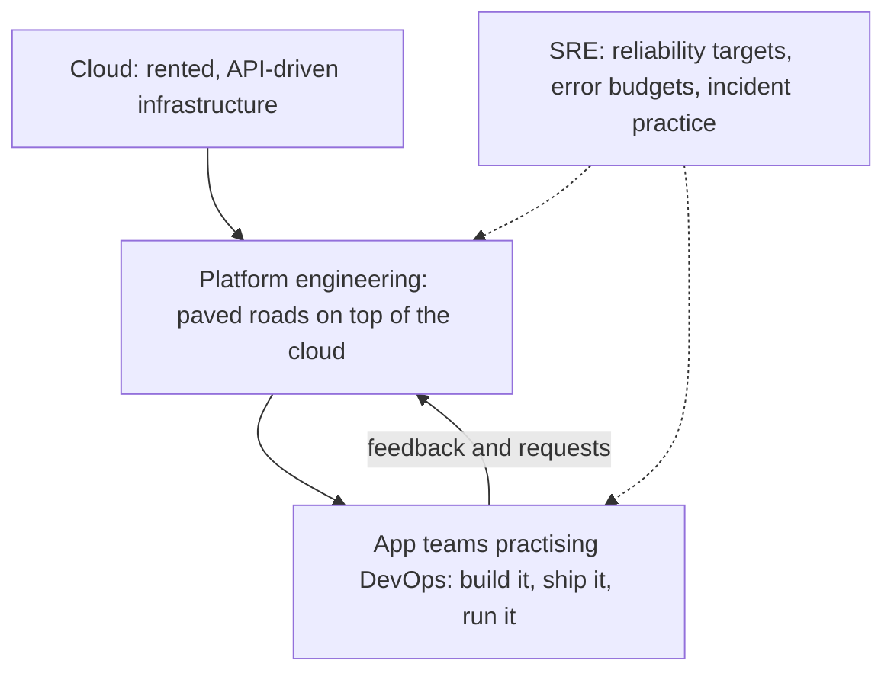

The cloud provides raw capability. The platform team turns that into a small number of safe, supported choices. App teams use those choices to deliver often and own their services. SRE practices cut across both: they decide how reliable each service needs to be, and they hold everyone to it.

**Who does what.** Titles vary between companies, so learn the *responsibilities*, not the labels:

| Role | Main question they answer | Typical work |
|---|---|---|
| Cloud engineer | "How do we use the provider's services well and safely?" | Accounts, networks, identity, managed services, landing zones |
| DevOps engineer | "How does code get from a commit to production quickly and safely?" | Pipelines, build tooling, release automation, environments. Often a mix of the other three rows |
| Platform engineer | "What should every team get for free so they do not rebuild it?" | Templates, Kubernetes platform, GitOps, developer portal, self-service |
| Site reliability engineer | "Is the service reliable enough, and how do we know?" | SLOs, alerting, on-call, incidents, capacity, removing toil |

At a small company one person does all four. At Najm Bank they are separate people who sit in one team.

**Why "DevOps team" is often an anti-pattern.** If a company creates a "DevOps team" that receives tickets from developers and deploys for them, it has rebuilt the wall with a new name. The test is simple: can an app team ship a change to production, safely, without filing a ticket and waiting for a person? If not, you have a handoff, not DevOps. The platform team's job is to remove the handoff, not to become it.

**The Twelve-Factor App.** A short methodology published by engineers at Heroku describes services that run well on cloud platforms: configuration in the environment, not in code; stateless processes; fast startup and graceful shutdown; build, release and run as separate stages. You will meet these ideas again in Modules 2 and 4.

#### 🔴 Expert view

**Measure outcomes, not adoption.** "We moved 80 services to Kubernetes" is an activity. "Lead time fell from three weeks to one day, and change failure rate did not rise" is an outcome. Salem reports DORA metrics and SLO attainment to the CIO, not tool counts. A platform nobody uses voluntarily has failed: treat it as a product with users, a roadmap and adoption metrics.

**Reliability is a product decision.** 100% is the wrong target for almost everything. Each extra "nine" costs more, and users cannot tell 99.99% from 99.999% when their own mobile network fails more often. The right SLO comes from what users need: high for the payments service, much lower for an internal reporting tool.

**Regulation shapes the platform.** For a bank, cloud is not just an engineering choice. GCC financial regulators, including the Qatar Central Bank, publish expectations on cloud outsourcing, data residency and resilience. In the EU, the Digital Operational Resilience Act (DORA, Regulation (EU) 2022/2554, applying from January 2025) sets rules on ICT risk, incident reporting, resilience testing and third-party (including cloud) risk for financial entities. Note the name clash: EU *DORA* the regulation and *DORA* the DevOps research programme are unrelated. This course stays on the engineering; for the rules, see [*Secure AI & Application Security*, lesson 11.2 — Regulation that touches security](../secai/index.html#/11.2).

### 🧰 The toolkit
| Tool, practice or service | What it is and does | When to reach for it |
|---|---|---|
| **DORA metrics** | Four measures of delivery performance: deployment frequency, lead time for changes, change failure rate, time to restore service | Setting a baseline before any change, and reporting progress in outcomes rather than tools |
| **Service level objective** | A target for a user-facing measurement over a time window | Deciding how reliable a service must be, and when to slow down releases |
| **Error budget** | The amount of unreliability an SLO allows | Settling "ship or stabilise?" with a number agreed in advance |
| **Internal developer platform** | Self-service tools, templates and paved roads that app teams use to build and run services | When many teams repeat the same infrastructure work, or each does it differently |
| **Backstage** (open source, CNCF) | A developer portal: software catalogue, templates and documentation in one place | Giving app teams one front door to the platform |
| **Twelve-Factor App** | A short methodology for building services that run well on cloud platforms | Reviewing whether a service is ready to be containerised and scaled |
| **Well-Architected frameworks** (AWS, Azure, Google Cloud) | Each provider's structured good-practice guidance, organised in pillars | Reviewing a design against a checklist before it goes live |

### 🏛️ In practice at Najm Bank
After the "DevOps access" episode, Salem asks Yousef to draft the team's **responsibility map**: one page that says who owns what as services move to the cloud. It is published on the internal developer portal.

**Najm Platform Engineering & SRE — responsibility map v1**

| Area | Platform team owns | App teams own | SRE (Maha) owns | Security (Noura) |
|---|---|---|---|---|
| Cloud accounts, networks, identity | Landing zone, network layout, roles for each team | Requesting the roles their service needs | — | Approves role design, runs access reviews |
| Kubernetes clusters | Cluster lifecycle, upgrades, shared add-ons | Their namespaces, manifests and resource requests | Capacity reviews | Cluster policy baseline |
| Pipelines and golden paths | Templates, shared runners, GitOps repo structure | Their service's pipeline, tests and release choices | Release gates tied to error budgets | Supply-chain controls |
| Observability | Telemetry stack, dashboards templates | Instrumenting their code, service dashboards | SLO definitions with app teams, alert standards | Security logging requirements |
| On-call and incidents | Platform on-call rota | Service on-call rota | Incident process, postmortem reviews | Security incident escalation (Jassim) |
| Cost | Cost dashboards and tagging rules | Their service's spend and unit cost | — | — |

**Rules that come with it:**
- Nobody receives standing administrator rights in production. Elevated access is time-limited, approved and logged (1.3).
- "DevOps access" is not a request type. Requests name the action and the resource: "deploy to namespace `mobile-api` in staging".
- The platform team measures its success by app-team DORA metrics and by adoption of the golden paths, reported to Salem monthly.
- Mona from Finance receives the cost dashboard monthly and has a named contact in each app team.

### 🛠️ Exercises
- 🟢 Write a one-paragraph definition, in your own words, of cloud, DevOps, platform engineering and SRE, then one sentence on how each relates to the others. Include NIST's five cloud characteristics and the four DORA metrics. *Done when:* a friend who is not in tech can read it and explain back the difference between DevOps and SRE.
- 🟡 Find five real job postings for cloud, DevOps, platform or SRE roles in your region and map each one's responsibilities to the "who does what" table. *Done when:* a table shows which of the four roles each posting really asks for, plus one sentence on what surprised you.
- 🔴 Take a project you own that has a git history (a personal project or a public open-source repository). Estimate its DORA metrics for the last three months: deployment or release frequency from tags or releases, lead time from commit date to release date, change failure rate from reverts or hotfix releases, and time to restore from the gap between a bad release and the fix or revert that followed it (use issue timestamps if you have them). *Done when:* you have the four numbers, the commands or queries you used to get them, and a note on which number was hardest to measure honestly and why.

### ⚠️ Mistakes and traps
- **Renaming ops to "DevOps".** A ticket queue with a new name is still a handoff. Measure whether teams can ship without waiting on a person.
- **Treating DevOps as a tool purchase.** No tool fixes a broken ownership model. Start with who owns what, then automate.
- **Building a platform nobody asked for.** Talk to app teams first. A platform is a product; if teams avoid it, it has failed.
- **Equating "DevOps access" with administrator rights.** Shared responsibility does not mean shared superuser. Grant specific, time-limited permissions.

### 🧾 Recap
- Cloud is on-demand, API-driven, metered infrastructure; its five NIST characteristics explain why automation and cost become engineering concerns.
- DevOps is shared ownership plus automation, measured by the four DORA metrics; speed and stability improve together.
- SRE makes reliability a number: SLIs, SLOs and error budgets, plus a cap on toil and blameless postmortems.
- Platform engineering builds an internal product, the paved road, so app teams can move fast without mastering every layer.
- Learn responsibilities, not titles. The question is always "who owns this, and can they act without waiting?"

### ✍️ Check yourself

**1. An app team at Najm Bank asks Yousef for "DevOps access" so they can deploy their own changes. What is the best response?**

- A. Give every developer on the team administrator rights on the cloud account, since DevOps means shared responsibility
- B. Ask which actions they need on which resources, and grant a specific role, such as deploying to their own namespace in staging
- C. Refuse, because only the platform team may deploy
- D. Create a ticket queue so the platform team can deploy for them

<details><summary>Answer</summary>

**B.** DevOps means teams can ship without a handoff, but with specific, least-privilege permissions. A confuses shared ownership with shared superuser rights. C and D rebuild the wall between building and running. (🟡 Going deeper; 🏛️ In practice.)

</details>

**2. Which of these is NOT one of DORA's four key metrics?**

- A. Deployment frequency
- B. Lead time for changes
- C. Change failure rate
- D. Number of servers managed per engineer

<details><summary>Answer</summary>

**D.** The four keys are deployment frequency, lead time for changes, change failure rate and time to restore service. Servers per engineer measures activity, not delivery outcomes. (🟢 The essentials.)

</details>

**3. The payments service has an SLO of 99.95% successful transfers over 28 days. Halfway through the window, incidents have used almost all of its error budget. What does SRE practice suggest?**

- A. Slow down risky feature releases and spend effort on reliability until the budget recovers
- B. Raise the SLO to 99.99% so the team takes reliability more seriously
- C. Carry on as planned and look again when the 28-day window resets
- D. Lower the SLO quietly so the remaining budget looks healthy again

<details><summary>Answer</summary>

**A.** The error budget is the agreed signal for "ship or stabilise". When it is spent, reliability work takes priority. B makes the problem worse; D defeats the purpose of agreeing the target in advance. (🟢 The essentials.)

</details>

**4. A company has created a "DevOps team" that takes tickets from developers and runs their deployments by hand. What is the main problem?**

- A. The team is too small to handle the volume of tickets it will receive
- B. The team should be renamed "SRE" so its purpose is clearer to everyone
- C. It has rebuilt the handoff between building and running that DevOps removes
- D. In a bank, deployments should be done by hand so a person can check each one

<details><summary>Answer</summary>

**C.** The test of DevOps is whether a team can ship safely without waiting on another person. A ticket queue is a handoff, whatever its name. A treats the symptom; B only changes the label; D is wrong, since automation makes deployments safer and more auditable. (🟡 Going deeper.)

</details>

**5. Salem wants to show the CIO that the new internal developer platform is working. Which evidence is strongest?**

- A. A list of every tool the platform now includes, with the licence and support status of each
- B. App teams' lead time and failure rate before and after adopting the golden paths, and voluntary adoption
- C. The number of Kubernetes clusters and namespaces now running, compared with last quarter
- D. The growth of the platform team and the number of tickets it closed this quarter

<details><summary>Answer</summary>

**B.** A platform is a product; it succeeds when its users deliver better outcomes and choose to use it. A, C and D measure inputs and activity. (🔴 Expert view.)

</details>

### 📚 References
- NIST SP 800-145, The NIST Definition of Cloud Computing — https://csrc.nist.gov/pubs/sp/800/145/final
- DORA research programme — https://dora.dev/
- Google, Site Reliability Engineering and The Site Reliability Workbook (free online) — https://sre.google/books/
- CNCF, Platforms white paper (TAG App Delivery) — https://www.cncf.io/
- Backstage documentation — https://backstage.io/docs/
- The Twelve-Factor App — https://12factor.net/
- AWS Well-Architected Framework — https://aws.amazon.com/architecture/well-architected/
- Microsoft Azure Well-Architected Framework — https://learn.microsoft.com/azure/well-architected/
- Google Cloud Well-Architected Framework (formerly the Google Cloud Architecture Framework) — https://cloud.google.com/architecture/framework
- Regulation (EU) 2022/2554 (Digital Operational Resilience Act) — https://eur-lex.europa.eu/eli/reg/2022/2554/oj

<a id="l0-2"></a>

## 0.2 — The path to production: from a commit to a customer, and everything that can break on the way

*Level: 🟢 Beginner* · *Prerequisites: 0.1* · *Phase: Release, Deploy*

### ⚡ In 60 seconds
- Every change travels the same **path to production**: commit, build, test, package, store, deploy, release to users, observe. Each step either catches problems or lets them through.
- The most important rule: **build once, promote the same artefact**. The thing you tested must be byte-for-byte the thing you run in production.
- **Deploying** (putting new code on servers) and **releasing** (letting users reach it) are different steps. Separating them is the basis of safe rollout.
- Decision cue: before shipping anything, ask "if this is wrong, how many users will see it, how fast will we know, and how fast can we roll back?"
- Biggest trap: steps done by hand, differently each time. Most famous outages trace back to a manual step, a skipped check or a change that reached everyone at once.

### 🧭 Why it matters
On 1 August 2012, Knight Capital, a large US trading firm, deployed new trading code to its servers. According to the US Securities and Exchange Commission's 2013 order, the new code was copied by hand to the servers, and one of the eight servers was missed. That server still held old, unused code. A flag that the new code reused switched the old code back on. In about 45 minutes the firm sent millions of unintended orders and lost more than 460 million US dollars. There was no automated deployment, no check that all servers ran the same version, and no fast way to stop.

Twelve years later, on 19 July 2024, CrowdStrike pushed a faulty content update for its Falcon security sensor. It crashed Windows machines that received it; Microsoft later estimated around 8.5 million devices were affected. Airlines, hospitals and banks went down. CrowdStrike's own review committed to staged rollouts of such updates, so that a bad change reaches a small group first.

Salem uses both cases on Yousef's first day. "Both were *path-to-production* failures: a manual step that went wrong, and a change sent to everyone at once." This lesson maps that path; every later module zooms in on one part.

### 📐 How it works

#### 🟢 The essentials

**The stages.** Whatever the tools, a change to the Najm Mobile API moves through these steps:

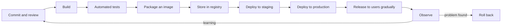

| Stage | What happens | What it should catch | Where this course covers it |
|---|---|---|---|
| Commit and review | A developer pushes a change; a colleague reviews it in a pull request | Logic errors, risky changes, missing tests | 4.1 |
| Build | Code is compiled and dependencies are fetched | Code that does not compile; broken dependencies | 4.1 |
| Automated tests | Unit, integration and other tests run | Regressions, broken contracts | 4.1 |
| Package | The service is packed into a container image | Images that do not start; bloated or insecure images | 2.1 |
| Store | The image is pushed to a registry with a unique identifier | Tampering, "which version is this?" confusion | 2.1, 4.3 |
| Deploy | The image is rolled out to an environment by automation | Configuration errors, failed startup, bad health checks | 2.2, 3.2 |
| Release | Users are gradually given the new version | Problems that only real traffic shows | 4.2 |
| Observe | Telemetry shows whether users are well served | Errors, slowness, SLO burn | 5.1, 5.2 |

A **pipeline** is the automation that runs these steps. **Continuous integration (CI)** means everyone merges small changes into the main branch often, and each merge is built and tested automatically. **Continuous delivery (CD)** means every change that passes is ready to deploy at the push of a button. **Continuous deployment** goes one step further: every passing change is deployed automatically.

**Build once, promote the same artefact.** An **artefact** is the output of a build, for us usually a container image. Build it once, give it a unique identity (the commit hash in its tag, and its content digest), and move that *same* image from staging to production. If you rebuild for production, you are shipping something you never tested: a dependency may have changed, a build flag may differ.

A minimal GitHub Actions pipeline tests the code and builds one image tagged with its commit:

```yaml
# .github/workflows/ci.yml — a starting point, hardened in Module 4
name: ci
on:
  pull_request:
  push:
    branches: [main]
permissions:
  contents: read          # least privilege: this job only reads the code
jobs:
  test-and-build:
    runs-on: ubuntu-latest
    steps:
      - uses: actions/checkout@v4   # in production pipelines, pin to a full commit SHA (4.3)
      - name: Run tests
        run: make test          # replace with your project's test command
      - name: Build one image, named after the commit
        run: docker build -t najm-mobile-api:${{ github.sha }} .
```

**Environments.** Changes pass through a series of **environments**: separate copies of the system. A common set is development, staging (as close to production as possible) and production. Each environment should differ only in configuration (database addresses, sizes, feature flags), never in code. Lesson 3.2 shows how to promote changes between them with GitOps.

**Deploy is not release.** To *deploy* is to put the new version on the servers. To *release* is to let users reach it. You can deploy code with a new feature switched off by a **feature flag**, then switch it on for 1% of users. You can deploy a new version beside the old one and send it 5% of traffic, a **canary**. Separating the two steps means a bad change reaches a few users, not all of them. This is exactly the lesson of the CrowdStrike update.

#### 🟡 Going deeper

**What breaks, stage by stage.** Every public outage teaches something about one stage. Here are well-documented cases, each with the control that would have limited it:

| Case | What happened (public reports) | Stage that failed | Control |
|---|---|---|---|
| Knight Capital, 2012 | Manual deploy missed one of eight servers; old code reactivated | Deploy | Automated, identical deploys; version checks on every server; a kill switch |
| AWS S3, us-east-1, Feb 2017 | During debugging, a command meant to remove a small number of servers was mistyped and removed far more | Operate | Tools that limit how much one command can remove, and how fast |
| GitLab.com, Jan 2017 | An engineer deleted a production database directory by mistake; several backup methods turned out not to work; hours of data were lost | Operate, Recover | Tested restores, not just backups; clear separation of production terminals |
| Facebook, Oct 2021 | A maintenance command disconnected the backbone; DNS servers then withdrew their routes; services and internal tools went down for hours | Deploy, Operate | Audit tools that block dangerous changes; out-of-band access for recovery |
| CrowdStrike, Jul 2024 | A faulty content update went to all Windows sensors at once and crashed them | Release | Staged rollout to a small group first; automatic halt on errors |

Two patterns stand out. Most were ordinary human actions the path did not guard against, not exotic bugs. And the damage came from *blast radius* (how many users one change can reach) and *time to detect and undo*. Good engineering shrinks both.

**The three questions per stage.** For each stage in your path, ask:
1. **What can go wrong here?** A failed test, a vulnerable dependency, a wrong configuration value, a server that never got the update.
2. **What catches it, automatically?** A test, a scan, a health check, a canary metric, an alert.
3. **How do we undo it, and how long does that take?** Revert the commit, redeploy the previous image, flip a feature flag off, restore from backup.

If the answer to question 2 is "a person remembers to look", that is your next automation task.

**Rollback beats debugging in production.** When a release goes wrong, restore service first. With an immutable image, rolling back means redeploying the previous image, which takes minutes. Find the root cause afterwards, with users safe. This is why the DORA metric is "time to *restore* service", not "time to fix".

**Not every change is code.** Configuration, infrastructure, schema changes, flag flips and security-tool content updates reach production too, and several outages above were not application deploys at all. Treat *every* production change the same way: reviewed, versioned, automated, staged and reversible.

#### 🔴 Expert view

**Lead time is a map of your waiting.** When Najm measured lead time for the Mobile API in the data centre, most of it was waiting: for a change-approval board, a release window, a person to run a script. Shorter lead time almost always comes from removing queues and handoffs, not from faster computers. Map where a change *waits*, not just where it *works*.

**Small batches are a safety measure.** A failed release with 200 changes is hard to diagnose; a failed release with one change points straight at its cause. Frequent small deploys feel risky, but the DORA research found that teams deploying more often also fail less and recover faster.

**Change control in a regulated bank.** Banks have traditionally used change-advisory boards that approve each release by hand. A well-built pipeline can provide *better* evidence than a meeting: a reviewed pull request, test results, a signed artefact and an automated deployment record for every change. Auditors need changes to be controlled, tested and traceable. Salem's strategy is to make the pipeline produce that evidence, so low-risk changes flow without a board while high-risk ones still get human review.

**Security travels the same path.** Each stage is also where an attacker can insert something: a malicious dependency at build time, a swapped image in the registry, stolen credentials in the pipeline. Lesson 4.3 secures the pipeline; for the full supply-chain picture, see [*Secure AI & Application Security*, lesson 6.2 — The software supply chain: dependencies, SBOMs, SLSA and signing](../secai/index.html#/6.2). For the same journey told for people who build with AI agents and do not write code by hand, see [*System Design for Vibe Coders*, lesson 4.1 — Shipping is a system](../vibe/index.en.html#l4-1).

### 🧰 The toolkit
| Tool, practice or service | What it is and does | When to reach for it |
|---|---|---|
| **GitHub Actions** | A CI/CD service built into GitHub that runs workflows on events such as a push or pull request | Automating build, test and packaging for code hosted on GitHub; GitLab CI and Jenkins are common alternatives |
| **Build once, promote** | The practice of building one immutable artefact and moving that same artefact through every environment | Always; rebuilding per environment ships untested code |
| **Container registry** | A store for container images, each with a tag and a content digest | Holding the single artefact that every environment deploys |
| **Feature flag** | A runtime switch that turns a feature on or off without a deployment | Separating deploy from release; instant "off" for a bad feature |
| **Canary release** | Sending a small share of traffic to a new version and comparing it with the old one | Any change that real traffic could break; covered fully in 4.2 |
| **Rollback** | Returning production to the last known-good version, usually by redeploying the previous artefact | First response to a bad release: restore service, then investigate |

### 🏛️ In practice at Najm Bank
Salem asks Yousef to produce the **path-to-production map** for the Najm Mobile API, as it works today in the data centre and as it should work after the cloud move. It becomes the backlog for the whole migration.

**Najm Mobile API — path-to-production map (target state, v1)**

| Stage | What can go wrong | Automated catch | Undo | Owner |
|---|---|---|---|---|
| Commit and review | Unreviewed or risky change | Branch protection: one approval, two for payment-related code | Revert the commit | App team |
| Build and test | Regression, broken dependency | Unit and integration tests; dependency scan | Pull request blocked | App team |
| Package | Image differs from what was tested; runs as root | One image per commit, tagged with the commit hash; non-root check | Discard the image; fix and rebuild through the full pipeline | Platform golden path |
| Store | Wrong or tampered image | Registry keeps digests; image signed (4.3) | Deploy by digest of last good image | Platform |
| Deploy to staging | Configuration error; image fails to start | Health probes; smoke tests | Automatic rollback of the rollout | Platform GitOps |
| Deploy to production | Same as staging, at scale | Same image digest as staging; rolling update with health checks | Redeploy previous digest (target: under 10 minutes) | App team with platform |
| Release | Bug only real traffic shows | Canary at 5%, compared on error rate and latency | Shift traffic back; flag off | App team |
| Observe | Users hurt without anyone noticing | SLO burn-rate alerts (5.2) | Incident process (5.3) | SRE, Maha |

**Baseline DORA metrics** (the team fills in last quarter's real numbers; targets are set with Maha):

| Metric | Today | Target after migration |
|---|---|---|
| Deployment frequency | ___ | ___ |
| Lead time for changes | ___ | ___ |
| Change failure rate | ___ | ___ |
| Time to restore service | ___ | ___ |

**Rule added to the team standard:** any stage whose "automated catch" column says "a person checks" is a backlog item with an owner and a date.

### 🛠️ Exercises
- 🟢 Pick a website you use. Run `dig +short example.com` and `curl -sI https://example.com` (with the real domain) and note the IP addresses, the HTTP status and headers such as `cache-control`. Then write the five stages a change would pass through before it shows up on that site. *Done when:* the output is saved and each of your five stages names one thing that could go wrong.
- 🟡 Draw the path-to-production map for a project of your own (or a small open-source project you know), using the same columns as Najm's map. *Done when:* every stage has an "automated catch" and an "undo", and you have marked in a different colour each place where the answer is currently "a person remembers".
- 🔴 In a public repository on your own GitHub account, create a tiny web service with one test and a Dockerfile, and add the CI workflow from this lesson. Push a change that breaks the test and confirm the pipeline fails. Then fix it, let the pipeline build the image, and build and run the same commit locally with `docker run`. *Done when:* you can show a failed run, a passing run, and the image tag matching the commit hash that passed.

### ⚠️ Mistakes and traps
- **Rebuilding for each environment.** You end up shipping code you never tested. Build once and promote the same image, identified by its digest.
- **Manual production steps.** Every hand-run command is a chance to repeat Knight Capital's missed server. Automate it, or at least script it and review the script.
- **Releasing to everyone at once.** A bad change then reaches every user before anyone notices. Separate deploy from release and roll out gradually.
- **Treating config and infrastructure changes as "not a deploy".** Several famous outages came from exactly these. Put every production change through the same path.
- **Backups nobody has restored.** GitLab's 2017 incident showed backups that silently did not work. A backup counts only when a restore has been tested (6.1).

### 🧾 Recap
- Every change travels commit, build, test, package, store, deploy, release, observe; each stage must catch something and be undoable.
- Build once and promote the same immutable artefact; never rebuild for production.
- Deploy and release are different; separating them with canaries and feature flags shrinks the blast radius.
- Most famous outages were path failures: a manual step, a missing check, a change sent to everyone at once.
- Restore first, investigate later; small, frequent changes are safer than large, rare ones.

### ✍️ Check yourself

**1. Yousef proposes building the Najm Mobile API image again for production, "so it picks up the latest security patches", after testing a different build in staging. What is the problem?**

- A. Production builds take longer, so the release window would be missed
- B. A registry refuses a second image built from the same commit
- C. Production would run an image that was never tested; patches should go through the full pipeline
- D. None, as long as both images are built from the same commit hash

<details><summary>Answer</summary>

**C.** A rebuild can pull different dependency versions or use different settings, so the tested artefact and the shipped artefact differ. D is the tempting distractor: the same commit does not guarantee the same image. Patches should flow through the whole pipeline. (🟢 The essentials.)

</details>

**2. What is the difference between deploying and releasing?**

- A. Deploying puts the new version on servers; releasing lets users reach it
- B. They are two names for the same step, used by different tools
- C. Releasing is the approval meeting that must happen before deploying
- D. Deploying applies to application code; releasing applies to infrastructure

<details><summary>Answer</summary>

**A.** Releasing can be gradual (a canary) or switched with a feature flag. Separating the two lets you deploy safely, then expose the change to a small share of users first. (🟢 The essentials.)

</details>

**3. According to the SEC's order, which failure was at the heart of Knight Capital's 2012 losses?**

- A. An outage at its hosting provider that left orders stuck in a queue
- B. A production database deleted by mistake, with backups that did not work
- C. A faulty security-sensor update sent to all of its machines at once
- D. A manual deployment that missed one server, where a reused flag woke old code

<details><summary>Answer</summary>

**D.** The new code was copied by hand and one of eight servers was missed. B describes GitLab in 2017 and C describes CrowdStrike in 2024. (🧭 Why it matters; 🟡 Going deeper.)

</details>

**4. A new release of the Najm Mobile API raises the error rate sharply ten minutes after rollout. Tariq wants to find the bug before doing anything. What should Maha advise?**

- A. Keep the release running so the team can reproduce the bug with real traffic
- B. Roll back to the previous image to restore service, then find the root cause
- C. Write a quick fix and deploy it straight to production, skipping the tests
- D. Restart all the servers in the cluster and watch whether the errors go away

<details><summary>Answer</summary>

**B.** The first goal is to restore service; with immutable images, redeploying the previous version takes minutes. A keeps users on a broken release; C skips the very checks that protect users; D hides the symptom without removing the bad version. (🟡 Going deeper.)

</details>

**5. Najm measures a lead time of three weeks for the Mobile API. Building and testing take about 40 minutes. What is the most likely way to cut lead time?**

- A. Buy faster build servers so the 40-minute build and test run shrinks
- B. Cut the slowest tests so that changes reach staging sooner
- C. Remove the queues where changes wait, keeping the evidence of control
- D. Deploy less often, in bigger batches, to reduce the number of approvals

<details><summary>Answer</summary>

**C.** When the work takes minutes but the lead time is weeks, the time is spent waiting. Manual approvals and release windows are typical queues. A speeds up a step that is not the bottleneck; B weakens safety for little gain; D increases risk. (🔴 Expert view.)

</details>

### 📚 References
- US SEC, In the Matter of Knight Capital Americas LLC (2013) — https://www.sec.gov/litigation/admin/2013/34-70694.pdf
- AWS, Summary of the Amazon S3 Service Disruption in the Northern Virginia (US-EAST-1) Region — https://aws.amazon.com/message/41926/
- GitLab, Postmortem of database outage of January 31 — https://about.gitlab.com/blog/
- Meta Engineering, More details about the October 4 outage — https://engineering.fb.com/
- CrowdStrike, Falcon content update remediation and guidance hub — https://www.crowdstrike.com/
- DORA research programme — https://dora.dev/
- GitHub Actions documentation — https://docs.github.com/actions
- The Twelve-Factor App — https://12factor.net/

<a id="l0-3"></a>

## 0.3 — Meet Najm Bank's platform team, and how to use this course

*Level: 🟢 Beginner* · *Prerequisites: 0.1, 0.2* · *Phase: Plan*

### ⚡ In 60 seconds
- **Najm Bank** is a fictional mid-sized Gulf bank operating in Qatar, the UAE and the EU. You will follow its **Platform Engineering & SRE** team through a real-shaped cloud migration.
- The team runs five systems you will meet in every module: the **Najm Mobile API**, the **payments service**, **Najm Assist** (an LLM assistant), the **internal developer platform**, and the **data-centre core banking** system that stays on-premises.
- Every lesson has the same ten parts, climbs from 🟢 essentials to 🔴 expert view, and produces a reusable **artefact**.
- You practise on a **local lab**: Docker, a local Kubernetes cluster (kind, k3d or minikube), OpenTofu or Terraform, Git and GitHub Actions. Nothing in this course requires paying a cloud provider.
- Decision cue: if you use a cloud free tier, **set a budget alert before you create anything**.
- Biggest trap: reading without doing. Operations skills live in your hands, not your notes.

### 🧭 Why it matters
Salem has hired two graduates a year for the last three years. The ones who struggled were not the weakest programmers. They were the ones who read every document and never broke anything on purpose. They had never seen a pod crash-loop, a Terraform plan that wanted to destroy a database, or an alert that fired at 3 a.m. for no reason. The ones who thrived had a lab at home where they had already made those mistakes cheaply.

That is how this course works. You will meet the same people, systems and problems in every lesson. You will produce artefacts that a real platform team would keep. And you will run every exercise on your own machine or a free tier, so the expensive mistakes happen in your lab and not in production. This lesson introduces the team and the systems, explains how the course is built, and gets your lab running.

### 📐 How it works

#### 🟢 The essentials

**Najm Bank, and why a bank.** Najm Bank is fictional. It is the same bank used across this library's other courses, so the security, governance and product courses all tell parts of one story. A bank makes a good teaching case because the stakes are clear. Customers expect the app to work at all hours; a transfer must never be lost or sent twice; regulators expect evidence that systems are controlled and recoverable. If you can run systems well for a bank, you can run them well almost anywhere.

**The situation.** Najm runs most of its systems in its own data centre. It is moving customer-facing services to a managed public cloud, while the core banking system stays on-premises and is connected over private links: a **hybrid** setup. At the same time, Salem's team is building an **internal developer platform** so that the bank's app teams can ship without each becoming infrastructure experts.

**The systems.**

| System | What it is | Why it matters in this course |
|---|---|---|
| **Najm Mobile API** | The public API behind the retail banking app. Containers on a managed Kubernetes service, a managed PostgreSQL database, object storage, and a CDN and web application firewall (WAF) at the edge | The main example for containers, Kubernetes, releases and observability |
| **Payments service** | Moves customers' money. Must not lose or duplicate a transfer; has strict uptime and recovery targets | The example for SLOs, safe releases, backups and disaster recovery |
| **Najm Assist** | The bank's LLM assistant. An **LLM gateway** routes requests to hosted model APIs and to a small self-hosted model on GPUs | The example for AI workloads, GPU capacity and token cost |
| **Internal developer platform** | Golden-path templates, CI/CD pipelines, a GitOps repository, the observability stack and cost dashboards | What the platform team builds and runs as a product |
| **Core banking (on-premises)** | The legacy system of record that stays in the data centre | The example for hybrid networking and dependencies you cannot change |

**The people.**

| Person | Role | What they care about |
|---|---|---|
| **Salem** | Head of Platform Engineering; your mentor | Outcomes, not tools; a platform app teams actually want to use |
| **Yousef** | New graduate platform engineer; your peer | Learning fast. He makes the mistakes you should avoid |
| **Maha** | SRE lead | SLOs, on-call that people can sustain, incidents and postmortems |
| **Tariq** | Engineering lead for the app teams | Shipping features quickly without waking up at night |
| **Noura** | Head of Application & AI Security | Least privilege, supply chain, cloud configuration |
| **Jassim** | SOC and incident response lead | Detecting and responding to security incidents |
| **Hamad** | CISO | Risk to the bank, regulators and evidence |
| **Mona** | FinOps analyst in Finance | What the cloud costs, who spends it, and whether it is worth it |

You may already know Tariq, Noura, Jassim and Hamad from the *Secure AI & Application Security* course. Here you see the same events from the platform side.

**How every lesson is built.** Each lesson has the same ten parts, in the same order: ⚡ In 60 seconds, 🧭 Why it matters, 📐 How it works, 🧰 The toolkit, 🏛️ In practice at Najm Bank, 🛠️ Exercises, ⚠️ Mistakes and traps, 🧾 Recap, ✍️ Check yourself, 📚 References. "How it works" climbs a ladder: 🟢 *The essentials* (what everyone needs), 🟡 *Going deeper* (what a practitioner needs), 🔴 *Expert view* (what a senior engineer weighs). Every lesson carries a **phase tag** from the delivery loop introduced in lesson 0.2: Plan, Code, Build, Test, Release, Deploy, Operate or Monitor.

#### 🟡 Going deeper

**The route through the course.**

| Stage | Modules | What you will be able to do |
|---|---|---|
| 🟢 Foundations | 0 Orientation, 1 Foundations | Explain the path to production; work in Linux and networks; reason about cloud services and identity |
| 🟡 Practitioner | 2 Containers and Kubernetes, 3 Infrastructure as code, 4 CI/CD and safe releases, 5 Observability and reliability | Containerise and run services on Kubernetes, manage infrastructure as code and GitOps, build pipelines and safe releases, set SLOs, alerts and incident practice |
| 🔴 Hero | 6 Scale, cost and AI infrastructure, 7 Capstone and practice exam | Scale and recover systems, control cost, run AI workloads, take a service from empty repo to production, and pass a 60-question practice exam |

**Three ways to study.**
- **Straight through.** Best if you are new. Each module builds on the one before; lesson prerequisites are listed under each title.
- **By role.** Aiming at SRE? Prioritise Modules 1, 2, 5 and lesson 6.1. Platform engineering? Modules 2, 3 and 4, then the capstone. Cloud engineering? Module 1, Module 3 and lessons 6.1 and 6.2. Still read Module 0 and the ⚡ section of every lesson.
- **By problem.** Facing a real issue at work, such as noisy alerts or a surprising cloud bill? Jump to the lesson, read the 🏛️ artefact, then go back to fill gaps.

**Your lab.** You need a computer that can run Docker (8 GB of memory is a comfortable minimum for a small local Kubernetes cluster; check each tool's own requirements) and these free tools:

| Tool | What you use it for | First used in |
|---|---|---|
| Git and a GitHub account | Version control, pull requests and GitHub Actions | 0.2 |
| Docker (Docker Desktop, or Docker Engine on Linux) | Building and running containers | 2.1 |
| kind, k3d or minikube | A Kubernetes cluster on your own machine | 2.2 |
| kubectl and Helm | Talking to Kubernetes; installing packaged applications | 2.2, 2.3 |
| OpenTofu or Terraform | Infrastructure as code | 3.1 |
| Prometheus, Grafana, OpenTelemetry | Telemetry and dashboards, installed into your local cluster | 5.1 |
| Argo CD | GitOps deployments into your local cluster | 3.2 |

Install each from its official site; installation steps change, so follow the current docs rather than copying commands from an old blog post. When they are installed, check them:

```bash
# Check your lab tools. Each should print a version, not an error.
git --version
docker version
kind version          # or: k3d version / minikube version
kubectl version --client
helm version
tofu version          # or: terraform version
```

Then create your first local cluster and look at it:

```bash
# Create a local Kubernetes cluster called najm-lab, look at it, then delete it
kind create cluster --name najm-lab
kubectl get nodes
kubectl get pods --all-namespaces
kind delete cluster --name najm-lab
```

If `kubectl get nodes` shows one node with status `Ready`, your lab works.

**Cloud accounts, safely.** Most exercises never touch a real cloud. A few optional ones use a provider's free tier. Before you create any resource in any cloud account:
1. Use an account that is yours. Never practise on an employer's account without written permission.
2. Turn on multi-factor authentication for the account's main (root) user, and do your daily work as a separate, less-privileged user (1.3).
3. Create a **budget alert** at a small amount so you receive an email before spending grows. Free tiers have limits that differ by provider and change over time; read the provider's current free-tier page rather than relying on this course.
4. Delete what you create when the exercise is done.

#### 🔴 Expert view

**Artefacts are your portfolio.** Each lesson's 🏛️ section is a real document: a responsibility map, a hardened Dockerfile, an IaC module interface, a release checklist, an SLO, an incident runbook, a postmortem, a cost report. If you rebuild each one for your own lab project and keep them in a public repository, you finish the course with a portfolio that shows how you think, not just which tools you have heard of. Lesson 7.2 turns it into job applications; for the job search itself, see [*From Graduate to Hired*, lesson 2.4 — Cloud, platform, DevOps and security engineer](../career/index.html#/2.4) (that course is being written now).

**Use the companion courses.** This course stays on the operations decision. Where another course in the library goes deeper, a lesson points to it in one line:
- Security of cloud, containers and pipelines: [*Secure AI & Application Security*, lesson 7.1 — Cloud security: shared responsibility, IAM and misconfiguration](../secai/index.html#/7.1).
- Deployment and environments from the SaaS-builder's side: [*SaaS Building Blocks*, lesson 7.4 — Deployment, environments and self-hostable SaaS](../saas/index.html#/7.4).
- How software moves, explained for people who build with AI agents: [*System Design for Vibe Coders*, lesson F.3 — Versions, repos, and deploys](../vibe/index.en.html#lF-3).
- Operating AI agents in production: [*Running AI Agents in Production*, Level 3 — Production Engineer](../agentic/learning-path.html#level-3-production-engineer).

**Be honest about what changes.** Cloud services, tool versions, prices and free-tier limits change constantly. This course names versions only where it is sure, says "at the time of writing (2026)" where things move, and never quotes a price or a quota. When you work, do the same. A senior engineer's habit is to check the provider's current documentation before relying on a number.

### 🧰 The toolkit
| Tool, practice or service | What it is and does | When to reach for it |
|---|---|---|
| **Docker** | Builds and runs containers on your machine | From Module 2 onward, and in the 0.2 exercise |
| **kind** (Kubernetes in Docker) | Runs a Kubernetes cluster inside Docker containers; k3d and minikube are alternatives | Any Kubernetes exercise, without paying for a cloud cluster |
| **OpenTofu** (Linux Foundation) | Open-source infrastructure-as-code tool, forked from Terraform; Terraform from HashiCorp is used the same way | Module 3 and the capstone |
| **GitHub Actions** | CI/CD workflows that run on pushes and pull requests | Your lab pipelines from 0.2 to the capstone |
| **Budget alert** | A provider setting that notifies you when spending passes an amount you choose | Before creating anything in any cloud account |
| **Lab journal** | A repository where you keep commands, outputs, mistakes and artefacts from each lesson | Every lesson; it becomes your portfolio |

### 🏛️ In practice at Najm Bank
Every new joiner in Salem's team completes the **onboarding checklist** in their first two weeks. Yousef's copy, as he filled it in:

**Najm Platform Engineering & SRE — new joiner onboarding checklist**

| Item | Done when | Owner |
|---|---|---|
| Read the responsibility map (lesson 0.1) | You can say who owns clusters, pipelines, SLOs and cost | New joiner |
| Read the Mobile API path-to-production map (lesson 0.2) | You can name the undo for each stage | New joiner |
| Lab ready | All lab tools print versions; a local kind cluster reaches `Ready` | New joiner |
| Access requested | Named roles for staging only; no production access in the first month | New joiner, approved by Salem |
| Shadow on-call | One week shadowing Maha's rota, no pager of your own | Maha |
| First change | One small pull request to the golden-path templates, merged through the normal pipeline | New joiner, reviewed by a platform engineer |
| Meet the neighbours | 30 minutes each with Tariq (app teams), Noura (security) and Mona (FinOps) | New joiner |
| Service cards | One-page card for each of the five systems: purpose, owner, dependencies, SLO (or "not yet defined") | New joiner |

**Service card template** (the one Yousef wrote for the payments service):

| Field | Value |
|---|---|
| Service | Payments service |
| Owning team | Payments squad (Tariq's area); platform support from Salem's team |
| Purpose | Accepts, validates and executes customer transfers |
| Depends on | Core banking (on-premises, over private link), PostgreSQL managed database, message queue |
| Used by | Najm Mobile API |
| Must never | Lose a transfer or execute one twice |
| SLO | Draft with Maha (Module 5) |
| Recovery targets | RTO and RPO to be agreed (6.1) |
| Runbook | Link (to be written) |

### 🛠️ Exercises
- 🟢 Install the lab tools and run the version check from this lesson. *Done when:* every command prints a version, and you have saved the output in a file called `lab-check.txt` in a new Git repository that will be your lab journal.
- 🟡 Create a local kind cluster, run `kubectl get nodes` and `kubectl get pods --all-namespaces`, and write down what each of the system pods you see is for (look them up in the Kubernetes documentation). Then delete the cluster. *Done when:* your lab journal has the outputs and a one-line explanation per system pod, and `kind get clusters` shows nothing left running. If you also open a cloud free-tier account, *Done when* includes a budget alert you have tested by reading its settings back.
- 🔴 Write a service card, using Najm's template, for a real service you use or maintain (a personal project, a university system you know well, or an open-source project's demo deployment). Then write a personal study plan: which route through the course (straight through, by role or by problem), which lessons in what order, and how many hours per week. *Done when:* the service card has no empty fields (use "unknown" honestly where needed), and the plan lists every lesson you will do with a target week.

### ⚠️ Mistakes and traps
- **Reading without doing.** You cannot learn to debug a crash-looping pod from a paragraph. Do every exercise, and break things on purpose.
- **Practising on an employer's account.** It is risky and may breach policy. Use your own local lab or your own free-tier account.
- **No budget alert.** A forgotten resource can run for weeks. Set the alert first, and delete what you create.
- **Copying install commands from old posts.** Tools change. Install from the official documentation.
- **Skipping Module 0 and 1 because "I know Linux".** The later modules assume the vocabulary and the habits from here. Skim them at least, and do the 🔴 exercises.
- **Keeping no notes.** Six months later you will not remember how you fixed it. Keep a lab journal in Git.

### 🧾 Recap
- Najm Bank is fictional; its Platform Engineering & SRE team, five systems and cast run through every lesson.
- Every lesson has ten parts, climbs from 🟢 to 🔴, carries a phase tag and produces a reusable artefact.
- Your lab is local and free: Git, Docker, kind or similar, kubectl, Helm, OpenTofu or Terraform, and GitHub Actions.
- Use only your own accounts, set a budget alert before creating anything, and delete what you create.
- Keep a lab journal; your artefacts become your portfolio.

### ✍️ Check yourself

**1. Which Najm system is the course's main example for GPUs, LLM gateways and token cost?**

- A. The payments service
- B. Core banking
- C. The internal developer platform
- D. Najm Assist

<details><summary>Answer</summary>

**D.** Najm Assist routes requests through an LLM gateway to hosted models and to a small self-hosted model on GPUs. The payments service is the main example for SLOs and recovery. (🟢 The essentials.)

</details>

**2. You want to practise an optional exercise on a cloud provider's free tier. What should you do before creating any resource?**

- A. Read the exercise twice and note every resource it will create
- B. Use your own account, turn on multi-factor authentication, set a budget alert
- C. Use your employer's sandbox account, since it is not production
- D. Nothing; free-tier accounts cannot be charged for anything you create

<details><summary>Answer</summary>

**B.** Free tiers have limits, and a forgotten resource can cost money. C is the tempting distractor: an employer's account needs written permission, whatever its name. A is sensible but does not cap spending; D is false. (🟡 Going deeper.)

</details>

**3. Yousef's lab check shows `kind create cluster` succeeded, and `kubectl get nodes` lists one node with status `Ready`. What does that tell him?**

- A. His local lab works and he can start the Kubernetes exercises
- B. He now has a cluster ready to host production workloads
- C. He has created a managed cluster in his cloud account
- D. Docker is not installed, so kind used a built-in runtime

<details><summary>Answer</summary>

**A.** kind runs a Kubernetes cluster inside Docker on his own machine, which is exactly what the lab needs. It is not production-ready (B) and not in the cloud (C); kind needs a container runtime such as Docker to run at all (D). (🟡 Going deeper.)

</details>

**4. A reader is aiming for a site reliability engineering role and has limited time. Which route through the course does this lesson suggest?**

- A. Go straight to Module 7 and the practice exam, then fill gaps from there
- B. Read only the ⚡ section of every lesson and skip the exercises
- C. Module 0, then Modules 1, 2, 5 and lesson 6.1, plus every ⚡ section
- D. Skip Modules 0 and 1 and start with containers in Module 2

<details><summary>Answer</summary>

**C.** The by-role route for SRE focuses on foundations, Kubernetes, observability and resilience, while still reading Module 0 and every ⚡. D skips the vocabulary later modules depend on. (🟡 Going deeper.)

</details>

**5. Yousef writes a service card for the payments service but has no agreed SLO yet. What should he put in that field?**

- A. 100%, because payments must always work for every customer
- B. Leave the field blank until Maha has time to agree a number
- C. Copy the Mobile API's SLO, since payments are called through it
- D. "Draft with Maha", marked as not yet defined

<details><summary>Answer</summary>

**D.** An honest "not yet defined" with an owner makes the gap visible and fixable. A is not a usable target (see lesson 0.1); B hides the gap; C copies a target set for a different service with different needs. (🏛️ In practice.)

</details>

### 📚 References
- Docker documentation — https://docs.docker.com/
- kind documentation — https://kind.sigs.k8s.io/
- Kubernetes documentation — https://kubernetes.io/docs/
- Helm documentation — https://helm.sh/docs/
- OpenTofu documentation — https://opentofu.org/docs/
- Terraform documentation — https://developer.hashicorp.com/terraform/docs
- GitHub Actions documentation — https://docs.github.com/actions
- AWS Budgets — https://docs.aws.amazon.com/cost-management/latest/userguide/budgets-managing-costs.html
- Microsoft Cost Management budgets — https://learn.microsoft.com/azure/cost-management-billing/costs/tutorial-acm-create-budgets
- Google Cloud Billing budgets — https://cloud.google.com/billing/docs/how-to/budgets

---

<a id="m1"></a>

# Module 1 — Foundations

*Every cloud service, container platform and pipeline you will meet in this course runs on three older ideas: a Linux machine running processes, a network carrying packets between names and ports, and a decision about who is allowed to do what. When something breaks in production, the cause is usually in one of those three layers, however modern the stack looks on top. This module gives you the working knowledge that platform engineers lean on every day. It starts with the shell and the network path a request takes, from DNS to TLS to HTTP, and how to tell which hop failed. It then explains what a cloud provider actually sells: regions and zones, compute, storage, managed services, and the shared responsibility model that decides which failures are yours. It ends with identity and access, the control plane of the cloud, where one over-broad policy or one leaked key can undo everything else. You follow Yousef, a new graduate in Najm Bank's Platform Engineering & SRE team, as he chases a "the app is down" report that turns out to be an expired certificate, helps Salem decide where the Najm Mobile API should live in the cloud, and learns why the deploy key he pasted into a pipeline has to go.*

> **Phases:** Plan, Deploy, Operate — the machine, the network, the cloud and the identities that everything later in the course is built on.

<a id="l1-1"></a>

## 1.1 — Linux, the shell and networking essentials: processes, files, ports, DNS, HTTP and TLS

*Level: 🟢 Beginner* · *Prerequisites: 0.1, 0.2* · *Phase: Operate, Monitor*

### ⚡ In 60 seconds
- Almost every server, container and cloud function is **Linux** underneath. You need a small set of shell skills: processes, logs, files and permissions, listening ports.
- A request to `api.najm.example` crosses a fixed chain of hops: **DNS** turns the name into an address, **TCP** opens a connection to a port, **TLS** proves the server's identity and encrypts the traffic, **HTTP** carries the request and the response.
- The most important rule: when "it's down", **walk the chain in order** and test each hop with its own tool (`dig`, `nc` or `curl`, `openssl`, then `curl -v`) instead of guessing.
- Decision cue: the **HTTP status class** tells you where to look. A 4xx means the request was refused; a 5xx means a server failed; a 502 or 504 from a load balancer means the problem is *behind* it.
- Biggest trap: restarting things before you know which hop failed. A restart destroys evidence and cannot fix DNS, a firewall or a certificate.

### 🧭 Why it matters
On Yousef's second Monday, the contact centre reports that the Najm retail app "won't load". Every pod is running and the application logs show no errors. Yousef restarts the deployment anyway; nothing changes. Maha, the SRE lead, types one command: `curl -v https://api.najm.example/health`. It stops in the TLS handshake with `certificate has expired`. The edge certificate was renewed by hand once a year, and the person who did it had moved teams. The application was healthy the whole time; customers simply could not reach it.

Restarting pods was a guess. Maha's `curl -v` tested one specific hop. That is the habit this lesson builds: know the hops a request crosses, know the tool that tests each one, and walk them in order.

Big public outages show the same structure. On 4 October 2021, Facebook, Instagram and WhatsApp were unreachable for roughly six hours. According to Meta's public engineering posts, a command issued during backbone maintenance disconnected its data centres, and its DNS servers then withdrew their routes from the internet. Facebook's names stopped resolving, and the internal tools engineers needed depended on the same network. The servers were fine; the path to them was gone.

### 📐 How it works

#### 🟢 The essentials

**The shell.** The shell (usually `bash` or `zsh`) is a text interface to the operating system. You will use it on servers, inside containers, in CI jobs and on your laptop.

**Processes.** A **process** is a running program. Each has a **process ID (PID)**, an owner (a user) and a parent process. On a modern Linux server, the first process (PID 1) is usually **systemd**, which starts and supervises services. Inside a container, PID 1 is your application itself, which matters for the next point.

You talk to processes with **signals**. The two that matter most:
- **SIGTERM** (signal 15) asks a process to stop. A well-written service finishes its in-flight requests, closes database connections and exits.
- **SIGKILL** (signal 9) ends the process immediately. Nothing is cleaned up; requests in flight are lost.

Kubernetes sends SIGTERM when it stops a pod, waits for a grace period (30 seconds by default), then sends SIGKILL, so a service that ignores SIGTERM drops requests on every deploy (lesson 2.3).

**Files and permissions.** Each file has an owner, a group and three permission sets (owner, group, others), each with read (`r`), write (`w`) and execute (`x`). `ls -l` shows them:

```text
-rw-r----- 1 najm-api najm-api 1204 Oct  2 08:01 /etc/najm-api/config.yaml
```

The owner can read and write, the group can read, others nothing: `640` in numeric form. A private key should be `600` (owner only); world-readable `644` is wrong for anything secret.

**The everyday commands.** Learn these first:

```bash
ps aux | grep najm-api          # running processes, and their users
systemctl status najm-api       # is the service up, and since when
journalctl -u najm-api --since "10 min ago"   # recent logs
ss -tlnp                        # listening TCP ports and their processes
df -h ; free -h                 # disk and memory: full disks break many services
kill -TERM <pid>                # ask a process to stop cleanly
```

**Addresses and ports.** Every machine on a network has an **IP address**: IPv4 looks like `10.20.1.15`, IPv6 like `2001:db8::15`. A **port** is a number from 0 to 65535 that identifies one service on that machine: 443 for HTTPS, 22 for SSH, 5432 for PostgreSQL. An address plus a port identifies one service on one machine.

A service must **bind** to an address to receive traffic. `127.0.0.1` (loopback) means "only programs on this same machine may connect"; `0.0.0.0` means "every network interface". Inside a container, `127.0.0.1` is the container itself, so a service bound there is unreachable from outside: a classic "works locally, not in the container" bug.

**TCP and UDP.** **TCP** gives a reliable, ordered connection, opened by a handshake before data flows; HTTP/1.1, HTTP/2, databases and SSH use it. **UDP** sends packets with no connection or guarantee; most DNS queries use it, as does QUIC, the transport under HTTP/3.

**The path of one request.** When the Najm app calls `https://api.najm.example/v1/accounts`, this happens:

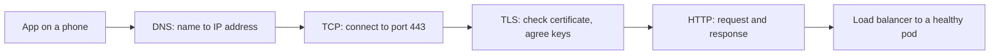

**DNS.** The **Domain Name System** turns names into addresses. The record types you will use most:

| Record | Maps | Example use |
|---|---|---|
| **A** | Name to an IPv4 address | `api.najm.example` to the load balancer's IPv4 address |
| **AAAA** | Name to an IPv6 address | The same, for IPv6 clients |
| **CNAME** | Name to another name | `api.najm.example` to the name a cloud load balancer or CDN gives you |
| **TXT** | Name to free text | Proving domain ownership to a certificate authority or email provider |

Every record has a **TTL** (time to live): how many seconds resolvers may cache the answer. With a TTL of 3600, a change can take an hour to reach everyone. Before a planned migration, lower the TTL at least one old TTL period in advance; raise it again afterwards.

**HTTP status classes.** The first digit of the status code tells you who to blame:

| Class | Meaning | Typical examples |
|---|---|---|
| 2xx | Success | 200 OK, 201 Created |
| 3xx | Go elsewhere | 301 or 308 permanent redirect |
| 4xx | The client's request was refused | 401 not authenticated, 403 not allowed, 404 not found, 429 too many requests |
| 5xx | The server side failed | 500 application error, 502 bad gateway, 503 unavailable, 504 gateway timeout |

A **502** or **504** returned by a load balancer or proxy usually means *the thing behind it* failed or did not answer in time. Look at the backend, not the load balancer.

**TLS.** **Transport Layer Security** encrypts traffic and proves the server's identity. The server presents a **certificate**: a signed statement that says "this public key belongs to `api.najm.example`, valid from this date to that date", issued by a **certificate authority (CA)** the client already trusts, often through one or more intermediate certificates (the **chain**). If the name, dates or chain fail the client's checks, the connection stops before any HTTP is sent, which is why Yousef saw nothing in the application logs. TLS 1.3 (RFC 8446) is current; TLS 1.2 is still common. Cryptographic detail belongs to [*Secure AI & Application Security*, lesson 5.1 — Cryptography for builders: TLS, hashing, encryption and keys](../secai/index.html#/5.1); here we care about operating it.

#### 🟡 Going deeper

**Walking the chain.** When someone says "it's down", test each hop in order and stop at the first one that fails:

```bash
# 1. DNS: does the name resolve, and to what?
dig +short api.najm.example A
dig api.najm.example            # full answer, including the TTL

# 2. TCP: can we open a connection to the port?
nc -vz api.najm.example 443

# 3. TLS: what certificate is presented, for which name, valid until when?
openssl s_client -connect api.najm.example:443 -servername api.najm.example </dev/null 2>/dev/null \
  | openssl x509 -noout -subject -issuer -dates

# 4. HTTP: what does the server answer?
curl -sv https://api.najm.example/health -o /dev/null
```

`curl -v` alone often covers all four steps; learn to read its output line by line.

**Reading the result.**

| Symptom | Hop that failed | Usual causes |
|---|---|---|
| `NXDOMAIN` or no answer from `dig` | DNS | Record missing or deleted, wrong zone, expired domain registration |
| `Connection refused` | TCP | Nothing listening on that port, or service bound to `127.0.0.1` |
| Connection hangs, then times out | Network | Firewall or security group drops the packets, wrong route, wrong subnet |
| `certificate has expired` or name mismatch | TLS | Renewal failed, wrong certificate on the listener, missing SNI |
| 502 or 504 from the load balancer | Behind the load balancer | No healthy backends, backend timeout, failing health check |
| 401 or 403 | Application or gateway | Expired token, missing permission, WAF rule |

*Refused* means a machine answered and nothing is listening; the path works. A *timeout* usually means something silently dropped the packets, typically a firewall rule.

**SNI.** One load balancer often serves many names on one address; the client names the host it wants in the TLS handshake (**Server Name Indication**) so the right certificate is chosen. Hence `-servername` above: without it you may see a default certificate and draw the wrong conclusion.

**Layer 4 and layer 7 load balancers.** A **layer 4 (L4)** load balancer forwards TCP or UDP connections without reading the HTTP inside: fast and protocol-agnostic. A **layer 7 (L7)** load balancer understands HTTP: it terminates TLS, routes by host or path (`/v1/payments` to one service, `/v1/cards` to another) and returns its own error pages. The Najm Mobile API sits behind an L7 load balancer, so a 502 there means the backend misbehaved.

**Services with systemd.** On a VM, a systemd **unit file** defines how a service runs: the command, the user it runs as (never root unless it must), and whether to restart it on failure (`Restart=on-failure`). In containers, the runtime and Kubernetes take systemd's place, but the ideas carry over: a supervised process, a restart policy, a non-root user.

**Private addresses.** RFC 1918 reserves three IPv4 ranges for private networks: `10.0.0.0/8`, `172.16.0.0/12` and `192.168.0.0/16`. The `/16` is **CIDR** notation: the first 16 bits name the network, so `10.20.0.0/16` holds 65,536 addresses and `10.20.1.0/24` holds 256. Lesson 1.2 uses these to plan cloud networks.

#### 🔴 Expert view

**Automate certificates, then alert anyway.** Manual yearly renewal is an outage on a timer. Use **ACME** (RFC 8555), the protocol behind Let's Encrypt, or your provider's certificate manager (in Kubernetes, a controller such as cert-manager). The CA/Browser Forum has agreed to shorten maximum public certificate lifetimes in steps over the coming years (check the current limit), which makes manual renewal unworkable. Still alert at, say, 14 days before expiry: automation fails quietly when DNS or permissions change.

**DNS is a dependency of everything.** Your monitoring, deploy tools and incident chat may depend on the same DNS and network you are fixing, as Facebook's 2021 outage showed. Keep an "out-of-band" list of how to reach consoles, runbooks and each other if your own names stop resolving.

**Probe from outside.** Dashboards inside the cluster show healthy pods, not whether customers can reach them. A **synthetic check** (a scheduled request from outside your network, ideally from several places) tests the whole chain from the customer's side, and would have caught Najm's expired certificate before the contact centre did. Lesson 5.2 builds this in.

**Test from where the client is.** Your laptop's resolver, proxy or VPN route may differ from the customer's.

### 🧰 The toolkit
| Tool, practice or service | What it is and does | When to reach for it |
|---|---|---|
| **curl** | Command-line HTTP client; `-v` shows DNS, connection, TLS and HTTP in one run | First test of any "it's down" report; health checks; scripts |
| **dig** | Queries DNS and shows records, TTLs and which server answered | Checking a record after a change; diagnosing resolution failures |
| **openssl s_client** | Opens a TLS connection and shows the presented certificate chain | Checking certificate names, issuers and expiry dates |
| **ss** | Lists sockets: listening ports and the processes that own them | "Connection refused"; checking what address a service is bound to |
| **ACME** (RFC 8555) | Protocol for automatic certificate issuance and renewal | Every public certificate; never renew by hand |
| **Synthetic check** | A scheduled request to your service from outside your network | Detecting DNS, TLS and edge failures that internal dashboards miss |

### 🏛️ In practice at Najm Bank
After the certificate incident, Maha asks Yousef to write the team's **first-response runbook** for "the Najm Mobile API is unreachable". It lives next to the alert, so whoever is on call follows the same steps.

**Runbook RB-001: Najm Mobile API unreachable — walk the chain**

| Step | Command (from outside the network first, then from a pod) | Healthy result | If it fails, check |
|---|---|---|---|
| 1. DNS | `dig +short api.najm.example` | The CDN or load balancer name | DNS change log; domain registration |
| 2. TCP | `nc -vz api.najm.example 443` | `succeeded` | Edge or WAF status; firewall changes |
| 3. TLS | `openssl s_client ... \| openssl x509 -noout -dates -subject` | Right name; expiry over 14 days away | Certificate manager; ACME renewal logs |
| 4. HTTP | `curl -sv https://api.najm.example/health` | `200` | 502 or 504: backend readiness; 403: WAF rules; 5xx: app logs |
| 5. Backend | `kubectl get pods -n mobile-api`, then logs | All ready | Recent deploys: roll back first, investigate second |

**Rules attached to the runbook:**
- Post the first failing hop and its exact output in the incident channel before changing anything; do not restart workloads until step 4 points at the backend.
- Follow-ups from this incident: ACME renewal for every certificate, an alert 14 days before expiry, and an external synthetic check on `/health` every minute from two locations.

### 🛠️ Exercises
All exercises run on your own machine with Docker and a terminal.

- 🟢 Run `curl -v https://example.com` and label each line of output as DNS, TCP, TLS or HTTP. Then use `dig` and `openssl s_client` to note the record's TTL and the certificate's issuer and expiry date. *Done when:* you can point to where each hop succeeded and say when the certificate expires.
- 🟡 Write a tiny HTTP server that listens on `127.0.0.1:8080`, run it with `docker run -p 8080:8080`, and try to reach it from your host. Diagnose with `ss -tlnp` inside the container, fix the bind address, and confirm. Then make it log "shutting down" on SIGTERM and check that `docker stop` shows the message. *Done when:* both behaviours are fixed and you can explain each failure in two sentences.
- 🔴 Write `walk-the-chain.sh <hostname>`: run the four tests in order, print PASS or FAIL per hop with the key detail (address, certificate expiry, HTTP status) and exit non-zero at the first failure. Test it on a working site, a non-existent name, a closed local port and an expired certificate (badssl.com hosts deliberately broken test sites). *Done when:* each failure stops at the right hop with a clear message.

### ⚠️ Mistakes and traps
- **Restarting before diagnosing.** Walk the chain first; restart only when the evidence points at the process.
- **Binding to localhost in a container.** The service is unreachable from outside. Bind to `0.0.0.0` (or the specific interface you mean) and let network policy decide who may connect.
- **Renewing certificates by hand.** Someone forgets and the site goes dark. Automate with ACME and alert before expiry.
- **Ignoring SIGTERM.** Every deploy drops requests. Stop taking new work, finish current requests, then exit.
- **Running services as root.** One bug becomes full control of the machine. Run as a dedicated user with only the files it needs.

### 🧾 Recap
- Linux and the shell are the floor of every platform: processes, signals, permissions, services, logs.
- A request crosses DNS, TCP, TLS and HTTP in order; each hop has its own test.
- "Refused" means nothing is listening; a timeout usually means something is dropping packets.
- HTTP status classes point to the guilty side; a 502 or 504 at a load balancer points behind it.
- Automate certificates, alert before expiry, and probe from outside.

### ✍️ Check yourself

**1. Customers report the Najm app will not load. All pods are running and application logs show no errors. What should Yousef do first?**

- A. Restart the deployment so any bad in-memory state is cleared
- B. Run `curl -v` on the health endpoint from outside and find the failing hop
- C. Scale the deployment up so more replicas share the load
- D. Roll back the most recent deploy to the last known-good version

<details><summary>Answer</summary>

**B.** Healthy pods with empty logs suggest requests never reach the application, so test the chain from the customer's side. A, C and D change things without evidence. (🟡 Going deeper.)

</details>

**2. A service runs fine on a developer's laptop. In a container, `curl` from the host fails at once (refused or reset), and `ss -tlnp` inside the container shows it listening on `127.0.0.1:8080`. What is wrong?**

- A. A firewall inside the container image blocks inbound traffic on port 8080
- B. The TLS certificate presented does not match the requested host name
- C. Docker's internal DNS cannot resolve the container's name
- D. The service listens on loopback, reachable only from inside the container

<details><summary>Answer</summary>

**D.** `127.0.0.1` inside a container is the container itself. Bind to `0.0.0.0`. A firewall (A) would usually cause a timeout, not an immediate failure, and the request never reaches TLS (B) or needs DNS (C). (🟢 The essentials.)

</details>

**3. The team will move `api.najm.example` to a new load balancer next Tuesday. The record's TTL is 86,400 seconds (one day). What should they do?**

- A. Lower the TTL to minutes a day or more ahead, switch, then raise it again
- B. Change the record on Tuesday; the TTL only affects clients that never asked before
- C. Delete the old record first, wait for caches to clear, then create the new one
- D. Raise the TTL beforehand so the new answer stays cached longer once it arrives

<details><summary>Answer</summary>

**A.** Caches keep the old answer for up to the TTL, so lowering it in advance makes the switch propagate quickly. B ignores caching; C causes resolution failures; D makes it worse. (🟢 The essentials.)

</details>

**4. The L7 load balancer in front of the Najm Mobile API returns 504 Gateway Timeout. Where should the investigation start?**

- A. The DNS records for the API
- B. The TLS certificate on the load balancer
- C. The backends behind the load balancer: their health, readiness and response times
- D. The customer's mobile network

<details><summary>Answer</summary>

**C.** For the load balancer to return a 504 at all, DNS (A), TLS (B) and the customer's network (D) must have worked; the backend did not answer in time. (🟢 The essentials.)

</details>

**5. Kubernetes stops a pod during a deploy. What happens, and what must the application do?**

- A. It sends SIGKILL immediately, so the application never gets a chance to clean up
- B. SIGTERM, then SIGKILL after a grace period; the app should drain in-flight work and exit
- C. It sends SIGHUP, and the application should reload its configuration and keep serving
- D. It deletes the container image, so the application must first save its state to local disk

<details><summary>Answer</summary>

**B.** SIGTERM is the polite request; SIGKILL follows after the grace period (30 seconds by default). Ignoring SIGTERM drops requests on every deploy. (🟢 The essentials.)

</details>

### 📚 References
- RFC 8446, The Transport Layer Security (TLS) Protocol Version 1.3 — https://www.rfc-editor.org/rfc/rfc8446
- RFC 9110, HTTP Semantics — https://www.rfc-editor.org/rfc/rfc9110
- RFC 1035, Domain Names: Implementation and Specification — https://www.rfc-editor.org/rfc/rfc1035
- RFC 1918, Address Allocation for Private Internets — https://www.rfc-editor.org/rfc/rfc1918
- RFC 8555, Automatic Certificate Management Environment (ACME) — https://www.rfc-editor.org/rfc/rfc8555
- Linux man pages (signal, ss, systemd.service) — https://man7.org/linux/man-pages/
- systemd documentation — https://systemd.io/
- Kubernetes, Pod lifecycle and termination — https://kubernetes.io/docs/concepts/workloads/pods/pod-lifecycle/
- Meta Engineering, "More details about the October 4 outage" — https://engineering.fb.com/2021/10/05/networking-traffic/outage-details/
- Going further: [*System Design for Vibe Coders*, lesson F.1 — What happens when you open a website](../vibe/index.en.html#lF-1) and [*System Design for Vibe Coders*, lesson 11.1 — Domains, DNS, and TLS](../vibe/index.en.html#l11-1)

<a id="l1-2"></a>

## 1.2 — Cloud fundamentals: regions, zones, compute, storage, managed services and shared responsibility

*Level: 🟢 Beginner* · *Prerequisites: 1.1* · *Phase: Plan, Deploy*

### ⚡ In 60 seconds
- A cloud provider rents you computing on demand, through an API, billed by use. **AWS**, **Microsoft Azure** and **Google Cloud** sell similar building blocks under different names.
- The physical layout is the first design decision: a **region** is a geographic area; an **availability zone** is one or more separate data centres inside it. Spread production across **at least two zones**; consider a second region only for a clear recovery or residency reason.
- Choose the **most managed** service that meets your needs: you pay to hand over patching, backups and failover.
- Storage comes in three shapes: **object** (files by key over HTTP), **block** (a disk for one machine), **file** (a shared network folder). Pick by access pattern, not habit.
- The **shared responsibility model** says the provider secures the cloud and you secure what you put in it. Configuration, identity and data are always yours.
- Biggest trap: treating "it's in the cloud" as "it's resilient". A single-zone deployment with no tested backups fails exactly as a single server did.

### 🧭 Why it matters
Najm Bank has decided to move the Najm Mobile API out of its data centre. Salem asks Yousef to draft the placement note: which region, how many zones, which services, and what Najm still owns once the provider runs the hardware. Yousef's first draft lists "a Kubernetes cluster and a PostgreSQL VM" in one zone, because that is how it ran on-premises. Salem sends it back with three questions: "What happens when that zone has a bad day? Who patches that database? And which of the bank's regulators need to know where customer data sits?"

On 28 February 2017, Amazon S3 in the US-EAST-1 region (Northern Virginia) was disrupted for several hours. According to AWS's public summary, a command meant to remove a small number of servers was entered with a wrong input and removed a much larger set, including servers that core S3 subsystems depended on. Many services that kept their data in that one region broke with it. The lesson was not "avoid the cloud". It was: know which region and services you depend on, know what fails together, and design for it on purpose.

### 📐 How it works

#### 🟢 The essentials

**What "cloud" means.** NIST's definition (SP 800-145, 2011) lists on-demand self-service, broad network access, resource pooling, rapid elasticity and measured service. In practice: you ask an API for a server, database or bucket, it exists in minutes, and you pay until you delete it. Because everything is an API call, lesson 3.1 manages it as code.

**Service models.** The models differ in how much of the stack you run:

| Model | You get | You still manage | Najm example |
|---|---|---|---|
| **IaaS** (infrastructure as a service) | Virtual machines, disks, networks | Operating system, patching, runtime, application, data | A VM for a legacy batch job |
| **PaaS** (platform as a service) | A managed runtime or service: database, Kubernetes control plane, app platform | Configuration, application, data, access | Managed PostgreSQL for the Najm Mobile API |
| **Serverless** | Code or containers run per request or event; no servers to see; billed per use | Code, configuration, permissions, data | A function that resizes uploaded cheque images |
| **SaaS** (software as a service) | A finished application | Users, configuration, data | The bank's email and ticketing tools |

**Regions and zones.** A **region** is a separate geographic area containing the provider's data centres. An **availability zone** (AZ; Google calls them simply "zones") is one or more data centres within a region, with its own power, cooling and networking, connected to the other zones by fast private links. Zones are designed so one can fail without the others. Not every region offers multiple zones, and not every service is available in every region; check each provider's current region list.

Region choice turns on **latency** to users, **data residency** (where regulators or contracts require data to stay), **service availability** and **cost**, which differs by region. All three major providers operate Gulf regions at the time of writing (2026); check which services each offers.

**Compute.** Three main shapes:
- **Virtual machines** (AWS EC2, Azure Virtual Machines, Google Compute Engine): you choose a size (CPU, memory), an image and a network; you manage the operating system.
- **Managed Kubernetes** (Amazon EKS, Azure AKS, Google GKE): the provider runs the Kubernetes control plane; you run containers on worker nodes, which may themselves be managed. Module 2 covers this.
- **Serverless functions and containers** (AWS Lambda, Azure Functions, Google Cloud Run): you hand over code or a container; the platform scales it, including to zero.

**Storage.** Pick by how the data is accessed:

| Type | What it is | Good for | Not for |
|---|---|---|---|
| **Object storage** (S3, Azure Blob Storage, Google Cloud Storage) | Files ("objects") in a bucket, addressed by key over an HTTP API | Documents, statements, backups, logs, data lakes | Databases; files edited in place |
| **Block storage** (EBS, Azure Managed Disks, Persistent Disk) | A virtual disk attached to a VM, usually in one zone | Databases you run yourself; boot disks | Sharing between machines |
| **File storage** (EFS, Azure Files, Filestore) | A shared network file system (NFS or SMB) many machines mount | Legacy apps that need a shared folder | High-performance databases |

Object storage is the default for anything that is a file: it scales without capacity planning and stores data redundantly. Always check its access settings rather than assuming it is private.

**Managed databases.** A managed database service (Amazon RDS, Azure Database for PostgreSQL, Google Cloud SQL, and others) runs the database engine for you: it installs patches, takes automated backups and can keep a **standby replica** in another zone that takes over automatically if the primary fails. You still choose the size, configuration, backup retention and who can connect.

**Shared responsibility.** The provider is responsible for the security *of* the cloud: buildings, hardware, the virtualisation layer, and the managed service software. You are responsible for security *in* the cloud: what you configure, who you give access to, and your data. The line moves with the service model:

| Layer | IaaS VM | Managed database or Kubernetes | Serverless | SaaS |
|---|---|---|---|---|
| Data, its classification and access | You | You | You | You |
| Identities and permissions | You | You | You | You |
| Application code | You | You | You | Provider |
| Network configuration (who can reach it) | You | You | Mostly you | Provider |
| Operating system and patching | You | Provider (control plane); shared for worker nodes | Provider | Provider |
| Hardware and data centres | Provider | Provider | Provider | Provider |

Look at the top two rows: data and identity stay with you whatever you buy. Many widely reported cloud breaches came from customer-side configuration, such as a storage bucket made public or a key that leaked, not from the provider's hardware. Security detail is in [*Secure AI & Application Security*, lesson 7.1 — Cloud security: shared responsibility, IAM and misconfiguration](../secai/index.html#/7.1).

#### 🟡 Going deeper

**Cloud networking.** Each provider lets you create a private network: a **VPC** (virtual private cloud) on AWS and Google Cloud, a **virtual network (VNet)** on Azure. Inside it you create **subnets**, ranges of private addresses such as `10.20.1.0/24`:
- A **public subnet** has a route to the internet; resources there can have public addresses. Put only the things that must face the internet here, usually load balancers.
- A **private subnet** has no inbound route from the internet. Application servers, Kubernetes nodes and databases live here.
- A **NAT gateway** lets resources in private subnets make *outbound* connections (to download updates or call an external API) without being reachable from outside.
- **Security groups** (AWS), **network security groups** (Azure) and **firewall rules** (Google Cloud) decide which traffic may reach which resource, by address and port.

On AWS and Azure a VPC or VNet belongs to one region, while a Google Cloud VPC is global, with regional subnets.

**A first placement.** Here is the shape Salem wants for the Najm Mobile API:

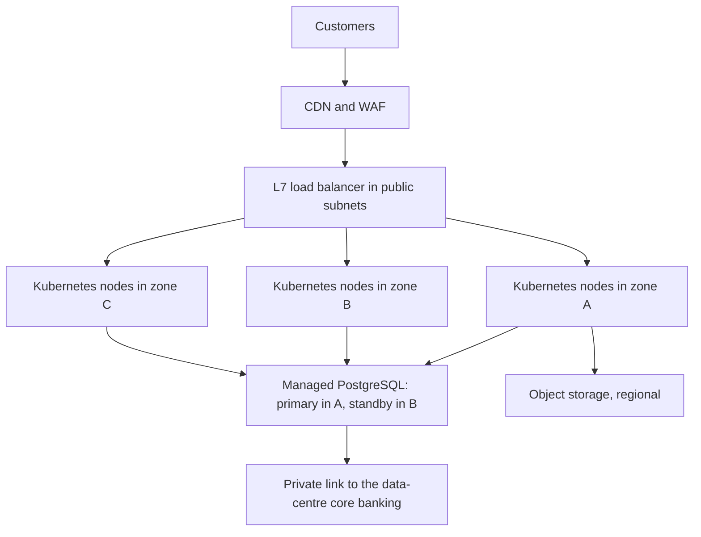

Every tier spans zones, only the edge faces the internet, and the database fails over automatically.

**Hybrid connectivity.** Najm's core banking stays on-premises, so the cloud must reach the data centre privately: a **site-to-site VPN** over the internet (quick, encrypted, internet-limited) or a **dedicated private connection** (AWS Direct Connect, Azure ExpressRoute, Google Cloud Interconnect), slower to arrange but more predictable. Banks often use a dedicated link with a VPN as backup. Plan address ranges early: if the VPC's `10.20.0.0/16` overlaps a data-centre network, routing breaks.

**Provider equivalents.** The concepts transfer; the names do not:

| Concept | AWS | Microsoft Azure | Google Cloud |
|---|---|---|---|
| Virtual machine | EC2 | Virtual Machines | Compute Engine |
| Managed Kubernetes | EKS | AKS | GKE |
| Object storage | S3 | Blob Storage | Cloud Storage |
| Private network | VPC | Virtual Network | VPC |
| Managed PostgreSQL | RDS / Aurora | Azure Database for PostgreSQL | Cloud SQL / AlloyDB |
| Identity and access | IAM | Microsoft Entra ID and Azure RBAC | Cloud IAM |
| Private link to on-premises | Direct Connect | ExpressRoute | Cloud Interconnect |

**Managed versus self-run.** Najm's default is "use the managed service unless there is a written reason not to". Self-running PostgreSQL on VMs means your team owns patching, replication, failover, backups and restore tests. A managed service does most of that, at a price and with less control (not every extension or setting). Valid reasons to self-run: a missing feature, portability or specific performance needs; write the reason down.

#### 🔴 Expert view

**Design for failure domains.** A **failure domain** is the set of things that fail together: a server, a zone, a region, a provider, an account. Multi-zone covers the common physical failures cheaply and is the production default. Multi-region adds much more complexity: data replicated across distance, failover decided and rehearsed. Choose it when a recovery target or regulator requires it, not as a reflex; lesson 6.1 turns this into RTO and RPO targets. And no zone design protects against a bad deploy, a bad configuration push or an expired certificate: most outages are changes, not hardware.

**Regulation shapes architecture.** GCC financial regulators, such as the Qatar Central Bank, set expectations on cloud outsourcing and on where customer data may be stored and processed; read the current rules with your compliance team. In the EU, the Digital Operational Resilience Act (DORA, Regulation (EU) 2022/2554, applying from January 2025) requires financial entities to manage ICT risk, report major incidents, test resilience and manage third-party ICT providers, including cloud, with exit plans. So your architecture notes must say how you would leave a provider.

**Well-architected reviews.** AWS, Azure and Google Cloud each publish a Well-Architected Framework, structuring reviews around reliability, security, cost, operations and performance. Use one as a checklist for any new production service.

**Cost is a design input.** Managed services, cross-zone traffic and data leaving the cloud (**egress**) all cost money, and prices vary by region and over time. Use the provider's calculator and current pricing pages, never memory, and set a budget alert first (lesson 6.2).

### 🧰 The toolkit
| Tool, practice or service | What it is and does | When to reach for it |
|---|---|---|
| **Availability zone** | An isolated data-centre location within a region | Spreading every production tier over at least two |
| **Managed database** | A database engine run by the provider, with backups, patching and optional cross-zone standby | The default for application databases |
| **Object storage** | Buckets of files addressed by key over HTTP, stored redundantly | Documents, backups, logs, static assets, data lakes |
| **VPC** | A private network with subnets, routes and firewall rules (VNet on Azure) | Every cloud deployment; plan address ranges first |
| **NAT gateway** | Outbound-only internet access for private subnets | Private workloads that must call out but never be called in |
| **Shared responsibility model** | The split of security duties between provider and customer by service model | Every architecture review and every outsourcing assessment |
| **Well-Architected Framework** (AWS, Azure, Google Cloud) | Structured review questions for reliability, security, cost and operations | Reviewing a new production design |
| **Budget alert** | A notification when spending passes a threshold | Before creating any resource in any account |

### 🏛️ In practice at Najm Bank
Yousef's second draft, after Salem's review, becomes the team's template for every migration.

**Placement note PN-01: Najm Mobile API**

| Section | Decision | Reason |
|---|---|---|
| Region | One Gulf region of the chosen provider, offering at least three zones and all required services | Latency to customers; data residency confirmed with Compliance |
| Zones | Three zones for Kubernetes nodes; database primary and standby in two different zones | Survive one zone failing without manual action |
| Compute | Managed Kubernetes; worker nodes in private subnets | Containers already standard; provider runs the control plane |
| Database | Managed PostgreSQL with a cross-zone standby, automated backups, encryption at rest | Removes patching and failover toil; backups restore-tested quarterly |
| Files | Object storage for statements and uploads; private; versioning on | Scales without capacity planning; versioning protects against overwrites |
| Edge | CDN and WAF, then an L7 load balancer in public subnets | Only the edge faces the internet |
| Hybrid | Dedicated private link to the data centre, VPN as backup; address plan agreed with Network team | Core banking stays on-premises |
| Second region | Not now; backups copied to a second region; revisit with lesson 6.1's DR targets | Complexity not yet justified |
| Exit | Containers, PostgreSQL and IaC keep migration feasible; exit plan reviewed yearly | EU DORA third-party risk expectations |

**Shared responsibility for this service**

| Najm owns | The provider owns |
|---|---|
| Data classification, key policy, backup retention and restore tests | Physical security, hardware, hypervisor |
| IAM roles and access (lesson 1.3); network, WAF and exposure rules | Kubernetes control plane and database engine patching and failover |
| Worker node images (unless fully managed), code, images, configuration | Object storage durability; region and zone infrastructure |

### 🛠️ Exercises
If you use a cloud account, use your own free-tier account and **set a budget alert before creating anything**. Delete everything when you finish.

- 🟢 From each major provider's current region list, note the Gulf regions, how many zones each has, and whether managed Kubernetes and managed PostgreSQL are offered there. *Done when:* you have a small table with the date you checked.
- 🟡 Draw a VPC for a two-tier app: address range, public and private subnets in two zones, a NAT gateway, a load balancer, and firewall rules between tiers (source and port). Avoid `10.0.0.0/16`, which an imaginary data centre already uses. *Done when:* every arrow has a port and every subnet has a range and a zone.
- 🔴 Write a placement note in the PN-01 format for a service of your choice (for example a fictional Najm card-dispute portal), with the shared responsibility table, the reason for each managed-versus-self-run choice, and what would trigger a second region. *Done when:* a classmate can answer "what happens when one zone fails?" and "who patches the database?" from your note alone.

### ⚠️ Mistakes and traps
- **Lifting the data centre layout as is.** One VM per role in one zone brings the data centre's fragility. Spread across zones; use managed services.
- **"The provider handles security."** Only its part. Identity, configuration, network exposure and data are yours on every service model.
- **Overlapping address ranges.** Choose cloud address ranges with the network team before building, or hybrid routing will fail later.
- **Multi-region by reflex.** Start multi-zone; add a region when recovery targets or regulation require it.

### 🧾 Recap
- The cloud is computing on demand through an API; the big three sell similar blocks under different names.
- Regions are geographic; zones are isolated locations within a region. Production spans at least two zones.
- Prefer managed services; choose object, block or file storage by access pattern.
- Private subnets for workloads, public subnets only for the edge, NAT for outbound traffic, and an address plan agreed early.
- Under shared responsibility, data, identity and configuration are always yours.

### ✍️ Check yourself

**1. Yousef's first draft puts all Kubernetes nodes and the database in one availability zone. What is the main risk?**

- A. The provider charges a premium for keeping every resource in one zone
- B. Customers far from the region will see higher latency on every request
- C. One zone failure takes down the whole service, with nothing to fail over to
- D. Managed Kubernetes refuses to create a cluster whose nodes share one zone

<details><summary>Answer</summary>

**C.** Zones exist so one can fail without the others; using one zone throws that away. Latency (B) depends on region, not the number of zones; D is false. (🟢 The essentials.)

</details>

**2. Najm needs to store monthly PDF statements for millions of customers, written once and downloaded occasionally. Which storage fits best?**

- A. Object storage, private, with versioning enabled
- B. Block storage volumes attached to a single large VM
- C. A shared network file system mounted by every pod
- D. Binary rows in the PostgreSQL application database

<details><summary>Answer</summary>

**A.** Write-once files fetched over HTTP are what object storage is for. Block storage (B) ties them to one machine; a file share (C) adds cost; files in the database (D) bloat it. (🟢 The essentials.)

</details>

**3. Under the shared responsibility model, which of these does Najm remain responsible for even when it uses a managed PostgreSQL service?**

- A. Patching the database engine when security fixes are released
- B. Replacing failed disks in the provider's data centre
- C. Running and updating the hypervisor underneath it securely
- D. Deciding who and which networks may connect to the database

<details><summary>Answer</summary>

**D.** Access and configuration stay with the customer on every model. A is the provider's job on a managed service; B and C always are. (🟢 The essentials.)

</details>

**4. Application pods in private subnets must call an external fraud-scoring API, but must never accept connections from the internet. What gives them this?**

- A. Moving the pods to a public subnet
- B. A NAT gateway for outbound traffic
- C. A CDN in front of the pods
- D. Giving each pod a public IP address

<details><summary>Answer</summary>

**B.** NAT allows outbound connections without making the pods reachable. A and D expose them; a CDN (C) handles inbound traffic, not outbound calls. (🟡 Going deeper.)

</details>

**5. A product manager asks for the Najm Mobile API to run in two regions "to be safe". What is the best first response?**

- A. Agree; two regions are always safer than one, whatever the cost
- B. Refuse; a bank never needs more than one region if it uses three zones
- C. Ask which failure and recovery target it must meet, then design to that
- D. Suggest moving to a provider whose single region is more reliable

<details><summary>Answer</summary>

**C.** Multi-region adds major complexity and cost, so it should answer a stated recovery or regulatory need; until then, multi-zone with cross-region backup copies is the default. A is a reflex; B ignores real requirements; D misses the question. (🔴 Expert view.)

</details>

### 📚 References
- NIST SP 800-145, The NIST Definition of Cloud Computing — https://csrc.nist.gov/pubs/sp/800/145/final
- AWS, Shared Responsibility Model — https://aws.amazon.com/compliance/shared-responsibility-model/
- Microsoft, Shared responsibility in the cloud — https://learn.microsoft.com/azure/security/fundamentals/shared-responsibility
- Google Cloud documentation — https://cloud.google.com/docs
- AWS documentation — https://docs.aws.amazon.com/
- Microsoft Azure documentation — https://learn.microsoft.com/azure/
- AWS, Summary of the Amazon S3 Service Disruption in the Northern Virginia (US-EAST-1) Region — https://aws.amazon.com/message/41926/
- AWS Well-Architected — https://aws.amazon.com/architecture/well-architected/
- Regulation (EU) 2022/2554 (Digital Operational Resilience Act) — https://eur-lex.europa.eu/eli/reg/2022/2554/oj
- Going further: [*SaaS Building Blocks*, lesson 2.2 — File uploads and object storage](../saas/index.html#/2.2) and [*System Design for Vibe Coders*, lesson 10.1 — Stateless services and load balancing](../vibe/index.en.html#l10-1)

<a id="l1-3"></a>

## 1.3 — Identity and access in the cloud: users, roles, policies and workload identity

*Level: 🟢 Beginner* · *Prerequisites: 1.2* · *Phase: Plan, Deploy*

### ⚡ In 60 seconds
- In the cloud, every action is an API call, and every API call is checked against **identity and access management (IAM)**: *who* is calling (the **principal**), *what* they want to do (the **action**), on *which* **resource**, under which **conditions**.
- People should sign in through the company's identity provider with **single sign-on and MFA**, and get access through **roles**, never through personal long-lived keys.
- Software should get **workload identity**: the platform gives a VM, pod or CI job short-lived credentials automatically. A pipeline should use **OIDC federation**, not a stored access key.
- The rule that matters most: **least privilege**. Grant the smallest set of actions, on the narrowest resources, for the shortest time, and start from nothing.
- Decision cue: before you create any credential, ask "can the platform issue this identity instead?"
- Biggest trap: a long-lived key with broad rights, copied into a repository, a pipeline secret or a laptop. It works forever, for anyone who finds it.

### 🧭 Why it matters
Yousef needs the Najm Mobile API's CI pipeline to push images and update the cluster. The quickest route he finds: create a cloud user called `ci-deployer`, attach the provider's built-in administrator policy "just to get it working", generate an access key and paste it into the pipeline's secret settings. It works on the first try. Two weeks later, Noura's team runs its regular secret scan and finds the same key in a debug log that a pipeline step printed and someone attached to a public issue. The key never expires, it can do anything in the production account, and until the audit logs are checked, nobody knows who else has used it.

Salem walks Yousef through the clean-up: revoke the key, review the audit trail for every call made with it, and rebuild the pipeline with no stored key at all. "In the cloud," Salem says, "identity is your perimeter. A firewall does not help when the attacker holds a valid key to the API." This lesson builds identities that are narrow, short-lived and issued by the platform, so a leak is impossible or harmless.

### 📐 How it works

#### 🟢 The essentials

**Authentication and authorisation.** **Authentication** proves who you are (a password plus MFA, a certificate, a signed token). **Authorisation** decides what you may do once you are known. Cloud IAM does both for every API call: the console, the command line, Terraform and your application all call the same APIs.

**Principals.** A principal is anything that can make a call:
- **Human users**, ideally federated from the company's identity provider (for example Microsoft Entra ID, Okta or Google Workspace) through single sign-on.
- **Groups**, collections of users, so you grant access once to "payments-engineers" rather than to 20 individuals.
- **Workload identities**, for software: AWS **IAM roles**, Azure **managed identities** and service principals, Google Cloud **service accounts**.

**Roles and policies.** Permissions are written down in **policies**. A policy lists actions (such as "read objects"), the resources they apply to (such as "this bucket") and an effect (allow or deny), sometimes with conditions (such as "only from this network" or "only if MFA was used"). You attach policies to identities, or bind identities to roles on a resource. Names differ by provider:

| Concept | AWS | Microsoft Azure | Google Cloud |
|---|---|---|---|
| Identity for people | IAM Identity Center users and groups, federated | Microsoft Entra ID users and groups | Google accounts or federated identities, groups |
| Identity for software | IAM role | Managed identity, service principal | Service account |
| How access is granted | Policies attached to identities or resources | Role assignment: principal + role + scope | Allow policy binding: principal + role on a resource |
| Default | Deny unless allowed; an explicit deny always wins | No access without an assignment | No access without a binding |

The model is the same everywhere: **nothing is allowed until something allows it**.

**Least privilege, in practice.** Compare two policies for the Najm statements service, which only needs to read statement files from one bucket:

Risky: any action on any resource, in the whole account.

```json
{
  "Version": "2012-10-17",
  "Statement": [{ "Effect": "Allow", "Action": "*", "Resource": "*" }]
}
```

Hardened: read objects from one bucket prefix, nothing else.

```json
{
  "Version": "2012-10-17",
  "Statement": [{
    "Effect": "Allow",
    "Action": "s3:GetObject",
    "Resource": "arn:aws:s3:::najm-statements-prod/statements/*"
  }]
}
```

The same idea on the other two providers:

```bash
# Azure: give a managed identity read access to blobs in one storage account only
az role assignment create \
  --assignee <managed-identity-principal-id> \
  --role "Storage Blob Data Reader" \
  --scope /subscriptions/<sub-id>/resourceGroups/rg-statements/providers/Microsoft.Storage/storageAccounts/najmstatementsprod

# Google Cloud: let one service account read objects in one bucket only
gcloud storage buckets add-iam-policy-binding gs://najm-statements-prod \
  --member="serviceAccount:statements@<project-id>.iam.gserviceaccount.com" \
  --role="roles/storage.objectViewer"
```

Each grant names one identity, one narrow role and one resource.

**People: SSO, MFA and roles.** Engineers get no separate cloud passwords or personal keys. They sign in through the company identity provider with MFA and assume a role for the task: read-only by default, deploy rights in non-production, production writes only through the pipeline or an approved, logged, time-limited elevation. When someone leaves, disabling one account removes their cloud access everywhere.

**Software: no stored keys.** A workload running on the cloud can get credentials from the platform itself:
- A VM gets an **instance role** (AWS), a **managed identity** (Azure) or an **attached service account** (Google Cloud). The application's SDK fetches short-lived credentials from a local metadata endpoint and refreshes them automatically.
- A Kubernetes pod gets its own identity, mapped from its Kubernetes **service account** to a cloud identity (details below).
- A CI job outside the cloud uses **OIDC federation** to exchange a signed token for short-lived cloud credentials.

In every case there is no secret to copy, rotate or leak. The cloud SDKs pick these credentials up by default, so application code does not change.

#### 🟡 Going deeper

**How OIDC federation for CI works.** OpenID Connect (OIDC) is an identity layer on top of OAuth 2.0. A CI platform such as GitHub Actions can issue each job a signed **ID token** describing the job: which repository, which branch or environment, which workflow. The cloud provider is configured to trust that issuer and to exchange matching tokens for short-lived credentials of one specific role.

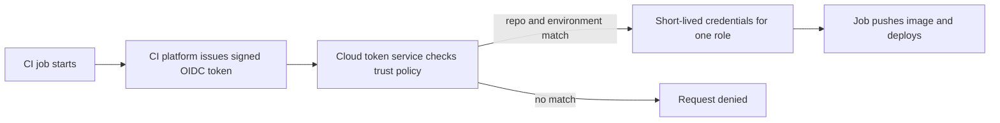

On AWS, the role's **trust policy** says which tokens may assume it. Note the condition: only the `production` environment of one repository qualifies.

```json
{
  "Version": "2012-10-17",
  "Statement": [{
    "Effect": "Allow",
    "Principal": { "Federated": "arn:aws:iam::111122223333:oidc-provider/token.actions.githubusercontent.com" },
    "Action": "sts:AssumeRoleWithWebIdentity",
    "Condition": {
      "StringEquals": {
        "token.actions.githubusercontent.com:aud": "sts.amazonaws.com",
        "token.actions.githubusercontent.com:sub": "repo:najm-bank/mobile-api:environment:production"
      }
    }
  }]
}
```

The workflow asks for a token and assumes the role; no secret is stored anywhere:

```yaml
permissions:
  id-token: write      # allow this job to request an OIDC token
  contents: read
jobs:
  deploy:
    runs-on: ubuntu-latest
    environment: production
    steps:
      # Check the action's current major version; pin to a full commit SHA in production (lesson 4.3)
      - uses: aws-actions/configure-aws-credentials@v4
        with:
          role-to-assume: arn:aws:iam::111122223333:role/najm-mobile-api-deploy
          aws-region: <region>
```

Azure (workload identity federation on an app registration or user-assigned managed identity) and Google Cloud (Workload Identity Federation) support the same pattern. The most common mistake is a trust condition that is too loose, such as any repository in the organisation or any branch: then unreviewed code can deploy to production.

**Workload identity in Kubernetes.** Pods should not share the node's identity, or every pod on the node gets every permission any pod needs. Each managed Kubernetes service maps a Kubernetes service account to a cloud identity: on Amazon EKS, IAM Roles for Service Accounts (IRSA) or EKS Pod Identity; on AKS, Microsoft Entra Workload ID; on GKE, Workload Identity Federation for GKE. With IRSA, for example, the mapping is an annotation:

```yaml
apiVersion: v1
kind: ServiceAccount
metadata:
  name: statements-reader
  namespace: mobile-api
  annotations:
    eks.amazonaws.com/role-arn: arn:aws:iam::111122223333:role/najm-statements-reader
```

A pod that runs with `serviceAccountName: statements-reader` gets credentials for that role only. Other pods in the cluster do not.

**How policies combine.** On AWS, a request is denied by default; it is allowed only if some policy allows it and no policy explicitly denies it. Organisation-wide guardrails (**service control policies** in AWS Organizations) and **permissions boundaries** can cap what any identity in an account may do, even if a policy grants more. Azure RBAC is additive across role assignments at the management group, subscription, resource group and resource scopes, with inheritance downwards. Google Cloud allow policies are inherited down the organisation, folder, project and resource hierarchy, and Google Cloud also offers deny policies. For all three: **grant at the narrowest scope that works**; a grant high in the hierarchy flows down to everything beneath it.

**Audit trails.** Every provider records API calls: AWS CloudTrail, Azure Activity Log (plus Microsoft Entra sign-in logs), Google Cloud Audit Logs. They answer "who did what, when, from where". Make sure they are switched on for all accounts, sent to a central place that the people being audited cannot change, and kept for as long as policy requires. That is how Noura's team could reconstruct what Yousef's leaked key had done.

#### 🔴 Expert view

**Account and project structure is an access decision.** Separate production from non-production at the provider's strongest boundary: AWS accounts, Azure subscriptions or Google Cloud projects. A development mistake then cannot touch production data, and production guardrails can be stricter.

**Find and remove unused access.** Permissions accumulate. Tools such as AWS IAM Access Analyzer, Microsoft Entra access reviews and Google Cloud's IAM recommender show unused permissions and externally shared resources. Review access regularly, and when someone moves teams ("joiner, mover, leaver"), remove old access the same day.

**Protect the metadata endpoint.** Workload credentials come from a metadata endpoint reachable from inside the machine. An application bug that lets an attacker make the server fetch an arbitrary URL (server-side request forgery, SSRF) can expose those credentials. Require the hardened version of the endpoint where offered (IMDSv2 on AWS, which requires a session token), keep workload roles narrow, and block pod access to the node's metadata endpoint where pods have their own identities. See [*Secure AI & Application Security*, lesson 2.3 — Server-side traps: SSRF, file uploads, path traversal and deserialisation](../secai/index.html#/2.3).

**Break-glass access.** If the identity provider is down during an incident, engineers still need a way in: a few emergency accounts with strong MFA, guarded credentials, and every use alerting security and reviewed. Test them like a backup.

**Where secrets remain.** Some things still need secrets: a third-party API key, a database password for a system without identity-based login. Keep them in a secrets manager, fetch them at runtime with workload identity, rotate them, and never print them in logs. The full treatment is in [*Secure AI & Application Security*, lesson 5.2 — Secrets management: keys, tokens and where they leak](../secai/index.html#/5.2); lesson 4.3 of this course applies it to pipelines.

### 🧰 The toolkit
| Tool, practice or service | What it is and does | When to reach for it |
|---|---|---|
| **Least privilege** | Grant only the actions and resources needed, at the narrowest scope, for the shortest time | Every grant, every review |
| **Single sign-on with MFA** | People sign in through the company identity provider, with a second factor | All human access to consoles and command-line tools |
| **Workload identity** | The platform issues short-lived credentials to a VM, pod or function automatically | Any software that calls cloud APIs |
| **OIDC federation for CI** | CI jobs exchange a signed job token for short-lived cloud credentials | Every pipeline that deploys to the cloud; replaces stored keys |
| **Audit logs** (CloudTrail, Azure Activity Log, Cloud Audit Logs) | A record of every API call: who, what, when, from where | Investigations, access reviews, regulatory evidence |
| **Access analyser** (IAM Access Analyzer, Entra access reviews, IAM recommender) | Finds unused permissions and resources shared outside the organisation | Quarterly access reviews; before granting more |
| **Break-glass account** | Emergency access for when normal sign-in fails, tightly guarded and alerting on use | Incident readiness; tested on a schedule |

### 🏛️ In practice at Najm Bank
After the leaked key, Salem and Noura agree the **Najm Cloud Access Standard v1**. Yousef writes the access model for the Najm Mobile API as its first worked example.

**Part A: rules**
1. No long-lived cloud access keys for people or pipelines. Exceptions need Noura's written approval and an expiry date.
2. People sign in through Najm's identity provider with MFA and assume task roles; production write access for people is time-limited, approved and logged.
3. Every workload has its own identity; no sharing between services; no node-level roles for application pods.
4. Production and non-production live in separate accounts or subscriptions or projects.
5. Audit logs are on everywhere, shipped to a central store the platform team cannot alter, and retained per bank policy.
6. Access is reviewed quarterly; unused permissions older than 90 days are removed.

**Part B: access model for the Najm Mobile API**

| Identity | Type | Can do | Where | How it gets credentials |
|---|---|---|---|---|
| `mobile-api-ci-build` | CI role | Push images to the registry repository for this service | Shared registry | OIDC, only the protected `main` branch of `mobile-api` |
| `mobile-api-deploy-prod` | CI role | Update this service's resources in the production cluster | Production | OIDC, only the `production` environment of `mobile-api`, which requires approval |
| `statements-reader` | Workload | Read objects under `statements/` in the production statements bucket | Production | Kubernetes service account mapped to a cloud role |
| `mobile-api-db-app` | Workload | Connect to the application database as the application user | Production | Workload identity to fetch a short-lived token or a rotated secret |
| `platform-engineer` | People | Read-only on production; full rights in development | All | SSO and MFA |
| `platform-oncall-elevated` | People | Production changes for four hours | Production | SSO and MFA, approved by the on-call lead, logged |
| `breakglass-01`, `breakglass-02` | Emergency | Administrator | All | Hardware MFA, credentials held by the CISO's office, every use alerts Jassim's SOC |

### 🛠️ Exercises
Use your own free-tier account with a **budget alert set first**, or the providers' documentation and policy simulators. Never practise on an employer's account without permission.

- 🟢 Take the risky `"Action": "*"` policy above and write the least-privilege version for a service that must read and write objects under one prefix of one bucket and nothing else. Then write the Azure or Google Cloud equivalent as a role assignment or binding. *Done when:* each grant names one identity, specific actions or a narrow built-in role, and a single resource scope.
- 🟡 In a personal GitHub repository, build a workflow that uses OIDC to obtain short-lived credentials from your free-tier cloud account and runs one read-only command (such as listing one bucket). Restrict the trust condition to one branch or environment. Then push a branch that is not allowed and confirm it is denied. *Done when:* no secret is stored in the repository settings, the allowed job succeeds and the other branch fails at the credential step.
- 🔴 Write the access model for a fictional Najm service of your choice in the Part B format, covering build, deploy, runtime and human access, plus break-glass. For each row, say what an attacker could do if that identity's credentials leaked. *Done when:* no row says "everything", and every row's blast radius is one service and one environment.

### ⚠️ Mistakes and traps
- **Administrator "just to get it working".** It always stays. Start from nothing and add the permissions the error messages and logs show you need.
- **Long-lived keys in pipelines.** They leak through logs, forks and laptops, and never expire. Use OIDC federation.
- **Loose trust conditions.** Trusting every repository or branch lets any pull request deploy to production. Match the exact repository and environment.
- **Pods using the node's identity.** Every pod gets every permission. Give each workload its own identity.
- **Granting high in the hierarchy.** A role at the organisation or subscription level flows to everything below. Grant at the narrowest scope.
- **Audit logs off, or editable by the people being audited.** You cannot investigate what you did not record. Centralise and protect them.

### 🧾 Recap
- IAM checks every API call: principal, action, resource, conditions; everything is denied until allowed.
- People use SSO, MFA and task roles; software uses workload identity; pipelines use OIDC federation.
- Least privilege means narrow actions, narrow resources, narrow scope and short lifetimes.
- Separate production by account, subscription or project, and keep audit logs where no one can edit them.
- Review and remove unused access, protect metadata endpoints, and keep tested break-glass accounts.

### ✍️ Check yourself

**1. Yousef's pipeline uses a stored access key with administrator rights. What should replace it?**

- A. The same administrator key, rotated every 90 days by a scheduled job
- B. A personal access key from Salem's account, since it has MFA enabled
- C. A key with fewer rights, kept in an encrypted pipeline secret
- D. OIDC federation issuing short-lived credentials for a narrow deploy role

<details><summary>Answer</summary>

**D.** Federation removes the stored secret entirely and limits what the job can do. A and C keep a long-lived secret that can leak; B ties a pipeline to a person and still stores a key. (🟡 Going deeper.)

</details>

**2. A role's OIDC trust condition allows any repository in the `najm-bank` organisation to assume the production deploy role. What is the risk?**

- A. None, because every repository in the organisation belongs to the bank
- B. Any repository's workflow, even on an unreviewed branch, can get deploy credentials
- C. The issued tokens will expire before long deployments can finish
- D. Production deploys slow down because every repository queues for the role

<details><summary>Answer</summary>

**B.** The trust policy is the gate; a loose condition lets any matching job through. Match the exact repository and the protected environment. (🟡 Going deeper.)

</details>

**3. Several pods on the same Kubernetes node need different cloud permissions. What is the right design?**

- A. Give the node one role holding every permission any of its pods needs
- B. Store a different access key in each pod's environment variables
- C. Map each pod's service account to its own narrow cloud identity
- D. Run each pod on its own dedicated VM with its own instance role

<details><summary>Answer</summary>

**C.** Workload identity gives each pod only its own permissions, with no stored keys. A gives every pod every permission; B reintroduces long-lived secrets; D is expensive and unnecessary. (🟡 Going deeper.)

</details>

**4. An engineer is granted a powerful role at the top of the Azure management group hierarchy so they can fix one storage account. Why is this a problem?**

- A. Grants inherit downwards to every subscription and resource below
- B. Azure ignores role assignments made at management group level
- C. Role assignments at that scope cannot be removed once created
- D. It only matters if the engineer's account has no MFA enabled

<details><summary>Answer</summary>

**A.** Scope is part of least privilege; grant at the storage account or its resource group. B and C are false; D confuses authentication with authorisation. (🟡 Going deeper.)

</details>

**5. During a major incident, Najm's identity provider is unavailable and engineers cannot sign in to the cloud console. What should already be in place?**

- A. A shared administrator password, recorded in the team wiki for emergencies
- B. Long-lived administrator access keys stored on every engineer's laptop
- C. A documented procedure for switching MFA off for everyone during incidents
- D. A few tested break-glass accounts with strong MFA and alerts on every use

<details><summary>Answer</summary>

**D.** Break-glass access is planned, protected, monitored and tested. A, B and C create permanent weaknesses for a rare event. (🔴 Expert view.)

</details>

### 📚 References
- AWS Identity and Access Management User Guide — https://docs.aws.amazon.com/IAM/latest/UserGuide/
- Azure role-based access control overview — https://learn.microsoft.com/azure/role-based-access-control/overview
- Google Cloud IAM overview — https://cloud.google.com/iam/docs/overview
- GitHub Actions documentation, security hardening with OpenID Connect — https://docs.github.com/en/actions
- Kubernetes, Service Accounts — https://kubernetes.io/docs/concepts/security/service-accounts/
- OpenID Connect specifications — https://openid.net/developers/specs/
- Going further: [*Secure AI & Application Security*, lesson 7.1 — Cloud security: shared responsibility, IAM and misconfiguration](../secai/index.html#/7.1), [*Secure AI & Application Security*, lesson 3.2 — OAuth 2.0, OpenID Connect and token pitfalls](../secai/index.html#/3.2) and [*SaaS Building Blocks*, lesson 1.4 — Enterprise identity: SSO, SAML, OIDC and SCIM](../saas/index.html#/1.4)

---

<a id="m2"></a>

# Module 2 — Containers and Kubernetes

*Almost every service Najm Bank moves out of its data centre leaves as a container and lands on Kubernetes. This module teaches both well enough to run them in production. It starts with the container image: what an image really is, how layers and caching work, how to write a Dockerfile that is small, fast to build and safe by default, and why a registry digest, not a tag, is the thing you deploy. It then opens Kubernetes: the objects you will use every day (pods, deployments, services, namespaces), the control loops that keep reality matching what you declared, and how to debug a pod that will not start. It ends with what separates a demo from a production workload: configuration and secrets, health probes, resource requests and limits, autoscaling, graceful shutdown and packaging with Helm. You will follow Yousef as his first Dockerfile for the Najm Mobile API ships the wrong code to staging, as he learns why the cluster keeps "undoing" his fixes, and as Maha walks him through a Payments outage caused by one badly chosen health check.*

> **Phases:** Build, Deploy, Operate — packaging software into images you can trust, running it on a cluster that heals itself, and configuring it so that healing helps rather than hurts.

<a id="l2-1"></a>

## 2.1 — Containers done right: images, layers, Dockerfiles and registries

*Level: 🟡 Intermediate* · *Prerequisites: 1.1, 1.2* · *Phase: Build, Deploy*

### ⚡ In 60 seconds
- A **container** is an ordinary Linux process that the kernel isolates (its own view of files, processes and network) and limits (CPU and memory). A **container image** is the read-only package of files and settings that the process starts from.
- An image is a stack of **layers**, each the result of one build step. Order your Dockerfile so that things that rarely change come first; the build cache then reuses them and builds take seconds, not minutes.
- Production images are **small, non-root and secret-free**: use a **multi-stage build** to leave compilers and build tools behind, set a `USER`, and never copy credentials into any layer.
- **Tags move; digests do not.** `mobile-api:1.4.2` can be overwritten; `mobile-api@sha256:…` always means the same bytes. Build once, then promote and deploy that exact digest.
- Decision cue: if you cannot say which commit and which base image produced the image running in production, your build is not done.
- Biggest trap: `FROM something:latest`, run as root, with the whole repository (including `.env`) copied in.

### 🧭 Why it matters
Yousef's first task on the platform team is to containerise the **Najm Mobile API**, the Python service behind the retail app. By Thursday it runs. The image is 1.3 GB, builds in nine minutes on every commit, and starts from `python:latest`. The scanner flags hundreds of vulnerabilities, mostly in compilers the API never uses. Then Tariq reports that staging "has the old login bug again": two pipelines pushed different builds to the same tag, `mobile-api:staging`, minutes apart, and the cluster pulled whichever it saw last. Finally Noura finds a test database password inside an image layer: `COPY . .` had copied a local `.env` file, and deleting it in a later step did not remove it from the earlier layer.

Salem shows him a public case of the same root cause at a larger scale. In August 2012 Knight Capital deployed new trading code by hand; according to the US SEC's order, one of eight servers did not receive it, a reused flag woke up old logic there, and the firm lost more than 460 million dollars in about 45 minutes. "We cannot afford to wonder which code is running," Salem says. "The image is how we stop wondering. But only if we build it once, name it by its digest, and deploy exactly that."

This lesson turns Yousef's Thursday image into the bank's standard one.

### 📐 How it works

#### 🟢 The essentials

**What a container really is.** On Linux, a container is a normal process with two kernel features applied. **Namespaces** give it its own view of the system: its own process list (it sees itself as process 1), its own network interfaces, its own hostname and its own file tree. **Control groups (cgroups)** cap how much CPU and memory it may use. Unlike a **virtual machine (VM)**, there is no guest kernel inside: containers start as fast as a process and all share the host's kernel, which also makes a container a weaker security boundary than a VM (lesson 2.3 covers hardening).

**What an image is.** An image is the starting file system plus metadata (command, user, environment). The **Open Container Initiative (OCI)** standardises it in three specifications (image, runtime and distribution), so an image built with Docker runs on containerd, CRI-O, Podman or any Kubernetes cluster.

An image is made of:
- **Layers**: compressed archives of file-system changes, one per build step that changes files. They are stacked to form the final file tree.
- A **config**: the command, user, working directory, exposed ports and environment.
- A **manifest**: a list pointing at the config and layers by their **digest**, the SHA-256 hash of their content.
- For multi-architecture images, an **index** that points to one manifest per CPU architecture (for example `amd64` and `arm64`).

Because everything is addressed by hash, the image's own digest changes if a single byte changes anywhere. That is what makes digests trustworthy.

**The Dockerfile.** A Dockerfile is the recipe. Each instruction runs in order:

```dockerfile
# Risky: Yousef's first version
FROM python:latest
COPY . /app
WORKDIR /app
RUN pip install -r requirements.txt
CMD python main.py
```

Five problems in five lines. `latest` changes under you. `COPY . /app` sends everything, including `.git` and `.env`. Copying code *before* installing dependencies makes `pip install` re-run on every code change. The full `python` image carries compilers the API never uses. And the process runs as root.

**Layers and the build cache.** The builder caches each step. If a step's inputs (the instruction and, for `COPY`, the files' contents) are unchanged and every step before it was cached, the cached layer is reused. Once one step misses, every step after it rebuilds. So put stable things first and volatile things last:

```dockerfile
COPY requirements.txt .          # changes rarely
RUN pip install -r requirements.txt
COPY src/ ./src/                 # changes on every commit
```

Now a code change rebuilds only the last layer.

**Registries.** A **registry** stores and serves images (Docker Hub, GitHub Container Registry, or each cloud's own). CI pushes; the cluster pulls.

| Need | AWS | Microsoft Azure | Google Cloud |
|---|---|---|---|
| Private image registry | Amazon ECR | Azure Container Registry | Artifact Registry |
| Pull without stored passwords | IAM role on the node or pod | Managed identity | Service account / workload identity |

**Tags and digests.** A **tag** (`1.4.2`, `staging`, `latest`) is a human-friendly pointer that anyone with push rights can move to a different image. A **digest** (`sha256:…`) is the hash of the manifest and can never point to anything else. Deploy by digest, or by an immutable tag that your registry refuses to overwrite.

```shell
# Same name, pinned to exact bytes
docker pull registry.example.com/najm/mobile-api@sha256:<64-hex-digest>
```

#### 🟡 Going deeper

**Multi-stage builds.** A **multi-stage build** uses several `FROM` lines in one Dockerfile. Early stages have the compilers and build tools; the final stage copies only the result. Here is the hardened version of Yousef's file:

```dockerfile
# syntax=docker/dockerfile:1
# Hardened: two stages, pinned base, non-root, no secrets
ARG PY_BASE=python:3.12-slim@sha256:<pinned-digest>

FROM ${PY_BASE} AS build
WORKDIR /app
RUN python -m venv /opt/venv
ENV PATH="/opt/venv/bin:$PATH"
COPY requirements.txt .
RUN --mount=type=cache,target=/root/.cache/pip \
    pip install --require-hashes -r requirements.txt
COPY src/ ./src/

FROM ${PY_BASE} AS runtime
RUN useradd --uid 10001 --no-create-home --shell /usr/sbin/nologin app
WORKDIR /app
COPY --from=build /opt/venv /opt/venv
COPY --from=build /app/src ./src
ENV PATH="/opt/venv/bin:$PATH" PYTHONUNBUFFERED=1
USER 10001
EXPOSE 8080
CMD ["python", "-m", "src.main"]
```

What each choice buys:
- **Pinned base by digest.** The base changes only when someone bumps it, ideally through a tested bot pull request (Renovate or Dependabot).
- **`--require-hashes`.** A tampered or substituted package fails the build.
- **Cache mount.** BuildKit (the modern Docker builder) reuses pip's download cache without putting it in a layer.
- **Numeric non-root `USER`.** Kubernetes can check `runAsNonRoot` against a numeric user; a name it cannot verify.
- **Exec-form `CMD`** (the JSON array). The program becomes process 1 and receives the stop signal directly. In shell form a shell is process 1 and may not pass `SIGTERM` on, so the app is killed hard instead of shutting down cleanly. If needed, add a tiny init such as `tini`.

**The `.dockerignore` file** keeps files out of the **build context**, the folder sent to the builder:

```text
.git
.env
*.pem
tests/
node_modules/
__pycache__/
```

If a build genuinely needs a credential (for a private package index, say), pass it as a **build secret**, mounted for one step and never written to a layer:

```dockerfile
RUN --mount=type=secret,id=pip_conf,target=/etc/pip.conf \
    pip install --require-hashes -r requirements.txt
```

**Choosing a base image.** Smaller bases mean fewer packages, fewer vulnerabilities to triage and faster pulls.

| Base type | Example | Trade-off |
|---|---|---|
| Full distribution | `python:3.12` | Easy to debug; large; many unused packages |
| Slim distribution | `python:3.12-slim` | Good default; still has a shell and package manager |
| Alpine-based | `python:3.12-alpine` | Very small; uses musl instead of glibc, so some Python packages lack prebuilt wheels and must compile |
| Distroless / minimal | Google's distroless images, Chainguard-style minimal images | No shell or package manager; smallest attack surface; harder to debug interactively |
| `scratch` | Empty image | Only for static binaries (often Go or Rust) |

Approve one or two bases per language, patch them centrally, and rebuild when they change.

**Build once, promote the digest.** The pipeline builds the image a single time on the main branch, pushes it, records the digest, and every environment (dev, test, staging, production) runs that digest. Promotion changes configuration, never the image. Rebuilding "the same commit" for production is how staging and production quietly diverge. Lesson 3.2 automates this promotion with GitOps and lesson 4.1 builds the pipeline. The non-coder view of the same idea is [*System Design for Vibe Coders*, lesson 4.5 — Verify the artifact, not the source](../vibe/index.en.html#l4-5).

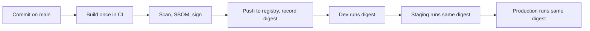

**Labels for traceability.** Stamp the standard OCI labels `org.opencontainers.image.revision` (the commit) and `org.opencontainers.image.source` (the repository) into every image, so anyone can answer "where did this come from?"

#### 🔴 Expert view

**Reproducible is not the same as pinned.** Pinning removes the biggest sources of drift, but timestamps and file ordering can still change the digest of a rebuild. Most teams aim for "rebuildable and traceable" and add **provenance**: a signed record, produced by the build system, of which source, builder and inputs created the digest. Together with an **SBOM** (software bill of materials) and an image **signature** checked at deploy time, this is the supply-chain story that [*Secure AI & Application Security*, lesson 6.2 — The software supply chain: dependencies, SBOMs, SLSA and signing](../secai/index.html#/6.2) teaches in depth; lesson 4.3 wires it into Najm's pipeline.

**Scanning and the patch loop.** Scanners such as Trivy and Grype list known vulnerabilities in an image's packages. New vulnerabilities are published daily against unchanged images, so scan in the pipeline (block on new critical findings that have a fix), rescan running images on a schedule, and rebuild on a cadence even when code has not changed.

**Multi-architecture builds.** Laptops and cloud nodes may differ (Arm or x86). `docker buildx build --platform linux/amd64,linux/arm64 --push` builds both and pushes an index; test on the architecture you run on.

**Registry operations.** Treat the registry as production infrastructure: **tag immutability** on release repositories; **pull-through caches or mirrors** for public images, so a public registry's rate limits or outage cannot stop your deploys (Docker Hub limits anonymous and free-tier pulls; check its current limits); the same region as the cluster; and **retention rules** that never delete anything currently deployed.

**The container is not a VM.** Run one main process per container, log to standard output, keep state outside it, and expect it to be killed and replaced at any time. Kubernetes assumes these Twelve-Factor App ideas.

### 🧰 The toolkit
| Tool, practice or service | What it is and does | When to reach for it |
|---|---|---|
| **Docker** (with BuildKit) | Builds, runs and pushes OCI images; BuildKit adds cache and secret mounts and parallel stages | Local development and CI image builds |
| **Multi-stage build** | Several `FROM` stages in one Dockerfile; only the final stage ships | Every compiled or dependency-heavy image |
| **.dockerignore** | Excludes files from the build context | Every repository with a Dockerfile, from day one |
| **Image digest** | Content hash that names exact image bytes | Every deployment manifest and promotion record |
| **Container registry** (ECR, ACR, Artifact Registry, GHCR) | Stores and serves images, with access control and tag immutability | Holding release images close to the cluster |
| **Trivy** | Open-source scanner for vulnerabilities and misconfigurations in images and files | In CI on every build, and on a schedule against running images |
| **hadolint** | Linter that checks Dockerfiles against good practice | Pre-commit and pull requests |

### 🏛️ In practice at Najm Bank
Salem asks Yousef to turn his fixes into the **Najm Container Image Standard v1**, which every team must meet before an image may run in a shared cluster. The hardened Dockerfile above is its reference example for Python.

| # | Rule | Checked by | Why |
|---|---|---|---|
| 1 | Base image from the approved list, pinned by digest | Pipeline policy | Known, patched starting point; no surprise changes |
| 2 | Multi-stage build; no compilers or build tools in the final stage; a shell and package manager only via an approved slim base | hadolint plus review | Smaller attack surface and faster pulls |
| 3 | Runs as a numeric non-root user (UID 10000 or above) | Pipeline check of image config; cluster admission in lesson 2.3 | Limits damage if the app is compromised |
| 4 | No secrets in any layer; `.dockerignore` present; build secrets via secret mounts | Secret scanning of the image and repository | Layers are permanent and copied everywhere |
| 5 | Exec-form `CMD`/`ENTRYPOINT`; app handles `SIGTERM` | Review; shutdown test in CI | Clean shutdown during deploys and scaling |
| 6 | One main process; logs to stdout/stderr; no state in the container | Review | The cluster may kill and replace it at any time |
| 7 | OCI labels for source and revision | Pipeline | Trace any running image to its commit |
| 8 | Built once on main; pushed to the release repository with immutable tags; deployed by digest | Pipeline and GitOps checks | Every environment runs the same bytes |
| 9 | Scanned: no new critical vulnerability with an available fix; SBOM and signature attached | Pipeline gate | Supply-chain evidence for Noura's team |
| 10 | Rebuilt at least monthly, or within the security team's deadline when the base image has a critical fix | Scheduled pipeline | Unchanged code still ages |

**Exceptions** go to Salem with a reason and an expiry date. The Mobile API image is now 160 MB instead of 1.3 GB (Najm's figure for this one service; yours will differ), and staging and production record the same digest.

### 🛠️ Exercises
Work locally with Docker or a compatible tool. Push only to a registry you own, such as a free personal account.

- 🟢 Take any small web app you have (or a "hello world" in your language), write a naive Dockerfile with `FROM <lang>:latest` and `COPY . .`, build it, then rewrite it with a pinned slim base, a `.dockerignore`, dependency files copied before source, a non-root `USER` and an exec-form `CMD`. Compare sizes with `docker images` and layers with `docker history`. *Done when:* you have both files, the size difference, and evidence that changing one source line rebuilds only the last layers.
- 🟡 Convert your image to a multi-stage build and scan both versions with Trivy. Build the naive version with a fake secret in `.env`, then find it by exporting the image (`docker save`) and searching its layers. *Done when:* you can show the secret in the naive image, its absence from the hardened one, and both vulnerability counts.
- 🔴 Build your image for `linux/amd64` and `linux/arm64` with `docker buildx`, push it to your registry with OCI revision labels, and write a two-line deploy note that references it only by digest. Push a different build to the same tag. *Done when:* `docker buildx imagetools inspect` shows both architectures, and the digest still pulls the original image after the tag moved.

### ⚠️ Mistakes and traps
- **Using `latest` or other moving tags in production.** Two pulls of the same name can give different code. Deploy by digest, and use immutable tags in the release repository.
- **Secrets in layers.** `COPY . .` with a `.env` file, or `ENV DB_PASSWORD=…`, leaks a credential into every copy of the image. Use `.dockerignore`, build secret mounts and runtime secrets (lesson 2.3).
- **Rebuilding per environment.** A "production build" is a different artefact. Promote the digest.
- **Running as root "because it's in a container".** Containers share the host kernel. Set a numeric non-root `USER`.
- **Scanning once.** New vulnerabilities appear in unchanged images. Rescan running images and rebuild on a schedule.

### 🧾 Recap
- A container is an isolated, resource-limited Linux process; an image is its OCI-standard, layered starting point.
- Order Dockerfile steps from stable to volatile so the cache works; leave build tools behind with multi-stage builds.
- Production images are small, pinned, non-root and secret-free, with labels that trace them to a commit.
- Tags are pointers that can move; digests are content hashes that cannot. Build once and deploy the digest everywhere.
- Scanning, SBOMs, signing and scheduled rebuilds keep images trustworthy after they ship.

### ✍️ Check yourself

**1. Yousef deletes `.env` with `RUN rm .env` right after `COPY . .`. Why is the secret still exposed?**

- A. `rm` is silently ignored inside a Docker build
- B. The `COPY` layer still holds the file; the later `rm` layer only hides it
- C. The build cache restores deleted files from the previous build on every rebuild
- D. Files in the working directory are always visible to anyone running `docker ps`

<details><summary>Answer</summary>

**B.** A deletion only masks the file in the final view; anyone with the image can extract the earlier layer. A and C are false, and D confuses running containers with image contents. Keep the file out with `.dockerignore`. (🟡 Going deeper.)

</details>

**2. Tariq says staging is running an old build even though the pipeline pushed `mobile-api:staging` an hour ago. Two pipelines both push to that tag. What is the most robust fix?**

- A. Ask the two teams to coordinate their pushes in a shared chat channel
- B. Set the cluster to pull the `staging` tag more often, on every pod start
- C. Rename the tag to `staging-v2` so that it is separate from the old one
- D. Deploy the digest the pipeline recorded; make release tags immutable

<details><summary>Answer</summary>

**D.** A digest names exact bytes and cannot be moved. A relies on people, B still races, and C just creates another mutable tag. (🟢 The essentials.)

</details>

**3. Every commit to the Mobile API rebuilds all dependencies, taking nine minutes. The Dockerfile copies the whole source tree and then runs `pip install`. What change helps most?**

- A. Copy `requirements.txt` and install it before copying the source
- B. Switch to the `latest` base image so the base layer is always cached
- C. Give the build machine more CPU cores and a faster disk
- D. Combine every build step into one long `RUN` line to cut layers

<details><summary>Answer</summary>

**A.** The cache breaks from the first changed step onwards, so stable dependency files go first. B makes builds unpredictable, C treats the symptom, and D defeats caching. (🟢 The essentials.)

</details>

**4. Why does the hardened Dockerfile use exec-form `CMD ["python", "-m", "src.main"]` rather than `CMD python -m src.main`?**

- A. Exec form skips the shell layer, which makes the final image noticeably smaller
- B. Shell form is not allowed in the final stage of a multi-stage build
- C. The app becomes process 1 and gets `SIGTERM` directly, so it can stop cleanly
- D. Exec form makes the process run as the non-root user automatically

<details><summary>Answer</summary>

**C.** In shell form a shell is process 1 and may not forward the stop signal, so the app is killed after the grace period. A, B and D are false: size, multi-stage support and user are unrelated to the form of `CMD`. (🟡 Going deeper.)

</details>

**5. Mona from Finance asks why the platform team rebuilds images monthly even when no application code changed. What is the best answer?**

- A. Each rebuild compresses the layers further, so images get smaller over time
- B. New vulnerabilities are found in unchanged bases; rebuilds pick up the patches
- C. Container registries delete any image older than one month by default
- D. Kubernetes refuses to start images older than one month

<details><summary>Answer</summary>

**B.** Unchanged images age as new vulnerabilities are published against their contents. A is not generally true, and C and D describe rules that do not exist by default (retention is something you configure). (🔴 Expert view.)

</details>

### 📚 References
- Open Container Initiative specifications — https://opencontainers.org/
- Docker documentation: Dockerfile reference — https://docs.docker.com/reference/dockerfile/
- Docker documentation: multi-stage builds — https://docs.docker.com/build/building/multi-stage/
- Docker documentation: build cache — https://docs.docker.com/build/cache/
- Docker documentation: build secrets — https://docs.docker.com/build/building/secrets/
- Kubernetes documentation: images — https://kubernetes.io/docs/concepts/containers/images/
- The Twelve-Factor App — https://12factor.net/
- US SEC, Knight Capital Americas LLC order (2013) — https://www.sec.gov/litigation/admin/2013/34-70694.pdf
- Trivy documentation — https://trivy.dev/

<a id="l2-2"></a>

## 2.2 — Kubernetes fundamentals: pods, deployments, services and how the cluster thinks

*Level: 🟡 Intermediate* · *Prerequisites: 1.1, 1.2, 2.1* · *Phase: Deploy, Operate*

### ⚡ In 60 seconds
- **Kubernetes** is a system that runs containers across a group of machines (a **cluster**) and keeps them running. You tell it what you want; it works continuously to make reality match.
- The core idea is **desired state and reconciliation**: you declare objects in YAML, the API server stores them, and **controllers** loop forever comparing "declared" with "actual" and fixing the difference.
- The everyday objects: a **Pod** (one or more containers scheduled together), a **Deployment** (keeps N identical pods running and rolls out new versions), a **Service** (a stable name and address in front of changing pods), and a **Namespace** (a folder for objects, access and quotas).
- **Labels and selectors** are the glue: a Deployment finds its pods, and a Service finds where to send traffic, purely by matching labels.
- Decision cue: never fix things by hand inside the cluster. Change the declared state (the YAML in Git) and let the controllers converge.
- Biggest trap: treating pods like servers. Pods are disposable; anything you change inside one, or any pod you create by hand, is gone the next time it is replaced.

### 🧭 Why it matters
In the data centre, the Najm Mobile API ran on four hand-tended virtual machines. When one died at night, an operator was paged and restarted it; recovery took as long as a person took to wake up.

In his second week, Yousef deploys the API to the new managed Kubernetes cluster. He deletes a misbehaving pod, and seconds later a new one with a different name appears. He fixes a setting with `kubectl edit`; next morning the GitOps tool (lesson 3.2) has put the old value back. And a node in zone B failed overnight without paging anyone: its pods were recreated elsewhere before anyone noticed.

"All three are the same feature," Salem tells him. "The cluster is a set of control loops that keep pushing reality towards what we wrote down. Work with the loops and they do your night shifts. Work against them and they undo you."

### 📐 How it works

#### 🟢 The essentials

**The cluster's parts.** A cluster has a **control plane** (the brain) and **worker nodes** (the machines that run your containers). On managed services (Amazon EKS, Azure Kubernetes Service, Google Kubernetes Engine), the provider runs the control plane and you mostly see the nodes.

| Component | Where | What it does |
|---|---|---|
| **kube-apiserver** | Control plane | The front door: everything talks to the cluster through its API |
| **etcd** | Control plane | Key-value store holding all declared objects and their status |
| **Scheduler** | Control plane | Chooses a node for each new pod, based on its resource requests and rules |
| **Controller manager** | Control plane | Runs the built-in control loops (deployments, replica sets, nodes, endpoints and more) |
| **kubelet** | Every node | Agent that runs and health-checks the pods assigned to its node |
| **Container runtime** | Every node | Runs the containers (containerd or CRI-O) |
| **kube-proxy** (or a CNI plugin that replaces it) | Every node | Programs the node's networking so Service addresses reach the right pods |

**Desired state and reconciliation.** You do not tell Kubernetes "start three containers". You submit an object that says "there should be three". A controller notices the gap between three wanted and zero running and acts. If a node dies and takes a pod with it, the gap reappears and the controller acts again. That loop is called **reconciliation**, and it explains all three of Yousef's surprises.

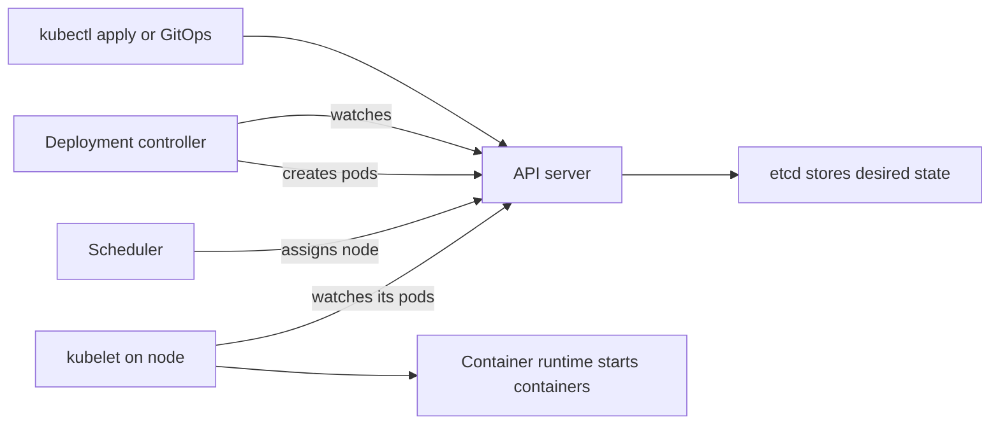

Controllers, the scheduler and kubelets each watch the API server and write results back; they never talk to each other directly.

**Pods.** A **Pod** is the smallest thing Kubernetes runs: one or more containers sharing a network address, always on the same node. Pods are **ephemeral**: replacements get new names and IP addresses, and you never create one directly for a real workload.

**Deployments and ReplicaSets.** A **Deployment** declares "run N copies of this pod template". It manages a **ReplicaSet**, which does the counting; when you change the template (for example a new image digest), the Deployment creates a new ReplicaSet and shifts pods from the old to the new one gradually. That is a **rolling update**.

**Services.** Because pod addresses keep changing, other software needs a stable address. A **Service** gives a set of pods one stable virtual IP and a DNS name, such as `mobile-api.mobile.svc.cluster.local`, and spreads connections across whichever pods currently match its selector and are ready.

| Service type | Reachable from | Typical use |
|---|---|---|
| `ClusterIP` (default) | Inside the cluster only | Service-to-service traffic |
| `NodePort` | A port on every node | Rarely used directly; building block for others |
| `LoadBalancer` | Outside, through a cloud load balancer the provider creates | Exposing a service at layer 4 (TCP) |

For HTTP routing by host name and path (layer 7), use an **Ingress** or the newer **Gateway API**, which reached general availability (v1.0) in October 2023. Both need a controller installed in the cluster to do the actual work.

**Labels and selectors.** A **label** is a key-value tag on an object, such as `app.kubernetes.io/name: mobile-api`. A **selector** is a query over labels. Deployments find their pods by selector; Services find their endpoints by selector. If the labels do not match, nothing is connected and there is no error message, just no traffic.

**Namespaces.** A **Namespace** groups objects. Najm gives each team or system its own (`mobile`, `payments`, `assist`, never `default`) with its own access rules, quotas and network policies. On its own a namespace is not a strong security boundary.

#### 🟡 Going deeper

**A minimal, correct Deployment and Service.**

```yaml
apiVersion: apps/v1
kind: Deployment
metadata:
  name: mobile-api
  namespace: mobile
  labels:
    app.kubernetes.io/name: mobile-api
spec:
  replicas: 3
  revisionHistoryLimit: 5
  selector:
    matchLabels:
      app.kubernetes.io/name: mobile-api
  strategy:
    type: RollingUpdate
    rollingUpdate:
      maxSurge: 1          # at most one extra pod during a rollout
      maxUnavailable: 0    # never drop below 3 ready pods
  template:
    metadata:
      labels:
        app.kubernetes.io/name: mobile-api
    spec:
      containers:
        - name: api
          image: registry.example.com/najm/mobile-api@sha256:<digest-from-pipeline>
          ports:
            - name: http
              containerPort: 8080
```

```yaml
apiVersion: v1
kind: Service
metadata:
  name: mobile-api
  namespace: mobile
spec:
  type: ClusterIP
  selector:
    app.kubernetes.io/name: mobile-api
  ports:
    - name: http
      port: 80
      targetPort: http
```

The same label appears three times: Deployment selector, pod template and Service selector. Lesson 2.3 adds the probes, resources and security settings production needs.

**Declarative, not imperative.** `kubectl run` and `kubectl edit` change the live cluster directly; `kubectl apply -f` submits files describing the desired state. With GitOps, Git is the only source of truth and manual edits are reverted, which removes "someone changed something at 3 a.m."

**How a rolling update proceeds.** With the settings above, Kubernetes starts one new pod (`maxSurge: 1`), waits until it is **ready**, removes one old pod, and repeats. If new pods never become ready, the rollout stalls rather than taking the service down; after `progressDeadlineSeconds` (600 seconds by default) the Deployment reports that it failed to progress. Both values default to 25% when you do not set them.

```shell
kubectl -n mobile rollout status deployment/mobile-api   # watch progress
kubectl -n mobile rollout history deployment/mobile-api  # list revisions
kubectl -n mobile rollout undo deployment/mobile-api     # emergency rollback
```

On a GitOps platform, `rollout undo` is a break-glass move: revert the change in Git as well, or the reconciler will roll it forward again. Lesson 4.2 covers canary and blue-green strategies built on top of this.

**Reading a pod's status.** Most first-week debugging is reading these states:

| You see | It usually means | Look at |
|---|---|---|
| `Pending` | The scheduler cannot find a node: not enough CPU or memory, or rules that no node satisfies | `kubectl describe pod` → Events |
| `ImagePullBackOff` / `ErrImagePull` | Wrong image name or digest, missing registry permission, registry unreachable | Events; the node's permission to pull |
| `CrashLoopBackOff` | The container starts and exits again and again; Kubernetes waits longer between restarts | `kubectl logs <pod> --previous` |
| `OOMKilled` (in last state) | The container used more memory than its limit | Memory limit and real usage (lesson 2.3) |
| `Running` but `0/1` ready | The process runs but fails its readiness check, so it receives no traffic | Readiness probe and app logs |

A five-command triage covers most cases:

```shell
kubectl -n mobile get pods -o wide             # states, restarts, nodes
kubectl -n mobile describe pod <pod>           # events at the bottom
kubectl -n mobile logs <pod> --previous        # logs of the crashed container
kubectl -n mobile get endpointslices -l kubernetes.io/service-name=mobile-api
kubectl -n mobile get events --sort-by=.lastTimestamp
```

The fourth command answers "does my Service have any pods behind it?" An empty list means a label mismatch or no ready pods.

**Other workload types.** Beyond Deployments for stateless services: **StatefulSet** (stable names and storage per pod), **DaemonSet** (one pod per node, for agents) and **Job**/**CronJob** (run to completion). Najm keeps databases on the provider's managed service rather than in StatefulSets.

#### 🔴 Expert view

**Spread across failure domains.** Three replicas are no help if the scheduler puts all three on one node, or in one availability zone that then fails. **Topology spread constraints** tell the scheduler to balance pods:

```yaml
      topologySpreadConstraints:
        - maxSkew: 1
          topologyKey: topology.kubernetes.io/zone
          whenUnsatisfiable: DoNotSchedule
          labelSelector:
            matchLabels:
              app.kubernetes.io/name: mobile-api
```

This goes in the pod template's `spec`, paired with node pools in several zones (lesson 6.1). A **PodDisruptionBudget** (lesson 2.3) stops maintenance removing too many pods at once.

**Everything is an API object.** You can add your own object types (**custom resources**) and controllers (**operators**); Argo CD and cert-manager work this way. Every such add-on is a dependency the platform team must upgrade and watch.

**Upgrades are a standing job.** The Kubernetes project ships about three minor releases a year and supports each for roughly fourteen months; managed providers publish their own windows (check yours). Read deprecation notes and test upgrades in non-production first; removed APIs are the usual cause of breakage.

**How much Kubernetes should you run?** Kubernetes earns its complexity when many services, teams and environments share one platform. For a single small service, a serverless container service or PaaS may be the better decision. Najm chose managed Kubernetes because it runs dozens of services and wants one way to deploy them. The same OCI image runs on all of these, so the choice stays reversible.

| Concept | AWS | Microsoft Azure | Google Cloud |
|---|---|---|---|
| Managed Kubernetes | Amazon EKS | Azure Kubernetes Service (AKS) | Google Kubernetes Engine (GKE) |
| Serverless containers | Amazon ECS on AWS Fargate | Azure Container Apps | Cloud Run |

### 🧰 The toolkit
| Tool, practice or service | What it is and does | When to reach for it |
|---|---|---|
| **kubectl** | The command-line client for the Kubernetes API | Applying manifests, inspecting state, debugging |
| **kind** (Kubernetes in Docker) | Runs a whole cluster as containers on your laptop | Learning, local testing, CI tests of manifests |
| **k3d** | Runs the lightweight k3s distribution in Docker | A fast local cluster with a small footprint |
| **Deployment** | Keeps N identical pods running and rolls out changes | Every stateless service |
| **Service** | Stable virtual IP and DNS name in front of matching pods | Any pod that receives traffic |
| **Gateway API** | Kubernetes' role-oriented API for HTTP and TCP routing into the cluster | New ingress designs; replacing older Ingress setups |
| **Topology spread constraints** | Scheduler rules that balance pods across zones or nodes | Every production workload with more than one replica |

### 🏛️ In practice at Najm Bank
Yousef writes the **Najm workload manifest baseline**: the minimum every Deployment must have before it can be merged into the GitOps repository, plus a triage card for the on-call rota.

**Part A: required on every Deployment**

| Field | Najm rule | Reason |
|---|---|---|
| `metadata.namespace` | The team's namespace; never `default` | Access, quotas and cost allocation by team |
| Labels | `app.kubernetes.io/name`, `app.kubernetes.io/part-of`, `najm.example/team`, `najm.example/cost-centre` | Selectors, dashboards and cost reports (lesson 6.2) |
| `spec.replicas` | 3 or more in production (or an autoscaler minimum of 3) | Survive a node or zone failure |
| `image` | Registry path plus digest from the pipeline | Exactly the bytes that were tested (lesson 2.1) |
| `strategy.rollingUpdate` | `maxUnavailable: 0`, `maxSurge: 1` (or 25%) | No capacity loss during deploys |
| `topologySpreadConstraints` | Across `topology.kubernetes.io/zone` | Survive a zone failure |
| Probes, resources, security context | As in the lesson 2.3 checklist | Not production-ready without them |
| Change path | Git pull request only; no `kubectl edit` in production | One source of truth; full audit trail |

**Part B: on-call triage card ("the pod will not work")**

| Step | Command | If you see… | Then |
|---|---|---|---|
| 1 | `kubectl get pods -o wide` | `Pending` | Check events for "Insufficient cpu/memory"; check node pool capacity |
| 2 | `kubectl describe pod` | `ImagePullBackOff` | Check the digest exists; check the node's registry permission |
| 3 | `kubectl logs --previous` | `CrashLoopBackOff` | Read the last error; check config and secrets were mounted |
| 4 | `kubectl get endpointslices` | No endpoints | Compare Service selector with pod labels; check readiness |
| 5 | `kubectl rollout history` | Problem began with a rollout | Revert the commit in Git; break-glass `rollout undo` only with Maha's approval |

### 🛠️ Exercises
Use a local cluster: install kind or k3d, and create a cluster with `kind create cluster` or `k3d cluster create`.

- 🟢 Deploy the Deployment and Service from this lesson (use any small public web image you trust, pinned by digest, in place of the Mobile API). Delete one pod and watch with `kubectl get pods -w` as a replacement appears. *Done when:* you can explain, in two sentences, which controller recreated the pod and why its name changed.
- 🟡 Break the Service on purpose by changing the pod template label without updating the Service selector. Use the triage card to find the fault from the symptoms alone. Then deploy an image digest that does not exist and diagnose the result. *Done when:* you have the exact command output that pointed to each cause, and both are fixed through your YAML files, not by `kubectl edit`.
- 🔴 Create a kind cluster with three worker nodes, label them as zones `a`, `b` and `c` with `topology.kubernetes.io/zone`, and deploy six replicas with the topology spread constraint. Drain one node with `kubectl drain` and watch what happens. *Done when:* you can show the pods spread two per zone before the drain, explain where they went after, and explain why `DoNotSchedule` left some pods `Pending` if it did.

### ⚠️ Mistakes and traps
- **Editing the live cluster.** `kubectl edit` in production creates drift that the next sync reverts, or worse, that nobody knows about. Change Git; let the reconciler apply it.
- **Creating bare pods.** A pod not owned by a controller is not recreated when its node dies. Use a Deployment (or Job, StatefulSet, DaemonSet).
- **Label mismatches.** A Service whose selector matches nothing produces no error, only no traffic. Use one label convention and check endpoints.
- **All replicas in one place.** Three pods on one node give the illusion of redundancy. Add topology spread constraints and multi-zone node pools.
- **Forgetting the rollback is in Git too.** A `rollout undo` that is not mirrored in Git gets rolled forward again by GitOps.

### 🧾 Recap
- Kubernetes runs containers across a cluster and keeps them running through control loops that reconcile actual state with declared state.
- The control plane (API server, etcd, scheduler, controllers) decides; kubelets and container runtimes on nodes act.
- Pods are disposable; Deployments keep N of them running and roll out new versions; Services give them a stable address; labels and selectors connect it all.
- Change the declared state in Git, never the live objects; read pod states and events to debug.
- Spread replicas across zones, plan regular upgrades, and only adopt Kubernetes where its complexity pays for itself.

### ✍️ Check yourself

**1. Yousef deletes a misbehaving Mobile API pod, and a new one appears within seconds with a different name. What caused this?**

- A. The kubelet on the node restarted the same pod after it was deleted
- B. The Service recreated the pod so that it would keep at least one endpoint
- C. The ReplicaSet controller saw too few pods and created a replacement
- D. etcd restored the deleted pod object from its most recent backup

<details><summary>Answer</summary>

**C.** Reconciliation: the controller compares desired with actual replicas and fixes the gap. A is wrong because the kubelet restarts containers inside an existing pod, which keeps its name; a deleted pod is gone. B is wrong because Services route traffic and never create pods. D misreads etcd's role as a store of state. (🟢 The essentials.)

</details>

**2. A new team deploys a service. Its pods are `Running` and ready, but every request to the Service times out, and the Service has no endpoints. What is the most likely cause?**

- A. The Service selector does not match the pod labels
- B. The image digest in the pod template is wrong
- C. The pods keep exceeding their memory limit
- D. The scheduler could not find a node with room

<details><summary>Answer</summary>

**A.** Ready pods with no endpoints point to a label mismatch. B would show `ImagePullBackOff`, C would show `OOMKilled` restarts, and D would leave pods `Pending`, not running. (🟡 Going deeper.)

</details>

**3. During a release, the new Mobile API pods never become ready. The Deployment uses `maxUnavailable: 0` and `maxSurge: 1`. What happens to customers?**

- A. All old pods are deleted at once, and the API goes down until someone acts
- B. Kubernetes detects the failure and automatically rolls back to the previous version
- C. Traffic is split evenly, so about half of all requests reach the broken pods
- D. The rollout stalls, old pods keep serving, and it is reported as not progressing

<details><summary>Answer</summary>

**D.** No old pod is removed until a new one is ready, and unready pods receive no Service traffic. B is the tempting distractor: a plain Deployment does not roll back on its own; you, or a tool such as a progressive-delivery controller, must do it. (🟡 Going deeper.)

</details>

**4. Maha notices that all three Payments replicas are on nodes in the same availability zone. Which change addresses this most directly?**

- A. Increase replicas from 3 to 6 so that a single zone failure matters less
- B. Add a zone topology spread constraint, with node pools in several zones
- C. Move Payments into its own dedicated namespace with a separate quota
- D. Change the Payments Service type to `LoadBalancer` across zones

<details><summary>Answer</summary>

**B.** Spread constraints tell the scheduler to balance across zones, which only works if nodes exist in several zones. A may still put all six in one zone; C and D do not affect placement. (🔴 Expert view.)

</details>

**5. Yousef fixes a production setting with `kubectl edit`. The next morning the old value is back. Why, and what should he do?**

- A. GitOps restored what Git declares; he should change it by pull request
- B. Kubernetes reverts every manual change after 24 hours; he should re-apply it daily
- C. The kubelet cached the old setting overnight; he should drain and restart the node
- D. etcd lost the change during compaction; he should ask the provider to restore etcd

<details><summary>Answer</summary>

**A.** With GitOps, Git is the source of truth and manual edits are drift that gets corrected. B, C and D describe behaviours that do not exist. (🟡 Going deeper.)

</details>

### 📚 References
- Kubernetes documentation: cluster components — https://kubernetes.io/docs/concepts/overview/components/
- Kubernetes documentation: controllers — https://kubernetes.io/docs/concepts/architecture/controller/
- Kubernetes documentation: Deployments — https://kubernetes.io/docs/concepts/workloads/controllers/deployment/
- Kubernetes documentation: Services — https://kubernetes.io/docs/concepts/services-networking/service/
- Kubernetes documentation: pod topology spread constraints — https://kubernetes.io/docs/concepts/scheduling-eviction/topology-spread-constraints/
- Kubernetes documentation: recommended labels — https://kubernetes.io/docs/concepts/overview/working-with-objects/common-labels/
- Kubernetes release cycle and version skew — https://kubernetes.io/releases/
- Gateway API — https://gateway-api.sigs.k8s.io/
- kind — https://kind.sigs.k8s.io/
- Amazon EKS documentation — https://docs.aws.amazon.com/eks/
- Azure Kubernetes Service documentation — https://learn.microsoft.com/azure/aks/
- Google Kubernetes Engine documentation — https://cloud.google.com/kubernetes-engine/docs

<a id="l2-3"></a>

## 2.3 — Kubernetes in practice: config, secrets, health probes, autoscaling and Helm

*Level: 🟡 Intermediate* · *Prerequisites: 2.1, 2.2* · *Phase: Deploy, Operate*

### ⚡ In 60 seconds
- A manifest that "runs" is not production-ready. Production adds **external configuration**, **safe secrets**, **health probes**, **requests and limits**, **autoscaling**, **graceful shutdown** and a **security context**.
- **ConfigMaps** hold ordinary settings; **Secrets** hold sensitive ones. A Kubernetes Secret is only **base64-encoded, not encrypted** by default: turn on encryption at rest, limit who can read it, and prefer syncing from an external secrets manager.
- **Readiness** decides whether a pod gets traffic; **liveness** decides whether it gets restarted; **startup** protects slow starters. Liveness must check only the process itself, never a database or another service.
- **Requests** reserve capacity and drive scheduling and autoscaling; **limits** cap usage (CPU over the limit is throttled, memory over the limit is killed).
- Decision cue: before go-live, walk the production-readiness checklist; any blank line is a known outage waiting to happen.
- Biggest trap: a liveness probe that depends on something outside the pod, turning a short database blip into a cluster-wide restart storm.

### 🧭 Why it matters
On a Tuesday morning, the managed PostgreSQL database behind the **Payments service** fails over to its standby, a blip of about thirty seconds. Payments should have returned errors briefly and recovered. Instead it was down for eleven minutes.

Maha's postmortem (lesson 5.3) with Yousef finds the chain. The liveness probe called `/health`, which queried the database, so during the failover the kubelet restarted every pod at once. The restarted pods needed forty seconds to warm up, had no startup allowance, failed liveness again and were restarted again. Meanwhile the autoscaler, seeing CPU spike, added pods, each opening more connections to a database that had just come back, until it hit its connection limit. Every setting involved was meant to make the service *more* reliable.

The same week, Noura's team finds a Secret manifest in Git with the line `password: cGFzc3dvcmQ=`. The developer thought it was encrypted. It decodes to "password" with one command.

### 📐 How it works

#### 🟢 The essentials

**Configuration outside the image.** The same digest runs everywhere (lesson 2.1), so per-environment settings are supplied at runtime. A **ConfigMap** holds non-sensitive settings or config files, consumed as environment variables or mounted files.

```yaml
apiVersion: v1
kind: ConfigMap
metadata:
  name: mobile-api-config
  namespace: mobile
data:
  LOG_LEVEL: "info"
  PAYMENTS_URL: "http://payments.payments.svc.cluster.local"
```

Environment variables are read only at container start, so a changed ConfigMap does not reach running pods until they restart; mounted files update after a delay, but only help if the app rereads them. The usual fix is to roll the Deployment whenever its config changes (Helm can automate this, below).

**Secrets: what they are and are not.** A **Secret** is like a ConfigMap for passwords, tokens and keys, with separate access control, but its values are only **base64-encoded**, a reversible encoding, not encryption:

```shell
echo 'cGFzc3dvcmQ=' | base64 --decode     # prints: password
```

So a Secret is only as safe as three things you must set up:
1. **Encryption at rest** for the cluster's data store. Managed services differ; many offer envelope encryption with your cloud KMS key. Check what yours does by default.
2. **Access control (RBAC).** Anyone who can `get` or `list` Secrets in a namespace, or create pods there that mount them, can read them. Keep that list short.
3. **Never in Git as plain Secret manifests.** Keep the value in a secrets manager (AWS Secrets Manager, Azure Key Vault, Google Secret Manager, HashiCorp Vault) and sync it in with the **External Secrets Operator** or the **Secrets Store CSI Driver**; secrets that must live in Git are encrypted first (Sealed Secrets, SOPS).

**Workload identity** (lesson 1.3) lets the sync tool authenticate without a stored key. More in [*Secure AI & Application Security*, lesson 5.2 — Secrets management: keys, tokens and where they leak](../secai/index.html#/5.2).

**Health probes.** The kubelet can check each container in three ways:

| Probe | Question it answers | What happens on failure |
|---|---|---|
| **Readiness** | "Can this pod serve traffic right now?" | Pod is removed from Service endpoints; it is *not* restarted |
| **Liveness** | "Is this process stuck beyond repair?" | Container is restarted |
| **Startup** | "Has the app finished starting?" | Liveness and readiness are held off until it succeeds; if it never does, the container is restarted |

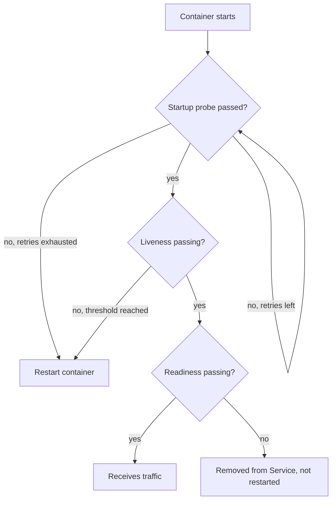

The rule that would have saved Payments: **liveness checks only the process itself** (is it responding, or deadlocked?). Restarting the app does not fix a database. **Readiness** may consider hard dependencies, but if every pod goes unready at once, callers get connection errors instead of a clear response. Often it is better to stay ready and return a fast, clear error (with a circuit breaker) while the dependency is down.

**Requests and limits.** Every container should declare:
- **Requests**: the CPU and memory reserved for it. The scheduler places pods only where requests fit, and the autoscaler measures utilisation as a percentage of the request.
- **Limits**: the ceiling. Above its CPU limit a container is **throttled** (slowed down); above its memory limit it is **killed** (`OOMKilled`) and restarted.

CPU is measured in cores or millicores (`250m` is a quarter of a core); memory in bytes (`512Mi`).

#### 🟡 Going deeper

**The production pod spec.** Here is the Mobile API container from lesson 2.2 with the essentials added:

```yaml
    spec:
      terminationGracePeriodSeconds: 30
      securityContext:
        runAsNonRoot: true
        seccompProfile:
          type: RuntimeDefault
      containers:
        - name: api
          image: registry.example.com/najm/mobile-api@sha256:<digest-from-pipeline>
          ports:
            - name: http
              containerPort: 8080
          envFrom:
            - configMapRef:
                name: mobile-api-config
          env:
            - name: DB_PASSWORD
              valueFrom:
                secretKeyRef:
                  name: mobile-api-db     # synced from the secrets manager
                  key: password
          resources:
            requests:
              cpu: 250m
              memory: 384Mi
            limits:
              memory: 384Mi                 # memory limit equal to request
          startupProbe:
            httpGet: { path: /healthz/live, port: http }
            periodSeconds: 5
            failureThreshold: 24            # up to 2 minutes to start
          livenessProbe:
            httpGet: { path: /healthz/live, port: http }   # process only
            periodSeconds: 10
            failureThreshold: 3
          readinessProbe:
            httpGet: { path: /healthz/ready, port: http }
            periodSeconds: 5
            failureThreshold: 2
          securityContext:
            allowPrivilegeEscalation: false
            readOnlyRootFilesystem: true
            capabilities:
              drop: ["ALL"]
```

Choices worth explaining:
- **Memory limit equals request.** Memory cannot be throttled, only killed, so overcommitting it causes surprise kills when neighbours get busy.
- **No CPU limit here.** A debated choice: CPU limits can throttle a latency-sensitive service even when the node is idle. Many teams set CPU requests everywhere and limits only where hard fairness is needed; measure throttling (lesson 5.1) and decide per service.
- **Security context.** Non-root, no privilege escalation, no Linux capabilities, a read-only root file system (mount an `emptyDir` where the app must write) and the default seccomp profile. All but the read-only file system are required by the **restricted** Pod Security Standard that Najm enforces per namespace with the label `pod-security.kubernetes.io/enforce: restricted`. More in [*Secure AI & Application Security*, lesson 7.2 — Containers, Kubernetes and infrastructure as code](../secai/index.html#/7.2).

**Quality of service.** Requests and limits also set each pod's eviction priority under memory pressure: **BestEffort** (none set; evicted first), **Burstable**, and **Guaranteed** (requests equal limits for CPU and memory in every container; evicted last). The Mobile API spec above has no CPU limit, so it is Burstable; Payments also sets CPU limits equal to requests and runs Guaranteed.

**Graceful shutdown.** Pods are stopped on every deploy, scale-down and node upgrade. On deletion, Kubernetes starts removing the pod from Service endpoints and, at the same time, runs any `preStop` hook and then sends `SIGTERM`. Endpoint removal takes a moment to propagate, so a pod that exits instantly drops requests still arriving. The fix: on `SIGTERM`, stop accepting new work, finish in-flight requests and exit within `terminationGracePeriodSeconds` (30 seconds by default), after which `SIGKILL` follows. A short `preStop` pause lets endpoint removal complete first; newer Kubernetes versions offer a built-in sleep action for this (check yours). For Payments, it also means never acknowledging a transfer that has not been committed.

**Autoscaling with the Horizontal Pod Autoscaler.** The **HorizontalPodAutoscaler (HPA)** adjusts replicas to keep a metric near a target. It needs metrics-server (or another metrics pipeline) and CPU requests:

```yaml
apiVersion: autoscaling/v2
kind: HorizontalPodAutoscaler
metadata:
  name: mobile-api
  namespace: mobile
spec:
  scaleTargetRef:
    apiVersion: apps/v1
    kind: Deployment
    name: mobile-api
  minReplicas: 3
  maxReplicas: 20
  metrics:
    - type: Resource
      resource:
        name: cpu
        target:
          type: Utilization
          averageUtilization: 70
```

Its core formula is `desiredReplicas = ceil(currentReplicas × currentValue / targetValue)`. Six pods at 105% of their CPU request, against a 70% target, gives `ceil(6 × 105 / 70) = 9`. By default it scales down only after a five-minute stabilisation window, to avoid flapping. With an HPA, remove `replicas` from the Deployment in Git, or each sync fights the autoscaler.

Two cautions. First, **scale on the real bottleneck.** If database connections are the limit, more pods make it worse: cap `maxReplicas` so pods × pool size stays below the database limit, or scale on request rate or queue length (KEDA supports many such sources). Second, new pods need room; the **Cluster Autoscaler** or Karpenter adds nodes when pods are `Pending` (lesson 6.1).

**PodDisruptionBudgets.** A **PodDisruptionBudget (PDB)** limits how many pods voluntary disruptions, such as node drains, may take down at once:

```yaml
apiVersion: policy/v1
kind: PodDisruptionBudget
metadata:
  name: mobile-api
  namespace: mobile
spec:
  minAvailable: 2
  selector:
    matchLabels:
      app.kubernetes.io/name: mobile-api
```

It does not cover node crashes, and a PDB allowing zero disruptions blocks node upgrades.

#### 🔴 Expert view

**Packaging with Helm.** One service now needs a Deployment, Service, ConfigMap, HPA, PDB and more, each slightly different per environment. **Helm** packages them as a **chart**: templates plus `values.yaml` defaults, with per-environment values files on top. Helm 3 was the standard for years and Helm 4 was released in late 2025; check which major version your tools expect.

```shell
helm lint ./charts/mobile-api
helm template mobile-api ./charts/mobile-api -f values-prod.yaml > rendered.yaml   # inspect before applying
helm upgrade --install mobile-api ./charts/mobile-api -n mobile -f values-prod.yaml --wait
helm rollback mobile-api 3 -n mobile
```

A well-known pattern rolls pods when their ConfigMap changes, via a hash in a pod annotation:

```yaml
  template:
    metadata:
      annotations:
        checksum/config: {{ include (print $.Template.BasePath "/configmap.yaml") . | sha256sum }}
```

At Najm, CI never runs `helm upgrade` against production: Argo CD renders the chart from the GitOps repository and applies it (lesson 3.2), so changes are reviewable and drift is corrected. **Kustomize**, built into `kubectl` (`kubectl apply -k`), is a template-free alternative based on overlays.

**The golden-path chart.** Platform teams turn this lesson into a shared chart, so a product team writes twenty lines of values and gets probes, security context, spread, PDB and labels right by default. Keep its values small and opinionated, or it becomes a second Kubernetes API.

**Guardrails beat reviews.** Admission policies (Kyverno, OPA Gatekeeper) can reject a Deployment with no requests, a `latest` tag or a root user before it reaches the cluster (lesson 3.3).

**Tune from evidence.** Set initial requests from load tests, then adjust from real usage: far below request wastes money (lesson 6.2); often throttled or near the memory limit is a latency or OOM risk. The Vertical Pod Autoscaler can recommend values, but do not let it act automatically on the metric an HPA scales on.

### 🧰 The toolkit
| Tool, practice or service | What it is and does | When to reach for it |
|---|---|---|
| **Helm** | Package manager for Kubernetes: templated charts with per-environment values | Packaging your services; installing third-party software |
| **Kustomize** | Template-free overlays on plain YAML, built into kubectl | Small per-environment differences on your own manifests |
| **Horizontal Pod Autoscaler** | Adjusts replica counts to keep a metric near a target | Stateless services with load that varies |
| **KEDA** | Event-driven autoscaling on queue length, request rate and other external metrics | When CPU is not the real bottleneck; scaling workers |
| **External Secrets Operator** | Syncs secrets from a cloud secrets manager or Vault into Kubernetes Secrets | Every production cluster that needs secrets |
| **PodDisruptionBudget** | Limits voluntary disruptions to a workload | Every production workload with more than one replica |
| **Pod Security Standards** | Built-in privileged, baseline and restricted profiles enforced per namespace | Setting a default security floor for all workloads |

### 🏛️ In practice at Najm Bank
After the postmortem, Maha and Salem publish the **Najm production-readiness checklist for Kubernetes workloads**. No service is promoted to production until every line is answered; the golden-path chart fills most in by default.

| Area | Requirement | Payments before | Payments after |
|---|---|---|---|
| Image | Digest from the pipeline; meets the container image standard (lesson 2.1) | Yes | Yes |
| Config | All environment differences in ConfigMaps or values files; pods roll on config change | Partly | Yes, checksum annotation |
| Secrets | Synced via External Secrets Operator; none in Git; encryption at rest; read access limited | Secret manifest in Git | Fixed; credential rotated |
| Liveness | Checks only the process; no dependency calls | Called the database | `/healthz/live`, process only |
| Readiness | Reflects ability to serve; behaviour when a dependency is down is documented | Same as liveness | `/healthz/ready`, plus a circuit breaker |
| Startup | Startup probe covers worst-case start time plus margin | None | 24 × 5 s |
| Resources | CPU and memory requests set; memory limit equals request; throttling and memory dashboards exist | No requests | Set from load test |
| Autoscaling | HPA with min ≥ 3; `maxReplicas` × connection pool size below the database connection limit | CPU-based, max 40 | Max 12, scale on request rate |
| Disruption | PDB allows at least one disruption; spread across three zones | None | `maxUnavailable: 1` |
| Shutdown | Handles `SIGTERM`; drains in-flight work within the grace period; short `preStop` pause | Exited instantly | Drains; 45 s grace period for long transfers |
| Security | Namespace enforces the restricted Pod Security Standard | Baseline | Restricted |
| Ownership | Team, on-call rota, runbook and SLO linked (lesson 5.2) | Team only | Complete |

Noura's team owns the Secrets and Security rows; Mona has the Resources row reviewed quarterly against real usage.

### 🛠️ Exercises
Use a local kind or k3d cluster. For autoscaling, install metrics-server (on kind it needs its documented flag for local kubelet certificates).

- 🟢 Add a ConfigMap and a Secret to your Deployment from lesson 2.2. Decode the Secret from `kubectl get secret -o yaml`, then change the ConfigMap and observe that running pods' environment variables do not change until restart. *Done when:* you can show the decoded secret and name the three controls that actually protect it.
- 🟡 Write a tiny HTTP app with `/healthz/live` and `/healthz/ready` endpoints and a switch that makes "ready" fail. Deploy it with all three probes, flip the switch, and show the pod leaving the endpoints without restarting. Then point liveness at a dependency, stop the dependency, and record the restart storm. *Done when:* you have `kubectl get pods` and endpoint outputs for both cases and a paragraph explaining the difference.
- 🔴 Package your app as a Helm chart with values for `dev` and `prod`, a checksum annotation, an HPA, a PDB and a restricted security context, and label the namespace to enforce the restricted Pod Security Standard. Generate load and watch the HPA scale out and back. *Done when:* `helm template` renders cleanly for both environments, the HPA's events show a scale-up and a later scale-down, and a test pod that runs as root is rejected by the namespace.

### ⚠️ Mistakes and traps
- **Liveness probes that call dependencies.** A database blip restarts every pod at once. Liveness checks only the process; handle dependency failure in readiness or in the app.
- **No startup probe for slow starters.** Liveness kills the app before it finishes starting, forever. Add a startup probe sized to the worst-case start.
- **Treating base64 as encryption.** Anyone with the YAML has the secret. Use a secrets manager, encryption at rest and tight RBAC; never commit plain Secret manifests.
- **No requests, or wildly wrong ones.** The scheduler packs blindly and the HPA cannot compute utilisation; oversized requests waste money. Set them from measurement.
- **Autoscaling the wrong thing.** Scale on the real constraint and cap replicas against downstream limits.
- **Exiting instantly on `SIGTERM`.** Requests in flight are dropped on every deploy. Drain within the grace period, with a short `preStop` pause.

### 🧾 Recap
- Keep configuration out of the image in ConfigMaps or values files, and roll pods when it changes.
- Kubernetes Secrets are base64-encoded, not encrypted; add encryption at rest, RBAC and an external secrets manager with workload identity.
- Readiness controls traffic, liveness controls restarts, startup protects slow starts; liveness never depends on other systems.
- Requests drive scheduling and autoscaling; limits cap usage; graceful shutdown and PDBs keep deploys and upgrades invisible to users.
- Package with Helm or Kustomize, render through GitOps, and turn the production-readiness checklist into defaults and admission policies.

### ✍️ Check yourself

**1. During a 30-second database failover, every Payments pod is restarted repeatedly. Which probe design caused this?**

- A. A readiness probe that checks only that the process responds
- B. A startup probe with a long failure threshold for slow starts
- C. A PodDisruptionBudget with `minAvailable: 2` on Payments
- D. A liveness probe that queries the database

<details><summary>Answer</summary>

**D.** Liveness failure restarts containers, so tying it to a dependency restarts every pod whenever that dependency blips. A and B are the healthy designs, and C limits voluntary disruptions, not restarts. (🟢 The essentials.)

</details>

**2. A developer says the database password in their Secret manifest is safe to commit because "Kubernetes encrypts Secrets". What is the correct response?**

- A. They are right; the API server encrypts Secret values before they reach Git
- B. Base64 is not encryption; use a secrets manager and sync the value in
- C. They should store it in a ConfigMap instead, which has stricter access rules
- D. They should base64-encode the value twice so it cannot be decoded easily

<details><summary>Answer</summary>

**B.** Base64 is reversible by anyone; also enable encryption at rest and limit read access. A is the misconception itself, C is worse because ConfigMaps are meant for non-sensitive data, and D is still just an encoding. (🟢 The essentials.)

</details>

**3. The Mobile API's HPA targets 70% CPU utilisation. Six pods are averaging 105% of their CPU request. Roughly how many replicas will the HPA ask for?**

- A. 6
- B. 7
- C. 9
- D. 20

<details><summary>Answer</summary>

**C.** `ceil(6 × 105 / 70) = ceil(9) = 9`. B underestimates, and D would only be reached if `maxReplicas` were hit by a much higher load. (🟡 Going deeper.)

</details>

**4. During every deploy, the Mobile API returns a small burst of connection errors, even though rolling-update settings never reduce capacity. What is the most likely fix?**

- A. On `SIGTERM`, finish in-flight requests, after a short `preStop` pause
- B. Remove the readiness probe so new pods receive traffic sooner
- C. Raise the memory limit so old pods are not killed during the rollout
- D. Increase `revisionHistoryLimit` so the rollout keeps more old pods

<details><summary>Answer</summary>

**A.** Old pods still receive requests briefly while leaving the endpoints; a graceful drain fixes that. B sends traffic to unready pods, C addresses a different failure, and D only keeps more old ReplicaSets. (🟡 Going deeper.)

</details>

**5. Payments' connection-pool size is 20 per pod and the database accepts at most 300 connections, with some reserved for administration. Under load, the HPA keeps adding pods and the database rejects connections. What should Maha change first?**

- A. Remove the HPA and run 40 fixed replicas so capacity is always there
- B. Raise the pods' CPU limits so each pod handles more requests
- C. Cap `maxReplicas` so replicas × pool size stays under the limit
- D. Make the liveness probe check the database so bad pods restart

<details><summary>Answer</summary>

**C.** Autoscaling must respect downstream limits; then scale on a metric that reflects the real bottleneck. A makes the overload permanent, B does not change connection count, and D adds a restart storm. (🟡 Going deeper.)

</details>

### 📚 References
- Kubernetes documentation: ConfigMaps — https://kubernetes.io/docs/concepts/configuration/configmap/
- Kubernetes documentation: Secrets, and good practices for Secrets — https://kubernetes.io/docs/concepts/configuration/secret/
- Kubernetes documentation: encrypting confidential data at rest — https://kubernetes.io/docs/tasks/administer-cluster/encrypt-data/
- Kubernetes documentation: liveness, readiness and startup probes — https://kubernetes.io/docs/tasks/configure-pod-container/configure-liveness-readiness-startup-probes/
- Kubernetes documentation: resource management for pods and containers — https://kubernetes.io/docs/concepts/configuration/manage-resources-containers/
- Kubernetes documentation: Horizontal Pod Autoscaling — https://kubernetes.io/docs/tasks/run-application/horizontal-pod-autoscale/
- Kubernetes documentation: pod lifecycle and termination — https://kubernetes.io/docs/concepts/workloads/pods/pod-lifecycle/
- Kubernetes documentation: Pod Security Standards — https://kubernetes.io/docs/concepts/security/pod-security-standards/
- Helm documentation — https://helm.sh/docs/
- External Secrets Operator — https://external-secrets.io/
- KEDA — https://keda.sh/

---

<a id="m3"></a>

# Module 3 — Infrastructure as code

*A cloud account that people change by clicking is a system nobody can fully describe, review or rebuild. This module turns Najm Bank's infrastructure into code: files in Git that say what should exist, a tool that works out how to get there, and a review before anything changes. It starts with Terraform and OpenTofu, the most widely used tools of this kind: how state, plans and modules work, and why the state file is the most sensitive file the platform team owns. It then moves from one environment to many, using GitOps to promote the same change from dev to staging to production by pull request, with Argo CD or Flux pulling the result into the clusters. It ends with the controls that keep all of this safe at scale: policy as code that checks every change automatically, drift detection that notices when reality no longer matches the code, and guardrails that make the safe path the easy one. You will follow Yousef as a one-word rename in a pull request nearly replaces a production database, Salem as he designs the promotion path for the Najm Mobile API, and Maha as she finds out why staging and production stopped behaving alike.*

> **Phases:** Code, Release, Deploy, Operate — describing infrastructure in reviewable files, promoting changes through environments by pull request, and keeping what runs in line with what was approved.

<a id="l3-1"></a>

## 3.1 — Infrastructure as code with Terraform/OpenTofu: state, modules and plans

*Level: 🟡 Intermediate* · *Prerequisites: 1.2, 1.3* · *Phase: Code, Deploy*

### ⚡ In 60 seconds
- **Infrastructure as code (IaC)** means describing servers, networks, databases and permissions in text files that a tool applies for you. The files are reviewed, versioned and repeatable; the console becomes read-only for day-to-day work.
- **Terraform** and its open-source fork **OpenTofu** are *declarative*: you write the end state you want, and the tool works out which create, update and delete calls to make.
- The tool remembers what it manages in a **state file**. Keep state remote, locked, encrypted and tightly access-controlled, because it can contain secrets and losing it means losing track of what you own.
- **Always read the plan.** The words "must be replaced" or "destroy" next to a database are the most important lines you will see all week.
- Package repeated patterns as **modules** with small, validated interfaces; pin module and provider versions.
- Biggest trap: `apply` from a laptop with broad credentials. Production applies run in a pipeline, from a reviewed, saved plan.

### 🧭 Why it matters
Yousef's first ticket looks small: rename the Payments database from `payments-db` to `najm-payments-prod` to match the naming standard. He edits one line and asks for a quick approval. Maha opens the plan the pipeline attached to the pull request:

```text
  # module.payments_db.aws_db_instance.this must be replaced
-/+ resource "aws_db_instance" "this" {
      ~ identifier = "payments-db" -> "najm-payments-prod" # forces replacement
      ...
Plan: 1 to add, 0 to change, 1 to destroy.
```

With the AWS provider version the team pins, the identifier cannot be changed in place (newer provider releases can rename it in place; only the plan tells you which you have), so the tool would delete the production payments database and create an empty one. The code was valid, and the plan said exactly what would happen; the only question was whether anyone would read it. Maha blocks the merge. That afternoon Salem adds two rules: every production database carries `prevent_destroy`, and no production pull request merges until a reviewer confirms the plan summary line.

Why deploys need gates at all is covered in [*System Design for Vibe Coders*, lesson 4.4 — Rollback, staging, and release gates](../vibe/index.en.html#l4-4); here you learn how the infrastructure underneath is built and changed.

### 📐 How it works
#### 🟢 The essentials
**Why code instead of clicks.** A database created in a web console leaves no reviewable record. Nobody can review the change beforehand, repeat it exactly in another environment, or rebuild it after a disaster. IaC fixes all three: every change in Git has an author, a reviewer and a history; the same files build dev, staging and production; and after a regional failure, the description of everything you need is in a repository.

**Declarative versus imperative.** An *imperative* script lists steps ("create a network, then a database"); run it twice and you may get two databases. A *declarative* tool compares a description of the end state with what exists; run it twice and the second run does nothing. That property is **idempotence**, and it makes IaC safe to rerun.

**Terraform and OpenTofu.** **Terraform**, made by HashiCorp, uses a configuration language called **HCL** (HashiCorp Configuration Language). In August 2023 HashiCorp moved Terraform from an open-source licence to the Business Source License (BSL). The community forked the last open-source version as **OpenTofu**, a Linux Foundation project (accepted into the CNCF sandbox in 2025). The two remain close: same HCL, same providers, mostly the same commands (`terraform` versus `tofu`), though some features now differ, so check the docs for your tool and version. This lesson applies to both; the exercises use OpenTofu because it is open source.

The main building blocks:

| Concept | What it is | Example |
|---|---|---|
| **Provider** | A plugin that talks to one API: a cloud, Kubernetes, Docker, GitHub | `hashicorp/aws`, `hashicorp/azurerm`, `hashicorp/google`, `kreuzwerker/docker` |
| **Resource** | One thing the tool creates and manages | a network, a database, a bucket, a container |
| **Data source** | Something read but not managed | another team's network ID |
| **Variable** | An input to the configuration | `environment = "prod"` |
| **Output** | A value the configuration exposes | the database's connection hostname |
| **Module** | A reusable folder of resources with inputs and outputs | `modules/postgres` |
| **State** | The tool's record of which real objects it manages | `terraform.tfstate` |

A minimal configuration you can run locally with the Docker provider, no cloud account needed:

```hcl
terraform {
  required_providers {
    docker = {
      source  = "kreuzwerker/docker"
      version = "~> 3.0" # allow any 3.x release, never a surprise 4.0
    }
  }
}

provider "docker" {}

resource "docker_image" "web" {
  name         = "nginx:1.27-alpine"
  keep_locally = true
}

resource "docker_container" "web" {
  name  = "najm-hello"
  image = docker_image.web.image_id
  ports {
    internal = 80
    external = 8080
  }
}
```

**The workflow.** Four commands carry almost everything:

```shell
tofu init                 # download providers and modules, connect to the state backend
tofu plan -out=tfplan     # compare code, state and reality; save the proposed changes
tofu show tfplan          # read the plan (a human does this)
tofu apply tfplan         # apply exactly the saved plan, nothing else
```

`init` also writes a **dependency lock file**, `.terraform.lock.hcl`, with exact provider versions and checksums. Commit it.

**Reading a plan.** Each resource line starts with a symbol: `+` create, `-` destroy, `~` update in place, `-/+` destroy and create a replacement. Read the summary line first ("Plan: 2 to add, 1 to change, 0 to destroy."), then every `-` and `-/+`. Changes that cannot be made in place are marked `# forces replacement`.

#### 🟡 Going deeper
**State: the tool's memory.** The **state** file links code to reality: it maps `module.payments_db.aws_db_instance.this` to a real database ID and stores its last known attributes. Without it, the tool cannot tell "my database, needs changing" from "someone else's database".

Three facts shape how you handle it:
- **It can contain secrets in plain text.** If a resource has a password attribute, the value ends up in state, even when the variable is marked `sensitive` (that flag only hides it from screen output). Treat the state file like a credential store. OpenTofu has added optional client-side encryption of state; whichever tool you use, also encrypt the storage it sits in. Better still, avoid putting secrets through IaC at all: let the database generate its admin password into a secrets manager ([*Secure AI & Application Security*, lesson 5.2 — Secrets management: keys, tokens and where they leak](../secai/index.html#/5.2)).
- **Two people applying at once can corrupt it.** A **lock** stops a second run while one is in progress.
- **A local file on a laptop is a single point of failure.** Lose it and the tool forgets everything it manages.

So production state lives in a **remote backend** with locking, encryption, versioning and narrow access:

```hcl
terraform {
  backend "s3" {
    bucket       = "najm-tfstate-prod"           # versioning and encryption enabled on the bucket
    key          = "mobile-api/database.tfstate" # one state per component
    region       = "<your-region>"
    encrypt      = true
    use_lockfile = true # S3-native locking in recent versions; older setups use a DynamoDB table
  }
}
```

Azure uses the `azurerm` backend and Google Cloud the `gcs` backend; hosted services such as HCP Terraform store state for you. Check your tool's documentation for current options.

**Modules: the platform team's product.** A **module** is a folder of resources with variables as inputs and outputs as results. Najm Bank does not want forty slightly different PostgreSQL setups; it wants one that is backed up, encrypted, private and monitored by default, which teams consume like a library:

```hcl
module "orders_db" {
  source = "git::https://git.najm.example/platform/tf-modules.git//postgres?ref=v1.4.0" # pinned tag

  name           = "orders"
  environment    = "prod"
  size           = "medium"
  data_class     = "confidential"
  backup_days    = 35
  owner          = "team-orders"
}
```

Good modules have a small interface, opinionated defaults and `validation` blocks on variables that fail early with a clear message (for example, `environment` must be `dev`, `staging` or `prod`). A module exposing every provider argument is just the provider with extra steps.

**Protecting what must not die.** For stateful resources, tell the tool to refuse destruction:

```hcl
resource "aws_db_instance" "this" {
  # ...
  deletion_protection = true # the cloud API refuses deletes too
  lifecycle {
    prevent_destroy = true   # the IaC tool refuses any plan that would destroy this
  }
}
```

`prevent_destroy` stops a bad plan; the provider's deletion protection also stops someone in the console or another tool.

**Who runs `apply`.** At Najm Bank, nobody applies production from a laptop. A pipeline posts the plan on every pull request; after approval and merge, it applies *that saved plan* with a short-lived role obtained through OIDC federation, not stored keys (1.3). A fresh `apply` an hour later would compute a new plan nobody reviewed.

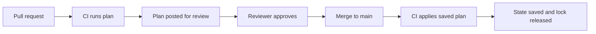

#### 🔴 Expert view
**Blast radius and state boundaries.** One giant state for the whole bank makes every plan slow, every apply lock everyone out, and every mistake able to touch everything. Split state by component and owner: network foundations, the Kubernetes cluster, each application's data stores, DNS. Pass values between states through outputs read by data sources, or a parameter store.

**Refactoring without destroying.** Moving a resource into a module changes its address, and the tool would normally see "old address destroyed, new address created". The `moved` block tells it the object simply has a new name:

```hcl
moved {
  from = aws_db_instance.payments
  to   = module.payments_db.aws_db_instance.this
}
```

Similarly, `import` blocks bring existing, hand-built resources under management, and `removed` blocks stop managing a resource without deleting it. These are reviewed in the plan like everything else, unlike the command-line `state mv` and `state rm`, which change state with no review. Check your version supports each block.

**Versioning discipline.** Pin the tool version (`required_version` and in CI), providers (constraints plus the lock file) and modules (a tag, never a moving branch). Upgrade one at a time, in dev first: a provider upgrade that changes a default can produce a plan full of updates nobody asked for.

**Alternatives.** **Pulumi** uses general-purpose languages such as TypeScript, Python or Go, with the same state-and-plan model. **AWS CloudFormation** and **Azure Bicep** are native to their clouds (Google Cloud's native offering has changed over time; check its documentation); they often support new services first. Terraform and OpenTofu cover many providers with one workflow, which suits a bank running Kubernetes, DNS, a CDN, GitHub and a cloud together. The concepts here transfer to all of them.

**AI coding agents and IaC.** Agents write HCL fast and may "fix" an error by widening a security group or adding a wildcard permission. The plan, scanners and policies (3.3) decide, not the agent's confidence. [*Secure AI & Application Security*, lesson 7.2 — Containers, Kubernetes and infrastructure as code](../secai/index.html#/7.2) covers the security checks in depth.

### 🧰 The toolkit
| Tool, practice or service | What it is and does | When to reach for it |
|---|---|---|
| **OpenTofu** (Linux Foundation) | Open-source declarative IaC tool forked from Terraform; HCL, providers, state, plans | Default choice for new open-source IaC work and for this course's exercises |
| **Terraform** (HashiCorp) | The original HCL-based IaC tool, under the BSL since August 2023, with a hosted service (HCP Terraform) | Where your organisation already standardised on it or uses its hosted features |
| **Remote state with locking** | Shared, encrypted, versioned state storage that blocks concurrent applies | Any configuration more than one person or pipeline touches |
| **IaC module** | A reusable folder of resources with a small, validated interface and safe defaults | Any pattern built more than twice: databases, buckets, clusters, networks |
| **Pulumi** | IaC in general-purpose languages with the same plan-and-state model | Teams who prefer real languages for infrastructure |

### 🏛️ In practice at Najm Bank
Salem asks Yousef to write the interface for the platform's first golden-path module, so app teams can request a database by filling in six lines. This is the **Najm IaC module standard: `postgres` v1**.

**Part A: interface**

| Input | Type and allowed values | Default | Why it is an input |
|---|---|---|---|
| `name` | string, lowercase letters and hyphens, 3–30 characters | none (required) | Builds the identifier `najm-<name>-<environment>` |
| `environment` | `dev`, `staging` or `prod` | none (required) | Drives size limits, backups and protection |
| `size` | `small`, `medium` or `large` | `small` | Maps to an instance class per cloud; teams never pick raw instance types |
| `data_class` | `internal`, `confidential` or `restricted` | `confidential` | Restricted forces customer-managed keys and extra logging |
| `backup_days` | number, 7 to 35 | 7 in dev, 35 in prod | Recovery target; capped by the provider's maximum |
| `owner` | team slug | none (required) | Becomes the `owner` tag for alerts and cost reports (6.2) |

| Output | Use |
|---|---|
| `endpoint` | Private hostname for the application's configuration |
| `secret_ref` | Name of the secrets-manager entry holding generated credentials; never the password itself |
| `dashboard_url` | Link to the database's standard dashboard |

**Part B: fixed by the module, not configurable**
- Private networking only; no public endpoint, ever.
- Encryption at rest and TLS in transit on.
- Deletion protection and `prevent_destroy` in `staging` and `prod`.
- Admin credentials generated by the cloud and stored in the secrets manager; none pass through variables.
- Standard tags: `owner`, `environment`, `data-class`, `cost-centre`, `managed-by = opentofu`.

**Part C: state and apply rules**
- One state per component (`<team>/<service>/<component>.tfstate`), one backend bucket per environment; versioning and encryption on; access only for the pipeline role and two named break-glass engineers.
- Production applies run only from the pipeline, from a saved plan, approved by the platform team and the owning team.
- Any `destroy` or `must be replaced` on a stateful resource needs Maha's or Salem's approval.

### 🛠️ Exercises
All three run on your own machine with Docker and OpenTofu. If you choose a cloud free tier instead, set a budget alert before creating anything.

- 🟢 Use the Docker configuration from 🟢 The essentials. Run `init`, `plan -out=tfplan` and `apply tfplan`, check the page on port 8080, then change the external port and read the new plan. Finally, run `plan` again without changing anything. *Done when:* you can point to the line that says whether the container will be updated in place or replaced, and the final plan reports no changes.
- 🟡 Turn the configuration into a module `modules/web` with validated inputs `name`, `port` and `image_tag`, and call it twice to run two containers. Use a `moved` block for the original container. *Done when:* an invalid port fails at `plan` with your error message, and the refactor plan shows a move with zero destroys.
- 🔴 Run a local S3-compatible object store in Docker (MinIO or an alternative; check its current licence and images) and use it as a locked remote backend. Start two applies at once from two terminals. Then add `prevent_destroy` to one container and change its name, which forces replacement. *Done when:* the second apply is refused because of the lock, the forced-replacement plan is rejected with a `prevent_destroy` error, and no state file sits in your working directory.

### ⚠️ Mistakes and traps
- **Skimming the plan.** Read the summary line and every `-` and `-/+` before approving. Make the pipeline post the plan into the pull request so reviewers cannot skip it.
- **State in Git or on a laptop.** State can hold secrets and is the only map of what you own. Use a remote, locked, encrypted, versioned backend with narrow access.
- **Running a fresh `apply` instead of the reviewed plan.** Reality may have changed in between. Apply the saved plan file, or re-plan and re-review.
- **Unpinned modules and providers.** They change your infrastructure without a code change. Pin versions and commit the lock file.
- **State surgery at 2 a.m.** Unreviewed `state rm` loses track of real resources. Use `moved`, `import` and `removed` blocks in a pull request.

### 🧾 Recap
- IaC turns infrastructure into reviewed, versioned, repeatable code; declarative tools such as Terraform and OpenTofu compute the changes for you.
- State links code to real resources. Keep it remote, locked, encrypted and access-controlled, and split it by component to limit blast radius.
- The plan is the safety net: save it, review it in the pull request, and apply exactly that plan from a pipeline with short-lived credentials.
- Modules are the platform team's product: small validated interfaces, safe defaults, pinned versions.
- Protect stateful resources with `prevent_destroy` and the provider's deletion protection, and refactor with `moved`, `import` and `removed` blocks.

### ✍️ Check yourself

**1. Yousef renames the identifier of the production payments database in Terraform code. The plan shows `-/+` and `# forces replacement` for the database. What will happen if this plan is applied?**

- A. The database is renamed in place with no downtime
- B. The database is destroyed and replaced by a new, empty one
- C. Nothing, because Terraform never deletes databases
- D. Only the state file is updated, and the real database is left untouched

<details><summary>Answer</summary>

**B.** `-/+` means destroy and then create a replacement, and the comment says which attribute forces it. A is what Yousef assumed; C is wrong unless `prevent_destroy` or deletion protection is set. (🟢 The essentials, and 🧭 Why it matters.)

</details>

**2. Why must the Terraform or OpenTofu state file be stored in a locked, encrypted, access-controlled backend rather than committed to Git?**

- A. Git cannot store files larger than one megabyte, and state files often exceed that
- B. State files are only needed during the first apply
- C. Providers refuse to run if state is in a repository
- D. State can hold plain-text secrets, and unlocked concurrent writes can corrupt it

<details><summary>Answer</summary>

**D.** Sensitive attributes end up in state regardless of the `sensitive` flag, and locking prevents two runs from writing at once. B is false: state is needed on every run. (🟡 Going deeper.)

</details>

**3. A pipeline runs `plan` when a pull request opens. The pull request is approved and merged three hours later, and the pipeline then runs a fresh `apply` without a saved plan. What is the risk?**

- A. It re-plans against current code and reality, so it may apply unreviewed changes
- B. There is no risk, because `apply` always repeats the most recent plan the pipeline ran
- C. The apply will fail, because every plan expires one hour after `plan` runs
- D. The state file will be deleted

<details><summary>Answer</summary>

**A.** A fresh apply computes a new plan. Saving the plan with `-out` and applying that file means the reviewed changes are the applied changes. B is the common misunderstanding. (🟡 Going deeper.)

</details>

**4. Salem wants app teams to create PostgreSQL databases that are always private, encrypted and backed up. Which design best achieves this?**

- A. A wiki page listing the recommended settings, linked from every team's onboarding guide
- B. A module that exposes every provider argument as a variable so teams have full flexibility
- C. A module with a small validated interface and the safety settings fixed inside it
- D. Giving every team administrator access to the cloud console

<details><summary>Answer</summary>

**C.** Fixing the safe defaults inside the module makes the right configuration the only one available. B reproduces the inconsistency the module should remove; A depends on everyone reading and following it. (🟡 Going deeper, and 🏛️ In practice.)

</details>

**5. The platform team moves an existing database resource into a new module. The plan shows the old address being destroyed and a new one created. What is the safest fix?**

- A. Apply it during a quiet hour and restore from backup afterwards
- B. Add a `moved` block from the old address to the new address
- C. Delete the state file and run `import` from the command line for every resource
- D. Copy the module code back into the root configuration permanently

<details><summary>Answer</summary>

**B.** A `moved` block records the rename declaratively and is reviewed in the plan. A causes an outage and data loss; C is risky, unreviewed state surgery. (🔴 Expert view.)

</details>

### 📚 References
- OpenTofu documentation — https://opentofu.org/docs/
- Terraform documentation — https://developer.hashicorp.com/terraform/docs
- Terraform language: state — https://developer.hashicorp.com/terraform/language/state
- Terraform language: modules — https://developer.hashicorp.com/terraform/language/modules
- HashiCorp, licensing FAQ (Business Source License) — https://www.hashicorp.com/
- Linux Foundation, OpenTofu project — https://opentofu.org/
- Pulumi documentation — https://www.pulumi.com/docs/

<a id="l3-2"></a>

## 3.2 — Environments and GitOps: promoting changes from dev to production

*Level: 🟡 Intermediate* · *Prerequisites: 2.2, 2.3, 3.1* · *Phase: Release, Deploy*

### ⚡ In 60 seconds
- An **environment** (dev, staging, production) is a full copy of the system for a purpose. Environments should differ only in configuration and scale, never in code or structure.
- **Build once, promote the same artefact.** The exact image digest tested in staging is the one that reaches production; nothing is rebuilt along the way.
- **GitOps** means the desired state of every environment lives in Git, and an agent inside the platform pulls it and continuously makes reality match. Its four principles: declarative, versioned and immutable, pulled automatically, continuously reconciled.
- A **promotion** is a pull request that changes one value (usually an image digest) in the next environment's folder. Review, merge, and **Argo CD** or **Flux** does the rest; **rollback** is `git revert`.
- Decision cue: if you cannot answer "what exactly is running in production, and who approved it?" from Git alone, you are not doing GitOps yet.
- The biggest trap: long-lived branches per environment, and hand edits with `kubectl` that the next sync silently overwrites, or that nobody ever notices.

### 🧭 Why it matters
On 1 August 2012, Knight Capital, a large US market-making firm, deployed new trading code to its servers. According to the US Securities and Exchange Commission's order on the case, a technician copied the new code to seven of the eight servers but not the eighth, and nobody noticed. The new release reused a flag that, on the eighth server, switched on old, long-unused code. That server sent millions of unintended orders in about 45 minutes, and the firm lost roughly $460 million, according to the SEC. The deployment was manual, there was no automated check that every server ran the same version, and no second person reviewed the result.

Najm Bank has a smaller version of the same problem. Maha is investigating why a timeout bug fixed in staging keeps happening in production. Production runs an image from the same commit but rebuilt two days later with a newer base image, and someone raised the connection-pool size with `kubectl edit` during an incident last month. Nothing in Git records either difference, so staging no longer predicts production.

This lesson gives the team one rule and one mechanism. The rule: the same artefact moves through every environment, and only configuration differs. The mechanism: GitOps, where Git is the single record of what should run where, and a controller makes it so and reports any difference.

### 📐 How it works
#### 🟢 The essentials
**Why environments.** You need somewhere to try changes that is not production. Najm Bank uses three:

| Environment | Purpose | Data | Who deploys |
|---|---|---|---|
| **dev** | Integrate and try changes quickly | Synthetic test data | Automatic on every merge |
| **staging** | Final rehearsal with production-like configuration and scale | Masked or synthetic data, never real customer data without approval | Promotion pull request, team approval |
| **prod** | Customers | Real data | Promotion pull request, team and platform approval |

**Environment parity.** The Twelve-Factor App calls this "dev/prod parity": keep environments as similar as possible. Differences are allowed only where they are deliberate and written down: replica counts, instance sizes, domain names, credentials, feature-flag settings. Different code, different images, different Kubernetes versions or different network layouts make staging results meaningless.

**Build once, promote the artefact.** CI builds the container image once, from one commit, and pushes it to the registry. The image is identified by its **digest**, a SHA-256 hash of its content such as `sha256:4f1c…`, not by a tag such as `v2.3` or `latest`, because a tag can be moved to a different image and a digest cannot (2.1). Every environment then runs that digest. Rebuilding for production, as in Maha's case, produces a different artefact that nobody tested.

**What GitOps is.** The OpenGitOps project, under the CNCF, defines four principles:
- **Declarative**: the desired state of the system is described, not scripted.
- **Versioned and immutable**: that description is stored in a way that keeps full history and cannot be silently changed, which in practice means Git.
- **Pulled automatically**: software agents fetch the desired state from the source; nobody pushes changes into the cluster by hand.
- **Continuously reconciled**: the agents keep comparing actual state with desired state and act to close any gap.

The two common GitOps controllers for Kubernetes are **Argo CD** and **Flux**, both graduated CNCF projects. Each runs inside the cluster, watches a Git repository, and applies what it finds.

**Push versus pull.** In a classic *push* pipeline, CI holds cluster credentials and runs `kubectl apply` or `helm upgrade` at the end. In *pull*-based GitOps, CI never touches the cluster: it only updates Git. The controller inside the cluster pulls. That means fewer powerful credentials outside the cluster, a full audit trail in Git, and automatic correction when someone changes the cluster by hand.

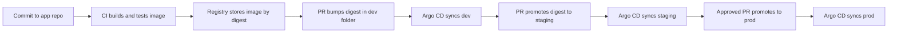

#### 🟡 Going deeper
**Two repositories.** Najm Bank keeps application source code and environment configuration apart:
- the **app repo** holds the Mobile API's code, Dockerfile and tests; CI builds images from it;
- the **GitOps repo** holds what runs where: Kubernetes manifests or Helm values per environment.

Configuration changes then trigger no builds, access can differ, and the GitOps history is a clean log of deployments.

**Folders, not branches, per environment.** A common early design keeps a `dev`, `staging` and `prod` branch and merges between them. Many practitioners advise against it: merges carry unrelated changes along, branches drift apart, and the differences between environments are hidden in Git history rather than visible in files. Najm Bank uses one `main` branch and one folder per environment, built with **Kustomize**, a tool built into `kubectl` that layers small patches over a shared base:

```text
gitops/
  apps/mobile-api/
    base/                 # Deployment, Service, probes: shared by all environments
      deployment.yaml
      service.yaml
      kustomization.yaml
    overlays/
      dev/kustomization.yaml
      staging/kustomization.yaml
      prod/kustomization.yaml
      prod/replicas.yaml
```

The production overlay says only what differs:

```yaml
apiVersion: kustomize.config.k8s.io/v1beta1
kind: Kustomization
resources:
  - ../../base
images:
  - name: registry.najm.example/mobile-api
    digest: sha256:4f1c0e…   # the promoted artefact; set by the promotion PR
patches:
  - path: replicas.yaml       # 6 replicas in prod, 2 in staging
```

If your services use Helm instead (2.3), the same pattern holds: one chart, one values file per environment, and the image digest in the values file.

**Promotion is a pull request.** Promoting the Mobile API from staging to production means copying one digest from `overlays/staging` to `overlays/prod`. A small script or bot opens that pull request automatically after staging checks pass. The pull request shows exactly what changes, CODEOWNERS rules require the right approvers, and merging is the release decision. Tools such as Argo CD Image Updater and Flux's image automation can write the dev bump for you; keep production promotions as explicit, reviewed pull requests.

**Telling Argo CD what to watch.** An Argo CD `Application` points at a folder and a cluster:

```yaml
apiVersion: argoproj.io/v1alpha1
kind: Application
metadata:
  name: mobile-api-prod
  namespace: argocd
spec:
  project: retail
  source:
    repoURL: https://git.najm.example/platform/gitops.git
    targetRevision: main
    path: apps/mobile-api/overlays/prod
  destination:
    server: https://kubernetes.default.svc
    namespace: mobile-api
  syncPolicy:
    automated:
      prune: true     # delete objects removed from Git
      selfHeal: true  # undo manual changes made in the cluster
```

`prune` removes objects that were deleted from Git; `selfHeal` reverts hand edits. With both on, the `kubectl edit` Maha found would have been undone within minutes, and shown as "OutOfSync" in the meantime. Flux expresses the same idea with `GitRepository` and `Kustomization` objects.

**Rollback.** Because every deployment is a commit, rolling back is `git revert` of the promotion pull request: the old digest returns, the controller syncs, and the history records who rolled back and why. Rollback of *code* is easy; rollback of a *database schema* is not, so schema changes follow the expand-and-contract pattern covered with release strategies (4.2).

**Secrets in GitOps.** The GitOps repo must not contain plain secrets, and Kubernetes Secrets are only base64-encoded, not encrypted (2.3). Common patterns: the **External Secrets Operator**, which syncs values from a cloud secrets manager into the cluster, with only a reference in Git; **Sealed Secrets** or **SOPS**, which store encrypted values in Git that only the cluster can decrypt. Najm Bank uses references to its secrets manager; see [*Secure AI & Application Security*, lesson 5.2 — Secrets management: keys, tokens and where they leak](../secai/index.html#/5.2).

#### 🔴 Expert view
**Environments for infrastructure, too.** GitOps controllers handle what runs *inside* Kubernetes. The clusters, databases and networks underneath are managed with OpenTofu (3.1), and the same rules apply: one folder per environment calling the same module versions, so the difference between staging and production is a short, readable list of inputs. Terraform's **workspaces** let one configuration keep several states, but they hide which environment you are in behind a command-line setting and make it easy to apply to the wrong one; separate folders, backends and credentials per environment are clearer. Some teams use wrappers such as Terragrunt, or controllers that run IaC through GitOps (the community Tofu Controller for Flux, Crossplane); evaluate them carefully against the simpler pipeline in 3.1.

**Separate accounts, not just namespaces.** Put production in its own cloud account (AWS), subscription (Azure) or project (Google Cloud), with its own identity boundaries. A dev pipeline whose credentials cannot even see production cannot break it.

**Ordering and dependencies.** Real promotions are rarely one service. Argo CD's sync waves and Flux's `dependsOn` let you order resources, for example a configuration change before the Deployment that needs it. Argo CD's **ApplicationSet** generates one `Application` per environment or cluster from a template, which keeps fifty clusters consistent. Keep cross-service changes backward compatible so each service can be promoted on its own; coupled promotions are a design smell.

**Rendered manifests.** When Helm or Kustomize renders differently than you expected, the diff in the pull request shows only the input change. Some teams render the final YAML in CI and commit it (or post the rendered diff to the pull request) so reviewers see exactly what the cluster will receive. It costs some repository noise and buys clarity.

**Regulation.** For a bank, the GitOps history is evidence: who approved which change to production, when, and what exactly was deployed. EU DORA, which applies to financial entities in the EU from January 2025, expects documented ICT change management; GCC regulators such as Qatar Central Bank also set expectations for change control and cloud use. Check the current texts with your compliance team rather than relying on summaries.

### 🧰 The toolkit
| Tool, practice or service | What it is and does | When to reach for it |
|---|---|---|
| **Argo CD** (CNCF graduated) | GitOps controller for Kubernetes with a web UI, sync status, diff view, sync waves and ApplicationSets | Teams who want visible sync status and a UI; many clusters from templates |
| **Flux** (CNCF graduated) | Toolkit of GitOps controllers for Kubernetes (Git sources, Kustomize, Helm, image automation) | Teams who prefer a CLI- and CRD-driven, composable approach |
| **Kustomize** | Layers environment-specific patches over shared Kubernetes manifests; built into `kubectl` | One folder per environment with minimal, readable differences |
| **Helm** | Packages Kubernetes manifests as charts with values files | Services already packaged as charts; one values file per environment |
| **Promotion pull request** | A reviewed change that copies an image digest from one environment's folder to the next | Every move towards production; the release decision |
| **External Secrets Operator** | Syncs secrets from a cloud secrets manager into Kubernetes, keeping only references in Git | Any GitOps setup that needs secrets |

### 🏛️ In practice at Najm Bank
Salem writes the **Najm Environment and Promotion Policy v1**, starting with the Najm Mobile API.

**Part A: environments**

| | dev | staging | prod |
|---|---|---|---|
| Cloud boundary | Shared non-prod account | Own account | Own account, separate identity |
| Cluster | Shared dev cluster | Staging cluster, same Kubernetes minor version as prod | Prod cluster, multi-zone |
| Data | Synthetic | Synthetic or masked | Real |
| Allowed differences from prod | Replicas, sizes, domain, credentials, flags | Replicas, domain, credentials | — |
| Argo CD sync | Automated, prune and self-heal | Automated, prune and self-heal | Automated, prune and self-heal; changes only via approved PR |
| Who can merge | Any team member | Team lead | Team lead and platform engineer; Payments also needs Maha |

**Part B: promotion rules**
1. CI builds one image per commit, signs it (4.3) and records its digest. No environment rebuilds.
2. Merge to `main` in the app repo opens a bot pull request that sets the digest in `overlays/dev`; it merges automatically if checks pass.
3. Promotion to staging and prod copies the *same* digest, by pull request, after the previous environment's checks pass (smoke tests, SLO burn within limits for 30 minutes).
4. Production promotions happen in the agreed release window; outside it, an incident commander can approve an emergency promotion, recorded in the pull request.
5. Rollback is a revert of the promotion pull request. Nobody runs `kubectl edit`, `kubectl apply` or `helm upgrade` against staging or prod.
6. Break-glass: during a Sev-1, a named engineer may change prod by hand with the incident commander's approval; the change is written back to Git within one working day, or it will be reverted by the next sync.

**Part C: the weekly parity check.** Maha's on-call rota runs a short script each Monday that diffs `overlays/staging` and `overlays/prod` and lists any difference not in the allowed table above. Unexplained differences become tickets.

### 🛠️ Exercises
Run these on a local cluster (kind or k3d) with a Git repository you own, such as a free GitHub repository.

- 🟢 Create `base/` and `overlays/dev` and `overlays/prod` for a small web Deployment, with prod using three replicas and dev one. Render both with `kubectl kustomize`. *Done when:* the only differences between the two rendered outputs are the ones you meant, and you can list them.
- 🟡 Install Argo CD on a kind cluster, create two `Application` objects (dev and prod namespaces) pointing at your overlays, with automated sync, prune and self-heal. Change an image digest in dev by pull request, then promote it to prod by a second pull request. Finally, run `kubectl scale` by hand on the prod Deployment. *Done when:* both promotions are visible as commits, the manual scale is reverted automatically, and you can show the "OutOfSync" state you saw before it healed.
- 🔴 Add a CI workflow (GitHub Actions is fine) to an app repo that builds an image, pushes it to a registry you control, and opens a pull request in the GitOps repo setting the new digest in `overlays/dev`. Then roll back a bad promotion with `git revert`. *Done when:* a code commit results in a dev deployment with no human touching the cluster, the image is referenced by digest rather than tag, and the rollback is a single revert commit.

### ⚠️ Mistakes and traps
- **Rebuilding per environment.** A rebuilt image is a different, untested artefact. Build once, reference by digest, promote the digest.
- **A branch per environment.** Branches drift and hide differences in history. Use one branch with a folder per environment.
- **Hand edits in the cluster.** `kubectl edit` during an incident creates drift no one remembers. Turn on self-heal and write break-glass changes back to Git.
- **Plain secrets in the GitOps repo.** Base64 is not encryption. Store references (External Secrets) or encrypted values (Sealed Secrets, SOPS).
- **Staging that is "almost" production.** Different Kubernetes versions, network layouts or images make staging tests misleading. Keep a written list of allowed differences and check it.
- **CI with cluster-admin credentials.** In pull-based GitOps, CI writes to Git only; the controller inside the cluster deploys.

### 🧾 Recap
- Environments differ only in deliberate, documented configuration; the code and image are the same.
- Build once and promote the same image digest from dev to staging to production.
- GitOps: desired state declared and versioned in Git, pulled automatically and continuously reconciled by a controller such as Argo CD or Flux.
- Promotion and rollback are pull requests and reverts, so Git is the record of what runs where and who approved it.
- Keep secrets out of Git, production in its own account, and hand edits rare, approved and written back.

### ✍️ Check yourself

**1. Maha finds that production runs an image built from the same commit as staging, but rebuilt two days later. Why is this a problem?**

- A. It is not a problem, because the same commit always produces an identical image
- B. Production images must be rebuilt only in the approved weekend release window
- C. A rebuild may pull different base images or dependencies: an untested artefact
- D. Rebuilt images cannot be stored in the same registry as the original build

<details><summary>Answer</summary>

**C.** The same source can produce different images over time. Build once and promote the same digest. A is the tempting assumption the lesson corrects. (🟢 The essentials, and 🧭 Why it matters.)

</details>

**2. Which of these is one of the four OpenGitOps principles?**

- A. Desired state is pulled automatically by agents and continuously reconciled
- B. CI pipelines must hold cluster-admin credentials
- C. Each environment must have its own long-lived Git branch, merged in order
- D. Every production deployment must first be approved by a change advisory board

<details><summary>Answer</summary>

**A.** The principles are declarative, versioned and immutable, pulled automatically and continuously reconciled. B is the opposite of pull-based GitOps; C is a pattern many advise against; D is an organisational choice, not a GitOps principle. (🟢 The essentials.)

</details>

**3. During an incident, an engineer raises the production replica count with `kubectl scale`. Argo CD has automated sync with `selfHeal: true`. What happens next, and what should the team do?**

- A. Argo CD records the new value in Git automatically, so nothing else is needed
- B. Argo CD deletes the Deployment entirely
- C. The change stays forever because Argo CD only watches Git
- D. Argo CD reverts it to match Git; a needed change goes through a pull request

<details><summary>Answer</summary>

**D.** Self-heal makes the cluster match Git, so manual changes are reverted. The fix is to change the desired state in Git. A is wrong: controllers do not write back to Git. (🟡 Going deeper.)

</details>

**4. A promotion to production of the Najm Mobile API causes errors. What is the GitOps way to roll back?**

- A. Run `helm rollback` directly against the production cluster, then tell the team in chat
- B. Revert the promotion pull request so the previous digest returns and syncs
- C. Rebuild the previous version from source and push it again under the same tag
- D. Delete the namespace and redeploy the old version from a laptop

<details><summary>Answer</summary>

**B.** A revert restores the previous desired state and records who rolled back and why. A works briefly but the controller will sync Git again and the change is unrecorded; C rebuilds an untested artefact. (🟡 Going deeper.)

</details>

**5. Yousef proposes one Terraform configuration with workspaces named dev, staging and prod, selected on the command line. What is the main concern?**

- A. Workspaces are not supported by any remote backend, so state must stay local
- B. Workspaces force all environments to share one state file, so every apply locks them all
- C. The target environment is hidden in a command-line setting, making wrong applies easy
- D. Workspaces only work with Kubernetes providers, not with cloud databases or networks

<details><summary>Answer</summary>

**C.** Workspaces keep separate states but make the target environment implicit. Folders per environment with their own backend and credentials make the target visible and limit what a mistake can reach. B is false: each workspace has its own state. (🔴 Expert view.)

</details>

### 📚 References
- OpenGitOps principles — https://opengitops.dev/
- Argo CD documentation — https://argo-cd.readthedocs.io/
- Flux documentation — https://fluxcd.io/flux/
- Kustomize documentation (Kubernetes) — https://kubernetes.io/docs/tasks/manage-kubernetes-objects/kustomization/
- The Twelve-Factor App, X. Dev/prod parity — https://12factor.net/dev-prod-parity
- US SEC, order in the matter of Knight Capital Americas LLC (2013) — https://www.sec.gov/
- External Secrets Operator — https://external-secrets.io/
- CNCF projects — https://www.cncf.io/projects/

<a id="l3-3"></a>

## 3.3 — Policy as code, drift and guardrails

*Level: 🟡 Intermediate* · *Prerequisites: 3.1, 3.2* · *Phase: Test, Operate*

### ⚡ In 60 seconds
- **Policy as code** writes rules such as "no database open to the internet" or "every resource has an owner tag" as code that a tool checks automatically, on every change, the same way every time.
- Check in layers: in the **pull request** (IaC scanners), at **plan time** (policies on the plan), at **admission** into Kubernetes (Kyverno, OPA Gatekeeper), at the **organisation** level of the cloud, and **at runtime** (drift and configuration monitoring).
- **Drift** is any difference between the code and what really runs. Detect it on a schedule, then either revert reality to the code or update the code to match, never leave it unexplained.
- Prefer **guardrails** that block only what is truly dangerous and explain how to fix it, over gates that block everything and teach people to bypass them.
- Roll out new policies in warn mode, measure, then enforce. Every exception has an owner, a reason and an expiry date.
- The biggest trap: a policy nobody can test, understand or get an exception from. It ends up disabled.

### 🧭 Why it matters
On 28 February 2017, Amazon S3 in the US East (Northern Virginia) region was disrupted for several hours. AWS's public summary explains that an engineer, following an established playbook, ran a command meant to remove a small number of servers from a billing subsystem, and one input was entered incorrectly. A much larger set of servers was removed, including ones that supported other critical S3 subsystems, which then needed a full restart. Many services that depended on S3 failed with it. AWS's response was not to tell engineers to type more carefully. They changed the tool so it removed capacity more slowly and refused to take any subsystem below its minimum required capacity.

People and agents will make mistakes; the system should make the dangerous ones impossible or loud. Yousef's database rename in lesson 3.1 was caught because Maha read the plan; Salem asks what happens on the day the reviewer is tired. And Noura's team has just found a test database whose network rule allows traffic from anywhere, created months ago in the console, never in code. Nothing noticed, because nothing compared reality with the code.

### 📐 How it works
#### 🟢 The essentials
**From checklists to code.** A standard in a PDF ("databases must not be publicly reachable") depends on people remembering it. **Policy as code** turns the rule into a program that takes a proposed change and returns "allow" or "deny, because…", on every change, in seconds, the same for everyone. The rule itself is reviewed and versioned like other code.

**Where policies run.** No single check sees everything, so Najm Bank checks at several points:

| Layer | What it sees | Example tools | Example rule |
|---|---|---|---|
| **Pull request** | IaC and manifest files | Checkov, Trivy, KICS | No storage bucket with public access |
| **Plan time** | The computed plan: what will actually change | Conftest with OPA, HCP Terraform's policy features | No plan that destroys a production database; no database port open to 0.0.0.0/0 |
| **Kubernetes admission** | Every object sent to the cluster's API server | Kyverno, OPA Gatekeeper, ValidatingAdmissionPolicy | Images only from the bank's registry, pinned by digest |
| **Cloud organisation** | Every API call in an account, whatever tool made it | AWS Service Control Policies, Azure Policy, Google Cloud Organization Policy | No resources outside approved regions |
| **Runtime** | What actually exists now | Scheduled drift detection, Argo CD sync status, cloud configuration-monitoring services | Alert when reality differs from code |

The earlier a check runs, the cheaper the fix. The later it runs, the more it catches, including changes that never went through the pipeline.

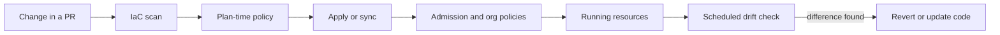

**What drift is.** **Drift** is any difference between the state declared in code and the real state. It comes from console changes ("ClickOps"), hand edits during incidents, other tools touching the same resources, and resources created outside IaC entirely. It is dangerous because rebuilding from code no longer gives you the same system, the next apply may silently undo a deliberate fix, and a drifted setting may be the hole an attacker uses.

**Guardrails versus gates.** A **gate** stops everything until someone approves. A **guardrail** lets people move fast and stops only the dangerous cases, with a message that says how to fix it. Platform engineering prefers guardrails: the safe path (the `postgres` module from 3.1, the promotion pull request from 3.2) should also be the easiest path, and policies catch what falls off it.

#### 🟡 Going deeper
**Plan-time policy with OPA and Conftest.** **Open Policy Agent (OPA)** is a general-purpose policy engine, a graduated CNCF project, with a policy language called **Rego**. **Conftest** runs Rego policies against structured files such as JSON or YAML. Terraform and OpenTofu can export a saved plan as JSON, so you can write rules about what will change, not just what the files say:

```shell
tofu plan -out=tfplan
tofu show -json tfplan > tfplan.json
conftest test tfplan.json --policy policy/
```

A rule that denies opening PostgreSQL to the whole internet (an AWS example; the same idea applies to Azure network security groups or Google Cloud firewall rules):

```rego
package main

import rego.v1

deny contains msg if {
  some rc in input.resource_changes
  rc.type == "aws_security_group_rule"
  rc.change.after.type == "ingress"
  "0.0.0.0/0" in rc.change.after.cidr_blocks
  rc.change.after.from_port <= 5432
  rc.change.after.to_port >= 5432
  msg := sprintf("%s opens PostgreSQL to the internet; use the private endpoint from the postgres module", [rc.address])
}

deny contains msg if {
  some rc in input.resource_changes
  "delete" in rc.change.actions
  rc.type in {"aws_db_instance", "aws_rds_cluster"}
  msg := sprintf("%s would be deleted; deleting a database needs a platform-lead approved exception", [rc.address])
}
```

Each message says what is wrong *and* what to do. Rego syntax changed between OPA versions; `import rego.v1` makes this valid on 0.x releases from 0.59 and on OPA 1.x. Newer AWS code may use `aws_vpc_security_group_ingress_rule`, which needs its own rule.

**Policies are code, so test them.** OPA has a built-in test runner (`opa test`), and Conftest can run test cases too. For each rule, keep at least one example that must be denied and one that must be allowed. A policy without tests will one day block every deployment, or none.

**Admission policies in Kubernetes.** Even with perfect pipelines, someone can still run `kubectl apply`. An **admission controller** checks every object the API server receives and can reject it. **Kyverno** writes policies as Kubernetes YAML; **OPA Gatekeeper** uses Rego; Kubernetes itself now offers **ValidatingAdmissionPolicy**, using the CEL expression language, which became generally available in Kubernetes 1.30. A Kyverno rule requiring images pinned by digest:

```yaml
apiVersion: kyverno.io/v1
kind: ClusterPolicy
metadata:
  name: require-image-digest
spec:
  validationFailureAction: Audit   # start in Audit, move to Enforce after review
  rules:
    - name: images-pinned-by-digest
      match:
        any:
          - resources:
              kinds: ["Pod"]
      validate:
        message: "Pin images by digest (image@sha256:...), as the promotion pipeline does."
        pattern:
          spec:
            containers:
              - image: "*@sha256:*"
```

Recent Kyverno versions have been moving the failure action to each rule; check the field names for your version.

**Detecting drift.** For IaC, the simplest detector is a scheduled plan that should show nothing:

```shell
tofu plan -detailed-exitcode -input=false
# exit code 0: no changes, code and reality match
# exit code 2: changes pending: drift, or merged code that was never applied
# exit code 1: error
```

Najm Bank runs this nightly for every state with read-only credentials and opens a ticket on exit code 2. `plan -refresh-only` shows only what changed in reality, which helps you understand drift before acting. In Kubernetes, Argo CD and Flux report drift as "OutOfSync" and self-heal can revert it. Cloud configuration-monitoring services (AWS Config, Azure Policy compliance, Google Cloud Security Command Center, for example) also catch resources IaC never knew about.

**Responding to drift.** Every drift item gets one of two answers:
- **Revert**: the code was right; apply it again and find out who changed reality and why.
- **Adopt**: the change was right (often an incident fix); update the code by pull request so code and reality match, then close the ticket.

Never leave drift as "known". If an attribute legitimately changes outside IaC, such as a replica count managed by an autoscaler, say so explicitly with `lifecycle { ignore_changes = [...] }` for that one attribute, with a comment explaining why.

#### 🔴 Expert view
**Rolling out a policy without a revolt.** Start in warn or audit mode, measure what would fail, fix or exempt it, announce a date, then enforce. Publish each policy with an ID, a reason, a compliant example and an owner. Track how often each fires, and how often wrongly: false positives teach people to ignore every policy.

**Exceptions are part of the design.** Real systems need exceptions: a vendor appliance that must use a particular port, a migration that legitimately deletes a database. Make the exception path explicit: an exception file in the policy repo, approved by the policy owner, with a reason and an expiry date, which the policy reads. Expired exceptions fail the build. It beats disabled checks or admin access.

**Organisation-level guardrails.** AWS Service Control Policies, Azure Policy at management-group level and Google Cloud Organization Policies apply to every account or project beneath them, whoever makes the call. Use them for a short list of non-negotiables (approved regions for data residency, audit logging always on, no public storage by default); they are hard to debug and affect everyone.

**Break-glass, done properly.** Some day the pipeline will be down and someone must change production by hand. Plan for it: named break-glass roles, separately stored credentials, use that pages the SRE lead and security, a mandatory ticket, and drift detection that flags the change until it is in code. Plan the emergency path before the emergency.

**Policy and regulation.** Policy as code leaves evidence auditors value: the rule, its history, every evaluation and exception. That supports change-management expectations such as EU DORA's and GCC regulators' cloud requirements; check current texts with compliance. Which misconfigurations matter most is covered in [*Secure AI & Application Security*, lesson 7.1 — Cloud security: shared responsibility, IAM and misconfiguration](../secai/index.html#/7.1) and [*Secure AI & Application Security*, lesson 7.2 — Containers, Kubernetes and infrastructure as code](../secai/index.html#/7.2).

### 🧰 The toolkit
| Tool, practice or service | What it is and does | When to reach for it |
|---|---|---|
| **Open Policy Agent** (OPA, CNCF graduated) | General-purpose policy engine with the Rego language; can evaluate any JSON input | Plan-time IaC policies, API authorisation, one policy language across many systems |
| **Conftest** | Runs Rego policies against configuration files and plan JSON in CI | Checking OpenTofu or Terraform plans and Kubernetes manifests in a pipeline |
| **Kyverno** (CNCF) | Kubernetes-native admission and policy engine; policies written as YAML | Enforcing cluster rules such as registry, digest pinning and resource limits |
| **ValidatingAdmissionPolicy** (Kubernetes) | Built-in admission checks written in CEL, no extra controller needed | Simple validation rules where you want no extra components |
| **IaC scanner** (e.g. Checkov, Trivy, KICS) | Static checks on IaC files and manifests for known misconfigurations | Every pull request that touches infrastructure |
| **Scheduled drift detection** | A nightly `plan -detailed-exitcode` per state, plus GitOps sync status | Every managed environment; tickets on any unexplained difference |
| **Organisation guardrails** (AWS SCPs, Azure Policy, Google Cloud Organization Policy) | Rules enforced on every API call within an account hierarchy | A short list of non-negotiable rules such as approved regions and audit logging |

### 🏛️ In practice at Najm Bank
Salem and Noura publish the **Najm Platform Guardrail Catalogue v1**. Each guardrail has an ID, where it runs, its mode and its exception route.

**Part A: guardrails**

| ID | Rule | Where it runs | Mode | Exception route |
|---|---|---|---|---|
| G-01 | Resources only in approved regions | Organisation policy | Enforce | Hamad (CISO) and compliance, written |
| G-02 | No database port open to 0.0.0.0/0 | Plan-time Conftest; IaC scan | Enforce | None |
| G-03 | No delete or replace of a stateful resource in prod without approval | Plan-time Conftest | Enforce | Salem or Maha, per change, expires after one apply |
| G-04 | Required tags: `owner`, `environment`, `data-class`, `cost-centre` | Plan-time Conftest | Warn until end of quarter, then enforce | Platform team, 30 days |
| G-05 | Images from the bank registry, pinned by digest | Kyverno admission | Enforce in prod, audit in dev | Platform team, 14 days |
| G-06 | CPU and memory requests set on every container | Kyverno admission | Enforce | None |
| G-07 | Audit logging cannot be disabled | Organisation policy | Enforce | None |
| G-08 | No unexplained drift | Nightly plan per state; Argo CD sync status | Ticket within one working day | Resolve by revert or adopt |

**Part B: the drift runbook**
1. The nightly job finds exit code 2 and opens a ticket with the plan output attached.
2. The owning team checks the cloud audit log for who changed what, and when.
3. Decide: **revert** (apply the code) or **adopt** (pull request to change the code). Record the decision in the ticket.
4. If the change was made outside break-glass, add a short note to the weekly platform review; repeated drift on the same resource means a guardrail or module is missing.

**Part C: policy repository rules.** Every policy has tests for at least one allowed and one denied case; changes to policies go through pull requests reviewed by the platform team and, for security rules, by Noura's team; exceptions live in `exceptions.yaml` with owner, reason and expiry, and expired entries fail the build.

### 🛠️ Exercises
Run these locally with OpenTofu, Conftest and a kind or k3d cluster.

- 🟢 Using your Docker-provider configuration from lesson 3.1, run `plan -detailed-exitcode` and note the exit code. Then stop or rename the container by hand with the Docker CLI and run it again. *Done when:* you saw exit code 0 before and 2 after, and you can explain from the plan output what the tool proposes to change back.
- 🟡 Write a Conftest policy against your plan JSON that denies any `docker_container` exposing an external port below 1024, and another that denies any image tag `latest`. Write tests for both. *Done when:* `conftest test` fails on a plan that breaks each rule with a message saying how to fix it, passes on a compliant plan, and your policy tests pass.
- 🔴 Install Kyverno on a local cluster and apply a policy requiring images pinned by digest, first in Audit, then in Enforce. Deploy a pod by tag and by digest in each mode, and read the policy reports. Then add an exception for one namespace with an expiry note in your repo. *Done when:* the tagged pod is reported in Audit, rejected in Enforce with your message, the digest-pinned pod runs, and your exception is scoped to one namespace and documented.

### ⚠️ Mistakes and traps
- **One check, at one point.** A pull-request scan misses console changes; an organisation policy misses Kubernetes. Layer the checks.
- **Enforcing on day one.** A new policy that breaks every pipeline gets disabled. Audit first, fix or exempt, then enforce on an announced date.
- **Messages that only say "denied".** People need to know how to fix it. Every policy message names the problem and the compliant alternative.
- **Exceptions with no expiry.** They become permanent holes. Give each an owner, a reason and an end date that the build enforces.
- **Ignoring drift or "fixing" it with a blind apply.** Apply may undo a deliberate incident fix. Investigate, then revert or adopt, and record which.
- **Untested policies.** A typo can allow everything or block everything. Keep allowed and denied test cases for every rule.

### 🧾 Recap
- Policy as code turns written standards into automated, versioned, testable checks on every change.
- Layer the checks: pull request, plan time, Kubernetes admission, cloud organisation and runtime.
- Drift is any gap between code and reality; detect it on a schedule and resolve each item by revert or adopt.
- Guardrails block only real danger, explain the fix, roll out in audit mode first and have an explicit, expiring exception path.
- Plan break-glass access before you need it, and let drift detection pull emergency changes back into code.

### ✍️ Check yourself

**1. AWS's response to the February 2017 S3 outage, caused by a mistyped command, was mainly to:**

- A. Require a second engineer to check and confirm every command before it runs
- B. Stop using written playbooks and let engineers decide steps during operations
- C. Move S3 permanently to another region with fewer dependent services
- D. Change the tool to remove capacity slowly, never below a subsystem's minimum

<details><summary>Answer</summary>

**D.** The lesson is to build guardrails into tools, so a mistake cannot become a disaster. A depends on people being perfect, which is the problem guardrails solve. (🧭 Why it matters.)

</details>

**2. Noura's team finds a test database whose network rule allows traffic from anywhere. It was created in the console and never appeared in any pull request. Which layer of checking could have caught it?**

- A. An IaC scanner that runs automatically on every infrastructure pull request in CI
- B. Organisation policies and runtime configuration monitoring, which see every change
- C. A Kyverno admission policy in the production Kubernetes cluster
- D. A careful code review of the application repository

<details><summary>Answer</summary>

**B.** Changes made outside the pipeline are only seen by controls on the cloud API itself or on running resources. A and D only see code; C only sees Kubernetes objects. (🟢 The essentials.)

</details>

**3. The nightly drift job runs `tofu plan -detailed-exitcode` for the Payments database state and gets exit code 2. What does this mean, and what should the team do first?**

- A. Drift or unapplied merged code; investigate, then revert or adopt
- B. The plan failed with an error, so rerun it with more verbose logging switched on
- C. Everything matches, so no action is needed until tomorrow's run
- D. Run `apply` immediately to overwrite whatever changed in reality since the last run

<details><summary>Answer</summary>

**A.** Exit code 2 means changes are pending. D might undo a deliberate incident fix; investigate first, then revert or adopt. B is exit code 1 and C is exit code 0. (🟡 Going deeper.)

</details>

**4. Salem wants to require images pinned by digest in every cluster. Many existing workloads use tags. What is the best rollout?**

- A. Enforce immediately in every cluster so that all teams learn the rule quickly
- B. Announce the rule by email to all teams and do not enforce it
- C. Audit first, fix or exempt existing workloads, announce a date, then enforce
- D. Disable admission control and rely on careful code review instead

<details><summary>Answer</summary>

**C.** Audit first lets you find and fix existing violations without breaking deployments. A breaks many pipelines and invites bypassing; B has no effect. (🔴 Expert view.)

</details>

**5. A vendor appliance at Najm Bank legitimately needs a rule that the guardrail catalogue normally denies. What is the right way to allow it?**

- A. Disable the policy for everyone until the vendor project ends next year or later
- B. Give the vendor team administrator access so they can bypass the pipeline
- C. Make the change by hand in the console and ignore the drift alerts it causes
- D. Add a scoped exception with an owner, reason and expiry that the build enforces

<details><summary>Answer</summary>

**D.** Explicit, scoped, expiring exceptions keep the guardrail for everyone else and keep evidence of the decision. A, B and C all remove protection far more widely than needed and leave no clean record. (🔴 Expert view, and 🏛️ In practice.)

</details>

### 📚 References
- Open Policy Agent documentation — https://www.openpolicyagent.org/docs/
- Conftest — https://www.conftest.dev/
- Kyverno documentation — https://kyverno.io/docs/
- Kubernetes, Validating Admission Policy — https://kubernetes.io/docs/reference/access-authn-authz/validating-admission-policy/
- OpenTofu, plan command — https://opentofu.org/docs/cli/commands/plan/
- Terraform, detecting drift and refresh-only mode — https://developer.hashicorp.com/terraform/docs
- AWS, summary of the Amazon S3 service disruption in the Northern Virginia (US-EAST-1) region — https://aws.amazon.com/message/41926/
- AWS Organizations, service control policies — https://docs.aws.amazon.com/organizations/
- Azure Policy documentation — https://learn.microsoft.com/azure/governance/policy/
- Google Cloud, Organization Policy Service — https://cloud.google.com/resource-manager/docs

---

<a id="m4"></a>

# Module 4 — CI/CD and safe releases

*Modules 2 and 3 gave Najm Bank's Platform Engineering team containers, clusters and infrastructure described as code. Now the team needs a safe, repeatable way to move a change from a developer's commit to a customer's phone, many times a week. That is the work of CI/CD. This module starts with continuous integration: pipelines that build one artefact, test it in layers and answer "is this change safe to merge?" in minutes. It then covers release strategies: rolling, blue-green and canary deployments, feature flags that separate deploying code from releasing a feature, and the rollback you must rehearse before you need it. It ends by treating the pipeline as what it really is, a privileged system that can change production: no long-lived keys, signed artefacts and least-privilege deploys. You will follow Yousef as a 48-minute pipeline becomes a 9-minute one, Maha as the Payments service gets its first automated canary, and Noura and Salem as the team removes the last cloud key from the CI settings.*

> **Phases:** Build, Test, Release, Deploy — turning every commit into one trusted artefact, then putting it in front of customers a little at a time, with a way back.

<a id="l4-1"></a>

## 4.1 — Continuous integration: pipelines, tests, artefacts and fast feedback

*Level: 🟡 Intermediate* · *Prerequisites: 2.1, 3.2* · *Phase: Build, Test*

### ⚡ In 60 seconds
- **Continuous integration (CI)** means everyone merges small changes into the main branch often, at least daily, and every change is built and tested automatically before and after it merges.
- The pipeline's job is to answer one question quickly and honestly: "Is this change safe to merge?" A slow answer, or an answer people do not trust, makes CI pointless.
- **Build once, promote the same artefact.** Build the container image once, identify it by its digest, and deploy that exact image to dev, staging and production. Never rebuild per environment.
- Test in layers, following the **test pyramid**: many fast unit tests, fewer integration tests, a handful of end-to-end tests.
- Decision cue: keep the merge check under about ten minutes. When it grows, cache, parallelise and move slow suites after the merge before you add more hardware.
- Biggest trap: flaky tests. A test that fails at random teaches the team to press "re-run" and ignore red builds.

### 🧭 Why it matters
Yousef joins Najm Bank's platform team in the middle of a complaint. The Najm Mobile API pipeline takes 48 minutes. Because waiting is painful, developers batch a week of work into one large pull request. Reviews take days, merges conflict, and when something breaks nobody can tell which of the 40 commits caused it. Three end-to-end tests fail about one run in five for no clear reason, so the team's habit is "re-run until green".

Then an incident. A change passes staging on Thursday. On Friday the production job **rebuilds** the image from the same commit. The base image tag `latest` has moved overnight, a system library changed, and the API fails to start in production. Staging had tested an image that never reached production. Rollback works, but the post-incident review (5.3) records a hard truth: "what we tested is not what we shipped."

Salem gives Yousef the task: "Make the pipeline something people trust. Fast enough that nobody batches work, honest enough that a red build means something, and the artefact we test is the artefact we ship." That is this lesson.

### 📐 How it works

#### 🟢 The essentials

**Three terms that get mixed up.**

| Term | Meaning | The question it answers |
|---|---|---|
| **Continuous integration** | Small changes merged to main often; each one built and tested automatically | Is this change safe to merge? |
| **Continuous delivery** | Every change that passes the pipeline *could* go to production at the push of a button | Could we release this right now? |
| **Continuous deployment** | Every change that passes goes to production automatically, with no human step | (Nobody asks; it just ships) |

Most banks, Najm included, practise continuous delivery: the pipeline makes every change releasable, and a release decision (sometimes automated, sometimes a person) puts it live. The ideas come from Jez Humble and David Farley's *Continuous Delivery* (2010), and *Accelerate* (Forsgren, Humble and Kim, 2018) linked these practices to delivery performance.

**Trunk-based development.** Developers work on short-lived branches, a day or two at most, and merge into one shared branch, usually `main`, often. Long-lived feature branches lead to painful merges and late surprises. Unfinished work is hidden behind a **feature flag** (lesson 4.2) rather than kept on a branch for weeks.

**What a pipeline is.** A **pipeline** is an automated sequence of **stages**, each made of **jobs** that run on machines called **runners** (or agents). It is triggered by an event: a pull request opened, a commit pushed to `main`, a tag created, or a schedule. The pipeline definition lives in the repository as code, so it is reviewed and versioned like everything else. Typical stages:

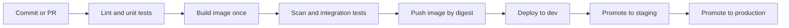

Everything left of "Push" runs on every pull request and must be fast. The promotions on the right move the *same* image through environments, as described in lesson 3.2.

**Artefacts.** An **artefact** is the output of a build that you keep and deploy: here, an OCI container image (lesson 2.1); elsewhere a JAR file, a Python wheel or a static site bundle. Two rules:
1. **Build once.** Build the artefact in one job, store it in a registry, and have every later stage pull it. Never run `docker build` again for staging or production.
2. **Identify it immutably.** A tag such as `v1.4.2` or `latest` can be moved to a different image. A **digest** (`sha256:...`, a hash of the image's content) cannot. Tag images with the commit SHA for humans, but deploy by digest.

Configuration that differs between environments (database host, feature flag defaults, replica counts) is injected at deploy time through environment variables, ConfigMaps or the GitOps overlay (lessons 2.3 and 3.2), never baked into the image. This is factor III of the Twelve-Factor App: store config in the environment. [*System Design for Vibe Coders*, lesson 4.5 — Verify the artifact, not the source](../vibe/index.en.html#l4-5) tells this story for solo builders.

**A minimal pipeline in GitHub Actions.** GitHub Actions is used here because it is widely used and free for public repositories; GitLab CI/CD, Jenkins and Azure Pipelines share the concepts.

```yaml
# .github/workflows/ci.yml
name: ci
on:
  pull_request:
  push:
    branches: [main]

permissions:
  contents: read            # least privilege by default (lesson 4.3)

concurrency:
  group: ci-${{ github.ref }}
  cancel-in-progress: ${{ github.event_name == 'pull_request' }}  # cancel outdated PR runs, never main builds

jobs:
  test:
    runs-on: ubuntu-latest
    timeout-minutes: 15
    steps:
      - uses: actions/checkout@v4   # pin to a full commit SHA in real use (lesson 4.3)
      - run: make lint
      - run: make test-unit

  build:
    needs: test
    runs-on: ubuntu-latest
    timeout-minutes: 20
    steps:
      - uses: actions/checkout@v4
      - uses: docker/setup-buildx-action@v3
      - uses: docker/build-push-action@v6
        with:
          context: .
          push: false
          tags: mobile-api:${{ github.sha }}
          cache-from: type=gha
          cache-to: type=gha,mode=max
```

Note the defaults: read-only permissions, job timeouts, and cancelling outdated PR runs (never `main` runs: every merged commit must produce its artefact).

**The test pyramid.** Not all tests cost the same. The pyramid, popularised by Mike Cohn, says to have many cheap tests at the bottom and few expensive ones at the top.

| Layer | What it checks | Speed | How many | Where it runs |
|---|---|---|---|---|
| **Static checks** | Formatting, lint, type checks, IaC validation | Seconds | Every file | Every PR |
| **Unit tests** | One function or class, no network or database | Milliseconds each | Thousands | Every PR |
| **Integration tests** | The service with real dependencies: a PostgreSQL container, a fake payment network | Seconds each | Hundreds | Every PR, in parallel |
| **Contract tests** | That the API still matches what its clients expect | Seconds | One per consumer | Every PR |
| **End-to-end tests** | A full user journey through deployed services | Minutes each | A handful | After deploy to dev or staging |

An inverted pyramid, with hundreds of slow, brittle browser tests and few unit tests, is a common reason for a 48-minute pipeline.

#### 🟡 Going deeper

**Making the pipeline fast.** Yousef measures before changing anything. The 48 minutes break down into dependency downloads (7), image build without cache (11), unit tests run serially (9), integration tests (8) and end-to-end tests on every PR (13). The fixes, in order of value:

- **Cache dependencies.** Restore the package manager's cache keyed on the lock file hash; most CI systems have a built-in cache action.
- **Order the Dockerfile for layer caching** (lesson 2.1): copy the dependency manifest and install dependencies *before* copying source code, so a code change does not invalidate the dependency layer. Use a remote build cache (`cache-from`/`cache-to`) so ephemeral runners can reuse layers.
- **Parallelise.** Split tests into shards across several jobs, or use a matrix (for example, several Python or Node versions) only where it adds real coverage.
- **Run only what changed.** In a monorepo, path filters (`on.pull_request.paths`) skip pipelines for untouched services. Be careful: a shared library change must still trigger its dependants.
- **Move slow suites after the merge.** End-to-end tests run against the dev environment after merge and on a schedule; they block *promotion*, not *merging*.

The result: lint and unit tests in 3 minutes, build and integration tests in 6, a 9-minute merge check, with end-to-end tests gating promotion to staging.

**Flaky tests.** A **flaky test** passes and fails on the same code. Causes include timing assumptions (`sleep(2)` and hoping), shared test data, test order dependence, real network calls and clocks. Policy at Najm:
1. A test that fails and then passes on retry, on the same commit, is automatically marked as suspected flaky.
2. A flaky test is **quarantined**: moved to a non-blocking job, with a ticket and an owner, and fixed or deleted within an agreed time.
3. Automatic "retry until green" on the whole pipeline is not allowed. It hides real intermittent bugs, including race conditions that will also happen in production.

**Merge queues.** When many people merge to `main`, two pull requests can each pass alone and break together. A **merge queue** (GitHub merge queue, GitLab merge trains and similar features) tests each PR on top of the PRs ahead of it before merging, so `main` stays green.

**Labelling the artefact.** Record where the image came from, so anyone can trace a running pod back to a commit. OCI image annotations such as `org.opencontainers.image.revision` (the commit SHA) and `org.opencontainers.image.source` (the repository URL) are standard keys. Lesson 4.3 turns this into signed **provenance**.

**What the pipeline checks besides tests.** A CI pipeline is also where cheap automated checks live: secret scanning, dependency vulnerability scanning (SCA), static security analysis (SAST), Dockerfile and IaC linting, and the policy checks from lesson 3.3. Block only on new, high-confidence findings, or developers will learn to ignore the gate. [*Secure AI & Application Security*, lesson 6.1 — A secure development life cycle](../secai/index.html#/6.1) covers how to tune these scanners.

#### 🔴 Expert view

**Measure the outcome, not the pipeline.** The DORA research programme tracks four key delivery measures: **deployment frequency**, **lead time for changes** (commit to production), **change failure rate** and **time to restore service**. DORA has since added a reliability measure and refined some names (for example, recent reports talk about failed deployment recovery time); check dora.dev for the current definitions. A fast pipeline improves lead time; trustworthy tests lower change failure rate. Watch both together: speeding up by deleting tests just moves the cost into incidents.

**The pipeline is a product.** At Najm, product teams do not each write their own pipeline. The platform team publishes a **golden path**: a reusable workflow (in GitHub Actions, a workflow called with `uses: najm-bank/platform-workflows/.github/workflows/service-ci.yml@<version>`) that does build, scan, test, sign and push in the approved way. Teams pass a few inputs. When the platform team improves caching or adds a scanner, every service gets it. Version it, keep a changelog, and measure adoption and build times.

**Reproducible and hermetic builds.** A **hermetic** build uses only declared, pinned inputs: a base image by digest, dependencies by lock file with hashes, a pinned toolchain, and no undeclared network access. Fully bit-for-bit **reproducible** builds are hard for container images (timestamps, file ordering), but hermetic inputs alone remove the Friday incident: a moving `latest` tag cannot sneak in.

**Feedback time is a design budget.** Publish a target (Najm's is below). A new check that would break it must replace something, run in parallel, or run after the merge.

### 🧰 The toolkit
| Tool, practice or service | What it is and does | When to reach for it |
|---|---|---|
| **GitHub Actions** | CI/CD built into GitHub; workflows in YAML in the repository, run on hosted or self-hosted runners | Code already on GitHub; free practice on public repositories |
| **GitLab CI/CD** | CI/CD built into GitLab; pipelines defined in `.gitlab-ci.yml` | Code on GitLab, including self-managed installations |
| **Jenkins** | Long-standing open-source automation server with a large plugin ecosystem | Existing estates; when you must run everything on-premises |
| **Trunk-based development** | Short-lived branches merged to one main branch at least daily | Always, as the default branching model for CI |
| **Build once, promote** | One build produces one immutable artefact that moves through every environment | Every service; it removes "tested is not shipped" |
| **Test pyramid** | Many unit tests, fewer integration tests, few end-to-end tests | Designing a test suite or diagnosing a slow pipeline |
| **Merge queue** | Tests each PR against the PRs ahead of it before merging | Busy repositories where `main` keeps breaking after "green" merges |
| **Golden path** | A platform-maintained, reusable pipeline that teams adopt instead of writing their own | More than a handful of services with similar builds |

### 🏛️ In practice at Najm Bank
Yousef and Salem publish **Najm Golden-Path CI Standard v1**, implemented as a reusable workflow. Every new service starts with it.

**Part A: stages, gates and time budgets**

| Stage | Runs on | Blocks | Time budget (p95) |
|---|---|---|---|
| Lint, format, type check, IaC validate | Every PR | Merge | 2 min |
| Unit tests (sharded) | Every PR | Merge | 4 min |
| Secret scan, SCA, SAST (new high findings only) | Every PR | Merge | 3 min, in parallel |
| Build image once, with remote cache | Every PR | Merge | 4 min |
| Integration and contract tests (PostgreSQL in a container) | Every PR | Merge | 5 min, in parallel |
| Push image by digest, record commit SHA and source | Merge to `main` | — | 2 min |
| Deploy to dev and run end-to-end smoke tests | Merge to `main` | Promotion to staging | 10 min |
| Full end-to-end suite | Every few hours and before production | Promotion to production | 30 min |

Overall merge-check target: 95% of PR checks finish within 10 minutes.

**Part B: rules**
1. Images are built once per commit and deployed by digest. A pipeline that runs `docker build` in a deploy job fails the platform review.
2. Base images and toolchains are pinned by digest or exact version; a bot proposes updates as ordinary pull requests.
3. Every job has a timeout. Workflows default to read-only permissions.
4. Flaky tests are quarantined within one working day, with an owner and a ticket. No whole-pipeline auto-retry.
5. Each service's dashboard shows lead time, deployment frequency, change failure rate and PR-check duration.

**Part C: the reusable workflow's interface**

```yaml
# In the service repository
jobs:
  ci:
    uses: najm-bank/platform-workflows/.github/workflows/service-ci.yml@v3   # pin by SHA in real use
    with:
      service-name: mobile-api
      dockerfile: ./Dockerfile
      integration-services: postgres
      test-shards: 4
```

### 🛠️ Exercises
Use your own GitHub account and a public practice repository; never an employer's repository without permission.

- 🟢 Take a small app of your own (any language) and add a CI workflow that runs lint and unit tests on every pull request, with read-only permissions, a job timeout and cancellation of outdated runs. Open a PR with a deliberately failing test. *Done when:* the PR shows a red check that names the failing test, and fixing the test turns it green.
- 🟡 Add a container build to the pipeline with layer caching. Reorder the Dockerfile so dependencies install before the source code is copied. Record the build time before and after for a one-line code change. *Done when:* you have both timings, and a second build after a source-only change reuses the dependency layer (the log shows cached steps).
- 🔴 Implement "build once, promote": on merge to `main`, push the image to a registry (GitHub Container Registry works for a public repo), output its digest, and have a second job deploy that digest to a local kind cluster or update a manifest in a GitOps folder. Add a test that fails if any deploy job contains a `docker build` command. *Done when:* the digest running in your cluster (`kubectl get pod -o jsonpath='{.items[*].status.containerStatuses[*].imageID}'`) matches the digest the build job printed.

### ⚠️ Mistakes and traps
- **Rebuilding per environment.** Staging tests one image and production runs another. Build once, deploy by digest, inject configuration at deploy time.
- **"Re-run until green".** It hides flaky tests and real race conditions. Quarantine flaky tests with an owner and a deadline; never auto-retry whole pipelines.
- **An inverted pyramid.** Hundreds of end-to-end tests on every PR make CI slow and brittle. Push checks down the pyramid; run end-to-end suites after the merge.
- **Long-lived feature branches.** They turn integration into a weekly crisis. Merge small changes daily and hide unfinished work behind flags.
- **Unpinned inputs.** `FROM node:latest` or unpinned tools make yesterday's green build meaningless today. Pin by digest or exact version and update deliberately.

### 🧾 Recap
- CI answers "is this change safe to merge?"; continuous delivery keeps every passing change releasable; continuous deployment releases it automatically.
- Trunk-based development and small, frequent merges make integration routine instead of risky.
- Build one immutable artefact, identify it by digest, and promote the same artefact through every environment.
- Shape tests as a pyramid, and keep the merge check fast with caching, parallelism and moving slow suites after the merge.
- Treat flaky tests as defects, the pipeline as a product, and the DORA measures as the scorecard.

### ✍️ Check yourself

**1. Staging passed on Thursday, but on Friday the production deploy failed because the image behaved differently. The production job had rebuilt the image from the same commit. What change prevents this class of failure?**

- A. Run the staging tests again inside the production job
- B. Build once and deploy the same image by digest everywhere
- C. Use the `latest` tag everywhere so all environments match
- D. Add a manual approval step before every production deploy

<details><summary>Answer</summary>

**B.** Building once and deploying by digest guarantees production runs exactly what was tested. C makes it worse, because `latest` moves; D adds a human but not the same artefact. (🟢 The essentials.)

</details>

**2. The Najm Mobile API PR check takes 48 minutes, and 13 of them are end-to-end tests. What is the best first move?**

- A. Delete the end-to-end tests, since unit tests cover the logic
- B. Buy larger runners and keep everything the same
- C. Run end-to-end tests after the merge, gating promotion instead
- D. Ask developers to open fewer, larger pull requests

<details><summary>Answer</summary>

**C.** The tests still protect production, but they no longer slow every merge. A loses protection; B is costly and leaves the structure unchanged; D encourages the batching that caused the problem. (🟡 Going deeper.)

</details>

**3. Which statement best describes continuous delivery?**

- A. Every passing change is releasable; a release decision puts it live
- B. Every change goes to production automatically with no human step
- C. Developers merge their branches to main at least once a week
- D. The pipeline builds and tests all changes once a night

<details><summary>Answer</summary>

**A.** B is continuous deployment. C describes infrequent integration, and D is a nightly build, not CI. (🟢 The essentials.)

</details>

**4. A test in the Payments service fails about one run in ten and passes when re-run on the same commit. What does Najm's policy require?**

- A. Enable automatic retries on the whole pipeline so merges are not blocked
- B. Delete the test immediately and rely on the remaining suite
- C. Leave it blocking, and re-run the pipeline whenever it fails
- D. Quarantine it in a non-blocking job, with an owner and a deadline

<details><summary>Answer</summary>

**D.** Quarantine keeps the merge signal trustworthy while someone finds the cause, which may be a real race condition. A hides problems; B may delete useful coverage without understanding it; C teaches people to ignore red builds. (🟡 Going deeper.)

</details>

**5. Salem wants to know whether the CI improvements are making delivery better overall, not just faster. Which pair of measures should he watch together?**

- A. Number of pipelines and number of runners
- B. Lines of code and test count
- C. Lead time for changes and change failure rate
- D. Build cache hit rate and image size

<details><summary>Answer</summary>

**C.** Lead time shows speed and change failure rate shows whether the speed is safe; watching one alone can mislead. The others are useful diagnostics, not outcomes. (🔴 Expert view.)

</details>

### 📚 References
- DORA research and metrics — https://dora.dev/
- GitHub Actions documentation — https://docs.github.com/en/actions
- GitHub, managing a merge queue — https://docs.github.com/en/repositories/configuring-branches-and-merges-in-your-repository/configuring-pull-request-merges/managing-a-merge-queue
- GitLab CI/CD documentation — https://docs.gitlab.com/ee/ci/
- Jenkins documentation — https://www.jenkins.io/doc/
- Docker, build cache — https://docs.docker.com/build/cache/
- OCI image specification, annotations — https://github.com/opencontainers/image-spec/blob/main/annotations.md
- The Twelve-Factor App — https://12factor.net/
- Trunk-based development — https://trunkbaseddevelopment.com/

<a id="l4-2"></a>

## 4.2 — Release strategies: rolling, blue-green, canary, feature flags and rollback

*Level: 🟡 Intermediate* · *Prerequisites: 2.2, 2.3, 4.1* · *Phase: Release, Deploy*

### ⚡ In 60 seconds
- **Deploying** puts new code on servers; **releasing** lets users reach it. Separating the two, with feature flags and progressive traffic shifting, is the core of safe delivery.
- The main strategies are **recreate**, **rolling**, **blue-green**, **canary** and **shadow**; each trades cost, speed and blast radius differently.
- Choose by blast radius and by how quickly you can detect a problem. High-risk services such as Payments get a canary with automatic analysis; internal tools can roll.
- Every release needs a rehearsed rollback, and the database must work with both the old and the new version at the same time.
- Biggest trap: shipping a change to everyone at once because "it's only configuration". Configuration and content are code; stage them too.

### 🧭 Why it matters
On 19 July 2024, CrowdStrike pushed a content configuration update for its Falcon sensor to Windows hosts. A defect in that update crashed affected machines, and Microsoft estimated about 8.5 million Windows devices were hit, grounding flights and disrupting hospitals and banks. CrowdStrike's own review said this kind of content had not been rolled out in stages. Among its commitments afterwards was a staged deployment of this kind of content, with canary groups first and customer control over timing. A change that reaches everyone at once can fail for everyone at once.

At Najm, Maha has a closer example. Last quarter, a new version of the **Payments service** changed how it read a currency field. The deployment rolled across all pods in four minutes. Error rates rose on about 3% of transfers (those in one currency) and stayed below the old alert threshold for 40 minutes. By then every pod ran the new code, and the unpractised rollback took another 15 minutes.

Maha's goal: the next Payments release reaches 5% of traffic first, is judged by numbers, and rolls back on its own if they go bad.

### 📐 How it works

#### 🟢 The essentials

**Deploy is not release.** **Traffic shifting** (rolling, blue-green, canary) controls which *version* receives requests; **feature flags** control which *behaviour* users see inside one version.

With both, you can deploy on Tuesday, enable the feature for staff on Wednesday and for 5% of customers on Thursday, and switch it off in seconds.

**The strategies.**

| Strategy | How it works | Rollback | Extra cost | Good for |
|---|---|---|---|---|
| **Recreate** | Stop all old instances, then start the new ones | Redeploy old version | None, but causes downtime | Batch jobs; dev environments; versions that cannot run side by side |
| **Rolling update** | Replace instances a few at a time; new ones join when ready | Roll back the same way, a few at a time | A little spare capacity | Most stateless services; the Kubernetes default |
| **Blue-green** | Run the new version (green) next to the old (blue) at full size; switch all traffic at once | Switch traffic back to blue, in seconds | Double capacity during the release | Fast, clean cut-over; easy verification before switching |
| **Canary** | Send a small share of real traffic to the new version, compare its metrics, then increase step by step | Send all traffic back to the stable version | A few extra instances plus metrics | High-risk services; large user bases |
| **Shadow** (mirroring) | Copy live requests to the new version and discard its responses | Nothing to roll back; users never saw it | Extra capacity; care with side effects | Testing performance or correctness of a rewrite on real traffic |

Shadow traffic must never trigger real side effects, such as a mirrored transfer that moves money twice. Use it on read paths or with side effects stubbed out.

**Rolling updates in Kubernetes.** A Deployment (lesson 2.2) replaces pods according to two settings, and only sends traffic to a new pod once its **readiness probe** passes (lesson 2.3):

```yaml
apiVersion: apps/v1
kind: Deployment
metadata:
  name: mobile-api
spec:
  replicas: 10
  selector:
    matchLabels: { app: mobile-api }
  strategy:
    type: RollingUpdate
    rollingUpdate:
      maxSurge: 2          # up to 2 extra pods during the rollout
      maxUnavailable: 0    # never drop below 10 ready pods
  minReadySeconds: 20      # a new pod must stay ready 20s before it counts
  progressDeadlineSeconds: 600
  template:
    metadata:
      labels: { app: mobile-api }
    spec:
      containers:
        - name: api
          image: registry.najm.internal/mobile-api@sha256:<digest>
          readinessProbe:
            httpGet: { path: /ready, port: 8080 }
            periodSeconds: 5
```

A rolling update stops pods that *never become ready*, not pods that start fine and return wrong answers, as Payments did. That needs a canary and metrics.

**Rollback, two ways.** In a push-based setup, `kubectl rollout undo deployment/mobile-api` returns to the previous ReplicaSet. In a GitOps setup (lesson 3.2), the Git repository is the truth: with automated sync and self-heal on, the controller soon reverts a manual `kubectl` rollback. The rollback is a `git revert` of the commit that changed the image digest, which the controller then applies. Decide which model you use and write the runbook to match.

**Roll back or roll forward?** **Rolling back** returns to the last known good version. **Rolling forward** ships a new fix. Default to rolling back when customers are hurting: it is faster and already tested. Roll forward only when rollback is impossible (for example after an irreversible data change) or the fix is trivial and well understood.

#### 🟡 Going deeper

**Automated canary analysis.** A canary is only as good as the comparison behind it. Tools such as **Argo Rollouts** and **Flagger** extend Kubernetes with canary and blue-green strategies, shift traffic through a service mesh, a Gateway API implementation or an ingress controller, and query metrics to decide whether to continue. A sketch of Maha's design with Argo Rollouts:

```yaml
apiVersion: argoproj.io/v1alpha1
kind: Rollout
metadata:
  name: payments
spec:
  replicas: 12
  strategy:
    canary:
      canaryMetadata:
        labels: { track: canary }   # lets the query below select canary pods
      stableMetadata:
        labels: { track: stable }
      steps:
        - setWeight: 5
        - pause: { duration: 10m }
        - analysis:
            templates:
              - templateName: payments-success-rate
        - setWeight: 25
        - pause: { duration: 10m }
        - analysis:
            templates:
              - templateName: payments-success-rate
        - setWeight: 50
        - pause: { duration: 10m }
  # selector and pod template as in a Deployment
---
apiVersion: argoproj.io/v1alpha1
kind: AnalysisTemplate
metadata:
  name: payments-success-rate
spec:
  metrics:
    - name: success-rate
      interval: 1m
      count: 5
      failureLimit: 1
      successCondition: result[0] >= 0.995
      provider:
        prometheus:
          address: http://prometheus.monitoring:9090
          query: |
            sum(rate(http_requests_total{app="payments",track="canary",code!~"5.."}[5m]))
            /
            sum(rate(http_requests_total{app="payments",track="canary"}[5m]))
```

If the canary's success rate misses the threshold more than once, the rollout aborts and traffic returns to stable, with nobody woken to decide. Without a traffic router, weights are approximated by pod count (5% of 12 replicas is one pod, about 8%); a mesh or Gateway API plugin gives exact splits. Field names change between versions; check the documentation for yours.

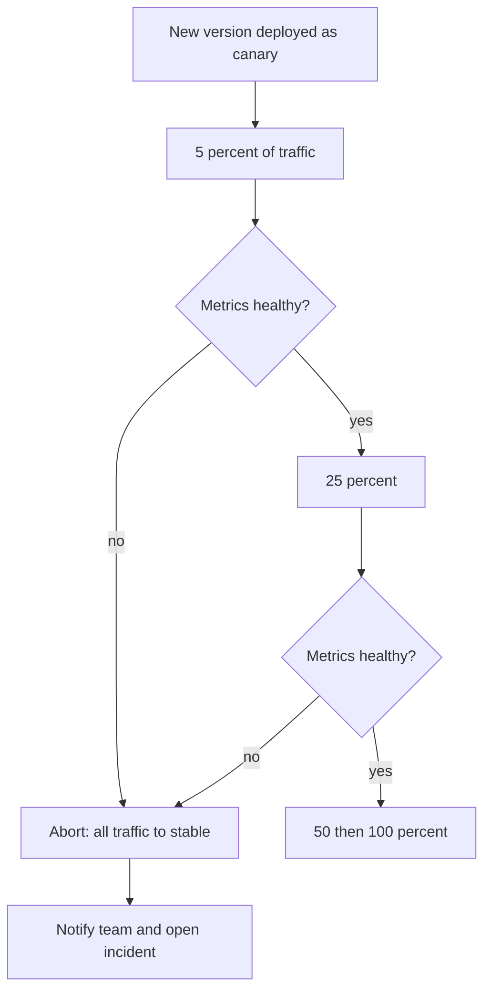

**Choosing what the canary measures.** Use the same signals as your SLOs (lesson 5.2): error rate, latency at a high percentile such as p99, and a business signal where possible (for Payments: the share of transfers that reach "settled"). Compare canary to stable *at the same time*, not to last week. And make the canary large enough: at 1% of a quiet service, ten minutes may hold too few requests to judge.

**Feature flags.** A **feature flag** (feature toggle) is a runtime switch that changes behaviour without a deploy. Pete Hodgson's widely cited taxonomy names four kinds:

| Kind | Purpose | Lifetime | Najm example |
|---|---|---|---|
| **Release flag** | Hide unfinished or new features until ready | Days to weeks, then delete | New card-freeze screen |
| **Ops flag / kill switch** | Turn off an expensive or risky path under load or during an incident | Long-lived, documented | Disable Najm Assist's document upload if the model gateway is struggling |
| **Experiment flag** | A/B test two variants | Length of the experiment | Two onboarding flows |
| **Permission flag** | Enable features for certain users or tenants | Long-lived | Beta features for staff only |

**OpenFeature**, a CNCF project, defines a vendor-neutral API for evaluating flags, so application code does not depend on one flag vendor. Flag *management* (who can change which flag, with what approval and audit trail) matters as much as flag evaluation, especially in a bank. [*SaaS Building Blocks*, lesson 6.3 — Feature flags and experiments](../saas/index.html#/6.3) compares flag services in depth.

**Flags are code with a short life.** In 2012 the US trading firm Knight Capital deployed new code to eight servers, but, according to the SEC's order, one server did not receive it. The release reused an old flag, which on that server woke long-retired logic that sent millions of orders in about 45 minutes. The order describes losses of over 460 million US dollars. Two lessons: never reuse a flag name for a new meaning, and verify that every instance runs the version you think it runs.

**Databases: expand and contract.** During any rolling, canary or blue-green release, old and new versions run *at the same time* against the same database. A schema change must work for both. The **expand and contract** pattern (also called parallel change) does this in steps:
1. **Expand:** add the new column or table; the old code ignores it.
2. **Migrate:** deploy code that writes both old and new, backfill existing rows, then switch reads to the new column.
3. **Contract:** once no running version reads the old column, remove it in a later release.

Never rename or drop a column in the same release as the code that stops using it. That single rule makes rollback possible.

#### 🔴 Expert view

**Rings and regions.** Large platforms release in **rings** with soak time between them; CrowdStrike's commitments describe the same idea. Najm's: staff, then 5% of Qatar traffic, then all of Qatar, then the UAE, then the EU. Each ring limits the blast radius of the next mistake.

**Automatic rollback on SLO burn.** Analysis during the rollout catches obvious failures. Subtle ones, like the Payments currency bug at 3% of traffic, need a longer watch. After a release completes, compare its **error budget burn rate** (lesson 5.2) for the next hour or two against the previous version. A sustained burn far above normal should trigger an automatic rollback, or at least a page that names the release.

**Small batches beat freezes.** Many organisations react to bad releases with change boards and long freezes; DORA's research found that heavyweight external approval tends to slow delivery without improving stability. Najm keeps a short freeze around peak periods such as salary day and Eid, but its main defence is small, frequent, automated, observable releases with peer review. Regulators still expect change-control evidence; EU DORA, for example, requires ICT change management within the ICT risk framework. A pipeline that records who approved what, which canary ran, and what it measured is that evidence. [*Secure AI & Application Security*, lesson 11.2 — Regulation that touches security](../secai/index.html#/11.2) covers the financial-sector rules.

### 🧰 The toolkit
| Tool, practice or service | What it is and does | When to reach for it |
|---|---|---|
| **Rolling update** | Kubernetes Deployment strategy that replaces pods gradually, gated by readiness | Default for stateless services |
| **Blue-green deployment** | Two full environments; traffic switches at once, and back just as fast | Fast clean cut-overs; when you can afford double capacity briefly |
| **Canary release** | A small share of traffic to the new version, judged by metrics before increasing | High-risk services such as Payments; anything with many users |
| **Argo Rollouts** (CNCF, part of the Argo project) | Kubernetes controller adding canary and blue-green with automated analysis | Progressive delivery with Argo CD |
| **Flagger** (part of the Flux project) | Kubernetes operator automating canary, A/B and blue-green with metric checks | Progressive delivery with Flux or a service mesh |
| **OpenFeature** (CNCF) | Vendor-neutral API and SDKs for evaluating feature flags | Using flags without locking code to one vendor |
| **Feature flag** | Runtime switch that changes behaviour without a deploy | Separating deploy from release; kill switches |
| **Expand and contract** | Schema and API changes in backward-compatible steps | Any change to a database or API used by more than one version |

### 🏛️ In practice at Najm Bank
Maha and Salem publish the **Najm Release Standard v1**: a strategy per service tier and a release checklist.

**Part A: strategy by tier**

| Tier | Services | Strategy | Automatic analysis | Rollback target |
|---|---|---|---|---|
| 1 | Payments service, login | Canary 5% → 25% → 50% → 100%, 10 minutes per step; rings by country | Success rate ≥ 99.5%, p99 latency within 20% of stable, settled-transfer ratio | Under 5 minutes, automatic |
| 2 | Najm Mobile API, Najm Assist gateway | Canary 10% → 50% → 100% | Error rate and p99 latency | Under 10 minutes, automatic |
| 3 | Internal tools, batch jobs | Rolling update with readiness gates | Rollout health only | Under 30 minutes, manual |

The thresholds are Najm's own choices, set from each service's SLO (lesson 5.2), and reviewed after each incident.

**Part B: release checklist (tier 1)**

| Check | Evidence |
|---|---|
| Image is the digest built and tested by CI (lesson 4.1) and is signed (lesson 4.3) | Pipeline run link; signature verified at admission |
| Schema changes are expand-only in this release | Migration file reviewed; no `DROP` or `RENAME` |
| New behaviour is behind a release flag, default off | Flag name, owner, removal date |
| No flag name is reused | Flag registry check |
| Canary analysis template matches the service's current SLO | Template version |
| Rollback rehearsed on staging this quarter | Date and result |
| Not in a freeze window; on-call informed | Release calendar; release channel message |

**Part C: rollback runbook (GitOps)**
1. If analysis has aborted, confirm traffic is 100% on stable. If not, abort the rollout manually.
2. `git revert` the commit in the GitOps repo that changed the image digest; Argo CD applies it.
3. If a flag was involved, switch it off first; that is faster than any rollback.
4. Post version, time, symptom and action in the incident channel; open a postmortem if customers were affected (lesson 5.3).

### 🛠️ Exercises
Run these on a local kind or k3d cluster.

- 🟢 Deploy a small web app as a Deployment with 4 replicas, a readiness probe, `maxSurge: 1`, `maxUnavailable: 0` and a short `preStop` sleep so endpoints drain before pods stop. Update the image and watch `kubectl rollout status`. Then roll back with `kubectl rollout undo`. *Done when:* a loop of `curl` requests against the Service during both the update and the rollback shows no failed requests.
- 🟡 Deploy a version whose readiness probe never passes. Observe what the rolling update does and what `progressDeadlineSeconds` reports. Then deploy a version that starts fine but returns HTTP 500 on one endpoint. *Done when:* you can explain in three sentences why the first bad version was stopped and the second was not, and what would stop the second.
- 🔴 Install Argo Rollouts and Prometheus in your cluster. Convert the Deployment to a Rollout with a canary (10% → 50% → 100%) and an AnalysisTemplate on the success rate. Release a version that returns errors on 20% of requests. *Done when:* the rollout aborts by itself, traffic returns to stable, and you can show the failed analysis run.

### ⚠️ Mistakes and traps
- **Treating configuration and content as "not a release".** A bad config or content push can break everything at once. Stage them through the same rings.
- **Canary without real analysis.** A human glancing at a dashboard for two minutes is not analysis. Define the metrics, thresholds and duration in code.
- **Breaking the database in the same release.** Dropping or renaming a column alongside the code change makes rollback impossible. Expand, migrate, then contract in a later release.
- **Never-deleted flags.** Old flags pile up into untested combinations, and reused names can wake up dead code, as at Knight Capital. Give each release flag an owner and a removal date.
- **An unrehearsed rollback.** Rolling back during an incident is the worst time to discover it does not work. Rehearse it on staging every quarter.

### 🧾 Recap
- Separate deploy from release: traffic shifting chooses the version; feature flags choose the behaviour.
- Rolling updates stop pods that never become ready; canaries with automated analysis stop versions that run but behave badly.
- Pick the strategy by risk tier: canary for Payments and login, rolling for internal tools.
- Old and new versions run at once, so databases and APIs change with expand and contract.
- Rollback must be fast, rehearsed and done the GitOps way.

### ✍️ Check yourself

**1. A new Payments version starts normally and passes its readiness probe, but fails transfers in one currency, about 3% of traffic. Which strategy would most likely have limited the impact?**

- A. A rolling update with a larger `maxSurge`
- B. A recreate deployment, so versions never mix
- C. A canary judged automatically on success rate
- D. A longer `progressDeadlineSeconds` on the Deployment

<details><summary>Answer</summary>

**C.** The pods are healthy by the probe's standard, so only a metric comparison on real traffic catches the fault, and the canary limits who is exposed. A, B and D only react to pods that fail to start or become ready. (🟡 Going deeper.)

</details>

**2. Yousef wants to rename a column in the Payments database in the same release that updates the code to use the new name. What should Maha advise?**

- A. Fine, as long as blue-green switches all traffic at once
- B. Add and backfill the new column; drop the old one later
- C. Do it at night, during a low-traffic window
- D. Test it first with shadow traffic, then release normally

<details><summary>Answer</summary>

**B.** Expand and contract keeps old and new versions working together, so rollback stays possible. Blue-green (A) still runs both versions against one database, and rolling back would hit the renamed column. (🟡 Going deeper.)

</details>

**3. Najm deploys with Argo CD, with automated sync and self-heal on. During an incident, an engineer runs `kubectl rollout undo`, and ten minutes later the bad version is back. Why?**

- A. Argo CD re-synced the cluster to the version declared in Git
- B. `kubectl rollout undo` is temporary and expires after a set time
- C. The old version's readiness probe failed, so Kubernetes rolled forward
- D. The Horizontal Pod Autoscaler recreated the pods from its own template

<details><summary>Answer</summary>

**A.** In GitOps, Git is the source of truth, so roll back with a `git revert` of the digest change. The other options do not restore an old image version. (🟢 The essentials.)

</details>

**4. Which use of shadow (mirrored) traffic is safe for the Payments service?**

- A. Mirroring transfer requests to the new version with real settlement enabled
- B. Mirroring all requests and returning whichever response arrives first
- C. Using shadow traffic instead of any automated tests
- D. Mirroring read-only requests, or ones with side effects stubbed out

<details><summary>Answer</summary>

**D.** Shadow responses are discarded, so the new version must not cause real effects. A would move money twice; B is not shadowing; C misuses it. (🟢 The essentials.)

</details>

**5. After the CrowdStrike incident of July 2024, what release practice did the vendor commit to for this kind of content update?**

- A. Stopping content updates and shipping only full sensor releases
- B. Staged deployment through canary groups, with customer control over timing
- C. Releasing content updates only once a quarter, after a freeze
- D. Requiring every customer to install each update by hand

<details><summary>Answer</summary>

**B.** Staged rollouts limit the blast radius of a bad update, the same idea as rings and canaries. The others are not what was described and would leave customers without protection updates. (🧭 Why it matters, 🔴 Expert view.)

</details>

### 📚 References
- Kubernetes, Deployments and rolling updates — https://kubernetes.io/docs/concepts/workloads/controllers/deployment/
- Argo Rollouts documentation — https://argo-rollouts.readthedocs.io/
- Flagger documentation — https://docs.flagger.app/
- OpenFeature — https://openfeature.dev/
- Martin Fowler's site, Feature Toggles (Pete Hodgson) — https://martinfowler.com/articles/feature-toggles.html
- CrowdStrike, Channel File 291 incident information and root cause analysis — https://www.crowdstrike.com/
- US SEC, administrative proceeding against Knight Capital Americas LLC (2013) — https://www.sec.gov/
- Google SRE book, chapter on release engineering — https://sre.google/sre-book/release-engineering/
- DORA research — https://dora.dev/

<a id="l4-3"></a>

## 4.3 — Securing the pipeline: secrets, signed artefacts and least-privilege deploys

*Level: 🟡 Intermediate* · *Prerequisites: 1.3, 3.2, 4.1* · *Phase: Build, Deploy*

### ⚡ In 60 seconds
- A CI/CD pipeline can change production, so it is one of the most privileged systems you run. Attackers know this; protect it like production.
- **No long-lived cloud keys in CI.** Use **OIDC workload identity federation**: each job gets a short-lived token, and the cloud trusts it only for a specific repository, branch or environment.
- **Least privilege everywhere:** read-only default token permissions, third-party actions pinned to a full commit SHA, a separate identity for each job, and production deploys gated by a protected environment.
- **Sign what you build and verify before you run:** sign images by digest, attach provenance and an SBOM, and let the cluster admit only images signed by your release workflow.
- Prefer **pull-based deploys** (GitOps): CI never holds cluster credentials; a controller inside the cluster pulls approved changes.
- Biggest trap: treating the pipeline as "just tooling", owned by nobody and audited by nobody.

### 🧭 Why it matters
Two public incidents show why. In April 2021, Codecov disclosed that an attacker had modified its Bash Uploader script, which many customers ran inside their CI pipelines. The changed script sent the environment variables of those CI jobs, often including credentials and tokens, to a server the attacker controlled. In March 2025, the popular GitHub Action `tj-actions/changed-files` was compromised (CVE-2025-30066): its version tags were pointed at a malicious commit that printed CI secrets into build logs, where in public repositories anyone could read them. Teams that referenced the action by a tag ran the malicious code without changing a line; teams that pinned it to a full commit SHA did not.

At Najm, Yousef is setting up a pipeline for a new internal service. Deploying needs cloud access, so he creates a cloud access key for a user with administrator rights, stores it as a repository secret, and adds a third-party action he found online that "makes deploys easier". It works on the first try. Noura (Head of Application & AI Security) spots it in review: one key, never expiring, with full control of the cloud account, available to every workflow in the repository, and a piece of unknown code that can read it.

Salem turns the review into a project: "By the end of the quarter, no long-lived cloud key exists in any Najm pipeline, and the cluster refuses any image our release workflow did not sign."

### 📐 How it works

#### 🟢 The essentials

**Threat-model the pipeline.** Think about what an attacker could do at each step from commit to production:

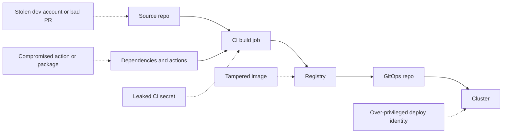

Each arrow has a control: branch protection and review on the source; pinned, vetted dependencies and actions; short-lived credentials for the build; signatures on the image; and a narrow deploy path into the cluster. The SLSA framework (Supply-chain Levels for Software Artifacts) describes these threats in detail. [*Secure AI & Application Security*, lesson 6.2 — The software supply chain](../secai/index.html#/6.2) covers dependencies, SBOMs and SLSA from the security side; this lesson stays on how the platform team builds and runs the pipeline.

**Secrets: the fewer, the better.** The best secret is one that does not exist. The order of preference:
1. **Federated identity (no secret).** The CI job proves who it is with a short-lived OIDC token issued by the CI platform; the cloud exchanges it for temporary credentials (lesson 1.3).
2. **Short-lived secrets from a secrets manager**, fetched at run time with a federated identity.
3. **Stored CI secrets**, only where nothing else works, scoped to one environment, rotated on a schedule, and never printed.

**OIDC federation from GitHub Actions.** The workflow asks for an ID token, and the cloud role trusts only tokens whose claims match. A release job that pushes the image:

```yaml
permissions:
  contents: read             # workflow default: read-only

jobs:
  push-image:
    runs-on: ubuntu-latest
    environment: production   # protected: required reviewers, main branch only
    permissions:
      contents: read
      id-token: write         # only this job may request an OIDC token
    steps:
      - uses: aws-actions/configure-aws-credentials@v4   # pin by SHA in real use
        with:
          role-to-assume: arn:aws:iam::111122223333:role/mobile-api-ci-push
          aws-region: me-central-1
```

And the trust condition on the cloud side (AWS IAM shown; the subject format is GitHub's):

```json
"Condition": {
  "StringEquals": {
    "token.actions.githubusercontent.com:aud": "sts.amazonaws.com",
    "token.actions.githubusercontent.com:sub": "repo:najm-bank/mobile-api:environment:production"
  }
}
```

A job in another repository, or one not running in the `production` environment, gets a token with a different subject, so it cannot assume the role. Because the subject names the environment, not the branch, restrict that environment to `main` in its deployment-branch settings. All three major clouds support the same idea:

| Cloud | Feature | CI side |
|---|---|---|
| AWS | IAM OIDC identity provider and a role with a trust policy | `aws-actions/configure-aws-credentials` |
| Microsoft Azure | Workload identity federation: a federated credential on an app registration or managed identity in Entra ID | `azure/login` |
| Google Cloud | Workload Identity Federation with a workload identity pool and provider | `google-github-actions/auth` |

**The CI's own token.** GitHub gives every workflow a `GITHUB_TOKEN`. Set `permissions: contents: read` at the top of every workflow and grant more per job only when needed (`packages: write` to push to GitHub's registry, `id-token: write` for OIDC). An organisation-level setting can make read-only the default.

**Third-party actions and plugins run with your secrets.** A tag such as `@v4` can be moved by whoever controls the action's repository; a full commit SHA cannot.

```yaml
# Risky: the tag can be repointed to different code
- uses: some-org/deploy-helper@v2

# Hardened: an immutable commit, with the tag as a comment for humans
- uses: some-org/deploy-helper@<full-40-character-commit-sha>   # v2.3.1
```

Use a dependency bot to propose SHA updates as reviewed pull requests, and keep an allow-list of approved actions at organisation level. The same applies to Jenkins plugins, GitLab CI includes and container base images.

**Untrusted code in pull requests.** A pull request from a fork contains code you have not reviewed. Never run it with secrets available. On GitHub, the `pull_request_target` trigger runs in the context of the base repository, with access to its secrets; checking out and running the PR's code in that context is a well-known way to leak secrets. Use the plain `pull_request` trigger for untrusted code.

#### 🟡 Going deeper

**Signing and verifying artefacts.** A signature proves *who* produced an artefact and that it has not changed since. **Sigstore** is an open-source project (under the OpenSSF) whose tool **cosign** signs container images. In **keyless** signing, the CI job's OIDC identity is bound to a short-lived certificate, and the signature is recorded in a public transparency log (Rekor), so there is no long-lived signing key to steal or rotate.

```bash
# In the release workflow, after pushing; the identity comes from the job's OIDC token
cosign sign --yes registry.najm.internal/mobile-api@sha256:<digest>

# Before deploy, or at admission: accept only Najm's release workflow on main
cosign verify \
  --certificate-identity "https://github.com/najm-bank/mobile-api/.github/workflows/release.yml@refs/heads/main" \
  --certificate-oidc-issuer "https://token.actions.githubusercontent.com" \
  registry.najm.internal/mobile-api@sha256:<digest>
```

Sign the **digest**, never a tag. A signature on a tag says nothing once the tag moves.

**Provenance and SBOMs.** **Provenance** is a signed statement of how an artefact was built: which source commit, which workflow, which builder, which inputs. **SLSA** defines build levels (in SLSA v1.0, Build L1 to L3) by how trustworthy that provenance is; at L3 the build runs on a hardened platform that the build's own steps cannot tamper with. An **SBOM** (software bill of materials) lists the components inside the image, so you can answer "are we affected?" when the next critical vulnerability appears. Docker's build-push action can attach provenance and an SBOM as attestations, and GitHub offers artifact attestations; at the time of writing (2026), check each tool's documentation for the exact options.

**Verify at the door: admission control.** Signing is wasted if nothing checks it. A Kubernetes **admission controller** inspects every new pod before it is created. Policy engines such as **Kyverno** (image verification rules) or Sigstore's **policy-controller** can reject any image that is not signed by the expected identity, or that lacks provenance. Combine this with the policy-as-code guardrails from lesson 3.3: images by digest only, from the internal registry only. Roll out in audit mode first, then enforce, starting with one namespace.

**Least-privilege deploys: push versus pull.**

| Model | How it works | Where production credentials live | Risk |
|---|---|---|---|
| **Push** | The CI job runs `kubectl apply` or `helm upgrade` against the cluster | In CI, for every pipeline that deploys | A compromised pipeline can change the cluster directly |
| **Pull (GitOps)** | CI pushes a signed image and opens a change in the GitOps repo; a controller inside the cluster (Argo CD, Flux) applies it | Inside the cluster only | CI has no cluster access; changes go through Git review |

Najm uses pull. The CI identity can push images to one registry repository and open pull requests to the GitOps repo. It cannot touch the cluster or other cloud resources. Argo CD's own permissions are scoped by project to the namespaces each team owns.

**Split identities by job.** One powerful CI identity for everything is a single point of failure. Give separate roles to separate jobs: a build job that can read dependencies and push to a staging registry path; a release job, only on `main` and only in the protected environment, that can promote and sign; an infrastructure **plan** job with read-only access; and an **apply** job that runs only after approval (lesson 3.1).

#### 🔴 Expert view

**Runners are production infrastructure.** Hosted runners are fresh for each job. **Self-hosted runners**, which Najm needs to reach private networks, are not, unless you make them so. A persistent runner can keep files, credentials or malware from one job to the next. Use **ephemeral runners** (one job, then destroyed), for example autoscaled runner pods on Kubernetes; never attach self-hosted runners to public repositories; restrict their network egress; and separate runner groups for production and non-production.

**Separation of duties without slowing down.** Banks must show that one person cannot both write and ship a change on their own. In practice: protected branches requiring at least one reviewer who is not the author; **CODEOWNERS** files so that changes to pipeline definitions, IaC and the GitOps repo need platform or security approval; protected environments where production promotion needs a reviewer; and signed commits where the risk justifies the friction. The pipeline then becomes the change-control evidence regulators ask for, instead of a separate ticket.

**Break-glass and audit.** Sometimes humans must act directly on production. Plan for it: a **break-glass** role that requires a strong second factor, sends an alert to the SOC (Jassim's team), expires within hours and is reviewed afterwards. Send CI audit logs, cloud audit logs and admission-controller denials to the security monitoring platform, and alert on unusual events such as a new self-hosted runner, a change to branch protection, or a production deploy outside the pipeline.

**Secrets still leak; plan for rotation.** Even with federation, some secrets remain: database passwords, third-party API keys for Najm Assist's model providers. Store them in a secrets manager and inject them at run time (lesson 2.3), with secret scanning on every push and a rotation runbook tested in advance. [*Secure AI & Application Security*, lesson 5.2 — Secrets management](../secai/index.html#/5.2) goes deeper, and [*Secure AI & Application Security*, lesson 7.2 — Containers, Kubernetes and infrastructure as code](../secai/index.html#/7.2) covers cluster hardening.

### 🧰 The toolkit
| Tool, practice or service | What it is and does | When to reach for it |
|---|---|---|
| **OIDC workload identity federation** | CI jobs exchange a short-lived identity token for temporary cloud credentials; no stored keys | Every pipeline that touches a cloud account |
| **Protected environments** | Deployment targets with required reviewers, branch restrictions and their own secrets | Gating promotion to production |
| **SHA pinning** | Referencing third-party actions, plugins and images by immutable commit or digest | Every external dependency of the pipeline |
| **cosign** (Sigstore) | Signs and verifies container images, including keyless signing with OIDC | Signing release images; verifying before deploy |
| **SLSA** (OpenSSF) | Framework of supply-chain threats and build levels for provenance | Setting targets for build integrity |
| **SBOM** | List of the components inside an artefact, in SPDX or CycloneDX format | Answering "are we affected?" for new vulnerabilities |
| **Kyverno** (CNCF) | Kubernetes policy engine, including image signature verification at admission | Admitting only signed, approved images |
| **Ephemeral runners** | CI runners created for one job and then destroyed | Any self-hosted runner, especially with network access to production |

### 🏛️ In practice at Najm Bank
Noura and Salem publish the **Najm Pipeline Security Baseline v1**. Every repository is scored against it on a dashboard; tier-1 services must meet all of it by the end of the quarter.

| # | Control | How it is enforced | Evidence |
|---|---|---|---|
| P1 | No long-lived cloud keys in CI | Cloud access only through OIDC roles scoped to repo and environment; a scheduled scan of CI secret names and cloud key ages | Zero active access keys for CI users |
| P2 | Read-only default token | Organisation setting; workflows declare per-job permissions | Policy check on every workflow file |
| P3 | Third-party actions pinned to full SHA from an allow-list | Organisation allow-list; a linter on workflow files; bot updates | Linter report |
| P4 | No secrets for untrusted PRs | `pull_request_target` banned except in reviewed templates | Linter report |
| P5 | Images signed by digest with provenance and SBOM | Golden-path release workflow (lesson 4.1) | Signature and attestations in registry |
| P6 | Cluster admits only images signed by `release.yml` on `main` | Kyverno policy, enforced in production namespaces | Admission deny log |
| P7 | Pull-based deploys | CI has no cluster credentials; Argo CD applies from the GitOps repo | Cluster role bindings review |
| P8 | Separation of duties | Branch protection, CODEOWNERS on workflows, IaC and GitOps repo; protected production environment | Settings export, monthly |
| P9 | Ephemeral, segregated runners | Self-hosted runners as one-job pods; separate groups for production | Runner inventory |
| P10 | Break-glass access | Time-limited role, MFA, SOC alert, post-use review | Access log and review record |

The fix for Yousef's pipeline: the admin key is deleted; the workflow assumes a role that may only push to `registry.najm.internal/internal-tool/*`; the third-party deploy action is removed, because a commit to the GitOps repo replaces it.

### 🛠️ Exercises
Use your own GitHub account and, if you use a cloud, a free-tier account with a budget alert set first.

- 🟢 Audit one of your own repositories' workflows: add `permissions: contents: read` at the top, grant extra permissions per job only where needed, and pin every third-party action to a full commit SHA with the version as a comment. *Done when:* every `uses:` line references a 40-character SHA and every workflow declares its permissions.
- 🟡 Build an image in GitHub Actions, push it to GitHub Container Registry, and sign it with cosign keyless signing (the job needs `id-token: write`). Then verify it locally with `cosign verify`, using the exact workflow identity and issuer. *Done when:* verification passes with the correct identity, and fails when you change the identity to a different branch.
- 🔴 In a local kind cluster, install Kyverno and write a policy that admits images from your registry only if signed by your workflow identity. Start in audit mode, then enforce. Try to run an unsigned image and a signed one. Alternatively, set up OIDC federation from GitHub Actions to a free-tier cloud account with a trust condition on your repository and environment. *Done when:* the unsigned image is rejected with a clear policy message and the signed one runs; or, for the cloud option, a job in the named environment gets credentials and a job on another branch is denied.

### ⚠️ Mistakes and traps
- **Long-lived admin keys in CI secrets.** One leak gives full cloud control. Use OIDC federation with narrowly scoped roles per job.
- **Trusting tags.** Tags on actions, plugins and images can move. Pin by commit SHA or digest and update through reviewed bot PRs.
- **Signing without verifying.** Signatures nobody checks are decoration. Enforce verification at admission, starting in audit mode.
- **Running fork code with secrets.** `pull_request_target` plus checking out PR code exposes secrets. Keep untrusted code away from privileged contexts.
- **Persistent self-hosted runners.** Jobs can leave behind credentials or malware for the next job. Make runners ephemeral and segregate production.
- **CI with cluster-admin.** A push-based pipeline holding cluster credentials is a direct path to production. Prefer pull-based GitOps.

### 🧾 Recap
- The pipeline is a privileged production system; threat-model each step from commit to cluster.
- Replace stored cloud keys with OIDC federation scoped to repository and environment; default all tokens to read-only.
- Pin third-party actions and images immutably; never expose secrets to untrusted pull requests.
- Sign images by digest, attach provenance and an SBOM, and admit only verified images.
- Deploy by pull through GitOps, split identities by job, use ephemeral runners, and keep audited break-glass access.

### ✍️ Check yourself

**1. Yousef's workflow stores a never-expiring cloud admin key as a repository secret. What should replace it?**

- A. The same admin key, rotated automatically every 90 days
- B. A key for a less privileged user, stored in a different repository
- C. The key base64-encoded in the workflow file, so it is not plain text
- D. OIDC federation, with a role trusting only this repository and environment

<details><summary>Answer</summary>

**D.** Federation removes the long-lived secret entirely and binds access to a specific repository and environment. A and B still leave a stealable key; C is not encryption at all. (🟢 The essentials.)

</details>

**2. In March 2025, teams that referenced `tj-actions/changed-files` by a version tag ran malicious code. Which practice protected teams that were not affected?**

- A. Pinning the action to a full commit SHA
- B. Always using the newest version tag of the action
- C. Running the workflow on a self-hosted runner
- D. Setting a short timeout on every job

<details><summary>Answer</summary>

**A.** The attacker moved the tags; a pinned commit SHA cannot be moved. B followed the moved tag; C and D do not change which code runs. (🧭 Why it matters, 🟢 The essentials.)

</details>

**3. Najm signs every image but finds an unsigned image running in production. What is missing?**

- A. Longer-lived signing certificates, so signatures stay valid
- B. Admission checks against the release workflow's identity
- C. Signing by tag instead of by digest, so updates are covered
- D. A more detailed SBOM attached to every image

<details><summary>Answer</summary>

**B.** A signature only protects you if something, such as a Kyverno policy, refuses unsigned or wrongly signed images. C would weaken signing, since tags can move; A and D do not stop an unsigned image. (🟡 Going deeper.)

</details>

**4. Why does Najm prefer pull-based GitOps deploys over CI jobs running `kubectl apply`?**

- A. Pull-based deploys always reach production faster than CI jobs
- B. `kubectl apply` cannot update an existing Deployment
- C. CI holds no cluster credentials; only reviewed Git changes reach it
- D. GitOps lets teams skip code review on deployment changes

<details><summary>Answer</summary>

**C.** A compromised pipeline cannot change the cluster directly, and Git review becomes the change record. D is the opposite of the truth; A and B are false. (🟡 Going deeper.)

</details>

**5. Najm needs self-hosted runners that can reach private networks. Which setup is safest?**

- A. Ephemeral one-job runners, segregated by environment, kept off public repos
- B. One long-lived runner shared by all repositories, for speed
- C. Self-hosted runners attached to public repositories so the community can test
- D. A persistent runner with cluster-admin credentials cached on disk

<details><summary>Answer</summary>

**A.** Ephemeral, segregated runners stop one job from leaving credentials or malware for the next. B, C and D each give an attacker a lasting foothold. (🔴 Expert view.)

</details>

### 📚 References
- GitHub, security hardening with OpenID Connect — https://docs.github.com/en/actions/security-for-github-actions/security-hardening-your-deployments/about-security-hardening-with-openid-connect
- GitHub, security hardening for GitHub Actions — https://docs.github.com/en/actions/security-for-github-actions/security-guides/security-hardening-for-github-actions
- GitHub, managing environments for deployment — https://docs.github.com/en/actions/managing-workflow-runs-and-deployments/managing-deployments/managing-environments-for-deployment
- AWS IAM, OIDC identity providers — https://docs.aws.amazon.com/IAM/latest/UserGuide/id_roles_providers_create_oidc.html
- Microsoft Entra, workload identity federation — https://learn.microsoft.com/en-us/entra/workload-id/workload-identity-federation
- Google Cloud, Workload Identity Federation — https://cloud.google.com/iam/docs/workload-identity-federation
- Sigstore documentation (cosign, Rekor) — https://docs.sigstore.dev/
- SLSA specification — https://slsa.dev/
- Kyverno, verify images — https://kyverno.io/docs/
- Argo CD documentation — https://argo-cd.readthedocs.io/
- NVD, CVE-2025-30066 (tj-actions/changed-files) — https://nvd.nist.gov/vuln/detail/CVE-2025-30066
- Codecov, Bash Uploader security update (April 2021) — https://about.codecov.io/security-update/

---

<a id="m5"></a>

# Module 5 — Observability and reliability

*Shipping a service is the start of its life, not the end. After that, two questions decide whether customers trust it: can you see what it is doing, and do you know how reliable it needs to be? This module answers both. It starts with telemetry: the logs, metrics and traces a service emits, and OpenTelemetry, the open standard that lets you collect them once and send them anywhere. It then turns that telemetry into reliability decisions with service level objectives (SLOs), error budgets, alerts that fire only when users are hurting, and an on-call rota people can live with. It ends with incidents: how to run one calmly, and how to write a blameless postmortem that makes the next one less likely. You will follow Najm Bank's Platform Engineering & SRE team as Yousef chases a slow-transfer complaint across three systems with nothing but scattered log files, Maha replaces 140 noisy alerts with four that matter, and the team runs, and then learns from, a payments incident caused by a one-line configuration change.*

> **Phases:** Operate, Monitor — seeing what production is really doing, deciding how reliable it must be, and responding well when it is not.

<a id="l5-1"></a>

## 5.1 — Telemetry: logs, metrics, traces and OpenTelemetry

*Level: 🟡 Intermediate* · *Prerequisites: 2.2, 4.1* · *Phase: Monitor*

### ⚡ In 60 seconds
- **Telemetry** is the data a running system emits about itself. The three main signals are **logs** (events, with detail), **metrics** (numbers over time, cheap to keep and alert on) and **traces** (the path of one request across services). **Profiles** (where CPU and memory go inside the code) are a fourth signal that is still maturing.
- **Observability** is the ability to answer new questions about production from that telemetry, without shipping new code to find out.
- **OpenTelemetry** (OTel) is the open, vendor-neutral standard for producing and moving telemetry. Instrument once with OTel, then send the data to whichever back end you choose: Prometheus, Grafana, a cloud provider's monitoring service or a commercial tool.
- The rule that matters most: every signal carries the same **context** (service, environment, version, trace ID), so you can jump from an alert to a trace to the log line.
- Decision cue: metrics tell you *that* something is wrong, traces tell you *where*, logs tell you *why*.
- Biggest trap: high-cardinality labels (customer ID, account number) on metrics. They multiply time series until the monitoring system becomes slow, expensive or falls over.

### 🧭 Why it matters
On a Thursday afternoon, the contact centre forwards a complaint to Platform Engineering: transfers in the Najm Mobile app "spin for ages" before succeeding. Yousef opens the dashboard: CPU is fine and the Najm Mobile API's average response time is 180 milliseconds. He then spends two hours reading log files from the API pods, the Payments service and the core banking adapter in the data centre. Each logs in a different format, with no common request ID, so he cannot tell which slow line belongs to which transfer.

Salem sits down with him. "The average hides the tail," he says. "If one transfer in a hundred takes eight seconds, the average still looks healthy. And you can't follow one request across three systems because nothing ties them together." The fix is to instrument the path so every request carries a trace ID from the API, through Payments, across the hybrid link to core banking, and to record latency as a distribution, not an average.

Two days after the team instruments the path, a trace shows the answer in one picture: 7.4 seconds of a slow transfer are spent waiting for a database connection inside Payments, and core banking is fast. Without telemetry, the team would have blamed the data centre. And you cannot set a reliability target, alert on it or run an incident on data you do not have.

### 📐 How it works
#### 🟢 The essentials
**Monitoring vs observability.** **Monitoring** watches for failures you predicted: "alert if the error rate goes above 1%". **Observability** lets you investigate failures you did not predict: "why are only Android users on the newest app version seeing slow transfers since 14:05?" You need both.

**The three signals.**

| Signal | What it is | Strength | Weakness | Najm example |
|---|---|---|---|---|
| **Logs** | Timestamped records of discrete events, ideally structured (JSON key-value pairs) | Rich detail; the "why" | Expensive at volume; hard to aggregate | `transfer rejected: insufficient funds` |
| **Metrics** | Numeric measurements aggregated over time: counters, gauges, histograms | Cheap; fast to query; the basis of alerts and dashboards | No per-request detail | Requests per second, error rate, latency distribution |
| **Traces** | The journey of one request, made of **spans** (timed operations) linked by a shared trace ID | Shows where time goes across services | Usually sampled; needs instrumentation in every hop | API → Payments → core banking adapter, with timings |

**Structured logs.** A log line should be a machine-readable record, not a sentence. Compare:

```text
# Risky: free text, no context, personal data
2026-03-12 14:05:11 Transfer failed for Ahmed Al-Kuwari acct 1234567890 after timeout
```

```json
{"ts":"2026-03-12T14:05:11.482Z","level":"error","service.name":"payments",
 "deployment.environment":"prod","service.version":"2.14.0",
 "event":"transfer.failed","reason":"db_pool_timeout","duration_ms":8012,
 "trace_id":"4bf92f3577b34da6a3ce929d0e0e4736","span_id":"00f067aa0ba902b7"}
```

The hardened version can be counted, carries the trace ID and contains no name or account number. What must never go into logs is covered in [*Secure AI & Application Security*, lesson 5.3 — Protecting personal data: minimisation, logging and privacy engineering](../secai/index.html#/5.3).

**Metric types.** A **counter** only goes up (total requests, total errors); you look at its rate of change. A **gauge** goes up and down (queue depth, memory in use, open connections). A **histogram** counts observations into buckets (how many requests took under 100 ms, under 250 ms, under 1 s and so on), which lets you calculate percentiles later.

**Percentiles, not averages.** The **p99** latency is the value that 99% of requests are faster than. If the median is 150 ms and p99 is 6 s, one request in a hundred is painfully slow. Averages hide exactly the users who complain, so record latency as histograms and watch p50, p95 and p99.

**What to measure first.** Three well-known checklists:
- **The four golden signals** (Google's *Site Reliability Engineering* book): latency, traffic, errors and saturation (how "full" the service is).
- **RED** for request-driven services: **R**ate (requests per second), **E**rrors (failed requests per second), **D**uration (latency distribution). Use it for the Najm Mobile API and Payments.
- **USE** for resources: **U**tilisation, **S**aturation and **E**rrors for each CPU, disk, network link or connection pool. Use it for nodes, databases and the hybrid link to the data centre.

#### 🟡 Going deeper
**OpenTelemetry in one paragraph.** OpenTelemetry is a CNCF project, formed in 2019 by merging two earlier projects, OpenTracing and OpenCensus. It provides: an **API and SDKs** for many languages, to create spans, metrics and logs in your code; **automatic (zero-code) instrumentation** for common frameworks and libraries, so HTTP servers, HTTP clients and database drivers emit spans without code changes; **OTLP**, the OpenTelemetry Protocol for sending telemetry; **semantic conventions**, standard attribute names such as `service.name`, `http.request.method`, `http.route` and `http.response.status_code`; and the **Collector**, a separate process that receives, processes and exports telemetry. At the time of writing (2026), the trace and metric specifications are stable, log support is stable in some language SDKs and still maturing in others, and profiles are still in development. Check the status page for your language before relying on a signal.

**How a trace crosses services.** When the Najm Mobile API calls Payments over HTTP, the OTel SDK adds a `traceparent` header in the W3C Trace Context format: a version, the 32-hex-character trace ID, the 16-hex-character ID of the calling span, and flags (including whether the trace is sampled).

```text
traceparent: 00-4bf92f3577b34da6a3ce929d0e0e4736-00f067aa0ba902b7-01
```

Payments reads the header and creates its spans as children of that span. A hop that drops the header, such as an old proxy or the core banking adapter, breaks the trace into pieces, which is why Najm instrumented the adapter first.

**Adding business context to a span.** Automatic instrumentation gives you HTTP and database spans; add manual spans where the business logic lives:

```python
from opentelemetry import trace

tracer = trace.get_tracer("najm.payments")

def reserve_funds(transfer):
    with tracer.start_as_current_span("reserve_funds") as span:
        span.set_attribute("payment.rail", transfer.rail)        # e.g. "domestic"
        span.set_attribute("payment.amount_band", transfer.band)  # "small", not the amount
        return ledger.reserve(transfer)
```

Keep attributes low-risk: a band, not the amount; a rail, not the account number.

**The Collector pipeline.** Applications send OTLP to a nearby Collector (often a DaemonSet, one per Kubernetes node, plus a central "gateway" Collector). The Collector batches, enriches, filters and routes:

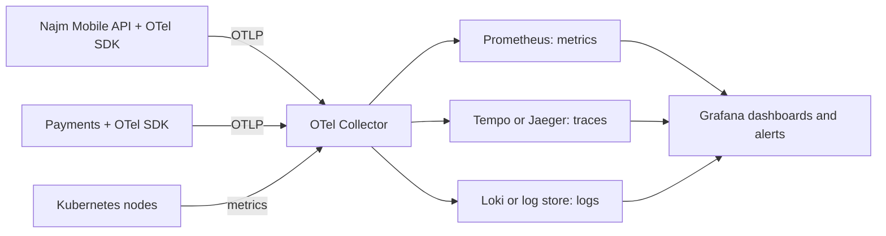

A minimal Collector configuration for a local lab:

```yaml
receivers:
  otlp:
    protocols:
      grpc:
        endpoint: 0.0.0.0:4317
      http:
        endpoint: 0.0.0.0:4318
processors:
  memory_limiter:          # protect the Collector itself; put it first
    check_interval: 1s
    limit_percentage: 80
    spike_limit_percentage: 20
  attributes/scrub:        # defence in depth: drop fields that must never leave the app
    actions:
      - key: enduser.id
        action: delete
  batch: {}
exporters:
  otlp/tempo:
    endpoint: tempo:4317
    tls:
      insecure: true       # local lab only; use TLS in any shared environment
  prometheus:
    endpoint: 0.0.0.0:8889 # Prometheus scrapes the Collector here
  debug: {}                # prints logs to the Collector's output in the lab
service:
  pipelines:
    traces:  {receivers: [otlp], processors: [memory_limiter, attributes/scrub, batch], exporters: [otlp/tempo]}
    metrics: {receivers: [otlp], processors: [memory_limiter, batch], exporters: [prometheus]}
    logs:    {receivers: [otlp], processors: [memory_limiter, attributes/scrub, batch], exporters: [debug]}
```

Because applications only speak OTLP to the Collector, Najm can change back ends by changing the Collector, not every service.

**Prometheus and PromQL.** **Prometheus** (a CNCF graduated project) uses a **pull model**: it **scrapes** an HTTP `/metrics` endpoint on each target at a regular interval and stores the results as time series, each identified by a metric name and **labels** (key-value pairs). You query it with **PromQL**. The RED metrics for the Najm Mobile API look like this:

```promql
# Rate: requests per second over the last 5 minutes
sum(rate(http_requests_total{job="najm-mobile-api"}[5m]))

# Errors: share of requests that returned 5xx
sum(rate(http_requests_total{job="najm-mobile-api", code=~"5.."}[5m]))
  /
sum(rate(http_requests_total{job="najm-mobile-api"}[5m]))

# Duration: p99 latency from a histogram
histogram_quantile(
  0.99,
  sum by (le) (rate(http_request_duration_seconds_bucket{job="najm-mobile-api"}[5m])))
```

Metric names vary with the instrumentation library; OTel's HTTP server metric, for example, becomes `http_server_request_duration_seconds` once exported to Prometheus. Check what your services actually emit before you copy a query. **Grafana** then turns these queries into dashboards and alerts.

**Cloud equivalents.** Each major provider has a managed monitoring stack: Amazon CloudWatch and AWS X-Ray, Azure Monitor with Application Insights, and Google Cloud Observability. Their support for OTLP and Prometheus data, features and pricing change; check current documentation.

#### 🔴 Expert view
**Cardinality is the cost driver.** Every unique combination of label values is a separate time series. `http_requests_total` with labels `route` (40 values), `code` (10) and `pod` (30) is up to 12,000 series, which is fine. Add `customer_id` (2 million values) and you have created billions of potential series. Rules Najm follows: labels on metrics come from small, bounded sets (route template, status class, region, version); identifiers belong on spans and in logs, never on metrics.

**Sampling traces.** Tracing every request is expensive at scale. **Head sampling** decides at the start of a request (keep 10% at random), which is cheap but may throw away the one slow trace you need. **Tail sampling**, done in a Collector after the trace completes, keeps traces by outcome: all errors, all requests slower than 2 s, plus a small random share of the rest. Najm keeps 100% of Payments error and slow traces, and a small sample of healthy ones. Tail sampling needs all spans of a trace to reach the same Collector instance, which shapes how you deploy the gateway.

**Exemplars and correlation.** An **exemplar** is a trace ID attached to a histogram bucket. Click the dot in a slow bucket on a Grafana latency panel to open a real slow trace, then follow its trace ID to the logs: two minutes instead of two hours of grepping.

**Telemetry has a budget.** Debug logging in production, unbounded labels and 100% tracing can make observability a large line on the cloud bill. Set retention by signal, and for logs follow the bank's records and privacy rules. Audit and security logs are a separate stream with their own retention and integrity requirements; see [*Secure AI & Application Security*, lesson 10.1 — Logging, monitoring and detection engineering](../secai/index.html#/10.1).

**Instrument the platform, not each team.** Put telemetry on the golden path: the service template ships with the OTel SDK, automatic instrumentation, a logger that adds `trace_id` and a default RED dashboard, so every new service is observable on day one.

For the non-engineer's view of why dashboards mislead, see [*System Design for Vibe Coders*, lesson 7.1 — The dashboard that lies and the metric that doesn't](../vibe/index.en.html#l7-1); for observability as a SaaS component, see [*SaaS Building Blocks*, lesson 7.2 — Observability: logs, errors, metrics and traces](../saas/index.html#/7.2).

### 🧰 The toolkit
| Tool, practice or service | What it is and does | When to reach for it |
|---|---|---|
| **OpenTelemetry** (CNCF) | Vendor-neutral APIs, SDKs, automatic instrumentation, semantic conventions and the OTLP protocol for traces, metrics and logs | Every new service; the default way to instrument at Najm |
| **OpenTelemetry Collector** | A process that receives, processes (batch, scrub, sample) and exports telemetry to one or more back ends | Between applications and back ends, so services never talk to a vendor directly |
| **Prometheus** (CNCF) | Pull-based time-series database with the PromQL query language and alert rules | Metrics for Kubernetes workloads and RED/USE dashboards |
| **Grafana** | Dashboards and alerting over many data sources, including Prometheus, Loki and Tempo | One place to see metrics, logs and traces side by side |
| **Jaeger** (CNCF) or **Grafana Tempo** | Trace storage and search | Following one request across services; finding the slow hop |
| **RED and USE methods** | Checklists: Rate, Errors, Duration for services; Utilisation, Saturation, Errors for resources | Deciding what to put on a service's first dashboard |

### 🏛️ In practice at Najm Bank
**Artefact: the Najm telemetry standard (v1), part of the golden-path template.**

| Area | Standard |
|---|---|
| Resource attributes | Every signal carries `service.name`, `service.version`, `deployment.environment`, `cloud.region` and `k8s.namespace.name` |
| Logs | JSON to stdout; fields `ts`, `level`, `service.name`, `event`, `trace_id`, `span_id`; no names, account numbers, card numbers, tokens or free-text customer input |
| Metrics | RED for every HTTP and gRPC endpoint, as histograms (latency in seconds); USE for connection pools, queues and the hybrid link; labels from bounded sets only |
| Traces | OTel automatic instrumentation plus manual spans for business steps (`reserve_funds`, `post_to_core`); W3C `traceparent` propagated through every hop, including the core banking adapter |
| Sampling | Tail sampling at the gateway Collector: keep all error traces and traces slower than 2 s; sample healthy traces at a low rate set per service |
| Transport | Applications send OTLP only to the node Collector; only the gateway Collector talks to back ends |
| Dashboards | Each service gets a generated RED dashboard with p50/p95/p99, error ratio and a link to its runbook |
| Retention | Set per signal and agreed with Security and Compliance; audit logs are a separate stream owned by the SOC |
| Review | A service cannot go to production until its "first five minutes" check passes: an engineer who has never seen it can find its error rate, p99 and one failed trace in under five minutes |

### 🛠️ Exercises
All three run locally with Docker or a kind/k3d cluster. Do not point them at an employer's systems without permission.

- 🟢 Run a small web app of your own (or an OpenTelemetry demo app) with Prometheus and Grafana in Docker Compose. Build a RED dashboard: requests per second, 5xx ratio and p50/p95/p99 latency from a histogram. *Done when:* you can make the app slow (add a sleep to one route) and watch p99 rise while the average barely moves, and you can explain the difference in two sentences.
- 🟡 Add OpenTelemetry automatic instrumentation to two small services where service A calls service B over HTTP. Send traces through an OTel Collector to Jaeger or Tempo, and write structured JSON logs that include `trace_id`. *Done when:* you can open one trace that shows spans from both services, and find that trace's log lines by searching for its trace ID.
- 🔴 Extend the 🟡 lab with tail sampling in the Collector: keep every error trace and every trace slower than one second, plus a 5% sample of the rest. Add an exemplar-enabled latency histogram and a Grafana panel. Then add a random user ID label to one metric and measure how the series count grows. *Done when:* clicking a slow exemplar opens a real slow trace, your sampling policy is shown to keep a forced error, and you have written a one-paragraph note on the cardinality you measured and how you removed it.

### ⚠️ Mistakes and traps
- **Alerting on and reporting averages.** Averages hide the slow tail that customers feel. Record histograms; look at p95 and p99.
- **Unbounded labels on metrics.** Customer IDs, request IDs or full URLs as labels can multiply series until the monitoring system fails. Use route templates and bounded labels; put identifiers on spans and logs.
- **Logging personal data and secrets "for debugging".** Logs are copied, retained and widely read. Log events and reasons, not people; scrub at the Collector as a second line of defence.
- **Broken trace context.** One hop that drops `traceparent`, such as a legacy adapter, a message queue or a proxy, splits every trace. Test propagation end to end, including asynchronous paths.

### 🧾 Recap
- Logs give detail, metrics give cheap aggregates and alerts, traces show where time goes across services; profiles are an emerging fourth signal.
- Shared context (service, version, environment, trace ID) is what lets you jump between signals.
- Use RED for services, USE for resources and the four golden signals as a cross-check; measure latency as histograms and percentiles.
- OpenTelemetry standardises instrumentation and transport; the Collector decouples services from back ends and is where you batch, scrub and sample.
- Cardinality, retention and sampling decide what observability costs; design them, do not discover them on the bill.

### ✍️ Check yourself

**1. The Najm Mobile API dashboard shows an average latency of 180 ms, but customers complain that some transfers take many seconds. What should Yousef look at first?**

- A. CPU utilisation of the API pods
- B. The p95 and p99 latency from a request-duration histogram
- C. The total number of log lines per minute
- D. The average latency over a longer window, such as 24 hours

<details><summary>Answer</summary>

**B.** Percentiles from a histogram reveal the slow tail that an average hides. A longer average (D) hides it even more; CPU (A) may be normal while requests wait on a connection pool. (🟢 The essentials.)

</details>

**2. A developer wants to add a `customer_id` label to the `http_requests_total` metric so support can see each customer's request rate. What is the best response?**

- A. Accept it, because labels are cheap and more of them always help
- B. Accept it in production only, where support actually needs it
- C. Accept it after hashing the customer ID, so no personal data is stored
- D. Refuse it: unbounded values multiply series; use spans or logs instead

<details><summary>Answer</summary>

**D.** Each unique label value creates a new series; millions of customers make the metric system slow and costly. Hashing (C) keeps exactly the same cardinality. Identifiers belong on spans and logs, within privacy rules. (🔴 Expert view.)

</details>

**3. Traces from the Najm Mobile API stop at the core banking adapter, and a new trace starts on the other side. What is the most likely cause?**

- A. The adapter does not propagate the W3C `traceparent` header
- B. Prometheus is scraping the adapter too slowly
- C. The logs are not in JSON
- D. Head sampling is set to 100%

<details><summary>Answer</summary>

**A.** A trace stays joined only if every hop forwards the trace context. Scrape interval (B) and log format (C) do not affect trace linking; sampling everything (D) would not split traces. (🟡 Going deeper.)

</details>

**4. Why does Najm route all application telemetry through OpenTelemetry Collectors instead of having each service send data straight to its back end?**

- A. Because Prometheus has no way to scrape metrics from applications directly
- B. Because OTLP data can only be received by a Collector, never by a back end
- C. Because it centralises batching, scrubbing and sampling, and decouples services from back ends
- D. Because the Collector is the long-term store that dashboards query for history

<details><summary>Answer</summary>

**C.** The Collector decouples services from back ends and centralises processing. Prometheus can scrape apps directly (A), OTLP can go straight to a back end that accepts it (B), and the Collector is a pipeline, not a store (D). (🟡 Going deeper.)

</details>

**5. Najm wants to keep tracing costs down without losing the traces engineers need during incidents. Which approach fits best?**

- A. Head sampling at 1% for every service, decided when each request starts
- B. Tail sampling: keep all error and slow traces, plus a few healthy ones
- C. Turn tracing off entirely and rely on structured logs with trace IDs
- D. Keep every trace, but delete all of them automatically after one hour

<details><summary>Answer</summary>

**B.** Tail sampling decides after the outcome is known, so the rare errors and slow requests are kept. Random head sampling (A) will usually discard them; C and D lose the evidence you need. (🔴 Expert view.)

</details>

### 📚 References
- OpenTelemetry documentation — https://opentelemetry.io/docs/
- OpenTelemetry Collector — https://opentelemetry.io/docs/collector/
- OpenTelemetry semantic conventions — https://opentelemetry.io/docs/specs/semconv/
- W3C Trace Context — https://www.w3.org/TR/trace-context/
- Prometheus documentation — https://prometheus.io/docs/introduction/overview/
- Prometheus, metric and label naming — https://prometheus.io/docs/practices/naming/
- Grafana documentation — https://grafana.com/docs/
- Jaeger documentation — https://www.jaegertracing.io/docs/
- Google, *Site Reliability Engineering*, "Monitoring Distributed Systems" — https://sre.google/sre-book/monitoring-distributed-systems/
- CNCF projects — https://www.cncf.io/projects/

<a id="l5-2"></a>

## 5.2 — SLOs, error budgets, alerting and on-call that people can sustain

*Level: 🟡 Intermediate* · *Prerequisites: 5.1* · *Phase: Operate, Monitor*

### ⚡ In 60 seconds
- An **SLI** (service level indicator) measures what users experience, such as "the share of transfer requests that succeed in under 2 seconds". An **SLO** (service level objective) is the target for it over a window, such as 99.9% over 30 days. An **SLA** (service level agreement) is a contract with consequences, and should be looser than the SLO.
- The **error budget** is what the SLO allows to fail: 100% minus the target. It turns "how reliable?" into a shared, numeric decision between product and operations: spend the budget on change, or slow down when it runs out.
- Page a human only for **symptoms users feel** and that need action now. Alert on how fast the error budget is burning, not on CPU at 80%.
- **Multi-window, multi-burn-rate alerts** (from *The Site Reliability Workbook*) catch fast outages quickly and slow leaks reliably, with few false alarms.
- On-call is sustainable only if pages are rare, actionable, linked to a runbook, and followed up with fixes that remove the cause.
- Biggest trap: aiming for 100%. It is impossible, it blocks every change, and the users' own phones and networks are less reliable than that anyway.

### 🧭 Why it matters
Maha inherits the on-call rota for the Najm Mobile API and the Payments service. In her first week she counts 140 alert rules. In one night, Yousef is paged eleven times for high CPU, pod restarts and disk warnings. None needed action. At 04:10 a real problem starts: a share of transfers fails because a certificate on the core banking adapter has expired. Yousef, half-asleep, acknowledges that alert with the others, and customers notice before the team does.

This is **alert fatigue**: when most pages are noise, people learn to ignore pages, and then miss the real one. Maha's fix starts with a different question: "What does a customer need from the Payments service, and how much failure can they tolerate before it matters?" The answers become SLOs. Pages come only from SLO burn. Everything else becomes a ticket, a dashboard entry, or is deleted.

SLOs also settle an old argument: Tariq's teams want speed, Maha's team wants stability. With an error budget, both agree in advance: while budget remains, ship; when it is spent, reliability work comes first. Regulators care too: the EU's Digital Operational Resilience Act (DORA), applicable to financial entities from January 2025, and GCC regulators expect banks to understand and test the resilience of important services; a measured SLO is part of that evidence.

### 📐 How it works
#### 🟢 The essentials
**From users to numbers.** Start with a **user journey**, not a component: "a customer sends a transfer and sees the result". Then choose SLIs that describe a good experience of it:

| SLI type | Definition | Payments example |
|---|---|---|
| **Availability** | Good requests ÷ valid requests | Transfer requests that return a non-5xx result ÷ all transfer requests (excluding client errors such as invalid input) |
| **Latency** | Requests faster than a threshold ÷ valid requests | Transfer requests completed in under 2 s ÷ all transfer requests |
| **Correctness** | Correct outcomes ÷ outcomes | Transfers posted exactly once and reconciled with core banking ÷ all transfers |

Express SLIs as good events ÷ valid events: easy to compute from counters and comparable across services.

**SLO, SLA and the window.** An SLO adds a target and a window: "99.9% of transfer requests succeed, measured over a rolling 30 days." A **rolling window** always looks at the last 30 days, so a bad day stays visible for a month. An **SLA** is an external promise with penalties, set below the internal SLO.

**Error budget arithmetic.** The budget is 100% minus the SLO.

| SLO | Error budget | Allowed "bad" time if fully down, per 30 days | Bad requests allowed per 10 million |
|---|---|---|---|
| 99% | 1% | 7.2 hours | 100,000 |
| 99.5% | 0.5% | 3.6 hours | 50,000 |
| 99.9% | 0.1% | 43.2 minutes | 10,000 |
| 99.99% | 0.01% | about 4.3 minutes | 1,000 |

Each extra "nine" cuts the budget by ten and usually costs far more in redundancy, release speed and on-call effort. Pick the target from user needs, not ambition. Payments gets 99.9% availability and 99% of transfers under 2 s; the internal developer portal gets 99%.

**Alert on symptoms, not causes.** A **symptom** is something users feel: errors, slowness, wrong results. A **cause** is something that might lead to it: high CPU, a pod restart, a full queue. Causes are useful on dashboards and in tickets. Page on symptoms, because many causes never hurt users, and some user-facing failures have causes you did not predict.

**Three kinds of response.**
- **Page**: a human must act now, at any hour. Only SLO-threatening symptoms.
- **Ticket**: someone must act within working days. Slow budget burn, a certificate expiring in 14 days, a disk filling over weeks.
- **Log or dashboard only**: information for investigations. No notification.

#### 🟡 Going deeper
**Burn rate.** The **burn rate** is how fast you are using the error budget, relative to the rate that would use exactly all of it in the SLO window. A burn rate of 1 means you will end the 30 days with zero budget left. A burn rate of 14.4 means the whole 30-day budget would be gone in about two days. For a 99.9% SLO, the budget is 0.1%, so an error ratio of 1.44% is a burn rate of 14.4.

**Why simple threshold alerts fail.** "Page if the error ratio is above 0.1% for 5 minutes" fires on short blips that barely touch the budget. "Page if the 30-day ratio is above 0.1%" fires days late. *The Site Reliability Workbook* (chapter "Alerting on SLOs") works through these options and recommends **multi-window, multi-burn-rate** alerts. A long window shows the burn is significant; a short window confirms it is still happening, so the alert also stops soon after recovery.

| Severity | Burn rate | Long window | Short window | Budget used if it continues for the long window |
|---|---|---|---|---|
| Page | 14.4 | 1 hour | 5 minutes | 2% |
| Page | 6 | 6 hours | 30 minutes | 5% |
| Ticket | 1 | 3 days | 6 hours | 10% |

These are the Workbook's suggested starting values for a 30-day window. Tune them with your own data.

**The alert as code.** First, recording rules compute the error ratio over several windows (Najm generates these from the SLO file):

```yaml
groups:
  - name: payments-slo-recordings
    rules:
      - record: slo:payments_errors:ratio_rate5m
        expr: |
          sum(rate(http_requests_total{job="payments", route="/transfers", code=~"5.."}[5m]))
          /
          sum(rate(http_requests_total{job="payments", route="/transfers"}[5m]))
      - record: slo:payments_errors:ratio_rate1h
        expr: |
          sum(rate(http_requests_total{job="payments", route="/transfers", code=~"5.."}[1h]))
          /
          sum(rate(http_requests_total{job="payments", route="/transfers"}[1h]))
      # ... the same for 30m, 6h and 3d
```

Then the alerting rule pages only when both the long and short windows burn fast:

```yaml
  - name: payments-slo-alerts
    rules:
      - alert: PaymentsErrorBudgetFastBurn
        expr: |
          (slo:payments_errors:ratio_rate1h > 14.4 * 0.001
            and slo:payments_errors:ratio_rate5m > 14.4 * 0.001)
          or
          (slo:payments_errors:ratio_rate6h > 6 * 0.001
            and slo:payments_errors:ratio_rate30m > 6 * 0.001)
        labels:
          severity: page
          service: payments
        annotations:
          summary: "Payments is burning its 30-day error budget fast"
          runbook_url: "https://runbooks.najm.example/payments/error-budget-burn"
          dashboard: "https://grafana.najm.example/d/payments-slo"
```

Compare the rule Yousef had before:

```yaml
# Risky: a cause, not a symptom; pages at 3 a.m.; no runbook
- alert: HighCPU
  expr: avg(rate(container_cpu_usage_seconds_total{namespace="payments"}[5m])) > 0.8
  labels:
    severity: page
```

Open-source tools such as **Sloth** and **Pyrra** generate these recording and alerting rules from a short SLO definition, and the **OpenSLO** project defines a vendor-neutral SLO file format.

**Routing, grouping and silences.** Prometheus evaluates rules; **Alertmanager** (or Grafana alerting) decides who is told. It **groups** related alerts into one notification, **inhibits** lower alerts when a higher one is firing (do not page about 30 pod errors when the whole cluster is down), **routes** by labels (`service: payments` goes to the Payments rota) and supports **silences** during planned maintenance.

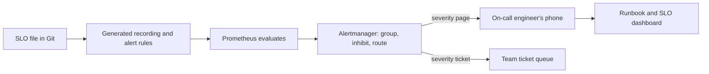

**The error budget policy.** An SLO without consequences is just a chart. Najm's policy, agreed by Salem, Maha and Tariq:
- Budget healthy: teams ship at their normal pace.
- Budget below 25% remaining: releases to that service need an SRE review; the next sprint includes the top reliability item.
- Budget exhausted: only fixes and reliability work ship to that service until the rolling window recovers, unless the Head of Platform and the product owner sign an exception.
- A single incident that uses more than 20% of the budget gets a postmortem (lesson 5.3).

The same burn signal can drive automation: a canary release can roll itself back when its SLIs degrade (lesson 4.2).

#### 🔴 Expert view
**Sustainable on-call.** Google's *Site Reliability Engineering* book treats on-call load as something to measure and cap, and **toil** (manual, repetitive, automatable work that grows with the service and has no lasting value) as something to reduce deliberately. Practices Najm adopts:
- **Rota size and hand-offs.** Enough people that each engineer is on call at most about one week in several, with a written hand-off at every shift change. Follow-the-sun rotas, where a team spans time zones, remove most night pages.
- **Every page is actionable and has a runbook.** If the responder cannot do anything, it should not page. A **runbook** says what the alert means, how to confirm user impact, safe first actions (roll back, fail over, scale out) and who to escalate to.
- **Measure the rota.** Pages per shift, pages outside working hours, time to acknowledge, share of pages that needed action. Alerts that fired without needing action are tuned or deleted within the week.
- **Pay back the load.** Engineers get protected recovery time after a heavy night; recurring pages become owned backlog items.
- **New engineers shadow first.** Yousef shadows Maha for two rotations before carrying the pager alone.

**Choosing SLIs where you measure them.** Server-side metrics miss failures that happen before the request reaches you (DNS, the CDN, the WAF, the load balancer). Najm measures the Payments availability SLI at the load balancer and adds **synthetic probes**: scripted transfers between test accounts every minute from outside the cloud, which also catch failures at the edge. 

**Dependencies and composite SLOs.** If Payments depends serially on three services that each meet 99.9%, its own availability can be lower than any of them. Check what each dependency must achieve, and design for failure where the numbers do not add up: timeouts, retries with backoff, idempotency keys so retries never duplicate a transfer, and graceful degradation (show "transfer pending" rather than failing).

**SLOs for asynchronous and AI work.** For a queue, measure "messages processed within N minutes". For Najm Assist, measure time to first token as well as total time; operating AI agents is covered in [*Running AI Agents in Production*, Level 3 — Production Engineer](../agentic/learning-path.html#level-3-production-engineer).

For a gentler introduction to monitoring stacks and alert hygiene, see [*System Design for Vibe Coders*, lesson 7.6 — Your monitoring stack: Sentry, uptime checks, metrics, and alerts](../vibe/index.en.html#l7-6).

### 🧰 The toolkit
| Tool, practice or service | What it is and does | When to reach for it |
|---|---|---|
| **Service level objective (SLO)** | A target for a user-centred indicator over a window, written down and agreed | Every production service with users, starting with the most important journeys |
| **Error budget** | The amount of failure an SLO allows, plus a policy for what happens as it is spent | Balancing release speed against reliability with numbers, not opinions |
| **Multi-window, multi-burn-rate alerting** (SRE Workbook) | Pages when budget burn is both significant over a long window and still happening in a short one | Replacing threshold and cause-based pages |
| **Alertmanager** (Prometheus) | Groups, inhibits, routes and silences alerts | Sending the right alert to the right rota, once |
| **Sloth** / **Pyrra** | Open-source generators of Prometheus SLO recording and alert rules from a short spec | Keeping SLOs as code instead of hand-written PromQL |
| **Runbook** | A short, linked guide: what the alert means, how to check impact, safe first actions, escalation | Attached to every paging alert |

### 🏛️ In practice at Najm Bank
**Artefact: the Payments service SLO document (v1), stored in Git next to the service.**

| Field | Value |
|---|---|
| Service and owner | Payments service · Payments squad (Tariq's area) · SRE partner: Maha |
| User journey | A retail customer submits a transfer in Najm Mobile and receives a definitive result |
| SLI 1: availability | Transfer requests at the load balancer not returning 5xx or timing out ÷ valid transfer requests (excluding 4xx validation errors) |
| SLO 1 | 99.9% over a rolling 30 days |
| SLI 2: latency | Transfer requests completed in under 2 s ÷ valid transfer requests |
| SLO 2 | 99% over a rolling 30 days |
| SLI 3: correctness | Transfers posted exactly once, as shown by daily reconciliation with core banking ÷ all transfers; any mismatch opens an incident |
| Data sources | Load balancer metrics; OTel histograms; synthetic transfer probe every minute from outside the cloud; reconciliation job |
| Alerts | Page: burn rate 14.4 (1 h and 5 min) or 6 (6 h and 30 min). Ticket: burn rate 1 (3 days and 6 h). Reconciliation mismatch: page |
| Error budget policy | As in 🟡 Going deeper; exceptions signed by Salem and the product owner |
| Dependencies | Managed PostgreSQL, core banking adapter, hybrid link; each has its own SLO, reviewed against this one |
| Not covered | The SLA in customer terms and regulatory reporting thresholds; owned by Risk and Compliance |
| Review | Monthly with Tariq and Maha: budget left, incidents, alert quality (pages per week, share actionable) |

### 🛠️ Exercises
- 🟢 For one service you know (your own project or a public website you use), write three SLIs as good-event ÷ valid-event ratios, choose an SLO for each, and calculate the error budget in minutes and in requests for a 30-day window. *Done when:* each SLI states exactly which events count as good, bad and excluded, and you can justify each target in one sentence about users.
- 🟡 In your local Prometheus lab from lesson 5.1, write recording rules and a multi-window, multi-burn-rate alert for a 99.9% availability SLO, routed through Alertmanager. Inject errors twice: a one-minute burst at a 10% error ratio, then a steady 10% error ratio. *Done when:* the burst does not page, the steady errors page within about ten minutes (work out why from the 1-hour window), and the alert stops after you remove the errors.
- 🔴 Take any alert set you can access legally (your own project, an open-source project's published rules or a sample from a monitoring tutorial) and audit it: classify each alert as page, ticket or delete, rewrite cause-based pages as SLO burn alerts, write one runbook, and draft an error budget policy. *Done when:* you have a before/after table with a reason for every change and a one-page policy that a product owner could sign.

### ⚠️ Mistakes and traps
- **Targets of 100% or "as many nines as possible".** They block every change and cost far more than users notice. Pick the lowest target users are happy with.
- **SLIs that measure the server, not the user.** CPU and pod health are not experiences. Measure success and latency of real journeys, as close to the user as you can.
- **Paging on causes.** CPU, memory, restarts and disk warnings wake people for nothing. Put them on dashboards or tickets; page on budget burn.
- **SLOs without a policy.** If running out of budget changes nothing, nobody will trust or use the SLO. Agree the policy before the first bad month.
- **Alerts without runbooks, and an ignored rota.** A page with no next step wastes the first minutes of an incident. Link a runbook to every page; fix the noisiest alert weekly.

### 🧾 Recap
- SLIs measure user experience as good ÷ valid events; SLOs set a target over a window; SLAs are looser external promises.
- The error budget (100% minus the SLO) is a shared tool for deciding when to ship and when to fix.
- Page only on user-facing symptoms that need action now; use tickets and dashboards for everything else.
- Multi-window, multi-burn-rate alerts detect fast and slow budget burn while ignoring blips.
- Alertmanager groups, inhibits and routes; every page has a runbook and an owner.
- Sustainable on-call is measured and engineered: few, actionable pages, protected recovery and a weekly fix of the noisiest alerts.

### ✍️ Check yourself

**1. The Payments service has a 99.9% availability SLO over 30 days. Roughly how much total downtime does that allow if every request fails while it is down?**

- A. About 4 minutes
- B. About 7 hours
- C. About 43 minutes
- D. About 1 day

<details><summary>Answer</summary>

**C.** 0.1% of 30 days (43,200 minutes) is 43.2 minutes. About 4 minutes is the budget for 99.99% (A); about 7 hours is for 99% (B). (🟢 The essentials.)

</details>

**2. Maha finds that the rota is paged several times a night for "CPU above 80%" on payment pods, and no action is ever needed. What should she do?**

- A. Demote CPU to a dashboard or ticket; page only on Payments SLO burn
- B. Raise the threshold to 90% and keep it as a page, to cut the volume
- C. Add a second engineer to the rota so that the night-time load is shared
- D. Mute the paging channel at night and review the alerts each morning

<details><summary>Answer</summary>

**A.** CPU is a cause, not a symptom; paging on it creates alert fatigue. Raising the threshold (B) keeps a cause-based page; more people (C) spreads the noise; muting (D) also hides real pages. (🟢 The essentials.)

</details>

**3. For a 99.9% SLO, the error ratio over the last hour is 1.5% and over the last five minutes is 1.6%. What does this mean under the alert rule in this lesson?**

- A. Nothing yet, because the 30-day error ratio has not crossed 0.1%
- B. A ticket, because the burn rate is only slightly above 1 and can wait
- C. Nothing, because the short window is higher than the long window
- D. A page, because both windows exceed 14.4 × 0.1% = 1.44%

<details><summary>Answer</summary>

**D.** Both windows exceed the 14.4× threshold, so the budget is burning fast and still burning: the fast-burn page condition. Waiting for the 30-day ratio (A) would page far too late; a burn rate above 14 is not "slightly above 1" (B). (🟡 Going deeper.)

</details>

**4. Tariq's squad has used the whole Payments error budget halfway through the window and wants to release a new feature tomorrow. Under Najm's policy, what happens?**

- A. They release as normal, because the budget resets on the first of next month
- B. Only fixes and reliability work ship, unless an exception is signed
- C. The SLO target is lowered for this month so that the feature can ship
- D. Maha's team takes over all Payments releases permanently from the squad

<details><summary>Answer</summary>

**B.** The error budget policy, agreed in advance, decides this without a fight; Salem and the product owner can sign an exception. A rolling window does not reset on a date (A); lowering the SLO to suit a release (C) defeats its purpose. (🟡 Going deeper.)

</details>

**5. The Payments availability SLI is measured from server-side metrics only. During a CDN misconfiguration, many customers cannot reach the API, yet the SLO dashboard stays green. What change best fixes this blind spot?**

- A. Lower the SLO target so that short edge problems stay within budget
- B. Add more CPU and memory alerts on the API pods behind the CDN
- C. Add synthetic transfer probes from outside the cloud and edge-level SLIs
- D. Increase the Prometheus scrape interval so that fewer gaps appear

<details><summary>Answer</summary>

**C.** Requests that never reach the server do not appear in server metrics; external probes and edge measurement see them. The other options do not observe failures before the server. (🔴 Expert view.)

</details>

### 📚 References
- Google, *Site Reliability Engineering*, "Service Level Objectives" — https://sre.google/sre-book/service-level-objectives/
- Google, *Site Reliability Engineering*, "Eliminating Toil" — https://sre.google/sre-book/eliminating-toil/
- Google, *Site Reliability Engineering*, "Being On-Call" — https://sre.google/sre-book/being-on-call/
- Google, *The Site Reliability Workbook*, "Alerting on SLOs" — https://sre.google/workbook/alerting-on-slos/
- Google, *The Site Reliability Workbook*, "Implementing SLOs" — https://sre.google/workbook/implementing-slos/
- Prometheus, alerting rules — https://prometheus.io/docs/prometheus/latest/configuration/alerting_rules/
- Prometheus, Alertmanager — https://prometheus.io/docs/alerting/latest/alertmanager/
- OpenSLO specification — https://github.com/OpenSLO/OpenSLO
- Regulation (EU) 2022/2554 (DORA) — https://eur-lex.europa.eu/eli/reg/2022/2554/oj

<a id="l5-3"></a>

## 5.3 — Incidents and blameless postmortems

*Level: 🟡 Intermediate* · *Prerequisites: 5.1, 5.2* · *Phase: Operate*

### ⚡ In 60 seconds
- An **incident** is an unplanned event that hurts, or threatens to hurt, users or the business, and that needs a coordinated response. Declaring one early is cheap; declaring one late is expensive.
- Run incidents with clear **roles**: an **incident commander** who coordinates and decides, an **operations lead** who changes systems, a **communications lead** who keeps people informed, and a **scribe** who records the timeline.
- **Mitigate first, investigate later.** Roll back, fail over, turn off a feature flag or shed load to stop the harm; find the root cause once customers are safe.
- A **blameless postmortem** asks how the system allowed a reasonable person's action to cause harm, not who to blame. Blame hides information; learning needs it.
- A postmortem is finished only when its **action items** have owners and due dates, and are tracked to completion.
- Biggest trap: "human error" as the root cause. It is where an investigation should start, not where it ends.

### 🧭 Why it matters
At 10:52 on a weekday morning, the fast-burn alert from lesson 5.2 pages Yousef: the Payments error budget is burning at dozens of times the sustainable rate. Transfer requests are timing out. Yousef starts debugging alone. Ten minutes later, Tariq's squad is also debugging in a different chat, the contact centre is asking what to tell customers, and nobody knows who is in charge. Two engineers are about to restart the database at the same time.

Maha joins, declares a SEV2 incident, takes the role of incident commander and gives everyone a job. Thirteen minutes later the team rolls back a configuration change deployed at 10:40, and the errors stop. The cause turns out to be one line: a change meant only for development, made in a Helm values file shared by all environments, lowered the Payments database connection pool from 50 to 5, and it was promoted to production with a batch of unrelated changes. No transfer was duplicated, because every retry carried an idempotency key. About 3,100 customers saw failed or slow transfers for 37 minutes.

Yousef approved the pull request that carried the change and expects to be blamed. Instead, the postmortem asks why a development value could reach production, why the pipeline did not show the diff of the effective configuration, and why the alert took twelve minutes to bring the right people together. The action items fix those.

### 📐 How it works
#### 🟢 The essentials
**When to declare.** Declare an incident when any of these is true: users are affected now; an SLO fast-burn alert is firing; you need more than one team to fix it; or you are unsure whether it is serious. A false alarm costs minutes; a late declaration costs hours. Make declaring easy: one chat command or button that opens an incident channel and pages the incident commander rota.

**Severity levels.** Severity sets how many people are involved, how often you communicate and who must be told. Najm's scale:

| Severity | Meaning | Examples | Response |
|---|---|---|---|
| **SEV1** | Critical service down or data at risk for many customers | Payments unavailable; suspected data corruption or breach | IC from the senior rota, executive and regulator liaison informed, updates every 30 minutes |
| **SEV2** | Major degradation for a significant share of customers | Transfers failing for a share of users; Najm Mobile API very slow | IC from the SRE rota, product owner informed, updates every 30–60 minutes |
| **SEV3** | Limited impact or a workaround exists | One non-critical feature broken; internal portal down | Owning team handles it; postmortem optional |
| **SEV4** | No current user impact, but risk | A replica failed; a certificate expires in 3 days | Ticket; handled in working hours |

When in doubt, choose the higher severity; you can downgrade later.

**The roles.** The model is adapted from emergency services' incident command systems:
- **Incident commander (IC).** Owns the incident. Keeps the big picture, assigns work, decides (roll back now? escalate?) and declares the end. The IC does **not** debug; the moment they do, nobody is coordinating.
- **Operations lead.** Leads the hands-on work on systems, with subject-matter experts. Only people the operations lead names make changes to production.
- **Communications lead.** Writes internal updates on a fixed schedule, and works with the contact centre and customer-facing teams on what customers are told.
- **Scribe.** Records a timestamped timeline: what was seen, decided and changed. In a small incident the IC may do this with help from chat tooling.

**The lifecycle.**

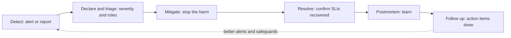

**Mitigate first.** The fastest safe action that stops user harm comes before understanding. Typical mitigations, in rough order of preference: **roll back** the most recent change (deployments and configuration changes cause a large share of incidents, so "what changed?" is the first question); **turn off a feature flag**; **fail over** to a healthy zone or replica; **scale out** or **shed load** (reject low-priority traffic to protect payments). Keep evidence before you destroy it: capture logs, a heap dump or the bad configuration before restarting things, if it takes seconds rather than minutes.

#### 🟡 Going deeper
**A good update** has a fixed, scannable shape:

```text
[SEV2 · Payments · Update 3 · 11:30]
Impact: ~8% of transfer requests failing or slow since 10:41. No duplicate transfers.
Current status: Mitigated. Config rolled back at 11:17; error ratio back to normal since 11:18.
Next steps: Monitoring for 30 min before resolving. Investigating why the change reached prod.
Next update: 12:00 or sooner if anything changes.
IC: Maha · Ops: Tariq · Comms: Salem · Scribe: Yousef
```

Say what you know, what you do not know, and when you will speak next. Never guess a cause in a customer-facing message.

**Coordination habits.** One incident channel, one bridge call, one IC. Announce changes before making them ("Tariq: rolling back payments-config to revision 41 now"). Hand over the IC role explicitly when shifts change or the incident outlasts one person's energy: "Maha handing IC to Salem at 13:00; Salem, confirm." 

**When an incident is also a security incident.** If there is any sign of an attacker (unexpected access, data leaving, a tampered artefact), bring in Jassim's SOC immediately. Security incidents change the rules: preserve evidence, do not tip off the attacker, and follow the security incident response plan, with its legal and regulatory duties. That process is taught in [*Secure AI & Application Security*, lesson 10.2 — Incident response: prepare, detect, contain, recover, learn](../secai/index.html#/10.2).

**Regulatory reporting.** Financial entities have incident reporting duties. Under the EU's DORA, firms must classify ICT-related incidents and report major ones to their competent authority within set deadlines; GCC regulators, including the Qatar Central Bank, also set expectations for reporting incidents and outsourcing failures. Criteria and timelines are owned by Risk and Compliance; engineering's duty is to give them accurate facts fast (start time, services, customers and transactions affected, data impact), which is one more reason to keep a timeline from minute one.

**The blameless postmortem.** A **postmortem** (also called a post-incident review) is a written analysis of an incident: what happened, its impact, why it happened, how the response went and what will change. **Blameless** means it assumes everyone acted reasonably given what they knew at the time, and looks for the conditions that made the harmful action easy and the safe action hard. The point is practical: if people fear blame, they hide details, and without details you cannot fix the system.

Blameless does not mean nobody is accountable. Teams are accountable for completing action items; leaders are accountable for making it safe to tell the truth.

**From "human error" to contributing factors.** "Yousef approved a bad change" is true and useless. Ask better questions:
- How did it make sense at the time? (The diff showed one line in a file named `values-shared.yaml`, which looked harmless.)
- What made the error easy? (Shared values for all environments; no rendered diff of the production configuration in the pipeline.)
- What made detection slow? (The alert paged one person and nothing gathered the right team.)
- What limited the damage? (Idempotency keys, a fast rollback path.)

Complex failures usually have several **contributing factors** rather than one root cause. List them all; fix the ones with the most leverage.

#### 🔴 Expert view
**A public example: the Amazon S3 outage of February 2017.** AWS published a summary of a disruption to S3 in its us-east-1 region. An authorised engineer, following an established playbook, ran a command meant to remove a small number of servers from an S3 subsystem; one input was entered incorrectly and a much larger set was removed. AWS's response focused on the tool rather than the person: it changed the tool to remove capacity more slowly and to refuse to go below a safe minimum. The summary also noted that AWS's own status dashboard depended on S3, so it could not show the outage at first. The lessons for Najm: build guardrails into dangerous tools, and make sure your incident tooling does not depend on the thing that is failing.

**A second example: GitLab, January 2017.** During a late-night effort to fix database replication, an engineer deleted data on the primary database instead of the replica. GitLab's public postmortem then found that several of its backup and replication mechanisms were not working as expected, and about six hours of production data was lost. The lessons: a backup you have not restored is a hope, not a backup (lesson 6.1 covers recovery testing), and tired people doing risky manual work at night need tooling that makes the safe action easy.

**Action items that change things.** Weak items ("be more careful", "add more monitoring") do not survive the next sprint. Strong items are specific, owned, dated and change the system:

| Weak | Strong |
|---|---|
| Be more careful with config changes | Split `values-shared.yaml` into per-environment files; CI fails if a production value changes without a production-labelled review (owner: Yousef, due: 2 weeks) |
| Improve monitoring | Add a USE panel and a ticket-level alert for Payments DB pool saturation above 80% (owner: Maha, due: 1 week) |
| Communicate faster | Fast-burn pages for Payments also page the IC rota and auto-create the incident channel (owner: Salem's platform team, due: 3 weeks) |

Prioritise items that **prevent** recurrence, then those that **detect** faster, then those that **respond** faster. Track them in the normal backlog and review them weekly.

**Measuring incident response.** Teams track times such as **time to detect**, **time to acknowledge** and **time to restore**. DORA's research uses time to restore service (refined in later reports) as a key delivery metric. Treat these numbers with care: incidents are few and very different, so averages over a quarter mislead. Look at trends, the distribution and the story behind the longest ones.

**Practise before it is real.** **Game days** are planned exercises where the team responds to a simulated incident in a test environment: a database failover, a lost zone, an expired certificate. They test runbooks, roles and tooling, and train new people like Yousef safely. Chaos engineering extends this (lesson 6.1). Najm runs one each quarter, some jointly with Jassim's SOC.

### 🧰 The toolkit
| Tool, practice or service | What it is and does | When to reach for it |
|---|---|---|
| **Incident commander** | The single person who coordinates the response, assigns roles and makes decisions; does not debug | Every declared incident, from the first minutes |
| **Severity levels** | A shared scale that sets who is involved, how often to communicate and who must be told | Declaring and escalating incidents consistently |
| **Blameless postmortem** (Google SRE) | A written review that looks for contributing factors in the system, not people to blame | After every SEV1 and SEV2, and any incident that used a large share of the error budget |
| **Status page** | A public or internal page showing current service status and incident updates, hosted independently of the services it reports on | Customer-facing incidents; keeping the contact centre informed |
| **Game day** | A planned, simulated incident in a safe environment to test runbooks, roles and tooling | Quarterly, and before a new service or rota goes live |

### 🏛️ In practice at Najm Bank
**Artefact: the postmortem for the Payments connection-pool incident (abridged), using Najm's template.**

| Section | Content |
|---|---|
| Title and status | PM-2026-014 · Payments transfers failing after configuration change · SEV2 · Final |
| Summary | A shared Helm values change reduced the Payments database connection pool from 50 to 5 in production. Transfers queued for connections and timed out. Rolling back the configuration restored service. |
| Impact | 10:41–11:18 (37 min). About 8% of transfer requests failed or took over 2 s; about 3,100 customers affected. No duplicated or lost transfers (verified by reconciliation). Roughly 5–10% of the 30-day Payments availability error budget used, depending on traffic at that hour and how many requests failed rather than ran slow. |
| Detection | Fast-burn SLO page at 10:52 (11 minutes after onset). Contact centre reports started at 10:49. |
| Timeline (extract) | 10:40 config promoted · 10:41 errors begin · 10:52 page to Yousef · 11:04 SEV2 declared, Maha IC · 11:12 "what changed?" points to config · 11:17 rollback · 11:18 errors normal · 11:48 resolved |
| Contributing factors | One values file shared by all environments; pipeline showed the source diff, not the rendered production diff; no alert on pool saturation; page did not reach the IC rota; batch promotion mixed unrelated changes |
| What went well | Idempotency keys prevented duplicate transfers; rollback took one command; the communications lead's updates kept the contact centre aligned |
| Where we got lucky | The incident happened in business hours with Maha online |
| Action items | Per-environment values files and a rendered-diff check in CI (Yousef, 2 weeks, prevent) · Pool saturation alert as a ticket (Maha, 1 week, detect) · Fast-burn pages also page the IC rota (platform team, 3 weeks, respond) · Promote one change set at a time to Payments (Tariq, 2 weeks, prevent) |
| Review | Presented at the weekly operations review; action items tracked to closure; facts shared with Risk and Compliance for the incident register |

### 🛠️ Exercises
- 🟢 Read the AWS S3 February 2017 summary or GitLab's January 2017 postmortem. Write a half-page summary in Najm's template: impact, timeline, contributing factors and three action items. *Done when:* none of your contributing factors is "human error", and each action item changes a system or tool.
- 🟡 Run a 45-minute tabletop exercise with two or three friends or classmates. Use a scenario such as "Najm Mobile API latency triples after a deploy". Assign IC, operations, communications and scribe; the "game master" reveals new facts every few minutes. *Done when:* you have a timestamped timeline, three status updates in the format above, and a list of what slowed you down.
- 🔴 In your local kind or k3d lab with the observability stack from lessons 5.1 and 5.2, run a game day: deploy a change that causes an SLO fast burn (for example, a tiny connection pool or an injected delay), respond with roles, mitigate by rollback, and write a full blameless postmortem. *Done when:* the alert paged as designed, the rollback is recorded in the timeline, and the postmortem has at least three owned, dated action items split across prevent, detect and respond.

### ⚠️ Mistakes and traps
- **Debugging before declaring.** Ten people investigating in five chats is not a response. Declare early, name an IC, then investigate.
- **The IC who debugs.** Once the coordinator is lost in a terminal, nobody is watching the big picture. The IC delegates hands-on work.
- **Looking for the root cause while customers are still failing.** Roll back, fail over or turn the flag off first; investigate after.
- **"Human error" as the conclusion.** It stops learning and teaches people to hide mistakes. Ask what made the error easy and detection slow.
- **Action items that never close.** A postmortem with "be more careful" or untracked items changes nothing. Make items specific, owned, dated and reviewed.

### 🧾 Recap
- Declare incidents early, set a severity, and assign an incident commander, operations lead, communications lead and scribe.
- Stop the harm first: roll back, flip a flag, fail over or shed load; preserve evidence where it is cheap.
- Communicate on a fixed schedule with impact, status, next steps and next update time; route security incidents to the SOC.
- Blameless postmortems look for contributing factors in the system because blame hides the facts you need.
- Strong action items are specific, owned, dated and tracked; prevent, then detect, then respond faster.
- Practise with game days and tabletop exercises so the first real incident is not the first rehearsal.

### ✍️ Check yourself

**1. Fifteen minutes into a Najm Mobile API outage, three engineers are debugging in separate chats and the contact centre does not know what to tell customers. What should happen first?**

- A. The most senior engineer takes over all of the debugging personally
- B. Everyone pauses changes until the root cause is fully understood
- C. The team agrees roles later, in the postmortem, once things are calm
- D. Declare an incident, name an incident commander and assign roles

<details><summary>Answer</summary>

**D.** Roles and one point of coordination turn parallel effort into a response. A senior engineer debugging (A) leaves nobody coordinating; waiting for the root cause (B) delays mitigation. (🟢 The essentials.)

</details>

**2. Payments errors started two minutes after a configuration change was promoted. The cause is not yet confirmed. What is the best next step?**

- A. Keep investigating until the exact root cause is proven
- B. Roll back the configuration change to stop the harm, then investigate
- C. Restart the database to clear any bad state
- D. Post a customer message saying the database has failed

<details><summary>Answer</summary>

**B.** Recent changes are the most likely cause and a rollback is fast and safe; mitigate first. Restarting the database (C) risks more harm and destroys evidence; guessing a cause publicly (D) is a communication error. (🟢 The essentials.)

</details>

**3. A draft postmortem gives the root cause as "Yousef approved a pull request with a wrong value". What should Maha ask for instead?**

- A. Contributing factors, such as how a dev value reached production unnoticed
- B. A written warning for Yousef, recorded in his performance file
- C. Removing Yousef from the approvers list for the Payments repositories
- D. Closing the postmortem early, since the cause is already obvious

<details><summary>Answer</summary>

**A.** Blameless analysis asks what made the error easy and detection slow, which yields fixes that prevent recurrence. Punishment (B, C) teaches people to hide information and leaves the trap in place. (🟡 Going deeper.)

</details>

**4. Which postmortem action item is strongest?**

- A. Everyone should take more care when editing configuration in future
- B. Improve monitoring of the Payments service across all environments
- C. Per-environment values files plus a CI check; owner Yousef, due in two weeks
- D. Discuss configuration practices with all engineers at the next all-hands

<details><summary>Answer</summary>

**C.** It is specific, owned, dated and changes the system so the error cannot recur the same way. A, B and D are vague and untracked. (🔴 Expert view.)

</details>

**5. During the February 2017 S3 disruption, AWS's own status dashboard could not show the problem at first. What lesson does Najm take from this?**

- A. Status pages are not useful during incidents and can be dropped
- B. Run every service in a single cloud region to keep things simple
- C. Never let any engineer run commands against production systems
- D. Host incident tooling independently of the systems it reports on

<details><summary>Answer</summary>

**D.** The dashboard depended on S3, so it failed with it; incident tooling, such as the status page and paging, must survive the failure it reports. Banning all production commands (C) is unworkable; AWS's fix was guardrails in the tool. (🔴 Expert view.)

</details>

### 📚 References
- Google, *Site Reliability Engineering*, "Managing Incidents" — https://sre.google/sre-book/managing-incidents/
- Google, *Site Reliability Engineering*, "Postmortem Culture: Learning from Failure" — https://sre.google/sre-book/postmortem-culture/
- Google, *The Site Reliability Workbook*, "Incident Response" — https://sre.google/workbook/incident-response/
- Google, *The Site Reliability Workbook*, "Postmortem Culture" — https://sre.google/workbook/postmortem-culture/
- AWS, Summary of the Amazon S3 Service Disruption in the Northern Virginia (US-EAST-1) Region — https://aws.amazon.com/message/41926/
- GitLab, Postmortem of database outage of January 31 — https://about.gitlab.com/blog/
- DORA research — https://dora.dev/
- Regulation (EU) 2022/2554 (DORA) — https://eur-lex.europa.eu/eli/reg/2022/2554/oj

---

<a id="m6"></a>

# Module 6 — Scale, cost and AI infrastructure

*Getting a service to production is half the job. The other half is keeping it up when traffic triples, when a zone fails or a database is deleted by mistake, keeping the bill under control while you do it, and running the newest and hungriest workload of all: large language models on GPUs. This module covers the three decisions that separate a platform engineer from someone who can only deploy. First, scaling and resilience: autoscaling at the pod and node level, spreading across availability zones, backups you have actually restored, and disaster recovery targets (RTO and RPO) that the business signed. Second, FinOps: seeing where the money goes, giving every cost an owner, and cutting waste without cutting reliability. Third, AI infrastructure: GPUs, model serving, LLM gateways and the cost per token. You will follow Najm Bank's Platform Engineering & SRE team as Maha runs the first full disaster recovery test for the Payments service, Mona from Finance asks why the cloud bill grew faster than the customer base, and Salem has to decide how Najm Assist should serve its models without burning the GPU budget in a month.*

> **Phases:** Operate, Monitor — keeping production up, affordable and ready for AI workloads once it is live, and proving it with tests and numbers rather than hope.

<a id="l6-1"></a>

## 6.1 — Scaling and resilience: autoscaling, multi-zone, backups and disaster recovery

*Level: 🔴 Advanced* · *Prerequisites: 2.3, 3.2, 5.2* · *Phase: Operate*

### ⚡ In 60 seconds
- **Scaling** handles more load; **resilience** survives failure, through redundancy, backups and recovery plans.
- Autoscale in layers: the **Horizontal Pod Autoscaler** adds pods, a **node autoscaler** adds machines for those pods, and the **database** usually does not autoscale at all, so it is often the real limit.
- Spread every production service across at least **two or three availability zones**, and enforce it with topology spread constraints and PodDisruptionBudgets.
- Recovery targets are business decisions: **RTO** (how long you may be down) and **RPO** (how much data you may lose). Write them down per service, then pick the cheapest design that meets them.
- Decision cue: a backup you have not restored is a hope, not a backup. Schedule restore tests and time them against the RTO.
- Biggest trap: treating multi-zone as disaster recovery. Zones survive a data-centre failure, not a bad deploy, a deleted table or ransomware, whose damage replicates everywhere in seconds.

### 🧭 Why it matters
On 31 January 2017, a GitLab engineer fixing a replication problem ran a delete command on what they believed was the secondary database. It was the primary. GitLab's public postmortem describes how none of the backup and replication methods the team relied on worked as expected; they recovered from a staging copy about six hours old and lost roughly six hours of production data. Nobody had restored a backup end to end, so nobody knew the backups were broken.

The Payments service has just moved to the cloud, and Hamad (CISO) and the risk function ask Salem: "If the primary region failed this afternoon, or someone deleted the payments database, how long until customers can send money again, and how many transfers would we lose?" The EU's Digital Operational Resilience Act (DORA), applicable to financial entities from 17 January 2025, expects the bank's EU entity to show tested backup, restoration and continuity arrangements, and GCC regulators such as the Qatar Central Bank set their own continuity and outsourcing expectations (check current texts with risk). "We use multi-AZ" is not an answer. This lesson builds one: targets, design and the test that proves them.

### 📐 How it works

#### 🟢 The essentials

**Scaling: vertical and horizontal.** *Vertical scaling* gives a server more CPU or memory. It is simple but has a ceiling and usually means a restart. *Horizontal scaling* adds more copies of a service behind a load balancer. It has a much higher ceiling but only works if the service is **stateless**: no session data, uploads or caches kept on the local disk or in memory that another copy would need. State goes to a database, a cache service or object storage. For the non-coder view, see [*System Design for Vibe Coders*, lesson 10.1 — Stateless services and load balancing](../vibe/index.en.html#l10-1).

**Autoscaling in Kubernetes happens in layers.**

| Layer | What scales | Triggered by | Watch out for |
|---|---|---|---|
| **Horizontal Pod Autoscaler (HPA)** | Number of pod replicas | CPU or memory utilisation against requests, or custom metrics | Needs sensible resource requests (2.3); reacts in tens of seconds, not instantly |
| **Node autoscaler** (Cluster Autoscaler, Karpenter) | Number of worker nodes | Pods stuck in `Pending` because no node has room | A new node can take minutes; keep some headroom |
| **Vertical Pod Autoscaler (VPA)** | CPU and memory requests of each pod | Observed usage over time | Do not let HPA and VPA act on the same CPU or memory metric |
| **Event-driven scaling** (KEDA) | Replicas, down to zero | Queue length, stream lag, schedules | Scale-to-zero means a cold start |

A basic HPA for the Najm Mobile API:

```yaml
apiVersion: autoscaling/v2
kind: HorizontalPodAutoscaler
metadata:
  name: mobile-api
  namespace: mobile
spec:
  scaleTargetRef:
    apiVersion: apps/v1
    kind: Deployment
    name: mobile-api
  minReplicas: 6          # two per zone, never fewer
  maxReplicas: 30         # a ceiling the database can survive
  metrics:
    - type: Resource
      resource:
        name: cpu
        target:
          type: Utilization
          averageUtilization: 65   # percent of the CPU *request*
  behavior:
    scaleDown:
      stabilizationWindowSeconds: 300   # the default, made explicit: no flapping
```

Two numbers are judgement, not defaults. `minReplicas: 6` keeps two pods per zone even at night. `maxReplicas: 30` protects the database: every pod opens connections, and an unbounded autoscaler can turn a traffic spike into a database outage.

**Availability zones.** An *availability zone* (AZ) is one or more data centres inside a region with separate power, cooling and networking (1.2). Run production in at least two zones, ideally three, behind a regional load balancer. Managed databases offer *multi-AZ*: a standby in another zone that takes over automatically.

**Recovery targets.**
- **RTO (recovery time objective):** the longest the service may be unavailable after a disaster before the harm is unacceptable.
- **RPO (recovery point objective):** the most data, measured in time, you may lose. An RPO of 5 minutes means that after recovery you may be missing up to the last 5 minutes of writes.

The business owner sets them with risk, because tighter targets cost more; the platform team prices each option and proves the result.

**Backups.** A useful baseline is the **3-2-1 rule**: three copies, on two kinds of storage, one off-site (in the cloud: another account and region). Add two rules: at least one copy is **immutable** (locked against change or deletion until retention ends, for example with object lock), so a bad script or attacker with admin rights cannot wipe it, and **every backup is restore-tested** on a schedule. See also [*System Design for Vibe Coders*, lesson 2.3 — Backups: what, not just whether](../vibe/index.en.html#l2-3).

#### 🟡 Going deeper

**Making Kubernetes spread across zones.** Running nodes in three zones does not guarantee your pods land in three zones; the scheduler may pack them into one. Ask for spreading explicitly, and protect replicas during maintenance:

```yaml
# In the Deployment's pod template
topologySpreadConstraints:
  - maxSkew: 1
    topologyKey: topology.kubernetes.io/zone
    whenUnsatisfiable: DoNotSchedule
    labelSelector:
      matchLabels: { app: mobile-api }
---
apiVersion: policy/v1
kind: PodDisruptionBudget
metadata:
  name: mobile-api
  namespace: mobile
spec:
  minAvailable: 4         # node drains may never take us below 4 pods
  selector:
    matchLabels: { app: mobile-api }
```

A **PodDisruptionBudget** (PDB) limits *voluntary* disruptions such as node upgrades and drains. It does not stop a zone failing, which is why you also need spare capacity: if you need 4 pods to serve peak load, run at least 6 across three zones, so losing one zone still leaves 4.

**Scaling moves the bottleneck.** When the Mobile API scales from 6 to 30 pods, database connections usually run out first, then database CPU, then the core banking link starts timing out. Plan for it with a connection pooler such as PgBouncer, timeouts and circuit breakers on calls to the core, and load shedding (a fast 503 with `Retry-After` for low-priority requests). Load-test to find the first bottleneck before customers do.

**Disaster recovery strategies.** The common ladder, named in the AWS disaster recovery whitepaper and used across providers, trades cost against speed:

| Strategy | What runs in the recovery region | Typical RTO / RPO | Relative cost |
|---|---|---|---|
| **Backup and restore** | Nothing; backups are copied there | Hours / hours | Lowest |
| **Pilot light** | Data replicated; core infrastructure defined but scaled to zero or minimal | Tens of minutes to hours / minutes | Low |
| **Warm standby** | A smaller, working copy of the whole stack | Minutes / seconds to minutes | Medium |
| **Multi-site active-active** | Full capacity serving traffic in both regions | Near zero / near zero, if the data design allows | Highest, and the hardest to build |

These RTO and RPO figures are rough; only your measured result counts. Infrastructure as code (Module 3) makes pilot light and warm standby affordable: the recovery region is a `tofu apply` and a GitOps sync away, not a hand-built copy that drifts.

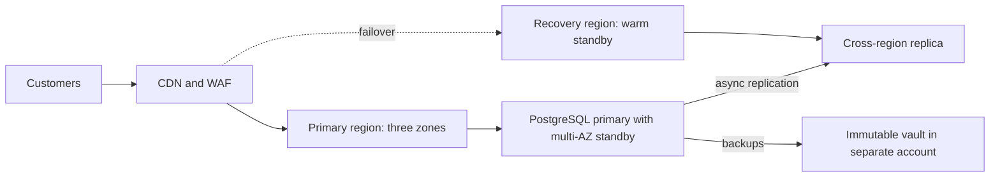

**Why active-active is hard.** For stateless services it is mostly routing. For data, two regions accepting writes to the same balance can conflict, and synchronous cross-region replication adds the inter-region round trip to every write. A common pattern is to run the stateless edge active-active and the system of record active-passive. For the Payments service, every payment carries an **idempotency key**, so a request retried after failover finds the existing record instead of creating a second transfer.

**Asynchronous replication sets your RPO.** A cross-region replica usually lags the primary by seconds or more, and that lag *is* your RPO in a regional disaster. Monitor it (5.1) and alert when it exceeds the RPO.

#### 🔴 Expert view

**Separate the failure modes.** Different disasters need different defences:

| Failure | Multi-AZ helps? | Cross-region replica helps? | Point-in-time backup helps? |
|---|---|---|---|
| One zone loses power | Yes | Yes | Slowly |
| Whole region degraded | No | Yes | Yes, slowly |
| Bad migration corrupts data | No, corruption replicates | No, corruption replicates | Yes: restore to just before |
| Ransomware or a rogue admin deletes data | No | No | Only if the backup is immutable and in a separate account |

The bottom two rows are why replication is not backup. **Point-in-time recovery** (PITR), which managed PostgreSQL services offer by keeping base backups plus the write-ahead log, lets you restore to a chosen second before the bad change. Know your retention window and how long a restore of your data size really takes.

**Static stability and the recovery path.** A *statically stable* system keeps working without needing to change during the failure, for example because capacity is already provisioned in each zone rather than launched mid-outage. Also check that the recovery path does not depend on what failed. In Facebook's October 2021 outage, a backbone change disconnected data centres and DNS servers withdrew their BGP routes; Facebook's engineering post notes that the internal tools needed for the fix were affected too. Ask: if our primary region is gone, are the runbooks, the GitOps repo, the CI runners, the secrets and the break-glass accounts still reachable?

**Chaos engineering and game days.** Chaos engineering runs controlled experiments that inject failure (kill pods, drain a zone, add latency) to check that the system behaves as predicted. Start small and in non-production; state a hypothesis ("if one zone is drained, the Mobile API stays within its SLO"); limit the blast radius; keep an abort switch. A **game day** is a scheduled rehearsal of a full scenario, such as a regional failover, with the on-call team, Maha as incident commander and observers timing each step. EU DORA expects resilience testing; game days produce the evidence.

### 🧰 The toolkit
| Tool, practice or service | What it is and does | When to reach for it |
|---|---|---|
| **Horizontal Pod Autoscaler** (Kubernetes) | Changes the replica count of a workload from CPU, memory or custom metrics | Stateless services with variable load, with a chosen min and max |
| **Cluster Autoscaler** / **Karpenter** | Add and remove nodes when pods cannot be scheduled or nodes are idle | Any cluster whose load varies; pair with HPA |
| **KEDA** (CNCF) | Event-driven autoscaling from queues, streams and schedules, including to zero | Workers that drain queues; batch jobs; scale-to-zero for idle services |
| **PodDisruptionBudget** | Caps how many replicas voluntary disruptions may remove at once | Every production Deployment with more than one replica |
| **Point-in-time recovery** | Restore a database to a chosen moment using base backups plus logs | Recovering from bad migrations and accidental deletes |
| **Immutable backup vault** | Backups locked against change or deletion until retention ends, in a separate account | Defence against ransomware and compromised admin credentials |
| **Game day** | A rehearsed, timed exercise of a failure scenario with the real on-call team | Proving RTO and RPO before an auditor or a disaster asks |

### 🏛️ In practice at Najm Bank
Maha's team produces a **DR test plan** for the Payments service. It lives in the platform repo next to the runbook it tests.

| Field | Payments service |
|---|---|
| Owner and decision-maker | Service owner: Payments engineering lead. Declares disaster: incident commander with Salem |
| Agreed targets | RTO and RPO as signed by the business owner and risk (recorded with the date and approvers) |
| Design | Three zones in the primary region; managed PostgreSQL multi-AZ; asynchronous cross-region replica; warm standby stack in the recovery region from the same OpenTofu modules and GitOps repo |
| Backups | Daily snapshots plus PITR; copies in a separate backup account and region with vault lock; retention per records policy |
| Scenarios tested this quarter | 1. Zone drain in production during low traffic. 2. PITR restore of the payments database to a scratch instance. 3. Full regional failover in the staging environment |
| Steps and timings | Detect, declare, promote replica, switch traffic, scale standby, smoke-test, reopen; each step timed |
| Success criteria | Measured RTO and RPO within targets; zero duplicated or lost confirmed transfers (reconciled against the core banking ledger) |
| Evidence | Timeline, dashboards, reconciliation report; filed for the resilience testing record |
| Follow-ups | Each gap becomes a ticket with an owner and a date; the next test re-checks it |

The first run found three gaps no design review had caught: the replica-lag alert went to a dashboard nobody watched, the payments DNS record had a TTL far longer than the RTO allowed, and the break-glass role for the recovery account needed a new MFA device.

### 🛠️ Exercises
- 🟢 **Watch an autoscaler work.** On a local kind or k3d cluster with the metrics server, deploy a small web container with CPU requests and an HPA (min 2, max 8, target 50% CPU). Generate load from another pod and watch `kubectl get hpa -w`. *Done when:* you have a screenshot or log showing replicas rising under load and falling after the stabilisation window, and one sentence explaining why scale-down was slower than scale-up.
- 🟡 **Spread across zones and survive a drain.** Create a kind cluster with four worker nodes and label them with `topology.kubernetes.io/zone` values `a`, `b`, `c` (one zone gets two nodes). Deploy six replicas with a topology spread constraint and a PDB of `minAvailable: 4`. Drain every node in one zone with `kubectl drain`. Expect the evicted pods to stay `Pending`: the drained zone still counts for the spread constraint. *Done when:* the pods were spread two per zone, the drain respected the PDB, the service kept answering throughout, and you can explain the `Pending` pods.
- 🔴 **Write and run a restore test.** Run PostgreSQL in Docker with WAL archiving or regular `pg_dump` backups. Insert timestamped rows, "accidentally" drop a table, then restore into a second container. Write a one-page DR test plan in the format above, with an RTO and RPO you choose. *Done when:* you have measured the actual restore time and data loss, compared them with your targets, and listed at least two changes that would close any gap.

### ⚠️ Mistakes and traps
- **Calling replication a backup.** Replicas copy deletions and corruption instantly. Keep point-in-time and immutable backups in a separate account as well.
- **Never restoring.** Untested backups fail when you need them, as GitLab learned. Schedule restore tests and time them.
- **Unbounded autoscaling.** An HPA with a huge `maxReplicas` can exhaust database connections or a downstream quota. Set the ceiling from what the dependencies can take.
- **A recovery path that depends on the failed region.** Keep runbooks, IaC, CI, secrets and break-glass access reachable from outside it.
- **Targets nobody signed.** An RTO the platform team picked alone will be challenged after the incident. Get the business owner and risk to sign them.

### 🧾 Recap
- Scaling adds capacity; resilience survives failure. Autoscale pods and nodes in layers, with floors and ceilings chosen on purpose.
- Run production across two or three zones, enforced with spread constraints, PDBs and spare capacity.
- RTO and RPO are business decisions; the DR strategy is the cheapest design that meets them.
- Zones and replicas do not protect against bad changes or deletion; point-in-time and immutable, separate-account backups do.
- Only tested recovery counts: restore drills, game days and timed failovers produce the evidence regulators and executives need.

### ✍️ Check yourself

**1. The Najm Mobile API runs 6 pods across three zones and needs 4 to handle peak load. Which change best ensures that losing one zone does not overload the service?**

- A. Raise the HPA `maxReplicas` to 100 so new pods replace lost ones
- B. Keep 6 pods with a zone spread constraint, two per zone
- C. Add a PodDisruptionBudget with `minAvailable: 6` on the Deployment
- D. Move all pods to the largest zone to reduce cross-zone traffic

<details><summary>Answer</summary>

**B.** Two pods per zone means a zone failure removes only two, leaving the 4 needed. A helps only after new pods and nodes arrive; C covers voluntary disruptions, not zone failures, and would block drains; D creates a single point of failure. (🟡 Going deeper.)

</details>

**2. A developer runs a migration that silently corrupts the `transfers` table. The database is multi-AZ with a cross-region replica. What recovers the data?**

- A. Failing over to the multi-AZ standby in another zone
- B. Promoting the cross-region replica in the recovery region
- C. Restarting the database
- D. A point-in-time restore to just before the migration

<details><summary>Answer</summary>

**D.** Corruption reaches the standby and replica within seconds, so A and B give you the same bad data. Only a point-in-time backup goes back before the change. (🔴 Expert view, the failure-mode table.)

</details>

**3. Who should set the RPO for the Payments service?**

- A. The business owner with risk, once the platform team costs options
- B. The platform team alone, because it builds and runs the infrastructure
- C. The cloud provider, through the SLA in its service terms
- D. Nobody, because RPO is always zero for a payments system

<details><summary>Answer</summary>

**A.** RPO expresses how much loss the business accepts, and tighter targets cost more. B creates targets nobody will defend later; a provider SLA (C) covers its service, not your recovery; D is a wish, not a design. (🟢 The essentials.)

</details>

**4. Maha's DR test shows the cross-region replica usually lags by a few seconds but once reached 40 minutes during a batch job. The agreed RPO is 5 minutes. What is the right reading?**

- A. The RPO is met, because the usual lag is only a few seconds
- B. The RPO only applies to zone failures, not to regional ones
- C. The real RPO then was 40 minutes; alert on lag and fix the cause
- D. Switch to synchronous cross-region replication now, without measuring latency

<details><summary>Answer</summary>

**C.** With asynchronous replication, the lag at the moment of disaster is the data you lose. A ignores the worst case; B is false; D adds the inter-region round trip to every write and needs analysis first. (🟡 Going deeper.)

</details>

**5. Which statement about chaos engineering is most accurate?**

- A. It means breaking production at random, as often as possible
- B. A controlled test of a stated hypothesis, with an abort switch
- C. Once it runs regularly, it replaces backup restores and DR tests
- D. It is only useful for companies running thousands of services

<details><summary>Answer</summary>

**B.** Chaos engineering tests a stated prediction under control. A is recklessness; C is wrong, as it complements restore drills; even a small zone drain teaches a lot, so D is wrong. (🔴 Expert view.)

</details>

### 📚 References
- Kubernetes: Horizontal Pod Autoscaling — https://kubernetes.io/docs/tasks/run-application/horizontal-pod-autoscale/
- Kubernetes: Pod topology spread constraints — https://kubernetes.io/docs/concepts/scheduling-eviction/topology-spread-constraints/
- Kubernetes: Specifying a disruption budget — https://kubernetes.io/docs/tasks/run-application/configure-pdb/
- KEDA documentation — https://keda.sh/docs/
- Karpenter documentation — https://karpenter.sh/docs/
- AWS whitepaper: Disaster recovery of workloads on AWS — https://docs.aws.amazon.com/whitepapers/latest/disaster-recovery-workloads-on-aws/disaster-recovery-workloads-on-aws.html
- Azure Well-Architected Framework, reliability — https://learn.microsoft.com/azure/well-architected/
- Google Cloud Architecture Framework — https://cloud.google.com/architecture/framework
- GitLab: Postmortem of database outage of January 31 (2017) — https://about.gitlab.com/blog/
- Google SRE books (data integrity, managing critical state) — https://sre.google/books/
- Regulation (EU) 2022/2554 on digital operational resilience (DORA) — https://eur-lex.europa.eu/eli/reg/2022/2554/oj
- Deeper on cloud security controls: [*Secure AI & Application Security*, lesson 7.1 — Cloud security: shared responsibility, IAM and misconfiguration](../secai/index.html#/7.1)

<a id="l6-2"></a>

## 6.2 — FinOps: understanding, allocating and cutting cloud cost

*Level: 🔴 Advanced* · *Prerequisites: 1.2, 3.1, 6.1* · *Phase: Operate, Monitor*

### ⚡ In 60 seconds
- **FinOps** is the practice of making engineering, finance and the business share responsibility for cloud spending, so cost becomes an engineering signal like latency, not a month-end surprise.
- The FinOps Foundation framework runs in a loop of three phases: **Inform** (see and allocate cost), **Optimise** (reduce waste and get better rates) and **Operate** (make it routine and owned).
- You cannot cut what you cannot attribute. Start with **tagging and allocation**: every resource has an owner, a service and an environment.
- Cut usage before you buy discounts: delete idle resources, rightsize, autoscale and schedule non-production, then commit to **reserved capacity or savings plans** for the steady base, and use **spot** capacity only for work that can be interrupted.
- Decision cue: judge cost per unit of business value (cost per thousand API calls, per payment, per active customer), not the total bill alone.
- Biggest trap: cost-cutting that quietly removes resilience, such as dropping the second zone or the backup copies built in 6.1 to save money.

### 🧭 Why it matters
Six months after the first services moved to the cloud, Mona, the FinOps analyst in Finance, brings Salem a chart. Najm's monthly cloud bill has grown much faster than the number of active mobile customers. Her questions are fair: "What are we paying for? Who owns it? Is the growth good growth?" Salem cannot answer from the console. A large share of the spend is untagged. There is a line called "data transfer" that nobody budgeted for. Three GPU nodes created for a Najm Assist experiment have been running every hour of every day since a hackathon. The development clusters run at full size over the weekend.

Finance cannot fix this alone. In the cloud, every engineer who merges an OpenTofu change or raises an HPA ceiling is making a spending decision, often without seeing the price. The old data-centre model, where procurement approved hardware months ahead, is gone. FinOps puts the cost signal back where decisions are made: in the pull request, the dashboard and the team's own backlog. This lesson gives you Mona's language, the mechanics of allocation, and an order for cutting cost without harming reliability. For a lighter treatment aimed at small teams, see [*System Design for Vibe Coders*, lesson 11.4 — Cost engineering](../vibe/index.en.html#l11-4).

### 📐 How it works

#### 🟢 The essentials

**The FinOps Foundation framework.** The FinOps Foundation, part of the Linux Foundation, publishes the FinOps Framework. At the time of writing (2026) it describes principles, personas (engineering, finance, leadership, procurement, product), capabilities and a cycle of three phases. The principles include that teams need to collaborate, that business value drives technology decisions, that everyone takes ownership of their cloud usage, that cost data should be accessible and timely, that FinOps is enabled by a central team, and that teams should take advantage of the cloud's variable cost model. Check finops.org for the current wording.

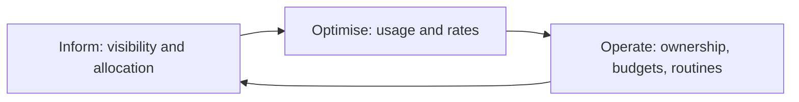

**How cloud pricing works, in concepts.** Never quote a price from memory; prices differ by region and change. The shape is stable:
- **Compute** is billed by time (per second or hour, depending on service) and size. A large instance idling costs the same as a busy one.
- **Storage** is billed by amount stored per month, with tiers: frequently accessed storage costs more per gigabyte than archive tiers, which charge more to read back.
- **Requests and operations**: many managed services charge per API call, per million requests or per read and write.
- **Data transfer (egress)**: moving data *out* of a provider to the internet usually costs money, and so does traffic between regions and, with some providers, between zones. Managed NAT gateways often charge per gigabyte processed. Check your provider's current pricing pages, because egress often surprises teams.
- **Managed service premiums**: a managed database costs more than the virtual machine underneath, and buys you patching, backups and failover. That is usually a good trade; just know you are making it.

**Allocation: tags and labels.** Every provider lets you attach key-value metadata to resources: *tags* in AWS and Azure, *labels* in Google Cloud. A cost allocation policy defines a small, mandatory set:

| Key | Example value | Why |
|---|---|---|
| `owner` | `team-payments` | Someone to ask, and someone who sees the bill |
| `service` | `payments-api` | Cost per service and per unit |
| `environment` | `prod`, `staging`, `dev` | Non-production waste is usually the first target |
| `cost-centre` | finance code | Chargeback or showback to the business |
| `data-classification` | `confidential` | Shared with security; not a cost key but enforced the same way |

Tags must usually be activated for billing reports (for example, AWS cost allocation tags), and they mostly apply only from when they are set (backfill, where offered, is limited), so start early. Enforce them in infrastructure as code (3.1) and with policy as code (3.3): a plan that creates an untagged resource fails the check.

**Showback and chargeback.** *Showback* shows each team what it spent; *chargeback* actually moves the cost to the team's budget. Start with showback: the first goal is awareness, not accounting.

#### 🟡 Going deeper

**Shared costs and Kubernetes.** Tags work well for a database owned by one team. They fail for a shared Kubernetes cluster where twenty services run on the same nodes. Allocate shared clusters by what each workload *reserves* (its CPU and memory requests) or *uses*, whichever is higher, per namespace. Tools such as **OpenCost** (a CNCF project) read the cluster's resource data and the provider's prices to produce cost per namespace, label and workload. Decide openly how to split what is left over: idle capacity, the control plane, the observability stack and shared networking. A common rule is to spread it in proportion to each team's direct cost, and to show idle capacity as its own line so the platform team owns packing efficiency.

Requests matter here. A team that requests 4 CPUs per pod and uses 0.3 pays, in a fair allocation, for 4. That is the right incentive: over-requesting blocks that capacity from everyone else.

**The FOCUS specification.** Each provider's billing export has its own columns and names. The **FinOps Open Cost and Usage Specification (FOCUS)**, from the FinOps Foundation, defines a common format for billing data, and the major providers offer FOCUS-formatted exports at the time of writing (2026; check which version each supports). If Najm runs workloads in more than one cloud, FOCUS makes one cost dataset possible.

**Optimise usage first, then rates.** Usage optimisation means paying for less; rate optimisation means paying less for the same thing. Do usage first, because committing to a discount for capacity you should have deleted locks in the waste.

| Order | Lever | Typical action | Risk to watch |
|---|---|---|---|
| 1 | **Remove idle** | Delete unattached volumes, old snapshots outside retention, idle load balancers, forgotten GPU nodes | Confirm the owner; keep what retention policy requires |
| 2 | **Schedule** | Scale dev and test clusters down at night and weekends | Teams in other time zones; batch jobs |
| 3 | **Rightsize** | Lower instance sizes and pod requests to match observed use | Leave headroom; watch tail latency and memory |
| 4 | **Autoscale** | HPA and node autoscaling so capacity follows demand (6.1) | Floors for resilience; scale-up speed |
| 5 | **Storage lifecycle** | Move old logs and objects to cheaper tiers; expire them per policy | Retrieval cost and delay from archive tiers |
| 6 | **Architecture** | Cut cross-zone and egress traffic, cache at the CDN, use private endpoints | Never at the cost of zone redundancy |
| 7 | **Commitments** | Reserved instances, savings plans, committed use discounts for the steady base | Over-commitment if usage falls |
| 8 | **Spot capacity** | Interruptible instances for batch, CI runners, stateless burst | Interruptions at short notice |

**Commitments and spot, as concepts.** All three providers offer discounts in return for committing to a level of use for one or three years: AWS Reserved Instances and Savings Plans, Azure Reservations and Azure savings plan for compute, and Google Cloud committed use discounts. Commit to the floor you are confident you will use, not the peak. **Spot** capacity (AWS Spot Instances, Azure Spot Virtual Machines, Google Cloud Spot VMs) is spare capacity sold at a discount that the provider can reclaim with short notice; check each provider's current notice period. Use it for work that tolerates interruption: CI runners, batch jobs, stateless replicas above the floor. Never put the only copy of the Payments database on it.

#### 🔴 Expert view

**Unit economics.** The total bill going up is not bad news if the business is growing faster. The number that matters is **unit cost**: cost divided by a business driver.

```text
Cost per 1,000 Mobile API requests = (allocated Mobile API cost for the month)
                                     / (requests served in the month / 1,000)
Cost per successful payment        = (allocated Payments service cost)
                                     / (payments completed)
Cost per Najm Assist conversation  = (gateway + model API + GPU cost)
                                     / (conversations)
```

The allocated cost includes the service's share of shared costs. Plot unit cost monthly. If it rises while traffic rises, you have a scaling inefficiency; if it rises while traffic is flat, look for waste or a pricing change. Unit costs also make engineering trade-offs concrete: a caching change that cuts cost per thousand requests by a fifth is easy to explain to Mona and to leadership. Product teams use the same idea when pricing; see [*AI Product Management*, lesson 8.2 — Unit economics: cost to serve, pricing models and margins](../aipm/index.html#/8.2).

**Cost in the pull request.** The cheapest moment to avoid waste is before it is created. Tools such as **Infracost** estimate the monthly cost change of an OpenTofu or Terraform plan and post it as a pull-request comment. Combine it with a policy: changes above a threshold need a second reviewer from the owning team, not a finance approval queue. Engineers keep their speed; large decisions become visible.

**Budgets and anomaly detection.** Every account or subscription gets a budget with alerts to its owner, and the providers' cost anomaly detection features flag sudden spikes (for example, a runaway job or a misconfigured log export). Treat a cost anomaly like an operational alert: route it to the owning team, with a runbook. The forgotten hackathon GPU nodes would have been caught in days, not months.

**Do not trade away resilience.** The most dangerous cost cuts look reasonable in a spreadsheet: one zone instead of three, a smaller standby, shorter backup retention, no cross-region copy. Each of these changes the RTO and RPO agreed in 6.1. Rule at Najm: a cost change that touches redundancy, backups or recovery must be approved by the service owner and SRE, and the DR test plan updated. Cost and reliability are one decision, not two.

### 🧰 The toolkit
| Tool, practice or service | What it is and does | When to reach for it |
|---|---|---|
| **FinOps Framework** (FinOps Foundation) | Principles, personas, capabilities and the Inform, Optimise, Operate cycle | Setting up a cost practice and agreeing roles with finance |
| **Cost allocation tags** | Mandatory metadata (owner, service, environment) that billing can group by | Day one of any cloud account; enforced by policy as code |
| **FOCUS** (FinOps Foundation) | A common, provider-neutral format for billing data | Combining cost data from more than one cloud or tool |
| **OpenCost** (CNCF) | Open-source cost allocation for Kubernetes by namespace, label and workload | Showback for shared clusters |
| **Infracost** | Estimates the cost change of an IaC plan and comments on the pull request | Catching expensive changes before they merge |
| **Provider cost tools** (AWS Cost Explorer, Azure Cost Management, Google Cloud Billing reports) | Native billing analysis, budgets and anomaly alerts | Daily visibility; budgets per account and owner |
| **Commitment discounts** (savings plans, reservations, committed use discounts) | Lower rates in return for committed use over one or three years | After usage optimisation, for the steady baseline |
| **Spot capacity** | Discounted spare capacity that can be reclaimed at short notice | CI runners, batch, stateless burst above the floor |

### 🏛️ In practice at Najm Bank
Mona and Salem agree a **monthly cloud cost report**, generated from the FOCUS export and OpenCost, reviewed in a 30-minute meeting with each team lead.

| Section | Content for the month |
|---|---|
| Headline | Total spend vs budget and vs last month; share of spend allocated to an owner (target: nearly all) |
| Unit costs | Cost per 1,000 Mobile API requests; cost per successful payment; cost per Najm Assist conversation; trend over six months |
| By team and service | Showback table: direct cost, share of shared costs, change and the owner's one-line explanation |
| Waste found | Idle resources, oversized workloads (requests vs use), untagged spend, with owners and due dates |
| Commitments | Coverage and utilisation of savings plans or reservations; renewals coming up |
| Anomalies | Spikes detected, cause, fix |
| Resilience check | Any proposed cut that affects zones, backups or DR, with SRE sign-off status |
| Decisions | What we change next month, who owns it |

The first report's actions: tag policy enforced in the OpenTofu pipeline (untagged plans fail), the three hackathon GPU nodes deleted after confirming with the Najm Assist team, development clusters scaled down outside working hours, and the large "data transfer" line traced to Mobile API pods calling object storage through a NAT gateway instead of a private endpoint. Yousef suggested also reducing the Payments database to single-zone "to save a lot"; Maha pointed to the DR test plan from 6.1 and the idea was dropped.

### 🛠️ Exercises
- 🟢 **Design a tagging policy.** Write a tagging policy for a fictional company with three teams and three environments: the mandatory keys, allowed values, who owns enforcement, and what happens to untagged resources. Add a policy-as-code rule (for example, a Conftest or OPA check against an OpenTofu plan in JSON) that fails when `owner` or `environment` is missing. *Done when:* the rule fails on a plan with an untagged resource and passes when tags are added.
- 🟡 **Allocate a shared cluster.** Install OpenCost and the Prometheus it needs on a local kind cluster (default or custom pricing) and deploy workloads in three namespaces with deliberately different requests. Compare requests with actual use for each namespace. *Done when:* you have a table of cost by namespace, identified the most over-requested workload, and proposed new requests with a short justification for the headroom you kept.
- 🔴 **Build a unit-cost model.** Using a free-tier account with a budget alert set first, or a spreadsheet with made-up but labelled sample numbers, build a monthly model for a small API: allocated compute, database, storage and transfer, and requests served. Compute cost per 1,000 requests for three scenarios: current, rightsized, and rightsized plus a commitment on the baseline. *Done when:* the model shows unit cost for each scenario, states every assumption, and identifies which change you would make first and why.

### ⚠️ Mistakes and traps
- **Buying commitments before cleaning up.** Discounts on waste lock the waste in for years. Remove idle, schedule and rightsize first.
- **Tagging later.** Untagged history cannot be allocated well. Enforce tags in IaC from the first resource.
- **Finance-only FinOps.** A monthly spreadsheet from finance changes nothing if engineers never see it. Put cost in pull requests, dashboards and team reviews.
- **Ignoring data transfer.** Egress, cross-zone traffic and NAT processing can become a large line. Check pricing pages and design traffic paths with them in mind.
- **Cutting resilience to save money.** One zone, smaller standbys and shorter retention change your RTO and RPO. Route such changes through the service owner and SRE.
- **Judging the total, not the unit.** A growing bill can be healthy. Track cost per business unit to tell growth from waste.

### 🧾 Recap
- FinOps makes engineering, finance and the business jointly own cloud cost, through the Inform, Optimise and Operate cycle.
- Allocation comes first: mandatory tags enforced in IaC, request-based allocation for shared Kubernetes clusters, and showback before chargeback.
- Optimise usage (idle, schedules, rightsizing, autoscaling, lifecycle, architecture) before rates (commitments, spot).
- Unit cost, such as cost per payment or per thousand requests, is the metric that connects spend to value.
- Cost and resilience are one decision: no cost cut may silently weaken the RTO and RPO agreed with the business.

### ✍️ Check yourself

**1. Mona finds that a large share of Najm's cloud spend cannot be attributed to any team. What should Salem do first?**

- A. Buy a three-year savings plan to bring the total down quickly
- B. Ask finance to split the unattributed cost equally across all teams
- C. Mandate tags, enforce them in the OpenTofu pipeline, chase owners
- D. Move all workloads to spot instances before allocating anything

<details><summary>Answer</summary>

**C.** You cannot optimise or hold anyone accountable without allocation, and enforcement in IaC stops the problem recurring. A commits money before you know what is waste; B hides the problem; D risks reliability and does not explain the spend. (🟢 The essentials.)

</details>

**2. A team requests 4 CPUs per pod but uses about 0.3 on average. In a shared cluster, how should their cost be allocated, and why?**

- A. By the higher of requests and use: they pay for the 4 reserved
- B. By actual use only, because the rest of the request sat unused
- C. Not at all, because shared clusters cannot be split between teams
- D. Equally among all the teams that run workloads on the cluster

<details><summary>Answer</summary>

**A.** Requests reserve capacity that no one else can schedule onto, so charging for them gives the right incentive. B rewards over-requesting; C is wrong, since tools like OpenCost allocate by namespace; D removes accountability. (🟡 Going deeper.)

</details>

**3. Which order of optimisation steps is most sensible?**

- A. Buy commitments first, then rightsize, then delete idle resources
- B. Move everything to spot instances first, then add commitments after
- C. Rightsize only, since commitments are never worth the lock-in
- D. Remove idle, schedule, rightsize, then commit for the steady base

<details><summary>Answer</summary>

**D.** Usage optimisation first means the commitment covers only capacity you will really use. A locks in waste; B puts interruption-intolerant workloads at risk; C leaves real savings on a steady baseline unused. (🟡 Going deeper.)

</details>

**4. Yousef proposes running the Payments database in a single zone to cut its cost. What is the best response?**

- A. Approve it, because cost reduction is the priority this quarter
- B. Treat it as a resilience change for the service owner and SRE
- C. Approve it quietly and leave risk out of the decision
- D. Approve it as long as Infracost shows a clear monthly saving

<details><summary>Answer</summary>

**B.** Removing zone redundancy changes the RTO and RPO the business signed, so the service owner and SRE decide, and will very likely refuse. A and D look only at money; C undermines governance. (🔴 Expert view.)

</details>

**5. Najm's total cloud bill rose this quarter while customers grew faster. Cost per successful payment fell. How should Mona read this?**

- A. As a problem, because the total bill rose this quarter
- B. As proof that no optimisation work is needed anywhere
- C. As healthy growth, while still checking the waste list
- D. As a likely billing error to raise with the provider

<details><summary>Answer</summary>

**C.** Falling unit cost with rising volume means the service scales efficiently. A judges by the total alone; B overreaches, because other services and idle resources can still waste money; D has no basis. (🔴 Expert view.)

</details>

### 📚 References
- FinOps Foundation: FinOps Framework — https://www.finops.org/framework/
- FinOps Open Cost and Usage Specification (FOCUS) — https://focus.finops.org/
- OpenCost documentation — https://www.opencost.io/docs/
- Infracost documentation — https://www.infracost.io/docs/
- AWS Cloud Financial Management and cost management documentation — https://docs.aws.amazon.com/cost-management/
- Microsoft Cost Management documentation — https://learn.microsoft.com/azure/cost-management-billing/
- Google Cloud Billing documentation — https://cloud.google.com/billing/docs
- Kubernetes: Resource management for pods and containers — https://kubernetes.io/docs/concepts/configuration/manage-resources-containers/
- Lighter view for small teams: [*System Design for Vibe Coders*, lesson 11.4 — Cost engineering](../vibe/index.en.html#l11-4)

<a id="l6-3"></a>

## 6.3 — Running AI workloads: GPUs, model serving, LLM gateways and their cost

*Level: 🔴 Advanced* · *Prerequisites: 2.3, 5.1, 6.2* · *Phase: Deploy, Operate*

### ⚡ In 60 seconds
- AI workloads need scarce, expensive **GPUs**, load large model files before serving, and cost scales with **tokens**, not requests.
- Call a **managed model API** (pay per token, no GPUs to run) or **self-host** an open-weight model with a serving engine such as **vLLM**. Most organisations, Najm included, use both.
- Put an **LLM gateway** in front of every model: one place for authentication, routing, rate limits and budgets, fallbacks, caching, logging and cost tracking per team.
- Measure what users feel: **time to first token**, time per output token, tokens per second and error rate, plus GPU utilisation and memory.
- Decision cue: self-host when volume is steady or residency and control demand it, and only if you can keep the GPUs busy. Idle GPUs are this module's most expensive mistake.
- Biggest trap: every team calling model APIs directly with its own key, so nobody knows the cost, the data flows or the plan when a provider fails.

### 🧭 Why it matters
Najm Assist started as a pilot in which three teams called a hosted model API directly, each with its own key. Then, in one month, a provider had a partial outage and the assistant failed with it, because there was no fallback; Mona's cost report from 6.2 showed model spend rising weekly with no way to tell which team drove it; and Noura asked which customer data went to which provider and where it was logged. Nobody could answer completely.

Meanwhile the data science team wanted to self-host a small open-weight model for a classification task whose data must stay in Najm's chosen region. Yousef ran it in a container on a GPU node with default settings and reported it was "slow and the GPU sits at 15%". Salem must now decide what goes through managed APIs, what is self-hosted, how both are controlled, and what each conversation costs. For operating agents built on these models, see [*Running AI Agents in Production*, Level 3 — Production Engineer](../agentic/learning-path.html#level-3-production-engineer).

### 📐 How it works

#### 🟢 The essentials

**Why GPUs.** Running a model (*inference*) is mostly large matrix multiplications over its *weights*, the billions of numbers learned in training, which GPUs do in parallel far faster than CPUs. The usual limit is **GPU memory**: the weights must fit, plus working memory for every conversation served.

A rough rule for the weights: memory ≈ number of parameters × bytes per parameter. A model with 8 billion parameters stored in 16-bit precision (2 bytes each) needs about 16 GB just for the weights; in 8-bit, about 8 GB; in 4-bit, about 4 GB. Add room for the **KV cache** (below) and the serving engine. This quick arithmetic tells you whether a model fits a given GPU.

**Managed API or self-hosted?**

| Question | Managed model API | Self-hosted open-weight model |
|---|---|---|
| Who runs the GPUs | The provider | You |
| How you pay | Per input and output token | For GPU time, busy or idle |
| Model choice | The provider's models, often the most capable | Open-weight models you are licensed to use |
| Data path | Data goes to the provider under its terms and region options | Data stays in your environment |
| Effort | Low: an API key and a client | High: drivers, serving engine, scaling, upgrades |
| Best for | Variable or low volume; frontier capability; fast start | Steady high volume; residency or control needs; small specialised models |

Neither is free of risk. Managed APIs raise third-party and data-transfer questions (EU DORA treats ICT providers as third-party risk; GCC regulators have outsourcing expectations). Self-hosting brings GPU cost, scarcity and another critical service to run.

**Tokens are the unit of cost.** Models read and write *tokens*, pieces of words, and managed APIs charge per token, usually at different rates for input and output. Cost therefore depends on prompt length (instructions, history, retrieved documents) and answer length: a feature that stuffs twenty documents into every prompt costs far more than one that retrieves three. Check current pricing pages; never hard-code prices.

**An LLM gateway.** A gateway is a service between your applications and every model, managed or self-hosted. Applications call one internal endpoint; the gateway does the rest.

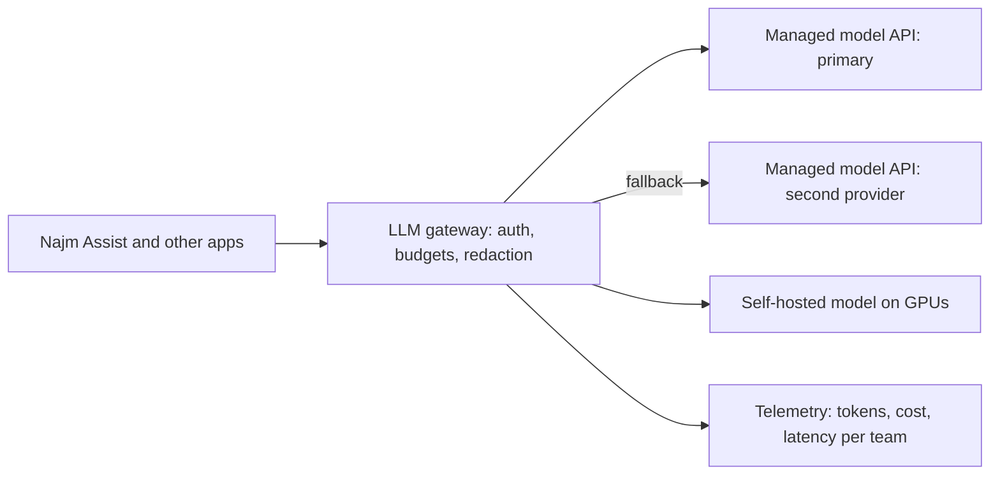

#### 🟡 Going deeper

**What a gateway should do.**

| Function | Why it matters |
|---|---|
| **Authentication** | Apps use workload identity (1.3); provider keys live only in the gateway |
| **Routing** | Send each use case to the approved model; route by data classification (confidential data only to the in-region self-hosted model, for example) |
| **Rate limits and budgets** | Per team and per feature, in tokens and money, so one runaway loop cannot spend the month's budget |
| **Fallbacks and retries** | Retry with backoff, then fall back to an approved model already tested for quality |
| **Caching** | Exact-match caching saves cost; semantic caching (reusing answers to *similar* prompts) must never give one customer another's answer |
| **Redaction and policy** | Mask personal data that a use case does not need; enforce input and output checks agreed with security |
| **Telemetry** | Tokens in and out, cost, latency, model, team and feature on every call, exported with OpenTelemetry (5.1) |

Open-source gateways (such as LiteLLM and Envoy AI Gateway at the time of writing), provider and commercial ones exist; Najm runs one on its platform so routing rules live in the GitOps repo. The gateway is critical infrastructure: run it multi-zone with an SLO, as in 6.1. Security controls for model inputs and outputs go deeper in [*Secure AI & Application Security*, lesson 9.1 — Guardrails and output handling: never trust model output](../secai/index.html#/9.1).

**GPUs in Kubernetes.** Nodes with GPUs need the vendor's driver and a *device plugin*, which advertises GPUs to Kubernetes as a resource (for NVIDIA, `nvidia.com/gpu`). Pods request whole GPUs in their limits. Keep GPU nodes in a separate node pool with a **taint**, so only workloads that tolerate it (and need a GPU) land there:

```yaml
apiVersion: apps/v1
kind: Deployment
metadata:
  name: assist-classifier
  namespace: assist
spec:
  replicas: 2
  selector:
    matchLabels: { app: assist-classifier }
  template:
    metadata:
      labels: { app: assist-classifier }
    spec:
      nodeSelector:
        pool: gpu
      tolerations:
        - key: "gpu"
          operator: "Exists"
          effect: "NoSchedule"
      containers:
        - name: server
          image: registry.najm.example/assist/vllm-server@sha256:<digest>   # pinned by digest
          args: ["--model", "/models/classifier", "--max-model-len", "8192"]
          resources:
            limits:
              nvidia.com/gpu: 1
          readinessProbe:            # model loading takes time; do not send traffic early
            httpGet: { path: /health, port: 8000 }
            periodSeconds: 10
          securityContext:
            runAsNonRoot: true
            allowPrivilegeEscalation: false
```

Small workloads can share a GPU with time-slicing or, on some NVIDIA data-centre GPUs, Multi-Instance GPU (MIG), which splits one into isolated slices. Kubernetes' Dynamic Resource Allocation API offers more flexible device requests; check its status in your version.

**Serving engines.** Running a model with a plain script serves one request at a time and leaves the GPU mostly idle, which is what Yousef saw. Serving engines fix this:
- **vLLM** is an open-source engine known for *PagedAttention*, which manages KV-cache memory in pages, and *continuous batching*, which adds new requests to the running batch as others finish. It exposes an OpenAI-compatible HTTP API.
- **NVIDIA Triton Inference Server** serves models from several frameworks with dynamic batching; check NVIDIA's current naming for it.
- **KServe** is a Kubernetes-native model-serving layer that manages model deployments, autoscaling and rollouts, and can run engines such as vLLM underneath.

**The concepts behind the speed.**
- **Batching:** serving many conversations at once raises throughput a lot, at some cost to each request's latency; continuous batching keeps the waiting short.
- **KV cache:** while generating, the model keeps intermediate results (keys and values) for every earlier token so it does not recompute them. The cache grows with context length and with the number of concurrent conversations, and it is often what limits how many users one GPU can serve. In vLLM, `--max-model-len` caps the context per request and `--gpu-memory-utilization` caps the engine's share of GPU memory.
- **Quantisation:** storing weights in 8 or 4 bits instead of 16 cuts memory and often raises speed, with some quality loss you must measure on your own evaluation set.

#### 🔴 Expert view

**Metrics that matter.** Classic RED metrics (5.1) are not enough. Track, per model and route:

| Metric | What it tells you |
|---|---|
| **Time to first token (TTFT)** | How long the user waits before text starts; dominated by queueing and processing the prompt |
| **Time per output token** (inter-token latency) | How smoothly text streams |
| **Tokens per second** per GPU | Throughput; the cost-efficiency number |
| **Queue depth and running requests** | Saturation; the best autoscaling signal for self-hosted models |
| **KV-cache usage** | How close you are to rejecting or pre-empting requests |
| **GPU utilisation and memory** (for example from NVIDIA's DCGM exporter) | Whether you are paying for idle hardware |
| **Tokens and cost per team and feature** | From the gateway; feeds the FinOps report in 6.2 |

OpenTelemetry has semantic conventions for generative AI calls (model, token counts, and more); they were still evolving at the time of writing, so pin the version you use.

An SLO for Najm Assist might be: 99% of conversations get a first token within a target number of seconds, measured at the gateway over 28 days, with the target set from measurement, not a vendor benchmark.

**Scaling self-hosted models.** CPU is the wrong signal; scale on queue depth or running requests (for example with KEDA reading a Prometheus metric). Cold starts are slow: a new replica may need a new GPU node, the image and a model file of many gigabytes. Keep a warm floor of replicas in business hours, pre-pull images, keep model files on fast nearby storage, and gate traffic with readiness probes. Scale to zero only where a long first response is acceptable.

**The self-hosting break-even.** Compare, for the same quality on your evaluation set:

```text
Managed cost per month  = Σ (input tokens × input rate + output tokens × output rate)
Self-hosted per month   = GPU node hours × node rate (busy or idle)
                        + engineering and on-call time
                        + storage, network, observability
Self-hosted cost per 1M tokens = self-hosted per month / (tokens served / 1,000,000)
```

The self-hosted cost per token falls as utilisation rises; at low utilisation it is usually worse than the managed API. Redo the sum when prices change. GPU capacity can be hard to obtain on demand, so for a critical self-hosted model reserve capacity or keep a managed fallback.

**Release safety for models.** Changing the model version, quantisation or system prompt changes answers, so it is a release. Canary it at the gateway (4.2): send a small share of traffic, compare evaluation results, feedback, latency and cost, then promote or roll back. Pin model versions where providers allow; an alias that silently moves to a newer model is an unreviewed deploy.

### 🧰 The toolkit
| Tool, practice or service | What it is and does | When to reach for it |
|---|---|---|
| **LLM gateway** | One controlled entry point to all models: auth, routing, budgets, fallbacks, caching, telemetry | Before the second team starts calling models; always in a bank |
| **vLLM** | Open-source LLM serving engine with PagedAttention, continuous batching and an OpenAI-compatible API | Self-hosting open-weight LLMs efficiently |
| **NVIDIA Triton Inference Server** | Multi-framework inference server with dynamic batching | Serving many model types, including non-LLM models, on NVIDIA GPUs |
| **KServe** | Kubernetes-native model-serving layer with autoscaling and rollouts | Standardising model deployments on the platform |
| **NVIDIA device plugin** and **DCGM exporter** | Expose GPUs to Kubernetes as a resource; export GPU metrics to Prometheus | Any cluster with NVIDIA GPU nodes |
| **KEDA** (CNCF) | Event-driven autoscaling from queues, streams and metrics | Scaling model servers on queue depth instead of CPU |
| **OpenTelemetry** GenAI conventions | Standard attributes for model calls, token counts and latency | Consistent cost and latency data across models and teams |

### 🏛️ In practice at Najm Bank
Salem's team writes the **Najm Assist serving decision and gateway policy**, reviewed with Noura, Maha and Mona, and stored in the GitOps repo beside the gateway configuration.

| Section | Decision |
|---|---|
| Use cases and routes | Customer chat: managed API in an approved region, second approved model as fallback. Confidential classification: self-hosted model in Najm's primary region only. Internal summarisation: cheaper managed tier |
| Data rules | Classification decides the route; unneeded personal data masked at the gateway; log retention agreed with security and privacy |
| Access | Workload identity to the gateway; provider keys only in its secrets manager, rotated; direct provider calls blocked by egress policy |
| Budgets | Token and money budget per team and feature, with an owner; alert at a set share, hard stop for non-critical features |
| Reliability | Gateway multi-zone with an SLO on availability and time to first token; fallback tested monthly; self-hosted model with a warm floor of replicas during business hours |
| Capacity | GPU node pool tainted and autoscaled on queue depth; GPU utilisation and tokens per second reviewed weekly; break-even re-calculated each quarter with current prices |
| Change control | Model, quantisation or prompt changes go through evaluation and a canary at the gateway; model versions pinned |
| Reporting | Cost per conversation and per team in Mona's monthly report from 6.2 |

Yousef's classifier now runs on vLLM with continuous batching and an 8-bit quantised model that passed the evaluation set, and the next provider outage was absorbed by the fallback route with a brief rise in latency.

### 🛠️ Exercises
- 🟢 **Size a model.** Pick three open-weight models of different sizes. Compute weight memory at 16-, 8- and 4-bit, and decide which fit a GPU memory size you name, leaving a quarter for the KV cache and engine. *Done when:* you have a table of nine memory estimates with the arithmetic shown, and a one-line fit decision for each model.
- 🟡 **Run a gateway locally.** Run a small open model locally (CPU is fine) behind an OpenAI-compatible API, and put an open-source LLM gateway in front of it in Docker with two routes, a per-key rate limit and a fallback to a second local model. *Done when:* you can show a request served by the primary route, a request rejected by the rate limit, and a request that falls back when you stop the primary model, with the gateway's logs or metrics showing tokens per request.
- 🔴 **Write a break-even and serving decision.** For a fictional assistant handling a stated number of conversations per day with stated average input and output tokens, use current public prices from one managed API and one GPU instance type (record the date and source) to compute monthly cost both ways at 20%, 50% and 80% GPU utilisation. Add engineering time as a stated assumption. *Done when:* you have a one-page decision in the format of the Najm table, with the utilisation at which self-hosting breaks even and the non-cost reasons (data, control, reliability) that would change your choice.

### ⚠️ Mistakes and traps
- **Direct calls with scattered keys.** Every team holding its own provider key means no cost view, no fallback and unknown data flows. Route everything through one gateway and block direct egress.
- **Idle GPUs.** A GPU node running a model nobody calls costs the same as a busy one. Scale on queue depth, schedule non-production, and review utilisation weekly.
- **Serving without a serving engine.** A plain script handles one request at a time. Use an engine with continuous batching and measure tokens per second.
- **Quantising or switching models without evaluation.** Smaller and cheaper can be worse. Run your evaluation set and a canary before promoting.
- **Unsafe semantic caching.** Reusing answers to "similar" prompts can leak one customer's data to another. Cache only non-personal answers, or scope caches per user.

### 🧾 Recap
- AI workloads are bound by GPU memory and priced by tokens; size models with simple arithmetic and track cost per conversation.
- An LLM gateway gives one place for auth, routing by data class, budgets, fallbacks, caching, redaction and telemetry; run it as critical infrastructure.
- Serve self-hosted models with an engine such as vLLM, Triton or KServe, using batching, KV-cache limits and evaluated quantisation, and scale on queue depth.
- Treat every model, prompt or quantisation change as a release: evaluate, canary, pin versions, roll back if needed.

### ✍️ Check yourself

**1. Yousef runs a self-hosted model with a simple Python script on a GPU node. Latency is high and GPU utilisation is about 15%. What is the most likely fix?**

- A. Move the same script to a larger GPU with more memory
- B. Add an HPA that scales the pods on their CPU utilisation
- C. Switch to a managed API immediately and drop the GPU
- D. Serve it with a continuous-batching engine such as vLLM

<details><summary>Answer</summary>

**D.** A one-request-at-a-time script leaves the GPU idle; batching serves many together. A buys more idle hardware; B scales on the wrong signal; C does not explain the waste. (🟡 Going deeper.)

</details>

**2. Roughly how much GPU memory do the weights of an 8-billion-parameter model need at 4-bit precision?**

- A. About 32 GB, because every parameter needs four bytes
- B. About 4 GB, plus room for the KV cache
- C. About 8 GB, with no extra room needed for serving
- D. It cannot be estimated without asking the vendor

<details><summary>Answer</summary>

**B.** 8 billion parameters × half a byte ≈ 4 GB, and serving also needs KV-cache and engine memory. A is the 32-bit size; C is the 8-bit size and ignores the KV cache; D is wrong because the arithmetic is simple. (🟢 The essentials.)

</details>

**3. A model provider has a partial outage and Najm Assist fails completely. Which change most directly prevents this next time?**

- A. Asking the provider for a stronger SLA in the next contract
- B. Adding more replicas of the chat front end in every zone
- C. A gateway route with retries and a tested fallback model
- D. Caching every answer forever so the provider is rarely called

<details><summary>Answer</summary>

**C.** A gateway fallback keeps the feature working when one provider fails. A changes nothing during an outage; B scales the wrong layer; D serves stale answers and risks leakage. (🟡 Going deeper.)

</details>

**4. When does self-hosting an open-weight model usually make the most sense?**

- A. When steady volume keeps GPUs busy, or residency requires it
- B. Always, because GPU hours are cheaper than paying for tokens
- C. For a low-traffic internal tool used only a few times each day
- D. Only when no managed API offers a model of similar quality

<details><summary>Answer</summary>

**A.** Self-hosting pays off with high utilisation or non-cost requirements. B ignores idle cost and engineering time; C leaves GPUs idle; D ignores residency, control and utilisation. (🔴 Expert view.)

</details>

**5. Which metric is the best autoscaling signal for a self-hosted LLM server?**

- A. Node CPU utilisation averaged across the GPU pool
- B. The number of pods currently serving the model
- C. Disk usage on the nodes that hold model files
- D. Queue depth or running requests at the engine

<details><summary>Answer</summary>

**D.** Queue depth shows demand waiting for the GPU. A says little about GPU load; B is the thing being scaled, not a signal; C is unrelated to request load. (🔴 Expert view.)

</details>

### 📚 References
- Kubernetes: Schedule GPUs — https://kubernetes.io/docs/tasks/manage-gpus/scheduling-gpus/
- Kubernetes: Taints and tolerations — https://kubernetes.io/docs/concepts/scheduling-eviction/taint-and-toleration/
- vLLM documentation — https://docs.vllm.ai/
- NVIDIA Triton Inference Server documentation — https://docs.nvidia.com/deeplearning/triton-inference-server/
- KServe documentation — https://kserve.github.io/website/
- NVIDIA device plugin for Kubernetes — https://github.com/NVIDIA/k8s-device-plugin
- KEDA documentation — https://keda.sh/docs/
- OpenTelemetry semantic conventions for generative AI — https://opentelemetry.io/docs/specs/semconv/gen-ai/
- FinOps Foundation (including FinOps for AI work) — https://www.finops.org/
- Security for LLM applications: [*Secure AI & Application Security*, lesson 8.1 — The AI attack surface: OWASP Top 10 for LLM Applications and MITRE ATLAS](../secai/index.html#/8.1)
- Operating agents in production: [*Running AI Agents in Production*, Level 3 — Production Engineer](../agentic/learning-path.html#level-3-production-engineer)

---

<a id="m7"></a>

# Module 7 — Hero: capstone and practice exam

*You have learned cloud and DevOps one layer at a time: the shell and the network, identity, containers, Kubernetes, infrastructure as code, pipelines, releases, telemetry, SLOs, incidents, scaling, cost and AI workloads. This module puts the layers back together. In the capstone you take a brand-new Najm Bank service, Card Controls, from an empty repository to production with a signed SLO, reusing an artefact from every earlier module and linking them into one production readiness file that Salem, Maha and Noura can approve. Then we turn to you: the roles that make up cloud, platform, DevOps and SRE work, how to choose certifications from the cloud providers, the Linux Foundation and others without being ruled by them, what interviews actually test, and how to build a portfolio that proves you can run software, not just write it. The module closes with a 60-question practice exam across all eight phases.*

> **Phases:** Plan through Monitor — the whole delivery loop, end to end, on one service and then in one exam.

<a id="l7-1"></a>

## 7.1 — Capstone: take a new Najm service from empty repo to production with an SLO

*Level: 🔴 Advanced* · *Prerequisites: Modules 0–6* · *Phase: Deploy, Operate*

### ⚡ In 60 seconds
- The capstone takes **Card Controls**, a new Najm service for freezing cards and setting limits, from an empty repository to production through all eight phases.
- The output is a **production readiness file**: linked evidence that the service can be built, released, observed, recovered and paid for, with an owner for each part.
- The spine is **one artefact, many environments**: build the container image once, sign it, and promote the same digest from dev to staging to production through Git.
- The SLO comes first, not last. It decides the alerts, the release gates, the replica count, the backup targets and the on-call rota.
- Decision cue: before each gate, ask "if this step failed silently at 2 a.m., how would we know, and how would we undo it?"
- Biggest trap: a readiness checklist ticked from memory. Every item needs evidence, and rollback, restore and kill switches need a timed drill.

### 🧭 Why it matters
Tariq brings a request to the platform team. The cards team wants a **Card Controls service**: customers freeze a card, block online or overseas use and set a daily limit from the Najm Mobile app. The card processor checks these controls during authorisation, so a wrong answer blocks a customer at a till or lets a stolen card through. The business wants it live in one quarter.

Salem gives the job to Yousef, with Maha as SRE partner. Yousef's first plan: copy an old repository, push an image tagged `latest`, apply manifests by hand, "add monitoring after launch". Salem asks three questions. "What is the SLO? How do you roll back in under five minutes? What happens if the database zone fails during a payday peak?" Yousef has no answers yet.

Public history shows why the questions matter. In August 2012 Knight Capital deployed new code to its servers, but one server kept old code behind a reused flag; according to the US SEC's later order, the firm lost hundreds of millions of dollars in under an hour. In January 2017 GitLab lost hours of production data after a database directory was deleted during an incident, and several backup methods turned out not to work (GitLab's public postmortem). Each was a missing, untested step on the path to production. This lesson builds the whole path once, properly.

### 📐 How it works

#### 🟢 The essentials

**The service, in one paragraph.** Card Controls is a small HTTP API with its own managed PostgreSQL database. Najm Mobile API calls it to change controls; the card processor's integration calls it to read them during authorisation. It runs on the bank's managed Kubernetes cluster across two availability zones. It stores only an internal card reference, never card numbers, which Noura confirms at design review.

**The production readiness file.** A **production readiness review (PRR)** is a structured pre-launch check that a service can be operated safely; Google's SRE books describe the practice. Najm's PRR is a folder of linked artefacts under a one-page summary (🏛️ below), with three rules:
1. **Every claim has evidence** a reviewer can open, not "yes, done".
2. **Every risky change can be undone** by a documented, timed method.
3. **Every alert maps to an SLO or a runbook.** An alert with no action is noise.

**The eight phases.** Each phase reuses an artefact from an earlier module; the summary page in 🏛️ below maps each to its evidence and lesson. All numbers in this lesson are illustrative.

**Start with the SLO.** Maha and the cards product owner agree the user journeys that matter and write **SLIs** (service level indicators: measurements of good events over valid events) and **SLOs** (targets for them over a window):

| Journey | SLI | SLO (28-day window) |
|---|---|---|
| Read controls during authorisation | Share of read requests answered successfully within 100 ms at the load balancer | 99.95% |
| Customer changes a control | Share of write requests that succeed within 500 ms | 99.9% |
| Freshness | Share of control changes visible to reads within 2 seconds | 99.9% |

The read SLO is tighter because a failed read can block a real purchase. With 99.95% over 28 days, the **error budget** is 0.05% of read requests. It sets the release policy: while budget remains, the team ships; once it is spent, only reliability fixes ship.

**The path.** Each box is a gate that leaves evidence:

```mermaid
flowchart LR
    R["Empty repo from template"] --> CI["CI: test, scan, build once"]
    CI --> IMG["Signed image by digest"]
    IMG --> DEV["GitOps: dev"]
    DEV --> STG["GitOps: staging and load test"]
    STG --> PRR["Readiness review"]
    PRR --> CAN["Canary in production"]
    CAN -->|"SLO healthy"| FULL["Full rollout"]
    CAN -->|"burn rate high"| RB["Automatic rollback"]
```

#### 🟡 Going deeper

**Code: start from the golden path.** Yousef does not copy an old repository. He creates the service from the platform's template, which already contains a Dockerfile, CI workflow, Helm chart, OpenTelemetry setup, `CODEOWNERS` and a portal catalogue entry. Configuration comes from environment variables, never baked into the image (the Twelve-Factor App's config rule), so one image runs everywhere. The service exposes `/healthz/live` (the process is alive) and `/healthz/ready` (it can reach its database and is ready for traffic), which become the liveness and readiness probes from 2.3.

**Build: once, by digest, signed.** CI builds the image once per commit, pushes it, records its digest, then generates an SBOM and signs that digest with cosign. Later environments reference the same digest and never rebuild. CI reaches the cloud through **workload identity federation** (OIDC), so no long-lived key sits in the repository (1.3, 4.3):

```yaml
# .github/workflows/ci.yml (excerpt)
permissions:
  contents: read
  id-token: write        # lets the job request a short-lived OIDC token
jobs:
  build:
    runs-on: ubuntu-latest
    steps:
      - uses: actions/checkout@v4      # pin actions to a full commit SHA in real use
      - run: make test                  # unit and contract tests
      - run: make image                 # multi-stage, non-root build
      - run: make push sbom sign        # push, then SBOM and cosign signature on the digest
      - run: make bump-dev              # opens a PR to the GitOps repo with the new digest
```

**Deploy: infrastructure and app, both from Git.** The database, backups, cloud role and network rules are one OpenTofu module call, reviewed with a `tofu plan` on the pull request (3.1). Policy checks (3.3) reject a database without encryption at rest, deletion protection or backup retention. The Kubernetes side lives in the GitOps repository, one folder per environment, reconciled by Argo CD:

```yaml
apiVersion: argoproj.io/v1alpha1
kind: Application
metadata:
  name: card-controls-prod
  namespace: argocd
spec:
  project: cards
  source:
    repoURL: https://git.example.com/najm/gitops.git
    targetRevision: main
    path: apps/card-controls/overlays/prod
  destination:
    server: https://kubernetes.default.svc
    namespace: card-controls
  syncPolicy:
    automated:
      prune: true
      selfHeal: true     # reverts manual edits in the cluster back to Git
```

Promotion to production is a pull request changing one line, the image digest in the `prod` overlay, approved by the cards team and platform. Rollback is reverting that commit.

**Release: canary with a guard.** The rollout sends a small share of traffic to the new version, compares its errors and latency with the stable version, and widens step by step (4.2). A controller such as Argo Rollouts or Flagger automates the analysis; if the canary breaches SLO-based thresholds, it aborts and traffic returns to the stable version. New behaviour, such as "block overseas use", sits behind a feature flag so it can be switched off without a deploy. The CrowdStrike Falcon content update of July 2024, which crashed Windows hosts worldwide, shows what happens when a change reaches everyone at once.

**Monitor: alerts from the budget.** The service emits OpenTelemetry traces and RED metrics (rate, errors, duration). Maha writes **multi-window, multi-burn-rate alerts** from the SRE Workbook: page when the budget burns fast over both a long and a short window; open a ticket when it burns slowly. The read SLO's fast-burn page:

```yaml
# Prometheus alert rule (excerpt): 14.4x burn over 1h, confirmed over 5m.
# Recording rules (not shown) compute the read error ratio over each window.
- alert: CardControlsReadFastBurn
  expr: |
    card_controls:read_error_ratio:rate1h > (14.4 * 0.0005)
    and
    card_controls:read_error_ratio:rate5m > (14.4 * 0.0005)
  labels:
    severity: page
  annotations:
    runbook: https://runbooks.example.com/card-controls/read-errors
```

The factor 14.4 means the budget would be gone in about two days at this rate; the short window stops the page once the burn has ended. Every page links to a runbook.

**Operate: prove recovery.** With the business, Maha sets an **RPO** (tolerable data loss) of 5 minutes and an **RTO** (tolerable recovery time) of 30 minutes for a zone failure. The database runs with a standby in a second zone and point-in-time recovery. Then, in staging, they restore last night's backup to a new instance, replay to a chosen time and time it. A backup that has never been restored is a hope, not a control.

#### 🔴 Expert view

**The architecture decisions, written down.** Salem asks for **architecture decision records (ADRs)**: one page per decision with context, options, choice and consequences. Three of Card Controls' ADRs:

| Decision | Choice | Why | Revisit when |
|---|---|---|---|
| Read path during authorisation | Serve from the service with a short in-memory cache, not a separate cache cluster | Fewer moving parts; the freshness SLO allows 2 seconds | Read latency SLO is at risk under peak |
| Multi-zone or multi-region | Multi-zone in one region now | Meets the RTO for zone failure; multi-region doubles cost and complexity | Regulator or business requires a region-level RTO |
| Failure mode if the service is down | The card processor applies a documented default agreed with the cards and risk teams | A blind "allow all" or "deny all" is a business decision, not a technical one | After every incident touching this path |

The third row is the one most teams skip: what a caller does when a dependency fails is a design decision that product, risk and security must sign.

**Capacity and cost before launch.** Yousef load-tests staging at twice the expected payday peak, sets CPU and memory requests from measured usage, gives the Horizontal Pod Autoscaler a floor of four replicas spread across two zones by a topology spread constraint, so losing a zone leaves two, enough for the measured peak. Mona asks for a **unit cost** (monthly cost from tagged resources divided by monthly requests, 6.2), shown next to the SLO so a "cheaper" change that burns budget, or a "safer" one that triples cost, is visible to both sides.

**Regulation without guesswork.** The runbooks, incident records and recovery tests also feed operational resilience evidence: EU DORA (applied from January 2025) for the EU entity, and the cloud and outsourcing expectations of the Qatari and UAE regulators. Do not guess clause numbers; ask risk and compliance what they need ([*Secure AI & Application Security*, lesson 11.2 — Regulation that touches security](../secai/index.html#/11.2)).

**The game day.** Before launch, Maha runs a two-hour **game day**, injecting failures in staging to practise the response:
1. Deploy a canary that returns errors on 5% of reads. *Expected:* analysis aborts the rollout automatically.
2. Cordon one zone's nodes and delete its pods. *Expected:* the read SLO holds; replacement pods start in the other zone.
3. Fail over the database. *Expected:* writes pause briefly, then resume within the agreed time.
4. Revoke the service's database credentials. *Expected:* readiness fails, the page fires and links to the right runbook.

The first game day found two gaps: the credentials runbook pointed to a renamed secret, and failover took longer than the RTO assumed because the connection pool did not reconnect. Both became fixes and regression checks.

### 🧰 The toolkit
| Tool, practice or service | What it is and does | When to reach for it |
|---|---|---|
| **Production readiness review** | Structured, evidence-based check that a service can be operated safely before launch | Every new service or major architecture change |
| **Architecture decision record** | One-page record of a decision, its options and its consequences | Any choice someone will later ask "why?" about |
| **Argo CD** | GitOps controller that keeps clusters in sync with a Git repository | Promoting the same artefact through environments by pull request |
| **Canary release** | Sending a small share of traffic to a new version and widening only if it is healthy | Every production rollout of a user-facing service |
| **Error budget** | The share of failures the SLO allows over its window | Setting release policy and alert thresholds |
| **Burn-rate alert** | Alert on how fast the error budget is being consumed, over a long and a short window | Paging on SLO risk instead of on raw resource metrics |
| **Game day** | Planned exercise that injects failures to test systems, runbooks and people | Before launch, then regularly and after major change |

### 🏛️ In practice at Najm Bank
**Card Controls production readiness file: summary page** (v1.0; owner Yousef; reviewers Maha for SRE, Noura for security, Mona for cost; approved by Salem).

| Phase | Evidence (lesson) | Decision recorded | Gate passed when |
|---|---|---|---|
| Plan | Service brief, SLO document, four ADRs (5.2) | Read SLO 99.95%, write SLO 99.9%; multi-zone | Product owner and Maha sign the SLO |
| Code | Repo from template; catalogue entry; owners (0.1) | Config only from environment | Template checks green |
| Build | Image digest, SBOM, signature (2.1, 4.3) | Non-root, pinned base image | Signature verified at admission |
| Test | CI run, contract tests with Mobile API, policy checks (3.3, 4.1) | No direct database access from other services | All gates green on main |
| Release | Canary analysis config; flag list (4.2) | Abort on read errors above budget rate | Abort tested in staging |
| Deploy | OpenTofu plan, Argo CD app, two-approval promotion (3.1, 3.2) | Rollback is a revert of one commit | Revert timed under five minutes |
| Operate | Runbooks, rota, restore drill report (5.3, 6.1) | RPO 5 min, RTO 30 min for zone loss | Restore drill met both targets |
| Monitor | SLO dashboard, burn-rate alerts, cost per request (5.1, 5.2, 6.2) | Pages only on SLO burn | Each alert fired once in a test |

### 🛠️ Exercises
- 🟢 Write the SLO document for a small service of your own (say, a URL shortener): two SLIs, an SLO for each over 28 days, the error budget in requests at an assumed traffic level, and the release policy when it runs out. *Done when:* a peer can say what would page someone and what would freeze releases, without asking you.
- 🟡 On your laptop, take that service from an empty repo to a local kind or k3d cluster: multi-stage non-root Dockerfile, a GitHub Actions workflow that builds once and records the digest, and Argo CD syncing from a Git folder you own. *Done when:* changing the digest in Git rolls the cluster forward, reverting the commit rolls it back, and you have timed both.
- 🔴 Add Prometheus and Grafana to your local cluster, define one SLO with fast-burn and slow-burn alerts, then run a one-hour game day with three injected failures (a bad release, a killed pod, a broken config). Use only machines and accounts you own; on a free-tier account, set a budget alert first. *Done when:* each failure is detected by an alert or the canary, each has a runbook step that worked, and your write-up lists at least two gaps you fixed.

### ⚠️ Mistakes and traps
- **SLO after launch.** Without it, nobody can say which alerts matter or when to stop shipping. Agree it in the Plan phase with the product owner.
- **Rebuilding per environment.** A rebuild in staging or production produces a different artefact from the one you tested. Build once and promote the digest.
- **Hand edits in the cluster.** They drift from Git and vanish on the next sync. Change Git; let the controller reconcile.
- **Untested backups and rollbacks.** GitLab's 2017 postmortem shows untested backups failing together. Drill restore and rollback, and time them.
- **Alerts on causes, not symptoms.** Paging on CPU at 80% wakes people for things customers never feel. Page on SLO burn.
- **Leaving the failure mode undecided.** Decide and sign in advance what callers do when the service is down.

### 🧾 Recap
- The SLO, agreed first, drives the alerts, release policy, capacity and recovery targets.
- One signed image, referenced by digest, moves through environments by pull request; rollback is a revert.
- Canary analysis, feature flags and burn-rate alerts turn the error budget into automatic guardrails.
- Recovery, failure modes and cost are designed and drilled before launch.

### ✍️ Check yourself

**1. Yousef's staging pipeline rebuilds the container image from the same Git commit before deploying to production "to be safe". What is the problem?**

- A. Rebuilding is slower, which hurts lead time but is otherwise harmless
- B. Production no longer runs the tested artefact; promote the same digest
- C. Rebuilding is required for production because staging images are unsigned
- D. There is no problem as long as both builds use the same Git commit

<details><summary>Answer</summary>

**B.** A rebuild can pick up different base layers or dependencies, so production runs something nobody tested. D is tempting, but the same commit does not guarantee the same artefact. (🟡 Going deeper.)

</details>

**2. The Card Controls read SLO is 99.95% over 28 days. What does the error budget tell the team?**

- A. How many engineers must be on call during each week of the window
- B. The maximum latency any single read request is allowed to have
- C. How much the service is allowed to cost each month
- D. How many reads may fail before reliability work takes priority over releases

<details><summary>Answer</summary>

**D.** The error budget is the 0.05% of requests the SLO allows to fail; while it remains, the team ships; when it is spent, reliability work comes first. It says nothing directly about staffing, cost or a single request's latency. (🟢 The essentials.)

</details>

**3. During the game day, the canary returns errors on 5% of reads. What should happen if the release is set up as this lesson describes?**

- A. Analysis aborts the rollout and traffic returns to the stable version
- B. Maha is paged and edits the Deployment in the cluster by hand to roll back
- C. The rollout continues, because 95% of reads still succeed and that is close to target
- D. Yousef rebuilds the image with a fix and pushes it straight to production

<details><summary>Answer</summary>

**A.** Analysis tied to the SLO aborts automatically. Manual cluster edits (B) drift from Git; continuing (C) would burn the budget far faster than allowed; pushing directly (D) skips every gate. (🟡 Going deeper.)

</details>

**4. Which item belongs in an architecture decision record rather than only in a runbook?**

- A. The exact command to restart a pod that is stuck in a crash loop
- B. The on-call rota and escalation contacts for launch week
- C. What the processor does when Card Controls is down, and who agreed it
- D. The URL of the Grafana dashboard that shows the read SLO

<details><summary>Answer</summary>

**C.** The failure mode is a business and risk decision with options and consequences, which is what an ADR records. The others are operational details for runbooks and rota pages. (🔴 Expert view.)

</details>

**5. Salem asks how the team knows the 30-minute RTO for zone loss is realistic. What is the best evidence?**

- A. The provider's documentation says database failover across zones is automatic
- B. A dated drill report with the measured failover and restore times
- C. Automated database backups are enabled in the OpenTofu module for the service
- D. The policy check that requires a backup retention period passed on the pull request

<details><summary>Answer</summary>

**B.** Only a timed drill shows recovery works within the target; the game day found a connection-pool issue no configuration would reveal. A, C and D show settings, not outcomes. (🟡 Going deeper, 🔴 Expert view.)

</details>

### 📚 References
- Google, *Site Reliability Engineering* (2016) and *The Site Reliability Workbook* (2018), including SLOs, alerting on SLOs and launch reviews — https://sre.google/books/
- The Twelve-Factor App — https://12factor.net
- OpenGitOps principles — https://opengitops.dev
- Argo CD documentation — https://argo-cd.readthedocs.io
- Argo Rollouts documentation — https://argoproj.github.io/rollouts/
- OpenTofu documentation — https://opentofu.org/docs/
- OpenTelemetry documentation — https://opentelemetry.io/docs/
- Prometheus alerting rules — https://prometheus.io/docs/prometheus/latest/configuration/alerting_rules/
- GitHub Docs, security hardening with OpenID Connect — https://docs.github.com/en/actions/security-for-github-actions/security-hardening-your-deployments/about-security-hardening-with-openid-connect
- GitLab, postmortem of the database outage of January 31, 2017 — https://about.gitlab.com/blog/
- US SEC, order in the matter of Knight Capital Americas LLC (2013) — https://www.sec.gov
- Regulation (EU) 2022/2554 on digital operational resilience for the financial sector (DORA) — https://eur-lex.europa.eu/eli/reg/2022/2554/oj

<a id="l7-2"></a>

## 7.2 — The cloud career: roles, certifications, interviews and a portfolio

*Level: 🔴 Advanced* · *Prerequisites: 7.1* · *Phase: Plan*

### ⚡ In 60 seconds
- "Cloud" is several jobs: cloud, DevOps, platform, site reliability (SRE), cloud security, FinOps and AI infrastructure. They share foundations but own different things. Pick a target role first.
- Certifications are a signal, not proof. The main sources are the three cloud providers (**AWS**, **Microsoft**, **Google Cloud**), the **Linux Foundation and CNCF** for Kubernetes, **HashiCorp** for Terraform and the **FinOps Foundation**. Names, codes and content change, so check the issuer's current page.
- A **portfolio of evidence** beats a list of badges: a service you took to "production" on your own laptop or free tier, with an SLO, a pipeline, a runbook and a postmortem of something you broke on purpose.
- Interviews test troubleshooting method more than recall: a broken pod, a design to make deployable, an incident to lead.
- Decision cue: choose a certification by target role and local demand, and pair it with an artefact you built while studying.
- Biggest trap: leaving a free-tier account without a budget alert, or putting an employer's architecture, keys or incidents in a public repository.

### 🧭 Why it matters
Six months after joining, Yousef asks Salem: "Should I do a Kubernetes certification or a cloud architect one? And is platform engineering a real career, or just DevOps renamed?" He has one service in production and no plan.

Salem has the mirror problem. He is hiring two platform engineers and one SRE for the move from the data centre. Many CVs list several cloud certificates; fewer show anything he can read or run. One candidate with a single associate-level certificate linked a repository: a small API deployed to a local kind cluster through GitHub Actions and Argo CD, an SLO with burn-rate alerts, and a two-page postmortem of a failure she caused deliberately in a game day. Salem invites her first.

Certificates still matter. Job adverts in Gulf banks, government bodies and consultancies often list named cloud certifications as required or preferred, and they help you pass the first filter. The interview, and then the pager, test whether you can do the work. For the wider job search (CVs, applications, offers), see [*From Graduate to Hired*, lesson 2.4 — Cloud, platform, DevOps and security engineer](../career/index.html#/2.4).

### 📐 How it works

#### 🟢 The essentials

**The role map.** Titles vary by organisation, so read the job description, not the title. At the time of writing (2026), the roles closest to this course look like this:

| Role | Owns, day to day | Course modules to emphasise |
|---|---|---|
| Cloud engineer | Cloud accounts, networks, identity, managed services; landing zones and migrations | 1, 3, 6 |
| DevOps engineer | CI/CD pipelines, build tooling, release automation, developer support | 2, 3, 4 |
| Platform engineer | The internal developer platform: golden paths, Kubernetes, GitOps, self-service | 2, 3, 4, 7.1 |
| Site reliability engineer | SLOs, alerting, on-call, incidents, capacity, removing toil with code | 5, 6, 7.1 |
| Cloud security engineer | IAM, policy as code, workload and network controls, supply chain | 1.3, 3.3, 4.3, plus the security course |
| FinOps practitioner | Cost visibility, allocation, optimisation, unit economics with Finance | 6.2 |
| AI infrastructure or MLOps engineer | GPUs, model serving, LLM gateways, their reliability and cost | 6.3, 5, 6.1 |

"Platform engineering" is not just DevOps renamed. DevOps is a culture and set of practices shared by everyone who builds and runs software; platform engineering is a team building an internal product, the platform, so other teams can follow those practices without reinventing them. SRE runs production with reliability treated as engineering, with explicit budgets. In a start-up one person does all three; at Najm they are separate teams.

**Where people come from.** Developers move into platform and SRE work, system and network administrators into cloud engineering, data engineers into MLOps. Graduates usually enter as junior cloud, DevOps or platform engineers. Earlier experience is an asset: a former developer knows why a slow pipeline gets bypassed.

**Certifications, in brief.** This course is not affiliated with any issuer and does not prepare you for a specific exam. The table is general orientation. Exam names, codes, levels, prices, formats and renewal rules change, and providers retire and replace exams, so check each issuer's current page before you plan.

| Issuer | Kinds of credential (examples at the time of writing, 2026) | Typical fit |
|---|---|---|
| **AWS** | Foundational (Cloud Practitioner), associate (for example Solutions Architect and SysOps-style administration), professional and specialty levels | Roles in organisations running on AWS |
| **Microsoft** | Fundamentals (Azure Fundamentals), role-based associate (for example Azure Administrator) and expert levels | Organisations on Azure; common in enterprises and government |
| **Google Cloud** | Foundational (Cloud Digital Leader), associate (Associate Cloud Engineer) and professional (for example Cloud Architect, Cloud DevOps Engineer) | Organisations on Google Cloud; data-heavy teams |
| **Linux Foundation and CNCF** | Kubernetes certifications: KCNA (associate, knowledge-based), CKAD (application developer), CKA (administrator), CKS (security); the hands-on ones are performance-based | Platform and SRE roles on any cloud |
| **HashiCorp** | Terraform Associate | IaC-heavy roles; the concepts transfer to OpenTofu |
| **FinOps Foundation** | FinOps Certified Practitioner and further levels | FinOps roles; engineers who work closely with Finance |

Two patterns help. **Provider certificates** prove you know one cloud's services; choose the cloud your target employers run. **Vendor-neutral certificates**, such as the Kubernetes ones, transfer across clouds, and their **performance-based** format (you solve tasks in a live environment rather than answering multiple-choice questions) is closer to the real job. Many credentials expire after a few years and must be renewed; budget time for that.

#### 🟡 Going deeper

**Choosing a certification deliberately.** Score each candidate credential from 1 to 3 on five questions:
1. **Role fit.** Does it match the role you want in two to three years?
2. **Market demand.** Do employers in your market name it? Read ten current job adverts and count.
3. **Practical or knowledge-based?** Practical exams show you can do the task; knowledge exams show breadth.
4. **Full cost.** Training, exam, retakes, renewal and your time.
5. **Sponsorship.** Many employers, including Najm, fund certifications tied to a development plan.

For Yousef, a platform engineer at a bank that runs Kubernetes on one cloud, the scores point to a hands-on Kubernetes administrator credential now, and the bank's cloud provider's associate-level credential next. A professional architect credential fits later, when he designs across many teams.

**Study by building.** End every study week with something running. A foundational cloud exam pairs with setting up a free-tier account properly (budget alert first, MFA on the admin user, no long-lived keys); a Kubernetes exam with breaking and fixing your own kind cluster; a Terraform exam with an OpenTofu module with remote state and a plan in CI. Use only your own accounts and machines.

**The portfolio.** A cloud portfolio is a small set of artefacts others can read and run, each showing judgement as well as skill. Good items, all legal and all on resources you own:
- **A capstone service**, like 7.1 at small scale: multi-stage Dockerfile, CI that builds once, GitOps to kind or k3d, an SLO and burn-rate alerts, and a README that runs in ten minutes.
- **An IaC module** with a clear interface, examples, tests and a policy check.
- **A game-day report and postmortem**: what you broke on purpose, what detected it, what you changed. Blameless, with a timeline.
- **A cost note**: an estimate from the provider's pricing calculator, with assumptions stated and dated.
- **Open-source contributions**: a Helm chart fix or a documentation improvement to a CNCF project.
- **Writing**: a post that explains one decision well, such as "why my canary aborts on burn rate, not on CPU".

Each case study follows one shape: context, decision, evidence, trade-off, lesson. "I chose multi-zone over multi-region because the RTO allowed it and multi-region doubled the moving parts" shows more than "I deployed to Kubernetes".

**What never goes in a portfolio.** Your employer's diagrams, hostnames, account IDs, incidents, logs or customer data, or anything with a secret in its history. Scan public repositories for secrets first; deleting a file does not remove it from Git history, and a leaked key must be revoked. To show work from your job, rebuild the pattern in your own lab and ask your employer before naming them.

**The interview loop.** Cloud and platform loops commonly mix:
- **Fundamentals**: Linux processes and permissions, "what happens when you open a URL", IAM roles versus users.
- **Troubleshooting**: a broken system, such as a pod in `CrashLoopBackOff` or a service returning 502s. Interviewers watch your method more than your answer.
- **Hands-on**: write a Dockerfile, fix a pipeline, read a Terraform plan, write a PromQL query.
- **System design**: design a service so it is deployable, observable and recoverable. See [*From Graduate to Hired*, lesson 5.3 — System design, data and ML interviews for juniors](../career/index.html#/5.3).
- **Incident scenario** ("this alert fires at 2 a.m.") and **behavioural** questions, answered with **STAR** (situation, task, action, result).

A typical troubleshooting question, and what a strong answer sounds like:

```text
Q: After a deploy, the new pods show CrashLoopBackOff. What do you do?

Strong answer, out loud, in order:
1. Limit the damage: is the rollout paused or old pods still serving? If users
   are affected, roll back first (revert the GitOps commit), then investigate.
2. kubectl describe pod <name>    -> events: image pull? OOMKilled? probe failures?
3. kubectl logs <name> --previous -> the crashed container's last output
4. Compare with the last good release: config, secrets, image digest, limits.
5. Fix forward or keep the rollback; add a test or check so it cannot recur.
```

The order matters: restore service, then diagnose, then prevent. That is the same chain as 7.1 and 5.3.

#### 🔴 Expert view

**How the job grows.**

| Level | Scope | Evidence that shows it |
|---|---|---|
| Junior engineer | Delivers well-defined tasks; joins on-call with a buddy | Pipelines, modules and runbooks that work; clear write-ups |
| Engineer | Owns a component; on-call independently | A service taken to production, like 7.1 |
| Senior engineer | Owns a domain such as observability or GitOps; sets reusable patterns | A golden path many teams use; incidents led well |
| Staff or principal | Shapes architecture and standards across many teams | Platform decisions adopted bank-wide; people grown |
| Head of platform or SRE | Strategy, budget, hiring, reliability and cost outcomes | Measurably faster, safer delivery (DORA-style metrics) at a known cost |

At each step the work shifts from doing tasks to making good outcomes the default for many teams. Platform work is a product job: Salem's team measures adoption and developer satisfaction, not just uptime.

**T-shaped, not tool-shaped.** Tools change; Linux, networking, failure modes and operational judgement change slowly. Someone who understands why a readiness probe exists can learn any orchestrator. Go deep in one area (Kubernetes, observability, IaC or FinOps) on broad foundations. AI infrastructure is the same: GPUs and LLM gateways are new, but capacity, latency, cost and failure are old questions. [*Running AI Agents in Production* — Level 3, Production Engineer](../agentic/learning-path.html#level-3-production-engineer) goes further on operating agents, and [*Secure AI & Application Security*, lesson 12.2 — The security career: roles, certifications and portfolio](../secai/index.html#/12.2) covers the cloud security path.

**Staying current without the noise.**
- *Weekly:* skim your provider's and Kubernetes' release notes for deprecations that affect you.
- *Monthly:* read one primary source, such as a public postmortem, and try one thing in your lab.
- *Yearly:* revisit your target role, certification scores and portfolio.

DORA publishes research on software delivery performance; read the current report rather than repeating old figures.

**Hiring from the other side.** Salem does not filter on certificates alone, which would reject strong self-taught engineers. Every candidate gets the same practical task, and panellists score independently before discussing. He also looks for what no certificate shows: does the candidate say "I don't know, here is how I would find out" instead of guessing?

**Sustainability.** SRE and platform roles include on-call. Good teams cap pages per shift, pay or compensate for on-call, run blameless postmortems and protect time for toil reduction (5.2). Ask about these in interviews; the answers tell you how the team really works.

### 🧰 The toolkit
| Tool, practice or service | What it is and does | When to reach for it |
|---|---|---|
| **Role map** | Table of cloud roles, what each owns and which skills it needs | Choosing a target role; reading job adverts |
| **Certification decision matrix** | Scores credentials on role fit, demand, practicality, cost and sponsorship | Before committing time and money to a certification |
| **Performance-based exam** | Exam where you solve tasks in a live environment | When you want a credential closest to real work, such as Kubernetes administration |
| **kind** | Runs a local Kubernetes cluster in Docker containers | Building and breaking a portfolio cluster at no cloud cost |
| **Budget alert** | Cloud billing alert at a threshold you set | Before creating anything in a free-tier or personal account |
| **Portfolio case study** | One or two pages: context, decision, evidence, trade-off, lesson | Applications, promotion cases, internal visibility |
| **STAR** | Situation, task, action, result: a structure for behavioural answers | Behavioural interview questions |

### 🏛️ In practice at Najm Bank
Salem's **platform engineer interview scorecard**, used for every candidate:

| Criterion | What "strong" looks like | Assessed by |
|---|---|---|
| Foundations | Explains DNS, TLS, load balancing and IAM plainly and correctly | Technical interview |
| Troubleshooting | Restores service first, then diagnoses with a clear method; says what they would check next | 30-minute broken-cluster exercise |
| Delivery | Builds once, promotes by digest, explains rollback; reads a Terraform or OpenTofu plan | Hands-on task |
| Reliability | Writes an SLI and SLO for a service and explains which alert pages | Design discussion |
| Design | Makes a service deployable, observable and recoverable; names trade-offs and failure modes | 45-minute design exercise |
| Evidence of work | Portfolio items explained in depth, within confidentiality | Portfolio discussion |
| Collaboration and learning | Blameless language; changes view on new evidence | Behavioural questions (STAR) |

### 🛠️ Exercises
- 🟢 Choose a target role from the role map and collect five current job adverts for it in your market. *Done when:* you have a table of the skills, tools and certifications they ask for, each certification checked against the issuer's current official page, and a paragraph naming your target role and your top three gaps.
- 🟡 Turn your 7.1 exercise into a public portfolio repository: README that runs in ten minutes, architecture diagram, SLO document, a game-day postmortem and a dated cost note with stated assumptions. Scan it for secrets before publishing. *Done when:* a peer clones it, runs it locally from the README alone, and can state your key design decision after ten minutes of reading.
- 🔴 Run a mock interview loop with a peer: a broken-cluster exercise on your own kind cluster (one breaks, the other fixes), a 45-minute design of "a notification service that must not send duplicates", and two behavioural questions. Swap roles and score with the scorecard above. *Done when:* both scorers rated independently before comparing, you have named your weakest criterion, and you have a dated plan to improve it.

### ⚠️ Mistakes and traps
- **Collecting badges instead of evidence.** Pair every certification with something you built, broke and fixed.
- **No budget alert on a practice account.** A forgotten GPU instance or load balancer can bill for weeks. Set a budget alert first and tear down after each session.
- **Leaking in the portfolio.** Employer diagrams, account IDs, logs or keys in a public repository can cost you far more than a gap on your CV. Rebuild patterns in your own lab.
- **Trusting forum facts about exams.** Exam codes, content and renewal rules change, and exams are retired. Read the issuer's current pages.
- **Guessing in interviews.** Confident wrong answers during an incident question are worse than "I would check X next". Show your method.

### 🧾 Recap
- Cloud work is a family of roles: cloud, DevOps, platform, SRE, cloud security, FinOps and AI infrastructure. Choose a target before choosing courses or certificates.
- Provider, Kubernetes, Terraform and FinOps credentials have different focuses; check current details at the source and choose with a decision matrix.
- A portfolio you can run, with an SLO, pipeline, runbook and postmortem, shows judgement that certificates cannot.
- Interviews test foundations, troubleshooting method, hands-on skill, design for operability, incidents and behaviour; restore, diagnose, prevent answers most.
- Grow T-shaped: deep in one area on broad foundations, with a steady habit of learning and writing.

### ✍️ Check yourself

**1. Yousef works on Najm's platform team, which runs Kubernetes on one cloud. Which certification plan best fits his role for the next year?**

- A. A professional-level architect certification on a cloud the bank does not use
- B. As many foundational certificates as possible, across all three major clouds
- C. A hands-on Kubernetes administrator credential, then the bank's cloud associate one
- D. No certifications at all, since only a portfolio of artefacts matters to employers

<details><summary>Answer</summary>

**C.** It scores high on role fit, demand and practicality; pairing each with an artefact adds evidence. B is breadth without depth; A fits neither role nor employer; D ignores that adverts often name certifications. (🟡 Going deeper.)

</details>

**2. In a troubleshooting interview, new pods are in CrashLoopBackOff after a deploy and customers are seeing errors. What should a strong answer do first?**

- A. Restore service by reverting the GitOps commit, then diagnose
- B. Read the application source code line by line to find the bug
- C. Increase the memory limit on the Deployment and redeploy straight away
- D. Delete the namespace and recreate everything in it from scratch

<details><summary>Answer</summary>

**A.** Restore, diagnose (describe, then previous logs), prevent. C guesses a cause before looking at events, B is slow while users are affected, and D destroys evidence and may cause a bigger outage. (🟡 Going deeper.)

</details>

**3. What best distinguishes platform engineering from DevOps, as this lesson describes them?**

- A. Platform engineering replaces DevOps and makes its practices and culture obsolete
- B. DevOps is only about CI/CD tools, while platform engineering is only about running Kubernetes
- C. They are the same job, renamed to sound new in job adverts
- D. DevOps is a culture; platform teams build an internal product that makes it easy

<details><summary>Answer</summary>

**D.** The platform is an internal product that makes good practice the easy path. C is the common misconception the lesson addresses; A and B misdescribe both. (🟢 The essentials.)

</details>

**4. A candidate wants to show the game-day postmortem she wrote at her current employer in her public portfolio. What should she do?**

- A. Publish it as written, since the incident is resolved and the lessons are useful
- B. Rebuild it in her own lab and ask before naming her employer
- C. Publish it with the bank's name removed but the diagrams and logs intact
- D. Keep it in a private repository and send the link to every recruiter

<details><summary>Answer</summary>

**B.** Employer architecture, logs and incidents stay confidential unless the employer approves. C still leaks internal detail; D shares it anyway. A lab rebuild keeps the learning without the risk. (🟡 Going deeper.)

</details>

**5. Before practising for a cloud certification on a personal free-tier account, what should a learner do first?**

- A. Create a long-lived access key for convenience when scripting from a laptop
- B. Use the account's root user for everything to avoid permission errors
- C. Set a budget alert and turn on MFA for the admin user
- D. Nothing, because free-tier accounts cannot generate charges of any kind

<details><summary>Answer</summary>

**C.** Free tiers have limits, and resources outside them can bill until deleted. A budget alert and MFA come first, and resources are torn down after each session. A and B create security risks; D is false. (🟡 Going deeper, ⚠️ Mistakes and traps.)

</details>

### 📚 References
- AWS Certification — https://aws.amazon.com/certification/
- Microsoft Learn, credentials and certifications — https://learn.microsoft.com/credentials/
- Google Cloud certification — https://cloud.google.com/learn/certification
- Linux Foundation Training and Certification (KCNA, CKA, CKAD, CKS) — https://training.linuxfoundation.org
- CNCF certification overview — https://www.cncf.io/training/certification/
- HashiCorp certifications — https://developer.hashicorp.com/certifications
- FinOps Foundation, training and certification — https://www.finops.org
- Google, *Site Reliability Engineering* (2016) and *The Site Reliability Workbook* (2018) — https://sre.google/books/
- DORA research program — https://dora.dev
- kind (Kubernetes in Docker) — https://kind.sigs.k8s.io
- Kubernetes documentation: debugging pods — https://kubernetes.io/docs/tasks/debug/

<a id="l7-3"></a>

## 7.3 — Practice exam: 60 scenario questions

*Level: 🔴 Advanced* · *Prerequisites: 7.1, 7.2* · *Phase: Plan*

### ⚡ In 60 seconds
- This is a 60-question practice exam covering every lesson from 0.1 to 7.2 and all eight phases of the delivery loop. Most questions are scenarios set at Najm Bank. The questions are mixed, as in a real exam, rather than grouped by module.
- Take it in one sitting of about 90 minutes, closed book, with no lab and no search. Write each answer and mark it "sure" or "guess" before you open any answer.
- Every answer ends with the phase and the lesson to review, for example *(Deploy · 4.2)*. Your wrong answers are a study plan.
- Suggested reading of your score (the course's own guide, not a certification standard): 48 or more correct means you are ready to move on; 36 to 47 means review the lessons you missed; under 36 means work through the modules again, doing the exercises.
- Decision cue: for each miss, write down why the wrong option tempted you. That reason is the habit to fix.
- Biggest trap: checking each answer as you go, or retaking the exam the next day. Both measure memory, not judgement.

### 🧭 Why it matters
Before Yousef carries the pager on his own, Salem asks him to sit this exam. "Our on-call rota, interviews and readiness reviews don't ask you to define a pod," Salem says. "They give you a symptom at 2 a.m., a plan that wants to destroy a database, or a bill that grew faster than the customers, and ask what you do next." Yousef scores well on Kubernetes and badly on cost and incidents, which matches his first six months: he has deployed plenty, but he has never read a cost report or run an incident.

That is the point of a scenario exam. Every question gives you the kind of situation the course has trained you for, and most offer an answer that sounds reasonable but is wrong, because production mistakes look reasonable too. The score matters less than the pattern of misses, and each miss points to the lesson that fixes it.

### 📐 How it works

#### 🟢 The essentials
**Set the conditions.** Choose a quiet 90 minutes. Have paper or a text file with the numbers 1 to 60. Do not open the course, a terminal or a search engine. If you do not know an answer, choose the option you would act on at work and mark it "guess".

**One pass, then a second.** Answer every question in order without opening any answer. Then go back to the questions you flagged and decide again. Change an answer only if you can name the fact or principle that changed your mind.

**Mark the answer and your confidence.** Next to each number, write the letter and "sure" or "guess". A correct guess is a gap you have not found yet; a wrong "sure" is the most valuable result in the exam, because it is a belief you would act on in production.

**Then check, all at once.** Open the answers, score yourself, and copy the phase and lesson from every question you got wrong or guessed.

#### 🟡 Going deeper
**Review by pattern, not by question.** Put your misses in a table by phase and by lesson. Three misses in one lesson mean a lesson to reread. Misses spread across one phase mean a habit to build, such as reading every plan (Deploy) or paging only on symptoms (Monitor).

| Phase | Questions in this exam |
|---|---|
| Plan | 1, 8, 10, 14, 16, 17, 24, 31, 33, 39, 40, 41, 52 |
| Code | 4, 27, 57 |
| Build | 3, 21, 50 |
| Test | 5, 20, 28 |
| Release | 9, 12, 13, 46, 55 |
| Deploy | 18, 19, 26, 32, 35, 36, 44, 48, 49, 58, 60 |
| Operate | 2, 7, 11, 22, 23, 25, 30, 34, 38, 42, 43, 45, 47, 53, 54, 59 |
| Monitor | 6, 15, 29, 37, 51, 56 |

**Name the kind of error.** For each miss, choose one cause:
- **Did not know**: the fact or idea was missing. Reread the lesson section the answer points to.
- **Misread**: you knew it but missed a word such as "first", "best" or "most likely". Slow down on the question stem.
- **Tempted**: you chose an option that sounds responsible but fails the scenario, such as "add a manual approval" or "restart it". These are the misses that matter most at work.

**Close the loop with your hands.** For your two weakest lessons, redo the lesson's 🟢 or 🟡 exercise in your lab. Reading the explanation fixes the answer; doing the exercise fixes the judgement.

#### 🔴 Expert view
**Retake later, not sooner.** Wait at least two weeks, then take the exam again cold. If you still miss a question, the explanation did not stick; go back to the lesson and its exercise.

**Explain, don't recognise.** For each question, say aloud why the right answer is right and why each distractor is wrong. If you can do that for all four options, you can handle the same idea in an interview or an incident, where nobody offers you options.

**Write your own questions.** The strongest test of understanding is writing a fair scenario question with one defensible answer and three tempting, wrong ones. Write one per lesson for your weakest module and swap with a peer.

**Know what this exam is not.** It is not affiliated with any certification and does not mirror any provider's exam format or content (lesson 7.2). Use it to find your gaps; use the issuer's own guides to prepare for a specific certificate.

### 🧰 The toolkit
| Tool, practice or service | What it is and does | When to reach for it |
|---|---|---|
| **Confidence marking** | Writing "sure" or "guess" beside each answer before checking | Every practice exam; it exposes lucky guesses and false certainty |
| **Miss log** | A table of each wrong or guessed answer with its phase, lesson and type of error | Straight after scoring; it becomes your study plan |
| **Spaced retake** | Taking the same exam again after a gap of two weeks or more | To check that review fixed the gap, not just the answer |

### 🏛️ In practice at Najm Bank
Salem uses the exam as one input to **on-call readiness**, alongside shadowing Maha's rota and one game day. The result is discussed, not filed. Yousef's **miss log**, as he filled it in:

| Question | Phase · lesson | My answer (confidence) | Type of error | Action and date |
|---|---|---|---|---|
| 15 | Monitor · 6.2 | A (sure) | Tempted: removed the NAT without thinking about exposure | Reread 6.2 🟡; trace one traffic path in the lab cost report |
| 22 | Operate · 5.3 | A (guess) | Did not know the IC rule | Reread 5.3 🟢; act as scribe at the next tabletop |
| 35 | Deploy · 3.2 | C (sure) | Tempted: turned off self-heal | Reread the promotion policy; write back one hand change in the lab |

**Readiness rule:** no lesson with two or more misses is left without a dated review action, and Yousef retakes the exam before his first solo shift.

### 🛠️ Exercises
- 🟢 Take the exam in one sitting under the conditions above, marking each answer "sure" or "guess". *Done when:* you have a score out of 60 and a list of every wrong or guessed question with its phase and lesson.
- 🟡 Build your miss log with the type of each error, reread the lesson sections for every miss, and redo one exercise from each of your two weakest lessons in your lab. *Done when:* every miss has a one-line cause and an action, and you have the output of the two redone exercises.
- 🔴 Write five new scenario questions in this exam's format for your weakest phase, each with one defensible answer, three tempting distractors and an explanation ending in its phase and lesson. Swap them with a peer, then retake this exam at least two weeks later. *Done when:* your peer has answered and critiqued your questions, and your retake has no question you missed both times.

### ⚠️ Mistakes and traps
- **Checking answers as you go.** You learn the answer to one question and lose the measure of the rest. Answer all 60, then check.
- **Counting only the score.** A good score with many guesses hides gaps. Review guesses as if they were misses.
- **Rereading instead of practising.** An explanation tells you the answer; the lab exercise builds the judgement. Redo the exercises for your weakest lessons.
- **Retaking too soon.** The next day you remember letters, not ideas. Wait at least two weeks.
- **Treating this as a certification mock.** Provider and Kubernetes exams have their own scope and format. Use their official guides for those (lesson 7.2).

### ✍️ Practice exam

**1. Every night an engineer on Maha's team restarts a stuck reconciliation job by hand. It takes ten minutes, and the work grows as more services move to the cloud. How does SRE practice classify this work, and what follows?**

- A. Normal operations work for on-call, so it should simply be added to the rota handbook
- B. Toil: manual, repetitive work that grows with scale, to cap and then automate away
- C. A security risk that must go to Noura's team before anything else is done
- D. Product work, so the app team should add it to its feature roadmap for next year

<details><summary>Answer</summary>

**B.** Toil is manual, repetitive work that grows with the service and leaves nothing of lasting value. SRE caps it (Google's SRE book suggests keeping operational work to about half of an SRE's time) and automates it away. A is tempting because the work is operational, but writing it into a handbook makes it permanent instead of removing it. *(Plan · 0.1)*

</details>

**2. During an outage, `dig` returns the right address for `api.najm.example`, but `nc -vz api.najm.example 443` hangs for a long time and then times out. Which hop failed, and where should Yousef look?**

- A. TLS: the certificate on the listener has probably expired and needs renewing now
- B. DNS: the record's TTL is too long, so clients still hold an old cached answer
- C. The application: a 5xx error in the pods is closing each connection at once
- D. The network path: a firewall or security group is silently dropping the packets

<details><summary>Answer</summary>

**D.** A connection that hangs and then times out usually means something is silently dropping packets, typically a firewall rule or security group; "connection refused" would mean nothing is listening. TLS (A) and HTTP (C) come after TCP, so they cannot be tested yet, and DNS (B) already returned the right address. *(Operate · 1.1)*

</details>

**3. The Najm Mobile API build must download packages from a private package index that needs a credential. What is the safe way to give the build that credential?**

- A. Mount it as a build secret for the `RUN` step that needs it, so no layer has it
- B. Set it with `ENV` in the Dockerfile so that `pip` can read it during the build
- C. Copy a `pip.conf` file in, run the install, then delete the file in the next step
- D. Bake it into the approved base image so that every team can reuse it easily

<details><summary>Answer</summary>

**A.** A secret mount is available to one step and is never written to a layer. `ENV` (B) is stored in the image's configuration; deleting a copied file in a later step (C) only hides it, because the earlier layer still holds it; D spreads the credential to every image built on that base. *(Build · 2.1)*

</details>

**4. Nobody changed the Najm networking code, yet this week's plan proposes updates to forty resources. The configuration allows any provider version `>= 5.0`, and the dependency lock file is not committed. What is the most likely cause, and the fix?**

- A. Someone changed every resource in the console overnight; revert it all at once with a fresh apply
- B. The state file is corrupt; delete it and import every resource again from the command line
- C. Init pulled a newer provider with changed defaults; pin the version and commit the lock file
- D. Plans are not deterministic, so re-run the plan until it shows no changes before applying

<details><summary>Answer</summary>

**C.** Without a version constraint and a committed lock file, `init` can pick up a newer provider whose changed defaults produce a plan full of updates nobody asked for. Pin providers, commit `.terraform.lock.hcl` and upgrade deliberately, in dev first. A is tempting, but drift on forty resources at once is unlikely, and a blind apply might undo deliberate fixes; B is dangerous state surgery. *(Code · 3.1)*

</details>

**5. On a busy Najm repository, two pull requests each pass all checks on their own and are merged within minutes of each other. `main` then turns red. What prevents this?**

- A. Asking developers to announce each merge in the team chat and wait for each other
- B. Re-running the pipeline on `main` until it passes, then moving on to the next change
- C. A merge queue that tests each PR on top of those queued ahead of it before merging
- D. Longer-lived feature branches, so that fewer merges reach `main` each day

<details><summary>Answer</summary>

**C.** A merge queue (or merge train) tests each pull request together with the ones queued before it, so `main` stays green. A relies on people; B is "re-run until green", which hides real failures; D brings back the painful, late integration that CI exists to remove. *(Test · 4.1)*

</details>

**6. Yousef must build a first dashboard for the Payments database connection pool and the hybrid link to the data centre. Which checklist fits these resources best?**

- A. USE: utilisation, saturation and errors for resources such as pools and links
- B. RED: request rate, errors and duration for each endpoint of each service
- C. DORA: deployment frequency, lead time, change failure rate and time to restore
- D. The average latency of the Mobile API, as it sits in front of both of them

<details><summary>Answer</summary>

**A.** USE is the checklist for resources such as connection pools, queues, disks and network links. RED (B) suits request-driven services such as the API itself; DORA (C) measures delivery, not resources; an average (D) hides the slow tail and says nothing about saturation. *(Monitor · 5.1)*

</details>

**7. Maha's regional failover plan for Payments relies on runbooks in a wiki, CI runners and the secrets store, all of which run only in the primary region. What is the weakness?**

- A. None, because a warm standby region already holds a smaller copy of the application stack
- B. The plan should use backup and restore instead, because it is the cheapest strategy available
- C. Runbooks should be kept on paper instead, because wikis are never reliable during incidents
- D. The recovery path depends on the very region that has failed, so it cannot run when needed

<details><summary>Answer</summary>

**D.** If the primary region is gone, so are the runbooks, runners and secrets needed to fail over. Facebook's October 2021 outage showed the same pattern: the tools needed for the fix were affected too. A is tempting, but a standby you cannot reach or operate does not help; B changes the recovery targets rather than the weakness. *(Operate · 6.1)*

</details>

**8. During Card Controls' readiness review, Maha finds a paging alert called `CardControlsPodRestarted` with no runbook and no link to an SLO. Under the readiness review's rules, what should happen?**

- A. Keep it as a page, because any pod restart in a new service deserves a human look at night
- B. Make it a ticket or dashboard item, or delete it, since it maps to no SLO or runbook
- C. Add a second engineer to the rota so that the extra pages are shared out fairly
- D. Keep it as a page, but raise its threshold so it fires only after three restarts in an hour

<details><summary>Answer</summary>

**B.** In the production readiness review, every alert maps to an SLO or a runbook; an alert with no action is noise. Card Controls pages only on SLO burn. A and D keep a cause-based page that wakes people for things customers may never feel; C spreads the noise rather than removing it. *(Plan · 7.1)*

</details>

**9. The edge team wants to push a new WAF rule set to every Najm region at once, arguing "it's configuration, not a deploy". What does the path-to-production view say?**

- A. They are right: configuration changes can skip the pipeline because they hold no application code
- B. Push it at night, when traffic is low, so that fewer customers notice any problem
- C. Ask the security team to approve it by email, which replaces staging for rule changes
- D. Treat it like any production change: reviewed, versioned, staged and easy to reverse

<details><summary>Answer</summary>

**D.** Configuration, infrastructure and content changes reach production too; the CrowdStrike content update of July 2024 and Facebook's 2021 maintenance command were not application deploys. Every production change goes through the same reviewed, staged and reversible path. B still sends it everywhere at once, just at a quieter hour. *(Release · 0.2)*

</details>

**10. Yousef plans the new VPC as `10.0.0.0/16`. The network team says the data centre already uses `10.0.0.0/16`, and Najm will connect the two with a private link. What is the problem?**

- A. Cloud providers refuse to create a VPC in the `10.0.0.0/8` range, so the plan cannot be applied
- B. Overlapping ranges break routing, because routers cannot tell which side owns an address
- C. A `/16` holds too few addresses for a managed Kubernetes cluster across three zones
- D. There is no problem, because the private link translates every address automatically

<details><summary>Answer</summary>

**B.** When the same addresses exist on both sides, routers cannot tell where to send traffic, so hybrid routing breaks. Agree address ranges with the network team before building. `10.0.0.0/8` is a normal private range (A is false), and a `/16` holds 65,536 addresses (C). *(Plan · 1.2)*

</details>

**11. After a release, two new Mobile API pods stay `Pending`. `kubectl describe pod` shows the event "0/6 nodes are available: Insufficient cpu". What is going on?**

- A. The image digest does not exist in the registry, so the kubelet cannot pull it
- B. The container starts and crashes, and Kubernetes is backing off between restarts
- C. The scheduler cannot place them: no node has enough unrequested CPU for the requests
- D. The readiness probe is failing, so the Service has removed the pods from its endpoints

<details><summary>Answer</summary>

**C.** `Pending` means the scheduler cannot place the pod; here no node has room for its CPU request. Check node pool capacity and the node autoscaler, and whether the requests are sensible. A would show `ImagePullBackOff`, B `CrashLoopBackOff`, and D applies only to pods that are already running. *(Operate · 2.2)*

</details>

**12. A one-line change to a shared Helm values file looks harmless in the pull request but changes production behaviour. What helps reviewers see what the cluster will actually receive?**

- A. Render the manifests in CI and post the rendered diff in the pull request itself
- B. Require three approvers instead of one on every pull request in the GitOps repo
- C. Let Argo CD apply the change to production first, then review its diff view afterwards
- D. Move the values file into the application repository, next to the service's source code

<details><summary>Answer</summary>

**A.** When Helm or Kustomize renders differently than expected, the source diff shows only the input change; rendering in CI shows the effect. The Payments connection-pool incident in 5.3 began exactly this way. B adds reviewers who still see the same misleading diff; C reviews after the harm. *(Release · 3.2)*

</details>

**13. Najm's internal statements export receives a few requests per minute. A canary sends it 1% of traffic for ten minutes, sees zero errors and promotes. What is wrong with this analysis?**

- A. Too few requests reached the canary in ten minutes for zero errors to mean anything
- B. A canary must compare its metrics with last week's figures, not with the stable version
- C. Canaries work only with a service mesh, so the traffic split was never real at all
- D. Nothing; zero errors in ten minutes proves that the new version is safe to promote

<details><summary>Answer</summary>

**A.** At 1% of a quiet service, ten minutes may hold almost no requests, so "zero errors" proves nothing. Use a larger share, a longer step or, for a low-risk internal tool, a rolling update. B is backwards: compare canary and stable at the same time; C is false, since weights can be approximated by pod count. *(Release · 4.2)*

</details>

**14. Sales wants to promise corporate clients a contractual 99.95% availability for Payments, whose internal SLO is 99.9%. What should Maha advise?**

- A. Agree, because a contract will push the team to a reliability it would not otherwise reach
- B. Agree, and raise the internal SLO to 99.95% on the day the contract is signed
- C. Set the SLA looser than the 99.9% SLO, never tighter, to leave a margin before a breach
- D. Refuse any SLA, because banks are not allowed to make availability promises

<details><summary>Answer</summary>

**C.** An SLA is an external promise with consequences, so it sits below the internal SLO, leaving a margin to act before the contract is breached. A promises more than the service is designed to deliver; B changes the SLO for a sales reason rather than a user need, halving the error budget (from 0.1% to 0.05%) and still leaving no margin below the contract. *(Plan · 5.2)*

</details>

**15. Mona's report shows a large, growing "data transfer" line. Yousef traces it to Mobile API pods in private subnets reading object storage through a NAT gateway. What is the best fix?**

- A. Move the pods to public subnets so that they can reach object storage without the NAT gateway
- B. Reach object storage through a private endpoint, so the traffic skips the NAT gateway
- C. Buy a three-year commitment first, so that the transfer line is discounted straight away
- D. Remove the second availability zone, so that traffic crosses fewer zone boundaries

<details><summary>Answer</summary>

**B.** Managed NAT gateways often charge per gigabyte processed; a private endpoint keeps the traffic off the NAT and inside the provider's network (check your provider's current pricing). A exposes the pods to the internet; C buys a discount before removing waste; D trades away resilience the business signed. *(Monitor · 6.2)*

</details>

**16. Preparing his public portfolio repository, Yousef notices that an old commit contains a cloud access key for his personal lab account. He deletes the file in a new commit. Is that enough?**

- A. Yes, because the file no longer appears anywhere on the repository's main branch
- B. Yes, as long as the repository stays private until his next job application
- C. No; he should also rename the file so that secret scanners do not recognise it
- D. No; Git history still holds it, so revoke the key and scan before publishing

<details><summary>Answer</summary>

**D.** Deleting a file does not remove it from Git history, and anyone who clones the repository can recover it. A leaked key must be revoked; then scan the repository before it goes public. A is the common misunderstanding; C hides the problem from the tools meant to find it. *(Plan · 7.2)*

</details>

**17. In his first week, a new graduate on Salem's team asks for production administrator access "to learn faster". What does Najm's onboarding checklist give him instead?**

- A. Production administrator access for one month, reviewed by Salem at the end of it
- B. Named roles in staging only, no production access, and a week shadowing on-call
- C. Read access to the break-glass account credentials, so he can see how they work
- D. No cloud access at all until he has passed a cloud provider certification exam

<details><summary>Answer</summary>

**B.** The checklist grants named roles for staging only, no production access in the first month, and a week shadowing Maha's rota without a pager. A gives standing administrator rights, which nobody receives; C exposes the most sensitive credentials; D blocks the hands-on learning the course relies on. *(Plan · 0.3)*

</details>

**18. A Mobile API bug lets an attacker make the server fetch any URL they choose. Noura worries about the cloud credentials available on the node. Which controls reduce this risk?**

- A. Require the hardened metadata endpoint, keep roles narrow, block pod access to it
- B. Rotate the node's access key every 90 days and keep it in a Kubernetes Secret
- C. Move the API to a public subnet so that the metadata endpoint is no longer reachable
- D. Turn on MFA for every engineer, since attackers need MFA to reach the metadata endpoint

<details><summary>Answer</summary>

**A.** This is server-side request forgery (SSRF): the attacker uses the server to reach the metadata endpoint that hands out workload credentials. Require the hardened endpoint where offered (IMDSv2 on AWS), keep each role narrow, and block pod access to the node's endpoint where pods have their own identities. B keeps a long-lived key; C exposes the API to the internet and leaves the metadata endpoint reachable from the machine; D confuses human sign-in with workload credentials. *(Deploy · 1.3)*

</details>

**19. Yousef changes `LOG_LEVEL` in the Mobile API's ConfigMap through GitOps. An hour later, the running pods still log at the old level. What is the standard fix?**

- A. Delete and recreate the ConfigMap so Kubernetes pushes new values into running containers
- B. Move the setting into a Secret, which reloads into running containers automatically
- C. Wait longer, because environment variables refresh from their ConfigMap every few hours
- D. Roll the pods on every config change, for example with a ConfigMap checksum annotation

<details><summary>Answer</summary>

**D.** Environment variables are read only when a container starts, so changed values need a rollout; a checksum of the ConfigMap in a pod annotation makes every config change roll the pods. A and C describe behaviour that does not exist; B misuses Secrets, which have the same start-time behaviour for environment variables. *(Deploy · 2.3)*

</details>

**20. A platform engineer edits a Conftest policy to fix a typo. The next morning, every infrastructure pipeline in the bank fails on compliant plans. Which practice would have caught this before the merge?**

- A. Rolling out every policy change straight to enforce mode so mistakes surface quickly
- B. Letting each team disable policies locally whenever they block one of its pipelines
- C. Tests in CI with an allowed and a denied example for every rule in the policy
- D. Reviewing all policies once a year, as part of the bank's annual audit

<details><summary>Answer</summary>

**C.** Policies are code; with at least one example that must pass and one that must fail for each rule (`opa test` or Conftest tests in CI), the broken edit fails its own tests before it can block anyone. A spreads an untested mistake to every pipeline at once; B turns guardrails off one team at a time; D finds the problem months too late. *(Test · 3.3)*

</details>

**21. A contributor opens a pull request from a fork. A workflow triggered by `pull_request_target` checks out the pull request's code and runs its tests. Why does Noura block this?**

- A. `pull_request_target` cannot check out code from forks, so the tests never actually run
- B. The tests run on GitHub-hosted runners, shared with other customers and slow
- C. The fork's unreviewed code runs in the base repository's context, with its secrets
- D. Pull requests from forks must always be merged first and tested on `main` afterwards

<details><summary>Answer</summary>

**C.** `pull_request_target` runs in the context of the base repository, with access to its secrets; running the fork's code there is a well-known way to leak them. Use the plain `pull_request` trigger for untrusted code. A is false; B is about speed, not the security risk; D merges untested, unreviewed code. *(Build · 4.3)*

</details>

**22. Forty minutes into a SEV2, the incident commander has opened a terminal and is reading Payments logs, and no update has gone out since the incident was declared. What should happen?**

- A. Nothing; an experienced commander should debug, because they know the system best
- B. All work pauses until the commander has finished reading the logs and decided
- C. The contact centre writes its own customer updates until things calm down
- D. The IC hands the debugging to the operations lead and returns to coordinating

<details><summary>Answer</summary>

**D.** The incident commander coordinates, assigns work and decides; the moment they debug, nobody is watching the big picture or keeping updates on schedule. The operations lead owns hands-on work. A is the tempting mistake the lesson warns about; B stalls the response on one person; C risks customers being told guesses. *(Operate · 5.3)*

</details>

**23. To cut model spend, a team proposes semantic caching at the LLM gateway for Najm Assist's customer chat, reusing answers to similar prompts across all users. What is the main risk?**

- A. One customer may receive a cached answer built from another customer's data
- B. Semantic caching always raises token cost, because every prompt is processed twice
- C. Caches cannot sit in a gateway, only inside the model provider's platform
- D. Cached answers are slower than fresh calls, so time to first token gets worse

<details><summary>Answer</summary>

**A.** Reusing answers to "similar" prompts across users can leak one customer's details to another. Cache only non-personal answers, or scope caches per user. B, C and D are false: caching in the gateway is a standard way to save cost and time. *(Operate · 6.3)*

</details>

**24. A manager asks Salem to set every Najm service, including the internal reporting tool, to a 99.99% SLO "so we look serious". What is the best reply?**

- A. Agree, because higher targets always make services more reliable at no extra cost
- B. Set each SLO from what its users need: high for payments, lower for internal tools
- C. Use 100% for everything instead, since any lower target admits failure to regulators
- D. Skip SLOs for internal tools entirely, because nobody inside the bank measures them

<details><summary>Answer</summary>

**B.** Reliability is a product decision: each extra nine costs more in redundancy, release speed and on-call effort, and users cannot tell the difference beyond what they need. A ignores that cost; C is impossible and blocks every change; D removes the signal that tells the platform team when the internal tool needs work. *(Plan · 0.1)*

</details>

**25. Yousef runs `openssl s_client -connect api.najm.example:443` without `-servername` and sees a certificate for a different host name. Customers report no TLS errors. What is the most likely explanation?**

- A. The certificate on the load balancer has expired and must be renewed immediately
- B. DNS points `api.najm.example` at the wrong load balancer for some resolvers
- C. The backend pods are presenting their own self-signed certificates to clients
- D. Without SNI, the load balancer returns its default certificate for another name

<details><summary>Answer</summary>

**D.** One load balancer often serves many names; the client names the host it wants with Server Name Indication, and without it the server may present a default certificate. Rerun with `-servername api.najm.example`. A, B and C would show up as errors for customers, whose clients do send SNI. *(Operate · 1.1)*

</details>

**26. One morning the cluster cannot start new pods, because pulls of public base images from Docker Hub are being rate-limited. What stops this from blocking deploys in future?**

- A. Set every Deployment to `imagePullPolicy: Always` so pulls are retried more often
- B. Use the `latest` tag for public images, so that the cluster always has a cached copy
- C. Serve public base images from a pull-through cache or mirror in Najm's own registry
- D. Ask each team to build images on their laptops and copy them directly onto the nodes

<details><summary>Answer</summary>

**C.** Treat the registry as production infrastructure: a pull-through cache or mirror means a public registry's limits or outage cannot stop your deploys. A makes more pulls, not fewer; B adds a moving tag and fixes nothing; D bypasses the pipeline and the registry entirely. *(Deploy · 2.1)*

</details>

**27. A teammate marks the database password variable `sensitive = true` and says the state file is now safe to share with the whole engineering group. What is wrong?**

- A. Nothing; the `sensitive` flag encrypts the value inside the state file with the provider's key
- B. The value can still sit in state in plain text; the flag only hides output
- C. OpenTofu ignores the flag, and supports sensitive values only in hosted state services
- D. Sensitive variables cannot hold passwords, only tokens and certificates

<details><summary>Answer</summary>

**B.** `sensitive` only hides the value from screen output; resource attributes still land in state. Keep state remote, encrypted and tightly controlled, and better still let the database generate its password into a secrets manager so it never passes through IaC. A is the misunderstanding the teammate has. *(Code · 3.1)*

</details>

**28. In Najm's monorepo, Yousef adds path filters so that each service's pipeline runs only when its own folder changes. What must he make sure of?**

- A. A change to the shared library still triggers every service that depends on it
- B. The filters exclude the shared library folder, since no single service team owns it
- C. Every pull request still runs the full end-to-end suite, so nothing is missed
- D. Each service keeps its own copy of the shared code, so filters stay simple

<details><summary>Answer</summary>

**A.** Running only what changed speeds up CI, but a change to a shared library can break every service that depends on it, so those pipelines must still run. B is exactly the gap that lets a shared change break dependants unseen; C puts the slowest suite back on every pull request, when the lesson moves end-to-end tests after the merge; D creates copies that drift apart. *(Test · 4.1)*

</details>

**29. A Grafana latency panel for Payments shows a spike in the slowest histogram bucket. Maha wants to open one real slow request from there in a single click. What makes this possible?**

- A. Exemplars, which attach trace IDs from real requests to the histogram buckets
- B. A longer scrape interval, so that Prometheus keeps more raw samples per series
- C. A `customer_id` label on the latency histogram, so each customer has a series
- D. Switching the panel from p99 to the average, which is easier to link to logs

<details><summary>Answer</summary>

**A.** An exemplar attaches a trace ID to a histogram bucket, so you can jump from the slow bucket to a real trace and then, by trace ID, to its logs. C creates unbounded cardinality; B is backwards, since a longer interval keeps fewer samples; D hides the slow tail. *(Monitor · 5.1)*

</details>

**30. Hamad asks what would protect Payments data if an attacker gained cloud administrator rights in the production account and deleted everything there. Which design answers him?**

- A. A multi-AZ standby, since it sits in a different zone from the primary database
- B. Immutable backups in a separate account, out of production admins' reach
- C. A cross-region read replica that copies every write within seconds
- D. Daily snapshots stored in the same account, with a longer retention period

<details><summary>Answer</summary>

**B.** Only backups that cannot be changed or deleted before retention ends, held outside the compromised account, survive an attacker or rogue administrator. A and C replicate deletions within seconds, so replication is not backup; D sits within the attacker's reach. *(Operate · 6.1)*

</details>

**31. For Card Controls, Maha sets the read SLO at 99.95% and the write SLO at 99.9%. Why is the read target the tighter one?**

- A. Reads are cheaper to serve, so a higher target costs the bank nothing extra at all
- B. Writes are retried automatically by the mobile app, so their failures are never seen
- C. A failed read during card authorisation can stop a customer's purchase at the till
- D. Regulators require read paths to carry exactly one more nine than write paths

<details><summary>Answer</summary>

**C.** The card processor reads controls during authorisation, so a failed read can stop a customer at a till; a failed write means a customer retries a setting in the app. SLOs follow what users need from each journey. A is false, since every extra nine costs more; D invents a rule. *(Plan · 7.1)*

</details>

**32. Yousef's path-to-production map for a new service has a "Deploy to staging" stage whose automated catch is "Tariq checks the pods after each deploy". What does Najm's rule say?**

- A. This is acceptable, because staging problems never reach customers directly
- B. Remove the stage, since a manual check means it adds no value to the path
- C. Ask Tariq to write down what he checks, and keep the manual step permanently
- D. Make it a backlog item, with an owner and a date, to automate Tariq's check

<details><summary>Answer</summary>

**D.** Any stage whose catch is "a person checks" becomes a backlog item with an owner and a date; if the answer to "what catches it automatically?" is a person remembering, that is the next automation task. C documents the manual step but keeps the weakness; B throws away the stage's protection. *(Deploy · 0.2)*

</details>

**33. A legacy Najm reporting app, moving to cloud VMs, needs one folder that several machines mount and write to at the same time. Which storage type fits?**

- A. Block storage, with one virtual disk attached to all of the VMs at the same time
- B. Object storage, mounted on each VM as if it were an ordinary local disk
- C. File storage: a shared NFS or SMB file system that many VMs mount at once
- D. A table in the managed PostgreSQL database, storing each file as a row

<details><summary>Answer</summary>

**C.** File storage (EFS, Azure Files, Filestore) is a shared NFS or SMB file system that many machines mount, which is exactly what legacy apps needing a shared folder require. Block storage (A) is a disk normally attached to one machine at a time; object storage (B) is accessed by key over HTTP, not edited in place; D bloats the database. *(Plan · 1.2)*

</details>

**34. To debug quickly, an engineer started a Mobile API pod with `kubectl run` instead of using a Deployment. Overnight, its node failed. In the morning the pod is gone and nothing replaced it. Why?**

- A. No controller such as a ReplicaSet owned the pod, so nothing recreated it
- B. The Service deleted the pod because it had no matching endpoints overnight
- C. The kubelet on a healthy node should have restarted it, so the cluster is broken
- D. Pods created with `kubectl run` expire automatically after twelve hours

<details><summary>Answer</summary>

**A.** A bare pod has no controller watching it, so when its node dies, nothing notices the gap. A Deployment's ReplicaSet would have created a replacement on another node. Services never create or delete pods (B); a kubelet restarts containers only on its own node (C). *(Operate · 2.2)*

</details>

**35. During a SEV1, with the incident commander's approval, an engineer raises the Payments connection-pool size by hand in production. Under Najm's promotion policy, what must happen next?**

- A. Nothing more; the incident commander's approval makes the hand change permanent
- B. Write it back to Git within one working day or the next sync silently reverts it
- C. Turn off self-heal on the production Argo CD application until the next release
- D. Record it only in the postmortem, since Git is for planned changes, not incidents

<details><summary>Answer</summary>

**B.** Break-glass changes are allowed, but they must be written back to Git within one working day, or the controller will revert them and nobody will know why the value changed. C is tempting during an incident, but it switches off drift correction for everything else. *(Deploy · 3.2)*

</details>

**36. A Payments release ran a data migration that cannot be undone, and the new code now has a minor bug in one report. When is rolling forward the right call rather than rolling back?**

- A. Always; rolling forward is faster than rolling back because it skips the pipeline
- B. Never; a rollback is always possible while the old image is still in the registry
- C. Only during a freeze window, when the change calendar blocks every rollback
- D. When rollback is impossible, as here, or the fix is small and well understood

<details><summary>Answer</summary>

**D.** Default to rolling back when customers are hurting, because it is faster and already tested; roll forward when rollback is impossible, as after an irreversible data change, or when the fix is trivial. B is tempting, but an old image is no use if the data no longer matches what it expects; A skips the checks that protect users. *(Deploy · 4.2)*

</details>

**37. A node pool fails, and the on-call phone receives thirty separate alerts, one for each affected pod, alongside the cluster-down alert. Which Alertmanager features address this?**

- A. Silences, set permanently for every pod-level alert in the cluster
- B. Inhibition while cluster-down fires, plus grouping of related alerts
- C. A higher threshold on every alert, so that only one of them fires
- D. Routing every pod alert to the security team instead of the on-call rota

<details><summary>Answer</summary>

**B.** Inhibition suppresses lower-level alerts while a higher one is firing, and grouping bundles related alerts into one notification. Permanent silences (A) would hide real problems later; C blunts every alert; D sends noise to the wrong team. *(Monitor · 5.2)*

</details>

**38. Mona asks where spot (interruptible) capacity could save money safely at Najm. Which workload is the best fit?**

- A. The only primary instance of the Payments database serving live traffic
- B. The warm floor of self-hosted Najm Assist replicas kept up in business hours
- C. The shared LLM gateway, which every team's model traffic depends on
- D. CI runners and batch jobs that can simply retry if a node is reclaimed

<details><summary>Answer</summary>

**D.** Spot capacity can be reclaimed at short notice, so it suits work that tolerates interruption: CI runners, batch jobs and stateless replicas above the floor. A, B and C are the floors and critical paths that must not disappear without warning. *(Operate · 6.2)*

</details>

**39. A graduate tells Salem she enjoys defining SLOs, writing alerts, leading incidents and automating away repetitive work. Which role in the course's role map fits her best?**

- A. Site reliability engineer, owning SLOs, incidents and removing toil
- B. FinOps practitioner, working with Finance on cost and unit economics
- C. Cloud engineer, owning landing zones, accounts and migrations
- D. DevOps engineer, owning build tooling and release automation

<details><summary>Answer</summary>

**A.** SRE owns SLOs, alerting, on-call, incidents, capacity and removing toil with code. The other roles share foundations but own different things: cost (B), accounts and networks (C), pipelines and release tooling (D). Titles vary, so read the job description, not the title. *(Plan · 7.2)*

</details>

**40. A lab install command copied from a three-year-old blog post fails on Yousef's laptop. What does the course recommend?**

- A. Keep trying older versions of the tool until one installs with that command
- B. Ask a colleague for their binaries and copy them across on a USB drive
- C. Install from the tool's current official documentation, not old blog posts
- D. Skip that tool and carry on with the exercises that do not need it

<details><summary>Answer</summary>

**C.** Tools change, so install from the official site and follow the current docs rather than old posts. A leaves you on an outdated version; B copies binaries of unknown origin; D skips the hands-on practice the course depends on. *(Plan · 0.3)*

</details>

**41. Yousef moves from the platform team to the payments squad. Three months later he can still change the shared network foundations. What practice failed?**

- A. MFA, because a second factor would have stopped him using the old role
- B. Break-glass access, which should have been used for network changes instead
- C. Encryption at rest, since the network configuration should not be readable
- D. Joiner-mover-leaver: old access should have been removed the day he moved

<details><summary>Answer</summary>

**D.** Permissions accumulate, so when someone moves teams, old access is removed the same day, and regular access reviews catch what slips through. A confuses authentication with authorisation; break-glass (B) is for emergencies, not daily work; C is unrelated to who can change things. *(Plan · 1.3)*

</details>

**42. The Mobile API's p99 latency rises during bursts although its nodes are mostly idle. Metrics show the containers being throttled heavily against their CPU limit. What is a reasonable fix to evaluate?**

- A. Lower the memory limit so the container is killed and restarted sooner
- B. Delete the readiness probe, since probes use CPU that the requests need
- C. Raise or remove the CPU limit while keeping CPU requests set, then measure
- D. Set the CPU limit far below the request so that pods are placed more evenly

<details><summary>Answer</summary>

**C.** Above its CPU limit a container is throttled even when the node has spare CPU, which hurts latency-sensitive services. Many teams set CPU requests everywhere and limits only where hard fairness is needed; measure and decide per service. A causes OOM kills; B sends traffic to unready pods; D is not a valid setting, since a limit cannot be below the request. *(Operate · 2.3)*

</details>

**43. Compliance requires that customer data for Najm's Qatar entity is never stored outside approved regions, whichever tool or person creates the resource. Where should this rule be enforced first?**

- A. An organisation-level guardrail on approved regions, for every account
- B. A Kyverno admission policy in each production Kubernetes cluster
- C. A paragraph in the onboarding guide that every engineer must sign
- D. A Conftest rule applied to OpenTofu plans in the infrastructure pipeline only

<details><summary>Answer</summary>

**A.** Organisation policies (AWS SCPs, Azure Policy, Google Cloud Organization Policy) apply to every API call in the accounts beneath them, including console clicks. D is a useful early check but misses changes made outside the pipeline; B sees only Kubernetes objects; C relies on memory. *(Operate · 3.3)*

</details>

**44. The production deploy role trusts tokens whose subject is `repo:najm-bank/mobile-api:environment:production`. What else must be set so that a feature branch cannot use that role?**

- A. Nothing, because the subject already names the `main` branch implicitly
- B. Restrict the `production` environment so that only `main` can deploy to it
- C. Add a long-lived access key as a backup credential in repository secrets
- D. Broaden the role's permissions so that the feature branch gets its own scope

<details><summary>Answer</summary>

**B.** The subject names the environment, not the branch, so the environment itself must allow only `main` (with required reviewers). A is the tempting assumption; C reintroduces the stored key that federation removes; D widens what any leak could do. *(Deploy · 4.3)*

</details>

**45. While mitigating a Payments slowdown, the team sees an unknown IP address downloading large volumes of data from a storage bucket. What changes about the response?**

- A. Bring in Jassim's SOC, preserve evidence and avoid alerting the attacker
- B. Delete the bucket at once so the attacker cannot download any more data
- C. Post the attacker's IP address in the next customer status page update
- D. Carry on as a normal reliability incident and mention it in the postmortem

<details><summary>Answer</summary>

**A.** Any sign of an attacker makes it a security incident: involve the SOC immediately, preserve evidence, avoid tipping off the attacker and follow the security response plan with its legal and regulatory duties. B destroys evidence and may harm the business; C tips off the attacker; D delays the people who should lead. *(Operate · 5.3)*

</details>

**46. Najm Assist calls a provider's model through an alias that the provider silently moves to a newer model version. Why does Salem treat this as a problem?**

- A. Newer models always cost more per token than the versions they replace
- B. It is an unreviewed release; pin model versions and canary any change
- C. The gateway cannot route to aliases, so every request now fails
- D. Aliases bypass the per-team budgets, so cost tracking stops working

<details><summary>Answer</summary>

**B.** A model change alters answers, so it is a release: pin model versions where the provider allows, and canary any change at the gateway against your evaluation set, latency and cost. A, C and D are not generally true; the real risk is behaviour changing without review. *(Release · 6.3)*

</details>

**47. Yousef finds the Mobile API's TLS private key on a VM with permissions `-rw-r--r--` (644). What should they be, and why?**

- A. 777, so the service can always read it, whichever user it runs as
- B. 644 is fine, because only root can log in to the VM anyway
- C. 755, so that the service can also execute the file when needed
- D. 600: owner-only access, since 644 lets every local user read it

<details><summary>Answer</summary>

**D.** A private key should be readable only by its owner, the service's dedicated user. 644 makes it world-readable, and 777 (A) also makes it writable by anyone; a key is never executed (C). B assumes nobody else can run code on the machine, which a single application bug can disprove. *(Operate · 1.1)*

</details>

**48. A promotion pull request updates the Mobile API digest in the prod overlay. The new pods show `ImagePullBackOff`. Which two causes should Yousef check first?**

- A. A failing liveness probe, or a container over its memory limit
- B. A Service selector mismatch, or a missing topology spread rule
- C. A wrong or missing image digest, or no registry pull permission
- D. An HPA at its maximum, or a PodDisruptionBudget blocking the rollout

<details><summary>Answer</summary>

**C.** `ImagePullBackOff` means the image cannot be pulled: a wrong or missing digest, a missing registry permission for the node or pod, or an unreachable registry. A causes restarts and `OOMKilled`; B affects traffic and placement, not pulling; D affects scaling and drains. *(Deploy · 2.2)*

</details>

**49. A storage bucket was created by hand in the console last year. Salem wants it managed by OpenTofu without recreating it. What is the reviewed way to do this?**

- A. Delete the bucket and let OpenTofu create a new one with the same name
- B. Run `state rm`, then edit the state file by hand to add the bucket's ID
- C. An `import` block for the bucket, reviewed in the plan like other changes
- D. Leave it unmanaged, since hand-built buckets can never be brought under IaC

<details><summary>Answer</summary>

**C.** An `import` block brings an existing resource under management and appears in the plan like any other change, so it is reviewed. A loses the data; B is unreviewed state surgery; D is false and leaves the bucket outside drift detection and policy. *(Deploy · 3.1)*

</details>

**50. Najm's CI workflow cancels outdated runs for pull requests but never for pushes to `main`. Why the difference?**

- A. Runs on `main` are free on hosted runners, so cancelling them would save nothing
- B. GitHub Actions does not allow cancelling a workflow run triggered by a push
- C. Cancelling `main` runs would make the pipeline slower for pull requests overall
- D. Every commit on `main` must build and record its own artefact for promotions

<details><summary>Answer</summary>

**D.** An outdated pull request run is wasted work, but each commit on `main` must build and record its own artefact, so later promotions and rollbacks have something to point to. A, B and C are not the reason, and B is false. *(Build · 4.1)*

</details>

**51. A developer adds the log line `Transfer failed for Ahmed Al-Kuwari acct 1234567890 after timeout`. What should the reviewer ask for?**

- A. Keep it, but lower it to `debug` level so it appears only in development
- B. Structured fields for event, reason and trace ID; no name or account number
- C. Keep the text, but encrypt the whole log file on disk at the end of each day
- D. Remove the line, because failed transfers should never be logged anywhere

<details><summary>Answer</summary>

**B.** A structured log line can be counted and correlated through its trace ID, and logs record events and reasons, not people: no names, account numbers or tokens. A still ships the data whenever debug is on; C leaves it readable to everyone who reads the logs; D throws away an important event. *(Monitor · 5.1)*

</details>

**52. For an internal service, the business signs an RTO of about an hour and an RPO of a few minutes, and wants the lowest cost that meets them. Which DR strategy fits best?**

- A. Pilot light: data replicated continuously, minimal infrastructure ready
- B. Multi-site active-active, with full capacity serving in both regions
- C. Backup and restore only, with nightly copies sent to the recovery region
- D. No DR at all, because multi-AZ already protects against the loss of a region

<details><summary>Answer</summary>

**A.** Pilot light replicates data continuously (an RPO of minutes) and keeps the rest defined in IaC but minimal, so it can be scaled up within tens of minutes to hours. Nightly backups (C) mean hours of lost data; active-active (B) meets the targets at the highest cost; zones do not survive a regional failure (D). These figures are rough; only a timed test proves yours. *(Plan · 6.1)*

</details>

**53. A node upgrade in the platform cluster hangs because drains never finish. Yousef finds a PodDisruptionBudget on a two-replica service with `minAvailable: 2`. What is happening?**

- A. The PDB is protecting the pods from a zone failure, which is exactly its purpose
- B. The PDB allows zero voluntary disruptions, so every node drain waits forever
- C. The node autoscaler is out of capacity and cannot add replacement nodes for the drain
- D. The pods' liveness probes are failing, so the kubelet refuses to evict them

<details><summary>Answer</summary>

**B.** With two replicas and `minAvailable: 2`, no pod may ever be evicted voluntarily, so every drain blocks. Allow at least one disruption, for example `maxUnavailable: 1`. A is false: a PDB covers voluntary disruptions such as drains, not zone or node failures. *(Operate · 2.3)*

</details>

**54. Every night, the drift job flags the desired capacity of a VM autoscaling group, because the autoscaler changes it during the day. How should the team handle this?**

- A. `ignore_changes` on that one attribute only, with a comment explaining why
- B. Apply the code every night so that the group returns to the value written in Git
- C. Turn off the drift job for the whole state file, since it only produces noise
- D. Disable the autoscaler so that the capacity never differs from the code

<details><summary>Answer</summary>

**A.** When an attribute legitimately changes outside IaC, say so explicitly with `lifecycle { ignore_changes = [...] }` for that attribute alone, with a comment explaining why. B fights the autoscaler every night; C hides real drift on everything else; D throws away elasticity. *(Operate · 3.3)*

</details>

**55. During a model-gateway slowdown, Najm Assist's document-upload feature drags the whole assistant down. Which kind of feature flag lets the team turn just that path off?**

- A. A release flag, which is deleted a few weeks after the feature launches
- B. An experiment flag, which splits users into two variants for an A/B test
- C. An ops flag, or kill switch, which turns off a risky path during incidents
- D. A permission flag, which limits beta features to staff and selected tenants

<details><summary>Answer</summary>

**C.** Ops flags are long-lived, documented switches that turn off an expensive or risky path under load or during an incident, and switching a flag is faster than any rollback. Release flags (A) are short-lived; experiment (B) and permission (D) flags serve other purposes. *(Release · 4.2)*

</details>

**56. A check finds that the core banking adapter's certificate expires in 14 days. How should this notify people?**

- A. Page the on-call engineer at once, at any hour, until it is renewed
- B. Send nothing; renewal is automated, so expiry alerts are only noise
- C. Show it on a dashboard only, with no notification to anyone
- D. Open a ticket for the owning team to renew within working days

<details><summary>Answer</summary>

**D.** Something that needs action within working days, not right now, is a ticket. A wakes people for a problem with two weeks of warning; B ignores the fact that automation fails quietly; C leaves it until it becomes the 04:10 page from lesson 5.2. *(Monitor · 5.2)*

</details>

**57. Salem wants engineers to see the cost of an infrastructure change before it merges, without creating a finance approval queue. What fits best?**

- A. A monthly spreadsheet from Finance showing each team's spend after the fact
- B. A rule that every infrastructure pull request needs a sign-off from Mona
- C. A quarterly review of the cloud bill with every team lead and the CIO present
- D. A cost estimate of the plan on the PR, with a threshold for a second review

<details><summary>Answer</summary>

**D.** Tools such as Infracost estimate the monthly cost change of a plan and comment on the pull request; changes above a threshold need a second reviewer from the owning team. B is the finance queue Salem wants to avoid; A and C arrive after the money is spent. *(Code · 6.2)*

</details>

**58. Najm's infrastructure pipeline uses one powerful cloud role both for `tofu plan` on every pull request and for `tofu apply` after merge. What does the pipeline baseline recommend?**

- A. Keep one role, but rotate its credentials every week to limit exposure
- B. Separate roles: read-only for plan, write for apply only after approval
- C. Give the plan job write access too, so that plans can refresh every resource
- D. Run both jobs from an engineer's laptop, where the role is better protected

<details><summary>Answer</summary>

**B.** Split identities by job: a plan job that only reads, and an apply job that runs only after approval, from a protected environment, with OIDC. One powerful role is a single point of failure, available to every pull request. A keeps the over-privileged role; C hands write access to every pull request, since a plan needs only to read; D removes the pipeline's controls. *(Deploy · 4.3)*

</details>

**59. Payments errors are rising, but the impact is unclear: perhaps a few customers, perhaps many. The on-call engineer is unsure whether to call it SEV2 or SEV3. What does Najm's guidance say?**

- A. Choose the higher severity now; it can be downgraded later if smaller
- B. Choose the lower severity, to avoid alarming executives without evidence
- C. Wait until the impact is fully measured before setting any severity
- D. Skip severity levels for Payments, since every Payments incident is a SEV1

<details><summary>Answer</summary>

**A.** When in doubt, choose the higher severity; you can downgrade later. A false alarm costs minutes, while a late declaration costs hours. B and C delay the response the incident may need; D removes the scale that decides who is involved. *(Operate · 5.3)*

</details>

**60. Najm Assist handles both general customer chat and a classification task on confidential data that must stay in Najm's chosen region. How should the gateway handle the two?**

- A. Send both to the managed API with the best quality, and mask nothing
- B. Let each application team choose its own model and call it with its own key
- C. Route by data class: confidential data to the in-region self-hosted model
- D. Send both to the self-hosted model, and turn the managed API off entirely

<details><summary>Answer</summary>

**C.** The gateway routes each use case by data classification: confidential work to the self-hosted model in Najm's region, customer chat to an approved managed API with a fallback. A ignores residency; B brings back scattered keys and unknown data flows; D gives up capability the chat use case needs. *(Deploy · 6.3)*

</details>

### 🧾 Recap
- Take the exam once, in one sitting, closed book, marking each answer "sure" or "guess" before checking any.
- Every answer names a phase and a lesson; your misses, grouped by phase and lesson, are your study plan.
- Classify each miss as "did not know", "misread" or "tempted", and work hardest on the tempting ones.
- Fix gaps with the lesson's exercises in your lab, not just by rereading the explanation.
- Retake after at least two weeks; a question missed twice sends you back to its lesson.

### 📚 References
- Google, *Site Reliability Engineering* (2016) and *The Site Reliability Workbook* (2018) — https://sre.google/books/
- DORA research programme — https://dora.dev/
- Kubernetes documentation — https://kubernetes.io/docs/
- Docker documentation — https://docs.docker.com/
- OpenTofu documentation — https://opentofu.org/docs/
- Argo CD documentation — https://argo-cd.readthedocs.io/
- GitHub Actions documentation — https://docs.github.com/actions
- OpenTelemetry documentation — https://opentelemetry.io/docs/
- Prometheus documentation — https://prometheus.io/docs/introduction/overview/
- FinOps Foundation, FinOps Framework — https://www.finops.org/framework/
- CNCF projects — https://www.cncf.io/projects/
- Regulation (EU) 2022/2554 (Digital Operational Resilience Act) — https://eur-lex.europa.eu/eli/reg/2022/2554/oj

---

<a id="appendix-the-repo-catalog"></a>

# Appendix — The toolkit catalogue

Every tool, practice and service taught in **Cloud & DevOps: Zero to Hero** — 132 of them — grouped by
the lesson that teaches it, with what it does and when to reach for it.

## Module 0 — Orientation

### 0.1 — What cloud, DevOps, platform engineering and SRE are

| Tool, practice or service | What it is and does | When to reach for it |
|---|---|---|
| **DORA metrics** | Four measures of delivery performance: deployment frequency, lead time for changes, change failure rate, time to restore service | Setting a baseline before any change, and reporting progress in outcomes rather than tools |
| **Service level objective** | A target for a user-facing measurement over a time window | Deciding how reliable a service must be, and when to slow down releases |
| **Error budget** | The amount of unreliability an SLO allows | Settling "ship or stabilise?" with a number agreed in advance |
| **Internal developer platform** | Self-service tools, templates and paved roads that app teams use to build and run services | When many teams repeat the same infrastructure work, or each does it differently |
| **Backstage** (open source, CNCF) | A developer portal: software catalogue, templates and documentation in one place | Giving app teams one front door to the platform |
| **Twelve-Factor App** | A short methodology for building services that run well on cloud platforms | Reviewing whether a service is ready to be containerised and scaled |
| **Well-Architected frameworks** (AWS, Azure, Google Cloud) | Each provider's structured good-practice guidance, organised in pillars | Reviewing a design against a checklist before it goes live |

### 0.2 — The path to production: from a commit to a customer, and everything that can break on the way

| Tool, practice or service | What it is and does | When to reach for it |
|---|---|---|
| **GitHub Actions** | A CI/CD service built into GitHub that runs workflows on events such as a push or pull request | Automating build, test and packaging for code hosted on GitHub; GitLab CI and Jenkins are common alternatives |
| **Build once, promote** | The practice of building one immutable artefact and moving that same artefact through every environment | Always; rebuilding per environment ships untested code |
| **Container registry** | A store for container images, each with a tag and a content digest | Holding the single artefact that every environment deploys |
| **Feature flag** | A runtime switch that turns a feature on or off without a deployment | Separating deploy from release; instant "off" for a bad feature |
| **Canary release** | Sending a small share of traffic to a new version and comparing it with the old one | Any change that real traffic could break; covered fully in 4.2 |
| **Rollback** | Returning production to the last known-good version, usually by redeploying the previous artefact | First response to a bad release: restore service, then investigate |

### 0.3 — Meet Najm Bank's platform team, and how to use this course

| Tool, practice or service | What it is and does | When to reach for it |
|---|---|---|
| **Docker** | Builds and runs containers on your machine | From Module 2 onward, and in the 0.2 exercise |
| **kind** (Kubernetes in Docker) | Runs a Kubernetes cluster inside Docker containers; k3d and minikube are alternatives | Any Kubernetes exercise, without paying for a cloud cluster |
| **OpenTofu** (Linux Foundation) | Open-source infrastructure-as-code tool, forked from Terraform; Terraform from HashiCorp is used the same way | Module 3 and the capstone |
| **GitHub Actions** | CI/CD workflows that run on pushes and pull requests | Your lab pipelines from 0.2 to the capstone |
| **Budget alert** | A provider setting that notifies you when spending passes an amount you choose | Before creating anything in any cloud account |
| **Lab journal** | A repository where you keep commands, outputs, mistakes and artefacts from each lesson | Every lesson; it becomes your portfolio |

## Module 1 — Foundations

### 1.1 — Linux, the shell and networking essentials: processes, files, ports, DNS, HTTP and TLS

| Tool, practice or service | What it is and does | When to reach for it |
|---|---|---|
| **curl** | Command-line HTTP client; `-v` shows DNS, connection, TLS and HTTP in one run | First test of any "it's down" report; health checks; scripts |
| **dig** | Queries DNS and shows records, TTLs and which server answered | Checking a record after a change; diagnosing resolution failures |
| **openssl s_client** | Opens a TLS connection and shows the presented certificate chain | Checking certificate names, issuers and expiry dates |
| **ss** | Lists sockets: listening ports and the processes that own them | "Connection refused"; checking what address a service is bound to |
| **ACME** (RFC 8555) | Protocol for automatic certificate issuance and renewal | Every public certificate; never renew by hand |
| **Synthetic check** | A scheduled request to your service from outside your network | Detecting DNS, TLS and edge failures that internal dashboards miss |

### 1.2 — Cloud fundamentals: regions, zones, compute, storage, managed services and shared responsibility

| Tool, practice or service | What it is and does | When to reach for it |
|---|---|---|
| **Availability zone** | An isolated data-centre location within a region | Spreading every production tier over at least two |
| **Managed database** | A database engine run by the provider, with backups, patching and optional cross-zone standby | The default for application databases |
| **Object storage** | Buckets of files addressed by key over HTTP, stored redundantly | Documents, backups, logs, static assets, data lakes |
| **VPC** | A private network with subnets, routes and firewall rules (VNet on Azure) | Every cloud deployment; plan address ranges first |
| **NAT gateway** | Outbound-only internet access for private subnets | Private workloads that must call out but never be called in |
| **Shared responsibility model** | The split of security duties between provider and customer by service model | Every architecture review and every outsourcing assessment |
| **Well-Architected Framework** (AWS, Azure, Google Cloud) | Structured review questions for reliability, security, cost and operations | Reviewing a new production design |
| **Budget alert** | A notification when spending passes a threshold | Before creating any resource in any account |

### 1.3 — Identity and access in the cloud: users, roles, policies and workload identity

| Tool, practice or service | What it is and does | When to reach for it |
|---|---|---|
| **Least privilege** | Grant only the actions and resources needed, at the narrowest scope, for the shortest time | Every grant, every review |
| **Single sign-on with MFA** | People sign in through the company identity provider, with a second factor | All human access to consoles and command-line tools |
| **Workload identity** | The platform issues short-lived credentials to a VM, pod or function automatically | Any software that calls cloud APIs |
| **OIDC federation for CI** | CI jobs exchange a signed job token for short-lived cloud credentials | Every pipeline that deploys to the cloud; replaces stored keys |
| **Audit logs** (CloudTrail, Azure Activity Log, Cloud Audit Logs) | A record of every API call: who, what, when, from where | Investigations, access reviews, regulatory evidence |
| **Access analyser** (IAM Access Analyzer, Entra access reviews, IAM recommender) | Finds unused permissions and resources shared outside the organisation | Quarterly access reviews; before granting more |
| **Break-glass account** | Emergency access for when normal sign-in fails, tightly guarded and alerting on use | Incident readiness; tested on a schedule |

## Module 2 — Containers and Kubernetes

### 2.1 — Containers done right: images, layers, Dockerfiles and registries

| Tool, practice or service | What it is and does | When to reach for it |
|---|---|---|
| **Docker** (with BuildKit) | Builds, runs and pushes OCI images; BuildKit adds cache and secret mounts and parallel stages | Local development and CI image builds |
| **Multi-stage build** | Several `FROM` stages in one Dockerfile; only the final stage ships | Every compiled or dependency-heavy image |
| **.dockerignore** | Excludes files from the build context | Every repository with a Dockerfile, from day one |
| **Image digest** | Content hash that names exact image bytes | Every deployment manifest and promotion record |
| **Container registry** (ECR, ACR, Artifact Registry, GHCR) | Stores and serves images, with access control and tag immutability | Holding release images close to the cluster |
| **Trivy** | Open-source scanner for vulnerabilities and misconfigurations in images and files | In CI on every build, and on a schedule against running images |
| **hadolint** | Linter that checks Dockerfiles against good practice | Pre-commit and pull requests |

### 2.2 — Kubernetes fundamentals: pods, deployments, services and how the cluster thinks

| Tool, practice or service | What it is and does | When to reach for it |
|---|---|---|
| **kubectl** | The command-line client for the Kubernetes API | Applying manifests, inspecting state, debugging |
| **kind** (Kubernetes in Docker) | Runs a whole cluster as containers on your laptop | Learning, local testing, CI tests of manifests |
| **k3d** | Runs the lightweight k3s distribution in Docker | A fast local cluster with a small footprint |
| **Deployment** | Keeps N identical pods running and rolls out changes | Every stateless service |
| **Service** | Stable virtual IP and DNS name in front of matching pods | Any pod that receives traffic |
| **Gateway API** | Kubernetes' role-oriented API for HTTP and TCP routing into the cluster | New ingress designs; replacing older Ingress setups |
| **Topology spread constraints** | Scheduler rules that balance pods across zones or nodes | Every production workload with more than one replica |

### 2.3 — Kubernetes in practice: config, secrets, health probes, autoscaling and Helm

| Tool, practice or service | What it is and does | When to reach for it |
|---|---|---|
| **Helm** | Package manager for Kubernetes: templated charts with per-environment values | Packaging your services; installing third-party software |
| **Kustomize** | Template-free overlays on plain YAML, built into kubectl | Small per-environment differences on your own manifests |
| **Horizontal Pod Autoscaler** | Adjusts replica counts to keep a metric near a target | Stateless services with load that varies |
| **KEDA** | Event-driven autoscaling on queue length, request rate and other external metrics | When CPU is not the real bottleneck; scaling workers |
| **External Secrets Operator** | Syncs secrets from a cloud secrets manager or Vault into Kubernetes Secrets | Every production cluster that needs secrets |
| **PodDisruptionBudget** | Limits voluntary disruptions to a workload | Every production workload with more than one replica |
| **Pod Security Standards** | Built-in privileged, baseline and restricted profiles enforced per namespace | Setting a default security floor for all workloads |

## Module 3 — Infrastructure as code

### 3.1 — Infrastructure as code with Terraform/OpenTofu: state, modules and plans

| Tool, practice or service | What it is and does | When to reach for it |
|---|---|---|
| **OpenTofu** (Linux Foundation) | Open-source declarative IaC tool forked from Terraform; HCL, providers, state, plans | Default choice for new open-source IaC work and for this course's exercises |
| **Terraform** (HashiCorp) | The original HCL-based IaC tool, under the BSL since August 2023, with a hosted service (HCP Terraform) | Where your organisation already standardised on it or uses its hosted features |
| **Remote state with locking** | Shared, encrypted, versioned state storage that blocks concurrent applies | Any configuration more than one person or pipeline touches |
| **IaC module** | A reusable folder of resources with a small, validated interface and safe defaults | Any pattern built more than twice: databases, buckets, clusters, networks |
| **Pulumi** | IaC in general-purpose languages with the same plan-and-state model | Teams who prefer real languages for infrastructure |

### 3.2 — Environments and GitOps: promoting changes from dev to production

| Tool, practice or service | What it is and does | When to reach for it |
|---|---|---|
| **Argo CD** (CNCF graduated) | GitOps controller for Kubernetes with a web UI, sync status, diff view, sync waves and ApplicationSets | Teams who want visible sync status and a UI; many clusters from templates |
| **Flux** (CNCF graduated) | Toolkit of GitOps controllers for Kubernetes (Git sources, Kustomize, Helm, image automation) | Teams who prefer a CLI- and CRD-driven, composable approach |
| **Kustomize** | Layers environment-specific patches over shared Kubernetes manifests; built into `kubectl` | One folder per environment with minimal, readable differences |
| **Helm** | Packages Kubernetes manifests as charts with values files | Services already packaged as charts; one values file per environment |
| **Promotion pull request** | A reviewed change that copies an image digest from one environment's folder to the next | Every move towards production; the release decision |
| **External Secrets Operator** | Syncs secrets from a cloud secrets manager into Kubernetes, keeping only references in Git | Any GitOps setup that needs secrets |

### 3.3 — Policy as code, drift and guardrails

| Tool, practice or service | What it is and does | When to reach for it |
|---|---|---|
| **Open Policy Agent** (OPA, CNCF graduated) | General-purpose policy engine with the Rego language; can evaluate any JSON input | Plan-time IaC policies, API authorisation, one policy language across many systems |
| **Conftest** | Runs Rego policies against configuration files and plan JSON in CI | Checking OpenTofu or Terraform plans and Kubernetes manifests in a pipeline |
| **Kyverno** (CNCF) | Kubernetes-native admission and policy engine; policies written as YAML | Enforcing cluster rules such as registry, digest pinning and resource limits |
| **ValidatingAdmissionPolicy** (Kubernetes) | Built-in admission checks written in CEL, no extra controller needed | Simple validation rules where you want no extra components |
| **IaC scanner** (e.g. Checkov, Trivy, KICS) | Static checks on IaC files and manifests for known misconfigurations | Every pull request that touches infrastructure |
| **Scheduled drift detection** | A nightly `plan -detailed-exitcode` per state, plus GitOps sync status | Every managed environment; tickets on any unexplained difference |
| **Organisation guardrails** (AWS SCPs, Azure Policy, Google Cloud Organization Policy) | Rules enforced on every API call within an account hierarchy | A short list of non-negotiable rules such as approved regions and audit logging |

## Module 4 — CI/CD and safe releases

### 4.1 — Continuous integration: pipelines, tests, artefacts and fast feedback

| Tool, practice or service | What it is and does | When to reach for it |
|---|---|---|
| **GitHub Actions** | CI/CD built into GitHub; workflows in YAML in the repository, run on hosted or self-hosted runners | Code already on GitHub; free practice on public repositories |
| **GitLab CI/CD** | CI/CD built into GitLab; pipelines defined in `.gitlab-ci.yml` | Code on GitLab, including self-managed installations |
| **Jenkins** | Long-standing open-source automation server with a large plugin ecosystem | Existing estates; when you must run everything on-premises |
| **Trunk-based development** | Short-lived branches merged to one main branch at least daily | Always, as the default branching model for CI |
| **Build once, promote** | One build produces one immutable artefact that moves through every environment | Every service; it removes "tested is not shipped" |
| **Test pyramid** | Many unit tests, fewer integration tests, few end-to-end tests | Designing a test suite or diagnosing a slow pipeline |
| **Merge queue** | Tests each PR against the PRs ahead of it before merging | Busy repositories where `main` keeps breaking after "green" merges |
| **Golden path** | A platform-maintained, reusable pipeline that teams adopt instead of writing their own | More than a handful of services with similar builds |

### 4.2 — Release strategies: rolling, blue-green, canary, feature flags and rollback

| Tool, practice or service | What it is and does | When to reach for it |
|---|---|---|
| **Rolling update** | Kubernetes Deployment strategy that replaces pods gradually, gated by readiness | Default for stateless services |
| **Blue-green deployment** | Two full environments; traffic switches at once, and back just as fast | Fast clean cut-overs; when you can afford double capacity briefly |
| **Canary release** | A small share of traffic to the new version, judged by metrics before increasing | High-risk services such as Payments; anything with many users |
| **Argo Rollouts** (CNCF, part of the Argo project) | Kubernetes controller adding canary and blue-green with automated analysis | Progressive delivery with Argo CD |
| **Flagger** (part of the Flux project) | Kubernetes operator automating canary, A/B and blue-green with metric checks | Progressive delivery with Flux or a service mesh |
| **OpenFeature** (CNCF) | Vendor-neutral API and SDKs for evaluating feature flags | Using flags without locking code to one vendor |
| **Feature flag** | Runtime switch that changes behaviour without a deploy | Separating deploy from release; kill switches |
| **Expand and contract** | Schema and API changes in backward-compatible steps | Any change to a database or API used by more than one version |

### 4.3 — Securing the pipeline: secrets, signed artefacts and least-privilege deploys

| Tool, practice or service | What it is and does | When to reach for it |
|---|---|---|
| **OIDC workload identity federation** | CI jobs exchange a short-lived identity token for temporary cloud credentials; no stored keys | Every pipeline that touches a cloud account |
| **Protected environments** | Deployment targets with required reviewers, branch restrictions and their own secrets | Gating promotion to production |
| **SHA pinning** | Referencing third-party actions, plugins and images by immutable commit or digest | Every external dependency of the pipeline |
| **cosign** (Sigstore) | Signs and verifies container images, including keyless signing with OIDC | Signing release images; verifying before deploy |
| **SLSA** (OpenSSF) | Framework of supply-chain threats and build levels for provenance | Setting targets for build integrity |
| **SBOM** | List of the components inside an artefact, in SPDX or CycloneDX format | Answering "are we affected?" for new vulnerabilities |
| **Kyverno** (CNCF) | Kubernetes policy engine, including image signature verification at admission | Admitting only signed, approved images |
| **Ephemeral runners** | CI runners created for one job and then destroyed | Any self-hosted runner, especially with network access to production |

## Module 5 — Observability and reliability

### 5.1 — Telemetry: logs, metrics, traces and OpenTelemetry

| Tool, practice or service | What it is and does | When to reach for it |
|---|---|---|
| **OpenTelemetry** (CNCF) | Vendor-neutral APIs, SDKs, automatic instrumentation, semantic conventions and the OTLP protocol for traces, metrics and logs | Every new service; the default way to instrument at Najm |
| **OpenTelemetry Collector** | A process that receives, processes (batch, scrub, sample) and exports telemetry to one or more back ends | Between applications and back ends, so services never talk to a vendor directly |
| **Prometheus** (CNCF) | Pull-based time-series database with the PromQL query language and alert rules | Metrics for Kubernetes workloads and RED/USE dashboards |
| **Grafana** | Dashboards and alerting over many data sources, including Prometheus, Loki and Tempo | One place to see metrics, logs and traces side by side |
| **Jaeger** (CNCF) or **Grafana Tempo** | Trace storage and search | Following one request across services; finding the slow hop |
| **RED and USE methods** | Checklists: Rate, Errors, Duration for services; Utilisation, Saturation, Errors for resources | Deciding what to put on a service's first dashboard |

### 5.2 — SLOs, error budgets, alerting and on-call that people can sustain

| Tool, practice or service | What it is and does | When to reach for it |
|---|---|---|
| **Service level objective (SLO)** | A target for a user-centred indicator over a window, written down and agreed | Every production service with users, starting with the most important journeys |
| **Error budget** | The amount of failure an SLO allows, plus a policy for what happens as it is spent | Balancing release speed against reliability with numbers, not opinions |
| **Multi-window, multi-burn-rate alerting** (SRE Workbook) | Pages when budget burn is both significant over a long window and still happening in a short one | Replacing threshold and cause-based pages |
| **Alertmanager** (Prometheus) | Groups, inhibits, routes and silences alerts | Sending the right alert to the right rota, once |
| **Sloth** / **Pyrra** | Open-source generators of Prometheus SLO recording and alert rules from a short spec | Keeping SLOs as code instead of hand-written PromQL |
| **Runbook** | A short, linked guide: what the alert means, how to check impact, safe first actions, escalation | Attached to every paging alert |

### 5.3 — Incidents and blameless postmortems

| Tool, practice or service | What it is and does | When to reach for it |
|---|---|---|
| **Incident commander** | The single person who coordinates the response, assigns roles and makes decisions; does not debug | Every declared incident, from the first minutes |
| **Severity levels** | A shared scale that sets who is involved, how often to communicate and who must be told | Declaring and escalating incidents consistently |
| **Blameless postmortem** (Google SRE) | A written review that looks for contributing factors in the system, not people to blame | After every SEV1 and SEV2, and any incident that used a large share of the error budget |
| **Status page** | A public or internal page showing current service status and incident updates, hosted independently of the services it reports on | Customer-facing incidents; keeping the contact centre informed |
| **Game day** | A planned, simulated incident in a safe environment to test runbooks, roles and tooling | Quarterly, and before a new service or rota goes live |

## Module 6 — Scale, cost and AI infrastructure

### 6.1 — Scaling and resilience: autoscaling, multi-zone, backups and disaster recovery

| Tool, practice or service | What it is and does | When to reach for it |
|---|---|---|
| **Horizontal Pod Autoscaler** (Kubernetes) | Changes the replica count of a workload from CPU, memory or custom metrics | Stateless services with variable load, with a chosen min and max |
| **Cluster Autoscaler** / **Karpenter** | Add and remove nodes when pods cannot be scheduled or nodes are idle | Any cluster whose load varies; pair with HPA |
| **KEDA** (CNCF) | Event-driven autoscaling from queues, streams and schedules, including to zero | Workers that drain queues; batch jobs; scale-to-zero for idle services |
| **PodDisruptionBudget** | Caps how many replicas voluntary disruptions may remove at once | Every production Deployment with more than one replica |
| **Point-in-time recovery** | Restore a database to a chosen moment using base backups plus logs | Recovering from bad migrations and accidental deletes |
| **Immutable backup vault** | Backups locked against change or deletion until retention ends, in a separate account | Defence against ransomware and compromised admin credentials |
| **Game day** | A rehearsed, timed exercise of a failure scenario with the real on-call team | Proving RTO and RPO before an auditor or a disaster asks |

### 6.2 — FinOps: understanding, allocating and cutting cloud cost

| Tool, practice or service | What it is and does | When to reach for it |
|---|---|---|
| **FinOps Framework** (FinOps Foundation) | Principles, personas, capabilities and the Inform, Optimise, Operate cycle | Setting up a cost practice and agreeing roles with finance |
| **Cost allocation tags** | Mandatory metadata (owner, service, environment) that billing can group by | Day one of any cloud account; enforced by policy as code |
| **FOCUS** (FinOps Foundation) | A common, provider-neutral format for billing data | Combining cost data from more than one cloud or tool |
| **OpenCost** (CNCF) | Open-source cost allocation for Kubernetes by namespace, label and workload | Showback for shared clusters |
| **Infracost** | Estimates the cost change of an IaC plan and comments on the pull request | Catching expensive changes before they merge |
| **Provider cost tools** (AWS Cost Explorer, Azure Cost Management, Google Cloud Billing reports) | Native billing analysis, budgets and anomaly alerts | Daily visibility; budgets per account and owner |
| **Commitment discounts** (savings plans, reservations, committed use discounts) | Lower rates in return for committed use over one or three years | After usage optimisation, for the steady baseline |
| **Spot capacity** | Discounted spare capacity that can be reclaimed at short notice | CI runners, batch, stateless burst above the floor |

### 6.3 — Running AI workloads: GPUs, model serving, LLM gateways and their cost

| Tool, practice or service | What it is and does | When to reach for it |
|---|---|---|
| **LLM gateway** | One controlled entry point to all models: auth, routing, budgets, fallbacks, caching, telemetry | Before the second team starts calling models; always in a bank |
| **vLLM** | Open-source LLM serving engine with PagedAttention, continuous batching and an OpenAI-compatible API | Self-hosting open-weight LLMs efficiently |
| **NVIDIA Triton Inference Server** | Multi-framework inference server with dynamic batching | Serving many model types, including non-LLM models, on NVIDIA GPUs |
| **KServe** | Kubernetes-native model-serving layer with autoscaling and rollouts | Standardising model deployments on the platform |
| **NVIDIA device plugin** and **DCGM exporter** | Expose GPUs to Kubernetes as a resource; export GPU metrics to Prometheus | Any cluster with NVIDIA GPU nodes |
| **KEDA** (CNCF) | Event-driven autoscaling from queues, streams and metrics | Scaling model servers on queue depth instead of CPU |
| **OpenTelemetry** GenAI conventions | Standard attributes for model calls, token counts and latency | Consistent cost and latency data across models and teams |

## Module 7 — Hero: capstone and practice exam

### 7.1 — Capstone: take a new Najm service from empty repo to production with an SLO

| Tool, practice or service | What it is and does | When to reach for it |
|---|---|---|
| **Production readiness review** | Structured, evidence-based check that a service can be operated safely before launch | Every new service or major architecture change |
| **Architecture decision record** | One-page record of a decision, its options and its consequences | Any choice someone will later ask "why?" about |
| **Argo CD** | GitOps controller that keeps clusters in sync with a Git repository | Promoting the same artefact through environments by pull request |
| **Canary release** | Sending a small share of traffic to a new version and widening only if it is healthy | Every production rollout of a user-facing service |
| **Error budget** | The share of failures the SLO allows over its window | Setting release policy and alert thresholds |
| **Burn-rate alert** | Alert on how fast the error budget is being consumed, over a long and a short window | Paging on SLO risk instead of on raw resource metrics |
| **Game day** | Planned exercise that injects failures to test systems, runbooks and people | Before launch, then regularly and after major change |

### 7.2 — The cloud career: roles, certifications, interviews and a portfolio

| Tool, practice or service | What it is and does | When to reach for it |
|---|---|---|
| **Role map** | Table of cloud roles, what each owns and which skills it needs | Choosing a target role; reading job adverts |
| **Certification decision matrix** | Scores credentials on role fit, demand, practicality, cost and sponsorship | Before committing time and money to a certification |
| **Performance-based exam** | Exam where you solve tasks in a live environment | When you want a credential closest to real work, such as Kubernetes administration |
| **kind** | Runs a local Kubernetes cluster in Docker containers | Building and breaking a portfolio cluster at no cloud cost |
| **Budget alert** | Cloud billing alert at a threshold you set | Before creating anything in a free-tier or personal account |
| **Portfolio case study** | One or two pages: context, decision, evidence, trade-off, lesson | Applications, promotion cases, internal visibility |
| **STAR** | Situation, task, action, result: a structure for behavioural answers | Behavioural interview questions |

### 7.3 — Practice exam: 60 scenario questions

| Tool, practice or service | What it is and does | When to reach for it |
|---|---|---|
| **Confidence marking** | Writing "sure" or "guess" beside each answer before checking | Every practice exam; it exposes lucky guesses and false certainty |
| **Miss log** | A table of each wrong or guessed answer with its phase, lesson and type of error | Straight after scoring; it becomes your study plan |
| **Spaced retake** | Taking the same exam again after a gap of two weeks or more | To check that review fixed the gap, not just the answer |

## A–Z index

- **.dockerignore** — 2.1
- **Access analyser** — 1.3
- **ACME** — 1.1
- **Alertmanager** — 5.2
- **Architecture decision record** — 7.1
- **Argo CD** — 3.2, 7.1
- **Argo Rollouts** — 4.2
- **Audit logs** — 1.3
- **Availability zone** — 1.2
- **Backstage** — 0.1
- **Blameless postmortem** — 5.3
- **Blue-green deployment** — 4.2
- **Break-glass account** — 1.3
- **Budget alert** — 0.3, 1.2, 7.2
- **Build once, promote** — 0.2, 4.1
- **Burn-rate alert** — 7.1
- **Canary release** — 0.2, 4.2, 7.1
- **Certification decision matrix** — 7.2
- **Cluster Autoscaler** — 6.1
- **Commitment discounts** — 6.2
- **Confidence marking** — 7.3
- **Conftest** — 3.3
- **Container registry** — 0.2, 2.1
- **cosign** — 4.3
- **Cost allocation tags** — 6.2
- **curl** — 1.1
- **Deployment** — 2.2
- **dig** — 1.1
- **Docker** — 0.3, 2.1
- **DORA metrics** — 0.1
- **Ephemeral runners** — 4.3
- **Error budget** — 0.1, 5.2, 7.1
- **Expand and contract** — 4.2
- **External Secrets Operator** — 2.3, 3.2
- **Feature flag** — 0.2, 4.2
- **FinOps Framework** — 6.2
- **Flagger** — 4.2
- **Flux** — 3.2
- **FOCUS** — 6.2
- **Game day** — 5.3, 6.1, 7.1
- **Gateway API** — 2.2
- **GitHub Actions** — 0.2, 0.3, 4.1
- **GitLab CI/CD** — 4.1
- **Golden path** — 4.1
- **Grafana** — 5.1
- **hadolint** — 2.1
- **Helm** — 2.3, 3.2
- **Horizontal Pod Autoscaler** — 2.3, 6.1
- **IaC module** — 3.1
- **IaC scanner** — 3.3
- **Image digest** — 2.1
- **Immutable backup vault** — 6.1
- **Incident commander** — 5.3
- **Infracost** — 6.2
- **Internal developer platform** — 0.1
- **Jaeger** — 5.1
- **Jenkins** — 4.1
- **k3d** — 2.2
- **KEDA** — 2.3, 6.1, 6.3
- **kind** — 0.3, 2.2, 7.2
- **KServe** — 6.3
- **kubectl** — 2.2
- **Kustomize** — 2.3, 3.2
- **Kyverno** — 3.3, 4.3
- **Lab journal** — 0.3
- **Least privilege** — 1.3
- **LLM gateway** — 6.3
- **Managed database** — 1.2
- **Merge queue** — 4.1
- **Miss log** — 7.3
- **Multi-stage build** — 2.1
- **Multi-window, multi-burn-rate alerting** — 5.2
- **NAT gateway** — 1.2
- **NVIDIA device plugin** — 6.3
- **NVIDIA Triton Inference Server** — 6.3
- **Object storage** — 1.2
- **OIDC federation for CI** — 1.3
- **OIDC workload identity federation** — 4.3
- **Open Policy Agent** — 3.3
- **OpenCost** — 6.2
- **OpenFeature** — 4.2
- **openssl s_client** — 1.1
- **OpenTelemetry** — 5.1, 6.3
- **OpenTelemetry Collector** — 5.1
- **OpenTofu** — 0.3, 3.1
- **Organisation guardrails** — 3.3
- **Performance-based exam** — 7.2
- **Pod Security Standards** — 2.3
- **PodDisruptionBudget** — 2.3, 6.1
- **Point-in-time recovery** — 6.1
- **Portfolio case study** — 7.2
- **Production readiness review** — 7.1
- **Prometheus** — 5.1
- **Promotion pull request** — 3.2
- **Protected environments** — 4.3
- **Provider cost tools** — 6.2
- **Pulumi** — 3.1
- **RED and USE methods** — 5.1
- **Remote state with locking** — 3.1
- **Role map** — 7.2
- **Rollback** — 0.2
- **Rolling update** — 4.2
- **Runbook** — 5.2
- **SBOM** — 4.3
- **Scheduled drift detection** — 3.3
- **Service** — 2.2
- **Service level objective** — 0.1
- **Service level objective (SLO)** — 5.2
- **Severity levels** — 5.3
- **SHA pinning** — 4.3
- **Shared responsibility model** — 1.2
- **Single sign-on with MFA** — 1.3
- **Sloth** — 5.2
- **SLSA** — 4.3
- **Spaced retake** — 7.3
- **Spot capacity** — 6.2
- **ss** — 1.1
- **STAR** — 7.2
- **Status page** — 5.3
- **Synthetic check** — 1.1
- **Terraform** — 3.1
- **Test pyramid** — 4.1
- **Topology spread constraints** — 2.2
- **Trivy** — 2.1
- **Trunk-based development** — 4.1
- **Twelve-Factor App** — 0.1
- **ValidatingAdmissionPolicy** — 3.3
- **vLLM** — 6.3
- **VPC** — 1.2
- **Well-Architected Framework** — 1.2
- **Well-Architected frameworks** — 0.1
- **Workload identity** — 1.3
