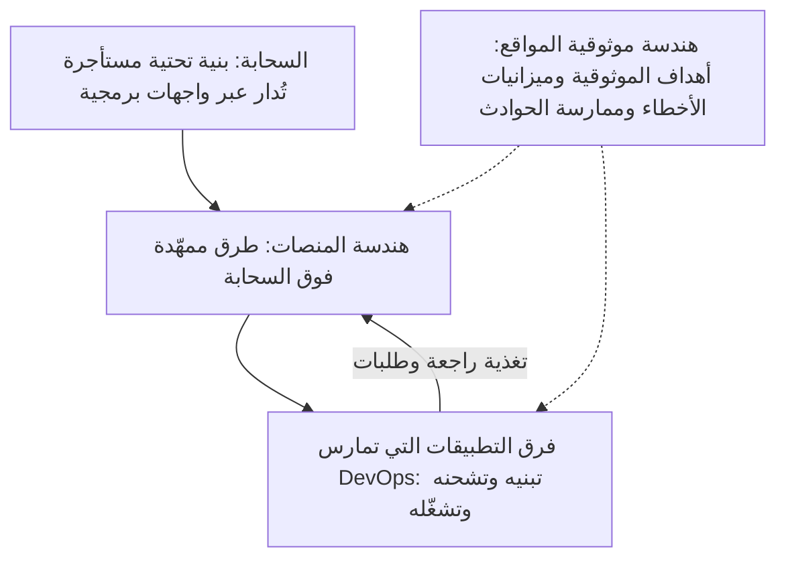

# الوحدة 0 — التوجيه (Orientation)

*قبل أن تلمس حاوية (container) أو عنقودًا (cluster)، تحتاج إلى خريطة (map). تمنحك هذه الوحدة ثلاثة أشياء. أولها المفردات (vocabulary): ما المعنى الفعلي لكل من "السحابة (cloud)" و"DevOps" و"هندسة المنصات (platform engineering)" و"هندسة موثوقية المواقع (site reliability engineering)"، وكيف تتداخل، وما الذي يتحمّل كل منها مسؤوليته (responsible for). وثانيها المسار (path) الذي يقطعه كل تغيير من إيداع المطوّر (developer's commit) إلى هاتف العميل (customer's phone)، والمواضع على امتداد هذا المسار التي تنكسر فيها الأمور (things break). فبعض هذه الأعطال كلّف شركات حقيقية مئات الملايين، أو أخرج جزءًا كبيرًا من الإنترنت عن الخدمة (offline) لساعات. وثالثها الأشخاص الذين ستعمل معهم طوال الدورة: فريق هندسة المنصات وهندسة موثوقية المواقع (Platform Engineering & SRE team) في بنك نجم (Najm Bank)، الذين ينقلون واجهة برمجة تطبيق نجم للهاتف (Najm Mobile API) وخدمة المدفوعات (payments service) من مركز بيانات (data centre) إلى سحابة مُدارة (managed cloud)، ويبنون منصة (platform) ستستخدمها فرق التطبيقات (app teams) في البنك كل يوم. ستُنهي الوحدة ومعك مختبر محلي يعمل (working local lab) وخطة واضحة لطريقة الدراسة (how to study).*

> **المراحل (Phases):** Plan، Release، Deploy — خريطة حلقة التسليم الكاملة (whole delivery loop)، والمفردات (vocabulary) اللازمة للحديث عنها.

---

# 0.1 — ما هي السحابة (cloud) وDevOps وهندسة المنصات (platform engineering) وهندسة موثوقية المواقع (SRE)
*المستوى (Level): 🟢 مبتدئ (Beginner)* · *المتطلبات (Prerequisites): لا يوجد (none)* · *المرحلة (Phase): Plan*

## ⚡ الدرس في دقيقة (In 60 seconds)
- **السحابة (cloud)** طريقة للحصول على الحوسبة (computing): تستأجر الخوادم (servers) والتخزين (storage) والشبكات (networks) والخدمات المُدارة (managed services) عند الطلب (on demand)، عبر واجهة برمجة تطبيقات (API)، وتدفع مقابل ما تستخدمه (pay for what you use). إنها ليست "حاسوب شخص آخر (someone else's computer)" بقدر ما هي *أتمتة (automation)* شخص آخر.
- **DevOps** طريقة عمل (way of working): الأشخاص الذين يبنون البرمجيات (build software) يشاركون أيضًا في شحنها (shipping) وتشغيلها (running)، مدعومين بالأتمتة (automation) والتغذية الراجعة السريعة (fast feedback). إنها ثقافة (culture) ومجموعة ممارسات (set of practices)، وليست مسمّى وظيفيًا (job title) ولا أداة (tool).
- **هندسة المنصات (platform engineering)** تبني *منتجًا داخليًا (internal product)*، هو منصة المطوّرين الداخلية (internal developer platform)، كي تتمكن فرق التطبيقات (app teams) من الشحن بأمان (ship safely) دون أن تصبح خبيرة في كل ما يقع تحتها (everything underneath).
- **هندسة موثوقية المواقع (site reliability engineering, SRE)** تتعامل مع الموثوقية (reliability) بوصفها مسألة هندسية بالأرقام (engineering problem with numbers): أهداف مستوى الخدمة (service level objectives)، وميزانيات الأخطاء (error budgets)، وحدّ أقصى للعمل اليدوي المتكرر (manual, repetitive work).
- إشارة القرار (Decision cue): عندما يقول أحدهم "نحتاج إلى DevOps (we need DevOps)"، اسأله أي مشكلة يقصد: إطلاقات بطيئة (slow releases)، أم إطلاقات غير آمنة (unsafe releases)، أم خدمات غير موثوقة (unreliable services)، أم فرق تغرق في البنية التحتية (teams drowning in infrastructure). فكلٌّ منها يشير إلى علاج مختلف (different fix).
- الفخ الأكبر (Biggest trap): إعادة تسمية فريق العمليات القديم (old operations team) إلى "DevOps"، وشراء أداة (buying a tool)، وتوقّع أن يتغير أي شيء.

## 🧭 لماذا يهم (Why it matters)
ينضم يوسف إلى فريق هندسة المنصات وهندسة موثوقية المواقع (Platform Engineering & SRE team) في بنك نجم مباشرةً بعد شهادته في هندسة الحاسوب (computer-engineering degree). وفي أسبوعه الأول يسمع أربع كلمات تُستخدم كأنها تعني الشيء نفسه. تقول شريحة مدير تقنية المعلومات (CIO's slide) إن البنك "يتجه إلى السحابة (going cloud)". ويطلب فريق تطبيقات (app team) "مهندس DevOps (a DevOps engineer)" لإصلاح خط التسليم (pipeline) لديه. ويتحدث سالم، رئيس هندسة المنصات (Head of Platform Engineering)، عن "المنصة (the platform)" كأنها منتج (product) له عملاء (customers). وترفض مها، قائدة هندسة موثوقية المواقع (SRE lead)، الموافقة على إطلاق (launch) لأن "الخدمة ليس لها هدف مستوى خدمة (the service has no SLO)".

يوم الخميس يُطلب من يوسف أن يمنح فريق واجهة برمجة تطبيق نجم للهاتف (Najm Mobile API) "صلاحية DevOps (DevOps access)" على حساب السحابة الجديد (new cloud account)، فيمنح كل مطوّر صلاحيات مدير كاملة (full administrator rights). لا ينكسر شيء، لكن نورة، رئيسة أمن التطبيقات والذكاء الاصطناعي (Head of Application & AI Security)، تكتشف ذلك في مراجعة الصلاحيات التالية (next access review).

كان السبب الجذري (root cause) هو المفردات (vocabulary). فـ DevOps تعني المسؤولية المشتركة (shared responsibility)، لا صلاحيات المستخدم الخارق المشتركة (shared superuser rights)، وفريق المنصة (platform team) يمنح فرق التطبيقات (app teams) *طريقًا ممهّدًا آمنًا (safe paved road)*، لا مفاتيح كل شيء (keys to everything). يمنحك هذا الدرس الكلمات.

## 📐 كيف يعمل (How it works)

### 🟢 الأساسيات (The essentials)

**الحوسبة السحابية (Cloud computing).** التعريف الأكثر استشهادًا (most widely cited definition) يأتي من المعهد الوطني الأمريكي للمعايير والتقنية (US National Institute of Standards and Technology)، في الوثيقة NIST SP 800-145 (2011). وهو يسرد خمس خصائص أساسية (five essential characteristics):

| الخاصية (Characteristic) | بكلمات بسيطة (In plain words) | لماذا تغيّر طريقة عملك (Why it changes how you work) |
|---|---|---|
| الخدمة الذاتية عند الطلب (On-demand self-service) | تُنشئ خادمًا (server) أو قاعدة بيانات (database) بنفسك، في دقائق، دون تذكرة (ticket) إلى إنسان | تصبح البنية التحتية (infrastructure) شيئًا يمكن للشيفرة (code) إنشاؤه (الوحدة 3) |
| الوصول الواسع عبر الشبكة (Broad network access) | يُوصَل إلى كل شيء عبر الشبكة (network) من خلال واجهات قياسية (standard interfaces) | لكل خدمة واجهة برمجة تطبيقات (API)، لذا يمكن أتمتة (automated) كل شيء |
| تجميع الموارد (Resource pooling) | يتشارك المزوّد (provider) مجمّعات كبيرة من العتاد (large pools of hardware) بين عملاء كثيرين | لا تختار الجهاز المادي (physical machine)؛ بل تختار منطقة (region) ومنطقة توافر (zone) (1.2) |
| المرونة السريعة (Rapid elasticity) | يمكن للسعة (capacity) أن تكبر وتصغر بسرعة، وأحيانًا تلقائيًا (automatically) | يمكنك التوسّع مع الطلب (scale with demand) بدل الشراء لتغطية الذروة (buying for the peak) (6.1) |
| الخدمة المقيسة (Measured service) | يُقاس الاستخدام (usage is metered) ويُفوتر (billed) | تصبح التكلفة (cost) خاصية هندسية (engineering property) يمكنك رؤيتها وتغييرها (6.2) |

ويصف NIST أيضًا ثلاثة **نماذج خدمة (service models)**. في **IaaS** (البنية التحتية بوصفها خدمة (infrastructure as a service)) تستأجر أجهزة افتراضية (virtual machines) وأقراصًا (disks) وشبكات (networks) وتدير نظام التشغيل (operating system) بنفسك. وفي **PaaS** (المنصة بوصفها خدمة (platform as a service)) تسلّم شيفرتك (code) أو حاويتك (container) فيشغّلها المزوّد (provider). وفي **SaaS** (البرمجيات بوصفها خدمة (software as a service)) تستخدم ببساطة تطبيقًا جاهزًا (finished application)، مثل البريد الإلكتروني (email). ومنذ ذلك الحين أصبح نموذج **الحوسبة بلا خوادم (serverless)** شائعًا: تقدّم دوالًا (functions) أو حاويات (containers)، ويشغّلها المزوّد فقط عند وصول الطلبات (when requests arrive)، وتدفع مقابل الاستخدام (pay per use). ويسرد NIST كذلك نماذج النشر (deployment models): السحابة **العامة (public)** (مزوّدون مشتركون مثل AWS وMicrosoft Azure وGoogle Cloud)، والسحابة **الخاصة (private)** (الأتمتة نفسها داخل مركز بياناتك (data centre))، وسحابة **المجتمع (community)** (تتشاركها مجموعة من المؤسسات)، والسحابة **الهجينة (hybrid)** (مزيج، مثل أعباء عمل نجم السحابية (Najm's cloud workloads) المتصلة بنظامها المصرفي الأساسي المحلي (on-premises core banking system)).

**DevOps.** نشأت الكلمة من مؤتمرات "DevOpsDays" التي بدأت عام 2009. لكن الفكرة التي تسمّيها أقدم من ذلك: الجدار (wall) بين "المطوّرين الذين يغيّرون الأشياء (developers who change things)" و"أفراد العمليات الذين يحافظون على استقرار الأشياء (operations people who keep things stable)" يسبب إطلاقات بطيئة ومؤلمة (slow, painful releases)، لأن كل طرف يُقاس على الهدف المعاكس (opposite goal). يزيل DevOps هذا الجدار. فالفرق تملك خدمتها (own their service) من الشيفرة إلى الإنتاج (from code to production). وتؤتمت البناء والاختبار والنشر (build, test and deploy)، وتقيس مدى جودة تسليم النظام بأكمله (how well the whole system delivers).

يأتي الدليل الأكثر استشهادًا (most widely cited evidence) على ما ينجح من برنامج أبحاث **DORA** (DevOps Research and Assessment)، الملخَّص في كتاب *Accelerate* لنيكول فورسغرين (Nicole Forsgren) وجيز هَمبل (Jez Humble) وجين كيم (Gene Kim) (2018). ولا تزال مقاييسه الأربعة الرئيسة (four key metrics) نقطة الانطلاق القياسية (standard starting point):

| المقياس (Metric) | ما الذي يقيسه (What it measures) | النوع (Kind) |
|---|---|---|
| تكرار النشر (Deployment frequency) | كم مرة تشحن إلى الإنتاج (ship to production) | السرعة (Speed) |
| مهلة التغييرات (Lead time for changes) | الوقت من الإيداع (commit) إلى تشغيل ذلك الإيداع في الإنتاج (running in production) | السرعة (Speed) |
| معدل فشل التغييرات (Change failure rate) | نسبة عمليات النشر (deployments) التي تسبب عطلًا (failure) يحتاج إلى إصلاح (fix) أو تراجع (rollback) | الاستقرار (Stability) |
| زمن استعادة الخدمة (Time to restore service) | المدة اللازمة للتعافي (recover) عندما يتعطل الإنتاج (production fails) | الاستقرار (Stability) |

أنفع ما توصّل إليه البحث (most useful finding) أن السرعة والاستقرار (speed and stability) *ليسا* مقايضة (trade-off). فالفرق الأفضل أداءً (best-performing teams) أسرع وأكثر استقرارًا في آنٍ واحد، لأن التغييرات الصغيرة المتكررة المؤتمتة (small, frequent, automated changes) أسهل في الاختبار (easier to test)، وأسهل في الفهم (easier to understand)، وأسهل في التراجع عنها (easier to undo). وقد أضافت تقارير DORA اللاحقة مقياسًا للموثوقية (reliability measure) وحسّنت بعض الأسماء والتعريفات؛ راجع dora.dev لمعرفة المجموعة الحالية (current set) وقت قراءتك هذا.

**هندسة موثوقية المواقع (Site reliability engineering).** بدأت SRE في Google ووُصفت علنًا في كتاب *Site Reliability Engineering* (2016) وكتاب *The Site Reliability Workbook* (2018). أفكارها المحورية (central ideas):
- **مؤشر مستوى الخدمة (service level indicator, SLI)** قياسٌ لما يختبره المستخدمون (what users experience)، مثل "نسبة طلبات واجهة برمجة التطبيقات (API requests) التي تنجح في أقل من 300 ملّي ثانية (milliseconds)".
- **هدف مستوى الخدمة (service level objective, SLO)** هو الهدف (target) لذلك المؤشر عبر نافذة زمنية (window)، مثل "99.9% على مدى 28 يومًا".
- **ميزانية الأخطاء (error budget)** هي ما يتبقى: 100% ناقص هدف مستوى الخدمة (SLO). إن كنت ضمن الميزانية (inside the budget)، فاشحن (ship). وإن استنفدتها (spent it)، فأبطئ (slow down) وأصلح الموثوقية (fix reliability). وهذا يحوّل الجدل بين "اشحن أسرع (ship faster)" و"كن حذرًا (be careful)" إلى رقم متفق عليه مسبقًا (number agreed in advance) (5.2).
- **العمل الرتيب (toil)** هو العمل اليدوي المتكرر (manual, repetitive work) الذي يكبر مع حجم الخدمة (scales with the size of the service) ولا يضيف قيمة دائمة (no lasting value)، مثل إعادة تشغيل مهمة عالقة (stuck job) يدويًا كل ليلة. ويصف كتاب SRE من Google إبقاء العمل التشغيلي (operational work) عند نصف وقت مهندس SRE تقريبًا على الأكثر، كي يذهب الباقي إلى التخلص منه هندسيًا (engineering it away).
- **مراجعات ما بعد الحادثة الخالية من اللوم (blameless postmortems)** تبحث عمّا سمح به النظام (in the system) لوقوع الخطأ، لا عمّن يجب معاقبته (who to punish) (5.3).

**هندسة المنصات (Platform engineering).** تبدو عبارة "أنت تبنيه، وأنت تشغّله (You build it, you run it)" جيدة، لكن مطالبة كل فريق تطبيقات (app team) بإتقان Kubernetes والشبكات (networking) والهوية (identity) وخطوط التسليم (pipelines) وقابلية المراقبة (observability) والتكلفة (cost) عبءٌ معرفي (cognitive load) مفرط. وهندسة المنصات (platform engineering) هي الجواب عن ذلك. فيبني فريق المنصة (platform team) **منصة المطوّرين الداخلية (internal developer platform, IDP)**: مجموعة من أدوات الخدمة الذاتية (self-service tools) والقوالب (templates) والطرق الممهّدة (paved roads) (وتُسمّى غالبًا **المسارات الذهبية (golden paths)**) التي تجعل الطريق الآمن هو الطريق السهل (make the safe way the easy way). ويسمّي كتاب *Team Topologies* لماثيو سكلتون (Matthew Skelton) ومانويل باييس (Manuel Pais) (2019) هذا "فريق منصة (platform team)" يخدم فرق المنتجات "المحاذية للتدفق (stream-aligned)". وقد نشرت مؤسسة CNCF (Cloud Native Computing Foundation) ورقة بيضاء (white paper) تصف ما توفّره المنصات (what platforms provide)؛ راجع cncf.io للاطلاع على النسخة الحالية (current version).

### 🟡 التعمق أكثر (Going deeper)

**كيف تتكامل الأفكار الأربع (How the four ideas fit together).** إنها ليست متنافسة (not competing)؛ بل تقع في طبقات مختلفة (different layers).

توفّر السحابة (cloud) القدرة الخام (raw capability). ويحوّلها فريق المنصة (platform team) إلى عدد صغير من الخيارات الآمنة المدعومة (safe, supported choices). وتستخدم فرق التطبيقات (app teams) هذه الخيارات لتسلّم كثيرًا (deliver often) وتملك خدماتها (own their services). أما ممارسات SRE فتمتد عبر الاثنين (cut across both): فهي تقرر مدى الموثوقية التي تحتاجها كل خدمة (how reliable each service needs to be)، وتُلزم الجميع بها (hold everyone to it).

**من يفعل ماذا (Who does what).** تختلف المسمّيات (titles) بين الشركات، لذا تعلّم *المسؤوليات (responsibilities)*، لا التسميات (labels):

| الدور (Role) | السؤال الرئيس الذي يجيب عنه (Main question they answer) | العمل المعتاد (Typical work) |
|---|---|---|
| مهندس السحابة (Cloud engineer) | "كيف نستخدم خدمات المزوّد جيدًا وبأمان؟ ⁦(How do we use the provider's services well and safely?)⁩" | الحسابات (accounts)، والشبكات (networks)، والهوية (identity)، والخدمات المُدارة (managed services)، ومناطق الهبوط (landing zones) |
| مهندس DevOps (DevOps engineer) | "كيف تنتقل الشيفرة من الإيداع إلى الإنتاج بسرعة وأمان؟ ⁦(How does code get from a commit to production quickly and safely?)⁩" | خطوط التسليم (pipelines)، وأدوات البناء (build tooling)، وأتمتة الإطلاق (release automation)، والبيئات (environments). وغالبًا مزيج من الصفوف الثلاثة الأخرى |
| مهندس المنصات (Platform engineer) | "ما الذي ينبغي أن يحصل عليه كل فريق مجانًا كي لا يعيد بناءه؟ ⁦(What should every team get for free so they do not rebuild it?)⁩" | القوالب (templates)، ومنصة Kubernetes، وGitOps، وبوابة المطوّرين (developer portal)، والخدمة الذاتية (self-service) |
| مهندس موثوقية المواقع (Site reliability engineer) | "هل الخدمة موثوقة بما يكفي، وكيف نعرف ذلك؟ ⁦(Is the service reliable enough, and how do we know?)⁩" | أهداف مستوى الخدمة (SLOs)، والتنبيه (alerting)، والمناوبة (on-call)، والحوادث (incidents)، والسعة (capacity)، وإزالة العمل الرتيب (removing toil) |

في الشركة الصغيرة (small company) يؤدي شخص واحد الأدوار الأربعة. وفي بنك نجم هم أشخاص منفصلون يجلسون في فريق واحد (one team).

**لماذا يكون "فريق DevOps" غالبًا نمطًا مضادًا (Why "DevOps team" is often an anti-pattern).** إذا أنشأت شركة "فريق DevOps (DevOps team)" يتلقى التذاكر (tickets) من المطوّرين وينشر (deploys) نيابةً عنهم، فقد أعادت بناء الجدار (rebuilt the wall) باسم جديد. والاختبار بسيط (the test is simple): هل يستطيع فريق التطبيقات (app team) شحن تغيير إلى الإنتاج (ship a change to production)، بأمان، دون تقديم تذكرة (filing a ticket) وانتظار شخص (waiting for a person)؟ إن لم يكن كذلك، فلديك تسليم يدوي بين فريقين (handoff)، لا DevOps. ومهمة فريق المنصة (platform team's job) هي إزالة هذا التسليم (remove the handoff)، لا أن يصبح هو التسليم.

**تطبيق العوامل الاثني عشر (The Twelve-Factor App).** منهجية قصيرة (short methodology) نشرها مهندسون في Heroku تصف خدمات تعمل جيدًا على المنصات السحابية (cloud platforms): الإعدادات في البيئة لا في الشيفرة (configuration in the environment, not in code)؛ والعمليات عديمة الحالة (stateless processes)؛ وبدء التشغيل السريع والإيقاف الرشيق (fast startup and graceful shutdown)؛ والبناء والإطلاق والتشغيل بوصفها مراحل منفصلة (build, release and run as separate stages). ستلتقي هذه الأفكار مجددًا في الوحدتين 2 و4.

### 🔴 نظرة الخبير (Expert view)

**قِس النتائج لا التبنّي (Measure outcomes, not adoption).** عبارة "نقلنا 80 خدمة إلى Kubernetes" نشاطٌ (activity). أما "انخفضت مهلة التغييرات (lead time) من ثلاثة أسابيع إلى يوم واحد، ولم يرتفع معدل فشل التغييرات (change failure rate)" فهي نتيجة (outcome). يرفع سالم إلى مدير تقنية المعلومات (CIO) مقاييس DORA (DORA metrics) ومدى تحقيق أهداف مستوى الخدمة (SLO attainment)، لا أعداد الأدوات (tool counts). والمنصة التي لا يستخدمها أحد طوعًا (voluntarily) قد فشلت: تعامل معها بوصفها منتجًا (product) له مستخدمون (users) وخارطة طريق (roadmap) ومقاييس تبنٍّ (adoption metrics).

**الموثوقية قرار منتج (Reliability is a product decision).** نسبة 100% هي الهدف الخطأ (wrong target) لكل شيء تقريبًا. فكل "تسعة (nine)" إضافية تكلّف أكثر، ولا يستطيع المستخدمون التمييز بين 99.99% و99.999% حين تتعطل شبكة هاتفهم المحمول (mobile network) نفسها أكثر من ذلك. فهدف مستوى الخدمة (SLO) الصحيح يأتي مما يحتاجه المستخدمون (what users need): مرتفع لخدمة المدفوعات (payments service)، وأدنى بكثير لأداة تقارير داخلية (internal reporting tool).

**التنظيم يشكّل المنصة (Regulation shapes the platform).** بالنسبة إلى بنك، ليست السحابة (cloud) مجرد خيار هندسي (engineering choice). فالجهات التنظيمية المالية في دول الخليج (GCC financial regulators)، ومنها مصرف قطر المركزي (Qatar Central Bank)، تنشر توقعاتها بشأن الإسناد الخارجي السحابي (cloud outsourcing) وإقامة البيانات (data residency) والمرونة (resilience). وفي الاتحاد الأوروبي (EU)، يضع قانون المرونة التشغيلية الرقمية (Digital Operational Resilience Act) (DORA، اللائحة (EU) 2022/2554، المطبَّقة اعتبارًا من يناير 2025) قواعد بشأن مخاطر تقنية المعلومات والاتصالات (ICT risk)، والإبلاغ عن الحوادث (incident reporting)، واختبار المرونة (resilience testing)، ومخاطر الأطراف الثالثة (third-party risk) (ومنها السحابة) للكيانات المالية (financial entities). لاحظ تشابه الاسمين (name clash): *DORA* اللائحة الأوروبية و*DORA* برنامج أبحاث DevOps لا علاقة بينهما (unrelated). تبقى هذه الدورة في الجانب الهندسي (engineering)؛ أما القواعد فراجع [*أمن الذكاء الاصطناعي والتطبيقات (Secure AI & Application Security)*، الدرس 11.2 — التنظيم الذي يمسّ الأمن (Regulation that touches security)](../secai/index.ar.html#/11.2).

## 🧰 الأدوات (The toolkit)
| الأداة أو الممارسة أو الخدمة (Tool, practice or service) | ما هي وماذا تفعل (What it is and does) | متى تلجأ إليها (When to reach for it) |
|---|---|---|
| **DORA metrics** — مقاييس DORA | أربعة مقاييس لأداء التسليم (delivery performance): تكرار النشر (deployment frequency)، ومهلة التغييرات (lead time for changes)، ومعدل فشل التغييرات (change failure rate)، وزمن استعادة الخدمة (time to restore service) | تحديد خط أساس (baseline) قبل أي تغيير، والإبلاغ عن التقدم (reporting progress) بالنتائج (outcomes) لا بالأدوات (tools) |
| **Service level objective** — هدف مستوى الخدمة | هدف (target) لقياس يواجه المستخدم (user-facing measurement) عبر نافذة زمنية (time window) | تحديد مدى الموثوقية التي يجب أن تتمتع بها الخدمة (how reliable a service must be)، ومتى تُبطئ الإطلاقات (slow down releases) |
| **Error budget** — ميزانية الأخطاء | مقدار عدم الموثوقية (unreliability) الذي يسمح به هدف مستوى الخدمة (SLO) | حسم سؤال "نشحن أم نثبّت الاستقرار؟ ⁦(ship or stabilise?)⁩" برقم متفق عليه مسبقًا (agreed in advance) |
| **Internal developer platform** — منصة المطوّرين الداخلية | أدوات خدمة ذاتية (self-service tools) وقوالب (templates) وطرق ممهّدة (paved roads) تستخدمها فرق التطبيقات (app teams) لبناء الخدمات وتشغيلها | حين تكرر فرق كثيرة عمل البنية التحتية نفسه (same infrastructure work)، أو يؤديه كل منها بطريقة مختلفة |
| **Backstage** — مفتوح المصدر (open source)، من CNCF | بوابة مطوّرين (developer portal): فهرس البرمجيات (software catalogue) والقوالب (templates) والتوثيق (documentation) في مكان واحد | منح فرق التطبيقات (app teams) بابًا أماميًا واحدًا (one front door) إلى المنصة (platform) |
| **Twelve-Factor App** — تطبيق العوامل الاثني عشر | منهجية قصيرة (short methodology) لبناء خدمات تعمل جيدًا على المنصات السحابية (cloud platforms) | مراجعة ما إذا كانت الخدمة جاهزة للحوسبة في حاويات (ready to be containerised) والتوسّع (scaled) |
| **Well-Architected frameworks** — أطر البنية الجيدة (AWS وAzure وGoogle Cloud) | إرشادات الممارسات الجيدة المنظّمة (structured good-practice guidance) لدى كل مزوّد، مرتّبة في ركائز (pillars) | مراجعة تصميم (design) مقابل قائمة تحقق (checklist) قبل تشغيله فعليًا (goes live) |

## 🏛️ عمليًا في بنك نجم (In practice at Najm Bank)
بعد حادثة "صلاحية DevOps (DevOps access)"، يطلب سالم من يوسف صياغة **خريطة المسؤوليات (responsibility map)** للفريق: صفحة واحدة تبيّن من يملك ماذا (who owns what) مع انتقال الخدمات إلى السحابة (cloud). وتُنشر على بوابة المطوّرين الداخلية (internal developer portal).

**هندسة المنصات وهندسة موثوقية المواقع في نجم (Najm Platform Engineering & SRE) — خريطة المسؤوليات (responsibility map) الإصدار 1 (v1)**

| المجال (Area) | يملكه فريق المنصة (Platform team owns) | تملكه فرق التطبيقات (App teams own) | تملكه هندسة موثوقية المواقع (SRE) (مها) | الأمن (Security) (نورة) |
|---|---|---|---|---|
| حسابات السحابة والشبكات والهوية (Cloud accounts, networks, identity) | منطقة الهبوط (landing zone)، وتخطيط الشبكة (network layout)، والأدوار (roles) لكل فريق | طلب الأدوار التي تحتاجها خدمتها (requesting the roles their service needs) | — | تعتمد تصميم الأدوار (approves role design)، وتجري مراجعات الصلاحيات (access reviews) |
| عناقيد Kubernetes (Kubernetes clusters) | دورة حياة العنقود (cluster lifecycle)، والترقيات (upgrades)، والإضافات المشتركة (shared add-ons) | مساحات أسمائها (namespaces)، وملفات التعريف (manifests)، وطلبات الموارد (resource requests) | مراجعات السعة (capacity reviews) | خط الأساس لسياسات العنقود (cluster policy baseline) |
| خطوط التسليم والمسارات الذهبية (Pipelines and golden paths) | القوالب (templates)، والمشغّلات المشتركة (shared runners)، وبنية مستودع GitOps (GitOps repo structure) | خط تسليم خدمتها (pipeline)، واختباراتها (tests)، وخيارات الإطلاق (release choices) | بوابات الإطلاق المرتبطة بميزانيات الأخطاء (release gates tied to error budgets) | ضوابط سلسلة التوريد (supply-chain controls) |
| قابلية المراقبة (Observability) | منظومة القياس عن بُعد (telemetry stack)، وقوالب لوحات المتابعة (dashboards templates) | تجهيز شيفرتها بأدوات القياس (instrumenting their code)، ولوحات متابعة الخدمة (service dashboards) | تعريفات أهداف مستوى الخدمة (SLO definitions) مع فرق التطبيقات، ومعايير التنبيه (alert standards) | متطلبات التسجيل الأمني (security logging requirements) |
| المناوبة والحوادث (On-call and incidents) | جدول مناوبة المنصة (platform on-call rota) | جدول مناوبة الخدمة (service on-call rota) | عملية الحوادث (incident process)، ومراجعات ما بعد الحادثة (postmortem reviews) | تصعيد الحوادث الأمنية (security incident escalation) (جاسم) |
| التكلفة (Cost) | لوحات متابعة التكلفة (cost dashboards) وقواعد الوسم (tagging rules) | إنفاق خدمتها (their service's spend) وتكلفة الوحدة (unit cost) | — | — |

**القواعد المصاحبة لها (Rules that come with it):**
- لا يحصل أحد على صلاحيات مدير دائمة (standing administrator rights) في الإنتاج (production). فالصلاحيات المرفوعة (elevated access) محدودة زمنيًا (time-limited)، ومعتمدة (approved)، ومسجّلة (logged) (1.3).
- "صلاحية DevOps (DevOps access)" ليست نوع طلب (request type). فالطلبات تسمّي الإجراء والمورد (name the action and the resource): "النشر إلى مساحة الأسماء `mobile-api` في بيئة التجهيز (deploy to namespace in staging)".
- يقيس فريق المنصة (platform team) نجاحه بمقاييس DORA لفرق التطبيقات (app-team DORA metrics) وبتبنّي المسارات الذهبية (adoption of the golden paths)، ويرفعها إلى سالم شهريًا (monthly).
- تتلقى منى من الإدارة المالية (Finance) لوحة متابعة التكلفة (cost dashboard) شهريًا، ولها جهة اتصال مسمّاة (named contact) في كل فريق تطبيقات.

## 🛠️ التمارين (Exercises)
- 🟢 اكتب تعريفًا من فقرة واحدة (one-paragraph definition)، بكلماتك الخاصة، للسحابة (cloud) وDevOps وهندسة المنصات (platform engineering) وهندسة موثوقية المواقع (SRE)، ثم جملة واحدة عن علاقة كل منها بالبقية. ضمّنه خصائص السحابة الخمس لدى NIST (NIST's five cloud characteristics) ومقاييس DORA الأربعة (four DORA metrics). *يكتمل عندما (Done when):* يستطيع صديق لا يعمل في التقنية (not in tech) قراءته وأن يشرح لك بدوره الفرق بين DevOps وSRE.
- 🟡 ابحث عن خمسة إعلانات وظائف حقيقية (real job postings) لأدوار السحابة (cloud) أو DevOps أو المنصات (platform) أو SRE في منطقتك، وطابق مسؤوليات كل منها مع جدول "من يفعل ماذا (who does what)". *يكتمل عندما (Done when):* يُظهر جدولٌ أيّ الأدوار الأربعة يطلبه كل إعلان فعلًا (really asks for)، مع جملة واحدة عمّا فاجأك.
- 🔴 خذ مشروعًا تملكه وله سجل git (git history) (مشروعًا شخصيًا أو مستودعًا عامًا مفتوح المصدر (public open-source repository)). قدّر مقاييس DORA الخاصة به (DORA metrics) للأشهر الثلاثة الأخيرة: تكرار النشر أو الإطلاق (deployment or release frequency) من الوسوم (tags) أو الإصدارات (releases)، ومهلة التغييرات (lead time) من تاريخ الإيداع (commit date) إلى تاريخ الإطلاق (release date)، ومعدل فشل التغييرات (change failure rate) من عمليات الإرجاع (reverts) أو إصدارات الإصلاح العاجل (hotfix releases)، وزمن الاستعادة (time to restore) من الفجوة بين إطلاق سيئ (bad release) والإصلاح أو الإرجاع (fix or revert) الذي تلاه (استخدم الطوابع الزمنية للمشكلات (issue timestamps) إن توفرت لديك). *يكتمل عندما (Done when):* تكون لديك الأرقام الأربعة، والأوامر (commands) أو الاستعلامات (queries) التي استخدمتها للحصول عليها، وملاحظة عن الرقم الذي كان أصعب في القياس بأمانة (hardest to measure honestly) ولماذا.

## ⚠️ أخطاء وفخاخ (Mistakes and traps)
- **إعادة تسمية العمليات إلى "DevOps" (Renaming ops to "DevOps").** طابور التذاكر (ticket queue) باسم جديد يظل تسليمًا يدويًا بين فريقين (handoff). قِس ما إذا كانت الفرق تستطيع الشحن (ship) دون انتظار شخص (waiting on a person).
- **التعامل مع DevOps بوصفه شراء أداة (Treating DevOps as a tool purchase).** لا توجد أداة تصلح نموذج ملكية معطوبًا (broken ownership model). ابدأ بمن يملك ماذا (who owns what)، ثم أتمت (automate).
- **بناء منصة لم يطلبها أحد (Building a platform nobody asked for).** تحدّث إلى فرق التطبيقات (app teams) أولًا. المنصة منتج (a platform is a product)؛ وإذا تجنّبتها الفرق فقد فشلت.
- **مساواة "صلاحية DevOps" بصلاحيات المدير (Equating "DevOps access" with administrator rights).** المسؤولية المشتركة (shared responsibility) لا تعني مستخدمًا خارقًا مشتركًا (shared superuser). امنح صلاحيات محددة ومحدودة زمنيًا (specific, time-limited permissions).

## 🧾 الخلاصة (Recap)
- السحابة (cloud) بنية تحتية عند الطلب (on-demand)، تُدار عبر واجهات برمجة التطبيقات (API-driven)، ومقيسة (metered)؛ وخصائصها الخمس لدى NIST تفسّر لماذا تصبح الأتمتة (automation) والتكلفة (cost) شأنين هندسيين (engineering concerns).
- DevOps هو الملكية المشتركة (shared ownership) مضافًا إليها الأتمتة (automation)، ويُقاس بمقاييس DORA الأربعة (four DORA metrics)؛ والسرعة والاستقرار (speed and stability) يتحسّنان معًا.
- تجعل SRE الموثوقية (reliability) رقمًا: مؤشرات مستوى الخدمة (SLIs) وأهداف مستوى الخدمة (SLOs) وميزانيات الأخطاء (error budgets)، إضافة إلى سقف للعمل الرتيب (cap on toil) ومراجعات ما بعد الحادثة الخالية من اللوم (blameless postmortems).
- تبني هندسة المنصات (platform engineering) منتجًا داخليًا (internal product)، هو الطريق الممهّد (paved road)، كي تتحرك فرق التطبيقات (app teams) بسرعة دون إتقان كل طبقة (mastering every layer).
- تعلّم المسؤوليات لا المسمّيات (responsibilities, not titles). فالسؤال دائمًا: "من يملك هذا، وهل يستطيع التصرف دون انتظار؟ ⁦(who owns this, and can they act without waiting?)⁩"

## ✍️ اختبر نفسك (Check yourself)

**1. يطلب فريق تطبيقات (app team) في بنك نجم من يوسف "صلاحية DevOps (DevOps access)" كي ينشر تغييراته بنفسه (deploy their own changes). ما أفضل استجابة (best response)؟**

- A. منح كل مطوّر في الفريق صلاحيات مدير (administrator rights) على حساب السحابة (cloud account)، لأن DevOps يعني المسؤولية المشتركة (shared responsibility)
- B. سؤالهم عن الإجراءات (actions) التي يحتاجونها وعلى أي موارد (resources)، ومنح دور محدد (specific role)، مثل النشر إلى مساحة أسمائهم الخاصة (own namespace) في بيئة التجهيز (staging)
- C. الرفض، لأن فريق المنصة (platform team) وحده يحق له النشر (deploy)
- D. إنشاء طابور تذاكر (ticket queue) كي ينشر فريق المنصة (platform team) نيابةً عنهم

الإجابة

**B.** يعني DevOps أن الفرق تستطيع الشحن (ship) دون تسليم يدوي بين فريقين (handoff)، ولكن بصلاحيات محددة وفق مبدأ أقل الصلاحيات (least-privilege permissions). أما A فيخلط بين الملكية المشتركة (shared ownership) وصلاحيات المستخدم الخارق المشتركة (shared superuser rights). وC وD يعيدان بناء الجدار (rebuild the wall) بين البناء والتشغيل (building and running). (🟡 التعمق أكثر (Going deeper)؛ 🏛️ عمليًا (In practice).)

**2. أيٌّ مما يلي ليس (NOT) أحد مقاييس DORA الأربعة الرئيسة (four key metrics)؟**

- A. تكرار النشر (Deployment frequency)
- B. مهلة التغييرات (Lead time for changes)
- C. معدل فشل التغييرات (Change failure rate)
- D. عدد الخوادم المُدارة لكل مهندس (Number of servers managed per engineer)

الإجابة

**D.** المقاييس الأربعة الرئيسة (four keys) هي تكرار النشر (deployment frequency)، ومهلة التغييرات (lead time for changes)، ومعدل فشل التغييرات (change failure rate)، وزمن استعادة الخدمة (time to restore service). أما عدد الخوادم لكل مهندس (servers per engineer) فيقيس النشاط (activity)، لا نتائج التسليم (delivery outcomes). (🟢 الأساسيات (The essentials).)

**3. لخدمة المدفوعات (payments service) هدف مستوى خدمة (SLO) قدره 99.95% من التحويلات الناجحة (successful transfers) على مدى 28 يومًا. وفي منتصف النافذة (halfway through the window)، استهلكت الحوادث (incidents) كامل ميزانية الأخطاء (error budget) تقريبًا. بماذا توحي ممارسة SRE (SRE practice)؟**

- A. إبطاء إطلاقات الميزات الخطرة (risky feature releases) وتوجيه الجهد إلى الموثوقية (reliability) حتى تتعافى الميزانية (budget recovers)
- B. رفع هدف مستوى الخدمة (SLO) إلى 99.99% كي يأخذ الفريق الموثوقية بجدية أكبر
- C. المضيّ كما هو مخطط والنظر مجددًا عند إعادة ضبط نافذة الـ 28 يومًا (window resets)
- D. خفض هدف مستوى الخدمة (SLO) بهدوء كي تبدو الميزانية المتبقية (remaining budget) سليمة مجددًا

الإجابة

**A.** ميزانية الأخطاء (error budget) هي الإشارة المتفق عليها (agreed signal) لسؤال "نشحن أم نثبّت الاستقرار (ship or stabilise)". وحين تُستنفد، يأخذ عمل الموثوقية (reliability work) الأولوية. أما B فيزيد المشكلة سوءًا؛ وD يُبطل الغاية من الاتفاق على الهدف مسبقًا (agreeing the target in advance). (🟢 الأساسيات (The essentials).)

**4. أنشأت شركة "فريق DevOps (DevOps team)" يتلقى التذاكر (tickets) من المطوّرين ويشغّل عمليات النشر (deployments) الخاصة بهم يدويًا (by hand). ما المشكلة الرئيسة (main problem)؟**

- A. الفريق أصغر من أن يتعامل مع حجم التذاكر (volume of tickets) الذي سيتلقاه
- B. يجب إعادة تسمية الفريق إلى "SRE" كي يتضح غرضه للجميع
- C. لقد أعاد بناء التسليم اليدوي (handoff) بين البناء والتشغيل (building and running) الذي يزيله DevOps
- D. في البنك، يجب أن تتم عمليات النشر (deployments) يدويًا كي يتحقق شخص من كل واحدة منها

الإجابة

**C.** اختبار DevOps (test of DevOps) هو ما إذا كان الفريق يستطيع الشحن بأمان (ship safely) دون انتظار شخص آخر. وطابور التذاكر (ticket queue) تسليم يدوي (handoff)، أيًّا كان اسمه. أما A فيعالج العَرَض (treats the symptom)؛ وB يغيّر التسمية فقط (only changes the label)؛ وD خاطئ، لأن الأتمتة (automation) تجعل عمليات النشر أكثر أمانًا (safer) وأكثر قابلية للتدقيق (more auditable). (🟡 التعمق أكثر (Going deeper).)

**5. يريد سالم أن يُثبت لمدير تقنية المعلومات (CIO) أن منصة المطوّرين الداخلية (internal developer platform) الجديدة تعمل. أي دليل هو الأقوى (strongest evidence)؟**

- A. قائمة بكل أداة (tool) تتضمنها المنصة الآن، مع حالة الترخيص والدعم (licence and support status) لكل منها
- B. مهلة التغييرات (lead time) ومعدل الفشل (failure rate) لفرق التطبيقات قبل تبنّي المسارات الذهبية (golden paths) وبعده، والتبنّي الطوعي (voluntary adoption)
- C. عدد عناقيد Kubernetes (Kubernetes clusters) ومساحات الأسماء (namespaces) التي تعمل الآن، مقارنة بالربع الماضي (last quarter)
- D. نمو فريق المنصة (platform team) وعدد التذاكر (tickets) التي أغلقها هذا الربع

الإجابة

**B.** المنصة منتج (a platform is a product)؛ وهي تنجح حين يحقق مستخدموها نتائج أفضل (better outcomes) ويختارون استخدامها. أما A وC وD فتقيس المدخلات والنشاط (inputs and activity). (🔴 نظرة الخبير (Expert view).)

## 📚 المراجع (References)
- NIST SP 800-145، تعريف NIST للحوسبة السحابية (The NIST Definition of Cloud Computing) — https://csrc.nist.gov/pubs/sp/800/145/final
- برنامج أبحاث DORA (DORA research programme) — https://dora.dev/
- Google، كتابا Site Reliability Engineering وThe Site Reliability Workbook (متاحان مجانًا على الإنترنت (free online)) — https://sre.google/books/
- CNCF، الورقة البيضاء عن المنصات (Platforms white paper) (TAG App Delivery) — https://www.cncf.io/
- توثيق Backstage (Backstage documentation) — https://backstage.io/docs/
- تطبيق العوامل الاثني عشر (The Twelve-Factor App) — https://12factor.net/
- إطار AWS للبنية الجيدة (AWS Well-Architected Framework) — https://aws.amazon.com/architecture/well-architected/
- إطار Microsoft Azure للبنية الجيدة (Microsoft Azure Well-Architected Framework) — https://learn.microsoft.com/azure/well-architected/
- إطار Google Cloud للبنية الجيدة (Google Cloud Well-Architected Framework) (المعروف سابقًا بإطار Google Cloud المعماري (formerly the Google Cloud Architecture Framework)) — https://cloud.google.com/architecture/framework
- اللائحة (EU) 2022/2554 (قانون المرونة التشغيلية الرقمية (Digital Operational Resilience Act)) — https://eur-lex.europa.eu/eli/reg/2022/2554/oj

---

