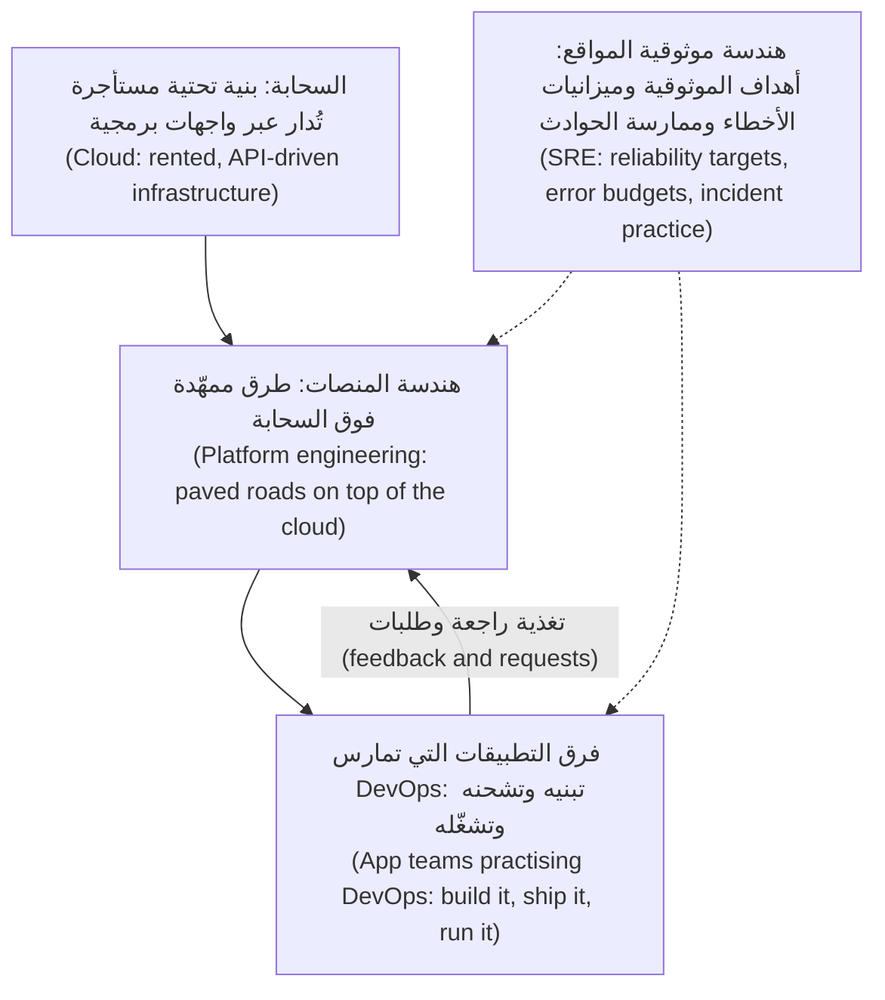
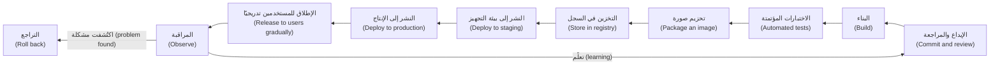

# الوحدة 0 — التوجيه (Orientation)

*قبل أن تلمس حاوية (container) أو عنقودًا (cluster)، تحتاج إلى خريطة (map). تمنحك هذه الوحدة ثلاثة أشياء. أولها المفردات (vocabulary): ما المعنى الفعلي لكل من "السحابة (cloud)" و"DevOps" و"هندسة المنصات (platform engineering)" و"هندسة موثوقية المواقع (site reliability engineering)"، وكيف تتداخل، وما الذي يتحمّل كل منها مسؤوليته (responsible for). وثانيها المسار (path) الذي يقطعه كل تغيير من إيداع المطوّر (developer's commit) إلى هاتف العميل (customer's phone)، والمواضع على امتداد هذا المسار التي تنكسر فيها الأمور (things break). فبعض هذه الأعطال كلّف شركات حقيقية مئات الملايين، أو أخرج جزءًا كبيرًا من الإنترنت عن الخدمة (offline) لساعات. وثالثها الأشخاص الذين ستعمل معهم طوال الدورة: فريق هندسة المنصات وهندسة موثوقية المواقع (Platform Engineering & SRE team) في بنك نجم (Najm Bank)، الذين ينقلون واجهة برمجة تطبيق نجم للهاتف (Najm Mobile API) وخدمة المدفوعات (payments service) من مركز بيانات (data centre) إلى سحابة مُدارة (managed cloud)، ويبنون منصة (platform) ستستخدمها فرق التطبيقات (app teams) في البنك كل يوم. ستُنهي الوحدة ومعك مختبر محلي يعمل (working local lab) وخطة واضحة لطريقة الدراسة (how to study).*

> **المراحل (Phases):** Plan، Release، Deploy — خريطة حلقة التسليم الكاملة (whole delivery loop)، والمفردات (vocabulary) اللازمة للحديث عنها.

---

# 0.1 — ما هي السحابة (cloud) وDevOps وهندسة المنصات (platform engineering) وهندسة موثوقية المواقع (SRE)
*المستوى (Level): 🟢 مبتدئ (Beginner)* · *المتطلبات (Prerequisites): لا يوجد (none)* · *المرحلة (Phase): Plan*

## ⚡ الدرس في دقيقة (In 60 seconds)
- **السحابة (cloud)** طريقة للحصول على الحوسبة (computing): تستأجر الخوادم (servers) والتخزين (storage) والشبكات (networks) والخدمات المُدارة (managed services) عند الطلب (on demand)، عبر واجهة برمجة تطبيقات (API)، وتدفع مقابل ما تستخدمه (pay for what you use). إنها ليست "حاسوب شخص آخر (someone else's computer)" بقدر ما هي *أتمتة (automation)* شخص آخر.
- **DevOps** طريقة عمل (way of working): الأشخاص الذين يبنون البرمجيات (build software) يشاركون أيضًا في شحنها (shipping) وتشغيلها (running)، مدعومين بالأتمتة (automation) والتغذية الراجعة السريعة (fast feedback). إنها ثقافة (culture) ومجموعة ممارسات (set of practices)، وليست مسمّى وظيفيًا (job title) ولا أداة (tool).
- **هندسة المنصات (platform engineering)** تبني *منتجًا داخليًا (internal product)*، هو منصة المطوّرين الداخلية (internal developer platform)، كي تتمكن فرق التطبيقات (app teams) من الشحن بأمان (ship safely) دون أن تصبح خبيرة في كل ما يقع تحتها (everything underneath).
- **هندسة موثوقية المواقع (site reliability engineering, SRE)** تتعامل مع الموثوقية (reliability) بوصفها مسألة هندسية بالأرقام (engineering problem with numbers): أهداف مستوى الخدمة (service level objectives)، وميزانيات الأخطاء (error budgets)، وحدّ أقصى للعمل اليدوي المتكرر (manual, repetitive work).
- إشارة القرار (Decision cue): عندما يقول أحدهم "نحتاج إلى DevOps (we need DevOps)"، اسأله أي مشكلة يقصد: إطلاقات بطيئة (slow releases)، أم إطلاقات غير آمنة (unsafe releases)، أم خدمات غير موثوقة (unreliable services)، أم فرق تغرق في البنية التحتية (teams drowning in infrastructure). فكلٌّ منها يشير إلى علاج مختلف (different fix).
- الفخ الأكبر (Biggest trap): إعادة تسمية فريق العمليات القديم (old operations team) إلى "DevOps"، وشراء أداة (buying a tool)، وتوقّع أن يتغير أي شيء.

## 🧭 لماذا يهم (Why it matters)
ينضم يوسف إلى فريق هندسة المنصات وهندسة موثوقية المواقع (Platform Engineering & SRE team) في بنك نجم مباشرةً بعد شهادته في هندسة الحاسوب (computer-engineering degree). وفي أسبوعه الأول يسمع أربع كلمات تُستخدم كأنها تعني الشيء نفسه. تقول شريحة مدير تقنية المعلومات (CIO's slide) إن البنك "يتجه إلى السحابة (going cloud)". ويطلب فريق تطبيقات (app team) "مهندس DevOps (a DevOps engineer)" لإصلاح خط التسليم (pipeline) لديه. ويتحدث سالم، رئيس هندسة المنصات (Head of Platform Engineering)، عن "المنصة (the platform)" كأنها منتج (product) له عملاء (customers). وترفض مها، قائدة هندسة موثوقية المواقع (SRE lead)، الموافقة على إطلاق (launch) لأن "الخدمة ليس لها هدف مستوى خدمة (the service has no SLO)".

يوم الخميس يُطلب من يوسف أن يمنح فريق واجهة برمجة تطبيق نجم للهاتف (Najm Mobile API) "صلاحية DevOps (DevOps access)" على حساب السحابة الجديد (new cloud account)، فيمنح كل مطوّر صلاحيات مدير كاملة (full administrator rights). لا ينكسر شيء، لكن نورة، رئيسة أمن التطبيقات والذكاء الاصطناعي (Head of Application & AI Security)، تكتشف ذلك في مراجعة الصلاحيات التالية (next access review).

كان السبب الجذري (root cause) هو المفردات (vocabulary). فـ DevOps تعني المسؤولية المشتركة (shared responsibility)، لا صلاحيات المستخدم الخارق المشتركة (shared superuser rights)، وفريق المنصة (platform team) يمنح فرق التطبيقات (app teams) *طريقًا ممهّدًا آمنًا (safe paved road)*، لا مفاتيح كل شيء (keys to everything). يمنحك هذا الدرس الكلمات.

## 📐 كيف يعمل (How it works)

### 🟢 الأساسيات (The essentials)

**الحوسبة السحابية (Cloud computing).** التعريف الأكثر استشهادًا (most widely cited definition) يأتي من المعهد الوطني الأمريكي للمعايير والتقنية (US National Institute of Standards and Technology)، في الوثيقة NIST SP 800-145 (2011). وهو يسرد خمس خصائص أساسية (five essential characteristics):

| الخاصية (Characteristic) | بكلمات بسيطة (In plain words) | لماذا تغيّر طريقة عملك (Why it changes how you work) |
|---|---|---|
| الخدمة الذاتية عند الطلب (On-demand self-service) | تُنشئ خادمًا (server) أو قاعدة بيانات (database) بنفسك، في دقائق، دون تذكرة (ticket) إلى إنسان | تصبح البنية التحتية (infrastructure) شيئًا يمكن للشيفرة (code) إنشاؤه (الوحدة 3) |
| الوصول الواسع عبر الشبكة (Broad network access) | يُوصَل إلى كل شيء عبر الشبكة (network) من خلال واجهات قياسية (standard interfaces) | لكل خدمة واجهة برمجة تطبيقات (API)، لذا يمكن أتمتة (automated) كل شيء |
| تجميع الموارد (Resource pooling) | يتشارك المزوّد (provider) مجمّعات كبيرة من العتاد (large pools of hardware) بين عملاء كثيرين | لا تختار الجهاز المادي (physical machine)؛ بل تختار منطقة (region) ومنطقة توافر (zone) (1.2) |
| المرونة السريعة (Rapid elasticity) | يمكن للسعة (capacity) أن تكبر وتصغر بسرعة، وأحيانًا تلقائيًا (automatically) | يمكنك التوسّع مع الطلب (scale with demand) بدل الشراء لتغطية الذروة (buying for the peak) (6.1) |
| الخدمة المقيسة (Measured service) | يُقاس الاستخدام (usage is metered) ويُفوتر (billed) | تصبح التكلفة (cost) خاصية هندسية (engineering property) يمكنك رؤيتها وتغييرها (6.2) |

ويصف NIST أيضًا ثلاثة **نماذج خدمة (service models)**. في **IaaS** (البنية التحتية بوصفها خدمة (infrastructure as a service)) تستأجر أجهزة افتراضية (virtual machines) وأقراصًا (disks) وشبكات (networks) وتدير نظام التشغيل (operating system) بنفسك. وفي **PaaS** (المنصة بوصفها خدمة (platform as a service)) تسلّم شيفرتك (code) أو حاويتك (container) فيشغّلها المزوّد (provider). وفي **SaaS** (البرمجيات بوصفها خدمة (software as a service)) تستخدم ببساطة تطبيقًا جاهزًا (finished application)، مثل البريد الإلكتروني (email). ومنذ ذلك الحين أصبح نموذج **الحوسبة بلا خوادم (serverless)** شائعًا: تقدّم دوالًا (functions) أو حاويات (containers)، ويشغّلها المزوّد فقط عند وصول الطلبات (when requests arrive)، وتدفع مقابل الاستخدام (pay per use). ويسرد NIST كذلك نماذج النشر (deployment models): السحابة **العامة (public)** (مزوّدون مشتركون مثل AWS وMicrosoft Azure وGoogle Cloud)، والسحابة **الخاصة (private)** (الأتمتة نفسها داخل مركز بياناتك (data centre))، وسحابة **المجتمع (community)** (تتشاركها مجموعة من المؤسسات)، والسحابة **الهجينة (hybrid)** (مزيج، مثل أعباء عمل نجم السحابية (Najm's cloud workloads) المتصلة بنظامها المصرفي الأساسي المحلي (on-premises core banking system)).

**DevOps.** نشأت الكلمة من مؤتمرات "DevOpsDays" التي بدأت عام 2009. لكن الفكرة التي تسمّيها أقدم من ذلك: الجدار (wall) بين "المطوّرين الذين يغيّرون الأشياء (developers who change things)" و"أفراد العمليات الذين يحافظون على استقرار الأشياء (operations people who keep things stable)" يسبب إطلاقات بطيئة ومؤلمة (slow, painful releases)، لأن كل طرف يُقاس على الهدف المعاكس (opposite goal). يزيل DevOps هذا الجدار. فالفرق تملك خدمتها (own their service) من الشيفرة إلى الإنتاج (from code to production). وتؤتمت البناء والاختبار والنشر (build, test and deploy)، وتقيس مدى جودة تسليم النظام بأكمله (how well the whole system delivers).

يأتي الدليل الأكثر استشهادًا (most widely cited evidence) على ما ينجح من برنامج أبحاث **DORA** (DevOps Research and Assessment)، الملخَّص في كتاب *Accelerate* لنيكول فورسغرين (Nicole Forsgren) وجيز هَمبل (Jez Humble) وجين كيم (Gene Kim) (2018). ولا تزال مقاييسه الأربعة الرئيسة (four key metrics) نقطة الانطلاق القياسية (standard starting point):

| المقياس (Metric) | ما الذي يقيسه (What it measures) | النوع (Kind) |
|---|---|---|
| تكرار النشر (Deployment frequency) | كم مرة تشحن إلى الإنتاج (ship to production) | السرعة (Speed) |
| مهلة التغييرات (Lead time for changes) | الوقت من الإيداع (commit) إلى تشغيل ذلك الإيداع في الإنتاج (running in production) | السرعة (Speed) |
| معدل فشل التغييرات (Change failure rate) | نسبة عمليات النشر (deployments) التي تسبب عطلًا (failure) يحتاج إلى إصلاح (fix) أو تراجع (rollback) | الاستقرار (Stability) |
| زمن استعادة الخدمة (Time to restore service) | المدة اللازمة للتعافي (recover) عندما يتعطل الإنتاج (production fails) | الاستقرار (Stability) |

أنفع ما توصّل إليه البحث (most useful finding) أن السرعة والاستقرار (speed and stability) *ليسا* مقايضة (trade-off). فالفرق الأفضل أداءً (best-performing teams) أسرع وأكثر استقرارًا في آنٍ واحد، لأن التغييرات الصغيرة المتكررة المؤتمتة (small, frequent, automated changes) أسهل في الاختبار (easier to test)، وأسهل في الفهم (easier to understand)، وأسهل في التراجع عنها (easier to undo). وقد أضافت تقارير DORA اللاحقة مقياسًا للموثوقية (reliability measure) وحسّنت بعض الأسماء والتعريفات؛ راجع dora.dev لمعرفة المجموعة الحالية (current set) وقت قراءتك هذا.

**هندسة موثوقية المواقع (Site reliability engineering).** بدأت SRE في Google ووُصفت علنًا في كتاب *Site Reliability Engineering* (2016) وكتاب *The Site Reliability Workbook* (2018). أفكارها المحورية (central ideas):
- **مؤشر مستوى الخدمة (service level indicator, SLI)** قياسٌ لما يختبره المستخدمون (what users experience)، مثل "نسبة طلبات واجهة برمجة التطبيقات (API requests) التي تنجح في أقل من 300 ملّي ثانية (milliseconds)".
- **هدف مستوى الخدمة (service level objective, SLO)** هو الهدف (target) لذلك المؤشر عبر نافذة زمنية (window)، مثل "99.9% على مدى 28 يومًا".
- **ميزانية الأخطاء (error budget)** هي ما يتبقى: 100% ناقص هدف مستوى الخدمة (SLO). إن كنت ضمن الميزانية (inside the budget)، فاشحن (ship). وإن استنفدتها (spent it)، فأبطئ (slow down) وأصلح الموثوقية (fix reliability). وهذا يحوّل الجدل بين "اشحن أسرع (ship faster)" و"كن حذرًا (be careful)" إلى رقم متفق عليه مسبقًا (number agreed in advance) (5.2).
- **العمل الرتيب (toil)** هو العمل اليدوي المتكرر (manual, repetitive work) الذي يكبر مع حجم الخدمة (scales with the size of the service) ولا يضيف قيمة دائمة (no lasting value)، مثل إعادة تشغيل مهمة عالقة (stuck job) يدويًا كل ليلة. ويصف كتاب SRE من Google إبقاء العمل التشغيلي (operational work) عند نصف وقت مهندس SRE تقريبًا على الأكثر، كي يذهب الباقي إلى التخلص منه هندسيًا (engineering it away).
- **مراجعات ما بعد الحادثة الخالية من اللوم (blameless postmortems)** تبحث عمّا في النظام (in the system) سمح بوقوع الخطأ (allowed a mistake)، لا عمّن يجب معاقبته (who to punish) (5.3).

**هندسة المنصات (Platform engineering).** تبدو عبارة "أنت تبنيه، وأنت تشغّله (You build it, you run it)" جيدة، لكن مطالبة كل فريق تطبيقات (app team) بإتقان Kubernetes والشبكات (networking) والهوية (identity) وخطوط التسليم (pipelines) وقابلية المراقبة (observability) والتكلفة (cost) عبءٌ معرفي (cognitive load) مفرط. وهندسة المنصات (platform engineering) هي الجواب عن ذلك. فيبني فريق المنصة (platform team) **منصة المطوّرين الداخلية (internal developer platform, IDP)**: مجموعة من أدوات الخدمة الذاتية (self-service tools) والقوالب (templates) والطرق الممهّدة (paved roads) (وتُسمّى غالبًا **المسارات الذهبية (golden paths)**) التي تجعل الطريق الآمن هو الطريق السهل (make the safe way the easy way). ويسمّي كتاب *Team Topologies* لماثيو سكلتون (Matthew Skelton) ومانويل باييس (Manuel Pais) (2019) هذا "فريق منصة (platform team)" يخدم فرق المنتجات "المحاذية للتدفق (stream-aligned)". وقد نشرت مؤسسة CNCF (Cloud Native Computing Foundation) ورقة بيضاء (white paper) تصف ما توفّره المنصات (what platforms provide)؛ راجع cncf.io للاطلاع على النسخة الحالية (current version).

### 🟡 التعمق أكثر (Going deeper)

**كيف تتكامل الأفكار الأربع (How the four ideas fit together).** إنها ليست متنافسة (not competing)؛ بل تقع في طبقات مختلفة (different layers).



توفّر السحابة (cloud) القدرة الخام (raw capability). ويحوّلها فريق المنصة (platform team) إلى عدد صغير من الخيارات الآمنة المدعومة (safe, supported choices). وتستخدم فرق التطبيقات (app teams) هذه الخيارات لتسلّم كثيرًا (deliver often) وتملك خدماتها (own their services). أما ممارسات SRE فتمتد عبر الاثنين (cut across both): فهي تقرر مدى الموثوقية التي تحتاجها كل خدمة (how reliable each service needs to be)، وتُلزم الجميع بها (hold everyone to it).

**من يفعل ماذا (Who does what).** تختلف المسمّيات (titles) بين الشركات، لذا تعلّم *المسؤوليات (responsibilities)*، لا التسميات (labels):

| الدور (Role) | السؤال الرئيس الذي يجيب عنه (Main question they answer) | العمل المعتاد (Typical work) |
|---|---|---|
| مهندس السحابة (Cloud engineer) | "كيف نستخدم خدمات المزوّد جيدًا وبأمان؟ ⁦(How do we use the provider's services well and safely?)⁩" | الحسابات (accounts)، والشبكات (networks)، والهوية (identity)، والخدمات المُدارة (managed services)، ومناطق الهبوط (landing zones) |
| مهندس DevOps (DevOps engineer) | "كيف تنتقل الشيفرة من الإيداع إلى الإنتاج بسرعة وأمان؟ ⁦(How does code get from a commit to production quickly and safely?)⁩" | خطوط التسليم (pipelines)، وأدوات البناء (build tooling)، وأتمتة الإطلاق (release automation)، والبيئات (environments). وغالبًا مزيج من الصفوف الثلاثة الأخرى |
| مهندس المنصات (Platform engineer) | "ما الذي ينبغي أن يحصل عليه كل فريق مجانًا كي لا يعيد بناءه؟ ⁦(What should every team get for free so they do not rebuild it?)⁩" | القوالب (templates)، ومنصة Kubernetes، وGitOps، وبوابة المطوّرين (developer portal)، والخدمة الذاتية (self-service) |
| مهندس موثوقية المواقع (Site reliability engineer) | "هل الخدمة موثوقة بما يكفي، وكيف نعرف ذلك؟ ⁦(Is the service reliable enough, and how do we know?)⁩" | أهداف مستوى الخدمة (SLOs)، والتنبيه (alerting)، والمناوبة (on-call)، والحوادث (incidents)، والسعة (capacity)، وإزالة العمل الرتيب (removing toil) |

في الشركة الصغيرة (small company) يؤدي شخص واحد الأدوار الأربعة. وفي بنك نجم هم أشخاص منفصلون يجلسون في فريق واحد (one team).

**لماذا يكون "فريق DevOps" غالبًا نمطًا مضادًا (Why "DevOps team" is often an anti-pattern).** إذا أنشأت شركة "فريق DevOps (DevOps team)" يتلقى التذاكر (tickets) من المطوّرين وينشر (deploys) نيابةً عنهم، فقد أعادت بناء الجدار (rebuilt the wall) باسم جديد. والاختبار بسيط (the test is simple): هل يستطيع فريق التطبيقات (app team) شحن تغيير إلى الإنتاج (ship a change to production)، بأمان، دون تقديم تذكرة (filing a ticket) وانتظار شخص (waiting for a person)؟ إن لم يكن كذلك، فلديك تسليم يدوي بين فريقين (handoff)، لا DevOps. ومهمة فريق المنصة (platform team's job) هي إزالة هذا التسليم (remove the handoff)، لا أن يصبح هو التسليم.

**تطبيق العوامل الاثني عشر (The Twelve-Factor App).** منهجية قصيرة (short methodology) نشرها مهندسون في Heroku تصف خدمات تعمل جيدًا على المنصات السحابية (cloud platforms): الإعدادات في البيئة لا في الشيفرة (configuration in the environment, not in code)؛ والعمليات عديمة الحالة (stateless processes)؛ وبدء التشغيل السريع والإيقاف الرشيق (fast startup and graceful shutdown)؛ والبناء والإطلاق والتشغيل بوصفها مراحل منفصلة (build, release and run as separate stages). ستلتقي هذه الأفكار مجددًا في الوحدتين 2 و4.

### 🔴 نظرة الخبير (Expert view)

**قِس النتائج لا التبنّي (Measure outcomes, not adoption).** عبارة "نقلنا 80 خدمة إلى Kubernetes" نشاطٌ (activity). أما "انخفضت مهلة التغييرات (lead time) من ثلاثة أسابيع إلى يوم واحد، ولم يرتفع معدل فشل التغييرات (change failure rate)" فهي نتيجة (outcome). يرفع سالم إلى مدير تقنية المعلومات (CIO) مقاييس DORA (DORA metrics) ومدى تحقيق أهداف مستوى الخدمة (SLO attainment)، لا أعداد الأدوات (tool counts). والمنصة التي لا يستخدمها أحد طوعًا (voluntarily) قد فشلت: تعامل معها بوصفها منتجًا (product) له مستخدمون (users) وخارطة طريق (roadmap) ومقاييس تبنٍّ (adoption metrics).

**الموثوقية قرار منتج (Reliability is a product decision).** نسبة 100% هي الهدف الخطأ (wrong target) لكل شيء تقريبًا. فكل "تسعة (nine)" إضافية تكلّف أكثر، ولا يستطيع المستخدمون التمييز بين 99.99% و99.999% حين تتعطل شبكة هاتفهم المحمول (mobile network) نفسها أكثر من ذلك. فهدف مستوى الخدمة (SLO) الصحيح يأتي مما يحتاجه المستخدمون (what users need): مرتفع لخدمة المدفوعات (payments service)، وأدنى بكثير لأداة تقارير داخلية (internal reporting tool).

**التنظيم يشكّل المنصة (Regulation shapes the platform).** بالنسبة إلى بنك، ليست السحابة (cloud) مجرد خيار هندسي (engineering choice). فالجهات التنظيمية المالية في دول الخليج (GCC financial regulators)، ومنها مصرف قطر المركزي (Qatar Central Bank)، تنشر توقعاتها بشأن الإسناد الخارجي السحابي (cloud outsourcing) وإقامة البيانات (data residency) والمرونة (resilience). وفي الاتحاد الأوروبي (EU)، يضع قانون المرونة التشغيلية الرقمية (Digital Operational Resilience Act) (DORA، اللائحة (EU) 2022/2554، المطبَّقة اعتبارًا من يناير 2025) قواعد بشأن مخاطر تقنية المعلومات والاتصالات (ICT risk)، والإبلاغ عن الحوادث (incident reporting)، واختبار المرونة (resilience testing)، ومخاطر الأطراف الثالثة (third-party risk) (ومنها السحابة) للكيانات المالية (financial entities). لاحظ تشابه الاسمين (name clash): *DORA* اللائحة الأوروبية و*DORA* برنامج أبحاث DevOps لا علاقة بينهما (unrelated). تبقى هذه الدورة في الجانب الهندسي (engineering)؛ أما القواعد فراجع [*أمن الذكاء الاصطناعي والتطبيقات (Secure AI & Application Security)*، الدرس 11.2 — التنظيم الذي يمسّ الأمن (Regulation that touches security)](../secai/index.ar.html#/11.2).

## 🧰 الأدوات (The toolkit)
| الأداة أو الممارسة أو الخدمة (Tool, practice or service) | ما هي وماذا تفعل (What it is and does) | متى تلجأ إليها (When to reach for it) |
|---|---|---|
| **DORA metrics** — مقاييس DORA | أربعة مقاييس لأداء التسليم (delivery performance): تكرار النشر (deployment frequency)، ومهلة التغييرات (lead time for changes)، ومعدل فشل التغييرات (change failure rate)، وزمن استعادة الخدمة (time to restore service) | تحديد خط أساس (baseline) قبل أي تغيير، والإبلاغ عن التقدم (reporting progress) بالنتائج (outcomes) لا بالأدوات (tools) |
| **Service level objective** — هدف مستوى الخدمة | هدف (target) لقياس يواجه المستخدم (user-facing measurement) عبر نافذة زمنية (time window) | تحديد مدى الموثوقية التي يجب أن تتمتع بها الخدمة (how reliable a service must be)، ومتى تُبطئ الإطلاقات (slow down releases) |
| **Error budget** — ميزانية الأخطاء | مقدار عدم الموثوقية (unreliability) الذي يسمح به هدف مستوى الخدمة (SLO) | حسم سؤال "نشحن أم نثبّت الاستقرار؟ ⁦(ship or stabilise?)⁩" برقم متفق عليه مسبقًا (agreed in advance) |
| **Internal developer platform** — منصة المطوّرين الداخلية | أدوات خدمة ذاتية (self-service tools) وقوالب (templates) وطرق ممهّدة (paved roads) تستخدمها فرق التطبيقات (app teams) لبناء الخدمات وتشغيلها | حين تكرر فرق كثيرة عمل البنية التحتية نفسه (same infrastructure work)، أو يؤديه كل منها بطريقة مختلفة |
| **Backstage** — مفتوح المصدر (open source)، من CNCF | بوابة مطوّرين (developer portal): فهرس البرمجيات (software catalogue) والقوالب (templates) والتوثيق (documentation) في مكان واحد | منح فرق التطبيقات (app teams) بابًا أماميًا واحدًا (one front door) إلى المنصة (platform) |
| **Twelve-Factor App** — تطبيق العوامل الاثني عشر | منهجية قصيرة (short methodology) لبناء خدمات تعمل جيدًا على المنصات السحابية (cloud platforms) | مراجعة ما إذا كانت الخدمة جاهزة للحوسبة في حاويات (ready to be containerised) والتوسّع (scaled) |
| **Well-Architected frameworks** — أطر البنية الجيدة (AWS وAzure وGoogle Cloud) | إرشادات الممارسات الجيدة المنظّمة (structured good-practice guidance) لدى كل مزوّد، مرتّبة في ركائز (pillars) | مراجعة تصميم (design) مقابل قائمة تحقق (checklist) قبل تشغيله فعليًا (goes live) |

## 🏛️ عمليًا في بنك نجم (In practice at Najm Bank)
بعد حادثة "صلاحية DevOps (DevOps access)"، يطلب سالم من يوسف صياغة **خريطة المسؤوليات (responsibility map)** للفريق: صفحة واحدة تبيّن من يملك ماذا (who owns what) مع انتقال الخدمات إلى السحابة (cloud). وتُنشر على بوابة المطوّرين الداخلية (internal developer portal).

**هندسة المنصات وهندسة موثوقية المواقع في نجم (Najm Platform Engineering & SRE) — خريطة المسؤوليات (responsibility map) الإصدار 1 (v1)**

| المجال (Area) | يملكه فريق المنصة (Platform team owns) | تملكه فرق التطبيقات (App teams own) | تملكه هندسة موثوقية المواقع (SRE) (مها) | الأمن (Security) (نورة) |
|---|---|---|---|---|
| حسابات السحابة والشبكات والهوية (Cloud accounts, networks, identity) | منطقة الهبوط (landing zone)، وتخطيط الشبكة (network layout)، والأدوار (roles) لكل فريق | طلب الأدوار التي تحتاجها خدمتها (requesting the roles their service needs) | — | تعتمد تصميم الأدوار (approves role design)، وتجري مراجعات الصلاحيات (access reviews) |
| عناقيد Kubernetes (Kubernetes clusters) | دورة حياة العنقود (cluster lifecycle)، والترقيات (upgrades)، والإضافات المشتركة (shared add-ons) | مساحات أسمائها (namespaces)، وملفات التعريف (manifests)، وطلبات الموارد (resource requests) | مراجعات السعة (capacity reviews) | خط الأساس لسياسات العنقود (cluster policy baseline) |
| خطوط التسليم والمسارات الذهبية (Pipelines and golden paths) | القوالب (templates)، والمشغّلات المشتركة (shared runners)، وبنية مستودع GitOps (GitOps repo structure) | خط تسليم خدمتها (pipeline)، واختباراتها (tests)، وخيارات الإطلاق (release choices) | بوابات الإطلاق المرتبطة بميزانيات الأخطاء (release gates tied to error budgets) | ضوابط سلسلة التوريد (supply-chain controls) |
| قابلية المراقبة (Observability) | منظومة القياس عن بُعد (telemetry stack)، وقوالب لوحات المتابعة (dashboards templates) | تجهيز شيفرتها بأدوات القياس (instrumenting their code)، ولوحات متابعة الخدمة (service dashboards) | تعريفات أهداف مستوى الخدمة (SLO definitions) مع فرق التطبيقات، ومعايير التنبيه (alert standards) | متطلبات التسجيل الأمني (security logging requirements) |
| المناوبة والحوادث (On-call and incidents) | جدول مناوبة المنصة (platform on-call rota) | جدول مناوبة الخدمة (service on-call rota) | عملية الحوادث (incident process)، ومراجعات ما بعد الحادثة (postmortem reviews) | تصعيد الحوادث الأمنية (security incident escalation) (جاسم) |
| التكلفة (Cost) | لوحات متابعة التكلفة (cost dashboards) وقواعد الوسم (tagging rules) | إنفاق خدمتها (their service's spend) وتكلفة الوحدة (unit cost) | — | — |

**القواعد المصاحبة لها (Rules that come with it):**
- لا يحصل أحد على صلاحيات مدير دائمة (standing administrator rights) في الإنتاج (production). فالصلاحيات المرفوعة (elevated access) محدودة زمنيًا (time-limited)، ومعتمدة (approved)، ومسجّلة (logged) (1.3).
- "صلاحية DevOps (DevOps access)" ليست نوع طلب (request type). فالطلبات تسمّي الإجراء والمورد (name the action and the resource): "النشر (deploy) إلى مساحة الأسماء (namespace) `mobile-api` في بيئة التجهيز (staging)".
- يقيس فريق المنصة (platform team) نجاحه بمقاييس DORA لفرق التطبيقات (app-team DORA metrics) وبتبنّي المسارات الذهبية (adoption of the golden paths)، ويرفعها إلى سالم شهريًا (monthly).
- تتلقى منى من الإدارة المالية (Finance) لوحة متابعة التكلفة (cost dashboard) شهريًا، ولها جهة اتصال مسمّاة (named contact) في كل فريق تطبيقات.

## 🛠️ التمارين (Exercises)
- 🟢 اكتب تعريفًا من فقرة واحدة (one-paragraph definition)، بكلماتك الخاصة، للسحابة (cloud) وDevOps وهندسة المنصات (platform engineering) وهندسة موثوقية المواقع (SRE)، ثم جملة واحدة عن علاقة كل منها بالبقية. ضمّنه خصائص السحابة الخمس لدى NIST (NIST's five cloud characteristics) ومقاييس DORA الأربعة (four DORA metrics). *يكتمل عندما (Done when):* يستطيع صديق لا يعمل في التقنية (not in tech) قراءته وأن يشرح لك بدوره الفرق بين DevOps وSRE.
- 🟡 ابحث عن خمسة إعلانات وظائف حقيقية (real job postings) لأدوار السحابة (cloud) أو DevOps أو المنصات (platform) أو SRE في منطقتك، وطابق مسؤوليات كل منها مع جدول "من يفعل ماذا (who does what)". *يكتمل عندما (Done when):* يُظهر جدولٌ أيّ الأدوار الأربعة يطلبه كل إعلان فعلًا (really asks for)، مع جملة واحدة عمّا فاجأك.
- 🔴 خذ مشروعًا تملكه وله سجل git (git history) (مشروعًا شخصيًا أو مستودعًا عامًا مفتوح المصدر (public open-source repository)). قدّر مقاييس DORA الخاصة به (DORA metrics) للأشهر الثلاثة الأخيرة: تكرار النشر أو الإطلاق (deployment or release frequency) من الوسوم (tags) أو الإصدارات (releases)، ومهلة التغييرات (lead time) من تاريخ الإيداع (commit date) إلى تاريخ الإطلاق (release date)، ومعدل فشل التغييرات (change failure rate) من عمليات الإرجاع (reverts) أو إصدارات الإصلاح العاجل (hotfix releases)، وزمن الاستعادة (time to restore) من الفجوة بين إطلاق سيئ (bad release) والإصلاح أو الإرجاع (fix or revert) الذي تلاه (استخدم الطوابع الزمنية للمشكلات (issue timestamps) إن توفرت لديك). *يكتمل عندما (Done when):* تكون لديك الأرقام الأربعة، والأوامر (commands) أو الاستعلامات (queries) التي استخدمتها للحصول عليها، وملاحظة عن الرقم الذي كان أصعب في القياس بأمانة (hardest to measure honestly) ولماذا.

## ⚠️ أخطاء وفخاخ (Mistakes and traps)
- **إعادة تسمية العمليات إلى "DevOps" (Renaming ops to "DevOps").** طابور التذاكر (ticket queue) باسم جديد يظل تسليمًا يدويًا بين فريقين (handoff). قِس ما إذا كانت الفرق تستطيع الشحن (ship) دون انتظار شخص (waiting on a person).
- **التعامل مع DevOps بوصفه شراء أداة (Treating DevOps as a tool purchase).** لا توجد أداة تصلح نموذج ملكية معطوبًا (broken ownership model). ابدأ بمن يملك ماذا (who owns what)، ثم أتمت (automate).
- **بناء منصة لم يطلبها أحد (Building a platform nobody asked for).** تحدّث إلى فرق التطبيقات (app teams) أولًا. المنصة منتج (a platform is a product)؛ وإذا تجنّبتها الفرق فقد فشلت.
- **مساواة "صلاحية DevOps" بصلاحيات المدير (Equating "DevOps access" with administrator rights).** المسؤولية المشتركة (shared responsibility) لا تعني مستخدمًا خارقًا مشتركًا (shared superuser). امنح صلاحيات محددة ومحدودة زمنيًا (specific, time-limited permissions).

## 🧾 الخلاصة (Recap)
- السحابة (cloud) بنية تحتية عند الطلب (on-demand)، تُدار عبر واجهات برمجة التطبيقات (API-driven)، ومقيسة (metered)؛ وخصائصها الخمس لدى NIST تفسّر لماذا تصبح الأتمتة (automation) والتكلفة (cost) شأنين هندسيين (engineering concerns).
- DevOps هو الملكية المشتركة (shared ownership) مضافًا إليها الأتمتة (automation)، ويُقاس بمقاييس DORA الأربعة (four DORA metrics)؛ والسرعة والاستقرار (speed and stability) يتحسّنان معًا.
- تجعل SRE الموثوقية (reliability) رقمًا: مؤشرات مستوى الخدمة (SLIs) وأهداف مستوى الخدمة (SLOs) وميزانيات الأخطاء (error budgets)، إضافة إلى سقف للعمل الرتيب (cap on toil) ومراجعات ما بعد الحادثة الخالية من اللوم (blameless postmortems).
- تبني هندسة المنصات (platform engineering) منتجًا داخليًا (internal product)، هو الطريق الممهّد (paved road)، كي تتحرك فرق التطبيقات (app teams) بسرعة دون إتقان كل طبقة (mastering every layer).
- تعلّم المسؤوليات لا المسمّيات (responsibilities, not titles). فالسؤال دائمًا: "من يملك هذا، وهل يستطيع التصرف دون انتظار؟ ⁦(who owns this, and can they act without waiting?)⁩"

## ✍️ اختبر نفسك (Check yourself)

**1. يطلب فريق تطبيقات (app team) في بنك نجم من يوسف "صلاحية DevOps (DevOps access)" كي ينشر تغييراته بنفسه (deploy their own changes). ما أفضل استجابة (best response)؟**

- A. منح كل مطوّر في الفريق صلاحيات مدير (administrator rights) على حساب السحابة (cloud account)، لأن DevOps يعني المسؤولية المشتركة (shared responsibility)
- B. سؤالهم عن الإجراءات (actions) التي يحتاجونها وعلى أي موارد (resources)، ومنح دور محدد (specific role)، مثل النشر إلى مساحة أسمائهم الخاصة (own namespace) في بيئة التجهيز (staging)
- C. الرفض، لأن فريق المنصة (platform team) وحده يحق له النشر (deploy)
- D. إنشاء طابور تذاكر (ticket queue) كي ينشر فريق المنصة (platform team) نيابةً عنهم

<details><summary>الإجابة</summary>

**B.** يعني DevOps أن الفرق تستطيع الشحن (ship) دون تسليم يدوي بين فريقين (handoff)، ولكن بصلاحيات محددة وفق مبدأ أقل الصلاحيات (least-privilege permissions). أما A فيخلط بين الملكية المشتركة (shared ownership) وصلاحيات المستخدم الخارق المشتركة (shared superuser rights). وC وD يعيدان بناء الجدار (rebuild the wall) بين البناء والتشغيل (building and running). (🟡 التعمق أكثر (Going deeper)؛ 🏛️ عمليًا (In practice).)

</details>

**2. أيٌّ مما يلي ليس (NOT) أحد مقاييس DORA الأربعة الرئيسة (four key metrics)؟**

- A. تكرار النشر (Deployment frequency)
- B. مهلة التغييرات (Lead time for changes)
- C. معدل فشل التغييرات (Change failure rate)
- D. عدد الخوادم المُدارة لكل مهندس (Number of servers managed per engineer)

<details><summary>الإجابة</summary>

**D.** المقاييس الأربعة الرئيسة (four keys) هي تكرار النشر (deployment frequency)، ومهلة التغييرات (lead time for changes)، ومعدل فشل التغييرات (change failure rate)، وزمن استعادة الخدمة (time to restore service). أما عدد الخوادم لكل مهندس (servers per engineer) فيقيس النشاط (activity)، لا نتائج التسليم (delivery outcomes). (🟢 الأساسيات (The essentials).)

</details>

**3. لخدمة المدفوعات (payments service) هدف مستوى خدمة (SLO) قدره 99.95% من التحويلات الناجحة (successful transfers) على مدى 28 يومًا. وفي منتصف النافذة (halfway through the window)، استهلكت الحوادث (incidents) كامل ميزانية الأخطاء (error budget) تقريبًا. بماذا توحي ممارسة SRE (SRE practice)؟**

- A. إبطاء إطلاقات الميزات الخطرة (risky feature releases) وتوجيه الجهد إلى الموثوقية (reliability) حتى تتعافى الميزانية (budget recovers)
- B. رفع هدف مستوى الخدمة (SLO) إلى 99.99% كي يأخذ الفريق الموثوقية بجدية أكبر
- C. المضيّ كما هو مخطط والنظر مجددًا عند إعادة ضبط نافذة الـ 28 يومًا (window resets)
- D. خفض هدف مستوى الخدمة (SLO) بهدوء كي تبدو الميزانية المتبقية (remaining budget) سليمة مجددًا

<details><summary>الإجابة</summary>

**A.** ميزانية الأخطاء (error budget) هي الإشارة المتفق عليها (agreed signal) لسؤال "نشحن أم نثبّت الاستقرار (ship or stabilise)". وحين تُستنفد، يأخذ عمل الموثوقية (reliability work) الأولوية. أما B فيزيد المشكلة سوءًا؛ وD يُبطل الغاية من الاتفاق على الهدف مسبقًا (agreeing the target in advance). (🟢 الأساسيات (The essentials).)

</details>

**4. أنشأت شركة "فريق DevOps (DevOps team)" يتلقى التذاكر (tickets) من المطوّرين ويشغّل عمليات النشر (deployments) الخاصة بهم يدويًا (by hand). ما المشكلة الرئيسة (main problem)؟**

- A. الفريق أصغر من أن يتعامل مع حجم التذاكر (volume of tickets) الذي سيتلقاه
- B. يجب إعادة تسمية الفريق إلى "SRE" كي يتضح غرضه للجميع
- C. لقد أعاد بناء التسليم اليدوي (handoff) بين البناء والتشغيل (building and running) الذي يزيله DevOps
- D. في البنك، يجب أن تتم عمليات النشر (deployments) يدويًا كي يتحقق شخص من كل واحدة منها

<details><summary>الإجابة</summary>

**C.** اختبار DevOps (test of DevOps) هو ما إذا كان الفريق يستطيع الشحن بأمان (ship safely) دون انتظار شخص آخر. وطابور التذاكر (ticket queue) تسليم يدوي (handoff)، أيًّا كان اسمه. أما A فيعالج العَرَض (treats the symptom)؛ وB يغيّر التسمية فقط (only changes the label)؛ وD خاطئ، لأن الأتمتة (automation) تجعل عمليات النشر أكثر أمانًا (safer) وأكثر قابلية للتدقيق (more auditable). (🟡 التعمق أكثر (Going deeper).)

</details>

**5. يريد سالم أن يُثبت لمدير تقنية المعلومات (CIO) أن منصة المطوّرين الداخلية (internal developer platform) الجديدة تعمل. أي دليل هو الأقوى (strongest evidence)؟**

- A. قائمة بكل أداة (tool) تتضمنها المنصة الآن، مع حالة الترخيص والدعم (licence and support status) لكل منها
- B. مهلة التغييرات (lead time) ومعدل الفشل (failure rate) لفرق التطبيقات قبل تبنّي المسارات الذهبية (golden paths) وبعده، والتبنّي الطوعي (voluntary adoption)
- C. عدد عناقيد Kubernetes (Kubernetes clusters) ومساحات الأسماء (namespaces) التي تعمل الآن، مقارنة بالربع الماضي (last quarter)
- D. نمو فريق المنصة (platform team) وعدد التذاكر (tickets) التي أغلقها هذا الربع

<details><summary>الإجابة</summary>

**B.** المنصة منتج (a platform is a product)؛ وهي تنجح حين يحقق مستخدموها نتائج أفضل (better outcomes) ويختارون استخدامها. أما A وC وD فتقيس المدخلات والنشاط (inputs and activity). (🔴 نظرة الخبير (Expert view).)

</details>

## 📚 المراجع (References)
- NIST SP 800-145، تعريف NIST للحوسبة السحابية (The NIST Definition of Cloud Computing) — https://csrc.nist.gov/pubs/sp/800/145/final
- برنامج أبحاث DORA (DORA research programme) — https://dora.dev/
- Google، كتابا Site Reliability Engineering وThe Site Reliability Workbook (متاحان مجانًا على الإنترنت (free online)) — https://sre.google/books/
- CNCF، الورقة البيضاء عن المنصات (Platforms white paper) (TAG App Delivery) — https://www.cncf.io/
- توثيق Backstage (Backstage documentation) — https://backstage.io/docs/
- تطبيق العوامل الاثني عشر (The Twelve-Factor App) — https://12factor.net/
- إطار AWS للبنية الجيدة (AWS Well-Architected Framework) — https://aws.amazon.com/architecture/well-architected/
- إطار Microsoft Azure للبنية الجيدة (Microsoft Azure Well-Architected Framework) — https://learn.microsoft.com/azure/well-architected/
- إطار Google Cloud للبنية الجيدة (Google Cloud Well-Architected Framework) (المعروف سابقًا بإطار Google Cloud المعماري (formerly the Google Cloud Architecture Framework)) — https://cloud.google.com/architecture/framework
- اللائحة (EU) 2022/2554 (قانون المرونة التشغيلية الرقمية (Digital Operational Resilience Act)) — https://eur-lex.europa.eu/eli/reg/2022/2554/oj

---

# 0.2 — المسار إلى الإنتاج (The path to production): من الإيداع (commit) إلى العميل (customer)، وكل ما قد ينكسر في الطريق (everything that can break on the way)
*المستوى (Level): 🟢 مبتدئ (Beginner)* · *المتطلبات (Prerequisites): 0.1* · *المرحلة (Phase): Release, Deploy*

## ⚡ الدرس في دقيقة (In 60 seconds)
- كل تغيير يقطع **المسار إلى الإنتاج (path to production)** نفسه: الإيداع (commit)، والبناء (build)، والاختبار (test)، والتحزيم (package)، والتخزين (store)، والنشر (deploy)، والإطلاق للمستخدمين (release to users)، والمراقبة (observe). وكل خطوة إما تلتقط المشكلات (catches problems) وإما تسمح بمرورها (lets them through).
- القاعدة الأهم (most important rule): **ابنِ مرة واحدة، ورقِّ الأثر البرمجي نفسه (build once, promote the same artefact)**. فالشيء الذي اختبرته يجب أن يكون، بايتًا ببايت (byte-for-byte)، هو الشيء الذي تشغّله في الإنتاج (production).
- **النشر (deploying)** (وضع الشيفرة الجديدة على الخوادم (putting new code on servers)) و**الإطلاق (releasing)** (السماح للمستخدمين بالوصول إليها (letting users reach it)) خطوتان مختلفتان. والفصل بينهما أساس الطرح الآمن (safe rollout).
- إشارة القرار (Decision cue): قبل شحن أي شيء (shipping anything)، اسأل: "إن كان هذا خاطئًا، فكم مستخدمًا سيراه، وبأي سرعة سنعرف، وبأي سرعة نستطيع التراجع؟ ⁦(if this is wrong, how many users will see it, how fast will we know, and how fast can we roll back?)⁩"
- الفخ الأكبر (Biggest trap): خطوات تُنفَّذ يدويًا (steps done by hand)، وبطريقة مختلفة في كل مرة. فمعظم الانقطاعات الشهيرة (famous outages) تعود إلى خطوة يدوية (manual step)، أو فحص مُتخطّى (skipped check)، أو تغيير وصل إلى الجميع دفعة واحدة (reached everyone at once).

## 🧭 لماذا يهم (Why it matters)
في 1 أغسطس 2012، نشرت شركة Knight Capital، وهي شركة تداول أمريكية كبيرة (large US trading firm)، شيفرة تداول جديدة (new trading code) على خوادمها (servers). ووفقًا لأمر هيئة الأوراق المالية والبورصات الأمريكية (US Securities and Exchange Commission's order) الصادر عام 2013، نُسخت الشيفرة الجديدة يدويًا (copied by hand) إلى الخوادم، وفات أحدُ الخوادم الثمانية (one of the eight servers was missed). وكان ذلك الخادم لا يزال يحمل شيفرة قديمة غير مستخدمة (old, unused code). فأعاد علمٌ (flag) أعادت الشيفرة الجديدة استخدامه تشغيلَ الشيفرة القديمة. وفي نحو 45 دقيقة أرسلت الشركة ملايين الأوامر غير المقصودة (unintended orders) وخسرت أكثر من 460 مليون دولار أمريكي. لم يكن هناك نشر مؤتمت (automated deployment)، ولا فحص يتأكد من أن جميع الخوادم تشغّل الإصدار نفسه (same version)، ولا طريقة سريعة للإيقاف (fast way to stop).

وبعد اثني عشر عامًا، في 19 يوليو 2024، دفعت CrowdStrike تحديث محتوى معيبًا (faulty content update) لمستشعرها الأمني Falcon (Falcon security sensor). فأسقط أجهزة Windows التي تلقّته (crashed Windows machines)؛ وقدّرت Microsoft لاحقًا أن نحو 8.5 مليون جهاز تأثّر بذلك. وتوقفت شركات طيران ومستشفيات وبنوك. والتزمت مراجعة CrowdStrike الخاصة (CrowdStrike's own review) بطرح مرحلي (staged rollouts) لمثل هذه التحديثات، كي يصل التغيير السيئ (bad change) إلى مجموعة صغيرة أولًا (small group first).

يستخدم سالم الحالتين في يوم يوسف الأول. "كانت كلتاهما إخفاقًا في *المسار إلى الإنتاج (path-to-production failures)*: خطوة يدوية سارت على نحو خاطئ (manual step that went wrong)، وتغيير أُرسل إلى الجميع دفعة واحدة (change sent to everyone at once)." يرسم هذا الدرس خريطة ذلك المسار؛ وكل وحدة لاحقة تقرّب العدسة (zooms in) على جزء منه.

## 📐 كيف يعمل (How it works)

### 🟢 الأساسيات (The essentials)

**المراحل (The stages).** أيًّا كانت الأدوات (tools)، يمرّ التغيير على واجهة برمجة تطبيق نجم للهاتف (Najm Mobile API) بهذه الخطوات:



| المرحلة (Stage) | ما الذي يحدث (What happens) | ما الذي ينبغي أن تلتقطه (What it should catch) | أين تغطيها هذه الدورة (Where this course covers it) |
|---|---|---|---|
| الإيداع والمراجعة (Commit and review) | يدفع مطوّر (developer pushes) تغييرًا؛ ويراجعه زميل في طلب سحب (pull request) | الأخطاء المنطقية (logic errors)، والتغييرات الخطرة (risky changes)، والاختبارات المفقودة (missing tests) | 4.1 |
| البناء (Build) | تُصرَّف الشيفرة (code is compiled) وتُجلب الاعتماديات (dependencies are fetched) | الشيفرة التي لا تُصرَّف (does not compile)؛ والاعتماديات المعطوبة (broken dependencies) | 4.1 |
| الاختبارات المؤتمتة (Automated tests) | تعمل اختبارات الوحدة (unit) والتكامل (integration) وغيرها | التراجعات الوظيفية (regressions)، والعقود المكسورة (broken contracts) | 4.1 |
| التحزيم (Package) | تُحزَّم الخدمة في صورة حاوية (container image) | الصور التي لا تبدأ (images that do not start)؛ والصور المتضخمة أو غير الآمنة (bloated or insecure images) | 2.1 |
| التخزين (Store) | تُدفع الصورة إلى سجل (registry) بمعرّف فريد (unique identifier) | العبث (tampering)، والارتباك بشأن "أي إصدار هذا؟ ⁦(which version is this?)⁩" | 2.1، 4.3 |
| النشر (Deploy) | تُطرح الصورة (rolled out) في بيئة (environment) بواسطة الأتمتة (automation) | أخطاء الإعدادات (configuration errors)، وفشل بدء التشغيل (failed startup)، وفحوص الصحة السيئة (bad health checks) | 2.2، 3.2 |
| الإطلاق (Release) | يُمنح المستخدمون الإصدار الجديد تدريجيًا (gradually) | المشكلات التي لا تُظهرها إلا الحركة الحقيقية (only real traffic shows) | 4.2 |
| المراقبة (Observe) | يُظهر القياس عن بُعد (telemetry) ما إذا كان المستخدمون يُخدَمون جيدًا (well served) | الأخطاء (errors)، والبطء (slowness)، واستهلاك هدف مستوى الخدمة (SLO burn) | 5.1، 5.2 |

**خط التسليم (pipeline)** هو الأتمتة (automation) التي تشغّل هذه الخطوات. و**التكامل المستمر (continuous integration, CI)** يعني أن الجميع يدمجون تغييرات صغيرة (merges small changes) في الفرع الرئيس (main branch) كثيرًا، وأن كل دمج (merge) يُبنى ويُختبر تلقائيًا (built and tested automatically). و**التسليم المستمر (continuous delivery, CD)** يعني أن كل تغيير يجتاز الفحوص جاهز للنشر بضغطة زر (ready to deploy at the push of a button). أما **النشر المستمر (continuous deployment)** فيخطو خطوة أبعد: كل تغيير ناجح يُنشر تلقائيًا (deployed automatically).

**ابنِ مرة واحدة، ورقِّ الأثر البرمجي نفسه (Build once, promote the same artefact).** **الأثر البرمجي (artefact)** هو مخرَج البناء (output of a build)، وهو عندنا عادةً صورة حاوية (container image). ابنِه مرة واحدة، وامنحه هوية فريدة (unique identity) (تجزئة الإيداع (commit hash) في وسمه (tag)، وبصمة محتواه (content digest))، وانقل الصورة *نفسها* من بيئة التجهيز (staging) إلى الإنتاج (production). فإن أعدت البناء للإنتاج (rebuild for production)، فأنت تشحن شيئًا لم تختبره قط (never tested): فقد تكون إحدى الاعتماديات (dependency) قد تغيّرت، وقد يختلف أحد خيارات البناء (build flag).

خط تسليم (pipeline) بسيط في GitHub Actions يختبر الشيفرة (tests the code) ويبني صورة واحدة موسومة بإيداعها (tagged with its commit):

```yaml
# .github/workflows/ci.yml — a starting point, hardened in Module 4
name: ci
on:
  pull_request:
  push:
    branches: [main]
permissions:
  contents: read          # least privilege: this job only reads the code
jobs:
  test-and-build:
    runs-on: ubuntu-latest
    steps:
      - uses: actions/checkout@v4   # in production pipelines, pin to a full commit SHA (4.3)
      - name: Run tests
        run: make test          # replace with your project's test command
      - name: Build one image, named after the commit
        run: docker build -t najm-mobile-api:${{ github.sha }} .
```

**البيئات (Environments).** تمرّ التغييرات عبر سلسلة من **البيئات (environments)**: نسخ منفصلة من النظام (separate copies of the system). ومن المجموعات الشائعة: التطوير (development)، والتجهيز (staging) (أقرب ما يمكن إلى الإنتاج (as close to production as possible))، والإنتاج (production). وينبغي ألا تختلف البيئات إلا في الإعدادات (configuration) (عناوين قواعد البيانات (database addresses)، والأحجام (sizes)، وأعلام الميزات (feature flags))، ولا تختلف أبدًا في الشيفرة (code). ويُبيّن الدرس 3.2 كيف تُرقّى التغييرات بينها (promote changes) باستخدام GitOps.

**النشر ليس إطلاقًا (Deploy is not release).** أن *تنشر (deploy)* يعني أن تضع الإصدار الجديد على الخوادم (servers). وأن *تطلق (release)* يعني أن تسمح للمستخدمين بالوصول إليه. يمكنك نشر شيفرة فيها ميزة جديدة مُطفأة بواسطة **علم ميزة (feature flag)**، ثم تشغيلها لـ 1% من المستخدمين. ويمكنك نشر إصدار جديد بجانب القديم وإرسال 5% من الحركة (traffic) إليه، وهذا هو **الكناري (canary)**. والفصل بين الخطوتين يعني أن التغيير السيئ (bad change) يصل إلى قلة من المستخدمين، لا إليهم جميعًا. وهذا بالضبط درس تحديث CrowdStrike (CrowdStrike update).

### 🟡 التعمق أكثر (Going deeper)

**ما الذي ينكسر، مرحلة بمرحلة (What breaks, stage by stage).** كل انقطاع علني (public outage) يعلّمنا شيئًا عن مرحلة واحدة. وإليك حالات موثّقة جيدًا (well-documented cases)، مع الضابط (control) الذي كان سيحدّ من كل منها:

| الحالة (Case) | ما الذي حدث (What happened) (التقارير العلنية (public reports)) | المرحلة التي فشلت (Stage that failed) | الضابط (Control) |
|---|---|---|---|
| Knight Capital، 2012 | فات النشرُ اليدوي (manual deploy) خادمًا من ثمانية؛ فأُعيد تفعيل الشيفرة القديمة (old code reactivated) | النشر (Deploy) | عمليات نشر مؤتمتة ومتطابقة (automated, identical deploys)؛ وفحوص الإصدار على كل خادم (version checks on every server)؛ ومفتاح إيقاف طارئ (kill switch) |
| AWS S3، us-east-1، فبراير 2017 | أثناء تصحيح الأخطاء (debugging)، كُتب أمرٌ مُعدّ لإزالة عدد صغير من الخوادم بشكل خاطئ (mistyped) فأزال عددًا أكبر بكثير | التشغيل (Operate) | أدوات تحدّ من مقدار ما يستطيع أمر واحد إزالته (how much one command can remove)، ومن سرعة ذلك |
| GitLab.com، يناير 2017 | حذف مهندس دليل قاعدة بيانات إنتاجية (production database directory) عن طريق الخطأ؛ وتبيّن أن عدة طرق نسخ احتياطي (backup methods) لا تعمل؛ وفُقدت ساعات من البيانات | التشغيل والتعافي (Operate, Recover) | استعادات مُختبرة (tested restores)، لا مجرد نسخ احتياطية؛ وفصل واضح لطرفيات الإنتاج (production terminals) |
| Facebook، أكتوبر 2021 | فصل أمرُ صيانة (maintenance command) الشبكة الأساسية (backbone)؛ ثم سحبت خوادم DNS مساراتها (withdrew their routes)؛ وتوقفت الخدمات والأدوات الداخلية لساعات | النشر والتشغيل (Deploy, Operate) | أدوات تدقيق (audit tools) تمنع التغييرات الخطرة (dangerous changes)؛ ووصول خارج النطاق (out-of-band access) للتعافي |
| CrowdStrike، يوليو 2024 | ذهب تحديث محتوى معيب (faulty content update) إلى جميع مستشعرات Windows (Windows sensors) دفعة واحدة فأسقطها | الإطلاق (Release) | طرح مرحلي إلى مجموعة صغيرة أولًا (staged rollout to a small group first)؛ وإيقاف تلقائي عند الأخطاء (automatic halt on errors) |

يبرز نمطان (two patterns). معظمها كان أفعالًا بشرية عادية (ordinary human actions) لم يحمِ المسارُ منها، لا أخطاء برمجية غريبة (exotic bugs). وجاء الضرر من *نطاق الأثر (blast radius)* (عدد المستخدمين الذين يمكن أن يصلهم تغيير واحد) ومن *زمن الاكتشاف والتراجع (time to detect and undo)*. والهندسة الجيدة (good engineering) تقلّص كليهما.

**الأسئلة الثلاثة لكل مرحلة (The three questions per stage).** لكل مرحلة في مسارك، اسأل:
1. **ما الذي قد يسوء هنا؟ ⁦(What can go wrong here?)⁩** اختبار فاشل (failed test)، أو اعتمادية مصابة بثغرة (vulnerable dependency)، أو قيمة إعدادات خاطئة (wrong configuration value)، أو خادم لم يصله التحديث قط (never got the update).
2. **ما الذي يلتقطه تلقائيًا؟ ⁦(What catches it, automatically?)⁩** اختبار (test)، أو فحص (scan)، أو فحص صحة (health check)، أو مقياس كناري (canary metric)، أو تنبيه (alert).
3. **كيف نتراجع عنه، وكم يستغرق ذلك؟ ⁦(How do we undo it, and how long does that take?)⁩** إرجاع الإيداع (revert the commit)، أو إعادة نشر الصورة السابقة (redeploy the previous image)، أو إطفاء علم الميزة (flip a feature flag off)، أو الاستعادة من النسخة الاحتياطية (restore from backup).

إن كان جواب السؤال 2 هو "شخصٌ يتذكر أن ينظر (a person remembers to look)"، فتلك هي مهمة الأتمتة التالية لديك (next automation task).

**التراجع خير من تصحيح الأخطاء في الإنتاج (Rollback beats debugging in production).** حين يسوء إطلاق (release goes wrong)، استعِد الخدمة أولًا (restore service first). ومع صورة غير قابلة للتغيير (immutable image)، يعني التراجع (rolling back) إعادة نشر الصورة السابقة (redeploying the previous image)، وهو أمر يستغرق دقائق. ابحث عن السبب الجذري (root cause) بعد ذلك، والمستخدمون في أمان. ولهذا فإن مقياس DORA هو "زمن *استعادة* الخدمة (time to restore service)"، لا "زمن الإصلاح (time to fix)".

**ليس كل تغيير شيفرة (Not every change is code).** فالإعدادات (configuration)، والبنية التحتية (infrastructure)، وتغييرات المخطط (schema changes)، وتبديل الأعلام (flag flips)، وتحديثات محتوى أدوات الأمن (security-tool content updates) تصل إلى الإنتاج (production) أيضًا، وعددٌ من الانقطاعات أعلاه (several outages above) لم يكن نشرًا لتطبيقات (application deploys) أصلًا. تعامل مع *كل* تغيير في الإنتاج بالطريقة نفسها: مُراجَعًا (reviewed)، ومُصدَّرًا بإصدار (versioned)، ومؤتمتًا (automated)، ومرحليًا (staged)، وقابلًا للتراجع (reversible).

### 🔴 نظرة الخبير (Expert view)

**مهلة التغييرات خريطةٌ لانتظارك (Lead time is a map of your waiting).** حين قاس نجم مهلة التغييرات (lead time) لواجهة الهاتف (Mobile API) في مركز البيانات (data centre)، كان معظمها انتظارًا (waiting): لمجلس اعتماد التغييرات (change-approval board)، أو لنافذة إطلاق (release window)، أو لشخص يشغّل نصًا برمجيًا (run a script). فالمهلة الأقصر تأتي دائمًا تقريبًا من إزالة الطوابير والتسليمات اليدوية (removing queues and handoffs)، لا من حواسيب أسرع (faster computers). ارسم خريطة المواضع التي *ينتظر (waits)* فيها التغيير، لا فقط المواضع التي *يعمل (works)* فيها.

**الدفعات الصغيرة إجراء أمان (Small batches are a safety measure).** يصعب تشخيص إطلاق فاشل (failed release) يحوي 200 تغيير؛ أما إطلاق فاشل يحوي تغييرًا واحدًا فيشير مباشرة إلى سببه. وتبدو عمليات النشر الصغيرة المتكررة (frequent small deploys) خطرة، لكن أبحاث DORA (DORA research) وجدت أن الفرق التي تنشر أكثر تفشل أيضًا أقل (fail less) وتتعافى أسرع (recover faster).

**ضبط التغيير في بنك خاضع للتنظيم (Change control in a regulated bank).** استخدمت البنوك تقليديًا مجالس استشارية للتغيير (change-advisory boards) تعتمد كل إطلاق يدويًا (approve each release by hand). لكن خط تسليم مبنيًّا جيدًا (well-built pipeline) يستطيع أن يقدّم دليلًا *أفضل (better evidence)* من اجتماع: طلب سحب مُراجَع (reviewed pull request)، ونتائج الاختبارات (test results)، وأثرًا برمجيًا موقّعًا (signed artefact)، وسجل نشر مؤتمتًا (automated deployment record) لكل تغيير. فالمدققون (auditors) يحتاجون إلى أن تكون التغييرات مضبوطة (controlled) ومُختبرة (tested) وقابلة للتتبّع (traceable). واستراتيجية سالم هي أن يجعل خط التسليم ينتج ذلك الدليل (produce that evidence)، كي تتدفق التغييرات منخفضة المخاطر (low-risk changes) دون مجلس، بينما تظل التغييرات عالية المخاطر (high-risk ones) تحظى بمراجعة بشرية (human review).

**الأمن يسير في المسار نفسه (Security travels the same path).** كل مرحلة هي أيضًا موضع يستطيع فيه مهاجم (attacker) إدخال شيء ما: اعتمادية خبيثة (malicious dependency) وقت البناء، أو صورة مُبدَّلة (swapped image) في السجل (registry)، أو بيانات اعتماد مسروقة (stolen credentials) في خط التسليم (pipeline). يؤمّن الدرس 4.3 خط التسليم؛ وللصورة الكاملة لسلسلة التوريد (supply-chain)، راجع [*أمن الذكاء الاصطناعي والتطبيقات (Secure AI & Application Security)*، الدرس 6.2 — سلسلة توريد البرمجيات: الاعتماديات وقوائم مكونات البرمجيات وSLSA والتوقيع (The software supply chain: dependencies, SBOMs, SLSA and signing)](../secai/index.ar.html#/6.2). وللرحلة نفسها مرويّةً لمن يبنون باستخدام وكلاء الذكاء الاصطناعي (AI agents) ولا يكتبون الشيفرة يدويًا، راجع [*تصميم الأنظمة لمبرمجي الفايب (System Design for Vibe Coders)*، الدرس 4.1 — الشحن منظومة (Shipping is a system)](../vibe/index.ar.html#l4-1).

## 🧰 الأدوات (The toolkit)
| الأداة أو الممارسة أو الخدمة (Tool, practice or service) | ما هي وماذا تفعل (What it is and does) | متى تلجأ إليها (When to reach for it) |
|---|---|---|
| **GitHub Actions** — خدمة CI/CD من GitHub | خدمة تكامل وتسليم مستمرين (CI/CD) مدمجة في GitHub تشغّل سير عمل (workflows) عند أحداث مثل الدفع (push) أو طلب السحب (pull request) | أتمتة البناء والاختبار والتحزيم (build, test and packaging) للشيفرة المستضافة على GitHub؛ وGitLab CI وJenkins بديلان شائعان (common alternatives) |
| **Build once, promote** — ابنِ مرة واحدة ورقِّ | ممارسة بناء أثر برمجي واحد غير قابل للتغيير (one immutable artefact) ونقل هذا الأثر نفسه عبر كل بيئة (every environment) | دائمًا؛ فإعادة البناء لكل بيئة (rebuilding per environment) تشحن شيفرة غير مُختبرة (untested code) |
| **Container registry** — سجل الحاويات | مخزن لصور الحاويات (container images)، لكل منها وسم (tag) وبصمة محتوى (content digest) | الاحتفاظ بالأثر البرمجي الواحد (single artefact) الذي تنشره كل بيئة |
| **Feature flag** — علم الميزة | مفتاح وقت التشغيل (runtime switch) يشغّل ميزة أو يطفئها دون عملية نشر (without a deployment) | فصل النشر عن الإطلاق (separating deploy from release)؛ و"إطفاء" فوري (instant "off") لميزة سيئة |
| **Canary release** — الإطلاق الكناري | إرسال حصة صغيرة من الحركة (small share of traffic) إلى إصدار جديد ومقارنته بالقديم | أي تغيير قد تكسره الحركة الحقيقية (real traffic)؛ ويُغطّى بالكامل في 4.2 |
| **Rollback** — التراجع | إعادة الإنتاج إلى آخر إصدار معروف بأنه سليم (last known-good version)، عادةً بإعادة نشر الأثر البرمجي السابق (redeploying the previous artefact) | الاستجابة الأولى لإطلاق سيئ (bad release): استعِد الخدمة (restore service)، ثم حقّق (investigate) |

## 🏛️ عمليًا في بنك نجم (In practice at Najm Bank)
يطلب سالم من يوسف إعداد **خريطة المسار إلى الإنتاج (path-to-production map)** لواجهة برمجة تطبيق نجم للهاتف (Najm Mobile API)، كما تعمل اليوم في مركز البيانات (data centre) وكما ينبغي أن تعمل بعد الانتقال إلى السحابة (cloud move). وتصبح هذه الخريطة قائمة الأعمال المتراكمة (backlog) لعملية الترحيل (migration) بأكملها.

**واجهة برمجة تطبيق نجم للهاتف (Najm Mobile API) — خريطة المسار إلى الإنتاج (path-to-production map) (الحالة المستهدفة (target state)، الإصدار 1 (v1))**

| المرحلة (Stage) | ما الذي قد يسوء (What can go wrong) | الالتقاط المؤتمت (Automated catch) | التراجع (Undo) | المالك (Owner) |
|---|---|---|---|---|
| الإيداع والمراجعة (Commit and review) | تغيير غير مُراجَع أو خطر (unreviewed or risky change) | حماية الفرع (branch protection): موافقة واحدة، واثنتان للشيفرة المتعلقة بالمدفوعات (payment-related code) | إرجاع الإيداع (revert the commit) | فريق التطبيقات (App team) |
| البناء والاختبار (Build and test) | تراجع وظيفي (regression)، أو اعتمادية معطوبة (broken dependency) | اختبارات الوحدة والتكامل (unit and integration tests)؛ وفحص الاعتماديات (dependency scan) | حجب طلب السحب (pull request blocked) | فريق التطبيقات (App team) |
| التحزيم (Package) | الصورة تختلف عمّا اختُبر؛ أو تعمل بصلاحيات الجذر (runs as root) | صورة واحدة لكل إيداع (one image per commit)، موسومة بتجزئة الإيداع (commit hash)؛ وفحص عدم التشغيل بصلاحيات الجذر (non-root check) | التخلص من الصورة؛ والإصلاح وإعادة البناء عبر خط التسليم كاملًا (full pipeline) | المسار الذهبي للمنصة (Platform golden path) |
| التخزين (Store) | صورة خاطئة أو عُبث بها (wrong or tampered image) | يحتفظ السجل بالبصمات (registry keeps digests)؛ والصورة موقّعة (image signed) (4.3) | النشر ببصمة آخر صورة سليمة (deploy by digest of last good image) | المنصة (Platform) |
| النشر إلى التجهيز (Deploy to staging) | خطأ في الإعدادات (configuration error)؛ أو فشل الصورة في البدء (fails to start) | مسابير الصحة (health probes)؛ واختبارات الدخان (smoke tests) | تراجع تلقائي عن الطرح (automatic rollback of the rollout) | GitOps لدى المنصة (Platform GitOps) |
| النشر إلى الإنتاج (Deploy to production) | مثل التجهيز، لكن على نطاق واسع (at scale) | بصمة الصورة نفسها كما في التجهيز (same image digest as staging)؛ وتحديث متدرّج (rolling update) مع فحوص الصحة | إعادة نشر البصمة السابقة (redeploy previous digest) (الهدف: أقل من 10 دقائق) | فريق التطبيقات مع المنصة (App team with platform) |
| الإطلاق (Release) | خلل لا تُظهره إلا الحركة الحقيقية (bug only real traffic shows) | كناري (canary) بنسبة 5%، يُقارن على معدل الأخطاء (error rate) وزمن الاستجابة (latency) | إعادة توجيه الحركة إلى الإصدار السابق (shift traffic back)؛ وإطفاء العلم (flag off) | فريق التطبيقات (App team) |
| المراقبة (Observe) | المستخدمون يتضررون دون أن يلاحظ أحد (users hurt without anyone noticing) | تنبيهات معدل استهلاك هدف مستوى الخدمة (SLO burn-rate alerts) (5.2) | عملية الحوادث (incident process) (5.3) | هندسة موثوقية المواقع (SRE)، مها |

**مقاييس DORA الأساسية (Baseline DORA metrics)** (يملأ الفريق الأرقام الحقيقية للربع الماضي (last quarter's real numbers)؛ وتُحدَّد الأهداف (targets) مع مها):

| المقياس (Metric) | اليوم (Today) | الهدف بعد الترحيل (Target after migration) |
|---|---|---|
| تكرار النشر (Deployment frequency) | ___ | ___ |
| مهلة التغييرات (Lead time for changes) | ___ | ___ |
| معدل فشل التغييرات (Change failure rate) | ___ | ___ |
| زمن استعادة الخدمة (Time to restore service) | ___ | ___ |

**قاعدة أُضيفت إلى معيار الفريق (Rule added to the team standard):** أي مرحلة يقول عمود "الالتقاط المؤتمت (automated catch)" فيها "شخص يتحقق (a person checks)" هي بند في قائمة الأعمال المتراكمة (backlog item) له مالك (owner) وتاريخ (date).

## 🛠️ التمارين (Exercises)
- 🟢 اختر موقعًا إلكترونيًا تستخدمه. شغّل `dig +short example.com` و`curl -sI https://example.com` (مع النطاق الحقيقي (real domain)) ودوّن عناوين IP (IP addresses)، وحالة HTTP (HTTP status)، والترويسات (headers) مثل `cache-control`. ثم اكتب المراحل الخمس التي سيمرّ بها تغيير قبل أن يظهر على ذلك الموقع. *يكتمل عندما (Done when):* يكون المخرَج (output) محفوظًا، وتسمّي كل مرحلة من مراحلك الخمس شيئًا واحدًا قد يسوء (could go wrong).
- 🟡 ارسم خريطة المسار إلى الإنتاج (path-to-production map) لمشروع خاص بك (أو لمشروع صغير مفتوح المصدر (open-source project) تعرفه)، مستخدمًا الأعمدة نفسها في خريطة نجم. *يكتمل عندما (Done when):* يكون لكل مرحلة "التقاط مؤتمت (automated catch)" و"تراجع (undo)"، وتكون قد علّمت بلون مختلف كل موضع يكون فيه الجواب حاليًا "شخص يتذكر (a person remembers)".
- 🔴 في مستودع عام (public repository) على حسابك الخاص في GitHub، أنشئ خدمة ويب صغيرة جدًا (tiny web service) فيها اختبار واحد (one test) وملف Dockerfile، وأضف سير عمل التكامل المستمر (CI workflow) من هذا الدرس. ادفع تغييرًا يكسر الاختبار (breaks the test) وتأكد من أن خط التسليم يفشل (pipeline fails). ثم أصلحه، ودع خط التسليم يبني الصورة (build the image)، وابنِ الإيداع نفسه (same commit) وشغّله محليًا باستخدام `docker run`. *يكتمل عندما (Done when):* تستطيع أن تُظهر تشغيلًا فاشلًا (failed run)، وتشغيلًا ناجحًا (passing run)، ووسم الصورة (image tag) مطابقًا لتجزئة الإيداع (commit hash) الذي نجح.

## ⚠️ أخطاء وفخاخ (Mistakes and traps)
- **إعادة البناء لكل بيئة (Rebuilding for each environment).** ينتهي بك الأمر إلى شحن شيفرة لم تختبرها قط (code you never tested). ابنِ مرة واحدة ورقِّ الصورة نفسها (promote the same image)، المعرَّفة ببصمتها (identified by its digest).
- **خطوات الإنتاج اليدوية (Manual production steps).** كل أمر يُشغَّل يدويًا (hand-run command) فرصةٌ لتكرار الخادم المنسيّ لدى Knight Capital (Knight Capital's missed server). أتمته (automate it)، أو على الأقل اكتبه نصًا برمجيًا (script it) وراجع النص.
- **الإطلاق للجميع دفعة واحدة (Releasing to everyone at once).** عندها يصل التغيير السيئ (bad change) إلى كل مستخدم قبل أن يلاحظ أحد. افصل النشر عن الإطلاق (separate deploy from release) واطرح تدريجيًا (roll out gradually).
- **اعتبار تغييرات الإعدادات والبنية التحتية "ليست نشرًا" (Treating config and infrastructure changes as "not a deploy").** عدة انقطاعات شهيرة (famous outages) نتجت عن هذه بالضبط. مرّر كل تغيير في الإنتاج عبر المسار نفسه (same path).
- **نسخ احتياطية لم يستعِدها أحد (Backups nobody has restored).** أظهرت حادثة GitLab عام 2017 نسخًا احتياطية لم تكن تعمل بصمت (silently did not work). لا تُحتسب النسخة الاحتياطية (backup) إلا بعد اختبار الاستعادة (restore has been tested) (6.1).

## 🧾 الخلاصة (Recap)
- يقطع كل تغيير مراحل الإيداع (commit)، والبناء (build)، والاختبار (test)، والتحزيم (package)، والتخزين (store)، والنشر (deploy)، والإطلاق (release)، والمراقبة (observe)؛ ويجب على كل مرحلة أن تلتقط شيئًا (catch something) وأن تكون قابلة للتراجع (undoable).
- ابنِ مرة واحدة ورقِّ الأثر البرمجي نفسه غير القابل للتغيير (same immutable artefact)؛ ولا تُعِد البناء للإنتاج أبدًا (never rebuild for production).
- النشر والإطلاق مختلفان (deploy and release are different)؛ والفصل بينهما باستخدام الكناري (canaries) وأعلام الميزات (feature flags) يقلّص نطاق الأثر (blast radius).
- معظم الانقطاعات الشهيرة (famous outages) كانت إخفاقات في المسار (path failures): خطوة يدوية (manual step)، أو فحص مفقود (missing check)، أو تغيير أُرسل إلى الجميع دفعة واحدة.
- استعِد أولًا وحقّق لاحقًا (restore first, investigate later)؛ والتغييرات الصغيرة المتكررة (small, frequent changes) أكثر أمانًا من الكبيرة النادرة (large, rare ones).

## ✍️ اختبر نفسك (Check yourself)

**1. يقترح يوسف بناء صورة واجهة برمجة تطبيق نجم للهاتف (Najm Mobile API image) مجددًا للإنتاج (production)، "كي تلتقط أحدث التصحيحات الأمنية (latest security patches)"، بعد اختبار بناء مختلف في بيئة التجهيز (staging). ما المشكلة؟**

- A. تستغرق عمليات البناء للإنتاج (production builds) وقتًا أطول، فتفوت نافذة الإطلاق (release window)
- B. يرفض السجل (registry) صورة ثانية مبنية من الإيداع نفسه (same commit)
- C. سيشغّل الإنتاج صورة لم تُختبر قط (never tested)؛ وينبغي أن تمرّ التصحيحات (patches) عبر خط التسليم كاملًا (full pipeline)
- D. لا مشكلة، ما دامت الصورتان مبنيتين من تجزئة الإيداع نفسها (same commit hash)

<details><summary>الإجابة</summary>

**C.** قد تجلب إعادة البناء (rebuild) إصدارات اعتماديات مختلفة (different dependency versions) أو تستخدم إعدادات مختلفة (different settings)، فيختلف الأثر البرمجي المُختبر (tested artefact) عن الأثر البرمجي المشحون (shipped artefact). وD هو المُشتِّت المغري (tempting distractor): فالإيداع نفسه لا يضمن الصورة نفسها (same image). وينبغي أن تتدفق التصحيحات عبر خط التسليم بأكمله (whole pipeline). (🟢 الأساسيات (The essentials).)

</details>

**2. ما الفرق بين النشر (deploying) والإطلاق (releasing)؟**

- A. النشر يضع الإصدار الجديد على الخوادم (on servers)؛ والإطلاق يسمح للمستخدمين بالوصول إليه (lets users reach it)
- B. هما اسمان للخطوة نفسها (same step)، تستخدمهما أدوات مختلفة
- C. الإطلاق هو اجتماع الموافقة (approval meeting) الذي يجب أن يُعقد قبل النشر
- D. النشر يخص شيفرة التطبيق (application code)؛ والإطلاق يخص البنية التحتية (infrastructure)

<details><summary>الإجابة</summary>

**A.** يمكن أن يكون الإطلاق (releasing) تدريجيًا (gradual) (كناري (canary)) أو يُبدَّل بعلم ميزة (feature flag). والفصل بين الاثنين يتيح لك النشر بأمان (deploy safely)، ثم تعريض التغيير لحصة صغيرة من المستخدمين أولًا (small share of users first). (🟢 الأساسيات (The essentials).)

</details>

**3. وفقًا لأمر هيئة الأوراق المالية والبورصات الأمريكية (SEC's order)، أي إخفاق كان في صميم خسائر Knight Capital عام 2012؟**

- A. انقطاع لدى مزوّد الاستضافة (hosting provider) ترك الأوامر عالقة في طابور (stuck in a queue)
- B. قاعدة بيانات إنتاجية (production database) حُذفت عن طريق الخطأ، مع نسخ احتياطية (backups) لم تكن تعمل
- C. تحديث معيب لمستشعر أمني (faulty security-sensor update) أُرسل إلى جميع أجهزتها دفعة واحدة
- D. نشر يدوي (manual deployment) فات خادمًا واحدًا، حيث أيقظ علمٌ أُعيد استخدامه (reused flag) الشيفرة القديمة (old code)

<details><summary>الإجابة</summary>

**D.** نُسخت الشيفرة الجديدة يدويًا (copied by hand) وفات خادم من ثمانية. أما B فيصف GitLab عام 2017، وC يصف CrowdStrike عام 2024. (🧭 لماذا يهم (Why it matters)؛ 🟡 التعمق أكثر (Going deeper).)

</details>

**4. يرفع إصدار جديد من واجهة برمجة تطبيق نجم للهاتف (Najm Mobile API) معدلَ الأخطاء (error rate) بحدة بعد عشر دقائق من الطرح (rollout). يريد طارق أن يجد الخلل (find the bug) قبل فعل أي شيء. بماذا ينبغي أن تنصح مها؟**

- A. إبقاء الإطلاق قيد التشغيل كي يتمكن الفريق من إعادة إنتاج الخلل (reproduce the bug) بالحركة الحقيقية (real traffic)
- B. التراجع إلى الصورة السابقة (roll back to the previous image) لاستعادة الخدمة (restore service)، ثم إيجاد السبب الجذري (root cause)
- C. كتابة إصلاح سريع (quick fix) ونشره مباشرة إلى الإنتاج، مع تخطّي الاختبارات (skipping the tests)
- D. إعادة تشغيل جميع الخوادم في العنقود (cluster) ومراقبة ما إذا كانت الأخطاء ستختفي

<details><summary>الإجابة</summary>

**B.** الهدف الأول هو استعادة الخدمة (restore service)؛ ومع الصور غير القابلة للتغيير (immutable images)، تستغرق إعادة نشر الإصدار السابق (redeploying the previous version) دقائق. أما A فيُبقي المستخدمين على إطلاق معطوب (broken release)؛ وC يتخطى الفحوص ذاتها التي تحمي المستخدمين؛ وD يخفي العَرَض (hides the symptom) دون إزالة الإصدار السيئ (bad version). (🟡 التعمق أكثر (Going deeper).)

</details>

**5. يقيس نجم مهلة تغييرات (lead time) قدرها ثلاثة أسابيع لواجهة الهاتف (Mobile API). ويستغرق البناء والاختبار (building and testing) نحو 40 دقيقة. ما الطريقة الأرجح لتقليص مهلة التغييرات؟**

- A. شراء خوادم بناء أسرع (faster build servers) كي يتقلص تشغيل البناء والاختبار الذي يستغرق 40 دقيقة
- B. حذف أبطأ الاختبارات (slowest tests) كي تصل التغييرات إلى بيئة التجهيز (staging) أسرع
- C. إزالة الطوابير (queues) التي تنتظر فيها التغييرات، مع الإبقاء على دليل الضبط (evidence of control)
- D. النشر بتكرار أقل، في دفعات أكبر (bigger batches)، لتقليل عدد الموافقات (approvals)

<details><summary>الإجابة</summary>

**C.** حين يستغرق العمل دقائق بينما تبلغ مهلة التغييرات أسابيع، يكون الوقت مُنفَقًا في الانتظار (spent waiting). والموافقات اليدوية (manual approvals) ونوافذ الإطلاق (release windows) طوابير نموذجية (typical queues). أما A فيسرّع خطوة ليست هي عنق الزجاجة (not the bottleneck)؛ وB يُضعف الأمان (weakens safety) مقابل مكسب ضئيل؛ وD يزيد المخاطر (increases risk). (🔴 نظرة الخبير (Expert view).)

</details>

## 📚 المراجع (References)
- هيئة الأوراق المالية والبورصات الأمريكية (US SEC)، In the Matter of Knight Capital Americas LLC (2013) — https://www.sec.gov/litigation/admin/2013/34-70694.pdf
- AWS، ملخص انقطاع خدمة Amazon S3 في منطقة فرجينيا الشمالية (Summary of the Amazon S3 Service Disruption in the Northern Virginia (US-EAST-1) Region) — https://aws.amazon.com/message/41926/
- GitLab، مراجعة ما بعد حادثة انقطاع قاعدة البيانات في 31 يناير (Postmortem of database outage of January 31) — https://about.gitlab.com/blog/
- Meta Engineering، مزيد من التفاصيل عن انقطاع 4 أكتوبر (More details about the October 4 outage) — https://engineering.fb.com/
- CrowdStrike، مركز المعالجة والإرشاد بشأن تحديث محتوى Falcon (Falcon content update remediation and guidance hub) — https://www.crowdstrike.com/
- برنامج أبحاث DORA (DORA research programme) — https://dora.dev/
- توثيق GitHub Actions (GitHub Actions documentation) — https://docs.github.com/actions
- تطبيق العوامل الاثني عشر (The Twelve-Factor App) — https://12factor.net/

---

# 0.3 — تعرّف على فريق المنصة في بنك نجم (Meet Najm Bank's platform team)، وكيف تستخدم هذه الدورة (how to use this course)
*المستوى (Level): 🟢 مبتدئ (Beginner)* · *المتطلبات (Prerequisites): 0.1، 0.2* · *المرحلة (Phase): Plan*

## ⚡ الدرس في دقيقة (In 60 seconds)
- **بنك نجم (Najm Bank)** بنك خليجي متوسط الحجم خيالي (fictional mid-sized Gulf bank) يعمل في قطر والإمارات والاتحاد الأوروبي (EU). ستتابع فريق **هندسة المنصات وهندسة موثوقية المواقع (Platform Engineering & SRE)** فيه عبر ترحيل سحابي بملامح واقعية (real-shaped cloud migration).
- يشغّل الفريق خمسة أنظمة (five systems) ستلقاها في كل وحدة: **واجهة برمجة تطبيق نجم للهاتف (Najm Mobile API)**، و**خدمة المدفوعات (payments service)**، و**نجم أسيست (Najm Assist)** (مساعد قائم على نموذج لغوي كبير (LLM assistant))، و**منصة المطوّرين الداخلية (internal developer platform)**، ونظام **الخدمات المصرفية الأساسية في مركز البيانات (data-centre core banking)** الذي يبقى محليًا (on-premises).
- لكل درس الأجزاء العشرة نفسها (same ten parts)، ويتدرج من 🟢 الأساسيات (essentials) إلى 🔴 نظرة الخبير (expert view)، وينتج **أثرًا (artefact)** قابلًا لإعادة الاستخدام (reusable).
- تتدرّب على **مختبر محلي (local lab)**: Docker، وعنقود Kubernetes محلي (local Kubernetes cluster) (kind أو k3d أو minikube)، وOpenTofu أو Terraform، وGit، وGitHub Actions. لا شيء في هذه الدورة يتطلب الدفع لمزوّد سحابي (paying a cloud provider).
- إشارة القرار (Decision cue): إن استخدمت فئة مجانية سحابية (cloud free tier)، **فاضبط تنبيه ميزانية (budget alert) قبل أن تُنشئ أي شيء**.
- الفخ الأكبر (Biggest trap): القراءة دون تطبيق (reading without doing). فمهارات العمليات (operations skills) تعيش في يديك، لا في ملاحظاتك (not your notes).

## 🧭 لماذا يهم (Why it matters)
وظّف سالم خرّيجَين (two graduates) كل عام خلال السنوات الثلاث الماضية. والذين تعثّروا لم يكونوا أضعف المبرمجين (weakest programmers). بل كانوا الذين قرأوا كل وثيقة ولم يكسروا شيئًا عن قصد (never broke anything on purpose). لم يروا قط حجيرة (pod) تدخل في حلقة انهيار متكرر (crash-loop)، ولا خطة Terraform (Terraform plan) تريد تدمير قاعدة بيانات (destroy a database)، ولا تنبيهًا (alert) انطلق في الثالثة فجرًا بلا سبب. أما الذين ازدهروا فكان لديهم مختبر في المنزل (lab at home) ارتكبوا فيه تلك الأخطاء بتكلفة زهيدة (cheaply).

هكذا تعمل هذه الدورة. ستلقى الأشخاص والأنظمة والمشكلات أنفسها (same people, systems and problems) في كل درس. وستنتج آثارًا (artefacts) يحتفظ بها فريق منصة حقيقي (real platform team). وستشغّل كل تمرين على جهازك الخاص أو على فئة مجانية (free tier)، كي تقع الأخطاء المكلفة (expensive mistakes) في مختبرك لا في الإنتاج (production). يعرّفك هذا الدرس بالفريق والأنظمة، ويشرح كيف بُنيت الدورة (how the course is built)، ويُشغّل مختبرك (gets your lab running).

## 📐 كيف يعمل (How it works)

### 🟢 الأساسيات (The essentials)

**بنك نجم، ولماذا بنك (Najm Bank, and why a bank).** بنك نجم خيالي (fictional). وهو البنك نفسه المستخدم في الدورات الأخرى لهذه المكتبة (library's other courses)، لذا تروي دورات الأمن والحوكمة والمنتج (security, governance and product courses) كلها أجزاءً من قصة واحدة. والبنك حالة تعليمية جيدة (good teaching case) لأن المخاطر واضحة (stakes are clear). فالعملاء يتوقعون أن يعمل التطبيق في كل الأوقات؛ والتحويل (transfer) يجب ألا يضيع أبدًا ولا يُرسل مرتين (lost or sent twice)؛ والجهات التنظيمية (regulators) تتوقع دليلًا على أن الأنظمة مضبوطة وقابلة للاستعادة (controlled and recoverable). فإن استطعت تشغيل الأنظمة جيدًا لبنك، فإنك تستطيع تشغيلها جيدًا في أي مكان تقريبًا.

**الوضع (The situation).** يشغّل نجم معظم أنظمته في مركز بياناته الخاص (own data centre). وهو ينقل الخدمات التي تواجه العملاء (customer-facing services) إلى سحابة عامة مُدارة (managed public cloud)، بينما يبقى نظام الخدمات المصرفية الأساسية (core banking system) محليًا (on-premises) ومتصلًا عبر روابط خاصة (private links): أي إعداد **هجين (hybrid)**. وفي الوقت نفسه، يبني فريق سالم **منصة المطوّرين الداخلية (internal developer platform)** كي تتمكن فرق التطبيقات (app teams) في البنك من الشحن (ship) دون أن يصبح كل منها خبيرًا في البنية التحتية (infrastructure experts).

**الأنظمة (The systems).**

| النظام (System) | ما هو (What it is) | لماذا يهم في هذه الدورة (Why it matters in this course) |
|---|---|---|
| **واجهة برمجة تطبيق نجم للهاتف (Najm Mobile API)** | واجهة برمجة التطبيقات العامة (public API) خلف تطبيق الخدمات المصرفية للأفراد (retail banking app). حاويات (containers) على خدمة Kubernetes مُدارة (managed Kubernetes service)، وقاعدة بيانات PostgreSQL مُدارة، وتخزين كائنات (object storage)، وشبكة توصيل محتوى (CDN) وجدار حماية لتطبيقات الويب (web application firewall, WAF) على الحافة (at the edge) | المثال الرئيس للحاويات (containers)، وKubernetes، والإطلاقات (releases)، وقابلية المراقبة (observability) |
| **خدمة المدفوعات (Payments service)** | تنقل أموال العملاء. يجب ألا تُضيّع تحويلًا ولا تكرّره (lose or duplicate a transfer)؛ ولها أهداف صارمة لوقت التشغيل والتعافي (strict uptime and recovery targets) | المثال لأهداف مستوى الخدمة (SLOs)، والإطلاقات الآمنة (safe releases)، والنسخ الاحتياطي (backups)، والتعافي من الكوارث (disaster recovery) |
| **نجم أسيست (Najm Assist)** | مساعد البنك القائم على نموذج لغوي كبير (LLM assistant). تُوجّه **بوابة النماذج اللغوية (LLM gateway)** الطلبات إلى واجهات نماذج مستضافة (hosted model APIs) وإلى نموذج صغير مستضاف ذاتيًا (small self-hosted model) على وحدات معالجة الرسوميات (GPUs) | المثال لأعباء عمل الذكاء الاصطناعي (AI workloads)، وسعة وحدات معالجة الرسوميات (GPU capacity)، وتكلفة الرموز (token cost) |
| **منصة المطوّرين الداخلية (Internal developer platform)** | قوالب المسار الذهبي (golden-path templates)، وخطوط التسليم CI/CD (CI/CD pipelines)، ومستودع GitOps (GitOps repository)، ومنظومة قابلية المراقبة (observability stack)، ولوحات متابعة التكلفة (cost dashboards) | ما يبنيه فريق المنصة (platform team) ويشغّله بوصفه منتجًا (as a product) |
| **الخدمات المصرفية الأساسية (محليًا) (Core banking (on-premises))** | نظام السجلات القديم (legacy system of record) الذي يبقى في مركز البيانات (data centre) | المثال للشبكات الهجينة (hybrid networking) والاعتماديات التي لا تستطيع تغييرها (dependencies you cannot change) |

**الأشخاص (The people).**

| الشخص (Person) | الدور (Role) | ما الذي يهمه (What they care about) |
|---|---|---|
| **سالم (Salem)** | رئيس هندسة المنصات (Head of Platform Engineering)؛ مرشدك (your mentor) | النتائج لا الأدوات (outcomes, not tools)؛ ومنصة تريد فرق التطبيقات استخدامها فعلًا |
| **يوسف (Yousef)** | مهندس منصات حديث التخرج (new graduate platform engineer)؛ زميلك (your peer) | التعلّم بسرعة (learning fast). يرتكب الأخطاء التي ينبغي أن تتجنبها |
| **مها (Maha)** | قائدة هندسة موثوقية المواقع (SRE lead) | أهداف مستوى الخدمة (SLOs)، ومناوبة (on-call) يستطيع الناس الاستمرار فيها، والحوادث (incidents) ومراجعات ما بعد الحادثة (postmortems) |
| **طارق (Tariq)** | القائد الهندسي لفرق التطبيقات (engineering lead for the app teams) | شحن الميزات بسرعة (shipping features quickly) دون الاستيقاظ ليلًا |
| **نورة (Noura)** | رئيسة أمن التطبيقات والذكاء الاصطناعي (Head of Application & AI Security) | أقل الصلاحيات (least privilege)، وسلسلة التوريد (supply chain)، وإعدادات السحابة (cloud configuration) |
| **جاسم (Jassim)** | قائد مركز العمليات الأمنية والاستجابة للحوادث (SOC and incident response lead) | اكتشاف الحوادث الأمنية والاستجابة لها (detecting and responding to security incidents) |
| **حمد (Hamad)** | الرئيس التنفيذي لأمن المعلومات (CISO) | المخاطر على البنك (risk to the bank)، والجهات التنظيمية (regulators)، والأدلة (evidence) |
| **منى (Mona)** | محللة FinOps في الإدارة المالية (FinOps analyst in Finance) | كم تكلّف السحابة (what the cloud costs)، ومن ينفق، وهل يستحق الأمر ذلك (worth it) |

قد تعرف بالفعل طارق ونورة وجاسم وحمد من دورة *أمن الذكاء الاصطناعي والتطبيقات (Secure AI & Application Security)*. وهنا ترى الأحداث نفسها من جانب المنصة (platform side).

**كيف بُني كل درس (How every lesson is built).** لكل درس الأجزاء العشرة نفسها، بالترتيب نفسه: ⚡ الدرس في دقيقة (In 60 seconds)، و🧭 لماذا يهم (Why it matters)، و📐 كيف يعمل (How it works)، و🧰 الأدوات (The toolkit)، و🏛️ عمليًا في بنك نجم (In practice at Najm Bank)، و🛠️ التمارين (Exercises)، و⚠️ أخطاء وفخاخ (Mistakes and traps)، و🧾 الخلاصة (Recap)، و✍️ اختبر نفسك (Check yourself)، و📚 المراجع (References). ويتسلّق قسم "كيف يعمل (How it works)" سُلّمًا (climbs a ladder): 🟢 *الأساسيات (The essentials)* (ما يحتاجه الجميع)، و🟡 *التعمق أكثر (Going deeper)* (ما يحتاجه الممارس (practitioner))، و🔴 *نظرة الخبير (Expert view)* (ما يزنه المهندس الأول (senior engineer)). ويحمل كل درس **وسم مرحلة (phase tag)** من حلقة التسليم (delivery loop) التي قُدّمت في الدرس 0.2: Plan أو Code أو Build أو Test أو Release أو Deploy أو Operate أو Monitor.

### 🟡 التعمق أكثر (Going deeper)

**المسار عبر الدورة (The route through the course).**

| المرحلة (Stage) | الوحدات (Modules) | ما الذي ستستطيع فعله (What you will be able to do) |
|---|---|---|
| 🟢 الأسس (Foundations) | 0 التوجيه (Orientation)، 1 الأسس (Foundations) | شرح المسار إلى الإنتاج (path to production)؛ والعمل في Linux والشبكات (networks)؛ والتفكير المنهجي في الخدمات السحابية (cloud services) والهوية (identity) |
| 🟡 الممارس (Practitioner) | 2 الحاويات وKubernetes (Containers and Kubernetes)، 3 البنية التحتية بوصفها شيفرة (Infrastructure as code)، 4 التكامل والتسليم المستمران والإطلاقات الآمنة (CI/CD and safe releases)، 5 قابلية المراقبة والموثوقية (Observability and reliability) | وضع الخدمات في حاويات (containerise) وتشغيلها على Kubernetes، وإدارة البنية التحتية بوصفها شيفرة (infrastructure as code) وGitOps، وبناء خطوط التسليم (pipelines) والإطلاقات الآمنة (safe releases)، وضبط أهداف مستوى الخدمة (SLOs) والتنبيهات (alerts) وممارسة الحوادث (incident practice) |
| 🔴 البطل (Hero) | 6 التوسّع والتكلفة والبنية التحتية للذكاء الاصطناعي (Scale, cost and AI infrastructure)، 7 المشروع الختامي والامتحان التدريبي (Capstone and practice exam) | توسيع الأنظمة واستعادتها (scale and recover systems)، وضبط التكلفة (control cost)، وتشغيل أعباء عمل الذكاء الاصطناعي (AI workloads)، ونقل خدمة من مستودع فارغ إلى الإنتاج (from empty repo to production)، واجتياز امتحان تدريبي (practice exam) من 60 سؤالًا |

**ثلاث طرق للدراسة (Three ways to study).**
- **من البداية إلى النهاية (Straight through).** الأفضل إن كنت جديدًا. فكل وحدة تبني على التي قبلها؛ والمتطلبات المسبقة للدروس (lesson prerequisites) مدرجة تحت كل عنوان.
- **حسب الدور (By role).** تستهدف هندسة موثوقية المواقع (SRE)؟ أعطِ الأولوية للوحدات 1 و2 و5 والدرس 6.1. هندسة المنصات (platform engineering)؟ الوحدات 2 و3 و4، ثم المشروع الختامي (capstone). هندسة السحابة (cloud engineering)؟ الوحدة 1، والوحدة 3، والدرسان 6.1 و6.2. واقرأ مع ذلك الوحدة 0 وقسم ⚡ في كل درس.
- **حسب المشكلة (By problem).** تواجه مشكلة حقيقية في العمل، مثل التنبيهات المزعجة (noisy alerts) أو فاتورة سحابية مفاجئة (surprising cloud bill)؟ انتقل إلى الدرس، واقرأ أثر قسم 🏛️ (🏛️ artefact)، ثم عُد لسدّ الثغرات (fill gaps).

**مختبرك (Your lab).** تحتاج إلى حاسوب يستطيع تشغيل Docker (ذاكرة 8 GB حدٌّ أدنى مريح (comfortable minimum) لعنقود Kubernetes محلي صغير (small local Kubernetes cluster)؛ راجع متطلبات كل أداة الخاصة (each tool's own requirements)) وإلى هذه الأدوات المجانية (free tools):

| الأداة (Tool) | فيمَ تستخدمها (What you use it for) | أول استخدام في (First used in) |
|---|---|---|
| Git وحساب GitHub (Git and a GitHub account) | التحكم في الإصدارات (version control)، وطلبات السحب (pull requests)، وGitHub Actions | 0.2 |
| Docker (Docker Desktop، أو Docker Engine على Linux) | بناء الحاويات وتشغيلها (building and running containers) | 2.1 |
| kind أو k3d أو minikube | عنقود Kubernetes (Kubernetes cluster) على جهازك الخاص | 2.2 |
| kubectl وHelm | التخاطب مع Kubernetes (talking to Kubernetes)؛ وتثبيت التطبيقات المحزّمة (installing packaged applications) | 2.2، 2.3 |
| OpenTofu أو Terraform | البنية التحتية بوصفها شيفرة (infrastructure as code) | 3.1 |
| Prometheus وGrafana وOpenTelemetry | القياس عن بُعد (telemetry) ولوحات المتابعة (dashboards)، مثبّتة في عنقودك المحلي (local cluster) | 5.1 |
| Argo CD | عمليات نشر GitOps (GitOps deployments) في عنقودك المحلي | 3.2 |

ثبّت كلًّا منها من موقعه الرسمي (official site)؛ فخطوات التثبيت (installation steps) تتغير، لذا اتبع التوثيق الحالي (current docs) بدل نسخ الأوامر من تدوينة قديمة (old blog post). وحين تُثبَّت، تحقق منها:

```bash
# Check your lab tools. Each should print a version, not an error.
git --version
docker version
kind version          # or: k3d version / minikube version
kubectl version --client
helm version
tofu version          # or: terraform version
```

ثم أنشئ أول عنقود محلي لك (first local cluster) وألقِ نظرة عليه:

```bash
# Create a local Kubernetes cluster called najm-lab, look at it, then delete it
kind create cluster --name najm-lab
kubectl get nodes
kubectl get pods --all-namespaces
kind delete cluster --name najm-lab
```

إذا أظهر `kubectl get nodes` عقدة واحدة (one node) بالحالة `Ready`، فمختبرك يعمل (your lab works).

**حسابات السحابة، بأمان (Cloud accounts, safely).** معظم التمارين لا تلمس سحابة حقيقية (real cloud) أبدًا. وقليل من التمارين الاختيارية (optional ones) يستخدم الفئة المجانية (free tier) لدى أحد المزوّدين. قبل أن تُنشئ أي مورد (resource) في أي حساب سحابي (cloud account):
1. استخدم حسابًا يخصّك أنت. ولا تتدرّب أبدًا على حساب صاحب العمل (employer's account) دون إذن كتابي (written permission).
2. فعّل المصادقة متعددة العوامل (multi-factor authentication) للمستخدم الرئيس للحساب (الجذر) (main (root) user)، وأدِّ عملك اليومي بوصفك مستخدمًا منفصلًا أقل صلاحيات (separate, less-privileged user) (1.3).
3. أنشئ **تنبيه ميزانية (budget alert)** عند مبلغ صغير كي تتلقى بريدًا إلكترونيًا قبل أن يتضخم الإنفاق (spending grows). فللفئات المجانية (free tiers) حدود (limits) تختلف باختلاف المزوّد وتتغير مع الوقت؛ اقرأ صفحة الفئة المجانية الحالية لدى المزوّد (provider's current free-tier page) بدل الاعتماد على هذه الدورة.
4. احذف ما تُنشئه عند انتهاء التمرين (delete what you create).

### 🔴 نظرة الخبير (Expert view)

**الآثار هي ملف أعمالك (Artefacts are your portfolio).** قسم 🏛️ في كل درس وثيقة حقيقية (real document): خريطة مسؤوليات (responsibility map)، أو ملف Dockerfile مُقوّى (hardened Dockerfile)، أو واجهة وحدة بنية تحتية بوصفها شيفرة (IaC module interface)، أو قائمة تحقق للإطلاق (release checklist)، أو هدف مستوى خدمة (SLO)، أو دليل تشغيل للحوادث (incident runbook)، أو مراجعة ما بعد الحادثة (postmortem)، أو تقرير تكلفة (cost report). وإن أعدت بناء كل منها لمشروع مختبرك الخاص (own lab project) واحتفظت بها في مستودع عام (public repository)، فستُنهي الدورة ومعك ملف أعمال (portfolio) يُظهر كيف تفكر (how you think)، لا فقط أي الأدوات سمعت بها. يحوّله الدرس 7.2 إلى طلبات توظيف (job applications)؛ أما البحث عن العمل نفسه (job search) فراجع [*من التخرج إلى التوظيف (From Graduate to Hired)*، الدرس 2.4 — مهندس السحابة والمنصات وDevOps والأمن (Cloud, platform, DevOps and security engineer)](../career/index.ar.html#/2.4) (تلك الدورة قيد الكتابة الآن (being written now)).

**استخدم الدورات المرافقة (Use the companion courses).** تبقى هذه الدورة في قرار العمليات (operations decision). وحيث تتعمق دورة أخرى في المكتبة (library) أكثر، يشير إليها الدرس في سطر واحد:
- أمن السحابة والحاويات وخطوط التسليم (Security of cloud, containers and pipelines): [*أمن الذكاء الاصطناعي والتطبيقات (Secure AI & Application Security)*، الدرس 7.1 — أمن السحابة: المسؤولية المشتركة وإدارة الهوية والوصول والإعدادات الخاطئة (Cloud security: shared responsibility, IAM and misconfiguration)](../secai/index.ar.html#/7.1).
- النشر والبيئات من جانب باني البرمجيات بوصفها خدمة (Deployment and environments from the SaaS-builder's side): [*لبنات بناء SaaS (SaaS Building Blocks)*، الدرس 7.4 — النشر والبيئات وSaaS القابلة للاستضافة الذاتية (Deployment, environments and self-hostable SaaS)](../saas/index.ar.html#/7.4).
- كيف تنتقل البرمجيات، مشروحًا لمن يبنون باستخدام وكلاء الذكاء الاصطناعي (How software moves, explained for people who build with AI agents): [*تصميم الأنظمة لمبرمجي الفايب (System Design for Vibe Coders)*، الدرس F.3 — الإصدارات والمستودعات وعمليات النشر (Versions, repos, and deploys)](../vibe/index.ar.html#lF-3).
- تشغيل وكلاء الذكاء الاصطناعي في الإنتاج (Operating AI agents in production): [*تشغيل وكلاء الذكاء الاصطناعي في الإنتاج (Running AI Agents in Production)*، المستوى 3 — مهندس الإنتاج (Level 3 — Production Engineer)](../agentic/learning-path.ar.html#level-3-production-engineer).

**كن صادقًا بشأن ما يتغير (Be honest about what changes).** الخدمات السحابية (cloud services)، وإصدارات الأدوات (tool versions)، والأسعار (prices)، وحدود الفئات المجانية (free-tier limits) تتغير باستمرار. لا تذكر هذه الدورة الإصدارات إلا حيث تكون متأكدة، وتقول "وقت كتابة هذه السطور (2026) (at the time of writing (2026))" حيث تتحرك الأمور، ولا تقتبس أبدًا سعرًا (price) أو حصة (quota). وحين تعمل، افعل الشيء نفسه. فعادة المهندس الأول (senior engineer's habit) هي مراجعة التوثيق الحالي للمزوّد (provider's current documentation) قبل الاعتماد على رقم.

## 🧰 الأدوات (The toolkit)
| الأداة أو الممارسة أو الخدمة (Tool, practice or service) | ما هي وماذا تفعل (What it is and does) | متى تلجأ إليها (When to reach for it) |
|---|---|---|
| **Docker** — منصة الحاويات | تبني الحاويات وتشغّلها (builds and runs containers) على جهازك | من الوحدة 2 فصاعدًا، وفي تمرين الدرس 0.2 |
| **kind** — Kubernetes داخل Docker (Kubernetes in Docker) | تشغّل عنقود Kubernetes (Kubernetes cluster) داخل حاويات Docker؛ وk3d وminikube بديلان (alternatives) | أي تمرين على Kubernetes، دون الدفع مقابل عنقود سحابي (cloud cluster) |
| **OpenTofu** — من Linux Foundation | أداة مفتوحة المصدر للبنية التحتية بوصفها شيفرة (open-source infrastructure-as-code tool)، متفرعة (forked) من Terraform؛ وTerraform من HashiCorp تُستخدم بالطريقة نفسها | الوحدة 3 والمشروع الختامي (capstone) |
| **GitHub Actions** — سير عمل CI/CD | سير عمل للتكامل والتسليم المستمرين (CI/CD workflows) يعمل عند الدفع (pushes) وطلبات السحب (pull requests) | خطوط تسليم مختبرك (lab pipelines) من الدرس 0.2 إلى المشروع الختامي |
| **Budget alert** — تنبيه الميزانية | إعداد لدى المزوّد (provider setting) يُخطرك حين يتجاوز الإنفاق مبلغًا تختاره | قبل إنشاء أي شيء في أي حساب سحابي (cloud account) |
| **Lab journal** — دفتر المختبر | مستودع (repository) تحتفظ فيه بالأوامر (commands) والمخرجات (outputs) والأخطاء (mistakes) والآثار (artefacts) من كل درس | كل درس؛ ويصبح ملف أعمالك (portfolio) |

## 🏛️ عمليًا في بنك نجم (In practice at Najm Bank)
يُكمل كل منضمّ جديد (new joiner) إلى فريق سالم **قائمة التحقق للتهيئة (onboarding checklist)** في أول أسبوعين. وهذه نسخة يوسف كما ملأها:

**هندسة المنصات وهندسة موثوقية المواقع في نجم (Najm Platform Engineering & SRE) — قائمة التحقق لتهيئة المنضمّ الجديد (new joiner onboarding checklist)**

| البند (Item) | يكتمل عندما (Done when) | المالك (Owner) |
|---|---|---|
| قراءة خريطة المسؤوليات (responsibility map) (الدرس 0.1) | تستطيع أن تقول من يملك العناقيد (clusters) وخطوط التسليم (pipelines) وأهداف مستوى الخدمة (SLOs) والتكلفة (cost) | المنضمّ الجديد (New joiner) |
| قراءة خريطة المسار إلى الإنتاج لواجهة الهاتف (Mobile API path-to-production map) (الدرس 0.2) | تستطيع تسمية طريقة التراجع (undo) لكل مرحلة | المنضمّ الجديد (New joiner) |
| جاهزية المختبر (Lab ready) | تطبع جميع أدوات المختبر إصداراتها (print versions)؛ ويبلغ عنقود kind محلي (local kind cluster) الحالة `Ready` | المنضمّ الجديد (New joiner) |
| طلب الصلاحيات (Access requested) | أدوار مسمّاة (named roles) لبيئة التجهيز (staging) فقط؛ ولا صلاحية على الإنتاج (no production access) في الشهر الأول | المنضمّ الجديد، باعتماد سالم (approved by Salem) |
| المناوبة الظلّية (Shadow on-call) | أسبوع واحد في مرافقة جدول مناوبة مها (shadowing Maha's rota)، دون جهاز استدعاء خاص بك (no pager of your own) | مها (Maha) |
| التغيير الأول (First change) | طلب سحب صغير واحد (one small pull request) إلى قوالب المسار الذهبي (golden-path templates)، يُدمج عبر خط التسليم المعتاد (normal pipeline) | المنضمّ الجديد، بمراجعة مهندس منصات (reviewed by a platform engineer) |
| التعرّف على الجيران (Meet the neighbours) | 30 دقيقة مع كل من طارق (فرق التطبيقات (app teams)) ونورة (الأمن (security)) ومنى (FinOps) | المنضمّ الجديد (New joiner) |
| بطاقات الخدمات (Service cards) | بطاقة من صفحة واحدة (one-page card) لكل نظام من الأنظمة الخمسة: الغرض (purpose)، والمالك (owner)، والاعتماديات (dependencies)، وهدف مستوى الخدمة (SLO) (أو "لم يُحدَّد بعد (not yet defined)") | المنضمّ الجديد (New joiner) |

**قالب بطاقة الخدمة (Service card template)** (الذي كتبه يوسف لخدمة المدفوعات (payments service)):

| الحقل (Field) | القيمة (Value) |
|---|---|
| الخدمة (Service) | خدمة المدفوعات (Payments service) |
| الفريق المالك (Owning team) | فرقة المدفوعات (Payments squad) (ضمن نطاق طارق)؛ مع دعم المنصة (platform support) من فريق سالم |
| الغرض (Purpose) | تقبل تحويلات العملاء (customer transfers) وتتحقق منها وتنفّذها |
| تعتمد على (Depends on) | الخدمات المصرفية الأساسية (core banking) (محليًا (on-premises)، عبر رابط خاص (private link))، وقاعدة بيانات PostgreSQL مُدارة (managed database)، وطابور رسائل (message queue) |
| تستخدمها (Used by) | واجهة برمجة تطبيق نجم للهاتف (Najm Mobile API) |
| يجب ألا (Must never) | تُضيّع تحويلًا ولا تنفّذه مرتين (lose a transfer or execute one twice) |
| هدف مستوى الخدمة (SLO) | مسودة مع مها (Draft with Maha) (الوحدة 5) |
| أهداف التعافي (Recovery targets) | RTO وRPO قيد الاتفاق (to be agreed) (6.1) |
| دليل التشغيل (Runbook) | رابط (Link) (سيُكتب لاحقًا (to be written)) |

## 🛠️ التمارين (Exercises)
- 🟢 ثبّت أدوات المختبر (lab tools) وشغّل فحص الإصدارات (version check) من هذا الدرس. *يكتمل عندما (Done when):* يطبع كل أمر إصدارًا (prints a version)، وتكون قد حفظت المخرَج في ملف اسمه `lab-check.txt` في مستودع Git جديد (new Git repository) سيكون دفتر مختبرك (lab journal).
- 🟡 أنشئ عنقود kind محليًا (local kind cluster)، وشغّل `kubectl get nodes` و`kubectl get pods --all-namespaces`، ودوّن الغرض من كل حجيرة نظام (system pod) تراها (ابحث عنها في توثيق Kubernetes (Kubernetes documentation)). ثم احذف العنقود. *يكتمل عندما (Done when):* يحوي دفتر مختبرك المخرجات وشرحًا من سطر واحد لكل حجيرة نظام، ولا يُظهر `kind get clusters` شيئًا متبقيًا قيد التشغيل. وإن فتحت أيضًا حساب فئة مجانية سحابية (cloud free-tier account)، فإن شرط *الاكتمال (Done when)* يشمل تنبيه ميزانية (budget alert) اختبرته بقراءة إعداداته مجددًا (reading its settings back).
- 🔴 اكتب بطاقة خدمة (service card)، مستخدمًا قالب نجم، لخدمة حقيقية تستخدمها أو تصونها (مشروعًا شخصيًا، أو نظامًا جامعيًا تعرفه جيدًا، أو نشرًا تجريبيًا (demo deployment) لمشروع مفتوح المصدر). ثم اكتب خطة دراسة شخصية (personal study plan): أي مسار عبر الدورة (من البداية إلى النهاية (straight through)، أو حسب الدور (by role)، أو حسب المشكلة (by problem))، وأي الدروس وبأي ترتيب، وكم ساعة في الأسبوع. *يكتمل عندما (Done when):* لا تحوي بطاقة الخدمة حقولًا فارغة (no empty fields) (استخدم "غير معروف (unknown)" بأمانة حيث يلزم)، وتسرد الخطة كل درس ستؤديه مع أسبوع مستهدف (target week).

## ⚠️ أخطاء وفخاخ (Mistakes and traps)
- **القراءة دون تطبيق (Reading without doing).** لا يمكنك أن تتعلم تصحيح حجيرة في حلقة انهيار متكرر (crash-looping pod) من فقرة. أدِّ كل تمرين، واكسر الأشياء عن قصد (break things on purpose).
- **التدرّب على حساب صاحب العمل (Practising on an employer's account).** هذا محفوف بالمخاطر وقد يخالف السياسة (breach policy). استخدم مختبرك المحلي الخاص (own local lab) أو حساب الفئة المجانية الخاص بك (own free-tier account).
- **غياب تنبيه الميزانية (No budget alert).** قد يظل مورد منسيّ (forgotten resource) يعمل لأسابيع. اضبط التنبيه أولًا، واحذف ما تُنشئه.
- **نسخ أوامر التثبيت من تدوينات قديمة (Copying install commands from old posts).** الأدوات تتغير. ثبّت من التوثيق الرسمي (official documentation).
- **تخطّي الوحدتين 0 و1 لأن "أعرف Linux" (Skipping Module 0 and 1 because "I know Linux").** تفترض الوحدات اللاحقة المفردات والعادات (vocabulary and the habits) من هنا. تصفّحهما على الأقل (skim them)، وأدِّ تمارين 🔴.
- **عدم الاحتفاظ بملاحظات (Keeping no notes).** بعد ستة أشهر لن تتذكر كيف أصلحت المشكلة. احتفظ بدفتر مختبر (lab journal) في Git.

## 🧾 الخلاصة (Recap)
- بنك نجم خيالي (fictional)؛ وفريق هندسة المنصات وهندسة موثوقية المواقع (Platform Engineering & SRE team) فيه، وأنظمته الخمسة (five systems)، وشخصياته (cast) تمتد عبر كل درس.
- لكل درس عشرة أجزاء (ten parts)، ويتدرج من 🟢 إلى 🔴، ويحمل وسم مرحلة (phase tag)، وينتج أثرًا قابلًا لإعادة الاستخدام (reusable artefact).
- مختبرك محلي ومجاني (local and free): Git، وDocker، وkind أو ما يشبهه، وkubectl، وHelm، وOpenTofu أو Terraform، وGitHub Actions.
- لا تستخدم إلا حساباتك الخاصة (your own accounts)، واضبط تنبيه ميزانية (budget alert) قبل إنشاء أي شيء، واحذف ما تُنشئه.
- احتفظ بدفتر مختبر (lab journal)؛ فآثارك (artefacts) تصبح ملف أعمالك (portfolio).

## ✍️ اختبر نفسك (Check yourself)

**1. أي أنظمة نجم هو المثال الرئيس في الدورة لوحدات معالجة الرسوميات (GPUs) وبوابات النماذج اللغوية (LLM gateways) وتكلفة الرموز (token cost)؟**

- A. خدمة المدفوعات (payments service)
- B. الخدمات المصرفية الأساسية (core banking)
- C. منصة المطوّرين الداخلية (internal developer platform)
- D. نجم أسيست (Najm Assist)

<details><summary>الإجابة</summary>

**D.** يوجّه نجم أسيست (Najm Assist) الطلبات عبر بوابة النماذج اللغوية (LLM gateway) إلى نماذج مستضافة (hosted models) وإلى نموذج صغير مستضاف ذاتيًا (small self-hosted model) على وحدات معالجة الرسوميات (GPUs). أما خدمة المدفوعات (payments service) فهي المثال الرئيس لأهداف مستوى الخدمة (SLOs) والتعافي (recovery). (🟢 الأساسيات (The essentials).)

</details>

**2. تريد أن تتدرّب على تمرين اختياري (optional exercise) على الفئة المجانية (free tier) لدى مزوّد سحابي (cloud provider). ماذا ينبغي أن تفعل قبل إنشاء أي مورد (resource)؟**

- A. قراءة التمرين مرتين وتدوين كل مورد سيُنشئه
- B. استخدام حسابك الخاص (own account)، وتفعيل المصادقة متعددة العوامل (multi-factor authentication)، وضبط تنبيه ميزانية (budget alert)
- C. استخدام حساب صاحب العمل التجريبي (employer's sandbox account)، لأنه ليس إنتاجًا (not production)
- D. لا شيء؛ فحسابات الفئة المجانية (free-tier accounts) لا يمكن تحميلها أي رسوم مقابل ما تُنشئه

<details><summary>الإجابة</summary>

**B.** للفئات المجانية (free tiers) حدود (limits)، وقد يكلّف مورد منسيّ (forgotten resource) مالًا. وC هو المُشتِّت المغري (tempting distractor): فحساب صاحب العمل يحتاج إلى إذن كتابي (written permission)، أيًّا كان اسمه. أما A فمعقول لكنه لا يضع سقفًا للإنفاق (does not cap spending)؛ وD خاطئ. (🟡 التعمق أكثر (Going deeper).)

</details>

**3. يُظهر فحص مختبر يوسف (lab check) أن `kind create cluster` نجح، وأن `kubectl get nodes` يسرد عقدة واحدة (one node) بالحالة `Ready`. ماذا يخبره ذلك؟**

- A. مختبره المحلي يعمل (local lab works) ويستطيع البدء بتمارين Kubernetes
- B. لديه الآن عنقود (cluster) جاهز لاستضافة أعباء عمل إنتاجية (production workloads)
- C. أنشأ عنقودًا مُدارًا (managed cluster) في حسابه السحابي (cloud account)
- D. Docker غير مثبّت، لذا استخدم kind بيئة تشغيل مدمجة (built-in runtime)

<details><summary>الإجابة</summary>

**A.** يشغّل kind عنقود Kubernetes (Kubernetes cluster) داخل Docker على جهازه الخاص، وهذا بالضبط ما يحتاجه المختبر. وهو ليس جاهزًا للإنتاج (not production-ready) (B) وليس في السحابة (not in the cloud) (C)؛ ويحتاج kind إلى بيئة تشغيل حاويات (container runtime) مثل Docker كي يعمل أصلًا (D). (🟡 التعمق أكثر (Going deeper).)

</details>

**4. قارئ يستهدف دورًا في هندسة موثوقية المواقع (site reliability engineering role) ولديه وقت محدود. أي مسار عبر الدورة (route through the course) يقترحه هذا الدرس؟**

- A. الانتقال مباشرة إلى الوحدة 7 والامتحان التدريبي (practice exam)، ثم سدّ الثغرات من هناك
- B. قراءة قسم ⚡ فقط في كل درس وتخطّي التمارين (skip the exercises)
- C. الوحدة 0، ثم الوحدات 1 و2 و5 والدرس 6.1، إضافة إلى كل قسم ⚡
- D. تخطّي الوحدتين 0 و1 والبدء بالحاويات (containers) في الوحدة 2

<details><summary>الإجابة</summary>

**C.** يركّز المسار حسب الدور (by-role route) لهندسة موثوقية المواقع (SRE) على الأسس (foundations)، وKubernetes، وقابلية المراقبة (observability)، والمرونة (resilience)، مع الاستمرار في قراءة الوحدة 0 وكل قسم ⚡. أما D فيتخطى المفردات (vocabulary) التي تعتمد عليها الوحدات اللاحقة. (🟡 التعمق أكثر (Going deeper).)

</details>

**5. يكتب يوسف بطاقة خدمة (service card) لخدمة المدفوعات (payments service) لكن لا يوجد بعد هدف مستوى خدمة متفق عليه (agreed SLO). ماذا ينبغي أن يضع في ذلك الحقل؟**

- A. 100%، لأن المدفوعات يجب أن تعمل دائمًا لكل عميل
- B. ترك الحقل فارغًا (blank) حتى يتوفر لمها وقت للاتفاق على رقم
- C. نسخ هدف مستوى الخدمة لواجهة الهاتف (Mobile API's SLO)، لأن المدفوعات تُستدعى عبرها
- D. "مسودة مع مها (Draft with Maha)"، مع تعليمه بأنه لم يُحدَّد بعد (not yet defined)

<details><summary>الإجابة</summary>

**D.** عبارة "لم يُحدَّد بعد (not yet defined)" الصادقة مع مالك (owner) تجعل الثغرة مرئية وقابلة للإصلاح (visible and fixable). أما A فليس هدفًا قابلًا للاستخدام (not a usable target) (راجع الدرس 0.1)؛ وB يخفي الثغرة (hides the gap)؛ وC ينسخ هدفًا وُضع لخدمة مختلفة ذات احتياجات مختلفة (different needs). (🏛️ عمليًا (In practice).)

</details>

## 📚 المراجع (References)
- توثيق Docker (Docker documentation) — https://docs.docker.com/
- توثيق kind (kind documentation) — https://kind.sigs.k8s.io/
- توثيق Kubernetes (Kubernetes documentation) — https://kubernetes.io/docs/
- توثيق Helm (Helm documentation) — https://helm.sh/docs/
- توثيق OpenTofu (OpenTofu documentation) — https://opentofu.org/docs/
- توثيق Terraform (Terraform documentation) — https://developer.hashicorp.com/terraform/docs
- توثيق GitHub Actions (GitHub Actions documentation) — https://docs.github.com/actions
- AWS Budgets — https://docs.aws.amazon.com/cost-management/latest/userguide/budgets-managing-costs.html
- ميزانيات Microsoft Cost Management (Microsoft Cost Management budgets) — https://learn.microsoft.com/azure/cost-management-billing/costs/tutorial-acm-create-budgets
- ميزانيات الفوترة في Google Cloud (Google Cloud Billing budgets) — https://cloud.google.com/billing/docs/how-to/budgets
