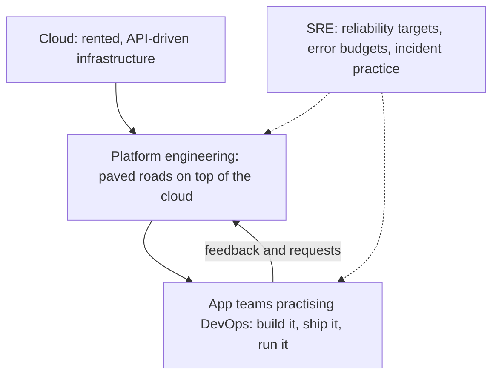
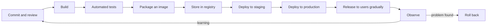

# Module 0 — Orientation

*Before you touch a container or a cluster, you need a map. This module gives you three things. First, the vocabulary: what "cloud", "DevOps", "platform engineering" and "site reliability engineering" actually mean, how they overlap, and what each one is responsible for. Second, the path every change travels from a developer's commit to a customer's phone, and the places along that path where things break. Some of those breaks have cost real companies hundreds of millions, or taken a large part of the internet offline for hours. Third, the people you will work with for the rest of the course: Najm Bank's Platform Engineering & SRE team, who are moving the Najm Mobile API and the payments service out of a data centre and onto a managed cloud, and building a platform that the bank's app teams will use every day. You will finish the module with a working local lab and a clear plan for how to study.*

> **Phases:** Plan, Release, Deploy — the map of the whole delivery loop, and the vocabulary to talk about it.

---

# 0.1 — What cloud, DevOps, platform engineering and SRE are
*Level: 🟢 Beginner* · *Prerequisites: none* · *Phase: Plan*

## ⚡ In 60 seconds
- **Cloud** is a way of getting computing: you rent servers, storage, networks and managed services on demand, through an API, and pay for what you use. It is less "someone else's computer" than someone else's *automation*.
- **DevOps** is a way of working: the people who build software also take part in shipping and running it, supported by automation and fast feedback. It is a culture and a set of practices, not a job title or a tool.
- **Platform engineering** builds an *internal product*, the internal developer platform, so that app teams can ship safely without becoming experts in everything underneath.
- **Site reliability engineering (SRE)** treats reliability as an engineering problem with numbers: service level objectives, error budgets, and a limit on manual, repetitive work.
- Decision cue: when someone says "we need DevOps", ask which problem they mean: slow releases, unsafe releases, unreliable services, or teams drowning in infrastructure. Each points to a different fix.
- Biggest trap: renaming the old operations team "DevOps", buying a tool and expecting anything to change.

## 🧭 Why it matters
Yousef joins Najm Bank's Platform Engineering & SRE team straight from his computer-engineering degree. In his first week he hears four words used as if they meant the same thing. The CIO's slide says the bank is "going cloud". An app team asks for "a DevOps engineer" to fix their pipeline. Salem, Head of Platform Engineering, talks about "the platform" as if it were a product with customers. Maha, the SRE lead, refuses to approve a launch because "the service has no SLO".

On Thursday Yousef is asked to give the Najm Mobile API team "DevOps access" to the new cloud account, and he gives every developer full administrator rights. Nothing breaks, but Noura, Head of Application & AI Security, finds it at the next access review.

The root cause was vocabulary. DevOps means shared responsibility, not shared superuser rights, and the platform team gives app teams a *safe paved road*, not the keys to everything. This lesson gives you the words.

## 📐 How it works

### 🟢 The essentials

**Cloud computing.** The most widely cited definition comes from the US National Institute of Standards and Technology, NIST SP 800-145 (2011). It lists five essential characteristics:

| Characteristic | In plain words | Why it changes how you work |
|---|---|---|
| On-demand self-service | You create a server or database yourself, in minutes, without a ticket to a human | Infrastructure becomes something code can create (Module 3) |
| Broad network access | Everything is reached over the network through standard interfaces | Every service has an API, so everything can be automated |
| Resource pooling | The provider shares large pools of hardware among many customers | You do not choose the physical machine; you choose a region and zone (1.2) |
| Rapid elasticity | Capacity can grow and shrink quickly, sometimes automatically | You can scale with demand instead of buying for the peak (6.1) |
| Measured service | Usage is metered and billed | Cost becomes an engineering property you can see and change (6.2) |

NIST also describes three **service models**. In **IaaS** (infrastructure as a service) you rent virtual machines, disks and networks and manage the operating system yourself. In **PaaS** (platform as a service) you hand over your code or container and the provider runs it. In **SaaS** (software as a service) you simply use a finished application, such as email. Since then, **serverless** has become common: you provide functions or containers, the provider runs them only when requests arrive, and you pay per use. And NIST lists deployment models: **public** cloud (shared providers such as AWS, Microsoft Azure and Google Cloud), **private** cloud (the same automation inside your own data centre), **community** cloud (shared by a group of organisations), and **hybrid** (a mix, such as Najm's cloud workloads connected to its on-premises core banking system).

**DevOps.** The word grew out of the "DevOpsDays" conferences that started in 2009. The idea it names is older: the wall between "developers who change things" and "operations people who keep things stable" causes slow, painful releases, because each side is measured on the opposite goal. DevOps removes the wall. Teams own their service from code to production. They automate build, test and deploy, and measure how well the whole system delivers.

The most widely cited evidence for what works comes from the **DORA** research programme (DevOps Research and Assessment), summarised in the book *Accelerate* by Nicole Forsgren, Jez Humble and Gene Kim (2018). Its four key metrics are still the standard starting point:

| Metric | What it measures | Kind |
|---|---|---|
| Deployment frequency | How often you ship to production | Speed |
| Lead time for changes | Time from a commit to that commit running in production | Speed |
| Change failure rate | Share of deployments that cause a failure needing a fix or rollback | Stability |
| Time to restore service | How long it takes to recover when production fails | Stability |

The research's most useful finding is that speed and stability are *not* a trade-off. The best-performing teams are both faster and more stable, because small, frequent, automated changes are easier to test, easier to understand and easier to undo. DORA's later reports added a reliability measure and refined some names and definitions; check dora.dev for the current set at the time you read this.

**Site reliability engineering.** SRE started at Google and was described publicly in the book *Site Reliability Engineering* (2016) and *The Site Reliability Workbook* (2018). Its central ideas:
- A **service level indicator (SLI)** is a measurement of what users experience, for example "the share of API requests that succeed in under 300 milliseconds".
- A **service level objective (SLO)** is the target for that indicator over a window, for example "99.9% over 28 days".
- The **error budget** is what is left: 100% minus the SLO. If you are inside the budget, ship. If you have spent it, slow down and fix reliability. This turns "ship faster" versus "be careful" into a number agreed in advance (5.2).
- **Toil** is manual, repetitive work that scales with the size of the service and adds no lasting value, such as restarting a stuck job by hand every night. Google's SRE book describes keeping operational work to at most about half of an SRE's time, so the rest goes into engineering it away.
- **Blameless postmortems** look for what in the system allowed a mistake, not who to punish (5.3).

**Platform engineering.** "You build it, you run it" sounds good, but asking every app team to master Kubernetes, networking, identity, pipelines, observability and cost is too much cognitive load. Platform engineering answers that. A platform team builds an **internal developer platform (IDP)**: a set of self-service tools, templates and paved roads (often called **golden paths**) that make the safe way the easy way. The book *Team Topologies* by Matthew Skelton and Manuel Pais (2019) names this a "platform team" serving "stream-aligned" product teams. The CNCF (Cloud Native Computing Foundation) has published a white paper describing what platforms provide; check cncf.io for the current version.

### 🟡 Going deeper

**How the four ideas fit together.** They are not competing; they sit at different layers.



The cloud provides raw capability. The platform team turns that into a small number of safe, supported choices. App teams use those choices to deliver often and own their services. SRE practices cut across both: they decide how reliable each service needs to be, and they hold everyone to it.

**Who does what.** Titles vary between companies, so learn the *responsibilities*, not the labels:

| Role | Main question they answer | Typical work |
|---|---|---|
| Cloud engineer | "How do we use the provider's services well and safely?" | Accounts, networks, identity, managed services, landing zones |
| DevOps engineer | "How does code get from a commit to production quickly and safely?" | Pipelines, build tooling, release automation, environments. Often a mix of the other three rows |
| Platform engineer | "What should every team get for free so they do not rebuild it?" | Templates, Kubernetes platform, GitOps, developer portal, self-service |
| Site reliability engineer | "Is the service reliable enough, and how do we know?" | SLOs, alerting, on-call, incidents, capacity, removing toil |

At a small company one person does all four. At Najm Bank they are separate people who sit in one team.

**Why "DevOps team" is often an anti-pattern.** If a company creates a "DevOps team" that receives tickets from developers and deploys for them, it has rebuilt the wall with a new name. The test is simple: can an app team ship a change to production, safely, without filing a ticket and waiting for a person? If not, you have a handoff, not DevOps. The platform team's job is to remove the handoff, not to become it.

**The Twelve-Factor App.** A short methodology published by engineers at Heroku describes services that run well on cloud platforms: configuration in the environment, not in code; stateless processes; fast startup and graceful shutdown; build, release and run as separate stages. You will meet these ideas again in Modules 2 and 4.

### 🔴 Expert view

**Measure outcomes, not adoption.** "We moved 80 services to Kubernetes" is an activity. "Lead time fell from three weeks to one day, and change failure rate did not rise" is an outcome. Salem reports DORA metrics and SLO attainment to the CIO, not tool counts. A platform nobody uses voluntarily has failed: treat it as a product with users, a roadmap and adoption metrics.

**Reliability is a product decision.** 100% is the wrong target for almost everything. Each extra "nine" costs more, and users cannot tell 99.99% from 99.999% when their own mobile network fails more often. The right SLO comes from what users need: high for the payments service, much lower for an internal reporting tool.

**Regulation shapes the platform.** For a bank, cloud is not just an engineering choice. GCC financial regulators, including the Qatar Central Bank, publish expectations on cloud outsourcing, data residency and resilience. In the EU, the Digital Operational Resilience Act (DORA, Regulation (EU) 2022/2554, applying from January 2025) sets rules on ICT risk, incident reporting, resilience testing and third-party (including cloud) risk for financial entities. Note the name clash: EU *DORA* the regulation and *DORA* the DevOps research programme are unrelated. This course stays on the engineering; for the rules, see [*Secure AI & Application Security*, lesson 11.2 — Regulation that touches security](../secai/index.html#/11.2).

## 🧰 The toolkit
| Tool, practice or service | What it is and does | When to reach for it |
|---|---|---|
| **DORA metrics** | Four measures of delivery performance: deployment frequency, lead time for changes, change failure rate, time to restore service | Setting a baseline before any change, and reporting progress in outcomes rather than tools |
| **Service level objective** | A target for a user-facing measurement over a time window | Deciding how reliable a service must be, and when to slow down releases |
| **Error budget** | The amount of unreliability an SLO allows | Settling "ship or stabilise?" with a number agreed in advance |
| **Internal developer platform** | Self-service tools, templates and paved roads that app teams use to build and run services | When many teams repeat the same infrastructure work, or each does it differently |
| **Backstage** (open source, CNCF) | A developer portal: software catalogue, templates and documentation in one place | Giving app teams one front door to the platform |
| **Twelve-Factor App** | A short methodology for building services that run well on cloud platforms | Reviewing whether a service is ready to be containerised and scaled |
| **Well-Architected frameworks** (AWS, Azure, Google Cloud) | Each provider's structured good-practice guidance, organised in pillars | Reviewing a design against a checklist before it goes live |

## 🏛️ In practice at Najm Bank
After the "DevOps access" episode, Salem asks Yousef to draft the team's **responsibility map**: one page that says who owns what as services move to the cloud. It is published on the internal developer portal.

**Najm Platform Engineering & SRE — responsibility map v1**

| Area | Platform team owns | App teams own | SRE (Maha) owns | Security (Noura) |
|---|---|---|---|---|
| Cloud accounts, networks, identity | Landing zone, network layout, roles for each team | Requesting the roles their service needs | — | Approves role design, runs access reviews |
| Kubernetes clusters | Cluster lifecycle, upgrades, shared add-ons | Their namespaces, manifests and resource requests | Capacity reviews | Cluster policy baseline |
| Pipelines and golden paths | Templates, shared runners, GitOps repo structure | Their service's pipeline, tests and release choices | Release gates tied to error budgets | Supply-chain controls |
| Observability | Telemetry stack, dashboards templates | Instrumenting their code, service dashboards | SLO definitions with app teams, alert standards | Security logging requirements |
| On-call and incidents | Platform on-call rota | Service on-call rota | Incident process, postmortem reviews | Security incident escalation (Jassim) |
| Cost | Cost dashboards and tagging rules | Their service's spend and unit cost | — | — |

**Rules that come with it:**
- Nobody receives standing administrator rights in production. Elevated access is time-limited, approved and logged (1.3).
- "DevOps access" is not a request type. Requests name the action and the resource: "deploy to namespace `mobile-api` in staging".
- The platform team measures its success by app-team DORA metrics and by adoption of the golden paths, reported to Salem monthly.
- Mona from Finance receives the cost dashboard monthly and has a named contact in each app team.

## 🛠️ Exercises
- 🟢 Write a one-paragraph definition, in your own words, of cloud, DevOps, platform engineering and SRE, then one sentence on how each relates to the others. Include NIST's five cloud characteristics and the four DORA metrics. *Done when:* a friend who is not in tech can read it and explain back the difference between DevOps and SRE.
- 🟡 Find five real job postings for cloud, DevOps, platform or SRE roles in your region and map each one's responsibilities to the "who does what" table. *Done when:* a table shows which of the four roles each posting really asks for, plus one sentence on what surprised you.
- 🔴 Take a project you own that has a git history (a personal project or a public open-source repository). Estimate its DORA metrics for the last three months: deployment or release frequency from tags or releases, lead time from commit date to release date, change failure rate from reverts or hotfix releases, and time to restore from the gap between a bad release and the fix or revert that followed it (use issue timestamps if you have them). *Done when:* you have the four numbers, the commands or queries you used to get them, and a note on which number was hardest to measure honestly and why.

## ⚠️ Mistakes and traps
- **Renaming ops to "DevOps".** A ticket queue with a new name is still a handoff. Measure whether teams can ship without waiting on a person.
- **Treating DevOps as a tool purchase.** No tool fixes a broken ownership model. Start with who owns what, then automate.
- **Building a platform nobody asked for.** Talk to app teams first. A platform is a product; if teams avoid it, it has failed.
- **Equating "DevOps access" with administrator rights.** Shared responsibility does not mean shared superuser. Grant specific, time-limited permissions.

## 🧾 Recap
- Cloud is on-demand, API-driven, metered infrastructure; its five NIST characteristics explain why automation and cost become engineering concerns.
- DevOps is shared ownership plus automation, measured by the four DORA metrics; speed and stability improve together.
- SRE makes reliability a number: SLIs, SLOs and error budgets, plus a cap on toil and blameless postmortems.
- Platform engineering builds an internal product, the paved road, so app teams can move fast without mastering every layer.
- Learn responsibilities, not titles. The question is always "who owns this, and can they act without waiting?"

## ✍️ Check yourself

**1. An app team at Najm Bank asks Yousef for "DevOps access" so they can deploy their own changes. What is the best response?**

- A. Give every developer on the team administrator rights on the cloud account, since DevOps means shared responsibility
- B. Ask which actions they need on which resources, and grant a specific role, such as deploying to their own namespace in staging
- C. Refuse, because only the platform team may deploy
- D. Create a ticket queue so the platform team can deploy for them

<details><summary>Answer</summary>

**B.** DevOps means teams can ship without a handoff, but with specific, least-privilege permissions. A confuses shared ownership with shared superuser rights. C and D rebuild the wall between building and running. (🟡 Going deeper; 🏛️ In practice.)

</details>

**2. Which of these is NOT one of DORA's four key metrics?**

- A. Deployment frequency
- B. Lead time for changes
- C. Change failure rate
- D. Number of servers managed per engineer

<details><summary>Answer</summary>

**D.** The four keys are deployment frequency, lead time for changes, change failure rate and time to restore service. Servers per engineer measures activity, not delivery outcomes. (🟢 The essentials.)

</details>

**3. The payments service has an SLO of 99.95% successful transfers over 28 days. Halfway through the window, incidents have used almost all of its error budget. What does SRE practice suggest?**

- A. Slow down risky feature releases and spend effort on reliability until the budget recovers
- B. Raise the SLO to 99.99% so the team takes reliability more seriously
- C. Carry on as planned and look again when the 28-day window resets
- D. Lower the SLO quietly so the remaining budget looks healthy again

<details><summary>Answer</summary>

**A.** The error budget is the agreed signal for "ship or stabilise". When it is spent, reliability work takes priority. B makes the problem worse; D defeats the purpose of agreeing the target in advance. (🟢 The essentials.)

</details>

**4. A company has created a "DevOps team" that takes tickets from developers and runs their deployments by hand. What is the main problem?**

- A. The team is too small to handle the volume of tickets it will receive
- B. The team should be renamed "SRE" so its purpose is clearer to everyone
- C. It has rebuilt the handoff between building and running that DevOps removes
- D. In a bank, deployments should be done by hand so a person can check each one

<details><summary>Answer</summary>

**C.** The test of DevOps is whether a team can ship safely without waiting on another person. A ticket queue is a handoff, whatever its name. A treats the symptom; B only changes the label; D is wrong, since automation makes deployments safer and more auditable. (🟡 Going deeper.)

</details>

**5. Salem wants to show the CIO that the new internal developer platform is working. Which evidence is strongest?**

- A. A list of every tool the platform now includes, with the licence and support status of each
- B. App teams' lead time and failure rate before and after adopting the golden paths, and voluntary adoption
- C. The number of Kubernetes clusters and namespaces now running, compared with last quarter
- D. The growth of the platform team and the number of tickets it closed this quarter

<details><summary>Answer</summary>

**B.** A platform is a product; it succeeds when its users deliver better outcomes and choose to use it. A, C and D measure inputs and activity. (🔴 Expert view.)

</details>

## 📚 References
- NIST SP 800-145, The NIST Definition of Cloud Computing — https://csrc.nist.gov/pubs/sp/800/145/final
- DORA research programme — https://dora.dev/
- Google, Site Reliability Engineering and The Site Reliability Workbook (free online) — https://sre.google/books/
- CNCF, Platforms white paper (TAG App Delivery) — https://www.cncf.io/
- Backstage documentation — https://backstage.io/docs/
- The Twelve-Factor App — https://12factor.net/
- AWS Well-Architected Framework — https://aws.amazon.com/architecture/well-architected/
- Microsoft Azure Well-Architected Framework — https://learn.microsoft.com/azure/well-architected/
- Google Cloud Well-Architected Framework (formerly the Google Cloud Architecture Framework) — https://cloud.google.com/architecture/framework
- Regulation (EU) 2022/2554 (Digital Operational Resilience Act) — https://eur-lex.europa.eu/eli/reg/2022/2554/oj

---

# 0.2 — The path to production: from a commit to a customer, and everything that can break on the way
*Level: 🟢 Beginner* · *Prerequisites: 0.1* · *Phase: Release, Deploy*

## ⚡ In 60 seconds
- Every change travels the same **path to production**: commit, build, test, package, store, deploy, release to users, observe. Each step either catches problems or lets them through.
- The most important rule: **build once, promote the same artefact**. The thing you tested must be byte-for-byte the thing you run in production.
- **Deploying** (putting new code on servers) and **releasing** (letting users reach it) are different steps. Separating them is the basis of safe rollout.
- Decision cue: before shipping anything, ask "if this is wrong, how many users will see it, how fast will we know, and how fast can we roll back?"
- Biggest trap: steps done by hand, differently each time. Most famous outages trace back to a manual step, a skipped check or a change that reached everyone at once.

## 🧭 Why it matters
On 1 August 2012, Knight Capital, a large US trading firm, deployed new trading code to its servers. According to the US Securities and Exchange Commission's 2013 order, the new code was copied by hand to the servers, and one of the eight servers was missed. That server still held old, unused code. A flag that the new code reused switched the old code back on. In about 45 minutes the firm sent millions of unintended orders and lost more than 460 million US dollars. There was no automated deployment, no check that all servers ran the same version, and no fast way to stop.

Twelve years later, on 19 July 2024, CrowdStrike pushed a faulty content update for its Falcon security sensor. It crashed Windows machines that received it; Microsoft later estimated around 8.5 million devices were affected. Airlines, hospitals and banks went down. CrowdStrike's own review committed to staged rollouts of such updates, so that a bad change reaches a small group first.

Salem uses both cases on Yousef's first day. "Both were *path-to-production* failures: a manual step that went wrong, and a change sent to everyone at once." This lesson maps that path; every later module zooms in on one part.

## 📐 How it works

### 🟢 The essentials

**The stages.** Whatever the tools, a change to the Najm Mobile API moves through these steps:



| Stage | What happens | What it should catch | Where this course covers it |
|---|---|---|---|
| Commit and review | A developer pushes a change; a colleague reviews it in a pull request | Logic errors, risky changes, missing tests | 4.1 |
| Build | Code is compiled and dependencies are fetched | Code that does not compile; broken dependencies | 4.1 |
| Automated tests | Unit, integration and other tests run | Regressions, broken contracts | 4.1 |
| Package | The service is packed into a container image | Images that do not start; bloated or insecure images | 2.1 |
| Store | The image is pushed to a registry with a unique identifier | Tampering, "which version is this?" confusion | 2.1, 4.3 |
| Deploy | The image is rolled out to an environment by automation | Configuration errors, failed startup, bad health checks | 2.2, 3.2 |
| Release | Users are gradually given the new version | Problems that only real traffic shows | 4.2 |
| Observe | Telemetry shows whether users are well served | Errors, slowness, SLO burn | 5.1, 5.2 |

A **pipeline** is the automation that runs these steps. **Continuous integration (CI)** means everyone merges small changes into the main branch often, and each merge is built and tested automatically. **Continuous delivery (CD)** means every change that passes is ready to deploy at the push of a button. **Continuous deployment** goes one step further: every passing change is deployed automatically.

**Build once, promote the same artefact.** An **artefact** is the output of a build, for us usually a container image. Build it once, give it a unique identity (the commit hash in its tag, and its content digest), and move that *same* image from staging to production. If you rebuild for production, you are shipping something you never tested: a dependency may have changed, a build flag may differ.

A minimal GitHub Actions pipeline tests the code and builds one image tagged with its commit:

```yaml
# .github/workflows/ci.yml — a starting point, hardened in Module 4
name: ci
on:
  pull_request:
  push:
    branches: [main]
permissions:
  contents: read          # least privilege: this job only reads the code
jobs:
  test-and-build:
    runs-on: ubuntu-latest
    steps:
      - uses: actions/checkout@v4   # in production pipelines, pin to a full commit SHA (4.3)
      - name: Run tests
        run: make test          # replace with your project's test command
      - name: Build one image, named after the commit
        run: docker build -t najm-mobile-api:${{ github.sha }} .
```

**Environments.** Changes pass through a series of **environments**: separate copies of the system. A common set is development, staging (as close to production as possible) and production. Each environment should differ only in configuration (database addresses, sizes, feature flags), never in code. Lesson 3.2 shows how to promote changes between them with GitOps.

**Deploy is not release.** To *deploy* is to put the new version on the servers. To *release* is to let users reach it. You can deploy code with a new feature switched off by a **feature flag**, then switch it on for 1% of users. You can deploy a new version beside the old one and send it 5% of traffic, a **canary**. Separating the two steps means a bad change reaches a few users, not all of them. This is exactly the lesson of the CrowdStrike update.

### 🟡 Going deeper

**What breaks, stage by stage.** Every public outage teaches something about one stage. Here are well-documented cases, each with the control that would have limited it:

| Case | What happened (public reports) | Stage that failed | Control |
|---|---|---|---|
| Knight Capital, 2012 | Manual deploy missed one of eight servers; old code reactivated | Deploy | Automated, identical deploys; version checks on every server; a kill switch |
| AWS S3, us-east-1, Feb 2017 | During debugging, a command meant to remove a small number of servers was mistyped and removed far more | Operate | Tools that limit how much one command can remove, and how fast |
| GitLab.com, Jan 2017 | An engineer deleted a production database directory by mistake; several backup methods turned out not to work; hours of data were lost | Operate, Recover | Tested restores, not just backups; clear separation of production terminals |
| Facebook, Oct 2021 | A maintenance command disconnected the backbone; DNS servers then withdrew their routes; services and internal tools went down for hours | Deploy, Operate | Audit tools that block dangerous changes; out-of-band access for recovery |
| CrowdStrike, Jul 2024 | A faulty content update went to all Windows sensors at once and crashed them | Release | Staged rollout to a small group first; automatic halt on errors |

Two patterns stand out. Most were ordinary human actions the path did not guard against, not exotic bugs. And the damage came from *blast radius* (how many users one change can reach) and *time to detect and undo*. Good engineering shrinks both.

**The three questions per stage.** For each stage in your path, ask:
1. **What can go wrong here?** A failed test, a vulnerable dependency, a wrong configuration value, a server that never got the update.
2. **What catches it, automatically?** A test, a scan, a health check, a canary metric, an alert.
3. **How do we undo it, and how long does that take?** Revert the commit, redeploy the previous image, flip a feature flag off, restore from backup.

If the answer to question 2 is "a person remembers to look", that is your next automation task.

**Rollback beats debugging in production.** When a release goes wrong, restore service first. With an immutable image, rolling back means redeploying the previous image, which takes minutes. Find the root cause afterwards, with users safe. This is why the DORA metric is "time to *restore* service", not "time to fix".

**Not every change is code.** Configuration, infrastructure, schema changes, flag flips and security-tool content updates reach production too, and several outages above were not application deploys at all. Treat *every* production change the same way: reviewed, versioned, automated, staged and reversible.

### 🔴 Expert view

**Lead time is a map of your waiting.** When Najm measured lead time for the Mobile API in the data centre, most of it was waiting: for a change-approval board, a release window, a person to run a script. Shorter lead time almost always comes from removing queues and handoffs, not from faster computers. Map where a change *waits*, not just where it *works*.

**Small batches are a safety measure.** A failed release with 200 changes is hard to diagnose; a failed release with one change points straight at its cause. Frequent small deploys feel risky, but the DORA research found that teams deploying more often also fail less and recover faster.

**Change control in a regulated bank.** Banks have traditionally used change-advisory boards that approve each release by hand. A well-built pipeline can provide *better* evidence than a meeting: a reviewed pull request, test results, a signed artefact and an automated deployment record for every change. Auditors need changes to be controlled, tested and traceable. Salem's strategy is to make the pipeline produce that evidence, so low-risk changes flow without a board while high-risk ones still get human review.

**Security travels the same path.** Each stage is also where an attacker can insert something: a malicious dependency at build time, a swapped image in the registry, stolen credentials in the pipeline. Lesson 4.3 secures the pipeline; for the full supply-chain picture, see [*Secure AI & Application Security*, lesson 6.2 — The software supply chain: dependencies, SBOMs, SLSA and signing](../secai/index.html#/6.2). For the same journey told for people who build with AI agents and do not write code by hand, see [*System Design for Vibe Coders*, lesson 4.1 — Shipping is a system](../vibe/index.en.html#l4-1).

## 🧰 The toolkit
| Tool, practice or service | What it is and does | When to reach for it |
|---|---|---|
| **GitHub Actions** | A CI/CD service built into GitHub that runs workflows on events such as a push or pull request | Automating build, test and packaging for code hosted on GitHub; GitLab CI and Jenkins are common alternatives |
| **Build once, promote** | The practice of building one immutable artefact and moving that same artefact through every environment | Always; rebuilding per environment ships untested code |
| **Container registry** | A store for container images, each with a tag and a content digest | Holding the single artefact that every environment deploys |
| **Feature flag** | A runtime switch that turns a feature on or off without a deployment | Separating deploy from release; instant "off" for a bad feature |
| **Canary release** | Sending a small share of traffic to a new version and comparing it with the old one | Any change that real traffic could break; covered fully in 4.2 |
| **Rollback** | Returning production to the last known-good version, usually by redeploying the previous artefact | First response to a bad release: restore service, then investigate |

## 🏛️ In practice at Najm Bank
Salem asks Yousef to produce the **path-to-production map** for the Najm Mobile API, as it works today in the data centre and as it should work after the cloud move. It becomes the backlog for the whole migration.

**Najm Mobile API — path-to-production map (target state, v1)**

| Stage | What can go wrong | Automated catch | Undo | Owner |
|---|---|---|---|---|
| Commit and review | Unreviewed or risky change | Branch protection: one approval, two for payment-related code | Revert the commit | App team |
| Build and test | Regression, broken dependency | Unit and integration tests; dependency scan | Pull request blocked | App team |
| Package | Image differs from what was tested; runs as root | One image per commit, tagged with the commit hash; non-root check | Discard the image; fix and rebuild through the full pipeline | Platform golden path |
| Store | Wrong or tampered image | Registry keeps digests; image signed (4.3) | Deploy by digest of last good image | Platform |
| Deploy to staging | Configuration error; image fails to start | Health probes; smoke tests | Automatic rollback of the rollout | Platform GitOps |
| Deploy to production | Same as staging, at scale | Same image digest as staging; rolling update with health checks | Redeploy previous digest (target: under 10 minutes) | App team with platform |
| Release | Bug only real traffic shows | Canary at 5%, compared on error rate and latency | Shift traffic back; flag off | App team |
| Observe | Users hurt without anyone noticing | SLO burn-rate alerts (5.2) | Incident process (5.3) | SRE, Maha |

**Baseline DORA metrics** (the team fills in last quarter's real numbers; targets are set with Maha):

| Metric | Today | Target after migration |
|---|---|---|
| Deployment frequency | ___ | ___ |
| Lead time for changes | ___ | ___ |
| Change failure rate | ___ | ___ |
| Time to restore service | ___ | ___ |

**Rule added to the team standard:** any stage whose "automated catch" column says "a person checks" is a backlog item with an owner and a date.

## 🛠️ Exercises
- 🟢 Pick a website you use. Run `dig +short example.com` and `curl -sI https://example.com` (with the real domain) and note the IP addresses, the HTTP status and headers such as `cache-control`. Then write the five stages a change would pass through before it shows up on that site. *Done when:* the output is saved and each of your five stages names one thing that could go wrong.
- 🟡 Draw the path-to-production map for a project of your own (or a small open-source project you know), using the same columns as Najm's map. *Done when:* every stage has an "automated catch" and an "undo", and you have marked in a different colour each place where the answer is currently "a person remembers".
- 🔴 In a public repository on your own GitHub account, create a tiny web service with one test and a Dockerfile, and add the CI workflow from this lesson. Push a change that breaks the test and confirm the pipeline fails. Then fix it, let the pipeline build the image, and build and run the same commit locally with `docker run`. *Done when:* you can show a failed run, a passing run, and the image tag matching the commit hash that passed.

## ⚠️ Mistakes and traps
- **Rebuilding for each environment.** You end up shipping code you never tested. Build once and promote the same image, identified by its digest.
- **Manual production steps.** Every hand-run command is a chance to repeat Knight Capital's missed server. Automate it, or at least script it and review the script.
- **Releasing to everyone at once.** A bad change then reaches every user before anyone notices. Separate deploy from release and roll out gradually.
- **Treating config and infrastructure changes as "not a deploy".** Several famous outages came from exactly these. Put every production change through the same path.
- **Backups nobody has restored.** GitLab's 2017 incident showed backups that silently did not work. A backup counts only when a restore has been tested (6.1).

## 🧾 Recap
- Every change travels commit, build, test, package, store, deploy, release, observe; each stage must catch something and be undoable.
- Build once and promote the same immutable artefact; never rebuild for production.
- Deploy and release are different; separating them with canaries and feature flags shrinks the blast radius.
- Most famous outages were path failures: a manual step, a missing check, a change sent to everyone at once.
- Restore first, investigate later; small, frequent changes are safer than large, rare ones.

## ✍️ Check yourself

**1. Yousef proposes building the Najm Mobile API image again for production, "so it picks up the latest security patches", after testing a different build in staging. What is the problem?**

- A. Production builds take longer, so the release window would be missed
- B. A registry refuses a second image built from the same commit
- C. Production would run an image that was never tested; patches should go through the full pipeline
- D. None, as long as both images are built from the same commit hash

<details><summary>Answer</summary>

**C.** A rebuild can pull different dependency versions or use different settings, so the tested artefact and the shipped artefact differ. D is the tempting distractor: the same commit does not guarantee the same image. Patches should flow through the whole pipeline. (🟢 The essentials.)

</details>

**2. What is the difference between deploying and releasing?**

- A. Deploying puts the new version on servers; releasing lets users reach it
- B. They are two names for the same step, used by different tools
- C. Releasing is the approval meeting that must happen before deploying
- D. Deploying applies to application code; releasing applies to infrastructure

<details><summary>Answer</summary>

**A.** Releasing can be gradual (a canary) or switched with a feature flag. Separating the two lets you deploy safely, then expose the change to a small share of users first. (🟢 The essentials.)

</details>

**3. According to the SEC's order, which failure was at the heart of Knight Capital's 2012 losses?**

- A. An outage at its hosting provider that left orders stuck in a queue
- B. A production database deleted by mistake, with backups that did not work
- C. A faulty security-sensor update sent to all of its machines at once
- D. A manual deployment that missed one server, where a reused flag woke old code

<details><summary>Answer</summary>

**D.** The new code was copied by hand and one of eight servers was missed. B describes GitLab in 2017 and C describes CrowdStrike in 2024. (🧭 Why it matters; 🟡 Going deeper.)

</details>

**4. A new release of the Najm Mobile API raises the error rate sharply ten minutes after rollout. Tariq wants to find the bug before doing anything. What should Maha advise?**

- A. Keep the release running so the team can reproduce the bug with real traffic
- B. Roll back to the previous image to restore service, then find the root cause
- C. Write a quick fix and deploy it straight to production, skipping the tests
- D. Restart all the servers in the cluster and watch whether the errors go away

<details><summary>Answer</summary>

**B.** The first goal is to restore service; with immutable images, redeploying the previous version takes minutes. A keeps users on a broken release; C skips the very checks that protect users; D hides the symptom without removing the bad version. (🟡 Going deeper.)

</details>

**5. Najm measures a lead time of three weeks for the Mobile API. Building and testing take about 40 minutes. What is the most likely way to cut lead time?**

- A. Buy faster build servers so the 40-minute build and test run shrinks
- B. Cut the slowest tests so that changes reach staging sooner
- C. Remove the queues where changes wait, keeping the evidence of control
- D. Deploy less often, in bigger batches, to reduce the number of approvals

<details><summary>Answer</summary>

**C.** When the work takes minutes but the lead time is weeks, the time is spent waiting. Manual approvals and release windows are typical queues. A speeds up a step that is not the bottleneck; B weakens safety for little gain; D increases risk. (🔴 Expert view.)

</details>

## 📚 References
- US SEC, In the Matter of Knight Capital Americas LLC (2013) — https://www.sec.gov/litigation/admin/2013/34-70694.pdf
- AWS, Summary of the Amazon S3 Service Disruption in the Northern Virginia (US-EAST-1) Region — https://aws.amazon.com/message/41926/
- GitLab, Postmortem of database outage of January 31 — https://about.gitlab.com/blog/
- Meta Engineering, More details about the October 4 outage — https://engineering.fb.com/
- CrowdStrike, Falcon content update remediation and guidance hub — https://www.crowdstrike.com/
- DORA research programme — https://dora.dev/
- GitHub Actions documentation — https://docs.github.com/actions
- The Twelve-Factor App — https://12factor.net/

---

# 0.3 — Meet Najm Bank's platform team, and how to use this course
*Level: 🟢 Beginner* · *Prerequisites: 0.1, 0.2* · *Phase: Plan*

## ⚡ In 60 seconds
- **Najm Bank** is a fictional mid-sized Gulf bank operating in Qatar, the UAE and the EU. You will follow its **Platform Engineering & SRE** team through a real-shaped cloud migration.
- The team runs five systems you will meet in every module: the **Najm Mobile API**, the **payments service**, **Najm Assist** (an LLM assistant), the **internal developer platform**, and the **data-centre core banking** system that stays on-premises.
- Every lesson has the same ten parts, climbs from 🟢 essentials to 🔴 expert view, and produces a reusable **artefact**.
- You practise on a **local lab**: Docker, a local Kubernetes cluster (kind, k3d or minikube), OpenTofu or Terraform, Git and GitHub Actions. Nothing in this course requires paying a cloud provider.
- Decision cue: if you use a cloud free tier, **set a budget alert before you create anything**.
- Biggest trap: reading without doing. Operations skills live in your hands, not your notes.

## 🧭 Why it matters
Salem has hired two graduates a year for the last three years. The ones who struggled were not the weakest programmers. They were the ones who read every document and never broke anything on purpose. They had never seen a pod crash-loop, a Terraform plan that wanted to destroy a database, or an alert that fired at 3 a.m. for no reason. The ones who thrived had a lab at home where they had already made those mistakes cheaply.

That is how this course works. You will meet the same people, systems and problems in every lesson. You will produce artefacts that a real platform team would keep. And you will run every exercise on your own machine or a free tier, so the expensive mistakes happen in your lab and not in production. This lesson introduces the team and the systems, explains how the course is built, and gets your lab running.

## 📐 How it works

### 🟢 The essentials

**Najm Bank, and why a bank.** Najm Bank is fictional. It is the same bank used across this library's other courses, so the security, governance and product courses all tell parts of one story. A bank makes a good teaching case because the stakes are clear. Customers expect the app to work at all hours; a transfer must never be lost or sent twice; regulators expect evidence that systems are controlled and recoverable. If you can run systems well for a bank, you can run them well almost anywhere.

**The situation.** Najm runs most of its systems in its own data centre. It is moving customer-facing services to a managed public cloud, while the core banking system stays on-premises and is connected over private links: a **hybrid** setup. At the same time, Salem's team is building an **internal developer platform** so that the bank's app teams can ship without each becoming infrastructure experts.

**The systems.**

| System | What it is | Why it matters in this course |
|---|---|---|
| **Najm Mobile API** | The public API behind the retail banking app. Containers on a managed Kubernetes service, a managed PostgreSQL database, object storage, and a CDN and web application firewall (WAF) at the edge | The main example for containers, Kubernetes, releases and observability |
| **Payments service** | Moves customers' money. Must not lose or duplicate a transfer; has strict uptime and recovery targets | The example for SLOs, safe releases, backups and disaster recovery |
| **Najm Assist** | The bank's LLM assistant. An **LLM gateway** routes requests to hosted model APIs and to a small self-hosted model on GPUs | The example for AI workloads, GPU capacity and token cost |
| **Internal developer platform** | Golden-path templates, CI/CD pipelines, a GitOps repository, the observability stack and cost dashboards | What the platform team builds and runs as a product |
| **Core banking (on-premises)** | The legacy system of record that stays in the data centre | The example for hybrid networking and dependencies you cannot change |

**The people.**

| Person | Role | What they care about |
|---|---|---|
| **Salem** | Head of Platform Engineering; your mentor | Outcomes, not tools; a platform app teams actually want to use |
| **Yousef** | New graduate platform engineer; your peer | Learning fast. He makes the mistakes you should avoid |
| **Maha** | SRE lead | SLOs, on-call that people can sustain, incidents and postmortems |
| **Tariq** | Engineering lead for the app teams | Shipping features quickly without waking up at night |
| **Noura** | Head of Application & AI Security | Least privilege, supply chain, cloud configuration |
| **Jassim** | SOC and incident response lead | Detecting and responding to security incidents |
| **Hamad** | CISO | Risk to the bank, regulators and evidence |
| **Mona** | FinOps analyst in Finance | What the cloud costs, who spends it, and whether it is worth it |

You may already know Tariq, Noura, Jassim and Hamad from the *Secure AI & Application Security* course. Here you see the same events from the platform side.

**How every lesson is built.** Each lesson has the same ten parts, in the same order: ⚡ In 60 seconds, 🧭 Why it matters, 📐 How it works, 🧰 The toolkit, 🏛️ In practice at Najm Bank, 🛠️ Exercises, ⚠️ Mistakes and traps, 🧾 Recap, ✍️ Check yourself, 📚 References. "How it works" climbs a ladder: 🟢 *The essentials* (what everyone needs), 🟡 *Going deeper* (what a practitioner needs), 🔴 *Expert view* (what a senior engineer weighs). Every lesson carries a **phase tag** from the delivery loop introduced in lesson 0.2: Plan, Code, Build, Test, Release, Deploy, Operate or Monitor.

### 🟡 Going deeper

**The route through the course.**

| Stage | Modules | What you will be able to do |
|---|---|---|
| 🟢 Foundations | 0 Orientation, 1 Foundations | Explain the path to production; work in Linux and networks; reason about cloud services and identity |
| 🟡 Practitioner | 2 Containers and Kubernetes, 3 Infrastructure as code, 4 CI/CD and safe releases, 5 Observability and reliability | Containerise and run services on Kubernetes, manage infrastructure as code and GitOps, build pipelines and safe releases, set SLOs, alerts and incident practice |
| 🔴 Hero | 6 Scale, cost and AI infrastructure, 7 Capstone and practice exam | Scale and recover systems, control cost, run AI workloads, take a service from empty repo to production, and pass a 60-question practice exam |

**Three ways to study.**
- **Straight through.** Best if you are new. Each module builds on the one before; lesson prerequisites are listed under each title.
- **By role.** Aiming at SRE? Prioritise Modules 1, 2, 5 and lesson 6.1. Platform engineering? Modules 2, 3 and 4, then the capstone. Cloud engineering? Module 1, Module 3 and lessons 6.1 and 6.2. Still read Module 0 and the ⚡ section of every lesson.
- **By problem.** Facing a real issue at work, such as noisy alerts or a surprising cloud bill? Jump to the lesson, read the 🏛️ artefact, then go back to fill gaps.

**Your lab.** You need a computer that can run Docker (8 GB of memory is a comfortable minimum for a small local Kubernetes cluster; check each tool's own requirements) and these free tools:

| Tool | What you use it for | First used in |
|---|---|---|
| Git and a GitHub account | Version control, pull requests and GitHub Actions | 0.2 |
| Docker (Docker Desktop, or Docker Engine on Linux) | Building and running containers | 2.1 |
| kind, k3d or minikube | A Kubernetes cluster on your own machine | 2.2 |
| kubectl and Helm | Talking to Kubernetes; installing packaged applications | 2.2, 2.3 |
| OpenTofu or Terraform | Infrastructure as code | 3.1 |
| Prometheus, Grafana, OpenTelemetry | Telemetry and dashboards, installed into your local cluster | 5.1 |
| Argo CD | GitOps deployments into your local cluster | 3.2 |

Install each from its official site; installation steps change, so follow the current docs rather than copying commands from an old blog post. When they are installed, check them:

```bash
# Check your lab tools. Each should print a version, not an error.
git --version
docker version
kind version          # or: k3d version / minikube version
kubectl version --client
helm version
tofu version          # or: terraform version
```

Then create your first local cluster and look at it:

```bash
# Create a local Kubernetes cluster called najm-lab, look at it, then delete it
kind create cluster --name najm-lab
kubectl get nodes
kubectl get pods --all-namespaces
kind delete cluster --name najm-lab
```

If `kubectl get nodes` shows one node with status `Ready`, your lab works.

**Cloud accounts, safely.** Most exercises never touch a real cloud. A few optional ones use a provider's free tier. Before you create any resource in any cloud account:
1. Use an account that is yours. Never practise on an employer's account without written permission.
2. Turn on multi-factor authentication for the account's main (root) user, and do your daily work as a separate, less-privileged user (1.3).
3. Create a **budget alert** at a small amount so you receive an email before spending grows. Free tiers have limits that differ by provider and change over time; read the provider's current free-tier page rather than relying on this course.
4. Delete what you create when the exercise is done.

### 🔴 Expert view

**Artefacts are your portfolio.** Each lesson's 🏛️ section is a real document: a responsibility map, a hardened Dockerfile, an IaC module interface, a release checklist, an SLO, an incident runbook, a postmortem, a cost report. If you rebuild each one for your own lab project and keep them in a public repository, you finish the course with a portfolio that shows how you think, not just which tools you have heard of. Lesson 7.2 turns it into job applications; for the job search itself, see [*From Graduate to Hired*, lesson 2.4 — Cloud, platform, DevOps and security engineer](../career/index.html#/2.4) (that course is being written now).

**Use the companion courses.** This course stays on the operations decision. Where another course in the library goes deeper, a lesson points to it in one line:
- Security of cloud, containers and pipelines: [*Secure AI & Application Security*, lesson 7.1 — Cloud security: shared responsibility, IAM and misconfiguration](../secai/index.html#/7.1).
- Deployment and environments from the SaaS-builder's side: [*SaaS Building Blocks*, lesson 7.4 — Deployment, environments and self-hostable SaaS](../saas/index.html#/7.4).
- How software moves, explained for people who build with AI agents: [*System Design for Vibe Coders*, lesson F.3 — Versions, repos, and deploys](../vibe/index.en.html#lF-3).
- Operating AI agents in production: [*Running AI Agents in Production*, Level 3 — Production Engineer](../agentic/learning-path.html#level-3-production-engineer).

**Be honest about what changes.** Cloud services, tool versions, prices and free-tier limits change constantly. This course names versions only where it is sure, says "at the time of writing (2026)" where things move, and never quotes a price or a quota. When you work, do the same. A senior engineer's habit is to check the provider's current documentation before relying on a number.

## 🧰 The toolkit
| Tool, practice or service | What it is and does | When to reach for it |
|---|---|---|
| **Docker** | Builds and runs containers on your machine | From Module 2 onward, and in the 0.2 exercise |
| **kind** (Kubernetes in Docker) | Runs a Kubernetes cluster inside Docker containers; k3d and minikube are alternatives | Any Kubernetes exercise, without paying for a cloud cluster |
| **OpenTofu** (Linux Foundation) | Open-source infrastructure-as-code tool, forked from Terraform; Terraform from HashiCorp is used the same way | Module 3 and the capstone |
| **GitHub Actions** | CI/CD workflows that run on pushes and pull requests | Your lab pipelines from 0.2 to the capstone |
| **Budget alert** | A provider setting that notifies you when spending passes an amount you choose | Before creating anything in any cloud account |
| **Lab journal** | A repository where you keep commands, outputs, mistakes and artefacts from each lesson | Every lesson; it becomes your portfolio |

## 🏛️ In practice at Najm Bank
Every new joiner in Salem's team completes the **onboarding checklist** in their first two weeks. Yousef's copy, as he filled it in:

**Najm Platform Engineering & SRE — new joiner onboarding checklist**

| Item | Done when | Owner |
|---|---|---|
| Read the responsibility map (lesson 0.1) | You can say who owns clusters, pipelines, SLOs and cost | New joiner |
| Read the Mobile API path-to-production map (lesson 0.2) | You can name the undo for each stage | New joiner |
| Lab ready | All lab tools print versions; a local kind cluster reaches `Ready` | New joiner |
| Access requested | Named roles for staging only; no production access in the first month | New joiner, approved by Salem |
| Shadow on-call | One week shadowing Maha's rota, no pager of your own | Maha |
| First change | One small pull request to the golden-path templates, merged through the normal pipeline | New joiner, reviewed by a platform engineer |
| Meet the neighbours | 30 minutes each with Tariq (app teams), Noura (security) and Mona (FinOps) | New joiner |
| Service cards | One-page card for each of the five systems: purpose, owner, dependencies, SLO (or "not yet defined") | New joiner |

**Service card template** (the one Yousef wrote for the payments service):

| Field | Value |
|---|---|
| Service | Payments service |
| Owning team | Payments squad (Tariq's area); platform support from Salem's team |
| Purpose | Accepts, validates and executes customer transfers |
| Depends on | Core banking (on-premises, over private link), PostgreSQL managed database, message queue |
| Used by | Najm Mobile API |
| Must never | Lose a transfer or execute one twice |
| SLO | Draft with Maha (Module 5) |
| Recovery targets | RTO and RPO to be agreed (6.1) |
| Runbook | Link (to be written) |

## 🛠️ Exercises
- 🟢 Install the lab tools and run the version check from this lesson. *Done when:* every command prints a version, and you have saved the output in a file called `lab-check.txt` in a new Git repository that will be your lab journal.
- 🟡 Create a local kind cluster, run `kubectl get nodes` and `kubectl get pods --all-namespaces`, and write down what each of the system pods you see is for (look them up in the Kubernetes documentation). Then delete the cluster. *Done when:* your lab journal has the outputs and a one-line explanation per system pod, and `kind get clusters` shows nothing left running. If you also open a cloud free-tier account, *Done when* includes a budget alert you have tested by reading its settings back.
- 🔴 Write a service card, using Najm's template, for a real service you use or maintain (a personal project, a university system you know well, or an open-source project's demo deployment). Then write a personal study plan: which route through the course (straight through, by role or by problem), which lessons in what order, and how many hours per week. *Done when:* the service card has no empty fields (use "unknown" honestly where needed), and the plan lists every lesson you will do with a target week.

## ⚠️ Mistakes and traps
- **Reading without doing.** You cannot learn to debug a crash-looping pod from a paragraph. Do every exercise, and break things on purpose.
- **Practising on an employer's account.** It is risky and may breach policy. Use your own local lab or your own free-tier account.
- **No budget alert.** A forgotten resource can run for weeks. Set the alert first, and delete what you create.
- **Copying install commands from old posts.** Tools change. Install from the official documentation.
- **Skipping Module 0 and 1 because "I know Linux".** The later modules assume the vocabulary and the habits from here. Skim them at least, and do the 🔴 exercises.
- **Keeping no notes.** Six months later you will not remember how you fixed it. Keep a lab journal in Git.

## 🧾 Recap
- Najm Bank is fictional; its Platform Engineering & SRE team, five systems and cast run through every lesson.
- Every lesson has ten parts, climbs from 🟢 to 🔴, carries a phase tag and produces a reusable artefact.
- Your lab is local and free: Git, Docker, kind or similar, kubectl, Helm, OpenTofu or Terraform, and GitHub Actions.
- Use only your own accounts, set a budget alert before creating anything, and delete what you create.
- Keep a lab journal; your artefacts become your portfolio.

## ✍️ Check yourself

**1. Which Najm system is the course's main example for GPUs, LLM gateways and token cost?**

- A. The payments service
- B. Core banking
- C. The internal developer platform
- D. Najm Assist

<details><summary>Answer</summary>

**D.** Najm Assist routes requests through an LLM gateway to hosted models and to a small self-hosted model on GPUs. The payments service is the main example for SLOs and recovery. (🟢 The essentials.)

</details>

**2. You want to practise an optional exercise on a cloud provider's free tier. What should you do before creating any resource?**

- A. Read the exercise twice and note every resource it will create
- B. Use your own account, turn on multi-factor authentication, set a budget alert
- C. Use your employer's sandbox account, since it is not production
- D. Nothing; free-tier accounts cannot be charged for anything you create

<details><summary>Answer</summary>

**B.** Free tiers have limits, and a forgotten resource can cost money. C is the tempting distractor: an employer's account needs written permission, whatever its name. A is sensible but does not cap spending; D is false. (🟡 Going deeper.)

</details>

**3. Yousef's lab check shows `kind create cluster` succeeded, and `kubectl get nodes` lists one node with status `Ready`. What does that tell him?**

- A. His local lab works and he can start the Kubernetes exercises
- B. He now has a cluster ready to host production workloads
- C. He has created a managed cluster in his cloud account
- D. Docker is not installed, so kind used a built-in runtime

<details><summary>Answer</summary>

**A.** kind runs a Kubernetes cluster inside Docker on his own machine, which is exactly what the lab needs. It is not production-ready (B) and not in the cloud (C); kind needs a container runtime such as Docker to run at all (D). (🟡 Going deeper.)

</details>

**4. A reader is aiming for a site reliability engineering role and has limited time. Which route through the course does this lesson suggest?**

- A. Go straight to Module 7 and the practice exam, then fill gaps from there
- B. Read only the ⚡ section of every lesson and skip the exercises
- C. Module 0, then Modules 1, 2, 5 and lesson 6.1, plus every ⚡ section
- D. Skip Modules 0 and 1 and start with containers in Module 2

<details><summary>Answer</summary>

**C.** The by-role route for SRE focuses on foundations, Kubernetes, observability and resilience, while still reading Module 0 and every ⚡. D skips the vocabulary later modules depend on. (🟡 Going deeper.)

</details>

**5. Yousef writes a service card for the payments service but has no agreed SLO yet. What should he put in that field?**

- A. 100%, because payments must always work for every customer
- B. Leave the field blank until Maha has time to agree a number
- C. Copy the Mobile API's SLO, since payments are called through it
- D. "Draft with Maha", marked as not yet defined

<details><summary>Answer</summary>

**D.** An honest "not yet defined" with an owner makes the gap visible and fixable. A is not a usable target (see lesson 0.1); B hides the gap; C copies a target set for a different service with different needs. (🏛️ In practice.)

</details>

## 📚 References
- Docker documentation — https://docs.docker.com/
- kind documentation — https://kind.sigs.k8s.io/
- Kubernetes documentation — https://kubernetes.io/docs/
- Helm documentation — https://helm.sh/docs/
- OpenTofu documentation — https://opentofu.org/docs/
- Terraform documentation — https://developer.hashicorp.com/terraform/docs
- GitHub Actions documentation — https://docs.github.com/actions
- AWS Budgets — https://docs.aws.amazon.com/cost-management/latest/userguide/budgets-managing-costs.html
- Microsoft Cost Management budgets — https://learn.microsoft.com/azure/cost-management-billing/costs/tutorial-acm-create-budgets
- Google Cloud Billing budgets — https://cloud.google.com/billing/docs/how-to/budgets
