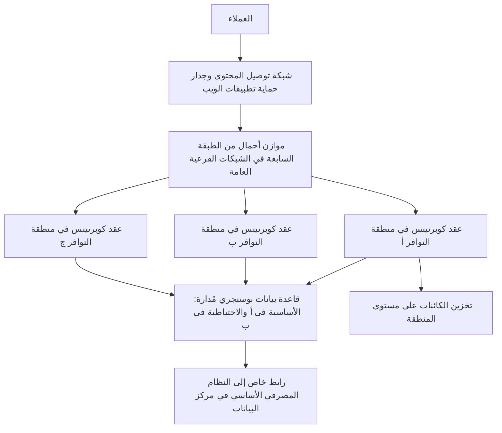
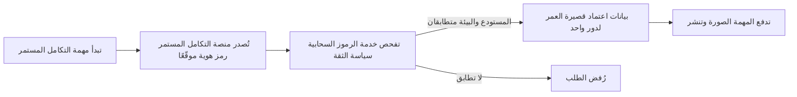

# الوحدة 1 — الأسس (Foundations)

*كل خدمة سحابية (cloud service) ومنصة حاويات (container platform) وخط تسليم (pipeline) ستقابلها في هذه الدورة تقوم على ثلاث أفكار أقدم: جهاز لينكس (Linux machine) يشغّل عمليات (processes)، وشبكة (network) تنقل الحزم (packets) بين الأسماء والمنافذ (names and ports)، وقرار بشأن من يُسمح له بفعل ماذا (who is allowed to do what). عندما يتعطّل شيء في بيئة الإنتاج (production)، يكون السبب عادةً في إحدى هذه الطبقات الثلاث (three layers)، مهما بدت الحزمة التقنية (stack) فوقها حديثة. تمنحك هذه الوحدة المعرفة العملية (working knowledge) التي يعتمد عليها مهندسو المنصات (platform engineers) كل يوم. تبدأ بسطر الأوامر (the shell) وبالمسار الشبكي (network path) الذي يسلكه الطلب (request)، من DNS إلى TLS إلى HTTP، وكيف تعرف أي قفزة (hop) فشلت. ثم تشرح ما يبيعه مزوّد السحابة (cloud provider) فعلًا: المناطق والمناطق الفرعية (regions and zones)، والحوسبة (compute)، والتخزين (storage)، والخدمات المُدارة (managed services)، ونموذج المسؤولية المشتركة (shared responsibility model) الذي يحدد أي الأعطال (failures) تقع على عاتقك. وتنتهي بالهوية والوصول (identity and access)، أي مستوى التحكم في السحابة (the control plane of the cloud)، حيث يمكن لسياسة واحدة مفرطة الاتساع (one over-broad policy) أو مفتاح واحد مُسرَّب (one leaked key) أن يهدم كل ما عداه. تتابع يوسف، الخريج الجديد في فريق هندسة المنصات وهندسة موثوقية المواقع (Platform Engineering & SRE team) في بنك نجم (Najm Bank)، وهو يلاحق بلاغًا بأن «التطبيق متوقف» (the app is down) يتبيّن أنه شهادة منتهية الصلاحية (expired certificate)، ويساعد سالم على تحديد مكان واجهة برمجة تطبيق نجم للهاتف (Najm Mobile API) في السحابة، ويتعلّم لماذا يجب التخلّص من مفتاح النشر (deploy key) الذي لصقه في خط تسليم (pipeline).*

> **المراحل (Phases):** Plan, Deploy, Operate — الجهاز (the machine) والشبكة (the network) والسحابة (the cloud) والهويات (the identities) التي يُبنى عليها كل ما يأتي لاحقًا في الدورة.

---

# 1.1 — لينكس وسطر الأوامر وأساسيات الشبكات (Linux, the shell and networking essentials): العمليات والملفات والمنافذ وDNS وHTTP وTLS (processes, files, ports, DNS, HTTP and TLS)
*المستوى (Level): 🟢 مبتدئ (Beginner)* · *المتطلبات (Prerequisites): 0.1، 0.2* · *المرحلة (Phase): Operate, Monitor*

## ⚡ الدرس في دقيقة (In 60 seconds)
- تعمل الغالبية العظمى من الخوادم (servers) والحاويات (containers) والدوال السحابية (cloud functions) على **لينكس (Linux)** في الأساس. تحتاج إلى مجموعة صغيرة من مهارات سطر الأوامر (shell skills): العمليات (processes)، والسجلات (logs)، والملفات والصلاحيات (files and permissions)، والمنافذ المُنصِتة (listening ports).
- يعبر الطلب (request) المتّجه إلى `api.najm.example` سلسلة ثابتة من القفزات (a fixed chain of hops): يحوّل **نظام أسماء النطاقات (DNS)** الاسم إلى عنوان (address)، ويفتح **بروتوكول التحكم بالنقل (TCP)** اتصالًا (connection) بمنفذ (port)، ويُثبت **أمن طبقة النقل (TLS)** هوية الخادم (server's identity) ويشفّر حركة البيانات (encrypts the traffic)، ويحمل **بروتوكول نقل النص التشعبي (HTTP)** الطلب والاستجابة (the request and the response).
- القاعدة الأهم (the most important rule): حين يُقال «إنه متوقف» (it's down)، **امشِ على السلسلة بالترتيب (walk the chain in order)** واختبر كل قفزة بأداتها الخاصة (its own tool) (`dig`، ثم `nc` أو `curl`، ثم `openssl`، ثم `curl -v`) بدلًا من التخمين (instead of guessing).
- إشارة القرار (decision cue): تخبرك **فئة حالة HTTP (HTTP status class)** أين تبحث. الرمز 4xx يعني أن الطلب رُفض (the request was refused)؛ والرمز 5xx يعني أن خادمًا فشل (a server failed)؛ والرمز 502 أو 504 الصادر عن موازن الأحمال (load balancer) يعني أن المشكلة *خلفه* (behind it).
- أكبر فخ (biggest trap): إعادة تشغيل الأشياء (restarting things) قبل أن تعرف أي قفزة فشلت. إعادة التشغيل تُتلف الأدلة (destroys evidence) ولا يمكنها إصلاح DNS أو جدار حماية (firewall) أو شهادة (certificate).

## 🧭 لماذا يهم (Why it matters)
في يوم الاثنين الثاني ليوسف، يُبلغ مركز الاتصال (contact centre) أن تطبيق نجم للأفراد (Najm retail app) «لا يفتح» (won't load). كل الحجيرات (pods) تعمل، وسجلات التطبيق (application logs) لا تُظهر أي أخطاء. يعيد يوسف تشغيل النشر (restarts the deployment) على أي حال؛ فلا يتغير شيء. تكتب مها، قائدة فريق هندسة موثوقية المواقع (SRE lead)، أمرًا واحدًا: `curl -v https://api.najm.example/health`. يتوقف عند مصافحة TLS (TLS handshake) برسالة `certificate has expired`. كانت شهادة الحافة (edge certificate) تُجدَّد يدويًا (renewed by hand) مرة في السنة، وكان الشخص الذي يتولى ذلك قد انتقل إلى فريق آخر. كان التطبيق سليمًا (healthy) طوال الوقت؛ كل ما في الأمر أن العملاء لم يستطيعوا الوصول إليه (could not reach it).

كانت إعادة تشغيل الحجيرات (restarting pods) تخمينًا (a guess). أما `curl -v` الذي نفّذته مها فقد اختبر قفزة محددة واحدة (one specific hop). هذه هي العادة (the habit) التي يبنيها هذا الدرس: اعرف القفزات التي يعبرها الطلب، واعرف الأداة التي تختبر كلًّا منها، وامشِ عليها بالترتيب (walk them in order).

تُظهر حالات الانقطاع العامة الكبرى (big public outages) البنية نفسها. في 4 أكتوبر 2021، تعذّر الوصول إلى Facebook وInstagram وWhatsApp لنحو ست ساعات. وفقًا لمنشورات Meta الهندسية العامة (public engineering posts)، فإن أمرًا صدر أثناء صيانة الشبكة الأساسية (backbone maintenance) فصل مراكز بياناتها (data centres)، ثم سحبت خوادم DNS لديها مساراتها (withdrew their routes) من الإنترنت. توقفت أسماء Facebook عن التحليل (stopped resolving)، وكانت الأدوات الداخلية (internal tools) التي يحتاجها المهندسون تعتمد على الشبكة نفسها. كانت الخوادم سليمة؛ لكن المسار إليها (the path to them) اختفى.

## 📐 كيف يعمل (How it works)

### 🟢 الأساسيات (The essentials)

**سطر الأوامر (The shell).** سطر الأوامر (عادةً `bash` أو `zsh`) واجهة نصية (text interface) لنظام التشغيل (operating system). ستستخدمه على الخوادم (servers)، وداخل الحاويات (inside containers)، وفي مهام التكامل المستمر (CI jobs)، وعلى حاسوبك المحمول (laptop).

**العمليات (Processes).** **العملية (process)** برنامج قيد التشغيل (a running program). لكل عملية **مُعرِّف عملية (process ID, PID)**، ومالك (owner) هو مستخدم (a user)، وعملية أم (parent process). على خادم لينكس حديث (modern Linux server)، تكون العملية الأولى (PID 1) عادةً **systemd**، الذي يشغّل الخدمات ويشرف عليها (starts and supervises services). أما داخل الحاوية (inside a container)، فالعملية PID 1 هي تطبيقك نفسه (your application itself)، وهذا مهم للنقطة التالية.

تتخاطب مع العمليات عبر **الإشارات (signals)**. أهم إشارتين:
- **SIGTERM** (الإشارة 15) تطلب من العملية أن تتوقف (asks a process to stop). الخدمة المكتوبة جيدًا (well-written service) تُنهي طلباتها الجارية (in-flight requests)، وتغلق اتصالات قاعدة البيانات (database connections)، ثم تخرج (exits).
- **SIGKILL** (الإشارة 9) تُنهي العملية فورًا (ends the process immediately). لا يُنظَّف شيء (nothing is cleaned up)؛ وتضيع الطلبات الجارية (requests in flight are lost).

يرسل Kubernetes الإشارة SIGTERM عندما يوقف حجيرة (stops a pod)، وينتظر مهلة سماح (grace period) مدتها 30 ثانية افتراضيًا (by default)، ثم يرسل SIGKILL؛ لذلك فإن الخدمة التي تتجاهل SIGTERM (ignores SIGTERM) تُسقط طلبات مع كل عملية نشر (drops requests on every deploy) (الدرس 2.3).

**الملفات والصلاحيات (Files and permissions).** لكل ملف مالك (owner) ومجموعة (group) وثلاث مجموعات صلاحيات (three permission sets) هي المالك والمجموعة والآخرون (owner, group, others)، ولكلٍّ منها القراءة (read) (`r`) والكتابة (write) (`w`) والتنفيذ (execute) (`x`). يعرضها الأمر `ls -l`:

```text
-rw-r----- 1 najm-api najm-api 1204 Oct  2 08:01 /etc/najm-api/config.yaml
```

يستطيع المالك القراءة والكتابة، وتستطيع المجموعة القراءة، والآخرون لا شيء: أي `640` بالصيغة الرقمية (numeric form). ينبغي أن يكون المفتاح الخاص (private key) بصلاحيات `600` (للمالك فقط، owner only)؛ والصلاحية `644` المقروءة للجميع (world-readable) خاطئة لأي شيء سرّي (anything secret).

**الأوامر اليومية (The everyday commands).** تعلّم هذه أولًا:

```bash
ps aux | grep najm-api          # running processes, and their users
systemctl status najm-api       # is the service up, and since when
journalctl -u najm-api --since "10 min ago"   # recent logs
ss -tlnp                        # listening TCP ports and their processes
df -h ; free -h                 # disk and memory: full disks break many services
kill -TERM <pid>                # ask a process to stop cleanly
```

**العناوين والمنافذ (Addresses and ports).** لكل جهاز على الشبكة **عنوان IP (IP address)**: يبدو عنوان IPv4 هكذا `10.20.1.15`، وعنوان IPv6 هكذا `2001:db8::15`. **المنفذ (port)** رقم من 0 إلى 65535 يحدد خدمة واحدة (identifies one service) على ذلك الجهاز: 443 لبروتوكول HTTPS، و22 لـ SSH، و5432 لـ PostgreSQL. العنوان مع المنفذ (an address plus a port) يحددان خدمة واحدة على جهاز واحد.

يجب أن **ترتبط (bind)** الخدمة بعنوان كي تستقبل حركة البيانات (receive traffic). العنوان `127.0.0.1` (عنوان الاسترجاع، loopback) يعني «لا يتصل إلا البرامج على هذا الجهاز نفسه» (only programs on this same machine may connect)؛ والعنوان `0.0.0.0` يعني «كل واجهات الشبكة» (every network interface). داخل الحاوية، يشير `127.0.0.1` إلى الحاوية نفسها، فالخدمة المرتبطة به لا يمكن الوصول إليها من الخارج (unreachable from outside): وهو خلل كلاسيكي من نوع «يعمل محليًا، لا يعمل في الحاوية» (works locally, not in the container).

**بروتوكولا TCP وUDP (TCP and UDP).** يوفر **TCP** اتصالًا موثوقًا ومرتّبًا (a reliable, ordered connection) يُفتح بمصافحة (handshake) قبل أن تتدفق البيانات؛ وتستخدمه HTTP/1.1 وHTTP/2 وقواعد البيانات (databases) وSSH. أما **UDP** فيرسل حزمًا (packets) بلا اتصال ولا ضمان (no connection or guarantee)؛ وتستخدمه معظم استعلامات DNS (DNS queries)، وكذلك QUIC، وهو بروتوكول النقل (the transport) الذي يقوم عليه HTTP/3.

**مسار طلب واحد (The path of one request).** عندما يستدعي تطبيق نجم (the Najm app) العنوان `https://api.najm.example/v1/accounts`، يحدث ما يلي:


**نظام أسماء النطاقات (DNS).** يحوّل **نظام أسماء النطاقات (Domain Name System)** الأسماء إلى عناوين (turns names into addresses). أنواع السجلات (record types) التي ستستخدمها أكثر من غيرها:

| السجل (Record) | يربط (Maps) | مثال استخدام (Example use) |
|---|---|---|
| **A** | اسم إلى عنوان IPv4 (Name to an IPv4 address) | `api.najm.example` إلى عنوان IPv4 لموازن الأحمال (load balancer) |
| **AAAA** | اسم إلى عنوان IPv6 (Name to an IPv6 address) | الأمر نفسه، لعملاء IPv6 (IPv6 clients) |
| **CNAME** | اسم إلى اسم آخر (Name to another name) | `api.najm.example` إلى الاسم الذي يمنحك إياه موازن أحمال سحابي (cloud load balancer) أو شبكة توصيل محتوى (CDN) |
| **TXT** | اسم إلى نص حر (Name to free text) | إثبات ملكية النطاق (proving domain ownership) لهيئة شهادات (certificate authority) أو لمزوّد بريد إلكتروني (email provider) |

لكل سجل **مدة بقاء (TTL, time to live)**: أي عدد الثواني التي يجوز فيها للمحلِّلات (resolvers) تخزين الإجابة مؤقتًا (cache the answer). مع TTL قيمته 3600، قد يستغرق التغيير ساعة كي يصل إلى الجميع. قبل ترحيل مخطط له (planned migration)، اخفض قيمة TTL (lower the TTL) قبل الموعد بمدة TTL قديمة واحدة على الأقل (at least one old TTL period in advance)؛ ثم ارفعها مجددًا بعد ذلك.

**فئات حالة HTTP (HTTP status classes).** يخبرك الرقم الأول من رمز الحالة (status code) على من يقع اللوم (who to blame):

| الفئة (Class) | المعنى (Meaning) | أمثلة نموذجية (Typical examples) |
|---|---|---|
| 2xx | نجاح (Success) | 200 OK، 201 Created |
| 3xx | اذهب إلى مكان آخر (Go elsewhere) | 301 أو 308 إعادة توجيه دائمة (permanent redirect) |
| 4xx | رُفض طلب العميل (The client's request was refused) | 401 غير مُصادَق (not authenticated)، 403 غير مسموح (not allowed)، 404 غير موجود (not found)، 429 طلبات كثيرة جدًا (too many requests) |
| 5xx | فشل جانب الخادم (The server side failed) | 500 خطأ في التطبيق (application error)، 502 بوابة سيئة (bad gateway)، 503 غير متاح (unavailable)، 504 انتهاء مهلة البوابة (gateway timeout) |

الرمز **502** أو **504** الذي يعيده موازن أحمال (load balancer) أو وكيل (proxy) يعني عادةً أن *الشيء الذي خلفه* (the thing behind it) فشل أو لم يُجب في الوقت المحدد (did not answer in time). انظر إلى الخلفية (the backend)، لا إلى موازن الأحمال.

**أمن طبقة النقل (TLS).** يشفّر **أمن طبقة النقل (Transport Layer Security)** حركة البيانات ويُثبت هوية الخادم (proves the server's identity). يقدّم الخادم **شهادة (certificate)**: وهي بيان موقَّع (a signed statement) يقول «هذا المفتاح العام (public key) يخص `api.najm.example`، وهو صالح من هذا التاريخ إلى ذاك»، تُصدره **هيئة شهادات (certificate authority, CA)** يثق بها العميل مسبقًا، غالبًا عبر شهادة وسيطة أو أكثر (intermediate certificates) تشكّل **السلسلة (chain)**. إذا فشل الاسم أو التواريخ أو السلسلة في فحوص العميل (the client's checks)، يتوقف الاتصال قبل إرسال أي HTTP، ولهذا لم يرَ يوسف شيئًا في سجلات التطبيق (application logs). الإصدار TLS 1.3 (RFC 8446) هو الحالي؛ وما زال TLS 1.2 شائعًا. أما التفاصيل التشفيرية (cryptographic detail) فمكانها [*أمن الذكاء الاصطناعي والتطبيقات (Secure AI & Application Security)*، الدرس 5.1 — التشفير للبنّائين (Cryptography for builders): TLS والتجزئة والتشفير والمفاتيح (TLS, hashing, encryption and keys)](../secai/index.ar.html#/5.1)؛ أما هنا فيعنينا تشغيله (operating it).

### 🟡 التعمق أكثر (Going deeper)

**المشي على السلسلة (Walking the chain).** حين يقول أحدهم «إنه متوقف» (it's down)، اختبر كل قفزة بالترتيب (test each hop in order) وتوقّف عند أول قفزة تفشل (the first one that fails):

```bash
# 1. DNS: does the name resolve, and to what?
dig +short api.najm.example A
dig api.najm.example            # full answer, including the TTL

# 2. TCP: can we open a connection to the port?
nc -vz api.najm.example 443

# 3. TLS: what certificate is presented, for which name, valid until when?
openssl s_client -connect api.najm.example:443 -servername api.najm.example </dev/null 2>/dev/null \
  | openssl x509 -noout -subject -issuer -dates

# 4. HTTP: what does the server answer?
curl -sv https://api.najm.example/health -o /dev/null
```

غالبًا ما يغطي `curl -v` وحده الخطوات الأربع كلها؛ تعلّم قراءة مخرجاته (read its output) سطرًا سطرًا.

**قراءة النتيجة (Reading the result).**

| العَرَض (Symptom) | القفزة التي فشلت (Hop that failed) | الأسباب المعتادة (Usual causes) |
|---|---|---|
| `NXDOMAIN` أو لا إجابة من `dig` | DNS | سجل مفقود أو محذوف (record missing or deleted)، منطقة خاطئة (wrong zone)، انتهاء تسجيل النطاق (expired domain registration) |
| `Connection refused` | TCP | لا شيء يُنصت على ذلك المنفذ (nothing listening on that port)، أو خدمة مرتبطة بـ `127.0.0.1` (service bound to) |
| يتعلّق الاتصال ثم تنتهي مهلته (connection hangs, then times out) | الشبكة (Network) | جدار حماية (firewall) أو مجموعة أمان (security group) تُسقط الحزم (drops the packets)، مسار خاطئ (wrong route)، شبكة فرعية خاطئة (wrong subnet) |
| `certificate has expired` أو عدم تطابق الاسم (name mismatch) | TLS | فشل التجديد (renewal failed)، شهادة خاطئة على المُنصِت (wrong certificate on the listener)، غياب SNI (missing SNI) |
| 502 أو 504 من موازن الأحمال (from the load balancer) | خلف موازن الأحمال (Behind the load balancer) | لا خلفيات سليمة (no healthy backends)، انتهاء مهلة الخلفية (backend timeout)، فشل فحص السلامة (failing health check) |
| 401 أو 403 | التطبيق أو البوابة (Application or gateway) | رمز منتهي الصلاحية (expired token)، صلاحية مفقودة (missing permission)، قاعدة جدار حماية تطبيقات الويب (WAF rule) |

*الرفض (Refused)* يعني أن جهازًا أجاب ولا شيء يُنصت (nothing is listening)؛ أي أن المسار يعمل (the path works). أما *انتهاء المهلة (timeout)* فيعني عادةً أن شيئًا ما أسقط الحزم بصمت (silently dropped the packets)، وهو في الغالب قاعدة جدار حماية (firewall rule).

**إشارة اسم الخادم (SNI).** كثيرًا ما يخدم موازن أحمال واحد أسماء كثيرة على عنوان واحد (many names on one address)؛ فيسمّي العميل المضيف الذي يريده في مصافحة TLS (TLS handshake) عبر **إشارة اسم الخادم (Server Name Indication)** كي تُختار الشهادة الصحيحة (the right certificate). ومن هنا الخيار `-servername` أعلاه: من دونه قد ترى شهادة افتراضية (default certificate) فتستنتج استنتاجًا خاطئًا (draw the wrong conclusion).

**موازنات الأحمال من الطبقة 4 والطبقة 7 (Layer 4 and layer 7 load balancers).** يمرّر موازن الأحمال من **الطبقة 4 (layer 4, L4)** اتصالات TCP أو UDP دون قراءة HTTP بداخلها: سريع ومستقل عن البروتوكول (fast and protocol-agnostic). أما موازن الأحمال من **الطبقة 7 (layer 7, L7)** فيفهم HTTP: فهو يُنهي TLS (terminates TLS)، ويوجّه حسب المضيف أو المسار (routes by host or path) (`/v1/payments` إلى خدمة، و`/v1/cards` إلى أخرى)، ويعيد صفحات أخطاء خاصة به (its own error pages). تقع واجهة برمجة تطبيق نجم للهاتف (Najm Mobile API) خلف موازن أحمال L7، لذا فإن 502 هناك يعني أن الخلفية أساءت التصرف (the backend misbehaved).

**الخدمات مع systemd (Services with systemd).** على الجهاز الافتراضي (VM)، يحدد **ملف الوحدة (unit file)** في systemd كيف تعمل الخدمة: الأمر (the command)، والمستخدم الذي تعمل باسمه (the user it runs as) — وليس الجذر (root) أبدًا إلا عند الضرورة — وهل يُعاد تشغيلها عند الفشل (restart it on failure) (`Restart=on-failure`). في الحاويات، تحلّ بيئة التشغيل (the runtime) وKubernetes محل systemd، لكن الأفكار تنتقل كما هي: عملية خاضعة للإشراف (a supervised process)، وسياسة إعادة تشغيل (a restart policy)، ومستخدم غير جذري (a non-root user).

**العناوين الخاصة (Private addresses).** يحجز RFC 1918 ثلاثة نطاقات IPv4 للشبكات الخاصة (private networks): `10.0.0.0/8` و`172.16.0.0/12` و`192.168.0.0/16`. اللاحقة `/16` هي ترميز **CIDR (CIDR notation)**: أول 16 بتًا تسمّي الشبكة (name the network)، فيضم `10.20.0.0/16` عدد 65,536 عنوانًا، ويضم `10.20.1.0/24` عدد 256 عنوانًا. يستخدم الدرس 1.2 هذه النطاقات لتخطيط الشبكات السحابية (plan cloud networks).

### 🔴 نظرة الخبير (Expert view)

**أتمِت الشهادات، ثم أطلق التنبيهات على أي حال (Automate certificates, then alert anyway).** التجديد السنوي اليدوي (manual yearly renewal) انقطاعٌ مؤقَّت بساعة (an outage on a timer). استخدم **ACME** (RFC 8555)، وهو البروتوكول (the protocol) الذي يقوم عليه Let's Encrypt، أو مدير الشهادات لدى مزوّدك (your provider's certificate manager)، وفي Kubernetes متحكّمًا (controller) مثل cert-manager. وقد اتفق منتدى CA/Browser Forum على تقصير الحد الأقصى لعمر الشهادات العامة (maximum public certificate lifetimes) على مراحل خلال السنوات المقبلة (تحقّق من الحد الحالي، check the current limit)، مما يجعل التجديد اليدوي غير عملي (unworkable). ومع ذلك أطلق تنبيهًا (alert) قبل انتهاء الصلاحية بـ 14 يومًا مثلًا: فالأتمتة تفشل بصمت (automation fails quietly) عندما يتغير DNS أو الصلاحيات (permissions).

**نظام DNS تبعيةٌ لكل شيء (DNS is a dependency of everything).** قد تعتمد أدوات المراقبة (monitoring) وأدوات النشر (deploy tools) ومحادثة الحوادث (incident chat) لديك على نظام DNS والشبكة نفسيهما اللذين تحاول إصلاحهما، كما أظهر انقطاع Facebook عام 2021. احتفظ بقائمة «خارج النطاق» (out-of-band) لكيفية الوصول إلى لوحات التحكم (consoles) وأدلة التشغيل (runbooks) وبعضكم بعضًا إذا توقفت أسماؤكم عن التحليل (stop resolving).

**افحص من الخارج (Probe from outside).** تُظهر لوحات المعلومات (dashboards) داخل العنقود (cluster) حجيرات سليمة (healthy pods)، لا ما إذا كان العملاء قادرين على الوصول إليها. أما **الفحص الاصطناعي (synthetic check)** — وهو طلب مُجدوَل (a scheduled request) من خارج شبكتك، ويُفضَّل من عدة أماكن — فيختبر السلسلة كاملة من جهة العميل (from the customer's side)، وكان سيكتشف شهادة نجم المنتهية قبل أن يكتشفها مركز الاتصال. يبني الدرس 5.2 هذا الفحص.

**اختبر من حيث يوجد العميل (Test from where the client is).** قد يختلف المحلِّل (resolver) أو الوكيل (proxy) أو مسار الشبكة الافتراضية الخاصة (VPN route) على حاسوبك عن تلك التي لدى العميل.

## 🧰 الأدوات (The toolkit)
| الأداة أو الممارسة أو الخدمة (Tool, practice or service) | ما هي وماذا تفعل (What it is and does) | متى تلجأ إليها (When to reach for it) |
|---|---|---|
| **curl** | عميل HTTP لسطر الأوامر (command-line HTTP client)؛ يعرض الخيار `-v` نظام DNS والاتصال وTLS وHTTP في تشغيل واحد (in one run) | أول اختبار لأي بلاغ «إنه متوقف» (it's down report)؛ فحوص السلامة (health checks)؛ النصوص البرمجية (scripts) |
| **dig** | يستعلم DNS ويعرض السجلات (records) وقيم TTL وأي خادم أجاب (which server answered) | فحص سجل بعد تغيير (after a change)؛ تشخيص فشل التحليل (diagnosing resolution failures) |
| **openssl s_client** | يفتح اتصال TLS ويعرض سلسلة الشهادات المقدَّمة (presented certificate chain) | فحص أسماء الشهادات (certificate names) وجهات إصدارها (issuers) وتواريخ انتهائها (expiry dates) |
| **ss** | يسرد المقابس (lists sockets): المنافذ المُنصِتة (listening ports) والعمليات التي تملكها | حالة «رُفض الاتصال» (Connection refused)؛ فحص العنوان الذي ترتبط به الخدمة (bound to) |
| **ACME** (RFC 8555) | بروتوكول للإصدار والتجديد التلقائيين للشهادات (automatic certificate issuance and renewal) | كل شهادة عامة (every public certificate)؛ لا تجدّد يدويًا أبدًا (never renew by hand) |
| **Synthetic check** | الفحص الاصطناعي: طلب مُجدوَل (a scheduled request) إلى خدمتك من خارج شبكتك (from outside your network) | اكتشاف أعطال DNS وTLS والحافة (edge failures) التي تفوّتها لوحات المعلومات الداخلية (internal dashboards) |

## 🏛️ عمليًا في بنك نجم (In practice at Najm Bank)
بعد حادثة الشهادة (certificate incident)، تطلب مها من يوسف كتابة **دليل تشغيل الاستجابة الأولى (first-response runbook)** للفريق لحالة «تعذّر الوصول إلى واجهة برمجة تطبيق نجم للهاتف» (the Najm Mobile API is unreachable). يوضع الدليل بجوار التنبيه (next to the alert)، فيتبع المناوب (whoever is on call) الخطوات نفسها.

**دليل التشغيل RB-001: تعذّر الوصول إلى واجهة برمجة تطبيق نجم للهاتف — امشِ على السلسلة (Najm Mobile API unreachable — walk the chain)**

| الخطوة (Step) | الأمر (Command) — من خارج الشبكة أولًا، ثم من حجيرة (from outside the network first, then from a pod) | النتيجة السليمة (Healthy result) | إن فشلت، افحص (If it fails, check) |
|---|---|---|---|
| 1. نظام أسماء النطاقات (DNS) | `dig +short api.najm.example` | اسم شبكة توصيل المحتوى (CDN) أو موازن الأحمال (load balancer) | سجل تغييرات DNS (DNS change log)؛ تسجيل النطاق (domain registration) |
| 2. بروتوكول التحكم بالنقل (TCP) | `nc -vz api.najm.example 443` | `succeeded` | حالة الحافة أو جدار حماية تطبيقات الويب (edge or WAF status)؛ تغييرات جدار الحماية (firewall changes) |
| 3. أمن طبقة النقل (TLS) | `openssl s_client ... \| openssl x509 -noout -dates -subject` | الاسم الصحيح (right name)؛ انتهاء الصلاحية بعد أكثر من 14 يومًا (expiry over 14 days away) | مدير الشهادات (certificate manager)؛ سجلات تجديد ACME (ACME renewal logs) |
| 4. بروتوكول نقل النص التشعبي (HTTP) | `curl -sv https://api.najm.example/health` | `200` | 502 أو 504: جاهزية الخلفية (backend readiness)؛ 403: قواعد جدار حماية تطبيقات الويب (WAF rules)؛ 5xx: سجلات التطبيق (app logs) |
| 5. الخلفية (Backend) | `kubectl get pods -n mobile-api`، ثم السجلات (then logs) | كلها جاهزة (all ready) | عمليات النشر الأخيرة (recent deploys): تراجَع أولًا، وحقّق ثانيًا (roll back first, investigate second) |

**قواعد مرفقة بدليل التشغيل (Rules attached to the runbook):**
- انشر أول قفزة فاشلة (the first failing hop) ومخرجاتها الدقيقة (exact output) في قناة الحادثة (incident channel) قبل تغيير أي شيء؛ ولا تُعِد تشغيل أحمال العمل (do not restart workloads) حتى تشير الخطوة 4 إلى الخلفية (points at the backend).
- متابعات هذه الحادثة (follow-ups from this incident): تجديد ACME لكل شهادة (ACME renewal for every certificate)، وتنبيه قبل انتهاء الصلاحية بـ 14 يومًا (an alert 14 days before expiry)، وفحص اصطناعي خارجي (external synthetic check) على `/health` كل دقيقة من موقعين (from two locations).

## 🛠️ التمارين (Exercises)
تُنفَّذ جميع التمارين على جهازك الخاص (your own machine) باستخدام Docker وطرفية (terminal).

- 🟢 نفّذ `curl -v https://example.com` وصنّف كل سطر من المخرجات (label each line of output) على أنه DNS أو TCP أو TLS أو HTTP. ثم استخدم `dig` و`openssl s_client` لتدوين قيمة TTL للسجل (the record's TTL) وجهة إصدار الشهادة وتاريخ انتهائها (the certificate's issuer and expiry date). *يكتمل عندما (Done when):* تستطيع أن تشير إلى موضع نجاح كل قفزة (where each hop succeeded) وأن تقول متى تنتهي صلاحية الشهادة.
- 🟡 اكتب خادم HTTP صغيرًا (a tiny HTTP server) يُنصت على `127.0.0.1:8080`، وشغّله بالأمر `docker run -p 8080:8080`، وحاول الوصول إليه من جهازك المضيف (from your host). شخّص المشكلة بالأمر `ss -tlnp` داخل الحاوية، وأصلح عنوان الربط (fix the bind address)، وتحقّق. ثم اجعله يسجّل «shutting down» عند استقبال SIGTERM (log on SIGTERM) وتحقّق من أن `docker stop` يُظهر الرسالة. *يكتمل عندما (Done when):* يُصلَح السلوكان كلاهما (both behaviours are fixed) وتستطيع شرح كل فشل في جملتين.
- 🔴 اكتب `walk-the-chain.sh <hostname>`: ينفّذ الاختبارات الأربعة بالترتيب (the four tests in order)، ويطبع PASS أو FAIL لكل قفزة (per hop) مع التفصيل الأساسي (the key detail) — العنوان (address)، وانتهاء صلاحية الشهادة (certificate expiry)، وحالة HTTP (HTTP status) — ويخرج برمز غير صفري (exit non-zero) عند أول فشل (at the first failure). اختبره على موقع يعمل (a working site)، واسم غير موجود (a non-existent name)، ومنفذ محلي مغلق (a closed local port)، وشهادة منتهية الصلاحية (an expired certificate) — يستضيف badssl.com مواقع اختبار معطوبة عمدًا (deliberately broken test sites). *يكتمل عندما (Done when):* يتوقف كل فشل عند القفزة الصحيحة (the right hop) برسالة واضحة (a clear message).

## ⚠️ أخطاء وفخاخ (Mistakes and traps)
- **إعادة التشغيل قبل التشخيص (Restarting before diagnosing).** امشِ على السلسلة أولًا (walk the chain first)؛ ولا تُعِد التشغيل إلا حين تشير الأدلة إلى العملية (the evidence points at the process).
- **الربط بالمضيف المحلي داخل الحاوية (Binding to localhost in a container).** يتعذّر الوصول إلى الخدمة من الخارج (unreachable from outside). اربطها بـ `0.0.0.0` (أو بالواجهة المحددة التي تقصدها، the specific interface you mean) ودع سياسة الشبكة (network policy) تقرر من يحق له الاتصال.
- **تجديد الشهادات يدويًا (Renewing certificates by hand).** ينسى أحدهم فيُظلم الموقع (the site goes dark). أتمِت باستخدام ACME (automate with ACME) وأطلق تنبيهًا قبل انتهاء الصلاحية (alert before expiry).
- **تجاهل SIGTERM (Ignoring SIGTERM).** كل عملية نشر تُسقط طلبات (every deploy drops requests). توقّف عن قبول عمل جديد (stop taking new work)، وأنهِ الطلبات الحالية (finish current requests)، ثم اخرج (then exit).
- **تشغيل الخدمات بصلاحيات الجذر (Running services as root).** يتحوّل خلل واحد (one bug) إلى سيطرة كاملة على الجهاز (full control of the machine). شغّلها باسم مستخدم مخصّص (a dedicated user) لا يملك إلا الملفات التي يحتاجها.

## 🧾 الخلاصة (Recap)
- لينكس وسطر الأوامر هما أرضية كل منصة (the floor of every platform): العمليات (processes)، والإشارات (signals)، والصلاحيات (permissions)، والخدمات (services)، والسجلات (logs).
- يعبر الطلب DNS ثم TCP ثم TLS ثم HTTP بالترتيب (in order)؛ ولكل قفزة اختبارها الخاص (its own test).
- «الرفض» (Refused) يعني أن لا شيء يُنصت (nothing is listening)؛ وانتهاء المهلة (a timeout) يعني عادةً أن شيئًا يُسقط الحزم (dropping packets).
- تشير فئات حالة HTTP (HTTP status classes) إلى الجانب المذنب (the guilty side)؛ والرمز 502 أو 504 عند موازن الأحمال يشير إلى ما خلفه (points behind it).
- أتمِت الشهادات (automate certificates)، وأطلق التنبيه قبل انتهاء الصلاحية (alert before expiry)، وافحص من الخارج (probe from outside).

## ✍️ اختبر نفسك (Check yourself)

**1. يُبلغ العملاء أن تطبيق نجم لا يفتح (will not load). جميع الحجيرات تعمل (all pods are running) وسجلات التطبيق (application logs) لا تُظهر أخطاء. ماذا ينبغي أن يفعل يوسف أولًا (first)؟**

- A. يعيد تشغيل النشر (restart the deployment) لمسح أي حالة سيئة في الذاكرة (bad in-memory state)
- B. ينفّذ `curl -v` على نقطة فحص السلامة (health endpoint) من الخارج ويجد القفزة الفاشلة (the failing hop)
- C. يوسّع النشر (scale the deployment up) كي تتقاسم نسخ متماثلة أكثر (more replicas) الحمل
- D. يتراجع (roll back) عن آخر عملية نشر إلى آخر إصدار معروف السلامة (last known-good version)

<details><summary>الإجابة</summary>

**B.** الحجيرات السليمة مع سجلات فارغة توحي بأن الطلبات لا تصل إلى التطبيق أصلًا (never reach the application)، فاختبر السلسلة من جهة العميل (from the customer's side). أما A وC وD فتغيّر الأشياء دون دليل (without evidence). (🟡 التعمق أكثر، Going deeper).

</details>

**2. تعمل خدمة جيدًا على حاسوب مطوّر (developer's laptop). داخل حاوية، يفشل `curl` من الجهاز المضيف فورًا (fails at once) — رفض أو إعادة تعيين (refused or reset) — ويُظهر `ss -tlnp` داخل الحاوية أنها تُنصت على `127.0.0.1:8080`. ما الخطأ؟**

- A. جدار حماية (firewall) داخل صورة الحاوية (container image) يحجب حركة البيانات الواردة (inbound traffic) على المنفذ 8080
- B. شهادة TLS المقدَّمة (TLS certificate presented) لا تطابق اسم المضيف المطلوب (requested host name)
- C. لا يستطيع DNS الداخلي في Docker (Docker's internal DNS) تحليل اسم الحاوية
- D. تُنصت الخدمة على عنوان الاسترجاع (listens on loopback)، فلا يمكن الوصول إليها إلا من داخل الحاوية

<details><summary>الإجابة</summary>

**D.** العنوان `127.0.0.1` داخل الحاوية هو الحاوية نفسها. اربط الخدمة بـ `0.0.0.0`. جدار الحماية (A) يسبب عادةً انتهاء مهلة (timeout)، لا فشلًا فوريًا (immediate failure)، والطلب لا يصل إلى TLS (B) ولا يحتاج إلى DNS (C). (🟢 الأساسيات، The essentials).

</details>

**3. سينقل الفريق `api.najm.example` إلى موازن أحمال جديد (new load balancer) يوم الثلاثاء المقبل. قيمة TTL للسجل 86,400 ثانية (يوم واحد). ماذا ينبغي أن يفعلوا؟**

- A. خفض TTL إلى دقائق (lower the TTL to minutes) قبل يوم أو أكثر، ثم التبديل (switch)، ثم رفعها مجددًا
- B. تغيير السجل يوم الثلاثاء؛ فقيمة TTL لا تؤثر إلا في العملاء الذين لم يسألوا من قبل (never asked before)
- C. حذف السجل القديم أولًا، وانتظار مسح ذاكرات التخزين المؤقت (caches to clear)، ثم إنشاء السجل الجديد
- D. رفع TTL مسبقًا (raise the TTL beforehand) كي تبقى الإجابة الجديدة مخزّنة مؤقتًا مدة أطول بعد وصولها

<details><summary>الإجابة</summary>

**A.** تحتفظ ذاكرات التخزين المؤقت (caches) بالإجابة القديمة مدة تصل إلى TTL، لذا فإن خفضها مسبقًا يجعل التبديل ينتشر سريعًا (propagate quickly). يتجاهل B التخزين المؤقت (ignores caching)؛ ويسبب C فشل التحليل (resolution failures)؛ ويزيد D الأمر سوءًا. (🟢 الأساسيات، The essentials).

</details>

**4. يعيد موازن الأحمال L7 (L7 load balancer) الواقع أمام واجهة برمجة تطبيق نجم للهاتف الرمز 504 Gateway Timeout. من أين ينبغي أن يبدأ التحقيق (the investigation)؟**

- A. سجلات DNS للواجهة (DNS records for the API)
- B. شهادة TLS على موازن الأحمال (TLS certificate on the load balancer)
- C. الخلفيات خلف موازن الأحمال (backends behind the load balancer): سلامتها (health) وجاهزيتها (readiness) وأزمنة استجابتها (response times)
- D. شبكة الهاتف المحمول لدى العميل (customer's mobile network)

<details><summary>الإجابة</summary>

**C.** كي يعيد موازن الأحمال 504 أصلًا، لا بد أن DNS (A) وTLS (B) وشبكة العميل (D) قد عملت؛ فالخلفية لم تُجب في الوقت المحدد (did not answer in time). (🟢 الأساسيات، The essentials).

</details>

**5. يوقف Kubernetes حجيرة أثناء عملية نشر (during a deploy). ماذا يحدث، وماذا يجب أن يفعل التطبيق؟**

- A. يرسل SIGKILL فورًا (immediately)، فلا يحظى التطبيق بفرصة للتنظيف (clean up)
- B. يرسل SIGTERM، ثم SIGKILL بعد مهلة سماح (grace period)؛ وعلى التطبيق تصريف العمل الجاري (drain in-flight work) ثم الخروج
- C. يرسل SIGHUP، وعلى التطبيق إعادة تحميل إعداداته (reload its configuration) ومواصلة الخدمة
- D. يحذف صورة الحاوية (container image)، فيجب على التطبيق أولًا حفظ حالته على القرص المحلي (local disk)

<details><summary>الإجابة</summary>

**B.** الإشارة SIGTERM هي الطلب المهذّب (the polite request)؛ وتليها SIGKILL بعد مهلة السماح (30 ثانية افتراضيًا، by default). تجاهل SIGTERM يُسقط طلبات مع كل عملية نشر (drops requests on every deploy). (🟢 الأساسيات، The essentials).

</details>

## 📚 المراجع (References)
- RFC 8446، بروتوكول أمن طبقة النقل الإصدار 1.3 (The Transport Layer Security (TLS) Protocol Version 1.3) — https://www.rfc-editor.org/rfc/rfc8446
- RFC 9110، دلالات HTTP (HTTP Semantics) — https://www.rfc-editor.org/rfc/rfc9110
- RFC 1035، أسماء النطاقات: التنفيذ والمواصفات (Domain Names: Implementation and Specification) — https://www.rfc-editor.org/rfc/rfc1035
- RFC 1918، تخصيص العناوين للإنترنتات الخاصة (Address Allocation for Private Internets) — https://www.rfc-editor.org/rfc/rfc1918
- RFC 8555، بيئة الإدارة الآلية للشهادات (Automatic Certificate Management Environment, ACME) — https://www.rfc-editor.org/rfc/rfc8555
- صفحات دليل لينكس (Linux man pages) (signal، ss، systemd.service) — https://man7.org/linux/man-pages/
- توثيق systemd (systemd documentation) — https://systemd.io/
- Kubernetes، دورة حياة الحجيرة وإنهاؤها (Pod lifecycle and termination) — https://kubernetes.io/docs/concepts/workloads/pods/pod-lifecycle/
- Meta Engineering، «مزيد من التفاصيل حول انقطاع 4 أكتوبر» (More details about the October 4 outage) — https://engineering.fb.com/2021/10/05/networking-traffic/outage-details/
- للتوسّع (Going further): [*تصميم الأنظمة لمبرمجي الحدس (System Design for Vibe Coders)*، الدرس F.1 — ماذا يحدث عندما تفتح موقعًا إلكترونيًا (What happens when you open a website)](../vibe/index.ar.html#lF-1) و[*تصميم الأنظمة لمبرمجي الحدس (System Design for Vibe Coders)*، الدرس 11.1 — النطاقات وDNS وTLS (Domains, DNS, and TLS)](../vibe/index.ar.html#l11-1)

---

# 1.2 — أساسيات السحابة (Cloud fundamentals): المناطق ومناطق التوافر والحوسبة والتخزين والخدمات المُدارة والمسؤولية المشتركة (regions, zones, compute, storage, managed services and shared responsibility)
*المستوى (Level): 🟢 مبتدئ (Beginner)* · *المتطلبات (Prerequisites): 1.1* · *المرحلة (Phase): Plan, Deploy*

## ⚡ الدرس في دقيقة (In 60 seconds)
- يؤجّرك مزوّد السحابة (cloud provider) قدرة حوسبة عند الطلب (computing on demand)، عبر واجهة برمجة تطبيقات (through an API)، بفوترة حسب الاستخدام (billed by use). تبيع **AWS** و**Microsoft Azure** و**Google Cloud** لبنات بناء متشابهة (similar building blocks) بأسماء مختلفة.
- التخطيط المادي (the physical layout) هو أول قرار تصميمي (the first design decision): **المنطقة (region)** مساحة جغرافية (a geographic area)؛ و**منطقة التوافر (availability zone)** مركز بيانات منفصل أو أكثر (one or more separate data centres) داخلها. وزّع بيئة الإنتاج (spread production) على **منطقتَي توافر على الأقل (at least two zones)**؛ ولا تفكّر في منطقة ثانية (a second region) إلا لسبب واضح يتعلق بالتعافي أو بمكان إقامة البيانات (a clear recovery or residency reason).
- اختر **الخدمة الأكثر إدارةً (the most managed service)** التي تلبّي احتياجاتك: فأنت تدفع لتسليم الترقيع (patching) والنسخ الاحتياطي (backups) وتجاوز الفشل (failover) لغيرك.
- يأتي التخزين (storage) في ثلاثة أشكال: **الكائنات (object)** — ملفات بمفتاح عبر HTTP (files by key over HTTP)، و**الكتل (block)** — قرص لجهاز واحد (a disk for one machine)، و**الملفات (file)** — مجلد شبكي مشترك (a shared network folder). اختر حسب نمط الوصول (by access pattern)، لا حسب العادة (not habit).
- يقول **نموذج المسؤولية المشتركة (shared responsibility model)** إن المزوّد يؤمّن السحابة (secures the cloud) وأنت تؤمّن ما تضعه فيها (what you put in it). الإعدادات (configuration) والهوية (identity) والبيانات (data) مسؤوليتك دائمًا.
- أكبر فخ (biggest trap): اعتبار «إنه في السحابة» (it's in the cloud) مرادفًا لـ«إنه مرن» (it's resilient). النشر في منطقة توافر واحدة (single-zone deployment) بلا نسخ احتياطية مُختبَرة (no tested backups) يفشل تمامًا كما كان يفشل الخادم الواحد (a single server).

## 🧭 لماذا يهم (Why it matters)
قرّر بنك نجم (Najm Bank) نقل واجهة برمجة تطبيق نجم للهاتف (Najm Mobile API) خارج مركز بياناته (data centre). يطلب سالم من يوسف صياغة مذكرة التموضع (placement note): أي منطقة (which region)، وكم منطقة توافر (how many zones)، وأي خدمات (which services)، وما الذي يبقى نجم مالكًا له (what Najm still owns) بعد أن يشغّل المزوّد العتاد (the hardware). تسرد المسودة الأولى ليوسف «عنقود Kubernetes وجهاز افتراضي لـ PostgreSQL» (a Kubernetes cluster and a PostgreSQL VM) في منطقة توافر واحدة، لأن هذه هي الطريقة التي كان يعمل بها في المقر (on-premises). يعيدها سالم مع ثلاثة أسئلة: «ماذا يحدث عندما تمر منطقة التوافر تلك بيوم سيئ (a bad day)؟ من يرقّع قاعدة البيانات تلك (who patches that database)؟ وأي من الجهات التنظيمية (regulators) للبنك تحتاج إلى معرفة مكان بيانات العملاء (where customer data sits)؟»

في 28 فبراير 2017، تعطّلت خدمة Amazon S3 في منطقة US-EAST-1 (شمال فرجينيا، Northern Virginia) لعدة ساعات. وفقًا للملخّص العام من AWS (AWS's public summary)، أُدخل أمر يُقصد به إزالة عدد صغير من الخوادم بمُدخل خاطئ (a wrong input)، فأزال مجموعة أكبر بكثير، منها خوادم كانت تعتمد عليها أنظمة S3 الفرعية الأساسية (core S3 subsystems). وتعطّلت معها خدمات كثيرة كانت تحفظ بياناتها في تلك المنطقة الوحيدة. لم يكن الدرس «تجنّب السحابة» (avoid the cloud)، بل كان: اعرف أي منطقة وأي خدمات تعتمد عليها، واعرف ما الذي يفشل معًا (what fails together)، وصمّم لذلك عن قصد (design for it on purpose).

## 📐 كيف يعمل (How it works)

### 🟢 الأساسيات (The essentials)

**ما معنى «السحابة» (What "cloud" means).** يسرد تعريف NIST (SP 800-145، 2011): الخدمة الذاتية عند الطلب (on-demand self-service)، والوصول الواسع عبر الشبكة (broad network access)، وتجميع الموارد (resource pooling)، والمرونة السريعة (rapid elasticity)، والخدمة المُقاسة (measured service). عمليًا: تطلب من واجهة برمجة تطبيقات (API) خادمًا (server) أو قاعدة بيانات (database) أو حاوية تخزين (bucket)، فيوجد خلال دقائق، وتدفع حتى تحذفه. ولأن كل شيء استدعاء لواجهة برمجة تطبيقات (an API call)، يديره الدرس 3.1 بوصفه شيفرة (as code).

**نماذج الخدمة (Service models).** تختلف النماذج في مقدار الحزمة التقنية (the stack) الذي تشغّله أنت:

| النموذج (Model) | ما تحصل عليه (You get) | ما تظل تديره (You still manage) | مثال من نجم (Najm example) |
|---|---|---|---|
| **IaaS** (البنية التحتية بوصفها خدمة، infrastructure as a service) | أجهزة افتراضية (virtual machines)، وأقراص (disks)، وشبكات (networks) | نظام التشغيل (operating system)، والترقيع (patching)، وبيئة التشغيل (runtime)، والتطبيق (application)، والبيانات (data) | جهاز افتراضي (VM) لمهمة دفعية قديمة (legacy batch job) |
| **PaaS** (المنصة بوصفها خدمة، platform as a service) | بيئة تشغيل أو خدمة مُدارة (a managed runtime or service): قاعدة بيانات، ومستوى تحكم Kubernetes (Kubernetes control plane)، ومنصة تطبيقات (app platform) | الإعدادات (configuration)، والتطبيق، والبيانات، والوصول (access) | PostgreSQL مُدار (managed PostgreSQL) لواجهة برمجة تطبيق نجم للهاتف |
| **Serverless** (الحوسبة بلا خوادم) | شيفرة أو حاويات تعمل لكل طلب أو حدث (per request or event)؛ لا خوادم ظاهرة (no servers to see)؛ فوترة حسب الاستخدام (billed per use) | الشيفرة (code)، والإعدادات، والصلاحيات (permissions)، والبيانات | دالة (function) تغيّر حجم صور الشيكات المرفوعة (uploaded cheque images) |
| **SaaS** (البرمجيات بوصفها خدمة، software as a service) | تطبيق جاهز (a finished application) | المستخدمون (users)، والإعدادات، والبيانات | أدوات البريد الإلكتروني والتذاكر (email and ticketing tools) في البنك |

**المناطق ومناطق التوافر (Regions and zones).** **المنطقة (region)** مساحة جغرافية منفصلة (a separate geographic area) تضم مراكز بيانات المزوّد. **منطقة التوافر (availability zone, AZ)** — وتسميها Google ببساطة «zones» — مركز بيانات واحد أو أكثر داخل المنطقة، له طاقته (power) وتبريده (cooling) وشبكته (networking) المستقلة، ومتصل بمناطق التوافر الأخرى بروابط خاصة سريعة (fast private links). صُمّمت مناطق التوافر بحيث تفشل إحداها دون الأخرى (one can fail without the others). لا توفّر كل منطقة عدة مناطق توافر، ولا تتوفر كل خدمة في كل منطقة؛ راجع قائمة المناطق الحالية لكل مزوّد (each provider's current region list).

يتوقف اختيار المنطقة (region choice) على **زمن الاستجابة (latency)** للمستخدمين، و**مكان إقامة البيانات (data residency)** — أي حيث تشترط الجهات التنظيمية أو العقود بقاء البيانات (where regulators or contracts require data to stay) — و**توفر الخدمات (service availability)**، و**التكلفة (cost)** التي تختلف من منطقة إلى أخرى. يشغّل المزوّدون الثلاثة الكبار (all three major providers) مناطق في الخليج (Gulf regions) وقت كتابة هذا النص (2026)؛ تحقّق من الخدمات التي يوفّرها كلٌّ منهم.

**الحوسبة (Compute).** ثلاثة أشكال رئيسية (three main shapes):
- **الأجهزة الافتراضية (Virtual machines)** (AWS EC2، Azure Virtual Machines، Google Compute Engine): تختار حجمًا (a size) — المعالج والذاكرة (CPU, memory) — وصورة (an image) وشبكة (a network)؛ وتدير نظام التشغيل (you manage the operating system).
- **Kubernetes المُدار (Managed Kubernetes)** (Amazon EKS، Azure AKS، Google GKE): يشغّل المزوّد مستوى التحكم في Kubernetes (Kubernetes control plane)؛ وتشغّل أنت الحاويات على العُقد العاملة (worker nodes)، التي قد تكون هي نفسها مُدارة. تغطي الوحدة 2 هذا الموضوع.
- **الدوال والحاويات بلا خوادم (Serverless functions and containers)** (AWS Lambda، Azure Functions، Google Cloud Run): تسلّم الشيفرة أو حاوية؛ وتتولى المنصة توسيعها (the platform scales it)، بما في ذلك التقليص إلى الصفر (including to zero).

**التخزين (Storage).** اختر حسب طريقة الوصول إلى البيانات (how the data is accessed):

| النوع (Type) | ما هو (What it is) | مناسب لـ (Good for) | غير مناسب لـ (Not for) |
|---|---|---|---|
| **تخزين الكائنات (Object storage)** (S3، Azure Blob Storage، Google Cloud Storage) | ملفات («كائنات»، objects) في حاوية تخزين (bucket)، يُشار إليها بمفتاح (addressed by key) عبر واجهة HTTP (HTTP API) | المستندات (documents)، وكشوف الحساب (statements)، والنسخ الاحتياطية (backups)، والسجلات (logs)، وبحيرات البيانات (data lakes) | قواعد البيانات (databases)؛ الملفات المعدَّلة في مكانها (files edited in place) |
| **تخزين الكتل (Block storage)** (EBS، Azure Managed Disks، Persistent Disk) | قرص افتراضي (a virtual disk) مُلحق بجهاز افتراضي (attached to a VM)، عادةً في منطقة توافر واحدة | قواعد البيانات التي تشغّلها بنفسك (databases you run yourself)؛ أقراص الإقلاع (boot disks) | المشاركة بين الأجهزة (sharing between machines) |
| **تخزين الملفات (File storage)** (EFS، Azure Files، Filestore) | نظام ملفات شبكي مشترك (shared network file system) — NFS أو SMB — تركّبه أجهزة كثيرة (many machines mount) | التطبيقات القديمة (legacy apps) التي تحتاج مجلدًا مشتركًا (shared folder) | قواعد البيانات عالية الأداء (high-performance databases) |

تخزين الكائنات (object storage) هو الخيار الافتراضي (the default) لأي شيء هو ملف: يتوسّع دون تخطيط للسعة (without capacity planning) ويخزّن البيانات بتكرار (redundantly). تحقّق دائمًا من إعدادات الوصول (access settings) بدلًا من افتراض أنه خاص (assuming it is private).

**قواعد البيانات المُدارة (Managed databases).** تشغّل لك خدمة قاعدة البيانات المُدارة (managed database service) — مثل Amazon RDS وAzure Database for PostgreSQL وGoogle Cloud SQL وغيرها — محرك قاعدة البيانات (database engine): فهي تثبّت الرقع (installs patches)، وتأخذ نسخًا احتياطية آلية (automated backups)، ويمكنها الإبقاء على **نسخة متماثلة احتياطية (standby replica)** في منطقة توافر أخرى تتولى المهمة تلقائيًا إذا فشلت النسخة الأساسية (the primary). يظل عليك اختيار الحجم (size)، والإعدادات (configuration)، ومدة الاحتفاظ بالنسخ الاحتياطية (backup retention)، ومن يمكنه الاتصال (who can connect).

**المسؤولية المشتركة (Shared responsibility).** المزوّد مسؤول عن أمن السحابة *ذاتها* (security *of* the cloud): المباني (buildings)، والعتاد (hardware)، وطبقة المحاكاة الافتراضية (virtualisation layer)، وبرمجيات الخدمات المُدارة (managed service software). وأنت مسؤول عن الأمن *داخل* السحابة (security *in* the cloud): ما تُعدّه (what you configure)، ومن تمنحه الوصول (who you give access to)، وبياناتك (your data). ويتحرك الخط الفاصل (the line moves) مع نموذج الخدمة (service model):

| الطبقة (Layer) | جهاز افتراضي IaaS (IaaS VM) | قاعدة بيانات أو Kubernetes مُدار (Managed database or Kubernetes) | بلا خوادم (Serverless) | SaaS |
|---|---|---|---|---|
| البيانات وتصنيفها والوصول إليها (Data, its classification and access) | أنت (You) | أنت (You) | أنت (You) | أنت (You) |
| الهويات والصلاحيات (Identities and permissions) | أنت (You) | أنت (You) | أنت (You) | أنت (You) |
| شيفرة التطبيق (Application code) | أنت (You) | أنت (You) | أنت (You) | المزوّد (Provider) |
| إعدادات الشبكة — من يمكنه الوصول إليها (Network configuration, who can reach it) | أنت (You) | أنت (You) | أنت في الغالب (Mostly you) | المزوّد (Provider) |
| نظام التشغيل والترقيع (Operating system and patching) | أنت (You) | المزوّد لمستوى التحكم (Provider, control plane)؛ ومشتركة للعقد العاملة (shared for worker nodes) | المزوّد (Provider) | المزوّد (Provider) |
| العتاد ومراكز البيانات (Hardware and data centres) | المزوّد (Provider) | المزوّد (Provider) | المزوّد (Provider) | المزوّد (Provider) |

انظر إلى الصفّين العلويين (the top two rows): البيانات والهوية تبقيان لديك أيًّا كان ما تشتريه. كثير من اختراقات السحابة واسعة الانتشار (widely reported cloud breaches) جاءت من إعدادات في جانب العميل (customer-side configuration)، مثل حاوية تخزين جُعلت عامة (a storage bucket made public) أو مفتاح تسرّب (a key that leaked)، لا من عتاد المزوّد. التفاصيل الأمنية في [*أمن الذكاء الاصطناعي والتطبيقات (Secure AI & Application Security)*، الدرس 7.1 — أمن السحابة (Cloud security): المسؤولية المشتركة وIAM وسوء الإعداد (shared responsibility, IAM and misconfiguration)](../secai/index.ar.html#/7.1).

### 🟡 التعمق أكثر (Going deeper)

**الشبكات السحابية (Cloud networking).** يتيح لك كل مزوّد إنشاء شبكة خاصة (private network): **سحابة افتراضية خاصة (VPC, virtual private cloud)** على AWS وGoogle Cloud، و**شبكة افتراضية (virtual network, VNet)** على Azure. وتنشئ بداخلها **شبكات فرعية (subnets)**، وهي نطاقات من العناوين الخاصة (ranges of private addresses) مثل `10.20.1.0/24`:
- **الشبكة الفرعية العامة (public subnet)** لها مسار إلى الإنترنت (a route to the internet)؛ ويمكن أن تحمل الموارد فيها عناوين عامة (public addresses). لا تضع فيها إلا ما يجب أن يواجه الإنترنت (must face the internet)، وهو عادةً موازنات الأحمال (load balancers).
- **الشبكة الفرعية الخاصة (private subnet)** ليس لها مسار وارد من الإنترنت (no inbound route from the internet). تعيش هنا خوادم التطبيقات (application servers) وعقد Kubernetes (Kubernetes nodes) وقواعد البيانات (databases).
- **بوابة ترجمة عناوين الشبكة (NAT gateway)** تتيح للموارد في الشبكات الفرعية الخاصة إجراء اتصالات *صادرة* (*outbound* connections) — لتنزيل التحديثات (download updates) أو استدعاء واجهة برمجة تطبيقات خارجية (call an external API) — دون أن يمكن الوصول إليها من الخارج.
- **مجموعات الأمان (Security groups)** في AWS، و**مجموعات أمان الشبكة (network security groups)** في Azure، و**قواعد جدار الحماية (firewall rules)** في Google Cloud تقرر أي حركة بيانات يمكنها الوصول إلى أي مورد (which traffic may reach which resource)، حسب العنوان والمنفذ (by address and port).

في AWS وAzure تنتمي السحابة الافتراضية الخاصة (VPC) أو الشبكة الافتراضية (VNet) إلى منطقة واحدة (one region)، بينما السحابة الافتراضية الخاصة في Google Cloud عالمية (global)، بشبكات فرعية إقليمية (regional subnets).

**تموضع أول (A first placement).** هذا هو الشكل الذي يريده سالم لواجهة برمجة تطبيق نجم للهاتف:



كل طبقة (every tier) تمتد عبر مناطق التوافر (spans zones)، والحافة وحدها (only the edge) تواجه الإنترنت، وقاعدة البيانات تتجاوز الفشل تلقائيًا (fails over automatically).

**الاتصال الهجين (Hybrid connectivity).** يبقى النظام المصرفي الأساسي (core banking) لدى نجم في المقر (on-premises)، لذا يجب أن تصل السحابة إلى مركز البيانات بشكل خاص (privately): إما عبر **شبكة افتراضية خاصة من موقع إلى موقع (site-to-site VPN)** فوق الإنترنت — سريعة الإعداد ومشفّرة ومحدودة بالإنترنت (quick, encrypted, internet-limited) — أو عبر **اتصال خاص مخصّص (dedicated private connection)** (AWS Direct Connect، Azure ExpressRoute، Google Cloud Interconnect)، وهو أبطأ في الترتيب لكنه أكثر قابلية للتنبؤ (more predictable). كثيرًا ما تستخدم البنوك رابطًا مخصّصًا مع شبكة افتراضية خاصة احتياطية (a VPN as backup). خطّط لنطاقات العناوين مبكرًا (plan address ranges early): إذا تداخل النطاق `10.20.0.0/16` للسحابة الافتراضية الخاصة مع شبكة في مركز البيانات (overlaps a data-centre network)، يتعطّل التوجيه (routing breaks).

**المقابلات بين المزوّدين (Provider equivalents).** المفاهيم تنتقل (the concepts transfer)؛ أما الأسماء فلا (the names do not):

| المفهوم (Concept) | AWS | Microsoft Azure | Google Cloud |
|---|---|---|---|
| الجهاز الافتراضي (Virtual machine) | EC2 | Virtual Machines | Compute Engine |
| Kubernetes المُدار (Managed Kubernetes) | EKS | AKS | GKE |
| تخزين الكائنات (Object storage) | S3 | Blob Storage | Cloud Storage |
| الشبكة الخاصة (Private network) | VPC | Virtual Network | VPC |
| PostgreSQL المُدار (Managed PostgreSQL) | RDS / Aurora | Azure Database for PostgreSQL | Cloud SQL / AlloyDB |
| الهوية والوصول (Identity and access) | IAM | Microsoft Entra ID وAzure RBAC | Cloud IAM |
| الرابط الخاص إلى المقر (Private link to on-premises) | Direct Connect | ExpressRoute | Cloud Interconnect |

**المُدار مقابل التشغيل الذاتي (Managed versus self-run).** القاعدة الافتراضية لدى نجم (Najm's default) هي «استخدم الخدمة المُدارة ما لم يوجد سبب مكتوب لعدم ذلك» (use the managed service unless there is a written reason not to). تشغيل PostgreSQL ذاتيًا على أجهزة افتراضية (self-running PostgreSQL on VMs) يعني أن فريقك يملك الترقيع (patching)، والتكرار (replication)، وتجاوز الفشل (failover)، والنسخ الاحتياطي (backups)، واختبارات الاستعادة (restore tests). أما الخدمة المُدارة فتتولى معظم ذلك، مقابل ثمن ومع تحكم أقل (less control) — فليست كل إضافة أو إعداد متاحًا (not every extension or setting). الأسباب الوجيهة للتشغيل الذاتي (valid reasons to self-run): ميزة مفقودة (a missing feature)، أو قابلية النقل (portability)، أو احتياجات أداء محددة (specific performance needs)؛ اكتب السبب (write the reason down).

### 🔴 نظرة الخبير (Expert view)

**صمّم وفق نطاقات الفشل (Design for failure domains).** **نطاق الفشل (failure domain)** هو مجموعة الأشياء التي تفشل معًا (the set of things that fail together): خادم، أو منطقة توافر، أو منطقة، أو مزوّد، أو حساب (a server, a zone, a region, a provider, an account). يغطي النشر متعدد مناطق التوافر (multi-zone) الأعطال المادية الشائعة (common physical failures) بتكلفة زهيدة، وهو الخيار الافتراضي للإنتاج (the production default). أما النشر متعدد المناطق (multi-region) فيضيف تعقيدًا أكبر بكثير: بيانات تُكرَّر عبر المسافة (data replicated across distance)، وتجاوز فشل يُقرَّر ويُتمرَّن عليه (failover decided and rehearsed). اختره حين يتطلبه هدف تعافٍ (a recovery target) أو جهة تنظيمية (a regulator)، لا بوصفه ردّ فعل تلقائيًا (not as a reflex)؛ ويحوّل الدرس 6.1 ذلك إلى أهداف RTO وRPO (RTO and RPO targets). ولا يحمي أي تصميم لمناطق التوافر من نشر سيئ (a bad deploy)، أو دفع إعدادات سيئ (a bad configuration push)، أو شهادة منتهية الصلاحية (an expired certificate): فمعظم الانقطاعات تغييرات، لا أعطال عتاد (most outages are changes, not hardware).

**التنظيم يشكّل المعمارية (Regulation shapes architecture).** تضع الجهات التنظيمية المالية في دول مجلس التعاون الخليجي (GCC financial regulators)، مثل مصرف قطر المركزي (Qatar Central Bank)، توقعات بشأن الإسناد السحابي (cloud outsourcing) وبشأن الأماكن التي يجوز فيها تخزين بيانات العملاء ومعالجتها (stored and processed)؛ اقرأ القواعد الحالية (the current rules) مع فريق الامتثال (compliance team). وفي الاتحاد الأوروبي، يُلزم قانون المرونة التشغيلية الرقمية (Digital Operational Resilience Act, DORA)، أي اللائحة (EU) 2022/2554 السارية اعتبارًا من يناير 2025، الكيانات المالية (financial entities) بإدارة مخاطر تقنية المعلومات والاتصالات (manage ICT risk)، والإبلاغ عن الحوادث الكبرى (report major incidents)، واختبار المرونة (test resilience)، وإدارة مزوّدي تقنية المعلومات والاتصالات من الأطراف الثالثة (third-party ICT providers)، بما في ذلك السحابة، مع خطط خروج (exit plans). لذلك يجب أن تذكر ملاحظاتك المعمارية (architecture notes) كيف ستغادر مزوّدًا (how you would leave a provider).

**مراجعات المعمارية الجيدة (Well-architected reviews).** تنشر كلٌّ من AWS وAzure وGoogle Cloud إطار عمل Well-Architected Framework، الذي ينظّم المراجعات حول الموثوقية (reliability) والأمن (security) والتكلفة (cost) والعمليات (operations) والأداء (performance). استخدم أحدها قائمةَ تحقق (as a checklist) لأي خدمة إنتاج جديدة (new production service).

**التكلفة مُدخل تصميمي (Cost is a design input).** الخدمات المُدارة (managed services)، وحركة البيانات بين مناطق التوافر (cross-zone traffic)، والبيانات الخارجة من السحابة (**egress**، خروج البيانات) كلها تكلّف مالًا، وتختلف الأسعار حسب المنطقة وعبر الزمن. استخدم حاسبة المزوّد (the provider's calculator) وصفحات الأسعار الحالية (current pricing pages)، لا الذاكرة أبدًا (never memory)، واضبط تنبيه ميزانية (a budget alert) أولًا (الدرس 6.2).

## 🧰 الأدوات (The toolkit)
| الأداة أو الممارسة أو الخدمة (Tool, practice or service) | ما هي وماذا تفعل (What it is and does) | متى تلجأ إليها (When to reach for it) |
|---|---|---|
| **Availability zone** | منطقة التوافر: موقع مركز بيانات معزول (an isolated data-centre location) داخل منطقة (within a region) | توزيع كل طبقة إنتاج (every production tier) على منطقتين على الأقل (at least two) |
| **Managed database** | قاعدة البيانات المُدارة: محرك قاعدة بيانات يشغّله المزوّد (run by the provider)، مع النسخ الاحتياطي (backups) والترقيع (patching) ونسخة احتياطية اختيارية عبر مناطق التوافر (optional cross-zone standby) | الخيار الافتراضي لقواعد بيانات التطبيقات (the default for application databases) |
| **Object storage** | تخزين الكائنات: حاويات تخزين (buckets) لملفات يُشار إليها بمفتاح عبر HTTP (addressed by key over HTTP)، مخزّنة بتكرار (stored redundantly) | المستندات (documents)، والنسخ الاحتياطية (backups)، والسجلات (logs)، والأصول الثابتة (static assets)، وبحيرات البيانات (data lakes) |
| **VPC** | السحابة الافتراضية الخاصة: شبكة خاصة (a private network) بشبكات فرعية (subnets) ومسارات (routes) وقواعد جدار حماية (firewall rules)، وتُسمى VNet على Azure | كل نشر سحابي (every cloud deployment)؛ خطّط لنطاقات العناوين أولًا (plan address ranges first) |
| **NAT gateway** | بوابة ترجمة عناوين الشبكة: وصول صادر فقط إلى الإنترنت (outbound-only internet access) للشبكات الفرعية الخاصة (private subnets) | أحمال العمل الخاصة (private workloads) التي يجب أن تتصل بالخارج (call out) دون أن يُتصل بها من الخارج أبدًا (never be called in) |
| **Shared responsibility model** | نموذج المسؤولية المشتركة: تقسيم واجبات الأمن (the split of security duties) بين المزوّد والعميل (between provider and customer) حسب نموذج الخدمة (by service model) | كل مراجعة معمارية (every architecture review) وكل تقييم إسناد (every outsourcing assessment) |
| **Well-Architected Framework** (AWS, Azure, Google Cloud) | إطار المعمارية الجيدة: أسئلة مراجعة منظّمة (structured review questions) للموثوقية والأمن والتكلفة والعمليات (reliability, security, cost and operations) | مراجعة تصميم إنتاج جديد (reviewing a new production design) |
| **Budget alert** | تنبيه الميزانية: إشعار (a notification) حين يتجاوز الإنفاق حدًّا معيّنًا (spending passes a threshold) | قبل إنشاء أي مورد في أي حساب (before creating any resource in any account) |

## 🏛️ عمليًا في بنك نجم (In practice at Najm Bank)
تصبح المسودة الثانية ليوسف، بعد مراجعة سالم، قالبَ الفريق (the team's template) لكل عملية ترحيل (every migration).

**مذكرة التموضع PN-01: واجهة برمجة تطبيق نجم للهاتف (Placement note PN-01: Najm Mobile API)**

| القسم (Section) | القرار (Decision) | السبب (Reason) |
|---|---|---|
| المنطقة (Region) | منطقة خليجية واحدة لدى المزوّد المختار (one Gulf region of the chosen provider)، توفّر ثلاث مناطق توافر على الأقل وجميع الخدمات المطلوبة (all required services) | زمن الاستجابة للعملاء (latency to customers)؛ مكان إقامة البيانات (data residency) مؤكَّد مع إدارة الامتثال (Compliance) |
| مناطق التوافر (Zones) | ثلاث مناطق توافر لعقد Kubernetes (Kubernetes nodes)؛ والنسخة الأساسية والاحتياطية لقاعدة البيانات (database primary and standby) في منطقتين مختلفتين | الصمود أمام فشل منطقة توافر واحدة (survive one zone failing) دون تدخل يدوي (without manual action) |
| الحوسبة (Compute) | Kubernetes المُدار (managed Kubernetes)؛ والعقد العاملة (worker nodes) في شبكات فرعية خاصة (private subnets) | الحاويات معيار قائم أصلًا (containers already standard)؛ والمزوّد يشغّل مستوى التحكم (the control plane) |
| قاعدة البيانات (Database) | PostgreSQL مُدار (managed PostgreSQL) مع نسخة احتياطية عبر مناطق التوافر (cross-zone standby)، ونسخ احتياطي آلي (automated backups)، وتشفير البيانات المخزّنة (encryption at rest) | يزيل عبء الترقيع وتجاوز الفشل (removes patching and failover toil)؛ وتُختبر استعادة النسخ الاحتياطية فصليًا (restore-tested quarterly) |
| الملفات (Files) | تخزين الكائنات (object storage) لكشوف الحساب والملفات المرفوعة (statements and uploads)؛ خاص (private)؛ مع تفعيل الإصدارات (versioning on) | يتوسّع دون تخطيط للسعة (scales without capacity planning)؛ والإصدارات تحمي من الكتابة فوق الملفات (protects against overwrites) |
| الحافة (Edge) | شبكة توصيل المحتوى وجدار حماية تطبيقات الويب (CDN and WAF)، ثم موازن أحمال L7 (L7 load balancer) في شبكات فرعية عامة (public subnets) | الحافة وحدها تواجه الإنترنت (only the edge faces the internet) |
| الهجين (Hybrid) | رابط خاص مخصّص إلى مركز البيانات (dedicated private link)، مع شبكة افتراضية خاصة احتياطية (VPN as backup)؛ وخطة عناوين متفق عليها مع فريق الشبكات (address plan agreed with Network team) | يبقى النظام المصرفي الأساسي في المقر (core banking stays on-premises) |
| المنطقة الثانية (Second region) | ليس الآن (not now)؛ تُنسخ النسخ الاحتياطية إلى منطقة ثانية (backups copied to a second region)؛ ويُعاد النظر مع أهداف التعافي من الكوارث في الدرس 6.1 (DR targets) | التعقيد غير مبرَّر بعد (complexity not yet justified) |
| الخروج (Exit) | الحاويات وPostgreSQL والبنية التحتية بوصفها شيفرة (IaC) تُبقي الترحيل ممكنًا (keep migration feasible)؛ وتُراجَع خطة الخروج سنويًا (exit plan reviewed yearly) | توقعات مخاطر الأطراف الثالثة في DORA الأوروبي (EU DORA third-party risk expectations) |

**المسؤولية المشتركة لهذه الخدمة (Shared responsibility for this service)**

| ما يملكه نجم (Najm owns) | ما يملكه المزوّد (The provider owns) |
|---|---|
| تصنيف البيانات (data classification)، وسياسة المفاتيح (key policy)، ومدة الاحتفاظ بالنسخ الاحتياطية (backup retention)، واختبارات الاستعادة (restore tests) | الأمن المادي (physical security)، والعتاد (hardware)، والمشرف الافتراضي (hypervisor) |
| أدوار IAM والوصول (IAM roles and access) (الدرس 1.3)؛ وقواعد الشبكة وجدار حماية تطبيقات الويب والتعرّض (network, WAF and exposure rules) | مستوى تحكم Kubernetes (Kubernetes control plane)، وترقيع محرك قاعدة البيانات وتجاوز فشله (database engine patching and failover) |
| صور العقد العاملة (worker node images) — ما لم تكن مُدارة بالكامل (unless fully managed) — والشيفرة (code)، والصور (images)، والإعدادات (configuration) | متانة تخزين الكائنات (object storage durability)؛ والبنية التحتية للمناطق ومناطق التوافر (region and zone infrastructure) |

## 🛠️ التمارين (Exercises)
إن استخدمت حسابًا سحابيًا (a cloud account)، فاستخدم حسابك الخاص من الفئة المجانية (free-tier account) و**اضبط تنبيه ميزانية قبل إنشاء أي شيء (set a budget alert before creating anything)**. احذف كل شيء عند الانتهاء (delete everything when you finish).

- 🟢 من قائمة المناطق الحالية (current region list) لكل مزوّد رئيسي، دوّن المناطق الخليجية (Gulf regions)، وعدد مناطق التوافر في كلٍّ منها (how many zones)، وما إذا كان Kubernetes المُدار وPostgreSQL المُدار متوفرَين هناك. *يكتمل عندما (Done when):* يكون لديك جدول صغير (a small table) مع تاريخ تحقّقك (the date you checked).
- 🟡 ارسم سحابة افتراضية خاصة (draw a VPC) لتطبيق من طبقتين (two-tier app): نطاق العناوين (address range)، وشبكات فرعية عامة وخاصة (public and private subnets) في منطقتَي توافر، وبوابة NAT (NAT gateway)، وموازن أحمال (load balancer)، وقواعد جدار حماية بين الطبقات (firewall rules between tiers) — المصدر والمنفذ (source and port). تجنّب `10.0.0.0/16`، الذي يستخدمه مركز بيانات افتراضي (an imaginary data centre) أصلًا. *يكتمل عندما (Done when):* يحمل كل سهم منفذًا (every arrow has a port) ولكل شبكة فرعية نطاق ومنطقة توافر (a range and a zone).
- 🔴 اكتب مذكرة تموضع بتنسيق PN-01 (in the PN-01 format) لخدمة من اختيارك — مثل بوابة نزاعات البطاقات (card-dispute portal) الخيالية لدى نجم — مع جدول المسؤولية المشتركة (shared responsibility table)، وسبب كل اختيار بين المُدار والتشغيل الذاتي (managed-versus-self-run choice)، وما الذي سيستدعي منطقة ثانية (what would trigger a second region). *يكتمل عندما (Done when):* يستطيع زميل أن يجيب عن «ماذا يحدث عندما تفشل منطقة توافر واحدة؟» (what happens when one zone fails) و«من يرقّع قاعدة البيانات؟» (who patches the database) من مذكرتك وحدها.

## ⚠️ أخطاء وفخاخ (Mistakes and traps)
- **نقل تخطيط مركز البيانات كما هو (Lifting the data centre layout as is).** جهاز افتراضي واحد لكل دور في منطقة توافر واحدة (one VM per role in one zone) يجلب هشاشة مركز البيانات (the data centre's fragility). وزّع عبر مناطق التوافر (spread across zones)؛ واستخدم الخدمات المُدارة (use managed services).
- **«المزوّد يتولى الأمن» (The provider handles security).** جزءه فقط (only its part). الهوية (identity) والإعدادات (configuration) والتعرّض الشبكي (network exposure) والبيانات (data) مسؤوليتك في كل نموذج خدمة (on every service model).
- **تداخل نطاقات العناوين (Overlapping address ranges).** اختر نطاقات العناوين السحابية مع فريق الشبكات (with the network team) قبل البناء، وإلا فسيفشل التوجيه الهجين (hybrid routing) لاحقًا.
- **التعدد الإقليمي بردّ فعل تلقائي (Multi-region by reflex).** ابدأ بتعدد مناطق التوافر (start multi-zone)؛ وأضف منطقة حين تتطلب ذلك أهداف التعافي (recovery targets) أو التنظيم (regulation).

## 🧾 الخلاصة (Recap)
- السحابة حوسبة عند الطلب عبر واجهة برمجة تطبيقات (computing on demand through an API)؛ ويبيع المزوّدون الثلاثة الكبار (the big three) لبنات متشابهة بأسماء مختلفة.
- المناطق (regions) جغرافية؛ ومناطق التوافر (zones) مواقع معزولة داخل المنطقة. وتمتد بيئة الإنتاج على منطقتَي توافر على الأقل (at least two zones).
- فضّل الخدمات المُدارة (prefer managed services)؛ واختر تخزين الكائنات أو الكتل أو الملفات (object, block or file storage) حسب نمط الوصول (by access pattern).
- شبكات فرعية خاصة لأحمال العمل (private subnets for workloads)، وشبكات فرعية عامة للحافة فقط (public subnets only for the edge)، وNAT للحركة الصادرة (NAT for outbound traffic)، وخطة عناوين متفق عليها مبكرًا (an address plan agreed early).
- في ظل المسؤولية المشتركة (under shared responsibility)، البيانات والهوية والإعدادات مسؤوليتك دائمًا (always yours).

## ✍️ اختبر نفسك (Check yourself)

**1. تضع المسودة الأولى ليوسف جميع عقد Kubernetes وقاعدة البيانات في منطقة توافر واحدة (one availability zone). ما الخطر الرئيسي (the main risk)؟**

- A. يفرض المزوّد رسومًا إضافية (charges a premium) على إبقاء كل مورد في منطقة توافر واحدة
- B. سيرى العملاء البعيدون عن المنطقة زمن استجابة أعلى (higher latency) في كل طلب
- C. فشل منطقة توافر واحدة (one zone failure) يُسقط الخدمة كلها، دون شيء يُتجاوَز إليه الفشل (nothing to fail over to)
- D. يرفض Kubernetes المُدار إنشاء عنقود (create a cluster) تتشارك عقده منطقة توافر واحدة

<details><summary>الإجابة</summary>

**C.** وُجدت مناطق التوافر كي تفشل إحداها دون الأخرى (one can fail without the others)؛ واستخدام منطقة واحدة يهدر ذلك. زمن الاستجابة (B) يعتمد على المنطقة (depends on region)، لا على عدد مناطق التوافر؛ وD خاطئ. (🟢 الأساسيات، The essentials).

</details>

**2. يحتاج نجم إلى تخزين كشوف حساب شهرية بصيغة PDF (monthly PDF statements) لملايين العملاء، تُكتب مرة واحدة (written once) وتُنزَّل أحيانًا (downloaded occasionally). أي تخزين هو الأنسب؟**

- A. تخزين الكائنات (object storage)، خاص (private)، مع تفعيل الإصدارات (versioning enabled)
- B. وحدات تخزين كتل (block storage volumes) مُلحقة بجهاز افتراضي واحد كبير (a single large VM)
- C. نظام ملفات شبكي مشترك (shared network file system) تركّبه كل حجيرة (mounted by every pod)
- D. صفوف ثنائية (binary rows) في قاعدة بيانات التطبيق PostgreSQL

<details><summary>الإجابة</summary>

**A.** الملفات التي تُكتب مرة وتُجلب عبر HTTP (write-once files fetched over HTTP) هي بالضبط ما وُجد تخزين الكائنات من أجله. تخزين الكتل (B) يربطها بجهاز واحد (ties them to one machine)؛ والمشاركة الملفية (a file share) (C) تضيف تكلفة؛ والملفات في قاعدة البيانات (D) تُضخّمها (bloat it). (🟢 الأساسيات، The essentials).

</details>

**3. في ظل نموذج المسؤولية المشتركة (shared responsibility model)، أيٌّ مما يلي يبقى نجم مسؤولًا عنه حتى عند استخدام خدمة PostgreSQL مُدارة (managed PostgreSQL service)؟**

- A. ترقيع محرك قاعدة البيانات (patching the database engine) عند صدور إصلاحات أمنية (security fixes)
- B. استبدال الأقراص المعطوبة (replacing failed disks) في مركز بيانات المزوّد
- C. تشغيل المشرف الافتراضي (hypervisor) الذي تحتها وتحديثه بأمان
- D. تحديد من وأي شبكات يمكنها الاتصال بقاعدة البيانات (who and which networks may connect)

<details><summary>الإجابة</summary>

**D.** الوصول والإعدادات (access and configuration) تبقى لدى العميل في كل نموذج. A من مهام المزوّد في الخدمة المُدارة؛ وB وC من مهامه دائمًا. (🟢 الأساسيات، The essentials).

</details>

**4. يجب أن تستدعي حجيرات التطبيق (application pods) في الشبكات الفرعية الخاصة (private subnets) واجهة برمجة تطبيقات خارجية لتقييم الاحتيال (external fraud-scoring API)، لكن يجب ألا تقبل أبدًا اتصالات من الإنترنت. ما الذي يحقق لها ذلك؟**

- A. نقل الحجيرات إلى شبكة فرعية عامة (public subnet)
- B. بوابة NAT للحركة الصادرة (NAT gateway for outbound traffic)
- C. شبكة توصيل محتوى (CDN) أمام الحجيرات
- D. منح كل حجيرة عنوان IP عامًا (public IP address)

<details><summary>الإجابة</summary>

**B.** تتيح NAT الاتصالات الصادرة (outbound connections) دون جعل الحجيرات قابلة للوصول (reachable). أما A وD فتكشفانها (expose them)؛ وشبكة توصيل المحتوى (C) تتعامل مع الحركة الواردة (inbound traffic)، لا مع الاستدعاءات الصادرة (outbound calls). (🟡 التعمق أكثر، Going deeper).

</details>

**5. يطلب مدير منتج (product manager) تشغيل واجهة برمجة تطبيق نجم للهاتف في منطقتين «من باب الاحتياط» (to be safe). ما أفضل ردّ أولي (the best first response)؟**

- A. الموافقة؛ فمنطقتان أكثر أمانًا من واحدة دائمًا، أيًّا كانت التكلفة (whatever the cost)
- B. الرفض؛ فالبنك لا يحتاج أبدًا إلى أكثر من منطقة واحدة إذا استخدم ثلاث مناطق توافر
- C. السؤال عن الفشل وهدف التعافي (which failure and recovery target) الذي يجب تلبيته، ثم التصميم وفقه
- D. اقتراح الانتقال إلى مزوّد تكون منطقته الواحدة أكثر موثوقية (more reliable)

<details><summary>الإجابة</summary>

**C.** يضيف التعدد الإقليمي (multi-region) تعقيدًا وتكلفة كبيرين (major complexity and cost)، فيجب أن يلبّي حاجة معلنة للتعافي أو حاجة تنظيمية (a stated recovery or regulatory need)؛ وحتى ذلك الحين، يكون الخيار الافتراضي تعدد مناطق التوافر مع نسخ احتياطية عبر المناطق (multi-zone with cross-region backup copies). A ردّ فعل تلقائي (a reflex)؛ وB يتجاهل المتطلبات الحقيقية (ignores real requirements)؛ وD لا يجيب عن السؤال (misses the question). (🔴 نظرة الخبير، Expert view).

</details>

## 📚 المراجع (References)
- NIST SP 800-145، تعريف NIST للحوسبة السحابية (The NIST Definition of Cloud Computing) — https://csrc.nist.gov/pubs/sp/800/145/final
- AWS، نموذج المسؤولية المشتركة (Shared Responsibility Model) — https://aws.amazon.com/compliance/shared-responsibility-model/
- Microsoft، المسؤولية المشتركة في السحابة (Shared responsibility in the cloud) — https://learn.microsoft.com/azure/security/fundamentals/shared-responsibility
- توثيق Google Cloud (Google Cloud documentation) — https://cloud.google.com/docs
- توثيق AWS (AWS documentation) — https://docs.aws.amazon.com/
- توثيق Microsoft Azure (Microsoft Azure documentation) — https://learn.microsoft.com/azure/
- AWS، ملخّص تعطّل خدمة Amazon S3 في منطقة شمال فرجينيا (Summary of the Amazon S3 Service Disruption in the Northern Virginia (US-EAST-1) Region) — https://aws.amazon.com/message/41926/
- AWS Well-Architected — https://aws.amazon.com/architecture/well-architected/
- اللائحة (EU) 2022/2554، قانون المرونة التشغيلية الرقمية (Regulation (EU) 2022/2554, Digital Operational Resilience Act) — https://eur-lex.europa.eu/eli/reg/2022/2554/oj
- للتوسّع (Going further): [*لبنات بناء البرمجيات بوصفها خدمة (SaaS Building Blocks)*، الدرس 2.2 — رفع الملفات وتخزين الكائنات (File uploads and object storage)](../saas/index.ar.html#/2.2) و[*تصميم الأنظمة لمبرمجي الحدس (System Design for Vibe Coders)*، الدرس 10.1 — الخدمات عديمة الحالة وموازنة الأحمال (Stateless services and load balancing)](../vibe/index.ar.html#l10-1)

---

# 1.3 — الهوية والوصول في السحابة (Identity and access in the cloud): المستخدمون والأدوار والسياسات وهوية أحمال العمل (users, roles, policies and workload identity)
*المستوى (Level): 🟢 مبتدئ (Beginner)* · *المتطلبات (Prerequisites): 1.2* · *المرحلة (Phase): Plan, Deploy*

## ⚡ الدرس في دقيقة (In 60 seconds)
- في السحابة، كل إجراء استدعاءٌ لواجهة برمجة تطبيقات (every action is an API call)، وكل استدعاء يُفحص مقابل **إدارة الهوية والوصول (identity and access management, IAM)**: *من* يستدعي (**الجهة الفاعلة**، the **principal**)، و*ماذا* يريد أن يفعل (**الإجراء**، the **action**)، على *أي* **مورد (resource)**، وتحت أي **شروط (conditions)**.
- ينبغي أن يسجّل الأشخاص الدخول (sign in) عبر مزوّد الهوية في الشركة (the company's identity provider) باستخدام **تسجيل الدخول الموحّد والمصادقة متعددة العوامل (single sign-on and MFA)**، وأن يحصلوا على الوصول عبر **الأدوار (roles)**، لا عبر مفاتيح شخصية طويلة العمر (personal long-lived keys) أبدًا.
- ينبغي أن تحصل البرمجيات على **هوية أحمال العمل (workload identity)**: تمنح المنصة الجهاز الافتراضي (VM) أو الحجيرة (pod) أو مهمة التكامل المستمر (CI job) بيانات اعتماد قصيرة العمر (short-lived credentials) تلقائيًا. وينبغي أن يستخدم خط التسليم (pipeline) **اتحاد الهوية عبر OIDC (OIDC federation)**، لا مفتاح وصول مخزّنًا (a stored access key).
- القاعدة الأهم (the rule that matters most): **أقل الصلاحيات (least privilege)**. امنح أصغر مجموعة من الإجراءات (the smallest set of actions)، على أضيق الموارد (the narrowest resources)، لأقصر مدة (the shortest time)، وابدأ من لا شيء (start from nothing).
- إشارة القرار (decision cue): قبل أن تنشئ أي بيانات اعتماد (any credential)، اسأل ⁦(can the platform issue this identity instead?)⁩ «هل تستطيع المنصة إصدار هذه الهوية بدلًا من ذلك؟».
- أكبر فخ (biggest trap): مفتاح طويل العمر بصلاحيات واسعة (a long-lived key with broad rights)، يُنسخ إلى مستودع (a repository) أو سرّ في خط تسليم (a pipeline secret) أو حاسوب محمول. يعمل إلى الأبد (works forever)، لكل من يعثر عليه.

## 🧭 لماذا يهم (Why it matters)
يحتاج يوسف إلى أن يدفع خط التكامل المستمر (CI pipeline) لواجهة برمجة تطبيق نجم للهاتف الصور (push images) ويحدّث العنقود (update the cluster). أسرع طريق وجده: إنشاء مستخدم سحابي (cloud user) باسم `ci-deployer`، وإرفاق سياسة المسؤول المدمجة لدى المزوّد (the provider's built-in administrator policy) «فقط ليعمل الأمر» (just to get it working)، وتوليد مفتاح وصول (access key) ولصقه في إعدادات أسرار خط التسليم (the pipeline's secret settings). نجح من المحاولة الأولى. وبعد أسبوعين، يُجري فريق نورة فحص الأسرار الدوري (regular secret scan) فيجد المفتاح نفسه في سجل تصحيح (debug log) طبعته إحدى خطوات خط التسليم وأرفقه أحدهم بقضية عامة (a public issue). المفتاح لا تنتهي صلاحيته أبدًا (never expires)، ويستطيع فعل أي شيء في حساب الإنتاج (production account)، وإلى أن تُفحص سجلات التدقيق (audit logs)، لا أحد يعرف من غيره قد استخدمه.

يرشد سالم يوسف خلال عملية التنظيف (clean-up): إبطال المفتاح (revoke the key)، ومراجعة مسار التدقيق (audit trail) لكل استدعاء أُجري به، وإعادة بناء خط التسليم دون أي مفتاح مخزّن إطلاقًا (no stored key at all). يقول سالم: «في السحابة، الهوية هي محيطك الأمني (identity is your perimeter). جدار الحماية (a firewall) لا يفيد حين يحمل المهاجم مفتاحًا صالحًا لواجهة برمجة التطبيقات (a valid key to the API).» يبني هذا الدرس هويات ضيّقة (narrow) وقصيرة العمر (short-lived) تُصدرها المنصة (issued by the platform)، بحيث يكون التسرّب مستحيلًا أو غير ضار (impossible or harmless).

## 📐 كيف يعمل (How it works)

### 🟢 الأساسيات (The essentials)

**المصادقة والتفويض (Authentication and authorisation).** **المصادقة (Authentication)** تُثبت من أنت (proves who you are): كلمة مرور مع مصادقة متعددة العوامل (a password plus MFA)، أو شهادة (a certificate)، أو رمز موقَّع (a signed token). أما **التفويض (Authorisation)** فيقرر ما يحق لك فعله (what you may do) بعد أن تُعرف. يتولى IAM السحابي (Cloud IAM) الأمرين لكل استدعاء لواجهة برمجة التطبيقات: فلوحة التحكم (the console) وسطر الأوامر (the command line) وTerraform وتطبيقك كلها تستدعي واجهات برمجة التطبيقات نفسها (the same APIs).

**الجهات الفاعلة (Principals).** الجهة الفاعلة (principal) هي أي شيء يستطيع إجراء استدعاء (make a call):
- **المستخدمون البشريون (Human users)**، ويُفضَّل أن يكونوا متّحدين (federated) من مزوّد الهوية في الشركة (the company's identity provider) — مثل Microsoft Entra ID أو Okta أو Google Workspace — عبر تسجيل الدخول الموحّد (single sign-on).
- **المجموعات (Groups)**، وهي تجمّعات من المستخدمين (collections of users)، كي تمنح الوصول مرة واحدة إلى «payments-engineers» بدلًا من 20 فردًا.
- **هويات أحمال العمل (Workload identities)**، للبرمجيات: **أدوار IAM (IAM roles)** في AWS، و**الهويات المُدارة (managed identities)** وكيانات الخدمة (service principals) في Azure، و**حسابات الخدمة (service accounts)** في Google Cloud.

**الأدوار والسياسات (Roles and policies).** تُكتب الصلاحيات (permissions) في **سياسات (policies)**. تسرد السياسة الإجراءات (actions) — مثل «قراءة الكائنات» (read objects) — والموارد التي تنطبق عليها (the resources they apply to) — مثل «هذه الحاوية» (this bucket) — والأثر (an effect)، أي السماح أو الرفض (allow or deny)، وأحيانًا مع شروط (conditions) مثل «من هذه الشبكة فقط» (only from this network) أو «فقط إذا استُخدمت المصادقة متعددة العوامل» (only if MFA was used). ترفق السياسات بالهويات (attach policies to identities)، أو تربط الهويات بأدوار على مورد (bind identities to roles on a resource). وتختلف الأسماء من مزوّد إلى آخر:

| المفهوم (Concept) | AWS | Microsoft Azure | Google Cloud |
|---|---|---|---|
| هوية الأشخاص (Identity for people) | مستخدمو IAM Identity Center ومجموعاته، متّحدة (users and groups, federated) | مستخدمو Microsoft Entra ID ومجموعاته (users and groups) | حسابات Google أو هويات متّحدة، ومجموعات (Google accounts or federated identities, groups) |
| هوية البرمجيات (Identity for software) | دور IAM (IAM role) | هوية مُدارة، كيان خدمة (Managed identity, service principal) | حساب خدمة (Service account) |
| كيف يُمنح الوصول (How access is granted) | سياسات مُرفقة بالهويات أو الموارد (policies attached to identities or resources) | تعيين دور (role assignment): جهة فاعلة + دور + نطاق (principal + role + scope) | ربط سياسة سماح (allow policy binding): جهة فاعلة + دور على مورد (principal + role on a resource) |
| الافتراضي (Default) | الرفض ما لم يُسمح (deny unless allowed)؛ والرفض الصريح يغلب دائمًا (an explicit deny always wins) | لا وصول دون تعيين (no access without an assignment) | لا وصول دون ربط (no access without a binding) |

النموذج واحد في كل مكان (the model is the same everywhere): **لا شيء مسموح حتى يسمح به شيء (nothing is allowed until something allows it)**.

**أقل الصلاحيات عمليًا (Least privilege, in practice).** قارن بين سياستين لخدمة كشوف الحساب في نجم (the Najm statements service)، التي لا تحتاج إلا إلى قراءة ملفات كشوف الحساب (read statement files) من حاوية تخزين واحدة (one bucket):

سياسة خطرة (Risky): أي إجراء على أي مورد (any action on any resource)، في الحساب كله (in the whole account).

```json
{
  "Version": "2012-10-17",
  "Statement": [{ "Effect": "Allow", "Action": "*", "Resource": "*" }]
}
```

سياسة مُحصَّنة (Hardened): قراءة الكائنات من بادئة واحدة في حاوية تخزين واحدة (one bucket prefix)، ولا شيء غير ذلك (nothing else).

```json
{
  "Version": "2012-10-17",
  "Statement": [{
    "Effect": "Allow",
    "Action": "s3:GetObject",
    "Resource": "arn:aws:s3:::najm-statements-prod/statements/*"
  }]
}
```

الفكرة نفسها لدى المزوّدَين الآخرَين (the other two providers):

```bash
# Azure: give a managed identity read access to blobs in one storage account only
az role assignment create \
  --assignee <managed-identity-principal-id> \
  --role "Storage Blob Data Reader" \
  --scope /subscriptions/<sub-id>/resourceGroups/rg-statements/providers/Microsoft.Storage/storageAccounts/najmstatementsprod

# Google Cloud: let one service account read objects in one bucket only
gcloud storage buckets add-iam-policy-binding gs://najm-statements-prod \
  --member="serviceAccount:statements@<project-id>.iam.gserviceaccount.com" \
  --role="roles/storage.objectViewer"
```

كل منحٍ (each grant) يسمّي هوية واحدة (one identity)، ودورًا ضيّقًا واحدًا (one narrow role)، وموردًا واحدًا (one resource).

**الأشخاص: تسجيل الدخول الموحّد والمصادقة متعددة العوامل والأدوار (People: SSO, MFA and roles).** لا يحصل المهندسون على كلمات مرور سحابية منفصلة (separate cloud passwords) ولا على مفاتيح شخصية (personal keys). يسجّلون الدخول عبر مزوّد الهوية في الشركة مع المصادقة متعددة العوامل (with MFA) ويتقمّصون دورًا (assume a role) للمهمة: القراءة فقط افتراضيًا (read-only by default)، وصلاحيات النشر في البيئات غير الإنتاجية (deploy rights in non-production)، والكتابة في الإنتاج (production writes) فقط عبر خط التسليم أو عبر رفع صلاحيات معتمَد ومسجَّل ومحدود المدة (an approved, logged, time-limited elevation). وعندما يغادر شخص ما، يُزيل تعطيل حساب واحد (disabling one account) وصوله السحابي في كل مكان.

**البرمجيات: لا مفاتيح مخزّنة (Software: no stored keys).** يمكن لحمل عمل يعمل على السحابة (a workload running on the cloud) الحصول على بيانات الاعتماد من المنصة نفسها (from the platform itself):
- يحصل الجهاز الافتراضي (VM) على **دور مثيل (instance role)** في AWS، أو **هوية مُدارة (managed identity)** في Azure، أو **حساب خدمة مُرفق (attached service account)** في Google Cloud. وتجلب مجموعة أدوات تطوير البرمجيات (SDK) في التطبيق بيانات اعتماد قصيرة العمر (short-lived credentials) من نقطة بيانات وصفية محلية (local metadata endpoint) وتجدّدها تلقائيًا (refreshes them automatically).
- تحصل حجيرة Kubernetes (Kubernetes pod) على هويتها الخاصة (its own identity)، المربوطة من **حساب الخدمة (service account)** الخاص بها في Kubernetes إلى هوية سحابية (a cloud identity) — التفاصيل أدناه.
- تستخدم مهمة التكامل المستمر خارج السحابة (a CI job outside the cloud) **اتحاد الهوية عبر OIDC (OIDC federation)** لاستبدال رمز موقَّع (exchange a signed token) ببيانات اعتماد سحابية قصيرة العمر.

في كل الحالات لا يوجد سرّ يُنسخ أو يُدوَّر أو يتسرّب (no secret to copy, rotate or leak). وتلتقط مجموعات أدوات التطوير السحابية (the cloud SDKs) بيانات الاعتماد هذه افتراضيًا (by default)، فلا تتغير شيفرة التطبيق (application code does not change).

### 🟡 التعمق أكثر (Going deeper)

**كيف يعمل اتحاد الهوية عبر OIDC في التكامل المستمر (How OIDC federation for CI works).** OpenID Connect (OIDC) طبقة هوية (an identity layer) فوق OAuth 2.0. يمكن لمنصة تكامل مستمر (CI platform) مثل GitHub Actions أن تُصدر لكل مهمة **رمز هوية (ID token)** موقَّعًا يصف المهمة (describing the job): أي مستودع (which repository)، وأي فرع أو بيئة (which branch or environment)، وأي سير عمل (which workflow). ويُهيَّأ مزوّد السحابة للثقة بتلك الجهة المُصدِرة (to trust that issuer) ولاستبدال الرموز المطابقة (matching tokens) ببيانات اعتماد قصيرة العمر لدور واحد محدد (one specific role).



في AWS، تحدد **سياسة الثقة (trust policy)** الخاصة بالدور أي الرموز يجوز لها تقمّصه (which tokens may assume it). لاحظ الشرط (note the condition): لا تتأهل إلا بيئة `production` في مستودع واحد (one repository).

```json
{
  "Version": "2012-10-17",
  "Statement": [{
    "Effect": "Allow",
    "Principal": { "Federated": "arn:aws:iam::111122223333:oidc-provider/token.actions.githubusercontent.com" },
    "Action": "sts:AssumeRoleWithWebIdentity",
    "Condition": {
      "StringEquals": {
        "token.actions.githubusercontent.com:aud": "sts.amazonaws.com",
        "token.actions.githubusercontent.com:sub": "repo:najm-bank/mobile-api:environment:production"
      }
    }
  }]
}
```

يطلب سير العمل (the workflow) رمزًا ويتقمّص الدور (assumes the role)؛ ولا يُخزَّن أي سرّ في أي مكان (no secret is stored anywhere):

```yaml
permissions:
  id-token: write      # allow this job to request an OIDC token
  contents: read
jobs:
  deploy:
    runs-on: ubuntu-latest
    environment: production
    steps:
      # Check the action's current major version; pin to a full commit SHA in production (lesson 4.3)
      - uses: aws-actions/configure-aws-credentials@v4
        with:
          role-to-assume: arn:aws:iam::111122223333:role/najm-mobile-api-deploy
          aws-region: <region>
```

يدعم Azure — عبر اتحاد هوية أحمال العمل (workload identity federation) على تسجيل تطبيق (app registration) أو هوية مُدارة يعيّنها المستخدم (user-assigned managed identity) — وGoogle Cloud — عبر Workload Identity Federation — النمطَ نفسه (the same pattern). والخطأ الأكثر شيوعًا (the most common mistake) شرط ثقة فضفاض جدًا (a trust condition that is too loose)، مثل أي مستودع في المؤسسة (any repository in the organisation) أو أي فرع (any branch): عندها تستطيع شيفرة غير مُراجَعة (unreviewed code) النشر إلى الإنتاج.

**هوية أحمال العمل في Kubernetes (Workload identity in Kubernetes).** ينبغي ألا تتشارك الحجيرات هوية العقدة (the node's identity)، وإلا حصلت كل حجيرة على العقدة على كل صلاحية تحتاجها أي حجيرة. تربط كل خدمة Kubernetes مُدارة (managed Kubernetes service) حساب خدمة Kubernetes (Kubernetes service account) بهوية سحابية (a cloud identity): في Amazon EKS عبر IAM Roles for Service Accounts (IRSA) أو EKS Pod Identity؛ وفي AKS عبر Microsoft Entra Workload ID؛ وفي GKE عبر Workload Identity Federation for GKE. مع IRSA مثلًا، يكون الربط تعليقًا توضيحيًا (an annotation):

```yaml
apiVersion: v1
kind: ServiceAccount
metadata:
  name: statements-reader
  namespace: mobile-api
  annotations:
    eks.amazonaws.com/role-arn: arn:aws:iam::111122223333:role/najm-statements-reader
```

الحجيرة التي تعمل بـ `serviceAccountName: statements-reader` تحصل على بيانات اعتماد لذلك الدور فقط (for that role only). أما الحجيرات الأخرى في العنقود فلا.

**كيف تتجمّع السياسات (How policies combine).** في AWS، يُرفض الطلب افتراضيًا (denied by default)؛ ولا يُسمح به إلا إذا سمحت به سياسة ما ولم ترفضه أي سياسة رفضًا صريحًا (explicitly denies it). ويمكن للحواجز الحامية على مستوى المؤسسة (organisation-wide guardrails) — **سياسات التحكم بالخدمات (service control policies)** في AWS Organizations — و**حدود الصلاحيات (permissions boundaries)** أن تضع سقفًا (cap) لما يمكن لأي هوية في الحساب فعله، حتى لو منحتها سياسةٌ أكثر. أما Azure RBAC فتراكمي (additive) عبر تعيينات الأدوار (role assignments) على نطاقات مجموعة الإدارة (management group) والاشتراك (subscription) ومجموعة الموارد (resource group) والمورد (resource)، مع التوريث نزولًا (inheritance downwards). وتُورَّث سياسات السماح (allow policies) في Google Cloud نزولًا عبر تسلسل المؤسسة والمجلد والمشروع والمورد (organisation, folder, project and resource hierarchy)، كما يوفّر Google Cloud سياسات رفض (deny policies). والقاعدة للثلاثة جميعًا: **امنح على أضيق نطاق يفي بالغرض (grant at the narrowest scope that works)**؛ فالمنح العالي في التسلسل الهرمي (a grant high in the hierarchy) يتدفق إلى كل ما تحته.

**مسارات التدقيق (Audit trails).** يسجّل كل مزوّد استدعاءات واجهة برمجة التطبيقات (records API calls): AWS CloudTrail، وAzure Activity Log (إضافة إلى سجلات تسجيل الدخول في Microsoft Entra، Microsoft Entra sign-in logs)، وGoogle Cloud Audit Logs. وهي تجيب عن سؤال «من فعل ماذا، ومتى، ومن أين» (who did what, when, from where). تأكد من أنها مفعّلة لكل الحسابات (switched on for all accounts)، ومُرسَلة إلى مكان مركزي (a central place) لا يستطيع الأشخاص الخاضعون للتدقيق تغييره (the people being audited cannot change)، ومحفوظة طوال المدة التي تتطلبها السياسة (as long as policy requires). بهذه الطريقة تمكّن فريق نورة من إعادة بناء ما فعله مفتاح يوسف المسرَّب (reconstruct what the leaked key had done).

### 🔴 نظرة الخبير (Expert view)

**بنية الحسابات والمشاريع قرار وصول (Account and project structure is an access decision).** افصل الإنتاج عن البيئات غير الإنتاجية (separate production from non-production) عند أقوى حد يوفّره المزوّد (the provider's strongest boundary): حسابات AWS (AWS accounts)، أو اشتراكات Azure (Azure subscriptions)، أو مشاريع Google Cloud (Google Cloud projects). عندها لا يستطيع خطأ في التطوير (a development mistake) أن يمس بيانات الإنتاج، ويمكن أن تكون حواجز الإنتاج الحامية (production guardrails) أكثر صرامة.

**اعثر على الوصول غير المستخدم وأزله (Find and remove unused access).** الصلاحيات تتراكم (permissions accumulate). تُظهر أدوات مثل AWS IAM Access Analyzer ومراجعات الوصول في Microsoft Entra (Microsoft Entra access reviews) ومُوصي IAM في Google Cloud (Google Cloud's IAM recommender) الصلاحيات غير المستخدمة (unused permissions) والموارد المشتركة خارجيًا (externally shared resources). راجع الوصول بانتظام (review access regularly)، وعندما ينتقل شخص بين الفرق — «المنضم والمنتقل والمغادر» (joiner, mover, leaver) — أزل وصوله القديم في اليوم نفسه (the same day).

**احمِ نقطة البيانات الوصفية (Protect the metadata endpoint).** تأتي بيانات اعتماد أحمال العمل (workload credentials) من نقطة بيانات وصفية (a metadata endpoint) يمكن الوصول إليها من داخل الجهاز. وخلل في التطبيق يسمح لمهاجم بجعل الخادم يجلب عنوانًا اعتباطيًا (fetch an arbitrary URL) — أي تزوير الطلبات من جانب الخادم (server-side request forgery, SSRF) — قد يكشف بيانات الاعتماد تلك. اشترط النسخة المُحصَّنة من نقطة النهاية (the hardened version of the endpoint) حيثما توفرت — IMDSv2 في AWS، التي تتطلب رمز جلسة (a session token) — وأبقِ أدوار أحمال العمل ضيّقة (keep workload roles narrow)، واحجب وصول الحجيرات إلى نقطة البيانات الوصفية للعقدة (block pod access to the node's metadata endpoint) حيث تملك الحجيرات هوياتها الخاصة. انظر [*أمن الذكاء الاصطناعي والتطبيقات (Secure AI & Application Security)*، الدرس 2.3 — فخاخ جانب الخادم (Server-side traps): SSRF ورفع الملفات واجتياز المسارات وإلغاء التسلسل (SSRF, file uploads, path traversal and deserialisation)](../secai/index.ar.html#/2.3).

**وصول كسر الزجاج (Break-glass access).** إذا تعطّل مزوّد الهوية (the identity provider is down) أثناء حادثة (during an incident)، فما زال المهندسون يحتاجون إلى طريقة للدخول (a way in): بضعة حسابات طوارئ (a few emergency accounts) بمصادقة متعددة العوامل قوية (strong MFA)، وبيانات اعتماد محروسة (guarded credentials)، وكل استخدام لها ينبّه فريق الأمن (alerting security) ويُراجَع. اختبرها كما تختبر النسخة الاحتياطية (test them like a backup).

**أين تبقى الأسرار (Where secrets remain).** بعض الأشياء ما زالت تحتاج إلى أسرار (still need secrets): مفتاح واجهة برمجة تطبيقات لطرف ثالث (a third-party API key)، أو كلمة مرور قاعدة بيانات لنظام لا يدعم تسجيل الدخول القائم على الهوية (identity-based login). احفظها في مدير أسرار (a secrets manager)، واجلبها وقت التشغيل (at runtime) باستخدام هوية أحمال العمل، ودوّرها (rotate them)، ولا تطبعها في السجلات أبدًا (never print them in logs). المعالجة الكاملة في [*أمن الذكاء الاصطناعي والتطبيقات (Secure AI & Application Security)*، الدرس 5.2 — إدارة الأسرار (Secrets management): المفاتيح والرموز وأين تتسرّب (keys, tokens and where they leak)](../secai/index.ar.html#/5.2)؛ ويطبّقها الدرس 4.3 من هذه الدورة على خطوط التسليم (pipelines).

## 🧰 الأدوات (The toolkit)
| الأداة أو الممارسة أو الخدمة (Tool, practice or service) | ما هي وماذا تفعل (What it is and does) | متى تلجأ إليها (When to reach for it) |
|---|---|---|
| **Least privilege** | أقل الصلاحيات: امنح فقط الإجراءات والموارد المطلوبة (only the actions and resources needed)، على أضيق نطاق (at the narrowest scope)، لأقصر مدة (for the shortest time) | كل منح (every grant)، وكل مراجعة (every review) |
| **Single sign-on with MFA** | تسجيل الدخول الموحّد مع المصادقة متعددة العوامل: يسجّل الأشخاص الدخول عبر مزوّد الهوية في الشركة (the company identity provider)، بعامل ثانٍ (a second factor) | كل وصول بشري (all human access) إلى لوحات التحكم وأدوات سطر الأوامر (consoles and command-line tools) |
| **Workload identity** | هوية أحمال العمل: تُصدر المنصة بيانات اعتماد قصيرة العمر (short-lived credentials) لجهاز افتراضي أو حجيرة أو دالة تلقائيًا (automatically) | أي برمجيات تستدعي واجهات برمجة التطبيقات السحابية (cloud APIs) |
| **OIDC federation for CI** | اتحاد الهوية عبر OIDC للتكامل المستمر: تستبدل مهام التكامل المستمر رمز مهمة موقَّعًا (a signed job token) ببيانات اعتماد سحابية قصيرة العمر | كل خط تسليم ينشر إلى السحابة (every pipeline that deploys to the cloud)؛ ويحلّ محل المفاتيح المخزّنة (replaces stored keys) |
| **Audit logs** (CloudTrail, Azure Activity Log, Cloud Audit Logs) | سجلات التدقيق: سجل لكل استدعاء لواجهة برمجة التطبيقات (every API call): من، وماذا، ومتى، ومن أين (who, what, when, from where) | التحقيقات (investigations)، ومراجعات الوصول (access reviews)، والأدلة التنظيمية (regulatory evidence) |
| **Access analyser** (IAM Access Analyzer, Entra access reviews, IAM recommender) | محلّل الوصول: يجد الصلاحيات غير المستخدمة (unused permissions) والموارد المشتركة خارج المؤسسة (shared outside the organisation) | مراجعات الوصول الفصلية (quarterly access reviews)؛ وقبل منح المزيد (before granting more) |
| **Break-glass account** | حساب كسر الزجاج: وصول طارئ (emergency access) حين يفشل تسجيل الدخول المعتاد (normal sign-in fails)، محروس بإحكام (tightly guarded) وينبّه عند الاستخدام (alerting on use) | الجاهزية للحوادث (incident readiness)؛ ويُختبر وفق جدول (tested on a schedule) |

## 🏛️ عمليًا في بنك نجم (In practice at Najm Bank)
بعد المفتاح المسرَّب (the leaked key)، يتفق سالم ونورة على **معيار الوصول السحابي في نجم، الإصدار 1 (Najm Cloud Access Standard v1)**. ويكتب يوسف نموذج الوصول (the access model) لواجهة برمجة تطبيق نجم للهاتف بوصفه أول مثال تطبيقي عليه (its first worked example).

**الجزء A: القواعد (Part A: rules)**
1. لا مفاتيح وصول سحابية طويلة العمر (no long-lived cloud access keys) للأشخاص أو لخطوط التسليم. تحتاج الاستثناءات (exceptions) إلى موافقة نورة الكتابية (written approval) وتاريخ انتهاء (an expiry date).
2. يسجّل الأشخاص الدخول عبر مزوّد الهوية في نجم (Najm's identity provider) مع المصادقة متعددة العوامل ويتقمّصون أدوار المهام (task roles)؛ ووصول الكتابة في الإنتاج للأشخاص (production write access for people) محدود المدة ومعتمَد ومسجَّل (time-limited, approved and logged).
3. لكل حمل عمل هويته الخاصة (every workload has its own identity)؛ ولا مشاركة بين الخدمات (no sharing between services)؛ ولا أدوار على مستوى العقدة لحجيرات التطبيقات (no node-level roles for application pods).
4. يعيش الإنتاج والبيئات غير الإنتاجية في حسابات أو اشتراكات أو مشاريع منفصلة (separate accounts or subscriptions or projects).
5. سجلات التدقيق (audit logs) مفعّلة في كل مكان، ومُرسَلة إلى مخزن مركزي (a central store) لا يستطيع فريق المنصة تعديله (cannot alter)، ومحفوظة وفق سياسة البنك (per bank policy).
6. يُراجَع الوصول فصليًا (reviewed quarterly)؛ وتُزال الصلاحيات غير المستخدمة الأقدم من 90 يومًا (unused permissions older than 90 days).

**الجزء B: نموذج الوصول لواجهة برمجة تطبيق نجم للهاتف (Part B: access model for the Najm Mobile API)**

| الهوية (Identity) | النوع (Type) | ما يمكنها فعله (Can do) | أين (Where) | كيف تحصل على بيانات الاعتماد (How it gets credentials) |
|---|---|---|---|---|
| `mobile-api-ci-build` | دور تكامل مستمر (CI role) | دفع الصور (push images) إلى مستودع السجل (registry repository) لهذه الخدمة | السجل المشترك (shared registry) | عبر OIDC، فقط من الفرع المحمي (protected branch) `main` في `mobile-api` |
| `mobile-api-deploy-prod` | دور تكامل مستمر (CI role) | تحديث موارد هذه الخدمة في عنقود الإنتاج (production cluster) | الإنتاج (Production) | عبر OIDC، فقط من بيئة `production` في `mobile-api`، التي تتطلب موافقة (requires approval) |
| `statements-reader` | حمل عمل (Workload) | قراءة الكائنات (read objects) تحت `statements/` في حاوية تخزين كشوف الحساب الإنتاجية (production statements bucket) | الإنتاج (Production) | حساب خدمة Kubernetes مربوط بدور سحابي (Kubernetes service account mapped to a cloud role) |
| `mobile-api-db-app` | حمل عمل (Workload) | الاتصال بقاعدة بيانات التطبيق (application database) بوصفه مستخدم التطبيق (application user) | الإنتاج (Production) | هوية أحمال العمل لجلب رمز قصير العمر أو سرّ مُدوَّر (a short-lived token or a rotated secret) |
| `platform-engineer` | أشخاص (People) | القراءة فقط في الإنتاج (read-only on production)؛ وصلاحيات كاملة في التطوير (full rights in development) | الكل (All) | تسجيل الدخول الموحّد والمصادقة متعددة العوامل (SSO and MFA) |
| `platform-oncall-elevated` | أشخاص (People) | تغييرات في الإنتاج لمدة أربع ساعات (production changes for four hours) | الإنتاج (Production) | تسجيل الدخول الموحّد والمصادقة متعددة العوامل، بموافقة قائد المناوبة (approved by the on-call lead)، ومسجَّل (logged) |
| `breakglass-01`، `breakglass-02` | طوارئ (Emergency) | مسؤول (Administrator) | الكل (All) | مصادقة متعددة العوامل بالعتاد (hardware MFA)، وبيانات اعتماد يحتفظ بها مكتب كبير مسؤولي أمن المعلومات (CISO's office)، وكل استخدام ينبّه مركز العمليات الأمنية لدى جاسم (Jassim's SOC) |

## 🛠️ التمارين (Exercises)
استخدم حسابك الخاص من الفئة المجانية (free-tier account) مع **ضبط تنبيه الميزانية أولًا (budget alert set first)**، أو توثيق المزوّدين ومحاكيات السياسات (policy simulators). لا تتدرّب أبدًا على حساب جهة عملك دون إذن (without permission).

- 🟢 خذ السياسة الخطرة `"Action": "*"` أعلاه واكتب نسخة أقل الصلاحيات (the least-privilege version) لخدمة يجب أن تقرأ وتكتب الكائنات (read and write objects) تحت بادئة واحدة في حاوية تخزين واحدة (one prefix of one bucket) ولا شيء غير ذلك. ثم اكتب المقابل في Azure أو Google Cloud بوصفه تعيين دور أو ربطًا (a role assignment or binding). *يكتمل عندما (Done when):* يسمّي كل منح هوية واحدة (one identity)، وإجراءات محددة أو دورًا مدمجًا ضيّقًا (specific actions or a narrow built-in role)، ونطاق مورد واحدًا (a single resource scope).
- 🟡 في مستودع GitHub شخصي (personal GitHub repository)، ابنِ سير عمل (a workflow) يستخدم OIDC للحصول على بيانات اعتماد قصيرة العمر من حسابك السحابي المجاني وينفّذ أمرًا واحدًا للقراءة فقط (one read-only command) — مثل سرد حاوية تخزين واحدة (listing one bucket). قيّد شرط الثقة (restrict the trust condition) بفرع أو بيئة واحدة. ثم ادفع فرعًا غير مسموح به (a branch that is not allowed) وتأكد من رفضه (confirm it is denied). *يكتمل عندما (Done when):* لا يُخزَّن أي سرّ في إعدادات المستودع (no secret is stored in the repository settings)، وتنجح المهمة المسموح بها، ويفشل الفرع الآخر عند خطوة بيانات الاعتماد (at the credential step).
- 🔴 اكتب نموذج الوصول (the access model) لخدمة خيالية في نجم من اختيارك بتنسيق الجزء B (in the Part B format)، يغطي البناء والنشر ووقت التشغيل والوصول البشري (build, deploy, runtime and human access)، إضافة إلى كسر الزجاج (break-glass). لكل صف، اذكر ما يستطيع المهاجم فعله لو تسرّبت بيانات اعتماد تلك الهوية (if that identity's credentials leaked). *يكتمل عندما (Done when):* لا يقول أي صف «كل شيء» (everything)، ويكون نطاق الضرر (blast radius) لكل صف خدمة واحدة وبيئة واحدة (one service and one environment).

## ⚠️ أخطاء وفخاخ (Mistakes and traps)
- **صلاحيات المسؤول «فقط ليعمل الأمر» (Administrator "just to get it working").** تبقى دائمًا (it always stays). ابدأ من لا شيء (start from nothing) وأضف الصلاحيات التي تُظهر رسائل الخطأ والسجلات (the error messages and logs) أنك تحتاجها.
- **المفاتيح طويلة العمر في خطوط التسليم (Long-lived keys in pipelines).** تتسرّب عبر السجلات والتفريعات والحواسيب المحمولة (logs, forks and laptops)، ولا تنتهي صلاحيتها أبدًا. استخدم اتحاد الهوية عبر OIDC (use OIDC federation).
- **شروط الثقة الفضفاضة (Loose trust conditions).** الثقة بكل مستودع أو فرع (trusting every repository or branch) تتيح لأي طلب سحب (any pull request) النشر إلى الإنتاج. طابِق المستودع والبيئة بالضبط (match the exact repository and environment).
- **حجيرات تستخدم هوية العقدة (Pods using the node's identity).** تحصل كل حجيرة على كل صلاحية (every pod gets every permission). امنح كل حمل عمل هويته الخاصة (its own identity).
- **المنح في أعلى التسلسل الهرمي (Granting high in the hierarchy).** الدور على مستوى المؤسسة أو الاشتراك (at the organisation or subscription level) يتدفق إلى كل ما تحته. امنح على أضيق نطاق (at the narrowest scope).
- **سجلات تدقيق معطّلة، أو قابلة للتعديل من الخاضعين للتدقيق (Audit logs off, or editable by the people being audited).** لا يمكنك التحقيق فيما لم تسجّله (what you did not record). اجعلها مركزية واحمِها (centralise and protect them).

## 🧾 الخلاصة (Recap)
- يفحص IAM كل استدعاء لواجهة برمجة التطبيقات: الجهة الفاعلة والإجراء والمورد والشروط (principal, action, resource, conditions)؛ وكل شيء مرفوض حتى يُسمح به (everything is denied until allowed).
- يستخدم الأشخاص تسجيل الدخول الموحّد والمصادقة متعددة العوامل وأدوار المهام (SSO, MFA and task roles)؛ وتستخدم البرمجيات هوية أحمال العمل (workload identity)؛ وتستخدم خطوط التسليم اتحاد الهوية عبر OIDC (OIDC federation).
- أقل الصلاحيات (least privilege) تعني إجراءات ضيّقة، وموارد ضيّقة، ونطاقًا ضيّقًا، وأعمارًا قصيرة (narrow actions, narrow resources, narrow scope and short lifetimes).
- افصل الإنتاج بالحساب أو الاشتراك أو المشروع (by account, subscription or project)، واحفظ سجلات التدقيق حيث لا يستطيع أحد تعديلها (where no one can edit them).
- راجع الوصول غير المستخدم وأزله (review and remove unused access)، واحمِ نقاط البيانات الوصفية (protect metadata endpoints)، واحتفظ بحسابات كسر زجاج مُختبَرة (tested break-glass accounts).

## ✍️ اختبر نفسك (Check yourself)

**1. يستخدم خط التسليم لدى يوسف مفتاح وصول مخزّنًا (a stored access key) بصلاحيات المسؤول (administrator rights). ما الذي ينبغي أن يحلّ محله؟**

- A. مفتاح المسؤول نفسه، يُدوَّر كل 90 يومًا (rotated every 90 days) بواسطة مهمة مُجدوَلة (a scheduled job)
- B. مفتاح وصول شخصي (a personal access key) من حساب سالم، لأن المصادقة متعددة العوامل مفعّلة فيه
- C. مفتاح بصلاحيات أقل (fewer rights)، محفوظ في سرّ مشفّر في خط التسليم (an encrypted pipeline secret)
- D. اتحاد الهوية عبر OIDC الذي يُصدر بيانات اعتماد قصيرة العمر (short-lived credentials) لدور نشر ضيّق (a narrow deploy role)

<details><summary>الإجابة</summary>

**D.** يُزيل اتحاد الهوية (federation) السرّ المخزّن كليًا (removes the stored secret entirely) ويحدّ مما تستطيع المهمة فعله. أما A وC فتُبقيان سرًّا طويل العمر قابلًا للتسرّب (a long-lived secret that can leak)؛ وB يربط خط التسليم بشخص (ties a pipeline to a person) ويظل يخزّن مفتاحًا. (🟡 التعمق أكثر، Going deeper).

</details>

**2. شرط الثقة عبر OIDC (OIDC trust condition) لأحد الأدوار يسمح لأي مستودع في مؤسسة `najm-bank` بتقمّص دور النشر في الإنتاج (the production deploy role). ما الخطر؟**

- A. لا خطر، لأن كل مستودع في المؤسسة يخص البنك
- B. يستطيع سير العمل في أي مستودع (any repository's workflow)، حتى على فرع غير مُراجَع (an unreviewed branch)، الحصول على بيانات اعتماد النشر
- C. ستنتهي صلاحية الرموز الصادرة (issued tokens) قبل أن تكتمل عمليات النشر الطويلة
- D. تتباطأ عمليات النشر في الإنتاج لأن كل مستودع يصطف في طابور (queues) للحصول على الدور

<details><summary>الإجابة</summary>

**B.** سياسة الثقة (the trust policy) هي البوابة (the gate)؛ والشرط الفضفاض يُمرّر أي مهمة مطابقة. طابِق المستودع بالضبط والبيئة المحمية (the protected environment). (🟡 التعمق أكثر، Going deeper).

</details>

**3. تحتاج عدة حجيرات على عقدة Kubernetes واحدة (the same Kubernetes node) إلى صلاحيات سحابية مختلفة. ما التصميم الصحيح (the right design)؟**

- A. منح العقدة دورًا واحدًا يحمل كل صلاحية تحتاجها أي من حجيراتها
- B. تخزين مفتاح وصول مختلف في متغيرات البيئة (environment variables) لكل حجيرة
- C. ربط حساب الخدمة لكل حجيرة (each pod's service account) بهوية سحابية ضيّقة خاصة بها (its own narrow cloud identity)
- D. تشغيل كل حجيرة على جهاز افتراضي مخصّص لها (dedicated VM) بدور مثيل خاص (its own instance role)

<details><summary>الإجابة</summary>

**C.** تمنح هوية أحمال العمل (workload identity) كل حجيرة صلاحياتها فقط، دون مفاتيح مخزّنة (no stored keys). A تمنح كل حجيرة كل صلاحية؛ وB تعيد الأسرار طويلة العمر (reintroduces long-lived secrets)؛ وD مكلف وغير ضروري (expensive and unnecessary). (🟡 التعمق أكثر، Going deeper).

</details>

**4. مُنح مهندس دورًا قويًا (a powerful role) في قمة تسلسل مجموعات الإدارة في Azure (the Azure management group hierarchy) كي يُصلح حساب تخزين واحدًا (one storage account). لماذا يُعد هذا مشكلة؟**

- A. تُورَّث المنح نزولًا (grants inherit downwards) إلى كل اشتراك ومورد تحتها
- B. يتجاهل Azure تعيينات الأدوار (role assignments) المُجراة على مستوى مجموعة الإدارة
- C. لا يمكن إزالة تعيينات الأدوار على ذلك النطاق (at that scope) بعد إنشائها
- D. لا يهم الأمر إلا إذا لم تكن المصادقة متعددة العوامل مفعّلة في حساب المهندس

<details><summary>الإجابة</summary>

**A.** النطاق جزء من أقل الصلاحيات (scope is part of least privilege)؛ امنح على حساب التخزين أو مجموعة موارده (its resource group). B وC خاطئتان؛ وD يخلط المصادقة بالتفويض (confuses authentication with authorisation). (🟡 التعمق أكثر، Going deeper).

</details>

**5. أثناء حادثة كبرى (a major incident)، يكون مزوّد الهوية في نجم غير متاح (unavailable) ولا يستطيع المهندسون تسجيل الدخول إلى لوحة التحكم السحابية (the cloud console). ما الذي ينبغي أن يكون قائمًا مسبقًا (already in place)؟**

- A. كلمة مرور مسؤول مشتركة (a shared administrator password)، مدوّنة في ويكي الفريق (team wiki) للطوارئ
- B. مفاتيح وصول مسؤول طويلة العمر (long-lived administrator access keys) مخزّنة على حاسوب كل مهندس
- C. إجراء موثّق (a documented procedure) لتعطيل المصادقة متعددة العوامل للجميع أثناء الحوادث
- D. بضعة حسابات كسر زجاج مُختبَرة (tested break-glass accounts) بمصادقة متعددة العوامل قوية وتنبيهات عند كل استخدام (alerts on every use)

<details><summary>الإجابة</summary>

**D.** وصول كسر الزجاج (break-glass access) مخطَّط ومحمي ومراقَب ومُختبَر (planned, protected, monitored and tested). أما A وB وC فتخلق نقاط ضعف دائمة (permanent weaknesses) من أجل حدث نادر (a rare event). (🔴 نظرة الخبير، Expert view).

</details>

## 📚 المراجع (References)
- دليل مستخدم إدارة الهوية والوصول في AWS (AWS Identity and Access Management User Guide) — https://docs.aws.amazon.com/IAM/latest/UserGuide/
- نظرة عامة على التحكم بالوصول القائم على الأدوار في Azure (Azure role-based access control overview) — https://learn.microsoft.com/azure/role-based-access-control/overview
- نظرة عامة على IAM في Google Cloud (Google Cloud IAM overview) — https://cloud.google.com/iam/docs/overview
- توثيق GitHub Actions، التحصين الأمني باستخدام OpenID Connect (security hardening with OpenID Connect) — https://docs.github.com/en/actions
- Kubernetes، حسابات الخدمة (Service Accounts) — https://kubernetes.io/docs/concepts/security/service-accounts/
- مواصفات OpenID Connect (OpenID Connect specifications) — https://openid.net/developers/specs/
- للتوسّع (Going further): [*أمن الذكاء الاصطناعي والتطبيقات (Secure AI & Application Security)*، الدرس 7.1 — أمن السحابة (Cloud security): المسؤولية المشتركة وIAM وسوء الإعداد (shared responsibility, IAM and misconfiguration)](../secai/index.ar.html#/7.1)، و[*أمن الذكاء الاصطناعي والتطبيقات (Secure AI & Application Security)*، الدرس 3.2 — OAuth 2.0 وOpenID Connect ومزالق الرموز (OAuth 2.0, OpenID Connect and token pitfalls)](../secai/index.ar.html#/3.2)، و[*لبنات بناء البرمجيات بوصفها خدمة (SaaS Building Blocks)*، الدرس 1.4 — هوية المؤسسات (Enterprise identity): SSO وSAML وOIDC وSCIM](../saas/index.ar.html#/1.4)
