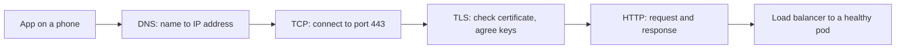
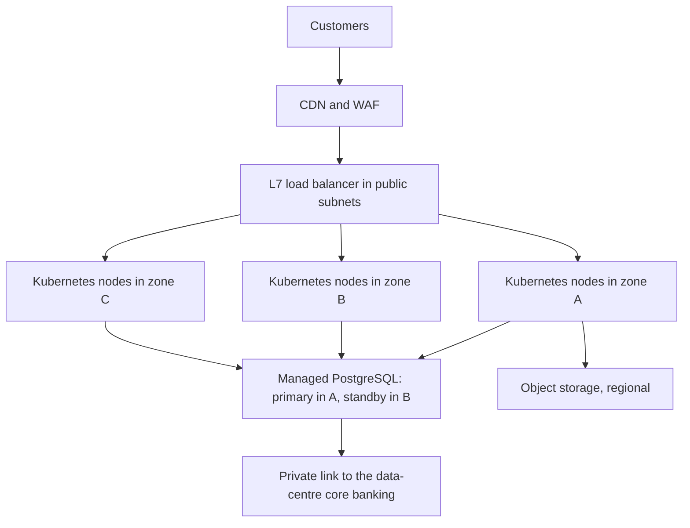
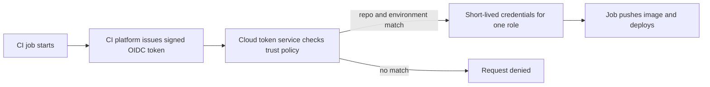

# Module 1 — Foundations

*Every cloud service, container platform and pipeline you will meet in this course runs on three older ideas: a Linux machine running processes, a network carrying packets between names and ports, and a decision about who is allowed to do what. When something breaks in production, the cause is usually in one of those three layers, however modern the stack looks on top. This module gives you the working knowledge that platform engineers lean on every day. It starts with the shell and the network path a request takes, from DNS to TLS to HTTP, and how to tell which hop failed. It then explains what a cloud provider actually sells: regions and zones, compute, storage, managed services, and the shared responsibility model that decides which failures are yours. It ends with identity and access, the control plane of the cloud, where one over-broad policy or one leaked key can undo everything else. You follow Yousef, a new graduate in Najm Bank's Platform Engineering & SRE team, as he chases a "the app is down" report that turns out to be an expired certificate, helps Salem decide where the Najm Mobile API should live in the cloud, and learns why the deploy key he pasted into a pipeline has to go.*

> **Phases:** Plan, Deploy, Operate — the machine, the network, the cloud and the identities that everything later in the course is built on.

---

# 1.1 — Linux, the shell and networking essentials: processes, files, ports, DNS, HTTP and TLS
*Level: 🟢 Beginner* · *Prerequisites: 0.1, 0.2* · *Phase: Operate, Monitor*

## ⚡ In 60 seconds
- Almost every server, container and cloud function is **Linux** underneath. You need a small set of shell skills: processes, logs, files and permissions, listening ports.
- A request to `api.najm.example` crosses a fixed chain of hops: **DNS** turns the name into an address, **TCP** opens a connection to a port, **TLS** proves the server's identity and encrypts the traffic, **HTTP** carries the request and the response.
- The most important rule: when "it's down", **walk the chain in order** and test each hop with its own tool (`dig`, `nc` or `curl`, `openssl`, then `curl -v`) instead of guessing.
- Decision cue: the **HTTP status class** tells you where to look. A 4xx means the request was refused; a 5xx means a server failed; a 502 or 504 from a load balancer means the problem is *behind* it.
- Biggest trap: restarting things before you know which hop failed. A restart destroys evidence and cannot fix DNS, a firewall or a certificate.

## 🧭 Why it matters
On Yousef's second Monday, the contact centre reports that the Najm retail app "won't load". Every pod is running and the application logs show no errors. Yousef restarts the deployment anyway; nothing changes. Maha, the SRE lead, types one command: `curl -v https://api.najm.example/health`. It stops in the TLS handshake with `certificate has expired`. The edge certificate was renewed by hand once a year, and the person who did it had moved teams. The application was healthy the whole time; customers simply could not reach it.

Restarting pods was a guess. Maha's `curl -v` tested one specific hop. That is the habit this lesson builds: know the hops a request crosses, know the tool that tests each one, and walk them in order.

Big public outages show the same structure. On 4 October 2021, Facebook, Instagram and WhatsApp were unreachable for roughly six hours. According to Meta's public engineering posts, a command issued during backbone maintenance disconnected its data centres, and its DNS servers then withdrew their routes from the internet. Facebook's names stopped resolving, and the internal tools engineers needed depended on the same network. The servers were fine; the path to them was gone.

## 📐 How it works

### 🟢 The essentials

**The shell.** The shell (usually `bash` or `zsh`) is a text interface to the operating system. You will use it on servers, inside containers, in CI jobs and on your laptop.

**Processes.** A **process** is a running program. Each has a **process ID (PID)**, an owner (a user) and a parent process. On a modern Linux server, the first process (PID 1) is usually **systemd**, which starts and supervises services. Inside a container, PID 1 is your application itself, which matters for the next point.

You talk to processes with **signals**. The two that matter most:
- **SIGTERM** (signal 15) asks a process to stop. A well-written service finishes its in-flight requests, closes database connections and exits.
- **SIGKILL** (signal 9) ends the process immediately. Nothing is cleaned up; requests in flight are lost.

Kubernetes sends SIGTERM when it stops a pod, waits for a grace period (30 seconds by default), then sends SIGKILL, so a service that ignores SIGTERM drops requests on every deploy (lesson 2.3).

**Files and permissions.** Each file has an owner, a group and three permission sets (owner, group, others), each with read (`r`), write (`w`) and execute (`x`). `ls -l` shows them:

```text
-rw-r----- 1 najm-api najm-api 1204 Oct  2 08:01 /etc/najm-api/config.yaml
```

The owner can read and write, the group can read, others nothing: `640` in numeric form. A private key should be `600` (owner only); world-readable `644` is wrong for anything secret.

**The everyday commands.** Learn these first:

```bash
ps aux | grep najm-api          # running processes, and their users
systemctl status najm-api       # is the service up, and since when
journalctl -u najm-api --since "10 min ago"   # recent logs
ss -tlnp                        # listening TCP ports and their processes
df -h ; free -h                 # disk and memory: full disks break many services
kill -TERM <pid>                # ask a process to stop cleanly
```

**Addresses and ports.** Every machine on a network has an **IP address**: IPv4 looks like `10.20.1.15`, IPv6 like `2001:db8::15`. A **port** is a number from 0 to 65535 that identifies one service on that machine: 443 for HTTPS, 22 for SSH, 5432 for PostgreSQL. An address plus a port identifies one service on one machine.

A service must **bind** to an address to receive traffic. `127.0.0.1` (loopback) means "only programs on this same machine may connect"; `0.0.0.0` means "every network interface". Inside a container, `127.0.0.1` is the container itself, so a service bound there is unreachable from outside: a classic "works locally, not in the container" bug.

**TCP and UDP.** **TCP** gives a reliable, ordered connection, opened by a handshake before data flows; HTTP/1.1, HTTP/2, databases and SSH use it. **UDP** sends packets with no connection or guarantee; most DNS queries use it, as does QUIC, the transport under HTTP/3.

**The path of one request.** When the Najm app calls `https://api.najm.example/v1/accounts`, this happens:



**DNS.** The **Domain Name System** turns names into addresses. The record types you will use most:

| Record | Maps | Example use |
|---|---|---|
| **A** | Name to an IPv4 address | `api.najm.example` to the load balancer's IPv4 address |
| **AAAA** | Name to an IPv6 address | The same, for IPv6 clients |
| **CNAME** | Name to another name | `api.najm.example` to the name a cloud load balancer or CDN gives you |
| **TXT** | Name to free text | Proving domain ownership to a certificate authority or email provider |

Every record has a **TTL** (time to live): how many seconds resolvers may cache the answer. With a TTL of 3600, a change can take an hour to reach everyone. Before a planned migration, lower the TTL at least one old TTL period in advance; raise it again afterwards.

**HTTP status classes.** The first digit of the status code tells you who to blame:

| Class | Meaning | Typical examples |
|---|---|---|
| 2xx | Success | 200 OK, 201 Created |
| 3xx | Go elsewhere | 301 or 308 permanent redirect |
| 4xx | The client's request was refused | 401 not authenticated, 403 not allowed, 404 not found, 429 too many requests |
| 5xx | The server side failed | 500 application error, 502 bad gateway, 503 unavailable, 504 gateway timeout |

A **502** or **504** returned by a load balancer or proxy usually means *the thing behind it* failed or did not answer in time. Look at the backend, not the load balancer.

**TLS.** **Transport Layer Security** encrypts traffic and proves the server's identity. The server presents a **certificate**: a signed statement that says "this public key belongs to `api.najm.example`, valid from this date to that date", issued by a **certificate authority (CA)** the client already trusts, often through one or more intermediate certificates (the **chain**). If the name, dates or chain fail the client's checks, the connection stops before any HTTP is sent, which is why Yousef saw nothing in the application logs. TLS 1.3 (RFC 8446) is current; TLS 1.2 is still common. Cryptographic detail belongs to [*Secure AI & Application Security*, lesson 5.1 — Cryptography for builders: TLS, hashing, encryption and keys](../secai/index.html#/5.1); here we care about operating it.

### 🟡 Going deeper

**Walking the chain.** When someone says "it's down", test each hop in order and stop at the first one that fails:

```bash
# 1. DNS: does the name resolve, and to what?
dig +short api.najm.example A
dig api.najm.example            # full answer, including the TTL

# 2. TCP: can we open a connection to the port?
nc -vz api.najm.example 443

# 3. TLS: what certificate is presented, for which name, valid until when?
openssl s_client -connect api.najm.example:443 -servername api.najm.example </dev/null 2>/dev/null \
  | openssl x509 -noout -subject -issuer -dates

# 4. HTTP: what does the server answer?
curl -sv https://api.najm.example/health -o /dev/null
```

`curl -v` alone often covers all four steps; learn to read its output line by line.

**Reading the result.**

| Symptom | Hop that failed | Usual causes |
|---|---|---|
| `NXDOMAIN` or no answer from `dig` | DNS | Record missing or deleted, wrong zone, expired domain registration |
| `Connection refused` | TCP | Nothing listening on that port, or service bound to `127.0.0.1` |
| Connection hangs, then times out | Network | Firewall or security group drops the packets, wrong route, wrong subnet |
| `certificate has expired` or name mismatch | TLS | Renewal failed, wrong certificate on the listener, missing SNI |
| 502 or 504 from the load balancer | Behind the load balancer | No healthy backends, backend timeout, failing health check |
| 401 or 403 | Application or gateway | Expired token, missing permission, WAF rule |

*Refused* means a machine answered and nothing is listening; the path works. A *timeout* usually means something silently dropped the packets, typically a firewall rule.

**SNI.** One load balancer often serves many names on one address; the client names the host it wants in the TLS handshake (**Server Name Indication**) so the right certificate is chosen. Hence `-servername` above: without it you may see a default certificate and draw the wrong conclusion.

**Layer 4 and layer 7 load balancers.** A **layer 4 (L4)** load balancer forwards TCP or UDP connections without reading the HTTP inside: fast and protocol-agnostic. A **layer 7 (L7)** load balancer understands HTTP: it terminates TLS, routes by host or path (`/v1/payments` to one service, `/v1/cards` to another) and returns its own error pages. The Najm Mobile API sits behind an L7 load balancer, so a 502 there means the backend misbehaved.

**Services with systemd.** On a VM, a systemd **unit file** defines how a service runs: the command, the user it runs as (never root unless it must), and whether to restart it on failure (`Restart=on-failure`). In containers, the runtime and Kubernetes take systemd's place, but the ideas carry over: a supervised process, a restart policy, a non-root user.

**Private addresses.** RFC 1918 reserves three IPv4 ranges for private networks: `10.0.0.0/8`, `172.16.0.0/12` and `192.168.0.0/16`. The `/16` is **CIDR** notation: the first 16 bits name the network, so `10.20.0.0/16` holds 65,536 addresses and `10.20.1.0/24` holds 256. Lesson 1.2 uses these to plan cloud networks.

### 🔴 Expert view

**Automate certificates, then alert anyway.** Manual yearly renewal is an outage on a timer. Use **ACME** (RFC 8555), the protocol behind Let's Encrypt, or your provider's certificate manager (in Kubernetes, a controller such as cert-manager). The CA/Browser Forum has agreed to shorten maximum public certificate lifetimes in steps over the coming years (check the current limit), which makes manual renewal unworkable. Still alert at, say, 14 days before expiry: automation fails quietly when DNS or permissions change.

**DNS is a dependency of everything.** Your monitoring, deploy tools and incident chat may depend on the same DNS and network you are fixing, as Facebook's 2021 outage showed. Keep an "out-of-band" list of how to reach consoles, runbooks and each other if your own names stop resolving.

**Probe from outside.** Dashboards inside the cluster show healthy pods, not whether customers can reach them. A **synthetic check** (a scheduled request from outside your network, ideally from several places) tests the whole chain from the customer's side, and would have caught Najm's expired certificate before the contact centre did. Lesson 5.2 builds this in.

**Test from where the client is.** Your laptop's resolver, proxy or VPN route may differ from the customer's.

## 🧰 The toolkit
| Tool, practice or service | What it is and does | When to reach for it |
|---|---|---|
| **curl** | Command-line HTTP client; `-v` shows DNS, connection, TLS and HTTP in one run | First test of any "it's down" report; health checks; scripts |
| **dig** | Queries DNS and shows records, TTLs and which server answered | Checking a record after a change; diagnosing resolution failures |
| **openssl s_client** | Opens a TLS connection and shows the presented certificate chain | Checking certificate names, issuers and expiry dates |
| **ss** | Lists sockets: listening ports and the processes that own them | "Connection refused"; checking what address a service is bound to |
| **ACME** (RFC 8555) | Protocol for automatic certificate issuance and renewal | Every public certificate; never renew by hand |
| **Synthetic check** | A scheduled request to your service from outside your network | Detecting DNS, TLS and edge failures that internal dashboards miss |

## 🏛️ In practice at Najm Bank
After the certificate incident, Maha asks Yousef to write the team's **first-response runbook** for "the Najm Mobile API is unreachable". It lives next to the alert, so whoever is on call follows the same steps.

**Runbook RB-001: Najm Mobile API unreachable — walk the chain**

| Step | Command (from outside the network first, then from a pod) | Healthy result | If it fails, check |
|---|---|---|---|
| 1. DNS | `dig +short api.najm.example` | The CDN or load balancer name | DNS change log; domain registration |
| 2. TCP | `nc -vz api.najm.example 443` | `succeeded` | Edge or WAF status; firewall changes |
| 3. TLS | `openssl s_client ... \| openssl x509 -noout -dates -subject` | Right name; expiry over 14 days away | Certificate manager; ACME renewal logs |
| 4. HTTP | `curl -sv https://api.najm.example/health` | `200` | 502 or 504: backend readiness; 403: WAF rules; 5xx: app logs |
| 5. Backend | `kubectl get pods -n mobile-api`, then logs | All ready | Recent deploys: roll back first, investigate second |

**Rules attached to the runbook:**
- Post the first failing hop and its exact output in the incident channel before changing anything; do not restart workloads until step 4 points at the backend.
- Follow-ups from this incident: ACME renewal for every certificate, an alert 14 days before expiry, and an external synthetic check on `/health` every minute from two locations.

## 🛠️ Exercises
All exercises run on your own machine with Docker and a terminal.

- 🟢 Run `curl -v https://example.com` and label each line of output as DNS, TCP, TLS or HTTP. Then use `dig` and `openssl s_client` to note the record's TTL and the certificate's issuer and expiry date. *Done when:* you can point to where each hop succeeded and say when the certificate expires.
- 🟡 Write a tiny HTTP server that listens on `127.0.0.1:8080`, run it with `docker run -p 8080:8080`, and try to reach it from your host. Diagnose with `ss -tlnp` inside the container, fix the bind address, and confirm. Then make it log "shutting down" on SIGTERM and check that `docker stop` shows the message. *Done when:* both behaviours are fixed and you can explain each failure in two sentences.
- 🔴 Write `walk-the-chain.sh <hostname>`: run the four tests in order, print PASS or FAIL per hop with the key detail (address, certificate expiry, HTTP status) and exit non-zero at the first failure. Test it on a working site, a non-existent name, a closed local port and an expired certificate (badssl.com hosts deliberately broken test sites). *Done when:* each failure stops at the right hop with a clear message.

## ⚠️ Mistakes and traps
- **Restarting before diagnosing.** Walk the chain first; restart only when the evidence points at the process.
- **Binding to localhost in a container.** The service is unreachable from outside. Bind to `0.0.0.0` (or the specific interface you mean) and let network policy decide who may connect.
- **Renewing certificates by hand.** Someone forgets and the site goes dark. Automate with ACME and alert before expiry.
- **Ignoring SIGTERM.** Every deploy drops requests. Stop taking new work, finish current requests, then exit.
- **Running services as root.** One bug becomes full control of the machine. Run as a dedicated user with only the files it needs.

## 🧾 Recap
- Linux and the shell are the floor of every platform: processes, signals, permissions, services, logs.
- A request crosses DNS, TCP, TLS and HTTP in order; each hop has its own test.
- "Refused" means nothing is listening; a timeout usually means something is dropping packets.
- HTTP status classes point to the guilty side; a 502 or 504 at a load balancer points behind it.
- Automate certificates, alert before expiry, and probe from outside.

## ✍️ Check yourself

**1. Customers report the Najm app will not load. All pods are running and application logs show no errors. What should Yousef do first?**

- A. Restart the deployment so any bad in-memory state is cleared
- B. Run `curl -v` on the health endpoint from outside and find the failing hop
- C. Scale the deployment up so more replicas share the load
- D. Roll back the most recent deploy to the last known-good version

<details><summary>Answer</summary>

**B.** Healthy pods with empty logs suggest requests never reach the application, so test the chain from the customer's side. A, C and D change things without evidence. (🟡 Going deeper.)

</details>

**2. A service runs fine on a developer's laptop. In a container, `curl` from the host fails at once (refused or reset), and `ss -tlnp` inside the container shows it listening on `127.0.0.1:8080`. What is wrong?**

- A. A firewall inside the container image blocks inbound traffic on port 8080
- B. The TLS certificate presented does not match the requested host name
- C. Docker's internal DNS cannot resolve the container's name
- D. The service listens on loopback, reachable only from inside the container

<details><summary>Answer</summary>

**D.** `127.0.0.1` inside a container is the container itself. Bind to `0.0.0.0`. A firewall (A) would usually cause a timeout, not an immediate failure, and the request never reaches TLS (B) or needs DNS (C). (🟢 The essentials.)

</details>

**3. The team will move `api.najm.example` to a new load balancer next Tuesday. The record's TTL is 86,400 seconds (one day). What should they do?**

- A. Lower the TTL to minutes a day or more ahead, switch, then raise it again
- B. Change the record on Tuesday; the TTL only affects clients that never asked before
- C. Delete the old record first, wait for caches to clear, then create the new one
- D. Raise the TTL beforehand so the new answer stays cached longer once it arrives

<details><summary>Answer</summary>

**A.** Caches keep the old answer for up to the TTL, so lowering it in advance makes the switch propagate quickly. B ignores caching; C causes resolution failures; D makes it worse. (🟢 The essentials.)

</details>

**4. The L7 load balancer in front of the Najm Mobile API returns 504 Gateway Timeout. Where should the investigation start?**

- A. The DNS records for the API
- B. The TLS certificate on the load balancer
- C. The backends behind the load balancer: their health, readiness and response times
- D. The customer's mobile network

<details><summary>Answer</summary>

**C.** For the load balancer to return a 504 at all, DNS (A), TLS (B) and the customer's network (D) must have worked; the backend did not answer in time. (🟢 The essentials.)

</details>

**5. Kubernetes stops a pod during a deploy. What happens, and what must the application do?**

- A. It sends SIGKILL immediately, so the application never gets a chance to clean up
- B. SIGTERM, then SIGKILL after a grace period; the app should drain in-flight work and exit
- C. It sends SIGHUP, and the application should reload its configuration and keep serving
- D. It deletes the container image, so the application must first save its state to local disk

<details><summary>Answer</summary>

**B.** SIGTERM is the polite request; SIGKILL follows after the grace period (30 seconds by default). Ignoring SIGTERM drops requests on every deploy. (🟢 The essentials.)

</details>

## 📚 References
- RFC 8446, The Transport Layer Security (TLS) Protocol Version 1.3 — https://www.rfc-editor.org/rfc/rfc8446
- RFC 9110, HTTP Semantics — https://www.rfc-editor.org/rfc/rfc9110
- RFC 1035, Domain Names: Implementation and Specification — https://www.rfc-editor.org/rfc/rfc1035
- RFC 1918, Address Allocation for Private Internets — https://www.rfc-editor.org/rfc/rfc1918
- RFC 8555, Automatic Certificate Management Environment (ACME) — https://www.rfc-editor.org/rfc/rfc8555
- Linux man pages (signal, ss, systemd.service) — https://man7.org/linux/man-pages/
- systemd documentation — https://systemd.io/
- Kubernetes, Pod lifecycle and termination — https://kubernetes.io/docs/concepts/workloads/pods/pod-lifecycle/
- Meta Engineering, "More details about the October 4 outage" — https://engineering.fb.com/2021/10/05/networking-traffic/outage-details/
- Going further: [*System Design for Vibe Coders*, lesson F.1 — What happens when you open a website](../vibe/index.en.html#lF-1) and [*System Design for Vibe Coders*, lesson 11.1 — Domains, DNS, and TLS](../vibe/index.en.html#l11-1)

---

# 1.2 — Cloud fundamentals: regions, zones, compute, storage, managed services and shared responsibility
*Level: 🟢 Beginner* · *Prerequisites: 1.1* · *Phase: Plan, Deploy*

## ⚡ In 60 seconds
- A cloud provider rents you computing on demand, through an API, billed by use. **AWS**, **Microsoft Azure** and **Google Cloud** sell similar building blocks under different names.
- The physical layout is the first design decision: a **region** is a geographic area; an **availability zone** is one or more separate data centres inside it. Spread production across **at least two zones**; consider a second region only for a clear recovery or residency reason.
- Choose the **most managed** service that meets your needs: you pay to hand over patching, backups and failover.
- Storage comes in three shapes: **object** (files by key over HTTP), **block** (a disk for one machine), **file** (a shared network folder). Pick by access pattern, not habit.
- The **shared responsibility model** says the provider secures the cloud and you secure what you put in it. Configuration, identity and data are always yours.
- Biggest trap: treating "it's in the cloud" as "it's resilient". A single-zone deployment with no tested backups fails exactly as a single server did.

## 🧭 Why it matters
Najm Bank has decided to move the Najm Mobile API out of its data centre. Salem asks Yousef to draft the placement note: which region, how many zones, which services, and what Najm still owns once the provider runs the hardware. Yousef's first draft lists "a Kubernetes cluster and a PostgreSQL VM" in one zone, because that is how it ran on-premises. Salem sends it back with three questions: "What happens when that zone has a bad day? Who patches that database? And which of the bank's regulators need to know where customer data sits?"

On 28 February 2017, Amazon S3 in the US-EAST-1 region (Northern Virginia) was disrupted for several hours. According to AWS's public summary, a command meant to remove a small number of servers was entered with a wrong input and removed a much larger set, including servers that core S3 subsystems depended on. Many services that kept their data in that one region broke with it. The lesson was not "avoid the cloud". It was: know which region and services you depend on, know what fails together, and design for it on purpose.

## 📐 How it works

### 🟢 The essentials

**What "cloud" means.** NIST's definition (SP 800-145, 2011) lists on-demand self-service, broad network access, resource pooling, rapid elasticity and measured service. In practice: you ask an API for a server, database or bucket, it exists in minutes, and you pay until you delete it. Because everything is an API call, lesson 3.1 manages it as code.

**Service models.** The models differ in how much of the stack you run:

| Model | You get | You still manage | Najm example |
|---|---|---|---|
| **IaaS** (infrastructure as a service) | Virtual machines, disks, networks | Operating system, patching, runtime, application, data | A VM for a legacy batch job |
| **PaaS** (platform as a service) | A managed runtime or service: database, Kubernetes control plane, app platform | Configuration, application, data, access | Managed PostgreSQL for the Najm Mobile API |
| **Serverless** | Code or containers run per request or event; no servers to see; billed per use | Code, configuration, permissions, data | A function that resizes uploaded cheque images |
| **SaaS** (software as a service) | A finished application | Users, configuration, data | The bank's email and ticketing tools |

**Regions and zones.** A **region** is a separate geographic area containing the provider's data centres. An **availability zone** (AZ; Google calls them simply "zones") is one or more data centres within a region, with its own power, cooling and networking, connected to the other zones by fast private links. Zones are designed so one can fail without the others. Not every region offers multiple zones, and not every service is available in every region; check each provider's current region list.

Region choice turns on **latency** to users, **data residency** (where regulators or contracts require data to stay), **service availability** and **cost**, which differs by region. All three major providers operate Gulf regions at the time of writing (2026); check which services each offers.

**Compute.** Three main shapes:
- **Virtual machines** (AWS EC2, Azure Virtual Machines, Google Compute Engine): you choose a size (CPU, memory), an image and a network; you manage the operating system.
- **Managed Kubernetes** (Amazon EKS, Azure AKS, Google GKE): the provider runs the Kubernetes control plane; you run containers on worker nodes, which may themselves be managed. Module 2 covers this.
- **Serverless functions and containers** (AWS Lambda, Azure Functions, Google Cloud Run): you hand over code or a container; the platform scales it, including to zero.

**Storage.** Pick by how the data is accessed:

| Type | What it is | Good for | Not for |
|---|---|---|---|
| **Object storage** (S3, Azure Blob Storage, Google Cloud Storage) | Files ("objects") in a bucket, addressed by key over an HTTP API | Documents, statements, backups, logs, data lakes | Databases; files edited in place |
| **Block storage** (EBS, Azure Managed Disks, Persistent Disk) | A virtual disk attached to a VM, usually in one zone | Databases you run yourself; boot disks | Sharing between machines |
| **File storage** (EFS, Azure Files, Filestore) | A shared network file system (NFS or SMB) many machines mount | Legacy apps that need a shared folder | High-performance databases |

Object storage is the default for anything that is a file: it scales without capacity planning and stores data redundantly. Always check its access settings rather than assuming it is private.

**Managed databases.** A managed database service (Amazon RDS, Azure Database for PostgreSQL, Google Cloud SQL, and others) runs the database engine for you: it installs patches, takes automated backups and can keep a **standby replica** in another zone that takes over automatically if the primary fails. You still choose the size, configuration, backup retention and who can connect.

**Shared responsibility.** The provider is responsible for the security *of* the cloud: buildings, hardware, the virtualisation layer, and the managed service software. You are responsible for security *in* the cloud: what you configure, who you give access to, and your data. The line moves with the service model:

| Layer | IaaS VM | Managed database or Kubernetes | Serverless | SaaS |
|---|---|---|---|---|
| Data, its classification and access | You | You | You | You |
| Identities and permissions | You | You | You | You |
| Application code | You | You | You | Provider |
| Network configuration (who can reach it) | You | You | Mostly you | Provider |
| Operating system and patching | You | Provider (control plane); shared for worker nodes | Provider | Provider |
| Hardware and data centres | Provider | Provider | Provider | Provider |

Look at the top two rows: data and identity stay with you whatever you buy. Many widely reported cloud breaches came from customer-side configuration, such as a storage bucket made public or a key that leaked, not from the provider's hardware. Security detail is in [*Secure AI & Application Security*, lesson 7.1 — Cloud security: shared responsibility, IAM and misconfiguration](../secai/index.html#/7.1).

### 🟡 Going deeper

**Cloud networking.** Each provider lets you create a private network: a **VPC** (virtual private cloud) on AWS and Google Cloud, a **virtual network (VNet)** on Azure. Inside it you create **subnets**, ranges of private addresses such as `10.20.1.0/24`:
- A **public subnet** has a route to the internet; resources there can have public addresses. Put only the things that must face the internet here, usually load balancers.
- A **private subnet** has no inbound route from the internet. Application servers, Kubernetes nodes and databases live here.
- A **NAT gateway** lets resources in private subnets make *outbound* connections (to download updates or call an external API) without being reachable from outside.
- **Security groups** (AWS), **network security groups** (Azure) and **firewall rules** (Google Cloud) decide which traffic may reach which resource, by address and port.

On AWS and Azure a VPC or VNet belongs to one region, while a Google Cloud VPC is global, with regional subnets.

**A first placement.** Here is the shape Salem wants for the Najm Mobile API:



Every tier spans zones, only the edge faces the internet, and the database fails over automatically.

**Hybrid connectivity.** Najm's core banking stays on-premises, so the cloud must reach the data centre privately: a **site-to-site VPN** over the internet (quick, encrypted, internet-limited) or a **dedicated private connection** (AWS Direct Connect, Azure ExpressRoute, Google Cloud Interconnect), slower to arrange but more predictable. Banks often use a dedicated link with a VPN as backup. Plan address ranges early: if the VPC's `10.20.0.0/16` overlaps a data-centre network, routing breaks.

**Provider equivalents.** The concepts transfer; the names do not:

| Concept | AWS | Microsoft Azure | Google Cloud |
|---|---|---|---|
| Virtual machine | EC2 | Virtual Machines | Compute Engine |
| Managed Kubernetes | EKS | AKS | GKE |
| Object storage | S3 | Blob Storage | Cloud Storage |
| Private network | VPC | Virtual Network | VPC |
| Managed PostgreSQL | RDS / Aurora | Azure Database for PostgreSQL | Cloud SQL / AlloyDB |
| Identity and access | IAM | Microsoft Entra ID and Azure RBAC | Cloud IAM |
| Private link to on-premises | Direct Connect | ExpressRoute | Cloud Interconnect |

**Managed versus self-run.** Najm's default is "use the managed service unless there is a written reason not to". Self-running PostgreSQL on VMs means your team owns patching, replication, failover, backups and restore tests. A managed service does most of that, at a price and with less control (not every extension or setting). Valid reasons to self-run: a missing feature, portability or specific performance needs; write the reason down.

### 🔴 Expert view

**Design for failure domains.** A **failure domain** is the set of things that fail together: a server, a zone, a region, a provider, an account. Multi-zone covers the common physical failures cheaply and is the production default. Multi-region adds much more complexity: data replicated across distance, failover decided and rehearsed. Choose it when a recovery target or regulator requires it, not as a reflex; lesson 6.1 turns this into RTO and RPO targets. And no zone design protects against a bad deploy, a bad configuration push or an expired certificate: most outages are changes, not hardware.

**Regulation shapes architecture.** GCC financial regulators, such as the Qatar Central Bank, set expectations on cloud outsourcing and on where customer data may be stored and processed; read the current rules with your compliance team. In the EU, the Digital Operational Resilience Act (DORA, Regulation (EU) 2022/2554, applying from January 2025) requires financial entities to manage ICT risk, report major incidents, test resilience and manage third-party ICT providers, including cloud, with exit plans. So your architecture notes must say how you would leave a provider.

**Well-architected reviews.** AWS, Azure and Google Cloud each publish a Well-Architected Framework, structuring reviews around reliability, security, cost, operations and performance. Use one as a checklist for any new production service.

**Cost is a design input.** Managed services, cross-zone traffic and data leaving the cloud (**egress**) all cost money, and prices vary by region and over time. Use the provider's calculator and current pricing pages, never memory, and set a budget alert first (lesson 6.2).

## 🧰 The toolkit
| Tool, practice or service | What it is and does | When to reach for it |
|---|---|---|
| **Availability zone** | An isolated data-centre location within a region | Spreading every production tier over at least two |
| **Managed database** | A database engine run by the provider, with backups, patching and optional cross-zone standby | The default for application databases |
| **Object storage** | Buckets of files addressed by key over HTTP, stored redundantly | Documents, backups, logs, static assets, data lakes |
| **VPC** | A private network with subnets, routes and firewall rules (VNet on Azure) | Every cloud deployment; plan address ranges first |
| **NAT gateway** | Outbound-only internet access for private subnets | Private workloads that must call out but never be called in |
| **Shared responsibility model** | The split of security duties between provider and customer by service model | Every architecture review and every outsourcing assessment |
| **Well-Architected Framework** (AWS, Azure, Google Cloud) | Structured review questions for reliability, security, cost and operations | Reviewing a new production design |
| **Budget alert** | A notification when spending passes a threshold | Before creating any resource in any account |

## 🏛️ In practice at Najm Bank
Yousef's second draft, after Salem's review, becomes the team's template for every migration.

**Placement note PN-01: Najm Mobile API**

| Section | Decision | Reason |
|---|---|---|
| Region | One Gulf region of the chosen provider, offering at least three zones and all required services | Latency to customers; data residency confirmed with Compliance |
| Zones | Three zones for Kubernetes nodes; database primary and standby in two different zones | Survive one zone failing without manual action |
| Compute | Managed Kubernetes; worker nodes in private subnets | Containers already standard; provider runs the control plane |
| Database | Managed PostgreSQL with a cross-zone standby, automated backups, encryption at rest | Removes patching and failover toil; backups restore-tested quarterly |
| Files | Object storage for statements and uploads; private; versioning on | Scales without capacity planning; versioning protects against overwrites |
| Edge | CDN and WAF, then an L7 load balancer in public subnets | Only the edge faces the internet |
| Hybrid | Dedicated private link to the data centre, VPN as backup; address plan agreed with Network team | Core banking stays on-premises |
| Second region | Not now; backups copied to a second region; revisit with lesson 6.1's DR targets | Complexity not yet justified |
| Exit | Containers, PostgreSQL and IaC keep migration feasible; exit plan reviewed yearly | EU DORA third-party risk expectations |

**Shared responsibility for this service**

| Najm owns | The provider owns |
|---|---|
| Data classification, key policy, backup retention and restore tests | Physical security, hardware, hypervisor |
| IAM roles and access (lesson 1.3); network, WAF and exposure rules | Kubernetes control plane and database engine patching and failover |
| Worker node images (unless fully managed), code, images, configuration | Object storage durability; region and zone infrastructure |

## 🛠️ Exercises
If you use a cloud account, use your own free-tier account and **set a budget alert before creating anything**. Delete everything when you finish.

- 🟢 From each major provider's current region list, note the Gulf regions, how many zones each has, and whether managed Kubernetes and managed PostgreSQL are offered there. *Done when:* you have a small table with the date you checked.
- 🟡 Draw a VPC for a two-tier app: address range, public and private subnets in two zones, a NAT gateway, a load balancer, and firewall rules between tiers (source and port). Avoid `10.0.0.0/16`, which an imaginary data centre already uses. *Done when:* every arrow has a port and every subnet has a range and a zone.
- 🔴 Write a placement note in the PN-01 format for a service of your choice (for example a fictional Najm card-dispute portal), with the shared responsibility table, the reason for each managed-versus-self-run choice, and what would trigger a second region. *Done when:* a classmate can answer "what happens when one zone fails?" and "who patches the database?" from your note alone.

## ⚠️ Mistakes and traps
- **Lifting the data centre layout as is.** One VM per role in one zone brings the data centre's fragility. Spread across zones; use managed services.
- **"The provider handles security."** Only its part. Identity, configuration, network exposure and data are yours on every service model.
- **Overlapping address ranges.** Choose cloud address ranges with the network team before building, or hybrid routing will fail later.
- **Multi-region by reflex.** Start multi-zone; add a region when recovery targets or regulation require it.

## 🧾 Recap
- The cloud is computing on demand through an API; the big three sell similar blocks under different names.
- Regions are geographic; zones are isolated locations within a region. Production spans at least two zones.
- Prefer managed services; choose object, block or file storage by access pattern.
- Private subnets for workloads, public subnets only for the edge, NAT for outbound traffic, and an address plan agreed early.
- Under shared responsibility, data, identity and configuration are always yours.

## ✍️ Check yourself

**1. Yousef's first draft puts all Kubernetes nodes and the database in one availability zone. What is the main risk?**

- A. The provider charges a premium for keeping every resource in one zone
- B. Customers far from the region will see higher latency on every request
- C. One zone failure takes down the whole service, with nothing to fail over to
- D. Managed Kubernetes refuses to create a cluster whose nodes share one zone

<details><summary>Answer</summary>

**C.** Zones exist so one can fail without the others; using one zone throws that away. Latency (B) depends on region, not the number of zones; D is false. (🟢 The essentials.)

</details>

**2. Najm needs to store monthly PDF statements for millions of customers, written once and downloaded occasionally. Which storage fits best?**

- A. Object storage, private, with versioning enabled
- B. Block storage volumes attached to a single large VM
- C. A shared network file system mounted by every pod
- D. Binary rows in the PostgreSQL application database

<details><summary>Answer</summary>

**A.** Write-once files fetched over HTTP are what object storage is for. Block storage (B) ties them to one machine; a file share (C) adds cost; files in the database (D) bloat it. (🟢 The essentials.)

</details>

**3. Under the shared responsibility model, which of these does Najm remain responsible for even when it uses a managed PostgreSQL service?**

- A. Patching the database engine when security fixes are released
- B. Replacing failed disks in the provider's data centre
- C. Running and updating the hypervisor underneath it securely
- D. Deciding who and which networks may connect to the database

<details><summary>Answer</summary>

**D.** Access and configuration stay with the customer on every model. A is the provider's job on a managed service; B and C always are. (🟢 The essentials.)

</details>

**4. Application pods in private subnets must call an external fraud-scoring API, but must never accept connections from the internet. What gives them this?**

- A. Moving the pods to a public subnet
- B. A NAT gateway for outbound traffic
- C. A CDN in front of the pods
- D. Giving each pod a public IP address

<details><summary>Answer</summary>

**B.** NAT allows outbound connections without making the pods reachable. A and D expose them; a CDN (C) handles inbound traffic, not outbound calls. (🟡 Going deeper.)

</details>

**5. A product manager asks for the Najm Mobile API to run in two regions "to be safe". What is the best first response?**

- A. Agree; two regions are always safer than one, whatever the cost
- B. Refuse; a bank never needs more than one region if it uses three zones
- C. Ask which failure and recovery target it must meet, then design to that
- D. Suggest moving to a provider whose single region is more reliable

<details><summary>Answer</summary>

**C.** Multi-region adds major complexity and cost, so it should answer a stated recovery or regulatory need; until then, multi-zone with cross-region backup copies is the default. A is a reflex; B ignores real requirements; D misses the question. (🔴 Expert view.)

</details>

## 📚 References
- NIST SP 800-145, The NIST Definition of Cloud Computing — https://csrc.nist.gov/pubs/sp/800/145/final
- AWS, Shared Responsibility Model — https://aws.amazon.com/compliance/shared-responsibility-model/
- Microsoft, Shared responsibility in the cloud — https://learn.microsoft.com/azure/security/fundamentals/shared-responsibility
- Google Cloud documentation — https://cloud.google.com/docs
- AWS documentation — https://docs.aws.amazon.com/
- Microsoft Azure documentation — https://learn.microsoft.com/azure/
- AWS, Summary of the Amazon S3 Service Disruption in the Northern Virginia (US-EAST-1) Region — https://aws.amazon.com/message/41926/
- AWS Well-Architected — https://aws.amazon.com/architecture/well-architected/
- Regulation (EU) 2022/2554 (Digital Operational Resilience Act) — https://eur-lex.europa.eu/eli/reg/2022/2554/oj
- Going further: [*SaaS Building Blocks*, lesson 2.2 — File uploads and object storage](../saas/index.html#/2.2) and [*System Design for Vibe Coders*, lesson 10.1 — Stateless services and load balancing](../vibe/index.en.html#l10-1)

---

# 1.3 — Identity and access in the cloud: users, roles, policies and workload identity
*Level: 🟢 Beginner* · *Prerequisites: 1.2* · *Phase: Plan, Deploy*

## ⚡ In 60 seconds
- In the cloud, every action is an API call, and every API call is checked against **identity and access management (IAM)**: *who* is calling (the **principal**), *what* they want to do (the **action**), on *which* **resource**, under which **conditions**.
- People should sign in through the company's identity provider with **single sign-on and MFA**, and get access through **roles**, never through personal long-lived keys.
- Software should get **workload identity**: the platform gives a VM, pod or CI job short-lived credentials automatically. A pipeline should use **OIDC federation**, not a stored access key.
- The rule that matters most: **least privilege**. Grant the smallest set of actions, on the narrowest resources, for the shortest time, and start from nothing.
- Decision cue: before you create any credential, ask "can the platform issue this identity instead?"
- Biggest trap: a long-lived key with broad rights, copied into a repository, a pipeline secret or a laptop. It works forever, for anyone who finds it.

## 🧭 Why it matters
Yousef needs the Najm Mobile API's CI pipeline to push images and update the cluster. The quickest route he finds: create a cloud user called `ci-deployer`, attach the provider's built-in administrator policy "just to get it working", generate an access key and paste it into the pipeline's secret settings. It works on the first try. Two weeks later, Noura's team runs its regular secret scan and finds the same key in a debug log that a pipeline step printed and someone attached to a public issue. The key never expires, it can do anything in the production account, and until the audit logs are checked, nobody knows who else has used it.

Salem walks Yousef through the clean-up: revoke the key, review the audit trail for every call made with it, and rebuild the pipeline with no stored key at all. "In the cloud," Salem says, "identity is your perimeter. A firewall does not help when the attacker holds a valid key to the API." This lesson builds identities that are narrow, short-lived and issued by the platform, so a leak is impossible or harmless.

## 📐 How it works

### 🟢 The essentials

**Authentication and authorisation.** **Authentication** proves who you are (a password plus MFA, a certificate, a signed token). **Authorisation** decides what you may do once you are known. Cloud IAM does both for every API call: the console, the command line, Terraform and your application all call the same APIs.

**Principals.** A principal is anything that can make a call:
- **Human users**, ideally federated from the company's identity provider (for example Microsoft Entra ID, Okta or Google Workspace) through single sign-on.
- **Groups**, collections of users, so you grant access once to "payments-engineers" rather than to 20 individuals.
- **Workload identities**, for software: AWS **IAM roles**, Azure **managed identities** and service principals, Google Cloud **service accounts**.

**Roles and policies.** Permissions are written down in **policies**. A policy lists actions (such as "read objects"), the resources they apply to (such as "this bucket") and an effect (allow or deny), sometimes with conditions (such as "only from this network" or "only if MFA was used"). You attach policies to identities, or bind identities to roles on a resource. Names differ by provider:

| Concept | AWS | Microsoft Azure | Google Cloud |
|---|---|---|---|
| Identity for people | IAM Identity Center users and groups, federated | Microsoft Entra ID users and groups | Google accounts or federated identities, groups |
| Identity for software | IAM role | Managed identity, service principal | Service account |
| How access is granted | Policies attached to identities or resources | Role assignment: principal + role + scope | Allow policy binding: principal + role on a resource |
| Default | Deny unless allowed; an explicit deny always wins | No access without an assignment | No access without a binding |

The model is the same everywhere: **nothing is allowed until something allows it**.

**Least privilege, in practice.** Compare two policies for the Najm statements service, which only needs to read statement files from one bucket:

Risky: any action on any resource, in the whole account.

```json
{
  "Version": "2012-10-17",
  "Statement": [{ "Effect": "Allow", "Action": "*", "Resource": "*" }]
}
```

Hardened: read objects from one bucket prefix, nothing else.

```json
{
  "Version": "2012-10-17",
  "Statement": [{
    "Effect": "Allow",
    "Action": "s3:GetObject",
    "Resource": "arn:aws:s3:::najm-statements-prod/statements/*"
  }]
}
```

The same idea on the other two providers:

```bash
# Azure: give a managed identity read access to blobs in one storage account only
az role assignment create \
  --assignee <managed-identity-principal-id> \
  --role "Storage Blob Data Reader" \
  --scope /subscriptions/<sub-id>/resourceGroups/rg-statements/providers/Microsoft.Storage/storageAccounts/najmstatementsprod

# Google Cloud: let one service account read objects in one bucket only
gcloud storage buckets add-iam-policy-binding gs://najm-statements-prod \
  --member="serviceAccount:statements@<project-id>.iam.gserviceaccount.com" \
  --role="roles/storage.objectViewer"
```

Each grant names one identity, one narrow role and one resource.

**People: SSO, MFA and roles.** Engineers get no separate cloud passwords or personal keys. They sign in through the company identity provider with MFA and assume a role for the task: read-only by default, deploy rights in non-production, production writes only through the pipeline or an approved, logged, time-limited elevation. When someone leaves, disabling one account removes their cloud access everywhere.

**Software: no stored keys.** A workload running on the cloud can get credentials from the platform itself:
- A VM gets an **instance role** (AWS), a **managed identity** (Azure) or an **attached service account** (Google Cloud). The application's SDK fetches short-lived credentials from a local metadata endpoint and refreshes them automatically.
- A Kubernetes pod gets its own identity, mapped from its Kubernetes **service account** to a cloud identity (details below).
- A CI job outside the cloud uses **OIDC federation** to exchange a signed token for short-lived cloud credentials.

In every case there is no secret to copy, rotate or leak. The cloud SDKs pick these credentials up by default, so application code does not change.

### 🟡 Going deeper

**How OIDC federation for CI works.** OpenID Connect (OIDC) is an identity layer on top of OAuth 2.0. A CI platform such as GitHub Actions can issue each job a signed **ID token** describing the job: which repository, which branch or environment, which workflow. The cloud provider is configured to trust that issuer and to exchange matching tokens for short-lived credentials of one specific role.



On AWS, the role's **trust policy** says which tokens may assume it. Note the condition: only the `production` environment of one repository qualifies.

```json
{
  "Version": "2012-10-17",
  "Statement": [{
    "Effect": "Allow",
    "Principal": { "Federated": "arn:aws:iam::111122223333:oidc-provider/token.actions.githubusercontent.com" },
    "Action": "sts:AssumeRoleWithWebIdentity",
    "Condition": {
      "StringEquals": {
        "token.actions.githubusercontent.com:aud": "sts.amazonaws.com",
        "token.actions.githubusercontent.com:sub": "repo:najm-bank/mobile-api:environment:production"
      }
    }
  }]
}
```

The workflow asks for a token and assumes the role; no secret is stored anywhere:

```yaml
permissions:
  id-token: write      # allow this job to request an OIDC token
  contents: read
jobs:
  deploy:
    runs-on: ubuntu-latest
    environment: production
    steps:
      # Check the action's current major version; pin to a full commit SHA in production (lesson 4.3)
      - uses: aws-actions/configure-aws-credentials@v4
        with:
          role-to-assume: arn:aws:iam::111122223333:role/najm-mobile-api-deploy
          aws-region: <region>
```

Azure (workload identity federation on an app registration or user-assigned managed identity) and Google Cloud (Workload Identity Federation) support the same pattern. The most common mistake is a trust condition that is too loose, such as any repository in the organisation or any branch: then unreviewed code can deploy to production.

**Workload identity in Kubernetes.** Pods should not share the node's identity, or every pod on the node gets every permission any pod needs. Each managed Kubernetes service maps a Kubernetes service account to a cloud identity: on Amazon EKS, IAM Roles for Service Accounts (IRSA) or EKS Pod Identity; on AKS, Microsoft Entra Workload ID; on GKE, Workload Identity Federation for GKE. With IRSA, for example, the mapping is an annotation:

```yaml
apiVersion: v1
kind: ServiceAccount
metadata:
  name: statements-reader
  namespace: mobile-api
  annotations:
    eks.amazonaws.com/role-arn: arn:aws:iam::111122223333:role/najm-statements-reader
```

A pod that runs with `serviceAccountName: statements-reader` gets credentials for that role only. Other pods in the cluster do not.

**How policies combine.** On AWS, a request is denied by default; it is allowed only if some policy allows it and no policy explicitly denies it. Organisation-wide guardrails (**service control policies** in AWS Organizations) and **permissions boundaries** can cap what any identity in an account may do, even if a policy grants more. Azure RBAC is additive across role assignments at the management group, subscription, resource group and resource scopes, with inheritance downwards. Google Cloud allow policies are inherited down the organisation, folder, project and resource hierarchy, and Google Cloud also offers deny policies. For all three: **grant at the narrowest scope that works**; a grant high in the hierarchy flows down to everything beneath it.

**Audit trails.** Every provider records API calls: AWS CloudTrail, Azure Activity Log (plus Microsoft Entra sign-in logs), Google Cloud Audit Logs. They answer "who did what, when, from where". Make sure they are switched on for all accounts, sent to a central place that the people being audited cannot change, and kept for as long as policy requires. That is how Noura's team could reconstruct what Yousef's leaked key had done.

### 🔴 Expert view

**Account and project structure is an access decision.** Separate production from non-production at the provider's strongest boundary: AWS accounts, Azure subscriptions or Google Cloud projects. A development mistake then cannot touch production data, and production guardrails can be stricter.

**Find and remove unused access.** Permissions accumulate. Tools such as AWS IAM Access Analyzer, Microsoft Entra access reviews and Google Cloud's IAM recommender show unused permissions and externally shared resources. Review access regularly, and when someone moves teams ("joiner, mover, leaver"), remove old access the same day.

**Protect the metadata endpoint.** Workload credentials come from a metadata endpoint reachable from inside the machine. An application bug that lets an attacker make the server fetch an arbitrary URL (server-side request forgery, SSRF) can expose those credentials. Require the hardened version of the endpoint where offered (IMDSv2 on AWS, which requires a session token), keep workload roles narrow, and block pod access to the node's metadata endpoint where pods have their own identities. See [*Secure AI & Application Security*, lesson 2.3 — Server-side traps: SSRF, file uploads, path traversal and deserialisation](../secai/index.html#/2.3).

**Break-glass access.** If the identity provider is down during an incident, engineers still need a way in: a few emergency accounts with strong MFA, guarded credentials, and every use alerting security and reviewed. Test them like a backup.

**Where secrets remain.** Some things still need secrets: a third-party API key, a database password for a system without identity-based login. Keep them in a secrets manager, fetch them at runtime with workload identity, rotate them, and never print them in logs. The full treatment is in [*Secure AI & Application Security*, lesson 5.2 — Secrets management: keys, tokens and where they leak](../secai/index.html#/5.2); lesson 4.3 of this course applies it to pipelines.

## 🧰 The toolkit
| Tool, practice or service | What it is and does | When to reach for it |
|---|---|---|
| **Least privilege** | Grant only the actions and resources needed, at the narrowest scope, for the shortest time | Every grant, every review |
| **Single sign-on with MFA** | People sign in through the company identity provider, with a second factor | All human access to consoles and command-line tools |
| **Workload identity** | The platform issues short-lived credentials to a VM, pod or function automatically | Any software that calls cloud APIs |
| **OIDC federation for CI** | CI jobs exchange a signed job token for short-lived cloud credentials | Every pipeline that deploys to the cloud; replaces stored keys |
| **Audit logs** (CloudTrail, Azure Activity Log, Cloud Audit Logs) | A record of every API call: who, what, when, from where | Investigations, access reviews, regulatory evidence |
| **Access analyser** (IAM Access Analyzer, Entra access reviews, IAM recommender) | Finds unused permissions and resources shared outside the organisation | Quarterly access reviews; before granting more |
| **Break-glass account** | Emergency access for when normal sign-in fails, tightly guarded and alerting on use | Incident readiness; tested on a schedule |

## 🏛️ In practice at Najm Bank
After the leaked key, Salem and Noura agree the **Najm Cloud Access Standard v1**. Yousef writes the access model for the Najm Mobile API as its first worked example.

**Part A: rules**
1. No long-lived cloud access keys for people or pipelines. Exceptions need Noura's written approval and an expiry date.
2. People sign in through Najm's identity provider with MFA and assume task roles; production write access for people is time-limited, approved and logged.
3. Every workload has its own identity; no sharing between services; no node-level roles for application pods.
4. Production and non-production live in separate accounts or subscriptions or projects.
5. Audit logs are on everywhere, shipped to a central store the platform team cannot alter, and retained per bank policy.
6. Access is reviewed quarterly; unused permissions older than 90 days are removed.

**Part B: access model for the Najm Mobile API**

| Identity | Type | Can do | Where | How it gets credentials |
|---|---|---|---|---|
| `mobile-api-ci-build` | CI role | Push images to the registry repository for this service | Shared registry | OIDC, only the protected `main` branch of `mobile-api` |
| `mobile-api-deploy-prod` | CI role | Update this service's resources in the production cluster | Production | OIDC, only the `production` environment of `mobile-api`, which requires approval |
| `statements-reader` | Workload | Read objects under `statements/` in the production statements bucket | Production | Kubernetes service account mapped to a cloud role |
| `mobile-api-db-app` | Workload | Connect to the application database as the application user | Production | Workload identity to fetch a short-lived token or a rotated secret |
| `platform-engineer` | People | Read-only on production; full rights in development | All | SSO and MFA |
| `platform-oncall-elevated` | People | Production changes for four hours | Production | SSO and MFA, approved by the on-call lead, logged |
| `breakglass-01`, `breakglass-02` | Emergency | Administrator | All | Hardware MFA, credentials held by the CISO's office, every use alerts Jassim's SOC |

## 🛠️ Exercises
Use your own free-tier account with a **budget alert set first**, or the providers' documentation and policy simulators. Never practise on an employer's account without permission.

- 🟢 Take the risky `"Action": "*"` policy above and write the least-privilege version for a service that must read and write objects under one prefix of one bucket and nothing else. Then write the Azure or Google Cloud equivalent as a role assignment or binding. *Done when:* each grant names one identity, specific actions or a narrow built-in role, and a single resource scope.
- 🟡 In a personal GitHub repository, build a workflow that uses OIDC to obtain short-lived credentials from your free-tier cloud account and runs one read-only command (such as listing one bucket). Restrict the trust condition to one branch or environment. Then push a branch that is not allowed and confirm it is denied. *Done when:* no secret is stored in the repository settings, the allowed job succeeds and the other branch fails at the credential step.
- 🔴 Write the access model for a fictional Najm service of your choice in the Part B format, covering build, deploy, runtime and human access, plus break-glass. For each row, say what an attacker could do if that identity's credentials leaked. *Done when:* no row says "everything", and every row's blast radius is one service and one environment.

## ⚠️ Mistakes and traps
- **Administrator "just to get it working".** It always stays. Start from nothing and add the permissions the error messages and logs show you need.
- **Long-lived keys in pipelines.** They leak through logs, forks and laptops, and never expire. Use OIDC federation.
- **Loose trust conditions.** Trusting every repository or branch lets any pull request deploy to production. Match the exact repository and environment.
- **Pods using the node's identity.** Every pod gets every permission. Give each workload its own identity.
- **Granting high in the hierarchy.** A role at the organisation or subscription level flows to everything below. Grant at the narrowest scope.
- **Audit logs off, or editable by the people being audited.** You cannot investigate what you did not record. Centralise and protect them.

## 🧾 Recap
- IAM checks every API call: principal, action, resource, conditions; everything is denied until allowed.
- People use SSO, MFA and task roles; software uses workload identity; pipelines use OIDC federation.
- Least privilege means narrow actions, narrow resources, narrow scope and short lifetimes.
- Separate production by account, subscription or project, and keep audit logs where no one can edit them.
- Review and remove unused access, protect metadata endpoints, and keep tested break-glass accounts.

## ✍️ Check yourself

**1. Yousef's pipeline uses a stored access key with administrator rights. What should replace it?**

- A. The same administrator key, rotated every 90 days by a scheduled job
- B. A personal access key from Salem's account, since it has MFA enabled
- C. A key with fewer rights, kept in an encrypted pipeline secret
- D. OIDC federation issuing short-lived credentials for a narrow deploy role

<details><summary>Answer</summary>

**D.** Federation removes the stored secret entirely and limits what the job can do. A and C keep a long-lived secret that can leak; B ties a pipeline to a person and still stores a key. (🟡 Going deeper.)

</details>

**2. A role's OIDC trust condition allows any repository in the `najm-bank` organisation to assume the production deploy role. What is the risk?**

- A. None, because every repository in the organisation belongs to the bank
- B. Any repository's workflow, even on an unreviewed branch, can get deploy credentials
- C. The issued tokens will expire before long deployments can finish
- D. Production deploys slow down because every repository queues for the role

<details><summary>Answer</summary>

**B.** The trust policy is the gate; a loose condition lets any matching job through. Match the exact repository and the protected environment. (🟡 Going deeper.)

</details>

**3. Several pods on the same Kubernetes node need different cloud permissions. What is the right design?**

- A. Give the node one role holding every permission any of its pods needs
- B. Store a different access key in each pod's environment variables
- C. Map each pod's service account to its own narrow cloud identity
- D. Run each pod on its own dedicated VM with its own instance role

<details><summary>Answer</summary>

**C.** Workload identity gives each pod only its own permissions, with no stored keys. A gives every pod every permission; B reintroduces long-lived secrets; D is expensive and unnecessary. (🟡 Going deeper.)

</details>

**4. An engineer is granted a powerful role at the top of the Azure management group hierarchy so they can fix one storage account. Why is this a problem?**

- A. Grants inherit downwards to every subscription and resource below
- B. Azure ignores role assignments made at management group level
- C. Role assignments at that scope cannot be removed once created
- D. It only matters if the engineer's account has no MFA enabled

<details><summary>Answer</summary>

**A.** Scope is part of least privilege; grant at the storage account or its resource group. B and C are false; D confuses authentication with authorisation. (🟡 Going deeper.)

</details>

**5. During a major incident, Najm's identity provider is unavailable and engineers cannot sign in to the cloud console. What should already be in place?**

- A. A shared administrator password, recorded in the team wiki for emergencies
- B. Long-lived administrator access keys stored on every engineer's laptop
- C. A documented procedure for switching MFA off for everyone during incidents
- D. A few tested break-glass accounts with strong MFA and alerts on every use

<details><summary>Answer</summary>

**D.** Break-glass access is planned, protected, monitored and tested. A, B and C create permanent weaknesses for a rare event. (🔴 Expert view.)

</details>

## 📚 References
- AWS Identity and Access Management User Guide — https://docs.aws.amazon.com/IAM/latest/UserGuide/
- Azure role-based access control overview — https://learn.microsoft.com/azure/role-based-access-control/overview
- Google Cloud IAM overview — https://cloud.google.com/iam/docs/overview
- GitHub Actions documentation, security hardening with OpenID Connect — https://docs.github.com/en/actions
- Kubernetes, Service Accounts — https://kubernetes.io/docs/concepts/security/service-accounts/
- OpenID Connect specifications — https://openid.net/developers/specs/
- Going further: [*Secure AI & Application Security*, lesson 7.1 — Cloud security: shared responsibility, IAM and misconfiguration](../secai/index.html#/7.1), [*Secure AI & Application Security*, lesson 3.2 — OAuth 2.0, OpenID Connect and token pitfalls](../secai/index.html#/3.2) and [*SaaS Building Blocks*, lesson 1.4 — Enterprise identity: SSO, SAML, OIDC and SCIM](../saas/index.html#/1.4)
