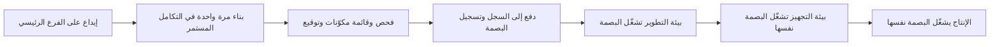
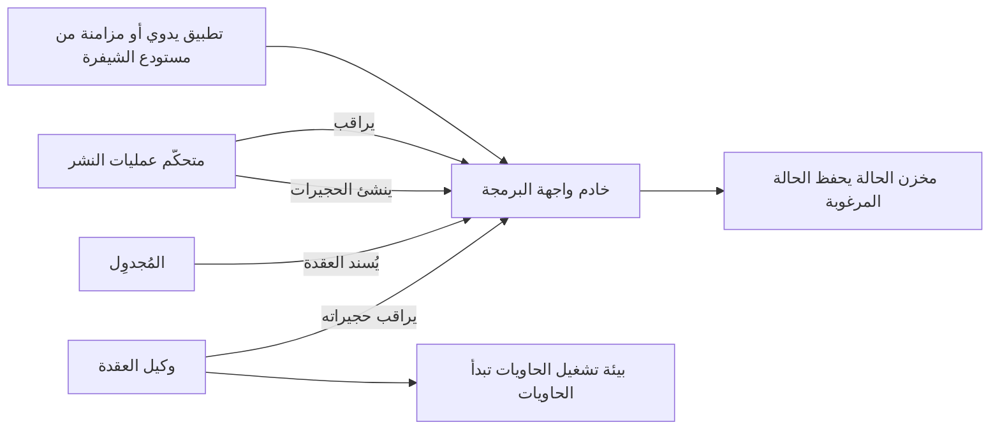
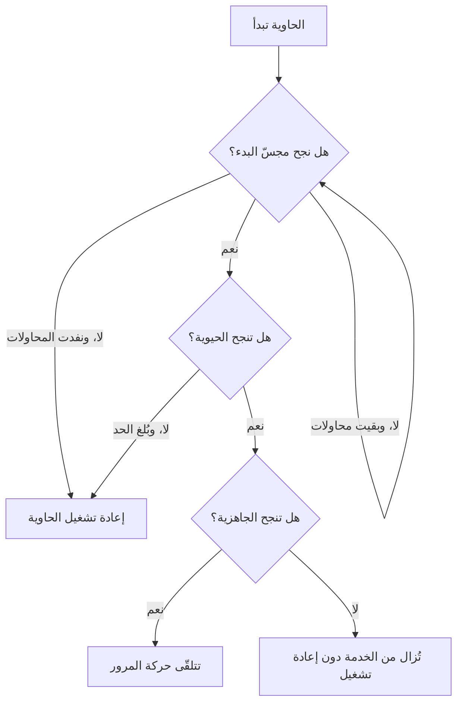

# الوحدة 2 — الحاويات (Containers) و Kubernetes

*كل خدمة تقريبًا ينقلها بنك نجم (Najm Bank) خارج مركز بياناته (data centre) تغادره على هيئة حاوية (container) وتستقر على Kubernetes. تعلّمك هذه الوحدة كليهما بما يكفي لتشغيلهما في بيئة الإنتاج (production). تبدأ بصورة الحاوية (container image): ما الصورة (image) حقًّا، وكيف تعمل الطبقات (layers) والتخزين المؤقت (caching)، وكيف تكتب ملف Dockerfile صغيرًا وسريع البناء (fast to build) وآمنًا افتراضيًا (safe by default)، ولماذا تكون بصمة السجل (registry digest)، لا الوسم (tag)، هي الشيء الذي تنشره (deploy). ثم تفتح باب Kubernetes: الكائنات (objects) التي ستستخدمها يوميًا (الحجيرات (pods)، وعمليات النشر (deployments)، والخدمات (services)، ومساحات الأسماء (namespaces))، وحلقات التحكم (control loops) التي تُبقي الواقع مطابقًا لما أعلنته (declared)، وكيف تشخّص (debug) حجيرة لا تقلع. وتنتهي بما يفصل العرض التجريبي (demo) عن حِمل العمل الإنتاجي (production workload): الإعدادات (configuration) والأسرار (secrets)، ومجسّات الصحة (health probes)، وطلبات الموارد وحدودها (resource requests and limits)، والتوسّع التلقائي (autoscaling)، والإيقاف الرشيق (graceful shutdown)، والتحزيم (packaging) باستخدام Helm. ستتابع يوسف (Yousef) وأول ملف Dockerfile يكتبه لـ واجهة برمجة تطبيق نجم للهاتف (Najm Mobile API) يشحن الشيفرة الخاطئة إلى بيئة التجهيز (staging)، وهو يتعلّم لماذا يظل العنقود (cluster) "يتراجع عن" إصلاحاته، وبينما تشرح له مها (Maha) انقطاعًا في خدمة المدفوعات (Payments outage) سببه فحص صحة (health check) واحد سيئ الاختيار.*

> **المراحل (Phases):** Build, Deploy, Operate — تحزيم البرمجيات في صور (images) يمكنك الوثوق بها، وتشغيلها على عنقود (cluster) يعالج نفسه (heals itself)، وضبط إعداداتها بحيث يساعد هذا التعافي ولا يضرّ.

---

# 2.1 — الحاويات على الوجه الصحيح: الصور والطبقات وملفات Dockerfile والسجلات
*المستوى (Level): 🟡 متوسط (Intermediate)* · *المتطلبات (Prerequisites): 1.1، 1.2* · *المرحلة (Phase): Build, Deploy*

## ⚡ الدرس في دقيقة (In 60 seconds)
- **الحاوية (container)** عملية (process) عادية في Linux تعزلها النواة (kernel) (فلها رؤيتها الخاصة للملفات والعمليات والشبكة) وتقيّدها (في المعالج CPU والذاكرة memory). أما **صورة الحاوية (container image)** فهي الحزمة المخصّصة للقراءة فقط (read-only package) من الملفات والإعدادات التي تبدأ منها العملية.
- الصورة كومة من **الطبقات (layers)**، كل منها ناتج خطوة بناء (build step) واحدة. رتّب ملف Dockerfile بحيث تأتي الأشياء نادرة التغيّر أولًا؛ عندئذ تعيد ذاكرة البناء المؤقتة (build cache) استخدامها، فيستغرق البناء ثوانيَ لا دقائق.
- صور الإنتاج (production images) **صغيرة، ولا تعمل بصلاحيات الجذر، وخالية من الأسرار (small, non-root and secret-free)**: استخدم **البناء متعدد المراحل (multi-stage build)** لتترك المترجمات (compilers) وأدوات البناء (build tools) خلفك، واضبط `USER`، ولا تنسخ بيانات الاعتماد (credentials) إلى أي طبقة أبدًا.
- **الوسوم تتحرّك؛ أما البصمات فلا (Tags move; digests do not).** يمكن الكتابة فوق `mobile-api:1.4.2`؛ أما `mobile-api@sha256:…` فيعني دائمًا البايتات نفسها (same bytes). ابنِ مرة واحدة (build once)، ثم رقِّ (promote) تلك البصمة (digest) بعينها وانشرها.
- إشارة القرار (Decision cue): إن لم تستطع أن تقول أي إيداع (commit) وأي صورة أساس (base image) أنتجا الصورة العاملة في الإنتاج، فعملية البناء لديك لم تكتمل.
- أكبر فخ (Biggest trap): `FROM something:latest`، مع التشغيل بصلاحيات الجذر (run as root)، ونسخ المستودع (repository) كله (بما فيه `.env`) إلى الداخل.

## 🧭 لماذا يهم (Why it matters)
أولى مهام يوسف في فريق المنصة (platform team) هي تحويل **واجهة برمجة تطبيق نجم للهاتف (Najm Mobile API)** إلى حاوية (containerise)، وهي خدمة Python التي تقف خلف تطبيق التجزئة (retail app). بحلول الخميس صارت تعمل. حجم الصورة (image) 1.3 GB، وتُبنى في تسع دقائق مع كل إيداع (commit)، وتبدأ من `python:latest`. يرصد الماسح (scanner) مئات الثغرات (vulnerabilities)، معظمها في مترجمات (compilers) لا تستخدمها الواجهة أبدًا. ثم يبلّغ طارق (Tariq) أن بيئة التجهيز (staging) "عادت إليها علّة تسجيل الدخول القديمة (old login bug)": فقد دفع خطّا تسليم (two pipelines) بناءين مختلفين إلى الوسم نفسه (same tag)، `mobile-api:staging`، بفارق دقائق، فسحب العنقود (cluster) أيهما رآه أخيرًا. وأخيرًا تجد نورة (Noura) كلمة مرور قاعدة بيانات اختبار (test database password) داخل طبقة من طبقات الصورة (image layer): فقد نسخ `COPY . .` ملف `.env` محليًا، وحذفُه في خطوة لاحقة لم يُزِله من الطبقة الأسبق.

يُريه سالم (Salem) حالة علنية للسبب الجذري نفسه (same root cause) على نطاق أكبر. في أغسطس 2012 نشرت شركة Knight Capital شيفرة تداول (trading code) جديدة يدويًا؛ ووفقًا لأمر هيئة الأوراق المالية الأمريكية (US SEC's order)، لم يتلقّها خادم واحد من ثمانية خوادم (servers)، فأيقظ علَمٌ مُعاد استخدامه (reused flag) منطقًا قديمًا (old logic) هناك، وخسرت الشركة أكثر من 460 مليون دولار في نحو 45 دقيقة. يقول سالم: "لا نملك ترف التساؤل عن الشيفرة التي تعمل. الصورة (image) هي وسيلتنا للكفّ عن التساؤل. لكن بشرط أن نبنيها مرة واحدة (build it once)، ونسمّيها ببصمتها (digest)، وننشر تلك بالضبط."

يحوّل هذا الدرس صورة يوسف التي أعدّها يوم الخميس إلى الصورة القياسية للبنك (bank's standard one).

## 📐 كيف يعمل (How it works)

### 🟢 الأساسيات (The essentials)

**ما الحاوية حقًّا (What a container really is).** على Linux، الحاوية (container) عملية (process) عادية طُبّقت عليها ميزتان من ميزات النواة (kernel features). تمنحها **مساحات الأسماء (Namespaces)** رؤيتها الخاصة للنظام: قائمة عملياتها الخاصة (process list) (فهي ترى نفسها العملية رقم 1 (process 1))، وواجهات الشبكة (network interfaces) الخاصة بها، واسم المضيف (hostname) الخاص بها، وشجرة ملفاتها (file tree) الخاصة. وتحدّ **مجموعات التحكم (Control groups, cgroups)** من مقدار ما يمكنها استخدامه من المعالج (CPU) والذاكرة (memory). وخلافًا لـ **الآلة الافتراضية (virtual machine, VM)**، لا توجد داخلها نواة ضيف (guest kernel): فالحاويات تقلع بسرعة إقلاع العملية، وكلها تتشارك نواة المضيف (host's kernel)، مما يجعل الحاوية أيضًا حدًّا أمنيًا أضعف (weaker security boundary) من الآلة الافتراضية (الدرس 2.3 يغطّي التحصين (hardening)).

**ما الصورة (What an image is).** الصورة (image) هي نظام الملفات الابتدائي (starting file system) مع البيانات الوصفية (metadata) (الأمر command، والمستخدم user، والبيئة environment). وتوحّدها **مبادرة الحاويات المفتوحة (Open Container Initiative, OCI)** في ثلاث مواصفات (specifications) (الصورة image، ووقت التشغيل runtime، والتوزيع distribution)، بحيث تعمل الصورة المبنية بـ Docker على containerd أو CRI-O أو Podman أو أي عنقود Kubernetes.

تتكوّن الصورة من:
- **الطبقات (Layers)**: أرشيفات مضغوطة (compressed archives) لتغييرات نظام الملفات (file-system changes)، واحدة لكل خطوة بناء (build step) تغيّر الملفات. تُكدَّس لتكوّن شجرة الملفات النهائية (final file tree).
- **إعداد (config)**: الأمر (command)، والمستخدم (user)، ومجلد العمل (working directory)، والمنافذ المكشوفة (exposed ports)، والبيئة (environment).
- **بيان (manifest)**: قائمة تشير إلى الإعداد (config) والطبقات (layers) عبر **بصمتها (digest)**، أي تجزئة SHA-256 لمحتواها (SHA-256 hash of their content).
- وللصور متعددة المعماريات (multi-architecture images)، **فهرس (index)** يشير إلى بيان (manifest) واحد لكل معمارية معالج (CPU architecture) (مثل `amd64` و `arm64`).

ولأن كل شيء يُعنوَن بالتجزئة (addressed by hash)، تتغيّر بصمة الصورة نفسها (image's own digest) إذا تغيّر بايت واحد في أي مكان. وهذا ما يجعل البصمات جديرة بالثقة (trustworthy).

**ملف Dockerfile (The Dockerfile).** ملف Dockerfile هو الوصفة (recipe). تُنفَّذ كل تعليمة (instruction) بالترتيب:

```dockerfile
# Risky: Yousef's first version
FROM python:latest
COPY . /app
WORKDIR /app
RUN pip install -r requirements.txt
CMD python main.py
```

خمس مشكلات في خمسة أسطر. الوسم `latest` يتغيّر من تحتك. و `COPY . /app` يرسل كل شيء، بما فيه `.git` و `.env`. ونسخ الشيفرة (code) *قبل* تثبيت الاعتماديات (installing dependencies) يجعل `pip install` يُعاد تشغيله مع كل تغيير في الشيفرة (code change). وصورة `python` الكاملة تحمل مترجمات (compilers) لا تستخدمها الواجهة أبدًا. والعملية تعمل بصلاحيات الجذر (runs as root).

**الطبقات وذاكرة البناء المؤقتة (Layers and the build cache).** يخزّن الباني (builder) كل خطوة مؤقتًا (caches). فإذا لم تتغيّر مُدخلات الخطوة (step's inputs) (التعليمة نفسها، ومحتوى الملفات في حالة `COPY`) وكانت كل خطوة قبلها مخزّنة مؤقتًا (cached)، أُعيد استخدام الطبقة المخزّنة (cached layer). وبمجرد أن تُخطئ خطوة واحدة الذاكرة المؤقتة (misses)، يُعاد بناء كل خطوة بعدها. لذا ضع الأشياء المستقرة (stable things) أولًا والمتقلّبة (volatile things) أخيرًا:

```dockerfile
COPY requirements.txt .          # changes rarely
RUN pip install -r requirements.txt
COPY src/ ./src/                 # changes on every commit
```

الآن لا يعيد تغيير الشيفرة (code change) بناء سوى الطبقة الأخيرة (last layer).

**السجلات (Registries).** **السجل (registry)** يخزّن الصور ويقدّمها (stores and serves images) (مثل Docker Hub، أو GitHub Container Registry، أو السجل الخاص بكل سحابة (cloud)). يدفع (pushes) التكامل المستمر (CI)، ويسحب (pulls) العنقود (cluster).

| الحاجة (Need) | AWS | Microsoft Azure | Google Cloud |
|---|---|---|---|
| سجل صور خاص (Private image registry) | Amazon ECR | Azure Container Registry | Artifact Registry |
| السحب دون كلمات مرور مخزّنة (Pull without stored passwords) | دور IAM على العقدة أو الحجيرة (IAM role on the node or pod) | الهوية المُدارة (Managed identity) | حساب الخدمة / هوية حِمل العمل (Service account / workload identity) |

**الوسوم والبصمات (Tags and digests).** **الوسم (tag)** (`1.4.2`، `staging`، `latest`) مؤشّر سهل على البشر (human-friendly pointer) يستطيع أي شخص يملك صلاحية الدفع (push rights) تحريكه إلى صورة أخرى. أما **البصمة (digest)** (`sha256:…`) فهي تجزئة البيان (hash of the manifest) ولا يمكن أن تشير إلى أي شيء آخر أبدًا. انشر بالبصمة (deploy by digest)، أو بوسم ثابت غير قابل للتغيير (immutable tag) يرفض سجلّك الكتابة فوقه.

```shell
# Same name, pinned to exact bytes
docker pull registry.example.com/najm/mobile-api@sha256:<64-hex-digest>
```

### 🟡 التعمق أكثر (Going deeper)

**البناء متعدد المراحل (Multi-stage builds).** يستخدم **البناء متعدد المراحل (multi-stage build)** عدة أسطر `FROM` في ملف Dockerfile واحد. تحوي المراحل المبكرة (early stages) المترجمات وأدوات البناء (compilers and build tools)؛ أما المرحلة النهائية (final stage) فلا تنسخ إلا النتيجة. إليك النسخة المحصّنة (hardened version) من ملف يوسف:

```dockerfile
# syntax=docker/dockerfile:1
# Hardened: two stages, pinned base, non-root, no secrets
ARG PY_BASE=python:3.12-slim@sha256:<pinned-digest>

FROM ${PY_BASE} AS build
WORKDIR /app
RUN python -m venv /opt/venv
ENV PATH="/opt/venv/bin:$PATH"
COPY requirements.txt .
RUN --mount=type=cache,target=/root/.cache/pip \
    pip install --require-hashes -r requirements.txt
COPY src/ ./src/

FROM ${PY_BASE} AS runtime
RUN useradd --uid 10001 --no-create-home --shell /usr/sbin/nologin app
WORKDIR /app
COPY --from=build /opt/venv /opt/venv
COPY --from=build /app/src ./src
ENV PATH="/opt/venv/bin:$PATH" PYTHONUNBUFFERED=1
USER 10001
EXPOSE 8080
CMD ["python", "-m", "src.main"]
```

ما الذي يكسبه كل اختيار:
- **صورة أساس مثبّتة بالبصمة (Pinned base by digest).** لا تتغيّر صورة الأساس (base) إلا حين يرفع أحدهم إصدارها (bumps it)، ويُفضَّل عبر طلب سحب آلي مُختبَر (tested bot pull request) (من Renovate أو Dependabot).
- **`--require-hashes`.** أي حزمة مُتلاعَب بها أو مُستبدَلة (tampered or substituted package) تُفشل البناء (fails the build).
- **تركيب الذاكرة المؤقتة (Cache mount).** يعيد BuildKit (باني Docker الحديث (modern Docker builder)) استخدام ذاكرة التنزيل المؤقتة لـ pip (pip's download cache) دون وضعها في طبقة (layer).
- **مستخدم `USER` رقمي بلا صلاحيات جذر (Numeric non-root).** يستطيع Kubernetes التحقق من `runAsNonRoot` مقابل مستخدم رقمي (numeric user)؛ أما الاسم فلا يستطيع التحقق منه.
- **صيغة التنفيذ (Exec-form) لـ `CMD`** (مصفوفة JSON (JSON array)). يصبح البرنامج العملية رقم 1 (process 1) ويتلقّى إشارة الإيقاف (stop signal) مباشرة. أما في صيغة الصدفة (shell form) فالصدفة (shell) هي العملية رقم 1 وقد لا تمرّر `SIGTERM`، فيُقتل التطبيق قسرًا (killed hard) بدلًا من أن يتوقّف بنظافة (shutting down cleanly). وإن لزم الأمر، أضف عملية تهيئة صغيرة (tiny init) مثل `tini`.

**ملف `.dockerignore`** يُبقي الملفات خارج **سياق البناء (build context)**، أي المجلد المُرسَل إلى الباني (builder):

```text
.git
.env
*.pem
tests/
node_modules/
__pycache__/
```

وإن احتاج البناء فعلًا إلى بيانات اعتماد (credential) (لفهرس حزم خاص (private package index) مثلًا)، فمرّرها بوصفها **سرّ بناء (build secret)**، يُركَّب (mounted) لخطوة واحدة ولا يُكتب في أي طبقة (layer) أبدًا:

```dockerfile
RUN --mount=type=secret,id=pip_conf,target=/etc/pip.conf \
    pip install --require-hashes -r requirements.txt
```

**اختيار صورة الأساس (Choosing a base image).** صور الأساس الأصغر (smaller bases) تعني حزمًا أقل (fewer packages)، وثغرات أقل تحتاج إلى فرز (fewer vulnerabilities to triage)، وسحبًا أسرع (faster pulls).

| نوع صورة الأساس (Base type) | مثال (Example) | المفاضلة (Trade-off) |
|---|---|---|
| توزيعة كاملة (Full distribution) | `python:3.12` | سهلة التشخيص (easy to debug)؛ كبيرة؛ حزم كثيرة غير مستخدمة (many unused packages) |
| توزيعة نحيفة (Slim distribution) | `python:3.12-slim` | خيار افتراضي جيد (good default)؛ ما زالت فيها صدفة (shell) ومدير حزم (package manager) |
| مبنية على Alpine (Alpine-based) | `python:3.12-alpine` | صغيرة جدًا؛ تستخدم musl بدلًا من glibc، لذا تفتقر بعض حزم Python إلى عجلات مبنية مسبقًا (prebuilt wheels) ويجب ترجمتها (must compile) |
| بلا توزيعة / دنيا (Distroless / minimal) | صور Google عديمة التوزيعة (Google's distroless images)، وصور دنيا على طراز Chainguard (Chainguard-style minimal images) | بلا صدفة (shell) ولا مدير حزم؛ أصغر سطح هجوم (smallest attack surface)؛ أصعب في التشخيص التفاعلي (harder to debug interactively) |
| `scratch` | صورة فارغة (Empty image) | للملفات التنفيذية الساكنة (static binaries) فقط (غالبًا Go أو Rust) |

اعتمد صورة أساس أو اثنتين لكل لغة (per language)، ورقّعها مركزيًا (patch them centrally)، وأعد البناء (rebuild) حين تتغيّر.

**ابنِ مرة واحدة ورقِّ البصمة (Build once, promote the digest).** يبني خط التسليم (pipeline) الصورة مرة واحدة فقط على الفرع الرئيسي (main branch)، ويدفعها (pushes it)، ويسجّل البصمة (records the digest)، ثم تشغّل كل بيئة (environment) (التطوير dev، والاختبار test، والتجهيز staging، والإنتاج production) تلك البصمة. الترقية (promotion) تغيّر الإعدادات (configuration)، لا الصورة أبدًا. وإعادة بناء "الإيداع نفسه (the same commit)" للإنتاج هي الطريقة التي تتباعد بها بيئتا التجهيز والإنتاج بصمت (quietly diverge). يؤتمت الدرس 3.2 هذه الترقية عبر GitOps، ويبني الدرس 4.1 خط التسليم. ونظرة غير المبرمجين (non-coder view) إلى الفكرة نفسها موجودة في [*تصميم الأنظمة لمبرمجي الحدس (System Design for Vibe Coders)*، الدرس 4.5 — تحقّق من الأثر البرمجي لا من المصدر (Verify the artifact, not the source)](../vibe/index.ar.html#l4-5).



**الملصقات لإمكانية التتبّع (Labels for traceability).** اختم ملصقات OCI القياسية (standard OCI labels) `org.opencontainers.image.revision` (الإيداع (the commit)) و `org.opencontainers.image.source` (المستودع (the repository)) في كل صورة، حتى يستطيع أي شخص أن يجيب عن سؤال "من أين جاءت هذه؟ ⁦(where did this come from?)⁩"

### 🔴 نظرة الخبير (Expert view)

**قابلية إعادة الإنتاج ليست هي التثبيت (Reproducible is not the same as pinned).** يزيل التثبيت (pinning) أكبر مصادر الانحراف (drift)، لكن الطوابع الزمنية (timestamps) وترتيب الملفات (file ordering) قد يظلان يغيّران بصمة إعادة البناء (digest of a rebuild). تهدف معظم الفرق إلى أن تكون الصورة "قابلة لإعادة البناء وقابلة للتتبّع (rebuildable and traceable)"، وتضيف **المصدرية (provenance)**: سجلًّا موقّعًا (signed record) يُنتجه نظام البناء (build system)، يبيّن أي مصدر (source) وأي باني (builder) وأي مُدخلات (inputs) أنشأت البصمة. ومع **قائمة مكوّنات البرمجيات (SBOM, software bill of materials)** و**توقيع (signature)** للصورة يُتحقَّق منه وقت النشر (deploy time)، تكتمل قصة سلسلة التوريد (supply-chain story) التي يدرّسها بتعمّق [*أمن الذكاء الاصطناعي وأمن التطبيقات (Secure AI & Application Security)*، الدرس 6.2 — سلسلة توريد البرمجيات: الاعتماديات وقوائم المكوّنات و SLSA والتوقيع (The software supply chain: dependencies, SBOMs, SLSA and signing)](../secai/index.ar.html#/6.2)؛ ويوصلها الدرس 4.3 بخط تسليم نجم (Najm's pipeline).

**الفحص وحلقة الترقيع (Scanning and the patch loop).** تسرد الماسحات (scanners) مثل Trivy و Grype الثغرات المعروفة (known vulnerabilities) في حزم الصورة. تُنشر ثغرات جديدة يوميًا ضد صور لم تتغيّر (unchanged images)، لذا افحص في خط التسليم (scan in the pipeline) (واحجب (block) عند ظهور نتائج حرجة جديدة (new critical findings) لها إصلاح)، وأعد فحص الصور العاملة (rescan running images) وفق جدول (on a schedule)، وأعد البناء بإيقاع منتظم (rebuild on a cadence) حتى حين لا تتغيّر الشيفرة.

**البناء متعدد المعماريات (Multi-architecture builds).** قد تختلف الحواسيب المحمولة (laptops) عن عقد السحابة (cloud nodes) (Arm أو x86). يبني الأمر `docker buildx build --platform linux/amd64,linux/arm64 --push` كلتيهما ويدفع فهرسًا (index)؛ اختبر على المعمارية التي تشغّل عليها (the architecture you run on).

**عمليات السجل (Registry operations).** عامل السجل (registry) بوصفه بنية تحتية إنتاجية (production infrastructure): **ثبات الوسوم (tag immutability)** في مستودعات الإصدارات (release repositories)؛ و**ذاكرات السحب المؤقتة أو المرايا (pull-through caches or mirrors)** للصور العامة (public images)، حتى لا تستطيع حدود المعدّل (rate limits) في سجل عام أو انقطاعه (outage) إيقاف عمليات النشر لديك (يحدّ Docker Hub من عمليات السحب المجهولة (anonymous) وعمليات الفئة المجانية (free-tier pulls)؛ تحقّق من حدوده الحالية)؛ ووضعه في المنطقة (region) نفسها التي فيها العنقود؛ و**قواعد الاحتفاظ (retention rules)** التي لا تحذف أبدًا أي شيء منشور حاليًا (currently deployed).

**الحاوية ليست آلة افتراضية (The container is not a VM).** شغّل عملية رئيسية واحدة لكل حاوية (one main process per container)، واكتب السجلات (log) إلى المخرج القياسي (standard output)، واحفظ الحالة (state) خارجها، وتوقّع أن تُقتل وتُستبدل في أي وقت (killed and replaced at any time). يفترض Kubernetes أفكار تطبيق العوامل الاثني عشر (Twelve-Factor App) هذه.

## 🧰 الأدوات (The toolkit)
| الأداة أو الممارسة أو الخدمة (Tool, practice or service) | ما هي وماذا تفعل (What it is and does) | متى تلجأ إليها (When to reach for it) |
|---|---|---|
| **Docker** (مع BuildKit) | يبني صور OCI ويشغّلها ويدفعها (builds, runs and pushes)؛ ويضيف BuildKit تركيبات الذاكرة المؤقتة والأسرار (cache and secret mounts) والمراحل المتوازية (parallel stages) | التطوير المحلي (local development) وبناء الصور في التكامل المستمر (CI image builds) |
| **Multi-stage build** — البناء متعدد المراحل | عدة مراحل `FROM` في ملف Dockerfile واحد؛ لا تُشحن إلا المرحلة النهائية (final stage) | كل صورة مُترجَمة (compiled) أو كثيفة الاعتماديات (dependency-heavy) |
| **.dockerignore** | يستبعد الملفات من سياق البناء (build context) | كل مستودع (repository) فيه Dockerfile، منذ اليوم الأول (from day one) |
| **Image digest** — بصمة الصورة | تجزئة محتوى (content hash) تسمّي بايتات الصورة بالضبط (exact image bytes) | كل بيان نشر (deployment manifest) وكل سجلّ ترقية (promotion record) |
| **Container registry** — سجل الحاويات (ECR، ACR، Artifact Registry، GHCR) | يخزّن الصور ويقدّمها، مع التحكم في الوصول (access control) وثبات الوسوم (tag immutability) | الاحتفاظ بصور الإصدارات (release images) قريبًا من العنقود (cluster) |
| **Trivy** | ماسح مفتوح المصدر (open-source scanner) للثغرات (vulnerabilities) والإعدادات الخاطئة (misconfigurations) في الصور والملفات | في التكامل المستمر (CI) مع كل بناء، ووفق جدول (on a schedule) على الصور العاملة |
| **hadolint** | مدقّق (linter) يفحص ملفات Dockerfile مقابل الممارسات الجيدة (good practice) | قبل الإيداع (pre-commit) وفي طلبات السحب (pull requests) |

## 🏛️ عمليًا في بنك نجم (In practice at Najm Bank)
يطلب سالم من يوسف أن يحوّل إصلاحاته إلى **معيار نجم لصور الحاويات، الإصدار 1 (Najm Container Image Standard v1)**، الذي يجب على كل فريق استيفاؤه قبل أن يُسمح لصورة بالعمل في عنقود مشترك (shared cluster). وملف Dockerfile المحصّن (hardened Dockerfile) أعلاه هو مثاله المرجعي (reference example) للغة Python.

| # | القاعدة (Rule) | يتحقّق منها (Checked by) | السبب (Why) |
|---|---|---|---|
| 1 | صورة أساس (base image) من القائمة المعتمدة (approved list)، مثبّتة بالبصمة (pinned by digest) | سياسة خط التسليم (pipeline policy) | نقطة بداية معروفة ومرقّعة (known, patched starting point)؛ لا تغييرات مفاجئة (no surprise changes) |
| 2 | بناء متعدد المراحل (multi-stage build)؛ لا مترجمات ولا أدوات بناء (no compilers or build tools) في المرحلة النهائية؛ الصدفة (shell) ومدير الحزم (package manager) فقط عبر صورة أساس نحيفة معتمدة (approved slim base) | hadolint مع المراجعة (review) | سطح هجوم أصغر (smaller attack surface) وسحب أسرع (faster pulls) |
| 3 | تعمل بمستخدم رقمي بلا صلاحيات جذر (numeric non-root user) (UID 10000 أو أعلى) | فحص خط التسليم لإعدادات الصورة (image config)؛ قبول العنقود (cluster admission) في الدرس 2.3 | يحدّ من الضرر إذا اختُرق التطبيق (if the app is compromised) |
| 4 | لا أسرار في أي طبقة (no secrets in any layer)؛ ملف `.dockerignore` موجود؛ أسرار البناء (build secrets) عبر تركيبات الأسرار (secret mounts) | فحص الأسرار (secret scanning) في الصورة والمستودع | الطبقات دائمة وتُنسخ إلى كل مكان (permanent and copied everywhere) |
| 5 | صيغة التنفيذ (exec-form) لـ `CMD`/`ENTRYPOINT`؛ التطبيق يعالج `SIGTERM` | المراجعة؛ اختبار الإيقاف (shutdown test) في التكامل المستمر (CI) | إيقاف نظيف (clean shutdown) أثناء النشر (deploys) والتوسّع (scaling) |
| 6 | عملية رئيسية واحدة (one main process)؛ السجلات إلى stdout/stderr؛ لا حالة (no state) داخل الحاوية | المراجعة (review) | قد يقتلها العنقود ويستبدلها في أي وقت (kill and replace it at any time) |
| 7 | ملصقات OCI (OCI labels) للمصدر (source) والمراجعة (revision) | خط التسليم (pipeline) | تتبّع أي صورة عاملة إلى إيداعها (trace to its commit) |
| 8 | تُبنى مرة واحدة على الفرع الرئيسي (built once on main)؛ وتُدفع إلى مستودع الإصدارات (release repository) بوسوم ثابتة (immutable tags)؛ وتُنشر بالبصمة (deployed by digest) | فحوص خط التسليم و GitOps | كل بيئة تشغّل البايتات نفسها (same bytes) |
| 9 | مفحوصة (scanned): لا ثغرة حرجة جديدة لها إصلاح متاح (new critical vulnerability with an available fix)؛ قائمة المكوّنات (SBOM) والتوقيع (signature) مرفقان | بوابة خط التسليم (pipeline gate) | أدلة سلسلة التوريد (supply-chain evidence) لفريق نورة |
| 10 | يُعاد بناؤها شهريًا على الأقل (rebuilt at least monthly)، أو ضمن المهلة التي يحددها فريق الأمن (security team's deadline) حين يكون لصورة الأساس إصلاح حرج (critical fix) | خط تسليم مُجدوَل (scheduled pipeline) | الشيفرة غير المتغيّرة تشيخ هي الأخرى (unchanged code still ages) |

**الاستثناءات (Exceptions)** تُرفع إلى سالم مع سبب (reason) وتاريخ انتهاء (expiry date). صارت صورة واجهة الهاتف (Mobile API image) الآن 160 MB بدلًا من 1.3 GB (وهذا رقم نجم لهذه الخدمة وحدها؛ أرقامك ستختلف)، وتسجّل بيئتا التجهيز (staging) والإنتاج (production) البصمة نفسها (same digest).

## 🛠️ التمارين (Exercises)
اعمل محليًا (work locally) باستخدام Docker أو أداة متوافقة (compatible tool). لا تدفع (push) إلا إلى سجل (registry) تملكه، مثل حساب شخصي مجاني (free personal account).

- 🟢 خذ أي تطبيق ويب صغير (small web app) لديك (أو برنامج "hello world" بلغتك)، واكتب ملف Dockerfile ساذجًا (naive) يحوي `FROM <lang>:latest` و `COPY . .`، وابنِه، ثم أعد كتابته بصورة أساس نحيفة مثبّتة (pinned slim base)، وملف `.dockerignore`، ونسخ ملفات الاعتماديات (dependency files) قبل المصدر (source)، ومستخدم `USER` بلا صلاحيات جذر (non-root)، وصيغة تنفيذ (exec-form) لـ `CMD`. قارن الأحجام (sizes) باستخدام `docker images` والطبقات (layers) باستخدام `docker history`. *يكتمل عندما (Done when):* يكون لديك الملفان، وفرق الحجم (size difference)، ودليل على أن تغيير سطر واحد من المصدر لا يعيد بناء سوى الطبقات الأخيرة (last layers).
- 🟡 حوّل صورتك إلى بناء متعدد المراحل (multi-stage build) وافحص النسختين بـ Trivy. ابنِ النسخة الساذجة (naive version) مع سرّ مزيّف (fake secret) في `.env`، ثم اعثر عليه بتصدير الصورة (exporting the image) (`docker save`) والبحث في طبقاتها. *يكتمل عندما (Done when):* تستطيع إظهار السرّ في الصورة الساذجة، وغيابه عن الصورة المحصّنة (hardened one)، وعدد الثغرات (vulnerability counts) في كلتيهما.
- 🔴 ابنِ صورتك لـ `linux/amd64` و `linux/arm64` باستخدام `docker buildx`، وادفعها إلى سجلّك مع ملصقات مراجعة OCI (OCI revision labels)، واكتب ملاحظة نشر (deploy note) من سطرين لا تشير إليها إلا بالبصمة (by digest). ثم ادفع بناءً مختلفًا (different build) إلى الوسم نفسه (same tag). *يكتمل عندما (Done when):* يُظهر `docker buildx imagetools inspect` المعماريتين (both architectures)، وتظل البصمة تسحب الصورة الأصلية (original image) بعد أن تحرّك الوسم (tag moved).

## ⚠️ أخطاء وفخاخ (Mistakes and traps)
- **استخدام `latest` أو غيره من الوسوم المتحرّكة (moving tags) في الإنتاج.** قد تعطي عمليتا سحب (two pulls) للاسم نفسه شيفرة مختلفة. انشر بالبصمة (deploy by digest)، واستخدم وسومًا ثابتة (immutable tags) في مستودع الإصدارات (release repository).
- **الأسرار في الطبقات (Secrets in layers).** إن `COPY . .` مع ملف `.env`، أو `ENV DB_PASSWORD=…`، يسرّب بيانات اعتماد (credential) إلى كل نسخة من الصورة. استخدم `.dockerignore`، وتركيبات أسرار البناء (build secret mounts)، وأسرار وقت التشغيل (runtime secrets) (الدرس 2.3).
- **إعادة البناء لكل بيئة (Rebuilding per environment).** "بناء الإنتاج (production build)" أثر برمجي مختلف (different artefact). رقِّ البصمة (promote the digest).
- **التشغيل بصلاحيات الجذر "لأنها داخل حاوية" (Running as root "because it's in a container").** الحاويات تتشارك نواة المضيف (host kernel). اضبط مستخدم `USER` رقميًا بلا صلاحيات جذر (numeric non-root).
- **الفحص مرة واحدة (Scanning once).** تظهر ثغرات جديدة (new vulnerabilities) في صور لم تتغيّر. أعد فحص الصور العاملة (rescan running images) وأعد البناء وفق جدول (rebuild on a schedule).

## 🧾 الخلاصة (Recap)
- الحاوية (container) عملية Linux معزولة ومقيّدة الموارد (isolated, resource-limited Linux process)؛ والصورة (image) نقطة بدايتها الطبقية (layered starting point) المتوافقة مع معيار OCI.
- رتّب خطوات Dockerfile من المستقر إلى المتقلّب (from stable to volatile) كي تعمل الذاكرة المؤقتة (cache)؛ واترك أدوات البناء (build tools) خلفك عبر البناء متعدد المراحل (multi-stage builds).
- صور الإنتاج صغيرة ومثبّتة (pinned) وبلا صلاحيات جذر (non-root) وخالية من الأسرار (secret-free)، ولها ملصقات (labels) تتبّعها إلى إيداع (commit).
- الوسوم (tags) مؤشّرات يمكن أن تتحرّك؛ والبصمات (digests) تجزئات محتوى (content hashes) لا تتحرّك. ابنِ مرة واحدة وانشر البصمة في كل مكان (deploy the digest everywhere).
- الفحص (scanning)، وقوائم المكوّنات (SBOMs)، والتوقيع (signing)، وإعادة البناء المُجدوَلة (scheduled rebuilds) تُبقي الصور جديرة بالثقة (trustworthy) بعد شحنها.

## ✍️ اختبر نفسك (Check yourself)

**1. يحذف يوسف `.env` باستخدام `RUN rm .env` مباشرة بعد `COPY . .`. لماذا يظل السرّ (secret) مكشوفًا؟**

- A. يُتجاهَل الأمر `rm` بصمت (silently ignored) داخل بناء Docker
- B. ما زالت طبقة `COPY` تحوي الملف؛ وطبقة `rm` اللاحقة تخفيه فقط (only hides it)
- C. تستعيد ذاكرة البناء المؤقتة (build cache) الملفات المحذوفة من البناء السابق مع كل إعادة بناء
- D. الملفات في مجلد العمل (working directory) مرئية دائمًا لأي شخص يشغّل `docker ps`

<details><summary>الإجابة</summary>

**B.** الحذف لا يفعل سوى حجب الملف (masks the file) في العرض النهائي (final view)؛ وأي شخص يملك الصورة يستطيع استخراج الطبقة الأسبق (extract the earlier layer). أما A و C فخاطئتان، و D تخلط بين الحاويات العاملة (running containers) ومحتويات الصورة (image contents). أبقِ الملف خارجًا باستخدام `.dockerignore`. (🟡 التعمق أكثر (Going deeper).)

</details>

**2. يقول طارق إن بيئة التجهيز (staging) تشغّل بناءً قديمًا (old build) مع أن خط التسليم (pipeline) دفع `mobile-api:staging` قبل ساعة. وهناك خطّا تسليم يدفعان كلاهما إلى ذلك الوسم (tag). ما الإصلاح الأمتن (most robust fix)؟**

- A. اطلب من الفريقين تنسيق عمليات الدفع (coordinate their pushes) في قناة دردشة مشتركة (shared chat channel)
- B. اضبط العنقود ليسحب الوسم `staging` أكثر، مع كل بدء تشغيل لحجيرة (pod start)
- C. أعد تسمية الوسم إلى `staging-v2` حتى ينفصل عن القديم
- D. انشر البصمة (digest) التي سجّلها خط التسليم؛ واجعل وسوم الإصدارات ثابتة (release tags immutable)

<details><summary>الإجابة</summary>

**D.** البصمة (digest) تسمّي بايتات بعينها (exact bytes) ولا يمكن تحريكها. أما A فتعتمد على البشر، و B ما زالت تتسابق (still races)، و C لا تفعل سوى إنشاء وسم آخر قابل للتغيير (mutable tag). (🟢 الأساسيات (The essentials).)

</details>

**3. كل إيداع (commit) في واجهة الهاتف (Mobile API) يعيد بناء كل الاعتماديات (dependencies)، مستغرقًا تسع دقائق. وملف Dockerfile ينسخ شجرة المصدر كاملة (whole source tree) ثم يشغّل `pip install`. أي تغيير يساعد أكثر؟**

- A. انسخ `requirements.txt` وثبّته قبل نسخ المصدر (source)
- B. انتقل إلى صورة الأساس `latest` كي تكون طبقة الأساس (base layer) مخزّنة مؤقتًا دائمًا
- C. امنح آلة البناء (build machine) مزيدًا من أنوية المعالج (CPU cores) وقرصًا أسرع
- D. اجمع كل خطوات البناء في سطر `RUN` واحد طويل لتقليل الطبقات (cut layers)

<details><summary>الإجابة</summary>

**A.** تنكسر الذاكرة المؤقتة (cache breaks) من أول خطوة متغيّرة فصاعدًا، لذا تأتي ملفات الاعتماديات المستقرة (stable dependency files) أولًا. أما B فتجعل البناء غير متوقَّع (unpredictable)، و C تعالج العَرَض (treats the symptom)، و D تُبطل التخزين المؤقت (defeats caching). (🟢 الأساسيات (The essentials).)

</details>

**4. لماذا يستخدم ملف Dockerfile المحصّن صيغة التنفيذ (exec-form) `CMD ["python", "-m", "src.main"]` بدلًا من `CMD python -m src.main`؟**

- A. صيغة التنفيذ تتخطّى طبقة الصدفة (shell layer)، مما يجعل الصورة النهائية أصغر بشكل ملحوظ
- B. صيغة الصدفة (shell form) غير مسموح بها في المرحلة النهائية من البناء متعدد المراحل
- C. يصبح التطبيق العملية رقم 1 (process 1) ويتلقّى `SIGTERM` مباشرة، فيستطيع التوقّف بنظافة (stop cleanly)
- D. صيغة التنفيذ تجعل العملية تعمل تلقائيًا بالمستخدم غير الجذري (non-root user)

<details><summary>الإجابة</summary>

**C.** في صيغة الصدفة (shell form) تكون الصدفة هي العملية رقم 1 وقد لا تمرّر إشارة الإيقاف (stop signal)، فيُقتل التطبيق بعد انقضاء مهلة السماح (grace period). أما A و B و D فخاطئة: الحجم (size)، ودعم المراحل المتعددة (multi-stage support)، والمستخدم (user) لا علاقة لها بصيغة `CMD`. (🟡 التعمق أكثر (Going deeper).)

</details>

**5. تسأل منى (Mona) من قسم المالية (Finance) لماذا يعيد فريق المنصة (platform team) بناء الصور شهريًا حتى حين لا تتغيّر شيفرة التطبيق (application code). ما أفضل إجابة؟**

- A. كل إعادة بناء تضغط الطبقات أكثر، فتصغر الصور بمرور الوقت
- B. تُكتشف ثغرات جديدة (new vulnerabilities) في صور الأساس غير المتغيّرة؛ وإعادة البناء تلتقط الرقع (pick up the patches)
- C. تحذف سجلات الحاويات (container registries) افتراضيًا أي صورة يزيد عمرها على شهر
- D. يرفض Kubernetes تشغيل الصور التي يزيد عمرها على شهر

<details><summary>الإجابة</summary>

**B.** الصور غير المتغيّرة تشيخ (unchanged images age) مع نشر ثغرات جديدة ضد محتوياتها. أما A فليست صحيحة عمومًا، و C و D تصفان قواعد لا وجود لها افتراضيًا (do not exist by default) (فالاحتفاظ (retention) أمر تضبطه أنت). (🔴 نظرة الخبير (Expert view).)

</details>

## 📚 المراجع (References)
- مواصفات مبادرة الحاويات المفتوحة (Open Container Initiative specifications) — https://opencontainers.org/
- توثيق Docker: مرجع Dockerfile (Dockerfile reference) — https://docs.docker.com/reference/dockerfile/
- توثيق Docker: البناء متعدد المراحل (multi-stage builds) — https://docs.docker.com/build/building/multi-stage/
- توثيق Docker: ذاكرة البناء المؤقتة (build cache) — https://docs.docker.com/build/cache/
- توثيق Docker: أسرار البناء (build secrets) — https://docs.docker.com/build/building/secrets/
- توثيق Kubernetes: الصور (images) — https://kubernetes.io/docs/concepts/containers/images/
- تطبيق العوامل الاثني عشر (The Twelve-Factor App) — https://12factor.net/
- هيئة الأوراق المالية الأمريكية (US SEC)، أمر Knight Capital Americas LLC (2013) — https://www.sec.gov/litigation/admin/2013/34-70694.pdf
- توثيق Trivy (Trivy documentation) — https://trivy.dev/

---

# 2.2 — أساسيات Kubernetes: الحجيرات وعمليات النشر والخدمات وطريقة تفكير العنقود
*المستوى (Level): 🟡 متوسط (Intermediate)* · *المتطلبات (Prerequisites): 1.1، 1.2، 2.1* · *المرحلة (Phase): Deploy, Operate*

## ⚡ الدرس في دقيقة (In 60 seconds)
- **Kubernetes** نظام يشغّل الحاويات (containers) عبر مجموعة من الآلات (**العنقود (cluster)**) ويُبقيها عاملة. تخبره بما تريد؛ فيعمل باستمرار ليجعل الواقع مطابقًا له (make reality match).
- الفكرة الجوهرية هي **الحالة المرغوبة والمواءمة (desired state and reconciliation)**: تعلن الكائنات (declare objects) بلغة YAML، ويخزّنها خادم واجهة البرمجة (API server)، و**المتحكّمات (controllers)** تدور في حلقة لا تنتهي (loop forever) تقارن "المُعلَن (declared)" بـ "الفعلي (actual)" وتصلح الفرق.
- الكائنات اليومية (everyday objects): **الحجيرة (Pod)** (حاوية أو أكثر تُجدوَل معًا (scheduled together))، و**عملية النشر (Deployment)** (تُبقي N من الحجيرات المتطابقة عاملة وتطرح الإصدارات الجديدة (rolls out new versions))، و**الخدمة (Service)** (اسم وعنوان ثابتان (stable name and address) أمام حجيرات متغيّرة)، و**مساحة الأسماء (Namespace)** (مجلد للكائنات والوصول (access) والحصص (quotas)).
- **الملصقات والمحدِّدات (Labels and selectors)** هي الغراء الرابط (the glue): تجد عملية النشر حجيراتها، وتجد الخدمة وجهة إرسال حركة المرور (traffic)، بمطابقة الملصقات وحدها (purely by matching labels).
- إشارة القرار (Decision cue): لا تصلح الأشياء يدويًا داخل العنقود أبدًا (never fix things by hand). غيّر الحالة المُعلنة (declared state) (ملف YAML في Git) ودع المتحكّمات تتقارب (converge).
- أكبر فخ (Biggest trap): معاملة الحجيرات معاملة الخوادم (treating pods like servers). الحجيرات قابلة للاستغناء (disposable)؛ وأي شيء تغيّره داخل إحداها، أو أي حجيرة تنشئها يدويًا، يزول في المرة التالية التي تُستبدل فيها (replaced).

## 🧭 لماذا يهم (Why it matters)
في مركز البيانات (data centre)، كانت واجهة برمجة تطبيق نجم للهاتف (Najm Mobile API) تعمل على أربع آلات افتراضية (virtual machines) تُرعى يدويًا (hand-tended). وحين تتعطّل إحداها ليلًا، كان يُستدعى مشغّل (operator was paged) فيعيد تشغيلها؛ وكان التعافي (recovery) يستغرق ما يستغرقه شخص كي يستيقظ.

في أسبوعه الثاني، ينشر يوسف الواجهة على عنقود Kubernetes المُدار الجديد (new managed Kubernetes cluster). يحذف حجيرة (pod) تسيء التصرّف، وبعد ثوانٍ تظهر حجيرة جديدة باسم مختلف. يصلح إعدادًا (setting) باستخدام `kubectl edit`؛ وفي صباح اليوم التالي تكون أداة GitOps (الدرس 3.2) قد أعادت القيمة القديمة (old value). وتعطّلت عقدة (node) في المنطقة B ليلًا دون أن تستدعي أحدًا: فقد أُعيد إنشاء حجيراتها في مكان آخر قبل أن يلاحظ أحد.

يقول له سالم: "الثلاثة كلها الميزة نفسها (same feature). العنقود (cluster) مجموعة من حلقات التحكم (control loops) التي تظل تدفع الواقع نحو ما كتبناه. اعمل مع الحلقات وستتولّى نوباتك الليلية (night shifts). واعمل ضدها وستُبطل عملك (undo you)."

## 📐 كيف يعمل (How it works)

### 🟢 الأساسيات (The essentials)

**أجزاء العنقود (The cluster's parts).** للعنقود (cluster) **مستوى تحكم (control plane)** (الدماغ) و**عقد عاملة (worker nodes)** (الآلات التي تشغّل حاوياتك). وفي الخدمات المُدارة (managed services) (Amazon EKS، و Azure Kubernetes Service، و Google Kubernetes Engine)، يشغّل المزوّد (provider) مستوى التحكم ولا ترى أنت غالبًا إلا العقد (nodes).

| المكوّن (Component) | أين (Where) | ماذا يفعل (What it does) |
|---|---|---|
| **kube-apiserver** | مستوى التحكم (Control plane) | الباب الأمامي (front door): كل شيء يخاطب العنقود عبر واجهة برمجته (API) |
| **etcd** | مستوى التحكم (Control plane) | مخزن مفتاح-قيمة (key-value store) يحفظ كل الكائنات المُعلنة (declared objects) وحالتها (status) |
| **Scheduler** — المُجدوِل | مستوى التحكم (Control plane) | يختار عقدة (node) لكل حجيرة جديدة، بناءً على طلبات مواردها (resource requests) وقواعدها (rules) |
| **Controller manager** — مدير المتحكّمات | مستوى التحكم (Control plane) | يشغّل حلقات التحكم المدمجة (built-in control loops) (عمليات النشر deployments، ومجموعات النسخ replica sets، والعقد nodes، ونقاط النهاية endpoints وغيرها) |
| **kubelet** | كل عقدة (Every node) | وكيل (agent) يشغّل الحجيرات المُسندة إلى عقدته ويفحص صحتها (health-checks) |
| **Container runtime** — بيئة تشغيل الحاويات | كل عقدة (Every node) | تشغّل الحاويات (containerd أو CRI-O) |
| **kube-proxy** (أو إضافة CNI تحلّ محلّه (CNI plugin that replaces it)) | كل عقدة (Every node) | يبرمج شبكة العقدة (node's networking) كي تصل عناوين الخدمات (Service addresses) إلى الحجيرات الصحيحة |

**الحالة المرغوبة والمواءمة (Desired state and reconciliation).** أنت لا تقول لـ Kubernetes "شغّل ثلاث حاويات (start three containers)". بل تقدّم كائنًا (object) يقول "يجب أن تكون هناك ثلاث (there should be three)". فيلاحظ متحكّم (controller) الفجوة (gap) بين ثلاث مطلوبة وصفر عاملة، ويتصرّف. وإذا تعطّلت عقدة (node dies) وأخذت معها حجيرة، تعود الفجوة للظهور ويتصرّف المتحكّم مجددًا. تُسمّى تلك الحلقة **المواءمة (reconciliation)**، وهي تفسّر مفاجآت يوسف الثلاث كلها.



المتحكّمات (controllers) والمُجدوِل (scheduler) وعناصر kubelet، كلٌّ منها يراقب خادم واجهة البرمجة (watches the API server) ويكتب النتائج إليه؛ ولا يتخاطب بعضها مع بعض مباشرة أبدًا (never talk to each other directly).

**الحجيرات (Pods).** **الحجيرة (Pod)** أصغر شيء يشغّله Kubernetes: حاوية أو أكثر تتشارك عنوان شبكة (network address) واحدًا، وتكون دائمًا على العقدة نفسها (same node). والحجيرات **عابرة (ephemeral)**: فالبدائل (replacements) تحصل على أسماء وعناوين IP جديدة، ولا تنشئ أبدًا حجيرة مباشرة لحِمل عمل حقيقي (real workload).

**عمليات النشر ومجموعات النسخ (Deployments and ReplicaSets).** تعلن **عملية النشر (Deployment)** "شغّل N نسخة من قالب الحجيرة هذا (pod template)". وهي تدير **مجموعة نسخ (ReplicaSet)** تتولّى العدّ (counting)؛ وحين تغيّر القالب (template) (مثل بصمة صورة جديدة (new image digest))، تنشئ عملية النشر مجموعة نسخ جديدة وتنقل الحجيرات من القديمة إلى الجديدة تدريجيًا (gradually). ذلك هو **التحديث المتدحرج (rolling update)**.

**الخدمات (Services).** لأن عناوين الحجيرات (pod addresses) تتغيّر باستمرار، تحتاج البرمجيات الأخرى إلى عنوان ثابت (stable address). تمنح **الخدمة (Service)** مجموعة من الحجيرات عنوان IP افتراضيًا ثابتًا (stable virtual IP) واسم DNS (DNS name)، مثل `mobile-api.mobile.svc.cluster.local`، وتوزّع الاتصالات (spreads connections) على أي حجيرات تطابق محدِّدها (selector) حاليًا وتكون جاهزة (ready).

| نوع الخدمة (Service type) | يمكن الوصول إليها من (Reachable from) | الاستخدام المعتاد (Typical use) |
|---|---|---|
| `ClusterIP` (الافتراضي (default)) | داخل العنقود فقط (inside the cluster only) | حركة المرور من خدمة إلى خدمة (service-to-service traffic) |
| `NodePort` | منفذ (port) على كل عقدة | نادرًا ما يُستخدم مباشرة؛ لبنة بناء (building block) للأنواع الأخرى |
| `LoadBalancer` | من الخارج، عبر موازن أحمال سحابي (cloud load balancer) ينشئه المزوّد | كشف خدمة (exposing a service) عند الطبقة 4 (layer 4) (TCP) |

ولتوجيه HTTP (HTTP routing) حسب اسم المضيف والمسار (host name and path) (الطبقة 7 (layer 7))، استخدم **Ingress** أو **Gateway API** الأحدث، الذي بلغ الإتاحة العامة (general availability) (v1.0) في أكتوبر 2023. وكلاهما يحتاج إلى متحكّم (controller) مثبّت في العنقود ليؤدي العمل الفعلي.

**الملصقات والمحدِّدات (Labels and selectors).** **الملصق (label)** وسم مفتاح-قيمة (key-value tag) على كائن، مثل `app.kubernetes.io/name: mobile-api`. و**المحدِّد (selector)** استعلام (query) على الملصقات. تجد عمليات النشر حجيراتها بالمحدِّد (by selector)؛ وتجد الخدمات نقاط نهايتها (endpoints) بالمحدِّد. وإذا لم تتطابق الملصقات، فلا شيء يتّصل ولا تظهر رسالة خطأ (no error message)، بل لا حركة مرور (no traffic) فحسب.

**مساحات الأسماء (Namespaces).** **مساحة الأسماء (Namespace)** تجمع الكائنات. يمنح بنك نجم كل فريق أو نظام مساحته الخاصة (`mobile`، `payments`، `assist`، ولا `default` أبدًا) مع قواعد الوصول (access rules) والحصص (quotas) وسياسات الشبكة (network policies) الخاصة بها. ومساحة الأسماء وحدها ليست حدًّا أمنيًا قويًا (strong security boundary).

### 🟡 التعمق أكثر (Going deeper)

**عملية نشر وخدمة صحيحتان في حدّهما الأدنى (A minimal, correct Deployment and Service).**

```yaml
apiVersion: apps/v1
kind: Deployment
metadata:
  name: mobile-api
  namespace: mobile
  labels:
    app.kubernetes.io/name: mobile-api
spec:
  replicas: 3
  revisionHistoryLimit: 5
  selector:
    matchLabels:
      app.kubernetes.io/name: mobile-api
  strategy:
    type: RollingUpdate
    rollingUpdate:
      maxSurge: 1          # at most one extra pod during a rollout
      maxUnavailable: 0    # never drop below 3 ready pods
  template:
    metadata:
      labels:
        app.kubernetes.io/name: mobile-api
    spec:
      containers:
        - name: api
          image: registry.example.com/najm/mobile-api@sha256:<digest-from-pipeline>
          ports:
            - name: http
              containerPort: 8080
```

```yaml
apiVersion: v1
kind: Service
metadata:
  name: mobile-api
  namespace: mobile
spec:
  type: ClusterIP
  selector:
    app.kubernetes.io/name: mobile-api
  ports:
    - name: http
      port: 80
      targetPort: http
```

يظهر الملصق نفسه (same label) ثلاث مرات: محدِّد عملية النشر (Deployment selector)، وقالب الحجيرة (pod template)، ومحدِّد الخدمة (Service selector). ويضيف الدرس 2.3 المجسّات (probes) والموارد (resources) وإعدادات الأمان (security settings) التي يحتاجها الإنتاج.

**تصريحي لا أمري (Declarative, not imperative).** يغيّر `kubectl run` و `kubectl edit` العنقود الحيّ (live cluster) مباشرة؛ أما `kubectl apply -f` فيقدّم ملفات تصف الحالة المرغوبة (desired state). ومع GitOps، يكون Git مصدر الحقيقة الوحيد (only source of truth) وتُعكس التعديلات اليدوية (manual edits are reverted)، مما يزيل مشكلة "أحدهم غيّر شيئًا في الثالثة فجرًا ⁦(someone changed something at 3 a.m.)⁩".

**كيف يمضي التحديث المتدحرج (How a rolling update proceeds).** مع الإعدادات أعلاه، يبدأ Kubernetes حجيرة جديدة واحدة (`maxSurge: 1`)، وينتظر حتى تصبح **جاهزة (ready)**، ويزيل حجيرة قديمة واحدة، ويكرّر. وإذا لم تصبح الحجيرات الجديدة جاهزة أبدًا، يتعثّر الطرح (rollout stalls) بدلًا من إسقاط الخدمة؛ وبعد `progressDeadlineSeconds` (600 ثانية افتراضيًا) تُبلغ عملية النشر أنها فشلت في التقدّم (failed to progress). وكلتا القيمتين (both values) افتراضيتهما 25% حين لا تضبطهما.

```shell
kubectl -n mobile rollout status deployment/mobile-api   # watch progress
kubectl -n mobile rollout history deployment/mobile-api  # list revisions
kubectl -n mobile rollout undo deployment/mobile-api     # emergency rollback
```

في منصة GitOps، يُعدّ `rollout undo` حركة كسر الزجاج (break-glass move): اعكس التغيير في Git أيضًا (revert the change in Git)، وإلا أعاد المُوائِم (reconciler) طرحه إلى الأمام (roll it forward). ويغطّي الدرس 4.2 استراتيجيات الكناري (canary) والأزرق والأخضر (blue-green) المبنية فوق هذا.

**قراءة حالة الحجيرة (Reading a pod's status).** معظم التشخيص في الأسبوع الأول (first-week debugging) هو قراءة هذه الحالات:

| ما تراه (You see) | ما يعنيه عادةً (It usually means) | أين تنظر (Look at) |
|---|---|---|
| `Pending` | لا يجد المُجدوِل (scheduler) عقدة: لا يكفي المعالج (CPU) أو الذاكرة (memory)، أو قواعد لا تستوفيها أي عقدة | `kubectl describe pod` ← الأحداث (Events) |
| `ImagePullBackOff` / `ErrImagePull` | اسم صورة أو بصمة خاطئة (wrong image name or digest)، أو صلاحية سجل مفقودة (missing registry permission)، أو سجل يتعذّر الوصول إليه (registry unreachable) | الأحداث (Events)؛ صلاحية العقدة للسحب (node's permission to pull) |
| `CrashLoopBackOff` | الحاوية تبدأ وتخرج مرارًا وتكرارًا؛ و Kubernetes ينتظر مدة أطول بين عمليات إعادة التشغيل (restarts) | `kubectl logs <pod> --previous` |
| `OOMKilled` (في الحالة الأخيرة (in last state)) | استخدمت الحاوية ذاكرة أكثر من حدّها (memory limit) | حد الذاكرة والاستخدام الحقيقي (real usage) (الدرس 2.3) |
| `Running` لكن `0/1` جاهزة (ready) | العملية تعمل لكنها تفشل في فحص الجاهزية (readiness check)، فلا تتلقّى أي حركة مرور | مجسّ الجاهزية (readiness probe) وسجلات التطبيق (app logs) |

فرز من خمسة أوامر (five-command triage) يغطّي معظم الحالات:

```shell
kubectl -n mobile get pods -o wide             # states, restarts, nodes
kubectl -n mobile describe pod <pod>           # events at the bottom
kubectl -n mobile logs <pod> --previous        # logs of the crashed container
kubectl -n mobile get endpointslices -l kubernetes.io/service-name=mobile-api
kubectl -n mobile get events --sort-by=.lastTimestamp
```

يجيب الأمر الرابع عن سؤال "هل لخدمتي أي حجيرات خلفها؟ ⁦(does my Service have any pods behind it?)⁩" والقائمة الفارغة تعني عدم تطابق في الملصقات (label mismatch) أو عدم وجود حجيرات جاهزة (no ready pods).

**أنواع أحمال العمل الأخرى (Other workload types).** إلى جانب عمليات النشر (Deployments) للخدمات عديمة الحالة (stateless services): **StatefulSet** (أسماء وتخزين ثابتان لكل حجيرة (stable names and storage per pod))، و**DaemonSet** (حجيرة واحدة لكل عقدة (one pod per node)، للوكلاء (agents))، و**Job**/**CronJob** (تعمل حتى الاكتمال (run to completion)). ويُبقي بنك نجم قواعد البيانات (databases) على الخدمة المُدارة لدى المزوّد (provider's managed service) بدلًا من StatefulSets.

### 🔴 نظرة الخبير (Expert view)

**التوزيع عبر نطاقات الأعطال (Spread across failure domains).** لا تنفع ثلاث نسخ (three replicas) إذا وضعها المُجدوِل (scheduler) كلها على عقدة واحدة، أو في منطقة توافر (availability zone) واحدة تتعطّل بعد ذلك. تُخبر **قيود توزيع الطوبولوجيا (Topology spread constraints)** المُجدوِل بأن يوازن الحجيرات (balance pods):

```yaml
      topologySpreadConstraints:
        - maxSkew: 1
          topologyKey: topology.kubernetes.io/zone
          whenUnsatisfiable: DoNotSchedule
          labelSelector:
            matchLabels:
              app.kubernetes.io/name: mobile-api
```

يوضع هذا في `spec` قالب الحجيرة (pod template)، مقترنًا بمجمّعات عقد (node pools) في عدة مناطق (zones) (الدرس 6.1). وتمنع **ميزانية تعطيل الحجيرات (PodDisruptionBudget)** (الدرس 2.3) أعمال الصيانة (maintenance) من إزالة عدد كبير من الحجيرات دفعة واحدة.

**كل شيء كائن في واجهة البرمجة (Everything is an API object).** يمكنك إضافة أنواع كائنات خاصة بك (**الموارد المخصّصة (custom resources)**) ومتحكّمات (controllers) خاصة بك (**المشغّلات (operators)**)؛ وهكذا يعمل Argo CD و cert-manager. وكل إضافة (add-on) من هذا النوع اعتمادية (dependency) يجب على فريق المنصة (platform team) ترقيتها ومراقبتها (upgrade and watch).

**الترقيات عمل دائم (Upgrades are a standing job).** يشحن مشروع Kubernetes نحو ثلاثة إصدارات فرعية (minor releases) سنويًا، ويدعم كلًّا منها قرابة أربعة عشر شهرًا؛ وينشر المزوّدون المُدارون (managed providers) نوافذهم الخاصة (own windows) (تحقّق من مزوّدك). اقرأ ملاحظات الإهمال (deprecation notes) واختبر الترقيات في البيئات غير الإنتاجية (non-production) أولًا؛ فواجهات البرمجة المُزالة (removed APIs) هي السبب المعتاد للأعطال (breakage).

**كم من Kubernetes ينبغي أن تشغّل؟ ⁦(How much Kubernetes should you run?)⁩** يستحق Kubernetes تعقيده (earns its complexity) حين تتشارك خدمات وفرق وبيئات كثيرة منصة واحدة. أما لخدمة صغيرة واحدة، فقد تكون خدمة الحاويات عديمة الخوادم (serverless container service) أو المنصة كخدمة (PaaS) القرار الأفضل. اختار بنك نجم Kubernetes المُدار (managed Kubernetes) لأنه يشغّل عشرات الخدمات ويريد طريقة واحدة لنشرها. وصورة OCI نفسها تعمل على كل هذه، فيبقى الخيار قابلًا للعكس (reversible).

| المفهوم (Concept) | AWS | Microsoft Azure | Google Cloud |
|---|---|---|---|
| Kubernetes المُدار (Managed Kubernetes) | Amazon EKS | Azure Kubernetes Service (AKS) | Google Kubernetes Engine (GKE) |
| الحاويات عديمة الخوادم (Serverless containers) | Amazon ECS على AWS Fargate | Azure Container Apps | Cloud Run |

## 🧰 الأدوات (The toolkit)
| الأداة أو الممارسة أو الخدمة (Tool, practice or service) | ما هي وماذا تفعل (What it is and does) | متى تلجأ إليها (When to reach for it) |
|---|---|---|
| **kubectl** | عميل سطر الأوامر (command-line client) لواجهة برمجة Kubernetes | تطبيق البيانات (applying manifests)، وفحص الحالة (inspecting state)، والتشخيص (debugging) |
| **kind** (Kubernetes داخل Docker (Kubernetes in Docker)) | يشغّل عنقودًا كاملًا على هيئة حاويات على حاسوبك المحمول (laptop) | التعلّم، والاختبار المحلي (local testing)، واختبارات البيانات (tests of manifests) في التكامل المستمر (CI) |
| **k3d** | يشغّل توزيعة k3s الخفيفة (lightweight k3s distribution) داخل Docker | عنقود محلي سريع (fast local cluster) ذو بصمة موارد صغيرة (small footprint) |
| **Deployment** — عملية النشر | تُبقي N من الحجيرات المتطابقة عاملة وتطرح التغييرات (rolls out changes) | كل خدمة عديمة الحالة (stateless service) |
| **Service** — الخدمة | عنوان IP افتراضي ثابت واسم DNS (stable virtual IP and DNS name) أمام الحجيرات المطابقة | أي حجيرة تتلقّى حركة مرور (receives traffic) |
| **Gateway API** | واجهة برمجة Kubernetes الموجّهة بالأدوار (role-oriented API) لتوجيه HTTP و TCP إلى داخل العنقود | تصاميم الدخول الجديدة (new ingress designs)؛ استبدال إعدادات Ingress الأقدم |
| **Topology spread constraints** — قيود توزيع الطوبولوجيا | قواعد للمُجدوِل (scheduler rules) توازن الحجيرات عبر المناطق (zones) أو العقد (nodes) | كل حِمل عمل إنتاجي (production workload) له أكثر من نسخة واحدة (more than one replica) |

## 🏛️ عمليًا في بنك نجم (In practice at Najm Bank)
يكتب يوسف **خط الأساس لبيانات أحمال العمل في نجم (Najm workload manifest baseline)**: الحدّ الأدنى الذي يجب أن تحويه كل عملية نشر (Deployment) قبل دمجها في مستودع GitOps (GitOps repository)، إضافة إلى بطاقة فرز (triage card) لجدول المناوبة (on-call rota).

**الجزء A: مطلوب في كل عملية نشر (Part A: required on every Deployment)**

| الحقل (Field) | قاعدة نجم (Najm rule) | السبب (Reason) |
|---|---|---|
| `metadata.namespace` | مساحة أسماء الفريق (team's namespace)؛ ولا `default` أبدًا | الوصول (access) والحصص (quotas) وتوزيع التكلفة (cost allocation) حسب الفريق |
| الملصقات (Labels) | `app.kubernetes.io/name`، `app.kubernetes.io/part-of`، `najm.example/team`، `najm.example/cost-centre` | المحدِّدات (selectors) ولوحات المتابعة (dashboards) وتقارير التكلفة (cost reports) (الدرس 6.2) |
| `spec.replicas` | 3 أو أكثر في الإنتاج (أو حدّ أدنى للمُوسِّع التلقائي (autoscaler minimum) قدره 3) | النجاة من تعطّل عقدة أو منطقة (survive a node or zone failure) |
| `image` | مسار السجل (registry path) مع البصمة (digest) من خط التسليم | البايتات التي اختُبرت بالضبط (exactly the bytes that were tested) (الدرس 2.1) |
| `strategy.rollingUpdate` | `maxUnavailable: 0`، `maxSurge: 1` (أو 25%) | لا فقدان للسعة (no capacity loss) أثناء النشر |
| `topologySpreadConstraints` | عبر `topology.kubernetes.io/zone` | النجاة من تعطّل منطقة (survive a zone failure) |
| المجسّات والموارد وسياق الأمان (Probes, resources, security context) | كما في قائمة تحقق الدرس 2.3 (lesson 2.3 checklist) | ليست جاهزة للإنتاج (not production-ready) من دونها |
| مسار التغيير (Change path) | طلب سحب في Git فقط (Git pull request only)؛ لا `kubectl edit` في الإنتاج | مصدر حقيقة واحد (one source of truth)؛ سجل تدقيق كامل (full audit trail) |

**الجزء B: بطاقة فرز المناوبة ("الحجيرة لا تعمل") (Part B: on-call triage card ("the pod will not work"))**

| الخطوة (Step) | الأمر (Command) | إن رأيت… (If you see…) | فعندئذ (Then) |
|---|---|---|---|
| 1 | `kubectl get pods -o wide` | `Pending` | افحص الأحداث (events) بحثًا عن "Insufficient cpu/memory"؛ وافحص سعة مجمّع العقد (node pool capacity) |
| 2 | `kubectl describe pod` | `ImagePullBackOff` | تحقّق من أن البصمة (digest) موجودة؛ وافحص صلاحية العقدة على السجل (node's registry permission) |
| 3 | `kubectl logs --previous` | `CrashLoopBackOff` | اقرأ الخطأ الأخير (last error)؛ وتحقّق من أن الإعدادات (config) والأسرار (secrets) رُكّبت (mounted) |
| 4 | `kubectl get endpointslices` | لا نقاط نهاية (No endpoints) | قارن محدِّد الخدمة (Service selector) بملصقات الحجيرات (pod labels)؛ وافحص الجاهزية (readiness) |
| 5 | `kubectl rollout history` | بدأت المشكلة مع طرح (Problem began with a rollout) | اعكس الإيداع في Git (revert the commit in Git)؛ ولا تستخدم `rollout undo` لكسر الزجاج (break-glass) إلا بموافقة مها |

## 🛠️ التمارين (Exercises)
استخدم عنقودًا محليًا (local cluster): ثبّت kind أو k3d، وأنشئ عنقودًا باستخدام `kind create cluster` أو `k3d cluster create`.

- 🟢 انشر عملية النشر (Deployment) والخدمة (Service) من هذا الدرس (واستخدم أي صورة ويب عامة صغيرة (small public web image) تثق بها، مثبّتة بالبصمة (pinned by digest)، بدلًا من واجهة الهاتف). احذف حجيرة واحدة وراقب باستخدام `kubectl get pods -w` ظهور بديل (replacement). *يكتمل عندما (Done when):* تستطيع أن تشرح، في جملتين، أي متحكّم (controller) أعاد إنشاء الحجيرة ولماذا تغيّر اسمها.
- 🟡 اكسر الخدمة عمدًا (break the Service on purpose) بتغيير ملصق قالب الحجيرة (pod template label) دون تحديث محدِّد الخدمة (Service selector). استخدم بطاقة الفرز (triage card) لتجد العطل من الأعراض وحدها (from the symptoms alone). ثم انشر بصمة صورة (image digest) غير موجودة وشخّص النتيجة. *يكتمل عندما (Done when):* يكون لديك مُخرَج الأمر الدقيق (exact command output) الذي أشار إلى كل سبب، ويكون كلاهما قد أُصلح عبر ملفات YAML لديك، لا عبر `kubectl edit`.
- 🔴 أنشئ عنقود kind بثلاث عقد عاملة (three worker nodes)، وضع عليها ملصقات المناطق `a` و `b` و `c` باستخدام `topology.kubernetes.io/zone`، وانشر ست نسخ (six replicas) مع قيد توزيع الطوبولوجيا (topology spread constraint). أفرغ عقدة واحدة (drain one node) باستخدام `kubectl drain` وراقب ما يحدث. *يكتمل عندما (Done when):* تستطيع أن تُظهر توزّع الحجيرات بواقع اثنتين لكل منطقة (two per zone) قبل الإفراغ، وتشرح أين ذهبت بعده، وتشرح لماذا ترك `DoNotSchedule` بعض الحجيرات في حالة `Pending` إن حدث ذلك.

## ⚠️ أخطاء وفخاخ (Mistakes and traps)
- **تعديل العنقود الحيّ (Editing the live cluster).** يُحدث `kubectl edit` في الإنتاج انحرافًا (drift) تعكسه المزامنة التالية (next sync)، أو ما هو أسوأ، انحرافًا لا يعلم به أحد. غيّر Git؛ ودع المُوائِم (reconciler) يطبّقه.
- **إنشاء حجيرات مجرّدة (Creating bare pods).** الحجيرة التي لا يملكها متحكّم (not owned by a controller) لا يُعاد إنشاؤها حين تتعطّل عقدتها. استخدم عملية نشر (Deployment) (أو Job، أو StatefulSet، أو DaemonSet).
- **عدم تطابق الملصقات (Label mismatches).** الخدمة التي لا يطابق محدِّدها شيئًا لا تُنتج خطأً (no error)، بل غياب حركة المرور فقط (only no traffic). استخدم اصطلاح ملصقات واحدًا (one label convention) وافحص نقاط النهاية (endpoints).
- **كل النسخ في مكان واحد (All replicas in one place).** ثلاث حجيرات على عقدة واحدة تعطي وهم التكرار (illusion of redundancy). أضف قيود توزيع الطوبولوجيا (topology spread constraints) ومجمّعات عقد متعددة المناطق (multi-zone node pools).
- **نسيان أن التراجع يكون في Git أيضًا (Forgetting the rollback is in Git too).** إن `rollout undo` الذي لا ينعكس في Git يُعيد GitOps طرحه إلى الأمام (rolled forward again).

## 🧾 الخلاصة (Recap)
- يشغّل Kubernetes الحاويات عبر عنقود (cluster) ويُبقيها عاملة من خلال حلقات تحكم (control loops) تواءم الحالة الفعلية (actual state) مع الحالة المُعلنة (declared state).
- مستوى التحكم (control plane) (خادم واجهة البرمجة API server، و etcd، والمُجدوِل scheduler، والمتحكّمات controllers) يقرّر؛ وعناصر kubelet وبيئات تشغيل الحاويات (container runtimes) على العقد تنفّذ.
- الحجيرات (pods) قابلة للاستغناء (disposable)؛ وعمليات النشر (Deployments) تُبقي N منها عاملة وتطرح الإصدارات الجديدة؛ والخدمات (Services) تمنحها عنوانًا ثابتًا (stable address)؛ والملصقات والمحدِّدات (labels and selectors) تربط ذلك كله.
- غيّر الحالة المُعلنة في Git، ولا تغيّر الكائنات الحيّة (live objects) أبدًا؛ واقرأ حالات الحجيرات (pod states) والأحداث (events) للتشخيص.
- وزّع النسخ عبر المناطق (spread replicas across zones)، وخطّط لترقيات منتظمة (regular upgrades)، ولا تعتمد Kubernetes إلا حيث يغطّي تعقيده كلفته (complexity pays for itself).

## ✍️ اختبر نفسك (Check yourself)

**1. يحذف يوسف حجيرة (pod) سيئة التصرّف من واجهة الهاتف (Mobile API)، فتظهر حجيرة جديدة خلال ثوانٍ باسم مختلف. ما الذي تسبّب في ذلك؟**

- A. أعاد kubelet على العقدة تشغيل الحجيرة نفسها بعد حذفها
- B. أعادت الخدمة (Service) إنشاء الحجيرة كي تحتفظ بنقطة نهاية (endpoint) واحدة على الأقل
- C. رأى متحكّم مجموعة النسخ (ReplicaSet controller) عددًا أقل من اللازم من الحجيرات فأنشأ بديلًا
- D. استعاد etcd كائن الحجيرة المحذوف من أحدث نسخة احتياطية (most recent backup)

<details><summary>الإجابة</summary>

**C.** المواءمة (reconciliation): يقارن المتحكّم النسخ المرغوبة (desired replicas) بالفعلية (actual) ويسدّ الفجوة. A خاطئة لأن kubelet يعيد تشغيل الحاويات داخل حجيرة قائمة (existing pod)، فتحتفظ باسمها؛ أما الحجيرة المحذوفة فقد زالت. و B خاطئة لأن الخدمات توجّه حركة المرور (route traffic) ولا تنشئ حجيرات أبدًا. و D تسيء فهم دور etcd بوصفه مخزنًا للحالة (store of state). (🟢 الأساسيات (The essentials).)

</details>

**2. ينشر فريق جديد خدمة. حجيراتها في حالة `Running` وجاهزة (ready)، لكن كل طلب إلى الخدمة (Service) تنتهي مهلته (times out)، وليس للخدمة نقاط نهاية (endpoints). ما السبب الأرجح؟**

- A. محدِّد الخدمة (Service selector) لا يطابق ملصقات الحجيرات (pod labels)
- B. بصمة الصورة (image digest) في قالب الحجيرة خاطئة
- C. الحجيرات تتجاوز حدّ ذاكرتها (memory limit) باستمرار
- D. لم يجد المُجدوِل (scheduler) عقدة فيها متّسع

<details><summary>الإجابة</summary>

**A.** الحجيرات الجاهزة بلا نقاط نهاية تشير إلى عدم تطابق في الملصقات (label mismatch). أما B فكانت ستُظهر `ImagePullBackOff`، و C كانت ستُظهر عمليات إعادة تشغيل `OOMKilled`، و D كانت ستترك الحجيرات في حالة `Pending`، لا عاملة. (🟡 التعمق أكثر (Going deeper).)

</details>

**3. أثناء إطلاق (release)، لا تصبح حجيرات واجهة الهاتف الجديدة جاهزة أبدًا. تستخدم عملية النشر `maxUnavailable: 0` و `maxSurge: 1`. ماذا يحدث للعملاء؟**

- A. تُحذف كل الحجيرات القديمة دفعة واحدة، وتتوقّف الواجهة حتى يتصرّف أحدهم
- B. يكتشف Kubernetes الفشل ويتراجع تلقائيًا (automatically rolls back) إلى الإصدار السابق
- C. تُقسَّم حركة المرور بالتساوي، فيصل نحو نصف الطلبات إلى الحجيرات المعطوبة
- D. يتعثّر الطرح (rollout stalls)، وتواصل الحجيرات القديمة الخدمة، ويُبلَّغ عنه بأنه لا يتقدّم (not progressing)

<details><summary>الإجابة</summary>

**D.** لا تُزال أي حجيرة قديمة حتى تصبح حجيرة جديدة جاهزة، والحجيرات غير الجاهزة (unready pods) لا تتلقّى حركة مرور من الخدمة. و B هي المُشتِّت المُغري (tempting distractor): فعملية النشر العادية (plain Deployment) لا تتراجع من تلقاء نفسها؛ بل يجب أن تفعل ذلك أنت، أو أداة مثل متحكّم التسليم التدريجي (progressive-delivery controller). (🟡 التعمق أكثر (Going deeper).)

</details>

**4. تلاحظ مها أن نسخ خدمة المدفوعات (Payments replicas) الثلاث كلها على عقد في منطقة التوافر (availability zone) نفسها. أي تغيير يعالج هذا بأكثر الطرق مباشرة؟**

- A. زِد النسخ من 3 إلى 6 كي يقلّ أثر تعطّل منطقة واحدة
- B. أضف قيد توزيع طوبولوجيا حسب المنطقة (zone topology spread constraint)، مع مجمّعات عقد (node pools) في عدة مناطق
- C. انقل المدفوعات إلى مساحة أسماء مخصّصة لها (dedicated namespace) بحصة منفصلة (separate quota)
- D. غيّر نوع خدمة المدفوعات إلى `LoadBalancer` عبر المناطق

<details><summary>الإجابة</summary>

**B.** قيود التوزيع (spread constraints) تخبر المُجدوِل بأن يوازن عبر المناطق، وهذا لا ينجح إلا إذا وُجدت عقد في عدة مناطق. أما A فقد تضع الست كلها في منطقة واحدة؛ و C و D لا تؤثّران في التوزيع (placement). (🔴 نظرة الخبير (Expert view).)

</details>

**5. يصلح يوسف إعدادًا إنتاجيًا (production setting) باستخدام `kubectl edit`. وفي صباح اليوم التالي تعود القيمة القديمة. لماذا، وماذا ينبغي أن يفعل؟**

- A. أعاد GitOps ما يعلنه Git؛ وينبغي أن يغيّره عبر طلب سحب (pull request)
- B. يعكس Kubernetes كل تغيير يدوي بعد 24 ساعة؛ وينبغي أن يعيد تطبيقه يوميًا
- C. خزّن kubelet الإعداد القديم مؤقتًا طوال الليل؛ وينبغي أن يُفرغ العقدة ويعيد تشغيلها
- D. فقد etcd التغيير أثناء الضغط (compaction)؛ وينبغي أن يطلب من المزوّد استعادة etcd

<details><summary>الإجابة</summary>

**A.** مع GitOps، يكون Git مصدر الحقيقة (source of truth)، والتعديلات اليدوية (manual edits) انحراف (drift) يُصحَّح. أما B و C و D فتصف سلوكيات لا وجود لها (behaviours that do not exist). (🟡 التعمق أكثر (Going deeper).)

</details>

## 📚 المراجع (References)
- توثيق Kubernetes: مكوّنات العنقود (cluster components) — https://kubernetes.io/docs/concepts/overview/components/
- توثيق Kubernetes: المتحكّمات (controllers) — https://kubernetes.io/docs/concepts/architecture/controller/
- توثيق Kubernetes: عمليات النشر (Deployments) — https://kubernetes.io/docs/concepts/workloads/controllers/deployment/
- توثيق Kubernetes: الخدمات (Services) — https://kubernetes.io/docs/concepts/services-networking/service/
- توثيق Kubernetes: قيود توزيع طوبولوجيا الحجيرات (pod topology spread constraints) — https://kubernetes.io/docs/concepts/scheduling-eviction/topology-spread-constraints/
- توثيق Kubernetes: الملصقات الموصى بها (recommended labels) — https://kubernetes.io/docs/concepts/overview/working-with-objects/common-labels/
- دورة إصدارات Kubernetes وتفاوت الإصدارات (Kubernetes release cycle and version skew) — https://kubernetes.io/releases/
- Gateway API — https://gateway-api.sigs.k8s.io/
- kind — https://kind.sigs.k8s.io/
- توثيق Amazon EKS (Amazon EKS documentation) — https://docs.aws.amazon.com/eks/
- توثيق Azure Kubernetes Service (Azure Kubernetes Service documentation) — https://learn.microsoft.com/azure/aks/
- توثيق Google Kubernetes Engine (Google Kubernetes Engine documentation) — https://cloud.google.com/kubernetes-engine/docs

---

# 2.3 — Kubernetes عمليًا: الإعدادات والأسرار ومجسّات الصحة والتوسّع التلقائي و Helm
*المستوى (Level): 🟡 متوسط (Intermediate)* · *المتطلبات (Prerequisites): 2.1، 2.2* · *المرحلة (Phase): Deploy, Operate*

## ⚡ الدرس في دقيقة (In 60 seconds)
- البيان (manifest) الذي "يعمل" ليس جاهزًا للإنتاج (production-ready). يضيف الإنتاج **الإعدادات الخارجية (external configuration)**، و**الأسرار الآمنة (safe secrets)**، و**مجسّات الصحة (health probes)**، و**الطلبات والحدود (requests and limits)**، و**التوسّع التلقائي (autoscaling)**، و**الإيقاف الرشيق (graceful shutdown)**، و**سياق الأمان (security context)**.
- تحمل **خرائط الإعدادات (ConfigMaps)** الإعدادات العادية (ordinary settings)؛ وتحمل **الأسرار (Secrets)** الحسّاسة منها. وسرّ Kubernetes (Kubernetes Secret) افتراضيًا **مُرمَّز بـ base64 فقط، وليس مشفّرًا (base64-encoded, not encrypted)**: فعّل التشفير أثناء التخزين (encryption at rest)، وقيّد من يستطيع قراءته، وفضّل المزامنة من مدير أسرار خارجي (external secrets manager).
- **الجاهزية (Readiness)** تقرّر ما إذا كانت الحجيرة تتلقّى حركة مرور (gets traffic)؛ و**الحيوية (liveness)** تقرّر ما إذا كانت تُعاد تشغيلها (gets restarted)؛ و**البدء (startup)** يحمي التطبيقات بطيئة الإقلاع (slow starters). ويجب أن تفحص الحيوية العملية نفسها فقط (only the process itself)، ولا تفحص أبدًا قاعدة بيانات أو خدمة أخرى.
- **الطلبات (Requests)** تحجز السعة (reserve capacity) وتقود الجدولة (scheduling) والتوسّع التلقائي؛ و**الحدود (limits)** تسقّف الاستخدام (cap usage) (المعالج فوق الحد يُخنَق (throttled)، والذاكرة فوق الحد تُقتل (killed)).
- إشارة القرار (Decision cue): قبل الإطلاق الفعلي (go-live)، امرّ على قائمة تحقق الجاهزية للإنتاج (production-readiness checklist)؛ فأي سطر فارغ انقطاع معروف ينتظر أن يقع (known outage waiting to happen).
- أكبر فخ (Biggest trap): مجسّ حيوية (liveness probe) يعتمد على شيء خارج الحجيرة، فيحوّل تعثّرًا قصيرًا في قاعدة البيانات (short database blip) إلى عاصفة إعادة تشغيل على مستوى العنقود (cluster-wide restart storm).

## 🧭 لماذا يهم (Why it matters)
في صباح يوم ثلاثاء، تنتقل قاعدة بيانات PostgreSQL المُدارة (managed PostgreSQL database) التي تقف خلف **خدمة المدفوعات (Payments service)** إلى نسختها الاحتياطية (fails over to its standby)، في تعثّر (blip) يدوم نحو ثلاثين ثانية. كان ينبغي أن تُرجع المدفوعات أخطاءً (errors) لفترة وجيزة ثم تتعافى (recovered). لكنها بدلًا من ذلك توقّفت أحد عشر دقيقة.

تكشف مراجعة ما بعد الحادثة (postmortem) التي أجرتها مها (الدرس 5.3) مع يوسف السلسلة (the chain). كان مجسّ الحيوية (liveness probe) يستدعي `/health`، الذي يستعلم قاعدة البيانات، فأعاد kubelet أثناء الانتقال (failover) تشغيل كل الحجيرات دفعة واحدة. احتاجت الحجيرات المُعاد تشغيلها أربعين ثانية لتسخن (warm up)، ولم تكن لها مهلة إقلاع (startup allowance)، ففشلت في فحص الحيوية مجددًا وأُعيد تشغيلها مجددًا. وفي الأثناء، رأى المُوسِّع التلقائي (autoscaler) قفزة المعالج (CPU spike) فأضاف حجيرات، كلٌّ منها يفتح اتصالات أكثر (more connections) بقاعدة بيانات عادت للتوّ، حتى بلغت حدّ اتصالاتها (connection limit). وكل إعداد شارك في ذلك كان المقصود منه أن يجعل الخدمة *أكثر* موثوقية (more reliable).

وفي الأسبوع نفسه، يجد فريق نورة بيان سرّ (Secret manifest) في Git فيه السطر `password: cGFzc3dvcmQ=`. ظنّ المطوّر أنه مشفّر (encrypted). وهو يُفكّ (decodes) إلى "password" بأمر واحد.

## 📐 كيف يعمل (How it works)

### 🟢 الأساسيات (The essentials)

**الإعدادات خارج الصورة (Configuration outside the image).** البصمة نفسها (same digest) تعمل في كل مكان (الدرس 2.1)، لذا تُقدَّم الإعدادات الخاصة بكل بيئة (per-environment settings) وقت التشغيل (at runtime). تحمل **خريطة الإعدادات (ConfigMap)** إعدادات غير حسّاسة (non-sensitive settings) أو ملفات إعداد (config files)، تُستهلك بوصفها متغيّرات بيئة (environment variables) أو ملفات مُركَّبة (mounted files).

```yaml
apiVersion: v1
kind: ConfigMap
metadata:
  name: mobile-api-config
  namespace: mobile
data:
  LOG_LEVEL: "info"
  PAYMENTS_URL: "http://payments.payments.svc.cluster.local"
```

تُقرأ متغيّرات البيئة (environment variables) عند بدء الحاوية فقط (only at container start)، لذا لا تصل خريطة الإعدادات المُعدَّلة إلى الحجيرات العاملة حتى يُعاد تشغيلها؛ أما الملفات المُركَّبة (mounted files) فتتحدّث بعد تأخير (after a delay)، لكنها لا تفيد إلا إذا أعاد التطبيق قراءتها (rereads them). والإصلاح المعتاد (usual fix) هو طرح عملية النشر من جديد (roll the Deployment) كلما تغيّرت إعداداتها (يستطيع Helm أتمتة ذلك، كما سيأتي أدناه).

**الأسرار: ما هي وما ليست (Secrets: what they are and are not).** **السرّ (Secret)** يشبه خريطة الإعدادات لكنه لكلمات المرور (passwords) والرموز (tokens) والمفاتيح (keys)، مع تحكّم وصول منفصل (separate access control)، غير أن قيمه **مُرمَّزة بـ base64 (base64-encoded)** فقط، وهو ترميز قابل للعكس (reversible encoding)، وليس تشفيرًا (not encryption):

```shell
echo 'cGFzc3dvcmQ=' | base64 --decode     # prints: password
```

لذا فالسرّ آمن بقدر ثلاثة أمور يجب أن تضبطها (three things you must set up) فحسب:
1. **التشفير أثناء التخزين (Encryption at rest)** لمخزن بيانات العنقود (cluster's data store). تختلف الخدمات المُدارة (managed services)؛ ويقدّم كثير منها التشفير المغلّف (envelope encryption) بمفتاح KMS السحابي الخاص بك (cloud KMS key). تحقّق مما تفعله خدمتك افتراضيًا (by default).
2. **التحكم في الوصول (Access control, RBAC).** أي شخص يستطيع تنفيذ `get` أو `list` على الأسرار في مساحة أسماء (namespace)، أو إنشاء حجيرات هناك تُركّبها (mount them)، يستطيع قراءتها. أبقِ تلك القائمة قصيرة (keep that list short).
3. **لا تضعها أبدًا في Git على هيئة بيانات أسرار صريحة (Never in Git as plain Secret manifests).** احفظ القيمة في مدير أسرار (secrets manager) (AWS Secrets Manager، أو Azure Key Vault، أو Google Secret Manager، أو HashiCorp Vault) وزامِنها إلى الداخل (sync it in) باستخدام **External Secrets Operator** أو **Secrets Store CSI Driver**؛ أما الأسرار التي يجب أن تعيش في Git فتُشفَّر أولًا (encrypted first) (Sealed Secrets، SOPS).

تتيح **هوية حِمل العمل (Workload identity)** (الدرس 1.3) لأداة المزامنة (sync tool) أن تصادق (authenticate) دون مفتاح مخزّن (stored key). والمزيد في [*أمن الذكاء الاصطناعي وأمن التطبيقات (Secure AI & Application Security)*، الدرس 5.2 — إدارة الأسرار: المفاتيح والرموز وأين تتسرّب (Secrets management: keys, tokens and where they leak)](../secai/index.ar.html#/5.2).

**مجسّات الصحة (Health probes).** يستطيع kubelet فحص كل حاوية بثلاث طرق:

| المجسّ (Probe) | السؤال الذي يجيب عنه (Question it answers) | ما يحدث عند الفشل (What happens on failure) |
|---|---|---|
| **الجاهزية (Readiness)** | "هل تستطيع هذه الحجيرة خدمة حركة المرور الآن؟ ⁦(Can this pod serve traffic right now?)⁩" | تُزال الحجيرة من نقاط نهاية الخدمة (Service endpoints)؛ ولا يُعاد تشغيلها (*not* restarted) |
| **الحيوية (Liveness)** | "هل هذه العملية عالقة بما يتجاوز الإصلاح؟ ⁦(Is this process stuck beyond repair?)⁩" | يُعاد تشغيل الحاوية (container is restarted) |
| **البدء (Startup)** | "هل انتهى التطبيق من الإقلاع؟ ⁦(Has the app finished starting?)⁩" | يُرجأ فحصا الحيوية والجاهزية (held off) حتى ينجح؛ وإن لم ينجح أبدًا، يُعاد تشغيل الحاوية |



القاعدة التي كانت ستنقذ المدفوعات (Payments): **الحيوية تفحص العملية نفسها فقط (liveness checks only the process itself)** (هل تستجيب، أم أنها في حالة جمود (deadlocked)؟). فإعادة تشغيل التطبيق لا تُصلح قاعدة بيانات. أما **الجاهزية (Readiness)** فقد تراعي الاعتماديات الصلبة (hard dependencies)، لكن إن أصبحت كل حجيرة غير جاهزة دفعة واحدة، يتلقّى المستدعون (callers) أخطاء اتصال (connection errors) بدلًا من استجابة واضحة (clear response). وكثيرًا ما يكون الأفضل أن تبقى جاهزًا وتُرجع خطأً سريعًا وواضحًا (fast, clear error) (مع قاطع دائرة (circuit breaker)) ما دامت الاعتمادية متوقّفة.

**الطلبات والحدود (Requests and limits).** ينبغي لكل حاوية أن تعلن:
- **الطلبات (Requests)**: المعالج (CPU) والذاكرة (memory) المحجوزان لها. لا يضع المُجدوِل (scheduler) الحجيرات إلا حيث تتّسع الطلبات، ويقيس المُوسِّع التلقائي (autoscaler) الاستخدام (utilisation) نسبةً مئوية من الطلب (percentage of the request).
- **الحدود (Limits)**: السقف (the ceiling). فوق حدّ المعالج تُ**خنَق** الحاوية (**throttled**) (تُبطَّأ)؛ وفوق حدّ الذاكرة **تُقتل** (**killed**) (`OOMKilled`) ويُعاد تشغيلها.

يُقاس المعالج (CPU) بالأنوية أو أجزاء الألف من النواة (cores or millicores) (`250m` ربع نواة)؛ والذاكرة (memory) بالبايتات (bytes) (`512Mi`).

### 🟡 التعمق أكثر (Going deeper)

**مواصفة الحجيرة الإنتاجية (The production pod spec).** إليك حاوية واجهة الهاتف (Mobile API) من الدرس 2.2 مع إضافة الأساسيات (essentials):

```yaml
    spec:
      terminationGracePeriodSeconds: 30
      securityContext:
        runAsNonRoot: true
        seccompProfile:
          type: RuntimeDefault
      containers:
        - name: api
          image: registry.example.com/najm/mobile-api@sha256:<digest-from-pipeline>
          ports:
            - name: http
              containerPort: 8080
          envFrom:
            - configMapRef:
                name: mobile-api-config
          env:
            - name: DB_PASSWORD
              valueFrom:
                secretKeyRef:
                  name: mobile-api-db     # synced from the secrets manager
                  key: password
          resources:
            requests:
              cpu: 250m
              memory: 384Mi
            limits:
              memory: 384Mi                 # memory limit equal to request
          startupProbe:
            httpGet: { path: /healthz/live, port: http }
            periodSeconds: 5
            failureThreshold: 24            # up to 2 minutes to start
          livenessProbe:
            httpGet: { path: /healthz/live, port: http }   # process only
            periodSeconds: 10
            failureThreshold: 3
          readinessProbe:
            httpGet: { path: /healthz/ready, port: http }
            periodSeconds: 5
            failureThreshold: 2
          securityContext:
            allowPrivilegeEscalation: false
            readOnlyRootFilesystem: true
            capabilities:
              drop: ["ALL"]
```

خيارات تستحق الشرح:
- **حدّ الذاكرة يساوي الطلب (Memory limit equals request).** لا يمكن خنق الذاكرة (cannot be throttled)، بل قتلها فقط، لذا فإن الإفراط في التزام الذاكرة (overcommitting) يسبّب عمليات قتل مفاجئة (surprise kills) حين ينشغل الجيران (neighbours).
- **لا حدّ للمعالج هنا (No CPU limit here).** خيار مختلَف عليه (debated choice): قد تخنق حدود المعالج (CPU limits) خدمة حسّاسة لزمن الاستجابة (latency-sensitive service) حتى حين تكون العقدة خاملة (idle). تضبط فرق كثيرة طلبات المعالج (CPU requests) في كل مكان، والحدود فقط حيث تلزم العدالة الصارمة (hard fairness)؛ قِس الخنق (measure throttling) (الدرس 5.1) وقرّر لكل خدمة على حدة (per service).
- **سياق الأمان (Security context).** بلا صلاحيات جذر (non-root)، وبلا تصعيد صلاحيات (no privilege escalation)، وبلا قدرات Linux (no Linux capabilities)، ونظام ملفات جذري للقراءة فقط (read-only root file system) (ركّب `emptyDir` حيث يجب أن يكتب التطبيق)، وملف seccomp الافتراضي (default seccomp profile). وكلها عدا نظام الملفات المخصّص للقراءة فقط يتطلّبها معيار أمان الحجيرات **المقيَّد (restricted)** (Pod Security Standard) الذي يفرضه بنك نجم على كل مساحة أسماء (per namespace) بالملصق `pod-security.kubernetes.io/enforce: restricted`. والمزيد في [*أمن الذكاء الاصطناعي وأمن التطبيقات (Secure AI & Application Security)*، الدرس 7.2 — الحاويات و Kubernetes والبنية التحتية بوصفها شيفرة (Containers, Kubernetes and infrastructure as code)](../secai/index.ar.html#/7.2).

**جودة الخدمة (Quality of service).** تحدّد الطلبات والحدود أيضًا أولوية إخلاء (eviction priority) كل حجيرة تحت ضغط الذاكرة (memory pressure): **BestEffort** (لم يُضبط شيء؛ تُخلى أولًا (evicted first))، و**Burstable**، و**Guaranteed** (الطلبات تساوي الحدود للمعالج والذاكرة في كل حاوية؛ تُخلى أخيرًا (evicted last)). ومواصفة واجهة الهاتف أعلاه بلا حدّ للمعالج، لذا فهي Burstable؛ أما المدفوعات (Payments) فتضبط أيضًا حدود المعالج مساوية للطلبات وتعمل بفئة Guaranteed.

**الإيقاف الرشيق (Graceful shutdown).** تُوقَف الحجيرات مع كل نشر (deploy)، وكل تقليص (scale-down)، وكل ترقية عقدة (node upgrade). عند الحذف، يبدأ Kubernetes إزالة الحجيرة من نقاط نهاية الخدمة (Service endpoints)، ويشغّل في الوقت نفسه أي خطّاف `preStop` (hook) ثم يرسل `SIGTERM`. تستغرق إزالة نقطة النهاية (endpoint removal) لحظة كي تنتشر (propagate)، لذا فالحجيرة التي تخرج فورًا (exits instantly) تُسقط الطلبات التي ما زالت تصل. والإصلاح: عند `SIGTERM`، توقّف عن قبول عمل جديد (stop accepting new work)، وأنهِ الطلبات الجارية (finish in-flight requests)، واخرج ضمن `terminationGracePeriodSeconds` (30 ثانية افتراضيًا)، وبعدها يأتي `SIGKILL`. وتتيح وقفة `preStop` قصيرة (short pause) اكتمال إزالة نقطة النهاية أولًا؛ وتقدّم إصدارات Kubernetes الأحدث إجراء نوم مدمجًا (built-in sleep action) لهذا الغرض (تحقّق من إصدارك). وبالنسبة إلى المدفوعات، يعني ذلك أيضًا عدم الإقرار أبدًا بتحويل (never acknowledging a transfer) لم يُثبَّت (committed).

**التوسّع التلقائي باستخدام Horizontal Pod Autoscaler (Autoscaling with the Horizontal Pod Autoscaler).** يضبط **المُوسِّع الأفقي التلقائي للحجيرات (HorizontalPodAutoscaler, HPA)** عدد النسخ (replicas) ليُبقي مقياسًا (metric) قريبًا من هدف (target). وهو يحتاج إلى metrics-server (أو خط مقاييس آخر (metrics pipeline)) وإلى طلبات المعالج (CPU requests):

```yaml
apiVersion: autoscaling/v2
kind: HorizontalPodAutoscaler
metadata:
  name: mobile-api
  namespace: mobile
spec:
  scaleTargetRef:
    apiVersion: apps/v1
    kind: Deployment
    name: mobile-api
  minReplicas: 3
  maxReplicas: 20
  metrics:
    - type: Resource
      resource:
        name: cpu
        target:
          type: Utilization
          averageUtilization: 70
```

صيغته الجوهرية (core formula) هي `desiredReplicas = ceil(currentReplicas × currentValue / targetValue)`. ست حجيرات عند 105% من طلب المعالج (CPU request)، مقابل هدف 70%، تعطي `ceil(6 × 105 / 70) = 9`. وافتراضيًا لا يقلّص (scales down) إلا بعد نافذة استقرار (stabilisation window) مدتها خمس دقائق، لتجنّب التذبذب (flapping). ومع HPA، أزِل `replicas` من عملية النشر في Git، وإلا ستتصارع كل مزامنة (each sync) مع المُوسِّع التلقائي.

تحذيران (two cautions). أولًا، **توسّع بناءً على عنق الزجاجة الحقيقي (scale on the real bottleneck).** إذا كانت اتصالات قاعدة البيانات (database connections) هي الحد، فإن مزيدًا من الحجيرات يجعل الأمر أسوأ: سقّف `maxReplicas` بحيث يبقى حاصل ضرب الحجيرات في حجم المجمّع (pods × pool size) تحت حدّ قاعدة البيانات، أو توسّع بناءً على معدّل الطلبات (request rate) أو طول الطابور (queue length) (يدعم KEDA مصادر كثيرة من هذا النوع). ثانيًا، الحجيرات الجديدة تحتاج إلى متّسع؛ فـ **Cluster Autoscaler** أو Karpenter يضيف عقدًا (adds nodes) حين تكون الحجيرات في حالة `Pending` (الدرس 6.1).

**ميزانيات تعطيل الحجيرات (PodDisruptionBudgets).** تحدّ **ميزانية تعطيل الحجيرات (PodDisruptionBudget, PDB)** من عدد الحجيرات التي يجوز لعمليات التعطيل الطوعية (voluntary disruptions)، مثل إفراغ العقد (node drains)، أن تُسقطها دفعة واحدة:

```yaml
apiVersion: policy/v1
kind: PodDisruptionBudget
metadata:
  name: mobile-api
  namespace: mobile
spec:
  minAvailable: 2
  selector:
    matchLabels:
      app.kubernetes.io/name: mobile-api
```

وهي لا تغطّي أعطال العقد المفاجئة (node crashes)، والميزانية التي تسمح بصفر عمليات تعطيل (zero disruptions) تحجب ترقيات العقد (blocks node upgrades).

### 🔴 نظرة الخبير (Expert view)

**التحزيم باستخدام Helm (Packaging with Helm).** صارت الخدمة الواحدة تحتاج الآن إلى Deployment و Service و ConfigMap و HPA و PDB وغيرها، يختلف كلٌّ منها قليلًا بحسب البيئة (per environment). يحزّمها **Helm** في **مخطط (chart)**: قوالب (templates) مع قيم افتراضية في `values.yaml`، تعلوها ملفات قيم خاصة بكل بيئة (per-environment values files). ظلّ Helm 3 المعيار لسنوات، وصدر Helm 4 في أواخر 2025؛ تحقّق من الإصدار الرئيسي (major version) الذي تتوقّعه أدواتك.

```shell
helm lint ./charts/mobile-api
helm template mobile-api ./charts/mobile-api -f values-prod.yaml > rendered.yaml   # inspect before applying
helm upgrade --install mobile-api ./charts/mobile-api -n mobile -f values-prod.yaml --wait
helm rollback mobile-api 3 -n mobile
```

ثمة نمط معروف (well-known pattern) يعيد طرح الحجيرات (rolls pods) حين تتغيّر خريطة إعداداتها (ConfigMap)، عبر تجزئة (hash) في تعليق توضيحي للحجيرة (pod annotation):

```yaml
  template:
    metadata:
      annotations:
        checksum/config: {{ include (print $.Template.BasePath "/configmap.yaml") . | sha256sum }}
```

في بنك نجم، لا يشغّل التكامل المستمر (CI) أبدًا `helm upgrade` على الإنتاج: بل يُصيِّر (renders) Argo CD المخطط من مستودع GitOps ويطبّقه (الدرس 3.2)، فتكون التغييرات قابلة للمراجعة (reviewable) ويُصحَّح الانحراف (drift is corrected). أما **Kustomize**، المدمج في `kubectl` (`kubectl apply -k`)، فبديل بلا قوالب (template-free alternative) يقوم على الطبقات المتراكبة (overlays).

**مخطط المسار الذهبي (The golden-path chart).** تحوّل فرق المنصات (platform teams) هذا الدرس إلى مخطط مشترك (shared chart)، فيكتب فريق المنتج (product team) عشرين سطرًا من القيم (values) ويحصل افتراضيًا على المجسّات (probes)، وسياق الأمان (security context)، والتوزيع (spread)، و PDB، والملصقات (labels) بشكل صحيح. أبقِ قيمه قليلة وذات رأي واضح (small and opinionated)، وإلا صار واجهة برمجة Kubernetes ثانية (second Kubernetes API).

**الحواجز الوقائية تتفوّق على المراجعات (Guardrails beat reviews).** تستطيع سياسات القبول (admission policies) (Kyverno، و OPA Gatekeeper) رفض عملية نشر بلا طلبات (no requests)، أو بوسم `latest`، أو بمستخدم جذر (root user) قبل أن تصل إلى العنقود (الدرس 3.3).

**اضبط بناءً على الأدلة (Tune from evidence).** حدّد الطلبات الأولية (initial requests) من اختبارات الحِمل (load tests)، ثم عدّلها بناءً على الاستخدام الحقيقي (real usage): فالاستخدام الأدنى بكثير من الطلب يهدر المال (wastes money) (الدرس 6.2)؛ والخنق المتكرّر (often throttled) أو الاقتراب من حدّ الذاكرة خطر على زمن الاستجابة أو خطر نفاد الذاكرة (latency or OOM risk). ويستطيع Vertical Pod Autoscaler أن يوصي بالقيم (recommend values)، لكن لا تدعه يتصرّف تلقائيًا على المقياس (metric) نفسه الذي يتوسّع بناءً عليه HPA.

## 🧰 الأدوات (The toolkit)
| الأداة أو الممارسة أو الخدمة (Tool, practice or service) | ما هي وماذا تفعل (What it is and does) | متى تلجأ إليها (When to reach for it) |
|---|---|---|
| **Helm** | مدير حزم (package manager) لـ Kubernetes: مخططات بقوالب (templated charts) مع قيم لكل بيئة (per-environment values) | تحزيم خدماتك؛ تثبيت برمجيات الأطراف الثالثة (third-party software) |
| **Kustomize** | طبقات متراكبة بلا قوالب (template-free overlays) فوق YAML عادي، مدمجة في kubectl | الفروق الصغيرة بين البيئات (small per-environment differences) في بياناتك الخاصة |
| **Horizontal Pod Autoscaler** — المُوسِّع الأفقي التلقائي للحجيرات | يضبط أعداد النسخ (replica counts) ليُبقي مقياسًا قريبًا من هدف (near a target) | الخدمات عديمة الحالة (stateless services) ذات الحِمل المتغيّر (load that varies) |
| **KEDA** | توسّع تلقائي مدفوع بالأحداث (event-driven autoscaling) بناءً على طول الطابور (queue length) ومعدّل الطلبات (request rate) ومقاييس خارجية أخرى | حين لا يكون المعالج هو عنق الزجاجة الحقيقي (real bottleneck)؛ توسيع العمّال (scaling workers) |
| **External Secrets Operator** | يزامن الأسرار من مدير أسرار سحابي (cloud secrets manager) أو Vault إلى أسرار Kubernetes (Kubernetes Secrets) | كل عنقود إنتاجي (production cluster) يحتاج إلى أسرار |
| **PodDisruptionBudget** — ميزانية تعطيل الحجيرات | تحدّ من عمليات التعطيل الطوعية (voluntary disruptions) لحِمل عمل (workload) | كل حِمل عمل إنتاجي له أكثر من نسخة واحدة (more than one replica) |
| **Pod Security Standards** — معايير أمان الحجيرات | ملفات تعريف مدمجة (built-in profiles): متميّز (privileged)، وأساسي (baseline)، ومقيَّد (restricted)، تُفرض لكل مساحة أسماء (per namespace) | وضع حدّ أدنى افتراضي للأمان (default security floor) لكل أحمال العمل |

## 🏛️ عمليًا في بنك نجم (In practice at Najm Bank)
بعد مراجعة ما بعد الحادثة (postmortem)، تنشر مها وسالم **قائمة تحقق نجم للجاهزية الإنتاجية لأحمال عمل Kubernetes (Najm production-readiness checklist for Kubernetes workloads)**. لا تُرقّى أي خدمة إلى الإنتاج حتى يُجاب عن كل سطر؛ ومخطط المسار الذهبي (golden-path chart) يملأ معظمها افتراضيًا.

| المجال (Area) | المتطلّب (Requirement) | المدفوعات قبل (Payments before) | المدفوعات بعد (Payments after) |
|---|---|---|---|
| الصورة (Image) | بصمة (digest) من خط التسليم؛ تستوفي معيار صور الحاويات (container image standard) (الدرس 2.1) | نعم (Yes) | نعم (Yes) |
| الإعدادات (Config) | كل فروق البيئات (environment differences) في خرائط الإعدادات (ConfigMaps) أو ملفات القيم (values files)؛ والحجيرات تُعاد طرحًا عند تغيّر الإعدادات (pods roll on config change) | جزئيًا (Partly) | نعم، بتعليق المجموع الاختباري (checksum annotation) |
| الأسرار (Secrets) | تُزامَن عبر External Secrets Operator؛ لا شيء منها في Git؛ تشفير أثناء التخزين (encryption at rest)؛ صلاحية القراءة مقيّدة (read access limited) | بيان سرّ في Git (Secret manifest in Git) | أُصلح؛ وبُدِّلت بيانات الاعتماد (credential rotated) |
| الحيوية (Liveness) | تفحص العملية فقط (checks only the process)؛ بلا استدعاءات للاعتماديات (no dependency calls) | كانت تستدعي قاعدة البيانات (called the database) | `/healthz/live`، العملية فقط (process only) |
| الجاهزية (Readiness) | تعكس القدرة على الخدمة (ability to serve)؛ والسلوك حين تتوقّف اعتمادية موثَّق (documented) | مطابقة للحيوية (same as liveness) | `/healthz/ready`، مع قاطع دائرة (circuit breaker) |
| البدء (Startup) | مجسّ البدء (startup probe) يغطّي أسوأ زمن إقلاع (worst-case start time) مع هامش (margin) | لا شيء (None) | 24 × 5 s |
| الموارد (Resources) | طلبات المعالج والذاكرة مضبوطة؛ حدّ الذاكرة يساوي الطلب؛ لوحات متابعة للخنق والذاكرة (throttling and memory dashboards) موجودة | بلا طلبات (No requests) | مضبوطة من اختبار الحِمل (set from load test) |
| التوسّع التلقائي (Autoscaling) | HPA بحدّ أدنى ≥ 3؛ و `maxReplicas` × حجم مجمّع الاتصالات (connection pool size) أقل من حدّ اتصالات قاعدة البيانات | قائم على المعالج، بحد أقصى 40 (CPU-based, max 40) | حد أقصى 12، توسّع بناءً على معدّل الطلبات (scale on request rate) |
| التعطيل (Disruption) | ميزانية التعطيل (PDB) تسمح بتعطيل واحد على الأقل؛ توزيع عبر ثلاث مناطق (three zones) | لا شيء (None) | `maxUnavailable: 1` |
| الإيقاف (Shutdown) | يعالج `SIGTERM`؛ يُفرغ العمل الجاري (drains in-flight work) ضمن مهلة السماح (grace period)؛ وقفة `preStop` قصيرة | كانت تخرج فورًا (exited instantly) | تُفرغ؛ مهلة سماح 45 s للتحويلات الطويلة (long transfers) |
| الأمان (Security) | مساحة الأسماء تفرض معيار أمان الحجيرات المقيَّد (restricted Pod Security Standard) | أساسي (Baseline) | مقيَّد (Restricted) |
| الملكية (Ownership) | الفريق (team)، وجدول المناوبة (on-call rota)، ودليل التشغيل (runbook)، وهدف مستوى الخدمة (SLO) مربوطة (الدرس 5.2) | الفريق فقط (Team only) | مكتملة (Complete) |

يملك فريق نورة سطري الأسرار (Secrets) والأمان (Security)؛ وتتولّى منى مراجعة سطر الموارد (Resources) فصليًا (quarterly) مقابل الاستخدام الحقيقي (real usage).

## 🛠️ التمارين (Exercises)
استخدم عنقود kind أو k3d محليًا. وللتوسّع التلقائي (autoscaling)، ثبّت metrics-server (يحتاج على kind إلى الخيار الموثّق (documented flag) الخاص بشهادات kubelet المحلية (local kubelet certificates)).

- 🟢 أضف خريطة إعدادات (ConfigMap) وسرًّا (Secret) إلى عملية النشر من الدرس 2.2. فُكّ ترميز السرّ (decode the Secret) من `kubectl get secret -o yaml`، ثم غيّر خريطة الإعدادات ولاحظ أن متغيّرات البيئة (environment variables) في الحجيرات العاملة لا تتغيّر حتى إعادة التشغيل. *يكتمل عندما (Done when):* تستطيع إظهار السرّ المفكوك وتسمية الضوابط الثلاثة (three controls) التي تحميه فعلًا.
- 🟡 اكتب تطبيق HTTP صغيرًا فيه نقطتا النهاية `/healthz/live` و `/healthz/ready` ومفتاح (switch) يجعل "الجاهزية (ready)" تفشل. انشره بالمجسّات الثلاثة (all three probes)، واقلب المفتاح، وأظهر الحجيرة وهي تغادر نقاط النهاية (leaving the endpoints) دون إعادة تشغيل. ثم وجّه الحيوية (liveness) إلى اعتمادية (dependency)، وأوقف الاعتمادية، وسجّل عاصفة إعادة التشغيل (restart storm). *يكتمل عندما (Done when):* يكون لديك مُخرَجات `kubectl get pods` ونقاط النهاية للحالتين، وفقرة تشرح الفرق.
- 🔴 حزّم تطبيقك على هيئة مخطط Helm (Helm chart) بقيم لـ `dev` و `prod`، وتعليق مجموع اختباري (checksum annotation)، و HPA، و PDB، وسياق أمان مقيَّد (restricted security context)، وضع ملصقًا على مساحة الأسماء لفرض معيار أمان الحجيرات المقيَّد (restricted Pod Security Standard). ولّد حِملًا (generate load) وراقب HPA وهو يتوسّع ثم يتقلّص (scale out and back). *يكتمل عندما (Done when):* يُصيِّر `helm template` المخطط بلا أخطاء (renders cleanly) للبيئتين، وتُظهر أحداث HPA توسّعًا (scale-up) ثم تقلّصًا لاحقًا (scale-down)، وتُرفض حجيرة اختبار تعمل بصلاحيات الجذر (runs as root) من قِبل مساحة الأسماء.

## ⚠️ أخطاء وفخاخ (Mistakes and traps)
- **مجسّات حيوية تستدعي الاعتماديات (Liveness probes that call dependencies).** تعثّر في قاعدة البيانات (database blip) يعيد تشغيل كل حجيرة دفعة واحدة. الحيوية تفحص العملية فقط؛ وعالج فشل الاعتماديات (dependency failure) في الجاهزية (readiness) أو داخل التطبيق.
- **لا مجسّ بدء للتطبيقات بطيئة الإقلاع (No startup probe for slow starters).** تقتل الحيوية التطبيق قبل أن ينتهي من الإقلاع، إلى ما لا نهاية (forever). أضف مجسّ بدء (startup probe) بحجم أسوأ زمن إقلاع (worst-case start).
- **معاملة base64 على أنه تشفير (Treating base64 as encryption).** كل من يملك ملف YAML يملك السرّ. استخدم مدير أسرار (secrets manager)، والتشفير أثناء التخزين (encryption at rest)، والتحكم المحكم في الوصول (tight RBAC)؛ ولا تودِع (commit) أبدًا بيانات أسرار صريحة (plain Secret manifests).
- **غياب الطلبات، أو طلبات خاطئة كليًا (No requests, or wildly wrong ones).** يرصّ المُجدوِل الحجيرات عشوائيًا (packs blindly) ولا يستطيع HPA حساب الاستخدام (compute utilisation)؛ والطلبات المضخّمة (oversized requests) تهدر المال. اضبطها بناءً على القياس (from measurement).
- **التوسّع التلقائي على الشيء الخطأ (Autoscaling the wrong thing).** توسّع بناءً على القيد الحقيقي (real constraint) وسقّف النسخ (cap replicas) مقابل حدود الأنظمة اللاحقة (downstream limits).
- **الخروج فورًا عند `SIGTERM` (Exiting instantly).** تُسقَط الطلبات الجارية (requests in flight) مع كل نشر. أفرِغ ضمن مهلة السماح (grace period)، مع وقفة `preStop` قصيرة.

## 🧾 الخلاصة (Recap)
- أبقِ الإعدادات (configuration) خارج الصورة في خرائط الإعدادات (ConfigMaps) أو ملفات القيم (values files)، وأعد طرح الحجيرات (roll pods) حين تتغيّر.
- أسرار Kubernetes (Kubernetes Secrets) مُرمَّزة بـ base64 وليست مشفّرة؛ أضف التشفير أثناء التخزين (encryption at rest)، والتحكم في الوصول (RBAC)، ومدير أسرار خارجيًا (external secrets manager) مع هوية حِمل العمل (workload identity).
- الجاهزية (readiness) تتحكّم في حركة المرور، والحيوية (liveness) تتحكّم في إعادة التشغيل، والبدء (startup) يحمي الإقلاع البطيء؛ والحيوية لا تعتمد أبدًا على أنظمة أخرى.
- الطلبات (requests) تقود الجدولة والتوسّع التلقائي؛ والحدود (limits) تسقّف الاستخدام؛ والإيقاف الرشيق (graceful shutdown) وميزانيات التعطيل (PDBs) تجعل عمليات النشر والترقيات غير مرئية للمستخدمين (invisible to users).
- حزّم باستخدام Helm أو Kustomize، وصيِّر (render) عبر GitOps، وحوّل قائمة تحقق الجاهزية للإنتاج (production-readiness checklist) إلى إعدادات افتراضية (defaults) وسياسات قبول (admission policies).

## ✍️ اختبر نفسك (Check yourself)

**1. أثناء انتقال قاعدة البيانات إلى النسخة الاحتياطية (database failover) لمدة 30 ثانية، يُعاد تشغيل كل حجيرة من حجيرات المدفوعات مرارًا. أي تصميم للمجسّات (probe design) تسبّب في ذلك؟**

- A. مجسّ جاهزية (readiness probe) يفحص فقط أن العملية تستجيب
- B. مجسّ بدء (startup probe) بعتبة فشل طويلة (long failure threshold) للإقلاع البطيء
- C. ميزانية تعطيل حجيرات (PodDisruptionBudget) بقيمة `minAvailable: 2` على المدفوعات
- D. مجسّ حيوية (liveness probe) يستعلم قاعدة البيانات

<details><summary>الإجابة</summary>

**D.** فشل الحيوية يعيد تشغيل الحاويات، لذا فإن ربطها باعتمادية (tying it to a dependency) يعيد تشغيل كل حجيرة كلما تعثّرت تلك الاعتمادية. أما A و B فهما التصميمان السليمان (healthy designs)، و C تحدّ من عمليات التعطيل الطوعية (voluntary disruptions)، لا من إعادة التشغيل. (🟢 الأساسيات (The essentials).)

</details>

**2. يقول مطوّر إن كلمة مرور قاعدة البيانات في بيان السرّ (Secret manifest) الخاص به آمنة للإيداع (safe to commit) لأن "Kubernetes يشفّر الأسرار (Kubernetes encrypts Secrets)". ما الرد الصحيح؟**

- A. هو محق؛ فخادم واجهة البرمجة (API server) يشفّر قيم الأسرار قبل أن تصل إلى Git
- B. ترميز base64 ليس تشفيرًا (not encryption)؛ استخدم مدير أسرار (secrets manager) وزامِن القيمة إلى الداخل
- C. ينبغي أن يحفظها في خريطة إعدادات (ConfigMap) بدلًا من ذلك، فقواعد الوصول فيها أشد
- D. ينبغي أن يرمّز القيمة بـ base64 مرتين كي لا يسهل فكّها

<details><summary>الإجابة</summary>

**B.** يستطيع أي شخص عكس base64 (reversible by anyone)؛ وفعّل أيضًا التشفير أثناء التخزين (encryption at rest) وقيّد صلاحية القراءة (limit read access). أما A فهي سوء الفهم نفسه (the misconception itself)، و C أسوأ لأن خرائط الإعدادات مخصّصة للبيانات غير الحسّاسة (non-sensitive data)، و D ما زالت مجرد ترميز (just an encoding). (🟢 الأساسيات (The essentials).)

</details>

**3. يستهدف HPA الخاص بواجهة الهاتف استخدامًا للمعالج (CPU utilisation) بنسبة 70%. ست حجيرات تبلغ في المتوسط 105% من طلب المعالج (CPU request). كم نسخة سيطلب HPA تقريبًا؟**

- A. 6
- B. 7
- C. 9
- D. 20

<details><summary>الإجابة</summary>

**C.** `ceil(6 × 105 / 70) = ceil(9) = 9`. أما B فتقلّل التقدير (underestimates)، و D لن تُبلغ إلا إذا وصل حِمل أعلى بكثير إلى `maxReplicas`. (🟡 التعمق أكثر (Going deeper).)

</details>

**4. مع كل عملية نشر، تُرجع واجهة الهاتف دفعة صغيرة من أخطاء الاتصال (connection errors)، مع أن إعدادات التحديث المتدحرج (rolling-update settings) لا تقلّل السعة أبدًا. ما الإصلاح الأرجح؟**

- A. عند `SIGTERM`، أنهِ الطلبات الجارية (in-flight requests)، بعد وقفة `preStop` قصيرة
- B. أزِل مجسّ الجاهزية (readiness probe) كي تتلقّى الحجيرات الجديدة حركة المرور أسرع
- C. ارفع حدّ الذاكرة (memory limit) كي لا تُقتل الحجيرات القديمة أثناء الطرح
- D. زِد `revisionHistoryLimit` كي يحتفظ الطرح بمزيد من الحجيرات القديمة

<details><summary>الإجابة</summary>

**A.** ما زالت الحجيرات القديمة تتلقّى طلبات لفترة وجيزة أثناء مغادرتها نقاط النهاية (leaving the endpoints)؛ والإفراغ الرشيق (graceful drain) يصلح ذلك. أما B فترسل حركة المرور إلى حجيرات غير جاهزة (unready pods)، و C تعالج عطلًا مختلفًا (different failure)، و D لا تفعل سوى الاحتفاظ بمزيد من مجموعات النسخ القديمة (old ReplicaSets). (🟡 التعمق أكثر (Going deeper).)

</details>

**5. حجم مجمّع الاتصالات (connection-pool size) في المدفوعات 20 لكل حجيرة، وقاعدة البيانات تقبل 300 اتصال على الأكثر، بعضها محجوز للإدارة (reserved for administration). تحت الحِمل، يظل HPA يضيف حجيرات وترفض قاعدة البيانات الاتصالات. ما الذي ينبغي أن تغيّره مها أولًا؟**

- A. أزِل HPA وشغّل 40 نسخة ثابتة (fixed replicas) كي تكون السعة متاحة دائمًا
- B. ارفع حدود المعالج (CPU limits) للحجيرات كي تعالج كل حجيرة طلبات أكثر
- C. سقّف `maxReplicas` بحيث يبقى حاصل ضرب النسخ في حجم المجمّع (replicas × pool size) تحت الحد
- D. اجعل مجسّ الحيوية (liveness probe) يفحص قاعدة البيانات كي تُعاد تشغيل الحجيرات المعطوبة

<details><summary>الإجابة</summary>

**C.** يجب أن يحترم التوسّع التلقائي حدود الأنظمة اللاحقة (downstream limits)؛ ثم توسّع بناءً على مقياس يعكس عنق الزجاجة الحقيقي (real bottleneck). أما A فتجعل الحِمل الزائد دائمًا (overload permanent)، و B لا تغيّر عدد الاتصالات (connection count)، و D تضيف عاصفة إعادة تشغيل (restart storm). (🟡 التعمق أكثر (Going deeper).)

</details>

## 📚 المراجع (References)
- توثيق Kubernetes: خرائط الإعدادات (ConfigMaps) — https://kubernetes.io/docs/concepts/configuration/configmap/
- توثيق Kubernetes: الأسرار، والممارسات الجيدة للأسرار (Secrets, and good practices for Secrets) — https://kubernetes.io/docs/concepts/configuration/secret/
- توثيق Kubernetes: تشفير البيانات السرّية أثناء التخزين (encrypting confidential data at rest) — https://kubernetes.io/docs/tasks/administer-cluster/encrypt-data/
- توثيق Kubernetes: مجسّات الحيوية والجاهزية والبدء (liveness, readiness and startup probes) — https://kubernetes.io/docs/tasks/configure-pod-container/configure-liveness-readiness-startup-probes/
- توثيق Kubernetes: إدارة الموارد للحجيرات والحاويات (resource management for pods and containers) — https://kubernetes.io/docs/concepts/configuration/manage-resources-containers/
- توثيق Kubernetes: التوسّع الأفقي التلقائي للحجيرات (Horizontal Pod Autoscaling) — https://kubernetes.io/docs/tasks/run-application/horizontal-pod-autoscale/
- توثيق Kubernetes: دورة حياة الحجيرة وإنهاؤها (pod lifecycle and termination) — https://kubernetes.io/docs/concepts/workloads/pods/pod-lifecycle/
- توثيق Kubernetes: معايير أمان الحجيرات (Pod Security Standards) — https://kubernetes.io/docs/concepts/security/pod-security-standards/
- توثيق Helm (Helm documentation) — https://helm.sh/docs/
- External Secrets Operator — https://external-secrets.io/
- KEDA — https://keda.sh/
