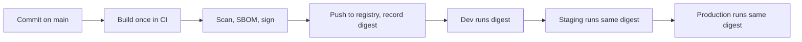
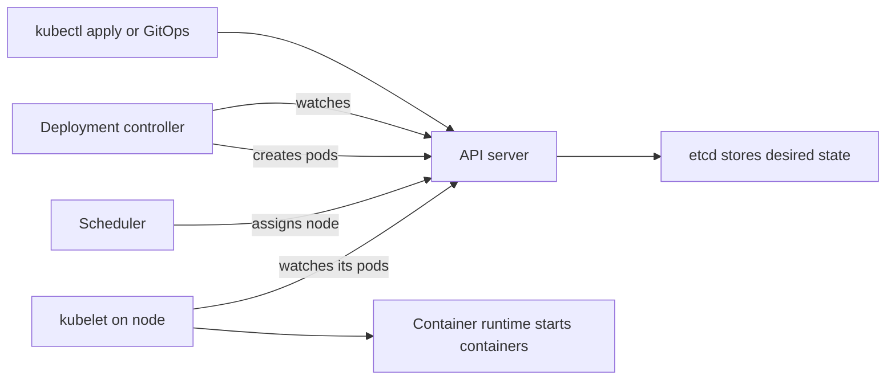
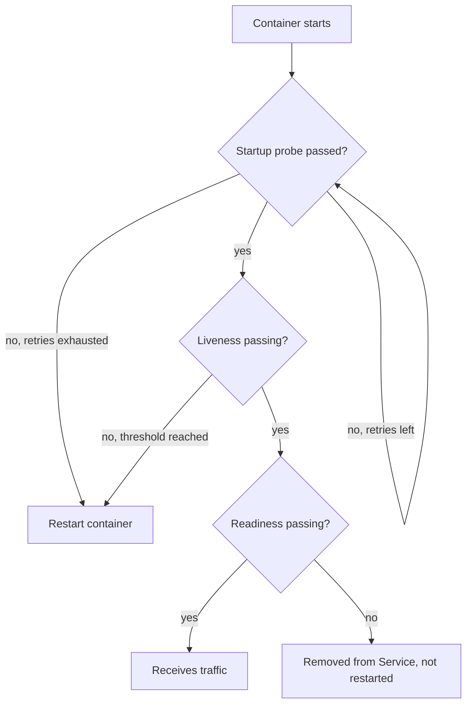

# Module 2 — Containers and Kubernetes

*Almost every service Najm Bank moves out of its data centre leaves as a container and lands on Kubernetes. This module teaches both well enough to run them in production. It starts with the container image: what an image really is, how layers and caching work, how to write a Dockerfile that is small, fast to build and safe by default, and why a registry digest, not a tag, is the thing you deploy. It then opens Kubernetes: the objects you will use every day (pods, deployments, services, namespaces), the control loops that keep reality matching what you declared, and how to debug a pod that will not start. It ends with what separates a demo from a production workload: configuration and secrets, health probes, resource requests and limits, autoscaling, graceful shutdown and packaging with Helm. You will follow Yousef as his first Dockerfile for the Najm Mobile API ships the wrong code to staging, as he learns why the cluster keeps "undoing" his fixes, and as Maha walks him through a Payments outage caused by one badly chosen health check.*

> **Phases:** Build, Deploy, Operate — packaging software into images you can trust, running it on a cluster that heals itself, and configuring it so that healing helps rather than hurts.

---

# 2.1 — Containers done right: images, layers, Dockerfiles and registries
*Level: 🟡 Intermediate* · *Prerequisites: 1.1, 1.2* · *Phase: Build, Deploy*

## ⚡ In 60 seconds
- A **container** is an ordinary Linux process that the kernel isolates (its own view of files, processes and network) and limits (CPU and memory). A **container image** is the read-only package of files and settings that the process starts from.
- An image is a stack of **layers**, each the result of one build step. Order your Dockerfile so that things that rarely change come first; the build cache then reuses them and builds take seconds, not minutes.
- Production images are **small, non-root and secret-free**: use a **multi-stage build** to leave compilers and build tools behind, set a `USER`, and never copy credentials into any layer.
- **Tags move; digests do not.** `mobile-api:1.4.2` can be overwritten; `mobile-api@sha256:…` always means the same bytes. Build once, then promote and deploy that exact digest.
- Decision cue: if you cannot say which commit and which base image produced the image running in production, your build is not done.
- Biggest trap: `FROM something:latest`, run as root, with the whole repository (including `.env`) copied in.

## 🧭 Why it matters
Yousef's first task on the platform team is to containerise the **Najm Mobile API**, the Python service behind the retail app. By Thursday it runs. The image is 1.3 GB, builds in nine minutes on every commit, and starts from `python:latest`. The scanner flags hundreds of vulnerabilities, mostly in compilers the API never uses. Then Tariq reports that staging "has the old login bug again": two pipelines pushed different builds to the same tag, `mobile-api:staging`, minutes apart, and the cluster pulled whichever it saw last. Finally Noura finds a test database password inside an image layer: `COPY . .` had copied a local `.env` file, and deleting it in a later step did not remove it from the earlier layer.

Salem shows him a public case of the same root cause at a larger scale. In August 2012 Knight Capital deployed new trading code by hand; according to the US SEC's order, one of eight servers did not receive it, a reused flag woke up old logic there, and the firm lost more than 460 million dollars in about 45 minutes. "We cannot afford to wonder which code is running," Salem says. "The image is how we stop wondering. But only if we build it once, name it by its digest, and deploy exactly that."

This lesson turns Yousef's Thursday image into the bank's standard one.

## 📐 How it works

### 🟢 The essentials

**What a container really is.** On Linux, a container is a normal process with two kernel features applied. **Namespaces** give it its own view of the system: its own process list (it sees itself as process 1), its own network interfaces, its own hostname and its own file tree. **Control groups (cgroups)** cap how much CPU and memory it may use. Unlike a **virtual machine (VM)**, there is no guest kernel inside: containers start as fast as a process and all share the host's kernel, which also makes a container a weaker security boundary than a VM (lesson 2.3 covers hardening).

**What an image is.** An image is the starting file system plus metadata (command, user, environment). The **Open Container Initiative (OCI)** standardises it in three specifications (image, runtime and distribution), so an image built with Docker runs on containerd, CRI-O, Podman or any Kubernetes cluster.

An image is made of:
- **Layers**: compressed archives of file-system changes, one per build step that changes files. They are stacked to form the final file tree.
- A **config**: the command, user, working directory, exposed ports and environment.
- A **manifest**: a list pointing at the config and layers by their **digest**, the SHA-256 hash of their content.
- For multi-architecture images, an **index** that points to one manifest per CPU architecture (for example `amd64` and `arm64`).

Because everything is addressed by hash, the image's own digest changes if a single byte changes anywhere. That is what makes digests trustworthy.

**The Dockerfile.** A Dockerfile is the recipe. Each instruction runs in order:

```dockerfile
# Risky: Yousef's first version
FROM python:latest
COPY . /app
WORKDIR /app
RUN pip install -r requirements.txt
CMD python main.py
```

Five problems in five lines. `latest` changes under you. `COPY . /app` sends everything, including `.git` and `.env`. Copying code *before* installing dependencies makes `pip install` re-run on every code change. The full `python` image carries compilers the API never uses. And the process runs as root.

**Layers and the build cache.** The builder caches each step. If a step's inputs (the instruction and, for `COPY`, the files' contents) are unchanged and every step before it was cached, the cached layer is reused. Once one step misses, every step after it rebuilds. So put stable things first and volatile things last:

```dockerfile
COPY requirements.txt .          # changes rarely
RUN pip install -r requirements.txt
COPY src/ ./src/                 # changes on every commit
```

Now a code change rebuilds only the last layer.

**Registries.** A **registry** stores and serves images (Docker Hub, GitHub Container Registry, or each cloud's own). CI pushes; the cluster pulls.

| Need | AWS | Microsoft Azure | Google Cloud |
|---|---|---|---|
| Private image registry | Amazon ECR | Azure Container Registry | Artifact Registry |
| Pull without stored passwords | IAM role on the node or pod | Managed identity | Service account / workload identity |

**Tags and digests.** A **tag** (`1.4.2`, `staging`, `latest`) is a human-friendly pointer that anyone with push rights can move to a different image. A **digest** (`sha256:…`) is the hash of the manifest and can never point to anything else. Deploy by digest, or by an immutable tag that your registry refuses to overwrite.

```shell
# Same name, pinned to exact bytes
docker pull registry.example.com/najm/mobile-api@sha256:<64-hex-digest>
```

### 🟡 Going deeper

**Multi-stage builds.** A **multi-stage build** uses several `FROM` lines in one Dockerfile. Early stages have the compilers and build tools; the final stage copies only the result. Here is the hardened version of Yousef's file:

```dockerfile
# syntax=docker/dockerfile:1
# Hardened: two stages, pinned base, non-root, no secrets
ARG PY_BASE=python:3.12-slim@sha256:<pinned-digest>

FROM ${PY_BASE} AS build
WORKDIR /app
RUN python -m venv /opt/venv
ENV PATH="/opt/venv/bin:$PATH"
COPY requirements.txt .
RUN --mount=type=cache,target=/root/.cache/pip \
    pip install --require-hashes -r requirements.txt
COPY src/ ./src/

FROM ${PY_BASE} AS runtime
RUN useradd --uid 10001 --no-create-home --shell /usr/sbin/nologin app
WORKDIR /app
COPY --from=build /opt/venv /opt/venv
COPY --from=build /app/src ./src
ENV PATH="/opt/venv/bin:$PATH" PYTHONUNBUFFERED=1
USER 10001
EXPOSE 8080
CMD ["python", "-m", "src.main"]
```

What each choice buys:
- **Pinned base by digest.** The base changes only when someone bumps it, ideally through a tested bot pull request (Renovate or Dependabot).
- **`--require-hashes`.** A tampered or substituted package fails the build.
- **Cache mount.** BuildKit (the modern Docker builder) reuses pip's download cache without putting it in a layer.
- **Numeric non-root `USER`.** Kubernetes can check `runAsNonRoot` against a numeric user; a name it cannot verify.
- **Exec-form `CMD`** (the JSON array). The program becomes process 1 and receives the stop signal directly. In shell form a shell is process 1 and may not pass `SIGTERM` on, so the app is killed hard instead of shutting down cleanly. If needed, add a tiny init such as `tini`.

**The `.dockerignore` file** keeps files out of the **build context**, the folder sent to the builder:

```text
.git
.env
*.pem
tests/
node_modules/
__pycache__/
```

If a build genuinely needs a credential (for a private package index, say), pass it as a **build secret**, mounted for one step and never written to a layer:

```dockerfile
RUN --mount=type=secret,id=pip_conf,target=/etc/pip.conf \
    pip install --require-hashes -r requirements.txt
```

**Choosing a base image.** Smaller bases mean fewer packages, fewer vulnerabilities to triage and faster pulls.

| Base type | Example | Trade-off |
|---|---|---|
| Full distribution | `python:3.12` | Easy to debug; large; many unused packages |
| Slim distribution | `python:3.12-slim` | Good default; still has a shell and package manager |
| Alpine-based | `python:3.12-alpine` | Very small; uses musl instead of glibc, which breaks some compiled Python wheels |
| Distroless / minimal | Google's distroless images, Chainguard-style minimal images | No shell or package manager; smallest attack surface; harder to debug interactively |
| `scratch` | Empty image | Only for static binaries (often Go or Rust) |

Approve one or two bases per language, patch them centrally, and rebuild when they change.

**Build once, promote the digest.** The pipeline builds the image a single time on the main branch, pushes it, records the digest, and every environment (dev, test, staging, production) runs that digest. Promotion changes configuration, never the image. Rebuilding "the same commit" for production is how staging and production quietly diverge. Lesson 3.2 automates this promotion with GitOps and lesson 4.1 builds the pipeline.



**Labels for traceability.** Stamp the standard OCI labels `org.opencontainers.image.revision` (the commit) and `org.opencontainers.image.source` (the repository) into every image, so anyone can answer "where did this come from?"

### 🔴 Expert view

**Reproducible is not the same as pinned.** Pinning removes the biggest sources of drift, but timestamps and file ordering can still change the digest of a rebuild. Most teams aim for "rebuildable and traceable" and add **provenance**: a signed record, produced by the build system, of which source, builder and inputs created the digest. Together with an **SBOM** (software bill of materials) and an image **signature** checked at deploy time, this is the supply-chain story that [*Secure AI & Application Security*, lesson 6.2 — The software supply chain: dependencies, SBOMs, SLSA and signing](../secai/index.html#/6.2) teaches in depth; lesson 4.3 wires it into Najm's pipeline.

**Scanning and the patch loop.** Scanners such as Trivy and Grype list known vulnerabilities in an image's packages. New vulnerabilities are published daily against unchanged images, so scan in the pipeline (block on new critical findings that have a fix), rescan running images on a schedule, and rebuild on a cadence even when code has not changed.

**Multi-architecture builds.** Laptops and cloud nodes may differ (Arm or x86). `docker buildx build --platform linux/amd64,linux/arm64` builds both and pushes an index; test on the architecture you run on.

**Registry operations.** Treat the registry as production infrastructure: **tag immutability** on release repositories; **pull-through caches or mirrors** for public images, so a public registry's rate limits or outage cannot stop your deploys (Docker Hub limits anonymous and free-tier pulls; check its current limits); the same region as the cluster; and **retention rules** that never delete anything currently deployed.

**The container is not a VM.** Run one main process per container, log to standard output, keep state outside it, and expect it to be killed and replaced at any time. These are ideas from the Twelve-Factor App, and Kubernetes assumes them.

## 🧰 The toolkit
| Tool, practice or service | What it is and does | When to reach for it |
|---|---|---|
| **Docker** (with BuildKit) | Builds, runs and pushes OCI images; BuildKit adds cache and secret mounts and parallel stages | Local development and CI image builds |
| **Multi-stage build** | Several `FROM` stages in one Dockerfile; only the final stage ships | Every compiled or dependency-heavy image |
| **.dockerignore** | Excludes files from the build context | Every repository with a Dockerfile, from day one |
| **Image digest** | Content hash that names exact image bytes | Every deployment manifest and promotion record |
| **Container registry** (ECR, ACR, Artifact Registry, GHCR) | Stores and serves images, with access control and tag immutability | Holding release images close to the cluster |
| **Trivy** | Open-source scanner for vulnerabilities and misconfigurations in images and files | In CI on every build, and on a schedule against running images |
| **hadolint** | Linter that checks Dockerfiles against good practice | Pre-commit and pull requests |

## 🏛️ In practice at Najm Bank
Salem asks Yousef to turn his fixes into the **Najm Container Image Standard v1**, which every team must meet before an image may run in a shared cluster. The hardened Dockerfile above is its reference example for Python.

| # | Rule | Checked by | Why |
|---|---|---|---|
| 1 | Base image from the approved list, pinned by digest | Pipeline policy | Known, patched starting point; no surprise changes |
| 2 | Multi-stage build; no compilers or package managers in the final stage unless approved | hadolint plus review | Smaller attack surface and faster pulls |
| 3 | Runs as a numeric non-root user (UID 10000 or above) | Pipeline check of image config; cluster admission in lesson 2.3 | Limits damage if the app is compromised |
| 4 | No secrets in any layer; `.dockerignore` present; build secrets via secret mounts | Secret scanning of the image and repository | Layers are permanent and copied everywhere |
| 5 | Exec-form `CMD`/`ENTRYPOINT`; app handles `SIGTERM` | Review; shutdown test in CI | Clean shutdown during deploys and scaling |
| 6 | One main process; logs to stdout/stderr; no state in the container | Review | The cluster may kill and replace it at any time |
| 7 | OCI labels for source and revision | Pipeline | Trace any running image to its commit |
| 8 | Built once on main; pushed to the release repository with immutable tags; deployed by digest | Pipeline and GitOps checks | Every environment runs the same bytes |
| 9 | Scanned: no new critical vulnerability with an available fix; SBOM and signature attached | Pipeline gate | Supply-chain evidence for Noura's team |
| 10 | Rebuilt at least monthly, or within the security team's deadline when the base image has a critical fix | Scheduled pipeline | Unchanged code still ages |

**Exceptions** go to Salem with a reason and an expiry date. The Mobile API image is now 160 MB instead of 1.3 GB (Najm's figure for this one service; yours will differ), and staging and production record the same digest.

## 🛠️ Exercises
Work locally with Docker or a compatible tool. Push only to a registry you own, such as a free personal account.

- 🟢 Take any small web app you have (or a "hello world" in your language), write a naive Dockerfile with `FROM <lang>:latest` and `COPY . .`, build it, then rewrite it with a pinned slim base, a `.dockerignore`, dependency files copied before source, a non-root `USER` and an exec-form `CMD`. Compare sizes with `docker images` and layers with `docker history`. *Done when:* you have both files, the size difference, and evidence that changing one source line rebuilds only the last layers.
- 🟡 Convert your image to a multi-stage build and scan both versions with Trivy. Build the naive version with a fake secret in `.env`, then find it by exporting the image (`docker save`) and searching its layers. *Done when:* you can show the secret in the naive image, its absence from the hardened one, and both vulnerability counts.
- 🔴 Build your image for `linux/amd64` and `linux/arm64` with `docker buildx`, push it to your registry with OCI revision labels, and write a two-line deploy note that references it only by digest. Push a different build to the same tag. *Done when:* `docker buildx imagetools inspect` shows both architectures, and the digest still pulls the original image after the tag moved.

## ⚠️ Mistakes and traps
- **Using `latest` or other moving tags in production.** Two pulls of the same name can give different code. Deploy by digest, and use immutable tags in the release repository.
- **Secrets in layers.** `COPY . .` with a `.env` file, or `ENV DB_PASSWORD=…`, leaks a credential into every copy of the image. Use `.dockerignore`, build secret mounts and runtime secrets (lesson 2.3).
- **Rebuilding per environment.** A "production build" is a different artefact. Promote the digest.
- **Running as root "because it's in a container".** Containers share the host kernel. Set a numeric non-root `USER`.
- **Scanning once.** New vulnerabilities appear in unchanged images. Rescan running images and rebuild on a schedule.

## 🧾 Recap
- A container is an isolated, resource-limited Linux process; an image is its OCI-standard, layered starting point.
- Order Dockerfile steps from stable to volatile so the cache works; leave build tools behind with multi-stage builds.
- Production images are small, pinned, non-root and secret-free, with labels that trace them to a commit.
- Tags are pointers that can move; digests are content hashes that cannot. Build once and deploy the digest everywhere.
- Scanning, SBOMs, signing and scheduled rebuilds keep images trustworthy after they ship.

## ✍️ Check yourself

**1. Yousef deletes `.env` with `RUN rm .env` right after `COPY . .`. Why is the secret still exposed?**

- A. `rm` does not work inside a Docker build
- B. Each instruction creates a layer, and the layer created by `COPY` still contains the file; a later layer only hides it
- C. The build cache restores deleted files on the next build
- D. Secrets are always visible in `docker ps`

<details><summary>Answer</summary>

**B.** A deletion only masks the file in the final view; anyone with the image can extract the earlier layer. A and C are false, and D confuses running containers with image contents. Keep the file out with `.dockerignore`. (🟡 Going deeper.)

</details>

**2. Tariq says staging is running an old build even though the pipeline pushed `mobile-api:staging` an hour ago. Two pipelines both push to that tag. What is the most robust fix?**

- A. Ask teams to coordinate their pushes on chat
- B. Pull the tag more often
- C. Rename the tag to `staging-v2`
- D. Deploy by image digest recorded by the pipeline, and make release tags immutable in the registry

<details><summary>Answer</summary>

**D.** A digest names exact bytes and cannot be moved. A relies on people, B still races, and C just creates another mutable tag. (🟢 The essentials.)

</details>

**3. Every commit to the Mobile API rebuilds all dependencies, taking nine minutes. The Dockerfile copies the whole source tree and then runs `pip install`. What change helps most?**

- A. Copy `requirements.txt` and install dependencies before copying the source code
- B. Switch to the `latest` base image so it is always cached
- C. Add more CPU to the build machine
- D. Combine all steps into one `RUN` line

<details><summary>Answer</summary>

**A.** The cache breaks from the first changed step onwards, so stable dependency files go first. B makes builds unpredictable, C treats the symptom, and D defeats caching. (🟢 The essentials.)

</details>

**4. Why does the hardened Dockerfile use exec-form `CMD ["python", "-m", "src.main"]` rather than `CMD python -m src.main`?**

- A. Exec form makes the image smaller
- B. Shell form is not allowed in multi-stage builds
- C. In exec form the application is process 1 and receives `SIGTERM` directly, so it can shut down cleanly
- D. Exec form runs the process as a non-root user automatically

<details><summary>Answer</summary>

**C.** In shell form a shell is process 1 and may not forward the stop signal, so the app is killed after the grace period. A, B and D are false: size, multi-stage support and user are unrelated to the form of `CMD`. (🟡 Going deeper.)

</details>

**5. Mona from Finance asks why the platform team rebuilds images monthly even when no application code changed. What is the best answer?**

- A. Rebuilding makes images smaller over time
- B. New vulnerabilities are found in existing base images and libraries; rebuilding picks up patched bases, and rescans catch what changed
- C. Registries delete images older than one month
- D. Kubernetes refuses to run images older than one month

<details><summary>Answer</summary>

**B.** Unchanged images age as new vulnerabilities are published against their contents. A is not generally true, and C and D describe rules that do not exist by default (retention is something you configure). (🔴 Expert view.)

</details>

## 📚 References
- Open Container Initiative specifications — https://opencontainers.org/
- Docker documentation: Dockerfile reference — https://docs.docker.com/reference/dockerfile/
- Docker documentation: multi-stage builds — https://docs.docker.com/build/building/multi-stage/
- Docker documentation: build cache — https://docs.docker.com/build/cache/
- Docker documentation: build secrets — https://docs.docker.com/build/building/secrets/
- Kubernetes documentation: images — https://kubernetes.io/docs/concepts/containers/images/
- The Twelve-Factor App — https://12factor.net/
- US SEC, Knight Capital Americas LLC order (2013) — https://www.sec.gov/litigation/admin/2013/34-70694.pdf
- Trivy documentation — https://trivy.dev/

---

# 2.2 — Kubernetes fundamentals: pods, deployments, services and how the cluster thinks
*Level: 🟡 Intermediate* · *Prerequisites: 1.1, 1.2, 2.1* · *Phase: Deploy, Operate*

## ⚡ In 60 seconds
- **Kubernetes** is a system that runs containers across a group of machines (a **cluster**) and keeps them running. You tell it what you want; it works continuously to make reality match.
- The core idea is **desired state and reconciliation**: you declare objects in YAML, the API server stores them, and **controllers** loop forever comparing "declared" with "actual" and fixing the difference.
- The everyday objects: a **Pod** (one or more containers scheduled together), a **Deployment** (keeps N identical pods running and rolls out new versions), a **Service** (a stable name and address in front of changing pods), and a **Namespace** (a folder for objects, access and quotas).
- **Labels and selectors** are the glue: a Deployment finds its pods, and a Service finds where to send traffic, purely by matching labels.
- Decision cue: never fix things by hand inside the cluster. Change the declared state (the YAML in Git) and let the controllers converge.
- Biggest trap: treating pods like servers. Pods are disposable; anything you change inside one, or any pod you create by hand, is gone the next time it is replaced.

## 🧭 Why it matters
In the data centre, the Najm Mobile API ran on four hand-tended virtual machines. When one died at night, an operator was paged and restarted it; recovery took as long as a person took to wake up.

In his second week, Yousef deploys the API to the new managed Kubernetes cluster. He deletes a misbehaving pod, and seconds later a new one with a different name appears. He fixes a setting with `kubectl edit`; next morning the GitOps tool (lesson 3.2) has put the old value back. And a node in zone B failed overnight without paging anyone: its pods were recreated elsewhere before anyone noticed.

"All three are the same feature," Salem tells him. "The cluster is a set of control loops that keep pushing reality towards what we wrote down. Work with the loops and they do your night shifts. Work against them and they undo you."

## 📐 How it works

### 🟢 The essentials

**The cluster's parts.** A cluster has a **control plane** (the brain) and **worker nodes** (the machines that run your containers). On managed services (Amazon EKS, Azure Kubernetes Service, Google Kubernetes Engine), the provider runs the control plane and you mostly see the nodes.

| Component | Where | What it does |
|---|---|---|
| **kube-apiserver** | Control plane | The front door: everything talks to the cluster through its API |
| **etcd** | Control plane | Key-value store holding all declared objects and their status |
| **Scheduler** | Control plane | Chooses a node for each new pod, based on its resource requests and rules |
| **Controller manager** | Control plane | Runs the built-in control loops (deployments, replica sets, nodes, endpoints and more) |
| **kubelet** | Every node | Agent that runs and health-checks the pods assigned to its node |
| **Container runtime** | Every node | Runs the containers (containerd or CRI-O) |
| **kube-proxy** (or a CNI plugin that replaces it) | Every node | Programs the node's networking so Service addresses reach the right pods |

**Desired state and reconciliation.** You do not tell Kubernetes "start three containers". You submit an object that says "there should be three". A controller notices the gap between three wanted and zero running and acts. If a node dies and takes a pod with it, the gap reappears and the controller acts again. That loop is called **reconciliation**, and it explains all three of Yousef's surprises.



Every component watches the API server and writes results back; none talks to the others directly.

**Pods.** A **Pod** is the smallest thing Kubernetes runs: one or more containers sharing a network address, always on the same node. Pods are **ephemeral**: replacements get new names and IP addresses, and you never create one directly for a real workload.

**Deployments and ReplicaSets.** A **Deployment** declares "run N copies of this pod template". It manages a **ReplicaSet**, which does the counting; when you change the template (for example a new image digest), the Deployment creates a new ReplicaSet and shifts pods from the old to the new one gradually. That is a **rolling update**.

**Services.** Because pod addresses keep changing, other software needs a stable address. A **Service** gives a set of pods one stable virtual IP and a DNS name, such as `mobile-api.mobile.svc.cluster.local`, and spreads connections across whichever pods currently match its selector and are ready.

| Service type | Reachable from | Typical use |
|---|---|---|
| `ClusterIP` (default) | Inside the cluster only | Service-to-service traffic |
| `NodePort` | A port on every node | Rarely used directly; building block for others |
| `LoadBalancer` | Outside, through a cloud load balancer the provider creates | Exposing a service at layer 4 (TCP) |

For HTTP routing by host name and path (layer 7), use an **Ingress** or the newer **Gateway API**, which reached general availability (v1.0) in October 2023. Both need a controller installed in the cluster to do the actual work.

**Labels and selectors.** A **label** is a key-value tag on an object, such as `app.kubernetes.io/name: mobile-api`. A **selector** is a query over labels. Deployments find their pods by selector; Services find their endpoints by selector. If the labels do not match, nothing is connected and there is no error message, just no traffic.

**Namespaces.** A **Namespace** groups objects. Najm gives each team or system its own (`mobile`, `payments`, `assist`, never `default`) with its own access rules, quotas and network policies. On its own a namespace is not a strong security boundary.

### 🟡 Going deeper

**A minimal, correct Deployment and Service.**

```yaml
apiVersion: apps/v1
kind: Deployment
metadata:
  name: mobile-api
  namespace: mobile
  labels:
    app.kubernetes.io/name: mobile-api
spec:
  replicas: 3
  revisionHistoryLimit: 5
  selector:
    matchLabels:
      app.kubernetes.io/name: mobile-api
  strategy:
    type: RollingUpdate
    rollingUpdate:
      maxSurge: 1          # at most one extra pod during a rollout
      maxUnavailable: 0    # never drop below 3 ready pods
  template:
    metadata:
      labels:
        app.kubernetes.io/name: mobile-api
    spec:
      containers:
        - name: api
          image: registry.example.com/najm/mobile-api@sha256:<digest-from-pipeline>
          ports:
            - name: http
              containerPort: 8080
---
apiVersion: v1
kind: Service
metadata:
  name: mobile-api
  namespace: mobile
spec:
  type: ClusterIP
  selector:
    app.kubernetes.io/name: mobile-api
  ports:
    - name: http
      port: 80
      targetPort: http
```

The same label appears three times: Deployment selector, pod template and Service selector. Lesson 2.3 adds the probes, resources and security settings production needs.

**Declarative, not imperative.** `kubectl run` and `kubectl edit` change the live cluster directly; `kubectl apply -f` submits files describing the desired state. With GitOps, Git is the only source of truth and manual edits are reverted, which removes "someone changed something at 3 a.m."

**How a rolling update proceeds.** With the settings above, Kubernetes starts one new pod (`maxSurge: 1`), waits until it is **ready**, removes one old pod, and repeats. If new pods never become ready, the rollout stalls rather than taking the service down; after `progressDeadlineSeconds` (600 seconds by default) the Deployment reports that it failed to progress. Both values default to 25% when you do not set them.

```shell
kubectl -n mobile rollout status deployment/mobile-api   # watch progress
kubectl -n mobile rollout history deployment/mobile-api  # list revisions
kubectl -n mobile rollout undo deployment/mobile-api     # emergency rollback
```

On a GitOps platform, `rollout undo` is a break-glass move: revert the change in Git as well, or the reconciler will roll it forward again. Lesson 4.2 covers canary and blue-green strategies built on top of this.

**Reading a pod's status.** Most first-week debugging is reading these states:

| You see | It usually means | Look at |
|---|---|---|
| `Pending` | The scheduler cannot find a node: not enough CPU or memory, or rules that no node satisfies | `kubectl describe pod` → Events |
| `ImagePullBackOff` / `ErrImagePull` | Wrong image name or digest, missing registry permission, registry unreachable | Events; the node's permission to pull |
| `CrashLoopBackOff` | The container starts and exits again and again; Kubernetes waits longer between restarts | `kubectl logs <pod> --previous` |
| `OOMKilled` (in last state) | The container used more memory than its limit | Memory limit and real usage (lesson 2.3) |
| `Running` but `0/1` ready | The process runs but fails its readiness check, so it receives no traffic | Readiness probe and app logs |

A five-command triage covers most cases:

```shell
kubectl -n mobile get pods -o wide             # states, restarts, nodes
kubectl -n mobile describe pod <pod>           # events at the bottom
kubectl -n mobile logs <pod> --previous        # logs of the crashed container
kubectl -n mobile get endpointslices -l kubernetes.io/service-name=mobile-api
kubectl -n mobile get events --sort-by=.lastTimestamp
```

The fourth command answers "does my Service have any pods behind it?" An empty list means a label mismatch or no ready pods.

**Other workload types.** Beyond Deployments for stateless services: **StatefulSet** (stable names and storage per pod), **DaemonSet** (one pod per node, for agents) and **Job**/**CronJob** (run to completion). Najm keeps databases on the provider's managed service rather than in StatefulSets.

### 🔴 Expert view

**Spread across failure domains.** Three replicas are no help if the scheduler puts all three on one node, or in one availability zone that then fails. **Topology spread constraints** tell the scheduler to balance pods:

```yaml
      topologySpreadConstraints:
        - maxSkew: 1
          topologyKey: topology.kubernetes.io/zone
          whenUnsatisfiable: DoNotSchedule
          labelSelector:
            matchLabels:
              app.kubernetes.io/name: mobile-api
```

This goes in the pod template's `spec`, paired with node pools in several zones (lesson 6.1). A **PodDisruptionBudget** (lesson 2.3) stops maintenance removing too many pods at once.

**Everything is an API object.** You can add your own object types (**custom resources**) and controllers (**operators**); Argo CD and cert-manager work this way. Every such add-on is a dependency the platform team must upgrade and watch.

**Upgrades are a standing job.** The Kubernetes project ships about three minor releases a year and supports each for roughly fourteen months; managed providers publish their own windows (check yours). Read deprecation notes and test upgrades in non-production first; removed APIs are the usual cause of breakage.

**How much Kubernetes should you run?** Kubernetes earns its complexity when many services, teams and environments share one platform. For a single small service, a serverless container service or PaaS may be the better decision. Najm chose managed Kubernetes because it runs dozens of services and wants one way to deploy them. The same OCI image runs on all of these, so the choice stays reversible.

| Concept | AWS | Microsoft Azure | Google Cloud |
|---|---|---|---|
| Managed Kubernetes | Amazon EKS | Azure Kubernetes Service (AKS) | Google Kubernetes Engine (GKE) |
| Serverless containers | ECS on Fargate, App Runner | Azure Container Apps | Cloud Run |

## 🧰 The toolkit
| Tool, practice or service | What it is and does | When to reach for it |
|---|---|---|
| **kubectl** | The command-line client for the Kubernetes API | Applying manifests, inspecting state, debugging |
| **kind** (Kubernetes in Docker) | Runs a whole cluster as containers on your laptop | Learning, local testing, CI tests of manifests |
| **k3d** | Runs the lightweight k3s distribution in Docker | A fast local cluster with a small footprint |
| **Deployment** | Keeps N identical pods running and rolls out changes | Every stateless service |
| **Service** | Stable virtual IP and DNS name in front of matching pods | Any pod that receives traffic |
| **Gateway API** | Kubernetes' role-oriented API for HTTP and TCP routing into the cluster | New ingress designs; replacing older Ingress setups |
| **Topology spread constraints** | Scheduler rules that balance pods across zones or nodes | Every production workload with more than one replica |

## 🏛️ In practice at Najm Bank
Yousef writes the **Najm workload manifest baseline**: the minimum every Deployment must have before it can be merged into the GitOps repository, plus a triage card for the on-call rota.

**Part A: required on every Deployment**

| Field | Najm rule | Reason |
|---|---|---|
| `metadata.namespace` | The team's namespace; never `default` | Access, quotas and cost allocation by team |
| Labels | `app.kubernetes.io/name`, `app.kubernetes.io/part-of`, `najm.example/team`, `najm.example/cost-centre` | Selectors, dashboards and cost reports (lesson 6.2) |
| `spec.replicas` | 3 or more in production (or an autoscaler minimum of 3) | Survive a node or zone failure |
| `image` | Registry path plus digest from the pipeline | Exactly the bytes that were tested (lesson 2.1) |
| `strategy.rollingUpdate` | `maxUnavailable: 0`, `maxSurge: 1` (or 25%) | No capacity loss during deploys |
| `topologySpreadConstraints` | Across `topology.kubernetes.io/zone` | Survive a zone failure |
| Probes, resources, security context | As in the lesson 2.3 checklist | Not production-ready without them |
| Change path | Git pull request only; no `kubectl edit` in production | One source of truth; full audit trail |

**Part B: on-call triage card ("the pod will not work")**

| Step | Command | If you see… | Then |
|---|---|---|---|
| 1 | `kubectl get pods -o wide` | `Pending` | Check events for "Insufficient cpu/memory"; check node pool capacity |
| 2 | `kubectl describe pod` | `ImagePullBackOff` | Check the digest exists; check the node's registry permission |
| 3 | `kubectl logs --previous` | `CrashLoopBackOff` | Read the last error; check config and secrets were mounted |
| 4 | `kubectl get endpointslices` | No endpoints | Compare Service selector with pod labels; check readiness |
| 5 | `kubectl rollout history` | Problem began with a rollout | Revert the commit in Git; break-glass `rollout undo` only with Maha's approval |

## 🛠️ Exercises
Use a local cluster: install kind or k3d, and create a cluster with `kind create cluster` or `k3d cluster create`.

- 🟢 Deploy the Deployment and Service from this lesson (use any small public web image you trust, pinned by digest, in place of the Mobile API). Delete one pod and watch with `kubectl get pods -w` as a replacement appears. *Done when:* you can explain, in two sentences, which controller recreated the pod and why its name changed.
- 🟡 Break the Service on purpose by changing the pod template label without updating the Service selector. Use the triage card to find the fault from the symptoms alone. Then deploy an image digest that does not exist and diagnose the result. *Done when:* you have the exact command output that pointed to each cause, and both are fixed through your YAML files, not by `kubectl edit`.
- 🔴 Create a kind cluster with three worker nodes, label them as zones `a`, `b` and `c` with `topology.kubernetes.io/zone`, and deploy six replicas with the topology spread constraint. Drain one node with `kubectl drain` and watch what happens. *Done when:* you can show the pods spread two per zone before the drain, explain where they went after, and explain why `DoNotSchedule` left some pods `Pending` if it did.

## ⚠️ Mistakes and traps
- **Editing the live cluster.** `kubectl edit` in production creates drift that the next sync reverts, or worse, that nobody knows about. Change Git; let the reconciler apply it.
- **Creating bare pods.** A pod not owned by a controller is not recreated when its node dies. Use a Deployment (or Job, StatefulSet, DaemonSet).
- **Label mismatches.** A Service whose selector matches nothing produces no error, only no traffic. Use one label convention and check endpoints.
- **All replicas in one place.** Three pods on one node give the illusion of redundancy. Add topology spread constraints and multi-zone node pools.
- **Forgetting the rollback is in Git too.** A `rollout undo` that is not mirrored in Git gets rolled forward again by GitOps.

## 🧾 Recap
- Kubernetes runs containers across a cluster and keeps them running through control loops that reconcile actual state with declared state.
- The control plane (API server, etcd, scheduler, controllers) decides; kubelets and container runtimes on nodes act.
- Pods are disposable; Deployments keep N of them running and roll out new versions; Services give them a stable address; labels and selectors connect it all.
- Change the declared state in Git, never the live objects; read pod states and events to debug.
- Spread replicas across zones, plan regular upgrades, and only adopt Kubernetes where its complexity pays for itself.

## ✍️ Check yourself

**1. Yousef deletes a misbehaving Mobile API pod, and a new one appears within seconds with a different name. What caused this?**

- A. The kubelet restarted the same pod after it crashed
- B. The Service recreated the pod to keep its endpoint
- C. The ReplicaSet controller saw fewer pods than the Deployment declared and created a replacement
- D. etcd restored the deleted pod from its backup

<details><summary>Answer</summary>

**C.** Reconciliation: the controller compares desired with actual replicas and fixes the gap. A describes a container restart inside the same pod, which keeps its name. B is wrong because Services route traffic and never create pods. D misreads etcd's role as a store of state. (🟢 The essentials.)

</details>

**2. A new team deploys a service. Its pods are `Running` and ready, but every request to the Service times out, and the Service has no endpoints. What is the most likely cause?**

- A. The Service selector does not match the pod labels
- B. The image digest is wrong
- C. The pods have exceeded their memory limit
- D. The scheduler could not find a node

<details><summary>Answer</summary>

**A.** Ready pods with no endpoints point to a label mismatch. B would show `ImagePullBackOff`, C would show `OOMKilled` restarts, and D would leave pods `Pending`, not running. (🟡 Going deeper.)

</details>

**3. During a release, the new Mobile API pods never become ready. The Deployment uses `maxUnavailable: 0` and `maxSurge: 1`. What happens to customers?**

- A. All old pods are deleted at once and the API goes down
- B. Kubernetes automatically rolls back to the previous version
- C. Half the traffic goes to broken pods
- D. The rollout stalls with the old pods still serving traffic, and the Deployment eventually reports that it failed to progress

<details><summary>Answer</summary>

**D.** No old pod is removed until a new one is ready, and unready pods receive no Service traffic. B is the tempting distractor: a plain Deployment does not roll back on its own; you, or a tool such as a progressive-delivery controller, must do it. (🟡 Going deeper.)

</details>

**4. Maha notices that all three Payments replicas are on nodes in the same availability zone. Which change addresses this most directly?**

- A. Increase replicas from 3 to 6
- B. Add a topology spread constraint on `topology.kubernetes.io/zone` and make sure node pools span several zones
- C. Move Payments to its own namespace
- D. Change the Service type to `LoadBalancer`

<details><summary>Answer</summary>

**B.** Spread constraints tell the scheduler to balance across zones, which only works if nodes exist in several zones. A may still put all six in one zone; C and D do not affect placement. (🔴 Expert view.)

</details>

**5. Yousef fixes a production setting with `kubectl edit`. The next morning the old value is back. Why, and what should he do?**

- A. The GitOps reconciler restored the state declared in Git; he should make the change through a pull request to the GitOps repository
- B. Kubernetes reverts every change after 24 hours; he should re-apply it daily
- C. The kubelet cached the old setting; he should restart the node
- D. etcd lost the change; he should ask the provider to restore etcd

<details><summary>Answer</summary>

**A.** With GitOps, Git is the source of truth and manual edits are drift that gets corrected. B, C and D describe behaviours that do not exist. (🟡 Going deeper.)

</details>

## 📚 References
- Kubernetes documentation: cluster components — https://kubernetes.io/docs/concepts/overview/components/
- Kubernetes documentation: controllers — https://kubernetes.io/docs/concepts/architecture/controller/
- Kubernetes documentation: Deployments — https://kubernetes.io/docs/concepts/workloads/controllers/deployment/
- Kubernetes documentation: Services — https://kubernetes.io/docs/concepts/services-networking/service/
- Kubernetes documentation: pod topology spread constraints — https://kubernetes.io/docs/concepts/scheduling-eviction/topology-spread-constraints/
- Kubernetes documentation: recommended labels — https://kubernetes.io/docs/concepts/overview/working-with-objects/common-labels/
- Kubernetes release cycle and version skew — https://kubernetes.io/releases/
- Gateway API — https://gateway-api.sigs.k8s.io/
- kind — https://kind.sigs.k8s.io/
- Amazon EKS documentation — https://docs.aws.amazon.com/eks/
- Azure Kubernetes Service documentation — https://learn.microsoft.com/azure/aks/
- Google Kubernetes Engine documentation — https://cloud.google.com/kubernetes-engine/docs

---

# 2.3 — Kubernetes in practice: config, secrets, health probes, autoscaling and Helm
*Level: 🟡 Intermediate* · *Prerequisites: 2.1, 2.2* · *Phase: Deploy, Operate*

## ⚡ In 60 seconds
- A manifest that "runs" is not production-ready. Production adds **external configuration**, **safe secrets**, **health probes**, **requests and limits**, **autoscaling**, **graceful shutdown** and a **security context**.
- **ConfigMaps** hold ordinary settings; **Secrets** hold sensitive ones. A Kubernetes Secret is only **base64-encoded, not encrypted** by default: turn on encryption at rest, limit who can read it, and prefer syncing from an external secrets manager.
- **Readiness** decides whether a pod gets traffic; **liveness** decides whether it gets restarted; **startup** protects slow starters. Liveness must check only the process itself, never a database or another service.
- **Requests** reserve capacity and drive scheduling and autoscaling; **limits** cap usage (CPU over the limit is throttled, memory over the limit is killed).
- Decision cue: before go-live, walk the production-readiness checklist; any blank line is a known outage waiting to happen.
- Biggest trap: a liveness probe that depends on something outside the pod, turning a short database blip into a cluster-wide restart storm.

## 🧭 Why it matters
On a Tuesday morning, the managed PostgreSQL database behind the **Payments service** fails over to its standby, a blip of about thirty seconds. Payments should have returned errors briefly and recovered. Instead it was down for eleven minutes.

Maha's postmortem (lesson 5.3) with Yousef finds the chain. The liveness probe called `/health`, which queried the database, so during the failover the kubelet restarted every pod at once. The restarted pods needed forty seconds to warm up, had no startup allowance, failed liveness again and were restarted again. Meanwhile the autoscaler, seeing CPU spike, added pods, each opening more connections to a database that had just come back, until it hit its connection limit. Every setting involved was meant to make the service *more* reliable.

The same week, Noura's team finds a Secret manifest in Git with the line `password: cGFzc3dvcmQ=`. The developer thought it was encrypted. It decodes to "password" with one command.

## 📐 How it works

### 🟢 The essentials

**Configuration outside the image.** The same digest runs everywhere (lesson 2.1), so per-environment settings are supplied at runtime. A **ConfigMap** holds non-sensitive settings or config files, consumed as environment variables or mounted files.

```yaml
apiVersion: v1
kind: ConfigMap
metadata:
  name: mobile-api-config
  namespace: mobile
data:
  LOG_LEVEL: "info"
  PAYMENTS_URL: "http://payments.payments.svc.cluster.local"
```

Environment variables are read only at container start, so a changed ConfigMap does not reach running pods until they restart; mounted files update after a delay, but only help if the app rereads them. The usual fix is to roll the Deployment whenever its config changes (Helm can automate this, below).

**Secrets: what they are and are not.** A **Secret** is like a ConfigMap for passwords, tokens and keys, with separate access control, but its values are only **base64-encoded**, a reversible encoding, not encryption:

```shell
echo 'cGFzc3dvcmQ=' | base64 --decode     # prints: password
```

So a Secret is only as safe as three things you must set up:
1. **Encryption at rest** for the cluster's data store. Managed services differ; many offer envelope encryption with your cloud KMS key. Check what yours does by default.
2. **Access control (RBAC).** Anyone who can `get` Secrets in a namespace, or create pods there that mount them, can read them. Keep that list short.
3. **Never in Git as plain Secret manifests.** Keep the value in a secrets manager (AWS Secrets Manager, Azure Key Vault, Google Secret Manager, HashiCorp Vault) and sync it in with the **External Secrets Operator** or the **Secrets Store CSI Driver**; secrets that must live in Git are encrypted first (Sealed Secrets, SOPS).

**Workload identity** (lesson 1.3) lets the sync tool authenticate without a stored key. More in [*Secure AI & Application Security*, lesson 5.2 — Secrets management: keys, tokens and where they leak](../secai/index.html#/5.2).

**Health probes.** The kubelet can check each container in three ways:

| Probe | Question it answers | What happens on failure |
|---|---|---|
| **Readiness** | "Can this pod serve traffic right now?" | Pod is removed from Service endpoints; it is *not* restarted |
| **Liveness** | "Is this process stuck beyond repair?" | Container is restarted |
| **Startup** | "Has the app finished starting?" | Liveness and readiness are held off until it succeeds; if it never does, the container is restarted |



The rule that would have saved Payments: **liveness checks only the process itself** (is it responding, or deadlocked?). Restarting the app does not fix a database. **Readiness** may consider hard dependencies, but if every pod goes unready at once, callers get connection errors instead of a clear response. Often it is better to stay ready and return a fast, clear error (with a circuit breaker) while the dependency is down.

**Requests and limits.** Every container should declare:
- **Requests**: the CPU and memory reserved for it. The scheduler places pods only where requests fit, and the autoscaler measures utilisation as a percentage of the request.
- **Limits**: the ceiling. Above its CPU limit a container is **throttled** (slowed down); above its memory limit it is **killed** (`OOMKilled`) and restarted.

CPU is measured in cores or millicores (`250m` is a quarter of a core); memory in bytes (`512Mi`).

### 🟡 Going deeper

**The production pod spec.** Here is the Mobile API container from lesson 2.2 with the essentials added:

```yaml
    spec:
      terminationGracePeriodSeconds: 30
      securityContext:
        runAsNonRoot: true
        seccompProfile:
          type: RuntimeDefault
      containers:
        - name: api
          image: registry.example.com/najm/mobile-api@sha256:<digest-from-pipeline>
          ports:
            - name: http
              containerPort: 8080
          envFrom:
            - configMapRef:
                name: mobile-api-config
          env:
            - name: DB_PASSWORD
              valueFrom:
                secretKeyRef:
                  name: mobile-api-db     # synced from the secrets manager
                  key: password
          resources:
            requests:
              cpu: 250m
              memory: 384Mi
            limits:
              memory: 384Mi                 # memory limit equal to request
          startupProbe:
            httpGet: { path: /healthz/live, port: http }
            periodSeconds: 5
            failureThreshold: 24            # up to 2 minutes to start
          livenessProbe:
            httpGet: { path: /healthz/live, port: http }   # process only
            periodSeconds: 10
            failureThreshold: 3
          readinessProbe:
            httpGet: { path: /healthz/ready, port: http }
            periodSeconds: 5
            failureThreshold: 2
          securityContext:
            allowPrivilegeEscalation: false
            readOnlyRootFilesystem: true
            capabilities:
              drop: ["ALL"]
```

Choices worth explaining:
- **Memory limit equals request.** Memory cannot be throttled, only killed, so overcommitting it causes surprise kills when neighbours get busy.
- **No CPU limit here.** A debated choice: CPU limits can throttle a latency-sensitive service even when the node is idle. Many teams set CPU requests everywhere and limits only where hard fairness is needed; measure throttling (lesson 5.1) and decide per service.
- **Security context.** Non-root, no privilege escalation, no Linux capabilities, a read-only root file system (mount an `emptyDir` where the app must write) and the default seccomp profile, matching the **restricted** Pod Security Standard that Najm enforces per namespace with the label `pod-security.kubernetes.io/enforce: restricted`. More in [*Secure AI & Application Security*, lesson 7.2 — Containers, Kubernetes and infrastructure as code](../secai/index.html#/7.2).

**Quality of service.** Requests and limits also set each pod's eviction priority under memory pressure: **BestEffort** (none set; evicted first), **Burstable**, and **Guaranteed** (requests equal limits for CPU and memory in every container; evicted last). Payments runs Guaranteed.

**Graceful shutdown.** Pods are stopped on every deploy, scale-down and node upgrade. On deletion, Kubernetes starts removing the pod from Service endpoints and, at the same time, runs any `preStop` hook and then sends `SIGTERM`. Endpoint removal takes a moment to propagate, so a pod that exits instantly drops requests still arriving. The fix: on `SIGTERM`, stop accepting new work, finish in-flight requests and exit within `terminationGracePeriodSeconds` (30 seconds by default), after which `SIGKILL` follows. A short `preStop` pause lets endpoint removal complete first; newer Kubernetes versions offer a built-in sleep action for this (check yours). For Payments, it also means never acknowledging a transfer that has not been committed.

**Autoscaling with the Horizontal Pod Autoscaler.** The **HorizontalPodAutoscaler (HPA)** adjusts replicas to keep a metric near a target. It needs metrics-server (or another metrics pipeline) and CPU requests:

```yaml
apiVersion: autoscaling/v2
kind: HorizontalPodAutoscaler
metadata:
  name: mobile-api
  namespace: mobile
spec:
  scaleTargetRef:
    apiVersion: apps/v1
    kind: Deployment
    name: mobile-api
  minReplicas: 3
  maxReplicas: 20
  metrics:
    - type: Resource
      resource:
        name: cpu
        target:
          type: Utilization
          averageUtilization: 70
```

Its core formula is `desiredReplicas = ceil(currentReplicas × currentValue / targetValue)`. Six pods at 105% of their CPU request, against a 70% target, gives `ceil(6 × 105 / 70) = 9`. By default it scales down only after a five-minute stabilisation window, to avoid flapping. With an HPA, remove `replicas` from the Deployment in Git, or each sync fights the autoscaler.

Two cautions. First, **scale on the real bottleneck.** If database connections are the limit, more pods make it worse: cap `maxReplicas` so pods × pool size stays below the database limit, or scale on request rate or queue length (KEDA supports many such sources). Second, new pods need room; the **Cluster Autoscaler** or Karpenter adds nodes when pods are `Pending` (lesson 6.1).

**PodDisruptionBudgets.** A **PodDisruptionBudget (PDB)** limits how many pods voluntary disruptions, such as node drains, may take down at once:

```yaml
apiVersion: policy/v1
kind: PodDisruptionBudget
metadata:
  name: mobile-api
  namespace: mobile
spec:
  minAvailable: 2
  selector:
    matchLabels:
      app.kubernetes.io/name: mobile-api
```

It does not cover node crashes, and a PDB allowing zero disruptions blocks node upgrades.

### 🔴 Expert view

**Packaging with Helm.** One service now needs a Deployment, Service, ConfigMap, HPA, PDB and more, each slightly different per environment. **Helm** packages them as a **chart**: templates plus `values.yaml` defaults, with per-environment values files on top. Helm 3 was the standard for years and Helm 4 was released in late 2025; check which major version your tools expect.

```shell
helm lint ./charts/mobile-api
helm template mobile-api ./charts/mobile-api -f values-prod.yaml > rendered.yaml   # inspect before applying
helm upgrade --install mobile-api ./charts/mobile-api -n mobile -f values-prod.yaml --wait
helm rollback mobile-api 3 -n mobile
```

A well-known pattern rolls pods when their ConfigMap changes, via a hash in a pod annotation:

```yaml
  template:
    metadata:
      annotations:
        checksum/config: {{ include (print $.Template.BasePath "/configmap.yaml") . | sha256sum }}
```

At Najm, CI never runs `helm upgrade` against production: Argo CD renders the chart from the GitOps repository and applies it (lesson 3.2), so changes are reviewable and drift is corrected. **Kustomize**, built into `kubectl` (`kubectl apply -k`), is a template-free alternative based on overlays.

**The golden-path chart.** Platform teams turn this lesson into a shared chart, so a product team writes twenty lines of values and gets probes, security context, spread, PDB and labels right by default. Keep its values small and opinionated, or it becomes a second Kubernetes API.

**Guardrails beat reviews.** Admission policies (Kyverno, OPA Gatekeeper) can reject a Deployment with no requests, a `latest` tag or a root user before it reaches the cluster (lesson 3.3).

**Tune from evidence.** Set initial requests from load tests, then adjust from real usage: far below request wastes money (lesson 6.2); often throttled or near the memory limit is a latency or OOM risk. The Vertical Pod Autoscaler can recommend values, but do not let it act automatically on the metric an HPA scales on.

## 🧰 The toolkit
| Tool, practice or service | What it is and does | When to reach for it |
|---|---|---|
| **Helm** | Package manager for Kubernetes: templated charts with per-environment values | Packaging your services; installing third-party software |
| **Kustomize** | Template-free overlays on plain YAML, built into kubectl | Small per-environment differences on your own manifests |
| **Horizontal Pod Autoscaler** | Adjusts replica counts to keep a metric near a target | Stateless services with load that varies |
| **KEDA** | Event-driven autoscaling on queue length, request rate and other external metrics | When CPU is not the real bottleneck; scaling workers |
| **External Secrets Operator** | Syncs secrets from a cloud secrets manager or Vault into Kubernetes Secrets | Every production cluster that needs secrets |
| **PodDisruptionBudget** | Limits voluntary disruptions to a workload | Every production workload with more than one replica |
| **Pod Security Standards** | Built-in privileged, baseline and restricted profiles enforced per namespace | Setting a default security floor for all workloads |

## 🏛️ In practice at Najm Bank
After the postmortem, Maha and Salem publish the **Najm production-readiness checklist for Kubernetes workloads**. No service is promoted to production until every line is answered; the golden-path chart fills most in by default.

| Area | Requirement | Payments before | Payments after |
|---|---|---|---|
| Image | Digest from the pipeline; meets the container image standard (lesson 2.1) | Yes | Yes |
| Config | All environment differences in ConfigMaps or values files; pods roll on config change | Partly | Yes, checksum annotation |
| Secrets | Synced via External Secrets Operator; none in Git; encryption at rest; read access limited | Secret manifest in Git | Fixed; credential rotated |
| Liveness | Checks only the process; no dependency calls | Called the database | `/healthz/live`, process only |
| Readiness | Reflects ability to serve; behaviour when a dependency is down is documented | Same as liveness | `/healthz/ready`, plus a circuit breaker |
| Startup | Startup probe covers worst-case start time plus margin | None | 24 × 5 s |
| Resources | CPU and memory requests set; memory limit equals request; throttling and memory dashboards exist | No requests | Set from load test |
| Autoscaling | HPA with min ≥ 3; `maxReplicas` × connection pool size below the database connection limit | CPU-based, max 40 | Max 12, scale on request rate |
| Disruption | PDB allows at least one disruption; spread across three zones | None | `maxUnavailable: 1` |
| Shutdown | Handles `SIGTERM`; drains in-flight work within the grace period; short `preStop` pause | Exited instantly | Drains; 45 s grace period for long transfers |
| Security | Namespace enforces the restricted Pod Security Standard | Baseline | Restricted |
| Ownership | Team, on-call rota, runbook and SLO linked (lesson 5.2) | Team only | Complete |

Noura's team owns the Secrets and Security rows; Mona has the Resources row reviewed quarterly against real usage.

## 🛠️ Exercises
Use a local kind or k3d cluster. For autoscaling, install metrics-server (on kind it needs its documented flag for local kubelet certificates).

- 🟢 Add a ConfigMap and a Secret to your Deployment from lesson 2.2. Decode the Secret from `kubectl get secret -o yaml`, then change the ConfigMap and observe that running pods' environment variables do not change until restart. *Done when:* you can show the decoded secret and name the three controls that actually protect it.
- 🟡 Write a tiny HTTP app with `/healthz/live` and `/healthz/ready` endpoints and a switch that makes "ready" fail. Deploy it with all three probes, flip the switch, and show the pod leaving the endpoints without restarting. Then point liveness at a dependency, stop the dependency, and record the restart storm. *Done when:* you have `kubectl get pods` and endpoint outputs for both cases and a paragraph explaining the difference.
- 🔴 Package your app as a Helm chart with values for `dev` and `prod`, a checksum annotation, an HPA, a PDB and a restricted security context, and label the namespace to enforce the restricted Pod Security Standard. Generate load and watch the HPA scale out and back. *Done when:* `helm template` renders cleanly for both environments, the HPA's events show a scale-up and a later scale-down, and a test pod that runs as root is rejected by the namespace.

## ⚠️ Mistakes and traps
- **Liveness probes that call dependencies.** A database blip restarts every pod at once. Liveness checks only the process; handle dependency failure in readiness or in the app.
- **No startup probe for slow starters.** Liveness kills the app before it finishes starting, forever. Add a startup probe sized to the worst-case start.
- **Treating base64 as encryption.** Anyone with the YAML has the secret. Use a secrets manager, encryption at rest and tight RBAC; never commit plain Secret manifests.
- **No requests, or wildly wrong ones.** The scheduler packs blindly and the HPA cannot compute utilisation; oversized requests waste money. Set them from measurement.
- **Autoscaling the wrong thing.** Scale on the real constraint and cap replicas against downstream limits.
- **Exiting instantly on `SIGTERM`.** Requests in flight are dropped on every deploy. Drain within the grace period, with a short `preStop` pause.

## 🧾 Recap
- Keep configuration out of the image in ConfigMaps or values files, and roll pods when it changes.
- Kubernetes Secrets are base64-encoded, not encrypted; add encryption at rest, RBAC and an external secrets manager with workload identity.
- Readiness controls traffic, liveness controls restarts, startup protects slow starts; liveness never depends on other systems.
- Requests drive scheduling and autoscaling; limits cap usage; graceful shutdown and PDBs keep deploys and upgrades invisible to users.
- Package with Helm or Kustomize, render through GitOps, and turn the production-readiness checklist into defaults and admission policies.

## ✍️ Check yourself

**1. During a 30-second database failover, every Payments pod is restarted repeatedly. Which probe design caused this?**

- A. A readiness probe that checks the process only
- B. A startup probe with a long failure threshold
- C. A PodDisruptionBudget with `minAvailable: 2`
- D. A liveness probe that queries the database

<details><summary>Answer</summary>

**D.** Liveness failure restarts containers, so tying it to a dependency restarts every pod whenever that dependency blips. A and B are the healthy designs, and C limits voluntary disruptions, not restarts. (🟢 The essentials.)

</details>

**2. A developer says the database password in their Secret manifest is safe to commit because "Kubernetes encrypts Secrets". What is the correct response?**

- A. They are right; Secrets are encrypted in YAML
- B. Secret values are only base64-encoded; keep the real value in a secrets manager, sync it into the cluster, enable encryption at rest and limit read access
- C. They should change the type to ConfigMap, which is safer
- D. They should base64-encode it twice

<details><summary>Answer</summary>

**B.** Base64 is reversible by anyone. A is the misconception itself, C is worse because ConfigMaps are meant for non-sensitive data, and D is still just an encoding. (🟢 The essentials.)

</details>

**3. The Mobile API's HPA targets 70% CPU utilisation. Six pods are averaging 105% of their CPU request. Roughly how many replicas will the HPA ask for?**

- A. 6
- B. 7
- C. 9
- D. 20

<details><summary>Answer</summary>

**C.** `ceil(6 × 105 / 70) = ceil(9) = 9`. B underestimates, and D would only be reached if `maxReplicas` were hit by a much higher load. (🟡 Going deeper.)

</details>

**4. During every deploy, the Mobile API returns a small burst of connection errors, even though rolling-update settings never reduce capacity. What is the most likely fix?**

- A. Make the app handle `SIGTERM` by finishing in-flight requests, and add a short `preStop` pause so endpoint removal completes before it stops accepting connections
- B. Remove the readiness probe
- C. Set the memory limit higher
- D. Increase `revisionHistoryLimit`

<details><summary>Answer</summary>

**A.** Old pods still receive requests briefly while leaving the endpoints; a graceful drain fixes that. B sends traffic to unready pods, C addresses a different failure, and D only keeps more old ReplicaSets. (🟡 Going deeper.)

</details>

**5. Payments' connection-pool size is 20 per pod and the database accepts at most 300 connections, with some reserved for administration. Under load, the HPA keeps adding pods and the database rejects connections. What should Maha change first?**

- A. Remove the HPA and run 40 fixed replicas
- B. Increase the pods' CPU limits
- C. Cap `maxReplicas` so that replicas × pool size stays safely below the database limit, and scale on a metric that reflects the real bottleneck
- D. Switch the liveness probe to check the database

<details><summary>Answer</summary>

**C.** Autoscaling must respect downstream limits. A makes the overload permanent, B does not change connection count, and D adds a restart storm. (🟡 Going deeper.)

</details>

## 📚 References
- Kubernetes documentation: ConfigMaps — https://kubernetes.io/docs/concepts/configuration/configmap/
- Kubernetes documentation: Secrets, and good practices for Secrets — https://kubernetes.io/docs/concepts/configuration/secret/
- Kubernetes documentation: encrypting confidential data at rest — https://kubernetes.io/docs/tasks/administer-cluster/encrypt-data/
- Kubernetes documentation: liveness, readiness and startup probes — https://kubernetes.io/docs/tasks/configure-pod-container/configure-liveness-readiness-startup-probes/
- Kubernetes documentation: resource management for pods and containers — https://kubernetes.io/docs/concepts/configuration/manage-resources-containers/
- Kubernetes documentation: Horizontal Pod Autoscaling — https://kubernetes.io/docs/tasks/run-application/horizontal-pod-autoscale/
- Kubernetes documentation: pod lifecycle and termination — https://kubernetes.io/docs/concepts/workloads/pods/pod-lifecycle/
- Kubernetes documentation: Pod Security Standards — https://kubernetes.io/docs/concepts/security/pod-security-standards/
- Helm documentation — https://helm.sh/docs/
- External Secrets Operator — https://external-secrets.io/
- KEDA — https://keda.sh/
