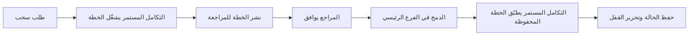
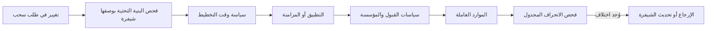

# الوحدة 3 — البنية التحتية بوصفها شيفرة (Infrastructure as code)

*الحساب السحابي (cloud account) الذي يغيّره الناس بالنقر (by clicking) نظامٌ لا يستطيع أحد أن يصفه وصفًا كاملًا أو يراجعه أو يعيد بناءه. وهذه الوحدة تحوّل البنية التحتية (infrastructure) لبنك نجم (Najm Bank) إلى شيفرة (code): ملفات في Git تقول ما الذي ينبغي أن يوجد، وأداة تستنتج كيف تصل إليه، ومراجعة (review) قبل أن يتغيّر أي شيء. تبدأ الوحدة بـ Terraform وOpenTofu، وهما أوسع الأدوات من هذا النوع استخدامًا: كيف تعمل الحالة (state) والخطط (plans) والوحدات البرمجية (modules)، ولماذا يكون ملف الحالة (state file) أكثر ملف حساسيةً يملكه فريق المنصة (platform team). ثم تنتقل من بيئة واحدة (one environment) إلى بيئات كثيرة (many)، مستخدمةً GitOps لترقية (promote) التغيير نفسه من بيئة التطوير (dev) إلى بيئة ما قبل الإنتاج (staging) إلى الإنتاج (production) عبر طلب سحب (pull request)، بينما يسحب Argo CD أو Flux النتيجة إلى العناقيد (clusters). وتنتهي بالضوابط (controls) التي تُبقي كل ذلك آمنًا على نطاق واسع (at scale): السياسة بوصفها شيفرة (policy as code) التي تفحص كل تغيير آليًا، واكتشاف الانحراف (drift detection) الذي يلاحظ متى لم يعد الواقع مطابقًا للشيفرة، والحواجز الواقية (guardrails) التي تجعل المسار الآمن (safe path) هو المسار السهل. ستتابع يوسف بينما تكاد إعادة تسمية (rename) من كلمة واحدة في طلب سحب (pull request) أن تستبدل قاعدة بيانات إنتاجية (production database)، وسالم وهو يصمّم مسار الترقية (promotion path) لـ واجهة برمجة تطبيق نجم للهاتف (Najm Mobile API)، ومها وهي تكتشف لماذا كفّت بيئة ما قبل الإنتاج (staging) والإنتاج (production) عن التصرّف بالطريقة نفسها.*

> **المراحل (Phases):** Code, Release, Deploy, Operate — وصف البنية التحتية (describing infrastructure) في ملفات قابلة للمراجعة (reviewable files)، وترقية التغييرات عبر البيئات (promoting changes through environments) بطلبات السحب (pull request)، وإبقاء ما يعمل متّسقًا مع ما اعتُمد (keeping what runs in line with what was approved).

---

# 3.1 — البنية التحتية بوصفها شيفرة باستخدام Terraform/OpenTofu: الحالة والوحدات والخطط (state, modules and plans)
*المستوى (Level): 🟡 متوسط (Intermediate)* · *المتطلبات (Prerequisites): 1.2، 1.3* · *المرحلة (Phase): Code, Deploy*

## ⚡ الدرس في دقيقة (In 60 seconds)
- تعني **البنية التحتية بوصفها شيفرة (infrastructure as code, IaC)** وصفَ الخوادم (servers) والشبكات (networks) وقواعد البيانات (databases) والصلاحيات (permissions) في ملفات نصية (text files) تطبّقها أداةٌ نيابةً عنك. تُراجَع الملفات (reviewed)، وتُدار إصداراتها (versioned)، ويمكن تكرارها (repeatable)؛ وتصبح وحدة التحكم (console) للقراءة فقط (read-only) في العمل اليومي (day-to-day work).
- إن **Terraform** وفرعه مفتوح المصدر (open-source fork) **OpenTofu** أداتان *تصريحيتان (declarative)*: تكتب الحالة النهائية (end state) التي تريدها، فتستنتج الأداة أيّ استدعاءات إنشاء وتحديث وحذف (create, update and delete calls) عليها أن تنفّذ.
- تتذكّر الأداة ما تديره في **ملف الحالة (state file)**. احفظ الحالة (state) عن بُعد (remote)، ومقفلة (locked)، ومشفّرة (encrypted)، ومضبوطة الوصول بإحكام (tightly access-controlled)، لأنها قد تحتوي على أسرار (secrets)، وفقدانها يعني أن تفقد تتبّع ما تملكه (losing track of what you own).
- **اقرأ الخطة دائمًا (Always read the plan).** عبارتا "must be replaced" أو "destroy" بجوار قاعدة بيانات (database) هما أهم سطرين ستراهما طوال الأسبوع.
- غلّف الأنماط المتكررة (repeated patterns) في **وحدات برمجية (modules)** ذات واجهات صغيرة مُتحقَّق منها (small, validated interfaces)؛ وثبّت إصدارات (pin versions) الوحدات والمزوّدات (module and provider).
- الفخ الأكبر (Biggest trap): تنفيذ `apply` من حاسوب محمول (laptop) ببيانات اعتماد واسعة (broad credentials). عمليات التطبيق في الإنتاج (production applies) تجري في خط تسليم (pipeline)، انطلاقًا من خطة محفوظة سبقت مراجعتها (reviewed, saved plan).

## 🧭 لماذا يهم (Why it matters)
تبدو أول تذكرة (ticket) يتسلّمها يوسف صغيرة: إعادة تسمية قاعدة بيانات المدفوعات (Payments database) من `payments-db` إلى `najm-payments-prod` لتوافق معيار التسمية (naming standard). يعدّل سطرًا واحدًا ويطلب موافقة سريعة (quick approval). تفتح مها الخطة (plan) التي أرفقها خط التسليم (pipeline) بطلب السحب (pull request):

```text
  # module.payments_db.aws_db_instance.this must be replaced
-/+ resource "aws_db_instance" "this" {
      ~ identifier = "payments-db" -> "najm-payments-prod" # forces replacement
      ...
Plan: 1 to add, 0 to change, 1 to destroy.
```

مع إصدار مزوّد AWS (AWS provider version) الذي يثبّته الفريق، لا يمكن تغيير المعرّف (identifier) في مكانه (in place) (إصدارات المزوّد الأحدث (newer provider releases) تستطيع إعادة تسميته في مكانه؛ والخطة (plan) وحدها تخبرك بأيّهما لديك)، لذا كانت الأداة ستحذف قاعدة بيانات المدفوعات الإنتاجية (production payments database) وتنشئ قاعدة فارغة (empty one). كانت الشيفرة صحيحة (valid)، وقالت الخطة بالضبط ما سيحدث؛ والسؤال الوحيد كان هل سيقرؤها أحد. تمنع مها الدمج (blocks the merge). وفي عصر ذلك اليوم يضيف سالم قاعدتين: كل قاعدة بيانات إنتاجية (production database) تحمل `prevent_destroy`، ولا يُدمج أي طلب سحب للإنتاج (production pull request) حتى يؤكد مراجعٌ (reviewer) سطرَ ملخّص الخطة (plan summary line).

أما لماذا تحتاج عمليات النشر (deploys) إلى بوابات (gates) أصلًا فيتناوله [*تصميم الأنظمة لمبرمجي الحدس (System Design for Vibe Coders)*، الدرس 4.4 — التراجع وبيئة ما قبل الإنتاج وبوابات الإطلاق (Rollback, staging, and release gates)](../vibe/index.ar.html#l4-4)؛ وهنا تتعلّم كيف تُبنى البنية التحتية (infrastructure) التي تحتها وكيف تُغيَّر.

## 📐 كيف يعمل (How it works)
### 🟢 الأساسيات (The essentials)
**لماذا الشيفرة بدل النقرات (Why code instead of clicks).** قاعدة البيانات (database) التي تُنشأ في وحدة تحكم ويب (web console) لا تترك سجلًا قابلًا للمراجعة (reviewable record). لا يستطيع أحد مراجعة التغيير مسبقًا (beforehand)، ولا تكراره بدقة في بيئة أخرى (another environment)، ولا إعادة بنائه بعد كارثة (disaster). والبنية التحتية بوصفها شيفرة (IaC) تعالج الثلاثة كلها: لكل تغيير في Git مؤلِّف (author) ومراجِع (reviewer) وتاريخ (history)؛ والملفات نفسها تبني بيئة التطوير (dev) وبيئة ما قبل الإنتاج (staging) والإنتاج (production)؛ وبعد عطل إقليمي (regional failure) يكون وصف كل ما تحتاجه موجودًا في مستودع (repository).

**التصريحي مقابل الأمري (Declarative versus imperative).** السكربت *الأمري (imperative)* يسرد خطوات ("أنشئ شبكة، ثم قاعدة بيانات")؛ شغّله مرتين وقد تحصل على قاعدتي بيانات. أما الأداة *التصريحية (declarative)* فتقارن وصف الحالة النهائية (end state) بما هو موجود؛ شغّلها مرتين فلا يفعل التشغيل الثاني شيئًا. هذه الخاصية هي **عدم التأثر بالتكرار (idempotence)**، وهي ما يجعل إعادة تشغيل البنية التحتية بوصفها شيفرة (IaC) آمنة (safe to rerun).

**Terraform وOpenTofu.** تستخدم أداة **Terraform**، من إنتاج HashiCorp، لغة تهيئة (configuration language) تُسمّى **HCL** (HashiCorp Configuration Language). وفي أغسطس 2023 نقلت HashiCorp أداة Terraform من رخصة مفتوحة المصدر (open-source licence) إلى رخصة المصدر التجاري (Business Source License, BSL). فاشتقّ المجتمع (community) آخر إصدار مفتوح المصدر (forked the last open-source version) باسم **OpenTofu**، وهو مشروع تابع لـ Linux Foundation (قُبل في بيئة الاحتضان CNCF sandbox عام 2025). وتبقى الأداتان متقاربتين: لغة HCL نفسها، والمزوّدات (providers) نفسها، ومعظم الأوامر (commands) نفسها (`terraform` مقابل `tofu`)، وإن كانت بعض الميزات (features) تختلف الآن، فراجع التوثيق (docs) الخاص بأداتك وإصدارها. ينطبق هذا الدرس على كلتيهما؛ وتستخدم التمارين (exercises) OpenTofu لأنه مفتوح المصدر.

اللبنات الأساسية (main building blocks):

| المفهوم (Concept) | ما هو (What it is) | مثال (Example) |
|---|---|---|
| **المزوّد (Provider)** | إضافة (plugin) تتخاطب مع واجهة برمجة تطبيقات (API) واحدة: سحابة (cloud)، أو Kubernetes، أو Docker، أو GitHub | `hashicorp/aws`، `hashicorp/azurerm`، `hashicorp/google`، `kreuzwerker/docker` |
| **المورد (Resource)** | شيء واحد تنشئه الأداة وتديره | شبكة (network)، قاعدة بيانات (database)، حاوية تخزين (bucket)، حاوية (container) |
| **مصدر البيانات (Data source)** | شيء يُقرأ ولكن لا يُدار (read but not managed) | معرّف شبكة فريق آخر (another team's network ID) |
| **المتغيّر (Variable)** | مُدخل (input) إلى التهيئة (configuration) | `environment = "prod"` |
| **المُخرج (Output)** | قيمة تكشفها التهيئة (a value the configuration exposes) | اسم مضيف الاتصال (connection hostname) لقاعدة البيانات |
| **الوحدة البرمجية (Module)** | مجلد قابل لإعادة الاستخدام (reusable folder) من الموارد له مُدخلات ومُخرجات (inputs and outputs) | `modules/postgres` |
| **الحالة (State)** | سجلّ الأداة لأيّ الكائنات الحقيقية (real objects) تديرها | `terraform.tfstate` |

تهيئة مصغّرة (minimal configuration) يمكنك تشغيلها محليًا (locally) باستخدام مزوّد Docker (Docker provider)، دون حاجة إلى حساب سحابي (cloud account):

```hcl
terraform {
  required_providers {
    docker = {
      source  = "kreuzwerker/docker"
      version = "~> 3.0" # allow any 3.x release, never a surprise 4.0
    }
  }
}

provider "docker" {}

resource "docker_image" "web" {
  name         = "nginx:1.27-alpine"
  keep_locally = true
}

resource "docker_container" "web" {
  name  = "najm-hello"
  image = docker_image.web.image_id
  ports {
    internal = 80
    external = 8080
  }
}
```

**سير العمل (The workflow).** أربعة أوامر (commands) تحمل كل شيء تقريبًا:

```shell
tofu init                 # download providers and modules, connect to the state backend
tofu plan -out=tfplan     # compare code, state and reality; save the proposed changes
tofu show tfplan          # read the plan (a human does this)
tofu apply tfplan         # apply exactly the saved plan, nothing else
```

يكتب `init` أيضًا **ملف قفل الاعتماديات (dependency lock file)**، وهو `.terraform.lock.hcl`، بإصدارات المزوّدات الدقيقة (exact provider versions) ومجاميعها الاختبارية (checksums). أودِعه في المستودع (Commit it).

**قراءة الخطة (Reading a plan).** يبدأ سطر كل مورد (resource) برمز (symbol): `+` إنشاء (create)، و`-` حذف (destroy)، و`~` تحديث في المكان (update in place)، و`-/+` حذف ثم إنشاء بديل (destroy and create a replacement). اقرأ سطر الملخّص (summary line) أولًا ("Plan: 2 to add, 1 to change, 0 to destroy.")، ثم كل `-` و`-/+`. والتغييرات التي لا يمكن إجراؤها في المكان (cannot be made in place) تُعلَّم بـ `# forces replacement`.

### 🟡 التعمق أكثر (Going deeper)
**الحالة: ذاكرة الأداة (State: the tool's memory).** يربط ملف **الحالة (state)** الشيفرة بالواقع (links code to reality): فهو يقابل `module.payments_db.aws_db_instance.this` بمعرّف قاعدة بيانات حقيقي (real database ID) ويخزّن آخر سماتها المعروفة (last known attributes). ومن دونه لا تستطيع الأداة التمييز بين "قاعدة بياناتي، وتحتاج إلى تغيير" و"قاعدة بيانات شخص آخر".

ثلاث حقائق تحدّد كيف تتعامل معه:
- **قد يحتوي على أسرار بنص صريح (secrets in plain text).** إذا كانت لمورد (resource) سمة كلمة مرور (password attribute)، فإن قيمتها تنتهي في الحالة (state)، حتى لو كان المتغيّر (variable) مُعلَّمًا بـ `sensitive` (فهذه العلامة تخفيها فقط من مُخرجات الشاشة (screen output)). عامِل ملف الحالة (state file) كما تعامل مخزن بيانات الاعتماد (credential store). وقد أضاف OpenTofu تشفيرًا اختياريًا للحالة من جهة العميل (optional client-side encryption of state)؛ وأيًّا كانت الأداة التي تستخدمها، شفّر أيضًا وسيط التخزين (storage) الذي توجد فيه. والأفضل من ذلك أن تتجنّب تمرير الأسرار (secrets) عبر البنية التحتية بوصفها شيفرة (IaC) أصلًا: دع قاعدة البيانات تولّد كلمة مرور المسؤول (admin password) داخل مدير أسرار (secrets manager) ([*أمن الذكاء الاصطناعي والتطبيقات (Secure AI & Application Security)*، الدرس 5.2 — إدارة الأسرار: المفاتيح والرموز وأين تتسرّب (Secrets management: keys, tokens and where they leak)](../secai/index.ar.html#/5.2)).
- **قد يُفسده شخصان يطبّقان في الوقت نفسه (Two people applying at once can corrupt it).** يمنع **القفل (lock)** تشغيلًا ثانيًا ما دام تشغيلٌ آخر قيد التنفيذ (in progress).
- **الملف المحلي على حاسوب محمول نقطة إخفاق وحيدة (single point of failure).** إن فقدته نسيت الأداة كل ما تديره.

لذلك تعيش حالة الإنتاج (production state) في **واجهة تخزين خلفية بعيدة (remote backend)** مزوّدة بالقفل (locking) والتشفير (encryption) وإدارة الإصدارات (versioning) ووصول ضيّق (narrow access):

```hcl
terraform {
  backend "s3" {
    bucket       = "najm-tfstate-prod"           # versioning and encryption enabled on the bucket
    key          = "mobile-api/database.tfstate" # one state per component
    region       = "<your-region>"
    encrypt      = true
    use_lockfile = true # S3-native locking in recent versions; older setups use a DynamoDB table
  }
}
```

تستخدم Azure الواجهة الخلفية `azurerm`، وتستخدم Google Cloud الواجهة الخلفية `gcs`؛ وتخزّن الخدمات المستضافة (hosted services) مثل HCP Terraform الحالةَ (state) نيابةً عنك. راجع توثيق أداتك (tool's documentation) لمعرفة الخيارات الحالية (current options).

**الوحدات البرمجية: منتج فريق المنصة (Modules: the platform team's product).** **الوحدة البرمجية (module)** مجلد من الموارد (folder of resources) تكون المتغيّرات (variables) مُدخلاته والمُخرجات (outputs) نتائجه. لا يريد بنك نجم (Najm Bank) أربعين إعدادًا مختلفًا قليلًا لـ PostgreSQL؛ بل يريد إعدادًا واحدًا يكون افتراضيًا (by default) مدعومًا بنسخ احتياطية (backed up)، ومشفّرًا (encrypted)، وخاصًا (private)، ومراقَبًا (monitored)، تستهلكه الفرق (teams) كما تستهلك مكتبة (library):

```hcl
module "orders_db" {
  source = "git::https://git.najm.example/platform/tf-modules.git//postgres?ref=v1.4.0" # pinned tag

  name           = "orders"
  environment    = "prod"
  size           = "medium"
  data_class     = "confidential"
  backup_days    = 35
  owner          = "team-orders"
}
```

الوحدات البرمجية الجيدة (Good modules) لها واجهة صغيرة (small interface)، وقيم افتراضية ذات رأي واضح (opinionated defaults)، وكتل `validation` على المتغيّرات (variables) تُفشل مبكرًا (fail early) برسالة واضحة (clear message) (مثلًا، يجب أن تكون `environment` إما `dev` أو `staging` أو `prod`). والوحدة البرمجية التي تكشف كل وسيطات المزوّد (every provider argument) ليست سوى المزوّد نفسه مع خطوات إضافية (the provider with extra steps).

**حماية ما يجب ألّا يموت (Protecting what must not die).** في الموارد ذات الحالة (stateful resources)، اطلب من الأداة أن ترفض الحذف (refuse destruction):

```hcl
resource "aws_db_instance" "this" {
  # ...
  deletion_protection = true # the cloud API refuses deletes too
  lifecycle {
    prevent_destroy = true   # the IaC tool refuses any plan that would destroy this
  }
}
```

يوقف `prevent_destroy` الخطة السيئة (bad plan)؛ أما حماية الحذف (deletion protection) لدى المزوّد فتوقف أيضًا من يعمل في وحدة التحكم (console) أو في أداة أخرى (another tool).

**من يشغّل `apply` (Who runs apply).** في بنك نجم (Najm Bank) لا أحد يطبّق على الإنتاج (applies production) من حاسوب محمول (laptop). ينشر خط التسليم (pipeline) الخطة (plan) على كل طلب سحب (pull request)؛ وبعد الموافقة (approval) والدمج (merge) يطبّق *تلك الخطة المحفوظة (that saved plan)* بدور قصير العمر (short-lived role) يُحصل عليه عبر اتحاد الهوية OIDC (OIDC federation)، لا بمفاتيح مخزّنة (stored keys) (1.3). أما `apply` جديد بعد ساعة فسيحسب خطة جديدة (new plan) لم يراجعها أحد.



### 🔴 نظرة الخبير (Expert view)
**نطاق الضرر وحدود الحالة (Blast radius and state boundaries).** حالة واحدة عملاقة (one giant state) للبنك كله تجعل كل خطة (plan) بطيئة، وكل تطبيق (apply) يُقفل الباب على الجميع (lock everyone out)، وكل خطأ قادرًا على المساس بكل شيء. قسّم الحالة حسب المكوّن والمالك (by component and owner): أسس الشبكة (network foundations)، وعنقود Kubernetes (Kubernetes cluster)، ومخازن بيانات كل تطبيق (each application's data stores)، وDNS. ومرّر القيم بين الحالات (between states) عبر مُخرجات (outputs) تقرؤها مصادر البيانات (data sources)، أو عبر مخزن معاملات (parameter store).

**إعادة الهيكلة دون حذف (Refactoring without destroying).** نقل مورد (resource) إلى وحدة برمجية (module) يغيّر عنوانه (address)، وعادةً سترى الأداة "حُذف العنوان القديم، وأُنشئ العنوان الجديد". أما كتلة `moved` فتخبرها بأن الكائن (object) صار له ببساطة اسم جديد:

```hcl
moved {
  from = aws_db_instance.payments
  to   = module.payments_db.aws_db_instance.this
}
```

وبالمثل، تُدخل كتل `import` الموارد الموجودة المبنية يدويًا (existing, hand-built resources) تحت الإدارة (under management)، وتوقف كتل `removed` إدارة مورد ما دون حذفه (without deleting it). وتُراجَع هذه في الخطة (reviewed in the plan) مثل كل شيء آخر، بخلاف أمرَي سطر الأوامر (command-line) `state mv` و`state rm` اللذين يغيّران الحالة (state) دون أي مراجعة (no review). تحقّق من أن إصدارك يدعم كل كتلة (supports each block).

**انضباط الإصدارات (Versioning discipline).** ثبّت إصدار الأداة (Pin the tool version) (`required_version` وفي التكامل المستمر (CI))، والمزوّدات (providers) (القيود (constraints) مع ملف القفل (lock file))، والوحدات البرمجية (modules) (وسم (tag)، لا فرعًا متحرّكًا (moving branch) أبدًا). رقِّ (Upgrade) واحدًا في كل مرة، في بيئة التطوير (dev) أولًا: فترقية مزوّد (provider upgrade) تغيّر قيمة افتراضية (default) قد تُنتج خطة مليئة بتحديثات لم يطلبها أحد.

**البدائل (Alternatives).** تستخدم **Pulumi** لغات عامة الأغراض (general-purpose languages) مثل TypeScript أو Python أو Go، مع نموذج الحالة والخطة (state-and-plan model) نفسه. أما **AWS CloudFormation** و**Azure Bicep** فأصيلتان في سحابتيهما (native to their clouds) (وقد تغيّر العرض الأصيل (native offering) لدى Google Cloud مع الوقت؛ راجع توثيقه)؛ وكثيرًا ما تدعمان الخدمات الجديدة أولًا (support new services first). يغطي Terraform وOpenTofu مزوّدات كثيرة (many providers) بسير عمل واحد (one workflow)، وهذا يناسب بنكًا يشغّل Kubernetes وDNS وشبكة توصيل محتوى (CDN) وGitHub وسحابة (cloud) معًا. والمفاهيم (concepts) هنا تنتقل إليها جميعًا.

**وكلاء البرمجة بالذكاء الاصطناعي والبنية التحتية بوصفها شيفرة (AI coding agents and IaC).** يكتب الوكلاء (Agents) شيفرة HCL بسرعة، وقد "يصلحون" خطأً بتوسيع مجموعة أمان (widening a security group) أو بإضافة صلاحية شاملة (wildcard permission). الخطة (plan) والماسحات (scanners) والسياسات (policies) (3.3) هي التي تقرّر، لا ثقة الوكيل (agent's confidence). ويغطي [*أمن الذكاء الاصطناعي والتطبيقات (Secure AI & Application Security)*، الدرس 7.2 — الحاويات وKubernetes والبنية التحتية بوصفها شيفرة (Containers, Kubernetes and infrastructure as code)](../secai/index.ar.html#/7.2) الفحوص الأمنية (security checks) بتعمّق.

## 🧰 الأدوات (The toolkit)
| الأداة أو الممارسة أو الخدمة (Tool, practice or service) | ما هي وماذا تفعل (What it is and does) | متى تلجأ إليها (When to reach for it) |
|---|---|---|
| **OpenTofu** (Linux Foundation) | أداة بنية تحتية بوصفها شيفرة تصريحية مفتوحة المصدر (open-source declarative IaC tool) مشتقّة من Terraform؛ HCL والمزوّدات (providers) والحالة (state) والخطط (plans) | الخيار الافتراضي (default choice) لأعمال IaC الجديدة مفتوحة المصدر ولتمارين هذه الدورة (this course's exercises) |
| **Terraform** (HashiCorp) | الأداة الأصلية (original) للبنية التحتية بوصفها شيفرة القائمة على HCL، تخضع لرخصة BSL منذ أغسطس 2023، ولها خدمة مستضافة (hosted service) هي HCP Terraform | حيث تكون مؤسستك قد اعتمدتها معيارًا (standardised on it) أو تستخدم ميزاتها المستضافة (hosted features) |
| **Remote state with locking** — الحالة البعيدة مع القفل | تخزين حالة مشترك ومشفّر ومُدار الإصدارات (shared, encrypted, versioned state storage) يمنع عمليات التطبيق المتزامنة (concurrent applies) | أي تهيئة (configuration) يلمسها أكثر من شخص واحد أو خط تسليم (pipeline) واحد |
| **IaC module** — وحدة البنية التحتية البرمجية | مجلد قابل لإعادة الاستخدام (reusable folder) من الموارد بواجهة صغيرة مُتحقَّق منها (small, validated interface) وقيم افتراضية آمنة (safe defaults) | أي نمط يُبنى أكثر من مرتين: قواعد البيانات (databases)، وحاويات التخزين (buckets)، والعناقيد (clusters)، والشبكات (networks) |
| **Pulumi** | البنية التحتية بوصفها شيفرة بلغات عامة الأغراض (general-purpose languages) مع نموذج الخطة والحالة (plan-and-state model) نفسه | الفرق التي تفضّل لغات حقيقية (real languages) للبنية التحتية |

## 🏛️ عمليًا في بنك نجم (In practice at Najm Bank)
يطلب سالم من يوسف أن يكتب الواجهة (interface) لأول وحدة برمجية من نوع المسار الذهبي (golden-path module) في المنصة، كي تستطيع فرق التطبيقات (app teams) طلب قاعدة بيانات بملء ستة أسطر. هذا هو **معيار نجم للوحدات البرمجية للبنية التحتية (Najm IaC module standard): `postgres` v1**.

**الجزء أ: الواجهة (Part A: interface)**

| المُدخل (Input) | النوع والقيم المسموحة (Type and allowed values) | القيمة الافتراضية (Default) | لماذا هو مُدخل (Why it is an input) |
|---|---|---|---|
| `name` | سلسلة نصية (string)، أحرف صغيرة وشَرطات (lowercase letters and hyphens)، من 3 إلى 30 حرفًا | لا يوجد (مطلوب (required)) | يبني المعرّف (identifier) `najm-<name>-<environment>` |
| `environment` | `dev` أو `staging` أو `prod` | لا يوجد (مطلوب (required)) | يحدّد حدود الحجم (size limits) والنسخ الاحتياطية (backups) والحماية (protection) |
| `size` | `small` أو `medium` أو `large` | `small` | يقابل فئة مثيل (instance class) لكل سحابة؛ لا تختار الفرق أنواع المثيلات الخام (raw instance types) أبدًا |
| `data_class` | `internal` أو `confidential` أو `restricted` | `confidential` | التصنيف المقيَّد (Restricted) يفرض مفاتيح يديرها العميل (customer-managed keys) وتسجيلًا إضافيًا (extra logging) |
| `backup_days` | رقم (number)، من 7 إلى 35 | 7 في بيئة التطوير (dev)، و35 في الإنتاج (prod) | هدف التعافي (recovery target)؛ محدود بالحد الأقصى لدى المزوّد (provider's maximum) |
| `owner` | المعرّف المختصر للفريق (team slug) | لا يوجد (مطلوب (required)) | يصبح الوسم (tag) `owner` للتنبيهات (alerts) وتقارير التكلفة (cost reports) (6.2) |

| المُخرج (Output) | الاستخدام (Use) |
|---|---|
| `endpoint` | اسم مضيف خاص (private hostname) لتهيئة التطبيق (application's configuration) |
| `secret_ref` | اسم مدخل مدير الأسرار (secrets-manager entry) الذي يحفظ بيانات الاعتماد المولّدة (generated credentials)؛ وليس كلمة المرور نفسها أبدًا |
| `dashboard_url` | رابط إلى لوحة المتابعة القياسية (standard dashboard) لقاعدة البيانات |

**الجزء ب: ما تثبّته الوحدة البرمجية ولا يمكن تهيئته (Part B: fixed by the module, not configurable)**
- شبكات خاصة فقط (Private networking only)؛ لا نقطة نهاية عامة (public endpoint) أبدًا.
- التشفير أثناء التخزين (encryption at rest) وTLS أثناء النقل (in transit) مُفعَّلان.
- حماية الحذف (Deletion protection) و`prevent_destroy` في `staging` و`prod`.
- بيانات اعتماد المسؤول (Admin credentials) تولّدها السحابة (cloud) وتُخزَّن في مدير الأسرار (secrets manager)؛ ولا يمرّ أيٌّ منها عبر المتغيّرات (variables).
- الوسوم القياسية (Standard tags): `owner`، و`environment`، و`data-class`، و`cost-centre`، و`managed-by = opentofu`.

**الجزء ج: قواعد الحالة والتطبيق (Part C: state and apply rules)**
- حالة واحدة لكل مكوّن (One state per component) (`<team>/<service>/<component>.tfstate`)، وحاوية تخزين خلفية (backend bucket) واحدة لكل بيئة (per environment)؛ إدارة الإصدارات (versioning) والتشفير (encryption) مُفعَّلان؛ والوصول (access) مقصور على دور خط التسليم (pipeline role) ومهندسَين اثنين مسمَّيين لكسر الزجاج (two named break-glass engineers).
- عمليات التطبيق في الإنتاج (Production applies) تجري فقط من خط التسليم (pipeline)، ومن خطة محفوظة (saved plan)، بموافقة فريق المنصة (platform team) والفريق المالك (owning team).
- أي `destroy` أو `must be replaced` على مورد ذي حالة (stateful resource) يحتاج إلى موافقة مها أو سالم.

## 🛠️ التمارين (Exercises)
تعمل الثلاثة كلها على جهازك (your own machine) باستخدام Docker وOpenTofu. وإن اخترت بدلًا من ذلك الفئة المجانية (free tier) لدى سحابة ما، فاضبط تنبيه ميزانية (budget alert) قبل إنشاء أي شيء.

- 🟢 استخدم تهيئة Docker (Docker configuration) من 🟢 الأساسيات (The essentials). شغّل `init` و`plan -out=tfplan` و`apply tfplan`، وتحقّق من الصفحة على المنفذ (port) 8080، ثم غيّر المنفذ الخارجي (external port) واقرأ الخطة الجديدة (new plan). وأخيرًا شغّل `plan` مرة أخرى دون تغيير أي شيء. *يكتمل عندما (Done when):* تستطيع الإشارة إلى السطر الذي يقول هل ستُحدَّث الحاوية في مكانها (updated in place) أم ستُستبدل (replaced)، وتُبلغ الخطة الأخيرة بعدم وجود تغييرات (no changes).
- 🟡 حوّل التهيئة (configuration) إلى وحدة برمجية (module) `modules/web` بمُدخلات مُتحقَّق منها (validated inputs) هي `name` و`port` و`image_tag`، واستدعِها مرتين لتشغيل حاويتين (two containers). استخدم كتلة `moved` للحاوية الأصلية (original container). *يكتمل عندما (Done when):* يفشل منفذ غير صالح (invalid port) عند `plan` برسالة الخطأ التي كتبتها، وتُظهر خطة إعادة الهيكلة (refactor plan) نقلًا (move) دون أي حذف (zero destroys).
- 🔴 شغّل مخزن كائنات متوافقًا مع S3 (S3-compatible object store) محليًا في Docker (MinIO أو بديلًا عنه؛ تحقّق من رخصته الحالية (current licence) وصوره (images))، واستخدمه واجهة تخزين خلفية بعيدة مقفلة (locked remote backend). ابدأ عمليتي تطبيق (two applies) في الوقت نفسه من طرفيتين (two terminals). ثم أضف `prevent_destroy` إلى إحدى الحاويتين وغيّر اسمها، وهو ما يفرض الاستبدال (forces replacement). *يكتمل عندما (Done when):* يُرفض التطبيق الثاني بسبب القفل (lock)، وتُرفض خطة الاستبدال المفروض (forced-replacement plan) بخطأ `prevent_destroy`، ولا يوجد ملف حالة (state file) في مجلد العمل (working directory).

## ⚠️ أخطاء وفخاخ (Mistakes and traps)
- **تصفّح الخطة على عجل (Skimming the plan).** اقرأ سطر الملخّص (summary line) وكل `-` و`-/+` قبل الموافقة. اجعل خط التسليم (pipeline) ينشر الخطة داخل طلب السحب (pull request) كي لا يستطيع المراجعون (reviewers) تجاوزها.
- **الحالة في Git أو على حاسوب محمول (State in Git or on a laptop).** قد تحمل الحالة (state) أسرارًا (secrets)، وهي الخريطة الوحيدة لما تملكه. استخدم واجهة تخزين خلفية (backend) بعيدة ومقفلة ومشفّرة ومُدارة الإصدارات (remote, locked, encrypted, versioned) بوصول ضيّق (narrow access).
- **تشغيل `apply` جديد بدل الخطة التي رُوجعت (Running a fresh apply instead of the reviewed plan).** ربما تغيّر الواقع (reality) في الأثناء. طبّق ملف الخطة المحفوظ (saved plan file)، أو أعد التخطيط وأعد المراجعة (re-plan and re-review).
- **وحدات برمجية ومزوّدات غير مثبّتة الإصدار (Unpinned modules and providers).** إنها تغيّر بنيتك التحتية (infrastructure) دون تغيير في الشيفرة (code change). ثبّت الإصدارات (Pin versions) وأودِع ملف القفل (lock file).
- **جراحة الحالة في الثانية فجرًا ⁦(State surgery at 2 a.m.)⁩.** أمر `state rm` غير المراجَع (unreviewed) يُفقدك تتبّع موارد حقيقية (real resources). استخدم كتل `moved` و`import` و`removed` في طلب سحب (pull request).

## 🧾 الخلاصة (Recap)
- تحوّل البنية التحتية بوصفها شيفرة (IaC) البنية التحتية إلى شيفرة مُراجَعة ومُدارة الإصدارات وقابلة للتكرار (reviewed, versioned, repeatable code)؛ والأدوات التصريحية (declarative tools) مثل Terraform وOpenTofu تحسب التغييرات نيابةً عنك.
- تربط الحالة (state) الشيفرة بالموارد الحقيقية (real resources). احفظها بعيدة ومقفلة ومشفّرة ومضبوطة الوصول (remote, locked, encrypted and access-controlled)، وقسّمها حسب المكوّن (by component) للحدّ من نطاق الضرر (blast radius).
- الخطة (plan) هي شبكة الأمان (safety net): احفظها، وراجعها في طلب السحب (pull request)، وطبّق تلك الخطة بعينها من خط تسليم (pipeline) ببيانات اعتماد قصيرة العمر (short-lived credentials).
- الوحدات البرمجية (Modules) هي منتج فريق المنصة (platform team's product): واجهات صغيرة مُتحقَّق منها (small validated interfaces)، وقيم افتراضية آمنة (safe defaults)، وإصدارات مثبّتة (pinned versions).
- احمِ الموارد ذات الحالة (stateful resources) بـ `prevent_destroy` وبحماية الحذف (deletion protection) لدى المزوّد، وأعد الهيكلة (refactor) بكتل `moved` و`import` و`removed`.

## ✍️ اختبر نفسك (Check yourself)

**1. يعيد يوسف تسمية معرّف (identifier) قاعدة بيانات المدفوعات الإنتاجية (production payments database) في شيفرة Terraform. تُظهر الخطة (plan) `-/+` و`# forces replacement` لقاعدة البيانات. ماذا سيحدث إذا طُبّقت هذه الخطة؟**

- A. تُعاد تسمية قاعدة البيانات في مكانها (renamed in place) دون أي توقف (no downtime)
- B. تُحذف قاعدة البيانات وتُستبدل بقاعدة جديدة فارغة (new, empty one)
- C. لا شيء، لأن Terraform لا يحذف قواعد البيانات أبدًا
- D. يُحدَّث ملف الحالة (state file) فقط، وتبقى قاعدة البيانات الحقيقية (real database) دون مساس

<details><summary>الإجابة</summary>

**B.** تعني `-/+` الحذف ثم إنشاء بديل (destroy and then create a replacement)، ويقول التعليق (comment) أيّ سمة (attribute) تفرض ذلك. الخيار A هو ما افترضه يوسف؛ والخيار C خاطئ ما لم تُضبط `prevent_destroy` أو حماية الحذف (deletion protection). (🟢 الأساسيات (The essentials)، و🧭 لماذا يهم (Why it matters).)

</details>

**2. لماذا يجب تخزين ملف الحالة (state file) لـ Terraform أو OpenTofu في واجهة تخزين خلفية (backend) مقفلة ومشفّرة ومضبوطة الوصول (locked, encrypted, access-controlled) بدل إيداعه في Git؟**

- A. لا يستطيع Git تخزين ملفات أكبر من ميغابايت واحد، وملفات الحالة كثيرًا ما تتجاوز ذلك
- B. لا تُحتاج ملفات الحالة (state files) إلا أثناء التطبيق الأول (first apply)
- C. ترفض المزوّدات (providers) العمل إذا كانت الحالة في مستودع (repository)
- D. قد تحمل الحالة أسرارًا بنص صريح (plain-text secrets)، وقد تُفسدها عمليات الكتابة المتزامنة غير المقفلة (unlocked concurrent writes)

<details><summary>الإجابة</summary>

**D.** تنتهي السمات الحساسة (sensitive attributes) في الحالة (state) بصرف النظر عن العلامة `sensitive`، والقفل (locking) يمنع تشغيلين من الكتابة في آن واحد. الخيار B خاطئ: فالحالة مطلوبة في كل تشغيل (every run). (🟡 التعمق أكثر (Going deeper).)

</details>

**3. يشغّل خط تسليم (pipeline) الأمر `plan` عند فتح طلب سحب (pull request). يُوافَق على طلب السحب ويُدمج بعد ثلاث ساعات، ثم يشغّل خط التسليم `apply` جديدًا (fresh) دون خطة محفوظة (saved plan). ما الخطر؟**

- A. إنه يعيد التخطيط (re-plans) مقابل الشيفرة والواقع الحاليين (current code and reality)، لذا قد يطبّق تغييرات غير مُراجَعة (unreviewed changes)
- B. لا يوجد خطر، لأن `apply` يكرّر دائمًا أحدث خطة شغّلها خط التسليم
- C. سيفشل التطبيق، لأن كل خطة تنتهي صلاحيتها بعد ساعة من تشغيل `plan`
- D. سيُحذف ملف الحالة (state file)

<details><summary>الإجابة</summary>

**A.** التطبيق الجديد (fresh apply) يحسب خطة جديدة. وحفظ الخطة باستخدام `-out` ثم تطبيق ذلك الملف يعني أن التغييرات المُراجَعة هي التغييرات المطبَّقة (the reviewed changes are the applied changes). الخيار B هو سوء الفهم الشائع (common misunderstanding). (🟡 التعمق أكثر (Going deeper).)

</details>

**4. يريد سالم أن تنشئ فرق التطبيقات (app teams) قواعد بيانات PostgreSQL تكون دائمًا خاصة ومشفّرة ومدعومة بنسخ احتياطية (private, encrypted and backed up). أيّ تصميم يحقّق ذلك على أفضل وجه؟**

- A. صفحة ويكي (wiki page) تسرد الإعدادات الموصى بها (recommended settings)، مرتبطة من دليل الإعداد (onboarding guide) لكل فريق
- B. وحدة برمجية (module) تكشف كل وسيطات المزوّد (every provider argument) متغيّراتٍ كي تحظى الفرق بمرونة كاملة (full flexibility)
- C. وحدة برمجية بواجهة صغيرة مُتحقَّق منها (small validated interface) وإعدادات الأمان مثبّتة داخلها (safety settings fixed inside it)
- D. منح كل فريق صلاحية المسؤول (administrator access) على وحدة التحكم السحابية (cloud console)

<details><summary>الإجابة</summary>

**C.** تثبيت القيم الافتراضية الآمنة (safe defaults) داخل الوحدة البرمجية يجعل التهيئة الصحيحة (right configuration) هي الوحيدة المتاحة. الخيار B يعيد إنتاج عدم الاتساق (inconsistency) الذي ينبغي للوحدة أن تزيله؛ والخيار A يعتمد على أن يقرأه الجميع ويتّبعوه. (🟡 التعمق أكثر (Going deeper)، و🏛️ عمليًا (In practice).)

</details>

**5. ينقل فريق المنصة (platform team) مورد قاعدة بيانات موجودًا (existing database resource) إلى وحدة برمجية جديدة (new module). تُظهر الخطة حذف العنوان القديم (old address) وإنشاء عنوان جديد. ما الإصلاح الأكثر أمانًا (safest fix)؟**

- A. طبّقها في ساعة هادئة (quiet hour) واستعد من النسخة الاحتياطية (restore from backup) بعد ذلك
- B. أضف كتلة `moved` من العنوان القديم إلى العنوان الجديد
- C. احذف ملف الحالة (state file) وشغّل `import` من سطر الأوامر (command line) لكل مورد
- D. انسخ شيفرة الوحدة البرمجية عائدًا إلى التهيئة الجذرية (root configuration) بصورة دائمة

<details><summary>الإجابة</summary>

**B.** تسجّل كتلة `moved` إعادة التسمية تصريحيًا (records the rename declaratively) وتُراجَع في الخطة. الخيار A يسبّب انقطاعًا (outage) وفقدانًا للبيانات (data loss)؛ والخيار C جراحة حالة (state surgery) خطرة غير مُراجَعة. (🔴 نظرة الخبير (Expert view).)

</details>

## 📚 المراجع (References)
- توثيق OpenTofu (OpenTofu documentation) — https://opentofu.org/docs/
- توثيق Terraform (Terraform documentation) — https://developer.hashicorp.com/terraform/docs
- لغة Terraform: الحالة (Terraform language: state) — https://developer.hashicorp.com/terraform/language/state
- لغة Terraform: الوحدات البرمجية (Terraform language: modules) — https://developer.hashicorp.com/terraform/language/modules
- HashiCorp، الأسئلة الشائعة حول الترخيص (licensing FAQ) (رخصة المصدر التجاري (Business Source License)) — https://www.hashicorp.com/
- Linux Foundation، مشروع OpenTofu (OpenTofu project) — https://opentofu.org/
- توثيق Pulumi (Pulumi documentation) — https://www.pulumi.com/docs/

---

# 3.2 — البيئات وGitOps: ترقية التغييرات من بيئة التطوير إلى الإنتاج (promoting changes from dev to production)
*المستوى (Level): 🟡 متوسط (Intermediate)* · *المتطلبات (Prerequisites): 2.2، 2.3، 3.1* · *المرحلة (Phase): Release, Deploy*

## ⚡ الدرس في دقيقة (In 60 seconds)
- **البيئة (environment)** (التطوير (dev)، وما قبل الإنتاج (staging)، والإنتاج (production)) نسخة كاملة من النظام (full copy of the system) لغرض محدّد. ينبغي ألّا تختلف البيئات إلا في التهيئة والحجم (configuration and scale)، ولا تختلف أبدًا في الشيفرة أو البنية (code or structure).
- **ابنِ مرة واحدة، ورقِّ الأثر البرمجي نفسه (Build once, promote the same artefact).** بصمة الصورة (image digest) نفسها التي اختُبرت في بيئة ما قبل الإنتاج (staging) هي التي تصل إلى الإنتاج (production)؛ ولا يُعاد بناء شيء على طول الطريق.
- تعني **GitOps** أن الحالة المرغوبة (desired state) لكل بيئة تعيش في Git، وأن وكيلًا (agent) داخل المنصة يسحبها ويجعل الواقع مطابقًا لها باستمرار (continuously makes reality match). مبادئه الأربعة (four principles): تصريحي (declarative)، ومُدار الإصدارات وغير قابل للتغيير (versioned and immutable)، ويُسحب آليًا (pulled automatically)، ويُوفَّق باستمرار (continuously reconciled).
- **الترقية (promotion)** طلب سحب (pull request) يغيّر قيمة واحدة (عادةً بصمة صورة (image digest)) في مجلد البيئة التالية (next environment's folder). راجِع، وادمج، ويتولّى **Argo CD** أو **Flux** الباقي؛ أما **التراجع (rollback)** فهو `git revert`.
- إشارة القرار (Decision cue): إن لم تستطع الإجابة عن سؤال "ما الذي يعمل في الإنتاج بالضبط، ومن وافق عليه؟" من Git وحده، فأنت لا تمارس GitOps بعد.
- الفخ الأكبر (The biggest trap): فروع طويلة العمر لكل بيئة (long-lived branches per environment)، وتعديلات يدوية (hand edits) بـ `kubectl` تكتب فوقها المزامنة التالية (next sync) بصمت، أو لا يلاحظها أحد أبدًا.

## 🧭 لماذا يهم (Why it matters)
في 1 أغسطس 2012 نشرت Knight Capital، وهي شركة أمريكية كبيرة لصناعة السوق (market-making firm)، شيفرة تداول جديدة (new trading code) على خوادمها. ووفقًا لأمر هيئة الأوراق المالية والبورصات الأمريكية (US Securities and Exchange Commission's order) في القضية، نسخ فنّيٌّ (technician) الشيفرة الجديدة إلى سبعة من الخوادم الثمانية ولم ينسخها إلى الثامن، ولم يلاحظ أحد. وأعاد الإصدار الجديد (new release) استخدام علامة (flag) شغّلت على الخادم الثامن شيفرةً قديمة متروكة منذ زمن طويل (old, long-unused code). فأرسل ذلك الخادم ملايين الأوامر غير المقصودة (unintended orders) خلال نحو 45 دقيقة، وخسرت الشركة قرابة 460 مليون دولار، وفقًا للهيئة (SEC). كان النشر يدويًا (manual deployment)، ولم يكن هناك فحص آلي (automated check) يتحقّق من أن كل خادم يشغّل الإصدار نفسه (same version)، ولم يراجع شخص ثانٍ (second person) النتيجة.

لدى بنك نجم (Najm Bank) نسخة أصغر من المشكلة نفسها. تحقّق مها في سبب استمرار خلل مهلة (timeout bug) أُصلح في بيئة ما قبل الإنتاج (staging) في الظهور في الإنتاج (production). فالإنتاج يشغّل صورة (image) من الالتزام (commit) نفسه لكنها أُعيد بناؤها بعد يومين بصورة أساس (base image) أحدث، كما أن أحدهم رفع حجم مجمّع الاتصالات (connection-pool size) باستخدام `kubectl edit` أثناء حادثة (incident) الشهر الماضي. ولا شيء في Git يسجّل أيًّا من الاختلافين، فلم تعد بيئة ما قبل الإنتاج تتنبّأ بسلوك الإنتاج (staging no longer predicts production).

يمنح هذا الدرس الفريق قاعدة واحدة (one rule) وآلية واحدة (one mechanism). القاعدة: الأثر البرمجي (artefact) نفسه ينتقل عبر كل بيئة، ولا تختلف إلا التهيئة (configuration). والآلية: GitOps، حيث يكون Git السجلّ الوحيد (single record) لما ينبغي أن يعمل وأين، ويجعل متحكّمٌ (controller) ذلك واقعًا ويُبلغ عن أي اختلاف (difference).

## 📐 كيف يعمل (How it works)
### 🟢 الأساسيات (The essentials)
**لماذا البيئات (Why environments).** تحتاج إلى مكان تجرّب فيه التغييرات ليس هو الإنتاج (production). يستخدم بنك نجم (Najm Bank) ثلاث بيئات:

| البيئة (Environment) | الغرض (Purpose) | البيانات (Data) | من ينشر (Who deploys) |
|---|---|---|---|
| **dev** — التطوير | دمج التغييرات وتجربتها بسرعة (Integrate and try changes quickly) | بيانات اختبار اصطناعية (Synthetic test data) | آليًا عند كل دمج (Automatic on every merge) |
| **staging** — ما قبل الإنتاج | بروفة نهائية (Final rehearsal) بتهيئة وحجم شبيهين بالإنتاج (production-like configuration and scale) | بيانات مُقنَّعة أو اصطناعية (Masked or synthetic data)، ولا بيانات عملاء حقيقية (real customer data) أبدًا دون موافقة | طلب سحب للترقية (Promotion pull request)، بموافقة الفريق (team approval) |
| **prod** — الإنتاج | العملاء (Customers) | بيانات حقيقية (Real data) | طلب سحب للترقية (Promotion pull request)، بموافقة الفريق والمنصة (team and platform approval) |

**تكافؤ البيئات (Environment parity).** يسمّي منهج التطبيق ذي العوامل الاثني عشر (Twelve-Factor App) ذلك "تكافؤ التطوير والإنتاج (dev/prod parity)": أبقِ البيئات متشابهة قدر الإمكان. ولا يُسمح بالاختلافات إلا حيث تكون مقصودة ومكتوبة (deliberate and written down): أعداد النسخ المتماثلة (replica counts)، وأحجام المثيلات (instance sizes)، وأسماء النطاقات (domain names)، وبيانات الاعتماد (credentials)، وإعدادات أعلام الميزات (feature-flag settings). أما اختلاف الشيفرة، أو الصور (images)، أو إصدارات Kubernetes، أو تخطيطات الشبكة (network layouts)، فيجعل نتائج بيئة ما قبل الإنتاج (staging results) بلا معنى.

**ابنِ مرة واحدة، ورقِّ الأثر البرمجي (Build once, promote the artefact).** يبني التكامل المستمر (CI) صورة الحاوية (container image) مرة واحدة، من التزام (commit) واحد، ويدفعها (pushes) إلى السجل (registry). وتُعرَّف الصورة ببصمتها (**digest**)، وهي تجزئة SHA-256 (SHA-256 hash) لمحتواها مثل `sha256:4f1c…`، لا بوسم (tag) مثل `v2.3` أو `latest`، لأن الوسم يمكن نقله إلى صورة مختلفة أما البصمة فلا (2.1). ثم تشغّل كل بيئة تلك البصمة. أما إعادة البناء للإنتاج (Rebuilding for production)، كما في حالة مها، فتُنتج أثرًا برمجيًا مختلفًا (different artefact) لم يختبره أحد.

**ما هو GitOps (What GitOps is).** يحدّد مشروع OpenGitOps، التابع لـ CNCF، أربعة مبادئ (four principles):
- **تصريحي (Declarative)**: تُوصَف الحالة المرغوبة (desired state) للنظام، ولا تُكتب في سكربت (not scripted).
- **مُدار الإصدارات وغير قابل للتغيير (Versioned and immutable)**: يُخزَّن ذلك الوصف بطريقة تحفظ التاريخ الكامل (full history) ولا يمكن تغييرها بصمت (cannot be silently changed)، وهذا يعني عمليًا Git.
- **يُسحب آليًا (Pulled automatically)**: تجلب وكلاء برمجية (software agents) الحالة المرغوبة من المصدر (source)؛ ولا يدفع أحد التغييرات إلى العنقود (cluster) يدويًا.
- **يُوفَّق باستمرار (Continuously reconciled)**: تواصل الوكلاء مقارنة الحالة الفعلية (actual state) بالحالة المرغوبة (desired state) وتعمل على سدّ أي فجوة (close any gap).

أشهر متحكّمَي GitOps (GitOps controllers) لـ Kubernetes هما **Argo CD** و**Flux**، وكلاهما مشروع متخرّج (graduated) في CNCF. يعمل كلٌّ منهما داخل العنقود (inside the cluster)، ويراقب مستودع Git (Git repository)، ويطبّق ما يجده.

**الدفع مقابل السحب (Push versus pull).** في خط تسليم *الدفع (push)* التقليدي، يحمل التكامل المستمر (CI) بيانات اعتماد العنقود (cluster credentials) ويشغّل `kubectl apply` أو `helm upgrade` في النهاية. أما في GitOps القائم على *السحب (pull)*، فلا يلمس التكامل المستمر العنقود أبدًا: إنه يحدّث Git فقط. والمتحكّم (controller) داخل العنقود هو الذي يسحب. وهذا يعني بيانات اعتماد قوية (powerful credentials) أقل خارج العنقود، ومسار تدقيق كاملًا (full audit trail) في Git، وتصحيحًا آليًا (automatic correction) حين يغيّر أحدهم العنقود يدويًا.

```mermaid
flowchart LR
    A["التزام في مستودع التطبيق"] --> B["التكامل المستمر يبني الصورة ويختبرها"]
    B --> C["السجل يخزّن الصورة ببصمتها"]
    C --> D["طلب سحب يرفع البصمة في مجلد التطوير"]
    D --> E["أرغو سي دي يزامن بيئة التطوير"]
    E --> F["طلب سحب يرقّي البصمة إلى ما قبل الإنتاج"]
    F --> G["أرغو سي دي يزامن بيئة ما قبل الإنتاج"]
    G --> H["طلب سحب معتمد يرقّي إلى الإنتاج"]
    H --> I["أرغو سي دي يزامن بيئة الإنتاج"]
```



### 🟡 التعمق أكثر (Going deeper)
**مستودعان (Two repositories).** يفصل بنك نجم (Najm Bank) شيفرة مصدر التطبيق (application source code) عن تهيئة البيئات (environment configuration):
- يحفظ **مستودع التطبيق (app repo)** شيفرة واجهة الهاتف (Mobile API) وملف Dockerfile والاختبارات (tests)؛ ويبني التكامل المستمر (CI) الصور (images) منه؛
- ويحفظ **مستودع GitOps (GitOps repo)** ما يعمل وأين (what runs where): بيانات Kubernetes الوصفية (Kubernetes manifests) أو قيم Helm (Helm values) لكل بيئة.

وعندئذ لا تُطلق تغييرات التهيئة (configuration changes) أي عمليات بناء (builds)، ويمكن أن تختلف صلاحيات الوصول (access)، ويكون تاريخ GitOps (GitOps history) سجلًا نظيفًا لعمليات النشر (clean log of deployments).

**مجلدات لا فروع لكل بيئة (Folders, not branches, per environment).** يحتفظ تصميم مبكر شائع (common early design) بفرع `dev` وفرع `staging` وفرع `prod` ويدمج بينها. ويوصي كثير من الممارسين (practitioners) بعدم ذلك: فعمليات الدمج (merges) تحمل معها تغييرات لا علاقة لها، والفروع تتباعد (drift apart)، والاختلافات بين البيئات تختبئ في تاريخ Git (Git history) بدل أن تكون ظاهرة في الملفات. يستخدم بنك نجم فرعًا واحدًا `main` ومجلدًا واحدًا لكل بيئة (one folder per environment)، مبنيًّا بأداة **Kustomize**، وهي أداة مدمجة في `kubectl` تضع رقعًا صغيرة (small patches) طبقاتٍ فوق قاعدة مشتركة (shared base):

```text
gitops/
  apps/mobile-api/
    base/                 # Deployment, Service, probes: shared by all environments
      deployment.yaml
      service.yaml
      kustomization.yaml
    overlays/
      dev/kustomization.yaml
      staging/kustomization.yaml
      prod/kustomization.yaml
      prod/replicas.yaml
```

ولا تذكر طبقة الإنتاج (production overlay) إلا ما يختلف:

```yaml
apiVersion: kustomize.config.k8s.io/v1beta1
kind: Kustomization
resources:
  - ../../base
images:
  - name: registry.najm.example/mobile-api
    digest: sha256:4f1c0e…   # the promoted artefact; set by the promotion PR
patches:
  - path: replicas.yaml       # 6 replicas in prod, 2 in staging
```

وإن كانت خدماتك تستخدم Helm بدلًا من ذلك (2.3)، فالنمط نفسه (same pattern) يبقى قائمًا: مخطّط (chart) واحد، وملف قيم (values file) واحد لكل بيئة، وبصمة الصورة (image digest) في ملف القيم.

**الترقية طلب سحب (Promotion is a pull request).** ترقية واجهة الهاتف (Mobile API) من بيئة ما قبل الإنتاج (staging) إلى الإنتاج (production) تعني نسخ بصمة واحدة (one digest) من `overlays/staging` إلى `overlays/prod`. ويفتح سكربت صغير أو روبوت (small script or bot) طلب السحب ذلك آليًا بعد اجتياز فحوص بيئة ما قبل الإنتاج (staging checks). يُظهر طلب السحب بالضبط ما يتغيّر، وتفرض قواعد CODEOWNERS (CODEOWNERS rules) الموافقين المناسبين (right approvers)، ويكون الدمج (merging) هو قرار الإطلاق (release decision). ويمكن لأدوات مثل Argo CD Image Updater وأتمتة الصور في Flux (Flux's image automation) أن تكتب رفع البصمة في بيئة التطوير (dev bump) نيابةً عنك؛ أما ترقيات الإنتاج (production promotions) فأبقِها طلبات سحب صريحة مُراجَعة (explicit, reviewed pull requests).

**إخبار Argo CD بما يراقبه (Telling Argo CD what to watch).** يشير كائن `Application` في Argo CD إلى مجلد (folder) وعنقود (cluster):

```yaml
apiVersion: argoproj.io/v1alpha1
kind: Application
metadata:
  name: mobile-api-prod
  namespace: argocd
spec:
  project: retail
  source:
    repoURL: https://git.najm.example/platform/gitops.git
    targetRevision: main
    path: apps/mobile-api/overlays/prod
  destination:
    server: https://kubernetes.default.svc
    namespace: mobile-api
  syncPolicy:
    automated:
      prune: true     # delete objects removed from Git
      selfHeal: true  # undo manual changes made in the cluster
```

يزيل `prune` الكائنات (objects) التي حُذفت من Git؛ ويعيد `selfHeal` التعديلات اليدوية (hand edits) إلى ما كانت عليه. ومع تفعيل الاثنين، كان `kubectl edit` الذي وجدته مها سيُلغى خلال دقائق، وسيظهر في الأثناء بحالة "OutOfSync". ويعبّر Flux عن الفكرة نفسها بكائنَي `GitRepository` و`Kustomization`.

**التراجع (Rollback).** لأن كل عملية نشر (deployment) التزامٌ (commit)، فإن التراجع (rolling back) هو `git revert` لطلب سحب الترقية (promotion pull request): تعود البصمة القديمة (old digest)، ويُزامِن المتحكّم (controller syncs)، ويسجّل التاريخ (history) من تراجع ولماذا. التراجع عن *الشيفرة (code)* سهل؛ أما التراجع عن *مخطّط قاعدة البيانات (database schema)* فليس كذلك، ولذا تتبع تغييرات المخطّط (schema changes) نمط التوسيع ثم التقليص (expand-and-contract pattern) الذي يُغطّى مع استراتيجيات الإطلاق (release strategies) (4.2).

**الأسرار في GitOps (Secrets in GitOps).** يجب ألّا يحتوي مستودع GitOps (GitOps repo) على أسرار صريحة (plain secrets)، وكائنات Secrets في Kubernetes مُرمَّزة بـ base64 فقط (only base64-encoded)، وليست مشفّرة (not encrypted) (2.3). الأنماط الشائعة (Common patterns): **External Secrets Operator**، الذي يزامن القيم من مدير أسرار سحابي (cloud secrets manager) إلى العنقود (cluster)، مع وجود مرجع (reference) فقط في Git؛ و**Sealed Secrets** أو **SOPS**، اللذان يخزّنان قيمًا مشفّرة (encrypted values) في Git لا يستطيع فكّ تشفيرها إلا العنقود. يستخدم بنك نجم (Najm Bank) مراجع إلى مدير الأسرار (secrets manager) الخاص به؛ انظر [*أمن الذكاء الاصطناعي والتطبيقات (Secure AI & Application Security)*، الدرس 5.2 — إدارة الأسرار: المفاتيح والرموز وأين تتسرّب (Secrets management: keys, tokens and where they leak)](../secai/index.ar.html#/5.2).

### 🔴 نظرة الخبير (Expert view)
**بيئات للبنية التحتية أيضًا (Environments for infrastructure, too).** تتولّى متحكّمات GitOps (GitOps controllers) ما يعمل *داخل (inside)* Kubernetes. أما العناقيد (clusters) وقواعد البيانات (databases) والشبكات (networks) التي تحتها فتُدار بـ OpenTofu (3.1)، وتنطبق القواعد نفسها: مجلد واحد لكل بيئة (one folder per environment) يستدعي إصدارات الوحدات البرمجية نفسها (same module versions)، فيكون الفرق بين بيئة ما قبل الإنتاج (staging) والإنتاج (production) قائمةً قصيرة مقروءة من المُدخلات (short, readable list of inputs). تتيح **مساحات العمل (workspaces)** في Terraform لتهيئة واحدة (one configuration) أن تحتفظ بعدة حالات (several states)، لكنها تخفي البيئة التي أنت فيها خلف إعداد في سطر الأوامر (command-line setting) وتجعل التطبيق على البيئة الخاطئة (apply to the wrong one) سهلًا؛ أما المجلدات والواجهات الخلفية (backends) وبيانات الاعتماد (credentials) المنفصلة لكل بيئة فأوضح. وتستخدم بعض الفرق أغلفة (wrappers) مثل Terragrunt، أو متحكّمات تشغّل البنية التحتية بوصفها شيفرة (IaC) عبر GitOps (متحكّم Tofu المجتمعي (community Tofu Controller) لـ Flux، وCrossplane)؛ قيّمها بعناية مقابل خط التسليم الأبسط (simpler pipeline) في 3.1.

**حسابات منفصلة، لا مجرد فضاءات أسماء (Separate accounts, not just namespaces).** ضع الإنتاج (production) في حسابه السحابي الخاص (own cloud account) (AWS)، أو اشتراكه (subscription) (Azure)، أو مشروعه (project) (Google Cloud)، بحدود هوية خاصة به (own identity boundaries). خط تسليم بيئة التطوير (dev pipeline) الذي لا تستطيع بيانات اعتماده (credentials) حتى رؤية الإنتاج لا يمكنه أن يكسره.

**الترتيب والاعتماديات (Ordering and dependencies).** نادرًا ما تقتصر الترقيات الحقيقية (real promotions) على خدمة واحدة. تتيح موجات المزامنة (sync waves) في Argo CD و`dependsOn` في Flux ترتيب الموارد (order resources)، مثل تغيير تهيئة (configuration change) قبل كائن Deployment الذي يحتاجه. ويولّد **ApplicationSet** في Argo CD كائن `Application` واحدًا لكل بيئة أو عنقود من قالب (template)، وهذا يُبقي خمسين عنقودًا متّسقة (consistent). أبقِ التغييرات العابرة للخدمات (cross-service changes) متوافقة مع الإصدارات السابقة (backward compatible) كي يمكن ترقية كل خدمة وحدها؛ فالترقيات المترابطة (coupled promotions) علامة على عيب في التصميم (design smell).

**البيانات الوصفية المُصيَّرة (Rendered manifests).** حين يُصيِّر Helm أو Kustomize النتيجة على نحو مختلف عمّا توقّعت، لا يُظهر الفرق (diff) في طلب السحب (pull request) إلا تغيير المُدخل (input change). وتُصيِّر بعض الفرق ملف YAML النهائي (final YAML) في التكامل المستمر (CI) وتودِعه (أو تنشر الفرق المُصيَّر (rendered diff) في طلب السحب) كي يرى المراجعون (reviewers) بالضبط ما سيتلقّاه العنقود. يكلّف ذلك بعض الضجيج في المستودع (repository noise) ويشتري الوضوح (clarity).

**التنظيم (Regulation).** بالنسبة إلى بنك، يكون تاريخ GitOps (GitOps history) دليلًا (evidence): من وافق على أيّ تغيير في الإنتاج، ومتى، وما الذي نُشر بالضبط. ويتوقّع قانون المرونة التشغيلية الرقمية الأوروبي (EU DORA)، الذي يسري على الكيانات المالية (financial entities) في الاتحاد الأوروبي منذ يناير 2025، إدارةً موثّقة لتغييرات تقنية المعلومات والاتصالات (documented ICT change management)؛ كما تضع الجهات التنظيمية في دول الخليج (GCC regulators) مثل مصرف قطر المركزي (Qatar Central Bank) توقّعات بشأن ضبط التغيير (change control) واستخدام السحابة (cloud use). راجع النصوص الحالية (current texts) مع فريق الامتثال (compliance team) بدل الاعتماد على الملخّصات (summaries).

## 🧰 الأدوات (The toolkit)
| الأداة أو الممارسة أو الخدمة (Tool, practice or service) | ما هي وماذا تفعل (What it is and does) | متى تلجأ إليها (When to reach for it) |
|---|---|---|
| **Argo CD** (متخرّج في CNCF (CNCF graduated)) | متحكّم GitOps (GitOps controller) لـ Kubernetes بواجهة ويب (web UI)، وحالة مزامنة (sync status)، وعرض للفروق (diff view)، وموجات مزامنة (sync waves)، وApplicationSets | الفرق التي تريد حالة مزامنة مرئية (visible sync status) وواجهة مستخدم (UI)؛ وعناقيد كثيرة من قوالب (many clusters from templates) |
| **Flux** (متخرّج في CNCF (CNCF graduated)) | مجموعة أدوات من متحكّمات GitOps (toolkit of GitOps controllers) لـ Kubernetes (مصادر Git (Git sources)، وKustomize، وHelm، وأتمتة الصور (image automation)) | الفرق التي تفضّل نهجًا قابلًا للتركيب (composable approach) يقوده سطر الأوامر والموارد المخصّصة (CLI- and CRD-driven) |
| **Kustomize** | يضع رقعًا خاصة بكل بيئة (environment-specific patches) طبقاتٍ فوق بيانات Kubernetes الوصفية المشتركة (shared Kubernetes manifests)؛ مدمج في `kubectl` | مجلد واحد لكل بيئة (one folder per environment) باختلافات قليلة مقروءة (minimal, readable differences) |
| **Helm** | يحزم بيانات Kubernetes الوصفية (Kubernetes manifests) في مخطّطات (charts) مع ملفات قيم (values files) | الخدمات المحزومة أصلًا في مخطّطات (already packaged as charts)؛ ملف قيم واحد لكل بيئة |
| **Promotion pull request** — طلب سحب الترقية | تغيير مُراجَع (reviewed change) ينسخ بصمة صورة (image digest) من مجلد بيئة إلى التالية | كل خطوة نحو الإنتاج (every move towards production)؛ قرار الإطلاق (release decision) |
| **External Secrets Operator** | يزامن الأسرار (syncs secrets) من مدير أسرار سحابي (cloud secrets manager) إلى Kubernetes، ولا يُبقي في Git إلا المراجع (references) | أي إعداد GitOps (GitOps setup) يحتاج إلى أسرار (secrets) |

## 🏛️ عمليًا في بنك نجم (In practice at Najm Bank)
يكتب سالم **سياسة نجم للبيئات والترقية، الإصدار 1 (Najm Environment and Promotion Policy v1)**، بدءًا بـ واجهة برمجة تطبيق نجم للهاتف (Najm Mobile API).

**الجزء أ: البيئات (Part A: environments)**

| | التطوير (dev) | ما قبل الإنتاج (staging) | الإنتاج (prod) |
|---|---|---|---|
| الحدّ السحابي (Cloud boundary) | حساب مشترك لغير الإنتاج (Shared non-prod account) | حساب خاص (Own account) | حساب خاص بهوية منفصلة (Own account, separate identity) |
| العنقود (Cluster) | عنقود تطوير مشترك (Shared dev cluster) | عنقود ما قبل الإنتاج (Staging cluster)، بإصدار Kubernetes الفرعي نفسه (same Kubernetes minor version) للإنتاج | عنقود الإنتاج (Prod cluster)، متعدّد المناطق (multi-zone) |
| البيانات (Data) | اصطناعية (Synthetic) | اصطناعية أو مُقنَّعة (Synthetic or masked) | حقيقية (Real) |
| الاختلافات المسموحة عن الإنتاج (Allowed differences from prod) | النسخ المتماثلة (Replicas)، والأحجام (sizes)، والنطاق (domain)، وبيانات الاعتماد (credentials)، والأعلام (flags) | النسخ المتماثلة (Replicas)، والنطاق (domain)، وبيانات الاعتماد (credentials) | — |
| مزامنة Argo CD (Argo CD sync) | آلية، مع الحذف والإصلاح الذاتي (Automated, prune and self-heal) | آلية، مع الحذف والإصلاح الذاتي (Automated, prune and self-heal) | آلية، مع الحذف والإصلاح الذاتي (Automated, prune and self-heal)؛ والتغييرات فقط عبر طلب سحب معتمد (approved PR) |
| من يستطيع الدمج (Who can merge) | أي عضو في الفريق (Any team member) | قائد الفريق (Team lead) | قائد الفريق ومهندس المنصة (Team lead and platform engineer)؛ وتحتاج المدفوعات (Payments) أيضًا إلى مها |

**الجزء ب: قواعد الترقية (Part B: promotion rules)**
1. يبني التكامل المستمر (CI) صورة واحدة لكل التزام (one image per commit)، ويوقّعها (signs it) (4.3)، ويسجّل بصمتها (digest). ولا تعيد أي بيئة البناء (No environment rebuilds).
2. الدمج في `main` بمستودع التطبيق (app repo) يفتح طلب سحب آليًا من روبوت (bot pull request) يضبط البصمة في `overlays/dev`؛ ويُدمج آليًا إذا اجتازت الفحوص (checks pass).
3. الترقية إلى بيئة ما قبل الإنتاج (staging) والإنتاج (prod) تنسخ البصمة *نفسها (same)*، عبر طلب سحب (pull request)، بعد اجتياز فحوص البيئة السابقة (previous environment's checks) (اختبارات الدخان (smoke tests)، واستهلاك هدف مستوى الخدمة (SLO burn) ضمن الحدود لمدة 30 دقيقة).
4. تجري ترقيات الإنتاج (Production promotions) في نافذة الإطلاق المتّفق عليها (agreed release window)؛ وخارجها يستطيع قائد الحادثة (incident commander) الموافقة على ترقية طارئة (emergency promotion)، تُسجَّل في طلب السحب.
5. التراجع (Rollback) هو إلغاء (revert) طلب سحب الترقية. ولا أحد يشغّل `kubectl edit` أو `kubectl apply` أو `helm upgrade` على بيئة ما قبل الإنتاج أو الإنتاج.
6. كسر الزجاج (Break-glass): أثناء حادثة من الدرجة الأولى (Sev-1)، يجوز لمهندس مسمّى (named engineer) أن يغيّر الإنتاج يدويًا بموافقة قائد الحادثة (incident commander's approval)؛ ويُكتب التغيير عائدًا إلى Git خلال يوم عمل واحد (one working day)، وإلا ألغته المزامنة التالية (next sync).

**الجزء ج: فحص التكافؤ الأسبوعي (Part C: the weekly parity check).** يشغّل جدول المناوبة (on-call rota) الخاص بمها سكربتًا قصيرًا كل يوم اثنين يقارن (diffs) بين `overlays/staging` و`overlays/prod` ويسرد أي اختلاف غير موجود في جدول الاختلافات المسموحة (allowed table) أعلاه. وتتحوّل الاختلافات غير المفسَّرة (Unexplained differences) إلى تذاكر (tickets).

## 🛠️ التمارين (Exercises)
شغّل هذه التمارين على عنقود محلي (local cluster) (kind أو k3d) مع مستودع Git تملكه، مثل مستودع GitHub مجاني (free GitHub repository).

- 🟢 أنشئ `base/` و`overlays/dev` و`overlays/prod` لكائن Deployment ويب صغير (small web Deployment)، بحيث يستخدم الإنتاج (prod) ثلاث نسخ متماثلة (three replicas) والتطوير (dev) نسخة واحدة. صيِّر الاثنين (Render both) باستخدام `kubectl kustomize`. *يكتمل عندما (Done when):* تكون الاختلافات الوحيدة بين المُخرجَين المُصيَّرين (two rendered outputs) هي التي قصدتها، وتستطيع سردها.
- 🟡 ثبّت Argo CD على عنقود kind، وأنشئ كائنَي `Application` (فضاءا أسماء (namespaces) للتطوير والإنتاج) يشيران إلى طبقاتك (overlays)، مع مزامنة آلية (automated sync) وحذف (prune) وإصلاح ذاتي (self-heal). غيّر بصمة صورة (image digest) في بيئة التطوير عبر طلب سحب (pull request)، ثم رقِّها إلى الإنتاج بطلب سحب ثانٍ. وأخيرًا شغّل `kubectl scale` يدويًا على كائن Deployment في الإنتاج. *يكتمل عندما (Done when):* تكون الترقيتان (both promotions) ظاهرتين بوصفهما التزامات (commits)، ويُلغى التحجيم اليدوي (manual scale) آليًا، وتستطيع إظهار حالة "OutOfSync" التي رأيتها قبل أن يُصلَح.
- 🔴 أضف سير عمل للتكامل المستمر (CI workflow) (لا بأس بـ GitHub Actions) إلى مستودع تطبيق (app repo) يبني صورة (image)، ويدفعها إلى سجل (registry) تتحكّم فيه، ويفتح طلب سحب في مستودع GitOps (GitOps repo) يضبط البصمة الجديدة (new digest) في `overlays/dev`. ثم تراجَع عن ترقية سيئة (bad promotion) باستخدام `git revert`. *يكتمل عندما (Done when):* يؤدي التزام شيفرة (code commit) إلى نشر في بيئة التطوير (dev deployment) دون أن يلمس أي إنسان العنقود (cluster)، ويُشار إلى الصورة ببصمتها (by digest) لا بوسمها (tag)، ويكون التراجع (rollback) التزام إلغاء واحدًا (single revert commit).

## ⚠️ أخطاء وفخاخ (Mistakes and traps)
- **إعادة البناء لكل بيئة (Rebuilding per environment).** الصورة المُعاد بناؤها (rebuilt image) أثر برمجي مختلف غير مُختبَر (different, untested artefact). ابنِ مرة واحدة، وأشِر بالبصمة (reference by digest)، ورقِّ البصمة (promote the digest).
- **فرع لكل بيئة (A branch per environment).** الفروع تتباعد (Branches drift) وتخفي الاختلافات في التاريخ (history). استخدم فرعًا واحدًا مع مجلد لكل بيئة (folder per environment).
- **التعديلات اليدوية في العنقود (Hand edits in the cluster).** أمر `kubectl edit` أثناء حادثة (incident) يُحدث انحرافًا (drift) لا يتذكّره أحد. فعّل الإصلاح الذاتي (self-heal) واكتب تغييرات كسر الزجاج (break-glass changes) عائدًا إلى Git.
- **أسرار صريحة في مستودع GitOps (Plain secrets in the GitOps repo).** ترميز Base64 ليس تشفيرًا (not encryption). خزّن مراجع (references) (External Secrets) أو قيمًا مشفّرة (encrypted values) (Sealed Secrets، SOPS).
- **بيئة ما قبل إنتاج "شبه" إنتاجية (Staging that is "almost" production).** اختلاف إصدارات Kubernetes أو تخطيطات الشبكة (network layouts) أو الصور (images) يجعل اختبارات بيئة ما قبل الإنتاج مضلِّلة (misleading). احتفظ بقائمة مكتوبة بالاختلافات المسموحة (written list of allowed differences) وافحصها.
- **تكامل مستمر ببيانات اعتماد مسؤول العنقود (CI with cluster-admin credentials).** في GitOps القائم على السحب (pull-based GitOps)، يكتب التكامل المستمر (CI) إلى Git فقط؛ والمتحكّم (controller) داخل العنقود هو الذي ينشر.

## 🧾 الخلاصة (Recap)
- لا تختلف البيئات (Environments) إلا في تهيئة مقصودة موثّقة (deliberate, documented configuration)؛ أما الشيفرة والصورة (code and image) فهما نفسهما.
- ابنِ مرة واحدة ورقِّ بصمة الصورة نفسها (same image digest) من التطوير (dev) إلى ما قبل الإنتاج (staging) إلى الإنتاج (production).
- GitOps: حالة مرغوبة (desired state) مُصرَّح بها ومُدارة الإصدارات في Git (declared and versioned in Git)، تُسحب آليًا (pulled automatically) ويوفّقها باستمرار (continuously reconciled) متحكّمٌ مثل Argo CD أو Flux.
- الترقية والتراجع (Promotion and rollback) طلبات سحب وعمليات إلغاء (pull requests and reverts)، فيكون Git هو سجلّ ما يعمل وأين ومن وافق عليه.
- أبقِ الأسرار (secrets) خارج Git، والإنتاج (production) في حسابه الخاص (own account)، والتعديلات اليدوية (hand edits) نادرة ومعتمدة ومكتوبة عائدًا (rare, approved and written back).

## ✍️ اختبر نفسك (Check yourself)

**1. تكتشف مها أن الإنتاج (production) يشغّل صورة (image) مبنية من الالتزام (commit) نفسه الذي بُنيت منه صورة بيئة ما قبل الإنتاج (staging)، لكنها أُعيد بناؤها بعد يومين. لماذا تُعدّ هذه مشكلة؟**

- A. ليست مشكلة، لأن الالتزام نفسه (same commit) يُنتج دائمًا صورة مطابقة (identical image)
- B. يجب ألّا يُعاد بناء صور الإنتاج إلا في نافذة الإطلاق المعتمدة (approved release window) في عطلة نهاية الأسبوع
- C. قد تسحب إعادة البناء (rebuild) صور أساس (base images) أو اعتماديات (dependencies) مختلفة: أثر برمجي غير مُختبَر (untested artefact)
- D. لا يمكن تخزين الصور المُعاد بناؤها (Rebuilt images) في السجل (registry) نفسه الذي فيه البناء الأصلي

<details><summary>الإجابة</summary>

**C.** المصدر نفسه (same source) قد يُنتج صورًا مختلفة مع مرور الوقت. ابنِ مرة واحدة ورقِّ البصمة نفسها (same digest). الخيار A هو الافتراض المغري (tempting assumption) الذي يصحّحه الدرس. (🟢 الأساسيات (The essentials)، و🧭 لماذا يهم (Why it matters).)

</details>

**2. أيٌّ مما يلي أحد مبادئ OpenGitOps الأربعة (four OpenGitOps principles)؟**

- A. تسحب الوكلاء (agents) الحالة المرغوبة (desired state) آليًا وتوفّقها باستمرار (continuously reconciled)
- B. يجب أن تحمل خطوط التكامل المستمر (CI pipelines) بيانات اعتماد مسؤول العنقود (cluster-admin credentials)
- C. يجب أن يكون لكل بيئة فرع Git خاص طويل العمر (own long-lived Git branch)، يُدمج بالترتيب
- D. يجب أن يوافق مجلس استشاري للتغيير (change advisory board) أولًا على كل نشر في الإنتاج (production deployment)

<details><summary>الإجابة</summary>

**A.** المبادئ هي: تصريحي (declarative)، ومُدار الإصدارات وغير قابل للتغيير (versioned and immutable)، ويُسحب آليًا (pulled automatically)، ويُوفَّق باستمرار (continuously reconciled). الخيار B نقيض GitOps القائم على السحب (pull-based GitOps)؛ والخيار C نمط يوصي كثيرون بعدم اتّباعه؛ والخيار D خيار تنظيمي (organisational choice)، لا مبدأ من مبادئ GitOps. (🟢 الأساسيات (The essentials).)

</details>

**3. أثناء حادثة (incident)، يرفع مهندس عدد النسخ المتماثلة في الإنتاج (production replica count) باستخدام `kubectl scale`. لدى Argo CD مزامنة آلية (automated sync) مع `selfHeal: true`. ماذا يحدث بعد ذلك، وماذا ينبغي للفريق أن يفعل؟**

- A. يسجّل Argo CD القيمة الجديدة في Git آليًا، فلا حاجة إلى أي شيء آخر
- B. يحذف Argo CD كائن Deployment بالكامل
- C. يبقى التغيير إلى الأبد لأن Argo CD لا يراقب إلا Git
- D. يعيده Argo CD ليطابق Git؛ والتغيير المطلوب (needed change) يمرّ عبر طلب سحب (pull request)

<details><summary>الإجابة</summary>

**D.** الإصلاح الذاتي (Self-heal) يجعل العنقود (cluster) مطابقًا لـ Git، فتُلغى التغييرات اليدوية (manual changes). والإصلاح هو تغيير الحالة المرغوبة (desired state) في Git. الخيار A خاطئ: المتحكّمات (controllers) لا تكتب عائدةً إلى Git. (🟡 التعمق أكثر (Going deeper).)

</details>

**4. تسبّب ترقية واجهة برمجة تطبيق نجم للهاتف (Najm Mobile API) إلى الإنتاج أخطاءً. ما طريقة GitOps للتراجع (GitOps way to roll back)؟**

- A. شغّل `helm rollback` مباشرة على عنقود الإنتاج (production cluster)، ثم أخبر الفريق في المحادثة (chat)
- B. ألغِ طلب سحب الترقية (Revert the promotion pull request) كي تعود البصمة السابقة (previous digest) وتُزامَن
- C. أعد بناء الإصدار السابق من المصدر (Rebuild the previous version from source) وادفعه مجددًا تحت الوسم نفسه (same tag)
- D. احذف فضاء الأسماء (namespace) وأعد نشر الإصدار القديم من حاسوب محمول (laptop)

<details><summary>الإجابة</summary>

**B.** الإلغاء (revert) يستعيد الحالة المرغوبة السابقة (previous desired state) ويسجّل من تراجع ولماذا. الخيار A ينجح لفترة وجيزة لكن المتحكّم (controller) سيزامن Git مجددًا والتغيير غير مسجّل (unrecorded)؛ والخيار C يعيد بناء أثر برمجي غير مُختبَر (untested artefact). (🟡 التعمق أكثر (Going deeper).)

</details>

**5. يقترح يوسف تهيئة Terraform واحدة (one Terraform configuration) بمساحات عمل (workspaces) تُسمّى dev وstaging وprod، تُختار من سطر الأوامر (command line). ما مصدر القلق الرئيسي (main concern)؟**

- A. لا تدعم أيّ واجهة تخزين خلفية بعيدة (remote backend) مساحات العمل، لذا يجب أن تبقى الحالة محلية (local)
- B. تُجبر مساحات العمل كل البيئات على مشاركة ملف حالة واحد (one state file)، فيُقفلها كل تطبيق (apply) جميعًا
- C. البيئة المستهدفة (target environment) مخفية في إعداد سطر أوامر (command-line setting)، ما يسهّل التطبيق الخاطئ (wrong applies)
- D. لا تعمل مساحات العمل إلا مع مزوّدات Kubernetes (Kubernetes providers)، لا مع قواعد البيانات أو الشبكات السحابية

<details><summary>الإجابة</summary>

**C.** تحتفظ مساحات العمل (Workspaces) بحالات منفصلة (separate states) لكنها تجعل البيئة المستهدفة ضمنية (implicit). أما المجلدات لكل بيئة (folders per environment) بواجهتها الخلفية (backend) وبيانات اعتمادها (credentials) الخاصة فتجعل الهدف مرئيًا (visible) وتحدّ مما يمكن أن يطاله الخطأ. الخيار B خاطئ: لكل مساحة عمل حالتها الخاصة (own state). (🔴 نظرة الخبير (Expert view).)

</details>

## 📚 المراجع (References)
- مبادئ OpenGitOps (OpenGitOps principles) — https://opengitops.dev/
- توثيق Argo CD (Argo CD documentation) — https://argo-cd.readthedocs.io/
- توثيق Flux (Flux documentation) — https://fluxcd.io/flux/
- توثيق Kustomize (Kustomize documentation) (Kubernetes) — https://kubernetes.io/docs/tasks/manage-kubernetes-objects/kustomization/
- التطبيق ذو العوامل الاثني عشر (The Twelve-Factor App)، العامل العاشر: تكافؤ التطوير والإنتاج (X. Dev/prod parity) — https://12factor.net/dev-prod-parity
- هيئة الأوراق المالية والبورصات الأمريكية (US SEC)، الأمر في قضية Knight Capital Americas LLC (order in the matter of Knight Capital Americas LLC) (2013) — https://www.sec.gov/
- External Secrets Operator — https://external-secrets.io/
- مشاريع CNCF (CNCF projects) — https://www.cncf.io/projects/

---

# 3.3 — السياسة بوصفها شيفرة والانحراف والحواجز الواقية (Policy as code, drift and guardrails)
*المستوى (Level): 🟡 متوسط (Intermediate)* · *المتطلبات (Prerequisites): 3.1، 3.2* · *المرحلة (Phase): Test, Operate*

## ⚡ الدرس في دقيقة (In 60 seconds)
- تكتب **السياسة بوصفها شيفرة (policy as code)** قواعد مثل "لا قاعدة بيانات مفتوحة على الإنترنت (no database open to the internet)" أو "لكل مورد وسم مالك (every resource has an owner tag)" في صورة شيفرة تفحصها أداة آليًا، عند كل تغيير، وبالطريقة نفسها في كل مرة.
- افحص على طبقات (Check in layers): في **طلب السحب (pull request)** (ماسحات البنية التحتية بوصفها شيفرة (IaC scanners))، وفي **وقت التخطيط (plan time)** (سياسات على الخطة (policies on the plan))، وعند **القبول (admission)** في Kubernetes (Kyverno، OPA Gatekeeper)، وعلى مستوى **المؤسسة (organisation)** في السحابة، و**أثناء التشغيل (at runtime)** (رصد الانحراف والتهيئة (drift and configuration monitoring)).
- **الانحراف (Drift)** هو أي اختلاف بين الشيفرة وما يعمل فعلًا (what really runs). اكتشفه وفق جدول زمني (on a schedule)، ثم إما أن تعيد الواقع إلى الشيفرة (revert reality to the code) أو تحدّث الشيفرة لتطابقه (update the code to match)، ولا تتركه أبدًا دون تفسير (unexplained).
- فضّل **الحواجز الواقية (guardrails)** التي لا تمنع إلا ما هو خطر حقًّا (truly dangerous) وتشرح كيف تصلحه، على البوابات (gates) التي تمنع كل شيء وتعلّم الناس الالتفاف عليها (bypass them).
- اطرح السياسات الجديدة (new policies) في وضع التحذير (warn mode)، وقِس، ثم افرضها (enforce). ولكل استثناء (exception) مالك (owner) وسبب (reason) وتاريخ انتهاء (expiry date).
- الفخ الأكبر (The biggest trap): سياسة لا يستطيع أحد اختبارها أو فهمها أو الحصول على استثناء منها. فينتهي بها الأمر إلى التعطيل (disabled).

## 🧭 لماذا يهم (Why it matters)
في 28 فبراير 2017 تعطّلت خدمة Amazon S3 في منطقة شرق الولايات المتحدة (فرجينيا الشمالية) (US East (Northern Virginia) region) لعدة ساعات. ويشرح الملخّص العلني (public summary) من AWS أن مهندسًا، باتّباعه دليل تشغيل معتمدًا (established playbook)، شغّل أمرًا يُقصد به إزالة عدد صغير من الخوادم من نظام فرعي للفوترة (billing subsystem)، وأُدخل أحد المُدخلات خطأً (entered incorrectly). فأُزيلت مجموعة أكبر بكثير من الخوادم، بينها خوادم تدعم أنظمة فرعية حرجة أخرى (other critical S3 subsystems) في S3، احتاجت بعدها إلى إعادة تشغيل كاملة (full restart). وفشلت معها خدمات كثيرة تعتمد على S3. ولم تكن استجابة AWS أن تطلب من المهندسين الكتابة بعناية أكبر. بل غيّروا الأداة (changed the tool) لتزيل السعة (capacity) ببطء أكبر وترفض إنزال أي نظام فرعي إلى ما دون الحد الأدنى من السعة المطلوبة (minimum required capacity).

سيخطئ الناس والوكلاء (People and agents)؛ وينبغي للنظام أن يجعل الأخطاء الخطرة (dangerous ones) مستحيلة أو صاخبة (impossible or loud). لقد اكتُشفت إعادة تسمية يوسف لقاعدة البيانات في الدرس 3.1 لأن مها قرأت الخطة (plan)؛ ويسأل سالم عمّا يحدث في اليوم الذي يكون فيه المراجع (reviewer) متعبًا. وقد وجد فريق نورة للتو قاعدة بيانات اختبار (test database) تسمح قاعدة الشبكة (network rule) فيها بحركة المرور من أي مكان (traffic from anywhere)، أُنشئت قبل أشهر في وحدة التحكم (console)، ولم تكن في الشيفرة قط. ولم يلاحظ شيءٌ ذلك، لأن لا شيء كان يقارن الواقع بالشيفرة (compared reality with the code).

## 📐 كيف يعمل (How it works)
### 🟢 الأساسيات (The essentials)
**من قوائم التحقق إلى الشيفرة (From checklists to code).** المعيار المكتوب في ملف PDF ("يجب ألّا تكون قواعد البيانات قابلة للوصول العام (publicly reachable)") يعتمد على تذكّر الناس له. أما **السياسة بوصفها شيفرة (policy as code)** فتحوّل القاعدة إلى برنامج يأخذ تغييرًا مقترحًا (proposed change) ويُعيد "سماح (allow)" أو "رفض، لأن… (deny, because…)"، عند كل تغيير، في ثوانٍ، وبالطريقة نفسها للجميع. والقاعدة نفسها تُراجَع وتُدار إصداراتها (reviewed and versioned) مثل أي شيفرة أخرى.

**أين تعمل السياسات (Where policies run).** لا يرى فحص واحد (single check) كل شيء، ولذلك يفحص بنك نجم (Najm Bank) عند عدة نقاط:

| الطبقة (Layer) | ما تراه (What it sees) | أدوات على سبيل المثال (Example tools) | قاعدة على سبيل المثال (Example rule) |
|---|---|---|---|
| **طلب السحب (Pull request)** | ملفات البنية التحتية بوصفها شيفرة والبيانات الوصفية (IaC and manifest files) | Checkov، Trivy، KICS | لا حاوية تخزين (storage bucket) ذات وصول عام (public access) |
| **وقت التخطيط (Plan time)** | الخطة المحسوبة (computed plan): ما الذي سيتغيّر فعلًا | Conftest مع OPA، وميزات السياسات في HCP Terraform (HCP Terraform's policy features) | لا خطة تحذف قاعدة بيانات إنتاجية (production database)؛ ولا منفذ قاعدة بيانات (database port) مفتوح على 0.0.0.0/0 |
| **القبول في Kubernetes (Kubernetes admission)** | كل كائن (object) يُرسَل إلى خادم واجهة برمجة التطبيقات (API server) في العنقود | Kyverno، OPA Gatekeeper، ValidatingAdmissionPolicy | الصور (Images) من سجل البنك (bank's registry) فقط، مثبّتة بالبصمة (pinned by digest) |
| **المؤسسة السحابية (Cloud organisation)** | كل استدعاء لواجهة برمجة التطبيقات (API call) في حساب ما، أيًّا كانت الأداة التي أجرته | سياسات التحكم بالخدمات في AWS (AWS Service Control Policies)، وAzure Policy، وسياسة المؤسسة في Google Cloud (Google Cloud Organization Policy) | لا موارد خارج المناطق المعتمدة (approved regions) |
| **وقت التشغيل (Runtime)** | ما هو موجود فعلًا الآن | اكتشاف الانحراف المجدوَل (Scheduled drift detection)، وحالة مزامنة Argo CD (Argo CD sync status)، وخدمات رصد التهيئة السحابية (cloud configuration-monitoring services) | التنبيه (Alert) عندما يختلف الواقع عن الشيفرة |

كلما جرى الفحص أبكر، كان الإصلاح أرخص (the cheaper the fix). وكلما جرى متأخرًا، التقط أكثر (the more it catches)، بما في ذلك التغييرات التي لم تمرّ قط عبر خط التسليم (pipeline).



**ما هو الانحراف (What drift is).** **الانحراف (Drift)** هو أي اختلاف بين الحالة المُصرَّح بها في الشيفرة (state declared in code) والحالة الحقيقية (real state). وهو ينشأ من تغييرات وحدة التحكم (console changes) ("ClickOps")، والتعديلات اليدوية أثناء الحوادث (hand edits during incidents)، والأدوات الأخرى التي تلمس الموارد نفسها، والموارد التي تُنشأ خارج البنية التحتية بوصفها شيفرة كليًا (outside IaC entirely). وهو خطر لأن إعادة البناء من الشيفرة (rebuilding from code) لم تعد تمنحك النظام نفسه، ولأن التطبيق التالي (next apply) قد يلغي بصمت إصلاحًا مقصودًا (deliberate fix)، ولأن الإعداد المنحرف (drifted setting) قد يكون الثغرة التي يستغلّها مهاجم (attacker).

**الحواجز الواقية مقابل البوابات (Guardrails versus gates).** **البوابة (gate)** توقف كل شيء حتى يوافق أحدهم. أما **الحاجز الواقي (guardrail)** فيدع الناس يتحرّكون بسرعة ولا يوقف إلا الحالات الخطرة (dangerous cases)، مع رسالة تقول كيف تصلحها. وتفضّل هندسة المنصات (platform engineering) الحواجز الواقية: فالمسار الآمن (safe path) (الوحدة البرمجية `postgres` من 3.1، وطلب سحب الترقية (promotion pull request) من 3.2) ينبغي أن يكون أيضًا المسار الأسهل (easiest path)، والسياسات (policies) تلتقط ما يسقط عنه.

### 🟡 التعمق أكثر (Going deeper)
**سياسة وقت التخطيط باستخدام OPA وConftest (Plan-time policy with OPA and Conftest).** **Open Policy Agent (OPA)** محرّك سياسات عام الأغراض (general-purpose policy engine)، وهو مشروع متخرّج (graduated) في CNCF، بلغة سياسات (policy language) تُسمّى **Rego**. ويشغّل **Conftest** سياسات Rego على ملفات منظّمة (structured files) مثل JSON أو YAML. ويستطيع Terraform وOpenTofu تصدير خطة محفوظة (saved plan) بصيغة JSON، فتستطيع كتابة قواعد حول ما سيتغيّر (what will change)، لا حول ما تقوله الملفات فحسب:

```shell
tofu plan -out=tfplan
tofu show -json tfplan > tfplan.json
conftest test tfplan.json --policy policy/
```

قاعدة تمنع فتح PostgreSQL على الإنترنت كله (the whole internet) (مثال من AWS؛ والفكرة نفسها تنطبق على مجموعات أمان الشبكة في Azure (Azure network security groups) أو قواعد جدار الحماية في Google Cloud (Google Cloud firewall rules)):

```rego
package main

import rego.v1

deny contains msg if {
  some rc in input.resource_changes
  rc.type == "aws_security_group_rule"
  rc.change.after.type == "ingress"
  "0.0.0.0/0" in rc.change.after.cidr_blocks
  rc.change.after.from_port <= 5432
  rc.change.after.to_port >= 5432
  msg := sprintf("%s opens PostgreSQL to the internet; use the private endpoint from the postgres module", [rc.address])
}

deny contains msg if {
  some rc in input.resource_changes
  "delete" in rc.change.actions
  rc.type in {"aws_db_instance", "aws_rds_cluster"}
  msg := sprintf("%s would be deleted; deleting a database needs a platform-lead approved exception", [rc.address])
}
```

كل رسالة تقول ما الخطأ *وكذلك (and)* ما العمل. تغيّرت صياغة Rego (Rego syntax) بين إصدارات OPA؛ و`import rego.v1` يجعل هذا صالحًا على إصدارات 0.x بدءًا من 0.59 وعلى OPA 1.x. وقد تستخدم شيفرة AWS الأحدث `aws_vpc_security_group_ingress_rule`، الذي يحتاج إلى قاعدة خاصة به (its own rule).

**السياسات شيفرة، فاختبرها (Policies are code, so test them).** لدى OPA مشغّل اختبارات مدمج (built-in test runner) (`opa test`)، ويستطيع Conftest أيضًا تشغيل حالات اختبار (test cases). احتفظ لكل قاعدة بمثال واحد على الأقل يجب أن يُرفض (must be denied) ومثال يجب أن يُسمح به (must be allowed). فالسياسة غير المختبرة (policy without tests) ستمنع يومًا ما كل عمليات النشر (every deployment)، أو لن تمنع أيًّا منها.

**سياسات القبول في Kubernetes (Admission policies in Kubernetes).** حتى مع خطوط تسليم مثالية (perfect pipelines)، يظل بوسع أحدهم تشغيل `kubectl apply`. يفحص **متحكّم القبول (admission controller)** كل كائن (object) يتلقّاه خادم واجهة برمجة التطبيقات (API server) ويستطيع رفضه. يكتب **Kyverno** السياسات بلغة YAML الخاصة بـ Kubernetes (Kubernetes YAML)؛ ويستخدم **OPA Gatekeeper** لغة Rego؛ ويوفّر Kubernetes نفسه الآن **ValidatingAdmissionPolicy**، باستخدام لغة التعبيرات CEL (CEL expression language)، التي أصبحت متاحة للعموم (generally available) في Kubernetes 1.30. قاعدة Kyverno تشترط تثبيت الصور بالبصمة (images pinned by digest):

```yaml
apiVersion: kyverno.io/v1
kind: ClusterPolicy
metadata:
  name: require-image-digest
spec:
  validationFailureAction: Audit   # start in Audit, move to Enforce after review
  rules:
    - name: images-pinned-by-digest
      match:
        any:
          - resources:
              kinds: ["Pod"]
      validate:
        message: "Pin images by digest (image@sha256:...), as the promotion pipeline does."
        pattern:
          spec:
            containers:
              - image: "*@sha256:*"
```

تتّجه إصدارات Kyverno الحديثة (Recent Kyverno versions) إلى نقل إجراء الإخفاق (failure action) إلى كل قاعدة على حدة؛ تحقّق من أسماء الحقول (field names) في إصدارك.

**اكتشاف الانحراف (Detecting drift).** في البنية التحتية بوصفها شيفرة (IaC)، أبسط كاشف (simplest detector) هو خطة مجدوَلة (scheduled plan) ينبغي ألّا تُظهر شيئًا:

```shell
tofu plan -detailed-exitcode -input=false
# exit code 0: no changes, code and reality match
# exit code 2: changes pending: drift, or merged code that was never applied
# exit code 1: error
```

يشغّل بنك نجم (Najm Bank) هذا كل ليلة (nightly) لكل حالة (every state) ببيانات اعتماد للقراءة فقط (read-only credentials) ويفتح تذكرة (ticket) عند رمز الخروج (exit code) 2. ويُظهر `plan -refresh-only` ما تغيّر في الواقع فقط، وهذا يساعدك على فهم الانحراف (understand drift) قبل التصرّف. وفي Kubernetes، يُبلغ Argo CD وFlux عن الانحراف بحالة "OutOfSync"، ويستطيع الإصلاح الذاتي (self-heal) إلغاءه. كما تلتقط خدمات رصد التهيئة السحابية (cloud configuration-monitoring services) (مثل AWS Config، وامتثال Azure Policy (Azure Policy compliance)، وGoogle Cloud Security Command Center) الموارد التي لم تعرف عنها البنية التحتية بوصفها شيفرة قط.

**الاستجابة للانحراف (Responding to drift).** كل بند انحراف (drift item) يحصل على إحدى إجابتين:
- **الإرجاع (Revert)**: كانت الشيفرة محقّة؛ طبّقها مجددًا واكتشف من غيّر الواقع ولماذا.
- **التبنّي (Adopt)**: كان التغيير محقًّا (غالبًا إصلاح حادثة (incident fix))؛ حدّث الشيفرة عبر طلب سحب (pull request) كي تتطابق الشيفرة والواقع، ثم أغلق التذكرة (close the ticket).

لا تترك الانحراف أبدًا بوصفه "معروفًا (known)". وإن كانت سمة (attribute) ما تتغيّر خارج البنية التحتية بوصفها شيفرة على نحو مشروع (legitimately)، مثل عدد النسخ المتماثلة (replica count) الذي يديره موسِّع تلقائي (autoscaler)، فصرّح بذلك صراحةً باستخدام `lifecycle { ignore_changes = [...] }` لتلك السمة وحدها، مع تعليق (comment) يشرح السبب.

### 🔴 نظرة الخبير (Expert view)
**طرح سياسة دون تمرّد (Rolling out a policy without a revolt).** ابدأ في وضع التحذير أو التدقيق (warn or audit mode)، وقِس ما سيفشل، وأصلحه أو استثنِه (fix or exempt it)، وأعلن تاريخًا (announce a date)، ثم افرض (enforce). انشر كل سياسة بمعرّف (ID)، وسبب (reason)، ومثال ممتثل (compliant example)، ومالك (owner). وتتبّع عدد مرات انطلاق كل سياسة (how often each fires)، وعدد مرات انطلاقها خطأً: فالإيجابيات الكاذبة (false positives) تعلّم الناس تجاهل كل سياسة.

**الاستثناءات جزء من التصميم (Exceptions are part of the design).** تحتاج الأنظمة الحقيقية إلى استثناءات (exceptions): جهاز مورّد (vendor appliance) يجب أن يستخدم منفذًا (port) بعينه، أو عملية ترحيل (migration) تحذف قاعدة بيانات على نحو مشروع. اجعل مسار الاستثناء (exception path) صريحًا: ملف استثناءات (exception file) في مستودع السياسات (policy repo)، يوافق عليه مالك السياسة (policy owner)، مع سبب (reason) وتاريخ انتهاء (expiry date)، وتقرؤه السياسة. والاستثناءات المنتهية (Expired exceptions) تُفشل البناء (fail the build). وهذا أفضل من الفحوص المعطّلة (disabled checks) أو صلاحية المسؤول (admin access).

**الحواجز الواقية على مستوى المؤسسة (Organisation-level guardrails).** تنطبق سياسات التحكم بالخدمات في AWS (AWS Service Control Policies)، وAzure Policy على مستوى مجموعة الإدارة (management-group level)، وسياسات المؤسسة في Google Cloud (Google Cloud Organization Policies) على كل حساب أو مشروع تحتها، أيًّا كان من يُجري الاستدعاء. استخدمها لقائمة قصيرة من الأمور غير القابلة للتفاوض (non-negotiables) (المناطق المعتمدة لإقامة البيانات (approved regions for data residency)، وتسجيل التدقيق مُفعَّل دائمًا (audit logging always on)، ولا تخزين عام افتراضيًا (no public storage by default))؛ فهي صعبة التصحيح (hard to debug) وتؤثّر في الجميع.

**كسر الزجاج على الوجه الصحيح (Break-glass, done properly).** سيأتي يوم يتعطّل فيه خط التسليم (pipeline) ويتعيّن على أحدهم تغيير الإنتاج يدويًا. خطّط لذلك: أدوار كسر زجاج مسمّاة (named break-glass roles)، وبيانات اعتماد مخزّنة على حدة (separately stored credentials)، واستخدام يستدعي (pages) قائد هندسة موثوقية المواقع (SRE lead) والأمن (security)، وتذكرة إلزامية (mandatory ticket)، واكتشاف انحراف (drift detection) يُعلِّم التغيير حتى يصبح في الشيفرة. خطّط لمسار الطوارئ (emergency path) قبل الطوارئ.

**السياسة والتنظيم (Policy and regulation).** تترك السياسة بوصفها شيفرة (Policy as code) أدلّة (evidence) يقدّرها المدقّقون (auditors): القاعدة، وتاريخها، وكل تقييم (evaluation) واستثناء (exception). وهذا يدعم توقّعات إدارة التغيير (change-management expectations) مثل توقّعات قانون EU DORA ومتطلبات الجهات التنظيمية الخليجية للسحابة (GCC regulators' cloud requirements)؛ راجع النصوص الحالية مع فريق الامتثال (compliance). أما أيّ أخطاء التهيئة (misconfigurations) أهم فيتناوله [*أمن الذكاء الاصطناعي والتطبيقات (Secure AI & Application Security)*، الدرس 7.1 — أمن السحابة: المسؤولية المشتركة وإدارة الهوية والوصول وأخطاء التهيئة (Cloud security: shared responsibility, IAM and misconfiguration)](../secai/index.ar.html#/7.1) و[*أمن الذكاء الاصطناعي والتطبيقات (Secure AI & Application Security)*، الدرس 7.2 — الحاويات وKubernetes والبنية التحتية بوصفها شيفرة (Containers, Kubernetes and infrastructure as code)](../secai/index.ar.html#/7.2).

## 🧰 الأدوات (The toolkit)
| الأداة أو الممارسة أو الخدمة (Tool, practice or service) | ما هي وماذا تفعل (What it is and does) | متى تلجأ إليها (When to reach for it) |
|---|---|---|
| **Open Policy Agent** (OPA، متخرّج في CNCF (CNCF graduated)) | محرّك سياسات عام الأغراض (general-purpose policy engine) بلغة Rego؛ يستطيع تقييم أي مُدخل JSON (any JSON input) | سياسات البنية التحتية بوصفها شيفرة في وقت التخطيط (plan-time IaC policies)، وتفويض واجهات برمجة التطبيقات (API authorisation)، ولغة سياسات واحدة (one policy language) عبر أنظمة كثيرة |
| **Conftest** | يشغّل سياسات Rego على ملفات التهيئة (configuration files) وملف JSON للخطة (plan JSON) في التكامل المستمر (CI) | فحص خطط OpenTofu أو Terraform وبيانات Kubernetes الوصفية (Kubernetes manifests) في خط تسليم (pipeline) |
| **Kyverno** (CNCF) | محرّك قبول وسياسات أصيل في Kubernetes (Kubernetes-native admission and policy engine)؛ تُكتب السياسات بلغة YAML | فرض قواعد العنقود (cluster rules) مثل السجل (registry) وتثبيت البصمة (digest pinning) وحدود الموارد (resource limits) |
| **ValidatingAdmissionPolicy** (Kubernetes) | فحوص قبول مدمجة (built-in admission checks) مكتوبة بلغة CEL، دون حاجة إلى متحكّم إضافي (extra controller) | قواعد تحقّق بسيطة (simple validation rules) حين لا تريد مكوّنات إضافية (extra components) |
| **IaC scanner** (e.g. Checkov, Trivy, KICS) — ماسح البنية التحتية بوصفها شيفرة | فحوص ثابتة (static checks) على ملفات البنية التحتية بوصفها شيفرة والبيانات الوصفية (manifests) بحثًا عن أخطاء تهيئة معروفة (known misconfigurations) | كل طلب سحب (pull request) يلمس البنية التحتية |
| **Scheduled drift detection** — اكتشاف الانحراف المجدوَل | تشغيل ليلي لـ `plan -detailed-exitcode` لكل حالة (per state)، إضافةً إلى حالة مزامنة GitOps (GitOps sync status) | كل بيئة مُدارة (managed environment)؛ تذاكر (tickets) لأي اختلاف غير مفسَّر (unexplained difference) |
| **Organisation guardrails** (AWS SCPs, Azure Policy, Google Cloud Organization Policy) — الحواجز الواقية للمؤسسة | قواعد تُفرض على كل استدعاء لواجهة برمجة التطبيقات (every API call) داخل تسلسل هرمي للحسابات (account hierarchy) | قائمة قصيرة من القواعد غير القابلة للتفاوض (non-negotiable rules) مثل المناطق المعتمدة (approved regions) وتسجيل التدقيق (audit logging) |

## 🏛️ عمليًا في بنك نجم (In practice at Najm Bank)
ينشر سالم ونورة **دليل نجم للحواجز الواقية للمنصة، الإصدار 1 (Najm Platform Guardrail Catalogue v1)**. لكل حاجز واقٍ (guardrail) معرّف (ID)، ومكان تشغيله (where it runs)، ووضعه (mode)، ومسار الاستثناء (exception route) الخاص به.

**الجزء أ: الحواجز الواقية (Part A: guardrails)**

| المعرّف (ID) | القاعدة (Rule) | أين تعمل (Where it runs) | الوضع (Mode) | مسار الاستثناء (Exception route) |
|---|---|---|---|---|
| G-01 | الموارد في المناطق المعتمدة فقط (Resources only in approved regions) | سياسة المؤسسة (Organisation policy) | فرض (Enforce) | حمد (كبير مسؤولي أمن المعلومات (CISO)) والامتثال (compliance)، كتابيًا (written) |
| G-02 | لا منفذ قاعدة بيانات (database port) مفتوح على 0.0.0.0/0 | Conftest في وقت التخطيط (Plan-time Conftest)؛ فحص البنية التحتية بوصفها شيفرة (IaC scan) | فرض (Enforce) | لا يوجد (None) |
| G-03 | لا حذف أو استبدال (delete or replace) لمورد ذي حالة (stateful resource) في الإنتاج دون موافقة (approval) | Conftest في وقت التخطيط (Plan-time Conftest) | فرض (Enforce) | سالم أو مها، لكل تغيير (per change)، وينتهي بعد تطبيق واحد (expires after one apply) |
| G-04 | الوسوم المطلوبة (Required tags): `owner`، `environment`، `data-class`، `cost-centre` | Conftest في وقت التخطيط (Plan-time Conftest) | تحذير حتى نهاية الربع، ثم فرض (Warn until end of quarter, then enforce) | فريق المنصة (Platform team)، 30 يومًا |
| G-05 | الصور من سجل البنك (bank registry)، مثبّتة بالبصمة (pinned by digest) | قبول Kyverno (Kyverno admission) | فرض في الإنتاج، وتدقيق في التطوير (Enforce in prod, audit in dev) | فريق المنصة (Platform team)، 14 يومًا |
| G-06 | طلبات المعالج والذاكرة (CPU and memory requests) مضبوطة على كل حاوية (container) | قبول Kyverno (Kyverno admission) | فرض (Enforce) | لا يوجد (None) |
| G-07 | لا يمكن تعطيل تسجيل التدقيق (Audit logging cannot be disabled) | سياسة المؤسسة (Organisation policy) | فرض (Enforce) | لا يوجد (None) |
| G-08 | لا انحراف غير مفسَّر (No unexplained drift) | خطة ليلية لكل حالة (Nightly plan per state)؛ حالة مزامنة Argo CD (Argo CD sync status) | تذكرة خلال يوم عمل واحد (Ticket within one working day) | الحلّ بالإرجاع أو التبنّي (Resolve by revert or adopt) |

**الجزء ب: دليل تشغيل الانحراف (Part B: the drift runbook)**
1. تجد المهمة الليلية (nightly job) رمز الخروج (exit code) 2 وتفتح تذكرة (ticket) مرفقًا بها مُخرج الخطة (plan output).
2. يفحص الفريق المالك (owning team) سجلّ التدقيق السحابي (cloud audit log) لمعرفة من غيّر ماذا، ومتى.
3. قرِّر: **الإرجاع (revert)** (طبّق الشيفرة) أو **التبنّي (adopt)** (طلب سحب لتغيير الشيفرة). وسجّل القرار في التذكرة.
4. إن أُجري التغيير خارج كسر الزجاج (outside break-glass)، فأضف ملاحظة قصيرة إلى مراجعة المنصة الأسبوعية (weekly platform review)؛ فالانحراف المتكرّر على المورد نفسه (repeated drift on the same resource) يعني أن حاجزًا واقيًا أو وحدة برمجية مفقودة (a guardrail or module is missing).

**الجزء ج: قواعد مستودع السياسات (Part C: policy repository rules).** لكل سياسة اختبارات (tests) لحالة مسموحة (allowed) واحدة على الأقل وحالة مرفوضة (denied) واحدة؛ وتمرّ التغييرات على السياسات عبر طلبات سحب (pull requests) يراجعها فريق المنصة (platform team)، ويراجعها فريق نورة أيضًا في القواعد الأمنية (security rules)؛ وتعيش الاستثناءات (exceptions) في `exceptions.yaml` مع المالك (owner) والسبب (reason) وتاريخ الانتهاء (expiry)، والمدخلات المنتهية (expired entries) تُفشل البناء (fail the build).

## 🛠️ التمارين (Exercises)
شغّل هذه التمارين محليًا (locally) باستخدام OpenTofu وConftest وعنقود kind أو k3d.

- 🟢 باستخدام تهيئة مزوّد Docker (Docker-provider configuration) من الدرس 3.1، شغّل `plan -detailed-exitcode` ولاحظ رمز الخروج (exit code). ثم أوقف الحاوية أو أعد تسميتها يدويًا باستخدام واجهة سطر أوامر Docker (Docker CLI) وشغّله مجددًا. *يكتمل عندما (Done when):* ترى رمز الخروج 0 قبل ذلك و2 بعده، وتستطيع أن تشرح من مُخرج الخطة (plan output) ما الذي تقترح الأداة إعادته.
- 🟡 اكتب سياسة Conftest (Conftest policy) على ملف JSON للخطة (plan JSON) تمنع أي `docker_container` يكشف منفذًا خارجيًا (external port) أقل من 1024، وأخرى تمنع أي وسم صورة (image tag) `latest`. واكتب اختبارات (tests) للاثنتين. *يكتمل عندما (Done when):* يفشل `conftest test` على خطة تخالف كل قاعدة برسالة تقول كيف تصلحها، وينجح على خطة ممتثلة (compliant plan)، وتنجح اختبارات سياستك (policy tests).
- 🔴 ثبّت Kyverno على عنقود محلي (local cluster) وطبّق سياسة تشترط تثبيت الصور بالبصمة (images pinned by digest)، أولًا في وضع التدقيق (Audit)، ثم في وضع الفرض (Enforce). انشر حجيرة (pod) بالوسم (by tag) وأخرى بالبصمة (by digest) في كل وضع، واقرأ تقارير السياسة (policy reports). ثم أضف استثناءً (exception) لفضاء أسماء (namespace) واحد مع ملاحظة انتهاء (expiry note) في مستودعك. *يكتمل عندما (Done when):* يُبلَّغ عن الحجيرة الموسومة (tagged pod) في وضع التدقيق، وتُرفض في وضع الفرض برسالتك، وتعمل الحجيرة المثبّتة بالبصمة (digest-pinned pod)، ويكون استثناؤك محصورًا في فضاء أسماء واحد (scoped to one namespace) وموثّقًا (documented).

## ⚠️ أخطاء وفخاخ (Mistakes and traps)
- **فحص واحد عند نقطة واحدة (One check, at one point).** فحص طلب السحب (pull-request scan) يفوته تغييرات وحدة التحكم (console changes)؛ وسياسة المؤسسة (organisation policy) يفوتها Kubernetes. اجعل الفحوص طبقات (Layer the checks).
- **الفرض من اليوم الأول (Enforcing on day one).** السياسة الجديدة التي تكسر كل خط تسليم (pipeline) تُعطَّل. دقّق أولًا (Audit first)، وأصلح أو استثنِ، ثم افرض في تاريخ معلَن (announced date).
- **رسائل لا تقول إلا "مرفوض" (Messages that only say "denied").** يحتاج الناس إلى معرفة كيف يصلحون الأمر. كل رسالة سياسة (policy message) تسمّي المشكلة والبديل الممتثل (compliant alternative).
- **استثناءات بلا تاريخ انتهاء (Exceptions with no expiry).** تصبح ثغرات دائمة (permanent holes). امنح كلًّا منها مالكًا (owner) وسببًا (reason) وتاريخ نهاية (end date) يفرضه البناء (build).
- **تجاهل الانحراف أو "إصلاحه" بتطبيق أعمى (Ignoring drift or "fixing" it with a blind apply).** قد يلغي التطبيق (apply) إصلاحًا مقصودًا لحادثة (deliberate incident fix). تحقّق أولًا، ثم أرجِع أو تبنَّ (revert or adopt)، وسجّل أيّهما.
- **سياسات غير مختبرة (Untested policies).** خطأ مطبعي (typo) قد يسمح بكل شيء أو يمنع كل شيء. احتفظ بحالات اختبار مسموحة ومرفوضة (allowed and denied test cases) لكل قاعدة.

## 🧾 الخلاصة (Recap)
- تحوّل السياسة بوصفها شيفرة (Policy as code) المعايير المكتوبة (written standards) إلى فحوص آلية ومُدارة الإصدارات وقابلة للاختبار (automated, versioned, testable checks) عند كل تغيير.
- اجعل الفحوص طبقات (Layer the checks): طلب السحب (pull request)، ووقت التخطيط (plan time)، والقبول في Kubernetes (Kubernetes admission)، والمؤسسة السحابية (cloud organisation)، ووقت التشغيل (runtime).
- الانحراف (Drift) هو أي فجوة بين الشيفرة والواقع (gap between code and reality)؛ اكتشفه وفق جدول زمني (on a schedule) وعالج كل بند بالإرجاع أو التبنّي (revert or adopt).
- الحواجز الواقية (Guardrails) لا تمنع إلا الخطر الحقيقي (real danger)، وتشرح الإصلاح، وتُطرح في وضع التدقيق أولًا (audit mode first)، ولها مسار استثناء صريح ينتهي (explicit, expiring exception path).
- خطّط لوصول كسر الزجاج (break-glass access) قبل أن تحتاج إليه، ودع اكتشاف الانحراف (drift detection) يعيد تغييرات الطوارئ (emergency changes) إلى الشيفرة.

## ✍️ اختبر نفسك (Check yourself)

**1. كانت استجابة AWS لانقطاع S3 في فبراير 2017 (February 2017 S3 outage)، الذي سبّبه أمر كُتب خطأً (mistyped command)، في الأساس:**

- A. اشتراط أن يفحص مهندس ثانٍ (second engineer) كل أمر ويؤكّده قبل تشغيله
- B. التوقّف عن استخدام أدلّة التشغيل المكتوبة (written playbooks) وترك المهندسين يقرّرون الخطوات أثناء العمليات (during operations)
- C. نقل S3 نهائيًا إلى منطقة أخرى (another region) فيها خدمات معتمدة أقل
- D. تغيير الأداة (Change the tool) لتزيل السعة (capacity) ببطء، ولا تنزل أبدًا دون الحد الأدنى لنظام فرعي (subsystem's minimum)

<details><summary>الإجابة</summary>

**D.** الدرس هو بناء الحواجز الواقية داخل الأدوات (build guardrails into tools)، كي لا يتحوّل الخطأ إلى كارثة (disaster). الخيار A يعتمد على أن يكون الناس مثاليين، وهي المشكلة التي تحلّها الحواجز الواقية. (🧭 لماذا يهم (Why it matters).)

</details>

**2. يجد فريق نورة قاعدة بيانات اختبار (test database) تسمح قاعدة الشبكة (network rule) فيها بحركة المرور من أي مكان. أُنشئت في وحدة التحكم (console) ولم تظهر في أي طلب سحب (pull request). أيّ طبقة فحص (layer of checking) كان يمكن أن تلتقطها؟**

- A. ماسح بنية تحتية بوصفها شيفرة (IaC scanner) يعمل آليًا على كل طلب سحب للبنية التحتية في التكامل المستمر (CI)
- B. سياسات المؤسسة (Organisation policies) ورصد التهيئة في وقت التشغيل (runtime configuration monitoring)، اللذان يريان كل تغيير
- C. سياسة قبول Kyverno (Kyverno admission policy) في عنقود Kubernetes الإنتاجي (production Kubernetes cluster)
- D. مراجعة شيفرة دقيقة (careful code review) لمستودع التطبيق (application repository)

<details><summary>الإجابة</summary>

**B.** التغييرات التي تُجرى خارج خط التسليم (outside the pipeline) لا تراها إلا الضوابط (controls) المفروضة على واجهة برمجة التطبيقات السحابية نفسها (cloud API itself) أو على الموارد العاملة (running resources). الخياران A وD لا يريان إلا الشيفرة؛ والخيار C لا يرى إلا كائنات Kubernetes (Kubernetes objects). (🟢 الأساسيات (The essentials).)

</details>

**3. تشغّل مهمة الانحراف الليلية (nightly drift job) الأمر `tofu plan -detailed-exitcode` لحالة قاعدة بيانات المدفوعات (Payments database state) وتحصل على رمز الخروج (exit code) 2. ماذا يعني هذا، وما أول ما ينبغي للفريق فعله؟**

- A. انحراف (Drift) أو شيفرة مدموجة غير مطبَّقة (unapplied merged code)؛ تحقّق، ثم أرجِع أو تبنَّ (revert or adopt)
- B. فشلت الخطة بخطأ (error)، فأعد تشغيلها مع تفعيل تسجيل أكثر تفصيلًا (more verbose logging)
- C. كل شيء متطابق، فلا حاجة إلى أي إجراء حتى تشغيل الغد
- D. شغّل `apply` فورًا لتكتب فوق كل ما تغيّر في الواقع منذ التشغيل الأخير

<details><summary>الإجابة</summary>

**A.** رمز الخروج 2 يعني أن هناك تغييرات معلّقة (changes are pending). والخيار D قد يلغي إصلاحًا مقصودًا لحادثة (deliberate incident fix)؛ تحقّق أولًا، ثم أرجِع أو تبنَّ. الخيار B هو رمز الخروج 1، والخيار C هو رمز الخروج 0. (🟡 التعمق أكثر (Going deeper).)

</details>

**4. يريد سالم اشتراط تثبيت الصور بالبصمة (images pinned by digest) في كل عنقود (cluster). كثير من أعباء العمل القائمة (existing workloads) تستخدم الوسوم (tags). ما أفضل طريقة للطرح (best rollout)؟**

- A. الفرض فورًا (Enforce immediately) في كل عنقود كي تتعلّم كل الفرق القاعدة بسرعة
- B. إعلان القاعدة بالبريد الإلكتروني (by email) لكل الفرق وعدم فرضها
- C. التدقيق أولًا (Audit first)، وإصلاح أعباء العمل القائمة أو استثناؤها، وإعلان تاريخ، ثم الفرض
- D. تعطيل التحكم بالقبول (admission control) والاعتماد على مراجعة شيفرة دقيقة (careful code review) بدلًا منه

<details><summary>الإجابة</summary>

**C.** التدقيق أولًا (Audit first) يتيح لك إيجاد المخالفات القائمة (existing violations) وإصلاحها دون كسر عمليات النشر (deployments). الخيار A يكسر خطوط تسليم كثيرة ويستدعي الالتفاف (invites bypassing)؛ والخيار B لا أثر له. (🔴 نظرة الخبير (Expert view).)

</details>

**5. يحتاج جهاز مورّد (vendor appliance) في بنك نجم (Najm Bank) على نحو مشروع إلى قاعدة يرفضها دليل الحواجز الواقية (guardrail catalogue) عادةً. ما الطريقة الصحيحة للسماح بها؟**

- A. تعطيل السياسة (Disable the policy) للجميع حتى ينتهي مشروع المورّد العام المقبل أو بعده
- B. منح فريق المورّد صلاحية المسؤول (administrator access) كي يتجاوزوا خط التسليم (pipeline)
- C. إجراء التغيير يدويًا في وحدة التحكم (console) وتجاهل تنبيهات الانحراف (drift alerts) التي يسبّبها
- D. إضافة استثناء محصور (scoped exception) بمالك وسبب وتاريخ انتهاء (owner, reason and expiry) يفرضه البناء (build)

<details><summary>الإجابة</summary>

**D.** الاستثناءات الصريحة المحصورة المنتهية (Explicit, scoped, expiring exceptions) تُبقي الحاجز الواقي (guardrail) قائمًا للجميع غيرهم وتحفظ دليلًا على القرار (evidence of the decision). أما الخيارات A وB وC فكلها تزيل الحماية على نطاق أوسع بكثير مما يلزم ولا تترك سجلًا نظيفًا (clean record). (🔴 نظرة الخبير (Expert view)، و🏛️ عمليًا (In practice).)

</details>

## 📚 المراجع (References)
- توثيق Open Policy Agent (Open Policy Agent documentation) — https://www.openpolicyagent.org/docs/
- Conftest — https://www.conftest.dev/
- توثيق Kyverno (Kyverno documentation) — https://kyverno.io/docs/
- Kubernetes، سياسة القبول التحقّقية (Validating Admission Policy) — https://kubernetes.io/docs/reference/access-authn-authz/validating-admission-policy/
- OpenTofu، أمر plan (plan command) — https://opentofu.org/docs/cli/commands/plan/
- Terraform، اكتشاف الانحراف ووضع التحديث فقط (detecting drift and refresh-only mode) — https://developer.hashicorp.com/terraform/docs
- AWS، ملخّص تعطّل خدمة Amazon S3 في منطقة فرجينيا الشمالية (summary of the Amazon S3 service disruption in the Northern Virginia (US-EAST-1) region) — https://aws.amazon.com/message/41926/
- AWS Organizations، سياسات التحكم بالخدمات (service control policies) — https://docs.aws.amazon.com/organizations/
- توثيق Azure Policy (Azure Policy documentation) — https://learn.microsoft.com/azure/governance/policy/
- Google Cloud، خدمة سياسات المؤسسة (Organization Policy Service) — https://cloud.google.com/resource-manager/docs/organization-policy/overview-of-organization-policy
