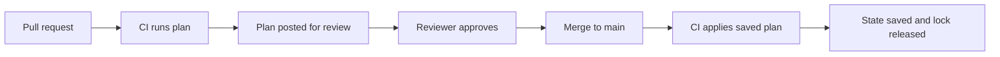
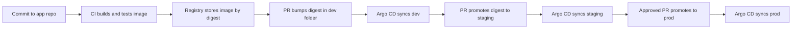
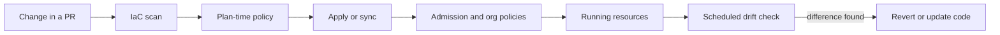

# Module 3 — Infrastructure as code

*A cloud account that people change by clicking is a system nobody can fully describe, review or rebuild. This module turns Najm Bank's infrastructure into code: files in Git that say what should exist, a tool that works out how to get there, and a review before anything changes. It starts with Terraform and OpenTofu, the most widely used tools of this kind: how state, plans and modules work, and why the state file is the most sensitive file the platform team owns. It then moves from one environment to many, using GitOps to promote the same change from dev to staging to production by pull request, with Argo CD or Flux pulling the result into the clusters. It ends with the controls that keep all of this safe at scale: policy as code that checks every change automatically, drift detection that notices when reality no longer matches the code, and guardrails that make the safe path the easy one. You will follow Yousef as a one-word rename in a pull request nearly replaces a production database, Salem as he designs the promotion path for the Najm Mobile API, and Maha as she finds out why staging and production stopped behaving alike.*

> **Phases:** Code, Release, Deploy, Operate — describing infrastructure in reviewable files, promoting changes through environments by pull request, and keeping what runs in line with what was approved.

---

# 3.1 — Infrastructure as code with Terraform/OpenTofu: state, modules and plans
*Level: 🟡 Intermediate* · *Prerequisites: 1.2, 1.3* · *Phase: Code, Deploy*

## ⚡ In 60 seconds
- **Infrastructure as code (IaC)** means describing servers, networks, databases and permissions in text files that a tool applies for you. The files are reviewed, versioned and repeatable; the console becomes read-only for day-to-day work.
- **Terraform** and its open-source fork **OpenTofu** are *declarative*: you write the end state you want, and the tool works out which create, update and delete calls to make.
- The tool remembers what it manages in a **state file**. Keep state remote, locked, encrypted and tightly access-controlled, because it can contain secrets and losing it means losing track of what you own.
- **Always read the plan.** The words "must be replaced" or "destroy" next to a database are the most important lines you will see all week.
- Package repeated patterns as **modules** with small, validated interfaces; pin module and provider versions.
- Biggest trap: `apply` from a laptop with broad credentials. Production applies run in a pipeline, from a reviewed, saved plan.

## 🧭 Why it matters
Yousef's first ticket looks small: rename the Payments database from `payments-db` to `najm-payments-prod` to match the naming standard. He edits one line and asks for a quick approval. Maha opens the plan the pipeline attached to the pull request:

```text
  # module.payments_db.aws_db_instance.this must be replaced
-/+ resource "aws_db_instance" "this" {
      ~ identifier = "payments-db" -> "najm-payments-prod" # forces replacement
      ...
Plan: 1 to add, 0 to change, 1 to destroy.
```

With the AWS provider version the team pins, the identifier cannot be changed in place (newer provider releases can rename it in place; only the plan tells you which you have), so the tool would delete the production payments database and create an empty one. The code was valid, and the plan said exactly what would happen; the only question was whether anyone would read it. Maha blocks the merge. That afternoon Salem adds two rules: every production database carries `prevent_destroy`, and no production pull request merges until a reviewer confirms the plan summary line.

Why deploys need gates at all is covered in [*System Design for Vibe Coders*, lesson 4.4 — Rollback, staging, and release gates](../vibe/index.en.html#l4-4); here you learn how the infrastructure underneath is built and changed.

## 📐 How it works
### 🟢 The essentials
**Why code instead of clicks.** A database created in a web console leaves no reviewable record. Nobody can review the change beforehand, repeat it exactly in another environment, or rebuild it after a disaster. IaC fixes all three: every change in Git has an author, a reviewer and a history; the same files build dev, staging and production; and after a regional failure, the description of everything you need is in a repository.

**Declarative versus imperative.** An *imperative* script lists steps ("create a network, then a database"); run it twice and you may get two databases. A *declarative* tool compares a description of the end state with what exists; run it twice and the second run does nothing. That property is **idempotence**, and it makes IaC safe to rerun.

**Terraform and OpenTofu.** **Terraform**, made by HashiCorp, uses a configuration language called **HCL** (HashiCorp Configuration Language). In August 2023 HashiCorp moved Terraform from an open-source licence to the Business Source License (BSL). The community forked the last open-source version as **OpenTofu**, a Linux Foundation project (accepted into the CNCF sandbox in 2025). The two remain close: same HCL, same providers, mostly the same commands (`terraform` versus `tofu`), though some features now differ, so check the docs for your tool and version. This lesson applies to both; the exercises use OpenTofu because it is open source.

The main building blocks:

| Concept | What it is | Example |
|---|---|---|
| **Provider** | A plugin that talks to one API: a cloud, Kubernetes, Docker, GitHub | `hashicorp/aws`, `hashicorp/azurerm`, `hashicorp/google`, `kreuzwerker/docker` |
| **Resource** | One thing the tool creates and manages | a network, a database, a bucket, a container |
| **Data source** | Something read but not managed | another team's network ID |
| **Variable** | An input to the configuration | `environment = "prod"` |
| **Output** | A value the configuration exposes | the database's connection hostname |
| **Module** | A reusable folder of resources with inputs and outputs | `modules/postgres` |
| **State** | The tool's record of which real objects it manages | `terraform.tfstate` |

A minimal configuration you can run locally with the Docker provider, no cloud account needed:

```hcl
terraform {
  required_providers {
    docker = {
      source  = "kreuzwerker/docker"
      version = "~> 3.0" # allow any 3.x release, never a surprise 4.0
    }
  }
}

provider "docker" {}

resource "docker_image" "web" {
  name         = "nginx:1.27-alpine"
  keep_locally = true
}

resource "docker_container" "web" {
  name  = "najm-hello"
  image = docker_image.web.image_id
  ports {
    internal = 80
    external = 8080
  }
}
```

**The workflow.** Four commands carry almost everything:

```shell
tofu init                 # download providers and modules, connect to the state backend
tofu plan -out=tfplan     # compare code, state and reality; save the proposed changes
tofu show tfplan          # read the plan (a human does this)
tofu apply tfplan         # apply exactly the saved plan, nothing else
```

`init` also writes a **dependency lock file**, `.terraform.lock.hcl`, with exact provider versions and checksums. Commit it.

**Reading a plan.** Each resource line starts with a symbol: `+` create, `-` destroy, `~` update in place, `-/+` destroy and create a replacement. Read the summary line first ("Plan: 2 to add, 1 to change, 0 to destroy."), then every `-` and `-/+`. Changes that cannot be made in place are marked `# forces replacement`.

### 🟡 Going deeper
**State: the tool's memory.** The **state** file links code to reality: it maps `module.payments_db.aws_db_instance.this` to a real database ID and stores its last known attributes. Without it, the tool cannot tell "my database, needs changing" from "someone else's database".

Three facts shape how you handle it:
- **It can contain secrets in plain text.** If a resource has a password attribute, the value ends up in state, even when the variable is marked `sensitive` (that flag only hides it from screen output). Treat the state file like a credential store. OpenTofu has added optional client-side encryption of state; whichever tool you use, also encrypt the storage it sits in. Better still, avoid putting secrets through IaC at all: let the database generate its admin password into a secrets manager ([*Secure AI & Application Security*, lesson 5.2 — Secrets management: keys, tokens and where they leak](../secai/index.html#/5.2)).
- **Two people applying at once can corrupt it.** A **lock** stops a second run while one is in progress.
- **A local file on a laptop is a single point of failure.** Lose it and the tool forgets everything it manages.

So production state lives in a **remote backend** with locking, encryption, versioning and narrow access:

```hcl
terraform {
  backend "s3" {
    bucket       = "najm-tfstate-prod"           # versioning and encryption enabled on the bucket
    key          = "mobile-api/database.tfstate" # one state per component
    region       = "<your-region>"
    encrypt      = true
    use_lockfile = true # S3-native locking in recent versions; older setups use a DynamoDB table
  }
}
```

Azure uses the `azurerm` backend and Google Cloud the `gcs` backend; hosted services such as HCP Terraform store state for you. Check your tool's documentation for current options.

**Modules: the platform team's product.** A **module** is a folder of resources with variables as inputs and outputs as results. Najm Bank does not want forty slightly different PostgreSQL setups; it wants one that is backed up, encrypted, private and monitored by default, which teams consume like a library:

```hcl
module "orders_db" {
  source = "git::https://git.najm.example/platform/tf-modules.git//postgres?ref=v1.4.0" # pinned tag

  name           = "orders"
  environment    = "prod"
  size           = "medium"
  data_class     = "confidential"
  backup_days    = 35
  owner          = "team-orders"
}
```

Good modules have a small interface, opinionated defaults and `validation` blocks on variables that fail early with a clear message (for example, `environment` must be `dev`, `staging` or `prod`). A module exposing every provider argument is just the provider with extra steps.

**Protecting what must not die.** For stateful resources, tell the tool to refuse destruction:

```hcl
resource "aws_db_instance" "this" {
  # ...
  deletion_protection = true # the cloud API refuses deletes too
  lifecycle {
    prevent_destroy = true   # the IaC tool refuses any plan that would destroy this
  }
}
```

`prevent_destroy` stops a bad plan; the provider's deletion protection also stops someone in the console or another tool.

**Who runs `apply`.** At Najm Bank, nobody applies production from a laptop. A pipeline posts the plan on every pull request; after approval and merge, it applies *that saved plan* with a short-lived role obtained through OIDC federation, not stored keys (1.3). A fresh `apply` an hour later would compute a new plan nobody reviewed.



### 🔴 Expert view
**Blast radius and state boundaries.** One giant state for the whole bank makes every plan slow, every apply lock everyone out, and every mistake able to touch everything. Split state by component and owner: network foundations, the Kubernetes cluster, each application's data stores, DNS. Pass values between states through outputs read by data sources, or a parameter store.

**Refactoring without destroying.** Moving a resource into a module changes its address, and the tool would normally see "old address destroyed, new address created". The `moved` block tells it the object simply has a new name:

```hcl
moved {
  from = aws_db_instance.payments
  to   = module.payments_db.aws_db_instance.this
}
```

Similarly, `import` blocks bring existing, hand-built resources under management, and `removed` blocks stop managing a resource without deleting it. These are reviewed in the plan like everything else, unlike the command-line `state mv` and `state rm`, which change state with no review. Check your version supports each block.

**Versioning discipline.** Pin the tool version (`required_version` and in CI), providers (constraints plus the lock file) and modules (a tag, never a moving branch). Upgrade one at a time, in dev first: a provider upgrade that changes a default can produce a plan full of updates nobody asked for.

**Alternatives.** **Pulumi** uses general-purpose languages such as TypeScript, Python or Go, with the same state-and-plan model. **AWS CloudFormation** and **Azure Bicep** are native to their clouds (Google Cloud's native offering has changed over time; check its documentation); they often support new services first. Terraform and OpenTofu cover many providers with one workflow, which suits a bank running Kubernetes, DNS, a CDN, GitHub and a cloud together. The concepts here transfer to all of them.

**AI coding agents and IaC.** Agents write HCL fast and may "fix" an error by widening a security group or adding a wildcard permission. The plan, scanners and policies (3.3) decide, not the agent's confidence. [*Secure AI & Application Security*, lesson 7.2 — Containers, Kubernetes and infrastructure as code](../secai/index.html#/7.2) covers the security checks in depth.

## 🧰 The toolkit
| Tool, practice or service | What it is and does | When to reach for it |
|---|---|---|
| **OpenTofu** (Linux Foundation) | Open-source declarative IaC tool forked from Terraform; HCL, providers, state, plans | Default choice for new open-source IaC work and for this course's exercises |
| **Terraform** (HashiCorp) | The original HCL-based IaC tool, under the BSL since August 2023, with a hosted service (HCP Terraform) | Where your organisation already standardised on it or uses its hosted features |
| **Remote state with locking** | Shared, encrypted, versioned state storage that blocks concurrent applies | Any configuration more than one person or pipeline touches |
| **IaC module** | A reusable folder of resources with a small, validated interface and safe defaults | Any pattern built more than twice: databases, buckets, clusters, networks |
| **Pulumi** | IaC in general-purpose languages with the same plan-and-state model | Teams who prefer real languages for infrastructure |

## 🏛️ In practice at Najm Bank
Salem asks Yousef to write the interface for the platform's first golden-path module, so app teams can request a database by filling in six lines. This is the **Najm IaC module standard: `postgres` v1**.

**Part A: interface**

| Input | Type and allowed values | Default | Why it is an input |
|---|---|---|---|
| `name` | string, lowercase letters and hyphens, 3–30 characters | none (required) | Builds the identifier `najm-<name>-<environment>` |
| `environment` | `dev`, `staging` or `prod` | none (required) | Drives size limits, backups and protection |
| `size` | `small`, `medium` or `large` | `small` | Maps to an instance class per cloud; teams never pick raw instance types |
| `data_class` | `internal`, `confidential` or `restricted` | `confidential` | Restricted forces customer-managed keys and extra logging |
| `backup_days` | number, 7 to 35 | 7 in dev, 35 in prod | Recovery target; capped by the provider's maximum |
| `owner` | team slug | none (required) | Becomes the `owner` tag for alerts and cost reports (6.2) |

| Output | Use |
|---|---|
| `endpoint` | Private hostname for the application's configuration |
| `secret_ref` | Name of the secrets-manager entry holding generated credentials; never the password itself |
| `dashboard_url` | Link to the database's standard dashboard |

**Part B: fixed by the module, not configurable**
- Private networking only; no public endpoint, ever.
- Encryption at rest and TLS in transit on.
- Deletion protection and `prevent_destroy` in `staging` and `prod`.
- Admin credentials generated by the cloud and stored in the secrets manager; none pass through variables.
- Standard tags: `owner`, `environment`, `data-class`, `cost-centre`, `managed-by = opentofu`.

**Part C: state and apply rules**
- One state per component (`<team>/<service>/<component>.tfstate`), one backend bucket per environment; versioning and encryption on; access only for the pipeline role and two named break-glass engineers.
- Production applies run only from the pipeline, from a saved plan, approved by the platform team and the owning team.
- Any `destroy` or `must be replaced` on a stateful resource needs Maha's or Salem's approval.

## 🛠️ Exercises
All three run on your own machine with Docker and OpenTofu. If you choose a cloud free tier instead, set a budget alert before creating anything.

- 🟢 Use the Docker configuration from 🟢 The essentials. Run `init`, `plan -out=tfplan` and `apply tfplan`, check the page on port 8080, then change the external port and read the new plan. Finally, run `plan` again without changing anything. *Done when:* you can point to the line that says whether the container will be updated in place or replaced, and the final plan reports no changes.
- 🟡 Turn the configuration into a module `modules/web` with validated inputs `name`, `port` and `image_tag`, and call it twice to run two containers. Use a `moved` block for the original container. *Done when:* an invalid port fails at `plan` with your error message, and the refactor plan shows a move with zero destroys.
- 🔴 Run a local S3-compatible object store in Docker (MinIO or an alternative; check its current licence and images) and use it as a locked remote backend. Start two applies at once from two terminals. Then add `prevent_destroy` to one container and change its name, which forces replacement. *Done when:* the second apply is refused because of the lock, the forced-replacement plan is rejected with a `prevent_destroy` error, and no state file sits in your working directory.

## ⚠️ Mistakes and traps
- **Skimming the plan.** Read the summary line and every `-` and `-/+` before approving. Make the pipeline post the plan into the pull request so reviewers cannot skip it.
- **State in Git or on a laptop.** State can hold secrets and is the only map of what you own. Use a remote, locked, encrypted, versioned backend with narrow access.
- **Running a fresh `apply` instead of the reviewed plan.** Reality may have changed in between. Apply the saved plan file, or re-plan and re-review.
- **Unpinned modules and providers.** They change your infrastructure without a code change. Pin versions and commit the lock file.
- **State surgery at 2 a.m.** Unreviewed `state rm` loses track of real resources. Use `moved`, `import` and `removed` blocks in a pull request.

## 🧾 Recap
- IaC turns infrastructure into reviewed, versioned, repeatable code; declarative tools such as Terraform and OpenTofu compute the changes for you.
- State links code to real resources. Keep it remote, locked, encrypted and access-controlled, and split it by component to limit blast radius.
- The plan is the safety net: save it, review it in the pull request, and apply exactly that plan from a pipeline with short-lived credentials.
- Modules are the platform team's product: small validated interfaces, safe defaults, pinned versions.
- Protect stateful resources with `prevent_destroy` and the provider's deletion protection, and refactor with `moved`, `import` and `removed` blocks.

## ✍️ Check yourself

**1. Yousef renames the identifier of the production payments database in Terraform code. The plan shows `-/+` and `# forces replacement` for the database. What will happen if this plan is applied?**

- A. The database is renamed in place with no downtime
- B. The database is destroyed and replaced by a new, empty one
- C. Nothing, because Terraform never deletes databases
- D. Only the state file is updated, and the real database is left untouched

<details><summary>Answer</summary>

**B.** `-/+` means destroy and then create a replacement, and the comment says which attribute forces it. A is what Yousef assumed; C is wrong unless `prevent_destroy` or deletion protection is set. (🟢 The essentials, and 🧭 Why it matters.)

</details>

**2. Why must the Terraform or OpenTofu state file be stored in a locked, encrypted, access-controlled backend rather than committed to Git?**

- A. Git cannot store files larger than one megabyte, and state files often exceed that
- B. State files are only needed during the first apply
- C. Providers refuse to run if state is in a repository
- D. State can hold plain-text secrets, and unlocked concurrent writes can corrupt it

<details><summary>Answer</summary>

**D.** Sensitive attributes end up in state regardless of the `sensitive` flag, and locking prevents two runs from writing at once. B is false: state is needed on every run. (🟡 Going deeper.)

</details>

**3. A pipeline runs `plan` when a pull request opens. The pull request is approved and merged three hours later, and the pipeline then runs a fresh `apply` without a saved plan. What is the risk?**

- A. It re-plans against current code and reality, so it may apply unreviewed changes
- B. There is no risk, because `apply` always repeats the most recent plan the pipeline ran
- C. The apply will fail, because every plan expires one hour after `plan` runs
- D. The state file will be deleted

<details><summary>Answer</summary>

**A.** A fresh apply computes a new plan. Saving the plan with `-out` and applying that file means the reviewed changes are the applied changes. B is the common misunderstanding. (🟡 Going deeper.)

</details>

**4. Salem wants app teams to create PostgreSQL databases that are always private, encrypted and backed up. Which design best achieves this?**

- A. A wiki page listing the recommended settings, linked from every team's onboarding guide
- B. A module that exposes every provider argument as a variable so teams have full flexibility
- C. A module with a small validated interface and the safety settings fixed inside it
- D. Giving every team administrator access to the cloud console

<details><summary>Answer</summary>

**C.** Fixing the safe defaults inside the module makes the right configuration the only one available. B reproduces the inconsistency the module should remove; A depends on everyone reading and following it. (🟡 Going deeper, and 🏛️ In practice.)

</details>

**5. The platform team moves an existing database resource into a new module. The plan shows the old address being destroyed and a new one created. What is the safest fix?**

- A. Apply it during a quiet hour and restore from backup afterwards
- B. Add a `moved` block from the old address to the new address
- C. Delete the state file and run `import` from the command line for every resource
- D. Copy the module code back into the root configuration permanently

<details><summary>Answer</summary>

**B.** A `moved` block records the rename declaratively and is reviewed in the plan. A causes an outage and data loss; C is risky, unreviewed state surgery. (🔴 Expert view.)

</details>

## 📚 References
- OpenTofu documentation — https://opentofu.org/docs/
- Terraform documentation — https://developer.hashicorp.com/terraform/docs
- Terraform language: state — https://developer.hashicorp.com/terraform/language/state
- Terraform language: modules — https://developer.hashicorp.com/terraform/language/modules
- HashiCorp, licensing FAQ (Business Source License) — https://www.hashicorp.com/
- Linux Foundation, OpenTofu project — https://opentofu.org/
- Pulumi documentation — https://www.pulumi.com/docs/

---

# 3.2 — Environments and GitOps: promoting changes from dev to production
*Level: 🟡 Intermediate* · *Prerequisites: 2.2, 2.3, 3.1* · *Phase: Release, Deploy*

## ⚡ In 60 seconds
- An **environment** (dev, staging, production) is a full copy of the system for a purpose. Environments should differ only in configuration and scale, never in code or structure.
- **Build once, promote the same artefact.** The exact image digest tested in staging is the one that reaches production; nothing is rebuilt along the way.
- **GitOps** means the desired state of every environment lives in Git, and an agent inside the platform pulls it and continuously makes reality match. Its four principles: declarative, versioned and immutable, pulled automatically, continuously reconciled.
- A **promotion** is a pull request that changes one value (usually an image digest) in the next environment's folder. Review, merge, and **Argo CD** or **Flux** does the rest; **rollback** is `git revert`.
- Decision cue: if you cannot answer "what exactly is running in production, and who approved it?" from Git alone, you are not doing GitOps yet.
- The biggest trap: long-lived branches per environment, and hand edits with `kubectl` that the next sync silently overwrites, or that nobody ever notices.

## 🧭 Why it matters
On 1 August 2012, Knight Capital, a large US market-making firm, deployed new trading code to its servers. According to the US Securities and Exchange Commission's order on the case, a technician copied the new code to seven of the eight servers but not the eighth, and nobody noticed. The new release reused a flag that, on the eighth server, switched on old, long-unused code. That server sent millions of unintended orders in about 45 minutes, and the firm lost roughly $460 million, according to the SEC. The deployment was manual, there was no automated check that every server ran the same version, and no second person reviewed the result.

Najm Bank has a smaller version of the same problem. Maha is investigating why a timeout bug fixed in staging keeps happening in production. Production runs an image from the same commit but rebuilt two days later with a newer base image, and someone raised the connection-pool size with `kubectl edit` during an incident last month. Nothing in Git records either difference, so staging no longer predicts production.

This lesson gives the team one rule and one mechanism. The rule: the same artefact moves through every environment, and only configuration differs. The mechanism: GitOps, where Git is the single record of what should run where, and a controller makes it so and reports any difference.

## 📐 How it works
### 🟢 The essentials
**Why environments.** You need somewhere to try changes that is not production. Najm Bank uses three:

| Environment | Purpose | Data | Who deploys |
|---|---|---|---|
| **dev** | Integrate and try changes quickly | Synthetic test data | Automatic on every merge |
| **staging** | Final rehearsal with production-like configuration and scale | Masked or synthetic data, never real customer data without approval | Promotion pull request, team approval |
| **prod** | Customers | Real data | Promotion pull request, team and platform approval |

**Environment parity.** The Twelve-Factor App calls this "dev/prod parity": keep environments as similar as possible. Differences are allowed only where they are deliberate and written down: replica counts, instance sizes, domain names, credentials, feature-flag settings. Different code, different images, different Kubernetes versions or different network layouts make staging results meaningless.

**Build once, promote the artefact.** CI builds the container image once, from one commit, and pushes it to the registry. The image is identified by its **digest**, a SHA-256 hash of its content such as `sha256:4f1c…`, not by a tag such as `v2.3` or `latest`, because a tag can be moved to a different image and a digest cannot (2.1). Every environment then runs that digest. Rebuilding for production, as in Maha's case, produces a different artefact that nobody tested.

**What GitOps is.** The OpenGitOps project, under the CNCF, defines four principles:
- **Declarative**: the desired state of the system is described, not scripted.
- **Versioned and immutable**: that description is stored in a way that keeps full history and cannot be silently changed, which in practice means Git.
- **Pulled automatically**: software agents fetch the desired state from the source; nobody pushes changes into the cluster by hand.
- **Continuously reconciled**: the agents keep comparing actual state with desired state and act to close any gap.

The two common GitOps controllers for Kubernetes are **Argo CD** and **Flux**, both graduated CNCF projects. Each runs inside the cluster, watches a Git repository, and applies what it finds.

**Push versus pull.** In a classic *push* pipeline, CI holds cluster credentials and runs `kubectl apply` or `helm upgrade` at the end. In *pull*-based GitOps, CI never touches the cluster: it only updates Git. The controller inside the cluster pulls. That means fewer powerful credentials outside the cluster, a full audit trail in Git, and automatic correction when someone changes the cluster by hand.



### 🟡 Going deeper
**Two repositories.** Najm Bank keeps application source code and environment configuration apart:
- the **app repo** holds the Mobile API's code, Dockerfile and tests; CI builds images from it;
- the **GitOps repo** holds what runs where: Kubernetes manifests or Helm values per environment.

Configuration changes then trigger no builds, access can differ, and the GitOps history is a clean log of deployments.

**Folders, not branches, per environment.** A common early design keeps a `dev`, `staging` and `prod` branch and merges between them. Many practitioners advise against it: merges carry unrelated changes along, branches drift apart, and the differences between environments are hidden in Git history rather than visible in files. Najm Bank uses one `main` branch and one folder per environment, built with **Kustomize**, a tool built into `kubectl` that layers small patches over a shared base:

```text
gitops/
  apps/mobile-api/
    base/                 # Deployment, Service, probes: shared by all environments
      deployment.yaml
      service.yaml
      kustomization.yaml
    overlays/
      dev/kustomization.yaml
      staging/kustomization.yaml
      prod/kustomization.yaml
      prod/replicas.yaml
```

The production overlay says only what differs:

```yaml
apiVersion: kustomize.config.k8s.io/v1beta1
kind: Kustomization
resources:
  - ../../base
images:
  - name: registry.najm.example/mobile-api
    digest: sha256:4f1c0e…   # the promoted artefact; set by the promotion PR
patches:
  - path: replicas.yaml       # 6 replicas in prod, 2 in staging
```

If your services use Helm instead (2.3), the same pattern holds: one chart, one values file per environment, and the image digest in the values file.

**Promotion is a pull request.** Promoting the Mobile API from staging to production means copying one digest from `overlays/staging` to `overlays/prod`. A small script or bot opens that pull request automatically after staging checks pass. The pull request shows exactly what changes, CODEOWNERS rules require the right approvers, and merging is the release decision. Tools such as Argo CD Image Updater and Flux's image automation can write the dev bump for you; keep production promotions as explicit, reviewed pull requests.

**Telling Argo CD what to watch.** An Argo CD `Application` points at a folder and a cluster:

```yaml
apiVersion: argoproj.io/v1alpha1
kind: Application
metadata:
  name: mobile-api-prod
  namespace: argocd
spec:
  project: retail
  source:
    repoURL: https://git.najm.example/platform/gitops.git
    targetRevision: main
    path: apps/mobile-api/overlays/prod
  destination:
    server: https://kubernetes.default.svc
    namespace: mobile-api
  syncPolicy:
    automated:
      prune: true     # delete objects removed from Git
      selfHeal: true  # undo manual changes made in the cluster
```

`prune` removes objects that were deleted from Git; `selfHeal` reverts hand edits. With both on, the `kubectl edit` Maha found would have been undone within minutes, and shown as "OutOfSync" in the meantime. Flux expresses the same idea with `GitRepository` and `Kustomization` objects.

**Rollback.** Because every deployment is a commit, rolling back is `git revert` of the promotion pull request: the old digest returns, the controller syncs, and the history records who rolled back and why. Rollback of *code* is easy; rollback of a *database schema* is not, so schema changes follow the expand-and-contract pattern covered with release strategies (4.2).

**Secrets in GitOps.** The GitOps repo must not contain plain secrets, and Kubernetes Secrets are only base64-encoded, not encrypted (2.3). Common patterns: the **External Secrets Operator**, which syncs values from a cloud secrets manager into the cluster, with only a reference in Git; **Sealed Secrets** or **SOPS**, which store encrypted values in Git that only the cluster can decrypt. Najm Bank uses references to its secrets manager; see [*Secure AI & Application Security*, lesson 5.2 — Secrets management: keys, tokens and where they leak](../secai/index.html#/5.2).

### 🔴 Expert view
**Environments for infrastructure, too.** GitOps controllers handle what runs *inside* Kubernetes. The clusters, databases and networks underneath are managed with OpenTofu (3.1), and the same rules apply: one folder per environment calling the same module versions, so the difference between staging and production is a short, readable list of inputs. Terraform's **workspaces** let one configuration keep several states, but they hide which environment you are in behind a command-line setting and make it easy to apply to the wrong one; separate folders, backends and credentials per environment are clearer. Some teams use wrappers such as Terragrunt, or controllers that run IaC through GitOps (the community Tofu Controller for Flux, Crossplane); evaluate them carefully against the simpler pipeline in 3.1.

**Separate accounts, not just namespaces.** Put production in its own cloud account (AWS), subscription (Azure) or project (Google Cloud), with its own identity boundaries. A dev pipeline whose credentials cannot even see production cannot break it.

**Ordering and dependencies.** Real promotions are rarely one service. Argo CD's sync waves and Flux's `dependsOn` let you order resources, for example a configuration change before the Deployment that needs it. Argo CD's **ApplicationSet** generates one `Application` per environment or cluster from a template, which keeps fifty clusters consistent. Keep cross-service changes backward compatible so each service can be promoted on its own; coupled promotions are a design smell.

**Rendered manifests.** When Helm or Kustomize renders differently than you expected, the diff in the pull request shows only the input change. Some teams render the final YAML in CI and commit it (or post the rendered diff to the pull request) so reviewers see exactly what the cluster will receive. It costs some repository noise and buys clarity.

**Regulation.** For a bank, the GitOps history is evidence: who approved which change to production, when, and what exactly was deployed. EU DORA, which applies to financial entities in the EU from January 2025, expects documented ICT change management; GCC regulators such as Qatar Central Bank also set expectations for change control and cloud use. Check the current texts with your compliance team rather than relying on summaries.

## 🧰 The toolkit
| Tool, practice or service | What it is and does | When to reach for it |
|---|---|---|
| **Argo CD** (CNCF graduated) | GitOps controller for Kubernetes with a web UI, sync status, diff view, sync waves and ApplicationSets | Teams who want visible sync status and a UI; many clusters from templates |
| **Flux** (CNCF graduated) | Toolkit of GitOps controllers for Kubernetes (Git sources, Kustomize, Helm, image automation) | Teams who prefer a CLI- and CRD-driven, composable approach |
| **Kustomize** | Layers environment-specific patches over shared Kubernetes manifests; built into `kubectl` | One folder per environment with minimal, readable differences |
| **Helm** | Packages Kubernetes manifests as charts with values files | Services already packaged as charts; one values file per environment |
| **Promotion pull request** | A reviewed change that copies an image digest from one environment's folder to the next | Every move towards production; the release decision |
| **External Secrets Operator** | Syncs secrets from a cloud secrets manager into Kubernetes, keeping only references in Git | Any GitOps setup that needs secrets |

## 🏛️ In practice at Najm Bank
Salem writes the **Najm Environment and Promotion Policy v1**, starting with the Najm Mobile API.

**Part A: environments**

| | dev | staging | prod |
|---|---|---|---|
| Cloud boundary | Shared non-prod account | Own account | Own account, separate identity |
| Cluster | Shared dev cluster | Staging cluster, same Kubernetes minor version as prod | Prod cluster, multi-zone |
| Data | Synthetic | Synthetic or masked | Real |
| Allowed differences from prod | Replicas, sizes, domain, credentials, flags | Replicas, domain, credentials | — |
| Argo CD sync | Automated, prune and self-heal | Automated, prune and self-heal | Automated, prune and self-heal; changes only via approved PR |
| Who can merge | Any team member | Team lead | Team lead and platform engineer; Payments also needs Maha |

**Part B: promotion rules**
1. CI builds one image per commit, signs it (4.3) and records its digest. No environment rebuilds.
2. Merge to `main` in the app repo opens a bot pull request that sets the digest in `overlays/dev`; it merges automatically if checks pass.
3. Promotion to staging and prod copies the *same* digest, by pull request, after the previous environment's checks pass (smoke tests, SLO burn within limits for 30 minutes).
4. Production promotions happen in the agreed release window; outside it, an incident commander can approve an emergency promotion, recorded in the pull request.
5. Rollback is a revert of the promotion pull request. Nobody runs `kubectl edit`, `kubectl apply` or `helm upgrade` against staging or prod.
6. Break-glass: during a Sev-1, a named engineer may change prod by hand with the incident commander's approval; the change is written back to Git within one working day, or it will be reverted by the next sync.

**Part C: the weekly parity check.** Maha's on-call rota runs a short script each Monday that diffs `overlays/staging` and `overlays/prod` and lists any difference not in the allowed table above. Unexplained differences become tickets.

## 🛠️ Exercises
Run these on a local cluster (kind or k3d) with a Git repository you own, such as a free GitHub repository.

- 🟢 Create `base/` and `overlays/dev` and `overlays/prod` for a small web Deployment, with prod using three replicas and dev one. Render both with `kubectl kustomize`. *Done when:* the only differences between the two rendered outputs are the ones you meant, and you can list them.
- 🟡 Install Argo CD on a kind cluster, create two `Application` objects (dev and prod namespaces) pointing at your overlays, with automated sync, prune and self-heal. Change an image digest in dev by pull request, then promote it to prod by a second pull request. Finally, run `kubectl scale` by hand on the prod Deployment. *Done when:* both promotions are visible as commits, the manual scale is reverted automatically, and you can show the "OutOfSync" state you saw before it healed.
- 🔴 Add a CI workflow (GitHub Actions is fine) to an app repo that builds an image, pushes it to a registry you control, and opens a pull request in the GitOps repo setting the new digest in `overlays/dev`. Then roll back a bad promotion with `git revert`. *Done when:* a code commit results in a dev deployment with no human touching the cluster, the image is referenced by digest rather than tag, and the rollback is a single revert commit.

## ⚠️ Mistakes and traps
- **Rebuilding per environment.** A rebuilt image is a different, untested artefact. Build once, reference by digest, promote the digest.
- **A branch per environment.** Branches drift and hide differences in history. Use one branch with a folder per environment.
- **Hand edits in the cluster.** `kubectl edit` during an incident creates drift no one remembers. Turn on self-heal and write break-glass changes back to Git.
- **Plain secrets in the GitOps repo.** Base64 is not encryption. Store references (External Secrets) or encrypted values (Sealed Secrets, SOPS).
- **Staging that is "almost" production.** Different Kubernetes versions, network layouts or images make staging tests misleading. Keep a written list of allowed differences and check it.
- **CI with cluster-admin credentials.** In pull-based GitOps, CI writes to Git only; the controller inside the cluster deploys.

## 🧾 Recap
- Environments differ only in deliberate, documented configuration; the code and image are the same.
- Build once and promote the same image digest from dev to staging to production.
- GitOps: desired state declared and versioned in Git, pulled automatically and continuously reconciled by a controller such as Argo CD or Flux.
- Promotion and rollback are pull requests and reverts, so Git is the record of what runs where and who approved it.
- Keep secrets out of Git, production in its own account, and hand edits rare, approved and written back.

## ✍️ Check yourself

**1. Maha finds that production runs an image built from the same commit as staging, but rebuilt two days later. Why is this a problem?**

- A. It is not a problem, because the same commit always produces an identical image
- B. Production images must be rebuilt only in the approved weekend release window
- C. A rebuild may pull different base images or dependencies: an untested artefact
- D. Rebuilt images cannot be stored in the same registry as the original build

<details><summary>Answer</summary>

**C.** The same source can produce different images over time. Build once and promote the same digest. A is the tempting assumption the lesson corrects. (🟢 The essentials, and 🧭 Why it matters.)

</details>

**2. Which of these is one of the four OpenGitOps principles?**

- A. Desired state is pulled automatically by agents and continuously reconciled
- B. CI pipelines must hold cluster-admin credentials
- C. Each environment must have its own long-lived Git branch, merged in order
- D. Every production deployment must first be approved by a change advisory board

<details><summary>Answer</summary>

**A.** The principles are declarative, versioned and immutable, pulled automatically and continuously reconciled. B is the opposite of pull-based GitOps; C is a pattern many advise against; D is an organisational choice, not a GitOps principle. (🟢 The essentials.)

</details>

**3. During an incident, an engineer raises the production replica count with `kubectl scale`. Argo CD has automated sync with `selfHeal: true`. What happens next, and what should the team do?**

- A. Argo CD records the new value in Git automatically, so nothing else is needed
- B. Argo CD deletes the Deployment entirely
- C. The change stays forever because Argo CD only watches Git
- D. Argo CD reverts it to match Git; a needed change goes through a pull request

<details><summary>Answer</summary>

**D.** Self-heal makes the cluster match Git, so manual changes are reverted. The fix is to change the desired state in Git. A is wrong: controllers do not write back to Git. (🟡 Going deeper.)

</details>

**4. A promotion to production of the Najm Mobile API causes errors. What is the GitOps way to roll back?**

- A. Run `helm rollback` directly against the production cluster, then tell the team in chat
- B. Revert the promotion pull request so the previous digest returns and syncs
- C. Rebuild the previous version from source and push it again under the same tag
- D. Delete the namespace and redeploy the old version from a laptop

<details><summary>Answer</summary>

**B.** A revert restores the previous desired state and records who rolled back and why. A works briefly but the controller will sync Git again and the change is unrecorded; C rebuilds an untested artefact. (🟡 Going deeper.)

</details>

**5. Yousef proposes one Terraform configuration with workspaces named dev, staging and prod, selected on the command line. What is the main concern?**

- A. Workspaces are not supported by any remote backend, so state must stay local
- B. Workspaces force all environments to share one state file, so every apply locks them all
- C. The target environment is hidden in a command-line setting, making wrong applies easy
- D. Workspaces only work with Kubernetes providers, not with cloud databases or networks

<details><summary>Answer</summary>

**C.** Workspaces keep separate states but make the target environment implicit. Folders per environment with their own backend and credentials make the target visible and limit what a mistake can reach. B is false: each workspace has its own state. (🔴 Expert view.)

</details>

## 📚 References
- OpenGitOps principles — https://opengitops.dev/
- Argo CD documentation — https://argo-cd.readthedocs.io/
- Flux documentation — https://fluxcd.io/flux/
- Kustomize documentation (Kubernetes) — https://kubernetes.io/docs/tasks/manage-kubernetes-objects/kustomization/
- The Twelve-Factor App, X. Dev/prod parity — https://12factor.net/dev-prod-parity
- US SEC, order in the matter of Knight Capital Americas LLC (2013) — https://www.sec.gov/
- External Secrets Operator — https://external-secrets.io/
- CNCF projects — https://www.cncf.io/projects/

---

# 3.3 — Policy as code, drift and guardrails
*Level: 🟡 Intermediate* · *Prerequisites: 3.1, 3.2* · *Phase: Test, Operate*

## ⚡ In 60 seconds
- **Policy as code** writes rules such as "no database open to the internet" or "every resource has an owner tag" as code that a tool checks automatically, on every change, the same way every time.
- Check in layers: in the **pull request** (IaC scanners), at **plan time** (policies on the plan), at **admission** into Kubernetes (Kyverno, OPA Gatekeeper), at the **organisation** level of the cloud, and **at runtime** (drift and configuration monitoring).
- **Drift** is any difference between the code and what really runs. Detect it on a schedule, then either revert reality to the code or update the code to match, never leave it unexplained.
- Prefer **guardrails** that block only what is truly dangerous and explain how to fix it, over gates that block everything and teach people to bypass them.
- Roll out new policies in warn mode, measure, then enforce. Every exception has an owner, a reason and an expiry date.
- The biggest trap: a policy nobody can test, understand or get an exception from. It ends up disabled.

## 🧭 Why it matters
On 28 February 2017, Amazon S3 in the US East (Northern Virginia) region was disrupted for several hours. AWS's public summary explains that an engineer, following an established playbook, ran a command meant to remove a small number of servers from a billing subsystem, and one input was entered incorrectly. A much larger set of servers was removed, including ones that supported other critical S3 subsystems, which then needed a full restart. Many services that depended on S3 failed with it. AWS's response was not to tell engineers to type more carefully. They changed the tool so it removed capacity more slowly and refused to take any subsystem below its minimum required capacity.

People and agents will make mistakes; the system should make the dangerous ones impossible or loud. Yousef's database rename in lesson 3.1 was caught because Maha read the plan; Salem asks what happens on the day the reviewer is tired. And Noura's team has just found a test database whose network rule allows traffic from anywhere, created months ago in the console, never in code. Nothing noticed, because nothing compared reality with the code.

## 📐 How it works
### 🟢 The essentials
**From checklists to code.** A standard in a PDF ("databases must not be publicly reachable") depends on people remembering it. **Policy as code** turns the rule into a program that takes a proposed change and returns "allow" or "deny, because…", on every change, in seconds, the same for everyone. The rule itself is reviewed and versioned like other code.

**Where policies run.** No single check sees everything, so Najm Bank checks at several points:

| Layer | What it sees | Example tools | Example rule |
|---|---|---|---|
| **Pull request** | IaC and manifest files | Checkov, Trivy, KICS | No storage bucket with public access |
| **Plan time** | The computed plan: what will actually change | Conftest with OPA, HCP Terraform's policy features | No plan that destroys a production database; no database port open to 0.0.0.0/0 |
| **Kubernetes admission** | Every object sent to the cluster's API server | Kyverno, OPA Gatekeeper, ValidatingAdmissionPolicy | Images only from the bank's registry, pinned by digest |
| **Cloud organisation** | Every API call in an account, whatever tool made it | AWS Service Control Policies, Azure Policy, Google Cloud Organization Policy | No resources outside approved regions |
| **Runtime** | What actually exists now | Scheduled drift detection, Argo CD sync status, cloud configuration-monitoring services | Alert when reality differs from code |

The earlier a check runs, the cheaper the fix. The later it runs, the more it catches, including changes that never went through the pipeline.



**What drift is.** **Drift** is any difference between the state declared in code and the real state. It comes from console changes ("ClickOps"), hand edits during incidents, other tools touching the same resources, and resources created outside IaC entirely. It is dangerous because rebuilding from code no longer gives you the same system, the next apply may silently undo a deliberate fix, and a drifted setting may be the hole an attacker uses.

**Guardrails versus gates.** A **gate** stops everything until someone approves. A **guardrail** lets people move fast and stops only the dangerous cases, with a message that says how to fix it. Platform engineering prefers guardrails: the safe path (the `postgres` module from 3.1, the promotion pull request from 3.2) should also be the easiest path, and policies catch what falls off it.

### 🟡 Going deeper
**Plan-time policy with OPA and Conftest.** **Open Policy Agent (OPA)** is a general-purpose policy engine, a graduated CNCF project, with a policy language called **Rego**. **Conftest** runs Rego policies against structured files such as JSON or YAML. Terraform and OpenTofu can export a saved plan as JSON, so you can write rules about what will change, not just what the files say:

```shell
tofu plan -out=tfplan
tofu show -json tfplan > tfplan.json
conftest test tfplan.json --policy policy/
```

A rule that denies opening PostgreSQL to the whole internet (an AWS example; the same idea applies to Azure network security groups or Google Cloud firewall rules):

```rego
package main

import rego.v1

deny contains msg if {
  some rc in input.resource_changes
  rc.type == "aws_security_group_rule"
  rc.change.after.type == "ingress"
  "0.0.0.0/0" in rc.change.after.cidr_blocks
  rc.change.after.from_port <= 5432
  rc.change.after.to_port >= 5432
  msg := sprintf("%s opens PostgreSQL to the internet; use the private endpoint from the postgres module", [rc.address])
}

deny contains msg if {
  some rc in input.resource_changes
  "delete" in rc.change.actions
  rc.type in {"aws_db_instance", "aws_rds_cluster"}
  msg := sprintf("%s would be deleted; deleting a database needs a platform-lead approved exception", [rc.address])
}
```

Each message says what is wrong *and* what to do. Rego syntax changed between OPA versions; `import rego.v1` makes this valid on 0.x releases from 0.59 and on OPA 1.x. Newer AWS code may use `aws_vpc_security_group_ingress_rule`, which needs its own rule.

**Policies are code, so test them.** OPA has a built-in test runner (`opa test`), and Conftest can run test cases too. For each rule, keep at least one example that must be denied and one that must be allowed. A policy without tests will one day block every deployment, or none.

**Admission policies in Kubernetes.** Even with perfect pipelines, someone can still run `kubectl apply`. An **admission controller** checks every object the API server receives and can reject it. **Kyverno** writes policies as Kubernetes YAML; **OPA Gatekeeper** uses Rego; Kubernetes itself now offers **ValidatingAdmissionPolicy**, using the CEL expression language, which became generally available in Kubernetes 1.30. A Kyverno rule requiring images pinned by digest:

```yaml
apiVersion: kyverno.io/v1
kind: ClusterPolicy
metadata:
  name: require-image-digest
spec:
  validationFailureAction: Audit   # start in Audit, move to Enforce after review
  rules:
    - name: images-pinned-by-digest
      match:
        any:
          - resources:
              kinds: ["Pod"]
      validate:
        message: "Pin images by digest (image@sha256:...), as the promotion pipeline does."
        pattern:
          spec:
            containers:
              - image: "*@sha256:*"
```

Recent Kyverno versions have been moving the failure action to each rule; check the field names for your version.

**Detecting drift.** For IaC, the simplest detector is a scheduled plan that should show nothing:

```shell
tofu plan -detailed-exitcode -input=false
# exit code 0: no changes, code and reality match
# exit code 2: changes pending: drift, or merged code that was never applied
# exit code 1: error
```

Najm Bank runs this nightly for every state with read-only credentials and opens a ticket on exit code 2. `plan -refresh-only` shows only what changed in reality, which helps you understand drift before acting. In Kubernetes, Argo CD and Flux report drift as "OutOfSync" and self-heal can revert it. Cloud configuration-monitoring services (AWS Config, Azure Policy compliance, Google Cloud Security Command Center, for example) also catch resources IaC never knew about.

**Responding to drift.** Every drift item gets one of two answers:
- **Revert**: the code was right; apply it again and find out who changed reality and why.
- **Adopt**: the change was right (often an incident fix); update the code by pull request so code and reality match, then close the ticket.

Never leave drift as "known". If an attribute legitimately changes outside IaC, such as a replica count managed by an autoscaler, say so explicitly with `lifecycle { ignore_changes = [...] }` for that one attribute, with a comment explaining why.

### 🔴 Expert view
**Rolling out a policy without a revolt.** Start in warn or audit mode, measure what would fail, fix or exempt it, announce a date, then enforce. Publish each policy with an ID, a reason, a compliant example and an owner. Track how often each fires, and how often wrongly: false positives teach people to ignore every policy.

**Exceptions are part of the design.** Real systems need exceptions: a vendor appliance that must use a particular port, a migration that legitimately deletes a database. Make the exception path explicit: an exception file in the policy repo, approved by the policy owner, with a reason and an expiry date, which the policy reads. Expired exceptions fail the build. It beats disabled checks or admin access.

**Organisation-level guardrails.** AWS Service Control Policies, Azure Policy at management-group level and Google Cloud Organization Policies apply to every account or project beneath them, whoever makes the call. Use them for a short list of non-negotiables (approved regions for data residency, audit logging always on, no public storage by default); they are hard to debug and affect everyone.

**Break-glass, done properly.** Some day the pipeline will be down and someone must change production by hand. Plan for it: named break-glass roles, separately stored credentials, use that pages the SRE lead and security, a mandatory ticket, and drift detection that flags the change until it is in code. Plan the emergency path before the emergency.

**Policy and regulation.** Policy as code leaves evidence auditors value: the rule, its history, every evaluation and exception. That supports change-management expectations such as EU DORA's and GCC regulators' cloud requirements; check current texts with compliance. Which misconfigurations matter most is covered in [*Secure AI & Application Security*, lesson 7.1 — Cloud security: shared responsibility, IAM and misconfiguration](../secai/index.html#/7.1) and [*Secure AI & Application Security*, lesson 7.2 — Containers, Kubernetes and infrastructure as code](../secai/index.html#/7.2).

## 🧰 The toolkit
| Tool, practice or service | What it is and does | When to reach for it |
|---|---|---|
| **Open Policy Agent** (OPA, CNCF graduated) | General-purpose policy engine with the Rego language; can evaluate any JSON input | Plan-time IaC policies, API authorisation, one policy language across many systems |
| **Conftest** | Runs Rego policies against configuration files and plan JSON in CI | Checking OpenTofu or Terraform plans and Kubernetes manifests in a pipeline |
| **Kyverno** (CNCF) | Kubernetes-native admission and policy engine; policies written as YAML | Enforcing cluster rules such as registry, digest pinning and resource limits |
| **ValidatingAdmissionPolicy** (Kubernetes) | Built-in admission checks written in CEL, no extra controller needed | Simple validation rules where you want no extra components |
| **IaC scanner** (e.g. Checkov, Trivy, KICS) | Static checks on IaC files and manifests for known misconfigurations | Every pull request that touches infrastructure |
| **Scheduled drift detection** | A nightly `plan -detailed-exitcode` per state, plus GitOps sync status | Every managed environment; tickets on any unexplained difference |
| **Organisation guardrails** (AWS SCPs, Azure Policy, Google Cloud Organization Policy) | Rules enforced on every API call within an account hierarchy | A short list of non-negotiable rules such as approved regions and audit logging |

## 🏛️ In practice at Najm Bank
Salem and Noura publish the **Najm Platform Guardrail Catalogue v1**. Each guardrail has an ID, where it runs, its mode and its exception route.

**Part A: guardrails**

| ID | Rule | Where it runs | Mode | Exception route |
|---|---|---|---|---|
| G-01 | Resources only in approved regions | Organisation policy | Enforce | Hamad (CISO) and compliance, written |
| G-02 | No database port open to 0.0.0.0/0 | Plan-time Conftest; IaC scan | Enforce | None |
| G-03 | No delete or replace of a stateful resource in prod without approval | Plan-time Conftest | Enforce | Salem or Maha, per change, expires after one apply |
| G-04 | Required tags: `owner`, `environment`, `data-class`, `cost-centre` | Plan-time Conftest | Warn until end of quarter, then enforce | Platform team, 30 days |
| G-05 | Images from the bank registry, pinned by digest | Kyverno admission | Enforce in prod, audit in dev | Platform team, 14 days |
| G-06 | CPU and memory requests set on every container | Kyverno admission | Enforce | None |
| G-07 | Audit logging cannot be disabled | Organisation policy | Enforce | None |
| G-08 | No unexplained drift | Nightly plan per state; Argo CD sync status | Ticket within one working day | Resolve by revert or adopt |

**Part B: the drift runbook**
1. The nightly job finds exit code 2 and opens a ticket with the plan output attached.
2. The owning team checks the cloud audit log for who changed what, and when.
3. Decide: **revert** (apply the code) or **adopt** (pull request to change the code). Record the decision in the ticket.
4. If the change was made outside break-glass, add a short note to the weekly platform review; repeated drift on the same resource means a guardrail or module is missing.

**Part C: policy repository rules.** Every policy has tests for at least one allowed and one denied case; changes to policies go through pull requests reviewed by the platform team and, for security rules, by Noura's team; exceptions live in `exceptions.yaml` with owner, reason and expiry, and expired entries fail the build.

## 🛠️ Exercises
Run these locally with OpenTofu, Conftest and a kind or k3d cluster.

- 🟢 Using your Docker-provider configuration from lesson 3.1, run `plan -detailed-exitcode` and note the exit code. Then stop or rename the container by hand with the Docker CLI and run it again. *Done when:* you saw exit code 0 before and 2 after, and you can explain from the plan output what the tool proposes to change back.
- 🟡 Write a Conftest policy against your plan JSON that denies any `docker_container` exposing an external port below 1024, and another that denies any image tag `latest`. Write tests for both. *Done when:* `conftest test` fails on a plan that breaks each rule with a message saying how to fix it, passes on a compliant plan, and your policy tests pass.
- 🔴 Install Kyverno on a local cluster and apply a policy requiring images pinned by digest, first in Audit, then in Enforce. Deploy a pod by tag and by digest in each mode, and read the policy reports. Then add an exception for one namespace with an expiry note in your repo. *Done when:* the tagged pod is reported in Audit, rejected in Enforce with your message, the digest-pinned pod runs, and your exception is scoped to one namespace and documented.

## ⚠️ Mistakes and traps
- **One check, at one point.** A pull-request scan misses console changes; an organisation policy misses Kubernetes. Layer the checks.
- **Enforcing on day one.** A new policy that breaks every pipeline gets disabled. Audit first, fix or exempt, then enforce on an announced date.
- **Messages that only say "denied".** People need to know how to fix it. Every policy message names the problem and the compliant alternative.
- **Exceptions with no expiry.** They become permanent holes. Give each an owner, a reason and an end date that the build enforces.
- **Ignoring drift or "fixing" it with a blind apply.** Apply may undo a deliberate incident fix. Investigate, then revert or adopt, and record which.
- **Untested policies.** A typo can allow everything or block everything. Keep allowed and denied test cases for every rule.

## 🧾 Recap
- Policy as code turns written standards into automated, versioned, testable checks on every change.
- Layer the checks: pull request, plan time, Kubernetes admission, cloud organisation and runtime.
- Drift is any gap between code and reality; detect it on a schedule and resolve each item by revert or adopt.
- Guardrails block only real danger, explain the fix, roll out in audit mode first and have an explicit, expiring exception path.
- Plan break-glass access before you need it, and let drift detection pull emergency changes back into code.

## ✍️ Check yourself

**1. AWS's response to the February 2017 S3 outage, caused by a mistyped command, was mainly to:**

- A. Require a second engineer to check and confirm every command before it runs
- B. Stop using written playbooks and let engineers decide steps during operations
- C. Move S3 permanently to another region with fewer dependent services
- D. Change the tool to remove capacity slowly, never below a subsystem's minimum

<details><summary>Answer</summary>

**D.** The lesson is to build guardrails into tools, so a mistake cannot become a disaster. A depends on people being perfect, which is the problem guardrails solve. (🧭 Why it matters.)

</details>

**2. Noura's team finds a test database whose network rule allows traffic from anywhere. It was created in the console and never appeared in any pull request. Which layer of checking could have caught it?**

- A. An IaC scanner that runs automatically on every infrastructure pull request in CI
- B. Organisation policies and runtime configuration monitoring, which see every change
- C. A Kyverno admission policy in the production Kubernetes cluster
- D. A careful code review of the application repository

<details><summary>Answer</summary>

**B.** Changes made outside the pipeline are only seen by controls on the cloud API itself or on running resources. A and D only see code; C only sees Kubernetes objects. (🟢 The essentials.)

</details>

**3. The nightly drift job runs `tofu plan -detailed-exitcode` for the Payments database state and gets exit code 2. What does this mean, and what should the team do first?**

- A. Drift or unapplied merged code; investigate, then revert or adopt
- B. The plan failed with an error, so rerun it with more verbose logging switched on
- C. Everything matches, so no action is needed until tomorrow's run
- D. Run `apply` immediately to overwrite whatever changed in reality since the last run

<details><summary>Answer</summary>

**A.** Exit code 2 means changes are pending. D might undo a deliberate incident fix; investigate first, then revert or adopt. B is exit code 1 and C is exit code 0. (🟡 Going deeper.)

</details>

**4. Salem wants to require images pinned by digest in every cluster. Many existing workloads use tags. What is the best rollout?**

- A. Enforce immediately in every cluster so that all teams learn the rule quickly
- B. Announce the rule by email to all teams and do not enforce it
- C. Audit first, fix or exempt existing workloads, announce a date, then enforce
- D. Disable admission control and rely on careful code review instead

<details><summary>Answer</summary>

**C.** Audit first lets you find and fix existing violations without breaking deployments. A breaks many pipelines and invites bypassing; B has no effect. (🔴 Expert view.)

</details>

**5. A vendor appliance at Najm Bank legitimately needs a rule that the guardrail catalogue normally denies. What is the right way to allow it?**

- A. Disable the policy for everyone until the vendor project ends next year or later
- B. Give the vendor team administrator access so they can bypass the pipeline
- C. Make the change by hand in the console and ignore the drift alerts it causes
- D. Add a scoped exception with an owner, reason and expiry that the build enforces

<details><summary>Answer</summary>

**D.** Explicit, scoped, expiring exceptions keep the guardrail for everyone else and keep evidence of the decision. A, B and C all remove protection far more widely than needed and leave no clean record. (🔴 Expert view, and 🏛️ In practice.)

</details>

## 📚 References
- Open Policy Agent documentation — https://www.openpolicyagent.org/docs/
- Conftest — https://www.conftest.dev/
- Kyverno documentation — https://kyverno.io/docs/
- Kubernetes, Validating Admission Policy — https://kubernetes.io/docs/reference/access-authn-authz/validating-admission-policy/
- OpenTofu, plan command — https://opentofu.org/docs/cli/commands/plan/
- Terraform, detecting drift and refresh-only mode — https://developer.hashicorp.com/terraform/docs
- AWS, summary of the Amazon S3 service disruption in the Northern Virginia (US-EAST-1) region — https://aws.amazon.com/message/41926/
- AWS Organizations, service control policies — https://docs.aws.amazon.com/organizations/
- Azure Policy documentation — https://learn.microsoft.com/azure/governance/policy/
- Google Cloud, Organization Policy Service — https://cloud.google.com/resource-manager/docs/organization-policy/overview-of-organization-policy
