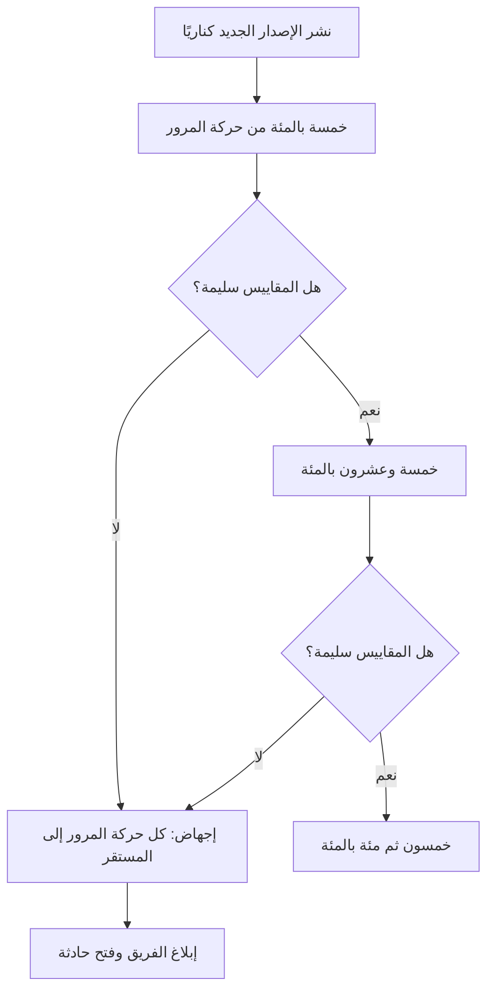
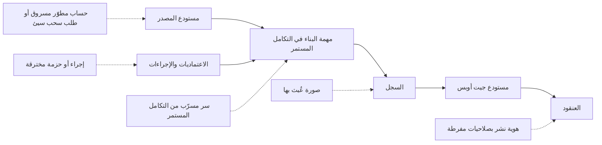

# الوحدة 4 — التكامل والتسليم المستمران (CI/CD) والإطلاقات الآمنة (safe releases)

*منحت الوحدتان 2 و3 فريقَ هندسة المنصات (Platform Engineering team) في بنك نجم (Najm Bank) الحاويات (containers) والعناقيد (clusters) والبنية التحتية الموصوفة بوصفها شيفرة (infrastructure described as code). والآن يحتاج الفريق إلى طريقة آمنة وقابلة للتكرار (safe, repeatable way) لنقل التغيير (change) من إيداع المطوّر (developer's commit) إلى هاتف العميل (customer's phone)، مرات كثيرة في الأسبوع. وهذا هو عمل التكامل والتسليم المستمرين (CI/CD). تبدأ هذه الوحدة بالتكامل المستمر (continuous integration): خطوط تسليم (pipelines) تبني أثرًا برمجيًا واحدًا (one artefact)، وتختبره على طبقات (test it in layers)، وتجيب عن سؤال ⁦("is this change safe to merge?")⁩ أي "هل هذا التغيير آمن للدمج؟" في دقائق. ثم تتناول استراتيجيات الإطلاق (release strategies): النشر المتدرّج (rolling) والأزرق والأخضر (blue-green) والكناري (canary)، وأعلام الميزات (feature flags) التي تفصل نشر الشيفرة (deploying code) عن إطلاق الميزة (releasing a feature)، والتراجع (rollback) الذي يجب أن تتمرّن عليه قبل أن تحتاج إليه. وتنتهي بمعاملة خط التسليم (pipeline) على حقيقته: نظام ذو صلاحيات مميّزة (privileged system) قادر على تغيير بيئة الإنتاج (production)، فلا مفاتيح طويلة العمر (no long-lived keys)، وآثار برمجية موقّعة (signed artefacts)، وعمليات نشر بأقل الصلاحيات (least-privilege deploys). ستتابع يوسف وهو يحوّل خط تسليم مدته 48 دقيقة إلى خط مدته 9 دقائق، ومها وهي تمنح خدمة المدفوعات (Payments service) أول إطلاق كناري مؤتمت (automated canary) لها، ونورة وسالم والفريق يزيلون آخر مفتاح سحابي (cloud key) من إعدادات التكامل المستمر (CI settings).*

> **المراحل (Phases):** Build, Test, Release, Deploy — تحويل كل إيداع (commit) إلى أثر برمجي واحد موثوق (one trusted artefact)، ثم وضعه أمام العملاء شيئًا فشيئًا (a little at a time)، مع طريق للعودة (a way back).

---

# 4.1 — التكامل المستمر (continuous integration): خطوط التسليم والاختبارات والآثار البرمجية والتغذية الراجعة السريعة
*المستوى (Level): 🟡 متوسط (Intermediate)* · *المتطلبات (Prerequisites): 2.1، 3.2* · *المرحلة (Phase): Build, Test*

## ⚡ الدرس في دقيقة (In 60 seconds)
- **التكامل المستمر (continuous integration, CI)** يعني أن يدمج الجميع تغييرات صغيرة (small changes) في الفرع الرئيسي (main branch) كثيرًا، مرة يوميًا على الأقل (at least daily)، وأن يُبنى كل تغيير ويُختبر آليًا (built and tested automatically) قبل دمجه وبعده.
- مهمة خط التسليم (pipeline) أن يجيب عن سؤال واحد بسرعة وأمانة (quickly and honestly): ⁦("Is this change safe to merge?")⁩ أي "هل هذا التغيير آمن للدمج؟". والإجابة البطيئة (slow answer)، أو الإجابة التي لا يثق بها الناس (an answer people do not trust)، تجعل التكامل المستمر (CI) بلا جدوى.
- **ابنِ مرة واحدة، ورقِّ الأثر البرمجي نفسه (Build once, promote the same artefact).** ابنِ صورة الحاوية (container image) مرة واحدة، وعرّفها ببصمتها (identify it by its digest)، وانشر تلك الصورة نفسها تمامًا (that exact image) إلى بيئات التطوير (dev) والتجهيز (staging) والإنتاج (production). لا تُعِد البناء لكل بيئة أبدًا (never rebuild per environment).
- اختبر على طبقات (test in layers) وفق **هرم الاختبارات (test pyramid)**: كثير من اختبارات الوحدة السريعة (fast unit tests)، وعدد أقل من اختبارات التكامل (integration tests)، وحفنة من الاختبارات الشاملة من الطرف إلى الطرف (end-to-end tests).
- إشارة القرار (Decision cue): أبقِ فحص الدمج (merge check) تحت عشر دقائق تقريبًا. وعندما يطول، استخدم التخزين المؤقت (cache) والتوازي (parallelise) وانقل الحزم البطيئة (slow suites) إلى ما بعد الدمج (after the merge) قبل أن تضيف عتادًا (hardware) أكثر.
- الفخ الأكبر (Biggest trap): الاختبارات المتقلّبة (flaky tests). فالاختبار الذي يفشل عشوائيًا (fails at random) يعلّم الفريق أن يضغط "أعد التشغيل (re-run)" وأن يتجاهل عمليات البناء الحمراء (red builds).

## 🧭 لماذا يهم (Why it matters)
ينضم يوسف إلى فريق المنصة (platform team) في بنك نجم (Najm Bank) وسط شكوى. فخط تسليم واجهة برمجة تطبيق نجم للهاتف (Najm Mobile API) يستغرق 48 دقيقة. ولأن الانتظار مؤلم، يجمع المطوّرون عمل أسبوع كامل في طلب سحب (pull request) واحد كبير. فتستغرق المراجعات (reviews) أيامًا، وتتعارض عمليات الدمج (merges conflict)، وعندما يتعطّل شيء لا يستطيع أحد أن يحدّد أيّ الإيداعات الأربعين (40 commits) سبّبه. وتفشل ثلاثة اختبارات شاملة (end-to-end tests) في نحو تشغيل واحد من كل خمسة (one run in five) دون سبب واضح، فصارت عادة الفريق ⁦("re-run until green")⁩ أي "أعد التشغيل حتى يخضرّ".

ثم وقعت حادثة (incident). تغيير اجتاز بيئة التجهيز (staging) يوم الخميس. ويوم الجمعة **أعادت** مهمة الإنتاج (production job) **بناء** الصورة (rebuilds the image) من الإيداع نفسه. وكان وسم الصورة الأساسية (base image tag) `latest` قد تحرّك خلال الليل، وتغيّرت مكتبة نظام (system library)، ففشلت واجهة البرمجة (API) في الإقلاع في الإنتاج. لقد اختبرت بيئة التجهيز صورةً لم تصل إلى الإنتاج قط. ونجح التراجع (rollback)، لكن مراجعة ما بعد الحادثة (post-incident review) (5.3) سجّلت حقيقة قاسية: ⁦("what we tested is not what we shipped.")⁩ أي "ما اختبرناه ليس ما شحنّاه".

يكلّف سالم يوسف بالمهمة: "اجعل خط التسليم (pipeline) شيئًا يثق به الناس. سريعًا بما يكفي كي لا يجمع أحد عمله في دفعات (batches work)، وأمينًا بما يكفي كي يعني البناء الأحمر (red build) شيئًا، وأن يكون الأثر البرمجي الذي نختبره هو الأثر البرمجي الذي نشحنه (the artefact we test is the artefact we ship)". وهذا هو موضوع هذا الدرس.

## 📐 كيف يعمل (How it works)

### 🟢 الأساسيات (The essentials)

**ثلاثة مصطلحات يُخلط بينها (Three terms that get mixed up).**

| المصطلح (Term) | المعنى (Meaning) | السؤال الذي يجيب عنه (The question it answers) |
|---|---|---|
| **التكامل المستمر (Continuous integration)** | تغييرات صغيرة (small changes) تُدمج في الفرع الرئيسي (main) كثيرًا؛ ويُبنى كلٌّ منها ويُختبر آليًا (built and tested automatically) | ⁦(Is this change safe to merge?)⁩ هل هذا التغيير آمن للدمج؟ |
| **التسليم المستمر (Continuous delivery)** | كل تغيير يجتاز خط التسليم (passes the pipeline) *يمكن* أن يذهب إلى الإنتاج (production) بضغطة زر (at the push of a button) | ⁦(Could we release this right now?)⁩ هل يمكننا إطلاق هذا الآن؟ |
| **النشر المستمر (Continuous deployment)** | كل تغيير يجتاز يذهب إلى الإنتاج آليًا (automatically)، دون أي خطوة بشرية (no human step) | (لا أحد يسأل؛ يُشحن فحسب) (Nobody asks; it just ships) |

تمارس معظم البنوك، ومنها نجم، التسليم المستمر (continuous delivery): فخط التسليم (pipeline) يجعل كل تغيير قابلًا للإطلاق (releasable)، وقرار إطلاق (release decision) (مؤتمت أحيانًا، وبشري أحيانًا) يضعه قيد التشغيل (puts it live). وتأتي هذه الأفكار من كتاب جيز هامبل وديفيد فارلي (Jez Humble and David Farley) *Continuous Delivery* (2010)، وقد ربط كتاب *Accelerate* (فورسغرين وهامبل وكيم، Forsgren, Humble and Kim، 2018) هذه الممارسات بأداء التسليم (delivery performance).

**التطوير القائم على الجذع (Trunk-based development).** يعمل المطوّرون على فروع قصيرة العمر (short-lived branches)، يوم أو يومان على الأكثر، ويدمجون في فرع مشترك واحد (one shared branch)، هو `main` عادةً، كثيرًا. أما فروع الميزات طويلة العمر (long-lived feature branches) فتؤدي إلى عمليات دمج مؤلمة (painful merges) ومفاجآت متأخرة (late surprises). ويُخفى العمل غير المكتمل (unfinished work) خلف **علم ميزة (feature flag)** (الدرس 4.2) بدلًا من إبقائه على فرع لأسابيع.

**ما خط التسليم؟ (What a pipeline is).** **خط التسليم (pipeline)** تسلسل مؤتمت (automated sequence) من **المراحل (stages)**، كلٌّ منها مكوّن من **مهام (jobs)** تعمل على أجهزة تُسمّى **المشغّلات (runners)** (أو الوكلاء، agents). ويُطلَق بحدث (triggered by an event): فتح طلب سحب (pull request opened)، أو دفع إيداع (commit pushed) إلى `main`، أو إنشاء وسم (tag created)، أو جدول زمني (schedule). ويعيش تعريف خط التسليم (pipeline definition) في المستودع (repository) بوصفه شيفرة (as code)، فيُراجَع ويُدار إصداره (reviewed and versioned) مثل كل شيء آخر. المراحل النموذجية (Typical stages):


كل ما يقع يسار مرحلة "الدفع (Push)" يعمل على كل طلب سحب (every pull request) ويجب أن يكون سريعًا. أما عمليات الترقية (promotions) على اليمين فتنقل الصورة *نفسها* (the *same* image) عبر البيئات (environments)، كما وُصف في الدرس 3.2.

**الآثار البرمجية (Artefacts).** **الأثر البرمجي (artefact)** هو مُخرَج عملية البناء (output of a build) الذي تحتفظ به وتنشره: وهو هنا صورة حاوية OCI (OCI container image) (الدرس 2.1)؛ وفي مواضع أخرى ملف JAR (JAR file)، أو حزمة Python wheel (Python wheel)، أو حزمة موقع ساكن (static site bundle). قاعدتان (Two rules):
1. **ابنِ مرة واحدة (Build once).** ابنِ الأثر البرمجي في مهمة واحدة (one job)، وخزّنه في سجل (registry)، واجعل كل مرحلة لاحقة تسحبه (pull it). لا تشغّل `docker build` مرة أخرى للتجهيز (staging) أو الإنتاج (production) أبدًا.
2. **عرّفه تعريفًا ثابتًا (Identify it immutably).** الوسم (tag) مثل `v1.4.2` أو `latest` يمكن نقله إلى صورة مختلفة. أما **البصمة (digest)** (`sha256:...`، وهي تجزئة (hash) لمحتوى الصورة) فلا يمكن. وسِم الصور بمعرّف الإيداع (commit SHA) من أجل البشر، لكن انشر بالبصمة (deploy by digest).

الإعدادات التي تختلف بين البيئات (configuration that differs between environments) (مضيف قاعدة البيانات (database host)، والقيم الافتراضية لأعلام الميزات (feature flag defaults)، وأعداد النسخ المتماثلة (replica counts)) تُحقن وقت النشر (injected at deploy time) عبر متغيرات البيئة (environment variables) أو ConfigMaps أو طبقة GitOps الفوقية (GitOps overlay) (الدرسان 2.3 و3.2)، ولا تُخبز في الصورة أبدًا (never baked into the image). وهذا هو العامل الثالث (factor III) من منهجية التطبيق ذي العوامل الاثني عشر (Twelve-Factor App): خزّن الإعدادات في البيئة (store config in the environment). ويروي [*تصميم الأنظمة لمبرمجي الحدس (System Design for Vibe Coders)*، الدرس 4.5 — تحقّق من الأثر البرمجي لا من المصدر (Verify the artifact, not the source)](../vibe/index.ar.html#l4-5) هذه القصة للبنّائين الأفراد (solo builders).

**خط تسليم مصغّر في GitHub Actions (A minimal pipeline in GitHub Actions).** نستخدم GitHub Actions هنا لأنه واسع الانتشار (widely used) ومجاني للمستودعات العامة (free for public repositories)؛ وتشترك GitLab CI/CD وJenkins وAzure Pipelines في المفاهيم نفسها (share the concepts).

```yaml
# .github/workflows/ci.yml
name: ci
on:
  pull_request:
  push:
    branches: [main]

permissions:
  contents: read            # least privilege by default (lesson 4.3)

concurrency:
  group: ci-${{ github.ref }}
  cancel-in-progress: ${{ github.event_name == 'pull_request' }}  # cancel outdated PR runs, never main builds

jobs:
  test:
    runs-on: ubuntu-latest
    timeout-minutes: 15
    steps:
      - uses: actions/checkout@v4   # pin to a full commit SHA in real use (lesson 4.3)
      - run: make lint
      - run: make test-unit

  build:
    needs: test
    runs-on: ubuntu-latest
    timeout-minutes: 20
    steps:
      - uses: actions/checkout@v4
      - uses: docker/setup-buildx-action@v3
      - uses: docker/build-push-action@v6
        with:
          context: .
          push: false
          tags: mobile-api:${{ github.sha }}
          cache-from: type=gha
          cache-to: type=gha,mode=max
```

لاحظ الإعدادات الافتراضية (defaults): صلاحيات للقراءة فقط (read-only permissions)، ومهلات زمنية للمهام (job timeouts)، وإلغاء تشغيلات طلبات السحب القديمة (cancelling outdated PR runs) (ولا تُلغى تشغيلات `main` أبدًا: فكل إيداع مدموج (merged commit) يجب أن يُنتج أثره البرمجي).

**هرم الاختبارات (The test pyramid).** ليست كل الاختبارات متساوية في الكلفة (not all tests cost the same). يقول الهرم، الذي نشره مايك كون (Mike Cohn)، أن يكون لديك كثير من الاختبارات الرخيصة (cheap tests) في القاعدة وقليل من الاختبارات المكلفة (expensive ones) في القمة.

| الطبقة (Layer) | ما الذي تفحصه (What it checks) | السرعة (Speed) | العدد (How many) | أين تعمل (Where it runs) |
|---|---|---|---|---|
| **الفحوص الساكنة (Static checks)** | التنسيق (formatting)، والفحص الساكن (lint)، وفحوص الأنواع (type checks)، والتحقق من البنية التحتية بوصفها شيفرة (IaC validation) | ثوانٍ (Seconds) | كل ملف (Every file) | كل طلب سحب (Every PR) |
| **اختبارات الوحدة (Unit tests)** | دالة أو صنف واحد (one function or class)، دون شبكة أو قاعدة بيانات (no network or database) | أجزاء من الثانية لكلٍّ منها (Milliseconds each) | الآلاف (Thousands) | كل طلب سحب (Every PR) |
| **اختبارات التكامل (Integration tests)** | الخدمة مع اعتماديات حقيقية (real dependencies): حاوية PostgreSQL (PostgreSQL container)، وشبكة دفع مزيّفة (fake payment network) | ثوانٍ لكلٍّ منها (Seconds each) | المئات (Hundreds) | كل طلب سحب، بالتوازي (Every PR, in parallel) |
| **اختبارات العقود (Contract tests)** | أن واجهة البرمجة (API) ما زالت تطابق ما يتوقعه عملاؤها (what its clients expect) | ثوانٍ (Seconds) | واحد لكل مستهلك (One per consumer) | كل طلب سحب (Every PR) |
| **الاختبارات الشاملة (End-to-end tests)** | رحلة مستخدم كاملة (full user journey) عبر الخدمات المنشورة (deployed services) | دقائق لكلٍّ منها (Minutes each) | حفنة (A handful) | بعد النشر إلى التطوير أو التجهيز (After deploy to dev or staging) |

والهرم المقلوب (inverted pyramid)، بمئات من اختبارات المتصفّح البطيئة الهشّة (slow, brittle browser tests) وقليل من اختبارات الوحدة، سبب شائع لخط تسليم مدته 48 دقيقة (48-minute pipeline).

### 🟡 التعمق أكثر (Going deeper)

**تسريع خط التسليم (Making the pipeline fast).** يقيس يوسف قبل أن يغيّر أي شيء (measures before changing anything). فتتوزّع الدقائق الـ48 على تنزيل الاعتماديات (dependency downloads) (7)، وبناء الصورة دون تخزين مؤقت (image build without cache) (11)، واختبارات الوحدة المشغّلة تسلسليًا (unit tests run serially) (9)، واختبارات التكامل (integration tests) (8)، والاختبارات الشاملة على كل طلب سحب (end-to-end tests on every PR) (13). والإصلاحات، مرتبة حسب قيمتها (in order of value):

- **خزّن الاعتماديات مؤقتًا (Cache dependencies).** استعِد ذاكرة التخزين المؤقت لمدير الحزم (package manager's cache) بمفتاح مبني على تجزئة ملف القفل (keyed on the lock file hash)؛ ولدى معظم أنظمة التكامل المستمر إجراء تخزين مؤقت مدمج (built-in cache action).
- **رتّب ملف Dockerfile للاستفادة من التخزين المؤقت للطبقات (Order the Dockerfile for layer caching)** (الدرس 2.1): انسخ بيان الاعتماديات (dependency manifest) وثبّت الاعتماديات *قبل* نسخ الشيفرة المصدرية (source code)، كي لا يُبطل تغيير الشيفرة طبقة الاعتماديات (invalidate the dependency layer). واستخدم ذاكرة تخزين مؤقت بعيدة للبناء (remote build cache) (`cache-from`/`cache-to`) كي تتمكن المشغّلات المؤقتة (ephemeral runners) من إعادة استخدام الطبقات (reuse layers).
- **وازِ (Parallelise).** قسّم الاختبارات إلى أجزاء (shards) عبر عدة مهام (several jobs)، أو استخدم مصفوفة (matrix) (مثلًا عدة إصدارات من Python أو Node) فقط حيث تضيف تغطية حقيقية (real coverage).
- **شغّل ما تغيّر فقط (Run only what changed).** في المستودع الأحادي (monorepo)، تتخطى مرشّحات المسارات (path filters) (`on.pull_request.paths`) خطوط التسليم للخدمات التي لم تُمسّ (untouched services). وكن حذرًا: فتغيير مكتبة مشتركة (shared library change) يجب أن يظل يُطلق خطوط التسليم للخدمات المعتمدة عليها (its dependants).
- **انقل الحزم البطيئة إلى ما بعد الدمج (Move slow suites after the merge).** تعمل الاختبارات الشاملة (end-to-end tests) على بيئة التطوير (dev environment) بعد الدمج ووفق جدول زمني (on a schedule)؛ فهي تحجب *الترقية (promotion)* لا *الدمج (merging)*.

النتيجة (The result): الفحص الساكن واختبارات الوحدة في 3 دقائق، والبناء واختبارات التكامل في 6، أي فحص دمج (merge check) مدته 9 دقائق، مع اختبارات شاملة تحرس الترقية إلى التجهيز (gating promotion to staging).

**الاختبارات المتقلّبة (Flaky tests).** **الاختبار المتقلّب (flaky test)** ينجح ويفشل على الشيفرة نفسها (same code). ومن أسبابه افتراضات التوقيت (timing assumptions) (`sleep(2)` والأمل)، وبيانات الاختبار المشتركة (shared test data)، والاعتماد على ترتيب الاختبارات (test order dependence)، واستدعاءات الشبكة الحقيقية (real network calls) والساعات (clocks). السياسة في نجم (Policy at Najm):
1. الاختبار الذي يفشل ثم ينجح عند إعادة المحاولة (on retry)، على الإيداع نفسه (same commit)، يُعلَّم آليًا بأنه مشتبه في تقلّبه (suspected flaky).
2. يُوضع الاختبار المتقلّب **في الحجر (quarantined)**: يُنقل إلى مهمة غير حاجبة (non-blocking job)، مع تذكرة (ticket) ومالك (owner)، ويُصلَح أو يُحذف خلال مدة متفق عليها (within an agreed time).
3. لا يُسمح بـ"إعادة المحاولة حتى يخضرّ (retry until green)" الآلية على خط التسليم كله (whole pipeline). فهي تخفي أخطاء متقطعة حقيقية (real intermittent bugs)، ومنها حالات التسابق (race conditions) التي ستحدث في الإنتاج أيضًا.

**طوابير الدمج (Merge queues).** حين يدمج كثيرون في `main`، قد ينجح طلبا سحب (two pull requests) كلٌّ على حدة ثم يتعطلان معًا (break together). أما **طابور الدمج (merge queue)** (طابور الدمج في GitHub (GitHub merge queue)، وقطارات الدمج في GitLab (GitLab merge trains) وميزات مشابهة) فيختبر كل طلب سحب فوق طلبات السحب التي تسبقه (on top of the PRs ahead of it) قبل الدمج، فيبقى `main` أخضر (stays green).

**توسيم الأثر البرمجي (Labelling the artefact).** سجّل مصدر الصورة (where the image came from)، كي يستطيع أي شخص تتبّع حجيرة عاملة (running pod) رجوعًا إلى إيداع (back to a commit). وتعليقات صور OCI (OCI image annotations) مثل `org.opencontainers.image.revision` (معرّف الإيداع، commit SHA) و`org.opencontainers.image.source` (عنوان المستودع، repository URL) مفاتيح قياسية (standard keys). ويحوّل الدرس 4.3 هذا إلى **مصدرية (provenance)** موقّعة.

**ما يفحصه خط التسليم إلى جانب الاختبارات (What the pipeline checks besides tests).** خط التكامل المستمر (CI pipeline) هو أيضًا موطن الفحوص المؤتمتة الرخيصة (cheap automated checks): فحص الأسرار (secret scanning)، وفحص ثغرات الاعتماديات (dependency vulnerability scanning, SCA)، والتحليل الأمني الساكن (static security analysis, SAST)، والفحص الساكن لملفات Dockerfile والبنية التحتية بوصفها شيفرة (Dockerfile and IaC linting)، وفحوص السياسات (policy checks) من الدرس 3.3. لا تحجب إلا على النتائج الجديدة عالية الثقة (new, high-confidence findings)، وإلا تعلّم المطوّرون تجاهل البوابة (ignore the gate). ويشرح [*أمن الذكاء الاصطناعي وأمن التطبيقات (Secure AI & Application Security)*، الدرس 6.1 — دورة حياة تطوير آمنة (A secure development life cycle)](../secai/index.ar.html#/6.1) كيفية ضبط هذه الماسحات (tune these scanners).

### 🔴 نظرة الخبير (Expert view)

**قِس النتيجة لا خط التسليم (Measure the outcome, not the pipeline).** يتتبّع برنامج أبحاث DORA (DORA research programme) أربعة مقاييس تسليم رئيسية (four key delivery measures): **تكرار النشر (deployment frequency)**، و**المهلة الزمنية للتغييرات (lead time for changes)** (من الإيداع إلى الإنتاج)، و**معدل فشل التغييرات (change failure rate)**، و**زمن استعادة الخدمة (time to restore service)**. وقد أضافت DORA منذ ذلك الحين مقياسًا للموثوقية (reliability measure) وحسّنت بعض الأسماء (على سبيل المثال، تتحدث التقارير الحديثة عن زمن التعافي من النشر الفاشل (failed deployment recovery time))؛ راجع dora.dev للاطلاع على التعريفات الحالية. يحسّن خط التسليم السريع المهلة الزمنية (lead time)؛ وتخفّض الاختبارات الجديرة بالثقة (trustworthy tests) معدل فشل التغييرات. راقب الاثنين معًا: فالتسريع بحذف الاختبارات (speeding up by deleting tests) لا يفعل سوى نقل الكلفة إلى الحوادث (moves the cost into incidents).

**خط التسليم منتَج (The pipeline is a product).** في نجم، لا يكتب كل فريق منتج (product team) خط تسليمه الخاص. بل ينشر فريق المنصة **مسارًا ذهبيًا (golden path)**: سير عمل قابلًا لإعادة الاستخدام (reusable workflow) (في GitHub Actions، سير عمل يُستدعى بـ `uses: najm-bank/platform-workflows/.github/workflows/service-ci.yml@<version>`) يتولى البناء والفحص والاختبار والتوقيع والدفع (build, scan, test, sign and push) بالطريقة المعتمدة (approved way). وتمرّر الفرق بضعة مدخلات (a few inputs). وحين يحسّن فريق المنصة التخزين المؤقت (caching) أو يضيف ماسحًا (scanner)، تحصل عليه كل خدمة. أدِر إصداره (version it)، واحتفظ بسجل للتغييرات (changelog)، وقِس معدل التبنّي (adoption) وأزمنة البناء (build times).

**عمليات البناء القابلة لإعادة الإنتاج والمحكمة (Reproducible and hermetic builds).** يستخدم البناء **المحكم (hermetic)** مدخلات مُعلنة ومثبّتة فقط (only declared, pinned inputs): صورة أساسية بالبصمة (base image by digest)، واعتماديات عبر ملف قفل مع تجزئات (dependencies by lock file with hashes)، وسلسلة أدوات مثبّتة (pinned toolchain)، ودون وصول غير مُعلن إلى الشبكة (no undeclared network access). أما عمليات البناء **القابلة لإعادة الإنتاج (reproducible)** بالكامل بتًا ببت (bit-for-bit) فصعبة لصور الحاويات (الطوابع الزمنية (timestamps)، وترتيب الملفات (file ordering))، لكن المدخلات المحكمة وحدها تزيل حادثة الجمعة (Friday incident): فلا يستطيع وسم `latest` متحرك أن يتسلّل.

**زمن التغذية الراجعة ميزانية تصميم (Feedback time is a design budget).** انشر هدفًا (Publish a target) (هدف نجم أدناه). وأي فحص جديد قد يكسره يجب أن يحلّ محل شيء آخر (replace something)، أو يعمل بالتوازي (run in parallel)، أو يعمل بعد الدمج (run after the merge).

## 🧰 الأدوات (The toolkit)
| الأداة أو الممارسة أو الخدمة (Tool, practice or service) | ما هي وماذا تفعل (What it is and does) | متى تلجأ إليها (When to reach for it) |
|---|---|---|
| **GitHub Actions** | تكامل وتسليم مستمران (CI/CD) مدمجان في GitHub؛ وسير العمل (workflows) مكتوبة بصيغة YAML في المستودع، وتعمل على مشغّلات مستضافة أو مستضافة ذاتيًا (hosted or self-hosted runners) | حين تكون الشيفرة على GitHub أصلًا؛ وللتمرّن المجاني على المستودعات العامة (public repositories) |
| **GitLab CI/CD** | تكامل وتسليم مستمران (CI/CD) مدمجان في GitLab؛ وخطوط التسليم (pipelines) معرّفة في `.gitlab-ci.yml` | حين تكون الشيفرة على GitLab، بما في ذلك التثبيتات المُدارة ذاتيًا (self-managed installations) |
| **Jenkins** | خادم أتمتة مفتوح المصدر عريق (long-standing open-source automation server) بمنظومة إضافات كبيرة (large plugin ecosystem) | البيئات القائمة (existing estates)؛ وحين يجب تشغيل كل شيء داخل المقر (on-premises) |
| **Trunk-based development** — التطوير القائم على الجذع | فروع قصيرة العمر (short-lived branches) تُدمج في فرع رئيسي واحد (one main branch) مرة يوميًا على الأقل | دائمًا، بوصفه نموذج التفريع الافتراضي (default branching model) للتكامل المستمر |
| **Build once, promote** — ابنِ مرة واحدة ورقِّ | بناء واحد يُنتج أثرًا برمجيًا واحدًا ثابتًا (one immutable artefact) ينتقل عبر كل بيئة | كل خدمة؛ فهو يزيل مشكلة ⁦("tested is not shipped")⁩ أي "ما اختُبر ليس ما شُحن" |
| **Test pyramid** — هرم الاختبارات | كثير من اختبارات الوحدة (unit tests)، وأقل من اختبارات التكامل (integration tests)، وقليل من الاختبارات الشاملة (end-to-end tests) | تصميم حزمة اختبارات (designing a test suite) أو تشخيص خط تسليم بطيء (diagnosing a slow pipeline) |
| **Merge queue** — طابور الدمج | يختبر كل طلب سحب (PR) مقابل طلبات السحب التي تسبقه قبل الدمج | المستودعات المزدحمة (busy repositories) حيث يظل `main` يتعطل بعد عمليات دمج "خضراء" ("green" merges) |
| **Golden path** — المسار الذهبي | خط تسليم قابل لإعادة الاستخدام (reusable pipeline) يصونه فريق المنصة (platform-maintained)، تتبنّاه الفرق بدلًا من كتابة خطوطها الخاصة | أكثر من حفنة من الخدمات بعمليات بناء متشابهة (similar builds) |

## 🏛️ عمليًا في بنك نجم (In practice at Najm Bank)
ينشر يوسف وسالم **معيار التكامل المستمر للمسار الذهبي في نجم، الإصدار 1 (Najm Golden-Path CI Standard v1)**، مُنفَّذًا بوصفه سير عمل قابلًا لإعادة الاستخدام (reusable workflow). وكل خدمة جديدة تبدأ به.

**الجزء أ: المراحل والبوابات وميزانيات الزمن (Part A: stages, gates and time budgets)**

| المرحلة (Stage) | تعمل على (Runs on) | تحجب (Blocks) | ميزانية الزمن (Time budget) (p95) |
|---|---|---|---|
| الفحص الساكن والتنسيق وفحص الأنواع والتحقق من البنية التحتية بوصفها شيفرة (Lint, format, type check, IaC validate) | كل طلب سحب (Every PR) | الدمج (Merge) | دقيقتان (2 min) |
| اختبارات الوحدة (Unit tests) (مقسّمة إلى أجزاء، sharded) | كل طلب سحب (Every PR) | الدمج (Merge) | 4 دقائق (4 min) |
| فحص الأسرار وSCA وSAST (النتائج العالية الجديدة فقط، new high findings only) | كل طلب سحب (Every PR) | الدمج (Merge) | 3 دقائق، بالتوازي (3 min, in parallel) |
| بناء الصورة مرة واحدة، مع ذاكرة تخزين مؤقت بعيدة (Build image once, with remote cache) | كل طلب سحب (Every PR) | الدمج (Merge) | 4 دقائق (4 min) |
| اختبارات التكامل والعقود (Integration and contract tests) (PostgreSQL في حاوية) | كل طلب سحب (Every PR) | الدمج (Merge) | 5 دقائق، بالتوازي (5 min, in parallel) |
| دفع الصورة بالبصمة، وتسجيل معرّف الإيداع والمصدر (Push image by digest, record commit SHA and source) | الدمج في `main` (Merge to main) | — | دقيقتان (2 min) |
| النشر إلى بيئة التطوير وتشغيل اختبارات الدخان الشاملة (Deploy to dev and run end-to-end smoke tests) | الدمج في `main` (Merge to main) | الترقية إلى التجهيز (Promotion to staging) | 10 دقائق (10 min) |
| الحزمة الشاملة الكاملة (Full end-to-end suite) | كل بضع ساعات وقبل الإنتاج (Every few hours and before production) | الترقية إلى الإنتاج (Promotion to production) | 30 دقيقة (30 min) |

الهدف العام لفحص الدمج (Overall merge-check target): أن تنتهي 95% من فحوص طلبات السحب (PR checks) خلال 10 دقائق.

**الجزء ب: القواعد (Part B: rules)**
1. تُبنى الصور مرة واحدة لكل إيداع (once per commit) وتُنشر بالبصمة (deployed by digest). وخط التسليم الذي يشغّل `docker build` في مهمة نشر (deploy job) يرسب في مراجعة المنصة (platform review).
2. تُثبَّت الصور الأساسية (base images) وسلاسل الأدوات (toolchains) بالبصمة أو بالإصدار الدقيق (exact version)؛ ويقترح روبوت (bot) التحديثات بوصفها طلبات سحب عادية (ordinary pull requests).
3. لكل مهمة مهلة زمنية (timeout). ويكون الافتراضي لسير العمل صلاحيات القراءة فقط (read-only permissions).
4. توضع الاختبارات المتقلّبة (flaky tests) في الحجر (quarantined) خلال يوم عمل واحد، مع مالك وتذكرة. ولا إعادة محاولة آلية لخط التسليم كله (no whole-pipeline auto-retry).
5. تعرض لوحة كل خدمة (service's dashboard) المهلة الزمنية (lead time)، وتكرار النشر (deployment frequency)، ومعدل فشل التغييرات (change failure rate)، ومدة فحص طلب السحب (PR-check duration).

**الجزء ج: واجهة سير العمل القابل لإعادة الاستخدام (Part C: the reusable workflow's interface)**

```yaml
# In the service repository
jobs:
  ci:
    uses: najm-bank/platform-workflows/.github/workflows/service-ci.yml@v3   # pin by SHA in real use
    with:
      service-name: mobile-api
      dockerfile: ./Dockerfile
      integration-services: postgres
      test-shards: 4
```

## 🛠️ التمارين (Exercises)
استخدم حسابك الخاص على GitHub (your own GitHub account) ومستودعًا عامًا للتمرين (public practice repository)؛ ولا تستخدم مستودع جهة عملك (employer's repository) دون إذن أبدًا.

- 🟢 خذ تطبيقًا صغيرًا لك (بأي لغة) وأضف إليه سير عمل للتكامل المستمر (CI workflow) يشغّل الفحص الساكن واختبارات الوحدة (lint and unit tests) على كل طلب سحب، مع صلاحيات القراءة فقط (read-only permissions)، ومهلة زمنية للمهمة (job timeout)، وإلغاء التشغيلات القديمة (cancellation of outdated runs). افتح طلب سحب فيه اختبار فاشل عمدًا (deliberately failing test). *يكتمل عندما (Done when):* يُظهر طلب السحب فحصًا أحمر (red check) يسمّي الاختبار الفاشل، ويحوّله إصلاح الاختبار إلى الأخضر.
- 🟡 أضف إلى خط التسليم بناءً للحاوية (container build) مع التخزين المؤقت للطبقات (layer caching). أعد ترتيب ملف Dockerfile بحيث تُثبَّت الاعتماديات قبل نسخ الشيفرة المصدرية. سجّل زمن البناء قبل التغيير وبعده لتعديل شيفرة من سطر واحد (one-line code change). *يكتمل عندما (Done when):* يكون لديك التوقيتان، ويعيد بناءٌ ثانٍ بعد تغيير في المصدر فقط (source-only change) استخدام طبقة الاعتماديات (يُظهر السجل خطوات مخزّنة مؤقتًا، cached steps).
- 🔴 نفّذ مبدأ "ابنِ مرة واحدة، ورقِّ (build once, promote)": عند الدمج في `main`، ادفع الصورة إلى سجل (registry) (يصلح GitHub Container Registry لمستودع عام)، وأخرِج بصمتها (output its digest)، واجعل مهمة ثانية تنشر تلك البصمة إلى عنقود kind محلي (local kind cluster) أو تحدّث بيانًا (manifest) في مجلد GitOps (GitOps folder). أضف اختبارًا يفشل إذا احتوت أي مهمة نشر على أمر `docker build`. *يكتمل عندما (Done when):* تطابق البصمة العاملة في عنقودك (`kubectl get pod -o jsonpath='{.items[*].status.containerStatuses[*].imageID}'`) البصمة التي طبعتها مهمة البناء (build job).

## ⚠️ أخطاء وفخاخ (Mistakes and traps)
- **إعادة البناء لكل بيئة (Rebuilding per environment).** تختبر بيئة التجهيز صورة ويشغّل الإنتاج صورة أخرى. ابنِ مرة واحدة، وانشر بالبصمة (deploy by digest)، واحقن الإعدادات وقت النشر (inject configuration at deploy time).
- **⁦("Re-run until green")⁩ أي "أعد التشغيل حتى يخضرّ".** فهي تخفي الاختبارات المتقلّبة (flaky tests) وحالات التسابق الحقيقية (real race conditions). ضع الاختبارات المتقلّبة في الحجر (quarantine) مع مالك وموعد نهائي (owner and a deadline)؛ ولا تُعِد محاولة خطوط التسليم كاملة آليًا أبدًا.
- **الهرم المقلوب (An inverted pyramid).** مئات الاختبارات الشاملة (end-to-end tests) على كل طلب سحب تجعل التكامل المستمر بطيئًا وهشًا (slow and brittle). ادفع الفحوص إلى أسفل الهرم (push checks down the pyramid)؛ وشغّل الحزم الشاملة بعد الدمج.
- **فروع الميزات طويلة العمر (Long-lived feature branches).** تحوّل التكامل (integration) إلى أزمة أسبوعية (weekly crisis). ادمج تغييرات صغيرة يوميًا، وأخفِ العمل غير المكتمل خلف الأعلام (behind flags).
- **المدخلات غير المثبّتة (Unpinned inputs).** إن `FROM node:latest` أو الأدوات غير المثبّتة (unpinned tools) تجعل البناء الأخضر بالأمس بلا معنى اليوم. ثبّت بالبصمة أو بالإصدار الدقيق (pin by digest or exact version) وحدّث عن قصد (update deliberately).

## 🧾 الخلاصة (Recap)
- يجيب التكامل المستمر (CI) عن سؤال ⁦("is this change safe to merge?")⁩ أي "هل هذا التغيير آمن للدمج؟"؛ ويُبقي التسليم المستمر (continuous delivery) كل تغيير ناجح قابلًا للإطلاق (releasable)؛ ويطلقه النشر المستمر (continuous deployment) آليًا.
- يجعل التطوير القائم على الجذع (trunk-based development) وعمليات الدمج الصغيرة المتكررة (small, frequent merges) التكامل أمرًا روتينيًا (routine) لا محفوفًا بالمخاطر (risky).
- ابنِ أثرًا برمجيًا واحدًا ثابتًا (one immutable artefact)، وعرّفه بالبصمة (by digest)، ورقِّ الأثر نفسه عبر كل بيئة.
- شكّل الاختبارات هرمًا (shape tests as a pyramid)، وأبقِ فحص الدمج سريعًا بالتخزين المؤقت (caching) والتوازي (parallelism) ونقل الحزم البطيئة إلى ما بعد الدمج.
- عامِل الاختبارات المتقلّبة بوصفها عيوبًا (defects)، وخط التسليم بوصفه منتجًا (product)، ومقاييس DORA (DORA measures) بوصفها بطاقة الأداء (scorecard).

## ✍️ اختبر نفسك (Check yourself)

**1. اجتازت بيئة التجهيز (staging) الاختبار يوم الخميس، لكن نشر الإنتاج (production deploy) فشل يوم الجمعة لأن الصورة تصرّفت بشكل مختلف. كانت مهمة الإنتاج (production job) قد أعادت بناء الصورة من الإيداع نفسه (same commit). ما التغيير الذي يمنع هذه الفئة من الإخفاقات (class of failure)؟**

- A. تشغيل اختبارات التجهيز (staging tests) مرة أخرى داخل مهمة الإنتاج
- B. البناء مرة واحدة ونشر الصورة نفسها بالبصمة في كل مكان (build once and deploy the same image by digest everywhere)
- C. استخدام الوسم `latest` في كل مكان كي تتطابق كل البيئات
- D. إضافة خطوة موافقة يدوية (manual approval step) قبل كل نشر إلى الإنتاج

<details><summary>الإجابة</summary>

**B.** البناء مرة واحدة والنشر بالبصمة (building once and deploying by digest) يضمنان أن يشغّل الإنتاج بالضبط ما اختُبر. أما C فتزيد الأمر سوءًا، لأن `latest` يتحرك؛ وD تضيف إنسانًا (adds a human) لكنها لا تضمن الأثر البرمجي نفسه (same artefact). (🟢 الأساسيات، The essentials).

</details>

**2. يستغرق فحص طلب السحب (PR check) لواجهة برمجة تطبيق نجم للهاتف (Najm Mobile API) 48 دقيقة، منها 13 دقيقة للاختبارات الشاملة (end-to-end tests). ما أفضل خطوة أولى (best first move)؟**

- A. حذف الاختبارات الشاملة، لأن اختبارات الوحدة (unit tests) تغطي المنطق
- B. شراء مشغّلات أكبر (larger runners) وإبقاء كل شيء على حاله
- C. تشغيل الاختبارات الشاملة بعد الدمج (after the merge)، بحيث تحرس الترقية (gating promotion) بدلًا من الدمج
- D. مطالبة المطوّرين بفتح طلبات سحب أقل عددًا وأكبر حجمًا (fewer, larger pull requests)

<details><summary>الإجابة</summary>

**C.** ما زالت الاختبارات تحمي الإنتاج، لكنها لم تعد تبطئ كل دمج. أما A فتفقد الحماية (loses protection)؛ وB مكلفة وتُبقي البنية دون تغيير (leaves the structure unchanged)؛ وD تشجّع التجميع في دفعات (batching) الذي سبّب المشكلة. (🟡 التعمق أكثر، Going deeper).

</details>

**3. أيّ العبارات التالية تصف التسليم المستمر (continuous delivery) على أفضل وجه؟**

- A. كل تغيير ناجح قابل للإطلاق (releasable)؛ وقرار إطلاق (release decision) يضعه قيد التشغيل
- B. كل تغيير يذهب إلى الإنتاج آليًا دون أي خطوة بشرية (no human step)
- C. يدمج المطوّرون فروعهم في الفرع الرئيسي (main) مرة واحدة أسبوعيًا على الأقل
- D. يبني خط التسليم كل التغييرات ويختبرها مرة كل ليلة (once a night)

<details><summary>الإجابة</summary>

**A.** أما B فهي النشر المستمر (continuous deployment). وC تصف تكاملًا غير متكرر (infrequent integration)، وD بناء ليلي (nightly build) وليست تكاملًا مستمرًا (not CI). (🟢 الأساسيات، The essentials).

</details>

**4. اختبار في خدمة المدفوعات (Payments service) يفشل في نحو تشغيل واحد من كل عشرة (one run in ten) وينجح عند إعادة تشغيله على الإيداع نفسه. ماذا تتطلب سياسة نجم (Najm's policy)؟**

- A. تفعيل إعادة المحاولة الآلية (automatic retries) على خط التسليم كله كي لا تُحجب عمليات الدمج
- B. حذف الاختبار فورًا والاعتماد على بقية الحزمة (remaining suite)
- C. إبقاؤه حاجبًا (blocking)، وإعادة تشغيل خط التسليم كلما فشل
- D. وضعه في الحجر (quarantine) في مهمة غير حاجبة (non-blocking job)، مع مالك وموعد نهائي

<details><summary>الإجابة</summary>

**D.** يُبقي الحجر (quarantine) إشارة الدمج (merge signal) جديرة بالثقة بينما يبحث أحدهم عن السبب، الذي قد يكون حالة تسابق حقيقية (real race condition). أما A فتخفي المشكلات؛ وB قد تحذف تغطية مفيدة (useful coverage) دون فهمها؛ وC تعلّم الناس تجاهل عمليات البناء الحمراء (red builds). (🟡 التعمق أكثر، Going deeper).

</details>

**5. يريد سالم أن يعرف هل تحسينات التكامل المستمر (CI improvements) تجعل التسليم أفضل إجمالًا (better overall)، لا أسرع فحسب. أيّ زوج من المقاييس (pair of measures) ينبغي أن يراقبه معًا؟**

- A. عدد خطوط التسليم (number of pipelines) وعدد المشغّلات (number of runners)
- B. أسطر الشيفرة (lines of code) وعدد الاختبارات (test count)
- C. المهلة الزمنية للتغييرات (lead time for changes) ومعدل فشل التغييرات (change failure rate)
- D. معدل إصابة ذاكرة البناء المؤقتة (build cache hit rate) وحجم الصورة (image size)

<details><summary>الإجابة</summary>

**C.** تُظهر المهلة الزمنية (lead time) السرعة، ويُظهر معدل فشل التغييرات (change failure rate) هل السرعة آمنة؛ ومراقبة أحدهما وحده قد تضلّل (can mislead). أما الخيارات الأخرى فأدوات تشخيص مفيدة (useful diagnostics)، لا نتائج (not outcomes). (🔴 نظرة الخبير، Expert view).

</details>

## 📚 المراجع (References)
- أبحاث DORA ومقاييسها (DORA research and metrics) — https://dora.dev/
- توثيق GitHub Actions (GitHub Actions documentation) — https://docs.github.com/en/actions
- GitHub، إدارة طابور الدمج (managing a merge queue) — https://docs.github.com/en/repositories/configuring-branches-and-merges-in-your-repository/configuring-pull-request-merges/managing-a-merge-queue
- توثيق GitLab CI/CD (GitLab CI/CD documentation) — https://docs.gitlab.com/ee/ci/
- توثيق Jenkins (Jenkins documentation) — https://www.jenkins.io/doc/
- Docker، ذاكرة البناء المؤقتة (build cache) — https://docs.docker.com/build/cache/
- مواصفة صور OCI، التعليقات التوضيحية (OCI image specification, annotations) — https://github.com/opencontainers/image-spec/blob/main/annotations.md
- التطبيق ذو العوامل الاثني عشر (The Twelve-Factor App) — https://12factor.net/
- التطوير القائم على الجذع (Trunk-based development) — https://trunkbaseddevelopment.com/

---

# 4.2 — استراتيجيات الإطلاق (release strategies): المتدرّج والأزرق والأخضر والكناري وأعلام الميزات والتراجع
*المستوى (Level): 🟡 متوسط (Intermediate)* · *المتطلبات (Prerequisites): 2.2، 2.3، 4.1* · *المرحلة (Phase): Release, Deploy*

## ⚡ الدرس في دقيقة (In 60 seconds)
- **النشر (Deploying)** يضع الشيفرة الجديدة على الخوادم (servers)؛ و**الإطلاق (releasing)** يتيح للمستخدمين الوصول إليها. والفصل بين الاثنين، بأعلام الميزات (feature flags) والتحويل التدريجي لحركة المرور (progressive traffic shifting)، هو جوهر التسليم الآمن (core of safe delivery).
- الاستراتيجيات الرئيسية هي **إعادة الإنشاء (recreate)**، و**المتدرّج (rolling)**، و**الأزرق والأخضر (blue-green)**، و**الكناري (canary)**، و**الظل (shadow)**؛ وكلٌّ منها يوازن بين الكلفة والسرعة ونطاق الضرر (blast radius) بطريقة مختلفة.
- اختر حسب نطاق الضرر (blast radius) وحسب سرعة اكتشافك للمشكلة (how quickly you can detect a problem). فالخدمات عالية المخاطر (high-risk services) مثل المدفوعات (Payments) تحصل على إطلاق كناري مع تحليل آلي (automatic analysis)؛ أما الأدوات الداخلية (internal tools) فيمكن نشرها نشرًا متدرّجًا (can roll).
- كل إطلاق يحتاج إلى تراجع مُتمرَّن عليه (rehearsed rollback)، ويجب أن تعمل قاعدة البيانات مع الإصدار القديم والجديد في الوقت نفسه (both the old and the new version at the same time).
- الفخ الأكبر (Biggest trap): شحن تغيير إلى الجميع دفعة واحدة (to everyone at once) لأنه ⁦("it's only configuration")⁩ أي "مجرد إعدادات". فالإعدادات والمحتوى شيفرة (configuration and content are code)؛ فأطلقهما على مراحل أيضًا (stage them too).

## 🧭 لماذا يهم (Why it matters)
في 19 يوليو 2024، دفعت CrowdStrike تحديثًا لإعدادات المحتوى (content configuration update) لمستشعرها Falcon (Falcon sensor) إلى أجهزة Windows. وتسبّب عيب في ذلك التحديث في انهيار الأجهزة المتأثرة (crashed affected machines)، وقدّرت Microsoft أن نحو 8.5 مليون جهاز Windows قد تأثر، فتوقفت رحلات جوية وتعطلت مستشفيات وبنوك. وقالت مراجعة CrowdStrike نفسها إن هذا النوع من المحتوى لم يكن يُطرح على مراحل (had not been rolled out in stages). ومن بين التزاماتها بعد ذلك نشرٌ مرحلي (staged deployment) لهذا النوع من المحتوى، مع مجموعات كناري أولًا (canary groups first) وتحكّم العملاء في التوقيت (customer control over timing). فالتغيير الذي يصل إلى الجميع دفعة واحدة يمكن أن يفشل لدى الجميع دفعة واحدة (can fail for everyone at once).

وفي نجم، لدى مها مثال أقرب. ففي الربع الماضي، غيّر إصدار جديد من **خدمة المدفوعات (Payments service)** طريقة قراءته لحقل العملة (currency field). وانتشر النشر (deployment rolled) عبر كل الحجيرات (all pods) في أربع دقائق. فارتفعت معدلات الخطأ (error rates) في نحو 3% من التحويلات (transfers) (تلك التي بعملة واحدة) وبقيت تحت عتبة التنبيه القديمة (old alert threshold) مدة 40 دقيقة. وبحلول ذلك الوقت كانت كل حجيرة تشغّل الشيفرة الجديدة، واستغرق التراجع غير المُتمرَّن عليه (unpractised rollback) 15 دقيقة أخرى.

هدف مها (Maha's goal): أن يصل إطلاق المدفوعات التالي إلى 5% من حركة المرور (traffic) أولًا، وأن يُحكم عليه بالأرقام (judged by numbers)، وأن يتراجع من تلقاء نفسه (rolls back on its own) إذا ساءت.

## 📐 كيف يعمل (How it works)

### 🟢 الأساسيات (The essentials)

**النشر ليس إطلاقًا (Deploy is not release).** **تحويل حركة المرور (Traffic shifting)** (المتدرّج والأزرق والأخضر والكناري) يتحكم في أيّ *إصدار (version)* يتلقى الطلبات (requests)؛ و**أعلام الميزات (feature flags)** تتحكم في أيّ *سلوك (behaviour)* يراه المستخدمون داخل إصدار واحد.

وبالاثنين معًا، يمكنك النشر يوم الثلاثاء، وتفعيل الميزة للموظفين (staff) يوم الأربعاء ولـ5% من العملاء يوم الخميس، وإيقافها في ثوانٍ (switch it off in seconds).

**الاستراتيجيات (The strategies).**

| الاستراتيجية (Strategy) | كيف تعمل (How it works) | التراجع (Rollback) | الكلفة الإضافية (Extra cost) | مناسبة لـ (Good for) |
|---|---|---|---|---|
| **إعادة الإنشاء (Recreate)** | أوقف كل النسخ القديمة (old instances)، ثم شغّل الجديدة | إعادة نشر الإصدار القديم (redeploy old version) | لا شيء، لكنها تسبّب توقفًا عن الخدمة (causes downtime) | المهام الدفعية (batch jobs)؛ وبيئات التطوير (dev environments)؛ والإصدارات التي لا يمكن تشغيلها جنبًا إلى جنب (side by side) |
| **التحديث المتدرّج (Rolling update)** | استبدل النسخ بضعًا بعد بضع (a few at a time)؛ وتنضم الجديدة حين تصبح جاهزة (when ready) | تراجع بالطريقة نفسها، بضعًا بعد بضع | قدر قليل من السعة الاحتياطية (spare capacity) | معظم الخدمات عديمة الحالة (stateless services)؛ والافتراضي في Kubernetes (the Kubernetes default) |
| **الأزرق والأخضر (Blue-green)** | شغّل الإصدار الجديد (الأخضر، green) بجانب القديم (الأزرق، blue) بالحجم الكامل (at full size)؛ وحوّل كل حركة المرور دفعة واحدة (switch all traffic at once) | أعِد حركة المرور إلى الأزرق، في ثوانٍ | ضعف السعة (double capacity) أثناء الإطلاق | انتقال سريع ونظيف (fast, clean cut-over)؛ وتحقق سهل قبل التحويل (easy verification before switching) |
| **الكناري (Canary)** | أرسل حصة صغيرة من حركة المرور الحقيقية (small share of real traffic) إلى الإصدار الجديد، وقارن مقاييسه (compare its metrics)، ثم زِدها خطوة بخطوة (step by step) | أرسل كل حركة المرور عائدةً إلى الإصدار المستقر (stable version) | بضع نسخ إضافية مع المقاييس (a few extra instances plus metrics) | الخدمات عالية المخاطر (high-risk services)؛ وقواعد المستخدمين الكبيرة (large user bases) |
| **الظل (Shadow)** (النسخ المرآوي، mirroring) | انسخ الطلبات الحية (live requests) إلى الإصدار الجديد وتجاهل استجاباته (discard its responses) | لا شيء للتراجع عنه؛ فالمستخدمون لم يروه قط | سعة إضافية (extra capacity)؛ والحذر من الآثار الجانبية (care with side effects) | اختبار أداء إعادة كتابة (rewrite) أو صحتها على حركة مرور حقيقية (real traffic) |

يجب ألا تُطلق حركة مرور الظل (shadow traffic) أي آثار جانبية حقيقية (real side effects) أبدًا، مثل تحويل منسوخ مرآويًا (mirrored transfer) ينقل المال مرتين. استخدمها على مسارات القراءة (read paths) أو مع آثار جانبية مستبدلة بأخرى وهمية (side effects stubbed out).

**التحديثات المتدرّجة في Kubernetes (Rolling updates in Kubernetes).** يستبدل كائن Deployment (الدرس 2.2) الحجيرات (pods) وفق إعدادين، ولا يرسل حركة المرور إلى حجيرة جديدة إلا بعد أن يجتاز **مسبار الجاهزية (readiness probe)** الخاص بها (الدرس 2.3):

```yaml
apiVersion: apps/v1
kind: Deployment
metadata:
  name: mobile-api
spec:
  replicas: 10
  selector:
    matchLabels: { app: mobile-api }
  strategy:
    type: RollingUpdate
    rollingUpdate:
      maxSurge: 2          # up to 2 extra pods during the rollout
      maxUnavailable: 0    # never drop below 10 ready pods
  minReadySeconds: 20      # a new pod must stay ready 20s before it counts
  progressDeadlineSeconds: 600
  template:
    metadata:
      labels: { app: mobile-api }
    spec:
      containers:
        - name: api
          image: registry.najm.internal/mobile-api@sha256:<digest>
          readinessProbe:
            httpGet: { path: /ready, port: 8080 }
            periodSeconds: 5
```

يوقف التحديث المتدرّج (rolling update) الحجيرات التي *لا تصبح جاهزة أبدًا (never become ready)*، لا الحجيرات التي تبدأ بشكل سليم ثم تُعيد إجابات خاطئة (return wrong answers)، كما فعلت خدمة المدفوعات. وذلك يحتاج إلى كناري ومقاييس (a canary and metrics).

**التراجع، بطريقتين (Rollback, two ways).** في إعداد قائم على الدفع (push-based setup)، يعيد الأمر `kubectl rollout undo deployment/mobile-api` إلى مجموعة النسخ المتماثلة السابقة (previous ReplicaSet). أما في إعداد GitOps (GitOps setup) (الدرس 3.2)، فمستودع Git هو الحقيقة (the Git repository is the truth): ومع تفعيل المزامنة الآلية (automated sync) والإصلاح الذاتي (self-heal)، سرعان ما يعكس المتحكم (controller) أي تراجع يدوي عبر `kubectl` (manual rollback). فالتراجع هنا هو `git revert` للإيداع الذي غيّر بصمة الصورة (image digest)، ثم يطبّقه المتحكم. قرّر أي النموذجين تستخدم، واكتب دليل التشغيل (runbook) بما يطابقه.

**التراجع أم المضي قدمًا؟ ⁦(Roll back or roll forward?)⁩** **التراجع (Rolling back)** يعيدك إلى آخر إصدار معروف بأنه سليم (last known good version). و**المضي قدمًا (Rolling forward)** يشحن إصلاحًا جديدًا (new fix). اجعل التراجع خيارك الافتراضي حين يتضرر العملاء (when customers are hurting): فهو أسرع ومُختبر سلفًا (already tested). ولا تمضِ قدمًا إلا حين يكون التراجع مستحيلًا (مثلًا بعد تغيير في البيانات لا رجعة فيه، irreversible data change) أو حين يكون الإصلاح تافهًا ومفهومًا جيدًا (trivial and well understood).

### 🟡 التعمق أكثر (Going deeper)

**التحليل الآلي للكناري (Automated canary analysis).** لا يكون الكناري جيدًا إلا بقدر جودة المقارنة التي تقف خلفه (the comparison behind it). وأدوات مثل **Argo Rollouts** و**Flagger** توسّع Kubernetes باستراتيجيات الكناري والأزرق والأخضر، وتحوّل حركة المرور عبر شبكة خدمات (service mesh) أو تنفيذ لواجهة Gateway API (Gateway API implementation) أو متحكم دخول (ingress controller)، وتستعلم عن المقاييس (query metrics) لتقرّر هل تستمر. وهذا مخطط تقريبي (sketch) لتصميم مها باستخدام Argo Rollouts:

```yaml
apiVersion: argoproj.io/v1alpha1
kind: Rollout
metadata:
  name: payments
spec:
  replicas: 12
  strategy:
    canary:
      canaryMetadata:
        labels: { track: canary }   # lets the query below select canary pods
      stableMetadata:
        labels: { track: stable }
      steps:
        - setWeight: 5
        - pause: { duration: 10m }
        - analysis:
            templates:
              - templateName: payments-success-rate
        - setWeight: 25
        - pause: { duration: 10m }
        - analysis:
            templates:
              - templateName: payments-success-rate
        - setWeight: 50
        - pause: { duration: 10m }
  # selector and pod template as in a Deployment
---
apiVersion: argoproj.io/v1alpha1
kind: AnalysisTemplate
metadata:
  name: payments-success-rate
spec:
  metrics:
    - name: success-rate
      interval: 1m
      count: 5
      failureLimit: 1
      successCondition: result[0] >= 0.995
      provider:
        prometheus:
          address: http://prometheus.monitoring:9090
          query: |
            sum(rate(http_requests_total{app="payments",track="canary",code!~"5.."}[5m]))
            /
            sum(rate(http_requests_total{app="payments",track="canary"}[5m]))
```

إذا أخطأ معدل نجاح الكناري (canary's success rate) العتبة (threshold) أكثر من مرة، يُجهَض الطرح (the rollout aborts) وتعود حركة المرور إلى الإصدار المستقر (stable)، دون إيقاظ أحد ليقرّر (with nobody woken to decide). ومن دون موجّه لحركة المرور (traffic router)، تُقرَّب الأوزان (weights) بعدد الحجيرات (pod count) (فـ5% من 12 نسخة متماثلة تساوي حجيرة واحدة، أي نحو 8%)؛ أما إضافة شبكة الخدمات أو Gateway API (mesh or Gateway API plugin) فتعطي تقسيمات دقيقة (exact splits). وأسماء الحقول (field names) تتغير بين الإصدارات؛ فراجع التوثيق الخاص بإصدارك.



**اختيار ما يقيسه الكناري (Choosing what the canary measures).** استخدم الإشارات نفسها التي تستخدمها أهداف مستوى الخدمة (SLOs) لديك (الدرس 5.2): معدل الخطأ (error rate)، وزمن الاستجابة عند مئين مرتفع (latency at a high percentile) مثل p99، وإشارة أعمال (business signal) حيثما أمكن (للمدفوعات: نسبة التحويلات التي تبلغ حالة "مُسوّاة" (settled)). قارن الكناري بالمستقر *في الوقت نفسه (at the same time)*، لا بالأسبوع الماضي. واجعل الكناري كبيرًا بما يكفي (large enough): فعند 1% من خدمة هادئة (quiet service)، قد تحوي عشر دقائق طلبات أقل من أن يُحكم بها (too few requests to judge).

**أعلام الميزات (Feature flags).** **علم الميزة (feature flag)** (مفتاح تبديل الميزة، feature toggle) مفتاح وقت التشغيل (runtime switch) يغيّر السلوك دون نشر (without a deploy). ويسمّي تصنيف بيت هودجسون (Pete Hodgson's taxonomy) الواسع الاستشهاد أربعة أنواع:

| النوع (Kind) | الغرض (Purpose) | العمر (Lifetime) | مثال من نجم (Najm example) |
|---|---|---|---|
| **علم الإطلاق (Release flag)** | إخفاء الميزات غير المكتملة أو الجديدة حتى تجهز (until ready) | من أيام إلى أسابيع، ثم يُحذف (then delete) | شاشة تجميد البطاقة الجديدة (new card-freeze screen) |
| **علم العمليات / مفتاح الإيقاف (Ops flag / kill switch)** | إيقاف مسار مكلف أو خطِر (expensive or risky path) تحت الحمل (under load) أو أثناء حادثة (during an incident) | طويل العمر، وموثّق (long-lived, documented) | تعطيل رفع المستندات (document upload) في نجم أسيست (Najm Assist) إذا كانت بوابة النماذج (model gateway) تعاني |
| **علم التجربة (Experiment flag)** | اختبار A/B (A/B test) لنسختين (two variants) | طول مدة التجربة (length of the experiment) | مساران للتسجيل (two onboarding flows) |
| **علم الصلاحية (Permission flag)** | تفعيل ميزات لمستخدمين أو مستأجرين معيّنين (certain users or tenants) | طويل العمر (long-lived) | ميزات تجريبية (beta features) للموظفين فقط |

يعرّف **OpenFeature**، وهو مشروع ضمن CNCF (CNCF project)، واجهة برمجة محايدة تجاه الموردين (vendor-neutral API) لتقييم الأعلام (evaluating flags)، كي لا تعتمد شيفرة التطبيق على مورد أعلام واحد (one flag vendor). و*إدارة* الأعلام (flag *management*) (من يستطيع تغيير أيّ علم، وبأي موافقة (approval) وسجل تدقيق (audit trail)) لا تقل أهمية عن تقييمها (flag evaluation)، خصوصًا في بنك. ويقارن [*لبنات بناء البرمجيات كخدمة (SaaS Building Blocks)*، الدرس 6.3 — أعلام الميزات والتجارب (Feature flags and experiments)](../saas/index.ar.html#/6.3) خدمات الأعلام (flag services) بتعمّق.

**الأعلام شيفرة قصيرة العمر (Flags are code with a short life).** في عام 2012 نشرت شركة التداول الأمريكية نايت كابيتال (Knight Capital) شيفرة جديدة على ثمانية خوادم، لكن وفقًا لأمر هيئة الأوراق المالية والبورصات الأمريكية (SEC's order)، لم يتلقَّها أحد الخوادم. وأعاد الإطلاق استخدام علم قديم (reused an old flag)، فأيقظ على ذلك الخادم منطقًا متقاعدًا منذ زمن طويل (long-retired logic) أرسل ملايين الأوامر (millions of orders) في نحو 45 دقيقة. ويصف الأمر خسائر تزيد على 460 مليون دولار أمريكي. درسان (Two lessons): لا تُعِد استخدام اسم علم لمعنى جديد أبدًا (never reuse a flag name for a new meaning)، وتحقّق من أن كل نسخة (every instance) تشغّل الإصدار الذي تظن أنها تشغّله.

**قواعد البيانات: التوسيع والتقليص (Databases: expand and contract).** أثناء أي إطلاق متدرّج أو كناري أو أزرق وأخضر، يعمل الإصداران القديم والجديد *في الوقت نفسه (at the same time)* على قاعدة البيانات نفسها. فيجب أن يعمل أي تغيير في المخطط (schema change) مع كليهما. ونمط **التوسيع والتقليص (expand and contract)** (ويُسمّى أيضًا التغيير المتوازي، parallel change) يفعل ذلك على خطوات:
1. **التوسيع (Expand):** أضف العمود أو الجدول الجديد (new column or table)؛ فتتجاهله الشيفرة القديمة.
2. **الترحيل (Migrate):** انشر شيفرة تكتب في القديم والجديد معًا (writes both old and new)، واملأ الصفوف الموجودة بأثر رجعي (backfill existing rows)، ثم حوّل القراءات إلى العمود الجديد (switch reads to the new column).
3. **التقليص (Contract):** حين لا يعود أي إصدار عامل يقرأ العمود القديم، احذفه في إطلاق لاحق (in a later release).

لا تُعِد تسمية عمود أو تحذفه أبدًا (never rename or drop a column) في الإطلاق نفسه الذي توقفت فيه الشيفرة عن استخدامه. فهذه القاعدة الواحدة تجعل التراجع ممكنًا (makes rollback possible).

### 🔴 نظرة الخبير (Expert view)

**الحلقات والمناطق (Rings and regions).** تُطلق المنصات الكبيرة على **حلقات (rings)** مع فترة مراقبة (soak time) بينها؛ وتصف التزامات CrowdStrike الفكرة نفسها. وحلقات نجم: الموظفون (staff)، ثم 5% من حركة مرور قطر، ثم قطر كلها، ثم الإمارات، ثم الاتحاد الأوروبي. وكل حلقة تحدّ من نطاق ضرر (blast radius) الخطأ التالي.

**التراجع الآلي عند استنزاف هدف مستوى الخدمة (Automatic rollback on SLO burn).** يلتقط التحليل أثناء الطرح (analysis during the rollout) الإخفاقات الواضحة (obvious failures). أما الدقيقة منها (subtle ones)، مثل خطأ العملة في المدفوعات عند 3% من حركة المرور، فتحتاج إلى مراقبة أطول (longer watch). فبعد اكتمال الإطلاق، قارن **معدل استنزاف ميزانية الأخطاء (error budget burn rate)** (الدرس 5.2) خلال الساعة أو الساعتين التاليتين بمعدل الإصدار السابق. والاستنزاف المستمر الذي يفوق المعتاد بكثير (sustained burn far above normal) ينبغي أن يُطلق تراجعًا آليًا (automatic rollback)، أو على الأقل نداءً (page) يسمّي الإطلاق.

**الدفعات الصغيرة تتفوق على التجميد (Small batches beat freezes).** تتفاعل منظمات كثيرة مع الإطلاقات السيئة بمجالس التغيير (change boards) وفترات تجميد طويلة (long freezes)؛ وقد وجدت أبحاث DORA أن الموافقة الخارجية الثقيلة (heavyweight external approval) تميل إلى إبطاء التسليم دون تحسين الاستقرار (without improving stability). وتحتفظ نجم بتجميد قصير (short freeze) حول فترات الذروة (peak periods) مثل يوم صرف الرواتب (salary day) والعيد (Eid)، لكن دفاعها الرئيسي هو الإطلاقات الصغيرة المتكررة المؤتمتة القابلة للمراقبة (small, frequent, automated, observable releases) مع مراجعة الأقران (peer review). وما زالت الجهات التنظيمية (regulators) تتوقع أدلة على ضبط التغيير (change-control evidence)؛ فقانون DORA الأوروبي (EU DORA)، على سبيل المثال، يشترط إدارة تغييرات تقنية المعلومات والاتصالات (ICT change management) ضمن إطار مخاطر تقنية المعلومات والاتصالات (ICT risk framework). وخط التسليم الذي يسجّل من وافق على ماذا، وأيّ كناري جرى، وماذا قاس، هو ذلك الدليل. ويغطي [*أمن الذكاء الاصطناعي وأمن التطبيقات (Secure AI & Application Security)*، الدرس 11.2 — التنظيم الذي يمسّ الأمن (Regulation that touches security)](../secai/index.ar.html#/11.2) قواعد القطاع المالي (financial-sector rules).

## 🧰 الأدوات (The toolkit)
| الأداة أو الممارسة أو الخدمة (Tool, practice or service) | ما هي وماذا تفعل (What it is and does) | متى تلجأ إليها (When to reach for it) |
|---|---|---|
| **Rolling update** — التحديث المتدرّج | استراتيجية Deployment في Kubernetes (Kubernetes Deployment strategy) تستبدل الحجيرات تدريجيًا (replaces pods gradually)، مشروطة بالجاهزية (gated by readiness) | الافتراضي للخدمات عديمة الحالة (stateless services) |
| **Blue-green deployment** — النشر الأزرق والأخضر | بيئتان كاملتان (two full environments)؛ تتحوّل حركة المرور دفعة واحدة، وتعود بالسرعة نفسها | الانتقالات السريعة النظيفة (fast clean cut-overs)؛ وحين تستطيع تحمّل ضعف السعة (double capacity) لفترة وجيزة |
| **Canary release** — الإطلاق الكناري | حصة صغيرة من حركة المرور إلى الإصدار الجديد، يُحكم عليها بالمقاييس (judged by metrics) قبل الزيادة | الخدمات عالية المخاطر (high-risk services) مثل المدفوعات؛ وأي شيء له مستخدمون كثيرون |
| **Argo Rollouts** (CNCF، جزء من مشروع Argo) | متحكم Kubernetes (Kubernetes controller) يضيف الكناري والأزرق والأخضر مع التحليل الآلي (automated analysis) | التسليم التدريجي (progressive delivery) مع Argo CD |
| **Flagger** (جزء من مشروع Flux) | مشغّل Kubernetes (Kubernetes operator) يؤتمت الكناري واختبارات A/B والأزرق والأخضر مع فحوص المقاييس (metric checks) | التسليم التدريجي (progressive delivery) مع Flux أو شبكة خدمات (service mesh) |
| **OpenFeature** (CNCF) | واجهة برمجة ومجموعات تطوير برمجيات محايدة تجاه الموردين (vendor-neutral API and SDKs) لتقييم أعلام الميزات | استخدام الأعلام دون ربط الشيفرة بمورد واحد (without locking code to one vendor) |
| **Feature flag** — علم الميزة | مفتاح وقت التشغيل (runtime switch) يغيّر السلوك دون نشر | فصل النشر عن الإطلاق (separating deploy from release)؛ ومفاتيح الإيقاف (kill switches) |
| **Expand and contract** — التوسيع والتقليص | تغييرات المخطط وواجهات البرمجة (schema and API changes) على خطوات متوافقة مع الإصدارات السابقة (backward-compatible steps) | أي تغيير في قاعدة بيانات أو واجهة برمجة يستخدمها أكثر من إصدار واحد |

## 🏛️ عمليًا في بنك نجم (In practice at Najm Bank)
تنشر مها وسالم **معيار الإطلاق في نجم، الإصدار 1 (Najm Release Standard v1)**: استراتيجية لكل فئة خدمات (strategy per service tier) وقائمة فحص للإطلاق (release checklist).

**الجزء أ: الاستراتيجية حسب الفئة (Part A: strategy by tier)**

| الفئة (Tier) | الخدمات (Services) | الاستراتيجية (Strategy) | التحليل الآلي (Automatic analysis) | هدف التراجع (Rollback target) |
|---|---|---|---|---|
| 1 | خدمة المدفوعات (Payments service)، وتسجيل الدخول (login) | كناري 5% ← 25% ← 50% ← 100%، عشر دقائق لكل خطوة (10 minutes per step)؛ وحلقات حسب الدولة (rings by country) | معدل النجاح (success rate) ≥ 99.5%، وزمن الاستجابة p99 (p99 latency) ضمن 20% من المستقر، ونسبة التحويلات المُسوّاة (settled-transfer ratio) | أقل من 5 دقائق، آلي (automatic) |
| 2 | واجهة برمجة تطبيق نجم للهاتف (Najm Mobile API)، وبوابة نجم أسيست (Najm Assist gateway) | كناري 10% ← 50% ← 100% | معدل الخطأ (error rate) وزمن الاستجابة p99 | أقل من 10 دقائق، آلي |
| 3 | الأدوات الداخلية (internal tools)، والمهام الدفعية (batch jobs) | تحديث متدرّج مع بوابات الجاهزية (rolling update with readiness gates) | سلامة الطرح فقط (rollout health only) | أقل من 30 دقيقة، يدوي (manual) |

العتبات (thresholds) هي خيارات نجم الخاصة، تُحدَّد انطلاقًا من هدف مستوى الخدمة (SLO) لكل خدمة (الدرس 5.2)، وتُراجَع بعد كل حادثة (incident).

**الجزء ب: قائمة فحص الإطلاق (الفئة 1) (Part B: release checklist (tier 1))**

| الفحص (Check) | الدليل (Evidence) |
|---|---|
| الصورة هي البصمة (digest) التي بناها التكامل المستمر واختبرها (الدرس 4.1) وهي موقّعة (signed) (الدرس 4.3) | رابط تشغيل خط التسليم (pipeline run link)؛ والتحقق من التوقيع عند القبول (signature verified at admission) |
| تغييرات المخطط (schema changes) في هذا الإطلاق توسيع فقط (expand-only) | ملف الترحيل (migration file) مُراجَع؛ ولا يوجد `DROP` أو `RENAME` |
| السلوك الجديد خلف علم إطلاق (release flag)، معطّل افتراضيًا (default off) | اسم العلم، والمالك، وتاريخ الإزالة (removal date) |
| لا يُعاد استخدام أي اسم علم (no flag name is reused) | فحص سجل الأعلام (flag registry check) |
| قالب تحليل الكناري (canary analysis template) يطابق هدف مستوى الخدمة الحالي للخدمة | إصدار القالب (template version) |
| التمرّن على التراجع في بيئة التجهيز (rollback rehearsed on staging) هذا الربع | التاريخ والنتيجة |
| ليس ضمن نافذة تجميد (freeze window)؛ والمناوبة (on-call) على علم | تقويم الإطلاقات (release calendar)؛ ورسالة في قناة الإطلاقات (release channel message) |

**الجزء ج: دليل تشغيل التراجع (GitOps) (Part C: rollback runbook (GitOps))**
1. إذا أُجهض التحليل (analysis has aborted)، فتأكد من أن حركة المرور 100% على الإصدار المستقر (stable). وإن لم تكن، فأجهض الطرح يدويًا (abort the rollout manually).
2. نفّذ `git revert` للإيداع في مستودع GitOps (GitOps repo) الذي غيّر بصمة الصورة (image digest)؛ فيطبّقه Argo CD.
3. إذا كان علمٌ متورطًا (a flag was involved)، فأوقفه أولًا؛ فذلك أسرع من أي تراجع.
4. انشر الإصدار والوقت والعَرَض والإجراء (version, time, symptom and action) في قناة الحادثة (incident channel)؛ وافتح مراجعة ما بعد الحادثة (postmortem) إذا تأثر العملاء (الدرس 5.3).

## 🛠️ التمارين (Exercises)
نفّذ هذه التمارين على عنقود kind أو k3d محلي (local kind or k3d cluster).

- 🟢 انشر تطبيق ويب صغيرًا (small web app) بوصفه Deployment بأربع نسخ متماثلة (4 replicas)، ومسبار جاهزية (readiness probe)، و`maxSurge: 1`، و`maxUnavailable: 0`، وانتظار `preStop` قصير كي تُصرَّف نقاط النهاية (endpoints drain) قبل توقف الحجيرات. حدّث الصورة وراقب `kubectl rollout status`. ثم تراجع باستخدام `kubectl rollout undo`. *يكتمل عندما (Done when):* تُظهر حلقةٌ من طلبات `curl` على الخدمة (Service) أثناء التحديث والتراجع كليهما عدم وجود أي طلب فاشل (no failed requests).
- 🟡 انشر إصدارًا لا يجتاز مسبار جاهزيته أبدًا (readiness probe never passes). لاحظ ما يفعله التحديث المتدرّج وما يبلّغ عنه `progressDeadlineSeconds`. ثم انشر إصدارًا يبدأ بشكل سليم لكنه يُعيد HTTP 500 على نقطة نهاية واحدة (one endpoint). *يكتمل عندما (Done when):* تستطيع أن تشرح في ثلاث جمل لماذا أُوقف الإصدار السيئ الأول ولم يُوقف الثاني، وما الذي كان سيوقف الثاني.
- 🔴 ثبّت Argo Rollouts وPrometheus في عنقودك. حوّل Deployment إلى Rollout مع كناري (10% ← 50% ← 100%) وقالب AnalysisTemplate على معدل النجاح (success rate). أطلق إصدارًا يُعيد أخطاء على 20% من الطلبات. *يكتمل عندما (Done when):* يُجهض الطرح من تلقاء نفسه (aborts by itself)، وتعود حركة المرور إلى المستقر، وتستطيع عرض تشغيل التحليل الفاشل (failed analysis run).

## ⚠️ أخطاء وفخاخ (Mistakes and traps)
- **معاملة الإعدادات والمحتوى على أنها ⁦("not a release")⁩ أي "ليست إطلاقًا" (Treating configuration and content as "not a release").** فدفعة إعدادات أو محتوى سيئة (bad config or content push) قد تكسر كل شيء دفعة واحدة. أطلقها على مراحل عبر الحلقات نفسها (same rings).
- **كناري دون تحليل حقيقي (Canary without real analysis).** إنسان يلقي نظرة على لوحة (dashboard) لدقيقتين ليس تحليلًا. عرّف المقاييس والعتبات والمدة في الشيفرة (in code).
- **كسر قاعدة البيانات في الإطلاق نفسه (Breaking the database in the same release).** حذف عمود أو إعادة تسميته مع تغيير الشيفرة يجعل التراجع مستحيلًا. وسّع، ثم رحّل، ثم قلّص في إطلاق لاحق (expand, migrate, then contract in a later release).
- **أعلام لا تُحذف أبدًا (Never-deleted flags).** تتراكم الأعلام القديمة في تركيبات غير مُختبرة (untested combinations)، والأسماء المعاد استخدامها قد توقظ شيفرة ميتة (wake up dead code)، كما حدث في نايت كابيتال (Knight Capital). امنح كل علم إطلاق مالكًا وتاريخ إزالة (owner and a removal date).
- **تراجع غير مُتمرَّن عليه (An unrehearsed rollback).** التراجع أثناء حادثة هو أسوأ وقت لاكتشاف أنه لا يعمل. تمرّن عليه في بيئة التجهيز (staging) كل ربع سنة.

## 🧾 الخلاصة (Recap)
- افصل النشر عن الإطلاق (separate deploy from release): تحويل حركة المرور (traffic shifting) يختار الإصدار؛ وأعلام الميزات (feature flags) تختار السلوك.
- توقف التحديثات المتدرّجة (rolling updates) الحجيرات التي لا تصبح جاهزة أبدًا؛ ويوقف الكناري مع التحليل الآلي (canaries with automated analysis) الإصدارات التي تعمل لكنها تتصرف بشكل سيئ (behave badly).
- اختر الاستراتيجية حسب فئة المخاطر (risk tier): الكناري للمدفوعات وتسجيل الدخول، والمتدرّج للأدوات الداخلية.
- يعمل الإصداران القديم والجديد معًا، لذا تتغير قواعد البيانات وواجهات البرمجة بالتوسيع والتقليص (expand and contract).
- يجب أن يكون التراجع سريعًا ومُتمرَّنًا عليه ومنفّذًا بطريقة GitOps (the GitOps way).

## ✍️ اختبر نفسك (Check yourself)

**1. إصدار جديد من المدفوعات يبدأ بشكل طبيعي ويجتاز مسبار جاهزيته (readiness probe)، لكنه يُفشل التحويلات بعملة واحدة، أي نحو 3% من حركة المرور. أيّ استراتيجية كانت على الأرجح ستحدّ من الأثر (limited the impact)؟**

- A. تحديث متدرّج (rolling update) بقيمة `maxSurge` أكبر
- B. نشر بإعادة الإنشاء (recreate deployment)، كي لا تختلط الإصدارات أبدًا
- C. كناري يُحكم عليه آليًا بمعدل النجاح (canary judged automatically on success rate)
- D. قيمة `progressDeadlineSeconds` أطول على Deployment

<details><summary>الإجابة</summary>

**C.** الحجيرات سليمة بمعيار المسبار (by the probe's standard)، فلا يلتقط العطل إلا مقارنة مقاييس على حركة مرور حقيقية (metric comparison on real traffic)، والكناري يحدّ ممّن يتعرّضون له (limits who is exposed). أما A وB وD فلا تستجيب إلا للحجيرات التي تفشل في الإقلاع أو في أن تصبح جاهزة. (🟡 التعمق أكثر، Going deeper).

</details>

**2. يريد يوسف إعادة تسمية عمود (rename a column) في قاعدة بيانات المدفوعات في الإطلاق نفسه الذي يحدّث الشيفرة لتستخدم الاسم الجديد. بماذا ينبغي أن تنصح مها؟**

- A. لا بأس، ما دام الأزرق والأخضر (blue-green) يحوّل كل حركة المرور دفعة واحدة
- B. أضف العمود الجديد واملأه بأثر رجعي (add and backfill)؛ واحذف القديم لاحقًا
- C. نفّذ ذلك ليلًا، خلال نافذة حركة مرور منخفضة (low-traffic window)
- D. اختبره أولًا بحركة مرور الظل (shadow traffic)، ثم أطلقه كالمعتاد

<details><summary>الإجابة</summary>

**B.** يُبقي التوسيع والتقليص (expand and contract) الإصدارين القديم والجديد يعملان معًا، فيبقى التراجع ممكنًا. أما الأزرق والأخضر (A) فما زال يشغّل الإصدارين على قاعدة بيانات واحدة، والتراجع سيصطدم بالعمود المعاد تسميته (renamed column). (🟡 التعمق أكثر، Going deeper).

</details>

**3. تنشر نجم باستخدام Argo CD، مع تفعيل المزامنة الآلية (automated sync) والإصلاح الذاتي (self-heal). أثناء حادثة، يشغّل مهندس `kubectl rollout undo`، وبعد عشر دقائق يعود الإصدار السيئ. لماذا؟**

- A. أعاد Argo CD مزامنة العنقود (re-synced the cluster) مع الإصدار المُعلن في Git
- B. إن `kubectl rollout undo` مؤقت وتنتهي صلاحيته بعد مدة محددة
- C. فشل مسبار الجاهزية للإصدار القديم، فمضى Kubernetes قدمًا (rolled forward)
- D. أعاد Horizontal Pod Autoscaler إنشاء الحجيرات من قالبه الخاص (its own template)

<details><summary>الإجابة</summary>

**A.** في GitOps، يكون Git مصدر الحقيقة (source of truth)، فتراجع باستخدام `git revert` لتغيير البصمة (digest change). أما الخيارات الأخرى فلا تعيد إصدارًا قديمًا من الصورة. (🟢 الأساسيات، The essentials).

</details>

**4. أيّ استخدام لحركة مرور الظل (shadow traffic) (المنسوخة مرآويًا، mirrored) آمن لخدمة المدفوعات؟**

- A. نسخ طلبات التحويل مرآويًا إلى الإصدار الجديد مع تفعيل التسوية الحقيقية (real settlement enabled)
- B. نسخ كل الطلبات مرآويًا وإعادة أيّ استجابة تصل أولًا (whichever response arrives first)
- C. استخدام حركة مرور الظل بدلًا من أي اختبارات مؤتمتة (automated tests)
- D. نسخ طلبات القراءة فقط (read-only requests) مرآويًا، أو الطلبات ذات الآثار الجانبية المستبدلة بأخرى وهمية (side effects stubbed out)

<details><summary>الإجابة</summary>

**D.** تُتجاهل استجابات الظل (shadow responses are discarded)، لذا يجب ألا يُحدث الإصدار الجديد آثارًا حقيقية (real effects). أما A فستنقل المال مرتين؛ وB ليست ظلًا (not shadowing)؛ وC تسيء استخدامه (misuses it). (🟢 الأساسيات، The essentials).

</details>

**5. بعد حادثة CrowdStrike في يوليو 2024، بأيّ ممارسة إطلاق (release practice) التزم المورد (vendor) لهذا النوع من تحديثات المحتوى (content update)؟**

- A. إيقاف تحديثات المحتوى وشحن إطلاقات المستشعر الكاملة (full sensor releases) فقط
- B. نشر مرحلي (staged deployment) عبر مجموعات كناري (canary groups)، مع تحكّم العملاء في التوقيت
- C. إطلاق تحديثات المحتوى مرة واحدة فقط كل ربع سنة، بعد تجميد (freeze)
- D. مطالبة كل عميل بتثبيت كل تحديث يدويًا (by hand)

<details><summary>الإجابة</summary>

**B.** تحدّ عمليات الطرح المرحلية (staged rollouts) من نطاق ضرر (blast radius) التحديث السيئ، وهي الفكرة نفسها التي تقوم عليها الحلقات (rings) والكناري. أما الخيارات الأخرى فليست ما وُصف، وستترك العملاء دون تحديثات الحماية (protection updates). (🧭 لماذا يهم، Why it matters، 🔴 نظرة الخبير، Expert view).

</details>

## 📚 المراجع (References)
- Kubernetes، كائنات Deployment والتحديثات المتدرّجة (Deployments and rolling updates) — https://kubernetes.io/docs/concepts/workloads/controllers/deployment/
- توثيق Argo Rollouts (Argo Rollouts documentation) — https://argo-rollouts.readthedocs.io/
- توثيق Flagger (Flagger documentation) — https://docs.flagger.app/
- OpenFeature — https://openfeature.dev/
- موقع مارتن فاولر، مفاتيح تبديل الميزات (Martin Fowler's site, Feature Toggles) (بيت هودجسون، Pete Hodgson) — https://martinfowler.com/articles/feature-toggles.html
- CrowdStrike، معلومات حادثة Channel File 291 وتحليل السبب الجذري (incident information and root cause analysis) — https://www.crowdstrike.com/
- هيئة الأوراق المالية والبورصات الأمريكية (US SEC)، الإجراء الإداري ضد Knight Capital Americas LLC (administrative proceeding) (2013) — https://www.sec.gov/
- كتاب Google SRE، فصل هندسة الإطلاق (chapter on release engineering) — https://sre.google/sre-book/release-engineering/
- أبحاث DORA (DORA research) — https://dora.dev/

---

# 4.3 — تأمين خط التسليم (securing the pipeline): الأسرار والآثار البرمجية الموقّعة وعمليات النشر بأقل الصلاحيات
*المستوى (Level): 🟡 متوسط (Intermediate)* · *المتطلبات (Prerequisites): 1.3، 3.2، 4.1* · *المرحلة (Phase): Build, Deploy*

## ⚡ الدرس في دقيقة (In 60 seconds)
- يستطيع خط التكامل والتسليم المستمرين (CI/CD pipeline) تغيير الإنتاج (production)، لذا فهو من أكثر الأنظمة التي تشغّلها امتيازًا (most privileged systems). والمهاجمون (attackers) يعرفون ذلك؛ فاحمِه كما تحمي الإنتاج (protect it like production).
- **لا مفاتيح سحابية طويلة العمر في التكامل المستمر (No long-lived cloud keys in CI).** استخدم **اتحاد هوية أعباء العمل عبر OIDC (OIDC workload identity federation)**: تحصل كل مهمة (job) على رمز قصير العمر (short-lived token)، ولا تثق به السحابة (cloud) إلا لمستودع أو فرع أو بيئة محددة (specific repository, branch or environment).
- **أقل الصلاحيات في كل مكان (Least privilege everywhere):** صلاحيات رمز افتراضية للقراءة فقط (read-only default token permissions)، وإجراءات الأطراف الثالثة (third-party actions) مثبّتة على معرّف إيداع كامل (full commit SHA)، وهوية منفصلة لكل مهمة (separate identity for each job)، وعمليات نشر إلى الإنتاج تحرسها بيئة محمية (protected environment).
- **وقّع ما تبنيه وتحقّق قبل أن تشغّل (Sign what you build and verify before you run):** وقّع الصور بالبصمة (sign images by digest)، وأرفق المصدرية (provenance) وقائمة مكوّنات البرمجيات (SBOM)، ودع العنقود (cluster) لا يقبل إلا الصور الموقّعة من سير عمل الإطلاق (release workflow) الخاص بك.
- فضّل **عمليات النشر القائمة على السحب (pull-based deploys)** (GitOps): فلا يحمل التكامل المستمر أبدًا بيانات اعتماد العنقود (cluster credentials)؛ بل يسحب متحكمٌ (controller) داخل العنقود التغييرات المعتمدة (approved changes).
- الفخ الأكبر (Biggest trap): معاملة خط التسليم على أنه ⁦("just tooling")⁩ أي "مجرد أدوات"، لا يملكه أحد ولا يدقّقه أحد (owned by nobody and audited by nobody).

## 🧭 لماذا يهم (Why it matters)
حادثتان علنيتان (two public incidents) تُظهران السبب. ففي أبريل 2021، كشفت Codecov أن مهاجمًا عدّل سكربت Bash Uploader (Bash Uploader script) الخاص بها، الذي كان كثير من العملاء يشغّلونه داخل خطوط التكامل المستمر (CI pipelines) لديهم. وأرسل السكربت المعدّل متغيرات البيئة (environment variables) لتلك المهام، التي كثيرًا ما تضمنت بيانات اعتماد (credentials) ورموزًا (tokens)، إلى خادم يتحكم فيه المهاجم. وفي مارس 2025، اختُرق إجراء GitHub (GitHub Action) الشائع `tj-actions/changed-files` (CVE-2025-30066): إذ وُجّهت أوسام إصداراته (version tags) إلى إيداع خبيث (malicious commit) طبع أسرار التكامل المستمر (CI secrets) في سجلات البناء (build logs)، حيث يستطيع أي شخص قراءتها في المستودعات العامة (public repositories). فالفرق التي أشارت إلى الإجراء بوسم (by a tag) شغّلت الشيفرة الخبيثة دون تغيير سطر واحد؛ أما الفرق التي ثبّتته على معرّف إيداع كامل (full commit SHA) فلم تفعل.

وفي نجم، يُعدّ يوسف خط تسليم لخدمة داخلية جديدة (new internal service). والنشر يحتاج إلى وصول سحابي (cloud access)، فينشئ مفتاح وصول سحابي (cloud access key) لمستخدم بصلاحيات المسؤول (administrator rights)، ويخزّنه سرًّا في المستودع (repository secret)، ويضيف إجراءً من طرف ثالث (third-party action) وجده على الإنترنت ⁦("makes deploys easier")⁩ أي "يجعل النشر أسهل". فيعمل من المحاولة الأولى. وتلاحظه نورة (رئيسة أمن التطبيقات والذكاء الاصطناعي، Head of Application & AI Security) في المراجعة: مفتاح واحد، لا تنتهي صلاحيته أبدًا (never expiring)، يمنح تحكمًا كاملًا بالحساب السحابي (full control of the cloud account)، ومتاح لكل سير عمل في المستودع، وقطعة من شيفرة مجهولة (unknown code) تستطيع قراءته.

يحوّل سالم المراجعة إلى مشروع: "بحلول نهاية الربع، لا يوجد أي مفتاح سحابي طويل العمر (long-lived cloud key) في أي خط تسليم في نجم، ويرفض العنقود (cluster refuses) أي صورة لم يوقّعها سير عمل الإطلاق (release workflow) لدينا".

## 📐 كيف يعمل (How it works)

### 🟢 الأساسيات (The essentials)

**نمذجة التهديدات لخط التسليم (Threat-model the pipeline).** فكّر فيما يستطيع المهاجم فعله في كل خطوة من الإيداع (commit) إلى الإنتاج (production):



لكل سهم ضابط (control): حماية الفروع والمراجعة (branch protection and review) على المصدر؛ واعتماديات وإجراءات مثبّتة ومفحوصة (pinned, vetted dependencies and actions)؛ وبيانات اعتماد قصيرة العمر (short-lived credentials) للبناء؛ وتواقيع على الصورة (signatures on the image)؛ ومسار نشر ضيق (narrow deploy path) إلى العنقود. ويصف إطار SLSA (مستويات سلسلة التوريد للآثار البرمجية، Supply-chain Levels for Software Artifacts) هذه التهديدات بالتفصيل. ويغطي [*أمن الذكاء الاصطناعي وأمن التطبيقات (Secure AI & Application Security)*، الدرس 6.2 — سلسلة توريد البرمجيات (The software supply chain)](../secai/index.ar.html#/6.2) الاعتماديات وقوائم مكوّنات البرمجيات (SBOMs) وSLSA من الجانب الأمني (from the security side)؛ ويبقى هذا الدرس على كيفية بناء فريق المنصة لخط التسليم وتشغيله.

**الأسرار: كلما قلّت كان أفضل (Secrets: the fewer, the better).** أفضل سر هو السر غير الموجود (one that does not exist). وترتيب الأفضلية (order of preference):
1. **الهوية الموحّدة (Federated identity) (بلا سر، no secret).** تثبت مهمة التكامل المستمر هويتها برمز OIDC قصير العمر (short-lived OIDC token) تُصدره منصة التكامل المستمر (CI platform)؛ وتستبدله السحابة ببيانات اعتماد مؤقتة (temporary credentials) (الدرس 1.3).
2. **أسرار قصيرة العمر من مدير أسرار (short-lived secrets from a secrets manager)**، تُجلب وقت التشغيل (fetched at run time) بهوية موحّدة (federated identity).
3. **أسرار مخزّنة في التكامل المستمر (Stored CI secrets)**، فقط حيث لا يصلح شيء آخر، مقصورة على بيئة واحدة (scoped to one environment)، ومُدوَّرة وفق جدول (rotated on a schedule)، ولا تُطبع أبدًا (never printed).

**الاتحاد عبر OIDC من GitHub Actions (OIDC federation from GitHub Actions).** يطلب سير العمل رمز هوية (ID token)، ولا يثق دور السحابة (cloud role) إلا بالرموز التي تطابق مطالباتها (claims) الشروط. وهذه مهمة إطلاق (release job) تدفع الصورة:

```yaml
permissions:
  contents: read             # workflow default: read-only

jobs:
  push-image:
    runs-on: ubuntu-latest
    environment: production   # protected: required reviewers, main branch only
    permissions:
      contents: read
      id-token: write         # only this job may request an OIDC token
    steps:
      - uses: aws-actions/configure-aws-credentials@v4   # pin by SHA in real use
        with:
          role-to-assume: arn:aws:iam::111122223333:role/mobile-api-ci-push
          aws-region: me-central-1
```

وهذا شرط الثقة (trust condition) على جانب السحابة (يظهر هنا AWS IAM؛ وصيغة الموضوع (subject format) هي صيغة GitHub):

```json
"Condition": {
  "StringEquals": {
    "token.actions.githubusercontent.com:aud": "sts.amazonaws.com",
    "token.actions.githubusercontent.com:sub": "repo:najm-bank/mobile-api:environment:production"
  }
}
```

المهمة في مستودع آخر، أو المهمة التي لا تعمل في بيئة `production`، تحصل على رمز بموضوع مختلف (different subject)، فلا تستطيع تولّي الدور (assume the role). ولأن الموضوع يسمّي البيئة لا الفرع (names the environment, not the branch)، فاقصر تلك البيئة على `main` في إعدادات فروع النشر (deployment-branch settings) الخاصة بها. وتدعم السحب الكبرى الثلاث (three major clouds) الفكرة نفسها:

| السحابة (Cloud) | الميزة (Feature) | جانب التكامل المستمر (CI side) |
|---|---|---|
| AWS | مزوّد هوية OIDC في IAM (IAM OIDC identity provider) ودور بسياسة ثقة (role with a trust policy) | `aws-actions/configure-aws-credentials` |
| Microsoft Azure | اتحاد هوية أعباء العمل (workload identity federation): بيانات اعتماد موحّدة (federated credential) على تسجيل تطبيق (app registration) أو هوية مُدارة (managed identity) في Entra ID | `azure/login` |
| Google Cloud | اتحاد هوية أعباء العمل (Workload Identity Federation) مع مجمّع هويات أعباء العمل (workload identity pool) ومزوّد (provider) | `google-github-actions/auth` |

**رمز التكامل المستمر الخاص (The CI's own token).** يمنح GitHub كل سير عمل رمزًا `GITHUB_TOKEN`. اضبط `permissions: contents: read` في أعلى كل سير عمل، وامنح المزيد لكل مهمة على حدة فقط عند الحاجة (`packages: write` للدفع إلى سجل GitHub، و`id-token: write` لـOIDC). ويمكن لإعداد على مستوى المنظمة (organisation-level setting) أن يجعل القراءة فقط هي الافتراضي (read-only the default).

**إجراءات الأطراف الثالثة وإضافاتها تعمل بأسرارك (Third-party actions and plugins run with your secrets).** الوسم (tag) مثل `@v4` يمكن أن ينقله من يتحكم في مستودع الإجراء؛ أما معرّف الإيداع الكامل (full commit SHA) فلا.

```yaml
# Risky: the tag can be repointed to different code
- uses: some-org/deploy-helper@v2

# Hardened: an immutable commit, with the tag as a comment for humans
- uses: some-org/deploy-helper@<full-40-character-commit-sha>   # v2.3.1
```

استخدم روبوت اعتماديات (dependency bot) ليقترح تحديثات المعرّفات بوصفها طلبات سحب مُراجَعة (reviewed pull requests)، واحتفظ بقائمة سماح (allow-list) للإجراءات المعتمدة على مستوى المنظمة. وينطبق الأمر نفسه على إضافات Jenkins (Jenkins plugins)، وتضمينات GitLab CI (GitLab CI includes)، وصور الحاويات الأساسية (container base images).

**الشيفرة غير الموثوقة في طلبات السحب (Untrusted code in pull requests).** يحوي طلب السحب القادم من نسخة مشتقة (fork) شيفرة لم تراجعها. فلا تشغّلها أبدًا والأسرار متاحة (with secrets available). وعلى GitHub، يعمل المُطلِق `pull_request_target` في سياق المستودع الأساسي (context of the base repository)، مع وصول إلى أسراره؛ وسحب شيفرة طلب السحب وتشغيلها في ذلك السياق طريقة معروفة لتسريب الأسرار (well-known way to leak secrets). استخدم المُطلِق العادي `pull_request` للشيفرة غير الموثوقة (untrusted code).

### 🟡 التعمق أكثر (Going deeper)

**توقيع الآثار البرمجية والتحقق منها (Signing and verifying artefacts).** يثبت التوقيع (signature) *مَن* أنتج الأثر البرمجي وأنه لم يتغير منذ ذلك الحين. و**Sigstore** مشروع مفتوح المصدر (open-source project) (تحت مظلة OpenSSF) تقوم أداته **cosign** بتوقيع صور الحاويات (container images). وفي التوقيع **بلا مفاتيح (keyless)**، تُربط هوية OIDC لمهمة التكامل المستمر بشهادة قصيرة العمر (short-lived certificate)، ويُسجَّل التوقيع في سجل شفافية عام (public transparency log) (Rekor)، فلا يوجد مفتاح توقيع طويل العمر (long-lived signing key) يمكن سرقته أو تدويره.

```bash
# In the release workflow, after pushing; the identity comes from the job's OIDC token
cosign sign --yes registry.najm.internal/mobile-api@sha256:<digest>

# Before deploy, or at admission: accept only Najm's release workflow on main
cosign verify \
  --certificate-identity "https://github.com/najm-bank/mobile-api/.github/workflows/release.yml@refs/heads/main" \
  --certificate-oidc-issuer "https://token.actions.githubusercontent.com" \
  registry.najm.internal/mobile-api@sha256:<digest>
```

وقّع **البصمة (digest)**، لا الوسم أبدًا. فالتوقيع على وسم لا يعني شيئًا بمجرد أن يتحرك الوسم (once the tag moves).

**المصدرية وقوائم مكوّنات البرمجيات (Provenance and SBOMs).** **المصدرية (Provenance)** بيان موقّع (signed statement) بكيفية بناء الأثر البرمجي: أيّ إيداع مصدري (source commit)، وأيّ سير عمل، وأيّ بانٍ (builder)، وأيّ مدخلات (inputs). ويعرّف **SLSA** مستويات بناء (build levels) (في SLSA v1.0، من Build L1 إلى L3) حسب مدى جدارة تلك المصدرية بالثقة؛ ففي المستوى L3 يعمل البناء على منصة مُحصّنة (hardened platform) لا تستطيع خطوات البناء نفسها العبث بها. و**قائمة مكوّنات البرمجيات (SBOM)** (software bill of materials) تسرد المكوّنات داخل الصورة، فتستطيع الإجابة عن سؤال ⁦("are we affected?")⁩ أي "هل نحن متأثرون؟" حين تظهر الثغرة الحرجة التالية (next critical vulnerability). ويستطيع إجراء البناء والدفع من Docker (Docker's build-push action) إرفاق المصدرية وقائمة المكوّنات بوصفهما شهادات (attestations)، ويقدّم GitHub شهادات الآثار البرمجية (artifact attestations)؛ وفي وقت كتابة هذا الدرس (2026)، راجع توثيق كل أداة للاطلاع على الخيارات الدقيقة.

**تحقّق عند الباب: ضبط القبول (Verify at the door: admission control).** يضيع التوقيع سدى إن لم يتحقق منه شيء. و**متحكم القبول (admission controller)** في Kubernetes يفحص كل حجيرة جديدة قبل إنشائها. ومحرّكات السياسات (policy engines) مثل **Kyverno** (قواعد التحقق من الصور، image verification rules) أو **policy-controller** من Sigstore تستطيع رفض أي صورة غير موقّعة من الهوية المتوقعة (expected identity)، أو تفتقر إلى المصدرية. واجمع ذلك مع حواجز السياسات بوصفها شيفرة (policy-as-code guardrails) من الدرس 3.3: الصور بالبصمة فقط، ومن السجل الداخلي (internal registry) فقط. وابدأ الطرح بوضع التدقيق (audit mode) أولًا، ثم الإنفاذ (enforce)، بدءًا بنطاق أسماء واحد (one namespace).

**عمليات النشر بأقل الصلاحيات: الدفع مقابل السحب (Least-privilege deploys: push versus pull).**

| النموذج (Model) | كيف يعمل (How it works) | أين تعيش بيانات اعتماد الإنتاج (Where production credentials live) | المخاطرة (Risk) |
|---|---|---|---|
| **الدفع (Push)** | تشغّل مهمة التكامل المستمر `kubectl apply` أو `helm upgrade` على العنقود | في التكامل المستمر، لكل خط تسليم ينشر (for every pipeline that deploys) | خط التسليم المخترق (compromised pipeline) يستطيع تغيير العنقود مباشرة |
| **السحب (Pull) (GitOps)** | يدفع التكامل المستمر صورة موقّعة ويفتح تغييرًا في مستودع GitOps؛ ويطبّقه متحكم داخل العنقود (Argo CD، Flux) | داخل العنقود فقط (inside the cluster only) | لا وصول للتكامل المستمر إلى العنقود (CI has no cluster access)؛ وتمر التغييرات عبر مراجعة Git (Git review) |

تستخدم نجم السحب (Najm uses pull). فهوية التكامل المستمر (CI identity) تستطيع دفع الصور إلى مستودع سجل واحد (one registry repository) وفتح طلبات سحب إلى مستودع GitOps. ولا تستطيع لمس العنقود أو موارد سحابية أخرى (other cloud resources). وصلاحيات Argo CD الخاصة مقصورة حسب المشروع (scoped by project) على نطاقات الأسماء (namespaces) التي يملكها كل فريق.

**قسّم الهويات حسب المهمة (Split identities by job).** هوية تكامل مستمر واحدة قوية لكل شيء نقطة فشل واحدة (single point of failure). امنح أدوارًا منفصلة لمهام منفصلة (separate roles to separate jobs): مهمة بناء (build job) تستطيع قراءة الاعتماديات والدفع إلى مسار سجل التجهيز (staging registry path)؛ ومهمة إطلاق (release job)، على `main` فقط وفي البيئة المحمية فقط، تستطيع الترقية والتوقيع (promote and sign)؛ ومهمة **تخطيط (plan)** للبنية التحتية بوصول للقراءة فقط (read-only access)؛ ومهمة **تطبيق (apply)** لا تعمل إلا بعد الموافقة (after approval) (الدرس 3.1).

### 🔴 نظرة الخبير (Expert view)

**المشغّلات بنية تحتية إنتاجية (Runners are production infrastructure).** المشغّلات المستضافة (hosted runners) جديدة لكل مهمة. أما **المشغّلات المستضافة ذاتيًا (self-hosted runners)**، التي تحتاجها نجم للوصول إلى الشبكات الخاصة (private networks)، فليست كذلك، ما لم تجعلها كذلك. فالمشغّل الدائم (persistent runner) قد يحتفظ بملفات أو بيانات اعتماد أو برمجيات خبيثة (malware) من مهمة إلى التالية. استخدم **المشغّلات المؤقتة (ephemeral runners)** (مهمة واحدة، ثم تُدمَّر)، مثل حجيرات المشغّلات ذات التوسّع التلقائي على Kubernetes (autoscaled runner pods on Kubernetes)؛ ولا تربط المشغّلات المستضافة ذاتيًا بالمستودعات العامة أبدًا؛ وقيّد حركة الخروج الشبكية (network egress) لديها؛ وافصل مجموعات المشغّلات (runner groups) للإنتاج عن غير الإنتاج.

**الفصل بين المهام دون إبطاء (Separation of duties without slowing down).** يجب على البنوك أن تُثبت أن شخصًا واحدًا لا يستطيع وحده أن يكتب تغييرًا ويشحنه (write and ship a change on their own). وعمليًا: فروع محمية (protected branches) تشترط مراجعًا واحدًا على الأقل ليس هو المؤلف (not the author)؛ وملفات **CODEOWNERS** بحيث تحتاج تغييرات تعريفات خطوط التسليم (pipeline definitions) والبنية التحتية بوصفها شيفرة (IaC) ومستودع GitOps إلى موافقة فريق المنصة أو الأمن (platform or security approval)؛ وبيئات محمية (protected environments) تحتاج فيها الترقية إلى الإنتاج إلى مراجع؛ وإيداعات موقّعة (signed commits) حيث تبرّر المخاطرة الاحتكاك (friction). وعندها يصبح خط التسليم دليل ضبط التغيير (change-control evidence) الذي تطلبه الجهات التنظيمية (regulators)، بدلًا من تذكرة منفصلة (separate ticket).

**كسر الزجاج والتدقيق (Break-glass and audit).** أحيانًا يجب على البشر التصرف مباشرة على الإنتاج. فخطّط لذلك: دور **كسر الزجاج (break-glass)** يتطلب عاملًا ثانيًا قويًا (strong second factor)، ويرسل تنبيهًا إلى مركز العمليات الأمنية (SOC) (فريق جاسم، Jassim's team)، وتنتهي صلاحيته خلال ساعات (expires within hours)، ويُراجَع بعد ذلك. وأرسل سجلات تدقيق التكامل المستمر (CI audit logs) وسجلات تدقيق السحابة (cloud audit logs) وحالات الرفض من متحكم القبول (admission-controller denials) إلى منصة المراقبة الأمنية (security monitoring platform)، ونبّه على الأحداث غير المعتادة (unusual events) مثل مشغّل مستضاف ذاتيًا جديد، أو تغيير في حماية الفروع (branch protection)، أو نشر إلى الإنتاج خارج خط التسليم (outside the pipeline).

**الأسرار تتسرّب مع ذلك؛ فخطّط للتدوير (Secrets still leak; plan for rotation).** حتى مع الاتحاد (federation)، تبقى بعض الأسرار: كلمات مرور قواعد البيانات (database passwords)، ومفاتيح واجهات برمجة الأطراف الثالثة (third-party API keys) لمزوّدي النماذج (model providers) في نجم أسيست (Najm Assist). خزّنها في مدير أسرار (secrets manager) واحقنها وقت التشغيل (inject them at run time) (الدرس 2.3)، مع فحص الأسرار (secret scanning) عند كل دفع ودليل تشغيل للتدوير (rotation runbook) مُختبر مسبقًا. ويتعمّق [*أمن الذكاء الاصطناعي وأمن التطبيقات (Secure AI & Application Security)*، الدرس 5.2 — إدارة الأسرار (Secrets management)](../secai/index.ar.html#/5.2) أكثر، ويغطي [*أمن الذكاء الاصطناعي وأمن التطبيقات (Secure AI & Application Security)*، الدرس 7.2 — الحاويات وKubernetes والبنية التحتية بوصفها شيفرة (Containers, Kubernetes and infrastructure as code)](../secai/index.ar.html#/7.2) تحصين العناقيد (cluster hardening).

## 🧰 الأدوات (The toolkit)
| الأداة أو الممارسة أو الخدمة (Tool, practice or service) | ما هي وماذا تفعل (What it is and does) | متى تلجأ إليها (When to reach for it) |
|---|---|---|
| **OIDC workload identity federation** — اتحاد هوية أعباء العمل عبر OIDC | تستبدل مهام التكامل المستمر رمز هوية قصير العمر (short-lived identity token) ببيانات اعتماد سحابية مؤقتة (temporary cloud credentials)؛ دون مفاتيح مخزّنة (no stored keys) | كل خط تسليم يلمس حسابًا سحابيًا (cloud account) |
| **Protected environments** — البيئات المحمية | أهداف نشر (deployment targets) بمراجعين إلزاميين (required reviewers) وقيود على الفروع (branch restrictions) وأسرار خاصة بها | حراسة الترقية إلى الإنتاج (gating promotion to production) |
| **SHA pinning** — التثبيت بمعرّف الإيداع | الإشارة إلى إجراءات الأطراف الثالثة وإضافاتها وصورها بإيداع أو بصمة ثابتة (immutable commit or digest) | كل اعتمادية خارجية (external dependency) لخط التسليم |
| **cosign** (Sigstore) | يوقّع صور الحاويات ويتحقق منها، بما في ذلك التوقيع بلا مفاتيح عبر OIDC (keyless signing with OIDC) | توقيع صور الإطلاق (release images)؛ والتحقق قبل النشر |
| **SLSA** (OpenSSF) | إطار لتهديدات سلسلة التوريد (supply-chain threats) ومستويات البناء (build levels) الخاصة بالمصدرية | وضع أهداف لسلامة البناء (build integrity) |
| **SBOM** — قائمة مكوّنات البرمجيات | قائمة بالمكوّنات داخل الأثر البرمجي، بصيغة SPDX أو CycloneDX | الإجابة عن سؤال ⁦("are we affected?")⁩ أي "هل نحن متأثرون؟" للثغرات الجديدة (new vulnerabilities) |
| **Kyverno** (CNCF) | محرّك سياسات Kubernetes (Kubernetes policy engine)، بما في ذلك التحقق من توقيع الصور عند القبول (image signature verification at admission) | قبول الصور الموقّعة المعتمدة فقط (signed, approved images) |
| **Ephemeral runners** — المشغّلات المؤقتة | مشغّلات تكامل مستمر تُنشأ لمهمة واحدة ثم تُدمَّر (created for one job and then destroyed) | أي مشغّل مستضاف ذاتيًا، خصوصًا مع وصول شبكي إلى الإنتاج (network access to production) |

## 🏛️ عمليًا في بنك نجم (In practice at Najm Bank)
تنشر نورة وسالم **خط الأساس لأمن خطوط التسليم في نجم، الإصدار 1 (Najm Pipeline Security Baseline v1)**. ويُقيَّم كل مستودع مقابله على لوحة (dashboard)؛ ويجب أن تستوفيه خدمات الفئة 1 (tier-1 services) كاملًا بحلول نهاية الربع.

| # | الضابط (Control) | كيف يُنفَّذ (How it is enforced) | الدليل (Evidence) |
|---|---|---|---|
| P1 | لا مفاتيح سحابية طويلة العمر في التكامل المستمر (No long-lived cloud keys in CI) | الوصول السحابي فقط عبر أدوار OIDC (OIDC roles) مقصورة على المستودع والبيئة؛ وفحص مجدول (scheduled scan) لأسماء أسرار التكامل المستمر وأعمار المفاتيح السحابية (cloud key ages) | صفر مفاتيح وصول نشطة (zero active access keys) لمستخدمي التكامل المستمر |
| P2 | رمز افتراضي للقراءة فقط (Read-only default token) | إعداد على مستوى المنظمة (organisation setting)؛ وتعلن سير العمل الصلاحيات لكل مهمة (per-job permissions) | فحص سياسات (policy check) على كل ملف سير عمل |
| P3 | إجراءات الأطراف الثالثة مثبّتة على معرّف كامل (full SHA) من قائمة سماح (allow-list) | قائمة سماح على مستوى المنظمة؛ وفاحص ساكن (linter) لملفات سير العمل؛ وتحديثات بالروبوت (bot updates) | تقرير الفاحص الساكن (linter report) |
| P4 | لا أسرار لطلبات السحب غير الموثوقة (No secrets for untrusted PRs) | حظر `pull_request_target` إلا في القوالب المُراجَعة (reviewed templates) | تقرير الفاحص الساكن (linter report) |
| P5 | صور موقّعة بالبصمة مع المصدرية وقائمة المكوّنات (Images signed by digest with provenance and SBOM) | سير عمل الإطلاق للمسار الذهبي (golden-path release workflow) (الدرس 4.1) | التوقيع والشهادات (attestations) في السجل |
| P6 | لا يقبل العنقود إلا الصور الموقّعة من `release.yml` على `main` | سياسة Kyverno (Kyverno policy)، مُنفَّذة في نطاقات أسماء الإنتاج (production namespaces) | سجل رفض القبول (admission deny log) |
| P7 | عمليات نشر قائمة على السحب (Pull-based deploys) | لا يملك التكامل المستمر بيانات اعتماد العنقود (no cluster credentials)؛ ويطبّق Argo CD من مستودع GitOps | مراجعة ارتباطات أدوار العنقود (cluster role bindings review) |
| P8 | الفصل بين المهام (Separation of duties) | حماية الفروع (branch protection)، وCODEOWNERS على سير العمل والبنية التحتية بوصفها شيفرة ومستودع GitOps؛ وبيئة إنتاج محمية (protected production environment) | تصدير الإعدادات (settings export)، شهريًا |
| P9 | مشغّلات مؤقتة ومعزولة (Ephemeral, segregated runners) | مشغّلات مستضافة ذاتيًا بوصفها حجيرات لمهمة واحدة (one-job pods)؛ ومجموعات منفصلة للإنتاج | جرد المشغّلات (runner inventory) |
| P10 | وصول كسر الزجاج (Break-glass access) | دور محدود زمنيًا (time-limited role)، ومصادقة متعددة العوامل (MFA)، وتنبيه لمركز العمليات الأمنية (SOC alert)، ومراجعة بعد الاستخدام (post-use review) | سجل الوصول وسجل المراجعة (access log and review record) |

الإصلاح لخط تسليم يوسف (The fix for Yousef's pipeline): يُحذف مفتاح المسؤول (admin key)؛ ويتولى سير العمل دورًا لا يستطيع إلا الدفع إلى `registry.najm.internal/internal-tool/*`؛ ويُزال إجراء النشر من الطرف الثالث (third-party deploy action)، لأن إيداعًا في مستودع GitOps يحلّ محله.

## 🛠️ التمارين (Exercises)
استخدم حسابك الخاص على GitHub، وإن استخدمت سحابة، فحسابًا من الفئة المجانية (free-tier account) بعد ضبط تنبيه ميزانية (budget alert) أولًا.

- 🟢 دقّق سير العمل في أحد مستودعاتك (audit one of your own repositories' workflows): أضف `permissions: contents: read` في الأعلى، وامنح صلاحيات إضافية لكل مهمة فقط حيث تلزم، وثبّت كل إجراء من طرف ثالث على معرّف إيداع كامل (full commit SHA) مع الإصدار بوصفه تعليقًا (as a comment). *يكتمل عندما (Done when):* يشير كل سطر `uses:` إلى معرّف من 40 حرفًا (40-character SHA) ويعلن كل سير عمل صلاحياته.
- 🟡 ابنِ صورة في GitHub Actions، وادفعها إلى GitHub Container Registry، ووقّعها بتوقيع cosign بلا مفاتيح (cosign keyless signing) (تحتاج المهمة إلى `id-token: write`). ثم تحقّق منها محليًا باستخدام `cosign verify`، مستخدمًا هوية سير العمل والمُصدِر الدقيقين (exact workflow identity and issuer). *يكتمل عندما (Done when):* ينجح التحقق بالهوية الصحيحة، ويفشل حين تغيّر الهوية إلى فرع مختلف (different branch).
- 🔴 في عنقود kind محلي، ثبّت Kyverno واكتب سياسة لا تقبل الصور من سجلك إلا إذا كانت موقّعة بهوية سير عملك (workflow identity). ابدأ بوضع التدقيق (audit mode)، ثم الإنفاذ (enforce). جرّب تشغيل صورة غير موقّعة وأخرى موقّعة. أو بديلًا عن ذلك، اضبط اتحاد OIDC (OIDC federation) من GitHub Actions إلى حساب سحابي من الفئة المجانية مع شرط ثقة (trust condition) على مستودعك وبيئتك. *يكتمل عندما (Done when):* تُرفض الصورة غير الموقّعة برسالة سياسة واضحة (clear policy message) وتعمل الموقّعة؛ أو، في خيار السحابة، تحصل مهمة في البيئة المسمّاة على بيانات اعتماد وتُرفض مهمة على فرع آخر.

## ⚠️ أخطاء وفخاخ (Mistakes and traps)
- **مفاتيح مسؤول طويلة العمر في أسرار التكامل المستمر (Long-lived admin keys in CI secrets).** تسريب واحد يمنح تحكمًا سحابيًا كاملًا (full cloud control). استخدم اتحاد OIDC (OIDC federation) بأدوار ضيقة النطاق لكل مهمة (narrowly scoped roles per job).
- **الثقة بالأوسام (Trusting tags).** الأوسام على الإجراءات والإضافات والصور يمكن أن تتحرك. ثبّت بمعرّف الإيداع أو البصمة (pin by commit SHA or digest) وحدّث عبر طلبات سحب مُراجَعة من الروبوت (reviewed bot PRs).
- **التوقيع دون تحقق (Signing without verifying).** التواقيع التي لا يفحصها أحد زينة (decoration). أنفِذ التحقق عند القبول (enforce verification at admission)، بدءًا بوضع التدقيق.
- **تشغيل شيفرة النسخ المشتقة مع الأسرار (Running fork code with secrets).** إن `pull_request_target` مع سحب شيفرة طلب السحب يكشف الأسرار. أبقِ الشيفرة غير الموثوقة بعيدة عن السياقات ذات الامتيازات (privileged contexts).
- **المشغّلات المستضافة ذاتيًا الدائمة (Persistent self-hosted runners).** قد تترك المهام وراءها بيانات اعتماد أو برمجيات خبيثة للمهمة التالية. اجعل المشغّلات مؤقتة (ephemeral) واعزل الإنتاج (segregate production).
- **تكامل مستمر بصلاحيات مسؤول العنقود (CI with cluster-admin).** خط التسليم القائم على الدفع (push-based pipeline) الذي يحمل بيانات اعتماد العنقود طريق مباشر إلى الإنتاج. فضّل GitOps القائم على السحب (pull-based GitOps).

## 🧾 الخلاصة (Recap)
- خط التسليم نظام إنتاج ذو امتيازات (privileged production system)؛ فانمذج التهديدات (threat-model) لكل خطوة من الإيداع إلى العنقود.
- استبدل المفاتيح السحابية المخزّنة (stored cloud keys) باتحاد OIDC مقصور على المستودع والبيئة؛ واجعل كل الرموز للقراءة فقط افتراضيًا (default all tokens to read-only).
- ثبّت إجراءات الأطراف الثالثة والصور تثبيتًا ثابتًا (immutably)؛ ولا تكشف الأسرار أبدًا لطلبات السحب غير الموثوقة (untrusted pull requests).
- وقّع الصور بالبصمة، وأرفق المصدرية (provenance) وقائمة مكوّنات البرمجيات (SBOM)، ولا تقبل إلا الصور المُتحقَّق منها (verified images).
- انشر بالسحب عبر GitOps (deploy by pull through GitOps)، وقسّم الهويات حسب المهمة، واستخدم المشغّلات المؤقتة، واحتفظ بوصول كسر زجاج مُدقَّق (audited break-glass access).

## ✍️ اختبر نفسك (Check yourself)

**1. يخزّن سير عمل يوسف مفتاح مسؤول سحابي لا تنتهي صلاحيته أبدًا (never-expiring cloud admin key) بوصفه سرًّا في المستودع (repository secret). ما الذي ينبغي أن يحلّ محله؟**

- A. مفتاح المسؤول نفسه، مع تدويره آليًا (rotated automatically) كل 90 يومًا
- B. مفتاح لمستخدم أقل امتيازًا (less privileged user)، مخزّن في مستودع مختلف
- C. المفتاح مرمَّزًا بـbase64 (base64-encoded) في ملف سير العمل، كي لا يكون نصًّا صريحًا (plain text)
- D. اتحاد OIDC (OIDC federation)، مع دور لا يثق إلا بهذا المستودع وهذه البيئة

<details><summary>الإجابة</summary>

**D.** يزيل الاتحاد (federation) السر طويل العمر كليًا ويربط الوصول بمستودع وبيئة محددين. أما A وB فما زالتا تتركان مفتاحًا قابلًا للسرقة (stealable key)؛ وC ليست تشفيرًا (encryption) على الإطلاق. (🟢 الأساسيات، The essentials).

</details>

**2. في مارس 2025، شغّلت الفرق التي أشارت إلى `tj-actions/changed-files` بوسم إصدار (version tag) شيفرة خبيثة. أيّ ممارسة حمت الفرق التي لم تتأثر؟**

- A. تثبيت الإجراء على معرّف إيداع كامل (pinning the action to a full commit SHA)
- B. استخدام أحدث وسم إصدار للإجراء دائمًا (newest version tag)
- C. تشغيل سير العمل على مشغّل مستضاف ذاتيًا (self-hosted runner)
- D. ضبط مهلة زمنية قصيرة (short timeout) لكل مهمة

<details><summary>الإجابة</summary>

**A.** نقل المهاجم الأوسام (moved the tags)؛ أما معرّف الإيداع المثبّت (pinned commit SHA) فلا يمكن نقله. وB تتبع الوسم المنقول؛ وC وD لا تغيّران الشيفرة التي تعمل. (🧭 لماذا يهم، Why it matters، 🟢 الأساسيات، The essentials).

</details>

**3. توقّع نجم كل صورة، لكنها تجد صورة غير موقّعة (unsigned image) تعمل في الإنتاج. ما الذي ينقص؟**

- A. شهادات توقيع أطول عمرًا (longer-lived signing certificates)، كي تبقى التواقيع صالحة
- B. فحوص القبول (admission checks) مقابل هوية سير عمل الإطلاق (release workflow's identity)
- C. التوقيع بالوسم بدلًا من البصمة، كي تشمل التحديثات
- D. قائمة مكوّنات برمجيات (SBOM) أكثر تفصيلًا مرفقة بكل صورة

<details><summary>الإجابة</summary>

**B.** لا يحميك التوقيع إلا إذا كان هناك شيء، مثل سياسة Kyverno (Kyverno policy)، يرفض الصور غير الموقّعة أو الموقّعة خطأً (wrongly signed). أما C فستُضعف التوقيع، لأن الأوسام يمكن أن تتحرك؛ وA وD لا توقفان صورة غير موقّعة. (🟡 التعمق أكثر، Going deeper).

</details>

**4. لماذا تفضّل نجم عمليات نشر GitOps القائمة على السحب (pull-based GitOps deploys) على مهام التكامل المستمر التي تشغّل `kubectl apply`؟**

- A. عمليات النشر القائمة على السحب تصل إلى الإنتاج دائمًا أسرع من مهام التكامل المستمر
- B. لا يستطيع `kubectl apply` تحديث Deployment موجود
- C. لا يحمل التكامل المستمر بيانات اعتماد العنقود (cluster credentials)؛ ولا يصل إليه إلا تغييرات Git المُراجَعة (reviewed Git changes)
- D. يتيح GitOps للفرق تخطي مراجعة الشيفرة (skip code review) على تغييرات النشر

<details><summary>الإجابة</summary>

**C.** لا يستطيع خط التسليم المخترق (compromised pipeline) تغيير العنقود مباشرة، وتصبح مراجعة Git سجل التغيير (change record). أما D فعكس الحقيقة؛ وA وB خاطئتان. (🟡 التعمق أكثر، Going deeper).

</details>

**5. تحتاج نجم إلى مشغّلات مستضافة ذاتيًا (self-hosted runners) تستطيع الوصول إلى الشبكات الخاصة. أيّ إعداد هو الأكثر أمانًا (safest)؟**

- A. مشغّلات مؤقتة لمهمة واحدة (ephemeral one-job runners)، معزولة حسب البيئة، وبعيدة عن المستودعات العامة
- B. مشغّل واحد طويل العمر تتشاركه كل المستودعات، من أجل السرعة
- C. مشغّلات مستضافة ذاتيًا مربوطة بمستودعات عامة كي يتمكن المجتمع (community) من الاختبار
- D. مشغّل دائم (persistent runner) ببيانات اعتماد مسؤول العنقود (cluster-admin credentials) مخزّنة مؤقتًا على القرص

<details><summary>الإجابة</summary>

**A.** تمنع المشغّلات المؤقتة المعزولة (ephemeral, segregated runners) أي مهمة من ترك بيانات اعتماد أو برمجيات خبيثة للمهمة التالية. أما B وC وD فكلٌّ منها يمنح المهاجم موطئ قدم دائمًا (lasting foothold). (🔴 نظرة الخبير، Expert view).

</details>

## 📚 المراجع (References)
- GitHub، التحصين الأمني باستخدام OpenID Connect (security hardening with OpenID Connect) — https://docs.github.com/en/actions/security-for-github-actions/security-hardening-your-deployments/about-security-hardening-with-openid-connect
- GitHub، التحصين الأمني لـGitHub Actions (security hardening for GitHub Actions) — https://docs.github.com/en/actions/security-for-github-actions/security-guides/security-hardening-for-github-actions
- GitHub، إدارة بيئات النشر (managing environments for deployment) — https://docs.github.com/en/actions/managing-workflow-runs-and-deployments/managing-deployments/managing-environments-for-deployment
- AWS IAM، مزوّدو هوية OIDC (OIDC identity providers) — https://docs.aws.amazon.com/IAM/latest/UserGuide/id_roles_providers_create_oidc.html
- Microsoft Entra، اتحاد هوية أعباء العمل (workload identity federation) — https://learn.microsoft.com/en-us/entra/workload-id/workload-identity-federation
- Google Cloud، اتحاد هوية أعباء العمل (Workload Identity Federation) — https://cloud.google.com/iam/docs/workload-identity-federation
- توثيق Sigstore (Sigstore documentation) (cosign، Rekor) — https://docs.sigstore.dev/
- مواصفة SLSA (SLSA specification) — https://slsa.dev/
- Kyverno، التحقق من الصور (verify images) — https://kyverno.io/docs/
- توثيق Argo CD (Argo CD documentation) — https://argo-cd.readthedocs.io/
- NVD، الثغرة CVE-2025-30066 (tj-actions/changed-files) — https://nvd.nist.gov/vuln/detail/CVE-2025-30066
- Codecov، تحديث أمني لـBash Uploader (Bash Uploader security update) (أبريل 2021) — https://about.codecov.io/security-update/
