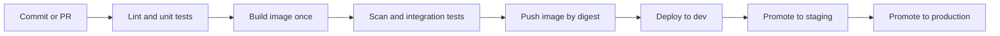
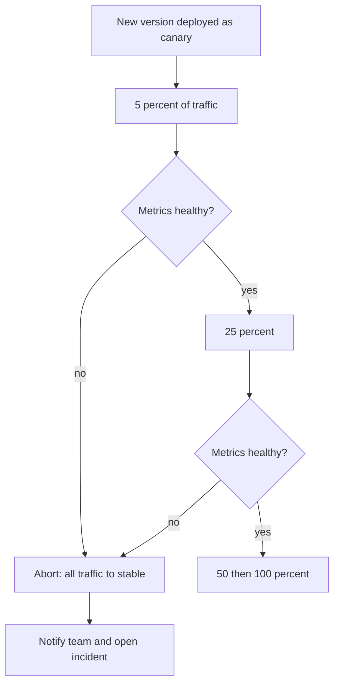
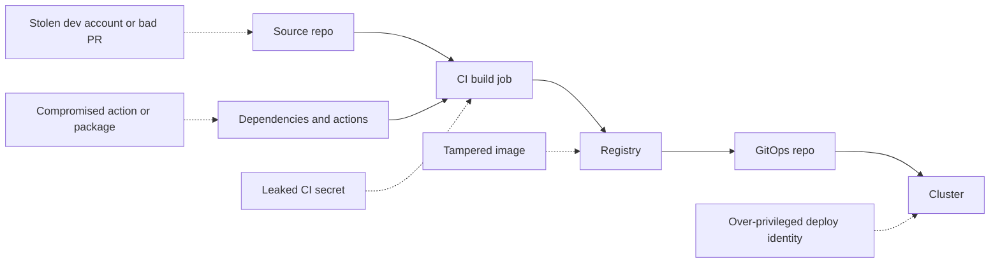

# Module 4 — CI/CD and safe releases

*Modules 2 and 3 gave Najm Bank's Platform Engineering team containers, clusters and infrastructure described as code. Now the team needs a safe, repeatable way to move a change from a developer's commit to a customer's phone, many times a week. That is the work of CI/CD. This module starts with continuous integration: pipelines that build one artefact, test it in layers and answer "is this change safe to merge?" in minutes. It then covers release strategies: rolling, blue-green and canary deployments, feature flags that separate deploying code from releasing a feature, and the rollback you must rehearse before you need it. It ends by treating the pipeline as what it really is, a privileged system that can change production: no long-lived keys, signed artefacts and least-privilege deploys. You will follow Yousef as a 48-minute pipeline becomes a 9-minute one, Maha as the Payments service gets its first automated canary, and Noura and Salem as the team removes the last cloud key from the CI settings.*

> **Phases:** Build, Test, Release, Deploy — turning every commit into one trusted artefact, then putting it in front of customers a little at a time, with a way back.

---

# 4.1 — Continuous integration: pipelines, tests, artefacts and fast feedback
*Level: 🟡 Intermediate* · *Prerequisites: 2.1, 3.2* · *Phase: Build, Test*

## ⚡ In 60 seconds
- **Continuous integration (CI)** means everyone merges small changes into the main branch often, at least daily, and every change is built and tested automatically before and after it merges.
- The pipeline's job is to answer one question quickly and honestly: "Is this change safe to merge?" A slow answer, or an answer people do not trust, makes CI pointless.
- **Build once, promote the same artefact.** Build the container image once, identify it by its digest, and deploy that exact image to dev, staging and production. Never rebuild per environment.
- Test in layers, following the **test pyramid**: many fast unit tests, fewer integration tests, a handful of end-to-end tests.
- Decision cue: keep the merge check under about ten minutes. When it grows, cache, parallelise and move slow suites after the merge before you add more hardware.
- Biggest trap: flaky tests. A test that fails at random teaches the team to press "re-run" and ignore red builds.

## 🧭 Why it matters
Yousef joins Najm Bank's platform team in the middle of a complaint. The Najm Mobile API pipeline takes 48 minutes. Because waiting is painful, developers batch a week of work into one large pull request. Reviews take days, merges conflict, and when something breaks nobody can tell which of the 40 commits caused it. Three end-to-end tests fail about one run in five for no clear reason, so the team's habit is "re-run until green".

Then an incident. A change passes staging on Thursday. On Friday the production job **rebuilds** the image from the same commit. The base image tag `latest` has moved overnight, a system library changed, and the API fails to start in production. Staging had tested an image that never reached production. Rollback works, but the post-incident review (5.3) records a hard truth: "what we tested is not what we shipped."

Salem gives Yousef the task: "Make the pipeline something people trust. Fast enough that nobody batches work, honest enough that a red build means something, and the artefact we test is the artefact we ship." That is this lesson.

## 📐 How it works

### 🟢 The essentials

**Three terms that get mixed up.**

| Term | Meaning | The question it answers |
|---|---|---|
| **Continuous integration** | Small changes merged to main often; each one built and tested automatically | Is this change safe to merge? |
| **Continuous delivery** | Every change that passes the pipeline *could* go to production at the push of a button | Could we release this right now? |
| **Continuous deployment** | Every change that passes goes to production automatically, with no human step | (Nobody asks; it just ships) |

Most banks, Najm included, practise continuous delivery: the pipeline makes every change releasable, and a release decision (sometimes automated, sometimes a person) puts it live. The ideas come from Jez Humble and David Farley's *Continuous Delivery* (2010), and *Accelerate* (Forsgren, Humble and Kim, 2018) linked these practices to delivery performance.

**Trunk-based development.** Developers work on short-lived branches, a day or two at most, and merge into one shared branch, usually `main`, often. Long-lived feature branches lead to painful merges and late surprises. Unfinished work is hidden behind a **feature flag** (lesson 4.2) rather than kept on a branch for weeks.

**What a pipeline is.** A **pipeline** is an automated sequence of **stages**, each made of **jobs** that run on machines called **runners** (or agents). It is triggered by an event: a pull request opened, a commit pushed to `main`, a tag created, or a schedule. The pipeline definition lives in the repository as code, so it is reviewed and versioned like everything else. Typical stages:



Everything left of "Push" runs on every pull request and must be fast. The promotions on the right move the *same* image through environments, as described in lesson 3.2.

**Artefacts.** An **artefact** is the output of a build that you keep and deploy: here, an OCI container image (lesson 2.1); elsewhere a JAR file, a Python wheel or a static site bundle. Two rules:
1. **Build once.** Build the artefact in one job, store it in a registry, and have every later stage pull it. Never run `docker build` again for staging or production.
2. **Identify it immutably.** A tag such as `v1.4.2` or `latest` can be moved to a different image. A **digest** (`sha256:...`, a hash of the image's content) cannot. Tag images with the commit SHA for humans, but deploy by digest.

Configuration that differs between environments (database host, feature flag defaults, replica counts) is injected at deploy time through environment variables, ConfigMaps or the GitOps overlay (lessons 2.3 and 3.2), never baked into the image. This is factor III of the Twelve-Factor App: store config in the environment. [*System Design for Vibe Coders*, lesson 4.5 — Verify the artifact, not the source](../vibe/index.en.html#l4-5) tells this story for solo builders.

**A minimal pipeline in GitHub Actions.** GitHub Actions is used here because it is free for public repositories and widely used; GitLab CI/CD, Jenkins, Azure Pipelines and others share the same concepts.

```yaml
# .github/workflows/ci.yml
name: ci
on:
  pull_request:
  push:
    branches: [main]

permissions:
  contents: read            # least privilege by default (lesson 4.3)

concurrency:
  group: ci-${{ github.ref }}
  cancel-in-progress: ${{ github.event_name == 'pull_request' }}  # cancel outdated PR runs, never main builds

jobs:
  test:
    runs-on: ubuntu-latest
    timeout-minutes: 15
    steps:
      - uses: actions/checkout@v4   # pin to a full commit SHA in real use (lesson 4.3)
      - run: make lint
      - run: make test-unit

  build:
    needs: test
    runs-on: ubuntu-latest
    timeout-minutes: 20
    steps:
      - uses: actions/checkout@v4
      - uses: docker/setup-buildx-action@v3
      - uses: docker/build-push-action@v6
        with:
          context: .
          push: false
          tags: mobile-api:${{ github.sha }}
          cache-from: type=gha
          cache-to: type=gha,mode=max
```

Note the defaults: read-only permissions, job timeouts, and cancelling outdated PR runs (never `main` runs: every merged commit must produce its artefact).

**The test pyramid.** Not all tests cost the same. The pyramid, popularised by Mike Cohn, says to have many cheap tests at the bottom and few expensive ones at the top.

| Layer | What it checks | Speed | How many | Where it runs |
|---|---|---|---|---|
| **Static checks** | Formatting, lint, type checks, IaC validation | Seconds | Every file | Every PR |
| **Unit tests** | One function or class, no network or database | Milliseconds each | Thousands | Every PR |
| **Integration tests** | The service with real dependencies: a PostgreSQL container, a fake payment network | Seconds each | Hundreds | Every PR, in parallel |
| **Contract tests** | That the API still matches what its clients expect | Seconds | One per consumer | Every PR |
| **End-to-end tests** | A full user journey through deployed services | Minutes each | A handful | After deploy to dev or staging |

An inverted pyramid, with hundreds of slow, brittle browser tests and few unit tests, is the usual reason a pipeline takes 48 minutes.

### 🟡 Going deeper

**Making the pipeline fast.** Yousef measures before changing anything. The 48 minutes break down into dependency downloads (7), image build without cache (11), unit tests run serially (9), integration tests (8) and end-to-end tests on every PR (13). The fixes, in order of value:

- **Cache dependencies.** Restore the package manager's cache keyed on the lock file hash; most CI systems have a built-in cache action.
- **Order the Dockerfile for layer caching** (lesson 2.1): copy the dependency manifest and install dependencies *before* copying source code, so a code change does not invalidate the dependency layer. Use a remote build cache (`cache-from`/`cache-to`) so ephemeral runners can reuse layers.
- **Parallelise.** Split tests into shards across several jobs, or use a matrix (for example, several Python or Node versions) only where it adds real coverage.
- **Run only what changed.** In a monorepo, path filters (`on.pull_request.paths`) skip pipelines for untouched services. Be careful: a shared library change must still trigger its dependants.
- **Move slow suites after the merge.** End-to-end tests run against the dev environment after merge and on a schedule; they block *promotion*, not *merging*.

The result: lint and unit tests in 3 minutes, build and integration tests in 6, a 9-minute merge check, with end-to-end tests gating promotion to staging.

**Flaky tests.** A **flaky test** passes and fails on the same code. Causes include timing assumptions (`sleep(2)` and hoping), shared test data, test order dependence, real network calls and clocks. Policy at Najm:
1. A test that fails and then passes on retry, on the same commit, is automatically marked as suspected flaky.
2. A flaky test is **quarantined**: moved to a non-blocking job, with a ticket and an owner, and fixed or deleted within an agreed time.
3. Automatic "retry until green" on the whole pipeline is not allowed. It hides real intermittent bugs, including race conditions that will also happen in production.

**Merge queues.** When many people merge to `main`, two pull requests can each pass alone and break together. A **merge queue** (GitHub merge queue, GitLab merge trains and similar features) tests each PR on top of the PRs ahead of it before merging, so `main` stays green.

**Labelling the artefact.** Record where the image came from, so anyone can trace a running pod back to a commit. OCI image annotations such as `org.opencontainers.image.revision` (the commit SHA) and `org.opencontainers.image.source` (the repository URL) are standard keys. Lesson 4.3 turns this into signed **provenance**.

**What the pipeline checks besides tests.** A CI pipeline is also where cheap automated checks live: secret scanning, dependency vulnerability scanning (SCA), static security analysis (SAST), Dockerfile and IaC linting, and the policy checks from lesson 3.3. Block only on new, high-confidence findings, or developers will learn to ignore the gate. [*Secure AI & Application Security*, lesson 6.1 — A secure development life cycle](../secai/index.html#/6.1) covers how to tune these scanners.

### 🔴 Expert view

**Measure the outcome, not the pipeline.** The DORA research programme tracks four key delivery measures: **deployment frequency**, **lead time for changes** (commit to production), **change failure rate** and **time to restore service**. DORA has since added a reliability measure and refined some names (for example, recent reports talk about failed deployment recovery time); check dora.dev for the current definitions. A fast pipeline improves lead time; trustworthy tests lower change failure rate. Watch both together: speeding up by deleting tests just moves the cost into incidents.

**The pipeline is a product.** At Najm, product teams should not each write their own pipeline from scratch. The platform team publishes a **golden path**: a reusable workflow (in GitHub Actions, a workflow called with `uses: najm-bank/platform-workflows/.github/workflows/service-ci.yml@<version>`) that does build, scan, test, sign and push in the approved way. Teams pass a few inputs. When the platform team improves caching or adds a scanner, every service gets it. Version it, keep a changelog, and measure adoption and build times.

**Reproducible and hermetic builds.** A **hermetic** build uses only declared, pinned inputs: a base image by digest, dependencies by lock file with hashes, a pinned toolchain, and no undeclared network access. Fully bit-for-bit **reproducible** builds are hard for container images (timestamps, file ordering), but hermetic inputs alone remove the Friday incident: a moving `latest` tag cannot sneak in.

**Feedback time is a design budget.** Publish a target (Najm's is below). A new check that would break it must replace something, run in parallel, or run after the merge.

## 🧰 The toolkit
| Tool, practice or service | What it is and does | When to reach for it |
|---|---|---|
| **GitHub Actions** | CI/CD built into GitHub; workflows in YAML in the repository, run on hosted or self-hosted runners | Code already on GitHub; free practice on public repositories |
| **GitLab CI/CD** | CI/CD built into GitLab; pipelines defined in `.gitlab-ci.yml` | Code on GitLab, including self-managed installations |
| **Jenkins** | Long-standing open-source automation server with a large plugin ecosystem | Existing estates; when you must run everything on-premises |
| **Trunk-based development** | Short-lived branches merged to one main branch at least daily | Always, as the default branching model for CI |
| **Build once, promote** | One build produces one immutable artefact that moves through every environment | Every service; it removes "tested is not shipped" |
| **Test pyramid** | Many unit tests, fewer integration tests, few end-to-end tests | Designing a test suite or diagnosing a slow pipeline |
| **Merge queue** | Tests each PR against the PRs ahead of it before merging | Busy repositories where `main` keeps breaking after "green" merges |
| **Golden path** | A platform-maintained, reusable pipeline that teams adopt instead of writing their own | More than a handful of services with similar builds |

## 🏛️ In practice at Najm Bank
Yousef and Salem publish **Najm Golden-Path CI Standard v1**, implemented as a reusable workflow. Every new service starts with it.

**Part A: stages, gates and time budgets**

| Stage | Runs on | Blocks | Time budget (p95) |
|---|---|---|---|
| Lint, format, type check, IaC validate | Every PR | Merge | 2 min |
| Unit tests (sharded) | Every PR | Merge | 4 min |
| Secret scan, SCA, SAST (new high findings only) | Every PR | Merge | 3 min, in parallel |
| Build image once, with remote cache | Every PR | Merge | 4 min |
| Integration and contract tests (PostgreSQL in a container) | Every PR | Merge | 5 min, in parallel |
| Push image by digest, record commit SHA and source | Merge to `main` | — | 2 min |
| Deploy to dev and run end-to-end smoke tests | Merge to `main` | Promotion to staging | 10 min |
| Full end-to-end suite | Every few hours and before production | Promotion to production | 30 min |

Overall merge-check target: 95% of PR checks finish within 10 minutes.

**Part B: rules**
1. Images are built once per commit and deployed by digest. A pipeline that runs `docker build` in a deploy job fails the platform review.
2. Base images and toolchains are pinned by digest or exact version; a bot proposes updates as ordinary pull requests.
3. Every job has a timeout. Workflows default to read-only permissions.
4. Flaky tests are quarantined within one working day, with an owner and a ticket. No whole-pipeline auto-retry.
5. Each service's dashboard shows lead time, deployment frequency, change failure rate and PR-check duration.

**Part C: the reusable workflow's interface**

```yaml
# In the service repository
jobs:
  ci:
    uses: najm-bank/platform-workflows/.github/workflows/service-ci.yml@v3   # pin by SHA in real use
    with:
      service-name: mobile-api
      dockerfile: ./Dockerfile
      integration-services: postgres
      test-shards: 4
```

## 🛠️ Exercises
Use your own GitHub account and a public practice repository; never an employer's repository without permission.

- 🟢 Take a small app of your own (any language) and add a CI workflow that runs lint and unit tests on every pull request, with read-only permissions, a job timeout and cancellation of outdated runs. Open a PR with a deliberately failing test. *Done when:* the PR shows a red check that names the failing test, and fixing the test turns it green.
- 🟡 Add a container build to the pipeline with layer caching. Reorder the Dockerfile so dependencies install before the source code is copied. Record the build time before and after for a one-line code change. *Done when:* you have both timings, and a second build after a source-only change reuses the dependency layer (the log shows cached steps).
- 🔴 Implement "build once, promote": on merge to `main`, push the image to a registry (GitHub Container Registry works for a public repo), output its digest, and have a second job deploy that digest to a local kind cluster or update a manifest in a GitOps folder. Add a test that fails if any deploy job contains a `docker build` command. *Done when:* the digest running in your cluster (`kubectl get pod -o jsonpath='{.items[*].status.containerStatuses[*].imageID}'`) matches the digest the build job printed.

## ⚠️ Mistakes and traps
- **Rebuilding per environment.** Staging tests one image and production runs another. Build once, deploy by digest, inject configuration at deploy time.
- **"Re-run until green".** It hides flaky tests and real race conditions. Quarantine flaky tests with an owner and a deadline; never auto-retry whole pipelines.
- **An inverted pyramid.** Hundreds of slow end-to-end tests on every PR make CI slow and brittle. Push checks down to unit and integration level, and run end-to-end suites after the merge.
- **Long-lived feature branches.** They turn integration into a weekly crisis. Merge small changes daily and hide unfinished work behind flags.
- **Unpinned inputs.** `FROM node:latest` or unpinned tools make yesterday's green build meaningless today. Pin by digest or exact version and update deliberately.

## 🧾 Recap
- CI answers "is this change safe to merge?"; continuous delivery keeps every passing change releasable; continuous deployment releases it automatically.
- Trunk-based development and small, frequent merges make integration routine instead of risky.
- Build one immutable artefact, identify it by digest, and promote the same artefact through every environment.
- Shape tests as a pyramid, and keep the merge check fast with caching, parallelism and moving slow suites after the merge.
- Treat flaky tests as defects, the pipeline as a product, and the DORA measures as the scorecard.

## ✍️ Check yourself

**1. Staging passed on Thursday, but on Friday the production deploy failed because the image behaved differently. The production job had rebuilt the image from the same commit. What change prevents this class of failure?**

- A. Run the staging tests again inside the production job
- B. Build once and deploy the same image by digest everywhere
- C. Use the `latest` tag everywhere so all environments match
- D. Add a manual approval step before every production deploy

<details><summary>Answer</summary>

**B.** Building once and deploying by digest guarantees production runs exactly what was tested. C makes it worse, because `latest` moves; D adds a human but not the same artefact. (🟢 The essentials.)

</details>

**2. The Najm Mobile API PR check takes 48 minutes, and 13 of them are end-to-end tests. What is the best first move?**

- A. Delete the end-to-end tests, since unit tests cover the logic
- B. Buy larger runners and keep everything the same
- C. Run end-to-end tests after the merge, gating promotion instead
- D. Ask developers to open fewer, larger pull requests

<details><summary>Answer</summary>

**C.** The tests still protect production, but they no longer slow every merge. A loses protection; B is costly and leaves the structure unchanged; D encourages the batching that caused the problem. (🟡 Going deeper.)

</details>

**3. Which statement best describes continuous delivery?**

- A. Every passing change is releasable; a release decision puts it live
- B. Every change goes to production automatically with no human step
- C. Developers merge their branches to main at least once a week
- D. The pipeline builds and tests all changes once a night

<details><summary>Answer</summary>

**A.** B is continuous deployment. C describes infrequent integration, and D is a nightly build, not CI. (🟢 The essentials.)

</details>

**4. A test in the Payments service fails about one run in ten and passes when re-run on the same commit. What does Najm's policy require?**

- A. Enable automatic retries on the whole pipeline so merges are not blocked
- B. Delete the test immediately and rely on the remaining suite
- C. Leave it blocking, and re-run the pipeline whenever it fails
- D. Quarantine it in a non-blocking job, with an owner and a deadline

<details><summary>Answer</summary>

**D.** Quarantine keeps the merge signal trustworthy while someone finds the cause, which may be a real race condition. A hides problems; B may delete useful coverage without understanding it; C teaches people to ignore red builds. (🟡 Going deeper.)

</details>

**5. Salem wants to know whether the CI improvements are making delivery better overall, not just faster. Which pair of measures should he watch together?**

- A. Number of pipelines and number of runners
- B. Lines of code and test count
- C. Lead time for changes and change failure rate
- D. Build cache hit rate and image size

<details><summary>Answer</summary>

**C.** Lead time shows speed and change failure rate shows whether the speed is safe; watching one alone can mislead. The others are useful diagnostics, not outcomes. (🔴 Expert view.)

</details>

## 📚 References
- DORA research and metrics — https://dora.dev/
- GitHub Actions documentation — https://docs.github.com/en/actions
- GitHub, managing a merge queue — https://docs.github.com/en/repositories/configuring-branches-and-merges-in-your-repository/configuring-pull-request-merges/managing-a-merge-queue
- GitLab CI/CD documentation — https://docs.gitlab.com/ee/ci/
- Jenkins documentation — https://www.jenkins.io/doc/
- Docker, build cache — https://docs.docker.com/build/cache/
- OCI image specification, annotations — https://github.com/opencontainers/image-spec/blob/main/annotations.md
- The Twelve-Factor App — https://12factor.net/
- Trunk-based development — https://trunkbaseddevelopment.com/

---

# 4.2 — Release strategies: rolling, blue-green, canary, feature flags and rollback
*Level: 🟡 Intermediate* · *Prerequisites: 2.2, 2.3, 4.1* · *Phase: Release, Deploy*

## ⚡ In 60 seconds
- **Deploying** puts new code on servers; **releasing** lets users reach it. Separating the two, with feature flags and progressive traffic shifting, is the core of safe delivery.
- The main strategies: **recreate** (stop old, start new), **rolling** (replace a few at a time), **blue-green** (two full environments, switch traffic at once), **canary** (send a small share of traffic to the new version and watch), **shadow** (copy traffic to the new version, discard its responses).
- Choose by blast radius and by how quickly you can detect a problem. High-risk services such as Payments get a canary with automatic analysis; internal tools can roll.
- Every release needs a rehearsed rollback, and the database must work with both the old and the new version at the same time.
- Biggest trap: shipping a change to everyone at once because "it's only configuration". Configuration and content are code; stage them too.

## 🧭 Why it matters
On 19 July 2024, CrowdStrike pushed a content configuration update for its Falcon sensor to Windows hosts. A defect in that update crashed affected machines, and Microsoft estimated about 8.5 million Windows devices were hit, grounding flights and disrupting hospitals and banks. CrowdStrike's own review said this kind of content had not been rolled out in stages. Among its commitments afterwards was a staged deployment of this kind of content, with canary groups first and customer control over timing. A change that reaches everyone at once can fail for everyone at once.

At Najm, Maha has a closer example. Last quarter, a new version of the **Payments service** changed how it read a currency field. The deployment rolled across all pods in four minutes. Error rates rose on about 3% of transfers (those in one currency) and stayed below the old alert threshold for 40 minutes. By then every pod ran the new code, and the unpractised rollback took another 15 minutes.

Maha's goal: the next Payments release reaches 5% of traffic first, is judged by numbers, and rolls back on its own if they go bad.

## 📐 How it works

### 🟢 The essentials

**Deploy is not release.** **Traffic shifting** (rolling, blue-green, canary) controls which *version* receives requests; **feature flags** control which *behaviour* users see inside one version.

With both, you can deploy on Tuesday, enable the feature for staff on Wednesday and for 5% of customers on Thursday, and switch it off in seconds.

**The strategies.**

| Strategy | How it works | Rollback | Extra cost | Good for |
|---|---|---|---|---|
| **Recreate** | Stop all old instances, then start the new ones | Redeploy old version | None, but causes downtime | Batch jobs; dev environments; versions that cannot run side by side |
| **Rolling update** | Replace instances a few at a time; new ones join when ready | Roll back the same way, a few at a time | A little spare capacity | Most stateless services; the Kubernetes default |
| **Blue-green** | Run the new version (green) next to the old (blue) at full size; switch all traffic at once | Switch traffic back to blue, in seconds | Double capacity during the release | Fast, clean cut-over; easy verification before switching |
| **Canary** | Send a small share of real traffic to the new version, compare its metrics, then increase step by step | Send all traffic back to the stable version | A few extra instances plus metrics | High-risk services; large user bases |
| **Shadow** (mirroring) | Copy live requests to the new version and discard its responses | Nothing to roll back; users never saw it | Extra capacity; care with side effects | Testing performance or correctness of a rewrite on real traffic |

Shadow traffic must never trigger real side effects, such as a mirrored transfer that moves money twice. Use it on read paths or with side effects stubbed out.

**Rolling updates in Kubernetes.** A Deployment (lesson 2.2) replaces pods according to two settings, and only sends traffic to a new pod once its **readiness probe** passes (lesson 2.3):

```yaml
apiVersion: apps/v1
kind: Deployment
metadata:
  name: mobile-api
spec:
  replicas: 10
  selector:
    matchLabels: { app: mobile-api }
  strategy:
    type: RollingUpdate
    rollingUpdate:
      maxSurge: 2          # up to 2 extra pods during the rollout
      maxUnavailable: 0    # never drop below 10 ready pods
  minReadySeconds: 20      # a new pod must stay ready 20s before it counts
  progressDeadlineSeconds: 600
  template:
    metadata:
      labels: { app: mobile-api }
    spec:
      containers:
        - name: api
          image: registry.najm.internal/mobile-api@sha256:<digest>
          readinessProbe:
            httpGet: { path: /ready, port: 8080 }
            periodSeconds: 5
```

A rolling update stops pods that *never become ready*, not pods that start fine and return wrong answers, as Payments did. That needs a canary and metrics.

**Rollback, two ways.** In a push-based setup, `kubectl rollout undo deployment/mobile-api` returns to the previous ReplicaSet. In a GitOps setup (lesson 3.2), the Git repository is the truth: with automated sync and self-heal on, the controller soon reverts a manual `kubectl` rollback. The rollback is a `git revert` of the commit that changed the image digest, which the controller then applies. Decide which model you use and write the runbook to match.

**Roll back or roll forward?** **Rolling back** returns to the last known good version. **Rolling forward** ships a new fix. Default to rolling back when customers are hurting: it is faster and already tested. Roll forward only when rollback is impossible (for example after an irreversible data change) or the fix is trivial and well understood.

### 🟡 Going deeper

**Automated canary analysis.** A canary is only as good as the comparison behind it. Tools such as **Argo Rollouts** and **Flagger** extend Kubernetes with canary and blue-green strategies, shift traffic through a service mesh, a Gateway API implementation or an ingress controller, and query metrics to decide whether to continue. A sketch of Maha's design with Argo Rollouts:

```yaml
apiVersion: argoproj.io/v1alpha1
kind: Rollout
metadata:
  name: payments
spec:
  replicas: 12
  strategy:
    canary:
      canaryMetadata:
        labels: { track: canary }   # lets the query below select canary pods
      stableMetadata:
        labels: { track: stable }
      steps:
        - setWeight: 5
        - pause: { duration: 10m }
        - analysis:
            templates:
              - templateName: payments-success-rate
        - setWeight: 25
        - pause: { duration: 10m }
        - analysis:
            templates:
              - templateName: payments-success-rate
        - setWeight: 50
        - pause: { duration: 10m }
  # selector and pod template as in a Deployment
---
apiVersion: argoproj.io/v1alpha1
kind: AnalysisTemplate
metadata:
  name: payments-success-rate
spec:
  metrics:
    - name: success-rate
      interval: 1m
      count: 5
      failureLimit: 1
      successCondition: result[0] >= 0.995
      provider:
        prometheus:
          address: http://prometheus.monitoring:9090
          query: |
            sum(rate(http_requests_total{app="payments",track="canary",code!~"5.."}[5m]))
            /
            sum(rate(http_requests_total{app="payments",track="canary"}[5m]))
```

If the canary's success rate misses the threshold more than once, the rollout aborts and traffic returns to stable, with nobody woken to decide. Without a traffic router, weights are approximated by pod count (5% of 12 replicas is one pod, about 8%); a mesh or Gateway API plugin gives exact splits. Field names change between versions; check the documentation for yours.



**Choosing what the canary measures.** Use the same signals as your SLOs (lesson 5.2): error rate, latency at a high percentile such as p99, and a business signal where possible (for Payments: the share of transfers that reach "settled"). Compare canary to stable *at the same time*, not to last week. And make the canary large enough: at 1% of a quiet service, ten minutes may hold too few requests to judge.

**Feature flags.** A **feature flag** (feature toggle) is a runtime switch that changes behaviour without a deploy. Pete Hodgson's widely cited taxonomy names four kinds:

| Kind | Purpose | Lifetime | Najm example |
|---|---|---|---|
| **Release flag** | Hide unfinished or new features until ready | Days to weeks, then delete | New card-freeze screen |
| **Ops flag / kill switch** | Turn off an expensive or risky path under load or during an incident | Long-lived, documented | Disable Najm Assist's document upload if the model gateway is struggling |
| **Experiment flag** | A/B test two variants | Length of the experiment | Two onboarding flows |
| **Permission flag** | Enable features for certain users or tenants | Long-lived | Beta features for staff only |

**OpenFeature**, a CNCF project, defines a vendor-neutral API for evaluating flags, so application code does not depend on one flag vendor. Flag *management* (who can change which flag, with what approval and audit trail) matters as much as flag evaluation, especially in a bank. [*SaaS Building Blocks*, lesson 6.3 — Feature flags and experiments](../saas/index.html#/6.3) compares flag services in depth.

**Flags are code with a short life.** In 2012 the US trading firm Knight Capital deployed new code to eight servers, but, according to the SEC's order, one server did not receive it. The release reused an old flag, which on that server woke long-retired logic that sent millions of orders in about 45 minutes. The order describes losses of over 460 million US dollars. Two lessons: never reuse a flag name for a new meaning, and verify that every instance runs the version you think it runs.

**Databases: expand and contract.** During any rolling, canary or blue-green release, old and new versions run *at the same time* against the same database. A schema change must work for both. The **expand and contract** pattern (also called parallel change) does this in steps:
1. **Expand:** add the new column or table; the old code ignores it.
2. **Migrate:** deploy code that writes both old and new, backfill existing rows, then switch reads to the new column.
3. **Contract:** once no running version reads the old column, remove it in a later release.

Never rename or drop a column in the same release as the code that stops using it. That single rule makes rollback possible.

### 🔴 Expert view

**Rings and regions.** Large platforms release in **rings** with soak time between them; CrowdStrike's commitments describe the same idea. Najm's: staff, then 5% of Qatar traffic, then all of Qatar, then the UAE, then the EU. Each ring limits the blast radius of the next mistake.

**Automatic rollback on SLO burn.** Analysis during the rollout catches obvious failures. Subtle ones, like the Payments currency bug at 3% of traffic, need a longer watch. After a release completes, compare its **error budget burn rate** (lesson 5.2) for the next hour or two against the previous version. A sustained burn far above normal should trigger an automatic rollback, or at least a page that names the release.

**Small batches beat freezes.** Many organisations react to bad releases with change boards and long freezes; DORA's research found that heavyweight external approval tends to slow delivery without improving stability. Najm keeps a short freeze around peak periods such as salary day and Eid, but its main defence is small, frequent, automated, observable releases with peer review. Regulators still expect change-control evidence; EU DORA, for example, requires ICT change management within the ICT risk framework. A pipeline that records who approved what, which canary ran, and what it measured is that evidence. [*Secure AI & Application Security*, lesson 11.2 — Regulation that touches security](../secai/index.html#/11.2) covers the financial-sector rules.

## 🧰 The toolkit
| Tool, practice or service | What it is and does | When to reach for it |
|---|---|---|
| **Rolling update** | Kubernetes Deployment strategy that replaces pods gradually, gated by readiness | Default for stateless services |
| **Blue-green deployment** | Two full environments; traffic switches at once, and back just as fast | Fast clean cut-overs; when you can afford double capacity briefly |
| **Canary release** | A small share of traffic to the new version, judged by metrics before increasing | High-risk services such as Payments; anything with many users |
| **Argo Rollouts** (CNCF, part of the Argo project) | Kubernetes controller adding canary and blue-green with automated analysis | Progressive delivery with Argo CD |
| **Flagger** (part of the Flux project) | Kubernetes operator automating canary, A/B and blue-green with metric checks | Progressive delivery with Flux or a service mesh |
| **OpenFeature** (CNCF) | Vendor-neutral API and SDKs for evaluating feature flags | Using flags without locking code to one vendor |
| **Feature flag** | Runtime switch that changes behaviour without a deploy | Separating deploy from release; kill switches |
| **Expand and contract** | Schema and API changes in backward-compatible steps | Any change to a database or API used by more than one version |

## 🏛️ In practice at Najm Bank
Maha and Salem publish the **Najm Release Standard v1**: a strategy per service tier and a release checklist.

**Part A: strategy by tier**

| Tier | Services | Strategy | Automatic analysis | Rollback target |
|---|---|---|---|---|
| 1 | Payments service, login | Canary 5% → 25% → 50% → 100%, 10 minutes per step; rings by country | Success rate ≥ 99.5%, p99 latency within 20% of stable, settled-transfer ratio | Under 5 minutes, automatic |
| 2 | Najm Mobile API, Najm Assist gateway | Canary 10% → 50% → 100% | Error rate and p99 latency | Under 10 minutes, automatic |
| 3 | Internal tools, batch jobs | Rolling update with readiness gates | Rollout health only | Under 30 minutes, manual |

The thresholds are Najm's own choices, set from each service's SLO (lesson 5.2), and reviewed after each incident.

**Part B: release checklist (tier 1)**

| Check | Evidence |
|---|---|
| Image is the digest built and tested by CI (lesson 4.1) and is signed (lesson 4.3) | Pipeline run link; signature verified at admission |
| Schema changes are expand-only in this release | Migration file reviewed; no `DROP` or `RENAME` |
| New behaviour is behind a release flag, default off | Flag name, owner, removal date |
| No flag name is reused | Flag registry check |
| Canary analysis template matches the service's current SLO | Template version |
| Rollback rehearsed on staging this quarter | Date and result |
| Not in a freeze window; on-call informed | Release calendar; release channel message |

**Part C: rollback runbook (GitOps)**
1. If analysis has aborted, confirm traffic is 100% on stable. If not, abort the rollout manually.
2. `git revert` the commit in the GitOps repo that changed the image digest; Argo CD applies it.
3. If a flag was involved, switch it off first; that is faster than any rollback.
4. Post version, time, symptom and action in the incident channel; open a postmortem if customers were affected (lesson 5.3).

## 🛠️ Exercises
Run these on a local kind or k3d cluster.

- 🟢 Deploy a small web app as a Deployment with 4 replicas, a readiness probe, `maxSurge: 1`, `maxUnavailable: 0` and a short `preStop` sleep so endpoints drain before pods stop. Update the image and watch `kubectl rollout status`. Then roll back with `kubectl rollout undo`. *Done when:* a loop of `curl` requests against the Service during both the update and the rollback shows no failed requests.
- 🟡 Deploy a version whose readiness probe never passes. Observe what the rolling update does and what `progressDeadlineSeconds` reports. Then deploy a version that starts fine but returns HTTP 500 on one endpoint. *Done when:* you can explain in three sentences why the first bad version was stopped and the second was not, and what would stop the second.
- 🔴 Install Argo Rollouts and Prometheus in your cluster. Convert the Deployment to a Rollout with a canary (10% → 50% → 100%) and an AnalysisTemplate on the success rate. Release a version that returns errors on 20% of requests. *Done when:* the rollout aborts by itself, traffic returns to stable, and you can show the failed analysis run.

## ⚠️ Mistakes and traps
- **Treating configuration and content as "not a release".** A bad config or content push can break everything at once. Stage them through the same rings.
- **Canary without real analysis.** A human glancing at a dashboard for two minutes is not analysis. Define the metrics, thresholds and duration in code.
- **Breaking the database in the same release.** Dropping or renaming a column alongside the code change makes rollback impossible. Expand, migrate, then contract in a later release.
- **Never-deleted flags.** Old flags pile up into untested combinations, and reused names can wake up dead code, as at Knight Capital. Give each release flag an owner and a removal date.
- **An unrehearsed rollback.** Rolling back during an incident is the worst time to discover it does not work. Rehearse it on staging every quarter.

## 🧾 Recap
- Separate deploy from release: traffic shifting chooses the version; feature flags choose the behaviour.
- Rolling updates stop pods that never become ready; canaries with automated analysis stop versions that run but behave badly.
- Pick the strategy by risk tier: canary for Payments and login, rolling for internal tools, blue-green when a fast clean switch is worth double capacity.
- Old and new versions run at once, so databases and APIs change with expand and contract.
- Rollback must be fast, rehearsed and done the GitOps way.

## ✍️ Check yourself

**1. A new Payments version starts normally and passes its readiness probe, but fails transfers in one currency, about 3% of traffic. Which strategy would most likely have limited the impact?**

- A. A rolling update with a larger `maxSurge`
- B. A recreate deployment, so versions never mix
- C. A canary judged automatically on success rate
- D. A longer `progressDeadlineSeconds` on the Deployment

<details><summary>Answer</summary>

**C.** The pods are healthy by the probe's standard, so only a metric comparison on real traffic catches the fault, and the canary limits who is exposed. A, B and D only react to pods that fail to start or become ready. (🟡 Going deeper.)

</details>

**2. Yousef wants to rename a column in the Payments database in the same release that updates the code to use the new name. What should Maha advise?**

- A. Fine, as long as blue-green switches all traffic at once
- B. Add and backfill the new column; drop the old one later
- C. Do it at night, during a low-traffic window
- D. Test it first with shadow traffic, then release normally

<details><summary>Answer</summary>

**B.** Expand and contract keeps old and new versions working together, so rollback stays possible. Blue-green (A) still runs both versions against one database, and rolling back would hit the renamed column. (🟡 Going deeper.)

</details>

**3. Najm deploys with Argo CD, with automated sync and self-heal on. During an incident, an engineer runs `kubectl rollout undo`, and ten minutes later the bad version is back. Why?**

- A. Argo CD re-synced the cluster to the version declared in Git
- B. `kubectl rollout undo` is temporary and expires after a set time
- C. The old version's readiness probe failed, so Kubernetes rolled forward
- D. The Horizontal Pod Autoscaler recreated the pods from its own template

<details><summary>Answer</summary>

**A.** In GitOps, Git is the source of truth, so roll back with a `git revert` of the digest change. The other options do not restore an old image version. (🟢 The essentials.)

</details>

**4. Which use of shadow (mirrored) traffic is safe for the Payments service?**

- A. Mirroring transfer requests to the new version with real settlement enabled
- B. Mirroring all requests and returning whichever response arrives first
- C. Using shadow traffic instead of any automated tests
- D. Mirroring read-only requests, or ones with side effects stubbed out

<details><summary>Answer</summary>

**D.** Shadow responses are discarded, so the new version must not cause real effects. A would move money twice; B is not shadowing; C misuses it. (🟢 The essentials.)

</details>

**5. After the CrowdStrike incident of July 2024, what release practice did the vendor commit to for this kind of content update?**

- A. Stopping content updates and shipping only full sensor releases
- B. Staged deployment through canary groups, with customer control over timing
- C. Releasing content updates only once a quarter, after a freeze
- D. Requiring every customer to install each update by hand

<details><summary>Answer</summary>

**B.** Staged rollouts limit the blast radius of a bad update, the same idea as rings and canaries. The others are not what was described and would leave customers without protection updates. (🧭 Why it matters, 🔴 Expert view.)

</details>

## 📚 References
- Kubernetes, Deployments and rolling updates — https://kubernetes.io/docs/concepts/workloads/controllers/deployment/
- Argo Rollouts documentation — https://argo-rollouts.readthedocs.io/
- Flagger documentation — https://docs.flagger.app/
- OpenFeature — https://openfeature.dev/
- Martin Fowler's site, Feature Toggles (Pete Hodgson) — https://martinfowler.com/articles/feature-toggles.html
- CrowdStrike, Channel File 291 incident information and root cause analysis — https://www.crowdstrike.com/
- US SEC, administrative proceeding against Knight Capital Americas LLC (2013) — https://www.sec.gov/
- Google SRE book, chapter on release engineering — https://sre.google/sre-book/release-engineering/
- DORA research — https://dora.dev/

---

# 4.3 — Securing the pipeline: secrets, signed artefacts and least-privilege deploys
*Level: 🟡 Intermediate* · *Prerequisites: 1.3, 3.2, 4.1* · *Phase: Build, Deploy*

## ⚡ In 60 seconds
- A CI/CD pipeline can change production, so it is one of the most privileged systems you run. Attackers know this; protect it like production.
- **No long-lived cloud keys in CI.** Use **OIDC workload identity federation**: each job gets a short-lived token, and the cloud trusts it only for a specific repository, branch or environment.
- **Least privilege everywhere:** read-only default token permissions, third-party actions pinned to a full commit SHA, a separate identity for each job, and production deploys gated by a protected environment.
- **Sign what you build and verify before you run:** sign images by digest, attach provenance and an SBOM, and let the cluster admit only images signed by your release workflow.
- Prefer **pull-based deploys** (GitOps): CI never holds cluster credentials; a controller inside the cluster pulls approved changes.
- Biggest trap: treating the pipeline as "just tooling", owned by nobody and audited by nobody.

## 🧭 Why it matters
Two public incidents show why. In April 2021, Codecov disclosed that an attacker had modified its Bash Uploader script, which many customers ran inside their CI pipelines. The changed script sent the environment variables of those CI jobs, often including credentials and tokens, to a server the attacker controlled. In March 2025, the popular GitHub Action `tj-actions/changed-files` was compromised (CVE-2025-30066): its version tags were pointed at a malicious commit that printed CI secrets into build logs, where in public repositories anyone could read them. Teams that referenced the action by a tag ran the malicious code without changing a line; teams that pinned it to a full commit SHA did not.

At Najm, Yousef is setting up a pipeline for a new internal service. Deploying needs cloud access, so he creates a cloud access key for a user with administrator rights, stores it as a repository secret, and adds a third-party action he found online that "makes deploys easier". It works on the first try. Noura (Head of Application & AI Security) spots it in review: one key, never expiring, with full control of the cloud account, available to every workflow in the repository, and a piece of unknown code that can read it.

Salem turns the review into a project: "By the end of the quarter, no long-lived cloud key exists in any Najm pipeline, and the cluster refuses any image our release workflow did not sign."

## 📐 How it works

### 🟢 The essentials

**Threat-model the pipeline.** Think about what an attacker could do at each step from commit to production:



Each arrow has a control: branch protection and review on the source; pinned, vetted dependencies and actions; short-lived credentials for the build; signatures on the image; and a narrow deploy path into the cluster. The SLSA framework (Supply-chain Levels for Software Artifacts) describes these threats in detail. [*Secure AI & Application Security*, lesson 6.2 — The software supply chain](../secai/index.html#/6.2) covers dependencies, SBOMs and SLSA from the security side; this lesson stays on how the platform team builds and runs the pipeline.

**Secrets: the fewer, the better.** The best secret is one that does not exist. The order of preference:
1. **Federated identity (no secret).** The CI job proves who it is with a short-lived OIDC token issued by the CI platform; the cloud exchanges it for temporary credentials (lesson 1.3).
2. **Short-lived secrets from a secrets manager**, fetched at run time with a federated identity.
3. **Stored CI secrets**, only where nothing else works, scoped to one environment, rotated on a schedule, and never printed.

**OIDC federation from GitHub Actions.** The workflow asks for an ID token, and the cloud role trusts only tokens whose claims match. A release job that pushes the image:

```yaml
permissions:
  contents: read             # workflow default: read-only

jobs:
  push-image:
    runs-on: ubuntu-latest
    environment: production   # protected: required reviewers, main branch only
    permissions:
      contents: read
      id-token: write         # only this job may request an OIDC token
    steps:
      - uses: aws-actions/configure-aws-credentials@v4   # pin by SHA in real use
        with:
          role-to-assume: arn:aws:iam::111122223333:role/mobile-api-ci-push
          aws-region: me-central-1
```

And the trust condition on the cloud side (AWS IAM shown; the subject format is GitHub's):

```json
"Condition": {
  "StringEquals": {
    "token.actions.githubusercontent.com:aud": "sts.amazonaws.com",
    "token.actions.githubusercontent.com:sub": "repo:najm-bank/mobile-api:environment:production"
  }
}
```

A job in another repository, or one not running in the `production` environment, gets a token with a different subject, so it cannot assume the role. Because the subject names the environment, not the branch, restrict that environment to `main` in its deployment-branch settings. All three major clouds support the same idea:

| Cloud | Feature | CI side |
|---|---|---|
| AWS | IAM OIDC identity provider and a role with a trust policy | `aws-actions/configure-aws-credentials` |
| Microsoft Azure | Workload identity federation: a federated credential on an app registration or managed identity in Entra ID | `azure/login` |
| Google Cloud | Workload Identity Federation with a workload identity pool and provider | `google-github-actions/auth` |

**The CI's own token.** GitHub gives every workflow a `GITHUB_TOKEN`. Set `permissions: contents: read` at the top of every workflow and grant more per job only when needed (`packages: write` to push to GitHub's registry, `id-token: write` for OIDC). An organisation-level setting can make read-only the default.

**Third-party actions and plugins run with your secrets.** A tag such as `@v4` can be moved by whoever controls the action's repository; a full commit SHA cannot.

```yaml
# Risky: the tag can be repointed to different code
- uses: some-org/deploy-helper@v2

# Hardened: an immutable commit, with the tag as a comment for humans
- uses: some-org/deploy-helper@<full-40-character-commit-sha>   # v2.3.1
```

Use a dependency bot to propose SHA updates as reviewed pull requests, and keep an allow-list of approved actions at organisation level. The same applies to Jenkins plugins, GitLab CI includes and container base images.

**Untrusted code in pull requests.** A pull request from a fork contains code you have not reviewed. Never run it with secrets available. On GitHub, the `pull_request_target` trigger runs in the context of the base repository, with access to its secrets; checking out and running the PR's code in that context is a well-known way to leak secrets. Use the plain `pull_request` trigger for untrusted code.

### 🟡 Going deeper

**Signing and verifying artefacts.** A signature proves *who* produced an artefact and that it has not changed since. **Sigstore** is an open-source project (under the OpenSSF) whose tool **cosign** signs container images. In **keyless** signing, the CI job's OIDC identity is bound to a short-lived certificate, and the signature is recorded in a public transparency log (Rekor), so there is no long-lived signing key to steal or rotate.

```bash
# In the release workflow, after pushing; the identity comes from the job's OIDC token
cosign sign --yes registry.najm.internal/mobile-api@sha256:<digest>

# Before deploy, or at admission: accept only Najm's release workflow on main
cosign verify \
  --certificate-identity "https://github.com/najm-bank/mobile-api/.github/workflows/release.yml@refs/heads/main" \
  --certificate-oidc-issuer "https://token.actions.githubusercontent.com" \
  registry.najm.internal/mobile-api@sha256:<digest>
```

Sign the **digest**, never a tag. A signature on a tag says nothing once the tag moves.

**Provenance and SBOMs.** **Provenance** is a signed statement of how an artefact was built: which source commit, which workflow, which builder, which inputs. **SLSA** defines build levels (in SLSA v1.0, Build L1 to L3) by how trustworthy that provenance is; at L3 the build runs on a hardened platform that the build's own steps cannot tamper with. An **SBOM** (software bill of materials) lists the components inside the image, so you can answer "are we affected?" when the next critical vulnerability appears. Docker's build-push action can attach provenance and an SBOM as attestations, and GitHub offers artifact attestations; at the time of writing (2026), check each tool's documentation for the exact options.

**Verify at the door: admission control.** Signing is wasted if nothing checks it. A Kubernetes **admission controller** inspects every new pod before it is created. Policy engines such as **Kyverno** (image verification rules) or Sigstore's **policy-controller** can reject any image that is not signed by the expected identity, or that lacks provenance. Combine this with the policy-as-code guardrails from lesson 3.3: images by digest only, from the internal registry only. Roll out in audit mode first, then enforce, starting with one namespace.

**Least-privilege deploys: push versus pull.**

| Model | How it works | Where production credentials live | Risk |
|---|---|---|---|
| **Push** | The CI job runs `kubectl apply` or `helm upgrade` against the cluster | In CI, for every pipeline that deploys | A compromised pipeline can change the cluster directly |
| **Pull (GitOps)** | CI pushes a signed image and opens a change in the GitOps repo; a controller inside the cluster (Argo CD, Flux) applies it | Inside the cluster only | CI has no cluster access; changes go through Git review |

Najm uses pull. The CI identity can push images to one registry repository and open pull requests to the GitOps repo. It cannot touch the cluster or other cloud resources. Argo CD's own permissions are scoped by project to the namespaces each team owns.

**Split identities by job.** One powerful CI identity for everything is a single point of failure. Give separate roles to separate jobs: a build job that can read dependencies and push to a staging registry path; a release job, only on `main` and only in the protected environment, that can promote and sign; an infrastructure **plan** job with read-only access; and an **apply** job that runs only after approval (lesson 3.1).

### 🔴 Expert view

**Runners are production infrastructure.** Hosted runners are fresh for each job. **Self-hosted runners**, which Najm needs to reach private networks, are not, unless you make them so. A persistent runner can keep files, credentials or malware from one job to the next. Use **ephemeral runners** (one job, then destroyed), for example autoscaled runner pods on Kubernetes; never attach self-hosted runners to public repositories; restrict their network egress; and separate runner groups for production and non-production.

**Separation of duties without slowing down.** Banks must show that one person cannot both write and ship a change on their own. In practice: protected branches requiring at least one reviewer who is not the author; **CODEOWNERS** files so that changes to pipeline definitions, IaC and the GitOps repo need platform or security approval; protected environments where production promotion needs a reviewer; and signed commits where the risk justifies the friction. The pipeline then becomes the change-control evidence regulators ask for, instead of a separate ticket.

**Break-glass and audit.** Sometimes humans must act directly on production. Plan for it: a **break-glass** role that requires a strong second factor, sends an alert to the SOC (Jassim's team), expires within hours and is reviewed afterwards. Send CI audit logs, cloud audit logs and admission-controller denials to the security monitoring platform, and alert on unusual events such as a new self-hosted runner, a change to branch protection, or a production deploy outside the pipeline.

**Secrets still leak; plan for rotation.** Even with federation, some secrets remain: database passwords, third-party API keys for Najm Assist's model providers. Store them in a secrets manager and inject them at run time (lesson 2.3), with secret scanning on every push and a rotation runbook tested in advance. [*Secure AI & Application Security*, lesson 5.2 — Secrets management](../secai/index.html#/5.2) goes deeper, and [*Secure AI & Application Security*, lesson 7.2 — Containers, Kubernetes and infrastructure as code](../secai/index.html#/7.2) covers cluster hardening.

## 🧰 The toolkit
| Tool, practice or service | What it is and does | When to reach for it |
|---|---|---|
| **OIDC workload identity federation** | CI jobs exchange a short-lived identity token for temporary cloud credentials; no stored keys | Every pipeline that touches a cloud account |
| **Protected environments** | Deployment targets with required reviewers, branch restrictions and their own secrets | Gating promotion to production |
| **SHA pinning** | Referencing third-party actions, plugins and images by immutable commit or digest | Every external dependency of the pipeline |
| **cosign** (Sigstore) | Signs and verifies container images, including keyless signing with OIDC | Signing release images; verifying before deploy |
| **SLSA** (OpenSSF) | Framework of supply-chain threats and build levels for provenance | Setting targets for build integrity |
| **SBOM** | List of the components inside an artefact, in SPDX or CycloneDX format | Answering "are we affected?" for new vulnerabilities |
| **Kyverno** (CNCF) | Kubernetes policy engine, including image signature verification at admission | Admitting only signed, approved images |
| **Ephemeral runners** | CI runners created for one job and then destroyed | Any self-hosted runner, especially with network access to production |

## 🏛️ In practice at Najm Bank
Noura and Salem publish the **Najm Pipeline Security Baseline v1**. Every repository is scored against it on a dashboard; tier-1 services must meet all of it by the end of the quarter.

| # | Control | How it is enforced | Evidence |
|---|---|---|---|
| P1 | No long-lived cloud keys in CI | Cloud access only through OIDC roles scoped to repo and environment; a scheduled scan of CI secret names and cloud key ages | Zero active access keys for CI users |
| P2 | Read-only default token | Organisation setting; workflows declare per-job permissions | Policy check on every workflow file |
| P3 | Third-party actions pinned to full SHA from an allow-list | Organisation allow-list; a linter on workflow files; bot updates | Linter report |
| P4 | No secrets for untrusted PRs | `pull_request_target` banned except in reviewed templates | Linter report |
| P5 | Images signed by digest with provenance and SBOM | Golden-path release workflow (lesson 4.1) | Signature and attestations in registry |
| P6 | Cluster admits only images signed by `release.yml` on `main` | Kyverno policy, enforced in production namespaces | Admission deny log |
| P7 | Pull-based deploys | CI has no cluster credentials; Argo CD applies from the GitOps repo | Cluster role bindings review |
| P8 | Separation of duties | Branch protection, CODEOWNERS on workflows, IaC and GitOps repo; protected production environment | Settings export, monthly |
| P9 | Ephemeral, segregated runners | Self-hosted runners as one-job pods; separate groups for production | Runner inventory |
| P10 | Break-glass access | Time-limited role, MFA, SOC alert, post-use review | Access log and review record |

The fix for Yousef's pipeline: the admin key is deleted; the workflow assumes a role that may only push to `registry.najm.internal/internal-tool/*`; the third-party deploy action is removed, because a commit to the GitOps repo replaces it.

## 🛠️ Exercises
Use your own GitHub account and, if you use a cloud, a free-tier account with a budget alert set first.

- 🟢 Audit one of your own repositories' workflows: add `permissions: contents: read` at the top, grant extra permissions per job only where needed, and pin every third-party action to a full commit SHA with the version as a comment. *Done when:* every `uses:` line references a 40-character SHA and every workflow declares its permissions.
- 🟡 Build an image in GitHub Actions, push it to GitHub Container Registry, and sign it with cosign keyless signing (the job needs `id-token: write`). Then verify it locally with `cosign verify`, using the exact workflow identity and issuer. *Done when:* verification passes with the correct identity, and fails when you change the identity to a different branch.
- 🔴 In a local kind cluster, install Kyverno and write a policy that admits images from your registry only if signed by your workflow identity. Start in audit mode, then enforce. Try to run an unsigned image and a signed one. Alternatively, set up OIDC federation from GitHub Actions to a free-tier cloud account with a trust condition on your repository and environment. *Done when:* the unsigned image is rejected with a clear policy message and the signed one runs; or, for the cloud option, a job in the named environment gets credentials and a job on another branch is denied.

## ⚠️ Mistakes and traps
- **Long-lived admin keys in CI secrets.** One leak gives full cloud control. Use OIDC federation with narrowly scoped roles per job.
- **Trusting tags.** Tags on actions, plugins and images can move. Pin by commit SHA or digest and update through reviewed bot PRs.
- **Signing without verifying.** Signatures nobody checks are decoration. Enforce verification at admission, starting in audit mode.
- **Running fork code with secrets.** `pull_request_target` plus checking out PR code exposes secrets. Keep untrusted code away from privileged contexts.
- **Persistent self-hosted runners.** Jobs can leave behind credentials or malware for the next job. Make runners ephemeral and segregate production.
- **CI with cluster-admin.** A push-based pipeline holding cluster credentials is a direct path to production. Prefer pull-based GitOps.

## 🧾 Recap
- The pipeline is a privileged production system; threat-model each step from commit to cluster.
- Replace stored cloud keys with OIDC federation scoped to repository and environment; default all tokens to read-only.
- Pin third-party actions and images immutably; never expose secrets to untrusted pull requests.
- Sign images by digest, attach provenance and an SBOM, and admit only verified images.
- Deploy by pull through GitOps, split identities by job, use ephemeral runners, and keep audited break-glass access.

## ✍️ Check yourself

**1. Yousef's workflow stores a never-expiring cloud admin key as a repository secret. What should replace it?**

- A. The same admin key, rotated automatically every 90 days
- B. A key for a less privileged user, stored in a different repository
- C. The key base64-encoded in the workflow file, so it is not plain text
- D. OIDC federation, with a role trusting only this repository and environment

<details><summary>Answer</summary>

**D.** Federation removes the long-lived secret entirely and binds access to a specific repository and environment. A and B still leave a stealable key; C is not encryption at all. (🟢 The essentials.)

</details>

**2. In March 2025, teams that referenced `tj-actions/changed-files` by a version tag ran malicious code. Which practice protected teams that were not affected?**

- A. Pinning the action to a full commit SHA
- B. Using the newest tag
- C. Running the workflow on a self-hosted runner
- D. Setting a job timeout

<details><summary>Answer</summary>

**A.** The attacker moved the tags; a pinned commit SHA cannot be moved. B followed the moved tag; C and D do not change which code runs. (🧭 Why it matters, 🟢 The essentials.)

</details>

**3. Najm signs every image but finds an unsigned image running in production. What is missing?**

- A. Longer-lived signing certificates, so signatures stay valid
- B. Admission checks against the release workflow's identity
- C. Signing by tag instead of by digest, so updates are covered
- D. A more detailed SBOM attached to every image

<details><summary>Answer</summary>

**B.** A signature only protects you if something, such as a Kyverno policy, refuses unsigned or wrongly signed images. C would weaken signing, since tags can move; A and D do not stop an unsigned image. (🟡 Going deeper.)

</details>

**4. Why does Najm prefer pull-based GitOps deploys over CI jobs running `kubectl apply`?**

- A. Pull-based deploys always reach production faster than CI jobs
- B. `kubectl apply` cannot update an existing Deployment
- C. CI holds no cluster credentials; only reviewed Git changes reach it
- D. GitOps lets teams skip code review on deployment changes

<details><summary>Answer</summary>

**C.** A compromised pipeline cannot change the cluster directly, and Git review becomes the change record. D is the opposite of the truth; A and B are false. (🟡 Going deeper.)

</details>

**5. Najm needs self-hosted runners that can reach private networks. Which setup is safest?**

- A. Ephemeral one-job runners, segregated by environment, kept off public repos
- B. One long-lived runner shared by all repositories, for speed
- C. Self-hosted runners attached to public repositories so the community can test
- D. A persistent runner with cluster-admin credentials cached on disk

<details><summary>Answer</summary>

**A.** Ephemeral, segregated runners stop one job from leaving credentials or malware for the next. B, C and D each give an attacker a lasting foothold. (🔴 Expert view.)

</details>

## 📚 References
- GitHub, security hardening with OpenID Connect — https://docs.github.com/en/actions/security-for-github-actions/security-hardening-your-deployments/about-security-hardening-with-openid-connect
- GitHub, security hardening for GitHub Actions — https://docs.github.com/en/actions/security-for-github-actions/security-guides/security-hardening-for-github-actions
- GitHub, managing environments for deployment — https://docs.github.com/en/actions/managing-workflow-runs-and-deployments/managing-deployments/managing-environments-for-deployment
- AWS IAM, OIDC identity providers — https://docs.aws.amazon.com/IAM/latest/UserGuide/id_roles_providers_create_oidc.html
- Microsoft Entra, workload identity federation — https://learn.microsoft.com/en-us/entra/workload-id/workload-identity-federation
- Google Cloud, Workload Identity Federation — https://cloud.google.com/iam/docs/workload-identity-federation
- Sigstore documentation (cosign, Rekor) — https://docs.sigstore.dev/
- SLSA specification — https://slsa.dev/
- Kyverno, verify images — https://kyverno.io/docs/
- Argo CD documentation — https://argo-cd.readthedocs.io/
- NVD, CVE-2025-30066 (tj-actions/changed-files) — https://nvd.nist.gov/vuln/detail/CVE-2025-30066
- Codecov, Bash Uploader security update (April 2021) — https://about.codecov.io/security-update/
