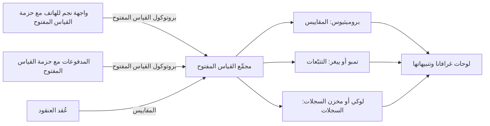

# الوحدة 5 — قابلية المراقبة والموثوقية (Observability and reliability)

*إطلاق خدمةٍ (Shipping a service) هو بداية حياتها لا نهايتها (the start of its life, not the end). وبعد ذلك يحسم سؤالان ما إذا كان العملاء سيثقون بها (whether customers trust it): هل تستطيع أن ترى ما تفعله (can you see what it is doing)، وهل تعرف مقدار الموثوقية التي تحتاجها (how reliable it needs to be)؟ تجيب هذه الوحدة عن السؤالين كليهما. فهي تبدأ بالقياس عن بُعد (telemetry): السجلات (logs) والمقاييس (metrics) والتتبّعات (traces) التي تُصدرها الخدمة (a service emits)، وOpenTelemetry، المعيار المفتوح (the open standard) الذي يتيح لك جمعها مرةً واحدة وإرسالها إلى أي مكان (collect them once and send them anywhere). ثم تحوّل هذا القياس عن بُعد إلى قرارات موثوقية (reliability decisions) بأهداف مستوى الخدمة (service level objectives, SLOs)، وميزانيات الأخطاء (error budgets)، وتنبيهاتٍ لا تنطلق إلا حين يتألم المستخدمون (alerts that fire only when users are hurting)، وجدول مناوبة (on-call rota) يستطيع الناس التعايش معه (people can live with). وتنتهي بالحوادث (incidents): كيف تديرها بهدوء (how to run one calmly)، وكيف تكتب مراجعة ما بعد الحادثة الخالية من اللوم (blameless postmortem) التي تجعل الحادثة التالية أقل احتمالًا (makes the next one less likely). ستتابع فريق هندسة المنصات وهندسة موثوقية المواقع (Platform Engineering & SRE team) في بنك نجم (Najm Bank) بينما يطارد يوسف شكوى تحويلٍ بطيء (slow-transfer complaint) عبر ثلاثة أنظمة (across three systems) دون شيءٍ سوى ملفات سجلاتٍ متناثرة (scattered log files)، وتستبدل مها 140 تنبيهًا مزعجًا (140 noisy alerts) بأربعةٍ مهمة (four that matter)، ويدير الفريق حادثة مدفوعات (payments incident) سببها تغيير إعدادات من سطرٍ واحد (one-line configuration change)، ثم يتعلّم منها.*

> **المراحل (Phases):** Operate, Monitor — رؤية ما يفعله الإنتاج حقًّا (seeing what production is really doing)، وتقرير مقدار الموثوقية المطلوبة منه (deciding how reliable it must be)، والاستجابة جيدًا حين لا يكون كذلك (responding well when it is not).

---

# 5.1 — القياس عن بُعد: السجلات والمقاييس والتتبّعات وOpenTelemetry (Telemetry: logs, metrics, traces and OpenTelemetry)
*المستوى (Level): 🟡 متوسط (Intermediate)* · *المتطلبات (Prerequisites): 2.2، 4.1* · *المرحلة (Phase): Monitor*

## ⚡ الدرس في دقيقة (In 60 seconds)
- **القياس عن بُعد (Telemetry)** هو البيانات التي يُصدرها نظامٌ عاملٌ عن نفسه (the data a running system emits about itself). والإشارات الرئيسية الثلاث (three main signals) هي **السجلات (logs)**، أي الأحداث مع التفاصيل (events, with detail)، و**المقاييس (metrics)**، أي أرقامٌ عبر الزمن (numbers over time) رخيصة الحفظ والتنبيه عليها (cheap to keep and alert on)، و**التتبّعات (traces)**، أي مسار طلبٍ واحد عبر الخدمات (the path of one request across services). أمّا **الملفات التعريفية للأداء (Profiles)**، أي أين يذهب المعالج والذاكرة داخل الشيفرة (where CPU and memory go inside the code)، فهي إشارةٌ رابعة ما زالت تنضج (a fourth signal that is still maturing).
- **قابلية المراقبة (Observability)** هي القدرة على الإجابة عن أسئلةٍ جديدة حول الإنتاج (answer new questions about production) من ذلك القياس عن بُعد، دون إطلاق شيفرةٍ جديدة لمعرفة الجواب (without shipping new code to find out).
- **OpenTelemetry** (OTel) هو المعيار المفتوح المحايد تجاه المورّدين (open, vendor-neutral standard) لإنتاج القياس عن بُعد ونقله (producing and moving telemetry). جهّز القياس مرةً واحدة (Instrument once) باستخدام OTel، ثم أرسل البيانات إلى أي واجهة خلفية تختارها (whichever back end you choose): Prometheus أو Grafana أو خدمة المراقبة لدى مزوّد سحابي (a cloud provider's monitoring service) أو أداةٍ تجارية (a commercial tool).
- القاعدة الأهم (The rule that matters most): كل إشارة تحمل **السياق (context)** نفسه، أي الخدمة والبيئة والإصدار ومعرّف التتبّع (service, environment, version, trace ID)، حتى تستطيع الانتقال من تنبيهٍ إلى تتبّعٍ إلى سطر السجل (jump from an alert to a trace to the log line).
- مؤشر القرار (Decision cue): المقاييس تخبرك *بأنّ* شيئًا ما خاطئ (*that* something is wrong)، والتتبّعات تخبرك *أين* (*where*)، والسجلات تخبرك *لماذا* (*why*).
- أكبر فخ (Biggest trap): الوسوم عالية التعدّدية (high-cardinality labels)، مثل معرّف العميل ورقم الحساب (customer ID, account number)، على المقاييس. فهي تضاعف السلاسل الزمنية (multiply time series) حتى يصبح نظام المراقبة بطيئًا أو مكلفًا أو ينهار (slow, expensive or falls over).

## 🧭 لماذا يهم (Why it matters)
في عصر يوم خميس (On a Thursday afternoon)، يحيل مركز الاتصال (contact centre) شكوى إلى هندسة المنصات (Platform Engineering): التحويلات في تطبيق نجم للهاتف (Najm Mobile app) «تدور طويلًا» ("spin for ages") قبل أن تنجح. يفتح يوسف لوحة المتابعة (dashboard): المعالج (CPU) سليم، ومتوسط زمن الاستجابة (average response time) لواجهة برمجة تطبيق نجم للهاتف (Najm Mobile API) هو 180 مللي ثانية. ثم يقضي ساعتين في قراءة ملفات السجلات (log files) من حجيرات الواجهة (API pods) وخدمة المدفوعات (Payments service) ومحوّل الأنظمة المصرفية الأساسية (core banking adapter) في مركز البيانات (data centre). كلٌّ منها يسجّل بصيغةٍ مختلفة (a different format)، دون معرّف طلبٍ مشترك (common request ID)، فلا يستطيع أن يعرف أيّ سطرٍ بطيء ينتمي إلى أيّ تحويل (which slow line belongs to which transfer).

يجلس سالم معه. يقول: «المتوسط يُخفي الذيل ⁦(The average hides the tail.)⁩ إذا استغرق تحويلٌ واحد من كل مئة ثماني ثوانٍ (one transfer in a hundred takes eight seconds)، فسيبدو المتوسط سليمًا مع ذلك (the average still looks healthy). ولا تستطيع تتبّع طلبٍ واحد عبر ثلاثة أنظمة (follow one request across three systems) لأن لا شيء يربطها معًا (nothing ties them together)». والحل هو تجهيز المسار بالقياس (instrument the path) بحيث يحمل كل طلبٍ معرّف تتبّع (trace ID) من الواجهة، مرورًا بالمدفوعات (through Payments)، عبر الرابط الهجين (across the hybrid link) إلى الأنظمة المصرفية الأساسية (core banking)، وتسجيل زمن الاستجابة (latency) بوصفه توزيعًا لا متوسطًا (as a distribution, not an average).

بعد يومين من تجهيز الفريق للمسار بالقياس، يُظهر تتبّعٌ الجوابَ في صورةٍ واحدة (in one picture): 7.4 ثانية من تحويلٍ بطيء تُقضى في انتظار اتصالٍ بقاعدة البيانات (waiting for a database connection) داخل المدفوعات، والأنظمة المصرفية الأساسية سريعة. ولولا القياس عن بُعد (Without telemetry)، لألقى الفريق اللوم على مركز البيانات (blamed the data centre). ولا يمكنك أن تضع هدف موثوقية (set a reliability target) أو تنبّه عليه (alert on it) أو تدير حادثةً (run an incident) ببياناتٍ لا تملكها (on data you do not have).

## 📐 كيف يعمل (How it works)
### 🟢 الأساسيات (The essentials)
**المراقبة مقابل قابلية المراقبة (Monitoring vs observability).** **المراقبة (Monitoring)** تترقّب الأعطال التي توقّعتها (watches for failures you predicted): «نبّه إذا تجاوز معدل الأخطاء 1%» ("alert if the error rate goes above 1%"). أمّا **قابلية المراقبة (Observability)** فتتيح لك التحقيق في أعطالٍ لم تتوقّعها (investigate failures you did not predict): «لماذا يرى مستخدمو Android على أحدث إصدارٍ من التطبيق وحدهم تحويلاتٍ بطيئة منذ 14:05؟» ⁦("why are only Android users on the newest app version seeing slow transfers since 14:05?")⁩ تحتاج إلى الاثنين (You need both).

**الإشارات الثلاث (The three signals).**

| الإشارة (Signal) | ما هي (What it is) | نقطة القوة (Strength) | نقطة الضعف (Weakness) | مثال من نجم (Najm example) |
|---|---|---|---|---|
| **السجلات (Logs)** | سجلاتٌ مختومة بالوقت لأحداثٍ منفصلة (Timestamped records of discrete events)، ويُفضَّل أن تكون مُهيكلة (ideally structured)، أي أزواج مفتاح وقيمة بصيغة JSON (JSON key-value pairs) | تفاصيل غنية (Rich detail)؛ «لماذا» (the "why") | مكلفة عند الحجم الكبير (Expensive at volume)؛ يصعب تجميعها (hard to aggregate) | `transfer rejected: insufficient funds` |
| **المقاييس (Metrics)** | قياساتٌ رقمية مجمّعة عبر الزمن (Numeric measurements aggregated over time): العدّادات (counters) والمقاييس اللحظية (gauges) والمدرّجات التكرارية (histograms) | رخيصة (Cheap)؛ سريعة الاستعلام (fast to query)؛ أساس التنبيهات ولوحات المتابعة (the basis of alerts and dashboards) | لا تفاصيل لكل طلب (No per-request detail) | الطلبات في الثانية (Requests per second)، ومعدل الأخطاء (error rate)، وتوزيع زمن الاستجابة (latency distribution) |
| **التتبّعات (Traces)** | رحلة طلبٍ واحد (The journey of one request)، مكوّنة من **امتدادات (spans)**، أي عملياتٍ مؤقّتة (timed operations)، يربطها معرّف تتبّعٍ مشترك (shared trace ID) | تُظهر أين يذهب الوقت عبر الخدمات (Shows where time goes across services) | تُؤخذ منها عيّنات عادةً (Usually sampled)؛ تحتاج إلى تجهيزٍ بالقياس في كل قفزة (needs instrumentation in every hop) | الواجهة ← المدفوعات ← محوّل الأنظمة المصرفية الأساسية، مع التوقيتات (API → Payments → core banking adapter, with timings) |

**السجلات المُهيكلة (Structured logs).** ينبغي أن يكون سطر السجل (log line) سجلًّا تقرؤه الآلة (machine-readable record)، لا جملةً (not a sentence). قارن:

```text
# Risky: free text, no context, personal data
2026-03-12 14:05:11 Transfer failed for Ahmed Al-Kuwari acct 1234567890 after timeout
```

```json
{"ts":"2026-03-12T14:05:11.482Z","level":"error","service.name":"payments",
 "deployment.environment":"prod","service.version":"2.14.0",
 "event":"transfer.failed","reason":"db_pool_timeout","duration_ms":8012,
 "trace_id":"4bf92f3577b34da6a3ce929d0e0e4736","span_id":"00f067aa0ba902b7"}
```

يمكن عدّ النسخة المحصّنة (The hardened version can be counted)، وهي تحمل معرّف التتبّع (trace ID) ولا تحتوي على اسمٍ أو رقم حساب (no name or account number). أمّا ما يجب ألّا يدخل السجلات أبدًا (What must never go into logs) فيُغطّى في [*أمن الذكاء الاصطناعي وأمن التطبيقات (Secure AI & Application Security)*، الدرس 5.3 — حماية البيانات الشخصية: تقليل البيانات والتسجيل وهندسة الخصوصية (Protecting personal data: minimisation, logging and privacy engineering)](../secai/index.ar.html#/5.3).

**أنواع المقاييس (Metric types).** **العدّاد (counter)** لا يزداد إلا صعودًا (only goes up)، مثل إجمالي الطلبات وإجمالي الأخطاء (total requests, total errors)؛ وتنظر إلى معدل تغيّره (rate of change). و**المقياس اللحظي (gauge)** يصعد وينزل (goes up and down)، مثل عمق الطابور والذاكرة المستخدمة والاتصالات المفتوحة (queue depth, memory in use, open connections). و**المدرّج التكراري (histogram)** يعدّ المشاهدات في دلاء (counts observations into buckets)، أي كم طلبًا استغرق أقل من 100 مللي ثانية، وأقل من 250 مللي ثانية، وأقل من ثانية، وهكذا (how many requests took under 100 ms, under 250 ms, under 1 s and so on)، ما يتيح لك حساب المئينات لاحقًا (calculate percentiles later).

**المئينات لا المتوسطات (Percentiles, not averages).** زمن الاستجابة عند **المئين 99 (p99)** هو القيمة التي يكون 99% من الطلبات أسرع منها (the value that 99% of requests are faster than). فإذا كان الوسيط (median) 150 مللي ثانية والمئين 99 (p99) ست ثوانٍ، فإن طلبًا واحدًا من كل مئة بطيءٌ إلى حدٍّ مؤلم (painfully slow). المتوسطات تُخفي بالضبط المستخدمين الذين يشتكون (hide exactly the users who complain)، لذا سجّل زمن الاستجابة بوصفه مدرّجاتٍ تكرارية (record latency as histograms) وراقب p50 وp95 وp99.

**ماذا تقيس أولًا (What to measure first).** ثلاث قوائم تحقّق معروفة (Three well-known checklists):
- **الإشارات الذهبية الأربع (The four golden signals)**، من كتاب Google *هندسة موثوقية المواقع (Site Reliability Engineering)*: زمن الاستجابة (latency) وحجم الحركة (traffic) والأخطاء (errors) والتشبّع (saturation)، أي مدى «امتلاء» الخدمة (how "full" the service is).
- **RED** للخدمات المدفوعة بالطلبات (request-driven services): **R**ate، أي المعدل أو الطلبات في الثانية (requests per second)، و**E**rrors، أي الأخطاء أو الطلبات الفاشلة في الثانية (failed requests per second)، و**D**uration، أي المدة أو توزيع زمن الاستجابة (latency distribution). استخدمها لواجهة برمجة تطبيق نجم للهاتف (Najm Mobile API) وللمدفوعات (Payments).
- **USE** للموارد (for resources): **U**tilisation، أي الاستخدام، و**S**aturation، أي التشبّع، و**E**rrors، أي الأخطاء، لكل معالج أو قرص أو رابط شبكي أو مجمّع اتصالات (each CPU, disk, network link or connection pool). استخدمها للعُقد (nodes) وقواعد البيانات (databases) والرابط الهجين إلى مركز البيانات (the hybrid link to the data centre).

### 🟡 التعمق أكثر (Going deeper)
**OpenTelemetry في فقرةٍ واحدة (OpenTelemetry in one paragraph).** OpenTelemetry مشروعٌ تابع لـ CNCF (a CNCF project)، تكوّن عام 2019 بدمج مشروعين سابقين (by merging two earlier projects)، هما OpenTracing وOpenCensus. وهو يوفّر: **واجهة برمجة وحزم تطوير (API and SDKs)** للغاتٍ كثيرة (for many languages)، لإنشاء الامتدادات والمقاييس والسجلات في شيفرتك (create spans, metrics and logs in your code)؛ و**التجهيز التلقائي بالقياس دون شيفرة (automatic (zero-code) instrumentation)** للأطر والمكتبات الشائعة (common frameworks and libraries)، بحيث تُصدر خوادم HTTP وعملاء HTTP ومشغّلات قواعد البيانات (HTTP servers, HTTP clients and database drivers) امتداداتٍ دون تغيير الشيفرة (without code changes)؛ و**OTLP**، أي بروتوكول OpenTelemetry (OpenTelemetry Protocol) لإرسال القياس عن بُعد؛ و**الاصطلاحات الدلالية (semantic conventions)**، أي أسماء سماتٍ معيارية (standard attribute names) مثل `service.name` و`http.request.method` و`http.route` و`http.response.status_code`؛ و**المجمِّع (Collector)**، وهو عمليةٌ منفصلة (a separate process) تستقبل القياس عن بُعد وتعالجه وتصدّره (receives, processes and exports telemetry). وفي وقت كتابة هذا الدرس، أي عام 2026 (At the time of writing (2026))، فإن مواصفات التتبّعات والمقاييس مستقرة (the trace and metric specifications are stable)، ودعم السجلات (log support) مستقر في حزم تطوير بعض اللغات (some language SDKs) وما زال ينضج في غيرها (still maturing in others)، والملفات التعريفية للأداء (profiles) ما زالت قيد التطوير (still in development). راجع صفحة الحالة (status page) للغتك قبل الاعتماد على إشارةٍ ما (before relying on a signal).

**كيف يعبر التتبّع الخدمات (How a trace crosses services).** حين تستدعي واجهة برمجة تطبيق نجم للهاتف (Najm Mobile API) خدمةَ المدفوعات عبر HTTP، تضيف حزمة تطوير OTel (OTel SDK) ترويسة `traceparent` بصيغة سياق التتبّع من W3C (W3C Trace Context format): الإصدار (a version)، ومعرّف التتبّع المكوّن من 32 محرفًا ست عشريًّا (the 32-hex-character trace ID)، ومعرّف الامتداد المستدعي المكوّن من 16 محرفًا ست عشريًّا (the 16-hex-character ID of the calling span)، والأعلام (flags)، بما فيها ما إذا كان التتبّع مأخوذًا ضمن العيّنة (whether the trace is sampled).

```text
traceparent: 00-4bf92f3577b34da6a3ce929d0e0e4736-00f067aa0ba902b7-01
```

تقرأ المدفوعات الترويسة (reads the header) وتنشئ امتداداتها بوصفها أبناءً لذلك الامتداد (creates its spans as children of that span). والقفزة التي تُسقط الترويسة (A hop that drops the header)، مثل وكيلٍ قديم (an old proxy) أو محوّل الأنظمة المصرفية الأساسية (core banking adapter)، تكسر التتبّع إلى قطع (breaks the trace into pieces)، ولهذا جهّزت نجم المحوّل بالقياس أولًا (instrumented the adapter first).

**إضافة سياق الأعمال إلى امتداد (Adding business context to a span).** يمنحك التجهيز التلقائي بالقياس (Automatic instrumentation) امتدادات HTTP وقواعد البيانات (HTTP and database spans)؛ فأضف امتداداتٍ يدوية (manual spans) حيث يعيش منطق الأعمال (where the business logic lives):

```python
from opentelemetry import trace

tracer = trace.get_tracer("najm.payments")

def reserve_funds(transfer):
    with tracer.start_as_current_span("reserve_funds") as span:
        span.set_attribute("payment.rail", transfer.rail)        # e.g. "domestic"
        span.set_attribute("payment.amount_band", transfer.band)  # "small", not the amount
        return ledger.reserve(transfer)
```

اجعل السمات منخفضة المخاطر (Keep attributes low-risk): شريحةً لا المبلغ (a band, not the amount)؛ ومسار دفعٍ لا رقم الحساب (a rail, not the account number).

**خط معالجة المجمِّع (The Collector pipeline).** ترسل التطبيقات OTLP إلى مجمِّعٍ قريب (a nearby Collector)، وغالبًا ما يكون DaemonSet، أي واحدًا لكل عقدة Kubernetes (one per Kubernetes node)، إضافةً إلى مجمِّعٍ مركزي بدور «البوابة» (a central "gateway" Collector). ويقوم المجمِّع بالتجميع على دفعات والإثراء والتصفية والتوجيه (batches, enriches, filters and routes):



إعدادٌ أدنى للمجمِّع (A minimal Collector configuration) لمختبرٍ محلي (for a local lab):

```yaml
receivers:
  otlp:
    protocols:
      grpc:
        endpoint: 0.0.0.0:4317
      http:
        endpoint: 0.0.0.0:4318
processors:
  memory_limiter:          # protect the Collector itself; put it first
    check_interval: 1s
    limit_percentage: 80
    spike_limit_percentage: 20
  attributes/scrub:        # defence in depth: drop fields that must never leave the app
    actions:
      - key: enduser.id
        action: delete
  batch: {}
exporters:
  otlp/tempo:
    endpoint: tempo:4317
    tls:
      insecure: true       # local lab only; use TLS in any shared environment
  prometheus:
    endpoint: 0.0.0.0:8889 # Prometheus scrapes the Collector here
  debug: {}                # prints logs to the Collector's output in the lab
service:
  pipelines:
    traces:  {receivers: [otlp], processors: [memory_limiter, attributes/scrub, batch], exporters: [otlp/tempo]}
    metrics: {receivers: [otlp], processors: [memory_limiter, batch], exporters: [prometheus]}
    logs:    {receivers: [otlp], processors: [memory_limiter, attributes/scrub, batch], exporters: [debug]}
```

ولأن التطبيقات لا تتحدث إلا OTLP مع المجمِّع (only speak OTLP to the Collector)، تستطيع نجم تغيير الواجهات الخلفية (change back ends) بتغيير المجمِّع (by changing the Collector)، لا كل خدمة (not every service).

**Prometheus ولغة PromQL (Prometheus and PromQL).** يستخدم **Prometheus**، وهو مشروعٌ متخرّج في CNCF (a CNCF graduated project)، **نموذج السحب (pull model)**: فهو **يكشط (scrapes)** نقطة نهاية HTTP (HTTP endpoint) هي `/metrics` لدى كل هدف (on each target) على فتراتٍ منتظمة (at a regular interval) ويخزّن النتائج بوصفها سلاسل زمنية (time series)، تُعرَّف كلٌّ منها باسم مقياس (metric name) و**وسوم (labels)**، أي أزواج مفتاح وقيمة (key-value pairs). وتستعلم عنه بلغة **PromQL**. وتبدو مقاييس RED (RED metrics) لواجهة برمجة تطبيق نجم للهاتف (Najm Mobile API) هكذا:

```promql
# Rate: requests per second over the last 5 minutes
sum(rate(http_requests_total{job="najm-mobile-api"}[5m]))

# Errors: share of requests that returned 5xx
sum(rate(http_requests_total{job="najm-mobile-api", code=~"5.."}[5m]))
  /
sum(rate(http_requests_total{job="najm-mobile-api"}[5m]))

# Duration: p99 latency from a histogram
histogram_quantile(
  0.99,
  sum by (le) (rate(http_request_duration_seconds_bucket{job="najm-mobile-api"}[5m])))
```

تختلف أسماء المقاييس (Metric names vary) باختلاف مكتبة التجهيز بالقياس (instrumentation library)؛ فمقياس خادم HTTP في OTel (OTel's HTTP server metric)، مثلًا، يصبح `http_server_request_duration_seconds` بعد تصديره إلى Prometheus (once exported to Prometheus). تحقّق مما تُصدره خدماتك فعلًا (what your services actually emit) قبل أن تنسخ استعلامًا (before you copy a query). ثم يحوّل **Grafana** هذه الاستعلامات إلى لوحات متابعة وتنبيهات (dashboards and alerts).

**المكافئات السحابية (Cloud equivalents).** لدى كل مزوّدٍ رئيسي (major provider) منظومة مراقبة مُدارة (managed monitoring stack): Amazon CloudWatch وAWS X-Ray، وAzure Monitor مع Application Insights، وGoogle Cloud Observability. ويتغيّر دعمها لبيانات OTLP وPrometheus (support for OTLP and Prometheus data) وميزاتها وتسعيرها (features and pricing)؛ فراجع التوثيق الحالي (check current documentation).

### 🔴 نظرة الخبير (Expert view)
**التعدّدية هي محرّك التكلفة (Cardinality is the cost driver).** كل تركيبةٍ فريدة من قيم الوسوم (Every unique combination of label values) هي سلسلة زمنية منفصلة (a separate time series). فالمقياس `http_requests_total` مع الوسوم `route` (40 قيمة) و`code` (10) و`pod` (30) يصل إلى 12,000 سلسلة (up to 12,000 series)، وهذا لا بأس به (which is fine). أضِف `customer_id` (مليونا قيمة) وتكون قد أنشأت مليارات السلاسل المحتملة (billions of potential series). القواعد التي تتبعها نجم (Rules Najm follows): الوسوم على المقاييس تأتي من مجموعاتٍ صغيرة محدودة (small, bounded sets)، مثل قالب المسار وفئة الحالة والمنطقة والإصدار (route template, status class, region, version)؛ والمعرّفات (identifiers) مكانها الامتدادات والسجلات (on spans and in logs)، لا المقاييس أبدًا (never on metrics).

**أخذ عيّنات من التتبّعات (Sampling traces).** تتبّع كل طلب (Tracing every request) مكلفٌ على نطاقٍ واسع (expensive at scale). **أخذ العيّنات من الرأس (Head sampling)** يقرّر عند بداية الطلب (at the start of a request)، كأن يحتفظ بـ 10% عشوائيًّا (keep 10% at random)، وهو رخيص لكنه قد يتخلّص من التتبّع البطيء الوحيد الذي تحتاجه (throw away the one slow trace you need). أمّا **أخذ العيّنات من الذيل (Tail sampling)**، الذي يجري في مجمِّعٍ بعد اكتمال التتبّع (in a Collector after the trace completes)، فيحتفظ بالتتبّعات حسب النتيجة (by outcome): كل الأخطاء (all errors)، وكل الطلبات الأبطأ من ثانيتين (all requests slower than 2 s)، إضافةً إلى حصةٍ عشوائية صغيرة من الباقي (a small random share of the rest). تحتفظ نجم بـ 100% من تتبّعات الأخطاء والتتبّعات البطيئة للمدفوعات (Payments error and slow traces)، وبعيّنةٍ صغيرة من السليمة (a small sample of healthy ones). ويتطلّب أخذ العيّنات من الذيل أن تصل كل امتدادات التتبّع إلى نسخة المجمِّع نفسها (all spans of a trace to reach the same Collector instance)، وهذا يحدّد طريقة نشرك للبوابة (shapes how you deploy the gateway).

**الشواهد والربط (Exemplars and correlation).** **الشاهد (exemplar)** هو معرّف تتبّعٍ مُلحَق بدلوٍ في مدرّجٍ تكراري (a trace ID attached to a histogram bucket). انقر النقطة في دلوٍ بطيء (Click the dot in a slow bucket) على لوحة زمن استجابة في Grafana (Grafana latency panel) لتفتح تتبّعًا بطيئًا حقيقيًّا (a real slow trace)، ثم اتبع معرّف تتبّعه إلى السجلات (follow its trace ID to the logs): دقيقتان بدل ساعتين من البحث بـ grep (two minutes instead of two hours of grepping).

**للقياس عن بُعد ميزانية (Telemetry has a budget).** تسجيل التصحيح في الإنتاج (Debug logging in production)، والوسوم غير المحدودة (unbounded labels)، والتتبّع بنسبة 100% (100% tracing)، كلها قد تجعل قابلية المراقبة بندًا كبيرًا في فاتورة السحابة (a large line on the cloud bill). اضبط مدة الاحتفاظ لكل إشارة (Set retention by signal)، واتبع في السجلات قواعد البنك للسجلات الرسمية والخصوصية (the bank's records and privacy rules). أمّا سجلات التدقيق والأمن (Audit and security logs) فهي تيّارٌ منفصل (a separate stream) له متطلبات احتفاظ وسلامة خاصة به (its own retention and integrity requirements)؛ انظر [*أمن الذكاء الاصطناعي وأمن التطبيقات (Secure AI & Application Security)*، الدرس 10.1 — التسجيل والمراقبة وهندسة الكشف (Logging, monitoring and detection engineering)](../secai/index.ar.html#/10.1).

**جهّز المنصة بالقياس، لا كل فريقٍ على حدة (Instrument the platform, not each team).** ضع القياس عن بُعد على المسار الذهبي (Put telemetry on the golden path): يأتي قالب الخدمة (service template) مزوّدًا بحزمة تطوير OTel (OTel SDK)، والتجهيز التلقائي بالقياس (automatic instrumentation)، ومسجّلٍ (logger) يضيف `trace_id`، ولوحة RED افتراضية (default RED dashboard)، فتكون كل خدمةٍ جديدة قابلةً للمراقبة من يومها الأول (observable on day one).

ولرؤية غير المهندس (the non-engineer's view) لسبب تضليل لوحات المتابعة (why dashboards mislead)، انظر [*تصميم الأنظمة لمبرمجي الحدس (System Design for Vibe Coders)*، الدرس 7.1 — لوحة المتابعة التي تكذب والمقياس الذي لا يكذب (The dashboard that lies and the metric that doesn't)](../vibe/index.ar.html#l7-1)؛ ولقابلية المراقبة بوصفها مكوّنًا في البرمجيات كخدمة (observability as a SaaS component)، انظر [*لبنات بناء البرمجيات كخدمة (SaaS Building Blocks)*، الدرس 7.2 — قابلية المراقبة: السجلات والأخطاء والمقاييس والتتبّعات (Observability: logs, errors, metrics and traces)](../saas/index.ar.html#/7.2).

## 🧰 الأدوات (The toolkit)
| الأداة أو الممارسة أو الخدمة (Tool, practice or service) | ما هي وماذا تفعل (What it is and does) | متى تلجأ إليها (When to reach for it) |
|---|---|---|
| **OpenTelemetry** (CNCF) | واجهات برمجة وحزم تطوير محايدة تجاه المورّدين (Vendor-neutral APIs, SDKs)، وتجهيزٌ تلقائي بالقياس (automatic instrumentation)، واصطلاحات دلالية (semantic conventions)، وبروتوكول OTLP (OTLP protocol) للتتبّعات والمقاييس والسجلات | كل خدمةٍ جديدة (Every new service)؛ الطريقة الافتراضية للتجهيز بالقياس في نجم (the default way to instrument at Najm) |
| **OpenTelemetry Collector** | عمليةٌ تستقبل القياس عن بُعد وتعالجه، أي تجمّعه على دفعات وتنظّفه وتأخذ منه عيّنات (batch, scrub, sample)، وتصدّره إلى واجهةٍ خلفية أو أكثر (one or more back ends) | بين التطبيقات والواجهات الخلفية (Between applications and back ends)، كي لا تتحدث الخدمات مع مورّدٍ مباشرةً أبدًا (services never talk to a vendor directly) |
| **Prometheus** (CNCF) | قاعدة بيانات سلاسل زمنية قائمة على السحب (Pull-based time-series database) مع لغة الاستعلام PromQL (PromQL query language) وقواعد التنبيه (alert rules) | مقاييس أحمال عمل Kubernetes (Metrics for Kubernetes workloads) ولوحات RED/USE (RED/USE dashboards) |
| **Grafana** | لوحات متابعة وتنبيه (Dashboards and alerting) فوق مصادر بياناتٍ كثيرة (many data sources)، منها Prometheus وLoki وTempo | مكانٌ واحد لرؤية المقاييس والسجلات والتتبّعات جنبًا إلى جنب (One place to see metrics, logs and traces side by side) |
| **Jaeger** (CNCF) أو **Grafana Tempo** | تخزين التتبّعات والبحث فيها (Trace storage and search) | متابعة طلبٍ واحد عبر الخدمات (Following one request across services)؛ العثور على القفزة البطيئة (finding the slow hop) |
| **RED and USE methods** | قوائم تحقّق (Checklists): المعدل والأخطاء والمدة (Rate, Errors, Duration) للخدمات؛ والاستخدام والتشبّع والأخطاء (Utilisation, Saturation, Errors) للموارد | تقرير ما يوضع على أول لوحة متابعة لخدمةٍ ما (Deciding what to put on a service's first dashboard) |

## 🏛️ عمليًا في بنك نجم (In practice at Najm Bank)
**الأثر البرمجي (Artefact): معيار القياس عن بُعد في نجم، الإصدار الأول (the Najm telemetry standard (v1))، وهو جزءٌ من قالب المسار الذهبي (part of the golden-path template).**

| المجال (Area) | المعيار (Standard) |
|---|---|
| سمات المورد (Resource attributes) | كل إشارةٍ تحمل `service.name` و`service.version` و`deployment.environment` و`cloud.region` و`k8s.namespace.name` |
| السجلات (Logs) | JSON إلى المخرج القياسي (JSON to stdout)؛ الحقول (fields) `ts` و`level` و`service.name` و`event` و`trace_id` و`span_id`؛ لا أسماء ولا أرقام حسابات ولا أرقام بطاقات ولا رموز مميزة ولا مدخلات نصية حرّة من العملاء (no names, account numbers, card numbers, tokens or free-text customer input) |
| المقاييس (Metrics) | RED لكل نقطة نهاية HTTP وgRPC (every HTTP and gRPC endpoint)، بوصفها مدرّجاتٍ تكرارية (as histograms)، مع زمن الاستجابة بالثواني (latency in seconds)؛ وUSE لمجمّعات الاتصالات والطوابير والرابط الهجين (connection pools, queues and the hybrid link)؛ والوسوم من مجموعاتٍ محدودة فقط (labels from bounded sets only) |
| التتبّعات (Traces) | تجهيز OTel التلقائي بالقياس (OTel automatic instrumentation) إضافةً إلى امتداداتٍ يدوية لخطوات الأعمال (manual spans for business steps) (`reserve_funds`، `post_to_core`)؛ وتمرير ترويسة `traceparent` بصيغة W3C عبر كل قفزة (propagated through every hop)، بما فيها محوّل الأنظمة المصرفية الأساسية (including the core banking adapter) |
| أخذ العيّنات (Sampling) | أخذ العيّنات من الذيل (Tail sampling) عند مجمِّع البوابة (gateway Collector): الاحتفاظ بكل تتبّعات الأخطاء (all error traces) والتتبّعات الأبطأ من ثانيتين (traces slower than 2 s)؛ وأخذ عيّنات من التتبّعات السليمة (sample healthy traces) بمعدلٍ منخفض يُحدَّد لكل خدمة (a low rate set per service) |
| النقل (Transport) | ترسل التطبيقات OTLP إلى مجمِّع العقدة فقط (only to the node Collector)؛ ولا يتحدث مع الواجهات الخلفية إلا مجمِّع البوابة (only the gateway Collector talks to back ends) |
| لوحات المتابعة (Dashboards) | تحصل كل خدمةٍ على لوحة RED مولَّدة (a generated RED dashboard) فيها p50/p95/p99، ونسبة الأخطاء (error ratio)، ورابطٌ إلى دليل التشغيل الخاص بها (a link to its runbook) |
| الاحتفاظ (Retention) | يُحدَّد لكل إشارة (Set per signal) ويُتّفق عليه مع الأمن والامتثال (agreed with Security and Compliance)؛ وسجلات التدقيق (audit logs) تيّارٌ منفصل يملكه مركز العمليات الأمنية (a separate stream owned by the SOC) |
| المراجعة (Review) | لا تنتقل خدمةٌ إلى الإنتاج (cannot go to production) حتى تجتاز فحص «الدقائق الخمس الأولى» ("first five minutes" check): مهندسٌ لم يرها قط (an engineer who has never seen it) يستطيع أن يجد معدل أخطائها (its error rate) وp99 الخاص بها وتتبّعًا فاشلًا واحدًا (one failed trace) في أقل من خمس دقائق (in under five minutes) |

## 🛠️ التمارين (Exercises)
تعمل التمارين الثلاثة كلها محليًّا (run locally) باستخدام Docker أو عنقود kind/k3d (a kind/k3d cluster). لا توجّهها إلى أنظمة جهة عملٍ (an employer's systems) دون إذن (without permission).

- 🟢 شغّل تطبيق ويب صغيرًا خاصًّا بك (a small web app of your own)، أو تطبيقًا تجريبيًّا من OpenTelemetry (an OpenTelemetry demo app)، مع Prometheus وGrafana في Docker Compose. ابنِ لوحة RED (Build a RED dashboard): الطلبات في الثانية (requests per second)، ونسبة أخطاء 5xx (5xx ratio)، وزمن الاستجابة p50/p95/p99 من مدرّجٍ تكراري (from a histogram). *يكتمل عندما (Done when):* تستطيع جعل التطبيق بطيئًا (make the app slow)، بإضافة توقّفٍ مؤقت إلى مسارٍ واحد (add a sleep to one route)، وتشاهد p99 يرتفع بينما لا يكاد المتوسط يتحرك (the average barely moves)، وتستطيع شرح الفرق في جملتين (explain the difference in two sentences).
- 🟡 أضِف التجهيز التلقائي بالقياس من OpenTelemetry (OpenTelemetry automatic instrumentation) إلى خدمتين صغيرتين تستدعي فيهما الخدمة A الخدمة B عبر HTTP (service A calls service B over HTTP). أرسل التتبّعات عبر مجمِّع OTel (OTel Collector) إلى Jaeger أو Tempo، واكتب سجلات JSON مُهيكلة (structured JSON logs) تتضمّن `trace_id`. *يكتمل عندما (Done when):* تستطيع فتح تتبّعٍ واحد يُظهر امتداداتٍ من الخدمتين كلتيهما (spans from both services)، وإيجاد أسطر سجل ذلك التتبّع (that trace's log lines) بالبحث عن معرّف تتبّعه (by searching for its trace ID).
- 🔴 وسّع مختبر 🟡 بأخذ العيّنات من الذيل (tail sampling) في المجمِّع: احتفظ بكل تتبّع خطأ (every error trace) وكل تتبّعٍ أبطأ من ثانية واحدة (slower than one second)، إضافةً إلى عيّنةٍ بنسبة 5% من الباقي (a 5% sample of the rest). أضِف مدرّجًا تكراريًّا لزمن الاستجابة مُفعَّلًا فيه الشواهد (an exemplar-enabled latency histogram) ولوحةً في Grafana (a Grafana panel). ثم أضِف وسمًا عشوائيًّا لمعرّف المستخدم (a random user ID label) إلى مقياسٍ واحد وقِس كيف يزداد عدد السلاسل (how the series count grows). *يكتمل عندما (Done when):* يفتح النقر على شاهدٍ بطيء (clicking a slow exemplar) تتبّعًا بطيئًا حقيقيًّا، ويثبت أن سياسة أخذ العيّنات لديك (your sampling policy) تحتفظ بخطأٍ مفتعَل (keep a forced error)، وتكون قد كتبت ملاحظةً من فقرةٍ واحدة (a one-paragraph note) عن التعدّدية التي قستها (the cardinality you measured) وكيف أزلتها (how you removed it).

## ⚠️ أخطاء وفخاخ (Mistakes and traps)
- **التنبيه على المتوسطات والإبلاغ عنها (Alerting on and reporting averages).** المتوسطات تُخفي الذيل البطيء (hide the slow tail) الذي يشعر به العملاء. سجّل المدرّجات التكرارية (Record histograms)؛ وانظر إلى p95 وp99.
- **الوسوم غير المحدودة على المقاييس (Unbounded labels on metrics).** معرّفات العملاء أو معرّفات الطلبات أو عناوين URL الكاملة (Customer IDs, request IDs or full URLs) بوصفها وسومًا قد تضاعف السلاسل حتى يفشل نظام المراقبة (until the monitoring system fails). استخدم قوالب المسارات والوسوم المحدودة (route templates and bounded labels)؛ وضع المعرّفات على الامتدادات والسجلات (on spans and logs).
- **تسجيل البيانات الشخصية والأسرار «لأغراض التصحيح» (Logging personal data and secrets "for debugging").** السجلات تُنسخ وتُحفظ ويقرؤها كثيرون (copied, retained and widely read). سجّل الأحداث والأسباب لا الأشخاص (Log events and reasons, not people)؛ ونظّف البيانات عند المجمِّع (scrub at the Collector) بوصفه خط دفاعٍ ثانيًا (a second line of defence).
- **سياق تتبّعٍ مكسور (Broken trace context).** قفزةٌ واحدة تُسقط `traceparent`، مثل محوّلٍ قديم (a legacy adapter) أو طابور رسائل (a message queue) أو وكيلٍ (a proxy)، تقسم كل تتبّع (splits every trace). اختبر التمرير من طرفٍ إلى طرف (Test propagation end to end)، بما في ذلك المسارات غير المتزامنة (including asynchronous paths).

## 🧾 الخلاصة (Recap)
- السجلات تعطي التفاصيل (Logs give detail)، والمقاييس تعطي مجاميع رخيصة وتنبيهات (cheap aggregates and alerts)، والتتبّعات تُظهر أين يذهب الوقت عبر الخدمات (where time goes across services)؛ والملفات التعريفية للأداء (profiles) إشارةٌ رابعة ناشئة (an emerging fourth signal).
- السياق المشترك (Shared context)، أي الخدمة والإصدار والبيئة ومعرّف التتبّع (service, version, environment, trace ID)، هو ما يتيح لك التنقل بين الإشارات (jump between signals).
- استخدم RED للخدمات وUSE للموارد والإشارات الذهبية الأربع (the four golden signals) للتحقق المتقاطع (as a cross-check)؛ وقِس زمن الاستجابة بوصفه مدرّجاتٍ تكرارية ومئينات (histograms and percentiles).
- يوحّد OpenTelemetry التجهيز بالقياس والنقل (standardises instrumentation and transport)؛ ويفصل المجمِّع الخدمات عن الواجهات الخلفية (decouples services from back ends)، وهو المكان الذي تجمّع فيه على دفعات وتنظّف وتأخذ العيّنات (batch, scrub and sample).
- التعدّدية والاحتفاظ وأخذ العيّنات (Cardinality, retention and sampling) تحدّد تكلفة قابلية المراقبة (decide what observability costs)؛ صمّمها ولا تكتشفها في الفاتورة (design them, do not discover them on the bill).

## ✍️ اختبر نفسك (Check yourself)

**1. تُظهر لوحة متابعة واجهة برمجة تطبيق نجم للهاتف (Najm Mobile API dashboard) متوسط زمن استجابة (average latency) قدره 180 مللي ثانية، لكن العملاء يشتكون من أن بعض التحويلات تستغرق ثوانيَ كثيرة (some transfers take many seconds). إلامَ ينبغي أن ينظر يوسف أولًا؟**

- A. استخدام المعالج (CPU utilisation) في حجيرات الواجهة (API pods)
- B. زمن الاستجابة عند p95 وp99 من مدرّجٍ تكراري لمدة الطلبات (request-duration histogram)
- C. العدد الإجمالي لأسطر السجل في الدقيقة (total number of log lines per minute)
- D. متوسط زمن الاستجابة عبر نافذةٍ أطول (a longer window)، مثل 24 ساعة

<details><summary>الإجابة</summary>

**B.** المئينات من مدرّجٍ تكراري (Percentiles from a histogram) تكشف الذيل البطيء الذي يخفيه المتوسط (the slow tail that an average hides). والمتوسط الأطول (A longer average) (D) يخفيه أكثر؛ وقد يكون المعالج (CPU) (A) طبيعيًّا بينما تنتظر الطلبات مجمّع اتصالات (requests wait on a connection pool). (🟢 الأساسيات (The essentials).)

</details>

**2. يريد مطوّرٌ إضافة الوسم `customer_id` إلى المقياس `http_requests_total` كي يرى فريق الدعم (support) معدل طلبات كل عميل (each customer's request rate). ما الردّ الأفضل؟**

- A. اقبله، لأن الوسوم رخيصة والمزيد منها يفيد دائمًا (labels are cheap and more of them always help)
- B. اقبله في الإنتاج فقط (in production only)، حيث يحتاجه الدعم فعلًا
- C. اقبله بعد تجزئة معرّف العميل (after hashing the customer ID)، كي لا تُخزَّن بياناتٌ شخصية (no personal data is stored)
- D. ارفضه: القيم غير المحدودة تضاعف السلاسل (unbounded values multiply series)؛ استخدم الامتدادات أو السجلات بدلًا منه (use spans or logs instead)

<details><summary>الإجابة</summary>

**D.** كل قيمة وسمٍ فريدة تنشئ سلسلةً جديدة (Each unique label value creates a new series)؛ وملايين العملاء تجعل نظام المقاييس بطيئًا ومكلفًا (slow and costly). والتجزئة (Hashing) (C) تُبقي التعدّدية نفسها تمامًا (exactly the same cardinality). المعرّفات مكانها الامتدادات والسجلات (Identifiers belong on spans and logs)، ضمن قواعد الخصوصية (within privacy rules). (🔴 نظرة الخبير (Expert view).)

</details>

**3. تتوقف التتبّعات القادمة من واجهة برمجة تطبيق نجم للهاتف (Najm Mobile API) عند محوّل الأنظمة المصرفية الأساسية (core banking adapter)، ويبدأ تتبّعٌ جديد على الجانب الآخر (a new trace starts on the other side). ما السبب الأرجح؟**

- A. المحوّل لا يمرّر (does not propagate) ترويسة `traceparent` بصيغة W3C
- B. يكشط Prometheus المحوّل ببطءٍ شديد (scraping the adapter too slowly)
- C. السجلات ليست بصيغة JSON (not in JSON)
- D. أخذ العيّنات من الرأس (Head sampling) مضبوطٌ على 100%

<details><summary>الإجابة</summary>

**A.** يبقى التتبّع موصولًا (A trace stays joined) فقط إذا مرّرت كل قفزةٍ سياق التتبّع (every hop forwards the trace context). أمّا فترة الكشط (Scrape interval) (B) وصيغة السجل (log format) (C) فلا تؤثران في ربط التتبّعات (trace linking)؛ وأخذ عيّنات من كل شيء (sampling everything) (D) لن يقسم التتبّعات. (🟡 التعمق أكثر (Going deeper).)

</details>

**4. لماذا توجّه نجم كل القياس عن بُعد للتطبيقات (all application telemetry) عبر مجمِّعات OpenTelemetry (OpenTelemetry Collectors) بدل أن ترسل كل خدمةٍ البيانات مباشرةً إلى واجهتها الخلفية (straight to its back end)؟**

- A. لأن Prometheus لا يملك أي طريقة لكشط المقاييس من التطبيقات مباشرةً (scrape metrics from applications directly)
- B. لأن بيانات OTLP لا يستقبلها إلا مجمِّع، ولا تستقبلها واجهةٌ خلفية أبدًا (only be received by a Collector, never by a back end)
- C. لأنه يمركز التجميع على دفعات والتنظيف وأخذ العيّنات (centralises batching, scrubbing and sampling)، ويفصل الخدمات عن الواجهات الخلفية (decouples services from back ends)
- D. لأن المجمِّع هو المخزن طويل الأمد (the long-term store) الذي تستعلم منه لوحات المتابعة عن التاريخ (for history)

<details><summary>الإجابة</summary>

**C.** يفصل المجمِّع الخدمات عن الواجهات الخلفية ويمركز المعالجة (centralises processing). يستطيع Prometheus كشط التطبيقات مباشرةً (A)، ويمكن أن تذهب OTLP مباشرةً إلى واجهةٍ خلفية تقبلها (a back end that accepts it) (B)، والمجمِّع خط معالجة لا مخزن (a pipeline, not a store) (D). (🟡 التعمق أكثر (Going deeper).)

</details>

**5. تريد نجم إبقاء تكاليف التتبّع منخفضة (keep tracing costs down) دون خسارة التتبّعات التي يحتاجها المهندسون أثناء الحوادث (during incidents). أيّ نهجٍ هو الأنسب؟**

- A. أخذ العيّنات من الرأس بنسبة 1% (Head sampling at 1%) لكل خدمة، يُقرَّر عند بدء كل طلب
- B. أخذ العيّنات من الذيل (Tail sampling): الاحتفاظ بكل تتبّعات الأخطاء والتتبّعات البطيئة (all error and slow traces)، إضافةً إلى قليلٍ من السليمة (a few healthy ones)
- C. إيقاف التتبّع كليًّا (Turn tracing off entirely) والاعتماد على السجلات المُهيكلة مع معرّفات التتبّع (structured logs with trace IDs)
- D. الاحتفاظ بكل تتبّع، لكن حذفها كلها تلقائيًّا بعد ساعة واحدة (delete all of them automatically after one hour)

<details><summary>الإجابة</summary>

**B.** أخذ العيّنات من الذيل يقرّر بعد معرفة النتيجة (decides after the outcome is known)، فتُحفظ الأخطاء النادرة والطلبات البطيئة (the rare errors and slow requests are kept). أمّا أخذ العيّنات العشوائي من الرأس (Random head sampling) (A) فسيتخلّص منها عادةً؛ وC وD يُضيّعان الدليل الذي تحتاجه (lose the evidence you need). (🔴 نظرة الخبير (Expert view).)

</details>

## 📚 المراجع (References)
- توثيق OpenTelemetry (OpenTelemetry documentation) — https://opentelemetry.io/docs/
- مجمِّع OpenTelemetry (OpenTelemetry Collector) — https://opentelemetry.io/docs/collector/
- الاصطلاحات الدلالية في OpenTelemetry (OpenTelemetry semantic conventions) — https://opentelemetry.io/docs/specs/semconv/
- سياق التتبّع من W3C (W3C Trace Context) — https://www.w3.org/TR/trace-context/
- توثيق Prometheus (Prometheus documentation) — https://prometheus.io/docs/introduction/overview/
- Prometheus، تسمية المقاييس والوسوم (metric and label naming) — https://prometheus.io/docs/practices/naming/
- توثيق Grafana (Grafana documentation) — https://grafana.com/docs/
- توثيق Jaeger (Jaeger documentation) — https://www.jaegertracing.io/docs/
- Google، *هندسة موثوقية المواقع (Site Reliability Engineering)*، «مراقبة الأنظمة الموزّعة» ("Monitoring Distributed Systems") — https://sre.google/sre-book/monitoring-distributed-systems/
- مشاريع CNCF (CNCF projects) — https://www.cncf.io/projects/

---

# 5.2 — أهداف مستوى الخدمة وميزانيات الأخطاء والتنبيه ومناوبةٌ يستطيع الناس تحمّلها (SLOs, error budgets, alerting and on-call that people can sustain)
*المستوى (Level): 🟡 متوسط (Intermediate)* · *المتطلبات (Prerequisites): 5.1* · *المرحلة (Phase): Operate, Monitor*

## ⚡ الدرس في دقيقة (In 60 seconds)
- **مؤشر مستوى الخدمة (SLI)** (service level indicator) يقيس ما يختبره المستخدمون (what users experience)، مثل «نسبة طلبات التحويل التي تنجح في أقل من ثانيتين» ("the share of transfer requests that succeed in under 2 seconds"). و**هدف مستوى الخدمة (SLO)** (service level objective) هو الهدف المحدّد له عبر نافذةٍ زمنية (the target for it over a window)، مثل 99.9% عبر 30 يومًا. أمّا **اتفاقية مستوى الخدمة (SLA)** (service level agreement) فهي عقدٌ له عواقب (a contract with consequences)، وينبغي أن تكون أكثر تساهلًا من هدف مستوى الخدمة (looser than the SLO).
- **ميزانية الأخطاء (error budget)** هي ما يسمح هدف مستوى الخدمة بفشله (what the SLO allows to fail): 100% ناقص الهدف (100% minus the target). وهي تحوّل سؤال «ما مقدار الموثوقية؟» ("how reliable?") إلى قرارٍ رقمي مشترك (a shared, numeric decision) بين المنتج والعمليات (between product and operations): أنفِق الميزانية على التغيير (spend the budget on change)، أو أبطئ حين تنفد (slow down when it runs out).
- لا تستدعِ إنسانًا (Page a human) إلا من أجل **أعراضٍ يشعر بها المستخدمون (symptoms users feel)** وتحتاج إلى تصرّفٍ الآن (need action now). نبّه على سرعة احتراق ميزانية الأخطاء (how fast the error budget is burning)، لا على وصول المعالج إلى 80% (not on CPU at 80%).
- **التنبيهات متعددة النوافذ ومتعددة معدلات الاحتراق (Multi-window, multi-burn-rate alerts)**، المأخوذة من *كتاب عمل هندسة موثوقية المواقع (The Site Reliability Workbook)*، تلتقط الانقطاعات السريعة بسرعة (catch fast outages quickly) والتسرّبات البطيئة بموثوقية (slow leaks reliably)، مع قليلٍ من الإنذارات الكاذبة (few false alarms).
- لا تكون المناوبة (On-call) مستدامة (sustainable) إلا إذا كانت الاستدعاءات نادرة (pages are rare)، وقابلةً للتصرّف (actionable)، ومرتبطةً بدليل تشغيل (linked to a runbook)، وتتبعها إصلاحاتٌ تزيل السبب (followed up with fixes that remove the cause).
- أكبر فخ (Biggest trap): استهداف 100% (aiming for 100%). فهو مستحيل (impossible)، ويعطّل كل تغيير (blocks every change)، وهواتف المستخدمين وشبكاتهم نفسها أقل موثوقيةً من ذلك على أي حال (less reliable than that anyway).

## 🧭 لماذا يهم (Why it matters)
ترث مها جدول المناوبة (on-call rota) لواجهة برمجة تطبيق نجم للهاتف (Najm Mobile API) وخدمة المدفوعات (Payments service). وفي أسبوعها الأول تعدّ 140 قاعدة تنبيه (140 alert rules). وفي ليلةٍ واحدة يُستدعى يوسف إحدى عشرة مرة (paged eleven times) بسبب ارتفاع استخدام المعالج (high CPU) وإعادة تشغيل الحجيرات (pod restarts) وتحذيرات الأقراص (disk warnings). لم يحتج أيٌّ منها إلى تصرّف (None needed action). وفي الساعة 04:10 تبدأ مشكلةٌ حقيقية (a real problem): تفشل حصةٌ من التحويلات (a share of transfers fails) لأن شهادةً على محوّل الأنظمة المصرفية الأساسية (a certificate on the core banking adapter) انتهت صلاحيتها (has expired). فيقرّ يوسف، وهو نصف نائم (half-asleep)، بذلك التنبيه مع غيره (acknowledges that alert with the others)، ويلاحظ العملاء المشكلة قبل أن يلاحظها الفريق (customers notice before the team does).

هذا هو **إرهاق التنبيهات (alert fatigue)**: حين يكون معظم الاستدعاءات ضجيجًا (most pages are noise)، يتعلّم الناس تجاهل الاستدعاءات (ignore pages)، ثم يفوّتون الحقيقي منها (miss the real one). ويبدأ حلّ مها بسؤالٍ مختلف (a different question): «ماذا يحتاج العميل من خدمة المدفوعات، وما مقدار الفشل الذي يحتمله قبل أن يصبح ذلك مهمًّا؟» ⁦("What does a customer need from the Payments service, and how much failure can they tolerate before it matters?")⁩ تصبح الإجابات أهدافًا لمستوى الخدمة (The answers become SLOs). ولا تأتي الاستدعاءات إلا من احتراق أهداف مستوى الخدمة (Pages come only from SLO burn). وكل ما عدا ذلك يصبح تذكرة عمل (a ticket)، أو بندًا في لوحة متابعة (a dashboard entry)، أو يُحذف (is deleted).

وتحسم أهداف مستوى الخدمة أيضًا جدالًا قديمًا (settle an old argument): فرق طارق تريد السرعة (want speed)، وفريق مها يريد الاستقرار (wants stability). ومع ميزانية الأخطاء (With an error budget) يتفق الطرفان مسبقًا (both agree in advance): ما دامت الميزانية باقية، أطلِق (while budget remains, ship)؛ وحين تُستنفد، يأتي عمل الموثوقية أولًا (when it is spent, reliability work comes first). والجهات التنظيمية (Regulators) تهتم أيضًا: فقانون المرونة التشغيلية الرقمية في الاتحاد الأوروبي (the EU's Digital Operational Resilience Act, DORA)، المطبّق على الكيانات المالية منذ يناير 2025 (applicable to financial entities from January 2025)، والجهات التنظيمية الخليجية (GCC regulators) تتوقع من البنوك أن تفهم مرونة خدماتها المهمة وتختبرها (understand and test the resilience of important services)؛ وهدف مستوى الخدمة المقيس (a measured SLO) جزءٌ من هذا الدليل (part of that evidence).

## 📐 كيف يعمل (How it works)
### 🟢 الأساسيات (The essentials)
**من المستخدمين إلى الأرقام (From users to numbers).** ابدأ برحلة مستخدم (Start with a **user journey**)، لا بمكوّن (not a component): «يرسل العميل تحويلًا ويرى النتيجة» ("a customer sends a transfer and sees the result"). ثم اختر مؤشرات مستوى الخدمة (choose SLIs) التي تصف تجربةً جيدة لها (describe a good experience of it):

| نوع المؤشر (SLI type) | التعريف (Definition) | مثال من المدفوعات (Payments example) |
|---|---|---|
| **التوافر (Availability)** | الطلبات الجيدة ÷ الطلبات الصالحة (Good requests ÷ valid requests) | طلبات التحويل التي تعيد نتيجةً ليست 5xx (return a non-5xx result) ÷ كل طلبات التحويل (all transfer requests)، باستثناء أخطاء العميل مثل المدخلات غير الصالحة (excluding client errors such as invalid input) |
| **زمن الاستجابة (Latency)** | الطلبات الأسرع من عتبةٍ معيّنة ÷ الطلبات الصالحة (Requests faster than a threshold ÷ valid requests) | طلبات التحويل المكتملة في أقل من ثانيتين (completed in under 2 s) ÷ كل طلبات التحويل |
| **الصحة (Correctness)** | النتائج الصحيحة ÷ النتائج (Correct outcomes ÷ outcomes) | التحويلات المرحَّلة مرةً واحدة بالضبط (posted exactly once) والمطابَقة مع الأنظمة المصرفية الأساسية (reconciled with core banking) ÷ كل التحويلات |

عبّر عن مؤشرات مستوى الخدمة بوصفها أحداثًا جيدة ÷ أحداثًا صالحة (good events ÷ valid events): فهي سهلة الحساب من العدّادات (easy to compute from counters) وقابلة للمقارنة بين الخدمات (comparable across services).

**هدف مستوى الخدمة واتفاقية مستوى الخدمة والنافذة (SLO, SLA and the window).** يضيف هدف مستوى الخدمة هدفًا ونافذةً (a target and a window): «99.9% من طلبات التحويل تنجح، مقيسةً عبر 30 يومًا متحركة» ("99.9% of transfer requests succeed, measured over a rolling 30 days."). و**النافذة المتحركة (rolling window)** تنظر دائمًا إلى آخر 30 يومًا (always looks at the last 30 days)، فيبقى اليوم السيئ ظاهرًا مدة شهر (a bad day stays visible for a month). أمّا **اتفاقية مستوى الخدمة (SLA)** فهي وعدٌ خارجي بعقوبات (an external promise with penalties)، يُحدَّد أدنى من هدف مستوى الخدمة الداخلي (set below the internal SLO).

**حساب ميزانية الأخطاء (Error budget arithmetic).** الميزانية هي 100% ناقص هدف مستوى الخدمة (100% minus the SLO).

| هدف مستوى الخدمة (SLO) | ميزانية الأخطاء (Error budget) | الوقت «السيئ» المسموح إذا تعطّلت الخدمة كليًّا، لكل 30 يومًا (Allowed "bad" time if fully down, per 30 days) | الطلبات السيئة المسموحة لكل 10 ملايين (Bad requests allowed per 10 million) |
|---|---|---|---|
| 99% | 1% | 7.2 ساعة (hours) | 100,000 |
| 99.5% | 0.5% | 3.6 ساعة (hours) | 50,000 |
| 99.9% | 0.1% | 43.2 دقيقة (minutes) | 10,000 |
| 99.99% | 0.01% | نحو 4.3 دقيقة (about 4.3 minutes) | 1,000 |

كل «تسعة» إضافية (Each extra "nine") تقلّص الميزانية عشر مرات (cuts the budget by ten)، وتكلّف عادةً أكثر بكثير في التكرار الاحتياطي (redundancy) وسرعة الإطلاق (release speed) وجهد المناوبة (on-call effort). اختر الهدف بناءً على حاجات المستخدمين لا الطموح (from user needs, not ambition). تحصل المدفوعات على توافرٍ بنسبة 99.9% (99.9% availability) وعلى 99% من التحويلات في أقل من ثانيتين (99% of transfers under 2 s)؛ وتحصل بوابة المطوّرين الداخلية (the internal developer portal) على 99%.

**نبّه على الأعراض لا الأسباب (Alert on symptoms, not causes).** **العَرَض (symptom)** شيءٌ يشعر به المستخدمون (something users feel): أخطاء أو بطء أو نتائج خاطئة (errors, slowness, wrong results). و**السبب (cause)** شيءٌ قد يؤدي إليه (something that might lead to it): ارتفاع استخدام المعالج (high CPU)، أو إعادة تشغيل حجيرة (a pod restart)، أو طابور ممتلئ (a full queue). الأسباب مفيدة في لوحات المتابعة وتذاكر العمل (useful on dashboards and in tickets). أمّا الاستدعاء فيكون على الأعراض (Page on symptoms)، لأن كثيرًا من الأسباب لا يؤذي المستخدمين أبدًا (many causes never hurt users)، ولأن بعض الأعطال التي تواجه المستخدمين (user-facing failures) لها أسبابٌ لم تتوقعها (causes you did not predict).

**ثلاثة أنواع من الاستجابة (Three kinds of response).**
- **الاستدعاء (Page)**: يجب أن يتصرّف إنسانٌ الآن، في أي ساعة (a human must act now, at any hour). للأعراض التي تهدّد هدف مستوى الخدمة فقط (Only SLO-threatening symptoms).
- **تذكرة العمل (Ticket)**: يجب أن يتصرّف أحدٌ خلال أيام العمل (within working days). احتراقٌ بطيء للميزانية (Slow budget burn)، أو شهادةٌ تنتهي صلاحيتها بعد 14 يومًا (a certificate expiring in 14 days)، أو قرصٌ يمتلئ على مدى أسابيع (a disk filling over weeks).
- **السجل أو لوحة المتابعة فقط (Log or dashboard only)**: معلوماتٌ للتحقيقات (information for investigations). دون إشعار (No notification).

### 🟡 التعمق أكثر (Going deeper)
**معدل الاحتراق (Burn rate).** **معدل الاحتراق (burn rate)** هو سرعة استهلاكك لميزانية الأخطاء (how fast you are using the error budget)، منسوبةً إلى المعدل الذي يستهلكها كلها بالضبط خلال نافذة هدف مستوى الخدمة (the rate that would use exactly all of it in the SLO window). معدل احتراقٍ قدره 1 يعني أنك ستنهي الأيام الثلاثين دون أي ميزانية متبقية (with zero budget left). ومعدل احتراقٍ قدره 14.4 يعني أن ميزانية الثلاثين يومًا كلها ستذهب في نحو يومين (gone in about two days). ولهدف مستوى خدمة قدره 99.9%، تكون الميزانية 0.1%، فتكون نسبة أخطاء (error ratio) قدرها 1.44% معدل احتراقٍ قدره 14.4.

**لماذا تفشل تنبيهات العتبة البسيطة (Why simple threshold alerts fail).** «استدعِ إذا تجاوزت نسبة الأخطاء 0.1% لمدة 5 دقائق» ("Page if the error ratio is above 0.1% for 5 minutes") ينطلق على ومضاتٍ قصيرة (fires on short blips) بالكاد تمسّ الميزانية. و«استدعِ إذا تجاوزت النسبة على مدى 30 يومًا 0.1%» ("Page if the 30-day ratio is above 0.1%") ينطلق متأخرًا بأيام (fires days late). ويعالج *كتاب عمل هندسة موثوقية المواقع (The Site Reliability Workbook)*، في فصل «التنبيه على أهداف مستوى الخدمة» (chapter "Alerting on SLOs")، هذه الخيارات ويوصي بتنبيهات **متعددة النوافذ ومتعددة معدلات الاحتراق (multi-window, multi-burn-rate)**. فالنافذة الطويلة (A long window) تُظهر أن الاحتراق كبير (the burn is significant)؛ والنافذة القصيرة (a short window) تؤكد أنه ما زال يحدث (it is still happening)، فيتوقف التنبيه أيضًا بعد التعافي بوقتٍ قصير (stops soon after recovery).

| الخطورة (Severity) | معدل الاحتراق (Burn rate) | النافذة الطويلة (Long window) | النافذة القصيرة (Short window) | الميزانية المستهلكة إذا استمر طوال النافذة الطويلة (Budget used if it continues for the long window) |
|---|---|---|---|---|
| استدعاء (Page) | 14.4 | ساعة واحدة (1 hour) | 5 دقائق (5 minutes) | 2% |
| استدعاء (Page) | 6 | 6 ساعات (6 hours) | 30 دقيقة (30 minutes) | 5% |
| تذكرة عمل (Ticket) | 1 | 3 أيام (3 days) | 6 ساعات (6 hours) | 10% |

هذه هي القيم الابتدائية المقترحة في كتاب العمل (the Workbook's suggested starting values) لنافذة 30 يومًا (for a 30-day window). اضبطها ببياناتك الخاصة (Tune them with your own data).

**التنبيه بوصفه شيفرة (The alert as code).** أولًا، تحسب قواعد التسجيل (recording rules) نسبة الأخطاء عبر عدة نوافذ (over several windows)، وتولّدها نجم من ملف هدف مستوى الخدمة (generates these from the SLO file):

```yaml
groups:
  - name: payments-slo-recordings
    rules:
      - record: slo:payments_errors:ratio_rate5m
        expr: |
          sum(rate(http_requests_total{job="payments", route="/transfers", code=~"5.."}[5m]))
          /
          sum(rate(http_requests_total{job="payments", route="/transfers"}[5m]))
      - record: slo:payments_errors:ratio_rate1h
        expr: |
          sum(rate(http_requests_total{job="payments", route="/transfers", code=~"5.."}[1h]))
          /
          sum(rate(http_requests_total{job="payments", route="/transfers"}[1h]))
      # ... the same for 30m, 6h and 3d
```

ثم لا تستدعي قاعدة التنبيه (the alerting rule) إلا حين تحترق النافذتان الطويلة والقصيرة كلتاهما بسرعة (both the long and short windows burn fast):

```yaml
  - name: payments-slo-alerts
    rules:
      - alert: PaymentsErrorBudgetFastBurn
        expr: |
          (slo:payments_errors:ratio_rate1h > 14.4 * 0.001
            and slo:payments_errors:ratio_rate5m > 14.4 * 0.001)
          or
          (slo:payments_errors:ratio_rate6h > 6 * 0.001
            and slo:payments_errors:ratio_rate30m > 6 * 0.001)
        labels:
          severity: page
          service: payments
        annotations:
          summary: "Payments is burning its 30-day error budget fast"
          runbook_url: "https://runbooks.najm.example/payments/error-budget-burn"
          dashboard: "https://grafana.najm.example/d/payments-slo"
```

قارن بالقاعدة التي كانت لدى يوسف من قبل (the rule Yousef had before):

```yaml
# Risky: a cause, not a symptom; pages at 3 a.m.; no runbook
- alert: HighCPU
  expr: avg(rate(container_cpu_usage_seconds_total{namespace="payments"}[5m])) > 0.8
  labels:
    severity: page
```

تولّد أدواتٌ مفتوحة المصدر (Open-source tools) مثل **Sloth** و**Pyrra** قواعد التسجيل والتنبيه هذه (these recording and alerting rules) من تعريفٍ قصير لهدف مستوى الخدمة (a short SLO definition)، ويعرّف مشروع **OpenSLO** صيغة ملفٍ لأهداف مستوى الخدمة محايدةً تجاه المورّدين (a vendor-neutral SLO file format).

**التوجيه والتجميع والإسكات (Routing, grouping and silences).** يقيّم Prometheus القواعد (evaluates rules)؛ ويقرّر **Alertmanager** (أو تنبيهات Grafana (Grafana alerting)) من يُبلَّغ (who is told). فهو **يجمّع (groups)** التنبيهات المترابطة في إشعارٍ واحد (into one notification)، و**يكبت (inhibits)** التنبيهات الأدنى حين ينطلق تنبيهٌ أعلى (lower alerts when a higher one is firing)، فلا تستدعِ بشأن 30 خطأ حجيرة حين يكون العنقود كله معطّلًا (do not page about 30 pod errors when the whole cluster is down)، و**يوجّه (routes)** حسب الوسوم (by labels)، فيذهب `service: payments` إلى جدول مناوبة المدفوعات (the Payments rota)، ويدعم **الإسكات (silences)** أثناء الصيانة المخطط لها (during planned maintenance).


**سياسة ميزانية الأخطاء (The error budget policy).** هدف مستوى الخدمة الذي لا عواقب له (An SLO without consequences) ليس سوى رسمٍ بياني (just a chart). سياسة نجم، التي اتفق عليها سالم ومها وطارق (agreed by Salem, Maha and Tariq):
- الميزانية سليمة (Budget healthy): تُطلق الفرق بوتيرتها المعتادة (ship at their normal pace).
- الميزانية المتبقية أقل من 25% (Budget below 25% remaining): تحتاج الإطلاقات إلى تلك الخدمة مراجعةً من هندسة موثوقية المواقع (need an SRE review)؛ ويتضمّن السباق التالي (the next sprint) بند الموثوقية الأعلى أولوية (the top reliability item).
- الميزانية مستنفدة (Budget exhausted): لا يُطلق إلى تلك الخدمة إلا الإصلاحات وعمل الموثوقية (only fixes and reliability work ship) حتى تتعافى النافذة المتحركة (until the rolling window recovers)، ما لم يوقّع رئيس المنصة ومالك المنتج استثناءً (unless the Head of Platform and the product owner sign an exception).
- الحادثة المفردة (A single incident) التي تستهلك أكثر من 20% من الميزانية تحصل على مراجعة ما بعد الحادثة (gets a postmortem) (الدرس 5.3).

ويمكن لإشارة الاحتراق نفسها (The same burn signal) أن تقود الأتمتة (drive automation): فإطلاقٌ كناري (a canary release) يستطيع التراجع من تلقاء نفسه (roll itself back) حين تتدهور مؤشرات مستوى الخدمة الخاصة به (when its SLIs degrade) (الدرس 4.2).

### 🔴 نظرة الخبير (Expert view)
**المناوبة المستدامة (Sustainable on-call).** يتعامل كتاب Google *هندسة موثوقية المواقع (Site Reliability Engineering)* مع عبء المناوبة (on-call load) بوصفه شيئًا يُقاس ويُسقَّف (something to measure and cap)، ومع **العمل الروتيني الشاق (toil)**، أي العمل اليدوي المتكرر القابل للأتمتة الذي يكبر مع الخدمة ولا قيمة دائمة له (manual, repetitive, automatable work that grows with the service and has no lasting value)، بوصفه شيئًا يُقلَّص عمدًا (something to reduce deliberately). الممارسات التي تتبنّاها نجم (Practices Najm adopts):
- **حجم جدول المناوبة والتسليم (Rota size and hand-offs).** عددٌ كافٍ من الأشخاص بحيث لا يكون كل مهندس مناوبًا إلا نحو أسبوع واحد من عدة أسابيع على الأكثر (at most about one week in several)، مع تسليمٍ مكتوب عند كل تغيير مناوبة (a written hand-off at every shift change). وجداول «تتبّع الشمس» (Follow-the-sun rotas)، حيث يمتد الفريق عبر مناطق زمنية (a team spans time zones)، تزيل معظم الاستدعاءات الليلية (remove most night pages).
- **كل استدعاء قابل للتصرّف وله دليل تشغيل (Every page is actionable and has a runbook).** إذا لم يكن المستجيب قادرًا على فعل أي شيء (If the responder cannot do anything)، فلا ينبغي أن يكون استدعاءً. و**دليل التشغيل (runbook)** يقول ما يعنيه التنبيه (what the alert means)، وكيف تتأكد من الأثر على المستخدمين (how to confirm user impact)، والإجراءات الأولى الآمنة (safe first actions)، أي التراجع أو التحويل إلى البديل أو التوسّع الأفقي (roll back, fail over, scale out)، وإلى من تصعّد (who to escalate to).
- **قِس جدول المناوبة (Measure the rota).** الاستدعاءات لكل مناوبة (Pages per shift)، والاستدعاءات خارج ساعات العمل (pages outside working hours)، والوقت حتى الإقرار (time to acknowledge)، وحصة الاستدعاءات التي احتاجت إلى تصرّف (share of pages that needed action). والتنبيهات التي انطلقت دون حاجةٍ إلى تصرّف تُضبط أو تُحذف خلال الأسبوع (tuned or deleted within the week).
- **سدِّد العبء (Pay back the load).** يحصل المهندسون على وقت تعافٍ محمي (protected recovery time) بعد ليلةٍ ثقيلة (after a heavy night)؛ والاستدعاءات المتكررة (recurring pages) تصبح بنودًا مملوكة في قائمة الأعمال (owned backlog items).
- **المهندسون الجدد يرافقون أولًا (New engineers shadow first).** يرافق يوسف مها (Yousef shadows Maha) لدورتي مناوبة (for two rotations) قبل أن يحمل جهاز الاستدعاء وحده (before carrying the pager alone).

**اختيار مؤشرات مستوى الخدمة حيث تقيسها (Choosing SLIs where you measure them).** مقاييس جانب الخادم (Server-side metrics) تفوّت الأعطال التي تحدث قبل أن يصل الطلب إليك (failures that happen before the request reaches you)، مثل DNS وشبكة توصيل المحتوى (the CDN) وجدار حماية تطبيقات الويب (the WAF) وموازن الأحمال (the load balancer). تقيس نجم مؤشر توافر المدفوعات (the Payments availability SLI) عند موازن الأحمال (at the load balancer) وتضيف **مسابير اصطناعية (synthetic probes)**: تحويلاتٌ مكتوبة نصيًّا بين حسابات اختبار (scripted transfers between test accounts) كل دقيقة من خارج السحابة (from outside the cloud)، وهي تلتقط أيضًا الأعطال عند الحافة (failures at the edge). 

**التبعيات وأهداف مستوى الخدمة المركّبة (Dependencies and composite SLOs).** إذا كانت المدفوعات تعتمد تسلسليًّا على ثلاث خدمات (depends serially on three services) تحقق كلٌّ منها 99.9%، فقد يكون توافرها هي (its own availability) أدنى من أيٍّ منها. تحقّق مما يجب أن تحققه كل تبعية (what each dependency must achieve)، وصمّم للفشل (design for failure) حيث لا تتّسق الأرقام (where the numbers do not add up): المهلات الزمنية (timeouts)، وإعادة المحاولة مع التراجع التدريجي (retries with backoff)، ومفاتيح عدم التكرار (idempotency keys) كي لا تكرّر إعادة المحاولة تحويلًا أبدًا (so retries never duplicate a transfer)، والتدهور اللطيف (graceful degradation)، أي إظهار «التحويل قيد المعالجة» بدل الفشل (show "transfer pending" rather than failing).

**أهداف مستوى الخدمة للعمل غير المتزامن وعمل الذكاء الاصطناعي (SLOs for asynchronous and AI work).** للطابور (For a queue)، قِس «الرسائل المعالَجة خلال N دقيقة» ("messages processed within N minutes"). ولنجم أسيست (Najm Assist)، قِس الوقت حتى أول رمز (time to first token) إلى جانب الوقت الكلي (total time)؛ وتشغيل وكلاء الذكاء الاصطناعي (operating AI agents) مغطّى في [*تشغيل وكلاء الذكاء الاصطناعي في الإنتاج (Running AI Agents in Production)*، المستوى 3 — مهندس الإنتاج (Production Engineer)](../agentic/learning-path.ar.html#level-3-production-engineer).

ولمدخلٍ ألطف (a gentler introduction) إلى منظومات المراقبة ونظافة التنبيهات (monitoring stacks and alert hygiene)، انظر [*تصميم الأنظمة لمبرمجي الحدس (System Design for Vibe Coders)*، الدرس 7.6 — منظومة المراقبة لديك: Sentry وفحوص التوافر والمقاييس والتنبيهات (Your monitoring stack: Sentry, uptime checks, metrics, and alerts)](../vibe/index.ar.html#l7-6).

## 🧰 الأدوات (The toolkit)
| الأداة أو الممارسة أو الخدمة (Tool, practice or service) | ما هي وماذا تفعل (What it is and does) | متى تلجأ إليها (When to reach for it) |
|---|---|---|
| **Service level objective (SLO)** — هدف مستوى الخدمة | هدفٌ لمؤشرٍ متمحور حول المستخدم (a user-centred indicator) عبر نافذةٍ زمنية، مكتوبٌ ومتّفقٌ عليه (written down and agreed) | كل خدمة إنتاج لها مستخدمون (Every production service with users)، بدءًا بأهم الرحلات (starting with the most important journeys) |
| **Error budget** — ميزانية الأخطاء | مقدار الفشل الذي يسمح به هدف مستوى الخدمة (The amount of failure an SLO allows)، إضافةً إلى سياسةٍ لما يحدث مع إنفاقه (a policy for what happens as it is spent) | الموازنة بين سرعة الإطلاق والموثوقية بالأرقام لا بالآراء (Balancing release speed against reliability with numbers, not opinions) |
| **Multi-window, multi-burn-rate alerting** (SRE Workbook) — التنبيه متعدد النوافذ ومعدلات الاحتراق | يستدعي حين يكون احتراق الميزانية كبيرًا عبر نافذةٍ طويلة (significant over a long window) وما زال يحدث في نافذةٍ قصيرة (still happening in a short one) | استبدال الاستدعاءات القائمة على العتبات والأسباب (Replacing threshold and cause-based pages) |
| **Alertmanager** (Prometheus) | يجمّع التنبيهات ويكبتها ويوجّهها ويُسكتها (Groups, inhibits, routes and silences alerts) | إرسال التنبيه الصحيح إلى جدول المناوبة الصحيح، مرةً واحدة (Sending the right alert to the right rota, once) |
| **Sloth** / **Pyrra** | مولّداتٌ مفتوحة المصدر (Open-source generators) لقواعد تسجيل أهداف مستوى الخدمة وتنبيهها في Prometheus (Prometheus SLO recording and alert rules) من مواصفةٍ قصيرة (a short spec) | إبقاء أهداف مستوى الخدمة بوصفها شيفرة (Keeping SLOs as code) بدل PromQL المكتوبة يدويًّا (hand-written PromQL) |
| **Runbook** — دليل التشغيل | دليلٌ قصير مرتبط (A short, linked guide): ما يعنيه التنبيه، وكيف تتحقق من الأثر، والإجراءات الأولى الآمنة، والتصعيد (what the alert means, how to check impact, safe first actions, escalation) | يُرفق بكل تنبيه استدعاء (Attached to every paging alert) |

## 🏛️ عمليًا في بنك نجم (In practice at Najm Bank)
**الأثر البرمجي (Artefact): وثيقة هدف مستوى الخدمة لخدمة المدفوعات، الإصدار الأول (the Payments service SLO document (v1))، المخزّنة في Git بجوار الخدمة (stored in Git next to the service).**

| الحقل (Field) | القيمة (Value) |
|---|---|
| الخدمة والمالك (Service and owner) | خدمة المدفوعات (Payments service) · فرقة المدفوعات (Payments squad)، ضمن نطاق طارق (Tariq's area) · شريكة هندسة موثوقية المواقع (SRE partner): مها |
| رحلة المستخدم (User journey) | عميل أفراد (A retail customer) يقدّم تحويلًا في نجم للهاتف (Najm Mobile) ويتلقى نتيجةً نهائية (a definitive result) |
| المؤشر 1: التوافر (SLI 1: availability) | طلبات التحويل عند موازن الأحمال (at the load balancer) التي لا تعيد 5xx ولا تنتهي مهلتها (not returning 5xx or timing out) ÷ طلبات التحويل الصالحة (valid transfer requests)، باستثناء أخطاء التحقق 4xx (excluding 4xx validation errors) |
| الهدف 1 (SLO 1) | 99.9% عبر 30 يومًا متحركة (over a rolling 30 days) |
| المؤشر 2: زمن الاستجابة (SLI 2: latency) | طلبات التحويل المكتملة في أقل من ثانيتين (completed in under 2 s) ÷ طلبات التحويل الصالحة |
| الهدف 2 (SLO 2) | 99% عبر 30 يومًا متحركة (over a rolling 30 days) |
| المؤشر 3: الصحة (SLI 3: correctness) | التحويلات المرحَّلة مرةً واحدة بالضبط (posted exactly once)، كما تُظهر المطابقة اليومية مع الأنظمة المصرفية الأساسية (daily reconciliation with core banking) ÷ كل التحويلات؛ وأي عدم تطابق يفتح حادثة (any mismatch opens an incident) |
| مصادر البيانات (Data sources) | مقاييس موازن الأحمال (Load balancer metrics)؛ المدرّجات التكرارية من OTel (OTel histograms)؛ مسبار تحويلٍ اصطناعي (synthetic transfer probe) كل دقيقة من خارج السحابة؛ مهمة المطابقة (reconciliation job) |
| التنبيهات (Alerts) | استدعاء (Page): معدل احتراق 14.4 (ساعة و5 دقائق) أو 6 (6 ساعات و30 دقيقة) (burn rate 14.4 (1 h and 5 min) or 6 (6 h and 30 min)). تذكرة عمل (Ticket): معدل احتراق 1 (3 أيام و6 ساعات). عدم تطابق المطابقة (Reconciliation mismatch): استدعاء |
| سياسة ميزانية الأخطاء (Error budget policy) | كما في 🟡 التعمق أكثر (As in Going deeper)؛ والاستثناءات يوقّعها سالم ومالك المنتج (exceptions signed by Salem and the product owner) |
| التبعيات (Dependencies) | PostgreSQL المُدارة (Managed PostgreSQL)، ومحوّل الأنظمة المصرفية الأساسية (core banking adapter)، والرابط الهجين (hybrid link)؛ ولكلٍّ منها هدف مستوى خدمة خاص به (its own SLO)، يُراجَع مقابل هذا الهدف (reviewed against this one) |
| ما لا يشمله (Not covered) | اتفاقية مستوى الخدمة بصيغة العملاء (The SLA in customer terms) وعتبات الإبلاغ التنظيمي (regulatory reporting thresholds)؛ تملكها إدارة المخاطر والامتثال (owned by Risk and Compliance) |
| المراجعة (Review) | شهريًّا مع طارق ومها (Monthly with Tariq and Maha): الميزانية المتبقية (budget left)، والحوادث (incidents)، وجودة التنبيهات (alert quality)، أي الاستدعاءات في الأسبوع وحصة القابلة للتصرّف منها (pages per week, share actionable) |

## 🛠️ التمارين (Exercises)
- 🟢 لخدمةٍ واحدة تعرفها (one service you know)، سواء مشروعك الخاص أو موقع ويب عام تستخدمه (your own project or a public website you use)، اكتب ثلاثة مؤشرات لمستوى الخدمة بوصفها نسب أحداثٍ جيدة ÷ أحداثٍ صالحة (good-event ÷ valid-event ratios)، واختر هدف مستوى خدمة لكلٍّ منها، واحسب ميزانية الأخطاء بالدقائق وبالطلبات (in minutes and in requests) لنافذة 30 يومًا. *يكتمل عندما (Done when):* يحدّد كل مؤشر بالضبط أيّ الأحداث تُعدّ جيدة وسيئة ومستثناة (good, bad and excluded)، وتستطيع تبرير كل هدف في جملةٍ واحدة عن المستخدمين (justify each target in one sentence about users).
- 🟡 في مختبر Prometheus المحلي لديك من الدرس 5.1 (your local Prometheus lab from lesson 5.1)، اكتب قواعد تسجيل (recording rules) وتنبيهًا متعدد النوافذ ومتعدد معدلات الاحتراق (multi-window, multi-burn-rate alert) لهدف توافرٍ قدره 99.9% (a 99.9% availability SLO)، موجَّهًا عبر Alertmanager. احقن أخطاءً مرتين (Inject errors twice): دفقةً مدتها دقيقة واحدة بنسبة أخطاء 10% (a one-minute burst at a 10% error ratio)، ثم نسبة أخطاء ثابتة قدرها 10% (a steady 10% error ratio). *يكتمل عندما (Done when):* لا تُطلق الدفقة استدعاءً (the burst does not page)، وتُطلق الأخطاء الثابتة استدعاءً خلال نحو عشر دقائق (within about ten minutes)، فاستنتج السبب من نافذة الساعة الواحدة (work out why from the 1-hour window)، ويتوقف التنبيه بعد إزالتك للأخطاء (the alert stops after you remove the errors).
- 🔴 خذ أي مجموعة تنبيهات تستطيع الوصول إليها قانونيًّا (any alert set you can access legally)، كمشروعك الخاص، أو القواعد المنشورة لمشروعٍ مفتوح المصدر (an open-source project's published rules)، أو عيّنة من درسٍ تعليمي في المراقبة (a sample from a monitoring tutorial)، ودقّقها (audit it): صنّف كل تنبيه بوصفه استدعاءً أو تذكرة عمل أو حذفًا (page, ticket or delete)، وأعد كتابة الاستدعاءات القائمة على الأسباب (cause-based pages) بوصفها تنبيهات احتراقٍ لهدف مستوى الخدمة (SLO burn alerts)، واكتب دليل تشغيلٍ واحدًا (one runbook)، وصُغ مسودة سياسة ميزانية أخطاء (draft an error budget policy). *يكتمل عندما (Done when):* يكون لديك جدول قبل وبعد (a before/after table) فيه سببٌ لكل تغيير (a reason for every change)، وسياسة من صفحةٍ واحدة يستطيع مالك منتجٍ أن يوقّعها (a one-page policy that a product owner could sign).

## ⚠️ أخطاء وفخاخ (Mistakes and traps)
- **أهداف 100% أو «أكبر عدد ممكن من التسعات» (Targets of 100% or "as many nines as possible").** إنها تعطّل كل تغيير (block every change) وتكلّف أكثر بكثير مما يلاحظه المستخدمون (cost far more than users notice). اختر أدنى هدفٍ يرضى عنه المستخدمون (the lowest target users are happy with).
- **مؤشرات مستوى الخدمة التي تقيس الخادم لا المستخدم (SLIs that measure the server, not the user).** المعالج وسلامة الحجيرات (CPU and pod health) ليست تجارب (are not experiences). قِس نجاح الرحلات الحقيقية وزمن استجابتها (success and latency of real journeys)، بأقرب ما تستطيع إلى المستخدم (as close to the user as you can).
- **الاستدعاء على الأسباب (Paging on causes).** المعالج والذاكرة وإعادة التشغيل وتحذيرات الأقراص (CPU, memory, restarts and disk warnings) توقظ الناس بلا طائل (wake people for nothing). ضعها في لوحات المتابعة أو تذاكر العمل (on dashboards or tickets)؛ واستدعِ على احتراق الميزانية (page on budget burn).
- **أهداف مستوى الخدمة بلا سياسة (SLOs without a policy).** إذا لم يكن نفاد الميزانية يغيّر شيئًا (If running out of budget changes nothing)، فلن يثق أحدٌ بهدف مستوى الخدمة ولن يستخدمه. اتفقوا على السياسة قبل أول شهرٍ سيئ (before the first bad month).
- **تنبيهاتٌ بلا أدلة تشغيل، وجدول مناوبة مُهمَل (Alerts without runbooks, and an ignored rota).** الاستدعاء الذي لا خطوة تالية له (A page with no next step) يهدر الدقائق الأولى من الحادثة (the first minutes of an incident). اربط دليل تشغيل بكل استدعاء (Link a runbook to every page)؛ وأصلح التنبيه الأكثر ضجيجًا أسبوعيًّا (fix the noisiest alert weekly).

## 🧾 الخلاصة (Recap)
- تقيس مؤشرات مستوى الخدمة (SLIs) تجربة المستخدم بوصفها أحداثًا جيدة ÷ صالحة (good ÷ valid events)؛ وتضع أهداف مستوى الخدمة (SLOs) هدفًا عبر نافذة (a target over a window)؛ واتفاقيات مستوى الخدمة (SLAs) وعودٌ خارجية أكثر تساهلًا (looser external promises).
- ميزانية الأخطاء (The error budget)، أي 100% ناقص هدف مستوى الخدمة (100% minus the SLO)، أداةٌ مشتركة لتقرير متى تُطلق ومتى تُصلح (when to ship and when to fix).
- لا تستدعِ إلا على الأعراض التي تواجه المستخدمين وتحتاج إلى تصرّفٍ الآن (user-facing symptoms that need action now)؛ واستخدم تذاكر العمل ولوحات المتابعة لكل ما عدا ذلك (tickets and dashboards for everything else).
- التنبيهات متعددة النوافذ ومتعددة معدلات الاحتراق (Multi-window, multi-burn-rate alerts) تكشف الاحتراق السريع والبطيء للميزانية (fast and slow budget burn) وتتجاهل الومضات (ignoring blips).
- يجمّع Alertmanager ويكبت ويوجّه (groups, inhibits and routes)؛ ولكل استدعاءٍ دليل تشغيل ومالك (a runbook and an owner).
- المناوبة المستدامة (Sustainable on-call) تُقاس وتُهندَس (is measured and engineered): استدعاءاتٌ قليلة قابلة للتصرّف (few, actionable pages)، وتعافٍ محمي (protected recovery)، وإصلاحٌ أسبوعي للتنبيه الأكثر ضجيجًا (a weekly fix of the noisiest alerts).

## ✍️ اختبر نفسك (Check yourself)

**1. لخدمة المدفوعات (Payments service) هدف توافرٍ (availability SLO) قدره 99.9% عبر 30 يومًا. ما مقدار التعطّل الكلي (total downtime) الذي يسمح به ذلك تقريبًا، إذا فشل كل طلبٍ أثناء التعطّل (if every request fails while it is down)؟**

- A. نحو 4 دقائق (About 4 minutes)
- B. نحو 7 ساعات (About 7 hours)
- C. نحو 43 دقيقة (About 43 minutes)
- D. نحو يومٍ واحد (About 1 day)

<details><summary>الإجابة</summary>

**C.** 0.1% من 30 يومًا (43,200 دقيقة) تساوي 43.2 دقيقة. ونحو 4 دقائق هي ميزانية 99.99% (A)؛ ونحو 7 ساعات هي ميزانية 99% (B). (🟢 الأساسيات (The essentials).)

</details>

**2. تجد مها أن جدول المناوبة يُستدعى عدة مرات في الليلة (paged several times a night) بسبب «المعالج فوق 80%» ("CPU above 80%") على حجيرات المدفوعات (payment pods)، ولا يحتاج الأمر إلى أي تصرّف أبدًا. ماذا ينبغي أن تفعل؟**

- A. أنزِل المعالج إلى لوحة متابعة أو تذكرة عمل (Demote CPU to a dashboard or ticket)؛ ولا تستدعِ إلا على احتراق هدف مستوى خدمة المدفوعات (Payments SLO burn)
- B. ارفع العتبة إلى 90% (Raise the threshold to 90%) وأبقِه استدعاءً، لتقليل العدد (to cut the volume)
- C. أضِف مهندسًا ثانيًا إلى جدول المناوبة (Add a second engineer to the rota) كي يُتقاسم العبء الليلي (the night-time load is shared)
- D. اكتم قناة الاستدعاء ليلًا (Mute the paging channel at night) وراجع التنبيهات كل صباح

<details><summary>الإجابة</summary>

**A.** المعالج سببٌ لا عَرَض (CPU is a cause, not a symptom)؛ والاستدعاء عليه يولّد إرهاق التنبيهات (creates alert fatigue). ورفع العتبة (Raising the threshold) (B) يُبقي استدعاءً قائمًا على سبب؛ وزيادة الأشخاص (more people) (C) توزّع الضجيج (spreads the noise)؛ والكتم (muting) (D) يُخفي الاستدعاءات الحقيقية أيضًا. (🟢 الأساسيات (The essentials).)

</details>

**3. لهدف مستوى خدمة قدره 99.9%، نسبة الأخطاء (error ratio) خلال الساعة الأخيرة 1.5% وخلال الدقائق الخمس الأخيرة 1.6%. ماذا يعني ذلك وفق قاعدة التنبيه في هذا الدرس (under the alert rule in this lesson)؟**

- A. لا شيء بعد، لأن نسبة الأخطاء على مدى 30 يومًا (the 30-day error ratio) لم تتجاوز 0.1%
- B. تذكرة عمل (A ticket)، لأن معدل الاحتراق أعلى من 1 بقليل فقط ويمكنه الانتظار (only slightly above 1 and can wait)
- C. لا شيء، لأن النافذة القصيرة أعلى من النافذة الطويلة (the short window is higher than the long window)
- D. استدعاء (A page)، لأن النافذتين كلتيهما تتجاوزان 14.4 × 0.1% = 1.44%

<details><summary>الإجابة</summary>

**D.** النافذتان كلتاهما تتجاوزان عتبة 14.4× (the 14.4× threshold)، فالميزانية تحترق بسرعة وما زالت تحترق (burning fast and still burning): وهذا شرط استدعاء الاحتراق السريع (the fast-burn page condition). وانتظار نسبة الثلاثين يومًا (A) سيستدعي متأخرًا جدًّا (page far too late)؛ ومعدل احتراقٍ فوق 14 ليس «أعلى من 1 بقليل» ("slightly above 1") (B). (🟡 التعمق أكثر (Going deeper).)

</details>

**4. استهلكت فرقة طارق ميزانية أخطاء المدفوعات كلها (the whole Payments error budget) في منتصف النافذة (halfway through the window)، وتريد إطلاق ميزةٍ جديدة غدًا (release a new feature tomorrow). ماذا يحدث وفق سياسة نجم (Under Najm's policy)؟**

- A. يُطلقون كالمعتاد، لأن الميزانية تُعاد ضبطها في أول الشهر القادم (the budget resets on the first of next month)
- B. لا يُطلق إلا الإصلاحات وعمل الموثوقية (Only fixes and reliability work ship)، ما لم يُوقَّع استثناء (unless an exception is signed)
- C. يُخفَّض هدف مستوى الخدمة لهذا الشهر (The SLO target is lowered for this month) كي تُطلق الميزة
- D. يتولى فريق مها كل إطلاقات المدفوعات بشكلٍ دائم (takes over all Payments releases permanently) بدلًا من الفرقة

<details><summary>الإجابة</summary>

**B.** سياسة ميزانية الأخطاء (The error budget policy)، المتفق عليها مسبقًا (agreed in advance)، تحسم هذا دون نزاع (without a fight)؛ ويستطيع سالم ومالك المنتج توقيع استثناء (sign an exception). النافذة المتحركة لا تُعاد ضبطها في تاريخٍ معيّن (A rolling window does not reset on a date) (A)؛ وخفض هدف مستوى الخدمة لتناسب إطلاقًا ما (lowering the SLO to suit a release) (C) يُبطل غرضه (defeats its purpose). (🟡 التعمق أكثر (Going deeper).)

</details>

**5. يُقاس مؤشر توافر المدفوعات (The Payments availability SLI) من مقاييس جانب الخادم فقط (server-side metrics only). وأثناء خطأٍ في إعداد شبكة توصيل المحتوى (a CDN misconfiguration)، لا يستطيع كثير من العملاء الوصول إلى الواجهة، ومع ذلك تبقى لوحة هدف مستوى الخدمة خضراء (the SLO dashboard stays green). أيّ تغييرٍ يعالج هذه النقطة العمياء على أفضل وجه (best fixes this blind spot)؟**

- A. خفض هدف مستوى الخدمة (Lower the SLO target) كي تبقى مشكلات الحافة القصيرة ضمن الميزانية (short edge problems stay within budget)
- B. إضافة مزيدٍ من تنبيهات المعالج والذاكرة (more CPU and memory alerts) على حجيرات الواجهة خلف شبكة توصيل المحتوى
- C. إضافة مسابير تحويلٍ اصطناعية من خارج السحابة (synthetic transfer probes from outside the cloud) ومؤشراتٍ على مستوى الحافة (edge-level SLIs)
- D. زيادة فترة الكشط في Prometheus (Increase the Prometheus scrape interval) كي تظهر فجواتٌ أقل (fewer gaps appear)

<details><summary>الإجابة</summary>

**C.** الطلبات التي لا تصل إلى الخادم أبدًا (Requests that never reach the server) لا تظهر في مقاييس الخادم؛ أمّا المسابير الخارجية والقياس عند الحافة (external probes and edge measurement) فتراها. والخيارات الأخرى لا ترصد الأعطال التي تقع قبل الخادم (do not observe failures before the server). (🔴 نظرة الخبير (Expert view).)

</details>

## 📚 المراجع (References)
- Google، *هندسة موثوقية المواقع (Site Reliability Engineering)*، «أهداف مستوى الخدمة» ("Service Level Objectives") — https://sre.google/sre-book/service-level-objectives/
- Google، *هندسة موثوقية المواقع (Site Reliability Engineering)*، «القضاء على العمل الروتيني الشاق» ("Eliminating Toil") — https://sre.google/sre-book/eliminating-toil/
- Google، *هندسة موثوقية المواقع (Site Reliability Engineering)*، «أن تكون مناوبًا» ("Being On-Call") — https://sre.google/sre-book/being-on-call/
- Google، *كتاب عمل هندسة موثوقية المواقع (The Site Reliability Workbook)*، «التنبيه على أهداف مستوى الخدمة» ("Alerting on SLOs") — https://sre.google/workbook/alerting-on-slos/
- Google، *كتاب عمل هندسة موثوقية المواقع (The Site Reliability Workbook)*، «تطبيق أهداف مستوى الخدمة» ("Implementing SLOs") — https://sre.google/workbook/implementing-slos/
- Prometheus، قواعد التنبيه (alerting rules) — https://prometheus.io/docs/prometheus/latest/configuration/alerting_rules/
- Prometheus، Alertmanager — https://prometheus.io/docs/alerting/latest/alertmanager/
- مواصفة OpenSLO (OpenSLO specification) — https://github.com/OpenSLO/OpenSLO
- اللائحة (EU) 2022/2554 (DORA) (Regulation (EU) 2022/2554 (DORA)) — https://eur-lex.europa.eu/eli/reg/2022/2554/oj

---

# 5.3 — الحوادث ومراجعات ما بعد الحادثة الخالية من اللوم (Incidents and blameless postmortems)
*المستوى (Level): 🟡 متوسط (Intermediate)* · *المتطلبات (Prerequisites): 5.1، 5.2* · *المرحلة (Phase): Operate*

## ⚡ الدرس في دقيقة (In 60 seconds)
- **الحادثة (incident)** حدثٌ غير مخطط له (an unplanned event) يؤذي المستخدمين أو الأعمال، أو يهدّد بإيذائهم (hurts, or threatens to hurt, users or the business)، ويحتاج إلى استجابةٍ منسّقة (a coordinated response). إعلان الحادثة مبكرًا رخيص (Declaring one early is cheap)؛ وإعلانها متأخرًا مكلف (declaring one late is expensive).
- أدِر الحوادث بـ **أدوارٍ (roles)** واضحة: **قائد الحادثة (incident commander)** الذي ينسّق ويقرّر (coordinates and decides)، و**قائد العمليات (operations lead)** الذي يغيّر الأنظمة (changes systems)، و**قائد الاتصالات (communications lead)** الذي يُبقي الناس على اطلاع (keeps people informed)، و**المدوّن (scribe)** الذي يسجّل الخط الزمني (records the timeline).
- **خفّف الضرر أولًا، وحقّق لاحقًا (Mitigate first, investigate later).** تراجَع (Roll back)، أو حوّل إلى البديل (fail over)، أو أطفئ علَم ميزة (turn off a feature flag)، أو تخلّص من جزءٍ من الحمل (shed load) لإيقاف الضرر (to stop the harm)؛ واعثر على السبب الجذري (root cause) بعد أن يصبح العملاء في أمان (once customers are safe).
- **مراجعة ما بعد الحادثة الخالية من اللوم (blameless postmortem)** تسأل كيف سمح النظام لتصرّف شخصٍ معقول بأن يسبّب ضررًا (how the system allowed a reasonable person's action to cause harm)، لا من يُلام (not who to blame). اللوم يُخفي المعلومات (Blame hides information)؛ والتعلّم يحتاج إليها (learning needs it).
- لا تكتمل مراجعة ما بعد الحادثة (A postmortem is finished) إلا حين يكون لـ **بنود العمل (action items)** فيها مالكون وتواريخ استحقاق (owners and due dates)، وتُتابَع حتى إنجازها (tracked to completion).
- أكبر فخ (Biggest trap): «الخطأ البشري» ("human error") بوصفه السبب الجذري (as the root cause). إنه المكان الذي ينبغي أن يبدأ منه التحقيق (where an investigation should start)، لا حيث ينتهي (not where it ends).

## 🧭 لماذا يهم (Why it matters)
في الساعة 10:52 من صباح يوم عمل (on a weekday morning)، يستدعي تنبيه الاحتراق السريع (the fast-burn alert) من الدرس 5.2 يوسفَ: ميزانية أخطاء المدفوعات (the Payments error budget) تحترق بعشرات أضعاف المعدل المستدام (dozens of times the sustainable rate). طلبات التحويل تنتهي مهلتها (Transfer requests are timing out). يبدأ يوسف التصحيح وحده (starts debugging alone). وبعد عشر دقائق، تكون فرقة طارق تصحّح أيضًا في محادثةٍ مختلفة (in a different chat)، ومركز الاتصال (the contact centre) يسأل عمّا يقوله للعملاء، ولا أحد يعرف من المسؤول (nobody knows who is in charge). ومهندسان على وشك إعادة تشغيل قاعدة البيانات في الوقت نفسه (restart the database at the same time).

تنضم مها، فتعلن حادثةً من مستوى SEV2 (declares a SEV2 incident)، وتتولى دور قائدة الحادثة (incident commander)، وتعطي كل شخصٍ مهمة (gives everyone a job). وبعد ثلاث عشرة دقيقة، يتراجع الفريق (rolls back) عن تغيير إعداداتٍ (configuration change) نُشر الساعة 10:40، فتتوقف الأخطاء. ويتبيّن أن السبب سطرٌ واحد (one line): تغييرٌ مقصود للتطوير فقط (a change meant only for development)، أُجري في ملف قيم Helm (Helm values file) مشترك بين كل البيئات (shared by all environments)، خفّض مجمّع اتصالات قاعدة بيانات المدفوعات (the Payments database connection pool) من 50 إلى 5، ثم رُقّي إلى الإنتاج (promoted to production) مع دفعةٍ من التغييرات غير المترابطة (a batch of unrelated changes). لم يتكرر أي تحويل (No transfer was duplicated)، لأن كل إعادة محاولة حملت مفتاح عدم تكرار (every retry carried an idempotency key). ورأى نحو 3,100 عميل تحويلاتٍ فاشلة أو بطيئة (failed or slow transfers) مدة 37 دقيقة.

كان يوسف قد وافق على طلب السحب (approved the pull request) الذي حمل التغيير، ويتوقع أن يُلام (expects to be blamed). لكن مراجعة ما بعد الحادثة (the postmortem) تسأل بدلًا من ذلك: لماذا أمكن لقيمة تطويرٍ أن تصل إلى الإنتاج (why a development value could reach production)، ولماذا لم يُظهر خط التسليم (the pipeline) فروقات الإعدادات الفعلية (the diff of the effective configuration)، ولماذا استغرق التنبيه اثنتي عشرة دقيقة ليجمع الأشخاص المناسبين (bring the right people together). وبنود العمل (The action items) تُصلح هذه الأمور.

## 📐 كيف يعمل (How it works)
### 🟢 الأساسيات (The essentials)
**متى تُعلن الحادثة (When to declare).** أعلن حادثةً حين يصحّ أيٌّ مما يلي (when any of these is true): المستخدمون متأثرون الآن (users are affected now)؛ أو تنبيه احتراقٍ سريع لهدف مستوى الخدمة ينطلق (an SLO fast-burn alert is firing)؛ أو تحتاج إلى أكثر من فريقٍ واحد لإصلاحها (more than one team to fix it)؛ أو لست متأكدًا مما إذا كانت خطيرة (unsure whether it is serious). الإنذار الكاذب يكلّف دقائق (A false alarm costs minutes)؛ والإعلان المتأخر يكلّف ساعات (a late declaration costs hours). اجعل الإعلان سهلًا (Make declaring easy): أمرٌ واحد في المحادثة أو زرٌّ واحد (one chat command or button) يفتح قناة حادثة (opens an incident channel) ويستدعي جدول مناوبة قادة الحوادث (pages the incident commander rota).

**مستويات الخطورة (Severity levels).** تحدّد الخطورة (Severity) عدد الأشخاص المشاركين (how many people are involved)، وعدد مرات التواصل (how often you communicate)، ومن يجب إبلاغه (who must be told). مقياس نجم (Najm's scale):

| الخطورة (Severity) | المعنى (Meaning) | أمثلة (Examples) | الاستجابة (Response) |
|---|---|---|---|
| **SEV1** | خدمةٌ حرجة معطّلة أو بياناتٌ معرّضة للخطر لعددٍ كبير من العملاء (Critical service down or data at risk for many customers) | المدفوعات غير متاحة (Payments unavailable)؛ اشتباهٌ في تلف بيانات أو اختراق (suspected data corruption or breach) | قائد حادثة من جدول المناوبة الأقدم (IC from the senior rota)، وإبلاغ الإدارة التنفيذية ومسؤول التواصل مع الجهة التنظيمية (executive and regulator liaison informed)، وتحديثات كل 30 دقيقة (updates every 30 minutes) |
| **SEV2** | تدهورٌ كبير لحصةٍ معتبرة من العملاء (Major degradation for a significant share of customers) | تحويلاتٌ تفشل لحصةٍ من المستخدمين (Transfers failing for a share of users)؛ واجهة برمجة تطبيق نجم للهاتف بطيئة جدًّا (Najm Mobile API very slow) | قائد حادثة من جدول مناوبة هندسة موثوقية المواقع (IC from the SRE rota)، وإبلاغ مالك المنتج (product owner informed)، وتحديثات كل 30–60 دقيقة |
| **SEV3** | أثرٌ محدود أو يوجد حلٌّ بديل (Limited impact or a workaround exists) | ميزةٌ واحدة غير حرجة معطّلة (One non-critical feature broken)؛ البوابة الداخلية معطّلة (internal portal down) | يتولاها الفريق المالك (Owning team handles it)؛ ومراجعة ما بعد الحادثة اختيارية (postmortem optional) |
| **SEV4** | لا أثر حاليًّا على المستخدمين، لكن ثمة خطر (No current user impact, but risk) | فشلت نسخةٌ متماثلة (A replica failed)؛ شهادةٌ تنتهي صلاحيتها بعد 3 أيام (a certificate expires in 3 days) | تذكرة عمل (Ticket)؛ تُعالج في ساعات العمل (handled in working hours) |

عند الشك، اختر الخطورة الأعلى (When in doubt, choose the higher severity)؛ إذ تستطيع خفضها لاحقًا (you can downgrade later).

**الأدوار (The roles).** النموذج مقتبس من أنظمة قيادة الحوادث في خدمات الطوارئ (adapted from emergency services' incident command systems):
- **قائد الحادثة (Incident commander, IC).** يملك الحادثة (Owns the incident). يحافظ على الصورة الكبيرة (Keeps the big picture)، ويوزّع العمل (assigns work)، ويقرّر (decides)، مثل: هل نتراجع الآن؟ هل نصعّد؟ (roll back now? escalate?)، ويعلن النهاية (declares the end). قائد الحادثة **لا** يصحّح الأخطاء (does **not** debug)؛ ففي اللحظة التي يفعل فيها ذلك، لا يبقى أحدٌ ينسّق (nobody is coordinating).
- **قائد العمليات (Operations lead).** يقود العمل العملي على الأنظمة (Leads the hands-on work on systems)، مع خبراء الموضوع (subject-matter experts). ولا يُجري تغييراتٍ على الإنتاج إلا الأشخاص الذين يسمّيهم قائد العمليات (Only people the operations lead names make changes to production).
- **قائد الاتصالات (Communications lead).** يكتب التحديثات الداخلية وفق جدولٍ ثابت (on a fixed schedule)، ويعمل مع مركز الاتصال والفرق التي تتعامل مع العملاء (customer-facing teams) على ما يُقال للعملاء (what customers are told).
- **المدوّن (Scribe).** يسجّل خطًّا زمنيًّا مختومًا بالوقت (a timestamped timeline): ما شوهد وما تقرّر وما تغيّر (what was seen, decided and changed). وفي الحادثة الصغيرة قد يتولى قائد الحادثة ذلك بمساعدة أدوات المحادثة (with help from chat tooling).

**دورة الحياة (The lifecycle).**


**خفّف الضرر أولًا (Mitigate first).** الإجراء الآمن الأسرع الذي يوقف الضرر عن المستخدمين (The fastest safe action that stops user harm) يأتي قبل الفهم (comes before understanding). التخفيفات المعتادة (Typical mitigations)، بترتيب الأفضلية تقريبًا (in rough order of preference): **التراجع (roll back)** عن أحدث تغيير (the most recent change)، فعمليات النشر وتغييرات الإعدادات (deployments and configuration changes) تسبّب حصةً كبيرة من الحوادث، ولذلك فإن «ما الذي تغيّر؟» ⁦("what changed?")⁩ هو السؤال الأول (the first question)؛ و**إطفاء علَم الميزة (turn off a feature flag)**؛ و**التحويل إلى البديل (fail over)** إلى منطقةٍ سليمة أو نسخةٍ متماثلة سليمة (a healthy zone or replica)؛ و**التوسّع الأفقي (scale out)** أو **التخلّص من جزءٍ من الحمل (shed load)**، أي رفض الحركة منخفضة الأولوية لحماية المدفوعات (reject low-priority traffic to protect payments). احفظ الأدلة قبل أن تُتلفها (Keep evidence before you destroy it): التقط السجلات أو تفريغ الذاكرة (a heap dump) أو الإعدادات السيئة (the bad configuration) قبل إعادة تشغيل الأشياء، إذا كان ذلك يستغرق ثوانيَ لا دقائق (if it takes seconds rather than minutes).

### 🟡 التعمق أكثر (Going deeper)
**التحديث الجيد (A good update)** له شكلٌ ثابت سهل المسح بالعين (a fixed, scannable shape):

```text
[SEV2 · Payments · Update 3 · 11:30]
Impact: ~8% of transfer requests failing or slow since 10:41. No duplicate transfers.
Current status: Mitigated. Config rolled back at 11:17; error ratio back to normal since 11:18.
Next steps: Monitoring for 30 min before resolving. Investigating why the change reached prod.
Next update: 12:00 or sooner if anything changes.
IC: Maha · Ops: Tariq · Comms: Salem · Scribe: Yousef
```

قل ما تعرفه (Say what you know)، وما لا تعرفه (what you do not know)، ومتى ستتحدث في المرة القادمة (when you will speak next). ولا تخمّن سببًا أبدًا في رسالةٍ موجّهة إلى العملاء (Never guess a cause in a customer-facing message).

**عادات التنسيق (Coordination habits).** قناة حادثة واحدة، ومكالمة جسر واحدة، وقائد حادثة واحد (One incident channel, one bridge call, one IC). أعلِن التغييرات قبل إجرائها (Announce changes before making them): «طارق: أتراجع الآن عن payments-config إلى المراجعة 41» ⁦("Tariq: rolling back payments-config to revision 41 now")⁩. وسلِّم دور قائد الحادثة صراحةً (Hand over the IC role explicitly) عند تغيّر المناوبات (when shifts change) أو حين تتجاوز الحادثة طاقة شخصٍ واحد (outlasts one person's energy): «مها تسلّم قيادة الحادثة إلى سالم الساعة 13:00؛ سالم، أكّد» ⁦("Maha handing IC to Salem at 13:00; Salem, confirm.")⁩ 

**حين تكون الحادثة حادثةً أمنية أيضًا (When an incident is also a security incident).** إذا ظهرت أي علامة على وجود مهاجم (any sign of an attacker)، مثل وصولٍ غير متوقع (unexpected access) أو بياناتٍ تغادر (data leaving) أو أثرٍ برمجي عُبث به (a tampered artefact)، فأشرِك مركز العمليات الأمنية لدى جاسم (Jassim's SOC) فورًا. فالحوادث الأمنية تغيّر القواعد (Security incidents change the rules): احفظ الأدلة (preserve evidence)، ولا تنبّه المهاجم (do not tip off the attacker)، واتبع خطة الاستجابة للحوادث الأمنية (the security incident response plan)، بواجباتها القانونية والتنظيمية (with its legal and regulatory duties). وتُدرَّس هذه العملية في [*أمن الذكاء الاصطناعي وأمن التطبيقات (Secure AI & Application Security)*، الدرس 10.2 — الاستجابة للحوادث: الاستعداد والكشف والاحتواء والتعافي والتعلّم (Incident response: prepare, detect, contain, recover, learn)](../secai/index.ar.html#/10.2).

**الإبلاغ التنظيمي (Regulatory reporting).** على الكيانات المالية واجبات إبلاغٍ عن الحوادث (incident reporting duties). فبموجب قانون DORA في الاتحاد الأوروبي (Under the EU's DORA)، يجب على الشركات تصنيف الحوادث المتعلقة بتقنية المعلومات والاتصالات (classify ICT-related incidents) والإبلاغ عن الكبرى منها إلى السلطة المختصة (report major ones to their competent authority) ضمن مهلٍ محددة (within set deadlines)؛ كما تضع الجهات التنظيمية الخليجية (GCC regulators)، ومنها مصرف قطر المركزي (the Qatar Central Bank)، توقعاتٍ للإبلاغ عن الحوادث وإخفاقات الإسناد الخارجي (reporting incidents and outsourcing failures). وتملك إدارة المخاطر والامتثال (Risk and Compliance) المعايير والمهل (Criteria and timelines)؛ أمّا واجب الهندسة (engineering's duty) فهو تزويدها بحقائق دقيقة بسرعة (accurate facts fast)، أي وقت البدء والخدمات والعملاء والمعاملات المتأثرة وأثر البيانات (start time, services, customers and transactions affected, data impact)، وهذا سببٌ إضافي للاحتفاظ بخطٍّ زمني من الدقيقة الأولى (keep a timeline from minute one).

**مراجعة ما بعد الحادثة الخالية من اللوم (The blameless postmortem).** **مراجعة ما بعد الحادثة (postmortem)**، وتُسمّى أيضًا مراجعة ما بعد الحادثة (post-incident review)، تحليلٌ مكتوب للحادثة (a written analysis of an incident): ما الذي حدث (what happened)، وأثره (its impact)، ولماذا حدث (why it happened)، وكيف سارت الاستجابة (how the response went)، وما الذي سيتغيّر (what will change). و**الخالية من اللوم (Blameless)** تعني أنها تفترض أن الجميع تصرّفوا بشكلٍ معقول بالنظر إلى ما كانوا يعرفونه حينها (acted reasonably given what they knew at the time)، وتبحث عن الظروف التي جعلت التصرّف الضار سهلًا والتصرّف الآمن صعبًا (made the harmful action easy and the safe action hard). والغاية عملية (The point is practical): إذا خاف الناس من اللوم، أخفوا التفاصيل (hide details)، ودون التفاصيل لا تستطيع إصلاح النظام (you cannot fix the system).

الخلوّ من اللوم لا يعني أن لا أحد مساءل (Blameless does not mean nobody is accountable). فالفرق مساءلة عن إنجاز بنود العمل (accountable for completing action items)؛ والقادة مساءلون عن جعل قول الحقيقة آمنًا (making it safe to tell the truth).

**من «الخطأ البشري» إلى العوامل المساهمة (From "human error" to contributing factors).** «وافق يوسف على تغييرٍ سيئ» ("Yousef approved a bad change") صحيحٌ وعديم الفائدة (true and useless). اطرح أسئلةً أفضل (Ask better questions):
- كيف كان الأمر منطقيًّا في حينه؟ ⁦(How did it make sense at the time?)⁩ (أظهرت الفروقات سطرًا واحدًا في ملفٍ اسمه `values-shared.yaml`، وبدا غير ضار (looked harmless).)
- ما الذي جعل الخطأ سهلًا؟ ⁦(What made the error easy?)⁩ (قيمٌ مشتركة لكل البيئات (Shared values for all environments)؛ ولا فروقات مُصيَّرة لإعدادات الإنتاج في خط التسليم (no rendered diff of the production configuration in the pipeline).)
- ما الذي جعل الكشف بطيئًا؟ ⁦(What made detection slow?)⁩ (استدعى التنبيه شخصًا واحدًا (paged one person) ولم يجمع شيءٌ الفريق المناسب (nothing gathered the right team).)
- ما الذي حدّ من الضرر؟ ⁦(What limited the damage?)⁩ (مفاتيح عدم التكرار (Idempotency keys)، ومسار تراجعٍ سريع (a fast rollback path).)

للأعطال المعقدة عادةً عدة **عوامل مساهمة (contributing factors)** بدل سببٍ جذري واحد (rather than one root cause). اذكرها كلها (List them all)؛ وأصلح الأكثر تأثيرًا منها (fix the ones with the most leverage).

### 🔴 نظرة الخبير (Expert view)
**مثالٌ علني: انقطاع Amazon S3 في فبراير 2017 (A public example: the Amazon S3 outage of February 2017).** نشرت AWS ملخصًا (published a summary) لتعطّلٍ أصاب S3 في منطقتها us-east-1 (its us-east-1 region). فقد شغّل مهندسٌ مخوَّل (An authorised engineer)، متّبعًا دليل إجراءاتٍ معتمدًا (following an established playbook)، أمرًا مقصودًا لإزالة عددٍ صغير من الخوادم من نظامٍ فرعي في S3 (remove a small number of servers from an S3 subsystem)؛ فأُدخل أحد المدخلات بشكلٍ خاطئ (one input was entered incorrectly) وأُزيلت مجموعةٌ أكبر بكثير (a much larger set was removed). وركّزت استجابة AWS على الأداة لا على الشخص (focused on the tool rather than the person): فقد غيّرت الأداة لتزيل السعة ببطءٍ أكبر (remove capacity more slowly) وترفض النزول تحت حدٍّ أدنى آمن (refuse to go below a safe minimum). وأشار الملخص أيضًا إلى أن لوحة الحالة الخاصة بـ AWS (AWS's own status dashboard) كانت تعتمد على S3، فلم تستطع إظهار الانقطاع في البداية (could not show the outage at first). والدروس لنجم (The lessons for Najm): ابنِ حواجز حماية في الأدوات الخطرة (build guardrails into dangerous tools)، وتأكد من أن أدوات الحوادث لديك لا تعتمد على الشيء الذي يفشل (your incident tooling does not depend on the thing that is failing).

**مثالٌ ثانٍ: GitLab، يناير 2017 (A second example: GitLab, January 2017).** أثناء جهدٍ في وقتٍ متأخر من الليل لإصلاح تكرار قاعدة البيانات (fix database replication)، حذف مهندسٌ بياناتٍ على قاعدة البيانات الرئيسية بدل النسخة المتماثلة (on the primary database instead of the replica). ثم وجدت مراجعة ما بعد الحادثة العلنية لدى GitLab (GitLab's public postmortem) أن عددًا من آليات النسخ الاحتياطي والتكرار لديها (several of its backup and replication mechanisms) لم تكن تعمل كما هو متوقع (not working as expected)، وفُقدت بيانات إنتاج لنحو ست ساعات (about six hours of production data was lost). والدروس (The lessons): النسخة الاحتياطية التي لم تستعِدها أملٌ لا نسخة احتياطية (a backup you have not restored is a hope, not a backup)، والدرس 6.1 يغطي اختبار الاستعادة (recovery testing)، والأشخاص المتعبون الذين يؤدون عملًا يدويًّا خطرًا ليلًا (tired people doing risky manual work at night) يحتاجون إلى أدواتٍ تجعل التصرّف الآمن سهلًا (tooling that makes the safe action easy).

**بنود عملٍ تغيّر الأشياء (Action items that change things).** البنود الضعيفة (Weak items)، مثل «كن أكثر حذرًا» ("be more careful") و«أضِف مزيدًا من المراقبة» ("add more monitoring")، لا تصمد حتى السباق التالي (do not survive the next sprint). أمّا البنود القوية (Strong items) فهي محددة، ومملوكة، ومؤرّخة، وتغيّر النظام (specific, owned, dated and change the system):

| ضعيف (Weak) | قوي (Strong) |
|---|---|
| كن أكثر حذرًا مع تغييرات الإعدادات (Be more careful with config changes) | قسّم `values-shared.yaml` إلى ملفاتٍ لكل بيئة (per-environment files)؛ ويفشل التكامل المستمر (CI fails) إذا تغيّرت قيمةٌ إنتاجية دون مراجعةٍ موسومة للإنتاج (without a production-labelled review) (المالك (owner): يوسف، الاستحقاق (due): أسبوعان) |
| حسّن المراقبة (Improve monitoring) | أضِف لوحة USE (a USE panel) وتنبيهًا بمستوى تذكرة عمل (a ticket-level alert) لتشبّع مجمّع اتصالات قاعدة بيانات المدفوعات فوق 80% (Payments DB pool saturation above 80%) (المالك (owner): مها، الاستحقاق (due): أسبوع واحد) |
| تواصل بسرعة أكبر (Communicate faster) | استدعاءات الاحتراق السريع للمدفوعات (Fast-burn pages for Payments) تستدعي أيضًا جدول مناوبة قادة الحوادث (also page the IC rota) وتُنشئ قناة الحادثة تلقائيًّا (auto-create the incident channel) (المالك (owner): فريق المنصة لدى سالم (Salem's platform team)، الاستحقاق (due): 3 أسابيع) |

أعطِ الأولوية للبنود التي **تمنع (prevent)** التكرار، ثم التي **تكشف (detect)** بسرعة أكبر، ثم التي **تستجيب (respond)** بسرعة أكبر. تابعها في قائمة الأعمال العادية (the normal backlog) وراجعها أسبوعيًّا (review them weekly).

**قياس الاستجابة للحوادث (Measuring incident response).** تتابع الفرق أزمنةً مثل **الوقت حتى الكشف (time to detect)**، و**الوقت حتى الإقرار (time to acknowledge)**، و**الوقت حتى الاستعادة (time to restore)**. ويستخدم بحث DORA (DORA's research) الوقت حتى استعادة الخدمة (time to restore service)، الذي نُقّح في تقارير لاحقة (refined in later reports)، بوصفه مقياس تسليمٍ رئيسيًّا (a key delivery metric). تعامل مع هذه الأرقام بحذر (with care): فالحوادث قليلة ومختلفة جدًّا (few and very different)، لذا تضلّل المتوسطات على مدى ربع سنة (averages over a quarter mislead). انظر إلى الاتجاهات (trends) والتوزيع (the distribution) والقصة وراء أطولها (the story behind the longest ones).

**تدرّب قبل أن يكون الأمر حقيقيًّا (Practise before it is real).** **أيام التمرين (Game days)** تمارين مخطط لها (planned exercises) يستجيب فيها الفريق لحادثةٍ محاكاة (a simulated incident) في بيئة اختبار (a test environment): تحويل قاعدة بيانات إلى البديل (a database failover)، أو فقدان منطقة (a lost zone)، أو شهادة منتهية الصلاحية (an expired certificate). وهي تختبر أدلة التشغيل والأدوار والأدوات (runbooks, roles and tooling)، وتدرّب الأشخاص الجدد مثل يوسف بأمان (train new people like Yousef safely). وهندسة الفوضى (Chaos engineering) توسّع ذلك (الدرس 6.1). وتُجري نجم يومًا واحدًا كل ربع سنة (one each quarter)، بعضها بالاشتراك مع مركز العمليات الأمنية لدى جاسم (jointly with Jassim's SOC).

## 🧰 الأدوات (The toolkit)
| الأداة أو الممارسة أو الخدمة (Tool, practice or service) | ما هي وماذا تفعل (What it is and does) | متى تلجأ إليها (When to reach for it) |
|---|---|---|
| **Incident commander** — قائد الحادثة | الشخص الوحيد الذي ينسّق الاستجابة (The single person who coordinates the response)، ويوزّع الأدوار (assigns roles)، ويتخذ القرارات (makes decisions)؛ ولا يصحّح الأخطاء (does not debug) | كل حادثةٍ مُعلنة (Every declared incident)، منذ الدقائق الأولى (from the first minutes) |
| **Severity levels** — مستويات الخطورة | مقياسٌ مشترك (A shared scale) يحدّد من يشارك، وعدد مرات التواصل، ومن يجب إبلاغه (who is involved, how often to communicate and who must be told) | إعلان الحوادث وتصعيدها باتساق (Declaring and escalating incidents consistently) |
| **Blameless postmortem** (Google SRE) — مراجعة ما بعد الحادثة الخالية من اللوم | مراجعةٌ مكتوبة (A written review) تبحث عن العوامل المساهمة في النظام (contributing factors in the system)، لا عن أشخاصٍ يُلامون (not people to blame) | بعد كل حادثة SEV1 وSEV2 (After every SEV1 and SEV2)، وأي حادثة استهلكت حصةً كبيرة من ميزانية الأخطاء (a large share of the error budget) |
| **Status page** — صفحة الحالة | صفحةٌ عامة أو داخلية (A public or internal page) تُظهر حالة الخدمة الحالية وتحديثات الحوادث (current service status and incident updates)، مستضافةٌ بشكلٍ مستقل عن الخدمات التي تبلّغ عنها (hosted independently of the services it reports on) | الحوادث التي تمسّ العملاء (Customer-facing incidents)؛ إبقاء مركز الاتصال على اطلاع (keeping the contact centre informed) |
| **Game day** — يوم التمرين | حادثةٌ محاكاة مخطط لها في بيئةٍ آمنة (A planned, simulated incident in a safe environment) لاختبار أدلة التشغيل والأدوار والأدوات (to test runbooks, roles and tooling) | كل ربع سنة (Quarterly)، وقبل أن تبدأ خدمةٌ جديدة أو جدول مناوبة جديد العمل (before a new service or rota goes live) |

## 🏛️ عمليًا في بنك نجم (In practice at Najm Bank)
**الأثر البرمجي (Artefact): مراجعة ما بعد الحادثة لحادثة مجمّع اتصالات المدفوعات (the postmortem for the Payments connection-pool incident)، مختصرةً (abridged)، باستخدام قالب نجم (using Najm's template).**

| القسم (Section) | المحتوى (Content) |
|---|---|
| العنوان والحالة (Title and status) | PM-2026-014 · تحويلات المدفوعات تفشل بعد تغيير إعدادات (Payments transfers failing after configuration change) · SEV2 · نهائية (Final) |
| الملخص (Summary) | خفّض تغييرٌ في قيم Helm المشتركة (A shared Helm values change) مجمّع اتصالات قاعدة بيانات المدفوعات (the Payments database connection pool) من 50 إلى 5 في الإنتاج. فاصطفّت التحويلات بانتظار الاتصالات (Transfers queued for connections) وانتهت مهلتها (timed out). وأعاد التراجع عن الإعدادات (Rolling back the configuration) الخدمة (restored service). |
| الأثر (Impact) | 10:41–11:18 (37 دقيقة). نحو 8% من طلبات التحويل فشلت أو استغرقت أكثر من ثانيتين (failed or took over 2 s)؛ ونحو 3,100 عميل متأثر. لا تحويلات مكرّرة أو مفقودة (No duplicated or lost transfers)، وقد تحقّقت المطابقة من ذلك (verified by reconciliation). واستُهلك نحو 5–10% من ميزانية أخطاء التوافر للمدفوعات على مدى 30 يومًا (of the 30-day Payments availability error budget)، تبعًا لحجم الحركة في تلك الساعة (depending on traffic at that hour) وعدد الطلبات التي فشلت بدل أن تكون بطيئة (how many requests failed rather than ran slow). |
| الكشف (Detection) | استدعاء احتراقٍ سريع لهدف مستوى الخدمة (Fast-burn SLO page) الساعة 10:52 (بعد 11 دقيقة من البدء (11 minutes after onset)). وبدأت بلاغات مركز الاتصال (Contact centre reports) الساعة 10:49. |
| الخط الزمني (مقتطف) (Timeline (extract)) | 10:40 ترقية الإعدادات (config promoted) · 10:41 بدء الأخطاء (errors begin) · 10:52 استدعاء يوسف (page to Yousef) · 11:04 إعلان SEV2، ومها قائدة الحادثة (SEV2 declared, Maha IC) · 11:12 سؤال «ما الذي تغيّر؟» يشير إلى الإعدادات ("what changed?" points to config) · 11:17 التراجع (rollback) · 11:18 عودة الأخطاء إلى طبيعتها (errors normal) · 11:48 الحل (resolved) |
| العوامل المساهمة (Contributing factors) | ملف قيم واحد مشترك بين كل البيئات (One values file shared by all environments)؛ أظهر خط التسليم فروقات المصدر لا فروقات الإنتاج المُصيَّرة (the source diff, not the rendered production diff)؛ لا تنبيه على تشبّع المجمّع (no alert on pool saturation)؛ لم يصل الاستدعاء إلى جدول مناوبة قادة الحوادث (page did not reach the IC rota)؛ خلطت الترقية الجماعية تغييراتٍ غير مترابطة (batch promotion mixed unrelated changes) |
| ما سار جيدًا (What went well) | منعت مفاتيح عدم التكرار التحويلات المكرّرة (Idempotency keys prevented duplicate transfers)؛ واستغرق التراجع أمرًا واحدًا (rollback took one command)؛ وأبقت تحديثات قائد الاتصالات مركزَ الاتصال متّسقًا (kept the contact centre aligned) |
| أين حالفنا الحظ (Where we got lucky) | وقعت الحادثة في ساعات العمل ومها متصلة (in business hours with Maha online) |
| بنود العمل (Action items) | ملفات قيمٍ لكل بيئة وفحصٌ للفروقات المُصيَّرة في التكامل المستمر (Per-environment values files and a rendered-diff check in CI) (يوسف، أسبوعان، منع (prevent)) · تنبيه تشبّع المجمّع بوصفه تذكرة عمل (Pool saturation alert as a ticket) (مها، أسبوع واحد، كشف (detect)) · استدعاءات الاحتراق السريع تستدعي أيضًا جدول مناوبة قادة الحوادث (Fast-burn pages also page the IC rota) (فريق المنصة، 3 أسابيع، استجابة (respond)) · ترقية مجموعة تغييراتٍ واحدة في كل مرة إلى المدفوعات (Promote one change set at a time to Payments) (طارق، أسبوعان، منع (prevent)) |
| المراجعة (Review) | عُرضت في مراجعة العمليات الأسبوعية (the weekly operations review)؛ وتُتابع بنود العمل حتى الإغلاق (tracked to closure)؛ وشوركت الحقائق مع إدارة المخاطر والامتثال لسجل الحوادث (facts shared with Risk and Compliance for the incident register) |

## 🛠️ التمارين (Exercises)
- 🟢 اقرأ ملخص AWS عن انقطاع S3 في فبراير 2017 (the AWS S3 February 2017 summary) أو مراجعة ما بعد الحادثة لدى GitLab في يناير 2017 (GitLab's January 2017 postmortem). اكتب ملخصًا من نصف صفحة (a half-page summary) بقالب نجم (in Najm's template): الأثر والخط الزمني والعوامل المساهمة وثلاثة بنود عمل (impact, timeline, contributing factors and three action items). *يكتمل عندما (Done when):* لا يكون أيٌّ من عواملك المساهمة «خطأً بشريًّا» ("human error")، ويغيّر كل بند عمل نظامًا أو أداة (changes a system or tool).
- 🟡 أدِر تمرينًا مكتبيًّا (a tabletop exercise) مدته 45 دقيقة مع صديقين أو ثلاثة أو زملاء دراسة (friends or classmates). استخدم سيناريو مثل «زمن استجابة واجهة برمجة تطبيق نجم للهاتف يتضاعف ثلاث مرات بعد نشر» ("Najm Mobile API latency triples after a deploy"). وزّع أدوار قائد الحادثة والعمليات والاتصالات والمدوّن (Assign IC, operations, communications and scribe)؛ ويكشف «مدير اللعبة» ("game master") حقائق جديدة كل بضع دقائق. *يكتمل عندما (Done when):* يكون لديك خطٌّ زمني مختوم بالوقت (a timestamped timeline)، وثلاثة تحديثات حالة بالصيغة أعلاه (three status updates in the format above)، وقائمة بما أبطأكم (a list of what slowed you down).
- 🔴 في مختبر kind أو k3d المحلي لديك (your local kind or k3d lab) مع منظومة قابلية المراقبة من الدرسين 5.1 و5.2 (the observability stack from lessons 5.1 and 5.2)، أدِر يوم تمرين (run a game day): انشر تغييرًا يسبّب احتراقًا سريعًا لهدف مستوى الخدمة (an SLO fast burn)، مثل مجمّع اتصالاتٍ صغيرٍ جدًّا أو تأخيرٍ محقون (a tiny connection pool or an injected delay)، واستجب بالأدوار (respond with roles)، وخفّف الضرر بالتراجع (mitigate by rollback)، واكتب مراجعة ما بعد الحادثة كاملةً خاليةً من اللوم (a full blameless postmortem). *يكتمل عندما (Done when):* يكون التنبيه قد استدعى كما صُمّم (paged as designed)، والتراجع مسجّلًا في الخط الزمني (recorded in the timeline)، ولمراجعة ما بعد الحادثة ثلاثة بنود عمل على الأقل مملوكة ومؤرّخة (at least three owned, dated action items) موزّعة بين المنع والكشف والاستجابة (split across prevent, detect and respond).

## ⚠️ أخطاء وفخاخ (Mistakes and traps)
- **التصحيح قبل الإعلان (Debugging before declaring).** عشرة أشخاص يحقّقون في خمس محادثات (Ten people investigating in five chats) ليست استجابة (not a response). أعلِن مبكرًا (Declare early)، وسمِّ قائد حادثة (name an IC)، ثم حقّق (then investigate).
- **قائد الحادثة الذي يصحّح الأخطاء (The IC who debugs).** حين يضيع المنسّق في الطرفية (lost in a terminal)، لا يبقى أحدٌ يراقب الصورة الكبيرة (watching the big picture). يفوّض قائد الحادثة العمل العملي (delegates hands-on work).
- **البحث عن السبب الجذري بينما ما زال العملاء يواجهون الفشل (Looking for the root cause while customers are still failing).** تراجَع، أو حوّل إلى البديل، أو أطفئ العلَم أولًا (Roll back, fail over or turn the flag off first)؛ وحقّق بعد ذلك (investigate after).
- **«الخطأ البشري» بوصفه الخلاصة ("Human error" as the conclusion).** إنه يوقف التعلّم (stops learning) ويعلّم الناس إخفاء الأخطاء (teaches people to hide mistakes). اسأل عمّا جعل الخطأ سهلًا والكشف بطيئًا (what made the error easy and detection slow).
- **بنود عملٍ لا تُغلق أبدًا (Action items that never close).** مراجعة ما بعد الحادثة التي فيها «كن أكثر حذرًا» ("be more careful") أو بنودٌ غير متابَعة (untracked items) لا تغيّر شيئًا. اجعل البنود محددة ومملوكة ومؤرّخة ومُراجَعة (specific, owned, dated and reviewed).

## 🧾 الخلاصة (Recap)
- أعلِن الحوادث مبكرًا (Declare incidents early)، وحدّد خطورةً (set a severity)، وعيّن قائد حادثة وقائد عمليات وقائد اتصالات ومدوّنًا (an incident commander, operations lead, communications lead and scribe).
- أوقف الضرر أولًا (Stop the harm first): تراجَع، أو اقلب العلَم، أو حوّل إلى البديل، أو تخلّص من جزءٍ من الحمل (roll back, flip a flag, fail over or shed load)؛ واحفظ الأدلة حيث يكون ذلك رخيصًا (preserve evidence where it is cheap).
- تواصل وفق جدولٍ ثابت (on a fixed schedule) بالأثر والحالة والخطوات التالية وموعد التحديث القادم (impact, status, next steps and next update time)؛ ووجّه الحوادث الأمنية إلى مركز العمليات الأمنية (route security incidents to the SOC).
- مراجعات ما بعد الحادثة الخالية من اللوم (Blameless postmortems) تبحث عن العوامل المساهمة في النظام (contributing factors in the system) لأن اللوم يُخفي الحقائق التي تحتاجها (blame hides the facts you need).
- بنود العمل القوية (Strong action items) محددة ومملوكة ومؤرّخة ومتابَعة (specific, owned, dated and tracked)؛ امنع، ثم اكشف، ثم استجب بسرعة أكبر (prevent, then detect, then respond faster).
- تدرّب بأيام التمرين والتمارين المكتبية (game days and tabletop exercises) حتى لا تكون الحادثة الحقيقية الأولى هي البروفة الأولى (the first real incident is not the first rehearsal).

## ✍️ اختبر نفسك (Check yourself)

**1. بعد خمس عشرة دقيقة من انقطاع واجهة برمجة تطبيق نجم للهاتف (a Najm Mobile API outage)، يصحّح ثلاثة مهندسين في محادثاتٍ منفصلة (separate chats)، ولا يعرف مركز الاتصال ماذا يقول للعملاء. ما الذي ينبغي أن يحدث أولًا؟**

- A. يتولى المهندس الأقدم كل التصحيح بنفسه (The most senior engineer takes over all of the debugging personally)
- B. يوقف الجميع التغييرات حتى يُفهم السبب الجذري تمامًا (until the root cause is fully understood)
- C. يتفق الفريق على الأدوار لاحقًا، في مراجعة ما بعد الحادثة (agrees roles later, in the postmortem)، حين تهدأ الأمور
- D. أعلِن حادثةً، وسمِّ قائد حادثة، ووزّع الأدوار (Declare an incident, name an incident commander and assign roles)

<details><summary>الإجابة</summary>

**D.** الأدوار ونقطة تنسيقٍ واحدة (Roles and one point of coordination) تحوّل الجهد المتوازي إلى استجابة (turn parallel effort into a response). أمّا مهندسٌ أقدم يصحّح (A senior engineer debugging) (A) فلا يترك أحدًا ينسّق؛ وانتظار السبب الجذري (waiting for the root cause) (B) يؤخّر التخفيف (delays mitigation). (🟢 الأساسيات (The essentials).)

</details>

**2. بدأت أخطاء المدفوعات بعد دقيقتين من ترقية تغيير إعدادات (a configuration change was promoted). والسبب لم يتأكد بعد (not yet confirmed). ما الخطوة التالية الأفضل؟**

- A. واصل التحقيق حتى يثبت السبب الجذري بدقة (until the exact root cause is proven)
- B. تراجَع عن تغيير الإعدادات لإيقاف الضرر، ثم حقّق (Roll back the configuration change to stop the harm, then investigate)
- C. أعِد تشغيل قاعدة البيانات لمسح أي حالةٍ سيئة (Restart the database to clear any bad state)
- D. انشر رسالةً للعملاء تقول إن قاعدة البيانات فشلت (Post a customer message saying the database has failed)

<details><summary>الإجابة</summary>

**B.** التغييرات الحديثة هي السبب الأرجح (Recent changes are the most likely cause) والتراجع سريعٌ وآمن (fast and safe)؛ خفّف الضرر أولًا (mitigate first). إعادة تشغيل قاعدة البيانات (C) تخاطر بمزيدٍ من الضرر وتُتلف الأدلة (risks more harm and destroys evidence)؛ وتخمين سببٍ علنًا (guessing a cause publicly) (D) خطأٌ في التواصل (a communication error). (🟢 الأساسيات (The essentials).)

</details>

**3. تذكر مسودة مراجعة ما بعد الحادثة (A draft postmortem) أن السبب الجذري هو «وافق يوسف على طلب سحبٍ بقيمةٍ خاطئة» ("Yousef approved a pull request with a wrong value"). ماذا ينبغي أن تطلب مها بدلًا من ذلك؟**

- A. العوامل المساهمة (Contributing factors)، مثل كيف وصلت قيمة تطوير إلى الإنتاج دون أن يلاحظها أحد (how a dev value reached production unnoticed)
- B. إنذارًا كتابيًّا ليوسف (A written warning for Yousef)، يُسجَّل في ملف أدائه (in his performance file)
- C. إزالة يوسف من قائمة الموافقين (approvers list) على مستودعات المدفوعات (Payments repositories)
- D. إغلاق مراجعة ما بعد الحادثة مبكرًا (Closing the postmortem early)، لأن السبب واضحٌ أصلًا

<details><summary>الإجابة</summary>

**A.** التحليل الخالي من اللوم (Blameless analysis) يسأل عمّا جعل الخطأ سهلًا والكشف بطيئًا، ما يُنتج إصلاحاتٍ تمنع التكرار (fixes that prevent recurrence). أمّا العقاب (Punishment) (B، C) فيعلّم الناس إخفاء المعلومات (hide information) ويُبقي الفخ في مكانه (leaves the trap in place). (🟡 التعمق أكثر (Going deeper).)

</details>

**4. أيّ بند عملٍ في مراجعة ما بعد الحادثة هو الأقوى (strongest)؟**

- A. ينبغي أن يحرص الجميع أكثر عند تعديل الإعدادات مستقبلًا (Everyone should take more care when editing configuration in future)
- B. تحسين مراقبة خدمة المدفوعات عبر كل البيئات (Improve monitoring of the Payments service across all environments)
- C. ملفات قيمٍ لكل بيئة إضافةً إلى فحصٍ في التكامل المستمر (Per-environment values files plus a CI check)؛ المالك يوسف، والاستحقاق خلال أسبوعين (owner Yousef, due in two weeks)
- D. مناقشة ممارسات الإعدادات مع كل المهندسين في الاجتماع العام القادم (at the next all-hands)

<details><summary>الإجابة</summary>

**C.** إنه محدد ومملوك ومؤرّخ (specific, owned, dated) ويغيّر النظام بحيث لا يتكرر الخطأ بالطريقة نفسها (cannot recur the same way). أمّا A وB وD فغامضة وغير متابَعة (vague and untracked). (🔴 نظرة الخبير (Expert view).)

</details>

**5. أثناء تعطّل S3 في فبراير 2017 (the February 2017 S3 disruption)، لم تستطع لوحة الحالة الخاصة بـ AWS (AWS's own status dashboard) إظهار المشكلة في البداية. ما الدرس الذي تأخذه نجم من ذلك؟**

- A. صفحات الحالة غير مفيدة أثناء الحوادث ويمكن الاستغناء عنها (Status pages are not useful during incidents and can be dropped)
- B. شغّل كل خدمة في منطقةٍ سحابية واحدة (a single cloud region) لإبقاء الأمور بسيطة
- C. لا تدع أي مهندسٍ يشغّل أوامر على أنظمة الإنتاج أبدًا (Never let any engineer run commands against production systems)
- D. استضِف أدوات الحوادث بشكلٍ مستقل عن الأنظمة التي تبلّغ عنها (Host incident tooling independently of the systems it reports on)

<details><summary>الإجابة</summary>

**D.** كانت اللوحة تعتمد على S3، ففشلت معه (it failed with it)؛ ويجب أن تصمد أدوات الحوادث (incident tooling)، مثل صفحة الحالة والاستدعاء (the status page and paging)، أمام العطل الذي تبلّغ عنه (survive the failure it reports). أمّا حظر كل أوامر الإنتاج (Banning all production commands) (C) فغير عملي (unworkable)؛ وكان إصلاح AWS حواجز حماية في الأداة (guardrails in the tool). (🔴 نظرة الخبير (Expert view).)

</details>

## 📚 المراجع (References)
- Google، *هندسة موثوقية المواقع (Site Reliability Engineering)*، «إدارة الحوادث» ("Managing Incidents") — https://sre.google/sre-book/managing-incidents/
- Google، *هندسة موثوقية المواقع (Site Reliability Engineering)*، «ثقافة مراجعة ما بعد الحادثة: التعلّم من الفشل» ("Postmortem Culture: Learning from Failure") — https://sre.google/sre-book/postmortem-culture/
- Google، *كتاب عمل هندسة موثوقية المواقع (The Site Reliability Workbook)*، «الاستجابة للحوادث» ("Incident Response") — https://sre.google/workbook/incident-response/
- Google، *كتاب عمل هندسة موثوقية المواقع (The Site Reliability Workbook)*، «ثقافة مراجعة ما بعد الحادثة» ("Postmortem Culture") — https://sre.google/workbook/postmortem-culture/
- AWS، ملخص تعطّل خدمة Amazon S3 في منطقة شمال فرجينيا (US-EAST-1) (Summary of the Amazon S3 Service Disruption in the Northern Virginia (US-EAST-1) Region) — https://aws.amazon.com/message/41926/
- GitLab، مراجعة ما بعد الحادثة لانقطاع قاعدة البيانات في 31 يناير (Postmortem of database outage of January 31) — https://about.gitlab.com/blog/
- أبحاث DORA (DORA research) — https://dora.dev/
- اللائحة (EU) 2022/2554 (DORA) (Regulation (EU) 2022/2554 (DORA)) — https://eur-lex.europa.eu/eli/reg/2022/2554/oj
