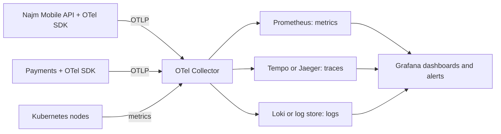
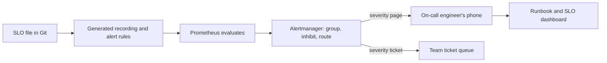
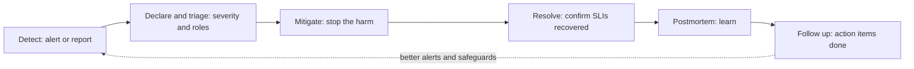

# Module 5 — Observability and reliability

*Shipping a service is the start of its life, not the end. After that, two questions decide whether customers trust it: can you see what it is doing, and do you know how reliable it needs to be? This module answers both. It starts with telemetry: the logs, metrics and traces a service emits, and OpenTelemetry, the open standard that lets you collect them once and send them anywhere. It then turns that telemetry into reliability decisions with service level objectives (SLOs), error budgets, alerts that fire only when users are hurting, and an on-call rota people can live with. It ends with incidents: how to run one calmly, and how to write a blameless postmortem that makes the next one less likely. You will follow Najm Bank's Platform Engineering & SRE team as Yousef chases a slow-transfer complaint across three systems with nothing but scattered log files, Maha replaces 140 noisy alerts with four that matter, and the team runs, and then learns from, a payments incident caused by a one-line configuration change.*

> **Phases:** Operate, Monitor — seeing what production is really doing, deciding how reliable it must be, and responding well when it is not.

---

# 5.1 — Telemetry: logs, metrics, traces and OpenTelemetry
*Level: 🟡 Intermediate* · *Prerequisites: 2.2, 4.1* · *Phase: Monitor*

## ⚡ In 60 seconds
- **Telemetry** is the data a running system emits about itself. The three main signals are **logs** (events, with detail), **metrics** (numbers over time, cheap to keep and alert on) and **traces** (the path of one request across services). **Profiles** (where CPU and memory go inside the code) are a fourth signal that is still maturing.
- **Observability** is the ability to answer new questions about production from that telemetry, without shipping new code to find out.
- **OpenTelemetry** (OTel) is the open, vendor-neutral standard for producing and moving telemetry. Instrument once with OTel, then send the data to whichever back end you choose: Prometheus, Grafana, a cloud provider's monitoring service or a commercial tool.
- The rule that matters most: every signal carries the same **context** (service, environment, version, trace ID), so you can jump from an alert to a trace to the log line.
- Decision cue: metrics tell you *that* something is wrong, traces tell you *where*, logs tell you *why*.
- Biggest trap: high-cardinality labels (customer ID, account number) on metrics. They multiply time series until the monitoring system becomes slow, expensive or falls over.

## 🧭 Why it matters
On a Thursday afternoon, the contact centre forwards a complaint to Platform Engineering: transfers in the Najm Mobile app "spin for ages" before succeeding. Yousef opens the dashboard: CPU is fine and the Najm Mobile API's average response time is 180 milliseconds. He then spends two hours reading log files from the API pods, the Payments service and the core banking adapter in the data centre. Each logs in a different format, with no common request ID, so he cannot tell which slow line belongs to which transfer.

Salem sits down with him. "The average hides the tail," he says. "If one transfer in a hundred takes eight seconds, the average still looks healthy. And you can't follow one request across three systems because nothing ties them together." The fix is to instrument the path so every request carries a trace ID from the API, through Payments, across the hybrid link to core banking, and to record latency as a distribution, not an average.

Two days after the team instruments the path, a trace shows the answer in one picture: 7.4 seconds of a slow transfer are spent waiting for a database connection inside Payments, and core banking is fast. Without telemetry, the team would have blamed the data centre. And you cannot set a reliability target, alert on it or run an incident on data you do not have.

## 📐 How it works
### 🟢 The essentials
**Monitoring vs observability.** **Monitoring** watches for failures you predicted: "alert if the error rate goes above 1%". **Observability** lets you investigate failures you did not predict: "why are only Android users on the newest app version seeing slow transfers since 14:05?" You need both.

**The three signals.**

| Signal | What it is | Strength | Weakness | Najm example |
|---|---|---|---|---|
| **Logs** | Timestamped records of discrete events, ideally structured (JSON key-value pairs) | Rich detail; the "why" | Expensive at volume; hard to aggregate | `transfer rejected: insufficient funds` |
| **Metrics** | Numeric measurements aggregated over time: counters, gauges, histograms | Cheap; fast to query; the basis of alerts and dashboards | No per-request detail | Requests per second, error rate, latency distribution |
| **Traces** | The journey of one request, made of **spans** (timed operations) linked by a shared trace ID | Shows where time goes across services | Usually sampled; needs instrumentation in every hop | API → Payments → core banking adapter, with timings |

**Structured logs.** A log line should be a machine-readable record, not a sentence. Compare:

```text
# Risky: free text, no context, personal data
2026-03-12 14:05:11 Transfer failed for Ahmed Al-Kuwari acct 1234567890 after timeout
```

```json
{"ts":"2026-03-12T14:05:11.482Z","level":"error","service.name":"payments",
 "deployment.environment":"prod","service.version":"2.14.0",
 "event":"transfer.failed","reason":"db_pool_timeout","duration_ms":8012,
 "trace_id":"4bf92f3577b34da6a3ce929d0e0e4736","span_id":"00f067aa0ba902b7"}
```

The hardened version can be counted, carries the trace ID and contains no name or account number. What must never go into logs is covered in [*Secure AI & Application Security*, lesson 5.3 — Protecting personal data: minimisation, logging and privacy engineering](../secai/index.html#/5.3).

**Metric types.** A **counter** only goes up (total requests, total errors); you look at its rate of change. A **gauge** goes up and down (queue depth, memory in use, open connections). A **histogram** counts observations into buckets (how many requests took under 100 ms, under 250 ms, under 1 s and so on), which lets you calculate percentiles later.

**Percentiles, not averages.** The **p99** latency is the value that 99% of requests are faster than. If the median is 150 ms and p99 is 6 s, one request in a hundred is painfully slow. Averages hide exactly the users who complain, so record latency as histograms and watch p50, p95 and p99.

**What to measure first.** Three well-known checklists:
- **The four golden signals** (Google's *Site Reliability Engineering* book): latency, traffic, errors and saturation (how "full" the service is).
- **RED** for request-driven services: **R**ate (requests per second), **E**rrors (failed requests per second), **D**uration (latency distribution). Use it for the Najm Mobile API and Payments.
- **USE** for resources: **U**tilisation, **S**aturation and **E**rrors for each CPU, disk, network link or connection pool. Use it for nodes, databases and the hybrid link to the data centre.

### 🟡 Going deeper
**OpenTelemetry in one paragraph.** OpenTelemetry is a CNCF project, formed in 2019 by merging two earlier projects, OpenTracing and OpenCensus. It provides: an **API and SDKs** for many languages, to create spans, metrics and logs in your code; **automatic (zero-code) instrumentation** for common frameworks and libraries, so HTTP servers, HTTP clients and database drivers emit spans without code changes; **OTLP**, the OpenTelemetry Protocol for sending telemetry; **semantic conventions**, standard attribute names such as `service.name`, `http.request.method`, `http.route` and `http.response.status_code`; and the **Collector**, a separate process that receives, processes and exports telemetry. At the time of writing (2026), the trace and metric specifications are stable, log support is stable in some language SDKs and still maturing in others, and profiles are still in development. Check the status page for your language before relying on a signal.

**How a trace crosses services.** When the Najm Mobile API calls Payments over HTTP, the OTel SDK adds a `traceparent` header in the W3C Trace Context format: a version, the 32-hex-character trace ID, the 16-hex-character ID of the calling span, and flags (including whether the trace is sampled).

```text
traceparent: 00-4bf92f3577b34da6a3ce929d0e0e4736-00f067aa0ba902b7-01
```

Payments reads the header and creates its spans as children of that span. A hop that drops the header, such as an old proxy or the core banking adapter, breaks the trace into pieces, which is why Najm instrumented the adapter first.

**Adding business context to a span.** Automatic instrumentation gives you HTTP and database spans; add manual spans where the business logic lives:

```python
from opentelemetry import trace

tracer = trace.get_tracer("najm.payments")

def reserve_funds(transfer):
    with tracer.start_as_current_span("reserve_funds") as span:
        span.set_attribute("payment.rail", transfer.rail)        # e.g. "domestic"
        span.set_attribute("payment.amount_band", transfer.band)  # "small", not the amount
        return ledger.reserve(transfer)
```

Keep attributes low-risk: a band, not the amount; a rail, not the account number.

**The Collector pipeline.** Applications send OTLP to a nearby Collector (often a DaemonSet, one per Kubernetes node, plus a central "gateway" Collector). The Collector batches, enriches, filters and routes:



A minimal Collector configuration for a local lab:

```yaml
receivers:
  otlp:
    protocols:
      grpc:
        endpoint: 0.0.0.0:4317
      http:
        endpoint: 0.0.0.0:4318
processors:
  memory_limiter:          # protect the Collector itself; put it first
    check_interval: 1s
    limit_percentage: 80
    spike_limit_percentage: 20
  attributes/scrub:        # defence in depth: drop fields that must never leave the app
    actions:
      - key: enduser.id
        action: delete
  batch: {}
exporters:
  otlp/tempo:
    endpoint: tempo:4317
    tls:
      insecure: true       # local lab only; use TLS in any shared environment
  prometheus:
    endpoint: 0.0.0.0:8889 # Prometheus scrapes the Collector here
  debug: {}                # prints logs to the Collector's output in the lab
service:
  pipelines:
    traces:  {receivers: [otlp], processors: [memory_limiter, attributes/scrub, batch], exporters: [otlp/tempo]}
    metrics: {receivers: [otlp], processors: [memory_limiter, batch], exporters: [prometheus]}
    logs:    {receivers: [otlp], processors: [memory_limiter, attributes/scrub, batch], exporters: [debug]}
```

Because applications only speak OTLP to the Collector, Najm can change back ends by changing the Collector, not every service.

**Prometheus and PromQL.** **Prometheus** (a CNCF graduated project) uses a **pull model**: it **scrapes** an HTTP `/metrics` endpoint on each target at a regular interval and stores the results as time series, each identified by a metric name and **labels** (key-value pairs). You query it with **PromQL**. The RED metrics for the Najm Mobile API look like this:

```promql
# Rate: requests per second over the last 5 minutes
sum(rate(http_requests_total{job="najm-mobile-api"}[5m]))

# Errors: share of requests that returned 5xx
sum(rate(http_requests_total{job="najm-mobile-api", code=~"5.."}[5m]))
  /
sum(rate(http_requests_total{job="najm-mobile-api"}[5m]))

# Duration: p99 latency from a histogram
histogram_quantile(
  0.99,
  sum by (le) (rate(http_request_duration_seconds_bucket{job="najm-mobile-api"}[5m])))
```

Metric names vary with the instrumentation library; OTel's HTTP server metric, for example, becomes `http_server_request_duration_seconds` once exported to Prometheus. Check what your services actually emit before you copy a query. **Grafana** then turns these queries into dashboards and alerts.

**Cloud equivalents.** Each major provider has a managed monitoring stack: Amazon CloudWatch and AWS X-Ray, Azure Monitor with Application Insights, and Google Cloud Observability. Their support for OTLP and Prometheus data, features and pricing change; check current documentation.

### 🔴 Expert view
**Cardinality is the cost driver.** Every unique combination of label values is a separate time series. `http_requests_total` with labels `route` (40 values), `code` (10) and `pod` (30) is up to 12,000 series, which is fine. Add `customer_id` (2 million values) and you have created billions of potential series. Rules Najm follows: labels on metrics come from small, bounded sets (route template, status class, region, version); identifiers belong on spans and in logs, never on metrics.

**Sampling traces.** Tracing every request is expensive at scale. **Head sampling** decides at the start of a request (keep 10% at random), which is cheap but may throw away the one slow trace you need. **Tail sampling**, done in a Collector after the trace completes, keeps traces by outcome: all errors, all requests slower than 2 s, plus a small random share of the rest. Najm keeps 100% of Payments error and slow traces, and a small sample of healthy ones. Tail sampling needs all spans of a trace to reach the same Collector instance, which shapes how you deploy the gateway.

**Exemplars and correlation.** An **exemplar** is a trace ID attached to a histogram bucket. Click the dot in a slow bucket on a Grafana latency panel to open a real slow trace, then follow its trace ID to the logs: two minutes instead of two hours of grepping.

**Telemetry has a budget.** Debug logging in production, unbounded labels and 100% tracing can make observability a large line on the cloud bill. Set retention by signal, and for logs follow the bank's records and privacy rules. Audit and security logs are a separate stream with their own retention and integrity requirements; see [*Secure AI & Application Security*, lesson 10.1 — Logging, monitoring and detection engineering](../secai/index.html#/10.1).

**Instrument the platform, not each team.** Put telemetry on the golden path: the service template ships with the OTel SDK, automatic instrumentation, a logger that adds `trace_id` and a default RED dashboard, so every new service is observable on day one.

For the non-engineer's view of why dashboards mislead, see [*System Design for Vibe Coders*, lesson 7.1 — The dashboard that lies and the metric that doesn't](../vibe/index.en.html#l7-1); for observability as a SaaS component, see [*SaaS Building Blocks*, lesson 7.2 — Observability: logs, errors, metrics and traces](../saas/index.html#/7.2).

## 🧰 The toolkit
| Tool, practice or service | What it is and does | When to reach for it |
|---|---|---|
| **OpenTelemetry** (CNCF) | Vendor-neutral APIs, SDKs, automatic instrumentation, semantic conventions and the OTLP protocol for traces, metrics and logs | Every new service; the default way to instrument at Najm |
| **OpenTelemetry Collector** | A process that receives, processes (batch, scrub, sample) and exports telemetry to one or more back ends | Between applications and back ends, so services never talk to a vendor directly |
| **Prometheus** (CNCF) | Pull-based time-series database with the PromQL query language and alert rules | Metrics for Kubernetes workloads and RED/USE dashboards |
| **Grafana** | Dashboards and alerting over many data sources, including Prometheus, Loki and Tempo | One place to see metrics, logs and traces side by side |
| **Jaeger** (CNCF) or **Grafana Tempo** | Trace storage and search | Following one request across services; finding the slow hop |
| **RED and USE methods** | Checklists: Rate, Errors, Duration for services; Utilisation, Saturation, Errors for resources | Deciding what to put on a service's first dashboard |

## 🏛️ In practice at Najm Bank
**Artefact: the Najm telemetry standard (v1), part of the golden-path template.**

| Area | Standard |
|---|---|
| Resource attributes | Every signal carries `service.name`, `service.version`, `deployment.environment`, `cloud.region` and `k8s.namespace.name` |
| Logs | JSON to stdout; fields `ts`, `level`, `service.name`, `event`, `trace_id`, `span_id`; no names, account numbers, card numbers, tokens or free-text customer input |
| Metrics | RED for every HTTP and gRPC endpoint, as histograms (latency in seconds); USE for connection pools, queues and the hybrid link; labels from bounded sets only |
| Traces | OTel automatic instrumentation plus manual spans for business steps (`reserve_funds`, `post_to_core`); W3C `traceparent` propagated through every hop, including the core banking adapter |
| Sampling | Tail sampling at the gateway Collector: keep all error traces and traces slower than 2 s; sample healthy traces at a low rate set per service |
| Transport | Applications send OTLP only to the node Collector; only the gateway Collector talks to back ends |
| Dashboards | Each service gets a generated RED dashboard with p50/p95/p99, error ratio and a link to its runbook |
| Retention | Set per signal and agreed with Security and Compliance; audit logs are a separate stream owned by the SOC |
| Review | A service cannot go to production until its "first five minutes" check passes: an engineer who has never seen it can find its error rate, p99 and one failed trace in under five minutes |

## 🛠️ Exercises
All three run locally with Docker or a kind/k3d cluster. Do not point them at an employer's systems without permission.

- 🟢 Run a small web app of your own (or an OpenTelemetry demo app) with Prometheus and Grafana in Docker Compose. Build a RED dashboard: requests per second, 5xx ratio and p50/p95/p99 latency from a histogram. *Done when:* you can make the app slow (add a sleep to one route) and watch p99 rise while the average barely moves, and you can explain the difference in two sentences.
- 🟡 Add OpenTelemetry automatic instrumentation to two small services where service A calls service B over HTTP. Send traces through an OTel Collector to Jaeger or Tempo, and write structured JSON logs that include `trace_id`. *Done when:* you can open one trace that shows spans from both services, and find that trace's log lines by searching for its trace ID.
- 🔴 Extend the 🟡 lab with tail sampling in the Collector: keep every error trace and every trace slower than one second, plus a 5% sample of the rest. Add an exemplar-enabled latency histogram and a Grafana panel. Then add a random user ID label to one metric and measure how the series count grows. *Done when:* clicking a slow exemplar opens a real slow trace, your sampling policy is shown to keep a forced error, and you have written a one-paragraph note on the cardinality you measured and how you removed it.

## ⚠️ Mistakes and traps
- **Alerting on and reporting averages.** Averages hide the slow tail that customers feel. Record histograms; look at p95 and p99.
- **Unbounded labels on metrics.** Customer IDs, request IDs or full URLs as labels can multiply series until the monitoring system fails. Use route templates and bounded labels; put identifiers on spans and logs.
- **Logging personal data and secrets "for debugging".** Logs are copied, retained and widely read. Log events and reasons, not people; scrub at the Collector as a second line of defence.
- **Broken trace context.** One hop that drops `traceparent`, such as a legacy adapter, a message queue or a proxy, splits every trace. Test propagation end to end, including asynchronous paths.

## 🧾 Recap
- Logs give detail, metrics give cheap aggregates and alerts, traces show where time goes across services; profiles are an emerging fourth signal.
- Shared context (service, version, environment, trace ID) is what lets you jump between signals.
- Use RED for services, USE for resources and the four golden signals as a cross-check; measure latency as histograms and percentiles.
- OpenTelemetry standardises instrumentation and transport; the Collector decouples services from back ends and is where you batch, scrub and sample.
- Cardinality, retention and sampling decide what observability costs; design them, do not discover them on the bill.

## ✍️ Check yourself

**1. The Najm Mobile API dashboard shows an average latency of 180 ms, but customers complain that some transfers take many seconds. What should Yousef look at first?**

- A. CPU utilisation of the API pods
- B. The p95 and p99 latency from a request-duration histogram
- C. The total number of log lines per minute
- D. The average latency over a longer window, such as 24 hours

<details><summary>Answer</summary>

**B.** Percentiles from a histogram reveal the slow tail that an average hides. A longer average (D) hides it even more; CPU (A) may be normal while requests wait on a connection pool. (🟢 The essentials.)

</details>

**2. A developer wants to add a `customer_id` label to the `http_requests_total` metric so support can see each customer's request rate. What is the best response?**

- A. Accept it, because labels are cheap and more of them always help
- B. Accept it in production only, where support actually needs it
- C. Accept it after hashing the customer ID, so no personal data is stored
- D. Refuse it: unbounded values multiply series; use spans or logs instead

<details><summary>Answer</summary>

**D.** Each unique label value creates a new series; millions of customers make the metric system slow and costly. Hashing (C) keeps exactly the same cardinality. Identifiers belong on spans and logs, within privacy rules. (🔴 Expert view.)

</details>

**3. Traces from the Najm Mobile API stop at the core banking adapter, and a new trace starts on the other side. What is the most likely cause?**

- A. The adapter does not propagate the W3C `traceparent` header
- B. Prometheus is scraping the adapter too slowly
- C. The logs are not in JSON
- D. Head sampling is set to 100%

<details><summary>Answer</summary>

**A.** A trace stays joined only if every hop forwards the trace context. Scrape interval (B) and log format (C) do not affect trace linking; sampling everything (D) would not split traces. (🟡 Going deeper.)

</details>

**4. Why does Najm route all application telemetry through OpenTelemetry Collectors instead of having each service send data straight to its back end?**

- A. Because Prometheus has no way to scrape metrics from applications directly
- B. Because OTLP data can only be received by a Collector, never by a back end
- C. Because it centralises batching, scrubbing and sampling, and decouples services from back ends
- D. Because the Collector is the long-term store that dashboards query for history

<details><summary>Answer</summary>

**C.** The Collector decouples services from back ends and centralises processing. Prometheus can scrape apps directly (A), OTLP can go straight to a back end that accepts it (B), and the Collector is a pipeline, not a store (D). (🟡 Going deeper.)

</details>

**5. Najm wants to keep tracing costs down without losing the traces engineers need during incidents. Which approach fits best?**

- A. Head sampling at 1% for every service, decided when each request starts
- B. Tail sampling: keep all error and slow traces, plus a few healthy ones
- C. Turn tracing off entirely and rely on structured logs with trace IDs
- D. Keep every trace, but delete all of them automatically after one hour

<details><summary>Answer</summary>

**B.** Tail sampling decides after the outcome is known, so the rare errors and slow requests are kept. Random head sampling (A) will usually discard them; C and D lose the evidence you need. (🔴 Expert view.)

</details>

## 📚 References
- OpenTelemetry documentation — https://opentelemetry.io/docs/
- OpenTelemetry Collector — https://opentelemetry.io/docs/collector/
- OpenTelemetry semantic conventions — https://opentelemetry.io/docs/specs/semconv/
- W3C Trace Context — https://www.w3.org/TR/trace-context/
- Prometheus documentation — https://prometheus.io/docs/introduction/overview/
- Prometheus, metric and label naming — https://prometheus.io/docs/practices/naming/
- Grafana documentation — https://grafana.com/docs/
- Jaeger documentation — https://www.jaegertracing.io/docs/
- Google, *Site Reliability Engineering*, "Monitoring Distributed Systems" — https://sre.google/sre-book/monitoring-distributed-systems/
- CNCF projects — https://www.cncf.io/projects/

---

# 5.2 — SLOs, error budgets, alerting and on-call that people can sustain
*Level: 🟡 Intermediate* · *Prerequisites: 5.1* · *Phase: Operate, Monitor*

## ⚡ In 60 seconds
- An **SLI** (service level indicator) measures what users experience, such as "the share of transfer requests that succeed in under 2 seconds". An **SLO** (service level objective) is the target for it over a window, such as 99.9% over 30 days. An **SLA** (service level agreement) is a contract with consequences, and should be looser than the SLO.
- The **error budget** is what the SLO allows to fail: 100% minus the target. It turns "how reliable?" into a shared, numeric decision between product and operations: spend the budget on change, or slow down when it runs out.
- Page a human only for **symptoms users feel** and that need action now. Alert on how fast the error budget is burning, not on CPU at 80%.
- **Multi-window, multi-burn-rate alerts** (from *The Site Reliability Workbook*) catch fast outages quickly and slow leaks reliably, with few false alarms.
- On-call is sustainable only if pages are rare, actionable, linked to a runbook, and followed up with fixes that remove the cause.
- Biggest trap: aiming for 100%. It is impossible, it blocks every change, and the users' own phones and networks are less reliable than that anyway.

## 🧭 Why it matters
Maha inherits the on-call rota for the Najm Mobile API and the Payments service. In her first week she counts 140 alert rules. In one night, Yousef is paged eleven times for high CPU, pod restarts and disk warnings. None needed action. At 04:10 a real problem starts: a share of transfers fails because a certificate on the core banking adapter has expired. Yousef, half-asleep, acknowledges that alert with the others, and customers notice before the team does.

This is **alert fatigue**: when most pages are noise, people learn to ignore pages, and then miss the real one. Maha's fix starts with a different question: "What does a customer need from the Payments service, and how much failure can they tolerate before it matters?" The answers become SLOs. Pages come only from SLO burn. Everything else becomes a ticket, a dashboard entry, or is deleted.

SLOs also settle an old argument: Tariq's teams want speed, Maha's team wants stability. With an error budget, both agree in advance: while budget remains, ship; when it is spent, reliability work comes first. Regulators care too: the EU's Digital Operational Resilience Act (DORA), applicable to financial entities from January 2025, and GCC regulators expect banks to understand and test the resilience of important services; a measured SLO is part of that evidence.

## 📐 How it works
### 🟢 The essentials
**From users to numbers.** Start with a **user journey**, not a component: "a customer sends a transfer and sees the result". Then choose SLIs that describe a good experience of it:

| SLI type | Definition | Payments example |
|---|---|---|
| **Availability** | Good requests ÷ valid requests | Transfer requests that return a non-5xx result ÷ all transfer requests (excluding client errors such as invalid input) |
| **Latency** | Requests faster than a threshold ÷ valid requests | Transfer requests completed in under 2 s ÷ all transfer requests |
| **Correctness** | Correct outcomes ÷ outcomes | Transfers posted exactly once and reconciled with core banking ÷ all transfers |

Express SLIs as good events ÷ valid events: easy to compute from counters and comparable across services.

**SLO, SLA and the window.** An SLO adds a target and a window: "99.9% of transfer requests succeed, measured over a rolling 30 days." A **rolling window** always looks at the last 30 days, so a bad day stays visible for a month. An **SLA** is an external promise with penalties, set below the internal SLO.

**Error budget arithmetic.** The budget is 100% minus the SLO.

| SLO | Error budget | Allowed "bad" time if fully down, per 30 days | Bad requests allowed per 10 million |
|---|---|---|---|
| 99% | 1% | 7.2 hours | 100,000 |
| 99.5% | 0.5% | 3.6 hours | 50,000 |
| 99.9% | 0.1% | 43.2 minutes | 10,000 |
| 99.99% | 0.01% | about 4.3 minutes | 1,000 |

Each extra "nine" cuts the budget by ten and usually costs far more in redundancy, release speed and on-call effort. Pick the target from user needs, not ambition. Payments gets 99.9% availability and 99% of transfers under 2 s; the internal developer portal gets 99%.

**Alert on symptoms, not causes.** A **symptom** is something users feel: errors, slowness, wrong results. A **cause** is something that might lead to it: high CPU, a pod restart, a full queue. Causes are useful on dashboards and in tickets. Page on symptoms, because many causes never hurt users, and some user-facing failures have causes you did not predict.

**Three kinds of response.**
- **Page**: a human must act now, at any hour. Only SLO-threatening symptoms.
- **Ticket**: someone must act within working days. Slow budget burn, a certificate expiring in 14 days, a disk filling over weeks.
- **Log or dashboard only**: information for investigations. No notification.

### 🟡 Going deeper
**Burn rate.** The **burn rate** is how fast you are using the error budget, relative to the rate that would use exactly all of it in the SLO window. A burn rate of 1 means you will end the 30 days with zero budget left. A burn rate of 14.4 means the whole 30-day budget would be gone in about two days. For a 99.9% SLO, the budget is 0.1%, so an error ratio of 1.44% is a burn rate of 14.4.

**Why simple threshold alerts fail.** "Page if the error ratio is above 0.1% for 5 minutes" fires on short blips that barely touch the budget. "Page if the 30-day ratio is above 0.1%" fires days late. *The Site Reliability Workbook* (chapter "Alerting on SLOs") works through these options and recommends **multi-window, multi-burn-rate** alerts. A long window shows the burn is significant; a short window confirms it is still happening, so the alert also stops soon after recovery.

| Severity | Burn rate | Long window | Short window | Budget used if it continues for the long window |
|---|---|---|---|---|
| Page | 14.4 | 1 hour | 5 minutes | 2% |
| Page | 6 | 6 hours | 30 minutes | 5% |
| Ticket | 1 | 3 days | 6 hours | 10% |

These are the Workbook's suggested starting values for a 30-day window. Tune them with your own data.

**The alert as code.** First, recording rules compute the error ratio over several windows (Najm generates these from the SLO file):

```yaml
groups:
  - name: payments-slo-recordings
    rules:
      - record: slo:payments_errors:ratio_rate5m
        expr: |
          sum(rate(http_requests_total{job="payments", route="/transfers", code=~"5.."}[5m]))
          /
          sum(rate(http_requests_total{job="payments", route="/transfers"}[5m]))
      - record: slo:payments_errors:ratio_rate1h
        expr: |
          sum(rate(http_requests_total{job="payments", route="/transfers", code=~"5.."}[1h]))
          /
          sum(rate(http_requests_total{job="payments", route="/transfers"}[1h]))
      # ... the same for 30m, 6h and 3d
```

Then the alerting rule pages only when both the long and short windows burn fast:

```yaml
  - name: payments-slo-alerts
    rules:
      - alert: PaymentsErrorBudgetFastBurn
        expr: |
          (slo:payments_errors:ratio_rate1h > 14.4 * 0.001
            and slo:payments_errors:ratio_rate5m > 14.4 * 0.001)
          or
          (slo:payments_errors:ratio_rate6h > 6 * 0.001
            and slo:payments_errors:ratio_rate30m > 6 * 0.001)
        labels:
          severity: page
          service: payments
        annotations:
          summary: "Payments is burning its 30-day error budget fast"
          runbook_url: "https://runbooks.najm.example/payments/error-budget-burn"
          dashboard: "https://grafana.najm.example/d/payments-slo"
```

Compare the rule Yousef had before:

```yaml
# Risky: a cause, not a symptom; pages at 3 a.m.; no runbook
- alert: HighCPU
  expr: avg(rate(container_cpu_usage_seconds_total{namespace="payments"}[5m])) > 0.8
  labels:
    severity: page
```

Open-source tools such as **Sloth** and **Pyrra** generate these recording and alerting rules from a short SLO definition, and the **OpenSLO** project defines a vendor-neutral SLO file format.

**Routing, grouping and silences.** Prometheus evaluates rules; **Alertmanager** (or Grafana alerting) decides who is told. It **groups** related alerts into one notification, **inhibits** lower alerts when a higher one is firing (do not page about 30 pod errors when the whole cluster is down), **routes** by labels (`service: payments` goes to the Payments rota) and supports **silences** during planned maintenance.



**The error budget policy.** An SLO without consequences is just a chart. Najm's policy, agreed by Salem, Maha and Tariq:
- Budget healthy: teams ship at their normal pace.
- Budget below 25% remaining: releases to that service need an SRE review; the next sprint includes the top reliability item.
- Budget exhausted: only fixes and reliability work ship to that service until the rolling window recovers, unless the Head of Platform and the product owner sign an exception.
- A single incident that uses more than 20% of the budget gets a postmortem (lesson 5.3).

The same burn signal can drive automation: a canary release can roll itself back when its SLIs degrade (lesson 4.2).

### 🔴 Expert view
**Sustainable on-call.** Google's *Site Reliability Engineering* book treats on-call load as something to measure and cap, and **toil** (manual, repetitive, automatable work that grows with the service and has no lasting value) as something to reduce deliberately. Practices Najm adopts:
- **Rota size and hand-offs.** Enough people that each engineer is on call at most about one week in several, with a written hand-off at every shift change. Follow-the-sun rotas, where a team spans time zones, remove most night pages.
- **Every page is actionable and has a runbook.** If the responder cannot do anything, it should not page. A **runbook** says what the alert means, how to confirm user impact, safe first actions (roll back, fail over, scale out) and who to escalate to.
- **Measure the rota.** Pages per shift, pages outside working hours, time to acknowledge, share of pages that needed action. Alerts that fired without needing action are tuned or deleted within the week.
- **Pay back the load.** Engineers get protected recovery time after a heavy night; recurring pages become owned backlog items.
- **New engineers shadow first.** Yousef shadows Maha for two rotations before carrying the pager alone.

**Choosing SLIs where you measure them.** Server-side metrics miss failures that happen before the request reaches you (DNS, the CDN, the WAF, the load balancer). Najm measures the Payments availability SLI at the load balancer and adds **synthetic probes**: scripted transfers between test accounts every minute from outside the cloud, which also catch failures at the edge. 

**Dependencies and composite SLOs.** If Payments depends serially on three services that each meet 99.9%, its own availability can be lower than any of them. Check what each dependency must achieve, and design for failure where the numbers do not add up: timeouts, retries with backoff, idempotency keys so retries never duplicate a transfer, and graceful degradation (show "transfer pending" rather than failing).

**SLOs for asynchronous and AI work.** For a queue, measure "messages processed within N minutes". For Najm Assist, measure time to first token as well as total time; operating AI agents is covered in [*Running AI Agents in Production*, Level 3 — Production Engineer](../agentic/learning-path.html#level-3-production-engineer).

For a gentler introduction to monitoring stacks and alert hygiene, see [*System Design for Vibe Coders*, lesson 7.6 — Your monitoring stack: Sentry, uptime checks, metrics, and alerts](../vibe/index.en.html#l7-6).

## 🧰 The toolkit
| Tool, practice or service | What it is and does | When to reach for it |
|---|---|---|
| **Service level objective (SLO)** | A target for a user-centred indicator over a window, written down and agreed | Every production service with users, starting with the most important journeys |
| **Error budget** | The amount of failure an SLO allows, plus a policy for what happens as it is spent | Balancing release speed against reliability with numbers, not opinions |
| **Multi-window, multi-burn-rate alerting** (SRE Workbook) | Pages when budget burn is both significant over a long window and still happening in a short one | Replacing threshold and cause-based pages |
| **Alertmanager** (Prometheus) | Groups, inhibits, routes and silences alerts | Sending the right alert to the right rota, once |
| **Sloth** / **Pyrra** | Open-source generators of Prometheus SLO recording and alert rules from a short spec | Keeping SLOs as code instead of hand-written PromQL |
| **Runbook** | A short, linked guide: what the alert means, how to check impact, safe first actions, escalation | Attached to every paging alert |

## 🏛️ In practice at Najm Bank
**Artefact: the Payments service SLO document (v1), stored in Git next to the service.**

| Field | Value |
|---|---|
| Service and owner | Payments service · Payments squad (Tariq's area) · SRE partner: Maha |
| User journey | A retail customer submits a transfer in Najm Mobile and receives a definitive result |
| SLI 1: availability | Transfer requests at the load balancer not returning 5xx or timing out ÷ valid transfer requests (excluding 4xx validation errors) |
| SLO 1 | 99.9% over a rolling 30 days |
| SLI 2: latency | Transfer requests completed in under 2 s ÷ valid transfer requests |
| SLO 2 | 99% over a rolling 30 days |
| SLI 3: correctness | Transfers posted exactly once, as shown by daily reconciliation with core banking ÷ all transfers; any mismatch opens an incident |
| Data sources | Load balancer metrics; OTel histograms; synthetic transfer probe every minute from outside the cloud; reconciliation job |
| Alerts | Page: burn rate 14.4 (1 h and 5 min) or 6 (6 h and 30 min). Ticket: burn rate 1 (3 days and 6 h). Reconciliation mismatch: page |
| Error budget policy | As in 🟡 Going deeper; exceptions signed by Salem and the product owner |
| Dependencies | Managed PostgreSQL, core banking adapter, hybrid link; each has its own SLO, reviewed against this one |
| Not covered | The SLA in customer terms and regulatory reporting thresholds; owned by Risk and Compliance |
| Review | Monthly with Tariq and Maha: budget left, incidents, alert quality (pages per week, share actionable) |

## 🛠️ Exercises
- 🟢 For one service you know (your own project or a public website you use), write three SLIs as good-event ÷ valid-event ratios, choose an SLO for each, and calculate the error budget in minutes and in requests for a 30-day window. *Done when:* each SLI states exactly which events count as good, bad and excluded, and you can justify each target in one sentence about users.
- 🟡 In your local Prometheus lab from lesson 5.1, write recording rules and a multi-window, multi-burn-rate alert for a 99.9% availability SLO, routed through Alertmanager. Inject errors twice: a one-minute burst at a 10% error ratio, then a steady 10% error ratio. *Done when:* the burst does not page, the steady errors page within about ten minutes (work out why from the 1-hour window), and the alert stops after you remove the errors.
- 🔴 Take any alert set you can access legally (your own project, an open-source project's published rules or a sample from a monitoring tutorial) and audit it: classify each alert as page, ticket or delete, rewrite cause-based pages as SLO burn alerts, write one runbook, and draft an error budget policy. *Done when:* you have a before/after table with a reason for every change and a one-page policy that a product owner could sign.

## ⚠️ Mistakes and traps
- **Targets of 100% or "as many nines as possible".** They block every change and cost far more than users notice. Pick the lowest target users are happy with.
- **SLIs that measure the server, not the user.** CPU and pod health are not experiences. Measure success and latency of real journeys, as close to the user as you can.
- **Paging on causes.** CPU, memory, restarts and disk warnings wake people for nothing. Put them on dashboards or tickets; page on budget burn.
- **SLOs without a policy.** If running out of budget changes nothing, nobody will trust or use the SLO. Agree the policy before the first bad month.
- **Alerts without runbooks, and an ignored rota.** A page with no next step wastes the first minutes of an incident. Link a runbook to every page; fix the noisiest alert weekly.

## 🧾 Recap
- SLIs measure user experience as good ÷ valid events; SLOs set a target over a window; SLAs are looser external promises.
- The error budget (100% minus the SLO) is a shared tool for deciding when to ship and when to fix.
- Page only on user-facing symptoms that need action now; use tickets and dashboards for everything else.
- Multi-window, multi-burn-rate alerts detect fast and slow budget burn while ignoring blips.
- Alertmanager groups, inhibits and routes; every page has a runbook and an owner.
- Sustainable on-call is measured and engineered: few, actionable pages, protected recovery and a weekly fix of the noisiest alerts.

## ✍️ Check yourself

**1. The Payments service has a 99.9% availability SLO over 30 days. Roughly how much total downtime does that allow if every request fails while it is down?**

- A. About 4 minutes
- B. About 7 hours
- C. About 43 minutes
- D. About 1 day

<details><summary>Answer</summary>

**C.** 0.1% of 30 days (43,200 minutes) is 43.2 minutes. About 4 minutes is the budget for 99.99% (A); about 7 hours is for 99% (B). (🟢 The essentials.)

</details>

**2. Maha finds that the rota is paged several times a night for "CPU above 80%" on payment pods, and no action is ever needed. What should she do?**

- A. Demote CPU to a dashboard or ticket; page only on Payments SLO burn
- B. Raise the threshold to 90% and keep it as a page, to cut the volume
- C. Add a second engineer to the rota so that the night-time load is shared
- D. Mute the paging channel at night and review the alerts each morning

<details><summary>Answer</summary>

**A.** CPU is a cause, not a symptom; paging on it creates alert fatigue. Raising the threshold (B) keeps a cause-based page; more people (C) spreads the noise; muting (D) also hides real pages. (🟢 The essentials.)

</details>

**3. For a 99.9% SLO, the error ratio over the last hour is 1.5% and over the last five minutes is 1.6%. What does this mean under the alert rule in this lesson?**

- A. Nothing yet, because the 30-day error ratio has not crossed 0.1%
- B. A ticket, because the burn rate is only slightly above 1 and can wait
- C. Nothing, because the short window is higher than the long window
- D. A page, because both windows exceed 14.4 × 0.1% = 1.44%

<details><summary>Answer</summary>

**D.** Both windows exceed the 14.4× threshold, so the budget is burning fast and still burning: the fast-burn page condition. Waiting for the 30-day ratio (A) would page far too late; a burn rate above 14 is not "slightly above 1" (B). (🟡 Going deeper.)

</details>

**4. Tariq's squad has used the whole Payments error budget halfway through the window and wants to release a new feature tomorrow. Under Najm's policy, what happens?**

- A. They release as normal, because the budget resets on the first of next month
- B. Only fixes and reliability work ship, unless an exception is signed
- C. The SLO target is lowered for this month so that the feature can ship
- D. Maha's team takes over all Payments releases permanently from the squad

<details><summary>Answer</summary>

**B.** The error budget policy, agreed in advance, decides this without a fight; Salem and the product owner can sign an exception. A rolling window does not reset on a date (A); lowering the SLO to suit a release (C) defeats its purpose. (🟡 Going deeper.)

</details>

**5. The Payments availability SLI is measured from server-side metrics only. During a CDN misconfiguration, many customers cannot reach the API, yet the SLO dashboard stays green. What change best fixes this blind spot?**

- A. Lower the SLO target so that short edge problems stay within budget
- B. Add more CPU and memory alerts on the API pods behind the CDN
- C. Add synthetic transfer probes from outside the cloud and edge-level SLIs
- D. Increase the Prometheus scrape interval so that fewer gaps appear

<details><summary>Answer</summary>

**C.** Requests that never reach the server do not appear in server metrics; external probes and edge measurement see them. The other options do not observe failures before the server. (🔴 Expert view.)

</details>

## 📚 References
- Google, *Site Reliability Engineering*, "Service Level Objectives" — https://sre.google/sre-book/service-level-objectives/
- Google, *Site Reliability Engineering*, "Eliminating Toil" — https://sre.google/sre-book/eliminating-toil/
- Google, *Site Reliability Engineering*, "Being On-Call" — https://sre.google/sre-book/being-on-call/
- Google, *The Site Reliability Workbook*, "Alerting on SLOs" — https://sre.google/workbook/alerting-on-slos/
- Google, *The Site Reliability Workbook*, "Implementing SLOs" — https://sre.google/workbook/implementing-slos/
- Prometheus, alerting rules — https://prometheus.io/docs/prometheus/latest/configuration/alerting_rules/
- Prometheus, Alertmanager — https://prometheus.io/docs/alerting/latest/alertmanager/
- OpenSLO specification — https://github.com/OpenSLO/OpenSLO
- Regulation (EU) 2022/2554 (DORA) — https://eur-lex.europa.eu/eli/reg/2022/2554/oj

---

# 5.3 — Incidents and blameless postmortems
*Level: 🟡 Intermediate* · *Prerequisites: 5.1, 5.2* · *Phase: Operate*

## ⚡ In 60 seconds
- An **incident** is an unplanned event that hurts, or threatens to hurt, users or the business, and that needs a coordinated response. Declaring one early is cheap; declaring one late is expensive.
- Run incidents with clear **roles**: an **incident commander** who coordinates and decides, an **operations lead** who changes systems, a **communications lead** who keeps people informed, and a **scribe** who records the timeline.
- **Mitigate first, investigate later.** Roll back, fail over, turn off a feature flag or shed load to stop the harm; find the root cause once customers are safe.
- A **blameless postmortem** asks how the system allowed a reasonable person's action to cause harm, not who to blame. Blame hides information; learning needs it.
- A postmortem is finished only when its **action items** have owners and due dates, and are tracked to completion.
- Biggest trap: "human error" as the root cause. It is where an investigation should start, not where it ends.

## 🧭 Why it matters
At 10:52 on a weekday morning, the fast-burn alert from lesson 5.2 pages Yousef: the Payments error budget is burning at dozens of times the sustainable rate. Transfer requests are timing out. Yousef starts debugging alone. Ten minutes later, Tariq's squad is also debugging in a different chat, the contact centre is asking what to tell customers, and nobody knows who is in charge. Two engineers are about to restart the database at the same time.

Maha joins, declares a SEV2 incident, takes the role of incident commander and gives everyone a job. Thirteen minutes later the team rolls back a configuration change deployed at 10:40, and the errors stop. The cause turns out to be one line: a change meant only for development, made in a Helm values file shared by all environments, lowered the Payments database connection pool from 50 to 5, and it was promoted to production with a batch of unrelated changes. No transfer was duplicated, because every retry carried an idempotency key. About 3,100 customers saw failed or slow transfers for 37 minutes.

Yousef approved the pull request that carried the change and expects to be blamed. Instead, the postmortem asks why a development value could reach production, why the pipeline did not show the diff of the effective configuration, and why the alert took twelve minutes to bring the right people together. The action items fix those.

## 📐 How it works
### 🟢 The essentials
**When to declare.** Declare an incident when any of these is true: users are affected now; an SLO fast-burn alert is firing; you need more than one team to fix it; or you are unsure whether it is serious. A false alarm costs minutes; a late declaration costs hours. Make declaring easy: one chat command or button that opens an incident channel and pages the incident commander rota.

**Severity levels.** Severity sets how many people are involved, how often you communicate and who must be told. Najm's scale:

| Severity | Meaning | Examples | Response |
|---|---|---|---|
| **SEV1** | Critical service down or data at risk for many customers | Payments unavailable; suspected data corruption or breach | IC from the senior rota, executive and regulator liaison informed, updates every 30 minutes |
| **SEV2** | Major degradation for a significant share of customers | Transfers failing for a share of users; Najm Mobile API very slow | IC from the SRE rota, product owner informed, updates every 30–60 minutes |
| **SEV3** | Limited impact or a workaround exists | One non-critical feature broken; internal portal down | Owning team handles it; postmortem optional |
| **SEV4** | No current user impact, but risk | A replica failed; a certificate expires in 3 days | Ticket; handled in working hours |

When in doubt, choose the higher severity; you can downgrade later.

**The roles.** The model is adapted from emergency services' incident command systems:
- **Incident commander (IC).** Owns the incident. Keeps the big picture, assigns work, decides (roll back now? escalate?) and declares the end. The IC does **not** debug; the moment they do, nobody is coordinating.
- **Operations lead.** Leads the hands-on work on systems, with subject-matter experts. Only people the operations lead names make changes to production.
- **Communications lead.** Writes internal updates on a fixed schedule, and works with the contact centre and customer-facing teams on what customers are told.
- **Scribe.** Records a timestamped timeline: what was seen, decided and changed. In a small incident the IC may do this with help from chat tooling.

**The lifecycle.**



**Mitigate first.** The fastest safe action that stops user harm comes before understanding. Typical mitigations, in rough order of preference: **roll back** the most recent change (deployments and configuration changes cause a large share of incidents, so "what changed?" is the first question); **turn off a feature flag**; **fail over** to a healthy zone or replica; **scale out** or **shed load** (reject low-priority traffic to protect payments). Keep evidence before you destroy it: capture logs, a heap dump or the bad configuration before restarting things, if it takes seconds rather than minutes.

### 🟡 Going deeper
**A good update** has a fixed, scannable shape:

```text
[SEV2 · Payments · Update 3 · 11:30]
Impact: ~8% of transfer requests failing or slow since 10:41. No duplicate transfers.
Current status: Mitigated. Config rolled back at 11:17; error ratio back to normal since 11:18.
Next steps: Monitoring for 30 min before resolving. Investigating why the change reached prod.
Next update: 12:00 or sooner if anything changes.
IC: Maha · Ops: Tariq · Comms: Salem · Scribe: Yousef
```

Say what you know, what you do not know, and when you will speak next. Never guess a cause in a customer-facing message.

**Coordination habits.** One incident channel, one bridge call, one IC. Announce changes before making them ("Tariq: rolling back payments-config to revision 41 now"). Hand over the IC role explicitly when shifts change or the incident outlasts one person's energy: "Maha handing IC to Salem at 13:00; Salem, confirm." 

**When an incident is also a security incident.** If there is any sign of an attacker (unexpected access, data leaving, a tampered artefact), bring in Jassim's SOC immediately. Security incidents change the rules: preserve evidence, do not tip off the attacker, and follow the security incident response plan, with its legal and regulatory duties. That process is taught in [*Secure AI & Application Security*, lesson 10.2 — Incident response: prepare, detect, contain, recover, learn](../secai/index.html#/10.2).

**Regulatory reporting.** Financial entities have incident reporting duties. Under the EU's DORA, firms must classify ICT-related incidents and report major ones to their competent authority within set deadlines; GCC regulators, including the Qatar Central Bank, also set expectations for reporting incidents and outsourcing failures. Criteria and timelines are owned by Risk and Compliance; engineering's duty is to give them accurate facts fast (start time, services, customers and transactions affected, data impact), which is one more reason to keep a timeline from minute one.

**The blameless postmortem.** A **postmortem** (also called a post-incident review) is a written analysis of an incident: what happened, its impact, why it happened, how the response went and what will change. **Blameless** means it assumes everyone acted reasonably given what they knew at the time, and looks for the conditions that made the harmful action easy and the safe action hard. The point is practical: if people fear blame, they hide details, and without details you cannot fix the system.

Blameless does not mean nobody is accountable. Teams are accountable for completing action items; leaders are accountable for making it safe to tell the truth.

**From "human error" to contributing factors.** "Yousef approved a bad change" is true and useless. Ask better questions:
- How did it make sense at the time? (The diff showed one line in a file named `values-shared.yaml`, which looked harmless.)
- What made the error easy? (Shared values for all environments; no rendered diff of the production configuration in the pipeline.)
- What made detection slow? (The alert paged one person and nothing gathered the right team.)
- What limited the damage? (Idempotency keys, a fast rollback path.)

Complex failures usually have several **contributing factors** rather than one root cause. List them all; fix the ones with the most leverage.

### 🔴 Expert view
**A public example: the Amazon S3 outage of February 2017.** AWS published a summary of a disruption to S3 in its us-east-1 region. An authorised engineer, following an established playbook, ran a command meant to remove a small number of servers from an S3 subsystem; one input was entered incorrectly and a much larger set was removed. AWS's response focused on the tool rather than the person: it changed the tool to remove capacity more slowly and to refuse to go below a safe minimum. The summary also noted that AWS's own status dashboard depended on S3, so it could not show the outage at first. The lessons for Najm: build guardrails into dangerous tools, and make sure your incident tooling does not depend on the thing that is failing.

**A second example: GitLab, January 2017.** During a late-night effort to fix database replication, an engineer deleted data on the primary database instead of the replica. GitLab's public postmortem then found that several of its backup and replication mechanisms were not working as expected, and about six hours of production data was lost. The lessons: a backup you have not restored is a hope, not a backup (lesson 6.1 covers recovery testing), and tired people doing risky manual work at night need tooling that makes the safe action easy.

**Action items that change things.** Weak items ("be more careful", "add more monitoring") do not survive the next sprint. Strong items are specific, owned, dated and change the system:

| Weak | Strong |
|---|---|
| Be more careful with config changes | Split `values-shared.yaml` into per-environment files; CI fails if a production value changes without a production-labelled review (owner: Yousef, due: 2 weeks) |
| Improve monitoring | Add a USE panel and a ticket-level alert for Payments DB pool saturation above 80% (owner: Maha, due: 1 week) |
| Communicate faster | Fast-burn pages for Payments also page the IC rota and auto-create the incident channel (owner: Salem's platform team, due: 3 weeks) |

Prioritise items that **prevent** recurrence, then those that **detect** faster, then those that **respond** faster. Track them in the normal backlog and review them weekly.

**Measuring incident response.** Teams track times such as **time to detect**, **time to acknowledge** and **time to restore**. DORA's research uses time to restore service (refined in later reports) as a key delivery metric. Treat these numbers with care: incidents are few and very different, so averages over a quarter mislead. Look at trends, the distribution and the story behind the longest ones.

**Practise before it is real.** **Game days** are planned exercises where the team responds to a simulated incident in a test environment: a database failover, a lost zone, an expired certificate. They test runbooks, roles and tooling, and train new people like Yousef safely. Chaos engineering extends this (lesson 6.1). Najm runs one each quarter, some jointly with Jassim's SOC.

## 🧰 The toolkit
| Tool, practice or service | What it is and does | When to reach for it |
|---|---|---|
| **Incident commander** | The single person who coordinates the response, assigns roles and makes decisions; does not debug | Every declared incident, from the first minutes |
| **Severity levels** | A shared scale that sets who is involved, how often to communicate and who must be told | Declaring and escalating incidents consistently |
| **Blameless postmortem** (Google SRE) | A written review that looks for contributing factors in the system, not people to blame | After every SEV1 and SEV2, and any incident that used a large share of the error budget |
| **Status page** | A public or internal page showing current service status and incident updates, hosted independently of the services it reports on | Customer-facing incidents; keeping the contact centre informed |
| **Game day** | A planned, simulated incident in a safe environment to test runbooks, roles and tooling | Quarterly, and before a new service or rota goes live |

## 🏛️ In practice at Najm Bank
**Artefact: the postmortem for the Payments connection-pool incident (abridged), using Najm's template.**

| Section | Content |
|---|---|
| Title and status | PM-2026-014 · Payments transfers failing after configuration change · SEV2 · Final |
| Summary | A shared Helm values change reduced the Payments database connection pool from 50 to 5 in production. Transfers queued for connections and timed out. Rolling back the configuration restored service. |
| Impact | 10:41–11:18 (37 min). About 8% of transfer requests failed or took over 2 s; about 3,100 customers affected. No duplicated or lost transfers (verified by reconciliation). Roughly 5–10% of the 30-day Payments availability error budget used, depending on traffic at that hour and how many requests failed rather than ran slow. |
| Detection | Fast-burn SLO page at 10:52 (11 minutes after onset). Contact centre reports started at 10:49. |
| Timeline (extract) | 10:40 config promoted · 10:41 errors begin · 10:52 page to Yousef · 11:04 SEV2 declared, Maha IC · 11:12 "what changed?" points to config · 11:17 rollback · 11:18 errors normal · 11:48 resolved |
| Contributing factors | One values file shared by all environments; pipeline showed the source diff, not the rendered production diff; no alert on pool saturation; page did not reach the IC rota; batch promotion mixed unrelated changes |
| What went well | Idempotency keys prevented duplicate transfers; rollback took one command; the communications lead's updates kept the contact centre aligned |
| Where we got lucky | The incident happened in business hours with Maha online |
| Action items | Per-environment values files and a rendered-diff check in CI (Yousef, 2 weeks, prevent) · Pool saturation alert as a ticket (Maha, 1 week, detect) · Fast-burn pages also page the IC rota (platform team, 3 weeks, respond) · Promote one change set at a time to Payments (Tariq, 2 weeks, prevent) |
| Review | Presented at the weekly operations review; action items tracked to closure; facts shared with Risk and Compliance for the incident register |

## 🛠️ Exercises
- 🟢 Read the AWS S3 February 2017 summary or GitLab's January 2017 postmortem. Write a half-page summary in Najm's template: impact, timeline, contributing factors and three action items. *Done when:* none of your contributing factors is "human error", and each action item changes a system or tool.
- 🟡 Run a 45-minute tabletop exercise with two or three friends or classmates. Use a scenario such as "Najm Mobile API latency triples after a deploy". Assign IC, operations, communications and scribe; the "game master" reveals new facts every few minutes. *Done when:* you have a timestamped timeline, three status updates in the format above, and a list of what slowed you down.
- 🔴 In your local kind or k3d lab with the observability stack from lessons 5.1 and 5.2, run a game day: deploy a change that causes an SLO fast burn (for example, a tiny connection pool or an injected delay), respond with roles, mitigate by rollback, and write a full blameless postmortem. *Done when:* the alert paged as designed, the rollback is recorded in the timeline, and the postmortem has at least three owned, dated action items split across prevent, detect and respond.

## ⚠️ Mistakes and traps
- **Debugging before declaring.** Ten people investigating in five chats is not a response. Declare early, name an IC, then investigate.
- **The IC who debugs.** Once the coordinator is lost in a terminal, nobody is watching the big picture. The IC delegates hands-on work.
- **Looking for the root cause while customers are still failing.** Roll back, fail over or turn the flag off first; investigate after.
- **"Human error" as the conclusion.** It stops learning and teaches people to hide mistakes. Ask what made the error easy and detection slow.
- **Action items that never close.** A postmortem with "be more careful" or untracked items changes nothing. Make items specific, owned, dated and reviewed.

## 🧾 Recap
- Declare incidents early, set a severity, and assign an incident commander, operations lead, communications lead and scribe.
- Stop the harm first: roll back, flip a flag, fail over or shed load; preserve evidence where it is cheap.
- Communicate on a fixed schedule with impact, status, next steps and next update time; route security incidents to the SOC.
- Blameless postmortems look for contributing factors in the system because blame hides the facts you need.
- Strong action items are specific, owned, dated and tracked; prevent, then detect, then respond faster.
- Practise with game days and tabletop exercises so the first real incident is not the first rehearsal.

## ✍️ Check yourself

**1. Fifteen minutes into a Najm Mobile API outage, three engineers are debugging in separate chats and the contact centre does not know what to tell customers. What should happen first?**

- A. The most senior engineer takes over all of the debugging personally
- B. Everyone pauses changes until the root cause is fully understood
- C. The team agrees roles later, in the postmortem, once things are calm
- D. Declare an incident, name an incident commander and assign roles

<details><summary>Answer</summary>

**D.** Roles and one point of coordination turn parallel effort into a response. A senior engineer debugging (A) leaves nobody coordinating; waiting for the root cause (B) delays mitigation. (🟢 The essentials.)

</details>

**2. Payments errors started two minutes after a configuration change was promoted. The cause is not yet confirmed. What is the best next step?**

- A. Keep investigating until the exact root cause is proven
- B. Roll back the configuration change to stop the harm, then investigate
- C. Restart the database to clear any bad state
- D. Post a customer message saying the database has failed

<details><summary>Answer</summary>

**B.** Recent changes are the most likely cause and a rollback is fast and safe; mitigate first. Restarting the database (C) risks more harm and destroys evidence; guessing a cause publicly (D) is a communication error. (🟢 The essentials.)

</details>

**3. A draft postmortem gives the root cause as "Yousef approved a pull request with a wrong value". What should Maha ask for instead?**

- A. Contributing factors, such as how a dev value reached production unnoticed
- B. A written warning for Yousef, recorded in his performance file
- C. Removing Yousef from the approvers list for the Payments repositories
- D. Closing the postmortem early, since the cause is already obvious

<details><summary>Answer</summary>

**A.** Blameless analysis asks what made the error easy and detection slow, which yields fixes that prevent recurrence. Punishment (B, C) teaches people to hide information and leaves the trap in place. (🟡 Going deeper.)

</details>

**4. Which postmortem action item is strongest?**

- A. Everyone should take more care when editing configuration in future
- B. Improve monitoring of the Payments service across all environments
- C. Per-environment values files plus a CI check; owner Yousef, due in two weeks
- D. Discuss configuration practices with all engineers at the next all-hands

<details><summary>Answer</summary>

**C.** It is specific, owned, dated and changes the system so the error cannot recur the same way. A, B and D are vague and untracked. (🔴 Expert view.)

</details>

**5. During the February 2017 S3 disruption, AWS's own status dashboard could not show the problem at first. What lesson does Najm take from this?**

- A. Status pages are not useful during incidents and can be dropped
- B. Run every service in a single cloud region to keep things simple
- C. Never let any engineer run commands against production systems
- D. Host incident tooling independently of the systems it reports on

<details><summary>Answer</summary>

**D.** The dashboard depended on S3, so it failed with it; incident tooling, such as the status page and paging, must survive the failure it reports. Banning all production commands (C) is unworkable; AWS's fix was guardrails in the tool. (🔴 Expert view.)

</details>

## 📚 References
- Google, *Site Reliability Engineering*, "Managing Incidents" — https://sre.google/sre-book/managing-incidents/
- Google, *Site Reliability Engineering*, "Postmortem Culture: Learning from Failure" — https://sre.google/sre-book/postmortem-culture/
- Google, *The Site Reliability Workbook*, "Incident Response" — https://sre.google/workbook/incident-response/
- Google, *The Site Reliability Workbook*, "Postmortem Culture" — https://sre.google/workbook/postmortem-culture/
- AWS, Summary of the Amazon S3 Service Disruption in the Northern Virginia (US-EAST-1) Region — https://aws.amazon.com/message/41926/
- GitLab, Postmortem of database outage of January 31 — https://about.gitlab.com/blog/
- DORA research — https://dora.dev/
- Regulation (EU) 2022/2554 (DORA) — https://eur-lex.europa.eu/eli/reg/2022/2554/oj
