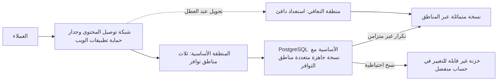

# الوحدة 6 — التوسّع والتكلفة والبنية التحتية للذكاء الاصطناعي (Scale, cost and AI infrastructure)

*إيصال خدمةٍ إلى الإنتاج (Getting a service to production) هو نصف المهمة (half the job). أمّا النصف الآخر فهو إبقاؤها عاملةً (keeping it up) حين تتضاعف حركة المرور ثلاث مرات (when traffic triples)، وحين تتعطّل منطقة توافر (when a zone fails) أو تُحذف قاعدة بيانات خطأً (a database is deleted by mistake)، مع إبقاء الفاتورة تحت السيطرة (keeping the bill under control) أثناء ذلك، وتشغيل أحدث أعباء العمل وأكثرها شراهةً على الإطلاق (the newest and hungriest workload of all): النماذج اللغوية الكبيرة (large language models) على وحدات معالجة الرسوميات (GPUs). تغطي هذه الوحدة القرارات الثلاثة التي تميّز مهندس المنصات (platform engineer) عن شخصٍ لا يستطيع سوى النشر (someone who can only deploy). أولًا، التوسّع والمرونة (scaling and resilience): التوسّع التلقائي (autoscaling) على مستوى الحجيرة والعقدة (at the pod and node level)، والتوزّع عبر مناطق التوافر (spreading across availability zones)، ونُسخٌ احتياطية استعدتها فعلًا (backups you have actually restored)، وأهداف التعافي من الكوارث (disaster recovery targets)، أي RTO وRPO، التي وقّع عليها قطاع الأعمال (that the business signed). ثانيًا، FinOps: رؤية أين يذهب المال (seeing where the money goes)، وإعطاء كل تكلفةٍ مالكًا (giving every cost an owner)، وخفض الهدر دون خفض الموثوقية (cutting waste without cutting reliability). ثالثًا، البنية التحتية للذكاء الاصطناعي (AI infrastructure): وحدات معالجة الرسوميات (GPUs)، وتقديم النماذج (model serving)، وبوابات النماذج اللغوية (LLM gateways)، والتكلفة لكل رمز (the cost per token). ستتابع فريق هندسة المنصات وهندسة موثوقية المواقع (Platform Engineering & SRE team) في بنك نجم (Najm Bank) بينما تدير مها أول اختبارٍ كامل للتعافي من الكوارث (the first full disaster recovery test) لخدمة المدفوعات (Payments service)، وتسأل منى من الإدارة المالية (from Finance) لماذا نمت فاتورة السحابة (cloud bill) أسرع من قاعدة العملاء (customer base)، ويتعيّن على سالم أن يقرّر كيف ينبغي لنجم أسيست (Najm Assist) أن يقدّم نماذجه (serve its models) دون أن يحرق ميزانية وحدات معالجة الرسوميات (GPU budget) في شهرٍ واحد.*

> **المراحل (Phases):** Operate, Monitor — إبقاء الإنتاج عاملًا (keeping production up)، وميسور التكلفة (affordable)، وجاهزًا لأعباء عمل الذكاء الاصطناعي (ready for AI workloads) بعد أن يصبح حيًّا (once it is live)، وإثبات ذلك بالاختبارات والأرقام (proving it with tests and numbers) لا بالأمل (rather than hope).

---

# 6.1 — التوسّع والمرونة: التوسّع التلقائي وتعدّد المناطق والنسخ الاحتياطية والتعافي من الكوارث (Scaling and resilience: autoscaling, multi-zone, backups and disaster recovery)
*المستوى (Level): 🔴 متقدم (Advanced)* · *المتطلبات (Prerequisites): 2.3، 3.2، 5.2* · *المرحلة (Phase): Operate*

## ⚡ الدرس في دقيقة (In 60 seconds)
- **التوسّع (Scaling)** يتعامل مع حملٍ أكبر (handles more load)؛ و**المرونة (resilience)** تصمد أمام الأعطال (survives failure)، عبر التكرار الاحتياطي (redundancy) والنسخ الاحتياطية (backups) وخطط التعافي (recovery plans).
- توسّع تلقائيًّا على طبقات (Autoscale in layers): **المُوسِّع التلقائي الأفقي للحجيرات (Horizontal Pod Autoscaler)** يضيف حجيرات (adds pods)، و**المُوسِّع التلقائي للعقد (node autoscaler)** يضيف آلاتٍ لتلك الحجيرات (adds machines for those pods)، و**قاعدة البيانات (database)** لا تتوسّع تلقائيًّا في العادة أصلًا (usually does not autoscale at all)، لذا تكون غالبًا هي الحدّ الحقيقي (the real limit).
- وزّع كل خدمةٍ إنتاجية (every production service) على **منطقتين أو ثلاث من مناطق التوافر (two or three availability zones)** على الأقل، وافرض ذلك بقيود توزيع الطوبولوجيا (topology spread constraints) وميزانيات تعطيل الحجيرات (PodDisruptionBudgets).
- أهداف التعافي (Recovery targets) قراراتٌ تجارية (business decisions): **RTO** (كم من الوقت يُسمح لك بالتوقف، how long you may be down) و**RPO** (كم من البيانات يُسمح لك بفقدانه، how much data you may lose). دوّنها لكل خدمة (Write them down per service)، ثم اختر أرخص تصميمٍ يحقّقها (the cheapest design that meets them).
- مؤشر القرار (Decision cue): النسخة الاحتياطية التي لم تستعدها أملٌ لا نسخة احتياطية (a backup you have not restored is a hope, not a backup). جدوِل اختبارات الاستعادة (Schedule restore tests) وقِس زمنها مقابل RTO (time them against the RTO).
- أكبر فخ (Biggest trap): معاملة تعدّد المناطق (multi-zone) على أنه تعافٍ من الكوارث (disaster recovery). مناطق التوافر تصمد أمام تعطّل مركز بيانات (a data-centre failure)، لا أمام نشرٍ سيئ (a bad deploy) أو جدولٍ محذوف (a deleted table) أو برمجية فدية (ransomware)، لأن أضرارها تتكرّر في كل مكان خلال ثوانٍ (whose damage replicates everywhere in seconds).

## 🧭 لماذا يهم (Why it matters)
في 31 يناير 2017، نفّذ مهندسٌ في GitLab كان يصلح مشكلة تكرار (fixing a replication problem) أمرَ حذف (a delete command) على ما ظنّ أنها قاعدة البيانات الثانوية (the secondary database). لكنها كانت الأساسية (the primary). وتصف مراجعة ما بعد الحادثة العلنية (public postmortem) لدى GitLab كيف أن أيًّا من أساليب النسخ الاحتياطي والتكرار (backup and replication methods) التي اعتمد عليها الفريق لم يعمل كما هو متوقّع (worked as expected)؛ فتعافوا من نسخةٍ في بيئة التجهيز (a staging copy) عمرها نحو ست ساعات، وفقدوا قرابة ست ساعات من بيانات الإنتاج (production data). لم يكن أحدٌ قد استعاد نسخةً احتياطية من البداية إلى النهاية (restored a backup end to end)، لذا لم يكن أحدٌ يعلم أن النسخ الاحتياطية معطّلة (the backups were broken).

انتقلت خدمة المدفوعات (Payments service) للتوّ إلى السحابة (cloud)، ويسأل حمد (CISO) ووظيفة المخاطر (the risk function) سالمًا: «لو تعطّلت المنطقة الأساسية (the primary region) عصر اليوم، أو حذف أحدهم قاعدة بيانات المدفوعات (payments database)، فكم سيمضي من الوقت قبل أن يتمكّن العملاء من إرسال الأموال مجددًا (send money again)، وكم تحويلًا سنفقد ⁦(how many transfers would we lose?)⁩». ويتوقّع قانون المرونة التشغيلية الرقمية (Digital Operational Resilience Act, DORA) في الاتحاد الأوروبي، المطبَّق على الكيانات المالية (financial entities) منذ 17 يناير 2025، أن يُظهر كيانُ البنك في الاتحاد الأوروبي (the bank's EU entity) ترتيباتٍ مختبَرة للنسخ الاحتياطي والاستعادة والاستمرارية (tested backup, restoration and continuity arrangements)، كما تضع الجهات التنظيمية الخليجية (GCC regulators) مثل مصرف قطر المركزي (Qatar Central Bank) توقّعاتها الخاصة للاستمرارية والإسناد الخارجي (continuity and outsourcing expectations) (تحقّق من النصوص الحالية مع فريق المخاطر، check current texts with risk). و«نحن نستخدم تعدّد مناطق التوافر» ("We use multi-AZ") ليست إجابة. يبني هذا الدرس إجابةً حقيقية: أهدافًا (targets)، وتصميمًا (design)، والاختبار الذي يثبتها (the test that proves them).

## 📐 كيف يعمل (How it works)

### 🟢 الأساسيات (The essentials)

**التوسّع: الرأسي والأفقي (Scaling: vertical and horizontal).** *التوسّع الرأسي (Vertical scaling)* يمنح الخادم مزيدًا من المعالج أو الذاكرة (more CPU or memory). وهو بسيط لكن له سقف (has a ceiling) ويعني عادةً إعادة تشغيل (a restart). أمّا *التوسّع الأفقي (Horizontal scaling)* فيضيف نسخًا أكثر من الخدمة (more copies of a service) خلف موازن أحمال (behind a load balancer). وسقفه أعلى بكثير (a much higher ceiling)، لكنه لا يعمل إلا إذا كانت الخدمة **عديمة الحالة (stateless)**: لا بيانات جلسات (no session data) ولا ملفات مرفوعة (uploads) ولا ذاكرات تخزين مؤقت (caches) محفوظة على القرص المحلي أو في الذاكرة (on the local disk or in memory) تحتاجها نسخةٌ أخرى (another copy would need). فالحالة (State) تذهب إلى قاعدة بيانات (a database) أو خدمة تخزين مؤقت (a cache service) أو تخزين الكائنات (object storage). ولرؤية غير المبرمج (the non-coder view)، انظر [*تصميم الأنظمة لمبرمجي الحدس (System Design for Vibe Coders)*، الدرس 10.1 — الخدمات عديمة الحالة وموازنة الأحمال (Stateless services and load balancing)](../vibe/index.ar.html#l10-1).

**يحدث التوسّع التلقائي في Kubernetes على طبقات (Autoscaling in Kubernetes happens in layers).**

| الطبقة (Layer) | ما الذي يتوسّع (What scales) | ما الذي يطلقه (Triggered by) | انتبه إلى (Watch out for) |
|---|---|---|---|
| **المُوسِّع التلقائي الأفقي للحجيرات (Horizontal Pod Autoscaler, HPA)** | عدد نسخ الحجيرات المتماثلة (Number of pod replicas) | استخدام المعالج أو الذاكرة مقابل الطلبات (CPU or memory utilisation against requests)، أو مقاييس مخصّصة (custom metrics) | يحتاج إلى طلبات موارد معقولة (sensible resource requests) (2.3)؛ يستجيب خلال عشرات الثواني (in tens of seconds)، لا فورًا (not instantly) |
| **المُوسِّع التلقائي للعقد (Node autoscaler)** (Cluster Autoscaler، Karpenter) | عدد العقد العاملة (Number of worker nodes) | حجيراتٌ عالقة في `Pending` لأن أي عقدةٍ لا تتّسع لها (because no node has room) | قد تستغرق العقدة الجديدة دقائق (can take minutes)؛ احتفظ ببعض الهامش (keep some headroom) |
| **المُوسِّع التلقائي الرأسي للحجيرات (Vertical Pod Autoscaler, VPA)** | طلبات المعالج والذاكرة لكل حجيرة (CPU and memory requests of each pod) | الاستخدام المرصود عبر الزمن (Observed usage over time) | لا تدع HPA وVPA يعملان على مقياس المعالج أو الذاكرة نفسه (the same CPU or memory metric) |
| **التوسّع المدفوع بالأحداث (Event-driven scaling)** (KEDA) | النسخ المتماثلة، نزولًا حتى الصفر (Replicas, down to zero) | طول الطابور (Queue length)، وتأخّر التدفّق (stream lag)، والجداول الزمنية (schedules) | التوسّع إلى الصفر (Scale-to-zero) يعني بدءًا باردًا (a cold start) |

مُوسِّعٌ تلقائي أفقي أساسي (A basic HPA) لواجهة برمجة تطبيق نجم للهاتف (Najm Mobile API):

```yaml
apiVersion: autoscaling/v2
kind: HorizontalPodAutoscaler
metadata:
  name: mobile-api
  namespace: mobile
spec:
  scaleTargetRef:
    apiVersion: apps/v1
    kind: Deployment
    name: mobile-api
  minReplicas: 6          # two per zone, never fewer
  maxReplicas: 30         # a ceiling the database can survive
  metrics:
    - type: Resource
      resource:
        name: cpu
        target:
          type: Utilization
          averageUtilization: 65   # percent of the CPU *request*
  behavior:
    scaleDown:
      stabilizationWindowSeconds: 300   # the default, made explicit: no flapping
```

رقمان هنا يعتمدان على الحكم التقديري لا على القيم الافتراضية (Two numbers are judgement, not defaults). فالقيمة `minReplicas: 6` تُبقي حجيرتين في كل منطقة توافر (two pods per zone) حتى في الليل. والقيمة `maxReplicas: 30` تحمي قاعدة البيانات (protects the database): كل حجيرةٍ تفتح اتصالات (every pod opens connections)، والمُوسِّع التلقائي غير المحدود (an unbounded autoscaler) قد يحوّل ذروة حركة مرور (a traffic spike) إلى انقطاعٍ في قاعدة البيانات (a database outage).

**مناطق التوافر (Availability zones).** *منطقة التوافر (availability zone, AZ)* هي مركز بياناتٍ واحد أو أكثر (one or more data centres) داخل منطقة (inside a region)، لها كهرباء وتبريد وشبكات منفصلة (separate power, cooling and networking) (1.2). شغّل الإنتاج في منطقتين على الأقل، ويُفضَّل ثلاث (ideally three)، خلف موازن أحمال إقليمي (a regional load balancer). وتقدّم قواعد البيانات المُدارة (Managed databases) خيار *تعدّد مناطق التوافر (multi-AZ)*: نسخةً احتياطية جاهزة (a standby) في منطقةٍ أخرى تتولّى العمل تلقائيًّا (takes over automatically).

**أهداف التعافي (Recovery targets).**
- **RTO (هدف زمن التعافي، recovery time objective):** أطول مدةٍ يُسمح فيها بأن تكون الخدمة غير متاحة (the longest the service may be unavailable) بعد كارثة (after a disaster) قبل أن يصبح الضرر غير مقبول (before the harm is unacceptable).
- **RPO (هدف نقطة التعافي، recovery point objective):** أقصى قدرٍ من البيانات، مقيسًا بالزمن (measured in time)، يُسمح لك بفقدانه (you may lose). فـRPO مقداره 5 دقائق يعني أنه بعد التعافي (after recovery) قد تفتقد ما يصل إلى آخر 5 دقائق من عمليات الكتابة (the last 5 minutes of writes).

يحدّدها مالك العمل (The business owner) مع فريق المخاطر (with risk)، لأن الأهداف الأشدّ تكلّف أكثر (tighter targets cost more)؛ ويسعّر فريق المنصة كل خيار (the platform team prices each option) ويثبت النتيجة (proves the result).

**النسخ الاحتياطية (Backups).** من خطوط الأساس المفيدة (A useful baseline) **قاعدة 3-2-1 (3-2-1 rule)**: ثلاث نسخ (three copies)، على نوعين من التخزين (two kinds of storage)، إحداها خارج الموقع (one off-site) (في السحابة: حسابٌ ومنطقة أخريان، another account and region). وأضِف قاعدتين: نسخةٌ واحدة على الأقل **غير قابلة للتغيير (immutable)** (مقفلة ضد التغيير أو الحذف حتى تنتهي مدة الاحتفاظ، locked against change or deletion until retention ends، مثلًا بقفل الكائنات (object lock))، كي لا يستطيع نصٌّ برمجي سيئ (a bad script) أو مهاجمٌ يملك صلاحيات المدير (attacker with admin rights) محوها، و**كل نسخةٍ احتياطية تُختبر استعادتها (every backup is restore-tested)** وفق جدول (on a schedule). انظر أيضًا [*تصميم الأنظمة لمبرمجي الحدس (System Design for Vibe Coders)*، الدرس 2.3 — النسخ الاحتياطية: ماذا، لا هل فقط (Backups: what, not just whether)](../vibe/index.ar.html#l2-3).

### 🟡 التعمق أكثر (Going deeper)

**جعل Kubernetes يتوزّع عبر مناطق التوافر (Making Kubernetes spread across zones).** تشغيل العقد في ثلاث مناطق (Running nodes in three zones) لا يضمن أن تستقر حجيراتك في ثلاث مناطق (your pods land in three zones)؛ فقد يكدّسها المُجدوِل (the scheduler may pack them) في منطقةٍ واحدة. اطلب التوزيع صراحةً (Ask for spreading explicitly)، واحمِ النسخ المتماثلة أثناء الصيانة (protect replicas during maintenance):

```yaml
# In the Deployment's pod template
topologySpreadConstraints:
  - maxSkew: 1
    topologyKey: topology.kubernetes.io/zone
    whenUnsatisfiable: DoNotSchedule
    labelSelector:
      matchLabels: { app: mobile-api }
---
apiVersion: policy/v1
kind: PodDisruptionBudget
metadata:
  name: mobile-api
  namespace: mobile
spec:
  minAvailable: 4         # node drains may never take us below 4 pods
  selector:
    matchLabels: { app: mobile-api }
```

**ميزانية تعطيل الحجيرات (PodDisruptionBudget, PDB)** تحدّ من التعطيلات *الطوعية (voluntary)* مثل ترقيات العقد وتفريغها (node upgrades and drains). لكنها لا تمنع تعطّل منطقة توافر (does not stop a zone failing)، ولهذا تحتاج أيضًا إلى سعةٍ احتياطية (spare capacity): إذا كنت تحتاج إلى 4 حجيرات لخدمة حمل الذروة (to serve peak load)، فشغّل 6 على الأقل عبر ثلاث مناطق، بحيث يبقى 4 حتى عند فقدان منطقةٍ واحدة (losing one zone still leaves 4).

**التوسّع ينقل عنق الزجاجة (Scaling moves the bottleneck).** حين تتوسّع واجهة الهاتف (Mobile API) من 6 إلى 30 حجيرة، تنفد اتصالات قاعدة البيانات (database connections) أولًا في العادة، ثم معالج قاعدة البيانات (database CPU)، ثم يبدأ الرابط مع الأنظمة المصرفية الأساسية (the core banking link) بتجاوز المهلة (timing out). خطّط لذلك (Plan for it) بمجمِّع اتصالات (a connection pooler) مثل PgBouncer، وبمهلٍ زمنية وقواطع دوائر (timeouts and circuit breakers) على الاستدعاءات إلى النظام الأساسي (calls to the core)، وبالتخلّص من الحمل (load shedding) (استجابة 503 سريعة مع `Retry-After` للطلبات منخفضة الأولوية، for low-priority requests). واختبر الحمل (Load-test) لتجد أول عنق زجاجة (the first bottleneck) قبل أن يجده العملاء.

**استراتيجيات التعافي من الكوارث (Disaster recovery strategies).** السلّم الشائع (The common ladder)، المسمّى في الورقة البيضاء للتعافي من الكوارث لدى AWS (the AWS disaster recovery whitepaper) والمستخدم لدى مختلف المزوّدين (used across providers)، يوازن بين التكلفة والسرعة (trades cost against speed):

| الاستراتيجية (Strategy) | ما الذي يعمل في منطقة التعافي (What runs in the recovery region) | RTO / RPO النموذجيان (Typical RTO / RPO) | التكلفة النسبية (Relative cost) |
|---|---|---|---|
| **النسخ الاحتياطي والاستعادة (Backup and restore)** | لا شيء (Nothing)؛ تُنسخ النسخ الاحتياطية إلى هناك (backups are copied there) | ساعات / ساعات (Hours / hours) | الأدنى (Lowest) |
| **الشعلة التجريبية (Pilot light)** | البيانات مكرّرة (Data replicated)؛ البنية التحتية الأساسية معرَّفة لكن مقلَّصة إلى الصفر أو الحدّ الأدنى (defined but scaled to zero or minimal) | من عشرات الدقائق إلى ساعات / دقائق (Tens of minutes to hours / minutes) | منخفضة (Low) |
| **الاستعداد الدافئ (Warm standby)** | نسخةٌ عاملة أصغر من المنظومة كلها (A smaller, working copy of the whole stack) | دقائق / من ثوانٍ إلى دقائق (Minutes / seconds to minutes) | متوسطة (Medium) |
| **تعدّد المواقع نشط-نشط (Multi-site active-active)** | سعةٌ كاملة تخدم حركة المرور في المنطقتين كلتيهما (Full capacity serving traffic in both regions) | قرابة الصفر / قرابة الصفر (Near zero / near zero)، إذا سمح تصميم البيانات بذلك (if the data design allows) | الأعلى، والأصعب بناءً (Highest, and the hardest to build) |

أرقام RTO وRPO هذه تقريبية (rough)؛ فلا يُعتدّ إلا بنتيجتك المقيسة (only your measured result counts). والبنية التحتية بوصفها شيفرة (infrastructure as code) (الوحدة 3، Module 3) تجعل الشعلة التجريبية والاستعداد الدافئ في المتناول (affordable): فمنطقة التعافي (the recovery region) لا تبعد سوى `tofu apply` ومزامنة GitOps (a GitOps sync)، لا نسخةً مبنية يدويًّا تنحرف (not a hand-built copy that drifts).



**لماذا يصعب النشط-النشط (Why active-active is hard).** بالنسبة إلى الخدمات عديمة الحالة (stateless services)، الأمر في معظمه توجيه (mostly routing). أمّا البيانات (For data)، فمنطقتان تقبلان الكتابة على الرصيد نفسه (two regions accepting writes to the same balance) قد تتعارضان (can conflict)، والتكرار المتزامن عبر المناطق (synchronous cross-region replication) يضيف زمن الذهاب والإياب بين المناطق (the inter-region round trip) إلى كل عملية كتابة. والنمط الشائع (A common pattern) هو تشغيل الحافة عديمة الحالة بنمط نشط-نشط (the stateless edge active-active) ونظام السجل بنمط نشط-خامل (the system of record active-passive). وفي خدمة المدفوعات (Payments service)، تحمل كل عملية دفع **مفتاح عدم التكرار (idempotency key)**، بحيث يجد الطلبُ المعادُ بعد التحويل عند العطل (a request retried after failover) السجلَّ الموجود (the existing record) بدلًا من إنشاء تحويلٍ ثانٍ (a second transfer).

**التكرار غير المتزامن يحدّد RPO لديك (Asynchronous replication sets your RPO).** النسخة المتماثلة عبر المناطق (A cross-region replica) تتأخّر عادةً عن الأساسية بثوانٍ أو أكثر (lags the primary by seconds or more)، وذلك التأخّر *هو* RPO لديك (that lag *is* your RPO) في كارثةٍ إقليمية (in a regional disaster). راقبه (Monitor it) (5.1) ونبّه حين يتجاوز RPO (alert when it exceeds the RPO).

### 🔴 نظرة الخبير (Expert view)

**افصل أنماط العطل (Separate the failure modes).** الكوارث المختلفة تحتاج إلى دفاعاتٍ مختلفة (Different disasters need different defences):

| العطل (Failure) | هل يساعد تعدّد مناطق التوافر؟ (Multi-AZ helps?) | هل تساعد النسخة المتماثلة عبر المناطق؟ (Cross-region replica helps?) | هل تساعد النسخة الاحتياطية لنقطة زمنية؟ (Point-in-time backup helps?) |
|---|---|---|---|
| منطقة توافر واحدة تفقد الكهرباء (One zone loses power) | نعم (Yes) | نعم (Yes) | ببطء (Slowly) |
| المنطقة كلها متدهورة (Whole region degraded) | لا (No) | نعم (Yes) | نعم، ببطء (Yes, slowly) |
| ترحيلٌ سيئ يُفسد البيانات (Bad migration corrupts data) | لا، فالفساد يتكرّر (No, corruption replicates) | لا، فالفساد يتكرّر (No, corruption replicates) | نعم: استعِد إلى ما قبله مباشرةً (Yes: restore to just before) |
| برمجية فدية أو مديرٌ مارق يحذف البيانات (Ransomware or a rogue admin deletes data) | لا (No) | لا (No) | فقط إذا كانت النسخة الاحتياطية غير قابلة للتغيير وفي حسابٍ منفصل (Only if the backup is immutable and in a separate account) |

الصفّان الأخيران هما سبب أن التكرار ليس نسخًا احتياطيًّا (why replication is not backup). و**الاستعادة إلى نقطة زمنية (Point-in-time recovery, PITR)**، التي تقدّمها خدمات PostgreSQL المُدارة (managed PostgreSQL services) بالاحتفاظ بنسخٍ احتياطية أساسية (base backups) إضافةً إلى سجل الكتابة المسبقة (write-ahead log)، تتيح لك الاستعادة إلى ثانيةٍ تختارها قبل التغيير السيئ (a chosen second before the bad change). اعرف نافذة الاحتفاظ لديك (your retention window) وكم تستغرق فعلًا استعادةُ بياناتٍ بحجم بياناتك (how long a restore of your data size really takes).

**الثبات الساكن ومسار التعافي (Static stability and the recovery path).** النظام *الثابت سكونيًّا (statically stable)* يواصل العمل دون حاجةٍ إلى التغيير أثناء العطل (without needing to change during the failure)، مثلًا لأن السعة مُجهَّزة مسبقًا في كل منطقة توافر (capacity is already provisioned in each zone) بدلًا من إطلاقها في منتصف الانقطاع (launched mid-outage). وتحقّق أيضًا من أن مسار التعافي (the recovery path) لا يعتمد على ما تعطّل (does not depend on what failed). ففي انقطاع Facebook في أكتوبر 2021، فصل تغييرٌ في الشبكة الأساسية (a backbone change) مراكز البيانات، وسحبت خوادم DNS مسارات BGP الخاصة بها (withdrew their BGP routes)؛ وتشير تدوينة Facebook الهندسية (Facebook's engineering post) إلى أن الأدوات الداخلية اللازمة للإصلاح (the internal tools needed for the fix) تأثّرت هي أيضًا. اسأل (Ask): إذا زالت منطقتنا الأساسية (if our primary region is gone)، فهل تبقى أدلة التشغيل (runbooks)، ومستودع GitOps (the GitOps repo)، ومشغّلات CI (the CI runners)، والأسرار (the secrets)، وحسابات كسر الزجاج (break-glass accounts) في المتناول (still reachable)؟

**هندسة الفوضى وأيام اللعب (Chaos engineering and game days).** تُجري هندسة الفوضى (Chaos engineering) تجارب مضبوطة (controlled experiments) تحقن الأعطال (inject failure) (إنهاء حجيرات، kill pods؛ تفريغ منطقة توافر، drain a zone؛ إضافة تأخير، add latency) للتحقّق من أن النظام يتصرّف كما هو متوقّع (behaves as predicted). ابدأ صغيرًا (Start small) وفي غير الإنتاج (in non-production)؛ وصُغ فرضية (state a hypothesis) («إذا فُرِّغت منطقة توافر واحدة، تبقى واجهة الهاتف ضمن هدف مستوى الخدمة الخاص بها»، "if one zone is drained, the Mobile API stays within its SLO")؛ وقيّد نطاق الأثر (limit the blast radius)؛ واحتفظ بمفتاح إيقاف (keep an abort switch). و**يوم اللعب (game day)** تمرينٌ مُجدوَل (a scheduled rehearsal) لسيناريو كامل (a full scenario)، مثل التحويل الإقليمي عند العطل (a regional failover)، مع فريق المناوبة (the on-call team)، ومها قائدةً للحادثة (incident commander)، ومراقبين يقيسون زمن كل خطوة (observers timing each step). ويتوقّع قانون DORA الأوروبي اختبار المرونة (expects resilience testing)؛ وأيام اللعب تُنتج الأدلة (game days produce the evidence).

## 🧰 الأدوات (The toolkit)
| الأداة أو الممارسة أو الخدمة (Tool, practice or service) | ما هي وماذا تفعل (What it is and does) | متى تلجأ إليها (When to reach for it) |
|---|---|---|
| **Horizontal Pod Autoscaler** (Kubernetes) — المُوسِّع التلقائي الأفقي للحجيرات | يغيّر عدد النسخ المتماثلة لعبء عمل (Changes the replica count of a workload) بناءً على المعالج أو الذاكرة أو مقاييس مخصّصة (CPU, memory or custom metrics) | الخدمات عديمة الحالة ذات الحمل المتغيّر (Stateless services with variable load)، مع حدٍّ أدنى وأقصى مختارين (with a chosen min and max) |
| **Cluster Autoscaler** / **Karpenter** | يضيفان العقد ويزيلانها (Add and remove nodes) حين يتعذّر جدولة الحجيرات أو تكون العقد خاملة (when pods cannot be scheduled or nodes are idle) | أي عنقودٍ يتغيّر حمله (Any cluster whose load varies)؛ اقرنهما بـHPA (pair with HPA) |
| **KEDA** (CNCF) | توسّعٌ تلقائي مدفوع بالأحداث (Event-driven autoscaling) من الطوابير والتدفّقات والجداول الزمنية (from queues, streams and schedules)، بما في ذلك إلى الصفر (including to zero) | العمّال الذين يفرّغون الطوابير (Workers that drain queues)؛ المهام الدُّفعية (batch jobs)؛ التوسّع إلى الصفر للخدمات الخاملة (scale-to-zero for idle services) |
| **PodDisruptionBudget** — ميزانية تعطيل الحجيرات | تحدّد سقفًا لعدد النسخ المتماثلة التي يجوز للتعطيلات الطوعية إزالتها دفعةً واحدة (Caps how many replicas voluntary disruptions may remove at once) | كل نشرٍ إنتاجي (Every production Deployment) فيه أكثر من نسخةٍ متماثلة واحدة (more than one replica) |
| **Point-in-time recovery** — الاستعادة إلى نقطة زمنية | استعادة قاعدة بيانات إلى لحظةٍ مختارة (Restore a database to a chosen moment) باستخدام النسخ الاحتياطية الأساسية والسجلات (using base backups plus logs) | التعافي من الترحيلات السيئة والحذف العرَضي (Recovering from bad migrations and accidental deletes) |
| **Immutable backup vault** — خزنة نسخ احتياطية غير قابلة للتغيير | نسخٌ احتياطية مقفلة ضد التغيير أو الحذف حتى تنتهي مدة الاحتفاظ (Backups locked against change or deletion until retention ends)، في حسابٍ منفصل (in a separate account) | الدفاع ضد برمجيات الفدية وبيانات اعتماد المدير المخترقة (Defence against ransomware and compromised admin credentials) |
| **Game day** — يوم اللعب | تمرينٌ مُتدرَّب عليه ومُوقَّت لسيناريو عطل (A rehearsed, timed exercise of a failure scenario) مع فريق المناوبة الحقيقي (with the real on-call team) | إثبات RTO وRPO (Proving RTO and RPO) قبل أن يطلب ذلك مدقّقٌ أو كارثة (before an auditor or a disaster asks) |

## 🏛️ عمليًا في بنك نجم (In practice at Najm Bank)
يُعدّ فريق مها **خطة اختبار للتعافي من الكوارث (DR test plan)** لخدمة المدفوعات (Payments service). وتعيش في مستودع المنصة (the platform repo) بجوار دليل التشغيل الذي تختبره (next to the runbook it tests).

| الحقل (Field) | خدمة المدفوعات (Payments service) |
|---|---|
| المالك وصاحب القرار (Owner and decision-maker) | مالك الخدمة (Service owner): قائد هندسة المدفوعات (Payments engineering lead). من يعلن الكارثة (Declares disaster): قائد الحادثة (incident commander) مع سالم |
| الأهداف المتّفق عليها (Agreed targets) | RTO وRPO كما وقّع عليهما مالك العمل وفريق المخاطر (as signed by the business owner and risk) (مسجّلان مع التاريخ والمعتمِدين، recorded with the date and approvers) |
| التصميم (Design) | ثلاث مناطق توافر في المنطقة الأساسية (Three zones in the primary region)؛ PostgreSQL مُدارة متعدّدة مناطق التوافر (managed PostgreSQL multi-AZ)؛ نسخة متماثلة غير متزامنة عبر المناطق (asynchronous cross-region replica)؛ منظومة استعداد دافئ (warm standby stack) في منطقة التعافي من وحدات OpenTofu ومستودع GitOps نفسيهما (from the same OpenTofu modules and GitOps repo) |
| النسخ الاحتياطية (Backups) | لقطاتٌ يومية (Daily snapshots) إضافةً إلى PITR؛ نسخٌ في حساب نسخ احتياطي ومنطقة منفصلين (in a separate backup account and region) مع قفل الخزنة (with vault lock)؛ الاحتفاظ وفق سياسة السجلات (retention per records policy) |
| السيناريوهات المختبَرة هذا الربع (Scenarios tested this quarter) | 1. تفريغ منطقة توافر في الإنتاج (Zone drain in production) خلال حركة مرور منخفضة (during low traffic). 2. استعادة PITR لقاعدة بيانات المدفوعات (PITR restore of the payments database) إلى نسخةٍ مؤقتة (to a scratch instance). 3. تحويلٌ إقليمي كامل عند العطل (Full regional failover) في بيئة التجهيز (in the staging environment) |
| الخطوات والتوقيتات (Steps and timings) | الكشف (Detect)، والإعلان (declare)، وترقية النسخة المتماثلة (promote replica)، وتحويل حركة المرور (switch traffic)، وتوسيع الاستعداد (scale standby)، واختبار الدخان (smoke-test)، وإعادة الفتح (reopen)؛ مع قياس زمن كل خطوة (each step timed) |
| معايير النجاح (Success criteria) | RTO وRPO المقيسان ضمن الأهداف (Measured RTO and RPO within targets)؛ صفر تحويلاتٍ مؤكَّدة مكرّرة أو مفقودة (zero duplicated or lost confirmed transfers) (مطابَقةً مع دفتر الأستاذ في الأنظمة المصرفية الأساسية، reconciled against the core banking ledger) |
| الأدلة (Evidence) | الخط الزمني (Timeline)، ولوحات المتابعة (dashboards)، وتقرير المطابقة (reconciliation report)؛ تُحفظ في سجل اختبار المرونة (filed for the resilience testing record) |
| المتابعات (Follow-ups) | كل ثغرةٍ تصبح تذكرة (Each gap becomes a ticket) لها مالكٌ وتاريخ (with an owner and a date)؛ والاختبار التالي يعيد فحصها (the next test re-checks it) |

وجد التشغيل الأول ثلاث ثغرات (three gaps) لم تكتشفها أي مراجعة تصميم (no design review had caught): تنبيه تأخّر النسخة المتماثلة (the replica-lag alert) كان يذهب إلى لوحة متابعة لا يراقبها أحد (a dashboard nobody watched)، وسجل DNS للمدفوعات (the payments DNS record) كانت له مدة صلاحية (TTL) أطول بكثير مما يسمح به RTO، ودور كسر الزجاج (the break-glass role) لحساب التعافي (for the recovery account) كان يحتاج إلى جهاز مصادقة متعدّدة العوامل جديد (a new MFA device).

## 🛠️ التمارين (Exercises)
- 🟢 **شاهد مُوسِّعًا تلقائيًّا وهو يعمل (Watch an autoscaler work).** على عنقودٍ محلي من kind أو k3d (a local kind or k3d cluster) مع خادم المقاييس (the metrics server)، انشر حاوية ويب صغيرة (a small web container) لها طلبات معالج (CPU requests) ومُوسِّعًا تلقائيًّا أفقيًّا (HPA) (الحدّ الأدنى 2، min 2؛ الحدّ الأقصى 8، max 8؛ الهدف 50% من المعالج، target 50% CPU). وولّد حملًا من حجيرةٍ أخرى (Generate load from another pod) وراقب `kubectl get hpa -w`. *يكتمل عندما (Done when):* تكون لديك لقطة شاشة أو سجل (a screenshot or log) يُظهر النسخ المتماثلة ترتفع تحت الحمل (replicas rising under load) وتنخفض بعد نافذة الاستقرار (falling after the stabilisation window)، وجملةٌ واحدة تشرح لماذا كان التقليص أبطأ من التوسيع (why scale-down was slower than scale-up).
- 🟡 **توزّع عبر مناطق التوافر واصمد أمام التفريغ (Spread across zones and survive a drain).** أنشئ عنقود kind فيه أربع عقد عاملة (four worker nodes) ووسِمها (label them) بقيم `topology.kubernetes.io/zone` هي `a` و`b` و`c` (تحصل منطقةٌ واحدة على عقدتين، one zone gets two nodes). انشر ست نسخ متماثلة (six replicas) مع قيد توزيع الطوبولوجيا (a topology spread constraint) وميزانية تعطيل (PDB) قيمتها `minAvailable: 4`. فرّغ كل عقدةٍ في منطقة توافر واحدة (Drain every node in one zone) باستخدام `kubectl drain`. وتوقّع أن تبقى الحجيرات المُخلاة (the evicted pods) في حالة `Pending`: فالمنطقة المفرَّغة ما زالت تُحتسب في قيد التوزيع (the drained zone still counts for the spread constraint). *يكتمل عندما (Done when):* تكون الحجيرات قد توزّعت حجيرتين في كل منطقة (two per zone)، واحترم التفريغ ميزانية التعطيل (the drain respected the PDB)، وظلّت الخدمة تجيب طوال الوقت (kept answering throughout)، وتستطيع تفسير الحجيرات العالقة في `Pending`.
- 🔴 **اكتب اختبار استعادة ونفّذه (Write and run a restore test).** شغّل PostgreSQL في Docker مع أرشفة سجل الكتابة المسبقة (WAL archiving) أو نسخٍ احتياطية منتظمة بـ`pg_dump` (regular `pg_dump` backups). أدخِل صفوفًا مختومة بالوقت (Insert timestamped rows)، ثم احذف جدولًا «عن طريق الخطأ» ("accidentally" drop a table)، ثم استعِد إلى حاويةٍ ثانية (restore into a second container). اكتب خطة اختبار تعافٍ من الكوارث من صفحةٍ واحدة (a one-page DR test plan) بالصيغة أعلاه (in the format above)، مع RTO وRPO تختارهما. *يكتمل عندما (Done when):* تكون قد قست زمن الاستعادة الفعلي وفقدان البيانات (the actual restore time and data loss)، وقارنتهما بأهدافك (compared them with your targets)، وأدرجت تغييرين على الأقل من شأنهما سدّ أي ثغرة (close any gap).

## ⚠️ أخطاء وفخاخ (Mistakes and traps)
- **تسمية التكرار نسخًا احتياطيًّا (Calling replication a backup).** النسخ المتماثلة تنسخ عمليات الحذف والفساد فورًا (copy deletions and corruption instantly). احتفظ أيضًا بنسخٍ احتياطية لنقطة زمنية وغير قابلة للتغيير (point-in-time and immutable backups) في حسابٍ منفصل (in a separate account).
- **عدم الاستعادة أبدًا (Never restoring).** النسخ الاحتياطية غير المختبَرة (Untested backups) تخذلك حين تحتاج إليها (fail when you need them)، كما تعلّمت GitLab. جدوِل اختبارات الاستعادة (Schedule restore tests) وقِس زمنها (time them).
- **التوسّع التلقائي غير المحدود (Unbounded autoscaling).** مُوسِّعٌ تلقائي أفقي (An HPA) بقيمة `maxReplicas` ضخمة قد يستنفد اتصالات قاعدة البيانات (exhaust database connections) أو حصّةً لدى خدمةٍ تابعة (a downstream quota). اضبط السقف بحسب ما تحتمله التبعيات (Set the ceiling from what the dependencies can take).
- **مسار تعافٍ يعتمد على المنطقة المتعطّلة (A recovery path that depends on the failed region).** أبقِ أدلة التشغيل (runbooks)، والبنية التحتية بوصفها شيفرة (IaC)، وCI، والأسرار (secrets)، ووصول كسر الزجاج (break-glass access) في المتناول من خارجها (reachable from outside it).
- **أهدافٌ لم يوقّع عليها أحد (Targets nobody signed).** RTO اختاره فريق المنصة وحده (the platform team picked alone) سيُطعن فيه بعد الحادثة (will be challenged after the incident). احصل على توقيع مالك العمل وفريق المخاطر عليها (Get the business owner and risk to sign them).

## 🧾 الخلاصة (Recap)
- التوسّع يضيف سعة (Scaling adds capacity)؛ والمرونة تصمد أمام الأعطال (resilience survives failure). وسّع الحجيرات والعقد تلقائيًّا على طبقات (Autoscale pods and nodes in layers)، مع حدودٍ دنيا وسقوفٍ مختارة عن قصد (floors and ceilings chosen on purpose).
- شغّل الإنتاج عبر منطقتين أو ثلاث من مناطق التوافر (two or three zones)، مفروضًا بقيود التوزيع (spread constraints) وميزانيات التعطيل (PDBs) والسعة الاحتياطية (spare capacity).
- RTO وRPO قراران تجاريان (business decisions)؛ واستراتيجية التعافي من الكوارث (the DR strategy) هي أرخص تصميمٍ يحقّقهما (the cheapest design that meets them).
- مناطق التوافر والنسخ المتماثلة (Zones and replicas) لا تحمي من التغييرات السيئة أو الحذف (bad changes or deletion)؛ بل تحمي منها النسخ الاحتياطية لنقطة زمنية وغير القابلة للتغيير وفي حسابٍ منفصل (point-in-time and immutable, separate-account backups).
- لا يُعتدّ إلا بالتعافي المختبَر (Only tested recovery counts): تمارين الاستعادة (restore drills)، وأيام اللعب (game days)، والتحويلات عند العطل المُوقَّتة (timed failovers) تُنتج الأدلة التي تحتاجها الجهات التنظيمية والتنفيذيون (regulators and executives).

## ✍️ اختبر نفسك (Check yourself)

**1. تعمل واجهة برمجة تطبيق نجم للهاتف (Najm Mobile API) بست حجيرات عبر ثلاث مناطق توافر، وتحتاج إلى 4 للتعامل مع حمل الذروة (to handle peak load). أيّ تغييرٍ يضمن على أفضل وجه أن فقدان منطقة واحدة لا يُثقل الخدمة (does not overload the service)؟**

- A. رفع قيمة `maxReplicas` في المُوسِّع التلقائي الأفقي (HPA) إلى 100 كي تحلّ حجيراتٌ جديدة محلّ المفقودة (new pods replace lost ones)
- B. الإبقاء على 6 حجيرات مع قيد توزيعٍ على مناطق التوافر (a zone spread constraint)، حجيرتين في كل منطقة
- C. إضافة ميزانية تعطيل حجيرات (PodDisruptionBudget) بقيمة `minAvailable: 6` على النشر (Deployment)
- D. نقل كل الحجيرات إلى أكبر منطقة توافر (the largest zone) لتقليل حركة المرور بين المناطق (cross-zone traffic)

<details><summary>الإجابة</summary>

**B.** حجيرتان في كل منطقة تعني أن تعطّل منطقة (a zone failure) لا يزيل إلا اثنتين، فتبقى الأربع المطلوبة. ولا يساعد A إلا بعد وصول حجيرات وعقد جديدة (after new pods and nodes arrive)؛ وC يغطي التعطيلات الطوعية (voluntary disruptions) لا تعطّل المناطق، وسيمنع التفريغ (would block drains)؛ وD يُنشئ نقطة عطلٍ وحيدة (a single point of failure). (🟡 التعمق أكثر (Going deeper).)

</details>

**2. يُجري مطوّرٌ ترحيلًا (a migration) يُفسد جدول `transfers` بصمت (silently corrupts). قاعدة البيانات متعدّدة مناطق التوافر (multi-AZ) ولها نسخة متماثلة عبر المناطق (a cross-region replica). ما الذي يستعيد البيانات (recovers the data)؟**

- A. التحويل عند العطل إلى النسخة الجاهزة متعددة مناطق التوافر (Failing over to the multi-AZ standby) في منطقةٍ أخرى
- B. ترقية النسخة المتماثلة عبر المناطق (Promoting the cross-region replica) في منطقة التعافي
- C. إعادة تشغيل قاعدة البيانات (Restarting the database)
- D. استعادةٌ إلى نقطة زمنية (A point-in-time restore) إلى ما قبل الترحيل مباشرةً

<details><summary>الإجابة</summary>

**D.** يصل الفساد (Corruption) إلى النسخة الجاهزة والنسخة المتماثلة خلال ثوانٍ، لذا يعطيك A وB البيانات السيئة نفسها (the same bad data). ولا يعود إلى ما قبل التغيير إلا نسخةٌ احتياطية لنقطة زمنية (a point-in-time backup). (🔴 نظرة الخبير (Expert view)، جدول أنماط العطل (the failure-mode table).)

</details>

**3. من الذي ينبغي أن يحدّد RPO لخدمة المدفوعات (Payments service)؟**

- A. مالك العمل مع فريق المخاطر (The business owner with risk)، بعد أن يحسب فريق المنصة تكلفة الخيارات (once the platform team costs options)
- B. فريق المنصة وحده (The platform team alone)، لأنه يبني البنية التحتية ويشغّلها
- C. مزوّد السحابة (The cloud provider)، عبر اتفاقية مستوى الخدمة (SLA) في شروط خدمته
- D. لا أحد (Nobody)، لأن RPO يساوي صفرًا دائمًا لنظام مدفوعات

<details><summary>الإجابة</summary>

**A.** يعبّر RPO عن مقدار الخسارة الذي يقبله قطاع الأعمال (how much loss the business accepts)، والأهداف الأشدّ تكلّف أكثر (tighter targets cost more). وB يُنشئ أهدافًا لن يدافع عنها أحد لاحقًا (targets nobody will defend later)؛ واتفاقية مستوى الخدمة لدى المزوّد (a provider SLA) (C) تغطي خدمته لا تعافيك (covers its service, not your recovery)؛ وD أمنيةٌ لا تصميم (a wish, not a design). (🟢 الأساسيات (The essentials).)

</details>

**4. يُظهر اختبار التعافي من الكوارث الذي أجرته مها (Maha's DR test) أن النسخة المتماثلة عبر المناطق تتأخّر عادةً بضع ثوانٍ (usually lags by a few seconds)، لكنها بلغت مرةً 40 دقيقة أثناء مهمةٍ دُفعية (during a batch job). وRPO المتّفق عليه (The agreed RPO) هو 5 دقائق. ما القراءة الصحيحة (the right reading)؟**

- A. RPO متحقّق (The RPO is met)، لأن التأخّر المعتاد ثوانٍ قليلة فقط
- B. RPO لا ينطبق إلا على تعطّل مناطق التوافر (zone failures)، لا على الأعطال الإقليمية (regional ones)
- C. كان RPO الحقيقي حينها 40 دقيقة (The real RPO then was 40 minutes)؛ نبّه على التأخّر وأصلح السبب (alert on lag and fix the cause)
- D. انتقل الآن إلى التكرار المتزامن عبر المناطق (synchronous cross-region replication)، دون قياس زمن الاستجابة (without measuring latency)

<details><summary>الإجابة</summary>

**C.** مع التكرار غير المتزامن (asynchronous replication)، التأخّر لحظة الكارثة (the lag at the moment of disaster) هو البيانات التي تفقدها. وA يتجاهل أسوأ الحالات (ignores the worst case)؛ وB خاطئ؛ وD يضيف زمن الذهاب والإياب بين المناطق (the inter-region round trip) إلى كل عملية كتابة ويحتاج إلى تحليلٍ أولًا (needs analysis first). (🟡 التعمق أكثر (Going deeper).)

</details>

**5. أيّ عبارةٍ عن هندسة الفوضى (chaos engineering) هي الأدق؟**

- A. تعني كسر الإنتاج عشوائيًّا (breaking production at random)، بأكبر قدرٍ ممكن من التكرار
- B. اختبارٌ مضبوط لفرضيةٍ مُعلَنة (A controlled test of a stated hypothesis)، مع مفتاح إيقاف (an abort switch)
- C. حين تُجرى بانتظام، تحلّ محلّ استعادة النسخ الاحتياطية واختبارات التعافي من الكوارث (replaces backup restores and DR tests)
- D. لا تفيد إلا الشركات التي تشغّل آلاف الخدمات (thousands of services)

<details><summary>الإجابة</summary>

**B.** تختبر هندسة الفوضى تنبؤًا مُعلَنًا تحت السيطرة (a stated prediction under control). وA تهوّر (recklessness)؛ وC خاطئ، لأنها تكمّل تمارين الاستعادة (complements restore drills)؛ وحتى تفريغ منطقة توافر صغيرة يعلّم الكثير (even a small zone drain teaches a lot)، لذا D خاطئ. (🔴 نظرة الخبير (Expert view).)

</details>

## 📚 المراجع (References)
- Kubernetes: التوسّع التلقائي الأفقي للحجيرات (Horizontal Pod Autoscaling) — https://kubernetes.io/docs/tasks/run-application/horizontal-pod-autoscale/
- Kubernetes: قيود توزيع طوبولوجيا الحجيرات (Pod topology spread constraints) — https://kubernetes.io/docs/concepts/scheduling-eviction/topology-spread-constraints/
- Kubernetes: تحديد ميزانية تعطيل (Specifying a disruption budget) — https://kubernetes.io/docs/tasks/run-application/configure-pdb/
- توثيق KEDA (KEDA documentation) — https://keda.sh/docs/
- توثيق Karpenter (Karpenter documentation) — https://karpenter.sh/docs/
- الورقة البيضاء من AWS: التعافي من الكوارث لأعباء العمل على AWS (AWS whitepaper: Disaster recovery of workloads on AWS) — https://docs.aws.amazon.com/whitepapers/latest/disaster-recovery-workloads-on-aws/disaster-recovery-workloads-on-aws.html
- إطار Azure المُحكَم البنيان، الموثوقية (Azure Well-Architected Framework, reliability) — https://learn.microsoft.com/azure/well-architected/
- إطار بنية Google Cloud (Google Cloud Architecture Framework) — https://cloud.google.com/architecture/framework
- GitLab: مراجعة ما بعد حادثة انقطاع قاعدة البيانات في 31 يناير (Postmortem of database outage of January 31) (2017) — https://about.gitlab.com/blog/
- كتب Google في هندسة موثوقية المواقع (Google SRE books) (سلامة البيانات، data integrity؛ إدارة الحالة الحرجة، managing critical state) — https://sre.google/books/
- اللائحة (EU) 2022/2554 بشأن المرونة التشغيلية الرقمية (Regulation (EU) 2022/2554 on digital operational resilience, DORA) — https://eur-lex.europa.eu/eli/reg/2022/2554/oj
- تعمّق أكثر في ضوابط أمن السحابة (Deeper on cloud security controls): [*أمن الذكاء الاصطناعي وأمن التطبيقات (Secure AI & Application Security)*، الدرس 7.1 — أمن السحابة: المسؤولية المشتركة وإدارة الهوية والوصول وسوء الإعداد (Cloud security: shared responsibility, IAM and misconfiguration)](../secai/index.ar.html#/7.1)

---

