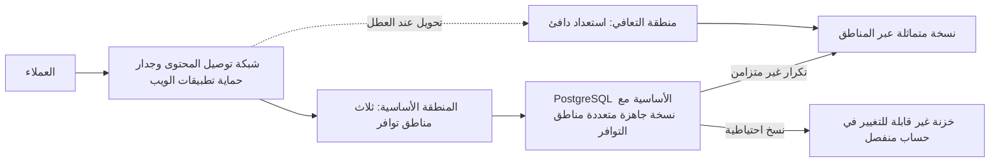
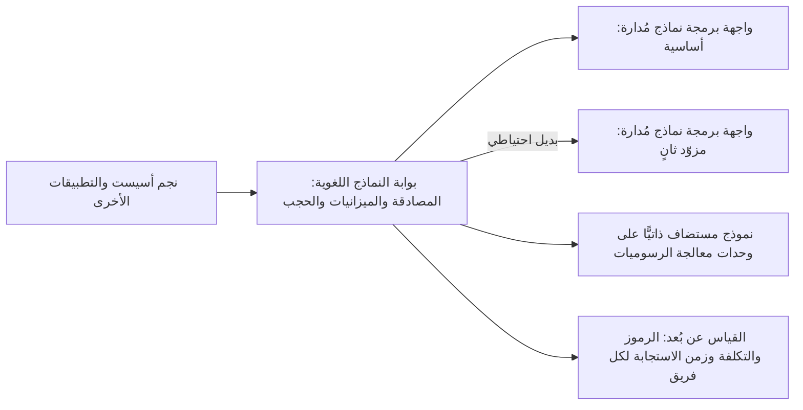

# الوحدة 6 — التوسّع والتكلفة والبنية التحتية للذكاء الاصطناعي (Scale, cost and AI infrastructure)

*إيصال خدمةٍ إلى الإنتاج (Getting a service to production) هو نصف المهمة (half the job). أمّا النصف الآخر فهو إبقاؤها عاملةً (keeping it up) حين تتضاعف حركة المرور ثلاث مرات (when traffic triples)، وحين تتعطّل منطقة توافر (when a zone fails) أو تُحذف قاعدة بيانات خطأً (a database is deleted by mistake)، مع إبقاء الفاتورة تحت السيطرة (keeping the bill under control) أثناء ذلك، وتشغيل أحدث أعباء العمل وأكثرها شراهةً على الإطلاق (the newest and hungriest workload of all): النماذج اللغوية الكبيرة (large language models) على وحدات معالجة الرسوميات (GPUs). تغطي هذه الوحدة القرارات الثلاثة التي تميّز مهندس المنصات (platform engineer) عن شخصٍ لا يستطيع سوى النشر (someone who can only deploy). أولًا، التوسّع والمرونة (scaling and resilience): التوسّع التلقائي (autoscaling) على مستوى الحجيرة والعقدة (at the pod and node level)، والتوزّع عبر مناطق التوافر (spreading across availability zones)، ونُسخٌ احتياطية استعدتها فعلًا (backups you have actually restored)، وأهداف التعافي من الكوارث (disaster recovery targets)، أي RTO وRPO، التي وقّع عليها قطاع الأعمال (that the business signed). ثانيًا، FinOps: رؤية أين يذهب المال (seeing where the money goes)، وإعطاء كل تكلفةٍ مالكًا (giving every cost an owner)، وخفض الهدر دون خفض الموثوقية (cutting waste without cutting reliability). ثالثًا، البنية التحتية للذكاء الاصطناعي (AI infrastructure): وحدات معالجة الرسوميات (GPUs)، وتقديم النماذج (model serving)، وبوابات النماذج اللغوية (LLM gateways)، والتكلفة لكل رمز (the cost per token). ستتابع فريق هندسة المنصات وهندسة موثوقية المواقع (Platform Engineering & SRE team) في بنك نجم (Najm Bank) بينما تدير مها أول اختبارٍ كامل للتعافي من الكوارث (the first full disaster recovery test) لخدمة المدفوعات (Payments service)، وتسأل منى من الإدارة المالية (from Finance) لماذا نمت فاتورة السحابة (cloud bill) أسرع من قاعدة العملاء (customer base)، ويتعيّن على سالم أن يقرّر كيف ينبغي لنجم أسيست (Najm Assist) أن يقدّم نماذجه (serve its models) دون أن يحرق ميزانية وحدات معالجة الرسوميات (GPU budget) في شهرٍ واحد.*

> **المراحل (Phases):** Operate, Monitor — إبقاء الإنتاج عاملًا (keeping production up)، وميسور التكلفة (affordable)، وجاهزًا لأعباء عمل الذكاء الاصطناعي (ready for AI workloads) بعد أن يصبح حيًّا (once it is live)، وإثبات ذلك بالاختبارات والأرقام (proving it with tests and numbers) لا بالأمل (rather than hope).

---

# 6.1 — التوسّع والمرونة: التوسّع التلقائي وتعدّد المناطق والنسخ الاحتياطية والتعافي من الكوارث (Scaling and resilience: autoscaling, multi-zone, backups and disaster recovery)
*المستوى (Level): 🔴 متقدم (Advanced)* · *المتطلبات (Prerequisites): 2.3، 3.2، 5.2* · *المرحلة (Phase): Operate*

## ⚡ الدرس في دقيقة (In 60 seconds)
- **التوسّع (Scaling)** يتعامل مع حملٍ أكبر (handles more load)؛ و**المرونة (resilience)** تصمد أمام الأعطال (survives failure)، عبر التكرار الاحتياطي (redundancy) والنسخ الاحتياطية (backups) وخطط التعافي (recovery plans).
- توسّع تلقائيًّا على طبقات (Autoscale in layers): **المُوسِّع التلقائي الأفقي للحجيرات (Horizontal Pod Autoscaler)** يضيف حجيرات (adds pods)، و**المُوسِّع التلقائي للعقد (node autoscaler)** يضيف آلاتٍ لتلك الحجيرات (adds machines for those pods)، و**قاعدة البيانات (database)** لا تتوسّع تلقائيًّا في العادة أصلًا (usually does not autoscale at all)، لذا تكون غالبًا هي الحدّ الحقيقي (the real limit).
- وزّع كل خدمةٍ إنتاجية (every production service) على **منطقتين أو ثلاث من مناطق التوافر (two or three availability zones)** على الأقل، وافرض ذلك بقيود توزيع الطوبولوجيا (topology spread constraints) وميزانيات تعطيل الحجيرات (PodDisruptionBudgets).
- أهداف التعافي (Recovery targets) قراراتٌ تجارية (business decisions): **RTO** (كم من الوقت يُسمح لك بالتوقف، how long you may be down) و**RPO** (كم من البيانات يُسمح لك بفقدانه، how much data you may lose). دوّنها لكل خدمة (Write them down per service)، ثم اختر أرخص تصميمٍ يحقّقها (the cheapest design that meets them).
- مؤشر القرار (Decision cue): النسخة الاحتياطية التي لم تستعدها أملٌ لا نسخة احتياطية (a backup you have not restored is a hope, not a backup). جدوِل اختبارات الاستعادة (Schedule restore tests) وقِس زمنها مقابل RTO (time them against the RTO).
- أكبر فخ (Biggest trap): معاملة تعدّد المناطق (multi-zone) على أنه تعافٍ من الكوارث (disaster recovery). مناطق التوافر تصمد أمام تعطّل مركز بيانات (a data-centre failure)، لا أمام نشرٍ سيئ (a bad deploy) أو جدولٍ محذوف (a deleted table) أو برمجية فدية (ransomware)، لأن أضرارها تتكرّر في كل مكان خلال ثوانٍ (whose damage replicates everywhere in seconds).

## 🧭 لماذا يهم (Why it matters)
في 31 يناير 2017، نفّذ مهندسٌ في GitLab كان يصلح مشكلة تكرار (fixing a replication problem) أمرَ حذف (a delete command) على ما ظنّ أنها قاعدة البيانات الثانوية (the secondary database). لكنها كانت الأساسية (the primary). وتصف مراجعة ما بعد الحادثة العلنية (public postmortem) لدى GitLab كيف أن أيًّا من أساليب النسخ الاحتياطي والتكرار (backup and replication methods) التي اعتمد عليها الفريق لم يعمل كما هو متوقّع (worked as expected)؛ فتعافوا من نسخةٍ في بيئة التجهيز (a staging copy) عمرها نحو ست ساعات، وفقدوا قرابة ست ساعات من بيانات الإنتاج (production data). لم يكن أحدٌ قد استعاد نسخةً احتياطية من البداية إلى النهاية (restored a backup end to end)، لذا لم يكن أحدٌ يعلم أن النسخ الاحتياطية معطّلة (the backups were broken).

انتقلت خدمة المدفوعات (Payments service) للتوّ إلى السحابة (cloud)، ويسأل حمد (CISO) ووظيفة المخاطر (the risk function) سالمًا: «لو تعطّلت المنطقة الأساسية (the primary region) عصر اليوم، أو حذف أحدهم قاعدة بيانات المدفوعات (payments database)، فكم سيمضي من الوقت قبل أن يتمكّن العملاء من إرسال الأموال مجددًا (send money again)، وكم تحويلًا سنفقد ⁦(how many transfers would we lose?)⁩». ويتوقّع قانون المرونة التشغيلية الرقمية (Digital Operational Resilience Act, DORA) في الاتحاد الأوروبي، المطبَّق على الكيانات المالية (financial entities) منذ 17 يناير 2025، أن يُظهر كيانُ البنك في الاتحاد الأوروبي (the bank's EU entity) ترتيباتٍ مختبَرة للنسخ الاحتياطي والاستعادة والاستمرارية (tested backup, restoration and continuity arrangements)، كما تضع الجهات التنظيمية الخليجية (GCC regulators) مثل مصرف قطر المركزي (Qatar Central Bank) توقّعاتها الخاصة للاستمرارية والإسناد الخارجي (continuity and outsourcing expectations) (تحقّق من النصوص الحالية مع فريق المخاطر، check current texts with risk). و«نحن نستخدم تعدّد مناطق التوافر» ("We use multi-AZ") ليست إجابة. يبني هذا الدرس إجابةً حقيقية: أهدافًا (targets)، وتصميمًا (design)، والاختبار الذي يثبتها (the test that proves them).

## 📐 كيف يعمل (How it works)

### 🟢 الأساسيات (The essentials)

**التوسّع: الرأسي والأفقي (Scaling: vertical and horizontal).** *التوسّع الرأسي (Vertical scaling)* يمنح الخادم مزيدًا من المعالج أو الذاكرة (more CPU or memory). وهو بسيط لكن له سقف (has a ceiling) ويعني عادةً إعادة تشغيل (a restart). أمّا *التوسّع الأفقي (Horizontal scaling)* فيضيف نسخًا أكثر من الخدمة (more copies of a service) خلف موازن أحمال (behind a load balancer). وسقفه أعلى بكثير (a much higher ceiling)، لكنه لا يعمل إلا إذا كانت الخدمة **عديمة الحالة (stateless)**: لا بيانات جلسات (no session data) ولا ملفات مرفوعة (uploads) ولا ذاكرات تخزين مؤقت (caches) محفوظة على القرص المحلي أو في الذاكرة (on the local disk or in memory) تحتاجها نسخةٌ أخرى (another copy would need). فالحالة (State) تذهب إلى قاعدة بيانات (a database) أو خدمة تخزين مؤقت (a cache service) أو تخزين الكائنات (object storage). ولرؤية غير المبرمج (the non-coder view)، انظر [*تصميم الأنظمة لمبرمجي الحدس (System Design for Vibe Coders)*، الدرس 10.1 — الخدمات عديمة الحالة وموازنة الأحمال (Stateless services and load balancing)](../vibe/index.ar.html#l10-1).

**يحدث التوسّع التلقائي في Kubernetes على طبقات (Autoscaling in Kubernetes happens in layers).**

| الطبقة (Layer) | ما الذي يتوسّع (What scales) | ما الذي يطلقه (Triggered by) | انتبه إلى (Watch out for) |
|---|---|---|---|
| **المُوسِّع التلقائي الأفقي للحجيرات (Horizontal Pod Autoscaler, HPA)** | عدد نسخ الحجيرات المتماثلة (Number of pod replicas) | استخدام المعالج أو الذاكرة مقابل الطلبات (CPU or memory utilisation against requests)، أو مقاييس مخصّصة (custom metrics) | يحتاج إلى طلبات موارد معقولة (sensible resource requests) (2.3)؛ يستجيب خلال عشرات الثواني (in tens of seconds)، لا فورًا (not instantly) |
| **المُوسِّع التلقائي للعقد (Node autoscaler)** (Cluster Autoscaler، Karpenter) | عدد العقد العاملة (Number of worker nodes) | حجيراتٌ عالقة في `Pending` لأن أي عقدةٍ لا تتّسع لها (because no node has room) | قد تستغرق العقدة الجديدة دقائق (can take minutes)؛ احتفظ ببعض الهامش (keep some headroom) |
| **المُوسِّع التلقائي الرأسي للحجيرات (Vertical Pod Autoscaler, VPA)** | طلبات المعالج والذاكرة لكل حجيرة (CPU and memory requests of each pod) | الاستخدام المرصود عبر الزمن (Observed usage over time) | لا تدع HPA وVPA يعملان على مقياس المعالج أو الذاكرة نفسه (the same CPU or memory metric) |
| **التوسّع المدفوع بالأحداث (Event-driven scaling)** (KEDA) | النسخ المتماثلة، نزولًا حتى الصفر (Replicas, down to zero) | طول الطابور (Queue length)، وتأخّر التدفّق (stream lag)، والجداول الزمنية (schedules) | التوسّع إلى الصفر (Scale-to-zero) يعني بدءًا باردًا (a cold start) |

مُوسِّعٌ تلقائي أفقي أساسي (A basic HPA) لواجهة برمجة تطبيق نجم للهاتف (Najm Mobile API):

```yaml
apiVersion: autoscaling/v2
kind: HorizontalPodAutoscaler
metadata:
  name: mobile-api
  namespace: mobile
spec:
  scaleTargetRef:
    apiVersion: apps/v1
    kind: Deployment
    name: mobile-api
  minReplicas: 6          # two per zone, never fewer
  maxReplicas: 30         # a ceiling the database can survive
  metrics:
    - type: Resource
      resource:
        name: cpu
        target:
          type: Utilization
          averageUtilization: 65   # percent of the CPU *request*
  behavior:
    scaleDown:
      stabilizationWindowSeconds: 300   # the default, made explicit: no flapping
```

رقمان هنا يعتمدان على الحكم التقديري لا على القيم الافتراضية (Two numbers are judgement, not defaults). فالقيمة `minReplicas: 6` تُبقي حجيرتين في كل منطقة توافر (two pods per zone) حتى في الليل. والقيمة `maxReplicas: 30` تحمي قاعدة البيانات (protects the database): كل حجيرةٍ تفتح اتصالات (every pod opens connections)، والمُوسِّع التلقائي غير المحدود (an unbounded autoscaler) قد يحوّل ذروة حركة مرور (a traffic spike) إلى انقطاعٍ في قاعدة البيانات (a database outage).

**مناطق التوافر (Availability zones).** *منطقة التوافر (availability zone, AZ)* هي مركز بياناتٍ واحد أو أكثر (one or more data centres) داخل منطقة (inside a region)، لها كهرباء وتبريد وشبكات منفصلة (separate power, cooling and networking) (1.2). شغّل الإنتاج في منطقتين على الأقل (Run production in at least two zones)، ويُفضَّل ثلاث (ideally three)، خلف موازن أحمال إقليمي (a regional load balancer). وتقدّم قواعد البيانات المُدارة (Managed databases) خيار *تعدّد مناطق التوافر (multi-AZ)*: نسخةً احتياطية جاهزة (a standby) في منطقةٍ أخرى تتولّى العمل تلقائيًّا (takes over automatically).

**أهداف التعافي (Recovery targets).**
- **RTO (هدف زمن التعافي، recovery time objective):** أطول مدةٍ يُسمح فيها بأن تكون الخدمة غير متاحة (the longest the service may be unavailable) بعد كارثة (after a disaster) قبل أن يصبح الضرر غير مقبول (before the harm is unacceptable).
- **RPO (هدف نقطة التعافي، recovery point objective):** أقصى قدرٍ من البيانات، مقيسًا بالزمن (measured in time)، يُسمح لك بفقدانه (you may lose). فـRPO مقداره 5 دقائق يعني أنه بعد التعافي (after recovery) قد تفتقد ما يصل إلى آخر 5 دقائق من عمليات الكتابة (the last 5 minutes of writes).

يحدّدها مالك العمل (The business owner) مع فريق المخاطر (with risk)، لأن الأهداف الأشدّ تكلّف أكثر (tighter targets cost more)؛ ويسعّر فريق المنصة كل خيار (the platform team prices each option) ويثبت النتيجة (proves the result).

**النسخ الاحتياطية (Backups).** من خطوط الأساس المفيدة (A useful baseline) **قاعدة 3-2-1 (3-2-1 rule)**: ثلاث نسخ (three copies)، على نوعين من التخزين (two kinds of storage)، إحداها خارج الموقع (one off-site) (في السحابة: حسابٌ ومنطقة أخريان، another account and region). وأضِف قاعدتين: نسخةٌ واحدة على الأقل **غير قابلة للتغيير (immutable)** (مقفلة ضد التغيير أو الحذف حتى تنتهي مدة الاحتفاظ، locked against change or deletion until retention ends، مثلًا بقفل الكائنات (object lock))، كي لا يستطيع نصٌّ برمجي سيئ (a bad script) أو مهاجمٌ يملك صلاحيات المدير (attacker with admin rights) محوها، و**كل نسخةٍ احتياطية تُختبر استعادتها (every backup is restore-tested)** وفق جدول (on a schedule). انظر أيضًا [*تصميم الأنظمة لمبرمجي الحدس (System Design for Vibe Coders)*، الدرس 2.3 — النسخ الاحتياطية: ماذا، لا هل فقط (Backups: what, not just whether)](../vibe/index.ar.html#l2-3).

### 🟡 التعمق أكثر (Going deeper)

**جعل Kubernetes يتوزّع عبر مناطق التوافر (Making Kubernetes spread across zones).** تشغيل العقد في ثلاث مناطق (Running nodes in three zones) لا يضمن أن تستقر حجيراتك في ثلاث مناطق (your pods land in three zones)؛ فقد يكدّسها المُجدوِل (the scheduler may pack them) في منطقةٍ واحدة. اطلب التوزيع صراحةً (Ask for spreading explicitly)، واحمِ النسخ المتماثلة أثناء الصيانة (protect replicas during maintenance):

```yaml
# In the Deployment's pod template
topologySpreadConstraints:
  - maxSkew: 1
    topologyKey: topology.kubernetes.io/zone
    whenUnsatisfiable: DoNotSchedule
    labelSelector:
      matchLabels: { app: mobile-api }
---
apiVersion: policy/v1
kind: PodDisruptionBudget
metadata:
  name: mobile-api
  namespace: mobile
spec:
  minAvailable: 4         # node drains may never take us below 4 pods
  selector:
    matchLabels: { app: mobile-api }
```

**ميزانية تعطيل الحجيرات (PodDisruptionBudget, PDB)** تحدّ من التعطيلات *الطوعية (voluntary)* مثل ترقيات العقد وتفريغها (node upgrades and drains). لكنها لا تمنع تعطّل منطقة توافر (does not stop a zone failing)، ولهذا تحتاج أيضًا إلى سعةٍ احتياطية (spare capacity): إذا كنت تحتاج إلى 4 حجيرات لخدمة حمل الذروة (to serve peak load)، فشغّل 6 على الأقل عبر ثلاث مناطق، بحيث يبقى 4 حتى عند فقدان منطقةٍ واحدة (losing one zone still leaves 4).

**التوسّع ينقل عنق الزجاجة (Scaling moves the bottleneck).** حين تتوسّع واجهة الهاتف (Mobile API) من 6 إلى 30 حجيرة، تنفد اتصالات قاعدة البيانات (database connections) أولًا في العادة، ثم معالج قاعدة البيانات (database CPU)، ثم يبدأ الرابط مع الأنظمة المصرفية الأساسية (the core banking link) بتجاوز المهلة (timing out). خطّط لذلك (Plan for it) بمجمِّع اتصالات (a connection pooler) مثل PgBouncer، وبمهلٍ زمنية وقواطع دوائر (timeouts and circuit breakers) على الاستدعاءات إلى النظام الأساسي (calls to the core)، وبالتخلّص من الحمل (load shedding) (استجابة 503 سريعة مع `Retry-After` للطلبات منخفضة الأولوية، for low-priority requests). واختبر الحمل (Load-test) لتجد أول عنق زجاجة (the first bottleneck) قبل أن يجده العملاء.

**استراتيجيات التعافي من الكوارث (Disaster recovery strategies).** السلّم الشائع (The common ladder)، المسمّى في الورقة البيضاء للتعافي من الكوارث لدى AWS (the AWS disaster recovery whitepaper) والمستخدم لدى مختلف المزوّدين (used across providers)، يوازن بين التكلفة والسرعة (trades cost against speed):

| الاستراتيجية (Strategy) | ما الذي يعمل في منطقة التعافي (What runs in the recovery region) | RTO / RPO النموذجيان (Typical RTO / RPO) | التكلفة النسبية (Relative cost) |
|---|---|---|---|
| **النسخ الاحتياطي والاستعادة (Backup and restore)** | لا شيء (Nothing)؛ تُنسخ النسخ الاحتياطية إلى هناك (backups are copied there) | ساعات / ساعات (Hours / hours) | الأدنى (Lowest) |
| **الشعلة التجريبية (Pilot light)** | البيانات مكرّرة (Data replicated)؛ البنية التحتية الأساسية معرَّفة لكن مقلَّصة إلى الصفر أو الحدّ الأدنى (defined but scaled to zero or minimal) | من عشرات الدقائق إلى ساعات / دقائق (Tens of minutes to hours / minutes) | منخفضة (Low) |
| **الاستعداد الدافئ (Warm standby)** | نسخةٌ عاملة أصغر من المنظومة كلها (A smaller, working copy of the whole stack) | دقائق / من ثوانٍ إلى دقائق (Minutes / seconds to minutes) | متوسطة (Medium) |
| **تعدّد المواقع نشط-نشط (Multi-site active-active)** | سعةٌ كاملة تخدم حركة المرور في المنطقتين كلتيهما (Full capacity serving traffic in both regions) | قرابة الصفر / قرابة الصفر (Near zero / near zero)، إذا سمح تصميم البيانات بذلك (if the data design allows) | الأعلى، والأصعب بناءً (Highest, and the hardest to build) |

أرقام RTO وRPO هذه تقريبية (rough)؛ فلا يُعتدّ إلا بنتيجتك المقيسة (only your measured result counts). والبنية التحتية بوصفها شيفرة (infrastructure as code) (الوحدة 3، Module 3) تجعل الشعلة التجريبية والاستعداد الدافئ في المتناول (affordable): فمنطقة التعافي (the recovery region) لا تبعد سوى `tofu apply` ومزامنة GitOps (a GitOps sync)، لا نسخةً مبنية يدويًّا تنحرف (not a hand-built copy that drifts).



**لماذا يصعب النشط-النشط (Why active-active is hard).** بالنسبة إلى الخدمات عديمة الحالة (stateless services)، الأمر في معظمه توجيه (mostly routing). أمّا البيانات (For data)، فمنطقتان تقبلان الكتابة على الرصيد نفسه (two regions accepting writes to the same balance) قد تتعارضان (can conflict)، والتكرار المتزامن عبر المناطق (synchronous cross-region replication) يضيف زمن الذهاب والإياب بين المناطق (the inter-region round trip) إلى كل عملية كتابة. والنمط الشائع (A common pattern) هو تشغيل الحافة عديمة الحالة بنمط نشط-نشط (the stateless edge active-active) ونظام السجل بنمط نشط-خامل (the system of record active-passive). وفي خدمة المدفوعات (Payments service)، تحمل كل عملية دفع **مفتاح عدم التكرار (idempotency key)**، بحيث يجد الطلبُ المعادُ بعد التحويل عند العطل (a request retried after failover) السجلَّ الموجود (the existing record) بدلًا من إنشاء تحويلٍ ثانٍ (a second transfer).

**التكرار غير المتزامن يحدّد RPO لديك (Asynchronous replication sets your RPO).** النسخة المتماثلة عبر المناطق (A cross-region replica) تتأخّر عادةً عن الأساسية بثوانٍ أو أكثر (lags the primary by seconds or more)، وذلك التأخّر *هو* RPO لديك (that lag *is* your RPO) في كارثةٍ إقليمية (in a regional disaster). راقبه (Monitor it) (5.1) ونبّه حين يتجاوز RPO (alert when it exceeds the RPO).

### 🔴 نظرة الخبير (Expert view)

**افصل أنماط العطل (Separate the failure modes).** الكوارث المختلفة تحتاج إلى دفاعاتٍ مختلفة (Different disasters need different defences):

| العطل (Failure) | هل يساعد تعدّد مناطق التوافر؟ ⁦(Multi-AZ helps?)⁩ | هل تساعد النسخة المتماثلة عبر المناطق؟ ⁦(Cross-region replica helps?)⁩ | هل تساعد النسخة الاحتياطية لنقطة زمنية؟ ⁦(Point-in-time backup helps?)⁩ |
|---|---|---|---|
| منطقة توافر واحدة تفقد الكهرباء (One zone loses power) | نعم (Yes) | نعم (Yes) | ببطء (Slowly) |
| المنطقة كلها متدهورة (Whole region degraded) | لا (No) | نعم (Yes) | نعم، ببطء (Yes, slowly) |
| ترحيلٌ سيئ يُفسد البيانات (Bad migration corrupts data) | لا، فالفساد يتكرّر (No, corruption replicates) | لا، فالفساد يتكرّر (No, corruption replicates) | نعم: استعِد إلى ما قبله مباشرةً (Yes: restore to just before) |
| برمجية فدية أو مديرٌ مارق يحذف البيانات (Ransomware or a rogue admin deletes data) | لا (No) | لا (No) | فقط إذا كانت النسخة الاحتياطية غير قابلة للتغيير وفي حسابٍ منفصل (Only if the backup is immutable and in a separate account) |

الصفّان الأخيران هما سبب أن التكرار ليس نسخًا احتياطيًّا (why replication is not backup). و**الاستعادة إلى نقطة زمنية (Point-in-time recovery, PITR)**، التي تقدّمها خدمات PostgreSQL المُدارة (managed PostgreSQL services) بالاحتفاظ بنسخٍ احتياطية أساسية (base backups) إضافةً إلى سجل الكتابة المسبقة (write-ahead log)، تتيح لك الاستعادة إلى ثانيةٍ تختارها قبل التغيير السيئ (a chosen second before the bad change). اعرف نافذة الاحتفاظ لديك (your retention window) وكم تستغرق فعلًا استعادةُ بياناتٍ بحجم بياناتك (how long a restore of your data size really takes).

**الثبات الساكن ومسار التعافي (Static stability and the recovery path).** النظام *الثابت سكونيًّا (statically stable)* يواصل العمل دون حاجةٍ إلى التغيير أثناء العطل (without needing to change during the failure)، مثلًا لأن السعة مُجهَّزة مسبقًا في كل منطقة توافر (capacity is already provisioned in each zone) بدلًا من إطلاقها في منتصف الانقطاع (launched mid-outage). وتحقّق أيضًا من أن مسار التعافي (the recovery path) لا يعتمد على ما تعطّل (does not depend on what failed). ففي انقطاع Facebook في أكتوبر 2021، فصل تغييرٌ في الشبكة الأساسية (a backbone change) مراكز البيانات، وسحبت خوادم DNS مسارات BGP الخاصة بها (withdrew their BGP routes)؛ وتشير تدوينة Facebook الهندسية (Facebook's engineering post) إلى أن الأدوات الداخلية اللازمة للإصلاح (the internal tools needed for the fix) تأثّرت هي أيضًا. اسأل (Ask): إذا زالت منطقتنا الأساسية (if our primary region is gone)، فهل تبقى أدلة التشغيل (runbooks)، ومستودع GitOps (the GitOps repo)، ومشغّلات CI (the CI runners)، والأسرار (the secrets)، وحسابات كسر الزجاج (break-glass accounts) في المتناول (still reachable)؟

**هندسة الفوضى وأيام اللعب (Chaos engineering and game days).** تُجري هندسة الفوضى (Chaos engineering) تجارب مضبوطة (controlled experiments) تحقن الأعطال (inject failure) (إنهاء حجيرات، kill pods؛ تفريغ منطقة توافر، drain a zone؛ إضافة تأخير، add latency) للتحقّق من أن النظام يتصرّف كما هو متوقّع (behaves as predicted). ابدأ صغيرًا (Start small) وفي غير الإنتاج (in non-production)؛ وصُغ فرضية (state a hypothesis) («إذا فُرِّغت منطقة توافر واحدة، تبقى واجهة الهاتف ضمن هدف مستوى الخدمة الخاص بها»، "if one zone is drained, the Mobile API stays within its SLO")؛ وقيّد نطاق الأثر (limit the blast radius)؛ واحتفظ بمفتاح إيقاف (keep an abort switch). و**يوم اللعب (game day)** تمرينٌ مُجدوَل (a scheduled rehearsal) لسيناريو كامل (a full scenario)، مثل التحويل الإقليمي عند العطل (a regional failover)، مع فريق المناوبة (the on-call team)، ومها قائدةً للحادثة (incident commander)، ومراقبين يقيسون زمن كل خطوة (observers timing each step). ويتوقّع قانون DORA الأوروبي اختبار المرونة (expects resilience testing)؛ وأيام اللعب تُنتج الأدلة (game days produce the evidence).

## 🧰 الأدوات (The toolkit)
| الأداة أو الممارسة أو الخدمة (Tool, practice or service) | ما هي وماذا تفعل (What it is and does) | متى تلجأ إليها (When to reach for it) |
|---|---|---|
| **Horizontal Pod Autoscaler** (Kubernetes) — المُوسِّع التلقائي الأفقي للحجيرات | يغيّر عدد النسخ المتماثلة لعبء عمل (Changes the replica count of a workload) بناءً على المعالج أو الذاكرة أو مقاييس مخصّصة (CPU, memory or custom metrics) | الخدمات عديمة الحالة ذات الحمل المتغيّر (Stateless services with variable load)، مع حدٍّ أدنى وأقصى مختارين (with a chosen min and max) |
| **Cluster Autoscaler** / **Karpenter** | يضيفان العقد ويزيلانها (Add and remove nodes) حين يتعذّر جدولة الحجيرات أو تكون العقد خاملة (when pods cannot be scheduled or nodes are idle) | أي عنقودٍ يتغيّر حمله (Any cluster whose load varies)؛ اقرنهما بـHPA (pair with HPA) |
| **KEDA** (CNCF) | توسّعٌ تلقائي مدفوع بالأحداث (Event-driven autoscaling) من الطوابير والتدفّقات والجداول الزمنية (from queues, streams and schedules)، بما في ذلك إلى الصفر (including to zero) | العمّال الذين يفرّغون الطوابير (Workers that drain queues)؛ المهام الدُّفعية (batch jobs)؛ التوسّع إلى الصفر للخدمات الخاملة (scale-to-zero for idle services) |
| **PodDisruptionBudget** — ميزانية تعطيل الحجيرات | تحدّد سقفًا لعدد النسخ المتماثلة التي يجوز للتعطيلات الطوعية إزالتها دفعةً واحدة (Caps how many replicas voluntary disruptions may remove at once) | كل نشرٍ إنتاجي (Every production Deployment) فيه أكثر من نسخةٍ متماثلة واحدة (more than one replica) |
| **Point-in-time recovery** — الاستعادة إلى نقطة زمنية | استعادة قاعدة بيانات إلى لحظةٍ مختارة (Restore a database to a chosen moment) باستخدام النسخ الاحتياطية الأساسية والسجلات (using base backups plus logs) | التعافي من الترحيلات السيئة والحذف العرَضي (Recovering from bad migrations and accidental deletes) |
| **Immutable backup vault** — خزنة نسخ احتياطية غير قابلة للتغيير | نسخٌ احتياطية مقفلة ضد التغيير أو الحذف حتى تنتهي مدة الاحتفاظ (Backups locked against change or deletion until retention ends)، في حسابٍ منفصل (in a separate account) | الدفاع ضد برمجيات الفدية وبيانات اعتماد المدير المخترقة (Defence against ransomware and compromised admin credentials) |
| **Game day** — يوم اللعب | تمرينٌ مُتدرَّب عليه ومُوقَّت لسيناريو عطل (A rehearsed, timed exercise of a failure scenario) مع فريق المناوبة الحقيقي (with the real on-call team) | إثبات RTO وRPO (Proving RTO and RPO) قبل أن يطلب ذلك مدقّقٌ أو كارثة (before an auditor or a disaster asks) |

## 🏛️ عمليًا في بنك نجم (In practice at Najm Bank)
يُعدّ فريق مها **خطة اختبار للتعافي من الكوارث (DR test plan)** لخدمة المدفوعات (Payments service). وتعيش في مستودع المنصة (the platform repo) بجوار دليل التشغيل الذي تختبره (next to the runbook it tests).

| الحقل (Field) | خدمة المدفوعات (Payments service) |
|---|---|
| المالك وصاحب القرار (Owner and decision-maker) | مالك الخدمة (Service owner): قائد هندسة المدفوعات (Payments engineering lead). من يعلن الكارثة (Declares disaster): قائد الحادثة (incident commander) مع سالم |
| الأهداف المتّفق عليها (Agreed targets) | RTO وRPO كما وقّع عليهما مالك العمل وفريق المخاطر (as signed by the business owner and risk) (مسجّلان مع التاريخ والمعتمِدين، recorded with the date and approvers) |
| التصميم (Design) | ثلاث مناطق توافر في المنطقة الأساسية (Three zones in the primary region)؛ PostgreSQL مُدارة متعدّدة مناطق التوافر (managed PostgreSQL multi-AZ)؛ نسخة متماثلة غير متزامنة عبر المناطق (asynchronous cross-region replica)؛ منظومة استعداد دافئ (warm standby stack) في منطقة التعافي من وحدات OpenTofu ومستودع GitOps نفسيهما (from the same OpenTofu modules and GitOps repo) |
| النسخ الاحتياطية (Backups) | لقطاتٌ يومية (Daily snapshots) إضافةً إلى PITR؛ نسخٌ في حساب نسخ احتياطي ومنطقة منفصلين (in a separate backup account and region) مع قفل الخزنة (with vault lock)؛ الاحتفاظ وفق سياسة السجلات (retention per records policy) |
| السيناريوهات المختبَرة هذا الربع (Scenarios tested this quarter) | 1. تفريغ منطقة توافر في الإنتاج (Zone drain in production) خلال حركة مرور منخفضة (during low traffic). 2. استعادة PITR لقاعدة بيانات المدفوعات (PITR restore of the payments database) إلى نسخةٍ مؤقتة (to a scratch instance). 3. تحويلٌ إقليمي كامل عند العطل (Full regional failover) في بيئة التجهيز (in the staging environment) |
| الخطوات والتوقيتات (Steps and timings) | الكشف (Detect)، والإعلان (declare)، وترقية النسخة المتماثلة (promote replica)، وتحويل حركة المرور (switch traffic)، وتوسيع الاستعداد (scale standby)، واختبار الدخان (smoke-test)، وإعادة الفتح (reopen)؛ مع قياس زمن كل خطوة (each step timed) |
| معايير النجاح (Success criteria) | RTO وRPO المقيسان ضمن الأهداف (Measured RTO and RPO within targets)؛ صفر تحويلاتٍ مؤكَّدة مكرّرة أو مفقودة (zero duplicated or lost confirmed transfers) (مطابَقةً مع دفتر الأستاذ في الأنظمة المصرفية الأساسية، reconciled against the core banking ledger) |
| الأدلة (Evidence) | الخط الزمني (Timeline)، ولوحات المتابعة (dashboards)، وتقرير المطابقة (reconciliation report)؛ تُحفظ في سجل اختبار المرونة (filed for the resilience testing record) |
| المتابعات (Follow-ups) | كل ثغرةٍ تصبح تذكرة (Each gap becomes a ticket) لها مالكٌ وتاريخ (with an owner and a date)؛ والاختبار التالي يعيد فحصها (the next test re-checks it) |

وجد التشغيل الأول ثلاث ثغرات (three gaps) لم تكتشفها أي مراجعة تصميم (no design review had caught): تنبيه تأخّر النسخة المتماثلة (the replica-lag alert) كان يذهب إلى لوحة متابعة لا يراقبها أحد (a dashboard nobody watched)، وسجل DNS للمدفوعات (the payments DNS record) كانت له مدة صلاحية (TTL) أطول بكثير مما يسمح به RTO، ودور كسر الزجاج (the break-glass role) لحساب التعافي (for the recovery account) كان يحتاج إلى جهاز مصادقة متعدّدة العوامل جديد (a new MFA device).

## 🛠️ التمارين (Exercises)
- 🟢 **شاهد مُوسِّعًا تلقائيًّا وهو يعمل (Watch an autoscaler work).** على عنقودٍ محلي من kind أو k3d (a local kind or k3d cluster) مع خادم المقاييس (the metrics server)، انشر حاوية ويب صغيرة (a small web container) لها طلبات معالج (CPU requests) ومُوسِّعًا تلقائيًّا أفقيًّا (HPA) (الحدّ الأدنى 2، min 2؛ الحدّ الأقصى 8، max 8؛ الهدف 50% من المعالج، target 50% CPU). وولّد حملًا من حجيرةٍ أخرى (Generate load from another pod) وراقب `kubectl get hpa -w`. *يكتمل عندما (Done when):* تكون لديك لقطة شاشة أو سجل (a screenshot or log) يُظهر النسخ المتماثلة ترتفع تحت الحمل (replicas rising under load) وتنخفض بعد نافذة الاستقرار (falling after the stabilisation window)، وجملةٌ واحدة تشرح لماذا كان التقليص أبطأ من التوسيع (why scale-down was slower than scale-up).
- 🟡 **توزّع عبر مناطق التوافر واصمد أمام التفريغ (Spread across zones and survive a drain).** أنشئ عنقود kind فيه أربع عقد عاملة (four worker nodes) ووسِمها (label them) بقيم `topology.kubernetes.io/zone` هي `a` و`b` و`c` (تحصل منطقةٌ واحدة على عقدتين، one zone gets two nodes). انشر ست نسخ متماثلة (six replicas) مع قيد توزيع الطوبولوجيا (a topology spread constraint) وميزانية تعطيل (PDB) قيمتها `minAvailable: 4`. فرّغ كل عقدةٍ في منطقة توافر واحدة (Drain every node in one zone) باستخدام `kubectl drain`. وتوقّع أن تبقى الحجيرات المُخلاة (the evicted pods) في حالة `Pending`: فالمنطقة المفرَّغة ما زالت تُحتسب في قيد التوزيع (the drained zone still counts for the spread constraint). *يكتمل عندما (Done when):* تكون الحجيرات قد توزّعت حجيرتين في كل منطقة (two per zone)، واحترم التفريغ ميزانية التعطيل (the drain respected the PDB)، وظلّت الخدمة تجيب طوال الوقت (kept answering throughout)، وتستطيع تفسير الحجيرات العالقة في `Pending`.
- 🔴 **اكتب اختبار استعادة ونفّذه (Write and run a restore test).** شغّل PostgreSQL في Docker مع أرشفة سجل الكتابة المسبقة (WAL archiving) أو نسخٍ احتياطية منتظمة باستخدام `pg_dump` (regular pg_dump backups). أدخِل صفوفًا مختومة بالوقت (Insert timestamped rows)، ثم احذف جدولًا «عن طريق الخطأ» ("accidentally" drop a table)، ثم استعِد إلى حاويةٍ ثانية (restore into a second container). اكتب خطة اختبار تعافٍ من الكوارث من صفحةٍ واحدة (a one-page DR test plan) بالصيغة أعلاه (in the format above)، مع RTO وRPO تختارهما. *يكتمل عندما (Done when):* تكون قد قست زمن الاستعادة الفعلي وفقدان البيانات (the actual restore time and data loss)، وقارنتهما بأهدافك (compared them with your targets)، وأدرجت تغييرين على الأقل من شأنهما سدّ أي ثغرة (close any gap).

## ⚠️ أخطاء وفخاخ (Mistakes and traps)
- **تسمية التكرار نسخًا احتياطيًّا (Calling replication a backup).** النسخ المتماثلة تنسخ عمليات الحذف والفساد فورًا (copy deletions and corruption instantly). احتفظ أيضًا بنسخٍ احتياطية لنقطة زمنية وغير قابلة للتغيير (point-in-time and immutable backups) في حسابٍ منفصل (in a separate account).
- **عدم الاستعادة أبدًا (Never restoring).** النسخ الاحتياطية غير المختبَرة (Untested backups) تخذلك حين تحتاج إليها (fail when you need them)، كما تعلّمت GitLab. جدوِل اختبارات الاستعادة (Schedule restore tests) وقِس زمنها (time them).
- **التوسّع التلقائي غير المحدود (Unbounded autoscaling).** مُوسِّعٌ تلقائي أفقي (An HPA) بقيمة `maxReplicas` ضخمة قد يستنفد اتصالات قاعدة البيانات (exhaust database connections) أو حصّةً لدى خدمةٍ تابعة (a downstream quota). اضبط السقف بحسب ما تحتمله التبعيات (Set the ceiling from what the dependencies can take).
- **مسار تعافٍ يعتمد على المنطقة المتعطّلة (A recovery path that depends on the failed region).** أبقِ أدلة التشغيل (runbooks)، والبنية التحتية بوصفها شيفرة (IaC)، وCI، والأسرار (secrets)، ووصول كسر الزجاج (break-glass access) في المتناول من خارجها (reachable from outside it).
- **أهدافٌ لم يوقّع عليها أحد (Targets nobody signed).** RTO اختاره فريق المنصة وحده (the platform team picked alone) سيُطعن فيه بعد الحادثة (will be challenged after the incident). احصل على توقيع مالك العمل وفريق المخاطر عليها (Get the business owner and risk to sign them).

## 🧾 الخلاصة (Recap)
- التوسّع يضيف سعة (Scaling adds capacity)؛ والمرونة تصمد أمام الأعطال (resilience survives failure). وسّع الحجيرات والعقد تلقائيًّا على طبقات (Autoscale pods and nodes in layers)، مع حدودٍ دنيا وسقوفٍ مختارة عن قصد (floors and ceilings chosen on purpose).
- شغّل الإنتاج عبر منطقتين أو ثلاث من مناطق التوافر (two or three zones)، مفروضًا بقيود التوزيع (spread constraints) وميزانيات التعطيل (PDBs) والسعة الاحتياطية (spare capacity).
- RTO وRPO قراران تجاريان (business decisions)؛ واستراتيجية التعافي من الكوارث (the DR strategy) هي أرخص تصميمٍ يحقّقهما (the cheapest design that meets them).
- مناطق التوافر والنسخ المتماثلة (Zones and replicas) لا تحمي من التغييرات السيئة أو الحذف (bad changes or deletion)؛ بل تحمي منها النسخ الاحتياطية لنقطة زمنية وغير القابلة للتغيير وفي حسابٍ منفصل (point-in-time and immutable, separate-account backups).
- لا يُعتدّ إلا بالتعافي المختبَر (Only tested recovery counts): تمارين الاستعادة (restore drills)، وأيام اللعب (game days)، والتحويلات عند العطل المُوقَّتة (timed failovers) تُنتج الأدلة التي تحتاجها الجهات التنظيمية والتنفيذيون (regulators and executives).

## ✍️ اختبر نفسك (Check yourself)

**1. تعمل واجهة برمجة تطبيق نجم للهاتف (Najm Mobile API) بست حجيرات عبر ثلاث مناطق توافر، وتحتاج إلى 4 للتعامل مع حمل الذروة (to handle peak load). أيّ تغييرٍ يضمن على أفضل وجه أن فقدان منطقة واحدة لا يُثقل الخدمة (does not overload the service)؟**

- A. رفع قيمة `maxReplicas` في المُوسِّع التلقائي الأفقي (HPA) إلى 100 كي تحلّ حجيراتٌ جديدة محلّ المفقودة (new pods replace lost ones)
- B. الإبقاء على 6 حجيرات مع قيد توزيعٍ على مناطق التوافر (a zone spread constraint)، حجيرتين في كل منطقة
- C. إضافة ميزانية تعطيل حجيرات (PodDisruptionBudget) بقيمة `minAvailable: 6` على النشر (Deployment)
- D. نقل كل الحجيرات إلى أكبر منطقة توافر (the largest zone) لتقليل حركة المرور بين المناطق (cross-zone traffic)

<details><summary>الإجابة</summary>

**B.** حجيرتان في كل منطقة تعني أن تعطّل منطقة (a zone failure) لا يزيل إلا اثنتين، فتبقى الأربع المطلوبة. ولا يساعد A إلا بعد وصول حجيرات وعقد جديدة (after new pods and nodes arrive)؛ وC يغطي التعطيلات الطوعية (voluntary disruptions) لا تعطّل المناطق، وسيمنع التفريغ (would block drains)؛ وD يُنشئ نقطة عطلٍ وحيدة (a single point of failure). (🟡 التعمق أكثر (Going deeper).)

</details>

**2. يُجري مطوّرٌ ترحيلًا (a migration) يُفسد جدول `transfers` بصمت (silently corrupts). قاعدة البيانات متعدّدة مناطق التوافر (multi-AZ) ولها نسخة متماثلة عبر المناطق (a cross-region replica). ما الذي يستعيد البيانات (recovers the data)؟**

- A. التحويل عند العطل إلى النسخة الجاهزة متعددة مناطق التوافر (Failing over to the multi-AZ standby) في منطقةٍ أخرى
- B. ترقية النسخة المتماثلة عبر المناطق (Promoting the cross-region replica) في منطقة التعافي
- C. إعادة تشغيل قاعدة البيانات (Restarting the database)
- D. استعادةٌ إلى نقطة زمنية (A point-in-time restore) إلى ما قبل الترحيل مباشرةً

<details><summary>الإجابة</summary>

**D.** يصل الفساد (Corruption) إلى النسخة الجاهزة والنسخة المتماثلة خلال ثوانٍ، لذا يعطيك A وB البيانات السيئة نفسها (the same bad data). ولا يعود إلى ما قبل التغيير إلا نسخةٌ احتياطية لنقطة زمنية (a point-in-time backup). (🔴 نظرة الخبير (Expert view)، جدول أنماط العطل (the failure-mode table).)

</details>

**3. من الذي ينبغي أن يحدّد RPO لخدمة المدفوعات (Payments service)؟**

- A. مالك العمل مع فريق المخاطر (The business owner with risk)، بعد أن يحسب فريق المنصة تكلفة الخيارات (once the platform team costs options)
- B. فريق المنصة وحده (The platform team alone)، لأنه يبني البنية التحتية ويشغّلها
- C. مزوّد السحابة (The cloud provider)، عبر اتفاقية مستوى الخدمة (SLA) في شروط خدمته
- D. لا أحد (Nobody)، لأن RPO يساوي صفرًا دائمًا لنظام مدفوعات

<details><summary>الإجابة</summary>

**A.** يعبّر RPO عن مقدار الخسارة الذي يقبله قطاع الأعمال (how much loss the business accepts)، والأهداف الأشدّ تكلّف أكثر (tighter targets cost more). وB يُنشئ أهدافًا لن يدافع عنها أحد لاحقًا (targets nobody will defend later)؛ واتفاقية مستوى الخدمة لدى المزوّد (a provider SLA) (C) تغطي خدمته لا تعافيك (covers its service, not your recovery)؛ وD أمنيةٌ لا تصميم (a wish, not a design). (🟢 الأساسيات (The essentials).)

</details>

**4. يُظهر اختبار التعافي من الكوارث الذي أجرته مها (Maha's DR test) أن النسخة المتماثلة عبر المناطق تتأخّر عادةً بضع ثوانٍ (usually lags by a few seconds)، لكنها بلغت مرةً 40 دقيقة أثناء مهمةٍ دُفعية (during a batch job). وRPO المتّفق عليه (The agreed RPO) هو 5 دقائق. ما القراءة الصحيحة (the right reading)؟**

- A. RPO متحقّق (The RPO is met)، لأن التأخّر المعتاد ثوانٍ قليلة فقط
- B. RPO لا ينطبق إلا على تعطّل مناطق التوافر (zone failures)، لا على الأعطال الإقليمية (regional ones)
- C. كان RPO الحقيقي حينها 40 دقيقة (The real RPO then was 40 minutes)؛ نبّه على التأخّر وأصلح السبب (alert on lag and fix the cause)
- D. انتقل الآن إلى التكرار المتزامن عبر المناطق (synchronous cross-region replication)، دون قياس زمن الاستجابة (without measuring latency)

<details><summary>الإجابة</summary>

**C.** مع التكرار غير المتزامن (asynchronous replication)، التأخّر لحظة الكارثة (the lag at the moment of disaster) هو البيانات التي تفقدها. وA يتجاهل أسوأ الحالات (ignores the worst case)؛ وB خاطئ؛ وD يضيف زمن الذهاب والإياب بين المناطق (the inter-region round trip) إلى كل عملية كتابة ويحتاج إلى تحليلٍ أولًا (needs analysis first). (🟡 التعمق أكثر (Going deeper).)

</details>

**5. أيّ عبارةٍ عن هندسة الفوضى (chaos engineering) هي الأدق؟**

- A. تعني كسر الإنتاج عشوائيًّا (breaking production at random)، بأكبر قدرٍ ممكن من التكرار
- B. اختبارٌ مضبوط لفرضيةٍ مُعلَنة (A controlled test of a stated hypothesis)، مع مفتاح إيقاف (an abort switch)
- C. حين تُجرى بانتظام، تحلّ محلّ استعادة النسخ الاحتياطية واختبارات التعافي من الكوارث (replaces backup restores and DR tests)
- D. لا تفيد إلا الشركات التي تشغّل آلاف الخدمات (thousands of services)

<details><summary>الإجابة</summary>

**B.** تختبر هندسة الفوضى تنبؤًا مُعلَنًا تحت السيطرة (a stated prediction under control). وA تهوّر (recklessness)؛ وC خاطئ، لأنها تكمّل تمارين الاستعادة (complements restore drills)؛ وحتى تفريغٌ صغير لمنطقة توافر يعلّم الكثير (even a small zone drain teaches a lot)، لذا D خاطئ. (🔴 نظرة الخبير (Expert view).)

</details>

## 📚 المراجع (References)
- Kubernetes: التوسّع التلقائي الأفقي للحجيرات (Horizontal Pod Autoscaling) — https://kubernetes.io/docs/tasks/run-application/horizontal-pod-autoscale/
- Kubernetes: قيود توزيع طوبولوجيا الحجيرات (Pod topology spread constraints) — https://kubernetes.io/docs/concepts/scheduling-eviction/topology-spread-constraints/
- Kubernetes: تحديد ميزانية تعطيل (Specifying a disruption budget) — https://kubernetes.io/docs/tasks/run-application/configure-pdb/
- توثيق KEDA (KEDA documentation) — https://keda.sh/docs/
- توثيق Karpenter (Karpenter documentation) — https://karpenter.sh/docs/
- الورقة البيضاء من AWS: التعافي من الكوارث لأعباء العمل على AWS (AWS whitepaper: Disaster recovery of workloads on AWS) — https://docs.aws.amazon.com/whitepapers/latest/disaster-recovery-workloads-on-aws/disaster-recovery-workloads-on-aws.html
- إطار Azure المُحكَم البنيان، الموثوقية (Azure Well-Architected Framework, reliability) — https://learn.microsoft.com/azure/well-architected/
- إطار بنية Google Cloud (Google Cloud Architecture Framework) — https://cloud.google.com/architecture/framework
- GitLab: مراجعة ما بعد حادثة انقطاع قاعدة البيانات في 31 يناير (Postmortem of database outage of January 31) (2017) — https://about.gitlab.com/blog/
- كتب Google في هندسة موثوقية المواقع (Google SRE books) (سلامة البيانات، data integrity؛ إدارة الحالة الحرجة، managing critical state) — https://sre.google/books/
- اللائحة (EU) 2022/2554 بشأن المرونة التشغيلية الرقمية (Regulation (EU) 2022/2554 on digital operational resilience, DORA) — https://eur-lex.europa.eu/eli/reg/2022/2554/oj
- تعمّق أكثر في ضوابط أمن السحابة (Deeper on cloud security controls): [*أمن الذكاء الاصطناعي وأمن التطبيقات (Secure AI & Application Security)*، الدرس 7.1 — أمن السحابة: المسؤولية المشتركة وإدارة الهوية والوصول وسوء الإعداد (Cloud security: shared responsibility, IAM and misconfiguration)](../secai/index.ar.html#/7.1)

---

# 6.2 — FinOps: فهم تكلفة السحابة وتوزيعها وخفضها (FinOps: understanding, allocating and cutting cloud cost)
*المستوى (Level): 🔴 متقدم (Advanced)* · *المتطلبات (Prerequisites): 1.2، 3.1، 6.1* · *المرحلة (Phase): Operate, Monitor*

## ⚡ الدرس في دقيقة (In 60 seconds)
- **FinOps** هي ممارسة جعل الهندسة والمالية وقطاع الأعمال (engineering, finance and the business) يتقاسمون المسؤولية عن الإنفاق السحابي (share responsibility for cloud spending)، بحيث تصبح التكلفة إشارةً هندسية مثل زمن الاستجابة (an engineering signal like latency)، لا مفاجأةً في نهاية الشهر (not a month-end surprise).
- يعمل إطار مؤسسة FinOps (The FinOps Foundation framework) في حلقةٍ من ثلاث مراحل (a loop of three phases): **الإعلام (Inform)** (رؤية التكلفة وتوزيعها، see and allocate cost)، و**التحسين (Optimise)** (تقليل الهدر والحصول على أسعار أفضل، reduce waste and get better rates)، و**التشغيل (Operate)** (جعلها روتينية ولها مالك، make it routine and owned).
- لا يمكنك خفض ما لا تستطيع نسبته (You cannot cut what you cannot attribute). ابدأ بـ**الوسم والتوزيع (tagging and allocation)**: لكل موردٍ مالكٌ وخدمةٌ وبيئة (an owner, a service and an environment).
- اخفض الاستخدام قبل شراء الخصومات (Cut usage before you buy discounts): احذف الموارد الخاملة (delete idle resources)، وعدّل الأحجام لتناسب الحاجة (rightsize)، ووسّع تلقائيًّا (autoscale)، وجدوِل البيئات غير الإنتاجية (schedule non-production)، ثم التزم بـ**السعة المحجوزة أو خطط التوفير (reserved capacity or savings plans)** للقاعدة الثابتة (for the steady base)، واستخدم سعة **السوق الفورية (spot)** فقط للعمل الذي يحتمل المقاطعة (work that can be interrupted).
- مؤشر القرار (Decision cue): احكم على التكلفة لكل وحدةٍ من القيمة التجارية (cost per unit of business value) (التكلفة لكل ألف استدعاء للواجهة، cost per thousand API calls؛ لكل عملية دفع، per payment؛ لكل عميلٍ نشط، per active customer)، لا على إجمالي الفاتورة وحده (not the total bill alone).
- أكبر فخ (Biggest trap): خفض التكاليف الذي يزيل المرونة بهدوء (cost-cutting that quietly removes resilience)، مثل التخلّي عن منطقة التوافر الثانية (dropping the second zone) أو عن نسخ النسخ الاحتياطية (the backup copies) التي بُنيت في 6.1 لتوفير المال.

## 🧭 لماذا يهم (Why it matters)
بعد ستة أشهر من انتقال الخدمات الأولى إلى السحابة، تُحضر منى، محلّلة FinOps في الإدارة المالية (the FinOps analyst in Finance)، رسمًا بيانيًّا (a chart) إلى سالم. لقد نمت فاتورة السحابة الشهرية لنجم (Najm's monthly cloud bill) أسرع بكثير من عدد عملاء الهاتف النشطين (the number of active mobile customers). وأسئلتها منصفة (Her questions are fair): «على ماذا ندفع؟ من يملكه؟ هل هذا النمو نموٌّ جيد؟» ⁦("What are we paying for? Who owns it? Is the growth good growth?")⁩ لا يستطيع سالم الإجابة من وحدة التحكم (from the console). فحصّةٌ كبيرة من الإنفاق غير موسومة (A large share of the spend is untagged). وهناك بندٌ اسمه «نقل البيانات» ("data transfer") لم يضع له أحدٌ ميزانية (nobody budgeted for). وثلاث عقد بوحدات معالجة رسوميات (Three GPU nodes) أُنشئت لتجربةٍ في نجم أسيست (a Najm Assist experiment) تعمل كل ساعةٍ من كل يوم منذ هاكاثون (since a hackathon). وعناقيد التطوير (The development clusters) تعمل بكامل حجمها (at full size) طوال عطلة نهاية الأسبوع.

لا تستطيع الإدارة المالية إصلاح هذا وحدها (Finance cannot fix this alone). ففي السحابة، كل مهندسٍ يدمج تغييرًا في OpenTofu (merges an OpenTofu change) أو يرفع سقف مُوسِّعٍ تلقائي أفقي (raises an HPA ceiling) يتّخذ قرار إنفاق (is making a spending decision)، وغالبًا دون أن يرى السعر (without seeing the price). لقد انتهى نموذج مركز البيانات القديم (The old data-centre model)، حيث كانت المشتريات (procurement) توافق على العتاد قبل أشهر (approved hardware months ahead). وFinOps تعيد إشارة التكلفة (puts the cost signal back) إلى حيث تُتّخذ القرارات (where decisions are made): في طلب الدمج (the pull request)، ولوحة المتابعة (the dashboard)، وقائمة المهام المتراكمة لدى الفريق نفسه (the team's own backlog). يمنحك هذا الدرس لغة منى (Mona's language)، وآليات التوزيع (the mechanics of allocation)، وترتيبًا لخفض التكلفة دون الإضرار بالموثوقية (an order for cutting cost without harming reliability). ولمعالجةٍ أخفّ موجّهة إلى الفرق الصغيرة (a lighter treatment aimed at small teams)، انظر [*تصميم الأنظمة لمبرمجي الحدس (System Design for Vibe Coders)*، الدرس 11.4 — هندسة التكلفة (Cost engineering)](../vibe/index.ar.html#l11-4).

## 📐 كيف يعمل (How it works)

### 🟢 الأساسيات (The essentials)

**إطار مؤسسة FinOps (The FinOps Foundation framework).** تنشر مؤسسة FinOps (The FinOps Foundation)، وهي جزءٌ من مؤسسة Linux (part of the Linux Foundation)، إطار FinOps (the FinOps Framework). وفي وقت كتابة هذا النص (At the time of writing) (2026)، يصف الإطار مبادئ (principles)، وشخصيات (personas) (الهندسة، engineering؛ المالية، finance؛ القيادة، leadership؛ المشتريات، procurement؛ المنتج، product)، وقدرات (capabilities)، ودورةً من ثلاث مراحل (a cycle of three phases). ومن المبادئ أن الفرق بحاجةٍ إلى التعاون (teams need to collaborate)، وأن القيمة التجارية تقود القرارات التقنية (business value drives technology decisions)، وأن الجميع يتحمّل ملكية استخدامه للسحابة (everyone takes ownership of their cloud usage)، وأن بيانات التكلفة ينبغي أن تكون متاحةً وفي وقتها (accessible and timely)، وأن FinOps يُمكّنها فريقٌ مركزي (enabled by a central team)، وأن على الفرق الاستفادة من نموذج التكلفة المتغيّرة في السحابة (the cloud's variable cost model). تحقّق من موقع finops.org للصياغة الحالية (for the current wording).


**كيف يعمل تسعير السحابة، من حيث المفاهيم (How cloud pricing works, in concepts).** لا تذكر سعرًا من الذاكرة أبدًا (Never quote a price from memory)؛ فالأسعار تختلف بحسب المنطقة وتتغيّر (differ by region and change). أمّا الشكل فثابت (The shape is stable):
- **الحوسبة (Compute)** تُحتسب بالزمن (billed by time) (بالثانية أو الساعة، بحسب الخدمة، per second or hour, depending on service) وبالحجم (and size). والمثيل الكبير الخامل (A large instance idling) يكلّف ما يكلّفه المثيل المشغول (costs the same as a busy one).
- **التخزين (Storage)** يُحتسب بالكمية المخزّنة شهريًّا (by amount stored per month)، مع فئات (with tiers): التخزين الكثير الوصول (frequently accessed storage) يكلّف أكثر لكل غيغابايت من فئات الأرشفة (archive tiers)، التي تفرض رسومًا أعلى على القراءة منها (charge more to read back).
- **الطلبات والعمليات (Requests and operations)**: كثيرٌ من الخدمات المُدارة (managed services) تفرض رسومًا لكل استدعاء واجهة برمجة (per API call)، أو لكل مليون طلب (per million requests)، أو لكل قراءة وكتابة (per read and write).
- **نقل البيانات إلى الخارج (Data transfer (egress))**: نقل البيانات *إلى خارج* المزوّد نحو الإنترنت (moving data *out* of a provider to the internet) يكلّف مالًا في العادة، وكذلك حركة المرور بين المناطق (traffic between regions)، ولدى بعض المزوّدين، بين مناطق التوافر (between zones). وكثيرًا ما تفرض بوابات NAT المُدارة (Managed NAT gateways) رسومًا لكل غيغابايت تتمّ معالجته (per gigabyte processed). تحقّق من صفحات التسعير الحالية لدى مزوّدك (your provider's current pricing pages)، لأن الخروج (egress) كثيرًا ما يفاجئ الفرق.
- **علاوات الخدمات المُدارة (Managed service premiums)**: قاعدة البيانات المُدارة (a managed database) تكلّف أكثر من الآلة الافتراضية التي تحتها (the virtual machine underneath)، وتشتري لك التحديثات الأمنية والنسخ الاحتياطية والتحويل عند العطل (patching, backups and failover). وهذه عادةً مقايضةٌ جيدة (a good trade)؛ فقط اعرف أنك تجريها.

**التوزيع: الوسوم والتسميات (Allocation: tags and labels).** يتيح لك كل مزوّد إرفاق بياناتٍ وصفية على شكل مفتاح وقيمة (key-value metadata) بالموارد: *الوسوم (tags)* في AWS وAzure، و*التسميات (labels)* في Google Cloud. وتحدّد سياسة توزيع التكلفة (A cost allocation policy) مجموعةً صغيرة إلزامية (a small, mandatory set):

| المفتاح (Key) | قيمة مثال (Example value) | لماذا (Why) |
|---|---|---|
| `owner` | `team-payments` | شخصٌ تسأله (Someone to ask)، وشخصٌ يرى الفاتورة (someone who sees the bill) |
| `service` | `payments-api` | التكلفة لكل خدمة ولكل وحدة (Cost per service and per unit) |
| `environment` | `prod`، `staging`، `dev` | هدر البيئات غير الإنتاجية (Non-production waste) هو عادةً الهدف الأول (the first target) |
| `cost-centre` | رمز مالي (finance code) | الاسترداد المالي أو العرض المالي لقطاع الأعمال (Chargeback or showback to the business) |
| `data-classification` | `confidential` | مشترك مع الأمن (Shared with security)؛ ليس مفتاح تكلفة لكنه يُفرض بالطريقة نفسها (not a cost key but enforced the same way) |

يجب عادةً تفعيل الوسوم لتقارير الفوترة (Tags must usually be activated for billing reports) (مثلًا، وسوم توزيع التكلفة في AWS، AWS cost allocation tags)، وهي في الغالب لا تسري إلا من لحظة ضبطها (apply only from when they are set) (والملء الرجعي، حيث يُتاح، محدود، backfill, where offered, is limited)، لذا ابدأ مبكرًا (start early). افرضها في البنية التحتية بوصفها شيفرة (infrastructure as code) (3.1) وبالسياسة بوصفها شيفرة (policy as code) (3.3): الخطة التي تُنشئ موردًا غير موسوم (a plan that creates an untagged resource) تفشل في الفحص (fails the check).

**العرض المالي والاسترداد المالي (Showback and chargeback).** *العرض المالي (Showback)* يُري كل فريقٍ ما أنفقه (shows each team what it spent)؛ أمّا *الاسترداد المالي (chargeback)* فينقل التكلفة فعلًا إلى ميزانية الفريق (actually moves the cost to the team's budget). ابدأ بالعرض المالي (Start with showback): فالهدف الأول هو الوعي (awareness)، لا المحاسبة (not accounting).

### 🟡 التعمق أكثر (Going deeper)

**التكاليف المشتركة وKubernetes (Shared costs and Kubernetes).** تعمل الوسوم جيدًا لقاعدة بياناتٍ يملكها فريقٌ واحد (a database owned by one team). لكنها تفشل في عنقود Kubernetes مشترك (a shared Kubernetes cluster) تعمل فيه عشرون خدمة على العقد نفسها (on the same nodes). وزّع العناقيد المشتركة (Allocate shared clusters) بحسب ما *يحجزه* كل عبء عمل (what each workload *reserves*) (طلبات المعالج والذاكرة الخاصة به، its CPU and memory requests) أو ما *يستخدمه* (or *uses*)، أيّهما أعلى (whichever is higher)، لكل نطاق أسماء (per namespace). وأدواتٌ مثل **OpenCost** (مشروع من CNCF، a CNCF project) تقرأ بيانات موارد العنقود (the cluster's resource data) وأسعار المزوّد (the provider's prices) لتُنتج التكلفة لكل نطاق أسماء وتسمية وعبء عمل (cost per namespace, label and workload). قرّر علنًا كيف يُقسَم ما يتبقّى (Decide openly how to split what is left over): السعة الخاملة (idle capacity)، ومستوى التحكم (the control plane)، ومنظومة قابلية المراقبة (the observability stack)، والشبكات المشتركة (shared networking). والقاعدة الشائعة (A common rule) هي توزيعها بالتناسب مع التكلفة المباشرة لكل فريق (in proportion to each team's direct cost)، وإظهار السعة الخاملة بندًا مستقلًّا (show idle capacity as its own line) كي يملك فريق المنصة كفاءة التعبئة (so the platform team owns packing efficiency).

الطلبات مهمة هنا (Requests matter here). فالفريق الذي يطلب 4 معالجات لكل حجيرة (requests 4 CPUs per pod) ويستخدم 0.3 يدفع، في توزيعٍ عادل (in a fair allocation)، ثمن 4. وهذا هو الحافز الصحيح (the right incentive): فالطلب المُفرط (over-requesting) يحجب تلك السعة عن الجميع (blocks that capacity from everyone else).

**مواصفة FOCUS (The FOCUS specification).** لتصدير الفوترة لدى كل مزوّد (Each provider's billing export) أعمدته وأسماؤه الخاصة. و**المواصفة المفتوحة لتكلفة FinOps واستخدامها (FinOps Open Cost and Usage Specification, FOCUS)**، من مؤسسة FinOps، تعرّف صيغةً مشتركة لبيانات الفوترة (a common format for billing data)، ويقدّم المزوّدون الكبار (the major providers) تصديراتٍ بصيغة FOCUS (FOCUS-formatted exports) في وقت كتابة هذا النص (2026؛ تحقّق من الإصدار الذي يدعمه كلٌّ منهم، check which version each supports). وإذا شغّلت نجم أعباء عملٍ في أكثر من سحابة (in more than one cloud)، فإن FOCUS يجعل مجموعة بيانات تكلفة واحدة ممكنة (one cost dataset possible).

**حسّن الاستخدام أولًا، ثم الأسعار (Optimise usage first, then rates).** تحسين الاستخدام (Usage optimisation) يعني أن تدفع مقابل أقل (paying for less)؛ وتحسين الأسعار (rate optimisation) يعني أن تدفع أقل مقابل الشيء نفسه (paying less for the same thing). ابدأ بالاستخدام (Do usage first)، لأن الالتزام بخصمٍ على سعةٍ كان ينبغي أن تحذفها (committing to a discount for capacity you should have deleted) يثبّت الهدر (locks in the waste).

| الترتيب (Order) | الرافعة (Lever) | الإجراء النموذجي (Typical action) | الخطر الذي يجب مراقبته (Risk to watch) |
|---|---|---|---|
| 1 | **إزالة الخامل (Remove idle)** | احذف الأقراص غير المرتبطة (unattached volumes)، واللقطات القديمة خارج مدة الاحتفاظ (old snapshots outside retention)، وموازنات الأحمال الخاملة (idle load balancers)، وعقد وحدات معالجة الرسوميات المنسية (forgotten GPU nodes) | تأكّد من المالك (Confirm the owner)؛ واحتفظ بما تتطلبه سياسة الاحتفاظ (what retention policy requires) |
| 2 | **الجدولة (Schedule)** | قلّص عناقيد التطوير والاختبار (Scale dev and test clusters down) ليلًا وفي عطلات نهاية الأسبوع | الفرق في مناطق زمنية أخرى (Teams in other time zones)؛ المهام الدُّفعية (batch jobs) |
| 3 | **تعديل الحجم (Rightsize)** | خفّض أحجام المثيلات وطلبات الحجيرات (Lower instance sizes and pod requests) لتطابق الاستخدام المرصود (observed use) | اترك هامشًا (Leave headroom)؛ راقب زمن استجابة الذيل والذاكرة (tail latency and memory) |
| 4 | **التوسّع التلقائي (Autoscale)** | مُوسِّع تلقائي أفقي (HPA) وتوسّع تلقائي للعقد (node autoscaling) كي تتبع السعة الطلب (capacity follows demand) (6.1) | حدودٌ دنيا للمرونة (Floors for resilience)؛ سرعة التوسيع (scale-up speed) |
| 5 | **دورة حياة التخزين (Storage lifecycle)** | انقل السجلات والكائنات القديمة إلى فئاتٍ أرخص (cheaper tiers)؛ وأنهِ صلاحيتها وفق السياسة (expire them per policy) | تكلفة الاسترجاع وتأخيره من فئات الأرشفة (Retrieval cost and delay from archive tiers) |
| 6 | **البنية (Architecture)** | قلّل حركة المرور بين مناطق التوافر والخروج (Cut cross-zone and egress traffic)، وخزّن مؤقتًا في شبكة توصيل المحتوى (cache at the CDN)، واستخدم نقاط النهاية الخاصة (use private endpoints) | لا يكون ذلك أبدًا على حساب تكرار مناطق التوافر (Never at the cost of zone redundancy) |
| 7 | **الالتزامات (Commitments)** | المثيلات المحجوزة (Reserved instances)، وخطط التوفير (savings plans)، وخصومات الاستخدام الملتزم به (committed use discounts) للقاعدة الثابتة (for the steady base) | الإفراط في الالتزام (Over-commitment) إذا انخفض الاستخدام |
| 8 | **سعة السوق الفورية (Spot capacity)** | مثيلاتٌ قابلة للمقاطعة (Interruptible instances) للمهام الدُّفعية (batch)، ومشغّلات CI (CI runners)، والذروات عديمة الحالة (stateless burst) | المقاطعات بإشعارٍ قصير (Interruptions at short notice) |

**الالتزامات والسوق الفورية، بوصفها مفاهيم (Commitments and spot, as concepts).** يقدّم المزوّدون الثلاثة جميعًا خصوماتٍ مقابل الالتزام بمستوى استخدام (committing to a level of use) لسنةٍ أو ثلاث سنوات: المثيلات المحجوزة وخطط التوفير في AWS (AWS Reserved Instances and Savings Plans)، والحجوزات وخطة توفير الحوسبة في Azure (Azure Reservations and Azure savings plan for compute)، وخصومات الاستخدام الملتزم به في Google Cloud (Google Cloud committed use discounts). التزم بالحدّ الأدنى الذي أنت واثقٌ من استخدامه (Commit to the floor you are confident you will use)، لا بالذروة (not the peak). وسعة **السوق الفورية (Spot)** (AWS Spot Instances، Azure Spot Virtual Machines، Google Cloud Spot VMs) هي سعةٌ فائضة تُباع بخصم (spare capacity sold at a discount) يستطيع المزوّد استعادتها بإشعارٍ قصير (can reclaim with short notice)؛ تحقّق من مدة الإشعار الحالية لدى كل مزوّد (each provider's current notice period). استخدمها للعمل الذي يحتمل المقاطعة (work that tolerates interruption): مشغّلات CI (CI runners)، والمهام الدُّفعية (batch jobs)، والنسخ المتماثلة عديمة الحالة فوق الحدّ الأدنى (stateless replicas above the floor). ولا تضع عليها أبدًا النسخة الوحيدة من قاعدة بيانات المدفوعات (the only copy of the Payments database).

### 🔴 نظرة الخبير (Expert view)

**اقتصاديات الوحدة (Unit economics).** ارتفاع إجمالي الفاتورة (The total bill going up) ليس خبرًا سيئًا إذا كان قطاع الأعمال ينمو أسرع (if the business is growing faster). والرقم المهم (The number that matters) هو **تكلفة الوحدة (unit cost)**: التكلفة مقسومةً على محرّكٍ تجاري (cost divided by a business driver).

```text
Cost per 1,000 Mobile API requests = (allocated Mobile API cost for the month)
                                     / (requests served in the month / 1,000)
Cost per successful payment        = (allocated Payments service cost)
                                     / (payments completed)
Cost per Najm Assist conversation  = (gateway + model API + GPU cost)
                                     / (conversations)
```

تتضمّن التكلفة الموزَّعة (The allocated cost) حصّة الخدمة من التكاليف المشتركة (the service's share of shared costs). ارسم تكلفة الوحدة شهريًّا (Plot unit cost monthly). فإذا ارتفعت بينما ترتفع حركة المرور (while traffic rises)، فلديك عدم كفاءة في التوسّع (a scaling inefficiency)؛ وإذا ارتفعت بينما حركة المرور ثابتة (while traffic is flat)، فابحث عن هدرٍ أو تغيّرٍ في التسعير (waste or a pricing change). كما تجعل تكاليف الوحدة المقايضات الهندسية ملموسة (make engineering trade-offs concrete): فتغيير تخزينٍ مؤقت (a caching change) يخفض التكلفة لكل ألف طلب بمقدار الخُمس (by a fifth) يسهل شرحه لمنى وللقيادة (to Mona and to leadership). وتستخدم فرق المنتج الفكرة نفسها عند التسعير (Product teams use the same idea when pricing)؛ انظر [*إدارة منتجات الذكاء الاصطناعي (AI Product Management)*، الدرس 8.2 — اقتصاديات الوحدة: تكلفة الخدمة ونماذج التسعير والهوامش (Unit economics: cost to serve, pricing models and margins)](../aipm/index.ar.html#/8.2).

**التكلفة في طلب الدمج (Cost in the pull request).** أرخص لحظةٍ لتجنّب الهدر (The cheapest moment to avoid waste) هي قبل أن يُنشأ (before it is created). وأدواتٌ مثل **Infracost** تقدّر التغيّر الشهري في التكلفة (the monthly cost change) لخطة OpenTofu أو Terraform (of an OpenTofu or Terraform plan) وتنشره تعليقًا على طلب الدمج (a pull-request comment). اجمعها مع سياسة (Combine it with a policy): التغييرات التي تتجاوز عتبةً (changes above a threshold) تحتاج إلى مراجعٍ ثانٍ من الفريق المالك (a second reviewer from the owning team)، لا إلى طابور موافقات مالية (not a finance approval queue). يحتفظ المهندسون بسرعتهم (Engineers keep their speed)؛ وتصبح القرارات الكبيرة مرئية (large decisions become visible).

**الميزانيات وكشف الشذوذ (Budgets and anomaly detection).** يحصل كل حسابٍ أو اشتراك (Every account or subscription) على ميزانيةٍ مع تنبيهاتٍ إلى مالكه (a budget with alerts to its owner)، وتنبّه ميزات كشف شذوذ التكلفة لدى المزوّدين (the providers' cost anomaly detection features) على الارتفاعات المفاجئة (sudden spikes) (مثلًا، مهمةٌ خارجة عن السيطرة، a runaway job؛ أو تصدير سجلاتٍ سيئ الإعداد، a misconfigured log export). عامِل شذوذ التكلفة كتنبيهٍ تشغيلي (Treat a cost anomaly like an operational alert): وجّهه إلى الفريق المالك (route it to the owning team)، مع دليل تشغيل (with a runbook). ولو كان ذلك قائمًا لاكتُشفت عقد وحدات معالجة الرسوميات المنسية من الهاكاثون (The forgotten hackathon GPU nodes) خلال أيام، لا أشهر.

**لا تقايض على المرونة (Do not trade away resilience).** أخطر تخفيضات التكلفة (The most dangerous cost cuts) تبدو معقولة في جدول بيانات (look reasonable in a spreadsheet): منطقة توافر واحدة بدلًا من ثلاث (one zone instead of three)، ونسخةٌ جاهزة أصغر (a smaller standby)، ومدة احتفاظ أقصر بالنسخ الاحتياطية (shorter backup retention)، ولا نسخ عبر المناطق (no cross-region copy). وكلٌّ من هذه يغيّر RTO وRPO المتّفق عليهما في 6.1. والقاعدة في نجم (Rule at Najm): أي تغييرٍ في التكلفة يمسّ التكرار الاحتياطي أو النسخ الاحتياطية أو التعافي (redundancy, backups or recovery) يجب أن يوافق عليه مالك الخدمة وهندسة موثوقية المواقع (the service owner and SRE)، وأن تُحدَّث خطة اختبار التعافي من الكوارث (the DR test plan updated). فالتكلفة والموثوقية قرارٌ واحد لا قراران (Cost and reliability are one decision, not two).

## 🧰 الأدوات (The toolkit)
| الأداة أو الممارسة أو الخدمة (Tool, practice or service) | ما هي وماذا تفعل (What it is and does) | متى تلجأ إليها (When to reach for it) |
|---|---|---|
| **FinOps Framework** (FinOps Foundation) — إطار FinOps | المبادئ (Principles)، والشخصيات (personas)، والقدرات (capabilities)، ودورة الإعلام والتحسين والتشغيل (the Inform, Optimise, Operate cycle) | إنشاء ممارسةٍ للتكلفة (Setting up a cost practice) والاتفاق على الأدوار مع المالية (agreeing roles with finance) |
| **Cost allocation tags** — وسوم توزيع التكلفة | بياناتٌ وصفية إلزامية (Mandatory metadata) (المالك، الخدمة، البيئة؛ owner, service, environment) تستطيع الفوترة التجميع بحسبها (that billing can group by) | اليوم الأول لأي حساب سحابي (Day one of any cloud account)؛ تُفرض بالسياسة بوصفها شيفرة (enforced by policy as code) |
| **FOCUS** (FinOps Foundation) | صيغةٌ مشتركة محايدة تجاه المزوّدين لبيانات الفوترة (A common, provider-neutral format for billing data) | دمج بيانات التكلفة من أكثر من سحابة أو أداة (Combining cost data from more than one cloud or tool) |
| **OpenCost** (CNCF) | توزيع تكلفة مفتوح المصدر لـKubernetes (Open-source cost allocation for Kubernetes) بحسب نطاق الأسماء والتسمية وعبء العمل (by namespace, label and workload) | العرض المالي للعناقيد المشتركة (Showback for shared clusters) |
| **Infracost** | يقدّر تغيّر التكلفة لخطة بنية تحتية بوصفها شيفرة (Estimates the cost change of an IaC plan) ويعلّق على طلب الدمج (comments on the pull request) | اكتشاف التغييرات المكلفة قبل دمجها (Catching expensive changes before they merge) |
| **Provider cost tools** (AWS Cost Explorer، Azure Cost Management، Google Cloud Billing reports) — أدوات التكلفة لدى المزوّدين | تحليل الفوترة الأصلي (Native billing analysis)، والميزانيات (budgets)، وتنبيهات الشذوذ (anomaly alerts) | الرؤية اليومية (Daily visibility)؛ ميزانيات لكل حسابٍ ومالك (budgets per account and owner) |
| **Commitment discounts** (خطط التوفير، savings plans؛ الحجوزات، reservations؛ خصومات الاستخدام الملتزم به، committed use discounts) — خصومات الالتزام | أسعارٌ أقل مقابل استخدامٍ ملتزم به (Lower rates in return for committed use) لسنةٍ أو ثلاث سنوات | بعد تحسين الاستخدام (After usage optimisation)، للخط الأساسي الثابت (for the steady baseline) |
| **Spot capacity** — سعة السوق الفورية | سعةٌ فائضة مخفَّضة (Discounted spare capacity) يمكن استعادتها بإشعارٍ قصير (can be reclaimed at short notice) | مشغّلات CI (CI runners)، والمهام الدُّفعية (batch)، والذروات عديمة الحالة فوق الحدّ الأدنى (stateless burst above the floor) |

## 🏛️ عمليًا في بنك نجم (In practice at Najm Bank)
تتّفق منى وسالم على **تقرير شهري لتكلفة السحابة (monthly cloud cost report)**، يُولَّد من تصدير FOCUS (the FOCUS export) وOpenCost، ويُراجَع في اجتماعٍ مدته 30 دقيقة مع كل قائد فريق (with each team lead).

| القسم (Section) | المحتوى للشهر (Content for the month) |
|---|---|
| العنوان الرئيسي (Headline) | إجمالي الإنفاق مقابل الميزانية ومقابل الشهر الماضي (Total spend vs budget and vs last month)؛ حصّة الإنفاق الموزَّعة على مالك (share of spend allocated to an owner) (الهدف: كلّه تقريبًا، target: nearly all) |
| تكاليف الوحدة (Unit costs) | التكلفة لكل 1,000 طلب لواجهة الهاتف (Cost per 1,000 Mobile API requests)؛ التكلفة لكل عملية دفع ناجحة (cost per successful payment)؛ التكلفة لكل محادثة في نجم أسيست (cost per Najm Assist conversation)؛ الاتجاه على مدى ستة أشهر (trend over six months) |
| بحسب الفريق والخدمة (By team and service) | جدول العرض المالي (Showback table): التكلفة المباشرة (direct cost)، وحصّة التكاليف المشتركة (share of shared costs)، والتغيّر (change)، وتفسير المالك في سطرٍ واحد (the owner's one-line explanation) |
| الهدر المكتشَف (Waste found) | الموارد الخاملة (Idle resources)، وأعباء العمل المُفرطة الحجم (oversized workloads) (الطلبات مقابل الاستخدام، requests vs use)، والإنفاق غير الموسوم (untagged spend)، مع المالكين وتواريخ الاستحقاق (with owners and due dates) |
| الالتزامات (Commitments) | تغطية خطط التوفير أو الحجوزات واستخدامها (Coverage and utilisation of savings plans or reservations)؛ التجديدات القادمة (renewals coming up) |
| حالات الشذوذ (Anomalies) | الارتفاعات المكتشَفة (Spikes detected)، والسبب (cause)، والإصلاح (fix) |
| فحص المرونة (Resilience check) | أي تخفيضٍ مقترح يمسّ مناطق التوافر أو النسخ الاحتياطية أو التعافي من الكوارث (Any proposed cut that affects zones, backups or DR)، مع حالة موافقة هندسة موثوقية المواقع (with SRE sign-off status) |
| القرارات (Decisions) | ما الذي نغيّره الشهر المقبل (What we change next month)، ومن يملكه (who owns it) |

إجراءات التقرير الأول (The first report's actions): فُرضت سياسة الوسوم في خط تسليم OpenTofu (tag policy enforced in the OpenTofu pipeline) (الخطط غير الموسومة تفشل، untagged plans fail)، وحُذفت عقد وحدات معالجة الرسوميات الثلاث من الهاكاثون (the three hackathon GPU nodes deleted) بعد التأكد مع فريق نجم أسيست (after confirming with the Najm Assist team)، وقُلّصت عناقيد التطوير خارج ساعات العمل (development clusters scaled down outside working hours)، وتُتبّع بند «نقل البيانات» الكبير (the large "data transfer" line) إلى حجيرات واجهة الهاتف (Mobile API pods) التي تستدعي تخزين الكائنات (calling object storage) عبر بوابة NAT (through a NAT gateway) بدلًا من نقطة نهاية خاصة (instead of a private endpoint). واقترح يوسف أيضًا تقليص قاعدة بيانات المدفوعات إلى منطقة توافر واحدة (reducing the Payments database to single-zone) «لتوفير الكثير» ("to save a lot")؛ فأشارت مها إلى خطة اختبار التعافي من الكوارث من 6.1 (the DR test plan from 6.1)، وأُسقطت الفكرة (the idea was dropped).

## 🛠️ التمارين (Exercises)
- 🟢 **صمّم سياسة وسوم (Design a tagging policy).** اكتب سياسة وسوم (a tagging policy) لشركةٍ خيالية لديها ثلاثة فرق وثلاث بيئات (three teams and three environments): المفاتيح الإلزامية (the mandatory keys)، والقيم المسموح بها (allowed values)، ومن يملك الفرض (who owns enforcement)، وماذا يحدث للموارد غير الموسومة (what happens to untagged resources). أضِف قاعدة سياسة بوصفها شيفرة (a policy-as-code rule) (مثلًا، فحص Conftest أو OPA على خطة OpenTofu بصيغة JSON، a Conftest or OPA check against an OpenTofu plan in JSON) تفشل حين يغيب `owner` أو `environment`. *يكتمل عندما (Done when):* تفشل القاعدة على خطةٍ فيها موردٌ غير موسوم (a plan with an untagged resource) وتنجح حين تُضاف الوسوم (passes when tags are added).
- 🟡 **وزّع عنقودًا مشتركًا (Allocate a shared cluster).** ثبّت OpenCost وPrometheus الذي يحتاجه على عنقود kind محلي (a local kind cluster) (بتسعيرٍ افتراضي أو مخصّص، default or custom pricing) وانشر أعباء عمل في ثلاثة نطاقات أسماء (three namespaces) بطلباتٍ مختلفة عمدًا (deliberately different requests). قارن الطلبات بالاستخدام الفعلي (Compare requests with actual use) لكل نطاق أسماء. *يكتمل عندما (Done when):* يكون لديك جدول للتكلفة بحسب نطاق الأسماء (a table of cost by namespace)، وحدّدت عبء العمل الأكثر إفراطًا في الطلب (the most over-requested workload)، واقترحت طلباتٍ جديدة (proposed new requests) مع تبريرٍ قصير للهامش الذي أبقيته (a short justification for the headroom you kept).
- 🔴 **ابنِ نموذجًا لتكلفة الوحدة (Build a unit-cost model).** باستخدام حسابٍ في الفئة المجانية (a free-tier account) مع ضبط تنبيه ميزانية أولًا (with a budget alert set first)، أو جدول بيانات بأرقام عيّنة مختلقة لكنها موسومة بوضوح (a spreadsheet with made-up but labelled sample numbers)، ابنِ نموذجًا شهريًّا لواجهة برمجة صغيرة (a monthly model for a small API): الحوسبة الموزَّعة (allocated compute)، وقاعدة البيانات (database)، والتخزين (storage)، والنقل (transfer)، والطلبات المخدومة (requests served). احسب التكلفة لكل 1,000 طلب (cost per 1,000 requests) لثلاثة سيناريوهات: الحالي (current)، وبعد تعديل الحجم (rightsized)، وبعد تعديل الحجم مع التزامٍ على الخط الأساسي (rightsized plus a commitment on the baseline). *يكتمل عندما (Done when):* يُظهر النموذج تكلفة الوحدة لكل سيناريو (unit cost for each scenario)، ويذكر كل افتراض (states every assumption)، ويحدّد التغيير الذي ستجريه أولًا ولماذا (which change you would make first and why).

## ⚠️ أخطاء وفخاخ (Mistakes and traps)
- **شراء الالتزامات قبل التنظيف (Buying commitments before cleaning up).** الخصومات على الهدر (Discounts on waste) تثبّت الهدر لسنوات (lock the waste in for years). أزِل الخامل وجدوِل وعدّل الحجم أولًا (Remove idle, schedule and rightsize first).
- **الوسم لاحقًا (Tagging later).** التاريخ غير الموسوم (Untagged history) لا يمكن توزيعه جيدًا. افرض الوسوم في البنية التحتية بوصفها شيفرة (Enforce tags in IaC) منذ المورد الأول (from the first resource).
- **FinOps للمالية فقط (Finance-only FinOps).** جدول بيانات شهري من المالية (A monthly spreadsheet from finance) لا يغيّر شيئًا إذا لم يره المهندسون أبدًا (if engineers never see it). ضع التكلفة في طلبات الدمج ولوحات المتابعة ومراجعات الفرق (Put cost in pull requests, dashboards and team reviews).
- **تجاهل نقل البيانات (Ignoring data transfer).** الخروج (Egress)، وحركة المرور بين مناطق التوافر (cross-zone traffic)، ومعالجة NAT (NAT processing) قد تصبح بندًا كبيرًا (a large line). تحقّق من صفحات التسعير (Check pricing pages) وصمّم مسارات حركة المرور واضعًا إياها في الحسبان (design traffic paths with them in mind).
- **خفض المرونة لتوفير المال (Cutting resilience to save money).** منطقة توافر واحدة (One zone)، ونسخٌ جاهزة أصغر (smaller standbys)، ومدة احتفاظ أقصر (shorter retention) تغيّر RTO وRPO لديك. وجّه هذه التغييرات عبر مالك الخدمة وهندسة موثوقية المواقع (through the service owner and SRE).
- **الحكم على الإجمالي لا على الوحدة (Judging the total, not the unit).** قد تكون الفاتورة المتنامية صحية (A growing bill can be healthy). تتبّع التكلفة لكل وحدةٍ تجارية (Track cost per business unit) لتميّز النمو من الهدر (to tell growth from waste).

## 🧾 الخلاصة (Recap)
- تجعل FinOps الهندسة والمالية وقطاع الأعمال يملكون تكلفة السحابة معًا (jointly own cloud cost)، عبر دورة الإعلام والتحسين والتشغيل (the Inform, Optimise and Operate cycle).
- التوزيع أولًا (Allocation comes first): وسومٌ إلزامية تُفرض في البنية التحتية بوصفها شيفرة (mandatory tags enforced in IaC)، وتوزيعٌ قائم على الطلبات للعناقيد المشتركة في Kubernetes (request-based allocation for shared Kubernetes clusters)، والعرض المالي قبل الاسترداد المالي (showback before chargeback).
- حسّن الاستخدام (Optimise usage) (الخامل، idle؛ الجداول، schedules؛ تعديل الحجم، rightsizing؛ التوسّع التلقائي، autoscaling؛ دورة الحياة، lifecycle؛ البنية، architecture) قبل الأسعار (before rates) (الالتزامات، commitments؛ السوق الفورية، spot).
- تكلفة الوحدة (Unit cost)، مثل التكلفة لكل عملية دفع أو لكل ألف طلب (cost per payment or per thousand requests)، هي المقياس الذي يربط الإنفاق بالقيمة (connects spend to value).
- التكلفة والمرونة قرارٌ واحد (Cost and resilience are one decision): لا يجوز لأي خفضٍ في التكلفة أن يُضعف بصمت (silently weaken) RTO وRPO المتّفق عليهما مع قطاع الأعمال.

## ✍️ اختبر نفسك (Check yourself)

**1. تجد منى أن حصّةً كبيرة من الإنفاق السحابي لنجم (Najm's cloud spend) لا يمكن نسبتها إلى أي فريق (cannot be attributed to any team). ماذا ينبغي أن يفعل سالم أولًا؟**

- A. شراء خطة توفيرٍ لثلاث سنوات (a three-year savings plan) لخفض الإجمالي بسرعة
- B. أن يطلب من المالية تقسيم التكلفة غير المنسوبة (the unattributed cost) بالتساوي على كل الفرق
- C. فرض الوسوم إلزاميًّا (Mandate tags)، وتطبيقها في خط تسليم OpenTofu (the OpenTofu pipeline)، وملاحقة المالكين (chase owners)
- D. نقل كل أعباء العمل إلى مثيلات السوق الفورية (spot instances) قبل توزيع أي شيء

<details><summary>الإجابة</summary>

**C.** لا يمكنك التحسين أو محاسبة أحد (optimise or hold anyone accountable) دون توزيع، والفرض في البنية التحتية بوصفها شيفرة (enforcement in IaC) يمنع تكرار المشكلة (stops the problem recurring). وA يلتزم بالمال قبل أن تعرف ما هو الهدر (commits money before you know what is waste)؛ وB يخفي المشكلة (hides the problem)؛ وD يعرّض الموثوقية للخطر (risks reliability) ولا يفسّر الإنفاق. (🟢 الأساسيات (The essentials).)

</details>

**2. يطلب فريقٌ 4 معالجات لكل حجيرة (requests 4 CPUs per pod) لكنه يستخدم نحو 0.3 في المتوسط. في عنقودٍ مشترك (In a shared cluster)، كيف ينبغي توزيع تكلفته، ولماذا؟**

- A. بحسب الأعلى بين الطلبات والاستخدام (By the higher of requests and use): يدفع ثمن الأربعة المحجوزة (the 4 reserved)
- B. بحسب الاستخدام الفعلي فقط (By actual use only)، لأن بقية الطلب ظلّت غير مستخدمة
- C. لا تُوزَّع إطلاقًا، لأن العناقيد المشتركة لا يمكن تقسيمها بين الفرق
- D. بالتساوي بين كل الفرق التي تشغّل أعباء عمل على العنقود

<details><summary>الإجابة</summary>

**A.** الطلبات تحجز سعةً لا يستطيع أحدٌ آخر الجدولة عليها (Requests reserve capacity that no one else can schedule onto)، لذا فإن احتساب ثمنها يعطي الحافز الصحيح (the right incentive). وB يكافئ الإفراط في الطلب (rewards over-requesting)؛ وC خاطئ، لأن أدواتٍ مثل OpenCost توزّع بحسب نطاق الأسماء (allocate by namespace)؛ وD يُزيل المساءلة (removes accountability). (🟡 التعمق أكثر (Going deeper).)

</details>

**3. أيّ ترتيبٍ لخطوات التحسين (order of optimisation steps) هو الأكثر منطقية؟**

- A. شراء الالتزامات أولًا (Buy commitments first)، ثم تعديل الحجم، ثم حذف الموارد الخاملة
- B. نقل كل شيء إلى مثيلات السوق الفورية أولًا (Move everything to spot instances first)، ثم إضافة الالتزامات بعد ذلك
- C. تعديل الحجم فقط (Rightsize only)، لأن الالتزامات لا تستحق أبدًا التقيّد بها (never worth the lock-in)
- D. إزالة الخامل (Remove idle)، والجدولة (schedule)، وتعديل الحجم (rightsize)، ثم الالتزام للقاعدة الثابتة (commit for the steady base)

<details><summary>الإجابة</summary>

**D.** تحسين الاستخدام أولًا (Usage optimisation first) يعني أن الالتزام لا يغطي إلا السعة التي ستستخدمها فعلًا. وA يثبّت الهدر (locks in waste)؛ وB يعرّض أعباء العمل التي لا تحتمل المقاطعة للخطر (puts interruption-intolerant workloads at risk)؛ وC يترك وفوراتٍ حقيقية على خطٍّ أساسي ثابت دون استغلال (leaves real savings on a steady baseline unused). (🟡 التعمق أكثر (Going deeper).)

</details>

**4. يقترح يوسف تشغيل قاعدة بيانات المدفوعات في منطقة توافر واحدة (in a single zone) لخفض تكلفتها. ما أفضل ردّ؟**

- A. الموافقة عليه، لأن خفض التكلفة هو الأولوية هذا الربع (the priority this quarter)
- B. معاملته على أنه تغييرٌ في المرونة (a resilience change) يقرّره مالك الخدمة وهندسة موثوقية المواقع (the service owner and SRE)
- C. الموافقة عليه بهدوء (Approve it quietly) وإبقاء فريق المخاطر خارج القرار (leave risk out of the decision)
- D. الموافقة عليه ما دام Infracost يُظهر توفيرًا شهريًّا واضحًا (a clear monthly saving)

<details><summary>الإجابة</summary>

**B.** إزالة تكرار مناطق التوافر (Removing zone redundancy) تغيّر RTO وRPO اللذين وقّع عليهما قطاع الأعمال، لذا يقرّر مالك الخدمة وهندسة موثوقية المواقع، وعلى الأرجح سيرفضان (will very likely refuse). وA وD لا ينظران إلا إلى المال (look only at money)؛ وC يقوّض الحوكمة (undermines governance). (🔴 نظرة الخبير (Expert view).)

</details>

**5. ارتفع إجمالي فاتورة السحابة لنجم (Najm's total cloud bill) هذا الربع بينما نما العملاء أسرع. وانخفضت التكلفة لكل عملية دفع ناجحة (Cost per successful payment). كيف ينبغي لمنى أن تقرأ هذا؟**

- A. على أنه مشكلة (As a problem)، لأن إجمالي الفاتورة ارتفع هذا الربع
- B. على أنه دليلٌ على أنه لا حاجة إلى أي عمل تحسين في أي مكان (no optimisation work is needed anywhere)
- C. على أنه نموٌّ صحي (As healthy growth)، مع الاستمرار في فحص قائمة الهدر (the waste list)
- D. على أنه خطأ فوترة محتمل (a likely billing error) يُرفع إلى المزوّد

<details><summary>الإجابة</summary>

**C.** انخفاض تكلفة الوحدة مع ارتفاع الحجم (Falling unit cost with rising volume) يعني أن الخدمة تتوسّع بكفاءة (scales efficiently). وA يحكم بالإجمالي وحده (judges by the total alone)؛ وB يبالغ (overreaches)، لأن خدماتٍ أخرى وموارد خاملة قد تظل تهدر المال؛ وD لا أساس له (has no basis). (🔴 نظرة الخبير (Expert view).)

</details>

## 📚 المراجع (References)
- مؤسسة FinOps: إطار FinOps (FinOps Foundation: FinOps Framework) — https://www.finops.org/framework/
- المواصفة المفتوحة لتكلفة FinOps واستخدامها (FinOps Open Cost and Usage Specification, FOCUS) — https://focus.finops.org/
- توثيق OpenCost (OpenCost documentation) — https://www.opencost.io/docs/
- توثيق Infracost (Infracost documentation) — https://www.infracost.io/docs/
- الإدارة المالية السحابية في AWS وتوثيق إدارة التكلفة (AWS Cloud Financial Management and cost management documentation) — https://docs.aws.amazon.com/cost-management/
- توثيق Microsoft Cost Management (Microsoft Cost Management documentation) — https://learn.microsoft.com/azure/cost-management-billing/
- توثيق Google Cloud Billing (Google Cloud Billing documentation) — https://cloud.google.com/billing/docs
- Kubernetes: إدارة الموارد للحجيرات والحاويات (Resource management for pods and containers) — https://kubernetes.io/docs/concepts/configuration/manage-resources-containers/
- رؤيةٌ أخفّ للفرق الصغيرة (Lighter view for small teams): [*تصميم الأنظمة لمبرمجي الحدس (System Design for Vibe Coders)*، الدرس 11.4 — هندسة التكلفة (Cost engineering)](../vibe/index.ar.html#l11-4)

---

# 6.3 — تشغيل أعباء عمل الذكاء الاصطناعي: وحدات معالجة الرسوميات وتقديم النماذج وبوابات النماذج اللغوية وتكلفتها (Running AI workloads: GPUs, model serving, LLM gateways and their cost)
*المستوى (Level): 🔴 متقدم (Advanced)* · *المتطلبات (Prerequisites): 2.3، 5.1، 6.2* · *المرحلة (Phase): Deploy, Operate*

## ⚡ الدرس في دقيقة (In 60 seconds)
- تحتاج أعباء عمل الذكاء الاصطناعي (AI workloads) إلى **وحدات معالجة رسوميات (GPUs)** نادرة ومكلفة (scarce, expensive)، وتحمّل ملفات نماذج كبيرة قبل التقديم (load large model files before serving)، وتتوسّع تكلفتها مع **الرموز (tokens)**، لا مع الطلبات (not requests).
- استدعِ **واجهة برمجة نماذج مُدارة (managed model API)** (ادفع لكل رمز، pay per token؛ دون وحدات معالجة رسوميات تشغّلها، no GPUs to run) أو **استضِف ذاتيًّا (self-host)** نموذجًا مفتوح الأوزان (an open-weight model) بمحرّك تقديم (a serving engine) مثل **vLLM**. ومعظم المؤسسات، ومنها نجم، تستخدم الاثنين (use both).
- ضع **بوابة نماذج لغوية (LLM gateway)** أمام كل نموذج: مكانٌ واحد (one place) للمصادقة (authentication)، والتوجيه (routing)، وحدود المعدّل والميزانيات (rate limits and budgets)، والبدائل الاحتياطية (fallbacks)، والتخزين المؤقت (caching)، والتسجيل (logging)، وتتبّع التكلفة لكل فريق (cost tracking per team).
- قِس ما يشعر به المستخدمون (Measure what users feel): **الوقت حتى أول رمز (time to first token)**، والوقت لكل رمز مُخرَج (time per output token)، والرموز في الثانية (tokens per second)، ومعدل الأخطاء (error rate)، إضافةً إلى استخدام وحدة معالجة الرسوميات وذاكرتها (GPU utilisation and memory).
- مؤشر القرار (Decision cue): استضِف ذاتيًّا حين يكون الحجم ثابتًا (when volume is steady) أو تتطلّب ذلك إقامة البيانات والتحكم (residency and control demand it)، وفقط إذا استطعت إبقاء وحدات معالجة الرسوميات مشغولة (keep the GPUs busy). فوحدات معالجة الرسوميات الخاملة (Idle GPUs) هي أغلى خطأ في هذه الوحدة (this module's most expensive mistake).
- أكبر فخ (Biggest trap): كل فريقٍ يستدعي واجهات برمجة النماذج مباشرةً بمفتاحه الخاص (calling model APIs directly with its own key)، فلا أحد يعرف التكلفة (the cost) ولا تدفّقات البيانات (the data flows) ولا الخطة حين يتعطّل مزوّد (the plan when a provider fails).

## 🧭 لماذا يهم (Why it matters)
بدأ نجم أسيست (Najm Assist) تجربةً أولية (a pilot) استدعت فيها ثلاثة فرق واجهة برمجة نماذج مستضافة (a hosted model API) مباشرةً، كلٌّ بمفتاحه الخاص (each with its own key). ثم، في شهرٍ واحد، تعرّض مزوّدٌ لانقطاعٍ جزئي (a partial outage) فتعطّل المساعد معه (the assistant failed with it)، لأنه لم يكن هناك بديلٌ احتياطي (no fallback)؛ وأظهر تقرير التكلفة الذي أعدّته منى في 6.2 (Mona's cost report from 6.2) إنفاقًا على النماذج يرتفع أسبوعيًّا (model spend rising weekly) دون طريقةٍ لمعرفة أي فريقٍ يقف وراءه (which team drove it)؛ وسألت نورة أيّ بيانات العملاء ذهبت إلى أيّ مزوّد (which customer data went to which provider) وأين سُجّلت (where it was logged). ولم يستطع أحدٌ الإجابة إجابةً كاملة (completely).

في الأثناء، أراد فريق علم البيانات (the data science team) أن يستضيف ذاتيًّا نموذجًا صغيرًا مفتوح الأوزان (a small open-weight model) لمهمة تصنيف (a classification task) يجب أن تبقى بياناتها في المنطقة التي اختارتها نجم (in Najm's chosen region). فشغّله يوسف في حاوية على عقدة بوحدة معالجة رسوميات (in a container on a GPU node) بالإعدادات الافتراضية (with default settings)، وأفاد بأنه «بطيء، ووحدة معالجة الرسوميات عند 15%» ("slow and the GPU sits at 15%"). ويجب على سالم الآن أن يقرّر ما الذي يمرّ عبر واجهات البرمجة المُدارة (managed APIs)، وما الذي يُستضاف ذاتيًّا (self-hosted)، وكيف يُتحكَّم في الاثنين (how both are controlled)، وكم تكلّف كل محادثة (what each conversation costs). ولتشغيل الوكلاء المبنيّين على هذه النماذج (operating agents built on these models)، انظر [*تشغيل وكلاء الذكاء الاصطناعي في الإنتاج (Running AI Agents in Production)*، المستوى 3 — مهندس الإنتاج (Production Engineer)](../agentic/learning-path.ar.html#level-3-production-engineer).

## 📐 كيف يعمل (How it works)

### 🟢 الأساسيات (The essentials)

**لماذا وحدات معالجة الرسوميات (Why GPUs).** تشغيل نموذج (Running a model) (*الاستدلال، inference*) هو في معظمه عمليات ضرب مصفوفات كبيرة (large matrix multiplications) على *أوزانه (weights)*، أي مليارات الأرقام التي تعلّمها في التدريب (the billions of numbers learned in training)، وهي عملياتٌ تنفّذها وحدات معالجة الرسوميات بالتوازي (in parallel) أسرع بكثير من المعالجات المركزية (far faster than CPUs). والحدّ المعتاد (The usual limit) هو **ذاكرة وحدة معالجة الرسوميات (GPU memory)**: يجب أن تتّسع للأوزان (the weights must fit)، إضافةً إلى ذاكرة عمل لكل محادثة تُخدم (working memory for every conversation served).

قاعدةٌ تقريبية للأوزان (A rough rule for the weights): الذاكرة ≈ عدد المعاملات × البايتات لكل معامل (memory ≈ number of parameters × bytes per parameter). فالنموذج ذو 8 مليارات معامل (A model with 8 billion parameters) المخزّن بدقة 16 بت (stored in 16-bit precision) (2 بايت لكلٍّ منها) يحتاج إلى نحو 16 GB للأوزان وحدها؛ وبدقة 8 بت (in 8-bit)، نحو 8 GB؛ وبدقة 4 بت (in 4-bit)، نحو 4 GB. أضِف مساحةً لـ**ذاكرة KV المؤقتة (KV cache)** (أدناه) ولمحرّك التقديم (the serving engine). وهذا الحساب السريع (This quick arithmetic) يخبرك ما إذا كان نموذجٌ يتّسع في وحدة معالجة رسوميات معيّنة (whether a model fits a given GPU).

**واجهة برمجة مُدارة أم استضافة ذاتية؟ ⁦(Managed API or self-hosted?)⁩**

| السؤال (Question) | واجهة برمجة نماذج مُدارة (Managed model API) | نموذج مفتوح الأوزان مستضاف ذاتيًّا (Self-hosted open-weight model) |
|---|---|---|
| من يشغّل وحدات معالجة الرسوميات (Who runs the GPUs) | المزوّد (The provider) | أنت (You) |
| كيف تدفع (How you pay) | لكل رمز مُدخَل ومُخرَج (Per input and output token) | مقابل وقت وحدة معالجة الرسوميات، مشغولةً أو خاملة (For GPU time, busy or idle) |
| اختيار النموذج (Model choice) | نماذج المزوّد، وغالبًا الأكثر قدرة (The provider's models, often the most capable) | النماذج مفتوحة الأوزان المرخّص لك باستخدامها (Open-weight models you are licensed to use) |
| مسار البيانات (Data path) | تذهب البيانات إلى المزوّد (Data goes to the provider) وفق شروطه وخيارات مناطقه (under its terms and region options) | تبقى البيانات في بيئتك (Data stays in your environment) |
| الجهد (Effort) | منخفض (Low): مفتاح واجهة برمجة وعميل (an API key and a client) | مرتفع (High): المشغّلات (drivers)، ومحرّك التقديم (serving engine)، والتوسّع (scaling)، والترقيات (upgrades) |
| الأفضل لـ (Best for) | الحجم المتغيّر أو المنخفض (Variable or low volume)؛ القدرات الرائدة (frontier capability)؛ البدء السريع (fast start) | الحجم المرتفع الثابت (Steady high volume)؛ احتياجات الإقامة أو التحكم (residency or control needs)؛ النماذج الصغيرة المتخصّصة (small specialised models) |

لا أحد منهما خالٍ من المخاطر (Neither is free of risk). فواجهات البرمجة المُدارة تثير أسئلةً عن الأطراف الثالثة ونقل البيانات (third-party and data-transfer questions) (يعامل قانون DORA الأوروبي مزوّدي تقنية المعلومات والاتصالات بوصفهم مخاطر أطراف ثالثة، EU DORA treats ICT providers as third-party risk؛ وللجهات التنظيمية الخليجية توقّعاتٌ للإسناد الخارجي، GCC regulators have outsourcing expectations). أمّا الاستضافة الذاتية (Self-hosting) فتجلب تكلفة وحدات معالجة الرسوميات (GPU cost)، وندرتها (scarcity)، وخدمةً حرجة أخرى يجب تشغيلها (another critical service to run).

**الرموز هي وحدة التكلفة (Tokens are the unit of cost).** تقرأ النماذج وتكتب *رموزًا (tokens)*، أي أجزاءً من الكلمات (pieces of words)، وتفرض واجهات البرمجة المُدارة رسومًا لكل رمز (charge per token)، عادةً بأسعارٍ مختلفة للإدخال والإخراج (different rates for input and output). لذا تعتمد التكلفة على طول الموجّه (prompt length) (التعليمات، instructions؛ والسجل، history؛ والمستندات المسترجعة، retrieved documents) وطول الإجابة (answer length): فالميزة التي تحشو عشرين مستندًا في كل موجّه (stuffs twenty documents into every prompt) تكلّف أكثر بكثير من ميزةٍ تسترجع ثلاثة. تحقّق من صفحات التسعير الحالية (Check current pricing pages)؛ ولا تُدرج الأسعار في الشيفرة بشكلٍ ثابت أبدًا (never hard-code prices).

**بوابة نماذج لغوية (An LLM gateway).** البوابة (A gateway) خدمةٌ بين تطبيقاتك وكل نموذج (between your applications and every model)، مُدارًا كان أو مستضافًا ذاتيًّا. تستدعي التطبيقات نقطة نهاية داخلية واحدة (one internal endpoint)؛ وتتولّى البوابة الباقي (the gateway does the rest).



### 🟡 التعمق أكثر (Going deeper)

**ما الذي ينبغي أن تفعله البوابة (What a gateway should do).**

| الوظيفة (Function) | لماذا تهم (Why it matters) |
|---|---|
| **المصادقة (Authentication)** | تستخدم التطبيقات هوية عبء العمل (workload identity) (1.3)؛ ومفاتيح المزوّدين لا تعيش إلا في البوابة (provider keys live only in the gateway) |
| **التوجيه (Routing)** | أرسل كل حالة استخدام إلى النموذج المعتمَد (Send each use case to the approved model)؛ ووجّه بحسب تصنيف البيانات (route by data classification) (البيانات السرّية إلى النموذج المستضاف ذاتيًّا داخل المنطقة فقط، confidential data only to the in-region self-hosted model، مثلًا) |
| **حدود المعدّل والميزانيات (Rate limits and budgets)** | لكل فريقٍ ولكل ميزة (Per team and per feature)، بالرموز والمال (in tokens and money)، كي لا تستطيع حلقةٌ خارجة عن السيطرة (one runaway loop) إنفاق ميزانية الشهر |
| **البدائل الاحتياطية وإعادة المحاولة (Fallbacks and retries)** | أعِد المحاولة مع تراجعٍ تدريجي (Retry with backoff)، ثم انتقل إلى نموذجٍ بديل معتمَد سبق اختبار جودته (an approved model already tested for quality) |
| **التخزين المؤقت (Caching)** | التخزين المؤقت للتطابق التام (Exact-match caching) يوفّر التكلفة؛ أمّا التخزين المؤقت الدلالي (semantic caching) (إعادة استخدام إجاباتٍ لموجّهاتٍ *مشابهة*، reusing answers to *similar* prompts) فيجب ألّا يعطي أبدًا عميلًا إجابةَ عميلٍ آخر (must never give one customer another's answer) |
| **الحجب والسياسة (Redaction and policy)** | أخفِ البيانات الشخصية التي لا تحتاجها حالة الاستخدام (Mask personal data that a use case does not need)؛ وافرض فحوص الإدخال والإخراج المتّفق عليها مع الأمن (input and output checks agreed with security) |
| **القياس عن بُعد (Telemetry)** | الرموز الداخلة والخارجة (Tokens in and out)، والتكلفة (cost)، وزمن الاستجابة (latency)، والنموذج (model)، والفريق (team)، والميزة (feature) في كل استدعاء، تُصدَّر باستخدام OpenTelemetry (5.1) |

توجد بواباتٌ مفتوحة المصدر (Open-source gateways) (مثل LiteLLM وEnvoy AI Gateway في وقت كتابة هذا النص، at the time of writing)، وبوابات لدى المزوّدين وأخرى تجارية (provider and commercial ones)؛ وتشغّل نجم بوابةً على منصتها (runs one on its platform) كي تعيش قواعد التوجيه في مستودع GitOps (routing rules live in the GitOps repo). والبوابة بنيةٌ تحتية حرجة (critical infrastructure): شغّلها على مناطق توافر متعدّدة (multi-zone) مع هدف مستوى خدمة (with an SLO)، كما في 6.1. أمّا الضوابط الأمنية لمدخلات النماذج ومخرجاتها (Security controls for model inputs and outputs) فتتعمّق فيها [*أمن الذكاء الاصطناعي وأمن التطبيقات (Secure AI & Application Security)*، الدرس 9.1 — الحواجز الوقائية ومعالجة المخرجات: لا تثق أبدًا بمخرجات النموذج (Guardrails and output handling: never trust model output)](../secai/index.ar.html#/9.1).

**وحدات معالجة الرسوميات في Kubernetes (GPUs in Kubernetes).** تحتاج العقد المزوّدة بوحدات معالجة رسوميات (Nodes with GPUs) إلى مشغّل المورّد (the vendor's driver) و*إضافة جهاز (device plugin)*، تعلن عن وحدات معالجة الرسوميات لـKubernetes بوصفها موردًا (advertises GPUs to Kubernetes as a resource) (لدى NVIDIA، `nvidia.com/gpu`). وتطلب الحجيرات وحداتٍ كاملة في حدودها (Pods request whole GPUs in their limits). أبقِ عقد وحدات معالجة الرسوميات في مجمّع عقد منفصل (a separate node pool) مع **وصمة (taint)**، كي لا يستقر هناك إلا أعباء العمل التي تتحمّلها (workloads that tolerate it) (وتحتاج إلى وحدة معالجة رسوميات):

```yaml
apiVersion: apps/v1
kind: Deployment
metadata:
  name: assist-classifier
  namespace: assist
spec:
  replicas: 2
  selector:
    matchLabels: { app: assist-classifier }
  template:
    metadata:
      labels: { app: assist-classifier }
    spec:
      nodeSelector:
        pool: gpu
      tolerations:
        - key: "gpu"
          operator: "Exists"
          effect: "NoSchedule"
      containers:
        - name: server
          image: registry.najm.example/assist/vllm-server@sha256:<digest>   # pinned by digest
          args: ["--model", "/models/classifier", "--max-model-len", "8192"]
          resources:
            limits:
              nvidia.com/gpu: 1
          readinessProbe:            # model loading takes time; do not send traffic early
            httpGet: { path: /health, port: 8000 }
            periodSeconds: 10
          securityContext:
            runAsNonRoot: true
            allowPrivilegeEscalation: false
```

يمكن لأعباء العمل الصغيرة (Small workloads) أن تتشارك وحدة معالجة رسوميات بالتقسيم الزمني (time-slicing)، أو، على بعض وحدات NVIDIA لمراكز البيانات (some NVIDIA data-centre GPUs)، بتقنية وحدة معالجة الرسوميات متعدّدة المثيلات (Multi-Instance GPU, MIG)، التي تقسم الوحدة إلى شرائح معزولة (isolated slices). وتقدّم واجهة برمجة التخصيص الديناميكي للموارد (Dynamic Resource Allocation API) في Kubernetes طلبات أجهزة أكثر مرونة (more flexible device requests)؛ تحقّق من حالتها في إصدارك (check its status in your version).

**محرّكات التقديم (Serving engines).** تشغيل نموذج بنصٍّ برمجي بسيط (with a plain script) يخدم طلبًا واحدًا في كل مرة (one request at a time) ويترك وحدة معالجة الرسوميات خاملةً في معظم الوقت (mostly idle)، وهو ما رآه يوسف. ومحرّكات التقديم تعالج ذلك:
- **vLLM** محرّكٌ مفتوح المصدر (an open-source engine) معروف بـ*الانتباه المُقسَّم إلى صفحات (PagedAttention)*، الذي يدير ذاكرة KV المؤقتة في صفحات (manages KV-cache memory in pages)، و*التجميع المستمر (continuous batching)*، الذي يضيف الطلبات الجديدة إلى الدفعة الجارية (adds new requests to the running batch) كلما انتهت أخرى. ويكشف واجهة برمجة HTTP متوافقة مع OpenAI (an OpenAI-compatible HTTP API).
- **NVIDIA Triton Inference Server** يقدّم نماذج من أطر عمل متعدّدة (models from several frameworks) مع التجميع الديناميكي (dynamic batching)؛ تحقّق من التسمية الحالية لدى NVIDIA (NVIDIA's current naming) له.
- **KServe** طبقة تقديم نماذج أصلية في Kubernetes (a Kubernetes-native model-serving layer) تدير عمليات نشر النماذج (model deployments) والتوسّع التلقائي (autoscaling) والإطلاقات التدريجية (rollouts)، ويمكنها تشغيل محرّكاتٍ مثل vLLM تحتها (underneath).

**المفاهيم وراء السرعة (The concepts behind the speed).**
- **التجميع (Batching):** خدمة محادثاتٍ كثيرة في آنٍ واحد (serving many conversations at once) ترفع الإنتاجية كثيرًا (raises throughput a lot)، على حساب بعض زمن الاستجابة لكل طلب (at some cost to each request's latency)؛ والتجميع المستمر (continuous batching) يُبقي الانتظار قصيرًا.
- **ذاكرة KV المؤقتة (KV cache):** أثناء التوليد (while generating)، يحتفظ النموذج بنتائج وسيطة (intermediate results) (المفاتيح والقيم، keys and values) لكل رمزٍ سابق (for every earlier token) كي لا يعيد حسابها. وتكبر الذاكرة المؤقتة مع طول السياق (with context length) ومع عدد المحادثات المتزامنة (the number of concurrent conversations)، وكثيرًا ما تكون هي ما يحدّ من عدد المستخدمين الذين تستطيع وحدة معالجة رسوميات واحدة خدمتهم (how many users one GPU can serve). وفي vLLM، يحدّد `--max-model-len` سقف السياق لكل طلب (caps the context per request)، ويحدّد `--gpu-memory-utilization` سقف حصّة المحرّك من ذاكرة وحدة معالجة الرسوميات (caps the engine's share of GPU memory).
- **التكميم (Quantisation):** تخزين الأوزان بـ8 أو 4 بت بدلًا من 16 (storing weights in 8 or 4 bits instead of 16) يقلّل الذاكرة (cuts memory) ويرفع السرعة غالبًا (often raises speed)، مع بعض فقدان الجودة (some quality loss) الذي يجب أن تقيسه على مجموعة التقييم الخاصة بك (on your own evaluation set).

### 🔴 نظرة الخبير (Expert view)

**المقاييس المهمة (Metrics that matter).** مقاييس RED الكلاسيكية (Classic RED metrics) (5.1) لا تكفي. تتبّع، لكل نموذجٍ ومسار (per model and route):

| المقياس (Metric) | ما الذي يخبرك به (What it tells you) |
|---|---|
| **الوقت حتى أول رمز (Time to first token, TTFT)** | كم ينتظر المستخدم قبل أن يبدأ النص (How long the user waits before text starts)؛ ويهيمن عليه الانتظار في الطابور ومعالجة الموجّه (dominated by queueing and processing the prompt) |
| **الوقت لكل رمز مُخرَج (Time per output token)** (زمن الاستجابة بين الرموز، inter-token latency) | مدى سلاسة تدفّق النص (How smoothly text streams) |
| **الرموز في الثانية (Tokens per second)** لكل وحدة معالجة رسوميات (per GPU) | الإنتاجية (Throughput)؛ رقم كفاءة التكلفة (the cost-efficiency number) |
| **عمق الطابور والطلبات الجارية (Queue depth and running requests)** | التشبّع (Saturation)؛ أفضل إشارة توسّع تلقائي للنماذج المستضافة ذاتيًّا (the best autoscaling signal for self-hosted models) |
| **استخدام ذاكرة KV المؤقتة (KV-cache usage)** | مدى قربك من رفض الطلبات أو استباقها (rejecting or pre-empting requests) |
| **استخدام وحدة معالجة الرسوميات وذاكرتها (GPU utilisation and memory)** (مثلًا من مُصدِّر DCGM لدى NVIDIA، NVIDIA's DCGM exporter) | ما إذا كنت تدفع مقابل عتادٍ خامل (paying for idle hardware) |
| **الرموز والتكلفة لكل فريقٍ وميزة (Tokens and cost per team and feature)** | من البوابة (From the gateway)؛ يغذّي تقرير FinOps في 6.2 (feeds the FinOps report in 6.2) |

لدى OpenTelemetry اصطلاحاتٌ دلالية لاستدعاءات الذكاء الاصطناعي التوليدي (semantic conventions for generative AI calls) (النموذج، model؛ وأعداد الرموز، token counts؛ وغير ذلك)؛ وكانت لا تزال تتطوّر (still evolving) في وقت كتابة هذا النص، لذا ثبّت الإصدار الذي تستخدمه (pin the version you use).

وقد يكون هدف مستوى الخدمة (An SLO) لنجم أسيست: 99% من المحادثات تحصل على أول رمز (a first token) خلال عددٍ مستهدف من الثواني (a target number of seconds)، مقيسًا عند البوابة (measured at the gateway) على مدى 28 يومًا، مع تحديد الهدف من القياس (set from measurement)، لا من معيار أداء لدى المورّد (not a vendor benchmark).

**توسيع النماذج المستضافة ذاتيًّا (Scaling self-hosted models).** المعالج إشارةٌ خاطئة (CPU is the wrong signal)؛ وسّع بحسب عمق الطابور أو الطلبات الجارية (scale on queue depth or running requests) (مثلًا باستخدام KEDA يقرأ مقياسًا من Prometheus، with KEDA reading a Prometheus metric). والبدء البارد بطيء (Cold starts are slow): قد تحتاج نسخةٌ متماثلة جديدة إلى عقدة وحدة معالجة رسوميات جديدة (a new GPU node)، وإلى الصورة (the image)، وإلى ملف نموذج من غيغابايتات كثيرة (a model file of many gigabytes). احتفظ بحدٍّ أدنى دافئ من النسخ المتماثلة (a warm floor of replicas) في ساعات العمل، واسحب الصور مسبقًا (pre-pull images)، وأبقِ ملفات النماذج على تخزينٍ سريع قريب (fast nearby storage)، وتحكّم في حركة المرور بفحوص الجاهزية (gate traffic with readiness probes). ولا توسّع إلى الصفر (Scale to zero) إلا حيث تكون الاستجابة الأولى الطويلة مقبولة (a long first response is acceptable).

**نقطة التعادل للاستضافة الذاتية (The self-hosting break-even).** قارن، للجودة نفسها على مجموعة التقييم الخاصة بك (for the same quality on your evaluation set):

```text
Managed cost per month  = Σ (input tokens × input rate + output tokens × output rate)
Self-hosted per month   = GPU node hours × node rate (busy or idle)
                        + engineering and on-call time
                        + storage, network, observability
Self-hosted cost per 1M tokens = self-hosted per month / (tokens served / 1,000,000)
```

تنخفض تكلفة الاستضافة الذاتية لكل رمز (The self-hosted cost per token) كلما ارتفع الاستخدام (as utilisation rises)؛ وعند الاستخدام المنخفض (at low utilisation) تكون عادةً أسوأ من واجهة البرمجة المُدارة. أعِد الحساب حين تتغيّر الأسعار (Redo the sum when prices change). وقد يصعب الحصول على سعة وحدات معالجة الرسوميات عند الطلب (GPU capacity can be hard to obtain on demand)، لذا احجز سعةً لنموذجٍ مستضاف ذاتيًّا حرج (reserve capacity for a critical self-hosted model) أو احتفظ ببديلٍ احتياطي مُدار (keep a managed fallback).

**سلامة الإطلاق للنماذج (Release safety for models).** تغيير إصدار النموذج (Changing the model version)، أو التكميم (quantisation)، أو موجّه النظام (system prompt) يغيّر الإجابات، لذا فهو إطلاق (a release). أطلقه بنمط الكناري عند البوابة (Canary it at the gateway) (4.2): أرسل حصّةً صغيرة من حركة المرور (a small share of traffic)، وقارن نتائج التقييم (evaluation results)، والملاحظات (feedback)، وزمن الاستجابة (latency)، والتكلفة (cost)، ثم رقِّ أو تراجع (promote or roll back). ثبّت إصدارات النماذج حيث يسمح المزوّدون (Pin model versions where providers allow)؛ فالاسم المستعار الذي ينتقل بصمت إلى نموذجٍ أحدث (an alias that silently moves to a newer model) هو نشرٌ لم تتمّ مراجعته (an unreviewed deploy).

## 🧰 الأدوات (The toolkit)
| الأداة أو الممارسة أو الخدمة (Tool, practice or service) | ما هي وماذا تفعل (What it is and does) | متى تلجأ إليها (When to reach for it) |
|---|---|---|
| **LLM gateway** — بوابة النماذج اللغوية | نقطة دخولٍ واحدة مضبوطة إلى كل النماذج (One controlled entry point to all models): المصادقة (auth)، والتوجيه (routing)، والميزانيات (budgets)، والبدائل الاحتياطية (fallbacks)، والتخزين المؤقت (caching)، والقياس عن بُعد (telemetry) | قبل أن يبدأ الفريق الثاني باستدعاء النماذج (Before the second team starts calling models)؛ ودائمًا في بنك (always in a bank) |
| **vLLM** | محرّك تقديم نماذج لغوية مفتوح المصدر (Open-source LLM serving engine) مع PagedAttention، والتجميع المستمر (continuous batching)، وواجهة برمجة متوافقة مع OpenAI (an OpenAI-compatible API) | الاستضافة الذاتية للنماذج اللغوية مفتوحة الأوزان بكفاءة (Self-hosting open-weight LLMs efficiently) |
| **NVIDIA Triton Inference Server** | خادم استدلال متعدّد أطر العمل (Multi-framework inference server) مع التجميع الديناميكي (dynamic batching) | تقديم أنواعٍ كثيرة من النماذج (Serving many model types)، بما فيها نماذج غير لغوية (non-LLM models)، على وحدات NVIDIA |
| **KServe** | طبقة تقديم نماذج أصلية في Kubernetes (Kubernetes-native model-serving layer) مع التوسّع التلقائي والإطلاقات التدريجية (autoscaling and rollouts) | توحيد عمليات نشر النماذج على المنصة (Standardising model deployments on the platform) |
| **NVIDIA device plugin** and **DCGM exporter** — إضافة جهاز NVIDIA ومُصدِّر DCGM | كشف وحدات معالجة الرسوميات لـKubernetes بوصفها موردًا (Expose GPUs to Kubernetes as a resource)؛ وتصدير مقاييس وحدات معالجة الرسوميات إلى Prometheus (export GPU metrics to Prometheus) | أي عنقودٍ فيه عقد بوحدات NVIDIA (Any cluster with NVIDIA GPU nodes) |
| **KEDA** (CNCF) | توسّعٌ تلقائي مدفوع بالأحداث (Event-driven autoscaling) من الطوابير والتدفّقات والمقاييس (from queues, streams and metrics) | توسيع خوادم النماذج بحسب عمق الطابور بدلًا من المعالج (Scaling model servers on queue depth instead of CPU) |
| **OpenTelemetry** GenAI conventions — اصطلاحات الذكاء الاصطناعي التوليدي | سماتٌ قياسية لاستدعاءات النماذج وأعداد الرموز وزمن الاستجابة (Standard attributes for model calls, token counts and latency) | بيانات تكلفة وزمن استجابة متّسقة (Consistent cost and latency data) عبر النماذج والفرق (across models and teams) |

## 🏛️ عمليًا في بنك نجم (In practice at Najm Bank)
يكتب فريق سالم **قرار التقديم وسياسة البوابة لنجم أسيست (Najm Assist serving decision and gateway policy)**، ويراجعه مع نورة ومها ومنى، ويُخزَّن في مستودع GitOps (the GitOps repo) بجوار إعدادات البوابة (beside the gateway configuration).

| القسم (Section) | القرار (Decision) |
|---|---|
| حالات الاستخدام والمسارات (Use cases and routes) | المحادثة مع العملاء (Customer chat): واجهة برمجة مُدارة في منطقة معتمَدة (managed API in an approved region)، مع نموذجٍ معتمَد ثانٍ بديلًا احتياطيًّا (second approved model as fallback). التصنيف السرّي (Confidential classification): نموذج مستضاف ذاتيًّا في المنطقة الأساسية لنجم فقط (self-hosted model in Najm's primary region only). التلخيص الداخلي (Internal summarisation): فئة مُدارة أرخص (cheaper managed tier) |
| قواعد البيانات (Data rules) | التصنيف يحدّد المسار (Classification decides the route)؛ والبيانات الشخصية غير اللازمة تُخفى عند البوابة (unneeded personal data masked at the gateway)؛ ومدة الاحتفاظ بالسجلات متّفق عليها مع الأمن والخصوصية (log retention agreed with security and privacy) |
| الوصول (Access) | هوية عبء العمل إلى البوابة (Workload identity to the gateway)؛ ومفاتيح المزوّدين في مدير أسرارها فقط (provider keys only in its secrets manager)، مع تدويرها (rotated)؛ والاستدعاءات المباشرة للمزوّدين محظورة بسياسة الخروج (direct provider calls blocked by egress policy) |
| الميزانيات (Budgets) | ميزانية رموزٍ ومال لكل فريقٍ وميزة (Token and money budget per team and feature)، مع مالك (with an owner)؛ تنبيهٌ عند حصّةٍ محدّدة (alert at a set share)، وإيقافٌ صارم للميزات غير الحرجة (hard stop for non-critical features) |
| الموثوقية (Reliability) | بوابة على مناطق توافر متعدّدة (Gateway multi-zone) مع هدف مستوى خدمة للتوافر والوقت حتى أول رمز (an SLO on availability and time to first token)؛ واختبار البديل الاحتياطي شهريًّا (fallback tested monthly)؛ ونموذج مستضاف ذاتيًّا بحدٍّ أدنى دافئ من النسخ المتماثلة (a warm floor of replicas) خلال ساعات العمل |
| السعة (Capacity) | مجمّع عقد وحدات معالجة الرسوميات موصوم (GPU node pool tainted) ويتوسّع تلقائيًّا بحسب عمق الطابور (autoscaled on queue depth)؛ ومراجعة استخدام وحدات معالجة الرسوميات والرموز في الثانية أسبوعيًّا (reviewed weekly)؛ وإعادة حساب نقطة التعادل كل ربع (break-even re-calculated each quarter) بالأسعار الحالية |
| ضبط التغيير (Change control) | تغييرات النموذج أو التكميم أو الموجّه (Model, quantisation or prompt changes) تمرّ عبر التقييم (evaluation) وإطلاق كناري عند البوابة (a canary at the gateway)؛ وإصدارات النماذج مثبّتة (model versions pinned) |
| التقارير (Reporting) | التكلفة لكل محادثة ولكل فريق (Cost per conversation and per team) في تقرير منى الشهري من 6.2 (Mona's monthly report from 6.2) |

يعمل مصنّف يوسف (Yousef's classifier) الآن على vLLM مع التجميع المستمر (continuous batching) ونموذجٍ مكمَّم بـ8 بت (an 8-bit quantised model) اجتاز مجموعة التقييم (passed the evaluation set)، واستوعب مسار البديل الاحتياطي (the fallback route) انقطاع المزوّد التالي (the next provider outage) مع ارتفاعٍ قصير في زمن الاستجابة (a brief rise in latency).

## 🛠️ التمارين (Exercises)
- 🟢 **حدّد حجم نموذج (Size a model).** اختر ثلاثة نماذج مفتوحة الأوزان بأحجامٍ مختلفة (three open-weight models of different sizes). احسب ذاكرة الأوزان (weight memory) بدقة 16 و8 و4 بت (at 16-, 8- and 4-bit)، وقرّر أيّها يتّسع في حجم ذاكرة وحدة معالجة رسوميات تسمّيه (a GPU memory size you name)، تاركًا الربع لذاكرة KV المؤقتة والمحرّك (leaving a quarter for the KV cache and engine). *يكتمل عندما (Done when):* يكون لديك جدولٌ بتسعة تقديرات للذاكرة (nine memory estimates) مع إظهار الحساب (with the arithmetic shown)، وقرار ملاءمة من سطرٍ واحد لكل نموذج (a one-line fit decision for each model).
- 🟡 **شغّل بوابةً محليًّا (Run a gateway locally).** شغّل نموذجًا مفتوحًا صغيرًا محليًّا (a small open model locally) (المعالج المركزي يكفي، CPU is fine) خلف واجهة برمجة متوافقة مع OpenAI (an OpenAI-compatible API)، وضع أمامه بوابة نماذج لغوية مفتوحة المصدر (an open-source LLM gateway) في Docker مع مسارين (two routes)، وحدّ معدّلٍ لكل مفتاح (a per-key rate limit)، وبديلٍ احتياطي إلى نموذجٍ محلي ثانٍ (a fallback to a second local model). *يكتمل عندما (Done when):* تستطيع إظهار طلبٍ خدمه المسار الأساسي (served by the primary route)، وطلبٍ رفضه حدّ المعدّل (rejected by the rate limit)، وطلبٍ ينتقل إلى البديل حين توقف النموذج الأساسي (falls back when you stop the primary model)، مع سجلات البوابة أو مقاييسها التي تُظهر الرموز لكل طلب (tokens per request).
- 🔴 **اكتب نقطة تعادل وقرار تقديم (Write a break-even and serving decision).** لمساعدٍ خيالي (a fictional assistant) يتعامل مع عددٍ محدّد من المحادثات يوميًّا (a stated number of conversations per day) بمتوسطات محدّدة لرموز الإدخال والإخراج (stated average input and output tokens)، استخدم الأسعار العامة الحالية (current public prices) من واجهة برمجة مُدارة واحدة ونوع مثيل وحدة معالجة رسوميات واحد (one GPU instance type) (سجّل التاريخ والمصدر، record the date and source) لحساب التكلفة الشهرية بالطريقتين (monthly cost both ways) عند استخدام وحدة معالجة الرسوميات بنسبة 20% و50% و80% (at 20%, 50% and 80% GPU utilisation). أضِف وقت الهندسة افتراضًا مُعلَنًا (Add engineering time as a stated assumption). *يكتمل عندما (Done when):* يكون لديك قرارٌ من صفحةٍ واحدة (a one-page decision) بصيغة جدول نجم (in the format of the Najm table)، مع نسبة الاستخدام التي تتعادل عندها الاستضافة الذاتية (the utilisation at which self-hosting breaks even) والأسباب غير المتعلقة بالتكلفة (the non-cost reasons) (البيانات، data؛ التحكم، control؛ الموثوقية، reliability) التي قد تغيّر اختيارك.

## ⚠️ أخطاء وفخاخ (Mistakes and traps)
- **استدعاءاتٌ مباشرة بمفاتيح متناثرة (Direct calls with scattered keys).** أن يحمل كل فريقٍ مفتاح مزوّدٍ خاصًّا به (Every team holding its own provider key) يعني لا رؤية للتكلفة (no cost view)، ولا بديل احتياطي (no fallback)، وتدفّقات بيانات مجهولة (unknown data flows). وجّه كل شيء عبر بوابةٍ واحدة (Route everything through one gateway) واحظر الخروج المباشر (block direct egress).
- **وحدات معالجة الرسوميات الخاملة (Idle GPUs).** عقدة وحدة معالجة رسوميات تشغّل نموذجًا لا يستدعيه أحد (a model nobody calls) تكلّف ما تكلّفه عقدةٌ مشغولة. وسّع بحسب عمق الطابور (Scale on queue depth)، وجدوِل البيئات غير الإنتاجية (schedule non-production)، وراجع الاستخدام أسبوعيًّا (review utilisation weekly).
- **التقديم دون محرّك تقديم (Serving without a serving engine).** النص البرمجي البسيط (A plain script) يعالج طلبًا واحدًا في كل مرة. استخدم محرّكًا بتجميعٍ مستمر (an engine with continuous batching) وقِس الرموز في الثانية (measure tokens per second).
- **التكميم أو تبديل النماذج دون تقييم (Quantising or switching models without evaluation).** الأصغر والأرخص قد يكون أسوأ (Smaller and cheaper can be worse). شغّل مجموعة التقييم وإطلاق كناري (your evaluation set and a canary) قبل الترقية (before promoting).
- **التخزين المؤقت الدلالي غير الآمن (Unsafe semantic caching).** إعادة استخدام إجاباتٍ لموجّهاتٍ «مشابهة» ("similar" prompts) قد تُسرّب بيانات عميلٍ إلى آخر (leak one customer's data to another). لا تخزّن مؤقتًا إلا الإجابات غير الشخصية (non-personal answers)، أو اجعل نطاق الذاكرة المؤقتة لكل مستخدم (scope caches per user).

## 🧾 الخلاصة (Recap)
- أعباء عمل الذكاء الاصطناعي مقيّدة بذاكرة وحدة معالجة الرسوميات (bound by GPU memory) ومسعّرة بالرموز (priced by tokens)؛ حدّد أحجام النماذج بحسابٍ بسيط (size models with simple arithmetic) وتتبّع التكلفة لكل محادثة (track cost per conversation).
- تمنح بوابة النماذج اللغوية (An LLM gateway) مكانًا واحدًا للمصادقة (auth)، والتوجيه بحسب فئة البيانات (routing by data class)، والميزانيات (budgets)، والبدائل الاحتياطية (fallbacks)، والتخزين المؤقت (caching)، والحجب (redaction)، والقياس عن بُعد (telemetry)؛ شغّلها بوصفها بنيةً تحتية حرجة (critical infrastructure).
- قدّم النماذج المستضافة ذاتيًّا بمحرّكٍ مثل vLLM أو Triton أو KServe، باستخدام التجميع (batching)، وحدود ذاكرة KV المؤقتة (KV-cache limits)، والتكميم المُقيَّم (evaluated quantisation)، ووسّع بحسب عمق الطابور (scale on queue depth).
- عامِل كل تغييرٍ في النموذج أو الموجّه أو التكميم بوصفه إطلاقًا (Treat every model, prompt or quantisation change as a release): قيّم (evaluate)، وأطلق بنمط الكناري (canary)، وثبّت الإصدارات (pin versions)، وتراجع عند الحاجة (roll back if needed).

## ✍️ اختبر نفسك (Check yourself)

**1. يشغّل يوسف نموذجًا مستضافًا ذاتيًّا بنصٍّ برمجي بسيط بلغة Python (a simple Python script) على عقدة وحدة معالجة رسوميات. زمن الاستجابة مرتفع (Latency is high) واستخدام وحدة معالجة الرسوميات نحو 15%. ما الإصلاح الأرجح (the most likely fix)؟**

- A. نقل النص البرمجي نفسه إلى وحدة معالجة رسوميات أكبر بذاكرةٍ أكثر (a larger GPU with more memory)
- B. إضافة مُوسِّع تلقائي أفقي (HPA) يوسّع الحجيرات بحسب استخدامها للمعالج (on their CPU utilisation)
- C. الانتقال فورًا إلى واجهة برمجة مُدارة (Switch to a managed API immediately) والتخلّي عن وحدة معالجة الرسوميات
- D. تقديمه بمحرّكٍ للتجميع المستمر (a continuous-batching engine) مثل vLLM

<details><summary>الإجابة</summary>

**D.** النص البرمجي الذي يعالج طلبًا واحدًا في كل مرة (A one-request-at-a-time script) يترك وحدة معالجة الرسوميات خاملة؛ والتجميع (batching) يخدم طلباتٍ كثيرة معًا. وA يشتري مزيدًا من العتاد الخامل (buys more idle hardware)؛ وB يوسّع بحسب الإشارة الخاطئة (scales on the wrong signal)؛ وC لا يفسّر الهدر (does not explain the waste). (🟡 التعمق أكثر (Going deeper).)

</details>

**2. ما مقدار ذاكرة وحدة معالجة الرسوميات (GPU memory) التي تحتاجها تقريبًا أوزان نموذجٍ ذي 8 مليارات معامل (an 8-billion-parameter model) بدقة 4 بت (at 4-bit precision)؟**

- A. نحو 32 GB، لأن كل معامل يحتاج إلى أربعة بايتات (four bytes)
- B. نحو 4 GB، إضافةً إلى مساحةٍ لذاكرة KV المؤقتة (plus room for the KV cache)
- C. نحو 8 GB، دون حاجةٍ إلى مساحةٍ إضافية للتقديم (no extra room needed for serving)
- D. لا يمكن تقديرها دون سؤال المورّد (without asking the vendor)

<details><summary>الإجابة</summary>

**B.** 8 مليارات معامل × نصف بايت ≈ 4 GB، والتقديم يحتاج أيضًا إلى ذاكرةٍ لذاكرة KV المؤقتة وللمحرّك (KV-cache and engine memory). وA هو الحجم بدقة 32 بت (the 32-bit size)؛ وC هو الحجم بدقة 8 بت ويتجاهل ذاكرة KV المؤقتة؛ وD خاطئ لأن الحساب بسيط (the arithmetic is simple). (🟢 الأساسيات (The essentials).)

</details>

**3. يتعرّض مزوّد نماذج لانقطاعٍ جزئي (a partial outage) فيتعطّل نجم أسيست كليًّا. أيّ تغييرٍ يمنع هذا مباشرةً في المرة القادمة؟**

- A. أن تطلب من المزوّد اتفاقية مستوى خدمة أقوى (a stronger SLA) في العقد التالي
- B. إضافة نسخٍ متماثلة أكثر من واجهة المحادثة الأمامية (the chat front end) في كل منطقة توافر
- C. مسار في البوابة (A gateway route) مع إعادة المحاولة (retries) ونموذج بديل احتياطي مُختبَر (a tested fallback model)
- D. تخزين كل إجابة مؤقتًا إلى الأبد (Caching every answer forever) كي يُستدعى المزوّد نادرًا

<details><summary>الإجابة</summary>

**C.** البديل الاحتياطي في البوابة (A gateway fallback) يُبقي الميزة عاملةً حين يتعطّل مزوّدٌ واحد. وA لا يغيّر شيئًا أثناء الانقطاع (changes nothing during an outage)؛ وB يوسّع الطبقة الخاطئة (scales the wrong layer)؛ وD يقدّم إجاباتٍ قديمة (serves stale answers) ويخاطر بالتسرّب (risks leakage). (🟡 التعمق أكثر (Going deeper).)

</details>

**4. متى تكون الاستضافة الذاتية لنموذجٍ مفتوح الأوزان (self-hosting an open-weight model) منطقيةً أكثر في العادة؟**

- A. حين يُبقي الحجم الثابت وحدات معالجة الرسوميات مشغولة (When steady volume keeps GPUs busy)، أو تتطلّب الإقامة ذلك (or residency requires it)
- B. دائمًا، لأن ساعات وحدات معالجة الرسوميات أرخص من الدفع مقابل الرموز (cheaper than paying for tokens)
- C. لأداةٍ داخلية منخفضة الحركة (a low-traffic internal tool) لا تُستخدم إلا بضع مرات يوميًّا
- D. فقط حين لا تقدّم أي واجهة برمجة مُدارة نموذجًا بجودةٍ مماثلة (a model of similar quality)

<details><summary>الإجابة</summary>

**A.** تؤتي الاستضافة الذاتية ثمارها (Self-hosting pays off) مع الاستخدام المرتفع (high utilisation) أو المتطلبات غير المتعلقة بالتكلفة (non-cost requirements). وB يتجاهل تكلفة الخمول ووقت الهندسة (ignores idle cost and engineering time)؛ وC يترك وحدات معالجة الرسوميات خاملة؛ وD يتجاهل الإقامة والتحكم والاستخدام (residency, control and utilisation). (🔴 نظرة الخبير (Expert view).)

</details>

**5. أيّ مقياس هو أفضل إشارة توسّع تلقائي (the best autoscaling signal) لخادم نماذج لغوية مستضاف ذاتيًّا (a self-hosted LLM server)؟**

- A. استخدام المعالج في العقد (Node CPU utilisation) بمتوسطه عبر مجمّع وحدات معالجة الرسوميات
- B. عدد الحجيرات التي تقدّم النموذج حاليًّا (The number of pods currently serving the model)
- C. استخدام القرص على العقد التي تحمل ملفات النماذج (Disk usage on the nodes that hold model files)
- D. عمق الطابور أو الطلبات الجارية عند المحرّك (Queue depth or running requests at the engine)

<details><summary>الإجابة</summary>

**D.** يُظهر عمق الطابور (Queue depth) الطلب المنتظر لوحدة معالجة الرسوميات (demand waiting for the GPU). وA لا يقول الكثير عن حمل وحدة معالجة الرسوميات (says little about GPU load)؛ وB هو الشيء الذي يُوسَّع، لا إشارة (the thing being scaled, not a signal)؛ وC لا علاقة له بحمل الطلبات (unrelated to request load). (🔴 نظرة الخبير (Expert view).)

</details>

## 📚 المراجع (References)
- Kubernetes: جدولة وحدات معالجة الرسوميات (Schedule GPUs) — https://kubernetes.io/docs/tasks/manage-gpus/scheduling-gpus/
- Kubernetes: الوصمات والتحمّلات (Taints and tolerations) — https://kubernetes.io/docs/concepts/scheduling-eviction/taint-and-toleration/
- توثيق vLLM (vLLM documentation) — https://docs.vllm.ai/
- توثيق NVIDIA Triton Inference Server (NVIDIA Triton Inference Server documentation) — https://docs.nvidia.com/deeplearning/triton-inference-server/
- توثيق KServe (KServe documentation) — https://kserve.github.io/website/
- إضافة جهاز NVIDIA لـKubernetes (NVIDIA device plugin for Kubernetes) — https://github.com/NVIDIA/k8s-device-plugin
- توثيق KEDA (KEDA documentation) — https://keda.sh/docs/
- الاصطلاحات الدلالية في OpenTelemetry للذكاء الاصطناعي التوليدي (OpenTelemetry semantic conventions for generative AI) — https://opentelemetry.io/docs/specs/semconv/gen-ai/
- مؤسسة FinOps (FinOps Foundation) (بما في ذلك عمل FinOps للذكاء الاصطناعي، including FinOps for AI work) — https://www.finops.org/
- أمن تطبيقات النماذج اللغوية الكبيرة (Security for LLM applications): [*أمن الذكاء الاصطناعي وأمن التطبيقات (Secure AI & Application Security)*، الدرس 8.1 — سطح الهجوم في الذكاء الاصطناعي: قائمة OWASP لأعلى 10 مخاطر لتطبيقات النماذج اللغوية الكبيرة وMITRE ATLAS (The AI attack surface: OWASP Top 10 for LLM Applications and MITRE ATLAS)](../secai/index.ar.html#/8.1)
- تشغيل الوكلاء في الإنتاج (Operating agents in production): [*تشغيل وكلاء الذكاء الاصطناعي في الإنتاج (Running AI Agents in Production)*، المستوى 3 — مهندس الإنتاج (Production Engineer)](../agentic/learning-path.ar.html#level-3-production-engineer)
