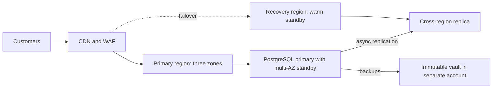
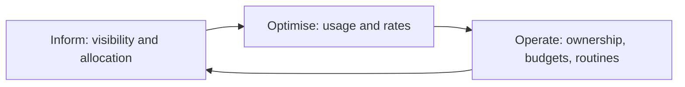
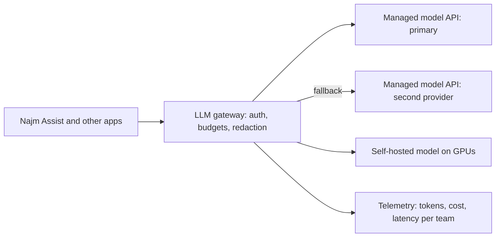

# Module 6 — Scale, cost and AI infrastructure

*Getting a service to production is half the job. The other half is keeping it up when traffic triples, when a zone fails or a database is deleted by mistake, keeping the bill under control while you do it, and running the newest and hungriest workload of all: large language models on GPUs. This module covers the three decisions that separate a platform engineer from someone who can only deploy. First, scaling and resilience: autoscaling at the pod and node level, spreading across availability zones, backups you have actually restored, and disaster recovery targets (RTO and RPO) that the business signed. Second, FinOps: seeing where the money goes, giving every cost an owner, and cutting waste without cutting reliability. Third, AI infrastructure: GPUs, model serving, LLM gateways and the cost per token. You will follow Najm Bank's Platform Engineering & SRE team as Maha runs the first full disaster recovery test for the Payments service, Mona from Finance asks why the cloud bill grew faster than the customer base, and Salem has to decide how Najm Assist should serve its models without burning the GPU budget in a month.*

> **Phases:** Operate, Monitor — keeping production up, affordable and ready for AI workloads once it is live, and proving it with tests and numbers rather than hope.

---

# 6.1 — Scaling and resilience: autoscaling, multi-zone, backups and disaster recovery
*Level: 🔴 Advanced* · *Prerequisites: 2.3, 3.2, 5.2* · *Phase: Operate*

## ⚡ In 60 seconds
- **Scaling** handles more load; **resilience** survives failure. Autoscalers do the first; redundancy, backups and recovery plans do the second.
- Autoscale in layers: the **Horizontal Pod Autoscaler** adds pods, a **node autoscaler** adds machines for those pods, and the **database** usually does not autoscale at all, so it is often the real limit.
- Spread every production service across at least **two or three availability zones**, and make Kubernetes actually do it with topology spread constraints and PodDisruptionBudgets.
- Recovery targets are business decisions: **RTO** (how long you may be down) and **RPO** (how much data you may lose). Write them down per service, then pick the cheapest design that meets them.
- Decision cue: a backup you have not restored is a hope, not a backup. Schedule restore tests and time them against the RTO.
- Biggest trap: treating multi-zone as disaster recovery. Zones survive a data-centre failure, not a bad deploy, a deleted table or ransomware, which replicate everywhere in seconds.

## 🧭 Why it matters
On 31 January 2017, a GitLab engineer fixing a replication problem ran a delete command on what they believed was the secondary database. It was the primary. GitLab's public postmortem describes how none of the backup and replication methods the team relied on worked as expected; they recovered from a staging copy about six hours old and lost roughly six hours of production data. Nobody had restored a backup end to end, so nobody knew the backups were broken.

Now bring it home. The Payments service has just moved to the cloud, and Hamad (CISO) and the risk function ask Salem: "If the primary region failed this afternoon, or someone deleted the payments database, how long until customers can send money again, and how many transfers would we lose?" The EU's Digital Operational Resilience Act (DORA), applicable to financial entities from 17 January 2025, expects the bank's EU entity to show tested backup, restoration and continuity arrangements, and GCC regulators such as the Qatar Central Bank set their own continuity and outsourcing expectations (check current texts with risk and governance). "We use multi-AZ" is not an answer. This lesson builds one: targets, design and the test that proves them.

## 📐 How it works

### 🟢 The essentials

**Scaling: vertical and horizontal.** *Vertical scaling* gives a server more CPU or memory. It is simple but has a ceiling and usually means a restart. *Horizontal scaling* adds more copies of a service behind a load balancer. It has a much higher ceiling but only works if the service is **stateless**: no session data, uploads or caches kept on the local disk or in memory that another copy would need. State goes to a database, a cache service or object storage. For the non-coder view of the same idea, see [*System Design for Vibe Coders*, lesson 10.1 — Stateless services and load balancing](../vibe/index.en.html#l10-1).

**Autoscaling in Kubernetes happens in layers.**

| Layer | What scales | Triggered by | Watch out for |
|---|---|---|---|
| **Horizontal Pod Autoscaler (HPA)** | Number of pod replicas | CPU or memory utilisation against requests, or custom metrics | Needs sensible resource requests (2.3); reacts in tens of seconds, not instantly |
| **Node autoscaler** (Cluster Autoscaler, Karpenter) | Number of worker nodes | Pods stuck in `Pending` because no node has room | A new node can take minutes; keep some headroom |
| **Vertical Pod Autoscaler (VPA)** | CPU and memory requests of each pod | Observed usage over time | Do not let HPA and VPA act on the same CPU or memory metric |
| **Event-driven scaling** (KEDA) | Replicas, down to zero | Queue length, stream lag, schedules | Scale-to-zero means a cold start |

A basic HPA for the Najm Mobile API:

```yaml
apiVersion: autoscaling/v2
kind: HorizontalPodAutoscaler
metadata:
  name: mobile-api
  namespace: mobile
spec:
  scaleTargetRef:
    apiVersion: apps/v1
    kind: Deployment
    name: mobile-api
  minReplicas: 6          # two per zone, never fewer
  maxReplicas: 30         # a ceiling the database can survive
  metrics:
    - type: Resource
      resource:
        name: cpu
        target:
          type: Utilization
          averageUtilization: 65   # percent of the CPU *request*
  behavior:
    scaleDown:
      stabilizationWindowSeconds: 300   # avoid flapping after a spike
```

Two numbers are judgement, not defaults. `minReplicas: 6` keeps two pods per zone even at night. `maxReplicas: 30` protects the database: every pod opens connections, and an unbounded autoscaler can turn a traffic spike into a database outage.

**Availability zones.** An *availability zone* (AZ) is one or more data centres inside a region with separate power, cooling and networking (1.2). Run production in at least two zones, ideally three, behind a regional load balancer. Managed databases offer *multi-AZ*: a standby in another zone that takes over automatically.

**Recovery targets.**
- **RTO (recovery time objective):** the longest the service may be unavailable after a disaster before the harm is unacceptable.
- **RPO (recovery point objective):** the most data, measured in time, you may lose. An RPO of 5 minutes means that after recovery you may be missing up to the last 5 minutes of writes.

The business owner sets them with risk, because tighter targets cost more; the platform team prices each option and proves the result.

**Backups.** A useful baseline is the **3-2-1 rule**: three copies, on two kinds of storage, one off-site (in the cloud: another account and region). Add two rules: at least one copy is **immutable** (locked against change or deletion until retention ends, for example with object lock), so a bad script or attacker with admin rights cannot wipe it, and **every backup is restore-tested** on a schedule. See also [*System Design for Vibe Coders*, lesson 2.3 — Backups: what, not just whether](../vibe/index.en.html#l2-3).

### 🟡 Going deeper

**Making Kubernetes spread across zones.** Running nodes in three zones does not guarantee your pods land in three zones; the scheduler might put all six on nodes in one zone. Ask for spreading explicitly, and protect replicas during maintenance:

```yaml
# In the Deployment's pod template
topologySpreadConstraints:
  - maxSkew: 1
    topologyKey: topology.kubernetes.io/zone
    whenUnsatisfiable: DoNotSchedule
    labelSelector:
      matchLabels: { app: mobile-api }
---
apiVersion: policy/v1
kind: PodDisruptionBudget
metadata:
  name: mobile-api
  namespace: mobile
spec:
  minAvailable: 4         # node drains may never take us below 4 pods
  selector:
    matchLabels: { app: mobile-api }
```

A **PodDisruptionBudget** (PDB) limits *voluntary* disruptions such as node upgrades and drains. It does not stop a zone failing, which is why you also need spare capacity: if you need 4 pods to serve peak load, run at least 6 across three zones, so losing one zone still leaves 4.

**Scaling moves the bottleneck.** When the Mobile API scales from 6 to 30 pods, database connections usually run out first, then database CPU, then the core banking link starts timing out. Plan for it with a connection pooler such as PgBouncer, timeouts and circuit breakers on calls to the core, and load shedding (a fast 503 with `Retry-After` for low-priority requests). Load-test to find the first bottleneck before customers do.

**Disaster recovery strategies.** The common ladder, named in the AWS disaster recovery whitepaper and used across providers, trades cost against speed:

| Strategy | What runs in the recovery region | Typical RTO / RPO | Relative cost |
|---|---|---|---|
| **Backup and restore** | Nothing; backups are copied there | Hours / hours | Lowest |
| **Pilot light** | Data replicated; core infrastructure defined but scaled to zero or minimal | Tens of minutes to hours / minutes | Low |
| **Warm standby** | A smaller, working copy of the whole stack | Minutes / seconds to minutes | Medium |
| **Multi-site active-active** | Full capacity serving traffic in both regions | Near zero / near zero, if the data design allows | Highest, and the hardest to build |

The RTO and RPO columns are rough orders of magnitude; only your measured test result counts. Infrastructure as code (Module 3) makes pilot light and warm standby affordable: the recovery region is a `tofu apply` and a GitOps sync away, not a hand-built copy that drifts.



**Why active-active is hard.** For stateless services it is mostly routing. For data, two regions accepting writes to the same balance can conflict, and synchronous cross-region replication adds the inter-region round trip to every write. A common pattern is to run the stateless edge active-active and the system of record active-passive. For the Payments service, every payment carries an **idempotency key**, so a request retried after failover finds the existing record instead of creating a second transfer.

**Asynchronous replication sets your RPO.** A cross-region replica usually lags the primary by seconds or more, and that lag *is* your RPO in a regional disaster. Monitor it (5.1) and alert when it exceeds the RPO.

### 🔴 Expert view

**Separate the failure modes.** Different disasters need different defences. Write them out per service:

| Failure | Multi-AZ helps? | Cross-region replica helps? | Point-in-time backup helps? |
|---|---|---|---|
| One zone loses power | Yes | Yes | Slowly |
| Whole region degraded | No | Yes | Yes, slowly |
| Bad migration corrupts data | No, corruption replicates | No, corruption replicates | Yes: restore to just before |
| Ransomware or a rogue admin deletes data | No | No | Only if the backup is immutable and in a separate account |

The bottom two rows are why replication is not backup. **Point-in-time recovery** (PITR), which managed PostgreSQL services offer by keeping base backups plus the write-ahead log, lets you restore to a chosen second before the bad change. Know your retention window and how long a restore of your data size really takes.

**Static stability and the recovery path.** A *statically stable* system keeps working without needing to change during the failure, for example because capacity is already provisioned in each zone rather than launched mid-outage when everyone else is launching too. Also check that the recovery path does not depend on what failed. In Facebook's October 2021 outage, a backbone change disconnected data centres and DNS servers withdrew their BGP routes; Facebook's engineering post notes that the internal tools needed for the fix were affected too. Ask: if our primary region is gone, are the runbooks, the GitOps repo, the CI runners, the secrets and the break-glass accounts still reachable?

**Chaos engineering and game days.** Chaos engineering runs controlled experiments that inject failure (kill pods, drain a zone, add latency) to check that the system behaves as predicted. Start small and in non-production; state a hypothesis ("if one zone is drained, the Mobile API stays within its SLO"); limit the blast radius; keep an abort switch. A **game day** is a scheduled rehearsal of a full scenario, such as a regional failover, with the on-call team, Maha as incident commander and observers timing each step. EU DORA expects resilience testing; game days produce the evidence.

## 🧰 The toolkit
| Tool, practice or service | What it is and does | When to reach for it |
|---|---|---|
| **Horizontal Pod Autoscaler** (Kubernetes) | Changes the replica count of a workload from CPU, memory or custom metrics | Every stateless service with variable load, with a min and max you chose |
| **Cluster Autoscaler** / **Karpenter** | Add and remove nodes when pods cannot be scheduled or nodes are idle | Any cluster whose load varies; pair with HPA |
| **KEDA** (CNCF) | Event-driven autoscaling from queues, streams and schedules, including to zero | Workers that drain queues; batch jobs; scale-to-zero for idle services |
| **PodDisruptionBudget** | Caps how many replicas voluntary disruptions may remove at once | Every production Deployment with more than one replica |
| **Point-in-time recovery** | Restore a database to a chosen moment using base backups plus logs | Recovering from bad migrations and accidental deletes |
| **Immutable backup vault** | Backups locked against change or deletion until retention ends, in a separate account | Defence against ransomware and compromised admin credentials |
| **Game day** | A rehearsed, timed exercise of a failure scenario with the real on-call team | Proving RTO and RPO before an auditor or a disaster asks |

## 🏛️ In practice at Najm Bank
Maha's team produces a **DR test plan** for the Payments service. It lives in the platform repo next to the runbook it tests.

| Field | Payments service |
|---|---|
| Owner and decision-maker | Service owner: Payments engineering lead. Declares disaster: incident commander with Salem |
| Agreed targets | RTO and RPO as signed by the business owner and risk (recorded with the date and approvers) |
| Design | Three zones in the primary region; managed PostgreSQL multi-AZ; asynchronous cross-region replica; warm standby stack in the recovery region from the same OpenTofu modules and GitOps repo |
| Backups | Daily snapshots plus PITR; copies in a separate backup account and region with vault lock; retention per records policy |
| Scenarios tested this quarter | 1. Zone drain in production during low traffic. 2. PITR restore of the payments database to a scratch instance. 3. Full regional failover in the staging environment |
| Steps and timings | Detect, declare, promote replica, switch traffic, scale standby, smoke-test, reopen; each step timed |
| Success criteria | Measured RTO and RPO within targets; zero duplicated or lost confirmed transfers (reconciled against the core banking ledger) |
| Evidence | Timeline, dashboards, reconciliation report; filed for the resilience testing record |
| Follow-ups | Each gap becomes a ticket with an owner and a date; the next test re-checks it |

The first run found three gaps that no design review would have caught: the replica-lag alert went to a dashboard nobody watched, the payments DNS record had a TTL far longer than the RTO allowed, and the break-glass role for the recovery account needed a new MFA device.

## 🛠️ Exercises
- 🟢 **Watch an autoscaler work.** On a local kind or k3d cluster with the metrics server, deploy a small web container with CPU requests and an HPA (min 2, max 8, target 50% CPU). Generate load from another pod and watch `kubectl get hpa -w`. *Done when:* you have a screenshot or log showing replicas rising under load and falling after the stabilisation window, and one sentence explaining why scale-down was slower than scale-up.
- 🟡 **Spread across zones and survive a drain.** Create a kind cluster with four worker nodes and label them with `topology.kubernetes.io/zone` values `a`, `b`, `c` (one zone gets two nodes). Deploy six replicas with a topology spread constraint and a PDB of `minAvailable: 4`. Drain every node in one zone with `kubectl drain`. Expect the evicted pods to stay `Pending`: the drained zone still counts for the spread constraint. *Done when:* the pods were spread two per zone, the drain respected the PDB, the service kept answering throughout, and you can explain the `Pending` pods.
- 🔴 **Write and run a restore test.** Run PostgreSQL in Docker with WAL archiving or regular `pg_dump` backups. Insert timestamped rows, "accidentally" drop a table, then restore into a second container. Write a one-page DR test plan in the format above, with an RTO and RPO you choose. *Done when:* you have measured the actual restore time and data loss, compared them with your targets, and listed at least two changes that would close any gap.

## ⚠️ Mistakes and traps
- **Calling replication a backup.** Replicas copy deletions and corruption instantly. Keep point-in-time and immutable backups in a separate account as well.
- **Never restoring.** Backups that have not been restored end to end fail when you need them, as GitLab learned. Schedule restore tests and time them.
- **Unbounded autoscaling.** An HPA with a huge `maxReplicas` can exhaust database connections or a downstream quota. Set the ceiling from what the dependencies can take.
- **A recovery path that depends on the failed region.** Keep runbooks, IaC, CI, secrets and break-glass access reachable from outside it.
- **Targets nobody signed.** An RTO the platform team picked alone will be challenged after the incident. Get the business owner and risk to agree to them, in writing.

## 🧾 Recap
- Scaling adds capacity; resilience survives failure. Autoscale pods and nodes in layers, with floors and ceilings you chose on purpose.
- Run production across at least two or three zones, and enforce it with topology spread constraints, PDBs and spare capacity.
- RTO and RPO are business decisions; the DR strategy (backup and restore, pilot light, warm standby, active-active) is the cheapest design that meets them.
- Zones and replicas do not protect against bad changes or deletion; point-in-time and immutable, separate-account backups do.
- Only tested recovery counts: restore drills, game days and timed failovers produce the evidence regulators and executives need.

## ✍️ Check yourself

**1. The Najm Mobile API runs 6 pods across three zones and needs 4 to handle peak load. Which change best ensures that losing one zone does not overload the service?**

- A. Raise the HPA `maxReplicas` to 100 so new pods replace lost ones
- B. Keep 6 pods with a zone spread constraint, two per zone
- C. Add a PodDisruptionBudget with `minAvailable: 6` on the Deployment
- D. Move all pods to the largest zone to reduce cross-zone traffic

<details><summary>Answer</summary>

**B.** Two pods per zone means a zone failure removes only two, leaving the 4 needed. A helps only after new pods and nodes arrive; C covers voluntary disruptions, not zone failures, and would block drains; D creates a single point of failure. (🟢 The essentials and 🟡 Going deeper.)

</details>

**2. A developer runs a migration that silently corrupts the `transfers` table. The database is multi-AZ with a cross-region replica. What recovers the data?**

- A. Failing over to the multi-AZ standby
- B. Promoting the cross-region replica
- C. Restarting the database
- D. A point-in-time restore to just before the migration

<details><summary>Answer</summary>

**D.** Corruption is replicated to the standby and the replica within seconds, so A and B just give you the same bad data elsewhere. Only a point-in-time backup goes back before the change. (🔴 Expert view, the failure-mode table.)

</details>

**3. Who should set the RPO for the Payments service?**

- A. The business owner with risk, once the platform team has costed options
- B. The platform team alone, because it builds and runs the infrastructure
- C. The cloud provider, through its SLA
- D. Nobody; RPO is always zero for payments

<details><summary>Answer</summary>

**A.** RPO expresses how much loss the business accepts, and tighter targets cost more. B creates targets nobody will defend later; a provider SLA (C) covers its service, not your recovery; D is a wish, not a design. (🟢 The essentials.)

</details>

**4. Maha's DR test shows the cross-region replica usually lags by a few seconds but once reached 40 minutes during a batch job. The agreed RPO is 5 minutes. What is the right reading?**

- A. The RPO is met, because the usual lag is only a few seconds
- B. The RPO only applies to zone failures, not to regional ones
- C. The real RPO then was 40 minutes; alert on lag and fix the cause
- D. Switch to synchronous cross-region replication now, without measuring latency

<details><summary>Answer</summary>

**C.** With asynchronous replication, the lag at the moment of disaster is the data you lose. A ignores the worst case; B is false; D adds the inter-region round trip to every write and needs analysis first. (🟡 Going deeper.)

</details>

**5. Which statement about chaos engineering is most accurate?**

- A. It means breaking production at random, as often as possible
- B. A controlled test with a hypothesis and abort switch, started outside production
- C. Once it runs regularly, it replaces backup restores and DR tests
- D. It is only useful for companies running thousands of services

<details><summary>Answer</summary>

**B.** Chaos engineering tests a stated prediction under control. A is recklessness; C is wrong because it complements restore drills; D is wrong, since even a small zone-drain experiment teaches a lot. (🔴 Expert view.)

</details>

## 📚 References
- Kubernetes: Horizontal Pod Autoscaling — https://kubernetes.io/docs/tasks/run-application/horizontal-pod-autoscale/
- Kubernetes: Pod topology spread constraints — https://kubernetes.io/docs/concepts/scheduling-eviction/topology-spread-constraints/
- Kubernetes: Specifying a disruption budget — https://kubernetes.io/docs/tasks/run-application/configure-pdb/
- KEDA documentation — https://keda.sh/docs/
- Karpenter documentation — https://karpenter.sh/docs/
- Velero documentation — https://velero.io/docs/
- AWS whitepaper: Disaster recovery of workloads on AWS — https://docs.aws.amazon.com/whitepapers/latest/disaster-recovery-workloads-on-aws/disaster-recovery-workloads-on-aws.html
- Azure Well-Architected Framework, reliability — https://learn.microsoft.com/azure/well-architected/
- Google Cloud Architecture Framework — https://cloud.google.com/architecture/framework
- GitLab: Postmortem of database outage of January 31 (2017) — https://about.gitlab.com/blog/
- Google SRE books (data integrity, managing critical state) — https://sre.google/books/
- Regulation (EU) 2022/2554 on digital operational resilience (DORA) — https://eur-lex.europa.eu/eli/reg/2022/2554/oj
- Deeper on cloud security controls: [*Secure AI & Application Security*, lesson 7.1 — Cloud security: shared responsibility, IAM and misconfiguration](../secai/index.html#/7.1)

---

# 6.2 — FinOps: understanding, allocating and cutting cloud cost
*Level: 🔴 Advanced* · *Prerequisites: 1.2, 3.1, 6.1* · *Phase: Operate, Monitor*

## ⚡ In 60 seconds
- **FinOps** is the practice of making engineering, finance and the business share responsibility for cloud spending, so that cost becomes an engineering signal like latency, not a surprise at the end of the month.
- The FinOps Foundation framework runs in a loop of three phases: **Inform** (see and allocate cost), **Optimise** (reduce waste and get better rates) and **Operate** (make it routine and owned).
- You cannot cut what you cannot attribute. Start with **tagging and allocation**: every resource has an owner, a service and an environment.
- Cut usage before you buy discounts: delete idle resources, rightsize, autoscale and schedule non-production, then commit to **reserved capacity or savings plans** for the steady base, and use **spot** capacity only for work that can be interrupted.
- Decision cue: judge cost per unit of business value (cost per thousand API calls, per payment, per active customer), not the total bill alone.
- Biggest trap: cost-cutting that quietly removes resilience, such as dropping the second zone or the backup copies built in 6.1 to save money.

## 🧭 Why it matters
Six months after the first services moved to the cloud, Mona, the FinOps analyst in Finance, brings Salem a chart. Najm's monthly cloud bill has grown much faster than the number of active mobile customers. Her questions are simple and fair: "What are we paying for? Who owns it? Is the growth good growth?" Salem cannot answer from the console. A large share of the spend is untagged. There is a line called "data transfer" that nobody budgeted for. Three GPU nodes created for a Najm Assist experiment have been running every hour of every day since a hackathon. The development clusters run at full size over the weekend.

None of this is a finance problem that finance can fix. In the cloud, every engineer who merges an OpenTofu change or raises an HPA ceiling is making a spending decision, often without seeing the price. The old data-centre model, where procurement approved hardware months ahead, is gone. FinOps puts the cost signal back where decisions are made: in the pull request, the dashboard and the team's own backlog. This lesson gives you the language Mona speaks, the mechanics of allocating cost, and an order of operations for cutting it without harming reliability. For a lighter treatment aimed at small teams, see [*System Design for Vibe Coders*, lesson 11.4 — Cost engineering](../vibe/index.en.html#l11-4).

## 📐 How it works

### 🟢 The essentials

**The FinOps Foundation framework.** The FinOps Foundation, part of the Linux Foundation, publishes the most widely used framework. At the time of writing (2026) it describes principles, personas (engineering, finance, leadership, procurement, product), capabilities and a cycle of three phases. The principles include that teams need to collaborate, that business value drives technology decisions, that everyone takes ownership of their cloud usage, that cost data should be accessible and timely, that FinOps is enabled by a central team, and that teams should take advantage of the cloud's variable cost model. Check finops.org for the current wording, which is revised from time to time.



**How cloud pricing works, in concepts.** Never quote a price from memory; prices differ by region and change. The shape is stable:
- **Compute** is billed by time (per second or hour, depending on service) and size. A large instance idling costs the same as a busy one.
- **Storage** is billed by amount stored per month, with tiers: frequently accessed storage costs more per gigabyte than archive tiers, which charge more to read back.
- **Requests and operations**: many managed services charge per API call, per million requests or per read and write.
- **Data transfer (egress)**: moving data *out* of a provider to the internet usually costs money, and so does traffic between regions and, with some providers, between zones. Managed NAT gateways often charge per gigabyte processed. Check your provider's current pricing pages, because egress is the line that surprises teams most.
- **Managed service premiums**: a managed database costs more than the virtual machine underneath, and buys you patching, backups and failover. That is usually a good trade; just know you are making it.

**Allocation: tags and labels.** Every provider lets you attach key-value metadata to resources: *tags* in AWS and Azure, *labels* in Google Cloud. A cost allocation policy defines a small, mandatory set:

| Key | Example value | Why |
|---|---|---|
| `owner` | `team-payments` | Someone to ask, and someone who sees the bill |
| `service` | `payments-api` | Cost per service and per unit |
| `environment` | `prod`, `staging`, `dev` | Non-production waste is usually the first target |
| `cost-centre` | finance code | Chargeback or showback to the business |
| `data-classification` | `confidential` | Shared with security; not a cost key but enforced the same way |

Tags must usually be activated for billing reports (for example, AWS cost allocation tags), and they mostly apply only from when they are set (backfill, where offered, is limited), so start early. Enforce them in infrastructure as code (3.1) and with policy as code (3.3): a plan that creates an untagged resource fails the check.

**Showback and chargeback.** *Showback* shows each team what it spent; *chargeback* actually moves the cost to the team's budget. Most organisations start with showback, because the first goal is awareness, not accounting.

### 🟡 Going deeper

**Shared costs and Kubernetes.** Tags work well for a database owned by one team. They fail for a shared Kubernetes cluster where twenty services run on the same nodes. Allocate shared clusters by what each workload *reserves* (its CPU and memory requests) or *uses*, whichever is higher, per namespace. Tools such as **OpenCost** (a CNCF project) read the cluster's resource data and the provider's prices to produce cost per namespace, label and workload. Decide openly how to split what is left over: idle capacity, the control plane, the observability stack and shared networking. A common rule is to spread it in proportion to each team's direct cost, and to show idle capacity as its own line so that the platform team is accountable for packing efficiency.

Requests matter here. A team that requests 4 CPUs per pod and uses 0.3 pays, in a fair allocation, for 4. That is the right incentive: over-requesting blocks that capacity from everyone else.

**The FOCUS specification.** Each provider's billing export has its own columns and names. The **FinOps Open Cost and Usage Specification (FOCUS)**, from the FinOps Foundation, defines a common format for billing data, and the major providers offer FOCUS-formatted exports at the time of writing (2026; check which version each supports). If Najm runs workloads in more than one cloud, FOCUS makes one cost dataset possible.

**Optimise usage first, then rates.** Usage optimisation means paying for less; rate optimisation means paying less for the same thing. Do usage first, because committing to a discount for capacity you should have deleted locks in the waste.

| Order | Lever | Typical action | Risk to watch |
|---|---|---|---|
| 1 | **Remove idle** | Delete unattached volumes, old snapshots outside retention, idle load balancers, forgotten GPU nodes | Confirm the owner; keep what retention policy requires |
| 2 | **Schedule** | Scale dev and test clusters down at night and weekends | Teams in other time zones; batch jobs |
| 3 | **Rightsize** | Lower instance sizes and pod requests to match observed use | Leave headroom; watch tail latency and memory |
| 4 | **Autoscale** | HPA and node autoscaling so capacity follows demand (6.1) | Floors for resilience; scale-up speed |
| 5 | **Storage lifecycle** | Move old logs and objects to cheaper tiers; expire them per policy | Retrieval cost and delay from archive tiers |
| 6 | **Architecture** | Cut cross-zone and egress traffic, cache at the CDN, use private endpoints | Never at the cost of zone redundancy |
| 7 | **Commitments** | Reserved instances, savings plans, committed use discounts for the steady base | Over-commitment if usage falls |
| 8 | **Spot capacity** | Interruptible instances for batch, CI runners, stateless burst | Interruptions at short notice |

**Commitments and spot, as concepts.** All three providers offer discounts in return for committing to a level of use for one or three years: AWS Reserved Instances and Savings Plans, Azure Reservations and Azure savings plan for compute, and Google Cloud committed use discounts. Commit to the floor you are confident you will use, not the peak. **Spot** capacity (AWS Spot Instances, Azure Spot Virtual Machines, Google Cloud Spot VMs) is spare capacity sold at a discount that the provider can reclaim with short notice; check each provider's current notice period. Use it for work that tolerates interruption: CI runners, batch jobs, stateless replicas above the floor. Never put the only copy of the Payments database on it.

### 🔴 Expert view

**Unit economics.** The total bill going up is not bad news if the business is growing faster. The number that matters is **unit cost**: cost divided by a business driver.

```text
Cost per 1,000 Mobile API requests = (allocated Mobile API cost for the month)
                                     / (requests served in the month / 1,000)
Cost per successful payment        = (allocated Payments service cost)
                                     / (payments completed)
Cost per Najm Assist conversation  = (gateway + model API + GPU cost)
                                     / (conversations)
```

The allocated cost includes the service's share of shared costs. Plot unit cost monthly. If it rises while traffic rises, you have a scaling inefficiency; if it rises while traffic is flat, look for waste or a pricing change. Unit costs also make engineering trade-offs concrete: a caching change that cuts cost per thousand requests by a fifth is easy to explain to Mona and to leadership. Product teams use the same idea when pricing; see [*AI Product Management*, lesson 8.2 — Unit economics: cost to serve, pricing models and margins](../aipm/index.html#/8.2).

**Cost in the pull request.** The cheapest moment to avoid waste is before it is created. Tools such as **Infracost** estimate the monthly cost change of an OpenTofu or Terraform plan and post it as a pull-request comment. Combine it with a policy: changes above a threshold need a second reviewer from the owning team, not a finance approval queue. Engineers keep their speed; large decisions become visible.

**Budgets and anomaly detection.** Every account or subscription gets a budget with alerts to its owner, and the providers' cost anomaly detection features flag sudden spikes (for example, a runaway job or a misconfigured log export). Treat a cost anomaly like an operational alert: route it to the owning team, with a runbook. The forgotten hackathon GPU nodes would have been caught in days, not months.

**Do not trade away resilience.** The most dangerous cost cuts look reasonable in a spreadsheet: one zone instead of three, a smaller standby, shorter backup retention, no cross-region copy. Each of these changes the RTO and RPO agreed in 6.1. Rule at Najm: a cost change that touches redundancy, backups or recovery must be approved by the service owner and SRE, and the DR test plan updated. Cost and reliability are one decision, not two.

## 🧰 The toolkit
| Tool, practice or service | What it is and does | When to reach for it |
|---|---|---|
| **FinOps Framework** (FinOps Foundation) | Principles, personas, capabilities and the Inform, Optimise, Operate cycle | Setting up a cost practice and agreeing roles with finance |
| **Cost allocation tags** | Mandatory metadata (owner, service, environment) that billing can group by | Day one of any cloud account; enforced by policy as code |
| **FOCUS** (FinOps Foundation) | A common, provider-neutral format for billing data | Combining cost data from more than one cloud or tool |
| **OpenCost** (CNCF) | Open-source cost allocation for Kubernetes by namespace, label and workload | Showback for shared clusters |
| **Infracost** | Estimates the cost change of an IaC plan and comments on the pull request | Catching expensive changes before they merge |
| **Provider cost tools** (AWS Cost Explorer, Azure Cost Management, Google Cloud Billing reports) | Native billing analysis, budgets and anomaly alerts | Daily visibility; budgets per account and owner |
| **Commitment discounts** (savings plans, reservations, committed use discounts) | Lower rates in return for committed use over one or three years | After usage optimisation, for the steady baseline |
| **Spot capacity** | Discounted spare capacity that can be reclaimed at short notice | CI runners, batch, stateless burst above the floor |

## 🏛️ In practice at Najm Bank
Mona and Salem agree a **monthly cloud cost report**, generated from the FOCUS export and OpenCost, reviewed in a 30-minute meeting with each team lead.

| Section | Content for the month |
|---|---|
| Headline | Total spend vs budget and vs last month; share of spend allocated to an owner (target: nearly all) |
| Unit costs | Cost per 1,000 Mobile API requests; cost per successful payment; cost per Najm Assist conversation; trend over six months |
| By team and service | Showback table: direct cost, share of shared costs, change and the owner's one-line explanation |
| Waste found | Idle resources, oversized workloads (requests vs use), untagged spend, with owners and due dates |
| Commitments | Coverage and utilisation of savings plans or reservations; renewals coming up |
| Anomalies | Spikes detected, cause, fix |
| Resilience check | Any proposed cut that affects zones, backups or DR, with SRE sign-off status |
| Decisions | What we change next month, who owns it |

The first report's actions: tag policy enforced in the OpenTofu pipeline (untagged plans fail), the three hackathon GPU nodes deleted after confirming with the Najm Assist team, development clusters scaled down outside working hours, and the large "data transfer" line traced to Mobile API pods calling object storage through a NAT gateway instead of a private endpoint. Yousef suggested also reducing the Payments database to single-zone "to save a lot"; Maha pointed to the DR test plan from 6.1 and the idea was dropped.

## 🛠️ Exercises
- 🟢 **Design a tagging policy.** Write a tagging policy for a fictional company with three teams and three environments: the mandatory keys, allowed values, who owns enforcement, and what happens to untagged resources. Add a policy-as-code rule (for example, a Conftest or OPA check against an OpenTofu plan in JSON) that fails when `owner` or `environment` is missing. *Done when:* the rule fails on a plan with an untagged resource and passes when tags are added.
- 🟡 **Allocate a shared cluster.** Install OpenCost and the Prometheus it needs on a local kind cluster (default or custom pricing) and deploy workloads in three namespaces with deliberately different requests. Compare requests with actual use for each namespace. *Done when:* you have a table of cost by namespace, identified the most over-requested workload, and proposed new requests with a short justification for the headroom you kept.
- 🔴 **Build a unit-cost model.** Using a free-tier account with a budget alert set first, or a spreadsheet with made-up but labelled sample numbers, build a monthly model for a small API: allocated compute, database, storage and transfer, and requests served. Compute cost per 1,000 requests for three scenarios: current, rightsized, and rightsized plus a commitment on the baseline. *Done when:* the model shows unit cost for each scenario, states every assumption, and identifies which change you would make first and why.

## ⚠️ Mistakes and traps
- **Buying commitments before cleaning up.** Discounts on waste lock the waste in for years. Remove idle, schedule and rightsize first.
- **Tagging later.** Tags apply from when they are set, and untagged history cannot be allocated well. Enforce tags in IaC from the first resource.
- **Finance-only FinOps.** A monthly spreadsheet from finance changes nothing if engineers never see it. Put cost in pull requests, dashboards and team reviews.
- **Ignoring data transfer.** Egress, cross-zone traffic and NAT processing can become a large line. Check pricing pages and design traffic paths with them in mind.
- **Cutting resilience to save money.** One zone, smaller standbys and shorter retention change your RTO and RPO. Route such changes through the service owner and SRE.
- **Judging the total, not the unit.** A growing bill can be healthy. Track cost per business unit to tell growth from waste.

## 🧾 Recap
- FinOps makes engineering, finance and the business jointly own cloud cost, through the Inform, Optimise and Operate cycle.
- Allocation comes first: mandatory tags enforced in IaC, request-based allocation for shared Kubernetes clusters, and showback before chargeback.
- Optimise usage (idle, schedules, rightsizing, autoscaling, lifecycle, architecture) before rates (commitments, spot).
- Unit cost, such as cost per payment or per thousand requests, is the metric that connects spend to value.
- Cost and resilience are one decision: no cost cut may silently weaken the RTO and RPO agreed with the business.

## ✍️ Check yourself

**1. Mona finds that a large share of Najm's cloud spend cannot be attributed to any team. What should Salem do first?**

- A. Buy a three-year savings plan to bring the total down quickly
- B. Ask finance to split the unattributed cost equally across all teams
- C. Mandate tags, enforce them in the OpenTofu pipeline, chase owners
- D. Move all workloads to spot instances before allocating anything

<details><summary>Answer</summary>

**C.** You cannot optimise or hold anyone accountable without allocation, and enforcement in IaC stops the problem recurring. A commits money before you know what is waste; B hides the problem; D risks reliability and does not explain the spend. (🟢 The essentials.)

</details>

**2. A team requests 4 CPUs per pod but uses about 0.3 on average. In a shared cluster, how should their cost be allocated, and why?**

- A. By the higher of requests and use: they pay for the 4 they reserve
- B. By actual use only, because the rest of the request sat unused
- C. Not at all, because shared clusters cannot be split between teams
- D. Equally among all the teams that run workloads on the cluster

<details><summary>Answer</summary>

**A.** Requests reserve capacity that no one else can schedule onto, so charging for them gives the right incentive. B rewards over-requesting; C is wrong, since tools like OpenCost allocate by namespace; D removes accountability. (🟡 Going deeper.)

</details>

**3. Which order of optimisation steps is most sensible?**

- A. Buy commitments first, then rightsize, then delete idle resources
- B. Move everything to spot instances first, then add commitments
- C. Rightsize only, since commitments are never worth the lock-in
- D. Remove idle, schedule, rightsize, then commit for the steady base

<details><summary>Answer</summary>

**D.** Usage optimisation first means the commitment covers only capacity you will really use. A locks in waste; B puts interruption-intolerant workloads at risk; C leaves real savings on a steady baseline unused. (🟡 Going deeper.)

</details>

**4. Yousef proposes running the Payments database in a single zone to cut its cost. What is the best response?**

- A. Approve it, because cost reduction is the priority this quarter
- B. Treat it as a resilience change for the service owner and SRE
- C. Approve it quietly and leave risk out of the decision
- D. Approve it as long as Infracost shows a clear monthly saving

<details><summary>Answer</summary>

**B.** Removing zone redundancy changes the RTO and RPO the business signed, so the service owner and SRE decide, and will very likely refuse; cost and resilience are one decision. A and D look only at money; C undermines governance. (🔴 Expert view.)

</details>

**5. Najm's total cloud bill rose this quarter while customers grew faster. Cost per successful payment fell. How should Mona read this?**

- A. As a problem, because the total bill rose this quarter
- B. As proof that no optimisation work is needed anywhere
- C. As healthy growth, while still checking the waste list
- D. As a likely billing error to raise with the provider

<details><summary>Answer</summary>

**C.** Falling unit cost with rising volume means the service scales efficiently. A judges by the total alone; B overreaches, because other services and idle resources can still waste money; D has no basis. (🔴 Expert view.)

</details>

## 📚 References
- FinOps Foundation: FinOps Framework — https://www.finops.org/framework/
- FinOps Open Cost and Usage Specification (FOCUS) — https://focus.finops.org/
- OpenCost documentation — https://www.opencost.io/docs/
- Infracost documentation — https://www.infracost.io/docs/
- AWS Cloud Financial Management and cost management documentation — https://docs.aws.amazon.com/cost-management/
- Microsoft Cost Management documentation — https://learn.microsoft.com/azure/cost-management-billing/
- Google Cloud Billing documentation — https://cloud.google.com/billing/docs
- Kubernetes: Resource management for pods and containers — https://kubernetes.io/docs/concepts/configuration/manage-resources-containers/
- Lighter view for small teams: [*System Design for Vibe Coders*, lesson 11.4 — Cost engineering](../vibe/index.en.html#l11-4)

---

# 6.3 — Running AI workloads: GPUs, model serving, LLM gateways and their cost
*Level: 🔴 Advanced* · *Prerequisites: 2.3, 5.1, 6.2* · *Phase: Deploy, Operate*

## ⚡ In 60 seconds
- AI workloads need scarce, expensive **GPUs**, load large model files before serving, and cost scales with **tokens**, not requests.
- Call a **managed model API** (pay per token, no GPUs to run) or **self-host** an open-weight model with a serving engine such as **vLLM**. Most organisations, Najm included, use both.
- Put an **LLM gateway** in front of every model: one place for authentication, routing, rate limits and budgets, fallbacks, caching, logging and cost tracking per team.
- Measure what users feel: **time to first token**, time per output token, tokens per second and error rate, plus GPU utilisation and memory.
- Decision cue: self-host when volume is steady or residency and control demand it, and only if you can keep the GPUs busy. Idle GPUs are this module's most expensive mistake.
- Biggest trap: every team calling model APIs directly with its own key, so nobody knows the cost, the data flows or the plan when a provider fails.

## 🧭 Why it matters
Najm Assist started as a pilot in which three teams called a hosted model API directly, each with its own key. Then, in one month, a provider had a partial outage and the assistant failed with it, because there was no fallback; Mona's cost report from 6.2 showed model spend rising weekly with no way to tell which team drove it; and Noura asked which customer data went to which provider and where it was logged. Nobody could answer completely.

Meanwhile the data science team wanted to self-host a small open-weight model for a classification task whose data must stay in Najm's chosen region. Yousef ran it in a container on a GPU node with default settings and reported it was "slow and the GPU sits at 15%". Salem must now decide what goes through managed APIs, what is self-hosted, how both are controlled, and what each conversation costs. For operating agents built on these models, see [*Running AI Agents in Production*, Level 3 — Production Engineer](../agentic/learning-path.html#level-3-production-engineer).

## 📐 How it works

### 🟢 The essentials

**Why GPUs.** Running a model (*inference*) is mostly large matrix multiplications over its *weights*, the billions of numbers learned in training, which GPUs do in parallel far faster than CPUs. The usual limit is **GPU memory**: the weights must fit, plus working memory for every conversation served.

A rough rule for the weights: memory ≈ number of parameters × bytes per parameter. A model with 8 billion parameters stored in 16-bit precision (2 bytes each) needs about 16 GB just for the weights; in 8-bit, about 8 GB; in 4-bit, about 4 GB. Add room for the **KV cache** (below) and the serving engine. This is arithmetic, not a vendor figure, and it tells you quickly whether a model fits on a given GPU.

**Managed API or self-hosted?**

| Question | Managed model API | Self-hosted open-weight model |
|---|---|---|
| Who runs the GPUs | The provider | You |
| How you pay | Per input and output token | For GPU time, busy or idle |
| Model choice | The provider's models, often the most capable | Open-weight models you are licensed to use |
| Data path | Data goes to the provider under its terms and region options | Data stays in your environment |
| Effort | Low: an API key and a client | High: drivers, serving engine, scaling, upgrades |
| Best for | Variable or low volume; frontier capability; fast start | Steady high volume; residency or control needs; small specialised models |

Neither is free of risk. Managed APIs raise third-party and data-transfer questions (EU DORA treats ICT providers as third-party risk; GCC regulators have outsourcing expectations). Self-hosting brings GPU cost, scarcity and another critical service to run.

**Tokens are the unit of cost.** Models read and write *tokens*, pieces of words, and managed APIs charge per token, usually at different rates for input and output. Cost therefore depends on prompt length (instructions, history, retrieved documents) and answer length: a feature that stuffs twenty documents into every prompt costs far more than one that retrieves three. Check current pricing pages; never hard-code prices.

**An LLM gateway.** A gateway is a service between your applications and every model, managed or self-hosted. Applications call one internal endpoint; the gateway does the rest.



### 🟡 Going deeper

**What a gateway should do.**

| Function | Why it matters |
|---|---|
| **Authentication** | Apps use workload identity (1.3); provider keys live only in the gateway |
| **Routing** | Send each use case to the approved model; route by data classification (confidential data only to the in-region self-hosted model, for example) |
| **Rate limits and budgets** | Per team and per feature, in tokens and money, so one runaway loop cannot spend the month's budget |
| **Fallbacks and retries** | Retry with backoff, then fall back to an approved model already tested for quality |
| **Caching** | Exact-match caching saves cost; semantic caching (reusing answers to *similar* prompts) must never give one customer another's answer |
| **Redaction and policy** | Mask personal data that a use case does not need; enforce input and output checks agreed with security |
| **Telemetry** | Tokens in and out, cost, latency, model, team and feature on every call, exported with OpenTelemetry (5.1) |

Open-source gateways (such as LiteLLM and Envoy AI Gateway at the time of writing), provider and commercial ones exist; Najm runs one on its platform so routing rules live in the GitOps repo. The gateway is critical infrastructure: run it multi-zone with an SLO, as in 6.1. Security controls for model inputs and outputs go deeper in [*Secure AI & Application Security*, lesson 9.1 — Guardrails and output handling: never trust model output](../secai/index.html#/9.1).

**GPUs in Kubernetes.** Nodes with GPUs need the vendor's driver and a *device plugin*, which advertises GPUs to Kubernetes as a resource (for NVIDIA, `nvidia.com/gpu`). Pods request whole GPUs in their limits. Keep GPU nodes in a separate node pool with a **taint**, so only workloads that tolerate it (and need a GPU) land there:

```yaml
apiVersion: apps/v1
kind: Deployment
metadata:
  name: assist-classifier
  namespace: assist
spec:
  replicas: 2
  selector:
    matchLabels: { app: assist-classifier }
  template:
    metadata:
      labels: { app: assist-classifier }
    spec:
      nodeSelector:
        pool: gpu
      tolerations:
        - key: "gpu"
          operator: "Exists"
          effect: "NoSchedule"
      containers:
        - name: server
          image: registry.najm.example/assist/vllm-server@sha256:<digest>   # pinned by digest
          args: ["--model", "/models/classifier", "--max-model-len", "8192"]
          resources:
            limits:
              nvidia.com/gpu: 1
          readinessProbe:            # model loading takes time; do not send traffic early
            httpGet: { path: /health, port: 8000 }
            periodSeconds: 10
          securityContext:
            runAsNonRoot: true
            allowPrivilegeEscalation: false
```

Small workloads can share a GPU with time-slicing or, on some NVIDIA data-centre GPUs, Multi-Instance GPU (MIG), which splits one into isolated slices. Kubernetes' Dynamic Resource Allocation API offers more flexible device requests; check its status in your version.

**Serving engines.** Running a model with a plain script serves one request at a time and leaves the GPU mostly idle, which is what Yousef saw. Serving engines fix this:
- **vLLM** is an open-source engine known for *PagedAttention*, which manages KV-cache memory in pages, and *continuous batching*, which adds new requests to the running batch as others finish. It exposes an OpenAI-compatible HTTP API.
- **NVIDIA Triton Inference Server** serves models from several frameworks with dynamic batching; NVIDIA has been bringing it under its newer inference platform branding, so check current naming.
- **KServe** is a Kubernetes-native model-serving layer that manages model deployments, autoscaling and rollouts, and can run engines such as vLLM underneath.

**The concepts behind the speed.**
- **Batching:** serving many conversations at once raises throughput a lot, at some cost to each request's latency; continuous batching keeps the waiting short.
- **KV cache:** while generating, the model keeps intermediate results (keys and values) for every earlier token so it does not recompute them. The cache grows with context length and with the number of concurrent conversations, and it is often what limits how many users one GPU can serve. In vLLM, `--max-model-len` caps the context per request and `--gpu-memory-utilization` caps the engine's share of GPU memory.
- **Quantisation:** storing weights in 8 or 4 bits instead of 16 cuts memory and often raises speed, with some quality loss you must measure on your own evaluation set.

### 🔴 Expert view

**Metrics that matter.** Classic RED metrics (5.1) are not enough. Track, per model and route:

| Metric | What it tells you |
|---|---|
| **Time to first token (TTFT)** | How long the user waits before text starts; dominated by queueing and processing the prompt |
| **Time per output token** (inter-token latency) | How smoothly text streams |
| **Tokens per second** per GPU | Throughput; the cost-efficiency number |
| **Queue depth and running requests** | Saturation; the best autoscaling signal for self-hosted models |
| **KV-cache usage** | How close you are to rejecting or pre-empting requests |
| **GPU utilisation and memory** (for example from NVIDIA's DCGM exporter) | Whether you are paying for idle hardware |
| **Tokens and cost per team and feature** | From the gateway; feeds the FinOps report in 6.2 |

OpenTelemetry has semantic conventions for generative AI calls (model, token counts, and more); they were still evolving at the time of writing, so pin the version you use.

An SLO for Najm Assist might be: 99% of conversations get a first token within a target number of seconds, measured at the gateway over 28 days, with the target set from measurement, not a vendor benchmark.

**Scaling self-hosted models.** CPU is the wrong signal; scale on queue depth or running requests (for example with KEDA reading a Prometheus metric). Cold starts are slow: a new replica may need a new GPU node, the image and a model file of many gigabytes. Keep a warm floor of replicas in business hours, pre-pull images, keep model files on fast nearby storage, and gate traffic with readiness probes. Scale to zero only where a long first response is acceptable.

**The self-hosting break-even.** Compare, for the same quality on your evaluation set:

```text
Managed cost per month  = Σ (input tokens × input rate + output tokens × output rate)
Self-hosted per month   = GPU node hours × node rate (busy or idle)
                        + engineering and on-call time
                        + storage, network, observability
Self-hosted cost per 1M tokens = self-hosted per month / (tokens served / 1,000,000)
```

The self-hosted cost per token falls as utilisation rises; at low utilisation it is usually worse than the managed API. Self-host when volume keeps GPUs busy, or when residency, control or latency requires it, and redo the sum when prices change. GPU capacity can be hard to obtain on demand, so for a critical self-hosted model reserve capacity or keep a managed fallback.

**Release safety for models.** Changing the model version, quantisation or system prompt changes answers, so it is a release. Canary it at the gateway (4.2): send a small share of traffic, compare evaluation results, feedback, latency and cost, then promote or roll back. Pin model versions where providers allow; an alias that silently moves to a newer model is an unreviewed deploy.

## 🧰 The toolkit
| Tool, practice or service | What it is and does | When to reach for it |
|---|---|---|
| **LLM gateway** | One controlled entry point to all models: auth, routing, budgets, fallbacks, caching, telemetry | Before the second team starts calling models; always in a bank |
| **vLLM** | Open-source LLM serving engine with PagedAttention, continuous batching and an OpenAI-compatible API | Self-hosting open-weight LLMs efficiently |
| **NVIDIA Triton Inference Server** | Multi-framework inference server with dynamic batching | Serving many model types, including non-LLM models, on NVIDIA GPUs |
| **KServe** | Kubernetes-native model-serving layer with autoscaling and rollouts | Standardising model deployments on the platform |
| **NVIDIA device plugin** and **DCGM exporter** | Expose GPUs to Kubernetes as a resource; export GPU metrics to Prometheus | Any cluster with NVIDIA GPU nodes |
| **KEDA** (CNCF) | Event-driven autoscaling from queues, streams and metrics | Scaling model servers on queue depth instead of CPU |
| **Quantisation** | Store weights in fewer bits to save memory and gain speed, with measured quality loss | Fitting a model on smaller or fewer GPUs |
| **OpenTelemetry** GenAI conventions | Standard attributes for model calls, token counts and latency | Consistent cost and latency data across models and teams |

## 🏛️ In practice at Najm Bank
Salem's team writes the **Najm Assist serving decision and gateway policy**, reviewed with Noura, Maha and Mona, and stored in the GitOps repo beside the gateway configuration.

| Section | Decision |
|---|---|
| Use cases and routes | Customer chat: managed API in an approved region, second approved model as fallback. Confidential classification: self-hosted model in Najm's primary region only. Internal summarisation: cheaper managed tier |
| Data rules | Classification decides the route; unneeded personal data masked at the gateway; log retention agreed with security and privacy |
| Access | Workload identity to the gateway; provider keys only in its secrets manager, rotated; direct provider calls blocked by egress policy |
| Budgets | Token and money budget per team and feature, with an owner; alert at a set share, hard stop for non-critical features |
| Reliability | Gateway multi-zone with an SLO on availability and time to first token; fallback tested monthly; self-hosted model with a warm floor of replicas during business hours |
| Capacity | GPU node pool tainted and autoscaled on queue depth; GPU utilisation and tokens per second reviewed weekly; break-even re-calculated each quarter with current prices |
| Change control | Model, quantisation or prompt changes go through evaluation and a canary at the gateway; model versions pinned |
| Reporting | Cost per conversation and per team in Mona's monthly report from 6.2 |

Yousef's classifier now runs on vLLM with continuous batching and an 8-bit quantised model that passed the evaluation set, and the next provider outage was absorbed by the fallback route with a brief rise in latency.

## 🛠️ Exercises
- 🟢 **Size a model.** Pick three open-weight models of different sizes. Compute weight memory at 16-, 8- and 4-bit, and decide which fit a GPU memory size you name, leaving a quarter for the KV cache and engine. *Done when:* you have a table of nine memory estimates with the arithmetic shown, and a one-line fit decision for each model.
- 🟡 **Run a gateway locally.** Run a small open model locally (CPU is fine) behind an OpenAI-compatible API, and put an open-source LLM gateway in front of it in Docker with two routes, a per-key rate limit and a fallback to a second local model. *Done when:* you can show a request served by the primary route, a request rejected by the rate limit, and a request that falls back when you stop the primary model, with the gateway's logs or metrics showing tokens per request.
- 🔴 **Write a break-even and serving decision.** For a fictional assistant handling a stated number of conversations per day with stated average input and output tokens, use current public prices from one managed API and one GPU instance type (record the date and source) to compute monthly cost both ways at 20%, 50% and 80% GPU utilisation. Add engineering time as a stated assumption. *Done when:* you have a one-page decision in the format of the Najm table, with the utilisation at which self-hosting breaks even and the non-cost reasons (data, control, reliability) that would change your choice.

## ⚠️ Mistakes and traps
- **Direct calls with scattered keys.** Every team holding its own provider key means no cost view, no fallback and unknown data flows. Route everything through one gateway and block direct egress.
- **Idle GPUs.** A GPU node running a model nobody calls costs the same as a busy one. Scale on queue depth, schedule non-production, and review utilisation weekly.
- **Serving without a serving engine.** A plain script handles one request at a time. Use an engine with continuous batching and measure tokens per second.
- **Autoscaling model servers on CPU.** CPU says little about GPU load. Scale on queue depth or running requests, and plan for slow cold starts.
- **Quantising or switching models without evaluation.** Smaller and cheaper can be worse. Run your evaluation set and a canary before promoting.
- **Unsafe semantic caching.** Reusing answers to "similar" prompts can leak one customer's data to another. Cache only non-personal answers, or scope caches per user.

## 🧾 Recap
- AI workloads are bound by GPU memory and priced by tokens; size models with simple arithmetic and track cost per conversation.
- Use managed APIs for variable volume and frontier capability; self-host when volume is steady, GPUs stay busy, or data and control require it.
- An LLM gateway gives one place for auth, routing by data class, budgets, fallbacks, caching, redaction and telemetry; run it as critical infrastructure.
- Serve self-hosted models with an engine such as vLLM, Triton or KServe, using batching, KV-cache limits and evaluated quantisation, and scale on queue depth.
- Treat every model, prompt or quantisation change as a release: evaluate, canary, pin versions, roll back if needed.

## ✍️ Check yourself

**1. Yousef runs a self-hosted model with a simple Python script on a GPU node. Latency is high and GPU utilisation is about 15%. What is the most likely fix?**

- A. Move the same script to a larger GPU with more memory
- B. Add an HPA that scales the pods on CPU utilisation
- C. Switch to a managed API immediately and drop the GPU
- D. Serve it with a continuous-batching engine such as vLLM

<details><summary>Answer</summary>

**D.** A one-request-at-a-time script leaves the GPU idle; batching serves many together. A buys more idle hardware; B scales on the wrong signal; C does not explain the waste. (🟡 Going deeper.)

</details>

**2. Roughly how much GPU memory do the weights of an 8-billion-parameter model need at 4-bit precision?**

- A. About 32 GB, because every parameter needs four bytes
- B. About 4 GB, plus room for the KV cache
- C. About 8 GB, with no extra room needed for serving
- D. It cannot be estimated without asking the vendor

<details><summary>Answer</summary>

**B.** 8 billion parameters × half a byte ≈ 4 GB, and serving also needs KV-cache and engine memory. A is the 32-bit size; C is the 8-bit size and ignores the KV cache; D is wrong because the arithmetic is simple. (🟢 The essentials.)

</details>

**3. A model provider has a partial outage and Najm Assist fails completely. Which change most directly prevents this next time?**

- A. Asking the provider for a stronger SLA in the next contract
- B. Adding more replicas of the chat front end in every zone
- C. A gateway route with retries and a tested fallback model
- D. Caching every answer forever so the provider is rarely called

<details><summary>Answer</summary>

**C.** A gateway fallback keeps the feature working when one provider fails. A changes nothing during an outage; B scales the wrong layer; D serves stale answers and risks leakage. (🟡 Going deeper.)

</details>

**4. When does self-hosting an open-weight model usually make the most sense?**

- A. When steady volume keeps GPUs busy, or residency requires it
- B. Always, because GPU hours are cheaper than paying for tokens
- C. For a low-traffic internal tool used a few times a day
- D. Only when no managed API offers a model of similar quality

<details><summary>Answer</summary>

**A.** Self-hosting pays off with high utilisation or non-cost requirements. B ignores idle cost and engineering time; C leaves GPUs idle; D ignores residency, control and utilisation. (🔴 Expert view.)

</details>

**5. Which metric is the best autoscaling signal for a self-hosted LLM server?**

- A. Node CPU utilisation averaged across the GPU pool
- B. The number of pods currently serving the model
- C. Disk usage on the nodes that hold model files
- D. Queue depth or running requests at the engine

<details><summary>Answer</summary>

**D.** Queue depth shows demand waiting for the GPU. A says little about GPU load; B is the thing being scaled, not a signal; C is unrelated to request load. (🔴 Expert view.)

</details>

## 📚 References
- Kubernetes: Schedule GPUs — https://kubernetes.io/docs/tasks/manage-gpus/scheduling-gpus/
- Kubernetes: Taints and tolerations — https://kubernetes.io/docs/concepts/scheduling-eviction/taint-and-toleration/
- vLLM documentation — https://docs.vllm.ai/
- NVIDIA Triton Inference Server documentation — https://docs.nvidia.com/deeplearning/triton-inference-server/
- KServe documentation — https://kserve.github.io/website/
- NVIDIA device plugin for Kubernetes — https://github.com/NVIDIA/k8s-device-plugin
- KEDA documentation — https://keda.sh/docs/
- OpenTelemetry semantic conventions for generative AI — https://opentelemetry.io/docs/specs/semconv/gen-ai/
- FinOps Foundation (including FinOps for AI work) — https://www.finops.org/
- Security for LLM applications: [*Secure AI & Application Security*, lesson 8.1 — The AI attack surface: OWASP Top 10 for LLM Applications and MITRE ATLAS](../secai/index.html#/8.1)
- Operating agents in production: [*Running AI Agents in Production*, Level 3 — Production Engineer](../agentic/learning-path.html#level-3-production-engineer)
