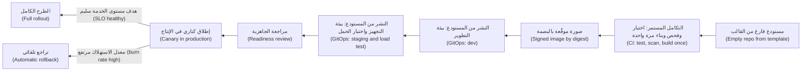

# الوحدة 7 — الاحتراف: المشروع الختامي والامتحان التدريبي (Hero: capstone and practice exam)

*لقد تعلّمت السحابة وDevOps (cloud and DevOps) طبقةً بعد طبقة (one layer at a time): سطر الأوامر والشبكة (the shell and the network)، والهوية (identity)، والحاويات (containers)، وKubernetes، والبنية التحتية بوصفها شيفرة (infrastructure as code)، وخطوط التسليم (pipelines)، والإطلاقات (releases)، والقياس عن بُعد (telemetry)، وأهداف مستوى الخدمة (SLOs)، والحوادث (incidents)، والتوسّع (scaling)، والتكلفة (cost)، وأعباء عمل الذكاء الاصطناعي (AI workloads). وهذه الوحدة تعيد جمع الطبقات معًا (puts the layers back together). ففي المشروع الختامي (capstone) تأخذ خدمةً جديدة كليًّا في بنك نجم (a brand-new Najm Bank service)، هي ضوابط البطاقات (Card Controls)، من مستودعٍ فارغ (an empty repository) إلى الإنتاج (production) مع هدف مستوى خدمة موقَّع (a signed SLO)، معيدًا استخدام أثرٍ برمجي (artefact) من كل وحدةٍ سابقة (every earlier module)، وتربطها جميعًا في ملف جاهزية للإنتاج (production readiness file) واحد يستطيع سالم ومها ونورة اعتماده (approve). ثم ننتقل إليك أنت (we turn to you): الأدوار (roles) التي يتكوّن منها عمل السحابة والمنصات وDevOps وهندسة موثوقية المواقع (cloud, platform, DevOps and SRE work)، وكيف تختار الشهادات (certifications) من مزوّدي السحابة (cloud providers) ومؤسسة Linux (the Linux Foundation) وغيرها دون أن تتحكّم بك (without being ruled by them)، وما الذي تختبره المقابلات فعلًا (what interviews actually test)، وكيف تبني ملف أعمال (portfolio) يُثبت أنك تستطيع تشغيل البرمجيات (run software)، لا مجرد كتابتها (not just write it). وتُختتم الوحدة بامتحانٍ تدريبي (practice exam) من 60 سؤالًا يغطي المراحل الثماني جميعها (all eight phases).*

> **المراحل (Phases):** من Plan إلى Monitor (Plan through Monitor) — حلقة التسليم كاملةً (the whole delivery loop)، من طرفها إلى طرفها (end to end)، على خدمةٍ واحدة (on one service) ثم في امتحانٍ واحد (in one exam).

---

# 7.1 — المشروع الختامي: خذ خدمةً جديدة في نجم من مستودعٍ فارغ إلى الإنتاج مع هدف مستوى خدمة (Capstone: take a new Najm service from empty repo to production with an SLO)
*المستوى (Level): 🔴 متقدم (Advanced)* · *المتطلبات (Prerequisites): الوحدات 0–6 (Modules 0–6)* · *المرحلة (Phase): Deploy, Operate*

## ⚡ الدرس في دقيقة (In 60 seconds)
- يأخذ المشروع الختامي (capstone) خدمة **ضوابط البطاقات (Card Controls)**، وهي خدمةٌ جديدة في نجم لتجميد البطاقات (freezing cards) وتعيين الحدود (setting limits)، من مستودعٍ فارغ (an empty repository) إلى الإنتاج (production) عبر المراحل الثماني جميعها (all eight phases).
- المُخرَج (The output) هو **ملف الجاهزية للإنتاج (production readiness file)**: أدلةٌ مترابطة (linked evidence) على أن الخدمة يمكن بناؤها وإطلاقها ومراقبتها واستعادتها وتحمّل تكلفتها (built, released, observed, recovered and paid for)، مع مالكٍ لكل جزء (an owner for each part).
- العمود الفقري (The spine) هو **أثرٌ برمجي واحد وبيئاتٌ متعددة (one artefact, many environments)**: ابنِ صورة الحاوية (container image) مرةً واحدة، ووقّعها (sign it)، ورقِّ البصمة نفسها (promote the same digest) من التطوير (dev) إلى التجهيز (staging) إلى الإنتاج (production) عبر Git.
- هدف مستوى الخدمة (The SLO) يأتي أولًا لا أخيرًا (comes first, not last). فهو يحدّد التنبيهات (the alerts)، وبوابات الإطلاق (the release gates)، وعدد النسخ المتماثلة (the replica count)، وأهداف النسخ الاحتياطي (the backup targets)، وجدول المناوبة (the on-call rota).
- مؤشر القرار (Decision cue): قبل كل بوابة (before each gate)، اسأل «لو فشلت هذه الخطوة بصمت في الثانية فجرًا ⁦(if this step failed silently at 2 a.m.)⁩، فكيف سنعرف (how would we know)، وكيف سنتراجع عنها (how would we undo it)؟».
- أكبر فخ (Biggest trap): قائمة تحقق للجاهزية (a readiness checklist) تُعلَّم من الذاكرة (ticked from memory). كل بندٍ يحتاج إلى دليل (Every item needs evidence)، والتراجع والاستعادة ومفاتيح الإيقاف الطارئ (rollback, restore and kill switches) تحتاج إلى تمرينٍ موقوت (a timed drill).

## 🧭 لماذا يهم (Why it matters)
يأتي طارق بطلبٍ إلى فريق المنصات (the platform team). يريد فريق البطاقات (the cards team) **خدمة ضوابط البطاقات (Card Controls service)**: يجمّد العملاء البطاقة (customers freeze a card)، ويحظرون الاستخدام عبر الإنترنت أو خارج البلاد (block online or overseas use)، ويعيّنون حدًّا يوميًّا (set a daily limit) من تطبيق نجم للهاتف (Najm Mobile app). ويتحقّق معالج البطاقات (The card processor) من هذه الضوابط أثناء التفويض (during authorisation)، لذا فإن الإجابة الخاطئة (a wrong answer) إمّا تمنع عميلًا عند نقطة الدفع (blocks a customer at a till) وإمّا تمرّر بطاقةً مسروقة (lets a stolen card through). ويريدها قطاع الأعمال (The business) حيّةً خلال ربع سنة واحد (live in one quarter).

يُسند سالم المهمة إلى يوسف، مع مها شريكةً في هندسة موثوقية المواقع (SRE partner). كانت خطة يوسف الأولى (Yousef's first plan): نسخ مستودعٍ قديم (copy an old repository)، ودفع صورةٍ موسومة بـ`latest` (push an image tagged latest)، وتطبيق ملفات البيان يدويًّا (apply manifests by hand)، و«إضافة المراقبة بعد الإطلاق (add monitoring after launch)». فيطرح سالم ثلاثة أسئلة: «ما هدف مستوى الخدمة (What is the SLO)؟ كيف تتراجع في أقل من خمس دقائق (How do you roll back in under five minutes)؟ ماذا يحدث إن تعطّلت منطقة توافر قاعدة البيانات (if the database zone fails) خلال ذروة يوم صرف الرواتب (a payday peak)؟». ولم تكن لدى يوسف إجاباتٌ بعد.

والتاريخ العام (Public history) يبيّن لماذا تهمّ هذه الأسئلة. ففي أغسطس 2012 نشرت شركة Knight Capital شيفرةً جديدة (deployed new code) على خوادمها، لكن خادمًا واحدًا احتفظ بشيفرةٍ قديمة (kept old code) خلف علَمٍ أُعيد استخدامه (behind a reused flag)؛ وبحسب الأمر اللاحق الصادر عن هيئة الأوراق المالية الأمريكية (the US SEC's later order)، خسرت الشركة مئات الملايين من الدولارات (hundreds of millions of dollars) في أقل من ساعة (in under an hour). وفي يناير 2017 فقدت GitLab ساعاتٍ من بيانات الإنتاج (hours of production data) بعد حذف مجلد قاعدة بيانات (a database directory was deleted) أثناء حادثة (during an incident)، وتبيّن أن عدة طرق للنسخ الاحتياطي (several backup methods) لا تعمل (مراجعة ما بعد الحادثة العامة لـGitLab، GitLab's public postmortem). وكانت كلٌّ منهما خطوةً مفقودة وغير مختبرة (a missing, untested step) على الطريق إلى الإنتاج (on the path to production). وهذا الدرس يبني الطريق كله مرةً واحدة، وبالشكل الصحيح (once, properly).

## 📐 كيف يعمل (How it works)

### 🟢 الأساسيات (The essentials)

**الخدمة في فقرةٍ واحدة (The service, in one paragraph).** ضوابط البطاقات (Card Controls) واجهةُ برمجة HTTP صغيرة (a small HTTP API) لها قاعدة بيانات PostgreSQL مُدارة خاصة بها (its own managed PostgreSQL database). تستدعيها واجهة برمجة تطبيق نجم للهاتف (Najm Mobile API) لتغيير الضوابط (to change controls)؛ ويستدعيها تكامل معالج البطاقات (the card processor's integration) لقراءتها أثناء التفويض (during authorisation). وتعمل على عنقود Kubernetes المُدار (managed Kubernetes cluster) الخاص بالبنك عبر منطقتي توافر (two availability zones). ولا تخزّن إلا مرجعًا داخليًّا للبطاقة (an internal card reference)، ولا تخزّن أبدًا أرقام البطاقات (never card numbers)، وهو ما تؤكّده نورة في مراجعة التصميم (design review).

**ملف الجاهزية للإنتاج (The production readiness file).** **مراجعة الجاهزية للإنتاج (production readiness review, PRR)** فحصٌ منظَّم قبل الإطلاق (a structured pre-launch check) للتأكد من أن الخدمة يمكن تشغيلها بأمان (can be operated safely)؛ وتصف كتب SRE من Google هذه الممارسة (Google's SRE books describe the practice). ومراجعة نجم (Najm's PRR) مجلدٌ من الآثار البرمجية المترابطة (a folder of linked artefacts) تحت صفحة ملخّص واحدة (a one-page summary) (انظر 🏛️ أدناه)، ولها ثلاث قواعد (three rules):
1. **لكل ادّعاءٍ دليل (Every claim has evidence)** يستطيع المراجع فتحه (a reviewer can open)، لا «نعم، تم (yes, done)».
2. **كل تغييرٍ خطِر يمكن التراجع عنه (Every risky change can be undone)** بطريقةٍ موثّقة وموقوتة (a documented, timed method).
3. **كل تنبيهٍ يرتبط بهدف مستوى خدمة أو بدليل تشغيل (Every alert maps to an SLO or a runbook).** والتنبيه الذي لا يقابله إجراء ضجيج (An alert with no action is noise).

**المراحل الثماني (The eight phases).** تعيد كل مرحلةٍ استخدام أثرٍ برمجي من وحدةٍ سابقة (reuses an artefact from an earlier module)؛ وصفحة الملخّص (the summary page) في 🏛️ أدناه تربط كلًّا منها بدليله ودرسه (maps each to its evidence and lesson). وكل الأرقام في هذا الدرس توضيحية (All numbers in this lesson are illustrative).

**ابدأ بهدف مستوى الخدمة (Start with the SLO).** تتفق مها ومالك منتج البطاقات (the cards product owner) على رحلات المستخدم المهمة (the user journeys that matter)، ويكتبان **مؤشرات مستوى الخدمة (SLIs)** (service level indicators: قياساتٌ للأحداث الجيدة على الأحداث الصالحة، measurements of good events over valid events) و**أهداف مستوى الخدمة (SLOs)** (أهدافٌ لها على مدى نافذةٍ زمنية، targets for them over a window):

| الرحلة (Journey) | مؤشر مستوى الخدمة (SLI) | هدف مستوى الخدمة (SLO) (نافذة 28 يومًا، 28-day window) |
|---|---|---|
| قراءة الضوابط أثناء التفويض (Read controls during authorisation) | نسبة طلبات القراءة (Share of read requests) التي يُجاب عنها بنجاح خلال 100 ms عند موازن الأحمال (answered successfully within 100 ms at the load balancer) | 99.95% |
| العميل يغيّر ضابطًا (Customer changes a control) | نسبة طلبات الكتابة التي تنجح خلال 500 ms (Share of write requests that succeed within 500 ms) | 99.9% |
| الحداثة (Freshness) | نسبة تغييرات الضوابط التي تظهر للقراءات خلال ثانيتين (Share of control changes visible to reads within 2 seconds) | 99.9% |

هدف القراءة (The read SLO) أشدّ (tighter) لأن فشل القراءة (a failed read) قد يمنع عملية شراء حقيقية (block a real purchase). ومع 99.95% على مدى 28 يومًا، تكون **ميزانية الأخطاء (error budget)** هي 0.05% من طلبات القراءة (of read requests). وهي تحدّد سياسة الإطلاق (the release policy): ما دامت الميزانية متبقية (while budget remains)، يُطلق الفريق (the team ships)؛ وبمجرد استنفادها (once it is spent)، لا يُطلق إلا إصلاحات الموثوقية (only reliability fixes ship).

**الطريق (The path).** كل صندوقٍ بوابةٌ تترك دليلًا (Each box is a gate that leaves evidence):



### 🟡 التعمق أكثر (Going deeper)

**الشيفرة: ابدأ من المسار الذهبي (Code: start from the golden path).** لا ينسخ يوسف مستودعًا قديمًا (does not copy an old repository). بل يُنشئ الخدمة من قالب المنصة (the platform's template)، الذي يحتوي مسبقًا على ملف Dockerfile، وسير عمل للتكامل المستمر (CI workflow)، ومخطط Helm (Helm chart)، وإعداد OpenTelemetry (OpenTelemetry setup)، وملف `CODEOWNERS`، ومدخلٍ في فهرس البوابة (a portal catalogue entry). وتأتي الإعدادات (Configuration) من متغيرات البيئة (environment variables)، ولا تُدمَج أبدًا في الصورة (never baked into the image) (قاعدة الإعدادات في منهجية التطبيق ذي العوامل الاثني عشر، the Twelve-Factor App's config rule)، فتعمل صورةٌ واحدة في كل مكان (one image runs everywhere). وتعرض الخدمة المسار `/healthz/live` (العملية حيّة، the process is alive) والمسار `/healthz/ready` (تستطيع الوصول إلى قاعدة بياناتها وهي جاهزة لحركة المرور، it can reach its database and is ready for traffic)، وهما يصبحان مِجسّي الحيوية والجاهزية (the liveness and readiness probes) من الدرس 2.3.

**البناء: مرةً واحدة، بالبصمة، وموقَّعًا (Build: once, by digest, signed).** يبني التكامل المستمر (CI) الصورة مرةً واحدة لكل إيداع (once per commit)، ويدفعها (pushes it)، ويسجّل بصمتها (records its digest)، ثم يولّد قائمة مكونات البرمجيات (SBOM) ويوقّع تلك البصمة باستخدام cosign (signs that digest with cosign). وتشير البيئات اللاحقة (Later environments) إلى البصمة نفسها (reference the same digest) ولا تعيد البناء أبدًا (never rebuild). ويصل التكامل المستمر إلى السحابة عبر **اتحاد هوية أعباء العمل (workload identity federation)** (OIDC)، فلا يوجد مفتاحٌ طويل العمر (no long-lived key) في المستودع (1.3، 4.3):

```yaml
# .github/workflows/ci.yml (excerpt)
permissions:
  contents: read
  id-token: write        # lets the job request a short-lived OIDC token
jobs:
  build:
    runs-on: ubuntu-latest
    steps:
      - uses: actions/checkout@v4      # pin actions to a full commit SHA in real use
      - run: make test                  # unit and contract tests
      - run: make image                 # multi-stage, non-root build
      - run: make push sbom sign        # push, then SBOM and cosign signature on the digest
      - run: make bump-dev              # opens a PR to the GitOps repo with the new digest
```

**النشر: البنية التحتية والتطبيق، كلاهما من Git (Deploy: infrastructure and app, both from Git).** قاعدة البيانات (The database) والنسخ الاحتياطية (backups) ودور السحابة (cloud role) وقواعد الشبكة (network rules) هي استدعاءٌ واحد لوحدة OpenTofu (one OpenTofu module call)، يُراجَع بأمر `tofu plan` على طلب الدمج (on the pull request) (3.1). وفحوص السياسات (Policy checks) (3.3) ترفض قاعدة بيانات بلا تشفير أثناء التخزين (without encryption at rest) أو حماية من الحذف (deletion protection) أو مدة احتفاظ بالنسخ الاحتياطية (backup retention). أمّا جانب Kubernetes (The Kubernetes side) فيقيم في مستودع GitOps (the GitOps repository)، بمجلدٍ لكل بيئة (one folder per environment)، ويُوفّقه Argo CD (reconciled by Argo CD):

```yaml
apiVersion: argoproj.io/v1alpha1
kind: Application
metadata:
  name: card-controls-prod
  namespace: argocd
spec:
  project: cards
  source:
    repoURL: https://git.example.com/najm/gitops.git
    targetRevision: main
    path: apps/card-controls/overlays/prod
  destination:
    server: https://kubernetes.default.svc
    namespace: card-controls
  syncPolicy:
    automated:
      prune: true
      selfHeal: true     # reverts manual edits in the cluster back to Git
```

الترقية إلى الإنتاج (Promotion to production) طلبُ دمج (a pull request) يغيّر سطرًا واحدًا (changing one line)، هو بصمة الصورة (the image digest) في طبقة `prod` (the prod overlay)، ويعتمده فريق البطاقات وفريق المنصة (approved by the cards team and platform). والتراجع (Rollback) هو التراجع عن ذلك الإيداع (reverting that commit).

**الإطلاق: كناري مع حارس (Release: canary with a guard).** يرسل الطرح (The rollout) حصةً صغيرة من حركة المرور (a small share of traffic) إلى النسخة الجديدة (the new version)، ويقارن أخطاءها وزمن استجابتها (its errors and latency) بالنسخة المستقرة (the stable version)، ويتوسّع خطوةً بخطوة (widens step by step) (4.2). وتُؤتمِت أداةُ تحكّم (A controller) مثل Argo Rollouts أو Flagger عملية التحليل (automates the analysis)؛ فإن تجاوز الكناري عتباتٍ مبنية على هدف مستوى الخدمة (breaches SLO-based thresholds)، يُلغي الطرح (it aborts) وتعود حركة المرور إلى النسخة المستقرة (traffic returns to the stable version). والسلوك الجديد (New behaviour)، مثل «حظر الاستخدام خارج البلاد (block overseas use)»، يقع خلف علَم ميزة (behind a feature flag) لكي يمكن إيقافه دون نشر (switched off without a deploy). وتحديث المحتوى لـCrowdStrike Falcon في يوليو 2024 (The CrowdStrike Falcon content update of July 2024)، الذي أسقط أجهزة Windows حول العالم (crashed Windows hosts worldwide)، يبيّن ما يحدث حين يصل تغييرٌ إلى الجميع دفعةً واحدة (when a change reaches everyone at once).

**المراقبة: تنبيهاتٌ من الميزانية (Monitor: alerts from the budget).** تُصدر الخدمة تتبّعات OpenTelemetry (OpenTelemetry traces) ومقاييس RED (RED metrics) (المعدل والأخطاء والمدة، rate, errors, duration). وتكتب مها **تنبيهات متعددة النوافذ ومتعددة معدلات الاستهلاك (multi-window, multi-burn-rate alerts)** من كتاب SRE التطبيقي (the SRE Workbook): استدعِ المناوب (page) حين تُستهلك الميزانية بسرعة (the budget burns fast) على نافذةٍ طويلة وأخرى قصيرة معًا (over both a long and a short window)؛ وافتح تذكرة (open a ticket) حين تُستهلك ببطء (burns slowly). وهذا تنبيه الاستهلاك السريع (fast-burn page) لهدف القراءة:

```yaml
# Prometheus alert rule (excerpt): 14.4x burn over 1h, confirmed over 5m.
# Recording rules (not shown) compute the read error ratio over each window.
- alert: CardControlsReadFastBurn
  expr: |
    card_controls:read_error_ratio:rate1h > (14.4 * 0.0005)
    and
    card_controls:read_error_ratio:rate5m > (14.4 * 0.0005)
  labels:
    severity: page
  annotations:
    runbook: https://runbooks.example.com/card-controls/read-errors
```

المعامل 14.4 (The factor 14.4) يعني أن الميزانية ستنفد في نحو يومين (would be gone in about two days) بهذا المعدل (at this rate)؛ والنافذة القصيرة (the short window) توقف الاستدعاء (stops the page) بمجرد انتهاء الاستهلاك (once the burn has ended). وكل استدعاءٍ يرتبط بدليل تشغيل (Every page links to a runbook).

**التشغيل: أثبت التعافي (Operate: prove recovery).** بالاتفاق مع قطاع الأعمال (With the business)، تحدّد مها **RPO** (فقدان البيانات المقبول، tolerable data loss) بخمس دقائق و**RTO** (زمن التعافي المقبول، tolerable recovery time) بثلاثين دقيقة لتعطّل منطقة توافر (for a zone failure). وتعمل قاعدة البيانات مع نسخةٍ احتياطية جاهزة (a standby) في منطقة توافرٍ ثانية (a second zone) ومع الاستعادة إلى نقطةٍ زمنية (point-in-time recovery). ثم يستعيدون في بيئة التجهيز (in staging) نسخة الليلة الماضية الاحتياطية (last night's backup) إلى مثيلٍ جديد (a new instance)، ويعيدون التشغيل حتى وقتٍ مختار (replay to a chosen time) ويقيسون الزمن (time it). والنسخة الاحتياطية التي لم تُستعَد قط أملٌ لا ضابط (A backup that has never been restored is a hope, not a control).

### 🔴 نظرة الخبير (Expert view)

**قرارات المعمارية، مكتوبةً (The architecture decisions, written down).** يطلب سالم **سجلات قرارات المعمارية (architecture decision records, ADRs)**: صفحةٌ واحدة لكل قرار (one page per decision) تتضمن السياق والخيارات والاختيار والعواقب (context, options, choice and consequences). وهذه ثلاثةٌ من سجلات ضوابط البطاقات (Three of Card Controls' ADRs):

| القرار (Decision) | الاختيار (Choice) | السبب (Why) | أعِد النظر حين (Revisit when) |
|---|---|---|---|
| مسار القراءة أثناء التفويض (Read path during authorisation) | التقديم من الخدمة مع ذاكرة تخزين مؤقت قصيرة في الذاكرة (Serve from the service with a short in-memory cache)، لا عنقود تخزين مؤقت منفصل (not a separate cache cluster) | أجزاءٌ متحركة أقل (Fewer moving parts)؛ وهدف الحداثة يسمح بثانيتين (the freshness SLO allows 2 seconds) | يصبح هدف زمن استجابة القراءة معرّضًا للخطر تحت الذروة (Read latency SLO is at risk under peak) |
| تعدّد مناطق التوافر أم تعدّد المناطق (Multi-zone or multi-region) | تعدّد مناطق التوافر في منطقةٍ واحدة الآن (Multi-zone in one region now) | يحقّق RTO لتعطّل منطقة التوافر (Meets the RTO for zone failure)؛ وتعدّد المناطق يضاعف التكلفة والتعقيد (multi-region doubles cost and complexity) | يشترط المنظِّم أو قطاع الأعمال RTO على مستوى المنطقة (Regulator or business requires a region-level RTO) |
| نمط الفشل إن تعطّلت الخدمة (Failure mode if the service is down) | يطبّق معالج البطاقات سلوكًا افتراضيًّا موثّقًا (The card processor applies a documented default) متفقًا عليه مع فريقي البطاقات والمخاطر (agreed with the cards and risk teams) | «السماح للجميع» أو «الرفض للجميع» الأعمى (A blind "allow all" or "deny all") قرارٌ تجاري لا تقني (a business decision, not a technical one) | بعد كل حادثة تمسّ هذا المسار (After every incident touching this path) |

الصف الثالث (The third row) هو ما تتخطاه معظم الفرق (the one most teams skip): فما يفعله المستدعي حين تفشل تبعيةٌ ما (what a caller does when a dependency fails) قرارُ تصميم (a design decision) يجب أن يوقّع عليه المنتج والمخاطر والأمن (product, risk and security must sign).

**السعة والتكلفة قبل الإطلاق (Capacity and cost before launch).** يُجري يوسف اختبار حمل (load-tests) على بيئة التجهيز بضعف ذروة يوم الرواتب المتوقعة (at twice the expected payday peak)، ويضبط طلبات المعالج والذاكرة (CPU and memory requests) من الاستخدام المقيس (from measured usage)، ويمنح المُوسِّع التلقائي الأفقي للحجيرات (Horizontal Pod Autoscaler) حدًّا أدنى من أربع نسخ متماثلة (a floor of four replicas) موزّعة على منطقتي توافر (spread across two zones) بقيد توزيع الطوبولوجيا (by a topology spread constraint)، بحيث يُبقي فقدانُ منطقة توافر نسختين (losing a zone leaves two)، وهو ما يكفي للذروة المقيسة (enough for the measured peak). وتطلب منى **تكلفة الوحدة (unit cost)** (التكلفة الشهرية من الموارد الموسومة مقسومةً على الطلبات الشهرية، monthly cost from tagged resources divided by monthly requests، 6.2)، معروضةً بجوار هدف مستوى الخدمة (shown next to the SLO)، كي يكون التغيير «الأرخص» الذي يستهلك الميزانية (a "cheaper" change that burns budget)، أو «الأكثر أمانًا» الذي يضاعف التكلفة ثلاث مرات (a "safer" one that triples cost)، مرئيًّا للطرفين (visible to both sides).

**التنظيم دون تخمين (Regulation without guesswork).** أدلة التشغيل (The runbooks) وسجلات الحوادث (incident records) واختبارات التعافي (recovery tests) تغذّي أيضًا أدلة المرونة التشغيلية (operational resilience evidence): لائحة DORA الأوروبية (EU DORA) (المطبَّقة منذ يناير 2025، applied from January 2025) للكيان الأوروبي (for the EU entity)، وتوقعات الجهات التنظيمية في قطر والإمارات (the Qatari and UAE regulators) بشأن السحابة والإسناد الخارجي (cloud and outsourcing expectations). لا تخمّن أرقام البنود (Do not guess clause numbers)؛ اسأل فريق المخاطر والامتثال عمّا يحتاجون إليه (ask risk and compliance what they need) ([*أمن الذكاء الاصطناعي وأمن التطبيقات (Secure AI & Application Security)*، الدرس 11.2 — التنظيمات التي تمسّ الأمن (Regulation that touches security)](../secai/index.ar.html#/11.2)).

**يوم المحاكاة (The game day).** قبل الإطلاق، تُدير مها **يوم محاكاة (game day)** مدته ساعتان، تحقن فيه أعطالًا في بيئة التجهيز (injecting failures in staging) للتدرّب على الاستجابة (to practise the response):
1. انشر كناري يُرجع أخطاءً في 5% من القراءات (Deploy a canary that returns errors on 5% of reads). *المتوقّع (Expected):* يُلغي التحليل الطرح تلقائيًّا (analysis aborts the rollout automatically).
2. اعزل عقد منطقة توافر واحدة واحذف حجيراتها (Cordon one zone's nodes and delete its pods). *المتوقّع (Expected):* يصمد هدف القراءة (the read SLO holds)؛ وتبدأ حجيراتٌ بديلة في منطقة التوافر الأخرى (replacement pods start in the other zone).
3. نفّذ تجاوز فشل قاعدة البيانات (Fail over the database). *المتوقّع (Expected):* تتوقف الكتابات لفترةٍ وجيزة (writes pause briefly)، ثم تُستأنف ضمن الزمن المتفق عليه (resume within the agreed time).
4. ألغِ بيانات اعتماد قاعدة البيانات الخاصة بالخدمة (Revoke the service's database credentials). *المتوقّع (Expected):* يفشل فحص الجاهزية (readiness fails)، ويُطلَق الاستدعاء (the page fires) ويرتبط بدليل التشغيل الصحيح (links to the right runbook).

وجد يوم المحاكاة الأول ثغرتين (The first game day found two gaps): دليل تشغيل بيانات الاعتماد (the credentials runbook) كان يشير إلى سرٍّ أُعيدت تسميته (a renamed secret)، وتجاوز الفشل (failover) استغرق وقتًا أطول مما افترضه RTO لأن مجمّع الاتصالات (the connection pool) لم يُعِد الاتصال (did not reconnect). وتحوّلت كلتاهما إلى إصلاحات وفحوص انحدار (fixes and regression checks).

## 🧰 الأدوات (The toolkit)
| الأداة أو الممارسة أو الخدمة (Tool, practice or service) | ما هي وماذا تفعل (What it is and does) | متى تلجأ إليها (When to reach for it) |
|---|---|---|
| **Production readiness review** — مراجعة الجاهزية للإنتاج | فحصٌ منظَّم قائم على الأدلة (Structured, evidence-based check) للتأكد من أن الخدمة يمكن تشغيلها بأمان قبل الإطلاق (can be operated safely before launch) | كل خدمةٍ جديدة (Every new service) أو تغييرٍ كبير في المعمارية (major architecture change) |
| **Architecture decision record** — سجل قرار المعمارية | سجلٌّ من صفحةٍ واحدة لقرارٍ وخياراته وعواقبه (One-page record of a decision, its options and its consequences) | أي اختيارٍ سيسأل عنه أحدٌ لاحقًا «لماذا؟» ⁦(Any choice someone will later ask "why?" about)⁩ |
| **Argo CD** | أداة تحكّم GitOps (GitOps controller) تُبقي العناقيد متزامنةً مع مستودع Git (keeps clusters in sync with a Git repository) | ترقية الأثر البرمجي نفسه عبر البيئات بطلب دمج (Promoting the same artefact through environments by pull request) |
| **Canary release** — الإطلاق الكناري | إرسال حصةٍ صغيرة من حركة المرور إلى نسخةٍ جديدة (Sending a small share of traffic to a new version) والتوسيع فقط إن كانت سليمة (widening only if it is healthy) | كل طرحٍ في الإنتاج لخدمةٍ يواجهها المستخدم (Every production rollout of a user-facing service) |
| **Error budget** — ميزانية الأخطاء | نسبة الإخفاقات التي يسمح بها هدف مستوى الخدمة على مدى نافذته (The share of failures the SLO allows over its window) | ضبط سياسة الإطلاق وعتبات التنبيه (Setting release policy and alert thresholds) |
| **Burn-rate alert** — تنبيه معدل الاستهلاك | تنبيهٌ على سرعة استهلاك ميزانية الأخطاء (Alert on how fast the error budget is being consumed)، على نافذةٍ طويلة وأخرى قصيرة (over a long and a short window) | استدعاء المناوب على خطر هدف مستوى الخدمة (Paging on SLO risk) بدلًا من مقاييس الموارد الخام (instead of on raw resource metrics) |
| **Game day** — يوم المحاكاة | تمرينٌ مخطَّط يحقن الأعطال (Planned exercise that injects failures) لاختبار الأنظمة وأدلة التشغيل والأشخاص (to test systems, runbooks and people) | قبل الإطلاق، ثم بانتظام وبعد كل تغييرٍ كبير (Before launch, then regularly and after major change) |

## 🏛️ عمليًا في بنك نجم (In practice at Najm Bank)
**ملف الجاهزية للإنتاج لخدمة ضوابط البطاقات: صفحة الملخّص (Card Controls production readiness file: summary page)** (الإصدار 1.0، v1.0؛ المالك (owner) يوسف؛ المراجعون (reviewers): مها لهندسة موثوقية المواقع (for SRE)، ونورة للأمن (for security)، ومنى للتكلفة (for cost)؛ اعتمده (approved by) سالم).

| المرحلة (Phase) | الدليل (الدرس) (Evidence (lesson)) | القرار المسجَّل (Decision recorded) | تُجتاز البوابة حين (Gate passed when) |
|---|---|---|---|
| Plan | موجز الخدمة (Service brief)، ووثيقة هدف مستوى الخدمة (SLO document)، وأربعة سجلات قرارات معمارية (four ADRs) (5.2) | هدف القراءة 99.95% (Read SLO 99.95%)، وهدف الكتابة 99.9% (write SLO 99.9%)؛ تعدّد مناطق التوافر (multi-zone) | يوقّع مالك المنتج ومها على هدف مستوى الخدمة (Product owner and Maha sign the SLO) |
| Code | مستودع من القالب (Repo from template)؛ ومدخل في الفهرس (catalogue entry)؛ والمالكون (owners) (0.1) | الإعدادات من البيئة فقط (Config only from environment) | فحوص القالب خضراء (Template checks green) |
| Build | بصمة الصورة (Image digest)، وقائمة مكونات البرمجيات (SBOM)، والتوقيع (signature) (2.1، 4.3) | تشغيل بغير صلاحيات الجذر (Non-root)، وصورة أساس مثبّتة (pinned base image) | يُتحقَّق من التوقيع عند القبول (Signature verified at admission) |
| Test | تشغيل التكامل المستمر (CI run)، واختبارات العقود مع واجهة الهاتف (contract tests with Mobile API)، وفحوص السياسات (policy checks) (3.3، 4.1) | لا وصول مباشر إلى قاعدة البيانات من الخدمات الأخرى (No direct database access from other services) | كل البوابات خضراء على الفرع الرئيسي (All gates green on main) |
| Release | إعدادات تحليل الكناري (Canary analysis config)؛ وقائمة الأعلام (flag list) (4.2) | الإلغاء عند تجاوز أخطاء القراءة معدّل الميزانية (Abort on read errors above budget rate) | اختُبر الإلغاء في بيئة التجهيز (Abort tested in staging) |
| Deploy | خطة OpenTofu (OpenTofu plan)، وتطبيق Argo CD (Argo CD app)، وترقية بموافقتين (two-approval promotion) (3.1، 3.2) | التراجع هو التراجع عن إيداعٍ واحد (Rollback is a revert of one commit) | قِيس زمن التراجع فكان أقل من خمس دقائق (Revert timed under five minutes) |
| Operate | أدلة التشغيل (Runbooks)، وجدول المناوبة (rota)، وتقرير تمرين الاستعادة (restore drill report) (5.3، 6.1) | RPO خمس دقائق وRTO ثلاثون دقيقة لفقدان منطقة توافر (RPO 5 min, RTO 30 min for zone loss) | حقّق تمرين الاستعادة الهدفين كليهما (Restore drill met both targets) |
| Monitor | لوحة هدف مستوى الخدمة (SLO dashboard)، وتنبيهات معدل الاستهلاك (burn-rate alerts)، والتكلفة لكل طلب (cost per request) (5.1، 5.2، 6.2) | الاستدعاء فقط عند استهلاك هدف مستوى الخدمة (Pages only on SLO burn) | أُطلق كل تنبيه مرةً في اختبار (Each alert fired once in a test) |

## 🛠️ التمارين (Exercises)
- 🟢 اكتب وثيقة هدف مستوى الخدمة (Write the SLO document) لخدمةٍ صغيرة خاصة بك (for a small service of your own) (لنقل، مُقصِّر روابط، say, a URL shortener): مؤشرا مستوى خدمة (two SLIs)، وهدفٌ لكلٍّ منهما على مدى 28 يومًا (an SLO for each over 28 days)، وميزانية الأخطاء بعدد الطلبات (the error budget in requests) عند مستوى حركة مرور مفترض (at an assumed traffic level)، وسياسة الإطلاق حين تنفد (the release policy when it runs out). *يكتمل عندما (Done when):* يستطيع زميلٌ أن يقول ما الذي سيستدعي أحدًا (what would page someone) وما الذي سيجمّد الإطلاقات (what would freeze releases)، دون أن يسألك.
- 🟡 على حاسوبك المحمول (On your laptop)، خذ تلك الخدمة من مستودعٍ فارغ (from an empty repo) إلى عنقود kind أو k3d محلي (a local kind or k3d cluster): ملف Dockerfile متعدد المراحل وبغير صلاحيات الجذر (multi-stage non-root Dockerfile)، وسير عمل GitHub Actions يبني مرةً واحدة ويسجّل البصمة (builds once and records the digest)، وArgo CD يزامن من مجلد Git تملكه (syncing from a Git folder you own). *يكتمل عندما (Done when):* يؤدي تغيير البصمة في Git إلى تقدّم العنقود (rolls the cluster forward)، ويؤدي التراجع عن الإيداع إلى إرجاعه (reverting the commit rolls it back)، وتكون قد قست زمن الحالتين (timed both).
- 🔴 أضِف Prometheus وGrafana إلى عنقودك المحلي، وعرّف هدف مستوى خدمة واحدًا (define one SLO) مع تنبيهات استهلاك سريع وبطيء (fast-burn and slow-burn alerts)، ثم أدِر يوم محاكاة مدته ساعة (a one-hour game day) بثلاثة أعطال محقونة (three injected failures) (إطلاقٌ سيئ، a bad release؛ وحجيرةٌ مقتولة، a killed pod؛ وإعداداتٌ معطوبة، a broken config). استخدم فقط الأجهزة والحسابات التي تملكها (Use only machines and accounts you own)؛ وعلى حساب الفئة المجانية (on a free-tier account)، اضبط تنبيه ميزانية أولًا (set a budget alert first). *يكتمل عندما (Done when):* يُكتشف كل عطلٍ بتنبيه أو بالكناري (detected by an alert or the canary)، ويكون لكلٍّ منها خطوةٌ في دليل التشغيل نجحت (a runbook step that worked)، ويسرد تقريرك ثغرتين على الأقل أصلحتهما (at least two gaps you fixed).

## ⚠️ أخطاء وفخاخ (Mistakes and traps)
- **هدف مستوى الخدمة بعد الإطلاق (SLO after launch).** من دونه لا يستطيع أحدٌ أن يقول أيّ التنبيهات مهمة (which alerts matter) أو متى يتوقف الإطلاق (when to stop shipping). اتفق عليه في مرحلة Plan (in the Plan phase) مع مالك المنتج (the product owner).
- **إعادة البناء لكل بيئة (Rebuilding per environment).** إعادة البناء في التجهيز أو الإنتاج (A rebuild in staging or production) تُنتج أثرًا برمجيًّا مختلفًا (a different artefact) عن الذي اختبرته. ابنِ مرةً واحدة ورقِّ البصمة (Build once and promote the digest).
- **التعديلات اليدوية في العنقود (Hand edits in the cluster).** تنحرف عن Git (They drift from Git) وتختفي عند المزامنة التالية (vanish on the next sync). غيّر Git؛ ودع أداة التحكّم توفّق الحالة (let the controller reconcile).
- **نسخ احتياطية وتراجعات غير مختبرة (Untested backups and rollbacks).** تُظهر مراجعة ما بعد الحادثة لـGitLab عام 2017 (GitLab's 2017 postmortem) نسخًا احتياطية غير مختبرة تفشل معًا (untested backups failing together). تمرّن على الاستعادة والتراجع (Drill restore and rollback)، وقِس زمنهما (time them).
- **تنبيهات على الأسباب لا على الأعراض (Alerts on causes, not symptoms).** استدعاء المناوب عند بلوغ المعالج 80% (Paging on CPU at 80%) يوقظ الناس لأمورٍ لا يشعر بها العملاء أبدًا (things customers never feel). استدعِ على استهلاك هدف مستوى الخدمة (Page on SLO burn).
- **ترك نمط الفشل دون قرار (Leaving the failure mode undecided).** قرِّر ووقّع مسبقًا (Decide and sign in advance) ما يفعله المستدعون حين تتعطّل الخدمة (what callers do when the service is down).

## 🧾 الخلاصة (Recap)
- هدف مستوى الخدمة (The SLO)، المتفق عليه أولًا (agreed first)، يقود التنبيهات وسياسة الإطلاق والسعة وأهداف التعافي (drives the alerts, release policy, capacity and recovery targets).
- صورةٌ واحدة موقّعة (One signed image)، يُشار إليها بالبصمة (referenced by digest)، تنتقل عبر البيئات بطلب دمج (moves through environments by pull request)؛ والتراجع هو التراجع عن إيداع (rollback is a revert).
- تحليل الكناري (Canary analysis) وأعلام الميزات (feature flags) وتنبيهات معدل الاستهلاك (burn-rate alerts) تحوّل ميزانية الأخطاء إلى حواجز حماية تلقائية (automatic guardrails).
- التعافي وأنماط الفشل والتكلفة (Recovery, failure modes and cost) تُصمَّم ويُتمرَّن عليها قبل الإطلاق (designed and drilled before launch).

## ✍️ اختبر نفسك (Check yourself)

**1. خط التسليم في بيئة التجهيز لدى يوسف (Yousef's staging pipeline) يعيد بناء صورة الحاوية من إيداع Git نفسه (rebuilds the container image from the same Git commit) قبل النشر إلى الإنتاج «للاحتياط (to be safe)». ما المشكلة؟**

- A. إعادة البناء أبطأ (Rebuilding is slower)، وهذا يضرّ بزمن التسليم (lead time) لكنه غير ضارٍّ فيما عدا ذلك
- B. لم يعد الإنتاج يشغّل الأثر البرمجي المختبَر (Production no longer runs the tested artefact)؛ رقِّ البصمة نفسها (promote the same digest)
- C. إعادة البناء مطلوبة للإنتاج (required for production) لأن صور التجهيز غير موقّعة (staging images are unsigned)
- D. لا مشكلة ما دام البناءان يستخدمان إيداع Git نفسه (as long as both builds use the same Git commit)

<details><summary>الإجابة</summary>

**B.** قد تلتقط إعادة البناء طبقات أساس أو تبعياتٍ مختلفة (different base layers or dependencies)، فيشغّل الإنتاج شيئًا لم يختبره أحد (something nobody tested). والخيار D مغرٍ، لكن الإيداع نفسه (the same commit) لا يضمن الأثر البرمجي نفسه (the same artefact). (🟡 التعمق أكثر (Going deeper).)

</details>

**2. هدف القراءة لخدمة ضوابط البطاقات (The Card Controls read SLO) هو 99.95% على مدى 28 يومًا. ما الذي تخبر به ميزانية الأخطاء (the error budget) الفريق؟**

- A. كم مهندسًا يجب أن يكون في المناوبة (on call) خلال كل أسبوع من النافذة
- B. أقصى زمن استجابة (The maximum latency) مسموح به لأي طلب قراءة منفرد (any single read request)
- C. كم يُسمح أن تكلّف الخدمة كل شهر (How much the service is allowed to cost each month)
- D. كم قراءةً يمكن أن تفشل (How many reads may fail) قبل أن يتقدّم عمل الموثوقية على الإطلاقات (before reliability work takes priority over releases)

<details><summary>الإجابة</summary>

**D.** ميزانية الأخطاء (The error budget) هي نسبة 0.05% من الطلبات التي يسمح هدف مستوى الخدمة بفشلها (the SLO allows to fail)؛ وما دامت متبقية يُطلق الفريق (the team ships)؛ وحين تُستنفد يأتي عمل الموثوقية أولًا (reliability work comes first). ولا تقول شيئًا مباشرًا عن التوظيف أو التكلفة أو زمن استجابة طلبٍ منفرد (staffing, cost or a single request's latency). (🟢 الأساسيات (The essentials).)

</details>

**3. خلال يوم المحاكاة (During the game day)، يُرجع الكناري أخطاءً في 5% من القراءات (the canary returns errors on 5% of reads). ماذا يجب أن يحدث إن كان الإطلاق مُعدًّا كما يصفه هذا الدرس (set up as this lesson describes)؟**

- A. يُلغي التحليل الطرح (Analysis aborts the rollout) وتعود حركة المرور إلى النسخة المستقرة (the stable version)
- B. تُستدعى مها (Maha is paged) وتعدّل كائن Deployment في العنقود يدويًّا (edits the Deployment in the cluster by hand) للتراجع
- C. يستمر الطرح (The rollout continues)، لأن 95% من القراءات ما زالت تنجح وهذا قريبٌ من الهدف (close to target)
- D. يعيد يوسف بناء الصورة بإصلاح (rebuilds the image with a fix) ويدفعها مباشرةً إلى الإنتاج (pushes it straight to production)

<details><summary>الإجابة</summary>

**A.** التحليل المرتبط بهدف مستوى الخدمة (Analysis tied to the SLO) يُلغي تلقائيًّا (aborts automatically). أمّا التعديلات اليدوية في العنقود (Manual cluster edits) (B) فتنحرف عن Git؛ والاستمرار (continuing) (C) سيستهلك الميزانية أسرع بكثير مما هو مسموح (far faster than allowed)؛ والدفع المباشر (pushing directly) (D) يتخطى كل بوابة (skips every gate). (🟡 التعمق أكثر (Going deeper).)

</details>

**4. أيّ بندٍ ينتمي إلى سجل قرار معمارية (an architecture decision record) بدلًا من أن يكون في دليل تشغيل فقط (rather than only in a runbook)؟**

- A. الأمر الدقيق لإعادة تشغيل حجيرة عالقة في حلقة انهيار (a pod that is stuck in a crash loop)
- B. جدول المناوبة وجهات التصعيد (The on-call rota and escalation contacts) لأسبوع الإطلاق
- C. ما يفعله المعالج حين تتعطّل ضوابط البطاقات (What the processor does when Card Controls is down)، ومن وافق على ذلك (who agreed it)
- D. رابط لوحة Grafana (The URL of the Grafana dashboard) التي تعرض هدف القراءة

<details><summary>الإجابة</summary>

**C.** نمط الفشل (The failure mode) قرارٌ تجاري وقرار مخاطر (a business and risk decision) له خيارات وعواقب (options and consequences)، وهذا ما يسجّله سجل قرار المعمارية (what an ADR records). أمّا البقية فتفاصيل تشغيلية (operational details) لأدلة التشغيل وصفحات جداول المناوبة (runbooks and rota pages). (🔴 نظرة الخبير (Expert view).)

</details>

**5. يسأل سالم كيف يعرف الفريق أن RTO البالغ 30 دقيقة لفقدان منطقة توافر (the 30-minute RTO for zone loss) واقعي (realistic). ما أفضل دليل (the best evidence)؟**

- A. توثيق المزوّد يقول إن تجاوز فشل قاعدة البيانات عبر مناطق التوافر تلقائي (database failover across zones is automatic)
- B. تقرير تمرين مؤرَّخ (A dated drill report) يتضمن الأزمنة المقيسة لتجاوز الفشل والاستعادة (the measured failover and restore times)
- C. النسخ الاحتياطية الآلية لقاعدة البيانات مفعّلة (Automated database backups are enabled) في وحدة OpenTofu الخاصة بالخدمة
- D. نجح فحص السياسة الذي يشترط مدة احتفاظ بالنسخ الاحتياطية (a backup retention period) على طلب الدمج

<details><summary>الإجابة</summary>

**B.** وحده التمرين الموقوت (Only a timed drill) يُظهر أن التعافي يعمل ضمن الهدف (recovery works within the target)؛ فقد وجد يوم المحاكاة مشكلةً في مجمّع الاتصالات (a connection-pool issue) لم تكن أي إعداداتٍ لتكشفها (no configuration would reveal). أمّا A وC وD فتُظهر إعدادات لا نتائج (settings, not outcomes). (🟡 التعمق أكثر (Going deeper)، 🔴 نظرة الخبير (Expert view).)

</details>

## 📚 المراجع (References)
- Google، كتاب *هندسة موثوقية المواقع (Site Reliability Engineering)* (2016) و*كتاب هندسة موثوقية المواقع التطبيقي (The Site Reliability Workbook)* (2018)، بما في ذلك أهداف مستوى الخدمة (SLOs) والتنبيه على أهداف مستوى الخدمة (alerting on SLOs) ومراجعات الإطلاق (launch reviews) — https://sre.google/books/
- منهجية التطبيق ذي العوامل الاثني عشر (The Twelve-Factor App) — https://12factor.net
- مبادئ OpenGitOps (OpenGitOps principles) — https://opengitops.dev
- توثيق Argo CD (Argo CD documentation) — https://argo-cd.readthedocs.io
- توثيق Argo Rollouts (Argo Rollouts documentation) — https://argoproj.github.io/rollouts/
- توثيق OpenTofu (OpenTofu documentation) — https://opentofu.org/docs/
- توثيق OpenTelemetry (OpenTelemetry documentation) — https://opentelemetry.io/docs/
- قواعد التنبيه في Prometheus (Prometheus alerting rules) — https://prometheus.io/docs/prometheus/latest/configuration/alerting_rules/
- توثيق GitHub، التحصين الأمني باستخدام OpenID Connect (GitHub Docs, security hardening with OpenID Connect) — https://docs.github.com/en/actions/security-for-github-actions/security-hardening-your-deployments/about-security-hardening-with-openid-connect
- GitLab، مراجعة ما بعد الحادثة لانقطاع قاعدة البيانات في 31 يناير 2017 (postmortem of the database outage of January 31, 2017) — https://about.gitlab.com/blog/
- هيئة الأوراق المالية الأمريكية (US SEC)، الأمر في قضية Knight Capital Americas LLC (order in the matter of Knight Capital Americas LLC) (2013) — https://www.sec.gov
- اللائحة (EU) 2022/2554 بشأن المرونة التشغيلية الرقمية للقطاع المالي (Regulation (EU) 2022/2554 on digital operational resilience for the financial sector) (DORA) — https://eur-lex.europa.eu/eli/reg/2022/2554/oj

---

# 7.2 — المسار المهني في السحابة: الأدوار والشهادات والمقابلات وملف الأعمال (The cloud career: roles, certifications, interviews and a portfolio)
*المستوى (Level): 🔴 متقدم (Advanced)* · *المتطلبات (Prerequisites): 7.1* · *المرحلة (Phase): Plan*

## ⚡ الدرس في دقيقة (In 60 seconds)
- «السحابة (Cloud)» عدة وظائف (several jobs): السحابة (cloud)، وDevOps، والمنصات (platform)، وموثوقية المواقع (site reliability, SRE)، وأمن السحابة (cloud security)، وFinOps، والبنية التحتية للذكاء الاصطناعي (AI infrastructure). تتشارك الأساسيات (They share foundations) لكنها تملك أشياء مختلفة (own different things). اختر دورًا مستهدفًا أولًا (Pick a target role first).
- الشهادات إشارةٌ لا برهان (Certifications are a signal, not proof). ومصادرها الرئيسية (The main sources) هي مزوّدو السحابة الثلاثة (the three cloud providers) (**AWS** و**Microsoft** و**Google Cloud**)، و**مؤسسة Linux وCNCF (Linux Foundation and CNCF)** لـKubernetes، و**HashiCorp** لـTerraform، و**مؤسسة FinOps (FinOps Foundation)**. الأسماء والرموز والمحتوى تتغيّر (Names, codes and content change)، لذا راجع الصفحة الحالية للجهة المُصدِرة (check the issuer's current page).
- **ملف أعمالٍ من الأدلة (A portfolio of evidence)** يتفوّق على قائمة الشارات (beats a list of badges): خدمةٌ أوصلتها إلى «الإنتاج (production)» على حاسوبك المحمول أو الفئة المجانية (on your own laptop or free tier)، مع هدف مستوى خدمة (an SLO) وخط تسليم (a pipeline) ودليل تشغيل (a runbook) ومراجعة ما بعد حادثة (a postmortem) لشيءٍ كسرته عمدًا (something you broke on purpose).
- تختبر المقابلات منهجية استكشاف الأعطال (troubleshooting method) أكثر من الاستذكار (more than recall): حجيرةٌ معطوبة (a broken pod)، وتصميمٌ يجب جعله قابلًا للنشر (a design to make deployable)، وحادثةٌ عليك قيادتها (an incident to lead).
- مؤشر القرار (Decision cue): اختر الشهادة بحسب الدور المستهدف والطلب المحلي (by target role and local demand)، واقرنها بأثرٍ برمجي بنيته أثناء الدراسة (an artefact you built while studying).
- أكبر فخ (Biggest trap): ترك حساب الفئة المجانية دون تنبيه ميزانية (a free-tier account without a budget alert)، أو وضع معمارية صاحب العمل أو مفاتيحه أو حوادثه (an employer's architecture, keys or incidents) في مستودعٍ عام (a public repository).

## 🧭 لماذا يهم (Why it matters)
بعد ستة أشهر من التحاقه (Six months after joining)، يسأل يوسف سالمًا: «هل أنال شهادة Kubernetes (a Kubernetes certification) أم شهادة مهندس معمارية سحابية (a cloud architect one)؟ وهل هندسة المنصات (platform engineering) مسارٌ مهني حقيقي (a real career)، أم مجرد DevOps بعد إعادة تسميتها (just DevOps renamed)؟». لديه خدمةٌ واحدة في الإنتاج (one service in production) ولا خطة (no plan).

ولدى سالم المشكلة المقابلة (the mirror problem). فهو يوظّف مهندسَي منصات (two platform engineers) ومهندس موثوقية مواقع واحدًا (one SRE) للانتقال من مركز البيانات (the move from the data centre). كثيرٌ من السير الذاتية (Many CVs) تسرد عدة شهادات سحابية (several cloud certificates)؛ والأقل منها يُظهر شيئًا يستطيع قراءته أو تشغيله (anything he can read or run). مرشّحةٌ واحدة (One candidate) بشهادةٍ واحدة من المستوى المشارك (a single associate-level certificate) أرفقت رابط مستودع (linked a repository): واجهة برمجة صغيرة (a small API) منشورة إلى عنقود kind محلي (a local kind cluster) عبر GitHub Actions وArgo CD، وهدف مستوى خدمة مع تنبيهات معدل الاستهلاك (an SLO with burn-rate alerts)، ومراجعة ما بعد حادثة من صفحتين (a two-page postmortem) لعطلٍ تسبّبت فيه عمدًا في يوم محاكاة (a failure she caused deliberately in a game day). يدعوها سالم أولًا (Salem invites her first).

ومع ذلك ما زالت الشهادات مهمة (Certificates still matter). فإعلانات الوظائف (Job adverts) في بنوك الخليج والجهات الحكومية وشركات الاستشارات (Gulf banks, government bodies and consultancies) كثيرًا ما تسرد شهادات سحابية بأسمائها (named cloud certifications) على أنها مطلوبة أو مفضّلة (as required or preferred)، وهي تساعدك على اجتياز الفرز الأول (pass the first filter). أمّا المقابلة (The interview)، ثم جهاز الاستدعاء (the pager)، فيختبران ما إذا كنت تستطيع أداء العمل (whether you can do the work). وللبحث الأوسع عن وظيفة (For the wider job search) (السير الذاتية والطلبات والعروض، CVs, applications, offers)، انظر [*من التخرّج إلى التوظيف (From Graduate to Hired)*، الدرس 2.4 — مهندس السحابة والمنصات وDevOps والأمن (Cloud, platform, DevOps and security engineer)](../career/index.ar.html#/2.4).

## 📐 كيف يعمل (How it works)

### 🟢 الأساسيات (The essentials)

**خريطة الأدوار (The role map).** تختلف المسمّيات من مؤسسة لأخرى (Titles vary by organisation)، فاقرأ الوصف الوظيفي لا المسمّى (read the job description, not the title). وفي وقت كتابة هذا الدرس (At the time of writing) (2026)، تبدو الأدوار الأقرب إلى هذه الدورة (the roles closest to this course) هكذا:

| الدور (Role) | ما يملكه يومًا بيوم (Owns, day to day) | وحدات الدورة التي يُركَّز عليها (Course modules to emphasise) |
|---|---|---|
| مهندس السحابة (Cloud engineer) | الحسابات السحابية والشبكات والهوية والخدمات المُدارة (Cloud accounts, networks, identity, managed services)؛ ومناطق الهبوط والترحيلات (landing zones and migrations) | 1، 3، 6 |
| مهندس DevOps (DevOps engineer) | خطوط التكامل والتسليم المستمرين (CI/CD pipelines)، وأدوات البناء (build tooling)، وأتمتة الإطلاق (release automation)، ودعم المطوّرين (developer support) | 2، 3، 4 |
| مهندس المنصات (Platform engineer) | منصة المطوّرين الداخلية (The internal developer platform): المسارات الذهبية (golden paths)، وKubernetes، وGitOps، والخدمة الذاتية (self-service) | 2، 3، 4، 7.1 |
| مهندس موثوقية المواقع (Site reliability engineer) | أهداف مستوى الخدمة (SLOs)، والتنبيه (alerting)، والمناوبة (on-call)، والحوادث (incidents)، والسعة (capacity)، وإزالة العمل الرتيب بالشيفرة (removing toil with code) | 5، 6، 7.1 |
| مهندس أمن السحابة (Cloud security engineer) | إدارة الهوية والوصول (IAM)، والسياسات بوصفها شيفرة (policy as code)، وضوابط أعباء العمل والشبكة (workload and network controls)، وسلسلة التوريد (supply chain) | 1.3، 3.3، 4.3، إضافةً إلى دورة الأمن (plus the security course) |
| ممارس FinOps (FinOps practitioner) | رؤية التكلفة (Cost visibility)، وتوزيعها (allocation)، وتحسينها (optimisation)، واقتصاديات الوحدة مع الإدارة المالية (unit economics with Finance) | 6.2 |
| مهندس البنية التحتية للذكاء الاصطناعي أو MLOps (AI infrastructure or MLOps engineer) | وحدات معالجة الرسوميات (GPUs)، وتقديم النماذج (model serving)، وبوابات النماذج اللغوية (LLM gateways)، وموثوقيتها وتكلفتها (their reliability and cost) | 6.3، 5، 6.1 |

«هندسة المنصات (Platform engineering)» ليست مجرد DevOps بعد إعادة تسميتها (not just DevOps renamed). فـDevOps ثقافةٌ ومجموعة ممارسات (a culture and set of practices) يتشاركها كل من يبني البرمجيات ويشغّلها (everyone who builds and runs software)؛ أمّا هندسة المنصات فهي فريقٌ يبني منتجًا داخليًّا (a team building an internal product)، هو المنصة (the platform)، لكي تتبع الفرق الأخرى تلك الممارسات دون إعادة اختراعها (without reinventing them). وهندسة موثوقية المواقع (SRE) تشغّل الإنتاج (runs production) مع معاملة الموثوقية بوصفها هندسة (reliability treated as engineering)، بميزانياتٍ صريحة (with explicit budgets). في الشركة الناشئة (In a start-up) يؤدي شخصٌ واحد الأدوار الثلاثة (one person does all three)؛ وفي نجم هي فرقٌ منفصلة (separate teams).

**من أين يأتي الناس (Where people come from).** ينتقل المطوّرون (Developers) إلى عمل المنصات وموثوقية المواقع (platform and SRE work)، ومديرو الأنظمة والشبكات (system and network administrators) إلى هندسة السحابة (cloud engineering)، ومهندسو البيانات (data engineers) إلى MLOps. وعادةً ما يدخل الخرّيجون (Graduates usually enter) بوصفهم مهندسين مبتدئين في السحابة أو DevOps أو المنصات (junior cloud, DevOps or platform engineers). والخبرة السابقة ميزة (Earlier experience is an asset): فالمطوّر السابق (a former developer) يعرف لماذا يُتجاوَز خط التسليم البطيء (why a slow pipeline gets bypassed).

**الشهادات باختصار (Certifications, in brief).** هذه الدورة غير منتسبة إلى أي جهة مُصدِرة (not affiliated with any issuer) ولا تُعدّك لامتحانٍ بعينه (does not prepare you for a specific exam). والجدول توجيهٌ عام (general orientation). فأسماء الامتحانات ورموزها ومستوياتها وأسعارها وصيغها وقواعد تجديدها (Exam names, codes, levels, prices, formats and renewal rules) تتغيّر، والمزوّدون يُوقفون امتحاناتٍ ويستبدلونها (providers retire and replace exams)، لذا راجع الصفحة الحالية لكل جهة مُصدِرة (check each issuer's current page) قبل أن تخطّط.

| الجهة المُصدِرة (Issuer) | أنواع الاعتماد (Kinds of credential) (أمثلة في وقت الكتابة، examples at the time of writing، 2026) | الملاءمة النموذجية (Typical fit) |
|---|---|---|
| **AWS** | المستوى التأسيسي (Foundational) (Cloud Practitioner)، والمستوى المشارك (associate) (مثلًا Solutions Architect والإدارة من نمط SysOps، SysOps-style administration)، والمستويان الاحترافي والتخصصي (professional and specialty levels) | الأدوار في المؤسسات العاملة على AWS (Roles in organisations running on AWS) |
| **Microsoft** | الأساسيات (Fundamentals) (Azure Fundamentals)، والمستوى المشارك القائم على الدور (role-based associate) (مثلًا Azure Administrator)، ومستوى الخبير (expert levels) | المؤسسات العاملة على Azure (Organisations on Azure)؛ شائعة في الشركات الكبرى والجهات الحكومية (common in enterprises and government) |
| **Google Cloud** | المستوى التأسيسي (Foundational) (Cloud Digital Leader)، والمشارك (associate) (Associate Cloud Engineer)، والاحترافي (professional) (مثلًا Cloud Architect وCloud DevOps Engineer) | المؤسسات العاملة على Google Cloud (Organisations on Google Cloud)؛ والفرق كثيفة البيانات (data-heavy teams) |
| **Linux Foundation and CNCF** | شهادات Kubernetes (Kubernetes certifications): KCNA (مشارك، قائم على المعرفة، associate, knowledge-based)، وCKAD (مطوّر تطبيقات، application developer)، وCKA (مدير، administrator)، وCKS (الأمن، security)؛ والعملية منها قائمة على الأداء (the hands-on ones are performance-based) | أدوار المنصات وموثوقية المواقع على أي سحابة (Platform and SRE roles on any cloud) |
| **HashiCorp** | Terraform Associate | الأدوار كثيفة البنية التحتية بوصفها شيفرة (IaC-heavy roles)؛ والمفاهيم تنتقل إلى OpenTofu (the concepts transfer to OpenTofu) |
| **FinOps Foundation** | FinOps Certified Practitioner ومستويات أعلى (and further levels) | أدوار FinOps (FinOps roles)؛ والمهندسون الذين يعملون عن قرب مع الإدارة المالية (engineers who work closely with Finance) |

نمطان يساعدان (Two patterns help). **شهادات المزوّدين (Provider certificates)** تُثبت أنك تعرف خدمات سحابةٍ واحدة (one cloud's services)؛ فاختر السحابة التي يشغّلها أصحاب العمل المستهدفون (the cloud your target employers run). و**الشهادات المحايدة تجاه المورّدين (Vendor-neutral certificates)**، مثل شهادات Kubernetes، تنتقل عبر السحابات (transfer across clouds)، وصيغتها **القائمة على الأداء (performance-based)** (تحلّ مهامّ في بيئةٍ حيّة، you solve tasks in a live environment، بدلًا من الإجابة عن أسئلة الاختيار من متعدد، rather than answering multiple-choice questions) أقرب إلى العمل الحقيقي (closer to the real job). وكثيرٌ من الاعتمادات تنتهي صلاحيتها بعد بضع سنوات (expire after a few years) ويجب تجديدها (must be renewed)؛ فخصّص وقتًا لذلك (budget time for that).

### 🟡 التعمق أكثر (Going deeper)

**اختيار الشهادة عن قصد (Choosing a certification deliberately).** امنح كل اعتمادٍ مرشّح (each candidate credential) درجةً من 1 إلى 3 على خمسة أسئلة (five questions):
1. **ملاءمة الدور (Role fit).** هل يطابق الدور الذي تريده خلال سنتين إلى ثلاث (in two to three years)؟
2. **طلب السوق (Market demand).** هل يذكره أصحاب العمل في سوقك (Do employers in your market name it)؟ اقرأ عشرة إعلانات وظائف حالية واحسب (Read ten current job adverts and count).
3. **عملي أم قائم على المعرفة (Practical or knowledge-based)؟** الامتحانات العملية (Practical exams) تُظهر أنك تستطيع أداء المهمة (you can do the task)؛ وامتحانات المعرفة (knowledge exams) تُظهر الاتساع (breadth).
4. **التكلفة الكاملة (Full cost).** التدريب والامتحان وإعادة المحاولات والتجديد ووقتك (Training, exam, retakes, renewal and your time).
5. **الرعاية (Sponsorship).** كثيرٌ من أصحاب العمل (Many employers)، ومنهم نجم، يموّلون الشهادات المرتبطة بخطة تطوير (fund certifications tied to a development plan).

وبالنسبة إلى يوسف، وهو مهندس منصات (a platform engineer) في بنكٍ يشغّل Kubernetes على سحابةٍ واحدة (runs Kubernetes on one cloud)، تشير الدرجات (the scores point) إلى اعتماد عملي لمدير Kubernetes (a hands-on Kubernetes administrator credential) الآن، ثم اعتماد المستوى المشارك (associate-level credential) من مزوّد السحابة الذي يعتمده البنك بعد ذلك. أمّا اعتماد مهندس المعمارية الاحترافي (A professional architect credential) فيناسب لاحقًا، حين يصمّم عبر فرقٍ كثيرة (designs across many teams).

**ادرس بالبناء (Study by building).** اختم كل أسبوع دراسة بشيءٍ يعمل (End every study week with something running). فامتحان السحابة التأسيسي (A foundational cloud exam) يقترن بإعداد حساب الفئة المجانية إعدادًا صحيحًا (setting up a free-tier account properly) (تنبيه الميزانية أولًا، budget alert first؛ والمصادقة متعددة العوامل للمستخدم المدير، MFA on the admin user؛ ولا مفاتيح طويلة العمر، no long-lived keys)؛ وامتحان Kubernetes يقترن بكسر عنقود kind الخاص بك وإصلاحه (breaking and fixing your own kind cluster)؛ وامتحان Terraform يقترن بوحدة OpenTofu (an OpenTofu module) ذات حالة بعيدة (remote state) وخطة في التكامل المستمر (a plan in CI). استخدم حساباتك وأجهزتك فقط (Use only your own accounts and machines).

**ملف الأعمال (The portfolio).** ملف أعمال السحابة (A cloud portfolio) مجموعةٌ صغيرة من الآثار البرمجية (a small set of artefacts) يستطيع الآخرون قراءتها وتشغيلها (others can read and run)، يُظهر كلٌّ منها حسن التقدير إلى جانب المهارة (judgement as well as skill). وهذه بنودٌ جيدة (Good items)، كلها قانونية (all legal) وكلها على موارد تملكها (on resources you own):
- **خدمة مشروع ختامي (A capstone service)**، مثل 7.1 على نطاقٍ صغير (at small scale): ملف Dockerfile متعدد المراحل (multi-stage Dockerfile)، وتكامل مستمر يبني مرةً واحدة (CI that builds once)، وGitOps إلى kind أو k3d، وهدف مستوى خدمة مع تنبيهات معدل الاستهلاك (an SLO and burn-rate alerts)، وملف README يعمل خلال عشر دقائق (runs in ten minutes).
- **وحدة بنية تحتية بوصفها شيفرة (An IaC module)** بواجهةٍ واضحة (a clear interface)، وأمثلة واختبارات وفحص سياسات (examples, tests and a policy check).
- **تقرير يوم محاكاة ومراجعة ما بعد الحادثة (A game-day report and postmortem)**: ما كسرته عمدًا (what you broke on purpose)، وما اكتشفه (what detected it)، وما غيّرته (what you changed). بلا لوم (Blameless)، مع جدولٍ زمني (with a timeline).
- **مذكرة تكلفة (A cost note)**: تقديرٌ من حاسبة الأسعار لدى المزوّد (an estimate from the provider's pricing calculator)، مع ذكر الافتراضات وتأريخها (with assumptions stated and dated).
- **مساهمات مفتوحة المصدر (Open-source contributions)**: إصلاحٌ لمخطط Helm (a Helm chart fix) أو تحسينٌ للتوثيق (a documentation improvement) في مشروعٍ من CNCF (to a CNCF project).
- **الكتابة (Writing)**: مقالٌ يشرح قرارًا واحدًا جيدًا (a post that explains one decision well)، مثل «لماذا يُلغي الكناري لديّ الطرح بناءً على معدل الاستهلاك لا على المعالج (why my canary aborts on burn rate, not on CPU)».

وكل دراسة حالة (Each case study) تتبع شكلًا واحدًا (one shape): السياق، والقرار، والدليل، والمفاضلة، والدرس (context, decision, evidence, trade-off, lesson). فعبارة «اخترت تعدّد مناطق التوافر على تعدّد المناطق لأن RTO سمح بذلك وتعدّد المناطق ضاعف الأجزاء المتحركة (I chose multi-zone over multi-region because the RTO allowed it and multi-region doubled the moving parts)» تُظهر أكثر من «نشرتُ إلى Kubernetes (I deployed to Kubernetes)».

**ما لا يدخل ملف الأعمال أبدًا (What never goes in a portfolio).** مخططات صاحب عملك (Your employer's diagrams)، وأسماء مضيفيه (hostnames)، ومعرّفات حساباته (account IDs)، وحوادثه (incidents)، وسجلاته (logs)، أو بيانات عملائه (customer data)، أو أي شيء في تاريخه سرّ (anything with a secret in its history). افحص المستودعات العامة بحثًا عن الأسرار أولًا (Scan public repositories for secrets first)؛ فحذف ملف لا يزيله من تاريخ Git (deleting a file does not remove it from Git history)، والمفتاح المسرَّب يجب إلغاؤه (a leaked key must be revoked). ولعرض عملٍ من وظيفتك (To show work from your job)، أعِد بناء النمط في مختبرك الخاص (rebuild the pattern in your own lab) واستأذن صاحب العمل قبل ذكر اسمه (ask your employer before naming them).

**حلقة المقابلات (The interview loop).** تمزج حلقات مقابلات السحابة والمنصات عادةً (Cloud and platform loops commonly mix):
- **الأساسيات (Fundamentals)**: عمليات Linux وصلاحياته (Linux processes and permissions)، و«ماذا يحدث حين تفتح رابطًا ("what happens when you open a URL")»، وأدوار IAM مقابل المستخدمين (IAM roles versus users).
- **استكشاف الأعطال (Troubleshooting)**: نظامٌ معطوب (a broken system)، مثل حجيرة في حالة `CrashLoopBackOff` (a pod in CrashLoopBackOff) أو خدمة تُرجع أخطاء 502 (a service returning 502s). ويراقب المحاورون منهجيتك أكثر من إجابتك (Interviewers watch your method more than your answer).
- **العمل التطبيقي (Hands-on)**: اكتب ملف Dockerfile، أو أصلح خط تسليم (fix a pipeline)، أو اقرأ خطة Terraform (read a Terraform plan)، أو اكتب استعلام PromQL (write a PromQL query).
- **تصميم الأنظمة (System design)**: صمّم خدمةً بحيث تكون قابلة للنشر والمراقبة والاستعادة (deployable, observable and recoverable). انظر [*من التخرّج إلى التوظيف (From Graduate to Hired)*، الدرس 5.3 — مقابلات تصميم الأنظمة والبيانات وتعلّم الآلة للمبتدئين (System design, data and ML interviews for juniors)](../career/index.ar.html#/5.3).
- **سيناريو حادثة (Incident scenario)** («هذا التنبيه يُطلَق في الثانية فجرًا ⁦("this alert fires at 2 a.m.")⁩») وأسئلة **سلوكية (behavioural)**، يُجاب عنها بطريقة **STAR** (الموقف، والمهمة، والإجراء، والنتيجة؛ situation, task, action, result).

سؤالٌ نموذجي في استكشاف الأعطال (A typical troubleshooting question)، وكيف تبدو الإجابة القوية (what a strong answer sounds like):

```text
Q: After a deploy, the new pods show CrashLoopBackOff. What do you do?

Strong answer, out loud, in order:
1. Limit the damage: is the rollout paused or old pods still serving? If users
   are affected, roll back first (revert the GitOps commit), then investigate.
2. kubectl describe pod <name>    -> events: image pull? OOMKilled? probe failures?
3. kubectl logs <name> --previous -> the crashed container's last output
4. Compare with the last good release: config, secrets, image digest, limits.
5. Fix forward or keep the rollback; add a test or check so it cannot recur.
```

الترتيب مهم (The order matters): استعِد الخدمة (restore service)، ثم شخّص (then diagnose)، ثم امنع التكرار (then prevent). وهي السلسلة نفسها (the same chain) في 7.1 و5.3.

### 🔴 نظرة الخبير (Expert view)

**كيف تنمو الوظيفة (How the job grows).**

| المستوى (Level) | النطاق (Scope) | الدليل الذي يُظهره (Evidence that shows it) |
|---|---|---|
| مهندس مبتدئ (Junior engineer) | ينجز مهامّ محدّدة جيدًا (Delivers well-defined tasks)؛ وينضم إلى المناوبة مع زميلٍ مرافق (joins on-call with a buddy) | خطوط تسليم ووحدات وأدلة تشغيل تعمل (Pipelines, modules and runbooks that work)؛ وتقارير مكتوبة بوضوح (clear write-ups) |
| مهندس (Engineer) | يملك مكوّنًا (Owns a component)؛ ويناوب باستقلالية (on-call independently) | خدمةٌ أُوصلت إلى الإنتاج (A service taken to production)، مثل 7.1 |
| مهندس أول (Senior engineer) | يملك مجالًا مثل قابلية المراقبة أو GitOps (Owns a domain such as observability or GitOps)؛ ويضع أنماطًا قابلة لإعادة الاستخدام (sets reusable patterns) | مسارٌ ذهبي تستخدمه فرقٌ كثيرة (A golden path many teams use)؛ وحوادث قِيدت جيدًا (incidents led well) |
| مهندس رئيسي أو أول رئيسي (Staff or principal) | يشكّل المعمارية والمعايير عبر فرقٍ كثيرة (Shapes architecture and standards across many teams) | قرارات منصة اعتُمدت على مستوى البنك (Platform decisions adopted bank-wide)؛ وأشخاصٌ نمَوا على يديه (people grown) |
| رئيس المنصات أو موثوقية المواقع (Head of platform or SRE) | الاستراتيجية والميزانية والتوظيف ونتائج الموثوقية والتكلفة (Strategy, budget, hiring, reliability and cost outcomes) | تسليمٌ أسرع وأكثر أمانًا بشكلٍ قابل للقياس (Measurably faster, safer delivery) (مقاييس على نمط DORA، DORA-style metrics) بتكلفةٍ معروفة (at a known cost) |

في كل خطوة (At each step) ينتقل العمل من أداء المهامّ (from doing tasks) إلى جعل النتائج الجيدة هي الافتراض لدى فرقٍ كثيرة (to making good outcomes the default for many teams). وعمل المنصات وظيفة منتج (Platform work is a product job): ففريق سالم يقيس التبنّي ورضا المطوّرين (adoption and developer satisfaction)، لا وقت التشغيل فقط (not just uptime).

**على شكل حرف T، لا على شكل أداة (T-shaped, not tool-shaped).** الأدوات تتغيّر (Tools change)؛ أمّا Linux والشبكات وأنماط الفشل وحسن التقدير التشغيلي (networking, failure modes and operational judgement) فتتغيّر ببطء (change slowly). ومن يفهم لماذا يوجد مِجسّ الجاهزية (why a readiness probe exists) يستطيع تعلّم أي منسِّق (can learn any orchestrator). تعمّق في مجالٍ واحد (Go deep in one area) (Kubernetes، أو قابلية المراقبة (observability)، أو البنية التحتية بوصفها شيفرة (IaC)، أو FinOps) على أساسٍ عريض (on broad foundations). والبنية التحتية للذكاء الاصطناعي (AI infrastructure) كذلك: وحدات معالجة الرسوميات (GPUs) وبوابات النماذج اللغوية (LLM gateways) جديدة، لكن السعة وزمن الاستجابة والتكلفة والفشل (capacity, latency, cost and failure) أسئلةٌ قديمة (old questions). ويتعمّق [*تشغيل وكلاء الذكاء الاصطناعي في الإنتاج (Running AI Agents in Production)* — المستوى 3، مهندس الإنتاج (Level 3, Production Engineer)](../agentic/learning-path.ar.html#level-3-production-engineer) أكثر في تشغيل الوكلاء (operating agents)، ويغطي [*أمن الذكاء الاصطناعي وأمن التطبيقات (Secure AI & Application Security)*، الدرس 12.2 — المسار المهني في الأمن: الأدوار والشهادات وملف الأعمال (The security career: roles, certifications and portfolio)](../secai/index.ar.html#/12.2) مسار أمن السحابة (the cloud security path).

**مواكبة الجديد دون ضجيج (Staying current without the noise).**
- *أسبوعيًّا (Weekly):* تصفّح ملاحظات الإصدار (release notes) لدى مزوّدك ولدى Kubernetes بحثًا عن حالات الإيقاف التدريجي (deprecations) التي تؤثّر فيك.
- *شهريًّا (Monthly):* اقرأ مصدرًا أوليًّا واحدًا (one primary source)، مثل مراجعة ما بعد حادثة عامة (a public postmortem)، وجرّب شيئًا واحدًا في مختبرك (try one thing in your lab).
- *سنويًّا (Yearly):* أعِد النظر في دورك المستهدف ودرجات الشهادات وملف أعمالك (your target role, certification scores and portfolio).

تنشر DORA أبحاثًا عن أداء تسليم البرمجيات (research on software delivery performance)؛ فاقرأ التقرير الحالي (the current report) بدلًا من تكرار الأرقام القديمة (rather than repeating old figures).

**التوظيف من الجهة الأخرى (Hiring from the other side).** لا يفرز سالم على أساس الشهادات وحدها (does not filter on certificates alone)، إذ سيُقصي ذلك مهندسين أقوياء علّموا أنفسهم بأنفسهم (strong self-taught engineers). فكل مرشّح يحصل على المهمة العملية نفسها (the same practical task)، ويضع أعضاء اللجنة درجاتهم مستقلّين قبل النقاش (panellists score independently before discussing). ويبحث أيضًا عمّا لا تُظهره أي شهادة (what no certificate shows): هل يقول المرشّح «لا أعرف، وهكذا سأكتشف ذلك ("I don't know, here is how I would find out")» بدلًا من التخمين (instead of guessing)؟

**الاستدامة (Sustainability).** أدوار موثوقية المواقع والمنصات تتضمن المناوبة (SRE and platform roles include on-call). والفرق الجيدة (Good teams) تضع حدًّا أقصى للاستدعاءات في كل نوبة (cap pages per shift)، وتدفع مقابل المناوبة أو تعوّض عنها (pay or compensate for on-call)، وتُجري مراجعات ما بعد الحوادث بلا لوم (run blameless postmortems)، وتحمي الوقت المخصّص لتقليل العمل الرتيب (protect time for toil reduction) (5.2). اسأل عن هذه الأمور في المقابلات (Ask about these in interviews)؛ فالإجابات تخبرك كيف يعمل الفريق حقًّا (how the team really works).

## 🧰 الأدوات (The toolkit)
| الأداة أو الممارسة أو الخدمة (Tool, practice or service) | ما هي وماذا تفعل (What it is and does) | متى تلجأ إليها (When to reach for it) |
|---|---|---|
| **Role map** — خريطة الأدوار | جدولٌ بأدوار السحابة (Table of cloud roles)، وما يملكه كلٌّ منها (what each owns) والمهارات التي يحتاجها (which skills it needs) | اختيار دورٍ مستهدف (Choosing a target role)؛ وقراءة إعلانات الوظائف (reading job adverts) |
| **Certification decision matrix** — مصفوفة قرار الشهادات | تمنح الاعتمادات درجاتٍ على ملاءمة الدور والطلب والطابع العملي والتكلفة والرعاية (Scores credentials on role fit, demand, practicality, cost and sponsorship) | قبل الالتزام بالوقت والمال لشهادة (Before committing time and money to a certification) |
| **Performance-based exam** — الامتحان القائم على الأداء | امتحانٌ تحلّ فيه مهامّ في بيئةٍ حيّة (Exam where you solve tasks in a live environment) | حين تريد اعتمادًا هو الأقرب إلى العمل الحقيقي (closest to real work)، مثل إدارة Kubernetes (Kubernetes administration) |
| **kind** | يشغّل عنقود Kubernetes محليًّا في حاويات Docker (Runs a local Kubernetes cluster in Docker containers) | بناء عنقود ملف الأعمال وكسره (Building and breaking a portfolio cluster) دون تكلفة سحابية (at no cloud cost) |
| **Budget alert** — تنبيه الميزانية | تنبيه فوترة سحابية عند عتبةٍ تحدّدها (Cloud billing alert at a threshold you set) | قبل إنشاء أي شيء في حساب الفئة المجانية أو الحساب الشخصي (in a free-tier or personal account) |
| **Portfolio case study** — دراسة حالة لملف الأعمال | صفحةٌ أو صفحتان (One or two pages): السياق، والقرار، والدليل، والمفاضلة، والدرس (context, decision, evidence, trade-off, lesson) | طلبات التوظيف، وملفات الترقية، والظهور الداخلي (Applications, promotion cases, internal visibility) |
| **STAR** | الموقف، والمهمة، والإجراء، والنتيجة (Situation, task, action, result): بنيةٌ للإجابات السلوكية (a structure for behavioural answers) | أسئلة المقابلات السلوكية (Behavioural interview questions) |

## 🏛️ عمليًا في بنك نجم (In practice at Najm Bank)
**بطاقة تقييم مقابلة مهندس المنصات (platform engineer interview scorecard)** لدى سالم، المستخدمة مع كل مرشّح (used for every candidate):

| المعيار (Criterion) | كيف يبدو الأداء «القوي» (What "strong" looks like) | يُقيَّم عبر (Assessed by) |
|---|---|---|
| الأساسيات (Foundations) | يشرح DNS وTLS وموازنة الأحمال (load balancing) وIAM ببساطة وبشكلٍ صحيح (plainly and correctly) | المقابلة التقنية (Technical interview) |
| استكشاف الأعطال (Troubleshooting) | يستعيد الخدمة أولًا (Restores service first)، ثم يشخّص بمنهجيةٍ واضحة (then diagnoses with a clear method)؛ ويقول ما الذي سيفحصه تاليًا (says what they would check next) | تمرين عنقود معطوب مدته 30 دقيقة (30-minute broken-cluster exercise) |
| التسليم (Delivery) | يبني مرةً واحدة (Builds once)، ويرقّي بالبصمة (promotes by digest)، ويشرح التراجع (explains rollback)؛ ويقرأ خطة Terraform أو OpenTofu (reads a Terraform or OpenTofu plan) | مهمة عملية (Hands-on task) |
| الموثوقية (Reliability) | يكتب مؤشر مستوى خدمة وهدفًا له لخدمةٍ ما (Writes an SLI and SLO for a service) ويشرح أيّ تنبيهٍ يستدعي المناوب (explains which alert pages) | نقاش تصميم (Design discussion) |
| التصميم (Design) | يجعل الخدمة قابلة للنشر والمراقبة والاستعادة (deployable, observable and recoverable)؛ ويسمّي المفاضلات وأنماط الفشل (names trade-offs and failure modes) | تمرين تصميم مدته 45 دقيقة (45-minute design exercise) |
| دليل العمل (Evidence of work) | بنود ملف الأعمال مشروحةٌ بعمق (Portfolio items explained in depth)، ضمن حدود السرية (within confidentiality) | نقاش ملف الأعمال (Portfolio discussion) |
| التعاون والتعلّم (Collaboration and learning) | لغةٌ بلا لوم (Blameless language)؛ ويغيّر رأيه عند ظهور دليلٍ جديد (changes view on new evidence) | الأسئلة السلوكية (Behavioural questions) (STAR) |

## 🛠️ التمارين (Exercises)
- 🟢 اختر دورًا مستهدفًا من خريطة الأدوار (Choose a target role from the role map) واجمع خمسة إعلانات وظائف حالية له في سوقك (five current job adverts for it in your market). *يكتمل عندما (Done when):* يكون لديك جدولٌ بالمهارات والأدوات والشهادات التي تطلبها (the skills, tools and certifications they ask for)، وكل شهادةٍ متحقَّقٌ منها مقابل الصفحة الرسمية الحالية للجهة المُصدِرة (checked against the issuer's current official page)، وفقرةٌ تسمّي دورك المستهدف وأكبر ثلاث ثغرات لديك (your top three gaps).
- 🟡 حوّل تمرينك في 7.1 إلى مستودع ملف أعمال عام (a public portfolio repository): ملف README يعمل خلال عشر دقائق (runs in ten minutes)، ومخطط معمارية (architecture diagram)، ووثيقة هدف مستوى الخدمة (SLO document)، ومراجعة ما بعد حادثة ليوم محاكاة (a game-day postmortem)، ومذكرة تكلفة مؤرّخة بافتراضات مذكورة (a dated cost note with stated assumptions). افحصه بحثًا عن الأسرار قبل النشر (Scan it for secrets before publishing). *يكتمل عندما (Done when):* يستنسخه زميل (a peer clones it)، ويشغّله محليًّا من ملف README وحده (from the README alone)، ويستطيع ذكر قرار التصميم الرئيسي لديك (your key design decision) بعد عشر دقائق من القراءة.
- 🔴 أدِر حلقة مقابلات تجريبية (Run a mock interview loop) مع زميل: تمرين عنقود معطوب (a broken-cluster exercise) على عنقود kind الخاص بك (أحدكما يكسر والآخر يصلح، one breaks, the other fixes)، وتصميمٌ مدته 45 دقيقة لـ«خدمة إشعارات يجب ألا ترسل نسخًا مكرّرة (a notification service that must not send duplicates)»، وسؤالان سلوكيان (two behavioural questions). تبادلا الأدوار (Swap roles) وقيّما ببطاقة التقييم أعلاه (score with the scorecard above). *يكتمل عندما (Done when):* يكون كلا المقيّمَين قد قيّما مستقلّين قبل المقارنة (rated independently before comparing)، وسمّيت أضعف معيارٍ لديك (your weakest criterion)، ولديك خطةٌ مؤرّخة لتحسينه (a dated plan to improve it).

## ⚠️ أخطاء وفخاخ (Mistakes and traps)
- **جمع الشارات بدلًا من الأدلة (Collecting badges instead of evidence).** اقرن كل شهادة بشيءٍ بنيته وكسرته وأصلحته (something you built, broke and fixed).
- **لا تنبيه ميزانية على حساب التدريب (No budget alert on a practice account).** مثيل GPU منسيّ (A forgotten GPU instance) أو موازن أحمال (load balancer) قد يُفوتَر لأسابيع (can bill for weeks). اضبط تنبيه ميزانية أولًا (Set a budget alert first) وأزِل الموارد بعد كل جلسة (tear down after each session).
- **التسريب في ملف الأعمال (Leaking in the portfolio).** مخططات صاحب العمل أو معرّفات الحسابات أو السجلات أو المفاتيح (Employer diagrams, account IDs, logs or keys) في مستودعٍ عام قد تكلّفك أكثر بكثير من فجوةٍ في سيرتك الذاتية (a gap on your CV). أعِد بناء الأنماط في مختبرك الخاص (Rebuild patterns in your own lab).
- **الثقة بمعلومات المنتديات عن الامتحانات (Trusting forum facts about exams).** رموز الامتحانات ومحتواها وقواعد تجديدها تتغيّر (Exam codes, content and renewal rules change)، والامتحانات تُوقف (exams are retired). اقرأ الصفحات الحالية للجهة المُصدِرة (Read the issuer's current pages).
- **التخمين في المقابلات (Guessing in interviews).** الإجابات الخاطئة الواثقة (Confident wrong answers) خلال سؤال حادثة أسوأ من «سأفحص X تاليًا ("I would check X next")». أظهِر منهجيتك (Show your method).

## 🧾 الخلاصة (Recap)
- عمل السحابة عائلةٌ من الأدوار (a family of roles): السحابة، وDevOps، والمنصات، وموثوقية المواقع، وأمن السحابة، وFinOps، والبنية التحتية للذكاء الاصطناعي (cloud, DevOps, platform, SRE, cloud security, FinOps and AI infrastructure). اختر هدفًا (Choose a target) قبل اختيار الدورات أو الشهادات.
- اعتمادات المزوّدين وKubernetes وTerraform وFinOps (Provider, Kubernetes, Terraform and FinOps credentials) لها تركيزاتٌ مختلفة (different focuses)؛ تحقّق من التفاصيل الحالية من المصدر (check current details at the source) واختر بمصفوفة قرار (with a decision matrix).
- ملف الأعمال الذي يمكنك تشغيله (A portfolio you can run)، مع هدف مستوى خدمة وخط تسليم ودليل تشغيل ومراجعة ما بعد حادثة (an SLO, pipeline, runbook and postmortem)، يُظهر حسن تقديرٍ لا تُظهره الشهادات (judgement that certificates cannot).
- تختبر المقابلات الأساسيات (foundations)، ومنهجية استكشاف الأعطال (troubleshooting method)، والمهارة العملية (hands-on skill)، والتصميم لقابلية التشغيل (design for operability)، والحوادث (incidents)، والسلوك (behaviour)؛ وسلسلة «استعِد، شخّص، امنع (restore, diagnose, prevent)» تجيب عن معظمها (answers most).
- انمُ على شكل حرف T (Grow T-shaped): عميقًا في مجالٍ واحد على أساسٍ عريض (deep in one area on broad foundations)، مع عادةٍ ثابتة في التعلّم والكتابة (a steady habit of learning and writing).

## ✍️ اختبر نفسك (Check yourself)

**1. يعمل يوسف في فريق المنصات في نجم (Najm's platform team)، الذي يشغّل Kubernetes على سحابةٍ واحدة (on one cloud). أيّ خطة شهادات تناسب دوره أكثر في العام المقبل (best fits his role for the next year)؟**

- A. شهادة مهندس معمارية من المستوى الاحترافي (A professional-level architect certification) على سحابةٍ لا يستخدمها البنك
- B. أكبر عددٍ ممكن من الشهادات التأسيسية (As many foundational certificates as possible)، عبر السحابات الكبرى الثلاث (across all three major clouds)
- C. اعتماد عملي لمدير Kubernetes (A hands-on Kubernetes administrator credential)، ثم اعتماد المستوى المشارك من سحابة البنك (the bank's cloud associate one)
- D. لا شهادات إطلاقًا (No certifications at all)، لأن ملف الأعمال من الآثار البرمجية وحده ما يهم أصحاب العمل (only a portfolio of artefacts matters to employers)

<details><summary>الإجابة</summary>

**C.** يحصل على درجاتٍ عالية في ملاءمة الدور والطلب والطابع العملي (role fit, demand and practicality)؛ واقتران كلٍّ منهما بأثرٍ برمجي (pairing each with an artefact) يضيف دليلًا (adds evidence). أمّا B فاتساعٌ بلا عمق (breadth without depth)؛ وA لا يناسب الدور ولا صاحب العمل (fits neither role nor employer)؛ وD يتجاهل أن الإعلانات كثيرًا ما تذكر الشهادات (adverts often name certifications). (🟡 التعمق أكثر (Going deeper).)

</details>

**2. في مقابلة استكشاف أعطال (In a troubleshooting interview)، الحجيرات الجديدة في حالة CrashLoopBackOff بعد نشر (after a deploy) والعملاء يرون أخطاء (customers are seeing errors). ما الذي يجب أن تفعله الإجابة القوية أولًا (What should a strong answer do first)؟**

- A. استعادة الخدمة بالتراجع عن إيداع GitOps (Restore service by reverting the GitOps commit)، ثم التشخيص (then diagnose)
- B. قراءة الشيفرة المصدرية للتطبيق سطرًا سطرًا (Read the application source code line by line) للعثور على الخلل
- C. زيادة حدّ الذاكرة على كائن Deployment (Increase the memory limit on the Deployment) وإعادة النشر فورًا (redeploy straight away)
- D. حذف مساحة الأسماء (Delete the namespace) وإعادة إنشاء كل ما فيها من الصفر (from scratch)

<details><summary>الإجابة</summary>

**A.** استعِد، شخّص (describe، ثم السجلات السابقة، then previous logs)، امنع (Restore, diagnose, prevent). أمّا C فيخمّن سببًا قبل النظر في الأحداث (guesses a cause before looking at events)، وB بطيء بينما المستخدمون متأثرون (slow while users are affected)، وD يُتلف الأدلة (destroys evidence) وقد يسبّب انقطاعًا أكبر (a bigger outage). (🟡 التعمق أكثر (Going deeper).)

</details>

**3. ما الذي يميّز هندسة المنصات عن DevOps على أفضل وجه (best distinguishes platform engineering from DevOps)، كما يصفهما هذا الدرس؟**

- A. هندسة المنصات تحلّ محلّ DevOps (replaces DevOps) وتجعل ممارساتها وثقافتها متقادمة (obsolete)
- B. DevOps تتعلّق فقط بأدوات التكامل والتسليم المستمرين (only about CI/CD tools)، بينما هندسة المنصات تتعلّق فقط بتشغيل Kubernetes (only about running Kubernetes)
- C. هما الوظيفة نفسها (the same job)، أُعيدت تسميتها لتبدو جديدة في إعلانات الوظائف (renamed to sound new in job adverts)
- D. DevOps ثقافة (a culture)؛ وفرق المنصات تبني منتجًا داخليًّا يجعلها سهلة (build an internal product that makes it easy)

<details><summary>الإجابة</summary>

**D.** المنصة منتجٌ داخلي (an internal product) يجعل الممارسة الجيدة هي المسار السهل (makes good practice the easy path). أمّا C فهو التصوّر الخاطئ الشائع (the common misconception) الذي يعالجه الدرس؛ وA وB يُسيئان وصف كليهما (misdescribe both). (🟢 الأساسيات (The essentials).)

</details>

**4. تريد مرشّحةٌ أن تعرض مراجعة ما بعد حادثة ليوم محاكاة (the game-day postmortem) كتبتها لدى صاحب عملها الحالي في ملف أعمالها العام (her public portfolio). ماذا عليها أن تفعل؟**

- A. تنشرها كما كُتبت (Publish it as written)، لأن الحادثة حُلّت والدروس مفيدة (the incident is resolved and the lessons are useful)
- B. تعيد بناءها في مختبرها الخاص (Rebuild it in her own lab) وتستأذن قبل ذكر اسم صاحب عملها (ask before naming her employer)
- C. تنشرها بعد حذف اسم البنك (with the bank's name removed) مع إبقاء المخططات والسجلات كما هي (the diagrams and logs intact)
- D. تحتفظ بها في مستودعٍ خاص (a private repository) وترسل الرابط إلى كل مسؤول توظيف (every recruiter)

<details><summary>الإجابة</summary>

**B.** معمارية صاحب العمل وسجلاته وحوادثه (Employer architecture, logs and incidents) تبقى سرية (stay confidential) ما لم يوافق صاحب العمل (unless the employer approves). أمّا C فما زال يسرّب تفاصيل داخلية (still leaks internal detail)؛ وD يشاركها على أي حال (shares it anyway). وإعادة البناء في المختبر (A lab rebuild) تحتفظ بالتعلّم دون المخاطرة (keeps the learning without the risk). (🟡 التعمق أكثر (Going deeper).)

</details>

**5. قبل التدرّب لشهادة سحابية (practising for a cloud certification) على حساب شخصي في الفئة المجانية (a personal free-tier account)، ما الذي يجب على المتعلّم فعله أولًا؟**

- A. إنشاء مفتاح وصول طويل العمر (a long-lived access key) للراحة عند كتابة النصوص البرمجية من الحاسوب المحمول (for convenience when scripting from a laptop)
- B. استخدام المستخدم الجذر للحساب في كل شيء (the account's root user for everything) لتجنّب أخطاء الصلاحيات (permission errors)
- C. ضبط تنبيه ميزانية (Set a budget alert) وتفعيل المصادقة متعددة العوامل للمستخدم المدير (turn on MFA for the admin user)
- D. لا شيء، لأن حسابات الفئة المجانية لا يمكن أن تولّد رسومًا من أي نوع (cannot generate charges of any kind)

<details><summary>الإجابة</summary>

**C.** للفئات المجانية حدود (Free tiers have limits)، والموارد خارجها يمكن أن تُفوتَر حتى تُحذف (can bill until deleted). تنبيه الميزانية والمصادقة متعددة العوامل (A budget alert and MFA) يأتيان أولًا، وتُزال الموارد بعد كل جلسة (torn down after each session). أمّا A وB فيُنشئان مخاطر أمنية (create security risks)؛ وD خاطئ (is false). (🟡 التعمق أكثر (Going deeper)، ⚠️ أخطاء وفخاخ (Mistakes and traps).)

</details>

## 📚 المراجع (References)
- شهادات AWS (AWS Certification) — https://aws.amazon.com/certification/
- Microsoft Learn، الاعتمادات والشهادات (credentials and certifications) — https://learn.microsoft.com/credentials/
- شهادات Google Cloud (Google Cloud certification) — https://cloud.google.com/learn/certification
- التدريب والشهادات من مؤسسة Linux (Linux Foundation Training and Certification) (KCNA، CKA، CKAD، CKS) — https://training.linuxfoundation.org
- نظرة عامة على شهادات CNCF (CNCF certification overview) — https://www.cncf.io/training/certification/
- شهادات HashiCorp (HashiCorp certifications) — https://developer.hashicorp.com/certifications
- مؤسسة FinOps، التدريب والشهادات (FinOps Foundation, training and certification) — https://www.finops.org
- Google، كتاب *هندسة موثوقية المواقع (Site Reliability Engineering)* (2016) و*كتاب هندسة موثوقية المواقع التطبيقي (The Site Reliability Workbook)* (2018) — https://sre.google/books/
- برنامج أبحاث DORA (DORA research program) — https://dora.dev
- kind (Kubernetes in Docker) — https://kind.sigs.k8s.io
- توثيق Kubernetes: تصحيح أخطاء الحجيرات (Kubernetes documentation: debugging pods) — https://kubernetes.io/docs/tasks/debug/

---

# 7.3 — الامتحان التدريبي: 60 سؤالًا قائمًا على السيناريوهات (Practice exam: 60 scenario questions)
*المستوى (Level): 🔴 متقدم (Advanced)* · *المتطلبات (Prerequisites): 7.1، 7.2* · *المرحلة (Phase): Plan*

## ⚡ الدرس في دقيقة (In 60 seconds)
- هذا امتحان تدريبي (practice exam) من 60 سؤالًا يغطي كل درس من 0.1 إلى 7.2 والمراحل الثماني جميعها لحلقة التسليم (all eight phases of the delivery loop). معظم الأسئلة سيناريوهات (scenarios) تدور في بنك نجم (Najm Bank). والأسئلة مختلطة (mixed)، كما في امتحان حقيقي (as in a real exam)، بدلًا من تجميعها حسب الوحدة (grouped by module).
- أدِّه في جلسة واحدة (in one sitting) مدتها نحو 90 دقيقة، دون كتاب (closed book)، ودون مختبر ولا بحث (no lab and no search). اكتب كل إجابة وضع عليها علامة «متأكد (sure)» أو «تخمين (guess)» قبل أن تفتح أي إجابة.
- تنتهي كل إجابة بالمرحلة والدرس الواجب مراجعته (the phase and the lesson to review)، مثل *(Deploy · 4.2)*. إجاباتك الخاطئة هي خطة دراستك (Your wrong answers are a study plan).
- قراءة مقترحة لنتيجتك (Suggested reading of your score) (وهي دليل المقرر نفسه (the course's own guide)، لا معيار شهادة (not a certification standard)): 48 إجابة صحيحة أو أكثر تعني أنك جاهز للمضي قدمًا (ready to move on)؛ ومن 36 إلى 47 تعني راجع الدروس التي أخطأت فيها (review the lessons you missed)؛ وأقل من 36 تعني أعِد العمل على الوحدات (work through the modules again) مع أداء التمارين (doing the exercises).
- إشارة القرار (Decision cue): لكل خطأ (for each miss)، اكتب لماذا أغراك الخيار الخاطئ (why the wrong option tempted you). ذلك السبب هو العادة التي ينبغي إصلاحها (the habit to fix).
- أكبر فخ (Biggest trap): التحقق من كل إجابة أولًا بأول (checking each answer as you go)، أو إعادة الامتحان في اليوم التالي (retaking the exam the next day). فكلاهما يقيس الذاكرة لا الحكم (memory, not judgement).

## 🧭 لماذا يهم (Why it matters)
قبل أن يحمل يوسف جهاز الاستدعاء (carries the pager) وحده، يطلب منه سالم أن يؤدي هذا الامتحان. يقول سالم: «إن جدول المناوبة لدينا (Our on-call rota) والمقابلات ومراجعات الجاهزية (readiness reviews) لا تطلب منك تعريف الحجيرة (to define a pod). بل تعطيك عَرَضًا (a symptom) في الثانية فجرًا، أو خطة تريد تدمير قاعدة بيانات (a plan that wants to destroy a database)، أو فاتورة نمت أسرع من العملاء (a bill that grew faster than the customers)، وتسألك ماذا تفعل بعد ذلك (what you do next)». يحقق يوسف نتيجة جيدة في Kubernetes وسيئة في التكلفة والحوادث (cost and incidents)، وهذا يطابق أشهره الستة الأولى: فقد نشر كثيرًا (he has deployed plenty)، لكنه لم يقرأ قط تقرير تكلفة (a cost report) ولم يُدِر حادثة (run an incident).

وهذا هو الغرض من امتحان السيناريوهات (scenario exam). يعطيك كل سؤال نوع الموقف الذي درّبك عليه المقرر، ويقدّم معظمها إجابة تبدو معقولة لكنها خاطئة (sounds reasonable but is wrong)، لأن أخطاء الإنتاج (production mistakes) تبدو معقولة أيضًا. والنتيجة أقل أهمية من نمط الأخطاء (the pattern of misses)، وكل خطأ يشير إلى الدرس الذي يصلحه (the lesson that fixes it).

## 📐 كيف يعمل (How it works)

### 🟢 الأساسيات (The essentials)
**هيّئ الظروف (Set the conditions).** اختر 90 دقيقة هادئة (a quiet 90 minutes). جهّز ورقة أو ملفًا نصيًا (a text file) فيه الأرقام من 1 إلى 60. لا تفتح المقرر ولا طرفية (a terminal) ولا محرك بحث (a search engine). وإن لم تعرف إجابة، فاختر الخيار الذي ستعمل به في العمل (the option you would act on at work) وضع عليه علامة «تخمين (guess)».

**جولة واحدة، ثم ثانية (One pass, then a second).** أجب عن كل سؤال بالترتيب (in order) دون أن تفتح أي إجابة. ثم عُد إلى الأسئلة التي علّمتها (the questions you flagged) وقرّر من جديد. لا تغيّر إجابة إلا إذا استطعت أن تسمّي الحقيقة أو المبدأ (the fact or principle) الذي غيّر رأيك.

**علّم الإجابة ودرجة ثقتك (Mark the answer and your confidence).** بجانب كل رقم، اكتب الحرف و«متأكد (sure)» أو «تخمين (guess)». التخمين الصحيح (A correct guess) فجوة لم تكتشفها بعد (a gap you have not found yet)؛ أما «المتأكد» الخاطئ (a wrong "sure") فهو أثمن نتيجة في الامتحان (the most valuable result in the exam)، لأنه قناعة ستعمل بها في الإنتاج (a belief you would act on in production).

**ثم صحّح، دفعة واحدة (Then check, all at once).** افتح الإجابات، وقيّم نفسك (score yourself)، وانسخ المرحلة والدرس (the phase and lesson) من كل سؤال أخطأت فيه أو خمّنته.

### 🟡 التعمق أكثر (Going deeper)
**راجع حسب النمط لا حسب السؤال (Review by pattern, not by question).** ضع أخطاءك في جدول حسب المرحلة وحسب الدرس (by phase and by lesson). ثلاثة أخطاء في درس واحد تعني درسًا ينبغي إعادة قراءته (a lesson to reread). والأخطاء الموزعة على مرحلة واحدة تعني عادة ينبغي بناؤها (a habit to build)، مثل قراءة كل خطة (reading every plan) (Deploy) أو الاستدعاء على الأعراض فقط (paging only on symptoms) (Monitor).

| المرحلة (Phase) | الأسئلة في هذا الامتحان (Questions in this exam) |
|---|---|
| Plan | 1، 8، 10، 14، 16، 17، 24، 31، 33، 39، 40، 41، 52 |
| Code | 4، 27، 57 |
| Build | 3، 21، 50 |
| Test | 5، 20، 28 |
| Release | 9، 12، 13، 46، 55 |
| Deploy | 18، 19، 26، 32، 35، 36، 44، 48، 49، 58، 60 |
| Operate | 2، 7، 11، 22، 23، 25، 30، 34، 38، 42، 43، 45، 47، 53، 54، 59 |
| Monitor | 6، 15، 29، 37، 51، 56 |

**سمِّ نوع الخطأ (Name the kind of error).** لكل خطأ (For each miss)، اختر سببًا واحدًا (one cause):
- **لم أكن أعرف (Did not know)**: كانت الحقيقة أو الفكرة غائبة (the fact or idea was missing). أعِد قراءة قسم الدرس (the lesson section) الذي تشير إليه الإجابة.
- **أسأت القراءة (Misread)**: كنت تعرفها لكنك فوّتّ كلمة مثل «أولًا (first)» أو «الأفضل (best)» أو «الأرجح (most likely)». تمهّل عند نص السؤال (the question stem).
- **أُغريت (Tempted)**: اخترت خيارًا يبدو مسؤولًا (sounds responsible) لكنه يفشل في السيناريو (fails the scenario)، مثل «أضف موافقة يدوية (add a manual approval)» أو «أعِد تشغيله (restart it)». هذه هي الأخطاء الأهم في العمل (the misses that matter most at work).

**أغلق الحلقة بيديك (Close the loop with your hands).** لأضعف درسين لديك (your two weakest lessons)، أعِد أداء تمرين 🟢 أو 🟡 من الدرس في مختبرك (in your lab). قراءة الشرح تصلح الإجابة (fixes the answer)؛ وأداء التمرين يصلح الحكم (fixes the judgement).

### 🔴 نظرة الخبير (Expert view)
**أعِد الامتحان لاحقًا لا قريبًا (Retake later, not sooner).** انتظر أسبوعين على الأقل (at least two weeks)، ثم أدِّ الامتحان مرة أخرى دون تحضير (cold). وإن ظللت تخطئ في سؤال، فإن الشرح لم يرسخ (the explanation did not stick)؛ فعُد إلى الدرس وتمرينه (the lesson and its exercise).

**اشرح، لا تتعرّف (Explain, don't recognise).** لكل سؤال، قل بصوت عالٍ (say aloud) لماذا الإجابة الصحيحة صحيحة ولماذا كل مُشتِّت (each distractor) خاطئ. إن استطعت فعل ذلك للخيارات الأربعة جميعها، فستستطيع التعامل مع الفكرة نفسها في مقابلة أو حادثة (in an interview or an incident)، حيث لا أحد يقدّم لك خيارات (where nobody offers you options).

**اكتب أسئلتك بنفسك (Write your own questions).** أقوى اختبار للفهم (The strongest test of understanding) هو كتابة سؤال سيناريو منصف (a fair scenario question) بإجابة واحدة يمكن الدفاع عنها (one defensible answer) وثلاث إجابات مغرية وخاطئة (three tempting, wrong ones). اكتب سؤالًا لكل درس من أضعف وحدة لديك (your weakest module) وتبادلها مع زميل (swap with a peer).

**اعرف ما ليس عليه هذا الامتحان (Know what this exam is not).** فهو غير تابع لأي شهادة (not affiliated with any certification) ولا يحاكي تنسيق امتحان أي مزوّد أو محتواه (any provider's exam format or content) (الدرس 7.2). استخدمه لتجد فجواتك (to find your gaps)؛ واستخدم الأدلة الرسمية للجهة المانحة (the issuer's own guides) للاستعداد لشهادة بعينها (a specific certificate).

## 🧰 الأدوات (The toolkit)
| الأداة أو الممارسة أو الخدمة (Tool, practice or service) | ما هي وماذا تفعل (What it is and does) | متى تلجأ إليها (When to reach for it) |
|---|---|---|
| **Confidence marking** — تعليم الثقة | كتابة «متأكد (sure)» أو «تخمين (guess)» بجانب كل إجابة قبل التصحيح (before checking) | كل امتحان تدريبي (Every practice exam)؛ فهو يكشف التخمينات المحظوظة واليقين الزائف (lucky guesses and false certainty) |
| **Miss log** — سجل الأخطاء | جدول بكل إجابة خاطئة أو مخمَّنة (each wrong or guessed answer) مع مرحلتها ودرسها ونوع الخطأ (phase, lesson and type of error) | مباشرة بعد التقييم (Straight after scoring)؛ فيصبح خطة دراستك (your study plan) |
| **Spaced retake** — الإعادة المتباعدة | أداء الامتحان نفسه مرة أخرى بعد فاصل (after a gap) أسبوعين أو أكثر | للتحقق من أن المراجعة أصلحت الفجوة (review fixed the gap)، لا الإجابة فحسب (not just the answer) |

## 🏛️ عمليًا في بنك نجم (In practice at Najm Bank)
يستخدم سالم الامتحان مدخلًا واحدًا (one input) إلى **الجاهزية للمناوبة (on-call readiness)**، إلى جانب مرافقة مناوبة مها (shadowing Maha's rota) ويوم تمرين واحد (one game day). تُناقَش النتيجة ولا تُحفظ في الأدراج (discussed, not filed). وهذا **سجل الأخطاء (miss log)** الخاص بيوسف كما ملأه:

| السؤال (Question) | المرحلة · الدرس (Phase · lesson) | إجابتي (درجة الثقة) (My answer (confidence)) | نوع الخطأ (Type of error) | الإجراء والتاريخ (Action and date) |
|---|---|---|---|---|
| 15 | Monitor · 6.2 | A (متأكد (sure)) | أُغريت (Tempted): أزلت بوابة NAT (removed the NAT) دون التفكير في التعرّض (exposure) | أعِد قراءة 6.2 🟡؛ تتبّع مسار حركة مرور واحدًا (trace one traffic path) في تقرير تكلفة المختبر (lab cost report) |
| 22 | Operate · 5.3 | A (تخمين (guess)) | لم أكن أعرف قاعدة قائد الحادثة (Did not know the IC rule) | أعِد قراءة 5.3 🟢؛ أدِّ دور المدوِّن (act as scribe) في تمرين المحاكاة المكتبية القادم (the next tabletop) |
| 35 | Deploy · 3.2 | C (متأكد (sure)) | أُغريت (Tempted): أطفأت الإصلاح الذاتي (turned off self-heal) | أعِد قراءة سياسة الترقية (the promotion policy)؛ اكتب تغييرًا يدويًا واحدًا عائدًا إلى Git (write back one hand change) في المختبر |

**قاعدة الجاهزية (Readiness rule):** لا يُترك أي درس فيه خطآن أو أكثر (two or more misses) دون إجراء مراجعة مؤرَّخ (a dated review action)، ويعيد يوسف الامتحان قبل أول مناوبة منفردة له (his first solo shift).

## 🛠️ التمارين (Exercises)
- 🟢 أدِّ الامتحان في جلسة واحدة (in one sitting) وفق الظروف المذكورة أعلاه، مع تعليم كل إجابة بـ«متأكد (sure)» أو «تخمين (guess)». *يكتمل عندما (Done when):* تكون لديك نتيجة من 60 (a score out of 60) وقائمة بكل سؤال أخطأت فيه أو خمّنته مع مرحلته ودرسه (its phase and lesson).
- 🟡 ابنِ سجل أخطائك (Build your miss log) مع نوع كل خطأ، وأعِد قراءة أقسام الدروس (the lesson sections) لكل خطأ، وأعِد أداء تمرين واحد من كلٍّ من أضعف درسين لديك (your two weakest lessons) في مختبرك. *يكتمل عندما (Done when):* يكون لكل خطأ سبب من سطر واحد وإجراء (a one-line cause and an action)، ولديك مخرجات التمرينين المُعادين (the output of the two redone exercises).
- 🔴 اكتب خمسة أسئلة سيناريو جديدة (five new scenario questions) بتنسيق هذا الامتحان لأضعف مرحلة لديك (your weakest phase)، لكلٍّ منها إجابة واحدة يمكن الدفاع عنها (one defensible answer)، وثلاثة مُشتِّتات مغرية (three tempting distractors)، وشرح ينتهي بمرحلته ودرسه. تبادلها مع زميل (Swap them with a peer)، ثم أعِد هذا الامتحان بعد أسبوعين على الأقل. *يكتمل عندما (Done when):* يكون زميلك قد أجاب عن أسئلتك ونقدها (answered and critiqued your questions)، ولا تتضمن إعادتك أي سؤال أخطأت فيه في المرتين (no question you missed both times).

## ⚠️ أخطاء وفخاخ (Mistakes and traps)
- **التحقق من الإجابات أولًا بأول (Checking answers as you go).** تتعلم إجابة سؤال واحد وتفقد مقياس البقية (lose the measure of the rest). أجب عن الأسئلة الستين كلها، ثم صحّح.
- **الاكتفاء بعدّ النتيجة (Counting only the score).** النتيجة الجيدة مع تخمينات كثيرة تخفي فجوات (hides gaps). راجع التخمينات كأنها أخطاء (as if they were misses).
- **إعادة القراءة بدل الممارسة (Rereading instead of practising).** الشرح يخبرك بالإجابة؛ أما تمرين المختبر (the lab exercise) فيبني الحكم (builds the judgement). أعِد أداء التمارين لأضعف دروسك.
- **الإعادة مبكرًا جدًا (Retaking too soon).** في اليوم التالي تتذكر الحروف لا الأفكار (letters, not ideas). انتظر أسبوعين على الأقل.
- **معاملة هذا الامتحان كمحاكاة لامتحان شهادة (Treating this as a certification mock).** لامتحانات المزوّدين وKubernetes نطاقها وتنسيقها الخاص (their own scope and format). استخدم أدلتها الرسمية (their official guides) لذلك (الدرس 7.2).

## ✍️ الامتحان التدريبي (Practice exam)

**1. كل ليلة يعيد مهندس في فريق مها تشغيل مهمة مطابقة عالقة (a stuck reconciliation job) يدويًا (by hand). يستغرق ذلك عشر دقائق، ويزداد العمل كلما انتقلت خدمات أكثر إلى السحابة (as more services move to the cloud). كيف تصنّف ممارسة هندسة موثوقية المواقع (SRE practice) هذا العمل، وما الذي يترتب على ذلك؟**

- A. عمل تشغيلي عادي (Normal operations work) للمناوبة (for on-call)، لذا ينبغي ببساطة إضافته إلى دليل جدول المناوبة (the rota handbook)
- B. عمل شاق متكرر (Toil): عمل يدوي متكرر ينمو مع الحجم (manual, repetitive work that grows with scale)، يُحدّ ثم يُزال بالأتمتة (to cap and then automate away)
- C. خطر أمني (A security risk) يجب أن يذهب إلى فريق نورة قبل فعل أي شيء آخر
- D. عمل منتج (Product work)، لذا ينبغي لفريق التطبيق إضافته إلى خارطة طريق الميزات (feature roadmap) للعام القادم

<details><summary>الإجابة</summary>

**B.** العمل الشاق المتكرر (Toil) عمل يدوي متكرر ينمو مع الخدمة (grows with the service) ولا يترك شيئًا ذا قيمة دائمة (nothing of lasting value). تضع SRE له حدًّا (caps it) (يقترح كتاب SRE من Google إبقاء العمل التشغيلي (operational work) عند نحو نصف وقت مهندس SRE) وتزيله بالأتمتة (automates it away). يُغري A لأن العمل تشغيلي، لكن كتابته في دليل تجعله دائمًا (makes it permanent) بدل إزالته. *(Plan · 0.1)*

</details>

**2. أثناء انقطاع (During an outage)، يعيد `dig` العنوان الصحيح لـ `api.najm.example`، لكن `nc -vz api.najm.example 443` يتعلّق (hangs) مدة طويلة ثم تنتهي مهلته (times out). أي قفزة فشلت (Which hop failed)، وأين ينبغي أن يبحث يوسف؟**

- A. TLS: ربما انتهت صلاحية الشهادة على المستمع (the certificate on the listener has probably expired) ويلزم تجديدها الآن
- B. DNS: مدة بقاء السجل (the record's TTL) طويلة جدًا، فلا يزال العملاء يحتفظون بإجابة قديمة مخزّنة مؤقتًا (an old cached answer)
- C. التطبيق (The application): خطأ 5xx في الحجيرات (in the pods) يغلق كل اتصال فورًا
- D. مسار الشبكة (The network path): جدار حماية أو مجموعة أمان (a firewall or security group) تُسقط الحزم بصمت (silently dropping the packets)

<details><summary>الإجابة</summary>

**D.** الاتصال الذي يتعلّق ثم تنتهي مهلته (A connection that hangs and then times out) يعني عادةً أن شيئًا يُسقط الحزم بصمت، وهو عادةً قاعدة جدار حماية أو مجموعة أمان (a firewall rule or security group)؛ أما «رُفض الاتصال (connection refused)» فيعني أن لا شيء يستمع (nothing is listening). يأتي TLS (A) وHTTP (C) بعد TCP، لذا لا يمكن اختبارهما بعد (cannot be tested yet)، وقد أعاد DNS (B) العنوان الصحيح بالفعل. *(Operate · 1.1)*

</details>

**3. يجب أن يُنزّل بناء (build) واجهة برمجة تطبيق نجم للهاتف (Najm Mobile API) حزمًا من فهرس حزم خاص (a private package index) يحتاج إلى بيانات اعتماد (a credential). ما الطريقة الآمنة لإعطاء البناء بيانات الاعتماد هذه؟**

- A. ركّبها سرًّا للبناء (Mount it as a build secret) لخطوة `RUN` التي تحتاجها، فلا تحويها أي طبقة (no layer has it)
- B. عيّنها بـ `ENV` في ملف Dockerfile كي يقرأها `pip` أثناء البناء
- C. انسخ ملف `pip.conf` إلى الداخل (Copy a file in)، ونفّذ التثبيت (run the install)، ثم احذف الملف في الخطوة التالية (in the next step)
- D. ادمجها في الصورة الأساسية المعتمدة (Bake it into the approved base image) كي يعيد كل فريق استخدامها بسهولة (so that every team can reuse it easily)

<details><summary>الإجابة</summary>

**A.** تركيب السر (A secret mount) متاح لخطوة واحدة ولا يُكتب أبدًا في طبقة (never written to a layer). يُخزَّن `ENV` (B) في إعدادات الصورة (the image's configuration)؛ وحذف ملف منسوخ في خطوة لاحقة (C) يخفيه فقط (only hides it)، لأن الطبقة السابقة لا تزال تحويه (the earlier layer still holds it)؛ وينشر D بيانات الاعتماد إلى كل صورة مبنية على تلك القاعدة (every image built on that base). *(Build · 2.1)*

</details>

**4. لم يغيّر أحد شيفرة الشبكات (networking code) في نجم، ومع ذلك تقترح خطة هذا الأسبوع (this week's plan) تحديثات لأربعين موردًا (forty resources). تسمح الإعدادات بأي إصدار مزوّد (any provider version) `>= 5.0`، وملف قفل الاعتماديات (the dependency lock file) غير مُودَع (not committed). ما السبب الأرجح (the most likely cause)، وما الإصلاح؟**

- A. غيّر أحدهم كل مورد في وحدة التحكم (in the console) ليلًا؛ تراجع عنها كلها دفعة واحدة بتطبيق جديد (a fresh apply)
- B. ملف الحالة تالف (The state file is corrupt)؛ احذفه واستورد كل مورد من جديد (import every resource again) من سطر الأوامر
- C. جلب الأمر init مزوّدًا أحدث بقيم افتراضية متغيّرة (a newer provider with changed defaults)؛ ثبّت الإصدار وأودِع ملف القفل (pin the version and commit the lock file)
- D. الخطط ليست حتمية (Plans are not deterministic)، لذا أعِد تشغيل الخطة حتى لا تُظهر أي تغييرات قبل التطبيق

<details><summary>الإجابة</summary>

**C.** دون قيد إصدار (a version constraint) وملف قفل مُودَع (a committed lock file)، قد يلتقط `init` مزوّدًا أحدث تُنتج قيمه الافتراضية المتغيّرة خطةً مليئة بتحديثات لم يطلبها أحد. ثبّت المزوّدين (Pin providers)، وأودِع `.terraform.lock.hcl` وحدّث عن قصد (upgrade deliberately)، في بيئة التطوير أولًا (in dev first). يُغري A، لكن الانحراف (drift) على أربعين موردًا دفعة واحدة غير مرجّح، وقد يلغي التطبيق الأعمى (a blind apply) إصلاحات متعمَّدة؛ أما B فجراحة حالة خطرة (dangerous state surgery). *(Code · 3.1)*

</details>

**5. في مستودع نشط (a busy repository) لدى نجم، يجتاز طلبا سحب (two pull requests) كل الفحوصات كلٌّ على حدة (each pass all checks on their own) ويُدمجان خلال دقائق من بعضهما. ثم يتحوّل `main` إلى الأحمر (turns red). ما الذي يمنع ذلك؟**

- A. أن يُطلب من المطوّرين إعلان كل دمج (announce each merge) في محادثة الفريق وانتظار بعضهم بعضًا
- B. إعادة تشغيل خط التسليم (Re-running the pipeline) على `main` حتى ينجح، ثم الانتقال إلى التغيير التالي
- C. طابور دمج (A merge queue) يختبر كل طلب سحب فوق الطلبات التي تسبقه في الطابور (on top of those queued ahead of it) قبل الدمج
- D. فروع ميزات أطول عمرًا (Longer-lived feature branches)، كي يصل عدد أقل من عمليات الدمج إلى `main` كل يوم

<details><summary>الإجابة</summary>

**C.** يختبر طابور الدمج (A merge queue) (أو قطار الدمج (merge train)) كل طلب سحب مع الطلبات التي سبقته في الطابور، فيبقى `main` أخضر. يعتمد A على الناس (relies on people)؛ وB هو «أعِد التشغيل حتى يخضرّ (re-run until green)»، الذي يخفي الإخفاقات الحقيقية (hides real failures)؛ ويعيد D التكامل المؤلم المتأخر (the painful, late integration) الذي وُجد التكامل المستمر (CI) لإزالته. *(Test · 4.1)*

</details>

**6. يجب أن يبني يوسف أول لوحة متابعة (a first dashboard) لمجمّع اتصالات قاعدة بيانات المدفوعات (the Payments database connection pool) وللرابط الهجين (the hybrid link) إلى مركز البيانات. أي قائمة تحقق (checklist) تناسب هذه الموارد أكثر؟**

- A. USE: الاستخدام والتشبّع والأخطاء (utilisation, saturation and errors) لموارد مثل المجمّعات والروابط (pools and links)
- B. RED: معدل الطلبات والأخطاء والمدة (request rate, errors and duration) لكل نقطة نهاية (endpoint) في كل خدمة
- C. DORA: تكرار النشر، ومهلة التسليم، ومعدل فشل التغييرات، والوقت اللازم للاستعادة (deployment frequency, lead time, change failure rate and time to restore)
- D. متوسط زمن الاستجابة (The average latency) لواجهة Mobile API، لأنها تقع أمامهما كليهما

<details><summary>الإجابة</summary>

**A.** USE هي قائمة التحقق للموارد (the checklist for resources) مثل مجمّعات الاتصالات والطوابير والأقراص وروابط الشبكة (connection pools, queues, disks and network links). تناسب RED (B) الخدمات المدفوعة بالطلبات (request-driven services) مثل الواجهة نفسها؛ وتقيس DORA (C) التسليم لا الموارد (delivery, not resources)؛ ويخفي المتوسط (D) الذيل البطيء (the slow tail) ولا يقول شيئًا عن التشبّع (saturation). *(Monitor · 5.1)*

</details>

**7. تعتمد خطة التحويل الإقليمي عند العطل (regional failover plan) التي وضعتها مها للمدفوعات (Payments) على أدلة تشغيل (runbooks) في ويكي، ومشغّلات CI (CI runners)، ومخزن الأسرار (the secrets store)، وكلها تعمل في المنطقة الأساسية (the primary region) فقط. ما نقطة الضعف؟**

- A. لا شيء، لأن منطقة احتياطية دافئة (a warm standby region) تحمل بالفعل نسخة أصغر من مكدّس التطبيق (the application stack)
- B. ينبغي أن تستخدم الخطة النسخ الاحتياطي والاستعادة (backup and restore) بدلًا من ذلك، لأنها أرخص استراتيجية متاحة (the cheapest strategy available)
- C. ينبغي حفظ أدلة التشغيل على الورق (kept on paper) بدلًا من ذلك، لأن الويكي لا يُعتمد عليه أبدًا (never reliable) أثناء الحوادث (during incidents)
- D. مسار التعافي (The recovery path) يعتمد على المنطقة نفسها التي فشلت، فلا يمكن تشغيله عند الحاجة (when needed)

<details><summary>الإجابة</summary>

**D.** إن ذهبت المنطقة الأساسية (the primary region)، ذهبت معها أدلة التشغيل والمشغّلات والأسرار اللازمة للتحويل عند العطل (to fail over). وقد أظهر انقطاع Facebook في أكتوبر 2021 النمط نفسه (the same pattern): فالأدوات اللازمة للإصلاح تأثرت هي أيضًا. يُغري A، لكن منطقة احتياطية لا تستطيع الوصول إليها أو تشغيلها لا تفيد؛ ويغيّر B أهداف التعافي (the recovery targets) لا نقطة الضعف. *(Operate · 6.1)*

</details>

**8. خلال مراجعة الجاهزية (readiness review) لضوابط البطاقات (Card Controls)، تجد مها تنبيه استدعاء (a paging alert) اسمه `CardControlsPodRestarted` دون دليل تشغيل (no runbook) ودون ربط بهدف مستوى خدمة (no link to an SLO). وفق قواعد مراجعة الجاهزية، ما الذي ينبغي أن يحدث؟**

- A. أبقِه استدعاءً (Keep it as a page)، لأن أي إعادة تشغيل لحجيرة في خدمة جديدة تستحق نظرة بشرية ليلًا
- B. اجعله تذكرة أو عنصرًا في لوحة متابعة (a ticket or dashboard item)، أو احذفه، لأنه لا يرتبط بأي SLO أو دليل تشغيل
- C. أضف مهندسًا ثانيًا إلى جدول المناوبة (the rota) كي تُوزَّع الاستدعاءات الإضافية بإنصاف
- D. أبقِه استدعاءً، لكن ارفع عتبته (raise its threshold) كي لا ينطلق إلا بعد ثلاث إعادات تشغيل في الساعة

<details><summary>الإجابة</summary>

**B.** في مراجعة الجاهزية للإنتاج (production readiness review)، يرتبط كل تنبيه بهدف مستوى خدمة (SLO) أو دليل تشغيل (runbook)؛ والتنبيه الذي لا إجراء له ضجيج (noise). لا تستدعي ضوابط البطاقات (Card Controls) إلا عند استهلاك SLO (SLO burn). يُبقي A وD استدعاءً قائمًا على السبب (a cause-based page) يوقظ الناس لأشياء قد لا يشعر بها العملاء أبدًا؛ ويوزّع C الضجيج بدل إزالته. *(Plan · 7.1)*

</details>

**9. يريد فريق الحافة (The edge team) دفع مجموعة قواعد WAF جديدة (a new WAF rule set) إلى كل مناطق نجم دفعة واحدة (at once)، بحجة أنها «إعدادات، لا نشر (it's configuration, not a deploy)». ماذا تقول رؤية المسار إلى الإنتاج (the path-to-production view)؟**

- A. هم محقّون: يمكن لتغييرات الإعدادات (configuration changes) تخطّي خط التسليم لأنها لا تحوي شيفرة تطبيق (no application code)
- B. ادفعها ليلًا، حين تكون الحركة منخفضة (when traffic is low)، كي يلاحظ عدد أقل من العملاء أي مشكلة
- C. اطلب من فريق الأمن الموافقة عليها بالبريد الإلكتروني، فهي تحلّ محلّ بيئة التجهيز (replaces staging) لتغييرات القواعد
- D. عاملها كأي تغيير إنتاجي (any production change): مُراجَع، مُرقَّم الإصدار، مُرحَّل، وسهل العكس (reviewed, versioned, staged and easy to reverse)

<details><summary>الإجابة</summary>

**D.** تصل تغييرات الإعدادات والبنية التحتية والمحتوى (Configuration, infrastructure and content changes) إلى الإنتاج أيضًا؛ فتحديث محتوى CrowdStrike (the CrowdStrike content update) في يوليو 2024 وأمر الصيانة لدى Facebook (Facebook's maintenance command) في 2021 لم يكونا عمليات نشر تطبيقات (application deploys). كل تغيير إنتاجي يمرّ بالمسار نفسه المُراجَع والمُرحَّل والقابل للعكس (reviewed, staged and reversible path). أما B فلا يزال يرسله إلى كل مكان دفعة واحدة، فقط في ساعة أهدأ. *(Release · 0.2)*

</details>

**10. يخطّط يوسف لسحابة VPC الجديدة على أنها `10.0.0.0/16`. يقول فريق الشبكات إن مركز البيانات يستخدم `10.0.0.0/16` بالفعل، وإن نجم سيربط الاثنين برابط خاص (a private link). ما المشكلة؟**

- A. يرفض مزوّدو السحابة (Cloud providers) إنشاء VPC في النطاق `10.0.0.0/8`، فلا يمكن تطبيق الخطة
- B. النطاقات المتداخلة تكسر التوجيه (Overlapping ranges break routing)، لأن الموجّهات لا تستطيع معرفة أي جانب يملك العنوان (which side owns an address)
- C. النطاق `/16` يحوي عناوين أقل من اللازم لعنقود Kubernetes مُدار (a managed Kubernetes cluster) عبر ثلاث مناطق توافر
- D. لا مشكلة، لأن الرابط الخاص يترجم كل عنوان تلقائيًا (translates every address automatically)

<details><summary>الإجابة</summary>

**B.** حين توجد العناوين نفسها على الجانبين (on both sides)، لا تستطيع الموجّهات (routers) معرفة إلى أين ترسل الحركة، فينكسر التوجيه الهجين (hybrid routing breaks). اتفق على نطاقات العناوين (address ranges) مع فريق الشبكات قبل البناء. النطاق `10.0.0.0/8` نطاق خاص عادي (a normal private range) (فـA خاطئ)، و`/16` يحوي 65,536 عنوانًا (C). *(Plan · 1.2)*

</details>

**11. بعد إطلاق (After a release)، تبقى حجيرتان جديدتان لواجهة Mobile API في حالة `Pending`. يُظهر `kubectl describe pod` الحدث "0/6 nodes are available: Insufficient cpu". ما الذي يجري؟**

- A. ملخّص الصورة (The image digest) غير موجود في السجل (registry)، فلا يستطيع kubelet سحبها
- B. تبدأ الحاوية ثم تنهار (The container starts and crashes)، وKubernetes يتراجع (backing off) بين إعادات التشغيل
- C. لا يستطيع المُجدوِل وضعهما (The scheduler cannot place them): لا عقدة فيها ما يكفي من المعالج غير المحجوز (unrequested CPU) للطلبات
- D. مسبار الجاهزية يفشل (The readiness probe is failing)، فأزالت الخدمة (Service) الحجيرات من نقاط نهايتها (its endpoints)

<details><summary>الإجابة</summary>

**C.** تعني `Pending` أن المُجدوِل (the scheduler) لا يستطيع وضع الحجيرة؛ وهنا لا توجد عقدة فيها متّسع لطلب المعالج (CPU request) الخاص بها. افحص سعة مجمّع العقد (node pool capacity) والموسّع التلقائي للعقد (the node autoscaler)، وما إذا كانت الطلبات معقولة. كان A سيُظهر `ImagePullBackOff`، وB `CrashLoopBackOff`، ولا ينطبق D إلا على الحجيرات التي تعمل بالفعل (already running). *(Operate · 2.2)*

</details>

**12. يبدو تغيير من سطر واحد في ملف قيم Helm مشترك (a shared Helm values file) غير ضارّ في طلب السحب (pull request) لكنه يغيّر سلوك الإنتاج (production behaviour). ما الذي يساعد المراجعين على رؤية ما سيتلقاه العنقود فعلًا (what the cluster will actually receive)؟**

- A. صيِّر ملفات التعريف (Render the manifests) في CI وانشر الفرق المُصيَّر (the rendered diff) في طلب السحب نفسه
- B. اشترط ثلاثة موافقين بدل واحد (three approvers instead of one) على كل طلب سحب في مستودع GitOps
- C. دع Argo CD يطبّق التغيير على الإنتاج أولًا، ثم راجع عرض الفرق (its diff view) بعد ذلك
- D. انقل ملف القيم إلى مستودع التطبيق (the application repository)، بجانب الشيفرة المصدرية للخدمة

<details><summary>الإجابة</summary>

**A.** حين يُصيِّر Helm أو Kustomize بشكل مختلف عن المتوقع (renders differently than expected)، يُظهر فرق المصدر (the source diff) تغيير المُدخل فقط؛ أما التصيير في CI (rendering in CI) فيُظهر الأثر (the effect). وقد بدأت حادثة مجمّع الاتصالات للمدفوعات (The Payments connection-pool incident) في 5.3 بهذه الطريقة تمامًا. يضيف B مراجعين لا يزالون يرون الفرق المضلّل نفسه (the same misleading diff)؛ ويراجع C بعد وقوع الضرر (after the harm). *(Release · 3.2)*

</details>

**13. يتلقى تصدير كشوف الحساب الداخلي (internal statements export) في نجم بضعة طلبات في الدقيقة (a few requests per minute). يرسل إليه إطلاق كناري (A canary) 1% من الحركة لعشر دقائق، فلا يرى أي أخطاء (zero errors) ويُرقّي (promotes). ما الخطأ في هذا التحليل؟**

- A. وصل إلى الكناري عدد قليل جدًا من الطلبات في عشر دقائق (Too few requests) فلا يعني انعدام الأخطاء شيئًا
- B. يجب أن يقارن الكناري مقاييسه بأرقام الأسبوع الماضي (last week's figures)، لا بالإصدار المستقر (the stable version)
- C. لا تعمل إطلاقات الكناري إلا مع شبكة خدمات (a service mesh)، فلم يكن تقسيم الحركة (the traffic split) حقيقيًا أصلًا
- D. لا شيء؛ انعدام الأخطاء في عشر دقائق يثبت أن الإصدار الجديد آمن للترقية (safe to promote)

<details><summary>الإجابة</summary>

**A.** عند 1% من خدمة هادئة (a quiet service)، قد لا تحوي عشر دقائق أي طلبات تقريبًا، فـ«انعدام الأخطاء (zero errors)» لا يثبت شيئًا. استخدم حصة أكبر (a larger share)، أو خطوة أطول (a longer step)، أو، لأداة داخلية منخفضة المخاطر (a low-risk internal tool)، تحديثًا متدرّجًا (a rolling update). أما B فمعكوس (backwards): قارن الكناري والمستقر في الوقت نفسه (at the same time)؛ وC خاطئ، إذ يمكن تقريب الأوزان بعدد الحجيرات (weights can be approximated by pod count). *(Release · 4.2)*

</details>

**14. تريد المبيعات (Sales) أن تَعِد عملاء الشركات (corporate clients) بتوافر تعاقدي (a contractual availability) قدره 99.95% للمدفوعات (Payments)، التي يبلغ هدف مستوى خدمتها الداخلي (internal SLO) 99.9%. بماذا ينبغي أن تنصح مها؟**

- A. الموافقة، لأن العقد سيدفع الفريق إلى موثوقية (a reliability) لم يكن ليبلغها بغير ذلك
- B. الموافقة، ورفع SLO الداخلي إلى 99.95% يوم توقيع العقد (on the day the contract is signed)
- C. اجعل اتفاقية مستوى الخدمة (SLA) أكثر تساهلًا من SLO البالغ 99.9%، لا أشد أبدًا، لترك هامش قبل الإخلال (a margin before a breach)
- D. ارفض أي SLA، لأن البنوك لا يُسمح لها بتقديم وعود بالتوافر (availability promises)

<details><summary>الإجابة</summary>

**C.** اتفاقية مستوى الخدمة (An SLA) وعد خارجي له عواقب (an external promise with consequences)، لذا تقع دون SLO الداخلي، تاركةً هامشًا للتصرف قبل الإخلال بالعقد (before the contract is breached). يَعِد A بأكثر مما صُمّمت الخدمة لتقديمه؛ ويغيّر B هدف SLO لسبب تجاري (for a sales reason) لا لحاجة المستخدم (a user need)، فيخفض ميزانية الأخطاء (error budget) إلى النصف (من 0.1% إلى 0.05%) ولا يزال لا يترك هامشًا تحت العقد. *(Plan · 5.2)*

</details>

**15. يُظهر تقرير منى بندًا كبيرًا ومتناميًا باسم «نقل البيانات (data transfer)». يتتبّعه يوسف إلى حجيرات Mobile API في شبكات فرعية خاصة (private subnets) تقرأ من تخزين الكائنات (object storage) عبر بوابة NAT (a NAT gateway). ما أفضل إصلاح؟**

- A. انقل الحجيرات إلى شبكات فرعية عامة (public subnets) كي تصل إلى تخزين الكائنات دون بوابة NAT
- B. صِل إلى تخزين الكائنات عبر نقطة نهاية خاصة (a private endpoint)، فتتجاوز الحركة بوابة NAT
- C. اشترِ التزامًا لثلاث سنوات (a three-year commitment) أولًا، كي يُخصم بند النقل فورًا
- D. أزل منطقة التوافر الثانية (the second availability zone)، كي تعبر الحركة حدود مناطق أقل (fewer zone boundaries)

<details><summary>الإجابة</summary>

**B.** كثيرًا ما تُحتسب رسوم بوابات NAT المُدارة (Managed NAT gateways) لكل غيغابايت معالَج (per gigabyte processed)؛ وتُبقي نقطة النهاية الخاصة (a private endpoint) الحركة بعيدًا عن NAT وداخل شبكة المزوّد (inside the provider's network) (تحقّق من الأسعار الحالية لمزوّدك). يعرّض A الحجيرات للإنترنت (exposes the pods to the internet)؛ ويشتري C خصمًا قبل إزالة الهدر (before removing waste)؛ ويتخلى D عن المرونة التي وقّع عليها قطاع الأعمال (resilience the business signed). *(Monitor · 6.2)*

</details>

**16. أثناء تجهيز مستودع ملف أعماله العام (his public portfolio repository)، يلاحظ يوسف أن إيداعًا قديمًا (an old commit) يحوي مفتاح وصول سحابي (a cloud access key) لحساب مختبره الشخصي. فيحذف الملف في إيداع جديد. هل هذا كافٍ؟**

- A. نعم، لأن الملف لم يعد يظهر في أي مكان على الفرع الرئيسي للمستودع (the repository's main branch)
- B. نعم، ما دام المستودع يبقى خاصًا (stays private) حتى طلب التوظيف التالي
- C. لا؛ ينبغي أيضًا إعادة تسمية الملف كي لا تتعرّف عليه ماسحات الأسرار (secret scanners)
- D. لا؛ لا يزال سجل Git (Git history) يحويه، فألغِ المفتاح وافحص المستودع قبل النشر (revoke the key and scan before publishing)

<details><summary>الإجابة</summary>

**D.** حذف ملف لا يزيله من سجل Git (Git history)، وأي شخص يستنسخ المستودع (clones the repository) يستطيع استعادته. يجب إلغاء المفتاح المسرَّب (A leaked key must be revoked)؛ ثم افحص المستودع قبل أن يصبح عامًا (before it goes public). أما A فهو سوء الفهم الشائع (the common misunderstanding)؛ ويخفي C المشكلة عن الأدوات المصمّمة لاكتشافها. *(Plan · 7.2)*

</details>

**17. في أسبوعه الأول، يطلب خرّيج جديد (a new graduate) في فريق سالم صلاحية مسؤول الإنتاج (production administrator access) «ليتعلّم أسرع (to learn faster)». ماذا تعطيه قائمة تحقق الانضمام (onboarding checklist) في نجم بدلًا من ذلك؟**

- A. صلاحية مسؤول الإنتاج (Production administrator access) لمدة شهر، يراجعها سالم في نهايته (reviewed by Salem at the end of it)
- B. أدوارًا مسمّاة في بيئة التجهيز فقط (Named roles in staging only)، ولا وصول إلى الإنتاج (no production access)، وأسبوعًا من مرافقة المناوبة (shadowing on-call)
- C. صلاحية قراءة بيانات اعتماد حساب كسر الزجاج (the break-glass account credentials)، ليرى كيف تعمل
- D. لا وصول إلى السحابة إطلاقًا حتى يجتاز امتحان شهادة مزوّد سحابي (a cloud provider certification exam)

<details><summary>الإجابة</summary>

**B.** تمنح قائمة التحقق أدوارًا مسمّاة لبيئة التجهيز فقط (named roles for staging only)، ولا وصول إلى الإنتاج في الشهر الأول، وأسبوعًا من مرافقة جدول مناوبة مها دون جهاز استدعاء (without a pager). يعطي A صلاحيات مسؤول دائمة (standing administrator rights)، وهي ما لا يحصل عليه أحد؛ ويكشف C أكثر بيانات الاعتماد حساسية (the most sensitive credentials)؛ ويعيق D التعلّم العملي (the hands-on learning) الذي يعتمد عليه المقرر. *(Plan · 0.3)*

</details>

**18. يتيح خلل في Mobile API لمهاجم أن يجعل الخادم يجلب أي عنوان URL يختاره (fetch any URL they choose). تقلق نورة بشأن بيانات الاعتماد السحابية المتاحة على العقدة (the cloud credentials available on the node). أي الضوابط تقلّل هذا الخطر؟**

- A. اشترط نقطة نهاية البيانات الوصفية المحصّنة (the hardened metadata endpoint)، وأبقِ الأدوار ضيقة (keep roles narrow)، وامنع وصول الحجيرات إليها
- B. دوّر مفتاح وصول العقدة (Rotate the node's access key) كل 90 يومًا واحفظه في Kubernetes Secret
- C. انقل الواجهة إلى شبكة فرعية عامة (a public subnet) كي لا يعود الوصول إلى نقطة نهاية البيانات الوصفية ممكنًا
- D. فعّل المصادقة متعددة العوامل (MFA) لكل مهندس، لأن المهاجمين يحتاجون إلى MFA للوصول إلى نقطة نهاية البيانات الوصفية

<details><summary>الإجابة</summary>

**A.** هذا تزوير الطلبات من جهة الخادم (server-side request forgery, SSRF): يستخدم المهاجم الخادم للوصول إلى نقطة نهاية البيانات الوصفية (the metadata endpoint) التي توزّع بيانات اعتماد أعباء العمل (workload credentials). اشترط نقطة النهاية المحصّنة حيث تتوفر (IMDSv2 على AWS)، وأبقِ كل دور ضيقًا (keep each role narrow)، وامنع وصول الحجيرات إلى نقطة نهاية العقدة حيث تملك الحجيرات هوياتها الخاصة (their own identities). يُبقي B مفتاحًا طويل العمر (a long-lived key)؛ ويعرّض C الواجهة للإنترنت ويترك نقطة نهاية البيانات الوصفية قابلة للوصول من الجهاز؛ ويخلط D بين تسجيل دخول البشر (human sign-in) وبيانات اعتماد أعباء العمل. *(Deploy · 1.3)*

</details>

**19. يغيّر يوسف `LOG_LEVEL` في ConfigMap الخاص بـMobile API عبر GitOps. بعد ساعة، لا تزال الحجيرات العاملة تسجّل بالمستوى القديم (log at the old level). ما الإصلاح المعياري (the standard fix)؟**

- A. احذف ConfigMap وأعِد إنشاءه كي يدفع Kubernetes القيم الجديدة إلى الحاويات العاملة (running containers)
- B. انقل الإعداد إلى Secret، الذي يُعاد تحميله في الحاويات العاملة تلقائيًا (reloads automatically)
- C. انتظر أكثر، لأن متغيرات البيئة (environment variables) تُحدَّث من ConfigMap كل بضع ساعات
- D. دوّر الحجيرات مع كل تغيير في الإعدادات (Roll the pods on every config change)، مثلًا بتعليق توضيحي لمجموع اختباري لـConfigMap (a ConfigMap checksum annotation)

<details><summary>الإجابة</summary>

**D.** لا تُقرأ متغيرات البيئة (Environment variables) إلا عند بدء الحاوية (when a container starts)، لذا تحتاج القيم المتغيّرة إلى طرح (a rollout)؛ ووضع مجموع اختباري لـConfigMap في تعليق توضيحي للحجيرة (a pod annotation) يجعل كل تغيير في الإعدادات يدوّر الحجيرات. يصف A وC سلوكًا غير موجود (behaviour that does not exist)؛ ويسيء B استخدام الأسرار (misuses Secrets)، التي لها سلوك وقت البدء نفسه (the same start-time behaviour) لمتغيرات البيئة. *(Deploy · 2.3)*

</details>

**20. يعدّل مهندس منصات (A platform engineer) سياسة Conftest (a Conftest policy) لإصلاح خطأ مطبعي (a typo). في الصباح التالي، يفشل كل خط تسليم للبنية التحتية (every infrastructure pipeline) في البنك على خطط ممتثلة (compliant plans). أي ممارسة كانت ستكتشف هذا قبل الدمج (before the merge)؟**

- A. طرح كل تغيير في السياسات مباشرةً في وضع الإنفاذ (enforce mode) كي تظهر الأخطاء بسرعة
- B. السماح لكل فريق بتعطيل السياسات محليًا (disable policies locally) كلما حجبت أحد خطوط تسليمه
- C. اختبارات في CI بمثال مسموح وآخر مرفوض (an allowed and a denied example) لكل قاعدة في السياسة
- D. مراجعة كل السياسات مرة في السنة، ضمن التدقيق السنوي للبنك (the bank's annual audit)

<details><summary>الإجابة</summary>

**C.** السياسات شيفرة (Policies are code)؛ ومع مثال واحد على الأقل يجب أن ينجح وآخر يجب أن يفشل لكل قاعدة (اختبارات `opa test` أو Conftest في CI)، يفشل التعديل المعطوب في اختباراته الخاصة (fails its own tests) قبل أن يستطيع حجب أي أحد. ينشر A خطأً غير مختبَر (an untested mistake) إلى كل خطوط التسليم دفعة واحدة؛ ويطفئ B الحواجز الواقية (guardrails) فريقًا تلو الآخر؛ ويكتشف D المشكلة متأخرًا بأشهر (months too late). *(Test · 3.3)*

</details>

**21. يفتح مساهم (A contributor) طلب سحب من نسخة متفرّعة (from a fork). يسحب سير عمل (A workflow) يُطلَق بـ `pull_request_target` شيفرة طلب السحب ويشغّل اختباراتها. لماذا تحجب نورة هذا؟**

- A. لا يستطيع `pull_request_target` سحب الشيفرة من النسخ المتفرّعة، فلا تعمل الاختبارات فعليًا أبدًا
- B. تعمل الاختبارات على مشغّلات تستضيفها GitHub (GitHub-hosted runners)، مشتركة مع عملاء آخرين وبطيئة
- C. تعمل شيفرة النسخة المتفرّعة غير المُراجَعة (The fork's unreviewed code) في سياق المستودع الأساسي (the base repository's context)، مع أسراره
- D. يجب دائمًا دمج طلبات السحب من النسخ المتفرّعة أولًا واختبارها على `main` بعد ذلك

<details><summary>الإجابة</summary>

**C.** يعمل `pull_request_target` في سياق المستودع الأساسي (in the context of the base repository)، مع وصول إلى أسراره (access to its secrets)؛ وتشغيل شيفرة النسخة المتفرّعة هناك طريقة معروفة لتسريبها (a well-known way to leak them). استخدم المُطلِق العادي `pull_request` للشيفرة غير الموثوقة (untrusted code). A خاطئ؛ وB يتعلق بالسرعة لا بالخطر الأمني (the security risk)؛ ويدمج D شيفرة غير مختبَرة وغير مُراجَعة. *(Build · 4.3)*

</details>

**22. بعد أربعين دقيقة من حادثة SEV2 (a SEV2)، فتح قائد الحادثة (the incident commander) طرفية ويقرأ سجلات المدفوعات (Payments logs)، ولم يصدر أي تحديث (no update has gone out) منذ إعلان الحادثة. ما الذي ينبغي أن يحدث؟**

- A. لا شيء؛ ينبغي للقائد الخبير (an experienced commander) أن يصحّح الأخطاء (debug)، لأنه أعرف الناس بالنظام
- B. يتوقف كل العمل (All work pauses) حتى ينتهي القائد من قراءة السجلات ويقرّر (finished reading the logs and decided)
- C. يكتب مركز الاتصال (The contact centre) تحديثاته الخاصة للعملاء حتى تهدأ الأمور
- D. يسلّم قائد الحادثة (The IC) التصحيح إلى قائد العمليات (the operations lead) ويعود إلى التنسيق (coordinating)

<details><summary>الإجابة</summary>

**D.** قائد الحادثة (The incident commander) ينسّق ويوزّع العمل ويقرّر (coordinates, assigns work and decides)؛ وفي اللحظة التي يبدأ فيها التصحيح بنفسه، لا يراقب أحد الصورة الكبيرة (the big picture) ولا يُبقي التحديثات في موعدها (on schedule). قائد العمليات (The operations lead) يملك العمل العملي (hands-on work). أما A فهو الخطأ المغري الذي يحذّر منه الدرس؛ ويوقف B الاستجابة على شخص واحد (stalls the response on one person)؛ ويخاطر C بإخبار العملاء بتخمينات (being told guesses). *(Operate · 5.3)*

</details>

**23. لخفض الإنفاق على النماذج (To cut model spend)، يقترح فريق التخزين المؤقت الدلالي (semantic caching) في بوابة النماذج اللغوية (LLM gateway) لمحادثة العملاء (customer chat) في نجم أسيست (Najm Assist)، بإعادة استخدام إجابات المطالبات المتشابهة (answers to similar prompts) عبر كل المستخدمين. ما الخطر الرئيسي؟**

- A. قد يتلقى عميل إجابة مخزّنة مؤقتًا (a cached answer) مبنية من بيانات عميل آخر (another customer's data)
- B. يرفع التخزين المؤقت الدلالي دائمًا تكلفة الرموز (token cost)، لأن كل مطالبة تُعالَج مرتين
- C. لا يمكن أن تقع ذاكرات التخزين المؤقت في بوابة، بل داخل منصة مزوّد النموذج (the model provider's platform) فقط
- D. الإجابات المخزّنة مؤقتًا أبطأ من الاستدعاءات الجديدة، فيسوء الوقت حتى أول رمز (time to first token)

<details><summary>الإجابة</summary>

**A.** إعادة استخدام إجابات المطالبات «المتشابهة (similar)» عبر المستخدمين قد تسرّب تفاصيل عميل إلى آخر (leak one customer's details to another). خزّن مؤقتًا الإجابات غير الشخصية فقط (Cache only non-personal answers)، أو اجعل ذاكرات التخزين المؤقت لكل مستخدم على حدة (scope caches per user). B وC وD خاطئة: التخزين المؤقت في البوابة طريقة معيارية لتوفير التكلفة والوقت (a standard way to save cost and time). *(Operate · 6.3)*

</details>

**24. يطلب مدير من سالم أن يضبط كل خدمة في نجم، بما فيها أداة التقارير الداخلية (the internal reporting tool)، على SLO بنسبة 99.99% «كي نبدو جادّين (so we look serious)». ما أفضل رد؟**

- A. الموافقة، لأن الأهداف الأعلى تجعل الخدمات دائمًا أكثر موثوقية دون تكلفة إضافية (at no extra cost)
- B. اضبط كل SLO وفق ما يحتاجه مستخدموه (from what its users need): مرتفعًا للمدفوعات، وأدنى للأدوات الداخلية
- C. استخدم 100% لكل شيء بدلًا من ذلك، لأن أي هدف أدنى اعتراف بالفشل أمام الجهات التنظيمية (admits failure to regulators)
- D. تخطَّ أهداف SLO للأدوات الداخلية كليًا، لأن أحدًا داخل البنك لا يقيسها

<details><summary>الإجابة</summary>

**B.** الموثوقية قرار منتج (Reliability is a product decision): كل تسعة إضافية (each extra nine) تكلّف أكثر في التكرار الاحتياطي وسرعة الإطلاق وجهد المناوبة (redundancy, release speed and on-call effort)، ولا يستطيع المستخدمون تمييز الفرق فيما يتجاوز حاجتهم. يتجاهل A تلك التكلفة؛ وC مستحيل ويحجب كل تغيير (blocks every change)؛ ويزيل D الإشارة (the signal) التي تخبر فريق المنصة متى تحتاج الأداة الداخلية إلى عمل. *(Plan · 0.1)*

</details>

**25. يشغّل يوسف `openssl s_client -connect api.najm.example:443` دون `-servername` فيرى شهادة لاسم مضيف مختلف (a different host name). لا يبلغ العملاء عن أي أخطاء TLS (no TLS errors). ما التفسير الأرجح؟**

- A. انتهت صلاحية الشهادة على موازن الأحمال (the load balancer) ويجب تجديدها فورًا
- B. يوجّه DNS `api.najm.example` إلى موازن الأحمال الخطأ لدى بعض المحلِّلات (some resolvers)
- C. تقدّم حجيرات الخلفية (The backend pods) شهاداتها الموقّعة ذاتيًا (self-signed certificates) للعملاء
- D. دون SNI، يعيد موازن الأحمال شهادته الافتراضية (its default certificate) لاسم آخر

<details><summary>الإجابة</summary>

**D.** كثيرًا ما يخدم موازن أحمال واحد أسماء كثيرة (many names)؛ ويسمّي العميل المضيف الذي يريده بإشارة اسم الخادم (Server Name Indication)، ودونها قد يقدّم الخادم شهادة افتراضية (a default certificate). أعِد التشغيل بـ `-servername api.najm.example`. كانت A وB وC ستظهر أخطاءً لدى العملاء (as errors for customers)، الذين ترسل برامجهم العميلة SNI فعلًا (whose clients do send SNI). *(Operate · 1.1)*

</details>

**26. ذات صباح، لا يستطيع العنقود بدء حجيرات جديدة، لأن سحب الصور الأساسية العامة (pulls of public base images) من Docker Hub يخضع لتحديد المعدل (being rate-limited). ما الذي يمنع هذا من حجب عمليات النشر مستقبلًا؟**

- A. اضبط كل Deployment على `imagePullPolicy: Always` كي يُعاد محاولة السحب أكثر
- B. استخدم الوسم `latest` للصور العامة، كي يكون لدى العنقود نسخة مخزّنة مؤقتًا دائمًا
- C. قدّم الصور الأساسية العامة من ذاكرة سحب وسيطة أو مرآة (a pull-through cache or mirror) في سجل نجم الخاص
- D. اطلب من كل فريق بناء الصور على حواسيبه المحمولة (build images on their laptops) ونسخها مباشرة إلى العقد (copy them directly onto the nodes)

<details><summary>الإجابة</summary>

**C.** عامِل السجل (registry) بوصفه بنية تحتية إنتاجية (production infrastructure): فذاكرة السحب الوسيطة أو المرآة (A pull-through cache or mirror) تعني أن حدود سجل عام أو انقطاعه (a public registry's limits or outage) لا يمكن أن توقف عمليات نشرك. يُكثر A عمليات السحب لا يقلّلها؛ ويضيف B وسمًا متحركًا (a moving tag) ولا يصلح شيئًا؛ ويتجاوز D خط التسليم والسجل كليًا. *(Deploy · 2.1)*

</details>

**27. يعلّم زميل متغيّر كلمة مرور قاعدة البيانات (the database password variable) بـ `sensitive = true` ويقول إن ملف الحالة (the state file) صار الآن آمنًا للمشاركة مع مجموعة الهندسة كلها. ما الخطأ؟**

- A. لا شيء؛ العَلَم `sensitive` يشفّر القيمة داخل ملف الحالة بمفتاح المزوّد (with the provider's key)
- B. قد تبقى القيمة في الحالة نصًا صريحًا (in plain text)؛ العَلَم يخفي المخرجات فقط (only hides output)
- C. يتجاهل OpenTofu العَلَم، ولا يدعم القيم الحساسة إلا في خدمات الحالة المستضافة (hosted state services)
- D. لا يمكن للمتغيرات الحساسة أن تحمل كلمات مرور، بل رموزًا وشهادات فقط (only tokens and certificates)

<details><summary>الإجابة</summary>

**B.** لا يفعل `sensitive` سوى إخفاء القيمة من مخرجات الشاشة (screen output)؛ أما سمات الموارد (resource attributes) فتنتهي في الحالة. أبقِ الحالة مخزّنة عن بُعد ومشفّرة ومضبوطة بإحكام (remote, encrypted and tightly controlled)، والأفضل أن تدع قاعدة البيانات تولّد كلمة مرورها في مدير أسرار (a secrets manager) كي لا تمرّ أبدًا عبر البنية التحتية بوصفها شيفرة (IaC). أما A فهو سوء الفهم الذي لدى الزميل. *(Code · 3.1)*

</details>

**28. في المستودع الأحادي (monorepo) لنجم، يضيف يوسف مرشّحات مسارات (path filters) كي لا يعمل خط تسليم كل خدمة إلا حين يتغيّر مجلدها الخاص. ما الذي يجب أن يتأكد منه؟**

- A. أن تغييرًا في المكتبة المشتركة (the shared library) لا يزال يُطلق كل خدمة تعتمد عليها
- B. أن تستثني المرشّحات مجلد المكتبة المشتركة، لأن لا فريق خدمة واحدًا يملكها
- C. أن كل طلب سحب لا يزال يشغّل مجموعة الاختبارات الشاملة كاملة (the full end-to-end suite)، كي لا يفوت شيء
- D. أن كل خدمة تحتفظ بنسختها الخاصة من الشيفرة المشتركة، كي تبقى المرشّحات بسيطة

<details><summary>الإجابة</summary>

**A.** تشغيل ما تغيّر فقط (Running only what changed) يسرّع CI، لكن تغييرًا في مكتبة مشتركة قد يكسر كل خدمة تعتمد عليها (every service that depends on it)، لذا يجب أن تظل خطوط تسليمها تعمل. B هو بالضبط الفجوة التي تتيح لتغيير مشترك أن يكسر التابعين دون أن يُرى (break dependants unseen)؛ ويعيد C أبطأ مجموعة اختبارات (the slowest suite) إلى كل طلب سحب، بينما ينقل الدرس الاختبارات الشاملة (end-to-end tests) إلى ما بعد الدمج؛ وينشئ D نسخًا تتباعد (copies that drift apart). *(Test · 4.1)*

</details>

**29. تُظهر لوحة زمن الاستجابة (A latency panel) في Grafana للمدفوعات ارتفاعًا مفاجئًا (a spike) في أبطأ دلو في المدرّج التكراري (the slowest histogram bucket). تريد مها فتح طلب بطيء حقيقي (one real slow request) من هناك بنقرة واحدة. ما الذي يجعل هذا ممكنًا؟**

- A. النماذج الشاهدة (Exemplars)، التي ترفق معرّفات التتبّع (trace IDs) من طلبات حقيقية بدلاء المدرّج التكراري
- B. فاصل جمع أطول (A longer scrape interval)، كي يحتفظ Prometheus بعينات خام أكثر لكل سلسلة (per series)
- C. وسم `customer_id` على مدرّج زمن الاستجابة، كي تكون لكل عميل سلسلة
- D. تحويل اللوحة من p99 إلى المتوسط (the average)، الذي يسهل ربطه بالسجلات

<details><summary>الإجابة</summary>

**A.** يرفق النموذج الشاهد (An exemplar) معرّف تتبّع بدلو في المدرّج التكراري، فتستطيع القفز من الدلو البطيء إلى تتبّع حقيقي (a real trace) ثم، عبر معرّف التتبّع، إلى سجلاته (its logs). ينشئ C عددية غير محدودة (unbounded cardinality)؛ وB معكوس، إذ يحتفظ الفاصل الأطول بعينات أقل (fewer samples)؛ ويخفي D الذيل البطيء (the slow tail). *(Monitor · 5.1)*

</details>

**30. يسأل حمد ما الذي سيحمي بيانات المدفوعات (Payments data) إن حصل مهاجم على صلاحيات مسؤول السحابة (cloud administrator rights) في حساب الإنتاج (the production account) وحذف كل شيء هناك. أي تصميم يجيبه؟**

- A. نسخة احتياطية جاهزة متعددة مناطق التوافر (A multi-AZ standby)، لأنها في منطقة غير منطقة قاعدة البيانات الأساسية
- B. نسخ احتياطية غير قابلة للتعديل في حساب منفصل (Immutable backups in a separate account)، بعيدًا عن متناول مسؤولي الإنتاج
- C. نسخة قراءة متماثلة عبر المناطق (A cross-region read replica) تنسخ كل كتابة خلال ثوانٍ
- D. لقطات يومية (Daily snapshots) مخزّنة في الحساب نفسه، مع فترة احتفاظ أطول (a longer retention period)

<details><summary>الإجابة</summary>

**B.** وحدها النسخ الاحتياطية التي لا يمكن تغييرها أو حذفها قبل انتهاء فترة الاحتفاظ (before retention ends)، والمحفوظة خارج الحساب المخترَق (outside the compromised account)، تنجو من مهاجم أو مسؤول متمرّد (a rogue administrator). ينسخ A وC عمليات الحذف خلال ثوانٍ، فالتكرار ليس نسخًا احتياطيًا (replication is not backup)؛ ويقع D في متناول المهاجم (within the attacker's reach). *(Operate · 6.1)*

</details>

**31. لضوابط البطاقات (Card Controls)، تضبط مها هدف SLO للقراءة (the read SLO) عند 99.95% وهدف SLO للكتابة (the write SLO) عند 99.9%. لماذا يكون هدف القراءة هو الأشد؟**

- A. القراءات أرخص في التقديم (cheaper to serve)، لذا لا يكلّف الهدف الأعلى البنك شيئًا إضافيًا على الإطلاق
- B. يعيد تطبيق الهاتف محاولة الكتابات تلقائيًا (retried automatically)، فلا تُرى إخفاقاتها أبدًا
- C. قد توقف قراءة فاشلة أثناء تفويض البطاقة (during card authorisation) عملية شراء العميل عند الصندوق (at the till)
- D. تشترط الجهات التنظيمية (Regulators) أن تحمل مسارات القراءة تسعة واحدة أكثر بالضبط من مسارات الكتابة

<details><summary>الإجابة</summary>

**C.** يقرأ معالج البطاقات (The card processor) الضوابط أثناء التفويض (during authorisation)، لذا قد توقف قراءة فاشلة عميلًا عند الصندوق؛ أما الكتابة الفاشلة فتعني أن العميل يعيد محاولة إعداد في التطبيق. تتبع أهداف SLO ما يحتاجه المستخدمون من كل رحلة (from each journey). A خاطئ، لأن كل تسعة إضافية تكلّف أكثر؛ ويخترع D قاعدة (invents a rule). *(Plan · 7.1)*

</details>

**32. في خريطة المسار إلى الإنتاج (path-to-production map) التي وضعها يوسف لخدمة جديدة مرحلة «النشر إلى بيئة التجهيز (Deploy to staging)» يكون الالتقاط الآلي فيها (whose automated catch) هو «يفحص طارق الحجيرات بعد كل نشر (Tariq checks the pods after each deploy)». ماذا تقول قاعدة نجم؟**

- A. هذا مقبول، لأن مشكلات بيئة التجهيز (staging problems) لا تصل أبدًا إلى العملاء مباشرة
- B. أزل المرحلة، لأن الفحص اليدوي (a manual check) يعني أنها لا تضيف قيمة إلى المسار
- C. اطلب من طارق كتابة ما يفحصه، وأبقِ الخطوة اليدوية (the manual step) بشكل دائم
- D. اجعلها عنصرًا في قائمة الأعمال المؤجلة (a backlog item)، له مالك وتاريخ (an owner and a date)، لأتمتة فحص طارق

<details><summary>الإجابة</summary>

**D.** أي مرحلة يكون التقاطها «شخص يفحص (a person checks)» تصبح عنصرًا في قائمة الأعمال المؤجلة له مالك وتاريخ؛ وإن كانت الإجابة عن «ما الذي يلتقطها آليًا؟ (what catches it automatically)» هي شخص يتذكّر، فتلك هي مهمة الأتمتة التالية (the next automation task). يوثّق C الخطوة اليدوية لكنه يُبقي نقطة الضعف؛ ويتخلّص B من حماية المرحلة (the stage's protection). *(Deploy · 0.2)*

</details>

**33. يحتاج تطبيق تقارير قديم (A legacy reporting app) في نجم، ينتقل إلى أجهزة افتراضية سحابية (cloud VMs)، إلى مجلد واحد تركّبه عدة أجهزة وتكتب فيه في الوقت نفسه (at the same time). أي نوع تخزين يناسب؟**

- A. التخزين الكتلي (Block storage)، مع قرص افتراضي واحد (one virtual disk) مُلحَق بكل الأجهزة الافتراضية في الوقت نفسه
- B. تخزين الكائنات (Object storage)، مركّبًا على كل جهاز افتراضي كأنه قرص محلي عادي (an ordinary local disk)
- C. تخزين الملفات (File storage): نظام ملفات NFS أو SMB مشترك (a shared NFS or SMB file system) تركّبه أجهزة افتراضية كثيرة معًا
- D. جدول في قاعدة بيانات PostgreSQL المُدارة، يخزّن كل ملف صفًّا (as a row)

<details><summary>الإجابة</summary>

**C.** تخزين الملفات (File storage) (EFS وAzure Files وFilestore) نظام ملفات NFS أو SMB مشترك تركّبه أجهزة كثيرة، وهذا بالضبط ما تتطلبه التطبيقات القديمة التي تحتاج إلى مجلد مشترك (a shared folder). التخزين الكتلي (Block storage) (A) قرص يُلحَق عادة بجهاز واحد في كل مرة (one machine at a time)؛ ويُوصَل إلى تخزين الكائنات (object storage) (B) بالمفتاح عبر HTTP (by key over HTTP)، ولا يُعدَّل في مكانه (not edited in place)؛ ويضخّم D قاعدة البيانات (bloats the database). *(Plan · 1.2)*

</details>

**34. لتصحيح سريع (To debug quickly)، بدأ مهندس حجيرة لـMobile API بـ `kubectl run` بدل استخدام Deployment. ليلًا، فشلت عقدتها (its node failed). في الصباح اختفت الحجيرة ولم يحلّ محلها شيء (nothing replaced it). لماذا؟**

- A. لم يكن هناك متحكّم (No controller) مثل ReplicaSet يملك الحجيرة، فلم يُعِد إنشاءها شيء
- B. حذفت الخدمة (The Service) الحجيرة لأنها لم تكن لها نقاط نهاية مطابقة (matching endpoints) ليلًا
- C. كان ينبغي أن يعيد kubelet على عقدة سليمة (a healthy node) تشغيلها، فالعنقود معطوب
- D. تنتهي صلاحية الحجيرات المُنشأة بـ `kubectl run` تلقائيًا (expire automatically) بعد اثنتي عشرة ساعة

<details><summary>الإجابة</summary>

**A.** الحجيرة المجرّدة (A bare pod) لا متحكّم يراقبها (no controller watching it)، لذا حين تموت عقدتها لا يلاحظ أحد الفجوة. كان ReplicaSet الخاص بـDeployment سيُنشئ بديلًا (a replacement) على عقدة أخرى. الخدمات (Services) لا تُنشئ الحجيرات ولا تحذفها أبدًا (B)؛ وkubelet لا يعيد تشغيل الحاويات إلا على عقدته الخاصة (only on its own node) (C). *(Operate · 2.2)*

</details>

**35. أثناء حادثة SEV1 (a SEV1)، وبموافقة قائد الحادثة (the incident commander's approval)، يرفع مهندس حجم مجمّع اتصالات المدفوعات (the Payments connection-pool size) يدويًا في الإنتاج. وفق سياسة الترقية (promotion policy) في نجم، ما الذي يجب أن يحدث بعد ذلك؟**

- A. لا شيء أكثر؛ موافقة قائد الحادثة تجعل التغيير اليدوي (the hand change) دائمًا
- B. اكتبه عائدًا إلى Git (Write it back to Git) خلال يوم عمل واحد وإلا فإن المزامنة التالية (the next sync) ستعيده بصمت
- C. أطفئ الإصلاح الذاتي (self-heal) في تطبيق Argo CD للإنتاج حتى الإطلاق التالي
- D. سجّله في مراجعة ما بعد الحادثة (the postmortem) فقط، لأن Git للتغييرات المخطّطة لا للحوادث

<details><summary>الإجابة</summary>

**B.** تغييرات كسر الزجاج (Break-glass changes) مسموحة، لكن يجب كتابتها عائدةً إلى Git خلال يوم عمل واحد، وإلا أعادها المتحكّم (the controller will revert them) ولن يعرف أحد لماذا تغيّرت القيمة. يُغري C أثناء الحادثة، لكنه يطفئ تصحيح الانحراف (drift correction) لكل شيء آخر. *(Deploy · 3.2)*

</details>

**36. شغّل إطلاق للمدفوعات (A Payments release) ترحيل بيانات (a data migration) لا يمكن التراجع عنه، وفي الشيفرة الجديدة الآن خلل طفيف (a minor bug) في تقرير واحد. متى يكون المضي قدمًا بإصلاح (rolling forward) هو القرار الصحيح بدل التراجع (rolling back)؟**

- A. دائمًا؛ المضي قدمًا أسرع من التراجع لأنه يتخطى خط التسليم (skips the pipeline)
- B. أبدًا؛ التراجع ممكن دائمًا ما دامت الصورة القديمة (the old image) لا تزال في السجل
- C. فقط خلال نافذة التجميد (a freeze window)، حين يحجب تقويم التغييرات (the change calendar) كل تراجع
- D. حين يكون التراجع مستحيلًا (When rollback is impossible)، كما هنا، أو يكون الإصلاح صغيرًا ومفهومًا جيدًا (small and well understood)

<details><summary>الإجابة</summary>

**D.** اجعل التراجع (rolling back) خيارك الافتراضي حين يتضرر العملاء، لأنه أسرع ومختبَر بالفعل (already tested)؛ وامضِ قدمًا (roll forward) حين يكون التراجع مستحيلًا، كما بعد تغيير بيانات لا رجعة فيه (an irreversible data change)، أو حين يكون الإصلاح تافهًا (trivial). يُغري B، لكن الصورة القديمة لا فائدة منها إن لم تعد البيانات تطابق ما تتوقعه؛ ويتخطى A الفحوصات التي تحمي المستخدمين. *(Deploy · 4.2)*

</details>

**37. يفشل مجمّع عقد (A node pool)، فيتلقى هاتف المناوبة (the on-call phone) ثلاثين تنبيهًا منفصلًا، واحدًا لكل حجيرة متأثرة، إلى جانب تنبيه تعطّل العنقود (the cluster-down alert). أي ميزات Alertmanager تعالج هذا؟**

- A. الإسكات (Silences)، مضبوطًا بشكل دائم لكل تنبيه على مستوى الحجيرة (pod-level alert) في العنقود
- B. الكبح (Inhibition) أثناء انطلاق تنبيه تعطّل العنقود، إضافة إلى تجميع التنبيهات المترابطة (grouping of related alerts)
- C. عتبة أعلى (A higher threshold) على كل تنبيه، كي لا ينطلق منها إلا واحد
- D. توجيه كل تنبيه حجيرة إلى فريق الأمن بدل جدول المناوبة (the on-call rota)

<details><summary>الإجابة</summary>

**B.** يكبح الكبح (Inhibition) التنبيهات ذات المستوى الأدنى أثناء انطلاق تنبيه أعلى، ويجمّع التجميع (grouping) التنبيهات المترابطة في إشعار واحد (one notification). أما الإسكات الدائم (Permanent silences) (A) فسيخفي مشكلات حقيقية لاحقًا؛ ويُضعف C كل تنبيه (blunts every alert)؛ ويرسل D الضجيج إلى الفريق الخطأ. *(Monitor · 5.2)*

</details>

**38. تسأل منى أين يمكن لسعة spot القابلة للمقاطعة (spot (interruptible) capacity) أن توفّر المال بأمان في نجم. أي عبء عمل (workload) هو الأنسب؟**

- A. النسخة الأساسية الوحيدة (The only primary instance) من قاعدة بيانات المدفوعات التي تخدم حركة حيّة (live traffic)
- B. الحد الأدنى الدافئ (The warm floor) من نسخ نجم أسيست المستضافة ذاتيًا (self-hosted Najm Assist replicas) العاملة في ساعات العمل
- C. بوابة النماذج اللغوية المشتركة (The shared LLM gateway)، التي تعتمد عليها حركة النماذج لكل فريق
- D. مشغّلات CI والمهام الدُّفعية (CI runners and batch jobs) التي يمكنها ببساطة إعادة المحاولة إن استُعيدت عقدة (if a node is reclaimed)

<details><summary>الإجابة</summary>

**D.** يمكن استعادة سعة spot (Spot capacity) بإشعار قصير (at short notice)، لذا تناسب العمل الذي يتحمّل المقاطعة (work that tolerates interruption): مشغّلات CI، والمهام الدُّفعية، والنسخ عديمة الحالة فوق الحد الأدنى (stateless replicas above the floor). أما A وB وC فهي الحدود الدنيا والمسارات الحرجة (the floors and critical paths) التي يجب ألا تختفي دون إنذار. *(Operate · 6.2)*

</details>

**39. تخبر خرّيجة (A graduate) سالمًا أنها تستمتع بتعريف أهداف SLO (defining SLOs)، وكتابة التنبيهات، وقيادة الحوادث، وإزالة العمل المتكرر بالأتمتة (automating away repetitive work). أي دور في خريطة أدوار المقرر (the course's role map) يناسبها أكثر؟**

- A. مهندسة موثوقية المواقع (Site reliability engineer)، تملك أهداف SLO والحوادث وإزالة العمل الشاق المتكرر (removing toil)
- B. ممارسة FinOps (FinOps practitioner)، تعمل مع الإدارة المالية على التكلفة واقتصاديات الوحدة (unit economics)
- C. مهندسة سحابة (Cloud engineer)، تملك مناطق الهبوط والحسابات وعمليات الترحيل (landing zones, accounts and migrations)
- D. مهندسة DevOps (DevOps engineer)، تملك أدوات البناء وأتمتة الإطلاق (build tooling and release automation)

<details><summary>الإجابة</summary>

**A.** تملك SRE أهداف SLO والتنبيه والمناوبة والحوادث والسعة وإزالة العمل الشاق المتكرر بالشيفرة (removing toil with code). تتشارك الأدوار الأخرى الأسس (share foundations) لكنها تملك أشياء مختلفة: التكلفة (B)، والحسابات والشبكات (C)، وخطوط التسليم وأدوات الإطلاق (D). المسمّيات الوظيفية تختلف (Titles vary)، لذا اقرأ الوصف الوظيفي (the job description) لا المسمّى. *(Plan · 7.2)*

</details>

**40. يفشل أمر تثبيت للمختبر (A lab install command) منسوخ من تدوينة عمرها ثلاث سنوات على حاسوب يوسف المحمول. بماذا يوصي المقرر؟**

- A. واصل تجربة إصدارات أقدم من الأداة (older versions of the tool) حتى يُثبَّت أحدها بذلك الأمر
- B. اطلب من زميل ملفاته التنفيذية (their binaries) وانسخها عبر وحدة USB
- C. ثبّت من التوثيق الرسمي الحالي للأداة (the tool's current official documentation)، لا من التدوينات القديمة
- D. تخطَّ تلك الأداة (Skip that tool) وتابع التمارين التي لا تحتاجها (the exercises that do not need it)

<details><summary>الإجابة</summary>

**C.** الأدوات تتغيّر (Tools change)، لذا ثبّت من الموقع الرسمي (the official site) واتبع التوثيق الحالي (the current docs) بدل التدوينات القديمة. يتركك A على إصدار قديم (an outdated version)؛ وينسخ B ملفات تنفيذية مجهولة المصدر (of unknown origin)؛ ويتخطى D الممارسة العملية (the hands-on practice) التي يعتمد عليها المقرر. *(Plan · 0.3)*

</details>

**41. ينتقل يوسف من فريق المنصة (the platform team) إلى فريق المدفوعات (the payments squad). بعد ثلاثة أشهر لا يزال قادرًا على تغيير أسس الشبكة المشتركة (the shared network foundations). أي ممارسة فشلت؟**

- A. المصادقة متعددة العوامل (MFA)، لأن عاملًا ثانيًا (a second factor) كان سيمنعه من استخدام الدور القديم
- B. وصول كسر الزجاج (Break-glass access)، الذي كان ينبغي استخدامه لتغييرات الشبكة بدلًا من ذلك
- C. التشفير أثناء التخزين (Encryption at rest)، لأن إعدادات الشبكة لا ينبغي أن تكون قابلة للقراءة
- D. المنضمّ والمنتقل والمغادر (Joiner-mover-leaver): كان ينبغي إزالة الوصول القديم يوم انتقاله

<details><summary>الإجابة</summary>

**D.** الصلاحيات تتراكم (Permissions accumulate)، لذا حين ينتقل شخص بين الفرق يُزال الوصول القديم في اليوم نفسه، وتلتقط مراجعات الوصول الدورية (regular access reviews) ما يفلت. يخلط A بين المصادقة والتفويض (authentication with authorisation)؛ وكسر الزجاج (B) للطوارئ لا للعمل اليومي؛ وC لا علاقة له بمن يستطيع تغيير الأشياء. *(Plan · 1.3)*

</details>

**42. يرتفع زمن الاستجابة p99 (p99 latency) لواجهة Mobile API أثناء الدفقات (during bursts) مع أن عقدها خاملة في معظمها. تُظهر المقاييس أن الحاويات تُخنق بشدة (being throttled heavily) مقابل حد المعالج (CPU limit) الخاص بها. ما الإصلاح المعقول الذي ينبغي تقييمه؟**

- A. اخفض حد الذاكرة (the memory limit) كي تُقتل الحاوية ويُعاد تشغيلها أسرع
- B. احذف مسبار الجاهزية (the readiness probe)، لأن المسابير تستهلك معالجًا تحتاجه الطلبات
- C. ارفع حد المعالج أو أزله مع إبقاء طلبات المعالج مضبوطة (keeping CPU requests set)، ثم قِس (then measure)
- D. اضبط حد المعالج أدنى بكثير من الطلب كي توزَّع الحجيرات بشكل أكثر توازنًا

<details><summary>الإجابة</summary>

**C.** فوق حد المعالج (Above its CPU limit) تُخنق الحاوية حتى حين يكون لدى العقدة معالج فائض (spare CPU)، وهذا يضر الخدمات الحساسة لزمن الاستجابة (latency-sensitive services). تضبط فرق كثيرة طلبات المعالج في كل مكان والحدود فقط حيث يلزم إنصاف صارم (hard fairness)؛ قِس وقرّر لكل خدمة. يسبّب A عمليات قتل بسبب نفاد الذاكرة (OOM kills)؛ ويرسل B الحركة إلى حجيرات غير جاهزة (unready pods)؛ وD ليس إعدادًا صالحًا (not a valid setting)، لأن الحد لا يمكن أن يكون أدنى من الطلب. *(Operate · 2.3)*

</details>

**43. يشترط الامتثال (Compliance) ألا تُخزَّن بيانات العملاء الخاصة بكيان نجم في قطر (Najm's Qatar entity) أبدًا خارج المناطق المعتمدة (approved regions)، أيًّا كانت الأداة أو الشخص الذي يُنشئ المورد. أين ينبغي إنفاذ هذه القاعدة أولًا؟**

- A. حاجز واقٍ على مستوى المؤسسة (An organisation-level guardrail) للمناطق المعتمدة، لكل حساب
- B. سياسة قبول Kyverno (A Kyverno admission policy) في كل عنقود Kubernetes للإنتاج
- C. فقرة في دليل الانضمام (the onboarding guide) يجب أن يوقّعها كل مهندس
- D. قاعدة Conftest تُطبَّق على خطط OpenTofu في خط تسليم البنية التحتية (the infrastructure pipeline) فقط

<details><summary>الإجابة</summary>

**A.** تنطبق سياسات المؤسسة (Organisation policies) (AWS SCPs وAzure Policy وGoogle Cloud Organization Policy) على كل استدعاء API (every API call) في الحسابات التي تحتها، بما في ذلك النقرات في وحدة التحكم (console clicks). D فحص مبكر مفيد (a useful early check) لكنه يفوّت التغييرات التي تتم خارج خط التسليم؛ ولا يرى B إلا كائنات Kubernetes (Kubernetes objects)؛ ويعتمد C على الذاكرة. *(Operate · 3.3)*

</details>

**44. يثق دور النشر للإنتاج (The production deploy role) بالرموز (tokens) التي يكون موضوعها (whose subject) هو `repo:najm-bank/mobile-api:environment:production`. ما الذي يجب ضبطه أيضًا كي لا يستطيع فرع ميزة (a feature branch) استخدام ذلك الدور؟**

- A. لا شيء، لأن الموضوع يسمّي الفرع `main` ضمنيًا (implicitly)
- B. قيّد البيئة `production` كي لا يستطيع النشر إليها إلا `main`
- C. أضف مفتاح وصول طويل العمر (a long-lived access key) بوصفه بيانات اعتماد احتياطية في أسرار المستودع (repository secrets)
- D. وسّع صلاحيات الدور (Broaden the role's permissions) كي يحصل فرع الميزة على نطاقه الخاص

<details><summary>الإجابة</summary>

**B.** يسمّي الموضوع البيئة لا الفرع (the environment, not the branch)، لذا يجب أن تسمح البيئة نفسها بـ`main` فقط (مع مراجعين مطلوبين (required reviewers)). أما A فهو الافتراض المغري (the tempting assumption)؛ ويعيد C المفتاح المخزَّن الذي يزيله الاتحاد (federation)؛ ويوسّع D ما يمكن أن يفعله أي تسريب (what any leak could do). *(Deploy · 4.3)*

</details>

**45. أثناء التخفيف من بطء في المدفوعات (mitigating a Payments slowdown)، يرى الفريق عنوان IP مجهولًا (an unknown IP address) ينزّل كميات كبيرة من البيانات من حاوية تخزين (a storage bucket). ما الذي يتغيّر في الاستجابة (the response)؟**

- A. استدعِ مركز العمليات الأمنية (SOC) التابع لجاسم، واحفظ الأدلة (preserve evidence) وتجنّب تنبيه المهاجم
- B. احذف الحاوية فورًا كي لا يستطيع المهاجم تنزيل مزيد من البيانات
- C. انشر عنوان IP الخاص بالمهاجم في التحديث التالي لصفحة حالة العملاء (customer status page)
- D. واصل التعامل معها كحادثة موثوقية عادية (a normal reliability incident) واذكرها في مراجعة ما بعد الحادثة

<details><summary>الإجابة</summary>

**A.** أي علامة على وجود مهاجم تجعلها حادثة أمنية (a security incident): أشرك مركز العمليات الأمنية (SOC) فورًا، واحفظ الأدلة، وتجنّب تنبيه المهاجم (tipping off the attacker)، واتبع خطة الاستجابة الأمنية (the security response plan) بواجباتها القانونية والتنظيمية (legal and regulatory duties). يدمّر B الأدلة وقد يضر العمل؛ وينبّه C المهاجم؛ ويؤخّر D الأشخاص الذين ينبغي أن يقودوا. *(Operate · 5.3)*

</details>

**46. يستدعي نجم أسيست (Najm Assist) نموذج مزوّد عبر اسم مستعار (an alias) ينقله المزوّد بصمت إلى إصدار نموذج أحدث (a newer model version). لماذا يعدّ سالم هذا مشكلة؟**

- A. النماذج الأحدث تكلّف دائمًا أكثر لكل رمز (per token) من الإصدارات التي تحلّ محلها
- B. إنه إطلاق غير مُراجَع (an unreviewed release)؛ ثبّت إصدارات النماذج (pin model versions) وأطلق أي تغيير بأسلوب الكناري (canary any change)
- C. لا تستطيع البوابة التوجيه إلى الأسماء المستعارة، لذا يفشل الآن كل طلب
- D. تتجاوز الأسماء المستعارة الميزانيات لكل فريق (per-team budgets)، فيتوقف تتبّع التكلفة

<details><summary>الإجابة</summary>

**B.** تغيير النموذج يغيّر الإجابات (A model change alters answers)، فهو إطلاق (a release): ثبّت إصدارات النماذج حيث يسمح المزوّد، وأطلق أي تغيير بأسلوب الكناري في البوابة (canary any change at the gateway) مقابل مجموعة التقييم (evaluation set) وزمن الاستجابة والتكلفة. A وC وD ليست صحيحة عمومًا؛ فالخطر الحقيقي هو تغيّر السلوك دون مراجعة (behaviour changing without review). *(Release · 6.3)*

</details>

**47. يجد يوسف المفتاح الخاص لـTLS (the TLS private key) الخاص بـMobile API على جهاز افتراضي بصلاحيات `-rw-r--r--` (644). ماذا ينبغي أن تكون، ولماذا؟**

- A. 777، كي تستطيع الخدمة قراءته دائمًا، أيًّا كان المستخدم الذي تعمل به
- B. 644 لا بأس بها، لأن الجذر (root) وحده يستطيع تسجيل الدخول إلى الجهاز الافتراضي على أي حال
- C. 755، كي تستطيع الخدمة أيضًا تنفيذ الملف (execute the file) عند الحاجة
- D. 600: وصول للمالك فقط (owner-only access)، لأن 644 تتيح لكل مستخدم محلي (every local user) قراءته

<details><summary>الإجابة</summary>

**D.** ينبغي ألا يكون المفتاح الخاص (A private key) قابلًا للقراءة إلا لمالكه، أي المستخدم المخصّص للخدمة (the service's dedicated user). تجعله 644 قابلًا للقراءة للجميع (world-readable)، و777 (A) تجعله أيضًا قابلًا للكتابة من أي أحد؛ والمفتاح لا يُنفَّذ أبدًا (C). يفترض B أن لا أحد غيره يستطيع تشغيل شيفرة على الجهاز، وهذا ما يمكن لخلل تطبيقي واحد (a single application bug) أن يدحضه. *(Operate · 1.1)*

</details>

**48. يحدّث طلب سحب للترقية (A promotion pull request) ملخّص صورة Mobile API (the Mobile API digest) في طبقة الإنتاج (the prod overlay). تُظهر الحجيرات الجديدة `ImagePullBackOff`. أي سببين ينبغي أن يفحصهما يوسف أولًا؟**

- A. مسبار حيوية فاشل (A failing liveness probe)، أو حاوية تتجاوز حد ذاكرتها
- B. عدم تطابق محدِّد الخدمة (A Service selector mismatch)، أو غياب قاعدة توزيع الطوبولوجيا (topology spread rule)
- C. ملخّص صورة خاطئ أو مفقود (A wrong or missing image digest)، أو غياب صلاحية السحب من السجل (registry pull permission)
- D. موسّع HPA عند حده الأقصى، أو ميزانية تعطيل حجيرات (PodDisruptionBudget) تحجب الطرح

<details><summary>الإجابة</summary>

**C.** تعني `ImagePullBackOff` أن الصورة لا يمكن سحبها (cannot be pulled): ملخّص خاطئ أو مفقود، أو غياب صلاحية السجل للعقدة أو الحجيرة، أو سجل لا يمكن الوصول إليه (an unreachable registry). يسبّب A إعادات تشغيل و`OOMKilled`؛ ويؤثر B في الحركة والتوزيع (traffic and placement) لا في السحب؛ ويؤثر D في التوسّع والتفريغ (scaling and drains). *(Deploy · 2.2)*

</details>

**49. أُنشئت حاوية تخزين (A storage bucket) يدويًا في وحدة التحكم العام الماضي. يريد سالم أن يديرها OpenTofu دون إعادة إنشائها (without recreating it). ما الطريقة المُراجَعة (the reviewed way) لفعل ذلك؟**

- A. احذف الحاوية (Delete the bucket) ودع OpenTofu يُنشئ واحدة جديدة بالاسم نفسه (with the same name)
- B. شغّل `state rm`، ثم عدّل ملف الحالة يدويًا لإضافة معرّف الحاوية (the bucket's ID)
- C. كتلة `import` للحاوية، تُراجَع في الخطة (reviewed in the plan) كسائر التغييرات
- D. اتركها غير مُدارة، لأن الحاويات المبنية يدويًا لا يمكن أبدًا إخضاعها للبنية التحتية بوصفها شيفرة (IaC)

<details><summary>الإجابة</summary>

**C.** تُخضع كتلة `import` موردًا موجودًا للإدارة (brings an existing resource under management) وتظهر في الخطة كأي تغيير آخر، فتُراجَع. يُضيّع A البيانات (loses the data)؛ وB جراحة حالة غير مُراجَعة (unreviewed state surgery)؛ وD خاطئ ويترك الحاوية خارج كشف الانحراف والسياسات (drift detection and policy). *(Deploy · 3.1)*

</details>

**50. يلغي سير عمل CI (CI workflow) لدى نجم التشغيلات القديمة (outdated runs) لطلبات السحب لكنه لا يلغيها أبدًا لعمليات الدفع (pushes) إلى `main`. لماذا الفرق؟**

- A. التشغيلات على `main` مجانية على المشغّلات المستضافة (hosted runners)، فلن يوفّر إلغاؤها شيئًا
- B. لا تسمح GitHub Actions بإلغاء تشغيل سير عمل أطلقه دفع (triggered by a push)
- C. إلغاء تشغيلات `main` سيجعل خط التسليم أبطأ لطلبات السحب إجمالًا (overall)
- D. يجب أن يبني كل إيداع على `main` أثره البرمجي الخاص ويسجّله (build and record its own artefact) لأجل الترقيات (promotions)

<details><summary>الإجابة</summary>

**D.** تشغيل طلب السحب القديم (An outdated pull request run) عمل مُهدَر (wasted work)، لكن كل إيداع على `main` يجب أن يبني أثره البرمجي (artefact) الخاص ويسجّله، كي يكون للترقيات والتراجعات اللاحقة (later promotions and rollbacks) شيء تشير إليه. ليست A وB وC هي السبب، وB خاطئ. *(Build · 4.1)*

</details>

**51. يضيف مطوّر سطر السجل (the log line) `Transfer failed for Ahmed Al-Kuwari acct 1234567890 after timeout`. ماذا ينبغي أن يطلب المراجع (the reviewer)؟**

- A. أبقِه، لكن اخفضه إلى مستوى `debug` كي لا يظهر إلا في بيئة التطوير (in development)
- B. حقولًا منظّمة للحدث والسبب ومعرّف التتبّع (Structured fields for event, reason and trace ID)؛ بلا اسم ولا رقم حساب
- C. أبقِ النص، لكن شفّر ملف السجل كاملًا على القرص (encrypt the whole log file on disk) في نهاية كل يوم
- D. أزل السطر، لأن التحويلات الفاشلة (failed transfers) ينبغي ألا تُسجَّل في أي مكان أبدًا

<details><summary>الإجابة</summary>

**B.** يمكن عدّ سطر السجل المنظّم (A structured log line) وربطه عبر معرّف التتبّع (correlated through its trace ID)، والسجلات تدوّن الأحداث والأسباب لا الأشخاص (events and reasons, not people): لا أسماء ولا أرقام حسابات ولا رموز (no names, account numbers or tokens). لا يزال A يشحن البيانات كلما فُعّل مستوى debug (whenever debug is on)؛ ويتركها C مقروءة لكل من يقرأ السجلات؛ ويتخلّص D من حدث مهم (an important event). *(Monitor · 5.1)*

</details>

**52. لخدمة داخلية، يوقّع قطاع الأعمال على RTO قدره ساعة تقريبًا وRPO قدره بضع دقائق، ويريد أدنى تكلفة تحققهما (the lowest cost that meets them). أي استراتيجية للتعافي من الكوارث (DR strategy) تناسب أكثر؟**

- A. الشعلة التجريبية (Pilot light): بيانات تُنسخ باستمرار (data replicated continuously)، وحد أدنى من البنية التحتية جاهز
- B. نشط-نشط متعدد المواقع (Multi-site active-active)، بسعة كاملة تخدم في المنطقتين
- C. النسخ الاحتياطي والاستعادة فقط (Backup and restore only)، مع نسخ ليلية تُرسل إلى منطقة التعافي (the recovery region)
- D. لا تعافي من الكوارث على الإطلاق، لأن تعدّد مناطق التوافر (multi-AZ) يحمي بالفعل من فقدان منطقة

<details><summary>الإجابة</summary>

**A.** تنسخ الشعلة التجريبية (Pilot light) البيانات باستمرار (RPO بالدقائق) وتُبقي البقية معرّفة في البنية التحتية بوصفها شيفرة (defined in IaC) لكن بحدها الأدنى، فيمكن توسيعها خلال عشرات الدقائق إلى ساعات (within tens of minutes to hours). تعني النسخ الاحتياطية الليلية (Nightly backups) (C) ساعات من البيانات المفقودة؛ ويحقق النشط-نشط (active-active) (B) الأهداف بأعلى تكلفة؛ ولا تنجو مناطق التوافر من عطل إقليمي (a regional failure) (D). هذه الأرقام تقريبية (rough)؛ ولا يثبت أرقامك إلا اختبار مؤقَّت (a timed test). *(Plan · 6.1)*

</details>

**53. تتعلّق ترقية عقدة (A node upgrade) في عنقود المنصة لأن عمليات التفريغ (drains) لا تنتهي أبدًا. يجد يوسف ميزانية تعطيل حجيرات (PodDisruptionBudget) على خدمة بنسختين متماثلتين (a two-replica service) مع `minAvailable: 2`. ما الذي يجري؟**

- A. تحمي PDB الحجيرات من عطل منطقة توافر (a zone failure)، وهذا بالضبط غرضها
- B. لا تسمح PDB بأي تعطيلات طوعية (zero voluntary disruptions)، فينتظر كل تفريغ عقدة إلى الأبد
- C. نفدت سعة الموسّع التلقائي للعقد (The node autoscaler is out of capacity) ولا يستطيع إضافة عقد بديلة للتفريغ
- D. مسابير الحيوية للحجيرات (The pods' liveness probes) تفشل، فيرفض kubelet إخلاءها (evict them)

<details><summary>الإجابة</summary>

**B.** مع نسختين متماثلتين و`minAvailable: 2`، لا يمكن أبدًا إخلاء أي حجيرة طوعًا (evicted voluntarily)، فيُحجب كل تفريغ. اسمح بتعطيل واحد على الأقل (at least one disruption)، مثلًا `maxUnavailable: 1`. A خاطئ: تغطي PDB التعطيلات الطوعية (voluntary disruptions) مثل التفريغ، لا أعطال المناطق أو العقد. *(Operate · 2.3)*

</details>

**54. كل ليلة، تعلّم مهمة الانحراف (the drift job) السعة المرغوبة (the desired capacity) لمجموعة توسّع تلقائي لأجهزة افتراضية (a VM autoscaling group)، لأن الموسّع التلقائي يغيّرها خلال النهار. كيف ينبغي للفريق التعامل مع هذا؟**

- A. `ignore_changes` على تلك السمة وحدها (that one attribute only)، مع تعليق يشرح السبب
- B. طبّق الشيفرة كل ليلة (Apply the code every night) كي تعود المجموعة إلى القيمة المكتوبة في Git (the value written in Git)
- C. أطفئ مهمة الانحراف لملف الحالة كله، لأنها لا تنتج إلا ضجيجًا (only produces noise)
- D. عطّل الموسّع التلقائي (Disable the autoscaler) كي لا تختلف السعة أبدًا عن الشيفرة (never differs from the code)

<details><summary>الإجابة</summary>

**A.** حين تتغيّر سمة بشكل مشروع خارج البنية التحتية بوصفها شيفرة (legitimately changes outside IaC)، صرّح بذلك صراحةً بـ `lifecycle { ignore_changes = [...] }` لتلك السمة وحدها، مع تعليق يشرح السبب. يحارب B الموسّع التلقائي كل ليلة (fights the autoscaler)؛ ويخفي C الانحراف الحقيقي (real drift) في كل شيء آخر؛ ويتخلّص D من المرونة (elasticity). *(Operate · 3.3)*

</details>

**55. أثناء بطء في بوابة النماذج (a model-gateway slowdown)، تجرّ ميزة رفع المستندات (document-upload feature) في نجم أسيست المساعدَ كله إلى الأسفل. أي نوع من أعلام الميزات (feature flag) يتيح للفريق إطفاء ذلك المسار وحده؟**

- A. علم إطلاق (A release flag)، يُحذف بعد بضعة أسابيع من إطلاق الميزة
- B. علم تجربة (An experiment flag)، يقسم المستخدمين إلى متغيّرين لاختبار A/B (an A/B test)
- C. علم تشغيلي (An ops flag)، أو مفتاح إيقاف (kill switch)، يطفئ مسارًا خطرًا أثناء الحوادث
- D. علم صلاحيات (A permission flag)، يقصر الميزات التجريبية (beta features) على الموظفين ومستأجرين مختارين (selected tenants)

<details><summary>الإجابة</summary>

**C.** الأعلام التشغيلية (Ops flags) مفاتيح طويلة العمر وموثّقة (long-lived, documented switches) تطفئ مسارًا مكلفًا أو خطرًا تحت الحمل أو أثناء حادثة، وتبديل العلم أسرع من أي تراجع (faster than any rollback). أعلام الإطلاق (Release flags) (A) قصيرة العمر؛ وتخدم أعلام التجربة (B) والصلاحيات (D) أغراضًا أخرى. *(Release · 4.2)*

</details>

**56. يكتشف فحص (A check) أن شهادة محوّل الأنظمة المصرفية الأساسية (the core banking adapter's certificate) تنتهي صلاحيتها بعد 14 يومًا. كيف ينبغي أن يُبلَّغ الناس بذلك؟**

- A. استدعِ مهندس المناوبة (Page the on-call engineer) فورًا، في أي ساعة، حتى تُجدَّد
- B. لا ترسل شيئًا؛ التجديد مؤتمت (renewal is automated)، لذا تنبيهات انتهاء الصلاحية مجرد ضجيج
- C. اعرضها على لوحة متابعة فقط (on a dashboard only)، دون إشعار أحد
- D. افتح تذكرة (Open a ticket) للفريق المالك كي يجدّدها خلال أيام العمل (within working days)

<details><summary>الإجابة</summary>

**D.** ما يحتاج إلى إجراء خلال أيام العمل، لا الآن، هو تذكرة (a ticket). يوقظ A الناس لمشكلة أُنذر بها قبل أسبوعين (two weeks of warning)؛ ويتجاهل B حقيقة أن الأتمتة تفشل بصمت (automation fails quietly)؛ ويتركها C حتى تصبح استدعاء الساعة 04:10 (the 04:10 page) من الدرس 5.2. *(Monitor · 5.2)*

</details>

**57. يريد سالم أن يرى المهندسون تكلفة تغيير في البنية التحتية (the cost of an infrastructure change) قبل دمجه، دون إنشاء طابور موافقات مالية (a finance approval queue). ما الأنسب؟**

- A. جدول بيانات شهري (A monthly spreadsheet) من الإدارة المالية يُظهر إنفاق كل فريق بعد وقوعه (after the fact)
- B. قاعدة تشترط أن يحصل كل طلب سحب للبنية التحتية على موافقة (a sign-off) من منى
- C. مراجعة ربع سنوية لفاتورة السحابة (A quarterly review of the cloud bill) بحضور كل قادة الفرق ومدير تقنية المعلومات (the CIO)
- D. تقدير تكلفة للخطة (A cost estimate of the plan) على طلب السحب، مع عتبة لمراجعة ثانية (a threshold for a second review)

<details><summary>الإجابة</summary>

**D.** تقدّر أدوات مثل Infracost التغيّر الشهري في تكلفة الخطة (the monthly cost change of a plan) وتعلّق على طلب السحب؛ وتحتاج التغييرات التي تتجاوز عتبة (above a threshold) إلى مراجع ثانٍ من الفريق المالك (the owning team). B هو الطابور المالي (the finance queue) الذي يريد سالم تجنّبه؛ ويصل A وC بعد إنفاق المال. *(Code · 6.2)*

</details>

**58. يستخدم خط تسليم البنية التحتية (infrastructure pipeline) في نجم دورًا سحابيًا قويًا واحدًا (one powerful cloud role) لكلٍّ من `tofu plan` على كل طلب سحب و`tofu apply` بعد الدمج. بماذا يوصي خط الأساس لخطوط التسليم (the pipeline baseline)؟**

- A. أبقِ دورًا واحدًا، لكن دوّر بيانات اعتماده كل أسبوع للحد من التعرّض (to limit exposure)
- B. أدوار منفصلة (Separate roles): للقراءة فقط للخطة (read-only for plan)، وللكتابة للتطبيق بعد الموافقة فقط (write for apply only after approval)
- C. امنح مهمة الخطة (the plan job) صلاحية كتابة أيضًا، كي تستطيع الخطط تحديث كل مورد
- D. شغّل المهمتين من حاسوب مهندس المحمول (an engineer's laptop)، حيث الدور محمي أفضل (better protected)

<details><summary>الإجابة</summary>

**B.** افصل الهويات حسب المهمة (Split identities by job): مهمة خطة لا تفعل سوى القراءة، ومهمة تطبيق لا تعمل إلا بعد الموافقة، من بيئة محمية (a protected environment)، مع OIDC. الدور القوي الواحد نقطة فشل وحيدة (a single point of failure)، متاحة لكل طلب سحب. يُبقي A الدور ذا الصلاحيات المفرطة (the over-privileged role)؛ ويسلّم C صلاحية الكتابة لكل طلب سحب، مع أن الخطة لا تحتاج إلا إلى القراءة؛ ويزيل D ضوابط خط التسليم (the pipeline's controls). *(Deploy · 4.3)*

</details>

**59. أخطاء المدفوعات (Payments errors) في ازدياد، لكن الأثر غير واضح (the impact is unclear): ربما بضعة عملاء، وربما كثيرون. مهندس المناوبة غير متأكد هل يصنّفها SEV2 أم SEV3. ماذا تقول إرشادات نجم (Najm's guidance)؟**

- A. اختر الخطورة الأعلى الآن (the higher severity)؛ يمكن خفضها لاحقًا (downgraded later) إن كانت أصغر
- B. اختر الخطورة الأدنى، لتجنّب إثارة قلق المسؤولين التنفيذيين (alarming executives) دون دليل
- C. انتظر حتى يُقاس الأثر بالكامل (the impact is fully measured) قبل تحديد أي خطورة (setting any severity)
- D. تخطَّ مستويات الخطورة (severity levels) للمدفوعات، لأن كل حادثة مدفوعات هي SEV1

<details><summary>الإجابة</summary>

**A.** عند الشك (When in doubt)، اختر الخطورة الأعلى؛ يمكنك خفضها لاحقًا. الإنذار الكاذب (A false alarm) يكلّف دقائق، بينما الإعلان المتأخر (a late declaration) يكلّف ساعات. يؤخّر B وC الاستجابة التي قد تحتاجها الحادثة؛ ويزيل D المقياس الذي يحدد من يُشرَك (the scale that decides who is involved). *(Operate · 5.3)*

</details>

**60. يتعامل نجم أسيست (Najm Assist) مع محادثة العملاء العامة (general customer chat) ومع مهمة تصنيف (a classification task) على بيانات سرية (confidential data) يجب أن تبقى في المنطقة التي اختارها نجم. كيف ينبغي للبوابة أن تتعامل مع الاثنتين؟**

- A. أرسل الاثنتين إلى واجهة API المُدارة (the managed API) ذات الجودة الأفضل، ولا تحجب شيئًا (mask nothing)
- B. دع كل فريق تطبيق يختار نموذجه الخاص ويستدعيه بمفتاحه الخاص (with its own key)
- C. وجّه حسب فئة البيانات (Route by data class): البيانات السرية إلى النموذج المستضاف ذاتيًا داخل المنطقة (the in-region self-hosted model)
- D. أرسل الاثنتين إلى النموذج المستضاف ذاتيًا، وأطفئ واجهة API المُدارة كليًا

<details><summary>الإجابة</summary>

**C.** توجّه البوابة كل حالة استخدام (each use case) حسب تصنيف البيانات (data classification): العمل السري إلى النموذج المستضاف ذاتيًا في منطقة نجم، ومحادثة العملاء إلى واجهة API مُدارة معتمدة مع بديل احتياطي (with a fallback). يتجاهل A متطلبات بقاء البيانات في المنطقة (residency)؛ ويعيد B المفاتيح المبعثرة وتدفقات البيانات المجهولة (scattered keys and unknown data flows)؛ ويتخلّى D عن قدرات تحتاجها حالة استخدام المحادثة. *(Deploy · 6.3)*

</details>

## 🧾 الخلاصة (Recap)
- أدِّ الامتحان مرة واحدة، في جلسة واحدة (in one sitting)، دون كتاب (closed book)، مع تعليم كل إجابة بـ«متأكد (sure)» أو «تخمين (guess)» قبل التحقق من أي منها.
- كل إجابة تسمّي مرحلة ودرسًا (a phase and a lesson)؛ وأخطاؤك، مجمّعة حسب المرحلة والدرس، هي خطة دراستك (your study plan).
- صنّف كل خطأ بـ«لم أكن أعرف (did not know)» أو «أسأت القراءة (misread)» أو «أُغريت (tempted)»، واعمل بأقصى جهد على الأخطاء المغرية (the tempting ones).
- أصلح الفجوات بتمارين الدرس في مختبرك (with the lesson's exercises in your lab)، لا بإعادة قراءة الشرح فقط.
- أعِد الامتحان بعد أسبوعين على الأقل (after at least two weeks)؛ والسؤال الذي تخطئ فيه مرتين يعيدك إلى درسه.

## 📚 المراجع (References)
- Google، *Site Reliability Engineering* (2016) و*The Site Reliability Workbook* (2018) — كتابا هندسة موثوقية المواقع — https://sre.google/books/
- برنامج أبحاث DORA (DORA research programme) — https://dora.dev/
- توثيق Kubernetes (Kubernetes documentation) — https://kubernetes.io/docs/
- توثيق Docker (Docker documentation) — https://docs.docker.com/
- توثيق OpenTofu (OpenTofu documentation) — https://opentofu.org/docs/
- توثيق Argo CD (Argo CD documentation) — https://argo-cd.readthedocs.io/
- توثيق GitHub Actions (GitHub Actions documentation) — https://docs.github.com/actions
- توثيق OpenTelemetry (OpenTelemetry documentation) — https://opentelemetry.io/docs/
- توثيق Prometheus (Prometheus documentation) — https://prometheus.io/docs/introduction/overview/
- مؤسسة FinOps، إطار عمل FinOps (FinOps Foundation, FinOps Framework) — https://www.finops.org/framework/
- مشاريع CNCF (CNCF projects) — https://www.cncf.io/projects/
- اللائحة (الاتحاد الأوروبي) 2022/2554 (قانون المرونة التشغيلية الرقمية) (Regulation (EU) 2022/2554 (Digital Operational Resilience Act)) — https://eur-lex.europa.eu/eli/reg/2022/2554/oj
