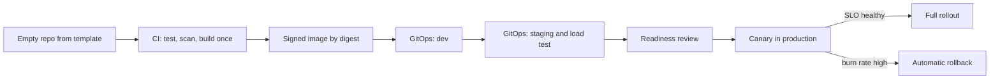

# Module 7 — Hero: capstone and practice exam

*You have learned cloud and DevOps one layer at a time: the shell and the network, identity, containers, Kubernetes, infrastructure as code, pipelines, releases, telemetry, SLOs, incidents, scaling, cost and AI workloads. This module puts the layers back together. In the capstone you take a brand-new Najm Bank service, Card Controls, from an empty repository to production with a signed SLO, reusing an artefact from every earlier module and linking them into one production readiness file that Salem, Maha and Noura can approve. Then we turn to you: the roles that make up cloud, platform, DevOps and SRE work, how to choose certifications from the cloud providers, the Linux Foundation and others without being ruled by them, what interviews actually test, and how to build a portfolio that proves you can run software, not just write it. The module closes with a 60-question practice exam across all eight phases.*

> **Phases:** Plan through Monitor — the whole delivery loop, end to end, on one service and then in one exam.

---

# 7.1 — Capstone: take a new Najm service from empty repo to production with an SLO
*Level: 🔴 Advanced* · *Prerequisites: Modules 0–6* · *Phase: Deploy, Operate*

## ⚡ In 60 seconds
- The capstone takes **Card Controls**, a new Najm service for freezing cards and setting limits, from an empty repository to production through all eight phases.
- The output is a **production readiness file**: linked evidence that the service can be built, released, observed, recovered and paid for, with an owner for each part.
- The spine is **one artefact, many environments**: build the container image once, sign it, and promote the same digest from dev to staging to production through Git.
- The SLO comes first, not last. It decides the alerts, the release gates, the replica count, the backup targets and the on-call rota.
- Decision cue: before each gate, ask "if this step failed silently at 2 a.m., how would we know, and how would we undo it?"
- Biggest trap: a readiness checklist ticked from memory. Every item needs evidence, and rollback, restore and kill switches need a timed drill.

## 🧭 Why it matters
Tariq brings a request to the platform team. The cards team wants a **Card Controls service**: customers freeze a card, block online or overseas use and set a daily limit from the Najm Mobile app. The card processor checks these controls during authorisation, so a wrong answer blocks a customer at a till or lets a stolen card through. The business wants it live in one quarter.

Salem gives the job to Yousef, with Maha as SRE partner. Yousef's first plan: copy an old repository, push an image tagged `latest`, apply manifests by hand, "add monitoring after launch". Salem asks three questions. "What is the SLO? How do you roll back in under five minutes? What happens if the database zone fails during a payday peak?" Yousef has no answers yet.

Public history shows why the questions matter. In August 2012 Knight Capital deployed new code to its servers, but one server kept old code behind a reused flag; according to the US SEC's later order, the firm lost hundreds of millions of dollars in under an hour. In January 2017 GitLab lost hours of production data after a database directory was deleted during an incident, and several backup methods turned out not to work (GitLab's public postmortem). Each was a missing, untested step on the path to production. This lesson builds the whole path once, properly.

## 📐 How it works

### 🟢 The essentials

**The service, in one paragraph.** Card Controls is a small HTTP API with its own managed PostgreSQL database. Najm Mobile API calls it to change controls; the card processor's integration calls it to read them during authorisation. It runs on the bank's managed Kubernetes cluster across two availability zones. It stores only an internal card reference, never card numbers, which Noura confirms at design review.

**The production readiness file.** A **production readiness review (PRR)** is a structured pre-launch check that a service can be operated safely; Google's SRE books describe the practice. Najm's PRR is a folder of linked artefacts under a one-page summary (🏛️ below), with three rules:
1. **Every claim has evidence** a reviewer can open, not "yes, done".
2. **Every risky change can be undone** by a documented, timed method.
3. **Every alert maps to an SLO or a runbook.** An alert with no action is noise.

**The eight phases.** Each phase reuses an artefact from an earlier module; the summary page in 🏛️ below maps each to its evidence and lesson. All numbers in this lesson are illustrative.

**Start with the SLO.** Maha and the cards product owner agree the user journeys that matter and write **SLIs** (service level indicators: measurements of good events over valid events) and **SLOs** (targets for them over a window):

| Journey | SLI | SLO (28-day window) |
|---|---|---|
| Read controls during authorisation | Share of read requests answered successfully within 100 ms at the load balancer | 99.95% |
| Customer changes a control | Share of write requests that succeed within 500 ms | 99.9% |
| Freshness | Share of control changes visible to reads within 2 seconds | 99.9% |

The read SLO is tighter because a failed read can block a real purchase. With 99.95% over 28 days, the **error budget** is 0.05% of read requests. It sets the release policy: while budget remains, the team ships; once it is spent, only reliability fixes ship.

**The path.** Each box is a gate that leaves evidence:



### 🟡 Going deeper

**Code: start from the golden path.** Yousef does not copy an old repository. He creates the service from the platform's template, which already contains a Dockerfile, CI workflow, Helm chart, OpenTelemetry setup, `CODEOWNERS` and a portal catalogue entry. Configuration comes from environment variables, never baked into the image (the Twelve-Factor App's config rule), so one image runs everywhere. The service exposes `/healthz/live` (the process is alive) and `/healthz/ready` (it can reach its database and is ready for traffic), which become the liveness and readiness probes from 2.3.

**Build: once, by digest, signed.** CI builds the image once per commit, pushes it, records its digest, then generates an SBOM and signs that digest with cosign. Later environments reference the same digest and never rebuild. CI reaches the cloud through **workload identity federation** (OIDC), so no long-lived key sits in the repository (1.3, 4.3):

```yaml
# .github/workflows/ci.yml (excerpt)
permissions:
  contents: read
  id-token: write        # lets the job request a short-lived OIDC token
jobs:
  build:
    runs-on: ubuntu-latest
    steps:
      - uses: actions/checkout@v4      # pin actions to a full commit SHA in real use
      - run: make test                  # unit and contract tests
      - run: make image                 # multi-stage, non-root build
      - run: make push sbom sign        # push, then SBOM and cosign signature on the digest
      - run: make bump-dev              # opens a PR to the GitOps repo with the new digest
```

**Deploy: infrastructure and app, both from Git.** The database, backups, cloud role and network rules are one OpenTofu module call, reviewed with a `tofu plan` on the pull request (3.1). Policy checks (3.3) reject a database without encryption at rest, deletion protection or backup retention. The Kubernetes side lives in the GitOps repository, one folder per environment, reconciled by Argo CD:

```yaml
apiVersion: argoproj.io/v1alpha1
kind: Application
metadata:
  name: card-controls-prod
  namespace: argocd
spec:
  project: cards
  source:
    repoURL: https://git.example.com/najm/gitops.git
    targetRevision: main
    path: apps/card-controls/overlays/prod
  destination:
    server: https://kubernetes.default.svc
    namespace: card-controls
  syncPolicy:
    automated:
      prune: true
      selfHeal: true     # reverts manual edits in the cluster back to Git
```

Promotion to production is a pull request changing one line, the image digest in the `prod` overlay, approved by the cards team and platform. Rollback is reverting that commit.

**Release: canary with a guard.** The rollout sends a small share of traffic to the new version, compares its errors and latency with the stable version, and widens step by step (4.2). A controller such as Argo Rollouts or Flagger automates the analysis; if the canary breaches SLO-based thresholds, it aborts and traffic returns to the stable version. New behaviour, such as "block overseas use", sits behind a feature flag so it can be switched off without a deploy. The CrowdStrike Falcon content update of July 2024, which crashed Windows hosts worldwide, shows what happens when a change reaches everyone at once.

**Monitor: alerts from the budget.** The service emits OpenTelemetry traces and RED metrics (rate, errors, duration). Maha writes **multi-window, multi-burn-rate alerts** from the SRE Workbook: page when the budget burns fast over both a long and a short window; open a ticket when it burns slowly. The read SLO's fast-burn page:

```yaml
# Prometheus alert rule (excerpt): 14.4x burn over 1h, confirmed over 5m.
# Recording rules (not shown) compute the read error ratio over each window.
- alert: CardControlsReadFastBurn
  expr: |
    card_controls:read_error_ratio:rate1h > (14.4 * 0.0005)
    and
    card_controls:read_error_ratio:rate5m > (14.4 * 0.0005)
  labels:
    severity: page
  annotations:
    runbook: https://runbooks.example.com/card-controls/read-errors
```

The factor 14.4 means the budget would be gone in about two days at this rate; the short window stops the page once the burn has ended. Every page links to a runbook.

**Operate: prove recovery.** With the business, Maha sets an **RPO** (tolerable data loss) of 5 minutes and an **RTO** (tolerable recovery time) of 30 minutes for a zone failure. The database runs with a standby in a second zone and point-in-time recovery. Then, in staging, they restore last night's backup to a new instance, replay to a chosen time and time it. A backup that has never been restored is a hope, not a control.

### 🔴 Expert view

**The architecture decisions, written down.** Salem asks for **architecture decision records (ADRs)**: one page per decision with context, options, choice and consequences. Three of Card Controls' ADRs:

| Decision | Choice | Why | Revisit when |
|---|---|---|---|
| Read path during authorisation | Serve from the service with a short in-memory cache, not a separate cache cluster | Fewer moving parts; the freshness SLO allows 2 seconds | Read latency SLO is at risk under peak |
| Multi-zone or multi-region | Multi-zone in one region now | Meets the RTO for zone failure; multi-region doubles cost and complexity | Regulator or business requires a region-level RTO |
| Failure mode if the service is down | The card processor applies a documented default agreed with the cards and risk teams | A blind "allow all" or "deny all" is a business decision, not a technical one | After every incident touching this path |

The third row is the one most teams skip: what a caller does when a dependency fails is a design decision that product, risk and security must sign.

**Capacity and cost before launch.** Yousef load-tests staging at twice the expected payday peak, sets CPU and memory requests from measured usage, gives the Horizontal Pod Autoscaler a floor of four replicas spread across two zones by a topology spread constraint, so losing a zone leaves two, enough for the measured peak. Mona asks for a **unit cost** (monthly cost from tagged resources divided by monthly requests, 6.2), shown next to the SLO so a "cheaper" change that burns budget, or a "safer" one that triples cost, is visible to both sides.

**Regulation without guesswork.** The runbooks, incident records and recovery tests also feed operational resilience evidence: EU DORA (applied from January 2025) for the EU entity, and the cloud and outsourcing expectations of the Qatari and UAE regulators. Do not guess clause numbers; ask risk and compliance what they need ([*Secure AI & Application Security*, lesson 11.2 — Regulation that touches security](../secai/index.html#/11.2)).

**The game day.** Before launch, Maha runs a two-hour **game day**, injecting failures in staging to practise the response:
1. Deploy a canary that returns errors on 5% of reads. *Expected:* analysis aborts the rollout automatically.
2. Cordon one zone's nodes and delete its pods. *Expected:* the read SLO holds; replacement pods start in the other zone.
3. Fail over the database. *Expected:* writes pause briefly, then resume within the agreed time.
4. Revoke the service's database credentials. *Expected:* readiness fails, the page fires and links to the right runbook.

The first game day found two gaps: the credentials runbook pointed to a renamed secret, and failover took longer than the RTO assumed because the connection pool did not reconnect. Both became fixes and regression checks.

## 🧰 The toolkit
| Tool, practice or service | What it is and does | When to reach for it |
|---|---|---|
| **Production readiness review** | Structured, evidence-based check that a service can be operated safely before launch | Every new service or major architecture change |
| **Architecture decision record** | One-page record of a decision, its options and its consequences | Any choice someone will later ask "why?" about |
| **Argo CD** | GitOps controller that keeps clusters in sync with a Git repository | Promoting the same artefact through environments by pull request |
| **Canary release** | Sending a small share of traffic to a new version and widening only if it is healthy | Every production rollout of a user-facing service |
| **Error budget** | The share of failures the SLO allows over its window | Setting release policy and alert thresholds |
| **Burn-rate alert** | Alert on how fast the error budget is being consumed, over a long and a short window | Paging on SLO risk instead of on raw resource metrics |
| **Game day** | Planned exercise that injects failures to test systems, runbooks and people | Before launch, then regularly and after major change |

## 🏛️ In practice at Najm Bank
**Card Controls production readiness file: summary page** (v1.0; owner Yousef; reviewers Maha for SRE, Noura for security, Mona for cost; approved by Salem).

| Phase | Evidence (lesson) | Decision recorded | Gate passed when |
|---|---|---|---|
| Plan | Service brief, SLO document, four ADRs (5.2) | Read SLO 99.95%, write SLO 99.9%; multi-zone | Product owner and Maha sign the SLO |
| Code | Repo from template; catalogue entry; owners (0.1) | Config only from environment | Template checks green |
| Build | Image digest, SBOM, signature (2.1, 4.3) | Non-root, pinned base image | Signature verified at admission |
| Test | CI run, contract tests with Mobile API, policy checks (3.3, 4.1) | No direct database access from other services | All gates green on main |
| Release | Canary analysis config; flag list (4.2) | Abort on read errors above budget rate | Abort tested in staging |
| Deploy | OpenTofu plan, Argo CD app, two-approval promotion (3.1, 3.2) | Rollback is a revert of one commit | Revert timed under five minutes |
| Operate | Runbooks, rota, restore drill report (5.3, 6.1) | RPO 5 min, RTO 30 min for zone loss | Restore drill met both targets |
| Monitor | SLO dashboard, burn-rate alerts, cost per request (5.1, 5.2, 6.2) | Pages only on SLO burn | Each alert fired once in a test |

## 🛠️ Exercises
- 🟢 Write the SLO document for a small service of your own (say, a URL shortener): two SLIs, an SLO for each over 28 days, the error budget in requests at an assumed traffic level, and the release policy when it runs out. *Done when:* a peer can say what would page someone and what would freeze releases, without asking you.
- 🟡 On your laptop, take that service from an empty repo to a local kind or k3d cluster: multi-stage non-root Dockerfile, a GitHub Actions workflow that builds once and records the digest, and Argo CD syncing from a Git folder you own. *Done when:* changing the digest in Git rolls the cluster forward, reverting the commit rolls it back, and you have timed both.
- 🔴 Add Prometheus and Grafana to your local cluster, define one SLO with fast-burn and slow-burn alerts, then run a one-hour game day with three injected failures (a bad release, a killed pod, a broken config). Use only machines and accounts you own; on a free-tier account, set a budget alert first. *Done when:* each failure is detected by an alert or the canary, each has a runbook step that worked, and your write-up lists at least two gaps you fixed.

## ⚠️ Mistakes and traps
- **SLO after launch.** Without it, nobody can say which alerts matter or when to stop shipping. Agree it in the Plan phase with the product owner.
- **Rebuilding per environment.** A rebuild in staging or production produces a different artefact from the one you tested. Build once and promote the digest.
- **Hand edits in the cluster.** They drift from Git and vanish on the next sync. Change Git; let the controller reconcile.
- **Untested backups and rollbacks.** GitLab's 2017 postmortem shows untested backups failing together. Drill restore and rollback, and time them.
- **Alerts on causes, not symptoms.** Paging on CPU at 80% wakes people for things customers never feel. Page on SLO burn.
- **Leaving the failure mode undecided.** Decide and sign in advance what callers do when the service is down.

## 🧾 Recap
- The SLO, agreed first, drives the alerts, release policy, capacity and recovery targets.
- One signed image, referenced by digest, moves through environments by pull request; rollback is a revert.
- Canary analysis, feature flags and burn-rate alerts turn the error budget into automatic guardrails.
- Recovery, failure modes and cost are designed and drilled before launch.

## ✍️ Check yourself

**1. Yousef's staging pipeline rebuilds the container image from the same Git commit before deploying to production "to be safe". What is the problem?**

- A. Rebuilding is slower, which hurts lead time but is otherwise harmless
- B. Production no longer runs the tested artefact; promote the same digest
- C. Rebuilding is required for production because staging images are unsigned
- D. There is no problem as long as both builds use the same Git commit

<details><summary>Answer</summary>

**B.** A rebuild can pick up different base layers or dependencies, so production runs something nobody tested. D is tempting, but the same commit does not guarantee the same artefact. (🟡 Going deeper.)

</details>

**2. The Card Controls read SLO is 99.95% over 28 days. What does the error budget tell the team?**

- A. How many engineers must be on call during each week of the window
- B. The maximum latency any single read request is allowed to have
- C. How much the service is allowed to cost each month
- D. How many reads may fail before reliability work takes priority over releases

<details><summary>Answer</summary>

**D.** The error budget is the 0.05% of requests the SLO allows to fail; while it remains, the team ships; when it is spent, reliability work comes first. It says nothing directly about staffing, cost or a single request's latency. (🟢 The essentials.)

</details>

**3. During the game day, the canary returns errors on 5% of reads. What should happen if the release is set up as this lesson describes?**

- A. Analysis aborts the rollout and traffic returns to the stable version
- B. Maha is paged and edits the Deployment in the cluster by hand to roll back
- C. The rollout continues, because 95% of reads still succeed and that is close to target
- D. Yousef rebuilds the image with a fix and pushes it straight to production

<details><summary>Answer</summary>

**A.** Analysis tied to the SLO aborts automatically. Manual cluster edits (B) drift from Git; continuing (C) would burn the budget far faster than allowed; pushing directly (D) skips every gate. (🟡 Going deeper.)

</details>

**4. Which item belongs in an architecture decision record rather than only in a runbook?**

- A. The exact command to restart a pod that is stuck in a crash loop
- B. The on-call rota and escalation contacts for launch week
- C. What the processor does when Card Controls is down, and who agreed it
- D. The URL of the Grafana dashboard that shows the read SLO

<details><summary>Answer</summary>

**C.** The failure mode is a business and risk decision with options and consequences, which is what an ADR records. The others are operational details for runbooks and rota pages. (🔴 Expert view.)

</details>

**5. Salem asks how the team knows the 30-minute RTO for zone loss is realistic. What is the best evidence?**

- A. The provider's documentation says database failover across zones is automatic
- B. A dated drill report with the measured failover and restore times
- C. Automated database backups are enabled in the OpenTofu module for the service
- D. The policy check that requires a backup retention period passed on the pull request

<details><summary>Answer</summary>

**B.** Only a timed drill shows recovery works within the target; the game day found a connection-pool issue no configuration would reveal. A, C and D show settings, not outcomes. (🟡 Going deeper, 🔴 Expert view.)

</details>

## 📚 References
- Google, *Site Reliability Engineering* (2016) and *The Site Reliability Workbook* (2018), including SLOs, alerting on SLOs and launch reviews — https://sre.google/books/
- The Twelve-Factor App — https://12factor.net
- OpenGitOps principles — https://opengitops.dev
- Argo CD documentation — https://argo-cd.readthedocs.io
- Argo Rollouts documentation — https://argoproj.github.io/rollouts/
- OpenTofu documentation — https://opentofu.org/docs/
- OpenTelemetry documentation — https://opentelemetry.io/docs/
- Prometheus alerting rules — https://prometheus.io/docs/prometheus/latest/configuration/alerting_rules/
- GitHub Docs, security hardening with OpenID Connect — https://docs.github.com/en/actions/security-for-github-actions/security-hardening-your-deployments/about-security-hardening-with-openid-connect
- GitLab, postmortem of the database outage of January 31, 2017 — https://about.gitlab.com/blog/
- US SEC, order in the matter of Knight Capital Americas LLC (2013) — https://www.sec.gov
- Regulation (EU) 2022/2554 on digital operational resilience for the financial sector (DORA) — https://eur-lex.europa.eu/eli/reg/2022/2554/oj

---

# 7.2 — The cloud career: roles, certifications, interviews and a portfolio
*Level: 🔴 Advanced* · *Prerequisites: 7.1* · *Phase: Plan*

## ⚡ In 60 seconds
- "Cloud" is several jobs: cloud, DevOps, platform, site reliability (SRE), cloud security, FinOps and AI infrastructure. They share foundations but own different things. Pick a target role first.
- Certifications are a signal, not proof. The main sources are the three cloud providers (**AWS**, **Microsoft**, **Google Cloud**), the **Linux Foundation and CNCF** for Kubernetes, **HashiCorp** for Terraform and the **FinOps Foundation**. Names, codes and content change, so check the issuer's current page.
- A **portfolio of evidence** beats a list of badges: a service you took to "production" on your own laptop or free tier, with an SLO, a pipeline, a runbook and a postmortem of something you broke on purpose.
- Interviews test troubleshooting method more than recall: a broken pod, a design to make deployable, an incident to lead.
- Decision cue: choose a certification by target role and local demand, and pair it with an artefact you built while studying.
- Biggest trap: leaving a free-tier account without a budget alert, or putting an employer's architecture, keys or incidents in a public repository.

## 🧭 Why it matters
Six months after joining, Yousef asks Salem: "Should I do a Kubernetes certification or a cloud architect one? And is platform engineering a real career, or just DevOps renamed?" He has one service in production and no plan.

Salem has the mirror problem. He is hiring two platform engineers and one SRE for the move from the data centre. Many CVs list several cloud certificates; fewer show anything he can read or run. One candidate with a single associate-level certificate linked a repository: a small API deployed to a local kind cluster through GitHub Actions and Argo CD, an SLO with burn-rate alerts, and a two-page postmortem of a failure she caused deliberately in a game day. Salem invites her first.

Certificates still matter. Job adverts in Gulf banks, government bodies and consultancies often list named cloud certifications as required or preferred, and they help you pass the first filter. The interview, and then the pager, test whether you can do the work. For the wider job search (CVs, applications, offers), see [*From Graduate to Hired*, lesson 2.4 — Cloud, platform, DevOps and security engineer](../career/index.html#/2.4).

## 📐 How it works

### 🟢 The essentials

**The role map.** Titles vary by organisation, so read the job description, not the title. At the time of writing (2026), the roles closest to this course look like this:

| Role | Owns, day to day | Course modules to emphasise |
|---|---|---|
| Cloud engineer | Cloud accounts, networks, identity, managed services; landing zones and migrations | 1, 3, 6 |
| DevOps engineer | CI/CD pipelines, build tooling, release automation, developer support | 2, 3, 4 |
| Platform engineer | The internal developer platform: golden paths, Kubernetes, GitOps, self-service | 2, 3, 4, 7.1 |
| Site reliability engineer | SLOs, alerting, on-call, incidents, capacity, removing toil with code | 5, 6, 7.1 |
| Cloud security engineer | IAM, policy as code, workload and network controls, supply chain | 1.3, 3.3, 4.3, plus the security course |
| FinOps practitioner | Cost visibility, allocation, optimisation, unit economics with Finance | 6.2 |
| AI infrastructure or MLOps engineer | GPUs, model serving, LLM gateways, their reliability and cost | 6.3, 5, 6.1 |

"Platform engineering" is not just DevOps renamed. DevOps is a culture and set of practices shared by everyone who builds and runs software; platform engineering is a team building an internal product, the platform, so other teams can follow those practices without reinventing them. SRE runs production with reliability treated as engineering, with explicit budgets. In a start-up one person does all three; at Najm they are separate teams.

**Where people come from.** Developers move into platform and SRE work, system and network administrators into cloud engineering, data engineers into MLOps. Graduates usually enter as junior cloud, DevOps or platform engineers. Earlier experience is an asset: a former developer knows why a slow pipeline gets bypassed.

**Certifications, in brief.** This course is not affiliated with any issuer and does not prepare you for a specific exam. The table is general orientation. Exam names, codes, levels, prices, formats and renewal rules change, and providers retire and replace exams, so check each issuer's current page before you plan.

| Issuer | Kinds of credential (examples at the time of writing, 2026) | Typical fit |
|---|---|---|
| **AWS** | Foundational (Cloud Practitioner), associate (for example Solutions Architect and SysOps-style administration), professional and specialty levels | Roles in organisations running on AWS |
| **Microsoft** | Fundamentals (Azure Fundamentals), role-based associate (for example Azure Administrator) and expert levels | Organisations on Azure; common in enterprises and government |
| **Google Cloud** | Foundational (Cloud Digital Leader), associate (Associate Cloud Engineer) and professional (for example Cloud Architect, Cloud DevOps Engineer) | Organisations on Google Cloud; data-heavy teams |
| **Linux Foundation and CNCF** | Kubernetes certifications: KCNA (associate, knowledge-based), CKAD (application developer), CKA (administrator), CKS (security); the hands-on ones are performance-based | Platform and SRE roles on any cloud |
| **HashiCorp** | Terraform Associate | IaC-heavy roles; the concepts transfer to OpenTofu |
| **FinOps Foundation** | FinOps Certified Practitioner and further levels | FinOps roles; engineers who work closely with Finance |

Two patterns help. **Provider certificates** prove you know one cloud's services; choose the cloud your target employers run. **Vendor-neutral certificates**, such as the Kubernetes ones, transfer across clouds, and their **performance-based** format (you solve tasks in a live environment rather than answering multiple-choice questions) is closer to the real job. Many credentials expire after a few years and must be renewed; budget time for that.

### 🟡 Going deeper

**Choosing a certification deliberately.** Score each candidate credential from 1 to 3 on five questions:
1. **Role fit.** Does it match the role you want in two to three years?
2. **Market demand.** Do employers in your market name it? Read ten current job adverts and count.
3. **Practical or knowledge-based?** Practical exams show you can do the task; knowledge exams show breadth.
4. **Full cost.** Training, exam, retakes, renewal and your time.
5. **Sponsorship.** Many employers, including Najm, fund certifications tied to a development plan.

For Yousef, a platform engineer at a bank that runs Kubernetes on one cloud, the scores point to a hands-on Kubernetes administrator credential now, and the bank's cloud provider's associate-level credential next. A professional architect credential fits later, when he designs across many teams.

**Study by building.** End every study week with something running. A foundational cloud exam pairs with setting up a free-tier account properly (budget alert first, MFA on the admin user, no long-lived keys); a Kubernetes exam with breaking and fixing your own kind cluster; a Terraform exam with an OpenTofu module with remote state and a plan in CI. Use only your own accounts and machines.

**The portfolio.** A cloud portfolio is a small set of artefacts others can read and run, each showing judgement as well as skill. Good items, all legal and all on resources you own:
- **A capstone service**, like 7.1 at small scale: multi-stage Dockerfile, CI that builds once, GitOps to kind or k3d, an SLO and burn-rate alerts, and a README that runs in ten minutes.
- **An IaC module** with a clear interface, examples, tests and a policy check.
- **A game-day report and postmortem**: what you broke on purpose, what detected it, what you changed. Blameless, with a timeline.
- **A cost note**: an estimate from the provider's pricing calculator, with assumptions stated and dated.
- **Open-source contributions**: a Helm chart fix or a documentation improvement to a CNCF project.
- **Writing**: a post that explains one decision well, such as "why my canary aborts on burn rate, not on CPU".

Each case study follows one shape: context, decision, evidence, trade-off, lesson. "I chose multi-zone over multi-region because the RTO allowed it and multi-region doubled the moving parts" shows more than "I deployed to Kubernetes".

**What never goes in a portfolio.** Your employer's diagrams, hostnames, account IDs, incidents, logs or customer data, or anything with a secret in its history. Scan public repositories for secrets first; deleting a file does not remove it from Git history, and a leaked key must be revoked. To show work from your job, rebuild the pattern in your own lab and ask your employer before naming them.

**The interview loop.** Cloud and platform loops commonly mix:
- **Fundamentals**: Linux processes and permissions, "what happens when you open a URL", IAM roles versus users.
- **Troubleshooting**: a broken system, such as a pod in `CrashLoopBackOff` or a service returning 502s. Interviewers watch your method more than your answer.
- **Hands-on**: write a Dockerfile, fix a pipeline, read a Terraform plan, write a PromQL query.
- **System design**: design a service so it is deployable, observable and recoverable. See [*From Graduate to Hired*, lesson 5.3 — System design, data and ML interviews for juniors](../career/index.html#/5.3).
- **Incident scenario** ("this alert fires at 2 a.m.") and **behavioural** questions, answered with **STAR** (situation, task, action, result).

A typical troubleshooting question, and what a strong answer sounds like:

```text
Q: After a deploy, the new pods show CrashLoopBackOff. What do you do?

Strong answer, out loud, in order:
1. Limit the damage: is the rollout paused or old pods still serving? If users
   are affected, roll back first (revert the GitOps commit), then investigate.
2. kubectl describe pod <name>    -> events: image pull? OOMKilled? probe failures?
3. kubectl logs <name> --previous -> the crashed container's last output
4. Compare with the last good release: config, secrets, image digest, limits.
5. Fix forward or keep the rollback; add a test or check so it cannot recur.
```

The order matters: restore service, then diagnose, then prevent. That is the same chain as 7.1 and 5.3.

### 🔴 Expert view

**How the job grows.**

| Level | Scope | Evidence that shows it |
|---|---|---|
| Junior engineer | Delivers well-defined tasks; joins on-call with a buddy | Pipelines, modules and runbooks that work; clear write-ups |
| Engineer | Owns a component; on-call independently | A service taken to production, like 7.1 |
| Senior engineer | Owns a domain such as observability or GitOps; sets reusable patterns | A golden path many teams use; incidents led well |
| Staff or principal | Shapes architecture and standards across many teams | Platform decisions adopted bank-wide; people grown |
| Head of platform or SRE | Strategy, budget, hiring, reliability and cost outcomes | Measurably faster, safer delivery (DORA-style metrics) at a known cost |

At each step the work shifts from doing tasks to making good outcomes the default for many teams. Platform work is a product job: Salem's team measures adoption and developer satisfaction, not just uptime.

**T-shaped, not tool-shaped.** Tools change; Linux, networking, failure modes and operational judgement change slowly. Someone who understands why a readiness probe exists can learn any orchestrator. Go deep in one area (Kubernetes, observability, IaC or FinOps) on broad foundations. AI infrastructure is the same: GPUs and LLM gateways are new, but capacity, latency, cost and failure are old questions. [*Running AI Agents in Production* — Level 3, Production Engineer](../agentic/learning-path.html#level-3-production-engineer) goes further on operating agents, and [*Secure AI & Application Security*, lesson 12.2 — The security career: roles, certifications and portfolio](../secai/index.html#/12.2) covers the cloud security path.

**Staying current without the noise.**
- *Weekly:* skim your provider's and Kubernetes' release notes for deprecations that affect you.
- *Monthly:* read one primary source, such as a public postmortem, and try one thing in your lab.
- *Yearly:* revisit your target role, certification scores and portfolio.

DORA publishes research on software delivery performance; read the current report rather than repeating old figures.

**Hiring from the other side.** Salem does not filter on certificates alone, which would reject strong self-taught engineers. Every candidate gets the same practical task, and panellists score independently before discussing. He also looks for what no certificate shows: does the candidate say "I don't know, here is how I would find out" instead of guessing?

**Sustainability.** SRE and platform roles include on-call. Good teams cap pages per shift, pay or compensate for on-call, run blameless postmortems and protect time for toil reduction (5.2). Ask about these in interviews; the answers tell you how the team really works.

## 🧰 The toolkit
| Tool, practice or service | What it is and does | When to reach for it |
|---|---|---|
| **Role map** | Table of cloud roles, what each owns and which skills it needs | Choosing a target role; reading job adverts |
| **Certification decision matrix** | Scores credentials on role fit, demand, practicality, cost and sponsorship | Before committing time and money to a certification |
| **Performance-based exam** | Exam where you solve tasks in a live environment | When you want a credential closest to real work, such as Kubernetes administration |
| **kind** | Runs a local Kubernetes cluster in Docker containers | Building and breaking a portfolio cluster at no cloud cost |
| **Budget alert** | Cloud billing alert at a threshold you set | Before creating anything in a free-tier or personal account |
| **Portfolio case study** | One or two pages: context, decision, evidence, trade-off, lesson | Applications, promotion cases, internal visibility |
| **STAR** | Situation, task, action, result: a structure for behavioural answers | Behavioural interview questions |

## 🏛️ In practice at Najm Bank
Salem's **platform engineer interview scorecard**, used for every candidate:

| Criterion | What "strong" looks like | Assessed by |
|---|---|---|
| Foundations | Explains DNS, TLS, load balancing and IAM plainly and correctly | Technical interview |
| Troubleshooting | Restores service first, then diagnoses with a clear method; says what they would check next | 30-minute broken-cluster exercise |
| Delivery | Builds once, promotes by digest, explains rollback; reads a Terraform or OpenTofu plan | Hands-on task |
| Reliability | Writes an SLI and SLO for a service and explains which alert pages | Design discussion |
| Design | Makes a service deployable, observable and recoverable; names trade-offs and failure modes | 45-minute design exercise |
| Evidence of work | Portfolio items explained in depth, within confidentiality | Portfolio discussion |
| Collaboration and learning | Blameless language; changes view on new evidence | Behavioural questions (STAR) |

## 🛠️ Exercises
- 🟢 Choose a target role from the role map and collect five current job adverts for it in your market. *Done when:* you have a table of the skills, tools and certifications they ask for, each certification checked against the issuer's current official page, and a paragraph naming your target role and your top three gaps.
- 🟡 Turn your 7.1 exercise into a public portfolio repository: README that runs in ten minutes, architecture diagram, SLO document, a game-day postmortem and a dated cost note with stated assumptions. Scan it for secrets before publishing. *Done when:* a peer clones it, runs it locally from the README alone, and can state your key design decision after ten minutes of reading.
- 🔴 Run a mock interview loop with a peer: a broken-cluster exercise on your own kind cluster (one breaks, the other fixes), a 45-minute design of "a notification service that must not send duplicates", and two behavioural questions. Swap roles and score with the scorecard above. *Done when:* both scorers rated independently before comparing, you have named your weakest criterion, and you have a dated plan to improve it.

## ⚠️ Mistakes and traps
- **Collecting badges instead of evidence.** Pair every certification with something you built, broke and fixed.
- **No budget alert on a practice account.** A forgotten GPU instance or load balancer can bill for weeks. Set a budget alert first and tear down after each session.
- **Leaking in the portfolio.** Employer diagrams, account IDs, logs or keys in a public repository can cost you far more than a gap on your CV. Rebuild patterns in your own lab.
- **Trusting forum facts about exams.** Exam codes, content and renewal rules change, and exams are retired. Read the issuer's current pages.
- **Guessing in interviews.** Confident wrong answers during an incident question are worse than "I would check X next". Show your method.

## 🧾 Recap
- Cloud work is a family of roles: cloud, DevOps, platform, SRE, cloud security, FinOps and AI infrastructure. Choose a target before choosing courses or certificates.
- Provider, Kubernetes, Terraform and FinOps credentials have different focuses; check current details at the source and choose with a decision matrix.
- A portfolio you can run, with an SLO, pipeline, runbook and postmortem, shows judgement that certificates cannot.
- Interviews test foundations, troubleshooting method, hands-on skill, design for operability, incidents and behaviour; restore, diagnose, prevent answers most.
- Grow T-shaped: deep in one area on broad foundations, with a steady habit of learning and writing.

## ✍️ Check yourself

**1. Yousef works on Najm's platform team, which runs Kubernetes on one cloud. Which certification plan best fits his role for the next year?**

- A. A professional-level architect certification on a cloud the bank does not use
- B. As many foundational certificates as possible, across all three major clouds
- C. A hands-on Kubernetes administrator credential, then the bank's cloud associate one
- D. No certifications at all, since only a portfolio of artefacts matters to employers

<details><summary>Answer</summary>

**C.** It scores high on role fit, demand and practicality; pairing each with an artefact adds evidence. B is breadth without depth; A fits neither role nor employer; D ignores that adverts often name certifications. (🟡 Going deeper.)

</details>

**2. In a troubleshooting interview, new pods are in CrashLoopBackOff after a deploy and customers are seeing errors. What should a strong answer do first?**

- A. Restore service by reverting the GitOps commit, then diagnose
- B. Read the application source code line by line to find the bug
- C. Increase the memory limit on the Deployment and redeploy straight away
- D. Delete the namespace and recreate everything in it from scratch

<details><summary>Answer</summary>

**A.** Restore, diagnose (describe, then previous logs), prevent. C guesses a cause before looking at events, B is slow while users are affected, and D destroys evidence and may cause a bigger outage. (🟡 Going deeper.)

</details>

**3. What best distinguishes platform engineering from DevOps, as this lesson describes them?**

- A. Platform engineering replaces DevOps and makes its practices and culture obsolete
- B. DevOps is only about CI/CD tools, while platform engineering is only about running Kubernetes
- C. They are the same job, renamed to sound new in job adverts
- D. DevOps is a culture; platform teams build an internal product that makes it easy

<details><summary>Answer</summary>

**D.** The platform is an internal product that makes good practice the easy path. C is the common misconception the lesson addresses; A and B misdescribe both. (🟢 The essentials.)

</details>

**4. A candidate wants to show the game-day postmortem she wrote at her current employer in her public portfolio. What should she do?**

- A. Publish it as written, since the incident is resolved and the lessons are useful
- B. Rebuild it in her own lab and ask before naming her employer
- C. Publish it with the bank's name removed but the diagrams and logs intact
- D. Keep it in a private repository and send the link to every recruiter

<details><summary>Answer</summary>

**B.** Employer architecture, logs and incidents stay confidential unless the employer approves. C still leaks internal detail; D shares it anyway. A lab rebuild keeps the learning without the risk. (🟡 Going deeper.)

</details>

**5. Before practising for a cloud certification on a personal free-tier account, what should a learner do first?**

- A. Create a long-lived access key for convenience when scripting from a laptop
- B. Use the account's root user for everything to avoid permission errors
- C. Set a budget alert and turn on MFA for the admin user
- D. Nothing, because free-tier accounts cannot generate charges of any kind

<details><summary>Answer</summary>

**C.** Free tiers have limits, and resources outside them can bill until deleted. A budget alert and MFA come first, and resources are torn down after each session. A and B create security risks; D is false. (🟡 Going deeper, ⚠️ Mistakes and traps.)

</details>

## 📚 References
- AWS Certification — https://aws.amazon.com/certification/
- Microsoft Learn, credentials and certifications — https://learn.microsoft.com/credentials/
- Google Cloud certification — https://cloud.google.com/learn/certification
- Linux Foundation Training and Certification (KCNA, CKA, CKAD, CKS) — https://training.linuxfoundation.org
- CNCF certification overview — https://www.cncf.io/training/certification/
- HashiCorp certifications — https://developer.hashicorp.com/certifications
- FinOps Foundation, training and certification — https://www.finops.org
- Google, *Site Reliability Engineering* (2016) and *The Site Reliability Workbook* (2018) — https://sre.google/books/
- DORA research program — https://dora.dev
- kind (Kubernetes in Docker) — https://kind.sigs.k8s.io
- Kubernetes documentation: debugging pods — https://kubernetes.io/docs/tasks/debug/

---

# 7.3 — Practice exam: 60 scenario questions
*Level: 🔴 Advanced* · *Prerequisites: 7.1, 7.2* · *Phase: Plan*

## ⚡ In 60 seconds
- This is a 60-question practice exam covering every lesson from 0.1 to 7.2 and all eight phases of the delivery loop. Most questions are scenarios set at Najm Bank. The questions are mixed, as in a real exam, rather than grouped by module.
- Take it in one sitting of about 90 minutes, closed book, with no lab and no search. Write each answer and mark it "sure" or "guess" before you open any answer.
- Every answer ends with the phase and the lesson to review, for example *(Deploy · 4.2)*. Your wrong answers are a study plan.
- Suggested reading of your score (the course's own guide, not a certification standard): 48 or more correct means you are ready to move on; 36 to 47 means review the lessons you missed; under 36 means work through the modules again, doing the exercises.
- Decision cue: for each miss, write down why the wrong option tempted you. That reason is the habit to fix.
- Biggest trap: checking each answer as you go, or retaking the exam the next day. Both measure memory, not judgement.

## 🧭 Why it matters
Before Yousef carries the pager on his own, Salem asks him to sit this exam. "Our on-call rota, interviews and readiness reviews don't ask you to define a pod," Salem says. "They give you a symptom at 2 a.m., a plan that wants to destroy a database, or a bill that grew faster than the customers, and ask what you do next." Yousef scores well on Kubernetes and badly on cost and incidents, which matches his first six months: he has deployed plenty, but he has never read a cost report or run an incident.

That is the point of a scenario exam. Every question gives you the kind of situation the course has trained you for, and most offer an answer that sounds reasonable but is wrong, because production mistakes look reasonable too. The score matters less than the pattern of misses, and each miss points to the lesson that fixes it.

## 📐 How it works

### 🟢 The essentials
**Set the conditions.** Choose a quiet 90 minutes. Have paper or a text file with the numbers 1 to 60. Do not open the course, a terminal or a search engine. If you do not know an answer, choose the option you would act on at work and mark it "guess".

**One pass, then a second.** Answer every question in order without opening any answer. Then go back to the questions you flagged and decide again. Change an answer only if you can name the fact or principle that changed your mind.

**Mark the answer and your confidence.** Next to each number, write the letter and "sure" or "guess". A correct guess is a gap you have not found yet; a wrong "sure" is the most valuable result in the exam, because it is a belief you would act on in production.

**Then check, all at once.** Open the answers, score yourself, and copy the phase and lesson from every question you got wrong or guessed.

### 🟡 Going deeper
**Review by pattern, not by question.** Put your misses in a table by phase and by lesson. Three misses in one lesson mean a lesson to reread. Misses spread across one phase mean a habit to build, such as reading every plan (Deploy) or paging only on symptoms (Monitor).

| Phase | Questions in this exam |
|---|---|
| Plan | 1, 8, 10, 14, 16, 17, 24, 31, 33, 39, 40, 41, 52 |
| Code | 4, 27, 57 |
| Build | 3, 21, 50 |
| Test | 5, 20, 28 |
| Release | 9, 12, 13, 46, 55 |
| Deploy | 18, 19, 26, 32, 35, 36, 44, 48, 49, 58, 60 |
| Operate | 2, 7, 11, 22, 23, 25, 30, 34, 38, 42, 43, 45, 47, 53, 54, 59 |
| Monitor | 6, 15, 29, 37, 51, 56 |

**Name the kind of error.** For each miss, choose one cause:
- **Did not know**: the fact or idea was missing. Reread the lesson section the answer points to.
- **Misread**: you knew it but missed a word such as "first", "best" or "most likely". Slow down on the question stem.
- **Tempted**: you chose an option that sounds responsible but fails the scenario, such as "add a manual approval" or "restart it". These are the misses that matter most at work.

**Close the loop with your hands.** For your two weakest lessons, redo the lesson's 🟢 or 🟡 exercise in your lab. Reading the explanation fixes the answer; doing the exercise fixes the judgement.

### 🔴 Expert view
**Retake later, not sooner.** Wait at least two weeks, then take the exam again cold. If you still miss a question, the explanation did not stick; go back to the lesson and its exercise.

**Explain, don't recognise.** For each question, say aloud why the right answer is right and why each distractor is wrong. If you can do that for all four options, you can handle the same idea in an interview or an incident, where nobody offers you options.

**Write your own questions.** The strongest test of understanding is writing a fair scenario question with one defensible answer and three tempting, wrong ones. Write one per lesson for your weakest module and swap with a peer.

**Know what this exam is not.** It is not affiliated with any certification and does not mirror any provider's exam format or content (lesson 7.2). Use it to find your gaps; use the issuer's own guides to prepare for a specific certificate.

## 🧰 The toolkit
| Tool, practice or service | What it is and does | When to reach for it |
|---|---|---|
| **Confidence marking** | Writing "sure" or "guess" beside each answer before checking | Every practice exam; it exposes lucky guesses and false certainty |
| **Miss log** | A table of each wrong or guessed answer with its phase, lesson and type of error | Straight after scoring; it becomes your study plan |
| **Spaced retake** | Taking the same exam again after a gap of two weeks or more | To check that review fixed the gap, not just the answer |

## 🏛️ In practice at Najm Bank
Salem uses the exam as one input to **on-call readiness**, alongside shadowing Maha's rota and one game day. The result is discussed, not filed. Yousef's **miss log**, as he filled it in:

| Question | Phase · lesson | My answer (confidence) | Type of error | Action and date |
|---|---|---|---|---|
| 15 | Monitor · 6.2 | A (sure) | Tempted: removed the NAT without thinking about exposure | Reread 6.2 🟡; trace one traffic path in the lab cost report |
| 22 | Operate · 5.3 | A (guess) | Did not know the IC rule | Reread 5.3 🟢; act as scribe at the next tabletop |
| 35 | Deploy · 3.2 | C (sure) | Tempted: turned off self-heal | Reread the promotion policy; write back one hand change in the lab |

**Readiness rule:** no lesson with two or more misses is left without a dated review action, and Yousef retakes the exam before his first solo shift.

## 🛠️ Exercises
- 🟢 Take the exam in one sitting under the conditions above, marking each answer "sure" or "guess". *Done when:* you have a score out of 60 and a list of every wrong or guessed question with its phase and lesson.
- 🟡 Build your miss log with the type of each error, reread the lesson sections for every miss, and redo one exercise from each of your two weakest lessons in your lab. *Done when:* every miss has a one-line cause and an action, and you have the output of the two redone exercises.
- 🔴 Write five new scenario questions in this exam's format for your weakest phase, each with one defensible answer, three tempting distractors and an explanation ending in its phase and lesson. Swap them with a peer, then retake this exam at least two weeks later. *Done when:* your peer has answered and critiqued your questions, and your retake has no question you missed both times.

## ⚠️ Mistakes and traps
- **Checking answers as you go.** You learn the answer to one question and lose the measure of the rest. Answer all 60, then check.
- **Counting only the score.** A good score with many guesses hides gaps. Review guesses as if they were misses.
- **Rereading instead of practising.** An explanation tells you the answer; the lab exercise builds the judgement. Redo the exercises for your weakest lessons.
- **Retaking too soon.** The next day you remember letters, not ideas. Wait at least two weeks.
- **Treating this as a certification mock.** Provider and Kubernetes exams have their own scope and format. Use their official guides for those (lesson 7.2).

## ✍️ Practice exam

**1. Every night an engineer on Maha's team restarts a stuck reconciliation job by hand. It takes ten minutes, and the work grows as more services move to the cloud. How does SRE practice classify this work, and what follows?**

- A. Normal operations work for on-call, so it should simply be added to the rota handbook
- B. Toil: manual, repetitive work that grows with scale, to cap and then automate away
- C. A security risk that must go to Noura's team before anything else is done
- D. Product work, so the app team should add it to its feature roadmap for next year

<details><summary>Answer</summary>

**B.** Toil is manual, repetitive work that grows with the service and leaves nothing of lasting value. SRE caps it (Google's SRE book suggests keeping operational work to about half of an SRE's time) and automates it away. A is tempting because the work is operational, but writing it into a handbook makes it permanent instead of removing it. *(Plan · 0.1)*

</details>

**2. During an outage, `dig` returns the right address for `api.najm.example`, but `nc -vz api.najm.example 443` hangs for a long time and then times out. Which hop failed, and where should Yousef look?**

- A. TLS: the certificate on the listener has probably expired and needs renewing now
- B. DNS: the record's TTL is too long, so clients still hold an old cached answer
- C. The application: a 5xx error in the pods is closing each connection at once
- D. The network path: a firewall or security group is silently dropping the packets

<details><summary>Answer</summary>

**D.** A connection that hangs and then times out usually means something is silently dropping packets, typically a firewall rule or security group; "connection refused" would mean nothing is listening. TLS (A) and HTTP (C) come after TCP, so they cannot be tested yet, and DNS (B) already returned the right address. *(Operate · 1.1)*

</details>

**3. The Najm Mobile API build must download packages from a private package index that needs a credential. What is the safe way to give the build that credential?**

- A. Mount it as a build secret for the `RUN` step that needs it, so no layer has it
- B. Set it with `ENV` in the Dockerfile so that `pip` can read it during the build
- C. Copy a `pip.conf` file in, run the install, then delete the file in the next step
- D. Bake it into the approved base image so that every team can reuse it easily

<details><summary>Answer</summary>

**A.** A secret mount is available to one step and is never written to a layer. `ENV` (B) is stored in the image's configuration; deleting a copied file in a later step (C) only hides it, because the earlier layer still holds it; D spreads the credential to every image built on that base. *(Build · 2.1)*

</details>

**4. Nobody changed the Najm networking code, yet this week's plan proposes updates to forty resources. The configuration allows any provider version `>= 5.0`, and the dependency lock file is not committed. What is the most likely cause, and the fix?**

- A. Someone changed every resource in the console overnight; revert it all at once with a fresh apply
- B. The state file is corrupt; delete it and import every resource again from the command line
- C. Init pulled a newer provider with changed defaults; pin the version and commit the lock file
- D. Plans are not deterministic, so re-run the plan until it shows no changes before applying

<details><summary>Answer</summary>

**C.** Without a version constraint and a committed lock file, `init` can pick up a newer provider whose changed defaults produce a plan full of updates nobody asked for. Pin providers, commit `.terraform.lock.hcl` and upgrade deliberately, in dev first. A is tempting, but drift on forty resources at once is unlikely, and a blind apply might undo deliberate fixes; B is dangerous state surgery. *(Code · 3.1)*

</details>

**5. On a busy Najm repository, two pull requests each pass all checks on their own and are merged within minutes of each other. `main` then turns red. What prevents this?**

- A. Asking developers to announce each merge in the team chat and wait for each other
- B. Re-running the pipeline on `main` until it passes, then moving on to the next change
- C. A merge queue that tests each PR on top of those queued ahead of it before merging
- D. Longer-lived feature branches, so that fewer merges reach `main` each day

<details><summary>Answer</summary>

**C.** A merge queue (or merge train) tests each pull request together with the ones queued before it, so `main` stays green. A relies on people; B is "re-run until green", which hides real failures; D brings back the painful, late integration that CI exists to remove. *(Test · 4.1)*

</details>

**6. Yousef must build a first dashboard for the Payments database connection pool and the hybrid link to the data centre. Which checklist fits these resources best?**

- A. USE: utilisation, saturation and errors for resources such as pools and links
- B. RED: request rate, errors and duration for each endpoint of each service
- C. DORA: deployment frequency, lead time, change failure rate and time to restore
- D. The average latency of the Mobile API, as it sits in front of both of them

<details><summary>Answer</summary>

**A.** USE is the checklist for resources such as connection pools, queues, disks and network links. RED (B) suits request-driven services such as the API itself; DORA (C) measures delivery, not resources; an average (D) hides the slow tail and says nothing about saturation. *(Monitor · 5.1)*

</details>

**7. Maha's regional failover plan for Payments relies on runbooks in a wiki, CI runners and the secrets store, all of which run only in the primary region. What is the weakness?**

- A. None, because a warm standby region already holds a smaller copy of the application stack
- B. The plan should use backup and restore instead, because it is the cheapest strategy available
- C. Runbooks should be kept on paper instead, because wikis are never reliable during incidents
- D. The recovery path depends on the very region that has failed, so it cannot run when needed

<details><summary>Answer</summary>

**D.** If the primary region is gone, so are the runbooks, runners and secrets needed to fail over. Facebook's October 2021 outage showed the same pattern: the tools needed for the fix were affected too. A is tempting, but a standby you cannot reach or operate does not help; B changes the recovery targets rather than the weakness. *(Operate · 6.1)*

</details>

**8. During Card Controls' readiness review, Maha finds a paging alert called `CardControlsPodRestarted` with no runbook and no link to an SLO. Under the readiness review's rules, what should happen?**

- A. Keep it as a page, because any pod restart in a new service deserves a human look at night
- B. Make it a ticket or dashboard item, or delete it, since it maps to no SLO or runbook
- C. Add a second engineer to the rota so that the extra pages are shared out fairly
- D. Keep it as a page, but raise its threshold so it fires only after three restarts in an hour

<details><summary>Answer</summary>

**B.** In the production readiness review, every alert maps to an SLO or a runbook; an alert with no action is noise. Card Controls pages only on SLO burn. A and D keep a cause-based page that wakes people for things customers may never feel; C spreads the noise rather than removing it. *(Plan · 7.1)*

</details>

**9. The edge team wants to push a new WAF rule set to every Najm region at once, arguing "it's configuration, not a deploy". What does the path-to-production view say?**

- A. They are right: configuration changes can skip the pipeline because they hold no application code
- B. Push it at night, when traffic is low, so that fewer customers notice any problem
- C. Ask the security team to approve it by email, which replaces staging for rule changes
- D. Treat it like any production change: reviewed, versioned, staged and easy to reverse

<details><summary>Answer</summary>

**D.** Configuration, infrastructure and content changes reach production too; the CrowdStrike content update of July 2024 and Facebook's 2021 maintenance command were not application deploys. Every production change goes through the same reviewed, staged and reversible path. B still sends it everywhere at once, just at a quieter hour. *(Release · 0.2)*

</details>

**10. Yousef plans the new VPC as `10.0.0.0/16`. The network team says the data centre already uses `10.0.0.0/16`, and Najm will connect the two with a private link. What is the problem?**

- A. Cloud providers refuse to create a VPC in the `10.0.0.0/8` range, so the plan cannot be applied
- B. Overlapping ranges break routing, because routers cannot tell which side owns an address
- C. A `/16` holds too few addresses for a managed Kubernetes cluster across three zones
- D. There is no problem, because the private link translates every address automatically

<details><summary>Answer</summary>

**B.** When the same addresses exist on both sides, routers cannot tell where to send traffic, so hybrid routing breaks. Agree address ranges with the network team before building. `10.0.0.0/8` is a normal private range (A is false), and a `/16` holds 65,536 addresses (C). *(Plan · 1.2)*

</details>

**11. After a release, two new Mobile API pods stay `Pending`. `kubectl describe pod` shows the event "0/6 nodes are available: Insufficient cpu". What is going on?**

- A. The image digest does not exist in the registry, so the kubelet cannot pull it
- B. The container starts and crashes, and Kubernetes is backing off between restarts
- C. The scheduler cannot place them: no node has enough unrequested CPU for the requests
- D. The readiness probe is failing, so the Service has removed the pods from its endpoints

<details><summary>Answer</summary>

**C.** `Pending` means the scheduler cannot place the pod; here no node has room for its CPU request. Check node pool capacity and the node autoscaler, and whether the requests are sensible. A would show `ImagePullBackOff`, B `CrashLoopBackOff`, and D applies only to pods that are already running. *(Operate · 2.2)*

</details>

**12. A one-line change to a shared Helm values file looks harmless in the pull request but changes production behaviour. What helps reviewers see what the cluster will actually receive?**

- A. Render the manifests in CI and post the rendered diff in the pull request itself
- B. Require three approvers instead of one on every pull request in the GitOps repo
- C. Let Argo CD apply the change to production first, then review its diff view afterwards
- D. Move the values file into the application repository, next to the service's source code

<details><summary>Answer</summary>

**A.** When Helm or Kustomize renders differently than expected, the source diff shows only the input change; rendering in CI shows the effect. The Payments connection-pool incident in 5.3 began exactly this way. B adds reviewers who still see the same misleading diff; C reviews after the harm. *(Release · 3.2)*

</details>

**13. Najm's internal statements export receives a few requests per minute. A canary sends it 1% of traffic for ten minutes, sees zero errors and promotes. What is wrong with this analysis?**

- A. Too few requests reached the canary in ten minutes for zero errors to mean anything
- B. A canary must compare its metrics with last week's figures, not with the stable version
- C. Canaries work only with a service mesh, so the traffic split was never real at all
- D. Nothing; zero errors in ten minutes proves that the new version is safe to promote

<details><summary>Answer</summary>

**A.** At 1% of a quiet service, ten minutes may hold almost no requests, so "zero errors" proves nothing. Use a larger share, a longer step or, for a low-risk internal tool, a rolling update. B is backwards: compare canary and stable at the same time; C is false, since weights can be approximated by pod count. *(Release · 4.2)*

</details>

**14. Sales wants to promise corporate clients a contractual 99.95% availability for Payments, whose internal SLO is 99.9%. What should Maha advise?**

- A. Agree, because a contract will push the team to a reliability it would not otherwise reach
- B. Agree, and raise the internal SLO to 99.95% on the day the contract is signed
- C. Set the SLA looser than the 99.9% SLO, never tighter, to leave a margin before a breach
- D. Refuse any SLA, because banks are not allowed to make availability promises

<details><summary>Answer</summary>

**C.** An SLA is an external promise with consequences, so it sits below the internal SLO, leaving a margin to act before the contract is breached. A promises more than the service is designed to deliver; B changes the SLO for a sales reason rather than a user need, halving the error budget (from 0.1% to 0.05%) and still leaving no margin below the contract. *(Plan · 5.2)*

</details>

**15. Mona's report shows a large, growing "data transfer" line. Yousef traces it to Mobile API pods in private subnets reading object storage through a NAT gateway. What is the best fix?**

- A. Move the pods to public subnets so that they can reach object storage without the NAT gateway
- B. Reach object storage through a private endpoint, so the traffic skips the NAT gateway
- C. Buy a three-year commitment first, so that the transfer line is discounted straight away
- D. Remove the second availability zone, so that traffic crosses fewer zone boundaries

<details><summary>Answer</summary>

**B.** Managed NAT gateways often charge per gigabyte processed; a private endpoint keeps the traffic off the NAT and inside the provider's network (check your provider's current pricing). A exposes the pods to the internet; C buys a discount before removing waste; D trades away resilience the business signed. *(Monitor · 6.2)*

</details>

**16. Preparing his public portfolio repository, Yousef notices that an old commit contains a cloud access key for his personal lab account. He deletes the file in a new commit. Is that enough?**

- A. Yes, because the file no longer appears anywhere on the repository's main branch
- B. Yes, as long as the repository stays private until his next job application
- C. No; he should also rename the file so that secret scanners do not recognise it
- D. No; Git history still holds it, so revoke the key and scan before publishing

<details><summary>Answer</summary>

**D.** Deleting a file does not remove it from Git history, and anyone who clones the repository can recover it. A leaked key must be revoked; then scan the repository before it goes public. A is the common misunderstanding; C hides the problem from the tools meant to find it. *(Plan · 7.2)*

</details>

**17. In his first week, a new graduate on Salem's team asks for production administrator access "to learn faster". What does Najm's onboarding checklist give him instead?**

- A. Production administrator access for one month, reviewed by Salem at the end of it
- B. Named roles in staging only, no production access, and a week shadowing on-call
- C. Read access to the break-glass account credentials, so he can see how they work
- D. No cloud access at all until he has passed a cloud provider certification exam

<details><summary>Answer</summary>

**B.** The checklist grants named roles for staging only, no production access in the first month, and a week shadowing Maha's rota without a pager. A gives standing administrator rights, which nobody receives; C exposes the most sensitive credentials; D blocks the hands-on learning the course relies on. *(Plan · 0.3)*

</details>

**18. A Mobile API bug lets an attacker make the server fetch any URL they choose. Noura worries about the cloud credentials available on the node. Which controls reduce this risk?**

- A. Require the hardened metadata endpoint, keep roles narrow, block pod access to it
- B. Rotate the node's access key every 90 days and keep it in a Kubernetes Secret
- C. Move the API to a public subnet so that the metadata endpoint is no longer reachable
- D. Turn on MFA for every engineer, since attackers need MFA to reach the metadata endpoint

<details><summary>Answer</summary>

**A.** This is server-side request forgery (SSRF): the attacker uses the server to reach the metadata endpoint that hands out workload credentials. Require the hardened endpoint where offered (IMDSv2 on AWS), keep each role narrow, and block pod access to the node's endpoint where pods have their own identities. B keeps a long-lived key; C exposes the API to the internet and leaves the metadata endpoint reachable from the machine; D confuses human sign-in with workload credentials. *(Deploy · 1.3)*

</details>

**19. Yousef changes `LOG_LEVEL` in the Mobile API's ConfigMap through GitOps. An hour later, the running pods still log at the old level. What is the standard fix?**

- A. Delete and recreate the ConfigMap so Kubernetes pushes new values into running containers
- B. Move the setting into a Secret, which reloads into running containers automatically
- C. Wait longer, because environment variables refresh from their ConfigMap every few hours
- D. Roll the pods on every config change, for example with a ConfigMap checksum annotation

<details><summary>Answer</summary>

**D.** Environment variables are read only when a container starts, so changed values need a rollout; a checksum of the ConfigMap in a pod annotation makes every config change roll the pods. A and C describe behaviour that does not exist; B misuses Secrets, which have the same start-time behaviour for environment variables. *(Deploy · 2.3)*

</details>

**20. A platform engineer edits a Conftest policy to fix a typo. The next morning, every infrastructure pipeline in the bank fails on compliant plans. Which practice would have caught this before the merge?**

- A. Rolling out every policy change straight to enforce mode so mistakes surface quickly
- B. Letting each team disable policies locally whenever they block one of its pipelines
- C. Tests in CI with an allowed and a denied example for every rule in the policy
- D. Reviewing all policies once a year, as part of the bank's annual audit

<details><summary>Answer</summary>

**C.** Policies are code; with at least one example that must pass and one that must fail for each rule (`opa test` or Conftest tests in CI), the broken edit fails its own tests before it can block anyone. A spreads an untested mistake to every pipeline at once; B turns guardrails off one team at a time; D finds the problem months too late. *(Test · 3.3)*

</details>

**21. A contributor opens a pull request from a fork. A workflow triggered by `pull_request_target` checks out the pull request's code and runs its tests. Why does Noura block this?**

- A. `pull_request_target` cannot check out code from forks, so the tests never actually run
- B. The tests run on GitHub-hosted runners, shared with other customers and slow
- C. The fork's unreviewed code runs in the base repository's context, with its secrets
- D. Pull requests from forks must always be merged first and tested on `main` afterwards

<details><summary>Answer</summary>

**C.** `pull_request_target` runs in the context of the base repository, with access to its secrets; running the fork's code there is a well-known way to leak them. Use the plain `pull_request` trigger for untrusted code. A is false; B is about speed, not the security risk; D merges untested, unreviewed code. *(Build · 4.3)*

</details>

**22. Forty minutes into a SEV2, the incident commander has opened a terminal and is reading Payments logs, and no update has gone out since the incident was declared. What should happen?**

- A. Nothing; an experienced commander should debug, because they know the system best
- B. All work pauses until the commander has finished reading the logs and decided
- C. The contact centre writes its own customer updates until things calm down
- D. The IC hands the debugging to the operations lead and returns to coordinating

<details><summary>Answer</summary>

**D.** The incident commander coordinates, assigns work and decides; the moment they debug, nobody is watching the big picture or keeping updates on schedule. The operations lead owns hands-on work. A is the tempting mistake the lesson warns about; B stalls the response on one person; C risks customers being told guesses. *(Operate · 5.3)*

</details>

**23. To cut model spend, a team proposes semantic caching at the LLM gateway for Najm Assist's customer chat, reusing answers to similar prompts across all users. What is the main risk?**

- A. One customer may receive a cached answer built from another customer's data
- B. Semantic caching always raises token cost, because every prompt is processed twice
- C. Caches cannot sit in a gateway, only inside the model provider's platform
- D. Cached answers are slower than fresh calls, so time to first token gets worse

<details><summary>Answer</summary>

**A.** Reusing answers to "similar" prompts across users can leak one customer's details to another. Cache only non-personal answers, or scope caches per user. B, C and D are false: caching in the gateway is a standard way to save cost and time. *(Operate · 6.3)*

</details>

**24. A manager asks Salem to set every Najm service, including the internal reporting tool, to a 99.99% SLO "so we look serious". What is the best reply?**

- A. Agree, because higher targets always make services more reliable at no extra cost
- B. Set each SLO from what its users need: high for payments, lower for internal tools
- C. Use 100% for everything instead, since any lower target admits failure to regulators
- D. Skip SLOs for internal tools entirely, because nobody inside the bank measures them

<details><summary>Answer</summary>

**B.** Reliability is a product decision: each extra nine costs more in redundancy, release speed and on-call effort, and users cannot tell the difference beyond what they need. A ignores that cost; C is impossible and blocks every change; D removes the signal that tells the platform team when the internal tool needs work. *(Plan · 0.1)*

</details>

**25. Yousef runs `openssl s_client -connect api.najm.example:443` without `-servername` and sees a certificate for a different host name. Customers report no TLS errors. What is the most likely explanation?**

- A. The certificate on the load balancer has expired and must be renewed immediately
- B. DNS points `api.najm.example` at the wrong load balancer for some resolvers
- C. The backend pods are presenting their own self-signed certificates to clients
- D. Without SNI, the load balancer returns its default certificate for another name

<details><summary>Answer</summary>

**D.** One load balancer often serves many names; the client names the host it wants with Server Name Indication, and without it the server may present a default certificate. Rerun with `-servername api.najm.example`. A, B and C would show up as errors for customers, whose clients do send SNI. *(Operate · 1.1)*

</details>

**26. One morning the cluster cannot start new pods, because pulls of public base images from Docker Hub are being rate-limited. What stops this from blocking deploys in future?**

- A. Set every Deployment to `imagePullPolicy: Always` so pulls are retried more often
- B. Use the `latest` tag for public images, so that the cluster always has a cached copy
- C. Serve public base images from a pull-through cache or mirror in Najm's own registry
- D. Ask each team to build images on their laptops and copy them directly onto the nodes

<details><summary>Answer</summary>

**C.** Treat the registry as production infrastructure: a pull-through cache or mirror means a public registry's limits or outage cannot stop your deploys. A makes more pulls, not fewer; B adds a moving tag and fixes nothing; D bypasses the pipeline and the registry entirely. *(Deploy · 2.1)*

</details>

**27. A teammate marks the database password variable `sensitive = true` and says the state file is now safe to share with the whole engineering group. What is wrong?**

- A. Nothing; the `sensitive` flag encrypts the value inside the state file with the provider's key
- B. The value can still sit in state in plain text; the flag only hides output
- C. OpenTofu ignores the flag, and supports sensitive values only in hosted state services
- D. Sensitive variables cannot hold passwords, only tokens and certificates

<details><summary>Answer</summary>

**B.** `sensitive` only hides the value from screen output; resource attributes still land in state. Keep state remote, encrypted and tightly controlled, and better still let the database generate its password into a secrets manager so it never passes through IaC. A is the misunderstanding the teammate has. *(Code · 3.1)*

</details>

**28. In Najm's monorepo, Yousef adds path filters so that each service's pipeline runs only when its own folder changes. What must he make sure of?**

- A. A change to the shared library still triggers every service that depends on it
- B. The filters exclude the shared library folder, since no single service team owns it
- C. Every pull request still runs the full end-to-end suite, so nothing is missed
- D. Each service keeps its own copy of the shared code, so filters stay simple

<details><summary>Answer</summary>

**A.** Running only what changed speeds up CI, but a change to a shared library can break every service that depends on it, so those pipelines must still run. B is exactly the gap that lets a shared change break dependants unseen; C puts the slowest suite back on every pull request, when the lesson moves end-to-end tests after the merge; D creates copies that drift apart. *(Test · 4.1)*

</details>

**29. A Grafana latency panel for Payments shows a spike in the slowest histogram bucket. Maha wants to open one real slow request from there in a single click. What makes this possible?**

- A. Exemplars, which attach trace IDs from real requests to the histogram buckets
- B. A longer scrape interval, so that Prometheus keeps more raw samples per series
- C. A `customer_id` label on the latency histogram, so each customer has a series
- D. Switching the panel from p99 to the average, which is easier to link to logs

<details><summary>Answer</summary>

**A.** An exemplar attaches a trace ID to a histogram bucket, so you can jump from the slow bucket to a real trace and then, by trace ID, to its logs. C creates unbounded cardinality; B is backwards, since a longer interval keeps fewer samples; D hides the slow tail. *(Monitor · 5.1)*

</details>

**30. Hamad asks what would protect Payments data if an attacker gained cloud administrator rights in the production account and deleted everything there. Which design answers him?**

- A. A multi-AZ standby, since it sits in a different zone from the primary database
- B. Immutable backups in a separate account, out of production admins' reach
- C. A cross-region read replica that copies every write within seconds
- D. Daily snapshots stored in the same account, with a longer retention period

<details><summary>Answer</summary>

**B.** Only backups that cannot be changed or deleted before retention ends, held outside the compromised account, survive an attacker or rogue administrator. A and C replicate deletions within seconds, so replication is not backup; D sits within the attacker's reach. *(Operate · 6.1)*

</details>

**31. For Card Controls, Maha sets the read SLO at 99.95% and the write SLO at 99.9%. Why is the read target the tighter one?**

- A. Reads are cheaper to serve, so a higher target costs the bank nothing extra at all
- B. Writes are retried automatically by the mobile app, so their failures are never seen
- C. A failed read during card authorisation can stop a customer's purchase at the till
- D. Regulators require read paths to carry exactly one more nine than write paths

<details><summary>Answer</summary>

**C.** The card processor reads controls during authorisation, so a failed read can stop a customer at a till; a failed write means a customer retries a setting in the app. SLOs follow what users need from each journey. A is false, since every extra nine costs more; D invents a rule. *(Plan · 7.1)*

</details>

**32. Yousef's path-to-production map for a new service has a "Deploy to staging" stage whose automated catch is "Tariq checks the pods after each deploy". What does Najm's rule say?**

- A. This is acceptable, because staging problems never reach customers directly
- B. Remove the stage, since a manual check means it adds no value to the path
- C. Ask Tariq to write down what he checks, and keep the manual step permanently
- D. Make it a backlog item, with an owner and a date, to automate Tariq's check

<details><summary>Answer</summary>

**D.** Any stage whose catch is "a person checks" becomes a backlog item with an owner and a date; if the answer to "what catches it automatically?" is a person remembering, that is the next automation task. C documents the manual step but keeps the weakness; B throws away the stage's protection. *(Deploy · 0.2)*

</details>

**33. A legacy Najm reporting app, moving to cloud VMs, needs one folder that several machines mount and write to at the same time. Which storage type fits?**

- A. Block storage, with one virtual disk attached to all of the VMs at the same time
- B. Object storage, mounted on each VM as if it were an ordinary local disk
- C. File storage: a shared NFS or SMB file system that many VMs mount at once
- D. A table in the managed PostgreSQL database, storing each file as a row

<details><summary>Answer</summary>

**C.** File storage (EFS, Azure Files, Filestore) is a shared NFS or SMB file system that many machines mount, which is exactly what legacy apps needing a shared folder require. Block storage (A) is a disk normally attached to one machine at a time; object storage (B) is accessed by key over HTTP, not edited in place; D bloats the database. *(Plan · 1.2)*

</details>

**34. To debug quickly, an engineer started a Mobile API pod with `kubectl run` instead of using a Deployment. Overnight, its node failed. In the morning the pod is gone and nothing replaced it. Why?**

- A. No controller such as a ReplicaSet owned the pod, so nothing recreated it
- B. The Service deleted the pod because it had no matching endpoints overnight
- C. The kubelet on a healthy node should have restarted it, so the cluster is broken
- D. Pods created with `kubectl run` expire automatically after twelve hours

<details><summary>Answer</summary>

**A.** A bare pod has no controller watching it, so when its node dies, nothing notices the gap. A Deployment's ReplicaSet would have created a replacement on another node. Services never create or delete pods (B); a kubelet restarts containers only on its own node (C). *(Operate · 2.2)*

</details>

**35. During a SEV1, with the incident commander's approval, an engineer raises the Payments connection-pool size by hand in production. Under Najm's promotion policy, what must happen next?**

- A. Nothing more; the incident commander's approval makes the hand change permanent
- B. Write it back to Git within one working day or the next sync silently reverts it
- C. Turn off self-heal on the production Argo CD application until the next release
- D. Record it only in the postmortem, since Git is for planned changes, not incidents

<details><summary>Answer</summary>

**B.** Break-glass changes are allowed, but they must be written back to Git within one working day, or the controller will revert them and nobody will know why the value changed. C is tempting during an incident, but it switches off drift correction for everything else. *(Deploy · 3.2)*

</details>

**36. A Payments release ran a data migration that cannot be undone, and the new code now has a minor bug in one report. When is rolling forward the right call rather than rolling back?**

- A. Always; rolling forward is faster than rolling back because it skips the pipeline
- B. Never; a rollback is always possible while the old image is still in the registry
- C. Only during a freeze window, when the change calendar blocks every rollback
- D. When rollback is impossible, as here, or the fix is small and well understood

<details><summary>Answer</summary>

**D.** Default to rolling back when customers are hurting, because it is faster and already tested; roll forward when rollback is impossible, as after an irreversible data change, or when the fix is trivial. B is tempting, but an old image is no use if the data no longer matches what it expects; A skips the checks that protect users. *(Deploy · 4.2)*

</details>

**37. A node pool fails, and the on-call phone receives thirty separate alerts, one for each affected pod, alongside the cluster-down alert. Which Alertmanager features address this?**

- A. Silences, set permanently for every pod-level alert in the cluster
- B. Inhibition while cluster-down fires, plus grouping of related alerts
- C. A higher threshold on every alert, so that only one of them fires
- D. Routing every pod alert to the security team instead of the on-call rota

<details><summary>Answer</summary>

**B.** Inhibition suppresses lower-level alerts while a higher one is firing, and grouping bundles related alerts into one notification. Permanent silences (A) would hide real problems later; C blunts every alert; D sends noise to the wrong team. *(Monitor · 5.2)*

</details>

**38. Mona asks where spot (interruptible) capacity could save money safely at Najm. Which workload is the best fit?**

- A. The only primary instance of the Payments database serving live traffic
- B. The warm floor of self-hosted Najm Assist replicas kept up in business hours
- C. The shared LLM gateway, which every team's model traffic depends on
- D. CI runners and batch jobs that can simply retry if a node is reclaimed

<details><summary>Answer</summary>

**D.** Spot capacity can be reclaimed at short notice, so it suits work that tolerates interruption: CI runners, batch jobs and stateless replicas above the floor. A, B and C are the floors and critical paths that must not disappear without warning. *(Operate · 6.2)*

</details>

**39. A graduate tells Salem she enjoys defining SLOs, writing alerts, leading incidents and automating away repetitive work. Which role in the course's role map fits her best?**

- A. Site reliability engineer, owning SLOs, incidents and removing toil
- B. FinOps practitioner, working with Finance on cost and unit economics
- C. Cloud engineer, owning landing zones, accounts and migrations
- D. DevOps engineer, owning build tooling and release automation

<details><summary>Answer</summary>

**A.** SRE owns SLOs, alerting, on-call, incidents, capacity and removing toil with code. The other roles share foundations but own different things: cost (B), accounts and networks (C), pipelines and release tooling (D). Titles vary, so read the job description, not the title. *(Plan · 7.2)*

</details>

**40. A lab install command copied from a three-year-old blog post fails on Yousef's laptop. What does the course recommend?**

- A. Keep trying older versions of the tool until one installs with that command
- B. Ask a colleague for their binaries and copy them across on a USB drive
- C. Install from the tool's current official documentation, not old blog posts
- D. Skip that tool and carry on with the exercises that do not need it

<details><summary>Answer</summary>

**C.** Tools change, so install from the official site and follow the current docs rather than old posts. A leaves you on an outdated version; B copies binaries of unknown origin; D skips the hands-on practice the course depends on. *(Plan · 0.3)*

</details>

**41. Yousef moves from the platform team to the payments squad. Three months later he can still change the shared network foundations. What practice failed?**

- A. MFA, because a second factor would have stopped him using the old role
- B. Break-glass access, which should have been used for network changes instead
- C. Encryption at rest, since the network configuration should not be readable
- D. Joiner-mover-leaver: old access should have been removed the day he moved

<details><summary>Answer</summary>

**D.** Permissions accumulate, so when someone moves teams, old access is removed the same day, and regular access reviews catch what slips through. A confuses authentication with authorisation; break-glass (B) is for emergencies, not daily work; C is unrelated to who can change things. *(Plan · 1.3)*

</details>

**42. The Mobile API's p99 latency rises during bursts although its nodes are mostly idle. Metrics show the containers being throttled heavily against their CPU limit. What is a reasonable fix to evaluate?**

- A. Lower the memory limit so the container is killed and restarted sooner
- B. Delete the readiness probe, since probes use CPU that the requests need
- C. Raise or remove the CPU limit while keeping CPU requests set, then measure
- D. Set the CPU limit far below the request so that pods are placed more evenly

<details><summary>Answer</summary>

**C.** Above its CPU limit a container is throttled even when the node has spare CPU, which hurts latency-sensitive services. Many teams set CPU requests everywhere and limits only where hard fairness is needed; measure and decide per service. A causes OOM kills; B sends traffic to unready pods; D is not a valid setting, since a limit cannot be below the request. *(Operate · 2.3)*

</details>

**43. Compliance requires that customer data for Najm's Qatar entity is never stored outside approved regions, whichever tool or person creates the resource. Where should this rule be enforced first?**

- A. An organisation-level guardrail on approved regions, for every account
- B. A Kyverno admission policy in each production Kubernetes cluster
- C. A paragraph in the onboarding guide that every engineer must sign
- D. A Conftest rule applied to OpenTofu plans in the infrastructure pipeline only

<details><summary>Answer</summary>

**A.** Organisation policies (AWS SCPs, Azure Policy, Google Cloud Organization Policy) apply to every API call in the accounts beneath them, including console clicks. D is a useful early check but misses changes made outside the pipeline; B sees only Kubernetes objects; C relies on memory. *(Operate · 3.3)*

</details>

**44. The production deploy role trusts tokens whose subject is `repo:najm-bank/mobile-api:environment:production`. What else must be set so that a feature branch cannot use that role?**

- A. Nothing, because the subject already names the `main` branch implicitly
- B. Restrict the `production` environment so that only `main` can deploy to it
- C. Add a long-lived access key as a backup credential in repository secrets
- D. Broaden the role's permissions so that the feature branch gets its own scope

<details><summary>Answer</summary>

**B.** The subject names the environment, not the branch, so the environment itself must allow only `main` (with required reviewers). A is the tempting assumption; C reintroduces the stored key that federation removes; D widens what any leak could do. *(Deploy · 4.3)*

</details>

**45. While mitigating a Payments slowdown, the team sees an unknown IP address downloading large volumes of data from a storage bucket. What changes about the response?**

- A. Bring in Jassim's SOC, preserve evidence and avoid alerting the attacker
- B. Delete the bucket at once so the attacker cannot download any more data
- C. Post the attacker's IP address in the next customer status page update
- D. Carry on as a normal reliability incident and mention it in the postmortem

<details><summary>Answer</summary>

**A.** Any sign of an attacker makes it a security incident: involve the SOC immediately, preserve evidence, avoid tipping off the attacker and follow the security response plan with its legal and regulatory duties. B destroys evidence and may harm the business; C tips off the attacker; D delays the people who should lead. *(Operate · 5.3)*

</details>

**46. Najm Assist calls a provider's model through an alias that the provider silently moves to a newer model version. Why does Salem treat this as a problem?**

- A. Newer models always cost more per token than the versions they replace
- B. It is an unreviewed release; pin model versions and canary any change
- C. The gateway cannot route to aliases, so every request now fails
- D. Aliases bypass the per-team budgets, so cost tracking stops working

<details><summary>Answer</summary>

**B.** A model change alters answers, so it is a release: pin model versions where the provider allows, and canary any change at the gateway against your evaluation set, latency and cost. A, C and D are not generally true; the real risk is behaviour changing without review. *(Release · 6.3)*

</details>

**47. Yousef finds the Mobile API's TLS private key on a VM with permissions `-rw-r--r--` (644). What should they be, and why?**

- A. 777, so the service can always read it, whichever user it runs as
- B. 644 is fine, because only root can log in to the VM anyway
- C. 755, so that the service can also execute the file when needed
- D. 600: owner-only access, since 644 lets every local user read it

<details><summary>Answer</summary>

**D.** A private key should be readable only by its owner, the service's dedicated user. 644 makes it world-readable, and 777 (A) also makes it writable by anyone; a key is never executed (C). B assumes nobody else can run code on the machine, which a single application bug can disprove. *(Operate · 1.1)*

</details>

**48. A promotion pull request updates the Mobile API digest in the prod overlay. The new pods show `ImagePullBackOff`. Which two causes should Yousef check first?**

- A. A failing liveness probe, or a container over its memory limit
- B. A Service selector mismatch, or a missing topology spread rule
- C. A wrong or missing image digest, or no registry pull permission
- D. An HPA at its maximum, or a PodDisruptionBudget blocking the rollout

<details><summary>Answer</summary>

**C.** `ImagePullBackOff` means the image cannot be pulled: a wrong or missing digest, a missing registry permission for the node or pod, or an unreachable registry. A causes restarts and `OOMKilled`; B affects traffic and placement, not pulling; D affects scaling and drains. *(Deploy · 2.2)*

</details>

**49. A storage bucket was created by hand in the console last year. Salem wants it managed by OpenTofu without recreating it. What is the reviewed way to do this?**

- A. Delete the bucket and let OpenTofu create a new one with the same name
- B. Run `state rm`, then edit the state file by hand to add the bucket's ID
- C. An `import` block for the bucket, reviewed in the plan like other changes
- D. Leave it unmanaged, since hand-built buckets can never be brought under IaC

<details><summary>Answer</summary>

**C.** An `import` block brings an existing resource under management and appears in the plan like any other change, so it is reviewed. A loses the data; B is unreviewed state surgery; D is false and leaves the bucket outside drift detection and policy. *(Deploy · 3.1)*

</details>

**50. Najm's CI workflow cancels outdated runs for pull requests but never for pushes to `main`. Why the difference?**

- A. Runs on `main` are free on hosted runners, so cancelling them would save nothing
- B. GitHub Actions does not allow cancelling a workflow run triggered by a push
- C. Cancelling `main` runs would make the pipeline slower for pull requests overall
- D. Every commit on `main` must build and record its own artefact for promotions

<details><summary>Answer</summary>

**D.** An outdated pull request run is wasted work, but each commit on `main` must build and record its own artefact, so later promotions and rollbacks have something to point to. A, B and C are not the reason, and B is false. *(Build · 4.1)*

</details>

**51. A developer adds the log line `Transfer failed for Ahmed Al-Kuwari acct 1234567890 after timeout`. What should the reviewer ask for?**

- A. Keep it, but lower it to `debug` level so it appears only in development
- B. Structured fields for event, reason and trace ID; no name or account number
- C. Keep the text, but encrypt the whole log file on disk at the end of each day
- D. Remove the line, because failed transfers should never be logged anywhere

<details><summary>Answer</summary>

**B.** A structured log line can be counted and correlated through its trace ID, and logs record events and reasons, not people: no names, account numbers or tokens. A still ships the data whenever debug is on; C leaves it readable to everyone who reads the logs; D throws away an important event. *(Monitor · 5.1)*

</details>

**52. For an internal service, the business signs an RTO of about an hour and an RPO of a few minutes, and wants the lowest cost that meets them. Which DR strategy fits best?**

- A. Pilot light: data replicated continuously, minimal infrastructure ready
- B. Multi-site active-active, with full capacity serving in both regions
- C. Backup and restore only, with nightly copies sent to the recovery region
- D. No DR at all, because multi-AZ already protects against the loss of a region

<details><summary>Answer</summary>

**A.** Pilot light replicates data continuously (an RPO of minutes) and keeps the rest defined in IaC but minimal, so it can be scaled up within tens of minutes to hours. Nightly backups (C) mean hours of lost data; active-active (B) meets the targets at the highest cost; zones do not survive a regional failure (D). These figures are rough; only a timed test proves yours. *(Plan · 6.1)*

</details>

**53. A node upgrade in the platform cluster hangs because drains never finish. Yousef finds a PodDisruptionBudget on a two-replica service with `minAvailable: 2`. What is happening?**

- A. The PDB is protecting the pods from a zone failure, which is exactly its purpose
- B. The PDB allows zero voluntary disruptions, so every node drain waits forever
- C. The node autoscaler is out of capacity and cannot add replacement nodes for the drain
- D. The pods' liveness probes are failing, so the kubelet refuses to evict them

<details><summary>Answer</summary>

**B.** With two replicas and `minAvailable: 2`, no pod may ever be evicted voluntarily, so every drain blocks. Allow at least one disruption, for example `maxUnavailable: 1`. A is false: a PDB covers voluntary disruptions such as drains, not zone or node failures. *(Operate · 2.3)*

</details>

**54. Every night, the drift job flags the desired capacity of a VM autoscaling group, because the autoscaler changes it during the day. How should the team handle this?**

- A. `ignore_changes` on that one attribute only, with a comment explaining why
- B. Apply the code every night so that the group returns to the value written in Git
- C. Turn off the drift job for the whole state file, since it only produces noise
- D. Disable the autoscaler so that the capacity never differs from the code

<details><summary>Answer</summary>

**A.** When an attribute legitimately changes outside IaC, say so explicitly with `lifecycle { ignore_changes = [...] }` for that attribute alone, with a comment explaining why. B fights the autoscaler every night; C hides real drift on everything else; D throws away elasticity. *(Operate · 3.3)*

</details>

**55. During a model-gateway slowdown, Najm Assist's document-upload feature drags the whole assistant down. Which kind of feature flag lets the team turn just that path off?**

- A. A release flag, which is deleted a few weeks after the feature launches
- B. An experiment flag, which splits users into two variants for an A/B test
- C. An ops flag, or kill switch, which turns off a risky path during incidents
- D. A permission flag, which limits beta features to staff and selected tenants

<details><summary>Answer</summary>

**C.** Ops flags are long-lived, documented switches that turn off an expensive or risky path under load or during an incident, and switching a flag is faster than any rollback. Release flags (A) are short-lived; experiment (B) and permission (D) flags serve other purposes. *(Release · 4.2)*

</details>

**56. A check finds that the core banking adapter's certificate expires in 14 days. How should this notify people?**

- A. Page the on-call engineer at once, at any hour, until it is renewed
- B. Send nothing; renewal is automated, so expiry alerts are only noise
- C. Show it on a dashboard only, with no notification to anyone
- D. Open a ticket for the owning team to renew within working days

<details><summary>Answer</summary>

**D.** Something that needs action within working days, not right now, is a ticket. A wakes people for a problem with two weeks of warning; B ignores the fact that automation fails quietly; C leaves it until it becomes the 04:10 page from lesson 5.2. *(Monitor · 5.2)*

</details>

**57. Salem wants engineers to see the cost of an infrastructure change before it merges, without creating a finance approval queue. What fits best?**

- A. A monthly spreadsheet from Finance showing each team's spend after the fact
- B. A rule that every infrastructure pull request needs a sign-off from Mona
- C. A quarterly review of the cloud bill with every team lead and the CIO present
- D. A cost estimate of the plan on the PR, with a threshold for a second review

<details><summary>Answer</summary>

**D.** Tools such as Infracost estimate the monthly cost change of a plan and comment on the pull request; changes above a threshold need a second reviewer from the owning team. B is the finance queue Salem wants to avoid; A and C arrive after the money is spent. *(Code · 6.2)*

</details>

**58. Najm's infrastructure pipeline uses one powerful cloud role both for `tofu plan` on every pull request and for `tofu apply` after merge. What does the pipeline baseline recommend?**

- A. Keep one role, but rotate its credentials every week to limit exposure
- B. Separate roles: read-only for plan, write for apply only after approval
- C. Give the plan job write access too, so that plans can refresh every resource
- D. Run both jobs from an engineer's laptop, where the role is better protected

<details><summary>Answer</summary>

**B.** Split identities by job: a plan job that only reads, and an apply job that runs only after approval, from a protected environment, with OIDC. One powerful role is a single point of failure, available to every pull request. A keeps the over-privileged role; C hands write access to every pull request, since a plan needs only to read; D removes the pipeline's controls. *(Deploy · 4.3)*

</details>

**59. Payments errors are rising, but the impact is unclear: perhaps a few customers, perhaps many. The on-call engineer is unsure whether to call it SEV2 or SEV3. What does Najm's guidance say?**

- A. Choose the higher severity now; it can be downgraded later if smaller
- B. Choose the lower severity, to avoid alarming executives without evidence
- C. Wait until the impact is fully measured before setting any severity
- D. Skip severity levels for Payments, since every Payments incident is a SEV1

<details><summary>Answer</summary>

**A.** When in doubt, choose the higher severity; you can downgrade later. A false alarm costs minutes, while a late declaration costs hours. B and C delay the response the incident may need; D removes the scale that decides who is involved. *(Operate · 5.3)*

</details>

**60. Najm Assist handles both general customer chat and a classification task on confidential data that must stay in Najm's chosen region. How should the gateway handle the two?**

- A. Send both to the managed API with the best quality, and mask nothing
- B. Let each application team choose its own model and call it with its own key
- C. Route by data class: confidential data to the in-region self-hosted model
- D. Send both to the self-hosted model, and turn the managed API off entirely

<details><summary>Answer</summary>

**C.** The gateway routes each use case by data classification: confidential work to the self-hosted model in Najm's region, customer chat to an approved managed API with a fallback. A ignores residency; B brings back scattered keys and unknown data flows; D gives up capability the chat use case needs. *(Deploy · 6.3)*

</details>

## 🧾 Recap
- Take the exam once, in one sitting, closed book, marking each answer "sure" or "guess" before checking any.
- Every answer names a phase and a lesson; your misses, grouped by phase and lesson, are your study plan.
- Classify each miss as "did not know", "misread" or "tempted", and work hardest on the tempting ones.
- Fix gaps with the lesson's exercises in your lab, not just by rereading the explanation.
- Retake after at least two weeks; a question missed twice sends you back to its lesson.

## 📚 References
- Google, *Site Reliability Engineering* (2016) and *The Site Reliability Workbook* (2018) — https://sre.google/books/
- DORA research programme — https://dora.dev/
- Kubernetes documentation — https://kubernetes.io/docs/
- Docker documentation — https://docs.docker.com/
- OpenTofu documentation — https://opentofu.org/docs/
- Argo CD documentation — https://argo-cd.readthedocs.io/
- GitHub Actions documentation — https://docs.github.com/actions
- OpenTelemetry documentation — https://opentelemetry.io/docs/
- Prometheus documentation — https://prometheus.io/docs/introduction/overview/
- FinOps Foundation, FinOps Framework — https://www.finops.org/framework/
- CNCF projects — https://www.cncf.io/projects/
- Regulation (EU) 2022/2554 (Digital Operational Resilience Act) — https://eur-lex.europa.eu/eli/reg/2022/2554/oj
