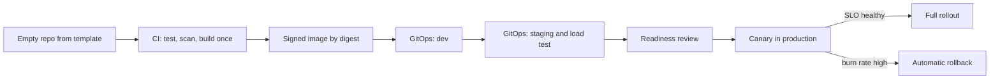

# Module 7 — Hero: capstone and practice exam

*You have learned cloud and DevOps one layer at a time: the shell and the network, identity, containers, Kubernetes, infrastructure as code, pipelines, releases, telemetry, SLOs, incidents, scaling, cost and AI workloads. This module puts the layers back together. In the capstone you take a brand-new Najm Bank service, Card Controls, from an empty repository to production with a signed SLO, reusing an artefact from every earlier module and linking them into one production readiness file that Salem, Maha and Noura can approve. Then we turn to you: the roles that make up cloud, platform, DevOps and SRE work, how to choose certifications from the cloud providers, the Linux Foundation and others without being ruled by them, what interviews actually test, and how to build a portfolio that proves you can run software, not just write it. The module closes with a 60-question practice exam across all eight phases.*

> **Phases:** Plan through Monitor — the whole delivery loop, end to end, on one service and then in one exam.

---

# 7.1 — Capstone: take a new Najm service from empty repo to production with an SLO
*Level: 🔴 Advanced* · *Prerequisites: Modules 0–6* · *Phase: Plan, Code, Build, Test, Release, Deploy, Operate, Monitor*

## ⚡ In 60 seconds
- The capstone takes **Card Controls**, a new Najm service for freezing cards and setting limits, from an empty repository to production through all eight phases.
- The output is a **production readiness file**: linked evidence that the service can be built, released, observed, recovered and paid for, with an owner for each part.
- The spine is **one artefact, many environments**: build the container image once, sign it, and promote the same digest from dev to staging to production through Git.
- The SLO comes first, not last. It decides the alerts, the release gates, the replica count, the backup targets and the on-call rota.
- Decision cue: before each gate, ask "if this step failed silently at 2 a.m., how would we know, and how would we undo it?"
- Biggest trap: a readiness checklist ticked from memory. Every item needs evidence, and rollback, restore and kill switches need a timed drill.

## 🧭 Why it matters
Tariq brings a request to the platform team. The cards team wants a **Card Controls service**: customers freeze a card, block online or overseas use and set a daily limit from the Najm Mobile app. The card processor checks these controls during authorisation, so a wrong answer blocks a customer at a till or lets a stolen card through. The business wants it live in one quarter.

Salem gives the job to Yousef, with Maha as SRE partner. Yousef's first plan: copy an old repository, push an image tagged `latest`, apply manifests by hand, "add monitoring after launch". Salem asks three questions. "What is the SLO? How do you roll back in under five minutes? What happens if the database zone fails during a payday peak?" Yousef has no answers yet.

Public history shows why the questions matter. In August 2012 Knight Capital deployed new code to its servers, but one server kept old code behind a reused flag; according to the US SEC's later order, the firm lost hundreds of millions of dollars in under an hour. In January 2017 GitLab lost hours of production data after a database directory was deleted during an incident, and several backup methods turned out not to work (GitLab's public postmortem). Each was a missing, untested step on the path to production. This lesson builds the whole path once, properly.

## 📐 How it works

### 🟢 The essentials

**The service, in one paragraph.** Card Controls is a small HTTP API with its own managed PostgreSQL database. Najm Mobile API calls it to change controls; the card processor's integration calls it to read them during authorisation. It runs on the bank's managed Kubernetes cluster across two availability zones. It stores only an internal card reference, never card numbers, which Noura confirms at design review.

**The production readiness file.** A **production readiness review (PRR)** is a structured pre-launch check that a service can be operated safely; Google's SRE books describe the practice. Najm's PRR is a folder of linked artefacts under a one-page summary (🏛️ below), with three rules:
1. **Every claim has evidence** a reviewer can open, not "yes, done".
2. **Every risky change can be undone** by a documented, timed method.
3. **Every alert maps to an SLO or a runbook.** An alert with no action is noise.

**The eight phases.** Plan, Code, Build, Test, Release, Deploy, Operate and Monitor each reuse an artefact from an earlier module; the summary page in 🏛️ below maps every phase to its evidence and its lesson. All numbers in this lesson are illustrative.

**Start with the SLO.** Maha and the cards product owner agree the user journeys that matter and write **SLIs** (service level indicators: measurements of good events over valid events) and **SLOs** (targets for them over a window):

| Journey | SLI | SLO (28-day window) |
|---|---|---|
| Read controls during authorisation | Share of read requests answered successfully within 100 ms at the load balancer | 99.95% |
| Customer changes a control | Share of write requests that succeed within 500 ms | 99.9% |
| Freshness | Share of control changes visible to reads within 2 seconds | 99.9% |

The read SLO is tighter because a failed read can block a real purchase. With 99.95% over 28 days, the **error budget** is 0.05% of read requests. It sets the release policy: while budget remains, the team ships; once it is spent, only reliability fixes ship.

**The path.** Each box is a gate that leaves evidence:



### 🟡 Going deeper

**Code: start from the golden path.** Yousef does not copy an old repository. He creates the service from the platform's template, which already contains a Dockerfile, CI workflow, Helm chart, OpenTelemetry setup, `CODEOWNERS` and a portal catalogue entry. Configuration comes from environment variables, never baked into the image (the Twelve-Factor App's config rule), so one image runs everywhere. The service exposes `/healthz/live` (the process is alive) and `/healthz/ready` (it can reach its database and is ready for traffic), which become the liveness and readiness probes from 2.3.

**Build: once, by digest, signed.** CI builds the image once per commit, pushes it, records its digest, then generates an SBOM and signs that digest with cosign. Later environments reference the same digest and never rebuild. CI reaches the cloud through **workload identity federation** (OIDC), so no long-lived key sits in the repository (1.3, 4.3):

```yaml
# .github/workflows/ci.yml (excerpt)
permissions:
  contents: read
  id-token: write        # lets the job request a short-lived OIDC token
jobs:
  build:
    runs-on: ubuntu-latest
    steps:
      - uses: actions/checkout@v4      # pin actions to a full commit SHA in real use
      - run: make test                  # unit and contract tests
      - run: make image                 # multi-stage, non-root build
      - run: make push sbom sign        # push, then SBOM and cosign signature on the digest
      - run: make bump-dev              # opens a PR to the GitOps repo with the new digest
```

**Deploy: infrastructure and app, both from Git.** The database, backups, cloud role and network rules are one OpenTofu module call, reviewed with a `tofu plan` on the pull request (3.1). Policy checks (3.3) reject a database without encryption at rest, deletion protection or backup retention. The Kubernetes side lives in the GitOps repository, one folder per environment, reconciled by Argo CD:

```yaml
apiVersion: argoproj.io/v1alpha1
kind: Application
metadata:
  name: card-controls-prod
  namespace: argocd
spec:
  project: cards
  source:
    repoURL: https://git.example.com/najm/gitops.git
    targetRevision: main
    path: apps/card-controls/overlays/prod
  destination:
    server: https://kubernetes.default.svc
    namespace: card-controls
  syncPolicy:
    automated:
      prune: true
      selfHeal: true     # reverts manual edits in the cluster back to Git
```

Promotion to production is a pull request changing one line, the image digest in the `prod` overlay, approved by the cards team and platform. Rollback is reverting that commit.

**Release: canary with a guard.** The rollout sends a small share of traffic to the new version, compares its errors and latency with the stable version, and widens step by step (4.2). A controller such as Argo Rollouts or Flagger automates the analysis; if the canary breaches SLO-based thresholds, it aborts and traffic returns to the stable version. New behaviour, such as "block overseas use", sits behind a feature flag so it can be switched off without a deploy. The CrowdStrike Falcon content update of July 2024, which crashed Windows hosts worldwide, shows what happens when a change reaches everyone at once.

**Monitor: alerts from the budget.** The service emits OpenTelemetry traces and RED metrics (rate, errors, duration). Maha writes **multi-window, multi-burn-rate alerts** from the SRE Workbook: page when the budget burns fast over both a long and a short window; open a ticket when it burns slowly. The read SLO's fast-burn page:

```yaml
# Prometheus alert rule (excerpt): 14.4x burn over 1h, confirmed over 5m.
# Recording rules (not shown) compute the read error ratio over each window.
- alert: CardControlsReadFastBurn
  expr: |
    card_controls:read_error_ratio:rate1h > (14.4 * 0.0005)
    and
    card_controls:read_error_ratio:rate5m > (14.4 * 0.0005)
  labels:
    severity: page
  annotations:
    runbook: https://runbooks.example.com/card-controls/read-errors
```

The factor 14.4 means the budget would be gone in about two days at this rate; the short window stops the page once the burn has ended. Every page links to a runbook.

**Operate: prove recovery.** With the business, Maha sets an **RPO** (tolerable data loss) of 5 minutes and an **RTO** (tolerable recovery time) of 30 minutes for a zone failure. The database runs with a standby in a second zone and point-in-time recovery. Then, in staging, they restore last night's backup to a new instance, replay to a chosen time and time it. A backup that has never been restored is a hope, not a control.

### 🔴 Expert view

**The architecture decisions, written down.** Salem asks for **architecture decision records (ADRs)**: one page per decision with context, options, choice and consequences. Three of Card Controls' ADRs:

| Decision | Choice | Why | Revisit when |
|---|---|---|---|
| Read path during authorisation | Serve from the service with a short in-memory cache, not a separate cache cluster | Fewer moving parts; the freshness SLO allows 2 seconds | Read latency SLO is at risk under peak |
| Multi-zone or multi-region | Multi-zone in one region now | Meets the RTO for zone failure; multi-region doubles cost and complexity | Regulator or business requires a region-level RTO |
| Failure mode if the service is down | The card processor applies a documented default agreed with the cards and risk teams | A blind "allow all" or "deny all" is a business decision, not a technical one | After every incident touching this path |

The third row is the one most teams skip. Every dependency fails eventually; what the caller does then is a design decision that product, risk and security must sign.

**Capacity and cost before launch.** Yousef load-tests staging at twice the expected payday peak, sets CPU and memory requests from measured usage, gives the Horizontal Pod Autoscaler a floor of four replicas, and spreads them across two zones with a topology spread constraint, so losing a zone still leaves two replicas that the load test showed can carry the peak. Mona asks for a **unit cost** (monthly cost from tagged resources divided by monthly requests, 6.2), shown next to the SLO so a "cheaper" change that burns budget, or a "safer" one that triples cost, is visible to both sides.

**Regulation without guesswork.** The runbooks, incident records and recovery tests also feed operational resilience evidence: EU DORA (applied from January 2025) for the EU entity, and the cloud and outsourcing expectations of the Qatari and UAE regulators. Do not guess clause numbers; ask risk and compliance what they need ([*Secure AI & Application Security*, lesson 11.2 — Regulation that touches security](../secai/index.html#/11.2)).

**The game day.** Before launch, Maha runs a two-hour **game day**: the team deliberately triggers failures in staging and practises the response:
1. Deploy a canary that returns errors on 5% of reads. *Expected:* analysis aborts the rollout automatically.
2. Cordon one zone's nodes and delete its pods. *Expected:* the read SLO holds; replacement pods start in the other zone.
3. Fail over the database. *Expected:* writes pause briefly, then resume within the agreed time.
4. Revoke the service's database credentials. *Expected:* readiness fails, the page fires and links to the right runbook.

The first game day found two gaps: the credentials runbook pointed to a renamed secret, and failover took longer than the RTO assumed because the connection pool did not reconnect. Both became fixes and regression checks. It is cheaper to fail in staging on a Tuesday than in production on payday.

## 🧰 The toolkit
| Tool, practice or service | What it is and does | When to reach for it |
|---|---|---|
| **Production readiness review** | Structured, evidence-based check that a service can be operated safely before launch | Every new service and every major change of architecture |
| **Architecture decision record** | One-page record of a decision, its options and its consequences | Any choice someone will later ask "why?" about |
| **Argo CD** | GitOps controller that keeps clusters in sync with a Git repository | Promoting the same artefact through environments by pull request |
| **Canary release** | Sending a small share of traffic to a new version and widening only if it is healthy | Every production rollout of a user-facing service |
| **Error budget** | The share of failures the SLO allows over its window | Setting release policy and alert thresholds |
| **Burn-rate alert** | Alert on how fast the error budget is being consumed, over a long and a short window | Paging on SLO risk instead of on raw resource metrics |
| **Game day** | Planned exercise that injects failures to test systems, runbooks and people | Before launch, then regularly and after major change |

## 🏛️ In practice at Najm Bank
**Card Controls production readiness file: summary page** (v1.0; owner Yousef; reviewers Maha for SRE, Noura for security, Mona for cost; approved by Salem).

| Phase | Evidence (lesson) | Decision recorded | Gate passed when |
|---|---|---|---|
| Plan | Service brief, SLO document, four ADRs (5.2) | Read SLO 99.95%, write SLO 99.9%; multi-zone | Product owner and Maha sign the SLO |
| Code | Repo from template; catalogue entry; owners (0.1) | Config only from environment | Template checks green |
| Build | Image digest, SBOM, signature (2.1, 4.3) | Non-root, pinned base image | Signature verified at admission |
| Test | CI run, contract tests with Mobile API, policy checks (3.3, 4.1) | No direct database access from other services | All gates green on main |
| Release | Canary analysis config; flag list (4.2) | Abort on read errors above budget rate | Abort tested in staging |
| Deploy | OpenTofu plan, Argo CD app, two-approval promotion (3.1, 3.2) | Rollback is a revert of one commit | Revert timed under five minutes |
| Operate | Runbooks, rota, restore drill report (5.3, 6.1) | RPO 5 min, RTO 30 min for zone loss | Restore drill met both targets |
| Monitor | SLO dashboard, burn-rate alerts, cost per request (5.1, 5.2, 6.2) | Pages only on SLO burn | Each alert fired once in a test |

## 🛠️ Exercises
- 🟢 Write the SLO document for a small service of your own (say, a URL shortener): two SLIs, an SLO for each over 28 days, the error budget in requests at an assumed traffic level, and the release policy when it runs out. *Done when:* a peer can say what would page someone and what would freeze releases, without asking you.
- 🟡 On your laptop, take that service from an empty repo to a local kind or k3d cluster: multi-stage non-root Dockerfile, a GitHub Actions workflow that builds once and records the digest, and Argo CD syncing from a Git folder you own. *Done when:* changing the digest in Git rolls the cluster forward, reverting the commit rolls it back, and you have timed both.
- 🔴 Add Prometheus and Grafana to your local cluster, define one SLO with fast-burn and slow-burn alerts, then run a one-hour game day with three injected failures (a bad release, a killed pod, a broken config). Use only machines and accounts you own; on a free-tier account, set a budget alert first. *Done when:* each failure is detected by an alert or the canary, each has a runbook step that worked, and your write-up lists at least two gaps you fixed.

## ⚠️ Mistakes and traps
- **SLO after launch.** Without it, nobody can say which alerts matter or when to stop shipping. Agree it in the Plan phase with the product owner.
- **Rebuilding per environment.** A rebuild in staging or production produces a different artefact from the one you tested. Build once and promote the digest.
- **Hand edits in the cluster.** They drift from Git and vanish on the next sync. Change Git; let the controller reconcile.
- **Untested backups and rollbacks.** GitLab's 2017 postmortem shows untested backups failing together. Drill restore and rollback, and time them.
- **Alerts on causes, not symptoms.** Paging on CPU at 80% wakes people for things customers never feel. Page on SLO burn.
- **Leaving the failure mode undecided.** Decide and sign in advance what callers do when the service is down.

## 🧾 Recap
- Card Controls goes through all eight phases, with the evidence linked in a production readiness file.
- The SLO, agreed first, drives the alerts, release policy, capacity and recovery targets.
- One signed image, referenced by digest, moves through environments by pull request; rollback is a revert.
- Canary analysis, feature flags and burn-rate alerts turn the error budget into automatic guardrails.
- Recovery, failure modes and cost are designed and drilled before launch.

## ✍️ Check yourself

**1. Yousef's staging pipeline rebuilds the container image from the same Git commit before deploying to production "to be safe". What is the problem?**

- A. Rebuilding is slower, which hurts lead time but is otherwise harmless
- B. Production no longer runs the tested artefact; promote the same digest
- C. Rebuilding is required for production because staging images are unsigned
- D. There is no problem as long as both builds use the same Git commit

<details><summary>Answer</summary>

**B.** A rebuild can pick up different base layers or dependencies, so production runs something nobody tested. D is tempting, but the same commit does not guarantee the same artefact. (🟡 Going deeper.)

</details>

**2. The Card Controls read SLO is 99.95% over 28 days. What does the error budget tell the team?**

- A. How many engineers must be on call during each week of the window
- B. The maximum latency any single read request is allowed to have
- C. How much the service is allowed to cost each month
- D. How many reads may fail before reliability work takes priority over releases

<details><summary>Answer</summary>

**D.** The error budget is the 0.05% of requests the SLO allows to fail; while it remains, the team ships; when it is spent, reliability work comes first. It says nothing directly about staffing, cost or a single request's latency. (🟢 The essentials.)

</details>

**3. During the game day, the canary returns errors on 5% of reads. What should happen if the release is set up as this lesson describes?**

- A. Analysis aborts the rollout and traffic returns to the stable version
- B. Maha is paged and edits the Deployment in the cluster by hand to roll back
- C. The rollout continues, because 95% of reads still succeed and that is close to target
- D. Yousef rebuilds the image with a fix and pushes it straight to production

<details><summary>Answer</summary>

**A.** Analysis tied to the SLO aborts automatically. Manual cluster edits (B) drift from Git; continuing (C) would burn the budget far faster than allowed; pushing directly (D) skips every gate. (🟡 Going deeper.)

</details>

**4. Which item belongs in an architecture decision record rather than only in a runbook?**

- A. The exact command to restart a pod that is stuck in a crash loop
- B. The on-call rota and escalation contacts for launch week
- C. What the processor does when Card Controls is down, and who agreed it
- D. The URL of the Grafana dashboard that shows the read SLO

<details><summary>Answer</summary>

**C.** The failure mode is a business and risk decision with options and consequences, which is what an ADR records. The others are operational details for runbooks and rota pages. (🔴 Expert view.)

</details>

**5. Salem asks how the team knows the 30-minute RTO for zone loss is realistic. What is the best evidence?**

- A. The provider's documentation says database failover across zones is automatic
- B. A dated drill report with the measured failover and restore times
- C. Automated database backups are enabled in the OpenTofu module for the service
- D. The policy check that requires a backup retention period passed on the pull request

<details><summary>Answer</summary>

**B.** Only a timed drill shows recovery works within the target; the game day found a connection-pool issue no configuration would reveal. A, C and D show settings, not outcomes. (🟡 Going deeper, 🔴 Expert view.)

</details>

## 📚 References
- Google, *Site Reliability Engineering* (2016) and *The Site Reliability Workbook* (2018), including SLOs, alerting on SLOs and launch reviews — https://sre.google/books/
- The Twelve-Factor App — https://12factor.net
- OpenGitOps principles — https://opengitops.dev
- Argo CD documentation — https://argo-cd.readthedocs.io
- Argo Rollouts documentation — https://argoproj.github.io/rollouts/
- OpenTofu documentation — https://opentofu.org/docs/
- OpenTelemetry documentation — https://opentelemetry.io/docs/
- Prometheus alerting rules — https://prometheus.io/docs/prometheus/latest/configuration/alerting_rules/
- GitHub Docs, security hardening with OpenID Connect — https://docs.github.com/en/actions/security-for-github-actions/security-hardening-your-deployments/about-security-hardening-with-openid-connect
- GitLab, postmortem of the database outage of January 31, 2017 — https://about.gitlab.com/blog/
- US SEC, order in the matter of Knight Capital Americas LLC (2013) — https://www.sec.gov
- Regulation (EU) 2022/2554 on digital operational resilience for the financial sector (DORA) — https://eur-lex.europa.eu/eli/reg/2022/2554/oj

---

# 7.2 — The cloud career: roles, certifications, interviews and a portfolio
*Level: 🔴 Advanced* · *Prerequisites: 7.1* · *Phase: Plan*

## ⚡ In 60 seconds
- "Cloud" is several jobs: cloud, DevOps, platform, site reliability (SRE), cloud security, FinOps and AI infrastructure. They share foundations but own different things. Pick a target role first.
- Certifications are a signal, not proof. The main sources are the three cloud providers (**AWS**, **Microsoft**, **Google Cloud**), the **Linux Foundation and CNCF** for Kubernetes, **HashiCorp** for Terraform and the **FinOps Foundation**. Names, codes and content change, so check the issuer's current page.
- A **portfolio of evidence** beats a list of badges: a service you took to "production" on your own laptop or free tier, with an SLO, a pipeline, a runbook and a postmortem of something you broke on purpose.
- Interviews test troubleshooting method more than recall: a broken pod, a design to make deployable, an incident to lead.
- Decision cue: choose a certification by target role and local demand, and pair it with an artefact you built while studying.
- Biggest trap: leaving a free-tier account without a budget alert, or putting an employer's architecture, keys or incidents in a public repository.

## 🧭 Why it matters
Six months after joining, Yousef asks Salem: "Should I do a Kubernetes certification or a cloud architect one? And is platform engineering a real career, or just DevOps renamed?" He has one service in production and no plan.

Salem has the mirror problem. He is hiring two platform engineers and one SRE for the move from the data centre. Many CVs list several cloud certificates; fewer show anything he can read or run. One candidate with a single associate-level certificate linked a repository: a small API deployed to a local kind cluster through GitHub Actions and Argo CD, an SLO with burn-rate alerts, and a two-page postmortem of a failure she caused deliberately in a game day. Salem invites her first.

Certificates still matter. Job adverts in Gulf banks, government bodies and consultancies often list named cloud certifications as required or preferred, and they help you pass the first filter. The interview, and then the pager, test whether you can do the work. For the wider job search (CVs, applications, offers), see [*From Graduate to Hired*, lesson 2.4 — Cloud, platform, DevOps and security engineer](../career/index.html#/2.4).

## 📐 How it works

### 🟢 The essentials

**The role map.** Titles vary by organisation, so read the job description, not the title. At the time of writing (2026), the roles closest to this course look like this:

| Role | Owns, day to day | Course modules to emphasise |
|---|---|---|
| Cloud engineer | Cloud accounts, networks, identity, managed services; landing zones and migrations | 1, 3, 6 |
| DevOps engineer | CI/CD pipelines, build tooling, release automation, developer support | 2, 3, 4 |
| Platform engineer | The internal developer platform: golden paths, Kubernetes, GitOps, self-service | 2, 3, 4, 7.1 |
| Site reliability engineer | SLOs, alerting, on-call, incidents, capacity, removing toil with code | 5, 6, 7.1 |
| Cloud security engineer | IAM, policy as code, workload and network controls, supply chain | 1.3, 3.3, 4.3, plus the security course |
| FinOps practitioner | Cost visibility, allocation, optimisation, unit economics with Finance | 6.2 |
| AI infrastructure or MLOps engineer | GPUs, model serving, LLM gateways, their reliability and cost | 6.3, 5, 6.1 |

"Platform engineering" is not just DevOps renamed. DevOps is a culture and set of practices shared by everyone who builds and runs software; platform engineering is a team building an internal product, the platform, so other teams can follow those practices without reinventing them. SRE runs production with reliability treated as engineering, with explicit budgets. In a start-up one person does all three; at Najm they are separate teams.

**Where people come from.** Developers move into platform and SRE work, system and network administrators into cloud engineering, data engineers into MLOps. Graduates usually enter as junior cloud, DevOps or platform engineers. Earlier experience is an asset: a former developer knows why a slow pipeline gets bypassed.

**Certifications, in brief.** This course is not affiliated with any issuer and does not prepare you for a specific exam. The table is general orientation. Exam names, codes, levels, prices, formats and renewal rules change, and providers retire and replace exams, so check each issuer's current page before you plan.

| Issuer | Kinds of credential (examples at the time of writing, 2026) | Typical fit |
|---|---|---|
| **AWS** | Foundational (Cloud Practitioner), associate (for example Solutions Architect and SysOps-style administration), professional and specialty levels | Roles in organisations running on AWS |
| **Microsoft** | Fundamentals (Azure Fundamentals), role-based associate (for example Azure Administrator) and expert levels | Organisations on Azure; common in enterprises and government |
| **Google Cloud** | Foundational (Cloud Digital Leader), associate (Associate Cloud Engineer) and professional (for example Cloud Architect, Cloud DevOps Engineer) | Organisations on Google Cloud; data-heavy teams |
| **Linux Foundation and CNCF** | Kubernetes certifications: KCNA (associate, knowledge-based), CKAD (application developer), CKA (administrator), CKS (security); the hands-on ones are performance-based | Platform and SRE roles on any cloud |
| **HashiCorp** | Terraform Associate | IaC-heavy roles; the concepts transfer to OpenTofu |
| **FinOps Foundation** | FinOps Certified Practitioner and further levels | FinOps roles; engineers who work closely with Finance |

Two patterns help. **Provider certificates** prove you know one cloud's services; choose the cloud your target employers run. **Vendor-neutral certificates**, such as the Kubernetes ones, transfer across clouds, and their **performance-based** format (you solve tasks in a live environment rather than answering multiple-choice questions) is closer to the real job. Many credentials expire after a few years and must be renewed; budget time for that.

### 🟡 Going deeper

**Choosing a certification deliberately.** Score each candidate credential from 1 to 3 on five questions:
1. **Role fit.** Does it match the role you want in two to three years?
2. **Market demand.** Do employers in your market name it? Read ten current job adverts and count.
3. **Practical or knowledge-based?** Practical exams show you can do the task; knowledge exams show breadth.
4. **Full cost.** Training, exam, retakes, renewal and your time.
5. **Sponsorship.** Many employers, including Najm, fund certifications tied to a development plan.

For Yousef, a platform engineer at a bank that runs Kubernetes on one cloud, the scores point to a hands-on Kubernetes administrator credential now, and the bank's cloud provider's associate-level credential next. A professional architect credential fits later, when he designs across many teams.

**Study by building.** End every study week with something running. A foundational cloud exam pairs with setting up a free-tier account properly (budget alert first, MFA on the admin user, no long-lived keys); a Kubernetes exam with breaking and fixing your own kind cluster; a Terraform exam with an OpenTofu module with remote state and a plan in CI. Use only your own accounts and machines.

**The portfolio.** A cloud portfolio is a small set of artefacts others can read and run, each showing judgement as well as skill. Good items, all legal and all on resources you own:
- **A capstone service**, like 7.1 at small scale: multi-stage Dockerfile, CI that builds once, GitOps to kind or k3d, an SLO and burn-rate alerts, and a README that runs in ten minutes.
- **An IaC module** with a clear interface, examples, tests and a policy check.
- **A game-day report and postmortem**: what you broke on purpose, what detected it, what you changed. Blameless, with a timeline.
- **A cost note**: an estimate from the provider's pricing calculator, with assumptions stated and dated.
- **Open-source contributions**: a Helm chart fix or a documentation improvement to a CNCF project.
- **Writing**: a post that explains one decision well, such as "why my canary aborts on burn rate, not on CPU".

Each case study follows one shape: context, decision, evidence, trade-off, lesson. "I chose multi-zone over multi-region because the RTO allowed it and multi-region doubled the moving parts" shows more than "I deployed to Kubernetes".

**What never goes in a portfolio.** Your employer's diagrams, hostnames, account IDs, incidents, logs or customer data, or anything with a secret in its history. Scan public repositories for secrets first; deleting a file does not remove it from Git history, and a leaked key must be revoked. To show work from your job, rebuild the pattern in your own lab and ask your employer before naming them.

**The interview loop.** Cloud and platform loops commonly mix:
- **Fundamentals**: Linux processes and permissions, "what happens when you open a URL", IAM roles versus users.
- **Troubleshooting**: a broken system, such as a pod in `CrashLoopBackOff` or a service returning 502s. Interviewers watch your method more than your answer.
- **Hands-on**: write a Dockerfile, fix a pipeline, read a Terraform plan, write a PromQL query.
- **System design**: design a service so it is deployable, observable and recoverable. See [*From Graduate to Hired*, lesson 5.3 — System design, data and ML interviews for juniors](../career/index.html#/5.3).
- **Incident scenario** ("this alert fires at 2 a.m.") and **behavioural** questions, answered with **STAR** (situation, task, action, result).

A typical troubleshooting question, and what a strong answer sounds like:

```text
Q: After a deploy, the new pods show CrashLoopBackOff. What do you do?

Strong answer, out loud, in order:
1. Limit the damage: is the rollout paused or old pods still serving? If users
   are affected, roll back first (revert the GitOps commit), then investigate.
2. kubectl describe pod <name>    -> events: image pull? OOMKilled? probe failures?
3. kubectl logs <name> --previous -> the crashed container's last output
4. Compare with the last good release: config, secrets, image digest, limits.
5. Fix forward or keep the rollback; add a test or check so it cannot recur.
```

The order matters: restore service, then diagnose, then prevent. That is the same chain as 7.1 and 5.3.

### 🔴 Expert view

**How the job grows.**

| Level | Scope | Evidence that shows it |
|---|---|---|
| Junior engineer | Delivers well-defined tasks; joins on-call with a buddy | Pipelines, modules and runbooks that work; clear write-ups |
| Engineer | Owns a component; on-call independently | A service taken to production, like 7.1 |
| Senior engineer | Owns a domain such as observability or GitOps; sets reusable patterns | A golden path many teams use; incidents led well |
| Staff or principal | Shapes architecture and standards across many teams | Platform decisions adopted bank-wide; people grown |
| Head of platform or SRE | Strategy, budget, hiring, reliability and cost outcomes | Measurably faster, safer delivery (DORA-style metrics) at a known cost |

At each step the work shifts from doing tasks to making good outcomes the default for many teams. Platform work is a product job: Salem's team measures adoption and developer satisfaction, not just uptime.

**T-shaped, not tool-shaped.** Tools change; Linux, networking, failure modes and operational judgement change slowly. Someone who understands why a readiness probe exists can learn any orchestrator. Go deep in one area (Kubernetes, observability, IaC or FinOps) on broad foundations. AI infrastructure is the same: GPUs and LLM gateways are new, but capacity, latency, cost and failure are old questions. [*Running AI Agents in Production* — Level 3, Production Engineer](../agentic/learning-path.html#level-3-production-engineer) goes further on operating agents, and [*Secure AI & Application Security*, lesson 12.2 — The security career: roles, certifications and portfolio](../secai/index.html#/12.2) covers the cloud security path.

**Staying current without the noise.**
- *Weekly:* skim your provider's and Kubernetes' release notes for deprecations that affect you.
- *Monthly:* read one primary source, such as a public postmortem, and try one thing in your lab.
- *Yearly:* revisit your target role, certification scores and portfolio.

DORA publishes research on software delivery performance; read the current report rather than repeating old figures.

**Hiring from the other side.** Salem does not filter on certificates alone, which would reject strong self-taught engineers. Every candidate gets the same practical task, and panellists score independently before discussing. He also looks for what no certificate shows: does the candidate say "I don't know, here is how I would find out" instead of guessing?

**Sustainability.** SRE and platform roles include on-call. Good teams cap pages per shift, pay or compensate for on-call, run blameless postmortems and protect time for toil reduction (5.2). Ask about these in interviews; the answers tell you how the team really works.

## 🧰 The toolkit
| Tool, practice or service | What it is and does | When to reach for it |
|---|---|---|
| **Role map** | Table of cloud roles, what each owns and which skills it needs | Choosing a target role; reading job adverts |
| **Certification decision matrix** | Scores credentials on role fit, demand, practicality, cost and sponsorship | Before committing time and money to a certification |
| **Performance-based exam** | Exam where you solve tasks in a live environment | When you want a credential closest to real work, such as Kubernetes administration |
| **kind** | Runs a local Kubernetes cluster in Docker containers | Building and breaking a portfolio cluster at no cloud cost |
| **Budget alert** | Cloud billing alert at a threshold you set | Before creating anything in a free-tier or personal account |
| **Portfolio case study** | One or two pages: context, decision, evidence, trade-off, lesson | Applications, promotion cases, internal visibility |
| **STAR** | Situation, task, action, result: a structure for behavioural answers | Behavioural interview questions |

## 🏛️ In practice at Najm Bank
Salem's **platform engineer interview scorecard**, used for every candidate:

| Criterion | What "strong" looks like | Assessed by |
|---|---|---|
| Foundations | Explains DNS, TLS, load balancing and IAM plainly and correctly | Technical interview |
| Troubleshooting | Restores service first, then diagnoses with a clear method; says what they would check next | 30-minute broken-cluster exercise |
| Delivery | Builds once, promotes by digest, explains rollback; reads a Terraform or OpenTofu plan | Hands-on task |
| Reliability | Writes an SLI and SLO for a service and explains which alert pages | Design discussion |
| Design | Makes a service deployable, observable and recoverable; names trade-offs and failure modes | 45-minute design exercise |
| Evidence of work | Portfolio items explained in depth, within confidentiality | Portfolio discussion |
| Collaboration and learning | Blameless language; changes view on new evidence | Behavioural questions (STAR) |

## 🛠️ Exercises
- 🟢 Choose a target role from the role map and collect five current job adverts for it in your market. *Done when:* you have a table of the skills, tools and certifications they ask for, each certification checked against the issuer's current official page, and a paragraph naming your target role and your top three gaps.
- 🟡 Turn your 7.1 exercise into a public portfolio repository: README that runs in ten minutes, architecture diagram, SLO document, a game-day postmortem and a dated cost note with stated assumptions. Scan it for secrets before publishing. *Done when:* a peer clones it, runs it locally from the README alone, and can state your key design decision after ten minutes of reading.
- 🔴 Run a mock interview loop with a peer: a broken-cluster exercise on your own kind cluster (one breaks, the other fixes), a 45-minute design of "a notification service that must not send duplicates", and two behavioural questions. Swap roles and score with the scorecard above. *Done when:* both scorers rated independently before comparing, you have named your weakest criterion, and you have a dated plan to improve it.

## ⚠️ Mistakes and traps
- **Collecting badges instead of evidence.** Pair every certification with something you built, broke and fixed.
- **No budget alert on a practice account.** A forgotten GPU instance or load balancer can bill for weeks. Set a budget alert first and tear down after each session.
- **Leaking in the portfolio.** Employer diagrams, account IDs, logs or keys in a public repository can cost you far more than a gap on your CV. Rebuild patterns in your own lab.
- **Trusting forum facts about exams.** Exam codes, content and renewal rules change, and exams are retired. Read the issuer's current pages.
- **Guessing in interviews.** Confident wrong answers during an incident question are worse than "I would check X next". Show your method.

## 🧾 Recap
- Cloud work is a family of roles: cloud, DevOps, platform, SRE, cloud security, FinOps and AI infrastructure. Choose a target before choosing courses or certificates.
- Provider, Kubernetes, Terraform and FinOps credentials have different focuses; check current details at the source and choose with a decision matrix.
- A portfolio you can run, with an SLO, pipeline, runbook and postmortem, shows judgement that certificates cannot.
- Interviews test foundations, troubleshooting method, hands-on skill, design for operability, incidents and behaviour; restore, diagnose, prevent answers most.
- Grow T-shaped: deep in one area on broad foundations, with a steady habit of learning and writing.

## ✍️ Check yourself

**1. Yousef works on Najm's platform team, which runs Kubernetes on one cloud. Which certification plan best fits his role for the next year?**

- A. A professional-level architect certification on a cloud the bank does not use
- B. As many foundational certificates as possible, across all three major clouds
- C. A hands-on Kubernetes administrator credential, then the bank's cloud associate one
- D. No certifications at all, since only a portfolio of artefacts matters to employers

<details><summary>Answer</summary>

**C.** It scores high on role fit, demand and practicality; pairing each with an artefact adds evidence. B is breadth without depth; A fits neither role nor employer; D ignores that adverts often name certifications. (🟡 Going deeper.)

</details>

**2. In a troubleshooting interview, new pods are in CrashLoopBackOff after a deploy and customers are seeing errors. What should a strong answer do first?**

- A. Restore service by reverting the GitOps commit, then diagnose
- B. Read the application source code line by line to find the bug
- C. Increase the memory limit on the Deployment and redeploy straight away
- D. Delete the namespace and recreate everything in it from scratch

<details><summary>Answer</summary>

**A.** Restore, diagnose (describe, then previous logs), prevent. C guesses a cause before looking at events, B is slow while users are affected, and D destroys evidence and may cause a bigger outage. (🟡 Going deeper.)

</details>

**3. What best distinguishes platform engineering from DevOps, as this lesson describes them?**

- A. Platform engineering replaces DevOps and makes its practices and culture obsolete
- B. DevOps is only about CI/CD tools, while platform engineering is only about running Kubernetes
- C. They are the same job, renamed to sound new in job adverts
- D. DevOps is a culture; platform teams build an internal product that makes it easy

<details><summary>Answer</summary>

**D.** The platform is an internal product that makes good practice the easy path. C is the common misconception the lesson addresses; A and B misdescribe both. (🟢 The essentials.)

</details>

**4. A candidate wants to show the game-day postmortem she wrote at her current employer in her public portfolio. What should she do?**

- A. Publish it as written, since the incident is resolved and the lessons are useful
- B. Rebuild it in her own lab and ask before naming her employer
- C. Publish it with the bank's name removed but the diagrams and logs intact
- D. Keep it in a private repository and send the link to every recruiter

<details><summary>Answer</summary>

**B.** Employer architecture, logs and incidents stay confidential unless the employer approves. C still leaks internal detail; D shares it anyway. A lab rebuild keeps the learning without the risk. (🟡 Going deeper.)

</details>

**5. Before practising for a cloud certification on a personal free-tier account, what should a learner do first?**

- A. Create a long-lived access key for convenience when scripting from a laptop
- B. Use the account's root user for everything to avoid permission errors
- C. Set a budget alert and turn on MFA for the admin user
- D. Nothing, because free-tier accounts cannot generate charges of any kind

<details><summary>Answer</summary>

**C.** Free tiers have limits, and resources outside them can bill until deleted. A budget alert and MFA come first, and resources are torn down after each session. A and B create security risks; D is false. (🟡 Going deeper, ⚠️ Mistakes and traps.)

</details>

## 📚 References
- AWS Certification — https://aws.amazon.com/certification/
- Microsoft Learn, credentials and certifications — https://learn.microsoft.com/credentials/
- Google Cloud certification — https://cloud.google.com/learn/certification
- Linux Foundation Training and Certification (KCNA, CKA, CKAD, CKS) — https://training.linuxfoundation.org
- CNCF certification overview — https://www.cncf.io/training/certification/
- HashiCorp certifications — https://developer.hashicorp.com/certifications
- FinOps Foundation, training and certification — https://www.finops.org
- Google, *Site Reliability Engineering* (2016) and *The Site Reliability Workbook* (2018) — https://sre.google/books/
- DORA research program — https://dora.dev
- kind (Kubernetes in Docker) — https://kind.sigs.k8s.io
- Kubernetes documentation: debugging pods — https://kubernetes.io/docs/tasks/debug/
