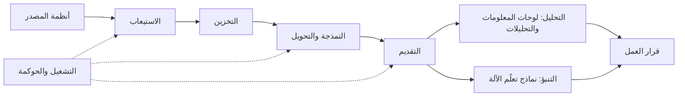
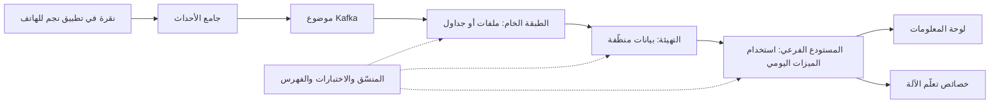

# الوحدة 0 — التوجيه (Orientation)

*قبل أن تكتب خط بيانات (pipeline) أو لوحة معلومات (dashboard)، تحتاج إلى خريطة. تمنحك هذه الوحدة ثلاث خرائط. الأولى خريطة للعمل (a map of the work): ما يفعله كلٌّ من مهندسي البيانات (data engineers) ومهندسي التحليلات (analytics engineers) والمحلّلين (analysts) وعلماء البيانات (data scientists) ومهندسي تعلّم الآلة (ML engineers)، وكيف يمرّ سؤال عمل واحد (business question) عبرهم جميعًا. الثانية خريطة للنظام (a map of the system): المسار الذي تسلكه نقرة واحدة (a single tap) في تطبيق نجم للهاتف (Najm Mobile)، عبر الاستيعاب (ingestion) والتخزين (storage) والتحويل (transformation) والاختبار (testing)، حتى تصبح رقمًا على لوحة معلومات (a number on a dashboard) يستخدمه أحدهم لاتخاذ قرار (make a decision). الثالثة خريطة للمكان (a map of the place): بنك نجم (Najm Bank)، وفريق منصة البيانات والتحليلات (Data Platform & Analytics) فيه، والأنظمة التي يديرها، وكيف تستخدم هذا المقرر لبناء ملف أعمال (portfolio) أثناء تقدّمك. ستلتقي فيصل، الذي يدير المنصة ويصبح مرشدك (mentor)، وهدى، الخرّيجة الجديدة (new graduate) التي تبدأ في الأسبوع نفسه الذي تبدأ فيه، وتتعلّم، أحيانًا بالطريقة الصعبة (the hard way)، لماذا لا يكون «الرقم الذي على الشريحة» (the number on the slide) مجرد استعلام (just a query) أبدًا.*

> **المراحل (Stages):** Ingest, Store, Model, Transform, Serve, Analyse, Operate, Govern — دورة حياة البيانات (data life cycle) كاملةً بنظرة واحدة، قبل أن تقرّب كل وحدة الصورة إلى جزء منها (zooms into one part of it).

---

# 0.1 — ما هندسة البيانات (data engineering) والتحليلات (analytics) وعلم البيانات (data science)، وكيف تتكامل معًا
*المستوى (Level): 🟢 مبتدئ (Beginner)* · *المتطلبات (Prerequisites): لا شيء (None)* · *المرحلة (Stage): Analyse, Serve*

## ⚡ الدرس في دقيقة (In 60 seconds)
- **هندسة البيانات (Data engineering)** تبني وتشغّل الأنظمة التي تنقل البيانات وتخزّنها وتهيّئها بموثوقية (move, store and prepare data reliably). **هندسة التحليلات (Analytics engineering)** تحوّل البيانات الخام (raw data) إلى جداول نظيفة ومختبرة وموثّقة (clean, tested, documented tables) ومقاييس متّفق عليها (agreed metrics). **تحليل البيانات (Data analysis)** يجيب عن أسئلة العمل (business questions) باستخدام تلك الجداول. **علم البيانات (Data science)** يبني نماذج تتنبأ أو تفسّر (models that predict or explain). **هندسة تعلّم الآلة (ML engineering)** تُبقي تلك النماذج عاملة في بيئة الإنتاج (running in production).
- ليست عوالم منفصلة (separate worlds). إنها مراحل سلسلة واحدة (stages of one chain)، وسؤال العمل يحتاج عادةً إليها جميعًا.
- القاعدة الأهم (The rule that matters most): **الرقم لا يكون جديرًا بالثقة إلا بقدر أضعف حلقة في السلسلة التي خلفه (a number is only as trustworthy as the weakest link in the chain behind it)**. النموذج البارع (brilliant model) المبني على بيانات حُمّلت بشكل سيئ (badly loaded data) هو إجابة خاطئة بارعة (a brilliant wrong answer).
- إشارة القرار (Decision cue): حين يطلب أحدهم «لوحة معلومات» (a dashboard) أو «نموذجًا» (a model)، اسأل أولًا *أيّ قرار سيغيّره (which decision it will change)* و*أيّ تعريف يقصده لكل مصطلح (which definition of each term they mean)*.
- الفخ الأكبر (Biggest trap): معاملة الأرقام المتعارضة (disagreeing numbers) على أنها مشكلة أدوات (a tooling problem). في الغالب هي مشكلة تعريف (a definition problem) لا يملكها أحد (nobody owns).

## 🧭 لماذا يهم (Why it matters)
إنه يوم الاثنين الأول لهدى في بنك نجم (Najm Bank). في مراجعة الأعمال الأسبوعية (weekly business review)، تقول شريحة فريق التجزئة (retail team) إن لدى نجم **412,000 عميل نشط (active customers)**. بعد عشر دقائق، تقول شريحة المالية (finance slide) **368,000**. (الأرقام افتراضية (hypothetical)، لكن الموقف شائع في كل مؤسسة تملك بيانات.) يسأل الرئيس التنفيذي للعمليات (chief operating officer) أيّهما الصحيح. لا يجيب أحد. كتب كريم، محلّل بيانات التجزئة (retail data analyst)، استعلامًا (query)؛ وكتب شخص في المالية الاستعلام الآخر. كلا الاستعلامين يعمل دون أخطاء (without errors). وكلاهما «صحيح» (correct).

بعد الاجتماع، يأخذ فيصل، رئيس منصة البيانات (Head of Data Platform)، هدى جانبًا. «الرقمان صحيحان، كلٌّ بحسب تعريفه الخاص لكلمة *نشط (active)*. التجزئة تعدّ كل من لديه حساب مفتوح (open account). والمالية تعدّ كل من أجرى معاملة بنفسه (made a transaction themselves) خلال آخر 90 يومًا. مهمتنا ليست كتابة استعلام ثالث (a third query). مهمتنا أن نتأكد أن لدى البنك تعريفًا *واحدًا (one definition)*، يُبنى مرة واحدة (built once)، ويُختبر (tested)، ويُستخدم في كل مكان (used everywhere). لهذا وُجد هذا الفريق.»

يدور هذا الدرس حول ذلك الفريق: ما يفعله كل دور (role)، وأين تقع نقاط التسليم (hand-offs)، ولماذا تحدث معظم إخفاقات البيانات (data failures) في الفجوات بين الأدوار (gaps between roles) لا داخل دور بعينه.

## 📐 كيف يعمل (How it works)

### 🟢 الأساسيات (The essentials)

**البيانات (Data)** هنا تعني حقائق مسجّلة (recorded facts) عن أشياء حدثت: عميل فتح حسابًا (opened an account)، بطاقة نُقرت عند مقهى (a card was tapped at a café)، دفعة قرض وصلت متأخرة (a loan payment arrived late)، شخص ضغط «تجميد البطاقة» (Freeze card) في التطبيق. تجمع المؤسسات هذه الحقائق في **الأنظمة التشغيلية (operational systems)**، أي البرمجيات التي تدير العمل يومًا بيوم (runs the business day to day)، مثل قاعدة بيانات الأنظمة المصرفية الأساسية (core banking database). تُبنى تلك الأنظمة لكي *تنفّذ (do)* الأشياء بسرعة وأمان، عميلًا واحدًا في كل مرة (one customer at a time). ولا تُبنى لكي *تجيب (answer)* عن أسئلة تشمل ملايين العملاء (across millions of customers). الأدوار أدناه موجودة لسدّ تلك الفجوة (bridge that gap).

| الدور (Role) | السؤال الذي يجيب عنه (The question they answer) | ما يبنيه (What they build) | الأدوات المعتادة (Typical tools) |
|---|---|---|---|
| **مهندس البيانات (Data engineer)** | «هل تصل البيانات الصحيحة كاملةً وفي موعدها (complete and on time)، وهل يمكننا إعادة تشغيلها بأمان (re-run it safely)؟» | مهام الاستيعاب (ingestion jobs)، وخطوط البيانات (pipelines)، والتخزين (storage)، والتنسيق (orchestration)، والمنصة نفسها (the platform itself) | SQL، وPython، وPostgreSQL، وKafka، وAirflow أو Dagster، ومستودع بيانات (warehouse) أو مستودع بحيري (lakehouse) |
| **مهندس التحليلات (Analytics engineer)** | «هل هذا الجدول نظيف ومختبر وموثّق (clean, tested, documented)، وهل يعني *العميل النشط (active customer)* شيئًا واحدًا؟» | جداول منمذجة (modelled tables)، واختبارات (tests)، وتعريفات المقاييس (metric definitions)، وتوثيق (documentation) | SQL، وdbt، والتحكم في الإصدارات (version control) |
| **محلّل البيانات (Data analyst)** | «ماذا حدث، ولماذا، وماذا ينبغي أن نفعل حياله (what should we do about it)؟» | تحليلات (analyses)، ولوحات معلومات (dashboards)، وتوصيات (recommendations) | SQL، وجداول البيانات (spreadsheets)، وأداة ذكاء أعمال (BI tool) مثل Metabase أو Superset |
| **عالم البيانات (Data scientist)** | «ما الذي يُرجَّح أن يحدث (likely to happen)، وماذا سيحدث لو غيّرنا شيئًا (if we changed something)؟» | نماذج (models)، وتجارب (experiments)، وتحليلات إحصائية (statistical analyses) | Python، ودفاتر الملاحظات التفاعلية (notebooks)، والإحصاء (statistics)، ومكتبات تعلّم الآلة (ML libraries) |
| **مهندس تعلّم الآلة (ML engineer)** | «هل سيظل هذا النموذج يعمل في الإنتاج (in production)، على نطاق واسع (at scale)، في الشهر القادم؟» | خطوط الخصائص (feature pipelines)، وخطوط التدريب (training pipelines)، وتقديم النماذج ومراقبتها (model serving and monitoring) | Python، وMLflow، ومخزن خصائص (feature store)، والحاويات (containers) |

تختلف المسمّيات الوظيفية (titles) بين الشركات. في الشركة الصغيرة يؤدي شخص واحد الأدوار الخمسة كلها. وفي البنك الكبير قد يكون كلٌّ منها فريقًا (a team). ما لا يختلف هو *العمل (the work)*. كل واحدة من هذه الوظائف يجب أن يؤديها أحد، وإلا انكسرت السلسلة (the chain breaks).

**الأنواع الأربعة من الأسئلة (The four kinds of question).** من الطرق المفيدة لرؤية كيف تتكامل الأدوار (how the roles fit) النظرُ إلى نوع السؤال المطروح (the kind of question being asked):
- **وصفي (Descriptive):** *ماذا حدث؟ ⁦(What happened?)⁩* «كم عميلًا جمّد بطاقته (froze a card) الأسبوع الماضي؟» في الغالب المحلّلون (analysts)، على جداول بناها المهندسون (tables built by engineers).
- **تشخيصي (Diagnostic):** *لماذا حدث؟ ⁦(Why did it happen?)⁩* «لماذا تضاعفت عمليات تجميد البطاقات (card freezes) يوم الخميس؟» المحلّلون، وغالبًا مع مهندسي البيانات (data engineers) الذين يتحققون مما إذا كانت البيانات نفسها قد تغيّرت (whether the data itself changed).
- **تنبّؤي (Predictive):** *ماذا سيحدث؟ ⁦(What will happen?)⁩* «أيّ معاملات البطاقات (card transactions) يُرجَّح أن تكون احتيالًا (fraud)؟» علماء البيانات (data scientists)؛ وهذا هو نموذج الاحتيال (fraud model) لدى نجم المسمّى **التنبيهات الذكية (Smart Alerts)**.
- **توجيهي (Prescriptive):** *ماذا ينبغي أن نفعل؟ ⁦(What should we do?)⁩* «هل ينبغي أن نحظر هذه المعاملة (block this transaction) أم نرسل تنبيهًا (send an alert)؟» علماء البيانات وقطاع العمل معًا (the business together)، وغالبًا يُختبر ذلك بتجربة (tested with an experiment).

كل خطوة صعودًا في القائمة (each step up the list) تحتاج إلى كل ما تحتها. لا يمكنك التنبؤ بالاحتيال (predict fraud) من بيانات لا تستطيع وصفها بشكل صحيح (describe correctly).

**السؤال نفسه، بتعريفين (Same question, two definitions).** إليك خلاف صباح الاثنين (the Monday-morning disagreement) مكتوبًا بلغة SQL. كلا الاستعلامين صالح (valid). وهما يجيبان عن سؤالين مختلفين (different questions).

```sql
-- DuckDB syntax (in PostgreSQL, write INTERVAL '90 days')
-- Retail's definition: holds at least one open account
SELECT COUNT(DISTINCT customer_id) AS active_customers
FROM accounts
WHERE status = 'open';

-- Finance's definition: made at least one customer-initiated
-- transaction in the 90 days up to the reporting date
SELECT COUNT(DISTINCT a.customer_id) AS active_customers
FROM transactions AS t
JOIN accounts AS a ON a.account_id = t.account_id
WHERE t.initiated_by = 'customer'
  AND t.txn_date >  DATE '2026-02-28' - INTERVAL 90 DAY
  AND t.txn_date <= DATE '2026-02-28';
```

العميل الذي لديه حساب مفتوح (open account) لكنه لا يدفع سوى رسوم شهرية (monthly fee) يُحسب في الاستعلام الأول ولا يُحسب في الثاني. لا أحد من الاستعلامين خاطئ (Neither query is wrong). الخطأ هو بنكٌ يصل فيه الرقمان إلى الاجتماع نفسه تحت الاسم نفسه (under the same name). وإصلاح ذلك هو مهمة هندسة التحليلات (analytics engineering)، والدرس 4.1 يبيّن كيف.

### 🟡 التعمق أكثر (Going deeper)

**دورة حياة البيانات (The data life cycle).** يصنّف هذا المقرر كل درس بمرحلة أو مرحلتين من ثماني **مراحل (stages)**. فكّر فيها على أنها الخطوات التي تمر بها كل قطعة بيانات مفيدة (every useful piece of data):

| المرحلة (Stage) | ما يحدث (What happens) | من يقود عادةً (Who usually leads) |
|---|---|---|
| **الاستيعاب (Ingest)** | تُنسخ البيانات من مكان إنشائها (where it is created) إلى منصة البيانات (data platform) | مهندس البيانات (Data engineer) |
| **التخزين (Store)** | تُحفظ بشكل رخيص وآمن وسريع الاستعلام (cheap, safe and fast to query) | مهندس البيانات (Data engineer) |
| **النمذجة (Model)** | تُصمَّم بنيتها (structure is designed): أيّ الجداول، وبأيّ مستوى تفصيل (level of detail)، وكيف ترتبط (linked how) | مهندس التحليلات (Analytics engineer)، ومهندس البيانات (data engineer) |
| **التحويل (Transform)** | تُنظَّف البيانات الخام وتُدمج ويُعاد تشكيلها (cleaned, joined and reshaped) في الجداول المنمذجة (modelled tables) | مهندس التحليلات (Analytics engineer) |
| **التقديم (Serve)** | تُتاح الجداول والمقاييس والخصائص (tables, metrics and features) للأشخاص والأنظمة | مهندس التحليلات (Analytics engineer)، ومهندس تعلّم الآلة (ML engineer) |
| **التحليل (Analyse)** | يستخدم الناس البيانات للإجابة عن الأسئلة واتخاذ القرارات (answer questions and make decisions) | المحلّل (Analyst)، وعالم البيانات (data scientist) |
| **التشغيل (Operate)** | يُراقَب كل شيء ويُختبر ويُعاد تشغيله (monitored, tested, re-run) ويُبقى ضمن التكلفة (kept within cost) | مهندس البيانات (Data engineer)، ومهندس تعلّم الآلة (ML engineer) |
| **الحوكمة (Govern)** | تُحدَّد الملكية والوصول والخصوصية والجودة (ownership, access, privacy and quality) وتُفرض (enforced) | الجميع (Everyone)، مع مسؤول حماية البيانات (DPO) وفريق الحوكمة (governance team) |



الخطوط المنقّطة (dotted lines) مهمة. التشغيل والحوكمة (Operating and governing) ليسا خطوتين في النهاية (steps at the end)؛ بل ينطبقان عند كل قفزة (at every hop).

**أين تنكسر نقاط التسليم (Where the hand-offs break).** معظم حوادث البيانات (data incidents) لا تأتي من شخص واحد يؤدي عمله بشكل سيئ. بل تأتي من نقطة تسليم (hand-off) لم يملكها أحد (nobody owned):
- يغيّر فريق التطبيق (app team) اسم حدث (renames an event)، فيستمر خط البيانات (pipeline) في تحميله، لكن كل لوحة معلومات كانت تُرشّح على الاسم القديم (filtered on the old name) تهبط بصمت إلى الصفر (silently drops to zero). (نقطة التسليم *من المنتِج إلى المهندس (producer to engineer)*. يسمّي الدرس 3.2 الحلَّ عقدَ بيانات (data contract).)
- ينسخ محلّل (analyst) استعلام «إيرادات» (revenue) من دفتر ملاحظات قديم (old notebook) إلى لوحة معلومات جديدة، مع مرشّح (filter) لا يتذكر أحد أنه أضافه. (نقطة التسليم *من المهندس إلى المحلّل (engineer to analyst)*. يضع الدرس 4.1 التعريفات في مكان واحد (definitions in one place).)
- يدرّب عالم بيانات (data scientist) نموذجًا على مستخلص نُظّف بعناية (carefully cleaned extract)، لكن خط بيانات الإنتاج (production pipeline) يغذّيه ببيانات مختلفة قليلًا (slightly different data). (نقطة التسليم *من عالم البيانات إلى مهندس تعلّم الآلة (data scientist to ML engineer)*. يتناول الدرس 5.1 ذلك.)

قاعدة فيصل لهدى (Faisal's rule for Huda): *حين تستلم بيانات، اسأل من ينتجها وماذا وعد (who produces it and what they promised)؛ وحين تسلّم بيانات لغيرك، اكتب ما تعِد به (write down what you promise).*

**هندسة التحليلات، باختصار (Analytics engineering, briefly).** هذا الدور أحدث من الأدوار الأخرى. انتشر الاسم (was popularised) بفضل المجتمع المحيط بأداة **dbt**، الأداة مفتوحة المصدر (open-source tool) التي تتيح لك كتابة التحويلات (transformations) بلغة SQL خاضعة للتحكم في الإصدارات (version-controlled SQL) مع اختبارات (tests). والفكرة التي وراءها أقدم وبسيطة: المنطق الذي يحوّل البيانات الخام إلى جداول موثوقة (trusted tables) هو *برمجيات (software)*، وينبغي معاملته كبرمجيات (treated like software)، مع مراجعة الشيفرة (code review) والاختبارات والتوثيق (documentation). ستفعل هذا في الدرس 3.1.

### 🔴 نظرة الخبير (Expert view)

**القيمة تأتي من القرارات لا من البيانات (Value comes from decisions, not data).** خط البيانات (pipeline) الذي يعمل بإتقان لكنه يغذّي لوحة معلومات لا يستخدمها أحد له تكلفة بلا قيمة (cost and no value). تعمل فرق البيانات القوية (strong data teams) بالعكس انطلاقًا من القرار (work backwards from a decision): «يقرّر فريق الاحتيال (fraud team) كل صباح أيّ قواعد التنبيه (alert rules) سيشدّدها. ماذا يحتاجون أن يروا، وبأيّ حداثة (how fresh)، وما درجة اليقين المطلوبة (how sure must it be)؟» تلك الجملة الواحدة تخبرك بهدف الحداثة (freshness target)، وحُبَيبية الجدول (grain of the table)، وفحوص الجودة المهمة (quality checks that matter)، ومن تتصل به حين ينكسر (who to call when it breaks).

**مركزي أو مدمج أو محوري متفرّع (Centralised, embedded or hub-and-spoke).** تنظّم المؤسسات هذه الأدوار بثلاث طرق شائعة. فريق بيانات *مركزي (central)* يملك كل شيء؛ هو متّسق (consistent) لكنه يتحوّل إلى طابور (becomes a queue). ومحلّلون *مدمجون (Embedded)* يجلسون في كل وحدة عمل (business unit)؛ هم سريعون لكن التعريفات تتباعد (definitions drift apart)، وهذه بالضبط مشكلة صباح الاثنين (the Monday-morning problem). أما *المحور والأذرع (Hub and spoke)* فيحتفظ بمنصة مركزية وتعريفات مشتركة (central platform and shared definitions) (المحور (the hub)) مع محلّلين وعلماء بيانات داخل قطاع العمل (الأذرع (the spokes)). تستخدم نجم نموذج المحور والأذرع (hub and spoke): فريق فيصل يملك المنصة، والنماذج الأساسية (core models)، وتعريفات المقاييس (metric definitions)؛ وكريم يجلس مع التجزئة (retail). وثمة فكرة قريبة، هي **شبكة البيانات (data mesh)** (التي وصفتها Zhamak Dehghani عام 2019)، تدفع ملكية منتجات البيانات (ownership of data products) أبعد نحو فرق المجالات (domain teams). إنها مجموعة من المبادئ التنظيمية (organisational principles)، لا أداة (not a tool)، ولا تنجح إلا حيث تملك فرق المجالات المهارات والمنصة (the skills and the platform) لامتلاك البيانات جيدًا.

**البيانات المنظَّمة ترفع السقف (Regulated data raises the bar).** في البنك، قد يصبح الرقم الخاطئ تقريرًا تنظيميًا خاطئًا (wrong regulatory report) أو قرارًا ائتمانيًا غير عادل (unfair credit decision)، لا مجرد اجتماع محرج (awkward meeting). لهذا تظهر الحوكمة (governance) في كل وحدة من هذا المقرر، ولهذا ستظهر سارة، مسؤولة حماية البيانات (Data Protection Officer) لدى نجم، وليلى، رئيسة حوكمة الذكاء الاصطناعي (Head of AI Governance)، كثيرًا في المحادثة نفسها مع خط بيانات (pipeline). وللتعمق في الجانب القانوني وجانب حوكمة الذكاء الاصطناعي (AI-governance side)، راجع [*حوكمة الذكاء الاصطناعي: من الصفر إلى الاحتراف (AI Governance: Zero to Hero)*، الدرس 3.2 — سياسات حوكمة البيانات والملكية الفكرية للذكاء الاصطناعي (Data governance and intellectual-property policies for AI)](../aigp/index.ar.html#/3.2).

## 🧰 الأدوات (The toolkit)
| الأداة أو النمط أو المعيار (Tool, pattern or standard) | ما هو وماذا يفعل (What it is and does) | متى تلجأ إليه (When to reach for it) |
|---|---|---|
| **SQL** — لغة الاستعلام البنيوية | اللغة المعيارية (standard language) للاستعلام عن الجداول وتشكيلها (querying and shaping tables)؛ يستخدمها كل دور بيانات يوميًا (every data role uses it daily) | دائمًا (Always). إنها المهارة الوحيدة التي تشترك فيها كل الأدوار في هذا الدرس (the one skill every role shares) |
| **Python** (pandas, Polars) — لغة البرمجة بايثون | لغة عامة الأغراض (general-purpose language) مع مكتبات لأُطر البيانات (data frames) والإحصاء (statistics) وتعلّم الآلة (ML) | البيانات التي لا تتعامل معها SQL جيدًا (data that SQL handles badly): الملفات (files)، وواجهات البرمجة (APIs)، والإحصاء، والنماذج (models) |
| **dbt** (dbt Labs; dbt Core is open source) — أداة التحويل dbt (وdbt Core مفتوحة المصدر) | تشغّل تحويلات SQL (SQL transformations) كنماذج خاضعة للتحكم في الإصدارات (version-controlled models) مع اختبارات وتوثيق (tests and documentation) | تحويل الجداول الخام (raw tables) إلى نماذج موثوقة ومختبرة (trusted, tested models) (الدرس 3.1) |
| **Jupyter notebooks** — دفاتر Jupyter التفاعلية | مستندات تفاعلية (interactive documents) تمزج الشيفرة والمخرجات والملاحظات (code, output and notes) | الاستكشاف والتحليل (exploration and analysis)؛ لا كخط بيانات الإنتاج نفسه (not as the production pipeline itself) |
| **Data life cycle stages** — مراحل دورة حياة البيانات | المراحل الثماني المستخدمة في هذا المقرر (eight stages used in this course): Ingest, Store, Model, Transform, Serve, Analyse, Operate, Govern | وضع أيّ مهمة أو أداة أو مشكلة على الخريطة (placing any task, tool or problem on the map)، ورؤية من يملكها (seeing who owns it) |
| **Hub-and-spoke data team** — فريق البيانات بنموذج المحور والأذرع | منصة مركزية وتعريفات مشتركة (central platform and shared definitions)، مع محلّلين وعلماء بيانات مدمجين في قطاع العمل (embedded in the business) | النمو إلى ما بعد فريق واحد (growing beyond one team) دون ترك التعريفات تتباعد (without letting definitions drift apart) |

## 🏛️ عمليًا في بنك نجم (In practice at Najm Bank)
يطلب فيصل من هدى إعداد **بطاقة استقبال طلبات البيانات (data request intake card)** لسؤال «العملاء النشطين» (active customers). من الآن فصاعدًا، يبدأ كل طلب جديد للفريق (every new request to the team) بواحدة من هذه البطاقات، قبل أن يكتب أحد أيّ استعلام (before anyone writes a query).

| الحقل (Field) | إجابة نجم عن «العملاء النشطين» (Najm's answer for "active customers") |
|---|---|
| الطلب (Request) | رقم واحد للعملاء النشطين (one number for active customers)، تستخدمه التجزئة والمالية (retail and finance) |
| القرار الذي يدعمه (Decision it supports) | الأهداف الفصلية لفريق التجزئة (quarterly targets for the retail team)؛ وعدد العملاء في ملف مجلس الإدارة (customer count in the board pack) |
| نوع السؤال (Question type) | وصفي (Descriptive) |
| التعريفات الواجب الاتفاق عليها (Definitions to agree) | *نشط (Active)*: معاملة واحدة على الأقل بمبادرة من العميل (customer-initiated transaction) خلال الـ 90 يومًا حتى تاريخ التقرير (reporting date). *العميل (Customer)*: شخص واحد أو شركة واحدة، مهما كان عدد الحسابات التي يملكها (however many accounts they hold) |
| مالك التعريف (Owner of the definition) | رئيس التجزئة (Head of Retail) مع المراقب المالي (Finance Controller)؛ وتصوغه لينا (مهندسة التحليلات (analytics engineer)) |
| المصادر (Sources) | قاعدة بيانات الأنظمة المصرفية الأساسية (core banking database): `customers`، `accounts`، `transactions` |
| المراحل المعنية (Stages involved) | الاستيعاب (Ingest) (هدى)، والنمذجة والتحويل (Model and Transform) (لينا)، والتقديم (Serve) (لينا)، والتحليل (Analyse) (كريم)، والحوكمة (Govern) (سارة تتحقق من استخدام البيانات الشخصية (personal data)) |
| الحداثة المطلوبة (Freshness needed) | التحديث اليومي يكفي (daily is enough)؛ فالقرار شهري (the decision is monthly) |
| فحوص الجودة (Quality checks) | لا عملاء مكرّرون (no duplicate customers)؛ ولا تواريخ معاملات في المستقبل (transaction dates not in the future)؛ ولا يتحرك العدد أكثر من مقدار متّفق عليه من يوم لآخر (day to day) دون تفسير (without an explanation) |
| أين سيُحفظ (Where it will live) | مستودع العميل الشامل (customer 360 mart) وفهرس المقاييس (metrics catalogue) (الدرس 4.1)؛ ولوحات معلومات التجزئة والمالية تقرأ كلتاهما منه |
| خارج النطاق (Not in scope) | التنبؤ بأيّ العملاء سيصبحون غير نشطين (predicting which customers will become inactive) (طلب علم بيانات منفصل (a separate data science request)) |

البطاقة قصيرة عن قصد (short on purpose). مهمتها أن تفرض المحادثتين اللتين تمنعان معظم مشكلات البيانات (prevent most data problems): *لأيّ قرار هذا (what decision is this for)*، و*ماذا تعني هذه الكلمات بالضبط (what exactly do these words mean)*.

## 🛠️ التمارين (Exercises)
- 🟢 ابحث عن خمسة إعلانات وظائف حقيقية (real job adverts): واحد لكلٍّ من مهندس البيانات (data engineer)، ومهندس التحليلات (analytics engineer)، ومحلّل البيانات (data analyst)، وعالم البيانات (data scientist)، ومهندس تعلّم الآلة (ML engineer). لكل إعلان، اذكر المهارات الثلاث الأكثر ظهورًا (three skills that appear most) وضع الدور على دورة الحياة ذات المراحل الثماني (eight-stage life cycle). *يكتمل عندما (Done when):* يكون لديك جدول من صفحة واحدة (one-page table) وتستطيع أن تشرح، في جملتين، الفرق بين مهندس التحليلات ومحلّل البيانات.
- 🟡 ثبّت DuckDB على حاسوبك المحمول (laptop). أنشئ جدولين صغيرين `accounts` و`transactions` بعشرة صفوف مختلقة (made-up rows) لكلٍّ منهما، وشغّل استعلامَي «العميل النشط» (active customer) من هذا الدرس. ثم أضف صفوفًا تجعل الرقمين يختلفان لثلاثة أسباب مختلفة (حساب برسوم فقط (an account with only fees)، وحساب مغلق (a closed account)، ومعاملة أقدم من 90 يومًا (a transaction older than 90 days)). *يكتمل عندما (Done when):* يعمل الاستعلامان وتستطيع شرح كل فرق صفًّا بصف (row by row).
- 🔴 اختر مقياسًا (metric) رأيته مُستشهَدًا به علنًا (quoted in public)، مثل «المستخدمين النشطين شهريًا» (monthly active users) في نتائج شركة، أو إحصاءً عامًا (public statistic) من بوابة البيانات المفتوحة (open-data portal) في بلدك. اكتب له بطاقة استقبال طلب بيانات (data request intake card): القرار الذي يدعمه، والتعريف الدقيق (exact definition)، والمصدر (source)، والمالك (owner)، والحداثة (freshness)، وثلاثة فحوص جودة (quality checks). دوّن كل نقطة لا تخبرك فيها المادة المنشورة بما يكفي (does not tell you enough). *يكتمل عندما (Done when):* تكتمل البطاقة، وتُظهر قائمة الأسئلة غير المُجاب عنها (unanswered questions) موضعين على الأقل يمكن أن يعني فيهما الرقم بهدوء أشياء مختلفة (quietly mean different things).

## ⚠️ أخطاء وفخاخ (Mistakes and traps)
- **معاملة الخلاف على أنه خطأ في الاستعلام (Treating a disagreement as a query bug).** نادرًا ما يختلف رقمان لأن SQL معطوبة (SQL is broken). ابحث عن التعريفات أولًا (find the definitions first)، ثم عن المالك الذي يحسم بينها (the owner who decides between them).
- **البدء من الأداة (Starting from the tool).** «نحتاج لوحة معلومات» (We need a dashboard) أو «نحتاج نموذجًا» (we need a model) حلٌّ لا طلب (a solution, not a request). اسأل أيّ قرار سيتغيّر (which decision will change).
- **الظن أن دورك ينتهي عند نقطة تسليمك (Thinking your role ends at your hand-off).** مهندس البيانات الذي يحمّل بيانات لا يثق بها أحد (data nobody can trust)، وعالم البيانات الذي لا يستطيع أحد تشغيل نموذجه (model nobody can run)، كلاهما يفشل. اعرف المرحلة التي قبل مرحلتك والتي بعدها (the stage before and after yours).
- **استخدام دفتر الملاحظات كنظام إنتاج (Using a notebook as the production system).** دفاتر الملاحظات (notebooks) ممتازة للاستكشاف (exploring) وسيئة في أن يعيد تشغيلها شخص آخر بموثوقية (re-run reliably by someone else) في السادسة صباحًا. انقل كل ما يهم إلى خط بيانات (pipeline) (الدرسان 2.2 و5.1).
- **نسخ الاستعلامات بدل إعادة استخدام النماذج (Copying queries instead of reusing models).** كل استعلام منسوخ (copied query) هو تعريف سيتباعد (a definition that will drift). ابنِه مرة واحدة (build it once)، واختبره، ووجّه كل شيء إليه (point everything at it).

## 🧾 الخلاصة (Recap)
- هندسة البيانات (Data engineering) تنقل البيانات وتخزّنها بموثوقية؛ وهندسة التحليلات (analytics engineering) تحوّلها إلى جداول مختبرة ومقاييس متّفق عليها (tested tables and agreed metrics)؛ والمحلّلون (analysts) يجيبون عن الأسئلة؛ وعلماء البيانات (data scientists) يتنبؤون؛ ومهندسو تعلّم الآلة (ML engineers) يُبقون النماذج عاملة.
- تشكّل الأدوار سلسلة واحدة (one chain)، والسلسلة لا تكون أقوى من أضعف نقطة تسليم فيها (its weakest hand-off).
- الأسئلة الوصفية والتشخيصية والتنبّؤية والتوجيهية (Descriptive, diagnostic, predictive and prescriptive questions) يبني بعضها على بعض (build on each other).
- المراحل الثماني (The eight stages) (Ingest, Store, Model, Transform, Serve, Analyse, Operate, Govern) هي خريطة المقرر كله (the map for the whole course).
- ابدأ كل طلب (every request) من القرار الذي يدعمه (the decision it supports) والتعريفات الدقيقة التي يحتاجها (the exact definitions it needs).

## ✍️ اختبر نفسك (Check yourself)

**1. في مراجعة الأعمال (business review) لدى نجم، تُبلغ التجزئة (retail) عن 412,000 عميل نشط (active customers) وتُبلغ المالية (finance) عن 368,000. كلا الاستعلامين يعمل دون أخطاء (without errors). ما السبب الجذري الأرجح (most likely root cause)؟**

- A. أحد الاستعلامين يحتوي خطأً نحويًا (syntax error) تخطّته قاعدة البيانات بصمت (quietly skipped over) أثناء العدّ
- B. تعريفان لـ«العميل النشط» (active customer)، دون أن يملك أحدٌ أيًّا منهما (with nobody owning one)
- C. مستودع البيانات (warehouse) أبطأ من أن يعدّ مئات الآلاف من العملاء بدقة في تمريرة واحدة (in one pass)
- D. بنت المالية رقمها بلغة Python بينما بنت التجزئة رقمها بلغة SQL

<details><summary>الإجابة</summary>

**B.** يمكن أن يكون كلا الاستعلامين صحيحًا بحسب تعريفه الخاص (for their own definition). والحل تعريف متّفق عليه ومملوك (an agreed, owned definition) يُبنى مرة واحدة (built once). الخيار A مغرٍ (tempting)، لكن الاستعلام الذي فيه خطأ نحوي (syntax error) لن يعمل أصلًا (would not run at all)، والسيناريو يقول إن كليهما يعمل. (🟢 الأساسيات (The essentials).)

</details>

**2. أيّ دور هو المسؤول أساسًا (mainly responsible) عن تحويل الجداول الخام (raw tables) إلى نماذج نظيفة ومختبرة وموثّقة (clean, tested, documented models) مع تعريفات مقاييس متّفق عليها (agreed metric definitions)؟**

- A. عالم البيانات (Data scientist)، الذي يبني النماذج التنبّؤية (predictive models)
- B. مهندس تعلّم الآلة (ML engineer)، الذي يُبقي النماذج عاملة في الإنتاج (running in production)
- C. محلّل البيانات (Data analyst)، الذي يجيب عن أسئلة العمل بلوحات المعلومات (answers business questions with dashboards)
- D. مهندس التحليلات (Analytics engineer)

<details><summary>الإجابة</summary>

**D.** مهندسو التحليلات (Analytics engineers) يملكون طبقة التحويل (transformation layer) والتعريفات (definitions). والمحلّلون (Analysts) (C) يستخدمون تلك الجداول للإجابة عن الأسئلة؛ وقد يساعدون في تعريف المقاييس (define metrics) لكنهم لا يملكون عادةً النماذج المختبرة (tested models). (🟢 الأساسيات (The essentials).)

</details>

**3. يسأل فريق الاحتيال (fraud team) هدى: «أيّ معاملات البطاقات غدًا يُرجَّح أن تكون احتيالًا؟ ⁦(Which card transactions tomorrow are likely to be fraud?)⁩» ما نوع هذا السؤال (what kind of question)، ومن يقود الإجابة عادةً (who usually leads the answer)؟**

- A. تنبّؤي (Predictive)؛ عالم بيانات (a data scientist)
- B. وصفي (Descriptive)؛ محلّل بيانات (a data analyst)، يبني لوحة معلومات لحالات الاحتيال المؤكدة في الشهر الماضي (last month's confirmed fraud cases)
- C. تشخيصي (Diagnostic)؛ مهندس البيانات (the data engineer)، الذي يفحص سجلات خط البيانات (pipeline logs) بحثًا عمّا تعطّل أمس
- D. توجيهي (Prescriptive)؛ مسؤول حماية البيانات (the Data Protection Officer)، الذي يقرّر أيّ المعاملات يجوز تقييمها (may be scored)

<details><summary>الإجابة</summary>

**A.** التنبؤ بما سيحدث (predicting what will happen) سؤال تنبّؤي (predictive question)، وهو مهمة نموذج التنبيهات الذكية (Smart Alerts) لدى نجم. الخيار B يصف ما حدث بالفعل (describes what already happened)؛ والخيار D يخلط بين الحوكمة والتحليل (confuses governance with analysis). (🟢 الأساسيات (The essentials).)

</details>

**4. يغيّر فريق التطبيق (app team) اسم الحدث `card_freeze` إلى `card_freeze_tap`. يستمر خط البيانات (pipeline) في العمل، لكن لوحة معلومات «تجميد البطاقات» (card freezes) تهبط إلى الصفر (drops to zero). أين انكسرت السلسلة (where did the chain break)؟**

- A. في إعدادات الرسم البياني (chart settings) في أداة ذكاء الأعمال (BI tool)، لأن هناك يظهر الصفر أولًا لقطاع العمل
- B. في نموذج عالم البيانات (data scientist's model)، الذي دُرّب على اسم الحدث القديم (old event name)
- C. عند نقطة التسليم من المنتِج إلى المنصة (producer-to-platform hand-off)، التي لم يغطّها أيّ اتفاق (no agreement covered)
- D. في صيغة التخزين (storage format) في مستودع البيانات، التي لا تستطيع حمل اسمَي حدث للإجراء نفسه

<details><summary>الإجابة</summary>

**C.** غيّر المنتِج (producer) شيئًا كان المستهلكون (consumers) يعتمدون عليه، ولم يجعل شيءٌ ذلك الاعتماد صريحًا (made that dependency explicit). عقود البيانات (Data contracts) تسدّ هذه الفجوة. الخيار A مغرٍ لأن الصفر يظهر على لوحة المعلومات، لكن الرسم البياني (chart) لا يعرض إلا ما تقوله البيانات الآن (what the data now says). (🟡 التعمق أكثر (Going deeper).)

</details>

**5. لدى نجم محلّلون في كل وحدة عمل (business unit)، يكتب كلٌّ منهم استعلامات مقاييسه الخاصة (metric queries)، والأرقام تتباعد باستمرار (keep drifting apart). أيّ تغيير يعالج هذا على أفضل وجه مع إبقاء المحلّلين قريبين من قطاع العمل (close to the business)؟**

- A. نقل كل محلّل إلى فريق بيانات مركزي واحد (one central data team) يستقبل كل الطلبات من طابور مشترك واحد (single shared queue)
- B. المحور والأذرع (Hub and spoke): تعريفات مشتركة مركزيًا (shared definitions centrally)، ويبقى المحلّلون في الوحدات
- C. شراء أداة ذكاء أعمال ثانية (second BI tool) لكي تقارن كل وحدة عمل نتائجها بنتائج الأخرى
- D. الطلب من كل محلّل توثيق تعريفات مقاييسه بعناية (document their own metric definitions) في مجلد فريقه الخاص (team folder)

<details><summary>الإجابة</summary>

**B.** المحور (The hub) يعطي تعريفًا واحدًا؛ والأذرع (the spokes) تُبقي معرفة العمل قريبة (keep business knowledge close). الخيار A يصلح الاتساق (fixes consistency) لكنه يخلق عنق زجاجة (bottleneck)؛ والخيار D يوثّق التباعد دون أن يوقفه (documents the drift without stopping it). (🔴 نظرة الخبير (Expert view).)

</details>

## 📚 المراجع (References)
- توثيق PostgreSQL (PostgreSQL documentation) — https://www.postgresql.org/docs/
- توثيق DuckDB (DuckDB documentation) — https://duckdb.org/docs/
- توثيق dbt (dbt documentation) — https://docs.getdbt.com/
- مشروع Jupyter (Project Jupyter) — https://jupyter.org/
- DAMA International، *DAMA-DMBOK: Data Management Body of Knowledge* (الطبعة الثانية (2nd edition)) — https://www.dama.org/
- Joe Reis وMatt Housley، *Fundamentals of Data Engineering* (O'Reilly)

---

# 0.2 — حزمة البيانات الحديثة من طرف إلى طرف (The modern data stack end to end): من نقرة في التطبيق إلى رقم على لوحة المعلومات
*المستوى (Level): 🟢 مبتدئ (Beginner)* · *المتطلبات (Prerequisites): 0.1* · *المرحلة (Stage): Ingest, Serve*

## ⚡ الدرس في دقيقة (In 60 seconds)
- **حزمة البيانات الحديثة (modern data stack)** هي السلسلة المعتادة من المكوّنات (usual chain of components): المصادر (sources) ← الاستيعاب (ingestion) ← التخزين (storage) ← التحويل (transformation) ← التقديم (serving) (لوحات المعلومات، والنماذج، والتطبيقات (dashboards, models, apps))، مع التنسيق (orchestration) وفحوص الجودة (quality checks) والحوكمة (governance) تعمل بموازاتها (running alongside).
- تستخدم فرق كثيرة اليوم **ELT**: تحميل البيانات الخام أولًا (load raw data first)، ثم تحويلها داخل مستودع البيانات (warehouse) أو المستودع البحيري (lakehouse) بلغة SQL.
- تتحرك البيانات عبر **طبقات (layers)**: **الخام (raw)** (تمامًا كما وصلت (exactly as received))، و**التهيئة (staging)** (منظّفة ومُعاد تسميتها (cleaned and renamed))، و**المستودعات الفرعية (marts)** (منمذجة لغرض عمل (modelled for a business purpose)).
- القاعدة الأهم (The rule that matters most): **كل قفزة يمكن أن تغيّر الرقم بصمت (every hop can silently change the number)**. التكرارات (duplicates)، والمناطق الزمنية (time zones)، والبيانات المتأخرة (late data)، والاقتطاع (truncation)، لكلٍّ منها موطن في مكان ما على المسار (a home somewhere on the path).
- إشارة القرار (Decision cue): لأيّ رقم على لوحة معلومات، ينبغي أن تستطيع تسمية كل قفزة مرّ بها (every hop it passed through)، ومن يملك كلًّا منها (who owns each one)، ومدى حداثته (how fresh it is).
- الفخ الأكبر (Biggest trap): فحص الخطوة الأخيرة فقط (checking only the last step). يمكن أن تُبنى لوحة معلومات بإتقان فوق بيانات كانت خاطئة قبل ثلاث قفزات (wrong three hops earlier).

## 🧭 لماذا يهم (Why it matters)
في مارس، يطلق تطبيق نجم للهاتف (Najm Mobile) زر «تجميد البطاقة» (Freeze card) على الشاشة الرئيسية (home screen). تقول لوحة معلومات كريم إن **المستخدمين اليوميين لميزة تجميد البطاقة (daily users of Freeze card) قفزوا 40% يوم الإطلاق (on launch day)**. يحتفل فريق المنتج (product team). بعد يومين، تلاحظ هدى أن عدد *النقرات (taps)* أعلى بكثير من عدد *العملاء (customers)*، وأن كثيرًا من نقرات يوم الإطلاق مختومة (stamped) بعد الساعة 21:00 بالتوقيت العالمي المنسّق (UTC)، أي بعد منتصف الليل، في اليوم التالي، في الدوحة (Doha). (نجم والميزة والأرقام افتراضية (hypothetical).)

يتبيّن أن أمرين حدثا في الطريق من الهاتف إلى الرسم البياني (from the phone to the chart). التطبيق يعيد محاولة إرسال الحدث (retries sending an event) حين تكون الشبكة بطيئة، فتصل بعض النقرات مرتين (arrive twice). ولوحة المعلومات جمّعت الأحداث حسب تاريخ **UTC** (grouped events by UTC date)، المتأخر ثلاث ساعات عن الدوحة. فوقعت النقرات المسائية (evening taps) في اليوم «الخطأ» (the "wrong" day). لم يتعطّل شيء بالمعنى المعتاد (nothing was broken in the usual sense). كل مكوّن فعل ما بُني ليفعله (did what it was built to do). ومع ذلك كان الرقم خاطئًا.

تُظهر أمثلة عامة (public examples) كم يمكن أن تكون لقفزة واحدة أهمية. في أوائل أكتوبر 2020، تبيّن أن أرقام كوفيد-19 اليومية في إنجلترا (England's daily COVID-19 figures) أغفلت نحو 16,000 حالة إيجابية (positive cases) على مدى أسبوع تقريبًا. وأرجعت روايات منشورة على نطاق واسع (widely published accounts) ذلك إلى خطوة كانت تحمّل نتائج الاختبارات في صيغة ملفات جداول بيانات قديمة (older spreadsheet file format) ذات حدّ للصفوف (row limit)، فأُسقطت الصفوف التي تتجاوز الحدّ دون خطأ (dropped without an error). كل نظام حولها عمل. وقفزة واحدة اقتطعت البيانات بصمت (silently truncated the data).

يمشي بك هذا الدرس على المسار كله مرة واحدة (walks the whole path once)، لكي تعرف أين تبحث (where to look).

## 📐 كيف يعمل (How it works)

### 🟢 الأساسيات (The essentials)

تتبّع نقرة واحدة على «تجميد البطاقة» (Freeze card) من هاتف هدى إلى الرسم البياني لدى كريم (Kareem's chart).



**الخطوة 1: المصدر (Step 1: Source).** ينشئ التطبيق **حدثًا (event)**: سجلًّا صغيرًا بأن شيئًا ما حدث (a small record that something happened)، مثل `{"event_id": "e1", "customer_id": "c001", "event_name": "card_freeze_tap", "event_ts": "2026-03-01T21:30:00Z"}`. ومن المصادر الأخرى في نجم قاعدة بيانات الأنظمة المصرفية الأساسية (core banking database) (العملاء، والحسابات، والمعاملات، والقروض (customers, accounts, transactions, loans))، وتدفق تفويضات البطاقات (card authorisations stream)، وسجلات محادثات نجم أسيست (Najm Assist conversation logs). ولمعرفة كيف ينبغي لفرق المنتج أن تصمّم أحداثها وتملكها (design and own their events)، راجع [*تصميم الأنظمة لمبرمجي الحدس (System Design for Vibe Coders)*، الدرس 7.5 — تحليلات المنتج عمليًا (Product analytics in practice)](../vibe/index.ar.html#l7-5).

**الخطوة 2: الاستيعاب (Step 2: Ingestion).** شيءٌ ما ينسخ البيانات إلى المنصة (copies the data into the platform). تمر الأحداث عادةً عبر **وسيط رسائل (message broker)** مثل **Apache Kafka**، الذي يخزّنها بشكل دائم (stores them durably)، ومرتّبةً داخل كل قسم (in order within each partition)، ويتيح لعدة أنظمة قراءتها (lets several systems read them). أما جداول قواعد البيانات فتُنسخ بمهام **دفعية (batch)** (كل ساعة أو كل ليلة (every hour or night)) أو عبر **التقاط تغيّر البيانات (change data capture, CDC)**، الذي يقرأ سجل التغييرات الخاص بقاعدة البيانات (the database's own change log). يتناول الدرس 2.1 هذه الخيارات.

**الخطوة 3: التخزين (Step 3: Storage).** تستقر البيانات في **مستودع بيانات (warehouse)** (قاعدة بيانات مبنية للتحليل (a database built for analysis)، مثل PostgreSQL للبيانات الصغيرة، أو Snowflake أو BigQuery أو Amazon Redshift أو Microsoft Fabric كخدمات مُدارة (managed services))، أو في **بحيرة بيانات (lake)** (ملفات، غالبًا بصيغة **Parquet**، على تخزين كائنات رخيص (cheap object storage))، أو في **مستودع بحيري (lakehouse)**، الذي يضيف ميزات الجداول إلى البحيرة (adds table features to the lake). يقارن الدرس 1.3 بينها. وللتعلّم، يؤدي **DuckDB** على حاسوبك المحمول دور مستودع البيانات جيدًا (plays the warehouse role well).

**الخطوة 4: التحويل (Step 4: Transformation).** تُحوَّل البيانات الخام إلى جداول مفيدة (useful tables) على طبقات (in layers):

| الطبقة (Layer) | ما تحمله (What it holds) | القاعدة (Rule) |
|---|---|---|
| **الخام (Raw)** (وتُسمّى أيضًا *البرونزية (bronze)* في تسمية الميدالية (medallion naming) لدى Databricks) | البيانات تمامًا كما وصلت (exactly as received)، بتكراراتها وكل شيء (duplicates and all) | لا تعدّلها أبدًا (never edit it)؛ إنها دليلك (your evidence) وتتيح لك إعادة البناء (lets you rebuild) |
| **التهيئة (Staging)** (*الفضية (silver)*) | جدول واحد منظّف لكل مصدر (one cleaned table per source): أعمدة مُعاد تسميتها (renamed columns)، وأنواع صحيحة (correct types)، وتكرارات مُزالة (duplicates removed)، ومناطق زمنية مُصحّحة (time zones fixed) | مصدر واحد يدخل، وجدول واحد يخرج (one source in, one table out)؛ ولا منطق عمل بعد (no business logic yet) |
| **المستودعات الفرعية (Marts)** (*الذهبية (gold)*) | جداول منمذجة لغرض عمل (modelled for a business purpose): العميل الشامل (customer 360)، ومخاطر الائتمان (credit risk)، واستخدام الميزات اليومي (daily feature usage) | حُبَيبية محدّدة (defined grain)، ومختبرة، وموثّقة، ومملوكة (tested, documented, owned) |

**الخطوة 5: التقديم (Step 5: Serving).** يقرأ الأشخاص والأنظمة المستودعاتِ الفرعية (marts): لوحات معلومات في **أداة ذكاء أعمال (BI tool)** (business intelligence) مثل Metabase أو Apache Superset، وخصائص تعلّم الآلة (ML features) للتنبيهات الذكية (Smart Alerts)، ومستخلصات للتقارير التنظيمية (extracts for regulatory reports)، ومستندات وتضمينات (documents and embeddings) لمساعد مذكرات الائتمان (Credit Memo Copilot).

**ETL أم ELT؟ ⁦(ETL or ELT?)⁩** في **ETL** (الاستخراج ثم التحويل ثم التحميل (extract, transform, load))، تُحوَّل البيانات *قبل (before)* تحميلها إلى مستودع البيانات. وفي **ELT** (الاستخراج ثم التحميل ثم التحويل (extract, load, transform))، تُحمَّل البيانات الخام أولًا وتُحوَّل داخل مستودع البيانات بلغة SQL. أصبح ELT خيارًا افتراضيًا شائعًا (common default) مع ازدياد رخص مستودعات البيانات وقوتها بما يكفي للقيام بالتحويل. ميزته الكبرى (its big advantage): لأن البيانات الخام محفوظة (raw data is kept)، يمكنك إصلاح تحويل وإعادة بناء التاريخ (fix a transformation and rebuild history). وما يزال لـ ETL مكانه، مثلًا حين يجب إخفاء البيانات الشخصية (personal data must be masked) *قبل (before)* أن تصل إلى المنصة أصلًا (الدرس 6.2).

### 🟡 التعمق أكثر (Going deeper)

**خطأ يوم الإطلاق بلغة SQL (The launch-day bug in SQL).** إليك الأحداث الخام (raw events)، بما فيها تكرار (a duplicate) (أعاد التطبيق محاولة إرسال `e1`):

| event_id | customer_id | event_name | event_ts_utc |
|---|---|---|---|
| e1 | c001 | card_freeze_tap | 2026-03-01 21:30 |
| e1 | c001 | card_freeze_tap | 2026-03-01 21:30 |
| e2 | c001 | card_freeze_tap | 2026-03-01 22:10 |
| e3 | c002 | card_freeze_tap | 2026-03-01 08:05 |
| e4 | c003 | card_freeze_tap | 2026-03-02 09:00 |

الطريقة الخاطئة (The wrong way) تعدّ الصفوف (counts rows) وتجمّع حسب تاريخ UTC (groups by UTC date) (تستخدم المقتطفات صياغة DuckDB (DuckDB syntax)):

```sql
-- Wrong: counts taps (including retries) and uses the UTC calendar day
SELECT CAST(event_ts_utc AS DATE) AS day, COUNT(*) AS users
FROM raw_app_events
GROUP BY 1
ORDER BY 1;
-- 2026-03-01 → 4,  2026-03-02 → 1
```

الطريقة الصحيحة (The right way) تزيل التكرارات حسب `event_id` (removes duplicates)، وتحوّل إلى توقيت الدوحة (converts to Doha time)، وتعدّ العملاء المتمايزين (counts distinct customers):

```sql
-- Right: one row per event, Doha calendar day, distinct customers
WITH deduped AS (
  SELECT DISTINCT ON (event_id) *
  FROM raw_app_events
  ORDER BY event_id
)
SELECT CAST(event_ts_utc + INTERVAL 3 HOUR AS DATE) AS day_doha,  -- Qatar is UTC+3 all year
       COUNT(DISTINCT customer_id)                  AS users
FROM deduped
GROUP BY 1
ORDER BY 1;
-- 2026-03-01 → 1,  2026-03-02 → 2
```

البيانات نفسها، والقصة معاكسة (same data, opposite story): «قفزة يوم الإطلاق» (launch-day spike) كانت إعادات محاولة (retries) ونقرات مسائية تنتمي إلى يوم الدوحة التالي (the next Doha day). ينتج عن ذلك درسان. أولًا، إزالة التكرار (deduplication) ومعالجة المناطق الزمنية (time-zone handling) مكانهما في **التهيئة (staging)**، مرة واحدة (once)، لا في كل استعلام للوحة المعلومات (every dashboard query). ثانيًا، الإزاحة الثابتة بثلاث ساعات (fixed three-hour offset) تنجح مع قطر، التي لا تستخدم التوقيت الصيفي (daylight saving time). أما العملاء في الاتحاد الأوروبي (EU)، الذين تتغيّر ساعاتهم مرتين في السنة، فاستخدم منطقة زمنية مسمّاة (named time zone) مثل `Europe/Berlin` مع دوال المناطق الزمنية في قاعدة بياناتك (time-zone functions) بدل الإزاحة الثابتة (rather than a fixed offset).

**التنسيق (Orchestration).** لا بد من شيء يشغّل كل خطوة بالترتيب (in order)، في الوقت الصحيح، ويعيد المحاولة أو ينبّه (retry or alert) حين تفشل خطوة. ذلك هو **المنسّق (orchestrator)** مثل **Apache Airflow** أو **Dagster**. فهو يعرف أن نموذج التهيئة (staging model) يجب أن ينتظر التحميل الخام (raw load)، وأن المستودع الفرعي (mart) يجب أن ينتظر التهيئة. يعلّم الدرس 2.2 التنسيق، بما في ذلك كيف تجعل كل خطوة آمنة لإعادة التشغيل (safe to re-run).

**فحوص الجودة عند كل طبقة (Quality checks at every layer).** الاختبارات مكانها في كل طبقة (on each layer)، لا في الأخيرة فقط (not only the last):
- الخام (Raw): هل وصلت البيانات أصلًا، وبكمية تقارب المعتاد تقريبًا (roughly as much as usual)؟ (الحداثة والحجم (freshness and volume))
- التهيئة (Staging): هل قيم `event_id` فريدة بعد إزالة التكرار (unique after deduplication)؛ وهل `customer_id` غير فارغ أبدًا (never empty)؟
- المستودعات الفرعية (Marts): هل يطابق كل صف عميلًا حقيقيًا (match a real customer)؛ وهل يتحرك العدد اليومي ضمن نطاق متوقع (within an expected range)؟

أدوات مثل اختبارات dbt (dbt tests) أو Great Expectations تشغّل هذه الفحوص تلقائيًا (run these checks automatically) (الدرسان 3.1 و3.2).

**دفعي أم متدفق؟ ⁦(Batch or streaming?)⁩** معظم لوحات معلومات نجم تُحدَّث بنمط **الدفعي (batch)**: تُعالَج البيانات على شكل دفعات (in chunks)، كل ساعة أو كل ليلة. أما التنبيهات الذكية (Smart Alerts) فلا تستطيع الانتظار كل هذا؛ إذ يجب أن تقيّم تفويض البطاقة (score a card authorisation) في غضون لحظات (within moments)، لذا تقرأ تدفق البطاقات (card stream) بنمط **المتدفق (streaming)**، فتعالج كل حدث فور وصوله (as it arrives). المعالجة المتدفقة أصعب بناءً وتشغيلًا (harder to build and run). اخترها حين يحتاج القرار فعلًا إلى ثوانٍ (really needs seconds)، لا لأنها تبدو عصرية (not because it sounds modern) (الدرس 2.3).

### 🔴 نظرة الخبير (Expert view)

**الحداثة وعدٌ لا خاصية (Freshness is a promise, not a property).** «الوقت الحقيقي» (Real-time) لا يعني شيئًا حتى يقول أحدهم بأيّ حداثة (how fresh)، ولأيّ قرار (for which decision). اكتب **هدف حداثة (freshness target)** لكل مستودع فرعي (mart): «يكون المستودع الفرعي لاستخدام الميزات اليومي (daily feature usage mart) مكتملًا ليوم الدوحة السابق (previous Doha day) بحلول 07:00.» ثم اعمل بالعكس (work backwards). إذا كان بناء المستودع الفرعي يستغرق 20 دقيقة، فيجب أن تنتهي التهيئة (staging) بحلول 06:40، والتحميل الخام (raw load) قبل ذلك، ويجب أن يكون جامع الأحداث (event collector) قد دفع أحداث الأمس المتأخرة (flushed yesterday's late events). تحصل كل قفزة على ميزانية (each hop gets a budget). وحين تتأخر لوحة المعلومات، تنظر إلى الميزانيات (budgets)، لا إلى لوحة المعلومات.

**البيانات المتأخرة وغير المرتّبة (Late and out-of-order data).** قد يرسل هاتف في وضع الطيران (airplane mode) نقرات الأمس هذا الصباح. إذا بُني المستودع الفرعي للأمس في 07:00 ولم يُعد بناؤه أبدًا، فإن تلك النقرات تضيع منه إلى الأبد (lost to it forever). خطوط البيانات الناضجة (mature pipelines) تعيد معالجة نافذة قصيرة من الأيام الأخيرة (reprocess a short window of recent days) في كل تشغيل، أو تستخدم الطابع الزمني للحدث نفسه (the event's own timestamp) (**وقت الحدث (event time)**) بدل وقت وصوله (the time it arrived) (**وقت المعالجة (processing time)**). ستلتقي بالفكرتين كما ينبغي في الدرسين 2.2 و2.3.

**أين تعيش الحقيقة (Where the truth lives).** لكل حقيقة (for each fact)، قرّر أيّ نظام هو **نظام السجل (system of record)**. أرصدة الحسابات (account balances) تعيش في قاعدة بيانات الأنظمة المصرفية الأساسية (core banking database)، لا في مستودع البيانات. مستودع البيانات يحمل نسخة للتحليل (a copy for analysis). وحين يختلف الاثنان، يفوز النظام الأساسي (the core system wins)، ويكون الفرق خطأً في خط البيانات يستوجب التحقيق (a pipeline bug to investigate). كتابة هذا توفّر الجدال لاحقًا (saves arguments later).

**كل قفزة هي أيضًا تكلفة ومخاطرة (Every hop is also a cost and a risk).** كل نسخة من البيانات تكلّف تخزينًا وحوسبة (storage and compute)، وكل نسخة من البيانات الشخصية (personal data) هي مكان آخر يمكن أن تتسرّب منه أو تُحفظ فيه أطول من اللازم (leak or be kept too long). حزمة البيانات الحديثة (modern data stack) تجعل النسخ سهلًا. والتصميم الجيد (good design) ينسخ عن قصد (copies deliberately): الأعمدة المطلوبة فقط (only the columns needed)، مخفيّة حيثما أمكن (masked where possible)، مع مدة احتفاظ (retention period) (الدرس 6.2). وللجانب الأمني من المنصة (security side of the platform)، راجع الدرس 6.3؛ ولخط بيانات تحليلات المنتج (product-analytics pipeline) من منظور باني منتجات SaaS (SaaS builder)، راجع [*لبنات بناء SaaS (SaaS Building Blocks)*، الدرس 6.2 — التحليلات: المنتج والويب وخط الأحداث (Analytics: product, web and the event pipeline)](../saas/index.ar.html#/6.2).

**الإخفاقات الصامتة هي الخطرة (Silent failures are the dangerous ones).** حالة تقارير كوفيد-19 (COVID-19 reporting case) تُظهر النمط. الخطوة التي تفشل بصوت عالٍ (fails loudly) تُصلَح بسرعة. أما الخطوة التي تُسقط الصفوف بهدوء (quietly drops rows)، أو تُبقي البيانات القديمة (keeps old data)، أو تضاعف البيانات الجديدة (doubles new data)، فيمكن أن تعمل لأسابيع. والدفاع هو عادة **المطابقة (reconciliation)**: قارن الأعداد والمجاميع بين القفزات (compare counts and totals between hops) («صفوف الخام الداخلة، وصفوف التهيئة الخارجة، ناقص التكرارات المُزالة» ("raw rows in, staging rows out, minus duplicates removed"))، ونبّه حين لا تتطابق (when they do not add up).

## 🧰 الأدوات (The toolkit)
| الأداة أو النمط أو المعيار (Tool, pattern or standard) | ما هو وماذا يفعل (What it is and does) | متى تلجأ إليه (When to reach for it) |
|---|---|---|
| **Apache Kafka** — منصة تدفق الأحداث | سجل أحداث موزّع (distributed event log): يكتب المنتِجون (producers) الأحداث في مواضيع (topics)، ويقرؤها مستهلكون كثيرون (many consumers)، مرتّبةً داخل كل قسم (in order within each partition) | جمع أحداث التطبيق والبطاقات (app and card events) التي تحتاجها عدة أنظمة (الدرس 2.3) |
| **ELT** — الاستخراج ثم التحميل ثم التحويل | حمّل البيانات الخام أولًا (load raw data first)، ثم حوّلها داخل مستودع البيانات (inside the warehouse) | الخيار الافتراضي للتحليلات (the default for analytics)؛ يحفظ البيانات الخام لكي يمكن إعادة بناء التاريخ (history can be rebuilt) |
| **Raw, staging and marts layers** — طبقات الخام والتهيئة والمستودعات الفرعية | البيانات كما وصلت (data as received)؛ منظّفة لكل مصدر (cleaned per source)؛ منمذجة لغرض عمل (modelled for a business purpose) | تنظيم كل مشروع مستودع بيانات أو مستودع بحيري (every warehouse or lakehouse project) |
| **DuckDB** — قاعدة البيانات التحليلية DuckDB | قاعدة بيانات تحليلية داخل العملية (in-process analytical database) تشغّل SQL على الملفات المحلية (local files)، بما فيها Parquet وCSV | التعلّم (learning)، والتطوير المحلي (local development)، والتحليلات الصغيرة إلى المتوسطة (small-to-medium analytics) |
| **Apache Airflow** — منسّق Airflow | منسّق مفتوح المصدر (open-source orchestrator) يشغّل رسومًا بيانية موجّهة غير دورية (DAGs, directed acyclic graphs) من المهام وفق جدول زمني (on a schedule) | تشغيل خطوط البيانات متعددة الخطوات (multi-step pipelines) وإعادة محاولتها (الدرس 2.2) |
| **dbt** (dbt Labs; dbt Core is open source) — أداة التحويل dbt (وdbt Core مفتوحة المصدر) | تشغّل تحويلات SQL (SQL transformations) كنماذج خاضعة للتحكم في الإصدارات (version-controlled models) مع اختبارات وتوثيق (tests and documentation) | بناء طبقتي التهيئة والمستودعات الفرعية (staging and mart layers) (الدرس 3.1) |
| **Metabase** — أداة ذكاء الأعمال Metabase | أداة ذكاء أعمال مفتوحة المصدر (open-source BI tool) للأسئلة ولوحات المعلومات (questions and dashboards) فوق قواعد بيانات SQL | تقديم المستودعات الفرعية لمستخدمي الأعمال (serving marts to business users) |
| **Reconciliation checks** — فحوص المطابقة | مقارنة الأعداد والمجاميع بين قفزات خط البيانات (comparing counts and totals between hops) | التقاط الاقتطاع والتكرار والفقد الصامت (catching silent truncation, duplication and loss) |

## 🏛️ عمليًا في بنك نجم (In practice at Najm Bank)
تكتب هدى أول **ورقة تدفق بيانات (data flow sheet)** للفريق لرقم واحد على لوحة المعلومات (one dashboard number). ويريد فيصل ورقة لكل مقياس (every metric) على لوحة معلومات التجزئة (retail dashboard).

**المقياس (Metric):** المستخدمون اليوميون لتجميد البطاقة (Daily Freeze card users) (العملاء المتمايزون الذين نقروا «تجميد البطاقة» (distinct customers who tapped "Freeze card")، حسب يوم الدوحة التقويمي (by Doha calendar day))

| القفزة (Hop) | النظام (System) | المالك (Owner) | هدف الحداثة (Freshness target) | ما الذي يمكن أن يغيّر الرقم (What can change the number) | الفحص (Check) |
|---|---|---|---|---|---|
| 1. المصدر (Source) | تطبيق نجم للهاتف (Najm Mobile app) | فريق الهاتف (Mobile team) | تُرسَل الأحداث في غضون دقائق (within minutes)، ويُعاد إرسالها عند انقطاع الاتصال (retried when offline) | إعادات المحاولة تخلق تكرارات (retries create duplicates)؛ والهواتف غير المتصلة ترسل متأخرة (offline phones send late) | لكل حدث `event_id` فريد (unique) |
| 2. الجمع (Collect) | جامع الأحداث (Event collector) ← موضوع Kafka (Kafka topic) `app_events` | منصة البيانات (Data Platform) (هدى) | في غضون دقائق (within minutes) | انقطاع الجامع يُفقد الأحداث (collector outage loses events) | الحجم بالساعة ضمن النطاق المتوقع (hourly volume within expected range) |
| 3. الخام (Raw) | `raw.app_events` | منصة البيانات (Data Platform) (هدى) | يُحمَّل بحلول 06:00 بتوقيت الدوحة (Loaded by 06:00 Doha) | تخطّي مهمة التحميل أو تشغيلها مرتين (load job skipped or run twice) | عدد الصفوف يتطابق مع إزاحات Kafka (row count reconciles with Kafka offsets) |
| 4. التهيئة (Staging) | `stg_app_events` | هندسة التحليلات (Analytics engineering) (لينا) | بحلول 06:30 | إزالة التكرار (deduplication)، والتحويل من UTC إلى توقيت الدوحة (UTC to Doha time) | `event_id` فريد؛ و`customer_id` غير فارغ (not null) |
| 5. المستودع الفرعي (Mart) | `mart_daily_feature_usage` (الحُبَيبية (grain): صف واحد لكل يوم دوحة لكل ميزة (one row per Doha day per feature)) | لينا | بحلول 07:00؛ ويُعاد بناء آخر 3 أيام في كل تشغيل (last 3 days rebuilt each run) لأجل الأحداث المتأخرة (late events) | تعريف «المستخدم» (definition of "user") | صف واحد لكل يوم وميزة (one row per day and feature)؛ والتغيّر من يوم لآخر ضمن النطاق المتّفق عليه (within agreed range) |
| 6. لوحة المعلومات (Dashboard) | Metabase، لوحة معلومات التجزئة (retail dashboard) | كريم | تُحدَّث 07:15 (Refreshed 07:15) | المرشّحات وإعدادات الرسم البياني (filters, chart settings) | مجموع لوحة المعلومات يساوي مجموع المستودع الفرعي (dashboard total equals mart total) |

**التعريف (Definition):** *المستخدم (user)* هو `customer_id` متمايز (distinct) لديه حدث `card_freeze_tap` واحد على الأقل بعد إزالة التكرار (deduplicated) في يوم الدوحة التقويمي (Doha calendar day). **نظام السجل (System of record):** تدفق أحداث التطبيق (app event stream). **البيانات الشخصية (Personal data):** `customer_id` مستعار (pseudonymous) داخل المنصة؛ ولا تدخل أسماء أو أرقام هواتف (names or phone numbers) في هذا التدفق.

## 🛠️ التمارين (Exercises)
- 🟢 اختر أيّ تطبيق تستخدمه يوميًا. ارسم مسار إجراء واحد (path of one action) («إعجاب» (a "like")، أو دفعة (a payment)، أو بحث (a search)) من نقرتك إلى رقم قد يراه أحدهم في تلك الشركة على لوحة معلومات. صنّف كل قفزة (label each hop) بواحدة من المراحل الثماني (eight stages). *يكتمل عندما (Done when):* يحتوي رسمك على خمس قفزات على الأقل ويسمّي عند كل قفزة شيئًا واحدًا يمكن أن يغيّر الرقم (could change the number).
- 🟡 في DuckDB، أنشئ جدول `raw_app_events` ذا الصفوف الخمسة من هذا الدرس وشغّل الاستعلامين. ثم أضف ثلاثة صفوف من عندك: تكرارًا (a duplicate)، ونقرة عند 22:30 UTC، وحدثًا متأخرًا (late event) يصل بعد يوم من حدوثه (أضف عمود `arrived_ts_utc`). *يكتمل عندما (Done when):* تستطيع التنبؤ بمخرجات الاستعلامين قبل تشغيلهما (predict the output)، وشرح أيّ قفزة ينبغي أن تصلح كل مشكلة (which hop should fix each problem).
- 🔴 ابنِ خط بيانات مصغّرًا من ثلاث طبقات (three-layer mini-pipeline) على حاسوبك المحمول. حمّل مجموعة بيانات مفتوحة عامة (public open dataset) (مثلًا بيانات رحلات مشاركة الدراجات المفتوحة لمدينة ما (a city's open bike-share trip data) بصيغة CSV) إلى جدول خام (raw table) في DuckDB، واكتب عرض تهيئة (staging view) يصلح الأنواع ويزيل التكرارات (fixes types and removes duplicates)، ومستودعًا فرعيًا (mart) يجيب عن سؤال واحد حسب اليوم (by day). أضف استعلام مطابقة واحدًا (reconciliation query) يقارن أعداد الصفوف في الخام والتهيئة والمستودع الفرعي. *يكتمل عندما (Done when):* يُعاد بناء خط البيانات من الخام بنص برمجي واحد (one script)، ويفسّر استعلام المطابقة كل صف مفقود بين الطبقات (every row lost between layers).

## ⚠️ أخطاء وفخاخ (Mistakes and traps)
- **إصلاح المشكلات في لوحة المعلومات (Fixing problems in the dashboard).** إزالة التكرار أو إزاحة المناطق الزمنية (shifting time zones) داخل استعلام رسم بياني (chart's query) تصلح رسمًا واحدًا وتترك كل مستهلك آخر (every other consumer) على خطأ. أصلحها مرة واحدة، في التهيئة (once, in staging).
- **تعديل الطبقة الخام (Editing the raw layer).** البيانات الخام هي دليلك وطريقتك لإعادة البناء (your evidence and your way to rebuild). احفظها كما وصلت (keep it as received)؛ ونظّفها في المراحل اللاحقة (clean it downstream).
- **التجميع حسب تاريخ UTC لعمل محلي (Grouping by UTC date for a local business).** يعيش العملاء بتوقيت الدوحة (Doha time) (وتوقيت برلين (Berlin time)). حدّد المنطقة الزمنية للتقارير (reporting time zone) لكل مقياس وحوّل مرة واحدة (convert once).
- **عدّ الصفوف وأنت تقصد الأشخاص (Counting rows when you mean people).** النقرات والجلسات والأحداث والعملاء (taps, sessions, events and customers) أشياء مختلفة. سمِّ الوحدة في تعريف المقياس (name the unit in the metric definition).
- **الوثوق بخط بيانات أخضر (Trusting a green pipeline).** «لا أخطاء» (No errors) لا تعني «كل البيانات» (all the data). طابِق الأعداد بين القفزات (reconcile counts between hops).
- **اختيار المعالجة المتدفقة لأنها تبدو عصرية (Choosing streaming because it sounds modern).** إذا كان القرار يُتّخذ يوميًا، فالدفعة اليومية (daily batch) أرخص وأبسط وأسهل إصلاحًا.

## 🧾 الخلاصة (Recap)
- تعمل حزمة البيانات الحديثة (modern data stack) وفق: المصادر ← الاستيعاب ← التخزين ← التحويل ← التقديم (sources → ingestion → storage → transformation → serving)، مع التنسيق والاختبارات والحوكمة (orchestration, tests and governance) عند كل قفزة.
- يحمّل ELT البيانات الخام أولًا ويحوّلها في مستودع البيانات، لكي يمكن إعادة بناء التاريخ (history can be rebuilt).
- الخام (Raw) يحفظ البيانات كما وصلت، والتهيئة (staging) تنظّفها مرة واحدة لكل مصدر، والمستودعات الفرعية (marts) تنمذجها لغرض (for a purpose).
- التكرارات والمناطق الزمنية والبيانات المتأخرة والاقتطاع (Duplicates, time zones, late data and truncation) يمكن لكلٍّ منها أن يغيّر رقمًا دون أيّ خطأ (without any error).
- لكل مقياس، اعرف كل قفزة (every hop)، ومالكها (its owner)، وهدف حداثتها (its freshness target)، وفحصها (its check).

## ✍️ اختبر نفسك (Check yourself)

**1. تُظهر لوحة معلومات كريم قفزة بنسبة 40% يوم الإطلاق (launch-day spike) في مستخدمي تجميد البطاقة (Freeze card users). كثير من النقرات مختومة بعد 21:00 UTC، وتُظهر البيانات الخام (raw data) بعض الأحداث بـ `event_id` نفسه مرتين. ماذا ينبغي أن تصلح هدى أولًا، وأين (what should Huda fix first, and where)؟**

- A. إضافة `DISTINCT` وإزاحة للمنطقة الزمنية (time-zone shift) إلى استعلام لوحة معلومات كريم، لأن هناك يظهر الخطأ
- B. الطلب من فريق الهاتف (mobile team) التوقف عن إعادة محاولة إرسال الأحداث (stop retrying events) حين تكون الشبكة بطيئة، لكي لا تصل التكرارات أبدًا
- C. إزالة التكرار والتحويل إلى توقيت الدوحة (deduplicate and convert to Doha time) مرة واحدة، في التهيئة (in staging)
- D. حذف الصفوف المكرّرة من الطبقة الخام (raw layer) لكي تبدأ كل طبقة لاحقة من بيانات نظيفة (clean data)

<details><summary>الإجابة</summary>

**C.** التهيئة (Staging) هي حيث يحدث التنظيف لكل مصدر مرة واحدة (per-source cleaning happens once). الخيار A يصلح رسمًا واحدًا ويترك المستهلكين الآخرين على خطأ؛ والخيار D يدمّر الدليل الذي يتيح لك إعادة البناء (destroys the evidence that lets you rebuild)؛ والخيار B يزيل ميزة موثوقية مفيدة (useful reliability feature). (🟡 التعمق أكثر (Going deeper).)

</details>

**2. ما الميزة الرئيسية لـ ELT على ETL (main advantage of ELT over ETL) في منصة تحليلات (analytics platform)؟**

- A. تُحفظ البيانات الخام (raw data is kept)، لذا يمكن للمنطق المُصلَح أن يعيد بناء التاريخ (fixed logic can rebuild history)
- B. البيانات المحمّلة بهذه الطريقة لا تحتاج تنظيفًا أبدًا، لأن مستودع البيانات يعالج الجودة تلقائيًا (handles quality automatically)
- C. لا يحتاج إلى منسّق (orchestrator)، لأن مستودع البيانات يشغّل كل خطوة بنفسه بالترتيب الصحيح
- D. يعالج البيانات دائمًا في الوقت الحقيقي (in real time)، فلا تُظهر لوحات المعلومات أرقام الأمس أبدًا

<details><summary>الإجابة</summary>

**A.** تحميل البيانات الخام أولًا يعني أنك تستطيع إعادة تشغيل تحويلات محسّنة (improved transformations) على التاريخ كله (the whole history). الخيار B خاطئ لأن التنظيف ما يزال يحدث (cleaning still happens)، لكن داخل مستودع البيانات (inside the warehouse). (🟢 الأساسيات (The essentials).)

</details>

**3. تحتاج لوحة معلومات التجزئة (retail dashboard) لدى نجم أرقام الأمس بحلول 08:00، ويجب أن تقيّم التنبيهات الذكية (Smart Alerts) كل تفويض بطاقة (card authorisation) في غضون لحظات. أيّ تصميم يناسب (which design fits)؟**

- A. المعالجة المتدفقة (Streaming) للاثنين، لأن الوقت الحقيقي أفضل دائمًا (real-time is always better)
- B. دفعة ليلية (Nightly batch) للاثنين، لأنها أرخص (cheaper)
- C. التنبيهات الذكية (Smart Alerts) بالدفعي (in batch)؛ ولوحة المعلومات بالمتدفق (in streaming)
- D. الدفعي للوحة المعلومات (Batch for the dashboard)؛ والمتدفق للتنبيهات الذكية (streaming for Smart Alerts)

<details><summary>الإجابة</summary>

**D.** طابِق زمن الاستجابة مع القرار (match latency to the decision). قرار لوحة المعلومات يومي (daily)؛ وتقييم الاحتيال (fraud scoring) يحتاج ثوانيَ (needs seconds). الخيار A يضيف تكلفة وتعقيدًا (cost and complexity) لا تحتاجهما لوحة المعلومات؛ والخيار B يجعل كشف الاحتيال (fraud detection) بلا فائدة. (🟡 التعمق أكثر (Going deeper).)

</details>

**4. يعمل خط بيانات (pipeline) كل ليلة دون أخطاء (with no errors)، لكن مجموعًا شهريًا (monthly total) أقل من رقم المالية (finance's figure). إحدى الخطوات تحمّل البيانات عبر صيغة ملفات ذات حدّ للصفوف (file format with a row limit). أيّ ممارسة كانت على الأرجح ستلتقط هذا مبكرًا (would most likely have caught this early)؟**

- A. تشغيل خط البيانات نفسه أكثر (more often)، مثلًا كل ساعة بدل كل ليلة
- B. مطابقة الأعداد والمجاميع بين القفزات (reconciling counts and totals between hops)
- C. نقل لوحة معلومات المالية إلى أداة ذكاء أعمال أخرى (different BI tool) برسوم بيانية وتنبيهات أفضل
- D. إضافة أعمدة أكثر إلى المستودع الفرعي (mart) لكي يرصد المحلّلون القيم المفقودة (missing values) بأنفسهم

<details><summary>الإجابة</summary>

**B.** الاقتطاع الصامت (silent truncation) لا ينتج خطأً (produces no error)؛ ولا يكشفه إلا مقارنة الأعداد بين القفزات (comparing counts between hops)، كما أظهرت حالة تقارير كوفيد-19 عام 2020 (2020 COVID-19 reporting case). الخيار A يكرّر الفقد الصامت نفسه (the same silent loss) بوتيرة أكبر فحسب. (🔴 نظرة الخبير (Expert view).)

</details>

**5. يختلف رصيد الحساب (account balance) في المستودع الفرعي للعميل الشامل (customer 360 mart) في مستودع البيانات عن الرصيد في نظام الأنظمة المصرفية الأساسية (core banking system). ماذا ينبغي أن يستنتج الفريق (what should the team conclude)؟**

- A. مستودع البيانات على حق، لأن بياناته نُظّفت وأُزيل تكرارها واختُبرت (cleaned, deduplicated and tested)
- B. كلاهما صالح بالقدر نفسه (equally valid)، فانشر الاثنين ودع كل فريق يختار ما يفضّله
- C. الأنظمة المصرفية الأساسية تفوز (core banking wins)؛ حقّق في خط البيانات (investigate the pipeline)
- D. الفرق طبيعي في أيّ نسخة من البيانات (normal for any copy of the data)، ويمكن تجاهله بأمان

<details><summary>الإجابة</summary>

**C.** مستودع البيانات يحمل نسخة للتحليل (a copy for analysis)؛ ونظام السجل التشغيلي (operational system of record) هو الذي يفوز. الخيار A مغرٍ لأن بيانات المستودع «منظّفة» (cleaned)، لكن التنظيف لا يمكن أن يجعل النسخة أكثر حجّية من مصدرها (more authoritative than its source). (🔴 نظرة الخبير (Expert view).)

</details>

## 📚 المراجع (References)
- توثيق Apache Kafka (Apache Kafka documentation) — https://kafka.apache.org/documentation/
- توثيق Apache Airflow (Apache Airflow documentation) — https://airflow.apache.org/docs/
- توثيق Dagster (Dagster documentation) — https://docs.dagster.io/
- توثيق dbt (dbt documentation) — https://docs.getdbt.com/
- توثيق DuckDB (DuckDB documentation) — https://duckdb.org/docs/
- Apache Parquet — https://parquet.apache.org/
- توثيق Metabase (Metabase documentation) — https://www.metabase.com/docs/
- Joe Reis وMatt Housley، *Fundamentals of Data Engineering* (O'Reilly)

---
