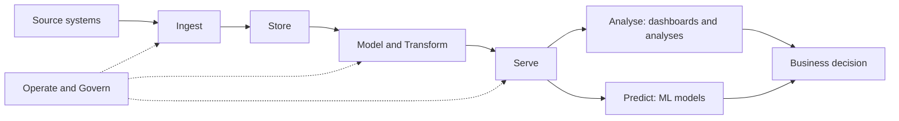
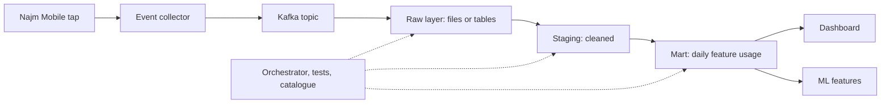
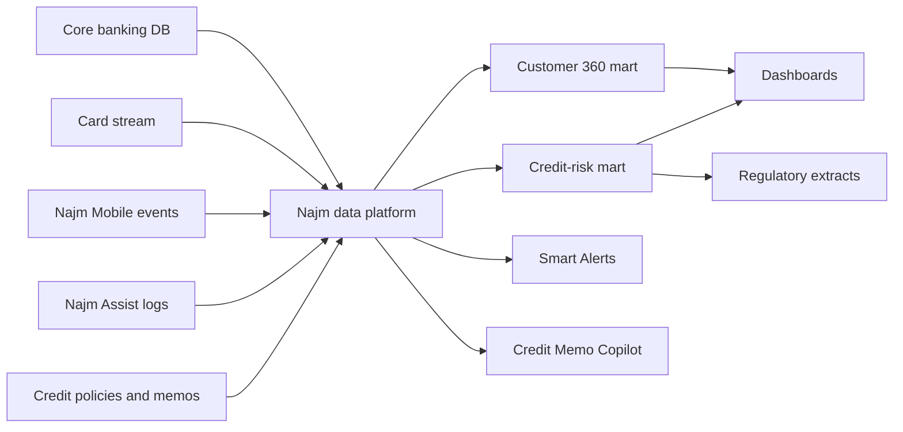

# Module 0 — Orientation

*Before you write a pipeline or a dashboard, you need a map. This module gives you three. The first is a map of the work: what data engineers, analytics engineers, analysts, data scientists and ML engineers each do, and how one business question passes through all of them. The second is a map of the system: the path a single tap in the Najm Mobile app takes, through ingestion, storage, transformation and testing, until it becomes a number on a dashboard that someone uses to make a decision. The third is a map of the place: Najm Bank, its Data Platform & Analytics team, the systems they run, and how to use this course to build a portfolio as you go. You will meet Faisal, who runs the platform and becomes your mentor, and Huda, a new graduate who starts the same week as you and learns, sometimes the hard way, why "the number on the slide" is never just a query.*

> **Stages:** Ingest, Store, Model, Transform, Serve, Analyse, Operate, Govern — the whole data life cycle at a glance, before each module zooms into one part of it.

---

# 0.1 — What data engineering, analytics and data science are — and how they fit together
*Level: 🟢 Beginner* · *Prerequisites: None* · *Stage: Analyse, Serve*

## ⚡ In 60 seconds
- **Data engineering** builds and runs the systems that move, store and prepare data reliably. **Analytics engineering** turns raw data into clean, tested, documented tables and agreed metrics. **Data analysis** answers business questions with those tables. **Data science** builds models that predict or explain. **ML engineering** keeps those models running in production.
- They are not separate worlds. They are stages of one chain, and a business question usually needs all of them.
- The rule that matters most: **a number is only as trustworthy as the weakest link in the chain behind it**. A brilliant model on badly loaded data is a brilliant wrong answer.
- Decision cue: when someone asks for "a dashboard" or "a model", first ask *which decision it will change* and *which definition of each term they mean*.
- Biggest trap: treating disagreeing numbers as a tooling problem. Usually it is a definition problem that nobody owns.

## 🧭 Why it matters
It is Huda's first Monday at Najm Bank. In the weekly business review, the retail team's slide says Najm has **412,000 active customers**. Ten minutes later, the finance slide says **368,000**. (The figures are hypothetical, but the situation is common in every organisation that has data.) The chief operating officer asks which one is right. Nobody answers. Kareem, the retail data analyst, wrote one query; someone in finance wrote the other. Both queries run without errors. Both are "correct".

After the meeting, Faisal, Head of Data Platform, takes Huda aside. "Both numbers are right, for their own definition of *active*. Retail counts anyone with an open account. Finance counts anyone who made a transaction themselves in the last 90 days. Our job is not to write a third query. Our job is to make sure the bank has *one* definition, built once, tested, and used everywhere. That is what this team is for."

This lesson is about that team: what each role does, where the hand-offs are, and why most data failures happen in the gaps between roles rather than inside any one of them.

## 📐 How it works

### 🟢 The essentials

**Data** here means recorded facts about things that happened: a customer opened an account, a card was tapped at a café, a loan payment arrived late, someone pressed "Freeze card" in the app. Organisations collect these facts in **operational systems**, the software that runs the business day to day, such as the core banking database. Those systems are built to *do* things quickly and safely, one customer at a time. They are not built to *answer* questions across millions of customers. The roles below exist to bridge that gap.

| Role | The question they answer | What they build | Typical tools |
|---|---|---|---|
| **Data engineer** | "Is the right data arriving, complete and on time, and can we re-run it safely?" | Ingestion jobs, pipelines, storage, orchestration, the platform itself | SQL, Python, PostgreSQL, Kafka, Airflow or Dagster, a warehouse or lakehouse |
| **Analytics engineer** | "Is this table clean, tested, documented, and does *active customer* mean one thing?" | Modelled tables, tests, metric definitions, documentation | SQL, dbt, version control |
| **Data analyst** | "What happened, why, and what should we do about it?" | Analyses, dashboards, recommendations | SQL, spreadsheets, a BI tool such as Metabase or Superset |
| **Data scientist** | "What is likely to happen, and what would happen if we changed something?" | Models, experiments, statistical analyses | Python, notebooks, statistics, ML libraries |
| **ML engineer** | "Will this model keep working in production, at scale, next month?" | Feature pipelines, training pipelines, model serving and monitoring | Python, MLflow, a feature store, containers |

Titles vary between companies. In a small company one person does all five. In a big bank each may be a team. What does not vary is the *work*. Every one of these jobs has to be done by someone, or the chain breaks.

**The four kinds of question.** A useful way to see how the roles fit is the kind of question being asked:
- **Descriptive:** *What happened?* "How many customers froze a card last week?" Mostly analysts, on tables built by engineers.
- **Diagnostic:** *Why did it happen?* "Why did card freezes double on Thursday?" Analysts, often with data engineers checking whether the data itself changed.
- **Predictive:** *What will happen?* "Which card transactions are likely to be fraud?" Data scientists; this is Najm's **Smart Alerts** fraud model.
- **Prescriptive:** *What should we do?* "Should we block this transaction or send an alert?" Data scientists and the business together, often tested with an experiment.

Each step up the list needs everything below it. You cannot predict fraud from data you cannot describe correctly.

**Same question, two definitions.** Here is the Monday-morning disagreement as SQL. Both queries are valid. They answer different questions.

```sql
-- DuckDB syntax (in PostgreSQL, write INTERVAL '90 days')
-- Retail's definition: holds at least one open account
SELECT COUNT(DISTINCT customer_id) AS active_customers
FROM accounts
WHERE status = 'open';

-- Finance's definition: made at least one customer-initiated
-- transaction in the 90 days up to the reporting date
SELECT COUNT(DISTINCT a.customer_id) AS active_customers
FROM transactions AS t
JOIN accounts AS a ON a.account_id = t.account_id
WHERE t.initiated_by = 'customer'
  AND t.txn_date >  DATE '2026-02-28' - INTERVAL 90 DAY
  AND t.txn_date <= DATE '2026-02-28';
```

A customer who has an open account but only pays a monthly fee counts in the first query and not in the second. Neither query is wrong. What is wrong is a bank where both numbers reach the same meeting under the same name. Fixing that is the job of analytics engineering, and lesson 4.1 shows how.

### 🟡 Going deeper

**The data life cycle.** This course tags every lesson with one or two of eight **stages**. Think of them as the steps every useful piece of data passes through:

| Stage | What happens | Who usually leads |
|---|---|---|
| **Ingest** | Data is copied from where it is created into the data platform | Data engineer |
| **Store** | It is kept in a form that is cheap, safe and fast to query | Data engineer |
| **Model** | Its structure is designed: which tables, at what level of detail, linked how | Analytics engineer, data engineer |
| **Transform** | Raw data is cleaned, joined and reshaped into the modelled tables | Analytics engineer |
| **Serve** | Tables, metrics and features are made available to people and systems | Analytics engineer, ML engineer |
| **Analyse** | People use the data to answer questions and make decisions | Analyst, data scientist |
| **Operate** | Everything is monitored, tested, re-run and kept within cost | Data engineer, ML engineer |
| **Govern** | Ownership, access, privacy and quality are defined and enforced | Everyone, with the DPO and governance team |



The dotted lines matter. Operating and governing are not steps at the end; they apply at every hop.

**Where the hand-offs break.** Most data incidents do not come from one person doing their job badly. They come from a hand-off that nobody owned:
- The app team renames an event, and the pipeline keeps loading it, but every dashboard that filtered on the old name silently drops to zero. (The *producer to engineer* hand-off. Lesson 3.2 calls the fix a data contract.)
- An analyst copies a "revenue" query from an old notebook into a new dashboard, with a filter nobody remembers adding. (The *engineer to analyst* hand-off. Lesson 4.1 puts definitions in one place.)
- A data scientist trains a model on a carefully cleaned extract, but the production pipeline feeds it slightly different data. (The *data scientist to ML engineer* hand-off. Lesson 5.1 covers this.)

Faisal's rule for Huda: *when you receive data, ask who produces it and what they promised; when you hand data on, write down what you promise.*

**Analytics engineering, briefly.** The role is newer than the others. The name was popularised by the community around **dbt**, the open-source tool that lets you write transformations as version-controlled SQL with tests. The idea behind it is older and simple: the logic that turns raw data into trusted tables is *software*, and should be treated like software, with code review, tests and documentation. You will do this in lesson 3.1.

### 🔴 Expert view

**Value comes from decisions, not data.** A pipeline that runs perfectly but feeds a dashboard nobody uses has cost and no value. Strong data teams work backwards from a decision: "The fraud team decides each morning which alert rules to tighten. What do they need to see, how fresh, and how sure must it be?" That one sentence tells you the freshness target, the grain of the table, the quality checks that matter and who to call when it breaks.

**Centralised, embedded or hub-and-spoke.** Organisations arrange these roles in three common ways. A *central* data team owns everything; it is consistent but becomes a queue. *Embedded* analysts sit in each business unit; they are fast but definitions drift apart, which is exactly the Monday-morning problem. *Hub and spoke* keeps a central platform and shared definitions (the hub) with analysts and scientists in the business (the spokes). Najm uses hub and spoke: Faisal's team owns the platform, the core models and the metric definitions; Kareem sits with retail. A related idea, **data mesh** (described by Zhamak Dehghani in 2019), pushes ownership of data products further out to domain teams. It is a set of organisational principles, not a tool, and it only works where domain teams have the skills and the platform to own data well.

**Regulated data raises the bar.** In a bank, a wrong number can become a wrong regulatory report or an unfair credit decision, not just an awkward meeting. That is why governance appears in every module of this course, and why Sara, Najm's Data Protection Officer, and Layla, Head of AI Governance, will often appear in the same conversation as a pipeline. For the legal and AI-governance side in depth, see [*AI Governance: Zero to Hero*, lesson 3.2 — Data governance and intellectual-property policies for AI](../aigp/index.html#/3.2).

## 🧰 The toolkit
| Tool, pattern or standard | What it is and does | When to reach for it |
|---|---|---|
| **SQL** | The standard language for querying and shaping tables; every data role uses it daily | Always. It is the one skill every role in this lesson shares |
| **Python** (pandas, Polars) | General-purpose language with libraries for data frames, statistics and ML | Data that SQL handles badly: files, APIs, statistics, models |
| **dbt** (dbt Labs; dbt Core is open source) | Runs SQL transformations as version-controlled models with tests and documentation | Turning raw tables into trusted, tested models (lesson 3.1) |
| **Jupyter notebooks** | Interactive documents mixing code, output and notes | Exploration and analysis; not as the production pipeline itself |
| **Data life cycle stages** | The eight stages used in this course: Ingest, Store, Model, Transform, Serve, Analyse, Operate, Govern | Placing any task, tool or problem on the map, and seeing who owns it |
| **Hub-and-spoke data team** | A central platform and shared definitions, with analysts and scientists embedded in the business | Growing beyond one team without letting definitions drift apart |

## 🏛️ In practice at Najm Bank
Faisal asks Huda to produce a **data request intake card** for the "active customers" question. From now on, every new request to the team starts with one of these, before anyone writes a query.

| Field | Najm's answer for "active customers" |
|---|---|
| Request | One number for active customers, used by retail and finance |
| Decision it supports | Quarterly targets for the retail team; the customer count in the board pack |
| Question type | Descriptive |
| Definitions to agree | *Active*: at least one customer-initiated transaction in the 90 days up to the reporting date. *Customer*: one person or company, however many accounts they hold |
| Owner of the definition | Head of Retail with the Finance Controller; written up by Lina (analytics engineer) |
| Sources | Core banking database: `customers`, `accounts`, `transactions` |
| Stages involved | Ingest (Huda), Model and Transform (Lina), Serve (Lina), Analyse (Kareem), Govern (Sara checks the use of personal data) |
| Freshness needed | Daily is enough; the decision is monthly |
| Quality checks | No duplicate customers; transaction dates not in the future; the count does not move more than an agreed amount day to day without an explanation |
| Where it will live | The customer 360 mart and the metrics catalogue (lesson 4.1); retail and finance dashboards both read from it |
| Not in scope | Predicting which customers will become inactive (a separate data science request) |

The card is short on purpose. Its job is to force the two conversations that prevent most data problems: *what decision is this for*, and *what exactly do these words mean*.

## 🛠️ Exercises
- 🟢 Find five real job adverts: one each for a data engineer, analytics engineer, data analyst, data scientist and ML engineer. For each, list the three skills that appear most and place the role on the eight-stage life cycle. *Done when:* you have a one-page table and can explain, in two sentences, the difference between an analytics engineer and a data analyst.
- 🟡 Install DuckDB on your laptop. Create small `accounts` and `transactions` tables with ten made-up rows each and run both "active customer" queries from this lesson. Then add rows that make the two numbers differ for three different reasons (an account with only fees, a closed account, a transaction older than 90 days). *Done when:* both queries run and you can explain each difference row by row.
- 🔴 Pick a metric you have seen quoted in public, such as "monthly active users" in a company's results, or a public statistic from your country's open-data portal. Write a data request intake card for it: the decision it supports, the exact definition, the source, the owner, the freshness and three quality checks. Note every point where the published material does not tell you enough. *Done when:* the card is complete, and the list of unanswered questions shows at least two places where the number could quietly mean different things.

## ⚠️ Mistakes and traps
- **Treating a disagreement as a query bug.** Two numbers rarely disagree because SQL is broken. Find the definitions first, then the owner who decides between them.
- **Starting from the tool.** "We need a dashboard" or "we need a model" is a solution, not a request. Ask which decision will change.
- **Thinking your role ends at your hand-off.** The data engineer who loads data nobody can trust, and the data scientist whose model nobody can run, both fail. Know the stage before and after yours.
- **Using a notebook as the production system.** Notebooks are excellent for exploring and bad at being re-run reliably by someone else at 6 a.m. Move anything that matters into a pipeline (lessons 2.2 and 5.1).
- **Copying queries instead of reusing models.** Every copied query is a definition that will drift. Build it once, test it, and point everything at it.

## 🧾 Recap
- Data engineering moves and stores data reliably; analytics engineering turns it into tested tables and agreed metrics; analysts answer questions; data scientists predict; ML engineers keep models running.
- The roles form one chain, and the chain is only as strong as its weakest hand-off.
- Descriptive, diagnostic, predictive and prescriptive questions build on each other.
- The eight stages (Ingest, Store, Model, Transform, Serve, Analyse, Operate, Govern) are the map for the whole course.
- Start every request from the decision it supports and the exact definitions it needs.

## ✍️ Check yourself

**1. At Najm's business review, retail reports 412,000 active customers and finance reports 368,000. Both queries run without errors. What is the most likely root cause?**

- A. One of the two queries contains a syntax error that the database quietly skipped over while counting
- B. Two definitions of "active customer", with nobody owning one
- C. The warehouse is too slow to count hundreds of thousands of customers accurately in one pass
- D. Finance built its number in Python while retail built its number in SQL

<details><summary>Answer</summary>

**B.** Both queries can be correct for their own definition. The fix is an agreed, owned definition built once. A is tempting, but a query with a syntax error would not run at all, and the scenario says both run. (🟢 The essentials.)

</details>

**2. Which role is mainly responsible for turning raw tables into clean, tested, documented models with agreed metric definitions?**

- A. Data scientist, who builds the predictive models
- B. ML engineer, who keeps models running in production
- C. Data analyst, who answers business questions with dashboards
- D. Analytics engineer

<details><summary>Answer</summary>

**D.** Analytics engineers own the transformation layer and the definitions. Analysts (C) use those tables to answer questions; they may help define metrics but do not usually own the tested models. (🟢 The essentials.)

</details>

**3. The fraud team asks Huda "Which card transactions tomorrow are likely to be fraud?" What kind of question is this, and who usually leads the answer?**

- A. Predictive; a data scientist
- B. Descriptive; a data analyst, who builds a dashboard of last month's confirmed fraud cases
- C. Diagnostic; the data engineer, who checks the pipeline logs for what went wrong yesterday
- D. Prescriptive; the Data Protection Officer, who decides which transactions may be scored

<details><summary>Answer</summary>

**A.** Predicting what will happen is a predictive question, the job of Najm's Smart Alerts model. B describes what already happened; D confuses governance with analysis. (🟢 The essentials.)

</details>

**4. The app team renames the event `card_freeze` to `card_freeze_tap`. The pipeline keeps running, but the "card freezes" dashboard drops to zero. Where did the chain break?**

- A. In the BI tool's chart settings, because that is where the zero first appears to the business
- B. In the data scientist's model, which was trained on the old event name
- C. At the producer-to-platform hand-off, which no agreement covered
- D. In the warehouse's storage format, which cannot hold two event names for the same action

<details><summary>Answer</summary>

**C.** The producer changed something the consumers depended on, and nothing made that dependency explicit. Data contracts close this gap. A is tempting because the zero shows up on the dashboard, but the chart is only showing what the data now says. (🟡 Going deeper.)

</details>

**5. Najm has analysts in every business unit, each writing their own metric queries, and the numbers keep drifting apart. Which change best addresses this while keeping analysts close to the business?**

- A. Move every analyst into one central data team that takes all requests from a single shared queue
- B. Hub and spoke: shared definitions centrally, analysts stay in the units
- C. Buy a second BI tool so that each business unit can compare its results against the others
- D. Ask each analyst to document their own metric definitions carefully in their own team folder

<details><summary>Answer</summary>

**B.** The hub gives one definition; the spokes keep business knowledge close. A fixes consistency but creates a bottleneck; D documents the drift without stopping it. (🔴 Expert view.)

</details>

## 📚 References
- PostgreSQL documentation — https://www.postgresql.org/docs/
- DuckDB documentation — https://duckdb.org/docs/
- dbt documentation — https://docs.getdbt.com/
- Project Jupyter — https://jupyter.org/
- DAMA International, *DAMA-DMBOK: Data Management Body of Knowledge* (2nd edition) — https://www.dama.org/
- Joe Reis and Matt Housley, *Fundamentals of Data Engineering* (O'Reilly)

---

# 0.2 — The modern data stack end to end: from a tap in the app to a number on a dashboard
*Level: 🟢 Beginner* · *Prerequisites: 0.1* · *Stage: Ingest, Serve*

## ⚡ In 60 seconds
- The **modern data stack** is the usual chain of components: sources → ingestion → storage → transformation → serving (dashboards, models, apps), with orchestration, quality checks and governance running alongside.
- Many teams today use **ELT**: load raw data first, then transform it inside the warehouse or lakehouse with SQL.
- Data moves through **layers**: **raw** (exactly as received), **staging** (cleaned and renamed) and **marts** (modelled for a business purpose).
- The rule that matters most: **every hop can silently change the number**. Duplicates, time zones, late data and truncation each have a home somewhere on the path.
- Decision cue: for any number on a dashboard, you should be able to name every hop it passed through, who owns each one, and how fresh it is.
- Biggest trap: checking only the last step. A dashboard can be perfectly built on top of data that was wrong three hops earlier.

## 🧭 Why it matters
In March, Najm Mobile launches a "Freeze card" button on the home screen. Kareem's dashboard says **daily users of Freeze card jumped 40% on launch day**. The product team celebrates. Two days later, Huda notices that the number of *taps* is far higher than the number of *customers*, and that many launch-day taps are stamped after 21:00 UTC, which is already after midnight, the next day, in Doha. (Najm, the feature and the figures are hypothetical.)

It turns out two things happened on the way from the phone to the chart. The app retries sending an event when the network is slow, so some taps arrive twice. And the dashboard grouped events by **UTC** date, three hours behind Doha. Evening taps landed on the "wrong" day. Nothing was broken in the usual sense. Every component did what it was built to do. The number was still wrong.

Public examples show how much a single hop can matter. In early October 2020, it emerged that England's daily COVID-19 figures had left out nearly 16,000 positive cases over about a week. Widely published accounts traced it to a step that loaded test results into an older spreadsheet file format with a row limit, so rows beyond the limit were dropped without an error. Every system around it worked. One hop silently truncated the data.

This lesson walks the whole path once, so you know where to look.

## 📐 How it works

### 🟢 The essentials

Follow one tap on "Freeze card" from Huda's phone to Kareem's chart.



**Step 1: Source.** The app creates an **event**: a small record that something happened, such as `{"event_id": "e1", "customer_id": "c001", "event_name": "card_freeze_tap", "event_ts": "2026-03-01T21:30:00Z"}`. Other sources at Najm include the core banking database (customers, accounts, transactions, loans), the card authorisations stream, and Najm Assist conversation logs. For how product teams should design and own their events, see [*System Design for Vibe Coders*, lesson 7.5 — Product analytics in practice](../vibe/index.en.html#l7-5).

**Step 2: Ingestion.** Something copies the data into the platform. Events usually go through a **message broker** such as **Apache Kafka**, which stores them durably, in order within each partition, and lets several systems read them. Database tables are copied by **batch** jobs (every hour or night) or by **change data capture** (CDC), which reads the database's own change log. Lesson 2.1 covers these choices.

**Step 3: Storage.** Data lands in a **warehouse** (a database built for analysis, such as PostgreSQL for small data, or Snowflake, BigQuery, Amazon Redshift or Microsoft Fabric as managed services), or in a **lake** (files, often **Parquet**, on cheap object storage), or in a **lakehouse**, which adds table features to the lake. Lesson 1.3 compares them. For learning, **DuckDB** on your laptop plays the warehouse role well.

**Step 4: Transformation.** Raw data is turned into useful tables in layers:

| Layer | What it holds | Rule |
|---|---|---|
| **Raw** (also called *bronze* in Databricks' medallion naming) | Data exactly as received, duplicates and all | Never edit it; it is your evidence and lets you rebuild |
| **Staging** (*silver*) | One cleaned table per source: renamed columns, correct types, duplicates removed, time zones fixed | One source in, one table out; no business logic yet |
| **Marts** (*gold*) | Tables modelled for a business purpose: customer 360, credit risk, daily feature usage | Defined grain, tested, documented, owned |

**Step 5: Serving.** People and systems read the marts: dashboards in a **BI tool** (business intelligence) such as Metabase or Apache Superset, ML features for Smart Alerts, extracts for regulatory reports, and documents and embeddings for the Credit Memo Copilot.

**ETL or ELT?** In **ETL** (extract, transform, load), data is transformed *before* it is loaded into the warehouse. In **ELT** (extract, load, transform), raw data is loaded first and transformed inside the warehouse with SQL. ELT became a common default as warehouses grew cheap and powerful enough to do the transforming. Its big advantage: because raw data is kept, you can fix a transformation and rebuild history. ETL still has a place, for example when personal data must be masked *before* it ever reaches the platform (lesson 6.2).

### 🟡 Going deeper

**The launch-day bug in SQL.** Here are the raw events, including a duplicate (the app retried `e1`):

| event_id | customer_id | event_name | event_ts_utc |
|---|---|---|---|
| e1 | c001 | card_freeze_tap | 2026-03-01 21:30 |
| e1 | c001 | card_freeze_tap | 2026-03-01 21:30 |
| e2 | c001 | card_freeze_tap | 2026-03-01 22:10 |
| e3 | c002 | card_freeze_tap | 2026-03-01 08:05 |
| e4 | c003 | card_freeze_tap | 2026-03-02 09:00 |

The wrong way counts rows and groups by UTC date (the snippets use DuckDB syntax):

```sql
-- Wrong: counts taps (including retries) and uses the UTC calendar day
SELECT CAST(event_ts_utc AS DATE) AS day, COUNT(*) AS users
FROM raw_app_events
GROUP BY 1
ORDER BY 1;
-- 2026-03-01 → 4,  2026-03-02 → 1
```

The right way removes duplicates by `event_id`, converts to Doha time and counts distinct customers:

```sql
-- Right: one row per event, Doha calendar day, distinct customers
WITH deduped AS (
  SELECT DISTINCT ON (event_id) *
  FROM raw_app_events
  ORDER BY event_id
)
SELECT CAST(event_ts_utc + INTERVAL 3 HOUR AS DATE) AS day_doha,  -- Qatar is UTC+3 all year
       COUNT(DISTINCT customer_id)                  AS users
FROM deduped
GROUP BY 1
ORDER BY 1;
-- 2026-03-01 → 1,  2026-03-02 → 2
```

Same data, opposite story: the "launch-day spike" was retries and evening taps that belong to the next Doha day. Two lessons follow. First, deduplication and time-zone handling belong in **staging**, once, not in every dashboard query. Second, the fixed three-hour offset works for Qatar, which does not use daylight saving time. For customers in the EU, whose clocks change twice a year, use a named time zone such as `Europe/Berlin` with your database's time-zone functions rather than a fixed offset.

**Orchestration.** Something must run each step in order, at the right time, and retry or alert when a step fails. That is an **orchestrator** such as **Apache Airflow** or **Dagster**. It knows that the staging model must wait for the raw load, and the mart must wait for staging. Lesson 2.2 teaches orchestration, including how to make every step safe to re-run.

**Quality checks at every layer.** Tests belong on each layer, not only the last:
- Raw: did data arrive at all, and roughly as much as usual? (freshness and volume)
- Staging: are `event_id` values unique after deduplication; is `customer_id` never empty?
- Marts: does every row match a real customer; does the daily count move within an expected range?

Tools such as dbt tests or Great Expectations run these checks automatically (lessons 3.1 and 3.2).

**Batch or streaming?** Most of Najm's dashboards are refreshed in **batch**: data is processed in chunks, every hour or night. Smart Alerts cannot wait that long; it must score a card authorisation within moments, so it reads the card stream in **streaming** mode, processing each event as it arrives. Streaming is harder to build and run. Choose it when the decision really needs seconds, not because it sounds modern (lesson 2.3).

### 🔴 Expert view

**Freshness is a promise, not a property.** "Real-time" means nothing until someone says how fresh, for which decision. Write a **freshness target** for each mart: "The daily feature usage mart is complete for the previous Doha day by 07:00." Then work backwards. If the mart build takes 20 minutes, staging must be done by 06:40, the raw load before that, and the event collector must have flushed yesterday's late events. Each hop gets a budget. When the dashboard is late, you look at the budgets, not at the dashboard.

**Late and out-of-order data.** A phone in airplane mode may send yesterday's taps this morning. If yesterday's mart was built at 07:00 and never rebuilt, those taps are lost to it forever. Mature pipelines reprocess a short window of recent days on each run, or use the event's own timestamp (**event time**) rather than the time it arrived (**processing time**). You will meet both ideas properly in lessons 2.2 and 2.3.

**Where the truth lives.** For each fact, decide which system is the **system of record**. Account balances live in the core banking database, not in the warehouse. The warehouse holds a copy for analysis. When the two disagree, the core system wins, and the difference is a pipeline bug to investigate. Writing this down saves arguments later.

**Every hop is also a cost and a risk.** Each copy of the data costs storage and compute, and each copy of personal data is another place it can leak or be kept too long. The modern data stack makes copying easy. A good design copies deliberately: only the columns needed, masked where possible, with a retention period (lesson 6.2). For the security side of the platform, see lesson 6.3; for the product-analytics pipeline from a SaaS builder's view, see [*SaaS Building Blocks*, lesson 6.2 — Analytics: product, web and the event pipeline](../saas/index.html#/6.2).

**Silent failures are the dangerous ones.** The COVID-19 reporting case shows the pattern. A step that fails loudly gets fixed quickly. A step that quietly drops rows, keeps old data or doubles new data can run for weeks. The defence is a habit of **reconciliation**: compare counts and totals between hops ("raw rows in, staging rows out, minus duplicates removed") and alert when they do not add up.

## 🧰 The toolkit
| Tool, pattern or standard | What it is and does | When to reach for it |
|---|---|---|
| **Apache Kafka** | Distributed event log: producers write events to topics, many consumers read them, in order within each partition | Collecting app and card events that several systems need (lesson 2.3) |
| **ELT** | Load raw data first, then transform it inside the warehouse | The default for analytics; keeps raw data so history can be rebuilt |
| **Raw, staging and marts layers** | Data as received; cleaned per source; modelled for a business purpose | Organising every warehouse or lakehouse project |
| **DuckDB** | In-process analytical database that runs SQL on local files, including Parquet and CSV | Learning, local development and small-to-medium analytics |
| **Apache Airflow** | Open-source orchestrator that runs DAGs (directed acyclic graphs) of tasks on a schedule | Running and retrying multi-step pipelines (lesson 2.2) |
| **dbt** (dbt Labs; dbt Core is open source) | Runs SQL transformations as version-controlled models with tests and documentation | Building staging and mart layers (lesson 3.1) |
| **Metabase** | Open-source BI tool for questions and dashboards over SQL databases | Serving marts to business users |
| **Reconciliation checks** | Comparing counts and totals between hops of a pipeline | Catching silent truncation, duplication and loss |

## 🏛️ In practice at Najm Bank
Huda writes the team's first **data flow sheet** for one dashboard number. Faisal wants one for every metric on the retail dashboard.

**Metric:** Daily Freeze card users (distinct customers who tapped "Freeze card", by Doha calendar day)

| Hop | System | Owner | Freshness target | What can change the number | Check |
|---|---|---|---|---|---|
| 1. Source | Najm Mobile app | Mobile team | Events sent within minutes, retried when offline | Retries create duplicates; offline phones send late | Every event has a unique `event_id` |
| 2. Collect | Event collector → Kafka topic `app_events` | Data Platform (Huda) | Within minutes | Collector outage loses events | Hourly volume within expected range |
| 3. Raw | `raw.app_events` | Data Platform (Huda) | Loaded by 06:00 Doha | Load job skipped or run twice | Row count reconciles with Kafka offsets |
| 4. Staging | `stg_app_events` | Analytics engineering (Lina) | By 06:30 | Deduplication, UTC to Doha time | `event_id` unique; `customer_id` not null |
| 5. Mart | `mart_daily_feature_usage` (grain: one row per Doha day per feature) | Lina | By 07:00; last 3 days rebuilt each run for late events | Definition of "user" | One row per day and feature; day-to-day change within agreed range |
| 6. Dashboard | Metabase, retail dashboard | Kareem | Refreshed 07:15 | Filters, chart settings | Dashboard total equals mart total |

**Definition:** a *user* is a distinct `customer_id` with at least one deduplicated `card_freeze_tap` event in the Doha calendar day. **System of record:** the app event stream. **Personal data:** `customer_id` is pseudonymous within the platform; no names or phone numbers enter this flow.

## 🛠️ Exercises
- 🟢 Pick any app you use daily. Draw the path of one action (a "like", a payment, a search) from your tap to a number someone at that company might see on a dashboard. Label each hop with one of the eight stages. *Done when:* your drawing has at least five hops and names one thing at each hop that could change the number.
- 🟡 In DuckDB, create the five-row `raw_app_events` table from this lesson and run both queries. Then add three rows of your own: a duplicate, a tap at 22:30 UTC, and a late event that arrives a day after it happened (add an `arrived_ts_utc` column). *Done when:* you can predict the output of both queries before running them, and explain which hop should fix each problem.
- 🔴 Build a three-layer mini-pipeline on your laptop. Load a public open dataset (for example a city's open bike-share trip data as CSV) into a raw table in DuckDB, write a staging view that fixes types and removes duplicates, and a mart that answers one question by day. Add one reconciliation query comparing raw, staging and mart row counts. *Done when:* the pipeline rebuilds from raw with one script, and your reconciliation query explains every row lost between layers.

## ⚠️ Mistakes and traps
- **Fixing problems in the dashboard.** Deduplicating or shifting time zones inside a chart's query fixes one chart and leaves every other consumer wrong. Fix it once, in staging.
- **Editing the raw layer.** Raw data is your evidence and your way to rebuild. Keep it as received; clean it downstream.
- **Grouping by UTC date for a local business.** Customers live in Doha time (and Berlin time). Decide the reporting time zone per metric and convert once.
- **Counting rows when you mean people.** Taps, sessions, events and customers are different things. Name the unit in the metric definition.
- **Trusting a green pipeline.** "No errors" does not mean "all the data". Reconcile counts between hops.
- **Choosing streaming because it sounds modern.** If the decision is made daily, a daily batch is cheaper, simpler and easier to fix.

## 🧾 Recap
- The modern data stack runs sources → ingestion → storage → transformation → serving, with orchestration, tests and governance at every hop.
- ELT loads raw data first and transforms it in the warehouse, so history can be rebuilt.
- Raw keeps data as received, staging cleans it once per source, marts model it for a purpose.
- Duplicates, time zones, late data and truncation can each change a number without any error.
- For every metric, know every hop, its owner, its freshness target and its check.

## ✍️ Check yourself

**1. Kareem's dashboard shows a 40% launch-day spike in Freeze card users. Many of the taps are stamped after 21:00 UTC, and raw data shows some events with the same `event_id` twice. What should Huda fix first, and where?**

- A. Add `DISTINCT` and a time-zone shift to Kareem's dashboard query, since that is where the error shows
- B. Ask the mobile team to stop retrying events when the network is slow, so duplicates never arrive
- C. Deduplicate and convert to Doha time once, in staging
- D. Delete the duplicate rows from the raw layer so that every later layer starts from clean data

<details><summary>Answer</summary>

**C.** Staging is where per-source cleaning happens once. A fixes one chart and leaves other consumers wrong; D destroys the evidence that lets you rebuild; B removes a useful reliability feature. (🟡 Going deeper.)

</details>

**2. What is the main advantage of ELT over ETL for an analytics platform?**

- A. Raw data is kept, so fixed logic can rebuild history
- B. Data loaded this way never needs cleaning, because the warehouse handles quality automatically
- C. It needs no orchestrator, because the warehouse runs every step by itself in the right order
- D. It always processes data in real time, so dashboards never show yesterday's numbers

<details><summary>Answer</summary>

**A.** Loading raw data first means you can re-run improved transformations over the whole history. B is wrong because cleaning still happens, just inside the warehouse. (🟢 The essentials.)

</details>

**3. Najm's retail dashboard needs yesterday's numbers by 08:00, and Smart Alerts must score each card authorisation within moments. Which design fits?**

- A. Streaming for both, because real-time is always better
- B. Nightly batch for both, because it is cheaper
- C. Smart Alerts in batch; the dashboard in streaming
- D. Batch for the dashboard; streaming for Smart Alerts

<details><summary>Answer</summary>

**D.** Match latency to the decision. The dashboard decision is daily; fraud scoring needs seconds. A adds cost and complexity the dashboard does not need; B makes fraud detection useless. (🟡 Going deeper.)

</details>

**4. A pipeline runs every night with no errors, but a monthly total is lower than finance's figure. A step loads data through a file format with a row limit. What practice would most likely have caught this early?**

- A. Running the same pipeline more often, for example every hour instead of every night
- B. Reconciling counts and totals between hops
- C. Moving the finance dashboard to a different BI tool with better charts and alerts
- D. Adding more columns to the mart so that analysts can spot missing values themselves

<details><summary>Answer</summary>

**B.** Silent truncation produces no error; only comparing counts between hops reveals it, as the 2020 COVID-19 reporting case showed. A just repeats the same silent loss more often. (🔴 Expert view.)

</details>

**5. The account balance in the warehouse's customer 360 mart differs from the balance in the core banking system. What should the team conclude?**

- A. The warehouse is right, because its data has been cleaned, deduplicated and tested
- B. Both are equally valid, so publish both and let each team pick the one it prefers
- C. Core banking wins; investigate the pipeline
- D. The difference is normal for any copy of the data, and can safely be ignored

<details><summary>Answer</summary>

**C.** The warehouse holds a copy for analysis; the operational system of record wins. A is tempting because the warehouse data is "cleaned", but cleaning cannot make a copy more authoritative than its source. (🔴 Expert view.)

</details>

## 📚 References
- Apache Kafka documentation — https://kafka.apache.org/documentation/
- Apache Airflow documentation — https://airflow.apache.org/docs/
- Dagster documentation — https://docs.dagster.io/
- dbt documentation — https://docs.getdbt.com/
- DuckDB documentation — https://duckdb.org/docs/
- Apache Parquet — https://parquet.apache.org/
- Metabase documentation — https://www.metabase.com/docs/
- Joe Reis and Matt Housley, *Fundamentals of Data Engineering* (O'Reilly)

---

# 0.3 — Meet Najm Bank's data platform team, and how to use this course
*Level: 🟢 Beginner* · *Prerequisites: 0.1, 0.2* · *Stage: Operate, Govern*

## ⚡ In 60 seconds
- **Najm Bank is fictional.** It is a mid-sized Gulf bank (retail, SME and corporate lending) with customers in Qatar, the UAE and the EU, used across this library of courses. You join its **Data Platform & Analytics** team.
- The team runs the **core banking** copy, the **card transactions stream**, **Najm Mobile** and **Najm Assist** data, the warehouse with its **customer 360** and **credit-risk** marts, the **Smart Alerts** fraud model and the **Credit Memo Copilot**'s retrieval data.
- You will work with a recurring cast: **Faisal** (your mentor), **Huda** (your peer, who makes the mistakes you should avoid), **Lina**, **Dana**, **Kareem**, **Sara**, **Layla**, **Tariq** and **Salem**.
- Every lesson has the same ten sections, a level (🟢 🟡 🔴), one or two stages, a Najm artefact, three graded exercises and five questions.
- Best way to study: build your own version of every artefact on your laptop with free tools and synthetic or open data. By Module 7 you will have a portfolio.
- Biggest trap: reading without running. Data skills come from queries that fail and pipelines that break on your own machine.

## 🧭 Why it matters
"Define the grain" means little until you define it for a credit-risk mart a risk committee relies on, with a data scientist who wants more history, a DPO who wants less personal data and an engineering lead worried about the nightly load window. A running case gives every idea a place to land: the same tables, pipelines and people return in every module.

On Huda's first day, Faisal gives her two things: a one-page map of the systems the team owns and a list of people to meet in her first two weeks. "Half of this job," he says, "is knowing which system a number comes from, and which person to ask before you change it." By the end of this lesson you will have the same map, and a working lab on your own laptop.

## 📐 How it works

### 🟢 The essentials

**Najm Bank at a glance.** Najm is fictional; any resemblance to a real institution is unintended. The same bank appears in the library's other courses, seen from other teams.

| Fact | Detail |
|---|---|
| Type | Mid-sized commercial bank: retail, SME and corporate lending, cards and deposits |
| Customers | Individuals and businesses in Qatar and the UAE, and EU-resident customers |
| Languages | Arabic and English, for customers and staff |
| The team you join | **Data Platform & Analytics**, led by Faisal, serving retail, risk, finance, fraud, product and the AI teams |

Three jurisdictions matter: where data may be stored, how long it may be kept and who may see it can differ between Qatar, the UAE and the EU. You will learn when to ask Sara.

**The cast.** Learn what each person cares about. Most real data work is getting these people to agree.

| Person | Role | What they care about | The question they always ask |
|---|---|---|---|
| **Faisal** | Head of Data Platform (your mentor) | A platform people trust: reliable, tested, owned | "Who owns this, and what did they promise?" |
| **Huda** | Graduate data engineer (your peer) | Shipping her first pipelines quickly | "It ran without errors, so it's done, right?" |
| **Lina** | Analytics engineer | Clean models, one definition per metric, tests | "What is the grain of this table?" |
| **Dana** | Lead data scientist | Smart Alerts, experiments, honest evaluation | "Measured on which data, against which baseline?" |
| **Kareem** | Data analyst, retail business | Answers the retail team can act on this week | "Can I trust this number in front of the business?" |
| **Sara** | Data Protection Officer (DPO) | Lawful, minimal use of personal data; customers' rights | "Which personal data, for what purpose, kept for how long?" |
| **Layla** | Head of AI Governance | Risk tiers, controls and approvals for models and AI | "What is the risk, and who signs off?" |
| **Tariq** | Engineering lead, core banking and Najm Mobile | The systems that *produce* the data | "Will this change slow down production?" |
| **Salem** | Head of Platform Engineering | Infrastructure, cloud, cost and reliability | "What does it cost to run, and who gets paged?" |

**The systems.** These are the data sources and products you will build on in every module.

| System | What it is | Kind of data |
|---|---|---|
| **Core banking database** | Operational PostgreSQL database: customers, accounts, transactions, loans | Tables, changing all day |
| **Card transactions stream** | Card authorisations published as events to Kafka | High-volume event stream |
| **Najm Mobile events** | Screens, taps and feature usage from the app | Semi-structured events |
| **Najm Assist logs** | Conversations with the customer-facing LLM assistant | Text with personal data |
| **The warehouse** (raw → staging → marts) | Najm's analytical store | Modelled tables |
| **Customer 360 mart** | One trusted view of each customer across products | Mart |
| **Credit-risk mart** | Loans, exposures, payments and arrears for risk reporting | Mart |
| **Regulatory extracts** | Files produced for supervisors from the marts | Extracts |
| **Smart Alerts** | The fraud-detection ML model | Features, labels, scores |
| **Credit Memo Copilot** | Internal GenAI that retrieves from credit policies and memos | Documents, chunks, embeddings |
| **Retail, risk and finance dashboards** | BI dashboards built on the marts | Metrics |



### 🟡 Going deeper

**How the course is organised.** Eight modules take you from zero to hero.

| Module | You will be able to… | Level |
|---|---|---|
| 0 Orientation | Explain the roles, the stack and the team | 🟢 |
| 1 SQL and data modelling | Answer business questions in SQL and model data at the right grain | 🟢 |
| 2 Ingestion and pipelines | Load data incrementally, orchestrate it safely and handle streams | 🟡 |
| 3 Transformation and quality | Build tested dbt models, write data contracts and control cost | 🟡 |
| 4 Analytics people trust | Define metrics once, design dashboards that drive decisions and run sound experiments | 🟡 |
| 5 Data science and ML in production | Take models from notebook to pipeline, monitor drift and prepare data for LLM applications | 🟡 |
| 6 Governance, privacy and security | Own, classify, protect and share data properly | 🔴 |
| 7 Hero | Build the credit-risk mart end to end, plan your career and pass a 60-question practice exam | 🔴 |

**How every lesson works.** The ten sections always come in the same order. In **📐 How it works**, read 🟢 first, try 🟡, and return to 🔴 when you need it. **🏛️ In practice at Najm Bank** is the artefact to copy into your portfolio.

**Three ways through.**
- *Aiming at data engineering:* go in order, and spend extra time on Modules 2 and 3.
- *Aiming at analytics or data analysis:* do Modules 0, 1, 3 and 4 thoroughly, and skim Module 2 for how your data arrives.
- *Aiming at data science or ML:* do Modules 0, 1, 4 and 5 thoroughly; do not skip lesson 3.2, because a model is only as good as its data quality.

Everyone should do Module 6 and the capstone.

**Set up your lab.** Every exercise runs on a laptop with free tools. You need:
- **Python**, version 3.11 or newer, and **DuckDB** (`pip install duckdb`). This is enough for Modules 0 and 1.
- **PostgreSQL**, installed locally or run in a container, from Module 1 onward.
- **Docker** (or a compatible container tool) for Kafka or Redpanda, Airflow or Dagster, and Metabase from Module 2 onward. For containers done properly, see [*Cloud & DevOps: Zero to Hero*, lesson 2.1 — Containers done right](../cloud/index.html#/2.1).
- **dbt Core** with the DuckDB or PostgreSQL adapter from Module 3.
- **git**, so every exercise lives in a repository you can show.

**Never use real personal data.** Use synthetic data you generate, or public open data. This script creates a small synthetic Najm dataset in one DuckDB file:

```python
import duckdb

con = duckdb.connect("najm_lab.duckdb")  # one file on your laptop

con.sql("""
CREATE OR REPLACE TABLE customers AS
SELECT
    printf('C%06d', i)                            AS customer_id,
    (['retail', 'sme', 'corporate'])[1 + i % 3]   AS segment,
    (['QA', 'AE', 'DE'])[1 + (i // 3) % 3]        AS country,
    DATE '2020-01-01' + CAST(i % 2000 AS INTEGER) AS opened_on
FROM range(1, 1001) AS r(i);
""")

con.sql("""
-- hash() instead of random(): the same "random-looking" rows on every run
CREATE OR REPLACE TABLE transactions AS
SELECT
    i                                             AS txn_id,
    printf('C%06d', 1 + hash(i, 'cust') % 1000)   AS customer_id,
    5 + (hash(i, 'amount') % 99500) / 100         AS amount_qar,
    TIMESTAMP '2026-01-01'
      + to_minutes(CAST(hash(i, 'ts') % 129600 AS BIGINT)) AS txn_ts_utc
FROM range(1, 50001) AS r(i);
""")

print(con.sql("""
SELECT c.segment, COUNT(*) AS txns, round(SUM(t.amount_qar)) AS total_qar
FROM transactions AS t
JOIN customers AS c USING (customer_id)
GROUP BY c.segment
ORDER BY c.segment;
"""))
```

It makes 1,000 customers and 50,000 transactions in the first quarter of 2026. Notice the comment: with `random()`, Huda's exercise answers changed on every re-run. Using `hash()` of the row number gives data that looks random but is the same on every run with the same DuckDB version. **Reproducibility** is a theme you will meet again in pipelines (lesson 2.2) and in ML (lesson 5.1).

### 🔴 Expert view

**Build a portfolio, not a pile of notes.** Hiring managers for data roles want evidence that you can do the work. Keep one git repository for this course. Each module adds something real: a modelled schema, an incremental pipeline, a tested dbt project, a metric card, a drift checklist, a classification table, and finally the credit-risk mart. Write a short README for each one, in the style of the Najm artefacts: what decision it supports, what it assumes, how to run it. For how to present this to employers, see [*From Graduate to Hired*, lesson 2.3 — Data engineer, analyst and data scientist](../career/index.html#/2.3) and lesson 7.2 of this course.

**Use the companion courses** where they go deeper:
- Databases, backups and indexes in production: [*System Design for Vibe Coders*, lesson 2.1 — The database is the easy part](../vibe/index.en.html#l2-1).
- The data layer and analytics pipeline of a SaaS product: [*SaaS Building Blocks*, lesson 2.1 — The data layer](../saas/index.html#/2.1).
- Privacy law and AI governance: [*AI Governance: Zero to Hero*, lesson 4.1 — Data protection principles meet AI](../aigp/index.html#/4.1).
- Data readiness and experiments from the product side: [*AI Product Management: Zero to Hero*, lesson 3.1 — Data readiness](../aipm/index.html#/3.1).
- Protecting personal data: [*Secure AI & Application Security*, lesson 5.3 — Protecting personal data](../secai/index.html#/5.3).

**Read the cast as a set of risks.** Tariq stands for the producer whose change breaks you; Sara for personal data you should not have copied; Layla for the model nobody approved; Salem for the bill nobody expected; Kareem for the number that reached the business unchecked. Before you ship anything, ask what each would say: a quick, surprisingly complete review.

**Accuracy rules.** Facts that can change are marked "at the time of writing (2026)" and point to official documentation; managed services' prices and limits are not quoted; Najm figures are hypothetical unless a source is given.

## 🧰 The toolkit
| Tool, pattern or standard | What it is and does | When to reach for it |
|---|---|---|
| **DuckDB** | In-process analytical database that runs SQL on local files, including Parquet and CSV | Modules 0 and 1, and fast local analysis throughout |
| **PostgreSQL** | Open-source relational database; plays Najm's core banking system in the examples | From Module 1: OLTP examples, CDC, pgvector |
| **Docker** | Runs software in containers so a whole stack starts with one command | From Module 2: Kafka or Redpanda, Airflow or Dagster, Metabase |
| **dbt Core** | Open-source command-line tool for SQL transformations with tests and docs | From Module 3 |
| **Git** | Version control for every exercise, query and model | From the first exercise: your portfolio lives here |
| **Synthetic data** | Generated data with realistic shape but no real people in it | Every exercise that would otherwise need personal data |

## 🏛️ In practice at Najm Bank
Faisal hands every new joiner the **Data Platform onboarding pack**. Huda fills hers in during week one; you fill in yours for your lab.

**Part A: systems I can name the owner of**

| System | Owner | Where its data lands | Who to ask before changing it |
|---|---|---|---|
| Core banking database | Tariq's engineering team | `raw.core_*` tables | Tariq |
| Card transactions stream | Card platform team | Kafka topic `card_authorisations` | Card platform lead, Dana (Smart Alerts depends on it) |
| Najm Mobile events | Mobile team | Kafka topic `app_events` → `raw.app_events` | Tariq |
| Customer 360 mart | Lina | `marts.customer_360` | Lina; Sara for new personal-data columns |
| Credit-risk mart | Lina, with the risk team | `marts.credit_risk_*` | Lina and the risk owner |
| Smart Alerts features | Dana | Feature tables | Dana |
| Credit Memo Copilot documents | Credit policy team, with the AI team | Document store and vector index | Layla for scope; Sara for personal data |

**Part B: my lab checklist**

| Item | Done when |
|---|---|
| Python and DuckDB | The synthetic-data script runs and prints three segments |
| PostgreSQL | You can connect with `psql` and create a table |
| Docker | `docker run hello-world` succeeds |
| Git repository | A repository named for this course, with a README and the synthetic-data script committed |
| Data rule | A line in your README: "This repository contains only synthetic or public open data" |

**Part C: first conversations.** One question each for Faisal, Lina, Kareem, Dana and Sara; note the answers.

## 🛠️ Exercises
- 🟢 Set up the lab: install Python and DuckDB, run the synthetic-data script and commit it to a new git repository with a README. *Done when:* a fresh clone of your repository runs the script and prints the same three rows as your first run.
- 🟡 Extend the synthetic dataset with an `accounts` table (one to three accounts per customer, some closed) and a `loans` table (a few hundred loans with an amount, a start date and a status). Then write three queries a Najm stakeholder might ask, and note which cast member would ask each. *Done when:* the tables load, every account and loan links to an existing customer, and each query has a one-line business question above it.
- 🔴 Fill in Part A of the onboarding pack for five systems of an organisation you know (an employer, a university, a public service), using only public information or your own role. Mark every cell you cannot fill. *Done when:* the table is complete or marked, with three sentences on what the gaps would mean for a new data team there.

## ⚠️ Mistakes and traps
- **Reading without running.** You will not learn SQL, pipelines or dbt by reading. Run every snippet, then break it on purpose.
- **Using real personal data "just to practise".** Practise only on synthetic or open data. At work, data protection law and bank policy will usually require the same habit.
- **Copying Huda.** She is there to make the mistakes first. When she says "it ran, so it's done", ask what Faisal would check.
- **Keeping exercises on your desktop.** Work not in a repository with a README is not portfolio evidence.

## 🧾 Recap
- Najm Bank is a fictional Gulf bank; you join its Data Platform & Analytics team.
- Its systems (core banking, card stream, app events, Najm Assist logs, warehouse marts, Smart Alerts and Credit Memo Copilot) are the running case for every module.
- The cast stands for the people, and the risks, every data decision must account for.
- Set up a laptop lab, use only synthetic or open data, keep everything in git, and build a portfolio as you go.

## ✍️ Check yourself

**1. Which statement about Najm Bank is correct?**

- A. It is a real Qatari bank, and anonymised samples of its data are used in the exercises
- B. It is a fictional bank, but the figures in its scenarios are real industry statistics
- C. It operates only in Qatar, so only Qatari data protection law applies to its data
- D. It is fictional, with customers in Qatar, the UAE and the EU

<details><summary>Answer</summary>

**D.** Najm is fictional and spans three jurisdictions. B is tempting, but Najm's figures are illustrative unless a source is given; C ignores its UAE and EU customers. (🟢 The essentials.)

</details>

**2. Huda wants to add customers' phone numbers to the customer 360 mart "in case someone needs them". Who should she talk to first, and why?**

- A. Salem, because the extra column will grow the mart and raise storage and compute costs
- B. Sara, because new personal data needs a purpose
- C. Kareem, because he builds the retail dashboards that will read the new column
- D. Nobody, because marts belong to the data team and it may change them as it sees fit

<details><summary>Answer</summary>

**B.** New personal data in a shared mart is a privacy decision first. "In case someone needs them" has no purpose, which is exactly what Sara will ask about. A is a real but secondary concern; D ignores that marts are shared and governed. (🟢 The essentials.)

</details>

**3. Huda's practice dataset gives different answers every time she re-runs her generator script. What is the best fix?**

- A. Derive values deterministically, for example from `hash()`
- B. Run the script only once, keep that file, and never run the generator again
- C. Use a small sample of real customer data instead, since it never changes between runs
- D. Round all the generated numbers to whole values so small differences disappear

<details><summary>Answer</summary>

**A.** Deterministic generation makes results reproducible, which matters for checking answers and later for pipelines and ML. C breaks the rule to practise only on synthetic or open data; B hides the problem instead of fixing it. (🟡 Going deeper.)

</details>

**4. An aspiring data scientist asks which modules to prioritise. Which advice matches this course's guidance?**

- A. Only Module 5, because everything else in the course is engineering work done by others
- B. Only Modules 2 and 3, because pipelines have to come before any model can be built
- C. Modules 0, 1, 4 and 5, plus 3.2, Module 6 and the capstone
- D. Start with the practice exam and then skip every lesson whose questions you already passed

<details><summary>Answer</summary>

**C.** The data science route leans on SQL, analytics and ML, but data quality, governance and the capstone apply to everyone. A ignores that a model depends on the data underneath it. (🟡 Going deeper.)

</details>

**5. Lina proposes a new column in the credit-risk mart that changes how arrears are counted. Using the cast as a review checklist, which question is most important to answer before the change ships?**

- A. Whether the new column name fits the naming and colour conventions of the BI dashboards
- B. Whether the new column makes the nightly mart load faster or slower than before
- C. Whether Huda, as the newest engineer, has reviewed the change and approved it
- D. Who reads the old definition, and has the risk owner agreed?

<details><summary>Answer</summary>

**D.** A definition change in a mart that feeds regulatory extracts affects reports supervisors rely on. Finding the consumers and getting the owner's agreement comes first. B is a fair concern for Salem but secondary to correctness. (🔴 Expert view.)

</details>

## 📚 References
- DuckDB installation and documentation — https://duckdb.org/docs/
- PostgreSQL downloads and documentation — https://www.postgresql.org/
- Docker documentation — https://docs.docker.com/
- dbt Core documentation — https://docs.getdbt.com/
- Git documentation — https://git-scm.com/doc
- Python documentation — https://docs.python.org/3/
