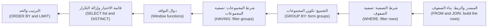
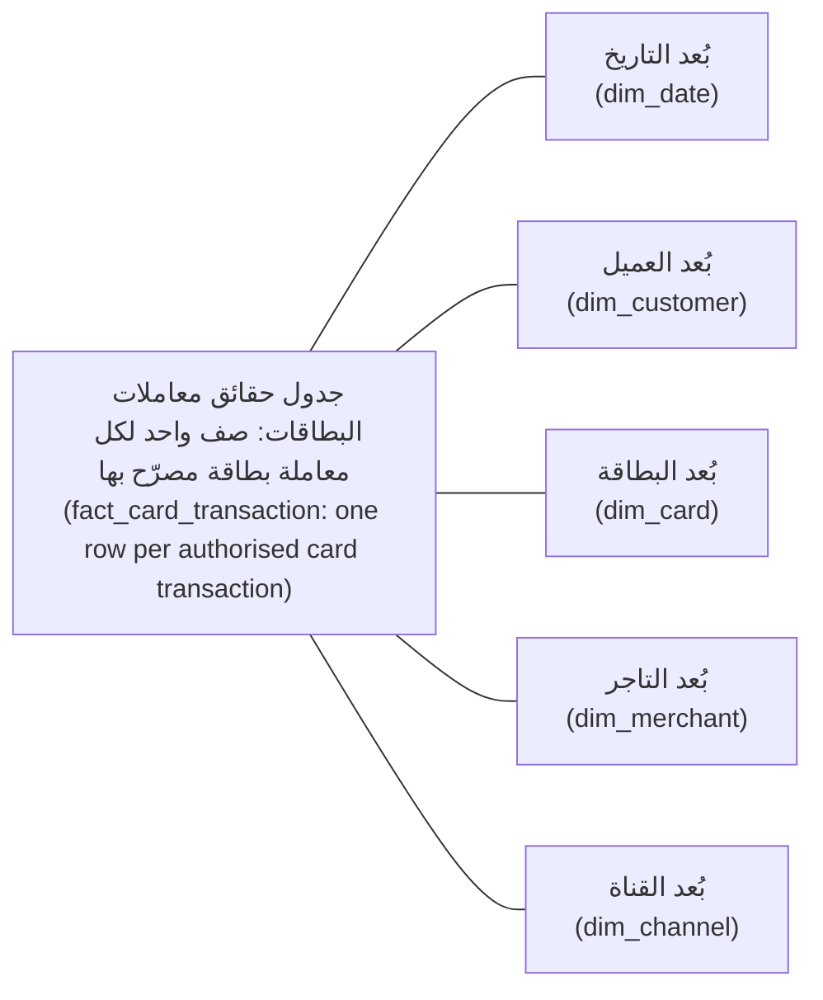
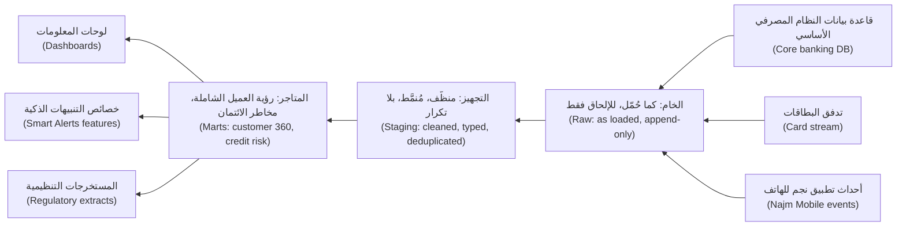

# الوحدة 1 — SQL ونمذجة البيانات (SQL and data modelling)

*كل رقم يُصدره بنك نجم (Najm Bank) يبدأ استعلامًا (query) على جدول صمّمه أحدهم. وحين يعدّ الاستعلام الشيء الخطأ، أو حين لا يستطيع الجدول أن يتذكّر ما كان صحيحًا في مارس الماضي، تصبح لوحة المعلومات (dashboard) خاطئة، ولا أحد يستطيع أن يقول لماذا. تمنحك هذه الوحدة الأسس الثلاثة (three foundations) التي يبني عليها باقي المقرر. أولًا، لغة SQL التي تجيب عن الأسئلة التجارية (business questions) إجابة صحيحة: عمليات ربط (joins) لا تضاعف الصفوف، وتجميع (aggregation) عند الحُبَيبية (grain) الصحيحة، وتعبيرات جدولية مشتركة (CTEs) تجعل الاستعلام الطويل مقروءًا، ودوال النوافذ (window functions) التي ترتّب (rank) وتقارن (compare) وتحسب المجاميع التراكمية (running totals). ثانيًا، نمذجة البيانات (data modelling): جداول مُطبَّعة (normalised tables) للأنظمة التي تُشغّل البنك، ومخططات النجمة (star schemas) للأسئلة التي يطرحها الناس عنه، وبيان حُبَيبية (grain statement) لكل جدول، والأبعاد المتغيّرة ببطء (slowly changing dimensions) كي يبقى التاريخ صحيحًا. ثالثًا، أين تعيش البيانات (where data lives): قواعد بيانات معالجة المعاملات (OLTP databases) ومحرّكات المعالجة التحليلية (OLAP engines)، والتخزين الصفّي والعمودي (row and columnar storage)، ومستودعات البيانات (warehouses) وبحيرات البيانات (lakes) والمستودعات البحيرية (lakehouses)، وصيغ الجداول المفتوحة (open table formats) التي تجعل الملفات تتصرّف كالجداول. ستتابع هدى، مهندسة البيانات (data engineer) حديثة التخرج في الفريق، حين يخرج عدد "العملاء النشطين" (active customers) لديها أعلى بثلاثة أضعاف، وحين يتغيّر تقرير فرع (branch report) من مارس عند إعادة تشغيله في يونيو، وحين يُبطئ استعلام نهاية الشهر (month-end query) على قاعدة بيانات النظام المصرفي الأساسي (core banking database) عملَ الفروع.*

> **المراحل (Stages):** Model, Analyse, Store — طرح السؤال الصحيح على البيانات (asking data the right question)، وتشكيل الجداول كي تبقى الإجابة صحيحة (shaping tables so the answer stays true)، واختيار المكان الذي ينبغي أن تعيش فيه البيانات (choosing where the data should live).

---

# 1.1 — SQL التي تجيب عن الأسئلة التجارية: الربط والتجميع والتعبيرات الجدولية المشتركة ودوال النوافذ (SQL that answers business questions: joins, aggregation, CTEs and window functions)
*المستوى (Level): 🟢 مبتدئ (Beginner)* · *المتطلبات (Prerequisites): 0.1، 0.2* · *المرحلة (Stage): Model, Analyse*

## ⚡ الدرس في دقيقة (In 60 seconds)
- لغة SQL هي طريقتك في طرح سؤال على قاعدة البيانات (database). ويحتاج معظم الأسئلة التجارية (business questions) إلى أربع حركات (four moves): **ربط** (join) الجداول، و**تصفية** (filter) الصفوف، و**التجميع** (aggregate) إلى المستوى الذي يسأل عنه السؤال، ثم **الترتيب أو المقارنة** (rank or compare) بدوال النوافذ (window functions).
- القاعدة الأهم (The rule that matters most): اعرف **الحُبَيبية** (grain) لكل جدول ولكل نتيجة، أي ما يمثّله الصف الواحد (what one row represents). فعبارة "صف واحد لكل عميل" (one row per customer) وعبارة "صف واحد لكل معاملة" (one row per transaction) تعطيان إجابتين مختلفتين عن `COUNT(*)` نفسه.
- استخدم **التعبيرات الجدولية المشتركة** (CTEs) (كتل `WITH`) لبناء الاستعلام (query) في خطوات مسمّاة (named steps)، حُبَيبية واحدة في كل مرة (one grain at a time)، كي تستطيع أنت والمراجع (reviewer) فحص كل خطوة.
- استخدم **دوال النوافذ** (window functions) (`OVER (...)`) للحصول على إجابات لكل صف (per-row answers) تنظر إلى صفوف أخرى: أحدث رصيد لكل حساب (latest balance per account)، والمجاميع التراكمية (running totals)، وهذا الشهر مقارنةً بالشهر الماضي (this month against last).
- إشارة القرار (Decision cue): قبل كتابة SQL، اكتب السؤال في جملة واحدة مع حُبَيبيته (grain) ونافذته الزمنية (time window) وتعريفاته (definitions) ("العميل *النشط* (active customer) هو من لديه حركة خصم مُرحَّلة (posted debit) واحدة على الأقل في الشهر الميلادي، بتوقيت الدوحة (Doha time)").
- الفخ الأكبر (Biggest trap): **التضاعف** (fan-out). فربط علاقة واحد-إلى-متعدد (one-to-many relationship) قبل التجميع (aggregating) يضاعف الصفوف، ويصبح كل `SUM` و`COUNT` بعده أكبر من الصحيح بصمت (silently too big).

## 🧭 لماذا يهم (Why it matters)
يطلب كريم، محلّل البيانات (data analyst) لقطاع الأفراد (retail)، من هدى رقمًا للمراجعة الشهرية لقطاع الأفراد (monthly retail review): "كم عدد عملاء الأفراد الذين كانوا نشطين في سبتمبر، وكم أنفقوا؟" ⁦(How many retail customers were active in September, and how much did they spend?)⁩. تكتب هدى استعلامًا (query) في عشر دقائق:

```sql
-- Huda's first attempt (wrong)
SELECT COUNT(*) AS active_customers, SUM(t.amount) AS spend
FROM customers c
JOIN accounts a     ON a.customer_id = c.customer_id
JOIN transactions t ON t.account_id  = a.account_id
WHERE c.segment = 'retail'
  AND t.txn_ts >= '2026-09-01' AND t.txn_ts < '2026-10-01';
```

الرقم الذي يُعيده يعدّ المعاملات (transactions) لا العملاء (customers): فالعميل الذي لديه 40 دفعة بالبطاقة (card payments) يُعدّ 40 مرة. ويشمل الإنفاق (spend) قيود الرواتب الدائنة الواردة (incoming salary credits)، لأن أحدًا لم يقل "حركات الخصم فقط" (debits only). وتُظهر لوحة المعلومات (dashboard) لدى لينا رقمًا ثالثًا، لأنها تعرّف "النشط" (active) بأنه "سجّل الدخول إلى تطبيق نجم للهاتف (logged in to Najm Mobile)". صار لدى كريم ثلاث إجابات، ولا سبيل إلى الاختيار بينها.

يشير فيصل، رئيس منصة البيانات (Head of Data Platform)، إلى أن قاعدة البيانات (database) فعلت بالضبط ما طُلب منها. فالسؤال لم تكن له حُبَيبية (grain)، ولا تعريف (definition)، ولا فحص (check). يعلّمك هذا الدرس لغة SQL والعادات (habits) التي تجعل إجاباتها جديرة بالثقة (trustworthy).

## 📐 كيف يعمل (How it works)

### 🟢 الأساسيات (The essentials)

**الجداول والصفوف والحُبَيبية (Tables, rows and grain).** يحتوي الجدول (table) على صفوف (rows)؛ وكل صف يصف شيئًا واحدًا. و**الحُبَيبية** (grain) للجدول هي ما يمثّله الصف الواحد: عميل واحد، أو حساب واحد، أو معاملة واحدة، أو حساب واحد في يوم واحد (one account per day). وتستخدم أمثلة النظام المصرفي الأساسي (core banking) في نجم ثلاثة جداول:

| الجدول (Table) | الحُبَيبية (Grain) | الأعمدة الرئيسية (Key columns) |
|---|---|---|
| `customers` | صف واحد لكل عميل (One row per customer) | `customer_id` (المفتاح الأساسي (primary key))، `segment`، `branch_code` |
| `accounts` | صف واحد لكل حساب (One row per account) | `account_id`، `customer_id` (لكل عميل حساب واحد أو أكثر (each customer has one or more accounts)) |
| `transactions` | صف واحد لكل معاملة مُرحَّلة (One row per posted transaction) | `txn_id`، `account_id`، `txn_ts`، `amount`، `direction` (`'debit'` أو `'credit'`) |

**ترتيب تقييم الاستعلام (The order a query is evaluated in).** أنت تكتب `SELECT` أولًا، لكن قاعدة البيانات تعالج البنود (clauses) منطقيًا (logically) بهذا الترتيب، وهو ما يفسّر مثلًا لماذا لا يستطيع `WHERE` التصفية على دالة نافذة (window function):



**الربط (Joins).** يجمع الربط (join) صفوفًا من جدولين حيث يتحقّق شرط (condition).
- يحتفظ `INNER JOIN` فقط بالصفوف التي لها تطابق في الجانبين (a match on both sides).
- يحتفظ `LEFT JOIN` بكل صف من الجدول الأيسر (left table)؛ وحيث لا يوجد تطابق، تكون أعمدة الجانب الأيمن (right side's columns) بقيمة `NULL`.
- يحتفظ `FULL JOIN` بالصفوف غير المتطابقة (unmatched rows) من الجانبين؛ ويقرن `CROSS JOIN` كل صف بكل صف (pairs every row with every row).

مثال (Example): العميل 3 ليست لديه حسابات بعد (no accounts yet).

| customers.customer_id | accounts.account_id بعد الربط الأيسر (after LEFT JOIN) |
|---|---|
| 1 | 101 |
| 1 | 102 |
| 2 | 201 |
| 3 | NULL |

يظهر العميل 1 الآن مرتين: فحُبَيبية النتيجة (result's grain) هي "صف واحد لكل حساب" (one row per account)، لا "صف واحد لكل عميل" (one row per customer).

**التجميع (Aggregation).** يطوي `GROUP BY` الصفوف في مجموعات (groups)، وتلخّص دوال التجميع (aggregate functions) كل مجموعة: `COUNT`، `SUM`، `AVG`، `MIN`، `MAX`. وتتصرّف ثلاث عمليات عدّ (three counts) بشكل مختلف:
- يعدّ `COUNT(*)` الصفوف (counts rows).
- يعدّ `COUNT(col)` الصفوف التي لا يكون فيها `col` بقيمة `NULL`.
- يعدّ `COUNT(DISTINCT col)` القيم المميّزة غير الفارغة (distinct non-null values).

يصفّي `WHERE` الصفوف *قبل* التجميع (before grouping)؛ ويصفّي `HAVING` المجموعات *بعده* (after): فسؤال "العملاء الذين لديهم أكثر من 10 معاملات" (customers with more than 10 transactions) يحتاج إلى `HAVING COUNT(*) > 10`.

**القيمة NULL تعني "غير معروف" (NULL means "unknown").** أي مقارنة (comparison) مع `NULL` تعطي *غير معروف* (unknown)، لا صحيح (true)، لذا فإن `WHERE closed_on = NULL` لا يطابق شيئًا. استخدم `IS NULL` و`IS NOT NULL`، و`COALESCE(x, 0)` للتعويض بقيمة افتراضية (substitute a default). ويتخطّى `SUM` و`AVG` القيم الفارغة (skip nulls)، لذا فمتوسط `(100, NULL, 200)` هو 150، لا 100.

**التعبيرات الجدولية المشتركة (CTEs).** **التعبير الجدولي المشترك** (common table expression) هو استعلام فرعي مسمّى (named sub-query) يُعرَّف بـ `WITH`. ويتيح لك بناء الإجابة في خطوات (steps)، لكل منها حُبَيبيتها (its own grain). وهذا استعلام هدى بعد إعادة بنائه بشكل صحيح:

```sql
-- Right: one step per grain, definitions explicit
WITH sept_debits AS (          -- grain: one row per posted debit in September (Doha time)
    SELECT a.customer_id, t.amount
    FROM transactions t
    JOIN accounts a ON a.account_id = t.account_id
    WHERE t.direction = 'debit'
      AND t.txn_ts >= TIMESTAMPTZ '2026-09-01 00:00+03'
      AND t.txn_ts <  TIMESTAMPTZ '2026-10-01 00:00+03'
),
per_customer AS (              -- grain: one row per customer
    SELECT customer_id, SUM(amount) AS spend
    FROM sept_debits
    GROUP BY customer_id
)
SELECT COUNT(*)        AS active_customers,   -- safe now: one row = one customer
       SUM(pc.spend)   AS total_spend
FROM per_customer pc
JOIN customers c ON c.customer_id = pc.customer_id
WHERE c.segment = 'retail';
```

كل تعبير جدولي مشترك (CTE) يذكر حُبَيبيته (states its grain)، ويستطيع المراجع (reviewer) تشغيل كل خطوة وحدها.

### 🟡 التعمق أكثر (Going deeper)

**فخ التضاعف (The fan-out trap).** لنفترض أن كريم يريد أيضًا إجمالي رصيد القروض (total loan balance) لكل عميل بجانب إنفاقه بالبطاقة (card spend). إن ربط جدولَي الواحد-إلى-متعدد (one-to-many tables) كليهما بـ `customers` ثم الجمع يضاعف كل جانب بالآخر (multiplies each side by the other):

```sql
-- Wrong: a customer with 2 loans and 30 debits has each loan counted 30 times
SELECT c.customer_id, SUM(l.balance) AS loan_balance, SUM(t.amount) AS spend
FROM customers c
JOIN loans l        ON l.customer_id = c.customer_id
JOIN accounts a     ON a.customer_id = c.customer_id
JOIN transactions t ON t.account_id  = a.account_id
GROUP BY c.customer_id;
```

```sql
-- Right: aggregate each side to the customer grain first, then join one-to-one
WITH loans_pc AS (
    SELECT customer_id, SUM(balance) AS loan_balance
    FROM loans GROUP BY customer_id
),
spend_pc AS (
    SELECT a.customer_id, SUM(t.amount) AS spend
    FROM transactions t JOIN accounts a ON a.account_id = t.account_id
    WHERE t.direction = 'debit'
    GROUP BY a.customer_id
)
SELECT c.customer_id,
       COALESCE(l.loan_balance, 0) AS loan_balance,
       COALESCE(s.spend, 0)        AS spend
FROM customers c
LEFT JOIN loans_pc l ON l.customer_id = c.customer_id
LEFT JOIN spend_pc s ON s.customer_id = c.customer_id;
```

القاعدة (The rule): **جمّع إلى الحُبَيبية المستهدفة قبل أن تربط مسارين مختلفين من نوع واحد-إلى-متعدد (aggregate to the target grain before you join two different one-to-many paths).** يستطيع `COUNT(DISTINCT ...)` أن يُخفي التضاعف (hide a fan-out) في عمليات العدّ، لكنه لا يستطيع إصلاح `SUM`.

**الربط الأيسر الذي صار ربطًا داخليًا (The LEFT JOIN that became an INNER JOIN).** يريد كريم كل عملاء الأفراد (all retail customers)، مع إنفاقهم في سبتمبر أو صفر. إن وضع مرشّح التاريخ (date filter) في `WHERE` يُزيل العملاء الذين لا معاملات لهم، لأن `t.txn_ts` لديهم يكون `NULL` والمقارنة غير معروفة (the comparison is unknown):

```sql
-- Wrong: customers with no September transactions disappear
SELECT c.customer_id, COALESCE(SUM(t.amount), 0) AS spend
FROM customers c
LEFT JOIN accounts a     ON a.customer_id = c.customer_id
LEFT JOIN transactions t ON t.account_id  = a.account_id
WHERE t.txn_ts >= '2026-09-01' AND t.txn_ts < '2026-10-01'
GROUP BY c.customer_id;

-- Right: conditions on the optional side go in the ON clause
SELECT c.customer_id, COALESCE(SUM(t.amount), 0) AS spend
FROM customers c
LEFT JOIN accounts a     ON a.customer_id = c.customer_id
LEFT JOIN transactions t ON t.account_id  = a.account_id
                        AND t.txn_ts >= '2026-09-01' AND t.txn_ts < '2026-10-01'
GROUP BY c.customer_id;
```

**دوال النوافذ (Window functions).** تحسب دالة النافذة (window function) قيمة لكل صف من صفوف ذات صلة (related rows) (*النافذة* (window)) دون أن تطويها كما يفعل `GROUP BY`. وفي `OVER`، يقسّم `PARTITION BY` الصفوف إلى مجموعات (splits rows into groups) ويرتّب `ORDER BY` داخل كل منها (sorts within each).

```sql
-- Monthly debit spend per customer, with last month and a running year-to-date total
WITH monthly AS (
    SELECT a.customer_id,
           date_trunc('month', t.txn_ts) AS month,
           SUM(t.amount)                 AS spend
    FROM transactions t JOIN accounts a ON a.account_id = t.account_id
    WHERE t.direction = 'debit'
    GROUP BY a.customer_id, date_trunc('month', t.txn_ts)
)
SELECT customer_id, month, spend,
       LAG(spend) OVER (PARTITION BY customer_id ORDER BY month)              AS prev_month_spend,
       SUM(spend) OVER (PARTITION BY customer_id, date_trunc('year', month)
                        ORDER BY month)                                       AS ytd_spend,
       spend / SUM(spend) OVER (PARTITION BY month)                           AS share_of_month
FROM monthly;
```

الاستخدام الأكثر شيوعًا هو "أحدث صف لكل مفتاح" (latest row per key)، مثل أحدث رصيد لكل حساب (each account's most recent balance):

```sql
WITH ranked AS (
    SELECT account_id, balance_date, balance,
           ROW_NUMBER() OVER (PARTITION BY account_id
                              ORDER BY balance_date DESC) AS rn
    FROM account_balances
)
SELECT account_id, balance_date, balance
FROM ranked
WHERE rn = 1;
```

لا يمكنك كتابة `WHERE ROW_NUMBER() OVER (...) = 1` مباشرةً، لأن `WHERE` يُقيَّم قبل دوال النوافذ (evaluated before window functions) (انظر المخطط أعلاه). ومن هنا الحاجة إلى التعبير الجدولي المشترك (CTE).

**الترتيب عند التعادل (Ranking ties).** عند التعادل (on ties)، يعطي `ROW_NUMBER()` القيم 1، 2، 3 (مختارًا اعتباطيًا (picking arbitrarily))، ويعطي `RANK()` القيم 1، 1، 3، ويعطي `DENSE_RANK()` القيم 1، 1، 2. أضف عمود كسر تعادل فريدًا (unique tie-breaker column) كي تتكرّر النتائج بالضبط (results repeat exactly).

**الإطارات (Frames).** مع وجود `ORDER BY` في النافذة، تستخدم دوال التجميع مثل `SUM` *إطارًا* (frame): وهو افتراضيًا في PostgreSQL ‏`RANGE BETWEEN UNBOUNDED PRECEDING AND CURRENT ROW`، الذي يشمل الصفوف المتعادلة مع الصف الحالي (rows tied with the current one). اكتب الإطار صراحةً (write the frame explicitly) حين يكون مهمًا. فعبارة `ROWS BETWEEN 6 PRECEDING AND CURRENT ROW` تعني *سبعة صفوف* (seven rows)، لا سبعة أيام (seven days)؛ وفي الأيام التي لا معاملات فيها تمتد لأكثر من أسبوع. وللحصول على نافذة سبعة أيام حقيقية (true seven-day window)، املأ الأيام الناقصة من جدول تقويم (calendar table)، أو استخدم `RANGE BETWEEN INTERVAL '6 days' PRECEDING AND CURRENT ROW` على عمود تاريخ (date column).

### 🔴 نظرة الخبير (Expert view)

**الوقت تعريف، لا تفصيل (Time is a definition, not a detail).** تخزّن نجم قيم `timestamptz` (لحظات مطلقة (absolute moments)). و"سبتمبر" يبدأ في لحظة مختلفة في الدوحة (`Asia/Qatar`، UTC+3) ودبي (`Asia/Dubai`، UTC+4) والاتحاد الأوروبي (EU)، لذا جمّع في فترات بمنطقة زمنية صريحة (bucket with an explicit zone)، مثل `date_trunc('month', txn_ts AT TIME ZONE 'Asia/Qatar')`. استخدم **النطاقات نصف المفتوحة** (half-open ranges) (`>= start AND < end`): فعبارة `BETWEEN '2026-09-01' AND '2026-09-30'` تُسقط بصمت (silently drops) كل ما بعد منتصف الليل في اليوم الثلاثين.

**المال دقيق، والعملات لا تُجمع (Money is exact, and currencies do not add).** خزّن المبالغ (amounts) بنوع `numeric`، ولا تستخدم أبدًا `float`، الذي يؤدّي التقريب (rounding) فيه إلى انجراف المجاميع (sums drift). ولا تستخدم `SUM` أبدًا عبر العملات (across currencies): حوّل أولًا بسعر موثّق (documented rate)، أو جمّع حسب العملة (group by currency).

**‏`NOT IN` والقيم الفارغة (NOT IN and nulls).** إن سؤال "العملاء الذين ليست لديهم قروض" (customers with no loans) مكتوبًا بصيغة `WHERE customer_id NOT IN (SELECT customer_id FROM loans)` يُعيد *صفر صفوف على الإطلاق* (no rows at all) إذا كان أي `loans.customer_id` بقيمة `NULL`، لأن `x NOT IN (..., NULL)` لا يكون صحيحًا أبدًا (never true). استخدم الربط العكسي (anti-join):

```sql
SELECT c.customer_id
FROM customers c
WHERE NOT EXISTS (SELECT 1 FROM loans l WHERE l.customer_id = c.customer_id);
```

**اللهجات تختلف (Dialects differ).** يدعم DuckDB ‏`QUALIFY` (التصفية على دالة نافذة مباشرةً (filter on a window function directly)) واستخدام الأسماء المستعارة (aliases) من `SELECT` في `WHERE`؛ ولا يدعم PostgreSQL أيًّا منهما وقت كتابة هذا النص (at the time of writing) ‏(2026). اذكر اسم محرّكك (name your engine) في ترويسة الاستعلام (query header).

**اختبر الاستعلام كما تختبر الشيفرة (Test a query like code).** قبل أن يغادر أي رقم الفريق (before a number leaves the team):
1. **افحص الحُبَيبية (Check the grain).** لنتيجة بصف واحد لكل عميل (one row per customer)، يجب ألا يُعيد `SELECT customer_id, COUNT(*) FROM result GROUP BY 1 HAVING COUNT(*) > 1` شيئًا.
2. **عُدّ الصفوف في كل تعبير جدولي مشترك (Count rows at each CTE).** القفزة المفاجئة بين الخطوات (sudden jump between steps) هي تضاعف (fan-out).
3. **طابِق (Reconcile)** إجماليًا (total) مع مصدر مستقل (independent source)، مثل دفتر الأستاذ العام (general ledger)، وفسّر أي فرق (explain any difference).
4. **افحص عيّنات (Spot-check)** ثلاثة عملاء يدويًا (by hand).

**الأداء والأمان (Performance and safety).** يُظهر `EXPLAIN ANALYZE` كيف شغّل PostgreSQL الاستعلام (المزيد في 3.3)؛ والفهارس (indexes) مشروحة في [*تصميم الأنظمة لمبرمجي الحدس (System Design for Vibe Coders)*، الدرس 2.5 — الفهارس والاستعلامات ومجموعة العمل (Indexes, queries, and the working set)](../vibe/index.ar.html#l2-5). وحين تأتي قيمة من مستخدم أو تطبيق، مرّرها معاملًا مربوطًا (bound parameter)، ولا تلصق السلاسل النصية ببعضها أبدًا (never by gluing strings together) ([*أمن الذكاء الاصطناعي وأمن التطبيقات (Secure AI & Application Security)*، الدرس 2.1 — الحقن (Injection)](../secai/index.ar.html#/2.1)).

## 🧰 الأدوات (The toolkit)
| الأداة أو النمط أو المعيار (Tool, pattern or standard) | ما هو وماذا يفعل (What it is and does) | متى تلجأ إليه (When to reach for it) |
|---|---|---|
| **PostgreSQL** — قاعدة بيانات علائقية | قاعدة بيانات علائقية مفتوحة المصدر (open-source relational database) بتطبيق كامل للغة SQL ‏(full SQL implementation)، بما في ذلك دوال النوافذ (window functions) والتعبيرات الجدولية المشتركة (CTEs) | تعلّم SQL (learning SQL)؛ قواعد البيانات التشغيلية (operational databases)؛ أحمال العمل التحليلية الصغيرة (small analytical workloads) |
| **DuckDB** — قاعدة بيانات تحليلية مضمّنة | قاعدة بيانات تحليلية مفتوحة المصدر تعمل داخل العملية (in-process analytical database)؛ تقرأ ملفات CSV وParquet مباشرةً؛ تعمل على حاسوب محمول (runs on a laptop) | التحليل المحلي السريع (fast local analysis)، والتمارين، وبناء نماذج أولية للمتاجر التحليلية (prototyping marts) قبل مستودع البيانات (warehouse) |
| **Common table expression (CTE)** — التعبير الجدولي المشترك | خطوة مسمّاة في الاستعلام (named step in a query)، تُعرَّف بـ `WITH` | أي استعلام بأكثر من حُبَيبية واحدة (more than one grain) أو أكثر من مسار ربط واحد (more than one join path) |
| **Window functions** — دوال النوافذ | `OVER (PARTITION BY … ORDER BY …)`: قيم لكل صف (per-row values) تُحسب على صفوف ذات صلة (`ROW_NUMBER`، `LAG`، `SUM` التراكمي (running)) | أحدث صف لكل مفتاح (latest row per key)، والترتيب (rankings)، والمقارنة بين فترة وأخرى (period-over-period)، والمجاميع التراكمية (running totals)، والحصص من الإجمالي (shares of total) |
| **Anti-join (NOT EXISTS)** — الربط العكسي | يُعيد الصفوف التي لا تطابق لها في جدول آخر (no match in another table)، بأمان مع القيم الفارغة (safely with nulls) | أسئلة "العملاء الذين ليس لديهم X" ‏(Customers without X) |
| **EXPLAIN ANALYZE** — شرح خطة التنفيذ | يُظهر الخطة (plan) التي اختارها PostgreSQL والوقت الفعلي (real time) المستغرق في كل خطوة | حين يكون الاستعلام بطيئًا أو يمسح صفوفًا أكثر بكثير من المتوقع (scans far more rows than expected) |

## 🏛️ عمليًا في بنك نجم (In practice at Najm Bank)
يحوّل فيصل الحادثة (incident) إلى معيار (standard): كل رقم لمراجعة تجارية (business review) يبدأ الآن بـ **ترويسة استعلام** (query header) ويجتاز قائمة تحقّق للمراجعة (review checklist).

**ترويسة الاستعلام في نجم (قالب) (The Najm query header (template))**

```sql
/*
Question     : How many retail customers were active in Sep 2026, and what did they spend?
Asked by     : Kareem (Retail Analytics)      Author: Huda      Reviewer: Lina
Engine       : PostgreSQL 16 (read replica of core banking)
Result grain : one row (summary); intermediate per_customer = one row per customer
Definitions  : active = at least one posted debit in the calendar month, Asia/Qatar time
               spend  = sum of posted debits in QAR; non-QAR amounts excluded (count reported)
Time window  : [2026-09-01 00:00 +03, 2026-10-01 00:00 +03)
Checks       : grain unique OK; debit total reconciles to GL report within 0.1%, difference explained
*/
```

**قائمة التحقق للمراجعة (The review checklist)**

| الفحص (Check) | السؤال الذي يطرحه المراجع (Question the reviewer asks) | الإخفاق المعتاد الذي يكشفه (Typical failure it catches) |
|---|---|---|
| الحُبَيبية (Grain) | ما الذي يمثّله صف واحد من كل تعبير جدولي مشترك (CTE) ومن النتيجة؟ | التضاعف (fan-out)؛ و`COUNT(*)` يعدّ الشيء الخطأ (counting the wrong thing) |
| التعريفات (Definitions) | هل كُتبت تعريفات "نشط" (active) و"إنفاق" (spend) و"عميل" (customer) واتُّفق عليها مع صاحب السؤال (the asker)؟ | ثلاثة فرق، ثلاثة أرقام (three teams, three numbers) |
| الربط (Joins) | هل يحافظ كل ربط على الحُبَيبية (keep the grain)؟ هل يوجد `LEFT JOIN` مُصفّى في `WHERE`؟ | صفوف صفرية مفقودة (missing zero rows)؛ مجاميع مضاعفة (multiplied sums) |
| القيم الفارغة (Nulls) | هل يوجد `NOT IN` أو `= NULL` أو متوسطات (averages) على أعمدة تقبل القيم الفارغة (nullable columns)؟ | نتائج فارغة (empty results)؛ متوسطات خاطئة (wrong averages) |
| الوقت (Time) | هل سُمّيت المنطقة الزمنية (time zone)؟ هل النطاق نصف مفتوح (half-open range)؟ | يوم أخير مفقود (lost last day)؛ شهر مُزاح بثلاث ساعات (month shifted by three hours) |
| المطابقة (Reconciliation) | هل يطابق إجمالي ما مصدرًا مستقلًا (independent source)؟ | أخطاء تصفية صامتة (silent filter mistakes) |

السؤال الذي يُطرح كل شهر يصبح نموذجًا مُختبرًا (tested model) ‏(3.1) ومقياسًا معرّفًا (defined metric) ‏(4.1).

## 🛠️ التمارين (Exercises)
استخدم بيانات اصطناعية فقط (synthetic data only): ولّد `customers` و`accounts` (من واحد إلى ثلاثة لكل عميل) ونحو 100,000 من `transactions` في DuckDB أو PostgreSQL باستخدام `generate_series` و`random()`، مع تضمين بعض العملاء الذين لا حسابات لهم (customers with no accounts).

- 🟢 اكتب استعلام "عملاء الأفراد النشطون في سبتمبر وإنفاقهم" (active retail customers in September and their spend) مرتين: مرة بالطريقة الخاطئة (the wrong way) (المرشّحات نفسها، وربط كل شيء، و`COUNT(*)`) ومرة بالتعبيرات الجدولية المشتركة (CTEs)، مع تعليق (commented) على كل منها بحُبَيبيته (grain). *يكتمل عندما (Done when):* تستطيع شرح النسبة الدقيقة (exact ratio) بين العددين (وهي متوسط عدد حركات الخصم لكل عميل نشط (average number of debits per active customer))، ويجتاز استعلامك الصحيح فحص الحُبَيبية (grain check).
- 🟡 لكل عميل وشهر، احسب الإنفاق (spend)، وإنفاق الشهر السابق (previous month's spend)، ونسبة التغيّر المئوية (change in percent)، وترتيب العميل ضمن شريحته (rank within their segment) في ذلك الشهر. ثم أعِد لكل عميل شهره الوحيد الأعلى إنفاقًا (single highest-spend month) فقط. *يكتمل عندما (Done when):* يستخدم الاستعلام `LAG` و`DENSE_RANK` ونمط "أحدث صف أو أعلى صف لكل مفتاح" (latest or top row per key)، مع كاسر تعادل حتمي (deterministic tie-breaker)، ويعطي نتائج متطابقة في تشغيلين (identical results on two runs).
- 🔴 ابنِ إنفاقًا متحرّكًا لسبعة أيام (seven-day rolling spend) لكل عميل يكون صحيحًا في الأيام التي لا معاملات فيها، باستخدام جدول تقويم (calendar table) (صف واحد لكل تاريخ) مربوط ربطًا تقاطعيًا (cross-joined) بالعملاء. قارنه بنسخة ساذجة (naive) تستخدم `ROWS BETWEEN 6 PRECEDING AND CURRENT ROW`. *يكتمل عندما (Done when):* تستطيع أن تُظهر عميلًا وتاريخًا يختلف فيهما الاثنان، وتشرح السبب، وتكون قد كتبت ترويسة الاستعلام (query header) وشغّلت الفحوص الأربعة كلها من 🔴 نظرة الخبير (Expert view).

## ⚠️ أخطاء وفخاخ (Mistakes and traps)
- **عدّ الصفوف بدل الأشياء (Counting rows instead of things).** يعدّ `COUNT(*)` بعد الربط الصفوفَ المربوطة (joined rows). حدّد الحُبَيبية (grain) أولًا، وجمّع إليها (aggregate to it)، ثم عُدّ.
- **ربط مسارين من نوع واحد-إلى-متعدد ثم الجمع (Joining two one-to-many paths, then summing).** جمّع كل مسار إلى الحُبَيبية المستهدفة (target grain) في تعبيره الجدولي المشترك الخاص (its own CTE)، ثم اربط.
- **تصفية الجانب الاختياري من الربط الأيسر في WHERE (Filtering the optional side of a LEFT JOIN in WHERE).** ضع تلك الشروط في `ON`، وإلا اختفت الصفوف الصفرية (the zero rows vanish).
- **‏`BETWEEN` على الطوابع الزمنية (on timestamps)، أو `NOT IN` على عمود يقبل القيم الفارغة (on a nullable column).** استخدم النطاقات نصف المفتوحة (half-open ranges) مع منطقة زمنية مسمّاة (named zone)، و`NOT EXISTS`.
- **إصدار رقم بلا تعريف (Shipping a number with no definition).** اكتب ترويسة الاستعلام (query header)؛ واتفق على التعريف مع الشخص الذي سأل (agree the definition with the person who asked).

## 🧾 الخلاصة (Recap)
- لكل جدول ولكل نتيجة حُبَيبية (grain). اكتبها قبل كتابة SQL.
- ابنِ الاستعلامات في خطوات من التعبيرات الجدولية المشتركة (CTE steps)، حُبَيبية واحدة لكل خطوة (one grain per step)؛ وجمّع قبل ربط مسارات واحد-إلى-متعدد مختلفة (aggregate before joining different one-to-many paths).
- يصفّي `WHERE` الصفوف، ويصفّي `HAVING` المجموعات، وتعمل دوال النوافذ (window functions) بعدهما كليهما، لذا صفِّ عليها في خطوة خارجية (outer step) (أو باستخدام `QUALIFY` في DuckDB).
- تجيب دوال النوافذ عن "الأحدث لكل مفتاح" (latest per key) و"مقارنةً بالفترة الماضية" (compared with last period) و"المجموع التراكمي" (running total) دون فقدان الصفوف (without losing rows).
- القيم الفارغة (nulls) والمناطق الزمنية (time zones) والعملات (currencies) والتعادلات (ties) تُفسد استعلامات تبدو صحيحة (correct-looking queries)؛ اختبر الحُبَيبية، وأعداد الصفوف في الخطوات (step counts)، والإجماليات (totals) قبل المشاركة.

## ✍️ اختبر نفسك (Check yourself)

**1. تربط هدى `customers` → `accounts` → `transactions` وتشغّل `SELECT COUNT(*)` لعدّ العملاء النشطين (active customers). فتأتي النتيجة أعلى بنحو 35 مرة مما توقّعه كريم. ما السبب الأرجح (most likely cause)؟**

- A. إحصاءات المخطِّط (planner's statistics) قديمة (out of date)
- B. يتجاهل `COUNT(*)` الصفوف التي فيها قيم فارغة (rows with nulls)
- C. حُبَيبيته (grain) هي صف واحد لكل معاملة (one row per transaction)، لا لكل عميل (not per customer)
- D. كان ينبغي أن يكون `JOIN` ربطًا من نوع `CROSS JOIN` للاحتفاظ بكل عميل (to keep every customer)

<details><summary>الإجابة</summary>

**C.** بعد الربط بالمعاملات (transactions)، يصبح كل صف معاملة، لذا يعدّ `COUNT(*)` المعاملات. جمّع إلى حُبَيبية العميل (customer grain) أولًا، أو استخدم `COUNT(DISTINCT customer_id)` للعدّ. يؤثّر A في السرعة (speed)، ولا يؤثّر أبدًا في النتيجة. وB خاطئ: فـ `COUNT(*)` يعدّ كل الصفوف، بما فيها القيم الفارغة (nulls included). (🟢 الأساسيات (The essentials)).

</details>

**2. يربط استعلام `customers` بكل من `loans` و`transactions` ويجمع أرصدة القروض (loan balances). فيُظهر عميل لديه قرضان و30 معاملة رصيد قروض أعلى بـ 30 مرة. ما الإصلاح الصحيح (right fix)؟**

- A. جمّع كل جدول إلى صف واحد لكل عميل (one row per customer) أولًا، ثم اربط
- B. استبدل `SUM(l.balance)` بـ `SUM(DISTINCT l.balance)` كي يُعدّ كل قرض مرة واحدة (so each loan counts once)
- C. أضف (add) `ORDER BY customer_id`
- D. غيّر الربطين كليهما (change both joins) إلى `LEFT JOIN`

<details><summary>الإجابة</summary>

**A.** هذا تضاعف (fan-out): مساران من نوع واحد-إلى-متعدد (two one-to-many paths) يضاعف كل منهما الآخر. وتجميع كل مسار إلى حُبَيبية العميل (customer grain) أولًا يُزيله. يبدو B مغريًا (tempting) لكنه يُسقط بصمت (silently drops) قرضين مختلفين صادف أن لهما الرصيد نفسه (the same balance). (🟡 التعمق أكثر (Going deeper)).

</details>

**3. يريد كريم إدراج كل عملاء الأفراد (every retail customer)، مع صفر لمن لم ينفقوا شيئًا في سبتمبر. يحتوي استعلام `LEFT JOIN` لدى هدى على `WHERE t.txn_ts >= '2026-09-01'`، والعملاء ذوو الإنفاق الصفري (zero-spend customers) مفقودون. لماذا؟**

- A. يُسقط `LEFT JOIN` الصفوف غير المتطابقة (unmatched rows) كلما تلاه `GROUP BY`
- B. للصفوف غير المتطابقة (unmatched rows) قيمة `txn_ts` من نوع `NULL`، لذا يُسقطها اختبار `WHERE` (the WHERE test drops them)
- C. يجب أن يُغلّف `COALESCE` القيمة `t.txn_ts` قبل الربط، وإلا أفسدت القيم الفارغة المجموع (the nulls break the sum)
- D. يحتاج مرشّح التاريخ (date filter) إلى `HAVING` بدل `WHERE`، لأنه يعمل بعد التجميع (after grouping)

<details><summary>الإجابة</summary>

**B.** المقارنة مع `NULL` تعطي غير معروف (unknown)، لذا فإن مرشّح `WHERE` على الجانب الاختياري (optional side) يحوّل `LEFT JOIN` إلى ربط داخلي (inner join)؛ انقله إلى `ON`. وA خاطئ: فالاحتفاظ بالصفوف غير المتطابقة هو بالضبط ما يفعله `LEFT JOIN`. (🟡 التعمق أكثر (Going deeper)).

</details>

**4. تحتاج لينا إلى أحدث رصيد (most recent balance) لكل حساب من `account_balances` (صف واحد لكل حساب في كل يوم (one row per account per day)). أي نهج صحيح (correct approach) في PostgreSQL؟**

- A. `SELECT account_id, MAX(balance) FROM account_balances GROUP BY account_id`
- B. `SELECT * FROM account_balances WHERE ROW_NUMBER() OVER (PARTITION BY account_id ORDER BY balance_date DESC) = 1`
- C. `SELECT account_id, balance FROM account_balances ORDER BY balance_date DESC LIMIT 1`
- D. رقّم الصفوف لكل حساب (number rows per account)، الأحدث أولًا (newest first)، باستخدام `ROW_NUMBER()` في تعبير جدولي مشترك (CTE)؛ واحتفظ بـ `rn = 1` خارجه

<details><summary>الإجابة</summary>

**D.** تعمل دوال النوافذ (window functions) بعد `WHERE`، لذا يفشل B في PostgreSQL (وكان DuckDB سيقبل الفكرة نفسها مكتوبةً بـ `QUALIFY`). يُعيد A أعلى رصيد (highest balance)، لا الأحدث (not the latest)؛ ويُعيد C صفًا واحدًا للجدول كله (one row for the whole table). (🟡 التعمق أكثر (Going deeper)).

</details>

**5. يعدّ استعلام "العملاء الذين ليست لديهم قروض" (customers with no loans) باستخدام `WHERE customer_id NOT IN (SELECT customer_id FROM loans)` ويُعيد صفر صفوف، رغم أن كثيرًا من العملاء ليست لديهم قروض. ما التفسير الأرجح (most likely explanation)؟**

- A. إحدى قيم `loans.customer_id` هي `NULL`، لذا لا يكون `NOT IN` صحيحًا أبدًا (never true)
- B. يحتاج الاستعلام الفرعي (sub-query) إلى `DISTINCT`، وإلا ألغت المعرّفات المكرّرة (duplicate IDs) بعضها بعضًا
- C. لا يسمح PostgreSQL باستعلام فرعي (sub-query) داخل بند `WHERE` ‏(WHERE clause)
- D. يحتاج جدول العملاء إلى فهرس (index) على `customer_id` من أجل `NOT IN`

<details><summary>الإجابة</summary>

**A.** لا يمكن أن يكون `x NOT IN (…, NULL)` صحيحًا أبدًا، لذا لا يتأهّل أي صف (no rows qualify). ويتعامل `NOT EXISTS` مع القيم الفارغة بشكل صحيح (handles nulls correctly). لا يغيّر B شيئًا في القيمة الفارغة؛ ويؤثّر D في السرعة (speed)، لا في النتائج (results). (🔴 نظرة الخبير (Expert view)).

</details>

## 📚 المراجع (References)
- توثيق PostgreSQL ‏(PostgreSQL documentation) — الاستعلامات (Queries) (الربط (joins)، واستعلامات `WITH`، و`GROUP BY`): https://www.postgresql.org/docs/current/queries.html
- توثيق PostgreSQL — درس دوال النوافذ (Window functions tutorial): https://www.postgresql.org/docs/current/tutorial-window.html
- توثيق DuckDB ‏(DuckDB documentation) — مقدمة إلى SQL ‏(SQL introduction)، ودوال النوافذ (window functions) و`QUALIFY`: https://duckdb.org/docs/
- توثيق PostgreSQL — استخدام `EXPLAIN` (Using EXPLAIN): https://www.postgresql.org/docs/current/using-explain.html

---

# 1.2 — نمذجة البيانات: التطبيع ومخططات النجمة والحُبَيبية والأبعاد المتغيّرة ببطء (Data modelling: normalisation, star schemas, grain and slowly changing dimensions)
*المستوى (Level): 🟢 مبتدئ (Beginner)* · *المتطلبات (Prerequisites): 1.1* · *المرحلة (Stage): Model*

## ⚡ الدرس في دقيقة (In 60 seconds)
- يحدّد **نموذج البيانات** (data model) الجداول الموجودة، وما يعنيه الصف الواحد في كل منها (what one row in each means)، وكيف ترتبط ببعضها. وهو أغلى شيء يمكن تغييره لاحقًا (the most expensive thing to change later)، لذا يستحق أكبر قدر من التفكير مسبقًا (up front).
- الأنظمة التي *تُشغّل* البنك (run the bank) تستخدم نماذج **مُطبَّعة** (normalised): كل حقيقة تُخزَّن مرة واحدة (each fact stored once)، فلا يمكن أن تتناقض التحديثات (updates cannot contradict each other). والأنظمة التي *تحلّل* البنك (analyse the bank) تستخدم نماذج **بُعدية** (dimensional): **جدول حقائق** (fact table) للأحداث القابلة للقياس (measurable events) تحيط به **جداول أبعاد** (dimension tables) تصفها، أي **مخطط النجمة** (star schema).
- القاعدة الأهم (The rule that matters most): **أعلن الحُبَيبية** (declare the grain) لكل جدول حقائق في جملة واحدة قبل اختيار أي عمود. وكل قرار آخر ينبع منها (every other decision follows from it).
- **الأبعاد المتغيّرة ببطء** (slowly changing dimensions, SCDs) تحدّد ما يحدث حين تتغيّر سمة وصفية (descriptive attribute). النوع 1 (Type 1) يكتب فوق القيمة (overwrites)، فيُعاد كتابة التاريخ (history is rewritten). والنوع 2 (Type 2) يضيف نسخة صف جديدة (new row version)، فيبقى التاريخ صحيحًا (history stays true).
- إشارة القرار (Decision cue): إذا كان أي أحد (الجهات الرقابية (regulators)، أو المخاطر (risk)، أو المدققون (auditors)) سيسأل "ما الذي كان صحيحًا *في ذلك الوقت*؟" ⁦(what was true at the time?)⁩، فاستخدم النوع 2 (Type 2) لتلك السمة.
- الفخ الأكبر (Biggest trap): خلط الحُبَيبيات في جدول حقائق واحد (mixing grains in one fact table)، أو الكتابة فوق سمات تجمّع التقارير حسبها (overwriting attributes reports group by)، فتتغيّر أرقام الربع الماضي عند إعادة التشغيل (on rerun).

## 🧭 لماذا يهم (Why it matters)
في أبريل، بنت هدى تقرير "القروض حسب الفرع" (loans by branch) لفريق مخاطر الائتمان (credit-risk team)، رابطةً جدول القروض (loans table) بجدول العملاء الحالي (current customer table) للحصول على فرع كل عميل. ونجح الأمر. وفي يونيو، دمجت نجم فرعين في الدوحة (merged two Doha branches) ونقلت 4,000 عميل من الفرع `DOH-07` إلى `DOH-03`. ثم أعاد فريق المخاطر تشغيل تقرير مارس للإجابة عن سؤال متابعة من جهة رقابية (regulator's follow-up question). فصارت كل قروض مارس لأولئك العملاء تظهر تحت `DOH-03`، وهو فرع نما إجماليه لشهر مارس بين ليلة وضحاها (overnight)، بينما تقلّص `DOH-07`، بعد ثلاثة أشهر من اعتماد التقرير (signed off).

لم يكن أي استعلام (query) خاطئًا؛ بل كان النموذج (model) هو الخاطئ. فجدول العملاء كان يعرف الفرع *الحالي* (current branch) فقط، فكان الماضي يُعاد كتابته كلما انتقل عميل. وكان حكم فيصل (Faisal's verdict): "يجب أن تكون تقارير البنك قابلة لإعادة الإنتاج (reproducible). إذا لم نستطع أن نقول ما الذي كنا نعتقده في 31 مارس، فلدينا مشكلة حوكمة (governance problem)، لا مشكلة SQL ‏(SQL problem)."

## 📐 كيف يعمل (How it works)

### 🟢 الأساسيات (The essentials)

**الكيانات والمفاتيح والعلاقات (Entities, keys and relationships).** يبدأ النموذج بـ **الكيانات** (entities) (العميل، والحساب، والقرض، والفرع)، و**سماتها** (attributes) (الشريحة (segment)، وتاريخ الفتح (opening date)) و**علاقاتها** (relationships) (للعميل حساب واحد أو أكثر). وتربطها المفاتيح (keys) ببعضها:
- **المفتاح الطبيعي** (natural key) (أو مفتاح الأعمال (business key)) يأتي من العمل نفسه: رقم حساب (account number)، أو رقم هوية وطنية (national ID)، أو رقم IBAN.
- **المفتاح البديل** (surrogate key) عدد صحيح (integer) أو قيمة تجزئة (hash) بلا معنى يولّدها فريق البيانات. ويبقى ثابتًا (stays stable) حين تتغيّر مفاتيح الأعمال أو يُعاد استخدامها (get reused)، ويتيح لكيان أعمال واحد أن تكون له عدة نسخ تاريخية (several historical versions).
- **المفتاح الأجنبي** (foreign key) يشير إلى مفتاح جدول آخر ويتيح لقاعدة البيانات فرض وجود الصف المُشار إليه (enforce that the referenced row exists).

**التطبيع: كل حقيقة مرة واحدة (Normalisation: each fact once).** الصيغ الطبيعية (normal forms) لإدغار ف. كود (Edgar F. Codd) قواعد لإزالة التكرار (removing redundancy) من الجداول التي تستخدمها التطبيقات (معالجة المعاملات عبر الإنترنت (OLTP, online transaction processing)؛ انظر 1.3):
- **الصيغة الطبيعية الأولى (First normal form, 1NF):** كل عمود يحمل قيمة واحدة (one value)؛ لا مجموعات متكرّرة (no repeating groups) مثل `phone1, phone2, phone3`.
- **الصيغة الطبيعية الثانية (Second normal form, 2NF):** كل عمود غير مفتاحي (non-key column) يعتمد على المفتاح كاملًا (the whole key)، لا على جزء من مفتاح مركّب (composite key).
- **الصيغة الطبيعية الثالثة (Third normal form, 3NF):** الأعمدة غير المفتاحية تعتمد على المفتاح فقط، لا على أعمدة غير مفتاحية أخرى. فإذا كان `branch_city` موجودًا في `customers`، فهو يعتمد على `branch_code`، لا على العميل، لذا مكانه في `branches`.

الغاية تجنّب **شذوذ التحديث** (update anomalies): فإذا كانت مدينة الفرع (branch's city) موجودة على 50,000 صف من صفوف العملاء، فإن إعادة تسمية لم تكتمل (half-finished rename) تترك البيانات تناقض نفسها (contradicting itself). النماذج المُطبَّعة (normalised models) تجعل عمليات الكتابة آمنة (writes safe)؛ لكنها تجعل الأسئلة التحليلية (analytical questions) أصعب، لأن الإجابة الواحدة قد تحتاج إلى عمليات ربط كثيرة (many joins).

**النمذجة البُعدية: مبنية للأسئلة (Dimensional modelling: built for questions).** ينظّم نهج رالف كيمبال (Ralph Kimball's approach) (*The Data Warehouse Toolkit*، مع مارجي روس (Margy Ross)) البيانات التحليلية حول العمليات التجارية (business processes):
- **جدول الحقائق** (fact table) يسجّل قياسات حدث تجاري (measurements of a business event): تفويض بطاقة (card authorisation)، أو صرف قرض (loan disbursement)، أو رصيد حساب في نهاية اليوم (end-of-day balance). وأعمدته مفاتيح أجنبية (foreign keys) إلى الأبعاد إضافة إلى **مقاييس** (measures) رقمية (المبلغ (amount)، والرصيد (balance)، والعدد (count)).
- **جداول الأبعاد** (dimension tables) تحمل السياق الوصفي (descriptive context) الذي يصفّي الناس ويجمّعون حسبه (filter and group by): العميل، والحساب، والتاجر (merchant)، والفرع، والمنتج (product)، والتاريخ.
- حين تُرتَّب مع جدول الحقائق في الوسط والأبعاد حوله، يكون هذا **مخطط النجمة** (star schema):



**خطوات كيمبال الأربع (Kimball's four steps).** صمّم كل نجمة بهذا الترتيب:
1. **اختر العملية التجارية** (choose the business process)، مثل تفويضات البطاقات (card authorisations)، لا قسمًا (department) ولا تقريرًا (report).
2. **أعلن الحُبَيبية** (declare the grain): "صف واحد لكل معاملة بطاقة مصرّح بها، كما سجّلها محوّل البطاقات" ⁦(one row per authorised card transaction, as recorded by the card switch.)⁩
3. **حدّد الأبعاد** (identify the dimensions) الصحيحة عند تلك الحُبَيبية: التاريخ، والعميل، والبطاقة، والتاجر، والقناة (channel).
4. **حدّد الحقائق** (identify the facts) (المقاييس (measures)) الصحيحة عند تلك الحُبَيبية: المبلغ بالريال القطري (amount in QAR)، والمبلغ الأصلي والعملة (original amount and currency).

إذا لم يكن العمود المقترح صحيحًا عند الحُبَيبية المُعلنة (not true at the declared grain) (مثلًا، "إجمالي الإنفاق الشهري للعميل" (customer's monthly total spend) على صف معاملة)، فمكانه في جدول آخر (another table).

**ثلاثة أنواع من جداول الحقائق (Three kinds of fact table).**

| النوع (Type) | الحُبَيبية (Grain) | مثال من نجم (Najm example) | السؤال المعتاد (Typical question) |
|---|---|---|---|
| المعاملة (Transaction) | صف واحد لكل حدث (One row per event) | `fact_card_transaction` | الإنفاق حسب فئة التاجر الأسبوع الماضي (Spend by merchant category last week) |
| اللقطة الدورية (Periodic snapshot) | صف واحد لكل شيء في كل فترة (One row per thing per period) | `fact_loan_daily_balance`: صف واحد لكل قرض في كل يوم | التعرّض حسب الشريحة في نهاية الشهر (Exposure by segment at month-end) |
| اللقطة التراكمية (Accumulating snapshot) | صف واحد لكل نسخة من العملية (process instance)، يُحدَّث وهي تمرّ بالمراحل (milestones) | `fact_loan_application`: تواريخ التقديم والموافقة والصرف (applied, approved, disbursed dates) | متوسط الأيام من التقديم إلى الصرف (Average days from application to disbursement) |

**قابلية الجمع (Additivity).** تختلف المقاييس (measures) في كيفية جمعها:
- المقاييس **القابلة للجمع** (additive) يمكن جمعها عبر كل بُعد (across every dimension): مبالغ المعاملات (transaction amounts).
- المقاييس **شبه القابلة للجمع** (semi-additive) يمكن جمعها عبر بعض الأبعاد لكن ليس عبر الزمن (not time): الأرصدة (balances). فعشرة أرصدة يومية (daily balances) قيمة كل منها 1,000 ريال قطري لا تساوي 10,000 ريال؛ ولشهر كامل، خذ الرصيد الختامي (closing balance) أو المتوسط (average).
- المقاييس **غير القابلة للجمع** (non-additive) لا يمكن جمعها إطلاقًا: النسب (ratios) والنسب المئوية (percentages). خزّن البسط والمقام (numerator and denominator) واقسم بعد التجميع (divide after aggregating).

### 🟡 التعمق أكثر (Going deeper)

**الأبعاد المتغيّرة ببطء (Slowly changing dimensions).** تتغيّر سمات الأبعاد (dimension attributes): ينتقل العملاء بين الفروع، أو تتغيّر شريحتهم من الأفراد (retail) إلى المميّزين (premier)، أو يحصلون على درجة مخاطر (risk grade) جديدة. وقد سمّى كيمبال الاستجابات المعيارية (standard responses):

| النوع (Type) | ما يحدث عند التغيّر (What happens on change) | التاريخ (History) | الاستخدام (Use for) |
|---|---|---|---|
| **Type 0** | لا يتغيّر أبدًا؛ احتفظ بالقيمة الأصلية (keep the original) | القيمة الأصلية فقط (original value only) | تاريخ الميلاد (date of birth)، ودرجة الائتمان الأصلية عند الانضمام (original credit score at onboarding) |
| **Type 1** | اكتب فوق القيمة القديمة (overwrite the old value) | مفقود (Lost) | التصحيحات (corrections) (اسم مكتوب خطأً (misspelt name))؛ والسمات التي لا يُعِدّ أحد تقارير عن تاريخها |
| **Type 2** | أغلق الصف الحالي وأدرج نسخة جديدة (insert a new version) بمفتاحها البديل (surrogate key) الخاص وتواريخ صلاحيتها (validity dates) | محفوظ بالكامل (Fully kept) | الفرع، والشريحة، ودرجة المخاطر، وأي شيء تجمّع التقارير حسبه (anything reports group by) |
| **Type 3** | أضف عمود "القيمة السابقة" (previous value column) | خطوة واحدة إلى الوراء فقط (one step back only) | إعادة تنظيم لمرة واحدة (one-off reorganisation) يريد فيها الناس "الفرع القديم" بجانب "الفرع الجديد" |

يصف كتاب *The Data Warehouse Toolkit* أيضًا أنواعًا هجينة (hybrid types) (من 4 إلى 7)؛ وتغطي الأنواع من 1 إلى 3 معظم الاحتياجات.

يبدو بُعد العملاء من النوع 2 (Type 2 customer dimension) هكذا:

| customer_sk | customer_id | branch_code | segment | valid_from | valid_to | is_current |
|---|---|---|---|---|---|---|
| 5001 | C-1042 | DOH-07 | retail | 2023-02-11 | 2026-06-01 | false |
| 7310 | C-1042 | DOH-03 | retail | 2026-06-01 | 9999-12-31 | true |

‏`customer_sk` هو المفتاح البديل (surrogate key)؛ و`customer_id` هو المفتاح الطبيعي (natural key) من النظام المصرفي الأساسي (core banking). وقيمة `valid_to` في المستقبل البعيد (far-future) تميّز النسخة الحالية (current version)، فتعمل شروط النطاق (range conditions) دون معالجة القيم الفارغة (null handling).

تتطلب صيانته (maintaining it) في PostgreSQL عبارتين (two statements) في معاملة واحدة (one transaction). يحمل `stg_customer_changes` أحدث سمات العملاء (latest customer attributes)، مع وقت سريان كل تغيير (the time each change took effect):

```sql
BEGIN;

-- 1. Close the current version where a tracked attribute changed
UPDATE dim_customer d
SET valid_to = s.changed_at, is_current = false
FROM stg_customer_changes s
WHERE d.customer_id = s.customer_id
  AND d.is_current
  AND (d.branch_code IS DISTINCT FROM s.branch_code
       OR d.segment  IS DISTINCT FROM s.segment);

-- 2. Insert a new current version for changed and brand-new customers
INSERT INTO dim_customer (customer_id, branch_code, segment, valid_from, valid_to, is_current)
SELECT s.customer_id, s.branch_code, s.segment, s.changed_at, DATE '9999-12-31', true
FROM stg_customer_changes s
LEFT JOIN dim_customer d ON d.customer_id = s.customer_id AND d.is_current
WHERE d.customer_id IS NULL;

COMMIT;
```

يعامل `IS DISTINCT FROM` قيمتين فارغتين على أنهما متساويتان (treats two nulls as equal)، بخلاف `<>`. وعمليًا نادرًا ما تكتب هذا يدويًا: فلقطات dbt ‏(dbt snapshots) تولّده لك (3.1).

**ربط الحقائق بالنسخة الصحيحة (Joining facts to the right version).** هناك طريقتان للحصول على "الفرع في ذلك الوقت" (the branch at the time):
- **خزّن المفتاح البديل على جدول الحقائق** (store the surrogate key on the fact) عند تحميله. فمعاملة مارس المحمّلة في مارس تحمل `customer_sk = 5001` إلى الأبد. سريعة وبسيطة؛ وهذا هو النهج المعياري لكيمبال (Kimball's standard approach).
- **اربط على نطاق الصلاحية** (join on the validity range) حين لا يحمل جدول الحقائق سوى المفتاح الطبيعي (natural key):

```sql
SELECT d.branch_code, SUM(l.balance) AS exposure
FROM fact_loan_daily_balance l
JOIN dim_customer d
  ON d.customer_id = l.customer_id
 AND l.balance_date >= d.valid_from
 AND l.balance_date <  d.valid_to
WHERE l.balance_date = DATE '2026-03-31'
GROUP BY d.branch_code;
```

بأيٍّ من النهجين، يعطي تقرير مارس الإجابة نفسها في يونيو. وإذا أردت "قروض مارس حسب فرع *اليوم*" (March loans by today's branch)، فاربط على `is_current = true` بدلًا من ذلك. وينبغي أن يتيح النموذج للناس طرح أيٍّ من السؤالين عن قصد (on purpose).

**الأبعاد الموحّدة ومصفوفة الناقل (Conformed dimensions and the bus matrix).** إذا بنت نجمة البطاقات (card star) ونجمة القروض (loans star) كلٌّ منهما بُعد عملاء خاصًّا بها، فسيختلف "العملاء حسب الشريحة" (customers by segment) بينهما. **البُعد الموحّد** (conformed dimension) هو بُعد مشترك واحد (one shared dimension) (المفاتيح نفسها، وقيم السمات نفسها) تستخدمه كل جداول الحقائق، كي تتّسق الأرقام (numbers line up) القادمة من عمليات مختلفة. و**مصفوفة الناقل** (bus matrix) لكيمبال شبكة (grid) من العمليات التجارية (الصفوف) مقابل الأبعاد (الأعمدة) تُظهر الأبعاد التي تتشاركها كل عملية. ومصفوفة نجم، باختصار:

| العملية التجارية (Business process) | التاريخ (Date) | العميل (Customer) | الحساب (Account) | الفرع (Branch) | التاجر (Merchant) | المنتج (Product) |
|---|---|---|---|---|---|---|
| تفويضات البطاقات (Card authorisations) | ✓ | ✓ | ✓ | | ✓ | ✓ |
| الأرصدة اليومية للقروض (Loan daily balances) | ✓ | ✓ | ✓ | ✓ | | ✓ |
| جلسات تطبيق الهاتف (Mobile app sessions) | ✓ | ✓ | | | | |

**لبنات بناء أخرى (Other building blocks).**
- **بُعد التاريخ** (date dimension) فيه صف واحد لكل يوم تقويمي (calendar day)، مع سمات مثل يوم العمل في الدوحة (Doha business day)، وبداية الأسبوع (week start)، والشهر، والربع (quarter)، وفترة رمضان (Ramadan period)، كي لا يعيد أحد حساب التقاويم في كل استعلام.
- **البُعد المنحلّ** (degenerate dimension) معرّف معاملة (transaction identifier)، مثل الرقم المرجعي للمعاملة لدى محوّل البطاقات (card switch's transaction reference number)، يُحتفظ به في جدول الحقائق دون جدول أبعاد خاص به.
- **مخطط ندفة الثلج** (snowflake schema) يطبّع الأبعاد (normalises dimensions) في جداول إضافية (العميل ← الفرع ← المنطقة (customer → branch → region))؛ وهو يكلّف عمليات ربط (costs joins)، لذا تُبقي معظم الفرق الأبعاد مسطّحة (keep dimensions flat).

### 🔴 نظرة الخبير (Expert view)

**كيمبال وإنمون وData Vault ‏(Kimball, Inmon and Data Vault).** يبني نهج بيل إنمون (Bill Inmon's approach) أولًا مستودع بيانات مُطبَّعًا على مستوى المؤسسة (normalised, enterprise-wide warehouse) ويشتقّ منه متاجر بيانات للأقسام (departmental data marts). أما نهج كيمبال فيبني مخططات نجمة موحّدة (conformed star schemas) عملية تلو عملية (process by process)، تشكّل معًا مستودع البيانات. ونموذج Data Vault ‏(دان لينستيدت (Dan Linstedt)) ينمذج التاريخ الخام (raw history) على شكل محاور وروابط وأقمار (hubs, links and satellites)، بهدف قابلية التدقيق (auditability) وسهولة إضافة المصادر (easy addition of sources)، وعادةً ما يغذّي مخططات النجمة للاستهلاك (for consumption). وكثير من المنصات الحديثة يمزج بينها: تاريخ خام يُحفظ كما حُمّل (raw history kept as loaded)، وطبقة منظّفة ومتكاملة (cleaned and integrated layer)، ثم نجوم أو جداول عريضة (wide tables) للمستهلكين (انظر 1.3).

**الجداول العريضة خيار تقديم، لا نموذج (Wide tables are a serving choice, not a model).** تتعامل المحرّكات العمودية (columnar engines) ‏(1.3) جيدًا مع تصاميم "الجدول الكبير الواحد" (one big table) العريضة والمربوطة مسبقًا (pre-joined)، وتحبّها أدوات لوحات المعلومات (dashboard tools). ابنِها *من* نجمة (from a star) ذات حُبَيبيات مُعلنة (declared grains) وأبعاد موحّدة (conformed dimensions)، لا بديلًا عنها، وإلا عرّف كل جدول عريض "العميل" (customer) على طريقته.

**البيانات المتأخّرة الوصول (Late-arriving data).** ابحث عن نسخة البُعد (dimension version) حسب *وقت الحدث* (event time)، لا وقت التحميل (load time). وإذا لم يصل صف البُعد لحقيقةٍ ما بعد، فوجّهها إلى عضو "غير معروف" (unknown member) وأصلحها حين يصل الصف، كي لا تُسقَط الحقائق أبدًا (facts are never dropped).

**نوعان من الوقت (Two kinds of time).** يتتبّع النوع 2 (Type 2) متى كان الشيء صحيحًا في العمل (true in the business) (الوقت الصالح (valid time)). وأحيانًا تسأل الجهات الرقابية (regulators): "ما الذي كانت *أنظمتكم* تعتقده في 31 مارس؟" ⁦(what did your systems believe on 31 March?)⁩، أي قبل إدخال تصحيح بأثر رجعي (backdated correction). وهذا يحتاج إلى خط زمني ثانٍ (second timeline)، هو متى سُجّل كل صف (when each row was recorded)، وهو تصميم يُسمّى **ثنائي الزمن** (bitemporal). وتُبقي نجم طبقتها الخام (raw layer) للإلحاق فقط (append-only) مع طوابع زمنية للتحميل (load timestamps) ‏(2.1)، كي تبقى مثل هذه الأسئلة قابلة للإجابة.

**انمذج للأسئلة التي تستطيع تسميتها؛ واحتفظ بالتاريخ الخام للأسئلة التي لا تستطيع تسميتها (Model for the questions you can name; keep raw history for the ones you cannot)**، كي يمكن إعادة بناء أي نموذج لاحقًا.

طبقة بيانات معالجة المعاملات (OLTP data layer) الأساسية، بعمليات الترحيل (migrations) والقيود (constraints) فيها، مشروحة في [*لبنات بناء البرمجيات كخدمة (SaaS Building Blocks)*، الدرس 2.1 — طبقة البيانات: Postgres وأطر ORM وعمليات الترحيل والبيانات الأولية (The data layer: Postgres, ORMs, migrations and seeds)](../saas/index.ar.html#/2.1).

## 🧰 الأدوات (The toolkit)
| الأداة أو النمط أو المعيار (Tool, pattern or standard) | ما هو وماذا يفعل (What it is and does) | متى تلجأ إليه (When to reach for it) |
|---|---|---|
| **Normal forms** (Codd) — الصيغ الطبيعية (كود) | قواعد (1NF و2NF و3NF وما بعدها) تخزّن كل حقيقة مرة واحدة (store each fact once) | تصميم مخططات تشغيلية (operational (OLTP) schemas) والطبقة المتكاملة (integrated layer) |
| **Star schema** (Kimball) — مخطط النجمة (كيمبال) | جدول حقائق من المقاييس (fact table of measures) تحيط به جداول أبعاد مسطّحة (flat dimension tables) | المتاجر التحليلية (analytical marts) التي يستعلمها الناس ويبنون عليها لوحات المعلومات (dashboards) |
| **Grain statement** — بيان الحُبَيبية | جملة واحدة تعرّف ما يمثّله الصف الواحد من جدول الحقائق (what one row of a fact table represents) | قبل تصميم أي جدول حقائق؛ وفي توثيق كل نموذج (every model's documentation) |
| **Slowly changing dimension (Type 2)** — البُعد المتغيّر ببطء (النوع 2) | نسخة صف جديدة لكل تغيير (new row version per change)، مع مفتاح بديل (surrogate key) وتواريخ صلاحية (validity dates) | أي سمة تجمّع التقارير حسبها وقد يسأل عنها المدققون (auditors) تاريخيًا |
| **Conformed dimension** — البُعد الموحّد | بُعد مشترك واحد (one shared dimension) تستخدمه كل جداول الحقائق | حين يجب أن يتّفق متجران (two marts) على "العميل" (customer) أو "المنتج" (product) أو "التاريخ" (date) |
| **Bus matrix** (Kimball) — مصفوفة الناقل (كيمبال) | شبكة من العمليات التجارية (business processes) مقابل الأبعاد المشتركة (shared dimensions) | تخطيط خارطة طريق مستودع البيانات (warehouse roadmap)؛ واكتشاف الأبعاد التي ينبغي توحيدها (dimensions to conform) |
| **Data Vault** (Linstedt) — نموذج Data Vault ‏(لينستيدت) | محاور وروابط وأقمار (hubs, links and satellites) لتاريخ قابل للتدقيق وموجّه بالمصدر (auditable, source-oriented history) | مصادر متقلّبة كثيرة (many volatile sources) واحتياجات تدقيق قوية (strong audit needs)؛ وعادةً ما يغذّي النجوم (feeds stars) |

## 🏛️ عمليًا في بنك نجم (In practice at Najm Bank)
بعد حادثة دمج الفروع (branch-merger incident)، يجعل فيصل **بطاقة تصميم النموذج** (model design card) إلزامية لكل جدول حقائق جديد. تكتب هدى أولى هذه البطاقات، لمتجر مخاطر الائتمان (credit-risk mart)، وتراجعها لينا.

**بطاقة تصميم النموذج (Model design card): `fact_loan_daily_balance` (متجر مخاطر الائتمان (credit-risk mart))**

| الحقل (Field) | القيمة (Value) |
|---|---|
| العملية التجارية (Business process) | أرصدة القروض في نهاية اليوم من النظام المصرفي الأساسي (End-of-day loan balances from core banking) |
| الحُبَيبية (Grain) | صف واحد لكل قرض في كل يوم عمل (one row per loan per business day) ‏(Asia/Qatar)، كما في إقفال نهاية اليوم في النظام المصرفي الأساسي (core banking end-of-day close) |
| نوع جدول الحقائق (Fact table type) | لقطة دورية (Periodic snapshot) |
| المفاتيح (Keys) | `loan_sk`، `customer_sk`، `branch_sk`، `product_sk`، `date_key`؛ ويُحتفظ بالمفتاح الطبيعي (natural key) ‏`loan_id` للتتبّع (for tracing) |
| التفرّد (Uniqueness) | (`loan_id`، `date_key`) فريد (unique)؛ ومُختبَر (tested) |
| المقاييس (Measures) | `outstanding_principal` (شبه قابل للجمع (semi-additive): لا تجمعه عبر التواريخ أبدًا)، و`accrued_interest` (شبه قابل للجمع)، و`days_past_due` (غير قابل للجمع (non-additive))، و`is_default` (علامة (flag)؛ عُدّ الصفوف، ولا تجمع الأرصدة) |
| العملة (Currency) | يُخزَّن بالعملة الأصلية (original currency) إضافة إلى الريال القطري (QAR) بسعر نهاية اليوم المركزي (central end-of-day rate)؛ ويُسجَّل مصدر السعر وتاريخه (rate source and date recorded) |
| الأبعاد ونوع البُعد المتغيّر ببطء (Dimensions and SCD type) | `dim_customer` من النوع 2 (Type 2) على الشريحة والفرع ودرجة المخاطر؛ ومن النوع 1 (Type 1) على تصحيحات الاسم (name corrections). و`dim_branch` من النوع 2 على المنطقة (region). و`dim_product` من النوع 1. و`dim_date` ثابت (static) |
| قاعدة النسخة (Version rule) | تحمل صفوف الحقائق المفاتيح البديلة للأبعاد (dimension surrogate keys) الصالحة في تاريخ الرصيد (balance date) |
| البيانات المتأخرة (Late data) | صف بُعد مفقود (missing dimension row) ← عضو "غير معروف" (unknown member) ‏(`-1`)؛ تُصلحه مهمة يومية (daily job)؛ ويُبلَّغ عن العدد (count reported) |
| الأسئلة المسموح بها (Allowed questions) | التعرّض (exposure) حسب الشريحة والفرع والمنتج في أي تاريخ سابق؛ واتجاهات الأرصدة (trends of balances) (الختامي أو المتوسط) |
| ليس من أجل (Not for) | التدفقات (flows) (الصرف (disbursements)، والسداد (repayments)): استخدم `fact_loan_transaction` |
| المالك / المراجع (Owner / reviewer) | هدى / لينا؛ مالك الأعمال (business owner): رئيس مخاطر الائتمان (Head of Credit Risk) |

سطر "ليس من أجل" (Not for) مهم بقدر الباقي: فهو يمنع أي شخص من جمع الأرصدة اليومية (summing daily balances) في "إجمالي" شهري (monthly total).

## 🛠️ التمارين (Exercises)
استخدم DuckDB أو PostgreSQL مع بيانات اصطناعية (synthetic data).

- 🟢 خذ جدولًا غير مُطبَّع (denormalised table) هو `loan_report(loan_id, customer_name, customer_segment, branch_code, branch_city, product_name, product_rate, balance)` بخمسين صفًا تولّدها بنفسك. طبّعه إلى الصيغة الطبيعية الثالثة (normalise it to 3NF) واذكر شذوذ تحديث (update anomaly) واحدًا كان الجدول الأصلي يسمح به. *يكتمل عندما (Done when):* يكون لديك أربعة جداول بمفاتيح أساسية وأجنبية (primary and foreign keys)، واستعلام يعيد بناء التقرير الأصلي (rebuilds the original report) يُعيد بالضبط الصفوف الخمسين الأصلية.
- 🟡 صمّم مخطط نجمة (star schema) لجلسات تطبيق نجم للهاتف (Najm Mobile app sessions): العملية التجارية (business process)، وبيان الحُبَيبية (grain statement)، ومن ثلاثة إلى خمسة أبعاد (dimensions)، والمقاييس (measures)، مع تمييز كل منها بأنه قابل للجمع (additive) أو شبه قابل للجمع (semi-additive) أو غير قابل للجمع (non-additive). *يكتمل عندما (Done when):* تكون لديك بطاقة تصميم نموذج (model design card) بالصيغة أعلاه ومخطط نجمة بلغة mermaid ‏(mermaid star diagram)، ويوافق شخص آخر على أن كل مقياس صحيح عند الحُبَيبية التي ذكرتها (true at your stated grain).
- 🔴 ابنِ `dim_customer` من النوع 2 (Type 2) من ثلاثة مستخرجات يومية (daily extracts) لجدول عملاء اصطناعي ينتقل فيه بعض العملاء بين الفروع ويغيّرون شرائحهم، باستخدام نمط العبارتين (two-statement pattern). وحمّل `fact_loan_daily_balance` للأيام الثلاثة نفسها. *يكتمل عندما (Done when):* يعطي "التعرّض حسب الفرع في اليوم 1" (exposure by branch on day 1) النتيجة نفسها قبل تحميل اليومين 2 و3 وبعده، ويعطي استعلام منفصل "تعرّض اليوم 1 حسب الفرع *الحالي*" (day 1 exposure by current branch)، ويُثبت اختبار (test) وجود صف واحد على الأكثر من `is_current` لكل عميل.

## ⚠️ أخطاء وفخاخ (Mistakes and traps)
- **البدء بالأعمدة بدل الحُبَيبية (Starting with columns instead of grain).** اكتب جملة الحُبَيبية (grain sentence) أولًا؛ وارفض أي عمود غير صحيح عند تلك الحُبَيبية.
- **خلط الحُبَيبيات في جدول حقائق واحد (Mixing grains in one fact table).** الأرصدة اليومية والإجماليات الشهرية في جدول واحد تُعدّ مرتين (get double-counted). استخدم جدولًا واحدًا لكل حُبَيبية (one table per grain).
- **النوع 1 على السمات التي يجمّع الناس حسبها (Type 1 on attributes people group by).** الكتابة فوق الفرع أو الشريحة تعيد كتابة التقارير السابقة (rewrites past reports). استخدم النوع 2 (Type 2) حين يكون التاريخ مهمًا.
- **ربط الحقائق بالأبعاد على الصف الحالي افتراضيًا (Joining facts to dimensions on the current row by default).** اجعل "كما كان" (as it was) و"كما هو الآن" (as it is now) خيارين متعمّدين مسمّيين (two deliberate, named choices).

## 🧾 الخلاصة (Recap)
- النماذج المُطبَّعة (normalised models) ‏(3NF) تُبقي البيانات التشغيلية متّسقة (operational data consistent)؛ ومخططات النجمة (star schemas) تجعل الأسئلة التحليلية بسيطة وسريعة (simple and fast).
- خطوات كيمبال الأربع (Kimball's four steps): العملية التجارية (business process)، والحُبَيبية (grain)، والأبعاد (dimensions)، والحقائق (facts). والحُبَيبية تأتي أولًا.
- جداول الحقائق إما معاملة (transaction) أو لقطة دورية (periodic snapshot) أو لقطة تراكمية (accumulating snapshot)؛ والمقاييس إما قابلة للجمع (additive) أو شبه قابلة للجمع (semi-additive) أو غير قابلة للجمع (non-additive).
- النوع 1 من الأبعاد المتغيّرة ببطء (SCD Type 1) يكتب فوق القيمة، والنوع 2 يُنشئ نسخًا (versions)، والنوع 3 يحتفظ بقيمة سابقة واحدة (one previous value). والنوع 2 مع المفاتيح البديلة (surrogate keys) يُبقي التقارير السابقة قابلة لإعادة الإنتاج (reproducible).
- الأبعاد الموحّدة (conformed dimensions) تجعل المتاجر المختلفة تتّفق. وإنمون وكيمبال وData Vault مناهج متكاملة (complementary)، لا أديان متنافسة (not rival religions).

## ✍️ اختبر نفسك (Check yourself)

**1. انتقل عميل من الفرع DOH-07 إلى DOH-03 في يونيو. وإعادة تشغيل تقرير القروض حسب الفرع (loans-by-branch report) لشهر مارس تُظهر الآن قروض العميل في مارس تحت DOH-03. أي تغيير في النموذج (model) يمنع ذلك؟**

- A. أضف فهرسًا (index) على `branch_code` كي يقرأ التقرير قيمة متّسقة (consistent value)
- B. النوع 2 (Type 2) على الفرع، مع ربط حقائق مارس بنسخة مارس (March's version)
- C. اجعل بُعد العملاء (customer dimension) من النوع 1 (Type 1) على الفرع، بالكتابة فوق القيمة القديمة
- D. قسّم جدول الحقائق (partition the fact table) حسب الفرع كي تبقى قروض كل فرع منفصلة (stay separate)

<details><summary>الإجابة</summary>

**B.** يحتفظ النوع 2 (Type 2) بكل نسخة مع تواريخ صلاحيتها (validity dates)، فتجد حقائق مارس فرعَ مارس. وC هو السلوك الحالي (current behaviour) (الكتابة فوق القيمة (overwrite)) الذي سبّب المشكلة؛ وA وD لا يغيّران النسخة التي ترتبط بها الحقيقة. (🟡 التعمق أكثر (Going deeper)).

</details>

**2. يجب أن تصمّم لينا جدول حقائق لطلبات القروض (loan applications) يتتبّع تواريخ التقديم والموافقة والصرف (application, approval and disbursement)، والأيام بينها. أي نوع من جداول الحقائق (fact table type) هو الأنسب؟**

- A. لقطة تراكمية (Accumulating snapshot): صف واحد لكل طلب، يُحدَّث عند كل مرحلة (per milestone)
- B. حقيقة معاملة (Transaction fact): صف واحد لكل سداد قرض (loan repayment)
- C. لقطة دورية (Periodic snapshot): صف واحد لكل قرض في كل يوم
- D. بُعد من النوع 3 (Type 3 dimension) يحمل حالة الطلب السابقة والحالية (previous and current application status)

<details><summary>الإجابة</summary>

**A.** تتبع اللقطة التراكمية (accumulating snapshot) نسخة واحدة من العملية (one process instance) عبر مراحلها (milestones)، مما يجعل حساب المدد بين الخطوات (durations between steps) سهلًا. ويجيب C عن "الرصيد في تاريخ ما" (balance at a date)، لا عن "الوقت حتى الصرف" (time to disbursement). (🟢 الأساسيات (The essentials)).

</details>

**3. يجمع كريم `outstanding_principal` من `fact_loan_daily_balance` على مدى أيام سبتمبر الثلاثين ويبلّغ عنه بوصفه "تعرّض سبتمبر" (September exposure). ما الخطأ؟**

- A. لا شيء؛ الأرصدة قابلة للجمع عبر كل بُعد (additive across every dimension)
- B. ينبغي تطبيع جدول الحقائق إلى الصيغة الطبيعية الثالثة (3NF) قبل أي جمع
- C. أصل القرض (principal) غير قابل للجمع (non-additive)، لذا لا يمكن جمعه حتى عبر القروض
- D. الأرصدة شبه قابلة للجمع (semi-additive): لا تجمعها عبر الأيام أبدًا

<details><summary>الإجابة</summary>

**D.** جمع 30 رصيدًا يوميًا يعطي نحو 30 ضعف التعرّض (exposure)؛ استخدم الرصيد الختامي (closing balance) أو متوسط الرصيد (average balance) للشهر. وC خاطئ لأن جمع الأرصدة عبر القروض في تاريخ واحد صحيح (valid). (🟢 الأساسيات (The essentials)).

</details>

**4. ما أول قرار في خطوات التصميم لدى كيمبال (Kimball's design steps) بعد اختيار العملية التجارية (business process)؟**

- A. اختيار أداة لوحات المعلومات (dashboard tool) التي ستستخدمها جهة الأعمال
- B. إدراج كل عمود يوفّره النظام المصدر (source system)
- C. إعلان الحُبَيبية (declaring the grain)
- D. اختيار أنواع البيانات (data types) للمفاتيح البديلة (surrogate keys)

<details><summary>الإجابة</summary>

**C.** الحُبَيبية (grain) (ما يمثّله الصف الواحد) تأتي أولًا: يجب أن تكون الأبعاد والحقائق صحيحة عندها. وB هو الطريقة التي تُبنى بها الجداول مختلطة الحُبَيبية (mixed-grain tables). (🟢 الأساسيات (The essentials)).

</details>

**5. بنى متجر البطاقات (card mart) ومتجر القروض (loans mart) كلٌّ منهما جدول عملاء خاصًّا به، فاختلف "العملاء حسب الشريحة" (customers by segment) بين لوحتَي المعلومات. بماذا يوصي النهج البُعدي (dimensional approach)؟**

- A. ابنِ بُعد عملاء موحّدًا واحدًا (one conformed customer dimension) يتشاركه الاثنان
- B. طبّع جدول العملاء في كل متجر إلى مخطط ندفة الثلج (snowflake schema)
- C. قرّب الرقمين إلى أقرب ألف (nearest thousand) قبل النشر
- D. أعِد المتجرين كليهما إلى الصيغة الطبيعية الثالثة (third normal form) من أجل الاتساق

<details><summary>الإجابة</summary>

**A.** البُعد الموحّد (conformed dimension)، بالمفاتيح والقيم نفسها لكل جدول حقائق، يتيح مقارنة الحقائق القادمة من عمليات مختلفة باتساق (consistently). ويضيف B عمليات ربط (joins) لكنه لا يجعل المتجرين يتّفقان. (🟡 التعمق أكثر (Going deeper)).

</details>

## 📚 المراجع (References)
- رالف كيمبال ومارجي روس (Ralph Kimball and Margy Ross)، *The Data Warehouse Toolkit: The Definitive Guide to Dimensional Modeling*، الطبعة الثالثة (3rd edition) ‏(Wiley).
- إ. ف. كود (E. F. Codd)، "A Relational Model of Data for Large Shared Data Banks"، *Communications of the ACM*، 1970.
- و. هـ. إنمون (W. H. Inmon)، *Building the Data Warehouse* ‏(Wiley).
- دان لينستيدت ومايكل أولشيمكه (Dan Linstedt and Michael Olschimke)، *Building a Scalable Data Warehouse with Data Vault 2.0* ‏(Morgan Kaufmann).
- توثيق PostgreSQL ‏(PostgreSQL documentation) — القيود (Constraints) (المفاتيح الأساسية والأجنبية (primary and foreign keys)): https://www.postgresql.org/docs/current/ddl-constraints.html
- توثيق dbt ‏(dbt documentation) — اللقطات (Snapshots): https://docs.getdbt.com/docs/build/snapshots

---

# 1.3 — أين تعيش البيانات: OLTP مقابل OLAP، ومستودعات البيانات والبحيرات والمستودعات البحيرية وصيغ الجداول المفتوحة (Where data lives: OLTP vs OLAP, warehouses, lakes, lakehouses and open table formats)
*المستوى (Level): 🟢 مبتدئ (Beginner)* · *المتطلبات (Prerequisites): 1.1، 1.2* · *المرحلة (Stage): Store*

## ⚡ الدرس في دقيقة (In 60 seconds)
- أنظمة **OLTP** ‏(معالجة المعاملات عبر الإنترنت (online transaction processing)) تُشغّل العمل (run the business): عمليات قراءة وكتابة صغيرة كثيرة (many small reads and writes)، تمسّ كل منها صفوفًا قليلة، ويجب أن تكون سريعة وصحيحة. وأنظمة **OLAP** ‏(المعالجة التحليلية عبر الإنترنت (online analytical processing)) تحلّله (analyse it): استعلامات أقل وأكبر (fewer, larger queries) تمسح ملايين الصفوف لكن أعمدة قليلة فقط.
- **التخزين الصفّي** (row storage) يُبقي كل صف مجتمعًا، وهو ما يناسب OLTP. و**التخزين العمودي** (columnar storage) يُبقي كل عمود مجتمعًا، فلا تقرأ الاستعلامات التحليلية إلا الأعمدة التي تحتاجها، وتنضغط القيم المتشابهة جيدًا (similar values compress well).
- **مستودع البيانات** (warehouse) قاعدة بيانات تحليلية مُدارة (managed analytical database). و**بحيرة البيانات** (data lake) ملفات (غالبًا **Parquet**) في تخزين كائنات رخيص (cheap object storage). و**المستودع البحيري** (lakehouse) يضيف **صيغة جداول مفتوحة** (open table format) ‏(**Apache Iceberg**، **Delta Lake**، **Apache Hudi**) فوق البحيرة ليمنح الملفات سلوك الجداول (table behaviour): الالتزامات الذرّية (atomic commits)، وتطوّر المخطط (schema evolution)، والسفر عبر الزمن (time travel).
- القاعدة الأهم (The rule that matters most): **لا تشغّل التحليلات على قاعدة بيانات OLTP الإنتاجية (do not run analytics on the production OLTP database).** انسخ البيانات إلى مخزن تحليلي (analytical store)، منظّمةً في طبقات (layers): الخام ← التجهيز ← المتاجر (raw → staging → marts).
- إشارة القرار (Decision cue): اختر التخزين حسب حِمل العمل (workload) (من يستعلم، وكم، ومدى الحداثة (how fresh))، واحتياجات الحوكمة وتوطين البيانات (governance and residency needs)، ومهارات الفريق (team skills)، لا حسب الموضة (not by fashion).
- الفخ الأكبر (Biggest trap): "بحيرة بيانات" (data lake) من ملفات غير مُدارة (unmanaged files) بلا مخطط (schema) ولا مالك (owner) ولا فهرس (catalogue)، أي *مستنقع بيانات* (data swamp) لا يثق به أحد.

## 🧭 لماذا يهم (Why it matters)
في آخر يوم عمل من الربع (last working day of the quarter)، تشغّل هدى استعلامًا ثقيلًا (heavy query) مباشرةً على الخادم الرئيسي (primary) لقاعدة بيانات PostgreSQL للنظام المصرفي الأساسي (core banking): سنة من المعاملات مربوطة بكل حساب، ومجمّعة حسب المنتج والشهر (grouped by product and month). ويقرأ عشرات الملايين من الصفوف. فيبدأ موظفو الفروع (branch staff) بالإبلاغ عن بطء الاستعلام عن الحسابات (account look-ups are slow)، ويرى فريق المدفوعات (payments team) انتهاء مهلات (timeouts). يجد سالم، رئيس هندسة المنصات (Head of Platform Engineering)، الاستعلامَ ويلغيه. ورسالته إلى فيصل قصيرة: "قاعدة بيانات النظام المصرفي الأساسي موجودة لخدمة العملاء. التحليلات تحتاج إلى بيت خاص بها." ⁦(The core banking database exists to serve customers. Analytics needs its own home.)⁩

تُظهر الحالات العامة (public cases) أن خيارات التخزين تفشل في الاتجاه الآخر أيضًا. ففي أكتوبر 2020، أعلنت هيئة الصحة العامة في إنجلترا (Public Health England) أن نحو 16,000 حالة إيجابية بكوفيد-19 (COVID-19) قد أُغفلت من الأرقام اليومية لإنجلترا. وكما أُفيد على نطاق واسع (as widely reported)، كان السبب عملية آلية (automated process) حمّلت نتائج الفحوص في صيغة Excel القديمة `.xls` ‏(legacy format)، التي تقتصر أوراق عملها (worksheets) على 65,536 صفًا، فأُسقطت الصفوف التي تجاوزت الحد بصمت (silently dropped). كانت البيانات موجودة؛ لكن الحاوية (container) لم تستطع استيعابها، ولم يفحص شيءٌ ذلك. فأين تعيش البيانات، وما الذي تضمنه تلك الحاوية، قرار هندسي (engineering decision).

## 📐 كيف يعمل (How it works)

### 🟢 الأساسيات (The essentials)

**حِملا عمل (Two workloads).** تخدم البيانات نفسها وظيفتين مختلفتين جدًا:

| | OLTP: تشغيل البنك (running the bank) | OLAP: تحليل البنك (analysing the bank) |
|---|---|---|
| العملية المعتادة (Typical operation) | ترحيل دفعة (post a payment)، وقراءة حساب واحد | الإنفاق حسب الشريحة والشهر لمدة سنة (spend by segment and month for a year) |
| الصفوف لكل استعلام (Rows per query) | قليلة (A few) | من الملايين إلى المليارات (Millions to billions) |
| الأعمدة لكل استعلام (Columns per query) | معظم أعمدة صفوف قليلة (Most columns of a few rows) | أعمدة قليلة من صفوف كثيرة (A few columns of many rows) |
| الكتابة (Writes) | مستمرة، صغيرة، متزامنة (Constant, small, concurrent) | تحميل دفعي أو متدفق (Batch or stream loads) |
| الأولوية (Priority) | الصحة في ظل التزامن (correctness under concurrency)، وزمن استجابة منخفض (low latency) | إنتاجية المسح (scan throughput)، وأسئلة مرنة (flexible questions) |
| النموذج (Model) | مُطبَّع (Normalised) ‏(1.2) | بُعدي أو عريض (Dimensional or wide) ‏(1.2) |
| مثال من نجم (Najm example) | قاعدة بيانات PostgreSQL للنظام المصرفي الأساسي (Core banking PostgreSQL) | مستودع البيانات أو المستودع البحيري (the warehouse or lakehouse) |

**التخزين الصفّي مقابل العمودي (Row versus columnar storage).** تخيّل `transactions` بالأعمدة `txn_id, account_id, txn_ts, amount, currency, channel, merchant, description`.
- **التخزين الصفّي** (row storage) ‏(PostgreSQL، ومعظم قواعد بيانات OLTP) يكتب قيم كل صف بجانب بعضها على القرص (on disk). وجلب معاملة كاملة واحدة قراءة صغيرة واحدة (one small read)، وهو مثالي لطلب "أرني هذه الدفعة" (show me this payment).
- **التخزين العمودي** (columnar storage) يكتب كل قيم `amount` معًا، وكل قيم `channel` معًا، وهكذا. فالاستعلام `SUM(amount) GROUP BY channel` يقرأ عمودين من ثمانية، ويتخطّى الباقي. والقيم في العمود الواحد متشابهة (لـ `channel` حفنة فقط من القيم المميّزة (distinct values))، لذا تنضغط جيدًا جدًا بتقنيات مثل الترميز بالقاموس (dictionary encoding) وترميز طول التكرار (run-length encoding).

لهذا السبب تخزّن المحرّكات التحليلية (analytical engines) ‏(DuckDB، وClickHouse، ومستودعات البيانات السحابية (cloud warehouses) Snowflake وGoogle BigQuery وAmazon Redshift وDatabricks SQL وMicrosoft Fabric) البيانات في أعمدة.

**صيغ الملفات (File formats).** **CSV** نص بلا أنواع (no types)، ولا مخطط (no schema)، ولا ضغط (no compression)، مما يجعله مناسبًا للتبادل (exchange) ورديئًا للتخزين (poor for storage). و**Apache Parquet** صيغة ملفات عمودية مفتوحة، ذات أنواع، ومضغوطة (open, typed, compressed, columnar file format). وينقسم ملف Parquet إلى *مجموعات صفوف* (row groups)؛ وداخل كل منها، يُخزَّن كل عمود على شكل *قطعة عمود* (column chunk) مع إحصاءات (statistics) مثل القيم الدنيا والقصوى (minimum and maximum values). ويستطيع محرّك الاستعلام (query engine) تخطّي مجموعات الصفوف التي تُظهر إحصاءاتها أنها لا يمكن أن تطابق مرشّحًا (cannot match a filter). و**Apache ORC** صيغة عمودية مشابهة من عالم Hadoop ‏(Hadoop world). ويقرأ DuckDB ملفات Parquet ويكتبها مباشرةً:

```sql
-- DuckDB: convert a CSV extract to Parquet, then query it in place
COPY (SELECT * FROM read_csv('transactions_2026_09.csv'))
  TO 'transactions_2026_09.parquet' (FORMAT parquet);

SELECT channel, SUM(amount) AS spend
FROM read_parquet('transactions_2026_09.parquet')
GROUP BY channel;
```

**مستودعات البيانات والبحيرات والمستودعات البحيرية (Warehouses, lakes and lakehouses).**
- **مستودع البيانات** (data warehouse) قاعدة بيانات تحليلية (analytical database): تحمّل البيانات إليه، وهو يدير التخزين والجداول والمعاملات والتحكم في الوصول (access control). لغة SQL قوية، وحوكمة (governance) وأداء قويان؛ وتعيش البيانات في صيغة التخزين الخاصة بالمورّد (vendor's storage format).
- **بحيرة البيانات** (data lake) ملفات في تخزين الكائنات (object storage) ‏(Amazon S3، وAzure Data Lake Storage، وGoogle Cloud Storage، أو مخازن متوافقة مع S3 ‏(S3-compatible stores) مثل MinIO). رخيصة، ومفتوحة لأي محرّك (open to any engine)، وقادرة على حمل أي صيغة بما فيها الصور والمستندات، لكن الملفات وحدها بلا معاملات (no transactions)، ولا فرض للمخطط (no schema enforcement)، ولا تحديث أو حذف سهل (no easy update or delete).
- **المستودع البحيري** (lakehouse) يُبقي البيانات ملفات مفتوحة في تخزين الكائنات ويضيف طبقة جداول (table layer) توفّر ضمانات شبيهة بمستودع البيانات (warehouse-like guarantees). وقد روّجت Databricks لهذا المصطلح نحو عام 2020.

**الطبقات (Layers).** أيًّا كان التخزين، تنظّم نجم البيانات في طبقات كي لا يضيع التاريخ الخام (raw history) أبدًا، وكي يقرأ كل مستهلك (consumer) جداول منسّقة (curated tables):



تسمّي Databricks الفكرة نفسها **معمارية الميداليات** (medallion architecture): البرونزية (bronze) ‏(الخام (raw))، والفضية (silver) ‏(المنظّفة (cleaned))، والذهبية (gold) ‏(المنسّقة (curated)). الأسماء تختلف؛ والمبدأ واحد (the principle is the same).

### 🟡 التعمق أكثر (Going deeper)

**ما الذي تضيفه صيغة الجداول المفتوحة (What an open table format adds).** مجلّد من ملفات Parquet ليس جدولًا (is not a table). فإذا كتبت مهمة (job) نصف ملفاتها ثم تعطّلت (crashes)، يرى القرّاء (readers) نصف تحميل (half a load). ويمكن لكاتبَين (two writers) أن يكتب كلٌّ منهما فوق الآخر. وحذف صفوف عميل واحد يعني إعادة كتابة الملفات يدويًا. و**صيغة الجداول المفتوحة** (open table format) تحلّ ذلك بطبقة بيانات وصفية (metadata layer) بجانب ملفات البيانات:
- كل عملية كتابة تُنتج **لقطة** (snapshot) جديدة: قائمة بالملفات التي تكوّن الجدول بالضبط في تلك اللحظة.
- **الالتزام** (commit) يحوّل ذرّيًا (atomically) مؤشّر الجدول (table's pointer) إلى اللقطة الجديدة. فيرى القرّاء اللقطة القديمة أو الجديدة، ولا يرون أبدًا حالة نصف مكتوبة (half-written state). هذه ضمانات **ACID** ‏(الذرّية والاتساق والعزل والديمومة (atomicity, consistency, isolation, durability)) على تخزين الكائنات (object storage).
- لأن اللقطات القديمة تُحفَظ حتى تنتهي صلاحيتها (until expired)، يمكنك الاستعلام عن الجدول **كما كان** (as of) في نسخة أو وقت سابق: وهذا هو **السفر عبر الزمن** (time travel).
- تُتتبّع تغييرات المخطط (schema changes) في البيانات الوصفية (metadata)، دون إعادة كتابة كل ملف.
- تعمل عمليات `UPDATE` و`DELETE` و`MERGE` على مستوى الصف (row-level)، بإعادة كتابة الملفات المتأثّرة أو تسجيل عمليات حذف يطبّقها القرّاء (recording deletes that readers apply).

الصيغ الثلاث الرئيسية (The three main formats):

| الصيغة (Format) | الأصل (Origin) | السمات البارزة (Notable traits) |
|---|---|---|
| **Apache Iceberg** | أُنشئت في Netflix، وهي الآن مشروع Apache ‏(Apache project) | مواصفة محايدة تجاه المحرّكات (engine-neutral specification)؛ و*التقسيم المخفي* (hidden partitioning) (يعرف الجدول كيف هو مقسّم، فتصفّي الاستعلامات على `txn_ts`، لا على عمود تقسيم منفصل (separate partition column)) وتطوّر التقسيم (partition evolution) |
| **Delta Lake** | أنشأتها Databricks، وهي الآن مشروع لدى مؤسسة Linux ‏(Linux Foundation project) | سجلّ معاملات (transaction log) من التزامات JSON ‏(JSON commits) إضافة إلى نقاط التحقق (checkpoints)؛ وتكامل عميق مع Spark وDatabricks؛ وقارئات مفتوحة المصدر بلغات أخرى (open-source readers in other languages) ‏(delta-rs) |
| **Apache Hudi** | أُنشئت في Uber، وهي الآن مشروع Apache | مصمّمة لعمليات الإدراج أو التحديث المتكرّرة (frequent upserts) والمعالجة التزايدية (incremental processing)؛ وفهارس على مستوى السجل (record-level indexes) |

تخزّن الثلاث كلها البيانات بصيغة Parquet (ويمكن لـ Iceberg وHudi أيضًا استخدام صيغ ملفات أخرى). ووقت كتابة هذا النص (at the time of writing) ‏(2026)، تقرأ المحرّكات والمنصات السحابية الرئيسية (major engines and cloud platforms) أكثر من صيغة من هذه الصيغ وتكتبها بدرجات متفاوتة (to varying degrees)، والمشاريع تتقارب (converging)؛ راجع توثيق محرّكك (your engine's documentation) لمعرفة ما يدعمه اليوم.

**الفهارس (Catalogues).** يحتاج المحرّك إلى إيجاد البيانات الوصفية الحالية للجدول (table's current metadata). و**الفهرس** (catalogue) يربط أسماء الجداول بمواقع البيانات الوصفية (metadata locations) ويتحكّم في من يستطيع تغييرها: مثل Hive Metastore، أو فهرس Iceberg عبر REST ‏(Iceberg REST catalogue)، أو AWS Glue Data Catalog، أو Databricks Unity Catalog. والفهرس أيضًا هو المكان الذي يرتبط فيه التحكم في الوصول (access control) والحوكمة (governance) ‏(6.1، 6.3).

**التقسيم وتخطيط الملفات (Partitioning and file layout).** تُقسَّم الجداول الكبيرة حسب عمود تصفّي عليه الاستعلامات، عادةً التاريخ، فلا يقرأ استعلام عن سبتمبر إلا ملفات سبتمبر. والتقسيم الدقيق أكثر من اللازم (too fine a partitioning) ‏(لكل ساعة لكل تاجر) يُنشئ آلاف الملفات الصغيرة، فيصبح فتح الملفات أكلف من قراءتها: وهي **مشكلة الملفات الصغيرة** (small files problem). وتوفّر صيغ الجداول **الدمج** (compaction) لدمج الملفات الصغيرة، وإنهاء صلاحية اللقطات القديمة (expiring old snapshots) لاستعادة مساحة التخزين. المزيد في 3.3.

**إبعاد التحليلات عن الخادم الرئيسي (Getting analytics off the primary).** أسرع تخفيف (quickest relief) هو **النسخة المتماثلة للقراءة** (read replica): نسخة من قاعدة بيانات PostgreSQL تتبع الخادم الرئيسي (follows the primary) وتستقبل استعلامات القراءة فقط (read-only queries). وهي تحمي موظفي الفروع، لكنها تبقى مخزنًا صفّيًا (row store) بمخطط OLTP ‏(OLTP schema)، صالحة للتقارير التشغيلية (operational reports)، لا لعمليات المسح الممتدة لسنة كاملة (year-long scans). والحل الدائم (lasting answer) هو تحميل البيانات إلى مخزن تحليلي (analytical store)، تزايديًا (incrementally) أو بالتقاط تغيّر البيانات (change data capture) ‏(2.1). والنسخ المتماثلة مشروحة في [*تصميم الأنظمة لمبرمجي الحدس (System Design for Vibe Coders)*، الدرس 10.3 — توسيع قاعدة البيانات (Scaling the database)](../vibe/index.ar.html#l10-3).

### 🔴 نظرة الخبير (Expert view)

**فصل التخزين عن الحوسبة (Separation of storage and compute).** تُبقي مستودعات البيانات والمستودعات البحيرية الحديثة البيانات في تخزين دائم (durable storage) وتُلحق الحوسبة عند الطلب (attach compute on demand)، فتستطيع الفرق الاستعلام عن البيانات نفسها بحوسبة منفصلة (separate compute). وعندها يكلّف الاستعلام المكتوب بشكل سيئ مالًا في كل مرة يُشغَّل فيها، ومسح بيانات أقل (scanning less data) يوفّر الوقت والمال معًا. ونماذج التسعير (pricing models) تختلف حسب المورّد وتتغيّر كثيرًا؛ اقرأ صفحة التسعير الحالية (current pricing page).

**الصيغ المفتوحة تتعلّق بالخيارات (Open formats are about options).** البيانات بصيغة Parquet مع صيغة جداول مفتوحة يمكن أن تقرأها عدة محرّكات (Spark، وTrino، وFlink، وDuckDB، ومستودعات البيانات السحابية التي تدعمها)، لذا فإن تغيير المحرّكات لا يعني نقل البيانات (moving engines does not mean moving data). ويمكن أن يقدّم التخزين الأصلي لمستودع البيانات (warehouse's native storage) أداءً مُدارًا أكثر (more managed performance) وعمليات أبسط (simpler operations). وليس أيٌّ منهما "الصحيح"؛ فالمفاضلة (trade-off) هي التحكم وقابلية النقل (control and portability) مقابل الراحة (convenience). وكثير من البنوك تشغّل الاثنين: مستودعًا بحيريًا (lakehouse) للتاريخ الخام (raw history) والأحجام الكبيرة (large volumes) وتعلّم الآلة (ML)، ومستودع بيانات أو نقطة نهاية SQL ‏(SQL endpoint) للمتاجر المنسّقة (curated marts) وذكاء الأعمال (BI).

**التوطين والسيادة (Residency and sovereignty).** لبنك لديه عملاء في قطر والإمارات والاتحاد الأوروبي، قد يكون *مكان* وجود التخزين فعليًا (where the storage physically sits) مهمًا بقدر صيغته. وتتوقّع الجهات الرقابية المصرفية في دول الخليج (GCC banking regulators) وقوانين حماية البيانات (data protection laws) عمومًا أن تعرف البنوك مكان تخزين بيانات العملاء ومعالجتها وأن تتحكّم فيه، وقد يلزم بقاء بعض البيانات داخل البلد (stay in-country)؛ والقواعد الدقيقة تختلف حسب البلد وتتغيّر، لذا تحقّق منها مع الامتثال (compliance) ومسؤول حماية البيانات (DPO) ‏(6.2). ولذلك فإن المناطق السحابية (cloud regions)، وحاويات تخزين الكائنات (object storage buckets)، وموضع الفهرس (catalogue placement) قرارات حوكمة (governance decisions). انظر [*حوكمة الذكاء الاصطناعي: من الصفر إلى الاحتراف (AI Governance: Zero to Hero)*، الدرس 4.3 — تقييمات أثر حماية البيانات والخريطة العالمية للخصوصية، من الاتحاد الأوروبي إلى الخليج (DPIAs and the global privacy map, from the EU to the GCC)](../aigp/index.ar.html#/4.3) و[*لبنات بناء البرمجيات كخدمة (SaaS Building Blocks)*، الدرس 2.4 — تعمّق في تعدّد المستأجرين: العزل والجيران المزعجون والتوطين (Multi-tenancy deep dive: isolation, noisy neighbours, residency)](../saas/index.ar.html#/2.4).

**الحذف في عالم غير قابل للتغيير (Deletion in an immutable world).** يحتفظ السفر عبر الزمن (time travel) باللقطات القديمة، مما يعني أن بيانات عميل محذوف قد تظل موجودة في ملفات أقدم حتى تنتهي صلاحية اللقطات وتُزال الملفات. ولا يكتمل طلب الحق في المحو (right-to-erasure request) ‏(6.2) إلا حين يُصمَّم الاحتفاظ (retention) وانتهاء صلاحية (expiry) اللقطات والطبقات الخام (raw layers) والنسخ الاحتياطية (backups) من أجله.

**الاختيار (Choosing).** اسأل، بالترتيب:
1. **حِمل العمل (Workload):** أنماط الاستعلام (query patterns)، والحجم (volume)، والحداثة (freshness)، والمستخدمون المتزامنون (concurrent users).
2. **الحوكمة (Governance):** التحكم في الوصول (access control)، والتدقيق (audit)، والتوطين (residency)، والاحتفاظ (retention) والحذف (deletion).
3. **الفريق (Team):** إعداد PostgreSQL أو DuckDB يُدار جيدًا (well-run) يتفوّق على مستودع بحيري طموح لا يفهمه أحد (an ambitious lakehouse nobody understands).
4. **المنظومة (Ecosystem):** ما الأدوات التي يجب أن تقرأ البيانات، وهل قابلية النقل (portability) مطلوبة؟
5. **نموذج التكلفة (Cost model):** كيف يتصاعد الإنفاق (spend scales) مع البيانات الممسوحة (data scanned) والتخزين ووقت الحوسبة (compute time).

## 🧰 الأدوات (The toolkit)
| الأداة أو النمط أو المعيار (Tool, pattern or standard) | ما هو وماذا يفعل (What it is and does) | متى تلجأ إليه (When to reach for it) |
|---|---|---|
| **Apache Parquet** — صيغة ملفات عمودية | صيغة ملفات عمودية مفتوحة، ذات أنواع، ومضغوطة (open, typed, compressed columnar file format) مع إحصاءات لكل عمود (per-column statistics) | تخزين البيانات التحليلية في ملفات (storing analytical data in files)؛ وتبادل مجموعات البيانات الكبيرة (exchanging large datasets) |
| **Apache Iceberg** — صيغة جداول مفتوحة | صيغة جداول مفتوحة (open table format): لقطات (snapshots)، والتزامات ذرّية (atomic commits)، وتقسيم مخفي (hidden partitioning)، وسفر عبر الزمن (time travel) على تخزين الكائنات (object storage) | جداول مستودع بحيري محايدة تجاه المحرّكات (engine-neutral lakehouse tables) تتشاركها عدة محرّكات |
| **Delta Lake** — صيغة جداول مفتوحة | صيغة جداول مفتوحة مبنية على سجلّ معاملات (transaction log)؛ وتكامل قوي مع Spark وDatabricks | جداول المستودع البحيري (lakehouse tables)، خصوصًا في بيئات Spark أو Databricks |
| **Apache Hudi** — صيغة جداول مفتوحة | صيغة جداول مفتوحة محسّنة لعمليات الإدراج أو التحديث المتكرّرة (frequent upserts) والسحب التزايدي (incremental pulls) | الجداول التي تغذّيها تدفقات تغييرات عالية الحجم (high-volume change streams) |
| **DuckDB** — محرّك عمودي مضمّن | محرّك عمودي يعمل داخل العملية (in-process columnar engine)؛ يستعلم ملفات Parquet وCSV وصيغ الجداول (عبر الإضافات (via extensions)) محليًا | التحليلات على الحاسوب المحمول (laptop analytics)، وبناء نماذج أولية لتخطيطات المستودع البحيري (prototyping lakehouse layouts)، والتمارين |
| **Read replica** — النسخة المتماثلة للقراءة | نسخة للقراءة فقط (read-only copy) من قاعدة بيانات OLTP تتبع الخادم الرئيسي (follows the primary) | التقارير التشغيلية (operational reports) التي يجب ألا تُثقل الخادم الرئيسي؛ وليست مستودع بيانات (not a warehouse) |
| **Medallion architecture** (Databricks naming) — معمارية الميداليات (تسمية Databricks) | الطبقات البرونزية والفضية والذهبية (bronze, silver, gold layers): الخام والمنظّفة والمنسّقة (raw, cleaned, curated) | تنظيم أي بحيرة أو مستودع بحيري في طبقات موثوقة (trusted layers) |

## 🏛️ عمليًا في بنك نجم (In practice at Najm Bank)
يتّفق فيصل وسالم على ألا يُشغَّل أي استعلام تحليلي (analytical query) على الخادم الرئيسي للنظام المصرفي الأساسي (core banking primary) مرة أخرى. وتكتب هدى **سجلّ قرار التخزين** (storage decision record) لمجموعات البيانات الرئيسية (main datasets)، ويراجعه سالم (المنصة (platform)) وسارة (مسؤولة حماية البيانات (DPO)) ولينا (المتاجر (marts)).

**سجلّ قرار التخزين (مقتطف) (Storage decision record (extract))**

| مجموعة البيانات (Dataset) | حِمل العمل (Workload) | المخزن والصيغة (Store and format) | التخطيط (Layout) | الحداثة (Freshness) | الاحتفاظ والحذف (Retention and deletion) | التوطين (Residency) |
|---|---|---|---|---|---|---|
| جداول النظام المصرفي الأساسي (Core banking tables) | تشغيل البنك (Run the bank) | الخادم الرئيسي لـ PostgreSQL ‏(PostgreSQL primary) ‏(OLTP)؛ ونسخة متماثلة للقراءة (read replica) للتقارير التشغيلية | مُطبَّع (Normalised) | فوري (Real time) | وفق سياسة السجلات المصرفية (Per banking records policy) | داخل البلد، وفق اللوائح (In-country, per regulation) (مؤكَّد مع الامتثال (confirmed with compliance)) |
| التاريخ الخام للنظام المصرفي الأساسي (Raw core banking history) | إعادة بناء أي نموذج (Rebuild any model)؛ التدقيق (audit) | تخزين الكائنات (Object storage)، وجداول Iceberg فوق Parquet ‏(Iceberg tables over Parquet)، للإلحاق فقط (append-only) | مقسّم حسب تاريخ التحميل (Partitioned by load date) | يومي، ولاحقًا عبر التقاط تغيّر البيانات (Daily, later via CDC) ‏(2.1) | تنتهي صلاحية اللقطات بعد نافذة متّفق عليها (Snapshots expired after an agreed window) كي تكتمل عمليات المحو (erasures complete) | المنطقة نفسها التي فيها المصدر (Same region as source) |
| تفويضات البطاقات (الخام) (Card authorisations (raw)) | خصائص كشف الاحتيال (Fraud features)؛ تحليلات الإنفاق (spend analytics) | Iceberg فوق Parquet، تُغذّى من Kafka ‏(fed from Kafka) ‏(2.3) | مقسّم حسب يوم الحدث (Partitioned by event day) | دقائق (Minutes) | وفق قواعد شبكات البطاقات والقواعد المصرفية (Per card-scheme and banking rules) | المنطقة نفسها التي فيها المصدر (Same region as source) |
| متاجر رؤية العميل الشاملة ومخاطر الائتمان (Customer 360 and credit-risk marts) | ذكاء الأعمال (BI)، والتقارير التنظيمية (regulatory reports) | مخططات نجمة منسّقة (Curated star schemas) ‏(1.2) على محرّك SQL التحليلي (analytical SQL engine) | مُجمَّع حسب التاريخ والشريحة (Clustered by date and segment) | يومي بحلول 06:00 بتوقيت الدوحة (Daily by 06:00 Doha) | ذات نسخ (Versioned)؛ وتُحفظ لقطات نهاية الشهر (month-end snapshots) لإمكانية إعادة الإنتاج (reproducibility) | المنطقة نفسها (Same region) |
| أحداث تطبيق نجم للهاتف (Najm Mobile events) | تحليلات المنتج (Product analytics) | تخزين الكائنات، Parquet؛ والمعرّفات الشخصية (personal identifiers) مُستعارة الهوية (pseudonymised) في طبقة التجهيز (staging) | مقسّم حسب يوم الحدث (Partitioned by event day) | كل ساعة (Hourly) | احتفاظ قصير للأحداث الخام (short retention for raw events)؛ والتجميعات (aggregates) أطول | المنطقة وفق عقد العميل (Region per customer contract) |

ويسمّي كل صف أيضًا مالكًا (owner) وسياسة وصول (access policy) ‏(6.1، 6.3)، وسببًا من جملة واحدة (one-sentence reason)، مثل: "يستخدم التاريخ الخام صيغة جداول مفتوحة كي تقرأ مهام Spark للتنبيهات الذكية (Smart Alerts) واستعلامات SQL للمتاجر الجداولَ نفسها دون نسخ" ⁦(Raw history uses an open table format so Spark jobs for Smart Alerts and SQL for the marts read the same tables without copies.)⁩.

## 🛠️ التمارين (Exercises)
استخدم بيانات اصطناعية فقط (synthetic data only).

- 🟢 في DuckDB، ولّد جدول معاملات اصطناعيًا من 10 ملايين صف بثمانية أعمدة. صدّره بصيغة CSV وبصيغة Parquet، ثم شغّل `SELECT channel, SUM(amount) FROM … GROUP BY channel` على كل ملف. *يكتمل عندما (Done when):* تكون قد سجّلت حجمَي الملفين (file sizes) وزمنَي الاستعلامين (query times) على جهازك، وتستطيع شرح الفرق من حيث التخزين العمودي (columnar storage) والضغط (compression).
- 🟡 حمّل البيانات نفسها إلى PostgreSQL وDuckDB. شغّل استعلامًا واحدًا بأسلوب OLTP ‏(OLTP-style query) (جلب معاملة واحدة حسب `txn_id`، مع فهرس مفتاح أساسي (primary key index) في PostgreSQL) واستعلامًا واحدًا بأسلوب OLAP ‏(OLAP-style query) (الإنفاق حسب القناة والشهر (spend by channel and month)) على كليهما. *يكتمل عندما (Done when):* يكون لديك جدول من أربع خلايا للأزمنة (four-cell table of timings) وشرح من ثلاث جمل لأي محرّك يناسب أي حِمل عمل ولماذا.
- 🔴 باستخدام حزمة Python ‏`deltalake` ‏(delta-rs) أو PyIceberg مع فهرس محلي (local catalogue)، أنشئ جدولًا لعملاء اصطناعيين، وألحِق دفعة ثانية (append a second batch)، وحدّث خمسة صفوف واحذف صفين. *يكتمل عندما (Done when):* تستطيع قراءة الجدول كما كان في كل نسخة سابقة (as of each earlier version)، وعرض تاريخ الجدول (table history)، وشرح الملفات التي أضافها كل التزام (commit) أو أزالها، ووصف ما يجب أن يحدث قبل أن تختفي بيانات عميل محذوف فعلًا (really gone).

## ⚠️ أخطاء وفخاخ (Mistakes and traps)
- **تشغيل التحليلات على الخادم الرئيسي لـ OLTP (Running analytics on the OLTP primary).** استخدم نسخة متماثلة (replica) للتقارير التشغيلية الصغيرة ومخزنًا تحليليًا (analytical store) لكل ما عدا ذلك.
- **معاملة مجلّد ملفات على أنه جدول (Treating a folder of files as a table).** من دون صيغة جداول (table format)، يستطيع القرّاء رؤية تحميلات نصف مكتوبة (half-written loads) ويكون الحذف يدويًا (deletes are manual). استخدم Iceberg أو Delta Lake أو Hudi، أو مستودع بيانات (warehouse).
- **بناء مستنقع بيانات (Building a data swamp).** كل مجموعة بيانات تحتاج إلى مالك (owner)، ومخطط (schema)، وقيد في الفهرس (catalogue entry)، وطبقة (layer)؛ والطبقة الخام ليست مكانًا للمستهلكين (raw is not a place for consumers).
- **الإفراط في التقسيم (Over-partitioning).** آلاف الملفات الصغيرة تُبطئ كل شيء. قسّم حسب ما تصفّي عليه الاستعلامات، عادةً التاريخ، وادمج الملفات بانتظام (compact regularly).
- **نسيان أن السفر عبر الزمن يحتفظ بالبيانات (Forgetting that time travel keeps data).** صمّم انتهاء صلاحية اللقطات (snapshot expiry) والاحتفاظ (retention) كي تُحترم وعود المحو والاحتفاظ (erasure and retention promises).
- **الاختيار حسب الموضة (Choosing by fashion).** المستودع البحيري (lakehouse) ليس تلقائيًا أفضل من PostgreSQL أو من مستودع البيانات؛ اختر حسب حِمل العمل (workload) والحوكمة (governance) والفريق (team).

## 🧾 الخلاصة (Recap)
- يُشغّل OLTP العمل بمعاملات صغيرة متزامنة (small, concurrent transactions) على تخزين صفّي (row storage)؛ ويحلّله OLAP بعمليات مسح كبيرة (large scans) على تخزين عمودي (columnar storage).
- Parquet هي صيغة الملفات العمودية المفتوحة الافتراضية (default open columnar file format)؛ وCSV للتبادل (exchange)، لا للتخزين (not storage).
- مستودعات البيانات (warehouses) تدير التخزين نيابةً عنك؛ والبحيرات (lakes) ملفات مفتوحة (open files)؛ والمستودعات البحيرية (lakehouses) تضيف صيغ جداول مفتوحة (open table formats) ‏(Iceberg، Delta Lake، Hudi) من أجل الالتزامات وفق ACID ‏(ACID commits)، وتطوّر المخطط (schema evolution)، والسفر عبر الزمن (time travel).
- نظّم البيانات في طبقات الخام والتجهيز والمتاجر (raw, staging and mart layers) ‏(البرونزية والفضية والذهبية (bronze, silver and gold) في تسمية الميداليات (medallion naming))، ولا تدع المستهلكين يقرؤون الطبقة الخام أبدًا (never let consumers read raw).
- موقع التخزين (storage location) قرار حوكمة أيضًا (governance decision): يجب تصميم التوطين (residency) والاحتفاظ (retention) والحذف (deletion) من البداية (designed in).

## ✍️ اختبر نفسك (Check yourself)

**1. يُبطئ استعلام هدى التحليلي الممتد لسنة كاملة (year-long analytical query) معاملاتِ الفروع على الخادم الرئيسي للنظام المصرفي الأساسي (core banking primary). ما أفضل حل طويل الأمد (best long-term fix)؟**

- A. أبقِه على الخادم الرئيسي (keep it on the primary) لكن شغّله ليلًا (run it at night)، حين تكون الفروع مغلقة (when branches are closed)
- B. أضف مزيدًا من الفهارس (more indexes) إلى الخادم الرئيسي كي ينتهي المسح أسرع
- C. انقل حِمل العمل (workload) إلى مخزن تحليلي منفصل (separate analytical store)
- D. صدّر الجداول إلى ملفات CSV على محرّك أقراص مشترك (shared drive)

<details><summary>الإجابة</summary>

**C.** أحمال عمل OLAP ‏(OLAP workloads) مكانها مخزن تحليلي عمودي (columnar analytical store)، منفصل عن النظام الذي يخدم العملاء. وA ينقل الخطر إلى نافذة زمنية أخرى (another time window) فقط؛ وD يُنشئ نسخة غير محكومة (ungoverned copy) بلا أنواع (no types) ولا ضمانات جداول (table guarantees). (🟢 الأساسيات (The essentials)).

</details>

**2. لماذا يعمل `SUM(amount) GROUP BY channel` عادةً أسرع على Parquet منه على CSV بالصفوف نفسها؟**

- A. يقرأ الأعمدة المطلوبة فقط (only the needed columns)، مضغوطةً (compressed)
- B. ملفات Parquet مرتّبة دائمًا (always sorted) حسب `amount`، فتكون عمليات الجمع أسرع (sums are quicker)
- C. لا يستطيع CSV تخزين الأرقام (cannot store numbers)
- D. يخزّن Parquet إجابة محسوبة مسبقًا (pre-computed answer) لاستعلامات التجميع الشائعة (common aggregate queries)

<details><summary>الإجابة</summary>

**A.** Parquet عمودي ومضغوط (columnar and compressed)، فلا يقرأ المحرّك إلا العمودين اللذين يحتاجهما، وبيانات أقل بكثير إجمالًا. كما تتيح إحصاءات مجموعات الصفوف (row-group statistics) للمحرّكات تخطّي البيانات من أجل المرشّحات (skip data for filters). وC خاطئ: فـ CSV يخزّن الأرقام نصًا (as text)، بلا أنواع (without types). (🟢 الأساسيات (The essentials)).

</details>

**3. تعطّلت مهمة ليلية (nightly job) تكتب ملفات Parquet إلى تخزين الكائنات (object storage) في منتصفها، فرأى المحلّلون يومًا محمّلًا نصفه (half-loaded day). أي تقنية مصمّمة لمنع ذلك؟**

- A. عنقود حوسبة أكبر (larger compute cluster)، كي تنتهي المهمة قبل أن تتعطّل
- B. صيغة جداول مفتوحة (open table format) ذات التزامات لقطات ذرّية (atomic snapshot commits)
- C. تحويل الملفات إلى ORC ‏(converting the files to ORC)
- D. التقسيم حسب الساعة بدلًا من اليوم (partitioning by hour instead of by day)، كي يضيع أقل

<details><summary>الإجابة</summary>

**B.** صيغ الجداول مثل Apache Iceberg أو Delta Lake تنشر الكتابة (publish a write) بالتحويل الذرّي إلى لقطة جديدة (atomically switching to a new snapshot)، فلا يرى القرّاء تحميلات جزئية (partial loads) أبدًا. وC يغيّر صيغة الملف (file format)، لا ضمانات الالتزام (commit guarantees)؛ وD سيضيف أيضًا ملفات صغيرة (small files). (🟡 التعمق أكثر (Going deeper)).

</details>

**4. تسأل سارة، مسؤولة حماية البيانات (DPO)، هل يمكن استعادة عميل مُحي من جدول Iceberg ‏(Iceberg table) الأسبوع الماضي. ما الإجابة الصادقة (honest answer)؟**

- A. لا: عمليات الحذف في صيغ الجداول فورية وفعلية على القرص دائمًا (always immediate and physical on disk)
- B. من النسخ الاحتياطية (backups) فقط، لأن Iceberg لا يحتفظ أبدًا بملفات البيانات القديمة
- C. نعم، ولا يمكن فعل شيء حيال ذلك في صيغة جداول مفتوحة (open table format)
- D. ربما، حتى تنتهي صلاحية اللقطات القديمة (old snapshots are expired) وتُزال ملفاتها

<details><summary>الإجابة</summary>

**D.** يعمل السفر عبر الزمن (time travel) بالاحتفاظ باللقطات القديمة، التي قد تظل تشير إلى ملفات تحتوي على صفوف العميل، لذا لا يكتمل الحذف إلا بعد انتهاء الصلاحية وتنظيف الملفات (expiry and file clean-up)، ويجب أن تشمل التغطية النسخَ الخام (raw copies) والنسخ الاحتياطية (backups) أيضًا. وA هو سوء الفهم المغري (tempting misunderstanding). (🔴 نظرة الخبير (Expert view)).

</details>

**5. شركة تقنية مالية صغيرة (small fintech) لديها ثلاثة مهندسين و50 غيغابايت من البيانات تسأل هل تحتاج إلى مستودع بحيري (lakehouse). باتّباع ترتيب القرار في الدرس (lesson's decision order)، ما الذي ينبغي أن تنظر فيه أولًا؟**

- A. أي مورّد أطلق أحدث ميزات المستودع البحيري (newest lakehouse features) هذا العام
- B. حِمل عملها (workload): الاستعلامات (queries)، والحجم (volume)، والحداثة (freshness)، والمستخدمون (users)
- C. هل يتوقّع منافسوها ومستثمروها (competitors and investors) استخدام Iceberg
- D. كم قسمًا (partitions) يمكن تقسيم بياناتها إليه

<details><summary>الإجابة</summary>

**B.** يأتي حِمل العمل (workload) أولًا، ثم الحوكمة (governance)، ومهارات الفريق (team skills)، والمنظومة (ecosystem)، والتكلفة (cost). وقد يكون أفضل ما يخدم فريقًا صغيرًا إعداد PostgreSQL يُدار جيدًا (well-run PostgreSQL) مع DuckDB أو مستودع بيانات مُدار (managed warehouse). وA وC اختيار حسب الموضة (choosing by fashion). (🔴 نظرة الخبير (Expert view)).

</details>

## 📚 المراجع (References)
- توثيق Apache Parquet ‏(Apache Parquet documentation): https://parquet.apache.org/docs/
- توثيق Apache Iceberg ومواصفة الجداول (Apache Iceberg documentation and table specification): https://iceberg.apache.org/
- توثيق Delta Lake ‏(Delta Lake documentation): https://delta.io/
- توثيق Apache Hudi ‏(Apache Hudi documentation): https://hudi.apache.org/
- توثيق DuckDB ‏(DuckDB documentation) — ملفات Parquet ‏(Parquet files): https://duckdb.org/docs/
- م. أرمبراست وأ. غودسي ور. شين وم. زهارية (M. Armbrust, A. Ghodsi, R. Xin and M. Zaharia)، "Lakehouse: A New Generation of Open Platforms that Unify Data Warehousing and Advanced Analytics"، ‏CIDR 2021.
- توثيق PostgreSQL ‏(PostgreSQL documentation) — التوافر العالي وموازنة الحمل والنسخ المتماثل (High availability, load balancing and replication): https://www.postgresql.org/docs/current/high-availability.html
