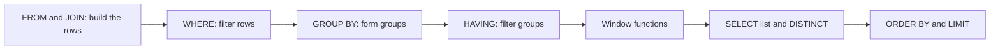
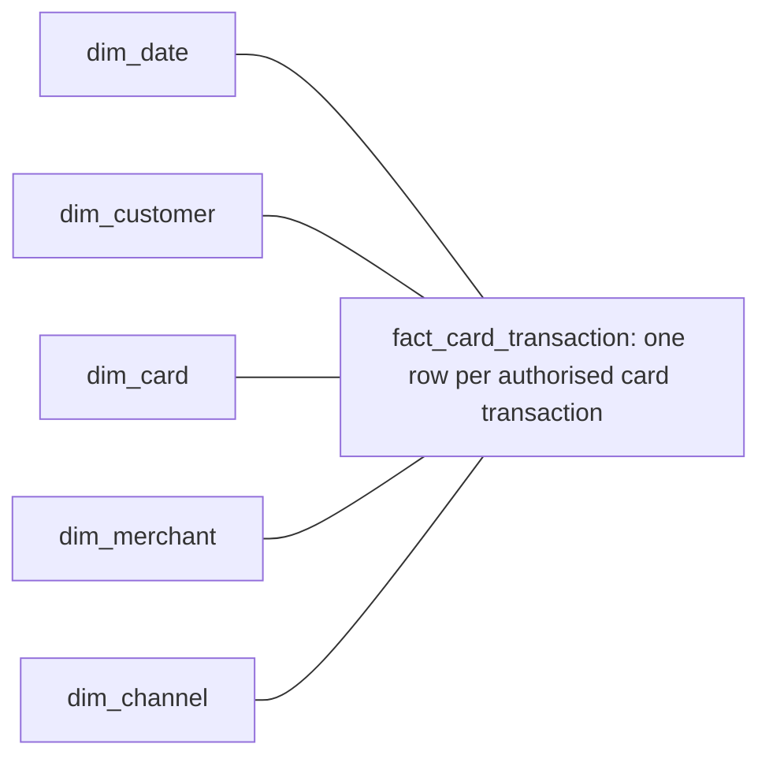
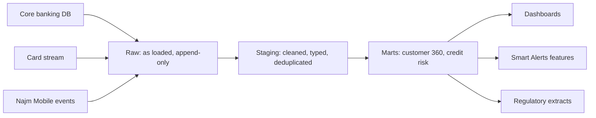

# Module 1 — SQL and data modelling

*Every number Najm Bank reports starts as a query against a table that someone designed. When the query counts the wrong thing, or the table cannot remember what was true last March, the dashboard is wrong, and nobody can say why. This module gives you the three foundations the rest of the course builds on. First, SQL that answers business questions correctly: joins that do not multiply rows, aggregation at the right grain, CTEs that make a long query readable and window functions that rank, compare and run totals. Second, data modelling: normalised tables for the systems that run the bank, star schemas for the questions people ask about it, a grain statement for every table, and slowly changing dimensions so history stays true. Third, where data lives: OLTP databases and OLAP engines, row and columnar storage, warehouses, lakes, lakehouses and the open table formats that make files behave like tables. You will follow Huda, the team's new graduate data engineer, as her "active customers" count comes out three times too high, a branch report from March changes when it is rerun in June, and a month-end query on the core banking database slows the branches down.*

> **Stages:** Model, Analyse, Store — asking data the right question, shaping tables so the answer stays true, and choosing where the data should live.

---

# 1.1 — SQL that answers business questions: joins, aggregation, CTEs and window functions
*Level: 🟢 Beginner* · *Prerequisites: 0.1, 0.2* · *Stage: Model, Analyse*

## ⚡ In 60 seconds
- SQL is how you ask a database a question. Most business questions need four moves: **join** the tables, **filter** the rows, **aggregate** to the level the question asks about, then **rank or compare** with window functions.
- The rule that matters most: know the **grain** of every table and of every result, meaning what one row represents. "One row per customer" and "one row per transaction" give different answers to the same `COUNT(*)`.
- Use **CTEs** (`WITH` blocks) to build a query in named steps, one grain at a time, so you and a reviewer can check each step.
- Use **window functions** (`OVER (...)`) for per-row answers that look at other rows: latest balance per account, running totals, this month against last.
- Decision cue: before writing SQL, write the question in one sentence with its grain, its time window and its definitions ("an *active* customer is one with at least one posted debit in the calendar month, Doha time").
- Biggest trap: the **fan-out**. Joining a one-to-many relationship before aggregating multiplies rows, and every `SUM` and `COUNT` after it is silently too big.

## 🧭 Why it matters
Kareem, the retail data analyst, asks Huda for a number for the monthly retail review: "How many retail customers were active in September, and how much did they spend?" Huda writes a query in ten minutes:

```sql
-- Huda's first attempt (wrong)
SELECT COUNT(*) AS active_customers, SUM(t.amount) AS spend
FROM customers c
JOIN accounts a     ON a.customer_id = c.customer_id
JOIN transactions t ON t.account_id  = a.account_id
WHERE c.segment = 'retail'
  AND t.txn_ts >= '2026-09-01' AND t.txn_ts < '2026-10-01';
```

The number it returns counts transactions, not customers: a customer with 40 card payments is counted 40 times. The spend includes incoming salary credits, because nobody said "debits only". Lina's dashboard shows a third number, because it defines "active" as "logged in to Najm Mobile". Kareem has three answers and no way to choose.

Faisal, Head of Data Platform, points out that the database did exactly what it was told. The question had no grain, no definition and no check. This lesson teaches the SQL and the habits that make its answers trustworthy.

## 📐 How it works

### 🟢 The essentials

**Tables, rows and grain.** A table holds rows; each row describes one thing. The **grain** of a table is what one row represents: one customer, one account, one transaction, one account per day. Najm's core banking examples use three tables:

| Table | Grain | Key columns |
|---|---|---|
| `customers` | One row per customer | `customer_id` (primary key), `segment`, `branch_code` |
| `accounts` | One row per account | `account_id`, `customer_id` (each customer has one or more accounts) |
| `transactions` | One row per posted transaction | `txn_id`, `account_id`, `txn_ts`, `amount`, `direction` (`'debit'` or `'credit'`) |

**The order a query is evaluated in.** You write `SELECT` first, but the database logically processes clauses in this order, which explains why, for example, `WHERE` cannot filter on a window function:



**Joins.** A join combines rows from two tables where a condition holds.
- `INNER JOIN` keeps only rows with a match on both sides.
- `LEFT JOIN` keeps every row from the left table; where there is no match, the right side's columns are `NULL`.
- `FULL JOIN` keeps unmatched rows from both sides; `CROSS JOIN` pairs every row with every row.

Example: customer 3 has no accounts yet.

| customers.customer_id | accounts.account_id after LEFT JOIN |
|---|---|
| 1 | 101 |
| 1 | 102 |
| 2 | 201 |
| 3 | NULL |

Customer 1 now appears twice: the result's grain is "one row per account", not "one row per customer".

**Aggregation.** `GROUP BY` collapses rows into groups, and aggregate functions summarise each group: `COUNT`, `SUM`, `AVG`, `MIN`, `MAX`. Three counts behave differently:
- `COUNT(*)` counts rows.
- `COUNT(col)` counts rows where `col` is not `NULL`.
- `COUNT(DISTINCT col)` counts distinct non-null values.

`WHERE` filters rows *before* grouping; `HAVING` filters groups *after*: "customers with more than 10 transactions" needs `HAVING COUNT(*) > 10`.

**NULL means "unknown".** Any comparison with `NULL` gives *unknown*, not true, so `WHERE closed_on = NULL` matches nothing. Use `IS NULL` and `IS NOT NULL`, and `COALESCE(x, 0)` to substitute a default. `SUM` and `AVG` skip nulls, so the average of `(100, NULL, 200)` is 150, not 100.

**CTEs.** A **common table expression** is a named sub-query defined with `WITH`. It lets you build an answer in steps, each with its own grain. Here is Huda's query rebuilt correctly:

```sql
-- Right: one step per grain, definitions explicit
WITH sept_debits AS (          -- grain: one row per posted debit in September (Doha time)
    SELECT a.customer_id, t.amount
    FROM transactions t
    JOIN accounts a ON a.account_id = t.account_id
    WHERE t.direction = 'debit'
      AND t.txn_ts >= TIMESTAMPTZ '2026-09-01 00:00+03'
      AND t.txn_ts <  TIMESTAMPTZ '2026-10-01 00:00+03'
),
per_customer AS (              -- grain: one row per customer
    SELECT customer_id, SUM(amount) AS spend
    FROM sept_debits
    GROUP BY customer_id
)
SELECT COUNT(*)        AS active_customers,   -- safe now: one row = one customer
       SUM(pc.spend)   AS total_spend
FROM per_customer pc
JOIN customers c ON c.customer_id = pc.customer_id
WHERE c.segment = 'retail';
```

Each CTE states its grain, and a reviewer can run each step alone.

### 🟡 Going deeper

**The fan-out trap.** Suppose Kareem also wants each customer's total loan balance next to their card spend. Joining both one-to-many tables to `customers` and then summing multiplies each side by the other:

```sql
-- Wrong: a customer with 2 loans and 30 debits has each loan counted 30 times
SELECT c.customer_id, SUM(l.balance) AS loan_balance, SUM(t.amount) AS spend
FROM customers c
JOIN loans l        ON l.customer_id = c.customer_id
JOIN accounts a     ON a.customer_id = c.customer_id
JOIN transactions t ON t.account_id  = a.account_id
GROUP BY c.customer_id;
```

```sql
-- Right: aggregate each side to the customer grain first, then join one-to-one
WITH loans_pc AS (
    SELECT customer_id, SUM(balance) AS loan_balance
    FROM loans GROUP BY customer_id
),
spend_pc AS (
    SELECT a.customer_id, SUM(t.amount) AS spend
    FROM transactions t JOIN accounts a ON a.account_id = t.account_id
    WHERE t.direction = 'debit'
    GROUP BY a.customer_id
)
SELECT c.customer_id,
       COALESCE(l.loan_balance, 0) AS loan_balance,
       COALESCE(s.spend, 0)        AS spend
FROM customers c
LEFT JOIN loans_pc l ON l.customer_id = c.customer_id
LEFT JOIN spend_pc s ON s.customer_id = c.customer_id;
```

The rule: **aggregate to the target grain before you join two different one-to-many paths.** `COUNT(DISTINCT ...)` can hide a fan-out in counts, but it cannot fix a `SUM`.

**The LEFT JOIN that became an INNER JOIN.** Kareem wants all retail customers, with their September spend or zero. Putting the date filter in `WHERE` removes the customers with no transactions, because for them `t.txn_ts` is `NULL` and the comparison is unknown:

```sql
-- Wrong: customers with no September transactions disappear
SELECT c.customer_id, COALESCE(SUM(t.amount), 0) AS spend
FROM customers c
LEFT JOIN accounts a     ON a.customer_id = c.customer_id
LEFT JOIN transactions t ON t.account_id  = a.account_id
WHERE t.txn_ts >= '2026-09-01' AND t.txn_ts < '2026-10-01'
GROUP BY c.customer_id;

-- Right: conditions on the optional side go in the ON clause
SELECT c.customer_id, COALESCE(SUM(t.amount), 0) AS spend
FROM customers c
LEFT JOIN accounts a     ON a.customer_id = c.customer_id
LEFT JOIN transactions t ON t.account_id  = a.account_id
                        AND t.txn_ts >= '2026-09-01' AND t.txn_ts < '2026-10-01'
GROUP BY c.customer_id;
```

**Window functions.** A window function computes a value for each row from related rows (the *window*) without collapsing them as `GROUP BY` does. In `OVER`, `PARTITION BY` splits rows into groups and `ORDER BY` sorts within each.

```sql
-- Monthly debit spend per customer, with last month and a running year-to-date total
WITH monthly AS (
    SELECT a.customer_id,
           date_trunc('month', t.txn_ts) AS month,
           SUM(t.amount)                 AS spend
    FROM transactions t JOIN accounts a ON a.account_id = t.account_id
    WHERE t.direction = 'debit'
    GROUP BY a.customer_id, date_trunc('month', t.txn_ts)
)
SELECT customer_id, month, spend,
       LAG(spend) OVER (PARTITION BY customer_id ORDER BY month)              AS prev_month_spend,
       SUM(spend) OVER (PARTITION BY customer_id, date_trunc('year', month)
                        ORDER BY month)                                       AS ytd_spend,
       spend / SUM(spend) OVER (PARTITION BY month)                           AS share_of_month
FROM monthly;
```

The most common use is "latest row per key", such as each account's most recent balance:

```sql
WITH ranked AS (
    SELECT account_id, balance_date, balance,
           ROW_NUMBER() OVER (PARTITION BY account_id
                              ORDER BY balance_date DESC) AS rn
    FROM account_balances
)
SELECT account_id, balance_date, balance
FROM ranked
WHERE rn = 1;
```

You cannot write `WHERE ROW_NUMBER() OVER (...) = 1` directly, because `WHERE` is evaluated before window functions (see the diagram above). Hence the CTE.

**Ranking ties.** On ties, `ROW_NUMBER()` gives 1, 2, 3 (picking arbitrarily), `RANK()` gives 1, 1, 3 and `DENSE_RANK()` gives 1, 1, 2. Add a unique tie-breaker column so results repeat exactly.

**Frames.** With `ORDER BY` in the window, aggregates such as `SUM` use a *frame*: by default in PostgreSQL, `RANGE BETWEEN UNBOUNDED PRECEDING AND CURRENT ROW`, which includes rows tied with the current one. Write the frame explicitly when it matters. `ROWS BETWEEN 6 PRECEDING AND CURRENT ROW` means *seven rows*, not seven days; on days with no transactions it spans more than a week. For a true seven-day window, fill missing days from a calendar table, or use `RANGE BETWEEN INTERVAL '6 days' PRECEDING AND CURRENT ROW` over a date column.

### 🔴 Expert view

**Time is a definition, not a detail.** Najm stores `timestamptz` values (absolute moments). "September" starts at a different moment in Doha (`Asia/Qatar`, UTC+3), Dubai (`Asia/Dubai`, UTC+4) and the EU, so bucket with an explicit zone, for example `date_trunc('month', txn_ts AT TIME ZONE 'Asia/Qatar')`. Use **half-open ranges** (`>= start AND < end`): `BETWEEN '2026-09-01' AND '2026-09-30'` silently drops everything after midnight on the 30th.

**Money is exact, and currencies do not add.** Store amounts as `numeric`, never `float`, whose rounding makes sums drift. Never `SUM` across currencies: convert at a documented rate first, or group by currency.

**`NOT IN` and nulls.** "Customers with no loans" written as `WHERE customer_id NOT IN (SELECT customer_id FROM loans)` returns *no rows at all* if any `loans.customer_id` is `NULL`, because `x NOT IN (..., NULL)` is never true. Use an anti-join:

```sql
SELECT c.customer_id
FROM customers c
WHERE NOT EXISTS (SELECT 1 FROM loans l WHERE l.customer_id = c.customer_id);
```

**Dialects differ.** DuckDB supports `QUALIFY` (filter on a window function directly) and `SELECT` aliases in `WHERE`; PostgreSQL supports neither at the time of writing (2026). Name your engine in the query header.

**Test a query like code.** Before a number leaves the team:
1. **Check the grain.** For one row per customer, `SELECT customer_id, COUNT(*) FROM result GROUP BY 1 HAVING COUNT(*) > 1` must return nothing.
2. **Count rows at each CTE.** A sudden jump between steps is a fan-out.
3. **Reconcile** a total against an independent source, such as the general ledger, and explain any difference.
4. **Spot-check** three customers by hand.

**Performance and safety.** `EXPLAIN ANALYZE` shows how PostgreSQL ran a query (more in 3.3); indexes are covered in [*System Design for Vibe Coders*, lesson 2.5 — Indexes, queries, and the working set](../vibe/index.en.html#l2-5). When a value comes from a user or an application, pass it as a bound parameter, never by gluing strings together ([*Secure AI & Application Security*, lesson 2.1 — Injection](../secai/index.html#/2.1)).

## 🧰 The toolkit
| Tool, pattern or standard | What it is and does | When to reach for it |
|---|---|---|
| **PostgreSQL** | Open-source relational database with a full SQL implementation, including window functions and CTEs | Learning SQL; operational databases; small analytical workloads |
| **DuckDB** | Open-source, in-process analytical database; reads CSV and Parquet files directly; runs on a laptop | Fast local analysis, exercises, prototyping marts before a warehouse |
| **Common table expression (CTE)** | A named step in a query, defined with `WITH` | Any query with more than one grain or more than one join path |
| **Window functions** | `OVER (PARTITION BY … ORDER BY …)`: per-row values computed over related rows (`ROW_NUMBER`, `LAG`, running `SUM`) | Latest row per key, rankings, period-over-period, running totals, shares of total |
| **Anti-join (NOT EXISTS)** | Returns rows with no match in another table, safely with nulls | "Customers without X" questions |
| **EXPLAIN ANALYZE** | Shows the plan PostgreSQL chose and the real time spent in each step | A query is slow or scans far more rows than expected |

## 🏛️ In practice at Najm Bank
Faisal turns the incident into a standard: every number for a business review now starts with a **query header** and passes a review checklist.

**The Najm query header (template)**

```sql
/*
Question     : How many retail customers were active in Sep 2026, and what did they spend?
Asked by     : Kareem (Retail Analytics)      Author: Huda      Reviewer: Lina
Engine       : PostgreSQL 16 (read replica of core banking)
Result grain : one row (summary); intermediate per_customer = one row per customer
Definitions  : active = at least one posted debit in the calendar month, Asia/Qatar time
               spend  = sum of posted debits in QAR; non-QAR amounts excluded (count reported)
Time window  : [2026-09-01 00:00 +03, 2026-10-01 00:00 +03)
Checks       : grain unique OK; debit total reconciles to GL report within 0.1%, difference explained
*/
```

**The review checklist**

| Check | Question the reviewer asks | Typical failure it catches |
|---|---|---|
| Grain | What is one row of each CTE and of the result? | Fan-out; `COUNT(*)` counting the wrong thing |
| Definitions | Are "active", "spend", "customer" written down and agreed with the asker? | Three teams, three numbers |
| Joins | Does every join keep the grain? Any `LEFT JOIN` filtered in `WHERE`? | Missing zero rows; multiplied sums |
| Nulls | Any `NOT IN`, `= NULL`, or averages over nullable columns? | Empty results; wrong averages |
| Time | Time zone named? Half-open range? | Lost last day; month shifted by three hours |
| Reconciliation | Does a total match an independent source? | Silent filter mistakes |

A question asked every month becomes a tested model (3.1) and a defined metric (4.1).

## 🛠️ Exercises
Use synthetic data only: generate `customers`, `accounts` (one to three per customer) and about 100,000 `transactions` in DuckDB or PostgreSQL with `generate_series` and `random()`, including some customers with no accounts.

- 🟢 Write the "active retail customers in September and their spend" query twice: once the wrong way (same filters, join everything, `COUNT(*)`) and once with CTEs, each commented with its grain. *Done when:* you can explain the exact ratio between the two counts (it is the average number of debits per active customer), and your correct query passes the grain check.
- 🟡 For each customer and month, compute spend, the previous month's spend, the change in percent, and the customer's rank within their segment for that month. Then return only each customer's single highest-spend month. *Done when:* the query uses `LAG`, `DENSE_RANK` and a "latest or top row per key" pattern, with a deterministic tie-breaker, and gives identical results on two runs.
- 🔴 Build a seven-day rolling spend per customer that is correct on days with no transactions, using a calendar table (one row per date) cross-joined with customers. Compare it with a naive `ROWS BETWEEN 6 PRECEDING AND CURRENT ROW` version. *Done when:* you can show one customer and date where the two differ, explain why, and you have written the query header and run all four checks from 🔴 Expert view.

## ⚠️ Mistakes and traps
- **Counting rows instead of things.** `COUNT(*)` after a join counts joined rows. Decide the grain first, aggregate to it, then count.
- **Joining two one-to-many paths, then summing.** Aggregate each path to the target grain in its own CTE, then join.
- **Filtering the optional side of a LEFT JOIN in WHERE.** Put those conditions in `ON`, or the zero rows vanish.
- **`BETWEEN` on timestamps, or `NOT IN` on a nullable column.** Use half-open ranges with a named zone, and `NOT EXISTS`.
- **Shipping a number with no definition.** Write the query header; agree the definition with the person who asked.

## 🧾 Recap
- Every table and every result has a grain. Write it down before writing SQL.
- Build queries in CTE steps, one grain per step; aggregate before joining different one-to-many paths.
- `WHERE` filters rows, `HAVING` filters groups, and window functions run after both, so filter on them in an outer step (or with `QUALIFY` in DuckDB).
- Window functions answer "latest per key", "compared with last period" and "running total" without losing rows.
- Nulls, time zones, currencies and ties break correct-looking queries; test the grain, step counts and totals before sharing.

## ✍️ Check yourself

**1. Huda joins `customers` → `accounts` → `transactions` and runs `SELECT COUNT(*)` to count active customers. The result is about 35 times higher than Kareem expected. What is the most likely cause?**

- A. The planner's statistics are out of date
- B. `COUNT(*)` ignores rows with nulls
- C. Its grain is one row per transaction, not per customer
- D. The `JOIN` should have been a `CROSS JOIN` to keep every customer

<details><summary>Answer</summary>

**C.** After joining to transactions, each row is a transaction, so `COUNT(*)` counts transactions. Aggregate to the customer grain first, or use `COUNT(DISTINCT customer_id)` for a count. A affects speed, never the result. B is wrong: `COUNT(*)` counts all rows, nulls included. (🟢 The essentials.)

</details>

**2. A query joins `customers` to both `loans` and `transactions` and sums loan balances. A customer with 2 loans and 30 transactions shows a loan balance 30 times too high. What is the right fix?**

- A. Aggregate each table to one row per customer first, then join
- B. Replace `SUM(l.balance)` with `SUM(DISTINCT l.balance)` so each loan counts once
- C. Add `ORDER BY customer_id`
- D. Change both joins to `LEFT JOIN`

<details><summary>Answer</summary>

**A.** This is a fan-out: two one-to-many paths multiply each other. Aggregating each path to the customer grain first removes it. B looks tempting but silently drops two different loans that happen to have the same balance. (🟡 Going deeper.)

</details>

**3. Kareem wants every retail customer listed, with zero for those who spent nothing in September. Huda's `LEFT JOIN` query has `WHERE t.txn_ts >= '2026-09-01'`, and the zero-spend customers are missing. Why?**

- A. `LEFT JOIN` drops unmatched rows whenever a `GROUP BY` follows it
- B. Unmatched rows have a `NULL` `txn_ts`, so the `WHERE` test drops them
- C. `COALESCE` must wrap `t.txn_ts` before the join, or the nulls break the sum
- D. The date filter needs `HAVING` instead of `WHERE`, because it runs after grouping

<details><summary>Answer</summary>

**B.** Comparing `NULL` gives unknown, so a `WHERE` filter on the optional side turns the `LEFT JOIN` into an inner join; move it into `ON`. A is false: keeping unmatched rows is what `LEFT JOIN` does. (🟡 Going deeper.)

</details>

**4. Lina needs each account's most recent balance from `account_balances` (one row per account per day). Which approach is correct in PostgreSQL?**

- A. `SELECT account_id, MAX(balance) FROM account_balances GROUP BY account_id`
- B. `SELECT * FROM account_balances WHERE ROW_NUMBER() OVER (PARTITION BY account_id ORDER BY balance_date DESC) = 1`
- C. `SELECT account_id, balance FROM account_balances ORDER BY balance_date DESC LIMIT 1`
- D. Number rows per account, newest first, with `ROW_NUMBER()` in a CTE; keep `rn = 1` outside

<details><summary>Answer</summary>

**D.** Window functions run after `WHERE`, so B fails in PostgreSQL (DuckDB would accept the same idea written with `QUALIFY`). A returns the highest balance, not the latest; C returns one row for the whole table. (🟡 Going deeper.)

</details>

**5. A query counts "customers with no loans" using `WHERE customer_id NOT IN (SELECT customer_id FROM loans)` and returns zero rows, although many customers have no loans. What is the most likely explanation?**

- A. A `loans.customer_id` is `NULL`, so `NOT IN` is never true
- B. The sub-query needs `DISTINCT`, or duplicate IDs cancel each other out
- C. PostgreSQL does not allow a sub-query inside a `WHERE` clause
- D. The customers table needs an index on `customer_id` for `NOT IN`

<details><summary>Answer</summary>

**A.** `x NOT IN (…, NULL)` can never be true, so no rows qualify. `NOT EXISTS` handles nulls correctly. B changes nothing about the null; D affects speed, not results. (🔴 Expert view.)

</details>

## 📚 References
- PostgreSQL documentation — Queries (joins, `WITH` queries, `GROUP BY`): https://www.postgresql.org/docs/current/queries.html
- PostgreSQL documentation — Window functions tutorial: https://www.postgresql.org/docs/current/tutorial-window.html
- DuckDB documentation — SQL introduction, window functions and `QUALIFY`: https://duckdb.org/docs/
- PostgreSQL documentation — Using `EXPLAIN`: https://www.postgresql.org/docs/current/using-explain.html

---

# 1.2 — Data modelling: normalisation, star schemas, grain and slowly changing dimensions
*Level: 🟢 Beginner* · *Prerequisites: 1.1* · *Stage: Model*

## ⚡ In 60 seconds
- A **data model** decides which tables exist, what one row in each means, and how they connect. It is the most expensive thing to change later, so it deserves the most thought up front.
- Systems that *run* the bank use **normalised** models: each fact stored once, so updates cannot contradict each other. Systems that *analyse* the bank use **dimensional** models: a **fact table** of measurable events surrounded by **dimension tables** that describe them, a **star schema**.
- The rule that matters most: **declare the grain** of every fact table in one sentence before choosing any column. Every other decision follows from it.
- **Slowly changing dimensions** (SCDs) decide what happens when a descriptive attribute changes. Type 1 overwrites, so history is rewritten. Type 2 adds a new row version, so history stays true.
- Decision cue: if anyone (regulators, risk, auditors) will ask "what was true *at the time*?", use Type 2 for that attribute.
- Biggest trap: mixing grains in one fact table, or overwriting attributes reports group by, so last quarter's numbers change on rerun.

## 🧭 Why it matters
In April, Huda built the "loans by branch" report for the credit-risk team, joining the loans table to the current customer table to get each customer's branch. It worked. In June, Najm merged two Doha branches and moved 4,000 customers from branch `DOH-07` to `DOH-03`. Then risk reran the March report for a regulator's follow-up question. Every March loan of those customers now showed under `DOH-03`, a branch whose March total grew overnight, while `DOH-07` shrank, three months after the report had been signed off.

No query was wrong; the model was. The customer table only knew the *current* branch, so the past was rewritten whenever a customer moved. Faisal's verdict: "A bank's reports must be reproducible. If we cannot say what we believed on 31 March, we have a governance problem, not a SQL problem."

## 📐 How it works

### 🟢 The essentials

**Entities, keys and relationships.** A model starts with **entities** (customer, account, loan, branch), their **attributes** (segment, opening date) and their **relationships** (a customer has one or more accounts). Keys tie them together:
- A **natural key** (or business key) comes from the business: an account number, a national ID, an IBAN.
- A **surrogate key** is a meaningless integer or hash the data team generates. It stays stable when business keys change or get reused, and it lets one business entity have several historical versions.
- A **foreign key** references another table's key and lets the database enforce that the referenced row exists.

**Normalisation: each fact once.** Edgar F. Codd's normal forms are rules for removing redundancy from tables used by applications (OLTP, online transaction processing; see 1.3):
- **First normal form (1NF):** each column holds one value; no repeating groups such as `phone1, phone2, phone3`.
- **Second normal form (2NF):** every non-key column depends on the whole key, not part of a composite key.
- **Third normal form (3NF):** non-key columns depend only on the key, not on other non-key columns. If `branch_city` sits in `customers`, it depends on `branch_code`, not on the customer, so it belongs in `branches`.

The point is to avoid **update anomalies**: if a branch's city sits on 50,000 customer rows, a half-finished rename leaves the data contradicting itself. Normalised models make writes safe; they make analytical questions harder, because one answer may need many joins.

**Dimensional modelling: built for questions.** Ralph Kimball's approach (*The Data Warehouse Toolkit*, with Margy Ross) organises analytical data around business processes:
- A **fact table** records measurements of a business event: a card authorisation, a loan disbursement, an account's end-of-day balance. Its columns are foreign keys to dimensions plus numeric **measures** (amount, balance, count).
- **Dimension tables** hold the descriptive context people filter and group by: customer, account, merchant, branch, product, date.
- Arranged with the fact in the middle and dimensions around it, this is a **star schema**:



**Kimball's four steps.** Design every star in this order:
1. **Choose the business process**, such as card authorisations, not a department or a report.
2. **Declare the grain**: "one row per authorised card transaction, as recorded by the card switch."
3. **Identify the dimensions** that are true at that grain: date, customer, card, merchant, channel.
4. **Identify the facts** (measures) that are true at that grain: amount in QAR, original amount and currency.

If a proposed column is not true at the declared grain (for example, "customer's monthly total spend" on a transaction row), it belongs in another table.

**Three kinds of fact table.**

| Type | Grain | Najm example | Typical question |
|---|---|---|---|
| Transaction | One row per event | `fact_card_transaction` | Spend by merchant category last week |
| Periodic snapshot | One row per thing per period | `fact_loan_daily_balance`: one row per loan per day | Exposure by segment at month-end |
| Accumulating snapshot | One row per process instance, updated as it moves through milestones | `fact_loan_application`: applied, approved, disbursed dates | Average days from application to disbursement |

**Additivity.** Measures differ in how they can be summed:
- **Additive** measures can be summed across every dimension: transaction amounts.
- **Semi-additive** measures can be summed across some dimensions but not time: balances. Ten daily balances of 1,000 QAR do not make 10,000 QAR; for a month, take the closing balance or the average.
- **Non-additive** measures cannot be summed at all: ratios and percentages. Store the numerator and denominator and divide after aggregating.

### 🟡 Going deeper

**Slowly changing dimensions.** Dimension attributes change: customers move branch, change segment from retail to premier, or get a new risk grade. Kimball named the standard responses:

| Type | What happens on change | History | Use for |
|---|---|---|---|
| **Type 0** | Never changes; keep the original | Original value only | Date of birth, original credit score at onboarding |
| **Type 1** | Overwrite the old value | Lost | Corrections (a misspelt name); attributes nobody reports history on |
| **Type 2** | Close the current row and insert a new version with its own surrogate key and validity dates | Fully kept | Branch, segment, risk grade, anything reports group by |
| **Type 3** | Add a "previous value" column | One step back only | A one-off reorganisation where people want "old branch" next to "new branch" |

*The Data Warehouse Toolkit* also describes hybrid types (4 to 7); Types 1 to 3 cover most needs.

A Type 2 customer dimension looks like this:

| customer_sk | customer_id | branch_code | segment | valid_from | valid_to | is_current |
|---|---|---|---|---|---|---|
| 5001 | C-1042 | DOH-07 | retail | 2023-02-11 | 2026-06-01 | false |
| 7310 | C-1042 | DOH-03 | retail | 2026-06-01 | 9999-12-31 | true |

`customer_sk` is the surrogate key; `customer_id` is the natural key from core banking. The far-future `valid_to` marks the current version, so range conditions work without null handling.

Maintaining it in PostgreSQL takes two statements in one transaction. `stg_customer_changes` holds the latest customer attributes, with the time each change took effect:

```sql
BEGIN;

-- 1. Close the current version where a tracked attribute changed
UPDATE dim_customer d
SET valid_to = s.changed_at, is_current = false
FROM stg_customer_changes s
WHERE d.customer_id = s.customer_id
  AND d.is_current
  AND (d.branch_code IS DISTINCT FROM s.branch_code
       OR d.segment  IS DISTINCT FROM s.segment);

-- 2. Insert a new current version for changed and brand-new customers
INSERT INTO dim_customer (customer_id, branch_code, segment, valid_from, valid_to, is_current)
SELECT s.customer_id, s.branch_code, s.segment, s.changed_at, DATE '9999-12-31', true
FROM stg_customer_changes s
LEFT JOIN dim_customer d ON d.customer_id = s.customer_id AND d.is_current
WHERE d.customer_id IS NULL;

COMMIT;
```

`IS DISTINCT FROM` treats two nulls as equal, unlike `<>`. In practice you rarely write this by hand: dbt snapshots generate it for you (3.1).

**Joining facts to the right version.** There are two ways to get "the branch at the time":
- **Store the surrogate key on the fact** when loading it. A March transaction loaded in March carries `customer_sk = 5001` forever. Fast and simple; this is Kimball's standard approach.
- **Join on the validity range** when the fact only has the natural key:

```sql
SELECT d.branch_code, SUM(l.balance) AS exposure
FROM fact_loan_daily_balance l
JOIN dim_customer d
  ON d.customer_id = l.customer_id
 AND l.balance_date >= d.valid_from
 AND l.balance_date <  d.valid_to
WHERE l.balance_date = DATE '2026-03-31'
GROUP BY d.branch_code;
```

With either approach, the March report gives the same answer in June. If you want "March loans by *today's* branch", join on `is_current = true` instead. The model should let people ask either one on purpose.

**Conformed dimensions and the bus matrix.** If the card star and the loans star each build their own customer dimension, "customers by segment" will differ between them. A **conformed dimension** is one shared dimension (same keys, same attribute values) used by every fact table, so numbers from different processes line up. Kimball's **bus matrix** is a grid of business processes (rows) against dimensions (columns) that shows which dimensions each process shares. Najm's, in brief:

| Business process | Date | Customer | Account | Branch | Merchant | Product |
|---|---|---|---|---|---|---|
| Card authorisations | ✓ | ✓ | ✓ | | ✓ | ✓ |
| Loan daily balances | ✓ | ✓ | ✓ | ✓ | | ✓ |
| Mobile app sessions | ✓ | ✓ | | | | |

**Other building blocks.**
- A **date dimension** has one row per calendar day, with attributes such as Doha business day, week start, month, quarter and Ramadan period, so nobody recomputes calendars in every query.
- A **degenerate dimension** is a transaction identifier, such as the card switch's transaction reference number, kept on the fact table with no dimension table of its own.
- A **snowflake schema** normalises dimensions into further tables (customer → branch → region); it costs joins, so most teams keep dimensions flat.

### 🔴 Expert view

**Kimball, Inmon and Data Vault.** Bill Inmon's approach builds a normalised, enterprise-wide warehouse first and derives departmental data marts from it. Kimball's builds conformed star schemas process by process, which together form the warehouse. Data Vault (Dan Linstedt) models raw history as hubs, links and satellites, aiming at auditability and easy addition of sources, and usually feeds star schemas for consumption. Many modern platforms blend them: raw history kept as loaded, a cleaned and integrated layer, then stars or wide tables for consumers (see 1.3).

**Wide tables are a serving choice, not a model.** Columnar engines (1.3) handle wide, pre-joined "one big table" designs well, and dashboard tools like them. Build them *from* a star with declared grains and conformed dimensions, not instead of one, or each wide table will define "customer" its own way.

**Late-arriving data.** Look up the dimension version by *event time*, not load time. If a fact's dimension row has not arrived yet, point it at an "unknown" member and repair it when the row lands, so facts are never dropped.

**Two kinds of time.** Type 2 tracks when something was true in the business (valid time). Regulators sometimes ask "what did *your systems* believe on 31 March?", before a backdated correction was keyed in. That needs a second timeline, when each row was recorded, a design called **bitemporal**. Najm keeps its raw layer append-only with load timestamps (2.1), so such questions stay answerable.

**Model for the questions you can name; keep raw history for the ones you cannot**, so any model can be rebuilt later.

The underlying OLTP data layer, with its migrations and constraints, is covered in [*SaaS Building Blocks*, lesson 2.1 — The data layer: Postgres, ORMs, migrations and seeds](../saas/index.html#/2.1).

## 🧰 The toolkit
| Tool, pattern or standard | What it is and does | When to reach for it |
|---|---|---|
| **Normal forms** (Codd) | Rules (1NF, 2NF, 3NF and beyond) that store each fact once | Designing operational (OLTP) schemas and the integrated layer |
| **Star schema** (Kimball) | A fact table of measures surrounded by flat dimension tables | Analytical marts that people query and build dashboards on |
| **Grain statement** | One sentence defining what one row of a fact table represents | Before designing any fact table; in every model's documentation |
| **Slowly changing dimension (Type 2)** | New row version per change, with surrogate key and validity dates | Any attribute reports group by and auditors may ask about historically |
| **Conformed dimension** | One shared dimension used by all fact tables | When two marts must agree on "customer", "product" or "date" |
| **Bus matrix** (Kimball) | Grid of business processes against shared dimensions | Planning a warehouse roadmap; spotting dimensions to conform |
| **Data Vault** (Linstedt) | Hubs, links and satellites for auditable, source-oriented history | Many volatile sources and strong audit needs; usually feeds stars |

## 🏛️ In practice at Najm Bank
After the branch-merger incident, Faisal makes a **model design card** compulsory for every new fact table. Huda writes the first one, for the credit-risk mart, and Lina reviews it.

**Model design card: `fact_loan_daily_balance` (credit-risk mart)**

| Field | Value |
|---|---|
| Business process | End-of-day loan balances from core banking |
| Grain | One row per loan per business day (Asia/Qatar), as at the core banking end-of-day close |
| Fact table type | Periodic snapshot |
| Keys | `loan_sk`, `customer_sk`, `branch_sk`, `product_sk`, `date_key`; natural key `loan_id` kept for tracing |
| Uniqueness | (`loan_id`, `date_key`) is unique; tested |
| Measures | `outstanding_principal` (semi-additive: never sum over dates), `accrued_interest` (semi-additive), `days_past_due` (non-additive), `is_default` (flag; count rows, do not sum balances) |
| Currency | Stored in original currency plus QAR at the central end-of-day rate; rate source and date recorded |
| Dimensions and SCD type | `dim_customer` Type 2 on segment, branch, risk grade; Type 1 on name corrections. `dim_branch` Type 2 on region. `dim_product` Type 1. `dim_date` static |
| Version rule | Fact rows carry the dimension surrogate keys valid on the balance date |
| Late data | Missing dimension row → "unknown" member (`-1`); repaired by a daily job; count reported |
| Allowed questions | Exposure by segment, branch, product at any past date; trends of balances (closing or average) |
| Not for | Flows (disbursements, repayments): use `fact_loan_transaction` |
| Owner / reviewer | Huda / Lina; business owner: Head of Credit Risk |

The "Not for" line is as important as the rest: it stops someone summing daily balances into a monthly "total".

## 🛠️ Exercises
Use DuckDB or PostgreSQL with synthetic data.

- 🟢 Take a denormalised table `loan_report(loan_id, customer_name, customer_segment, branch_code, branch_city, product_name, product_rate, balance)` with 50 rows you generate. Normalise it to 3NF and list one update anomaly the original table allowed. *Done when:* you have four tables with primary and foreign keys, and a query that rebuilds the original report returns exactly the original 50 rows.
- 🟡 Design a star schema for Najm Mobile app sessions: business process, grain statement, three to five dimensions and the measures, each marked additive, semi-additive or non-additive. *Done when:* you have a model design card in the format above and a mermaid star diagram, and someone else agrees that every measure is true at your stated grain.
- 🔴 Build a Type 2 `dim_customer` from three daily extracts of a synthetic customer table in which some customers change branch and segment, using the two-statement pattern. Load a `fact_loan_daily_balance` for the same three days. *Done when:* "exposure by branch on day 1" gives the same result before and after loading days 2 and 3, a separate query gives "day 1 exposure by *current* branch", and a test proves at most one `is_current` row per customer.

## ⚠️ Mistakes and traps
- **Starting with columns instead of grain.** Write the grain sentence first; reject any column not true at that grain.
- **Mixing grains in one fact table.** Daily balances and monthly totals in one table get double-counted. Use one table per grain.
- **Type 1 on attributes people group by.** Overwriting branch or segment rewrites past reports. Use Type 2 when history matters.
- **Joining facts to dimensions on the current row by default.** Make "as it was" and "as it is now" two deliberate, named choices.

## 🧾 Recap
- Normalised models (3NF) keep operational data consistent; star schemas make analytical questions simple and fast.
- Kimball's four steps: business process, grain, dimensions, facts. The grain comes first.
- Fact tables are transaction, periodic snapshot or accumulating snapshot; measures are additive, semi-additive or non-additive.
- SCD Type 1 overwrites, Type 2 versions, Type 3 keeps one previous value. Type 2 with surrogate keys keeps past reports reproducible.
- Conformed dimensions make different marts agree. Inmon, Kimball and Data Vault are complementary, not rival religions.

## ✍️ Check yourself

**1. A customer moved from branch DOH-07 to DOH-03 in June. Rerunning the March loans-by-branch report now shows the customer's March loans under DOH-03. Which change to the model prevents this?**

- A. Add an index on `branch_code` so the report reads a consistent value
- B. Type 2 on branch, joining March facts to March's version
- C. Make the customer dimension Type 1 on branch, overwriting the old value
- D. Partition the fact table by branch so each branch's loans stay separate

<details><summary>Answer</summary>

**B.** Type 2 keeps each version with validity dates, so March facts find the March branch. C is the current behaviour (overwrite) that caused the problem; A and D do not change which version a fact joins to. (🟡 Going deeper.)

</details>

**2. Lina must design a fact table for loan applications that tracks the dates of application, approval and disbursement, and the days between them. Which fact table type fits best?**

- A. Accumulating snapshot: one row per application, updated per milestone
- B. Transaction fact: one row per loan repayment
- C. Periodic snapshot: one row per loan per day
- D. A Type 3 dimension holding the previous and current application status

<details><summary>Answer</summary>

**A.** An accumulating snapshot follows one process instance through its milestones, which makes durations between steps easy to compute. C answers "balance at a date", not "time to disbursement". (🟢 The essentials.)

</details>

**3. Kareem sums `outstanding_principal` from `fact_loan_daily_balance` over the 30 days of September and reports it as "September exposure". What is wrong?**

- A. Nothing; balances are additive across every dimension
- B. The fact table should be normalised to 3NF before any sum
- C. Principal is non-additive, so it cannot be summed even across loans
- D. Balances are semi-additive: never sum them across days

<details><summary>Answer</summary>

**D.** Summing 30 daily balances gives about 30 times the exposure; use the closing or the average balance for the month. C is wrong because summing balances across loans on a single date is valid. (🟢 The essentials.)

</details>

**4. What is the first decision in Kimball's design steps after choosing the business process?**

- A. Choosing the dashboard tool the business will use
- B. Listing every column the source system offers
- C. Declaring the grain
- D. Choosing data types for the surrogate keys

<details><summary>Answer</summary>

**C.** The grain (what one row represents) comes first: dimensions and facts must be true at it. B is how mixed-grain tables get built. (🟢 The essentials.)

</details>

**5. The card mart and the loans mart each built their own customer table, and "customers by segment" differs between the two dashboards. What does the dimensional approach recommend?**

- A. Build one conformed customer dimension shared by both
- B. Normalise each mart's customer table into a snowflake schema
- C. Round both numbers to the nearest thousand before publishing
- D. Move both marts back to third normal form for consistency

<details><summary>Answer</summary>

**A.** A conformed dimension, with the same keys and values for every fact table, lets facts from different processes be compared consistently. B adds joins but does not make the two marts agree. (🟡 Going deeper.)

</details>

## 📚 References
- Ralph Kimball and Margy Ross, *The Data Warehouse Toolkit: The Definitive Guide to Dimensional Modeling*, 3rd edition (Wiley).
- E. F. Codd, "A Relational Model of Data for Large Shared Data Banks", *Communications of the ACM*, 1970.
- W. H. Inmon, *Building the Data Warehouse* (Wiley).
- Dan Linstedt and Michael Olschimke, *Building a Scalable Data Warehouse with Data Vault 2.0* (Morgan Kaufmann).
- PostgreSQL documentation — Constraints (primary and foreign keys): https://www.postgresql.org/docs/current/ddl-constraints.html
- dbt documentation — Snapshots: https://docs.getdbt.com/docs/build/snapshots

---

# 1.3 — Where data lives: OLTP vs OLAP, warehouses, lakes, lakehouses and open table formats
*Level: 🟢 Beginner* · *Prerequisites: 1.1, 1.2* · *Stage: Store*

## ⚡ In 60 seconds
- **OLTP** systems (online transaction processing) run the business: many small reads and writes, each touching a few rows, which must be fast and correct. **OLAP** systems (online analytical processing) analyse it: fewer, larger queries that scan millions of rows but only a few columns.
- **Row storage** keeps each row together, which suits OLTP. **Columnar storage** keeps each column together, so analytical queries read only the columns they need, and similar values compress well.
- A **warehouse** is a managed analytical database. A **data lake** is files (often **Parquet**) in cheap object storage. A **lakehouse** adds an **open table format** (**Apache Iceberg**, **Delta Lake**, **Apache Hudi**) on top of the lake to give files table behaviour: atomic commits, schema evolution and time travel.
- The rule that matters most: **do not run analytics on the production OLTP database.** Copy the data to an analytical store, organised in layers: raw → staging → marts.
- Decision cue: choose storage by workload (who queries, how much, how fresh), governance and residency needs and team skills, not by fashion.
- Biggest trap: a "data lake" of unmanaged files with no schema, owner or catalogue, a *data swamp* nobody trusts.

## 🧭 Why it matters
On the last working day of the quarter, Huda runs a heavy query directly on the core banking PostgreSQL primary: a year of transactions joined to every account, grouped by product and month. It reads tens of millions of rows. Branch staff start reporting that account look-ups are slow, and the payments team sees timeouts. Salem, Head of Platform Engineering, finds the query and cancels it. His message to Faisal is short: "The core banking database exists to serve customers. Analytics needs its own home."

Public cases show how storage choices fail in the other direction too. In October 2020, Public Health England reported that around 16,000 positive COVID-19 cases had been left out of England's daily figures. As widely reported, the cause was an automated process that loaded test results into the legacy Excel `.xls` format, whose worksheets are limited to 65,536 rows, so rows past the limit were silently dropped. The data existed; the container could not hold it, and nothing checked. Where data lives, and what that container guarantees, is an engineering decision.

## 📐 How it works

### 🟢 The essentials

**Two workloads.** The same data serves two very different jobs:

| | OLTP: running the bank | OLAP: analysing the bank |
|---|---|---|
| Typical operation | Post a payment, read one account | Spend by segment and month for a year |
| Rows per query | A few | Millions to billions |
| Columns per query | Most columns of a few rows | A few columns of many rows |
| Writes | Constant, small, concurrent | Batch or stream loads |
| Priority | Correctness under concurrency, low latency | Scan throughput, flexible questions |
| Model | Normalised (1.2) | Dimensional or wide (1.2) |
| Najm example | Core banking PostgreSQL | The warehouse or lakehouse |

**Row versus columnar storage.** Imagine `transactions` with columns `txn_id, account_id, txn_ts, amount, currency, channel, merchant, description`.
- **Row storage** (PostgreSQL, most OLTP databases) writes each row's values next to each other on disk. Fetching one whole transaction is one small read, ideal for "show me this payment".
- **Columnar storage** writes all `amount` values together, all `channel` values together, and so on. `SUM(amount) GROUP BY channel` reads two columns out of eight, and skips the rest. Values in one column are similar (`channel` has only a handful of distinct values), so they compress very well with techniques such as dictionary and run-length encoding.

Analytical engines (DuckDB, ClickHouse, and the cloud warehouses Snowflake, Google BigQuery, Amazon Redshift, Databricks SQL and Microsoft Fabric) store data in columns for this reason.

**File formats.** **CSV** is text with no types, no schema and no compression, which makes it fine for exchange and poor for storage. **Apache Parquet** is an open, typed, compressed, columnar file format. A Parquet file is split into *row groups*; within each, each column is stored as a *column chunk* with statistics such as minimum and maximum values. A query engine can skip row groups whose statistics show they cannot match a filter. **Apache ORC** is a similar columnar format from the Hadoop world. DuckDB reads and writes Parquet directly:

```sql
-- DuckDB: convert a CSV extract to Parquet, then query it in place
COPY (SELECT * FROM read_csv('transactions_2026_09.csv'))
  TO 'transactions_2026_09.parquet' (FORMAT parquet);

SELECT channel, SUM(amount) AS spend
FROM read_parquet('transactions_2026_09.parquet')
GROUP BY channel;
```

**Warehouses, lakes and lakehouses.**
- A **data warehouse** is an analytical database: you load data into it, and it manages storage, tables, transactions and access control. Strong SQL, governance and performance; data lives in the vendor's storage format.
- A **data lake** is files in object storage (Amazon S3, Azure Data Lake Storage, Google Cloud Storage, or S3-compatible stores such as MinIO). Cheap, open to any engine, able to hold any format including images and documents, but files on their own have no transactions, no schema enforcement and no easy update or delete.
- A **lakehouse** keeps data as open files in object storage and adds a table layer that provides warehouse-like guarantees. The term was popularised by Databricks around 2020.

**Layers.** Whatever the storage, Najm organises data in layers so that raw history is never lost and every consumer reads curated tables:



Databricks calls the same idea the **medallion architecture**: bronze (raw), silver (cleaned) and gold (curated). The names differ; the principle is the same.

### 🟡 Going deeper

**What an open table format adds.** A folder of Parquet files is not a table. If a job writes half its files and then crashes, readers see half a load. Two writers can overwrite each other. Deleting one customer's rows means rewriting files by hand. An **open table format** solves this with a metadata layer next to the data files:
- Every write produces a new **snapshot**: a list of exactly which data files make up the table at that moment.
- A **commit** atomically switches the table's pointer to the new snapshot. Readers see the old snapshot or the new one, never a half-written state. These are **ACID** guarantees (atomicity, consistency, isolation, durability) on object storage.
- Because old snapshots are kept until expired, you can query the table **as of** an earlier version or time: **time travel**.
- Schema changes are tracked in metadata, without rewriting every file.
- Row-level `UPDATE`, `DELETE` and `MERGE` work, by rewriting affected files or recording deletes that readers apply.

The three main formats:

| Format | Origin | Notable traits |
|---|---|---|
| **Apache Iceberg** | Created at Netflix, now an Apache project | Engine-neutral specification; *hidden partitioning* (the table knows how it is partitioned, so queries filter on `txn_ts`, not a separate partition column) and partition evolution |
| **Delta Lake** | Created by Databricks, now a Linux Foundation project | Transaction log of JSON commits plus checkpoints; deep integration with Spark and Databricks; open-source readers in other languages (delta-rs) |
| **Apache Hudi** | Created at Uber, now an Apache project | Designed for frequent upserts and incremental processing; record-level indexes |

All three store data as Parquet (Iceberg and Hudi can also use other file formats). At the time of writing (2026), the major engines and cloud platforms read and write more than one of these formats to varying degrees, and the projects are converging; check your engine's documentation for what it supports today.

**Catalogues.** An engine needs to find the table's current metadata. A **catalogue** maps table names to metadata locations and controls who can change them: for example, a Hive Metastore, an Iceberg REST catalogue, AWS Glue Data Catalog or Databricks Unity Catalog. The catalogue is also where access control and governance hook in (6.1, 6.3).

**Partitioning and file layout.** Large tables are split by a column that queries filter on, usually date, so a query for September reads only September's files. Too fine a partitioning (per hour per merchant) creates thousands of tiny files, and opening files then costs more than reading them: the **small files problem**. Table formats offer **compaction** to merge small files, and expiring old snapshots to reclaim storage. More in 3.3.

**Getting analytics off the primary.** The quickest relief is a **read replica**: a copy of the PostgreSQL database that follows the primary and takes read-only queries. It protects branch staff, but it is still a row store with the OLTP schema, fit for operational reports, not year-long scans. The lasting answer is to load data into an analytical store, incrementally or with change data capture (2.1). Replicas are covered in [*System Design for Vibe Coders*, lesson 10.3 — Scaling the database](../vibe/index.en.html#l10-3).

### 🔴 Expert view

**Separation of storage and compute.** Modern warehouses and lakehouses keep data in durable storage and attach compute on demand, so teams can query the same data with separate compute. A badly written query then costs money every time it runs, and scanning less data saves both time and money. Pricing models differ by vendor and change often; read the current pricing page.

**Open formats are about options.** Data in Parquet with an open table format can be read by several engines (Spark, Trino, Flink, DuckDB, and the cloud warehouses that support them), so moving engines does not mean moving data. A warehouse's native storage can offer more managed performance and simpler operations. Neither is "right"; the trade-off is control and portability against convenience. Many banks run both: a lakehouse for raw history, large volumes and ML, and a warehouse or a SQL endpoint for curated marts and BI.

**Residency and sovereignty.** For a bank with customers in Qatar, the UAE and the EU, *where* the storage physically sits can matter as much as its format. GCC banking regulators and data protection laws generally expect banks to know and control where customer data is stored and processed, and some data may need to stay in-country; the exact rules differ by country and change, so check them with compliance and the DPO (6.2). Cloud regions, object storage buckets and catalogue placement are therefore governance decisions. See [*AI Governance: Zero to Hero*, lesson 4.3 — DPIAs and the global privacy map, from the EU to the GCC](../aigp/index.html#/4.3) and [*SaaS Building Blocks*, lesson 2.4 — Multi-tenancy deep dive: isolation, noisy neighbours, residency](../saas/index.html#/2.4).

**Deletion in an immutable world.** Time travel keeps old snapshots, which means a deleted customer's data may still exist in older files until snapshots are expired and files are removed. A right-to-erasure request (6.2) is only complete when the retention and expiry of snapshots, raw layers and backups are designed for it.

**Choosing.** Ask, in order:
1. **Workload:** query patterns, volume, freshness, concurrent users.
2. **Governance:** access control, audit, residency, retention and deletion.
3. **Team:** a well-run PostgreSQL or DuckDB setup beats an ambitious lakehouse nobody understands.
4. **Ecosystem:** which tools must read the data, and is portability needed?
5. **Cost model:** how spend scales with data scanned, storage and compute time.

## 🧰 The toolkit
| Tool, pattern or standard | What it is and does | When to reach for it |
|---|---|---|
| **Apache Parquet** | Open, typed, compressed columnar file format with per-column statistics | Storing analytical data in files; exchanging large datasets |
| **Apache Iceberg** | Open table format: snapshots, atomic commits, hidden partitioning, time travel on object storage | Engine-neutral lakehouse tables shared by several engines |
| **Delta Lake** | Open table format built on a transaction log; strong Spark and Databricks integration | Lakehouse tables, especially in Spark or Databricks environments |
| **Apache Hudi** | Open table format optimised for frequent upserts and incremental pulls | Tables fed by high-volume change streams |
| **DuckDB** | In-process columnar engine; queries Parquet, CSV and table formats (via extensions) locally | Laptop analytics, prototyping lakehouse layouts, exercises |
| **Read replica** | Read-only copy of an OLTP database that follows the primary | Operational reports that must not load the primary; not a warehouse |
| **Medallion architecture** (Databricks naming) | Bronze, silver, gold layers: raw, cleaned, curated | Organising any lake or lakehouse into trusted layers |

## 🏛️ In practice at Najm Bank
Faisal and Salem agree that no analytical query will run on the core banking primary again. Huda writes the **storage decision record** for the main datasets, reviewed by Salem (platform), Sara (DPO) and Lina (marts).

**Storage decision record (extract)**

| Dataset | Workload | Store and format | Layout | Freshness | Retention and deletion | Residency |
|---|---|---|---|---|---|---|
| Core banking tables | Run the bank | PostgreSQL primary (OLTP); read replica for operational reports | Normalised | Real time | Per banking records policy | In-country, per regulation (confirmed with compliance) |
| Raw core banking history | Rebuild any model; audit | Object storage, Iceberg tables over Parquet, append-only | Partitioned by load date | Daily, later via CDC (2.1) | Snapshots expired after an agreed window so erasures complete | Same region as source |
| Card authorisations (raw) | Fraud features; spend analytics | Iceberg over Parquet, fed from Kafka (2.3) | Partitioned by event day | Minutes | Per card-scheme and banking rules | Same region as source |
| Customer 360 and credit-risk marts | BI, regulatory reports | Curated star schemas (1.2) on the analytical SQL engine | Clustered by date and segment | Daily by 06:00 Doha | Versioned; month-end snapshots kept for reproducibility | Same region |
| Najm Mobile events | Product analytics | Object storage, Parquet; personal identifiers pseudonymised in staging | Partitioned by event day | Hourly | Short retention for raw events; aggregates longer | Region per customer contract |

Each row also names an owner and an access policy (6.1, 6.3), and a one-sentence reason, such as: "Raw history uses an open table format so Spark jobs for Smart Alerts and SQL for the marts read the same tables without copies."

## 🛠️ Exercises
Use synthetic data only.

- 🟢 In DuckDB, generate a 10-million-row synthetic transactions table with eight columns. Export it as CSV and as Parquet, then run `SELECT channel, SUM(amount) FROM … GROUP BY channel` on each file. *Done when:* you have recorded both file sizes and both query times on your machine, and can explain the difference in terms of columnar storage and compression.
- 🟡 Load the same data into PostgreSQL and DuckDB. Run one OLTP-style query (fetch a single transaction by `txn_id`, with a primary key index in PostgreSQL) and one OLAP-style query (spend by channel and month) on both. *Done when:* you have a four-cell table of timings and a three-sentence explanation of which engine suits which workload and why.
- 🔴 Using the `deltalake` Python package (delta-rs) or PyIceberg with a local catalogue, create a table of synthetic customers, append a second batch, update five rows and delete two. *Done when:* you can read the table as of each earlier version, show the table history, explain which files each commit added or removed, and describe what must happen before a deleted customer's data is really gone.

## ⚠️ Mistakes and traps
- **Running analytics on the OLTP primary.** Use a replica for small operational reports and an analytical store for everything else.
- **Treating a folder of files as a table.** Without a table format, readers can see half-written loads and deletes are manual. Use Iceberg, Delta Lake or Hudi, or a warehouse.
- **Building a data swamp.** Every dataset needs an owner, a schema, a catalogue entry and a layer; raw is not a place for consumers.
- **Over-partitioning.** Thousands of tiny files slow everything. Partition by what queries filter on, usually date, and compact regularly.
- **Forgetting that time travel keeps data.** Design snapshot expiry and retention so erasure and retention promises are kept.
- **Choosing by fashion.** A lakehouse is not automatically better than PostgreSQL or a warehouse; choose by workload, governance and team.

## 🧾 Recap
- OLTP runs the business with small, concurrent transactions on row storage; OLAP analyses it with large scans on columnar storage.
- Parquet is the default open columnar file format; CSV is for exchange, not storage.
- Warehouses manage storage for you; lakes are open files; lakehouses add open table formats (Iceberg, Delta Lake, Hudi) for ACID commits, schema evolution and time travel.
- Organise data in raw, staging and mart layers (bronze, silver and gold in medallion naming), and never let consumers read raw.
- Storage location is also a governance decision: residency, retention and deletion must be designed in.

## ✍️ Check yourself

**1. Huda's year-long analytical query slows branch transactions on the core banking primary. What is the best long-term fix?**

- A. Keep it on the primary but run it at night, when branches are closed
- B. Add more indexes to the primary so the scan finishes faster
- C. Move the workload to a separate analytical store
- D. Export the tables to CSV files on a shared drive

<details><summary>Answer</summary>

**C.** OLAP workloads belong on a columnar analytical store, separate from the system that serves customers. A only moves the risk to another time window; D creates an ungoverned copy with no types or table guarantees. (🟢 The essentials.)

</details>

**2. Why does `SUM(amount) GROUP BY channel` usually run faster on Parquet than on CSV with the same rows?**

- A. It reads only the needed columns, compressed
- B. Parquet files are always sorted by `amount`, so sums are quicker
- C. CSV cannot store numbers
- D. Parquet stores a pre-computed answer for common aggregate queries

<details><summary>Answer</summary>

**A.** Parquet is columnar and compressed, so the engine reads only the two columns it needs, and far less data overall. Row-group statistics also let engines skip data for filters. C is false: CSV stores numbers as text, without types. (🟢 The essentials.)

</details>

**3. A nightly job writing Parquet files to object storage crashed halfway, and analysts saw a half-loaded day. Which technology is designed to prevent this?**

- A. A larger compute cluster, so the job finishes before it can crash
- B. An open table format with atomic snapshot commits
- C. Converting the files to ORC
- D. Partitioning by hour instead of by day, so less is lost

<details><summary>Answer</summary>

**B.** Table formats such as Apache Iceberg or Delta Lake publish a write by atomically switching to a new snapshot, so readers never see partial loads. C changes the file format, not the commit guarantees; D would also add small files. (🟡 Going deeper.)

</details>

**4. Sara, the DPO, asks whether a customer erased from an Iceberg table last week could still be recovered. What is the honest answer?**

- A. No: deletes in table formats are always immediate and physical on disk
- B. Only from backups, because Iceberg never keeps old data files
- C. Yes, and nothing can be done about it in an open table format
- D. Possibly, until old snapshots are expired and their files removed

<details><summary>Answer</summary>

**D.** Time travel works by keeping old snapshots, which may still reference files containing the customer's rows, so deletion is only complete after expiry and file clean-up, and raw copies and backups must be covered too. A is the tempting misunderstanding. (🔴 Expert view.)

</details>

**5. A small fintech with three engineers and 50 GB of data asks whether it needs a lakehouse. Following the lesson's decision order, what should it consider first?**

- A. Which vendor has shipped the newest lakehouse features this year
- B. Its workload: queries, volume, freshness and users
- C. Whether its competitors and investors expect Iceberg
- D. How many partitions its data can be split into

<details><summary>Answer</summary>

**B.** Workload comes first, then governance, team skills, ecosystem and cost. A small team may be best served by a well-run PostgreSQL plus DuckDB or a managed warehouse. A and C are choosing by fashion. (🔴 Expert view.)

</details>

## 📚 References
- Apache Parquet documentation: https://parquet.apache.org/docs/
- Apache Iceberg documentation and table specification: https://iceberg.apache.org/
- Delta Lake documentation: https://delta.io/
- Apache Hudi documentation: https://hudi.apache.org/
- DuckDB documentation — Parquet files: https://duckdb.org/docs/
- M. Armbrust, A. Ghodsi, R. Xin and M. Zaharia, "Lakehouse: A New Generation of Open Platforms that Unify Data Warehousing and Advanced Analytics", CIDR 2021.
- PostgreSQL documentation — High availability, load balancing and replication: https://www.postgresql.org/docs/current/high-availability.html
