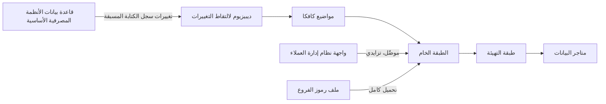

# الوحدة 2 — الاستيعاب وخطوط البيانات (Ingestion and pipelines)

*لا يكون مستودع البيانات (warehouse) أفضل من البيانات التي تصل إليه، ولا أجدر بالثقة من خطوط البيانات (pipelines) التي تنقل تلك البيانات في موعدها ومرة واحدة وكاملة (on time, once and in full). تتناول هذه الوحدة السباكة (plumbing) التي تعتمد عليها معظم لوحات المعلومات (dashboards) بصمت. تبدأ بإدخال البيانات (getting data in): ETL مقابل ELT، والموصِّلات (connectors)، والتحميلات التزايدية (incremental loads)، والتقاط تغيّر البيانات (change data capture) من قاعدة بيانات الأنظمة المصرفية الأساسية (core banking database) لبنك نجم (Najm Bank). ثم تنتقل إلى التنسيق (orchestration): كيف ترتّب التحميلات في رسوم بيانية موجّهة غير دورية (DAGs) يمكن إعادة محاولتها (retried) وإعادة تشغيلها (re-run) وإعادة تعبئتها (backfilled) دون احتساب ريال واحد مرتين (double-counting a single riyal). وتنتهي بالبث المتدفق (streaming): تفويضات البطاقات (card authorisations) التي يجب أن يقيّمها نظام التنبيهات الذكية (Smart Alerts) في ثوانٍ، وما الذي يضمنه Kafka فعلًا، وكيف تعمل النوافذ (windows) والعلامات المائية (watermarks)، ولماذا تكون "المعالجة مرة واحدة بالضبط" ("exactly once") خاصيةً تبنيها (a property you build) لا خانةً تؤشّر عليها (a box you tick). ستتابع هدى وهي ترى أول تحميل ليلي لها (first nightly load) يُفلت الحسابات المحذوفة (deleted accounts)، وأول DAG لها يضاعف يومًا من المعاملات عند إعادة المحاولة (on retry)، وأول مستهلك بث (stream consumer) لها يفقد أحداثًا (loses events) في انهيار (crash)، وتتابع فيصل وهو يحوّل كل خطأ إلى قاعدة (rule) يتّبعها فريق منصة البيانات (Data Platform team) كله.*

> **المراحل (Stages):** Ingest, Operate — نقل البيانات من حيث تُنشأ (where it is created) إلى حيث تُستخدم (where it is used)، وفق جدول زمني (on a schedule) أو لحظة حدوثها (as it happens)، بحيث تكون إعادة تشغيل أي شيء آمنة دائمًا (re-running anything is always safe).

---

# 2.1 — إدخال البيانات: ETL مقابل ELT، والموصِّلات، والتحميلات التزايدية، والتقاط تغيّر البيانات (Getting data in: ETL vs ELT, connectors, incremental loads and change data capture)
*المستوى (Level): 🟡 متوسط (Intermediate)* · *المتطلبات (Prerequisites): 1.1، 1.3* · *المرحلة (Stage): Ingest*

## ⚡ الدرس في دقيقة (In 60 seconds)
- **الاستيعاب (ingestion)** ينسخ البيانات من الأنظمة المصدر (source systems) (قواعد البيانات، وأدوات SaaS، والملفات، وواجهات API، وتدفقات الأحداث (event streams)) إلى منصتك التحليلية (analytical platform). وتحمّل معظم المنصات الحديثة البيانات الخام (raw data) أولًا ثم تحوّلها داخل مستودع البيانات (warehouse): أي **ELT** بدلًا من **ETL**.
- أنزِل البيانات الخام (land raw data) **دون مساس وبإلحاق فقط (untouched and append-only)**، مع بيانات وصفية للتحميل (load metadata) (متى، ومن أين، وأي دفعة (which batch)). يمكنك دائمًا إعادة اشتقاق الجداول النظيفة (re-derive clean tables) من الخام؛ لكنك لا تستطيع استعادة ما رميته في طريق الدخول (on the way in).
- **التحميلات الكاملة (full loads)** بسيطة وصحيحة لكنها تصبح بطيئة. أما **التحميلات التزايدية (incremental loads)** فتنقل ما تغيّر فقط، عادةً عبر "علامة الحد الأعلى" ("high-water mark") مثل `updated_at`، وهي تُفلت بصمت عمليات الحذف (deletes) والالتزامات المتأخرة (late commits) ما لم تصمّم لها.
- **التقاط تغيّر البيانات (change data capture, CDC)** يقرأ سجل التغييرات (change log) الخاص بقاعدة البيانات نفسها، فيرى كل إدراج وتحديث وحذف (insert, update and delete) بترتيب الالتزام (commit order). و**Debezium** هو الأداة الشائعة مفتوحة المصدر (open-source tool) لذلك.
- إشارة القرار (Decision cue): جدول صغير أو بطيء التغيّر (small or slowly changing table)، تحميل كامل (full load)؛ جدول كبير فيه `updated_at` جدير بالثقة ولا حذف فعلي (no hard deletes)، تحميل تزايدي (incremental)؛ إن كانت عمليات الحذف مهمة أو يجب أن تكون الحداثة (freshness) بالدقائق، CDC.
- الفخ الأكبر (Biggest trap): تحميل تزايدي بعلامة مائية صارمة `>` (strict watermark) ودون تداخل (no overlap)، يبدو مثاليًا في الاختبار (in testing) ويُسقط صفوفًا بصمت في الإنتاج (silently drops rows in production).

## 🧭 لماذا يهم (Why it matters)
أول مهمة حقيقية لهدى في بنك نجم (Najm Bank) هي تحميل ليلي (nightly load) لجدول `accounts` من قاعدة بيانات الأنظمة المصرفية الأساسية (core banking database) إلى مستودع البيانات (warehouse). تكتب استعلامًا (query) يختار الصفوف التي يكون فيها `updated_at` أحدث من التشغيل الأخير (last run)، ويلحقها (appends) بجدول في المستودع، ويسجّل علامة الحد الأعلى الجديدة (new high-water mark). ويعمل ثلاثة أسابيع دون أي خطأ.

ثم يلاحظ كريم، محلّل البيانات (data analyst) في قطاع التجزئة (retail)، أن متجر بيانات العميل الشامل (customer 360 mart) يُظهر 312 حسابًا مفتوحًا (open accounts) أكثر من تقرير الأنظمة المصرفية الأساسية (core banking report). يجد فيصل وهدى سببين. الأول: الحسابات المفتوحة بالخطأ (opened by mistake) **تُحذف فعليًا (hard-deleted)** في النظام الأساسي (core system)، ولا يستطيع استعلام على `updated_at` أن يرى صفًا لم يعد موجودًا. والثاني: معاملة دفعية طويلة التشغيل (long-running batch transaction) تختم `updated_at` عند بدايتها لكنها تلتزم (commits) بعد دقائق، بعد أن يكون تحميل هدى قد نقل العلامة المائية (watermark) إلى ما بعد ذلك الوقت. وتلك التحديثات تُتخطّى إلى الأبد (skipped for ever).

لم ينهَر شيء ولم ينطلق أي تنبيه (no alert fired). كان خط البيانات (pipeline) "أخضر" ("green") وخاطئًا (wrong). هكذا يفشل الاستيعاب (ingestion) عادةً، ولهذا يكون نمط التحميل (load pattern) قرارًا هندسيًا (engineering decision) لا إعدادًا في الموصِّل (connector setting).

## 📐 كيف يعمل (How it works)

### 🟢 الأساسيات (The essentials)

**المصادر والمصبّات (Sources and sinks).** **المصدر (source)** هو حيث تُنشأ البيانات: قاعدة بيانات الأنظمة المصرفية الأساسية (core banking database)، وتدفق البطاقات (card stream)، وأحداث تطبيق نجم للهاتف (Najm Mobile)، ونظام إدارة علاقات العملاء (CRM)، وملفات الشركاء (partner files). و**المصبّ (sink)** هو حيث تضعها: مستودع البيانات (warehouse) أو المستودع البحيري (lakehouse) من الدرس 1.3.

**ETL مقابل ELT (ETL versus ELT).** في **ETL** (الاستخراج ثم التحويل ثم التحميل (extract, transform, load))، تُنظَّف البيانات ويُعاد تشكيلها (cleaned and reshaped) على خادم منفصل (separate server) قبل تحميلها، فلا يصل إلى مستودع البيانات إلا الشكل النهائي (finished shape). وكان هذا منطقيًا حين كانت سعة التخزين والحوسبة (storage and compute) في المستودع باهظة. وفي **ELT** (الاستخراج ثم التحميل ثم التحويل (extract, load, transform))، تحمّل البيانات الخام (raw data) أولًا ثم تحوّلها داخل المستودع بلغة SQL، عادةً بأداة مثل dbt (الدرس 3.1). وأصبح ELT هو الخيار الافتراضي (default) بعد أن جعلت المستودعات العمودية (columnar warehouses) وتخزين الكائنات الرخيص (cheap object storage) الاحتفاظ بكل شيء ميسور التكلفة. وميزته الكبرى أن النسخة الخام (raw copy) تبقى متاحة: فحين تتغيّر قاعدة عمل (business rule)، تعيد البناء من الخام (rebuild from raw) بدلًا من إعادة الاستخراج من المصدر (re-extracting from the source).

ولا يزال ETL مناسبًا حين يجب أن تحوّل *قبل* التحميل (before loading): لإسقاط البيانات الشخصية (personal data) أو إخفائها (mask) حين لا ينبغي أن تُنزَل أبدًا، أو لتحويل صيغة ملف غريبة (odd file format)، أو لتقليص حجم ضخم (huge volume).

**الطبقة الخام (The raw layer).** أول مكان تنزل فيه البيانات هو الطبقة **الخام (raw)** (تسميها Databricks "البرونزية" ("bronze")). قواعد توفّر عليك الألم لاحقًا (save pain later):

- **إلحاق فقط وغير قابلة للتغيير (Append-only and immutable).** لا تحدّث الصفوف الخام في مكانها (in place) أبدًا. كل تحميل يضيف صفوفًا؛ والتصحيحات (corrections) تأتي صفوفًا جديدة.
- **بنفس شكل المصدر (Same shape as the source).** أبقِ أسماء الأعمدة وأنواعها (column names and types) أقرب ما يمكن إلى المصدر. فإعادة التسمية والتنظيف (renaming and cleaning) تحدث في طبقة التهيئة (staging).
- **بيانات وصفية للتحميل في كل صف (Load metadata on every row).** على الأقل `_loaded_at` (متى كتبه خط بياناتك)، و`_source` (أي نظام وأي جدول) و`_batch_id` (أي تشغيل (which run)). هذه الأعمدة تجيب عن سؤال "من أين جاء هذا الرقم؟" ⁦(where did this number come from?)⁩ بعد أشهر.

**التحميلات الكاملة (Full loads).** النمط الأبسط (simplest pattern): انسخ الجدول كله في كل تشغيل واستبدل النسخة السابقة (replace the previous copy). وهو صحيح دائمًا (always correct) ويلتقط عمليات الحذف مجانًا (captures deletes for free) (فالصف المحذوف يغيب ببساطة). لكنه يصبح غير عملي (impractical) للجداول الكبيرة. وللجداول المرجعية (reference tables) مثل الفروع (branches) أو رموز العملات (currency codes)، يكون عادةً هو الصواب.

**التحميلات التزايدية بعلامة الحد الأعلى (Incremental loads with a high-water mark).** في الجداول الكبيرة تنسخ فقط الصفوف التي تغيّرت منذ التشغيل الأخير (since the last run). والطريقة المعتادة هي **علامة الحد الأعلى (high-water mark)**: تذكّر أكبر قيمة `updated_at` (أو معرّف متزايد (increasing ID)) حمّلتها، واطلب في المرة التالية الصفوف التي تعلوها.

```sql
-- Fragile: strict ">" and no overlap. Misses rows whose transaction
-- committed late, and never sees hard deletes.
SELECT * FROM accounts
WHERE updated_at > :last_watermark;
```

```sql
-- Safer: overlap the window by a margin larger than your longest
-- transaction, then de-duplicate on the primary key when merging.
SELECT * FROM accounts
WHERE updated_at >= :last_watermark - INTERVAL '30 minutes';
```

يعني التداخل (overlap) أنك ستعيد قراءة بعض الصفوف الموجودة لديك أصلًا. ولا بأس بذلك، ما دامت الخطوة التالية **دمجًا (merge)** (إدراجًا أو تحديثًا (upsert)) على المفتاح الأساسي (primary key) لا إلحاقًا أعمى (blind append) (الدرس 2.2).

قبل الاعتماد على `updated_at`، اسأل الفريق المالك (owning team): هل يضبطه كل مسار في الشيفرة (every code path)، بما فيه السكربتات المجمّعة (bulk scripts)؟ هل يضبطه ساعة قاعدة البيانات (database clock) أم خوادم ذات ساعات مختلفة (different clocks)؟ هل تُحذف الصفوف فعليًا (hard-deleted) أحيانًا؟ إن كان أي جواب غير مؤكد، فاستخدم CDC أو مطابقة كاملة دورية (periodic full reconciliation).

**التقاط تغيّر البيانات (Change data capture).** كل قاعدة بيانات جادة (serious database) تكتب التغييرات في سجل (log) قبل تطبيقها، لأغراض التعافي من الانهيار (crash recovery) والنسخ المتماثل (replication). وسجل PostgreSQL هو **سجل الكتابة المسبقة (write-ahead log, WAL)**؛ وسجل MySQL هو الـ binlog. و**CDC القائم على السجل (log-based CDC)** يقرأ ذلك السجل ويحوّل كل تغيير ملتزَم (committed change) إلى حدث (event): هذا الصف أُدرج، وهذا حُدِّث من هذه القيم إلى تلك، وهذا حُذف. ولأنه يقرأ الالتزامات لا الطوابع الزمنية (commits, not timestamps)، فإنه يرى كل تغيير ملتزَم بالترتيب (in order)، بما في ذلك عمليات الحذف والالتزامات المتأخرة (deletes and late commits). فيختفي خطأا هدى كلاهما.



### 🟡 التعمق أكثر (Going deeper)

**الموصِّلات (Connectors).** **الموصِّل (connector)** مستخرِج جاهز (packaged extractor) لنوع واحد من المصادر، يتولّى عنك ترقيم الصفحات (pagination) وحدود المعدل (rate limits) والمصادقة (authentication) وتغييرات المخطط (schema changes). ومن الخيارات مفتوحة المصدر (open-source options) **Airbyte** (منصة بفهرس كبير من الموصِّلات (large catalogue of connectors))، و**dlt** (أداة تحميل البيانات (data load tool)، مكتبة Python لكتابة خطوط البيانات كشيفرة (pipelines as code)) ومواصفة **Singer** (Singer specification) مع **Meltano**. وتستضيف الخدمات المُدارة (managed services) مثل Fivetran الفكرة نفسها. والحكم المطلوب (judgement call) ليس أي شعار (which logo)، بل: من يصون هذا الموصِّل حين تتغيّر واجهة API للمصدر؟ هل يدعم المزامنة التزايدية (incremental sync) وعمليات الحذف لهذا المصدر؟ وهل يمكننا تشغيله حيث تقتضي قواعد إقامة البيانات (data residency rules) لدينا؟ تعامل مع وضع "التزايدي" ("incremental" mode) في كل موصِّل على أنه ادعاء يجب اختباره (a claim to test)، لا حقيقة (not a fact).

**ثلاث طرق لتنفيذ CDC (Three ways to do CDC).**

| النهج (Approach) | كيف يعمل (How it works) | نقاط القوة (Strengths) | نقاط الضعف (Weaknesses) |
|---|---|---|---|
| القائم على الاستعلام (Query-based) | الاستطلاع الدوري (poll) بعلامة الحد الأعلى (high-water mark) على `updated_at` | بسيط، ولا يحتاج وصولًا خاصًا إلى قاعدة البيانات (no special database access) | يُفلت الحذف الفعلي والالتزامات المتأخرة (hard deletes and late commits)؛ ويحمّل المصدر بالعبء (loads the source) |
| القائم على المشغِّلات (Trigger-based) | مشغِّلات قاعدة البيانات (database triggers) تكتب كل تغيير في جدول تدقيق (audit table) تقرؤه أنت بعد ذلك | يلتقط عمليات الحذف (catches deletes) | يضيف عبء كتابة (write load) وشيفرة داخل قاعدة البيانات المصدر (source database) |
| القائم على السجل (Log-based) | قراءة WAL أو binlog | يرى كل تغيير ملتزَم بالترتيب (every committed change in order)، بأثر منخفض على المصدر (low source impact) | يحتاج صلاحيات النسخ المتماثل (replication privileges) وتشغيلًا حذرًا (careful operation) |

**كيف يعمل Debezium مع PostgreSQL (How Debezium works with PostgreSQL).** يعمل Debezium مجموعةً من الموصِّلات (set of connectors) داخل **Kafka Connect**، وهو إطار عمل (framework) لنقل البيانات إلى Kafka ومنه. ومع PostgreSQL يستخدم **الفك المنطقي (logical decoding)**: يجب أن تعمل قاعدة البيانات بالإعداد `wal_level = logical`، وينشئ Debezium **فتحة نسخ متماثل (replication slot)**، وهي علامة مرجعية (bookmark) في WAL تحتفظ بها قاعدة البيانات حتى يؤكد المستهلك (consumer) أنه قرأ ما بعدها. وعند أول تشغيل يأخذ **لقطة (snapshot)** متّسقة (consistent) للجداول المختارة، ثم يبثّ التغييرات (streams changes) من الفتحة. ويحمل كل حدث تغيير (change event) صورتي الصف `before` و`after`، ورمز عملية `op` (`c` إنشاء (create)، `u` تحديث (update)، `d` حذف (delete)، `r` قراءة لقطة (snapshot read)) وبيانات وصفية عن المصدر (source metadata) منها **LSN** (رقم تسلسل السجل (log sequence number))، أي موضع التغيير في WAL، وهو مفيد للترتيب وإزالة التكرار (ordering and de-duplication).

إعداد موصِّل بسيط (minimal connector configuration) قد يسجّله فريق منصة نجم (Najm's platform team) لدى Kafka Connect:

```json
{
  "name": "najm-core-cdc",
  "config": {
    "connector.class": "io.debezium.connector.postgresql.PostgresConnector",
    "plugin.name": "pgoutput",
    "database.hostname": "core-primary.internal",
    "database.port": "5432",
    "database.user": "cdc_reader",
    "database.password": "${file:/secrets/cdc.properties:password}",
    "database.dbname": "corebanking",
    "topic.prefix": "najm.core",
    "slot.name": "najm_dwh_cdc",
    "table.include.list": "public.customers,public.accounts,public.transactions",
    "column.exclude.list": "public.customers.national_id",
    "decimal.handling.mode": "string"
  }
}
```

ثلاثة خيارات هي الأهم. كلمة المرور (password) تأتي من ملف أسرار (secrets file). و`table.include.list` يسمّي بالضبط الجداول التي يحتاجها مستودع البيانات، لا قاعدة البيانات كلها. و`column.exclude.list` يمنع رقم الهوية الوطنية (national ID number) من مغادرة النظام الأساسي (core system) أبدًا؛ فتقليل البيانات عند نقطة الاستيعاب (minimisation at the point of ingestion) هو أرخص ضابط للخصوصية (cheapest privacy control) ستحصل عليه يومًا (الدرس 6.2، و[*أمن الذكاء الاصطناعي وأمن التطبيقات* (Secure AI & Application Security)، الدرس 5.3 — حماية البيانات الشخصية (Protecting personal data)](../secai/index.ar.html#/5.3) للجانب الهندسي (engineering side)).

**من أحداث التغيير إلى الجداول (From change events to tables).** تحتفظ الطبقة الخام (raw) بتاريخ التغييرات الكامل (full change history). وتبني طبقة التهيئة (staging) **الحالة الراهنة (current state)**: آخر تغيير لكل مفتاح (latest change per key) حسب LSN، مع استبعاد عمليات الحذف. والتاريخ نفسه يمنحك البُعد المتغيّر ببطء من النوع 2 (slowly changing dimension Type 2) شبه مجاني (الدرس 1.2).

```sql
-- Current state of accounts from the raw CDC history (PostgreSQL / DuckDB)
SELECT *
FROM (
  SELECT *,
         ROW_NUMBER() OVER (PARTITION BY account_id ORDER BY lsn DESC) AS rn
  FROM raw.core_accounts_changes
) latest
WHERE rn = 1
  AND op <> 'd';
```

**انجراف المخطط (Schema drift).** المصادر تتغيّر. أضف الأعمدة الجديدة إلى الطبقة الخام تلقائيًا (automatically)، لكن *نبّه (alert)* على الأعمدة المحذوفة أو التي تغيّر نوعها (removed or retyped) بدلًا من إكراهها بصمت (silently coercing)؛ والدرس 3.2 يحوّل هذا إلى عقود بيانات (data contracts).

### 🔴 نظرة الخبير (Expert view)

**فتحات النسخ المتماثل قد تملأ قرص الخادم الأساسي (Replication slots can fill the primary's disk).** تحتفظ الفتحة (slot) بـ WAL حتى يؤكد مستهلكها (its consumer confirms). فإن توقف Kafka Connect عطلة نهاية أسبوع (for a weekend)، تراكم WAL على خادم *الإنتاج (production)*. نبّه على تأخر الفتحة (slot lag) واضبط `max_slot_wal_keep_size` (في PostgreSQL 13 وما بعده) حتى لا يستطيع مستهلك ميت (dead consumer) إسقاط الأنظمة المصرفية الأساسية (take down core banking)؛ والثمن لقطة جديدة (fresh snapshot) إن أُبطلت الفتحة (slot is invalidated). اتفق على ذلك مع فريق المنصة لدى سالم (Salem's platform team) قبل الإطلاق (before go-live).

**الترتيب (Ordering).** يرتّب Debezium الأحداث بمفاتيح (keys events) حسب المفتاح الأساسي (primary key)، فتبقى التغييرات على صف واحد بالترتيب (الدرس 2.3)، لكن التغييرات عبر الجداول ليست مرتّبة ترتيبًا شاملًا (not globally ordered): فقد تصل معاملة (transaction) قبل حسابها (its account). لا تفرض المفاتيح الأجنبية (foreign keys) على الطبقة الخام؛ وتحقّق من العلاقات (relationships) بالاختبارات (tests) (الدرس 3.2).

**نمط صندوق الصادر (The outbox pattern).** يربط CDC المستهلكين (couples consumers) بالجداول الداخلية للمصدر (source's internal tables). والبديل أن يكتب التطبيق حدث عمل مقصودًا (deliberate business event)، مثل `AccountClosed`، في جدول **صندوق صادر (outbox)** ضمن المعاملة نفسها (same transaction) التي فيها التغيير، ولا يُلتقط إلا ذلك الجدول. وهو يحتاج تغييرات في التطبيق (application changes)، لذا يناسب الخدمات الجديدة (new services) أكثر من نظام أساسي قديم (legacy core).

**المطابقة ليست اختيارية (Reconciliation is not optional).** حتى مع CDC، قارن يوميًا أعداد الصفوف (row counts) ومجاميع المبالغ (amount totals) بين المصدر ومستودع البيانات. وحين تختلف، تريد أن تعرف ذلك في الصباح نفسه (that morning).

**أين يعمل الاستيعاب (Where ingestion runs).** قد تحمل بيانات عملاء قطر والإمارات والاتحاد الأوروبي (Qatar, UAE and EU customers) توقعات إقامة (residency expectations) تقيّد أين تعمل الموصِّلات وKafka والتخزين؛ تأكد من ذلك مع سارة (مسؤولة حماية البيانات (the DPO)) بدلًا من الافتراض (الوحدة 6 (Module 6)).

## 🧰 الأدوات (The toolkit)
| الأداة أو النمط أو المعيار (Tool, pattern or standard) | ما هو وماذا يفعل (What it is and does) | متى تلجأ إليه (When to reach for it) |
|---|---|---|
| **ELT** | حمّل البيانات الخام (raw data) أولًا، ثم حوّلها داخل مستودع البيانات (warehouse) بلغة SQL | الخيار الافتراضي (default) لمستودعات البيانات الحديثة والمستودعات البحيرية (lakehouses) |
| **ETL** | التحويل قبل التحميل (transform before loading)، على محرّك منفصل (separate engine) | إخفاء البيانات الحساسة (sensitive data) أو إسقاطها قبل أن تُنزَل؛ تحويل الصيغ الثقيل (heavy format conversion)؛ تقليص الحجم (volume reduction) |
| **Change data capture (CDC)** — التقاط تغيّر البيانات | يحوّل كل إدراج وتحديث وحذف ملتزَم (committed insert, update and delete) إلى حدث (event) بقراءة سجل قاعدة البيانات (database log) | جداول OLTP الكبيرة، وعمليات الحذف المهمة (deletes that matter)، والحداثة بالدقائق (freshness in minutes) |
| **Debezium** (مفتوح المصدر، مبني على Kafka Connect) | موصِّلات CDC قائمة على السجل (log-based CDC connectors) لـ PostgreSQL وMySQL وSQL Server وغيرها | CDC من قاعدة PostgreSQL للأنظمة المصرفية الأساسية في نجم (Najm's core banking) إلى Kafka |
| **Airbyte** | منصة تكامل بيانات (data integration platform) مفتوحة المصدر مع موصِّلات جاهزة كثيرة (prebuilt connectors) | السحب من واجهات SaaS (SaaS APIs) وقواعد البيانات دون كتابة مستخرِجات (extractors) |
| **dlt** (أداة تحميل البيانات (data load tool)) | مكتبة Python لكتابة خطوط الاستخراج والتحميل كشيفرة (extract-and-load pipelines as code) مع حالة تزايدية (incremental state) | واجهات API المخصصة والملفات (custom APIs and files) حين تريد خطوط البيانات في مستودع شيفرتك (your own repo) |
| **High-water mark** — علامة الحد الأعلى | تذكّر أكبر `updated_at` أو معرّف (ID) محمَّل؛ واقرأ ما يعلوه في المرة التالية، مع تداخل (with overlap) | الجداول الكبيرة ذات طابع تغيير زمني جدير بالثقة (trustworthy change timestamp) ولا حذف فعلي فيها (no hard deletes) |

## 🏛️ عمليًا في بنك نجم (In practice at Najm Bank)
بعد فجوة الحسابات الـ 312 (312-account gap)، يطلب فيصل من هدى كتابة **مذكرة تصميم استيعاب (ingestion design note)** لكل جدول من جداول الأنظمة المصرفية الأساسية (core banking table) قبل بناء أي شيء جديد. والمذكرة صفحة واحدة يراجعها مالك المصدر (source owner) (فريق الهندسة لدى طارق (Tariq's engineering team))، وفيصل، وسارة في كل ما هو شخصي (anything personal).

**مذكرة تصميم الاستيعاب (Ingestion design note): `core.accounts` → `raw.core_accounts_changes`**

| الحقل (Field) | القرار (Decision) |
|---|---|
| المصدر والمالك (Source and owner) | قاعدة PostgreSQL للأنظمة المصرفية الأساسية (Core banking PostgreSQL)، `public.accounts`؛ المالك (owner): فريق الأنظمة المصرفية الأساسية (Core Banking squad) (طارق) |
| المستهلكون (Consumers) | متجر بيانات العميل الشامل (Customer 360 mart)، ومتجر مخاطر الائتمان (credit-risk mart)، والمستخلصات التنظيمية (regulatory extracts) |
| عمليات الحذف (Deletes) | يحدث الحذف الفعلي (hard deletes happen) (حسابات فُتحت بالخطأ (accounts opened in error)) |
| نمط التحميل (Load pattern) | CDC قائم على السجل (log-based CDC) باستخدام Debezium؛ لقطة أولية (initial snapshot)، ثم بث متدفق (streaming) |
| لماذا ليس تزايديًا (Why not incremental) | `updated_at` يُفلت الحذف الفعلي (hard deletes) والتحديثات الدفعية متأخرة الالتزام (late-committing batch updates) |
| الأعمدة (Columns) | الجميع عدا المدرجة تحت "المستبعدة" ("excluded") |
| هدف الحداثة (Freshness target) | الطبقة الخام خلال 15 دقيقة من الالتزام (within 15 minutes of commit) في ساعات العمل (business hours) |
| تخطيط الطبقة الخام (Raw layout) | تاريخ تغييرات بإلحاق فقط (append-only change history) مع `op` و`lsn` و`_loaded_at` و`_source` و`_batch_id` |
| الحالة الراهنة (Current state) | نموذج تهيئة (staging model): آخر تغيير لكل `account_id` حسب `lsn`، مع إزالة المحذوفات (deletes removed) |
| المطابقة (Reconciliation) | يوميًا (daily): عدد الحسابات المفتوحة ومجموع الأرصدة (sum of balances) مقابل تقرير نهاية اليوم (end-of-day report) في النظام الأساسي؛ تنبيه عند أي فرق (alert if any difference) |
| أنماط الفشل والتنبيهات (Failure modes and alerts) | تأخر فتحة النسخ المتماثل (replication slot lag)؛ توقف الموصِّل (connector stopped)؛ تغيّر المخطط في المصدر (schema change on source)؛ عدم تطابق المطابقة (reconciliation mismatch) |
| الإقامة والوصول (Residency and access) | Kafka والتخزين الخام في المنطقة المعتمدة (approved region)؛ المخطط الخام (raw schema) قابل للقراءة لفريق المنصة فقط (platform team only) |
| دليل التشغيل (Runbook) | كيف تعيد تشغيل الموصِّل (restart the connector)، وكيف تعيد أخذ لقطة لجدول واحد (re-snapshot one table)، ومن تتصل به في الفريق الأساسي (core team) |

ويجب أن يستوفي كل خط بيانات جديد (every new pipeline) أيضًا: *طبقة خام بإلحاق فقط مع بيانات وصفية للتحميل (raw append-only with load metadata)؛ معالجة عمليات الحذف (deletes handled)؛ تداخل أو CDC (overlap or CDC)؛ دمج في طبقة التهيئة (merge into staging)؛ مطابقة محدَّدة (reconciliation defined)؛ تقليل البيانات الشخصية عند المصدر (personal data minimised at source)؛ تسمية المالك والتنبيهات (owner and alerts named).*

## 🛠️ التمارين (Exercises)
استخدم بيانات اصطناعية فقط (synthetic data only). لا بأس بسكربت توليد (generator script) أو بقاعدة بيانات نموذجية عامة (public sample database)؛ ولا تستخدم أبدًا بيانات عملاء حقيقية (real customer data).

- 🟢 في PostgreSQL أو DuckDB، أنشئ جدول `accounts` اصطناعيًا (1,000 صف مع `updated_at`) وانسخه إلى `raw_accounts` مع `_loaded_at` و`_batch_id`. ثم حدّث 50 صفًا، واحذف 10، وأدرج 20، وشغّل تحميلًا تزايديًا بعلامة الحد الأعلى (high-water-mark incremental load). *يكتمل عندما (Done when):* تستطيع أن تُظهر باستعلام (with a query) بالضبط أي التغييرات التقطها التحميل التزايدي وأيها فاته، وتشرح السبب.
- 🟡 شغّل PostgreSQL بالإعداد `wal_level = logical`، وKafka (أو Redpanda) وKafka Connect مع موصِّل Debezium لـ PostgreSQL في Docker، متّبعًا دليل Debezium التعليمي (Debezium tutorial). التقط جدولًا واحدًا، ثم أدرج صفوفًا وحدّثها واحذفها. *يكتمل عندما (Done when):* تستطيع أن تُظهر أحداث `c` و`u` و`d` في الموضوع (topic)، واستعلام SQL على الأحداث المُنزَلة (landed events) يعيد بناء حالة الجدول الراهنة (current table state) بالضبط.
- 🔴 اكتب مذكرة تصميم استيعاب (ingestion design note)، باستخدام قالب نجم (Najm template)، لجدول `transactions` الاصطناعي لديك، مع استعلام مطابقة (reconciliation query). أوقف موصِّل CDC ساعة أثناء توليد عمليات كتابة (generating writes). *يكتمل عندما (Done when):* تستطيع أن تُظهر نمو WAL المحتجز في الفتحة (slot's retained WAL growing)، ولحاقًا نظيفًا بعد إعادة التشغيل (clean catch-up after restart) (دون صفوف مفقودة أو مكررة (no lost or duplicated rows)) ونجاح المطابقة (reconciliation passing).

## ⚠️ أخطاء وفخاخ (Mistakes and traps)
- **الثقة في `updated_at` دون تحقق (Trusting updated_at without checking).** السكربتات المجمّعة (bulk scripts) والمشغِّلات (triggers) والمعاملات الطويلة (long transactions) تكسره. اسأل مالك المصدر (source owner)، وداخِل النافذة (overlap the window)، وادمج على المفتاح (merge on the key)، أو استخدم CDC.
- **تجاهل عمليات الحذف (Ignoring deletes).** التحميلات التزايدية (incremental loads) لا ترى الحذف الفعلي (hard deletes) أبدًا. استخدم CDC، أو الحذف المنطقي (soft deletes) المتفق عليه مع فريق المصدر، أو مقارنة كاملة دورية للمفاتيح (periodic full key comparison).
- **نسخ كل عمود "احتياطًا" (Copying every column "just in case").** استبعد الأعمدة الحساسة عند المصدر (exclude sensitive columns at source).
- **تشغيل CDC دون مراقبة فتحة النسخ المتماثل (Running CDC without monitoring the replication slot).** قد يملأ مستهلك متوقف (stopped consumer) قرص قاعدة البيانات الأساسية (primary database's disk). نبّه على تأخر الفتحة (slot lag) وضع سقفًا لـ WAL المحتجز (cap retained WAL).
- **لا مطابقة (No reconciliation).** خط البيانات الأخضر ليس خطًا صحيحًا (a green pipeline is not a correct one). قارن الأعداد والمجاميع (counts and totals) بالمصدر كل يوم.

## 🧾 الخلاصة (Recap)
- يحمّل ELT البيانات الخام أولًا ويحوّل في مستودع البيانات (transforms in the warehouse)؛ ولا يزال ETL مناسبًا حين يجب إخفاء البيانات أو إسقاطها أو إعادة تشكيلها (masked, dropped or reshaped) قبل أن تُنزَل.
- الطبقة الخام (raw) بإلحاق فقط (append-only)، وبشكل المصدر (source-shaped)، ومختومة ببيانات وصفية للتحميل (load metadata).
- التحميلات الكاملة (full loads) بسيطة وتلتقط عمليات الحذف؛ والتحميلات التزايدية (incremental loads) تتوسّع (scale) لكنها تحتاج تداخلًا ودمجًا (overlap, merges) وعمود تغيير جديرًا بالثقة (trustworthy change column).
- يرى CDC القائم على السجل (log-based CDC) (Debezium على WAL في PostgreSQL) كل تغيير ملتزَم بالترتيب، بما في ذلك عمليات الحذف، لكن يجب تشغيله بعناية (operated with care).
- يحتاج كل خط بيانات إلى مذكرة تصميم (design note)، وأعمدة مقلَّلة (minimised columns)، وتنبيهات (alerts)، ومطابقة يومية مع المصدر (daily reconciliation against the source).

## ✍️ اختبر نفسك (Check yourself)

**1. يُظهر تحميل هدى التزايدي (incremental load) على `updated_at` حسابات مفتوحة أكثر من النظام الأساسي (core system). ويحذف فريق العمليات (operations team) فعليًا الحسابات المفتوحة بالخطأ (hard-deletes accounts opened in error). أي تغيير يعالج السبب الجذري (root cause) بأكبر موثوقية؟**

- A. شغّل التحميل التزايدي كل ساعة بدلًا من كل ليلة (every hour instead of nightly)، لتُغلق الفجوات أسرع
- B. غيّر مقارنة العلامة المائية (watermark comparison) من `>` إلى `>=` لتُحفظ صفوف الحدود (boundary rows)
- C. انتقل إلى CDC القائم على السجل (log-based CDC)، الذي يسجّل عمليات الحذف (records deletes)
- D. أضف فهرسًا (index) على `updated_at` في المصدر ليصبح الاستعلام أسرع

<details><summary>الإجابة</summary>

**C.** الصف المحذوف لم يعد موجودًا، فلا يستطيع أي استعلام على `updated_at` أن يراه؛ أما قراءة سجل قاعدة البيانات (database log) فتراه. A وB تغيّران التوقيت أو الحدود (timing or boundaries) لكنهما لا تريان عمليات الحذف أبدًا؛ وD لا تفعل سوى تسريع الاستعلام الأعمى نفسه (same blind query). (🟢 الأساسيات (The essentials))

</details>

**2. ما الميزة الرئيسية لـ ELT على ETL في مستودع بيانات نجم (Najm's warehouse)؟**

- A. تبقى البيانات الخام (raw data) في مستودع البيانات، فيمكن إعادة بناء الجداول دون إعادة الاستخراج (without re-extracting)
- B. لا يضع أي عبء على الأنظمة المصدر (source systems) أبدًا، لأن التحويل يحدث لاحقًا
- C. يلغي الحاجة إلى اختبارات جودة البيانات (data quality tests)، لأن الخام محفوظ تمامًا كما في المصدر
- D. يضمن ألا تصل البيانات الشخصية (personal data) إلى مستودع البيانات بأي شكل

<details><summary>الإجابة</summary>

**A.** الاحتفاظ بالبيانات الخام يتيح لك إعادة اشتقاق كل ما يليها (re-derive everything downstream). B خاطئة (فالاستخراج لا يزال يقرأ المصدر (extraction still reads the source))، وC خاطئة، وD عكس الصحيح: فإن كان يجب ألا تُنزَل البيانات الحساسة أبدًا، فهذا سبب للتحويل أو الاستبعاد قبل التحميل (transform or exclude before loading). (🟢 الأساسيات (The essentials))

</details>

**3. يقرأ تحميل ليلي (nightly load) الشرط `WHERE updated_at > :last_watermark`. تُحدَّث بعض الصفوف بمهمة دفعية (batch job) تبدأ معاملتها عند 01:00 لكنها تلتزم عند 01:20؛ ويعمل التحميل عند 01:10. ماذا يحدث، وما الإصلاح المعياري (standard fix)؟**

- A. لا شيء يسوء، لأن PostgreSQL يجعل الصفوف الملتزَمة مرئية بترتيب الطوابع الزمنية (timestamp order)
- B. تُحمَّل الصفوف مرتين؛ أصلِحه بتحويل الجدول كله إلى تحميل كامل ليلي (nightly full load)
- C. تسبب الصفوف خطأ مفتاح أساسي (primary-key error) في التشغيل التالي؛ أصلِحه بإسقاط المفتاح
- D. تُتخطّى الصفوف إلى الأبد (skipped for ever)؛ داخِل النافذة وادمج (overlap the window and merge)، أو استخدم CDC

<details><summary>الإجابة</summary>

**D.** تحمل الصفوف طابعًا زمنيًا (timestamp) أقدم من العلامة المائية الجديدة (new watermark) لكنها كانت غير مرئية حين عمل التحميل. والتداخل (overlap) يعيد قراءتها، والدمج (merge) يجعل إعادة القراءة غير ضارة (harmless). وA هي الافتراض الخاطئ (false assumption) وراء الخطأ. (🟢 الأساسيات (The essentials))

</details>

**4. توقّف Kafka Connect الذي يشغّل Debezium لقاعدة بيانات الأنظمة المصرفية الأساسية مساء الجمعة. ويوم الاثنين، يبلّغ سالم أن استخدام القرص (disk use) على قاعدة البيانات الأساسية (core primary database) نما بحدة. لماذا؟**

- A. يكتب Debezium أحداث التغيير (change events) عائدًا بها إلى جداول في قاعدة البيانات المصدر
- B. تحتفظ فتحة النسخ المتماثل (replication slot) بـ WAL حتى يؤكد المستهلك (consumer confirms)
- C. أُعيد تشغيل اللقطة الأولية (initial snapshot) فنسخت كل جدول ملتقَط داخل قاعدة البيانات
- D. انتهت فترة الاحتفاظ (retention period) في Kafka، ففاضت المواضيع (topics) على الخادم الأساسي

<details><summary>الإجابة</summary>

**B.** الفتحة علامة مرجعية (bookmark) تمنع PostgreSQL من إزالة WAL لم يقرأه المستهلك. راقب تأخر الفتحة (slot lag) وضع سقفًا لـ WAL المحتجز بالإعداد `max_slot_wal_keep_size`. والخيارات الأخرى لا تمسّ قرص الخادم الأساسي (primary's disk). (🔴 نظرة الخبير (Expert view))

</details>

**5. تسأل ليلى كيف يُبقي نجم أرقام الهوية الوطنية (national ID numbers) خارج المنصة التحليلية (analytical platform) حين يُدخل CDC من جدول `customers`. أي جواب هو الأفضل؟**

- A. أخفِ العمود (mask the column) في كل لوحة معلومات (dashboard) للتجزئة والمخاطر تعرض تفاصيل العملاء
- B. انسخه إلى الطبقة الخام كالمعتاد، ثم أسقط العمود في نماذج التهيئة (staging models)
- C. استبعد العمود في موصِّل CDC (exclude the column in the CDC connector) حتى لا يغادر النظام الأساسي أبدًا
- D. شفّر مستودع البيانات كله وهو مخزَّن (encrypt the whole warehouse at rest)، مما يجعل نسخ العمود إلى أي مكان آمنًا

<details><summary>الإجابة</summary>

**C.** التقليل عند المصدر (minimising at the source) يعني أن البيانات لا توجد أبدًا في المراحل اللاحقة (downstream)؛ وسجّل الاستبعاد في مذكرة تصميم الاستيعاب (ingestion design note). B لا تزال تُنزلها في الطبقة الخام، حيث تبقى في التاريخ (history)؛ وA تخفيها عن جمهور واحد فقط (one audience)؛ وD تحمي التخزين (storage) لكن لا تحمي من وصول كل من يستطيع الاستعلام عنها. (🟡 التعمق أكثر (Going deeper))

</details>

## 📚 المراجع (References)
- توثيق Debezium (Debezium documentation)، موصِّل PostgreSQL (PostgreSQL connector) — https://debezium.io/documentation/
- توثيق PostgreSQL (PostgreSQL documentation)، الفك المنطقي وفتحات النسخ المتماثل (Logical Decoding and Replication Slots) — https://www.postgresql.org/docs/current/logicaldecoding.html
- توثيق PostgreSQL (PostgreSQL documentation)، MERGE — https://www.postgresql.org/docs/current/sql-merge.html
- توثيق Apache Kafka (Apache Kafka documentation)، Kafka Connect — https://kafka.apache.org/documentation/
- توثيق Airbyte (Airbyte documentation) — https://docs.airbyte.com/
- توثيق dlt (dlt documentation) — https://dlthub.com/docs/
- Martin Kleppmann، *Designing Data-Intensive Applications* (O'Reilly)، الفصول المتعلقة بالنسخ المتماثل والبيانات المشتقة (chapters on replication and derived data)
- Joe Reis وMatt Housley، *Fundamentals of Data Engineering* (O'Reilly)

---

# 2.2 — التنسيق: الرسوم البيانية الموجّهة غير الدورية، وتساوي الأثر، وإعادة المحاولة، وإعادة التعبئة (Orchestration: DAGs, idempotency, retries and backfills)
*المستوى (Level): 🟡 متوسط (Intermediate)* · *المتطلبات (Prerequisites): 2.1* · *المرحلة (Stage): Ingest, Operate*

## ⚡ الدرس في دقيقة (In 60 seconds)
- **المنسِّق (orchestrator)** يشغّل خطوات خط بياناتك (pipeline steps) بالترتيب الصحيح، وفق جدول زمني (on a schedule) أو عند وصول البيانات (when data arrives)، ويعيد محاولة ما يفشل (retries what fails)، ويسجّل ما جرى تشغيله (records what ran). و**Apache Airflow** و**Dagster** و**Prefect** هي الخيارات الشائعة مفتوحة المصدر (open-source choices).
- تُكتب خطوط البيانات على هيئة **رسوم بيانية موجّهة غير دورية (DAGs)**: رسوم موجّهة غير دورية من المهام (directed acyclic graphs of tasks)، يعني فيها السهم "يجب أن ينتهي هذا أولًا" ("this must finish first") ولا شيء يعود في حلقة (nothing loops back).
- القاعدة الأهم (the rule that matters most): يجب أن تكون كل مهمة **متساوية الأثر (idempotent)**. فتشغيلها مرة أو خمس مرات للفترة نفسها (same period) يجب أن يترك النتيجة نفسها بالضبط (exactly the same result).
- اجعل المهام **حتمية (deterministic)**: تعمل على **فترة بيانات (data interval)** ثابتة يسلّمها لها المنسِّق، ولا تعمل أبدًا على "اليوم" ("today") أو `now()`.
- **إعادة المحاولة (retries)** تعالج الإخفاقات العابرة (passing failures)؛ و**إعادة التعبئة (backfills)** تعيد تشغيل التاريخ (re-run history) بعد إصلاح خطأ (bug fix) أو إضافة عمود جديد (new column). وكلاهما آمن فقط إن كانت المهام متساوية الأثر (idempotent).
- الفخ الأكبر (Biggest trap): مهمة تُلحق صفوفًا (a task that appends rows). فأول إعادة محاولة (first retry) تحتسب يومًا من المعاملات مرتين بصمت (silently double-counts).

## 🧭 لماذا يهم (Why it matters)
تنقل هدى تحميل المعاملات الليلي (nightly transactions load) إلى Airflow. تشغّل المهمة استعلامًا لمعاملات "أمس" ("yesterday's" transactions) باستخدام `CURRENT_DATE - 1` وتُلحق الصفوف (appends the rows) بالجدول `staging.transactions_daily`. وذات ليلة ينقطع الاتصال بمستودع البيانات (warehouse connection drops) بعد أن التزم الإدراج (insert has committed) لكن قبل أن يصل الرد إلى Airflow. فيضع Airflow على المهمة علامة الفشل (marks the task failed) ويعيد محاولتها بعد خمس دقائق، بنجاح. وفي الصباح التالي تُظهر لوحة معلومات المالية (finance dashboard) إنفاق البطاقات (card spend) ليوم 14 سبتمبر بما يقارب ضعف المبلغ المعتاد تمامًا (almost exactly twice the usual amount).

تكتشف لينا، مهندسة التحليلات (analytics engineer)، المشكلة قبل أن يكتشفها قسم المالية (finance). ثم يظهر خطأ ثانٍ أهدأ (quieter bug). كان تحميل يوم السبت (Saturday load) قد فشل فأعادت هدى تشغيله يدويًا (re-ran it by hand) يوم الاثنين. ولأن الاستعلام كان يقول `CURRENT_DATE - 1`، حمّلت إعادة التشغيل يوم *الأحد (Sunday)* مرة أخرى، ولم يصل السبت أبدًا (Saturday never arrived).

لا علاقة لأي من الخطأين بـ Airflow. فالمهمة ألحقت بدلًا من أن تستبدل (appended instead of replacing)، واختارت يومها بنفسها (chose its own day). ومن ذلك الصباح تخرج قاعدة فيصل للفريق (Faisal's rule for the team): **"يجب أن تكون كل مهمة آمنة للتشغيل مرتين، لأي تاريخ، في أي وقت."** ⁦**("Every task must be safe to run twice, for any date, at any time.")**⁩

## 📐 كيف يعمل (How it works)

### 🟢 الأساسيات (The essentials)

**ماذا يفعل المنسِّق (What an orchestrator does).** من دونه، تكون خطوط البيانات مهام cron (cron jobs) تستدعي سكربتات (calling scripts)، وحين تفشل الخطوة الثالثة عند 02:00 لا يعرف أحد هل عملت الخطوات اللاحقة على بيانات قديمة (stale data). ويمنحك المنسِّق:

- **التبعيات (Dependencies)**: شغّل "بناء العميل الشامل" ("build customer 360") فقط بعد أن تنجح كلٌّ من "تحميل الحسابات" ("load accounts") و"تحميل المعاملات" ("load transactions").
- **الجدولة (Scheduling)**: بالوقت ("يوميًا عند 02:00" ("daily at 02:00")) أو بالحدث ("حين يصل ملف التسوية" ("when the settlement file lands")).
- **إعادة المحاولة والمهل الزمنية (Retries and timeouts)**: أعد تجربة مهمة فاشلة بعد توقف (after a pause)؛ واقتل مهمة معلّقة (kill one that hangs).
- **السجل التاريخي (History)**: كل تشغيل (every run)، ومعاملاته (parameters)، وسجلاته (logs)، ونتيجته (outcome)، في مكان واحد.
- **إعادة التعبئة (Backfills)**: تشغيل خط بيانات لنطاق من التواريخ الماضية (range of past dates).
- **التنبيه (Alerting)**: إبلاغ شخص مسمّى (named person) حين يفشل شيء أو يتأخر.

**الرسوم البيانية الموجّهة غير الدورية (DAGs).** **الرسم البياني الموجّه غير الدوري (DAG)** (directed acyclic graph) هو شكل خط البيانات (shape of a pipeline). *موجّه (Directed)*: كل سهم يشير في اتجاه واحد، من مهمة إلى المهمة التي تعتمد عليها. *غير دوري (Acyclic)*: لا يمكنك أبدًا تتبّع الأسهم عائدًا إلى حيث بدأت. خط البيانات الليلي في نجم (Najm's nightly pipeline):


يعمل التحميلان بالتوازي (in parallel). وإن فشلت اختبارات البيانات (data tests)، لا يعمل أي شيء لاحق (nothing downstream runs)، فلا يصل يوم معطوب (broken day) أبدًا إلى لوحة معلومات (dashboard) أو إلى جهة تنظيمية (regulator).

**تساوي الأثر (Idempotency).** تكون العملية **متساوية الأثر (idempotent)** إن كان تنفيذها مرات كثيرة له الأثر نفسه لتنفيذها مرة واحدة (same effect as doing it once). فالضغط على زر استدعاء المصعد (lift's call button) متساوي الأثر؛ أما إضافة صف (adding a row) فليست كذلك. وهناك طريقتان معياريتان (two standard ways) لجعل التحميل متساوي الأثر:

1. **حذف قسم ثم إدراجه (Delete then insert a partition)** (ويسمّى أيضًا الكتابة فوق القسم (partition overwrite)): داخل معاملة واحدة (inside one transaction)، احذف كل شيء للفترة التي تحمّلها، ثم أدرجها من جديد (insert it fresh).
2. **الدمج (الإدراج أو التحديث) على مفتاح (Merge (upsert) on a key)**: أدرج الصفوف الجديدة وحدّث الموجودة، بالمطابقة على مفتاح أساسي (matched on a primary key).

الطريقة الخاطئة والطريقة الصحيحة جنبًا إلى جنب (the wrong way and the right way side by side):

```sql
-- Not idempotent: decides its own date and appends.
INSERT INTO staging.transactions_daily
SELECT * FROM raw.transactions
WHERE booked_at::date = CURRENT_DATE - 1;
```

```sql
-- Idempotent: the date comes from the orchestrator, and the period
-- is replaced as a whole inside one transaction.
BEGIN;
DELETE FROM staging.transactions_daily
WHERE business_date = :business_date;

INSERT INTO staging.transactions_daily
SELECT transaction_id, account_id, amount, currency,
       :business_date AS business_date
FROM raw.transactions
WHERE booked_at >= :interval_start
  AND booked_at <  :interval_end;
COMMIT;
```

شغّل النسخة الثانية مرة أو عشر مرات، لأي يوم، وسينتهي الجدول إلى الحالة نفسها (ends up the same). ولـ `BEGIN`/`COMMIT` أهمية: فإن فشل الإدراج (insert fails)، يُتراجع عن الحذف (delete rolls back) وتبقى بيانات الأمس السليمة (yesterday's good data) في مكانها.

**فترات البيانات، لا "اليوم" (Data intervals, not "today").** تمنح المنسِّقات كل تشغيل **فترة بيانات (data interval)**: شريحة الزمن (slice of time) المسؤول عنها. فتشغيل يومي ليوم 14 سبتمبر فترته من 14 سبتمبر 00:00 إلى 15 سبتمبر 00:00، وهو عادةً *يبدأ* بعد انتهاء الفترة (after the interval ends)، في وقت مبكر من 15 سبتمبر. ويسمّي Airflow بداية الفترة **التاريخ المنطقي (logical date)** (والتوثيق الأقدم يقول "تاريخ التنفيذ" ("execution date")، وهو ليس وقت تنفيذ التشغيل). وفي Airflow 3، تكون سلاسل cron (cron strings) والإعدادات المسبقة (presets) مثل `@daily` افتراضيًا بفترة تشغيل صفرية الطول (zero-length trigger interval)، لذا اطلب جدولًا زمنيًا للفترات (interval timetable) صراحةً، كما في الأسفل. ويجب أن تقرأ مهمتك فترتها من المنسِّق وتستخدمها في كل استعلام. عندئذٍ تحمّل إعادة التشغيل يوم الاثنين لفترة السبت يومَ السبت (loads Saturday).

**إعادة المحاولة (Retries).** كثير من الإخفاقات عابرة (many failures pass): اتصال منقطع (dropped connection)، أو انتهاء مهلة قفل (lock timeout)، أو حدّ معدل (rate limit). أعد المحاولة تلقائيًا بتوقف متزايد (growing pause) (**التراجع الأُسّي (exponential backoff)**)، واضبط **مهلة زمنية (timeout)** حتى تفشل المهمة المعلّقة (hung task) بدلًا من أن تعطّل لساعات. وإعادة المحاولة آمنة فقط على المهام متساوية الأثر (idempotent tasks).

### 🟡 التعمق أكثر (Going deeper)

**رسم Airflow موجّه متساوي الأثر (An idempotent Airflow DAG).** يعرّف Airflow الرسوم الموجّهة (DAGs) بلغة Python. وفي أسلوب TaskFlow (TaskFlow style)، تكون كل دالة مزخرفة (decorated function) مهمةً (task). مسودة لتحميل معاملات نجم (Najm's transactions load) في Airflow 3:

```python
from datetime import timedelta

import pendulum
import psycopg
from airflow.sdk import dag, task  # Airflow 2: from airflow.decorators import dag, task
from airflow.timetables.interval import CronDataIntervalTimetable

DSN = "postgresql://etl@warehouse/najm"  # in real use, an Airflow connection with a secret backend


@dag(
    # Daily intervals on the Doha calendar, so a run covers one business day
    schedule=CronDataIntervalTimetable("0 0 * * *", timezone="Asia/Qatar"),
    start_date=pendulum.datetime(2026, 1, 1, tz="Asia/Qatar"),
    catchup=False,
    max_active_runs=1,
    default_args={
        "retries": 3,
        "retry_delay": timedelta(minutes=5),
        "retry_exponential_backoff": True,
        "execution_timeout": timedelta(hours=1),
    },
)
def core_transactions_daily():
    @task
    def load_transactions(**context):
        start = context["data_interval_start"]
        end = context["data_interval_end"]
        with psycopg.connect(DSN) as conn, conn.transaction():
            conn.execute(
                "DELETE FROM staging.transactions_daily WHERE business_date = %s",
                (start.date(),),
            )
            conn.execute(
                """INSERT INTO staging.transactions_daily
                   SELECT transaction_id, account_id, amount, currency, %s
                   FROM raw.transactions
                   WHERE booked_at >= %s AND booked_at < %s""",
                (start.date(), start, end),
            )

    load_transactions()


core_transactions_daily()
```

لاحظ ما *ليس* موجودًا (what is not there): لا `datetime.now()`، ولا `CURRENT_DATE`، ولا إلحاق (no append).

**الدمج للجداول التي لا فترة طبيعية لها (Merges for tables without a natural period).** الجداول الشبيهة بجداول الأبعاد (dimension-like tables) مثل `accounts` مفتاحية لا مؤرَّخة (keyed, not dated). استخدم دمجًا على المفتاح (merge on the key) (يدعم PostgreSQL 15 وما بعده `MERGE`؛ ويعمل `INSERT ... ON CONFLICT ... DO UPDATE` في الإصدارات الأقدم):

```sql
MERGE INTO staging.accounts AS t
USING raw_accounts_batch AS s
  ON t.account_id = s.account_id
WHEN MATCHED AND s.updated_at > t.updated_at THEN
  UPDATE SET status = s.status, balance = s.balance, updated_at = s.updated_at
WHEN NOT MATCHED THEN
  INSERT (account_id, status, balance, updated_at)
  VALUES (s.account_id, s.status, s.balance, s.updated_at);
```

يفشل `MERGE` إن طابق صفّان من المصدر صفًا واحدًا في الهدف (two source rows match one target row)، لذا قلّص الدفعة أولًا إلى آخر صف لكل `account_id`. ويعني الحارس (guard) `s.updated_at > t.updated_at` أن تغييرًا أقدم يُعاد تشغيله لاحقًا (older change replayed later) لا يستطيع الكتابة فوق تغيير أحدث. وهذا هو الدمج الذي جعل العلامة المائية المتداخلة (overlapping watermark) في الدرس 2.1 آمنة.

**إعادة التعبئة (Backfills).** **إعادة التعبئة (backfill)** تشغّل خط بيانات لفترات ماضية (past intervals): بعد إصلاح خطأ (bug fix)، أو عمود جديد، أو مصدر جديد. ومع المهام متساوية الأثر والمدفوعة بالفترات (idempotent, interval-driven tasks) تكون إعادة التعبئة مجرد "شغّل هذه الفترات اليومية الـ 90" ("run these 90 daily intervals")؛ ولكلٍّ من Airflow وDagster أوامر إعادة تعبئة مدمجة (built-in backfill commands) وإجراءات في الواجهة (UI actions) (تغيّرت واجهة سطر أوامر Airflow (Airflow CLI) في الإصدار 3؛ راجع توثيقك). ومن دون تساوي الأثر تصبح مشروعًا يدويًا محفوفًا بالمخاطر (risky manual project). خطّط لإعادة التعبئة كما تخطّط للتغييرات (plan backfills like changes):

- **قيّد التزامن (Limit concurrency)** بـ `max_active_runs` أو بالمجمّعات (pools)، حتى لا تُغرق تسعون عملية تشغيل المصدر (flood the source).
- **شغّل اللاحق أيضًا (Run downstream too)**: المتاجر والمستخلصات (marts and extracts) المبنية من تلك التواريخ.
- **أبلغ الناس (Tell people).** ستتغيّر الأرقام الماضية (past numbers will change)؛ ويجب أن تعرف لينا وكريم قبل أن يعرف قسم المالية.

**الجدولة بالبيانات لا بالساعة فقط (Scheduling by data, not only by clock).** "شغّل عند 02:00" ("Run at 02:00") تفترض أن دفعة نهاية اليوم (end-of-day batch) في النظام الأساسي تنتهي دائمًا قبل ذلك. وحين تتأخر، تحمّل نصف يوم (half a day). والأفضل: ابدأ حين تكون البيانات جاهزة (when the data is ready). ومن الخيارات **المستشعِر (sensor)** (مهمة تنتظر حتى يتحقق شرط، مثل ظهور صف علامة (marker row) أو ملف)، والجدولة الواعية بالبيانات (data-aware scheduling) في Airflow (يعمل الرسم الموجّه حين تُحدَّث مجموعة بيانات أو أصل في المنبع (upstream dataset or asset))، والجدولة القائمة على الأصول (asset-based scheduling) في Dagster. واقرن الانتظار دائمًا بمهلة زمنية وتنبيه (timeout and an alert)، وإلا فإن ملفًا مفقودًا يعني توقفًا صامتًا (silent stall).

**منظور الأصول في Dagster (Dagster's asset view).** يفكّر Airflow بـ **المهام (tasks)** (افعل هذا، ثم ذاك). ويفكّر Dagster بـ **الأصول (assets)**: الجداول والملفات التي ينتجها خط بياناتك، مع تبعياتها وأقسامها (dependencies and partitions). فتعلن أن "`stg_transactions_daily` أصل مقسَّم يوميًا (daily-partitioned asset) مبني من `raw_transactions`"، وتستنتج الأداة ما يجب تشغيله:

```python
from dagster import AssetExecutionContext, DailyPartitionsDefinition, asset

daily = DailyPartitionsDefinition(start_date="2026-01-01")


@asset(partitions_def=daily)
def stg_transactions_daily(context: AssetExecutionContext) -> None:
    day = context.partition_key  # e.g. "2026-09-14"
    ...  # delete-then-insert this one day, exactly as in the SQL above
```

يؤدي مفتاح القسم (partition key) دور فترة البيانات (data interval) في Airflow. ويجعل منظور الأصول النسب (lineage) والحداثة (freshness) مرئيين ("هذا المتجر قديم لأن هذا القسم في المنبع فشل" ("this mart is stale because this upstream partition failed")). و**Prefect** خيار ثالث. اختر واحدًا؛ فالمبادئ واحدة (the principles are the same).

### 🔴 نظرة الخبير (Expert view)

**النشر الذرّي (Atomic publishing).** لا تُعِد بناء متجر بيانات كبير (large mart) في مكانه بينما تقرأ منه لوحات المعلومات. ابنِ جدولًا جديدًا، واختبره، ثم بدّله (swap it in) بإعادة تسمية (rename) أو بتبديل العرض (view switch). وجداول Iceberg وDelta تفعل ذلك باللقطات (snapshots) وتسمح بالتراجع (rollback) (الدرس 1.3).

**المنسِّق ينسِّق (The orchestrator orchestrates).** يجب أن تطلب المهمة من مستودع البيانات أو Spark أو dbt أداء العمل الثقيل (heavy work)، لا أن تسحب عشرة ملايين صف إلى Python على جهاز المجدوِل (scheduler's machine).

**أعد محاولة الإخفاقات الصحيحة (Retry the right failures).** إعادة محاولة اتصال منقطع (dropped connection) أمر جيد. أما إعادة محاولة فشل اختبار بيانات (data test failure) أو خطأ صياغة (syntax error) ثلاث مرات فلا تفعل سوى تأخير التنبيه (delays the alert). فرّق بين الأخطاء *العابرة (transient)* (أعد المحاولة) والأخطاء *الحتمية (deterministic)* (افشل سريعًا ونبّه إنسانًا (fail fast, alert a human))، وأرسل الإخفاقات إلى قناة لها مالك (owned channel) مع رابط إلى السجلات (link to the logs).

**مستويات الخدمة للبيانات (Service levels for data).** اتفق على هدف حداثة (freshness target) لكل منتج بيانات (data product)، مثل "متجر مخاطر الائتمان لليوم D جاهز بحلول 07:00 في اليوم D+1" ("credit-risk mart for day D ready by 07:00 on D+1")، ونبّه حين يكون معرّضًا للخطر (at risk)، لا فقط حين تفشل مهمة. وأنماط المراقبة (monitoring patterns) للمهام التي لا يراقبها أحد مشروحة في [*تصميم الأنظمة لمبرمجي الحدس* (System Design for Vibe Coders)، الدرس 7.4 — المهام الخلفية: الشيفرة التي لا يراقبها أحد (Background jobs: the code nobody watches)](../vibe/index.ar.html#l7-4)، ومحركات سير العمل المتينة (durable workflow engines) لعمل التطبيقات في [*لبنات بناء SaaS* (SaaS Building Blocks)، الدرس 5.4 — محركات سير العمل والتنفيذ المتين (Workflow engines and durable execution)](../saas/index.ar.html#/5.4).

**الآثار الجانبية خارج مستودع البيانات (Side effects outside the warehouse).** البريد الإلكتروني أو استدعاء API أو رفع ملف (file upload) لا تغطيه معاملة قاعدة البيانات (database transaction). امنح كلًّا منها **مفتاح تساوي أثر (idempotency key)** (مثل اسم التقرير مع تاريخ العمل (report name plus business date))، وسجّله عند الإنجاز، ودع إعادات المحاولة تتخطاه. والفكرة نفسها لعمليات الكتابة في التطبيقات (application writes) مشروحة في [*تصميم الأنظمة لمبرمجي الحدس* (System Design for Vibe Coders)، الدرس 2.6 — نقرتان في آنٍ واحد: السباقات والمعاملات وعمليات الكتابة متساوية الأثر (Two clicks at once: races, transactions, and idempotent writes)](../vibe/index.ar.html#l2-6).

**سجل التشغيل دليلًا (Run history as evidence).** يسأل المدققون (auditors) كيف أُنتج رقم ما ومتى. وسجل التشغيل (run history) بمعاملاته وإصدار الشيفرة (code version) ونتائج الاختبارات يجيب عن ذلك؛ احتفظ به وفق ما تقتضيه قواعد البنك (bank's rules) وأبقِ شيفرة الرسوم الموجّهة في نظام التحكم بالإصدارات (version control) (الدرس 3.1).

## 🧰 الأدوات (The toolkit)
| الأداة أو النمط أو المعيار (Tool, pattern or standard) | ما هو وماذا يفعل (What it is and does) | متى تلجأ إليه (When to reach for it) |
|---|---|---|
| **Apache Airflow** | منسِّق مفتوح المصدر (open-source orchestrator)؛ خطوط البيانات رسومًا موجّهة من المهام بلغة Python (Python DAGs of tasks) مع جداول زمنية (schedules) وإعادة محاولة وإعادة تعبئة وسجل تشغيل (run history) | خطوط بيانات قائمة على المهام (task-based pipelines) عبر أنظمة كثيرة؛ معروف على نطاق واسع في فرق البيانات |
| **Dagster** | منسِّق مفتوح المصدر مبني حول الأصول المعرَّفة برمجيًا (software-defined assets) والأقسام (partitions) | حين تريد النسب (lineage) والحداثة (freshness) وأقسام الجداول مفاهيمَ من الدرجة الأولى (first-class ideas) |
| **Prefect** | تنسيق سير عمل مفتوح المصدر (open-source workflow orchestration) بتدفقات ومهام (flows and tasks) على هيئة دوال Python | خطوط بيانات كثيفة الاعتماد على Python حيث تناسب اللمسة الخفيفة (light touch) الفريق |
| **Idempotent load** (partition overwrite) — التحميل متساوي الأثر (الكتابة فوق القسم) | احذف فترة كاملة واحدة وأعد إدراجها داخل معاملة (inside a transaction) | جداول الحقائق (fact tables) المحمَّلة باليوم أو الشهر |
| **MERGE / upsert** — الدمج / الإدراج أو التحديث | أدرج الصفوف الجديدة وحدّث الموجودة على مفتاح، مع حارس أحدثية (recency guard) | الجداول المفتاحية (keyed tables) مثل الحسابات والعملاء؛ التحميلات التزايدية المتداخلة (overlapping incremental loads) |
| **Backfill** — إعادة التعبئة | أعد تشغيل خط بيانات لنطاق من الفترات الماضية (range of past intervals) | إصلاحات الأخطاء (bug fixes)، والأعمدة الجديدة، وضمّ مصدر جديد (onboarding a new source) |
| **Sensor** — المستشعِر | مهمة تنتظر شرطًا، مثل ملف أو صف علامة (marker row)، مع مهلة زمنية (timeout) | البدء حين تكون بيانات المنبع جاهزة (upstream data is ready) بدلًا من ساعة ثابتة (fixed hour) |

## 🏛️ عمليًا في بنك نجم (In practice at Najm Bank)
يحوّل فيصل اليوم المحتسَب مرتين (double-counted day) إلى **قائمة تحقق لمراجعة خطوط البيانات (pipeline review checklist)** يجب أن يجتازها كل رسم موجّه (DAG) قبل دمجه (before it is merged)، إضافة إلى **طلب إعادة تعبئة (backfill request)** معياري.

**قائمة تحقق مراجعة الرسوم الموجّهة في نجم (Najm DAG review checklist)**

| الفحص (Check) | ينجح عندما (Pass when) |
|---|---|
| كتابات متساوية الأثر (Idempotent writes) | كل كتابة هي كتابة فوق قسم (partition overwrite) أو دمج محروس (guarded merge)؛ ولا `INSERT` مجرّد في جدول مشترك (shared table) |
| فترات حتمية (Deterministic periods) | تقرأ المهام فترة البيانات (data interval) أو مفتاح القسم (partition key)؛ ولا `now()` أو `CURRENT_DATE` أو `today()` في الاستعلامات |
| المعاملات (Transactions) | أزواج الحذف والإدراج (delete-and-insert pairs) تعمل في معاملة واحدة؛ وإعادات البناء الكبيرة تُنشر ذرّيًا (publish atomically) |
| إعادة المحاولة (Retries) | الأخطاء العابرة (transient errors) يُعاد محاولتها بتراجع (with backoff) (3 محاولات افتراضيًا)؛ وإخفاقات الاختبارات لا يُعاد محاولتها |
| المهل الزمنية (Timeouts) | لكل مهمة مهلة تنفيذ (execution timeout) |
| الجاهزية (Readiness) | تبدأ بمستشعِر (sensor) أو بمشغِّل واعٍ بالبيانات (data-aware trigger) مع مهلة زمنية، أو توثّق لماذا يكون الوقت الثابت آمنًا (why a fixed time is safe) |
| الاختبارات تحرس النشر (Tests gate publishing) | تعمل اختبارات البيانات قبل تحديث المتاجر أو لوحات المعلومات أو المستخلصات |
| الآثار الجانبية الخارجية (External side effects) | لكلٍّ منها مفتاح تساوي أثر (idempotency key) يُسجَّل عند النجاح |
| التزامن (Concurrency) | ضبط `max_active_runs` والمجمّعات (pools) حتى لا تُثقل إعادة التعبئة المصادر (overload sources) |
| الملكية (Ownership) | تسمية المالك وقناة التنبيه (alert channel)؛ وكتابة هدف الحداثة (freshness target) |
| الأسرار (Secrets) | تأتي الاتصالات من واجهة الأسرار الخلفية (secrets backend)، لا من الشيفرة أبدًا |

**طلب إعادة التعبئة (Backfill request) (واحد لكل إعادة تعبئة، يُحفظ مع تذكرة التغيير (change ticket))**

```
Pipeline:         core_transactions_daily  ->  customer_360, credit_risk_mart
Reason:           fix currency conversion bug (ticket DATA-412)
Intervals:        2026-07-01 to 2026-09-30 (92 daily runs)
Concurrency:      max 4 runs at once; source = warehouse raw only (no load on core)
Downstream:       staging, both marts, retail and risk dashboards; NOT regulatory
                  extracts already submitted (needs compliance decision)
Expected change:  card spend in non-QAR currencies changes; totals in QAR unchanged
Checks after:     reconciliation per day passes; row counts per day unchanged
Communicated to:  Lina (metrics), Kareem (retail), finance reporting lead
Approved by:      Faisal
```

السطر التنظيمي (regulatory line) هو الأهم: يجب ألا تغيّر إعادة تشغيل التاريخ (re-running history) بصمت رقمًا سبق الإبلاغ عنه (figure already reported). فذلك قرار إدارة الامتثال (compliance's decision)، لا إعداد في خط البيانات (pipeline setting).

## 🛠️ التمارين (Exercises)
استخدم بيانات اصطناعية (synthetic data) وPostgreSQL أو DuckDB محليًا. ويعمل كلٌّ من Airflow (البدء السريع عبر Docker (Docker quick-start)) وDagster (`pip`) محليًا.

- 🟢 اكتب نسختين من تحميل يومي (daily load) من جدول `raw.transactions` اصطناعي إلى `staging.transactions_daily`: واحدة تُلحق (appends) باستخدام `CURRENT_DATE - 1`، وأخرى تحذف وتُدرج قيمة `business_date` معطاة في معاملة واحدة. شغّل كلًّا منهما ثلاث مرات للتاريخ نفسه. *يكتمل عندما (Done when):* يُظهر استعلام أن النسخة الأولى ضاعفت مجموع اليوم ثلاث مرات (tripled the day's total) وأن الثانية تركته دون تغيير، وتستطيع شرح السبب في جملتين.
- 🟡 ابنِ الرسم الموجّه ذا المهام الخمس (five-task DAG) "انتظار العلامة، تحميل الحسابات، تحميل المعاملات، بناء التهيئة، تشغيل الاختبارات" ("wait for marker, load accounts, load transactions, build staging, run tests") في Airflow أو Dagster، مستخدمًا فترة البيانات (data interval) أو مفتاح القسم (partition key) في كل استعلام. اجعل إحدى المهام تفشل في محاولتها الأولى فقط. *يكتمل عندما (Done when):* تنجح إعادة المحاولة دون صفوف مكررة (without duplicate rows)، وتنتج إعادة تعبئة (backfill) لـ 14 يومًا ماضيًا المجاميع نفسها بالضبط التي ينتجها تشغيل كل يوم مرة واحدة.
- 🔴 أضف خطوة "نشر" ("publish") تكتب مستخلص CSV (CSV extract) لكل تاريخ عمل (business date) وتسجّل مفتاح تساوي أثر (idempotency key) في جدول `published_extracts`. حاكِ انهيارًا (simulate a crash) بعد كتابة الملف لكن قبل الإبلاغ عن النجاح. *يكتمل عندما (Done when):* تتخطى إعادة المحاولة المفتاح الموجود دون ملف ثانٍ، وتكون قد راجعت رسمك الموجّه وفق قائمة تحقق نجم (Najm checklist).

## ⚠️ أخطاء وفخاخ (Mistakes and traps)
- **الإلحاق في مهمة يمكن إعادة محاولتها (Appending in a task that can be retried).** إعادات المحاولة وإعادات التشغيل تحتسب مرتين (double-count). اكتب فوق الفترة (overwrite the period) أو ادمج على مفتاح (merge on a key).
- **استخدام "اليوم" داخل مهمة (Using "today" inside a task).** عندئذٍ تحمّل إعادات التشغيل وإعادات التعبئة اليوم الخطأ (wrong day). اقرأ فترة البيانات أو مفتاح القسم من المنسِّق.
- **إعادة محاولة كل شيء (Retrying everything).** اختبار البيانات الفاشل أو خطأ الشيفرة (code error) سيفشل مجددًا. أعد محاولة الأخطاء العابرة فقط (transient errors only)؛ وافشل سريعًا في البقية (fail fast on the rest).
- **إعادات تعبئة بلا حدود (Unbounded backfills).** ضع سقفًا للتزامن (cap concurrency)؛ وخطّط لإعادات التشغيل اللاحقة (downstream re-runs).
- **تغيير التاريخ المُبلَغ عنه بصمت (Silently changing reported history).** قد تغيّر إعادة التعبئة أرقامًا أُرسلت بالفعل إلى جهة تنظيمية (regulator) أو إلى مجلس الإدارة (the board). قرّر صراحةً، مع إدارة الامتثال (with compliance)، ما الذي يجوز أن يتغيّر.

## 🧾 الخلاصة (Recap)
- تشغّل المنسِّقات (orchestrators) رسومًا موجّهة من المهام (DAGs of tasks) مع تبعيات وجداول زمنية وإعادة محاولة ومهل زمنية وسجل تاريخي وإعادة تعبئة؛ وAirflow قائم على المهام (task-based)، وDagster قائم على الأصول (asset-based)، وPrefect يضع Python أولًا (Python-first).
- تساوي الأثر (idempotency) هو القاعدة الجوهرية (core rule): التشغيل نفسه للفترة نفسها يعطي دائمًا النتيجة نفسها. استخدم الكتابة فوق القسم (partition overwrite) أو الدمج المحروس (guarded merges) داخل معاملة.
- يجب أن تأخذ المهام فترتها من فترة البيانات لدى المنسِّق (orchestrator's data interval)، لا من "اليوم" أبدًا.
- إعادة المحاولة وإعادة التعبئة آمنتان فقط على المهام متساوية الأثر؛ ضع سقفًا لتزامنهما (cap their concurrency) وأعد تشغيل اللاحق (re-run downstream).
- انشر ذرّيًا (publish atomically)، واجعل الاختبارات بوابة (gate on tests)، وامنح الآثار الجانبية الخارجية مفاتيح تساوي أثر (idempotency keys)، ونبّه على الحداثة (alert on freshness)، لا على الفشل فقط.

## ✍️ اختبر نفسك (Check yourself)

**1. أدرجت مهمة هدى يومًا من المعاملات، والتزمت (committed)، ثم فقدت اتصالها قبل أن يتلقى Airflow النجاح. أعاد Airflow المحاولة، فتضاعف مجموع اليوم (day's total doubled). ما أفضل إصلاح؟**

- A. أوقف إعادة المحاولة لتلك المهمة (turn off retries) حتى لا تعمل مرة ثانية أبدًا
- B. احذف ذلك اليوم وأعد إدراجه في معاملة واحدة (in one transaction)، لفترة البيانات (data interval) في Airflow
- C. أضف مهمة تنظيف شهرية (monthly clean-up job) تزيل الصفوف المكررة من طبقة التهيئة
- D. زِد مهلة المهمة الزمنية (task's timeout) ليكون للاتصال وقت أطول للتعافي

<details><summary>الإجابة</summary>

**B.** تجعل المهمة متساوية الأثر (idempotent)، فأي عدد من إعادات المحاولة يترك النتيجة نفسها. A تستبدل الاحتساب المزدوج بالبيانات المفقودة (trades double-counting for missing data)؛ وC تترك أرقامًا خاطئة على لوحات المعلومات أسابيع؛ وD تتجاهل التكرار (ignores the duplicate). (🟢 الأساسيات (The essentials))

</details>

**2. فشل رسم موجّه يومي (daily DAG) يوم السبت وأُعيد تشغيله يدويًا يوم الاثنين. ويستخدم استعلامه `CURRENT_DATE - 1`. ماذا يحدث؟**

- A. يُحمَّل السبت بشكل صحيح، لأن التشغيل اليدوي ينتمي إلى فترة السبت (Saturday's interval)
- B. يفشل التشغيل بخطأ تاريخ (date error) لأن الاثنين خارج فترة التشغيل
- C. يعيد Airflow كتابة `CURRENT_DATE` في الاستعلام إلى التاريخ المنطقي للتشغيل (run's logical date)
- D. يُحمَّل الأحد مرة أخرى ويبقى السبت مفقودًا (Saturday stays missing)

<details><summary>الإجابة</summary>

**D.** يحدد الاستعلام التاريخ من ساعة الحائط (wall clock) وقت تشغيله، لا من فترة بيانات التشغيل (run's data interval). وA هي ما كان سيحدث لو استخدم الاستعلام الفترة. (🟢 الأساسيات (The essentials))

</details>

**3. يحتاج فيصل إلى إعادة تشغيل خط بيانات المعاملات لآخر 90 يومًا بعد إصلاح خطأ (bug fix). أي خطة هي الأكثر أمانًا؟**

- A. إعادة تعبئة بتزامن مقيَّد (capped concurrency)، وإعادة تشغيل المتاجر اللاحقة (downstream marts)، والاتفاق مع الامتثال على المستخلصات المقدَّمة (submitted extracts)
- B. تشغيل الأيام الـ 90 كلها بالتوازي دفعة واحدة لتنتهي إعادة التعبئة قبل لوحات المعلومات الصباحية
- C. تفريغ جدول التهيئة (truncate the staging table)، ثم تشغيل تحميل اليوم فقط وترك التاريخ يعيد بناء نفسه
- D. إصلاح الأيام المستقبلية فقط، لأن التاريخ الذي عُرض على المستخدمين يجب ألا يتغيّر أبدًا

<details><summary>الإجابة</summary>

**A.** إنها مضبوطة وكاملة ومحكومة (controlled, complete and governed). B قد تُثقل المصدر أو مستودع البيانات؛ وC تدمّر التاريخ (destroys history)؛ وD تترك أرقامًا معروف خطؤها في مكانها (known-wrong numbers). (🟡 التعمق أكثر (Going deeper))

</details>

**4. في عملية `MERGE` تحمّل تغييرات الحسابات من مستخلص تزايدي متداخل (overlapping incremental extract)، لماذا نضيف `WHEN MATCHED AND s.updated_at > t.updated_at`؟**

- A. يجعل الدمج أسرع بتخطي الصفوف التي لم تتغيّر طوابعها الزمنية (timestamps)
- B. تتطلبه صياغة PostgreSQL (PostgreSQL syntax) كلما كان في MERGE بند مطابقة (matched clause)
- C. يمنع تغييرًا أقدم معادًا تشغيله (older, replayed change) من الكتابة فوق قيمة أحدث
- D. يزيل الحسابات التي حُذفت في المصدر منذ التحميل الأخير

<details><summary>الإجابة</summary>

**C.** النوافذ المتداخلة وإعادات التشغيل (overlapping windows and replays) قد تسلّم التغييرات بغير ترتيبها (out of order)؛ والحارس (guard) يُبقي الأحدث. وهو صياغة اختيارية (optional syntax)، لا ميزة سرعة أو حذف. (🟡 التعمق أكثر (Going deeper))

</details>

**5. يُبنى متجر مخاطر الائتمان (credit-risk mart) عند 02:00 كل يوم، لكن دفعة نهاية اليوم (end-of-day batch) في النظام الأساسي تنتهي أحيانًا عند 02:40. ما أفضل تصميم؟**

- A. انقل الجدول الزمني إلى 05:00 وتمنَّ ألا تتأخر دفعة نهاية اليوم إلى هذا الحد أبدًا
- B. شغّل عند إشارة جاهزية (readiness signal) من نهاية يوم النظام الأساسي، مع مهلة زمنية وتنبيه (timeout and an alert)
- C. أعد محاولة البناء كل خمس دقائق حتى تبدو المجاميع صحيحة لفريق المخاطر (risk team)
- D. ابنِ مرتين يوميًا ودع المستخدمين يختارون أي نسخة تبدو أفضل

<details><summary>الإجابة</summary>

**B.** الجاهزية (readiness) تتجنب تحميل نصف يوم؛ والمهلة الزمنية والتنبيه يجعلان التوقف مرئيًا (make a stall visible). A تنقل الخطر فقط (only moves the risk)؛ وC وD تستبدلان الفحوص بالتخمين (replace checks with guesswork). (🟡 التعمق أكثر (Going deeper))

</details>

## 📚 المراجع (References)
- توثيق Apache Airflow (Apache Airflow documentation) — https://airflow.apache.org/docs/
- توثيق Dagster (Dagster documentation) — https://docs.dagster.io/
- توثيق Prefect (Prefect documentation) — https://docs.prefect.io/
- توثيق PostgreSQL (PostgreSQL documentation)، MERGE — https://www.postgresql.org/docs/current/sql-merge.html
- توثيق PostgreSQL (PostgreSQL documentation)، INSERT (ON CONFLICT) — https://www.postgresql.org/docs/current/sql-insert.html
- Maxime Beauchemin، "Functional Data Engineering — a modern paradigm for batch data processing" (2018)، عن خطوط البيانات متساوية الأثر والقائمة على الأقسام (idempotent, partition-based pipelines) — https://maximebeauchemin.medium.com/
- Joe Reis وMatt Housley، *Fundamentals of Data Engineering* (O'Reilly)

---
