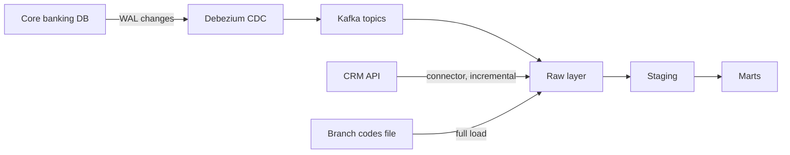
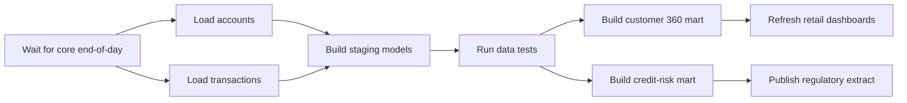
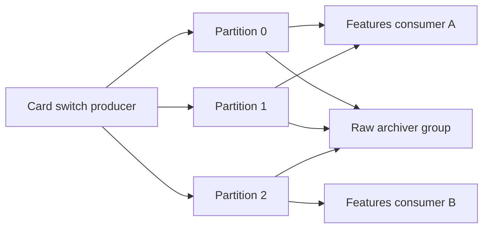

# Module 2 — Ingestion and pipelines

*A warehouse is only as good as the data that reaches it, and only as trustworthy as the pipelines that move that data on time, once and in full. This module is about the plumbing that most dashboards quietly depend on. It starts with getting data in: ETL versus ELT, connectors, incremental loads and change data capture from Najm Bank's core banking database. It then turns to orchestration: how to arrange loads into DAGs that can be retried, re-run and backfilled without double-counting a single riyal. It ends with streaming: the card authorisations that Smart Alerts must score in seconds, what Kafka really guarantees, how windows and watermarks work, and why "exactly once" is a property you build rather than a box you tick. You will follow Huda as her first nightly load misses deleted accounts, her first DAG doubles a day of transactions on retry, and her first stream consumer loses events in a crash, and Faisal as he turns each mistake into a rule the whole Data Platform team follows.*

> **Stages:** Ingest, Operate — moving data from where it is created to where it is used, on a schedule or as it happens, so that re-running anything is always safe.

---

# 2.1 — Getting data in: ETL vs ELT, connectors, incremental loads and change data capture
*Level: 🟡 Intermediate* · *Prerequisites: 1.1, 1.3* · *Stage: Ingest*

## ⚡ In 60 seconds
- **Ingestion** copies data from source systems (databases, SaaS tools, files, APIs, event streams) into your analytical platform. Most modern platforms load the raw data first and transform it inside the warehouse: **ELT** rather than **ETL**.
- Land raw data **untouched and append-only**, with load metadata (when, from where, which batch). You can always re-derive clean tables from raw; you cannot recover what you threw away on the way in.
- **Full loads** are simple and correct but get slow. **Incremental loads** move only what changed, usually by a "high-water mark" such as `updated_at`, and they quietly miss deletes and late commits unless you design for them.
- **Change data capture (CDC)** reads the database's own change log, so it sees every insert, update and delete in commit order. **Debezium** is the common open-source tool for this.
- Decision cue: small or slowly changing table, full load; large table with a trustworthy `updated_at` and no hard deletes, incremental; deletes matter or freshness must be minutes, CDC.
- Biggest trap: an incremental load with a strict `>` watermark and no overlap, which looks perfect in testing and silently drops rows in production.

## 🧭 Why it matters
Huda's first real task at Najm Bank is a nightly load of the `accounts` table from the core banking database into the warehouse. She writes a query that selects rows where `updated_at` is later than the last run, appends them to a warehouse table and records the new high-water mark. It runs for three weeks without an error.

Then Kareem, the retail data analyst, notices that the customer 360 mart shows 312 more open accounts than the core banking report. Faisal and Huda find two causes. First, accounts opened by mistake are **hard-deleted** in the core system, and a query on `updated_at` cannot see a row that no longer exists. Second, a long-running batch transaction stamps `updated_at` at its start but commits minutes later, after Huda's load has moved the watermark past that time. Those updates are skipped for ever.

Nothing crashed and no alert fired. The pipeline was "green" and wrong. That is the normal way ingestion fails, and it is why the load pattern is an engineering decision, not a connector setting.

## 📐 How it works

### 🟢 The essentials

**Sources and sinks.** A **source** is where data is created: the core banking database, the card stream, Najm Mobile events, a CRM, partner files. A **sink** is where you put it: the warehouse or lakehouse from lesson 1.3.

**ETL versus ELT.** In **ETL** (extract, transform, load), data is cleaned and reshaped on a separate server before being loaded, so only the finished shape reaches the warehouse. This made sense when warehouse storage and compute were expensive. In **ELT** (extract, load, transform), you load the raw data first and transform it inside the warehouse with SQL, usually with a tool such as dbt (lesson 3.1). ELT became the default once columnar warehouses and cheap object storage made keeping everything affordable. Its big advantage is that the raw copy stays available: when a business rule changes, you rebuild from raw instead of re-extracting from the source.

ETL still fits when you must transform *before* loading: to drop or mask personal data that should never land, to convert an odd file format, or to cut a huge volume down.

**The raw layer.** The first place data lands is the **raw** layer (Databricks calls it "bronze"). Rules that save pain later:

- **Append-only and immutable.** Never update raw rows in place. Each load adds rows; corrections come as new rows.
- **Same shape as the source.** Keep column names and types as close to the source as possible. Renaming and cleaning happen in staging.
- **Load metadata on every row.** At least `_loaded_at` (when your pipeline wrote it), `_source` (which system and table) and `_batch_id` (which run). These columns answer "where did this number come from?" months later.

**Full loads.** The simplest pattern: copy the whole table every run and replace the previous copy. It is always correct and captures deletes for free (a deleted row is simply absent). It becomes impractical for large tables, where copying everything nightly loads the source and costs time and money. For reference tables such as branches or currency codes, it is usually right.

**Incremental loads with a high-water mark.** For large tables you copy only rows that changed since the last run. The usual method is a **high-water mark**: remember the largest `updated_at` (or an increasing ID) you have loaded, and next time ask for rows above it.

```sql
-- Fragile: strict ">" and no overlap. Misses rows whose transaction
-- committed late, and never sees hard deletes.
SELECT * FROM accounts
WHERE updated_at > :last_watermark;
```

```sql
-- Safer: overlap the window by a margin larger than your longest
-- transaction, then de-duplicate on the primary key when merging.
SELECT * FROM accounts
WHERE updated_at >= :last_watermark - INTERVAL '30 minutes';
```

The overlap means you will re-read some rows you already have. That is fine, as long as the next step is a **merge** (upsert) on the primary key rather than a blind append. Lesson 2.2 covers that idempotent merge in detail.

Before relying on `updated_at`, ask the owning team: does every code path, including bulk scripts, set it? Is it set by the database clock or by servers with different clocks? Are rows ever hard-deleted? If any answer is uncertain, use CDC or periodic full reconciliation.

**Change data capture.** Every serious database writes changes to a log before applying them, for crash recovery and replication. PostgreSQL's is the **write-ahead log** (WAL); MySQL's is the binlog. **Log-based CDC** reads that log and turns each committed change into an event: this row was inserted, this one updated from these values to those, this one deleted. Because it reads commits, not timestamps, it sees every change exactly in commit order, including deletes and late commits. Huda's two bugs both disappear.



### 🟡 Going deeper

**Connectors.** A **connector** is a packaged extractor for one kind of source, handling pagination, rate limits, authentication and schema changes for you. Open-source options include **Airbyte** (a platform with a large catalogue of connectors), **dlt** (data load tool, a Python library for writing pipelines as code) and the **Singer** specification with **Meltano**. Managed services such as Fivetran do the same as a hosted product. The judgement call is not which logo but: who maintains this connector when the source API changes, does it support incremental sync and deletes for this source, and can we run it where our data residency rules require? Treat every connector's "incremental" mode as a claim to test, not a fact.

**Three ways to do CDC.**

| Approach | How it works | Strengths | Weaknesses |
|---|---|---|---|
| Query-based | Poll with a high-water mark on `updated_at` | Simple, no special database access | Misses hard deletes and late commits; loads the source |
| Trigger-based | Database triggers write every change into an audit table you then read | Catches deletes | Adds write load and code inside the source database |
| Log-based | Read the WAL or binlog | Sees every committed change in order, low source impact | Needs replication privileges and careful operation |

**How Debezium works with PostgreSQL.** Debezium runs as a set of connectors inside **Kafka Connect**, a framework for moving data in and out of Kafka. For PostgreSQL it uses **logical decoding**: the database must run with `wal_level = logical`, and Debezium creates a **replication slot**, a bookmark in the WAL that the database keeps until the consumer confirms it has read past it. On first start it takes a consistent **snapshot** of the selected tables, then streams changes from the slot. Each change event carries `before` and `after` images of the row, an `op` code (`c` create, `u` update, `d` delete, `r` snapshot read) and source metadata including the **LSN** (log sequence number), the change's position in the WAL, useful for ordering and de-duplication.

A minimal connector configuration that Najm's platform team might register with Kafka Connect:

```json
{
  "name": "najm-core-cdc",
  "config": {
    "connector.class": "io.debezium.connector.postgresql.PostgresConnector",
    "plugin.name": "pgoutput",
    "database.hostname": "core-primary.internal",
    "database.port": "5432",
    "database.user": "cdc_reader",
    "database.password": "${file:/secrets/cdc.properties:password}",
    "database.dbname": "corebanking",
    "topic.prefix": "najm.core",
    "slot.name": "najm_dwh_cdc",
    "table.include.list": "public.customers,public.accounts,public.transactions",
    "column.exclude.list": "public.customers.national_id",
    "decimal.handling.mode": "string"
  }
}
```

Three choices matter most. The password comes from a secrets file. `table.include.list` names exactly the tables the warehouse needs, not the whole database. And `column.exclude.list` stops a national ID number from ever leaving the core system; minimisation at the point of ingestion is the cheapest privacy control you will ever get (lesson 6.2, and [*Secure AI & Application Security*, lesson 5.3 — Protecting personal data](../secai/index.html#/5.3) for the engineering side).

**From change events to tables.** Raw keeps the full change history. Staging builds the **current state**: the latest change per key by LSN, minus deletes. The same history gives you slowly changing dimension Type 2 almost for free (lesson 1.2).

```sql
-- Current state of accounts from the raw CDC history (PostgreSQL / DuckDB)
SELECT *
FROM (
  SELECT *,
         ROW_NUMBER() OVER (PARTITION BY account_id ORDER BY lsn DESC) AS rn
  FROM raw.core_accounts_changes
) latest
WHERE rn = 1
  AND op <> 'd';
```

**Schema drift.** Sources change. Add new columns to raw automatically, but *alert* on removed or retyped ones rather than silently coercing; lesson 3.2 turns this into data contracts.

### 🔴 Expert view

**Replication slots can fill the primary's disk.** A slot keeps WAL until its consumer confirms. If Kafka Connect stops for a weekend, WAL piles up on the *production* server. Alert on slot lag and set `max_slot_wal_keep_size` (PostgreSQL 13 and later) so a dead consumer cannot take down core banking; the price is a fresh snapshot if the slot is invalidated. Agree this with Salem's platform team before go-live.

**Ordering.** Debezium keys events by primary key, so changes to one row stay in order (lesson 2.3), but changes across tables are not globally ordered: a transaction can arrive before its account. Do not enforce foreign keys on raw; check relationships with tests (lesson 3.2).

**The outbox pattern.** CDC couples consumers to the source's internal tables. Alternatively, the application writes a deliberate business event, such as `AccountClosed`, into an **outbox** table in the same transaction as the change, and only that table is captured. It needs application changes, so it suits new services better than a legacy core.

**Reconciliation is not optional.** Even with CDC, compare daily row counts and amount totals between source and warehouse. When they differ, you want to know that morning, not when Kareem finds it.

**Where ingestion runs.** Customer data for Qatar, UAE and EU customers may carry residency expectations that limit where connectors, Kafka and storage live; confirm with Sara (the DPO) rather than assuming a cloud region is acceptable (Module 6).

## 🧰 The toolkit
| Tool, pattern or standard | What it is and does | When to reach for it |
|---|---|---|
| **ELT** | Load raw data first, transform inside the warehouse with SQL | Default for modern warehouses and lakehouses |
| **ETL** | Transform before loading, on a separate engine | Masking or dropping sensitive data before it lands; heavy format conversion; volume reduction |
| **Change data capture (CDC)** | Turns every committed insert, update and delete into an event by reading the database log | Large OLTP tables, deletes that matter, freshness in minutes |
| **Debezium** (open source, Kafka Connect based) | Log-based CDC connectors for PostgreSQL, MySQL, SQL Server and others | CDC from Najm's core banking PostgreSQL into Kafka |
| **Airbyte** | Open-source data integration platform with many prebuilt connectors | Pulling from SaaS APIs and databases without writing extractors |
| **dlt** (data load tool) | Python library for writing extract-and-load pipelines as code with incremental state | Custom APIs and files when you want pipelines in your own repo |
| **High-water mark** | Remember the largest `updated_at` or ID loaded; read above it next time, with overlap | Large tables with a trustworthy change timestamp and no hard deletes |

## 🏛️ In practice at Najm Bank
After the 312-account gap, Faisal asks Huda to write an **ingestion design note** for each core banking table before anything new is built. The note is one page and is reviewed by the source owner (Tariq's engineering team), Faisal, and Sara for anything personal.

**Ingestion design note: `core.accounts` → `raw.core_accounts_changes`**

| Field | Decision |
|---|---|
| Source and owner | Core banking PostgreSQL, `public.accounts`; owner: Core Banking squad (Tariq) |
| Consumers | Customer 360 mart, credit-risk mart, regulatory extracts |
| Deletes | Hard deletes happen (accounts opened in error) |
| Load pattern | Log-based CDC with Debezium; initial snapshot, then streaming |
| Why not incremental | `updated_at` misses hard deletes and late-committing batch updates |
| Columns | All except those listed under "excluded" |
| Freshness target | Raw within 15 minutes of commit during business hours |
| Raw layout | Append-only change history with `op`, `lsn`, `_loaded_at`, `_source`, `_batch_id` |
| Current state | Staging model: latest change per `account_id` by `lsn`, deletes removed |
| Reconciliation | Daily: count of open accounts and sum of balances vs core end-of-day report; alert if any difference |
| Failure modes and alerts | Replication slot lag; connector stopped; schema change on source; reconciliation mismatch |
| Residency and access | Kafka and raw storage in the approved region; raw schema readable by the platform team only |
| Runbook | How to restart the connector, how to re-snapshot one table, who to call in the core team |

Every new pipeline must also tick: *raw append-only with load metadata; deletes handled; overlap or CDC; merge into staging; reconciliation defined; personal data minimised at source; owner and alerts named.*

## 🛠️ Exercises
Use synthetic data only. A generator script or a public sample database is fine; never real customer data.

- 🟢 In PostgreSQL or DuckDB, create a synthetic `accounts` table (1,000 rows with `updated_at`) and copy it to `raw_accounts` with `_loaded_at` and `_batch_id`. Then update 50 rows, delete 10, insert 20 and run a high-water-mark incremental load. *Done when:* you can show, with a query, exactly which changes the incremental load caught and which it missed, and explain why.
- 🟡 Run PostgreSQL with `wal_level = logical`, Kafka (or Redpanda) and Kafka Connect with the Debezium PostgreSQL connector in Docker, following the Debezium tutorial. Capture one table, then insert, update and delete rows. *Done when:* you can show the `c`, `u` and `d` events in the topic, and a SQL query over the landed events that rebuilds the current table state exactly.
- 🔴 Write an ingestion design note, using the Najm template, for your synthetic `transactions` table, with a reconciliation query. Stop the CDC connector for an hour while generating writes. *Done when:* you can show the slot's retained WAL growing, a clean catch-up after restart (no lost or duplicated rows) and the reconciliation passing.

## ⚠️ Mistakes and traps
- **Trusting `updated_at` without checking.** Bulk scripts, triggers and long transactions break it. Ask the source owner, overlap the window, merge on the key, or use CDC.
- **Ignoring deletes.** Incremental loads never see hard deletes. Use CDC, soft deletes agreed with the source team, or a periodic full key comparison.
- **Copying every column "just in case".** Unneeded personal data now lives in more places. Exclude sensitive columns at source.
- **Running CDC without monitoring the replication slot.** A stopped consumer can fill the primary database's disk. Alert on slot lag and cap retained WAL.
- **No reconciliation.** A green pipeline is not a correct one. Compare counts and totals against the source every day.

## 🧾 Recap
- ELT loads raw data first and transforms in the warehouse; ETL still fits when data must be masked, dropped or reshaped before it lands.
- Raw is append-only, source-shaped and stamped with load metadata.
- Full loads are simple and catch deletes; incremental loads scale but need overlap, merges and a trustworthy change column.
- Log-based CDC (Debezium on the PostgreSQL WAL) sees every committed change in order, including deletes, but must be operated with care.
- Every pipeline needs a design note, minimised columns, alerts and a daily reconciliation against the source.

## ✍️ Check yourself

**1. Huda's incremental load on `updated_at` shows more open accounts than the core system. The operations team hard-deletes accounts opened in error. Which change fixes the root cause most reliably?**

- A. Run the incremental load every hour instead of nightly, so gaps close sooner
- B. Change the watermark comparison from `>` to `>=` so boundary rows are kept
- C. Switch to log-based CDC, which records deletes
- D. Add an index on `updated_at` in the source so the query is faster

<details><summary>Answer</summary>

**C.** A deleted row no longer exists, so no query on `updated_at` can see it; reading the database log does. A and B change timing or boundaries but still never see deletes; D only makes the same blind query faster. (🟢 The essentials.)

</details>

**2. What is the main advantage of ELT over ETL for Najm's warehouse?**

- A. Raw data stays in the warehouse, so tables can be rebuilt without re-extracting
- B. It never puts any load on source systems, because transformation happens later
- C. It removes the need for data quality tests, because raw is kept exactly as the source
- D. It guarantees that personal data never reaches the warehouse in any form

<details><summary>Answer</summary>

**A.** Keeping raw data lets you re-derive everything downstream. B is false (extraction still reads the source), C is false, and D is the opposite: if sensitive data must never land, that is a reason to transform or exclude before loading. (🟢 The essentials.)

</details>

**3. A nightly load reads `WHERE updated_at > :last_watermark`. Some rows are updated by a batch job whose transaction starts at 01:00 but commits at 01:20; the load runs at 01:10. What happens, and what is the standard fix?**

- A. Nothing goes wrong, because PostgreSQL makes committed rows visible in timestamp order
- B. The rows are loaded twice; fix it by switching the whole table to a nightly full load
- C. The rows cause a primary-key error on the next run; fix it by dropping the key
- D. The rows can be skipped for ever; overlap the window and merge on the key, or use CDC

<details><summary>Answer</summary>

**D.** The rows carry a timestamp earlier than the new watermark but were invisible when the load ran. An overlap re-reads them, and a merge makes the re-read harmless. A is the false assumption behind the bug. (🟢 The essentials.)

</details>

**4. Kafka Connect running Debezium for the core banking database stopped on Friday evening. On Monday, Salem reports that disk use on the core primary database has grown sharply. Why?**

- A. Debezium writes its change events back into tables in the source database
- B. The replication slot keeps WAL on the primary until the consumer confirms it
- C. The initial snapshot restarted and copied every captured table inside the database
- D. Kafka's retention period expired, so the topics spilled over onto the primary

<details><summary>Answer</summary>

**B.** The slot is a bookmark that stops PostgreSQL from removing WAL the consumer has not read. Monitor slot lag and cap retained WAL with `max_slot_wal_keep_size`. The other options do not touch the primary's disk. (🔴 Expert view.)

</details>

**5. Layla asks how Najm keeps national ID numbers out of the analytical platform when it introduces CDC from the `customers` table. Which answer is best?**

- A. Mask the column in every retail and risk dashboard that shows customer details
- B. Copy it to raw as usual, then drop the column in the staging models
- C. Exclude the column in the CDC connector so it never leaves the core system
- D. Encrypt the whole warehouse at rest, which makes the column safe to copy anywhere

<details><summary>Answer</summary>

**C.** Minimising at the source means the data never exists downstream; record the exclusion in the ingestion design note. B still lands it in raw, where it stays in history; A only hides it from one audience; D protects storage but not access by everyone who can query it. (🟡 Going deeper.)

</details>

## 📚 References
- Debezium documentation, PostgreSQL connector — https://debezium.io/documentation/
- PostgreSQL documentation, Logical Decoding and Replication Slots — https://www.postgresql.org/docs/current/logicaldecoding.html
- PostgreSQL documentation, MERGE — https://www.postgresql.org/docs/current/sql-merge.html
- Apache Kafka documentation, Kafka Connect — https://kafka.apache.org/documentation/
- Airbyte documentation — https://docs.airbyte.com/
- dlt documentation — https://dlthub.com/docs/
- Apache Parquet — https://parquet.apache.org/
- Martin Kleppmann, *Designing Data-Intensive Applications* (O'Reilly), chapters on replication and derived data
- Joe Reis and Matt Housley, *Fundamentals of Data Engineering* (O'Reilly)

---

# 2.2 — Orchestration: DAGs, idempotency, retries and backfills
*Level: 🟡 Intermediate* · *Prerequisites: 2.1* · *Stage: Ingest, Operate*

## ⚡ In 60 seconds
- An **orchestrator** runs your pipeline steps in the right order, on a schedule or when data arrives, retries what fails, and records what ran. **Apache Airflow**, **Dagster** and **Prefect** are the common open-source choices.
- Pipelines are written as **DAGs**: directed acyclic graphs of tasks, where an arrow means "this must finish first" and nothing loops back.
- The rule that matters most: every task must be **idempotent**. Running it once or five times for the same period must leave exactly the same result.
- Make tasks **deterministic**: they work on a fixed **data interval** handed to them by the orchestrator, never on "today" or `now()`.
- **Retries** handle passing failures; **backfills** re-run history after a bug fix or a new column. Both are only safe if tasks are idempotent.
- Biggest trap: a task that appends rows. The first retry silently double-counts a day of transactions.

## 🧭 Why it matters
Huda moves her nightly transactions load into Airflow. The task runs a query for "yesterday's" transactions using `CURRENT_DATE - 1` and appends the rows to `staging.transactions_daily`. One night the warehouse connection drops after the insert has committed but before Airflow hears back. Airflow marks the task failed and, as configured, retries it five minutes later. The retry succeeds. The next morning the finance dashboard shows card spend for 14 September at almost exactly twice the usual amount.

Lina, the analytics engineer, spots it just before the finance team does. Then a second, quieter bug appears. A Saturday load had failed and Huda re-ran it by hand on Monday. Because the query said `CURRENT_DATE - 1`, the re-run loaded *Sunday* again, and Saturday never arrived.

Neither bug is about Airflow. The task appended instead of replacing, and chose its own day. Faisal's rule for the team comes out of that morning: **"Every task must be safe to run twice, for any date, at any time."** This lesson is how you meet that rule.

## 📐 How it works

### 🟢 The essentials

**What an orchestrator does.** Without one, pipelines are cron jobs calling scripts, and when step three fails at 02:00 nobody knows whether later steps ran on stale data. An orchestrator gives you:

- **Dependencies**: run "build customer 360" only after "load accounts" and "load transactions" have both succeeded.
- **Scheduling**: by time ("daily at 02:00") or by event ("when the settlement file lands").
- **Retries and timeouts**: try a failed task again after a pause; kill one that hangs.
- **History**: every run, its parameters, logs and outcome, in one place. For a bank, that history is also audit evidence.
- **Backfills**: run a pipeline for a range of past dates.
- **Alerting**: tell a named person when something fails or is late.

**DAGs.** A **DAG** (directed acyclic graph) is the shape of a pipeline. *Directed*: each arrow points one way, from a task to the task that depends on it. *Acyclic*: you can never follow the arrows back to where you started. Najm's nightly pipeline:



The two loads run in parallel. If the data tests fail, nothing downstream runs, so a broken day never reaches a dashboard or a regulator.

**Idempotency.** An operation is **idempotent** if doing it many times has the same effect as doing it once. Pressing a lift's call button is idempotent; adding a row is not. There are two standard ways to make a load idempotent:

1. **Delete then insert a partition** (also called partition overwrite): inside one transaction, delete everything for the period you are loading, then insert it fresh.
2. **Merge (upsert) on a key**: insert rows that are new, update rows that already exist, matched on a primary key.

The wrong way and the right way side by side:

```sql
-- Not idempotent: decides its own date and appends.
INSERT INTO staging.transactions_daily
SELECT * FROM raw.transactions
WHERE booked_at::date = CURRENT_DATE - 1;
```

```sql
-- Idempotent: the date comes from the orchestrator, and the period
-- is replaced as a whole inside one transaction.
BEGIN;
DELETE FROM staging.transactions_daily
WHERE business_date = :business_date;

INSERT INTO staging.transactions_daily
SELECT transaction_id, account_id, amount, currency,
       booked_at::date AS business_date
FROM raw.transactions
WHERE booked_at >= :interval_start
  AND booked_at <  :interval_end;
COMMIT;
```

Run the second version once or ten times, for any day, and the table ends up the same. The `BEGIN`/`COMMIT` matters: if the insert fails, the delete rolls back and yesterday's good data is still there.

**Data intervals, not "today".** Orchestrators give each run a **data interval**: the slice of time it is responsible for. A daily run for 14 September has the interval from 14 September 00:00 to 15 September 00:00, and it normally *starts* after the interval ends, early on 15 September. Airflow calls the start of the interval the **logical date** (older docs say "execution date", which confuses everyone because it is not when the run executes). Your task should read its interval from the orchestrator and use it in every query. Then a re-run on Monday for Saturday's interval loads Saturday.

**Retries.** Many failures pass: a dropped connection, a lock timeout, a rate limit. Retry automatically with a growing pause (**exponential backoff**), and set a **timeout** so a hung task fails instead of blocking for hours. Retries are only safe on idempotent tasks.

### 🟡 Going deeper

**An idempotent Airflow DAG.** Airflow defines DAGs in Python. With the TaskFlow style, each decorated function is a task. A sketch of Najm's transactions load (in Airflow 3 the decorators import from `airflow.sdk`; in Airflow 2 from `airflow.decorators`):

```python
from datetime import datetime, timedelta

import psycopg
from airflow.sdk import dag, task  # Airflow 2: from airflow.decorators import dag, task

DSN = "postgresql://etl@warehouse/najm"  # in real use, an Airflow connection with a secret backend


@dag(
    schedule="@daily",
    start_date=datetime(2026, 1, 1),
    catchup=False,
    max_active_runs=1,
    default_args={
        "retries": 3,
        "retry_delay": timedelta(minutes=5),
        "retry_exponential_backoff": True,
        "execution_timeout": timedelta(hours=1),
    },
)
def core_transactions_daily():
    @task
    def load_transactions(**context):
        start = context["data_interval_start"]
        end = context["data_interval_end"]
        with psycopg.connect(DSN) as conn, conn.transaction():
            conn.execute(
                "DELETE FROM staging.transactions_daily WHERE business_date = %s",
                (start.date(),),
            )
            conn.execute(
                """INSERT INTO staging.transactions_daily
                   SELECT transaction_id, account_id, amount, currency,
                          booked_at::date
                   FROM raw.transactions
                   WHERE booked_at >= %s AND booked_at < %s""",
                (start, end),
            )

    load_transactions()


core_transactions_daily()
```

Note what is *not* there: no `datetime.now()`, no `CURRENT_DATE`, no append.

**Merges for tables without a natural period.** Dimension-like tables such as `accounts` are keyed, not dated. Use a merge on the key (PostgreSQL 15 and later support `MERGE`; `INSERT ... ON CONFLICT ... DO UPDATE` works in older versions):

```sql
MERGE INTO staging.accounts AS t
USING raw_accounts_batch AS s
  ON t.account_id = s.account_id
WHEN MATCHED AND s.updated_at > t.updated_at THEN
  UPDATE SET status = s.status, balance = s.balance, updated_at = s.updated_at
WHEN NOT MATCHED THEN
  INSERT (account_id, status, balance, updated_at)
  VALUES (s.account_id, s.status, s.balance, s.updated_at);
```

The `s.updated_at > t.updated_at` guard means an older change replayed later cannot overwrite a newer one. This is the merge that made the overlapping watermark in lesson 2.1 safe.

**Backfills.** A **backfill** runs a pipeline for past intervals. You need one when you fix a bug, add a column that must exist for history, or bring a new table online. With idempotent, interval-driven tasks a backfill is just "run these 90 daily intervals"; Airflow and Dagster both have built-in backfill commands and UI actions (the Airflow CLI changed between versions 2 and 3, so check the docs for yours). Without idempotency a backfill is a manual, risky project. Plan backfills like changes:

- **Limit concurrency** with `max_active_runs` or pools, so ninety runs cannot flood the source.
- **Run downstream too**: marts and extracts built from those dates.
- **Tell people.** Past numbers will change; Lina and Kareem should know before finance does.

**Scheduling by data, not only by clock.** "Run at 02:00" assumes the core end-of-day batch is always done by then. When it is late, you load half a day. Better: start when the data is ready. Options include a **sensor** (a task that waits until a condition is true, such as a marker row or file appearing), Airflow's data-aware scheduling (a DAG runs when an upstream dataset or asset is updated), and Dagster's asset-based scheduling. Always pair a wait with a timeout and an alert, or a missing file means a silent stall.

**Dagster's asset view.** Airflow thinks in **tasks** (do this, then that). Dagster thinks in **assets**: the tables and files your pipeline produces, with their dependencies and partitions. You declare "`stg_transactions_daily` is a daily-partitioned asset built from `raw_transactions`", and the tool works out what to run:

```python
from dagster import AssetExecutionContext, DailyPartitionsDefinition, asset

daily = DailyPartitionsDefinition(start_date="2026-01-01")


@asset(partitions_def=daily)
def stg_transactions_daily(context: AssetExecutionContext) -> None:
    day = context.partition_key  # e.g. "2026-09-14"
    # delete-then-insert this one day, exactly as in the SQL above
```

The partition key plays the role of Airflow's data interval. The asset view makes lineage and freshness visible ("this mart is stale because this upstream partition failed"). **Prefect** is a third option, with flows and tasks as plain Python functions. Pick one for the team; the principles are the same in all three.

### 🔴 Expert view

**Atomic publishing.** Do not rebuild a large mart in place while dashboards read it. Build a new table, test it, then swap it in with a rename or view switch. Iceberg and Delta tables do this with snapshots and allow rollback (lesson 1.3).

**The orchestrator orchestrates.** A task should tell the warehouse, Spark or dbt to do heavy work, not pull ten million rows into Python on the scheduler's machine.

**Retry the right failures.** Retrying a dropped connection is good. Retrying a data test failure or a syntax error three times only delays the alert. Distinguish *transient* errors (retry) from *deterministic* ones (fail fast, alert a human), and make sure failures send a message to an owned channel with a link to the logs.

**Service levels for data.** Agree a freshness target per data product, for example "credit-risk mart for day D ready by 07:00 on D+1", and alert when it is at risk, not only when a task fails. Monitoring patterns for jobs nobody watches are covered in [*System Design for Vibe Coders*, lesson 7.4 — Background jobs: the code nobody watches](../vibe/index.en.html#l7-4), and durable workflow engines for application work in [*SaaS Building Blocks*, lesson 5.4 — Workflow engines and durable execution](../saas/index.html#/5.4).

**Side effects outside the warehouse.** An email, API call or file upload is not covered by a database transaction. Give each an **idempotency key** (such as report name plus business date), record it when done, and let retries skip it. The same idea for application writes is taught in [*System Design for Vibe Coders*, lesson 2.6 — Two clicks at once: races, transactions, and idempotent writes](../vibe/index.en.html#l2-6).

**Run history as evidence.** Auditors ask "how was this figure produced, and when?". Run history with parameters, code version and test results answers that; keep it as long as the bank's retention rules require, and keep DAG code under review in version control (lesson 3.1).

## 🧰 The toolkit
| Tool, pattern or standard | What it is and does | When to reach for it |
|---|---|---|
| **Apache Airflow** | Open-source orchestrator; pipelines as Python DAGs of tasks with schedules, retries, backfills and a run history | Task-based pipelines across many systems; widely known in data teams |
| **Dagster** | Open-source orchestrator built around software-defined assets and partitions | When you want lineage, freshness and partitions of tables as first-class ideas |
| **Prefect** | Open-source workflow orchestration with flows and tasks as Python functions | Python-heavy pipelines where a light touch suits the team |
| **Idempotent load** (partition overwrite) | Delete and re-insert one whole period inside a transaction | Fact tables loaded by day or month |
| **MERGE / upsert** | Insert new rows and update existing ones on a key, with a recency guard | Keyed tables such as accounts and customers; overlapping incremental loads |
| **Backfill** | Re-run a pipeline for a range of past intervals | Bug fixes, new columns, onboarding a new source |
| **Sensor** | A task that waits for a condition, such as a file or marker row, with a timeout | Starting when upstream data is ready instead of at a fixed hour |

## 🏛️ In practice at Najm Bank
Faisal turns the double-counted day into a **pipeline review checklist** that every DAG must pass before it is merged, plus a standard **backfill request**.

**Najm DAG review checklist**

| Check | Pass when |
|---|---|
| Idempotent writes | Every write is a partition overwrite or a guarded merge; no bare `INSERT` into a shared table |
| Deterministic periods | Tasks read the data interval or partition key; no `now()`, `CURRENT_DATE` or `today()` in queries |
| Transactions | Delete-and-insert pairs run in one transaction; large rebuilds publish atomically |
| Retries | Transient errors retry with backoff (3 attempts by default); test failures do not retry |
| Timeouts | Every task has an execution timeout |
| Readiness | Starts on a sensor or data-aware trigger with a timeout, or documents why a fixed time is safe |
| Tests gate publishing | Data tests run before marts, dashboards or extracts are refreshed |
| External side effects | Each has an idempotency key recorded on success |
| Concurrency | `max_active_runs` and pools set so a backfill cannot overload sources |
| Ownership | Owner and alert channel named; freshness target written down |
| Secrets | Connections come from the secrets backend, never from code |

**Backfill request (one per backfill, kept with the change ticket)**

```
Pipeline:         core_transactions_daily  ->  customer_360, credit_risk_mart
Reason:           fix currency conversion bug (ticket DATA-412)
Intervals:        2026-07-01 to 2026-09-30 (92 daily runs)
Concurrency:      max 4 runs at once; source = warehouse raw only (no load on core)
Downstream:       staging, both marts, retail and risk dashboards; NOT regulatory
                  extracts already submitted (needs compliance decision)
Expected change:  card spend in non-QAR currencies changes; totals in QAR unchanged
Checks after:     reconciliation per day passes; row counts per day unchanged
Communicated to:  Lina (metrics), Kareem (retail), finance reporting lead
Approved by:      Faisal
```

The regulatory line matters most: re-running history must never silently change a figure already reported. That is compliance's decision, not a pipeline setting.

## 🛠️ Exercises
Use synthetic data and a local PostgreSQL or DuckDB. Airflow and Dagster both run locally (Airflow in Docker using its official quick-start; Dagster with `pip` and its development server).

- 🟢 Write two versions of a daily load from a synthetic `raw.transactions` table into `staging.transactions_daily`: one that appends using `CURRENT_DATE - 1`, and one that deletes and inserts a given `business_date` in one transaction. Run each three times for the same date. *Done when:* a query shows the first version tripled the day's total and the second left it unchanged, and you can explain why in two sentences.
- 🟡 Build the five-task DAG "wait for marker, load accounts, load transactions, build staging, run tests" in Airflow or Dagster, using the data interval or partition key in every query. Make one task fail on its first attempt only. *Done when:* the retry succeeds without duplicate rows, and a backfill for 14 past days produces exactly the same totals as running each day once.
- 🔴 Add a "publish" step that writes a CSV extract per business date and records an idempotency key in a `published_extracts` table. Simulate a crash after the file is written but before success is reported. *Done when:* the retry skips the existing key without a second file, and you have reviewed your DAG against the Najm checklist.

## ⚠️ Mistakes and traps
- **Appending in a task that can be retried.** Retries and re-runs double-count. Overwrite the period or merge on a key.
- **Using "today" inside a task.** Re-runs and backfills then load the wrong day. Read the data interval or partition key from the orchestrator.
- **Retrying everything.** Retrying a failed data test or a code error only delays the alert. Retry transient errors; fail fast on deterministic ones.
- **Unbounded backfills.** Cap concurrency and plan downstream re-runs.
- **Silently changing reported history.** A backfill can alter figures already sent to a regulator or the board. Decide explicitly, with compliance, what may change.

## 🧾 Recap
- Orchestrators run DAGs of tasks with dependencies, schedules, retries, timeouts, history and backfills; Airflow is task-based, Dagster asset-based, Prefect Python-first.
- Idempotency is the core rule: the same run for the same period always gives the same result. Use partition overwrite or guarded merges in a transaction.
- Tasks must take their period from the orchestrator's data interval, never from "today".
- Retries and backfills are only safe on idempotent tasks; cap their concurrency and re-run downstream.
- Publish atomically, gate on tests, give external side effects idempotency keys and alert on freshness, not only failure.

## ✍️ Check yourself

**1. Huda's task inserted a day of transactions, committed, then lost its connection before Airflow received success. Airflow retried, and the day's total doubled. What is the best fix?**

- A. Turn off retries for that task so it can never run a second time
- B. Delete and re-insert that day in one transaction, for Airflow's data interval
- C. Add a monthly clean-up job that removes duplicate rows from staging
- D. Increase the task's timeout so the connection has longer to recover

<details><summary>Answer</summary>

**B.** It makes the task idempotent, so any number of retries leaves the same result. A trades double-counting for missing data whenever a passing failure happens; C lets wrong numbers sit on dashboards for a month; D does not address the duplicate. (🟢 The essentials.)

</details>

**2. A daily DAG failed on Saturday and was re-run manually on Monday. Its query uses `CURRENT_DATE - 1`. What happens?**

- A. Saturday is loaded correctly, because the manual run belongs to Saturday's interval
- B. The run fails with a date error because Monday is outside the run's interval
- C. Airflow rewrites `CURRENT_DATE` in the query to the run's logical date
- D. Sunday is loaded again and Saturday stays missing

<details><summary>Answer</summary>

**D.** The query decides the date from the wall clock at the time it runs, not from the run's data interval. A is what would happen if the query used the interval. (🟢 The essentials.)

</details>

**3. Faisal needs to re-run the transactions pipeline for the last 90 days after a bug fix. Which plan is safest?**

- A. Backfill with capped concurrency, re-run downstream marts, and agree submitted extracts with compliance
- B. Trigger all 90 days in parallel at once so the backfill finishes before the morning dashboards
- C. Truncate the staging table, then run only today's load and let history rebuild itself
- D. Fix only future days, since history already shown to users must never be changed

<details><summary>Answer</summary>

**A.** It is controlled, complete and governed. B can overload the source or warehouse; C destroys history; D leaves known-wrong numbers in place. (🟡 Going deeper.)

</details>

**4. In a `MERGE` that loads account changes from an overlapping incremental extract, why add `WHEN MATCHED AND s.updated_at > t.updated_at`?**

- A. It makes the merge faster by skipping rows whose timestamps have not changed
- B. It is required by PostgreSQL syntax whenever a MERGE has a matched clause
- C. It stops an older, replayed change from overwriting a newer value
- D. It removes accounts that were deleted in the source since the last load

<details><summary>Answer</summary>

**C.** Overlapping windows and replays can deliver changes out of order; the guard keeps the newest. It is optional syntax, not a speed or delete feature. (🟡 Going deeper.)

</details>

**5. The credit-risk mart is built at 02:00 each day, but the core system's end-of-day batch sometimes finishes at 02:40. What is the best design?**

- A. Move the schedule to 05:00 and hope the end-of-day batch is never that late
- B. Trigger on a readiness signal from core end-of-day, with a timeout and an alert
- C. Retry the build every five minutes until the totals look right to the risk team
- D. Build twice a day and let users pick whichever version looks better

<details><summary>Answer</summary>

**B.** Scheduling on data readiness avoids loading half a day, and the timeout plus alert turns a silent stall into a visible problem. A only moves the risk; C and D push quality checks onto guesswork and users. (🟡 Going deeper.)

</details>

## 📚 References
- Apache Airflow documentation — https://airflow.apache.org/docs/
- Dagster documentation — https://docs.dagster.io/
- Prefect documentation — https://docs.prefect.io/
- PostgreSQL documentation, MERGE — https://www.postgresql.org/docs/current/sql-merge.html
- PostgreSQL documentation, INSERT (ON CONFLICT) — https://www.postgresql.org/docs/current/sql-insert.html
- Maxime Beauchemin, "Functional Data Engineering — a modern paradigm for batch data processing" (2018), on idempotent, partition-based pipelines — https://maximebeauchemin.medium.com/
- Joe Reis and Matt Housley, *Fundamentals of Data Engineering* (O'Reilly)

---

# 2.3 — Streaming: events, Kafka, windows and the exactly-once myth
*Level: 🟡 Intermediate* · *Prerequisites: 2.1, 2.2* · *Stage: Ingest, Transform*

## ⚡ In 60 seconds
- **Streaming** processes data continuously as **events** (small immutable facts such as "card 4417 was authorised for 120 QAR at 14:02:11") instead of in nightly batches. Use it when a decision loses value within seconds or minutes, like scoring a card payment for fraud.
- **Apache Kafka** stores events in **topics**, split into **partitions**. Order is guaranteed only within a partition, so choose the **key** (for example the card ID) that keeps related events together.
- Consumers track their position with **offsets**. When you commit the offset relative to doing the work decides whether you get **at-most-once** (may lose) or **at-least-once** (may duplicate) delivery.
- Kafka offers **exactly-once within Kafka** through idempotent producers and transactions. End to end, exactly-once needs an **idempotent sink**: design for duplicates, and make them harmless.
- Aggregate by **event time**, not arrival time, using **windows** (tumbling, sliding, session) and **watermarks** that say how long to wait for late events.
- Biggest trap: auto-committing offsets before the work is done, so a crash silently drops events.

## 🧭 Why it matters
Smart Alerts, Najm Bank's fraud-detection model, needs features such as "authorisations for this card in the last 10 minutes" and "countries it was used in today". A nightly batch is useless: by then the fraudster has finished. Dana, the lead data scientist, needs them within seconds of each authorisation.

Huda's first consumer reads the card authorisations topic and writes counts per card to a feature table. In its first production week, a deployment restarts it mid-batch, and afterwards about two minutes of traffic is missing: the consumer had **auto-committed** its offsets, telling Kafka "I have processed these", before writing the results. On restart it resumed from the committed position, and those events were never counted.

Faisal's first instinct is to switch on "exactly-once" in the configuration. Dana stops him: "Kafka's exactly-once covers Kafka. Our feature table is in PostgreSQL. Show me what happens when we write the same event twice." The honest answer to "is every event processed exactly once?" is: "at least once, and processing it twice is harmless."

## 📐 How it works

### 🟢 The essentials

**Batch versus streaming.** Batch works on a bounded set of data, such as yesterday's transactions, then stops. Streaming works on an **unbounded** sequence of events. Streaming is harder to build, test and operate, and most reporting is well served by hourly or daily batch. Choose streaming when the *value of the answer decays in seconds or minutes*: fraud scoring, real-time limits, operational alerts. A useful test: "If this number were an hour old, would anyone decide worse?" If not, use batch.

**Events.** An **event** is a record that something happened, at a time, and it never changes afterwards. A card authorisation event at Najm:

```json
{
  "auth_id": "a9f3c2e1-7d4b-4c55-9a1e-2b6f0c8d1e77",
  "card_id": "card_4417",
  "merchant_country": "QA",
  "amount": "120.00",
  "currency": "QAR",
  "event_time": "2026-10-01T14:02:11.384Z"
}
```

`auth_id` is a unique event ID, so duplicates can be detected. `event_time` is when the authorisation happened at the source, not when you received it.

**Kafka in five ideas.**

- A **topic** is a named stream, such as `najm.card.authorisations`. Producers write; consumers read.
- Topics split into **partitions**: ordered, append-only logs. Order holds *within* a partition only.
- Events with the same **key** go to the same partition. Key by `card_id` and each card's events arrive in order.
- Each event's **offset** is its position. A consumer "commits" the offset it reached, to resume after a restart.
- Kafka keeps events for a **retention** period (by time or size; the broker default is seven days) whether or not anyone has read them, so consumers can replay history. A **compacted** topic keeps the latest event per key, useful for CDC (lesson 2.1).

**Consumer groups.** Consumers sharing a **group ID** split the partitions: six partitions and three consumers means two each. Adding one triggers a rebalance; consumers beyond the partition count sit idle. Different groups read independently, so the features job and the raw archiver each see every event.



**Delivery semantics.** What happens when a consumer crashes depends on *when it commits the offset*:

| Semantics | Commit offset… | On a crash | Result |
|---|---|---|---|
| At-most-once | Before doing the work | Work not done, but offset already moved | Events can be **lost** |
| At-least-once | After the work is done | Work done, offset not yet moved | Events can be **duplicated** |
| Exactly-once | Atomically with the work | Neither | Each event's effect happens once |

Huda's automatic commit ran on a timer regardless of her code, making it effectively at-most-once for events in flight. The fix is at-least-once plus a sink that ignores duplicates.

### 🟡 Going deeper

**At-least-once with an idempotent sink.** Turn off auto-commit, write the result, then commit. Make the write idempotent by keying it on the event's unique ID. A sketch with the `confluent-kafka` Python client and PostgreSQL:

```python
import json

import psycopg
from confluent_kafka import Consumer

consumer = Consumer({
    "bootstrap.servers": "localhost:9092",
    "group.id": "smart-alerts-features",
    "enable.auto.commit": False,      # we decide when work is done
    "auto.offset.reset": "earliest",
})
consumer.subscribe(["najm.card.authorisations"])

with psycopg.connect("postgresql://features@localhost/najm") as conn:
    while True:
        msg = consumer.poll(timeout=1.0)
        if msg is None:
            continue
        if msg.error():
            print(msg.error())        # in real use: log and alert
            continue
        e = json.loads(msg.value())
        with conn.transaction():
            conn.execute(
                """INSERT INTO features.card_auth_events
                   (auth_id, card_id, amount, merchant_country, event_time)
                   VALUES (%s, %s, %s, %s, %s)
                   ON CONFLICT (auth_id) DO NOTHING""",
                (e["auth_id"], e["card_id"], e["amount"],
                 e["merchant_country"], e["event_time"]),
            )
        consumer.commit(message=msg, asynchronous=False)
```

If the process dies after the insert but before the commit, the event is read again and `ON CONFLICT (auth_id) DO NOTHING` makes the second write a no-op, so features computed from this table never double-count. In real use, commit per batch rather than per message; it is just as safe because the sink is idempotent.

**What Kafka's exactly-once really covers.** Two features are summarised as "exactly-once":

- An **idempotent producer** (on by default in recent Kafka clients) gives each producer's messages sequence numbers, so a network retry cannot write the same message twice to a partition.
- **Transactions** let a producer write to several partitions *and* commit consumer offsets as one atomic unit. Consumers set `isolation.level=read_committed` to see only committed results. Kafka Streams uses this for its `exactly_once_v2` processing guarantee.

Together these give exactly-once for **read from Kafka, process, write to Kafka**. They do not reach PostgreSQL, a feature store or an email. Once results leave Kafka, you need an idempotent sink (upsert on an event ID, or the offset stored in the same database transaction as the result). That is the "exactly-once myth": the guarantee is real but narrower than the slogan.

**Event time and processing time.** **Event time** is when the event happened; **processing time** is when your system handles it. A terminal on a flaky connection sends authorisations minutes late; a recovering consumer replays an hour of backlog in seconds, and a processing-time count would credit that hour to the minute of the replay. Aggregate by event time.

**Windows.** A **window** groups an endless stream into finite chunks you can aggregate:

| Window | Shape | Najm example |
|---|---|---|
| **Tumbling** | Fixed size, no overlap: 14:00–14:05, 14:05–14:10 | Authorisations per card per 5 minutes for a monitoring dashboard |
| **Sliding** (hopping) | Fixed size that advances in smaller steps, so windows overlap: 10 minutes, every minute | "Authorisations in the last 10 minutes" as a fraud feature |
| **Session** | Closes after a gap of inactivity, so size varies | A Najm Mobile visit: events until 30 minutes of silence |

**Watermarks.** When is the 14:00–14:05 window *finished*, if late events may still arrive? A **watermark** is the processor's estimate that "no more events older than time T are expected", usually the largest event time seen minus a delay you choose. When it passes a window's end, the result is emitted. Later events are **late**: drop them, send them to a side output, or allow updates for an extra period ("allowed lateness"). The delay is a deliberate trade-off: longer is more complete but slower. For Smart Alerts, Dana chooses 30 seconds, because a fraud score that waits five minutes is useless.

A tumbling window with a watermark in **Apache Flink** SQL:

```sql
CREATE TABLE card_auths (
  auth_id STRING,
  card_id STRING,
  amount DECIMAL(18, 2),
  merchant_country STRING,
  event_time TIMESTAMP(3),
  WATERMARK FOR event_time AS event_time - INTERVAL '30' SECOND
) WITH (
  'connector' = 'kafka',
  'topic' = 'najm.card.authorisations',
  'properties.bootstrap.servers' = 'localhost:9092',
  'format' = 'json',
  'scan.startup.mode' = 'earliest-offset'
);

SELECT card_id, window_start, window_end, COUNT(*) AS auths, SUM(amount) AS total
FROM TABLE(TUMBLE(TABLE card_auths, DESCRIPTOR(event_time), INTERVAL '5' MINUTES))
GROUP BY card_id, window_start, window_end;
```

**Spark Structured Streaming** (`withWatermark`, `window`) and **Kafka Streams** (windows with a grace period) express the same concepts.

### 🔴 Expert view

**Choosing partitions and keys.** Keying by `card_id` keeps each card in order and spreads load. Keying by `merchant_country` would put most Qatar traffic on one **hot partition** that caps throughput. Adding partitions later remaps keys and disturbs per-key order, so size partition counts from a load test with growth in mind.

**Schemas are contracts.** A producer renaming `amount` breaks every consumer. Use Avro, Protobuf or JSON Schema with a **schema registry** that checks compatibility before accepting a new version (lesson 3.2).

**Poison messages.** One malformed event can crash a consumer in a loop. Catch per-event errors, send the event with its error to a **dead-letter topic**, alert and move on; someone must own reviewing it.

**Consumer lag is the key health signal.** **Lag** is how far a group is behind the newest offset. Alert on lag in seconds, which is what the fraud model cares about; a consumer lagging beyond retention loses events for good.

**One pipeline or two.** The **Lambda architecture** (Nathan Marz) runs batch and streaming paths side by side; the **Kappa architecture** (Jay Kreps) uses one streaming path and replays the log to recompute. Many teams land the stream in the raw layer for batch reporting and also process it in real time. Keep one definition of each metric (lesson 4.1) on both paths, or the numbers will disagree.

**Personal data in streams.** Topic retention is a data retention decision: seven days of card events is seven days of personal data in another system. Use tokenised card IDs, set retention deliberately and restrict access (Module 6). Event pipelines for product analytics are compared in [*SaaS Building Blocks*, lesson 6.2 — Analytics: product, web and the event pipeline](../saas/index.html#/6.2), and queue patterns for application work in [*System Design for Vibe Coders*, lesson 10.2 — Queues and asynchronous work](../vibe/index.en.html#l10-2).

## 🧰 The toolkit
| Tool, pattern or standard | What it is and does | When to reach for it |
|---|---|---|
| **Apache Kafka** | Distributed, partitioned, replicated event log with retention, consumer groups and offsets | The backbone for card events, CDC and app events at Najm |
| **Redpanda** | Kafka-API-compatible streaming platform, easy to run in a single container | Local labs and teams that want Kafka's API with a different engine |
| **Apache Flink** | Stream processor with event-time windows, watermarks, state and Flink SQL | Low-latency stateful features, such as Smart Alerts' card velocity counts |
| **Spark Structured Streaming** | Streaming on the Apache Spark engine using DataFrames, watermarks and windows | Teams already on Spark or a Spark-based lakehouse |
| **Kafka Streams** | Java library for stream processing inside your own application, with exactly-once within Kafka | Kafka-to-Kafka transformations owned by an application team |
| **Idempotent sink** | Writes keyed on an event ID (upsert or insert-if-absent) so duplicates have no effect | Every stream that writes outside Kafka |
| **Schema registry** (Confluent Schema Registry, Apicurio Registry) | Stores event schemas and enforces compatibility between versions | Any topic with more than one producer or consumer |
| **Dead-letter topic** | A topic for events that failed processing, with the error attached | Keeping a stream moving past malformed events without losing them |

## 🏛️ In practice at Najm Bank
Before the card stream feeds Smart Alerts in production, Faisal and Dana write a **stream design card**, kept next to the code and reviewed by Salem's platform team and Sara.

**Stream design card: `najm.card.authorisations` → Smart Alerts velocity features**

| Field | Decision |
|---|---|
| Purpose and why streaming | Real-time card velocity features; fraud decisions lose value within seconds |
| Producer and owner | Card switch integration service; owner: Payments engineering |
| Event schema | Avro, registered; compatibility mode: backward; unique `auth_id`; `event_time` in UTC |
| Key and partitions | Key `card_id` (tokenised); partition count sized from a load test with headroom for growth |
| Retention | Agreed with Sara; card events are personal data; raw archive in the lakehouse under the bank's retention schedule |
| Consumer groups | `smart-alerts-features` (Flink job); `raw-archiver` (lands to raw layer) |
| Delivery semantics | At-least-once; idempotent sink keyed on `auth_id`; Flink checkpoints enabled |
| Time and windows | Event time; sliding 10-minute count and amount per card, advancing every minute; distinct countries per card per day |
| Watermark and late data | 30-second watermark delay; late events to a side output, counted and reviewed daily |
| Bad events | Dead-letter topic `najm.card.authorisations.dlq`; alert on any event; owner reviews within one business day |
| Health and alerts | Consumer lag in seconds (alert above an agreed threshold); dead-letter count; watermark delay; job restarts |
| Replay plan | Reset the group to a timestamp; safe because the sink is idempotent |
| Access | Produce: card switch service only; consume: named service accounts only; no human read access to the raw topic |

Dana's go-live test: *"Kill the feature job mid-stream, restart it, and show every card's 10-minute count matches a batch recomputation from the raw archive."*

## 🛠️ Exercises
Run Kafka or Redpanda locally in Docker using their official quick-starts, and generate synthetic card events with a small Python script. Never use real card numbers.

- 🟢 Create a three-partition topic `card.auths` and produce 1,000 synthetic events for 20 cards, keyed by `card_id`. Start two consumers in one group, then a third. *Done when:* you can show partition ownership before and after the rebalance, and each card's events in order.
- 🟡 Write a consumer with auto-commit that sleeps between reading and writing to PostgreSQL, and kill it mid-run. Rewrite it with manual commits after writing and an `ON CONFLICT (auth_id) DO NOTHING` sink, and kill it again. *Done when:* you can show events lost by the first version, and every event exactly once in the second version's table although some were read twice.
- 🔴 Using Flink SQL, Spark Structured Streaming or Kafka Streams, compute a 5-minute tumbling count per card by event time with a 30-second watermark. Produce some events with event times two minutes in the past. *Done when:* you can show those late events handled as you designed (dropped, side output or allowed lateness), explain the trade-off, and write a stream design card for your topic using the Najm template.

## ⚠️ Mistakes and traps
- **Streaming because it sounds modern.** Use it only when an hour-old answer leads to a worse decision.
- **Auto-committing offsets.** The commit can happen before your work is done, losing events in a crash. Commit after the work.
- **Believing "exactly-once" in a config means end to end.** Kafka's guarantee stops at Kafka. Make every external write idempotent, keyed on an event ID.
- **Aggregating by processing time.** Late and replayed events land in the wrong window. Use event time with a watermark you chose on purpose.
- **No dead-letter path or lag alert.** One bad event stops the stream, or a stuck consumer falls behind past retention. Route failures and alert on lag in seconds.

## 🧾 Recap
- Stream when the value of an answer decays in seconds or minutes; otherwise batch is simpler and enough.
- Kafka organises events into topics and partitions; order holds per partition, so the key matters. Consumer groups share partitions; offsets record progress.
- Commit timing decides at-most-once versus at-least-once. Build at-least-once with an idempotent sink.
- Kafka's exactly-once (idempotent producers and transactions) covers Kafka-to-Kafka processing; end-to-end exactly-once needs idempotent sinks.
- Aggregate by event time using tumbling, sliding or session windows, with a watermark that trades completeness for speed on purpose.

## ✍️ Check yourself

**1. Kareem asks for a "real-time" dashboard of yesterday's branch deposits, which the branch managers review once each morning. What should the Data Platform team do?**

- A. Build a Kafka and Flink pipeline so the dashboard refreshes every second
- B. Use a Kafka consumer that writes each deposit straight to the dashboard database
- C. Use session windows on deposit events so each branch visit is grouped
- D. Serve it from the daily batch; a fresher number changes no decision

<details><summary>Answer</summary>

**D.** Streaming earns its cost only when the value of the answer decays within seconds or minutes. A and B add complexity with no benefit; C is a windowing choice for a problem that does not need streaming. (🟢 The essentials.)

</details>

**2. Huda's consumer used automatic offset commits. It was restarted mid-batch, and some events were never counted. What delivery behaviour did this produce, and what is the standard fix?**

- A. At-least-once; switch to automatic commits on a shorter interval so less is lost
- B. At-most-once; commit after an idempotent write keyed on the event ID
- C. Exactly-once; nothing needs to change because Kafka tracks the offsets
- D. At-least-once; add more partitions so the restart catches up faster

<details><summary>Answer</summary>

**B.** The offsets moved before the work was done, so those events were skipped on restart. Committing after the write gives at-least-once, and the idempotent sink makes the resulting duplicates harmless. A and D misdiagnose the problem. (🟢 The essentials.)

</details>

**3. Faisal enables Kafka transactions and the idempotent producer, then says Smart Alerts' feature table in PostgreSQL is now "exactly-once". Is he right?**

- A. No; PostgreSQL writes still need an idempotent sink or offsets stored with the result
- B. Yes, because Kafka transactions extend to every system the consumer writes to
- C. Yes, as long as the consumer group has exactly one member at a time
- D. No, because Kafka can never deliver a message to a consumer more than once

<details><summary>Answer</summary>

**A.** The guarantee covers reading from and writing to Kafka atomically. PostgreSQL is outside that transaction, so use an upsert keyed on `auth_id` or store offsets in the same database transaction. D is false: at-least-once delivery means duplicates are possible. (🟡 Going deeper.)

</details>

**4. A card terminal loses connection and sends 40 authorisations three minutes late. The fraud feature counts authorisations per card per 5-minute window. Which approach puts them in the right windows?**

- A. Count by processing time, so the counts reflect when Najm learned about them
- B. Drop every event that arrives out of order to keep the windows clean
- C. Count by event time, with a chosen watermark and explicit late handling
- D. Increase the topic's retention period so the late events are kept longer

<details><summary>Answer</summary>

**C.** Event time places each authorisation in the window when it happened; the watermark decides how long to wait, and late events go to a side output or allowed lateness. A puts all 40 in the wrong window; B throws away real data; D does not affect windowing. (🟡 Going deeper.)

</details>

**5. The card authorisations topic is keyed by `merchant_country`. One consumer is overloaded and lag keeps growing, while others are idle. What is the most likely cause, and the fix?**

- A. Retention is too short for the traffic volume; increase it to fourteen days
- B. The watermark delay is too long for the window size; shorten it
- C. Auto-commit is on, which slows the consumer; turn it off and commit manually
- D. Most traffic shares one key on one hot partition; key by tokenised `card_id`

<details><summary>Answer</summary>

**D.** Partitioning by a skewed key puts most events on one partition, and only one consumer in a group can read it; `card_id` spreads load and still keeps each card in order. A, B and C do not change how load is spread across partitions. (🔴 Expert view.)

</details>

## 📚 References
- Apache Kafka documentation (design, semantics, consumers, transactions) — https://kafka.apache.org/documentation/
- Apache Flink documentation, event time, watermarks and windowing table-valued functions — https://nightlies.apache.org/flink/flink-docs-stable/
- Apache Spark, Structured Streaming Programming Guide — https://spark.apache.org/docs/latest/structured-streaming-programming-guide.html
- Redpanda documentation — https://docs.redpanda.com/
- confluent-kafka-python — https://github.com/confluentinc/confluent-kafka-python
- Tyler Akidau, Slava Chernyak and Reuven Lax, *Streaming Systems* (O'Reilly)
- Tyler Akidau et al., "The Dataflow Model" (VLDB 2015) — https://research.google/pubs/
- Jay Kreps, *I Heart Logs* (O'Reilly)
- Martin Kleppmann, *Designing Data-Intensive Applications* (O'Reilly), chapter on stream processing
