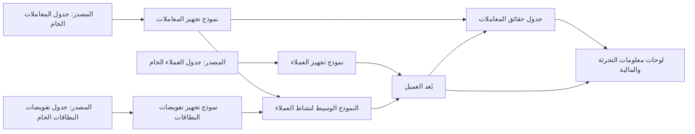
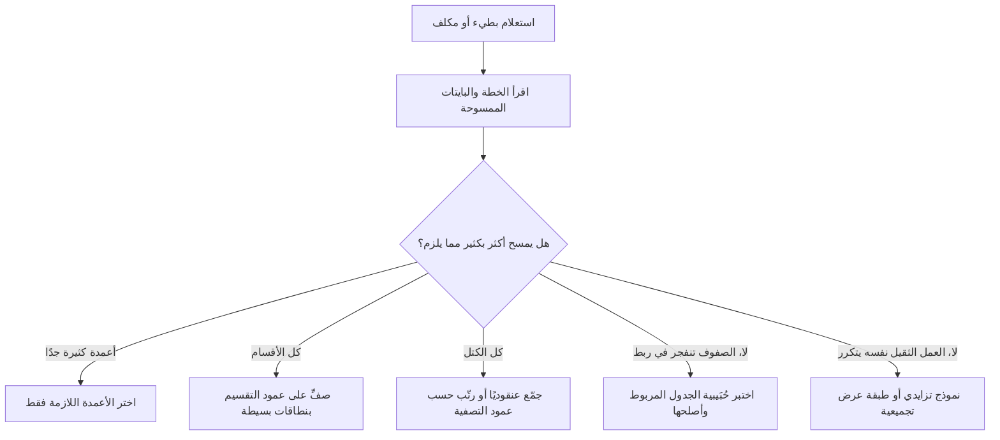

# الوحدة 3 — التحويل والجودة (Transformation and quality)

*إدخال البيانات إلى المنصة (getting data into the platform) ليس إلا نصف المهمة. فالجداول الخام (raw tables) القادمة من قاعدة بيانات الأنظمة المصرفية الأساسية (core banking database) ومن تدفق البطاقات (card stream) ومن تطبيق نجم للهاتف (Najm Mobile) ليست إجابات بعد: يجب تنظيفها (cleaned) وربطها (joined) وإعادة تشكيلها (reshaped) واختبارها (tested) قبل أن يبني أحدٌ عليها لوحة معلومات (dashboard) أو نموذجًا (model). تتعامل هذه الوحدة مع ذلك العمل بوصفه برمجيات (software). تبدأ بـالتحويلات بوصفها شيفرة (transformations as code): نماذج dbt (dbt models) في طبقات واضحة (clear layers)، واختبارات تعمل مع كل تغيير (tests that run on every change)، والتحكم في الإصدارات مع المراجعة (version control with review). ثم تتسع لتشمل جودة البيانات (data quality) بوصفها انضباطًا تشغيليًا (operating discipline): ما الذي تعنيه البيانات "الجيدة" (good)، والعقود (contracts) مع الفرق التي تنتجها، وقابلية الملاحظة (observability) التي تخبرك بتعطّل مصدر بيانات (broken feed) قبل أن يخبرك به رئيس المخاطر (Chief Risk Officer). وتنتهي بالأداء والتكلفة (performance and cost): التقسيم (partitioning)، والتجميع العنقودي (clustering)، والنماذج التزايدية (incremental models)، وقراءة خطط الاستعلام (query plans)، حتى تبقى المنصة سريعة وميسورة التكلفة (fast and affordable) مع نمو بيانات نجم. ستتابع فريق منصة البيانات والتحليلات (Data Platform & Analytics team) في بنك نجم (Najm Bank) بينما تنقل لينا كومةً متشابكة من استعلامات SQL المحفوظة (a tangle of saved SQL) إلى مشروع dbt مُختبَر (tested dbt project)، وتتعلم هدى لماذا قد يُخرج خط بيانات أخضر (green pipeline) أرقامًا خاطئة رغم ذلك، ويسأل فيصل لماذا تضاعفت فاتورة مستودع البيانات (warehouse bill) خلال ربع سنة واحد.*

> **المراحل (Stages):** Transform, Operate, Store — تحويل البيانات الخام (raw data) إلى جداول مُختبَرة وموثوقة وميسورة التكلفة (tested, trusted, affordable tables)، والحفاظ عليها كذلك.

---

# 3.1 — التحويلات بوصفها شيفرة (Transformations as code): dbt، والطبقات (layers)، والاختبارات (tests)، والتحكم في الإصدارات (version control)
*المستوى (Level): 🟡 متوسط (Intermediate)* · *المتطلبات (Prerequisites): 1.1، 1.2، 2.1، 2.2* · *المرحلة (Stage): Transform*

## ⚡ الدرس في دقيقة (In 60 seconds)
- **التحويل (transformation)** يحوّل البيانات الخام المحمّلة (loaded raw data) إلى جداول منظّفة ومربوطة وجاهزة للأعمال (cleaned, joined, business-ready tables). وفي نهج ELT (2.1) يجري داخل مستودع البيانات (warehouse)، بلغة SQL.
- **التحويلات بوصفها شيفرة (Transformations as code)** تعني أن كل خطوة من خطوات SQL تلك تعيش في ملف (file)، ضمن التحكم في الإصدارات (version control)، وتُراجَع وتُختبَر مثل شيفرة التطبيقات (application code)، لا في استعلامات محفوظة (saved queries) على حاسوب أحدهم المحمول.
- **dbt** (أداة بناء البيانات، data build tool) إطار عمل مفتوح المصدر (open-source framework) واسع الاستخدام لهذا الغرض: كل نموذج (model) هو عبارة `SELECT`، و`ref()` تربط النماذج في رسم بياني للاعتماديات (dependency graph)، والاختبارات والتوثيق (tests and documentation) تعيش بجوار الشيفرة.
- نظّم النماذج في **طبقات (layers)**: المصادر (sources) ← التجهيز (staging) (تنظيف، بعلاقة واحد-إلى-واحد مع الجداول الخام، one-to-one with raw tables) ← الطبقة الوسيطة (intermediate) (منطق قابل لإعادة الاستخدام، reusable logic) ← طبقة العرض (marts) (جداول الحقائق والأبعاد، facts and dimensions، للبشر والأدوات).
- إشارة القرار (Decision cue): إذا وصل رقمٌ إلى لوحة معلومات (dashboard) أو جهة تنظيمية (regulator) أو نموذج (model)، فيجب أن تكون شيفرة SQL التي أنتجته في المستودع (repository) مع اختبارات أساسية على الأقل لحُبَيبيته (key tests on its grain).
- الفخ الأكبر (Biggest trap): منطق الأعمال المنسوخ في أماكن كثيرة (business logic copied into many places). عندما يعيش تعريف "العميل النشط" (active customer) في خمسة استعلامات، ستحصل على خمس إجابات.

## 🧭 لماذا يهم (Why it matters)
يرسل كريم، محلّل البيانات (data analyst) في قطاع التجزئة (retail)، رقم "العملاء النشطين" (active customers) الشهري إلى مجلس التجزئة (retail board). وترسل لينا الرقم نفسه إلى المالية (finance) لتقرير التكلفة لكل عميل (cost-per-customer report). يختلف الرقمان بعدة آلاف. وكلاهما "صحيح" (right): استعلام كريم المحفوظ (saved query) يعدّ العملاء الذين لديهم أي معاملة (any transaction) خلال آخر 90 يومًا، بينما يعدّ استعلام لينا العملاء الذين لديهم تفويض بطاقة (card authorisation) *أو* تسجيل دخول (login) إلى تطبيق نجم للهاتف (Najm Mobile) خلال آخر 30 يومًا. كُتب كل استعلام بفارق سنوات، ثم نُسخ وعُدّل ولُصق في لوحة معلومات (dashboard). ولا يستطيع أحد أن يقول أي نسخة رآها المجلس في الربع الماضي، لأن الاستعلامات لم تكن قط في التحكم في الإصدارات (version control).

يطلب فيصل أمرًا واحدًا: "كل رقم ننشره يأتي من شيفرة يمكننا قراءتها ومراجعتها واختبارها والتراجع عنها (read, review, test and roll back)." لا تقرّر التحويلات بوصفها شيفرة (transformations as code) أي تعريف لـ"النشط" (active) هو الصحيح (فتلك مسألة مقاييس، a metrics question، 4.1)، لكنها تضمن أن التعريف المختار موجود في مكان واحد (one place)، وأن التغييرات تُراجَع (changes are reviewed)، وأن اختبارًا يفشل (a test fails) عندما تخالف البيانات افتراضاته (breaks its assumptions).

## 📐 كيف يعمل (How it works)

### 🟢 الأساسيات (The essentials)

**ما التحويل (What a transformation is).** بعد الاستيعاب (ingestion) (2.1)، يحتفظ مستودع البيانات (warehouse) بنُسخ خام (raw copies) من جداول المصادر (source tables): `raw_core.transactions`، `raw_core.customers`، `raw_cards.authorisations`. تحمل هذه الجداول أسماء النظام المصدر (source system names)، وأنواعًا غير متسقة (inconsistent types)، ومكرّرات (duplicates) ناتجة عن إعادة محاولات التحميل (retried loads)، ورموزًا (codes) لا يفهمها إلا فريق الأنظمة المصرفية الأساسية (core banking team). التحويل (transformation) خطوة تقرأ جداول وتكتب جدولًا جديدًا أفضل: فهي تعيد التسمية (renames)، وتحوّل الأنواع (casts)، وتزيل التكرار (deduplicates)، وتربط (joins)، وتجمّع (aggregates).

**لماذا الشيفرة لا النقرات (Why code, not clicks).** معاملة SQL كبرمجيات (treating SQL like software) تمنحك أربعة أشياء لا يستطيع مجلّد من الاستعلامات المحفوظة (a folder of saved queries) أن يمنحك إياها:

| الممارسة (Practice) | ما الذي تمنحك إياه (What it gives you) |
|---|---|
| التحكم في الإصدارات (Version control) (git) | سجلّ كل تغيير (history of every change)، ومن أجراه ولماذا؛ والتراجع عن تغيير سيئ (roll back a bad change) |
| مراجعة الشيفرة (Code review) (طلبات السحب، pull requests) | شخص ثانٍ يتحقق من المنطق (checks logic) قبل أن يصل إلى المجلس |
| الاختبارات الآلية (Automated tests) | يفشل البناء (the build fails) عندما تخالف البيانات افتراضًا (breaks an assumption)، مثل المفاتيح المكرّرة (duplicate keys) |
| رسم بياني واحد للاعتماديات (One dependency graph) | كل نموذج يُعرَّف مرة واحدة ويُعاد استخدامه (defined once and reused)، فلا يُنسخ المنطق (logic is not copied) |

**dbt في فقرة واحدة (dbt in one paragraph).** تقوم dbt (وdbt Core هي أداة سطر الأوامر مفتوحة المصدر، open-source command-line tool، التي تصونها dbt Labs) بتصريف وتشغيل (compiles and runs) عبارات SQL من نوع `SELECT` على مستودع بياناتك (warehouse). لا تكتب `CREATE TABLE`؛ بل تكتب `SELECT`، وتغلّفها dbt بلغة تعريف البيانات المناسبة (the right DDL) وفق **طريقة التجسيد (materialisation)** الخاصة بها (أي كيف تُخزَّن النتيجة، how the result is stored: `view`، أو `table`، أو `incremental`، أو `ephemeral`). بدلًا من كتابة أسماء الجداول بشكل ثابت (hard-coding table names)، تستدعي `{{ ref('model_name') }}` لنموذج آخر و`{{ source('source_name', 'table') }}` لجدول خام (raw table). ومن تلك الاستدعاءات تبني dbt **رسمًا بيانيًا موجّهًا غير دوري (DAG)** (directed acyclic graph) للاعتماديات (dependencies)، وتشغّل النماذج بالترتيب الصحيح (in the right order). وتصل المحوّلات (adapters) بين dbt وPostgreSQL وDuckDB (عبر المحوّل المجتمعي `dbt-duckdb`، the community adapter) وSnowflake وBigQuery وDatabricks وAmazon Redshift وغيرها.

**الطبقات (The layers).** يتّبع بنك نجم البنية التي توصي بها dbt Labs في دليل بنية المشاريع (project-structure guide). لكل طبقة (layer) مهمة واحدة (one job):



| الطبقة (Layer) | البادئة (Prefix) | المهمة (Job) | القاعدة (Rule) |
|---|---|---|---|
| المصادر (Sources) | مُعرَّفة في YAML (declared in YAML) | تشير إلى الجداول الخام التي حمّلها الاستيعاب (point at raw tables loaded by ingestion) | لا تعدّلها dbt أبدًا (never edited by dbt) |
| التجهيز (Staging) | `stg_<source>__<table>` | إعادة التسمية (rename)، وتحويل الأنواع (cast)، وتوحيد الرموز (standardise codes)، وإزالة التكرار (deduplicate) | نموذج تجهيز واحد لكل جدول مصدر (one staging model per source table)؛ لا ربط بين المصادر (no joins between sources) |
| الوسيطة (Intermediate) | `int_` | منطق أعمال قابل لإعادة الاستخدام (reusable business logic): الربط (joins)، وعلامات النشاط (activity flags)، والتقسيم إلى جلسات (sessionising) | لا تُعرَض على المستخدمين النهائيين (not exposed to end users) |
| العرض (Marts) | `fct_` و`dim_` | جداول الحقائق والأبعاد (facts and dimensions) عند حُبَيبية مُعلَنة (a stated grain) (1.2)، مثل طبقة عرض العميل الشاملة (customer 360 mart) | ما تقرؤه لوحات المعلومات والمحلّلون والنماذج (what dashboards, analysts and models read) |

هذه هي نفسها طبقات الخام ← التجهيز ← العرض (raw → staging → marts) من الدرس 0.2؛ وتسمّي Databricks تقسيمًا مشابهًا بالبرونزي والفضي والذهبي (bronze, silver and gold) (معمارية الميداليات، the medallion architecture).

**نموذج تجهيز (A staging model).** يقوم بأشياء صغيرة ومملّة وأساسية (small, boring, essential things):

```sql
-- models/staging/core/stg_core__transactions.sql
with source as (
    select * from {{ source('core_banking', 'transactions') }}
),

deduplicated as (
    select *,
           row_number() over (partition by txn_ref order by _loaded_at desc) as rn
    from source
)

select
    txn_ref                         as transaction_id,
    acct_no                         as account_id,
    cast(txn_ts as timestamp)       as transacted_at,
    cast(amt as numeric(18, 2))     as amount,
    upper(trim(ccy))                as currency_code,
    case txn_typ when 'D' then 'debit' when 'C' then 'credit' end as direction,
    _loaded_at
from deduplicated
where rn = 1
```

**الاختبارات بجوار الشيفرة (Tests next to the code).** في ملف YAML بجانب النموذج، تُعلن **اختبارات البيانات العامة (generic data tests)**. تأتي dbt بأربعة منها: `unique`، و`not_null`، و`accepted_values`، و`relationships` (يجب أن توجد كل قيمة في نموذج آخر، مثل المفتاح الأجنبي، like a foreign key). منذ الإصدار dbt 1.8 أصبح المفتاح `data_tests:`؛ وما زال المفتاح الأقدم `tests:` يعمل. ومن الإصدار 1.10، يُفضَّل أن تُدرَج المعاملات (parameters) مثل `values` تحت `arguments:`.

```yaml
# models/staging/core/_core__models.yml
models:
  - name: stg_core__transactions
    description: One row per core banking transaction, deduplicated on transaction_id.
    columns:
      - name: transaction_id
        data_tests: [unique, not_null]
      - name: direction
        data_tests:
          - accepted_values:
              values: ['debit', 'credit']
      - name: account_id
        data_tests:
          - not_null
          - relationships:
              to: ref('stg_core__accounts')
              field: account_id
```

يُصرَّف كل اختبار إلى استعلام يعيد الصفوف الفاشلة (compiles to a query that returns failing rows)؛ وصفر صفوف يعني النجاح (zero rows means pass). يشغّل الأمر `dbt build` النماذج والاختبارات واللقطات والبذور (models, tests, snapshots and seeds) بترتيب الرسم البياني الموجّه غير الدوري (in DAG order)، ويتخطى النماذج الواقعة بعد اختبار فاشل (skips models downstream of a failing test)، فلا يغذّي جدول تجهيز سيئ (a bad staging table) تقرير المجلس بصمت أبدًا.

### 🟡 التعمق أكثر (Going deeper)

**الطريقة الخاطئة والطريقة الصحيحة (The wrong way and the right way).** إليك كيف ينتشر تعريف "العميل النشط" (active customer) عندما يُنسخ المنطق (logic is copied):

```sql
-- Wrong: the definition is pasted into each dashboard query
select count(distinct c.cust_id)
from raw_core.customers c
join raw_core.transactions t on t.acct_no in (
    select acct_no from raw_core.accounts a where a.cust_id = c.cust_id)
where t.txn_ts >= current_date - 90;
```

```sql
-- Right: defined once, in an intermediate model, then referenced everywhere
-- models/intermediate/int_customer_activity.sql
select
    a.customer_id,
    max(t.transacted_at)                                        as last_transaction_at,
    max(t.transacted_at) >= current_date - interval '90 days'   as is_active_90d
from {{ ref('stg_core__transactions') }} t
join {{ ref('stg_core__accounts') }} a using (account_id)
group by a.customer_id
```

الآن يقرأ كلٌّ من `dim_customer` ولوحة معلومات التجزئة (retail dashboard) والتقرير المالي (finance report) العمود `is_active_90d`. وإذا تغيّر التعريف، فإن طلب سحب واحدًا مُراجَعًا (one reviewed pull request) يغيّره في كل مكان (everywhere).

**المصادر والحداثة (Sources and freshness).** إعلان المصادر في YAML (declaring sources in YAML) يفعل أكثر من تسمية الجداول. يمكنك إضافة فحص للحداثة (freshness check)، بحيث يحذّر الأمر `dbt source freshness` عندما يتوقف الاستيعاب (when ingestion has stalled):

```yaml
# models/staging/core/_core__sources.yml
sources:
  - name: core_banking
    schema: raw_core
    loaded_at_field: _loaded_at
    freshness:
      warn_after: {count: 6, period: hour}
      error_after: {count: 24, period: hour}
    tables:
      - name: transactions
      - name: customers
      - name: accounts
```

تفضّل إصدارات dbt الأحدث (newer dbt releases) وضع هذه المفاتيح تحت `config:`؛ راجع توثيق إصدارك (your version's docs).

**اللقطات من أجل السجلّ التاريخي (Snapshots for history).** جدول `customers` في الأنظمة المصرفية الأساسية (core banking) يُستبدَل في مكانه (overwritten in place): عندما ينتقل عميل من الدوحة إلى دبي، تختفي المدينة القديمة. تسجّل **لقطة dbt (dbt snapshot)** كل تغيير بوصفه صفًا جديدًا مع تواريخ صلاحية (a new row with validity dates)، وهذا هو البُعد المتغيّر ببطء من النوع الثاني (slowly changing dimension Type 2) (1.2):

```sql
-- snapshots/customers_snapshot.sql

{{ config(
    target_schema='snapshots',
    unique_key='customer_id',
    strategy='timestamp',
    updated_at='updated_at'
) }}
select customer_id, segment, city, risk_rating, updated_at
from {{ source('core_banking', 'customers') }}

```

تضيف dbt العمودين `dbt_valid_from` و`dbt_valid_to`؛ والصف الحالي (the current row) تكون فيه قيمة `dbt_valid_to` فارغة (null). استخدم استراتيجية `check` (the check strategy) عندما لا يملك المصدر عمود `updated_at` موثوقًا. وتتيح الإصدارات الحديثة (recent versions) (من 1.9 فصاعدًا) أيضًا تعريف اللقطات في YAML. ويجب أن تعمل اللقطات وفق جدول زمني (on a schedule): فالتغيير الذي يحدث ثم يُعكَس بين تشغيلين (happens and reverts between two runs) لا يُرى أبدًا.

**اختبارات الوحدة للمنطق (Unit tests for logic).** اختبارات البيانات (data tests) تفحص البيانات التي لديك. أما **اختبارات الوحدة (unit tests)** (المضافة في dbt 1.8) فتفحص المنطق مقابل مدخلات صغيرة مكتوبة يدويًا (small, hand-written inputs)، قبل وصول أي بيانات حقيقية. وهي مثالية لعبارات `case` المعقّدة (tricky) وحدود التواريخ (date boundaries):

```yaml
unit_tests:
  - name: active_flag_uses_90_day_boundary
    model: int_customer_activity
    given:
      - input: ref('stg_core__transactions')
        rows:
          - {account_id: 'A1', transacted_at: '2026-01-01'}
      - input: ref('stg_core__accounts')
        rows:
          - {account_id: 'A1', customer_id: 'C1'}
    expect:
      rows:
        - {customer_id: 'C1', is_active_90d: false}
```

(النسخة الحقيقية ستمرّر "اليوم" (today) بوصفه متغيرًا (as a variable) بدلًا من استخدام `current_date`؛ فالمنطق الذي يعتمد على الساعة (logic that depends on the clock) يصعب اختباره.)

**التوثيق والنسب (Documentation and lineage).** يحوّل الأمر `dbt docs generate` كل `description:` والرسم البياني الموجّه غير الدوري (DAG) إلى موقع قابل للتصفح (browsable site). ويتيح لك ذلك النسب (lineage) أن تجيب عن سؤال ⁦("if the card feed breaks, which dashboards are wrong?")⁩ أي "إذا تعطّل مصدر بيانات البطاقات، فأي لوحات المعلومات تصبح خاطئة؟" في دقائق (6.1).

**سير العمل (The workflow).** الحلقة اليومية في نجم (Najm's daily loop):

1. تنشئ لينا فرعًا في git (git branch) وتعدّل نموذجًا.
2. تشغّل `dbt build --select int_customer_activity+` على مخطط التطوير الخاص بها (her own development schema) (علامة `+` تعني النموذج وكل ما يقع بعده، the model and everything downstream).
3. تفتح طلب سحب (pull request). يشغّل التكامل المستمر (continuous integration, CI) الأمر `dbt build` على النماذج المتغيّرة وأبنائها (the changed models and their children) في مخطط مؤقت (temporary schema).
4. يفحص مراجعٌ (reviewer) شيفرة SQL والاختبارات وفروق أعداد الصفوف (row-count differences).
5. بعد الدمج (after merge)، يشغّل المنسّق (orchestrator) (2.2) بناء الإنتاج (production build) وفق الجدول الزمني (on schedule).

في التكامل المستمر (CI)، يبني **الاختيار حسب الحالة (state selection)** ما تغيّر فقط: `dbt build --select state:modified+ --defer --state prod-artifacts/`، حيث يقرأ `--defer` الآباء غير المتغيّرين من الإنتاج (unchanged parents from production). ويُغطّى تصميم التكامل المستمر العام (general CI design) في [*السحابة وDevOps: من الصفر إلى الاحتراف (Cloud & DevOps: Zero to Hero)*، الدرس 4.1 — التكامل المستمر: خطوط التنفيذ والاختبارات والمخرجات والتغذية الراجعة السريعة (Continuous integration: pipelines, tests, artefacts and fast feedback)](../cloud/index.ar.html#/4.1).

### 🔴 نظرة الخبير (Expert view)

**العقود على طبقة العرض (Contracts on marts).** طبقة العرض (mart) التي تعتمد عليها فرق أخرى هي واجهة عامة (public interface). تتيح لك **عقود النماذج (model contracts)** في dbt (منذ dbt 1.5) أن تُعلن أسماء الأعمدة وأنواع البيانات (column names and data types)، وأن تجعل dbt ترفض بناء النموذج (refuse to build the model) إذا أنتجت شيفرة SQL شكلًا مختلفًا (a different shape):

```yaml
models:
  - name: dim_customer
    config:
      contract: {enforced: true}
    columns:
      - name: customer_id
        data_type: varchar
        constraints: [{type: not_null}]
      - name: is_active_90d
        data_type: boolean
      # ...abridged: an enforced contract must list every column the model returns
```

العقد يحمي الشكل لا المعنى (a contract protects shape, not meaning). أما الاتفاقات حول الدلالات والتوقيت (semantics and timeliness) مع المنتجين (producers) فمكانها عقد البيانات (data contract) (3.2). وللتغييرات الكاسرة (breaking changes)، تتيح لك **إصدارات النماذج (model versions)** في dbt نشر `dim_customer` بالإصدار v2 بجانب v1 ومنح المستهلكين (consumers) وقتًا للانتقال.

**استراتيجية الاختبار لا عدد الاختبارات (Test strategy, not test count).** المشروع الذي فيه 2,000 اختبار يتجاهلها الجميع أسوأ من مشروع فيه 200 اختبار لها معنى دائمًا (always mean something). قواعد نجم (Najm's rules): لكل نموذج **مفتاح أساسي (primary key)** مُختبَر (`unique` + `not_null`، أو `dbt_utils.unique_combination_of_columns` للمفاتيح المركّبة، composite keys)، لأن الحُبَيبية المكسورة (a broken grain) تضاعف بصمت كل مجموع (silently doubles every sum) في المراحل اللاحقة؛ ونماذج التجهيز (staging models) تختبر ما يَعِد به المصدر (what the source promises)؛ وطبقات العرض (marts) تختبر قواعد الأعمال (business rules) (رصيد القرض القائم، a loan's outstanding balance، لا يكون سالبًا أبدًا)؛ وكل حادثة (incident) تنتهي باختبار جديد. استخدم `severity: warn` للفحوص التي يجب أن تنبّه دون أن توقف البناء (alert but not stop the build)، و`store_failures: true` للاحتفاظ بالصفوف الفاشلة للتحقيق (keep failing rows for investigation).

**أين يوضع المنطق (Where logic belongs).** أبقِ طبقة التجهيز رفيعة وآلية (thin and mechanical)؛ وضع منطق الأعمال (business logic) في النماذج الوسيطة ونماذج العرض (intermediate and mart models). تجنّب وحدات الماكرو (macros) التي تخفي كميات كبيرة من SQL: إذا لم تستطع قراءة شيفرة SQL المُصرَّفة (compiled SQL) في `target/compiled/` وفهمها، فبسّطها (simplify).

**ما بعد dbt (Beyond dbt).** SQLMesh بديل مفتوح المصدر (open-source alternative)؛ ويمكن لـDagster أن يعامل نماذج dbt بوصفها أصولًا (assets)؛ وتناسب مهام Spark أو Polars التحويلاتِ التي تعبّر عنها SQL بشكل سيئ (transformations SQL expresses badly). المبادئ (principles) (الشيفرة في git، والتعريف الواحد، والطبقات، والاختبارات، والمراجعة، والتكامل المستمر، code in git, one definition, layers, tests, review, CI) تنطبق أيًّا كانت الأداة (whatever the tool).

## 🧰 الأدوات (The toolkit)
| الأداة أو النمط أو المعيار (Tool, pattern or standard) | ما هو وماذا يفعل (What it is and does) | متى تلجأ إليه (When to reach for it) |
|---|---|---|
| **dbt** (dbt Core، dbt Labs) | إطار عمل مفتوح المصدر (open-source framework) يشغّل نماذج SQL من نوع `SELECT` بترتيب الاعتماديات (in dependency order)، مع الاختبارات والتوثيق والنسب (tests, docs and lineage) | أي تحويل SQL (SQL transformation) يغذّي رقمًا يعتمد عليه الناس |
| **Staging, intermediate and mart layers** — طبقات التجهيز والوسيطة والعرض | اصطلاح (convention) يمنح كل نموذج مهمة واحدة: التنظيف، والدمج، والتقديم (clean, combine, serve) | هيكلة أي مشروع تحويل (transformation project) بحيث يجد الناس ما يبحثون عنه |
| **dbt generic data tests** (unique, not_null, accepted_values, relationships) — اختبارات البيانات العامة في dbt | فحوص تصريحية (declarative checks) تُصرَّف إلى استعلامات تعيد الصفوف الفاشلة (queries returning failing rows) | على كل مفتاح أساسي (primary key) وكل افتراض (assumption) تعتمد عليه شيفرة SQL |
| **dbt snapshots** — لقطات dbt | تسجّل التغييرات في صفوف المصدر القابلة للتعديل (mutable source rows) بوصفها سجلًّا تاريخيًا من نوع SCD Type 2 (SCD Type 2 history) | سمات العميل أو الحساب أو المنتج (customer, account or product attributes) التي تتغير في مكانها (change in place) |
| **dbt unit tests** (dbt 1.8+) — اختبارات الوحدة في dbt | تختبر منطق النموذج (model logic) على مدخلات صغيرة مكتوبة يدويًا (small hand-written inputs) | منطق `case` المعقّد، وحدود التواريخ (date boundaries)، والحسابات المالية (financial calculations) |
| **dbt model contracts** — عقود النماذج في dbt | تفرض أسماء أعمدة النموذج وأنواعها (column names and types) وقت البناء (at build time) | طبقات العرض (marts) التي تعتمد عليها فرق أو أدوات أخرى |
| **dbt_utils** (حزمة، package) | اختبارات ووحدات ماكرو إضافية (extra tests and macros)، مثل تفرّد المفتاح المركّب (composite-key uniqueness) | عندما لا تكفي الاختبارات الأربعة المدمجة (the four built-in tests) |
| **SQLMesh** | إطار تحويل بديل مفتوح المصدر (open-source alternative transformation framework) | مقارنة المقاربات (comparing approaches)؛ الفرق التي تريد نموذج البيئات الخاص به (its environment model) |

## 🏛️ عمليًا في بنك نجم (In practice at Najm Bank)
تكتب لينا **معيار مشروع dbt في نجم، الإصدار الأول (Najm dbt Project Standard v1)** وأول نموذج مُختبَر (the first tested model)، `dim_customer`، الذي يغذّي طبقة عرض العميل الشاملة (customer 360 mart).

**الجزء أ: اصطلاحات المشروع (Part A: project conventions)**

| الموضوع (Topic) | القاعدة (Rule) |
|---|---|
| المستودع (Repository) | مستودع واحد `najm-analytics`؛ والفرع `main` هو الإنتاج (production)؛ وكل التغييرات عبر طلب سحب (pull request) بمراجع واحد (اثنان لطبقات العرض التنظيمية، regulatory marts) |
| الطبقات (Layers) | `staging/<source>/`، `intermediate/<domain>/`، `marts/<domain>/` (التجزئة، والمخاطر، والمالية، retail, risk, finance) |
| التسمية (Naming) | `stg_<source>__<table>`، `int_<verb or noun>`، `fct_<event>`، `dim_<entity>`؛ أعمدة بنمط snake_case (snake_case columns)؛ `_at` للطوابع الزمنية (timestamps)، و`_date` للتواريخ (dates)، و`is_`/`has_` للقيم المنطقية (booleans) |
| التجسيد (Materialisation) | التجهيز (Staging): عرض (view). الوسيطة (Intermediate): عابر (ephemeral) أو عرض (view). العرض (Marts): جدول (table)، أو تزايدي (incremental) عندما يكون كبيرًا (3.3) |
| الحد الأدنى من الاختبارات (Minimum tests) | كل نموذج: المفتاح الأساسي (primary key) `unique` + `not_null`. التجهيز: `accepted_values` على الرموز (codes)، و`relationships` على المفاتيح الأجنبية (foreign keys). العرض: اختبار واحد على الأقل لقاعدة أعمال (business-rule test) |
| التوثيق (Documentation) | لكل طبقة عرض ولكل عمود فيها وصفٌ (description)؛ والحُبَيبية (grain) مذكورة في وصف النموذج (model description) |
| التكامل المستمر (CI) | `dbt build --select state:modified+ --defer --state <prod artefacts>` على كل طلب سحب (pull request)؛ ويُمنع الدمج (merge blocked) عند أي خطأ |
| الملكية (Ownership) | لكل مجلّد عرض (mart folder) مالكٌ مُسمّى (named owner) في YAML ‏`meta: {owner: ...}` |

**الجزء ب: بطاقة النموذج لـ`dim_customer` (Part B: the model card)**

| الحقل (Field) | القيمة (Value) |
|---|---|
| الحُبَيبية (Grain) | صف واحد لكل عميل معروف حاليًا للأنظمة المصرفية الأساسية (one row per customer currently known to core banking) |
| المفتاح الأساسي (Primary key) | `customer_id` (مُختبَر: فريد وغير فارغ، tested unique, not null) |
| مبني من (Built from) | `stg_core__customers`، `int_customer_activity`، `customers_snapshot` (من أجل `segment_changed_at`) |
| الأعمدة الرئيسية (Key columns) | `customer_id`، `segment`، `home_country`، `is_active_90d`، `last_transaction_at`، `segment_changed_at` |
| اختبارات قواعد الأعمال (Business-rule tests) | `segment` ضمن ('retail', 'sme', 'corporate')؛ `home_country` ضمن ('QA', 'AE', رموز دول الاتحاد الأوروبي، EU country codes)؛ `last_transaction_at` ليس في المستقبل (not in the future) |
| العقد (Contract) | مفروض (Enforced): الأسماء والأنواع ثابتة؛ والتغييرات الكاسرة (breaking changes) تحتاج إلى إصدار نموذج جديد (a new model version) |
| المالك (Owner) | لينا (هندسة التحليلات، analytics engineering)؛ مالك الأعمال (business owner): تحليلات التجزئة (retail analytics) (كريم) |
| المستهلكون (Consumers) | طبقة عرض العميل الشاملة (Customer 360 mart)، ولوحة معلومات التجزئة (retail dashboard)، وتقرير المالية للتكلفة لكل عميل (finance cost-per-customer report) |

صار كريم والمالية يقرآن العمود نفسه `is_active_90d`. وينتقل الخلاف حول أي تعريف هو الصحيح إلى مكانه الصحيح (where it belongs): بطاقة تعريف المقياس (metric definition card) (4.1).

## 🛠️ التمارين (Exercises)
استخدم بيانات اصطناعية فقط (synthetic data only). ولّد عملاء وحسابات ومعاملات وهمية (fake customers, accounts and transactions) باستخدام Python (مثلًا مكتبة `Faker`) أو اكتب بذور CSV صغيرة (small CSV seeds).

- 🟢 ثبّت dbt Core مع المحوّل `dbt-duckdb` (adapter)، وأنشئ مشروعًا، وحمّل ثلاث بذور CSV (three CSV seeds) (`customers`، `accounts`، `transactions`) باستخدام `dbt seed`، واكتب نموذج تجهيز واحدًا لكل بذرة (one staging model per seed) بأعمدة معاد تسميتها ومحوّلة الأنواع (renamed, cast columns). *يكتمل عندما (Done when):* ينجح `dbt build` ويكون لكل نموذج تجهيز اختبارا `unique` و`not_null` على مفتاحه الأساسي (primary key).
- 🟡 أضف `int_customer_activity` و`dim_customer` كما في هذا الدرس. أدرج عمدًا معاملة مكرّرة (a duplicate transaction) ومعاملة بحساب غير معروف (an unknown account) في بيانات البذور. *يكتمل عندما (Done when):* يفشل `dbt build` على الاختبارات الصحيحة، وتُتخطّى النماذج اللاحقة (downstream models are skipped)، وبعد أن تصلح إزالة التكرار في التجهيز (staging deduplication) ينجح البناء مجددًا.
- 🔴 ضع المشروع في git، وأضف لقطة (snapshot) على العملاء، وغيّر شريحة عميل (a customer's segment) في البذرة وأعد التشغيل، واكتب اختبار وحدة (unit test) لحدّ الـ90 يومًا (90-day boundary) لا يعتمد على `current_date`. أضف سير عمل للتكامل المستمر (CI workflow) (GitHub Actions أو أي نظام CI يمكنك تشغيله) يشغّل `dbt build` على طلبات السحب (pull requests). *يكتمل عندما (Done when):* تُظهر اللقطة صفّين للعميل المتغيّر بتواريخ صلاحية صحيحة (correct validity dates)، وينجح اختبار الوحدة، ويظهر طلب السحب الذي يكسر اختبار المفتاح الأساسي (primary-key test) على أنه فاشل (failing).

## ⚠️ أخطاء وفخاخ (Mistakes and traps)
- **نسخ منطق الأعمال في استعلامات كثيرة (Copying business logic into many queries).** خمس نسخ من "العميل النشط" (active customer) تصبح خمسة أرقام. عرّفه مرة واحدة في نموذج وسيط أو نموذج عرض (intermediate or mart model) واستدعه بـ`ref()`.
- **كتابة أسماء الجداول بشكل ثابت (Hard-coding table names).** العبارة `from analytics.dim_customer` تكسر البيئات (environments) والنسب (lineage). استخدم دائمًا `ref()` و`source()`.
- **لا اختبار على الحُبَيبية (No test on the grain).** المفتاح المكرّر (a duplicate key) يضاعف كل مجموع لاحق (every total downstream) دون أي خطأ. اختبر المفتاح الأساسي (primary key) لكل نموذج، أولًا.
- **اختبارات لا يقرؤها أحد (Tests nobody reads).** مئات التحذيرات التي لا تفشل أبدًا (never-failing warnings) تدرّب الناس على تجاهلها؛ لا تحذّر إلا عندما سيتصرف أحدٌ (warn only when someone will act).
- **البناء في الإنتاج يدويًا (Building in production by hand).** تشغيل النماذج من حاسوب محمول على الإنتاج يتجاوز المراجعة (bypasses review). طوّر في مخططك الخاص (your own schema)؛ ولا يعمل الإنتاج إلا من `main` عبر المنسّق (orchestrator).

## 🧾 الخلاصة (Recap)
- التحويلات بوصفها شيفرة (transformations as code) تضع كل خطوة SQL في git، خلف المراجعة والاختبارات والتكامل المستمر (review, tests and CI).
- نماذج dbt (dbt models) هي عبارات `SELECT`؛ و`ref()` و`source()` تبنيان رسم الاعتماديات (dependency graph) والنسب (lineage).
- الطبقات (layers) تمنح كل نموذج مهمة واحدة: التجهيز ينظّف (staging cleans)، والوسيطة تدمج (intermediate combines)، والعرض يقدّم (marts serve).
- اختبر حُبَيبية (grain) كل نموذج أولًا؛ وأضف القيم المقبولة والعلاقات وقواعد الأعمال (accepted values, relationships and business rules)؛ واستخدم اختبارات الوحدة (unit tests) للمنطق.
- اللقطات (snapshots) تلتقط سجلّ الصفوف القابلة للتعديل (history of mutable rows)؛ والعقود والإصدارات (contracts and versions) تحمي طبقات العرض التي يعتمد عليها الآخرون.

## ✍️ اختبر نفسك (Check yourself)

**1. يختلف عدّا "العميل النشط" (active customer) لدى كريم ولينا لأن كلًّا منهما نسخ التعريف وعدّله في استعلامه الخاص. ما أفضل إصلاح بنيوي (best structural fix)؟**

- A. اطلب من المحلّلَين أن يبنيا تقاريرهما في أداة لوحات المعلومات نفسها (same dashboard tool) من الآن فصاعدًا
- B. أضف اختبار `not_null` على `customer_id` في كلا الاستعلامين المحفوظين (saved queries)
- C. عرّف منطق النشاط (activity logic) مرة واحدة في نموذج وسيط (intermediate model) واجعل كل طبقة عرض وكل تقرير يستدعيه بـ`ref()`
- D. أرسل إلى فريق المالية رقم التجزئة بالبريد الإلكتروني كل شهر

<details><summary>الإجابة</summary>

**C.** تعريف واحد في نموذج واحد، يُعاد استخدامه عبر `ref()`، هو ما توفّره التحويلات بوصفها شيفرة (transformations as code). الخيار B يختبر البيانات لكنه لا يفعل شيئًا حيال المنطق المكرّر (duplicated logic)؛ والخيار A يغيّر الأداة لا المنطق. (🟡 التعمق أكثر، Going deeper).

</details>

**2. ماذا يفعل اختبار عام (generic test) في dbt مثل `unique` عند تشغيله؟**

- A. يُصرَّف إلى استعلام يعيد الصفوف المخالفة للقاعدة (rule-breaking rows)؛ وصفر صفوف يعني النجاح (zero rows is a pass)
- B. يضيف قيد تفرّد (unique constraint) إلى جدول المستودع بحيث تُرفض عمليات الإدراج المكرّرة مستقبلًا (future duplicate inserts)
- C. يحذف الصفوف المكرّرة (duplicate rows) من النموذج قبل تجسيده (materialised)
- D. يفحص صياغة SQL (SQL syntax) للنموذج

<details><summary>الإجابة</summary>

**A.** اختبارات البيانات في dbt (dbt data tests) استعلامات للبحث عن الصفوف الفاشلة (failing rows). فهي لا تغيّر البيانات (C) ولا تنشئ قيودًا في قاعدة البيانات (database constraints) (B)؛ يمكن لعقود النماذج (model contracts) أن تضيف بعض القيود، لكنها ميزة مختلفة. (🟢 الأساسيات، The essentials).

</details>

**3. تريد هدى الاحتفاظ بسجلّ تصنيف المخاطر (risk rating) لكل عميل، لكن جدول `customers` في الأنظمة المصرفية الأساسية يستبدل التصنيف في مكانه (overwrites in place). أي ميزة في dbt تناسب ذلك؟**

- A. نموذج عابر (ephemeral model)
- B. اختبار `relationships`
- C. عقد نموذج (model contract)
- D. لقطة (snapshot)

<details><summary>الإجابة</summary>

**D.** تسجّل اللقطات (snapshots) كل تغيير بوصفه صفًا جديدًا مع `dbt_valid_from` و`dbt_valid_to`، وهذا هو SCD من النوع الثاني (SCD Type 2). العقد (contract) (C) يثبّت شكل النموذج (shape of a model)، لا سجلّه التاريخي (history). (🟡 التعمق أكثر، Going deeper).

</details>

**4. نموذج التجهيز (staging model) ‏`stg_core__transactions` عليه اختبار `unique` على `transaction_id` يفشل أثناء `dbt build`. ماذا يحدث لـ`fct_transactions` الذي يعتمد عليه؟**

- A. يُبنى بشكل طبيعي، ويُسجَّل الفشل لوقت لاحق (logged for later)
- B. يُتخطّى (skipped)، فلا تتدفق البيانات السيئة إلى المراحل اللاحقة (downstream)
- C. يُحذف من مستودع البيانات (dropped from the warehouse)
- D. تزيل dbt المكرّرات تلقائيًا وتعيد بناءه

<details><summary>الإجابة</summary>

**B.** يشغّل `dbt build` الاختبارات بترتيب الرسم البياني الموجّه غير الدوري (in DAG order) ويتخطى العُقد اللاحقة (downstream nodes) عندما يُخطئ اختبار. ولهذا بالتحديد يحمي الاختبار في طبقة التجهيز طبقاتِ العرض (testing in staging protects marts). ولا تُصلح dbt البيانات بنفسها أبدًا (D). (🟢 الأساسيات، The essentials).

</details>

**5. يستغرق التكامل المستمر لطلبات السحب (pull-request CI) في نجم 90 دقيقة لأنه يعيد بناء المشروع كله مع كل تغيير. ما الطريقة القياسية في dbt لتسريعه (standard dbt way to speed it up)؟**

- A. أزل الاختبارات من التكامل المستمر وشغّلها فقط في الإنتاج بعد كل دمج في `main`
- B. حوّل كل نموذج إلى عرض (view) حتى لا يلزم تجسيد أي شيء في مخطط التكامل المستمر (CI schema)
- C. استخدم الاختيار حسب الحالة (state selection): ابنِ النماذج المعدّلة وأبناءها فقط (only modified models and their children)، مع تأجيل الآباء غير المتغيّرين (deferring unchanged parents)
- D. شغّل التكامل المستمر مرة في الأسبوع بدلًا من كل طلب سحب

<details><summary>الإجابة</summary>

**C.** الأمر `dbt build --select state:modified+ --defer --state ...` هو نمط "التكامل المستمر النحيل" (slim CI). الخياران A وD يزيلان شبكة الأمان (safety net)؛ والخيار B قد لا يجعله أسرع أصلًا ويغيّر سلوك الإنتاج (production behaviour). (🟡 التعمق أكثر، Going deeper).

</details>

## 📚 المراجع (References)
- توثيق dbt (dbt documentation) — https://docs.getdbt.com
- dbt Labs، "كيف نهيكل مشاريع dbt" (How we structure our dbt projects) — https://docs.getdbt.com/best-practices
- اختبارات البيانات واختبارات الوحدة واللقطات وعقود النماذج في dbt (dbt data tests, unit tests, snapshots and model contracts) — https://docs.getdbt.com/docs/build/data-tests
- محوّل dbt-duckdb (dbt-duckdb adapter) — https://github.com/duckdb/dbt-duckdb
- توثيق DuckDB (DuckDB documentation) — https://duckdb.org/docs/
- توثيق PostgreSQL (PostgreSQL documentation) — https://www.postgresql.org/docs/
- SQLMesh — https://sqlmesh.com
- رالف كيمبول ومارجي روس (Ralph Kimball and Margy Ross)، *The Data Warehouse Toolkit* (الطبعة الثالثة، 3rd edition، Wiley)

---

# 3.2 — جودة البيانات (Data quality): الاختبارات (tests)، والعقود (contracts)، وقابلية الملاحظة (observability)
*المستوى (Level): 🟡 متوسط (Intermediate)* · *المتطلبات (Prerequisites): 2.2، 3.1* · *المرحلة (Stage): Transform, Operate*

## ⚡ الدرس في دقيقة (In 60 seconds)
- **جودة البيانات (Data quality)** تعني أن البيانات صالحة للقرار الذي تدعمه (fit for the decision it supports): مكتملة (complete)، وصحيحة (valid)، وفريدة (unique)، ومتّسقة (consistent)، ودقيقة (accurate)، وفي وقتها (on time).
- ثلاث طبقات دفاع (three layers of defence): **الاختبارات (tests)** تفحص الافتراضات المعروفة (known assumptions) في خط بياناتك (pipeline)؛ و**عقود البيانات (data contracts)** تتّفق على المخطط والمعنى والتوقيت (schema, meaning and timeliness) مع الفرق التي تنتج البيانات؛ و**قابلية ملاحظة البيانات (data observability)** تراقب الحداثة والحجم والمخطط والتوزيع (freshness, volume, schema and distribution) بحثًا عن مشكلات لم يكتب لها أحدٌ اختبارًا.
- ضع الفحوص (checks) حيث يمكنها إيقاف الضرر (stop damage): عند الاستيعاب (at ingestion)، وبين الطبقات (between layers)، وقبل النشر (before publishing). استخدم **الكتابة ثم التدقيق ثم النشر (write-audit-publish)** حتى لا تصل البيانات السيئة إلى المستهلكين (consumers) أبدًا.
- إشارة القرار (Decision cue): لكل جدول حرج (critical table)، أجب عن: "من يملكه (who owns it)، وكيف يبدو الجيد (what does good look like)، وبأي سرعة سنعرف عندما لا يكون كذلك (how fast will we know)، وماذا يحدث حينها (what happens then)؟"
- الفخ الأكبر (Biggest trap): خط البيانات الأخضر ليس بيانات صحيحة (a green pipeline is not correct data). فالمهام تنجح بسعادة (jobs succeed happily) وهي تحمّل نصف ملف (half a file)، أو عمودًا معاد تسميته مليئًا بالقيم الفارغة (a renamed column full of nulls)، أو بيانات الأمس مرتين (yesterday's data twice).

## 🧭 لماذا يهم (Why it matters)
عند الساعة 07:40 صباح يوم اثنين، تُظهر لوحة معلومات رئيس المخاطر (Chief Risk Officer's dashboard) أن متأخرات قروض المنشآت الصغيرة والمتوسطة (SME loan arrears) انخفضت بمقدار الثلث بين ليلة وضحاها (overnight). يبدأ فريق المخاطر (risk team) صياغة مذكرة إلى المجلس. تتحقق هدى من Airflow: كل مهمة (task) خضراء. ويستغرق الأمر حتى وقت الغداء لإيجاد السبب. خلال عطلة نهاية الأسبوع، غيّر فريق الأنظمة المصرفية الأساسية (core banking team) الحقل `days_past_due` من عدد صحيح (integer) إلى رمز نصي (text code) ("0-30"، "31-60") ضمن إصدار (release). حمّلته مهمة الاستيعاب (ingestion job) دون خطأ، وحوّل تحويل الأنواع في طبقة التجهيز (staging cast) كل قيمة لم يستطع تحليلها (parse) إلى قيمة فارغة (null)، وعدّ نموذج المتأخرات (arrears model) القيم الفارغة على أنها "غير متأخرة" (not in arrears). لم يفشل شيء. كانت الأرقام خاطئة ببساطة (simply wrong).

تُظهر الحالات العامة (public cases) النمط نفسه. في أكتوبر 2020، أُفيد على نطاق واسع بأن نحو 16,000 نتيجة إيجابية لاختبار COVID-19 في إنجلترا قد أُسقطت من الأرقام اليومية الرسمية (official daily figures). وكان السبب خط بيانات (data pipeline) يستخدم تنسيق ملفات Excel القديم XLS (legacy Excel XLS file format)، الذي يتسع على الأكثر لـ65,536 صفًا لكل ورقة (rows per sheet)؛ وأُسقطت السجلات التي تجاوزت الحد بصمت (silently dropped). ومرة أخرى، لم يتعطّل شيء (nothing crashed).

خلاصة فيصل للفريق (Faisal's conclusion): "خطوط البيانات تفشل بصوت عالٍ؛ والبيانات تفشل بصمت (Pipelines fail loudly; data fails quietly). نحتاج إلى فحوص تجعل إخفاقات البيانات مسموعة (make data failures loud)، واتفاقات (agreements) تجعلها تحدث أقل، ومراقبة (monitoring) لتلك التي لم نتخيّلها."

## 📐 كيف يعمل (How it works)

### 🟢 الأساسيات (The essentials)

**ما الذي تعنيه "الجودة" (What "quality" means).** جودة البيانات (data quality) هي الصلاحية للاستخدام (fitness for use): فالجدول نفسه قد يكون جيدًا بما يكفي لمخطط اتجاه (trend chart) وغير جيد بما يكفي لتقرير تنظيمي (regulatory return). والأبعاد الأكثر ذكرًا (the dimensions most often listed) (مثلًا في مرجع المعرفة الصادر عن DAMA، أي DAMA's body of knowledge, DAMA-DMBOK) تمنحك مفردات (vocabulary) لكتابة الفحوص:

| البُعد (Dimension) | السؤال (Question) | مثال فحص في نجم (Najm example check) |
|---|---|---|
| الاكتمال (Completeness) | هل كل ما يجب أن يكون موجودًا موجود؟ | لكل حساب نشط (active account) صفّ رصيد (balance row) ليوم أمس |
| الصحة (Validity) | هل تتبع القيم القواعد والتنسيقات (rules and formats)؟ | `currency_code` رمز معروف وفق ISO 4217 (a known ISO 4217 code) |
| التفرّد (Uniqueness) | هل يُسجَّل كل شيء مرة واحدة (recorded once)؟ | `transaction_id` فريد (unique) |
| الاتّساق (Consistency) | هل تتّفق البيانات المترابطة (related data)؟ | مجموع المعاملات لكل حساب (sum of transactions per account) يطابق الحركة في الرصيد (movement in the balance) |
| الدقة (Accuracy) | هل تطابق البيانات الواقع (match reality)؟ | عيّنة من القروض تُطابَق مع العقود الموقّعة (reconciled to signed contracts) فصليًا (quarterly) |
| الآنية (Timeliness) | هل هي موجودة عند الحاجة (when needed)؟ | تصل تفويضات البطاقات (card authorisations) خلال 15 دقيقة |

**الاختبارات: فحوص تعرف أن تكتبها (Tests: checks you know to write).** في الدرس 3.1 تعرّفت على الاختبارات العامة في dbt (dbt's generic tests). إنها تلتقط الافتراضات المكسورة (broken assumptions) التي تستطيع تسميتها. وكانت حادثة المتأخرات (arrears incident) تحتاج إلى أيٍّ من اثنين: `not_null` على `days_past_due` بعد تحويل الأنواع في التجهيز (staging cast)، أو فحص للمخطط (schema check) عند الاستيعاب يتأكد أن الحقل ما زال عددًا صحيحًا (integer). وكان أيٌّ منهما سيُفشل البناء (fail the build) عند الساعة 03:00 بدلًا من أن يكتشف رئيس المخاطر (CRO) الأمر عند 07:40.

**أين توضع الفحوص (Where checks go).** كل فحص مكانه حيث يمكنه إيقاف الضرر بأقل تكلفة (stop damage cheapest):

| نقطة الفحص (Checkpoint) | ما الذي يُفحص (What to check) | عند الفشل (On failure) |
|---|---|---|
| الاستيعاب (Ingestion) | وصول الملف (file arrived)، وعدد الصفوف مقابل المصدر (row count vs source)، وعدم تغيّر المخطط (schema unchanged)، وقراءة الملف كاملًا (file fully read) | أوقف التحميل (stop the load)، ونبّه مالك خط البيانات (pipeline owner) |
| التجهيز (Staging) | الأنواع (types)، والقيم الفارغة (nulls)، والرموز (codes)، والمفاتيح (keys)، والمكرّرات (duplicates) | أفشِل البناء (fail the build)؛ وتُتخطّى المراحل اللاحقة (downstream skipped) |
| العرض (Marts) | قواعد الأعمال (business rules)، والمطابقات (reconciliations)، والمجاميع مقابل اليوم السابق (totals vs previous day) | امنع النشر (block publish)، ونبّه مالك طبقة العرض (mart owner) |
| المستهلكون (Consumers) | الحداثة (freshness) على لوحة المعلومات نفسها | اعرض "البيانات حتى تاريخ" (data as of) وشريطًا يُنبّه إلى التقادم (stale banner) |

**أفشِل أو حذّر أو اعزل (Fail, warn or quarantine).** ليس كل فشل يجب أن يوقف كل شيء. ثلاث استجابات (three responses):
- **الإفشال (Fail)** (المنع، block): استخدمه للمفاتيح (keys)، والحقول الحرجة (critical fields)، وكل ما يغذّي الجهات التنظيمية (regulators) أو قرارات المال (money decisions).
- **التحذير (Warn)**: نبّه شخصًا مُسمّى (a named person) لكن انشر؛ استخدمه للفحوص التي تكون فيها البيانات الجزئية (partial data) أفضل من لا شيء.
- **العزل (Quarantine)**: انقل الصفوف السيئة (bad rows) إلى جدول جانبي (side table)، وانشر الباقي، وأبلغ عن العدد (report the count). استخدمه عندما يُتوقَّع وجود بضعة صفوف سيئة يمكن إصلاح كلٍّ منها على حدة (individually fixable).

الفحص الفاشل (a failing check) لا يكون مفيدًا إلا إذا تلقّى شخص مُسمّى (a named person) التنبيه وعرف ماذا يفعل.

### 🟡 التعمق أكثر (Going deeper)

**عقود البيانات: منع الفشل عند المنبع (Data contracts: preventing the failure upstream).** تغيّر حقل المتأخرات (arrears field) لأن فريق الأنظمة المصرفية الأساسية لم يكن يعلم أن أحدًا يعتمد على نوعه (depended on its type). **عقد البيانات (data contract)** اتفاق بين منتج البيانات (data producer) ومستهلكيه (consumers) يجعل الاعتمادية صريحة (makes the dependency explicit). ويغطي:
- **المخطط (Schema)**: الحقول (fields)، والأنواع (types)، وقابلية الفراغ (nullability)، والمفاتيح (keys).
- **الدلالات (Semantics)**: ما يعنيه كل حقل (what each field means)، والوحدات (units)، والقيم المسموح بها (allowed values) (هل `amount` بالفلس أم بالريال (in fils or riyals)؟ وهل يعدّ `days_past_due` الأيام التقويمية أم أيام العمل (calendar or business days)؟).
- **مستويات الخدمة (Service levels)**: الحداثة (freshness) (بحلول أي وقت كل يوم، by when each day)، والاكتمال (completeness)، وبأي سرعة تُصلَح المشكلات (how fast issues are fixed).
- **عملية التغيير (Change process)**: كيف يُعلَن عن التغييرات الكاسرة (breaking changes)، وتُعطى إصدارات (versioned)، وتُمنح فترة انتقال (migration period).
- **الملكية (Ownership)**: مالك مُسمّى من جهة المنتج (a named producer owner) وجهة اتصال مُسمّاة من جهة المستهلك (a named consumer contact).

تعمل العقود على أفضل وجه عندما تكون ملفات في التحكم في الإصدارات (files in version control) تفحصها الآلات (checked by machines)، لا ملفات PDF. يمكن التحقق من عقد مكتوب بـYAML (a YAML contract) في التكامل المستمر لدى المنتج (the producer's CI) (هل ما زال الإصدار الجديد ينتج هذا المخطط؟) وفي الاستيعاب لدى المستهلك (the consumer's ingestion) (هل طابقت بيانات اليوم؟). وتوجد مواصفة مفتوحة (an open specification) لهذا الغرض، هي **معيار عقود البيانات المفتوح (Open Data Contract Standard, ODCS)**، التي يصونها وقت كتابة هذا النص (2026) مشروع Bitol (the Bitol project) تحت مظلة Linux Foundation؛ ويمكنك أيضًا البدء بتنسيق داخلي بسيط (a simple in-house format). وفي dbt، يفرض عقد النموذج (model contract) (3.1) جزء المخطط (the schema part) للنماذج التي تنتجها بنفسك.

**فحوص العقد في الشيفرة (Contract checks in code).** فحص Python بسيط (a minimal Python check) عند الاستيعاب، يقارن ملفًا واردًا (incoming file) بالمخطط المتعاقد عليه (contracted schema):

```python
import duckdb

CONTRACT = {
    "loan_id": "VARCHAR",
    "customer_id": "VARCHAR",
    "outstanding_amount": "DECIMAL(18,2)",
    "days_past_due": "INTEGER",
}

con = duckdb.connect()
rel = con.sql("select * from read_parquet('landing/loans_2026-10-01.parquet')")
actual = dict(zip(rel.columns, [str(t) for t in rel.types]))

problems = [f"{col}: expected {typ}, got {actual.get(col, 'MISSING')}"
            for col, typ in CONTRACT.items() if actual.get(col) != typ]
if problems:
    raise ValueError("Contract breach, load stopped: " + "; ".join(problems))
```

في يوم الاثنين الذي وقعت فيه الحادثة، كان هذا سيتوقف برسالة `days_past_due: expected INTEGER, got VARCHAR`.

**اختبارات المطابقة (Reconciliation tests).** بعض أثمن الفحوص (most valuable checks) يقارن بين نظامين. يجب أن تتّفق طبقة عرض مخاطر الائتمان (credit-risk mart) في نجم مع دفتر الأستاذ العام (general ledger): فإجمالي القروض القائمة (total outstanding loans) في طبقة العرض يجب أن يطابق المجموع الرقابي لدفتر الأستاذ (ledger control total) للتاريخ نفسه، ضمن هامش تسامح (tolerance) متّفق عليه مع المالية.

```sql
-- tests/assert_loan_book_reconciles_to_ledger.sql  (a dbt singular test)
with mart as (
    select as_of_date, sum(outstanding_amount) as mart_total
    from {{ ref('fct_loan_balances_daily') }}
    group by as_of_date
),
ledger as (
    select as_of_date, control_total as ledger_total
    from {{ ref('stg_finance__gl_loan_control') }}
)
select m.as_of_date, m.mart_total, l.ledger_total
from mart m
left join ledger l using (as_of_date)
where l.ledger_total is null                      -- no control total: cannot reconcile
   or abs(m.mart_total - l.ledger_total) > 1.00   -- tolerance agreed with finance
```

**الاختبار المفرد (singular test)** ملف SQL في `tests/` يعيد الصفوف الفاشلة (returns failing rows)، للفحوص الأكثر تحديدًا من أن يغطيها اختبار عام (generic test). لاحظ `left join`: مع الربط الداخلي (inner join)، سيمرّ بصمت (silently pass) يومٌ لا يوجد له صف في دفتر الأستاذ (no ledger row).

**الكتابة ثم التدقيق ثم النشر (Write-audit-publish).** أكثر الأنماط أمانًا (the safest pattern) للجداول المهمة هو ألا تدع المستهلكين يرون أبدًا بيانات غير مفحوصة (unchecked data):


في مستودع البيانات (warehouse) يمكنك الكتابة إلى جدول `_staging` ثم تبديله (swap it in) بإعادة تسمية داخل معاملة (a rename inside a transaction)؛ وتدعم تنسيقات الجداول المفتوحة (open table formats) مثل Apache Iceberg الفروع (branches) التي تجعل هذا أصيلًا (native). ومع dbt، فإن تشغيل الاختبارات قبل بناء طبقة العرض (فهي تقع قبلها في الرسم البياني الموجّه غير الدوري، upstream in the DAG) يمنح كثيرًا من الحماية نفسها: إذا فشل التجهيز (staging)، تحتفظ طبقة العرض ببيانات الأمس بدلًا من إعادة بنائها من مُدخل سيئ (bad input). لكن الاختبارات على طبقة العرض نفسها تعمل بعد استبدالها (after it has been replaced)، لذا ما زالت القواعد على مستوى طبقة العرض (mart-level rules) تحتاج إلى خطوة تدقيق حقيقية (a true audit step).

### 🔴 نظرة الخبير (Expert view)

**قابلية ملاحظة البيانات: التقاط ما لم يكتب له أحدٌ اختبارًا (Data observability: catching what nobody wrote a test for).** لا تجد الاختبارات إلا المشكلات التي توقّعتها (problems you predicted). أما **قابلية ملاحظة البيانات (data observability)** فتراقب الجداول باستمرار (monitors tables continuously) بحثًا عن علامات تدل على أن شيئًا قد تغيّر، باستخدام أربع إشارات (four signals):

| الإشارة (Signal) | السؤال (Question) | مثال تنبيه (Example alert) |
|---|---|---|
| الحداثة (Freshness) | متى تغيّر هذا الجدول آخر مرة (last change)؟ | لم يُحدَّث `raw_cards.authorisations` منذ 45 دقيقة في يوم عمل (weekday) |
| الحجم (Volume) | هل عدد الصفوف طبيعي (row count normal)؟ | أحداث تطبيق نجم للهاتف (Najm Mobile events) أمس أقل بنسبة 40% من متوسط يوم الأسبوع نفسه (same weekday's average) |
| المخطط (Schema) | هل ظهرت أعمدة أو اختفت أو تغيّر نوعها (change type)؟ | تغيّر `days_past_due` من عدد صحيح إلى نص (from integer to text) |
| التوزيع (Distribution) | هل تبدو القيم طبيعية (values look normal)؟ | قفزت نسبة القيم الفارغة (share of null) في `merchant_category` من قرابة الصفر إلى 12% |

كثيرًا ما يُضاف النسب (lineage) (3.1، 6.1) بوصفه إشارة خامسة (a fifth): فهو يخبرك بلوحات المعلومات اللاحقة المتأثرة (downstream dashboards are affected). تقوم منصات قابلية الملاحظة التجارية (commercial observability platforms) بذلك عبر خطوط أساس متعلَّمة (learned baselines)؛ ويمكنك أن تبدأ بـSQL. مراقب حجم بسيط (a simple volume monitor):

```sql
-- Flag days whose row count is far from the trailing 28-day average for the same table
with daily as (
    select cast(event_ts as date) as d, count(*) as n
    from raw_mobile.app_events
    where event_ts >= current_date - interval '35 days'
    group by 1
),
scored as (
    select d, n,
           avg(n)    over (order by d rows between 28 preceding and 1 preceding) as avg_n,
           stddev(n) over (order by d rows between 28 preceding and 1 preceding) as sd_n
    from daily
)
select d, n, avg_n
from scored
where d = current_date - 1
  and sd_n > 0
  and abs(n - avg_n) > 3 * sd_n;
```

ثلاثة انحرافات معيارية (three standard deviations) نقطة بداية شائعة (a common starting point)، لا قاعدة. فالموسمية الأسبوعية (weekly seasonality) (أيام الجمعة في الخليج تبدو مختلفة عن أيام الاثنين)، ونهاية الشهر (month-end)، ورمضان (Ramadan) ستُنتج إنذارات كاذبة (false alarms) ما لم تقارن الشيء بمثيله (compare like with like)، مثلًا يوم الأسبوع نفسه (the same weekday)، وتضبط العتبات لكل جدول (tune thresholds per table).

**إرهاق التنبيهات هو العدو الحقيقي (Alert fatigue is the real enemy).** مراقب على كل عمود في كل جدول يولّد مئات التنبيهات في الأسبوع، فيتوقف الناس عن قراءتها. راقب الجداول المهمة (the tables that matter) (تلك التي تغذّي التقارير التنظيمية، regulatory reports، ولوحة معلومات رئيس المخاطر، CRO dashboard، وخصائص التنبيهات الذكية، Smart Alerts features)، ووجّه كل تنبيه إلى مالك مُسمّى (route each alert to a named owner)، وراجع المراقبين المزعجين (noisy monitors) شهريًا. وهذا هو الانضباط نفسه المتّبع في تنبيهات الخدمات (service alerting)، المغطّى في [*السحابة وDevOps: من الصفر إلى الاحتراف (Cloud & DevOps: Zero to Hero)*، الدرس 5.2 — أهداف مستوى الخدمة وميزانيات الأخطاء والتنبيه والمناوبة التي يمكن للناس تحمّلها (SLOs, error budgets, alerting and on-call that people can sustain)](../cloud/index.ar.html#/5.2).

**أهداف مستوى الخدمة للبيانات والحوادث (Data SLOs and incidents).** عامل مجموعات البيانات الحرجة (critical datasets) كالخدمات (like services). قد يكون **هدف مستوى الخدمة للبيانات (data SLO)** (service level objective) على النحو التالي: "طبقة عرض مخاطر الائتمان (credit-risk mart) مكتملة ومُطابَقة (complete and reconciled) ليوم العمل السابق بحلول 07:00 في 99% من أيام العمل." قِسه (measure it)، وانشره (publish it)، وأدِر **حوادث البيانات (data incidents)** كأي حوادث أخرى: أعلنها (declare)، وتواصل مع المستهلكين (communicate to consumers) ("رقم المتأخرات على لوحة معلومات رئيس المخاطر خاطئ؛ لا تستخدموه حتى إشعار آخر")، وأصلح (fix)، وأعد التعبئة (backfill) (2.2)، واكتب مراجعة خالية من اللوم (blameless review) تنتهي باختبار جديد أو مراقب أو بند في عقد (a new test, monitor or contract clause).

**الجودة للنماذج والذكاء الاصطناعي (Quality for models and AI).** البيانات التي تغذّي التنبيهات الذكية (Smart Alerts) أو مساعد مذكرات الائتمان (Credit Memo Copilot) تحتاج إلى الفحوص نفسها إضافةً إلى فحوص خاصة بها: جودة التسميات (label quality)، والتمثيلية (representativeness)، والانجراف (drift) (5.2). وتُغطّى متطلبات الحوكمة لبيانات التدريب والاختبار (governance requirements for training and testing data) في [*حوكمة الذكاء الاصطناعي: من الصفر إلى الاحتراف (AI Governance: Zero to Hero)*، الدرس 9.2 — الجودة والتمثيلية والتحيّز (Quality, representativeness and bias)](../aigp/index.ar.html#/9.2).

## 🧰 الأدوات (The toolkit)
| الأداة أو النمط أو المعيار (Tool, pattern or standard) | ما هو وماذا يفعل (What it is and does) | متى تلجأ إليه (When to reach for it) |
|---|---|---|
| **dbt generic data tests** (unique, not_null, accepted_values, relationships) — اختبارات البيانات العامة في dbt | فحوص تصريحية (declarative checks) على الأعمدة والعلاقات (columns and relationships) | كل مفتاح (key) وحقل حرج (critical field) في طبقتي التجهيز والعرض (staging and marts) |
| **dbt singular tests** — الاختبارات المفردة في dbt | ملفات SQL مخصّصة (custom SQL files) تعيد الصفوف الفاشلة (failing rows) | المطابقات (reconciliations) وقواعد الأعمال (business rules) الخاصة بنموذج واحد |
| **Great Expectations** | إطار Python مفتوح المصدر (open-source Python framework) لإعلان التوقعات حول البيانات والتحقق منها (declaring and validating expectations about data) | الفحوص في خطوط بيانات Python (Python pipelines)، أو خارج dbt |
| **Soda** | أداة لجودة البيانات (data quality tool) بلغة فحوص قائمة على YAML (YAML-based check language) (نواة مفتوحة المصدر، open-source core) | الفرق التي تريد فحوصًا معرَّفة خارج شيفرة التحويل (outside transformation code) |
| **Data contract** (مثلًا **Open Data Contract Standard**) — عقد البيانات | اتفاق مقروء آليًا (machine-readable agreement) على المخطط والمعنى ومستويات الخدمة وعملية التغيير (schema, meaning, service levels and change process) | كل مصدر بيانات حرج (critical feed) من فريق منتِج (producer team) |
| **Write-audit-publish** — الكتابة ثم التدقيق ثم النشر | اكتب في نسخة مخفية (hidden copy)، واختبرها، ثم انشر | المستخرجات التنظيمية (regulatory extracts) ولوحات معلومات الإدارة التنفيذية (executive dashboards) |
| **Data observability** (الحداثة، الحجم، المخطط، التوزيع، freshness, volume, schema, distribution) — قابلية ملاحظة البيانات | مراقبة مستمرة (continuous monitoring) للتغييرات غير المتوقعة (unexpected changes) في الجداول | الجداول الحرجة (critical tables)، لالتقاط الإخفاقات التي لم يكتب لها أحدٌ اختبارًا |

## 🏛️ عمليًا في بنك نجم (In practice at Najm Bank)
بعد حادثة المتأخرات (arrears incident)، يكتب فيصل وهدى أول **عقد بيانات في نجم (Najm data contract)** مع فريق الأنظمة المصرفية الأساسية (core banking team)، وخطة جودة (quality plan) لطبقة عرض مخاطر الائتمان (credit-risk mart).

**الجزء أ: عقد البيانات (ملخّص ملف YAML في المستودع) (Part A: data contract (summary of the YAML in the repo))**

| القسم (Section) | المحتوى المتّفق عليه (Agreed content) |
|---|---|
| مجموعة البيانات (Dataset) | `core_banking.loans_daily`، يُسلَّم بصيغة Parquet إلى منطقة الهبوط (landing zone) |
| مالك جهة المنتج (Producer owner) | فريق منصة الأنظمة المصرفية الأساسية (core banking platform team) (بقائد مُسمّى، named lead)؛ جهة اتصال المستهلك (consumer contact): هدى (منصة البيانات، data platform) |
| المخطط (Schema) | `loan_id` من نوع VARCHAR غير فارغ (not null)، فريد لكل `as_of_date`؛ `customer_id` من نوع VARCHAR غير فارغ؛ `outstanding_amount` من نوع DECIMAL(18,2) بالريال القطري (in QAR)، غير فارغ، ≥ 0؛ `days_past_due` من نوع INTEGER غير فارغ، ≥ 0، بالأيام التقويمية (calendar days)؛ `product_code` من قائمة المنتجات المنشورة (published product list) |
| الدلالات (Semantics) | صف واحد لكل قرض لكل يوم عمل (one row per loan per business day)، كما هو عند إقفال نهاية اليوم (end-of-day close)؛ وتُستبعَد القروض المشطوبة (written-off loans excluded) |
| مستوى الخدمة (Service level) | يكتمل الملف بحلول 02:00 بتوقيت الدوحة (Doha time) في أيام العمل؛ وعدد الصفوف ضمن 2% من العدد الرقابي الخاص بالأنظمة المصرفية الأساسية (control count)، المُرسَل في ملف بيان (manifest file) |
| عملية التغيير (Change process) | يُعلَن عن التغييرات الكاسرة (breaking changes) (النوع، المعنى، الحذف، type, meaning, removal) قبل 30 يومًا مع إصدار جديد (new version)؛ ويُسلَّم الإصداران بالتوازي (in parallel) لمدة شهر |
| الفحوص (Checks) | يتحقق التكامل المستمر لدى المنتج (producer CI) من المخطط قبل الإصدار؛ ويتحقق الاستيعاب في نجم (Najm ingestion) من المخطط وعدد ملف البيان والحداثة (schema, manifest count and freshness) عند الوصول، ويوقف التحميل عند الإخلال (stops the load on breach) |

**الجزء ب: خطة الجودة لـ`fct_loan_balances_daily` (Part B: quality plan)**

| الفحص (Check) | النوع (Type) | الشدّة (Severity) | المالك (Owner) |
|---|---|---|---|
| `loan_id` + `as_of_date` فريدان وغير فارغين (unique and not null) | اختبار المفتاح المركّب (composite-key test) من `dbt_utils` + `not_null` | إفشال (Fail) | هدى |
| `days_past_due` ≥ 0 وغير فارغ | `not_null` + `dbt_utils.accepted_range` | إفشال (Fail) | هدى |
| إجمالي القائم (total outstanding) يطابق دفتر الأستاذ (reconciles to ledger) ضمن 1 ريال قطري (QAR 1) | اختبار dbt مفرد (dbt singular) | إفشال؛ مع إبقاء اليوم السابق حيًا (Fail; keep previous day live) | لينا |
| عدد الصفوف ضمن 2% من بيان المنتج (producer manifest) | فحص عند الاستيعاب (ingestion check) | إفشال (Fail) | هدى |
| تغيّر معدل المتأخرات (arrears rate change) مقارنة باليوم السابق بأكثر من 5 نقاط | قابلية الملاحظة (Observability) | تحذير؛ مراجعة بشرية قبل 07:00 (Warn; human review before 07:00) | محلّل المخاطر المناوب (risk analyst on duty) |
| طبقة العرض غير مكتملة بحلول 06:30 (قبل هدف مستوى الخدمة عند 07:00، ahead of the 07:00 SLO) | الحداثة (Freshness) | استدعاء مناوب منصة البيانات (page data platform on-call) | فريق فيصل |

عتبتا الـ2% والـ5 نقاط (thresholds) هما اختيارات بداية خاصة بنجم (Najm's own starting choices)، وستُضبطان (tuned) بعد ثلاثة أشهر من البيانات.

## 🛠️ التمارين (Exercises)
استخدم بيانات اصطناعية فقط (synthetic data only).

- 🟢 خذ مشروع `dim_customer` من الدرس 3.1 واذكر، لطبقة عرض واحدة (one mart)، فحصًا واحدًا لكل بُعد من أبعاد الجودة (quality dimension) (الاكتمال، والصحة، والتفرّد، والاتّساق، والدقة، والآنية، completeness, validity, uniqueness, consistency, accuracy, timeliness). نفّذ أربعة منها على الأقل بوصفها اختبارات dbt (dbt tests). *يكتمل عندما (Done when):* يسمّي كل فحص بُعده، وشدّته (severity) (إفشال أو تحذير أو عزل، fail, warn or quarantine) ومالكه (owner)، ويشغّلها `dbt build`.
- 🟡 اكتب عقد بيانات بصيغة YAML (YAML data contract) لملف Parquet اصطناعي باسم `loans_daily`، وسكربت Python (Python script) يتحقق من ملفٍ مقابله (المخطط، والقيم الفارغة، والنطاقات، وعدد الصفوف مقابل ملف بيان، schema, nulls, ranges, row count vs a manifest). ولّد ملفًا جيدًا واحدًا وثلاثة سيئة (نوع خاطئ، wrong type؛ عمود مفقود، missing column؛ إسقاط 10% من الصفوف، 10% of rows dropped). *يكتمل عندما (Done when):* يُحمَّل الملف الجيد ويُرفض كل ملف سيئ برسالة واضحة تسمّي الإخلال (naming the breach).
- 🔴 ابنِ مراقبًا للحجم والحداثة (volume and freshness monitor) بـSQL لجدول أحداث يومي اصطناعي (synthetic daily events table) يغطي 90 يومًا، مع موسمية أسبوعية (weekly seasonality) ويوم انقطاع مُدرَج (one injected outage day). قارن عتبة متوسط متحرك بسيطة (plain trailing-average threshold) بمقارنة يوم الأسبوع نفسه (same-weekday comparison). *يكتمل عندما (Done when):* يرصد مراقبك يوم الانقطاع (flags the outage day)، وتستطيع أن تبيّن كم إنذارًا كاذبًا (false alarms) أطلقته كل طريقة على مدى الأيام الـ90.

## ⚠️ أخطاء وفخاخ (Mistakes and traps)
- **الثقة بخطوط البيانات الخضراء (Trusting green pipelines).** المهمة الناجحة (a successful job) تعني فقط أن الشيفرة عملت. أضف فحوصًا على البيانات نفسها: المفاتيح، والقيم الفارغة، والأحجام، والمطابقات (keys, nulls, volumes, reconciliations).
- **تحويل إخفاقات تحويل الأنواع إلى قيم فارغة (Casting failures to null).** `try_cast` أو التحليل المتساهل (lenient parsing) يحوّل تغيّر المخطط (schema change) إلى قيم فارغة صامتة (silent nulls). اختبر `not_null` بعد تحويلات الأنواع (after casts)، أو أفشِل التحميل عند القيم غير القابلة للتحليل (unparseable values).
- **العقود بوصفها وثائق لا يفحصها أحد (Contracts as documents nobody checks).** اتفاق بصيغة PDF لا يوقف إصدارًا (does not stop a release). ضع العقد في التحكم في الإصدارات (version control) وتحقق منه في كلٍّ من التكامل المستمر لدى المنتج (producer's CI) والاستيعاب لديك (your ingestion).
- **تنبيهات بلا مالكين (Alerts without owners).** التنبيه المرسَل إلى قناة مشتركة (shared channel) تنبيهٌ لا يعالجه أحد. كل فحص يسمّي مالكًا وإجراءً (an owner and an action).
- **مراقبة كل شيء بالتساوي (Monitoring everything equally).** مئات المراقبين المزعجين (noisy monitors) تدفن المراقب المهم. ابدأ بالجداول التي تغذّي الجهات التنظيمية والإدارة التنفيذية والنماذج (regulators, executives and models).
- **إصلاح البيانات يدويًا في طبقة العرض (Fixing data by hand in the mart).** عبارة `UPDATE` يدوية تخفي السبب (hides the cause) وتُستبدَل غدًا (overwritten tomorrow). أصلح عند المصدر (at the source) أو في الشيفرة، ثم أعد التعبئة (backfill).

## 🧾 الخلاصة (Recap)
- جودة البيانات (data quality) هي الصلاحية للاستخدام (fitness for use)، وتوصف بأبعاد (dimensions) مثل الاكتمال والصحة والتفرّد والاتّساق والدقة والآنية (completeness, validity, uniqueness, consistency, accuracy and timeliness).
- الاختبارات (tests) تلتقط الإخفاقات المعروفة (known failures)؛ والعقود (contracts) تمنعها عند المنبع (upstream)؛ وقابلية الملاحظة (observability) تلتقط الإخفاقات غير المعروفة (unknown ones).
- ضع الفحوص حيث توقف الضرر بأقل تكلفة (stop damage cheapest)، واختر الإفشال أو التحذير أو العزل (fail, warn or quarantine) عن قصد (deliberately).
- الكتابة ثم التدقيق ثم النشر (write-audit-publish) تُبقي البيانات غير المفحوصة (unchecked data) بعيدًا عن المستهلكين (consumers).
- عامل مجموعات البيانات الحرجة كالخدمات (treat critical datasets like services): مالكون (owners)، وأهداف مستوى الخدمة (SLOs)، وحوادث (incidents)، وفحص جديد بعد كل فشل (a new check after every failure).

## ✍️ اختبر نفسك (Check yourself)

**1. كل مهمة في Airflow خضراء (every Airflow task is green)، لكن لوحة معلومات رئيس المخاطر (CRO dashboard) تُظهر انخفاض المتأخرات (arrears) بمقدار الثلث بين ليلة وضحاها لأن حقلًا في المصدر (source field) تغيّر نوعه وحُوّل إلى قيمة فارغة (cast to null). أي فحص كان سيلتقط ذلك في أبكر وقت (earliest)؟**

- A. فحص يتأكد من أن لوحة معلومات رئيس المخاطر قد تحدّثت بنجاح (refreshed successfully) قبل 07:00
- B. فحص للمخطط عند الاستيعاب (schema check at ingestion)، أو `not_null` على `days_past_due` بعد تحويل الأنواع (after the cast)
- C. سياسة إعادة محاولة (retry policy) أطول في Airflow مع محاولات أكثر لكل مهمة فاشلة
- D. تدقيق دقة فصلي (quarterly accuracy audit) للقروض مقابل العقود الموقّعة (signed contracts)

<details><summary>الإجابة</summary>

**B.** كان الفشل تغيّرًا في المخطط (schema change) تحوّل إلى قيم فارغة (nulls)؛ وكان فحص للمخطط أو فحص `not_null` مباشرة بعد الاستيعاب سيُفشل البناء (fail the build) قبل إعادة بناء طبقة العرض. إعادة المحاولات (retries) (C) تعيد تشغيل البيانات السيئة نفسها؛ والتدقيق الفصلي (quarterly audit) (D) متأخر جدًا. (🟢 الأساسيات، The essentials).

</details>

**2. أيٌّ مما يلي مكانه في عقد البيانات (data contract) لكن عقد نموذج dbt (dbt model contract) لا يفرضه؟**

- A. أسماء الأعمدة التي يعيدها النموذج (names of the columns)
- B. نوع البيانات المُعلَن لكل عمود (data type declared for each column)
- C. قيود عدم الفراغ (not-null constraints) على أعمدة المفاتيح في النموذج
- D. معنى الحقل (a field's meaning) والموعد النهائي لوصول البيانات (arrival deadline)

<details><summary>الإجابة</summary>

**D.** تفرض عقود نماذج dbt الشكل (shape): الأسماء، والأنواع، وبعض القيود (names, types and some constraints). أما الدلالات (semantics)، ومستويات الخدمة (service levels)، وعملية التغيير (change process) فهي جزء من عقد البيانات المتّفق عليه مع المنتج (agreed with the producer). (🟡 التعمق أكثر، Going deeper).

</details>

**3. تغذّي طبقة عرض مخاطر الائتمان (credit-risk mart) تقريرًا تنظيميًا (regulatory return). يريد الفريق التأكد من أنه إذا فشلت بيانات الليلة في اختباراتها، فستظل مستخرجات الجهات التنظيمية (regulators' extracts) تستخدم بيانات الأمس المُتحقَّق منها (yesterday's validated data). أي نمط يناسب؟**

- A. الكتابة ثم التدقيق ثم النشر (Write-audit-publish)
- B. عزل الصفوف السيئة ونشر الباقي (quarantine bad rows and publish the rest)
- C. اختبارات تحذير فقط (warn-only tests)
- D. مراقبو الحجم في قابلية الملاحظة (observability volume monitors)

<details><summary>الإجابة</summary>

**A.** الكتابة ثم التدقيق ثم النشر (write-audit-publish) تكتب في نسخة مخفية (hidden copy)، وتدقّقها، ثم تنشر بعدها فقط، فيترك الفشل آخر نسخة جيدة حيّة (last good version live). أما العزل (quarantine) (B) فينشر بيانات جزئية (partial data)، وهذا خاطئ لتقرير تنظيمي. (🟡 التعمق أكثر، Going deeper).

</details>

**4. مراقب حجم (volume monitor) على أحداث تطبيق نجم للهاتف (Najm Mobile events) يطلق تنبيهًا كل يوم جمعة. ما الإصلاح الأرجح (most likely fix)؟**

- A. احذف المراقب، لأن تنبيهات الجمعة ضجيج متوقَّع (expected noise)
- B. اخفض العتبة من ثلاثة انحرافات معيارية (three standard deviations) إلى واحد
- C. قارن كل يوم بسجلّ يوم الأسبوع نفسه (same weekday's history)
- D. شغّل المراقب شهريًا بدلًا من يوميًا حتى ينبّه بوتيرة أقل

<details><summary>الإجابة</summary>

**C.** عطلات نهاية الأسبوع في الخليج (Gulf weekends) تجعل أيام الجمعة تبدو مختلفة عن أيام العمل؛ ومقارنة الشيء بمثيله (comparing like with like) تزيل الإنذارات الكاذبة (false alarms) مع الإبقاء على المراقب. الخيار B يجعله أكثر إزعاجًا (noisier)؛ والخياران A وD يُفقدان الحماية. (🔴 نظرة الخبير، Expert view).

</details>

**5. أي عبارة تصف على أفضل وجه الفرق بين اختبارات البيانات (data tests) وقابلية ملاحظة البيانات (data observability)؟**

- A. الاختبارات تعمل فقط في خطوط بيانات الإنتاج (production pipelines)، بينما تعمل قابلية الملاحظة فقط في بيئات التطوير والتكامل المستمر (development and CI environments)
- B. الاختبارات تفحص الافتراضات التي دوّنتها (assumptions you wrote down)؛ وقابلية الملاحظة تراقب التغييرات التي لم يتوقعها أحد (changes nobody predicted)
- C. قابلية الملاحظة تتعلم خطوط الأساس تلقائيًا (learns baselines automatically)، لذا تُغني عن الاختبارات على المفاتيح الأساسية (primary keys)
- D. الاختبارات للبيانات المتدفقة (streaming data)؛ وقابلية الملاحظة للبيانات الدفعية (batch data)

<details><summary>الإجابة</summary>

**B.** إنهما متكاملتان (complementary): الاختبارات ترمّز القواعد المعروفة (encode known rules)، وقابلية الملاحظة تلتقط غير المتوقَّع (the unexpected). ولا تُغني إحداهما عن الأخرى (C). (🔴 نظرة الخبير، Expert view).

</details>

## 📚 المراجع (References)
- توثيق dbt: اختبارات البيانات والاختبارات المفردة (dbt documentation: data tests and singular tests) — https://docs.getdbt.com/docs/build/data-tests
- DAMA International، *DAMA-DMBOK: Data Management Body of Knowledge* (الطبعة الثانية، 2nd edition)
- معيار عقود البيانات المفتوح (Open Data Contract Standard) (مشروع Bitol، Bitol project) — https://bitol.io
- Great Expectations — https://greatexpectations.io
- Soda — https://www.soda.io
- توثيق Apache Iceberg (التفريع والوسم، branching and tagging) — https://iceberg.apache.org/docs/latest/
- توثيق DuckDB: Parquet (DuckDB documentation: Parquet) — https://duckdb.org/docs/
- تغطية البرلمان البريطاني والصحافة الوطنية (UK Parliament and national press coverage) لخطأ الإبلاغ عن الحالات لدى هيئة الصحة العامة في إنجلترا (Public Health England case-reporting error) في أكتوبر 2020 (ابحث عن "PHE Excel error October 2020")

---

# 3.3 — الأداء والتكلفة (Performance and cost): التقسيم (partitioning)، والتجميع العنقودي (clustering)، والنماذج التزايدية (incremental models)، وخطط الاستعلام (query plans)
*المستوى (Level): 🟡 متوسط (Intermediate)* · *المتطلبات (Prerequisites): 1.3، 3.1* · *المرحلة (Stage): Store, Operate*

## ⚡ الدرس في دقيقة (In 60 seconds)
- في الأنظمة التحليلية (analytical systems)، **تتعلق التكلفة والسرعة في الغالب بكمية البيانات التي يقرؤها الاستعلام (cost and speed are mostly about how much data a query reads)**. اقرأ أقل تدفع أقل وتنتظر أقل.
- **التقسيم (Partitioning)** يجزّئ الجدول إلى أجزاء منفصلة حسب عمود (by a column) (عادةً تاريخ) حتى تتمكن الاستعلامات من تخطّي أجزاء كاملة (skip whole parts)؛ و**التجميع العنقودي (clustering)** يرتّب البيانات داخل التخزين (orders data within storage) بحيث تتيح إحصاءات الحد الأدنى والأقصى (min/max statistics) للمحرّكات تخطّي الكتل (skip blocks).
- **النماذج التزايدية (Incremental models)** تعالج البيانات الجديدة أو المتغيّرة فقط (only new or changed data) بدلًا من إعادة بناء كل شيء، لكنها تحتاج إلى استراتيجية للبيانات المتأخرة الوصول (late-arriving data) وإلى إعادة بناء كاملة من حين لآخر (an occasional full rebuild).
- **خطط الاستعلام (Query plans)** (`EXPLAIN`، `EXPLAIN ANALYZE`) تُظهر ما يفعله المحرّك فعلًا (what the engine actually does). اقرأها قبل التخمين (before guessing).
- إشارة القرار (Decision cue): قسّم حسب العمود الذي تُصفّي عليه معظم الاستعلامات (the column most queries filter on)، وهو عادةً تاريخ الحدث (event date)؛ ولا تقسّم إلا الجداول الكبيرة بما يكفي لتستفيد (large enough to benefit).
- الفخ الأكبر (Biggest trap): كتابة مرشّحات (filters) لا يستطيع المحرّك استخدامها، مثل تغليف عمود التقسيم بدالة (wrapping the partition column in a function)، فيظل كل استعلام يمسح كل شيء (scans everything).

## 🧭 لماذا يهم (Why it matters)
يفتح فيصل الفاتورة السحابية الفصلية (quarterly cloud invoice) فيجد أن تكلفة مستودع البيانات (warehouse cost) لمنصة البيانات قد تضاعفت تقريبًا، بينما نما حجم البيانات (data volume) بقدر أقل بكثير. لم يُطلق أحدٌ شيئًا كبيرًا. تبحث لينا وهدى في سجلّ الاستعلامات (query history). ثلاثة أسباب تفسّر معظم الزيادة. النموذج `fct_card_authorisations` يُعاد بناؤه من الصفر (rebuilt from scratch) كل ساعة، فيعيد قراءة سنوات من السجلّ التاريخي ليضيف آخر ستين دقيقة. ولوحة معلومات التجزئة (retail dashboard) تشغّل `select *` على جدول حقائق المعاملات (transactions fact table) في كل مرة يفتحها أحد. واستعلام شائع لأحد المحلّلين (a popular analyst query) يُصفّي بـ`where to_char(transacted_at, 'YYYY-MM') = '2026-09'`، مما يُبطل التقسيم حسب التاريخ (date partitioning) في الجدول، فيقرأ كل تشغيل كل الأقسام (every partition).

لم يكن أيٌّ من هذا أخطاءً برمجية (bugs): فكل استعلام أعاد الإجابة الصحيحة. كانت ببساطة مكلفة (expensive)، بالمال وبالوقت (in money and in time) (فقد استغرق تحميل لوحة معلومات رئيس المخاطر، CRO dashboard، دقائق). يمنحك هذا الدرس التقنيات (techniques) وعادة التحقق من كمية ما يقرؤه الاستعلام (how much a query reads) قبل أن تطلقه (before you ship it).

## 📐 كيف يعمل (How it works)

### 🟢 الأساسيات (The essentials)

**لماذا البيانات الممسوحة هي الرقم الأهم (Why scanned data is the key number).** تخزّن المحرّكات التحليلية (analytical engines) (1.3) البيانات بشكل **عمودي (columnar)**: تُخزَّن قيم كل عمود معًا، غالبًا في ملفات مثل Parquet. والاستعلام الذي يحتاج إلى ثلاثة أعمدة من أربعين لا يقرأ إلا تلك الثلاثة. ويهيمن على العمل الذي يقوم به المحرّك عددُ البايتات والصفوف التي يقرؤها (how many bytes and rows it reads)، وكذلك على الفاتورة. تفرض مستودعات البيانات المُدارة (managed warehouses) الرسوم بطرق مختلفة (فتسعير BigQuery عند الطلب، on-demand pricing، قائم على البايتات المعالَجة، bytes processed؛ وتفرض Snowflake وDatabricks الرسوم على وقت الحوسبة، compute time)، لكن في كلا النموذجين، القراءة الأقل تعني دفعًا أقل. راجع صفحات التسعير الحالية (current pricing pages)؛ فهي تتغيّر.

ثلاث طرق لقراءة أقل (three ways to read less):
1. **اقرأ أعمدة أقل (Read fewer columns).** لا تستخدم `select *` أبدًا في نماذج الإنتاج (production models) أو لوحات المعلومات.
2. **اقرأ أقسامًا أقل (Read fewer partitions).** قسّم الجداول الكبيرة (partition large tables) وصفِّ على عمود التقسيم (partition column).
3. **اقرأ كتلًا أقل داخل الأقسام (Read fewer blocks inside partitions).** جمّع البيانات عنقوديًا أو رتّبها (cluster or sort data) حتى تتمكن المحرّكات من تخطّي الكتل باستخدام الإحصاءات (skip blocks using statistics).

**التقسيم (Partitioning).** **الجدول المقسَّم (partitioned table)** يُخزَّن على شكل قطع منفصلة (separate pieces)، تحمل كلٌّ منها صفوف قيمة واحدة أو نطاق واحد من عمود (one value or range of a column). والاستعلام الذي يحتوي مرشّحًا على ذلك العمود لا يقرأ إلا القطع المطابقة: وهذا **تقليم الأقسام (partition pruning)**. في PostgreSQL (التقسيم التصريحي، declarative partitioning، منذ الإصدار 10):

```sql
create table fct_transactions (
    transaction_id  varchar      not null,
    account_id      varchar      not null,
    transacted_at   timestamp    not null,
    amount          numeric(18,2) not null
) partition by range (transacted_at);

create table fct_transactions_2026_09 partition of fct_transactions
    for values from ('2026-09-01') to ('2026-10-01');
create table fct_transactions_2026_10 partition of fct_transactions
    for values from ('2026-10-01') to ('2026-11-01');
```

في بحيرة البيانات (lake)، يعني التقسيم عادةً مجلّدًا لكل قيمة (a folder per value). يكتب DuckDB ويقرأ ملفات Parquet **المقسَّمة على طريقة Hive (Hive-style partitioned)** مباشرةً:

```sql
-- DuckDB: write one folder per month
copy (
    select *, year(transacted_at) as yr, month(transacted_at) as mo
    from fct_transactions
) to 'lake/fct_transactions' (format parquet, partition_by (yr, mo));

-- Read with pruning: only lake/fct_transactions/yr=2026/mo=9/ is opened
select sum(amount)
from read_parquet('lake/fct_transactions/*/*/*.parquet', hive_partitioning = true)
where yr = 2026 and mo = 9;
```

**اكتب مرشّحات يستطيع المحرّك استخدامها (Write filters the engine can use).** لا يعمل التقليم (pruning) إلا عندما يستطيع المحرّك مطابقة مرشّحك مع حدود الأقسام (partition boundaries). وتغليف العمود بدالة (wrapping the column in a function) يخفيه عادةً:

```sql
-- Wrong: the function on the column prevents pruning in many engines
select sum(amount) from fct_transactions
where to_char(transacted_at, 'YYYY-MM') = '2026-09';

-- Right: a plain range on the partition column
select sum(amount) from fct_transactions
where transacted_at >= '2026-09-01' and transacted_at < '2026-10-01';
```

النطاق نصف المفتوح (half-open range) (`>=` للبداية، و`<` للبداية التالية) يتجنّب أيضًا خطأً كلاسيكيًا (a classic bug): فالعبارة `between '2026-09-01' and '2026-09-30'` على طابع زمني (timestamp) تفوّت كل ما بعد الساعة 00:00 من يوم 30 سبتمبر.

**اختيار عمود التقسيم (Choosing a partition column).** اختر العمود الذي تُصفّي عليه معظم الاستعلامات والذي يوزّع البيانات بشكل متوازن إلى حدٍّ ما (spreads data fairly evenly). وبالنسبة لبيانات الأحداث والمعاملات (event and transaction data)، يكون ذلك دائمًا تقريبًا تاريخ الحدث (event date). تجنّب الأعمدة عالية التعدّد (high-cardinality columns) مثل `customer_id`: فملايين الأقسام الصغيرة جدًا (tiny partitions) تُنشئ **مشكلة الملفات الصغيرة (small files problem)**، حيث يفوق عبءُ فتح الملفات وتتبّع البيانات الوصفية (overhead of opening files and tracking metadata) ما يتحقق من وفر. لا تقسّم الجداول الصغيرة إطلاقًا؛ فالجدول الذي يضم بضعة ملايين من الصفوف يكون عادةً على ما يرام دون تقسيم.

### 🟡 التعمق أكثر (Going deeper)

**التجميع العنقودي وتخطّي البيانات (Clustering and data skipping).** داخل القسم، تُقسَّم الملفات العمودية (columnar files) إلى كتل (blocks) (تسمّيها Parquet **مجموعات الصفوف (row groups)**) وتخزّن **القيمة الدنيا والقيمة القصوى (minimum and maximum)** لكل عمود في كل كتلة. فإذا صفّى استعلام على `account_id = 'A123'` ولم يتضمّن نطاقُ كتلةٍ هذه القيمة، يتخطى المحرّك تلك الكتلة (skips that block). ولا يفيد هذا إلا إذا خُزّنت القيم المتشابهة معًا (similar values are stored together). و**التجميع العنقودي (Clustering)** (أو الترتيب، sorting) للبيانات حسب عمود يُصفّى عليه كثيرًا (commonly filtered column) يجعل النطاقات ضيّقة (ranges narrow) والتخطّي فعّالًا (skipping effective).

| المنصة (Platform) | ماذا تسمّيه (What it calls it) |
|---|---|
| PostgreSQL | الفهارس (Indexes) (B-tree، وBRIN للبيانات المرتّبة طبيعيًا، naturally ordered data)؛ والأمر `CLUSTER` يعيد ترتيب الجدول مرة واحدة (reorders a table once) |
| DuckDB وملفات Parquet (DuckDB and Parquet files) | رتّب البيانات عند الكتابة (sort data on write) (`order by`) حتى تكون إحصاءات الحد الأدنى والأقصى لمجموعات الصفوف (row-group min/max statistics) انتقائية (selective) |
| Snowflake | أقسام دقيقة (micro-partitions) مع تقليم تلقائي (automatic pruning)؛ ومفاتيح تجميع عنقودي اختيارية (optional clustering keys) |
| BigQuery | جداول مقسَّمة (partitioned tables) إضافةً إلى جداول مجمّعة عنقوديًا (clustered tables) (حتى أربعة أعمدة تجميع، up to four clustering columns) |
| Delta Lake وApache Iceberg (Delta Lake and Apache Iceberg) | التقسيم إضافةً إلى إحصاءات على مستوى الملف (file-level statistics)؛ والترتيب Z (Z-ordering) والتجميع العنقودي السائل (liquid clustering) (في Delta)، وترتيبات الفرز (sort orders) (في Iceberg) |

افتراض جيد (a good default) لجداول حقائق المعاملات (transaction facts) في نجم: التقسيم حسب تاريخ المعاملة (transaction date)، والتجميع العنقودي أو الترتيب حسب `account_id`. فمرشّحات التاريخ تقلّم الأقسام (prune partitions)؛ وعمليات البحث عن الحسابات (account lookups) تتخطى الكتل.

يضيف Apache Iceberg **التقسيم المخفي (hidden partitioning)**: تُعلن تحويلًا (transform) مثل `days(transacted_at)` فيربط التنسيق المرشّحات العادية على `transacted_at` بالأقسام نيابةً عنك (maps ordinary filters to partitions)، فلا يحتاج المستخدمون إلى معرفة أعمدة التقسيم. ويدعم أيضًا **تطوّر التقسيم (partition evolution)**، أي تغيير المخطط (changing the scheme) (مثلًا من شهري إلى يومي) دون إعادة كتابة البيانات القديمة (without rewriting old data).

**النماذج التزايدية (Incremental models).** **التحديث الكامل (full refresh)** يعيد بناء الجدول من كل مدخلاته في كل تشغيل. وهذا بسيط وصحيح دائمًا (simple and always correct)، لكنه بالنسبة لـ`fct_card_authorisations` يعني إعادة قراءة سنوات من السجلّ التاريخي كل ساعة. أما **النموذج التزايدي (incremental model)** فيعالج الصفوف الجديدة أو المتغيّرة فقط ويدمجها في الجدول القائم (merges them into the existing table). في dbt:

```sql
-- models/marts/cards/fct_card_authorisations.sql
{{ config(
    materialized='incremental',
    unique_key='authorisation_id',
    incremental_strategy='delete+insert',
    on_schema_change='fail'
) }}

select
    authorisation_id, card_id, merchant_category, amount, authorised_at, _loaded_at
from {{ ref('stg_cards__authorisations') }}


  -- Reprocess a 3-day window of event time so late-arriving events are picked up
  where authorised_at > (select max(authorised_at) - interval '3 days' from {{ this }})

```

كيف يعمل (How it works): في التشغيل الأول، تكون `is_incremental()` خاطئة (false) وتبني dbt الجدول كله. وفي التشغيلات اللاحقة تختار فقط الصفوف التي يقع وقت حدثها (event time) ضمن النافذة (window)، ومع `delete+insert` و`unique_key`، تستبدل أي صفوف مطابقة، فلا تُنشئ إعادةُ معالجة التداخل (reprocessing the overlap) مكرّرات. وهذا يجعل النموذج **متساوي الأثر (idempotent)** (2.2): تشغيله مرتين يعطي النتيجة نفسها. وتوجد استراتيجيات أخرى (other strategies) (`append`، و`merge`، و`insert_overwrite`، و`microbatch` منذ dbt 1.9)؛ ويعتمد المتاح منها على المحوّل (adapter).

ثلاث قواعد للنماذج التزايدية (three rules for incremental models):
- **عالج البيانات المتأخرة بنافذة رجوع (Handle late data with a lookback window).** كثيرًا ما تصل الأحداث متأخرة (events often arrive late): تفويضات بطاقات أعاد الجهاز الطرفي (terminal) محاولتها، وأحداث هاتف كان غير متصل (offline). وهي تحمل وقت حدث قديمًا (an old event time)، لذا فإن التصفية على "وقت حدث أحدث من آخر صف" (event time newer than the latest row) تُسقطها بصمت (silently drops them). أعد معالجة نافذة يُحدَّد حجمها من التأخر المقيس لبياناتك (measured lateness of your data)، أو صفِّ بدلًا من ذلك على وقت التحميل (load time) (`_loaded_at`)، وهو جديد دائمًا للصفوف الواصلة حديثًا.
- **استخدم مفتاحًا فريدًا (Use a unique key)** حتى تكون إعادة المعالجة آمنة (reprocessing is safe). فبدونه، تكرّر `append` الصفوف عند كل تداخل (on every overlap).
- **جدوِل التحديثات الكاملة (Schedule full refreshes).** تغييرات المنطق (logic changes) والتصحيحات المتأخرة النادرة (rare late corrections) تُبعد الجدول عن الحقيقة (drift the table from truth). شغّل `dbt build --full-refresh` وفق جدول زمني (on a schedule) (مثلًا شهريًا) أو كلما تغيّر منطق النموذج، وقارن أعداد الصفوف والمجاميع (row counts and totals).

### 🔴 نظرة الخبير (Expert view)

**قراءة خطط الاستعلام (Reading query plans).** خطة الاستعلام (query plan) هي وصفة المحرّك (the engine's recipe): أي الجداول يمسح (scans)، وأي المرشّحات يدفعها إلى الأسفل (pushes down)، وكيف يربط (joins)، وكم صفًا يتدفق بين الخطوات (how many rows flow between steps). يُظهر `EXPLAIN` الخطة؛ ويشغّل `EXPLAIN ANALYZE` الاستعلام ويُظهر الصفوف والوقت الفعليين (actual rows and time). وفي PostgreSQL، أضف `BUFFERS` لترى كمية البيانات المقروءة (how much data was read):

```sql
explain (analyze, buffers)
select account_id, sum(amount)
from fct_transactions
where transacted_at >= '2026-09-01' and transacted_at < '2026-10-01'
group by account_id;
```

ما الذي تبحث عنه (What to look for):
- **أي الأقسام مُسحت (Which partitions were scanned).** مع المرشّح الصحيح يجب ألا ترى إلا `fct_transactions_2026_09`. ومع مرشّح `to_char` سترى كل الأقسام.
- **الصفوف المقدَّرة مقابل الفعلية (Estimated versus actual rows).** الفجوات الكبيرة (large gaps) تعني إحصاءات متقادمة (stale statistics) (شغّل `ANALYZE`) أو مرشّحًا لا يستطيع المخطِّط (planner) تقديره، وتؤدي إلى اختيارات ربط سيئة (bad join choices).
- **العقدة الأعلى تكلفة (The most expensive node).** عادةً مسح لجدول كبير (a scan of a big table)، أو ترتيب يفيض إلى القرص (a sort that spills to disk)، أو ربط ينتج صفوفًا أكثر بكثير من المتوقع (far more rows than expected).

يطبع الأمر `explain analyze` في DuckDB شجرة مشابهة (a similar tree) مع توقيتات وأعداد صفوف لكل مُشغِّل (per-operator timings and row counts)، ويُظهر المرشّحات المدفوعة إلى مسح Parquet (filters pushed into the Parquet scan). وتُظهر مستودعات البيانات المُدارة (managed warehouses) الخطط والبايتات الممسوحة (bytes scanned) في ملفات تعريف الاستعلام (query profiles) الخاصة بها؛ افحصها عند مراجعة استعلامات لوحات المعلومات الجديدة (new dashboard queries).

**انفجارات الربط (Join explosions).** الربط على مفتاح غير فريد (a join on a non-unique key) يضاعف الصفوف. فربط المعاملات ببُعد العملاء (customer dimension) الذي يحتوي عن طريق الخطأ صفّين لكل عميل (مرشّح SCD2 مكسور، a broken SCD2 filter، 1.2) يضاعف كل مبلغ ويضاعف العمل. ويظهر هذا في الخطة على شكل ربط يكون عدد صفوف مخرجه (output row count) أكبر بكثير من أيٍّ من مدخليه. والإصلاح هو اختبار للحُبَيبية (grain test) على البُعد (3.1)، لا `distinct` في النهاية، الذي يخفي الخطأ (hides the bug) ويضيف عمل إزالة تكرار مكلفًا (expensive deduplication work).

**احسب مسبقًا ما يسأل عنه كثيرون (Precompute what many people ask).** إذا كانت خمسون بطاقة في لوحات المعلومات (dashboard tiles) تجمّع جدول الحقائق نفسه ذا المليار صف (billion-row fact table) حسب اليوم والفرع (by day and branch)، فابنِ طبقة عرض تجميعية (aggregate mart) (`agg_transactions_daily_branch`) مرة واحدة لكل تحميل (once per load) ووجّه لوحات المعلومات إليها. وتقوم العروض المجسَّدة (materialised views) بعمل مشابه داخل قاعدة بيانات واحدة. والمقايضة (trade-off) هي الحداثة (freshness) ونموذج إضافي يجب اختباره؛ وعادةً يستحق ذلك العناء للوحات معلومات الإدارة التنفيذية (executive dashboards).

**حواجز التكلفة (Cost guardrails).** ضبط التكلفة (cost control) ممارسة تشغيلية (operating practice)، لا عملية تنظيف لمرة واحدة (one-off clean-up):
- **انسب التكلفة (Attribute cost).** ضع وسومًا (tag) على الاستعلامات والمهام بالفريق والنموذج (team and model) (وسوم الاستعلامات، query tags، أو التسميات، labels، أو مستودعات حوسبة منفصلة لكل عبء عمل، separate compute warehouses per workload) حتى تعرف من ينفق ماذا.
- **ضع حدودًا (Set limits).** تقدّم المنصات المُدارة (managed platforms) ضوابط (controls) مثل الإيقاف التلقائي للحوسبة الخاملة (auto-suspending idle compute) (Snowflake)، ومراقبي الموارد (resource monitors)، وحدٍّ أقصى للبايتات المفوترة لكل استعلام (maximum bytes billed per query) (BigQuery). استخدمها، خاصةً لأعباء عمل المحلّلين المخصّصة (ad hoc analyst workloads).
- **راجع أعلى الاستعلامات شهريًا (Review the top queries monthly).** حفنة من الاستعلامات (a handful of queries) تهيمن عادةً على التكلفة؛ أصلح تلك أولًا.
- **ادمج الملفات الصغيرة (Compact small files)** في بحيرات البيانات (lakes) (توفّر Iceberg وDelta عمليات صيانة، maintenance operations، لذلك) حتى تفتح عمليات المسح ملفات أقل وأكبر (fewer, larger files).

تُغطّى ممارسة التكلفة السحابية الأوسع (wider cloud cost practice) في [*السحابة وDevOps: من الصفر إلى الاحتراف (Cloud & DevOps: Zero to Hero)*، الدرس 6.2 — FinOps: فهم التكلفة السحابية وتوزيعها وخفضها (understanding, allocating and cutting cloud cost)](../cloud/index.ar.html#/6.2)، وضبط قواعد البيانات للتطبيقات (database tuning for applications) في [*تصميم الأنظمة لمبرمجي الحدس (System Design for Vibe Coders)*، الدرس 2.5 — الفهارس والاستعلامات ومجموعة العمل (Indexes, queries, and the working set)](../vibe/index.ar.html#l2-5).



## 🧰 الأدوات (The toolkit)
| الأداة أو النمط أو المعيار (Tool, pattern or standard) | ما هو وماذا يفعل (What it is and does) | متى تلجأ إليه (When to reach for it) |
|---|---|---|
| **Partitioning** (حسب التاريخ، by date) — التقسيم | يجزّئ الجدول إلى أجزاء حتى تتخطى الاستعلامات الأجزاء التي لا تحتاجها (skip parts they do not need) | جداول الأحداث والمعاملات الكبيرة (large event and transaction tables) التي يُصفّى عليها حسب التاريخ |
| **Clustering and sort order** — التجميع العنقودي وترتيب الفرز | يخزّن القيم المتشابهة معًا (stores similar values together) حتى تتخطى إحصاءات الحد الأدنى والأقصى (min/max statistics) الكتل | مرشّحات متكرّرة (frequent filters) على عمود ثانٍ مثل `account_id` |
| **Incremental models** (dbt) — النماذج التزايدية | تعالج الصفوف الجديدة أو المتغيّرة فقط، وتُدمَج بمفتاح فريد (merged by a unique key) | جداول الحقائق الكبيرة التي يُعاد بناؤها كثيرًا (large facts rebuilt often)؛ مع نافذة رجوع (lookback window) للبيانات المتأخرة |
| **EXPLAIN and EXPLAIN ANALYZE** | تُظهر خطة المحرّك (the engine's plan)، ومع ANALYZE، الصفوف والوقت الفعليين (actual rows and time) | قبل إطلاق أي استعلام ثقيل (heavy query)؛ وكلما كان شيء ما بطيئًا |
| **Apache Parquet** | تنسيق ملفات عمودي (columnar file format) بمجموعات صفوف وإحصاءات أعمدة (row groups and column statistics) | تخزين بحيرة البيانات (lake storage) الذي تستطيع المحرّكات مسحه انتقائيًا (scan selectively) |
| **Apache Iceberg** (التقسيم المخفي، hidden partitioning؛ تطوّر التقسيم، partition evolution) | تنسيق جداول مفتوح (open table format) يربط المرشّحات بالأقسام ويتيح تغيير المخطط (lets the scheme change) | جداول المستودع البحيري (lakehouse tables) التي ستتغيّر احتياجات تقسيمها |
| **Aggregate marts** — طبقات العرض التجميعية | ملخّصات محسوبة مسبقًا (precomputed summaries) عند حُبَيبية أخشن (a coarser grain) | لوحات معلومات كثيرة تطرح السؤال الثقيل نفسه (the same heavy question) |
| **Cost guardrails** (الإيقاف التلقائي، auto-suspend؛ حدود البايتات لكل استعلام، per-query byte limits؛ وسوم الاستعلامات، query tags) — حواجز التكلفة | ضوابط في المنصة تحدّ من الإنفاق وتنسبه (cap and attribute spend) | كل مستودع بيانات مُدار (managed warehouse)، منذ اليوم الأول |

## 🏛️ عمليًا في بنك نجم (In practice at Najm Bank)
تكتب هدى ولينا **مراجعة للأداء والتكلفة (performance and cost review)** لأعباء العمل الثلاثة المكلفة (three costly workloads)، إضافةً إلى قائمة تحقق (checklist) يجب أن تجتازها كل طبقة عرض جديدة (every new mart).

**الجزء أ: النتائج والتغييرات (Part A: findings and changes)**

| عبء العمل (Workload) | النتيجة (من سجلّ الاستعلامات والخطط) (Finding (from query history and plans)) | التغيير (Change) | كيف نتحقق (How we verify) |
|---|---|---|---|
| البناء كل ساعة لـ`fct_card_authorisations` (hourly build) | التحديث الكامل (full refresh) يعيد قراءة كل السجلّ التاريخي كل ساعة | تزايدي (incremental)، `delete+insert` على `authorisation_id`، ونافذة رجوع 3 أيام (3-day lookback)؛ والتقسيم حسب تاريخ `authorised_at`؛ وتحديث كامل شهري (monthly full refresh) | البايتات الممسوحة لكل تشغيل (bytes scanned per run) قبل وبعد؛ ومجاميع التحديث الكامل الشهري تطابق الجدول التزايدي |
| لوحة معلومات التجزئة (Retail dashboard) | `select *` على `fct_transactions` لكل بطاقة (per tile)؛ والتجميع نفسه يتكرر (same aggregate repeated) | طبقة عرض جديدة `agg_transactions_daily_branch`؛ والبطاقات تقرأ الأعمدة اللازمة فقط (only needed columns) | زمن تحميل لوحة المعلومات (dashboard load time) والبايتات الممسوحة لكل تحديث |
| مرشّح الشهر لدى المحلّل (Analyst month filter) | `to_char(transacted_at, ...)` يمنع التقليم (prevents pruning) | إعادة كتابته كنطاق تاريخ نصف مفتوح (half-open date range)؛ وإضافة النمط إلى دليل أسلوب SQL (SQL style guide) وقائمة تحقق المراجعة (review checklist) | الخطة تُظهر قسمًا واحدًا ممسوحًا (one partition scanned) |

**الجزء ب: قائمة تحقق الأداء لطبقات العرض الجديدة (Part B: the new-mart performance checklist)**

| الفحص (Check) | شرط الاجتياز (Pass condition) |
|---|---|
| تقدير الحجم (Size estimate) | الصفوف المتوقعة والنمو الشهري (expected rows and growth per month) مسجّلة في وصف النموذج (model description) |
| التقسيم (Partitioning) | مقسَّم حسب تاريخ الحدث (event date) إذا كان متوقعًا أن ينمو فوق عتبة الحجم المتّفق عليها في الفريق (agreed size threshold)؛ وإلا فغير مقسَّم |
| التجميع العنقودي (Clustering) | مفتاح الترتيب أو التجميع العنقودي (sort or cluster key) يُختار من أعلى عمودي تصفية (top two filter columns) في الاستعلامات المتوقعة |
| التجسيد (Materialisation) | تزايدي فقط مع مفتاح فريد (unique key)، ونافذة رجوع مقيسة (measured lookback window)، وتحديث كامل مجدول (scheduled full refresh) |
| الاستعلامات (Queries) | أعلى ثلاثة استعلامات للمستهلكين (top three consumer queries) تُشغَّل مع `EXPLAIN ANALYZE` أو ملف تعريف المستودع (warehouse profile)؛ ولا مسوحات كاملة (no full scans) للجداول المقسَّمة الكبيرة |
| الأعمدة (Columns) | لا `select *` في النماذج أو لوحات المعلومات |
| وسوم التكلفة (Cost tags) | المهام موسومة بالفريق والنموذج (tagged with team and model)؛ والمالك مُسمّى (owner named) |

العتبات ونوافذ الرجوع (thresholds and lookback windows) اختيارات خاصة بنجم (Najm's own choices)، تُحدَّد من بيانات مقيسة (measured data).

## 🛠️ التمارين (Exercises)
استخدم بيانات اصطناعية فقط (synthetic data only): ولّد، مثلًا، عشرات الملايين من المعاملات الوهمية (fake transactions) على مدى سنتين باستخدام دالّتي `range()` و`random()` في DuckDB.

- 🟢 في DuckDB، أنشئ جدول معاملات اصطناعيًا (synthetic transactions table) واكتبه إلى Parquet مرتين: مرة دون تقسيم (unpartitioned) ومرة مقسَّمًا حسب السنة والشهر (by year and month). شغّل مجموع الشهر الواحد نفسه (the same one-month sum) على كليهما مع `explain analyze`. *يكتمل عندما (Done when):* تستطيع أن تبيّن من الخطط والتوقيتات (plans and timings) أن النسخة المقسَّمة لا تقرأ إلا ملفات شهر واحد.
- 🟡 في PostgreSQL، أنشئ `fct_transactions` مقسَّمًا بالنطاق حسب الشهر (range-partitioned by month)، وحمّل بيانات اصطناعية، وقارن `explain (analyze, buffers)` لمرشّح شهر يستخدم `to_char` ومرشّح نطاق نصف مفتوح (half-open range filter). *يكتمل عندما (Done when):* تستطيع أن تشير إلى السطر في كل خطة الذي يُظهر عدد الأقسام الممسوحة، وأن تشرح الفرق في المخازن المؤقتة المقروءة (buffers read).
- 🔴 ابنِ `fct_card_authorisations` بوصفه نموذج dbt تزايديًا (dbt incremental model) مع نافذة رجوع (lookback window). ولّد بيانات يصل فيها 2% من الأحداث متأخرة يومًا أو يومين (one or two days late). شغّله يوميًا لعشرة أيام محاكاة (ten simulated days)، ثم قارنه بتحديث كامل (full refresh). *يكتمل عندما (Done when):* مع نافذة الرجوع يتطابق الجدولان التزايدي والكامل تمامًا (match exactly)؛ ومن دونها تستطيع أن تبيّن أي الأحداث المتأخرة فُقدت (which late events were lost).

## ⚠️ أخطاء وفخاخ (Mistakes and traps)
- **الدوال على عمود التقسيم (Functions on the partition column).** `to_char` أو `date_trunc` أو تحويلات الأنواع (casts) في المرشّح كثيرًا ما تعطّل التقليم (disable pruning). صفِّ بنطاقات بسيطة على العمود نفسه (plain ranges on the column itself).
- **التقسيم حسب العمود الخاطئ، أو بدقة مفرطة (Partitioning by the wrong column, or too finely).** التقسيم حسب العميل، أو حسب الساعة لجدول متواضع (a modest table)، يُنشئ مشكلة الملفات الصغيرة (small files problem). قسّم حسب التاريخ، بحجم يترك كل قسم كبيرًا بشكل معقول (reasonably large).
- **تزايدي دون معالجة البيانات المتأخرة (Incremental without late data handling).** "أحدث من الطابع الزمني الأقصى" (newer than the max timestamp) يُسقط الأحداث المتأخرة بصمت. أضف نافذة رجوع (lookback window)، ومفتاحًا فريدًا (unique key)، وتحديثات كاملة مجدولة (scheduled full refreshes).
- **`distinct` لإصلاح المكرّرات (to fix duplicates).** إنه يخفي حُبَيبية مكسورة (a broken grain) ويضيف عمل إزالة تكرار مكلفًا. اعثر على الربط أو البُعد الذي يضاعف الصفوف وأصلحه.
- **التخمين بدلًا من قراءة الخطة (Guessing instead of reading the plan).** إضافة فهارس أو حوسبة (indexes or compute) دون النظر تهدر المال. اقرأ `EXPLAIN ANALYZE` أو ملف تعريف الاستعلام (query profile) أولًا.
- **لا مالك للتكلفة (No cost owner).** الإنفاق الذي لا يُسأل عنه أحد (spend nobody is accountable for) لا يفعل إلا أن ينمو. ضع وسومًا على أعباء العمل (tag workloads)، وضع حدودًا (set limits)، وراجع أعلى الاستعلامات شهريًا.

## 🧾 الخلاصة (Recap)
- السرعة والتكلفة في التحليلات (speed and cost in analytics) تعتمدان في الغالب على كمية البيانات التي يقرؤها الاستعلام.
- اقرأ أعمدة أقل وأقسامًا أقل وكتلًا أقل (fewer columns, fewer partitions and fewer blocks): تجنّب `select *`، وقسّم حسب التاريخ (partition by date)، وجمّع عنقوديًا حسب المرشّحات الشائعة (cluster by common filters).
- اكتب مرشّحات يستطيع المحرّك استخدامها (filters the engine can use): نطاقات نصف مفتوحة بسيطة (plain half-open ranges) على عمود التقسيم.
- النماذج التزايدية (incremental models) توفّر العمل لكنها تحتاج إلى مفتاح فريد، ونافذة رجوع، وتحديثات كاملة مجدولة (a unique key, a lookback window and scheduled full refreshes).
- اقرأ خطط الاستعلام (query plans) قبل الضبط (before tuning)، وأدِر التكلفة بوصفها ممارسة (run cost as a practice): النسبة (attribution)، والحدود (limits)، والمراجعات الشهرية (monthly reviews).

## ✍️ اختبر نفسك (Check yourself)

**1. استعلام أحد المحلّلين على الجدول المقسَّم `fct_transactions` يستخدم `where to_char(transacted_at, 'YYYY-MM') = '2026-09'` ويمسح كل الأقسام (scans every partition). ما أفضل إصلاح (best fix)؟**

- A. أضف مزيدًا من الحوسبة (more compute) إلى المستودع حتى ينتهي المسح الكامل (full scan) أسرع للمحلّلين
- B. أعد تقسيم الجدول (repartition) حسب `account_id` حتى تكون الأقسام أصغر
- C. أضف `distinct` إلى الاستعلام
- D. صفِّ باستخدام `transacted_at >= '2026-09-01' and transacted_at < '2026-10-01'`

<details><summary>الإجابة</summary>

**D.** النطاق نصف المفتوح البسيط (plain half-open range) على عمود التقسيم يتيح للمحرّك التقليم إلى قسم واحد (prune to one partition). الحوسبة الإضافية (A) تدفع أكثر لقراءة البيانات نفسها؛ والخيار B يجعل مرشّحات التاريخ أسوأ ويُنشئ أقسامًا صغيرة كثيرة (many small partitions). (🟢 الأساسيات، The essentials).

</details>

**2. يُبنى `fct_card_authorisations` تزايديًا (incrementally) باستخدام `where authorised_at > (select max(authorised_at) from {{ this }})`. تصل بعض إعادات المحاولة من الأجهزة الطرفية (terminal retries) متأخرة يومين، حاملةً `authorised_at` الأصلي. ما الذي يحدث خطأً، وما الإصلاح؟**

- A. لا شيء؛ فـdbt تتتبّع أي صفوف المصدر عالجها كل تشغيل تزايدي (incremental run) بالفعل
- B. تُتخطّى الأحداث المتأخرة (late events are skipped)؛ أعد معالجة نافذة رجوع (lookback window)، مفهرسة على مفتاح فريد (keyed on a unique key) حتى يُستبدَل التداخل (overlap is replaced)
- C. سيكرّر النموذج كل صف متأخر في التشغيل التالي؛ غيّر الاستراتيجية إلى `append` لتجنّب ذلك
- D. يجب تحويل النموذج إلى عرض (view)

<details><summary>الإجابة</summary>

**B.** التصفية على "وقت حدث أحدث من الأحدث" (event time newer than the latest) تفوّت الأحداث التي تصل متأخرة. ونافذة الرجوع مع مفتاح فريد (a lookback window plus a unique key) تعيد معالجة التداخل دون مكرّرات (without duplicates). أما `append` (C) فسيُنشئ مكرّرات في التداخل. (🟡 التعمق أكثر، Going deeper).

</details>

**3. أي اختيار لعمود التقسيم (partition column) هو الأفضل عادةً لجدول حقائق كبير لمعاملات البطاقات (card transactions fact table) تُصفّي معظم استعلاماته حسب نطاق تاريخ (date range)؟**

- A. `card_id`
- B. `merchant_category`
- C. تاريخ المعاملة (the transaction date)
- D. `transaction_id`

<details><summary>الإجابة</summary>

**C.** قسّم حسب العمود الذي تُصفّي عليه معظم الاستعلامات والذي يوزّع البيانات بالتساوي (spreads data evenly)؛ وبالنسبة للأحداث فهو التاريخ. والمفاتيح عالية التعدّد (high-cardinality keys) مثل `card_id` أو `transaction_id` تُنشئ أعدادًا هائلة من الأقسام الصغيرة جدًا (tiny partitions) (مشكلة الملفات الصغيرة، the small files problem). (🟢 الأساسيات، The essentials).

</details>

**4. بعد تغييرٍ ما، تضاعفت المجاميع على لوحة معلومات التجزئة (retail dashboard). وتُظهر خطة الاستعلام (query plan) ربطًا ينتج نحو ضعف عدد صفوف جدول المعاملات. ماذا يجب أن تفعل لينا؟**

- A. اختبار حُبَيبية البُعد المربوط (grain of the joined dimension) وإصلاح مكرّراته
- B. إضافة `distinct` إلى استعلام لوحة المعلومات حتى تُعدّ كل معاملة مرة واحدة
- C. زيادة حجم المستودع (warehouse size) حتى ينتهي الربط الأكبر في الوقت المحدد
- D. تحويل جدول حقائق المعاملات إلى نموذج تزايدي بمفتاح فريد (incremental model with a unique key)

<details><summary>الإجابة</summary>

**A.** الربط على مفتاح غير فريد (non-unique key) يضاعف الصفوف؛ والسبب حُبَيبية مكسورة (a broken grain) في البُعد. أما `distinct` (B) فيخفي الخطأ ويضيف عملًا إضافيًا مكلفًا. (🔴 نظرة الخبير، Expert view).

</details>

**5. يريد فيصل أن تتوقف تكاليف المستودع (warehouse costs) عن النمو دون أن يلاحظها أحد. أي مجموعة من الإجراءات تناسب أكثر؟**

- A. امنع لوحات المعلومات من الاستعلام من المستودع مباشرةً وأرسل مستخرجات أسبوعية (weekly extracts) بدلًا من ذلك
- B. أعد بناء كل نموذج بتحديث كامل (full refresh) كل ساعة حتى تبقى كل الجداول متّسقة
- C. انقل كل البيانات إلى جداول البيانات (spreadsheets)
- D. ضع وسومًا على أعباء العمل (tag workloads)، وضع حدودًا لكل استعلام أو للخمول (per-query or idle limits)، وراجع أعلى الاستعلامات شهريًا

<details><summary>الإجابة</summary>

**D.** ضبط التكلفة ممارسة (cost control is a practice): النسبة (attribution)، والحواجز (guardrails)، والمراجعة المنتظمة (regular review) للاستعلامات التي تهيمن على الإنفاق. والخيار B هو ما سبّب المشكلة أصلًا. (🔴 نظرة الخبير، Expert view).

</details>

## 📚 المراجع (References)
- توثيق PostgreSQL: تقسيم الجداول (PostgreSQL documentation: table partitioning) — https://www.postgresql.org/docs/current/ddl-partitioning.html
- توثيق PostgreSQL: استخدام EXPLAIN (PostgreSQL documentation: using EXPLAIN) — https://www.postgresql.org/docs/current/using-explain.html
- توثيق DuckDB: تقسيم Hive وParquet وEXPLAIN ANALYZE (DuckDB documentation: Hive partitioning, Parquet and EXPLAIN ANALYZE) — https://duckdb.org/docs/
- توثيق Apache Parquet (Apache Parquet documentation) — https://parquet.apache.org/docs/
- توثيق Apache Iceberg: التقسيم (Apache Iceberg documentation: partitioning) — https://iceberg.apache.org/docs/latest/
- توثيق Delta Lake (Delta Lake documentation) — https://docs.delta.io
- توثيق dbt: النماذج التزايدية (dbt documentation: incremental models) — https://docs.getdbt.com/docs/build/incremental-models
- توثيق Snowflake (Snowflake documentation) — https://docs.snowflake.com ؛ توثيق BigQuery (BigQuery documentation) — https://cloud.google.com/bigquery/docs
