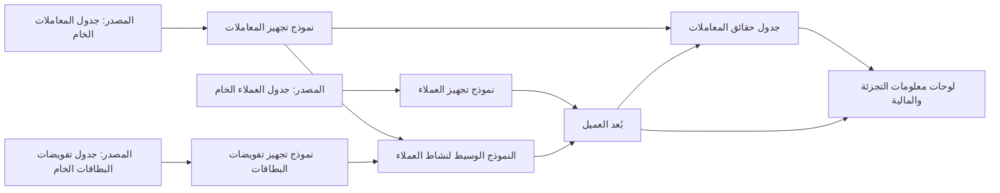

# الوحدة 3 — التحويل والجودة (Transformation and quality)

*إدخال البيانات إلى المنصة (getting data into the platform) ليس إلا نصف المهمة. فالجداول الخام (raw tables) القادمة من قاعدة بيانات الأنظمة المصرفية الأساسية (core banking database) ومن تدفق البطاقات (card stream) ومن تطبيق نجم للهاتف (Najm Mobile) ليست إجابات بعد: يجب تنظيفها (cleaned) وربطها (joined) وإعادة تشكيلها (reshaped) واختبارها (tested) قبل أن يبني أحدٌ عليها لوحة معلومات (dashboard) أو نموذجًا (model). تتعامل هذه الوحدة مع ذلك العمل بوصفه برمجيات (software). تبدأ بـالتحويلات بوصفها شيفرة (transformations as code): نماذج dbt (dbt models) في طبقات واضحة (clear layers)، واختبارات تعمل مع كل تغيير (tests that run on every change)، والتحكم في الإصدارات مع المراجعة (version control with review). ثم تتسع لتشمل جودة البيانات (data quality) بوصفها انضباطًا تشغيليًا (operating discipline): ما الذي تعنيه البيانات "الجيدة" (good)، والعقود (contracts) مع الفرق التي تنتجها، وقابلية الملاحظة (observability) التي تخبرك بتعطّل مصدر بيانات (broken feed) قبل أن يخبرك به رئيس المخاطر (Chief Risk Officer). وتنتهي بالأداء والتكلفة (performance and cost): التقسيم (partitioning)، والتجميع العنقودي (clustering)، والنماذج التزايدية (incremental models)، وقراءة خطط الاستعلام (query plans)، حتى تبقى المنصة سريعة وميسورة التكلفة (fast and affordable) مع نمو بيانات نجم. ستتابع فريق منصة البيانات والتحليلات (Data Platform & Analytics team) في بنك نجم (Najm Bank) بينما تنقل لينا كومةً متشابكة من استعلامات SQL المحفوظة (a tangle of saved SQL) إلى مشروع dbt مُختبَر (tested dbt project)، وتتعلم هدى لماذا قد يُخرج خط بيانات أخضر (green pipeline) أرقامًا خاطئة رغم ذلك، ويسأل فيصل لماذا تضاعفت فاتورة مستودع البيانات (warehouse bill) خلال ربع سنة واحد.*

> **المراحل (Stages):** Transform, Operate, Store — تحويل البيانات الخام (raw data) إلى جداول مُختبَرة وموثوقة وميسورة التكلفة (tested, trusted, affordable tables)، والحفاظ عليها كذلك.

---

# 3.1 — التحويلات بوصفها شيفرة (Transformations as code): dbt، والطبقات (layers)، والاختبارات (tests)، والتحكم في الإصدارات (version control)
*المستوى (Level): 🟡 متوسط (Intermediate)* · *المتطلبات (Prerequisites): 1.1، 1.2، 2.1، 2.2* · *المرحلة (Stage): Transform*

## ⚡ الدرس في دقيقة (In 60 seconds)
- **التحويل (transformation)** يحوّل البيانات الخام المحمّلة (loaded raw data) إلى جداول منظّفة ومربوطة وجاهزة للأعمال (cleaned, joined, business-ready tables). وفي نهج ELT (2.1) يجري داخل مستودع البيانات (warehouse)، بلغة SQL.
- **التحويلات بوصفها شيفرة (Transformations as code)** تعني أن كل خطوة من خطوات SQL تلك تعيش في ملف (file)، ضمن التحكم في الإصدارات (version control)، وتُراجَع وتُختبَر مثل شيفرة التطبيقات (application code)، لا في استعلامات محفوظة (saved queries) على حاسوب أحدهم المحمول.
- **dbt** (أداة بناء البيانات، data build tool) إطار عمل مفتوح المصدر (open-source framework) واسع الاستخدام لهذا الغرض: كل نموذج (model) هو عبارة `SELECT`، و`ref()` تربط النماذج في رسم بياني للاعتماديات (dependency graph)، والاختبارات والتوثيق (tests and documentation) تعيش بجوار الشيفرة.
- نظّم النماذج في **طبقات (layers)**: المصادر (sources) ← التجهيز (staging) (تنظيف، بعلاقة واحد-إلى-واحد مع الجداول الخام، one-to-one with raw tables) ← الطبقة الوسيطة (intermediate) (منطق قابل لإعادة الاستخدام، reusable logic) ← طبقة العرض (marts) (جداول الحقائق والأبعاد، facts and dimensions، للبشر والأدوات).
- إشارة القرار (Decision cue): إذا وصل رقمٌ إلى لوحة معلومات (dashboard) أو جهة تنظيمية (regulator) أو نموذج (model)، فيجب أن تكون شيفرة SQL التي أنتجته في المستودع (repository) مع اختبارات أساسية على الأقل لحُبَيبيته (key tests on its grain).
- الفخ الأكبر (Biggest trap): منطق الأعمال المنسوخ في أماكن كثيرة (business logic copied into many places). عندما يعيش تعريف "العميل النشط" (active customer) في خمسة استعلامات، ستحصل على خمس إجابات.

## 🧭 لماذا يهم (Why it matters)
يرسل كريم، محلّل البيانات (data analyst) في قطاع التجزئة (retail)، رقم "العملاء النشطين" (active customers) الشهري إلى مجلس التجزئة (retail board). وترسل لينا الرقم نفسه إلى المالية (finance) لتقرير التكلفة لكل عميل (cost-per-customer report). يختلف الرقمان بعدة آلاف. وكلاهما "صحيح" (right): استعلام كريم المحفوظ (saved query) يعدّ العملاء الذين لديهم أي معاملة (any transaction) خلال آخر 90 يومًا، بينما يعدّ استعلام لينا العملاء الذين لديهم تفويض بطاقة (card authorisation) *أو* تسجيل دخول (login) إلى تطبيق نجم للهاتف (Najm Mobile) خلال آخر 30 يومًا. كُتب كل استعلام بفارق سنوات، ثم نُسخ وعُدّل ولُصق في لوحة معلومات (dashboard). ولا يستطيع أحد أن يقول أي نسخة رآها المجلس في الربع الماضي، لأن الاستعلامات لم تكن قط في التحكم في الإصدارات (version control).

يطلب فيصل أمرًا واحدًا: "كل رقم ننشره يأتي من شيفرة يمكننا قراءتها ومراجعتها واختبارها والتراجع عنها (read, review, test and roll back)." لا تقرّر التحويلات بوصفها شيفرة (transformations as code) أي تعريف لـ"النشط" (active) هو الصحيح (فتلك مسألة مقاييس، a metrics question، 4.1)، لكنها تضمن أن التعريف المختار موجود في مكان واحد (one place)، وأن التغييرات تُراجَع (changes are reviewed)، وأن اختبارًا يفشل (a test fails) عندما تخالف البيانات افتراضاته (breaks its assumptions).

## 📐 كيف يعمل (How it works)

### 🟢 الأساسيات (The essentials)

**ما التحويل (What a transformation is).** بعد الاستيعاب (ingestion) (2.1)، يحتفظ مستودع البيانات (warehouse) بنُسخ خام (raw copies) من جداول المصادر (source tables): `raw_core.transactions`، `raw_core.customers`، `raw_cards.authorisations`. تحمل هذه الجداول أسماء النظام المصدر (source system names)، وأنواعًا غير متسقة (inconsistent types)، ومكرّرات (duplicates) ناتجة عن إعادة محاولات التحميل (retried loads)، ورموزًا (codes) لا يفهمها إلا فريق الأنظمة المصرفية الأساسية (core banking team). التحويل (transformation) خطوة تقرأ جداول وتكتب جدولًا جديدًا أفضل: فهي تعيد التسمية (renames)، وتحوّل الأنواع (casts)، وتزيل التكرار (deduplicates)، وتربط (joins)، وتجمّع (aggregates).

**لماذا الشيفرة لا النقرات (Why code, not clicks).** معاملة SQL كبرمجيات (treating SQL like software) تمنحك أربعة أشياء لا يستطيع مجلّد من الاستعلامات المحفوظة (a folder of saved queries) أن يمنحك إياها:

| الممارسة (Practice) | ما الذي تمنحك إياه (What it gives you) |
|---|---|
| التحكم في الإصدارات (Version control) (git) | سجلّ كل تغيير (history of every change)، ومن أجراه ولماذا؛ والتراجع عن تغيير سيئ (roll back a bad change) |
| مراجعة الشيفرة (Code review) (طلبات السحب، pull requests) | شخص ثانٍ يتحقق من المنطق (checks logic) قبل أن يصل إلى المجلس |
| الاختبارات الآلية (Automated tests) | يفشل البناء (the build fails) عندما تخالف البيانات افتراضًا (breaks an assumption)، مثل المفاتيح المكرّرة (duplicate keys) |
| رسم بياني واحد للاعتماديات (One dependency graph) | كل نموذج يُعرَّف مرة واحدة ويُعاد استخدامه (defined once and reused)، فلا يُنسخ المنطق (logic is not copied) |

**dbt في فقرة واحدة (dbt in one paragraph).** تقوم dbt (وdbt Core هي أداة سطر الأوامر مفتوحة المصدر، open-source command-line tool، التي تصونها dbt Labs) بتصريف وتشغيل (compiles and runs) عبارات SQL من نوع `SELECT` على مستودع بياناتك (warehouse). لا تكتب `CREATE TABLE`؛ بل تكتب `SELECT`، وتغلّفها dbt بلغة تعريف البيانات المناسبة (the right DDL) وفق **طريقة التجسيد (materialisation)** الخاصة بها (أي كيف تُخزَّن النتيجة، how the result is stored: `view`، أو `table`، أو `incremental`، أو `ephemeral`). بدلًا من كتابة أسماء الجداول بشكل ثابت (hard-coding table names)، تستدعي `{{ ref('model_name') }}` لنموذج آخر و`{{ source('source_name', 'table') }}` لجدول خام (raw table). ومن تلك الاستدعاءات تبني dbt **رسمًا بيانيًا موجّهًا غير دوري (DAG)** (directed acyclic graph) للاعتماديات (dependencies)، وتشغّل النماذج بالترتيب الصحيح (in the right order). وتصل المحوّلات (adapters) بين dbt وPostgreSQL وDuckDB (عبر المحوّل المجتمعي `dbt-duckdb`، the community adapter) وSnowflake وBigQuery وDatabricks وAmazon Redshift وغيرها.

**الطبقات (The layers).** يتّبع بنك نجم البنية التي توصي بها dbt Labs في دليل بنية المشاريع (project-structure guide). لكل طبقة (layer) مهمة واحدة (one job):



| الطبقة (Layer) | البادئة (Prefix) | المهمة (Job) | القاعدة (Rule) |
|---|---|---|---|
| المصادر (Sources) | مُعرَّفة في YAML (declared in YAML) | تشير إلى الجداول الخام التي حمّلها الاستيعاب (point at raw tables loaded by ingestion) | لا تعدّلها dbt أبدًا (never edited by dbt) |
| التجهيز (Staging) | `stg_<source>__<table>` | إعادة التسمية (rename)، وتحويل الأنواع (cast)، وتوحيد الرموز (standardise codes)، وإزالة التكرار (deduplicate) | نموذج تجهيز واحد لكل جدول مصدر (one staging model per source table)؛ لا ربط بين المصادر (no joins between sources) |
| الوسيطة (Intermediate) | `int_` | منطق أعمال قابل لإعادة الاستخدام (reusable business logic): الربط (joins)، وعلامات النشاط (activity flags)، والتقسيم إلى جلسات (sessionising) | لا تُعرَض على المستخدمين النهائيين (not exposed to end users) |
| العرض (Marts) | `fct_` و`dim_` | جداول الحقائق والأبعاد (facts and dimensions) عند حُبَيبية مُعلَنة (a stated grain) (1.2)، مثل طبقة عرض العميل الشاملة (customer 360 mart) | ما تقرؤه لوحات المعلومات والمحلّلون والنماذج (what dashboards, analysts and models read) |

هذه هي نفسها طبقات الخام ← التجهيز ← العرض (raw → staging → marts) من الدرس 0.2؛ وتسمّي Databricks تقسيمًا مشابهًا بالبرونزي والفضي والذهبي (bronze, silver and gold) (معمارية الميداليات، the medallion architecture).

**نموذج تجهيز (A staging model).** يقوم بأشياء صغيرة ومملّة وأساسية (small, boring, essential things):

```sql
-- models/staging/core/stg_core__transactions.sql
with source as (
    select * from {{ source('core_banking', 'transactions') }}
),

deduplicated as (
    select *,
           row_number() over (partition by txn_ref order by _loaded_at desc) as rn
    from source
)

select
    txn_ref                         as transaction_id,
    acct_no                         as account_id,
    cast(txn_ts as timestamp)       as transacted_at,
    cast(amt as numeric(18, 2))     as amount,
    upper(trim(ccy))                as currency_code,
    case txn_typ when 'D' then 'debit' when 'C' then 'credit' end as direction,
    _loaded_at
from deduplicated
where rn = 1
```

**الاختبارات بجوار الشيفرة (Tests next to the code).** في ملف YAML بجانب النموذج، تُعلن **اختبارات البيانات العامة (generic data tests)**. تأتي dbt بأربعة منها: `unique`، و`not_null`، و`accepted_values`، و`relationships` (يجب أن توجد كل قيمة في نموذج آخر، مثل المفتاح الأجنبي، like a foreign key). منذ الإصدار dbt 1.8 أصبح المفتاح `data_tests:`؛ وما زال المفتاح الأقدم `tests:` يعمل. ومن الإصدار 1.10، يُفضَّل أن تُدرَج المعاملات (parameters) مثل `values` تحت `arguments:`.

```yaml
# models/staging/core/_core__models.yml
models:
  - name: stg_core__transactions
    description: One row per core banking transaction, deduplicated on transaction_id.
    columns:
      - name: transaction_id
        data_tests: [unique, not_null]
      - name: direction
        data_tests:
          - accepted_values:
              values: ['debit', 'credit']
      - name: account_id
        data_tests:
          - not_null
          - relationships:
              to: ref('stg_core__accounts')
              field: account_id
```

يُصرَّف كل اختبار إلى استعلام يعيد الصفوف الفاشلة (compiles to a query that returns failing rows)؛ وصفر صفوف يعني النجاح (zero rows means pass). يشغّل الأمر `dbt build` النماذج والاختبارات واللقطات والبذور (models, tests, snapshots and seeds) بترتيب الرسم البياني الموجّه غير الدوري (in DAG order)، ويتخطى النماذج الواقعة بعد اختبار فاشل (skips models downstream of a failing test)، فلا يغذّي جدول تجهيز سيئ (a bad staging table) تقرير المجلس بصمت أبدًا.

### 🟡 التعمق أكثر (Going deeper)

**الطريقة الخاطئة والطريقة الصحيحة (The wrong way and the right way).** إليك كيف ينتشر تعريف "العميل النشط" (active customer) عندما يُنسخ المنطق (logic is copied):

```sql
-- Wrong: the definition is pasted into each dashboard query
select count(distinct c.cust_id)
from raw_core.customers c
join raw_core.transactions t on t.acct_no in (
    select acct_no from raw_core.accounts a where a.cust_id = c.cust_id)
where t.txn_ts >= current_date - 90;
```

```sql
-- Right: defined once, in an intermediate model, then referenced everywhere
-- models/intermediate/int_customer_activity.sql
select
    a.customer_id,
    max(t.transacted_at)                                        as last_transaction_at,
    max(t.transacted_at) >= current_date - interval '90 days'   as is_active_90d
from {{ ref('stg_core__transactions') }} t
join {{ ref('stg_core__accounts') }} a using (account_id)
group by a.customer_id
```

الآن يقرأ كلٌّ من `dim_customer` ولوحة معلومات التجزئة (retail dashboard) والتقرير المالي (finance report) العمود `is_active_90d`. وإذا تغيّر التعريف، فإن طلب سحب واحدًا مُراجَعًا (one reviewed pull request) يغيّره في كل مكان (everywhere).

**المصادر والحداثة (Sources and freshness).** إعلان المصادر في YAML (declaring sources in YAML) يفعل أكثر من تسمية الجداول. يمكنك إضافة فحص للحداثة (freshness check)، بحيث يحذّر الأمر `dbt source freshness` عندما يتوقف الاستيعاب (when ingestion has stalled):

```yaml
# models/staging/core/_core__sources.yml
sources:
  - name: core_banking
    schema: raw_core
    loaded_at_field: _loaded_at
    freshness:
      warn_after: {count: 6, period: hour}
      error_after: {count: 24, period: hour}
    tables:
      - name: transactions
      - name: customers
      - name: accounts
```

تفضّل إصدارات dbt الأحدث (newer dbt releases) وضع هذه المفاتيح تحت `config:`؛ راجع توثيق إصدارك (your version's docs).

**اللقطات من أجل السجلّ التاريخي (Snapshots for history).** جدول `customers` في الأنظمة المصرفية الأساسية (core banking) يُستبدَل في مكانه (overwritten in place): عندما ينتقل عميل من الدوحة إلى دبي، تختفي المدينة القديمة. تسجّل **لقطة dbt (dbt snapshot)** كل تغيير بوصفه صفًا جديدًا مع تواريخ صلاحية (a new row with validity dates)، وهذا هو البُعد المتغيّر ببطء من النوع الثاني (slowly changing dimension Type 2) (1.2):

```sql
-- snapshots/customers_snapshot.sql

{{ config(
    target_schema='snapshots',
    unique_key='customer_id',
    strategy='timestamp',
    updated_at='updated_at'
) }}
select customer_id, segment, city, risk_rating, updated_at
from {{ source('core_banking', 'customers') }}

```

تضيف dbt العمودين `dbt_valid_from` و`dbt_valid_to`؛ والصف الحالي (the current row) تكون فيه قيمة `dbt_valid_to` فارغة (null). استخدم استراتيجية `check` (the `check` strategy) عندما لا يملك المصدر عمود `updated_at` موثوقًا. وتتيح الإصدارات الحديثة (recent versions) (من 1.9 فصاعدًا) أيضًا تعريف اللقطات في YAML. ويجب أن تعمل اللقطات وفق جدول زمني (on a schedule): فالتغيير الذي يحدث ثم يُعكَس بين تشغيلين (happens and reverts between two runs) لا يُرى أبدًا.

**اختبارات الوحدة للمنطق (Unit tests for logic).** اختبارات البيانات (data tests) تفحص البيانات التي لديك. أما **اختبارات الوحدة (unit tests)** (المضافة في dbt 1.8) فتفحص المنطق مقابل مدخلات صغيرة مكتوبة يدويًا (small, hand-written inputs)، قبل وصول أي بيانات حقيقية. وهي مثالية لعبارات `case` المعقّدة (tricky) وحدود التواريخ (date boundaries):

```yaml
unit_tests:
  - name: active_flag_uses_90_day_boundary
    model: int_customer_activity
    given:
      - input: ref('stg_core__transactions')
        rows:
          - {account_id: 'A1', transacted_at: '2026-01-01'}
      - input: ref('stg_core__accounts')
        rows:
          - {account_id: 'A1', customer_id: 'C1'}
    expect:
      rows:
        - {customer_id: 'C1', is_active_90d: false}
```

(النسخة الحقيقية ستمرّر "اليوم" (today) بوصفه متغيرًا (as a variable) بدلًا من استخدام `current_date`؛ فالمنطق الذي يعتمد على الساعة (logic that depends on the clock) يصعب اختباره.)

**التوثيق والنسب (Documentation and lineage).** يحوّل الأمر `dbt docs generate` كل `description:` والرسم البياني الموجّه غير الدوري (DAG) إلى موقع قابل للتصفح (browsable site). ويتيح لك ذلك النسب (lineage) أن تجيب عن سؤال ⁦("if the card feed breaks, which dashboards are wrong?")⁩ أي "إذا تعطّل مصدر بيانات البطاقات، فأي لوحات المعلومات تصبح خاطئة؟" في دقائق (6.1).

**سير العمل (The workflow).** الحلقة اليومية في نجم (Najm's daily loop):

1. تنشئ لينا فرعًا في git (git branch) وتعدّل نموذجًا.
2. تشغّل `dbt build --select int_customer_activity+` على مخطط التطوير الخاص بها (her own development schema) (علامة `+` تعني النموذج وكل ما يقع بعده، the model and everything downstream).
3. تفتح طلب سحب (pull request). يشغّل التكامل المستمر (continuous integration, CI) الأمر `dbt build` على النماذج المتغيّرة وأبنائها (the changed models and their children) في مخطط مؤقت (temporary schema).
4. يفحص مراجعٌ (reviewer) شيفرة SQL والاختبارات وفروق أعداد الصفوف (row-count differences).
5. بعد الدمج (after merge)، يشغّل المنسّق (orchestrator) (2.2) بناء الإنتاج (production build) وفق الجدول الزمني (on schedule).

في التكامل المستمر (CI)، يبني **الاختيار حسب الحالة (state selection)** ما تغيّر فقط: `dbt build --select state:modified+ --defer --state prod-artifacts/`، حيث يقرأ `--defer` الآباء غير المتغيّرين من الإنتاج (unchanged parents from production). ويُغطّى تصميم التكامل المستمر العام (general CI design) في [*السحابة وDevOps: من الصفر إلى الاحتراف (Cloud & DevOps: Zero to Hero)*، الدرس 4.1 — التكامل المستمر: خطوط التنفيذ والاختبارات والمخرجات والتغذية الراجعة السريعة (Continuous integration: pipelines, tests, artefacts and fast feedback)](../cloud/index.ar.html#/4.1).

### 🔴 نظرة الخبير (Expert view)

**العقود على طبقة العرض (Contracts on marts).** طبقة العرض (mart) التي تعتمد عليها فرق أخرى هي واجهة عامة (public interface). تتيح لك **عقود النماذج (model contracts)** في dbt (منذ dbt 1.5) أن تُعلن أسماء الأعمدة وأنواع البيانات (column names and data types)، وأن تجعل dbt ترفض بناء النموذج (refuse to build the model) إذا أنتجت شيفرة SQL شكلًا مختلفًا (a different shape):

```yaml
models:
  - name: dim_customer
    config:
      contract: {enforced: true}
    columns:
      - name: customer_id
        data_type: varchar
        constraints: [{type: not_null}]
      - name: is_active_90d
        data_type: boolean
      # ...abridged: an enforced contract must list every column the model returns
```

العقد يحمي الشكل لا المعنى (a contract protects shape, not meaning). أما الاتفاقات حول الدلالات والتوقيت (semantics and timeliness) مع المنتجين (producers) فمكانها عقد البيانات (data contract) (3.2). وللتغييرات الكاسرة (breaking changes)، تتيح لك **إصدارات النماذج (model versions)** في dbt نشر `dim_customer` بالإصدار v2 بجانب v1 ومنح المستهلكين (consumers) وقتًا للانتقال.

**استراتيجية الاختبار لا عدد الاختبارات (Test strategy, not test count).** المشروع الذي فيه 2,000 اختبار يتجاهلها الجميع أسوأ من مشروع فيه 200 اختبار لها معنى دائمًا (always mean something). قواعد نجم (Najm's rules): لكل نموذج **مفتاح أساسي (primary key)** مُختبَر (`unique` + `not_null`، أو `dbt_utils.unique_combination_of_columns` للمفاتيح المركّبة، composite keys)، لأن الحُبَيبية المكسورة (a broken grain) تضاعف بصمت كل مجموع (silently doubles every sum) في المراحل اللاحقة؛ ونماذج التجهيز (staging models) تختبر ما يَعِد به المصدر (what the source promises)؛ وطبقات العرض (marts) تختبر قواعد الأعمال (business rules) (رصيد القرض القائم، a loan's outstanding balance، لا يكون سالبًا أبدًا)؛ وكل حادثة (incident) تنتهي باختبار جديد. استخدم `severity: warn` للفحوص التي يجب أن تنبّه دون أن توقف البناء (alert but not stop the build)، و`store_failures: true` للاحتفاظ بالصفوف الفاشلة للتحقيق (keep failing rows for investigation).

**أين يوضع المنطق (Where logic belongs).** أبقِ طبقة التجهيز رفيعة وآلية (thin and mechanical)؛ وضع منطق الأعمال (business logic) في النماذج الوسيطة ونماذج العرض (intermediate and mart models). تجنّب وحدات الماكرو (macros) التي تخفي كميات كبيرة من SQL: إذا لم تستطع قراءة شيفرة SQL المُصرَّفة (compiled SQL) في `target/compiled/` وفهمها، فبسّطها (simplify).

**ما بعد dbt (Beyond dbt).** SQLMesh بديل مفتوح المصدر (open-source alternative)؛ ويمكن لـDagster أن يعامل نماذج dbt بوصفها أصولًا (assets)؛ وتناسب مهام Spark أو Polars التحويلاتِ التي تعبّر عنها SQL بشكل سيئ (transformations SQL expresses badly). المبادئ (principles) (الشيفرة في git، والتعريف الواحد، والطبقات، والاختبارات، والمراجعة، والتكامل المستمر، code in git, one definition, layers, tests, review, CI) تنطبق أيًّا كانت الأداة (whatever the tool).

## 🧰 الأدوات (The toolkit)
| الأداة أو النمط أو المعيار (Tool, pattern or standard) | ما هو وماذا يفعل (What it is and does) | متى تلجأ إليه (When to reach for it) |
|---|---|---|
| **dbt** (dbt Core، dbt Labs) | إطار عمل مفتوح المصدر (open-source framework) يشغّل نماذج SQL من نوع `SELECT` بترتيب الاعتماديات (in dependency order)، مع الاختبارات والتوثيق والنسب (tests, docs and lineage) | أي تحويل SQL (SQL transformation) يغذّي رقمًا يعتمد عليه الناس |
| **Staging, intermediate and mart layers** — طبقات التجهيز والوسيطة والعرض | اصطلاح (convention) يمنح كل نموذج مهمة واحدة: التنظيف، والدمج، والتقديم (clean, combine, serve) | هيكلة أي مشروع تحويل (transformation project) بحيث يجد الناس ما يبحثون عنه |
| **dbt generic data tests** (unique, not_null, accepted_values, relationships) — اختبارات البيانات العامة في dbt | فحوص تصريحية (declarative checks) تُصرَّف إلى استعلامات تعيد الصفوف الفاشلة (queries returning failing rows) | على كل مفتاح أساسي (primary key) وكل افتراض (assumption) تعتمد عليه شيفرة SQL |
| **dbt snapshots** — لقطات dbt | تسجّل التغييرات في صفوف المصدر القابلة للتعديل (mutable source rows) بوصفها سجلًّا تاريخيًا من نوع SCD Type 2 (SCD Type 2 history) | سمات العميل أو الحساب أو المنتج (customer, account or product attributes) التي تتغير في مكانها (change in place) |
| **dbt unit tests** (dbt 1.8+) — اختبارات الوحدة في dbt | تختبر منطق النموذج (model logic) على مدخلات صغيرة مكتوبة يدويًا (small hand-written inputs) | منطق `case` المعقّد، وحدود التواريخ (date boundaries)، والحسابات المالية (financial calculations) |
| **dbt model contracts** — عقود النماذج في dbt | تفرض أسماء أعمدة النموذج وأنواعها (column names and types) وقت البناء (at build time) | طبقات العرض (marts) التي تعتمد عليها فرق أو أدوات أخرى |
| **dbt_utils** (حزمة، package) | اختبارات ووحدات ماكرو إضافية (extra tests and macros)، مثل تفرّد المفتاح المركّب (composite-key uniqueness) | عندما لا تكفي الاختبارات الأربعة المدمجة (the four built-in tests) |
| **SQLMesh** | إطار تحويل بديل مفتوح المصدر (open-source alternative transformation framework) | مقارنة المقاربات (comparing approaches)؛ الفرق التي تريد نموذج البيئات الخاص به (its environment model) |

## 🏛️ عمليًا في بنك نجم (In practice at Najm Bank)
تكتب لينا **معيار مشروع dbt في نجم، الإصدار الأول (Najm dbt Project Standard v1)** وأول نموذج مُختبَر (the first tested model)، `dim_customer`، الذي يغذّي طبقة عرض العميل الشاملة (customer 360 mart).

**الجزء أ: اصطلاحات المشروع (Part A: project conventions)**

| الموضوع (Topic) | القاعدة (Rule) |
|---|---|
| المستودع (Repository) | مستودع واحد `najm-analytics`؛ والفرع `main` هو الإنتاج (production)؛ وكل التغييرات عبر طلب سحب (pull request) بمراجع واحد (اثنان لطبقات العرض التنظيمية، regulatory marts) |
| الطبقات (Layers) | `staging/<source>/`، `intermediate/<domain>/`، `marts/<domain>/` (التجزئة، والمخاطر، والمالية، retail, risk, finance) |
| التسمية (Naming) | `stg_<source>__<table>`، `int_<verb or noun>`، `fct_<event>`، `dim_<entity>`؛ أعمدة بنمط snake_case (snake_case columns)؛ `_at` للطوابع الزمنية (timestamps)، و`_date` للتواريخ (dates)، و`is_`/`has_` للقيم المنطقية (booleans) |
| التجسيد (Materialisation) | التجهيز (Staging): عرض (view). الوسيطة (Intermediate): عابر (ephemeral) أو عرض (view). العرض (Marts): جدول (table)، أو تزايدي (incremental) عندما يكون كبيرًا (3.3) |
| الحد الأدنى من الاختبارات (Minimum tests) | كل نموذج: المفتاح الأساسي (primary key) `unique` + `not_null`. التجهيز: `accepted_values` على الرموز (codes)، و`relationships` على المفاتيح الأجنبية (foreign keys). العرض: اختبار واحد على الأقل لقاعدة أعمال (business-rule test) |
| التوثيق (Documentation) | لكل طبقة عرض ولكل عمود فيها وصفٌ (description)؛ والحُبَيبية (grain) مذكورة في وصف النموذج (model description) |
| التكامل المستمر (CI) | `dbt build --select state:modified+ --defer --state <prod artefacts>` على كل طلب سحب (pull request)؛ ويُمنع الدمج (merge blocked) عند أي خطأ |
| الملكية (Ownership) | لكل مجلّد عرض (mart folder) مالكٌ مُسمّى (named owner) في YAML ‏`meta: {owner: ...}` |

**الجزء ب: بطاقة النموذج لـ`dim_customer` (Part B: the model card)**

| الحقل (Field) | القيمة (Value) |
|---|---|
| الحُبَيبية (Grain) | صف واحد لكل عميل معروف حاليًا للأنظمة المصرفية الأساسية (one row per customer currently known to core banking) |
| المفتاح الأساسي (Primary key) | `customer_id` (مُختبَر: فريد وغير فارغ، tested unique, not null) |
| مبني من (Built from) | `stg_core__customers`، `int_customer_activity`، `customers_snapshot` (من أجل `segment_changed_at`) |
| الأعمدة الرئيسية (Key columns) | `customer_id`، `segment`، `home_country`، `is_active_90d`، `last_transaction_at`، `segment_changed_at` |
| اختبارات قواعد الأعمال (Business-rule tests) | `segment` ضمن ('retail', 'sme', 'corporate')؛ `home_country` ضمن ('QA', 'AE', رموز دول الاتحاد الأوروبي، EU country codes)؛ `last_transaction_at` ليس في المستقبل (not in the future) |
| العقد (Contract) | مفروض (Enforced): الأسماء والأنواع ثابتة؛ والتغييرات الكاسرة (breaking changes) تحتاج إلى إصدار نموذج جديد (a new model version) |
| المالك (Owner) | لينا (هندسة التحليلات، analytics engineering)؛ مالك الأعمال (business owner): تحليلات التجزئة (retail analytics) (كريم) |
| المستهلكون (Consumers) | طبقة عرض العميل الشاملة (Customer 360 mart)، ولوحة معلومات التجزئة (retail dashboard)، وتقرير المالية للتكلفة لكل عميل (finance cost-per-customer report) |

صار كريم والمالية يقرآن العمود نفسه `is_active_90d`. وينتقل الخلاف حول أي تعريف هو الصحيح إلى مكانه الصحيح (where it belongs): بطاقة تعريف المقياس (metric definition card) (4.1).

## 🛠️ التمارين (Exercises)
استخدم بيانات اصطناعية فقط (synthetic data only). ولّد عملاء وحسابات ومعاملات وهمية (fake customers, accounts and transactions) باستخدام Python (مثلًا مكتبة `Faker`) أو اكتب بذور CSV صغيرة (small CSV seeds).

- 🟢 ثبّت dbt Core مع المحوّل `dbt-duckdb` (adapter)، وأنشئ مشروعًا، وحمّل ثلاث بذور CSV (three CSV seeds) (`customers`، `accounts`، `transactions`) باستخدام `dbt seed`، واكتب نموذج تجهيز واحدًا لكل بذرة (one staging model per seed) بأعمدة معاد تسميتها ومحوّلة الأنواع (renamed, cast columns). *يكتمل عندما (Done when):* ينجح `dbt build` ويكون لكل نموذج تجهيز اختبارا `unique` و`not_null` على مفتاحه الأساسي (primary key).
- 🟡 أضف `int_customer_activity` و`dim_customer` كما في هذا الدرس. أدرج عمدًا معاملة مكرّرة (a duplicate transaction) ومعاملة بحساب غير معروف (an unknown account) في بيانات البذور. *يكتمل عندما (Done when):* يفشل `dbt build` على الاختبارات الصحيحة، وتُتخطّى النماذج اللاحقة (downstream models are skipped)، وبعد أن تصلح إزالة التكرار في التجهيز (staging deduplication) ينجح البناء مجددًا.
- 🔴 ضع المشروع في git، وأضف لقطة (snapshot) على العملاء، وغيّر شريحة عميل (a customer's segment) في البذرة وأعد التشغيل، واكتب اختبار وحدة (unit test) لحدّ الـ90 يومًا (90-day boundary) لا يعتمد على `current_date`. أضف سير عمل للتكامل المستمر (CI workflow) (GitHub Actions أو أي نظام CI يمكنك تشغيله) يشغّل `dbt build` على طلبات السحب (pull requests). *يكتمل عندما (Done when):* تُظهر اللقطة صفّين للعميل المتغيّر بتواريخ صلاحية صحيحة (correct validity dates)، وينجح اختبار الوحدة، ويظهر طلب السحب الذي يكسر اختبار المفتاح الأساسي (primary-key test) على أنه فاشل (failing).

## ⚠️ أخطاء وفخاخ (Mistakes and traps)
- **نسخ منطق الأعمال في استعلامات كثيرة (Copying business logic into many queries).** خمس نسخ من "العميل النشط" (active customer) تصبح خمسة أرقام. عرّفه مرة واحدة في نموذج وسيط أو نموذج عرض (intermediate or mart model) واستدعه بـ`ref()`.
- **كتابة أسماء الجداول بشكل ثابت (Hard-coding table names).** العبارة `from analytics.dim_customer` تكسر البيئات (environments) والنسب (lineage). استخدم دائمًا `ref()` و`source()`.
- **لا اختبار على الحُبَيبية (No test on the grain).** المفتاح المكرّر (a duplicate key) يضاعف كل مجموع لاحق (every total downstream) دون أي خطأ. اختبر المفتاح الأساسي (primary key) لكل نموذج، أولًا.
- **اختبارات لا يقرؤها أحد (Tests nobody reads).** مئات التحذيرات التي لا تفشل أبدًا (never-failing warnings) تدرّب الناس على تجاهلها؛ لا تحذّر إلا عندما سيتصرف أحدٌ (warn only when someone will act).
- **البناء في الإنتاج يدويًا (Building in production by hand).** تشغيل النماذج من حاسوب محمول على الإنتاج يتجاوز المراجعة (bypasses review). طوّر في مخططك الخاص (your own schema)؛ ولا يعمل الإنتاج إلا من `main` عبر المنسّق (orchestrator).

## 🧾 الخلاصة (Recap)
- التحويلات بوصفها شيفرة (transformations as code) تضع كل خطوة SQL في git، خلف المراجعة والاختبارات والتكامل المستمر (review, tests and CI).
- نماذج dbt (dbt models) هي عبارات `SELECT`؛ و`ref()` و`source()` تبنيان رسم الاعتماديات (dependency graph) والنسب (lineage).
- الطبقات (layers) تمنح كل نموذج مهمة واحدة: التجهيز ينظّف (staging cleans)، والوسيطة تدمج (intermediate combines)، والعرض يقدّم (marts serve).
- اختبر حُبَيبية (grain) كل نموذج أولًا؛ وأضف القيم المقبولة والعلاقات وقواعد الأعمال (accepted values, relationships and business rules)؛ واستخدم اختبارات الوحدة (unit tests) للمنطق.
- اللقطات (snapshots) تلتقط سجلّ الصفوف القابلة للتعديل (history of mutable rows)؛ والعقود والإصدارات (contracts and versions) تحمي طبقات العرض التي يعتمد عليها الآخرون.

## ✍️ اختبر نفسك (Check yourself)

**1. يختلف عدّا "العميل النشط" (active customer) لدى كريم ولينا لأن كلًّا منهما نسخ التعريف وعدّله في استعلامه الخاص. ما أفضل إصلاح بنيوي (best structural fix)؟**

- A. اطلب من المحلّلَين أن يبنيا تقاريرهما في أداة لوحات المعلومات نفسها (same dashboard tool) من الآن فصاعدًا
- B. أضف اختبار `not_null` على `customer_id` في كلا الاستعلامين المحفوظين (saved queries)
- C. عرّف منطق النشاط (activity logic) مرة واحدة في نموذج وسيط (intermediate model) واجعل كل طبقة عرض وكل تقرير يستدعيه بـ`ref()`
- D. أرسل إلى فريق المالية رقم التجزئة بالبريد الإلكتروني كل شهر

<details><summary>الإجابة</summary>

**C.** تعريف واحد في نموذج واحد، يُعاد استخدامه عبر `ref()`، هو ما توفّره التحويلات بوصفها شيفرة (transformations as code). الخيار B يختبر البيانات لكنه لا يفعل شيئًا حيال المنطق المكرّر (duplicated logic)؛ والخيار A يغيّر الأداة لا المنطق. (🟡 التعمق أكثر، Going deeper.)

</details>

**2. ماذا يفعل اختبار عام (generic test) في dbt مثل `unique` عند تشغيله؟**

- A. يُصرَّف إلى استعلام يعيد الصفوف المخالفة للقاعدة (rule-breaking rows)؛ وصفر صفوف يعني النجاح (zero rows is a pass)
- B. يضيف قيد تفرّد (unique constraint) إلى جدول المستودع بحيث تُرفض عمليات الإدراج المكرّرة مستقبلًا (future duplicate inserts)
- C. يحذف الصفوف المكرّرة (duplicate rows) من النموذج قبل تجسيده (materialised)
- D. يفحص صياغة SQL (SQL syntax) للنموذج

<details><summary>الإجابة</summary>

**A.** اختبارات البيانات في dbt (dbt data tests) استعلامات للبحث عن الصفوف الفاشلة (failing rows). فهي لا تغيّر البيانات (C) ولا تنشئ قيودًا في قاعدة البيانات (database constraints) (B)؛ يمكن لعقود النماذج (model contracts) أن تضيف بعض القيود، لكنها ميزة مختلفة. (🟢 الأساسيات، The essentials.)

</details>

**3. تريد هدى الاحتفاظ بسجلّ تصنيف المخاطر (risk rating) لكل عميل، لكن جدول `customers` في الأنظمة المصرفية الأساسية يستبدل التصنيف في مكانه (overwrites in place). أي ميزة في dbt تناسب ذلك؟**

- A. نموذج عابر (ephemeral model)
- B. اختبار `relationships`
- C. عقد نموذج (model contract)
- D. لقطة (snapshot)

<details><summary>الإجابة</summary>

**D.** تسجّل اللقطات (snapshots) كل تغيير بوصفه صفًا جديدًا مع `dbt_valid_from` و`dbt_valid_to`، وهذا هو SCD من النوع الثاني (SCD Type 2). العقد (contract) (C) يثبّت شكل النموذج (shape of a model)، لا سجلّه التاريخي (history). (🟡 التعمق أكثر، Going deeper.)

</details>

**4. نموذج التجهيز (staging model) ‏`stg_core__transactions` عليه اختبار `unique` على `transaction_id` يفشل أثناء `dbt build`. ماذا يحدث لـ`fct_transactions` الذي يعتمد عليه؟**

- A. يُبنى بشكل طبيعي، ويُسجَّل الفشل لوقت لاحق (logged for later)
- B. يُتخطّى (skipped)، فلا تتدفق البيانات السيئة إلى المراحل اللاحقة (downstream)
- C. يُحذف من مستودع البيانات (dropped from the warehouse)
- D. تزيل dbt المكرّرات تلقائيًا وتعيد بناءه

<details><summary>الإجابة</summary>

**B.** يشغّل `dbt build` الاختبارات بترتيب الرسم البياني الموجّه غير الدوري (in DAG order) ويتخطى العُقد اللاحقة (downstream nodes) عندما يُخطئ اختبار. ولهذا بالتحديد يحمي الاختبار في طبقة التجهيز طبقاتِ العرض (testing in staging protects marts). ولا تُصلح dbt البيانات بنفسها أبدًا (D). (🟢 الأساسيات، The essentials.)

</details>

**5. يستغرق التكامل المستمر لطلبات السحب (pull-request CI) في نجم 90 دقيقة لأنه يعيد بناء المشروع كله مع كل تغيير. ما الطريقة القياسية في dbt لتسريعه (standard dbt way to speed it up)؟**

- A. أزل الاختبارات من التكامل المستمر وشغّلها فقط في الإنتاج بعد كل دمج في `main`
- B. حوّل كل نموذج إلى عرض (view) حتى لا يلزم تجسيد أي شيء في مخطط التكامل المستمر (CI schema)
- C. استخدم الاختيار حسب الحالة (state selection): ابنِ النماذج المعدّلة وأبناءها فقط (only modified models and their children)، مع تأجيل الآباء غير المتغيّرين (deferring unchanged parents)
- D. شغّل التكامل المستمر مرة في الأسبوع بدلًا من كل طلب سحب

<details><summary>الإجابة</summary>

**C.** الأمر `dbt build --select state:modified+ --defer --state ...` هو نمط "التكامل المستمر النحيل" (slim CI). الخياران A وD يزيلان شبكة الأمان (safety net)؛ والخيار B قد لا يجعله أسرع أصلًا ويغيّر سلوك الإنتاج (production behaviour). (🟡 التعمق أكثر، Going deeper.)

</details>

## 📚 المراجع (References)
- توثيق dbt (dbt documentation) — https://docs.getdbt.com
- dbt Labs، "كيف نهيكل مشاريع dbt" (How we structure our dbt projects) — https://docs.getdbt.com/best-practices
- اختبارات البيانات واختبارات الوحدة واللقطات وعقود النماذج في dbt (dbt data tests, unit tests, snapshots and model contracts) — https://docs.getdbt.com/docs/build/data-tests
- محوّل dbt-duckdb (dbt-duckdb adapter) — https://github.com/duckdb/dbt-duckdb
- توثيق DuckDB (DuckDB documentation) — https://duckdb.org/docs/
- توثيق PostgreSQL (PostgreSQL documentation) — https://www.postgresql.org/docs/
- SQLMesh — https://sqlmesh.com
- رالف كيمبول ومارجي روس (Ralph Kimball and Margy Ross)، *The Data Warehouse Toolkit* (الطبعة الثالثة، 3rd edition، Wiley)

---

