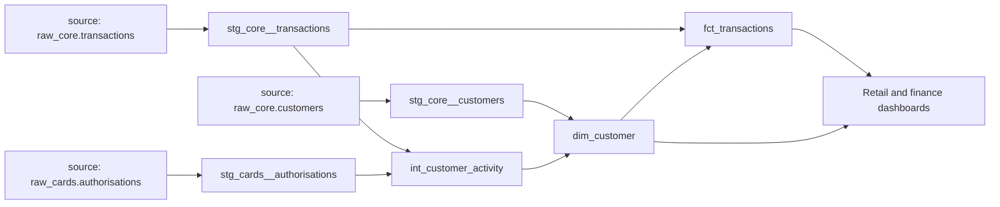
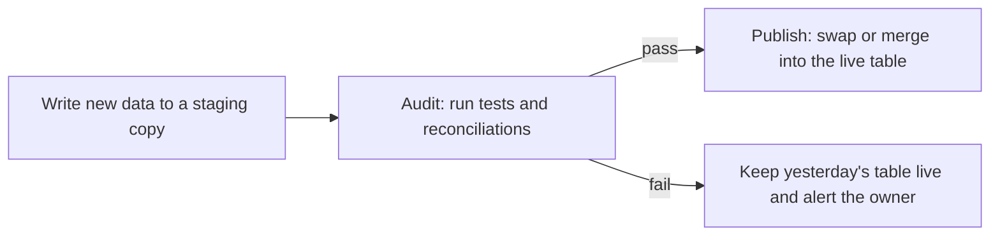
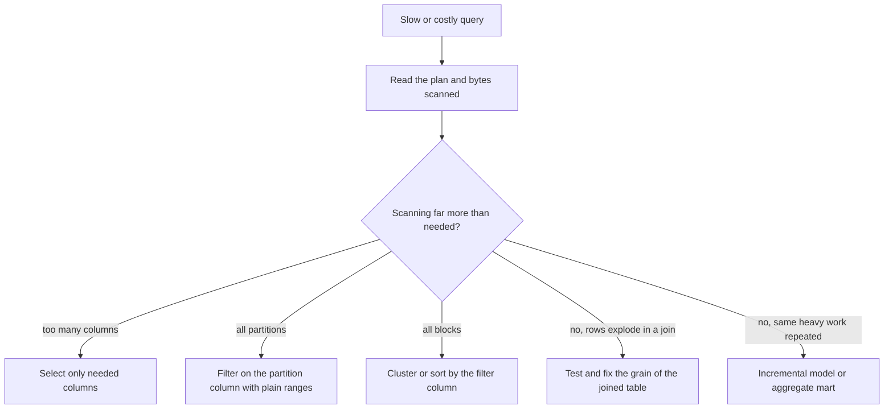

# Module 3 — Transformation and quality

*Getting data into the platform is only half the job. Raw tables from the core banking database, the card stream and Najm Mobile are not yet answers: they must be cleaned, joined, reshaped and tested before anyone builds a dashboard or a model on them. This module treats that work as software. It starts with transformations as code: dbt models in clear layers, tests that run on every change, and version control with review. It then widens to data quality as an operating discipline: what "good" data means, contracts with the teams who produce it, and observability that tells you about a broken feed before the Chief Risk Officer does. It ends with performance and cost: partitioning, clustering, incremental models and reading query plans, so the platform stays fast and affordable as Najm's data grows. You will follow Najm Bank's Data Platform & Analytics team as Lina moves a tangle of saved SQL into a tested dbt project, Huda learns why a green pipeline can still deliver wrong numbers, and Faisal asks why the warehouse bill doubled in a quarter.*

> **Stages:** Transform, Operate, Store — turning raw data into tested, trusted, affordable tables, and keeping them that way.

---

# 3.1 — Transformations as code: dbt, layers, tests and version control
*Level: 🟡 Intermediate* · *Prerequisites: 1.1, 1.2, 2.1, 2.2* · *Stage: Transform*

## ⚡ In 60 seconds
- A **transformation** turns loaded raw data into cleaned, joined, business-ready tables. In ELT (2.1) it runs inside the warehouse, as SQL.
- **Transformations as code** means every one of those SQL steps lives in a file, in version control, reviewed and tested like application code, not in saved queries on someone's laptop.
- **dbt** (data build tool) is a widely used open-source framework for this: each model is a `SELECT` statement, `ref()` wires models into a dependency graph, and tests and documentation live next to the code.
- Organise models in **layers**: sources → staging (clean, one-to-one with raw tables) → intermediate (reusable logic) → marts (facts and dimensions for people and tools).
- Decision cue: if a number reaches a dashboard, a regulator or a model, the SQL that produced it must be in the repository with at least key tests on its grain.
- Biggest trap: business logic copied into many places. When the definition of "active customer" lives in five queries, you will get five answers.

## 🧭 Why it matters
Kareem, the retail data analyst, sends the monthly "active customers" figure to the retail board. Lina sends the same figure to finance for the cost-per-customer report. The two numbers differ by several thousand. Both are "right": Kareem's saved query counts customers with any transaction in the last 90 days, while Lina's counts customers with a card authorisation *or* a login to Najm Mobile in the last 30 days. Each query was written years apart, copied, edited and pasted into a dashboard. Nobody can say which version the board saw last quarter, because the queries were never in version control.

Faisal asks for one thing: "Every number we publish comes from code we can read, review, test and roll back." Transformations as code do not decide which definition of "active" is correct (a metrics question, 4.1), but they make sure the chosen definition exists in one place, that changes are reviewed, and that a test fails when the data breaks its assumptions.

## 📐 How it works

### 🟢 The essentials

**What a transformation is.** After ingestion (2.1), the warehouse holds raw copies of source tables: `raw_core.transactions`, `raw_core.customers`, `raw_cards.authorisations`. They have source system names, inconsistent types, duplicates from retried loads and codes only the core banking team understands. A transformation is a step that reads tables and writes a new, better table: it renames, casts, deduplicates, joins and aggregates.

**Why code, not clicks.** Treating SQL like software gives you four things a folder of saved queries cannot:

| Practice | What it gives you |
|---|---|
| Version control (git) | History of every change, who made it and why; roll back a bad change |
| Code review (pull requests) | A second person checks logic before it reaches the board |
| Automated tests | The build fails when data breaks an assumption, such as duplicate keys |
| One dependency graph | Each model is defined once and reused, so logic is not copied |

**dbt in one paragraph.** dbt (dbt Core is the open-source command-line tool, maintained by dbt Labs) compiles and runs SQL `SELECT` statements against your warehouse. You do not write `CREATE TABLE`; you write the `SELECT`, and dbt wraps it in the right DDL for its **materialisation** (how the result is stored: `view`, `table`, `incremental` or `ephemeral`). Instead of hard-coding table names, you call `{{ ref('model_name') }}` for another model and `{{ source('source_name', 'table') }}` for a raw table. From those calls dbt builds a **DAG** (directed acyclic graph) of dependencies and runs models in the right order. dbt works with PostgreSQL, DuckDB (through the community `dbt-duckdb` adapter), and managed warehouses such as Snowflake, BigQuery, Databricks and Amazon Redshift through adapters.

**The layers.** Najm follows the structure dbt Labs recommends in its project-structure guide. Each layer has one job:



| Layer | Prefix | Job | Rule |
|---|---|---|---|
| Sources | declared in YAML | Point at raw tables loaded by ingestion | Never edited by dbt |
| Staging | `stg_<source>__<table>` | Rename, cast, standardise codes, deduplicate | One staging model per source table; no joins between sources |
| Intermediate | `int_` | Reusable business logic: joins, activity flags, sessionising | Not exposed to end users |
| Marts | `fct_` and `dim_` | Facts and dimensions at a stated grain (1.2), such as the customer 360 mart | What dashboards, analysts and models read |

These are the same raw → staging → marts layers from 0.2; Databricks calls a similar split bronze, silver and gold (the medallion architecture).

**A staging model.** It does small, boring, essential things:

```sql
-- models/staging/core/stg_core__transactions.sql
with source as (
    select * from {{ source('core_banking', 'transactions') }}
),

deduplicated as (
    select *,
           row_number() over (partition by txn_ref order by _loaded_at desc) as rn
    from source
)

select
    txn_ref                         as transaction_id,
    acct_no                         as account_id,
    cast(txn_ts as timestamp)       as transacted_at,
    cast(amt as numeric(18, 2))     as amount,
    upper(trim(ccy))                as currency_code,
    case txn_typ when 'D' then 'debit' when 'C' then 'credit' end as direction,
    _loaded_at
from deduplicated
where rn = 1
```

**Tests next to the code.** In a YAML file beside the model, you declare **generic data tests**. dbt ships four: `unique`, `not_null`, `accepted_values` and `relationships` (every value must exist in another model, like a foreign key). Since dbt 1.8 the key is `data_tests:`; the older `tests:` still works. Newer releases (1.10 onward) prefer test parameters such as `values` nested under an `arguments:` key and warn about the form below, so check the docs for your version.

```yaml
# models/staging/core/_core__models.yml
models:
  - name: stg_core__transactions
    description: One row per core banking transaction, deduplicated on transaction_id.
    columns:
      - name: transaction_id
        data_tests: [unique, not_null]
      - name: direction
        data_tests:
          - accepted_values:
              values: ['debit', 'credit']
      - name: account_id
        data_tests:
          - not_null
          - relationships:
              to: ref('stg_core__accounts')
              field: account_id
```

Each test compiles to a query that returns failing rows; zero rows means pass. `dbt build` runs models, tests, snapshots and seeds in DAG order, and skips models downstream of a failing test, so a bad staging table never quietly feeds the board report.

### 🟡 Going deeper

**The wrong way and the right way.** Here is how "active customer" spreads when logic is copied:

```sql
-- Wrong: the definition is pasted into each dashboard query
select count(distinct c.cust_id)
from raw_core.customers c
join raw_core.transactions t on t.acct_no in (
    select acct_no from raw_core.accounts a where a.cust_id = c.cust_id)
where t.txn_ts >= current_date - 90;
```

```sql
-- Right: defined once, in an intermediate model, then referenced everywhere
-- models/intermediate/int_customer_activity.sql
select
    a.customer_id,
    max(t.transacted_at)                                        as last_transaction_at,
    max(t.transacted_at) >= current_date - interval '90 days'   as is_active_90d
from {{ ref('stg_core__transactions') }} t
join {{ ref('stg_core__accounts') }} a using (account_id)
group by a.customer_id
```

Now `dim_customer`, the retail dashboard and the finance report all read `is_active_90d`. If the business changes the definition, one pull request changes it everywhere, and the review shows exactly what changed.

**Sources and freshness.** Declaring sources in YAML does more than name tables. You can add a freshness check, so `dbt source freshness` warns when ingestion has stalled:

```yaml
# models/staging/core/_core__sources.yml
sources:
  - name: core_banking
    schema: raw_core
    loaded_at_field: _loaded_at
    freshness:
      warn_after: {count: 6, period: hour}
      error_after: {count: 24, period: hour}
    tables:
      - name: transactions
      - name: customers
      - name: accounts
```

The exact placement of these keys has moved between dbt versions (newer releases prefer them under `config:`), so check the documentation for your version.

**Snapshots for history.** The core banking `customers` table is overwritten in place: when a customer moves from Doha to Dubai, the old city is gone. A **dbt snapshot** records each change as a new row with validity dates, which is a slowly changing dimension Type 2 (1.2):

```sql
-- snapshots/customers_snapshot.sql

{{ config(
    target_schema='snapshots',
    unique_key='customer_id',
    strategy='timestamp',
    updated_at='updated_at'
) }}
select customer_id, segment, city, risk_rating, updated_at
from {{ source('core_banking', 'customers') }}

```

dbt adds `dbt_valid_from` and `dbt_valid_to` columns; the current row has `dbt_valid_to` null. Use the `check` strategy when the source has no reliable `updated_at`. Recent versions (1.9 onward) also let you define snapshots in YAML. Snapshots must run on a schedule: a change that happens and reverts between two runs is never seen.

**Unit tests for logic.** Data tests check the data you have. **Unit tests** (added in dbt 1.8) check the logic against small, hand-written inputs, before any real data arrives. They are ideal for tricky `case` statements and date boundaries:

```yaml
unit_tests:
  - name: active_flag_uses_90_day_boundary
    model: int_customer_activity
    given:
      - input: ref('stg_core__transactions')
        rows:
          - {account_id: 'A1', transacted_at: '2026-01-01'}
      - input: ref('stg_core__accounts')
        rows:
          - {account_id: 'A1', customer_id: 'C1'}
    expect:
      rows:
        - {customer_id: 'C1', is_active_90d: false}
```

(A real version would pass "today" in as a variable rather than use `current_date`, so the result does not change as time passes: logic that depends on the clock is hard to test.)

**Documentation and lineage.** `dbt docs generate` turns every `description:` and the DAG into a browsable site. That lineage lets you answer "if the card feed breaks, which dashboards are wrong?" in minutes (6.1).

**The workflow.** Najm's daily loop:

1. Lina creates a git branch and edits a model.
2. She runs `dbt build --select int_customer_activity+` against her own development schema (the `+` means the model and everything downstream).
3. She opens a pull request. Continuous integration (CI) runs `dbt build` on the changed models and their children in a temporary schema.
4. A reviewer checks the SQL, the tests and the row-count differences.
5. After merge, the orchestrator (2.2) runs the production build on schedule.

In CI, **state selection** builds only what changed: `dbt build --select state:modified+ --defer --state prod-artifacts/`, where `--defer` reads unchanged parents from production. General CI design is covered in [*Cloud & DevOps: Zero to Hero*, lesson 4.1 — Continuous integration: pipelines, tests, artefacts and fast feedback](../cloud/index.html#/4.1).

### 🔴 Expert view

**Contracts on marts.** A mart that other teams depend on is a public interface. dbt **model contracts** (since dbt 1.5) let you declare column names and data types and have dbt refuse to build the model if the SQL produces a different shape:

```yaml
models:
  - name: dim_customer
    config:
      contract: {enforced: true}
    columns:
      - name: customer_id
        data_type: varchar
        constraints: [{type: not_null}]
      - name: is_active_90d
        data_type: boolean
      # ...abridged: an enforced contract must list every column the model returns
```

A contract protects shape, not meaning. Agreements about semantics and timeliness with producers belong in a data contract (3.2). For breaking changes, dbt **model versions** let you publish `dim_customer` v2 next to v1 and give consumers time to move.

**Test strategy, not test count.** A project with 2,000 tests that everyone ignores is worse than one with 200 that always mean something. Najm's rules: every model has a tested **primary key** (`unique` + `not_null`, or `dbt_utils.unique_combination_of_columns` for composite keys), because a broken grain silently doubles every sum downstream; staging models test what the source promises; marts test business rules (a loan's outstanding balance is never negative); and every incident ends with a new test. Use `severity: warn` for checks that should alert but not stop the build, and `store_failures: true` to keep failing rows for investigation.

**Where logic belongs.** Keep staging thin and mechanical; put business logic in intermediate and mart models. Avoid macros that hide large amounts of SQL: if you cannot read the compiled SQL in `target/compiled/` and understand it, simplify.

**Beyond dbt.** SQLMesh is an open-source alternative; Dagster can treat dbt models as assets; Spark or Polars jobs suit transformations SQL expresses badly. The principles (code in git, one definition, layers, tests, review, CI) apply whatever the tool.

## 🧰 The toolkit
| Tool, pattern or standard | What it is and does | When to reach for it |
|---|---|---|
| **dbt** (dbt Core, dbt Labs) | Open-source framework that runs SQL `SELECT` models in dependency order, with tests, docs and lineage | Any SQL transformation that feeds a number people rely on |
| **Staging, intermediate and mart layers** | A convention giving each model one job: clean, combine, serve | Structuring any transformation project so people can find things |
| **dbt generic data tests** (unique, not_null, accepted_values, relationships) | Declarative checks that compile to queries returning failing rows | On every primary key and every assumption the SQL relies on |
| **dbt snapshots** | Record changes in mutable source rows as SCD Type 2 history | Customer, account or product attributes that change in place |
| **dbt unit tests** (dbt 1.8+) | Test model logic on small hand-written inputs | Tricky `case` logic, date boundaries, financial calculations |
| **dbt model contracts** | Enforce column names and types of a model at build time | Marts that other teams or tools depend on |
| **dbt_utils** (package) | Extra tests and macros, such as composite-key uniqueness | When the four built-in tests are not enough |
| **SQLMesh** | Open-source alternative transformation framework | Comparing approaches; teams wanting its environment model |

## 🏛️ In practice at Najm Bank
Lina writes the **Najm dbt Project Standard v1** and the first tested model, `dim_customer`, which feeds the customer 360 mart.

**Part A: project conventions**

| Topic | Rule |
|---|---|
| Repository | One `najm-analytics` repo; `main` is production; all changes by pull request with one reviewer (two for regulatory marts) |
| Layers | `staging/<source>/`, `intermediate/<domain>/`, `marts/<domain>/` (retail, risk, finance) |
| Naming | `stg_<source>__<table>`, `int_<verb or noun>`, `fct_<event>`, `dim_<entity>`; snake_case columns; `_at` for timestamps, `_date` for dates, `is_`/`has_` for booleans |
| Materialisation | Staging: view. Intermediate: ephemeral or view. Marts: table, or incremental when large (3.3) |
| Minimum tests | Every model: primary key `unique` + `not_null`. Staging: `accepted_values` on codes, `relationships` on foreign keys. Marts: at least one business-rule test |
| Documentation | Every mart and every mart column has a description; grain stated in the model description |
| CI | `dbt build --select state:modified+ --defer --state <prod artefacts>` on every pull request; merge blocked on any error |
| Ownership | Each mart folder has a named owner in YAML `meta: {owner: ...}` |

**Part B: the model card for `dim_customer`**

| Field | Value |
|---|---|
| Grain | One row per customer currently known to core banking |
| Primary key | `customer_id` (tested unique, not null) |
| Built from | `stg_core__customers`, `int_customer_activity`, `customers_snapshot` (for `segment_changed_at`) |
| Key columns | `customer_id`, `segment`, `home_country`, `is_active_90d`, `last_transaction_at`, `segment_changed_at` |
| Business-rule tests | `segment` in ('retail', 'sme', 'corporate'); `home_country` in ('QA', 'AE', EU country codes); `last_transaction_at` not in the future |
| Contract | Enforced: names and types fixed; breaking changes need a new model version |
| Owner | Lina (analytics engineering); business owner: retail analytics (Kareem) |
| Consumers | Customer 360 mart, retail dashboard, finance cost-per-customer report |

Kareem and finance now read the same `is_active_90d`. The disagreement about which definition is right moves to where it belongs: a metric definition card (4.1).

## 🛠️ Exercises
Use synthetic data only. Generate fake customers, accounts and transactions with Python (for example the `Faker` library) or write small CSV seeds.

- 🟢 Install dbt Core with the `dbt-duckdb` adapter, create a project, load three CSV seeds (`customers`, `accounts`, `transactions`) with `dbt seed`, and write one staging model per seed with renamed, cast columns. *Done when:* `dbt build` succeeds and every staging model has `unique` and `not_null` tests on its primary key.
- 🟡 Add `int_customer_activity` and `dim_customer` as in this lesson. Deliberately insert a duplicate transaction and a transaction with an unknown account into your seed data. *Done when:* `dbt build` fails on the right tests, downstream models are skipped, and after you fix the staging deduplication the build passes again.
- 🔴 Put the project in git, add a snapshot on customers, change a customer's segment in the seed and re-run, and write a unit test for the 90-day boundary that does not depend on `current_date`. Add a CI workflow (GitHub Actions or any CI you can run) that runs `dbt build` on pull requests. *Done when:* the snapshot shows two rows for the changed customer with correct validity dates, the unit test passes, and a pull request that breaks the primary-key test is shown as failing.

## ⚠️ Mistakes and traps
- **Copying business logic into many queries.** Five copies of "active customer" become five numbers. Define it once in an intermediate or mart model and `ref()` it.
- **Hard-coding table names.** `from analytics.dim_customer` breaks environments and lineage. Always use `ref()` and `source()`.
- **No test on the grain.** A duplicate key doubles every total downstream with no error. Test the primary key of every model, first.
- **Tests nobody reads.** Hundreds of warnings that never fail train people to ignore them. Fewer, meaningful tests; warn only when someone will act.
- **Building in production by hand.** Running models from a laptop against production bypasses review. Develop in your own schema; production runs only from `main` via the orchestrator.

## 🧾 Recap
- Transformations as code puts every SQL step in git, behind review, tests and CI.
- dbt models are `SELECT` statements; `ref()` and `source()` build the dependency graph and lineage.
- Layers give each model one job: staging cleans, intermediate combines, marts serve.
- Test the grain of every model first; add accepted values, relationships and business rules; use unit tests for logic.
- Snapshots capture history of mutable rows; contracts and versions protect marts others depend on.

## ✍️ Check yourself

**1. Kareem's and Lina's "active customer" counts differ because each copied and edited the definition into their own query. What is the best structural fix?**

- A. Ask both analysts to build their reports in the same dashboard tool from now on
- B. Add a `not_null` test on `customer_id` in both saved queries
- C. Define the activity logic once in an intermediate model and have every mart and report `ref()` it
- D. Email the finance team the retail number each month

<details><summary>Answer</summary>

**C.** One definition in one model, reused through `ref()`, is what transformations as code provides. B tests data but does nothing about duplicated logic; A changes the tool, not the logic. (🟡 Going deeper.)

</details>

**2. What does a dbt generic test such as `unique` do when it runs?**

- A. Compiles to a query that returns rule-breaking rows; zero rows is a pass
- B. Adds a unique constraint to the warehouse table so future duplicate inserts are rejected
- C. Deletes duplicate rows from the model before it is materialised
- D. Checks the SQL syntax of the model

<details><summary>Answer</summary>

**A.** dbt data tests are queries for failing rows. They do not change data (C) and do not create database constraints (B); model contracts can add some constraints, but that is a different feature. (🟢 The essentials.)

</details>

**3. Huda wants to keep the history of each customer's risk rating, but the core banking `customers` table overwrites the rating in place. Which dbt feature fits?**

- A. An ephemeral model
- B. A `relationships` test
- C. A model contract
- D. A snapshot

<details><summary>Answer</summary>

**D.** Snapshots record each change as a new row with `dbt_valid_from` and `dbt_valid_to`, which is SCD Type 2. A contract (C) fixes the shape of a model, not its history. (🟡 Going deeper.)

</details>

**4. A staging model `stg_core__transactions` has a `unique` test on `transaction_id` that fails during `dbt build`. What happens to `fct_transactions`, which depends on it?**

- A. It builds normally, and the failure is logged for later
- B. It is skipped, so the bad data does not flow downstream
- C. It is dropped from the warehouse
- D. dbt automatically removes the duplicates and rebuilds it

<details><summary>Answer</summary>

**B.** `dbt build` runs tests in DAG order and skips downstream nodes when a test errors. That is exactly why testing in staging protects marts. dbt never fixes data itself (D). (🟢 The essentials.)

</details>

**5. Najm's pull-request CI takes 90 minutes because it rebuilds the whole project for every change. What is the standard dbt way to speed it up?**

- A. Remove the tests from CI and run them only in production after each merge to `main`
- B. Switch every model to a view so nothing has to be materialised in the CI schema
- C. Use state selection: build only modified models and their children, deferring unchanged parents
- D. Run CI once a week instead of on each pull request

<details><summary>Answer</summary>

**C.** `dbt build --select state:modified+ --defer --state ...` is the "slim CI" pattern. A and D remove the safety net; B may not even make it faster and changes production behaviour. (🟡 Going deeper.)

</details>

## 📚 References
- dbt documentation — https://docs.getdbt.com
- dbt Labs, "How we structure our dbt projects" — https://docs.getdbt.com/best-practices
- dbt data tests, unit tests, snapshots and model contracts — https://docs.getdbt.com/docs/build/data-tests
- dbt-duckdb adapter — https://github.com/duckdb/dbt-duckdb
- DuckDB documentation — https://duckdb.org/docs/
- PostgreSQL documentation — https://www.postgresql.org/docs/
- SQLMesh — https://sqlmesh.com
- Ralph Kimball and Margy Ross, *The Data Warehouse Toolkit* (3rd edition, Wiley)

---

# 3.2 — Data quality: tests, contracts and observability
*Level: 🟡 Intermediate* · *Prerequisites: 2.2, 3.1* · *Stage: Transform, Operate*

## ⚡ In 60 seconds
- **Data quality** means data is fit for the decision it supports: complete, valid, unique, consistent, accurate and on time.
- Three layers of defence: **tests** check known assumptions in your pipeline; **data contracts** agree schema, meaning and timeliness with the teams that produce data; **data observability** watches freshness, volume, schema and distribution for problems nobody wrote a test for.
- Put checks where they can stop damage: at ingestion, between layers, and before publishing. Use **write-audit-publish** so bad data never reaches consumers.
- Decision cue: for every critical table, answer "who owns it, what does good look like, how fast will we know when it isn't, and what happens then?"
- Biggest trap: a green pipeline is not correct data. Jobs succeed happily while loading half a file, a renamed column full of nulls or yesterday's data twice.

## 🧭 Why it matters
At 07:40 on a Monday, the Chief Risk Officer's dashboard shows SME loan arrears down by a third overnight. The risk team starts drafting a note to the board. Huda checks Airflow: every task is green. It takes until lunchtime to find the cause. Over the weekend, the core banking team changed the `days_past_due` field from an integer to a text code ("0-30", "31-60") in a release. The ingestion job loaded it without error, the staging cast turned every value it could not parse into null, and the arrears model counted nulls as "not in arrears". Nothing failed. The numbers were simply wrong.

Public cases show the same pattern. In October 2020, it was widely reported that around 16,000 positive COVID-19 test results in England were left out of official daily figures. The cause was a data pipeline that used the legacy Excel XLS file format, which holds at most 65,536 rows per sheet; records beyond the limit were silently dropped. Again, nothing crashed.

Faisal's conclusion for the team: "Pipelines fail loudly; data fails quietly. We need checks that make data failures loud, agreements so they happen less, and monitoring for the ones we didn't imagine."

## 📐 How it works

### 🟢 The essentials

**What "quality" means.** Data quality is fitness for use: the same table can be good enough for a trend chart and not good enough for a regulatory return. The dimensions most often listed (for example in DAMA's body of knowledge, DAMA-DMBOK) give you a vocabulary for writing checks:

| Dimension | Question | Najm example check |
|---|---|---|
| Completeness | Is everything there that should be? | Every active account has a balance row for yesterday |
| Validity | Do values follow the rules and formats? | `currency_code` is a known ISO 4217 code |
| Uniqueness | Is each thing recorded once? | `transaction_id` is unique |
| Consistency | Do related data agree? | Sum of transactions per account matches movement in the balance |
| Accuracy | Does the data match reality? | Sample of loans reconciled to signed contracts quarterly |
| Timeliness | Is it there when needed? | Card authorisations land within 15 minutes |

**Tests: checks you know to write.** In 3.1 you met dbt's generic tests. They catch broken assumptions you can name. The arrears incident needed either of two: a `not_null` on `days_past_due` after the staging cast, or a schema check at ingestion that the field is still an integer. Either would have failed the build at 03:00 instead of the CRO finding out at 07:40.

**Where checks go.** Each check belongs where it can stop damage cheapest:

| Checkpoint | What to check | On failure |
|---|---|---|
| Ingestion | File arrived, row count vs source, schema unchanged, file fully read | Stop the load, alert the pipeline owner |
| Staging | Types, nulls, codes, keys, duplicates | Fail the build; downstream skipped |
| Marts | Business rules, reconciliations, totals vs previous day | Block publish, alert the mart owner |
| Consumers | Freshness on the dashboard itself | Show "data as of" and a stale banner |

**Fail, warn or quarantine.** Not every failure should stop everything. Three responses:
- **Fail** (block): use for keys, critical fields and anything feeding regulators or money decisions.
- **Warn**: alert a named person but publish; use for checks where partial data is better than none.
- **Quarantine**: move bad rows to a side table, publish the rest, and report the count. Use when a few bad rows are expected and individually fixable.

A failing check is only useful if a named person gets the alert and knows what to do.

### 🟡 Going deeper

**Data contracts: preventing the failure upstream.** The arrears field changed because the core banking team did not know anyone depended on its type. A **data contract** is an agreement between a data producer and its consumers that makes the dependency explicit. It covers:
- **Schema**: fields, types, nullability, keys.
- **Semantics**: what each field means, units, allowed values (is `amount` in fils or riyals? Does `days_past_due` count calendar or business days?).
- **Service levels**: freshness (by when each day), completeness, and how fast issues are fixed.
- **Change process**: how breaking changes are announced, versioned and given a migration period.
- **Ownership**: a named producer owner and a named consumer contact.

Contracts work best when they are files in version control and checked by machines, not PDFs. A YAML contract can be validated in the producer's CI (does the new release still produce this schema?) and in the consumer's ingestion (did today's data match?). An open specification for this exists, the **Open Data Contract Standard** (ODCS), maintained at the time of writing (2026) by the Bitol project under the Linux Foundation; you can also start with a simple in-house format. In dbt, a model contract (3.1) enforces the schema part for models you produce yourself.

**Contract checks in code.** A minimal Python check at ingestion, comparing an incoming file with the contracted schema:

```python
import duckdb

CONTRACT = {
    "loan_id": "VARCHAR",
    "customer_id": "VARCHAR",
    "outstanding_amount": "DECIMAL(18,2)",
    "days_past_due": "INTEGER",
}

con = duckdb.connect()
rel = con.sql("select * from read_parquet('landing/loans_2026-10-01.parquet')")
actual = dict(zip(rel.columns, [str(t) for t in rel.types]))

problems = [f"{col}: expected {typ}, got {actual.get(col, 'MISSING')}"
            for col, typ in CONTRACT.items() if actual.get(col) != typ]
if problems:
    raise ValueError("Contract breach, load stopped: " + "; ".join(problems))
```

On the Monday of the incident, this would have stopped with `days_past_due: expected INTEGER, got VARCHAR`.

**Reconciliation tests.** Some of the most valuable checks compare two systems. Najm's credit-risk mart must agree with the general ledger: total outstanding loans in the mart should match the ledger control total for the same date, within a tolerance agreed with finance.

```sql
-- tests/assert_loan_book_reconciles_to_ledger.sql  (a dbt singular test)
with mart as (
    select as_of_date, sum(outstanding_amount) as mart_total
    from {{ ref('fct_loan_balances_daily') }}
    group by as_of_date
),
ledger as (
    select as_of_date, control_total as ledger_total
    from {{ ref('stg_finance__gl_loan_control') }}
)
select m.as_of_date, m.mart_total, l.ledger_total
from mart m
left join ledger l using (as_of_date)
where l.ledger_total is null                      -- no control total: cannot reconcile
   or abs(m.mart_total - l.ledger_total) > 1.00   -- tolerance agreed with finance
```

A **singular test** is a SQL file in `tests/` that returns failing rows, for checks too specific for a generic test. Note the `left join`: with an inner join, a day with no ledger row would silently pass.

**Write-audit-publish.** The safest pattern for important tables is to never let consumers see unchecked data:



In a warehouse you can write to a `_staging` table and swap it in with a rename inside a transaction; open table formats such as Apache Iceberg support branches that make this native. With dbt, running tests before the mart is built (they are upstream in the DAG) gives much of the same protection: if staging fails, the mart keeps yesterday's data instead of being rebuilt from bad input. Tests on the mart itself, though, run after it has been replaced, so mart-level rules still need a true audit step.

### 🔴 Expert view

**Data observability: catching what nobody wrote a test for.** Tests only find problems you predicted. **Data observability** monitors tables continuously for signs that something has changed, using four signals:

| Signal | Question | Example alert |
|---|---|---|
| Freshness | When did this table last change? | `raw_cards.authorisations` not updated for 45 minutes on a weekday |
| Volume | Is the row count normal? | Yesterday's Najm Mobile events 40% below the same weekday's average |
| Schema | Did columns appear, disappear or change type? | `days_past_due` changed from integer to text |
| Distribution | Do the values look normal? | Share of null `merchant_category` jumped from near zero to 12% |

Lineage (3.1, 6.1) is often added as a fifth: it tells you which downstream dashboards are affected. Commercial observability platforms do this with learned baselines; you can start with SQL. A simple volume monitor:

```sql
-- Flag days whose row count is far from the trailing 28-day average for the same table
with daily as (
    select cast(event_ts as date) as d, count(*) as n
    from raw_mobile.app_events
    where event_ts >= current_date - interval '35 days'
    group by 1
),
scored as (
    select d, n,
           avg(n)    over (order by d rows between 28 preceding and 1 preceding) as avg_n,
           stddev(n) over (order by d rows between 28 preceding and 1 preceding) as sd_n
    from daily
)
select d, n, avg_n
from scored
where d = current_date - 1
  and sd_n > 0
  and abs(n - avg_n) > 3 * sd_n;
```

Three standard deviations is a common starting point, not a rule. Weekly seasonality (Fridays in the Gulf look different from Mondays), month-end and Ramadan will produce false alarms unless you compare like with like, for example the same weekday, and tune thresholds per table.

**Alert fatigue is the real enemy.** A monitor on every column of every table generates hundreds of alerts a week, and people stop reading them. Monitor the tables that matter (those feeding regulatory reports, the CRO dashboard, Smart Alerts features), route each alert to a named owner, and review noisy monitors monthly. This is the same discipline as service alerting, covered in [*Cloud & DevOps: Zero to Hero*, lesson 5.2 — SLOs, error budgets, alerting and on-call that people can sustain](../cloud/index.html#/5.2).

**Data SLOs and incidents.** Treat critical datasets like services. A **data SLO** (service level objective) might be: "The credit-risk mart is complete and reconciled for the previous business day by 07:00 on 99% of business days." Measure it, publish it, and run **data incidents** like any other: declare, communicate to consumers ("the arrears figure on the CRO dashboard is wrong; do not use it until further notice"), fix, backfill (2.2), and write a blameless review that ends with a new test, monitor or contract clause.

**Quality for models and AI.** Data feeding Smart Alerts or Credit Memo Copilot needs the same checks plus some of its own: label quality, representativeness, and drift (5.2). Governance requirements for training and testing data are covered in [*AI Governance: Zero to Hero*, lesson 9.2 — Quality, representativeness and bias](../aigp/index.html#/9.2).

## 🧰 The toolkit
| Tool, pattern or standard | What it is and does | When to reach for it |
|---|---|---|
| **dbt generic data tests** (unique, not_null, accepted_values, relationships) | Declarative checks on columns and relationships | Every key and critical field in staging and marts |
| **dbt singular tests** | Custom SQL files that return failing rows | Reconciliations and business rules specific to one model |
| **Great Expectations** | Open-source Python framework for declaring and validating expectations about data | Checks in Python pipelines, or outside dbt |
| **Soda** | Data quality tool with a YAML-based check language (open-source core) | Teams wanting checks defined outside transformation code |
| **Data contract** (for example the **Open Data Contract Standard**) | Machine-readable agreement on schema, meaning, service levels and change process | Every critical feed from a producer team |
| **Write-audit-publish** | Write to a hidden copy, test it, then publish | Regulatory extracts and executive dashboards |
| **Data observability** (freshness, volume, schema, distribution) | Continuous monitoring for unexpected changes in tables | Critical tables, to catch failures nobody wrote a test for |

## 🏛️ In practice at Najm Bank
After the arrears incident, Faisal and Huda write the first **Najm data contract** with the core banking team, and a quality plan for the credit-risk mart.

**Part A: data contract (summary of the YAML in the repo)**

| Section | Agreed content |
|---|---|
| Dataset | `core_banking.loans_daily`, delivered as Parquet to the landing zone |
| Producer owner | Core banking platform team (named lead); consumer contact: Huda (data platform) |
| Schema | `loan_id` VARCHAR not null, unique per `as_of_date`; `customer_id` VARCHAR not null; `outstanding_amount` DECIMAL(18,2) in QAR, not null, ≥ 0; `days_past_due` INTEGER not null, ≥ 0, calendar days; `product_code` from the published product list |
| Semantics | One row per loan per business day, as of end-of-day close; written-off loans excluded |
| Service level | File complete by 02:00 Doha time on business days; row count within 2% of core banking's own control count, sent in a manifest file |
| Change process | Breaking changes (type, meaning, removal) announced 30 days ahead with a new version; both versions delivered in parallel for one month |
| Checks | Producer CI validates schema before release; Najm ingestion validates schema, manifest count and freshness on arrival and stops the load on breach |

**Part B: quality plan for `fct_loan_balances_daily`**

| Check | Type | Severity | Owner |
|---|---|---|---|
| `loan_id` + `as_of_date` unique and not null | `dbt_utils` composite-key test + `not_null` | Fail | Huda |
| `days_past_due` ≥ 0 and not null | `not_null` + `dbt_utils.accepted_range` | Fail | Huda |
| Total outstanding reconciles to ledger within QAR 1 | dbt singular | Fail; keep previous day live | Lina |
| Row count within 2% of producer manifest | Ingestion check | Fail | Huda |
| Arrears rate change vs previous day above 5 points | Observability | Warn; human review before 07:00 | Risk analyst on duty |
| Mart not complete by 06:30 (ahead of the 07:00 SLO) | Freshness | Page data platform on-call | Faisal's team |

The 2% and 5-point thresholds are Najm's own starting choices, to be tuned after three months of data.

## 🛠️ Exercises
Use synthetic data only.

- 🟢 Take the `dim_customer` project from 3.1 and list, for one mart, one check per quality dimension (completeness, validity, uniqueness, consistency, accuracy, timeliness). Implement at least four as dbt tests. *Done when:* each check names its dimension, its severity (fail, warn or quarantine) and its owner, and `dbt build` runs them.
- 🟡 Write a YAML data contract for a synthetic `loans_daily` Parquet file, and a Python script that validates a file against it (schema, nulls, ranges, row count vs a manifest). Generate one good file and three bad ones (wrong type, missing column, 10% of rows dropped). *Done when:* the good file loads and each bad file is rejected with a clear message naming the breach.
- 🔴 Build a volume and freshness monitor in SQL for a synthetic daily events table covering 90 days, with weekly seasonality and one injected outage day. Compare a plain trailing-average threshold with a same-weekday comparison. *Done when:* your monitor flags the outage day, and you can show how many false alarms each method raised over the 90 days.

## ⚠️ Mistakes and traps
- **Trusting green pipelines.** A successful job only means the code ran. Add checks on the data itself: keys, nulls, volumes, reconciliations.
- **Casting failures to null.** `try_cast` or lenient parsing turns a schema change into silent nulls. Test `not_null` after casts, or fail the load on unparseable values.
- **Contracts as documents nobody checks.** A PDF agreement does not stop a release. Put the contract in version control and validate it in both the producer's CI and your ingestion.
- **Alerts without owners.** An alert sent to a shared channel is an alert nobody handles. Every check names an owner and an action.
- **Monitoring everything equally.** Hundreds of noisy monitors bury the important one. Start with tables that feed regulators, executives and models.
- **Fixing data by hand in the mart.** A manual `UPDATE` hides the cause and is overwritten tomorrow. Fix at the source or in code, then backfill.

## 🧾 Recap
- Data quality is fitness for use, described by dimensions such as completeness, validity, uniqueness, consistency, accuracy and timeliness.
- Tests catch known failures; contracts prevent them upstream; observability catches the unknown ones.
- Place checks where they stop damage cheapest, and choose fail, warn or quarantine deliberately.
- Write-audit-publish keeps unchecked data away from consumers.
- Treat critical datasets like services: owners, SLOs, incidents and a new check after every failure.

## ✍️ Check yourself

**1. Every Airflow task is green, but the CRO dashboard shows arrears down by a third overnight because a source field changed type and was cast to null. Which check would have caught it earliest?**

- A. A check that the CRO dashboard refreshed successfully before 07:00
- B. A schema check at ingestion, or `not_null` on `days_past_due` after the cast
- C. A longer Airflow retry policy with more attempts per failed task
- D. A quarterly accuracy audit of loans against signed contracts

<details><summary>Answer</summary>

**B.** The failure was a schema change turned into nulls; a schema or `not_null` check right after ingestion would fail the build before the mart was rebuilt. Retries (C) re-run the same bad data; a quarterly audit (D) is far too late. (🟢 The essentials.)

</details>

**2. Which of these belongs in a data contract but is NOT enforced by a dbt model contract?**

- A. The names of the columns the model returns
- B. The data type declared for each column
- C. Not-null constraints on the key columns of the model
- D. A field's meaning and the data's arrival deadline

<details><summary>Answer</summary>

**D.** dbt model contracts enforce shape: names, types and some constraints. Semantics, service levels and the change process are part of a data contract agreed with the producer. (🟡 Going deeper.)

</details>

**3. The credit-risk mart feeds a regulatory return. The team wants to make sure that if tonight's data fails its tests, regulators' extracts still use yesterday's validated data. Which pattern fits?**

- A. Write-audit-publish
- B. Quarantine bad rows and publish the rest
- C. Warn-only tests
- D. Observability volume monitors

<details><summary>Answer</summary>

**A.** Write-audit-publish writes to a hidden copy, audits it, and only then publishes, so failure leaves the last good version live. Quarantine (B) publishes partial data, which is wrong for a regulatory return. (🟡 Going deeper.)

</details>

**4. A volume monitor on Najm Mobile events raises an alert every Friday. What is the most likely fix?**

- A. Delete the monitor, since Friday alerts are expected noise
- B. Lower the threshold from three standard deviations to one
- C. Compare each day with the same weekday's history
- D. Run the monitor monthly instead of daily so it alerts less often

<details><summary>Answer</summary>

**C.** Gulf weekends make Fridays look different from weekdays; comparing like with like removes the false alarms while keeping the monitor. B makes it noisier; A and D lose the protection. (🔴 Expert view.)

</details>

**5. Which statement best describes the difference between data tests and data observability?**

- A. Tests run only in production pipelines, while observability runs only in development and CI environments
- B. Tests check assumptions you wrote down; observability watches for changes nobody predicted
- C. Observability learns baselines automatically, so it replaces the need for tests on primary keys
- D. Tests are for streaming data; observability is for batch data

<details><summary>Answer</summary>

**B.** They are complementary: tests encode known rules, observability catches the unexpected. Neither replaces the other (C). (🔴 Expert view.)

</details>

## 📚 References
- dbt documentation: data tests and singular tests — https://docs.getdbt.com/docs/build/data-tests
- DAMA International, *DAMA-DMBOK: Data Management Body of Knowledge* (2nd edition)
- Open Data Contract Standard (Bitol project) — https://bitol.io
- Great Expectations — https://greatexpectations.io
- Soda — https://www.soda.io
- Apache Iceberg documentation (branching and tagging) — https://iceberg.apache.org/docs/latest/
- DuckDB documentation: Parquet — https://duckdb.org/docs/
- UK Parliament and national press coverage of the October 2020 Public Health England case-reporting error (search "PHE Excel error October 2020")

---

# 3.3 — Performance and cost: partitioning, clustering, incremental models and query plans
*Level: 🟡 Intermediate* · *Prerequisites: 1.3, 3.1* · *Stage: Store, Operate*

## ⚡ In 60 seconds
- In analytical systems, **cost and speed are mostly about how much data a query reads**. Read less and you pay less and wait less.
- **Partitioning** splits a table into separate parts by a column (usually a date) so queries can skip whole parts; **clustering** orders data within storage so min/max statistics let engines skip blocks.
- **Incremental models** process only new or changed data instead of rebuilding everything, but need a strategy for late-arriving data and an occasional full rebuild.
- **Query plans** (`EXPLAIN`, `EXPLAIN ANALYZE`) show what the engine actually does. Read them before guessing.
- Decision cue: partition by the column most queries filter on, usually event date; only partition tables large enough to benefit.
- Biggest trap: writing filters the engine cannot use, such as wrapping the partition column in a function, so every query still scans everything.

## 🧭 Why it matters
Faisal opens the quarterly cloud invoice and finds the data platform's warehouse cost has roughly doubled, while data volume grew far less. Nobody launched anything big. Lina and Huda dig into the query history. Three causes account for most of it. The `fct_card_authorisations` model is rebuilt from scratch every hour, rereading years of history to add the last sixty minutes. The retail dashboard runs `select *` on the transactions fact table each time someone opens it. And a popular analyst query filters with `where to_char(transacted_at, 'YYYY-MM') = '2026-09'`, which defeats the table's date partitioning, so every run reads every partition.

None of these were bugs: every query returned the right answer. They were simply expensive, in money and in time (the CRO dashboard took minutes to load). This lesson gives you the techniques and the habit of checking how much a query reads before you ship it.

## 📐 How it works

### 🟢 The essentials

**Why scanned data is the key number.** Analytical engines (1.3) store data in **columnar** form: each column's values are stored together, often in files such as Parquet. A query that needs three of forty columns reads only those three. The work an engine does is dominated by how many bytes and rows it reads, and so is the bill. Managed warehouses charge in different ways (BigQuery's on-demand pricing is based on bytes processed; Snowflake and Databricks charge for compute time), but in both models, reading less means paying less. Check your provider's current pricing pages for numbers; they change.

Three ways to read less:
1. **Read fewer columns.** Never `select *` in production models or dashboards.
2. **Read fewer partitions.** Partition large tables and filter on the partition column.
3. **Read fewer blocks inside partitions.** Cluster or sort data so engines can skip blocks using statistics.

**Partitioning.** A **partitioned table** is stored as separate pieces, each holding rows for one value or range of a column. A query with a filter on that column reads only the matching pieces: **partition pruning**. In PostgreSQL (declarative partitioning since version 10):

```sql
create table fct_transactions (
    transaction_id  varchar      not null,
    account_id      varchar      not null,
    transacted_at   timestamp    not null,
    amount          numeric(18,2) not null
) partition by range (transacted_at);

create table fct_transactions_2026_09 partition of fct_transactions
    for values from ('2026-09-01') to ('2026-10-01');
create table fct_transactions_2026_10 partition of fct_transactions
    for values from ('2026-10-01') to ('2026-11-01');
```

In a lake, partitioning usually means a folder per value. DuckDB writes and reads such **Hive-style partitioned** Parquet directly:

```sql
-- DuckDB: write one folder per month
copy (
    select *, year(transacted_at) as yr, month(transacted_at) as mo
    from fct_transactions
) to 'lake/fct_transactions' (format parquet, partition_by (yr, mo));

-- Read with pruning: only lake/fct_transactions/yr=2026/mo=9/ is opened
select sum(amount)
from read_parquet('lake/fct_transactions/*/*/*.parquet', hive_partitioning = true)
where yr = 2026 and mo = 9;
```

**Write filters the engine can use.** Pruning only works when the engine can match your filter to partition boundaries. Wrapping the column in a function usually hides it:

```sql
-- Wrong: the function on the column prevents pruning in many engines
select sum(amount) from fct_transactions
where to_char(transacted_at, 'YYYY-MM') = '2026-09';

-- Right: a plain range on the partition column
select sum(amount) from fct_transactions
where transacted_at >= '2026-09-01' and transacted_at < '2026-10-01';
```

The half-open range (`>=` start, `<` next start) also avoids a classic bug: `between '2026-09-01' and '2026-09-30'` on a timestamp misses everything after 00:00 on 30 September.

**Choosing a partition column.** Pick the column that most queries filter on and that spreads data fairly evenly. For event and transaction data that is almost always the event date. Avoid high-cardinality columns such as `customer_id`: millions of tiny partitions create the **small files problem**, where the overhead of opening files and tracking metadata outweighs the savings. Do not partition small tables at all; a table of a few million rows is usually fine without it.

### 🟡 Going deeper

**Clustering and data skipping.** Inside a partition, columnar files are divided into blocks (Parquet calls them **row groups**) and store the **minimum and maximum** value of each column per block. If a query filters on `account_id = 'A123'` and a block's range does not include it, the engine skips that block. This only helps if similar values are stored together. **Clustering** (or sorting) the data by a commonly filtered column makes the ranges narrow and skipping effective.

| Platform | What it calls it |
|---|---|
| PostgreSQL | Indexes (B-tree, BRIN for naturally ordered data); `CLUSTER` reorders a table once |
| DuckDB and Parquet files | Sort data on write (`order by`) so row-group min/max statistics are selective |
| Snowflake | Micro-partitions with automatic pruning; optional clustering keys |
| BigQuery | Partitioned tables plus clustered tables (up to four clustering columns) |
| Delta Lake and Apache Iceberg | Partitioning plus file-level statistics; Z-ordering and liquid clustering (Delta), sort orders (Iceberg) |

A good default for Najm's transaction facts: partition by transaction date, cluster or sort by `account_id`. Date filters prune partitions; account lookups skip blocks.

Apache Iceberg adds **hidden partitioning**: you declare a transform such as `days(transacted_at)` and the format maps ordinary filters on `transacted_at` to partitions for you, so users do not need to know the partition columns. It also supports **partition evolution**, changing the scheme (say from monthly to daily) without rewriting old data.

**Incremental models.** A **full refresh** rebuilds a table from all its inputs every run. That is simple and always correct, but for `fct_card_authorisations` it means rereading years of history every hour. An **incremental model** processes only new or changed rows and merges them into the existing table. In dbt:

```sql
-- models/marts/cards/fct_card_authorisations.sql
{{ config(
    materialized='incremental',
    unique_key='authorisation_id',
    incremental_strategy='delete+insert',
    on_schema_change='fail'
) }}

select
    authorisation_id, card_id, merchant_category, amount, authorised_at, _loaded_at
from {{ ref('stg_cards__authorisations') }}


  -- Reprocess a 3-day window of event time so late-arriving events are picked up
  where authorised_at > (select max(authorised_at) - interval '3 days' from {{ this }})

```

How it works: on the first run, `is_incremental()` is false and dbt builds the whole table. On later runs it selects only rows whose event time falls in the window and, with `delete+insert` and a `unique_key`, replaces any matching rows, so reprocessing the overlap does not create duplicates. That makes the model **idempotent** (2.2): running it twice gives the same result. Other strategies exist (`append`, `merge`, `insert_overwrite`, and `microbatch` since dbt 1.9); which are available depends on the adapter.

Three rules for incremental models:
- **Handle late data with a lookback window.** Events often arrive late: card authorisations retried by a terminal, mobile events from a phone that was offline. They carry an old event time, so filtering on "event time newer than the latest row" silently drops them. Reprocess a window sized from the measured lateness of your data, or filter on load time (`_loaded_at`) instead, which is always new for newly arrived rows.
- **Use a unique key** so reprocessing is safe. Without one, `append` duplicates rows on every overlap.
- **Schedule full refreshes.** Logic changes and rare late corrections drift the table from truth. Run `dbt build --full-refresh` on a schedule (for example monthly) or whenever the model's logic changes, and compare row counts and totals.

### 🔴 Expert view

**Reading query plans.** A query plan is the engine's recipe: which tables it scans, which filters it pushes down, how it joins and how many rows flow between steps. `EXPLAIN` shows the plan; `EXPLAIN ANALYZE` runs the query and shows actual rows and time. In PostgreSQL, add `BUFFERS` to see how much data was read:

```sql
explain (analyze, buffers)
select account_id, sum(amount)
from fct_transactions
where transacted_at >= '2026-09-01' and transacted_at < '2026-10-01'
group by account_id;
```

What to look for:
- **Which partitions were scanned.** With the right filter you should see only `fct_transactions_2026_09`. With the `to_char` filter you will see every partition.
- **Estimated versus actual rows.** Large gaps mean stale statistics (run `ANALYZE`) or a filter the planner cannot estimate, and lead to bad join choices.
- **The most expensive node.** Usually a scan of a big table, a sort that spills to disk, or a join that produces far more rows than expected.

DuckDB's `explain analyze` prints a similar tree with per-operator timings and row counts, and shows filters pushed into the Parquet scan. Managed warehouses show plans and bytes scanned in their query profiles; check them when reviewing new dashboard queries.

**Join explosions.** A join on a non-unique key multiplies rows. Joining transactions to a customer dimension that accidentally has two rows per customer (a broken SCD2 filter, 1.2) doubles every amount and the work. In the plan this shows as a join whose output row count is much larger than either input. The fix is a grain test on the dimension (3.1), not a `distinct` at the end, which hides the bug and adds expensive deduplication work.

**Precompute what many people ask.** If fifty dashboard tiles aggregate the same billion-row fact table by day and branch, build an aggregate mart (`agg_transactions_daily_branch`) once per load and point dashboards at it. Materialised views do similar work inside one database. The trade-off is freshness and one more model to test; it is usually worth it for executive dashboards.

**Cost guardrails.** Cost control is an operating practice, not a one-off clean-up:
- **Attribute cost.** Tag queries and jobs with team and model (query tags, labels, or separate compute warehouses per workload) so you know who spends what.
- **Set limits.** Managed platforms offer controls such as auto-suspending idle compute (Snowflake), resource monitors, and a maximum bytes billed per query (BigQuery). Use them, especially for ad hoc analyst workloads.
- **Review the top queries monthly.** A handful of queries usually dominate cost; fix those first.
- **Compact small files** in lakes (Iceberg and Delta provide maintenance operations for this) so scans open fewer, larger files.

Wider cloud cost practice is covered in [*Cloud & DevOps: Zero to Hero*, lesson 6.2 — FinOps: understanding, allocating and cutting cloud cost](../cloud/index.html#/6.2), and database tuning for applications in [*System Design for Vibe Coders*, lesson 2.5 — Indexes, queries, and the working set](../vibe/index.en.html#l2-5).



## 🧰 The toolkit
| Tool, pattern or standard | What it is and does | When to reach for it |
|---|---|---|
| **Partitioning** (by date) | Splits a table into parts so queries skip parts they do not need | Large event and transaction tables filtered by date |
| **Clustering and sort order** | Stores similar values together so min/max statistics skip blocks | Frequent filters on a second column such as `account_id` |
| **Incremental models** (dbt) | Process only new or changed rows, merged by a unique key | Large facts rebuilt often; with a lookback window for late data |
| **EXPLAIN and EXPLAIN ANALYZE** | Show the engine's plan and, with ANALYZE, actual rows and time | Before shipping any heavy query; whenever something is slow |
| **Apache Parquet** | Columnar file format with row groups and column statistics | Lake storage that engines can scan selectively |
| **Apache Iceberg** (hidden partitioning, partition evolution) | Open table format that maps filters to partitions and lets the scheme change | Lakehouse tables whose partitioning needs will change |
| **Aggregate marts** | Precomputed summaries at a coarser grain | Many dashboards asking the same heavy question |
| **Cost guardrails** (auto-suspend, per-query byte limits, query tags) | Platform controls that cap and attribute spend | Every managed warehouse, from day one |

## 🏛️ In practice at Najm Bank
Huda and Lina write a **performance and cost review** for the three costly workloads, plus a checklist every new mart must pass.

**Part A: findings and changes**

| Workload | Finding (from query history and plans) | Change | How we verify |
|---|---|---|---|
| `fct_card_authorisations` hourly build | Full refresh rereads all history every hour | Incremental, `delete+insert` on `authorisation_id`, 3-day lookback; partition by `authorised_at` date; monthly full refresh | Bytes scanned per run before and after; monthly full-refresh totals match incremental table |
| Retail dashboard | `select *` on `fct_transactions` per tile; same aggregate repeated | New `agg_transactions_daily_branch` mart; tiles read only needed columns | Dashboard load time and bytes scanned per refresh |
| Analyst month filter | `to_char(transacted_at, ...)` prevents pruning | Rewrite as half-open date range; add the pattern to the SQL style guide and review checklist | Plan shows one partition scanned |

**Part B: the new-mart performance checklist**

| Check | Pass condition |
|---|---|
| Size estimate | Expected rows and growth per month recorded in the model description |
| Partitioning | Partitioned by event date if expected to grow beyond the team's agreed size threshold; otherwise not partitioned |
| Clustering | Sort or cluster key chosen from the top two filter columns in expected queries |
| Materialisation | Incremental only with a unique key, a measured lookback window and a scheduled full refresh |
| Queries | Top three consumer queries run with `EXPLAIN ANALYZE` or the warehouse profile; no full scans of large partitioned tables |
| Columns | No `select *` in models or dashboards |
| Cost tags | Jobs tagged with team and model; owner named |

The size threshold and lookback window are Najm's own choices, set from measured data, not universal numbers.

## 🛠️ Exercises
Use synthetic data only: generate, for example, tens of millions of fake transactions over two years with DuckDB's `range()` and `random()` functions.

- 🟢 In DuckDB, create a synthetic transactions table and write it to Parquet twice: once unpartitioned and once partitioned by year and month. Run the same one-month sum on both with `explain analyze`. *Done when:* you can show from the plans and timings that the partitioned version reads only one month's files.
- 🟡 In PostgreSQL, create a range-partitioned `fct_transactions` by month, load synthetic data, and compare `explain (analyze, buffers)` for a `to_char` month filter and a half-open range filter. *Done when:* you can point to the line in each plan that shows how many partitions were scanned, and explain the difference in buffers read.
- 🔴 Build `fct_card_authorisations` as a dbt incremental model with a lookback window. Generate data where 2% of events arrive one or two days late. Run it daily for ten simulated days, then compare it with a full refresh. *Done when:* with the lookback window the incremental and full-refresh tables match exactly; without it you can show which late events were lost.

## ⚠️ Mistakes and traps
- **Functions on the partition column.** `to_char`, `date_trunc` or casts in the filter often disable pruning. Filter with plain ranges on the column itself.
- **Partitioning by the wrong column, or too finely.** Partitioning by customer, or by hour for a modest table, creates the small files problem. Partition by date, at a size that leaves each partition reasonably large.
- **Incremental without late data handling.** "Newer than the max timestamp" silently drops late events. Add a lookback window, a unique key and scheduled full refreshes.
- **`distinct` to fix duplicates.** It hides a broken grain and adds expensive deduplication work. Find and fix the join or dimension that multiplies rows.
- **Guessing instead of reading the plan.** Adding indexes or compute without looking wastes money. Read `EXPLAIN ANALYZE` or the query profile first.
- **No cost owner.** Spend nobody is accountable for only grows. Tag workloads, set limits and review the top queries monthly.

## 🧾 Recap
- Speed and cost in analytics depend mostly on how much data a query reads.
- Read fewer columns, fewer partitions and fewer blocks: avoid `select *`, partition by date, and cluster by common filters.
- Write filters the engine can use: plain half-open ranges on the partition column.
- Incremental models save work but need a unique key, a lookback window and scheduled full refreshes.
- Read query plans before tuning, and run cost as a practice: attribution, limits and monthly reviews.

## ✍️ Check yourself

**1. An analyst's query on the partitioned `fct_transactions` table uses `where to_char(transacted_at, 'YYYY-MM') = '2026-09'` and scans every partition. What is the best fix?**

- A. Add more compute to the warehouse so the full scan finishes faster for analysts
- B. Repartition the table by `account_id` so each partition is smaller and quicker to read
- C. Add `distinct` to the query
- D. Filter with `transacted_at >= '2026-09-01' and transacted_at < '2026-10-01'`

<details><summary>Answer</summary>

**D.** A plain half-open range on the partition column lets the engine prune to one partition. More compute (A) pays more to read the same data; B makes date filters worse and creates many small partitions. (🟢 The essentials.)

</details>

**2. `fct_card_authorisations` is built incrementally with `where authorised_at > (select max(authorised_at) from {{ this }})`. Some terminal retries arrive two days late, carrying their original `authorised_at`. What goes wrong, and what is the fix?**

- A. Nothing goes wrong, because dbt tracks which source rows each incremental run has already processed
- B. The late events are skipped; reprocess a lookback window, keyed on a unique key so the overlap is replaced
- C. The model will duplicate every late row on the next run; switch the strategy to `append` to avoid it
- D. The model must be changed to a view

<details><summary>Answer</summary>

**B.** Filtering on "event time newer than the latest" misses events that arrive late. A lookback window plus a unique key reprocesses the overlap without duplicates. `append` (C) would create duplicates in the overlap. (🟡 Going deeper.)

</details>

**3. Which choice of partition column is usually best for a large card transactions fact table that most queries filter by date range?**

- A. `card_id`
- B. `merchant_category`
- C. The transaction date
- D. `transaction_id`

<details><summary>Answer</summary>

**C.** Partition by the column most queries filter on that spreads data evenly; for events that is the date. High-cardinality keys such as `card_id` or `transaction_id` create huge numbers of tiny partitions (the small files problem). (🟢 The essentials.)

</details>

**4. After a change, totals on the retail dashboard doubled. The query plan shows a join producing about twice as many rows as the transactions table. What should Lina do?**

- A. Test the grain of the joined dimension and fix its duplicates
- B. Add `distinct` to the dashboard query so each transaction is counted once
- C. Increase the warehouse size so the larger join finishes in time
- D. Turn the transactions fact table into an incremental model with a unique key

<details><summary>Answer</summary>

**A.** A join on a non-unique key multiplies rows; the cause is a broken grain in the dimension. `distinct` (B) hides the bug and adds costly extra work. (🔴 Expert view.)

</details>

**5. Faisal wants warehouse costs to stop growing unnoticed. Which set of measures fits best?**

- A. Ban dashboards from querying the warehouse directly and send weekly extracts instead
- B. Rebuild every model with a full refresh every hour so all tables stay consistent
- C. Move all data to spreadsheets
- D. Tag workloads, set per-query or idle limits, and review top queries monthly

<details><summary>Answer</summary>

**D.** Cost control is a practice: attribution, guardrails and regular review of the queries that dominate spend. B is what caused the problem in the first place. (🔴 Expert view.)

</details>

## 📚 References
- PostgreSQL documentation: table partitioning — https://www.postgresql.org/docs/current/ddl-partitioning.html
- PostgreSQL documentation: using EXPLAIN — https://www.postgresql.org/docs/current/using-explain.html
- DuckDB documentation: Hive partitioning, Parquet and EXPLAIN ANALYZE — https://duckdb.org/docs/
- Apache Parquet documentation — https://parquet.apache.org/docs/
- Apache Iceberg documentation: partitioning — https://iceberg.apache.org/docs/latest/
- Delta Lake documentation — https://docs.delta.io
- dbt documentation: incremental models — https://docs.getdbt.com/docs/build/incremental-models
- Snowflake documentation — https://docs.snowflake.com ; BigQuery documentation — https://cloud.google.com/bigquery/docs
