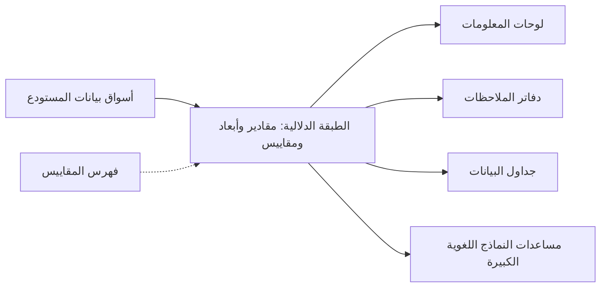
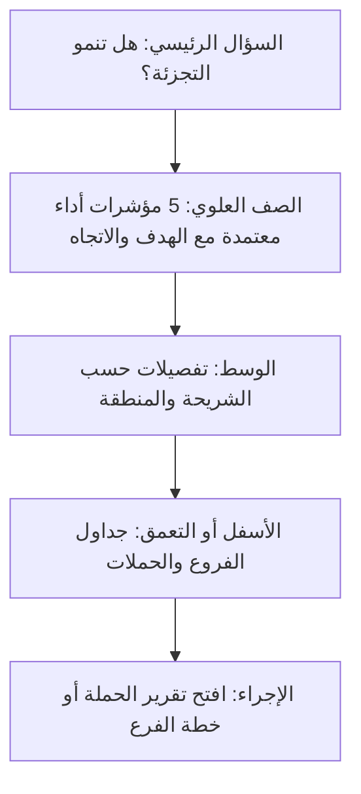

# الوحدة 4 — تحليلات يثق بها الناس

*توجد خطوط البيانات (pipelines) والنماذج (models) والاختبارات (tests) كي يتخذ أحدٌ قرارًا أفضل (better decision). تتناول هذه الوحدة الأمتار الأخيرة (last few metres)، حيث تلتقي البيانات بالناس، وحيث تُكسب معظم الثقة (trust) بفريق البيانات أو تُخسر. تبدأ بالمقاييس (metrics): كيف تنتهي كلمة واحدة مثل "العميل النشط" (active customer) بثلاثة أرقام، وكيف يحسم ذلك نهائيًا تعريفٌ مكتوب واحد (single written definition) وطبقةٌ دلالية (semantic layer) وفهرسُ مقاييس (metrics catalogue). ثم تنتقل إلى لوحات المعلومات (dashboards) وسرد القصص بالبيانات (data storytelling): التصميم من أجل قرار (designing for a decision) لا من أجل العرض (display)، واختيار مخططات لا تضلّل (charts that do not mislead)، وكتابة الفقرة الواحدة التي تخبر مسؤولًا تنفيذيًا مشغولًا (busy executive) بما تغيّر وما ينبغي فعله. وتنتهي بالتجارب (experiments) والإحصاء (statistics) الذي يحتاجه كل محلّل: اختبارات A/B (A/B tests)، وحجم العينة (sample size)، وقيم p (p-values) وفواصل الثقة (confidence intervals)، والفخاخ (traps) التي تخدع الأذكياء: التلصّص المبكر (peeking)، والمقارنات المتعددة (multiple comparisons)، وعدم تطابق نسبة العينة (sample ratio mismatch)، ومفارقة سيمبسون (Simpson's paradox). ستتابع فريق منصة البيانات والتحليلات (Data Platform & Analytics) في بنك نجم (Najm Bank) بينما تفكّ لينا ثلاث نسخ من "العملاء النشطين" (active customers)، ويعيد كريم بناء لوحة معلومات للتجزئة (retail dashboard) من 40 مخططًا لا يفتحها أحد، وتوقف دانة تجربةً في تطبيق نجم للهاتف (Najm Mobile) أُعلن فائزها (declared a winner) في اليوم الثالث.*

> **المراحل (Stages):** Serve, Analyse — تحويل الجداول النظيفة (clean tables) إلى أرقام وصور ونتائج اختبارات يفهمها الناس ويتفقون عليها ويتصرفون بناءً عليها (understand, agree on and act on).

---

# 4.1 — تعريف المقاييس: تعريف واحد، وطبقة دلالية، وفهرس مقاييس
*المستوى (Level): 🟡 متوسط (Intermediate)* · *المتطلبات (Prerequisites): 1.2، 3.1* · *المرحلة (Stage): Model, Serve*

## ⚡ الدرس في دقيقة (In 60 seconds)
- **المقياس (metric)** رقمٌ تتابعه المؤسسة عبر الزمن (tracks over time)، مثل العملاء النشطين شهريًا (monthly active customers) أو إنفاق البطاقات (card spend). ولا يكون المقياس مفيدًا إلا إذا حسبه الجميع بالطريقة نفسها (the same way).
- القاعدة الأهم (The rule that matters most): **مقياس واحد، وتعريف مكتوب واحد، ومالك واحد، ومكان واحد يُحسب فيه (one metric, one written definition, one owner, one place where it is computed).** وكل لوحة معلومات (dashboard) ودفتر ملاحظات (notebook) وتقرير (report) يقرؤه من هناك.
- **الطبقة الدلالية (semantic layer)** هي الشيفرة (code) التي تحمل تلك التعريفات (المقادير (measures)، والأبعاد (dimensions)، والربط (joins)، والمرشّحات (filters)) بين مستودع البيانات (warehouse) والأدوات التي تطرح الأسئلة. ومن أمثلتها الطبقة الدلالية في dbt (dbt Semantic Layer) المدعومة بـ MetricFlow (powered by MetricFlow)، وCube، ولغة LookML من Looker.
- **فهرس المقاييس (metrics catalogue)** هو الجانب المقروء للبشر (human-readable side): بطاقة لكل مقياس (a card per metric) تتضمن سؤاله التجاري (business question)، والصيغة (formula)، والحُبَيبية (grain)، والمالك (owner)، والتحفّظات (caveats)، وحالة الاعتماد (certification status).
- مؤشر القرار (Decision cue): حين يأتي فريقان إلى اجتماع برقمين مختلفين لمقياس "واحد" (the "same" metric)، توقّف عن الجدال حول أيّهما الصحيح واكتب التعريف (write the definition down).
- أكبر فخ (Biggest trap): حساب متوسط النسب (averaging ratios)، أو جمع الأرصدة عبر الأيام (summing balances across days)، أو جمع أعداد القيم المميّزة (adding up distinct counts). اعرف هل كل مقدار قابل للجمع (additive) أو شبه قابل للجمع (semi-additive) أو غير قابل للجمع (non-additive) قبل أن تجمّعه (aggregate).

## 🧭 لماذا يهم (Why it matters)
إنها المراجعة الفصلية للأعمال (quarterly business review) في بنك نجم (Najm Bank). تقول شريحة فريق التجزئة (retail team) إن لدى نجم **412,000 عميل نشط (active customers)**. وتقول شريحة المالية (Finance) **365,000**. ويستخدم تقرير رأس المال (capital report) لدى المخاطر (Risk)، المبني من سوق بيانات مخاطر الائتمان (credit-risk mart)، رقمًا ثالثًا. (هذه أرقام افتراضية (hypothetical numbers) لبنكنا الخيالي.) يطرح الرئيس التنفيذي (CEO) سؤالًا بسيطًا: "كم عميلًا نشطًا لدينا؟" ولا يستطيع أحد في القاعة أن يجيب دون حاشية (footnote).

تقضي لينا، مهندسة التحليلات (analytics engineer) في نجم، أسبوعًا في معرفة السبب. فالتجزئة (Retail) تعدّ كل من سجّل الدخول (logged in) إلى تطبيق نجم للهاتف (Najm Mobile) **أو** أجرى أي معاملة (any transaction) في آخر 90 يومًا. والمالية (Finance) تعدّ العملاء الذين أجروا معاملة واحدة على الأقل **يبادر بها العميل (customer-initiated)** في الشهر التقويمي (calendar month)، باستثناء إيداعات الرواتب (salary credits) والرسوم (fees). والمخاطر (Risk) تعدّ العملاء الذين لديهم حساب مفتوح غير خامل (not dormant). كل تعريف يناسب غرضه؛ ولا شيء منها مكتوب؛ وكلٌّ منها يعيش في استعلام SQL مختلف كثير النسخ (much-copied SQL query)، واثنان منها يُدخلان حسابات الموظفين (staff accounts) بصمت.

هذه أكثر الطرق شيوعًا التي تفقد بها فرق البيانات الثقة (lose trust): ليست البيانات الخاطئة (wrong data)، بل **الكلمة نفسها تعني أشياء مختلفة (the same word meaning different things)**. والعلاج تقني جزئيًا (partly technical) (حساب كل مقياس في مكان واحد) واجتماعي جزئيًا (partly social) (الاتفاق على تعريف، وتعيين مالك له، ونشره). ولجانب لوحات المعلومات من المشكلة نفسها في سياق شركة ناشئة (startup setting)، انظر [*تصميم الأنظمة لمبرمجي الحدس (System Design for Vibe Coders)*، الدرس 7.1 — لوحة المعلومات التي تكذب والمقياس الذي لا يكذب (The dashboard that lies and the metric that doesn't)](../vibe/index.ar.html#l7-1).

## 📐 كيف يعمل (How it works)

### 🟢 الأساسيات (The essentials)

**المقياس، والمقدار، والبُعد (Metric, measure, dimension).** ثلاث كلمات ستقابلها في كل طبقة دلالية (semantic layer):
- **المقدار (measure)** تجميعٌ على عمود (aggregation over a column): `SUM(amount_qar)`، `COUNT(DISTINCT customer_id)`.
- **البُعد (dimension)** شيءٌ تُقسّم البيانات بحسبه (slice by): التاريخ (date)، والقناة (channel)، والشريحة (segment)، والفرع (branch)، والبلد (country).
- **المقياس (metric)** هو الرقم الموجّه للأعمال (business-facing number) المبني من مقدار واحد أو أكثر، مع أي مرشّحات مدمجة فيه (filters baked in): "إنفاق البطاقات" (card spend) هو مجموع مبالغ المشتريات المعتمدة (approved purchase amounts)، باستثناء العكوس (reversals).

**للتعريف أجزاء أكثر من الصيغة (A definition has more parts than a formula).** إن "العملاء النشطون = عدد العملاء الذين لديهم معاملة" يترك سبعة أسئلة على الأقل مفتوحة (open). والتعريف الكامل (complete definition) يجيب عنها جميعًا:

| الجزء (Part) | السؤال الذي يجيب عنه (Question it answers) | "العملاء النشطون" في نجم (النسخة المتفق عليها (agreed version)) |
|---|---|---|
| السؤال التجاري (Business question) | لماذا ينظر أي أحد إلى هذا؟ | كم عميلًا يستخدم نجم فعليًا بنكًا (actively use Najm as a bank)؟ |
| الصيغة (Formula) | ما الذي يُعدّ أو يُجمع بالضبط؟ | العملاء المميّزون (distinct customers) الذين لديهم حدث مؤهِّل واحد على الأقل (at least one qualifying event) |
| الأحداث المؤهِّلة (Qualifying events) | ما الذي يُحتسب؟ | معاملة يبادر بها العميل (customer-initiated transaction)، أو تسجيل دخول إلى تطبيق نجم للهاتف (Najm Mobile) أو الخدمات المصرفية عبر الإنترنت (online banking) |
| الاستثناءات (Exclusions) | ما الذي لا يُحتسب أبدًا؟ | حسابات الموظفين والاختبار (staff and test accounts)، وإيداعات الرواتب (salary credits)، والرسوم (fees)، وقيود الفوائد (interest postings)، والعكوس (reversals) |
| النافذة والمنطقة الزمنية (Window and time zone) | على أي فترة، وبأي ساعة؟ | آخر 30 يومًا متحركة (trailing 30 days) تنتهي في تاريخ التقرير (reporting date)، بتوقيت Asia/Qatar |
| الحُبَيبية (Grain) | صفٌّ واحد لكل ماذا؟ | رقم واحد لكل يوم لكل شريحة (per day per segment) (التجزئة (retail)، والمنشآت الصغيرة والمتوسطة (SME))؛ لا يُجمع عبر الأيام أبدًا (never summed across days) |
| المالك (Owner) | من يقرر التغييرات؟ | رئيس تحليلات التجزئة (Head of Retail Analytics)؛ وتصون لينا الشيفرة (maintains the code) |

**لماذا يحدث الانجراف (Why the drift happens).** كل محلّل يحتاج الرقم يكتب استعلامًا (writes a query)، وينسخ مرشّحًا من استعلام أقدم (copies a filter from an older query)، وينسى استثناءً واحدًا (forgets one exclusion). ومع عشر لوحات معلومات يصبح لديك عشرة تعريفات. والعلاج هو نقل التعريف **إلى المنبع (upstream)**: احسبه مرة واحدة في مستودع البيانات (compute it once in the warehouse)، واختبره (test it) (3.1، 3.2)، واجعل كل أداة تقرأ النتيجة (have every tool read the result).

**القابل للجمع، وشبه القابل للجمع، وغير القابل للجمع (Additive, semi-additive and non-additive).** قبل أن تجمّع أي مقدار، اسأل كيف يجوز جمعه (how it may be added up):

| النوع (Type) | المعنى (Meaning) | مثال من نجم (Najm example) | آمن للجمع عبر (Safe to sum across) |
|---|---|---|---|
| قابل للجمع (Additive) | يمكن جمعه عبر كل بُعد (across every dimension) | إنفاق البطاقات بالريال القطري (Card spend in QAR) | الأيام، والفروع، والشرائح (Days, branches, segments) |
| شبه قابل للجمع (Semi-additive) | يمكن جمعه عبر بعض الأبعاد لكن ليس عبر الزمن (but not time) | رصيد الحساب في نهاية اليوم (Account balance at end of day) | الحسابات والفروع، لا الأيام: خذ قيمة نهاية الفترة (end-of-period value) أو المتوسط (average) |
| غير قابل للجمع (Non-additive) | لا يمكن جمعه إطلاقًا (cannot be summed at all) | العملاء النشطون المميّزون (distinct active customers)، والنسب (ratios)، والنسب المئوية (percentages) | لا شيء: أعد الحساب من الصفوف الأساسية (recompute from the underlying rows) |

تعلّمت هدى هذا بالطريقة الصعبة (the hard way). فحين طُلب منها "العملاء النشطون هذا الشهر" (active customers this month)، جمعت الأعداد اليومية للعملاء النشطين (daily active-customer counts) وأبلغت عن رقم أكبر من قاعدة عملاء نجم بأكملها (entire customer base): فكل من كان نشطًا في 20 يومًا عُدّ 20 مرة.

```sql
-- Wrong: daily distinct counts are non-additive
SELECT SUM(daily_active) AS monthly_active
FROM daily_active_customers
WHERE activity_date >= DATE '2026-09-01' AND activity_date < DATE '2026-10-01';

-- Right: recompute the distinct count over the whole period
SELECT COUNT(DISTINCT customer_id) AS monthly_active
FROM fct_customer_activity
WHERE activity_date >= DATE '2026-09-01' AND activity_date < DATE '2026-10-01'
  AND is_staff = FALSE
  AND is_qualifying_event = TRUE;
```

**النسب: اقسم المجاميع، ولا تحسب متوسط النسب (Ratios: divide sums, do not average ratios).** قد يكون التبنّي الرقمي (digital adoption) بحسب الفرع 80% في فرع فيه 100 عميل و40% في فرع فيه 10,000. ومتوسط النسبتين (average of the two ratios) هو 60%. أما المعدّل المجمّع الحقيقي (true combined rate) فهو (80 + 4,000) ÷ 10,100، أي نحو 40.4%. عرّف مقياس النسبة (ratio metric) على أنه **مقدار البسط ÷ مقدار المقام (numerator measure ÷ denominator measure)**، وكلٌّ منهما مجموعٌ على المستوى الذي تُبلغ عنه (at the level you are reporting).

```sql
-- Wrong: average of branch-level percentages
SELECT AVG(digital_customers * 1.0 / customers) AS adoption FROM branch_summary;

-- Right: ratio of sums
SELECT SUM(digital_customers) * 1.0 / SUM(customers) AS adoption FROM branch_summary;
```

### 🟡 التعمق أكثر (Going deeper)

**ما الذي تفعله الطبقة الدلالية (What a semantic layer does).** الطبقة الدلالية (semantic layer) مجموعة من التعريفات المخزّنة على شكل شيفرة (stored as code)، تخبر محرّك الاستعلام (query engine) بأي الجداول تحمل أي المقادير (measures)، وكيف تُربط الجداول (how tables join) (عبر **الكيانات (entities)**، أي المفاتيح مثل `customer_id`)، وما الأبعاد الموجودة (which dimensions exist)، وكيف يُبنى كل مقياس (how each metric is built). تطلب أداةٌ "العملاء النشطين حسب الشريحة، حسب الشهر" (active customers by segment, by month) فتكتب الطبقة الدلالية شيفرة SQL. ولأن كل أداة تسأل الطبقة نفسها (the same layer)، تحصل كل أداة على الإجابة نفسها (the same answer).



ثلاثة خيارات واسعة الاستخدام (widely used options)، موصوفة بحياد (described neutrally):
- **الطبقة الدلالية في dbt مع MetricFlow (dbt Semantic Layer with MetricFlow).** تُعلن **النماذج الدلالية (semantic models)** (نموذج dbt مع كياناته وأبعاده ومقاديره (entities, dimensions and measures)) و**المقاييس (metrics)** بصيغة YAML بجوار مشروع dbt الخاص بك. ويولّد MetricFlow شيفرة SQL، بما فيها عمليات الربط (joins). وتشمل أنواع المقاييس (metric types): البسيطة (simple)، والنسبة (ratio)، والتراكمية (cumulative)، والمشتقة (derived)، ومقاييس التحويل (conversion metrics).
- **Cube.** طبقة دلالية مفتوحة المصدر (open-source semantic layer) لها ملفات نموذج بيانات خاصة بها (data model files)، وطبقة واجهة برمجية (API layer)، وتخزين مؤقت (caching)، وتُستخدم غالبًا لتقديم المقاييس إلى التطبيقات (applications) وكذلك إلى أدوات ذكاء الأعمال (BI tools).
- **LookML.** لغة النمذجة (modelling language) في Looker. تعيش التعريفات في Looker وتخدم الاستكشاف (exploration) ولوحات المعلومات الخاصة بـ Looker، وكذلك، عبر موصّلات Google (Google's connectors)، بعض الأدوات الأخرى.

إليك بداية النموذج الدلالي (semantic model) لدى نجم لمعاملات البطاقات (card transactions) بصيغة YAML في dbt. تتبع الصياغة (syntax) توثيق dbt (dbt documentation) وقت كتابة هذا (2026)؛ والمواصفة (spec) تتطور باستمرار، فراجع التوثيق الحالي (current docs) قبل أن تنسخها.

```yaml
semantic_models:
  - name: card_transactions
    model: ref('fct_card_transactions')
    defaults:
      agg_time_dimension: transaction_date
    entities:
      - name: transaction
        type: primary
        expr: transaction_id
      - name: customer
        type: foreign
        expr: customer_id
    dimensions:
      - name: transaction_date
        type: time
        type_params:
          time_granularity: day
      - name: channel
        type: categorical
    measures:
      - name: card_spend_qar
        agg: sum
        expr: amount_qar
      - name: card_spenders
        agg: count_distinct
        expr: customer_id

metrics:
  - name: card_spend
    label: Card spend (QAR)
    description: Approved card purchases in QAR, excluding reversals and refunds.
    type: simple
    type_params:
      measure: card_spend_qar
```

لاحظ أين يعيش المرشّح (where the filter lives). فالعكوس (reversals) والمبالغ المستردة (refunds) مستثناة في `fct_card_transactions` نفسه، وهو نموذج dbt مختبَر (tested dbt model)، فلا يمكن حساب المقدار دون استثنائها. ضع قواعد العمل (business rules) في أبكر موضع ممكن (as early as you can)، ومرة واحدة (once).

**لا تحتاج إلى منتج طبقة دلالية كي تبدأ (You do not need a semantic layer product to start).** النسخة الدنيا (minimum version) هي **سوق بيانات المقاييس (metrics mart)**: نموذج dbt مختبَر لكل عائلة مقاييس (per metric family) بحُبَيبية معلنة (declared grain)، مثل `mart_active_customers_daily` (صف واحد لكل تاريخ لكل شريحة (one row per date per segment))، تقرؤه كل لوحة معلومات مباشرة. بدأت نجم من هناك وأضافت MetricFlow حين احتاج المحلّلون إلى تقسيم المقاييس بطرق كثيرة (slice metrics many ways) دون جدول جديد لكل تركيبة (without a new table for each combination).

**فهرس المقاييس (The metrics catalogue).** الشيفرة وحدها لا تحسم الجدالات (does not settle arguments)، لأن المسؤولين التنفيذيين (executives) لا يقرؤون YAML. الفهرس صفحةٌ لكل مقياس (a page per metric) يستطيع غير المهندس (non-engineer) قراءتها، وتُولَّد من المصدر نفسه حيثما أمكن (أوصاف dbt (dbt descriptions)، وفهرس (catalogue) مثل OpenMetadata أو DataHub، انظر 6.1). ويحمل كل مُدخل **حالة اعتماد (certification status)**:
- **معتمد (Certified)**: تعريف وافق عليه المالك (approved by the owner)، ويُحسب في الطبقة الدلالية أو سوق بيانات المقاييس، ومختبَر (tested)، ومراقَب من حيث الحداثة (monitored for freshness).
- **مؤقت (Provisional)**: قيد الاستخدام ريثما يُتفق على التعريف (while the definition is being agreed).
- **متقادم (Deprecated)**: يُحتفظ به للتاريخ (kept for history)، مع إشارة إلى البديل (pointer to the replacement) وتاريخ للإزالة (removal date).

تعرض لوحات المعلومات الحالة بجانب كل رقم (next to each number)، فيعرف القارئ هل هو الرقم الرسمي للبنك (bank's official figure).

**تغيير التعريف (Changing a definition).** عامل تغيير التعريف كتغيير في واجهة برمجية (API change): أعطِ كل مقياس **إصدارًا (version)**، وسجّل ما تغيّر ولماذا (record what changed and why)، وأعلن عنه (announce it)، وإذا وجب أن يبقى التاريخ قابلًا للمقارنة (history must stay comparable)، فقم بإعادة التعبئة (backfill) (2.2) وفق التعريف الجديد وعلّق على المخطط (annotate the chart). فتغيير صامت في مرشّح (silent filter change) يحرّك مخططًا بنسبة 8% بين ليلة وضحاها يبدو تمامًا كحدث تجاري حقيقي (real business event).

### 🔴 نظرة الخبير (Expert view)

**أشجار المقاييس (Metric trees).** تنظّم الفرق الناضجة (mature teams) المقاييس في شجرة: **مقياس نجم الشمال (north-star metric)** في القمة (لتجزئة نجم، ربما "عملاء البنك الرئيسي" (primary-bank customers)، أي الذين تُودَع رواتبهم في نجم)، و**مقاييس المُدخلات (input metrics)** التي تستطيع الفرق تحريكها تحته (إكمال فتح الحساب (onboarding completion)، وتفعيل البطاقة (card activation))، و**مقاييس الحماية (guardrail metrics)** التي تراقب الضرر (watch for damage) (الشكاوى (complaints)، وخسائر الاحتيال (fraud losses)). تخبر الشجرة كل فريق بالرقم الذي يملكه (which number it owns) وتمنع فريقين من تحسين مقاييس تتجاذب في اتجاهين متعاكسين (pull against each other).

**قانون غودهارت (Goodhart's law).** يُعاد صوغه كثيرًا هكذا: "حين يصبح المقياس هدفًا، يكفّ عن أن يكون مقياسًا جيدًا" (when a measure becomes a target, it ceases to be a good measure). فإذا كوفئ موظفو الفروع (branch staff) على "العملاء النشطين" (active customers) وكان تسجيل الدخول (login) يُحتسب نشاطًا، فتوقّع حملات تدفع العملاء إلى تسجيل الدخول دون فعل أي شيء. اقرن كل مقياس مستهدف (target metric) بمقياس حماية (guardrail) وبنسخة جودة منه (quality version of itself) (مثلًا "العملاء النشطون الذين لديهم حدثان مؤهِّلان أو أكثر" (active customers with two or more qualifying events)).

**الصحة الزمنية (Point-in-time correctness).** تعتمد مقاييس مصرفية كثيرة على سمات تتغيّر (attributes that change): الشريحة (segment)، ودرجة المخاطر (risk grade)، والفرع (branch). ينبغي أن يستخدم "عملاء المنشآت الصغيرة والمتوسطة في مارس" (SME customers in March) الشريحةَ التي كانت لكل عميل *في مارس*، لا شريحة اليوم. وهذا يتطلب أبعادًا متغيّرة ببطء (slowly changing dimensions) (1.2) تُربط على تواريخ السريان (effective dates)، وتعريفًا يذكر أيّهما يستخدم: **كما كان (as-was)** (السمة وقت الحدث) أو **كما هو (as-is)** (سمة اليوم مطبّقة على كل التاريخ). وتحتاج التقارير التنظيمية (regulatory reports) عادةً إلى "كما كان" (as-was). اكتب هذا الاختيار على بطاقة المقياس (metric card).

**المطابقة (Reconciliation).** يجب أن يرتبط المقياس المالي المعتمد (certified financial metric) بنظام السجل (system of record). فينبغي أن يتطابق "إنفاق البطاقات" (card spend) لدى المالية مع إجماليات التسوية (settlement totals) لدى معالج البطاقات (card processor) ضمن هامش تسامح معروف (known tolerance)، وأن يُفسَّر الفرق (التوقيت (timing)، والعكوس (reversals)، وتحويل العملة (currency conversion)). ابنِ هذا الفحص اختبارَ بيانات مجدولًا (scheduled data test) (3.2) واعرض حالة المطابقة (reconciliation status) على بطاقة المقياس. فالرقم الذي لم يُطابَق قط ليس معتمدًا (not certified)، مهما كان ملف YAML الخاص به أنيقًا.

**مقاييس للآلات (Metrics for machines).** يكون مساعد النموذج اللغوي الكبير (LLM assistant) الذي يجيب عن أسئلة البيانات أكثر موثوقية عمومًا حين يستعلم طبقة دلالية (querying a semantic layer) منه حين يكتب SQL خامًا (raw SQL) على مئات الجداول، لأن عمليات الربط (joins) والمرشّحات (filters) والاستثناءات (exclusions) محسومة مسبقًا. عامل الطبقة الدلالية على أنها العقد (contract) بين الناس ولوحات المعلومات والذكاء الاصطناعي (AI).

## 🧰 الأدوات (The toolkit)
| الأداة أو النمط أو المعيار (Tool, pattern or standard) | ما هو وماذا يفعل (What it is and does) | متى تلجأ إليه (When to reach for it) |
|---|---|---|
| **Metric definition card** — بطاقة تعريف المقياس | تعريف مكتوب في صفحة واحدة (one-page written definition): السؤال، والصيغة (formula)، والاستثناءات (exclusions)، والنافذة (window)، والحُبَيبية (grain)، والمالك (owner)، والإصدار (version)، والحالة (status) | قبل ظهور أي مقياس على لوحة معلومات (dashboard)؛ وكلما اختلف رقمان (whenever two numbers disagree) |
| **Semantic layer** — الطبقة الدلالية | شيفرة تحمل المقادير (measures) والأبعاد (dimensions) وعمليات الربط (joins) والمقاييس (metrics) بين مستودع البيانات (warehouse) ومستهلكيه (consumers) | حين تُقسَّم المقاييس نفسها بطرق كثيرة (sliced many ways) في عدة أدوات |
| **dbt Semantic Layer** (MetricFlow) — الطبقة الدلالية في dbt | نماذج دلالية (semantic models) ومقاييس معلنة بصيغة YAML في مشروع dbt؛ ويولّد MetricFlow شيفرة SQL | الفرق التي تجري التحويل (transforming) بـ dbt أصلًا |
| **Cube** | طبقة دلالية مفتوحة المصدر (open-source semantic layer) مع واجهة برمجية (API) وتخزين مؤقت (caching) | تقديم المقاييس إلى أدوات ذكاء الأعمال (BI tools) وإلى التطبيقات (applications) |
| **LookML** (Looker) | لغة النمذجة (modelling language) في Looker للأبعاد والمقادير وعمليات الربط | المؤسسات التي توحّدت على Looker (standardised on Looker) |
| **Metrics mart** — سوق بيانات المقاييس | نموذج dbt مختبَر (tested dbt model) لكل عائلة مقاييس بحُبَيبية معلنة (declared grain) | أبسط بداية (simplest start)، قبل اعتماد منتج طبقة دلالية |
| **Metric tree** — شجرة المقاييس | مقياس نجم الشمال (north-star metric) ومقاييس المُدخلات (input metrics) ومقاييس الحماية (guardrails) مرتبطة بسببية مفترضة (assumed cause) | مواءمة أهداف الفرق (aligning team goals) ورصد المقاييس التي تتجاذب في اتجاهين متعاكسين |

## 🏛️ عمليًا في بنك نجم (In practice at Najm Bank)
تنشر لينا أول مُدخل معتمد (first certified entry) في **فهرس مقاييس نجم (Najm Metrics Catalogue)**. توقّع عليه التجزئة والمالية والمخاطر (Retail, finance and risk sign it off)؛ وتُحال استعلامات "العملاء النشطين" القديمة إلى التقاعد (retired)، وصارت لوحات المعلومات الثلاث تقرأ سوق البيانات نفسه (the same mart).

| الحقل (Field) | القيمة (Value) |
|---|---|
| المقياس (Metric) | `active_customers_30d` — العملاء النشطون (30 يومًا) (Active customers (30-day)) |
| الإصدار والحالة (Version and status) | v1.0 · **معتمد (Certified)** · ساري المفعول (effective) من 1 أكتوبر 2026 |
| السؤال التجاري (Business question) | كم عميلًا يستخدم نجم فعليًا بنكًا (actively use Najm as a bank)؟ |
| الصيغة (Formula) | عدد `customer_id` المميّزة (distinct) التي لديها حدث مؤهِّل واحد على الأقل (at least one qualifying event) في الثلاثين يومًا المنتهية في تاريخ التقرير (reporting date) |
| الأحداث المؤهِّلة (Qualifying events) | معاملة خصم أو إيداع يبادر بها العميل (customer-initiated debit or credit transaction)؛ تسجيل دخول إلى تطبيق نجم للهاتف (Najm Mobile) أو الخدمات المصرفية عبر الإنترنت (online banking) |
| الاستثناءات (Exclusions) | حسابات الموظفين والاختبار (staff and test accounts)؛ إيداعات الرواتب (salary credits)؛ الرسوم والفوائد وقيود النظام (fees, interest and system postings)؛ المعاملات المعكوسة (reversed transactions) |
| المنطقة الزمنية ووقت القطع (Time zone and cut-off) | Asia/Qatar؛ الأحداث حتى 23:59:59 في تاريخ التقرير |
| الحُبَيبية (Grain) | صف واحد لكل تاريخ تقرير × شريحة (reporting date × segment) (التجزئة (Retail)، والمنشآت الصغيرة والمتوسطة (SME))؛ غير قابل للجمع (non-additive): لا يُجمع أبدًا عبر التواريخ أو الشرائح؛ استخدم صف "الكل" ("All" row) |
| تاريخ السمات (Attribute history) | الشريحة كما كانت (as-was) في تاريخ التقرير (ربط من النوع الثاني للبُعد المتغيّر ببطء (SCD Type 2 join)) |
| المصدر (Source) | `mart_active_customers_daily` (dbt)، مبني من `fct_customer_activity` |
| الاختبارات (Tests) | فريد على التاريخ × الشريحة (unique on date × segment)؛ غير فارغ (not null)؛ "الكل" ≥ كل شريحة ("All" ≥ each segment)؛ تغيّر يومي ضمن ±5% (day-on-day change within ±5%) وإلا تنبيه إلى لينا (alert to Lina) |
| الحداثة (Freshness) | متاح بحلول 07:00 يوميًا؛ تعرض لوحة المعلومات وقت البيانات (as-of time) |
| المالك والقيّم (Owner and steward) | المالك (Owner): رئيس تحليلات التجزئة (Head of Retail Analytics) · القيّم (Steward): لينا (هندسة التحليلات (analytics engineering)) |
| التحفّظات المعروفة (Known caveats) | النشاط المقتصر على تسجيل الدخول (login-only activity) نحو ثلث الإجمالي (افتراضي (hypothetical))؛ انظر `active_customers_transacting_30d` للحصول على رؤية أكثر صرامة (stricter view) |
| سجل التغييرات (Change log) | v1.0: يحل محل التعريفات المحلية (local definitions) للتجزئة والمالية والمخاطر؛ أُعيدت تعبئة التاريخ (history backfilled) حتى يناير 2024 |

## 🛠️ التمارين (Exercises)
استخدم DuckDB أو PostgreSQL مع جدول اصطناعي (synthetic table) من 1,000 عميل و50,000 حدث تولّده بنفسك (أدرج بضعة حسابات موظفين (staff accounts) وإيداعات رواتب (salary credits) وعكوس (reversals)).

- 🟢 اكتب ثلاثة استعلامات مختلفة لـ "العملاء النشطين" (active customers)، تطابق تعريفات التجزئة والمالية والمخاطر في قسم 🧭، وشغّلها على البيانات نفسها. ثم اكتب بطاقة المقياس (metric card) التي تحسم الخلاف بينها. *يكتمل عندما (Done when):* تعطي الاستعلامات الثلاثة ثلاثة أرقام مختلفة، وتستطيع تفسير كل فرق صفًّا بصف (row by row)، وتجيب بطاقتك عن كل حقل في الجدول أعلاه.
- 🟡 ابنِ نموذج dbt باسم `mart_active_customers_daily` بحُبَيبية (grain) التاريخ × الشريحة (date × segment) مع صف "الكل" ("All" row)، إضافةً إلى اختبارات (tests) (تركيبة فريدة (unique combination)، وغير فارغ (not null)، واختبار مخصّص (custom test) يتحقق من أن "الكل" لا يقل أبدًا عن أي شريحة). وبيّن في استعلام لماذا يكون جمع الصفوف اليومية للحصول على رقم شهري خاطئًا. *يكتمل عندما (Done when):* ينجح `dbt build` ويُنتج زوج استعلاميك الخاطئ مقابل الصحيح (wrong-versus-right query pair) أرقامًا مختلفة بوضوح.
- 🔴 أضف نموذجًا دلاليًا (semantic model) ومقياسين (أحدهما بسيط (simple)، والآخر نسبة (ratio) مثل التبنّي الرقمي (digital adoption)) إلى مشروع dbt الخاص بك باستخدام مواصفة الطبقة الدلالية في dbt (dbt Semantic Layer spec)، واستعلمهما حسب الشهر والشريحة باستخدام MetricFlow محليًا (locally). *يكتمل عندما (Done when):* يعطي مقياس النسبة نسبةَ المجاميع (ratio of sums) لا متوسطَ النسب (average of ratios)، وتكون قد تحققت منه مقابل استعلام SQL مكتوب يدويًا (hand-written SQL query).

## ⚠️ أخطاء وفخاخ (Mistakes and traps)
- **تعريفات تعيش في استعلامات لوحات المعلومات (Definitions living in dashboard queries).** عشر لوحات معلومات تصبح عشرة تعريفات. احسب كل مقياس مرة واحدة، في المنبع (upstream)، واجعل كل أداة تقرؤه.
- **جمع ما لا يقبل الجمع (Summing what is not additive).** لا يمكن جمع أعداد القيم المميّزة (distinct counts) والنسب (ratios) والأرصدة (balances) عبر الأيام. صنّف قابلية الجمع (additivity) لكل مقدار وأعد الحساب من الصفوف (recompute from rows).
- **حساب متوسط النسب (Averaging ratios).** تنال المجموعات الصغيرة الوزن نفسه (same weight) الذي تناله الكبيرة. اقسم مجموع البسوط على مجموع المقامات (divide summed numerators by summed denominators).
- **تغييرات صامتة في التعريف (Silent definition changes).** يبدو تغيير المرشّح (filter change) كحدث تجاري (business event). ضع إصدارًا للتعريف (version the definition)، وعلّق على المخطط (annotate the chart)، وأعد التعبئة (backfill) حين يجب أن يبقى التاريخ قابلًا للمقارنة.
- **تعريف بلا مالك (A definition without an owner).** بدونه، يذهب كل خلاف إلى اجتماع ويبقى هناك. سمِّ مالكًا يقرر (owner who decides) وقيّمًا يصون الشيفرة (steward who maintains the code).
- **أهداف بلا مقاييس حماية (Targets without guardrails).** المقياس الذي يُكافأ عليه يُتلاعب به (gets gamed). اقرنه بمقياس حماية (guardrail) وبنسخة جودة أكثر صرامة (stricter quality version).

## 🧾 الخلاصة (Recap)
- لا يكون المقياس جديرًا بالثقة (trustworthy) إلا حين يكون له تعريف مكتوب واحد (one written definition)، ومالك واحد (one owner)، ومكان واحد يُحسب فيه (one place where it is computed).
- يغطي التعريف الكامل (full definition) الصيغة (formula)، والأحداث المؤهِّلة (qualifying events)، والاستثناءات (exclusions)، والنافذة (window)، والمنطقة الزمنية (time zone)، والحُبَيبية (grain)، وتاريخ السمات (attribute history)، والمالك (owner).
- اعرف قابلية الجمع (additivity) لكل مقدار؛ وأعد حساب أعداد القيم المميّزة (distinct counts) والنسب (ratios) بدل جمعها أو حساب متوسطها.
- تجعل الطبقة الدلالية (semantic layer) (الطبقة الدلالية في dbt مع MetricFlow، أو Cube، أو LookML، أو ببساطة سوق بيانات مقاييس مختبَر (tested metrics mart)) كل أداة تسأل عن التعريفات نفسها.
- يجعل فهرس المقاييس (metrics catalogue) التعريفات مقروءة ومعتمدة ومُصدَرة (readable, certified and versioned)؛ وتُبقي أشجار المقاييس (metric trees) ومقاييس الحماية (guardrails) الأهداف نزيهة (keep targets honest).

## ✍️ اختبر نفسك (Check yourself)

**1. تُبلغ التجزئة (Retail) عن 412,000 عميل نشط (active customers) وتُبلغ المالية (finance) عن 365,000. وكلا الاستعلامين يعمل دون أخطاء على مستودع البيانات (warehouse) نفسه. ما أفضل خطوة أولى (best first step)؟**

- A. الاتفاق على تعريف مكتوب واحد (one written definition) مع مالك مسمّى (named owner)، ثم حسابه في مكان واحد (one place)
- B. استخدام الرقم الأعلى (higher number)، لأنه يلتقط أنواعًا أكثر من النشاط (more kinds of activity)
- C. حساب متوسط الرقمين (average the two figures) كي لا يُفضَّل رقم أي فريق
- D. إعادة بناء مستودع البيانات (rebuild the warehouse)، لأن وجود رقمين يعني أن البيانات تالفة (data is corrupted)

<details><summary>الإجابة</summary>

**A.** البيانات على الأرجح سليمة (probably fine)؛ التعريفات هي التي تختلف (the definitions differ). الاتفاق على تعريف واحد مع مالك، ثم حسابه مرة واحدة، ينهي الجدال (ends the argument). أما D فتطارد مشكلة ليست في البيانات؛ وB وC تكتفيان باختيار رقم (just pick a number). (🧭 لماذا يهم (Why it matters)؛ 🟢 الأساسيات (The essentials).)

</details>

**2. تجمع هدى 30 عددًا يوميًا للعملاء النشطين (daily active-customer counts) لتُبلغ عن الرقم الشهري (monthly figure). ما الخطأ؟**

- A. لا خطأ، ما دامت حسابات الموظفين والاختبار (staff and test accounts) قد استُثنيت كل يوم
- B. كان عليها أن تحسب متوسط الأعداد اليومية (averaged the daily counts) بدل جمعها
- C. أعداد القيم المميّزة غير قابلة للجمع (distinct counts are non-additive)؛ أعد حساب العدد المميّز على مدى الشهر (recompute the distinct count over the month)
- D. كان عليها أن تأخذ وسيط الأعداد اليومية (median of the daily counts) لإزالة القيم الشاذة (outliers)

<details><summary>الإجابة</summary>

**C.** العميل النشط في 20 يومًا يُعدّ 20 مرة. أما B وD فتعطيان "يومًا نموذجيًا" (typical day)، لا عدد العملاء المميّزين النشطين في الشهر (distinct customers active in the month). (🟢 الأساسيات (The essentials).)

</details>

**3. في الفرع X يستخدم 80 من أصل 100 عميل الخدمات المصرفية الرقمية (digital banking)؛ وفي الفرع Y يستخدمها 4,000 من أصل 10,000. ما معدّل التبنّي الرقمي المجمّع (combined digital adoption rate)؟**

- A. 60%، أي المتوسط البسيط (simple average) لمعدّلي الفرعين
- B. لا يمكن حسابه دون بيانات على مستوى العميل (customer-level data)
- C. 80%، أي معدّل الفرع الأفضل أداءً (best-performing branch)
- D. نحو 40.4%: إجمالي الرقميين على إجمالي العملاء (total digital over total customers)

<details><summary>الإجابة</summary>

**D.** 4,080 ÷ 10,100 ≈ 40.4%. إن حساب متوسط المعدّلات (averaging the rates) يعطي الفرع الصغير الوزن نفسه الذي يعطيه للكبير. (🟢 الأساسيات (The essentials).)

</details>

**4. أي عبارة تصف الطبقة الدلالية (semantic layer) على أفضل وجه؟**

- A. سمة ألوان وقالب تخطيط (colour theme and layout template) تتشاركهما لوحات معلومات أداة ذكاء أعمال (BI tool)
- B. شيفرة مشتركة (shared code) تعرّف المقادير والأبعاد وعمليات الربط والمقاييس (measures, dimensions, joins and metrics) لكل أداة
- C. الطبقة الخام (raw layer) في مستودع البيانات، حيث تصل بيانات المصدر قبل التنظيف (before cleaning)
- D. نسخة من مستودع البيانات محفوظة في منطقة أخرى للتعافي من الكوارث (disaster recovery)

<details><summary>الإجابة</summary>

**B.** تقع بين مستودع البيانات ومستهلكيه (between the warehouse and its consumers) وتولّد شيفرة SQL من تعريفات مشتركة (shared definitions). أما C فهي الطبقة الخام (raw layer)؛ وA وD لا علاقة لهما. (🟡 التعمق أكثر (Going deeper).)

</details>

**5. تكافئ نجم الفروع على "العملاء النشطين" (active customers)، حيث يُحتسب تسجيل الدخول (login) نشاطًا. ترتفع عمليات تسجيل الدخول بحدّة لكن المعاملات (transactions) لا ترتفع. بماذا ينبغي أن توصي لينا؟**

- A. إزالة تسجيلات الدخول من التعريف بهدوء (quietly)، كي يتوقف التلاعب (gaming) بحلول الأسبوع القادم
- B. التوقف عن قياس العملاء النشطين، لأن أي مقياس يُكافأ عليه سيُتلاعب به (will be gamed)
- C. إضافة مقياس حماية (guardrail) ومقياس جودة أكثر صرامة (stricter quality metric)، ووضع إصدار لأي تغيير في التعريف (version any definition change)
- D. رفع الهدف (raise the target) بحيث يتعيّن على الفروع أن تدفع المعاملات أيضًا للوصول إليه

<details><summary>الإجابة</summary>

**C.** هذا هو قانون غودهارت (Goodhart's law): المقياس الذي يُكافأ عليه يُتلاعب به. تكشف مقاييس الحماية (guardrails) ونسخة الجودة (quality version) هذا التلاعب، ويجب وضع إصدار لتغييرات التعريف والإعلان عنها (versioned and announced). أما A فتغيير صامت في التعريف (silent definition change). (🔴 نظرة الخبير (Expert view)؛ 🟡 التعمق أكثر (Going deeper).)

</details>

## 📚 المراجع (References)
- توثيق dbt (dbt documentation)، الطبقة الدلالية في dbt وMetricFlow (dbt Semantic Layer and MetricFlow) — https://docs.getdbt.com/docs/use-dbt-semantic-layer/dbt-sl
- توثيق dbt (dbt documentation)، النماذج الدلالية والمقاييس (semantic models and metrics) — https://docs.getdbt.com/docs/build/semantic-models
- توثيق Cube (Cube documentation) — https://cube.dev/docs
- توثيق Looker (Looker documentation)، LookML — https://cloud.google.com/looker/docs
- رالف كيمبول ومارجي روس (Ralph Kimball and Margy Ross)، *The Data Warehouse Toolkit* (الطبعة الثالثة (3rd edition)، Wiley، 2013): الحقائق القابلة للجمع وشبه القابلة للجمع وغير القابلة للجمع (additive, semi-additive and non-additive facts)
- توثيق DuckDB (DuckDB documentation)، دوال التجميع (aggregate functions) — https://duckdb.org/docs/
- OpenMetadata — https://open-metadata.org/ · DataHub — https://datahubproject.io/

---

# 4.2 — لوحات معلومات وسرد قصص بالبيانات يقودان إلى قرارات
*المستوى (Level): 🟡 متوسط (Intermediate)* · *المتطلبات (Prerequisites): 4.1* · *المرحلة (Stage): Serve, Analyse*

## ⚡ الدرس في دقيقة (In 60 seconds)
- توجد لوحة المعلومات (dashboard) لتدعم **قرارًا (decision)** أو **إجراءً (action)**. ابدأ من سؤال "من يقرر ماذا، وكم مرة، وباستخدام أي أرقام؟" وصمّم بشكل عكسي (design backwards). إذا لم تستطع تسمية القرار، فأنت تبني عرضًا (display) لا لوحة معلومات.
- ثلاثة أنواع تخدم احتياجات مختلفة: **الاستراتيجية (strategic)** (بضعة مقاييس معتمدة (certified metrics)، شهريًا أو أسبوعيًا، للقادة)، و**التشغيلية (operational)** (شبه آنية (near real time)، لمن يتصرفون اليوم)، و**التحليلية (analytical)** (الاستكشاف (exploration)، للمحلّلين).
- اختر المخطط بحسب المقارنة التي تريد أن يجريها القارئ (the comparison you want the reader to make). فالموضع على مقياس مشترك (position on a common scale) (المخططات الشريطية والخطية (bar and line charts)) يُقرأ بأعلى دقة؛ أما الزوايا والمساحات (angles and areas) (المخططات الدائرية (pies)، والفقاعية (bubbles)) فبدقة أقل.
- **سرد القصص (storytelling)** هو الفقرة المرافقة للمخطط: ما الذي تغيّر (what changed)، ولماذا نظن أنه تغيّر (why we think it changed)، وما مدى يقيننا (how sure we are)، وبماذا نوصي (what we recommend).
- مؤشر القرار (Decision cue): يجب أن يجيب كل مخطط عن سؤال تستطيع كتابته في عنوانه (in its title). وإن لم يفعل، فاحذفه.
- أكبر فخ (Biggest trap): لوحة المعلومات ذات الأربعين مخططًا التي لا يفتحها أحد (the 40-chart dashboard nobody opens). فمزيد من المخططات يعني انتباهًا أقل لكل مخطط (less attention per chart)، وتحميلًا أبطأ (slower loading)، ومواضع أكثر لانجراف التعريفات (definitions to drift).

## 🧭 لماذا يهم (Why it matters)
كريم، محلّل بيانات التجزئة (retail data analyst) في نجم، يصون لوحة معلومات "أداء التجزئة" (Retail Performance). فيها 40 مخططًا موزّعة على ستة تبويبات (six tabs)، بُنيت على مدى ثلاث سنوات مع كل طلب يضيف "مخططًا واحدًا آخر فقط" (just one more chart). تُظهر سجلات الاستخدام (usage logs) من أداة ذكاء الأعمال (BI tool) أنها فُتحت 11 مرة الشهر الماضي، معظمها من كريم نفسه. وفي الأثناء تحصل مديرة التجزئة (retail director) على أرقامها من جدول بيانات (spreadsheet) يحدّثه مساعدها يدويًا (by hand) كل يوم اثنين، ناسخًا الأرقام من لوحة المعلومات. وفي جدول البيانات رقم خاطئ لإنفاق البطاقات (card spend) لشهر أغسطس، لأن خلية منسوخة واحدة جاءت من التبويب الخطأ (wrong tab).

حين يسأل كريم المديرة عمّا تحتاجه، يكون الجواب قصيرًا: "كل يوم اثنين أقرر أين أضع فرق مبيعات الفروع (branch sales teams) وأيّ الحملات (campaigns) أُبقي. أحتاج أن أعرف أيّ الشرائح تنمو (growing)، وأيّها تتراجع (slipping)، وهل نجحت حملات الأسبوع الماضي." ثلاثة أسئلة. لا 40 مخططًا.

يتناول هذا الدرس البناءَ من أجل تلك المحادثة. لوحة المعلومات التي تقود إلى قرارات (leads to decisions) أصغر، وأسرع، ومبنية على مقاييس معتمدة (certified metrics) (4.1)، ومصمّمة حول سؤال (designed around a question)، ومصحوبة بجملة تقول ما تعنيه الأرقام. وبناؤها جيدًا هندسةٌ (engineering) بقدر ما هو تصميم (design): فهي تحتاج إلى أسواق بيانات مجمّعة مسبقًا (pre-aggregated marts)، وملصقات حداثة (freshness labels)، وضبط وصول (access control)، وخطة لإحالة ما لا يستخدمه أحد إلى التقاعد (retire what nobody uses).

## 📐 كيف يعمل (How it works)

### 🟢 الأساسيات (The essentials)

**ابدأ بالقرار لا بالبيانات (Start with the decision, not the data).** قبل فتح أداة ذكاء الأعمال (BI tool)، اكتب **مواصفة لوحة معلومات (dashboard spec)** قصيرة:
1. **الجمهور (Audience)**: من يستخدمها؟ (مديرة التجزئة (Retail director) وأربعة رؤساء إقليميين (regional heads).)
2. **القرار (Decision)**: ماذا يقررون بها، وكم مرة؟ (أسبوعيًا (Weekly): توزيع فرق المبيعات (sales team allocation) واستمرار الحملات (campaign continuation).)
3. **الأسئلة (Questions)**: الأسئلة الثلاثة إلى الخمسة التي يجب أن تجيب عنها. ("أيّ الشرائح نمت أو تقلّصت هذا الأسبوع مقارنةً بالأسابيع الأربعة الماضية؟" (versus the last four weeks))
4. **المقاييس (Metrics)**: مقاييس معتمدة فقط (certified metrics only)، بأسمائها من الفهرس (by name from the catalogue) (4.1).
5. **الحداثة (Freshness)**: ما مدى حداثتها المطلوبة؟ (الاثنين 07:00، والبيانات حتى منتصف ليل الأحد (Sunday midnight).)
6. **الإجراء (Action)**: ماذا يفعل القارئ حين يكون رقمٌ سيئًا؟ (التعمّق إلى جدول الفروع (drill to the branch table)؛ فتح تقرير الحملة (campaign report).)

**ثلاثة أنواع من لوحات المعلومات (Three kinds of dashboard).**

| النوع (Kind) | الجمهور (Audience) | التحديث (Refresh) | المحتوى (Content) | مثال من نجم (Najm example) |
|---|---|---|---|---|
| استراتيجية (Strategic) | المسؤولون التنفيذيون، ومجلس الإدارة (Executives, board) | أسبوعيًا أو شهريًا (Weekly or monthly) | خمسة إلى ثمانية مقاييس معتمدة (certified metrics) مع الأهداف والاتجاهات (targets and trends) | العرض الأسبوعي لمديرة التجزئة (Retail director's weekly view) |
| تشغيلية (Operational) | من يتصرفون الآن (People acting now) | من دقائق إلى ساعات (Minutes to hours) | طوابير (queues)، وتنبيهات (alerts)، وعتبات (thresholds)، وقوائم بنود للعمل عليها (lists of items to work) | عمليات الاحتيال (Fraud operations): طابور التنبيهات الذكية (Smart Alerts) ومعدّل الإيجابيات الكاذبة (false-positive rate) |
| تحليلية (Analytical) | المحلّلون (Analysts) | عند الطلب (On demand) | مرشّحات (filters)، وتعمّق (drill-downs)، وأبعاد كثيرة (many dimensions) | مصنّف استكشاف الشرائح (segment exploration workbook) لدى كريم |

خلط هذه الأنواع هو السبب المعتاد للوحة المعلومات ذات الأربعين مخططًا: عرض تنفيذي (executive view) نمت فيه تبويبات تحليلية (analytical tabs).

**اختر المخطط بحسب المقارنة (Choose the chart by the comparison).** في دراسة شهيرة عام 1984، رتّب ويليام كليفلاند وروبرت ماكغيل (William Cleveland and Robert McGill) مدى دقة قراءة الناس للكميات من ترميزات بصرية مختلفة (visual encodings). جاء الموضع على مقياس مشترك (position along a common scale) أولًا؛ وتلاه الطول والاتجاه والزاوية (length, direction and angle)؛ وجاءت المساحة والحجم وتظليل اللون (area, volume and colour shading) أخيرًا. وفي تجاربهما، حكم الناس على زوايا المخطط الدائري (pie-chart angles) بدقة أقل من مواضع الأشرطة (bar positions). عمليًا:

| تريد أن يقارن القارئ (You want the reader to compare) | استخدم (Use) | تجنّب (Avoid) |
|---|---|---|
| القيم عبر الفئات (Values across categories) | مخطط شريطي أفقي مرتّب (Horizontal bar chart, sorted) | مخطط دائري (pie chart) بأكثر من شريحتين أو ثلاث؛ أشرطة ثلاثية الأبعاد (3D bars) |
| التغيّر عبر الزمن (Change over time) | مخطط خطي (Line chart) | مخطط شريطي بفترات كثيرة (bar chart with many periods)؛ مخططات مساحية مكدّسة بطبقات كثيرة (area charts stacked many layers deep) |
| جزء من كل، بأجزاء قليلة (Part of a whole, few parts) | شريط مكدّس (Stacked bar)، أو شريط واحد بقسمين (single bar with two segments) | مخططات حلقية (donut charts) بشرائح كثيرة |
| علاقة مقدارين (Two measures' relationship) | مخطط انتشار (Scatter plot) | خطّان على محورين صاديين مزدوجين (two lines on dual y-axes) |
| رقم واحد مقابل هدف (One number against a target) | رقم كبير (big number) مع الهدف والاتجاه بجانبه | مقياس دائري أو عدّاد سرعة (gauge or speedometer) |
| فئات كثيرة × فترات كثيرة (Many categories × many periods) | مضاعفات صغيرة (small multiples) أو خريطة حرارية (heatmap) | مخطط خطي واحد بخمسة عشر خطًا (one line chart with 15 lines) |

**محاور نزيهة (Honest axes).** يرمّز طول الشريط قيمته (a bar's length encodes its value)، لذا **يجب أن تبدأ المخططات الشريطية من الصفر (bar charts must start at zero)**. فمخطط شريطي يبدأ من 95% يجعل الانتقال من 96% إلى 98% يبدو كأنه تضاعف (look like a doubling). يجوز للمخططات الخطية (line charts) أن تستخدم خط أساس غير صفري (non-zero baseline) لأنها ترمّز التغيّر بالميل (encode change by slope)، لكن اوسم المحور بوضوح (label the axis clearly). ولا تستخدم أبدًا محورين صاديين بمقياسين مختلفين (two y-axes with different scales) على مخطط واحد: فباختيارك للمقياسين تستطيع أن تجعل أي سلسلتين تبدوان كأنهما تتحركان معًا (appear to move together).

**العنوان يحمل الرسالة (The title carries the message).** استبدل "إنفاق البطاقات حسب الشريحة" (Card spend by segment) بـ "انخفض إنفاق بطاقات المنشآت الصغيرة والمتوسطة 6% هذا الأسبوع؛ والتجزئة ثابتة" (SME card spend fell 6% this week; retail flat). فيصل القارئ إلى الفكرة قبل قراءة المحور. وضع وقت البيانات (as-of time) على كل لوحة معلومات ("البيانات حتى الأحد 28 سبتمبر، 23:59 بتوقيت Asia/Qatar؛ حُدّثت الاثنين 06:42").

### 🟡 التعمق أكثر (Going deeper)

**التخطيط يتبع ترتيب القراءة (Layout follows reading order).** يمسح القرّاء الصفحة بدءًا من أعلى اليسار (top left) (في اللغات التي تُكتب من اليسار إلى اليمين (left-to-right languages)؛ اعكس التخطيط (mirror the layout) للوحات المعلومات العربية). ضع إجابة السؤال الرئيسي (main question) في الأعلى: صفًّا من أربعة إلى ستة أرقام رئيسية (key numbers)، كلٌّ منها مع مقارنته (versus last week, versus target) وخط اتجاه صغير (small trend line). وضع التفصيلات الداعمة (supporting breakdowns) تحتها. وضع جداول التفاصيل (detail tables) أخيرًا أو خلف تعمّق (drill-through).



**المقارنات تجعل الأرقام ذات معنى (Comparisons make numbers meaningful).** "إنفاق البطاقات: 84.2 مليون ريال قطري" (Card spend: QAR 84.2 million) لا يعني شيئًا وحده. اعرض دائمًا مقارنة واحدة على الأقل (at least one comparison): الفترة السابقة (previous period)، أو الفترة نفسها من العام الماضي (same period last year) (وهي مهمة في الخليج، حيث يحرّك رمضان والعطلات الصيفية الإنفاق بحدّة، ويتقدّم رمضان نحو 11 يومًا كل عام ميلادي (Gregorian year))، أو الهدف (target) أو التوقّع (forecast). قارن المثيل بالمثيل (compare like with like): فأسبوع فيه عيد مقابل أسبوع عادي ليس مقارنة عادلة (fair comparison)، فعلّق عليه (annotate it) أو قارنه بالأسبوع المكافئ من العام الماضي (equivalent week last year).

**اللون لغرض (Colour with a purpose).** استخدم الرمادي للسياق (grey for context) ولونًا قويًا واحدًا لما يهم (one strong colour for what matters). واستخدم اللون لترميز المعنى باتساق (encode meaning consistently): الشريحة نفسها باللون نفسه في كل مخطط. ولا تعتمد على الأحمر مقابل الأخضر وحده (red versus green alone)، إذ لدى نسبة معتبرة من الناس (وخاصة الرجال) قصور ما في رؤية الألوان (colour-vision deficiency)؛ أضف أسهم اتجاه (direction arrows) أو ملصقات (labels) أو لوحة ألوان أزرق–برتقالي (blue–orange palette). وتحقّق من التباين (contrast) للقرّاء على الهواتف في الضوء الساطع.

**الأداء جزء من الثقة (Performance is part of trust).** لوحة المعلومات التي تستغرق 40 ثانية لتحميلها لا تُفتح. ابنِ لوحات المعلومات على **أسواق بيانات مجمّعة مسبقًا (pre-aggregated marts)** بالحُبَيبية (grain) التي تحتاجها المخططات (مثلًا `mart_retail_weekly` بحُبَيبية الأسبوع × الشريحة × المنطقة (week × segment × region))، لا على جداول المعاملات الخام (raw transaction tables). قسّمها وجمّعها عنقوديًا (partition and cluster) (3.3)، وخزّن مؤقتًا (cache) حيث تسمح أداة ذكاء الأعمال، وحدّد ميزانية لزمن التحميل (load-time budget) (مثلًا أقل من خمس ثوانٍ للعرض الأول (first view)).

**هندسة لوحة المعلومات (Engineering the dashboard).** عامل لوحات المعلومات على أنها منتجات لها دورة حياة (products with a life cycle):
- **التحكم في الإصدارات (Version control)**: يستطيع Superset تصدير لوحات المعلومات واستيرادها ملفاتِ YAML؛ ويقدّم Metabase التسلسل (serialisation) في إصداراته المدفوعة (paid editions) وواجهة برمجية (API) في كل الإصدارات؛ ولمعظم أدوات ذكاء الأعمال التجارية (commercial BI tools) ميزات مشابهة. احفظ عمليات التصدير أو "لوحات المعلومات كشيفرة" (dashboards as code) في git حيث تدعم الأداة ذلك.
- **الاعتماد (Certification)**: علّم لوحات المعلومات المبنية على مقاييس معتمدة فقط (certified metrics only)، واعرض ذلك في شريط العنوان (title bar).
- **الوصول (Access)**: ترث لوحات المعلومات حساسية البيانات (inherit the data's sensitivity). فمديرو الفروع (branch managers) يرون فرعهم فقط؛ ومكان أمن مستوى الصف (row-level security) هو مستودع البيانات أو الطبقة الدلالية (semantic layer)، لا مرشّح لوحة معلومات (dashboard filter) يستطيع المستخدم إزالته (6.3).
- **الاستخدام والإحالة إلى التقاعد (Usage and retirement)**: راجع الاستخدام كل ربع سنة (every quarter). وأرشف لوحات المعلومات التي لم يفتحها أحد منذ 90 يومًا (archive dashboards nobody has opened in 90 days)، بعد إخبار مالكيها. وتصبح مخططات كريم الأربعون لوحة معلومات استراتيجية واحدة (one strategic dashboard) ومصنّفًا تحليليًا واحدًا (one analytical workbook).

**سرد القصص بالبيانات (Data storytelling).** يُظهر المخطط *ماذا* (what)؛ وتقول القصة *فماذا إذن* (so what) و*ماذا الآن* (now what). وهذه بنية مفيدة (useful structure) لملاحظة أسبوعية (weekly note) أو شريحة عرض (slide):
1. **العنوان الرئيسي (Headline)**: الشيء الوحيد الذي يهم. "انخفض إنفاق بطاقات المنشآت الصغيرة والمتوسطة 6% أسبوعًا على أسبوع (week on week)، وهو ثاني انخفاض أسبوعي على التوالي."
2. **السياق (Context)**: هل هذا غير معتاد (unusual)؟ "على مدى آخر 52 أسبوعًا، تراوحت التغيّرات الأسبوعية بين −4% و+5%، باستثناء أسابيع رمضان والعيد (Ramadan and Eid weeks)."
3. **السبب، مع درجة اليقين (Cause, with confidence)**: "يأتي ثلثا الانخفاض من 120 عميلًا من المنشآت الصغيرة والمتوسطة في قطاع البناء (construction)؛ نقل ثلاثة عملاء كبار مدفوعات مورّديهم (supplier payments) إلى حساب جديد في بنك آخر (أكّد ذلك مديرو العلاقات (relationship managers)). يقين منخفض (Low confidence) بشأن الباقي."
4. **التوصية (Recommendation)**: "على مديري العلاقات الاتصال بأكثر 20 عميلًا متأثرًا (top 20 affected customers) هذا الأسبوع؛ وسنُبلغ عن الأثر يوم الاثنين القادم."

يقدّم كتاب باربرا مينتو (Barbara Minto) *The Pyramid Principle* (مبدأ الهرم) النصيحة نفسها للكتابة: ابدأ بالخلاصة (lead with the conclusion)، ثم الحجج الداعمة (supporting arguments)، ثم التفاصيل (detail).

**افصل ما تعرفه عمّا تظنه (Separate what you know from what you think).** اكتب "انخفض 6%" (fell 6%) (مقيس (measured))، و"معظمه من قطاع البناء" (mainly from construction) (تفصيل مقيس (measured breakdown))، و"بسبب انتقال المدفوعات إلى بنك آخر" (because of payments moving to another bank) (تفسير (explanation)، مؤكَّد لثلاثة عملاء فقط). يستطيع القرّاء التصرف بناءً على ادعاء واثق (confident claim) والتحقق من ادعاء ضعيف (weak one)، ولكن فقط إذا أخبرتهم أيّهما أيّ.

### 🔴 نظرة الخبير (Expert view)

**قد تكذب المجاميع بالإغفال (Aggregates can lie by omission).** قد يُخفي الإجمالي (total) تحركات متعاكسة في أجزائه (opposite movements in its parts). فقد ترتفع معدّلات الموافقة الإجمالية (overall approval rates) على القروض الشخصية (personal loans) في نجم بينما ينخفض المعدّل في كل شريحة منفردة (every individual segment)، إذا تحوّل مزيج المتقدّمين (mix of applicants) نحو شرائح ذات معدّلات موافقة مرتفعة. هذه مفارقة سيمبسون (Simpson's paradox)، المشروحة بالمثال الكلاسيكي في 4.3. والدفاع عنها على لوحة المعلومات هو تفصيلٌ حسب متغيّر المزيج الرئيسي (breakdown by the main mix variable) (الشريحة (segment)، والقناة (channel)، والمنتج (product)) مباشرةً تحت أي نسبة رئيسية (headline ratio).

**انحياز البقاء في لوحات المعلومات (Survivorship in dashboards).** لوحات المعلومات المبنية من "العملاء الحاليين" (current customers) تستبعد بهدوء كل من غادر. فعبارة "متوسط رصيد عملائنا يرتفع" (average balance of our customers is rising) قد لا تعني سوى أن العملاء ذوي الأرصدة المنخفضة (low-balance customers) يغلقون حساباتهم. وحين يُحسب مقياس على مجتمع يتغيّر (population that changes)، اعرض حجم المجتمع (population size) بجانبه، وفكّر في **عرض الأفواج (cohort view)** (العملاء مجمّعين حسب الشهر الذي انضموا فيه) بدل لقطة (snapshot).

**لا تطارد الضجيج (Do not chase noise).** كل رقم أسبوعي يتحرك. قبل أن تكتب "انخفض 6%"، اعرف النطاق الطبيعي (normal range) للتحرك من أسبوع لآخر لذلك المقياس. أدوات بسيطة تساعد: اعرض نطاق آخر 52 أسبوعًا شريطًا مظلّلًا (shaded band)، أو استخدم مخطط ضبط (control chart) (ضبط العمليات الإحصائي (statistical process control)، بحدود مُستمدّة من التباين السابق (limits set from past variation))) للمقاييس التشغيلية (operational metrics). تحرَّ التحركات خارج النطاق؛ ودوّن الباقي دون قصة. فالمحلّلون الذين يفسّرون كل تذبذب (explain every wiggle) يعلّمون المسؤولين التنفيذيين أن يتجاهلوهم.

**التنبيهات تتفوّق على لوحات المعلومات في العمل التشغيلي (Alerts beat dashboards for operational work).** إذا كان على شخص ما أن يتصرف حين يتجاوز رقمٌ عتبةً (crosses a threshold)، فلا تعتمد على أن ينظر إلى لوحة معلومات. أرسل تنبيهًا (send an alert) فيه الرقم، والعتبة، ورابط إلى التعمّق (drill-down)، ومالك. فعمليات الاحتيال (Fraud operations) لا تراقب مخطط التنبيهات الذكية (Smart Alerts)؛ بل تعمل من طابور (queue) ويُستدعى أفرادها (get paged) حين يخرج معدّل الإيجابيات الكاذبة (false-positive rate) عن نطاقه.

**للخدمة الذاتية حدود (Self-service has limits).** تتيح الخدمة الذاتية في ذكاء الأعمال (self-service BI) لمستخدمي الأعمال بناء مخططاتهم بأنفسهم، مما يوسّع قدرة الفريق (scales the team). ولكن دون مقاييس معتمدة (certified metrics) وطبقة دلالية (semantic layer) فإنها توسّع أيضًا مشكلة "التعريفات الثلاثة" (three definitions) من 4.1. وقاعدة نجم (Najm's rule): يجوز لأي أحد أن يستكشف (anyone may explore)؛ لكن لوحات المعلومات المبنية على مقاييس معتمدة وحدها هي التي يجوز عرضها على اللجان التنفيذية (executive committees) أو استخدامها في القرارات التنظيمية أو المالية (regulatory or financial decisions).

## 🧰 الأدوات (The toolkit)
| الأداة أو النمط أو المعيار (Tool, pattern or standard) | ما هو وماذا يفعل (What it is and does) | متى تلجأ إليه (When to reach for it) |
|---|---|---|
| **Dashboard spec** — مواصفة لوحة المعلومات | صفحة واحدة: الجمهور (audience)، والقرار (decision)، والأسئلة (questions)، والمقاييس المعتمدة (certified metrics)، والحداثة (freshness)، والإجراء (action) | قبل بناء أي لوحة معلومات أو إعادة بنائها |
| **Metabase** | أداة ذكاء أعمال مفتوحة المصدر (open-source BI tool) للأسئلة ولوحات المعلومات والخدمة الذاتية البسيطة (simple self-service) | الفرق الصغيرة؛ وتشغيل ذكاء الأعمال محليًا باستخدام Docker للتعلّم |
| **Apache Superset** | منصة مفتوحة المصدر لذكاء الأعمال واستكشاف البيانات (BI and data exploration platform) بأنواع مخططات كثيرة وSQL Lab | عمليات النشر الأكبر المستضافة ذاتيًا (self-hosted deployments) التي تحتاج إلى مخططات غنية واستكشاف بـ SQL |
| **Small multiples** (Tufte) — المضاعفات الصغيرة | المخطط الصغير نفسه مكرّرًا لكل فئة على محاور مشتركة (shared axes) | مقارنة شرائح أو مناطق كثيرة عبر الزمن |
| **Control chart** (statistical process control) — مخطط الضبط | سلسلة زمنية (time series) بحدود مُستمدّة من التباين التاريخي (historical variation) | فصل التغيّرات الحقيقية (real changes) عن الضجيج الطبيعي (normal noise) في المقاييس التشغيلية |
| **Pyramid Principle** (Minto) — مبدأ الهرم | ابدأ بالخلاصة (conclusion)، ثم الحجج الداعمة، ثم التفاصيل | الملاحظات الأسبوعية (weekly notes)، والملخّصات التنفيذية (executive summaries)، والشرائح (slides) |
| **Cohort view** — عرض الأفواج | مقاييس مجمّعة حسب شهر البدء (start month) أو قناة الاستقطاب (acquisition channel)، تُتابَع عبر الزمن | حين يتغيّر المجتمع خلف المقياس (population behind a metric changes)، كما في الاحتفاظ بالعملاء (retention) والأرصدة (balances) |

## 🏛️ عمليًا في بنك نجم (In practice at Najm Bank)
يستبدل كريم "أداء التجزئة" (Retail Performance) بلوحة معلومات **التجزئة الأسبوعية (Retail Weekly)** القائمة على المواصفة أولًا (spec-first). تراجعها لينا مقابل فهرس المقاييس (metrics catalogue)؛ ويوافق فيصل على خطة إحالة اللوحة القديمة إلى التقاعد (retirement plan).

**مواصفة لوحة المعلومات: التجزئة الأسبوعية الإصدار 1 (Dashboard spec: Retail Weekly v1)**

| الحقل (Field) | القيمة (Value) |
|---|---|
| الجمهور (Audience) | مديرة التجزئة (Retail director)؛ أربعة رؤساء إقليميين (regional heads) |
| القرار (Decision) | توزيع فرق المبيعات أسبوعيًا حسب المنطقة (weekly sales-team allocation by region)؛ استمرار كل حملة جارية أو إيقافها (continue or stop each running campaign) |
| الأسئلة (Questions) | 1. أيّ الشرائح نمت أو تقلّصت هذا الأسبوع؟ 2. هل ذلك خارج التباين الطبيعي (outside normal variation)؟ 3. أيّ المناطق تقوده؟ 4. هل حرّكت حملات الأسبوع الماضي مقياسها المستهدف (target metric)؟ |
| المقاييس المعتمدة (Certified metrics) | `active_customers_30d`، `card_spend`، `new_accounts_opened`، `digital_adoption_rate`، `complaints_per_10k_customers` (مقياس حماية (guardrail)) |
| المقارنات (Comparisons) | الأسبوع السابق (previous week)؛ متوسط آخر أربعة أسابيع (average of last four weeks)؛ الأسبوع نفسه من العام الماضي (same week last year) (مع التعليق على أسابيع رمضان والعيد (Ramadan and Eid weeks annotated)) |
| التخطيط (Layout) | الأعلى: خمس بطاقات مؤشرات أداء (KPI tiles) مع المقارنة وخط اتجاه مصغّر لثلاثة عشر أسبوعًا (13-week sparkline). الوسط: مضاعفات صغيرة (small multiples) للشريحة × المنطقة. الأسفل: جدول الحملات (campaign table) مع روابط إلى تجربة كل حملة أو تقريرها |
| مصدر البيانات (Data source) | `mart_retail_weekly` (الأسبوع × الشريحة × المنطقة (week × segment × region))، مقسّم حسب الأسبوع (partitioned by week) |
| الحداثة (Freshness) | البيانات حتى الأحد 23:59 بتوقيت Asia/Qatar، متاحة الاثنين 07:00؛ ووقت البيانات (as-of time) معروض في الترويسة (header) |
| ميزانية الأداء (Performance budget) | العرض الأول (first view) أقل من خمس ثوانٍ |
| الوصول (Access) | يرى الرؤساء الإقليميون منطقتهم فقط، عبر أمن مستوى الصف (row-level security) في مستودع البيانات |
| السرد (Narrative) | يضيف كريم ملاحظة من أربعة أسطر كل يوم اثنين: العنوان الرئيسي (headline)، والسياق (context)، والسبب مع درجة اليقين (cause with confidence)، والتوصية (recommendation) |
| الاعتماد (Certification) | معتمدة (Certified) (كل المقاييس معتمدة)؛ معروضة في شريط العنوان (title bar) |
| المراجعة (Review) | يُراجَع الاستخدام كل ربع سنة (quarterly)؛ ويُحذف أي مخطط لم يُستشهد به في قرار طوال ربعين (two quarters) |
| المُحال إلى التقاعد (Retired) | أُرشفت "أداء التجزئة" (Retail Performance) (40 مخططًا) بعد إشعار مدته 30 يومًا (30-day notice)؛ وتوقّف جدول البيانات اليدوي (manual spreadsheet) لدى المديرة |

## 🛠️ التمارين (Exercises)
شغّل Metabase أو Apache Superset محليًا في Docker على DuckDB أو PostgreSQL مع بيانات اصطناعية (synthetic data) تولّدها بنفسك (52 أسبوعًا على الأقل من الأرقام الأسبوعية لأربع شرائح وأربع مناطق).

- 🟢 خذ لوحة معلومات تعرفها (أو لوحة عامة (public one)) واكتب مواصفتها (spec) باستخدام الحقول الستة أعلاه. واذكر كل مخطط لا يجيب عن أحد أسئلتها. *يكتمل عندما (Done when):* تسمّي مواصفتك قرارًا (decision) وإيقاعًا زمنيًا (cadence)، ويرتبط كل مخطط متبقٍّ بسؤال واحد.
- 🟡 ابنِ تخطيط التجزئة الأسبوعية (Retail Weekly layout) من المواصفة ببياناتك الاصطناعية: خمس بطاقات مؤشرات أداء (KPI tiles) مع المقارنات، ومضاعفات صغيرة (small multiples) حسب الشريحة والمنطقة، وجدول للحملات. وأعد كتابة كل عنوان مخطط على شكل رسالة (as a message). *يكتمل عندما (Done when):* يستطيع زميل في الدراسة الإجابة عن الأسئلة الأربعة في أقل من دقيقتين دون مساعدتك، ولا يكون لأي مخطط شريطي خط أساس غير صفري (non-zero baseline).
- 🔴 أضف نطاقًا طبيعيًا لاثنين وخمسين أسبوعًا (52-week normal-range band) (أو حدود مخطط ضبط (control-chart limits)) إلى `card_spend` واكتب ملاحظة الاثنين من أربعة أسطر (four-line Monday note) لأسبوع حقنتَ فيه تغيّرًا حقيقيًا (injected a real change) ولأسبوع لم تفعل فيه. *يكتمل عندما (Done when):* تنبّه ملاحظتك إلى التغيّر المحقون، وتلتزم الصمت بشأن الأسبوع العادي، وتفصل الحقائق المقيسة (measured facts) عن التفسيرات (explanations).

## ⚠️ أخطاء وفخاخ (Mistakes and traps)
- **البناء قبل السؤال عن القرار (Building before asking about the decision).** تحصل على عرض لا يستخدمه أحد. اكتب المواصفة أولًا (write the spec first) وصمّم بشكل عكسي من القرار.
- **لوحة معلومات واحدة لكل جمهور (One dashboard for every audience).** تتعارض الاحتياجات الاستراتيجية والتشغيلية والتحليلية (strategic, operational and analytical needs). ابنِ عروضًا منفصلة واربط بينها (build separate views and link them).
- **ترميزات مضلّلة (Misleading encodings).** المحاور الشريطية المبتورة (truncated bar axes)، والمحاور الصادية المزدوجة (dual y-axes)، والتأثيرات ثلاثية الأبعاد (3D effects)، والمخططات الدائرية بشرائح كثيرة كلها تشوّه المقارنات. استخدم أشرطة تبدأ من الصفر (bars from zero)، وخطوطًا للزمن (lines for time)، ومقياسًا واحدًا لكل مخطط (one scale per chart).
- **أرقام بلا مقارنة أو حداثة (Numbers without comparison or freshness).** الرقم المنفرد يدعو إلى سوء القراءة (invites misreading). اعرض مقارنة ووقت البيانات (as-of time) في كل عرض.
- **تفسير كل تذبذب (Explaining every wiggle).** القصص عن الضجيج (stories about noise) تقوّض الثقة. اعرف النطاق الطبيعي (normal range) لكل مقياس وعلّق على التحركات الحقيقية فقط (real moves).
- **المرشّحات بوصفها أمنًا (Filters as security).** مرشّح لوحة المعلومات (dashboard filter) ليس ضبطًا للوصول (access control). طبّق أمن مستوى الصف (row-level security) في مستودع البيانات أو الطبقة الدلالية.

## 🧾 الخلاصة (Recap)
- صمّم بشكل عكسي من قرار (design backwards from a decision): الجمهور (audience)، والأسئلة (questions)، والمقاييس المعتمدة (certified metrics)، والحداثة (freshness)، والإجراء (action)، مكتوبة في مواصفة (spec).
- أبقِ لوحات المعلومات الاستراتيجية والتشغيلية والتحليلية منفصلة (separate).
- اختر المخططات بحسب المقارنة التي تريدها؛ فالموضع على مقياس مشترك (position on a common scale) هو الأفضل قراءةً؛ والمخططات الشريطية تبدأ من الصفر (start at zero)؛ وتجنّب المحاور المزدوجة (dual axes).
- أضف قصة (add a story): العنوان الرئيسي (headline)، والسياق (context)، والسبب مع درجة يقين معلنة (cause with stated confidence)، والتوصية (recommendation).
- أدِر لوحات المعلومات بوصفها منتجات (products): أسواق بيانات سريعة (fast marts)، والتحكم في الإصدارات (version control)، وضبط الوصول (access control)، ومراجعة الاستخدام (usage review)، والإحالة إلى التقاعد (retirement).

## ✍️ اختبر نفسك (Check yourself)

**1. فُتحت لوحة معلومات مديرة التجزئة (retail director) ذات الأربعين مخططًا 11 مرة الشهر الماضي. ماذا ينبغي أن يفعل كريم أولًا؟**

- A. إضافة مزيد من المخططات (add more charts) كي تغطي كل سؤال قد يطرحه أي أحد
- B. إرسال رابط لوحة المعلومات بالبريد الإلكتروني (email the dashboard link) إلى فريق التجزئة كله كل يوم اثنين
- C. نقلها إلى أداة ذكاء أعمال أسرع وأحدث (faster, more modern BI tool) كي يستمتع الناس بفتحها
- D. سؤالها عمّا تقرره وكم مرة، وكتابة مواصفة (write a spec)، وإعادة البناء حولها (rebuild around it)

<details><summary>الإجابة</summary>

**D.** يعني الاستخدام المنخفض (low usage) عادةً أن لوحة المعلومات لا تخدم قرارًا (does not serve a decision). أما A فتجعل المشكلة أسوأ؛ وC تغيّر الأداة لا التصميم (changes the tool but not the design). (🟢 الأساسيات (The essentials).)

</details>

**2. أيّ مخطط يتيح للقرّاء على أفضل وجه مقارنة إنفاق البطاقات (card spend) عبر 12 منطقة في أسبوع واحد؟**

- A. مخطط شريطي أفقي مرتّب يبدأ من الصفر (sorted horizontal bar chart starting at zero)
- B. مخطط دائري (pie chart) من 12 شريحة، موسوم بالنسب المئوية
- C. مخطط أعمدة ثلاثي الأبعاد (3D column chart) بلون مختلف لكل منطقة
- D. مخطط حلقي (donut chart) مع مفتاح ألوان (colour legend) للمناطق

<details><summary>الإجابة</summary>

**A.** يُقرأ الموضع والطول على مقياس مشترك (position and length along a common scale) بأعلى دقة، والترتيب (sorting) يجعل الترتيب التفاضلي (ranking) واضحًا. أما الزوايا والمساحات (angles and areas) (B، D) فتُقرأ بشكل ضعيف، والأبعاد الثلاثة (3D) (C) تشوّه الأطوال. (🟢 الأساسيات (The essentials).)

</details>

**3. مخطط شريطي للتبنّي الرقمي الشهري (monthly digital adoption) له محور صادي (y-axis) يمتد من 95% إلى 100%. ما المشكلة؟**

- A. لا مشكلة؛ فالمحور الضيّق يجعل التغيّرات الصغيرة أسهل رؤيةً، وهذا يساعد القارئ
- B. طول الشريط يرمّز القيمة (bar length encodes value)، لذا يبالغ المحور المبتور (truncated axis) في الفروق
- C. ينبغي أن يمتد المحور من 0% إلى 200% لترك مساحة للملصقات (labels)
- D. ينبغي عرض النسب المئوية في جدول، وعدم رسمها في مخطط أبدًا

<details><summary>الإجابة</summary>

**B.** سيبدو الانتقال من 96% إلى 98% كأنه تضاعف (doubling). ابدأ الأشرطة من الصفر، أو استخدم مخططًا خطيًا (line chart) بمحور موسوم بوضوح: إذ يجوز للمخطط الخطي أن يستخدم خط أساس غير صفري (non-zero baseline) لأنه يرمّز التغيّر بالميل (encodes change by slope). (🟢 الأساسيات (The essentials).)

</details>

**4. انخفض إنفاق بطاقات المنشآت الصغيرة والمتوسطة (SME card spend) 6% هذا الأسبوع. وخلال العام الماضي، تراوحت التغيّرات الأسبوعية خارج رمضان والعيد بين −4% و+5%. ماذا ينبغي أن تفعل ملاحظة الاثنين (Monday note)؟**

- A. تجاهله، لأن كل رقم أسبوعي يتحرك والقصص عن الضجيج (stories about noise) تقوّض الثقة
- B. الإبلاغ عن الرقم وحده، دون سياق (without context)، كي لا يتحيّز القارئ
- C. التنبيه إليه بوصفه غير معتاد (flag it as unusual)، مع التفصيل (breakdown)، والسبب المرجّح (likely cause)، ودرجة اليقين (confidence)، وإجراء (action)
- D. انتظار ثلاثة أسابيع أخرى من البيانات قبل ذكره، للتأكد من أنه اتجاه (trend)

<details><summary>الإجابة</summary>

**C.** الانخفاض خارج التباين الطبيعي (outside normal variation)، فهو يستحق قصة: العنوان الرئيسي (headline)، والسياق (context)، والسبب مع درجة اليقين (cause with confidence)، والتوصية (recommendation). أما A وD فتتجاهلان إشارة حقيقية (real signal)؛ وB تترك القارئ عاجزًا عن الحكم عليه. (🟡 التعمق أكثر (Going deeper)؛ 🔴 نظرة الخبير (Expert view).)

</details>

**5. ينبغي أن يرى الرؤساء الإقليميون (regional heads) منطقتهم فقط في التجزئة الأسبوعية (Retail Weekly). أين ينبغي فرض ذلك (enforced)؟**

- A. في مرشّح لوحة معلومات (dashboard filter) مضبوط مسبقًا على منطقة كل رئيس إقليمي
- B. بأن يُطلب من الرؤساء الإقليميين كتابيًا (in writing) ألّا يغيّروا مرشّح المنطقة
- C. بأمن مستوى الصف (row-level security) في مستودع البيانات، مرتبطًا بهوية المشاهد (viewer's identity)
- D. في نسخة منفصلة من لوحة المعلومات لكل منطقة، لكلٍّ منها استعلاماتها المنسوخة (copied queries)

<details><summary>الإجابة</summary>

**C.** يستطيع المستخدم إزالة المرشّح، لذا فهو ليس ضبطًا للوصول (not access control)؛ والطبقة الدلالية (semantic layer) مكان مقبول أيضًا. أما D فتكرّر المنطق (duplicates logic) أيضًا وتدعو التعريفات إلى الانجراف (invites definitions to drift). (🟡 التعمق أكثر (Going deeper)؛ ⚠️ أخطاء وفخاخ (Mistakes and traps).)

</details>

## 📚 المراجع (References)
- ويليام س. كليفلاند وروبرت ماكغيل (William S. Cleveland and Robert McGill)، "Graphical Perception: Theory, Experimentation, and Application to the Development of Graphical Methods" (الإدراك البصري للرسوم)، *Journal of the American Statistical Association*، 1984
- إدوارد ر. تافتي (Edward R. Tufte)، *The Visual Display of Quantitative Information* (Graphics Press)
- ستيفن فيو (Stephen Few)، *Information Dashboard Design* (Analytics Press)
- كول نوسباومر نافليك (Cole Nussbaumer Knaflic)، *Storytelling with Data* (Wiley، 2015)
- باربرا مينتو (Barbara Minto)، *The Pyramid Principle* (Pearson)
- توثيق Metabase (Metabase documentation) — https://www.metabase.com/docs/latest/
- توثيق Apache Superset (Apache Superset documentation) — https://superset.apache.org/docs/intro

---

