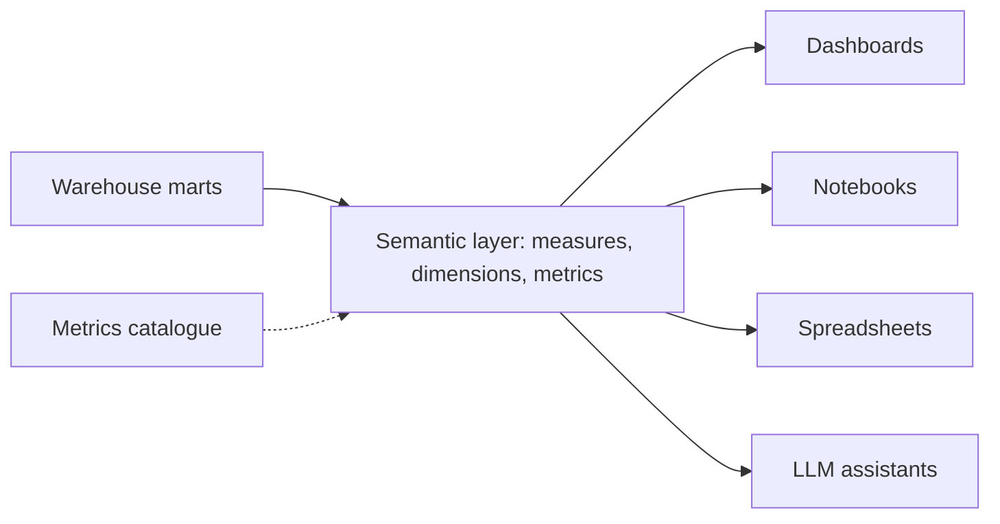
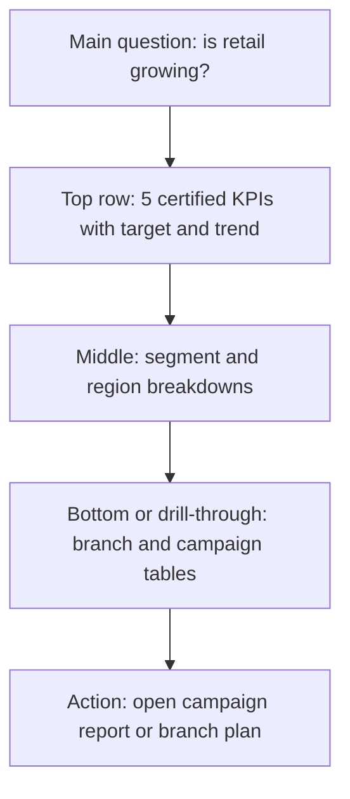
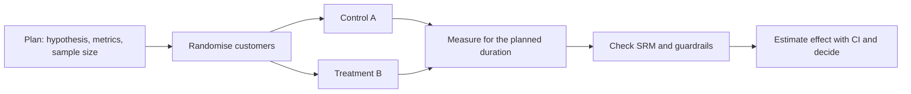

# Module 4 — Analytics people trust

*Pipelines, models and tests exist so that someone can make a better decision. This module is about the last few metres, where data meets people, and where most of the trust in a data team is won or lost. It starts with metrics: how one word such as "active customer" ends up with three numbers, and how a single written definition, a semantic layer and a metrics catalogue fix that for good. It then turns to dashboards and data storytelling: designing for a decision rather than a display, choosing charts that do not mislead, and writing the one paragraph that tells a busy executive what changed and what to do. It ends with experiments and the statistics every analyst needs: A/B tests, sample size, p-values and confidence intervals, and the traps (peeking, multiple comparisons, sample ratio mismatch, Simpson's paradox) that fool smart people. You will follow Najm Bank's Data Platform & Analytics team as Lina untangles three versions of "active customers", Kareem rebuilds a 40-chart retail dashboard that nobody opens, and Dana stops a Najm Mobile experiment that was declared a winner on day three.*

> **Stages:** Serve, Analyse — turning clean tables into numbers, pictures and test results that people understand, agree on and act on.

---

# 4.1 — Defining metrics: one definition, a semantic layer and a metrics catalogue
*Level: 🟡 Intermediate* · *Prerequisites: 1.2, 3.1* · *Stage: Model, Serve*

## ⚡ In 60 seconds
- A **metric** is a number the business tracks over time, such as monthly active customers or card spend. A metric is only useful if everyone computes it the same way.
- The rule that matters most: **one metric, one written definition, one owner, one place where it is computed.** Every dashboard, notebook and report reads it from there.
- A **semantic layer** is the code that holds those definitions (measures, dimensions, joins, filters) between the warehouse and the tools that ask questions. Examples include the dbt Semantic Layer (powered by MetricFlow), Cube and Looker's LookML.
- A **metrics catalogue** is the human-readable side: a card per metric with its business question, formula, grain, owner, caveats and certification status.
- Decision cue: when two teams bring different numbers for the "same" metric to a meeting, stop arguing about which is right and write the definition down.
- Biggest trap: averaging ratios, summing balances across days or adding up distinct counts. Know whether each measure is additive, semi-additive or non-additive before you aggregate it.

## 🧭 Why it matters
It is the quarterly business review at Najm Bank. The retail team's slide says Najm has **412,000 active customers**. Finance's slide says **365,000**. Risk's capital report, built from the credit-risk mart, uses a third figure. (These are hypothetical numbers for our fictional bank.) The CEO asks a simple question: "How many active customers do we have?" Nobody in the room can answer without a footnote.

Lina, Najm's analytics engineer, spends a week finding out why. Retail counts anyone who logged in to Najm Mobile **or** made any transaction in the last 90 days. Finance counts customers with at least one **customer-initiated** transaction in the calendar month, excluding salary credits and fees. Risk counts customers with an open account that is not dormant. Each definition suits its purpose; none is written down; each lives in a different, much-copied SQL query, and two silently include staff accounts.

This is the most common way data teams lose trust: not wrong data, but **the same word meaning different things**. The fix is partly technical (compute each metric in one place) and partly social (agree a definition, give it an owner, publish it). For the dashboard side of the same problem in a startup setting, see [*System Design for Vibe Coders*, lesson 7.1 — The dashboard that lies and the metric that doesn't](../vibe/index.en.html#l7-1).

## 📐 How it works

### 🟢 The essentials

**Metric, measure, dimension.** Three words you will meet in every semantic layer:
- A **measure** is an aggregation over a column: `SUM(amount_qar)`, `COUNT(DISTINCT customer_id)`.
- A **dimension** is something you slice by: date, channel, segment, branch, country.
- A **metric** is the business-facing number built from one or more measures, with any filters baked in: "card spend" is the sum of approved purchase amounts, excluding reversals.

**A definition has more parts than a formula.** "Active customers = count of customers with a transaction" leaves at least seven questions open. A complete definition answers all of them:

| Part | Question it answers | Najm's "active customers" (agreed version) |
|---|---|---|
| Business question | Why does anyone look at this? | How many customers actively use Najm as a bank? |
| Formula | What exactly is counted or summed? | Distinct customers with at least one qualifying event |
| Qualifying events | What counts? | Customer-initiated transaction, or a login to Najm Mobile or online banking |
| Exclusions | What never counts? | Staff and test accounts, salary credits, fees, interest postings, reversals |
| Window and time zone | Over what period, in which clock? | Trailing 30 days ending on the reporting date, Asia/Qatar time |
| Grain | One row per what? | One number per day per segment (retail, SME); never summed across days |
| Owner | Who decides changes? | Head of Retail Analytics; Lina maintains the code |

**Why the drift happens.** Each analyst who needs the number writes a query, copies a filter from an older query, and forgets one exclusion. With ten dashboards you have ten definitions. The cure is to move the definition **upstream**: compute it once in the warehouse, test it (3.1, 3.2) and have every tool read the result.

**Additive, semi-additive and non-additive.** Before you aggregate any measure, ask how it may be added up:

| Type | Meaning | Najm example | Safe to sum across |
|---|---|---|---|
| Additive | Can be summed across every dimension | Card spend in QAR | Days, branches, segments |
| Semi-additive | Can be summed across some dimensions but not time | Account balance at end of day | Accounts and branches, but not days: take the end-of-period value or the average |
| Non-additive | Cannot be summed at all | Distinct active customers, ratios, percentages | Nothing: recompute from the underlying rows |

Huda learned this the hard way. Asked for "active customers this month", she summed the daily active-customer counts and reported a number larger than Najm's entire customer base: anyone active on 20 days was counted 20 times.

```sql
-- Wrong: daily distinct counts are non-additive
SELECT SUM(daily_active) AS monthly_active
FROM daily_active_customers
WHERE activity_date >= DATE '2026-09-01' AND activity_date < DATE '2026-10-01';

-- Right: recompute the distinct count over the whole period
SELECT COUNT(DISTINCT customer_id) AS monthly_active
FROM fct_customer_activity
WHERE activity_date >= DATE '2026-09-01' AND activity_date < DATE '2026-10-01'
  AND is_staff = FALSE
  AND is_qualifying_event = TRUE;
```

**Ratios: divide sums, do not average ratios.** Digital adoption by branch might be 80% in a branch with 100 customers and 40% in a branch with 10,000. The average of the two ratios is 60%. The true combined rate is (80 + 4,000) ÷ 10,100, about 40.4%. Define a ratio metric as **numerator measure ÷ denominator measure**, each summed at the level you are reporting.

```sql
-- Wrong: average of branch-level percentages
SELECT AVG(digital_customers * 1.0 / customers) AS adoption FROM branch_summary;

-- Right: ratio of sums
SELECT SUM(digital_customers) * 1.0 / SUM(customers) AS adoption FROM branch_summary;
```

### 🟡 Going deeper

**What a semantic layer does.** A semantic layer is a set of definitions, stored as code, that tells a query engine which tables hold which measures, how tables join (through **entities**, the keys such as `customer_id`), which dimensions exist, and how each metric is built. A tool asks for "active customers by segment, by month" and the semantic layer writes the SQL. Because every tool asks the same layer, every tool gets the same answer.



Three widely used options, described neutrally:
- **dbt Semantic Layer with MetricFlow.** You declare **semantic models** (a dbt model plus its entities, dimensions and measures) and **metrics** in YAML next to your dbt project. MetricFlow generates the SQL, including the joins. Metric types include simple, ratio, cumulative, derived and conversion metrics.
- **Cube.** An open-source semantic layer with its own data model files, an API layer and caching, often used to serve metrics to applications as well as BI tools.
- **LookML.** Looker's modelling language. Definitions live in Looker and serve Looker's own exploration and dashboards, and, through Google's connectors, some other tools.

Here is the start of Najm's semantic model for card transactions in dbt's YAML. The syntax follows the dbt documentation at the time of writing (2026); the spec has been evolving, so check the current docs before you copy it.

```yaml
semantic_models:
  - name: card_transactions
    model: ref('fct_card_transactions')
    defaults:
      agg_time_dimension: transaction_date
    entities:
      - name: transaction
        type: primary
        expr: transaction_id
      - name: customer
        type: foreign
        expr: customer_id
    dimensions:
      - name: transaction_date
        type: time
        type_params:
          time_granularity: day
      - name: channel
        type: categorical
    measures:
      - name: card_spend_qar
        agg: sum
        expr: amount_qar
      - name: card_spenders
        agg: count_distinct
        expr: customer_id

metrics:
  - name: card_spend
    label: Card spend (QAR)
    description: Approved card purchases in QAR, excluding reversals and refunds.
    type: simple
    type_params:
      measure: card_spend_qar
```

Notice where the filter lives. Reversals and refunds are excluded in `fct_card_transactions` itself, a tested dbt model, so the measure cannot be computed without them excluded. Put business rules as early as you can, and once.

**You do not need a semantic layer product to start.** The minimum version is a **metrics mart**: a tested dbt model per metric family at a declared grain, such as `mart_active_customers_daily` (one row per date per segment), that every dashboard reads directly. Najm started there and added MetricFlow when analysts needed to slice metrics many ways without a new table for each combination.

**The metrics catalogue.** Code alone does not settle arguments, because executives do not read YAML. The catalogue is a page per metric that a non-engineer can read, generated from the same source where possible (dbt descriptions, a catalogue such as OpenMetadata or DataHub, see 6.1). Each entry carries a **certification status**:
- **Certified**: definition approved by the owner, computed in the semantic layer or metrics mart, tested, monitored for freshness.
- **Provisional**: in use while the definition is being agreed.
- **Deprecated**: kept for history, with a pointer to the replacement and a removal date.

Dashboards show the status next to each number, so a reader knows whether it is the bank's official figure.

**Changing a definition.** Treat a definition change like an API change: give each metric a **version**, record what changed and why, announce it, and, if history must stay comparable, backfill (2.2) under the new definition and annotate the chart. A silent filter change that moves a chart 8% overnight looks exactly like a real business event.

### 🔴 Expert view

**Metric trees.** Mature teams organise metrics into a tree: a **north-star metric** at the top (for Najm retail, perhaps "primary-bank customers", whose salary is paid into Najm), **input metrics** that teams can move below it (onboarding completion, card activation), and **guardrail metrics** that watch for damage (complaints, fraud losses). The tree tells each team which number it owns and stops two teams optimising metrics that pull against each other.

**Goodhart's law.** Often paraphrased as "when a measure becomes a target, it ceases to be a good measure". If branch staff are rewarded on "active customers" and a login counts as activity, expect campaigns that push customers to log in without doing anything. Pair every target metric with a guardrail and with a quality version of itself (for example, "active customers with two or more qualifying events").

**Point-in-time correctness.** Many bank metrics depend on attributes that change: segment, risk grade, branch. "SME customers in March" should use the segment each customer had *in March*, not today's. That requires slowly changing dimensions (1.2) joined on effective dates, and a definition that says which one it uses: **as-was** (the attribute at the time of the event) or **as-is** (today's attribute applied to all history). Regulatory reports usually need as-was. Write the choice on the metric card.

**Reconciliation.** A certified financial metric must tie back to the system of record. Finance's "card spend" should reconcile with the card processor's settlement totals within a known tolerance, and the difference should be explained (timing, reversals, currency conversion). Build that check as a scheduled data test (3.2) and show the reconciliation status on the metric card. A number that has never been reconciled is not certified, however neat its YAML.

**Metrics for machines.** An LLM assistant answering data questions is generally more reliable querying a semantic layer than writing raw SQL against hundreds of tables, because the joins, filters and exclusions are already decided. Treat the semantic layer as the contract between people, dashboards and AI.

## 🧰 The toolkit
| Tool, pattern or standard | What it is and does | When to reach for it |
|---|---|---|
| **Metric definition card** | A one-page written definition: question, formula, exclusions, window, grain, owner, version, status | Before any metric appears on a dashboard; whenever two numbers disagree |
| **Semantic layer** | Code that holds measures, dimensions, joins and metrics between the warehouse and its consumers | When the same metrics are sliced many ways in several tools |
| **dbt Semantic Layer** (MetricFlow) | Semantic models and metrics declared in YAML in a dbt project; MetricFlow generates the SQL | Teams already transforming with dbt |
| **Cube** | Open-source semantic layer with an API and caching | Serving metrics to BI tools and to applications |
| **LookML** (Looker) | Looker's modelling language for dimensions, measures and joins | Organisations standardised on Looker |
| **Metrics mart** | A tested dbt model per metric family at a declared grain | The simplest start, before adopting a semantic layer product |
| **Metric tree** | North-star metric, input metrics and guardrails linked by assumed cause | Aligning team goals and spotting metrics that pull against each other |

## 🏛️ In practice at Najm Bank
Lina publishes the first certified entry in the **Najm Metrics Catalogue**. Retail, finance and risk sign it off; the old "active customers" queries are retired and the three dashboards now read the same mart.

| Field | Value |
|---|---|
| Metric | `active_customers_30d` — Active customers (30-day) |
| Version and status | v1.0 · **Certified** · effective 1 October 2026 |
| Business question | How many customers actively use Najm as a bank? |
| Formula | Distinct `customer_id` with at least one qualifying event in the 30 days ending on the reporting date |
| Qualifying events | Customer-initiated debit or credit transaction; login to Najm Mobile or online banking |
| Exclusions | Staff and test accounts; salary credits; fees, interest and system postings; reversed transactions |
| Time zone and cut-off | Asia/Qatar; events up to 23:59:59 on the reporting date |
| Grain | One row per reporting date × segment (Retail, SME); non-additive: never sum across dates or segments; use the "All" row |
| Attribute history | Segment as-was on the reporting date (SCD Type 2 join) |
| Source | `mart_active_customers_daily` (dbt), built from `fct_customer_activity` |
| Tests | Unique on date × segment; not null; "All" ≥ each segment; day-on-day change within ±5% or an alert to Lina |
| Freshness | Available by 07:00 daily; dashboard shows the as-of time |
| Owner and steward | Owner: Head of Retail Analytics · Steward: Lina (analytics engineering) |
| Known caveats | Login-only activity is about a third of the total (hypothetical); see `active_customers_transacting_30d` for a stricter view |
| Change log | v1.0: replaces retail, finance and risk local definitions; history backfilled to January 2024 |

## 🛠️ Exercises
Use DuckDB or PostgreSQL with a synthetic table of 1,000 customers and 50,000 events that you generate yourself (include a few staff accounts, salary credits and reversals).

- 🟢 Write three different "active customers" queries, matching the retail, finance and risk definitions in 🧭, and run them on the same data. Then write the metric card that resolves them. *Done when:* the three queries give three different numbers, you can explain each difference row by row, and your card answers every field in the table above.
- 🟡 Build a dbt model `mart_active_customers_daily` at the grain date × segment with an "All" row, plus tests (unique combination, not null, and a custom test that "All" is never less than any segment). Show, in a query, why summing daily rows to get a monthly figure is wrong. *Done when:* `dbt build` passes and your wrong-versus-right query pair produces visibly different numbers.
- 🔴 Add a semantic model and two metrics (one simple, one ratio such as digital adoption) to your dbt project using the dbt Semantic Layer spec, and query them by month and segment with MetricFlow locally. *Done when:* the ratio metric gives the ratio of sums, not the average of ratios, and you have verified it against a hand-written SQL query.

## ⚠️ Mistakes and traps
- **Definitions living in dashboard queries.** Ten dashboards become ten definitions. Compute each metric once, upstream, and have every tool read it.
- **Summing what is not additive.** Distinct counts, ratios and balances cannot be summed across days. Label each measure's additivity and recompute from rows.
- **Averaging ratios.** Small groups get the same weight as large ones. Divide summed numerators by summed denominators.
- **Silent definition changes.** A filter change looks like a business event. Version the definition, annotate the chart, and backfill when history must stay comparable.
- **A definition without an owner.** Without one, every disagreement goes to a meeting and stays there. Name an owner who decides and a steward who maintains the code.
- **Targets without guardrails.** A rewarded metric gets gamed. Pair it with a guardrail and a stricter quality version.

## 🧾 Recap
- A metric is trustworthy only when it has one written definition, one owner and one place where it is computed.
- A full definition covers formula, qualifying events, exclusions, window, time zone, grain, attribute history and owner.
- Know each measure's additivity; recompute distinct counts and ratios rather than summing or averaging them.
- A semantic layer (dbt Semantic Layer with MetricFlow, Cube, LookML, or simply a tested metrics mart) makes every tool ask the same definitions.
- A metrics catalogue makes definitions readable, certified and versioned; metric trees and guardrails keep targets honest.

## ✍️ Check yourself

**1. Retail reports 412,000 active customers and finance reports 365,000. Both queries run without errors on the same warehouse. What is the best first step?**

- A. Agree one written definition with a named owner, then compute it in one place
- B. Use the higher number, since it captures more kinds of activity
- C. Average the two figures so that neither team's number is favoured
- D. Rebuild the warehouse, because two numbers mean the data is corrupted

<details><summary>Answer</summary>

**A.** The data is probably fine; the definitions differ. Agreeing one definition with an owner, then computing it once, ends the argument. D chases a problem that is not in the data; B and C just pick a number. (🧭 Why it matters; 🟢 The essentials.)

</details>

**2. Huda sums 30 daily active-customer counts to report the monthly figure. What is wrong?**

- A. Nothing is wrong, as long as staff and test accounts were excluded each day
- B. She should have averaged the daily counts rather than summing them
- C. Distinct counts are non-additive; recompute the distinct count over the month
- D. She should have taken the median of the daily counts to remove outliers

<details><summary>Answer</summary>

**C.** A customer active on 20 days is counted 20 times. B and D give a "typical day", not the number of distinct customers active in the month. (🟢 The essentials.)

</details>

**3. Branch X has 80 of 100 customers using digital banking; branch Y has 4,000 of 10,000. What is the combined digital adoption rate?**

- A. 60%, the simple average of the two branch rates
- B. It cannot be computed without customer-level data
- C. 80%, the rate of the best-performing branch
- D. About 40.4%: total digital over total customers

<details><summary>Answer</summary>

**D.** 4,080 ÷ 10,100 ≈ 40.4%. Averaging the rates gives the small branch the same weight as the large one. (🟢 The essentials.)

</details>

**4. Which statement best describes a semantic layer?**

- A. A colour theme and layout template shared by a BI tool's dashboards
- B. Shared code defining measures, dimensions, joins and metrics for every tool
- C. The raw layer of the warehouse, where source data lands before cleaning
- D. A copy of the warehouse kept in another region for disaster recovery

<details><summary>Answer</summary>

**B.** It sits between the warehouse and its consumers and generates the SQL from shared definitions. C is the raw layer; A and D are unrelated. (🟡 Going deeper.)

</details>

**5. Najm rewards branches on "active customers", where a login counts as activity. Logins rise sharply but transactions do not. What should Lina recommend?**

- A. Remove logins from the definition quietly, so the gaming stops by next week
- B. Stop measuring active customers, since any rewarded metric will be gamed
- C. Add a guardrail and a stricter quality metric, and version any definition change
- D. Raise the target so that branches must also drive transactions to reach it

<details><summary>Answer</summary>

**C.** This is Goodhart's law: a rewarded measure gets gamed. Guardrails and a quality version expose the gaming, and definition changes must be versioned and announced. A is a silent definition change. (🔴 Expert view; 🟡 Going deeper.)

</details>

## 📚 References
- dbt documentation, dbt Semantic Layer and MetricFlow — https://docs.getdbt.com/docs/use-dbt-semantic-layer/dbt-sl
- dbt documentation, semantic models and metrics — https://docs.getdbt.com/docs/build/semantic-models
- Cube documentation — https://cube.dev/docs
- Looker documentation, LookML — https://cloud.google.com/looker/docs
- Ralph Kimball and Margy Ross, *The Data Warehouse Toolkit* (3rd edition, Wiley, 2013): additive, semi-additive and non-additive facts
- DuckDB documentation, aggregate functions — https://duckdb.org/docs/
- OpenMetadata — https://open-metadata.org/ · DataHub — https://datahubproject.io/

---

# 4.2 — Dashboards and data storytelling that lead to decisions
*Level: 🟡 Intermediate* · *Prerequisites: 4.1* · *Stage: Serve, Analyse*

## ⚡ In 60 seconds
- A dashboard exists to support a **decision** or an **action**. Start from "who decides what, how often, using which numbers?" and design backwards. If you cannot name the decision, you are building a display, not a dashboard.
- Three kinds serve different needs: **strategic** (a few certified metrics, monthly or weekly, for leaders), **operational** (near real time, for people who act today) and **analytical** (exploration, for analysts).
- Pick the chart by the comparison you want the reader to make. Position on a common scale (bar and line charts) is read most accurately; angles and areas (pies, bubbles) less so.
- **Storytelling** is the paragraph that goes with the chart: what changed, why we think it changed, how sure we are, and what we recommend.
- Decision cue: every chart must answer a question you can write in its title. If it does not, remove it.
- Biggest trap: the 40-chart dashboard nobody opens. More charts mean less attention per chart, slower loading and more places for definitions to drift.

## 🧭 Why it matters
Kareem, Najm's retail data analyst, maintains the "Retail Performance" dashboard. It has 40 charts across six tabs, built up over three years as each request added "just one more chart". Usage logs from the BI tool show it was opened 11 times last month, mostly by Kareem himself. Meanwhile the retail director gets her numbers from a spreadsheet that her assistant updates by hand every Monday, copying figures from the dashboard. The spreadsheet has the wrong card spend for August, because one copied cell was from the wrong tab.

When Kareem asks the director what she needs, the answer is short. "Every Monday I decide where to put the branch sales teams and which campaigns to keep. I need to know which segments are growing, which are slipping, and whether last week's campaigns worked." Three questions. Not 40 charts.

This lesson is about building for that conversation. A dashboard that leads to decisions is smaller, faster, built on certified metrics (4.1), designed around a question, and accompanied by a sentence that says what the numbers mean. Building it well is engineering as much as design: it needs pre-aggregated marts, freshness labels, access control and a plan to retire what nobody uses.

## 📐 How it works

### 🟢 The essentials

**Start with the decision, not the data.** Before opening a BI tool, write a short **dashboard spec**:
1. **Audience**: who uses it? (Retail director and four regional heads.)
2. **Decision**: what do they decide with it, and how often? (Weekly: sales team allocation and campaign continuation.)
3. **Questions**: the three to five questions it must answer. ("Which segments grew or shrank this week versus the last four weeks?")
4. **Metrics**: certified metrics only, by name from the catalogue (4.1).
5. **Freshness**: how current must it be? (Monday 07:00, data to Sunday midnight.)
6. **Action**: what does the reader do when a number is bad? (Drill to the branch table; open the campaign report.)

**Three kinds of dashboard.**

| Kind | Audience | Refresh | Content | Najm example |
|---|---|---|---|---|
| Strategic | Executives, board | Weekly or monthly | Five to eight certified metrics with targets and trends | Retail director's weekly view |
| Operational | People acting now | Minutes to hours | Queues, alerts, thresholds, lists of items to work | Fraud operations: Smart Alerts queue and false-positive rate |
| Analytical | Analysts | On demand | Filters, drill-downs, many dimensions | Kareem's segment exploration workbook |

Mixing them is the usual cause of the 40-chart dashboard: an executive view that grew analytical tabs.

**Choose the chart by the comparison.** In a well-known 1984 study, William Cleveland and Robert McGill ranked how accurately people read quantities from different visual encodings. Position along a common scale came first; length, direction and angle came after it; area, volume and colour shading came last. In their experiments, people judged pie-chart angles less accurately than bar positions. In practice:

| You want the reader to compare | Use | Avoid |
|---|---|---|
| Values across categories | Horizontal bar chart, sorted | Pie chart with more than two or three slices; 3D bars |
| Change over time | Line chart | Bar chart with many periods; area charts stacked many layers deep |
| Part of a whole, few parts | Stacked bar, or a single bar with two segments | Donut charts with many slices |
| Two measures' relationship | Scatter plot | Two lines on dual y-axes |
| One number against a target | Big number with the target and the trend beside it | A gauge or speedometer |
| Many categories × many periods | Small multiples or a heatmap | One line chart with 15 lines |

**Honest axes.** A bar's length encodes its value, so **bar charts must start at zero**. A bar chart starting at 95% makes a move from 96% to 98% look like a doubling. Line charts may use a non-zero baseline because they encode change by slope, but label the axis clearly. Never use two y-axes with different scales on one chart: by choosing the scales you can make any two series appear to move together.

**The title carries the message.** Replace "Card spend by segment" with "SME card spend fell 6% this week; retail flat". The reader gets the point before reading the axis. Put the as-of time on every dashboard ("Data to Sun 28 Sep, 23:59 Asia/Qatar; refreshed Mon 06:42").

### 🟡 Going deeper

**Layout follows reading order.** Readers scan from the top left (in left-to-right languages; mirror the layout for Arabic dashboards). Put the answer to the main question at the top: a row of four to six key numbers, each with its comparison (versus last week, versus target) and a small trend line. Put supporting breakdowns below. Put detail tables last or behind a drill-through.



**Comparisons make numbers meaningful.** "Card spend: QAR 84.2 million" means nothing alone. Always show at least one comparison: previous period, same period last year (important in the Gulf, where Ramadan and summer holidays move spending sharply and Ramadan shifts by roughly 11 days each Gregorian year), target or forecast. Compare like with like: a week containing Eid against a normal week is not a fair comparison, so annotate it or compare with the equivalent week last year.

**Colour with a purpose.** Use grey for context and one strong colour for what matters. Use colour to encode meaning consistently: the same segment is the same colour on every chart. Do not rely on red versus green alone, since a meaningful share of people (especially men) have some colour-vision deficiency; add direction arrows, labels or a blue–orange palette. Check contrast for readers on phones in bright light.

**Performance is part of trust.** A dashboard that takes 40 seconds to load does not get opened. Build dashboards on **pre-aggregated marts** at the grain the charts need (for example, `mart_retail_weekly` at week × segment × region), not on raw transaction tables. Partition and cluster them (3.3), cache where the BI tool allows, and set a load-time budget (for example, under five seconds for the first view).

**Engineering the dashboard.** Treat dashboards as products with a life cycle:
- **Version control**: Superset can export and import dashboards as YAML files; Metabase offers serialisation in its paid editions and an API in all editions; most commercial BI tools have similar features. Keep exports or "dashboards as code" in git where the tool supports it.
- **Certification**: mark dashboards built only on certified metrics, and show it in the title bar.
- **Access**: dashboards inherit the data's sensitivity. Branch managers see their own branch; row-level security belongs in the warehouse or semantic layer, not in a dashboard filter a user can remove (6.3).
- **Usage and retirement**: review usage every quarter. Archive dashboards nobody has opened in 90 days, after telling their owners. Kareem's 40 charts become one strategic dashboard and one analytical workbook.

**Data storytelling.** The chart shows *what*; the story says *so what* and *now what*. A useful structure for a weekly note or a slide is:
1. **Headline**: the one thing that matters. "SME card spend fell 6% week on week, the second weekly fall in a row."
2. **Context**: is it unusual? "Over the last 52 weeks, weekly changes ranged between −4% and +5%, except Ramadan and Eid weeks."
3. **Cause, with confidence**: "Two thirds of the fall comes from 120 SME customers in construction; three large customers moved their supplier payments to a new account at another bank (confirmed by relationship managers). Low confidence on the rest."
4. **Recommendation**: "Relationship managers to call the top 20 affected customers this week; we will report the effect next Monday."

Barbara Minto's *The Pyramid Principle* gives the same advice for writing: lead with the conclusion, then the supporting arguments, then the detail.

**Separate what you know from what you think.** Write "fell 6%" (measured), "mainly from construction" (measured breakdown), "because of payments moving to another bank" (explanation, confirmed for three customers only). Readers can act on a confident claim and check a weak one, but only if you tell them which is which.

### 🔴 Expert view

**Aggregates can lie by omission.** A total can hide opposite movements in its parts. Overall approval rates for Najm's personal loans can rise while the rate falls in every individual segment, if the mix of applicants shifts towards segments with high approval rates. This is Simpson's paradox, covered with the classic example in 4.3. The defence on a dashboard is a breakdown by the main mix variable (segment, channel, product) directly under any headline ratio.

**Survivorship in dashboards.** Dashboards built from "current customers" quietly exclude everyone who left. "Average balance of our customers is rising" may only mean that low-balance customers are closing their accounts. When a metric is computed over a population that changes, show the population size alongside it, and consider a **cohort view** (customers grouped by the month they joined) instead of a snapshot.

**Do not chase noise.** Every weekly number moves. Before writing "fell 6%", know the normal range of week-to-week movement for that metric. Simple tools help: show the last 52 weeks' range as a shaded band, or use a control chart (statistical process control, with limits set from past variation) for operational metrics. Investigate movements outside the band; note the rest without a story. Analysts who explain every wiggle teach executives to ignore them.

**Alerts beat dashboards for operational work.** If someone must act when a number crosses a threshold, do not rely on them looking at a dashboard. Send an alert with the number, the threshold, a link to the drill-down and an owner. Fraud operations do not watch a Smart Alerts chart; they work from a queue and get paged when the false-positive rate leaves its band.

**Self-service has limits.** Self-service BI lets business users build their own charts, which scales the team. Without certified metrics and a semantic layer it also scales the "three definitions" problem from 4.1. Najm's rule: anyone may explore; only dashboards built on certified metrics may be presented to executive committees or used for regulatory or financial decisions.

## 🧰 The toolkit
| Tool, pattern or standard | What it is and does | When to reach for it |
|---|---|---|
| **Dashboard spec** | One page: audience, decision, questions, certified metrics, freshness, action | Before building or rebuilding any dashboard |
| **Metabase** | Open-source BI tool for questions, dashboards and simple self-service | Small teams; running BI locally with Docker for learning |
| **Apache Superset** | Open-source BI and data exploration platform with many chart types and SQL Lab | Larger self-hosted deployments needing rich charts and SQL exploration |
| **Small multiples** (Tufte) | The same small chart repeated for each category on shared axes | Comparing many segments or regions over time |
| **Control chart** (statistical process control) | A time series with limits derived from historical variation | Separating real changes from normal noise in operational metrics |
| **Pyramid Principle** (Minto) | Lead with the conclusion, then supporting arguments, then detail | Weekly notes, executive summaries, slides |
| **Cohort view** | Metrics grouped by start month or acquisition channel, followed over time | When the population behind a metric changes, such as retention and balances |

## 🏛️ In practice at Najm Bank
Kareem replaces "Retail Performance" with a spec-first **Retail Weekly** dashboard. Lina reviews it against the metrics catalogue; Faisal approves its retirement plan for the old one.

**Dashboard spec: Retail Weekly v1**

| Field | Value |
|---|---|
| Audience | Retail director; four regional heads |
| Decision | Weekly sales-team allocation by region; continue or stop each running campaign |
| Questions | 1. Which segments grew or shrank this week? 2. Is that outside normal variation? 3. Which regions drive it? 4. Did last week's campaigns move their target metric? |
| Certified metrics | `active_customers_30d`, `card_spend`, `new_accounts_opened`, `digital_adoption_rate`, `complaints_per_10k_customers` (guardrail) |
| Comparisons | Previous week; average of last four weeks; same week last year (Ramadan and Eid weeks annotated) |
| Layout | Top: five KPI tiles with comparison and 13-week sparkline. Middle: segment × region small multiples. Bottom: campaign table with links to each campaign's experiment or report |
| Data source | `mart_retail_weekly` (week × segment × region), partitioned by week |
| Freshness | Data to Sunday 23:59 Asia/Qatar, available Monday 07:00; as-of time shown in the header |
| Performance budget | First view under five seconds |
| Access | Regional heads see their region only, via row-level security in the warehouse |
| Narrative | Kareem adds a four-line note each Monday: headline, context, cause with confidence, recommendation |
| Certification | Certified (all metrics certified); shown in title bar |
| Review | Usage reviewed quarterly; any chart not referenced in a decision for two quarters is removed |
| Retired | "Retail Performance" (40 charts) archived after a 30-day notice; the director's manual spreadsheet stopped |

## 🛠️ Exercises
Run Metabase or Apache Superset locally in Docker against DuckDB or PostgreSQL with synthetic data you generate (at least 52 weeks of weekly figures for four segments and four regions).

- 🟢 Take a dashboard you know (or a public one) and write its spec using the six fields above. List every chart that does not answer one of its questions. *Done when:* your spec names a decision and a cadence, and each remaining chart maps to one question.
- 🟡 Build the Retail Weekly layout from the spec with your synthetic data: five KPI tiles with comparisons, small multiples by segment and region, and a campaign table. Rewrite every chart title as a message. *Done when:* a classmate can answer the four questions in under two minutes without your help, and no bar chart has a non-zero baseline.
- 🔴 Add a 52-week normal-range band (or control-chart limits) to `card_spend` and write a four-line Monday note for a week where you injected a real change and a week where you did not. *Done when:* your note flags the injected change, stays quiet about the ordinary week, and separates measured facts from explanations.

## ⚠️ Mistakes and traps
- **Building before asking about the decision.** You get a display that nobody uses. Write the spec first and design backwards from the decision.
- **One dashboard for every audience.** Strategic, operational and analytical needs conflict. Build separate views and link them.
- **Misleading encodings.** Truncated bar axes, dual y-axes, 3D effects and pies with many slices distort comparisons. Use bars from zero, lines for time and one scale per chart.
- **Numbers without comparison or freshness.** A lone number invites misreading. Show a comparison and the as-of time on every view.
- **Explaining every wiggle.** Stories about noise erode trust. Know each metric's normal range and comment only on real moves.
- **Filters as security.** A dashboard filter is not access control. Enforce row-level security in the warehouse or semantic layer.

## 🧾 Recap
- Design backwards from a decision: audience, questions, certified metrics, freshness and action, written in a spec.
- Keep strategic, operational and analytical dashboards separate.
- Choose charts by the comparison you want; position on a common scale reads best; bar charts start at zero; avoid dual axes.
- Add a story: headline, context, cause with stated confidence, recommendation.
- Run dashboards as products: fast marts, version control, access control, usage review and retirement.

## ✍️ Check yourself

**1. The retail director's 40-chart dashboard was opened 11 times last month. What should Kareem do first?**

- A. Add more charts so that it covers every question anyone might ask
- B. Email the dashboard link to the whole retail team every Monday
- C. Move it to a faster, more modern BI tool so that people enjoy opening it
- D. Ask what she decides and how often, write a spec, and rebuild around it

<details><summary>Answer</summary>

**D.** Low usage usually means the dashboard does not serve a decision. A makes the problem worse; C changes the tool but not the design. (🟢 The essentials.)

</details>

**2. Which chart best lets readers compare card spend across 12 regions in one week?**

- A. A sorted horizontal bar chart starting at zero
- B. A pie chart with 12 slices, labelled with percentages
- C. A 3D column chart with a different colour per region
- D. A donut chart with a colour legend for the regions

<details><summary>Answer</summary>

**A.** Position and length along a common scale are read most accurately, and sorting makes the ranking obvious. Angles and areas (B, D) are read poorly, and 3D (C) distorts lengths. (🟢 The essentials.)

</details>

**3. A bar chart of monthly digital adoption has a y-axis running from 95% to 100%. What is the problem?**

- A. None; a narrow axis makes small changes easier to see, which helps the reader
- B. Bar length encodes value, so the truncated axis exaggerates differences
- C. The axis should run from 0% to 200% to leave room for labels
- D. Percentages should be shown in a table, never charted

<details><summary>Answer</summary>

**B.** A move from 96% to 98% would look like a doubling. Start bars at zero, or use a line chart with a clearly labelled axis: a line chart may use a non-zero baseline because it encodes change by slope. (🟢 The essentials.)

</details>

**4. SME card spend fell 6% this week. Over the last year, weekly changes outside Ramadan and Eid ranged from −4% to +5%. What should the Monday note do?**

- A. Ignore it, because every weekly number moves and stories about noise erode trust
- B. Report the number alone, without context, so the reader is not biased
- C. Flag it as unusual, with the breakdown, likely cause, confidence and an action
- D. Wait for three more weeks of data before mentioning it, to be sure it is a trend

<details><summary>Answer</summary>

**C.** The fall is outside normal variation, so it deserves a story: headline, context, cause with confidence, recommendation. A and D ignore a real signal; B leaves the reader unable to judge it. (🟡 Going deeper; 🔴 Expert view.)

</details>

**5. Regional heads should see only their own region on Retail Weekly. Where should this be enforced?**

- A. In a dashboard filter preset to each regional head's own region
- B. By asking regional heads, in writing, not to change the region filter
- C. With row-level security in the warehouse, tied to the viewer's identity
- D. In a separate copy of the dashboard per region, each with its own copied queries

<details><summary>Answer</summary>

**C.** A filter can be removed by the user, so it is not access control; the semantic layer is also an acceptable place. D also duplicates logic and invites definitions to drift. (🟡 Going deeper; ⚠️ Mistakes and traps.)

</details>

## 📚 References
- William S. Cleveland and Robert McGill, "Graphical Perception: Theory, Experimentation, and Application to the Development of Graphical Methods", *Journal of the American Statistical Association*, 1984
- Edward R. Tufte, *The Visual Display of Quantitative Information* (Graphics Press)
- Stephen Few, *Information Dashboard Design* (Analytics Press)
- Cole Nussbaumer Knaflic, *Storytelling with Data* (Wiley, 2015)
- Barbara Minto, *The Pyramid Principle* (Pearson)
- Metabase documentation — https://www.metabase.com/docs/latest/
- Apache Superset documentation — https://superset.apache.org/docs/intro

---

# 4.3 — Experiments and statistics for analysts: A/B tests and the traps that fool smart people
*Level: 🟡 Intermediate* · *Prerequisites: 1.1, 4.1* · *Stage: Analyse*

## ⚡ In 60 seconds
- An **A/B test** (a randomised controlled experiment) splits users at random into a control group and one or more treatment groups, so that the only systematic difference between the groups is the change being tested. It is the most reliable way to learn whether a change *caused* an effect.
- Decide before you start: the hypothesis, the **primary metric**, the **guardrail metrics**, the minimum effect worth detecting, the **sample size** and the end date. Write them in an experiment plan.
- A **p-value** is the probability of seeing a difference at least this large if the change had no real effect. It is not the probability that the change works. Report a **confidence interval** for the size of the effect, not just "significant".
- The traps: **peeking** and stopping early, testing many metrics or segments and reporting the one that "won", **sample ratio mismatch**, novelty effects, and **Simpson's paradox** in observational data.
- Decision cue: if you cannot randomise, you are doing observational analysis; say so, and be much more careful about cause.
- For the product side of experimentation, see [*AI Product Management*, lesson 6.3 — Online evaluation: experiments, A/B tests and staged rollouts](../aipm/index.html#/6.3).

## 🧭 Why it matters
The Najm Mobile team tests a redesigned card-activation screen. On day three, the product manager posts the experiment tool's result: activation 22% higher in relative terms, "statistically significant, p = 0.03". The team wants to ship.

Dana, Najm's lead data scientist, asks four questions. What sample size did the plan require? (About 15,000 users per group; they have about 2,000 per group.) How many metrics are on the screen? (Fourteen.) Was the split 50/50 as designed? (No: 52.4% in treatment.) And had anyone looked before day three? (Yes, every day.) Each answer points to a known trap. The test is stopped, the assignment bug is fixed (users who reinstalled the app were being reassigned to treatment) and the test is rerun with a fixed plan. The rerun finds a real but smaller effect of about one percentage point.

Experiments are where clever people most easily fool themselves: the tool always produces a precise-looking number. At a bank, experiments also touch fees, credit offers and customer communications, so they need governance too. For the engineering of assignment and feature flags, see [*SaaS Building Blocks*, lesson 6.3 — Feature flags and experiments](../saas/index.html#/6.3).

## 📐 How it works

### 🟢 The essentials

**Why randomise.** Customers who chose to use a feature differ from those who did not (more engaged, younger, wealthier). These **confounders**, variables that affect both who gets the treatment and the outcome, make the comparison unfair. Random assignment makes the groups alike on average in every respect, measured or not, so a difference in outcome can be attributed to the change.

**The vocabulary.**
- **Unit of randomisation**: what you assign, usually the customer (not the session or the page view), so one person always sees the same version.
- **Control** (A) and **treatment** (B): the current experience and the change.
- **Primary metric**: the one metric that decides the test, chosen in advance. Here: card activation within 7 days of card issue.
- **Guardrail metrics**: metrics that must not get worse, such as complaints, support calls and fraud alerts.
- **Null hypothesis**: the assumption that the change has no effect. The test asks whether the data are surprising under that assumption.



**p-values, read correctly.** If the change truly had no effect, how often would random assignment alone produce a difference at least as large as the one observed? That frequency is the p-value. A small p-value (by convention below 0.05, the **significance level**, alpha) means the result would be unusual if there were no effect. It does **not** mean "there is a 97% chance the new design is better", and it says nothing about whether the effect is large enough to matter.

**Confidence intervals say how big.** A 95% confidence interval comes from a method that, over many repeated experiments, would contain the true effect 95% of the time. Report the effect and its interval: "activation rose by 1.0 percentage point, 95% CI 0.3 to 1.7 points". "Significant" alone hides whether the effect is worth the cost.

```python
# Two-proportion test with statsmodels (Python 3.11+)
from statsmodels.stats.proportion import proportions_ztest, confint_proportions_2indep

activated = [1800, 1650]     # treatment, control
users     = [15000, 15000]

z, p = proportions_ztest(activated, users)
low, high = confint_proportions_2indep(1800, 15000, 1650, 15000)
print(f"difference = {1800/15000 - 1650/15000:.3%}, p = {p:.4f}, 95% CI = [{low:.3%}, {high:.3%}]")
# difference = 1.000%, p = 0.0066, 95% CI = [0.278%, 1.722%]
```

**Sample size and power.** **Power** is the probability that the test detects an effect of a given size when it really exists; 80% is a common convention. The **minimum detectable effect** (MDE) is the smallest effect you care to detect. Smaller effects need many more users: the required sample grows with the square of 1 ÷ MDE, so halving the MDE roughly quadruples the sample. Compute it before you start.

```python
from statsmodels.stats.power import NormalIndPower
from statsmodels.stats.proportion import proportion_effectsize

baseline, target = 0.10, 0.11                # hoping to detect 10% -> 11%
effect = proportion_effectsize(target, baseline)
n = NormalIndPower().solve_power(effect_size=effect, alpha=0.05, power=0.8, ratio=1)
print(round(n))   # about 14,744 users per group
```

If Najm issues only a few thousand cards a week, detecting one percentage point takes weeks, not days.

### 🟡 Going deeper

**Trap 1: peeking and optional stopping.** Fixed-horizon tests assume you look once, at the planned sample size. If you check daily and stop the first time p dips below 0.05, the real false-positive rate is far above 5%, because random fluctuations often cross the line at some point. The fixes:
- Fix the sample size and end date in the plan and look at the decision metric only at the end (checking guardrails and data quality daily is wise).
- Or use a method designed for continuous monitoring: **group sequential designs** with pre-planned interim looks and adjusted thresholds, or "always-valid" sequential tests that some experimentation platforms offer.

**Trap 2: multiple comparisons.** Test enough metrics and something will "win" by luck: with 20 independent tests at alpha = 0.05 and no real change, the chance of at least one p < 0.05 is about 64%. Slicing by segment, device and week makes it worse. One primary metric decides; secondary metrics support; segment findings become hypotheses for the next test. For formal multiple testing, adjust with **Bonferroni** (divide alpha by the number of tests; strict) or **Benjamini–Hochberg** (controls the false discovery rate).

**Trap 3: sample ratio mismatch (SRM).** If the design is 50/50 and you see 50,600 versus 49,400 users, is that just chance? A chi-square goodness-of-fit test answers it:

```python
from scipy.stats import chisquare
stat, p = chisquare([50600, 49400])   # expected 50/50 by default
print(round(stat, 1), p)              # 14.4, p about 0.00015
```

A p-value this small means the assignment or the logging is broken: users are being reassigned, a redirect drops some users, or bots land in one group. **An experiment with SRM is not trustworthy, whatever its result.** Find the cause before reading anything else. In Dana's case it was reinstalls being reassigned to treatment.

**Trap 4: novelty and primacy effects.** Users click a new design because it is new (novelty) or resist it because it is unfamiliar (primacy); both fade. Run for full weekly cycles, look at the effect over time, and avoid straddling Ramadan or Eid.

**Trap 5: the wrong unit.** If you randomise by session but measure per customer, one customer may see both versions. Randomise at the level you analyse, usually the customer; when customers influence each other (a joint account, an SME's employees), randomise by household or company.

**Variance reduction (CUPED).** **CUPED** (Controlled-experiment Using Pre-Experiment Data; Deng, Xu, Kohavi and Walker, 2013) adjusts each customer's outcome using their pre-experiment value of the same metric. When the pre-period predicts the outcome well, intervals shrink, so tests need fewer users.

### 🔴 Expert view

**Simpson's paradox: when the aggregate and the parts disagree.** In 1973, graduate admissions data from the University of California, Berkeley appeared to show that men were admitted at a noticeably higher rate than women overall. When Bickel, Hammel and O'Connell analysed the data by department (published in *Science* in 1975), most departments admitted women at a similar or slightly higher rate than men. The overall gap came from women applying more often to departments that admitted a small share of all applicants. Aggregating across groups with different sizes and base rates reversed the picture.

The same can happen at Najm. A new loan pre-approval journey can show a lower overall approval rate than the old one but a higher rate in every segment, because it attracted many more applicants from a segment with a naturally low approval rate. Randomisation gives both groups the same mix on average, so the headline comparison of a proper A/B test is protected. In **observational** analysis, where groups formed themselves, always break results down by the main mix variables before drawing conclusions.

**Survivorship bias.** Analysing only units that survived a selection misleads. The classic story, attributed to the statistician Abraham Wald, is that wartime aircraft armour belonged where returning planes had *no* bullet holes, because planes hit there did not return. At Najm, "customers who completed onboarding are satisfied" says nothing about onboarding if unhappy customers abandoned it. In an experiment, define the population at **assignment**, not completion, so dropouts stay in.

**Regression to the mean.** Branches picked for having the worst month will, on average, look better next month with no intervention, because part of the bad month was bad luck. A "turnaround programme" judged without a control group will appear to work.

**Twyman's law**, popularised in experimentation by Ronny Kohavi and colleagues: any figure that looks interesting or different is usually wrong. Check the data, assignment and definitions before you celebrate a surprising lift.

**When you cannot randomise** (a new regulation, a branch closure), quasi-experimental methods such as difference-in-differences can estimate effects under stated assumptions. Name those assumptions and present the result as weaker evidence than a randomised test.

**Experiments at a bank need governance.** A screen layout is low risk. Randomising interest rates, fees, credit limits or collection messages raises fairness, consumer-protection and regulatory questions, and may not be acceptable at all. Najm's rule: experiments touching price, credit, eligibility or legally required communications need compliance approval (and model-risk approval where models are involved), never target on protected characteristics, and follow the data-protection rules (6.2), with Sara, the DPO, consulted. Rules differ by country; ask compliance rather than assume.

## 🧰 The toolkit
| Tool, pattern or standard | What it is and does | When to reach for it |
|---|---|---|
| **A/B test** (randomised controlled experiment) | Random assignment of units to control and treatment to estimate a causal effect | Any change you can safely expose to a random subset of users |
| **Experiment plan** | Pre-registered hypothesis, unit, primary and guardrail metrics, MDE, sample size, duration and decision rule | Before every test; signed off before launch |
| **Power analysis** (statsmodels) | Computes sample size from baseline, MDE, alpha and power | At planning time, to set duration honestly |
| **Sample ratio mismatch (SRM) check** | Chi-square test of observed against designed group sizes | Daily during the test and before reading any result |
| **Group sequential design** | Pre-planned interim analyses with adjusted thresholds | When you need to look before the end, for safety or speed |
| **Benjamini–Hochberg procedure** | Controls the false discovery rate across many tests | Reporting many metrics or segments formally |
| **CUPED** (Deng et al., 2013) | Variance reduction using each unit's pre-experiment data | Noisy metrics with a strong pre-period predictor, such as spend |

## 🏛️ In practice at Najm Bank
Dana's team adopts a one-page **Experiment Plan** that must be approved before any Najm Mobile or customer-communication test starts. Here is the rerun of the activation test.

| Field | Value |
|---|---|
| Experiment | EXP-2026-031 — Card activation screen v2 |
| Owner and analyst | Product owner: Najm Mobile cards squad · Analyst: Dana (design), Kareem (readout) |
| Hypothesis | A single-step activation screen with in-app PIN setting increases 7-day card activation |
| Unit and split | Customer receiving a new debit or credit card; 50/50; assignment stored server-side and stable across reinstalls |
| Population | All new cards issued in Qatar during the test; staff and test accounts excluded; analysed as randomised (intention to treat) |
| Primary metric | 7-day activation rate (certified metric `card_activation_7d`, v1.2) |
| Guardrails | Activation-related support calls per 1,000 cards; fraud alerts on new cards in first 14 days; app crash rate on the screen |
| Baseline and MDE | Baseline about 10% (hypothetical); MDE 1 percentage point absolute |
| Sample size | About 15,000 per group (alpha 0.05 two-sided, power 80%); about 30,000 total |
| Duration | Fixed: four full weeks or until 30,000 cards, whichever is later; does not end inside Eid week |
| Interim looks | None on the primary metric; SRM and guardrails checked daily |
| Decision rule | Ship if the 95% CI of the primary effect is above zero and no guardrail breaches its threshold |
| Secondary metrics and segments | Activation by channel and card type: reported as exploratory, not decision-making |
| Governance | Low risk (UI only, no pricing or credit change); compliance notified; no protected characteristics used |
| Readout | Effect with 95% CI, SRM result, guardrails, effect by week (novelty check), plain-language recommendation |

## 🛠️ Exercises
Use Python with statsmodels and scipy, and simulated data only.

- 🟢 Compute the sample size per group for baseline 10% and MDEs of 2, 1 and 0.5 percentage points, and explain to a product manager in five lines why the test cannot finish in three days. *Done when:* your table shows the sample roughly quadrupling each time the MDE halves, and your note defines every term it uses.
- 🟡 Simulate 1,000 A/A tests (no real difference, both groups 10%) of 15,000 users per group. In each, check p every day for 30 days and stop at the first p < 0.05. *Done when:* you report the false-positive rate with peeking against about 5% when looking only once at the end, and you explain the gap in two sentences.
- 🔴 Build a synthetic loan-application dataset in DuckDB in which a new journey has a higher approval rate than the old one in every segment but a lower overall rate (Simpson's paradox). Write the SQL that shows both views and an SRM check for a simulated broken split. *Done when:* the aggregate and per-segment queries show the reversal, you can explain it from the segment mix, and your SRM check flags the broken split with p below 0.001.

## ⚠️ Mistakes and traps
- **Peeking and stopping on the first significant result.** It inflates false positives. Fix the sample size and end date, or use a sequential design built for interim looks.
- **Picking the winning metric afterwards.** Fourteen metrics will give you a "winner" by luck. Choose one primary metric in advance; treat everything else as exploratory.
- **Ignoring sample ratio mismatch.** A broken split invalidates the result. Run the SRM check before reading any outcome.
- **Reading p as "probability it works".** Report the effect size with its confidence interval and decide on practical significance.
- **Analysing only survivors or completers.** Define the population at assignment and keep dropouts in.
- **Testing price, credit or eligibility without governance.** Experiments at a bank can harm customers and break rules. Get compliance and model-risk approval first.

## 🧾 Recap
- Randomisation removes confounders; that is why A/B tests can show cause.
- Plan first: hypothesis, unit, primary and guardrail metrics, MDE, sample size, duration and decision rule.
- A p-value measures surprise under "no effect"; a confidence interval shows how big the effect could be. Report both.
- Watch for peeking, multiple comparisons, SRM, novelty effects and the wrong unit; CUPED can make tests faster.
- In observational data, beware Simpson's paradox, survivorship bias and regression to the mean; at a bank, experiments on price, credit or eligibility need governance.

## ✍️ Check yourself

**1. On day three of a planned four-week test, the activation lift shows p = 0.03. The team has checked every day. What should Dana advise?**

- A. Keep it running to the planned sample size and end date
- B. Ship now, because p is below 0.05 and the result is significant
- C. Restart the test with a smaller sample so that it ends sooner
- D. Lower alpha to 0.01 and stop the test if p drops below it tomorrow

<details><summary>Answer</summary>

**A.** Repeated looks with a fixed-horizon test, stopping at the first significant one, make a false "win" much more likely. D is still unplanned peeking; only a pre-planned sequential design adjusts thresholds correctly. (🟡 Going deeper, Trap 1.)

</details>

**2. A test designed as 50/50 has 50,600 users in control and 49,400 in treatment. A chi-square test gives p ≈ 0.00015. What does this mean?**

- A. Treatment is performing worse, because it has fewer users
- B. Nothing important: 1,200 users out of 100,000 is negligible
- C. The test needs a larger minimum detectable effect to be reliable
- D. Sample ratio mismatch: assignment or logging is probably broken

<details><summary>Answer</summary>

**D.** Such an imbalance is very unlikely by chance with a correct 50/50 split, so no result can be trusted yet. Find the bug (here, reinstalls being reassigned) first. (🟡 Going deeper, Trap 3.)

</details>

**3. Which statement about a p-value of 0.03 is correct?**

- A. There is a 97% probability that the treatment is better than control
- B. Under no effect, a gap this large or larger arises about 3% of the time
- C. The effect is large enough to matter for the business and should ship
- D. There is a 3% probability that the result was caused by a bug

<details><summary>Answer</summary>

**B.** A p-value is computed assuming no effect. It is not the probability that the hypothesis is true (A), and it says nothing about practical size (C). (🟢 The essentials.)

</details>

**4. An observational analysis shows that a new loan journey has a lower overall approval rate than the old one, but a higher rate in every customer segment. What is the most likely explanation?**

- A. The data must contain an error, because such a reversal is impossible
- B. Regression to the mean: weak segments recover on their own
- C. Simpson's paradox: the new journey drew more low-approval applicants
- D. A novelty effect: applicants chose the new journey because it was new

<details><summary>Answer</summary>

**C.** The applicant mix shifted towards a low-approval segment. Aggregating groups with different sizes and base rates can reverse a comparison, as in the 1973 Berkeley admissions data. It is entirely possible (not A). Break down by the mix variable before drawing conclusions. (🔴 Expert view.)

</details>

**5. The cards team wants to test two different annual fees on random new customers to see which earns more. What should happen first?**

- A. Run it immediately, because randomised tests are the strongest evidence
- B. Run it on staff accounts only, to avoid affecting real customers
- C. Run it without telling customers, so that their behaviour is unaffected
- D. Get compliance approval first and record it in the experiment plan

<details><summary>Answer</summary>

**D.** Price, credit and eligibility experiments raise fairness and regulatory questions, so they need compliance (and, where models are involved, model-risk) approval. A ignores customer harm and rules; B would not answer the question; C raises transparency and consumer-protection concerns. (🔴 Expert view.)

</details>

## 📚 References
- Ron Kohavi, Diane Tang and Ya Xu, *Trustworthy Online Controlled Experiments: A Practical Guide to A/B Testing* (Cambridge University Press, 2020)
- Alex Deng, Ya Xu, Ron Kohavi and Toby Walker, "Improving the Sensitivity of Online Controlled Experiments by Utilizing Pre-Experiment Data" (WSDM 2013)
- P. J. Bickel, E. A. Hammel and J. W. O'Connell, "Sex Bias in Graduate Admissions: Data from Berkeley", *Science*, 1975
- Yoav Benjamini and Yosef Hochberg, "Controlling the False Discovery Rate: A Practical and Powerful Approach to Multiple Testing", *Journal of the Royal Statistical Society, Series B*, 1995
- Ronald L. Wasserstein and Nicole A. Lazar, "The ASA's Statement on p-Values: Context, Process, and Purpose", *The American Statistician*, 2016 — https://www.amstat.org/
- statsmodels documentation, power and proportion tests — https://www.statsmodels.org/stable/
- SciPy documentation, `scipy.stats.chisquare` — https://docs.scipy.org/doc/scipy/
