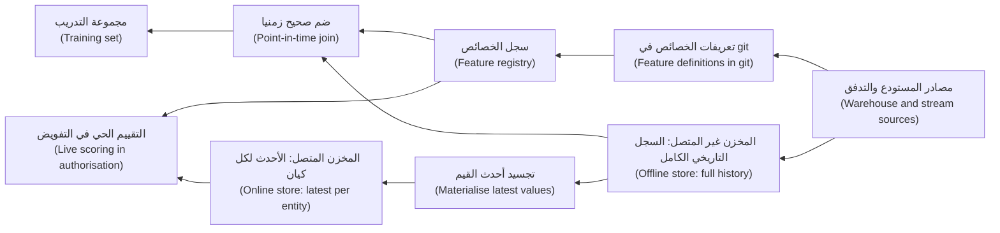
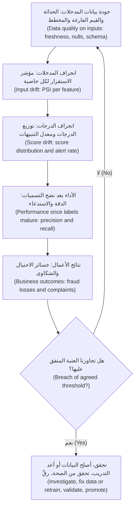
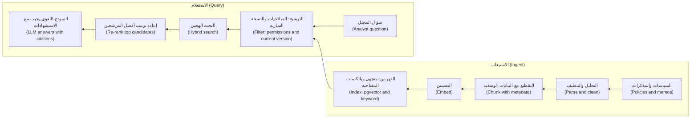

# الوحدة 5 — علم البيانات وتعلّم الآلة في بيئة الإنتاج (Data science and ML in production)

*لا يكون النموذج (model) أفضل من خط البيانات (data pipeline) الذي يغذّيه، ومعظم إخفاقات تعلّم الآلة في الإنتاج (machine-learning failures in production) هي في حقيقتها إخفاقات بيانات متنكّرة (data failures in disguise): خاصية (feature) اختلست النظر إلى المستقبل بصمت، ومجموعة تدريب (training set) لا يستطيع أحد إعادة بنائها، ومُدخل (input) تغيّر معناه في المنبع (upstream)، وفهرس مستندات (document index) لا يزال يقدّم سياسة العام الماضي. تتعامل هذه الوحدة مع علم البيانات (data science) وتعلّم الآلة (machine learning) بوصفهما مشكلات هندسة بيانات (data engineering problems). تبدأ بالطريق من دفتر ملاحظات (notebook) واعد إلى خط تدريب قابل للتكرار (repeatable training pipeline): خصائص صحيحة زمنيًا (point-in-time-correct features)، وتقسيمات نزيهة (honest splits)، وتشغيلات قابلة لإعادة الإنتاج (reproducible runs)، ومخازن الخصائص (feature stores). ثم تتناول كيف تحكم على النموذج قبل الإطلاق (before launch) وكيف تراقبه بعد الإطلاق (after launch)، من الدقة (precision) والاستدعاء (recall) إلى إحصاءات الانجراف (drift statistics) والتسميات المتأخرة (delayed labels). وتنتهي بجانب البيانات في تطبيقات النماذج اللغوية الكبيرة (LLM applications): تحويل المستندات إلى مقاطع (chunks) وتضمينات (embeddings) وفهرس قابل للبحث (searchable index)، وإثبات أن الاسترجاع (retrieval) يعمل بالأرقام. ستتابع فريق منصة البيانات (Data Platform team) في بنك نجم (Najm Bank) بينما ينهار دفتر هدى البارع لكشف الاحتيال (fraud notebook) في الإنتاج، وينجرف نموذج التنبيهات الذكية (Smart Alerts) الذي تعمل عليه دانة بينما تبدو دقته الإجمالية (accuracy) مثالية، ويقتبس مساعد مذكرات الائتمان (Credit Memo Copilot) سياسةً استُبدلت قبل أشهر.*

> **المراحل (Stages):** Transform, Serve, Operate — بناء البيانات التي تقف خلف النماذج وتطبيقات النماذج اللغوية الكبيرة (models and LLM applications) بحيث تكون صحيحة وقت التنبؤ (correct at prediction time)، وقابلة لإعادة الإنتاج عند الطلب (reproducible on demand)، ومراقَبة بعد الإطلاق (watched after launch).

---

# 5.1 — من دفتر الملاحظات إلى خط البيانات: الخصائص والتدريب وقابلية إعادة الإنتاج ومخازن الخصائص (From notebook to pipeline: features, training, reproducibility and feature stores)
*المستوى (Level): 🟡 متوسط (Intermediate)* · *المتطلبات (Prerequisites): 1.2، 2.2، 3.1* · *المرحلة (Stage): Transform, Serve*

## ⚡ الدرس في دقيقة (In 60 seconds)
- يتعلّم النموذج من **أمثلة التدريب (training examples)**: صفوف تقرن **الخصائص (features)** (مُدخلات معروفة وقت التنبؤ (inputs known at prediction time)) مع **التسمية (label)** (النتيجة المطلوب التنبؤ بها (the outcome to predict)). وبناء هذه الصفوف هو هندسة بيانات (data engineering).
- القاعدة الأهم هي **الصحة الزمنية (point-in-time correctness)**: يجب أن تستخدم كل خاصية (feature) البيانات التي كانت موجودة لحظة إجراء التنبؤ (at the moment the prediction would have been made) فقط. اخرقها فتحصل على **تسرّب البيانات (data leakage)**، أي نموذج يبدو بارعًا دون اتصال (offline) ويفشل في الإنتاج (in production).
- للنماذج التي تتنبأ بالمستقبل (models that predict the future)، مثل الاحتيال (fraud) والائتمان (credit)، قسّم البيانات حسب **الزمن (time)**، لا عشوائيًا (at random).
- يكون التشغيل (run) **قابلًا لإعادة الإنتاج (reproducible)** عندما تُسجَّل نسخة الشيفرة (code version) ولقطة البيانات (data snapshot) والإعدادات (configuration) والبيئة (environment)، في **MLflow** مثلًا.
- **مخزن الخصائص (feature store)** (وFeast هو المثال مفتوح المصدر (open-source example)) يعرّف كل خاصية مرة واحدة (defines each feature once) ويقدّم السجل التاريخي للتدريب (history for training) والقيم الحديثة للتقييم الحي (fresh values for live scoring)، فيعالج **انحراف التدريب عن التقديم (training-serving skew)**. اعتمده عندما تكون الخصائص مشتركة (shared) أو مطلوبة بشكل حي (needed live).
- أكبر فخ (The biggest trap): خصائص محسوبة من جداول اليوم (today's tables)، مثل الرصيد الحالي للعميل (a customer's current balance) أو إجمالي الاعتراضات على المعاملات (total chargebacks)، ثم تُضمّ (joined) إلى معاملات العام الماضي (last year's transactions).

## 🧭 لماذا يهم (Why it matters)
أول مشروع كبير لهدى هو نسخة جديدة من **التنبيهات الذكية (Smart Alerts)**، نموذج كشف احتيال البطاقات (card fraud-detection model) في بنك نجم. يحقق دفترها (notebook) نتائج أفضل بكثير دون اتصال (offline) من نموذج الإنتاج (production model)، وتبتهج دانة، كبيرة علماء البيانات (lead data scientist)، إلى أن تقرأ قائمة الخصائص (feature list). فالخاصية `customer_chargeback_count` محسوبة من جدول `chargebacks` بكامله، والاعتراض على المعاملة (chargeback) يُقدَّم *بعد* وقوع الاحتيال (after a fraud)، وغالبًا بعد أسابيع، فالخاصية "تعرف" الإجابة مسبقًا (already "knows" the answer). أما `account_age_days` فمقيسة حتى اليوم (measured to today)، لا حتى تاريخ المعاملة (to the transaction date). لقد تعلّم النموذج قراءة المستقبل (read the future)، وهو ما لا يتيحه الإنتاج (production does not offer).

بعد شهر، تطلب جهة التحقق من النماذج (model validation) إعادة بناء (rebuild) نموذج التنبيهات الذكية للعام الماضي. لا أحد يستطيع: فقد عُدِّل الدفتر، وتُستبدل جداول التهيئة (staging tables) كل ليلة (overwritten nightly)، وحُدِّثت المكتبات (libraries upgraded). ويلخّص فيصل، رئيس منصة البيانات (Head of Data Platform)، الأمر: "النموذج الذي لا نستطيع إعادة بنائه هو نموذج لا نستطيع الدفاع عنه (A model we cannot rebuild is a model we cannot defend). ونقله من الدفتر إلى خط البيانات (from notebook to pipeline) مهمتنا نحن أيضًا."

## 📐 كيف يعمل (How it works)

### 🟢 الأساسيات (The essentials)

**المفردات (The vocabulary).** **النموذج (model)** دالة متعلَّمة من الأمثلة (a function learned from examples). يصف كل **مثال تدريب (training example)** **كيانًا (entity)** واحدًا (معاملة بطاقة (a card transaction)، أو عميل (a customer)، أو طلب قرض (a loan application)) عند **وقت تنبؤ (prediction time)** واحد (اللحظة التي سيُسأل فيها النموذج (the moment the model would be asked))، مع **الخصائص (features)** مُدخلاتٍ و**التسمية (label)** إجابةً. وهذه هي **حُبَيبية (grain)** مجموعة التدريب (1.2)، مثل صف واحد لكل معاملة وقت التفويض (one row per transaction at authorisation time). اكتبها قبل كتابة SQL.

**مجموعات التدريب والتحقق والاختبار (Train, validation and test sets).** يتعلّم النموذج من **مجموعة التدريب (training set)**؛ وتقارن النماذج وتضبطها (compare and tune) على **مجموعة التحقق (validation set)**؛ أما **مجموعة الاختبار (test set)** فتُستخدم مرة واحدة، في النهاية، لتقدير الأداء على بيانات جديدة (estimate performance on new data). إن فحصتها أثناء الضبط (while tuning) لم تعد منصفة (it stops being fair).

لكل ما يتنبأ بالمستقبل، قسّم حسب الزمن (split by time): درّب (train) على الفترة من يناير إلى سبتمبر، وتحقق (validate) على أكتوبر ونوفمبر، واختبر (test) على ديسمبر. أما التقسيم العشوائي (random split) فيسمح للنموذج بالتعلّم من معاملات جرت *بعد* المعاملات التي يُختبر عليها (learn from transactions *after* the ones it is tested on)، مما يجمّل النتائج (flatters the results).

**تسرّب البيانات (Data leakage)** يعني دخول معلومات إلى التدريب لن تكون متاحة عندما يُجري النموذج تنبؤات حقيقية (real predictions). ثلاثة أشكال شائعة (Three common forms):
- **تسرّب الهدف (Target leakage):** خاصية هي نتيجة للتسمية (a consequence of the label). فالخاصية `customer_chargeback_count` على امتداد الزمن كله (over all time)، أو علامة "أُغلقت الحالة بوصفها احتيالًا (case closed as fraud)"، تسرّبان التسمية (leak the label).
- **التسرّب الزمني (Temporal leakage):** خاصية محسوبة ببيانات من بعد وقت التنبؤ (after the prediction time)، مثل رصيد اليوم (today's balance) أو `account_age_days` المقيسة حتى اليوم.
- **التلوّث بين التقسيمات (Contamination between splits):** معالجة مسبقة (preprocessing) مُوائَمة على كل البيانات (fitted on all the data) (التحجيم (scaling)، وملء القيم المفقودة (filling missing values)، وترميز الفئات (encoding categories)) قبل التقسيم، أو وجود صفوف شبه متطابقة للعميل نفسه (near-identical rows) في مجموعتي التدريب والاختبار معًا.

العلامة الكاشفة (The tell-tale sign) هي نتيجة أفضل من أن تُصدَّق (a result that is too good).

**الصحة الزمنية في SQL (Point-in-time correctness in SQL).** يجب حساب كل خاصية "اعتبارًا من (as of)" وقت التنبؤ لصفّها. إليك الطريقة الخاطئة والطريقة الصحيحة (the wrong way and the right way) لعدّ معاملات البطاقة في الساعات الأربع والعشرين الماضية (in the past 24 hours)، في DuckDB أو PostgreSQL:

```sql
-- WRONG: counts the card's transactions on the whole day,
-- including ones that happened AFTER this transaction
SELECT t.txn_id,
       COUNT(*) OVER (PARTITION BY t.card_id, CAST(t.txn_ts AS DATE)) AS txns_today
FROM card_txn t;

-- RIGHT: only transactions strictly before this one, in the past 24 hours
SELECT t.txn_id,
       COUNT(*) OVER (
         PARTITION BY t.card_id
         ORDER BY t.txn_ts
         RANGE BETWEEN INTERVAL '24 hours' PRECEDING
                   AND INTERVAL '1 microsecond' PRECEDING  -- ends just before this row
       ) AS txns_prev_24h
FROM card_txn t;
```

الانتهاء عند `CURRENT ROW` ثم طرح 1 يبدو مكافئًا (looks equivalent) لكنه لا يزال يعدّ المعاملات ذات الطابع الزمني نفسه (the same timestamp).

للخصائص المأخوذة من جداول تتغيّر ببطء (slowly changing tables)، مثل شريحة المخاطر للعميل (a customer's risk segment)، استخدم النسخة التي كانت سارية وقت التنبؤ (valid at the prediction time). وهذا بالضبط ما يمنحك إياه البُعد المتغيّر ببطء من النوع 2 (Type 2 slowly changing dimension) (1.2):

```sql
SELECT t.txn_id, c.risk_segment
FROM card_txn t
JOIN dim_customer_scd2 c
  ON  c.customer_id = t.customer_id
  AND t.txn_ts >= c.valid_from
  AND t.txn_ts <  COALESCE(c.valid_to, TIMESTAMP '9999-12-31');
```

أما الضمّ (join) إلى جدول العملاء *الحالي* (current customer table) فسيمنح كل معاملة من 2024 شريحة مخاطر العميل في 2026؛ والفرق التي لا تملك إلا جداول الحالة الراهنة (current-state tables) لا تستطيع بناء مجموعات تدريب نزيهة (honest training sets).

**التسميات تحتاج إلى تعريف ونافذة نضج (Labels need a definition and a maturity window).** في نجم، "الاحتيال (fraud)" يعني اعتراضًا على معاملة برمز سبب احتيال (a chargeback with a fraud reason code)، أو حالة أكّدها قسم التحقيقات (a case confirmed by investigations). وكلاهما يصل بعد أسابيع، لذا فالبيانات الحديثة تسمياتها ناقصة (incomplete labels). اتفق مع الجهة المعنية في العمل (the business) على **نافذة نضج التسمية (label maturity window)** (يستخدم نجم 60 يومًا؛ للتوضيح (illustrative)) واستبعد الأسابيع غير الناضجة (immature weeks).

### 🟡 التعمق أكثر (Going deeper)

**من دفتر الملاحظات إلى خط البيانات (From notebook to pipeline).** الدفتر (notebook) مناسب للاستكشاف (exploring) وضعيف لنموذج يعتمد عليه البنك: تُشغَّل الخلايا بغير ترتيب (cells run out of order)، والبيانات هي كل ما يحويه الجدول اليوم، والنتائج تعيش على حاسوب محمول واحد (one laptop). والانتقال إلى خط البيانات (pipeline) هو في معظمه إعادة هيكلة (refactoring):

1. انقل SQL الخاص بالخصائص (feature SQL) إلى نماذج dbt مختبَرة (tested dbt models) (3.1)، تُراجَع كأي جدول عرض (mart) آخر.
2. حوّل خطوات الدفتر إلى دوال (functions): `build_training_set` و`train` و`evaluate` و`register`.
3. شغّلها بوصفها مهام منسِّق (orchestrator tasks) (2.2) في Airflow أو Dagster، مع نافذة البيانات (data window) معاملًا (parameter).
4. اجعل كل خطوة متساوية الأثر (idempotent): المُدخلات نفسها، المُخرج نفسه، يُكتب فوقه (overwritten) بدلًا من أن يتكرر (duplicated).
5. سجّل كل تشغيل في متتبّع التجارب (experiment tracker) وسجّل النماذج المعتمدة (register approved models).

**قابلية إعادة الإنتاج أربعة أشياء تُسجَّل معًا (Reproducibility is four things recorded together)**: **نسخة الشيفرة (code version)** (إيداع git (a git commit))، و**لقطة البيانات (data snapshot)** (الصفوف المستخدمة بالضبط (the exact rows used))، و**الإعدادات (configuration)** (المعاملات الفائقة (hyperparameters)، وقائمة الخصائص (feature list)، وتواريخ التقسيم (split dates)، والبذرة العشوائية (random seed))، و**البيئة (environment)** (نسخ المكتبات (library versions)، ويُفضَّل صورة حاوية (container image)). تنسى الفرق البيانات، مع أن الجداول تتغيّر كل ليلة (tables change nightly). ثبّتها (Pin it) بمعرّف لقطة (snapshot id) من خاصية السفر عبر الزمن (time travel) في Apache Iceberg أو Delta Lake (1.3)، أو بملف Parquet مؤرَّخ غير قابل للتغيير (immutable dated Parquet file)، أو بأداة مثل DVC. واتفق مع سارة، مسؤولة حماية البيانات (DPO)، على مدة الاحتفاظ بمجموعات التدريب (how long training sets are kept)، لأنها تحتوي على بيانات شخصية (personal data) (6.2).

**تتبّع التجارب باستخدام MLflow (Experiment tracking with MLflow).** يسجّل MLflow Tracking **التشغيلات (runs)**: المعاملات (parameters)، والمقاييس (metrics)، والوسوم (tags)، والملفات المسمّاة **المُخرَجات (artefacts)**، مثل النموذج المدرَّب (the trained model) أو رسم بياني (a plot). خطوة تدريب دنيا (A minimal training step):

```python
import mlflow
import mlflow.sklearn
from sklearn.pipeline import Pipeline
from sklearn.preprocessing import StandardScaler
from sklearn.linear_model import LogisticRegression
from sklearn.metrics import average_precision_score

def train(train_df, valid_df, features, cfg, snapshot_id, git_sha):
    mlflow.set_experiment("smart-alerts")
    with mlflow.start_run():
        mlflow.log_params(cfg)
        mlflow.set_tags({"data_snapshot": snapshot_id, "git_sha": git_sha,
                         "train_window": cfg["train_window"]})
        # Scaler and model in ONE pipeline: the scaler is fitted on training data only
        model = Pipeline([("scale", StandardScaler()),
                          ("clf", LogisticRegression(C=cfg["C"], max_iter=1000))])
        model.fit(train_df[features], train_df["is_fraud"])
        scores = model.predict_proba(valid_df[features])[:, 1]
        mlflow.log_metric("valid_pr_auc", average_precision_score(valid_df["is_fraud"], scores))
        mlflow.sklearn.log_model(model, "model")
```

المعالجة المسبقة (Preprocessing) داخل `Pipeline` من scikit-learn تُوائَم على صفوف التدريب فقط (fitted on training rows only)، فتسدّ تسرّب التلوّث (closing the contamination leak)، وتُشحن مع النموذج (ships with the model).

**سجلّ النماذج (model registry)** (ولدى MLflow واحد) يحفظ نماذج مسمّاة ومرقّمة النسخ (named, versioned models) مع نسبها (lineage) رجوعًا إلى التشغيل (the run) ولقطة البيانات (the data snapshot) والإيداع (the commit). فتصبح الترقية (Promotion) من "مرشّح (candidate)" إلى "إنتاج (production)" قرارًا مسجَّلًا بمعتمِد (a recorded decision with an approver)، لا ملفًا يُنسخ يدويًا (a file copied by hand). تستخدم إصدارات MLflow الحديثة لذلك أسماء مستعارة (aliases) مثل `champion`؛ أما القديمة فاستخدمت مراحل ثابتة (fixed stages)، فراجع توثيق نسختك (your version's documentation).

**انحراف التدريب عن التقديم (Training-serving skew)** يحدث عندما تُحسب خصائص الإنتاج (production features) بطريقة مختلفة عن خصائص التدريب (training features). والسبب الكلاسيكي هو وجود تنفيذين (two implementations)، SQL في المستودع للتدريب (warehouse SQL for training) ودالة في خدمة التفويض للتقديم (a function in the authorisation service for serving)، يتباعدان (drift apart): أحدهما يعدّ المعاملات المرفوضة (declined transactions)، والآخر لا يفعل. والعلاج تعريف واحد للاثنين (one definition for both).

**مخازن الخصائص (Feature stores).** مخزن الخصائص (feature store) نظام يدير ذلك التعريف الواحد (that single definition). مكوّناته (Its parts):
- **سجلّ (registry)** لتعريفات الخصائص (feature definitions): الاسم (name)، والكيان (entity)، والمصدر (source)، والمالك (owner)، والوصف (description)؛
- **مخزن غير متصل (offline store)** (المستودع (the warehouse) أو ملفات Parquet) يحفظ السجل التاريخي (history)، ويُستخدم لبناء مجموعات التدريب بـ**عمليات ضمّ صحيحة زمنيًا (point-in-time joins)**؛
- **مخزن متصل (online store)** (قاعدة بيانات سريعة من نوع مفتاح-قيمة (a fast key-value database) مثل Redis، أو SQLite على حاسوب محمول) يحفظ أحدث قيمة لكل كيان (the latest value per entity)، ويُستخدم للتنبؤات الحية خلال أجزاء من الثانية (live predictions in milliseconds)؛
- مهام **التجسيد (materialisation)** التي تنسخ القيم الحديثة (fresh values) من المخزن غير المتصل إلى المتصل (from offline to online).



في Feast تعلن الكيانات (entities) وعروض الخصائص (feature views) بلغة Python ثم تشغّل `feast apply`. يستدعي التدريب (Training calls) `store.get_historical_features(entity_df=..., features=[...])`، حيث يحمل `entity_df` مفاتيح الكيانات (entity keys) والطوابع الزمنية للأحداث (event timestamps)، فيحصل على القيم السارية عند كلٍّ منها (the values valid at each). ويستدعي التقديم (Serving calls) `store.get_online_features(...)` بالأسماء نفسها (with the same names).

**هل تحتاج إلى واحد؟ (⁦Do you need one?⁩)** فقط عندما تتشارك عدة نماذج الخصائص (several models share features)، أو يقيّم نموذجٌ بشكل حي (a model scores live) ويحتاج إلى قيم حديثة، أو عندما يكون الانحراف (skew) قد لدغك بالفعل. أما لنموذج دفعي ليلي واحد (a single nightly batch model)، فجداول خصائص dbt مختبَرة وصحيحة زمنيًا (tested point-in-time dbt feature tables) كافية. التنبيهات الذكية تقيّم بشكل حي، فالمخزن يستحق كلفته (a store pays)؛ أما نموذج التسرّب من العملاء (churn model) في نجم فلا يحتاج إلى واحد بعد.

### 🔴 نظرة الخبير (Expert view)

**الخصائص المتدفقة (Streaming features).** خصائص "السرعة (velocity)" للاحتيال، مثل المعاملات على هذه البطاقة في الدقائق العشر الماضية، تأتي من تجميعات نافذية (windowed aggregations) على تدفق البطاقات (card stream) (2.3). ويجب أن تطبّق إعادة البناء التاريخية (historical rebuild) قواعد وقت الحدث (event-time) والعلامة المائية (watermark) نفسها، وإلا عاد الانحراف (skew returns).

**جودة التسميات رافعة أكبر من الخوارزميات (Label quality is a bigger lever than algorithms).** تسميات الاحتيال متأخرة (delayed)، وناقصة (incomplete) (الاحتيال غير المكتشف يُسمّى "سليمًا (genuine)")، ومتشكّلة بالنموذج الحالي (shaped by the current model)، لأن المعاملات المحجوبة (blocked transactions) لا تصبح اعتراضات أبدًا (يعود الدرس 5.2 إلى هذا). اتفق على تعريف التسمية (label definition) كتابةً مع عمليات الاحتيال (fraud operations) وعامِله بوصفه عقد بيانات (data contract) (3.2): إذا تغيّرت رموز الأسباب (reason codes)، تغيّرت التسمية.

**عدم توازن الفئات وأخذ العينات (Class imbalance and sampling).** تقليل عينات (Down-sampling) المعاملات السليمة يسرّع التدريب لكنه يُزيح الاحتمالات المتنبأ بها (shifts predicted probabilities): سجّل النسبة (record the rate) وأعد المعايرة (re-calibrate). ولا تقلّل عينات مجموعة الاختبار أبدًا (Never down-sample the test set).

**إدارة مخاطر النماذج (Model risk management).** تعامل البنوك النماذج بوصفها خطرًا يجب حوكمته (a risk to be governed). والمرجع الكلاسيكي هو الإرشاد الإشرافي الأمريكي بشأن إدارة مخاطر النماذج (US supervisory guidance on model risk management)، SR 11-7 (Federal Reserve, 2011)، الذي يصف التطوير والتوثيق السليمين (sound development and documentation)، والتحقق المستقل (independent validation) والمراقبة المستمرة (ongoing monitoring)، إضافة إلى جرد للنماذج (model inventory). كما تتوقع البنوك المركزية الخليجية (GCC central banks) من البنوك حوكمة نماذجها؛ اقرأ القواعد الحالية لجهتك الرقابية (your own regulator's current rules) بدلًا من الاعتماد على الملخصات. بالنسبة إلى مهندس البيانات (data engineer): كل نموذج في الإنتاج يمكن إعادة بنائه، وبياناته قابلة للتتبّع عبر النسب (traceable through lineage) (6.1)، ولتغييراته اعتماد مسجَّل (recorded approval). وللجانب الحوكمي (governance side)، انظر [*حوكمة الذكاء الاصطناعي من الصفر إلى الاحتراف (AI Governance: Zero to Hero)*، الدرس 9.1 — مصادر البيانات ونسبها وحقوق استخدامها (Sourcing, lineage and rights to use data)](../aigp/index.ar.html#/9.1)، وبشأن التمثيلية (representativeness) والتحيّز (bias) في بيانات التدريب، [*حوكمة الذكاء الاصطناعي من الصفر إلى الاحتراف (AI Governance: Zero to Hero)*، الدرس 9.2 — الجودة والتمثيلية والتحيّز (Quality, representativeness and bias)](../aigp/index.ar.html#/9.2).

**الخصائص بيانات شخصية (Features are personal data).** خاصية "متوسط الإنفاق في الصيدليات (Average spend at pharmacies)" قد تكشف حقائق حساسة (sensitive facts). صنّف الخصائص كأي عمود (Classify features like any column) (6.2)، واستبعد السمات المحمية (protected attributes) ما لم يوجد سبب موثّق وأساس قانوني (documented reason and legal basis)، وافحص البدائل غير المباشرة (proxies).

## 🧰 الأدوات (The toolkit)
| الأداة أو النمط أو المعيار (Tool, pattern or standard) | ما هو وماذا يفعل (What it is and does) | متى تلجأ إليه (When to reach for it) |
|---|---|---|
| **Point-in-time join** — الضمّ الصحيح زمنيًا | يضمّ كل صف تدريب (training row) إلى قيم الخصائص (feature values) السارية وقت تنبؤه (valid at its prediction time) | كل مجموعة تدريب لنموذج يتنبأ بالمستقبل (a model that predicts the future) |
| **Time-based split** — التقسيم الزمني | مجموعات التدريب والتحقق والاختبار (train, validation and test sets) مقطوعة حسب التاريخ، بهذا الترتيب | الاحتيال (fraud) والائتمان (credit) والتسرّب (churn) وأي نموذج شبيه بالتوقّع (forecast-like model) |
| **scikit-learn Pipeline** — خط scikit-learn | يجمع المعالجة المسبقة (preprocessing) والنموذج بحيث يُوائَم كلاهما على بيانات التدريب ويُشحنان معًا (shipped together) | كل نموذج scikit-learn؛ يمنع تسرّبات التلوّث (contamination leaks) |
| **MLflow** | تتبّع تجارب مفتوح المصدر (open-source experiment tracking)، وتغليف النماذج (model packaging) وسجلّ النماذج (model registry) | تسجيل كل تشغيل تدريب (training run) وترقية النماذج بسجلّ (promoting models with a record) |
| **Model registry** — سجلّ النماذج | مخزن مرقّم النسخ للنماذج المعتمدة (versioned store of approved models) مرتبط بالتشغيل والبيانات والشيفرة | أي نموذج يخدم العملاء أو القرارات (serves customers or decisions) |
| **Feast** | مخزن خصائص مفتوح المصدر (open-source feature store): سجلّ، ومخزن غير متصل، ومخزن متصل، واسترجاع صحيح زمنيًا (point-in-time retrieval) | عدة نماذج تتشارك الخصائص (several models share features)، أو التقييم الحي (live scoring) يحتاج إلى قيم حديثة (fresh values) |
| **Apache Iceberg** | صيغة جداول مفتوحة (open table format) مع لقطات (snapshots) وسفر عبر الزمن (time travel) | تثبيت لقطة البيانات بالضبط (pinning the exact data snapshot) خلف تشغيل تدريب |

## 🏛️ عمليًا في بنك نجم (In practice at Najm Bank)
تعيد هدى ودانة بناء التنبيهات الذكية الإصدار 4 (Smart Alerts v4) بوصفه خط بيانات في Dagster (Dagster pipeline). ويجعل فيصل مُخرَجًا واحدًا (one artefact) إلزاميًا لكل نموذج: **بطاقة قابلية إعادة إنتاج النموذج (model reproducibility card)**، المحفوظة في git بجانب خط البيانات والمرتبطة من مُدخل السجلّ (registry entry).

**التنبيهات الذكية الإصدار 4: بطاقة قابلية إعادة إنتاج النموذج (Smart Alerts v4: model reproducibility card) (للتوضيح (illustrative))**

| الحقل (Field) | القيمة (Value) |
|---|---|
| النموذج والغرض (Model and purpose) | التنبيهات الذكية الإصدار 4 (Smart Alerts v4): تقييم تفويضات البطاقات (card authorisations) من حيث خطر الاحتيال (fraud risk)؛ والدرجات فوق العتبة المتفق عليها (the agreed threshold) تذهب إلى طابور عمليات الاحتيال (fraud operations queue) |
| الكيان والحُبَيبية ووقت التنبؤ (Entity, grain and prediction time) | صف واحد لكل تفويض بطاقة (one row per card authorisation)، وقت التفويض (at authorisation time) |
| تعريف التسمية (Label definition) | اعتراض برمز سبب احتيال (chargeback with a fraud reason code)، أو حالة أكّدها قسم التحقيقات بوصفها احتيالًا؛ وإلا فهي سليمة (genuine otherwise) |
| نضج التسمية (Label maturity) | 60 يومًا بعد المعاملة؛ تُستبعد الصفوف الأحدث (younger rows excluded) |
| التقسيم (Split) | التدريب (Train): 12 شهرًا؛ التحقق (validation): الشهران التاليان؛ الاختبار (test): الشهر التالي؛ بلا خلط (no shuffling) |
| الخصائص (Features) | 38 خاصية في عروض الخصائص (feature views) `card_velocity` و`customer_profile` و`merchant_risk`؛ لكلٍّ منها مالك (owner) ونافذة (window) ومصدر (source) في سجلّ Feast (Feast registry) |
| مراجعة التسرّب (Leakage review) | فُحصت كل خاصية: "هل هي معروفة وقت التفويض؟ (⁦known at authorisation time?⁩)"؛ المراجِعة دانة، مع التاريخ (dated) |
| أخذ العينات (Sampling) | قُلّلت عينات المعاملات السليمة إلى 10% للتدريب (down-sampled to 10% for training)؛ وأُعيدت معايرة الدرجات (scores re-calibrated) على مجموعة التحقق غير الممسوسة (untouched validation set) |
| لقطة البيانات (Data snapshot) | معرّفات لقطات Iceberg (Iceberg snapshot ids) للجدولين `fct_card_txn` و`fct_fraud_label`، مسجَّلة وسومًا للتشغيل (run tags) |
| الشيفرة والبيئة (Code and environment) | إيداع git (Git commit)؛ بصمة صورة الحاوية (container image digest) |
| التشغيل والسجلّ (Run and registry) | معرّف تشغيل MLflow (MLflow run id)؛ النموذج المسجَّل (registered model) `smart_alerts`، النسخة والاسم المستعار (version and alias) |
| البيانات الشخصية (Personal data) | رُوجع تصنيف الخصائص (feature classification) مع سارة (مسؤولة حماية البيانات (DPO))؛ لا سمات محمية (no protected attributes)؛ مدة الاحتفاظ بمجموعات التدريب (retention of training sets) متفق عليها |
| اختبار إعادة البناء (Rebuild test) | إعادة تشغيل خط البيانات من البطاقة تعيد إنتاج مقاييس التحقق (reproduces validation metrics) ضمن تفاوت محدد (within a stated tolerance)؛ تاريخ آخر فحص (last checked date) |

يُبقي اختبار إعادة البناء (rebuild test) البطاقة صادقة (keeps the card honest): كل ربع سنة (each quarter) تعيد هدى تشغيل خط البيانات (re-runs the pipeline) من الإيداع واللقطة والصورة المسجَّلة (the recorded commit, snapshot and image). فإن فشل، فهذا يعني أن شيئًا لم يُسجَّل (something was not recorded)، ويكتشفون ذلك قبل أن تكتشفه مراجعة التحقق (validation review).

## 🛠️ التمارين (Exercises)
استخدم بيانات اصطناعية فقط (synthetic data only): نصًا برمجيًا قصيرًا بلغة Python (a short Python script) بمعرّفات بطاقات عشوائية (random card ids) وطوابع زمنية (timestamps) ونسبة احتيال صغيرة (a small fraud rate).

- 🟢 في DuckDB، ولّد 100,000 معاملة بطاقة اصطناعية (synthetic card transactions) على مدى ستة أشهر وجدول `chargebacks` مؤرَّخًا بعد كل احتيال بمدة من 5 إلى 50 يومًا. ابنِ خاصية متسرّبة واحدة (one leaky feature) (الاعتراضات لكل عميل على امتداد الزمن كله (chargebacks per customer, all time)) وخاصية صحيحة زمنيًا واحدة (one point-in-time feature) (الاعتراضات المقدَّمة قبل المعاملة (chargebacks filed before the transaction)). *يكتمل عندما (Done when):* يُظهر استعلامٌ (query) صفَّ احتيال تكون فيه الخاصية المتسرّبة غير صفرية والصحيحة زمنيًا صفرًا، وتستطيع أن تشرح لماذا لا تصلح للاستخدام إلا الثانية.
- 🟡 حوّل دفترًا يدرّب نموذج scikit-learn على تلك البيانات إلى نص برمجي (script) فيه الدوال `build_training_set` و`train` و`evaluate`، وتقسيم زمني (time-based split)، و`Pipeline`، وتسجيل MLflow (MLflow logging) للمعاملات (parameters) والمقاييس (metrics) وإيداع git (git commit) وبصمة ملف البيانات (data file hash). *يكتمل عندما (Done when):* يعطي تشغيلان من الإيداع نفسه والبيانات نفسها مقاييس متطابقة (identical metrics) في واجهة MLflow (MLflow UI).
- 🔴 شغّل Feast محليًا (locally) بمخزن غير متصل من ملفات (file offline store) ومخزن متصل SQLite (SQLite online store). عرّف كيان `card` وعرض خصائص (feature view) بخاصيتي سرعة (two velocity features)؛ استرجع مجموعة تدريب، وجسّد (materialise)، واجلب الخصائص المتصلة (online features). *يكتمل عندما (Done when):* تتطابق القيم المتصلة والتاريخية (online and historical values) لبطاقة واحدة عند أحدث طابع زمني، ويعيد طابع زمني أقدم قيمًا أقدم.

## ⚠️ أخطاء وفخاخ (Mistakes and traps)
- **ضمّ حالة اليوم إلى السجل التاريخي (Joining today's state onto history).** الأرصدة الحالية (current balances) والشرائح (segments) والأعداد على امتداد الزمن كله (all-time counts) تسرّب المستقبل. استخدم أبعاد SCD2 (SCD2 dimensions) أو اللقطات (snapshots) أو النوافذ المحدودة زمنيًا (time-bounded windows).
- **التقسيمات العشوائية للمشكلات المعتمدة على الزمن (Random splits for time-dependent problems).** تسمح للنموذج بالتدريب على المستقبل. قسّم حسب الزمن (Split by time) واترك فجوة للتسميات غير الناضجة (a gap for immature labels).
- **مواءمة المعالجة المسبقة قبل التقسيم (Fitting preprocessing before splitting).** أدوات التحجيم (scalers) والمرمِّزات (encoders) المُوائَمة على كل البيانات تسرّب معلومات الاختبار (leak test information). ضعها داخل خط النموذج (inside the model pipeline).
- **"قابل لإعادة الإنتاج" من دون البيانات ("Reproducible" without the data).** إيداع git وحده (A git commit alone) لا يستطيع إعادة بناء نموذج حين تكون الجداول قد تغيّرت. سجّل معرّف لقطة (snapshot id) أو ملف تدريب غير قابل للتغيير (immutable training file).
- **تنفيذان للخاصية نفسها (Two implementations of the same feature).** يتباعد SQL التدريب (training SQL) وشيفرة التقديم (serving code). عرّف كل خاصية مرة واحدة وقدّمها بالطريقتين (serve it both ways).

## 🧾 الخلاصة (Recap)
- تحتاج أمثلة التدريب (training examples) إلى حُبَيبية مكتوبة (a written grain)، ووقت تنبؤ (a prediction time)، وتعريف للتسمية مع نافذة نضج (a label definition with a maturity window).
- يجب أن تكون كل خاصية صحيحة زمنيًا (point-in-time correct)؛ ويظهر التسرّب (leakage) في صورة نتائج أفضل من أن تُصدَّق (results that are too good).
- قسّم حسب الزمن (Split by time) لكل ما يتنبأ بالمستقبل، وأبقِ مجموعة الاختبار (test set) دون مساس حتى النهاية.
- قابلية إعادة الإنتاج (Reproducibility) هي الشيفرة ولقطة البيانات والإعدادات والبيئة (code, data snapshot, configuration and environment)، مسجَّلة معًا ومُثبَتة بإعادة البناء (proven by rebuilding).
- تمنح مخازن الخصائص (Feature stores) تعريفًا واحدًا بمساري وصول غير متصل ومتصل (offline and online access paths)؛ اعتمد واحدًا حين تبرّره الخصائص المشتركة أو الحية (shared or live features).

## ✍️ اختبر نفسك (Check yourself)

**1. يحقق نموذج الاحتيال الجديد لهدى (Huda's new fraud model) نتائج أفضل بكثير دون اتصال (offline) من نموذج الإنتاج. إحدى الخصائص هي إجمالي عدد اعتراضات الاحتيال للعميل (the customer's total number of fraud chargebacks)، محسوبًا على جدول الاعتراضات بكامله. ما التفسير الأرجح؟ (⁦What is the most likely explanation?⁩)**

- A. الخوارزمية الجديدة تلتقط تفاعلات بين الخصائص (feature interactions) فاتت النموذج القديم
- B. التسرّب (Leakage): الاعتراضات تلي الاحتيال، لذا تحمل الخاصية التسمية (the feature carries the label)
- C. مجموعة الاختبار (test set) صغيرة جدًا، فعيّنة محظوظة (a lucky sample) ضخّمت النتيجة
- D. النموذج يعاني من نقص المواءمة (underfitting) لبيانات التدريب

<details><summary>الإجابة</summary>

**B.** الاعتراضات (Chargebacks) نتائج للاحتيال (consequences of fraud) وتصل لاحقًا، لذا فالعدّ على امتداد الزمن كله (all-time count) يكشف الإجابة: تسرّب الهدف والتسرّب الزمني معًا (target and temporal leakage at once). الخيار A هو القراءة المغرية لنتيجة رائعة، لكن قفزة بهذا الحجم إشارة للبحث عن التسرّب أولًا (look for leakage first). (🟢 الأساسيات (The essentials).)

</details>

**2. يتنبأ نموذج التسرّب من العملاء (churn model) في نجم بالعملاء الذين سيغلقون حساباتهم في الربع القادم (next quarter). كيف ينبغي للفريق تقسيم البيانات؟ (⁦How should the team split the data?⁩)**

- A. عشوائيًا (Randomly)، بنسبة 70/15/15، مع الخلط (shuffled) بحيث تُمثَّل كل فترة في كل مجموعة
- B. حسب معرّف العميل (By customer id)، بحيث لا يظهر أي عميل في مجموعتين (no customer appears in two sets)
- C. عشوائيًا (Randomly)، خمس مرات ببذور مختلفة (different seeds)، مع حساب متوسط النتائج (averaging the results)
- D. حسب الزمن (By time): درّب على الفترات الأقدم، واختبر على الأحدث، مطروحًا منها التسميات غير الناضجة (minus immature labels)

<details><summary>الإجابة</summary>

**D.** النموذج يتنبأ بالمستقبل، لذا يجب أن يعكس التقسيم ذلك (the split must mirror that). التقسيمات العشوائية (Random splits)، كما في A وC، تسمح له بالتعلّم من فترات لاحقة. أما B فيمنع نوعًا واحدًا من التلوّث (one kind of contamination) لكنه لا يزال يخلط الزمن (still mixes time). (🟢 الأساسيات (The essentials).)

</details>

**3. تطلب جهة التحقق من النماذج (Model validation) من الفريق إعادة بناء نموذج التنبيهات الذكية للعام الماضي. إيداع git (git commit) معروف، لكن جداول التهيئة (staging tables) استُبدلت مرات عديدة منذ ذلك الحين. ما الذي كان ناقصًا في سجلّ التشغيل؟ (⁦What was missing from the run record?⁩)**

- A. لقطة بيانات مثبّتة (A pinned data snapshot)، مثل معرّف لقطة Iceberg (Iceberg snapshot id)
- B. حجم العنقود (cluster size) ونوع المثيل (instance type) المستخدمان في التدريب
- C. تصدير PDF للدفتر (PDF export of the notebook) مع مُخرَجات خلاياه (cell outputs)
- D. المعاملات الفائقة (hyperparameters) والبذرة العشوائية (random seed)، ولا شيء غيرهما

<details><summary>الإجابة</summary>

**A.** تحتاج قابلية إعادة الإنتاج (Reproducibility) إلى الشيفرة والبيانات والإعدادات والبيئة (code, data, configuration and environment)؛ ومن دون البيانات بالضبط، تنتج الشيفرة نفسها نموذجًا مختلفًا. الخيار D جزء من الإعدادات (part of the configuration)، لكنه وحده لا يعيد بناء شيء. (🟡 التعمق أكثر (Going deeper).)

</details>

**4. أدّى نموذج الاحتيال أداءً جيدًا دون اتصال (offline)، لكن درجاته تبدو غريبة في الإنتاج. يجد الفريق أن SQL المستودع (warehouse SQL) يعدّ المعاملات المرفوضة (declined transactions) في خاصية سرعة (velocity feature) بينما لا تفعل خدمة التفويض (authorisation service) ذلك. ما اسم هذا، وما العلاج البنيوي؟ (⁦What is this called, and what is the structural fix?⁩)**

- A. انجراف المفهوم (Concept drift)؛ أعد التدريب كل شهر على أحدث المعاملات المسمّاة (latest labelled transactions)
- B. نقص المواءمة (Underfitting)؛ أضف مزيدًا من الخصائص واستخدم نموذجًا أكثر مرونة (a more flexible model)
- C. انحراف التدريب عن التقديم (Training-serving skew)؛ تعريف واحد مشترك (one shared definition)، في مخزن خصائص (feature store) مثلًا
- D. عدم توازن الفئات (Class imbalance)؛ قلّل عينات المعاملات السليمة (down-sample genuine transactions) وأعد المعايرة

<details><summary>الإجابة</summary>

**C.** تباعد تنفيذان لخاصية واحدة (Two implementations of one feature drifted apart). وإعادة التدريب (Retraining)، كما في A، لن تفيد، لأن مساري الشيفرة (the two code paths) لا يزالان مختلفين. (🟡 التعمق أكثر (Going deeper).)

</details>

**5. يريد فريق كريم نموذج ميل (propensity model) يقيّم جميع العملاء في تشغيل دفعي ليلي واحد (one nightly batch run) من المستودع. تقترح هدى نشر مخزن خصائص (feature store) أولًا. ماذا ينبغي أن يقول فيصل؟ (⁦What should Faisal say?⁩)**

- A. نعم: المخزن من اليوم الأول يتجنّب ترحيلًا مؤلمًا لاحقًا (a painful migration later)
- B. ليس بعد (Not yet): جداول dbt الصحيحة زمنيًا (point-in-time dbt tables) تكفي حتى تصبح الخصائص مشتركة أو حية (shared or live)
- C. لا، لأن مخازن الخصائص (feature stores) لا تعمل إلا مع البيانات المتدفقة (streaming data)
- D. نعم، لأن مخزن الخصائص (feature store) يدير تعريف التسمية (label definition) نيابة عنك أيضًا

<details><summary>الإجابة</summary>

**B.** النموذج الدفعي الواحد (A single batch model) تخدمه جيدًا جداول dbt مختبَرة وصحيحة زمنيًا؛ والمخزن يستحق كلفته مع الخصائص المشتركة (shared features) أو التقديم الحي (live serving) أو الانحراف المُثبَت (proven skew). C خاطئ: المخازن تخدم التدريب الدفعي (batch training) أيضًا. D خاطئ: لا أداة تعرّف تسمياتك (no tool defines your labels). (🟡 التعمق أكثر (Going deeper).)

</details>

## 📚 المراجع (References)
- توثيق MLflow (MLflow documentation) — https://mlflow.org/docs/latest/index.html
- توثيق Feast (Feast documentation) — https://docs.feast.dev/
- دليل مستخدم scikit-learn: الخطوط والمقدِّرات المركّبة؛ المزالق الشائعة والممارسات الموصى بها (scikit-learn User Guide: Pipelines and composite estimators; Common pitfalls and recommended practices) — https://scikit-learn.org/stable/user_guide.html
- توثيق Apache Iceberg (Apache Iceberg documentation) — https://iceberg.apache.org/docs/latest/
- توثيق DVC (DVC documentation) — https://dvc.org/doc
- توثيق DuckDB: دوال النوافذ (DuckDB documentation: Window functions) — https://duckdb.org/docs/
- مجلس محافظي نظام الاحتياطي الفيدرالي (Board of Governors of the Federal Reserve System)، SR 11-7: الإرشاد الإشرافي بشأن إدارة مخاطر النماذج (Supervisory Guidance on Model Risk Management) (2011) — https://www.federalreserve.gov/supervisionreg.htm
- D. Sculley وآخرون ⁦(et al.)⁩، "Hidden Technical Debt in Machine Learning Systems" (الدَّين التقني الخفي في أنظمة تعلّم الآلة)، NeurIPS 2015
- Ralph Kimball وMargy Ross، *The Data Warehouse Toolkit* (الأبعاد المتغيّرة ببطء (slowly changing dimensions))

---

# 5.2 — تقييم النماذج ومراقبة الانجراف (أساسيات MLOps) (Evaluating models and monitoring drift (MLOps basics))
*المستوى (Level): 🟡 متوسط (Intermediate)* · *المتطلبات (Prerequisites): 4.3، 5.1* · *المرحلة (Stage): Operate, Analyse*

## ⚡ الدرس في دقيقة (In 60 seconds)
- احكم على النموذج بالقرار الذي يقوده (Judge a model by the decision it drives). في الأحداث النادرة (rare events) مثل الاحتيال، تضلّل **الدقة الإجمالية (accuracy)**؛ استخدم **الدقة (precision)** (كم من التنبيهات حقيقي (how many alerts are real))، و**الاستدعاء (recall)** (كم من الاحتيال يُلتقط (how much fraud is caught))، و**منحنى الدقة والاستدعاء (precision-recall curve)**.
- يُخرج النموذج درجة (score)؛ والجهة المعنية في العمل (the business) تختار **العتبة (threshold)**. اخترها من كلفة الإخفاقات والإنذارات الكاذبة (the costs of misses and false alarms) ومن طاقة فريق المراجعة (the review team's capacity)، لا من القيمة الافتراضية 0.5 (a default of 0.5).
- قيّم على مجموعة اختبار خارج الفترة الزمنية (out-of-time test set)، ثم حسب **الشريحة (slice)** (القناة (channel)، والدولة (country)، وشريحة العملاء (customer segment))، ثم بشكل حي في **وضع الظل (shadow mode)** أو بمقارنة **البطل والمنافس (champion–challenger)** قبل أن يقرّر أي شيء.
- بعد الإطلاق، تتدهور النماذج (models decay). **انجراف البيانات (Data drift)** تغيّر في المُدخلات (a change in the inputs)؛ و**انجراف المفهوم (concept drift)** تغيّر في العلاقة بين المُدخلات والنتيجة (the relationship between inputs and outcome). راقب جودة البيانات (data quality)، وانجراف المُدخلات (input drift)، وانجراف الدرجات (score drift)، والأداء الحقيقي (true performance) حين تصل التسميات، ونتائج الأعمال (business outcomes).
- **مؤشر استقرار المجتمع (Population Stability Index, PSI)** إحصاء انجراف شائع (common drift statistic) في القطاع المصرفي. وعتباته أعراف لا قوانين (conventions, not laws).
- أكبر فخ (The biggest trap): مراقبة المقاييس التي تستطيع حسابها اليوم فقط، بينما التسميات التي تكشف الحقيقة (the labels that show the truth) تصل بعد أسابيع.

## 🧭 لماذا يهم (Why it matters)
تعرض هدى نموذج التنبيهات الذكية الإصدار 4 المعاد بناؤه (rebuilt Smart Alerts v4) على لجنة المخاطر (risk committee) بعنوان رئيسي واحد: "دقة إجمالية 99.9% (99.9% accuracy)". توقفها دانة قبل الشريحة الثانية. الاحتيال نادر (Fraud is rare). فإن كانت، لنقل، معاملة واحدة من كل ألف احتيالية، فإن "نموذجًا" يصف كل شيء بأنه سليم (calls everything genuine) يحقق دقة إجمالية 99.9% ولا يلتقط شيئًا (catches nothing). اللجنة لا تحتاج إلى الدقة الإجمالية؛ بل تحتاج إلى معرفة كم من الاحتيال يلتقط النموذج، وكم من العملاء السليمين يُزعَجون (genuine customers are bothered)، وهل يستطيع فريق عمليات الاحتيال (fraud operations team) التعامل مع حجم التنبيهات (alert volume).

بعد ستة أشهر من التشغيل (go-live)، يلاحظ كريم أن حجم التنبيهات مستقر لكن نسبة التنبيهات المؤكَّدة احتيالًا (the share of alerts confirmed as fraud) انخفضت. تغيّر أمران. بدأ إصدار من تطبيق نجم للهاتف (Najm Mobile) يرسل حقل الجهاز (device field) بصيغة جديدة، فصارت الخاصية `new_device` صحيحة دائمًا تقريبًا: تغيّر بيانات في المنبع (an upstream data change). وانتقل المحتالون إلى نمط احتيال جديد (a new scam pattern) لم يره النموذج في التدريب قط: تغيّر معنى المُدخلات (the meaning of the inputs changed). لم يتعطل شيء، ومع ذلك كانت المشكلتان ظاهرتين في البيانات قبل أسابيع من ظهور خسائر الاحتيال (fraud losses).

## 📐 كيف يعمل (How it works)

### 🟢 الأساسيات (The essentials)

**مصفوفة الالتباس (The confusion matrix).** في نموذج نعم/لا (yes/no model) بعتبة مختارة (a chosen threshold)، يقع كل تنبؤ في إحدى أربع خانات (one of four cells):

| | احتيال فعلًا (Actually fraud) | سليم فعلًا (Actually genuine) |
|---|---|---|
| **صدر تنبيه (Alerted)** | إيجابي صحيح (True positive, TP) | إيجابي كاذب (False positive, FP): عميل سليم أُزعِج (a genuine customer bothered) |
| **لم يصدر تنبيه (Not alerted)** | سلبي كاذب (False negative, FN): احتيال فائت (fraud missed) | سلبي صحيح (True negative, TN) |

ومنها تأتي المقاييس المهمة للأحداث النادرة (the metrics that matter for rare events):
- **الدقة (Precision)** = TP / (TP + FP): من بين التنبيهات، كم كان احتيالًا. الدقة المنخفضة (Low precision) تهدر وقت المحللين وتزعج العملاء.
- **الاستدعاء (Recall)** = TP / (TP + FN): من بين الاحتيال، كم التُقط. الاستدعاء المنخفض (Low recall) يعني خسائر.
- **F1** هو الوسط التوافقي (harmonic mean) للاثنين، مفيد بوصفه رقمًا واحدًا (a single number) لكنه أعمى عن أيّ الخطأين أكثر كلفة (blind to which error costs more).

**الدرجات والعتبات والمنحنيات (Scores, thresholds and curves).** تُخرج معظم النماذج درجة بين 0 و1 (a score between 0 and 1). رفع العتبة (Raising the threshold) يعطي تنبيهات أقل، ودقة أعلى، واستدعاءً أدنى. يُظهر **منحنى الدقة والاستدعاء (precision-recall curve)** هذه المقايضة (trade-off) عبر جميع العتبات؛ والمساحة تحته (**PR-AUC**، أو متوسط الدقة (average precision)) تلخّصها. أما **ROC-AUC** فشائع لكنه قد يبدو ممتازًا على بيانات شديدة عدم التوازن (heavily imbalanced data) بينما الدقة ضعيفة، لأن العدد الهائل من السلبيات الصحيحة (true negatives) يهيمن على معدل الإيجابيات الكاذبة (false-positive rate) فيه. في الاحتيال، اقرأ PR-AUC والدقة والاستدعاء عند عتبة التشغيل الفعلية (actual operating threshold).

```python
import numpy as np
from sklearn.metrics import precision_recall_curve, average_precision_score

y, scores = np.asarray(y_test, dtype=bool), np.asarray(scores)
print("PR-AUC:", average_precision_score(y, scores))
precision, recall, thresholds = precision_recall_curve(y, scores)   # for the chart

# Choose the threshold from costs (illustrative numbers agreed with fraud operations)
COST_MISSED_FRAUD, COST_REVIEW = 1500, 25
def total_cost(t):
    alerted = scores >= t
    missed = np.sum(y & ~alerted)                 # false negatives
    return missed * COST_MISSED_FRAUD + alerted.sum() * COST_REVIEW

grid = np.linspace(0.01, 0.99, 99)                # a grid is enough, and fast
best = min(grid, key=total_cost)
```

ثم افحص الطاقة الاستيعابية (check capacity): إذا أنتجت العتبة الأرخص تنبيهات يومية أكثر مما يستطيع فريق الاحتيال مراجعته، فالخيار بين التوظيف (hiring)، أو عتبة أعلى (a higher threshold)، أو قاعدة مرحلة ثانية (a second-stage rule). هذا قرار أعمال (a business decision)؛ ومهمتك أن تعرض المنحنى وكلفة كل خيار (each option's cost).

**قارن بخط أساس (Compare against a baseline).** يجب أن يتفوّق النموذج الجديد (A new model must beat) على نموذج الإنتاج الحالي (the current production model)، أو على القواعد التي استخدمها نجم من قبل (the rules Najm used before). عبارة "PR-AUC قيمته X" لا تعني شيئًا وحدها (means nothing alone)؛ أما "يلتقط احتيالًا أكثر من الإصدار 3 عند حجم التنبيهات نفسه (catches more fraud than v3 at the same alert volume)" فتعني.

**قسّم النتائج إلى شرائح (Slice the results).** قد يخفي رقم إجمالي (An overall number) شريحة يفشل فيها النموذج، كما تخفي المتوسطات مفارقة سيمبسون (Simpson's paradox) (4.3). أبلغ عن الدقة والاستدعاء حسب القناة (by channel) (داخل المتجر (in-store)، وعبر الإنترنت (online))، وحسب الدولة (by country) (قطر، والإمارات، والاتحاد الأوروبي (Qatar, UAE, EU))، وحسب شريحة العملاء (by customer segment). يجب أن يُعرف النموذج الذي يعمل لعملاء التجزئة (retail customers) لكنه يفوّت معظم احتيال بطاقات المنشآت الصغيرة والمتوسطة (SME card fraud) قبل الإطلاق، لا بعده.

### 🟡 التعمق أكثر (Going deeper)

**المعايرة (Calibration).** يكون النموذج **معايَرًا (calibrated)** حين تكون نحو 20% من المعاملات التي حصلت على الدرجة 0.2 احتيالًا. ويهمّ ذلك حين يقرأ الناس الدرجات بوصفها احتمالات (read scores as probabilities) أو حين تغذّي الدرجات حسابات أخرى، مثل الخسارة المتوقعة (expected loss) في مخاطر الائتمان (credit risk). افحصها بمنحنى الموثوقية (reliability curve) (المعدلات المتنبأ بها مقابل المرصودة حسب نطاق الدرجات (predicted versus observed rates by score band)) وبدرجة Brier (Brier score)؛ وأصلحها بـ `CalibratedClassifierCV` من scikit-learn أو بإعادة المواءمة على مجموعة التحقق (re-fitting on the validation set). تقليل العينات في التدريب (Down-sampling in training) (5.1) يُفسد المعايرة ما لم تصحّحه.

**التقييم الحي قبل الثقة (Online evaluation before trust).** الاختبارات دون اتصال (Offline tests) تستخدم الماضي. قبل أن يقرّر النموذج أي شيء، اختبره على حركة حية (live traffic):
- **وضع الظل (Shadow mode)**: يقيّم النموذج الجديد معاملات حقيقية إلى جانب نموذج الإنتاج، لكن درجاته تذهب إلى السجلات فقط (only go to logs). تقارن أحجام التنبيهات (alert volumes)، والتداخلات (overlaps)، والأداء حين تنضج التسميات (once labels mature). لا يتأثر أي عميل.
- **البطل والمنافس (Champion–challenger)**: يتولى النموذج الحالي (البطل (champion)) معظم الحركة ويتولى المنافس (challenger) حصة مضبوطة (a controlled share)؛ ولا ترقّي المنافس إلا إذا فاز على المقاييس المتفق عليها (agreed metrics). هذه تجربة (an experiment)، فتنطبق قواعد الدرس 4.3: وزّع عشوائيًا بشكل سليم (randomise properly)، وثبّت حجم العينة ومقياس النجاح مسبقًا (fix sample size and success metric in advance)، وأضف مقاييس حماية (guardrail metrics) مثل شكاوى العملاء (customer complaints)، ولا تتوقف مبكرًا (do not stop early) لأن الأسبوع الأول يبدو جيدًا.

للتقييم الحي على مستوى المنتج (product-level online evaluation)، انظر [*إدارة منتجات الذكاء الاصطناعي من الصفر إلى الاحتراف (AI Product Management: Zero to Hero)*، الدرس 6.3 — التقييم الحي: التجارب واختبارات A/B والإطلاقات المرحلية (Online evaluation: experiments, A/B tests and staged rollouts)](../aipm/index.ar.html#/6.3).

**لماذا تتدهور النماذج: أنواع الانجراف (Why models decay: the kinds of drift).**
- **انجراف البيانات (Data drift)** (ويُسمّى أيضًا إزاحة المتغيرات المصاحبة (covariate shift)): يتغيّر توزيع المُدخلات (the distribution of inputs). مزيد من المعاملات عبر الإنترنت، أو فئة تجار جديدة (a new merchant category)، أو موسم عطلات (a holiday season).
- **انجراف التسمية أو الانجراف المسبق (Label or prior drift)**: تتغيّر نسبة الحالات الإيجابية (the share of positives)، مثل موجة احتيال (a fraud wave).
- **انجراف المفهوم (Concept drift)**: تتغيّر العلاقة بين المُدخلات والنتيجة. احتيال جديد (A new scam) يجعل معاملات كانت تبدو آمنة خطرةً الآن.
- **أعطال البيانات في المنبع (Upstream data breaks)**: ليست تغيّرًا في العالم الحقيقي (real-world change) على الإطلاق، بل تغيير في خط البيانات أو المخطط (a pipeline or schema change)، مثل صيغة حقل الجهاز. وهي متكررة عمليًا وأسهل ما يُلتقط، بفحوص جودة البيانات (data-quality checks) من الدرس 3.2 على مُدخلات النموذج (the model's inputs).

**ما الذي تراقبه، على طبقات (What to monitor, in layers).**



الطبقات العليا (The upper layers) متاحة يوميًا؛ أما الدنيا (the lower ones) فتصل لاحقًا لكنها تقول الحقيقة (tell the truth). راقبها جميعًا.

**مؤشر استقرار المجتمع (The Population Stability Index).** يقارن PSI توزيع خاصية (أو درجة) الآن بخط أساس (a baseline)، هو عادةً بيانات التدريب (the training data). قسّم خط الأساس إلى صناديق (bins)، غالبًا عشرة حسب العُشيرات (ten by decile)، وقارن في كل صندوق بين الحصة المتوقعة (expected share) *e* والحصة الفعلية (actual share) *a*:

PSI = Σ (a − e) × ln(a / e)

```python
import numpy as np

def psi(baseline, current, bins=10, eps=1e-6):
    edges = np.unique(np.quantile(baseline, np.linspace(0, 1, bins + 1)))
    e = np.histogram(baseline, edges)[0] / len(baseline)
    # values outside the baseline range go into the end bins
    a = np.histogram(np.clip(current, edges[0], edges[-1]), edges)[0] / len(current)
    e, a = np.clip(e, eps, None), np.clip(a, eps, None)
    return float(np.sum((a - e) * np.log(a / e)))
```

هذه النسخة للخصائص الرقمية والدرجات (numeric features and scores). أما للخاصية الفئوية (categorical feature) مثل `merchant_category`، فكل فئة صندوق (each category is a bin)، مع صندوق إضافي للفئات غير المرئية في خط الأساس (categories unseen in the baseline).

القواعد التقريبية (rules of thumb) الشائعة الاستخدام في مخاطر الائتمان (credit risk) تقرأ PSI دون 0.1 بوصفه تغيّرًا طفيفًا (little change)، ومن 0.1 إلى 0.25 تغيّرًا معتدلًا يستحق نظرة (moderate change worth a look)، وفوق 0.25 إزاحة كبيرة (significant shift). إنها أعراف لا معايير (conventions, not standards): اتفق على عتباتك الخاصة لكل نموذج وخاصية (per model and feature)، وعايرها على السجل التاريخي (calibrate them on history). والاختبارات الإحصائية (Statistical tests) مثل كولموغوروف–سميرنوف (Kolmogorov–Smirnov) بديل، لكنها مع ملايين المعاملات تَسِم إزاحات ضئيلة وغير ضارة (tiny, harmless shifts) بأنها "دالّة (significant)"، فانظر إلى حجم التغيّر (the size of the change)، لا إلى القيمة الاحتمالية (p-value) وحدها.

### 🔴 نظرة الخبير (Expert view)

**التسميات المتأخرة والمحجوبة (Delayed and censored labels).** تنضج تسميات الاحتيال على مدى أسابيع، لذا تبقى الدقة والاستدعاء الحقيقيان (true precision and recall) لهذا الأسبوع مجهولين حتى وقت لاحق (unknown until later). تتبّع في الأثناء **مقاييس بديلة (proxy metrics)**، مثل نسبة التنبيهات التي يؤكدها المحللون في اليوم نفسه (the share of alerts analysts confirm the same day)، واملأ الأداء الحقيقي بأثر رجعي (backfill true performance) حسب أسبوع المعاملة (by transaction week) مع نضج التسميات. وهناك مشكلة أسوأ: النموذج يغيّر تسمياته بنفسه (the model changes its own labels). فالمعاملات التي يحجبها (Transactions it blocks) لا تصبح اعتراضات أبدًا (never become chargebacks)، فلا تعرف أبدًا إن كانت احتيالًا (whether they were fraud). ومع الوقت، تعكس بيانات التدريب قرارات النموذج القديم (the old model's decisions). والعلاج الشائع (A common remedy) عينة صغيرة مختارة عشوائيًا (a small, randomly chosen sample) من المعاملات ذات الدرجات الأدنى تُرسل للمراجعة اليدوية (manual review)، بالاتفاق مع عمليات الاحتيال والمخاطر (agreed with fraud operations and risk)، لتحتفظ برؤية غير متحيزة (an unbiased view) لما يفوّته النموذج.

**إعادة التدريب ليست علاجًا لكل شيء (Retraining is not a cure-all).** إعادة التدريب المجدولة (Scheduled retraining) (ربع سنوية مثلًا) بسيطة ومتوقعة؛ وإعادة التدريب المُطلَقة بحدث (triggered retraining) (حين يتجاوز الانجراف أو الأداء عتبة) تستجيب أسرع. وفي الحالتين، أعد التدريب عبر خط البيانات القابل لإعادة الإنتاج نفسه (the same reproducible pipeline) (5.1)، وتحقق منه مقابل البطل (validate against the champion)، ورقِّه عبر السجلّ باعتماد (promote through the registry with an approval). ولا تُعِد التدريب تلقائيًا أبدًا على بيانات قد تكون هي نفسها معطوبة (might itself be broken): إذا كان الانجراف ناجمًا عن خلل حقل الجهاز (the device-field bug)، فإعادة التدريب تعلّم النموذج الخلل. شخّص أولًا (Diagnose first).

**إدارة مخاطر النماذج (Model risk management).** تشمل التوقعات الإشرافية للبنوك (Supervisory expectations for banks)، وSR 11-7 هو المرجع الأمريكي الكلاسيكي، المراقبةَ المستمرة للنماذج قيد الاستخدام (ongoing monitoring of models in use)، وتحليل النتائج (outcome analysis) والتحقق المستقل (independent validation) قبل التغييرات الجوهرية (material changes). وتتوقع الجهات الرقابية الخليجية (GCC regulators) أيضًا حوكمة النماذج؛ راجع المتطلبات الحالية لجهتك الرقابية. عمليًا، يعني هذا أن لكل نموذج في الإنتاج خطة مراقبة مكتوبة (written monitoring plan) بمالكين وعتبات (owners and thresholds)، ومُدخلًا في الجرد (inventory entry)، و**بطاقة نموذج (model card)**: وثيقة قصيرة عن الاستخدام المقصود (intended use)، والبيانات، ونتائج التقييم حسب الشريحة (evaluation results by slice)، والحدود المعروفة (known limits). وأدلة المراقبة (Monitoring evidence) هي ما يعرضه البنك على جهته الإشرافية (its supervisor). وللمنظور الحوكمي، انظر [*حوكمة الذكاء الاصطناعي من الصفر إلى الاحتراف (AI Governance: Zero to Hero)*، الدرس 10.2 — المراقبة والانجراف والحوادث (Monitoring, drift and incidents)](../aigp/index.ar.html#/10.2)؛ ولمنظور المنتج، [*إدارة منتجات الذكاء الاصطناعي من الصفر إلى الاحتراف (AI Product Management: Zero to Hero)*، الدرس 8.3 — المراقبة والانجراف وحلقة التحسين بعد الإطلاق (Monitoring, drift and the iteration loop after launch)](../aipm/index.ar.html#/8.3).

**فحوص الإنصاف شرائح ذات عواقب (Fairness checks are slices with consequences).** تحتاج نماذج الائتمان (Credit models) خصوصًا إلى فحوص لمعدلات الخطأ غير المتساوية بين المجموعات (unequal error rates across groups)، ضمن البيانات التي يجوز للبنك استخدامها قانونًا (may lawfully use)؛ ويقرّر فريق حوكمة الذكاء الاصطناعي (AI governance team) بقيادة ليلى ما هو مقبول.

## 🧰 الأدوات (The toolkit)
| الأداة أو النمط أو المعيار (Tool, pattern or standard) | ما هو وماذا يفعل (What it is and does) | متى تلجأ إليه (When to reach for it) |
|---|---|---|
| **Precision-recall curve** — منحنى الدقة والاستدعاء | الدقة والاستدعاء (precision and recall) عبر جميع العتبات؛ ويُلخَّص بـ PR-AUC | تقييم أي نموذج لحدث نادر (a rare event) |
| **Cost-based threshold** — العتبة القائمة على الكلفة | عتبة تُختار لتقليل الكلفة المتوقعة (minimise expected cost)، وتُفحص مقابل طاقة الفريق (team capacity) | تحويل الدرجة إلى قرار أعمال (a business decision) |
| **Shadow deployment** — النشر في وضع الظل | يقيّم النموذج الجديد (new model) الحركة الحية (live traffic) من دون التأثير في القرارات (without affecting decisions) | قبل أن يُطلق أي نموذج أو يحلّ محل آخر |
| **Champion–challenger** — البطل والمنافس | مقارنة حية مضبوطة (controlled live comparison) بين النموذج الحالي والمرشّح | ترقية نسخة نموذج جديدة بالأدلة (with evidence) |
| **Population Stability Index (PSI)** — مؤشر استقرار المجتمع | يقيس مدى ابتعاد التوزيع عن خط الأساس (how far a distribution has moved from a baseline) | فحوص يومية أو أسبوعية لانجراف المُدخلات والدرجات (input and score drift) |
| **Evidently** (مفتوح المصدر (open source)) | مكتبة Python لتقارير انجراف البيانات وجودتها وأداء النموذج (data drift, data quality and model performance reports) | بناء تقارير الانجراف وفحوصه (drift reports and checks) من دون كتابة كل إحصاء بنفسك (without writing every statistic yourself) |
| **MLflow** | تتبّع تجارب مفتوح المصدر (open-source experiment tracking)، وتغليف النماذج وسجلّ النماذج (model registry) | تسجيل التقييمات وترقية النماذج بأثر اعتماد (approval trail) |
| **Model card** ⁦(Mitchell et al.)⁩ — بطاقة النموذج | وثيقة قياسية قصيرة (short standard document) عن استخدام النموذج وبياناته وتقييمه وحدوده | كل نموذج في الإنتاج؛ مراجعات التحقق والحوكمة (validation and governance reviews) |

## 🏛️ عمليًا في بنك نجم (In practice at Najm Bank)
تكتب دانة وهدى **خطة مراقبة التنبيهات الذكية (Smart Alerts monitoring plan)**، المعتمدة من جهة التحقق من النماذج (model validation) والتي يراجعها فريق حوكمة الذكاء الاصطناعي بقيادة ليلى. العتبات (Thresholds) خيارات داخلية لنجم، للتوضيح (illustrative).

| الطبقة (Layer) | الإشارة (Signal) | التكرار (Frequency) | التنبيه عندما (Alert when) | المالك (Owner) | الإجراء الأول (First action) |
|---|---|---|---|---|---|
| جودة البيانات (Data quality) | الحداثة (Freshness)، ونسبة القيم الفارغة (null rate)، ومخطط (schema) الخصائص الـ38 المُدخلة | مع كل تحميل (Every load) | فشل أي اختبار عقد (contract test) | هدى | أوقف التقييم على بيانات قديمة (stale data)؛ عُد إلى القواعد (fall back to rules) |
| انجراف المُدخلات (Input drift) | PSI لكل خاصية مقابل خط أساس التدريب (training baseline) | يوميًا (Daily) | أي خاصية فوق 0.25، أو خمس فوق 0.1 | هدى | ابحث عن تغيير في المنبع (upstream change) قبل أي شيء آخر |
| انجراف الدرجات (Score drift) | PSI لتوزيع الدرجات (score distribution)؛ عدد التنبيهات اليومي (daily alert count) | يوميًا (Daily) | عدد التنبيهات خارج النطاق المتفق عليه (agreed band) لمدة يومين | دانة | قارن برؤية عمليات الاحتيال (fraud operations' view) |
| الأداء البديل (Proxy performance) | نسبة التنبيهات التي يؤكدها المحللون خلال 48 ساعة | يوميًا (Daily) | ينخفض دون الحد الأدنى المتفق عليه (agreed floor) لمدة أسبوع | دانة | تحليل الأخطاء (Error analysis) على الإيجابيات الكاذبة الأخيرة (recent false positives) |
| الأداء الحقيقي (True performance) | الدقة والاستدعاء حسب أسبوع المعاملة، وحسب الشريحة (by slice) | أسبوعيًا، مع نضج التسميات (Weekly, as labels mature) | دون مستوى التحقق (validation level) بالهامش المتفق عليه | دانة | مقترح إعادة تدريب (Retraining proposal) إلى جهة التحقق من النماذج |
| العينة غير المتحيزة (Unbiased sample) | عينة عشوائية من المعاملات منخفضة الدرجة (low-score transactions) تُراجَع | أسبوعيًا (Weekly) | ارتفاع معدل الاحتيال الفائت (missed-fraud rate) | عمليات الاحتيال (Fraud operations) | تغذيتها في مجموعة التدريب التالية (next training set) |
| الأعمال (Business) | خسائر الاحتيال (Fraud losses)، وشكاوى العملاء من الحجب (customer complaints about blocks) | شهريًا (Monthly) | خرق للاتجاه (Trend breach) | كريم | الإبلاغ إلى لجنة المخاطر (risk committee) |
| العمليات (Operations) | زمن استجابة التقييم (Scoring latency) ومعدل الأخطاء (error rate) | في الوقت الفعلي (Real time) | زمن الاستجابة فوق ميزانية التفويض (authorisation budget) | فريق المنصة بقيادة سالم (Salem's platform team) | استدعاء المناوب (Page on-call) |

**قاعدة إعادة التدريب (Retraining rule):** أعد التدريب فقط عبر خط البيانات المسجَّل (registered pipeline)، بعد فهم سبب الانجراف، مع فترة ظل (shadow period) لا تقل عن أسبوعين وموافقة جهة التحقق من النماذج (sign-off from model validation). يُسجَّل كل خرق وحلّه (Every breach and its resolution)؛ والسجلّ جزء من المراجعة السنوية للنموذج (annual model review). صف العمليات (The operations row) هو موثوقية خدمة عادية (ordinary service reliability)؛ ولأهداف زمن الاستجابة (latency objectives) والتنبيه، انظر [*الحوسبة السحابية وDevOps من الصفر إلى الاحتراف (Cloud & DevOps: Zero to Hero)*، الدرس 5.2 — أهداف مستوى الخدمة وميزانيات الأخطاء والتنبيه والمناوبة التي يستطيع الناس تحمّلها (SLOs, error budgets, alerting and on-call that people can sustain)](../cloud/index.ar.html#/5.2).

## 🛠️ التمارين (Exercises)
استخدم بيانات اصطناعية فقط (synthetic data only)؛ ولا تستخدم بيانات عملاء حقيقية (real customer data) أبدًا.

- 🟢 ولّد 200,000 معاملة اصطناعية بنسبة احتيال نحو 0.2% ودرجة مشوّشة (a noisy score). احسب الدقة الإجمالية (accuracy)، والدقة (precision)، والاستدعاء (recall)، وROC-AUC وPR-AUC، ثم اختر عتبة باستخدام كلفتين توضيحيتين (two illustrative costs) وطاقة مراجعة يومية (daily review capacity). *يكتمل عندما (Done when):* تستطيع أن تُظهر أن "نموذجًا" يصف كل شيء بالسليم (an all-genuine "model") يحقق دقة إجمالية أعلى من نموذجك، وتبرّر عتبتك في ثلاث جمل.
- 🟡 نفّذ دالة PSI أعلاه، ثم أنشئ "شهرًا حاليًا (current month)" تزيح فيه توزيع خاصية وتكسر أخرى بتغيير في الصيغة (a format change)، مثل أن تصبح كل القيم ثابتة (a constant). *يكتمل عندما (Done when):* يَسِم تقريرك كلتيهما، وتستطيع أن تشرح أيهما انجراف في العالم الحقيقي (real-world drift) وأيهما عطل بيانات في المنبع (upstream data break).
- 🔴 ابنِ مهمة مراقبة يومية (daily monitoring job) في Airflow أو Dagster تحسب PSI لكل خاصية (PSI per feature) وتوزيع الدرجات (score distribution)، وتكتب النتائج إلى جدول PostgreSQL (PostgreSQL table)، وتغذّي لوحة معلومات (dashboard) في Metabase أو Superset مع تنبيه (alert). حاكِ تسميات تصل متأخرة 30 يومًا (labels that arrive 30 days late) وأضف ملئًا أسبوعيًا بأثر رجعي (weekly backfill) للدقة والاستدعاء الحقيقيين. *يكتمل عندما (Done when):* ينتج ملء بأثر رجعي لـ 60 يومًا محاكى لوحةَ معلومات يظهر فيها الانجراف المحقون (injected drift) في PSI قبل أسابيع من ظهوره في الأداء الحقيقي (weeks before it shows in true performance).

## ⚠️ أخطاء وفخاخ (Mistakes and traps)
- **الإبلاغ عن الدقة الإجمالية في الأحداث النادرة (Reporting accuracy on rare events).** إنها تكافئ عدم فعل شيء (rewards doing nothing). أبلغ عن الدقة والاستدعاء وPR-AUC عند عتبة التشغيل (operating threshold).
- **الإبقاء على العتبة الافتراضية 0.5 (Keeping the default threshold of 0.5).** اخترها من الكلفة والطاقة (costs and capacity)، وأعد النظر فيها حين يتغيّر أيٌّ منهما.
- **رقم إجمالي واحد (One overall number).** المتوسطات تخفي الشرائح الفاشلة (failing segments). قسّم دائمًا حسب القناة والدولة والشريحة.
- **معاملة قواعد PSI التقريبية بوصفها قانونًا (Treating PSI rules of thumb as law).** اتفق على العتبات لكل نموذج وخاصية، وانظر إلى ما تحرّك (what moved).
- **إعادة التدريب العمياء عند الانجراف (Retraining blindly on drift).** إن كان الانجراف خللًا في البيانات (a data bug)، فإعادة التدريب تتعلّم الخلل (retraining learns the bug). شخّص (Diagnose)، ثم أعد التدريب عبر خط البيانات (retrain through the pipeline).
- **تجاهل حلقة التغذية الراجعة للتسميات (Ignoring the label feedback loop).** المعاملات المحجوبة لا تحصل على تسميات أبدًا؛ احتفظ بعينة مراجعة عشوائية (random review sample).

## 🧾 الخلاصة (Recap)
- في الأحداث النادرة، قيّم بالدقة والاستدعاء ومنحنى الدقة والاستدعاء (precision, recall and the precision-recall curve)، مقابل خط أساس (against a baseline) وحسب الشريحة (by slice).
- العتبة قرار أعمال (a business decision) قائم على الكلفة والطاقة؛ والمعايرة (calibration) مهمة حين تُقرأ الدرجات بوصفها احتمالات.
- اختبر بشكل حي في وضع الظل (shadow mode) أو بالبطل والمنافس (champion–challenger) قبل أن يقرّر النموذج أي شيء.
- راقب على طبقات (Monitor in layers): جودة البيانات (data quality)، وانجراف المُدخلات (input drift)، وانجراف الدرجات (score drift)، والأداء الحقيقي مع نضج التسميات (true performance as labels mature)، ونتائج الأعمال (business outcomes).
- PSI مقياس انجراف شائع (common drift measure)؛ وعتباته أعراف. شخّص قبل إعادة التدريب (Diagnose before retraining)، واحتفظ بالأدلة لإدارة مخاطر النماذج (model risk management).

## ✍️ اختبر نفسك (Check yourself)

**1. يُظهر نموذج التنبيهات الذكية الإصدار 4 دقة إجمالية 99.9% (99.9% accuracy) على مجموعة اختبار (test set) نحو 0.1% من معاملاتها احتيال (fraud). ما الذي ينبغي أن تطلبه دانة بدلًا من ذلك؟ (⁦What should Dana ask for instead?⁩)**

- A. الدقة الإجمالية على مجموعة التدريب (Accuracy on the training set) أيضًا، للتأكد من أن النموذج لم يفرط في المواءمة (has not overfitted)
- B. ROC-AUC وحده، لأنه لا يعتمد على العتبة المختارة (the threshold chosen)
- C. الدقة والاستدعاء عند العتبة المقترحة (at the proposed threshold)، وPR-AUC، ومقارنة بالإصدار 3 (a comparison with v3)
- D. عدد الخصائص (The number of features)، للحكم على ما إذا كان النموذج معقدًا أكثر من اللازم (too complex)

<details><summary>الإجابة</summary>

**C.** عند نسبة احتيال 0.1%، يحقق وصف كل شيء بالسليم (calling everything genuine) دقة إجمالية 99.9%. الخيار B مغرٍ، لكن ROC-AUC قد يبدو ممتازًا على البيانات غير المتوازنة (imbalanced data) بينما الدقة ضعيفة. (🟢 الأساسيات (The essentials).)

</details>

**2. حجم التنبيهات مستقر (Alert volume is stable)، لكن المحللين يؤكدون عددًا أقل من التنبيهات بوصفها احتيالًا (analysts confirm fewer alerts as fraud). يجد الفريق أن الخاصية `new_device` صارت صحيحة دائمًا تقريبًا (almost always true) منذ إصدار من تطبيق نجم للهاتف (Najm Mobile release). ما نوع هذه المشكلة، وما الذي يجب أن يحدث أولًا؟ (⁦What kind of problem is this, and what should happen first?⁩)**

- A. عطل بيانات في المنبع (An upstream data break)؛ أصلح المُدخل مع فريق التطبيق (the app team) قبل أي إعادة تدريب
- B. انجراف المفهوم (Concept drift)؛ أعد التدريب فورًا (retrain at once) على أحدث شهر ليتعلّم النموذج النمط الجديد (the new pattern)
- C. انجراف التسمية (Label drift)؛ اخفض العتبة حتى تتعافى نسبة الاحتيال المؤكَّد (confirmed-fraud share)
- D. موسمية عادية (Normal seasonality)؛ انتظر شهرًا وقارن بالشهر نفسه من العام الماضي (the same month last year)

<details><summary>الإجابة</summary>

**A.** العالم لم يتغيّر؛ صيغة البيانات (the data format) هي التي تغيّرت. الخيار B سيعلّم النموذج الخلل (teach the model the bug). وكان ينبغي أن يلتقطه فحص جودة بيانات (data-quality check) على مُدخلات النموذج من أول تحميل (on the first load). (🟡 التعمق أكثر (Going deeper).)

</details>

**3. ماذا تخبر الفريقَ قيمةُ PSI البالغة 0.3 (a PSI of 0.3) على الخاصية `merchant_category`، مقيسةً مقابل خط أساس التدريب (measured against the training baseline)؟ (⁦What does it tell the team?⁩)**

- A. انخفضت دقة النموذج (precision) على المعاملات ذات تلك الخاصية بنحو 30%
- B. سيكون النموذج أقل دقة بنحو 30% حتى يُعاد تدريبه
- C. لا شيء، لأن PSI لا معنى له إلا لدرجات النموذج (model scores)، لا للمُدخلات (inputs)
- D. إزاحة كبيرة عن خط الأساس (A substantial shift from baseline) وفق القواعد التقريبية الشائعة؛ ابحث عمّا تحرّك (find what moved)

<details><summary>الإجابة</summary>

**D.** يقيس PSI إزاحة التوزيع (distribution shift)، لا الأداء (not performance)؛ والخياران A وB يخلطان بين الاثنين. والعتبات مثل 0.25 أعراف (conventions)، لذا فالخطوة التالية هي النظر إلى ما تحرّك. (🟡 التعمق أكثر (Going deeper).)

</details>

**4. تريد دانة استبدال نموذج الاحتيال في الإنتاج (the production fraud model) بنسخة جديدة (a new version) من دون تعريض العملاء للخطر (without putting customers at risk) خلال الأسابيع الأولى (the first weeks). ما أفضل خطوة أولى؟ (⁦What is the best first step?⁩)**

- A. حوّل كل الحركة إلى النموذج الجديد (Switch all traffic to the new model) يوم الاثنين وراقب خسائر الاحتيال (fraud losses) عن كثب
- B. وضع الظل على الحركة الحية (Shadow mode on live traffic)، ثم اختبار البطل والمنافس (champion–challenger test)
- C. أعد تدريب النموذج القديم (Retrain the old model) على بيانات حديثة (recent data) بدلًا من إدخال نموذج جديد (introducing a new one)
- D. قارن النموذجين بعناية (Compare the two models carefully) على مجموعة اختبار العام الماضي خارج الفترة الزمنية (out-of-time test set) فقط

<details><summary>الإجابة</summary>

**B.** يستخدم وضع الظل (Shadow mode) حركة حقيقية (real traffic) من دون التأثير في القرارات. والخيار D ضروري لكنه غير كافٍ، لأن الاختبارات دون اتصال (offline tests) تستخدم الماضي. (🟡 التعمق أكثر (Going deeper).)

</details>

**5. تلاحظ هدى أن المعاملات التي يحجبها النموذج (transactions the model blocks) لا تنتج اعتراضات أبدًا (never produce chargebacks)، فلا تحصل أبدًا على تسمية احتيال (fraud label). لماذا يهم هذا، وما العلاج الشائع؟ (⁦Why does this matter, and what is a common remedy?⁩)**

- A. لا يهم، لأن المعاملات التي يحجبها النموذج احتيال دائمًا
- B. يهم فقط لرقم الدقة الإجمالية (the accuracy figure)، الذي لا ينبغي لأحد الإبلاغ عنه أصلًا (nobody should report anyway)
- C. تنجرف بيانات التدريب نحو قرارات النموذج نفسه (the model's own decisions)؛ راجع عينة عشوائية (review a random sample)
- D. احذف المعاملات المحجوبة من المستودع حتى لا تحيّز التدريب (bias training)

<details><summary>الإجابة</summary>

**C.** يحجب النموذج تسمياته بنفسه (censors its own labels)، مما يحيّز التدريب والمراقبة المستقبليين؛ وعينة المراجعة العشوائية (random review sample)، المتفق عليها مع عمليات الاحتيال، تحتفظ برؤية غير متحيزة لما يفوّته. الخيار A خاطئ: بعض المعاملات المحجوبة لعملاء سليمين (genuine customers). (🔴 نظرة الخبير (Expert view).)

</details>

## 📚 المراجع (References)
- دليل مستخدم scikit-learn: المقاييس والتقييم؛ معايرة الاحتمالات (scikit-learn User Guide: Metrics and scoring; Probability calibration) — https://scikit-learn.org/stable/user_guide.html
- توثيق MLflow: التتبّع وسجلّ النماذج (MLflow documentation: Tracking and Model Registry) — https://mlflow.org/docs/latest/index.html
- Evidently (مفتوح المصدر (open source)) — https://github.com/evidentlyai/evidently
- Margaret Mitchell وآخرون ⁦(et al.)⁩، "Model Cards for Model Reporting" (بطاقات النماذج للإبلاغ عن النماذج) (2019) — https://arxiv.org/abs/1810.03993
- مجلس محافظي نظام الاحتياطي الفيدرالي (Board of Governors of the Federal Reserve System)، SR 11-7: الإرشاد الإشرافي بشأن إدارة مخاطر النماذج (Supervisory Guidance on Model Risk Management) (2011) — https://www.federalreserve.gov/supervisionreg.htm
- Takaya Saito وMarc Rehmsmeier، "The Precision-Recall Plot Is More Informative than the ROC Plot When Evaluating Binary Classifiers on Imbalanced Datasets" (مخطط الدقة والاستدعاء أكثر إفادة من مخطط ROC عند تقييم المصنِّفات الثنائية على مجموعات البيانات غير المتوازنة)، PLOS ONE (2015)
- D. Sculley وآخرون ⁦(et al.)⁩، "Hidden Technical Debt in Machine Learning Systems" (الدَّين التقني الخفي في أنظمة تعلّم الآلة)، NeurIPS 2015

---

# 5.3 — بيانات تطبيقات النماذج اللغوية الكبيرة: المستندات والتقطيع والتضمينات والبحث المتّجهي والتقييم (Data for LLM applications: documents, chunking, embeddings, vector search and evaluation)
*المستوى (Level): 🟡 متوسط (Intermediate)* · *المتطلبات (Prerequisites): 1.3، 3.2، 5.2* · *المرحلة (Stage): Store, Serve*

## ⚡ الدرس في دقيقة (In 60 seconds)
- **التوليد المعزَّز بالاسترجاع (Retrieval-augmented generation, RAG)** يجد المقاطع ذات الصلة (relevant passages) في مستنداتك، ثم يجعل نموذجًا لغويًا كبيرًا (LLM) يجيب منها. ونصف الاسترجاع (The retrieval half) خط بيانات (a data pipeline).
- **المقاطع (Chunks)** هي المقتطفات التي تخزّنها وتسترجعها. قسّم على امتداد بنية المستند (along the document's structure) (الأقسام (sections)، والبنود (clauses)، والجداول كاملةً (whole tables))، واحتفظ بمسار العناوين (heading path) لكل مقطع، وأرفق البيانات الوصفية (metadata): المصدر (source)، والنسخة (version)، وتاريخ السريان (effective date)، والتصنيف (classification)، ومن يحق له رؤيته (who may see it).
- **التضمين (embedding)** قائمة أرقام تضع النصوص المتشابهة في المعنى قريبة من بعضها (close together). و**الفهرس المتّجهي (vector index)** مثل **HNSW** يجد أقرب المقاطع بسرعة (finds the nearest chunks fast)؛ و**pgvector** يضيف هذا إلى PostgreSQL.
- **البحث الهجين (Hybrid search)** (الكلمات المفتاحية مع المتّجهات (keyword plus vector)) مع **إعادة الترتيب (re-ranking)** يتفوّق عادةً على أيٍّ من البحثين منفردًا، خصوصًا مع الرموز والأسماء والأرقام (codes, names and numbers).
- رشّح حسب **الصلاحيات والسريان قبل الترتيب (permissions and currency before ranking)**: لا مقطع لا يستطيع المستخدم فتحه، ولا سياسة مُستبدَلة (superseded policy) تُقدَّم بوصفها سارية.
- قِس الاسترجاع بـ **مجموعة ذهبية (golden set)** (recall@k وMRR) والإجابات بفحوص الاستناد (groundedness checks)؛ ومن دون أرقام، كل تغيير تخمين (every change is a guess).

## 🧭 لماذا يهم (Why it matters)
يساعد **مساعد مذكرات الائتمان (Credit Memo Copilot)** محللي الائتمان في نجم (credit analysts) على صياغة المذكرات (draft memos) باسترجاع سياسات الائتمان في البنك (credit policies) والمذكرات السابقة (past memos). في مرحلته التجريبية (pilot)، تصل حادثتان إلى مكتب فيصل في الأسبوع نفسه. أولًا، يسأل محلّل عن الحد الأقصى لنسبة القرض إلى القيمة (maximum loan-to-value ratio) في إقراض العقارات للمنشآت الصغيرة والمتوسطة (SME property lending)، فيجيب المساعد بثقة من سياسة استُبدلت قبل أشهر (replaced months ago). كانت النسختان كلتاهما مفهرستين (indexed) من دون ما يميّز النسخة السارية، وكانت القديمة تطابق الصياغة أفضل. ثانيًا، تتلقى محلّلة في التجزئة (retail analyst) ملخصًا يقتبس مذكرة ائتمان مؤسسية (corporate credit memo) لا تستطيع فتحها في نظام المستندات (document system): لقد تجاهل الفهرس الصلاحيات (the index ignored permissions).

هدى هي من بنت الفهرس: قطع من 500 حرف (500-character pieces) تشطر الجداول نصفين، حُكم عليها بتجربة بضعة أسئلة بنفسها. ليلى، رئيسة حوكمة الذكاء الاصطناعي (Head of AI Governance)، توقف التجربة مؤقتًا (pauses the pilot)؛ وتسأل سارة، مسؤولة حماية البيانات (DPO)، لماذا نُسخت مذكرات فيها بيانات عملاء (customer data) إلى مخزن جديد من دون سجلّ (without a record). وحكم فيصل: "بنينا خط بيانات وتخطّينا كل ما نعرفه عن خطوط البيانات (We built a data pipeline and skipped everything we know about data pipelines)."

## 📐 كيف يعمل (How it works)

### 🟢 الأساسيات (The essentials)

**مساران (Two paths).** **مسار الاستيعاب (ingestion path)** يعمل بوصفه خط بيانات (pipeline)؛ و**مسار الاستعلام (query path)** يعمل لكل سؤال (per question):



**التحليل والتنظيف (Parsing and cleaning).** استخرج النص من PDF وWord وHTML مع بنيته (with its structure): العناوين (headings)، والبنود المرقّمة (numbered clauses)، والجداول (tables). أزل الترويسات والتذييلات المتكررة (repeated headers and footers)؛ واحتفظ بمعرّف المستند (document id)، والنسخة (version)، وتاريخ السريان (effective date)، والمالك (owner)، والتصنيف (classification) بوصفها بيانات وصفية (metadata). وافحص عيّنات من مُخرَجات OCR (التعرّف الضوئي على الحروف (optical character recognition)) لملفات PDF الممسوحة ضوئيًا (scanned PDFs).

**التقطيع (Chunking).** الحجم مقايضة (Size is a trade-off): المقاطع الصغيرة (small chunks) تطابق بدقة لكنها تفقد السياق (lose context)؛ والكبيرة (large ones) تحفظ السياق لكنها تخفّف المطابقة (dilute the match) وتملأ نافذة سياق النموذج اللغوي (the LLM's context window).

| النهج (Approach) | كيف يعمل (How it works) | الفخ (Trap) |
|---|---|---|
| الحجم الثابت (Fixed-size) | كل N من الرموز (tokens)، مع شيء من التداخل (some overlap) | يشطر البنود والجداول والجمل نصفين (cuts clauses, tables and sentences in half) |
| المراعي للبنية (Structure-aware) | قسّم حسب القسم والبند (by section and clause)؛ احتفظ بالجداول كاملةً؛ ولا تلجأ إلى حدود الحجم (size limits) إلا للأقسام الطويلة جدًا | يحتاج إلى محلّل (parser) يفهم الصيغة (the format) |

اسبق كل مقطع بـ **مسار عناوينه (heading path)** ("SME Credit Policy v7 > 4. Collateral > 4.2 Property") حتى تحتفظ عبارة مجرّدة مثل "maximum ratio is 70%" بمعناها. وفي **التقطيع الأبوي-البنوي (parent-child chunking)** تبحث في المقاطع الصغيرة وتسلّم النموذج اللغوي القسم الأكبر الذي تنتمي إليه (their larger section).

**التضمينات (Embeddings).** **نموذج التضمين (embedding model)** يحوّل النص إلى متّجه (vector)، أي قائمة أرقام ثابتة الطول (a fixed-length list of numbers) (غالبًا من المئات إلى الآلاف). المعاني المتشابهة تشير إلى اتجاهات متشابهة (point in similar directions)، ويُقاس ذلك بـ **تشابه جيب التمام (cosine similarity)**. فيصبح البحث: ضمّن السؤال (embed the question)، وجد أقرب متّجهات المقاطع (the nearest chunk vectors). استخدم النموذج *نفسه* (the *same* model) للأسئلة والمقاطع وسجّله مع كل متّجه: النماذج المختلفة تعيش في فضاءات مختلفة (different spaces)، لذا فتغيير النموذج يعني إعادة تضمين المدوّنة كاملةً (re-embedding the whole corpus).

**تخزينها في PostgreSQL باستخدام pgvector (Storing it in PostgreSQL with pgvector).** pgvector امتداد مفتوح المصدر لـ PostgreSQL (open-source PostgreSQL extension) يضيف نوع `vector`، ومعاملات المسافة (distance operators)، والفهارس (indexes). تجلس المتّجهات بجانب البيانات الوصفية (next to metadata)، وتُرشَّح بـ SQL عادي (ordinary SQL):

```sql
CREATE EXTENSION IF NOT EXISTS vector;

CREATE TABLE policy_chunk (
  chunk_id        bigserial PRIMARY KEY,
  doc_id          text        NOT NULL,
  doc_version     int         NOT NULL,
  is_current      boolean     NOT NULL,   -- false once superseded
  effective_from  date        NOT NULL,
  heading_path    text        NOT NULL,
  body            text        NOT NULL,
  classification  text        NOT NULL,   -- e.g. internal, confidential
  allowed_groups  text[]      NOT NULL,   -- copied from the source system's permissions
  embed_model     text        NOT NULL,
  embedding       vector(384) NOT NULL,   -- dimension must match the embedding model
  body_tsv        tsvector GENERATED ALWAYS AS (to_tsvector('english', heading_path || ' ' || body)) STORED
);

-- Approximate nearest-neighbour index for cosine distance
CREATE INDEX ON policy_chunk USING hnsw (embedding vector_cosine_ops);
CREATE INDEX ON policy_chunk USING gin (body_tsv);
```

في pgvector، `<=>` هو مسافة جيب التمام (cosine distance) (الأصغر أقرب (smaller is closer))، و`<->` المسافة الإقليدية (Euclidean distance)، و`<#>` الجداء الداخلي السالب (negative inner product).

### 🟡 التعمق أكثر (Going deeper)

**الفهارس المتّجهية (Vector indexes).** البحث الدقيق (Exact search) يقارن السؤال بكل متّجه: مقبول للآلاف، بطيء للملايين. فهارس **أقرب الجيران التقريبي (Approximate nearest-neighbour, ANN)** تقايض قليلًا من الاستدعاء بالسرعة (trade a little recall for speed). **HNSW** (العالم الصغير القابل للتنقّل الهرمي (Hierarchical Navigable Small World)، Malkov وYashunin) يبني رسمًا بيانيًا متعدد الطبقات من المتّجهات (a layered graph of vectors) ويسير فيه نحو الاستعلام. في pgvector، يقايض `m` و`ef_construction` (يُضبطان عند البناء (set when building)) و`hnsw.ef_search` (يُضبط لكل استعلام (set per query)) بين زمن البناء والذاكرة والسرعة من جهة والاستدعاء من جهة أخرى. ويوفّر pgvector أيضًا **IVFFlat**، الذي يجمّع المتّجهات في عناقيد (clusters vectors) ويبحث في أقرب العناقيد فقط؛ ابنِه بعد تحميل البيانات (after loading data). قِس استدعاء الفهرس مقابل البحث الدقيق (the index's recall against exact search) على بياناتك أنت.

**البحث الهجين (Hybrid search).** تلتقط التضمينات المعنى لكنها ضعيفة مع الرموز الحرفية الدقيقة (exact tokens): رموز السياسات (policy codes) مثل "CP-SME-07"، وأسماء المنتجات (product names)، وأرقام البنود (clause numbers)، والمبالغ (amounts). والبحث بالكلمات المفتاحية (Keyword search) قوي هناك. **BM25** هي دالة ترتيب الكلمات المفتاحية الكلاسيكية (the classic keyword ranking function)، وتستخدمها Elasticsearch وOpenSearch؛ أما البحث النصي الكامل المدمج (built-in full-text search) في PostgreSQL فيرتّب بدالتيه `ts_rank` و`ts_rank_cd` بدلًا منها. شغّل البحثين ودمج القائمتين المرتبتين (fuse the ranked lists) بـ **دمج الرتب التبادلي (reciprocal rank fusion, RRF)**: يحصل كل مقطع على مجموع 1 / (k + rank) على القوائم التي يظهر فيها، مع k = 60 في الورقة الأصلية (the original paper). ومرشّحا الصلاحيات والسريان (The permission and currency filters) يقعان داخل البحثين *كليهما* (inside *both* searches):

```sql
-- :q_vec, :q_text and :user_groups are bind parameters from the application
WITH vec AS (
  SELECT chunk_id, row_number() OVER (ORDER BY dist) AS r
  FROM (SELECT chunk_id, embedding <=> :q_vec AS dist
        FROM policy_chunk
        WHERE is_current AND allowed_groups && :user_groups   -- && means "arrays overlap"
        ORDER BY embedding <=> :q_vec LIMIT 50) v
),
kw AS (
  SELECT chunk_id, row_number() OVER (ORDER BY score DESC) AS r
  FROM (SELECT chunk_id, ts_rank_cd(body_tsv, q) AS score
        FROM policy_chunk, websearch_to_tsquery('english', :q_text) AS q
        WHERE is_current AND allowed_groups && :user_groups AND body_tsv @@ q
        ORDER BY score DESC LIMIT 50) k
)
SELECT chunk_id, SUM(1.0 / (60 + r)) AS rrf
FROM (SELECT * FROM vec UNION ALL SELECT * FROM kw) u
GROUP BY chunk_id ORDER BY rrf DESC LIMIT 20;
```

كل بحث يرشّح ويحدّ النتائج (filters and limits) داخل استعلامه الفرعي (subquery) الخاص، حتى يستطيع PostgreSQL استخدام فهرسي HNSW وGIN؛ أما تعبير جدول مشترك (CTE) واحد مرشَّح يُشار إليه مرتين (a shared filtered CTE referenced twice) فسيُجسَّد (materialised) ويُمسح بالكامل (scanned in full).

**إعادة الترتيب (Re-ranking).** **مُعيد الترتيب ثنائي الترميز (cross-encoder re-ranker)** يقرأ السؤال والمرشّح *معًا* (*together*): أدقّ، لكنه أبطأ من أن يُطبَّق على المدوّنة كلها (too slow for the whole corpus). أعد ترتيب 20 إلى 50 مرشّحًا ومرّر أفضل بضعة منها إلى النموذج اللغوي.

**الحداثة والحذف مشكلات خط بيانات (Freshness and deletion are pipeline problems).** حادثة السياسة المُستبدَلة (The superseded-policy incident) مشكلة بيانات متغيّرة ببطء (a slowly-changing-data problem) (1.2): يَسِم الاستيعاب (ingestion) المقاطع القديمة بـ `is_current = false` في المعاملة (transaction) نفسها التي تُدرج النسخة الجديدة. حمّل تزايديًا وبتساوي الأثر (incrementally and idempotently) (2.2): إعادة استيعاب مستند تستبدل مقاطعه. وحين يُحذف مستند أو يجب محو بيانات عميل (a customer's data must be erased) (6.2)، تذهب مقاطعه ومتّجهاته أيضًا؛ فالمتّجهات المشتقة من بيانات شخصية لا تزال بيانات شخصية (vectors derived from personal data are still personal data). أضف اختبارات جودة البيانات (data-quality tests) (3.2): لا مقطع بلا `allowed_groups`، ولا مستند بنسختين ساريتين (two current versions).

**الاسترجاع المراعي للصلاحيات (Permission-aware retrieval).** انسخ قواعد الوصول في النظام المصدر (the source system's access rules) إلى البيانات الوصفية للمقاطع عند الاستيعاب، وحدّثها حين تتغيّر الصلاحيات، ورشّح عليها في الاستعلام باستخدام هوية *المستخدم* (the *user's* identity)، لا هوية التطبيق (not the application's). لترشيح الفهرس التقريبي (Filtering an approximate index) مأخذ: مع مرشّح انتقائي جدًا (a very selective filter)، قد يعيد مسح HNSW نتائج أقل مما ينبغي (too few results)، لأنه يجد أقرب المتّجهات أولًا ثم يستبعد ما لا يحق للمستخدم رؤيته. تضيف إصدارات pgvector الحديثة مسوحًا تكرارية للفهرس (iterative index scans) لهذا الغرض؛ وإلا فقسّم الفهرس حسب مجموعة الوصول (partition the index by access group). لنموذج التهديدات والضوابط (the threat model and controls)، انظر [*أمن الذكاء الاصطناعي وأمن التطبيقات (Secure AI & Application Security)*، الدرس 9.3 — تأمين الاسترجاع (RAG): حدود البيانات والتحكم في الوصول (Securing retrieval (RAG): data boundaries and access control)](../secai/index.ar.html#/9.3). وقد تحمل المستندات أيضًا تعليمات مخفية (hidden instructions) موجّهة إلى النموذج اللغوي؛ انظر [*أمن الذكاء الاصطناعي وأمن التطبيقات (Secure AI & Application Security)*، الدرس 8.2 — حقن الأوامر وكسر القيود، المباشر وغير المباشر (Prompt injection and jailbreaks, direct and indirect)](../secai/index.ar.html#/8.2).

### 🔴 نظرة الخبير (Expert view)

**قيّم الاسترجاع بمعزل عن التوليد (Evaluate retrieval separately from generation).** حين تكون الإجابة خاطئة، تحتاج إلى معرفة ما إذا كان الاسترجاع قد فشل في إيجاد المقطع الصحيح (the right passage) أم أن النموذج اللغوي أساء استخدامه (misused it). ابنِ **مجموعة استرجاع ذهبية (retrieval golden set)**: أسئلة حقيقية من المحللين (real questions from analysts)، كلٌّ منها موسوم بالمقطع أو البند الذي يجيب عنه (labelled with the chunk or clause that answers it)، يراجعها خبير سياسات ائتمان (a credit policy expert). ثم قِس:
- **recall@k** (ويُسمّى في هذه الصيغة البسيطة أيضًا معدل الإصابة (hit rate)): نسبة الأسئلة التي يظهر مقطعها ذو الصلة (relevant chunk) في أعلى k نتيجة (in the top k results). إن لم يكن المقطع الصحيح في أعلى k، فلا موجّه (prompt) يستطيع إنقاذ الإجابة.
- **precision@k**: نسبة النتائج ذات الصلة (relevant) بين أعلى k نتيجة (the top k results)؛ والدقة المنخفضة (low precision) تملأ السياق بالضجيج (fills the context with noise).
- **MRR** (متوسط الرتبة التبادلية (mean reciprocal rank)): متوسط 1 / rank لأول نتيجة ذات صلة؛ ويكافئ وضع المقطع الصحيح أولًا (putting the right chunk first).

```python
# results: question -> ranked list of chunk ids; golden: question -> set of relevant chunk ids
def recall_at_k(results, golden, k=5):
    hits = sum(1 for q, rel in golden.items() if rel & set(results[q][:k]))
    return hits / len(golden)

def mrr(results, golden):
    total = 0.0
    for q, rel in golden.items():
        rank = next((i + 1 for i, c in enumerate(results[q]) if c in rel), None)
        total += 1 / rank if rank else 0
    return total / len(golden)
```

**قيّم الإجابات (Evaluate answers).** افحص **الاستناد (groundedness)** (ويُسمّى أيضًا الأمانة (faithfulness)): كل ادعاء في الإجابة تدعمه المقاطع المسترجعة (supported by the retrieved passages). وافحص **صحة الإجابة (answer correctness)** مقابل مرجع خبير (an expert's reference)، و**دقة الاستشهاد (citation accuracy)** (البند المستشهد به يقول ذلك فعلًا)، و**الرفض المناسب (appropriate refusal)** (قول "لم يُعثر عليه (not found)" بدلًا من الاختلاق (inventing)). أساليب النموذج اللغوي حَكَمًا (LLM-as-judge methods) توسّع نطاق هذه الفحوص، لكن عاير الحَكَم مقابل تسميات بشرية (calibrate the judge against human labels) على عيّنة أولًا. وللمجموعات الذهبية والحكّام بعمق، انظر [*إدارة منتجات الذكاء الاصطناعي من الصفر إلى الاحتراف (AI Product Management: Zero to Hero)*، الدرس 6.1 — جودة يمكنك قياسها: المقاييس والمجموعات الذهبية وتحليل الأخطاء (Quality you can measure: metrics, golden sets and error analysis)](../aipm/index.ar.html#/6.1) و[*إدارة منتجات الذكاء الاصطناعي من الصفر إلى الاحتراف (AI Product Management: Zero to Hero)*، الدرس 6.2 — النموذج اللغوي حَكَمًا والمراجعة البشرية والاختبار الهجومي (LLM-as-judge, human review and red-teaming)](../aipm/index.ar.html#/6.2).

**اجعل التقييم مجموعة اختبارات انحدار (Make evaluation a regression suite).** كل تغيير في المحلّل (parser)، أو حجم المقطع (chunk size)، أو نموذج التضمين (embedding model)، أو إعدادات الفهرس (index settings)، أو مُعيد الترتيب (re-ranker)، أو الموجّه (prompt) يشغّل المجموعة الذهبية مقابل آخر إصدار (the last release)، مثل اختبارات dbt عند تغيير نموذج (3.1). رقّم نسخ المجموعة الذهبية (Version the golden set)، وأضف إليها كل إخفاق في الإنتاج (every production failure)، وضمّنها فخاخًا (traps): سياسات مُستبدَلة (superseded policies)، ومحتوى مقيّد (restricted content)، وأسئلة لا إجابة لها (unanswerable questions).

**راقب في الإنتاج (Monitor in production).** كما في الدرس 5.2، راقب نسبة الأسئلة التي لا نتيجة لها فوق حدّ أدنى للتشابه (a similarity floor)، وتوزيعات درجات الاسترجاع (retrieval score distributions)، والإجابات الموسومة بأنها غير مفيدة (answers marked unhelpful). والانخفاض المفاجئ في الدرجات (A sudden fall in scores) يعني غالبًا عطلًا في الاستيعاب (an ingestion break).

**لا تلجأ إلى الضبط الدقيق لإصلاح الاسترجاع (Do not fine-tune to fix retrieval).** للإجابات القديمة أو الخاطئة (Stale or wrong answers) أسباب بيانات في العادة (data causes): مستندات مفقودة (missing documents)، أو تقطيع رديء (poor chunking)، أو غياب مرشّح السريان (no currency filter). أصلح خط البيانات أولًا (Fix the pipeline first)؛ انظر [*إدارة منتجات الذكاء الاصطناعي من الصفر إلى الاحتراف (AI Product Management: Zero to Hero)*، الدرس 1.3 — طيف البناء: الموجّه، أو الاسترجاع (RAG)، أو الضبط الدقيق، أو التدريب، أو الشراء (The build spectrum: prompt, retrieval (RAG), fine-tune, train, or buy)](../aipm/index.ar.html#/1.3).

## 🧰 الأدوات (The toolkit)
| الأداة أو النمط أو المعيار (Tool, pattern or standard) | ما هو وماذا يفعل (What it is and does) | متى تلجأ إليه (When to reach for it) |
|---|---|---|
| **pgvector** | امتداد PostgreSQL مفتوح المصدر (open-source PostgreSQL extension): نوع متّجه (vector type)، ومعاملات مسافة (distance operators)، وفهارس HNSW وIVFFlat | البحث المتّجهي (vector search) بجانب البيانات الوصفية العلائقية وقواعد الوصول (relational metadata and access rules) |
| **HNSW** (Malkov وYashunin) | فهرس أقرب جيران تقريبي قائم على الرسم البياني (graph-based approximate nearest-neighbour index) | بحث متّجهي سريع على نطاق واسع (at scale)؛ اضبطه مقابل الاستدعاء المقيس (measured recall) |
| **Structure-aware chunking** — التقطيع المراعي للبنية | يقسّم حسب العناوين والبنود والجداول الكاملة، مع مسارات العناوين (heading paths) | السياسات والعقود (policies, contracts) وأي مستند منظَّم (structured document) |
| **Hybrid search** — البحث الهجين | يجمع نتائج البحث بالكلمات المفتاحية والبحث المتّجهي (keyword and vector search results) | مدوّنات مليئة بالرموز والأسماء والأرقام والمصطلحات الدقيقة (exact terms) |
| **Reciprocal rank fusion (RRF)** — دمج الرتب التبادلي | يدمج القوائم المرتبة بجمع 1 / (k + rank) | دمج نتائج الكلمات المفتاحية والمتّجهات (fusing keyword and vector results) من دون ضبط مقاييس الدرجات (score scales) |
| **Cross-encoder re-ranker** — مُعيد الترتيب ثنائي الترميز | يقيّم السؤال والمقطع معًا من حيث الصلة (relevance) | إعادة ترتيب أفضل 20 إلى 50 مرشّحًا (the top 20 to 50 candidates) قبل النموذج اللغوي |
| **Retrieval golden set** — مجموعة الاسترجاع الذهبية | أسئلة موسومة بالمقاطع التي تجيب عنها (labelled with the passages that answer them) | قياس recall@k وMRR عند كل تغيير (on every change) |

## 🏛️ عمليًا في بنك نجم (In practice at Najm Bank)
يعيد هدى ولينا وفيصل بناء الفهرس ويكتبون **بطاقة المدوّنة والاسترجاع لمساعد مذكرات الائتمان (Credit Memo Copilot corpus and retrieval card)**، التي تراجعها سارة (مسؤولة حماية البيانات (DPO))، وليلى (حوكمة الذكاء الاصطناعي (AI governance))، وطارق (قائد الهندسة (engineering lead)). الأهداف (Targets) خيارات داخلية توضيحية لنجم (illustrative internal choices).

**الجزء A: مواصفات المدوّنة والفهرس (Part A: corpus and index specification)**

| البند (Item) | القرار (Decision) |
|---|---|
| المصادر (Sources) | مكتبة سياسات الائتمان (Credit policy library) (النسخ السارية والمُستبدَلة (current and superseded versions))؛ ومذكرات الائتمان المعتمدة (approved credit memos) من نظام المستندات |
| المالك لكل مصدر (Owner per source) | فريق سياسات الائتمان (Credit Policy team) للسياسات؛ والائتمان المؤسسي (Corporate Credit) للمذكرات |
| البيانات الشخصية (Personal data) | تحتوي المذكرات على بيانات عملاء: مصنّفة سرية (classified confidential)؛ مسجّلة في سجلّ المعالجة (processing register)؛ ومدة الاحتفاظ (retention) تتبع المستند المصدر |
| التقطيع (Chunking) | حسب البند، مع مسار العناوين (by clause, with heading path)؛ والأقسام التي تتجاوز حدّ الحجم تُقسَّم مع تداخل (split with overlap)؛ ويُعاد القسم الأب (parent section) إلى النموذج اللغوي |
| البيانات الوصفية (Metadata) | doc_id، وversion، وis_current، وeffective_from، وclassification، وallowed_groups، وembed_model، ورابط المصدر (source link) |
| التضمينات (Embeddings) | نموذج واحد مسمّى ومرقّم النسخ (one named, versioned model)؛ وتغيير النموذج يعني إعادة تضمين كاملة وتقييمًا كاملًا (full re-embed and full evaluation) |
| الفهرس (Index) | pgvector HNSW للمتّجهات؛ والبحث النصي الكامل في PostgreSQL (PostgreSQL full-text) للكلمات المفتاحية؛ ودمج RRF (RRF fusion)؛ ومُعيد ترتيب ثنائي الترميز (cross-encoder) يعيد ترتيب أفضل 30 |
| التحديث (Refresh) | تحميل تزايدي كل ساعة (Hourly incremental load) من تواريخ التعديل في نظام المستندات (modified dates)؛ وتُحدَّث الصلاحيات في كل تشغيل؛ وتُنشر عمليات الحذف (deletions propagated) |
| اختبارات البيانات (Data tests) | نسخة سارية واحدة لكل doc_id (One current version per doc_id)؛ لا مقطع بلا allowed_groups؛ وأعداد المقاطع تتطابق مع المصدر (chunk counts reconcile with source) |

**الجزء B: بطاقة التقييم (Part B: evaluation card)**

| الفحص (Check) | المقياس (Measure) | بوابة الإصدار (Release gate) |
|---|---|---|
| الاسترجاع (Retrieval) | recall@5 وMRR على المجموعة الذهبية ذات الـ200 سؤال (200-question golden set) | لا انخفاض عن آخر إصدار يتجاوز الهامش المتفق عليه (the agreed margin) |
| السريان (Currency) | أسئلة تغيّرت إجابتها بين نسخ السياسة (between policy versions) | كل إجابة تأتي من النسخة السارية (the current version) |
| الصلاحيات (Permissions) | أسئلة تُطرح بوصفها مستخدمين لا يملكون وصولًا (users without access) إلى المذكرة ذات الصلة (the relevant memo) | صفر مقاطع مقيّدة مسترجعة (Zero restricted chunks retrieved) |
| الاستناد (Groundedness) | مقيَّم بالحَكَم (Judge-scored)، معايَر على 50 إجابة موسومة بشريًا (human-labelled answers) | عند الحدّ الأدنى المتفق عليه أو فوقه (At or above the agreed floor) |
| غياب الإجابة (No-answer) | أسئلة لا إجابة لها في المدوّنة (no answer in the corpus) | يقول المساعد ذلك بدلًا من الإجابة (says so instead of answering) |

اختبارات الصلاحيات والسريان بوابات صارمة (hard gates): إخفاق واحد يمنع الإصدار (one failure blocks the release).

## 🛠️ التمارين (Exercises)
استخدم مستندات عامة فقط (public documents only)، مثل نص اللائحة العامة لحماية البيانات (GDPR text) من EUR-Lex.

- 🟢 قطّع نص GDPR بطريقتين: قطع ثابتة من 500 حرف (fixed 500-character pieces)، ومقطع واحد لكل مادة أو فقرة (one chunk per article or paragraph) مع مسار عناوين (heading path). اطبع عشرة من كلٍّ منهما. *يكتمل عندما (Done when):* تستطيع أن تشير إلى ثلاثة مقاطع ثابتة الحجم (fixed-size chunks) تشطر جملة أو تفصل رقم فقرة عن نصها، ولا شيء من ذلك في المجموعة المراعية للبنية (structure-aware set).
- 🟡 شغّل PostgreSQL مع pgvector في Docker. ضمّن مقاطعك المراعية للبنية بنموذج sentence-transformers صغير (a small sentence-transformers model)، وخزّنها في جدول مثل `policy_chunk`، وابنِ فهرس HNSW وفهرسًا نصيًا كاملًا (full-text index)، ونفّذ استعلام RRF الهجين (hybrid RRF query). *يكتمل عندما (Done when):* يجد استعلامٌ يحتوي رقم مادة دقيقًا (an exact article number) المادةَ الصحيحة بالبحث الهجين، وتستطيع أن تُظهر حالة يرتّبها فيها البحث المتّجهي وحده (vector-only search) في مرتبة أدنى.
- 🔴 اكتب مجموعة ذهبية (golden set) من 30 سؤالًا مع المواد التي تجيب عنها، منها خمسة بلا إجابة (no answer) وخمسة "مقيّدة (restricted)" (أعطِ بضعة مقاطع قيمة `allowed_groups` لا يملكها مستخدم الاختبار (test user)). قِس recall@5 وMRR للبحث المتّجهي وحده (vector-only)، والبحث بالكلمات المفتاحية وحده (keyword-only)، والهجين (hybrid). *يكتمل عندما (Done when):* يكون لديك جدول بالإعدادات الثلاثة (the three configurations)، ولا تصل المقاطع المقيّدة أبدًا إلى مستخدم الاختبار، وتستطيع أن تقول أيها ستطلقه (which you would ship) ولماذا.

## ⚠️ أخطاء وفخاخ (Mistakes and traps)
- **التقطيع الأعمى (Chunking blind).** القطع ثابتة الحجم (Fixed-size pieces) تشطر البنود والجداول. قسّم حسب البنية (Split by structure) واحتفظ بمسارات العناوين.
- **فهرسة كل النسخ بوصفها متساوية (Indexing every version as equal).** تتفوّق السياسات القديمة على الجديدة في الترتيب مصادفةً (by accident). خزّن النسخة والسريان (version and currency)، ورشّح عليهما.
- **الوثوق بأن النموذج اللغوي سيحترم الصلاحيات (Trusting the LLM to respect permissions).** كل ما يُسترجع قد يتسرّب (Anything retrieved can leak). رشّح حسب حقوق المستخدم قبل الترتيب (by the user's rights before ranking).
- **خلط نماذج تضمين في فهرس واحد (Mixing embedding models in one index).** متّجهاتها غير قابلة للمقارنة (cannot be compared). سجّل النموذج وأعد تضمين كل شيء عند التغيير (re-embed everything on change).
- **"بدا جيدًا حين جرّبته" (⁦"It looked good when I tried it."⁩)** الأسئلة المنتقاة يدويًا (Hand-picked questions) لا تُثبت شيئًا. قِس recall@k وMRR والاستناد (groundedness) على مجموعة ذهبية عند كل تغيير.

## 🧾 الخلاصة (Recap)
- استرجاع RAG (RAG retrieval) خط بيانات: حلّل، قطّع، ضمّن، فهرس، حدّث، اختبر (parse, chunk, embed, index, refresh, test).
- قطّع على امتداد البنية (along structure) مع مسارات العناوين والبيانات الوصفية؛ وسجّل نموذج تضمين واحدًا (one embedding model).
- يُبقي pgvector مع HNSW المتّجهات بجانب المرشّحات العلائقية (relational filters)؛ ويتعامل البحث الهجين وRRF وإعادة الترتيب (hybrid search, RRF and re-ranking) مع المصطلحات الدقيقة والمعنى معًا.
- رشّح حسب الصلاحيات والنسخة السارية (permissions and current version) داخل الاسترجاع، وانشر التحديثات وعمليات الحذف (propagate updates and deletions).
- قِس الاسترجاع (recall@k، MRR) بمعزل عن الإجابات (الاستناد (groundedness)، والصحة (correctness)، والاستشهادات (citations)، وحالات الرفض (refusals))، وشغّله بوصفه مجموعة اختبارات انحدار (regression suite).

## ✍️ اختبر نفسك (Check yourself)

**1. أجاب مساعد مذكرات الائتمان (Credit Memo Copilot) من سياسة مُستبدَلة للمنشآت الصغيرة والمتوسطة (superseded SME policy) لأن النسختين كلتيهما كانتا مفهرستين. ما الإصلاح الأكثر موثوقية؟ (⁦What is the most reliable fix?⁩)**

- A. أخبر النموذج اللغوي في الموجّه (in the prompt) بأن يفضّل أحدث مستند يُعطى له (prefer the most recent document)
- B. استرجع مقاطع أكثر (more chunks)، حتى تكون النسخة السارية (the current version) في مكان ما من السياق (the context)
- C. انتقل إلى نموذج تضمين أكبر (a larger embedding model) يفهم النسخ بشكل أفضل
- D. وسِم المقاطع المُستبدَلة بأنها غير سارية عند الاستيعاب (not current at ingestion) ورشّح على تلك العلامة (that flag)

<details><summary>الإجابة</summary>

**D.** السريان مشكلة بيانات (Currency is a data problem)، تُحل في خط البيانات وفي الاستعلام (solved in the pipeline and the query)، مع اختبار يضمن أن نسخة واحدة فقط لكل مستند سارية (only one version per document is current). الخيار A يعتمد على أن يلاحظ النموذج تواريخ قد لا يراها أبدًا (relies on the model to notice dates it may never see)؛ والخيار B يضيف مزيدًا من المقاطع القديمة (stale chunks). (🟡 التعمق أكثر (Going deeper).)

</details>

**2. تلقّت محلّلة في التجزئة (A retail analyst) محتوى من مذكرة مؤسسية (corporate memo) لا تستطيع فتحها في نظام المستندات. أين ينبغي أن يقع الضابط (the control)؟ (⁦Where should the control sit?⁩)**

- A. في موجّه النظام (In the system prompt): "لا تكشف أبدًا محتوى لا يحق للمستخدم رؤيته" (never reveal content the user may not see)
- B. في الاسترجاع (In retrieval): رشّح المقاطع على صلاحيات المستخدم في النظام المصدر (source-system permissions)
- C. في واجهة المستخدم (In the user interface): أخفِ الإجابات (hide answers) التي تقتبس مستندات فرق أخرى (other teams' documents)
- D. في مراجعات شهرية لسجلات المساعد (the copilot's logs) يجريها مديرو الفريق

<details><summary>الإجابة</summary>

**B.** كل ما يتلقاه النموذج اللغوي قد يظهر في إجابته (Whatever the LLM receives can appear in its answer)، لذا يجب فرض حقوق المستخدم (the user's rights)، المنسوخة من النظام المصدر إلى البيانات الوصفية للمقاطع (copied from the source system into chunk metadata)، قبل الترتيب (before ranking)، فلا تصل المقاطع المقيّدة (restricted chunks) إلى النموذج اللغوي أبدًا. الخيار A هو الخيار المغري، لكن التعليمات الموجّهة إلى النموذج ليست تحكمًا في الوصول (instructions to a model are not access control). (🟡 التعمق أكثر (Going deeper).)

</details>

**3. يبحث المحللون كثيرًا عن رموز السياسات (policy codes) مثل "CP-SME-07"، ويظل البحث المتّجهي (vector search) يرتّب البند الصحيح في مرتبة متدنية. ما الذي ينبغي أن تجرّبه هدى أولًا؟ (⁦What should Huda try first?⁩)**

- A. البحث الهجين (Hybrid search): أضف البحث بالكلمات المفتاحية وادمج الترتيبين (fuse the two rankings)
- B. مقاطع أكبر (Larger chunks)، حتى يجلس كل رمز بجانب مزيد من النص التوضيحي (more explanatory text)
- C. أزل الرموز من المستندات، لأنها تضيف ضجيجًا إلى المتّجهات (add noise to vectors)
- D. اضبط النموذج اللغوي ضبطًا دقيقًا (Fine-tune the LLM) على مكتبة السياسات (the policy library) ليتعلّم الرموز

<details><summary>الإجابة</summary>

**A.** تلتقط التضمينات (Embeddings) المعنى لكنها ضعيفة مع الرموز الحرفية الدقيقة (exact tokens)؛ والبحث بالكلمات المفتاحية قوي هناك، ودمج الرتب التبادلي (reciprocal rank fusion) يدمج القائمتين. الخيار D يغيّر التوليد لا الاسترجاع (changes generation, not retrieval). (🟡 التعمق أكثر (Going deeper).)

</details>

**4. تغيّر لينا حجم المقطع (chunk size) ونموذج التضمين (embedding model) في إصدار واحد. بعض الإجابات تبدو أفضل، وبعضها أسوأ. ما الذي كان ينبغي أن يكون لدى الفريق؟ (⁦What should the team have in place?⁩)**

- A. مزيد من الاختبار اليدوي (manual testing) من المطوّر (the developer) قبل كل إصدار (before each release)، بأسئلة أكثر
- B. قاعدة تمنع تغيير نموذج التضمين (embedding model) أبدًا بعد أن يصبح الفهرس حيًا (once the index is live)
- C. مجموعة ذهبية مرقّمة النسخ (A versioned golden set)، تُقيَّم عند كل تغيير مقابل آخر إصدار (scored on every change against the last release)
- D. فهرس متّجهي أكبر بإعدادات HNSW أعلى (higher HNSW settings)، حتى لا ينخفض الاستدعاء (so recall cannot fall)

<details><summary>الإجابة</summary>

**C.** مجموعة اختبارات الانحدار (A regression suite) التي تبلغ عن recall@k وMRR والاستناد (groundedness) تحوّل "يبدو أفضل (seems better)" إلى أرقام وتفصل إخفاقات الاسترجاع عن إخفاقات التوليد (retrieval failures from generation failures). الخيار A هو ما سبّب المشكلة: الأسئلة المنتقاة يدويًا (hand-picked questions) لا تُثبت إلا القليل. (🔴 نظرة الخبير (Expert view).)

</details>

**5. ينتقل الفريق إلى نموذج تضمين جديد (a new embedding model) للمستندات الجديدة فقط ويحتفظ بالمتّجهات القديمة. ماذا يحدث؟ (⁦What happens?⁩)**

- A. المتّجهات القديمة والجديدة غير قابلة للمقارنة (not comparable)؛ أعد تضمين المدوّنة كاملةً (re-embed the whole corpus)
- B. لا شيء، لأن جميع نماذج التضمين (all embedding models) تقيس المعنى على مقياس مشترك واحد (one shared scale)
- C. تتغيّر سرعة البحث (search speed) فقط، لأن النموذج الجديد قد يكون أكبر (may be larger)
- D. يحوّل pgvector المتّجهات القديمة إلى فضاء النموذج الجديد (the new model's space) عند إعادة بناء الفهرس (index rebuild)

<details><summary>الإجابة</summary>

**A.** كل نموذج يعرّف فضاءه المتّجهي الخاص (its own vector space)، لذا فالمقارنة عبر النماذج بلا معنى (meaningless). سجّل النموذج لكل متّجه (Record the model per vector) وأعد تضمين كل شيء عند التغيير، ثم أعد تشغيل التقييم (re-run the evaluation). (🟢 الأساسيات (The essentials).)

</details>

## 📚 المراجع (References)
- pgvector — https://github.com/pgvector/pgvector
- توثيق PostgreSQL: البحث النصي الكامل (PostgreSQL documentation: Full Text Search) — https://www.postgresql.org/docs/current/textsearch.html
- Patrick Lewis وآخرون ⁦(et al.)⁩، "Retrieval-Augmented Generation for Knowledge-Intensive NLP Tasks" (التوليد المعزَّز بالاسترجاع لمهام معالجة اللغة الطبيعية كثيفة المعرفة) (2020) — https://arxiv.org/abs/2005.11401
- Yu. A. Malkov وD. A. Yashunin، "Efficient and robust approximate nearest neighbor search using Hierarchical Navigable Small World graphs" (بحث فعّال ومتين عن أقرب الجيران التقريبي باستخدام رسوم العالم الصغير القابل للتنقّل الهرمي) — https://arxiv.org/abs/1603.09320
- Gordon V. Cormack وCharles L. A. Clarke وStefan Büttcher، "Reciprocal Rank Fusion outperforms Condorcet and individual Rank Learning Methods" (دمج الرتب التبادلي يتفوّق على طريقة كوندورسيه وأساليب تعلّم الترتيب الفردية)، SIGIR 2009
- Stephen Robertson وHugo Zaragoza، "The Probabilistic Relevance Framework: BM25 and Beyond" (إطار الصلة الاحتمالي: BM25 وما بعده)، Foundations and Trends in Information Retrieval (2009)
- توثيق Sentence Transformers (Sentence Transformers documentation) — https://www.sbert.net/
- اللائحة (الاتحاد الأوروبي) 2016/679 (Regulation (EU) 2016/679) (اللائحة العامة لحماية البيانات (GDPR))، EUR-Lex — https://eur-lex.europa.eu/eli/reg/2016/679/oj
